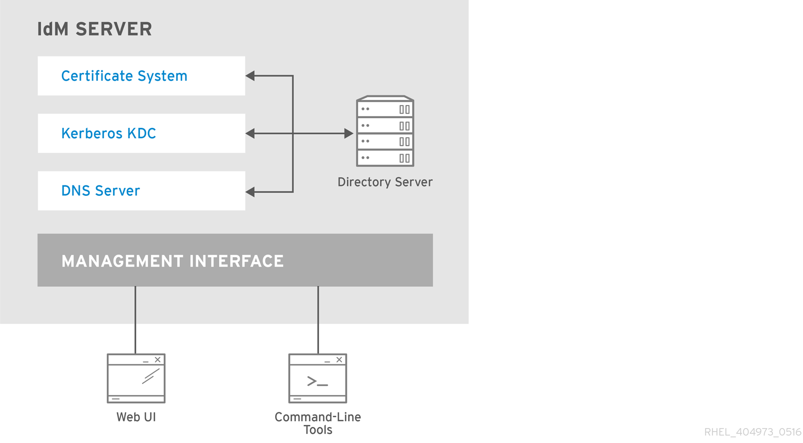
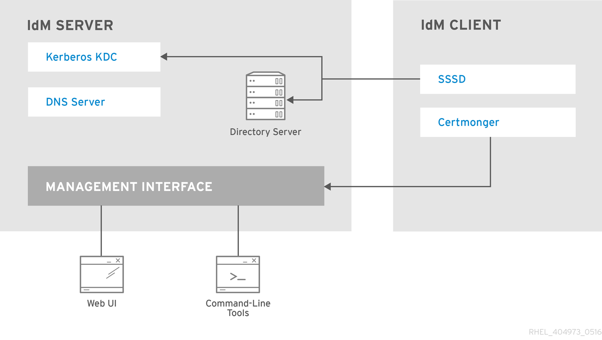
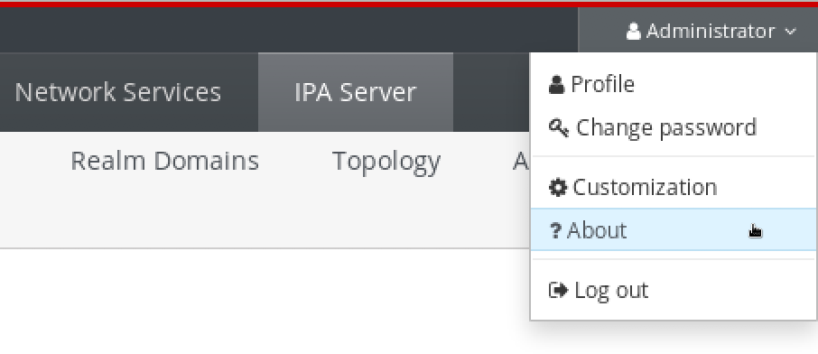
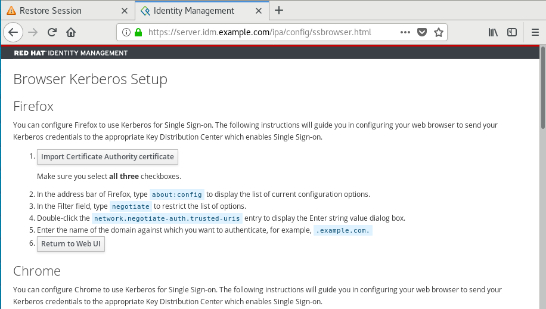
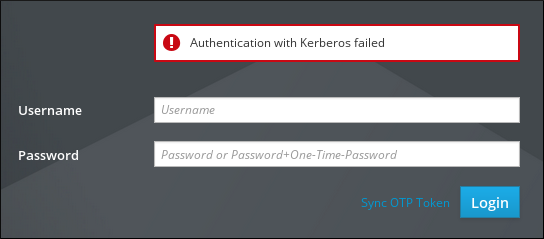
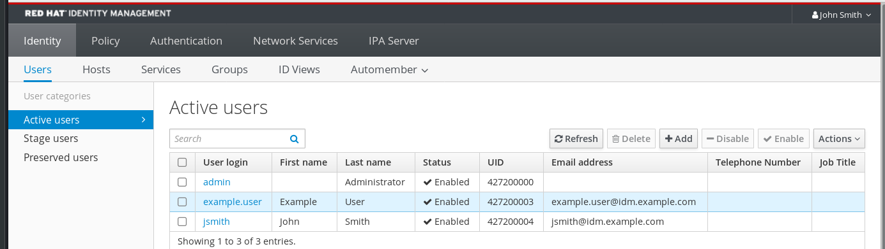
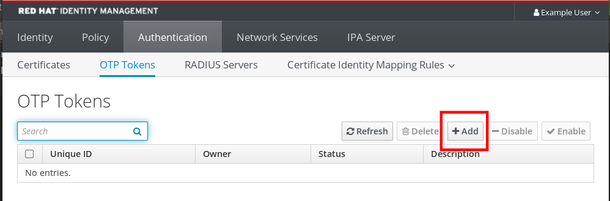
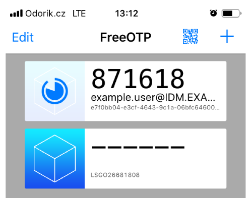
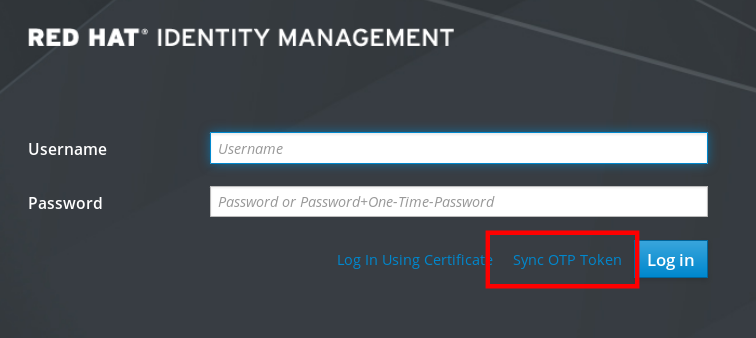

# Accessing Identity Management services

* * *

Red Hat Enterprise Linux 10

## Logging in to IdM and managing its services

Red Hat Customer Content Services

[Legal Notice](#idm139876590587776)

**Abstract**

Before you can perform administration tasks in Red Hat Identity Management (IdM), you must log in to the service. You can use Kerberos and one time passwords as authentication methods in IdM when you log in by using the command line or the IdM Web UI.

* * *

<h2 id="providing-feedback-on-red-hat-documentation">Providing feedback on Red Hat documentation</h2>

We appreciate your feedback on our documentation. Let us know how we can improve it.

**Submitting feedback through Jira (account required)**

1. Log in to the [Jira](https://issues.redhat.com/projects/RHELDOCS/issues) website.
2. Click **Create** in the top navigation bar
3. Enter a descriptive title in the **Summary** field.
4. Enter your suggestion for improvement in the **Description** field. Include links to the relevant parts of the documentation.
5. Click **Create** at the bottom of the dialogue.

<h2 id="logging-in-to-identity-management-from-the-command-line">Chapter 1. Logging in to Identity Management from the command line</h2>

Identity Management (IdM) uses the Kerberos protocol to provide single sign-on (SSO). You can use SSO to authenticate once with a username and password to gain access to all authorized IdM services without the system prompting for the credentials again.

Important

In IdM, the SSSD automatically obtains a ticket-granting ticket (TGT) for a user after the user successfully logs in to the desktop environment on an IdM client machine with the corresponding Kerberos principal name. This means that after logging in, the user is not required to use the **kinit** utility to access IdM resources.

If you have cleared your Kerberos credential cache or your Kerberos TGT has expired, you must manually request a new ticket to maintain access to IdM resources. The following sections present basic user operations when using Kerberos in IdM.

<h3 id="using-kinit-to-log-in-to-idm-manually\_login-cli-krb">1.1. Using kinit to log in to IdM manually</h3>

Authenticate to an Identity Management (IdM) environment manually by using the `kinit` utility. You can use this utility to obtain and cache a Kerberos ticket-granting ticket (TGT) if your initial ticket has expired or was destroyed.

As an IdM user, when logging onto your local machine you are also automatically logging in to IdM. This means that after logging in, you are not required to use the `kinit` utility to access IdM resources.

**Procedure**

- To authenticate as the current local user, use `kinit` without specifying a user name. For example, if you are logged in as `<example_user>` on the local system:
  
  ```
  kinit
  ```
  
  ```plaintext
  [example_user@server ~]$ kinit
  ```
  
  ```
  Password for example_user@EXAMPLE.COM:
  [example_user@server ~]$
  ```
  
  ```plaintext
  Password for example_user@EXAMPLE.COM:
  [example_user@server ~]$
  ```
  
  If the user name of the local user does not match any user entry in IdM, the authentication attempt fails:
  
  ```
  kinit
  ```
  
  ```plaintext
  [example_user@server ~]$ kinit
  ```
  
  ```
  kinit: Client 'example_user@EXAMPLE.COM' not found in Kerberos database while getting initial credentials
  ```
  
  ```plaintext
  kinit: Client 'example_user@EXAMPLE.COM' not found in Kerberos database while getting initial credentials
  ```
- To authenticate as a different IdM principal, specify the username with the `kinit` command. For example, to log in as the `admin` user:
  
  ```
  kinit admin
  ```
  
  ```plaintext
  [example_user@server ~]$ kinit admin
  ```
  
  ```
  Password for admin@EXAMPLE.COM:
  [example_user@server ~]$
  ```
  
  ```plaintext
  Password for admin@EXAMPLE.COM:
  [example_user@server ~]$
  ```
  
  Note
  
  Requesting user tickets using `kinit -kt KDB: user@EXAMPLE.COM` is disabled. For more information, see the [Why kinit -kt KDB: user@EXAMPLE.COM no longer work after CVE-2024-3183](https://access.redhat.com/solutions/7083713) solution.

**Verification**

- To verify that the login was successful, use the `klist` utility to display the cached TGT. In the following example, the cache contains a ticket for the `<example_user>` principal, which means that on this particular host, only `<example_user>` is currently allowed to access IdM services:
  
  ```
  klist
  ```
  
  ```plaintext
  $ klist
  ```
  
  ```
  Ticket cache: KEYRING:persistent:0:0
  Default principal: example_user@EXAMPLE.COM
  
  Valid starting     	Expires            	Service principal
  11/10/2019 08:35:45  	11/10/2019 18:35:45  	krbtgt/EXAMPLE.COM@EXAMPLE.COM
  ```
  
  ```plaintext
  Ticket cache: KEYRING:persistent:0:0
  Default principal: example_user@EXAMPLE.COM
  
  Valid starting     	Expires            	Service principal
  11/10/2019 08:35:45  	11/10/2019 18:35:45  	krbtgt/EXAMPLE.COM@EXAMPLE.COM
  ```

<h3 id="destroying-a-users-active-kerberos-ticket">1.2. Destroying a user’s active Kerberos ticket</h3>

You can clear the credentials cache by destroying your active Kerberos ticket. Destroying a Kerberos ticket ensures that any subsequent requests for services require a new ticket-granting ticket (TGT).

**Procedure**

- To destroy your Kerberos ticket:
  
  ```
  kdestroy
  ```
  
  ```plaintext
  [example_user@server ~]$ kdestroy
  ```

**Verification**

- To check that the Kerberos ticket has been destroyed:
  
  ```
  klist
  ```
  
  ```plaintext
  [example_user@server ~]$ klist
  ```
  
  ```
  klist: Credentials cache keyring 'persistent:0:0' not found
  ```
  
  ```plaintext
  klist: Credentials cache keyring 'persistent:0:0' not found
  ```

<h3 id="configuring-an-external-system-for-kerberos-authentication\_login-cli-krb">1.3. Configuring an external system for Kerberos authentication</h3>

Configure an external system that is not enrolled in the Identity Management (IdM) domain to support Kerberos authentication. By defining an IdM-specific Kerberos configuration file and setting the `KRB5_CONFIG` environment variable, users on external systems can authenticate against the IdM server and obtain Kerberos tickets.

Enabling Kerberos authentication on external systems is especially useful when your infrastructure includes multiple realms or overlapping domains. It is also useful if the system has not been enrolled into any IdM domain through `ipa-client-install`.

**Prerequisites**

- The `krb5-workstation` package is installed on the external system. To verify the installation, use the following CLI command:
  
  ```
  dnf list installed krb5-workstation
  ```
  
  ```plaintext
  # dnf list installed krb5-workstation
  ```
  
  ```
  Installed Packages
  krb5-workstation.x86_64    1.16.1-19.el8     @BaseOS
  ```
  
  ```plaintext
  Installed Packages
  krb5-workstation.x86_64    1.16.1-19.el8     @BaseOS
  ```

**Procedure**

1. Copy the `/etc/krb5.conf` file from the IdM server to the external system. For example:
   
   ```
   scp /etc/krb5.conf root@externalsystem.example.com:/etc/krb5_ipa.conf
   ```
   
   ```plaintext
   # scp /etc/krb5.conf root@externalsystem.example.com:/etc/krb5_ipa.conf
   ```
   
   Warning
   
   Do not overwrite the existing `krb5.conf` file on the external system.
2. On the external system, set the terminal session to use the copied IdM Kerberos configuration file:
   
   ```
   export KRB5_CONFIG=/etc/krb5_ipa.conf
   ```
   
   ```plaintext
   $ export KRB5_CONFIG=/etc/krb5_ipa.conf
   ```
   
   The `KRB5_CONFIG` variable exists only temporarily until you log out. To prevent this loss, export the variable with a different file name.
3. Copy the Kerberos configuration snippets from the `/etc/krb5.conf.d/` directory to the external system.
   
   Users on the external system can now use the `kinit` utility to authenticate against the IdM server.

<h2 id="viewing-starting-and-stopping-the-identity-management-services">Chapter 2. Viewing, starting and stopping the Identity Management services</h2>

Monitor Identity Management (IdM) services to ensure domain availability and to apply any changes you make to the system. By using the `systemctl` and `ipactl` utilities, you can verify service status, restart components after manual configuration changes, and recover from system interruptions.

<h3 id="overview-of-idm-server-and-client-services">2.1. Overview of IdM server and client services</h3>

Identify the core system services that run on Identity Management (IdM) servers and clients. Understand the relationship between IdM functions, such as authentication, directory storage, and certificate management, and their corresponding system daemons.

<h4 id="list\_of\_services\_hosted\_by\_idm\_servers">2.1.1. List of services hosted by IdM servers</h4>

Most of the following services are not strictly required to be installed on the IdM server. For example, you can install services such as a certificate authority (CA) or DNS server on an external server outside the IdM domain.

- **Kerberos**: The `krb5kdc` and `kadmin` services.

IdM uses the **Kerberos** protocol to support single sign-on. With Kerberos, users only need to present the correct username and password once and can access IdM services without the system prompting for credentials again.

Kerberos is divided into two parts:

- The `krb5kdc` service is the Kerberos Authentication service and Key Distribution Center (KDC) daemon.
- The `kadmin` service is the Kerberos database administration program.

For information about how to authenticate using Kerberos in IdM, see [Logging in to Identity Management from the command line](https://docs.redhat.com/en/documentation/red_hat_enterprise_linux/10/html/accessing_identity_management_services/logging-in-to-identity-management-from-the-command-line)

[Logging in to IdM in the Web UI: Using a Kerberos ticket](https://docs.redhat.com/en/documentation/red_hat_enterprise_linux/10/html/accessing_identity_management_services/logging-in-to-idm-in-the-web-ui-using-a-kerberos-ticket).

- **LDAP directory server**: The `dirsrv` service.

The IdM **LDAP directory server** instance stores all IdM information, such as information related to Kerberos, user accounts, host entries, services, policies, DNS, and others. The LDAP directory server instance is based on the same technology as [Red Hat Directory Server](https://docs.redhat.com/en/documentation/red_hat_directory_server). However, it is tuned to IdM-specific tasks.

- **Certificate Authority**: The `pki-tomcatd` service.

The integrated **certificate authority (CA)** is based on the same technology as [Red Hat Certificate System](https://docs.redhat.com/en/documentation/red_hat_certificate_system). `pki` is the command line for accessing Certificate System services.

You can also install the server without the integrated CA if you create and provide all required certificates independently.

For more information, see [Planning your CA services](https://docs.redhat.com/en/documentation/red_hat_enterprise_linux/10/html/planning_identity_management/planning-your-ca-services).

- **Domain Name System (DNS)**: The `named` service.

IdM uses **DNS** for dynamic service discovery. The IdM client installation utility can use information from DNS to automatically configure the client machine. After the client is enrolled in the IdM domain, it uses DNS to locate IdM servers and services within the domain. The `BIND` (Berkeley Internet Name Domain) implementation of the DNS (Domain Name System) protocols in Red Hat Enterprise Linux includes the `named` DNS server.

For information, see [Planning your DNS services and host names](https://docs.redhat.com/en/documentation/red_hat_enterprise_linux/10/html/planning_identity_management/planning-your-dns-services-and-host-names).

- **Apache HTTP Server**: The `httpd` service.

The **Apache HTTP web server** provides the IdM Web UI, and also manages communication between the Certificate Authority and other IdM services.

- **Samba / Winbind**: The `smb` and `winbind` services.

Samba implements the Server Message Block (SMB) protocol, also known as the Common Internet File System (CIFS) protocol, in Red Hat Enterprise Linux. Via the smb service, the SMB protocol enables you to access resources on a server, such as file shares and shared printers. If you have configured a Trust with an Active Directory (AD) environment, the\`Winbind\` service manages communication between IdM servers and AD servers.

- **One-time password (OTP) authentication**: The `ipa-otpd` services.

One-time passwords (OTP) are passwords that are generated by an authentication token for only one session, as part of two-factor authentication. OTP authentication is implemented in Red Hat Enterprise Linux via the `ipa-otpd` service.

For more information, see [Logging in to the Identity Management Web UI using one time passwords](https://docs.redhat.com/en/documentation/red_hat_enterprise_linux/10/html/accessing_identity_management_services/logging-in-to-the-identity-management-web-ui-using-one-time-passwords).

- **OpenDNSSEC**: The `ipa-dnskeysyncd` service.

**OpenDNSSEC** is a DNS manager that automates the process of keeping track of DNS security extensions (DNSSEC) keys and the signing of zones. The `ipa-dnskeysyncd` service manages synchronization between the IdM Directory Server and OpenDNSSEC.

 

Note

DNSSEC is only available as Technology Preview in IdM.

<h4 id="list\_of\_services\_hosted\_by\_idm\_clients">2.1.2. List of services hosted by IdM clients</h4>

- **System Security Services Daemon**: The `sssd` service.

The **System Security Services Daemon** (SSSD) is the client-side application that manages user authentication and caching credentials. Caching enables the local system to continue normal authentication operations if the IdM server becomes unavailable or if the client goes offline.

For more information, see [Understanding SSSD and its benefits](https://docs.redhat.com/en/documentation/red_hat_enterprise_linux/10/html/configuring_authentication_and_authorization_in_rhel/understanding-sssd-and-its-benefits).

- **Certmonger**: The `certmonger` service.

The `certmonger` service monitors and renews the certificates on the client. It can request new certificates for the services on the system.

For more information, see [Obtaining an IdM certificate for a service using certmonger](https://docs.redhat.com/en/documentation/red_hat_enterprise_linux/10/html/managing_certificates_in_idm/obtaining-an-idm-certificate-for-a-service-using-certmonger-assembly).

 

<h3 id="viewing-the-status-of-idm-services">2.2. Viewing the status of IdM services</h3>

Verify the operational state of Identity Management (IdM) components by using the `ipactl` utility. Monitoring these services ensures that core domain functions, such as authentication and directory lookups, are active and responding to requests.

**Procedure**

- To view the status of the IdM services that are configured on your IdM server, run the `ipactl status` command:
  
  ```
  ipactl status
  ```
  
  ```plaintext
  [root@server ~]# ipactl status
  ```
  
  ```
  Directory Service: RUNNING
  krb5kdc Service: RUNNING
  kadmin Service: RUNNING
  named Service: RUNNING
  httpd Service: RUNNING
  pki-tomcatd Service: RUNNING
  smb Service: RUNNING
  winbind Service: RUNNING
  ipa-otpd Service: RUNNING
  ipa-dnskeysyncd Service: RUNNING
  ipa: INFO: The ipactl command was successful
  ```
  
  ```plaintext
  Directory Service: RUNNING
  krb5kdc Service: RUNNING
  kadmin Service: RUNNING
  named Service: RUNNING
  httpd Service: RUNNING
  pki-tomcatd Service: RUNNING
  smb Service: RUNNING
  winbind Service: RUNNING
  ipa-otpd Service: RUNNING
  ipa-dnskeysyncd Service: RUNNING
  ipa: INFO: The ipactl command was successful
  ```
  
  The output of the `ipactl status` command on your server depends on your IdM configuration. For example, if an IdM deployment does not include a DNS server, the `named` service is not present in the list.
  
  Note
  
  You cannot use the IdM web UI to view the status of all the IdM services running on a particular IdM server. Kerberized services running on different servers can be viewed in the **Identity** → **Services** tab of the IdM web UI.

<h3 id="starting-and-stopping-the-entire-identity-management-server">2.3. Starting and stopping the entire Identity Management server</h3>

Use the `ipa` systemd service to stop, start, or restart the entire IdM server along with all the installed services. Using the `systemctl` utility to control the `ipa` systemd service ensures all services are stopped, started, or restarted in the appropriate order.

The `ipa` systemd service also upgrades the RHEL IdM configuration before starting the IdM services, and it uses the proper SELinux contexts when administrating with IdM services. You do not need to have a valid Kerberos ticket to run the `systemctl ipa` commands.

Important

- Do not directly use the `ipactl` utility to start, stop, or restart IdM services. Use the `systemctl ipa` commands instead, which call the `ipactl` utility in a predictable environment.
- You cannot use the IdM web UI to perform the `ipactl` commands.

**Procedure**

- To start the entire IdM server:
  
  ```
  systemctl start ipa
  ```
  
  ```plaintext
  # systemctl start ipa
  ```
- To stop the entire IdM server:
  
  ```
  systemctl stop ipa
  ```
  
  ```plaintext
  # systemctl stop ipa
  ```
- To restart the entire IdM server:
  
  ```
  systemctl restart ipa
  ```
  
  ```plaintext
  # systemctl restart ipa
  ```

**Verification**

- To show the status of all the IdM services, use the `ipactl` utility:
  
  ```
  ipactl status
  ```
  
  ```plaintext
  # ipactl status
  ```

<h3 id="starting-and-stopping-an-individual-identity-management-service">2.4. Starting and stopping an individual Identity Management service</h3>

Manage individual Identity Management (IdM) services when troubleshooting or applying manual configuration updates. While most administrative tasks are handled through the IdM tools, specific scenarios, such as tuning the System Security Services Daemon (SSSD), might require manual configuration. In such situations, you must stop, start, or restart an individual service to ensure the system recognizes and applies your configuration changes.

Important

To restart multiple IdM domain services, always use `systemctl restart ipa`. Because of dependencies between the services installed with the IdM server, the order in which they are started and stopped is critical. The `ipa` systemd service ensures that the services are started and stopped in the appropriate order.

**Procedure**

- To start a particular IdM service:
  
  ```
  systemctl start <name>.service
  ```
  
  ```plaintext
  # systemctl start <name>.service
  ```
- To stop a particular IdM service:
  
  ```
  systemctl stop <name>.service
  ```
  
  ```plaintext
  # systemctl stop <name>.service
  ```
  
  Important
  
  You cannot use the IdM web UI to start or stop the individual services running on IdM servers. You can only use the web UI to modify the settings of a Kerberized service by navigating to `Identity` → `Services` and selecting the service.
- To restart a particular IdM service:
  
  ```
  systemctl restart <name>.service
  ```
  
  ```plaintext
  # systemctl restart <name>.service
  ```
  
  For example, to apply the changes you have made in the `/etc/sssd/sssd.conf` file:
  
  ```
  systemctl restart sssd.service
  ```
  
  ```plaintext
  # systemctl restart sssd.service
  ```
  
  Note that for changes that affect IdM identity ranges, a complete server reboot is recommended.

**Verification**

- To view the status of a particular IdM service:
  
  ```
  systemctl status <name>.service
  ```
  
  ```plaintext
  # systemctl status <name>.service
  ```

**Additional resources**

- [Starting and stopping the entire Identity Management server](#starting-and-stopping-the-entire-identity-management-server "2.3. Starting and stopping the entire Identity Management server")

<h3 id="displaying-idm-software-version">2.5. Displaying IdM software version</h3>

Identify the version of your Identity Management (IdM) installation to ensure compatibility with client systems or to provide technical details during troubleshooting.

You can display the IdM version number with:

- The IdM WebUI
- `ipa` commands
- `rpm` commands

**Procedure**

- To view the version through the Web UI, select **About** from the user menu in the upper-right corner.
  
   
- To display the version from the command line, use the `ipa --version` command:
  
  ```
  ipa --version
  ```
  
  ```plaintext
  [root@server ~]# ipa --version
  ```
  
  ```
  VERSION: 4.8.0, API_VERSION: 2.233
  ```
  
  ```plaintext
  VERSION: 4.8.0, API_VERSION: 2.233
  ```
- To display the version when IdM services are not operating properly, use the `rpm` utility to determine the version number of the `ipa-server` package that is currently installed:
  
  ```
  rpm -q ipa-server
  ```
  
  ```plaintext
  [root@server ~]# rpm -q ipa-server
  ```
  
  ```
  ipa-server-4.8.0-11.module+el8.1.0+4247+9f3fd721.x86_64
  ```
  
  ```plaintext
  ipa-server-4.8.0-11.module+el8.1.0+4247+9f3fd721.x86_64
  ```

<h2 id="introduction-to-the-idm-command-line-utilities">Chapter 3. Introduction to the IdM command-line utilities</h2>

You can use the CLI to automate administrative tasks, such as creating users and managing certificates. Learn more about the basics of using the Identity Management (IdM) command-line utilities.

<h3 id="prerequisites">3.1. Prerequisites</h3>

- An installed and accessible Identity Management (IdM) server. For more information, see [Installing Identity Management](https://docs.redhat.com/en/documentation/red_hat_enterprise_linux/10/html/installing_identity_management/index).
- To use the IPA command-line interface, authenticate to IdM with a valid Kerberos ticket.

<h3 id="what-is-the-ipa-command-line-interface">3.2. What is the IPA command-line interface</h3>

Manage your Identity Management (IdM) environment by using the IPA command-line interface (CLI). The CLI provides a comprehensive set of subcommands to automate the management of users and hosts, security policies, and certificates.

You can use the IPA CLI to perform the following actions:

- Add, manage, or remove users, groups, hosts and other objects in the network.
- Manage certificates.
- Search the directory to find specific entries and view their details.
- Display and list objects.
- Set access rights.
- Access help to find the correct command syntax and options.

<h3 id="what-is-the-ipa-help">3.3. What is the IPA help</h3>

Access the built-in Identity Management (IdM) documentation for command syntax, usage examples, and available subcommands. The IPA command-line interface (CLI) generates available help topics from loaded IdM plugin modules.

The `ipa help` utility follows a specific structure for queries:

```
ipa help [TOPIC | COMMAND | topics | commands]
```

```plaintext
$ ipa help [TOPIC | COMMAND | topics | commands]
```

- `[]` — Brackets mean that all parameters are optional and you can write just `ipa help` and the command will be executed.
- `|` — The pipe character means **or**. Therefore, you can specify a `TOPIC`, a `COMMAND`, or `topics`, or `commands`, with the basic `ipa help` command:
  
  - `topics` — You can run the command `ipa help topics` to display a list of topics that are covered by the IPA help, such as `user`, `cert`, `server` and many others.
  - `TOPIC` — The **TOPIC** with capital letters is a variable. Therefore, you can specify a particular topic, for example, `ipa help user`.
  - `commands` — You can enter the command `ipa help commands` to display a list of commands which are covered by the IPA help, for example, `user-add`, `ca-enable`, `server-show` and many others.
  - `COMMAND` — The **COMMAND** with capital letters is a variable. Therefore, you can specify a particular command, for example, `ipa help user-add`.

When you enter the `ipa help` command without options, the system displays information about basic help usage and the most common command examples.

<h3 id="using-ipa-help-topics">3.4. Using IPA help topics</h3>

You can use the `ipa help topics` to discover available plugins and to view specific command examples for objects such as users, hosts, or certificates.

**Procedure**

1. Open a terminal and connect to the IdM server.
2. To display a list of topics covered by help, run `ipa help topics` command:
   
   ```
   ipa help topics
   ```
   
   ```plaintext
   $ ipa help topics
   ```
3. To view documentation for a specific category, run the `ipa help <topic_name>` command. Replace the `<topic_name>` placeholder with a category listed in the previous step. For example:
   
   ```
   ipa help user
   ```
   
   ```plaintext
   $ ipa help user
   ```
4. Optional: To view long help output one screen at a time, pipe the command to the `less` utility:
   
   ```
   ipa help user | less
   ```
   
   ```plaintext
   $ ipa help user | less
   ```
   
   You can then scroll down and read the whole help.
   
   The IPA CLI displays a help page for the `user` topic. After reading the overview, you can see many examples with patterns for working with topic commands.

<h3 id="using-ipa-help-commands">3.5. Using IPA help commands</h3>

You can use `ipa help commands` to list every action supported by the Identity Management (IdM) server. You can also display required arguments and optional parameters for specific commands.

**Procedure**

1. Open a terminal and connect to the IdM server.
2. To display a list of commands covered by help, run `ipa help commands`:
   
   ```
   ipa help commands
   ```
   
   ```plaintext
   $ ipa help commands
   ```
3. To view documentation for a specific command, run the `ipa help <command>` command. Replace the `<command>` placeholder with a category listed in the previous step. For example:
   
   ```
   ipa help user-add
   ```
   
   ```plaintext
   $ ipa help user-add
   ```

<h3 id="structure-of-ipa-commands">3.6. Structure of IPA commands</h3>

The IPA CLI uses a predictable structure that combines an object with a specific action. You can use this pattern to perform administrative tasks across different functional areas of IdM.

The IPA CLI distinguishes the following types of commands:

- **Built-in commands** — Built-in commands available on every IdM server.
- **Plug-in provided commands** — Extended functions provided by specific IdM modules.

For most IdM entries, the CLI follows a standard `ipa <object>-<action>` structure.

Common objects:

- Users
- Hosts
- DNS records
- Certificates
- And more.

For most of these objects, the IPA CLI includes commands to:

- Add (`add`)
- Modify (`mod`)
- Delete (`del`)
- Search (`find`)
- Display (`show`)

Commands have the following structure:

`ipa user-add`, `ipa user-mod`, `ipa user-del`, `ipa user-find`, `ipa user-show`

`ipa host-add`, `ipa host-mod`, `ipa host-del`, `ipa host-find`, `ipa host-show`

`ipa dnsrecord-add`, `ipa dnsrecord-mod`, `ipa dnsrecord-del`, `ipa dnsrecord-find`, `ipa dnrecord-show`

You can create a user with the `ipa user-add [options]`, where `[options]` are optional. If you use just the `ipa user-add` command, the script asks you for details one by one.

Note that the `[options]` `--raw` and `--structured` are mutually exclusive and should not be run together.

To change an existing object, you must to define the object, therefore the command also includes an object: `ipa user-mod <user_name>`.

<h3 id="using-an-ipa-command-to-add-a-user-account-to-idm">3.7. Using an IPA command to add a user account to IdM</h3>

Create new user entries in the Identity Management (IdM) database by using the IPA command-line interface (CLI).

**Prerequisites**

- You have administrator privileges.

**Procedure**

1. Open a terminal and connect to the IdM server.
2. To add a user interactively, run the `ipa user-add` command:
   
   ```
   ipa user-add
   ```
   
   ```plaintext
   $ ipa user-add
   ```
   
   The command prompts you to provide basic data necessary for creating a user account.
3. In the **First name:** field, enter the first name of the new user and press **Enter**.
4. In the **Last name:** field, enter the last name of the new user and press **Enter**.
5. In the **User login \[suggested user name]:** enter the user name, or just press **Enter** to accept the suggested user name.
   
   The user name must be unique for the whole IdM database. If an error occurs because that user name already exists, repeat the process with the `ipa user-add` command and use a different, unique user name.
   
   After you add the user name, the user account is added to the IdM database and the IPA command-line interface (CLI) prints the following output:
   
   ```
   ----------------------
   Added user "euser"
   ----------------------
   User login: euser
   First name: Example
   Last name: User
   Full name: Example User
   Display name: Example User
   Initials: EU
   Home directory: /home/euser
   GECOS: Example User
   Login shell: /bin/sh
   Principal name: euser@IDM.EXAMPLE.COM
   Principal alias: euser@IDM.EXAMPLE.COM
   Email address: euser@idm.example.com
   UID: 427200006
   GID: 427200006
   Password: False
   Member of groups: ipausers
   Kerberos keys available: False
   ```
   
   ```plaintext
   ----------------------
   Added user "euser"
   ----------------------
   User login: euser
   First name: Example
   Last name: User
   Full name: Example User
   Display name: Example User
   Initials: EU
   Home directory: /home/euser
   GECOS: Example User
   Login shell: /bin/sh
   Principal name: euser@IDM.EXAMPLE.COM
   Principal alias: euser@IDM.EXAMPLE.COM
   Email address: euser@idm.example.com
   UID: 427200006
   GID: 427200006
   Password: False
   Member of groups: ipausers
   Kerberos keys available: False
   ```
   
   Note
   
   By default, the account does not have a password. To add a password while creating a user account, use the `ipa user-add` command with the following syntax:
   
   ```
   ipa user-add --first=<user_name> --last=<user_surname> --password
   ```
   
   ```plaintext
   $ ipa user-add --first=<user_name> --last=<user_surname> --password
   ```
   
   The IPA CLI then prompts you to add or confirm a user name and password.
   
   If the user has been created already, you can add the password with the `ipa user-mod` command.

<h3 id="using-an-ipa-command-to-modify-a-user-account-in-idm">3.8. Using an IPA command to modify a user account in IdM</h3>

Update existing user attributes and security settings in the Identity Management (IdM) database by using the command-line interface. You can use the `ipa user-mod` command to modify parameters such as contact information, login shells, or passwords for any existing user account.

**Prerequisites**

- You have administrator privileges.

**Procedure**

1. Open a terminal and connect to the IdM server.
2. To update a user account, run the `ipa user-mod <user_login>` command and include the options for the attributes you want to change. Replace the `<user_login>` placeholder with the login name of the user:
   
   ```
   ipa user-mod <user_login> --password
   ```
   
   ```plaintext
   $ ipa user-mod <user_login> --password
   ```
3. If you used the `--password` option, provide the new password at the prompt and press **Enter**.
   
   The IPA CLI prints the following output. For example:
   
   ```
   ----------------------
   Modified user "euser"
   ----------------------
   User login: euser
   First name: Example
   Last name: User
   Home directory: /home/euser
   Principal name: euser@IDM.EXAMPLE.COM
   Principal alias: euser@IDM.EXAMPLE.COM
   Email address: euser@idm.example.com
   UID: 427200006
   GID: 427200006
   Password: True
   Member of groups: ipausers
   Kerberos keys available: True
   ```
   
   ```plaintext
   ----------------------
   Modified user "euser"
   ----------------------
   User login: euser
   First name: Example
   Last name: User
   Home directory: /home/euser
   Principal name: euser@IDM.EXAMPLE.COM
   Principal alias: euser@IDM.EXAMPLE.COM
   Email address: euser@idm.example.com
   UID: 427200006
   GID: 427200006
   Password: True
   Member of groups: ipausers
   Kerberos keys available: True
   ```
   
   The user password is now set for the account and the user can log into IdM.

<h3 id="multi-valued-attributes-in-idm">3.9. Multi-valued attributes in IdM</h3>

Understand the syntax and overwrite logic for attributes that support multiple values in Identity Management (IdM). When you manage objects with multi-valued attributes, such as permissions or group memberships, you must provide the complete list of values during updates to prevent unintended data loss.

IdM supports the following methods of supplying multi-valued lists:

- Using the same command-line argument multiple times within the same command invocation:
  
  ```
  ipa permission-add --right=read --permissions=write --permissions=delete <object_name>
  ```
  
  ```plaintext
  $ ipa permission-add --right=read --permissions=write --permissions=delete <object_name>
  ```
- Alternatively, you can enclose the list in curly braces. The shell expands these into individual arguments before execution:
  
  ```
  ipa permission-add --right={read,write,delete} <object_name>
  ```
  
  ```plaintext
  $ ipa permission-add --right={read,write,delete} <object_name>
  ```

When you update such multi-valued attributes from the command line, IdM completely overwrites the previous list of values with a new list. Therefore, when updating a multi-valued attribute, you must specify the whole new list, not just a single value you want to add.

**Examples of the overwrite logic**

The following examples illustrate how the IdM database processes modifications to multi-valued attributes. During a modification, the absence of an existing value results in its removal from the record:

- The `ipa permission-mod` command updates all previously added permissions:
  
  ```
  ipa permission-mod --right=read --right=write --right=delete <object_name>
  ```
  
  ```plaintext
  $ ipa permission-mod --right=read --right=write --right=delete <object_name>
  ```
  
  or
  
  ```
  ipa permission-mod --right={read,write,delete} <object_name>
  ```
  
  ```plaintext
  $ ipa permission-mod --right={read,write,delete} <object_name>
  ```
- The `ipa permission-mod` command deletes the `--right=delete` argument because it is not included in the command:
  
  ```
  ipa permission-mod --right=read --right=write <object_name>
  ```
  
  ```plaintext
  $ ipa permission-mod --right=read --right=write <object_name>
  ```
  
  or
  
  ```
  ipa permission-mod --right={read,write} <object_name>
  ```
  
  ```plaintext
  $ ipa permission-mod --right={read,write} <object_name>
  ```

<h3 id="special-characters-in-the-idm-cli">3.10. Special characters in the IdM CLI</h3>

Handle shell-sensitive characters correctly to ensure command-line arguments are processed as intended. You can use the backslash (`\`) escape character to prevent the shell from misinterpreting special symbols within Identity Management (IdM) commands.

For example, to escape an asterisk (\*):

```
ipa certprofile-show certificate_profile --out=exported\*profile.cfg
```

```plaintext
$ ipa certprofile-show certificate_profile --out=exported\*profile.cfg
```

Commands with unescaped special characters fail or produce unexpected results because the shell attempts to parse the characters as shell commands rather than literal text.

<h2 id="searching-identity-management-entries-from-the-command-line">Chapter 4. Searching Identity Management entries from the command line</h2>

Locate and view Identity Management (IdM) entries by using search filters and display commands.

<h3 id="overview-of-listing-idm-entries">4.1. Overview of listing IdM entries</h3>

Identify specific entries within the Identity Management (IdM) database by using search filters and keywords. You can use `the ipa *-find` commands to retrieve lists of objects and to filter results based on user membership or attribute matches.

**Useful search commands**

- To list all the `find` commands, use the `grep` utility with the `ipa help` command:
  
  ```
  ipa help commands | grep find
  ```
  
  ```plaintext
  $ ipa help commands | grep find
  ```
- To list all users in the IdM database, use the following command:
  
  ```
  ipa user-find
  ```
  
  ```plaintext
  $ ipa user-find
  ```
- To list user groups whose specified attributes contain a keyword, run:
  
  ```
  ipa group-find <keyword>
  ```
  
  ```plaintext
  $ ipa group-find <keyword>
  ```
  
  For example the `ipa group-find admin` command lists all groups whose names or descriptions include the string `admin`:
  
  ```
  ----------------
  3 groups matched
  ----------------
     Group name: admins
     Description: Account administrators group
     GID: 427200002
  
     Group name: editors
     Description: Limited admins who can edit other users
     GID: 427200002
  
     Group name: trust admins
     Description: Trusts administrators group
  ```
  
  ```plaintext
  ----------------
  3 groups matched
  ----------------
     Group name: admins
     Description: Account administrators group
     GID: 427200002
  
     Group name: editors
     Description: Limited admins who can edit other users
     GID: 427200002
  
     Group name: trust admins
     Description: Trusts administrators group
  ```
- To search for groups that contain a particular user:
  
  ```
  ipa group-find --user=<user_name>
  ```
  
  ```plaintext
  $ ipa group-find --user=<user_name>
  ```
- To search for groups that do not contain a particular user:
  
  ```
  ipa group-find --no-user=<user_name>
  ```
  
  ```plaintext
  $ ipa group-find --no-user=<user_name>
  ```

<h3 id="showing-details-for-a-particular-entry">4.2. Showing details for a particular entry</h3>

Retrieve the full technical configuration and attribute list for a specific Identity Management (IdM) entry. You can use the `ipa <object>-show` command to display detailed information for a single object, such as a host, user, or service, rather than a filtered list of multiple results.

**Procedure**

- To display details for a specific entry, run the `ipa <object>-show` command followed by the name of the entry. For example:
  
  ```
  ipa host-show server.example.com
  ```
  
  ```plaintext
  $ ipa host-show server.example.com
  ```
  
  The CLI displays the full record for the specified object:
  
  ```
  Host name: server.example.com
  Principal name: host/server.example.com@EXAMPLE.COM
  ...
  ```
  
  ```plaintext
  Host name: server.example.com
  Principal name: host/server.example.com@EXAMPLE.COM
  ...
  ```

<h3 id="adjusting-the-search-size-and-time-limit">4.3. Adjusting the search size and time limit</h3>

Some queries, such as requesting a list of IdM users, can return a very large number of entries. By tuning these search operations, you can improve the overall server performance when running the `ipa *-find` commands, such as `ipa user-find`, and when displaying corresponding lists in the Web UI.

Search size limit

Defines the maximum number of entries returned for a request sent to the server from a client’s CLI or from a browser accessing the IdM Web UI.

Default: 100 entries.

Search time limit

Defines the maximum time (in seconds) that the server waits for searches to run. Once the search reaches this limit, the server stops the search and returns the entries discovered in that time.

Default: 2 seconds.

If you set the values to `-1`, IdM does not apply any limits when searching.

Important

Setting search size or time limits too high can negatively affect server performance.

<h4 id="adjusting-the-search-size-and-time-limit-in-the-command-line">4.3.1. Adjusting the search size and time limit in the command line</h4>

You can adjust the search size and time limits globally or for a specific entry to optimize search performance and responsiveness.

**Procedure**

1. To display current search time and size limits in CLI, use the `ipa config-show` command:
   
   ```
   ipa config-show
   
   Search time limit: 2
   Search size limit: 100
   ```
   
   ```plaintext
   $ ipa config-show
   
   Search time limit: 2
   Search size limit: 100
   ```
2. To adjust the limits **globally** for all queries, use the `ipa config-mod` command and add the `--searchrecordslimit` and `--searchtimelimit` options. For example:
   
   ```
   ipa config-mod --searchrecordslimit=500 --searchtimelimit=5
   ```
   
   ```plaintext
   $ ipa config-mod --searchrecordslimit=500 --searchtimelimit=5
   ```
3. To **temporarily** adjust the limits only for a specific query, add the `--sizelimit` or `--timelimit` options to the command. For example:
   
   ```
   ipa user-find --sizelimit=200 --timelimit=120
   ```
   
   ```plaintext
   $ ipa user-find --sizelimit=200 --timelimit=120
   ```

<h4 id="adjusting-the-search-size-and-time-limit-in-the-web-ui">4.3.2. Adjusting the search size and time limit in the Web UI</h4>

You can adjust global search size and time limits using the IdM Web UI to optimize search performance and responsiveness.

**Procedure**

1. Log in to the IdM Web UI.
2. Click **IPA Server**.
3. On the **IPA Server** tab, click **Configuration**.
4. Set the required values in the **Search Options** area.
   
   Default values are:
   
   - Search size limit: 100 entries
   - Search time limit: 2 seconds
5. Click **Save** at the top of the page.

<h2 id="accessing-the-idm-web-ui-in-a-web-browser">Chapter 5. Accessing the IdM Web UI in a web browser</h2>

Manage Identity Management (IdM) through a graphical interface by accessing the IdM Web UI. You can use a supported web browser to perform administrative tasks, configure user accounts, and manage security settings as an alternative to the command-line interface.

You can access the IdM Web UI as:

IdM users

A limited set of operations depending on permissions granted to the user in the IdM server. Basically, active IdM users can log in to the IdM server and configure their own account. They cannot change settings of other users or the IdM server settings.

Administrators

Full access rights to the IdM server.

Active Directory users

A set of operations depending on permissions granted to the user. Active Directory users can now be administrators for Identity Management. For details, see [Enabling AD users to administer IdM](https://docs.redhat.com/en/documentation/red_hat_enterprise_linux/10/html/managing_idm_users_groups_hosts_and_access_control_rules/enabling-ad-users-to-administer-idm).

<h3 id="prerequisites\_2">5.1. Prerequisites</h3>

- A supported web browser (Mozilla Firefox 38 and later or Google Chrome 46 and later).
- The DNS name or IP address of the IdM server.

<h3 id="configuring-web-browsers-for-smart-card-authentication">5.2. Configuring web browsers for smart card authentication</h3>

Enable Post-Handshake Authentication (PHA) so you can use the smart card access to the Identity Management (IdM) Web UI. Modern browsers often use security protocols that conflict with client-certificate authentication. By adjusting these settings, you ensure that the browser can correctly present smart card credentials to the IdM server.

**Procedure**

1. If you experience problems accessing the IdM Web UI with a smart card, check the logs to see if your browser attempts to use TLS v1.3. The output might look similar to the following:
   
   ```
   [ssl:error] [pid 125757:tid 140436077168384] [client 999.999.999.999:99999] AH: verify client post handshake
   [ssl:error] [pid 125757:tid 140436077168384] [client 999.999.999.999:99999] AH10158: cannot perform post-handshake authentication
   [ssl:error] [pid 125757:tid 140436077168384] SSL Library Error: error:14268117:SSL routines:SSL_verify_client_post_handshake:extension not received
   ```
   
   ```plaintext
   [ssl:error] [pid 125757:tid 140436077168384] [client 999.999.999.999:99999] AH: verify client post handshake
   [ssl:error] [pid 125757:tid 140436077168384] [client 999.999.999.999:99999] AH10158: cannot perform post-handshake authentication
   [ssl:error] [pid 125757:tid 140436077168384] SSL Library Error: error:14268117:SSL routines:SSL_verify_client_post_handshake:extension not received
   ```
2. Configure your specific browser to resolve the conflict:
   
   - For Mozilla Firefox 68 and later, enable TLS PHA:
     
     1. Enter `about:config` in the address bar to access the Mozilla Firefox preferences menu.
     2. Enter `security.tls.enable_post_handshake_auth` in the search bar.
     3. Click the toggle button to set the parameter to true.
   - For Chrome, which currently does not support PHA, disable TLS v1.3:
     
     1. Open the `/etc/httpd/conf.d/ssl.conf` configuration file.
     2. Add `-TLSv1.3` to the `SSLProtocol` option:
        
        ```
        SSLProtocol all -TLSv1 -TLSv1.1 -TLSv1.3
        ```
        
        ```plaintext
        SSLProtocol all -TLSv1 -TLSv1.1 -TLSv1.3
        ```
3. Restart the `httpd` service:
   
   ```
   service httpd restart
   ```
   
   ```plaintext
   service httpd restart
   ```
   
   Note that IdM manages the `ssl.conf` file and might overwrite its contents during package updates. Verify custom settings after updating IdM packages.

<h3 id="accessing-the-web-ui">5.3. Accessing the Web UI</h3>

Log in to the Identity Management (IdM) Web UI for the first time to begin administrative configuration.

After the first login you can configure your IdM server to authenticate with:

- Kerberos ticket
  
  For details, see [Kerberos authentication in Identity Management](#kerberos-authentication-in-identity-management "6.1. Kerberos authentication in Identity Management").
- Smart card
  
  For details, see [Configuring the IdM server for smart card authentication](https://docs.redhat.com/en/documentation/red_hat_enterprise_linux/10/html/managing_smart_card_authentication/configuring-identity-management-for-smart-card-authentication#configuring-the-idm-server-for-smart-card-authentication).
- One time password (OTP) — this can be combined with password and Kerberos authentication.
  
  For details, see [One time password (OTP) authentication in Identity Management](#one-time-password-otp-authentication-in-identity-management "7.2. One time password (OTP) authentication in Identity Management").

**Procedure**

1. Type an IdM server URL into the browser address bar. The name will look similarly to the following example:
   
   ```
   https://server.example.com
   ```
   
   ```plaintext
   https://server.example.com
   ```
   
   You just need to change `server.example.com` with a DNS name of your IdM server.
   
   This opens the IdM Web UI login screen in your browser.
   
   
   
   - If the server does not respond or the login screen does not open, check the DNS settings on the IdM server to which you are connecting.
   - If you use a self-signed certificate, the browser issues a warning. Check the certificate and accept the security exception to proceed with the login.
     
     To avoid security exceptions, install a certificate signed by a certificate authority.
2. On the Web UI login screen, enter the administrator account credentials you added during the IdM server installation.
   
   For details, see [Installing an Identity Management server: With integrated DNS, with an integrated CA](https://docs.redhat.com/en/documentation/red_hat_enterprise_linux/10/html/installing_identity_management/installing-an-idm-server-with-integrated-dns-with-an-integrated-ca-as-the-root-ca).
   
   You can enter your personal account credentials as well if they are already entered in the IdM server.
   
   
3. Click Log in.
   
   After the successful login, you can start configuring the IdM server.

<h2 id="logging-in-to-idm-in-the-web-ui-using-a-kerberos-ticket">Chapter 6. Logging in to IdM in the Web UI: Using a Kerberos ticket</h2>

Authenticate to the Identity Management (IdM) Web UI automatically with a valid Kerberos ticket from a local system. You can use the single sign-on (SSO) method to access the graphical interface without entering a password in the browser.

<h3 id="kerberos-authentication-in-identity-management">6.1. Kerberos authentication in Identity Management</h3>

Identity Management (IdM) uses the Kerberos protocol to support single sign-on (SSO). You can use SSO to provide a username and password only once to obtain a ticket.

The IdM server provides Kerberos authentication immediately after the installation if the DNS and certificate settings have been configured properly. For details, see [Installing Identity Management](https://docs.redhat.com/en/documentation/red_hat_enterprise_linux/10/html/installing_identity_management/index).

To use Kerberos authentication on hosts, install:

- The IdM client:
  
  For details, see [Preparing the system for IdM client installation](https://docs.redhat.com/en/documentation/red_hat_enterprise_linux/10/html/installing_identity_management/preparing-the-system-for-idm-client-installation).
- The `krb5conf` package.

<h3 id="using-kinit-to-log-in-to-idm-manually\_login-web-ui-krb">6.2. Using kinit to log in to IdM manually</h3>

Authenticate to an Identity Management (IdM) environment manually by using the `kinit` utility. You can use this utility to obtain and cache a Kerberos ticket-granting ticket (TGT) if your initial ticket has expired or was destroyed.

As an IdM user, when logging onto your local machine you are also automatically logging in to IdM. This means that after logging in, you are not required to use the `kinit` utility to access IdM resources.

**Procedure**

- To authenticate as the current local user, use `kinit` without specifying a user name. For example, if you are logged in as `<example_user>` on the local system:
  
  ```
  kinit
  ```
  
  ```plaintext
  [example_user@server ~]$ kinit
  ```
  
  ```
  Password for example_user@EXAMPLE.COM:
  [example_user@server ~]$
  ```
  
  ```plaintext
  Password for example_user@EXAMPLE.COM:
  [example_user@server ~]$
  ```
  
  If the user name of the local user does not match any user entry in IdM, the authentication attempt fails:
  
  ```
  kinit
  ```
  
  ```plaintext
  [example_user@server ~]$ kinit
  ```
  
  ```
  kinit: Client 'example_user@EXAMPLE.COM' not found in Kerberos database while getting initial credentials
  ```
  
  ```plaintext
  kinit: Client 'example_user@EXAMPLE.COM' not found in Kerberos database while getting initial credentials
  ```
- To authenticate as a different IdM principal, specify the username with the `kinit` command. For example, to log in as the `admin` user:
  
  ```
  kinit admin
  ```
  
  ```plaintext
  [example_user@server ~]$ kinit admin
  ```
  
  ```
  Password for admin@EXAMPLE.COM:
  [example_user@server ~]$
  ```
  
  ```plaintext
  Password for admin@EXAMPLE.COM:
  [example_user@server ~]$
  ```
  
  Note
  
  Requesting user tickets using `kinit -kt KDB: user@EXAMPLE.COM` is disabled. For more information, see the [Why kinit -kt KDB: user@EXAMPLE.COM no longer work after CVE-2024-3183](https://access.redhat.com/solutions/7083713) solution.

**Verification**

- To verify that the login was successful, use the `klist` utility to display the cached TGT. In the following example, the cache contains a ticket for the `<example_user>` principal, which means that on this particular host, only `<example_user>` is currently allowed to access IdM services:
  
  ```
  klist
  ```
  
  ```plaintext
  $ klist
  ```
  
  ```
  Ticket cache: KEYRING:persistent:0:0
  Default principal: example_user@EXAMPLE.COM
  
  Valid starting     	Expires            	Service principal
  11/10/2019 08:35:45  	11/10/2019 18:35:45  	krbtgt/EXAMPLE.COM@EXAMPLE.COM
  ```
  
  ```plaintext
  Ticket cache: KEYRING:persistent:0:0
  Default principal: example_user@EXAMPLE.COM
  
  Valid starting     	Expires            	Service principal
  11/10/2019 08:35:45  	11/10/2019 18:35:45  	krbtgt/EXAMPLE.COM@EXAMPLE.COM
  ```

<h3 id="configuring-the-browser-for-kerberos-authentication">6.3. Configuring the browser for Kerberos authentication</h3>

Prepare your web browser for Kerberos authentication to the Identity Management (IdM) server. You can use this configuration to pass your local Kerberos ticket to the Web UI for automatic, single sign-on (SSO) access. Proper browser settings ensure that the system recognizes the IdM domain as a trusted source for credential exchange.

Each browser supports Kerberos in a different way and needs a different configuration. The IdM Web UI includes guidelines for the following browsers:

- Firefox
- Chrome

**Procedure**

1. Open the IdM Web UI login dialog in your web browser.
2. Click the link for the browser configuration on the Web UI login screen.
   
   
3. Follow the steps on the configuration page.
   
   
   
   After the setup, go back to the IdM Web UI and click **Log in**.

<h3 id="logging-in-to-the-web-ui-using-a-kerberos-ticket">6.4. Logging in to the web UI using a Kerberos ticket</h3>

Access the Identity Management (IdM) Web UI automatically by using a Kerberos ticket-granting ticket (TGT). The TGT remains valid for a predefined interval, which defaults to 24 hours. You can modify this duration in the IdM Web UI configuration settings.

After the time interval expires, you need to renew the ticket:

- Using the `kinit` command.
- Using IdM login credentials in the Web UI login dialog.

**Procedure**

- Open the IdM Web UI.
  
  If Kerberos authentication works correctly and you have a valid ticket, you can automatically authenticate and the Web UI opens.
  
  If the ticket is expired, you must authenticate yourself with credentials first. However, next time the IdM Web UI will open automatically without opening the login dialog.
  
  If you see an error message `Authentication with Kerberos failed`, verify that your browser is configured for Kerberos authentication. See [Configuring the browser for Kerberos authentication](#configuring-the-browser-for-kerberos-authentication "6.3. Configuring the browser for Kerberos authentication").
  
   

<h3 id="configuring-an-external-system-for-kerberos-authentication\_login-web-ui-krb">6.5. Configuring an external system for Kerberos authentication</h3>

Configure an external system that is not enrolled in the Identity Management (IdM) domain to support Kerberos authentication. By defining an IdM-specific Kerberos configuration file and setting the `KRB5_CONFIG` environment variable, users on external systems can authenticate against the IdM server and obtain Kerberos tickets.

Enabling Kerberos authentication on external systems is especially useful when your infrastructure includes multiple realms or overlapping domains. It is also useful if the system has not been enrolled into any IdM domain through `ipa-client-install`.

**Prerequisites**

- The `krb5-workstation` package is installed on the external system. To verify the installation, use the following CLI command:
  
  ```
  dnf list installed krb5-workstation
  ```
  
  ```plaintext
  # dnf list installed krb5-workstation
  ```
  
  ```
  Installed Packages
  krb5-workstation.x86_64    1.16.1-19.el8     @BaseOS
  ```
  
  ```plaintext
  Installed Packages
  krb5-workstation.x86_64    1.16.1-19.el8     @BaseOS
  ```

**Procedure**

1. Copy the `/etc/krb5.conf` file from the IdM server to the external system. For example:
   
   ```
   scp /etc/krb5.conf root@externalsystem.example.com:/etc/krb5_ipa.conf
   ```
   
   ```plaintext
   # scp /etc/krb5.conf root@externalsystem.example.com:/etc/krb5_ipa.conf
   ```
   
   Warning
   
   Do not overwrite the existing `krb5.conf` file on the external system.
2. On the external system, set the terminal session to use the copied IdM Kerberos configuration file:
   
   ```
   export KRB5_CONFIG=/etc/krb5_ipa.conf
   ```
   
   ```plaintext
   $ export KRB5_CONFIG=/etc/krb5_ipa.conf
   ```
   
   The `KRB5_CONFIG` variable exists only temporarily until you log out. To prevent this loss, export the variable with a different file name.
3. Copy the Kerberos configuration snippets from the `/etc/krb5.conf.d/` directory to the external system.
4. Configure the browser on the external system, as described in [Configuring the browser for Kerberos authentication](#configuring-the-browser-for-kerberos-authentication "6.3. Configuring the browser for Kerberos authentication").
   
   Users on the external system can now use the `kinit` utility to authenticate against the IdM server.

<h3 id="enabling-web-ui-login-for-active-directory-users">6.6. Enabling Web UI login for Active Directory users</h3>

Configure the Identity Management (IdM) Web UI to verify Active Directory (AD) user credentials through a cross-forest trust to maintain a single source of identity.

To enable Web UI login for Active Directory users, define an ID override for each Active Directory user in the **Default Trust View**.

**Procedure**

- To define an ID override for `ad_user@ad.example.com`:
  
  ```
  ipa idoverrideuser-add 'Default Trust View' ad_user@ad.example.com
  ```
  
  ```plaintext
  [admin@server ~]$ ipa idoverrideuser-add 'Default Trust View' ad_user@ad.example.com
  ```

**Additional resources**

- [Using ID views for Active Directory users](https://docs.redhat.com/en/documentation/red_hat_enterprise_linux/10/html/managing_idm_users_groups_hosts_and_access_control_rules/using-id-views-for-active-directory-users)

<h2 id="logging-in-to-the-identity-management-web-ui-using-one-time-passwords">Chapter 7. Logging in to the Identity Management Web UI using one time passwords</h2>

Authenticate to the Identity Management (IdM) Web UI by using a one-time password (OTP) to provide an additional layer of security. You can use this multi-factor authentication method by combining a standard password with a unique code generated by a hardware or software token.

<h3 id="prerequisites\_3">7.1. Prerequisites</h3>

- [Accessing the IdM Web UI in a web browser](#accessing-the-idm-web-ui-in-a-web-browser "Chapter 5. Accessing the IdM Web UI in a web browser")

<h3 id="one-time-password-otp-authentication-in-identity-management">7.2. One time password (OTP) authentication in Identity Management</h3>

Identity Management (IdM) provides multi-factor authentication by combining standard passwords with automatically generated one-time password (OTP). You can use the OTP method to protect user accounts and LDAP clients with an additional security layer.

To generate one time passwords, you can use a hardware or software token. IdM supports both software and hardware tokens.

Identity Management supports the following standard OTP mechanisms:

- The HMAC-Based One-Time Password (HOTP) algorithm is based on a counter. HMAC stands for Hashed Message Authentication Code.
- The Time-Based One-Time Password (TOTP) algorithm is an extension of HOTP to support time-based moving factor.

Important

IdM does not support OTP logins for Active Directory trust users.

Warning

The following security and other limitations currently relate to the OTP support in IdM:

- The most important security limitation is the potential vulnerability to replay attacks across the system. Replication is asynchronous, and an OTP code can therefore be reused during the replication period. A user might be able to log on to two servers at the same time. However, this vulnerability is usually difficult to exploit due to comprehensive encryption.
- It is not possible to obtain a ticket-granting ticket (TGT) using a client that does not support OTP authentication. This might affect certain use cases, such as authentication using the `mod_auth_kerb` module or the Generic Security Services API (GSSAPI).

<h4 id="available\_otp\_authentication\_methods">7.2.1. Available OTP authentication methods</h4>

When enabling OTP authentication, you can choose from the following authentication methods:

Two-factor authentication (password + OTP)

With this method, the user is always required to enter both a standard password and an OTP code.

Password

With this method, the user still has the option to authenticate using a standard password only.

RADIUS proxy server authentication

For information on configuring a RADIUS server for OTP validation in IdM, see [Configuring a RADIUS server for OTP validation in IdM](https://docs.redhat.com/en/documentation/red_hat_enterprise_linux/10/html-single/accessing_identity_management_services/index#configuring-a-radius-server-for-otp-validation-in-idm)

Global and user-specific authentication methods

You can configure these authentication methods either globally or for individual users:

- By default, user-specific authentication method settings take precedence over global settings. If no authentication method is set for a user, the globally-defined methods apply.
- You can disable per-user authentication method settings for any user. This ensures IdM ignores the per-user settings and always applies the global settings for the user.

Combining multiple authentication methods

If you configure multiple authentication methods, any one of them will be sufficient to successfully authenticate the user. For example:

- If you configure both two-factor and password authentication, the user must provide the password (first factor), but providing the OTP (second factor) is optional when using the command line:
  
  ```
  First Factor:
  Second Factor (optional):
  ```
  
  ```plaintext
  First Factor:
  Second Factor (optional):
  ```
- In the web UI, the user must still provide both factors.

However, a minor exception exists when RADIUS and another authentication method are configured:

- Kerberos always uses RADIUS, but LDAP does not. LDAP only recognizes the password and two-factor authentication methods.
- If you use an external two-factor authentication provider, use Kerberos from your applications. If you want to let users authenticate with a password only, use LDAP. It is recommended that the applications use Apache modules and SSSD, which allows configuring either Kerberos or LDAP.

<h4 id="gnome\_keyring\_service\_support">7.2.2. GNOME Keyring service support</h4>

IdM integrates OTP authentication with the GNOME Keyring service. Note that GNOME Keyring integration requires the user to enter the first and second factors separately:

```
First factor: static_password
Second factor: one-time_password
```

```plaintext
First factor: static_password
Second factor: one-time_password
```

<h4 id="offline\_authentication\_with\_otp">7.2.3. Offline authentication with OTP</h4>

IdM supports offline OTP authentication. However, to be able to log in offline, the user must first authenticate when the system is online by entering the static password and OTP separately:

```
First factor: static_password
Second factor: one-time_password
```

```plaintext
First factor: static_password
Second factor: one-time_password
```

If the user enters both passwords separately like this when logging in online, the user can subsequently authenticate even if the central authentication server is unavailable. Note that IdM only prompts for the first-factor traditional static password when the user authenticates offline.

IdM also supports entering both the static password and OTP together in one string in the `First factor` prompt. However, this method is not compatible with offline OTP authentication. If the user enters both factors in a single prompt, IdM must contact the central authentication server to validate the credentials, which requires the system to be online.

Important

If you use OTP authentication on devices that also operate offline, such as laptops, Red Hat recommends to enter the static password and OTP separately to make sure offline authentication is available. Otherwise, IdM does not allow you to log in after the system goes offline.

If you want to benefit from OTP offline authentication, apart from entering the static and OTP passwords separately, also make sure to meet the following conditions:

- The `cache_credentials` option in the `/etc/sssd/sssd.conf` file is set to `True`, which enables caching the first factor password.
- The first-factor static password meets the password length requirement defined in the `cache_credentials_minimal_first_factor_length` option set in `/etc/sssd/sssd.conf`. The default minimal length is 8 characters. For more information about the option, see the `sssd.conf(5)` man page.

Note

Even if the `krb5_store_password_if_offline` option is set to true in the `/etc/sssd/sssd.conf` file, SSSD does not attempt to refresh the Kerberos ticket-granting ticket (TGT) when the system returns to an online state. This is because the one-time password (OTP) may already be invalid at that point. To obtain a new TGT in this situation, the user must re-authenticate using both factors.

<h3 id="enabling-the-one-time-password-in-the-web-ui">7.3. Enabling the one-time password in the Web UI</h3>

Identity Management (IdM) administrators can enable two-factor authentication (2FA) for IdM users either globally or individually. The user enters the one-time password (OTP) after their regular password on the command line or in the dedicated field in the Web UI login dialog, with no space between these passwords.

Enabling 2FA is not the same as enforcing it. If you use logins based on LDAP-binds, IdM users can still authenticate by entering a password only. However, if you use `krb5`-based logins, the 2FA is enforced.

Note that there is an option to enforce 2FA for LDAP-binds by enforcing OTP usage for all LDAP clients. For more information, see [Enforcing OTP usage for all LDAP clients](#enforcing-otp-usage-for-all-ldap-clients "7.10. Enforcing OTP usage for all LDAP clients").

**Prerequisites**

- Administrator privileges

**Procedure**

1. Log in to the IdM Web UI with IdM `admin` privileges.
2. Open the **Identity → Users → Active users** tab.
   
   
3. Select **example.user** to open the user settings.
4. In the **User authentication types**, select **Two factor authentication (password + OTP)**.
5. Click **Save**.
   
   At this point, the OTP authentication is enabled for the IdM user.
   
   Now you or **example.user** must assign a new token ID to the **example.user** account.

<h3 id="configuring-a-radius-server-for-otp-validation-in-idm">7.4. Configuring a RADIUS server for OTP validation in IdM</h3>

Configure a RADIUS proxy in Identity Management (IdM) to offload one-time password (OTP) validation to an external third-party server. You can use this configuration to migrate large deployments from proprietary OTP solutions to IdM-native authentication for specific users.

While each proxy references a single RADIUS server, you can combine this setup with a virtual IP solution to address multiple servers for high availability. Assigning a RADIUS proxy set to a user ensures that IdM prioritizes the external provider and bypasses other authentication mechanisms. Such a solution must be built outside of RHEL IdM with the help of the `keepalived` daemon, for example. The administrator then assigns one of these proxy sets to a user. As long as the user has a RADIUS proxy set assigned, IdM bypasses all other authentication mechanisms.

Note

IdM does not provide any token management or synchronization support for tokens in the third-party system.

**Prerequisites**

- The radius user authentication method is enabled. See [Enabling the one-time password in the Web UI](https://docs.redhat.com/en/documentation/red_hat_enterprise_linux/10/html-single/accessing_identity_management_services/index#enabling-the-one-time-password-in-the-web-ui_logging-in-to-ipa-in-the-web-ui-using-a-password) for details.

**Procedure**

1. Add a RADIUS proxy:
   
   ```
   ipa radiusproxy-add proxy_name --secret secret
   ```
   
   ```plaintext
   $ ipa radiusproxy-add proxy_name --secret secret
   ```
   
   The command prompts you for inserting the required information.
   
   The configuration of the RADIUS proxy requires the use of a common secret between the client and the server to wrap credentials. Specify this secret in the `--secret` parameter.
2. Assign a user to the added proxy:
   
   ```
   ipa user-mod radiususer --radius=proxy_name
   ```
   
   ```plaintext
   $ ipa user-mod radiususer --radius=proxy_name
   ```
3. If required, configure the user name to be sent to RADIUS:
   
   ```
   ipa user-mod radiususer --radius-username=radius_user
   ```
   
   ```plaintext
   $ ipa user-mod radiususer --radius-username=radius_user
   ```
   
   As a result, the RADIUS proxy server starts to process the user OTP authentication.
   
   When the user is ready to be migrated to the IdM native OTP system, you can simply remove the RADIUS proxy assignment for the user.
   
   Note
   
   In certain situations, such as running a RADIUS proxy in a slow network, the Identity Management (IdM) Kerberos Distribution Center (KDC) closes the connection before the RADIUS server responds because the connection timed out while waiting for the user to enter the token. You can change the timeout settings of the KDC.
4. Change the value of the `timeout` parameter in the `[otp]` section in the `/var/kerberos/krb5kdc/kdc.conf` file. For example, to set the timeout to `120` seconds:
   
   ```
   [otp]
   DEFAULT = {
     timeout = 120
     ...
   }
   ```
   
   ```plaintext
   [otp]
   DEFAULT = {
     timeout = 120
     ...
   }
   ```
5. Restart the `krb5kdc` service:
   
   ```
   systemctl restart krb5kdc
   ```
   
   ```plaintext
   # systemctl restart krb5kdc
   ```

**Additional resources**

- [How to configure FreeRADIUS authentication in FIPS mode (Red Hat Knowledgebase)](https://access.redhat.com/solutions/4650511)

<h3 id="adding-otp-tokens-in-the-web-ui">7.5. Adding OTP tokens in the Web UI</h3>

Create and manage software or hardware tokens in the Identity Management (IdM) Web UI to provide one-time passwords (OTP). You can use this configuration to generate unique authentication codes that synchronize with a mobile app or a physical device.

**Prerequisites**

- Active user account on the IdM server.
- Administrator has enabled OTP for the particular user account in the IdM Web UI.
- A software device generating OTP tokens, for example FreeOTP.

**Procedure**

1. Log in to the IdM Web UI with your user name and password.
2. To create the token in your mobile phone, open the **Authentication → OTP Tokens** tab.
3. Click **Add**.
   
   
4. In the **Add OTP token** dialog box, leave everything unfilled and click **Add**.
   
   At this stage, the IdM server creates a token with default parameters at the server and opens a page with a QR code.
5. Copy the QR code into your mobile phone.
6. Click **OK** to close the QR code.
   
   Now you can generate one time passwords and log in with them to the IdM Web UI.
   
   

<h3 id="logging-into-the-web-ui-with-a-one-time-password">7.6. Logging into the Web UI with a one time password</h3>

Authenticate to the Identity Management (IdM) Web UI by using a combination of your standard password and a one-time password (OTP).

**Prerequisites**

- OTP configuration enabled on the Identity Management server for the user account you are using for the OTP authentication. Administrators as well as users themselves can enable OTP.
  
  To enable the OTP configuration, see [Enabling the one time password in the Web UI](#enabling-the-one-time-password-in-the-web-ui "7.3. Enabling the one-time password in the Web UI").
- A hardware or software device generating OTP tokens configured.

**Procedure**

1. In the Identity Management login screen, enter your user name or a user name of the IdM server administrator account.
2. Add the password for the user name entered above.
3. Generate a one time password on your device.
4. Enter the one time password right after the password without a space.
5. Click **Log in**.
   
   If the authentication fails, synchronize OTP tokens.
   
   If your CA uses a self-signed certificate, the browser issues a warning. Check the certificate and accept the security exception to proceed with the login.
   
   If the IdM Web UI does not open, verify the DNS configuration of your Identity Management server.
   
   After a successful login, the IdM Web UI opens.

<h3 id="synchronizing-otp-tokens-using-the-web-ui">7.7. Synchronizing OTP tokens using the Web UI</h3>

Synchronize your one-time password (OTP) token in the Identity Management (IdM) Web UI. If the login with OTP (One Time Password) fails, OTP tokens are not synchronized correctly.

**Prerequisites**

- A device generating OTP tokens.

**Procedure**

1. On the IdM Web UI login screen, click **Sync OTP Token**.
   
   
2. In the login screen, enter your username and the Identity Management password.
3. Generate one time password and enter it in the **First OTP** field.
4. Generate another one time password and enter it in the **Second OTP** field.
5. Optional: Enter the token ID.
   
   
6. Click **Sync OTP Token**.
7. After a successful synchronization, you can log in to the IdM server.

<h3 id="changing-expired-passwords">7.8. Changing expired passwords</h3>

Update your expired Identity Management (IdM) password to regain access to the Web UI and other services. You can use the password reset prompt to provide your current credentials and establish a new, secure password. Immediate updates ensure that your account remains active and compliant with the IdM security policy.

Administrators of Identity Management (IdM) can enforce changing your password at the next login. In this case you must follow the instructions on your terminal to create a new password.

**Prerequisites**

- Active account on the IdM server.

**Procedure**

1. In the password expiration login screen, enter the user name.
2. Add the password for the user name entered above.
3. In the OTP field, generate a one time password, if you use one time password authentication.
4. Enter the new password twice for verification.
5. Click **Reset Password**.
   
   
   
   After a successful password change, the usual login dialog displays. Log in with the new password.

<h3 id="retrieving-an-idm-ticket-granting-ticket-as-an-otp-or-radius-user">7.9. Retrieving an IdM ticket-granting ticket as an OTP or RADIUS user</h3>

To retrieve a Kerberos ticket-granting ticket (TGT) as an OTP user, request an anonymous Kerberos ticket and enable Flexible Authentication via Secure Tunneling (FAST) channel to provide a secure connection between the Kerberos client and Kerberos Distribution Center (KDC).

**Prerequisites**

- You have enabled OTP for the required user account.

**Procedure**

1. Initialize the credentials cache by running the following command:
   
   ```
   kinit -n @IDM.EXAMPLE.COM -c FILE:armor.ccache
   ```
   
   ```plaintext
   [root@client ~]# kinit -n @IDM.EXAMPLE.COM -c FILE:armor.ccache
   ```
   
   Note that this command creates the `armor.ccache` file that you need to point to whenever you request a new Kerberos ticket.
2. Request a Kerberos ticket by running the command:
   
   ```
   kinit -T FILE:armor.ccache <username>@IDM.EXAMPLE.COM
   ```
   
   ```plaintext
   [root@client ~]# kinit -T FILE:armor.ccache <username>@IDM.EXAMPLE.COM
   ```
   
   ```
   Enter your OTP Token Value.
   ```
   
   ```plaintext
   Enter your OTP Token Value.
   ```

**Verification**

- Display your Kerberos ticket information:
  
  ```
  klist -C
  ```
  
  ```plaintext
  [root@client ~]# klist -C
  ```
  
  ```
  Ticket cache: KCM:0:58420
  Default principal: <username>@IDM.EXAMPLE.COM
  
  Valid starting     Expires            Service principal
  05/09/22 07:48:23  05/10/22 07:03:07  krbtgt/IDM.EXAMPLE.COM@IDM.EXAMPLE.COM
  config: fast_avail(krbtgt/IDM.EXAMPLE.COM@IDM.EXAMPLE.COM) = yes
  08/17/2022 20:22:45  08/18/2022 20:22:43  krbtgt/IDM.EXAMPLE.COM@IDM.EXAMPLE.COM
  config: pa_type(krbtgt/IDM.EXAMPLE.COM@IDM.EXAMPLE.COM) = 141
  ```
  
  ```plaintext
  Ticket cache: KCM:0:58420
  Default principal: <username>@IDM.EXAMPLE.COM
  
  Valid starting     Expires            Service principal
  05/09/22 07:48:23  05/10/22 07:03:07  krbtgt/IDM.EXAMPLE.COM@IDM.EXAMPLE.COM
  config: fast_avail(krbtgt/IDM.EXAMPLE.COM@IDM.EXAMPLE.COM) = yes
  08/17/2022 20:22:45  08/18/2022 20:22:43  krbtgt/IDM.EXAMPLE.COM@IDM.EXAMPLE.COM
  config: pa_type(krbtgt/IDM.EXAMPLE.COM@IDM.EXAMPLE.COM) = 141
  ```
  
  The `pa_type = 141` indicates OTP/RADIUS authentication.

<h3 id="enforcing-otp-usage-for-all-ldap-clients">7.10. Enforcing OTP usage for all LDAP clients</h3>

In Identity Management (IdM), you can set the default behavior for LDAP server authentication of user accounts with two-factor (OTP) authentication configured. If OTP is enforced, LDAP clients cannot authenticate against an LDAP server using single-factor authentication (a password) for users that have associated OTP tokens. IdM already enforces this method through the Kerberos backend by using a special LDAP control with OID 2.16.840.1.113730.3.8.10.7 without any data.

**Procedure**

- To enforce OTP usage for all LDAP clients, use the following command:
  
  ```
  ipa config-mod --addattr ipaconfigstring=EnforceLDAPOTP
  ```
  
  ```plaintext
  $ ipa config-mod --addattr ipaconfigstring=EnforceLDAPOTP
  ```
- To change back to the previous OTP behavior for all LDAP clients, use the following command:
  
  ```
  ipa config-mod --delattr ipaconfigstring=EnforceLDAPOTP
  ```
  
  ```plaintext
  $ ipa config-mod --delattr ipaconfigstring=EnforceLDAPOTP
  ```

<h2 id="securing-ldap-access">Chapter 8. Securing LDAP access</h2>

Control how clients connect to the Identity Management (IdM) directory and manage anonymous access permissions.

<h3 id="identity-management-default-access-policy">8.1. Identity Management default access policy</h3>

Identity Management (IdM) applies default security settings by adhering to the RHEL system-wide cryptographic policy. You can use this policy to ensure that all IdM components meet current security standards automatically, which eliminates the need for manual hardening.

Important

Red Hat recommends that you use the system-wide crypto policy. Changing individual security settings can break components of IdM.

For more information see the `crypto-policies(7)` man page on your system.

<h3 id="anonymous-ldap-binds-in-identity-management">8.2. Anonymous LDAP binds in Identity Management</h3>

By default, Identity Management (IdM) allows anonymous binds, which are unauthenticated connections to the LDAP directory. Legacy utilities, such as `realmd`, or older RHEL clients require anonymous binds enabled to discover domain settings when enrolling a client. However, anonymous binds can expose certain configuration settings or directory values.

You can control the visibility of your directory by modifying the `nsslapd-allow-anonymous-access` attribute on the IdM 389 Directory Server instance.

These are the valid values for the `nsslapd-allow-anonymous-access` attribute:

- `on`: allows all anonymous binds (default)
- `rootdse`: allows anonymous binds only for root DSE information
- `off`: disallows any anonymous binds

By changing the value of the `nsslapd-allow-anonymous-access` attribute to `rootdse`, you allow access to the root DSE and server configuration without any access to the directory data.

Red Hat does not recommend completely disallowing anonymous binds by setting the attribute to `off`, because this also blocks external clients from checking the server configuration. LDAP and web clients are not necessarily domain clients, so they connect anonymously to read the root DSE file to get connection information.

<h3 id="disabling-anonymous-binds">8.3. Disabling anonymous binds</h3>

You can restrict anonymous access to ensure only server configuration is discoverable while protecting sensitive directory data.

Warning

Certain clients rely on anonymous binds to discover IdM settings. Additionally, the compat tree can break for legacy clients that are not using authentication. Perform this procedure only if your clients do not require anonymous binds.

**Prerequisites**

- You can authenticate as the Directory Manager to write to the LDAP server.
- You can authenticate as the `root` user to restart IdM services.

**Procedure**

1. Change the `nsslapd-allow-anonymous-access` attribute to `rootdse`.
   
   ```
   ldapmodify -x -D "cn=Directory Manager" -W -h server.example.com -p 389
   ```
   
   ```plaintext
   $ ldapmodify -x -D "cn=Directory Manager" -W -h server.example.com -p 389
   ```
   
   ```
   Enter LDAP Password:
   dn: cn=config
   changetype: modify
   replace: nsslapd-allow-anonymous-access
   nsslapd-allow-anonymous-access: rootdse
   
   modifying entry "cn=config"
   ```
   
   ```plaintext
   Enter LDAP Password:
   dn: cn=config
   changetype: modify
   replace: nsslapd-allow-anonymous-access
   nsslapd-allow-anonymous-access: rootdse
   
   modifying entry "cn=config"
   ```
2. Restart the 389 Directory Server instance to load the new setting.
   
   ```
   systemctl restart dirsrv.target
   ```
   
   ```plaintext
   # systemctl restart dirsrv.target
   ```

**Verification**

- Display the value of the `nsslapd-allow-anonymous-access` attribute.
  
  ```
  ldapsearch -x -D "cn=Directory Manager" -b cn=config -W -h server.example.com -p 389 nsslapd-allow-anonymous-access | grep nsslapd-allow-anonymous-access
  ```
  
  ```plaintext
  $ ldapsearch -x -D "cn=Directory Manager" -b cn=config -W -h server.example.com -p 389 nsslapd-allow-anonymous-access | grep nsslapd-allow-anonymous-access
  ```
  
  ```
  Enter LDAP Password:
  # requesting: nsslapd-allow-anonymous-access
  nsslapd-allow-anonymous-access: rootdse
  ```
  
  ```plaintext
  Enter LDAP Password:
  # requesting: nsslapd-allow-anonymous-access
  nsslapd-allow-anonymous-access: rootdse
  ```

**Additional resources**

- [Red Hat Directory Server documentation: nsslapd-allow-anonymous-access](https://docs.redhat.com/en/documentation/red_hat_directory_server/13/html/configuration_and_schema_reference/core-server-configuration-attributes#nsslapd-allow-anonymous-access)

<h2 id="idm-log-files-and-directories">Chapter 9. IdM log files and directories</h2>

Identity Management (IdM) services generate log files that record system activity, service status, and authentication events. These logs are essential for monitoring the health of your IdM environment and performing root-cause analysis when troubleshooting service failures or security incidents.

<h3 id="idm-server-and-client-log-files-and-directories">9.1. IdM server and client log files and directories</h3>

Identity Management (IdM) generates logs across server, replica, and client systems to record deployment events and service operations. You can locate specific log files and directories for troubleshooting installation errors.

| Directory or File                        | Description                                                                                                                                                                                                                                                                                                                                                                                                                                                                                                                                                                                            |
|:-----------------------------------------|:-------------------------------------------------------------------------------------------------------------------------------------------------------------------------------------------------------------------------------------------------------------------------------------------------------------------------------------------------------------------------------------------------------------------------------------------------------------------------------------------------------------------------------------------------------------------------------------------------------|
| `/var/log/ipaserver-install.log`         | The installation log for the IdM server.                                                                                                                                                                                                                                                                                                                                                                                                                                                                                                                                                               |
| `/var/log/ipareplica-install.log`        | The installation log for the IdM replica.                                                                                                                                                                                                                                                                                                                                                                                                                                                                                                                                                              |
| `/var/log/ipaclient-install.log`         | The installation log for the IdM client.                                                                                                                                                                                                                                                                                                                                                                                                                                                                                                                                                               |
| `/var/log/sssd/`                         | Log files for SSSD. You can [enable detailed logging for SSSD in the sssd.conf file](https://docs.redhat.com/en/documentation/red_hat_enterprise_linux/10/html/configuring_authentication_and_authorization_in_rhel/troubleshooting-authentication-with-sssd-in-idm#enabling-detailed-logging-for-sssd-in-the-sssd-conf-file) or [with the sssctl command](https://docs.redhat.com/en/documentation/red_hat_enterprise_linux/10/html/configuring_authentication_and_authorization_in_rhel/troubleshooting-authentication-with-sssd-in-idm#enabling-detailed-logging-for-sssd-with-the-sssctl-command). |
| `~/.ipa/log/cli.log`                     | The log file for errors returned by remote procedure calls (RPCs) and responses by the `ipa` utility. Created in the home directory for the **effective user** that runs the tools. This user might have a different user name than the IdM user principal, that is the IdM user whose ticket granting ticket (TGT) has been obtained before attempting to perform the failed `ipa` commands. For example, if you are logged in to the system as `root` and have obtained the TGT of IdM `admin`, then the errors are logged in to the `/root/.ipa/log/cli.log` file.                                  |
| `/etc/logrotate.d/`                      | The log rotation policies for DNS, SSSD, Apache, Tomcat, and Kerberos.                                                                                                                                                                                                                                                                                                                                                                                                                                                                                                                                 |
| `/etc/pki/pki-tomcat/logging.properties` | This link points to the default Certificate Authority logging configuration at `/usr/share/pki/server/conf/logging.properties`.                                                                                                                                                                                                                                                                                                                                                                                                                                                                        |

Table 9.1. Identity Management log files

**Additional resources**

- [Troubleshooting IdM server installation](https://docs.redhat.com/en/documentation/red_hat_enterprise_linux/10/html/installing_identity_management/troubleshooting-idm-server-installation)
- [Troubleshooting IdM client installation](https://docs.redhat.com/en/documentation/red_hat_enterprise_linux/10/html/installing_identity_management/troubleshooting-idm-client-installation)
- [Troubleshooting IdM replica installation](https://docs.redhat.com/en/documentation/red_hat_enterprise_linux/10/html/installing_identity_management/troubleshooting-idm-replica-installation)
- [Troubleshooting authentication with SSSD in IdM](https://docs.redhat.com/en/documentation/red_hat_enterprise_linux/10/html/configuring_authentication_and_authorization_in_rhel/troubleshooting-authentication-with-sssd-in-idm)

<h3 id="directory-server-log-files">9.2. Directory Server log files</h3>

The Directory Server (DS) instance serves as the central LDAP data store for Identity Management (IdM). Use the following log files to monitor data-level operations, track replication traffic between servers, and diagnose failures specific to the underlying LDAP service.

Table 9.2. Directory Server log files

Directory or fileDescription

`/var/log/dirsrv/slapd-REALM_NAME/`

Log files associated with the DS instance used by the IdM server. Most operational data recorded here are related to server-replica interactions.

`/var/log/dirsrv/slapd-REALM_NAME/audit`

Contains audit trails of all DS operations when auditing is enabled in the DS configuration.

Note

You can also audit the Apache error logs, where the IdM API logs access. However, because changes can be made directly over LDAP too, Red Hat recommends enabling the more comprehensive `/var/log/dirsrv/slapd-REALM_NAME/audit` log for auditing purposes.

`/var/log/dirsrv/slapd-REALM_NAME/access`

Contains detailed information about attempted access for the domain DS instance.

`/var/log/dirsrv/slapd-REALM_NAME/errors`

Contains detailed information about failed operations for the domain DS instance.

**Additional resources**

- [Monitoring Server and Database Activity](https://docs.redhat.com/en/documentation/red_hat_directory_server/13/html/management_configuration_and_operations/monitoring-server-and-database-activity)
- [Log File Reference](https://docs.redhat.com/en/documentation/red_hat_directory_server/13/html/configuration_and_schema_reference/log-files-reference)

<h3 id="enabling-audit-logging-on-an-idm-server">9.3. Enabling audit logging on an IdM server</h3>

Enable audit logging to track administrative changes and data modifications within the Identity Management (IdM) LDAP directory. You can use the detailed audit logs to monitor data, troubleshoot issues, and examine suspicious activity on the network.

Note

The LDAP service might become slower if there are many LDAP changes logged, especially if the values are large.

**Prerequisites**

- The Directory Manager password

**Procedure**

1. Bind to the LDAP server:
   
   ```
   ldapmodify -D "cn=Directory Manager" -W << EOF
   ```
   
   ```plaintext
   $ ldapmodify -D "cn=Directory Manager" -W << EOF
   ```
2. Specify all the modifications you want to make, for example:
   
   ```
   dn: cn=config
   changetype: modify
   replace: nsslapd-auditlog-logging-enabled
   nsslapd-auditlog-logging-enabled: on
   -
   replace:nsslapd-auditlog
   nsslapd-auditlog: /var/log/dirsrv/slapd-REALM_NAME/audit
   -
   replace:nsslapd-auditlog-mode
   nsslapd-auditlog-mode: 600
   -
   replace:nsslapd-auditlog-maxlogsize
   nsslapd-auditlog-maxlogsize: 100
   -
   replace:nsslapd-auditlog-logrotationtime
   nsslapd-auditlog-logrotationtime: 1
   -
   replace:nsslapd-auditlog-logrotationtimeunit
   nsslapd-auditlog-logrotationtimeunit: day
   ```
   
   ```plaintext
   dn: cn=config
   changetype: modify
   replace: nsslapd-auditlog-logging-enabled
   nsslapd-auditlog-logging-enabled: on
   -
   replace:nsslapd-auditlog
   nsslapd-auditlog: /var/log/dirsrv/slapd-REALM_NAME/audit
   -
   replace:nsslapd-auditlog-mode
   nsslapd-auditlog-mode: 600
   -
   replace:nsslapd-auditlog-maxlogsize
   nsslapd-auditlog-maxlogsize: 100
   -
   replace:nsslapd-auditlog-logrotationtime
   nsslapd-auditlog-logrotationtime: 1
   -
   replace:nsslapd-auditlog-logrotationtimeunit
   nsslapd-auditlog-logrotationtimeunit: day
   ```
3. Indicate the end of the `ldapmodify` command by entering **EOF** on a new line.
4. Press **Enter** twice.
5. Repeat the previous steps on all the other IdM servers on which you want to enable audit logging.

**Verification**

- Open the `/var/log/dirsrv/slapd-REALM_NAME/audit` file:
  
  ```
  389-Directory/1.4.3.231 B2021.322.1803
  server.idm.example.com:636 (/etc/dirsrv/slapd-IDM-EXAMPLE-COM)
  
  time: 20220607102705
  dn: cn=config
  result: 0
  changetype: modify
  replace: nsslapd-auditlog-logging-enabled
  nsslapd-auditlog-logging-enabled: on
  [...]
  ```
  
  ```plaintext
  389-Directory/1.4.3.231 B2021.322.1803
  server.idm.example.com:636 (/etc/dirsrv/slapd-IDM-EXAMPLE-COM)
  
  time: 20220607102705
  dn: cn=config
  result: 0
  changetype: modify
  replace: nsslapd-auditlog-logging-enabled
  nsslapd-auditlog-logging-enabled: on
  [...]
  ```
  
  The fact that the file is not empty anymore confirms that auditing is enabled.
  
  The system logs the bound LDAP distinguished name (DN) of the entry that makes a change. For this reason, you might have to post-process the log. For example, in the IdM Directory Server, it is an ID override DN that represents the identity of an AD user that modified a record:
  
  ```
  modifiersName: ipaanchoruuid=:sid:s-1-5-21-19610888-1443184010-1631745340-279100,cn=default trust view,cn=views,cn=accounts,dc=idma,dc=idm,dc=example,dc=com
  ```
  
  ```plaintext
  $ modifiersName: ipaanchoruuid=:sid:s-1-5-21-19610888-1443184010-1631745340-279100,cn=default trust view,cn=views,cn=accounts,dc=idma,dc=idm,dc=example,dc=com
  ```
  
  Use the `pysss_nss_idmap.getnamebysid` Python command to look up an AD user if you have the user SID:
  
  ```
  >>> import pysss_nss_idmap
  >>> pysss_nss_idmap.getnamebysid('S-1-5-21-1273159419-3736181166-4190138427-500'))
  {'S-1-5-21-1273159419-3736181166-4190138427-500': {'name': 'administrator@ad.vm', 'type': 3}}
  ```
  
  ```plaintext
  >>> import pysss_nss_idmap
  >>> pysss_nss_idmap.getnamebysid('S-1-5-21-1273159419-3736181166-4190138427-500'))
  {'S-1-5-21-1273159419-3736181166-4190138427-500': {'name': 'administrator@ad.vm', 'type': 3}}
  ```

**Additional resources**

- [Directory Server: Core server configuration attributes](https://docs.redhat.com/en/documentation/red_hat_directory_server/13/html/configuration_and_schema_reference/core-server-configuration-attributes)
- [How to enable Audit logging in IPA/IDM Server and Replica Servers (Red Hat Knowledgebase)](https://access.redhat.com/solutions/772563)
- [Red Hat Directory Server log files](https://docs.redhat.com/en/documentation/red_hat_directory_server/13/html/configuration_and_schema_reference/log-files-reference)

<h3 id="modifying-error-logging-on-an-idm-server">9.4. Modifying error logging on an IdM server</h3>

Increase the error log level to obtain detailed debugging information for specific Directory Server sub-systems, such as replication. By adjusting the log level from its default state, you can capture more granular data to identify the root cause of service failures.

To record a different type of information, select a different number from the table in [Error Log Logging Levels](https://docs.redhat.com/en/documentation/red_hat_directory_server/13/html/configuration_and_schema_reference/log-files-reference#error-logging-levels) in the Red Hat Directory Server documentation.

Note

The LDAP service might become slower if there are many types of LDAP errors logged, especially if the values are large.

**Prerequisites**

- The Directory Manager password.

**Procedure**

1. Bind to the LDAP server:
   
   ```
   ldapmodify -x -D "cn=directory manager" -w <password>
   ```
   
   ```plaintext
   $ ldapmodify -x -D "cn=directory manager" -w <password>
   ```
2. Specify the modifications you want to make. For example to collect only logs related to replication:
   
   ```
   dn: cn=config
   changetype: modify
   add: nsslapd-errorlog-level
   nsslapd-errorlog-level: 8192
   ```
   
   ```plaintext
   dn: cn=config
   changetype: modify
   add: nsslapd-errorlog-level
   nsslapd-errorlog-level: 8192
   ```
3. Press \[Enter] twice, to indicate the end of the `ldapmodify` instruction. This displays the `modifying entry "cn=config"` message.
4. Press \[Ctrl+C] to exit the `ldapmodify` command.
5. Repeat the previous steps on all the other IdM servers on which you want to collect detailed logs about replication errors.
   
   Important
   
   After you finish troubleshooting, set `nsslapd-errorlog-level` back to 0 to prevent performance problems.

<h3 id="the-idm-apache-server-log-files">9.5. The IdM Apache server log files</h3>

Identity Management (IdM) uses the Apache HTTP Server to host the Web UI and manage communication for the remote procedure call (RPC) interface. Use the following logs to monitor web-based traffic, audit administrative access to the management console, and troubleshoot issues.

| Directory or File           | Description                                                                                                                                                                                                                                                                                                                                    |
|:----------------------------|:-----------------------------------------------------------------------------------------------------------------------------------------------------------------------------------------------------------------------------------------------------------------------------------------------------------------------------------------------|
| `/var/log/httpd/`           | Log files for the Apache web server.                                                                                                                                                                                                                                                                                                           |
| `/var/log/httpd/access_log` | Standard access and error logs for Apache servers. Messages specific to IdM are recorded along with the Apache messages because the IdM web UI and the RPC command-line interface use Apache. The access logs log mostly only the user principal and the URI used, which is often an RPC endpoint. The error logs contain the IdM server logs. |
| `/var/log/httpd/error_log`  |                                                                                                                                                                                                                                                                                                                                                |

Table 9.3. Apache Server log files

**Additional resources**

- [Log Files](http://httpd.apache.org/docs/current/logs.html)

<h3 id="certificate-system-log-files-in-idm">9.6. Certificate System log files in IdM</h3>

Identity Management (IdM) uses the Certificate System to manage the lifecycle of certificates for hosts, services, and users. Use the following logs to audit certificate issuance, track Key Recovery Authority (KRA) operations, and troubleshoot the installation or status of the internal Certificate Authority (CA).

| Directory or File                                     | Description                                                                                                                                                  |
|:------------------------------------------------------|:-------------------------------------------------------------------------------------------------------------------------------------------------------------|
| `/var/log/pki/pki-ca-spawn.time_of_installation.log`  | The installation log for the IdM certificate authority (CA).                                                                                                 |
| `/var/log/pki/pki-kra-spawn.time_of_installation.log` | The installation log for the IdM Key Recovery Authority (KRA).                                                                                               |
| `/var/log/pki/pki-tomcat/`                            | The top level directory for PKI operation logs. Contains CA and KRA logs.                                                                                    |
| `/var/log/pki/pki-tomcat/ca/`                         | Directory with logs related to certificate operations. In IdM, these logs are used for service principals, hosts, and other entities which use certificates. |
| `/var/log/pki/pki-tomcat/kra`                         | Directory with logs related to KRA.                                                                                                                          |
| `/var/log/messages`                                   | Includes certificate error messages among other system messages.                                                                                             |

Table 9.4. Certificate System log files

**Additional resources**

- [Configuring subsystem logs](https://docs.redhat.com/en/documentation/red_hat_certificate_system/9/html/administration_guide/logs)

<h3 id="kerberos-log-files-in-idm">9.7. Kerberos log files in IdM</h3>

Kerberos serves as the primary authentication protocol for Identity Management (IdM). Use the following log files to monitor the activity of the Key Distribution Center (KDC) and the administration server, which are essential for diagnosing ticket-granting failures, credential synchronization issues, and principal management errors.

| Directory or File                                                                                        | Description                                                  |
|:---------------------------------------------------------------------------------------------------------|:-------------------------------------------------------------|
| `/var/log/krb5kdc.log`                                                                                   | The primary log file for the Kerberos KDC server.            |
| `/var/log/kadmind.log`                                                                                   | The primary log file for the Kerberos administration server. |
| Locations for these files are configured in the `krb5.conf` file. They can be different on some systems. |                                                              |

Table 9.5. Kerberos Log Files

<h3 id="dns-log-files-in-idm">9.8. DNS log files in IdM</h3>

Identity Management (IdM) uses integrated DNS to facilitate service discovery and domain routing. Use the following system log to monitor DNS query activity and resolve name resolution issues.

| Directory or File   | Description                                                                                                                                                                                                        |
|:--------------------|:-------------------------------------------------------------------------------------------------------------------------------------------------------------------------------------------------------------------|
| `/var/log/messages` | Includes DNS error messages and other system messages. DNS logging in this file is not enabled by default. To enable it, enter the `# /usr/sbin/rndc querylog` command. To disable logging, run the command again. |

Table 9.6. DNS log files

<h3 id="custodia-log-files-in-idm">9.9. Custodia log files in IdM</h3>

The following table presents directories and files that Custodia uses to log information in Identity Management (IdM).

| Directory or File    | Description                                  |
|:---------------------|:---------------------------------------------|
| `/var/log/custodia/` | Log file directory for the Custodia service. |

Table 9.7. Custodia Log Files

<h3 id="idm-log-files-and-directories">9.10. Additional resources</h3>

- [Troubleshooting problems by using log files](https://docs.redhat.com/pt-br/documentation/red_hat_enterprise_linux/10/html/risk_reduction_and_recovery_operations/troubleshooting-problems-by-using-log-files)

<h2 id="idm139876590587776">Legal Notice</h2>

Copyright © Red Hat.

The text of and illustrations in this document are licensed by Red Hat under a Creative Commons Attribution–Share Alike 3.0 Unported license ("CC-BY-SA"). An explanation of CC-BY-SA is available at [http://creativecommons.org/licenses/by-sa/3.0/](http://creativecommons.org/licenses/by-sa/3.0/). In accordance with CC-BY-SA, if you distribute this document or an adaptation of it, you must provide the URL for the original version.

Red Hat, as the licensor of this document, waives the right to enforce, and agrees not to assert, Section 4d of CC-BY-SA to the fullest extent permitted by applicable law.

Red Hat, Red Hat Enterprise Linux, the Shadowman logo, JBoss, OpenShift, Fedora, the Infinity logo, and RHCE are trademarks of Red Hat, Inc., registered in the United States and other countries.

Linux® is the registered trademark of Linus Torvalds in the United States and other countries.

Java® is a registered trademark of Oracle and/or its affiliates.

XFS® is a trademark of Silicon Graphics International Corp. or its subsidiaries in the United States and/or other countries.

MySQL® is a registered trademark of MySQL AB in the United States, the European Union and other countries.

Node.js® is an official trademark of Joyent. Red Hat Software Collections is not formally related to or endorsed by the official Joyent Node.js open source or commercial project.

The OpenStack® Word Mark and OpenStack logo are either registered trademarks/service marks or trademarks/service marks of the OpenStack Foundation, in the United States and other countries and are used with the OpenStack Foundation's permission. We are not affiliated with, endorsed or sponsored by the OpenStack Foundation, or the OpenStack community.

All other trademarks are the property of their respective owners.
