# Administering RHEL by using the GNOME desktop environment

* * *

Red Hat Enterprise Linux 10

## Configure RHEL system settings and GNOME settings from the GNOME desktop environment.

Red Hat Customer Content Services

[Legal Notice](#idm140154766909888)

**Abstract**

Learn how to perform selected system administration tasks in the GNOME desktop environment in RHEL 10. For basic user tasks, see [Using the GNOME desktop environment](https://docs.redhat.com/documentation/en-us/red_hat_enterprise_linux/10/html/using_the_gnome_desktop_environment).

* * *

<h2 id="providing-feedback-on-red-hat-documentation">Providing feedback on Red Hat documentation</h2>

We are committed to providing high-quality documentation and value your feedback. To help us improve, you can submit suggestions or report errors through the Red Hat Jira tracking system.

**Procedure**

1. Log in to the [Jira](https://issues.redhat.com/projects/RHELDOCS/issues) website.
   
   If you do not have an account, select the option to create one.
2. Click **Create** in the top navigation bar.
3. Enter a descriptive title in the **Summary** field.
4. Enter your suggestion for improvement in the **Description** field. Include links to the relevant parts of the documentation.
5. Click **Create** at the bottom of the dialogue.

<h2 id="remotely-accessing-the-desktop">Chapter 1. Remotely accessing the desktop</h2>

You can remotely connect to the desktop on a RHEL server by using graphical GNOME applications. The connection depends on how the server is configured.

You can use one or more of the following options:

Desktop sharing

Allows remote clients to connect to the desktop session of the Linux user that is currently logged in on the server.

Remote login

Allows remote clients to open the GNOME login screen, where they can login as a Linux user with the correct credentials.

<h3 id="enabling-desktop-sharing-on-the-server-by-using-gnome">1.1. Enabling desktop sharing on the server by using GNOME</h3>

You can enable a remote desktop connection from a single client by configuring the Red Hat Enterprise Linux server.

**Prerequisites**

- The `gnome-remote-desktop` package is installed.

**Procedure**

1. Configure a firewall rule to enable access to the server:
   
   ```
   sudo firewall-cmd --permanent --add-port=3389/tcp
   success
   ```
   
   ```plaintext
   $ sudo firewall-cmd --permanent --add-port=3389/tcp
   success
   ```
   
   Note
   
   If you also configure remote login on the server, the port number for desktop sharing changes. In that case, modify the firewall rule to add port number `3390` instead.
2. Reload firewall rules:
   
   ```
   sudo firewall-cmd --reload
   success
   ```
   
   ```plaintext
   $ sudo firewall-cmd --reload
   success
   ```
3. Open **Settings** in GNOME.
4. Open the **System** screen.
5. Select **Remote Desktop**.
   
   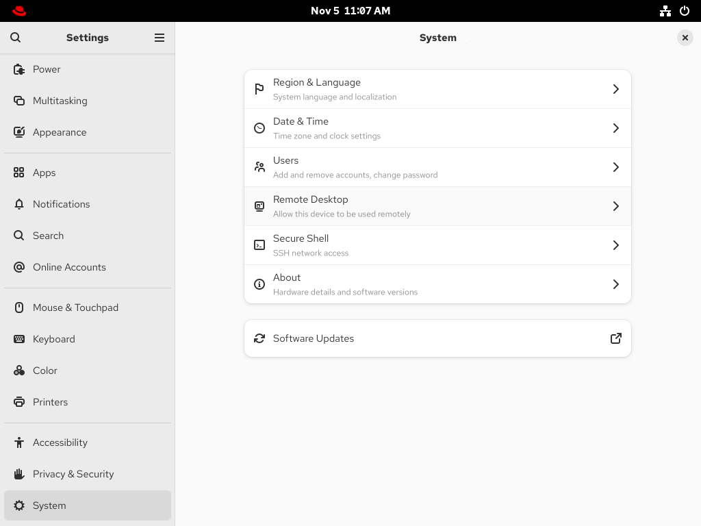
6. Set **Desktop Sharing** to **On**.
7. Optional: To allow the remote user to control your screen, set **Remote Control** to **On**.
8. Set a user name and a password in the **Login Details** section. Remote clients must enter these credentials when connecting to your desktop from a remote client.
   
   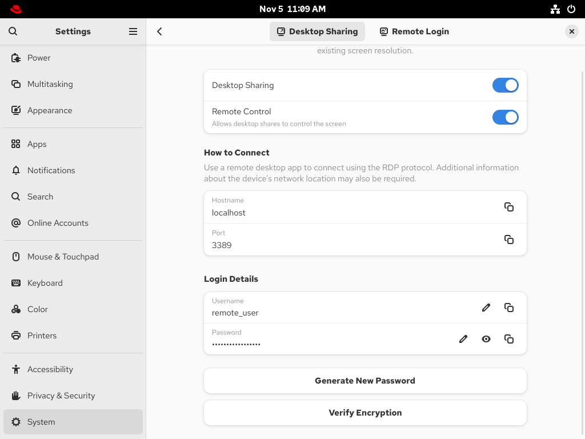

<h3 id="configuring-gnome-remote-login">1.2. Configuring GNOME remote login</h3>

By activating **Remote Login** in GNOME, you can allow remote clients to log in to the GNOME session as the Linux users on your system.

**Prerequisites**

- The `gnome-remote-desktop` package is installed.

**Procedure**

1. Configure a firewall rule to enable access to the server:
   
   ```
   sudo firewall-cmd --permanent --add-port=3389/tcp
   success
   ```
   
   ```plaintext
   $ sudo firewall-cmd --permanent --add-port=3389/tcp
   success
   ```
2. Reload firewall rules:
   
   ```
   sudo firewall-cmd --reload
   success
   ```
   
   ```plaintext
   $ sudo firewall-cmd --reload
   success
   ```
3. Open **Settings** in GNOME.
4. Open the **System** screen.
5. Select **Remote Desktop**.
   
   
6. Click the **Remote Login** tab in the menu header.
7. Set **Remote Login** to **On** to enable screen sharing.
   
   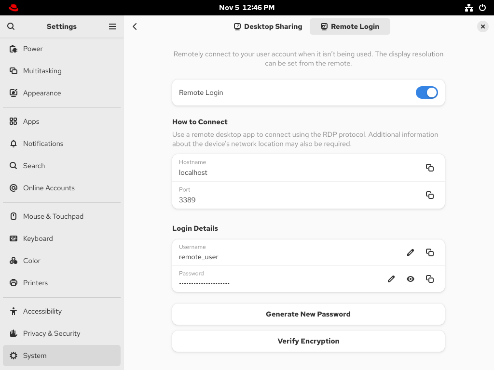
8. Set a user name and a password in the **Login Details** section. Remote clients must enter these credentials when connecting to this system’s login screen from a remote client.

<h3 id="connecting-to-a-remote-desktop-by-using-gnome">1.3. Connecting to a remote desktop by using GNOME</h3>

You can connect from a Red Hat Enterprise Linux client to a remote desktop server by using the **Connections** application. The connection depends on the remote server configuration.

**Prerequisites**

- Desktop sharing or remote login is enabled on the server. For more information, see [Enabling desktop sharing on the server by using GNOME](#enabling-desktop-sharing-on-the-server-by-using-gnome "1.1. Enabling desktop sharing on the server by using GNOME") or [Configuring GNOME remote login](#configuring-gnome-remote-login "1.2. Configuring GNOME remote login").
- For desktop sharing, a user is logged in to the GNOME graphical session on the server.
- The `gnome-connections` package is installed on the client.

**Procedure**

1. On the client, launch the **Connections** application.
2. Click the + button in the top bar to open a new connection.
   
   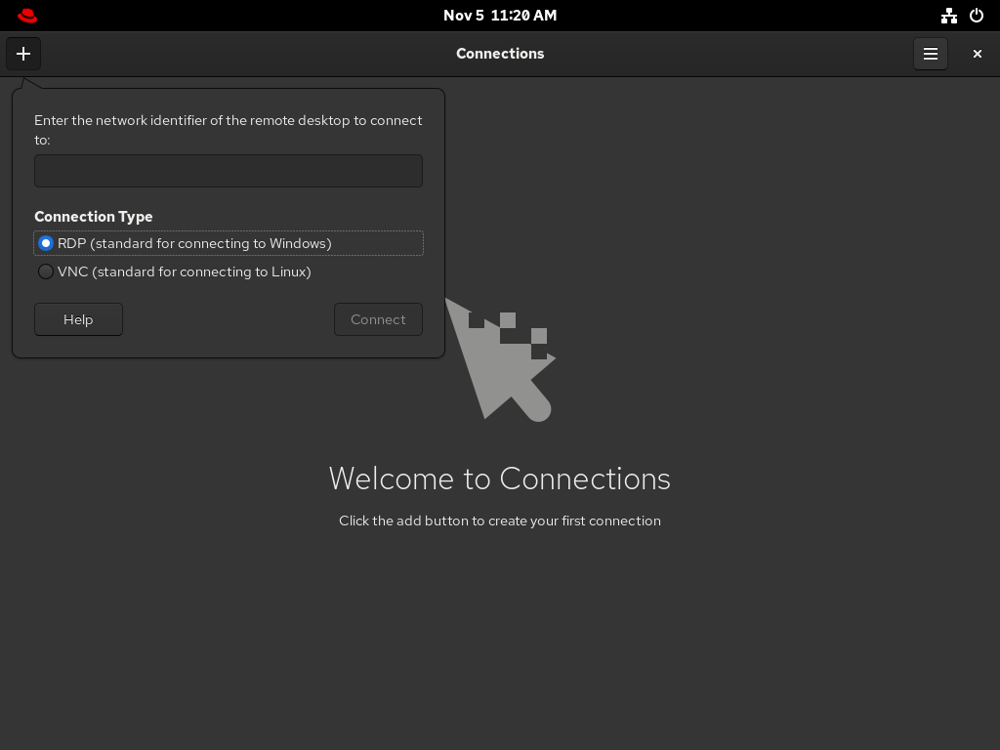
3. Enter the IP address of the server.
4. Choose the connection type based on the operating system you want to connect to:
   
   Remote Desktop Protocol (RDP)
   
   Use RDP for connecting to Windows and RHEL 10 servers.
   
   Virtual Network Computing (VNC)
   
   Use VNC for connecting to servers with RHEL 9 and previous versions.
5. Click Connect.

**Verification**

1. On the client, check that you can see the shared server desktop.
2. On the server, a screen sharing indicator appears on the right side of the top panel:
   
   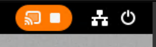
   
   You can control screen sharing in the **System** menu of the server.

<h3 id="connecting-to-a-remote-desktop-session-on-a-headless-server-for-a-single-user">1.4. Connecting to a remote desktop session on a headless server for a single user</h3>

You can connect to a remote desktop session on a headless server for a single user through RDP (Remote Desktop Protocol).

A headless server is a system that operates without a connected monitor. You can initiate and manage a GNOME desktop session to manage servers securely in environments where direct physical access is not available.

Important

Run the setup as a non-root user with sudo privileges. Attempting to run it as the root user causes the setup to fail. The credentials used to access this type of session are different from the system credentials of the user. For example, changing the user password on the host does not update the password used for RDP access.

Connecting to a remote desktop through RDP protocol requires setting up a TLS key and a TLS certificate.

**Prerequisites**

- `gnome-remote-desktop` package is installed.
- `gdm` package is installed.
- `freerdp` package is installed.
- The session, such as the kiosk session or the workstation session, is installed. For more information, see [How to install a graphical user internface (GUI) for Red Hat Enterprise Linux?](https://access.redhat.com/solutions/5238)
- SELinux is running in permissive mode. For more information, see [Changing SELinux to permissive mode](https://docs.redhat.com/en/documentation/red_hat_enterprise_linux/10/html/using_selinux/changing-selinux-states-and-modes#changing-selinux-to-permissive-mode)

**Procedure**

1. Configure a firewall rule to enable access to the server:
   
   ```
   sudo firewall-cmd --permanent --add-port=3389/tcp
   success
   ```
   
   ```plaintext
   $ sudo firewall-cmd --permanent --add-port=3389/tcp
   success
   ```
2. Reload firewall rules:
   
   ```
   sudo firewall-cmd --reload
   success
   ```
   
   ```plaintext
   $ sudo firewall-cmd --reload
   success
   ```
3. Create a directory for the self-signed TLS certificate:
   
   ```
   mkdir -p ~/.local/share/gnome-remote-desktop
   ```
   
   ```plaintext
   $ mkdir -p ~/.local/share/gnome-remote-desktop
   ```
4. Generate a self-signed TLS certificate for the RDP service:
   
   ```
   winpr-makecert -silent -rdp -path ~/.local/share/gnome-remote-desktop tls
   ```
   
   ```plaintext
   $ winpr-makecert -silent -rdp -path ~/.local/share/gnome-remote-desktop tls
   ```
5. Configure GNOME Remote Desktop by using RDP:
   
   ```
   grdctl --headless rdp set-tls-key ~/.local/share/gnome-remote-desktop/tls.key
   grdctl --headless rdp set-tls-cert ~/.local/share/gnome-remote-desktop/tls.crt
   grdctl --headless rdp set-credentials
   grdctl --headless rdp enable
   ```
   
   ```plaintext
   $ grdctl --headless rdp set-tls-key ~/.local/share/gnome-remote-desktop/tls.key
   $ grdctl --headless rdp set-tls-cert ~/.local/share/gnome-remote-desktop/tls.crt
   $ grdctl --headless rdp set-credentials
   $ grdctl --headless rdp enable
   ```
   
   Refer `gdrctl` man page for more information.
6. Enable a headless server for single-user service:
   
   ```
   systemctl --user enable --now gnome-remote-desktop-headless.service
   ```
   
   ```plaintext
   $ systemctl --user enable --now gnome-remote-desktop-headless.service
   ```
7. Start the headless GNOME session persistently for a single user as root:
   
   ```
   sudo systemctl enable --now gnome-headless-session@<your_username>.service
   ```
   
   ```plaintext
   $ sudo systemctl enable --now gnome-headless-session@<your_username>.service
   ```
   
   Replace `<your_username>` with the username of the user for whom you want to start the headless GNOME session.
8. Make `<your_username>.service` persistent across system reboot:
   
   ```
   sudo systemctl set-default graphical.target
   ```
   
   ```plaintext
   $ sudo systemctl set-default graphical.target
   ```

**Verification**

- Verify that the session started successfully:
  
  ```
  sudo systemctl status gnome-headless-session@<your_username>.service
  ```
  
  ```plaintext
  $ sudo systemctl status gnome-headless-session@<your_username>.service
  ```

<h3 id="connecting-to-a-remote-desktop-session-on-a-headless-server-for-multiple-users">1.5. Connecting to a remote desktop session on a headless server for multiple users</h3>

You can integrate GNOME Remote Desktop with the GNOME Display Manager (GDM) to provide remote login functionality for multiple users through remote desktop protocl (RDP). Remote users authenticate by using a system-wide password, which grants access to the graphical login screen. You can log in with their individual credentials, enabling secure remote access to the desktop environment.

Connecting to a remote desktop through RDP for multiple users requires setting up a TLS key and a TLS certificate.

**Prerequisites**

- The `gnome-remote-desktop`, `gdm`, and `freerdp` packages are installed.
  
  Note
  
  You must reboot your system after installing the `gnome-remote-desktop` package.
- The session, such as the kiosk session or the workstation session, is installed. For more information, see [How to install a graphical user internface (GUI) for Red Hat Enterprise Linux?](https://access.redhat.com/solutions/5238)

**Procedure**

1. Create a directory for the self-signed TLS certificate as the `gnome-remote-desktop` user:
   
   ```
   sudo -u gnome-remote-desktop mkdir -p ~gnome-remote-desktop/.local/share/gnome-remote-desktop
   ```
   
   ```plaintext
   $ sudo -u gnome-remote-desktop mkdir -p ~gnome-remote-desktop/.local/share/gnome-remote-desktop
   ```
2. Generate a self-signed TLS certificate for the RDP service as the `gnome-remote-desktop` user:
   
   ```
   sudo -u gnome-remote-desktop winpr-makecert -silent -rdp -path ~gnome-remote-desktop/.local/share/gnome-remote-desktop tls
   ```
   
   ```plaintext
   $ sudo -u gnome-remote-desktop winpr-makecert -silent -rdp -path ~gnome-remote-desktop/.local/share/gnome-remote-desktop tls
   ```
3. Connecting to a remote desktop through RDP for multiple users:
   
   ```
   sudo grdctl --system rdp set-tls-key ~gnome-remote-desktop/.local/share/gnome-remote-desktop/tls.key
   sudo grdctl --system rdp set-tls-cert ~gnome-remote-desktop/.local/share/gnome-remote-desktop/tls.crt
   sudo grdctl --system rdp set-credentials
   sudo grdctl --system rdp enable
   ```
   
   ```plaintext
   $ sudo grdctl --system rdp set-tls-key ~gnome-remote-desktop/.local/share/gnome-remote-desktop/tls.key
   $ sudo grdctl --system rdp set-tls-cert ~gnome-remote-desktop/.local/share/gnome-remote-desktop/tls.crt
   $ sudo grdctl --system rdp set-credentials
   $ sudo grdctl --system rdp enable
   ```
   
   Refer `gdrctl` man page for more information.
4. Enable the system remote login service and GDM:
   
   ```
   sudo systemctl enable --now gdm
   sudo systemctl enable --now gnome-remote-desktop.service
   ```
   
   ```plaintext
   $ sudo systemctl enable --now gdm
   $ sudo systemctl enable --now gnome-remote-desktop.service
   ```
5. Make `gnome-remote-desktop.service` persistent across system reboot:
   
   ```
   sudo systemctl set-default graphical.target
   ```
   
   ```plaintext
   $ sudo systemctl set-default graphical.target
   ```

**Verification**

- Verify that the session started successfully:
  
  ```
  sudo systemctl status gnome-remote-desktop.service
  ```
  
  ```plaintext
  $ sudo systemctl status gnome-remote-desktop.service
  ```

<h2 id="remotely-accessing-a-graphical-application">Chapter 2. Remotely accessing a graphical application</h2>

You can remotely launch a graphical application on a RHEL server and use it from the remote client.

From RHEL 10 clients, you can remotely launch applications that support the Wayland display protocol by using the `waypipe` proxy, and applications that support the X11 display protocol by using X11 forwarding. You can also configure a RHEL 10 server for remotely launching graphical applications via SSH with X11 forwarding.

<h3 id="launching-an-application-remotely-by-using-waypipe">2.1. Launching an application remotely by using waypipe</h3>

You can access a Wayland-based graphical application on a RHEL server from a remote client by using SSH and the `waypipe` proxy.

**Prerequisites**

- The `waypipe` package is installed on both the client and the remote system.
- The application can run natively on Wayland.

**Procedure**

1. Launch the application remotely through `waypipe` and SSH.
   
   ```
   waypipe -c lz4=9 ssh <remote-server> <application-binary>
   
   The authenticity of host '<remote-server> (<192.168.122.120>)' can't be established.
   ECDSA key fingerprint is SHA256:<uYwFlgtP/2YABMHKv5BtN7nHK9SHRL4hdYxAPJVK/kY>.
   Are you sure you want to continue connecting (yes/no/[fingerprint])?
   ```
   
   ```plaintext
   [local-user]$ waypipe -c lz4=9 ssh <remote-server> <application-binary>
   
   The authenticity of host '<remote-server> (<192.168.122.120>)' can't be established.
   ECDSA key fingerprint is SHA256:<uYwFlgtP/2YABMHKv5BtN7nHK9SHRL4hdYxAPJVK/kY>.
   Are you sure you want to continue connecting (yes/no/[fingerprint])?
   ```
2. Confirm that a server key is valid by checking its fingerprint.
3. Continue connecting by typing `yes`.
   
   ```
   Warning: Permanently added '<remote-server>' (ECDSA) to the list of known hosts.
   ```
   
   ```plaintext
   Warning: Permanently added '<remote-server>' (ECDSA) to the list of known hosts.
   ```
4. When prompted, type the server password.
   
   ```
   remote-user's password:
   [remote-user]$
   ```
   
   ```plaintext
   remote-user's password:
   [remote-user]$
   ```

<h3 id="launching-an-application-remotely-by-using-x11-forwarding">2.2. Launching an application remotely by using X11 forwarding</h3>

You can access a graphical application on a remote RHEL server from a client by using SSH.

**Prerequisites**

- X11 forwarding over SSH is enabled on the server. For details, see [Enabling X11 forwarding on the server](#enabling-x11-forwarding-on-the-server "2.3. Enabling X11 forwarding on the server").
- Ensure that an X11 display server is running on your system:
  
  - On RHEL, X11 is available by default in the graphical interface.
  - On Microsoft Windows, install an X11 server such as Xming.
  - On macOS, install the XQuartz X11 server.
- You have configured and restarted an OpenSSH server. For details, see [Configuring the OpenSSH server and client by using RHEL system roles](https://docs.redhat.com/en/documentation/red_hat_enterprise_linux/10/html-single/securing_networks/index#configuring-the-openssh-server-and-client-by-using-rhel-system-roles).

**Procedure**

1. Log in to the server by using SSH:
   
   ```
   [<local_user>]$ ssh -X -Y <remote_server>
   The authenticity of host '<remote_server> (192.168.122.120)' can't be established.
   ECDSA key fingerprint is SHA256:uYwFlgtP/2YABMHKv5BtN7nHK9SHRL4hdYxAPJVK/kY.
   Are you sure you want to continue connecting (yes/no/[fingerprint])?
   ```
   
   ```plaintext
   [<local_user>]$ ssh -X -Y <remote_server>
   The authenticity of host '<remote_server> (192.168.122.120)' can't be established.
   ECDSA key fingerprint is SHA256:uYwFlgtP/2YABMHKv5BtN7nHK9SHRL4hdYxAPJVK/kY.
   Are you sure you want to continue connecting (yes/no/[fingerprint])?
   ```
2. Confirm that a server key is valid by checking its fingerprint.
   
   Note
   
   If you plan to log in to the server on a regular basis, add the user’s public key to the server by using the `ssh-copy-id` command.
3. Confirm by typing **yes**.
   
   ```
   Warning: Permanently added '<remote_server>' (ECDSA) to the list of known hosts.
   ```
   
   ```plaintext
   Warning: Permanently added '<remote_server>' (ECDSA) to the list of known hosts.
   ```
4. When prompted, type the password of the user on the remote server:
   
   ```
   <remote_user>'s password:
   [<remote_user> ~]$
   ```
   
   ```plaintext
   <remote_user>'s password:
   [<remote_user> ~]$
   ```
5. Launch the application from the command line:
   
   ```
   [<remote_user>]$ <application-binary>
   ```
   
   ```plaintext
   [<remote_user>]$ <application-binary>
   ```
   
   Tip
   
   To skip the intermediate terminal session, use the following command:
   
   ```
   [<local_user>]$ ssh user@server -X -Y -C <application-binary>
   ```
   
   ```plaintext
   [<local_user>]$ ssh user@server -X -Y -C <application-binary>
   ```

<h3 id="enabling-x11-forwarding-on-the-server">2.3. Enabling X11 forwarding on the server</h3>

Configure a RHEL server so that remote clients can use graphical applications on the server over SSH.

**Procedure**

1. Install basic X11 packages:
   
   ```
   dnf install xorg-x11-xauth xorg-x11-fonts-\* dbus-x11
   ```
   
   ```plaintext
   # dnf install xorg-x11-xauth xorg-x11-fonts-\* dbus-x11
   ```
   
   Note
   
   Your applications might require additional graphical libraries.
2. Enable the `X11Forwarding` option in the `/etc/ssh/sshd_config` configuration file:
   
   ```
   X11Forwarding yes
   ```
   
   ```plaintext
   X11Forwarding yes
   ```
   
   The option is disabled by default in RHEL.
3. Restart the `sshd` service:
   
   ```
   systemctl restart sshd.service
   ```
   
   ```plaintext
   # systemctl restart sshd.service
   ```

<h2 id="setting-a-default-desktop-session-for-all-users">Chapter 3. Setting a default desktop session for all users</h2>

You can configure a default desktop session for all users that have not logged in yet.

If a user logs in by using a different session than the default, their selection persists to their next login.

**Procedure**

1. To apply the default desktop session for ordinary users:
   
   1. Copy the configuration file template for ordinary users:
      
      ```
      cp /usr/share/accountsservice/user-templates/standard \
           /etc/accountsservice/user-templates/standard
      ```
      
      ```plaintext
      # cp /usr/share/accountsservice/user-templates/standard \
           /etc/accountsservice/user-templates/standard
      ```
   2. Edit the new `/etc/accountsservice/user-templates/standard` file.
   3. On the `Session=` line, add the name of the session you want to set as the default, for example, `gnome`.
2. To apply the default desktop session to administrator users (members of the `wheel` or `sudo` groups), create and configure the administrator template:
   
   1. Copy the administrator template:
      
      ```
      cp /usr/share/accountsservice/user-templates/administrator \
           /etc/accountsservice/user-templates/administrator
      ```
      
      ```plaintext
      # cp /usr/share/accountsservice/user-templates/administrator \
           /etc/accountsservice/user-templates/administrator
      ```
   2. Edit the new `/etc/accountsservice/user-templates/administrator` file.
   3. On the `Session=` line, add the name of the session you want to set as the default for administrator user, for example, `gnome`.
3. Optional: To configure an exception to the default session for a certain user, follow these steps:
   
   1. Copy the template file to `/var/lib/AccountsService/users/user-name`:
      
      ```
      cp /usr/share/accountsservice/user-templates/standard \
           /var/lib/AccountsService/users/user-name
      ```
      
      ```plaintext
      # cp /usr/share/accountsservice/user-templates/standard \
           /var/lib/AccountsService/users/user-name
      ```
   2. In the new file, replace variables such as `${USER}` and `${ID}` with the user values.
   3. On the `Session=` line, add the name of the session you want to set as default for that user, for example, `gnome`.

<h2 id="configuring-gnome-to-store-user-settings-on-home-directories-hosted-on-an-nfs-share">Chapter 4. Configuring GNOME to store user settings on home directories hosted on an NFS share</h2>

If you use GNOME on a system with home directories hosted on an NFS server, you must change the `keyfile` backend of the `dconf` database. Otherwise, `dconf` might not work correctly.

This change affects all users on the host because it changes how `dconf` manages user settings and configurations stored in the home directories.

**Procedure**

1. Add the following line to the beginning of the `/etc/dconf/profile/user` file. If the file does not exist, create it.
   
   ```
   service-db:keyfile/user
   ```
   
   ```plaintext
   service-db:keyfile/user
   ```
   
   With this setting, `dconf` polls the `keyfile` backend to determine if updates are applied, so settings might not be updated immediately.
2. The changes take effect when the users logs out and in.

<h2 id="tablets">Chapter 5. Tablets</h2>

You can manage Wacom tablets connected to your system from the **Wacom Tablet** settings panel in the GNOME environment.

**Figure 5.1. The Wacom Tablet settings panel**

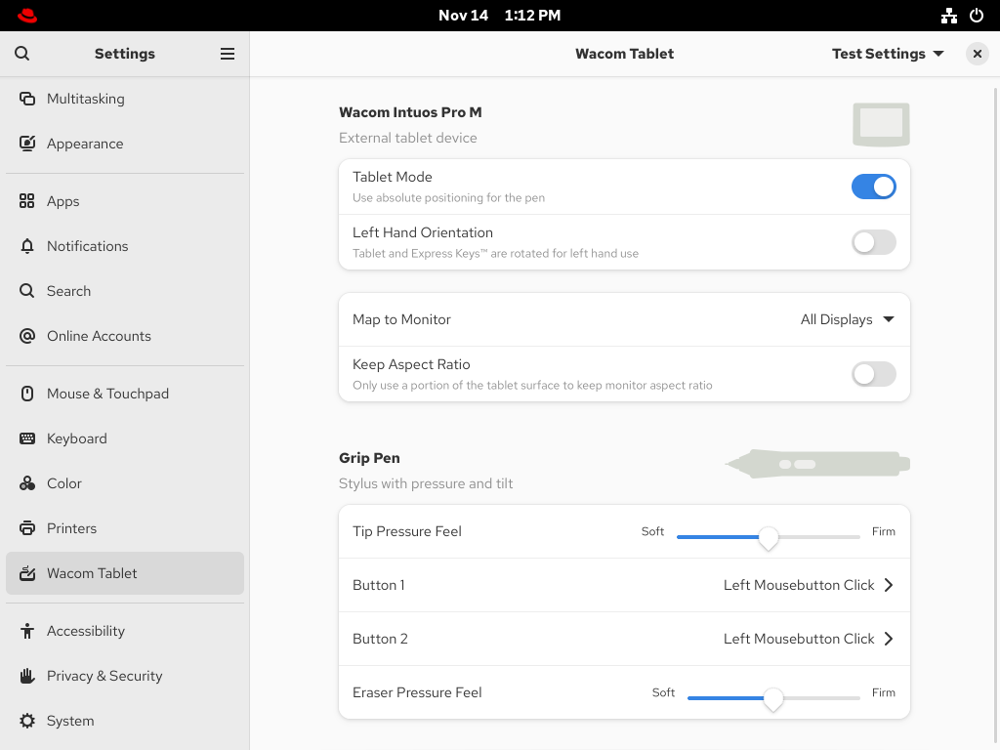 

The **Wacom Tablet** settings panel and the `libinput` stack use the `libwacom` tablet client library, which stores additional data about Wacom tablets that the system cannot obtain by querying the device directly.

If your tablet is listed in the `libwacom` library, it is visible in the **Wacom Tablet** settings panel.

If the **Wacom Tablet** settings panel displays “This device is unknown and may present wrong capabilities", the tablet is supported by the underlying input stack but some functionality might be missing. In that case, you can perform the [Adding support for the new tablet](#adding-support-for-a-new-tablet "5.1. Adding support for a new tablet") procedure.

If the **Wacom Tablet** settings panel is empty, the tablet is not exposed by the kernel. In that case, contact Red Hat support.

<h3 id="adding-support-for-a-new-tablet">5.1. Adding support for a new tablet</h3>

If the **Wacom Tablet** settings panel displays “This device is unknown and may present wrong capabilities", the tablet is supported by the underlying input stack but some functionality might be missing.

You can resolve this by adding a definition file for the tablet into the `libwacom` tablet information client library.

**Prerequisites**

- The `libwacom` package is installed on your system.

**Procedure**

1. List all local devices recognized by the `libwacom` database:
   
   ```
   libwacom-list-local-devices
   ```
   
   ```plaintext
   $ libwacom-list-local-devices
   ```
   
   Make sure that your device is recognized in the output.
   
   If your device is not listed, the device is missing from the `libwacom` database. However, the device might still be supported by the kernel if it is listed in the `/proc/bus/input/devices` file.
2. Optional: Check whether the device is supported at all by entering the `libwacom-list-devices` command, provided in the `libwacom-utils` package. This command lists all devices supported by your installed version of `libwacom`.
3. Check whether the definition file is available in the `/usr/share/libwacom/` directory.
   
   To use screen mapping correctly, support for your tablet must be included in the `libwacom` database.
   
   Important
   
   A common indicator that a device is not supported by `libwacom` is that it works normally in a GNOME session, but the device is not correctly mapped to the screen.
4. If the definition file for your device is not available in `/usr/share/libwacom/`, you have these options:
   
   - Find the definition file in the [linuxwacom/libwacom](https://github.com/linuxwacom/libwacom) upstream repository and copy the file to your system.
   - Find a similar device in the [linuxwacom/libwacom](https://github.com/linuxwacom/libwacom) upstream repository and modify the definition file accordingly.
5. Add and install the definition file with the `.tablet` suffix:
   
   ```
   cp <tablet_definition_file>.tablet /etc/libwacom
   ```
   
   ```plaintext
   # cp <tablet_definition_file>.tablet /etc/libwacom
   ```
   
   After the file is installed, the device is part of the `libwacom` database. The device is then available through `libwacom-list-local-devices`.

<h3 id="setting-wacom-tablet-configuration-values-in-the-CLI">5.2. Setting Wacom tablet configuration values in the CLI</h3>

Instead of changing the settings in the **Wacom Tablet** settings panel, you can change the settings on the command line.

Wacom tablet and stylus configuration files are saved in the following locations by default:

Tablet configuration

`org.gnome.desktop.peripherals.tablet:/org/gnome/desktop/peripherals/tablets/<vid>:<pid>/`

Stylus configuration

`org.gnome.desktop.peripherals.tablet.stylus:/org/gnome/desktop/peripherals/tablet/stylus/<serial number>/`

Note

By using `<vid>`, `<pid>`, and `<serial_number>` in configuration paths, you can configure tablets and styli independently.

**Prerequisites**

- The `libwacom` package is installed on your system.

**Procedure**

1. List local devices to display their IDs:
   
   ```
   libwacom-list-local-devices
   devices:
   - name: 'Wacom Intuos Pro M'
     bus: 'usb'
     vid: '0x056a'
     pid: '0x0357'
     nodes:
     - /dev/input/event6: 'Wacom Co.,Ltd. Wacom Intuos Pro M Pen'
     - /dev/input/event7: 'Wacom Co.,Ltd. Wacom Intuos Pro M Pad'
     styli:
      - id: 0x100802
   ```
   
   ```plaintext
   $ libwacom-list-local-devices
   devices:
   - name: 'Wacom Intuos Pro M'
     bus: 'usb'
     vid: '0x056a'
     pid: '0x0357'
     nodes:
     - /dev/input/event6: 'Wacom Co.,Ltd. Wacom Intuos Pro M Pen'
     - /dev/input/event7: 'Wacom Co.,Ltd. Wacom Intuos Pro M Pad'
     styli:
      - id: 0x100802
   ```
   
   If a device does not support unique serial numbers, the stylus is identified with a generic identifier based on the tablet’s VID and PID:
   
   `org.gnome.desktop.peripherals.tablet.stylus:/org/gnome/desktop/peripherals/tablet/stylus/default-<vid>:<pid>/`
2. Determine the serial number for the particular device:
   
   ```
   libwacom-show-stylus /dev/input/event6
   Please put tool in proximity
   Tool id 0x100802 serial 0x2380369c in-proximity: False
   ```
   
   ```plaintext
   # libwacom-show-stylus /dev/input/event6
   Please put tool in proximity
   Tool id 0x100802 serial 0x2380369c in-proximity: False
   ```
3. List the available settings for the selected device:
   
   - For a tablet:
     
     ```
     gsettings list-recursively org.gnome.desktop.peripherals.tablet:/org/gnome/desktop/peripherals/tablet/<vid>:<pid>/
     org.gnome.desktop.peripherals.tablet area [0.0, 0.0, 0.0, 0.0]
     org.gnome.desktop.peripherals.tablet keep-aspect false
     org.gnome.desktop.peripherals.tablet left-handed false
     org.gnome.desktop.peripherals.tablet mapping 'absolute'
     org.gnome.desktop.peripherals.tablet output ['', '', '']
     ```
     
     ```plaintext
     $ gsettings list-recursively org.gnome.desktop.peripherals.tablet:/org/gnome/desktop/peripherals/tablet/<vid>:<pid>/
     org.gnome.desktop.peripherals.tablet area [0.0, 0.0, 0.0, 0.0]
     org.gnome.desktop.peripherals.tablet keep-aspect false
     org.gnome.desktop.peripherals.tablet left-handed false
     org.gnome.desktop.peripherals.tablet mapping 'absolute'
     org.gnome.desktop.peripherals.tablet output ['', '', '']
     ```
     
     Replace `<vid>` and `<pid>` with the IDs of your device.
   - For a stylus:
     
     ```
     gsettings list-recursively org.gnome.desktop.peripherals.tablet.stylus:/org/gnome/desktop/peripherals/tablet/stylus/<serial_number>/
     org.gnome.desktop.peripherals.tablet.stylus button-action 'default'
     org.gnome.desktop.peripherals.tablet.stylus button-keybinding ''
     org.gnome.desktop.peripherals.tablet.stylus eraser-pressure-curve [0, 0, 100, 100]
     org.gnome.desktop.peripherals.tablet.stylus eraser-pressure-range [0, 100]
     org.gnome.desktop.peripherals.tablet.stylus pressure-curve [0, 0, 100, 100]
     org.gnome.desktop.peripherals.tablet.stylus pressure-range [0, 100]
     org.gnome.desktop.peripherals.tablet.stylus secondary-button-action 'default'
     org.gnome.desktop.peripherals.tablet.stylus secondary-button-keybinding ''
     org.gnome.desktop.peripherals.tablet.stylus tertiary-button-action 'default'
     org.gnome.desktop.peripherals.tablet.stylus tertiary-button-keybinding ''
     ```
     
     ```plaintext
     $ gsettings list-recursively org.gnome.desktop.peripherals.tablet.stylus:/org/gnome/desktop/peripherals/tablet/stylus/<serial_number>/
     org.gnome.desktop.peripherals.tablet.stylus button-action 'default'
     org.gnome.desktop.peripherals.tablet.stylus button-keybinding ''
     org.gnome.desktop.peripherals.tablet.stylus eraser-pressure-curve [0, 0, 100, 100]
     org.gnome.desktop.peripherals.tablet.stylus eraser-pressure-range [0, 100]
     org.gnome.desktop.peripherals.tablet.stylus pressure-curve [0, 0, 100, 100]
     org.gnome.desktop.peripherals.tablet.stylus pressure-range [0, 100]
     org.gnome.desktop.peripherals.tablet.stylus secondary-button-action 'default'
     org.gnome.desktop.peripherals.tablet.stylus secondary-button-keybinding ''
     org.gnome.desktop.peripherals.tablet.stylus tertiary-button-action 'default'
     org.gnome.desktop.peripherals.tablet.stylus tertiary-button-keybinding ''
     ```
     
     Replace `<serial_number>` with the ID of your device.
4. Set an option to the value that you want:
   
   ```
   gsettings set <schema_name>:<path> <key> <value>
   ```
   
   ```plaintext
   $ gsettings set <schema_name>:<path> <key> <value>
   ```
   
   Replace:
   
   - `<schema_name>:<path>` with the schema and path to your device.
   - `<key>` with the option you want to change.
   - `<value>` with the value you want to set.
   
   For example:
   
   ```
   gsettings set org.gnome.desktop.peripherals.tablet.stylus:/org/gnome/desktop/peripherals/tablet/stylus/0x2380369c pressure-range "[0, 75]"
   ```
   
   ```plaintext
   $ gsettings set org.gnome.desktop.peripherals.tablet.stylus:/org/gnome/desktop/peripherals/tablet/stylus/0x2380369c pressure-range "[0, 75]"
   ```

<h2 id="managing-storage-volumes-in-gnome">Chapter 6. Managing storage volumes in GNOME</h2>

GNOME Virtual File System (GVFS) is an extension that hides the details of storage from applications to act like a standard file system. The virtual file system is independent of hardware and device drivers.

<h3 id="the-gvfs-system">6.1. The GVFS system</h3>

GNOME Virtual File System (GVFS) uses addresses for full identification based on the Uniform Resource Identifier (URI) standard, syntactically similar to URL addresses in web browsers. These addresses in the form of `schema://user@server/path` are the key information determining the kind of service.

GVFS helps to mount the resources. These mounts are shared between multiple applications. Resources are tracked globally within the running desktop session, which means that even if you quit an application that triggered the mount, the mount continues to be available for any other application. Multiple applications can access the mount at the same time unless it is limited by a back end. Some protocols by design permit only a single channel.

GVFS mounts removable media in the `/run/media/` directory.

<h3 id="the-format-of-the-gvfs-uri-string">6.2. The format of the GVFS URI string</h3>

You must form a URI string to use back-end services. This string is a basic identifier used in GVFS, which carries all necessary information needed for unique identification, such as type of service, back-end ID, absolute path, or user name if required.

You can see this information in the **Files** address bar and GTK+ open or save file dialog.

The following example is a very basic form of the URI string, which points to a root directory (`/`) of the File Transfer Protocol (FTP) server running at the `<your_ftp_server>` domain:

**Example 6.1. A URI string pointing to the root FTP directory**

```
ftp://<your_ftp_server_domain>/
```

```plaintext
ftp://<your_ftp_server_domain>/
```

**Example 6.2. A URI string pointing to a text file on FTP**

```
ssh://<username>@<your_ftp_server_domain>/home/<username>/<file_name>.txt
```

```plaintext
ssh://<username>@<your_ftp_server_domain>/home/<username>/<file_name>.txt
```

<h3 id="mounting-a-storage-volume-in-gnome">6.3. Mounting a storage volume in GNOME</h3>

You can manually mount a local storage volume or a network share in the **Files** application.

**Procedure**

1. Open the **Files** application.
2. Click **Other Locations** in the side bar.
   
   The window lists all connected storage volumes and all network shares that are publicly available on your local area network.
   
   If you can see the volume or network share in this list, mount it by clicking the item.
   
   If you want to connect to a different network share, use the following steps.
3. Enter the GVFS URI string to the network share in the **Enter server address** field.
4. Press Connect.
5. If the dialog asks you for login credentials, enter your name and password into the relevant fields.
6. When the mounting process finishes, you can browse the files on the volume or network share.

<h3 id="unmounting-a-storage-volume-in-gnome">6.4. Unmounting a storage volume in GNOME</h3>

You can unmount a storage volume, a network share, or another resource in the **Files** application.

Warning

Always unmount a storage volume before removing the drive from the computer. Removing a drive might corrupt the data on the volumes that are still mounted.

**Procedure**

1. Open the **Files** application.
2. In the side bar, click the **Unmount** (⏏) icon next to the chosen mount.
3. Wait until the mount disappears from the side bar or a notification about the safe removal appears.

<h3 id="access-to-gvfs-mounts-in-the-file-system">6.5. Access to GVFS mounts in the file system</h3>

Learn more about File System in Userspace (FUSE), the main daemon for the GNOME Virtual File System (GVFS).

Applications built with the GIO library can access GVFS mounts. In addition, GVFS provides a FUSE daemon which exposes active GVFS mounts. Any application can access active GVFS mounts by using the standard POSIX APIs as though mounts were regular file systems.

In certain applications, additional library dependency and new virtual file system (VFS) subsystem specifics might be unsuitable or too complicated. For such reasons and to boost compatibility, GVFS provides a File System in Userspace (FUSE) daemon, which exposes active mounts through its mount for standard Portable Operating System Interface (POSIX) access. This daemon transparently translates incoming requests to imitate a local file system for applications.

Important

You might experience difficulties with certain combinations of applications and GVFS back ends.

The FUSE daemon starts automatically with the main `gvfs` daemon and mounts volumes either in the `/run/user/UID/gvfs/` or `~/.gvfs/` directories as a fallback.

Manual browsing shows individual directories for each GVFS mount. The system passes the transformed path as an argument when you are opening documents from GVFS locations with non-native applications. Note that native GIO applications automatically translate this path back to a native URI.

<h3 id="available-gio-commands">6.6. Available GIO commands</h3>

GIO (GNOME Integrated Objects) is a library and an API to access various file system types and data sources within the GNOME desktop environment. GIO allows applications to interact with the sources such as local files, network shares, databases, web services and so on.

GIO provides several commands that might be useful for scripting or testing.

GIO uses the following commands that correspond to POSIX commands:

`gio cat`

Displays the content of a file.

`gio mkdir`

Creates a new directory.

`gio rename`

Renames a file.

`gio mount`

Provides access to various aspects of the `gio` mounting functionality.

`gio set`

Sets a file attribute on a file.

`gio copy`

Makes a copy of a file.

`gio list`

Lists directory contents.

`gio move`

Moves a file from one location to another.

`gio remove`

Removes a file.

`gio trash`

Sends files or directories to the `Trashcan`. This can be a different folder depending on where the file is located, and not all file systems support this concept. In the common case that the file lives inside a user’s home directory, the trash folder is `$XDG_DATA_HOME/Trash`.

`gio info`

Displays information of the given locations.

`gio save`

Reads from standard input and saves the data to the given location.

`gio tree`

Lists the contents of the given locations recursively, in a tree-like format. If no location is given, it defaults to the current directory.

You can control GIO specifics with the following additional commands:

`gio monitor`

Monitors files or directories for changes, such as creation, deletion, content and attribute changes, and mount and unmount operations affecting the monitored locations.

`gio mime`

Lists the registered and recommended applications for the mimetype if no handler is given, else, it is set as the default handler for the mimetype.

`gio open`

Opens files with the default application that is registered to handle files of this type.

Note

For user convenience, `bash` completion is provided as a part of the package.

All these commands are native GIO clients, there is no need for the fallback FUSE daemon to be running. Their purpose is not to be drop-in replacements for POSIX commands, in fact, a very little range of switches is supported. In their basic form, these commands take an URI string as an argument instead of a local path.

**Example 6.3. Examples of the GIO commands usage**

- List all files in the local `/tmp` directory

```
gio list file:///tmp
```

```plaintext
$ gio list file:///tmp
```

- List the content of a text file from a remote system

```
gio cat ssh://joe@ftp.myserver.net/home/joe/todo.txt
```

```plaintext
$ gio cat ssh://joe@ftp.myserver.net/home/joe/todo.txt
```

- Copy the previous text file to a local `/tmp` directory

```
gio copy ssh://joe@ftp.myserver.net/home/joe/todo.txt /tmp/
```

```plaintext
$ gio copy ssh://joe@ftp.myserver.net/home/joe/todo.txt /tmp/
```

For more information about GIO, see the `gio(1)` man page on your system.

<h3 id="overview-of-gvfs-metadata">6.7. Overview of GVFS metadata</h3>

GNOME Virtual File System (GVFS) metadata storage is implemented as a set of key-and-value pairs that bind information to a particular file.

GNOME applications rely on GIO (GNOME Integrated Objects) to access files and data. With GIO, you can save metadata for runtime information such as icon position, last-played location, position in a document, emblems, notes, and so on.

Whenever you move a file or directory, GVFS moves the metadata of that file or directory at the same time. The GVFS stores all metadata privately, so metadata is available only on the machine. However, GVFS tracks mounts and removable media as well.

Note

GVFS mounts removable media in the `/run/media/` directory.

To view and manipulate with metadata, you can use:

- the `gio info` command,
- the `gio set` command, or
- any other native GIO way of working with attributes.

For more information, check the `gio` man page on your system.

<h3 id="setting-custom-gio-metadata-attribute">6.8. Setting custom GIO metadata attribute</h3>

GIO (GNOME Integrated Objects) allows applications to attach metadata to the files. You can add and manage your own custom metadata attributes using GIO to determine how applications interact with specific files and provide more detailed information about them.

**Procedure**

1. Create an empty file:
   
   ```
   touch /tmp/myfile
   ```
   
   ```plaintext
   $ touch /tmp/myfile
   ```
2. View the metadata of this file:
   
   ```
   gio info -a 'metadata::*' /tmp/myfile
   uri: file:///tmp/myfile
   attributes:
   ```
   
   ```plaintext
   $ gio info -a 'metadata::*' /tmp/myfile
   uri: file:///tmp/myfile
   attributes:
   ```
3. Set a string to this file:
   
   ```
   gio set -t string /tmp/myfile 'metadata::mynote' 'Please remember to delete this file!'
   ```
   
   ```plaintext
   $ gio set -t string /tmp/myfile 'metadata::mynote' 'Please remember to delete this file!'
   ```
4. View the metadata:
   
   ```
   gio info -a 'metadata::*' /tmp/myfile
   uri: file:///tmp/myfile
   attributes:
     metadata::mynote: Please remember to delete this file!
   ```
   
   ```plaintext
   $ gio info -a 'metadata::*' /tmp/myfile
   uri: file:///tmp/myfile
   attributes:
     metadata::mynote: Please remember to delete this file!
   ```

**Result**

The metadata persists when you move the file by using the GIO API.

For more information about GIO, see the `gio` man page on your system.

<h3 id="password-management-of-gvfs-mounts">6.9. Password management of GVFS mounts</h3>

Learn more about the GNOME Virtual File System (GVFS) mount authentication.

A typical GVFS mount authenticates on its activation unless the resource allows anonymous authentication or does not require any authentication at all.

In a standard GTK+ dialog, you can choose whether to store the password.

When you select the persistent storage, the password is stored in the user keyring. **GNOME Keyring** is a central place for secrets storage. The password is encrypted and automatically unlocked on desktop session start by using the password provided on login. For protecting it by a different password, you can set the password at the first use.

The **Passwords and Keys** application helps to manage the stored password and **GNOME Keyring**. It allows removing individual records or changing passwords.

<h3 id="gvfs-back-ends">6.10. GVFS back ends</h3>

Back ends in GNOME Virtual File System (GVFS) provide access to a specific type of resource. This section provides a list of available GVFS back ends and their specifications.

Note

Some back ends are packaged separately and not installed by default. For installing additional back ends, use the `dnf` package manager.

The available GVFS back ends are:

`admin`

Provides administrator access to the local file system.

`burn`

A virtual back end that burning applications use as a temporary storage for new CD, DVD, or BD medium content.

`cdda`

Exposes Audio CD through separate Waveform Audio File Format (WAV) files.

`computer`

A virtual back end consolidating active mounts and physical volumes. Acts similarly to a signpost. Previously used by **Files** for its **Computer** view.

`dav`, `davs`

A WebDAV client, including secure variant. Authentication is possible only during mount. The back end does not support later re-authentication on per-folder basis.

`dns-sd`

DNS Service Discovery: An Avahi client, used during network browsing, forms persistent URIs to discovered services.

`ftp`

A fully featured File Transfer Protocol (FTP) client. Supports passive transfers by default. Also, handles secure mode over `ftps` (explicit mode) and `ftpis` (implicit mode) schemes.

`gphoto2`

A Picture Transfer Protocol (PTP) client to access your camera attached by USB or FireWire.

`google`

Provides access to Google Drive. The Google Drive account needs to be configured in the **Online Accounts** settings.

`http`

Handles all HTTP requests. Useful for easy downloading files from web in client applications.

`locatest`

A simple testing back end that proxies the `file://` URI. The back end supports error injection.

`mtp`

A Media Transfer Protocol (MTP) back end for accessing media player and cell phone memory.

`network`

Allows you to browse Window Network and show shares discovered over Avahi.

`recent`

A back end used in the file chooser dialog to list recent files used by GNOME applications.

`sftp`

A fully-featured SSH File Transfer Protocol (SFTP) client.

`smb`

Accesses Samba and Windows shares.

`trash`

A trash back end that allows to restore deleted files.

<h3 id="troubleshooting-volume-management-in-gnome">6.11. Troubleshooting volume management in GNOME</h3>

Following are some common errors of volume management in GNOME and ways to resolve them.

<h4 id="troubleshooting-access-to-gvfs-locations-from-non-gio-clients">6.11.1. Troubleshooting access to GVFS locations from non-GIO clients</h4>

If you have problems accessing GVFS locations from your application, it might mean that it is not native GIO client. Native GIO clients are typically all GNOME applications by using GNOME libraries (`glib`, `gio`). The `gvfs-fuse` service is provided as a fallback for non-GIO clients.

**Prerequisites**

- The `gvfs-fuse` package is installed.
  
  ```
  dnf install gvfs-fuse
  ```
  
  ```plaintext
  $ dnf install gvfs-fuse
  ```

**Procedure**

1. Ensure that `gvfs-fuse` is running.
   
   ```
   ps ax | grep gvfsd-fuse
   ```
   
   ```plaintext
   $ ps ax | grep gvfsd-fuse
   ```
   
   If `gvfs-fuse` is not running, log out and log back in. You must not start `gvfs-fuse` manually.
2. Find the system user ID (UID) for the `/run/user/UID/gvfs/` path.
   
   The `gvfsd-fuse` daemon requires a path where it can expose its services. When the `/run/user/UID/gvfs/` path is unavailable, `gvfsd-fuse` uses the `~/.gvfs` path.
   
   ```
   id -u
   ```
   
   ```plaintext
   $ id -u
   ```
3. If `gvfsd-fuse` is still not running, start the `gvfsd-fuse` daemon:
   
   ```
   /usr/libexec/gvfsd-fuse -f /run/user/UID/gvfs
   ```
   
   ```plaintext
   $ /usr/libexec/gvfsd-fuse -f /run/user/UID/gvfs
   ```
   
   Now, the FUSE mount is available, and you can manually browse for the path in your application.
4. Find the GVFS mounts under the `/run/user/UID/gvfs/` or `~/.gvfs` locations.

<h4 id="troubleshooting-an-invisible-connected-usb-disk">6.11.2. Troubleshooting an invisible connected USB disk</h4>

When you connect a flash drive, the GNOME Desktop might not display it. If your flash drive is not visible in **Files**, but you can see it in the **Disks** application, you can set the **Show in user interface** option in **Disks**.

**Procedure**

1. Open the **Disks** application.
2. Select the disk in the side bar.
3. Below **Volumes**, click **Additional partition options &gt; Edit Mount Options**
4. Click **Show in user interface**.
5. Confirm by clicking OK.
6. If the flash drive is still not visible, you can try to physically removing and connecting it again.

<h4 id="troubleshooting-unknown-or-unwanted-partitions-listed-in-files">6.11.3. Troubleshooting unknown or unwanted partitions listed in Files</h4>

```
Some devices have a special partition with backups or help files, which you might not want to see each time you plug in the device. For example, when you plug in a flash disk, it is automatically mounted and its volumes are displayed in the *Files* side bar.
```

```plaintext
Some devices have a special partition with backups or help files, which you might not want to see each time you plug in the device. For example, when you plug in a flash disk, it is automatically mounted and its volumes are displayed in the *Files* side bar.
```

**Procedure**

1. Open the **Disks** application.
2. Select the disk in the side bar.
3. Below **Volumes**, click **Additional partition options &gt; Edit Mount Options**
4. Clear **Show in user interface**.
5. Confirm by clicking OK.

<h4 id="troubleshooting-if-a-connection-to-the-remote-gvfs-file-system-is-unavailable">6.11.4. Troubleshooting if a connection to the remote GVFS file system is unavailable</h4>

There are number of situations in which the client is unexpectedly and unwillingly disconnected from a virtual file system or a remote disk mount and is not reconnected automatically.

You might see the error messages in such situations. Several causes trigger such situations:

- The connection is interrupted. For example, your laptop is disconnected from the Wi-Fi.
- The user is inactive for some time and is disconnected by the server (idle timeout).
- The computer is resumed from sleep mode.

**Procedure**

1. Unmount file system.
2. Mount it again.
3. If the connection is getting disabled more often, check the settings in the **Network** panel in the GNOME **Settings**.

<h4 id="troubleshooting-a-busy-disk-in-gnome">6.11.5. Troubleshooting a busy disk in GNOME</h4>

If you receive a notification about your disk being busy, identify the programs that are accessing the disk. Then, you can end the programs that are running. You can also use the **System Monitor** application to kill the programs forcefully.

**Prerequisites**

- The `iotop` utility is installed:
  
  ```
  dnf install iotop
  ```
  
  ```plaintext
  # dnf install iotop
  ```

**Procedure**

1. Examine the list of open files.
   
   - Run the `lsof` command to get the list of open files.
   - If `lsof` is not available, run the `ps ax` command.
   - You can use **System Monitor** to display the running processes in a GUI.
2. When you have identified the programs, terminate them using any of the following methods:
   
   - On the command line, run the `kill` command.
     
     For more information about the `kill` command, see the `kill` man page on your system.
   - In **System Monitor**, right-click the line with the program process name, and click **End** or **Kill** from the menu.

<h2 id="enabling-automatic-login">Chapter 7. Enabling automatic login</h2>

You can enable automatic login to streamline your computing experience, avoiding the need to repeatedly enter your password during every session startup.

This can be convenient for single-user environments where security risks are minimal, such as on a personal home computer that is not shared with others.

Warning

Enabling automatic login poses security risks. It allows direct access to the user account without requiring a password. This might lead to unauthorized use of the system or sensitive data. This risk is significant when the computer is shared, in public spaces, or physically accessible.

Consider if login convenience is a priority over potential compromise of security and privacy.

**Procedure**

1. Open **Settings**.
2. Click **Users**.
3. Select the Unlock button and enter your password.
4. Toggle the switch to enable automatic login.

**Result**

- Once you have enabled automatic login, your computer will automatically log in to the specified user account the next time you start it up.

<h2 id="enabling-authentication-with-enterprise-credentials-in-gnome">Chapter 8. Enabling authentication with enterprise credentials in GNOME</h2>

If your workplace uses a system called Active Directory or IPA, and you have an account there, you can use that account to log in to the GNOME desktop environment.

Logging in by using enterprise credentials provides centralized account management, streamlines access to work-related resources, and gives the convenience of Single Sign-On (SSO).

<h3 id="configuring-enterprise-credentials-in-gnome">8.1. Configuring enterprise credentials in GNOME</h3>

You can configure your system to use enterprise credentials by using Settings.

**Procedure**

1. Open **Settings**.
2. Click **Online Accounts**.
3. Select **Enterprise Authentication (Kerberos)**.
4. In the **Principal** field, enter your domain username in the `username@domain.com` format.
5. Click **Connect**.
6. Enter your enterprise password and click **Continue**.
   
   Depending on the configuration of your domain, you might be asked for the domain administrator credentials.

<h3 id="adding-enterprise-users-in-gnome">8.2. Adding enterprise users in GNOME</h3>

You can add an enterprise user to GNOME using Settings.

**Prerequisites**

- Administrative access.
- You have enterprise credentials from an Active Directory (AD), LDAP, or Identity Management (IdM) server.

**Procedure**

1. Open **Settings**.
2. Open the **System** screen.
3. Click **Users**.
4. Click **Add Enterprise Login**
5. Enter the domain, username, and password for your Enterprise account.
6. Click Add.
   
   Depending on the domain configuration, you might need to enter administrator credentials.

<h3 id="logging-in-to-gnome-with-enterprise-credentials">8.3. Logging in to GNOME with enterprise credentials</h3>

If your network has an Active Directory, LDAP, or Identity Management (IdM) domain available, and you have a domain account, you can log in to GNOME with your enterprise credentials.

**Procedure**

- At the GNOME login prompt, type your domain username followed by an `@` sign and then your domain name.
  
  ```
  username@domain.com
  ```
  
  ```plaintext
  username@domain.com
  ```

<h2 id="customizing-desktop-appearance-and-branding">Chapter 9. Customizing desktop appearance and branding</h2>

As a system administrator, you can configure the default appearance and branding of the GNOME interface for all users on the system.

<h3 id="customizing-desktop-backgrounds">9.1. Customizing desktop backgrounds</h3>

As a system administrator, you can configure the default desktop background, add extra backgrounds, or add multiple backgrounds available to all users of the system.

By default, users are permitted to change the background. As an administrator, you can prevent users from changing the background with the settings in the `locks` directory.

<h4 id="customizing-the-default-desktop-background">9.1.1. Customizing the default desktop background</h4>

You can configure the default desktop background and its appearance by setting the relevant GSettings keys in the `org.gnome.desktop.background` schema.

**Procedure**

1. Create a local database for machine-wide settings in `/etc/dconf/db/local.d/00-background`:
   
   ```
   [org/gnome/desktop/background]
   
   picture-uri='file:///usr/local/share/backgrounds/wallpaper.jpg'
   picture-options='scaled'
   primary-color='000000'
   secondary-color='FFFFFF'
   ```
   
   ```plaintext
   [org/gnome/desktop/background]
   
   picture-uri='file:///usr/local/share/backgrounds/wallpaper.jpg'
   picture-options='scaled'
   primary-color='000000'
   secondary-color='FFFFFF'
   ```
   
   - `picture-uri`: Specify the path to the desktop background image file.
   - `picture-options`: Specify one of the rendering options for the background image:
     
     - `none`
     - `wallpaper`
     - `centered`
     - `scaled`
     - `stretched`
     - `zoom`
     - `spanned`
   - `primary-color`: Specify the left or top color when drawing gradients or the solid color.
   - `secondary-color`: Specify the right or bottom color when drawing gradients.
2. Optional: If you want to prevent a user from changing the default background, override the user’s setting in the `/etc/dconf/db/local.d/locks/background` file:
   
   ```
   # List the keys used to configure the desktop background
   /org/gnome/desktop/background/picture-uri
   /org/gnome/desktop/background/picture-options
   /org/gnome/desktop/background/primary-color
   /org/gnome/desktop/background/secondary-color
   ```
   
   ```plaintext
   # List the keys used to configure the desktop background
   /org/gnome/desktop/background/picture-uri
   /org/gnome/desktop/background/picture-options
   /org/gnome/desktop/background/primary-color
   /org/gnome/desktop/background/secondary-color
   ```
3. Update the system databases:
   
   ```
   dconf update
   ```
   
   ```plaintext
   # dconf update
   ```
4. Users must log out and back in again before the system-wide settings take effect.

<h4 id="adding-extra-backgrounds">9.1.2. Adding extra backgrounds</h4>

You can make extra backgrounds available to users on your system.

**Procedure**

1. Create the `/usr/share/gnome-background-properties/extra-backgrounds.xml` file.
2. In the new file, specify the extra background files and their appearance in the following format:
   
   ```
   <?xml version="1.0" encoding="UTF-8"?>
   <!DOCTYPE wallpapers SYSTEM "gnome-wp-list.dtd">
   <wallpapers>
     <wallpaper deleted="false">
       <name>Background name</name>
       <filename>full-path-to-the-image</filename>
       <options>display-option</options>
       <shade_type>background-shade</shade_type>
       <pcolor>primary-color</pcolor>
       <scolor>secondary-color</scolor>
     </wallpaper>
   </wallpapers>
   ```
   
   ```plaintext
   <?xml version="1.0" encoding="UTF-8"?>
   <!DOCTYPE wallpapers SYSTEM "gnome-wp-list.dtd">
   <wallpapers>
     <wallpaper deleted="false">
       <name>Background name</name>
       <filename>full-path-to-the-image</filename>
       <options>display-option</options>
       <shade_type>background-shade</shade_type>
       <pcolor>primary-color</pcolor>
       <scolor>secondary-color</scolor>
     </wallpaper>
   </wallpapers>
   ```
3. The new backgrounds are now available to all users in the **Background** section of the **Settings** application.

<h4 id="frequently-used-background-schema-keys">9.1.3. Frequently used background schema keys</h4>

The following configuration controls the behavior of desktop backgrounds in the GSettings system.

Table 9.1. Frequently used GSettings and XML background keys

Key nameXML namePossible valuesDescription

`picture-options`

`options`

- `none`
- `wallpaper`
- `centered`
- `scaled`
- `stretched`
- `zoom`
- `spanned`

Determines how the image set by `wallpaper_filename` is rendered.

`color-shading-type`

`shade_type`

- `horizontal`
- `vertical`
- `solid`

Determines the shade of the background color.

`primary-color`

`pcolor`

default: `#023c88`

Left or Top color when drawing gradients, or the solid color.

`secondary-color`

`scolor`

default: `#5789ca`

Right or Bottom color when drawing gradients, not used for solid color.

**Example 9.1. An extra backgrounds file with one `<wallpaper>` element**

```
<?xml version="1.0" encoding="UTF-8"?>
<!DOCTYPE wallpapers SYSTEM "gnome-wp-list.dtd">
<wallpapers>
  <wallpaper deleted="false">
    <name>Company Background</name>
    <name xml:lang="de">Firmenhintergrund</name>
    <filename>/usr/local/share/backgrounds/company-wallpaper.jpg</filename>
    <options>zoom</options>
    <shade_type>solid</shade_type>
    <pcolor>#ffffff</pcolor>
    <scolor>#000000</scolor>
  </wallpaper>
</wallpapers>
```

```plaintext
<?xml version="1.0" encoding="UTF-8"?>
<!DOCTYPE wallpapers SYSTEM "gnome-wp-list.dtd">
<wallpapers>
  <wallpaper deleted="false">
    <name>Company Background</name>
    <name xml:lang="de">Firmenhintergrund</name>
    <filename>/usr/local/share/backgrounds/company-wallpaper.jpg</filename>
    <options>zoom</options>
    <shade_type>solid</shade_type>
    <pcolor>#ffffff</pcolor>
    <scolor>#000000</scolor>
  </wallpaper>
</wallpapers>
```

**Example 9.2. An extra backgrounds file with two `<wallpaper>` elements**

In one configuration file, you can specify multiple `<wallpaper>` elements to add more backgrounds as shown in the following example with two `<wallpaper>` elements, adding two different backgrounds.

```
<?xml version="1.0" encoding="UTF-8"?>
<!DOCTYPE wallpapers SYSTEM "gnome-wp-list.dtd">
<wallpapers>
  <wallpaper deleted="false">
    <name>Company Background</name>
    <name xml:lang="de">Firmenhintergrund</name>
    <filename>/usr/local/share/backgrounds/company-wallpaper.jpg</filename>
    <options>zoom</options>
    <shade_type>solid</shade_type>
    <pcolor>#ffffff</pcolor>
    <scolor>#000000</scolor>
  </wallpaper>
  <wallpaper deleted="false">
    <name>Company Background 2</name>
    <name xml:lang="de">Firmenhintergrund 2</name>
    <filename>/usr/local/share/backgrounds/company-wallpaper-2.jpg</filename>
    <options>zoom</options>
    <shade_type>solid</shade_type>
    <pcolor>#ff0000</pcolor>
    <scolor>#00ffff</scolor>
  </wallpaper>
</wallpapers>
```

```plaintext
<?xml version="1.0" encoding="UTF-8"?>
<!DOCTYPE wallpapers SYSTEM "gnome-wp-list.dtd">
<wallpapers>
  <wallpaper deleted="false">
    <name>Company Background</name>
    <name xml:lang="de">Firmenhintergrund</name>
    <filename>/usr/local/share/backgrounds/company-wallpaper.jpg</filename>
    <options>zoom</options>
    <shade_type>solid</shade_type>
    <pcolor>#ffffff</pcolor>
    <scolor>#000000</scolor>
  </wallpaper>
  <wallpaper deleted="false">
    <name>Company Background 2</name>
    <name xml:lang="de">Firmenhintergrund 2</name>
    <filename>/usr/local/share/backgrounds/company-wallpaper-2.jpg</filename>
    <options>zoom</options>
    <shade_type>solid</shade_type>
    <pcolor>#ff0000</pcolor>
    <scolor>#00ffff</scolor>
  </wallpaper>
</wallpapers>
```

<h4 id="setting-the-screen-shield">9.1.4. Setting the screen shield</h4>

Screen shield is the screen that slides down when you lock the system. You can set a default screen shield picture for all users on the system.

**Procedure**

1. Create the `/etc/dconf/db/gdm.d/01-screensaver` file:
   
   ```
   [org/gnome/desktop/screensaver]
   picture-uri='file://<path_to_your_background_file>'
   ```
   
   ```plaintext
   [org/gnome/desktop/screensaver]
   picture-uri='file://<path_to_your_background_file>'
   ```
   
   Replace `<path_to_your_background_file>` with the absolute path to the image file that you want to use as the default screen shield. Supported formats are PNG, JPG, JPEG, and TGA. Note that the screen shield scales your image if necessary to fit the screen.
2. Update the system databases:
   
   ```
   dconf update
   ```
   
   ```plaintext
   # dconf update
   ```
3. Users must log out and back in again before the system-wide settings take effect.

**Troubleshooting**

- If the screen shield does not update:
  
  1. Verify that you have updated the system databases:
     
     ```
     dconf update
     ```
     
     ```plaintext
     # dconf update
     ```
  2. Try restarting GDM:
     
     ```
     systemctl restart gdm.service
     ```
     
     ```plaintext
     # systemctl restart gdm.service
     ```
     
     Warning
     
     Restarting the `gdm` service terminates all currently running GNOME sessions of all desktop users who are logged in. This might result in users losing unsaved data.

<h3 id="customizing-the-branding-of-the-login-screen">9.2. Customizing the branding of the login screen</h3>

You can change the logo that displays on the GNOME login screen (GDM) by using a `dconf` profile.

**Prerequisites**

- Prepare an image file in any of the supported formats: ANI, BPM, GIF, GTIFF, ICNS, ICO, JPEG, JPEG 2000, PCX, PNM, PBM, PGM, PPM, RAS, SVG, TGA, TIFF, WBMP, XBM, or XPM.
- The image must be around 48 pixels in height. If it is significantly larger, it will exceed the logo area.
- Store the image file in a location that the `gdm` user can access. For example, select a universally readable system directory such as `/opt/` or `/usr/local/`.

**Procedure**

1. Create the `/etc/dconf/db/gdm.d/01-override-logo` configuration file with the following content:
   
   ```
   [org/gnome/login-screen]
   logo=<path_to_logo>
   ```
   
   ```plaintext
   [org/gnome/login-screen]
   logo=<path_to_logo>
   ```
   
   Replace `<path_to_logo>` with the full path to the image file that you want to use as the login screen logo.
2. Update the system databases:
   
   ```
   dconf update
   ```
   
   ```plaintext
   # dconf update
   ```

**Verification**

1. Log out or otherwise switch to the login screen.
2. Check if the selected logo is displayed.
3. If the logo does not update, restart GDM:
   
   ```
   systemctl restart gdm
   ```
   
   ```plaintext
   # systemctl restart gdm
   ```
   
   Warning
   
   Restarting the `gdm` service terminates all currently running GNOME sessions of all desktop users who are logged in. This might result in users losing unsaved data.

<h2 id="displaying-system-security-classification">Chapter 10. Displaying system security classification</h2>

As an administrator of deployments where the user must be aware of the security classification of the system, you can set up a notification of the security classification.

This can be either a permanent banner or a temporary notification, and it can appear on the login screen, in the GNOME session, or on the lock screen.

<h3 id="enabling-system-security-classification-banners">10.1. Enabling system security classification banners</h3>

You can create a permanent classification banner to state the overall security classification level of the system. This is useful for deployments where the user must always be aware of the security classification level of the system that they are logged into.

The permanent classification banner can appear within the running session, the lock screen, and login screen, and you can customize its background color, its font, and its position within the screen.

**Procedure**

1. Install the `gnome-shell-extension-classification-banner` package:
   
   ```
   dnf install gnome-shell-extension-classification-banner
   ```
   
   ```plaintext
   # dnf install gnome-shell-extension-classification-banner
   ```
2. Create the `99-class-banner` file at either of the following locations:
   
   - To configure a notification at the login screen, create `/etc/dconf/db/gdm.d/99-class-banner`.
   - To configure a notification in the user session, create `/etc/dconf/db/local.d/99-class-banner`.
3. Enter the following configuration in the created file:
   
   ```
   [org/gnome/shell]
   enabled-extensions=['classification-banner@gnome-shell-extensions.gcampax.github.com']
   
   [org/gnome/shell/extensions/classification-banner]
   background-color='<rgba(value, value, value, value)>'
   message='<your_message>'
   top-banner=<true_or_false>
   bottom-banner=<true_or_false>
   system-info=<true_or_false>
   color='<rgb(value, value, value)>'
   ```
   
   ```plaintext
   [org/gnome/shell]
   enabled-extensions=['classification-banner@gnome-shell-extensions.gcampax.github.com']
   
   [org/gnome/shell/extensions/classification-banner]
   background-color='<rgba(value, value, value, value)>'
   message='<your_message>'
   top-banner=<true_or_false>
   bottom-banner=<true_or_false>
   system-info=<true_or_false>
   color='<rgb(value, value, value)>'
   ```
   
   To enable multiple extensions, specify all of them in the `enabled-extensions` list. For example:
   
   ```
   enabled-extensions=['heads-up-display@gnome-shell-extensions.gcampax.github.com', 'classification-banner@gnome-shell-extensions.gcampax.github.com']
   ```
   
   ```plaintext
   enabled-extensions=['heads-up-display@gnome-shell-extensions.gcampax.github.com', 'classification-banner@gnome-shell-extensions.gcampax.github.com']
   ```
4. Update the `dconf` database:
   
   ```
   dconf update
   ```
   
   ```plaintext
   # dconf update
   ```
5. Reboot the system.

**Troubleshooting**

- If the classification banners are not displayed for an existing user, log in as the user and enable the **Classification banner** extension by using the **Extensions** application.

<h3 id="notifying-of-the-system-security-classification">10.2. Notifying of the system security classification</h3>

You can set up a notification that contains a predefined message in an overlay banner. This is useful for deployments where the user is required to read the security classification of the system before logging in.

Depending on your configuration, the notification can appear at the login screen, after logging in, on the lock screen, or after a longer time with no user activity. You can always clear the notification when it is displayed.

**Procedure**

1. Install the `gnome-shell-extension-heads-up-display` package:
   
   ```
   dnf install gnome-shell-extension-heads-up-display
   ```
   
   ```plaintext
   # dnf install gnome-shell-extension-heads-up-display
   ```
2. Create the `99-hud-message` file at either of the following locations:
   
   - To configure a notification at the login screen, create `/etc/dconf/db/gdm.d/99-hud-message`.
   - To configure a notification in the user session, create `/etc/dconf/db/local.d/99-hud-message`.
3. Enter the following configuration in the created file:
   
   ```
   [org/gnome/shell]
   enabled-extensions=['heads-up-display@gnome-shell-extensions.gcampax.github.com']
   
   [org/gnome/shell/extensions/heads-up-display]
   message-heading="<security_classification_title>"
   message-body="<security_classification_description>"
   # The following options control when the notification appears:
   show-when-locked=true
   show-when-unlocking=true
   show-when-unlocked=true
   ```
   
   ```plaintext
   [org/gnome/shell]
   enabled-extensions=['heads-up-display@gnome-shell-extensions.gcampax.github.com']
   
   [org/gnome/shell/extensions/heads-up-display]
   message-heading="<security_classification_title>"
   message-body="<security_classification_description>"
   # The following options control when the notification appears:
   show-when-locked=true
   show-when-unlocking=true
   show-when-unlocked=true
   ```
   
   Replace the following values with text that describes the security classification of your system:
   
   *Security classification title*
   
   A short heading that identifies the security classification.
   
   *Security classification description*
   
   A longer message that provides additional details, such as references to various guidelines.
   
   Warning
   
   This configuration overrides similar configuration files that also enable an extension, such as [Enabling system security classification banners](#enabling-system-security-classification-banners "10.1. Enabling system security classification banners").
   
   To enable multiple extensions, specify all of them in the `enabled-extensions` list. For example:
   
   ```
   enabled-extensions=['heads-up-display@gnome-shell-extensions.gcampax.github.com', 'classification-banner@gnome-shell-extensions.gcampax.github.com']
   ```
   
   ```plaintext
   enabled-extensions=['heads-up-display@gnome-shell-extensions.gcampax.github.com', 'classification-banner@gnome-shell-extensions.gcampax.github.com']
   ```
4. Update the `dconf` database:
   
   ```
   dconf update
   ```
   
   ```plaintext
   # dconf update
   ```
5. Reboot the system.

**Troubleshooting**

- If the notifications are not displayed for an existing user, log in as the user and enable the **Heads-up display message** extension using the **Extensions** application.

<h2 id="changing-system-power-settings">Chapter 11. Changing system power settings</h2>

You can configure the power settings of your system to manage energy consumption and optimize performance. Changing the system power settings enables you to balance between energy conservation and performance.

<h3 id="changing-the-power-button-behavior">11.1. Changing the power button behavior</h3>

To customize the action of the power button, you can change its default behavior both when GNOME is running and when it is not running.

<h4 id="changing-the-behavior-of-the-power-button-when-pressing-the-button-and-gnome-is-not-running">11.1.1. Changing the behavior of the power button when GNOME is not running</h4>

To prevent the system from shutting down when you press the power button, you need to modify settings for the non-graphical `systemd` target. Select the option according to requirement.

**Prerequisites**

- You have administrative privileges.

**Procedure**

1. Edit the `/etc/systemd/logind.conf` configuration file to set the `HandlePowerKey` variable.
2. To reboot the system when you press the power button, set the `reboot` value:
   
   ```
   HandlePowerKey=reboot
   ```
   
   ```plaintext
   HandlePowerKey=reboot
   ```
   
   Use one of the following options:
   
   - `poweroff`: Shut down the computer.
   - `reboot`: Reboot the system.
   - `halt`: Initiate a system halt.
   - `kexec`: Initiate a `kexec` reboot.
   - `suspend`: Suspend the system.
   - `hibernate`: Initiate system hibernation.
   - `ignore`: Do nothing.
3. Restart the `systemd-logind` service to apply the changes:
   
   ```
   systemctl reload systemd-logind
   ```
   
   ```plaintext
   # systemctl reload systemd-logind
   ```

<h4 id="changing-the-behavior-of-the-power-button-when-pressing-the-button-and-gnome-is-running">11.1.2. Changing the behavior of the power button in GNOME</h4>

To prevent the system from suspending when you press the power button, modify settings for the GNOME login screen and user session. You can select one of the options: physically on a system or virtually from a remote console.

**Prerequisites**

- You have administrative privileges.

**Procedure**

1. Create a local database for system-wide settings in the `/etc/dconf/db/local.d/01-power` file:
   
   ```
   [org/gnome/settings-daemon/plugins/power]
   power-button-action=<value>
   ```
   
   ```plaintext
   [org/gnome/settings-daemon/plugins/power]
   power-button-action=<value>
   ```
   
   Replace `<value>` with one of the following power button actions:
   
   - `nothing`: Does nothing.
   - `suspend`: Suspends the system.
   - `hibernate`: Hibernates the system.
   - `interactive`: Shows a pop-up query asking the user what to do.
     
     In the interactive mode, when you press the power button, the system automatically powers off after 60 seconds. You can select a different behavior from the pop-up query.
2. Optional: To override existing settings and prevent other users from changing it, edit configuration in the `/etc/dconf/db/local.d/locks/01-power` file:
   
   ```
   /org/gnome/settings-daemon/plugins/power/power-button-action
   ```
   
   ```plaintext
   /org/gnome/settings-daemon/plugins/power/power-button-action
   ```
3. Update the system databases:
   
   ```
   dconf update
   ```
   
   ```plaintext
   # dconf update
   ```
4. Log out and log in again for the system-wide settings to take effect.

**Verification**

- Press the power button and check if the system performs the action you configured.

<h3 id="changing-how-your-system-behaves-when-you-close-the-laptop-lid">11.2. Changing how your system behaves when you close the laptop lid</h3>

When you close the lid of your laptop, it suspends by default to save battery. You can customize this behavior according to your preferences.

Warning

Some laptops can overheat if they are left running with the lid closed, especially in confined spaces. Consider whether changing this setting is safe for your laptop, especially if you intend to keep the laptop running with the lid closed for extended periods of time.

**Prerequisites**

- Administrative access

**Procedure**

1. Open the `/etc/systemd/logind.conf` configuration file.
2. Look for the line that says `HandleLidSwitch=suspend`.
3. If the line starts with the `#` symbol, remove it to enable the setting.
4. Replace `suspend` with one of the following options:
   
   - `poweroff` to shut down the computer.
   - `lock` to lock the screen.
   - `ignore` to do nothing.
   
   For example, to lock the screen upon closing the lid, use this setting:
   
   ```
   HandleLidSwitch=lock
   ```
   
   ```plaintext
   HandleLidSwitch=lock
   ```
5. Save your changes and close the editor.

<h2 id="restricting-the-desktop-session">Chapter 12. Restricting the desktop session</h2>

You can restrict and control various functionalities of the GNOME desktop environment. You can enforce specific configurations and restrictions to maintain system integrity and prevent unauthorized access.

<h3 id="disabling-user-logout-and-user-switching">12.1. Disabling user logout and user switching</h3>

Disabling user logout and user switching can improve security, prevent user errors, and enforce a specific workflow. This can mitigate unauthorized access to sensitive data and disruptions to the workflow caused by users accidentally logging out or switching to another user.

**Prerequisites**

- Administrative access.

**Procedure**

1. Create a plain text `/etc/dconf/db/local.d/00-logout` keyfile in the `/etc/dconf/db/local.d/` directory with the following content:
   
   ```
   [org/gnome/desktop/lockdown]
   # Disable user logut
   disable-log-out=true
   
   # Disable user switching
   disable-user-switching=true
   ```
   
   ```plaintext
   [org/gnome/desktop/lockdown]
   # Disable user logut
   disable-log-out=true
   
   # Disable user switching
   disable-user-switching=true
   ```
2. Create a new file under the `/etc/dconf/db/local.d/locks/` directory and list the keys or subpaths you want to lock down:
   
   ```
   # Lock user logout
   /org/gnome/desktop/lockdown/disable-log-out
   
   # Lock user switching
   /org/gnome/desktop/lockdown/disable-user-switching
   ```
   
   ```plaintext
   # Lock user logout
   /org/gnome/desktop/lockdown/disable-log-out
   
   # Lock user switching
   /org/gnome/desktop/lockdown/disable-user-switching
   ```
3. Apply the changes to the system databases:
   
   ```
   dconf update
   ```
   
   ```plaintext
   # dconf update
   ```

<h3 id="disabling-printing">12.2. Disabling printing</h3>

Disabling printing can prevent unauthorized access to sensitive documents and safeguard confidential information from potential breaches.

**Prerequisites**

- Administrative access.

**Procedure**

1. Create a plain text `/etc/dconf/db/local.d/00-printing` keyfile in the `/etc/dconf/db/local.d/` directory with the following content:
   
   ```
   [org/gnome/desktop/lockdown]
   # Disable printing
   disable-printing=true
   ```
   
   ```plaintext
   [org/gnome/desktop/lockdown]
   # Disable printing
   disable-printing=true
   ```
2. Create a new file under the `/etc/dconf/db/local.d/locks/` directory and list the keys or subpaths you want to lock down:
   
   ```
   # Lock printing
   /org/gnome/desktop/lockdown/disable-printing
   ```
   
   ```plaintext
   # Lock printing
   /org/gnome/desktop/lockdown/disable-printing
   ```
3. Apply the changes to the system databases:
   
   ```
   dconf update
   ```
   
   ```plaintext
   # dconf update
   ```

<h3 id="disabling-filesaving">12.3. Disabling file saving</h3>

Preventing files from being saved on the system can help protect sensitive data from unauthorized access and protect against potential data leaks.

**Prerequisites**

- Administrative access

**Procedure**

1. Create a plain text `/etc/dconf/db/local.d/00-filesaving` keyfile in the `/etc/dconf/db/local.d/` directory with the following content:
   
   ```
   [org/gnome/desktop/lockdown]
   # Disable saving files on disk
   disable-save-to-disk=true
   ```
   
   ```plaintext
   [org/gnome/desktop/lockdown]
   # Disable saving files on disk
   disable-save-to-disk=true
   ```
2. Create a new file under the `/etc/dconf/db/local.d/locks/` directory and list the keys or subpaths you want to lock down:
   
   ```
   # Lock file saving
   /org/gnome/desktop/lockdown/disable-save-to-disk
   ```
   
   ```plaintext
   # Lock file saving
   /org/gnome/desktop/lockdown/disable-save-to-disk
   ```
3. Apply the changes to the system databases:
   
   ```
   dconf update
   ```
   
   ```plaintext
   # dconf update
   ```

<h3 id="disabling-the-shell-prompt">12.4. Disabling the shell prompt</h3>

Disabling the shell prompt can simplify user interactions with the system, prevent inexperienced users from executing potentially harmful commands that might cause system instability or data loss, and reduce the risk of unauthorized changes to system settings or configurations.

**Prerequisites**

- Administrative access.

**Procedure**

1. Create a plain text `/etc/dconf/db/local.d/00-lockdown` keyfile in the `/etc/dconf/db/local.d/` directory with the following content:
   
   ```
   [org/gnome/desktop/lockdown]
   
   # Disable command prompt
   disable-command-line=true
   ```
   
   ```plaintext
   [org/gnome/desktop/lockdown]
   
   # Disable command prompt
   disable-command-line=true
   ```
2. Create a new file under the `/etc/dconf/db/local.d/locks/` directory and list the keys or subpaths you want to lock down:
   
   ```
   # Lock command prompt
   /org/gnome/desktop/lockdown/disable-command-line
   ```
   
   ```plaintext
   # Lock command prompt
   /org/gnome/desktop/lockdown/disable-command-line
   ```
3. Apply the changes to the system databases:
   
   ```
   dconf update
   ```
   
   ```plaintext
   # dconf update
   ```
4. For this settings to take effect, users needs to log out and log back in.

<h3 id="disabling-repartitioning">12.5. Disabling repartitioning</h3>

You can override the default system settings that control disk management.

Important

Avoid modifying the `/usr/share/polkit-1/actions/org.freedesktop.udisks2.policy` file directly. Any changes you make will be replaced during the next package update.

**Prerequisites**

- Administrative access.

**Procedure**

1. Copy the `/usr/share/polkit-1/actions/org.freedesktop.udisks2.policy` file under the `/etc/share/polkit-1/actions/` directory:
   
   ```
   cp /usr/share/polkit-1/actions/org.freedesktop.udisks2.policy /etc/share/polkit-1/actions/org.freedesktop.udisks2.policy
   ```
   
   ```plaintext
   # cp /usr/share/polkit-1/actions/org.freedesktop.udisks2.policy /etc/share/polkit-1/actions/org.freedesktop.udisks2.policy
   ```
2. In the `/etc/polkit-1/actions/org.freedesktop.udisks2.policy` file, delete any actions that you do not need and add the following lines:
   
   ```
   <action id="org.freedesktop.udisks2.modify-device">
     <message>Authentication is required to modify the disks settings</message>
        <defaults>
           <allow_any>no</allow_any>
           <allow_inactive>no</allow_inactive>
           <allow_active>yes</allow_active>
         </defaults>
    </action>
   ```
   
   ```plaintext
   <action id="org.freedesktop.udisks2.modify-device">
     <message>Authentication is required to modify the disks settings</message>
        <defaults>
           <allow_any>no</allow_any>
           <allow_inactive>no</allow_inactive>
           <allow_active>yes</allow_active>
         </defaults>
    </action>
   ```
   
   If you want to restrict access only to the root user, replace `<allow_any>no</allow_any>` with `<allow_any>auth_admin</allow_any>`.

<h3 id="restricting-the-session-to-a-single-application">12.6. Restricting the session to a single application</h3>

You can start the GNOME session in single-application mode, also known as kiosk mode. In this session, GNOME displays only a full-screen window of the application that you have selected.

<h4 id="single-application-mode">12.6.1. Single-application mode</h4>

Single-application mode is a modified GNOME session that reconfigures the Mutter window manager into an interactive kiosk. This session locks down certain behavior to make the standard desktop more restrictive. The user can interact only with a single application selected by the administrator.

You can set up single-application mode for several use cases, such as:

- In the communication, entertainment, or education fields
- As a self-serve machine
- As an event manager
- As a registration point

The GNOME Kiosk utility provides the single-application mode configuration and sessions.

The following single-application sessions are available:

Search Appliance Session

This session always starts the **Mozilla Firefox** web browser at the `www.google.com` website.

Kiosk Script Session

This session starts an arbitrary application that you specify in a shell script.

<h4 id="enabling-search-appliance-mode">12.6.2. Enabling search appliance mode</h4>

You can restrict the GNOME session to the Google search engine in a web browser by installing and enabling the Search Appliance Session.

**Prerequisites**

- Administrative access.

**Procedure**

1. Install the GNOME Kiosk packages:
   
   ```
   dnf install gnome-kiosk gnome-kiosk-search-appliance
   ```
   
   ```plaintext
   # dnf install gnome-kiosk gnome-kiosk-search-appliance
   ```
2. At the GNOME login screen, select **Search Appliance Session** from the gear button menu and log in as the single-application user.
3. The **Mozilla Firefox** browser opens as a full-screen window in its kiosk mode. It shows the Google search page.

<h4 id="enabling-single-application-mode">12.6.3. Enabling single-application mode</h4>

You can install and enable the Kiosk Script Session to restrict the GNOME session to a selected single application. This configuration provides a secure and isolated environment for the target application.

**Procedure**

1. Install the GNOME Kiosk packages:
   
   ```
   dnf install gnome-kiosk gnome-kiosk-script-session
   ```
   
   ```plaintext
   # dnf install gnome-kiosk gnome-kiosk-script-session
   ```
2. At the GNOME login screen, select **Kiosk Script Session** from the gear button menu and log in as the single-application user.
3. The **gedit** text editor opens as a full-screen window. It shows the shell script that configures which application runs in your single-application session.
   
   Edit the shell script and enter the application that you want to start in the single-application session.
   
   For example, to start the **Mozilla Firefox** browser, enter the following content:
   
   ```
   #!/usr/bin/sh
   
   firefox --kiosk https://example.org
   ```
   
   ```plaintext
   #!/usr/bin/sh
   
   firefox --kiosk https://example.org
   ```
4. Save the script file.
5. Close the **gedit** window.
   
   The session terminates and restarts with your selected application.
6. The next time you log in to the single-application session, your selected application runs.

<h2 id="setting-up-a-printer">Chapter 13. Setting up a printer</h2>

In GNOME, you can set up printing by using the **Settings** application.

<h3 id="accessing-printer-settings-in-gnome">13.1. Accessing printer settings in GNOME</h3>

You can access the options for you printers from the **Settings** application.

**Procedure**

1. Use one of the approaches described in [Launching applications](https://docs.redhat.com/en/documentation/red_hat_enterprise_linux/10/html/using_the_gnome_desktop_environment/index#launching-applications-in-gnome) to start the **Settings** application.
   
   Moreover, you can also start the **Settings** application from the **system menu** in the upper right corner by clicking on the gear button.
   
   
2. When the **Settings** application GUI is displayed, go to **Printers**.
   
   **Figure 13.1. GNOME Control center configuration tool**
   
   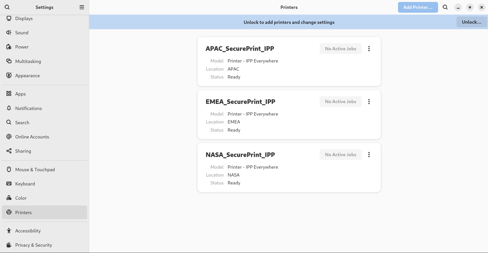 

<h3 id="adding-a-new-printer-in-settings">13.2. Adding a new printer in Settings</h3>

You can add a new printer by using the **Settings** application.

**Prerequisites**

- Click the Unlock button, which is displayed near the upper-right corner of the **Printers** screen, and authenticate as one of the following users:
  
  - Superuser
  - Any user with the administrative access provided by `sudo` (users listed within `/etc/sudoers`)
  - Any user belonging to the `printadmin` group in `/etc/group`

**Procedure**

1. Open the **Printers** dialog.
   
    
2. Click **Unlock** and authenticate.
   
   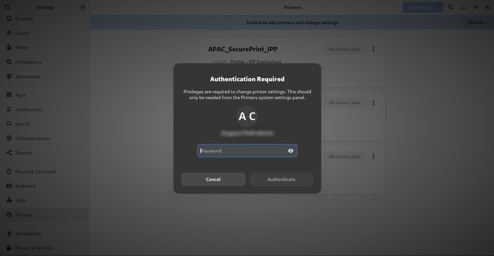 
3. Select one of the available printers (including also network printers), or enter printer IP address or the hostname of a printer server.
   
   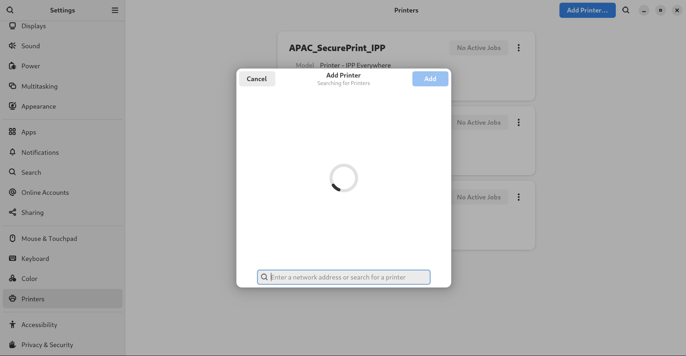 
   
   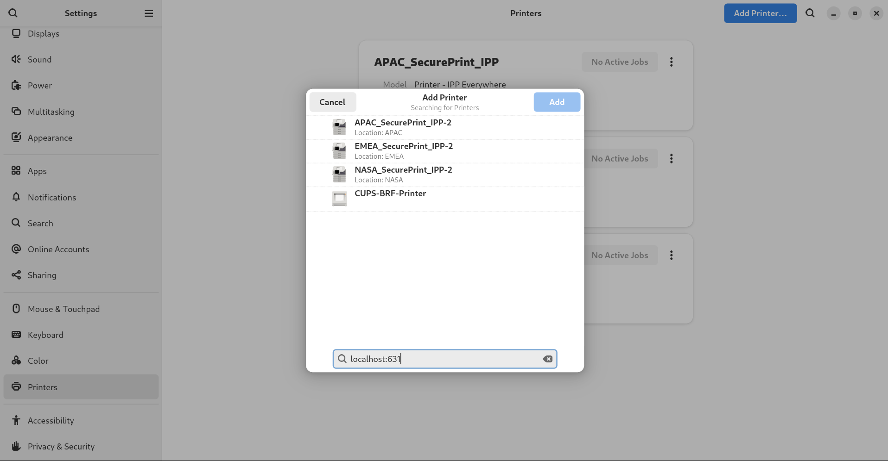 
4. Confirm your selection by clicking Add in the top right corner.
   
   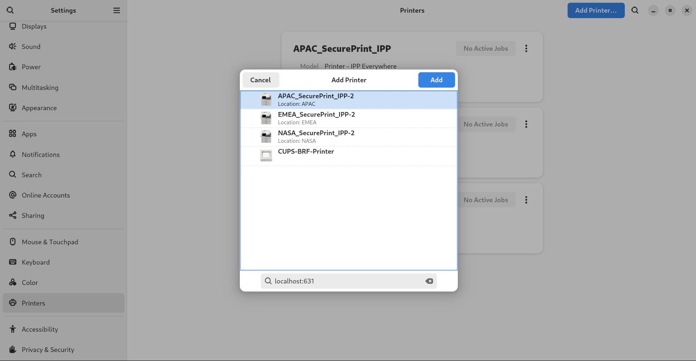 

<h3 id="printing-a-test-page-in-settings">13.3. Printing a test page in Settings</h3>

You can print a test page to make sure that the printer functions properly.

**Prerequisites**

- A printer is set up.

**Procedure**

1. Click the settings (⚙️) button on the right to display a settings menu for the selected printer:
   
   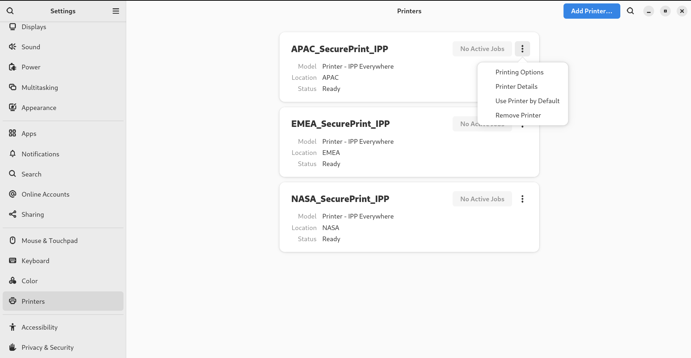 
2. Click Printing Options → Test Page.

<h3 id="modifying-printer-settings">13.4. Modifying printer settings</h3>

In GNOME, you can modify printer settings by using the **Settings** application.

<h4 id="displaying-and-modifying-printers-details">13.4.1. Displaying and modifying printer details</h4>

You can use the **Settings** application to maintain a configuration of a printer.

**Procedure**

1. Click the settings (⚙️) button on the right to display a settings menu for the selected printer:
   
    
2. Click **Printer Details** to display and modify selected printer’s settings:
   
    
   
   In this menu, you can select the following actions:
   
   Search for Drivers
   
   GNOME Control Center communicates with **PackageKit** that searches for a suitable driver suitable in available repositories.
   
   Select from Database
   
   This option enables you to select a suitable driver from databases that have already been installed on the system.
   
   Install PPD File
   
   This option enables you to select from a list of available postscript printer description (PPD) files that can be used as a driver for your printer.
   
   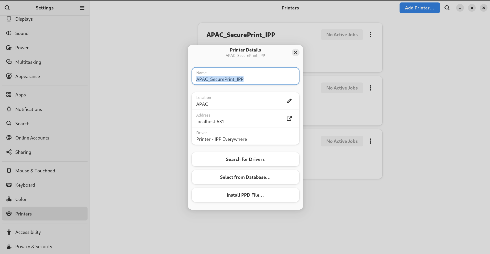 

<h4 id="setting-the-default-printer">13.4.2. Setting the default printer</h4>

You can set the selected printer as the default printer.

**Procedure**

1. Click the settings (⚙️) button on the right to display a settings menu for the selected printer:
   
    
2. Click **Use Printer by Default** to set the selected printer as the default printer:
   
    

<h4 id="setting-printing-options">13.4.3. Setting printing options</h4>

Access the printing options menu for your selected printer.

**Procedure**

1. Click the settings (⚙️) button on the right to display a settings menu for the selected printer:
   
    
2. Click **Printing Options**.

<h4 id="removing-a-printer">13.4.4. Removing a printer</h4>

You can remove a printer by using the **Settings** application.

**Procedure**

1. Click the settings (⚙️) button on the right to display a settings menu for the selected printer:
   
    
2. Click **Remove Printer** to remove the selected printer:
   
    

<h2 id="enabling-and-enforcing-gnome-shell-extensions">Chapter 14. Enabling and enforcing GNOME Shell extensions</h2>

GNOME Shell extensions are add-ons that enhance the functionality and appearance of the GNOME desktop environment. Users can enable extensions for their own desktop session or for all users on the system.

<h3 id="enabling-system-wide-gnome-shell-extensions">14.1. Enabling system-wide GNOME Shell extensions</h3>

You can automatically enable GNOME extensions for all users, which eliminates the need for individual installations. Existing users with personalized extensions are not affected.

**Prerequisites**

- Administrative access.

**Procedure**

1. Download the extension archive from the GNOME Extensions website.
2. Extract the archive into the `/usr/share/gnome-shell/extensions/` directory:
   
   ```
   unzip -q <extension-file.zip> -d /usr/share/gnome-shell/extensions/
   ```
   
   ```plaintext
   # unzip -q <extension-file.zip> -d /usr/share/gnome-shell/extensions/
   ```
   
   Replace `<extension-file.zip>` with the name of the extension zip file.
3. Adjust the permissions to ensure that the extension files are readable and executable by everyone:
   
   ```
   chmod -R 755 /usr/share/gnome-shell/extensions/<extension-directory>/
   ```
   
   ```plaintext
   # chmod -R 755 /usr/share/gnome-shell/extensions/<extension-directory>/
   ```
   
   Replace `<extension-directory>` with the name of the extension directory.
4. Create a new `/etc/dconf/db/local.d/00-extensions` file with the following content:
   
   ```
   [org/gnome/shell]
   enabled-extensions=['myextension1@myname.example.com', 'myextension2@myname.example.com']
   ```
   
   ```plaintext
   [org/gnome/shell]
   enabled-extensions=['myextension1@myname.example.com', 'myextension2@myname.example.com']
   ```
   
   Replace the UUIDs (`myextension1@myname.example.com`, `myextension2@myname.example.com)` with the ones you want to enable. You can find the UUID of an extension on its GNOME Shell extensions website page.
5. Apply the changes to the system databases:
   
   ```
   dconf update
   ```
   
   ```plaintext
   # dconf update
   ```

**Result**

- After completing these steps, the specified extensions are enabled by default for all new users on your system.

<h3 id="restricting-gnome-shell-extensions">14.2. Restricting GNOME Shell extensions</h3>

By locking down specific GNOME Shell extensions, you can ensure that a predefined set of extensions is consistently available to all users. You can configure a set of mandatory extensions and prevent users from modifying them. .Prerequisites

- Administrative access.

**Procedure**

1. Create a new `/etc/dconf/db/local.d/00-extensions` file with the following content:
   
   ```
   [org/gnome/shell]
   eExtensions that are not listed in the `org.gnome.shell.enabled-extensions` file are not loaded by the GNOME Shell, preventing the user from using them.led-extensions=['myextension1@myname.example.com', 'myextension2@myname.example.com']
   development-tools=false
   ```
   
   ```plaintext
   [org/gnome/shell]
   eExtensions that are not listed in the `org.gnome.shell.enabled-extensions` file are not loaded by the GNOME Shell, preventing the user from using them.led-extensions=['myextension1@myname.example.com', 'myextension2@myname.example.com']
   development-tools=false
   ```
   
   Replace the UUIDs (`myextension1@myname.example.com`, `myextension2@myname.example.com)` with the ones you want to enable. You can find the UUID of an extension on its GNOME Shell extensions website page.
2. To prevent users from changing these settings, create a new `/etc/dconf/db/local.d/locks/extensions` file with the following content:
   
   ```
   /org/gnome/shell/enabled-extensions
   /org/gnome/shell/development-tools
   ```
   
   ```plaintext
   /org/gnome/shell/enabled-extensions
   /org/gnome/shell/development-tools
   ```
3. Apply the changes to the system databases:
   
   ```
   dconf update
   ```
   
   ```plaintext
   # dconf update
   ```

**Result**

- Extensions that are not listed in the `org.gnome.shell.enabled-extensions` file are not loaded by the GNOME Shell, preventing the user from using them.

<h3 id="managing-gnome-shell-extensions-by-using-the-command-line">14.3. Managing GNOME Shell extensions by using the command line</h3>

The `gnome-extensions` utility is a command-line tool to manage GNOME Shell extensions from the terminal. It provides various commands to list, install, enable, disable, remove, and get information about extensions.

Each GNOME Shell extension has a Universally Unique Identifier (UUID). You can find the UUID of an extension on its GNOME Shell extensions website page.

**Procedure**

- To list the installed GNOME Shell extensions, use:
  
  ```
  gnome-extensions list
  ```
  
  ```plaintext
  $ gnome-extensions list
  ```
- To install a GNOME Shell extension, use:
  
  ```
  gnome-extensions install <UUID>
  ```
  
  ```plaintext
  $ gnome-extensions install <UUID>
  ```
- To enable a GNOME Shell extension, use:
  
  ```
  gnome-extensions enable <UUID>
  ```
  
  ```plaintext
  $ gnome-extensions enable <UUID>
  ```
- To show information about a GNOME Shell extension, use:
  
  ```
  gnome-extensions info <UUID>
  ```
  
  ```plaintext
  $ gnome-extensions info <UUID>
  ```
- To disable a GNOME Shell extension, use:
  
  ```
  gnome-extensions disable <UUID>
  ```
  
  ```plaintext
  $ gnome-extensions disable <UUID>
  ```
- To remove a GNOME Shell extension, use:
  
  ```
  gnome-extensions uninstall <UUID>
  ```
  
  ```plaintext
  $ gnome-extensions uninstall <UUID>
  ```
  
  Replace the `<UUIDs>` with the unique identifier assigned to the GNOME Shell extension you want to install.

<h2 id="idm140154766909888">Legal Notice</h2>

Copyright © Red Hat.

Except as otherwise noted below, the text of and illustrations in this documentation are licensed by Red Hat under the Creative Commons Attribution–Share Alike 3.0 Unported license . If you distribute this document or an adaptation of it, you must provide the URL for the original version.

Red Hat, as the licensor of this document, waives the right to enforce, and agrees not to assert, Section 4d of CC-BY-SA to the fullest extent permitted by applicable law.

Red Hat, the Red Hat logo, JBoss, Hibernate, and RHCE are trademarks or registered trademarks of Red Hat, LLC. or its subsidiaries in the United States and other countries.

Linux® is the registered trademark of Linus Torvalds in the United States and other countries.

XFS is a trademark or registered trademark of Hewlett Packard Enterprise Development LP or its subsidiaries in the United States and other countries.

The OpenStack® Word Mark and OpenStack logo are trademarks or registered trademarks of the Linux Foundation, used under license.

All other trademarks are the property of their respective owners.
