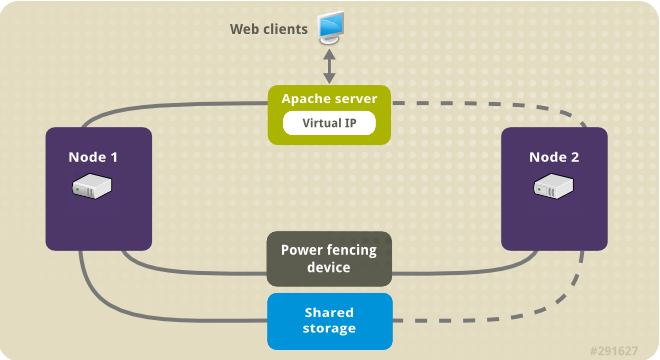

# Configuring and managing high availability clusters

* * *

Red Hat Enterprise Linux 10

## Using the Red Hat High Availability Add-On to create and maintain Pacemaker clusters

Red Hat Customer Content Services

[Legal Notice](#idm139841676502960)

**Abstract**

The Red Hat High Availability Add-On configures high availability clusters that use the Pacemaker cluster resource manager. This title provides procedures to familiarize you with Pacemaker cluster configuration as well as example procedures for configuring active/passive clusters.

* * *

<h2 id="providing-feedback-on-red-hat-documentation">Providing feedback on Red Hat documentation</h2>

We are committed to providing high-quality documentation and value your feedback. To help us improve, you can submit suggestions or report errors through the Red Hat Jira tracking system.

**Procedure**

1. Log in to the [Jira](https://issues.redhat.com/projects/RHELDOCS/issues) website.
   
   If you do not have an account, select the option to create one.
2. Click **Create** in the top navigation bar.
3. Enter a descriptive title in the **Summary** field.
4. Enter your suggestion for improvement in the **Description** field. Include links to the relevant parts of the documentation.
5. Click **Create** at the bottom of the dialogue.

<h2 id="overview-of-high-availability">Chapter 1. High Availability Add-On overview</h2>

The High Availability Add-On is a clustered system that provides reliability, scalability, and availability to critical production services.

High availability clusters, sometimes called failover clusters, provide highly available services by eliminating single points of failure and by failing over services from one cluster node to another in case a node becomes inoperative. Typically, services in a high availability cluster read and write data by means of read-write mounted file systems. A high availability cluster must maintain data integrity as one cluster node takes over control of a service from another cluster node. Node failures in a high availability cluster are not visible from clients outside the cluster. The High Availability Add-On provides high availability clustering through its high availability service management component, Pacemaker.

Pacemaker is the cluster resource manager for the High Availability Add-On. It achieves maximum availability for your cluster services and resources by making use of the cluster infrastructure’s messaging and membership capabilities to deter and recover from node and resource-level failure.

Red Hat provides a variety of documentation for planning, configuring, and maintaining a Red Hat high availability cluster. For a listing of articles that provide guided indexes to the various areas of Red Hat cluster documentation, see the Red Hat Knowledgebase article [Red Hat High Availability Add-On Documentation Guide](https://access.redhat.com/articles/6565761).

<h3 id="pacemaker\_architecture\_components">1.1. Pacemaker architecture components</h3>

A cluster configured with Pacemaker comprises separate component daemons that monitor cluster membership, scripts that manage the services, and resource management subsystems that monitor the disparate resources.

The following components form the Pacemaker architecture:

Cluster Information Base (CIB)

The Pacemaker information daemon, which uses XML internally to distribute and synchronize current configuration and status information from the Designated Coordinator (DC) - a node assigned by Pacemaker to store and distribute cluster state and actions by means of the CIB - to all other cluster nodes.

Cluster Resource Management Daemon (CRMd)

Pacemaker cluster resource actions are routed through this daemon. Resources managed by CRMd can be queried by client systems, moved, instantiated, and changed when needed.

Each cluster node also includes a local resource manager daemon (LRMd) that acts as an interface between CRMd and resources. LRMd passes commands from CRMd to agents, such as starting and stopping and relaying status information.

Shoot the Other Node in the Head (STONITH)

STONITH is the Pacemaker fencing implementation. It acts as a cluster resource in Pacemaker that processes fence requests, forcefully shutting down nodes and removing them from the cluster to ensure data integrity. STONITH is configured in the CIB and can be monitored as a normal cluster resource.

corosync

`corosync` is the component and daemon of the same name that serves the core membership and member-communication needs for high availability clusters. It is required for the High Availability Add-On to function.

In addition to those membership and messaging functions, `corosync` also:

- Manages quorum rules and determination.
- Provides messaging capabilities for applications that coordinate or operate across multiple members of the cluster and thus must communicate stateful or other information between instances.
- Uses the `kronosnet` library as its network transport to provide multiple redundant links and automatic failover.

<h3 id="pacemaker\_configuration\_and\_management\_tools">1.2. Pacemaker configuration and management tools</h3>

The High Availability Add-On features three configuration tools for cluster deployment, monitoring, and management.

`pcs` command-line interface

The `pcs` command-line interface controls and configures Pacemaker and the `corosync` heartbeat daemon. A command-line based program, `pcs` can perform the following cluster management tasks:

- Create and configure a Pacemaker cluster
- Modify configuration of the cluster while it is running
- Start, stop, and display status information of the cluster

HA Cluster Management RHEL web console add-on

The HA Cluster Management RHEL web console add-on is a graphical user interface to create and configure Pacemaker clusters. The HA Cluster Management RHEL web console add-on is available through the RHEL web console when the `cockpit-ha-cluster` package is installed. For information about the RHEL web console, see [Getting started with the HA Cluster Management add-on for the RHEL web console](#getting-started-with-ha-cluster-for-web-console "Chapter 2. Getting started with the HA Cluster Management add-on for the RHEL web console").

`ha_cluster` RHEL system role

With the `ha_cluster` RHEL system role, you can configure and manage a high-availability cluster that uses the Pacemaker high availability cluster resource manager. For information about using RHEL system roles, see [Automating system administration by using RHEL system roles](https://docs.redhat.com/en/documentation/red_hat_enterprise_linux/10/html/automating_system_administration_by_using_rhel_system_roles/index).

<h3 id="the\_cluster\_and\_pacemaker\_configuration\_files">1.3. The cluster and Pacemaker configuration files</h3>

The configuration files for the Red Hat High Availability Add-On are `corosync.conf` and `cib.xml`.

- The `corosync.conf` file provides the cluster parameters used by `corosync`, the cluster manager that Pacemaker is built on. In general, you should not edit the `corosync.conf` directly but, instead, use the `pcs` interface, the HA Cluster Management RHEL web console add-on, or the `ha_cluster` RHEL system role.
- The `cib.xml` file is an XML file that represents both the cluster’s configuration and the current state of all resources in the cluster. This file is used by Pacemaker’s Cluster Information Base (CIB). The contents of the CIB are automatically kept in sync across the entire cluster. Do not edit the `cib.xml` file directly; use the `pcs` interface, the HA Cluster Management RHEL web console add-on, or the `ha_cluster` RHEL system role.

<h2 id="getting-started-with-ha-cluster-for-web-console">Chapter 2. Getting started with the HA Cluster Management add-on for the RHEL web console</h2>

The HA Cluster Management RHEL web console add-on is a graphical user interface to create and configure Pacemaker clusters. The HA Cluster Management RHEL web console add-on is available through the RHEL web console when the `cockpit-ha-cluster` package is installed.

Note

Previous releases of Red Hat Enterprise Linux utilized the `pcsd` Web UI as the standalone graphical user interface for HA cluster configuration. This interface has been modified to be usable as a RHEL web console add-on and is no longer operated as a standalone interface.

<h3 id="installing-ha-cluster-for-web-console">2.1. Installing and enabling the HA Cluster Management add-on for the RHEL web console</h3>

To use the HA Cluster Management add-on to configure a high availability cluster, add the HA Cluster Management application to the RHEL web console and install and enable the necessary Red Hat High Availability Add-On software packages and services on each node in your cluster.

**Prerequisites**

- You have installed the RHEL 10 web console.
  
  For instructions, see [Installing and enabling the web console](https://docs.redhat.com/en/documentation/red_hat_enterprise_linux/10/html/managing_systems_in_the_rhel_web_console/getting-started-with-the-rhel-web-console#installing-and-enabling-the-web-console).

**Procedure**

1. From the system on which you are running the RHEL web console, log in to the console and install the HA Cluster Management add-on application. See [Add-on applications for the RHEL web console](https://docs.redhat.com/en/documentation/red_hat_enterprise_linux/10/html/managing_systems_in_the_rhel_web_console/installing-web-console-add-ons-and-creating-custom-pages#add-ons-for-the-rhel-web-console) in the "Managing systems in the RHEL web console" document for details.
2. On each cluster node, install the Red Hat High Availability fence agents from the High Availability channel.
   
   ```
   dnf install fence-agents-all
   ```
   
   ```plaintext
   # dnf install fence-agents-all
   ```
   
   You can install only the fence agent that you require with the following command.
   
   ```
   dnf install fence-agents-model
   ```
   
   ```plaintext
   # dnf install fence-agents-model
   ```
3. On each cluster node, ensure that the `pcsd` service is running.
   
   ```
   systemctl status pcsd.service
   ```
   
   ```plaintext
   # systemctl status pcsd.service
   ```
   
   If the `pcsd` service is not running on a cluster node, enter the following command to start the `pcsd` service and to enable it at system start.
   
   ```
   systemctl enable --now pcsd.service
   ```
   
   ```plaintext
   # systemctl enable --now pcsd.service
   ```
4. Ensure you are logged in to the RHEL web console. To use the RHEL web console to create clusters, the user account used to sign in to the web console must have sudo access to the system.
   
   Note
   
   The `hacluster` user account is the Pacemaker service account and you cannot use this account to log in to the RHEL web console.
5. In the RHEL web console, switch to administrative access mode. For information about administrative access mode, see [Administrative access in the web console](https://docs.redhat.com/en/documentation/red_hat_enterprise_linux/10/html/managing_systems_in_the_rhel_web_console/getting-started-with-the-rhel-web-console#administrative-access-in-the-web-console) in the "Managing systems in the RHEL web console" document.
   
   Note
   
   Only a user with sudo access can create clusters and add nodes to existing ones. After you create a cluster, by default, users in the `haclient` group can manage the cluster and change permissions. For information about granting different permissions to any other users and groups that require them, or for modifying the default `haclient` permissions, see [Granting HA Cluster Management permissions](#granting-ha-cluster-management-permissions "2.2. Granting HA Cluster Management permissions").

<h3 id="granting-ha-cluster-management-permissions">2.2. Granting HA Cluster Management permissions</h3>

Each cluster can have a different set of permissions used for its administration. A user with administrative access or full permissions can grant full permissions to other users and groups for the HA Cluster Management web console add-on.

The following table summarizes the cluster management permissions you can grant for the HA Cluster Management web console add-on.

| Permission | Allowed administrative task                                                                                    |
|:-----------|:---------------------------------------------------------------------------------------------------------------|
| Read       | Viewing cluster settings.                                                                                      |
| Write      | Modifying all cluster settings except permissions and ACLs. Does not allow adding nodes and creating clusters. |
| Grant      | Modifying ACLs and granting read, write, and grant permissions.                                                |
| Full       | Performing all cluster management except adding nodes or creating clusters.                                    |

**Prerequisites**

- You have installed and enabled the HA Cluster Management add-on for the RHEL web console, as described in [Installing and enabling the HA Cluster Management add-on for the RHEL web console](#installing-ha-cluster-for-web-console "2.1. Installing and enabling the HA Cluster Management add-on for the RHEL web console").
- You have created a cluster for which you want to manage permissions and it has been added to the cluster list in the HA Cluster Management add-on.

**Procedure**

1. Log in to the RHEL web console with an account that has sudo access to the system and ensure that you are in administrative access mode. For information about administrative access mode, see [Administrative access in the web console](https://docs.redhat.com/en/documentation/red_hat_enterprise_linux/10/html-single/managing_systems_in_the_rhel_web_console/getting-started-with-the-rhel-web-console#administrative-access-in-the-web-console) in the "Managing systems in the RHEL web console" document.
   
   Alternatively, log into the RHEL web console with an account that has grant permissions for the cluster you want to manage. The account must be a member of the `haclient` group to see the HA Cluster Management web console add-on in limited access mode.
2. Select a cluster for which you want to manage permissions from the cluster list.
3. In the cluster detail, click the **Permissions** tab on the top of the page and select **Create Permission**.
4. Add, remove, or edit the permissions for a user or group.
5. By default, any user with an account that is a member of the `haclient` group has read, write and grant permissions. From the **Permissions** page you can remove this permission if you have administrative access in the web console or if you have grant permissions.

<h2 id="creating-high-availability-cluster">Chapter 3. Creating a Red Hat High-Availability cluster with Pacemaker</h2>

To create a Red Hat High Availability two-node cluster use the `pcs` command-line interface.

<h3 id="prerequisites">3.1. Prerequisites</h3>

- 2 RHEL nodes, which will be used to create the cluster. In this example, the nodes used are `z1.example.com` and `z2.example.com`.
- Network switches for the private network. We recommend but do not require a private network for communication among the cluster nodes and other cluster hardware such as network power switches and Fibre Channel switches.
- A fencing device for each node of the cluster. This example uses two ports of the APC power switch with a host name of `zapc.example.com`.

Note

You must ensure that your configuration conforms to Red Hat’s support policies. For full information about Red Hat’s support policies, requirements, and limitations for RHEL High Availability clusters, see the Red Hat Knowledgebase article [Support Policies for RHEL High Availability Clusters](https://access.redhat.com/articles/2912891/).

<h3 id="installing-cluster-software">3.2. Installing cluster software</h3>

Install the cluster software and configure your system for cluster creation.

**Procedure**

1. On each node in the cluster, enable the repository for high availability that corresponds to your system architecture. For example, to enable the high availability repository for an x86\_64 system, you can enter the following `subscription-manager` command:
   
   ```
   subscription-manager repos --enable=rhel-10-for-x86_64-highavailability-rpms
   ```
   
   ```plaintext
   # subscription-manager repos --enable=rhel-10-for-x86_64-highavailability-rpms
   ```
2. On each node in the cluster, install the Red Hat High Availability Add-On software packages along with all available fence agents from the High Availability channel.
   
   ```
   dnf install pcs pacemaker fence-agents-all
   ```
   
   ```plaintext
   # dnf install pcs pacemaker fence-agents-all
   ```
   
   Alternatively, you can install the Red Hat High Availability Add-On software packages along with only the fence agent that you require with the following command.
   
   ```
   dnf install pcs pacemaker fence-agents-model
   ```
   
   ```plaintext
   # dnf install pcs pacemaker fence-agents-model
   ```
   
   The following command displays a list of the available fence agents.
   
   ```
   rpm -q -a | grep fence
   fence-agents-rhevm-4.0.2-3.el7.x86_64
   fence-agents-ilo-mp-4.0.2-3.el7.x86_64
   fence-agents-ipmilan-4.0.2-3.el7.x86_64
   ...
   ```
   
   ```plaintext
   # rpm -q -a | grep fence
   fence-agents-rhevm-4.0.2-3.el7.x86_64
   fence-agents-ilo-mp-4.0.2-3.el7.x86_64
   fence-agents-ipmilan-4.0.2-3.el7.x86_64
   ...
   ```
   
   Warning
   
   After you install the Red Hat High Availability Add-On packages, you should ensure that your software update preferences are set so that nothing is installed automatically. Installation on a running cluster can cause unexpected behaviors. For more information, see the Red Hat Knowledgebase article [Recommended Practices for Applying Software Updates to a RHEL High Availability or Resilient Storage Cluster](https://access.redhat.com/articles/2059253/).
3. If you are running the `firewalld` daemon, execute the following commands to enable the ports that are required by the Red Hat High Availability Add-On.
   
   Note
   
   You can determine whether the `firewalld` daemon is installed on your system with the `rpm -q firewalld` command. If it is installed, you can determine whether it is running with the `firewall-cmd --state` command.
   
   ```
   firewall-cmd --permanent --add-service=high-availability
   firewall-cmd --add-service=high-availability
   ```
   
   ```plaintext
   # firewall-cmd --permanent --add-service=high-availability
   # firewall-cmd --add-service=high-availability
   ```
   
   Note
   
   The ideal firewall configuration for cluster components depends on the local environment, where you may need to take into account such considerations as whether the nodes have multiple network interfaces or whether off-host firewalling is present. The example here, which opens the ports that are generally required by a Pacemaker cluster, should be modified to suit local conditions. [Enabling ports for the High Availability Add-On](#enabling-ports-for-high-availability "3.8. Enabling ports for the High Availability Add-On") shows the ports to enable for the Red Hat High Availability Add-On and provides an explanation for what each port is used for.
4. In order to use `pcs` to configure the cluster and communicate among the nodes, you must set a password on each node for the user ID `hacluster`, which is the `pcs` administration account. It is recommended that the password for user `hacluster` be the same on each node.
   
   ```
   passwd hacluster
   Changing password for user hacluster.
   New password:
   Retype new password:
   passwd: all authentication tokens updated successfully.
   ```
   
   ```plaintext
   # passwd hacluster
   Changing password for user hacluster.
   New password:
   Retype new password:
   passwd: all authentication tokens updated successfully.
   ```
5. Before the cluster can be configured, the `pcsd` daemon must be started and enabled to start up on boot on each node. This daemon works with the `pcs` command to manage configuration across the nodes in the cluster.
   
   On each node in the cluster, execute the following commands to start the `pcsd` service and to enable `pcsd` at system start.
   
   ```
   systemctl start pcsd.service
   systemctl enable pcsd.service
   ```
   
   ```plaintext
   # systemctl start pcsd.service
   # systemctl enable pcsd.service
   ```

<h3 id="installing-pcp-zeroconf">3.3. Installing the pcp-zeroconf package (recommended)</h3>

Install the `pcp-zeroconf` package to configure Performance Co-Pilot (PCP). PCP collects performance data essential for troubleshooting fencing, resource failures, and cluster disruptions.

Note

Cluster deployments where PCP is enabled will need sufficient space available for PCP’s captured data on the file system that contains `/var/log/pcp/`. Typical space usage by PCP varies across deployments, but 10Gb is usually sufficient when using the `pcp-zeroconf` default settings, and some environments may require less. Monitoring usage in this directory over a 14-day period of typical activity can provide a more accurate usage expectation.

**Procedure**

- To install the `pcp-zeroconf` package, run the following command:
  
  ```
  dnf install pcp-zeroconf
  ```
  
  ```plaintext
  # dnf install pcp-zeroconf
  ```
  
  This package enables `pmcd` and sets up data capture at a 10-second interval.

**Additional resources**

- [Why did a RHEL High Availability cluster node reboot - and how can I prevent it from happening again?](https://access.redhat.com/solutions/4545111)

<h3 id="creating-a-high-availability-cluster">3.4. Creating a high availability cluster</h3>

You can create a Red Hat High Availability Add-On cluster. This example uses nodes `z1.example.com` and `z2.example.com`.

Note

To display the parameters of a `pcs` command and a description of those parameters, use the `-h` option of the `pcs` command.

**Prerequisites**

- You have created [a Red Hat account](https://www.redhat.com/wapps/ugc/register.html)

**Procedure**

1. Authenticate the `pcs` user `hacluster` for each node in the cluster on the node from which you will be running `pcs`.
   
   The following command authenticates user `hacluster` on `z1.example.com` for both of the nodes in a two-node cluster that will consist of `z1.example.com` and `z2.example.com`.
   
   ```
   pcs host auth z1.example.com z2.example.com
   Username: hacluster
   Password:
   z1.example.com: Authorized
   z2.example.com: Authorized
   ```
   
   ```plaintext
   [root@z1 ~]# pcs host auth z1.example.com z2.example.com
   Username: hacluster
   Password:
   z1.example.com: Authorized
   z2.example.com: Authorized
   ```
2. Execute the following command from `z1.example.com` to create the two-node cluster `my_cluster` that consists of nodes `z1.example.com` and `z2.example.com`. This will propagate the cluster configuration files to both nodes in the cluster. This command includes the `--start` option, which will start the cluster services on both nodes in the cluster.
   
   ```
   pcs cluster setup my_cluster --start z1.example.com z2.example.com
   ```
   
   ```plaintext
   [root@z1 ~]# pcs cluster setup my_cluster --start z1.example.com z2.example.com
   ```
3. Enable the cluster services to run on each node in the cluster when the node is booted.
   
   Note
   
   For your particular environment, you can skip this step by keeping the cluster services disabled. If enabled and a node goes down, any issues with your cluster or your resources are resolved before the node rejoins the cluster. If you keep the cluster services disabled, you need to manually start the services when you reboot a node by executing the `pcs cluster start` command on that node.
   
   ```
   pcs cluster enable --all
   ```
   
   ```plaintext
   [root@z1 ~]# pcs cluster enable --all
   ```
4. Display the status of the cluster you created with the `pcs cluster status` command. Because there could be a slight delay before the cluster is up and running when you start the cluster services with the `--start` option of the `pcs cluster setup` command, you should ensure that the cluster is up and running before performing any subsequent actions on the cluster and its configuration.
   
   ```
   pcs cluster status
   Cluster Status:
    Stack: corosync
    Current DC: z2.example.com (version 2.0.0-10.el8-b67d8d0de9) - partition with quorum
    Last updated: Thu Oct 11 16:11:18 2018
    Last change: Thu Oct 11 16:11:00 2018 by hacluster via crmd on z2.example.com
    2 Nodes configured
    0 Resources configured
   
   ...
   ```
   
   ```plaintext
   [root@z1 ~]# pcs cluster status
   Cluster Status:
    Stack: corosync
    Current DC: z2.example.com (version 2.0.0-10.el8-b67d8d0de9) - partition with quorum
    Last updated: Thu Oct 11 16:11:18 2018
    Last change: Thu Oct 11 16:11:00 2018 by hacluster via crmd on z2.example.com
    2 Nodes configured
    0 Resources configured
   
   ...
   ```

<h3 id="configuring-multiple-ip-cluster">3.5. Creating a high availability cluster with multiple links</h3>

You create a Red Hat High Availability cluster with multiple links by specifying all of the links for each node with the `pcs cluster setup` command.

The format for the basic command to create a two-node cluster with two links is as follows.

```
pcs cluster setup pass:quotes[cluster_name] pass:quotes[node1_name] addr=pass:quotes[node1_link0_address] addr=pass:quotes[node1_link1_address] pass:quotes[node2_name] addr=pass:quotes[node2_link0_address] addr=pass:quotes[node2_link1_address]
```

```plaintext
# pcs cluster setup pass:quotes[cluster_name] pass:quotes[node1_name] addr=pass:quotes[node1_link0_address] addr=pass:quotes[node1_link1_address] pass:quotes[node2_name] addr=pass:quotes[node2_link0_address] addr=pass:quotes[node2_link1_address]
```

For the full syntax of this command, see the `pcs`(8) man page on your system.

When creating a cluster with multiple links, you take the following caveats into account.

- The order of the `addr=address` parameters is important. The first address specified after a node name is for `link0`, the second one for `link1`, and so forth.
- By default, if `link_priority` is not specified for a link, the link’s priority is equal to the link number. The link priorities are then 0, 1, 2, 3, and so forth, according to the order specified, with 0 being the highest link priority.
- The default link mode is `passive`, meaning the active link with the lowest-numbered link priority is used.
- With the default values of `link_mode` and `link_priority`, the first link specified will be used as the highest priority link, and if that link fails the next link specified will be used.
- It is possible to specify up to eight links using the `knet` transport protocol, which is the default transport protocol.
- All nodes must have the same number of `addr=` parameters.
- It is possible to add, remove, and change links in an existing cluster using the `pcs cluster link add`, the `pcs cluster link remove`, the `pcs cluster link delete`, and the `pcs cluster link update` commands.
- As with single-link clusters, do not mix IPv4 and IPv6 addresses in one link, although you can have one link running IPv4 and the other running IPv6.
- As with single-link clusters, you can specify addresses as IP addresses or as names as long as the names resolve to IPv4 or IPv6 addresses for which IPv4 and IPv6 addresses are not mixed in one link.

The following example creates a two-node cluster named `my_twolink_cluster` with two nodes, `rh80-node1` and `rh80-node2`. `rh80-node1` has two interfaces, IP address 192.168.122.201 as `link0` and 192.168.123.201 as `link1`. `rh80-node2` has two interfaces, IP address 192.168.122.202 as `link0` and 192.168.123.202 as `link1`.

```
pcs cluster setup my_twolink_cluster rh80-node1 addr=192.168.122.201 addr=192.168.123.201 rh80-node2 addr=192.168.122.202 addr=192.168.123.202
```

```plaintext
# pcs cluster setup my_twolink_cluster rh80-node1 addr=192.168.122.201 addr=192.168.123.201 rh80-node2 addr=192.168.122.202 addr=192.168.123.202
```

To set a link priority to a different value than the default value, which is the link number, you can set the link priority with the `link_priority` option of the `pcs cluster setup` command. Each of the following two example commands creates a two-node cluster with two interfaces where the first link, link 0, has a link priority of 1 and the second link, link 1, has a link priority of 0. Link 1 will be used first and link 0 will serve as the failover link. Since link mode is not specified, it defaults to passive.

These two commands are equivalent. If you do not specify a link number following the `link` keyword, the `pcs` interface automatically adds a link number, starting with the lowest unused link number.

```
pcs cluster setup my_twolink_cluster rh80-node1 addr=192.168.122.201 addr=192.168.123.201 rh80-node2 addr=192.168.122.202 addr=192.168.123.202 transport knet link link_priority=1 link link_priority=0

pcs cluster setup my_twolink_cluster rh80-node1 addr=192.168.122.201 addr=192.168.123.201 rh80-node2 addr=192.168.122.202 addr=192.168.123.202 transport knet link linknumber=1 link_priority=0 link link_priority=1
```

```plaintext
# pcs cluster setup my_twolink_cluster rh80-node1 addr=192.168.122.201 addr=192.168.123.201 rh80-node2 addr=192.168.122.202 addr=192.168.123.202 transport knet link link_priority=1 link link_priority=0

# pcs cluster setup my_twolink_cluster rh80-node1 addr=192.168.122.201 addr=192.168.123.201 rh80-node2 addr=192.168.122.202 addr=192.168.123.202 transport knet link linknumber=1 link_priority=0 link link_priority=1
```

**Additional resources**

- [Adding a node to a cluster with multiple links](#add-nodes-to-multiple-ip-cluster "19.5. Adding a node to a cluster with multiple links")
- [Adding and modifying links in an existing cluster](https://docs.redhat.com/en/documentation/red_hat_enterprise_linux/10/html-single/configuring_and_managing_high_availability_clusters/index#adding-and-modifying-links-in-an-existing-cluster)

<h3 id="configure-fencing">3.6. Configuring fencing</h3>

You must configure a fencing device for each node in the cluster. For information about the fence configuration commands and options, see [Configuring fencing in a Red Hat High Availability cluster](#configuring-fencing "Chapter 9. Configuring fencing in a Red Hat High Availability cluster").

For general information about fencing and its importance in a Red Hat High Availability cluster, see the Red Hat Knowledgebase solution [Fencing in a Red Hat High Availability Cluster](https://access.redhat.com/solutions/15575).

Note

When configuring a fencing device, attention should be given to whether that device shares power with any nodes or devices in the cluster. If a node and its fence device do share power, then the cluster may be at risk of being unable to fence that node if the power to it and its fence device should be lost. Such a cluster should either have redundant power supplies for fence devices and nodes, or redundant fence devices that do not share power. Alternative methods of fencing such as SBD or storage fencing may also bring redundancy in the event of isolated power losses.

This example fence configuration procedure uses the APC power switch with a host name of `zapc.example.com` to fence the nodes, and it uses the `fence_apc_snmp` fencing agent. Because both nodes will be fenced by the same fencing agent, you can configure both fencing devices as a single resource, using the `pcmk_host_map` option.

You create a fencing device by configuring the device as a `stonith` resource with the `pcs stonith create` command. The following command configures a `stonith` resource named `myapc` that uses the `fence_apc_snmp` fencing agent for nodes `z1.example.com` and `z2.example.com`. The `pcmk_host_map` option maps `z1.example.com` to port 1, and `z2.example.com` to port 2. The login value and password for the APC device are both `apc`. By default, this device will use a monitor interval of sixty seconds for each node.

**Procedure**

1. Create the fencing device. Note that you can use an IP address when specifying the host name for the nodes.
   
   ```
   pcs stonith create myapc fence_apc_snmp ipaddr="zapc.example.com" pcmk_host_map="z1.example.com:1;z2.example.com:2" login="apc" passwd="apc"
   ```
   
   ```plaintext
   [root@z1 ~]# pcs stonith create myapc fence_apc_snmp ipaddr="zapc.example.com" pcmk_host_map="z1.example.com:1;z2.example.com:2" login="apc" passwd="apc"
   ```
2. Display the parameters of the fence device you created.
   
   ```
   pcs stonith config myapc
    Resource: myapc (class=stonith type=fence_apc_snmp)
     Attributes: ipaddr=zapc.example.com pcmk_host_map=z1.example.com:1;z2.example.com:2 login=apc passwd=apc
     Operations: monitor interval=60s (myapc-monitor-interval-60s)
   ```
   
   ```plaintext
   [root@rh7-1 ~]# pcs stonith config myapc
    Resource: myapc (class=stonith type=fence_apc_snmp)
     Attributes: ipaddr=zapc.example.com pcmk_host_map=z1.example.com:1;z2.example.com:2 login=apc passwd=apc
     Operations: monitor interval=60s (myapc-monitor-interval-60s)
   ```
   
   After configuring your fence device, you should test the device. For information about testing a fence device, see [Testing a fence device](#testing-fence-devices "9.5. Testing a fence device").
   
   Note
   
   Do not test your fence device by disabling the network interface, as this will not properly test fencing.
   
   Note
   
   Once fencing is configured and a cluster has been started, a network restart will trigger fencing for the node which restarts the network even when the timeout is not exceeded. For this reason, do not restart the network service while the cluster service is running because it will trigger unintentional fencing on the node.

<h3 id="cluster-backup">3.7. Backing up and restoring a cluster configuration</h3>

You can back up a cluster configuration in a tar archive and restore the cluster configuration files on all nodes from the backup.

**Procedure**

- Use the following command to back up the cluster configuration in a tar archive. If you do not specify a file name, the standard output will be used.
  
  ```
  pcs config backup filename
  ```
  
  ```plaintext
  # pcs config backup filename
  ```
  
  Note
  
  The `pcs config backup` command backs up only the cluster configuration itself as configured in the CIB; the configuration of resource daemons is out of the scope of this command. For example if you have configured an Apache resource in the cluster, the resource settings (which are in the CIB) will be backed up, while the Apache daemon settings (as set in\`/etc/httpd\`) and the files it serves will not be backed up. Similarly, if there is a database resource configured in the cluster, the database itself will not be backed up, while the database resource configuration (CIB) will be.
- Use the following command to restore the cluster configuration files on all cluster nodes from the backup. Specifying the `--local` option restores the cluster configuration files only on the node from which you run this command. If you do not specify a file name, the standard input will be used.
  
  ```
  pcs config restore [--local] [filename]
  ```
  
  ```plaintext
  # pcs config restore [--local] [filename]
  ```

<h3 id="enabling-ports-for-high-availability">3.8. Enabling ports for the High Availability Add-On</h3>

The ideal firewall configuration for cluster components depends on the local environment, where you need to take into account such considerations as whether the nodes have multiple network interfaces or whether off-host firewalling is present.

**Procedure**

- If you are running the `firewalld` daemon, execute the following commands to enable the ports that are required by the Red Hat High Availability Add-On:
  
  ```
  firewall-cmd --permanent --add-service=high-availability
  firewall-cmd --add-service=high-availability
  ```
  
  ```plaintext
  # firewall-cmd --permanent --add-service=high-availability
  # firewall-cmd --add-service=high-availability
  ```
  
  You may need to modify which ports are open to suit local conditions.
  
  Note
  
  You can determine whether the `firewalld` daemon is installed on your system with the `rpm -q firewalld` command. If the `firewalld` daemon is installed, you can determine whether it is running with the `firewall-cmd --state` command.
  
  The following table shows the ports to enable for the Red Hat High Availability Add-On and provides an explanation for what the port is used for.
  
  Table 3.1. Ports to enable for High Availability Add-On
  
  PortWhen Required
  
  TCP 2224
  
  Default `pcsd` port required on all nodes for node-to-node communication). You can configure the `pcsd` port by means of the `PCSD_PORT` parameter in the `/etc/sysconfig/pcsd` file.
  
  It is crucial to open port 2224 in such a way that `pcs` from any node can talk to all nodes in the cluster, including itself. When using the Booth cluster ticket manager or a quorum device you must open port 2224 on all related hosts, such as Booth arbitrators or the quorum device host.
  
  TCP 3121
  
  Required on all nodes if the cluster has any Pacemaker Remote nodes
  
  Pacemaker’s `pacemaker-based` daemon on the full cluster nodes will contact the `pacemaker_remoted` daemon on Pacemaker Remote nodes at port 3121. If a separate interface is used for cluster communication, the port only needs to be open on that interface. At a minimum, the port should open on Pacemaker Remote nodes to full cluster nodes. Because users may convert a host between a full node and a remote node, or run a remote node inside a container using the host’s network, it can be useful to open the port to all nodes. It is not necessary to open the port to any hosts other than nodes.
  
  TCP 5403
  
  Required on the quorum device host when using a quorum device with `corosync-qnetd`. The default value can be changed with the `-p` option of the `corosync-qnetd` command.
  
  UDP 5404-5412
  
  Required on corosync nodes to facilitate communication between nodes. It is crucial to open ports 5404-5412 in such a way that `corosync` from any node can talk to all nodes in the cluster, including itself.
  
  TCP 21064
  
  Required on all nodes if the cluster contains any resources requiring DLM (such as `GFS2`).
  
  TCP 9929, UDP 9929
  
  Required to be open on all cluster nodes and Booth arbitrator nodes to connections from any of those same nodes when the Booth ticket manager is used to establish a multi-site cluster.

<h3 id="ibmz">3.9. Configuring a Red Hat High Availability cluster with IBM z/VM instances as cluster members</h3>

Red Hat provides several articles that may be useful when designing, configuring, and administering a Red Hat High Availability cluster running on z/VM virtual machines.

- [Design Guidance for RHEL High Availability Clusters - IBM z/VM Instances as Cluster Members](https://access.redhat.com/articles/1543363)
- [Administrative Procedures for RHEL High Availability Clusters - Configuring z/VM SMAPI Fencing with fence\_zvmip for RHEL 7 or 8 IBM z Systems Cluster Members](https://access.redhat.com/articles/3331981)
- [RHEL High Availability cluster nodes on IBM z Systems experience STONITH-device timeouts around midnight on a nightly basis](https://access.redhat.com/solutions/3555071) (Red Hat Knowledgebase)
- [Administrative Procedures for RHEL High Availability Clusters - Preparing a dasd Storage Device for Use by a Cluster of IBM z Systems Members](https://access.redhat.com/articles/3332491)

You may also find the following articles useful when designing a Red Hat High Availability cluster in general.

- [Support Policies for RHEL High Availability Clusters](https://access.redhat.com/articles/2912891)
- [Exploring Concepts of RHEL High Availability Clusters - Fencing/STONITH](https://access.redhat.com/articles/3099541)

<h2 id="configuring-active-passive-http-server-in-a-cluster">Chapter 4. Configuring an active/passive Apache HTTP server in a Red Hat High Availability cluster</h2>

In this use case, clients access the Apache HTTP server through a floating IP address. The web server runs on one of two nodes in the cluster. If the node on which the web server is running becomes inoperative, the web server starts up again on the second node of the cluster with minimal service interruption.

The following illustration shows a high-level overview of the cluster in which the cluster is a two-node Red Hat High Availability cluster which is configured with a network power switch and with shared storage. The cluster nodes are connected to a public network, for client access to the Apache HTTP server through a virtual IP. The Apache server runs on either Node 1 or Node 2, each of which has access to the storage on which the Apache data is kept. In this illustration, the web server is running on Node 1 while Node 2 is available to run the server if Node 1 becomes inoperative.

**Figure 4.1. Apache in a Red Hat High Availability Two-Node Cluster**

 

This use case requires that your system include the following components:

- A two-node Red Hat High Availability cluster with power fencing configured for each node. We recommend but do not require a private network. This procedure uses the cluster example provided in [Creating a Red Hat High-Availability cluster with Pacemaker](#creating-high-availability-cluster "Chapter 3. Creating a Red Hat High-Availability cluster with Pacemaker").
- A public virtual IP address, required for Apache.
- Shared storage for the nodes in the cluster, using iSCSI, Fibre Channel, or other shared network block device.

The cluster is configured with an Apache resource group, which contains the cluster components that the web server requires: an LVM resource, a file system resource, an IP address resource, and a web server resource. This resource group can fail over from one node of the cluster to the other, allowing either node to run the web server. Before creating the resource group for this cluster, you will be performing the following procedures:

1. Configure an XFS file system on the logical volume `my_lv`.
2. Configure a web server.

After performing these steps, you create the resource group and the resources it contains.

<h3 id="configuring-lvm-volume-with-ext4-file-system\_httpinacluster">4.1. Configuring an LVM volume with an XFS file system in a Pacemaker cluster</h3>

You can create an LVM logical volume on storage that is shared between the nodes of the cluster.

Note

LVM volumes and the corresponding partitions and devices used by cluster nodes must be connected to the cluster nodes only.

The following procedure creates an LVM logical volume and then creates an XFS file system on that volume for use in a Pacemaker cluster. In this example, the shared partition `/dev/sdb1` is used to store the LVM physical volume from which the LVM logical volume will be created.

**Procedure**

1. On both nodes of the cluster, perform the following steps to set the value for the LVM system ID to the value of the `uname` identifier for the system. The LVM system ID will be used to ensure that only the cluster is capable of activating the volume group.
   
   1. Set the `system_id_source` configuration option in the `/etc/lvm/lvm.conf` configuration file to `uname`.
      
      ```
      # Configuration option global/system_id_source.
      system_id_source = "uname"
      ```
      
      ```plaintext
      # Configuration option global/system_id_source.
      system_id_source = "uname"
      ```
   2. Verify that the LVM system ID on the node matches the `uname` for the node.
      
      ```
      lvm systemid
        system ID: z1.example.com
      uname -n
        z1.example.com
      ```
      
      ```plaintext
      # lvm systemid
        system ID: z1.example.com
      # uname -n
        z1.example.com
      ```
2. Create the LVM volume and create an XFS file system on that volume. Since the `/dev/sdb1` partition is storage that is shared, you perform this part of the procedure on one node only.
   
   1. Create an LVM physical volume on partition `/dev/sdb1`.
      
      ```
      pvcreate /dev/sdb1
        Physical volume "/dev/sdb1" successfully created
      ```
      
      ```plaintext
      [root@z1 ~]# pvcreate /dev/sdb1
        Physical volume "/dev/sdb1" successfully created
      ```
   2. Create the volume group `my_vg` that consists of the physical volume `/dev/sdb1`.
      
      Specify the `--setautoactivation n` flag to ensure that volume groups managed by Pacemaker in a cluster will not be automatically activated on startup. If you are using an existing volume group for the LVM volume you are creating, you can reset this flag with the `vgchange --setautoactivation n` command for the volume group.
      
      ```
      vgcreate --setautoactivation n my_vg /dev/sdb1
        Volume group "my_vg" successfully created
      ```
      
      ```plaintext
      [root@z1 ~]# vgcreate --setautoactivation n my_vg /dev/sdb1
        Volume group "my_vg" successfully created
      ```
      
      Note
      
      If your LVM volume group contains one or more physical volumes that reside on remote block storage, such as an iSCSI target, Red Hat recommends that you ensure that the service starts before Pacemaker starts. For information about configuring startup order for a remote physical volume used by a Pacemaker cluster, see [Configuring startup order for resource dependencies not managed by Pacemaker](https://docs.redhat.com/en/documentation/red_hat_enterprise_linux/10/html-single/configuring_and_managing_high_availability_clusters/index#configuring-nonpacemaker-dependencies).
   3. Verify that the new volume group has the system ID of the node on which you are running and from which you created the volume group.
      
      ```
      vgs -o+systemid
        VG    #PV #LV #SN Attr   VSize  VFree  System ID
        my_vg   1   0   0 wz--n- <1.82t <1.82t z1.example.com
      ```
      
      ```plaintext
      [root@z1 ~]# vgs -o+systemid
        VG    #PV #LV #SN Attr   VSize  VFree  System ID
        my_vg   1   0   0 wz--n- <1.82t <1.82t z1.example.com
      ```
   4. Create a logical volume using the volume group `my_vg`.
      
      ```
      lvcreate -L450 -n my_lv my_vg
        Rounding up size to full physical extent 452.00 MiB
        Logical volume "my_lv" created
      ```
      
      ```plaintext
      [root@z1 ~]# lvcreate -L450 -n my_lv my_vg
        Rounding up size to full physical extent 452.00 MiB
        Logical volume "my_lv" created
      ```
      
      You can use the `lvs` command to display the logical volume.
      
      ```
      lvs
        LV      VG      Attr      LSize   Pool Origin Data%  Move Log Copy%  Convert
        my_lv   my_vg   -wi-a---- 452.00m
        ...
      ```
      
      ```plaintext
      [root@z1 ~]# lvs
        LV      VG      Attr      LSize   Pool Origin Data%  Move Log Copy%  Convert
        my_lv   my_vg   -wi-a---- 452.00m
        ...
      ```
   5. Create an XFS file system on the logical volume `my_lv`.
      
      ```
      mkfs.xfs /dev/my_vg/my_lv
      meta-data=/dev/my_vg/my_lv       isize=512    agcount=4, agsize=28928 blks
               =                       sectsz=512   attr=2, projid32bit=1
      ...
      ```
      
      ```plaintext
      [root@z1 ~]# mkfs.xfs /dev/my_vg/my_lv
      meta-data=/dev/my_vg/my_lv       isize=512    agcount=4, agsize=28928 blks
               =                       sectsz=512   attr=2, projid32bit=1
      ...
      ```
3. If the use of a devices file is enabled with the `use_devicesfile = 1` parameter in the `lvm.conf` file, add the shared device to the devices file on the second node in the cluster. This feature is enabled by default.
   
   ```
   lvmdevices --adddev /dev/sdb1
   ```
   
   ```plaintext
   [root@z2 ~]# lvmdevices --adddev /dev/sdb1
   ```

<h3 id="configuring-apache-http-web-server">4.2. Configuring an Apache HTTP Server</h3>

Install and configure the Apache HTTP Server to function as a cluster resource. You must prepare the web server on all nodes, configure server status monitoring for the resource agent, and place web content on the shared file system.

**Procedure**

1. Ensure that the Apache HTTP Server is installed on each node in the cluster. You also need the `wget` tool installed on the cluster to be able to check the status of the Apache HTTP Server.
   
   On each node, execute the following command.
   
   ```
   dnf install -y httpd wget
   ```
   
   ```plaintext
   # dnf install -y httpd wget
   ```
   
   If you are running the `firewalld` daemon, on each node in the cluster enable the ports that are required by the Red Hat High Availability Add-On and enable the ports you will require for running `httpd`. This example enables the `httpd` ports for public access, but the specific ports to enable for `httpd` may vary for production use.
   
   ```
   firewall-cmd --permanent --add-service=http
   firewall-cmd --permanent --zone=public --add-service=http
   firewall-cmd --reload
   ```
   
   ```plaintext
   # firewall-cmd --permanent --add-service=http
   # firewall-cmd --permanent --zone=public --add-service=http
   # firewall-cmd --reload
   ```
2. In order for the Apache resource agent to get the status of Apache, on each node in the cluster create the following addition to the existing configuration to enable the status server URL.
   
   ```
   cat <<-END > /etc/httpd/conf.d/status.conf
   <Location /server-status>
       SetHandler server-status
       Require local
   </Location>
   END
   ```
   
   ```plaintext
   # cat <<-END > /etc/httpd/conf.d/status.conf
   <Location /server-status>
       SetHandler server-status
       Require local
   </Location>
   END
   ```
3. Create a web page for Apache to serve up.
   
   On one node in the cluster, ensure that the logical volume you created in [Configuring an LVM volume with an XFS file system in a Pacemaker cluster](#configuring-lvm-volume-with-ext4-file-system_httpinacluster "4.1. Configuring an LVM volume with an XFS file system in a Pacemaker cluster") is activated, mount the file system that you created on that logical volume, create the file `index.html` on that file system, and then unmount the file system.
   
   ```
   lvchange -ay my_vg/my_lv
   mount /dev/my_vg/my_lv /var/www/
   mkdir /var/www/html
   mkdir /var/www/cgi-bin
   mkdir /var/www/error
   restorecon -R /var/www
   cat <<-END >/var/www/html/index.html
   <html>
   <body>Hello</body>
   </html>
   END
   umount /var/www
   ```
   
   ```plaintext
   # lvchange -ay my_vg/my_lv
   # mount /dev/my_vg/my_lv /var/www/
   # mkdir /var/www/html
   # mkdir /var/www/cgi-bin
   # mkdir /var/www/error
   # restorecon -R /var/www
   # cat <<-END >/var/www/html/index.html
   <html>
   <body>Hello</body>
   </html>
   END
   # umount /var/www
   ```

<h3 id="configuring-resources-for-http-server-in-a-cluster">4.3. Creating the resources and resource groups</h3>

You can create the resources for your cluster with the following procedure. To ensure these resources all run on the same node, they are configured as part of the resource group `apachegroup`.

1. An `LVM-activate` resource named `my_lvm` that uses the LVM volume group you created in [Configuring an LVM volume with an XFS file system in a Pacemaker cluster](#configuring-lvm-volume-with-ext4-file-system_httpinacluster "4.1. Configuring an LVM volume with an XFS file system in a Pacemaker cluster").
2. A `Filesystem` resource named `my_fs`, that uses the file system device `/dev/my_vg/my_lv` you created in [Configuring an LVM volume with an XFS file system in a Pacemaker cluster](#configuring-lvm-volume-with-ext4-file-system_httpinacluster "4.1. Configuring an LVM volume with an XFS file system in a Pacemaker cluster").
3. An `IPaddr2` resource, which is a floating IP address for the `apachegroup` resource group. The IP address must not be one already associated with a physical node. If the `IPaddr2` resource’s NIC device is not specified, the floating IP must reside on the same network as one of the node’s statically assigned IP addresses, otherwise the NIC device to assign the floating IP address cannot be properly detected.
4. An `apache` resource named `Website` that uses the `index.html` file and the Apache configuration you defined in [Configuring an Apache HTTP server](#configuring-apache-http-web-server "4.2. Configuring an Apache HTTP Server").

The following procedure creates the resource group `apachegroup` and the resources that the group contains. The resources will start in the order in which you add them to the group, and they will stop in the reverse order in which they are added to the group. Run this procedure from one node of the cluster only.

**Procedure**

1. The following command creates the `LVM-activate` resource `my_lvm`. Because the resource group `apachegroup` does not yet exist, this command creates the resource group.
   
   Note
   
   Do not configure more than one `LVM-activate` resource that uses the same LVM volume group in an active/passive HA configuration, as this could cause data corruption. Additionally, do not configure an `LVM-activate` resource as a clone resource in an active/passive HA configuration.
   
   ```
   pcs resource create my_lvm ocf:heartbeat:LVM-activate vgname=my_vg vg_access_mode=system_id --group apachegroup
   ```
   
   ```plaintext
   [root@z1 ~]# pcs resource create my_lvm ocf:heartbeat:LVM-activate vgname=my_vg vg_access_mode=system_id --group apachegroup
   ```
   
   When you create a resource, the resource is started automatically. You can use the following command to confirm that the resource was created and has started.
   
   ```
   pcs resource status
    Resource Group: apachegroup
        my_lvm	(ocf::heartbeat:LVM-activate):	Started
   ```
   
   ```plaintext
   # pcs resource status
    Resource Group: apachegroup
        my_lvm	(ocf::heartbeat:LVM-activate):	Started
   ```
   
   You can manually stop and start an individual resource with the `pcs resource disable` and `pcs resource enable` commands.
2. The following commands create the remaining resources for the configuration, adding them to the existing resource group `apachegroup`.
   
   ```
   pcs resource create my_fs Filesystem device="/dev/my_vg/my_lv" directory="/var/www" fstype="xfs" --group apachegroup
   
   pcs resource create VirtualIP IPaddr2 ip=198.51.100.3 cidr_netmask=24 --group apachegroup
   
   pcs resource create Website apache configfile="/etc/httpd/conf/httpd.conf" statusurl="http://127.0.0.1/server-status" --group apachegroup
   ```
   
   ```plaintext
   [root@z1 ~]# pcs resource create my_fs Filesystem device="/dev/my_vg/my_lv" directory="/var/www" fstype="xfs" --group apachegroup
   
   [root@z1 ~]# pcs resource create VirtualIP IPaddr2 ip=198.51.100.3 cidr_netmask=24 --group apachegroup
   
   [root@z1 ~]# pcs resource create Website apache configfile="/etc/httpd/conf/httpd.conf" statusurl="http://127.0.0.1/server-status" --group apachegroup
   ```
3. After creating the resources and the resource group that contains them, you can check the status of the cluster. Note that all four resources are running on the same node.
   
   ```
   pcs status
   Cluster name: my_cluster
   Last updated: Wed Jul 31 16:38:51 2013
   Last change: Wed Jul 31 16:42:14 2013 via crm_attribute on z1.example.com
   Stack: corosync
   Current DC: z2.example.com (2) - partition with quorum
   Version: 1.1.10-5.el7-9abe687
   2 Nodes configured
   6 Resources configured
   
   Online: [ z1.example.com z2.example.com ]
   
   Full list of resources:
    myapc	(stonith:fence_apc_snmp):	Started z1.example.com
    Resource Group: apachegroup
        my_lvm	(ocf::heartbeat:LVM-activate):	Started z1.example.com
        my_fs	(ocf::heartbeat:Filesystem):	Started z1.example.com
        VirtualIP	(ocf::heartbeat:IPaddr2):	Started z1.example.com
        Website	(ocf::heartbeat:apache):	Started z1.example.com
   ```
   
   ```plaintext
   [root@z1 ~]# pcs status
   Cluster name: my_cluster
   Last updated: Wed Jul 31 16:38:51 2013
   Last change: Wed Jul 31 16:42:14 2013 via crm_attribute on z1.example.com
   Stack: corosync
   Current DC: z2.example.com (2) - partition with quorum
   Version: 1.1.10-5.el7-9abe687
   2 Nodes configured
   6 Resources configured
   
   Online: [ z1.example.com z2.example.com ]
   
   Full list of resources:
    myapc	(stonith:fence_apc_snmp):	Started z1.example.com
    Resource Group: apachegroup
        my_lvm	(ocf::heartbeat:LVM-activate):	Started z1.example.com
        my_fs	(ocf::heartbeat:Filesystem):	Started z1.example.com
        VirtualIP	(ocf::heartbeat:IPaddr2):	Started z1.example.com
        Website	(ocf::heartbeat:apache):	Started z1.example.com
   ```
   
   Note that if you have not configured a fencing device for your cluster, by default the resources do not start.
4. Once the cluster is up and running, you can point a browser to the IP address you defined as the `IPaddr2` resource to view the sample display, consisting of the simple word "Hello".
   
   ```
   Hello
   ```
   
   ```plaintext
   Hello
   ```
   
   If you find that the resources you configured are not running, you can run the `pcs resource debug-start resource` command to test the resource configuration.
5. When you use the `apache` resource agent to manage Apache, it does not use `systemd`. Because of this, you must edit the `logrotate` script supplied with Apache so that it does not use `systemctl` to reload Apache.
   
   Remove the following line in the `/etc/logrotate.d/httpd` file on each node in the cluster.
   
   ```
   /bin/systemctl reload httpd.service > /dev/null 2>/dev/null || true
   ```
   
   ```plaintext
   /bin/systemctl reload httpd.service > /dev/null 2>/dev/null || true
   ```
   
   Replace the line you removed with the following three lines, specifying `/var/run/httpd-website.pid` as the PID file path where *website* is the name of the Apache resource. In this example, the Apache resource name is `Website`.
   
   ```
   /usr/bin/test -f /var/run/httpd-Website.pid >/dev/null 2>/dev/null &&
   /usr/bin/ps -q $(/usr/bin/cat /var/run/httpd-Website.pid) >/dev/null 2>/dev/null &&
   /usr/sbin/httpd -f /etc/httpd/conf/httpd.conf -c "PidFile /var/run/httpd-Website.pid" -k graceful > /dev/null 2>/dev/null || true
   ```
   
   ```plaintext
   /usr/bin/test -f /var/run/httpd-Website.pid >/dev/null 2>/dev/null &&
   /usr/bin/ps -q $(/usr/bin/cat /var/run/httpd-Website.pid) >/dev/null 2>/dev/null &&
   /usr/sbin/httpd -f /etc/httpd/conf/httpd.conf -c "PidFile /var/run/httpd-Website.pid" -k graceful > /dev/null 2>/dev/null || true
   ```

<h3 id="testing-resource-configuration-in-a-cluster">4.4. Testing the resource configuration</h3>

Verify the high availability configuration by simulating a manual failover. By placing the active node into standby mode, you force the cluster to migrate resources to a backup node, confirming that services remain available during a node outage.

In the example configuration, all resources are currently active on `z1.example.com`. To test the failover logic, put `z1` into `standby` mode. This prevents the node from hosting resources and triggers the cluster to relocate the resource group to `z2.example.com`.

**Procedure**

1. The following command puts node `z1.example.com` in `standby` mode.
   
   ```
   pcs node standby z1.example.com
   ```
   
   ```plaintext
   [root@z1 ~]# pcs node standby z1.example.com
   ```
2. After putting node `z1` in `standby` mode, check the cluster status. Note that the resources should now all be running on `z2`.
   
   ```
   pcs status
   Cluster name: my_cluster
   Last updated: Wed Jul 31 17:16:17 2013
   Last change: Wed Jul 31 17:18:34 2013 via crm_attribute on z1.example.com
   Stack: corosync
   Current DC: z2.example.com (2) - partition with quorum
   Version: 1.1.10-5.el7-9abe687
   2 Nodes configured
   6 Resources configured
   
   Node z1.example.com (1): standby
   Online: [ z2.example.com ]
   
   Full list of resources:
   
    myapc	(stonith:fence_apc_snmp):	Started z1.example.com
    Resource Group: apachegroup
        my_lvm	(ocf::heartbeat:LVM-activate):	Started z2.example.com
        my_fs	(ocf::heartbeat:Filesystem):	Started z2.example.com
        VirtualIP	(ocf::heartbeat:IPaddr2):	Started z2.example.com
        Website	(ocf::heartbeat:apache):	Started z2.example.com
   ```
   
   ```plaintext
   [root@z1 ~]# pcs status
   Cluster name: my_cluster
   Last updated: Wed Jul 31 17:16:17 2013
   Last change: Wed Jul 31 17:18:34 2013 via crm_attribute on z1.example.com
   Stack: corosync
   Current DC: z2.example.com (2) - partition with quorum
   Version: 1.1.10-5.el7-9abe687
   2 Nodes configured
   6 Resources configured
   
   Node z1.example.com (1): standby
   Online: [ z2.example.com ]
   
   Full list of resources:
   
    myapc	(stonith:fence_apc_snmp):	Started z1.example.com
    Resource Group: apachegroup
        my_lvm	(ocf::heartbeat:LVM-activate):	Started z2.example.com
        my_fs	(ocf::heartbeat:Filesystem):	Started z2.example.com
        VirtualIP	(ocf::heartbeat:IPaddr2):	Started z2.example.com
        Website	(ocf::heartbeat:apache):	Started z2.example.com
   ```
   
   The web site at the defined IP address should still display, without interruption.
3. To remove `z1` from `standby` mode, enter the following command.
   
   ```
   pcs node unstandby z1.example.com
   ```
   
   ```plaintext
   [root@z1 ~]# pcs node unstandby z1.example.com
   ```
   
   Note
   
   Removing a node from `standby` mode does not in itself cause the resources to fail back over to that node. This will depend on the `resource-stickiness` value for the resources. For information about the `resource-stickiness` meta attribute, see [Configuring a resource to prefer its current node](#setting-resource-stickiness "11.4. Configuring a resource to prefer its current node").

<h2 id="configuring-active-passive-nfs-server-in-a-cluster">Chapter 5. Configuring an active/passive NFS server in a Red Hat High Availability cluster</h2>

The Red Hat High Availability Add-On supports active/passive NFS on RHEL clusters using shared storage. Clients connect via a floating IP. If the active node fails, the service fails over to the other node with minimal interruption.

This use case requires that your system include the following components:

- A two-node Red Hat High Availability cluster with power fencing configured for each node. We recommend but do not require a private network. This procedure uses the cluster example provided in [Creating a Red Hat High-Availability cluster with Pacemaker](#creating-high-availability-cluster "Chapter 3. Creating a Red Hat High-Availability cluster with Pacemaker").
- A public virtual IP address, required for the NFS server.
- Shared storage for the nodes in the cluster, using iSCSI, Fibre Channel, or other shared network block device.

Configuring a highly available active/passive NFS server on an existing two-node Red Hat Enterprise Linux High Availability cluster requires that you perform the following steps:

1. Configure a file system on an LVM logical volume on the shared storage for the nodes in the cluster.
2. Configure an NFS share on the shared storage on the LVM logical volume.
3. Create the cluster resources.
4. Test the NFS server you have configured.

<h3 id="configuring-lvm-volume-with-ext4-file-system\_nfsinacluster">5.1. Configuring an LVM volume with an XFS file system in a Pacemaker cluster</h3>

You can create an LVM logical volume on storage that is shared between the nodes of the cluster.

Note

LVM volumes and the corresponding partitions and devices used by cluster nodes must be connected to the cluster nodes only.

The following procedure creates an LVM logical volume and then creates an XFS file system on that volume for use in a Pacemaker cluster. In this example, the shared partition `/dev/sdb1` is used to store the LVM physical volume from which the LVM logical volume will be created.

**Procedure**

1. On both nodes of the cluster, perform the following steps to set the value for the LVM system ID to the value of the `uname` identifier for the system. The LVM system ID will be used to ensure that only the cluster is capable of activating the volume group.
   
   1. Set the `system_id_source` configuration option in the `/etc/lvm/lvm.conf` configuration file to `uname`.
      
      ```
      # Configuration option global/system_id_source.
      system_id_source = "uname"
      ```
      
      ```plaintext
      # Configuration option global/system_id_source.
      system_id_source = "uname"
      ```
   2. Verify that the LVM system ID on the node matches the `uname` for the node.
      
      ```
      lvm systemid
        system ID: z1.example.com
      uname -n
        z1.example.com
      ```
      
      ```plaintext
      # lvm systemid
        system ID: z1.example.com
      # uname -n
        z1.example.com
      ```
2. Create the LVM volume and create an XFS file system on that volume. Since the `/dev/sdb1` partition is storage that is shared, you perform this part of the procedure on one node only.
   
   1. Create an LVM physical volume on partition `/dev/sdb1`.
      
      ```
      pvcreate /dev/sdb1
        Physical volume "/dev/sdb1" successfully created
      ```
      
      ```plaintext
      [root@z1 ~]# pvcreate /dev/sdb1
        Physical volume "/dev/sdb1" successfully created
      ```
   2. Create the volume group `my_vg` that consists of the physical volume `/dev/sdb1`.
      
      Specify the `--setautoactivation n` flag to ensure that volume groups managed by Pacemaker in a cluster will not be automatically activated on startup. If you are using an existing volume group for the LVM volume you are creating, you can reset this flag with the `vgchange --setautoactivation n` command for the volume group.
      
      ```
      vgcreate --setautoactivation n my_vg /dev/sdb1
        Volume group "my_vg" successfully created
      ```
      
      ```plaintext
      [root@z1 ~]# vgcreate --setautoactivation n my_vg /dev/sdb1
        Volume group "my_vg" successfully created
      ```
      
      Note
      
      If your LVM volume group contains one or more physical volumes that reside on remote block storage, such as an iSCSI target, Red Hat recommends that you ensure that the service starts before Pacemaker starts. For information about configuring startup order for a remote physical volume used by a Pacemaker cluster, see [Configuring startup order for resource dependencies not managed by Pacemaker](https://docs.redhat.com/en/documentation/red_hat_enterprise_linux/10/html-single/configuring_and_managing_high_availability_clusters/index#configuring-nonpacemaker-dependencies).
   3. Verify that the new volume group has the system ID of the node on which you are running and from which you created the volume group.
      
      ```
      vgs -o+systemid
        VG    #PV #LV #SN Attr   VSize  VFree  System ID
        my_vg   1   0   0 wz--n- <1.82t <1.82t z1.example.com
      ```
      
      ```plaintext
      [root@z1 ~]# vgs -o+systemid
        VG    #PV #LV #SN Attr   VSize  VFree  System ID
        my_vg   1   0   0 wz--n- <1.82t <1.82t z1.example.com
      ```
   4. Create a logical volume using the volume group `my_vg`.
      
      ```
      lvcreate -L450 -n my_lv my_vg
        Rounding up size to full physical extent 452.00 MiB
        Logical volume "my_lv" created
      ```
      
      ```plaintext
      [root@z1 ~]# lvcreate -L450 -n my_lv my_vg
        Rounding up size to full physical extent 452.00 MiB
        Logical volume "my_lv" created
      ```
      
      You can use the `lvs` command to display the logical volume.
      
      ```
      lvs
        LV      VG      Attr      LSize   Pool Origin Data%  Move Log Copy%  Convert
        my_lv   my_vg   -wi-a---- 452.00m
        ...
      ```
      
      ```plaintext
      [root@z1 ~]# lvs
        LV      VG      Attr      LSize   Pool Origin Data%  Move Log Copy%  Convert
        my_lv   my_vg   -wi-a---- 452.00m
        ...
      ```
   5. Create an XFS file system on the logical volume `my_lv`.
      
      ```
      mkfs.xfs /dev/my_vg/my_lv
      meta-data=/dev/my_vg/my_lv       isize=512    agcount=4, agsize=28928 blks
               =                       sectsz=512   attr=2, projid32bit=1
      ...
      ```
      
      ```plaintext
      [root@z1 ~]# mkfs.xfs /dev/my_vg/my_lv
      meta-data=/dev/my_vg/my_lv       isize=512    agcount=4, agsize=28928 blks
               =                       sectsz=512   attr=2, projid32bit=1
      ...
      ```
3. If the use of a devices file is enabled with the `use_devicesfile = 1` parameter in the `lvm.conf` file, add the shared device to the devices file on the second node in the cluster. This feature is enabled by default.
   
   ```
   lvmdevices --adddev /dev/sdb1
   ```
   
   ```plaintext
   [root@z2 ~]# lvmdevices --adddev /dev/sdb1
   ```

<h3 id="configuring-nfs-share">5.2. Configuring an NFS share</h3>

You can configure an NFS share to support NFS service failover.

**Procedure**

1. On both nodes in the cluster, create the `/nfsshare` directory.
   
   ```
   mkdir /nfsshare
   ```
   
   ```plaintext
   # mkdir /nfsshare
   ```
2. On one node in the cluster, perform the following procedure.
   
   1. Ensure that the logical volume you you created in [Configuring an LVM volume with an XFS file system in a Pacemaker cluster](#configuring-lvm-volume-with-ext4-file-system_nfsinacluster "5.1. Configuring an LVM volume with an XFS file system in a Pacemaker cluster") is activated, then mount the file system you created on the logical volume on the `/nfsshare` directory.
      
      ```
      lvchange -ay my_vg/my_lv
      mount /dev/my_vg/my_lv /nfsshare
      ```
      
      ```plaintext
      [root@z1 ~]# lvchange -ay my_vg/my_lv
      [root@z1 ~]# mount /dev/my_vg/my_lv /nfsshare
      ```
   2. Create an `exports` directory tree on the `/nfsshare` directory.
      
      ```
      mkdir -p /nfsshare/exports
      mkdir -p /nfsshare/exports/export1
      mkdir -p /nfsshare/exports/export2
      ```
      
      ```plaintext
      [root@z1 ~]# mkdir -p /nfsshare/exports
      [root@z1 ~]# mkdir -p /nfsshare/exports/export1
      [root@z1 ~]# mkdir -p /nfsshare/exports/export2
      ```
   3. Place files in the `exports` directory for the NFS clients to access. For this example, we are creating test files named `clientdatafile1` and `clientdatafile2`.
      
      ```
      touch /nfsshare/exports/export1/clientdatafile1
      touch /nfsshare/exports/export2/clientdatafile2
      ```
      
      ```plaintext
      [root@z1 ~]# touch /nfsshare/exports/export1/clientdatafile1
      [root@z1 ~]# touch /nfsshare/exports/export2/clientdatafile2
      ```
   4. Unmount the file system and deactivate the LVM volume group.
      
      ```
      umount /dev/my_vg/my_lv
      vgchange -an my_vg
      ```
      
      ```plaintext
      [root@z1 ~]# umount /dev/my_vg/my_lv
      [root@z1 ~]# vgchange -an my_vg
      ```

<h3 id="configuring\_resources\_for\_nfs\_server\_in\_a\_cluster">5.3. Configuring the resources and resource group for an NFS server in a cluster</h3>

You can configure the cluster resources for an NFS server in a cluster.

Note

If you have not configured a fencing device for your cluster, by default the resources do not start.

If you find that the resources you configured are not running, you can run the `pcs resource debug-start resource` command to test the resource configuration. This starts the service outside of the cluster’s control and knowledge. At the point the configured resources are running again, run `pcs resource cleanup resource` to make the cluster aware of the updates.

The following procedure configures the system resources. To ensure these resources all run on the same node, they are configured as part of the resource group `nfsgroup`. The resources will start in the order in which you add them to the group, and they will stop in the reverse order in which they are added to the group. Run this procedure from one node of the cluster only.

**Procedure**

1. Create the LVM-activate resource named `my_lvm`. Because the resource group `nfsgroup` does not yet exist, this command creates the resource group.
   
   Warning
   
   Do not configure more than one `LVM-activate` resource that uses the same LVM volume group in an active/passive HA configuration, as this risks data corruption. Additionally, do not configure an `LVM-activate` resource as a clone resource in an active/passive HA configuration.
   
   ```
   pcs resource create my_lvm ocf:heartbeat:LVM-activate vgname=my_vg vg_access_mode=system_id --group nfsgroup
   ```
   
   ```plaintext
   [root@z1 ~]# pcs resource create my_lvm ocf:heartbeat:LVM-activate vgname=my_vg vg_access_mode=system_id --group nfsgroup
   ```
2. Check the status of the cluster to verify that the resource is running.
   
   ```
   root@z1 ~]#  pcs status
   Cluster name: my_cluster
   Last updated: Thu Jan  8 11:13:17 2015
   Last change: Thu Jan  8 11:13:08 2015
   Stack: corosync
   Current DC: z2.example.com (2) - partition with quorum
   Version: 1.1.12-a14efad
   2 Nodes configured
   3 Resources configured
   
   Online: [ z1.example.com z2.example.com ]
   
   Full list of resources:
    myapc  (stonith:fence_apc_snmp):       Started z1.example.com
    Resource Group: nfsgroup
        my_lvm     (ocf::heartbeat:LVM-activate):   Started z1.example.com
   
   PCSD Status:
     z1.example.com: Online
     z2.example.com: Online
   
   Daemon Status:
     corosync: active/enabled
     pacemaker: active/enabled
     pcsd: active/enabled
   ```
   
   ```plaintext
   root@z1 ~]#  pcs status
   Cluster name: my_cluster
   Last updated: Thu Jan  8 11:13:17 2015
   Last change: Thu Jan  8 11:13:08 2015
   Stack: corosync
   Current DC: z2.example.com (2) - partition with quorum
   Version: 1.1.12-a14efad
   2 Nodes configured
   3 Resources configured
   
   Online: [ z1.example.com z2.example.com ]
   
   Full list of resources:
    myapc  (stonith:fence_apc_snmp):       Started z1.example.com
    Resource Group: nfsgroup
        my_lvm     (ocf::heartbeat:LVM-activate):   Started z1.example.com
   
   PCSD Status:
     z1.example.com: Online
     z2.example.com: Online
   
   Daemon Status:
     corosync: active/enabled
     pacemaker: active/enabled
     pcsd: active/enabled
   ```
3. Configure a `Filesystem` resource for the cluster.
   
   The following command configures an XFS `Filesystem` resource named `nfsshare` as part of the `nfsgroup` resource group. This file system uses the LVM volume group and XFS file system you created in [Configuring an LVM volume with an XFS file system in a cluster](#configuring-lvm-volume-with-ext4-file-system_nfsinacluster "5.1. Configuring an LVM volume with an XFS file system in a Pacemaker cluster") and will be mounted on the `/nfsshare` directory you created in [Configuring an NFS share](#configuring-nfs-share "5.2. Configuring an NFS share").
   
   ```
   pcs resource create nfsshare Filesystem device=/dev/my_vg/my_lv directory=/nfsshare fstype=xfs --group nfsgroup
   ```
   
   ```plaintext
   [root@z1 ~]# pcs resource create nfsshare Filesystem device=/dev/my_vg/my_lv directory=/nfsshare fstype=xfs --group nfsgroup
   ```
   
   You can specify mount options as part of the resource configuration for a `Filesystem` resource with the `options=options` parameter. Run the `pcs resource describe Filesystem` command for full configuration options.
4. Verify that the `my_lvm` and `nfsshare` resources are running.
   
   ```
   pcs status
   ...
   Full list of resources:
    myapc  (stonith:fence_apc_snmp):       Started z1.example.com
    Resource Group: nfsgroup
        my_lvm     (ocf::heartbeat:LVM-activate):   Started z1.example.com
        nfsshare   (ocf::heartbeat:Filesystem):    Started z1.example.com
   ...
   ```
   
   ```plaintext
   [root@z1 ~]# pcs status
   ...
   Full list of resources:
    myapc  (stonith:fence_apc_snmp):       Started z1.example.com
    Resource Group: nfsgroup
        my_lvm     (ocf::heartbeat:LVM-activate):   Started z1.example.com
        nfsshare   (ocf::heartbeat:Filesystem):    Started z1.example.com
   ...
   ```
5. Create the `nfsserver` resource named `nfs-daemon` as part of the resource group `nfsgroup`.
   
   Note
   
   The `nfsserver` resource allows you to specify an `nfs_shared_infodir` parameter, which is a directory that NFS servers use to store NFS-related stateful information.
   
   It is recommended that this attribute be set to a subdirectory of one of the `Filesystem` resources you created in this collection of exports. This ensures that the NFS servers are storing their stateful information on a device that will become available to another node if this resource group needs to relocate. In this example;
   
   - `/nfsshare` is the shared-storage directory managed by the `Filesystem` resource
   - `/nfsshare/exports/export1` and `/nfsshare/exports/export2` are the export directories
   - `/nfsshare/nfsinfo` is the shared-information directory for the `nfsserver` resource
   
   ```
   pcs resource create nfs-daemon nfsserver nfs_shared_infodir=/nfsshare/nfsinfo nfs_no_notify=true --group nfsgroup
   
   pcs status
   ...
   ```
   
   ```plaintext
   [root@z1 ~]# pcs resource create nfs-daemon nfsserver nfs_shared_infodir=/nfsshare/nfsinfo nfs_no_notify=true --group nfsgroup
   
   [root@z1 ~]# pcs status
   ...
   ```
6. Add the `exportfs` resources to export the `/nfsshare/exports` directory. These resources are part of the resource group `nfsgroup`. This builds a virtual directory for NFSv4 clients. NFSv3 clients can access these exports as well.
   
   Note
   
   The `fsid=0` option is required only if you want to create a virtual directory for NFSv4 clients. For more information, see the Red Hat Knowledgebase solution [How do I configure the fsid option in an NFS server’s /etc/exports file?](https://access.redhat.com/solutions/548083).
   
   ```
   pcs resource create nfs-root exportfs clientspec=192.168.122.0/255.255.255.0 options=rw,sync,no_root_squash directory=/nfsshare/exports fsid=0 --group nfsgroup
   
   pcs resource create nfs-export1 exportfs clientspec=192.168.122.0/255.255.255.0 options=rw,sync,no_root_squash directory=/nfsshare/exports/export1 fsid=1 --group nfsgroup
   
   pcs resource create nfs-export2 exportfs clientspec=192.168.122.0/255.255.255.0 options=rw,sync,no_root_squash directory=/nfsshare/exports/export2 fsid=2 --group nfsgroup
   ```
   
   ```plaintext
   [root@z1 ~]# pcs resource create nfs-root exportfs clientspec=192.168.122.0/255.255.255.0 options=rw,sync,no_root_squash directory=/nfsshare/exports fsid=0 --group nfsgroup
   
   [root@z1 ~]# pcs resource create nfs-export1 exportfs clientspec=192.168.122.0/255.255.255.0 options=rw,sync,no_root_squash directory=/nfsshare/exports/export1 fsid=1 --group nfsgroup
   
   [root@z1 ~]# pcs resource create nfs-export2 exportfs clientspec=192.168.122.0/255.255.255.0 options=rw,sync,no_root_squash directory=/nfsshare/exports/export2 fsid=2 --group nfsgroup
   ```
7. Add the floating IP address resource that NFS clients will use to access the NFS share. This resource is part of the resource group `nfsgroup`. For this example deployment, we are using 192.168.122.200 as the floating IP address.
   
   ```
   pcs resource create nfs_ip IPaddr2 ip=192.168.122.200 cidr_netmask=24 --group nfsgroup
   ```
   
   ```plaintext
   [root@z1 ~]# pcs resource create nfs_ip IPaddr2 ip=192.168.122.200 cidr_netmask=24 --group nfsgroup
   ```
8. Add an `nfsnotify` resource for sending NFSv3 reboot notifications once the entire NFS deployment has initialized. This resource is part of the resource group `nfsgroup`.
   
   Note
   
   For the NFS notification to be processed correctly, the floating IP address must have a host name associated with it that is consistent on both the NFS servers and the NFS client.
   
   ```
   pcs resource create nfs-notify nfsnotify source_host=192.168.122.200 --group nfsgroup
   ```
   
   ```plaintext
   [root@z1 ~]# pcs resource create nfs-notify nfsnotify source_host=192.168.122.200 --group nfsgroup
   ```
9. After creating the resources and the resource constraints, you can check the status of the cluster. Note that all resources are running on the same node.
   
   ```
   pcs status
   ...
   Full list of resources:
    myapc  (stonith:fence_apc_snmp):       Started z1.example.com
    Resource Group: nfsgroup
        my_lvm     (ocf::heartbeat:LVM-activate):   Started z1.example.com
        nfsshare   (ocf::heartbeat:Filesystem):    Started z1.example.com
        nfs-daemon (ocf::heartbeat:nfsserver):     Started z1.example.com
        nfs-root   (ocf::heartbeat:exportfs):      Started z1.example.com
        nfs-export1        (ocf::heartbeat:exportfs):      Started z1.example.com
        nfs-export2        (ocf::heartbeat:exportfs):      Started z1.example.com
        nfs_ip     (ocf::heartbeat:IPaddr2):       Started  z1.example.com
        nfs-notify (ocf::heartbeat:nfsnotify):     Started z1.example.com
   ...
   ```
   
   ```plaintext
   [root@z1 ~]# pcs status
   ...
   Full list of resources:
    myapc  (stonith:fence_apc_snmp):       Started z1.example.com
    Resource Group: nfsgroup
        my_lvm     (ocf::heartbeat:LVM-activate):   Started z1.example.com
        nfsshare   (ocf::heartbeat:Filesystem):    Started z1.example.com
        nfs-daemon (ocf::heartbeat:nfsserver):     Started z1.example.com
        nfs-root   (ocf::heartbeat:exportfs):      Started z1.example.com
        nfs-export1        (ocf::heartbeat:exportfs):      Started z1.example.com
        nfs-export2        (ocf::heartbeat:exportfs):      Started z1.example.com
        nfs_ip     (ocf::heartbeat:IPaddr2):       Started  z1.example.com
        nfs-notify (ocf::heartbeat:nfsnotify):     Started z1.example.com
   ...
   ```

<h3 id="testing-nfs-resource-configuration">5.4. Testing the NFS resource configuration</h3>

You can validate your NFS resource configuration in a high availability cluster. You should be able to mount the exported file system with either NFSv3 or NFSv4.

**Testing the NFS export**

1. If you are running the `firewalld` daemon on your cluster nodes, ensure that the ports that your system requires for NFS access are enabled on all nodes.
2. On a node outside of the cluster, residing in the same network as the deployment, verify that the NFS share can be seen by mounting the NFS share. For this example, we are using the 192.168.122.0/24 network.
   
   ```
   showmount -e 192.168.122.200
   Export list for 192.168.122.200:
   /nfsshare/exports/export1 192.168.122.0/255.255.255.0
   /nfsshare/exports         192.168.122.0/255.255.255.0
   /nfsshare/exports/export2 192.168.122.0/255.255.255.0
   ```
   
   ```plaintext
   # showmount -e 192.168.122.200
   Export list for 192.168.122.200:
   /nfsshare/exports/export1 192.168.122.0/255.255.255.0
   /nfsshare/exports         192.168.122.0/255.255.255.0
   /nfsshare/exports/export2 192.168.122.0/255.255.255.0
   ```
3. To verify that you can mount the NFS share with NFSv4, mount the NFS share to a directory on the client node. After mounting, verify that the contents of the export directories are visible. Unmount the share after testing.
   
   ```
   mkdir nfsshare
   mount -o "vers=4" 192.168.122.200:export1 nfsshare
   ls nfsshare
   clientdatafile1
   umount nfsshare
   ```
   
   ```plaintext
   # mkdir nfsshare
   # mount -o "vers=4" 192.168.122.200:export1 nfsshare
   # ls nfsshare
   clientdatafile1
   # umount nfsshare
   ```
4. Verify that you can mount the NFS share with NFSv3. After mounting, verify that the test file `clientdatafile1` is visible. Unlike NFSv4, since NFSv3 does not use the virtual file system, you must mount a specific export. Unmount the share after testing.
   
   ```
   mkdir nfsshare
   mount -o "vers=3" 192.168.122.200:/nfsshare/exports/export2 nfsshare
   ls nfsshare
   clientdatafile2
   umount nfsshare
   ```
   
   ```plaintext
   # mkdir nfsshare
   # mount -o "vers=3" 192.168.122.200:/nfsshare/exports/export2 nfsshare
   # ls nfsshare
   clientdatafile2
   # umount nfsshare
   ```

**Testing for failover**

1. On a node outside of the cluster, mount the NFS share and verify access to the `clientdatafile1` file you created in [Configuring an NFS share](#configuring-nfs-share "5.2. Configuring an NFS share").
   
   ```
   mkdir nfsshare
   mount -o "vers=4" 192.168.122.200:export1 nfsshare
   ls nfsshare
   clientdatafile1
   ```
   
   ```plaintext
   # mkdir nfsshare
   # mount -o "vers=4" 192.168.122.200:export1 nfsshare
   # ls nfsshare
   clientdatafile1
   ```
2. From a node within the cluster, determine which node in the cluster is running `nfsgroup`. In this example, `nfsgroup` is running on `z1.example.com`.
   
   ```
   pcs status
   ...
   Full list of resources:
    myapc  (stonith:fence_apc_snmp):       Started z1.example.com
    Resource Group: nfsgroup
        my_lvm     (ocf::heartbeat:LVM-activate):   Started z1.example.com
        nfsshare   (ocf::heartbeat:Filesystem):    Started z1.example.com
        nfs-daemon (ocf::heartbeat:nfsserver):     Started z1.example.com
        nfs-root   (ocf::heartbeat:exportfs):      Started z1.example.com
        nfs-export1        (ocf::heartbeat:exportfs):      Started z1.example.com
        nfs-export2        (ocf::heartbeat:exportfs):      Started z1.example.com
        nfs_ip     (ocf::heartbeat:IPaddr2):       Started  z1.example.com
        nfs-notify (ocf::heartbeat:nfsnotify):     Started z1.example.com
   ...
   ```
   
   ```plaintext
   [root@z1 ~]# pcs status
   ...
   Full list of resources:
    myapc  (stonith:fence_apc_snmp):       Started z1.example.com
    Resource Group: nfsgroup
        my_lvm     (ocf::heartbeat:LVM-activate):   Started z1.example.com
        nfsshare   (ocf::heartbeat:Filesystem):    Started z1.example.com
        nfs-daemon (ocf::heartbeat:nfsserver):     Started z1.example.com
        nfs-root   (ocf::heartbeat:exportfs):      Started z1.example.com
        nfs-export1        (ocf::heartbeat:exportfs):      Started z1.example.com
        nfs-export2        (ocf::heartbeat:exportfs):      Started z1.example.com
        nfs_ip     (ocf::heartbeat:IPaddr2):       Started  z1.example.com
        nfs-notify (ocf::heartbeat:nfsnotify):     Started z1.example.com
   ...
   ```
3. From a node within the cluster, put the node that is running `nfsgroup` in standby mode.
   
   ```
   pcs node standby z1.example.com
   ```
   
   ```plaintext
   [root@z1 ~]# pcs node standby z1.example.com
   ```
4. Verify that `nfsgroup` successfully starts on the other cluster node.
   
   ```
   pcs status
   ...
   Full list of resources:
    Resource Group: nfsgroup
        my_lvm     (ocf::heartbeat:LVM-activate):   Started z2.example.com
        nfsshare   (ocf::heartbeat:Filesystem):    Started z2.example.com
        nfs-daemon (ocf::heartbeat:nfsserver):     Started z2.example.com
        nfs-root   (ocf::heartbeat:exportfs):      Started z2.example.com
        nfs-export1        (ocf::heartbeat:exportfs):      Started z2.example.com
        nfs-export2        (ocf::heartbeat:exportfs):      Started z2.example.com
        nfs_ip     (ocf::heartbeat:IPaddr2):       Started  z2.example.com
        nfs-notify (ocf::heartbeat:nfsnotify):     Started z2.example.com
   ...
   ```
   
   ```plaintext
   [root@z1 ~]# pcs status
   ...
   Full list of resources:
    Resource Group: nfsgroup
        my_lvm     (ocf::heartbeat:LVM-activate):   Started z2.example.com
        nfsshare   (ocf::heartbeat:Filesystem):    Started z2.example.com
        nfs-daemon (ocf::heartbeat:nfsserver):     Started z2.example.com
        nfs-root   (ocf::heartbeat:exportfs):      Started z2.example.com
        nfs-export1        (ocf::heartbeat:exportfs):      Started z2.example.com
        nfs-export2        (ocf::heartbeat:exportfs):      Started z2.example.com
        nfs_ip     (ocf::heartbeat:IPaddr2):       Started  z2.example.com
        nfs-notify (ocf::heartbeat:nfsnotify):     Started z2.example.com
   ...
   ```
5. From the node outside the cluster on which you have mounted the NFS share, verify that this outside node still continues to have access to the test file within the NFS mount.
   
   ```
   ls nfsshare
   clientdatafile1
   ```
   
   ```plaintext
   # ls nfsshare
   clientdatafile1
   ```
   
   Service will be lost briefly for the client during the failover but the client should recover it with no user intervention. By default, clients using NFSv4 may take up to 90 seconds to recover the mount; this 90 seconds represents the NFSv4 file lease grace period observed by the server on startup. NFSv3 clients should recover access to the mount in a matter of a few seconds.
6. From a node within the cluster, remove the node that was initially running `nfsgroup` from standby mode.
   
   Note
   
   Removing a node from `standby` mode does not in itself cause the resources to fail back over to that node. This will depend on the `resource-stickiness` value for the resources. For information about the `resource-stickiness` meta attribute, see [Configuring a resource to prefer its current node](#setting-resource-stickiness "11.4. Configuring a resource to prefer its current node").
   
   ```
   pcs node unstandby z1.example.com
   ```
   
   ```plaintext
   [root@z1 ~]# pcs node unstandby z1.example.com
   ```

<h2 id="configure-testfile">Chapter 6. Saving a configuration change to a working file</h2>

Save configuration changes to a file to stage updates without affecting the active CIB. You can then define multiple changes without immediately updating the running cluster.

Note

Although you should not edit the cluster configuration file directly, you can view the raw cluster configuration with the `pcs cluster cib` command.

The following is the recommended procedure for pushing changes to the CIB file. This procedure creates a copy of the original saved CIB file and makes changes to that copy. When pushing those changes to the active CIB, this procedure specifies the `diff-against` option of the `pcs cluster cib-push` command so that only the changes between the original file and the updated file are pushed to the CIB. This allows users to make changes in parallel that do not overwrite each other, and it reduces the load on Pacemaker which does not need to parse the entire configuration file.

**Procedure**

1. Save the active CIB to a file. This example saves the CIB to a file named `original.xml`.
   
   ```
   pcs cluster cib original.xml
   ```
   
   ```plaintext
   # pcs cluster cib original.xml
   ```
2. Copy the saved file to the working file you will be using for the configuration updates.
   
   ```
   cp original.xml updated.xml
   ```
   
   ```plaintext
   # cp original.xml updated.xml
   ```
3. Update your configuration as needed. The following command creates a resource in the file `updated.xml` but does not add that resource to the currently running cluster configuration.
   
   ```
   pcs -f updated.xml resource create VirtualIP ocf:heartbeat:IPaddr2 ip=192.168.0.120 op monitor interval=30s
   ```
   
   ```plaintext
   # pcs -f updated.xml resource create VirtualIP ocf:heartbeat:IPaddr2 ip=192.168.0.120 op monitor interval=30s
   ```
4. Push the updated file to the active CIB, specifying that you are pushing only the changes you have made to the original file.
   
   ```
   pcs cluster cib-push updated.xml diff-against=original.xml
   ```
   
   ```plaintext
   # pcs cluster cib-push updated.xml diff-against=original.xml
   ```
5. Alternately, you can push the entire current content of a CIB file with the following command.
   
   ```
   pcs cluster cib-push filename
   ```
   
   ```plaintext
   # pcs cluster cib-push filename
   ```
6. When pushing the entire CIB file, Pacemaker checks the version and does not allow you to push a CIB file which is older than the one already in a cluster. If you need to update the entire CIB file with a version that is older than the one currently in the cluster, you can use the `--config` option of the `pcs cluster cib-push` command.
   
   ```
   pcs cluster cib-push --config filename
   ```
   
   ```plaintext
   # pcs cluster cib-push --config filename
   ```

<h2 id="cluster-status">Chapter 7. Displaying cluster status</h2>

There are a variety of commands you can use to display the status of a cluster and its components.

**Displaying the full cluster configuration**

Use the following command to display the full current cluster configuration:

```
pcs config
```

```plaintext
# pcs config
```

**Displaying status of cluster and cluster resources**

You can display the status of the cluster and the cluster resources with the following command:

```
pcs status
```

```plaintext
# pcs status
```

**Displaying status of a cluster component**

You can display the status of a particular cluster component with the *commands* parameter of the `pcs status` command, specifying `resources`, `cluster`, `nodes`, or `pcsd`.

```
pcs status commands
```

```plaintext
# pcs status commands
```

For example, the following command displays the status of the cluster resources:

```
pcs status resources
```

```plaintext
# pcs status resources
```

The following command displays the status of the cluster, but not the cluster resources:

```
pcs cluster status
```

```plaintext
# pcs cluster status
```

**Delaying status display until actions are completed**

If you run the `pcs status` command before Pacemaker has completed any actions required by changes to the CIB, the cluster state at that time might not match the desired status. You can ensure that Pacemaker does not need to take any further actions by running the `pcs status wait` command.

The `pcs status wait` command waits until the cluster has completed all current actions before returning a value. If any actions unrelated to your recent changes are in progress, the command waits until those are completed. The `pcs status wait` command returns a value of 0 as soon as Pacemaker completes pending actions.

You can specify a period of time to wait. If the current actions have not completed after that time period, the command prints an error and returns a value of 1.

The following command waits until Pacemaker has applied configuration changes:

```
pcs status wait
Waiting for the cluster to apply configuration changes...
```

```plaintext
# pcs status wait
Waiting for the cluster to apply configuration changes...
```

The following command waits up to one minute until Pacemaker has applied configuration changes:

```
pcs status wait 1min
Waiting for the cluster to apply configuration changes (timeout: 60 seconds)...
```

```plaintext
# pcs status wait 1min
Waiting for the cluster to apply configuration changes (timeout: 60 seconds)...
```

<h2 id="pcs-operation">Chapter 8. Modifying, displaying, and exporting the corosync.conf file</h2>

To set cluster parameters, `corosync` uses the `corosync.conf` file. Do not edit `corosync.conf` directly. Use the `pcs` interface instead.

<h3 id="pcs-corosync-manage">8.1. Modifying the corosync.conf file with the pcs command</h3>

Modify `corosync.conf` parameters, such as token timeouts and logging levels, using `pcs`. `pcs` validates input and synchronizes changes across all nodes, ensuring consistency. While some updates apply immediately, modifying core transport settings requires a cluster restart.

**Procedure**

- The following command modifies the parameters in the `corosync.conf` file:
  
  ```
  pcs cluster config update [transport pass:quotes[transport options]] [compression pass:quotes[compression options]] [crypto pass:quotes[crypto options]] [totem pass:quotes[totem options]] [--corosync_conf pass:quotes[path]]
  ```
  
  ```plaintext
  # pcs cluster config update [transport pass:quotes[transport options]] [compression pass:quotes[compression options]] [crypto pass:quotes[crypto options]] [totem pass:quotes[totem options]] [--corosync_conf pass:quotes[path]]
  ```
- The following example command udates the `knet_pmtud_interval` transport value and the `token` and `join` totem values:
  
  ```
  pcs cluster config update transport knet_pmtud_interval=35 totem token=10000 join=100
  ```
  
  ```plaintext
  # pcs cluster config update transport knet_pmtud_interval=35 totem token=10000 join=100
  ```

**Additional resources**

- [Managing cluster nodes](#clusternode-management "Chapter 19. Managing cluster nodes")
- [Adding and modifying links in an existing cluster](https://docs.redhat.com/en/documentation/red_hat_enterprise_linux/10/html-single/configuring_and_managing_high_availability_clusters/index#adding-and-modifying-links-in-an-existing-cluster)
- [Configuring cluster quorum](#configuring-cluster-quorum "Chapter 26. Configuring cluster quorum")
- [Configuring quorum devices](#configuring-quorum-devices "Chapter 27. Configuring quorum devices")

<h3 id="pcs-corosync-display">8.2. Displaying the corosync.conf file with the pcs command</h3>

Display the contents of the `corosync.conf` configuration file to verify cluster settings, network parameters, and quorum configuration.

**Procedure**

- Display the contents of the `corosync.conf` file:
  
  ```
  pcs cluster corosync
  ```
  
  ```plaintext
  # pcs cluster corosync
  ```
  
  You can print the contents of the `corosync.conf` file in a human-readable format with the `pcs cluster config` command, as in the following example.
  
  The output for this command includes the UUID for the cluster if the UUID was added manually as described in [Identifying clusters by UUID](#identifying-cluster-by-uuid "31.9. Identifying clusters by UUID").
  
  ```
  pcs cluster config
  Cluster Name: HACluster
  Cluster UUID: ad4ae07dcafe4066b01f1cc9391f54f5
  Transport: knet
  Nodes:
    r8-node-01:
      Link 0 address: r8-node-01
      Link 1 address: 192.168.122.121
      nodeid: 1
    r8-node-02:
      Link 0 address: r8-node-02
      Link 1 address: 192.168.122.122
      nodeid: 2
  Links:
    Link 1:
      linknumber: 1
      ping_interval: 1000
      ping_timeout: 2000
      pong_count: 5
  Compression Options:
    level: 9
    model: zlib
    threshold: 150
  Crypto Options:
    cipher: aes256
    hash: sha256
  Totem Options:
    downcheck: 2000
    join: 50
    token: 10000
  Quorum Device: net
    Options:
      sync_timeout: 2000
      timeout: 3000
    Model Options:
      algorithm: lms
      host: r8-node-03
    Heuristics:
      exec_ping: ping -c 1 127.0.0.1
  ```
  
  ```plaintext
  [root@r8-node-01 ~]# pcs cluster config
  Cluster Name: HACluster
  Cluster UUID: ad4ae07dcafe4066b01f1cc9391f54f5
  Transport: knet
  Nodes:
    r8-node-01:
      Link 0 address: r8-node-01
      Link 1 address: 192.168.122.121
      nodeid: 1
    r8-node-02:
      Link 0 address: r8-node-02
      Link 1 address: 192.168.122.122
      nodeid: 2
  Links:
    Link 1:
      linknumber: 1
      ping_interval: 1000
      ping_timeout: 2000
      pong_count: 5
  Compression Options:
    level: 9
    model: zlib
    threshold: 150
  Crypto Options:
    cipher: aes256
    hash: sha256
  Totem Options:
    downcheck: 2000
    join: 50
    token: 10000
  Quorum Device: net
    Options:
      sync_timeout: 2000
      timeout: 3000
    Model Options:
      algorithm: lms
      host: r8-node-03
    Heuristics:
      exec_ping: ping -c 1 127.0.0.1
  ```

<h3 id="pcs-corosync-export">8.3. Exporting the corosync.conf file</h3>

You can run the `pcs cluster config show` command with the `--output-format=cmd` option to display the `pcs` configuration commands that can be used to recreate the existing `corosync.conf` file on a different system.

**Procedure**

- Export the `corosync.conf` file:
  
  ```
  pcs cluster config show --output-format=cmd
  pcs cluster setup HACluster \
    r8-node-01 addr=r8-node-01 addr=192.168.122.121 \
    r8-node-02 addr=r8-node-02 addr=192.168.122.122 \
    transport \
    knet \
      link \
        linknumber=1 \
        ping_interval=1000 \
        ping_timeout=2000 \
        pong_count=5 \
      compression \
        level=9 \
        model=zlib \
        threshold=150 \
      crypto \
        cipher=aes256 \
        hash=sha256 \
    totem \
      downcheck=2000 \
      join=50 \
      token=10000
  ```
  
  ```plaintext
  [root@r8-node-01 ~]# pcs cluster config show --output-format=cmd
  pcs cluster setup HACluster \
    r8-node-01 addr=r8-node-01 addr=192.168.122.121 \
    r8-node-02 addr=r8-node-02 addr=192.168.122.122 \
    transport \
    knet \
      link \
        linknumber=1 \
        ping_interval=1000 \
        ping_timeout=2000 \
        pong_count=5 \
      compression \
        level=9 \
        model=zlib \
        threshold=150 \
      crypto \
        cipher=aes256 \
        hash=sha256 \
    totem \
      downcheck=2000 \
      join=50 \
      token=10000
  ```

<h2 id="configuring-fencing">Chapter 9. Configuring fencing in a Red Hat High Availability cluster</h2>

When a node becomes unresponsive, the cluster must isolate it to prevent data corruption. Since the node cannot be contacted directly, you must configure fencing. An external fence device cuts off the node’s access to shared resources or performs a hard reboot.

Without a fence device configured you do not have a way to know that the resources previously used by the disconnected cluster node have been released, and this could prevent the services from running on any of the other cluster nodes. Conversely, the system may assume erroneously that the cluster node has released its resources and this can lead to data corruption and data loss. Without a fence device configured data integrity cannot be guaranteed and the cluster configuration will be unsupported.

When the fencing is in progress no other cluster operation is allowed to run. Normal operation of the cluster cannot resume until fencing has completed or the cluster node rejoins the cluster after the cluster node has been rebooted. For more information about fencing and its importance in a Red Hat High Availability cluster, see the Red Hat Knowledgebase solution [Fencing in a Red Hat High Availability Cluster](https://access.redhat.com/solutions/15575).

<h3 id="displaying-fence-agents">9.1. Displaying available fence agents and their options</h3>

You can view available fencing agents and the available options for specific fencing agents.

Note

Your system’s hardware determines the type of fencing device to use for your cluster. For information about supported platforms and architectures and the different fencing devices, see the Red Hat Knowledgebase article [Cluster Platforms and Architectures](https://access.redhat.com/articles/2912891#platforms) section of the article [Support Policies for RHEL High Availability Clusters](https://access.redhat.com/articles/2912891).

Run the following command to list all available fencing agents. When you specify a filter, this command displays only the fencing agents that match the filter.

```
pcs stonith list [filter]
```

```plaintext
# pcs stonith list [filter]
```

Run the following command to display the options for the specified fencing agent.

```
pcs stonith describe [stonith_agent]
```

```plaintext
# pcs stonith describe [stonith_agent]
```

For example, the following command displays the options for the fence agent for APC over telnet/SSH.

```
pcs stonith describe fence_apc
Stonith options for: fence_apc
  ipaddr (required): IP Address or Hostname
  login (required): Login Name
  passwd: Login password or passphrase
  passwd_script: Script to retrieve password
  cmd_prompt: Force command prompt
  secure: SSH connection
  port (required): Physical plug number or name of virtual machine
  identity_file: Identity file for ssh
  switch: Physical switch number on device
  inet4_only: Forces agent to use IPv4 addresses only
  inet6_only: Forces agent to use IPv6 addresses only
  ipport: TCP port to use for connection with device
  action (required): Fencing Action
  verbose: Verbose mode
  debug: Write debug information to given file
  version: Display version information and exit
  help: Display help and exit
  separator: Separator for CSV created by operation list
  power_timeout: Test X seconds for status change after ON/OFF
  shell_timeout: Wait X seconds for cmd prompt after issuing command
  login_timeout: Wait X seconds for cmd prompt after login
  power_wait: Wait X seconds after issuing ON/OFF
  delay: Wait X seconds before fencing is started
  retry_on: Count of attempts to retry power on
```

```plaintext
# pcs stonith describe fence_apc
Stonith options for: fence_apc
  ipaddr (required): IP Address or Hostname
  login (required): Login Name
  passwd: Login password or passphrase
  passwd_script: Script to retrieve password
  cmd_prompt: Force command prompt
  secure: SSH connection
  port (required): Physical plug number or name of virtual machine
  identity_file: Identity file for ssh
  switch: Physical switch number on device
  inet4_only: Forces agent to use IPv4 addresses only
  inet6_only: Forces agent to use IPv6 addresses only
  ipport: TCP port to use for connection with device
  action (required): Fencing Action
  verbose: Verbose mode
  debug: Write debug information to given file
  version: Display version information and exit
  help: Display help and exit
  separator: Separator for CSV created by operation list
  power_timeout: Test X seconds for status change after ON/OFF
  shell_timeout: Wait X seconds for cmd prompt after issuing command
  login_timeout: Wait X seconds for cmd prompt after login
  power_wait: Wait X seconds after issuing ON/OFF
  delay: Wait X seconds before fencing is started
  retry_on: Count of attempts to retry power on
```

Warning

For fence agents that provide a `method` option, with the exception of the `fence_sbd` agent a value of `cycle` is unsupported and should not be specified, as it may cause data corruption. Even for `fence_sbd`, however. you should not specify a method and instead use the default value.

<h3 id="creating-fence-devices">9.2. Creating a fence device</h3>

Create a fence device using the `pcs stonith create` command. To view all available creation options, use the `pcs stonith -h` command.

**Procedure**

- Create a fence device:
  
  ```
  pcs stonith create stonith_id stonith_device_type [stonith_device_options] [op operation_action operation_options]
  ```
  
  ```plaintext
  # pcs stonith create stonith_id stonith_device_type [stonith_device_options] [op operation_action operation_options]
  ```
- The following command creates a single fencing device for a single node:
  
  ```
  pcs stonith create MyStonith fence_virt pcmk_host_list=f1 op monitor interval=30s
  ```
  
  ```plaintext
  # pcs stonith create MyStonith fence_virt pcmk_host_list=f1 op monitor interval=30s
  ```
  
  Some fence devices can fence only a single node, while other devices can fence multiple nodes. The parameters you specify when you create a fencing device depend on what your fencing device supports and requires.
- Some fence devices can automatically determine what nodes they can fence.
- You can use the `pcmk_host_list` parameter when creating a fencing device to specify all of the machines that are controlled by that fencing device.
- Some fence devices require a mapping of host names to the specifications that the fence device understands. You can map host names with the `pcmk_host_map` parameter when creating a fencing device.

**Additional resources**

- [General properties of fencing devices](https://docs.redhat.com/en/documentation/red_hat_enterprise_linux/10/html-single/configuring_and_managing_high_availability_clusters/index#general-fence-device-properties)
- [Testing a fence device](https://docs.redhat.com/en/documentation/red_hat_enterprise_linux/10/html-single/configuring_and_managing_high_availability_clusters/index#testing-fence-devices)

<h3 id="general-fence-device-properties">9.3. General properties of fencing devices</h3>

Configure fencing behavior using device-specific options and cluster-wide properties. Device options define agent settings, such as IP addresses, and metadata like delays. Cluster properties manage global logic, including timeouts and the `stonith-enabled` parameter.

Any cluster node can fence any other cluster node with any fence device, regardless of whether the fence resource is started or stopped. Whether the resource is started controls only the recurring monitor for the device, not whether it can be used, with the following exceptions:

- You can disable a fencing device by running the `pcs stonith disable stonith_id` command. This will prevent any node from using that device.
- To prevent a specific node from using a fencing device, you can configure location constraints for the fencing resource with the `pcs constraint location …​ avoids` command.
- Configuring `stonith-enabled=false` will disable fencing altogether. Note, however, that Red Hat does not support clusters when fencing is disabled, as it is not suitable for a production environment.

The following table describes the general properties you can set for fencing devices.

Table 9.1. General Properties of Fencing Devices

FieldTypeDefaultDescription

`pcmk_host_map`

string

 

A mapping of host names to port numbers for devices that do not support host names. For example: `node1:1;node2:2,3` tells the cluster to use port 1 for node1 and ports 2 and 3 for node2. The `pcmk_host_map` property supports special characters inside `pcmk_host_map` values using a backslash in front of the value. For example, you can specify `pcmk_host_map="node3:plug\ 1"` to include a space in the host alias.

`pcmk_host_list`

string

 

A list of machines controlled by this device (Optional unless `pcmk_host_check=static-list`).

`pcmk_host_check`

string

\* `static-list` if either `pcmk_host_list` or `pcmk_host_map` is set

\* Otherwise, `dynamic-list` if the fence device supports the `list` action

\* Otherwise, `status` if the fence device supports the `status` action

\*Otherwise, `none`.

How to determine which machines are controlled by the device. Allowed values: `dynamic-list` (query the device), `static-list` (check the `pcmk_host_list` attribute), none (assume every device can fence every machine)

The following table summarizes additional properties you can set for fencing devices. Note that these properties are for advanced use only.

| Field                  | Type    | Default | Description                                                                                                                                                                                                                                                                                                                                                                                              |
|:-----------------------|:--------|:--------|:---------------------------------------------------------------------------------------------------------------------------------------------------------------------------------------------------------------------------------------------------------------------------------------------------------------------------------------------------------------------------------------------------------|
| `pcmk_host_argument`   | string  | port    | An alternate parameter to supply instead of port. Some devices do not support the standard port parameter or may provide additional ones. Use this to specify an alternate, device-specific parameter that should indicate the machine to be fenced. A value of `none` can be used to tell the cluster not to supply any additional parameters.                                                          |
| `pcmk_reboot_action`   | string  | reboot  | An alternate command to run instead of `reboot`. Some devices do not support the standard commands or may provide additional ones. Use this to specify an alternate, device-specific, command that implements the reboot action.                                                                                                                                                                         |
| `pcmk_reboot_timeout`  | time    | 60s     | Specify an alternate timeout to use for reboot actions instead of `stonith-timeout`. Some devices need much more/less time to complete than normal. Use this to specify an alternate, device-specific, timeout for reboot actions.                                                                                                                                                                       |
| `pcmk_reboot_retries`  | integer | 2       | The maximum number of times to retry the `reboot` command within the timeout period. Some devices do not support multiple connections. Operations may fail if the device is busy with another task so Pacemaker will automatically retry the operation, if there is time remaining. Use this option to alter the number of times Pacemaker retries reboot actions before giving up.                      |
| `pcmk_off_action`      | string  | off     | An alternate command to run instead of `off`. Some devices do not support the standard commands or may provide additional ones. Use this to specify an alternate, device-specific, command that implements the off action.                                                                                                                                                                               |
| `pcmk_off_timeout`     | time    | 60s     | Specify an alternate timeout to use for off actions instead of `stonith-timeout`. Some devices need much more or much less time to complete than normal. Use this to specify an alternate, device-specific, timeout for off actions.                                                                                                                                                                     |
| `pcmk_off_retries`     | integer | 2       | The maximum number of times to retry the off command within the timeout period. Some devices do not support multiple connections. Operations may fail if the device is busy with another task so Pacemaker will automatically retry the operation, if there is time remaining. Use this option to alter the number of times Pacemaker retries off actions before giving up.                              |
| `pcmk_list_action`     | string  | list    | An alternate command to run instead of `list`. Some devices do not support the standard commands or may provide additional ones. Use this to specify an alternate, device-specific, command that implements the list action.                                                                                                                                                                             |
| `pcmk_list_timeout`    | time    | 60s     | Specify an alternate timeout to use for list actions. Some devices need much more or much less time to complete than normal. Use this to specify an alternate, device-specific, timeout for list actions.                                                                                                                                                                                                |
| `pcmk_list_retries`    | integer | 2       | The maximum number of times to retry the `list` command within the timeout period. Some devices do not support multiple connections. Operations may fail if the device is busy with another task so Pacemaker will automatically retry the operation, if there is time remaining. Use this option to alter the number of times Pacemaker retries list actions before giving up.                          |
| `pcmk_monitor_action`  | string  | monitor | An alternate command to run instead of `monitor`. Some devices do not support the standard commands or may provide additional ones. Use this to specify an alternate, device-specific, command that implements the monitor action.                                                                                                                                                                       |
| `pcmk_monitor_timeout` | time    | 60s     | Specify an alternate timeout to use for monitor actions instead of `stonith-timeout`. Some devices need much more or much less time to complete than normal. Use this to specify an alternate, device-specific, timeout for monitor actions.                                                                                                                                                             |
| `pcmk_monitor_retries` | integer | 2       | The maximum number of times to retry the `monitor` command within the timeout period. Some devices do not support multiple connections. Operations may fail if the device is busy with another task so Pacemaker will automatically retry the operation, if there is time remaining. Use this option to alter the number of times Pacemaker retries monitor actions before giving up.                    |
| `pcmk_status_action`   | string  | status  | An alternate command to run instead of `status`. Some devices do not support the standard commands or may provide additional ones. Use this to specify an alternate, device-specific, command that implements the status action.                                                                                                                                                                         |
| `pcmk_status_timeout`  | time    | 60s     | Specify an alternate timeout to use for status actions instead of `stonith-timeout`. Some devices need much more or much less time to complete than normal. Use this to specify an alternate, device-specific, timeout for status actions.                                                                                                                                                               |
| `pcmk_status_retries`  | integer | 2       | The maximum number of times to retry the status command within the timeout period. Some devices do not support multiple connections. Operations may fail if the device is busy with another task so Pacemaker will automatically retry the operation, if there is time remaining. Use this option to alter the number of times Pacemaker retries status actions before giving up.                        |
| `pcmk_delay_base`      | string  | 0s      | Enables a base delay for fencing actions and specifies a base delay value. You can specify different values for different nodes with the `pcmk_delay_base` parameter. For general information about fencing delay parameters and their interactions, see [Fencing delays](#fence-delays "9.4. Fencing delays").                                                                                          |
| `pcmk_delay_max`       | time    | 0s      | Enables a random delay for fencing actions and specifies the maximum delay, which is the maximum value of the combined base delay and random delay. For example, if the base delay is 3 and `pcmk_delay_max` is 10, the random delay will be between 3 and 10. For general information about fencing delay parameters and their interactions, see [Fencing delays](#fence-delays "9.4. Fencing delays"). |
| `pcmk_action_limit`    | integer | 1       | The maximum number of actions that can be performed in parallel on this device. The cluster property `concurrent-fencing=true` needs to be configured first (this is the default value). A value of -1 is unlimited.                                                                                                                                                                                     |
| `pcmk_on_action`       | string  | on      | For advanced use only: An alternate command to run instead of `on`. Some devices do not support the standard commands or may provide additional ones. Use this to specify an alternate, device-specific, command that implements the `on` action.                                                                                                                                                        |
| `pcmk_on_timeout`      | time    | 60s     | For advanced use only: Specify an alternate timeout to use for `on` actions instead of `stonith-timeout`. Some devices need much more or much less time to complete than normal. Use this to specify an alternate, device-specific, timeout for `on` actions.                                                                                                                                            |
| `pcmk_on_retries`      | integer | 2       | For advanced use only: The maximum number of times to retry the `on` command within the timeout period. Some devices do not support multiple connections. Operations may `fail` if the device is busy with another task so Pacemaker will automatically retry the operation, if there is time remaining. Use this option to alter the number of times Pacemaker retries `on` actions before giving up.   |

Table 9.2. Advanced Properties of Fencing Devices

In addition to the properties you can set for individual fence devices, there are also cluster properties you can set that determine fencing behavior, as described in the following table.

Table 9.3. Cluster Properties that Determine Fencing Behavior

OptionDefaultDescription

`stonith-enabled`

true

Indicates that failed nodes and nodes with resources that cannot be stopped should be fenced. Protecting your data requires that you set this `true`.

If `true`, or unset, the cluster will refuse to start resources unless one or more STONITH resources have been configured also.

Red Hat only supports clusters with this value set to `true`.

`stonith-action`

reboot

Action to send to fencing device. Allowed values: `reboot`, `off`. The value `poweroff` is also allowed, but is only used for legacy devices.

`stonith-timeout`

60s

How long to wait for a STONITH action to complete.

`stonith-max-attempts`

10

How many times fencing can fail for a target before the cluster will no longer immediately re-attempt it.

`stonith-watchdog-timeout`

 

The maximum time to wait until a node can be assumed to have been killed by the hardware watchdog. It is recommended that this value be set to twice the value of the hardware watchdog timeout. This option is needed only if watchdog-only SBD configuration is used for fencing.

`concurrent-fencing`

true

Allow fencing operations to be performed in parallel.

`fence-reaction`

stop

Determines how a cluster node should react if notified of its own fencing. A cluster node may receive notification of its own fencing if fencing is misconfigured, or if fabric fencing is in use that does not cut cluster communication. Allowed values are `stop` to attempt to immediately stop Pacemaker and stay stopped, or `panic` to attempt to immediately reboot the local node, falling back to stop on failure.

Although the default value for this property is `stop`, the safest choice for this value is `panic`, which attempts to immediately reboot the local node. If you prefer the stop behavior, as is most likely to be the case in conjunction with fabric fencing, it is recommended that you set this explicitly.

`priority-fencing-delay`

0 (disabled)

Sets a fencing delay that allows you to configure a two-node cluster so that in a split-brain situation the node with the fewest or least important resources running is the node that gets fenced. For general information about fencing delay parameters and their interactions, see [Fencing delays](#fence-delays "9.4. Fencing delays").

For information about setting cluster properties, see [Setting and removing cluster properties](#setting-cluster-properties "22.2. Setting and removing cluster properties").

<h3 id="fence-delays">9.4. Fencing delays</h3>

In two-node clusters, simultaneous communication loss can cause nodes to fence each other, shutting down the entire cluster. Configure a fencing delay to prevent this race condition. Delays are unnecessary in larger clusters, where quorum determines fencing authority.

You can set different types of fencing delays, depending on your system requirements.

- **static fencing delays**
  
  A static fencing delay is a fixed, predetermined delay. Setting a static delay on one node makes that node more likely to be fenced because it increases the chances that the other node will initiate fencing first after detecting lost communication. In an active/passive cluster, setting a delay on a passive node makes it more likely that the passive node will be fenced when communication breaks down. You configure a static delay by using the `pcs_delay_base` cluster property. You can set this property when a separate fence device is used for each node or when a single fence device is used for all nodes.
- **dynamic fencing delays**
  
  A dynamic fencing delay is random. It can vary and is determined at the time fencing is needed. You configure a random delay and specify a maximum value for the combined base delay and random delay with the `pcs_delay_max` cluster property. When the fencing delay for each node is random, which node is fenced is also random. You may find this feature useful if your cluster is configured with a single fence device for all nodes in an active/active design.
- **priority fencing delays**
  
  A priority fencing delay is based on active resource priorities. If all resources have the same priority, the node with the fewest resources running is the node that gets fenced. In most cases, you use only one delay-related parameter, but it is possible to combine them. Combining delay-related parameters adds the priority values for the resources together to create a total delay. You configure a priority fencing delay with the `priority-fencing-delay` cluster property. You may find this feature useful in an active/active cluster design because it can make the node running the fewest resources more likely to be fenced when communication between the nodes is lost.

**The `pcmk_delay_base` cluster property**

Setting the `pcmk_delay_base` cluster property enables a base delay for fencing and specifies a base delay value.

When you set the `pcmk_delay_max` cluster property in addition to the `pcmk_delay_base` property, the overall delay is derived from a random delay value added to this static delay so that the sum is kept below the maximum delay. When you set `pcmk_delay_base` but do not set `pcmk_delay_max`, there is no random component to the delay and it will be the value of `pcmk_delay_base`.

You can specify different values for different nodes with the `pcmk_delay_base` parameter. This allows a single fence device to be used in a two-node cluster, with a different delay for each node. You do not need to configure two separate devices to use separate delays. To specify different values for different nodes, you map the host names to the delay value for that node using a similar syntax to `pcmk_host_map`. For example, `node1:0;node2:10s` would use no delay when fencing `node1` and a 10-second delay when fencing `node2`.

The `pcmk_delay_max` cluster property

Setting the `pcmk_delay_max` cluster property enables a random delay for fencing actions and specifies the maximum delay, which is the maximum value of the combined base delay and random delay. For example, if the base delay is 3 and `pcmk_delay_max` is 10, the random delay will be between 3 and 10.

When you set the `pcmk_delay_base` cluster property in addition to the `pcmk_delay_max` property, the overall delay is derived from a random delay value added to this static delay so that the sum is kept below the maximum delay. When you set `pcmk_delay_max` but do not set `pcmk_delay_base` there is no static component to the delay.

**The `priority-fencing-delay` cluster property**

Setting the `priority-fencing-delay` cluster property allows you to configure a two-node cluster so that in a split-brain situation the node with the fewest or least important resources running is the node that gets fenced.

The `priority-fencing-delay` property can be set to a time duration. The default value for this property is 0 (disabled). If this property is set to a non-zero value, and the priority meta-attribute is configured for at least one resource, then in a split-brain situation the node with the highest combined priority of all resources running on it will be more likely to remain operational. For example, if you set `pcs resource defaults update priority=1` and `pcs property set priority-fencing-delay=15s` and no other priorities are set, then the node running the most resources will be more likely to remain operational because the other node will wait 15 seconds before initiating fencing. If a particular resource is more important than the rest, you can give it a higher priority.

The node running the promoted role of a promotable clone gets an extra 1 point if a priority has been configured for that clone.

**Interaction of fencing delays**

Setting more than one type of fencing delay yields the following results:

- Any delay set with the `priority-fencing-delay` property is added to any delay from the `pcmk_delay_base` and `pcmk_delay_max` fence device properties. This behavior allows some delay when both nodes have equal priority, or both nodes need to be fenced for some reason other than node loss, as when `on-fail=fencing` is set for a resource monitor operation. When setting these delays in combination, set the `priority-fencing-delay` property to a value that is significantly greater than the maximum delay from `pcmk_delay_base` and `pcmk_delay_max` to be sure the prioritized node is preferred. Setting this property to twice this value is always safe.
- Only fencing scheduled by Pacemaker itself observes fencing delays. Fencing scheduled by external code such as `dlm_controld` and fencing implemented by the `pcs stonith fence` command do not provide the necessary information to the fence device.
- Some individual fence agents implement a delay parameter, with a name determined by the agent and which is independent of delays configured with a `pcmk_delay_`* property. If both of these delays are configured, they are added together and would generally not be used in conjunction.

<h3 id="testing-fence-devices">9.5. Testing a fence device</h3>

Validate fence devices to ensure the cluster can successfully recover from node failures and prevent data corruption. A complete testing strategy involves verifying network connectivity, executing the fence agent script directly, triggering the fence action through the cluster manager, and simulating a physical node failure.

Note

When a Pacemaker cluster node or Pacemaker remote node is fenced a hard kill should occur and not a graceful shutdown of the operating system. If a graceful shutdown occurs when your system fences a node, disable ACPI soft-off in the `/etc/systemd/logind.conf` file so that your system ignores any power-button-pressed signal. For instructions on disabling ACPI soft-off in the `logind.conf` file, see [Disabling ACPI soft-off in the logind.conf file](https://docs.redhat.com/en/documentation/red_hat_enterprise_linux/10/html-single/configuring_and_managing_high_availability_clusters/index#disabling_acpi_soft_off_in_the_logind_conf_file)

Use the following procedure to test a fence device.

**Procedure**

1. Use SSH, Telnet, HTTP, or whatever remote protocol is used to connect to the device to manually log in and test the fence device or see what output is given. For example, if you will be configuring fencing for an IPMI-enabled device,then try to log in remotely with `ipmitool`. Take note of the options used when logging in manually because those options might be needed when using the fencing agent.
   
   If you are unable to log in to the fence device, verify that the device is pingable, there is nothing such as a firewall configuration that is preventing access to the fence device, remote access is enabled on the fencing device, and the credentials are correct.
2. Run the fence agent manually, using the fence agent script. This does not require that the cluster services are running, so you can perform this step before the device is configured in the cluster. This can ensure that the fence device is responding properly before proceeding.
   
   Note
   
   These examples use the `fence_ipmilan` fence agent script for an iLO device. The actual fence agent you will use and the command that calls that agent will depend on your server hardware. You should consult the man page for the fence agent you are using to determine which options to specify. You will usually need to know the login and password for the fence device and other information related to the fence device.
   
   The following example shows the format you would use to run the `fence_ipmilan` fence agent script with `-o status` parameter to check the status of the fence device interface on another node without actually fencing it. This allows you to test the device and get it working before attempting to reboot the node. When running this command, you specify the name and password of an iLO user that has power on and off permissions for the iLO device.
   
   ```
   fence_ipmilan -a ipaddress -l username -p password -o status
   ```
   
   ```plaintext
   # fence_ipmilan -a ipaddress -l username -p password -o status
   ```
   
   The following example shows the format you would use to run the `fence_ipmilan` fence agent script with the `-o reboot` parameter. Running this command on one node reboots the node managed by this iLO device.
   
   ```
   fence_ipmilan -a ipaddress -l username -p password -o reboot
   ```
   
   ```plaintext
   # fence_ipmilan -a ipaddress -l username -p password -o reboot
   ```
   
   If the fence agent failed to properly do a status, off, on, or reboot action, you should check the hardware, the configuration of the fence device, and the syntax of your commands. In addition, you can run the fence agent script with the debug output enabled. The debug output is useful for some fencing agents to see where in the sequence of events the fencing agent script is failing when logging into the fence device.
   
   ```
   fence_ipmilan -a ipaddress -l username -p password -o status -D /tmp/$(hostname)-fence_agent.debug
   ```
   
   ```plaintext
   # fence_ipmilan -a ipaddress -l username -p password -o status -D /tmp/$(hostname)-fence_agent.debug
   ```
   
   When diagnosing a failure that has occurred, you should ensure that the options you specified when manually logging in to the fence device are identical to what you passed on to the fence agent with the fence agent script.
   
   For fence agents that support an encrypted connection, you may see an error due to certificate validation failing, requiring that you trust the host or that you use the fence agent’s `ssl-insecure` parameter. Similarly, if SSL/TLS is disabled on the target device, you may need to account for this when setting the SSL parameters for the fence agent.
   
   Note
   
   If the fence agent that is being tested is a `fence_drac`, `fence_ilo`, or some other fencing agent for a systems management device that continues to fail, then fall back to trying `fence_ipmilan`. Most systems management cards support IPMI remote login and the only supported fencing agent is `fence_ipmilan`.
3. Once the fence device has been configured in the cluster with the same options that worked manually and the cluster has been started, test fencing with the `pcs stonith fence` command from any node (or even multiple times from different nodes), as in the following example. The `pcs stonith fence` command reads the cluster configuration from the CIB and calls the fence agent as configured to execute the fence action. This verifies that the cluster configuration is correct.
   
   ```
   pcs stonith fence node_name
   ```
   
   ```plaintext
   # pcs stonith fence node_name
   ```
   
   If the `pcs stonith fence` command works properly, that means the fencing configuration for the cluster should work when a fence event occurs. If the command fails, it means that cluster management cannot invoke the fence device through the configuration it has retrieved. Check for the following issues and update your cluster configuration as needed.
   
   - Check your fence configuration. For example, if you have used a host map you should ensure that the system can find the node using the host name you have provided.
   - Check whether the password and user name for the device include any special characters that could be misinterpreted by the bash shell. Making sure that you enter passwords and user names surrounded by quotation marks could address this issue.
   - Check whether you can connect to the device using the exact IP address or host name you specified in the `pcs stonith` command. For example, if you give the host name in the stonith command but test by using the IP address, that is not a valid test.
   - If the protocol that your fence device uses is accessible to you, use that protocol to try to connect to the device. For example many agents use ssh or telnet. You should try to connect to the device with the credentials you provided when configuring the device, to see if you get a valid prompt and can log in to the device.
     
     If you determine that all your parameters are appropriate but you still have trouble connecting to your fence device, you can check the logging on the fence device itself, if the device provides that, which will show if the user has connected and what command the user issued. You can also search through the `/var/log/messages` file for instances of stonith and error, which could give some idea of what is transpiring, but some agents can provide additional information.
4. Once the fence device tests are working and the cluster is up and running, test an actual failure. To do this, take an action in the cluster that should initiate a token loss.
   
   - Take down a network. How you take a network depends on your specific configuration. In many cases, you can physically pull the network or power cables out of the host. For information about simulating a network failure, see the Red Hat Knowledgebase solution [What is the proper way to simulate a network failure on a RHEL Cluster?](https://access.redhat.com/solutions/79523/).
     
     Note
     
     Disabling the network interface on the local host rather than physically disconnecting the network or power cables is not recommended as a test of fencing because it does not accurately simulate a typical real-world failure.
   - Block corosync traffic both inbound and outbound using the local firewall.
     
     The following example blocks corosync, assuming the default corosync port is used, `firewalld` is used as the local firewall, and the network interface used by corosync is in the default firewall zone:
     
     ```
     firewall-cmd --direct --add-rule ipv4 filter OUTPUT 2 -p udp --dport=5405 -j DROP
     firewall-cmd --add-rich-rule='rule family="ipv4" port port="5405" protocol="udp" drop
     ```
     
     ```plaintext
     # firewall-cmd --direct --add-rule ipv4 filter OUTPUT 2 -p udp --dport=5405 -j DROP
     # firewall-cmd --add-rich-rule='rule family="ipv4" port port="5405" protocol="udp" drop
     ```
   - Simulate a crash and panic your machine with `sysrq-trigger`. Note, however, that triggering a kernel panic can cause data loss; it is recommended that you disable your cluster resources first.
     
     ```
     echo c > /proc/sysrq-trigger
     ```
     
     ```plaintext
     # echo c > /proc/sysrq-trigger
     ```

<h3 id="configuring-fencing-levels">9.6. Configuring fencing levels</h3>

Pacemaker supports fencing nodes with multiple devices through a feature called fencing topologies. To implement topologies, create the individual devices as you normally would and then define one or more fencing levels in the fencing topology section in the configuration.

Pacemaker processes fencing levels as follows:

- Each level is attempted in ascending numeric order, starting at 1.
- If a device fails, processing terminates for the current level. No further devices in that level are exercised and the next level is attempted instead.
- If all devices are successfully fenced, then that level has succeeded and no other levels are tried.
- The operation is finished when a level has passed (success), or all levels have been attempted (failed).

Use the following command to add a fencing level to a node. The devices are given as a comma-separated list of `stonith` ids, which are attempted for the node at that level.

```
pcs stonith level add level node devices
```

```plaintext
pcs stonith level add level node devices
```

The following example sets up fence levels so that if the device `my_ilo` fails and is unable to fence the node, then Pacemaker attempts to use the device `my_apc`.

**Prerequisites**

- You have configured an ilo fence device called `my_ilo` for node `rh7-2`.
- You have configured an apc fence device called `my_apc` for node `rh7-2`.

**Procedure**

1. Add a fencing level of 1 for fence device `my_ilo` on node `rh7-2`.
   
   ```
   pcs stonith level add 1 rh7-2 my_ilo
   ```
   
   ```plaintext
   # pcs stonith level add 1 rh7-2 my_ilo
   ```
2. Add a fencing level of 2 for fence device `my_apc` on node `rh7-2`.
   
   ```
   pcs stonith level add 2 rh7-2 my_apc
   ```
   
   ```plaintext
   # pcs stonith level add 2 rh7-2 my_apc
   ```
3. List the currently configured fencing levels.
   
   ```
   pcs stonith level
    Node: rh7-2
     Level 1 - my_ilo
     Level 2 - my_apc
   ```
   
   ```plaintext
   # pcs stonith level
    Node: rh7-2
     Level 1 - my_ilo
     Level 2 - my_apc
   ```

**Additional resources**

- [Configuring node-specific values using node attributes](https://docs.redhat.com/en/documentation/red_hat_enterprise_linux/10/html-single/configuring_and_managing_high_availability_clusters/index#node-attributes)

<h3 id="removing-a-fence-level">9.7. Removing a fence level</h3>

You can remove the fence level for the specified node and device. If no nodes or devices are specified then the fence level you specify is removed from all nodes.

**Procedure**

- Remove the fence level for the specified node and device:
  
  ```
  pcs stonith level remove level [node_id] [stonith_id] ... [stonith_id]
  ```
  
  ```plaintext
  # pcs stonith level remove level [node_id] [stonith_id] ... [stonith_id]
  ```

<h3 id="clearing-fence-levels">9.8. Clearing fence levels</h3>

You can clear the fence levels on the specified node or stonith id. If you do not specify a node or stonith id, all fence levels are cleared.

**Procedure**

- Clear the fence levels on the specified node or stinith id:
  
  ```
  pcs stonith level clear [node]|stonith_id(s)]
  ```
  
  ```plaintext
  # pcs stonith level clear [node]|stonith_id(s)]
  ```
- If you specify more than one stonith id, they must be separated by a comma and no spaces, as in the following example.
  
  ```
  pcs stonith level clear dev_a,dev_b
  ```
  
  ```plaintext
  # pcs stonith level clear dev_a,dev_b
  ```

<h3 id="verifying-nodes-and-devices-in-fence-levels\_general-fence">9.9. Verifying nodes and devices in fence levels</h3>

You can verify that all fence devices and nodes specified in fence levels exist.

**Procedure**

- Use the following command to verify that all fence devices and nodes specified in fence levels exist:
  
  ```
  pcs stonith level verify
  ```
  
  ```plaintext
  # pcs stonith level verify
  ```

<h3 id="specifying-nodes-in-fencing-topology">9.10. Specifying nodes in fencing topology</h3>

You can specify nodes in fencing topology by a regular expression applied on a node name and by a node attribute and its value.

**Procedure**

- The following commands configure nodes `node1`, `node2`, and `node3` to use fence devices `apc1` and `apc2`, and nodes `node4`, `node5`, and `node6` to use fence devices `apc3` and `apc4`:
  
  ```
  pcs stonith level add 1 "regexp%node[1-3]" apc1,apc2
  pcs stonith level add 1 "regexp%node[4-6]" apc3,apc4
  ```
  
  ```plaintext
  # pcs stonith level add 1 "regexp%node[1-3]" apc1,apc2
  # pcs stonith level add 1 "regexp%node[4-6]" apc3,apc4
  ```
- The following commands yield the same results by using node attribute matching:
  
  ```
  pcs node attribute node1 rack=1
  pcs node attribute node2 rack=1
  pcs node attribute node3 rack=1
  pcs node attribute node4 rack=2
  pcs node attribute node5 rack=2
  pcs node attribute node6 rack=2
  pcs stonith level add 1 attrib%rack=1 apc1,apc2
  pcs stonith level add 1 attrib%rack=2 apc3,apc4
  ```
  
  ```plaintext
  # pcs node attribute node1 rack=1
  # pcs node attribute node2 rack=1
  # pcs node attribute node3 rack=1
  # pcs node attribute node4 rack=2
  # pcs node attribute node5 rack=2
  # pcs node attribute node6 rack=2
  # pcs stonith level add 1 attrib%rack=1 apc1,apc2
  # pcs stonith level add 1 attrib%rack=2 apc3,apc4
  ```

<h3 id="configuring-fencing-for-redundant-power">9.11. Configuring fencing for redundant power supplies</h3>

When configuring fencing for redundant power supplies, the cluster must ensure that when attempting to reboot a host, both power supplies are turned off before either power supply is turned back on.

If the node never completely loses power, the node may not release its resources. This opens up the possibility of nodes accessing these resources simultaneously and corrupting them.

You need to define each device only once and to specify that both are required to fence the node.

**Procedure**

1. Create the first fence device.
   
   ```
   pcs stonith create apc1 fence_apc_snmp ipaddr=apc1.example.com login=user passwd='7a4D#1j!pz864' pcmk_host_map="node1.example.com:1;node2.example.com:2"
   ```
   
   ```plaintext
   # pcs stonith create apc1 fence_apc_snmp ipaddr=apc1.example.com login=user passwd='7a4D#1j!pz864' pcmk_host_map="node1.example.com:1;node2.example.com:2"
   ```
2. Create the second fence device.
   
   ```
   pcs stonith create apc2 fence_apc_snmp ipaddr=apc2.example.com login=user passwd='7a4D#1j!pz864' pcmk_host_map="node1.example.com:1;node2.example.com:2"
   ```
   
   ```plaintext
   # pcs stonith create apc2 fence_apc_snmp ipaddr=apc2.example.com login=user passwd='7a4D#1j!pz864' pcmk_host_map="node1.example.com:1;node2.example.com:2"
   ```
3. Specify that both devices are required to fence the node.
   
   ```
   pcs stonith level add 1 node1.example.com apc1,apc2
   pcs stonith level add 1 node2.example.com apc1,apc2
   ```
   
   ```plaintext
   # pcs stonith level add 1 node1.example.com apc1,apc2
   # pcs stonith level add 1 node2.example.com apc1,apc2
   ```

<h3 id="administering-fence-devices">9.12. Administering fence devices</h3>

The `pcs` command-line interface provides a variety of commands you can use to administer your fence devices after you have configured them.

<h4 id="displaying\_configured\_fence\_devices">9.12.1. Displaying configured fence devices</h4>

The following command shows all currently configured fence devices. If a *stonith\_id* is specified, the command shows the options for that configured fencing device only. If the `--full` option is specified, all configured fencing options are displayed.

```
pcs stonith config [stonith_id] [--full]
```

```plaintext
pcs stonith config [stonith_id] [--full]
```

<h4 id="exporting\_fence\_devices\_as\_pcs\_commands">9.12.2. Exporting fence devices as pcs commands</h4>

You can display the `pcs` commands that can be used to re-create configured fence devices on a different system using the `--output-format=cmd` option of the `pcs stonith config` command.

The following commands create a `fence_apc_snmp` fence device and display the `pcs` command you can use to re-create the device.

```
pcs stonith create myapc fence_apc_snmp ip="zapc.example.com" pcmk_host_map="z1.example.com:1;z2.example.com:2" username="apc" password="apc"
pcs stonith config --output-format=cmd
Warning: Only 'text' output format is supported for stonith levels
pcs stonith create --no-default-ops --force -- myapc fence_apc_snmp \
  ip=zapc.example.com password=apc 'pcmk_host_map=z1.example.com:1;z2.example.com:2' username=apc \
  op \
    monitor interval=60s id=myapc-monitor-interval-60s
```

```plaintext
# pcs stonith create myapc fence_apc_snmp ip="zapc.example.com" pcmk_host_map="z1.example.com:1;z2.example.com:2" username="apc" password="apc"
# pcs stonith config --output-format=cmd
Warning: Only 'text' output format is supported for stonith levels
pcs stonith create --no-default-ops --force -- myapc fence_apc_snmp \
  ip=zapc.example.com password=apc 'pcmk_host_map=z1.example.com:1;z2.example.com:2' username=apc \
  op \
    monitor interval=60s id=myapc-monitor-interval-60s
```

<h4 id="exporting\_fence\_level\_configuration">9.12.3. Exporting fence level configuration</h4>

The `pcs stonith config` and the `pcs stonith level config` commands support the `--output-format=` option to export the fencing level configuration in JSON format and as `pcs` commands.

- Specifying `--output-format=cmd` displays the `pcs` commands created from the current cluster configuration that configure fencing levels. You can use these commands to re-create configured fencing levels on a different system.
- Specifying `--output-format=json` displays the fencing level configuration in JSON format, which is suitable for machine parsing.

<h4 id="modifying\_and\_deleting\_fence\_devices">9.12.4. Modifying and deleting fence devices</h4>

Modify or add options to a currently configured fencing device with the following command.

```
pcs stonith update stonith_id [stonith_device_options]
```

```plaintext
pcs stonith update stonith_id [stonith_device_options]
```

Updating a SCSI fencing device with the `pcs stonith update` command causes a restart of all resources running on the same node where the fencing resource was running. You can use either version of the following command to update SCSI devices without causing a restart of other cluster resources. SCSI fencing devices can be configured as multipath devices.

```
pcs stonith update-scsi-devices stonith_id set device-path1 device-path2
pcs stonith update-scsi-devices stonith_id add device-path1 remove device-path2
```

```plaintext
pcs stonith update-scsi-devices stonith_id set device-path1 device-path2
pcs stonith update-scsi-devices stonith_id add device-path1 remove device-path2
```

Use the following command to remove a fencing device from the current configuration.

```
pcs stonith delete stonith_id
```

```plaintext
pcs stonith delete stonith_id
```

<h4 id="manually\_fencing\_a\_cluster\_node">9.12.5. Manually fencing a cluster node</h4>

You can fence a node manually with the following command. If you specify the `--off` option this will use the `off` API call to stonith which will turn the node off instead of rebooting it.

```
pcs stonith fence node [--off]
```

```plaintext
pcs stonith fence node [--off]
```

In a situation where no fence device is able to fence a node even if it is no longer active, the cluster may not be able to recover the resources on the node. If this occurs, after manually ensuring that the node is powered down you can enter the following command to confirm to the cluster that the node is powered down and free its resources for recovery.

Warning

If the node you specify is not actually off, but running the cluster software or services normally controlled by the cluster, data corruption and cluster failure occurs.

```
pcs stonith confirm node
```

```plaintext
pcs stonith confirm node
```

<h4 id="disabling\_a\_fence\_device">9.12.6. Disabling a fence device</h4>

To disable a fencing device, run the `pcs stonith disable` command.

The following command disables the fence device `myapc`.

```
pcs stonith disable myapc
```

```plaintext
# pcs stonith disable myapc
```

<h4 id="preventing\_a\_node\_from\_using\_a\_fencing\_device">9.12.7. Preventing a node from using a fencing device</h4>

To prevent a specific node from using a fencing device, you can configure location constraints for the fencing resource.

The following example prevents fence device `node1-ipmi` from running on `node1`.

```
pcs constraint location node1-ipmi avoids node1
```

```plaintext
# pcs constraint location node1-ipmi avoids node1
```

<h2 id="configuring-cluster-resources">Chapter 10. Configuring cluster resources</h2>

A *cluster resource* is an instance of a program, an application, or data to be managed by the cluster service. These resources are abstracted by agents that provide a standard interface for managing the resource in a cluster environment.

To ensure that resources remain healthy, you can add a monitoring operation to a resource’s definition. If you do not specify a monitoring operation for a resource, one is added by default. You can determine the behavior of a resource in a cluster by configuring constraints for that resource. You can configure the following categories of constraints:

- `location` constraints - A location constraint determines which nodes a resource can run on. For information about configuring location constraints, see [Determining which nodes a resource can run on](#determining-which-node-a-resource-runs-on "Chapter 11. Determining which nodes a resource can run on").
- `order` constraints - An ordering constraint determines the order in which the resources run. For information about configuring ordering constraints, see [Determining the order in which cluster resources are run](#determining-resource-order "Chapter 12. Determining the order in which cluster resources are run").
- `colocation` constraints - A colocation constraint determines where resources will be placed relative to other resources. For information about colocation constraints, see [Colocating cluster resources](#colocating-cluster-resources "Chapter 13. Colocating cluster resources").

As a shorthand for configuring a set of constraints that will locate a set of resources together and ensure that the resources start sequentially and stop in reverse order, Pacemaker supports the concept of resource groups. After you have created a resource group, you can configure constraints on the group itself just as you configure constraints for individual resources. For information about configuring resource groups, see [Configuring resource groups](#creating-resource-groups "10.10. Configuring resource groups").

The format for the command to create a cluster resource is as follows:

```
pcs resource create resource_id [standard:[provider:]]type [resource_options] [op operation_action operation_options [operation_action operation options]...] [meta meta_options...] [clone [clone_id] [clone_options] | promotable [clone_id] [clone_options] [--wait[=n]]
```

```plaintext
pcs resource create resource_id [standard:[provider:]]type [resource_options] [op operation_action operation_options [operation_action operation options]...] [meta meta_options...] [clone [clone_id] [clone_options] | promotable [clone_id] [clone_options] [--wait[=n]]
```

Key cluster resource creation options include the following:

- The `--before` and `--after` options specify the position of the added resource relative to a resource that already exists in a resource group.
- Specifying the `--disabled` option indicates that the resource is not started automatically.

There is no limit to the number of resources you can create in a cluster.

<h3 id="resource\_creation\_examples">10.1. Resource creation examples</h3>

The following command creates a resource with the name `VirtualIP` of standard `ocf`, provider `heartbeat`, and type `IPaddr2`. The floating address of this resource is 192.168.0.120, and the system will check whether the resource is running every 30 seconds. For information about resource standards and providers, see [Resource agent identifiers](#resource-properties "10.3. Resource agent identifiers").

```
pcs resource create VirtualIP ocf:heartbeat:IPaddr2 ip=192.168.0.120 cidr_netmask=24 op monitor interval=30s
```

```plaintext
# pcs resource create VirtualIP ocf:heartbeat:IPaddr2 ip=192.168.0.120 cidr_netmask=24 op monitor interval=30s
```

Alternately, you can omit the *standard* and *provider* fields and use the following command. This will default to a standard of `ocf` and a provider of `heartbeat`.

```
pcs resource create VirtualIP IPaddr2 ip=192.168.0.120 cidr_netmask=24 op monitor interval=30s
```

```plaintext
# pcs resource create VirtualIP IPaddr2 ip=192.168.0.120 cidr_netmask=24 op monitor interval=30s
```

<h3 id="deleting\_a\_configured\_resource">10.2. Deleting a configured resource</h3>

Delete a configured resource with the following command.

```
pcs resource delete resource_id
```

```plaintext
pcs resource delete resource_id
```

For example, the following command deletes an existing resource with a resource ID of `VirtualIP`.

```
pcs resource delete VirtualIP
```

```plaintext
# pcs resource delete VirtualIP
```

You can delete multiple resources with a single command. The following command deletes an existing resource with a resource ID of `resource1` and an existing resource with a resource ID of `resource2`.

```
pcs resource delete resource1 resource2
```

```plaintext
# pcs resource delete resource1 resource2
```

<h3 id="resource-properties">10.3. Resource agent identifiers</h3>

The identifiers that you define for a resource tell the cluster which agent to use for the resource, where to find that agent and what standards it conforms to.

The following table describes these properties of a resource agent.

Table 10.1. Resource Agent Identifiers

FieldDescription

standard

The standard the agent conforms to. Allowed values and their meaning:

\* `ocf` - The specified *type* is the name of an executable file conforming to the Open Cluster Framework Resource Agent API and located beneath `/usr/lib/ocf/resource.d/provider`

\* `lsb` - The specified *type* is the name of an executable file conforming to Linux Standard Base Init Script Actions. If the type does not specify a full path, the system will look for it in the `/etc/init.d` directory.

\* `systemd` - The specified *type* is the name of an installed `systemd` unit

\* `service` - Pacemaker will search for the specified *type*, first as an `lsb` agent, then as a `systemd` agent

\* `nagios` - The specified *type* is the name of an executable file conforming to the Nagios Plugin API and located in the `/usr/libexec/nagios/plugins` directory, with OCF-style metadata stored separately in the `/usr/share/nagios/plugins-metadata` directory (available in the `nagios-agents-metadata` package for certain common plugins).

type

The name of the resource agent you wish to use, for example `IPaddr` or `Filesystem`

provider

The OCF spec allows multiple vendors to supply the same resource agent. Most of the agents shipped by Red Hat use `heartbeat` as the provider.

<h3 id="displaying-resource-specific-parameters">10.4. Displaying resources and resource parameters</h3>

Inspect and monitor cluster resources using `pcs` display commands. You can verify resource status, review configuration parameters, and list available resource agents, providers, and standards to ensure your cluster is configured correctly.

| pcs Display Command                                | Output                                                                                                                                                                                                                                                   |
|:---------------------------------------------------|:---------------------------------------------------------------------------------------------------------------------------------------------------------------------------------------------------------------------------------------------------------|
| `pcs resource describe [standard:[provider:]]type` | Displays a description of an individual resource, the parameters you can set for that resource, and the default values for the resource. For example, `pcs resource describe ocf:heartbeat:apache` displays information for a resource of type `apache`. |
| `pcs resource status`                              | Displays a list of all configured resources.                                                                                                                                                                                                             |
| `pcs resource config resource_id`                  | Displays the configured parameters for a resource.                                                                                                                                                                                                       |
| `pcs resource status resource_id`                  | Displays the status of an individual resource.                                                                                                                                                                                                           |
| `pcs resource status node=node_id`                 | Displays the status of the resources running on a specific node, use the following command. You can use this command to display the status of resources on both cluster and remote nodes.                                                                |
| `pcs resource list`                                | Displays a list of all available resources.                                                                                                                                                                                                              |
| `pcs resource standards`                           | Displays a list of available resource agent standards.                                                                                                                                                                                                   |
| `pcs resource providers`                           | Displays a list of available resource agent providers.                                                                                                                                                                                                   |
| `pcs resource list string`                         | Displays a list of available resources filtered by the specified string. You can use this command to display resources filtered by the name of a standard, a provider, or a type.                                                                        |

<h3 id="configuring-resource-meta-options">10.5. Configuring resource meta options</h3>

In addition to the resource-specific parameters, you can configure additional resource options for any resource. These options are used by the cluster to decide how your resource should behave.

The following table describes the resource meta options.

Table 10.2. Resource meta options

FieldDefaultDescription

`priority`

`0`

If not all resources can be active, the cluster will stop lower priority resources in order to keep higher priority ones active.

`target-role`

`Started`

Indicates what state the cluster should attempt to keep this resource in. Allowed values:

\* `Stopped` - Force the resource to be stopped

\* `Started` - Allow the resource to be started (and in the case of promotable clones, promoted if appropriate)

\* `Promoted` - Allow the resource to be started and, if appropriate, promoted

\* `Unpromoted` - Allow the resource to be started, but only in unpromoted mode if the resource is promotable

`is-managed`

`true`

Indicates whether the cluster is allowed to start and stop the resource. Allowed values: `true`, `false`

`resource-stickiness`

1

Value to indicate how much the resource prefers to stay where it is.

`requires`

Calculated

Indicates under what conditions the resource can be started.

Defaults to `fencing` except under the conditions noted below. Possible values:

\* `nothing` - The cluster can always start the resource.

\* `quorum` - The cluster can only start this resource if a majority of the configured nodes are active. This is the default value if `stonith-enabled` is `false` or the resource’s `standard` is `stonith`.

\* `fencing` - The cluster can only start this resource if a majority of the configured nodes are active *and* any failed or unknown nodes have been fenced.

\* `unfencing` - The cluster can only start this resource if a majority of the configured nodes are active *and* any failed or unknown nodes have been fenced *and* only on nodes that have been *unfenced*. This is the default value if the `provides=unfencing` `stonith` meta option has been set for a fencing device.

`migration-threshold`

`INFINITY`

How many failures may occur for this resource on a node before this node is marked ineligible to host this resource. A value of 0 indicates that this feature is disabled (the node will never be marked ineligible); by contrast, the cluster treats `INFINITY` (the default) as a very large but finite number. This option has an effect only if the failed operation has `on-fail=restart` (the default), and additionally for failed start operations if the cluster property `start-failure-is-fatal` is `false`.

`failure-timeout`

`0` (disabled)

Used in conjunction with the `migration-threshold` option, indicates how many seconds to wait before acting as if the failure had not occurred, and potentially allowing the resource back to the node on which it failed.

`multiple-active`

`stop_start`

Indicates what the cluster should do if it ever finds the resource active on more than one node. Allowed values:

\* `block` - mark the resource as unmanaged

\* `stop_only` - stop all active instances and leave them that way

\* `stop_start` - stop all active instances and start the resource in one location only

\* `stop_unexpected` - stop only unexpected instances of the resource, without requiring a full restart. It is the user’s responsibility to verify that the service and its resource agent can function with extra active instances without requiring a full restart.

`critical`

`true`

Sets the default value for the `influence` option for all colocation constraints involving the resource as a dependent resource (*target\_resource*), including implicit colocation constraints created when the resource is part of a resource group. The `influence` colocation constraint option determines whether the cluster will move both the primary and dependent resources to another node when the dependent resource reaches its migration threshold for failure, or whether the cluster will leave the dependent resource offline without causing a service switch. The `critical` resource meta option can have a value of `true` or `false`, with a default value of `true`.

`allow-unhealthy-nodes`

`false`

When set to `true`, the resource is not forced off a node due to degraded node health. When health resources have this attribute set, the cluster can automatically detect if the node’s health recovers and move resources back to it. A node’s health is determined by a combination of the health attributes set by health resource agents based on local conditions, and the strategy-related options that determine how the cluster reacts to those conditions.

<h3 id="setting-meta-options">10.6. Setting meta options</h3>

You can set a resource option for a particular resource to a value other than the default when you create the resource. You can also set the value of a resource meta option for an existing resource, group, or cloned resource.

The following procedure provides example commands that set the value of resource meta options both on resource creation and on an existing resource.

**Procedure**

1. Create a resource with a `resource-stickiness` value of 50.
   
   ```
   pcs resource create VirtualIP ocf:heartbeat:IPaddr2 ip=192.168.0.120 meta resource-stickiness=50
   ```
   
   ```plaintext
   # pcs resource create VirtualIP ocf:heartbeat:IPaddr2 ip=192.168.0.120 meta resource-stickiness=50
   ```
2. For the existing resource named `dummy_resource`, set the `failure-timeout` meta option to 20 seconds, so that the resource can attempt to restart on the same node in 20 seconds.
   
   ```
   pcs resource meta dummy_resource failure-timeout=20s
   ```
   
   ```plaintext
   # pcs resource meta dummy_resource failure-timeout=20s
   ```
3. Display the values for the resource to verify that `failure-timeout=20s` is set.
   
   ```
   pcs resource config dummy_resource
    Resource: dummy_resource (class=ocf provider=heartbeat type=Dummy)
     Meta Attrs: failure-timeout=20s
     ...
   ```
   
   ```plaintext
   # pcs resource config dummy_resource
    Resource: dummy_resource (class=ocf provider=heartbeat type=Dummy)
     Meta Attrs: failure-timeout=20s
     ...
   ```

<h3 id="changing-the-default-value-of-a-resource-option">10.7. Changing the default value of a resource option</h3>

You can change the default value of a resource option for all resources with the `pcs resource defaults update` command.

**Procedure**

- The following command resets the default value of `resource-stickiness` to 100:
  
  ```
  pcs resource defaults update resource-stickiness=100
  ```
  
  ```plaintext
  # pcs resource defaults update resource-stickiness=100
  ```
  
  The original `pcs resource defaults name=value` command, which set defaults for all resources in previous releases, remains supported unless there is more than one set of defaults configured. However, `pcs resource defaults update` is now the preferred version of the command.

<h3 id="changing-the-default-value-of-a-resource-option-for-sets-of-resources">10.8. Changing the default value of a resource option for sets of resources</h3>

You can create multiple sets of resource defaults with the `pcs resource defaults set create` command, which allows you to specify a rule that contains `resource` expressions. Only `resource` and `date` expressions, including `and`, `or` and parentheses, are allowed in rules that you specify with this command.

With the `pcs resource defaults set create` command, you can configure a default resource value for all resources of a particular type. If, for example, you are running databases which take a long time to stop, you can increase the `resource-stickiness` default value for all resources of the database type to prevent those resources from moving to other nodes more often than you desire.

**Procedure**

- The following command sets the default value of `resource-stickiness` to 100 for all resources of type `pqsql`:
  
  ```
  pcs resource defaults set create id=pgsql-stickiness meta resource-stickiness=100 rule resource ::pgsql
  ```
  
  ```plaintext
  # pcs resource defaults set create id=pgsql-stickiness meta resource-stickiness=100 rule resource ::pgsql
  ```
- In this example, `::pgsql` means a resource of any class, any provider, of type `pgsql`.
  
  - Specifying `ocf:heartbeat:pgsql` would indicate class `ocf`, provider `heartbeat`, type `pgsql`,
  - Specifying `ocf:pacemaker:` would indicate all resources of class `ocf`, provider `pacemaker`, of any type.
- The `id` option, which names the set of resource defaults, is not mandatory. If you do not set this option `pcs` will generate an ID automatically. Setting this value allows you to provide a more descriptive name.
  
  To change the default values in an existing set, use the `pcs resource defaults set update` command.

<h3 id="displaying-currently-configured-resource-defaults">10.9. Displaying currently configured resource defaults</h3>

The `pcs resource defaults [config]` command displays a list of currently configured default values for resource options, including any rules that you specified. You can display the output of this command in text, JSON, and command formats.

- Specifying `--output-format=text` displays the configured resource defaults in plain text format, which is the default value for this option.
- Specifying `--output-format=cmd` displays the `pcs resource defaults` commands created from the current cluster defaults configuration. You can use these commands to re-create configured resource defaults on a different system.
- Specifying `--output-format=json` displays the configured resource defaults in JSON format, which is suitable for machine parsing.

The following example procedure shows the three different output formats of the `pcs resource defaults config` command after you reset the default values for a resource.

**Procedure**

1. Reset the default values for or any `ocf:pacemaker:pgsql` resource.
   
   ```
   pcs resource defaults set create id=set-1 score=100 meta resource-stickiness=10 rule resource ocf:pacemaker:pgsql
   ```
   
   ```plaintext
   # pcs resource defaults set create id=set-1 score=100 meta resource-stickiness=10 rule resource ocf:pacemaker:pgsql
   ```
2. Display the configured resource default values in plain text.
   
   ```
   pcs resource defaults config
   Meta Attrs: build-resource-defaults
     resource-stickiness=1
   Meta Attrs: set-1 score=100
     resource-stickiness=10
     Rule: boolean-op=and score=INFINITY
       Expression: resource ocf:pacemaker:pgsql
   ```
   
   ```plaintext
   # pcs resource defaults config
   Meta Attrs: build-resource-defaults
     resource-stickiness=1
   Meta Attrs: set-1 score=100
     resource-stickiness=10
     Rule: boolean-op=and score=INFINITY
       Expression: resource ocf:pacemaker:pgsql
   ```
3. Display the `pcs resource defaults` commands created from the current cluster defaults configuration.
   
   ```
   pcs resource defaults config --output-format=cmd
   pcs -- resource defaults set create id=build-resource-defaults \
     meta resource-stickiness=1;
   pcs -- resource defaults set create id=set-1 score=100 \
     meta resource-stickiness=10 \
     rule 'resource ocf:pacemaker:pgsql'
   ```
   
   ```plaintext
   # pcs resource defaults config --output-format=cmd
   pcs -- resource defaults set create id=build-resource-defaults \
     meta resource-stickiness=1;
   pcs -- resource defaults set create id=set-1 score=100 \
     meta resource-stickiness=10 \
     rule 'resource ocf:pacemaker:pgsql'
   ```
4. Display the configured resource default values in JSON format.
   
   ```
   pcs resource defaults config --output-format=json
   {"instance_attributes": [], "meta_attributes": [{"id": "build-resource-defaults", "options": {}, "rule": null, "nvpairs": [{"id": "build-resource-stickiness", "name": "resource-stickiness", "value": "1"}]}, {"id": "set-1", "options": {"score": "100"}, "rule": {"id": "set-1-rule", "type": "RULE", "in_effect": "UNKNOWN", "options": {"boolean-op": "and", "score": "INFINITY"}, "date_spec": null, "duration": null, "expressions": [{"id": "set-1-rule-rsc-ocf-pacemaker-pgsql", "type": "RSC_EXPRESSION", "in_effect": "UNKNOWN", "options": {"class": "ocf", "provider": "pacemaker", "type": "pgsql"}, "date_spec": null, "duration": null, "expressions": [], "as_string": "resource ocf:pacemaker:pgsql"}], "as_string": "resource ocf:pacemaker:pgsql"}, "nvpairs": [{"id": "set-1-resource-stickiness", "name": "resource-stickiness", "value": "10"}]}]}
   ```
   
   ```plaintext
   # pcs resource defaults config --output-format=json
   {"instance_attributes": [], "meta_attributes": [{"id": "build-resource-defaults", "options": {}, "rule": null, "nvpairs": [{"id": "build-resource-stickiness", "name": "resource-stickiness", "value": "1"}]}, {"id": "set-1", "options": {"score": "100"}, "rule": {"id": "set-1-rule", "type": "RULE", "in_effect": "UNKNOWN", "options": {"boolean-op": "and", "score": "INFINITY"}, "date_spec": null, "duration": null, "expressions": [{"id": "set-1-rule-rsc-ocf-pacemaker-pgsql", "type": "RSC_EXPRESSION", "in_effect": "UNKNOWN", "options": {"class": "ocf", "provider": "pacemaker", "type": "pgsql"}, "date_spec": null, "duration": null, "expressions": [], "as_string": "resource ocf:pacemaker:pgsql"}], "as_string": "resource ocf:pacemaker:pgsql"}, "nvpairs": [{"id": "set-1-resource-stickiness", "name": "resource-stickiness", "value": "10"}]}]}
   ```

<h3 id="creating-resource-groups">10.10. Configuring resource groups</h3>

One of the most common elements of a cluster is a set of resources that need to be located together, start sequentially, and stop in the reverse order. To simplify this configuration, Pacemaker supports the concept of resource groups.

**Creating a resource group**

You can create a resource group with the following command, specifying the resources to include in the group. If the group does not exist, this command creates the group. If the group exists, this command adds additional resources to the group. The resources will start in the order you specify them with this command, and will stop in the reverse order of their starting order.

```
pcs resource group add group_name resource_id [resource_id] ... [resource_id] [--before resource_id | --after resource_id]
```

```plaintext
# pcs resource group add group_name resource_id [resource_id] ... [resource_id] [--before resource_id | --after resource_id]
```

You can use the `--before` and `--after` options of this command to specify the position of the added resources relative to a resource that already exists in the group.

You can also add a new resource to an existing group when you create the resource, using the following command. The resource you create is added to the group named *group\_name*. If the group *group\_name* does not exist, it will be created.

```
pcs resource create resource_id [standard:[provider:]]type [resource_options] [op operation_action operation_options] --group group_name
```

```plaintext
# pcs resource create resource_id [standard:[provider:]]type [resource_options] [op operation_action operation_options] --group group_name
```

There is no limit to the number of resources a group can contain. The fundamental properties of a group are as follows.

- Resources are colocated within a group.
- Resources are started in the order in which you specify them. If a resource in the group cannot run anywhere, then no resource specified after that resource is allowed to run.
- Resources are stopped in the reverse order in which you specify them.

Additional properties of a group are as follows:

- You can set the following options for a resource group, and they maintain the same meaning as when they are set for a single resource: `priority`, `target-role`, `is-managed`. For information about resource meta options, see [Configuring resource meta options](#configuring-resource-meta-options "10.5. Configuring resource meta options").
- Stickiness, the measure of how much a resource wants to stay where it is, is additive in groups. Every active resource of the group will contribute its stickiness value to the group’s total. So if the default `resource-stickiness` is 100, and a group has seven members, five of which are active, then the group as a whole will prefer its current location with a score of 500.

The following example creates a resource group named `shortcut` that contains the existing resources `IPaddr` and `Email`.

```
pcs resource group add shortcut IPaddr Email
```

```plaintext
# pcs resource group add shortcut IPaddr Email
```

In this example:

- The `IPaddr` is started first, then `Email`.
- The `Email` resource is stopped first, then `IPAddr`.
- If `IPaddr` cannot run anywhere, neither can `Email`.
- If `Email` cannot run anywhere, however, this does not affect `IPaddr`.

**Removing a resource group**

You remove a resource from a group with the following command. If there are no remaining resources in the group, this command removes the group itself.

```
pcs resource group remove group_name resource_id...
```

```plaintext
# pcs resource group remove group_name resource_id...
```

**Displaying resource groups**

The following command lists all currently configured resource groups.

```
pcs resource group list
```

```plaintext
# pcs resource group list
```

<h3 id="displaying-resource-dependencies">10.11. Displaying resource dependencies</h3>

You can display the relations between cluster resources in a tree structure.

```
pcs resource relations resource [--full]
```

```plaintext
pcs resource relations resource [--full]
```

If the `--full` option is used, the command displays additional information, including the constraint IDs and the resource types.

In the following example, there are 3 configured resources: C, D, and E.

```
pcs constraint order start C then start D
Adding C D (kind: Mandatory) (Options: first-action=start then-action=start)
pcs constraint order start D then start E
Adding D E (kind: Mandatory) (Options: first-action=start then-action=start)

pcs resource relations C
C
`- order
   |  start C then start D
   `- D
      `- order
         |  start D then start E
         `- E
pcs resource relations D
D
|- order
|  |  start C then start D
|  `- C
`- order
   |  start D then start E
   `- E
pcs resource relations E
E
`- order
   |  start D then start E
   `- D
      `- order
         |  start C then start D
         `- C
```

```plaintext
# pcs constraint order start C then start D
Adding C D (kind: Mandatory) (Options: first-action=start then-action=start)
# pcs constraint order start D then start E
Adding D E (kind: Mandatory) (Options: first-action=start then-action=start)

# pcs resource relations C
C
`- order
   |  start C then start D
   `- D
      `- order
         |  start D then start E
         `- E
# pcs resource relations D
D
|- order
|  |  start C then start D
|  `- C
`- order
   |  start D then start E
   `- E
# pcs resource relations E
E
`- order
   |  start D then start E
   `- D
      `- order
         |  start C then start D
         `- C
```

In the following example, there are 2 configured resources: A and B. Resources A and B are part of resource group G.

```
pcs resource relations A
A
`- outer resource
   `- G
      `- inner resource(s)
         |  members: A B
         `- B
pcs resource relations B
B
`- outer resource
   `- G
      `- inner resource(s)
         |  members: A B
         `- A
pcs resource relations G
G
`- inner resource(s)
   |  members: A B
   |- A
   `- B
```

```plaintext
# pcs resource relations A
A
`- outer resource
   `- G
      `- inner resource(s)
         |  members: A B
         `- B
# pcs resource relations B
B
`- outer resource
   `- G
      `- inner resource(s)
         |  members: A B
         `- A
# pcs resource relations G
G
`- inner resource(s)
   |  members: A B
   |- A
   `- B
```

<h2 id="determining-which-node-a-resource-runs-on">Chapter 11. Determining which nodes a resource can run on</h2>

Location constraints determine which nodes a resource can run on. You can configure location constraints to determine whether a resource will prefer or avoid a specified node.

In addition to location constraints, the node on which a resource runs is influenced by the `resource-stickiness` value for that resource, which determines to what degree a resource prefers to remain on the node where it is currently running. For information about setting the `resource-stickiness` value, see [Configuring a resource to prefer its current node](#setting-resource-stickiness "11.4. Configuring a resource to prefer its current node").

<h3 id="configuring-location-constraints">11.1. Configuring location constraints</h3>

You can configure a location constraint to control which nodes a cluster resource can run on in a cluster. You can use a location constraint to make a resource prefer a specific node or to prevent it from running on certain nodes.

<h4 id="configuring-a-basic-location-constraint">11.1.1. Configuring a basic location constraint</h4>

You can configure a basic location constraint to specify whether a resource prefers or avoids a node, with an optional `score` value to indicate the relative degree of preference for the constraint.

**Procedure**

- The following command creates a location constraint for a resource to prefer the specified node or nodes. Note that it is possible to create constraints on a particular resource for more than one node with a single command:
  
  ```
  pcs constraint location rsc prefers node[=score] [node[=score]] ...
  ```
  
  ```plaintext
  # pcs constraint location rsc prefers node[=score] [node[=score]] ...
  ```
- The following command creates a location constraint for a resource to avoid the specified node or nodes:
  
  ```
  pcs constraint location rsc avoids node[=score] [node[=score]] ...
  ```
  
  ```plaintext
  # pcs constraint location rsc avoids node[=score] [node[=score]] ...
  ```
- The following table summarizes the meanings of the basic options for configuring location constraints:
  
  Table 11.1. Location Constraint Options
  
  FieldDescription
  
  `rsc`
  
  A resource name
  
  `node`
  
  A node’s name
  
  `score`
  
  Positive integer value to indicate the degree of preference for whether the given resource should prefer or avoid the given node. `INFINITY` is the default `score` value for a resource location constraint.
  
  A value of `INFINITY` for `score` in a `pcs constraint location rsc prefers` command indicates that the resource will prefer that node if the node is available, but does not prevent the resource from running on another node if the specified node is unavailable.
  
  A value of `INFINITY` for `score` in a `pcs constraint location rsc avoids` command indicates that the resource will never run on that node, even if no other node is available. This is the equivalent of setting a `pcs constraint location add` command with a score of `-INFINITY`.
  
  A numeric score (that is, not `INFINITY`) means the constraint is optional, and will be honored unless some other factor outweighs it. For example, if the resource is already placed on a different node, and its `resource-stickiness` score is higher than a `prefers` location constraint’s score, then the resource will be left where it is.

<h4 id="configuring-a-location-constraint-with-regular-expressions\_general-fence">11.1.2. Configuring a location constraint with regular expressions</h4>

`pcs` supports regular expressions in location constraints to match resource names. Use this feature to configure multiple location constraints with a single command.

**Procedure**

- The following command creates a location constraint to specify that resources `dummy0` to `dummy9` prefer `node1`:
  
  ```
  pcs constraint location 'regexp%dummy[0-9]' prefers node1
  ```
  
  ```plaintext
  # pcs constraint location 'regexp%dummy[0-9]' prefers node1
  ```

<h4 id="configuring-a-location-constraint-with-extended-regular-expressions">11.1.3. Configuring a location constraint with extended regular expressions</h4>

Since Pacemaker uses POSIX extended regular expressions as documented at [9.4 Extended Regular Expressions](http://pubs.opengroup.org/onlinepubs/9699919799/basedefs/V1_chap09.html#tag_09_04) section of the The Open Group Base Specifications Issue 7, you can specify the same constraint with the following command.

**Procedure**

- To configure a location constraint with extended regular expressions:
  
  ```
  pcs constraint location 'regexp%dummy[[:digit:]]' prefers node1
  ```
  
  ```plaintext
  # pcs constraint location 'regexp%dummy[[:digit:]]' prefers node1
  ```

<h4 id="displaying-location-constraints">11.1.4. Displaying location constraints</h4>

View location constraints to verify resource placement logic. You can organize the display by resource or node, filter for specific items, and include expired constraints or internal IDs for troubleshooting.

**Procedure**

- To list all current location constraints:
  
  ```
  pcs constraint location [config [resources [resource...]] | [nodes [node...]]] [--full]
  ```
  
  ```plaintext
  # pcs constraint location [config [resources [resource...]] | [nodes [node...]]] [--full]
  ```
  
  - If `resources` is specified, the command displays constraints per resource (default).
  - If `nodes` is specified, the command displays constraints per node.
  - If you specify specific resources or nodes, the command displays only that information.
- To display all current location, order, and colocation constraints, use the following command. To show the internal constraint IDS, specify the `--full` option:
  
  ```
  pcs constraint [config] [--full]
  ```
  
  ```plaintext
  # pcs constraint [config] [--full]
  ```
  
  By default, listing resource constraints does not display expired constraints. To include expired constraints in the listing, use the `--all` option of the `pcs constraint` command. This will list expired constraints, noting the constraints and their associated rules as `(expired)` in the display.
- To list the constraints that reference specific resources:
  
  ```
  pcs constraint ref resource ...
  ```
  
  ```plaintext
  # pcs constraint ref resource ...
  ```

<h3 id="limiting-resource-discovery-to-a-subset-of-nodes">11.2. Limiting resource discovery to a subset of nodes</h3>

Before Pacemaker starts a resource anywhere, it first runs a one-time monitor operation (often referred to as a "probe") on every node, to learn whether the resource is already running. This process of resource discovery can result in errors on nodes that are unable to execute the monitor.

When configuring a location constraint on a node, you can use the `resource-discovery` option of the `pcs constraint location` command to indicate a preference for whether Pacemaker should perform resource discovery on this node for the specified resource. Limiting resource discovery to a subset of nodes the resource is physically capable of running on can significantly boost performance when a large set of nodes is present. When `pacemaker_remote` is in use to expand the node count into the hundreds of nodes range, this option should be considered.

The following command shows the format for specifying the `resource-discovery` option of the `pcs constraint location` command. In this command, a positive value for *score* corresponds to a basic location constraint that configures a resource to prefer a node, while a negative value for *score* corresponds to a basic location\`constraint that configures a resource to avoid a node. As with basic location constraints, you can use regular expressions for resources with these constraints as well.

```
pcs constraint location add id rsc node score [resource-discovery=option]
```

```plaintext
# pcs constraint location add id rsc node score [resource-discovery=option]
```

The following table summarizes the meanings of the basic parameters for configuring constraints for resource discovery.

Table 11.2. Resource discovery constraint parameters

Field

Description

`id`

A user-chosen name for the constraint itself.

`rsc`

A resource name

`node`

A node’s name

`score`

Integer value to indicate the degree of preference for whether the given resource should prefer or avoid the given node. A positive value for score corresponds to a basic location constraint that configures a resource to prefer a node, while a negative value for score corresponds to a basic location constraint that configures a resource to avoid a node.

A value of `INFINITY` for `score` indicates that the resource will prefer that node if the node is available, but does not prevent the resource from running on another node if the specified node is unavailable. A value of `-INFINITY` for `score` indicates that the resource will never run on that node, even if no other node is available.

A numeric score (that is, not `INFINITY` or `-INFINITY`) means the constraint is optional, and will be honored unless some other factor outweighs it. For example, if the resource is already placed on a different node, and its `resource-stickiness` score is higher than a `prefers` location constraint’s score, then the resource will be left where it is.

`resource-discovery` options

\* `always` - Always perform resource discovery for the specified resource on this node. This is the default `resource-discovery` value for a resource location constraint.

\* `never` - Never perform resource discovery for the specified resource on this node.

\* `exclusive` - Perform resource discovery for the specified resource only on this node (and other nodes similarly marked as `exclusive`). Multiple location constraints using `exclusive` discovery for the same resource across different nodes creates a subset of nodes `resource-discovery` is exclusive to. If a resource is marked for `exclusive` discovery on one or more nodes, that resource is only allowed to be placed within that subset of nodes.

Warning

Setting `resource-discovery` to `never` or `exclusive` removes Pacemaker’s ability to detect and stop unwanted instances of a service running where it is not supposed to be. It is up to the system administrator to make sure that the service can never be active on nodes without resource discovery (such as by leaving the relevant software uninstalled).

<h3 id="configuring-location-constraint-strategy">11.3. Configuring a location constraint strategy</h3>

When using location constraints, you can configure a general strategy for specifying which nodes a resource can run on.

- Opt-in clusters - Configure a cluster in which, by default, no resource can run anywhere and then selectively enable allowed nodes for specific resources.
- Opt-out clusters - Configure a cluster in which, by default, all resources can run anywhere and then create location constraints for resources that are not allowed to run on specific nodes.

Whether you should choose to configure your cluster as an opt-in or opt-out cluster depends on both your personal preference and the make-up of your cluster. If most of your resources can run on most of the nodes, then an opt-out arrangement is likely to result in a simpler configuration. On the other hand, if most resources can only run on a small subset of nodes an opt-in configuration might be simpler.

**Configuring an "Opt-In" cluster**

To create an opt-in cluster, set the `symmetric-cluster` cluster property to `false` to prevent resources from running anywhere by default.

```
pcs property set symmetric-cluster=false
```

```plaintext
# pcs property set symmetric-cluster=false
```

Enable nodes for individual resources. The following commands configure location constraints so that the resource `Webserver` prefers node `example-1`, the resource `Database` prefers node `example-2`, and both resources can fail over to node `example-3` if their preferred node fails. When configuring location constraints for an opt-in cluster, setting a score of zero allows a resource to run on a node without indicating any preference to prefer or avoid the node.

```
pcs constraint location Webserver prefers example-1=200
pcs constraint location Webserver prefers example-3=0
pcs constraint location Database prefers example-2=200
pcs constraint location Database prefers example-3=0
```

```plaintext
# pcs constraint location Webserver prefers example-1=200
# pcs constraint location Webserver prefers example-3=0
# pcs constraint location Database prefers example-2=200
# pcs constraint location Database prefers example-3=0
```

**Configuring an "Opt-Out" cluster**

To create an opt-out cluster, set the `symmetric-cluster` cluster property to `true` to allow resources to run everywhere by default. This is the default configuration if `symmetric-cluster` is not set explicitly.

```
pcs property set symmetric-cluster=true
```

```plaintext
# pcs property set symmetric-cluster=true
```

The following commands will then yield a configuration that is equivalent to the example in "Configuring an "Opt-In" cluster". Both resources can fail over to node `example-3` if their preferred node fails, since every node has an implicit score of 0.

```
pcs constraint location Webserver prefers example-1=200
pcs constraint location Webserver avoids example-2=INFINITY
pcs constraint location Database avoids example-1=INFINITY
pcs constraint location Database prefers example-2=200
```

```plaintext
# pcs constraint location Webserver prefers example-1=200
# pcs constraint location Webserver avoids example-2=INFINITY
# pcs constraint location Database avoids example-1=INFINITY
# pcs constraint location Database prefers example-2=200
```

Note that it is not necessary to specify a score of INFINITY in these commands, since that is the default value for the score.

<h3 id="setting-resource-stickiness">11.4. Configuring a resource to prefer its current node</h3>

Configure resource-stickiness to define a resource’s preference for remaining on its current node. Pacemaker compares this value against other scores, such as location constraints, to prevent unnecessary migrations. For setup details, see [Configuring resource meta options](#configuring-resource-meta-options "10.5. Configuring resource meta options").

With a `resource-stickiness` value of 0, a cluster may move resources as needed to balance resources across nodes. This may result in resources moving when unrelated resources start or stop. With a positive stickiness, resources have a preference to stay where they are, and move only if other circumstances outweigh the stickiness. This may result in newly-added nodes not getting any resources assigned to them without administrator intervention.

Newly-created clusters set the default value for `resource-stickiness` to 1. This small value can easily be overridden by other constraints that you create, but it is enough to prevent Pacemaker from needlessly moving healthy resources around the cluster. If you prefer cluster behavior that results from a `resource-stickiness` value of 0, you can change the `resource-stickiness` default value to 0 with the following command:

**Example 11.1. Example command**

```
pcs resource defaults update resource-stickiness=0
```

```plaintext
# pcs resource defaults update resource-stickiness=0
```

With a positive `resource-stickiness` value, no resources will move to a newly-added node. If resource balancing is desired at that point, you can temporarily set the `resource-stickiness` value to 0.

Note that if a location constraint score is higher than the `resource-stickiness` value, the cluster may still move a healthy resource to the node where the location constraint points.

**Additional resources**

- [Configuring a node placement strategy](https://docs.redhat.com/en/documentation/red_hat_enterprise_linux/10/html-single/configuring_and_managing_high_availability_clusters/index#configuring-node-placement-strategy)

<h2 id="determining-resource-order">Chapter 12. Determining the order in which cluster resources are run</h2>

To determine the order in which the resources run, you must configure an ordering constraint.

The following shows the format for the command to configure an ordering constraint.

```
pcs constraint order [action] resource_id then [action] resource_id [options]
```

```plaintext
pcs constraint order [action] resource_id then [action] resource_id [options]
```

For example the following command configures an ordering constraint to ensure that the resource `firstresource` starts first, before the resource `secondresource`.

```
pcs constraint order start firstresource then secondresource
```

```plaintext
# pcs constraint order start firstresource then secondresource
```

The following table summarizes the properties and options for configuring ordering constraints.

Table 12.1. Properties of an Order Constraint

FieldDescription

resource\_id

The name of a resource on which an action is performed.

action

The action to be ordered on the resource. Possible values of the *action* property are as follows:

\* `start` - Order start actions of the resource.

\* `stop` - Order stop actions of the resource.

\* `promote` - Promote the resource from an unpromoted resource to a promoted resource.

\* `demote` - Demote the resource from a promoted resource to an unpromoted resource.

If no action is specified, the default action is `start`.

`kind` option

How to enforce the constraint. The possible values of the `kind` option are as follows:

\* `Optional` - Only applies if both resources are executing the specified action. For information about optional ordering, see [Configuring advisory ordering](#configuring-advisory-ordering "12.2. Configuring advisory ordering").

\* `Mandatory` - Always enforce the constraint (default value). If the first resource you specified is stopping or cannot be started, the second resource you specified must be stopped. For information about mandatory ordering, see [Configuring mandatory ordering](#configuring-mandatory-ordering "12.1. Configuring mandatory ordering").

\* `Serialize` - Ensure that no two stop/start actions occur concurrently for the resources you specify. The first and second resource you specify can start in either order, but one must complete starting before the other can be started. A typical use case is when resource startup puts a high load on the host.

`symmetrical` option

If true, the reverse of the constraint applies for the opposite action (for example, if B starts after A starts, then B stops before A stops). Ordering constraints for which `kind` is `Serialize` cannot be symmetrical. The default value is `true` for `Mandatory` and `Optional` kinds, `false` for `Serialize`.

Displaying ordering constraints

The following command lists all current ordering constraints.

```
pcs constraint order [config]
```

```plaintext
pcs constraint order [config]
```

You can display all current location, order, and colocation constraints with the following command. To show the internal constraint IDS, specify the `--full` option.

```
pcs constraint [config] [--full]
```

```plaintext
pcs constraint [config] [--full]
```

By default, listing resource constraints does not display expired constraints. To include expired constaints in the listing, use the `--all` option of the `pcs constraint` command. This will list expired constraints, noting the constraints and their associated rules as `(expired)` in the display.

The following command lists the constraints that reference specific resources.

```
pcs constraint ref resource ...
```

```plaintext
pcs constraint ref resource ...
```

Removing resources from an ordering constraint

Use the following command to remove resources from any ordering constraint.

```
pcs constraint order remove resource1 [resourceN]...
```

```plaintext
pcs constraint order remove resource1 [resourceN]...
```

<h3 id="configuring-mandatory-ordering">12.1. Configuring mandatory ordering</h3>

A mandatory ordering constraint ensures the second resource waits for the first to complete its action. Valid actions include `start`, `stop`, `promote`, and `demote`. For example, "start A then start B" prevents B from starting until A succeeds. To enable this, set the `kind` option to `Mandatory` or use the default.

If the `symmetrical` option is set to `true` or left to default, the opposite actions will be ordered in reverse. The `start` and `stop` actions are opposites, and `demote` and `promote` are opposites. For example, a symmetrical "promote A then start B" ordering implies "stop B then demote A", which means that A cannot be demoted until and unless B successfully stops. A symmetrical ordering means that changes in A’s state can cause actions to be scheduled for B. For example, given "A then B", if A restarts due to failure, B will be stopped first, then A will be stopped, then A will be started, then B will be started.

Note that the cluster reacts to each state change. If the first resource is restarted and is in a started state again before the second resource initiated a stop operation, the second resource will not need to be restarted.

<h3 id="configuring-advisory-ordering">12.2. Configuring advisory ordering</h3>

When the `kind=Optional` option is specified for an ordering constraint, the constraint is considered optional and only applies if both resources are executing the specified actions. Any change in state by the first resource you specify will have no effect on the second resource you specify.

**Procedure**

- Configure an advisory ordering constraint for the resources named `VirtualIP` and `dummy_resource`:
  
  ```
  pcs constraint order VirtualIP then dummy_resource kind=Optional
  ```
  
  ```plaintext
  # pcs constraint order VirtualIP then dummy_resource kind=Optional
  ```

<h3 id="configuring-ordered-resource-sets">12.3. Configuring ordered resource sets</h3>

A common situation is for an administrator to create a chain of ordered resources, where, for example, resource A starts before resource B which starts before resource C. If your configuration requires that you create a set of resources that is colocated and started in order, you can configure a resource group that contains those resources.

There are some situations, however, where configuring the resources that need to start in a specified order as a resource group is not appropriate:

- You may need to configure resources to start in order and the resources are not necessarily colocated.
- You may have a resource C that must start after either resource A or B has started but there is no relationship between A and B.
- You may have resources C and D that must start after both resources A and B have started, but there is no relationship between A and B or between C and D.

In these situations, you can create an ordering constraint on a set or sets of resources with the `pcs constraint order set` command.

You can set the following options for a set of resources with the `pcs constraint order set` command.

- `sequential`, which can be set to `true` or `false` to indicate whether the set of resources must be ordered relative to each other. The default value is `true`.
  
  Setting `sequential` to `false` allows a set to be ordered relative to other sets in the ordering constraint, without its members being ordered relative to each other. Therefore, this option makes sense only if multiple sets are listed in the constraint; otherwise, the constraint has no effect.
- `require-all`, which can be set to `true` or `false` to indicate whether all of the resources in the set must be active before continuing. Setting `require-all` to `false` means that only one resource in the set needs to be started before continuing on to the next set. Setting `require-all` to `false` has no effect unless used in conjunction with unordered sets, which are sets for which `sequential` is set to `false`. The default value is `true`.
- `action`, which can be set to `start`, `promote`, `demote` or `stop`, as described in the "Properties of an Order Constraint" table in [Determining the order in which cluster resources are run](#determining-resource-order "Chapter 12. Determining the order in which cluster resources are run").
- `role`, which can be set to `Stopped`, `Started`, `Promoted`, or `Unpromoted`.

You can set the following constraint options for a set of resources following the `setoptions` parameter of the `pcs constraint order set` command.

- `id`, to provide a name for the constraint you are defining.
- `kind`, which indicates how to enforce the constraint, as described in the "Properties of an Order Constraint" table in [Determining the order in which cluster resources are run](#determining-resource-order "Chapter 12. Determining the order in which cluster resources are run").
- `symmetrical`, to set whether the reverse of the constraint applies for the opposite action, as described in in the "Properties of an Order Constraint" table in [Determining the order in which cluster resources are run](#determining-resource-order "Chapter 12. Determining the order in which cluster resources are run").

```
pcs constraint order set resource1 resource2 [resourceN]... [options] [set resourceX resourceY ... [options]] [setoptions [constraint_options]]
```

```plaintext
# pcs constraint order set resource1 resource2 [resourceN]... [options] [set resourceX resourceY ... [options]] [setoptions [constraint_options]]
```

If you have three resources named `D1`, `D2`, and `D3`, the following command configures them as an ordered resource set.

```
pcs constraint order set D1 D2 D3
```

```plaintext
# pcs constraint order set D1 D2 D3
```

If you have six resources named `A`, `B`, `C`, `D`, `E`, and `F`, this example configures an ordering constraint for the set of resources that will start as follows:

- `A` and `B` start independently of each other
- `C` starts once either `A` or `B` has started
- `D` starts once `C` has started
- `E` and `F` start independently of each other once `D` has started

Stopping the resources is not influenced by this constraint since `symmetrical=false` is set.

```
pcs constraint order set A B sequential=false require-all=false set C D set E F sequential=false setoptions symmetrical=false
```

```plaintext
# pcs constraint order set A B sequential=false require-all=false set C D set E F sequential=false setoptions symmetrical=false
```

<h3 id="configuring-startup-order-for-resource-dependencies-not-managed-by-pacemaker">12.4. Configuring startup order for resource dependencies not managed by Pacemaker</h3>

It is possible for a cluster to include resources with dependencies that are not themselves managed by the cluster. In this case, you must ensure that those dependencies are started before Pacemaker is started and stopped after Pacemaker is stopped.

You can configure your startup order to account for this situation by means of the `systemd` `resource-agents-deps` target. You can create a `systemd` drop-in unit for this target and Pacemaker will order itself appropriately relative to this target.

<h4 id="configuring-startup-order-for-an-external-service">12.4.1. Configuring startup order for an external service</h4>

If a cluster includes a resource that depends on the external service `foo` that is not managed by the cluster, you can configure a startup order for an external service.

**Procedure**

1. Create the drop-in unit `/etc/systemd/system/resource-agents-deps.target.d/foo.conf` that contains the following:
   
   ```
   [Unit]
   Requires=foo.service
   After=foo.service
   ```
   
   ```plaintext
   [Unit]
   Requires=foo.service
   After=foo.service
   ```
2. Run the `systemctl daemon-reload` command:
   
   ```
   systemctl daemon-reload
   ```
   
   ```plaintext
   # systemctl daemon-reload
   ```

<h4 id="configuring-startup-order-for-an-external-dependency">12.4.2. Configuring startup order for an external dependency</h4>

Cluster dependencies extend beyond services. For example, you can configure a dependency on mounting a file system at `/srv`.

**Procedure**

1. Ensure that `/srv` is listed in the `/etc/fstab` file. This will be converted automatically to the `systemd` file `srv.mount` at boot when the configuration of the system manager is reloaded. For more information, see the `systemd.mount`(5) and the `systemd-fstab-generator`(8) man pages on your system.
2. To make sure that Pacemaker starts after the disk is mounted, create the drop-in unit `/etc/systemd/system/resource-agents-deps.target.d/srv.conf` that contains the following:
   
   ```
   [Unit]
   Requires=srv.mount
   After=srv.mount
   ```
   
   ```plaintext
   [Unit]
   Requires=srv.mount
   After=srv.mount
   ```
3. Run the `systemctl daemon-reload` command:
   
   ```
   systemctl daemon-reload
   ```
   
   ```plaintext
   # systemctl daemon-reload
   ```

<h4 id="configuring-startup-order-for-remote-block-storage">12.4.3. Configuring startup order for remote block storage</h4>

If an LVM volume group used by a Pacemaker cluster contains one or more physical volumes that reside on remote block storage, such as an iSCSI target, you can configure a `systemd resource-agents-deps` target and a `systemd` drop-in unit for the target to ensure that the service starts before Pacemaker starts.

The following procedure configures `blk-availability.service` as a dependency. The `blk-availability.service` service is a wrapper that includes `iscsi.service`, among other services. If your deployment requires it, you could configure `iscsi.service` (for iSCSI only) or `remote-fs.target` as the dependency instead of `blk-availability`.

**Procedure**

1. Create the drop-in unit `/etc/systemd/system/resource-agents-deps.target.d/blk-availability.conf` that contains the following:
   
   ```
   [Unit]
   Requires=blk-availability.service
   After=blk-availability.service
   ```
   
   ```plaintext
   [Unit]
   Requires=blk-availability.service
   After=blk-availability.service
   ```
2. Run the `systemctl daemon-reload` command:
   
   ```
   systemctl daemon-reload
   ```
   
   ```plaintext
   # systemctl daemon-reload
   ```

<h2 id="colocating-cluster-resources">Chapter 13. Colocating cluster resources</h2>

To specify that the location of one resource depends on the location of another resource, you configure a colocation constraint.

There is an important side effect of creating a colocation constraint between two resources: it affects the order in which resources are assigned to a node. This is because you cannot place resource A relative to resource B unless you know where resource B is. So when you are creating colocation constraints, it is important to consider whether you should colocate resource A with resource B or resource B with resource A.

Another thing to keep in mind when creating colocation constraints is that, assuming resource A is colocated with resource B, the cluster will also take into account resource A’s preferences when deciding which node to choose for resource B.

The following command creates a colocation constraint:

```
pcs constraint colocation add [promoted|unpromoted] source_resource with [promoted|unpromoted] target_resource [score] [options]
```

```plaintext
# pcs constraint colocation add [promoted|unpromoted] source_resource with [promoted|unpromoted] target_resource [score] [options]
```

The following table summarizes the properties and options for configuring colocation constraints:

Parameters of a colocation constraint

ParameterDescription

source\_resource

The colocation source. If the constraint cannot be satisfied, the cluster may decide not to allow the resource to run at all.

target\_resource

The colocation target. The cluster will decide where to put this resource first and then decide where to put the source resource.

score

Positive values indicate the resource should run on the same node. Negative values indicate the resources should not run on the same node. A value of +`INFINITY`, the default value, indicates that the *source\_resource* must run on the same node as the *target\_resource*. A value of -`INFINITY` indicates that the *source\_resource* must not run on the same node as the *target\_resource*.

`influence` option

Determines whether the cluster will move both the primary resource (*source\_resource*) and dependent resources (*target\_resource)* to another node when the dependent resource reaches its migration threshold for failure, or whether the cluster will leave the dependent resource offline without causing a service switch.

The `influence` colocation constraint option can have a value of `true` or `false`. The default value for this option is determined by the value of the dependent resource’s `critical` resource meta option, which has a default value of `true`.

When this option has a value of `true`, Pacemaker will attempt to keep both the primary and dependent resource active. If the dependent resource reaches its migration threshold for failures, both resources will move to another node if possible.

When this option has a value of `false`, Pacemaker will avoid moving the primary resource as a result of the status of the dependent resource. In this case, if the dependent resource reaches its migration threshold for failures, it will stop if the primary resource is active and can remain on its current node.

Displaying colocation constraints

The following command lists all current colocation constraints.

```
pcs constraint colocation [config]
```

```plaintext
pcs constraint colocation [config]
```

You can display all current location, order, and colocation constraints with the following command. To show the internal constraint IDS, specify the `--full` option.

```
pcs constraint [config] [--full]
```

```plaintext
pcs constraint [config] [--full]
```

By default, listing resource constraints does not display expired constraints. To include expired constaints in the listing, use the `--all` option of the `pcs constraint` command. This will list expired constraints, noting the constraints and their associated rules as `(expired)` in the display.

The following command lists the constraints that reference specific resources:

```
pcs constraint ref resource ...
```

```plaintext
# pcs constraint ref resource ...
```

<h3 id="specifying-mandatory-placement">13.1. Specifying mandatory placement of resources</h3>

Mandatory placement occurs any time the constraint’s score is `+INFINITY` or `-INFINITY`. In such cases, if the constraint cannot be satisfied, then the *source\_resource* is not permitted to run. For `score=INFINITY`, this includes cases where the *target\_resource* is not active.

**Procedure**

- If you need `myresource1` to always run on the same machine as `myresource2`, you would add the following constraint:
  
  ```
  pcs constraint colocation add myresource1 with myresource2 score=INFINITY
  ```
  
  ```plaintext
  # pcs constraint colocation add myresource1 with myresource2 score=INFINITY
  ```
  
  Because `INFINITY` was used, if `myresource2` cannot run on any of the cluster nodes (for whatever reason) then `myresource1` will not be allowed to run.
- Alternatively, you may want to configure the opposite, a cluster in which `myresource1` cannot run on the same machine as `myresource2`. In this case use `score=-INFINITY`:
  
  ```
  pcs constraint colocation add myresource1 with myresource2 score=-INFINITY
  ```
  
  ```plaintext
  # pcs constraint colocation add myresource1 with myresource2 score=-INFINITY
  ```
  
  Again, by specifying `-INFINITY`, the constraint is binding. So if the only place left to run is where `myresource2` already is, then `myresource1` may not run anywhere.

<h3 id="specifying-advisory-placement">13.2. Specifying advisory placement of resources</h3>

Advisory placement of resources indicates the placement of resources is a preference, but is not mandatory. For constraints with scores greater than `-INFINITY` and less than `INFINITY`, the cluster will try to accommodate your wishes but it can ignore them if the alternative is to stop some of the cluster resources.

<h3 id="colocating-resource-sets">13.3. Colocating sets of resources</h3>

If your configuration requires that you create a set of resources that are colocated and started in order, you can configure a resource group that contains those resources. There are some situations, however, where configuring the resources that need to be colocated as a resource group is not appropriate.

These situation are:

- You may need to colocate a set of resources but the resources do not necessarily need to start in order.
- You may have a resource C that must be colocated with either resource A or B, but there is no relationship between A and B.
- You may have resources C and D that must be colocated with both resources A and B, but there is no relationship between A and B or between C and D.

In these situations, you can create a colocation constraint on a set or sets of resources with the `pcs constraint colocation set` command.

You can set the following options for a set of resources with the `pcs constraint colocation set` command.

- `sequential`, which can be set to `true` or `false` to indicate whether the members of the set must be colocated with each other.
  
  Setting `sequential` to `false` allows the members of this set to be colocated with another set listed later in the constraint, regardless of which members of this set are active. Therefore, this option makes sense only if another set is listed after this one in the constraint; otherwise, the constraint has no effect.
- `role`, which can be set to `Stopped`, `Started`, `Promoted`, or `Unpromoted`.

You can set the following constraint option for a set of resources following the `setoptions` parameter of the `pcs constraint colocation set` command.

- `id`, to provide a name for the constraint you are defining.
- `score`, to indicate the degree of preference for this constraint. For information about this option, see the "Location Constraint Options" table in [Configuring Location Constraints](#configuring-location-constraints "11.1. Configuring location constraints")

When listing members of a set, each member is colocated with the one before it. For example, "set A B" means "B is colocated with A". However, when listing multiple sets, each set is colocated with the one after it. For example, "set C D sequential=false set A B" means "set C D (where C and D have no relation between each other) is colocated with set A B (where B is colocated with A)".

The following command creates a colocation constraint on a set or sets of resources:

```
pcs constraint colocation set resource1 resource2] [resourceN]... [options] [set resourceX resourceY] ... [options]] [setoptions [constraint_options]]
```

```plaintext
# pcs constraint colocation set resource1 resource2] [resourceN]... [options] [set resourceX resourceY] ... [options]] [setoptions [constraint_options]]
```

Use the following command to remove colocation constraints with *source\_resource*:

```
pcs constraint colocation remove source_resource target_resource
```

```plaintext
# pcs constraint colocation remove source_resource target_resource
```

<h2 id="exporting-constraints">Chapter 14. Exporting resource constraints as pcs commands</h2>

You can display the `pcs` commands that can be used to re-create configured resource constraints on a different system using the `--output-format=cmd` option of the `pcs constraint` command.

The following example procecures creates two resources, configures three resource constraints, and displays the xi\`pcs\` commands you can use to re-create the constraints on a different system.

**Procedure**

1. Create an `IPaddr2` resource named `VirtualIP`.
   
   ```
   pcs resource create VirtualIP IPaddr2 ip=198.51.100.3 cidr_netmask=24
   Assumed agent name 'ocf:heartbeat:IPaddr2' (deduced from 'IPaddr2')
   ```
   
   ```plaintext
   # pcs resource create VirtualIP IPaddr2 ip=198.51.100.3 cidr_netmask=24
   Assumed agent name 'ocf:heartbeat:IPaddr2' (deduced from 'IPaddr2')
   ```
2. Create an `apache` resource named `Website`.
   
   ```
   pcs resource create Website apache configfile="/etc/httpd/conf/httpd.conf" statusurl="http://127.0.0.1/server-status"
   Assumed agent name 'ocf:heartbeat:apache' (deduced from 'apache')
   ```
   
   ```plaintext
   # pcs resource create Website apache configfile="/etc/httpd/conf/httpd.conf" statusurl="http://127.0.0.1/server-status"
   Assumed agent name 'ocf:heartbeat:apache' (deduced from 'apache')
   ```
3. Configure a location constraint for the `Website` resource.
   
   ```
   pcs constraint location Website avoids node1
   ```
   
   ```plaintext
   # pcs constraint location Website avoids node1
   ```
4. Configure a colocation constraint for the `Website` and `VirtualIP` resources.
   
   ```
   pcs constraint colocation add Website with VirtualIP
   ```
   
   ```plaintext
   # pcs constraint colocation add Website with VirtualIP
   ```
5. Configure an order constraint for the `Website` and `VirtualIP` resources.
   
   ```
   pcs constraint order VirtualIP then Website
   Adding VirtualIP Website (kind: Mandatory) (Options: first-action=start then-action=start)
   ```
   
   ```plaintext
   # pcs constraint order VirtualIP then Website
   Adding VirtualIP Website (kind: Mandatory) (Options: first-action=start then-action=start)
   ```
6. Display the `pcs` commands you can use to re-create the constraints on a different system.
   
   ```
   pcs constraint --output-format=cmd
   pcs -- constraint location add location-Website-node1--INFINITY resource%Website node1 -INFINITY;
   pcs -- constraint colocation add Website with VirtualIP INFINITY \
     id=colocation-Website-VirtualIP-INFINITY;
   pcs -- constraint order start VirtualIP then start Website \
     id=order-VirtualIP-Website-mandatory
   ```
   
   ```plaintext
   # pcs constraint --output-format=cmd
   pcs -- constraint location add location-Website-node1--INFINITY resource%Website node1 -INFINITY;
   pcs -- constraint colocation add Website with VirtualIP INFINITY \
     id=colocation-Website-VirtualIP-INFINITY;
   pcs -- constraint order start VirtualIP then start Website \
     id=order-VirtualIP-Website-mandatory
   ```

<h2 id="node-attributes">Chapter 15. Configuring node-specific values using node attributes</h2>

Pacemaker supports the configuration of node-specific values, which you specify using *node attributes*. You can use node attributes to track information associated with a node. For example, you can define node attributes for how much RAM and disk space each node has, which OS each node uses, or which server room rack each node is in.

There are three primary uses for node attributes:

- In Pacemaker rules for the cluster configuration
  
  For example, you can set a node attribute named `department` to `accounting` or `IT` on each node, depending on which department that node is dedicated to. You can then configure a location rule to ensure that an accounting database runs only on servers where `department` is set to `accounting`.
  
  For information about node attribute expressions in Pacemaker rules, see [Pacemaker rules](#pacemaker-rules "16.1. Pacemaker rules").
- In resource agents for the specific resource requirements
  
  For example, a database resource agent can use a node attribute to track the latest replication position for use in a `promote` action.
- In external scripts for use outside Pacemaker
  
  For example, you can set `data-center` and `rack` attributes for each node, for use by an external inventory script.

**Defining a node attribute**

You define a node attribute with the pcs node attribute command. A node attribute has a name and a value, and can have a distinct value for each node.

When you define a node attribute with the `pcs node attribute` command, the node attribute is *permanent*. Permanent node attributes keep their values even when the cluster restarts on a node.

Note

You can define a *transient node* attribute, which is kept in the CIB’s status section, and does not remain when the cluster stops on the node. For information about defining transient node attributes, see the `crm_attribute`(8) and `attrd_updater`(8) man pages on your system.

- Run the following commands to define a node attribute with the name `rack` for `node1` and `node2`, setting a value of 1 for the `rack` attribute of `node1` and a value of 2 for the `rack` attribute of `node2`.
  
  ```
  pcs node attribute node1 rack=1
  pcs node attribute node2 rack=2
  ```
  
  ```plaintext
  # pcs node attribute node1 rack=1
  # pcs node attribute node2 rack=2
  ```

**Displaying node attributes as pcs commands**

You can export node attributes as a series of `pcs` commands by using the `--output-format=cmd` option. This is useful for scripting, automation, or replicating the same configuration on a different system.

Note

You can display the configured node attributes in one of three formats:

- `text`: Displays the output in plain text. This is the default format.
- `json`: Displays the output in a machine-readable JSON format, which is useful for scripting and automation.
- `cmd`: Displays the output as a series of `pcs` commands, which you can use to recreate the same node attributes on a different system.

<!--THE END-->

- To display the configured node attributes as a series of `pcs` commands:
  
  ```
  pcs node attribute --output-format=cmd
  ```
  
  ```plaintext
  # pcs node attribute --output-format=cmd
  ```
  
  **Example output**
  
  ```
  pcs node attribute node1 location=rack1
  pcs node attribute node2 location=rack2
  ```
  
  ```plaintext
  pcs node attribute node1 location=rack1
  pcs node attribute node2 location=rack2
  ```

<h2 id="determining-resource-location-with-rules">Chapter 16. Determining resource location with rules</h2>

For more complicated location constraints, you can use Pacemaker rules to determine a resource’s location.

<h3 id="pacemaker-rules">16.1. Pacemaker rules</h3>

Pacemaker rules can be used to make your configuration more dynamic. One use of rules might be to assign machines to different processing groups, such as using a node attribute, based on time and to then use that attribute when creating location constraints.

Each rule can contain a number of expressions, date-expressions and even other rules. The results of the expressions are combined based on the rule’s `boolean-op` field to determine if the rule ultimately evaluates to `true` or `false`. What happens next depends on the context in which the rule is being used.

| Field             | Description                                                                                                                                                                                                                                                                                  |
|:------------------|:---------------------------------------------------------------------------------------------------------------------------------------------------------------------------------------------------------------------------------------------------------------------------------------------|
| `role`            | Limits the rule to apply only when the resource is in that role. Allowed values: `Started`, `Unpromoted,` and `Promoted`. NOTE: A rule with `role="Promoted"` cannot determine the initial location of a clone instance. It will only affect which of the active instances will be promoted. |
| `score`           | The score to apply if the rule evaluates to `true`. Limited to use in rules that are part of location constraints.                                                                                                                                                                           |
| `score-attribute` | The node attribute to look up and use as a score if the rule evaluates to `true`. Limited to use in rules that are part of location constraints.                                                                                                                                             |
| `boolean-op`      | How to combine the result of multiple expression objects. Allowed values: `and` and `or`. The default value is `and`.                                                                                                                                                                        |

Table 16.1. Properties of a Rule

<h4 id="node\_attribute\_expressions">16.1.1. Node attribute expressions</h4>

Node attribute expressions are used to control a resource based on the attributes defined by a node or nodes. For general information about node attributes, see [Configuring node-specific values using node attributes](#node-attributes "Chapter 15. Configuring node-specific values using node attributes").

Table 16.2. Properties of an Expression

FieldDescription

`attribute`

The node attribute to test

`type`

Determines how the value(s) should be tested. Allowed values: `string`, `integer`, `number`, `version`. The default value is `string`.

`operation`

The comparison to perform. Allowed values:

\* `lt` - True if the node attribute’s value is less than `value`

\* `gt` - True if the node attribute’s value is greater than `value`

\* `lte` - True if the node attribute’s value is less than or equal to `value`

\* `gte` - True if the node attribute’s value is greater than or equal to `value`

\* `eq` - True if the node attribute’s value is equal to `value`

\* `ne` - True if the node attribute’s value is not equal to `value`

\* `defined` - True if the node has the named attribute

\* `not_defined` - True if the node does not have the named attribute

`value`

User supplied value for comparison (required unless `operation` is `defined` or `not_defined`)

In addition to any attributes added by the administrator, the cluster defines special, built-in node attributes for each node that can also be used, as described in the following table.

| Name            | Description                                                                                                                                                                                                                                          |
|:----------------|:-----------------------------------------------------------------------------------------------------------------------------------------------------------------------------------------------------------------------------------------------------|
| `#uname`        | Node name                                                                                                                                                                                                                                            |
| `#id`           | Node ID                                                                                                                                                                                                                                              |
| `#kind`         | Node type. Possible values are `cluster`, `remote`, and `container`. The value of `kind` is `remote` for Pacemaker Remote nodes created with the `ocf:pacemaker:remote` resource, and `container` for Pacemaker Remote guest nodes and bundle nodes. |
| `#is_dc`        | `true` if this node is a Designated Controller (DC), `false` otherwise                                                                                                                                                                               |
| `#cluster_name` | The value of the `cluster-name` cluster property, if set                                                                                                                                                                                             |
| `#site_name`    | The value of the `site-name` node attribute, if set, otherwise identical to `#cluster-name`                                                                                                                                                          |
| `#role`         | The role the relevant promotable clone has on this node. Valid only within a rule for a location constraint for a promotable clone.                                                                                                                  |

Table 16.3. Built-in Node Attributes

<h4 id="time\_date\_based\_expressions">16.1.2. Time/date based expressions</h4>

Date expressions are used to control a resource or cluster option based on the current date/time. They can contain an optional date specification.

Table 16.4. Properties of a Date Expression

FieldDescription

`start`

A date/time conforming to the ISO8601 specification.

`end`

A date/time conforming to the ISO8601 specification.

`operation`

Compares the current date/time with the start or the end date or both the start and end date, depending on the context. Allowed values:

\* `gt` - True if the current date/time is after `start`

\* `lt` - True if the current date/time is before `end`

\* `in_range` - True if the current date/time is after `start` and before `end`

\* `date-spec` - performs a cron-like comparison to the current date/time

<h4 id="date\_specifications">16.1.3. Date specifications</h4>

Date specifications are used to create cron-like expressions relating to time. Each field can contain a single number or a single range. Instead of defaulting to zero, any field not supplied is ignored.

For example, `monthdays="1"` matches the first day of every month and `hours="09-17"` matches the hours between 9 am and 5 pm (inclusive). However, you cannot specify `weekdays="1,2"` or `weekdays="1-2,5-6"` since they contain multiple ranges.

| Field       | Description                                                                                                                 |
|:------------|:----------------------------------------------------------------------------------------------------------------------------|
| `id`        | A unique name for the date                                                                                                  |
| `seconds`   | Allowed values: 0-59                                                                                                        |
| `minutes`   | Allowed values: 0-59                                                                                                        |
| `hours`     | Allowed values: 0-23                                                                                                        |
| `monthdays` | Allowed values: 0-31 (depending on month and year)                                                                          |
| `weekdays`  | Allowed values: 1-7 (1=Monday, 7=Sunday)                                                                                    |
| `yeardays`  | Allowed values: 1-366 (depending on the year)                                                                               |
| `months`    | Allowed values: 1-12                                                                                                        |
| `weeks`     | Allowed values: 1-53 (depending on `weekyear`)                                                                              |
| `years`     | Year according the Gregorian calendar                                                                                       |
| `weekyears` | May differ from Gregorian years; for example, `2005-001 Ordinal` is also `2005-01-01 Gregorian` is also `2004-W53-6 Weekly` |

Table 16.5. Properties of a Date Specification

<h3 id="configuring-constraint-using-rules">16.2. Configuring a Pacemaker location constraint using rules</h3>

Configure location constraints with rules to determine resource placement based on complex conditions, such as time, date, or node attributes. You can combine multiple expressions to create sophisticated placement logic.

```
pcs constraint location rsc rule[resource-discovery=option] [role=promoted|unpromoted] [score=score | score-attribute=attribute] expression
```

```plaintext
# pcs constraint location rsc rule[resource-discovery=option] [role=promoted|unpromoted] [score=score | score-attribute=attribute] expression
```

- If `score` is omitted, it defaults to INFINITY.
- When using rules to configure location constraints, the value of `score` can be positive or negative, with a positive value indicating "prefers" and a negative value indicating "avoids".
- If `resource-discovery` is omitted, it defaults to `always`. For information about the `resource-discovery` option, see [Limiting resource discovery to a subset of nodes](#limiting-resource-discovery-to-a-subset-of-nodes "11.2. Limiting resource discovery to a subset of nodes").
- As with basic location constraints, you can use regular expressions for resources with these constraints as well.

**The *expression* option in Pacemaker rules**

The *expression* option can be one of the following where *duration\_options* and *date\_spec\_options* are: hours, months, weeks, and years as described in the "Properties of a Date Specification" table in [Pacemaker rules](#pacemaker-rules "16.1. Pacemaker rules").

- `defined|not_defined attribute`
- `attribute lt|gt|lte|gte|eq|ne [string|integer|number|version] value`
- `date gt|lt date`
- `date in_range date to date`
- `date in_range date to duration duration_options …​`
- `date-spec date_spec_options`
- `expression and|or expression`
- `(expression)`

**Durations in Pacemaker rules**

Note that durations are an alternative way to specify an end for `in_range` operations by means of calculations. For example, you can specify a duration of 19 months. The supported values for `duration` options are `seconds`, `minutes`, `hours`, `days`, `weeks`, `months`, and `years`.

The following location constraint configures an expression that is true if now is any time in the year 2018.

```
pcs constraint location Webserver rule score=INFINITY date-spec years=2018
```

```plaintext
# pcs constraint location Webserver rule score=INFINITY date-spec years=2018
```

The following command configures an expression that is true from 9 am to 5 pm, Monday through Friday. Note that the hours value of 16 matches up to 16:59:59, as the numeric value (hour) still matches.

```
pcs constraint location Webserver rule score=INFINITY date-spec hours="9-16" weekdays="1-5"
```

```plaintext
# pcs constraint location Webserver rule score=INFINITY date-spec hours="9-16" weekdays="1-5"
```

The following command configures an expression that is true on Friday the thirteenth.

```
pcs constraint location Webserver rule date-spec weekdays=5 monthdays=13
```

```plaintext
# pcs constraint location Webserver rule date-spec weekdays=5 monthdays=13
```

<h3 id="removing-pacemaker-rule">16.3. Removing a Pacemaker rule</h3>

You can remove a Pacemaker rule. If the rule that you are removing is the last rule in its constraint, the constraint will be removed.

**Procedure**

- Remove a Pacemaker rule:
  
  ```
  pcs constraint rule remove rule_id
  ```
  
  ```plaintext
  # pcs constraint rule remove rule_id
  ```

<h2 id="managing-cluster-resources">Chapter 17. Managing cluster resources</h2>

There are a variety of commands you can use to display, modify, and administer cluster resources.

<h3 id="exporting-resources">17.1. Exporting cluster resources as pcs commands</h3>

You can display the `pcs` commands that can be used to re-create configured cluster resources on a different system using the `--output-format=cmd` option of the `pcs resource config` command.

The following example procedure creates four resources for an active/passive Apache HTTP server in a Red Hat high availability cluster and then displays the `pcs` commands you can use to recreate those resources.

**Procedure**

1. Create an `LVM-activate` resource.
   
   ```
   pcs resource create my_lvm ocf:heartbeat:LVM-activate vgname=my_vg vg_access_mode=system_id --group apachegroup
   ```
   
   ```plaintext
   # pcs resource create my_lvm ocf:heartbeat:LVM-activate vgname=my_vg vg_access_mode=system_id --group apachegroup
   ```
2. Create a `Filesystem` resource.
   
   ```
   pcs resource create my_fs Filesystem device="/dev/my_vg/my_lv" directory="/var/www" fstype="xfs" --group apachegroup
   ```
   
   ```plaintext
   # pcs resource create my_fs Filesystem device="/dev/my_vg/my_lv" directory="/var/www" fstype="xfs" --group apachegroup
   ```
3. Create an `IPaddr2` resource.
   
   ```
   pcs resource create VirtualIP IPaddr2 ip=198.51.100.3 cidr_netmask=24 --group apachegroup
   ```
   
   ```plaintext
   # pcs resource create VirtualIP IPaddr2 ip=198.51.100.3 cidr_netmask=24 --group apachegroup
   ```
4. Create an `Apache` resource.
   
   ```
   pcs resource create Website apache configfile="/etc/httpd/conf/httpd.conf" statusurl="http://127.0.0.1/server-status" --group apachegroup
   ```
   
   ```plaintext
   # pcs resource create Website apache configfile="/etc/httpd/conf/httpd.conf" statusurl="http://127.0.0.1/server-status" --group apachegroup
   ```
5. Display the `pcs` commands you can use to re-create the four resources you created on a different system.
   
   ```
   pcs resource config --output-format=cmd
   pcs resource create --no-default-ops --force -- my_lvm ocf:heartbeat:LVM-activate \
     vg_access_mode=system_id vgname=my_vg \
     op \
       monitor interval=30s id=my_lvm-monitor-interval-30s timeout=90s \
       start interval=0s id=my_lvm-start-interval-0s timeout=90s \
       stop interval=0s id=my_lvm-stop-interval-0s timeout=90s;
   pcs resource create --no-default-ops --force -- my_fs ocf:heartbeat:Filesystem \
     device=/dev/my_vg/my_lv directory=/var/www fstype=xfs \
     op \
       monitor interval=20s id=my_fs-monitor-interval-20s timeout=40s \
       start interval=0s id=my_fs-start-interval-0s timeout=60s \
       stop interval=0s id=my_fs-stop-interval-0s timeout=60s;
   pcs resource create --no-default-ops --force -- VirtualIP ocf:heartbeat:IPaddr2 \
     cidr_netmask=24 ip=198.51.100.3 \
     op \
       monitor interval=10s id=VirtualIP-monitor-interval-10s timeout=20s \
       start interval=0s id=VirtualIP-start-interval-0s timeout=20s \
       stop interval=0s id=VirtualIP-stop-interval-0s timeout=20s;
   pcs resource create --no-default-ops --force -- Website ocf:heartbeat:apache \
     configfile=/etc/httpd/conf/httpd.conf statusurl=http://127.0.0.1/server-status \
     op \
       monitor interval=10s id=Website-monitor-interval-10s timeout=20s \
       start interval=0s id=Website-start-interval-0s timeout=40s \
       stop interval=0s id=Website-stop-interval-0s timeout=60s;
   pcs resource group add apachegroup \
     my_lvm my_fs VirtualIP Website
   ```
   
   ```plaintext
   # pcs resource config --output-format=cmd
   pcs resource create --no-default-ops --force -- my_lvm ocf:heartbeat:LVM-activate \
     vg_access_mode=system_id vgname=my_vg \
     op \
       monitor interval=30s id=my_lvm-monitor-interval-30s timeout=90s \
       start interval=0s id=my_lvm-start-interval-0s timeout=90s \
       stop interval=0s id=my_lvm-stop-interval-0s timeout=90s;
   pcs resource create --no-default-ops --force -- my_fs ocf:heartbeat:Filesystem \
     device=/dev/my_vg/my_lv directory=/var/www fstype=xfs \
     op \
       monitor interval=20s id=my_fs-monitor-interval-20s timeout=40s \
       start interval=0s id=my_fs-start-interval-0s timeout=60s \
       stop interval=0s id=my_fs-stop-interval-0s timeout=60s;
   pcs resource create --no-default-ops --force -- VirtualIP ocf:heartbeat:IPaddr2 \
     cidr_netmask=24 ip=198.51.100.3 \
     op \
       monitor interval=10s id=VirtualIP-monitor-interval-10s timeout=20s \
       start interval=0s id=VirtualIP-start-interval-0s timeout=20s \
       stop interval=0s id=VirtualIP-stop-interval-0s timeout=20s;
   pcs resource create --no-default-ops --force -- Website ocf:heartbeat:apache \
     configfile=/etc/httpd/conf/httpd.conf statusurl=http://127.0.0.1/server-status \
     op \
       monitor interval=10s id=Website-monitor-interval-10s timeout=20s \
       start interval=0s id=Website-start-interval-0s timeout=40s \
       stop interval=0s id=Website-stop-interval-0s timeout=60s;
   pcs resource group add apachegroup \
     my_lvm my_fs VirtualIP Website
   ```
6. Display the `pcs` command you can use to re-create only the `IPaddr2` resource. To display only one configured resource, specify the resource ID for that resource.
   
   ```
   pcs resource config VirtualIP --output-format=cmd
   pcs resource create --no-default-ops --force -- VirtualIP ocf:heartbeat:IPaddr2 \
     cidr_netmask=24 ip=198.51.100.3 \
     op \
       monitor interval=10s id=VirtualIP-monitor-interval-10s timeout=20s \
       start interval=0s id=VirtualIP-start-interval-0s timeout=20s \
       stop interval=0s id=VirtualIP-stop-interval-0s timeout=20s
   ```
   
   ```plaintext
   # pcs resource config VirtualIP --output-format=cmd
   pcs resource create --no-default-ops --force -- VirtualIP ocf:heartbeat:IPaddr2 \
     cidr_netmask=24 ip=198.51.100.3 \
     op \
       monitor interval=10s id=VirtualIP-monitor-interval-10s timeout=20s \
       start interval=0s id=VirtualIP-start-interval-0s timeout=20s \
       stop interval=0s id=VirtualIP-stop-interval-0s timeout=20s
   ```

<h3 id="modify-resource-parameters">17.2. Modifying resource parameters</h3>

You can modify the parameters of a configured resource.

```
pcs resource update resource_id [resource_options]
```

```plaintext
pcs resource update resource_id [resource_options]
```

Note

When you update a resource’s operation with the `pcs resource update` command, any options you do not specifically call out are reset to their default values.

The following example procedure modifies the parameters of the resource `VirtualIP`.

**Procedure**

1. Display the initial values of the configured parameters for resource `VirtualIP`.
   
   ```
   pcs resource config VirtualIP
    Resource: VirtualIP (type=IPaddr2 class=ocf provider=heartbeat)
     Attributes: ip=192.168.0.120 cidr_netmask=24
     Operations: monitor interval=30s
   ```
   
   ```plaintext
   # pcs resource config VirtualIP
    Resource: VirtualIP (type=IPaddr2 class=ocf provider=heartbeat)
     Attributes: ip=192.168.0.120 cidr_netmask=24
     Operations: monitor interval=30s
   ```
2. Change the value of the `ip` parameter for resource `VirtualIP`.
   
   ```
   pcs resource update VirtualIP ip=192.169.0.120
   ```
   
   ```plaintext
   # pcs resource update VirtualIP ip=192.169.0.120
   ```
3. Display the values of the parameters for resource `VirtualIP` after you have modifed the value of the `ip` parameter.
   
   ```
   pcs resource config VirtualIP
    Resource: VirtualIP (type=IPaddr2 class=ocf provider=heartbeat)
     Attributes: ip=192.169.0.120 cidr_netmask=24
     Operations: monitor interval=30s
   ```
   
   ```plaintext
   # pcs resource config VirtualIP
    Resource: VirtualIP (type=IPaddr2 class=ocf provider=heartbeat)
     Attributes: ip=192.169.0.120 cidr_netmask=24
     Operations: monitor interval=30s
   ```

<h3 id="cleanup-cluster-resources">17.3. Clearing failure status of cluster resources</h3>

If a resource has failed, a failure message appears when you display the cluster status with the `pcs status` command. After attempting to resolve the cause of the failure, you can check the updated status of the resource by running the `pcs status` command again, and you can check the failure count for the cluster resources with the `pcs resource failcount show --full` command.

After you resolve the cause of a resource failure, you may want to remove the failure message from the status display by removing the failure operation history.

Resetting the failure status and removing the failure operation history

You can clear that failure status of a resource with the `pcs resource cleanup` command. The `pcs resource cleanup` command resets the resource status and `failcount` value for the resource. This command also removes the operation history for the resource and re-detects its current state. The `pcs resource cleanup` command operates only on resources with failed actions as shown in the cluster status.

The following command resets the resource status and `failcount` value for the resource specified by *resource\_id*.

For example, you can reset the resouce status and `failcount` value for the resource specified by *resource\_id* by using the `pcs resource cleanup resource_id` command.

If you do not specify *resource\_id*, the `pcs resource cleanup` command resets the resource status and `failcount` value for all resources with a failure count.

Resetting the resource status and removing the full resource operation history

You can reset the resource status and clear the entire operation history of a resource with the `pcs resource refresh resource_id` command. Run the `pcs resource refresh` command with no options specified to reset the resource status and `failcount` value for all resources.

The `pcs resource refresh` command operates on resources regardless of their current state. This requires that Pacemaker reprobe the resources on all nodes, which increases the workload. To remove the operation history only of resources with failed actions, use the `pcs resource cleanup` command.

<h3 id="moving-cluster-resources">17.4. Moving resources in a cluster</h3>

Pacemaker provides a variety of mechanisms for configuring a resource to move from one node to another and to manually move a resource when needed.

You can manually move resources in a cluster with the `pcs resource move` and `pcs resource relocate` commands, as described in [Manually moving cluster resources](#manually-move-resources "31.2. Manually moving cluster resources"). In addition to these commands, you can also control the behavior of cluster resources by enabling, disabling, and banning resources, as described in [Disabling, enabling, and banning cluster resources](#disabling-resources "31.3. Disabling, enabling, and banning cluster resources").

You can configure a resource so that it will move to a new node after a defined number of failures, and you can configure a cluster to move resources when external connectivity is lost.

**Moving resources due to failure**

When you create a resource, you can configure the resource so that it will move to a new node after a defined number of failures by setting the `migration-threshold` option for that resource. Once the threshold has been reached, this node will no longer be allowed to run the failed resource until:

- The resource’s `failure-timeout` value is reached.
- The administrator manually resets the resource’s failure count by using the `pcs resource cleanup` command.

The value of `migration-threshold` is set to `INFINITY` by default. `INFINITY` is defined internally as a very large but finite number. A value of 0 disables the `migration-threshold` feature.

Note

Setting a `migration-threshold` for a resource is not the same as configuring a resource for migration, in which the resource moves to another location without loss of state.

The following example adds a migration threshold of 10 to the resource named `dummy_resource`, which indicates that the resource will move to a new node after 10 failures.

```
pcs resource meta dummy_resource migration-threshold=10
```

```plaintext
# pcs resource meta dummy_resource migration-threshold=10
```

You can add a migration threshold to the defaults for the whole cluster with the following command.

```
pcs resource defaults update migration-threshold=10
```

```plaintext
# pcs resource defaults update migration-threshold=10
```

To determine the resource’s current failure status and limits, use the `pcs resource failcount show` command.

There are two exceptions to the migration threshold concept; they occur when a resource either fails to start or fails to stop. If the cluster property `start-failure-is-fatal` is set to `true` (which is the default), start failures cause the `failcount` to be set to `INFINITY` and always cause the resource to move immediately. For information about the `start-failure-is-fatal` cluster property, see [Summary of cluster properties and options](#cluster-properties-options "22.1. Summary of cluster properties and options").

Stop failures are slightly different and crucial. If a resource fails to stop and STONITH is enabled, then the cluster will fence the node to be able to start the resource elsewhere. If STONITH is not enabled, then the cluster has no way to continue and will not try to start the resource elsewhere, but will try to stop it again after the failure timeout.

**Moving resources due to connectivity changes**

Setting up the cluster to move resources when external connectivity is lost is a two step process.

1. Add a `ping` resource to the cluster. The `ping` resource uses the system utility of the same name to test if a list of machines (specified by DNS host name or IPv4/IPv6 address) are reachable and uses the results to maintain a node attribute called `pingd`.
2. Configure a location constraint for the resource that will move the resource to a different node when connectivity is lost.

The following table describes the properties you can set for a `ping` resource.

| Field        | Description                                                                                                                                                                                          |
|:-------------|:-----------------------------------------------------------------------------------------------------------------------------------------------------------------------------------------------------|
| `dampen`     | The time to wait (dampening) for further changes to occur. This prevents a resource from bouncing around the cluster when cluster nodes notice the loss of connectivity at slightly different times. |
| `multiplier` | The number of connected ping nodes gets multiplied by this value to get a score. Useful when there are multiple ping nodes configured.                                                               |
| `host_list`  | The machines to contact to determine the current connectivity status. Allowed values include resolvable DNS host names, IPv4 and IPv6 addresses. The entries in the host list are space separated.   |

Table 17.1. Properties of a ping resources

This example procedure creates a `ping` resource that verifies connectivity to `gateway.example.com`. In practice, you would verify connectivity to your network gateway/router.

**Procedure**

1. Configure a `ping` resource. You configure the resource as a clone so that the resource will run on all cluster nodes.
   
   ```
   pcs resource create ping ocf:pacemaker:ping dampen=5s multiplier=1000 host_list=gateway.example.com clone
   ```
   
   ```plaintext
   # pcs resource create ping ocf:pacemaker:ping dampen=5s multiplier=1000 host_list=gateway.example.com clone
   ```
2. Configure a location constraint rule for the existing resource named `Webserver`. This causes the `Webserver` resource to move to a host that is able to ping `gateway.example.com` if the host that it is currently running on cannot ping `gateway.example.com`.
   
   ```
   pcs constraint location Webserver rule score=-INFINITY pingd lt 1 or not_defined pingd
   ```
   
   ```plaintext
   # pcs constraint location Webserver rule score=-INFINITY pingd lt 1 or not_defined pingd
   ```

<h3 id="tagging-cluster-resources">17.5. Configuring and managing cluster resource tags</h3>

You can use the `pcs` command to tag cluster resources. This allows you to enable, disable, manage, or unmanage a specified set of resources with a single command.

<h4 id="tagging-cluster-resources-for-administration-by-category">17.5.1. Tagging cluster resources for administration by category</h4>

You can tag two resources with a resource tag and disable the tagged resources. In this example, the existing resources to be tagged are named `d-01` and `d-02`.

**Procedure**

1. Create a tag named `special-resources` for resources `d-01` and `d-02`.
   
   ```
   pcs tag create special-resources d-01 d-02
   ```
   
   ```plaintext
   [root@node-01]# pcs tag create special-resources d-01 d-02
   ```
2. Display the resource tag configuration.
   
   ```
   pcs tag config
   special-resources
     d-01
     d-02
   ```
   
   ```plaintext
   [root@node-01]# pcs tag config
   special-resources
     d-01
     d-02
   ```
3. Disable all resources that are tagged with the `special-resources` tag.
   
   ```
   pcs resource disable special-resources
   ```
   
   ```plaintext
   [root@node-01]# pcs resource disable special-resources
   ```
4. Display the status of the resources to confirm that resources `d-01` and `d-02` are disabled.
   
   ```
   pcs resource
     * d-01        (ocf::pacemaker:Dummy): Stopped (disabled)
     * d-02        (ocf::pacemaker:Dummy): Stopped (disabled)
   ```
   
   ```plaintext
   [root@node-01]# pcs resource
     * d-01        (ocf::pacemaker:Dummy): Stopped (disabled)
     * d-02        (ocf::pacemaker:Dummy): Stopped (disabled)
   ```
   
   In addition to the `pcs resource disable` command, the `pcs resource enable`, `pcs resource manage`, and `pcs resource unmanage` commands support the administration of tagged resources.
   
   After you have created a resource tag:
   
   - You can delete a resource tag with the `pcs tag delete` command.
   - You can modify resource tag configuration for an existing resource tag with the `pcs tag update` command.

<h4 id="deleting-a-tagged-cluster-resource">17.5.2. Deleting a tagged cluster resource</h4>

You cannot delete a tagged cluster resource using `pcs`. Instead, remove the tag before deleting the resource.

**Procedure**

1. Remove the resource tag.
   
   1. The following command removes the resource tag `special-resources` from all resources with that tag,
      
      ```
      pcs tag remove special-resources
      pcs tag
       No tags defined
      ```
      
      ```plaintext
      [root@node-01]# pcs tag remove special-resources
      [root@node-01]# pcs tag
       No tags defined
      ```
   2. The following command removes the resource tag `special-resources` from the resource `d-01` only.
      
      ```
      pcs tag update special-resources remove d-01
      ```
      
      ```plaintext
      [root@node-01]# pcs tag update special-resources remove d-01
      ```
2. Delete the resource.
   
   ```
   pcs resource delete d-01
   Attempting to stop: d-01... Stopped
   ```
   
   ```plaintext
   [root@node-01]# pcs resource delete d-01
   Attempting to stop: d-01... Stopped
   ```

<h4 id="displaying-and-exporting-cluster-resource-tags">17.5.3. Displaying and exporting cluster resource tags</h4>

The `pcs tag [config]` command supports the `--output-format` option.

- Specifying `--output-format=text` displays the configured tags in plain text format, which is the default value for this option.
- Specifying `--output-format=cmd` displays the commands created from the current cluster tags configuration. You can use these commands to re-create configured tags on a different system.
- Specifying `--output-format=json` displays the configured tags in JSON format, which is suitable for machine parsing.

<h2 id="Creating-multinode-resources">Chapter 18. Creating cluster resources that are active on multiple nodes (cloned resources)</h2>

You can clone a cluster resource so that the resource can be active on multiple nodes. For example, you can use cloned resources to configure multiple instances of an IP resource to distribute throughout a cluster for node balancing. You can clone any resource provided the resource agent supports it. A clone consists of one resource or one resource group.

Note

Only resources that can be active on multiple nodes at the same time are suitable for cloning. For example, a `Filesystem` resource mounting a non-clustered file system such as `ext4` from a shared memory device should not be cloned. Since the `ext4` partition is not cluster aware, this file system is not suitable for read/write operations occurring from multiple nodes at the same time.

<h3 id="creating-cloned-resource">18.1. Creating and removing a cloned resource</h3>

You can create a resource and a clone of that resource at the same time.

```
pcs resource create resource_id [standard:[provider:]]type [resource options] [meta resource meta options] clone [clone_id] [clone options]
```

```plaintext
pcs resource create resource_id [standard:[provider:]]type [resource options] [meta resource meta options] clone [clone_id] [clone options]
```

You can create a clone of a previously-created resource or resource group with the following command.

```
pcs resource clone resource_id | group_id [clone_id][clone options]...
```

```plaintext
pcs resource clone resource_id | group_id [clone_id][clone options]...
```

By default, the name of the clone will be `resource_id-clone`. You can set a custom name for the clone by specifying a value for the *clone\_id* option.

You cannot create a resource group and a clone of that resource group in a single command.

Note

When you create a resource or resource group clone that will be ordered after another clone, you should almost always set the `interleave=true` option. This ensures that copies of the dependent clone can stop or start when the clone it depends on has stopped or started on the same node. If you do not set this option, if a cloned resource B depends on a cloned resource A and a node leaves the cluster, when the node returns to the cluster and resource A starts on that node, then all of the copies of resource B on all of the nodes will restart. This is because when a dependent cloned resource does not have the `interleave` option set, all instances of that resource depend on any running instance of the resource it depends on.

Use the following command to remove a clone of a resource or a resource group. This does not remove the resource or resource group itself.

```
pcs resource unclone resource_id | clone_id | group_name
```

```plaintext
pcs resource unclone resource_id | clone_id | group_name
```

The following table describes the options you can specify for a cloned resource.

Table 18.1. Resource Clone Options

FieldDescription

`priority, target-role, is-managed`

Options inherited from resource that is being cloned, as described in the "Resource Meta Options" table in [Configuring resource meta options](#configuring-resource-meta-options "10.5. Configuring resource meta options").

`clone-max`

How many copies of the resource to start. Defaults to the number of nodes in the cluster.

`clone-node-max`

How many copies of the resource can be started on a single node; the default value is `1`.

`notify`

When stopping or starting a copy of the clone, tell all the other copies beforehand and when the action was successful. Allowed values: `false`, `true`. The default value is `false`.

`globally-unique`

Does each copy of the clone perform a different function? Allowed values: `false`, `true`

If the value of this option is `false`, these resources behave identically everywhere they are running and thus there can be only one copy of the clone active per machine.

If the value of this option is `true`, a copy of the clone running on one machine is not equivalent to another instance, whether that instance is running on another node or on the same node. The default value is `true` if the value of `clone-node-max` is greater than one; otherwise the default value is `false`.

`ordered`

Should the copies be started in series (instead of in parallel). Allowed values: `false`, `true`. The default value is `false`.

`interleave`

Changes the behavior of ordering constraints (between clones) so that copies of the first clone can start or stop as soon as the copy on the same node of the second clone has started or stopped (rather than waiting until every instance of the second clone has started or stopped). Allowed values: `false`, `true`. The default value is `false`.

`clone-min`

If a value is specified, any clones which are ordered after this clone will not be able to start until the specified number of instances of the original clone are running, even if the `interleave` option is set to `true`.

To achieve a stable allocation pattern, clones are slightly sticky by default, which indicates that they have a slight preference for staying on the node where they are running. If no value for `resource-stickiness` is provided, the clone will use a value of 1. Being a small value, it causes minimal disturbance to the score calculations of other resources but is enough to prevent Pacemaker from needlessly moving copies around the cluster. For information about setting the `resource-stickiness` resource meta-option, see [Configuring resource meta options](#configuring-resource-meta-options "10.5. Configuring resource meta options").

The following procedure creates and removes a resource clone.

**Procedure**

1. On one node of the cluster, create the resource clone.
   
   When you create a clone of a resource, by default the clone takes on the name of the resource with `-clone` appended to the name. The following command creates a resource of type `apache` named `webfarm` and a clone of that resource named `webfarm-clone`.
   
   ```
   pcs resource create webfarm apache clone
   ```
   
   ```plaintext
   # pcs resource create webfarm apache clone
   ```
2. Remove the clone of a resource or a resource group. This does not remove the resource or resource group itself.
   
   ```
   pcs resource unclone webfarm
   ```
   
   ```plaintext
   # pcs resource unclone webfarm
   ```

<h3 id="configuring-clone-constraints">18.2. Configuring clone resource constraints</h3>

You can determine the behavior of a clone resource in a cluster by configuring constraints for that resourse. These constraints are written no differently than those for regular resources except that you must specify the clone’s ID. For information about resource constraints, see [Configuring cluster resources](#configuring-cluster-resources "Chapter 10. Configuring cluster resources").

**Clone resource location constraints**

In most cases, a clone will have a single copy on each active cluster node. You can, however, set `clone-max` for the resource clone to a value that is less than the total number of nodes in the cluster. If this is the case, you can indicate which nodes the cluster should preferentially assign copies to with resource location constraints. For general information about location constraints, see [Determining which node a resource can run on](#determining-which-node-a-resource-runs-on "Chapter 11. Determining which nodes a resource can run on").

The following command creates a location constraint for the cluster to preferentially assign resource clone `webfarm-clone` to `node1`.

```
pcs constraint location webfarm-clone prefers node1
```

```plaintext
# pcs constraint location webfarm-clone prefers node1
```

**Clone resource ordering constraints**

Ordering constraints behave slightly differently for clones. In the example below, because the `interleave` clone option is left to default as `false`, no instance of `webfarm-stats` will start until all instances of `webfarm-clone` that need to be started have done so. Only if no copies of `webfarm-clone` can be started then `webfarm-stats` will be prevented from being active. Additionally, `webfarm-clone` will wait for `webfarm-stats` to be stopped before stopping itself.

```
pcs constraint order start webfarm-clone then webfarm-stats
```

```plaintext
# pcs constraint order start webfarm-clone then webfarm-stats
```

For general information about resource ordering constraints, see [Determining the order in which cluster resources are run](#determining-resource-order "Chapter 12. Determining the order in which cluster resources are run").

**Clone resource colocation constraints**

Colocation of a regular (or group) resource with a clone means that the resource can run on any machine with an active copy of the clone. The cluster will choose a copy based on where the clone is running and the resource’s own location preferences. For information about colocation constraints, see xref colocating-cluster-resources\[Colocating cluster resources].

Colocation between clones is also possible. In such cases, the set of allowed locations for the clone is limited to nodes on which the clone is (or will be) active. Allocation is then performed as normally.

The following command creates a colocation constraint to ensure that the resource `webfarm-stats` runs on the same node as an active copy of `webfarm-clone`.

```
pcs constraint colocation add webfarm-stats with webfarm-clone
```

```plaintext
# pcs constraint colocation add webfarm-stats with webfarm-clone
```

<h3 id="promotable-clone-resources">18.3. Promotable clone resources</h3>

Promotable clone resources are clone resources with the `promotable` meta attribute set to `true`. They allow the instances to be in one of two operating modes; these are called `promoted` and `unpromoted`. The names of the modes do not have specific meanings, except for the limitation that when an instance is started, it must come up in the `Unpromoted` state.

Note

The Promoted and Unpromoted role names are the functional equivalent of the Master and Slave Pacemaker roles in previous RHEL releases.

<h4 id="creating-a-promotable-clone-resource">18.3.1. Creating a promotable clone resource</h4>

Configure a promotable clone resource to manage services that run in different modes, such as active and passive. You can create a new promotable resource or convert an existing resource or group to support promoted and unpromoted roles.

**Procedure**

- Create a resource as a promotable clone:
  
  ```
  pcs resource create resource_id [standard:[provider:]]type [resource options] promotable [clone_id] [clone options]
  ```
  
  ```plaintext
  # pcs resource create resource_id [standard:[provider:]]type [resource options] promotable [clone_id] [clone options]
  ```
  
  By default, the name of the promotable clone is `resource_id-clone`. You can set a custom name for the clone by specifying a value for the *clone\_id* option.
- Alternately, you can create a promotable resource from a previously-created resource or resource group with the following command:
  
  ```
  pcs resource promotable resource_id [clone_id] [clone options]
  ```
  
  ```plaintext
  # pcs resource promotable resource_id [clone_id] [clone options]
  ```
  
  By default, the name of the promotable clone is `resource_id-clone` or `group_name-clone`. You can set a custom name for the clone by specifying a value for the *clone\_id* option.
  
  The following table describes the extra clone options you can specify for a promotable resource.
  
  | Field               | Description                                                                  |
  |:--------------------|:-----------------------------------------------------------------------------|
  | `promoted-max`      | How many copies of the resource can be promoted; default 1.                  |
  | `promoted-node-max` | How many copies of the resource can be promoted on a single node; default 1. |
  
  Table 18.2. Extra Clone Options Available for Promotable Clones

<h4 id="configuring-promotable-resource-constraints">18.3.2. Configuring promotable resource constraints</h4>

You can determine the behavior of a promotable resource in a cluster by configuring constraints for that resource. For general information about resource constraints, see [Configuring cluster resources](#configuring-cluster-resources "Chapter 10. Configuring cluster resources").

**Promotable resource location constraints**

In most cases, a promotable resource will have a single copy on each active cluster node. If this is not the case, you can indicate which nodes the cluster should preferentially assign copies to with resource location constraints. These constraints are written no differently than those for regular resources. For information about location constraints, see [Determining which node a resource can run on](#determining-which-node-a-resource-runs-on "Chapter 11. Determining which nodes a resource can run on").

**Promotable resource colocation constraints**

You can create a colocation constraint which specifies whether the resources are operating in a promoted or unpromoted role. The following command creates a resource colocation constraint:

```
pcs constraint colocation add [promoted|unpromoted] source_resource with [promoted|unpromoted] target_resource [score] [options]
```

```plaintext
# pcs constraint colocation add [promoted|unpromoted] source_resource with [promoted|unpromoted] target_resource [score] [options]
```

For information about colocation constraints, see [Colocating cluster resources](#colocating-cluster-resources "Chapter 13. Colocating cluster resources").

**Promotable resource ordering constraints**

When configuring an ordering constraint that includes promotable resources, one of the actions that you can specify for the resources is `promote`, indicating that the resource be promoted from unpromoted role to promoted role. Additionally, you can specify an action of `demote`, indicated that the resource be demoted from promoted role to unpromoted role.

The command for configuring an order constraint is as follows:

```
pcs constraint order [action] resource_id then [action] resource_id [options]
```

```plaintext
# pcs constraint order [action] resource_id then [action] resource_id [options]
```

**Additional resources**

- [Determining the order in which cluster resources are run](https://docs.redhat.com/en/documentation/red_hat_enterprise_linux/10/html-single/configuring_and_managing_high_availability_clusters/index#determining-resource-order)

<h4 id="demoting-a-promoted-resource-on-failure">18.3.3. Demoting a promoted resource on failure</h4>

You can configure a promotable resource so that when a `promote` or `monitor` action fails for that resource, or the partition in which the resource is running loses quorum, the resource will be demoted but will not be fully stopped. This can prevent the need for manual intervention in situations where fully stopping the resource would require it.

**Procedure**

- To configure a promotable resource to be demoted when a `promote` action fails, set the `on-fail` operation meta option to `demote`, as in the following example:
  
  ```
  pcs resource op add my-rsc promote on-fail="demote"
  ```
  
  ```plaintext
  # pcs resource op add my-rsc promote on-fail="demote"
  ```
- To configure a promotable resource to be demoted when a `monitor` action fails, set `interval` to a nonzero value, set the `on-fail` operation meta option to `demote`, and set `role` to `Promoted`, as in the following example.
  
  ```
  pcs resource op add my-rsc monitor interval="10s" on-fail="demote" role="Promoted"
  ```
  
  ```plaintext
  # pcs resource op add my-rsc monitor interval="10s" on-fail="demote" role="Promoted"
  ```
- To configure a cluster so that when a cluster partition loses quorum any promoted resources will be demoted but left running and all other resources will be stopped, set the `no-quorum-policy` cluster property to `demote`
  
  Setting the `on-fail` meta-attribute to `demote` for an operation does not affect how promotion of a resource is determined. If the affected node still has the highest promotion score, it will be selected to be promoted again.

<h2 id="clusternode-management">Chapter 19. Managing cluster nodes</h2>

To manage cluster nodes, use `pcs` commands to start and stop cluster services and to add or remove nodes.

<h3 id="cluster-stop">19.1. Stopping cluster services</h3>

You can stop cluster services on the specified node or nodes. As with the `pcs cluster start`, the `--all` option stops cluster services on all nodes and if you do not specify any nodes, cluster services are stopped on the local node only.

**Procedure**

- Stop cluster services on the specified node or nodes:
  
  ```
  pcs cluster stop [--all | node] [...]
  ```
  
  ```plaintext
  # pcs cluster stop [--all | node] [...]
  ```
- You can force a stop of cluster services on the local node with the following command, which performs a `kill -9` command.
  
  ```
  pcs cluster kill
  ```
  
  ```plaintext
  # pcs cluster kill
  ```

<h3 id="cluster-enable">19.2. Enabling and disabling cluster services</h3>

Enable the cluster services with the following command. This configures the cluster services to run on startup on the specified node or nodes.

Enabling allows nodes to automatically rejoin the cluster after they have been fenced, minimizing the time the cluster is at less than full strength. If the cluster services are not enabled, an administrator can manually investigate what went wrong before starting the cluster services manually, so that, for example, a node with hardware issues in not allowed back into the cluster when it is likely to fail again.

**Procedure**

- Enable the cluster services:
  
  - If you specify the `--all` option, the command enables cluster services on all nodes.
  - If you do not specify any nodes, cluster services are enabled on the local node only.
    
    ```
    pcs cluster enable [--all | node] [...]
    ```
    
    ```plaintext
    # pcs cluster enable [--all | node] [...]
    ```
- Use the following command to configure the cluster services not to run on startup on the specified node or nodes:
  
  - If you specify the `--all` option, the command disables cluster services on all nodes.
  - If you do not specify any nodes, cluster services are disabled on the local node only.
    
    ```
    pcs cluster disable [--all | node] [...]
    ```
    
    ```plaintext
    # pcs cluster disable [--all | node] [...]
    ```

<h3 id="cluster-nodeadd">19.3. Adding cluster nodes</h3>

You can add a new node to an existing cluster with the following procedure.

This procedure adds standard clusters nodes running `corosync`. For information about integrating non-corosync nodes into a cluster, see [Integrating non-corosync nodes into a cluster: the pacemaker\_remote service](#remote-node-management "Chapter 30. Integrating non-corosync nodes into a cluster: the pacemaker_remote service").

Note

It is recommended that you add nodes to existing clusters only during a production maintenance window. This allows you to perform appropriate resource and deployment testing for the new node and its fencing configuration.

In this example, the existing cluster nodes are `clusternode-01.example.com`, `clusternode-02.example.com`, and `clusternode-03.example.com`. The new node is `newnode.example.com`.

**Procedure**

1. On the new node to add to the cluster, perform the following tasks:
   
   1. Install the cluster packages. If the cluster uses SBD, the Booth ticket manager, or a quorum device, you must manually install the respective packages (`sbd`, `booth-site`, `corosync-qdevice`) on the new node as well.
      
      ```
      dnf install -y pcs fence-agents-all
      ```
      
      ```plaintext
      [root@newnode ~]# dnf install -y pcs fence-agents-all
      ```
      
      In addition to the cluster packages, you will also need to install and configure all of the services that you are running in the cluster, which you have installed on the existing cluster nodes. For example, if you are running an Apache HTTP server in a Red Hat high availability cluster, you will need to install the server on the node you are adding, as well as the `wget` tool that checks the status of the server.
   2. If you are running the `firewalld` daemon, execute the following commands to enable the ports that are required by the Red Hat High Availability Add-On.
      
      ```
      firewall-cmd --permanent --add-service=high-availability
      firewall-cmd --add-service=high-availability
      ```
      
      ```plaintext
      # firewall-cmd --permanent --add-service=high-availability
      # firewall-cmd --add-service=high-availability
      ```
   3. Set a password for the user ID `hacluster`. It is recommended that you use the same password for each node in the cluster.
      
      ```
      passwd hacluster
      Changing password for user hacluster.
      New password:
      Retype new password:
      passwd: all authentication tokens updated successfully.
      ```
      
      ```plaintext
      [root@newnode ~]# passwd hacluster
      Changing password for user hacluster.
      New password:
      Retype new password:
      passwd: all authentication tokens updated successfully.
      ```
   4. Execute the following commands to start the `pcsd` service and to enable `pcsd` at system start.
      
      ```
      systemctl start pcsd.service
      systemctl enable pcsd.service
      ```
      
      ```plaintext
      # systemctl start pcsd.service
      # systemctl enable pcsd.service
      ```
2. On a node in the existing cluster, perform the following tasks.
   
   1. Authenticate user `hacluster` on the new cluster node.
      
      ```
      pcs host auth newnode.example.com
      Username: hacluster
      Password:
      newnode.example.com: Authorized
      ```
      
      ```plaintext
      [root@clusternode-01 ~]# pcs host auth newnode.example.com
      Username: hacluster
      Password:
      newnode.example.com: Authorized
      ```
   2. Add the new node to the existing cluster. This command also syncs the cluster configuration file `corosync.conf` to all nodes in the cluster, including the new node you are adding.
      
      ```
      pcs cluster node add newnode.example.com
      ```
      
      ```plaintext
      [root@clusternode-01 ~]# pcs cluster node add newnode.example.com
      ```
3. On the new node to add to the cluster, perform the following tasks.
   
   1. Start and enable cluster services on the new node.
      
      ```
      pcs cluster start
      Starting Cluster...
      pcs cluster enable
      ```
      
      ```plaintext
      [root@newnode ~]# pcs cluster start
      Starting Cluster...
      [root@newnode ~]# pcs cluster enable
      ```
   2. Ensure that you configure and test a fencing device for the new cluster node.

<h3 id="cluster-noderemove">19.4. Removing cluster nodes</h3>

You can shut down the specified node and remove it from the cluster configuration file, `corosync.conf`, on all of the other nodes in the cluster.

**Procedure**

- Remove the cluster node:
  
  ```
  pcs cluster node remove node
  ```
  
  ```plaintext
  # pcs cluster node remove node
  ```

<h3 id="add-nodes-to-multiple-ip-cluster">19.5. Adding a node to a cluster with multiple links</h3>

When adding a node to a multi-link cluster, you must specify an address for every link. This example adds `rh80-node3`, using `192.168.122.203` for the first link and `192.168.123.203` for the second.

**Procedure**

- Add a node to a cluster with multiple links:
  
  ```
  pcs cluster node add rh80-node3 addr=192.168.122.203 addr=192.168.123.203
  ```
  
  ```plaintext
  # pcs cluster node add rh80-node3 addr=192.168.122.203 addr=192.168.123.203
  ```

<h3 id="adding-and-modifying-links-in-an-existing-cluster\_general-fence">19.6. Adding and modifying links in an existing cluster</h3>

In most cases, you can add or modify the links in an existing cluster without restarting the cluster.

<h4 id="adding-and-removing-links-in-an-existing-cluster\_adding-and-modifying-links-in-an-existing-cluster">19.6.1. Adding and removing links in an existing cluster</h4>

To add a new link to a running cluster, use the `pcs cluster link add` command.

- When adding a link, you must specify an address for each node.
- Adding and removing a link is only possible when you are using the `knet` transport protocol.
- At least one link in the cluster must be defined at any time.
- The maximum number of links in a cluster is 8, numbered 0-7. It does not matter which links are defined, so, for example, you can define only links 3, 6 and 7.
- When you add a link without specifying its link number, `pcs` uses the lowest link available.
- The link numbers of currently configured links are contained in the `corosync.conf` file. To display the `corosync.conf` file, run the `pcs cluster corosync` command or the `pcs cluster config [show]` command.

**Procedure**

- The following command adds link number 5 to a three node cluster.
  
  ```
  [root@node1 ~] # pcs cluster link add node1=10.0.5.11 node2=10.0.5.12 node3=10.0.5.31 options linknumber=5
  ```
  
  ```plaintext
  [root@node1 ~] # pcs cluster link add node1=10.0.5.11 node2=10.0.5.12 node3=10.0.5.31 options linknumber=5
  ```
- To remove an existing link, use the `pcs cluster link delete` or `pcs cluster link remove` command. Either of the following commands will remove link number 5 from the cluster.
  
  ```
  [root@node1 ~] # pcs cluster link delete 5
  
  [root@node1 ~] # pcs cluster link remove 5
  ```
  
  ```plaintext
  [root@node1 ~] # pcs cluster link delete 5
  
  [root@node1 ~] # pcs cluster link remove 5
  ```

<h4 id="modifying-a-link-in-a-cluster-with-multiple-links">19.6.2. Modifying a link in a cluster with multiple links</h4>

Modify a specific link in a multi-link cluster configuration.

**Procedure**

1. Remove the link you want to change.
   
   ```
   [root@node1 ~] # pcs cluster link remove 2
   ```
   
   ```plaintext
   [root@node1 ~] # pcs cluster link remove 2
   ```
2. Add the link back to the cluster with the updated addresses and options.
   
   ```
   [root@node1 ~] # pcs cluster link add node1=10.0.5.11 node2=10.0.5.12 node3=10.0.5.31 options linknumber=2
   ```
   
   ```plaintext
   [root@node1 ~] # pcs cluster link add node1=10.0.5.11 node2=10.0.5.12 node3=10.0.5.31 options linknumber=2
   ```

<h4 id="modifying-the-link-addresses-in-a-cluster-with-a-single-link">19.6.3. Modifying the link addresses in a cluster with a single link</h4>

If your cluster uses only one link and you want to modify that link to use different addresses, perform the following procedure. In this example, the original link is link 1.

1. Add a new link with the new addresses and options.
   
   ```
   [root@node1 ~] # pcs cluster link add node1=10.0.5.11 node2=10.0.5.12 node3=10.0.5.31 options linknumber=2
   ```
   
   ```plaintext
   [root@node1 ~] # pcs cluster link add node1=10.0.5.11 node2=10.0.5.12 node3=10.0.5.31 options linknumber=2
   ```
2. Remove the original link.
   
   ```
   [root@node1 ~] # pcs cluster link remove 1
   ```
   
   ```plaintext
   [root@node1 ~] # pcs cluster link remove 1
   ```

Note that you cannot specify addresses that are currently in use when adding links to a cluster. This means, for example, that if you have a two-node cluster with one link and you want to change the address for one node only, you cannot use the above procedure to add a new link that specifies one new address and one existing address. Instead, you can add a temporary link before removing the existing link and adding it back with the updated address, as in the following example.

In this example:

- The link for the existing cluster is link 1, which uses the address 10.0.5.11 for node 1 and the address 10.0.5.12 for node 2.
- You would like to change the address for node 2 to 10.0.5.31.

To update only one of the addresses for a two-node cluster with a single link, use the following procedure.

**Procedure**

1. Add a new temporary link to the existing cluster, using addresses that are not currently in use.
   
   ```
   [root@node1 ~] # pcs cluster link add node1=10.0.5.13 node2=10.0.5.14 options linknumber=2
   ```
   
   ```plaintext
   [root@node1 ~] # pcs cluster link add node1=10.0.5.13 node2=10.0.5.14 options linknumber=2
   ```
2. Remove the original link.
   
   ```
   [root@node1 ~] # pcs cluster link remove 1
   ```
   
   ```plaintext
   [root@node1 ~] # pcs cluster link remove 1
   ```
3. Add the new, modified link.
   
   ```
   [root@node1 ~] # pcs cluster link add node1=10.0.5.11 node2=10.0.5.31 options linknumber=1
   ```
   
   ```plaintext
   [root@node1 ~] # pcs cluster link add node1=10.0.5.11 node2=10.0.5.31 options linknumber=1
   ```
4. Remove the temporary link you created
   
   ```
   [root@node1 ~] # pcs cluster link remove 2
   ```
   
   ```plaintext
   [root@node1 ~] # pcs cluster link remove 2
   ```

<h4 id="modifying-the-link-options-for-a-link-in-a-cluster-with-a-single-link">19.6.4. Modifying the link options for a link in a cluster with a single link</h4>

If your cluster uses only one link and you want to modify the options for that link but you do not want to change the address to use, you can add a temporary link before removing and updating the link to modify.

In this example:

- The link for the existing cluster is link 1, which uses the address 10.0.5.11 for node 1 and the address 10.0.5.12 for node 2.
- You would like to change the link option `link_priority` to 11.

**Procedure**

1. Add a new temporary link to the existing cluster, using addresses that are not currently in use.
   
   ```
   [root@node1 ~] # pcs cluster link add node1=10.0.5.13 node2=10.0.5.14 options linknumber=2
   ```
   
   ```plaintext
   [root@node1 ~] # pcs cluster link add node1=10.0.5.13 node2=10.0.5.14 options linknumber=2
   ```
2. Remove the original link.
   
   ```
   [root@node1 ~] # pcs cluster link remove 1
   ```
   
   ```plaintext
   [root@node1 ~] # pcs cluster link remove 1
   ```
3. Add back the original link with the updated options.
   
   ```
   [root@node1 ~] # pcs cluster link add node1=10.0.5.11 node2=10.0.5.12 options linknumber=1 link_priority=11
   ```
   
   ```plaintext
   [root@node1 ~] # pcs cluster link add node1=10.0.5.11 node2=10.0.5.12 options linknumber=1 link_priority=11
   ```
4. Remove the temporary link.
   
   ```
   [root@node1 ~] # pcs cluster link remove 2
   ```
   
   ```plaintext
   [root@node1 ~] # pcs cluster link remove 2
   ```

<h4 id="modifying-a-link-when-adding-a-new-link-is-not-possible">19.6.5. Modifying a link when adding a new link is not possible</h4>

If you cannot add a new link and must modify the single existing link, you must shut down the cluster.

The following example procedure updates link number 1 in the cluster and sets the `link_priority` option for the link to 11.

**Procedure**

1. Stop the cluster services for the cluster.
   
   ```
   [root@node1 ~] # pcs cluster stop --all
   ```
   
   ```plaintext
   [root@node1 ~] # pcs cluster stop --all
   ```
2. Update the link addresses and options.
   
   The `pcs cluster link update` command does not require that you specify all of the node addresses and options. Instead, you can specify only the addresses to change. This example modifies the addresses for `node1` and `node3` and the `link_priority` option only.
   
   ```
   [root@node1 ~] # pcs cluster link update 1 node1=10.0.5.11 node3=10.0.5.31 options link_priority=11
   ```
   
   ```plaintext
   [root@node1 ~] # pcs cluster link update 1 node1=10.0.5.11 node3=10.0.5.31 options link_priority=11
   ```
   
   To remove an option, you can set the option to a null value with the `option=` format.
3. Restart the cluster
   
   ```
   [root@node1 ~] # pcs cluster start --all
   ```
   
   ```plaintext
   [root@node1 ~] # pcs cluster start --all
   ```

<h3 id="tracking-node-health">19.7. Configuring a node health strategy</h3>

A node might be functioning well enough to maintain its cluster membership and yet be unhealthy in some respect that makes it an undesirable location for resources. For example, a disk drive might be reporting SMART errors, or the CPU might be highly loaded.

You can use a node health strategy in Pacemaker to automatically move resources off unhealthy nodes.

You can monitor a node’s health with the the following health node resource agents, which set node attributes based on CPU and disk status:

- `ocf:pacemaker:HealthCPU`, which monitors CPU idling
- `ocf:pacemaker:HealthIOWait`, which monitors the CPU I/O wait
- `ocf:pacemaker:HealthSMART`, which monitors SMART status of a disk drive
- `ocf:pacemaker:SysInfo`, which sets a variety of node attributes with local system information and also functions as a health agent monitoring disk space usage

Additionally, any resource agent might provide node attributes that can be used to define a health node strategy.

The following procedure configures a health node strategy for a cluster that will move resources off of any node whose CPU I/O wait goes above 15%.

**Procedure**

1. Set the `health-node-strategy` cluster property to define how Pacemaker responds to changes in node health.
   
   ```
   pcs property set node-health-strategy=migrate-on-red
   ```
   
   ```plaintext
   # pcs property set node-health-strategy=migrate-on-red
   ```
2. Create a cloned cluster resource that uses a health node resource agent, setting the `allow-unhealthy-nodes` resource meta option to define whether the cluster will detect if the node’s health recovers and move resources back to the node. Configure this resource with a recurring monitor action, to continually check the health of all nodes.
   
   This example creates a `HealthIOWait` resource agent to monitor the CPU I/O wait, setting a red limit for moving resources off a node to 15%. This command sets the `allow-unhealthy-nodes` resource meta option to `true` and configures a recurring monitor interval of 10 seconds.
   
   ```
   pcs resource create io-monitor ocf:pacemaker:HealthIOWait red_limit=15 op monitor interval=10s meta allow-unhealthy-nodes=true clone
   ```
   
   ```plaintext
   # pcs resource create io-monitor ocf:pacemaker:HealthIOWait red_limit=15 op monitor interval=10s meta allow-unhealthy-nodes=true clone
   ```

<h3 id="Configuring-large-clusters">19.8. Configuring a large cluster with many resources</h3>

For clusters with a large number of nodes and resources, modify the default values of the following parameters.

The `cluster-ipc-limit` cluster property

The `cluster-ipc-limit` cluster property is the maximum IPC message backlog before one cluster daemon will disconnect another. When a large number of resources are cleaned up or otherwise modified simultaneously in a large cluster, a large number of CIB updates arrive at once. This could cause slower clients to be evicted if the Pacemaker service does not have time to process all of the configuration updates before the CIB event queue threshold is reached.

The recommended value of `cluster-ipc-limit` for use in large clusters is the number of resources in the cluster multiplied by the number of nodes. This value can be raised if you see "Evicting client" messages for cluster daemon PIDs in the logs.

You can increase the value of `cluster-ipc-limit` from its default value of 500 with the `pcs property set` command. For example, for a ten-node cluster with 200 resources you can set the value of `cluster-ipc-limit` to 2000 with the following command.

```
pcs property set cluster-ipc-limit=2000
```

```plaintext
# pcs property set cluster-ipc-limit=2000
```

The `PCMK_ipc_buffer` Pacemaker parameter

On very large deployments, internal Pacemaker messages may exceed the size of the message buffer. When this occurs, you will see a message in the system logs of the following format:

```
Compressed message exceeds X% of configured IPC limit (X bytes); consider setting PCMK_ipc_buffer to X or higher
```

```plaintext
Compressed message exceeds X% of configured IPC limit (X bytes); consider setting PCMK_ipc_buffer to X or higher
```

When you see this message, you can increase the value of `PCMK_ipc_buffer` in the `/etc/sysconfig/pacemaker` configuration file on each node. For example, to increase the value of `PCMK_ipc_buffer` from its default value to 13396332 bytes, change the uncommented `PCMK_ipc_buffer` field in the `/etc/sysconfig/pacemaker` file on each node in the cluster as follows.

```
PCMK_ipc_buffer=13396332
```

```plaintext
PCMK_ipc_buffer=13396332
```

To apply this change, run the following command.

```
systemctl restart pacemaker
```

```plaintext
# systemctl restart pacemaker
```

<h2 id="cluster-permissions">Chapter 20. Setting user permissions for a Pacemaker cluster</h2>

You can grant permission for specific users other than user `hacluster` to manage a Pacemaker cluster.

There are two sets of permissions that you can grant to individual users:

- Permissions that allow individual users to manage the cluster through the Web UI and to run `pcs` commands that connect to nodes over a network. Commands that connect to nodes over a network include commands to set up a cluster, or to add or remove nodes from a cluster.
- Permissions for local users to allow read-only or read-write access to the cluster configuration. Commands that do not require connecting over a network include commands that edit the cluster configuration, such as those that create resources and configure constraints.

In situations where both sets of permissions have been assigned, the permissions for commands that connect over a network are applied first, and then permissions for editing the cluster configuration on the local node are applied. Most `pcs` commands do not require network access and in those cases the network permissions will not apply.

<h3 id="setting-cluster-access-over-network">20.1. Setting permissions for node access over a network</h3>

To grant permission for specific users to run `pcs` commands that connect to nodes over a network, add those users to the group `haclient`. This must be done on every node in the cluster.

**Procedure**

1. On every node in the cluster, add the user to the `haclient` group:
   
   ```
   usermod -a -G haclient <username>
   ```
   
   ```plaintext
   # usermod -a -G haclient <username>
   ```
   
   Replace `<username>` with the name of the user to whom you are granting permission.

<h3 id="setting-local-cluster-permissions">20.2. Setting local permissions using ACLs</h3>

You can use the `pcs acl` command to set permissions for local users to allow read-only or read-write access to the cluster configuration by using access control lists (ACLs).

By default, ACLs are not enabled. When ACLs are not enabled, any user who is a member of the group `haclient` on all nodes has full local read/write access to the cluster configuration while users who are not members of `haclient` have no access. When ACLs are enabled, however, even users who are members of the `haclient` group have access only to what has been granted to that user by the ACLs. The root and `hacluster` user accounts always have full access to the cluster configuration, even when ACLs are enabled.

Setting permissions for local users is a two step process:

1. Execute the `pcs acl role create…​` command to create a *role* which defines the permissions for that role.
2. Assign the role you created to a user with the `pcs acl user create` command. If you assign multiple roles to the same user, any `deny` permission takes precedence, then `write`, then `read`.

The following example procedure provides read-only access for a cluster configuration to a local user named `rouser`. Note that it is also possible to restrict access to certain portions of the configuration only.

Warning

It is important to perform this procedure as root or to save all of the configuration updates to a working file which you can then push to the active CIB when you are finished. Otherwise, you can lock yourself out of making any further changes. For information about saving configuration updates to a working file, see [Saving a configuration change to a working file](#configure-testfile "Chapter 6. Saving a configuration change to a working file").

**Procedure**

1. This procedure requires that the user `rouser` exists on the local system and that the user `rouser` is a member of the group `haclient`.
   
   ```
   adduser rouser
   usermod -a -G haclient rouser
   ```
   
   ```plaintext
   # adduser rouser
   # usermod -a -G haclient rouser
   ```
2. Enable Pacemaker ACLs with the `pcs acl enable` command.
   
   ```
   pcs acl enable
   ```
   
   ```plaintext
   # pcs acl enable
   ```
3. Create a role named `read-only` with read-only permissions for the cib.
   
   ```
   pcs acl role create read-only description="Read access to cluster" read xpath /cib
   ```
   
   ```plaintext
   # pcs acl role create read-only description="Read access to cluster" read xpath /cib
   ```
4. Create the user `rouser` in the pcs ACL system and assign that user the `read-only` role.
   
   ```
   pcs acl user create rouser read-only
   ```
   
   ```plaintext
   # pcs acl user create rouser read-only
   ```
5. View the current ACLs.
   
   ```
   pcs acl
   User: rouser
     Roles: read-only
   Role: read-only
     Description: Read access to cluster
     Permission: read xpath /cib (read-only-read)
   ```
   
   ```plaintext
   # pcs acl
   User: rouser
     Roles: read-only
   Role: read-only
     Description: Read access to cluster
     Permission: read xpath /cib (read-only-read)
   ```
6. On each node where `rouser` will run `pcs` commands, log in as `rouser` and authenticate to the local `pcsd` service. This is required in order to run certain `pcs` commands, such as `pcs status`, as the ACL user.
   
   ```
   pcs client local-auth
   ```
   
   ```plaintext
   [rouser ~]$ pcs client local-auth
   ```

<h2 id="resource-monitoring-operations">Chapter 21. Resource monitoring operations</h2>

Configure monitoring operations to track resource health. If you do not specify one, `pcs` creates a default. The interval is determined by the resource agent, or defaults to 60 seconds if the agent provides none.

The following table summarizes the properties of a resource monitoring operation.

Table 21.1. Properties of an Operation

FieldDescription

`id`

Unique name for the action. The system assigns this when you configure an operation.

`name`

The action to perform. Common values: `monitor`, `start`, `stop`

`interval`

If set to a nonzero value, a recurring operation is created that repeats at this frequency, in seconds. A nonzero value makes sense only when the action `name` is set to `monitor`. A recurring monitor action will be executed immediately after a resource start completes, and subsequent monitor actions are scheduled starting at the time the previous monitor action completed. For example, if a monitor action with `interval=20s` is executed at 01:00:00, the next monitor action does not occur at 01:00:20, but at 20 seconds after the first monitor action completes.

If set to zero, which is the default value, this parameter allows you to provide values to be used for operations created by the cluster. For example, if the `interval` is set to zero, the `name` of the operation is set to `start`, and the `timeout` value is set to 40, then Pacemaker will use a timeout of 40 seconds when starting this resource. A `monitor` operation with a zero interval allows you to set the `timeout`/`on-fail`/`enabled` values for the probes that Pacemaker does at startup to get the current status of all resources when the defaults are not desirable.

`timeout`

If the operation does not complete in the amount of time set by this parameter, abort the operation and consider it failed. The default value is the value of `timeout` if set with the `pcs resource op defaults` command, or 20 seconds if it is not set. If you find that your system includes a resource that requires more time than the system allows to perform an operation (such as `start`, `stop`, or `monitor`), investigate the cause and if the lengthy execution time is expected you can increase this value.

The `timeout` value is not a delay of any kind, nor does the cluster wait the entire timeout period if the operation returns before the timeout period has completed.

`on-fail`

The action to take if this action ever fails. Allowed values:

\* `ignore` - Pretend the resource did not fail

\* `block` - Do not perform any further operations on the resource

\* `stop` - Stop the resource and do not start it elsewhere

\* `restart` - Stop the resource and start it again (possibly on a different node)

\* `fence` - STONITH the node on which the resource failed

\* `standby` - Move *all* resources away from the node on which the resource failed

\* `demote` - When a `promote` action fails for the resource, the resource will be demoted but will not be fully stopped. When a `monitor` action fails for a resource, if `interval` is set to a nonzero value and `role` is set to `Promoted` the resource will be demoted but will not be fully stopped.

The default for the `stop` operation is `fence` when STONITH is enabled and `block` otherwise. All other operations default to `restart`.

`enabled`

If `false`, the operation is treated as if it does not exist. Allowed values: `true`, `false`

<h3 id="configuring-resource-monitoring-operations">21.1. Configuring resource monitoring operations</h3>

You can configure monitoring operations when you create a resource.

```
pcs resource create resource_id standard:provider:type|type [resource_options] [op operation_action operation_options [operation_type operation_options]...]
```

```plaintext
# pcs resource create resource_id standard:provider:type|type [resource_options] [op operation_action operation_options [operation_type operation_options]...]
```

For example, the following command creates an `IPaddr2` resource with a monitoring operation. The new resource is called `VirtualIP` with an IP address of 192.168.0.99 and a netmask of 24 on `eth2`. A monitoring operation will be performed every 30 seconds.

```
pcs resource create VirtualIP ocf:heartbeat:IPaddr2 ip=192.168.0.99 cidr_netmask=24 nic=eth2 op monitor interval=30s
```

```plaintext
# pcs resource create VirtualIP ocf:heartbeat:IPaddr2 ip=192.168.0.99 cidr_netmask=24 nic=eth2 op monitor interval=30s
```

**Adding a monitoring operation to an existing resource**

Add a monitoring operation to an existing resource with the following command.

```
pcs resource op add resource_id operation_action [operation_properties]
```

```plaintext
# pcs resource op add resource_id operation_action [operation_properties]
```

**Deleting a configured resource operation**

Use the following command to delete a configured resource operation.

```
pcs resource op remove resource_id operation_name operation_properties
```

```plaintext
# pcs resource op remove resource_id operation_name operation_properties
```

\+

Note

You must specify the exact operation properties to properly remove an existing operation.

<h3 id="modifying-resource-monitoring-options">21.2. Modifying resource monitoring options</h3>

To change the values of a monitoring option, you can update the resource.

**Procedure**

1. Create an `IPaddr2` resource named `VirtualIP`.
   
   ```
   pcs resource create VirtualIP ocf:heartbeat:IPaddr2 ip=192.168.0.99 cidr_netmask=24 nic=eth2
   ```
   
   ```plaintext
   # pcs resource create VirtualIP ocf:heartbeat:IPaddr2 ip=192.168.0.99 cidr_netmask=24 nic=eth2
   ```
   
   By default, this command creates these operations.
   
   ```
   Operations: start interval=0s timeout=20s (VirtualIP-start-timeout-20s)
               stop interval=0s timeout=20s (VirtualIP-stop-timeout-20s)
               monitor interval=10s timeout=20s (VirtualIP-monitor-interval-10s)
   ```
   
   ```plaintext
   Operations: start interval=0s timeout=20s (VirtualIP-start-timeout-20s)
               stop interval=0s timeout=20s (VirtualIP-stop-timeout-20s)
               monitor interval=10s timeout=20s (VirtualIP-monitor-interval-10s)
   ```
2. Change the stop timeout option for the stop operation.
   
   ```
   pcs resource update VirtualIP op stop interval=0s timeout=40s
   ```
   
   ```plaintext
   # pcs resource update VirtualIP op stop interval=0s timeout=40s
   ```
3. Display the configured parameters for the resource.
   
   ```
   pcs resource config VirtualIP
    Resource: VirtualIP (class=ocf provider=heartbeat type=IPaddr2)
     Attributes: ip=192.168.0.99 cidr_netmask=24 nic=eth2
     Operations: start interval=0s timeout=20s (VirtualIP-start-timeout-20s)
                 monitor interval=10s timeout=20s (VirtualIP-monitor-interval-10s)
                 stop interval=0s timeout=40s (VirtualIP-name-stop-interval-0s-timeout-40s)
   ```
   
   ```plaintext
   # pcs resource config VirtualIP
    Resource: VirtualIP (class=ocf provider=heartbeat type=IPaddr2)
     Attributes: ip=192.168.0.99 cidr_netmask=24 nic=eth2
     Operations: start interval=0s timeout=20s (VirtualIP-start-timeout-20s)
                 monitor interval=10s timeout=20s (VirtualIP-monitor-interval-10s)
                 stop interval=0s timeout=40s (VirtualIP-name-stop-interval-0s-timeout-40s)
   ```

<h3 id="configuring-global-resource-operation-defaults">21.3. Configuring global resource operation defaults</h3>

You can change the default value of a resource operation for all resources with the `pcs resource op defaults update` command.

The following command sets a global default of a `timeout` value of 240 seconds for all monitoring operations.

```
pcs resource op defaults update timeout=240s
```

```plaintext
# pcs resource op defaults update timeout=240s
```

The original `pcs resource op defaults name=value` command, which set resource operation defaults for all resources in previous releases, remains supported unless there is more than one set of defaults configured. However, `pcs resource op defaults update` is now the preferred version of the command.

**Overriding resource-specific operation values**

Note that a cluster resource will use the global default only when the option is not specified in the cluster resource definition. By default, resource agents define the `timeout` option for all operations. For the global operation timeout value to be honored, you must create the cluster resource without the `timeout` option explicitly or you must remove the `timeout` option by updating the cluster resource, as in the following command.

```
pcs resource update VirtualIP op monitor interval=10s
```

```plaintext
# pcs resource update VirtualIP op monitor interval=10s
```

For example, after setting a global default of a `timeout` value of 240 seconds for all monitoring operations and updating the cluster resource `VirtualIP` to remove the timeout value for the `monitor` operation, the resource `VirtualIP` will then have timeout values for `start`, `stop`, and `monitor` operations of 20s, 40s and 240s, respectively. The global default value for timeout operations is applied here only on the `monitor` operation, where the default `timeout` option was removed by the previous command.

```
pcs resource config VirtualIP
 Resource: VirtualIP (class=ocf provider=heartbeat type=IPaddr2)
   Attributes: ip=192.168.0.99 cidr_netmask=24 nic=eth2
   Operations: start interval=0s timeout=20s (VirtualIP-start-timeout-20s)
               monitor interval=10s (VirtualIP-monitor-interval-10s)
               stop interval=0s timeout=40s (VirtualIP-name-stop-interval-0s-timeout-40s)
```

```plaintext
# pcs resource config VirtualIP
 Resource: VirtualIP (class=ocf provider=heartbeat type=IPaddr2)
   Attributes: ip=192.168.0.99 cidr_netmask=24 nic=eth2
   Operations: start interval=0s timeout=20s (VirtualIP-start-timeout-20s)
               monitor interval=10s (VirtualIP-monitor-interval-10s)
               stop interval=0s timeout=40s (VirtualIP-name-stop-interval-0s-timeout-40s)
```

**Changing the default value of a resource operation for sets of resources**

You can create multiple sets of resource operation defaults with the `pcs resource op defaults set create` command, which allows you to specify a rule that contains `resource` and operation expressions. All of the rule expressions supported by Pacemaker are allowed.

With this command, you can configure a default resource operation value for all resources of a particular type. For example, it is now possible to configure implicit `podman` resources created by Pacemaker when bundles are in use.

The following command sets a default timeout value of 90s for all operations for all `podman` resources. In this example, `::podman` means a resource of any class, any provider, of type `podman`.

The `id` option, which names the set of resource operation defaults, is not mandatory. If you do not set this option, `pcs` will generate an ID automatically. Setting this value allows you to provide a more descriptive name.

```
pcs resource op defaults set create id=podman-timeout meta timeout=90s rule resource ::podman
```

```plaintext
# pcs resource op defaults set create id=podman-timeout meta timeout=90s rule resource ::podman
```

The following command sets a default timeout value of 120s for the `stop` operation for all resources.

```
pcs resource op defaults set create id=stop-timeout meta timeout=120s rule op stop
```

```plaintext
# pcs resource op defaults set create id=stop-timeout meta timeout=120s rule op stop
```

It is possible to set the default timeout value for a specific operation for all resources of a particular type. The following example sets a default timeout value of 120s for the `stop` operation for all `podman` resources.

```
pcs resource op defaults set create id=podman-stop-timeout meta timeout=120s rule resource ::podman and op stop
```

```plaintext
# pcs resource op defaults set create id=podman-stop-timeout meta timeout=120s rule resource ::podman and op stop
```

**Displaying currently configured resource operation default values**

The `pcs resource op defaults` command displays a list of currently configured default values for resource operations, including any rules you specified.

The following command displays the default operation values for a cluster which has been configured with a default timeout value of 90s for all operations for all `podman` resources, and for which an ID for the set of resource operation defaults has been set as `podman-timeout`.

```
pcs resource op defaults
Meta Attrs: podman-timeout
  timeout=90s
  Rule: boolean-op=and score=INFINITY
    Expression: resource ::podman
```

```plaintext
# pcs resource op defaults
Meta Attrs: podman-timeout
  timeout=90s
  Rule: boolean-op=and score=INFINITY
    Expression: resource ::podman
```

The following command displays the default operation values for a cluster which has been configured with a default timeout value of 120s for the `stop` operation for all `podman` resources, and for which an ID for the set of resource operation defaults has been set as `podman-stop-timeout`.

```
pcs resource op defaults]
Meta Attrs: podman-stop-timeout
  timeout=120s
  Rule: boolean-op=and score=INFINITY
    Expression: resource ::podman
    Expression: op stop
```

```plaintext
# pcs resource op defaults]
Meta Attrs: podman-stop-timeout
  timeout=120s
  Rule: boolean-op=and score=INFINITY
    Expression: resource ::podman
    Expression: op stop
```

<h3 id="configuring-multiple-monitoring-operations">21.4. Configuring multiple monitoring operations</h3>

You can configure a single resource with as many monitor operations as a resource agent supports. In this way you can do a superficial health check every minute and progressively more intense ones at higher intervals.

Note

When configuring multiple monitor operations, you must ensure that no two operations are performed at the same interval.

**Procedure**

1. To configure additional monitoring operations for a resource that supports more in-depth checks at different levels, add an `OCF_CHECK_LEVEL=n` option.
   
   For example, if you configure the following `IPaddr2` resource, by default this creates a monitoring operation with an interval of 10 seconds and a timeout value of 20 seconds.
   
   ```
   pcs resource create VirtualIP ocf:heartbeat:IPaddr2 ip=192.168.0.99 cidr_netmask=24 nic=eth2
   ```
   
   ```plaintext
   # pcs resource create VirtualIP ocf:heartbeat:IPaddr2 ip=192.168.0.99 cidr_netmask=24 nic=eth2
   ```
2. If the Virtual IP supports a different check with a depth of 10, the following command causes Pacemaker to perform the more advanced monitoring check every 60 seconds in addition to the normal Virtual IP check every 10 seconds. (As noted, you should not configure the additional monitoring operation with a 10-second interval as well.)
   
   ```
   pcs resource op add VirtualIP monitor interval=60s OCF_CHECK_LEVEL=10
   ```
   
   ```plaintext
   # pcs resource op add VirtualIP monitor interval=60s OCF_CHECK_LEVEL=10
   ```

<h3 id="disabling-monitor-operation">21.5. Disabling a monitoring operation</h3>

The easiest way to stop a recurring monitor is to delete it. However, there can be times when you only want to disable it temporarily. In such cases, add `enabled="false"` to the operation’s definition. When you want to reinstate the monitoring operation, set `enabled="true"` to the operation’s definition.

When you update a resource’s operation with the `pcs resource update` command, any options you do not specifically call out are reset to their default values. For example, if you have configured a monitoring operation with a custom timeout value of 600, running the following commands will reset the timeout value to the default value of 20 (or whatever you have set the default value to with the `pcs resource op defaults` command).

**Procedure**

- Temporarily disable and reinstate the monitoring operation:
  
  ```
  pcs resource update resourceXZY op monitor enabled=false
  pcs resource update resourceXZY op monitor enabled=true
  ```
  
  ```plaintext
  # pcs resource update resourceXZY op monitor enabled=false
  # pcs resource update resourceXZY op monitor enabled=true
  ```
- In order to maintain the original value of 600 for this option, when you reinstate the monitoring operation you must specify that value, as in the following example:
  
  ```
  pcs resource update resourceXZY op monitor timeout=600 enabled=true
  ```
  
  ```plaintext
  # pcs resource update resourceXZY op monitor timeout=600 enabled=true
  ```

<h2 id="controlling-cluster-behavior">Chapter 22. Pacemaker cluster properties</h2>

Cluster properties control how the cluster behaves when confronted with situations that might occur during cluster operation.

<h3 id="cluster-properties-options">22.1. Summary of cluster properties and options</h3>

This table summaries the Pacemaker cluster properties, showing the default values of the properties and the possible values you can set for those properties.

There are additional cluster properties that determine fencing behavior. For information about these properties, see the table of cluster properties that determine fencing behavior in [General properties of fencing devices](#general-fence-device-properties "9.3. General properties of fencing devices").

Note

In addition to the properties described in this table, there are additional cluster properties that are exposed by the cluster software. For these properties, it is recommended that you not change their values from their defaults.

Table 22.1. Cluster Properties

OptionDefaultDescription

`batch-limit`

0

The number of resource actions that the cluster is allowed to execute in parallel. The "correct" value will depend on the speed and load of your network and cluster nodes. The default value of 0 means that the cluster will dynamically impose a limit when any node has a high CPU load.

`migration-limit`

-1 (unlimited)

The number of migration jobs that the cluster is allowed to execute in parallel on a node.

`no-quorum-policy`

stop

What to do when the cluster does not have quorum. Allowed values:

\* ignore - continue all resource management

\* freeze - continue resource management, but do not recover resources from nodes not in the affected partition

\* stop - stop all resources in the affected cluster partition

\* suicide - fence all nodes in the affected cluster partition

\* demote - if a cluster partition loses quorum, demote any promoted resources and stop all other resources

`symmetric-cluster`

true

Indicates whether resources can run on any node by default.

`cluster-delay`

60s

Round trip delay over the network (excluding action execution). The "correct" value will depend on the speed and load of your network and cluster nodes.

`dc-deadtime`

20s

How long to wait for a response from other nodes during startup. The "correct" value will depend on the speed and load of your network and the type of switches used.

`stop-orphan-resources`

true

Indicates whether deleted resources should be stopped.

`stop-orphan-actions`

true

Indicates whether deleted actions should be canceled.

`start-failure-is-fatal`

true

Indicates whether a failure to start a resource on a particular node prevents further start attempts on that node. When set to `false`, the cluster will decide whether to try starting on the same node again based on the resource’s current failure count and migration threshold. For information about setting the `migration-threshold` option for a resource, see [Configuring resource meta options](#configuring-resource-meta-options "10.5. Configuring resource meta options").

Setting `start-failure-is-fatal` to `false` incurs the risk that this will allow one faulty node that is unable to start a resource to hold up all dependent actions. This is why `start-failure-is-fatal` defaults to true. The risk of setting `start-failure-is-fatal=false` can be mitigated by setting a low migration threshold so that other actions can proceed after that many failures.

`pe-error-series-max`

-1 (all)

The number of scheduler inputs resulting in ERRORs to save. Used when reporting problems.

`pe-warn-series-max`

-1 (all)

The number of scheduler inputs resulting in WARNINGs to save. Used when reporting problems.

`pe-input-series-max`

-1 (all)

The number of "normal" scheduler inputs to save. Used when reporting problems.

`cluster-infrastructure`

 

The messaging stack on which Pacemaker is currently running. Used for informational and diagnostic purposes; not user-configurable.

`dc-version`

 

Version of Pacemaker on the cluster’s Designated Controller (DC). Used for diagnostic purposes; not user-configurable.

`cluster-recheck-interval`

15 minutes

Pacemaker is primarily event-driven, and looks ahead to know when to recheck the cluster for failure timeouts and most time-based rules. Pacemaker will also recheck the cluster after the duration of inactivity specified by this property. This cluster recheck has two purposes: rules with `date-spec` are guaranteed to be checked this often, and it serves as a fail-safe for some kinds of scheduler bugs. A value of 0 disables this polling; positive values indicate a time interval.

`maintenance-mode`

false

Maintenance Mode tells the cluster to go to a "hands off" mode, and not start or stop any services until told otherwise. When maintenance mode is completed, the cluster does a sanity check of the current state of any services, and then stops or starts any that need it.

`shutdown-escalation`

20min

The time after which to give up trying to shut down gracefully and just exit. Advanced use only.

`stop-all-resources`

false

Should the cluster stop all resources.

`enable-acl`

false

Indicates whether the cluster can use access control lists, as set with the `pcs acl` command.

`placement-strategy`

default

Indicates whether and how the cluster will take utilization attributes into account when determining resource placement on cluster nodes.

`node-health-strategy`

none

When used in conjunction with a health resource agent, controls how Pacemaker responds to changes in node health. Allowed values:

\* `none` - Do not track node health.

\* `migrate-on-red` - Resources are moved off any node where a health agent has determined that the node’s status is `red`, based on the local conditions that the agent monitors.

\* `only-green` - Resources are moved off any node where a health agent has determined that the node’s status is `yellow` or `red`, based on the local conditions that the agent monitors.

\* `progressive`, `custom` - Advanced node health strategies that offer finer-grained control over the cluster’s response to health conditions according to the internal numeric values of health attributes.

<h3 id="setting-cluster-properties">22.2. Setting and removing cluster properties</h3>

Modify cluster behavior by setting or removing global properties. These settings determine how the cluster manages resource placement, fencing, and node failures. When you remove a specific configuration, the property reverts to its default system value.

**Procedure**

- Set the value of a cluster property:
  
  ```
  pcs property set property=value
  ```
  
  ```plaintext
  # pcs property set property=value
  ```
- For example, set the value of `symmetric-cluster` to `false`:
  
  ```
  pcs property set symmetric-cluster=false
  ```
  
  ```plaintext
  # pcs property set symmetric-cluster=false
  ```
- Remove a cluster property from the configuration:
  
  ```
  pcs property unset property
  ```
  
  ```plaintext
  # pcs property unset property
  ```
- Alternately, you can remove a cluster property from a configuration by leaving the value field of the `pcs property set` command blank. This restores that property to its default value. For example, if you have previously set the `symmetric-cluster` property to `false`, the following command removes the value you have set from the configuration and restores the value of `symmetric-cluster` to `true`, which is its default value:
  
  ```
  pcs property set symmetic-cluster=
  ```
  
  ```plaintext
  # pcs property set symmetic-cluster=
  ```

<h3 id="querying-cluster-property-settings">22.3. Querying cluster property settings</h3>

Query cluster properties to audit global configuration settings, such as fencing defaults, migration thresholds, and resource constraints. You can view explicitly configured values, specific properties, or the complete list of defaults to understand how the cluster manages resources and nodes.

**Procedure**

- Display the values of the property settings that have been set for the cluster:
  
  ```
  pcs property config
  ```
  
  ```plaintext
  # pcs property config
  ```
- Display all of the values of the property settings for the cluster, including the default values of the property settings that have not been explicitly set:
  
  ```
  pcs property config --all
  ```
  
  ```plaintext
  # pcs property config --all
  ```
- Display the current value of a specific cluster property:
  
  ```
  pcs property config property
  ```
  
  ```plaintext
  # pcs property config property
  ```
- For example, to display the current value of the `cluster-infrastructure` property, execute the following command:
  
  ```
  pcs property config cluster-infrastructure
  Cluster Properties:
   cluster-infrastructure: cman
  ```
  
  ```plaintext
  # pcs property config cluster-infrastructure
  Cluster Properties:
   cluster-infrastructure: cman
  ```
- For informational purposes, you can display a list of all of the default values for the properties, whether they have been set to a value other than the default or not, by using the following command.
  
  ```
  pcs property [config] --defaults
  ```
  
  ```plaintext
  # pcs property [config] --defaults
  ```

<h3 id="exporting-properties">22.4. Exporting cluster properties as pcs commands</h3>

You can display the `pcs` commands that can be used to re-create configured cluster properties on a different system using the `--output-format=cmd` option of the `pcs property config` command.

**Procedure**

1. The following command sets the `migration-limit` cluster property to 10:
   
   ```
   pcs property set migration-limit=10
   ```
   
   ```plaintext
   # pcs property set migration-limit=10
   ```
2. After you set the cluster property, the following command displays the `pcs` command you can use to set the cluster property on a different system.
   
   ```
   pcs property config --output-format=cmd
   pcs property set --force -- \
    migration-limit=10 \
    placement-strategy=minimal
   ```
   
   ```plaintext
   # pcs property config --output-format=cmd
   pcs property set --force -- \
    migration-limit=10 \
    placement-strategy=minimal
   ```

<h2 id="configuring-resources-to-remain-stopped">Chapter 23. Configuring resources to remain stopped on clean node shutdown</h2>

Pacemaker defaults to failing over resources during shutdown. However, you can configure resources to lock to a node during a clean shutdown. This prevents failover, allowing you to power down nodes for maintenance when service outages are acceptable.

<h3 id="cluster-properties-shutdown-lock">23.1. Cluster properties to configure resources to remain stopped on clean node shutdown</h3>

The ability to prevent resources from failing over on a clean node shutdown is implemented by means of the following cluster properties.

`shutdown-lock`

When this cluster property is set to the default value of `false`, the cluster will recover resources that are active on nodes being cleanly shut down. When this property is set to `true`, resources that are active on the nodes being cleanly shut down are unable to start elsewhere until they start on the node again after it rejoins the cluster.

The `shutdown-lock` property will work for either cluster nodes or remote nodes, but not guest nodes.

If `shutdown-lock` is set to `true`, you can remove the lock on one cluster resource when a node is down so that the resource can start elsewhere by performing a manual refresh on the node with the following ommand.

`pcs resource refresh resource node=nodename`

Note that once the resources are unlocked, the cluster is free to move the resources elsewhere. You can control the likelihood of this occurring by using stickiness values or location preferences for the resource.

Note

A manual refresh will work with remote nodes only if you first run the following commands:

1. Run the `systemctl stop pacemaker_remote` command on the remote node to stop the node.
2. Run the `pcs resource disable remote-connection-resource` command.

You can then perform a manual refresh on the remote node.

`shutdown-lock-limit`

When this cluster property is set to a time other than the default value of 0, resources will be available for recovery on other nodes if the node does not rejoin within the specified time since the shutdown was initiated.

Note

The `shutdown-lock-limit` property will work with remote nodes only if you first run the following commands:

1. Run the `systemctl stop pacemaker_remote` command on the remote node to stop the node.
2. Run the `pcs resource disable remote-connection-resource` command.

After you run these commands, the resources that had been running on the remote node will be available for recovery on other nodes when the amount of time specified as the `shutdown-lock-limit` has passed.

<h3 id="setting-shutdown-lock">23.2. Setting the shutdown-lock cluster property</h3>

Set the `shutdown-lock` cluster property to `true` in an example cluster and show the effect this has when the node is shut down and started again. This example cluster consists of three nodes: `z1.example.com`, `z2.example.com`, and `z3.example.com`.

**Procedure**

1. Set the `shutdown-lock` property to to `true` and verify its value. In this example the `shutdown-lock-limit` property maintains its default value of 0.
   
   ```
   pcs property set shutdown-lock=true
   pcs property list --all | grep shutdown-lock
    shutdown-lock: true
    shutdown-lock-limit: 0
   ```
   
   ```plaintext
   [root@z3 ~]# pcs property set shutdown-lock=true
   [root@z3 ~]# pcs property list --all | grep shutdown-lock
    shutdown-lock: true
    shutdown-lock-limit: 0
   ```
2. Check the status of the cluster. In this example, resources `third` and `fifth` are running on `z1.example.com`.
   
   ```
   pcs status
   ...
   Full List of Resources:
   ...
    * first	(ocf::pacemaker:Dummy):	Started z3.example.com
    * second	(ocf::pacemaker:Dummy):	Started z2.example.com
    * third	(ocf::pacemaker:Dummy):	Started z1.example.com
    * fourth	(ocf::pacemaker:Dummy):	Started z2.example.com
    * fifth	(ocf::pacemaker:Dummy):	Started z1.example.com
   ...
   ```
   
   ```plaintext
   [root@z3 ~]# pcs status
   ...
   Full List of Resources:
   ...
    * first	(ocf::pacemaker:Dummy):	Started z3.example.com
    * second	(ocf::pacemaker:Dummy):	Started z2.example.com
    * third	(ocf::pacemaker:Dummy):	Started z1.example.com
    * fourth	(ocf::pacemaker:Dummy):	Started z2.example.com
    * fifth	(ocf::pacemaker:Dummy):	Started z1.example.com
   ...
   ```
3. Shut down `z1.example.com`, which will stop the resources that are running on that node.
   
   ```
   [root@z3 ~] # pcs cluster stop z1.example.com
   Stopping Cluster (pacemaker)...
   Stopping Cluster (corosync)...
   ```
   
   ```plaintext
   [root@z3 ~] # pcs cluster stop z1.example.com
   Stopping Cluster (pacemaker)...
   Stopping Cluster (corosync)...
   ```
4. Running the `pcs status` command shows that node `z1.example.com` is offline and that the resources that had been running on `z1.example.com` are `LOCKED` while the node is down.
   
   ```
   pcs status
   ...
   
   Node List:
    * Online: [ z2.example.com z3.example.com ]
    * OFFLINE: [ z1.example.com ]
   
   Full List of Resources:
   ...
    * first	(ocf::pacemaker:Dummy):	Started z3.example.com
    * second	(ocf::pacemaker:Dummy):	Started z2.example.com
    * third	(ocf::pacemaker:Dummy):	Stopped z1.example.com (LOCKED)
    * fourth	(ocf::pacemaker:Dummy):	Started z3.example.com
    * fifth	(ocf::pacemaker:Dummy):	Stopped z1.example.com (LOCKED)
   
   ...
   ```
   
   ```plaintext
   [root@z3 ~]# pcs status
   ...
   
   Node List:
    * Online: [ z2.example.com z3.example.com ]
    * OFFLINE: [ z1.example.com ]
   
   Full List of Resources:
   ...
    * first	(ocf::pacemaker:Dummy):	Started z3.example.com
    * second	(ocf::pacemaker:Dummy):	Started z2.example.com
    * third	(ocf::pacemaker:Dummy):	Stopped z1.example.com (LOCKED)
    * fourth	(ocf::pacemaker:Dummy):	Started z3.example.com
    * fifth	(ocf::pacemaker:Dummy):	Stopped z1.example.com (LOCKED)
   
   ...
   ```
5. Start cluster services again on `z1.example.com` so that it rejoins the cluster. Locked resources should get started on that node, although once they start they will not not necessarily remain on the same node.
   
   ```
   pcs cluster start z1.example.com
   Starting Cluster...
   ```
   
   ```plaintext
   [root@z3 ~]# pcs cluster start z1.example.com
   Starting Cluster...
   ```
6. In this example, resouces `third` and `fifth` are recovered on node `z1.example.com`.
   
   ```
   pcs status
   ...
   
   Node List:
    * Online: [ z1.example.com z2.example.com z3.example.com ]
   
   Full List of Resources:
   ..
    * first	(ocf::pacemaker:Dummy):	Started z3.example.com
    * second	(ocf::pacemaker:Dummy):	Started z2.example.com
    * third	(ocf::pacemaker:Dummy):	Started z1.example.com
    * fourth	(ocf::pacemaker:Dummy):	Started z3.example.com
    * fifth	(ocf::pacemaker:Dummy):	Started z1.example.com
   
   ...
   ```
   
   ```plaintext
   [root@z3 ~]# pcs status
   ...
   
   Node List:
    * Online: [ z1.example.com z2.example.com z3.example.com ]
   
   Full List of Resources:
   ..
    * first	(ocf::pacemaker:Dummy):	Started z3.example.com
    * second	(ocf::pacemaker:Dummy):	Started z2.example.com
    * third	(ocf::pacemaker:Dummy):	Started z1.example.com
    * fourth	(ocf::pacemaker:Dummy):	Started z3.example.com
    * fifth	(ocf::pacemaker:Dummy):	Started z1.example.com
   
   ...
   ```

<h2 id="configuring-node-placement-strategy">Chapter 24. Configuring a node placement strategy</h2>

Pacemaker decides where to place a resource according to the resource allocation scores on every node. The resource will be allocated to the node where the resource has the highest score. This allocation score is derived from a combination of factors, including resource constraints, `resource-stickiness` settings, prior failure history of a resource on each node, and utilization of each node.

If the resource allocation scores on all the nodes are equal, by the default placement strategy Pacemaker will choose a node with the least number of allocated resources for balancing the load. If the number of resources on each node is equal, the first eligible node listed in the CIB will be chosen to run the resource.

Often, however, different resources use significantly different proportions of a node’s capacities (such as memory or I/O). You cannot always balance the load ideally by taking into account only the number of resources allocated to a node. In addition, if resources are placed such that their combined requirements exceed the provided capacity, they may fail to start completely or they may run with degraded performance. To take these factors into account, Pacemaker allows you to configure the following components:

- the capacity a particular node provides
- the capacity a particular resource requires
- an overall strategy for placement of resources

<h3 id="utilization-attributes">24.1. Utilization attributes and placement strategy</h3>

To configure the capacity that a node provides or a resource requires, you can use *utilization attributes* for nodes and resources. You do this by setting a utilization variable for a resource and assigning a value to that variable to indicate what the resource requires, and then setting that same utilization variable for a node and assigning a value to that variable to indicate what that node provides.

You can name utilization attributes according to your preferences and define as many name and value pairs as your configuration needs. The values of utilization attributes must be integers.

**Configuring node and resource capacity**

The following example procedure configures utilization attributes for two nodes and then specifies the same utilization attributes that three different resources require. A node is considered eligible for a resource if it has sufficient free capacity to satisfy the resource’s requirements, as defined by the utilization attributes.

**Displaying node utilization as pcs commands**

You can export node utilization as a series of `pcs` commands by using the `--output-format=cmd` option. This is useful for scripting, automation, or replicating the same configuration on a different system.

Note

You can display the configured node utilization in one of three formats:

- `text`: Displays the output in plain text. This is the default format.
- `json`: Displays the output in a machine-readable JSON format, which is useful for scripting and automation.
- `cmd`: Displays the output as a series of `pcs` commands, which you can use to recreate the same node utilization on a different system.

<!--THE END-->

- To display the configured node utilization as a series of `pcs` commands:
  
  ```
  pcs node utilization --output-format=cmd
  ```
  
  ```plaintext
  # pcs node utilization --output-format=cmd
  ```
  
  **Example output**
  
  ```
  pcs node utilization node1 cpu=2
  pcs node utilization node2 cpu=4
  ```
  
  ```plaintext
  pcs node utilization node1 cpu=2
  pcs node utilization node2 cpu=4
  ```

**Configuring placement strategy**

After you have configured the capacities your nodes provide and the capacities your resources require, you need to set the `placement-strategy` cluster property, otherwise the capacity configurations have no effect.

Four values are available for the `placement-strategy` cluster property:

- `default` - Utilization values are not taken into account at all. Resources are allocated according to allocation scores. If scores are equal, resources are evenly distributed across nodes.
- `utilization` - Utilization values are taken into account only when deciding whether a node is considered eligible (that is, whether it has sufficient free capacity to satisfy the resource’s requirements). Load-balancing is still done based on the number of resources allocated to a node.
- `balanced` - Utilization values are taken into account when deciding whether a node is eligible to serve a resource and when load-balancing, so an attempt is made to spread the resources in a way that optimizes resource performance.
- `minimal` - Utilization values are taken into account only when deciding whether a node is eligible to serve a resource. For load-balancing, an attempt is made to concentrate the resources on as few nodes as possible, thereby enabling possible power savings on the remaining nodes.

The following example command sets the value of `placement-strategy` to `balanced`. After running this command, Pacemaker will ensure the load from your resources will be distributed evenly throughout the cluster, without the need for complicated sets of colocation constraints.

```
pcs property set placement-strategy=balanced
```

```plaintext
# pcs property set placement-strategy=balanced
```

**Procedure**

1. Configure utilization attributes for `node1`. This command configures a node attribute of CPU capacity, setting this attribute as the variable `cpu` and defining `node1` as providing a CPU capacity of two. This command also defines a utilization attribute of RAM capacity, setting this attribute as the variable `memory` and defining `node1` as providing a RAM capacity of 2048.
   
   ```
   pcs node utilization node1 cpu=2 memory=2048
   ```
   
   ```plaintext
   # pcs node utilization node1 cpu=2 memory=2048
   ```
2. Configure utilization attributes for `node2`. This command configures a node attribute of CPU capacity, setting this attribute as the variable `cpu` and defining `node2` as providing a CPU capacity of four. This command also defines a utilization attribute of RAM capacity, setting this attribute as the variable `memory` and defining `node2` as providing a RAM capacity of 2048.
   
   ```
   pcs node utilization node2 cpu=4 memory=2048
   ```
   
   ```plaintext
   # pcs node utilization node2 cpu=4 memory=2048
   ```
3. Specify the utilization attributes that resource `dummy-small` requires. In this example, `dummy-small` requires a CPU capacity of 1 and a RAM capacity of 1024.
   
   ```
   pcs resource utilization dummy-small cpu=1 memory=1024
   ```
   
   ```plaintext
   # pcs resource utilization dummy-small cpu=1 memory=1024
   ```
4. Specify the utilization attributes that resource `dummy-medium` requires. In this example, `dummy-medium` requires a CPU capacity of 2 and a RAM capacity of 2048.
   
   ```
   pcs resource utilization dummy-medium cpu=2 memory=2048
   ```
   
   ```plaintext
   # pcs resource utilization dummy-medium cpu=2 memory=2048
   ```
5. Specify the utilization attributes that resource `dummy-large` requires. In this example, `dummy-requires` requires a CPU capacity of 1 and a RAM capacity of 3072.
   
   ```
   pcs resource utilization dummy-large cpu=3 memory=3072
   ```
   
   ```plaintext
   # pcs resource utilization dummy-large cpu=3 memory=3072
   ```

<h3 id="pacemaker-resource-allocation">24.2. Pacemaker resource allocation</h3>

Pacemaker allocates resources according to node preference, node capacity, and resource allocation preference.

<h4 id="node\_preference">24.2.1. Node preference</h4>

Pacemaker determines which node is preferred when allocating resources according to the following strategy.

- The node with the highest node weight gets consumed first. Node weight is a score maintained by the cluster to represent node health.
- If multiple nodes have the same node weight:
  
  - If the `placement-strategy` cluster property is `default` or `utilization`:
    
    - The node that has the least number of allocated resources gets consumed first.
    - If the numbers of allocated resources are equal, the first eligible node listed in the CIB gets consumed first.
  - If the `placement-strategy` cluster property is `balanced`:
    
    - The node that has the most free capacity gets consumed first.
    - If the free capacities of the nodes are equal, the node that has the least number of allocated resources gets consumed first.
    - If the free capacities of the nodes are equal and the number of allocated resources is equal, the first eligible node listed in the CIB gets consumed first.
  - If the `placement-strategy` cluster property is `minimal`, the first eligible node listed in the CIB gets consumed first.

<h4 id="node\_capacity">24.2.2. Node capacity</h4>

Pacemaker determines which node has the most free capacity according to the following strategy.

- If only one type of utilization attribute has been defined, free capacity is a simple numeric comparison.
- If multiple types of utilization attributes have been defined, then the node that is numerically highest in the most attribute types has the most free capacity. For example:
  
  - If NodeA has more free CPUs, and NodeB has more free memory, then their free capacities are equal.
  - If NodeA has more free CPUs, while NodeB has more free memory and storage, then NodeB has more free capacity.

<h4 id="resource\_allocation\_preference">24.2.3. Resource allocation preference</h4>

Pacemaker determines which resource is allocated first according to the following strategy.

- The resource that has the highest priority gets allocated first. You can set a resource’s priority when you create the resource.
- If the priorities of the resources are equal, the resource that has the highest score on the node where it is running gets allocated first, to prevent resource shuffling.
- If the resource scores on the nodes where the resources are running are equal or the resources are not running, the resource that has the highest score on the preferred node gets allocated first. If the resource scores on the preferred node are equal in this case, the first runnable resource listed in the CIB gets allocated first.

<h3 id="resource-placement-strategy-guidelines">24.3. Resource placement strategy guidelines</h3>

Optimize Pacemaker’s resource placement strategy by ensuring sufficient physical capacity, configuring buffers for overcommitment, and defining clear resource priorities.

- Make sure that you have sufficient physical capacity.
  
  If the physical capacity of your nodes is being used to near maximum under normal conditions, then problems could occur during failover. Even without the utilization feature, you may start to experience timeouts and secondary failures.
- Build some buffer into the capabilities you configure for the nodes.
  
  Advertise slightly more node resources than you physically have, on the assumption the that a Pacemaker resource will not use 100% of the configured amount of CPU, memory, and so forth all the time. This practice is sometimes called overcommit.
- Specify resource priorities.
  
  If the cluster is going to sacrifice services, it should be the ones you care about least. Ensure that resource priorities are properly set so that your most important resources are scheduled first.

<h3 id="node-utilization-resource-agent">24.4. The NodeUtilization resource agent</h3>

The `NodeUtilization` resoure agent can detect the system parameters of available CPU, host memory availability, and hypervisor memory availability and add these parameters into the CIB. You can run the agent as a clone resource to have it automatically populate these parameters on each node.

For information about the `NodeUtilization` resource agent and the resource options for this agent, run the `pcs resource describe NodeUtilization` command.

<h2 id="configuring-virtual-domain-as-a-resource">Chapter 25. Configuring a virtual domain as a resource</h2>

You can configure a virtual domain that is managed by the `libvirt` virtualization framework as a cluster resource with the `pcs resource create` command, specifying `VirtualDomain` as the resource type.

When configuring a virtual domain as a resource, take the following considerations into account:

- A virtual domain should be stopped before you configure it as a cluster resource.
- Once a virtual domain is a cluster resource, it should not be started, stopped, or migrated except through the cluster tools.
- Do not configure a virtual domain that you have configured as a cluster resource to start when its host boots.
- All nodes allowed to run a virtual domain must have access to the necessary configuration files and storage devices for that virtual domain.

If you want the cluster to manage services within the virtual domain itself, you can configure the virtual domain as a guest node.

<h3 id="virtual-domain-resource-options">25.1. Virtual domain resource options</h3>

Configure options for a `VirtualDomain` resource to control virtual machine behavior.

| Field                           | Default          | Description                                                                                                                                                                                                                                                                                                                                                                                                    |
|:--------------------------------|:-----------------|:---------------------------------------------------------------------------------------------------------------------------------------------------------------------------------------------------------------------------------------------------------------------------------------------------------------------------------------------------------------------------------------------------------------|
| `config`                        |                  | (required) Absolute path to the `libvirt` configuration file for this virtual domain.                                                                                                                                                                                                                                                                                                                          |
| `hypervisor`                    | System dependent | Hypervisor URI to connect to. You can determine the system’s default URI by running the `virsh --quiet uri` command.                                                                                                                                                                                                                                                                                           |
| `force_stop`                    | `0`              | Always forcefully shut down ("destroy") the domain on stop. The default behavior is to resort to a forceful shutdown only after a graceful shutdown attempt has failed. You should set this to `true` only if your virtual domain (or your virtualization back end) does not support graceful shutdown.                                                                                                        |
| `migration_transport`           | System dependent | Transport used to connect to the remote hypervisor while migrating. If this parameter is omitted, the resource will use `libvirt`'s default transport to connect to the remote hypervisor.                                                                                                                                                                                                                     |
| `migration_network_suffix`      |                  | Use a dedicated migration network. The migration URI is composed by adding this parameter’s value to the end of the node name. If the node name is a fully qualified domain name (FQDN), insert the suffix immediately prior to the first period (.) in the FQDN. Ensure that this composed host name is locally resolvable and the associated IP address is reachable through the favored network.            |
| `monitor_scripts`               |                  | To additionally monitor services within the virtual domain, add this parameter with a list of scripts to monitor. *Note*: When monitor scripts are used, the `start` and `migrate_from` operations will complete only when all monitor scripts have completed successfully. Be sure to set the timeout of these operations to accommodate this delay                                                           |
| `autoset_utilization_cpu`       | `true`           | If set to `true`, the agent will detect the number of `domainU`'s `vCPU`s from `virsh`, and put it into the CPU utilization of the resource when the monitor is executed.                                                                                                                                                                                                                                      |
| `autoset_utilization_hv_memory` | `true`           | If set it true, the agent will detect the number of `Max memory` from `virsh`, and put it into the `hv_memory` utilization of the source when the monitor is executed.                                                                                                                                                                                                                                         |
| `migrateport`                   | random highport  | This port will be used in the `qemu` migrate URI. If unset, the port will be a random highport.                                                                                                                                                                                                                                                                                                                |
| `snapshot`                      |                  | Path to the snapshot directory where the virtual machine image will be stored. When this parameter is set, the virtual machine’s RAM state will be saved to a file in the snapshot directory when stopped. If on start a state file is present for the domain, the domain will be restored to the same state it was in right before it stopped last. This option is incompatible with the `force_stop` option. |

Table 25.1. Resource Options for Virtual Domain Resources

In addition to the `VirtualDomain` resource options, you can configure the `allow-migrate` metadata option to allow live migration of the resource to another node. When this option is set to `true`, the resource can be migrated without loss of state. When this option is set to `false`, which is the default state, the virtual domain will be shut down on the first node and then restarted on the second node when it is moved from one node to the other.

<h3 id="creating-virtual-domain-resource">25.2. Creating the virtual domain resource</h3>

Create a `VirtualDomain` resource in a cluster for a virtual machine you have previously created.

**Procedure**

1. To create the `VirtualDomain` resource agent for the management of the virtual machine, Pacemaker requires the virtual machine’s `xml` configuration file to be dumped to a file on disk. For example, if you created a virtual machine named `guest1`, dump the `xml` file to a file somewhere on one of the cluster nodes that will be allowed to run the guest. You can use a file name of your choosing; this example uses `/etc/pacemaker/guest1.xml`.
   
   ```
   virsh dumpxml guest1 > /etc/pacemaker/guest1.xml
   ```
   
   ```plaintext
   # virsh dumpxml guest1 > /etc/pacemaker/guest1.xml
   ```
2. Copy the virtual machine’s `xml` configuration file to all of the other cluster nodes that will be allowed to run the guest, in the same location on each node.
3. Ensure that all of the nodes allowed to run the virtual domain have access to the necessary storage devices for that virtual domain.
4. Separately test that the virtual domain can start and stop on each node that will run the virtual domain.
5. If it is running, shut down the guest node. Pacemaker will start the node when it is configured in the cluster. The virtual machine should not be configured to start automatically when the host boots.
6. Configure the `VirtualDomain` resource with the `pcs resource create` command. For example, the following command configures a `VirtualDomain` resource named `VM`. Since the `allow-migrate` option is set to `true` a `pcs resource move VM nodeX` command would be done as a live migration.
   
   In this example `migration_transport` is set to `ssh`. Note that for SSH migration to work properly, keyless logging must work between nodes.
   
   ```
   pcs resource create VM VirtualDomain config=/etc/pacemaker/guest1.xml migration_transport=ssh meta allow-migrate=true
   ```
   
   ```plaintext
   # pcs resource create VM VirtualDomain config=/etc/pacemaker/guest1.xml migration_transport=ssh meta allow-migrate=true
   ```

<h2 id="configuring-cluster-quorum">Chapter 26. Configuring cluster quorum</h2>

To maintain cluster integrity and availability, cluster systems use a concept known as quorum to prevent data corruption and loss. A cluster has quorum when more than half of the cluster nodes are online. To mitigate the chance of data corruption due to failure, Pacemaker by default stops all resources if the cluster does not have quorum.

Quorum is established using a voting system. When a cluster node does not function as it should or loses communication with the rest of the cluster, the majority working nodes can vote to isolate and, if needed, fence the node for servicing.

For example, in a 6-node cluster, quorum is established when at least 4 cluster nodes are functioning. If the majority of nodes go offline or become unavailable, the cluster no longer has quorum and Pacemaker stops clustered services.

The quorum features in Pacemaker prevent what is also known as *split-brain*, a phenomenon where the cluster is separated from communication but each part continues working as separate clusters, potentially writing to the same data and possibly causing corruption or loss. For more information about what it means to be in a split-brain state, and on quorum concepts in general, see the Red Hat Knowledgebase article [Exploring Concepts of RHEL High Availability Clusters - Quorum](https://access.redhat.com/articles/2824071).

A Red Hat Enterprise Linux High Availability Add-On cluster uses the `votequorum` service, in conjunction with fencing, to avoid split brain situations. A number of votes is assigned to each system in the cluster, and cluster operations are allowed to proceed only when a majority of votes is present. The service must be loaded into all nodes or none; if it is loaded into a subset of cluster nodes, the results will be unpredictable. For information about the configuration and operation of the `votequorum` service, see the `votequorum`(5) man page on your system.

<h3 id="quorum-options">26.1. Configuring quorum options</h3>

There are some special features of quorum configuration that you can set when you create a cluster with the `pcs cluster setup` command.

Table 26.1. Quorum Options

OptionDescription

`auto_tie_breaker`

When enabled, the cluster can suffer up to 50% of the nodes failing at the same time, in a deterministic fashion. The cluster partition, or the set of nodes that are still in contact with the `nodeid` configured in `auto_tie_breaker_node` (or lowest `nodeid` if not set), will remain quorate. The other nodes will be inquorate.

The `auto_tie_breaker` option is principally used for clusters with an even number of nodes, as it allows the cluster to continue operation with an even split. For more complex failures, such as multiple, uneven splits, it is recommended that you use a quorum device.

The `auto_tie_breaker` option is incompatible with quorum devices.

`wait_for_all`

When enabled, the cluster will be quorate for the first time only after all nodes have been visible at least once at the same time.

The `wait_for_all` option is primarily used for two-node clusters and for even-node clusters using the quorum device `lms` (last man standing) algorithm.

The `wait_for_all` option is automatically enabled when a cluster has two nodes, does not use a quorum device, and `auto_tie_breaker` is disabled. You can override this by explicitly setting `wait_for_all` to 0.

`last_man_standing`

When enabled, the cluster can dynamically recalculate `expected_votes` and quorum under specific circumstances. You must enable `wait_for_all` when you enable this option. The `last_man_standing` option is incompatible with quorum devices.

`last_man_standing_window`

The time, in milliseconds, to wait before recalculating `expected_votes` and quorum after a cluster loses nodes.

For further information about configuring and using these options, see the `votequorum`(5) man page on your system.

<h3 id="modifying-quorum-options">26.2. Modifying quorum options</h3>

You can modify general quorum options for your cluster with the `pcs quorum update` command. Executing this command requires that the cluster be stopped. For information on the quorum options, see the `votequorum`(5) man page on your system.

The format of the `pcs quorum update` command is as follows.

```
pcs quorum update [auto_tie_breaker=[0|1]] [last_man_standing=[0|1]] [last_man_standing_window=[time-in-ms] [wait_for_all=[0|1]]
```

```plaintext
pcs quorum update [auto_tie_breaker=[0|1]] [last_man_standing=[0|1]] [last_man_standing_window=[time-in-ms] [wait_for_all=[0|1]]
```

The following example procedure modifies the `wait_for_all` quorum option and displays the updated status of the option. Note that the system does not allow you to modify this option while the cluster is running.

**Procedure**

1. Attempt to modify the `wait_for_all` quorum option on a running system.
   
   ```
   [root@node1:~]# pcs quorum update wait_for_all=1
   Checking corosync is not running on nodes...
   Error: node1: corosync is running
   Error: node2: corosync is running
   ```
   
   ```plaintext
   [root@node1:~]# pcs quorum update wait_for_all=1
   Checking corosync is not running on nodes...
   Error: node1: corosync is running
   Error: node2: corosync is running
   ```
2. Stop the cluster processes to modify the `wait_for_all` quorum option.
   
   ```
   [root@node1:~]# pcs cluster stop --all
   node2: Stopping Cluster (pacemaker)...
   node1: Stopping Cluster (pacemaker)...
   node1: Stopping Cluster (corosync)...
   node2: Stopping Cluster (corosync)...
   ```
   
   ```plaintext
   [root@node1:~]# pcs cluster stop --all
   node2: Stopping Cluster (pacemaker)...
   node1: Stopping Cluster (pacemaker)...
   node1: Stopping Cluster (corosync)...
   node2: Stopping Cluster (corosync)...
   ```
3. Modify the `wait_for_all` quorum option on a stopped system.
   
   ```
   [root@node1:~]# pcs quorum update wait_for_all=1
   Checking corosync is not running on nodes...
   node2: corosync is not running
   node1: corosync is not running
   Sending updated corosync.conf to nodes...
   node1: Succeeded
   node2: Succeeded
   ```
   
   ```plaintext
   [root@node1:~]# pcs quorum update wait_for_all=1
   Checking corosync is not running on nodes...
   node2: corosync is not running
   node1: corosync is not running
   Sending updated corosync.conf to nodes...
   node1: Succeeded
   node2: Succeeded
   ```
4. Display the quorum configuration
   
   ```
   [root@node1:~]# pcs quorum config
   Options:
     wait_for_all: 1
   ```
   
   ```plaintext
   [root@node1:~]# pcs quorum config
   Options:
     wait_for_all: 1
   ```

<h3 id="displaying-quorum-configuration-status">26.3. Displaying quorum configuration and status</h3>

Once a cluster is running, you can enter the following cluster quorum commands to display the quorum configuration and status.

**Procedure**

- Display the quorum configuration:
  
  ```
  pcs quorum [config]
  ```
  
  ```plaintext
  # pcs quorum [config]
  ```
- Display the quorum runtime status:
  
  ```
  pcs quorum status
  ```
  
  ```plaintext
  # pcs quorum status
  ```

<h3 id="running-inquorate-clusters">26.4. Running inquorate clusters</h3>

If you take nodes out of a cluster for a long period of time and the loss of those nodes would cause quorum loss, you can change the value of the `expected_votes` parameter for the live cluster with the `pcs quorum expected-votes` command. This allows the cluster to continue operation when it does not have quorum.

Warning

Changing the expected votes in a live cluster should be done with extreme caution. If less than 50% of the cluster is running because you have manually changed the expected votes, then the other nodes in the cluster could be started separately and run cluster services, causing data corruption and other unexpected results. If you change this value, you should ensure that the `wait_for_all` parameter is enabled.

**Procedure**

- The following command sets the expected votes in the live cluster to the specified value. This affects the live cluster only and does not change the configuration file; the value of `expected_votes` is reset to the value in the configuration file in the event of a reload.
  
  ```
  pcs quorum expected-votes votes
  ```
  
  ```plaintext
  # pcs quorum expected-votes votes
  ```
- In a situation in which you know that the cluster is inquorate but you want the cluster to proceed with resource management, you can use the `pcs quorum unblock` command to prevent the cluster from waiting for all nodes when establishing quorum.
  
  Note
  
  This command should be used with extreme caution. Before issuing this command, it is imperative that you ensure that nodes that are not currently in the cluster are switched off and have no access to shared resources.
  
  ```
  pcs quorum unblock
  ```
  
  ```plaintext
  # pcs quorum unblock
  ```

<h2 id="configuring-quorum-devices">Chapter 27. Configuring quorum devices</h2>

Configure a quorum device to act as a third-party arbitrator, allowing the cluster to sustain more node failures. This is recommended for clusters with an even number of nodes. In two-node clusters, the device determines which node survives a split-brain scenario.

You must take the following into account when configuring a quorum device.

- It is recommended that a quorum device be run on a different physical network at the same site as the cluster that uses the quorum device. Ideally, the quorum device host should be in a separate rack than the main cluster, or at least on a separate PSU and not on the same network segment as the corosync ring or rings.
- You cannot use more than one quorum device in a cluster at the same time.
- Although you cannot use more than one quorum device in a cluster at the same time, a single quorum device may be used by several clusters at the same time. Each cluster using that quorum device can use different algorithms and quorum options, as those are stored on the cluster nodes themselves. For example, a single quorum device can be used by one cluster with an `ffsplit` (fifty/fifty split) algorithm and by a second cluster with an `lms` (last man standing) algorithm.
- A quorum device should not be run on an existing cluster node.

<h3 id="installing-quorum-device-packages">27.1. Installing quorum device packages</h3>

Install the packages you require for configuring a quorum device for a cluster.

**Procedure**

1. Install `corosync-qdevice` on the nodes of an existing cluster.
   
   ```
   [root@node1:~]# dnf install corosync-qdevice
   [root@node2:~]# dnf install corosync-qdevice
   ```
   
   ```plaintext
   [root@node1:~]# dnf install corosync-qdevice
   [root@node2:~]# dnf install corosync-qdevice
   ```
2. Install `pcs` and `corosync-qnetd` on the quorum device host.
   
   ```
   [root@qdevice:~]# dnf install pcs corosync-qnetd
   ```
   
   ```plaintext
   [root@qdevice:~]# dnf install pcs corosync-qnetd
   ```
3. Start the `pcsd` service and enable `pcsd` at system start on the quorum device host.
   
   ```
   [root@qdevice:~]# systemctl start pcsd.service
   [root@qdevice:~]# systemctl enable pcsd.service
   ```
   
   ```plaintext
   [root@qdevice:~]# systemctl start pcsd.service
   [root@qdevice:~]# systemctl enable pcsd.service
   ```

<h3 id="configuring-quorum-device">27.2. Configuring a quorum device</h3>

You can configure a quorum device and add it to the cluster.

In this example:

- The node used for a quorum device is `qdevice`.
- The quorum device model is `net`, which is currently the only supported model. The `net` model supports the following algorithms:
  
  - `ffsplit`: fifty-fifty split. This provides exactly one vote to the partition with the highest number of active nodes.
  - `lms`: last-man-standing. If the node is the only one left in the cluster that can see the `qnetd` server, then it returns a vote.
    
    Warning
    
    The LMS algorithm allows the cluster to remain quorate even with only one remaining node, but it also means that the voting power of the quorum device is great since it is the same as number\_of\_nodes - 1. Losing connection with the quorum device means losing number\_of\_nodes - 1 votes, which means that only a cluster with all nodes active can remain quorate (by overvoting the quorum device); any other cluster becomes inquorate.
    
    For more detailed information about the implementation of these algorithms, see the `corosync-qdevice`(8) man page on your system.
- The cluster nodes are `node1` and `node2`.

**Procedure**

1. On the node that you will use to host your quorum device, configure the quorum device with the following command. This command configures and starts the quorum device model `net` and configures the device to start on boot.
   
   ```
   [root@qdevice:~]# pcs qdevice setup model net --enable --start
   Quorum device 'net' initialized
   quorum device enabled
   Starting quorum device...
   quorum device started
   ```
   
   ```plaintext
   [root@qdevice:~]# pcs qdevice setup model net --enable --start
   Quorum device 'net' initialized
   quorum device enabled
   Starting quorum device...
   quorum device started
   ```
   
   After configuring the quorum device, you can check its status. This should show that the `corosync-qnetd` daemon is running and, at this point, there are no clients connected to it. The `--full` command option provides detailed output.
   
   ```
   [root@qdevice:~]# pcs qdevice status net --full
   QNetd address:                  *:5403
   TLS:                            Supported (client certificate required)
   Connected clients:              0
   Connected clusters:             0
   Maximum send/receive size:      32768/32768 bytes
   ```
   
   ```plaintext
   [root@qdevice:~]# pcs qdevice status net --full
   QNetd address:                  *:5403
   TLS:                            Supported (client certificate required)
   Connected clients:              0
   Connected clusters:             0
   Maximum send/receive size:      32768/32768 bytes
   ```
2. Enable the ports on the firewall needed by the `pcsd` daemon and the `net` quorum device by enabling the `high-availability` service on `firewalld` with following commands.
   
   ```
   [root@qdevice:~]# firewall-cmd --permanent --add-service=high-availability
   [root@qdevice:~]# firewall-cmd --add-service=high-availability
   ```
   
   ```plaintext
   [root@qdevice:~]# firewall-cmd --permanent --add-service=high-availability
   [root@qdevice:~]# firewall-cmd --add-service=high-availability
   ```
3. From one of the nodes in the existing cluster, authenticate user `hacluster` on the node that is hosting the quorum device. This allows `pcs` on the cluster to connect to `pcs` on the `qdevice` host, but does not allow `pcs` on the `qdevice` host to connect to `pcs` on the cluster.
   
   ```
   [root@node1:~] # pcs host auth qdevice
   Username: hacluster
   Password:
   qdevice: Authorized
   ```
   
   ```plaintext
   [root@node1:~] # pcs host auth qdevice
   Username: hacluster
   Password:
   qdevice: Authorized
   ```
4. Add the quorum device to the cluster.
   
   Before adding the quorum device, you can check the current configuration and status for the quorum device for later comparison. The output for these commands indicates that the cluster is not yet using a quorum device, and the `Qdevice` membership status for each node is `NR` (Not Registered).
   
   ```
   [root@node1:~]# pcs quorum config
   Options:
   ```
   
   ```plaintext
   [root@node1:~]# pcs quorum config
   Options:
   ```
   
   ```
   [root@node1:~]# pcs quorum status
   Quorum information
   ------------------
   Date:             Wed Jun 29 13:15:36 2016
   Quorum provider:  corosync_votequorum
   Nodes:            2
   Node ID:          1
   Ring ID:          1/8272
   Quorate:          Yes
   
   Votequorum information
   ----------------------
   Expected votes:   2
   Highest expected: 2
   Total votes:      2
   Quorum:           1
   Flags:            2Node Quorate
   
   Membership information
   ----------------------
       Nodeid      Votes    Qdevice Name
            1          1         NR node1 (local)
            2          1         NR node2
   ```
   
   ```plaintext
   [root@node1:~]# pcs quorum status
   Quorum information
   ------------------
   Date:             Wed Jun 29 13:15:36 2016
   Quorum provider:  corosync_votequorum
   Nodes:            2
   Node ID:          1
   Ring ID:          1/8272
   Quorate:          Yes
   
   Votequorum information
   ----------------------
   Expected votes:   2
   Highest expected: 2
   Total votes:      2
   Quorum:           1
   Flags:            2Node Quorate
   
   Membership information
   ----------------------
       Nodeid      Votes    Qdevice Name
            1          1         NR node1 (local)
            2          1         NR node2
   ```
   
   The following command adds the quorum device that you have previously created to the cluster. You cannot use more than one quorum device in a cluster at the same time. However, one quorum device can be used by several clusters at the same time. This example command configures the quorum device to use the `ffsplit` algorithm. For information about the configuration options for the quorum device, see the `corosync-qdevice`(8) man page on your system.
   
   ```
   [root@node1:~]# pcs quorum device add model net host=qdevice algorithm=ffsplit
   Setting up qdevice certificates on nodes...
   node2: Succeeded
   node1: Succeeded
   Enabling corosync-qdevice...
   node1: corosync-qdevice enabled
   node2: corosync-qdevice enabled
   Sending updated corosync.conf to nodes...
   node1: Succeeded
   node2: Succeeded
   Corosync configuration reloaded
   Starting corosync-qdevice...
   node1: corosync-qdevice started
   node2: corosync-qdevice started
   ```
   
   ```plaintext
   [root@node1:~]# pcs quorum device add model net host=qdevice algorithm=ffsplit
   Setting up qdevice certificates on nodes...
   node2: Succeeded
   node1: Succeeded
   Enabling corosync-qdevice...
   node1: corosync-qdevice enabled
   node2: corosync-qdevice enabled
   Sending updated corosync.conf to nodes...
   node1: Succeeded
   node2: Succeeded
   Corosync configuration reloaded
   Starting corosync-qdevice...
   node1: corosync-qdevice started
   node2: corosync-qdevice started
   ```
5. Check the configuration status of the quorum device.
   
   From the cluster side, you can execute the following commands to see how the configuration has changed.
   
   The `pcs quorum config` shows the quorum device that has been configured.
   
   ```
   [root@node1:~]# pcs quorum config
   Options:
   Device:
     Model: net
       algorithm: ffsplit
       host: qdevice
   ```
   
   ```plaintext
   [root@node1:~]# pcs quorum config
   Options:
   Device:
     Model: net
       algorithm: ffsplit
       host: qdevice
   ```
   
   The `pcs quorum status` command shows the quorum runtime status, indicating that the quorum device is in use. The meanings of of the `Qdevice` membership information status values for each cluster node are as follows:
   
   - `A/NA` - The quorum device is alive or not alive, indicating whether there is a heartbeat between `qdevice` and `corosync`. This should always indicate that the quorum device is alive.
   - `V/NV` - `V` is set when the quorum device has given a vote to a node. In this example, both nodes are set to `V` since they can communicate with each other. If the cluster were to split into two single-node clusters, one of the nodes would be set to `V` and the other node would be set to `NV`.
   - `MW/NMW` - The internal quorum device flag is set (`MW`) or not set (`NMW`). By default the flag is not set and the value is `NMW`.
     
     ```
     [root@node1:~]# pcs quorum status
     Quorum information
     ------------------
     Date:             Wed Jun 29 13:17:02 2016
     Quorum provider:  corosync_votequorum
     Nodes:            2
     Node ID:          1
     Ring ID:          1/8272
     Quorate:          Yes
     
     Votequorum information
     ----------------------
     Expected votes:   3
     Highest expected: 3
     Total votes:      3
     Quorum:           2
     Flags:            Quorate Qdevice
     
     Membership information
     ----------------------
         Nodeid      Votes    Qdevice Name
              1          1    A,V,NMW node1 (local)
              2          1    A,V,NMW node2
              0          1            Qdevice
     ```
     
     ```plaintext
     [root@node1:~]# pcs quorum status
     Quorum information
     ------------------
     Date:             Wed Jun 29 13:17:02 2016
     Quorum provider:  corosync_votequorum
     Nodes:            2
     Node ID:          1
     Ring ID:          1/8272
     Quorate:          Yes
     
     Votequorum information
     ----------------------
     Expected votes:   3
     Highest expected: 3
     Total votes:      3
     Quorum:           2
     Flags:            Quorate Qdevice
     
     Membership information
     ----------------------
         Nodeid      Votes    Qdevice Name
              1          1    A,V,NMW node1 (local)
              2          1    A,V,NMW node2
              0          1            Qdevice
     ```
     
     The `pcs quorum device status` shows the quorum device runtime status.
     
     ```
     [root@node1:~]# pcs quorum device status
     Qdevice information
     -------------------
     Model:                  Net
     Node ID:                1
     Configured node list:
         0   Node ID = 1
         1   Node ID = 2
     Membership node list:   1, 2
     
     Qdevice-net information
     ----------------------
     Cluster name:           mycluster
     QNetd host:             qdevice:5403
     Algorithm:              ffsplit
     Tie-breaker:            Node with lowest node ID
     State:                  Connected
     ```
     
     ```plaintext
     [root@node1:~]# pcs quorum device status
     Qdevice information
     -------------------
     Model:                  Net
     Node ID:                1
     Configured node list:
         0   Node ID = 1
         1   Node ID = 2
     Membership node list:   1, 2
     
     Qdevice-net information
     ----------------------
     Cluster name:           mycluster
     QNetd host:             qdevice:5403
     Algorithm:              ffsplit
     Tie-breaker:            Node with lowest node ID
     State:                  Connected
     ```
     
     From the quorum device side, you can execute the following status command, which shows the status of the `corosync-qnetd` daemon.
     
     ```
     [root@qdevice:~]# pcs qdevice status net --full
     QNetd address:                  *:5403
     TLS:                            Supported (client certificate required)
     Connected clients:              2
     Connected clusters:             1
     Maximum send/receive size:      32768/32768 bytes
     Cluster "mycluster":
         Algorithm:          ffsplit
         Tie-breaker:        Node with lowest node ID
         Node ID 2:
             Client address:         ::ffff:192.168.122.122:50028
             HB interval:            8000ms
             Configured node list:   1, 2
             Ring ID:                1.2050
             Membership node list:   1, 2
             TLS active:             Yes (client certificate verified)
             Vote:                   ACK (ACK)
         Node ID 1:
             Client address:         ::ffff:192.168.122.121:48786
             HB interval:            8000ms
             Configured node list:   1, 2
             Ring ID:                1.2050
             Membership node list:   1, 2
             TLS active:             Yes (client certificate verified)
             Vote:                   ACK (ACK)
     ```
     
     ```plaintext
     [root@qdevice:~]# pcs qdevice status net --full
     QNetd address:                  *:5403
     TLS:                            Supported (client certificate required)
     Connected clients:              2
     Connected clusters:             1
     Maximum send/receive size:      32768/32768 bytes
     Cluster "mycluster":
         Algorithm:          ffsplit
         Tie-breaker:        Node with lowest node ID
         Node ID 2:
             Client address:         ::ffff:192.168.122.122:50028
             HB interval:            8000ms
             Configured node list:   1, 2
             Ring ID:                1.2050
             Membership node list:   1, 2
             TLS active:             Yes (client certificate verified)
             Vote:                   ACK (ACK)
         Node ID 1:
             Client address:         ::ffff:192.168.122.121:48786
             HB interval:            8000ms
             Configured node list:   1, 2
             Ring ID:                1.2050
             Membership node list:   1, 2
             TLS active:             Yes (client certificate verified)
             Vote:                   ACK (ACK)
     ```

<h3 id="managing-quorum-device-service">27.3. Managing the quorum device service</h3>

PCS provides the ability to manage the quorum device service on the local host (`corosync-qnetd`) with the `pcs qdevice` command. Note that these commands affect only the `corosync-qnetd` service.

```
[root@qdevice:~]# pcs qdevice start net
[root@qdevice:~]# pcs qdevice stop net
[root@qdevice:~]# pcs qdevice enable net
[root@qdevice:~]# pcs qdevice disable net
[root@qdevice:~]# pcs qdevice kill net
```

```plaintext
[root@qdevice:~]# pcs qdevice start net
[root@qdevice:~]# pcs qdevice stop net
[root@qdevice:~]# pcs qdevice enable net
[root@qdevice:~]# pcs qdevice disable net
[root@qdevice:~]# pcs qdevice kill net
```

<h3 id="managing-quorum-device-settings">27.4. Managing a quorum device in a cluster</h3>

There are a variety of `pcs` commands that you can use to change the quorum device settings in a cluster, disable a quorum device, and remove a quorum device.

**Changing quorum device settings**

You can change the setting of a quorum device with the `pcs quorum device update` command.

Warning

To change the `host` option of quorum device model `net`, use the `pcs quorum device remove` and the `pcs quorum device add` commands to set up the configuration properly, unless the old and the new host are the same machine.

The following command changes the quorum device algorithm to `lms`:

```
[root@node1:~]# pcs quorum device update model algorithm=lms
Sending updated corosync.conf to nodes...
node1: Succeeded
node2: Succeeded
Corosync configuration reloaded
Reloading qdevice configuration on nodes...
node1: corosync-qdevice stopped
node2: corosync-qdevice stopped
node1: corosync-qdevice started
node2: corosync-qdevice started
```

```plaintext
[root@node1:~]# pcs quorum device update model algorithm=lms
Sending updated corosync.conf to nodes...
node1: Succeeded
node2: Succeeded
Corosync configuration reloaded
Reloading qdevice configuration on nodes...
node1: corosync-qdevice stopped
node2: corosync-qdevice stopped
node1: corosync-qdevice started
node2: corosync-qdevice started
```

**Removing a quorum device**

The following command removes a quorum device configured on a cluster node:

```
[root@node1:~]# pcs quorum device remove
Sending updated corosync.conf to nodes...
node1: Succeeded
node2: Succeeded
Corosync configuration reloaded
Disabling corosync-qdevice...
node1: corosync-qdevice disabled
node2: corosync-qdevice disabled
Stopping corosync-qdevice...
node1: corosync-qdevice stopped
node2: corosync-qdevice stopped
Removing qdevice certificates from nodes...
node1: Succeeded
node2: Succeeded
```

```plaintext
[root@node1:~]# pcs quorum device remove
Sending updated corosync.conf to nodes...
node1: Succeeded
node2: Succeeded
Corosync configuration reloaded
Disabling corosync-qdevice...
node1: corosync-qdevice disabled
node2: corosync-qdevice disabled
Stopping corosync-qdevice...
node1: corosync-qdevice stopped
node2: corosync-qdevice stopped
Removing qdevice certificates from nodes...
node1: Succeeded
node2: Succeeded
```

\+ After you have removed a quorum device, you should see the following error message when displaying the quorum device status.

\+

```
[root@node1:~]# pcs quorum device status
Error: Unable to get quorum status: corosync-qdevice-tool: Can't connect to QDevice socket (is QDevice running?): No such file or directory
```

```plaintext
[root@node1:~]# pcs quorum device status
Error: Unable to get quorum status: corosync-qdevice-tool: Can't connect to QDevice socket (is QDevice running?): No such file or directory
```

**Destroying a quorum device**

The following command disables and stops a quorum device on the quorum device host and deletes all of its configuration files.

```
[root@qdevice:~]# pcs qdevice destroy net
Stopping quorum device...
quorum device stopped
quorum device disabled
Quorum device 'net' configuration files removed
```

```plaintext
[root@qdevice:~]# pcs qdevice destroy net
Stopping quorum device...
quorum device stopped
quorum device disabled
Quorum device 'net' configuration files removed
```

<h2 id="configuring-pacemaker-alert-agents">Chapter 28. Triggering scripts for cluster events</h2>

A Pacemaker cluster is an event-driven system, where an event might be a resource or node failure, a configuration change, or a resource starting or stopping. You can configure Pacemaker cluster alerts to take some external action when a cluster event occurs by means of alert agents, which are external programs that the cluster calls in the same manner as the cluster calls resource agents to handle resource configuration and operation.

The cluster passes information about the event to the agent by means of environment variables. Agents can do anything with this information, such as send an email message or log to a file or update a monitoring system.

- Pacemaker provides several sample alert agents, which are installed in `/usr/share/pacemaker/alerts` by default. These sample scripts may be copied and used as is, or they may be used as templates to be edited to suit your purposes. Refer to the source code of the sample agents for the full set of attributes they support.
- If the sample alert agents do not meet your needs, you can write your own alert agents for a Pacemaker alert to call.

<h3 id="using-sample-alert-agents">28.1. Installing and configuring sample alert agents</h3>

When you use one of the sample alert agents, you should review the script to ensure that it suits your needs. These sample agents are provided as a starting point for custom scripts for specific cluster environments.

\+

Warning

While Red Hat supports the interfaces that the alert agents scripts use to communicate with Pacemaker, Red Hat does not provide support for the custom agents themselves.

<h4 id="prerequisites\_2">28.1.1. Prerequisites</h4>

- Install the agent on each node in the cluster
  
  ```
  install --mode=0755 /usr/share/pacemaker/alerts/alert_file.sh.sample /var/lib/pacemaker/alert_file.sh
  ```
  
  ```plaintext
  # install --mode=0755 /usr/share/pacemaker/alerts/alert_file.sh.sample /var/lib/pacemaker/alert_file.sh
  ```
  
  After you have installed the script, you can create an alert that uses the script.

<h4 id="configuring-an-alert-that-uses-the-alert-file-alert-agent">28.1.2. Configuring an alert that uses the alert\_file.sh alert agent</h4>

You can install the `alert_file.sh` alert agent and configure an alert to log events to a file. Alert agents run as the user `hacluster`, which has a minimal set of permissions.

**Procedure**

1. On each node in the cluster, install the `alert_file.sh.sample` script as `alert_file.sh`.
   
   ```
   install --mode=0755 /usr/share/pacemaker/alerts/alert_file.sh.sample /var/lib/pacemaker/alert_file.sh
   ```
   
   ```plaintext
   # install --mode=0755 /usr/share/pacemaker/alerts/alert_file.sh.sample /var/lib/pacemaker/alert_file.sh
   ```
2. On each node in the cluster, create the log file that will be used to record the events.
   
   ```
   touch /var/log/pcmk_alert_file.log
   ```
   
   ```plaintext
   # touch /var/log/pcmk_alert_file.log
   ```
   
   1. Change the ownership of the file `pcmk_alert_file.log` to user `hacluster`.
      
      ```
      chown hacluster:haclient /var/log/pcmk_alert_file.log
      ```
      
      ```plaintext
      # chown hacluster:haclient /var/log/pcmk_alert_file.log
      ```
   2. Change the permissions for the file `pcmk_alert_file.log` to read and write for the user `hacluster`.
      
      ```
      chmod 600 /var/log/pcmk_alert_file.log
      ```
      
      ```plaintext
      # chmod 600 /var/log/pcmk_alert_file.log
      ```
3. On one node in the cluster, create the alert.
   
   ```
   pcs alert create id=alert_file description="Log events to a file." path=/var/lib/pacemaker/alert_file.sh
   ```
   
   ```plaintext
   # pcs alert create id=alert_file description="Log events to a file." path=/var/lib/pacemaker/alert_file.sh
   ```
4. Add the path to the log file as the recipient for the alert.
   
   ```
   pcs alert recipient add alert_file id=my-alert_logfile value=/var/log/pcmk_alert_file.log
   ```
   
   ```plaintext
   # pcs alert recipient add alert_file id=my-alert_logfile value=/var/log/pcmk_alert_file.log
   ```

<h4 id="configuring-an-alert-that-uses-the-alert-snmp-alert-agent">28.1.3. Configuring an alert that uses the alert\_snmp.sh alert agent</h4>

You can install the `alert_snmp.sh.sample` script as `alert_snmp.sh` and configure an alert that uses the installed `alert_snmp.sh` alert agent to send cluster events as SNMP traps. By default, the script will send all events except successful monitor calls to the SNMP server.

**Procedure**

1. On each node in the cluster, install the `alert_snmp.sh.sample` script as `alert_snmp.sh`.
   
   ```
   install --mode=0755 /usr/share/pacemaker/alerts/alert_snmp.sh.sample /var/lib/pacemaker/alert_snmp.sh
   ```
   
   ```plaintext
   # install --mode=0755 /usr/share/pacemaker/alerts/alert_snmp.sh.sample /var/lib/pacemaker/alert_snmp.sh
   ```
2. On one node in the cluster, configure an alert that uses the `alert_snmp.sh` agent, configuring the timestamp format as a meta option.
   
   ```
   pcs alert create id=snmp_alert path=/var/lib/pacemaker/alert_snmp.sh meta timestamp-format="%Y-%m-%d,%H:%M:%S.%01N"
   ```
   
   ```plaintext
   # pcs alert create id=snmp_alert path=/var/lib/pacemaker/alert_snmp.sh meta timestamp-format="%Y-%m-%d,%H:%M:%S.%01N"
   ```
3. Configure a recipient for the alert
   
   ```
   pcs alert recipient add snmp_alert value=192.168.1.2
   ```
   
   ```plaintext
   # pcs alert recipient add snmp_alert value=192.168.1.2
   ```
4. Display the alert configuration.
   
   ```
   pcs alert
   Alerts:
    Alert: snmp_alert (path=/var/lib/pacemaker/alert_snmp.sh)
     Meta options: timestamp-format=%Y-%m-%d,%H:%M:%S.%01N.
     Recipients:
      Recipient: snmp_alert-recipient (value=192.168.1.2)
   ```
   
   ```plaintext
   # pcs alert
   Alerts:
    Alert: snmp_alert (path=/var/lib/pacemaker/alert_snmp.sh)
     Meta options: timestamp-format=%Y-%m-%d,%H:%M:%S.%01N.
     Recipients:
      Recipient: snmp_alert-recipient (value=192.168.1.2)
   ```

<h4 id="configuring-an-alert-that-uses-the-alert-smtp-alert-agent">28.1.4. Configuring an alert that uses the alert\_smtp.sh alert agent</h4>

You can install the `alert_smtp.sh` agent and then configure an alert that uses the installed alert agent to send cluster events as email messages.

**Procedure**

1. On each node in the cluster, install the `alert_smtp.sh.sample` script as `alert_smtp.sh`.
   
   ```
   install --mode=0755 /usr/share/pacemaker/alerts/alert_smtp.sh.sample /var/lib/pacemaker/alert_smtp.sh
   ```
   
   ```plaintext
   # install --mode=0755 /usr/share/pacemaker/alerts/alert_smtp.sh.sample /var/lib/pacemaker/alert_smtp.sh
   ```
2. On one node in the cluster, configure an alert to send cluster events as email messages.
   
   ```
   pcs alert create id=smtp_alert path=/var/lib/pacemaker/alert_smtp.sh options email_sender=donotreply@example.com
   ```
   
   ```plaintext
   # pcs alert create id=smtp_alert path=/var/lib/pacemaker/alert_smtp.sh options email_sender=donotreply@example.com
   ```
3. Configure a recipient for the alert.
   
   ```
   pcs alert recipient add smtp_alert value=admin@example.com
   ```
   
   ```plaintext
   # pcs alert recipient add smtp_alert value=admin@example.com
   ```
4. Display the alert configuration.
   
   ```
   pcs alert
   Alerts:
    Alert: smtp_alert (path=/var/lib/pacemaker/alert_smtp.sh)
     Options: email_sender=donotreply@example.com
     Recipients:
      Recipient: smtp_alert-recipient (value=admin@example.com)
   ```
   
   ```plaintext
   # pcs alert
   Alerts:
    Alert: smtp_alert (path=/var/lib/pacemaker/alert_smtp.sh)
     Options: email_sender=donotreply@example.com
     Recipients:
      Recipient: smtp_alert-recipient (value=admin@example.com)
   ```

<h3 id="creating-cluster-alert">28.2. Creating a cluster alert</h3>

You can createe a cluster alert. The options that you configure are agent-specific configuration values that are passed to the alert agent script at the path you specify as additional environment variables. If you do not specify a value for `id`, one will be generated.

**Procedure**

- Create a cluster alert:
  
  ```
  pcs alert create path=path [id=alert-id] [description=description] [options [option=value]...] [meta [meta-option=value]...]
  ```
  
  ```plaintext
  # pcs alert create path=path [id=alert-id] [description=description] [options [option=value]...] [meta [meta-option=value]...]
  ```
  
  Multiple alert agents may be configured; the cluster will call all of them for each event. Alert agents will be called only on cluster nodes. They will be called for events involving Pacemaker Remote nodes, but they will never be called on those nodes.
- The following example creates a simple alert that will call `myscript.sh` for each event.
  
  ```
  pcs alert create id=my_alert path=/path/to/myscript.sh
  ```
  
  ```plaintext
  # pcs alert create id=my_alert path=/path/to/myscript.sh
  ```

**Additional resources**

- [Creating and modifying a cluster alert](https://docs.redhat.com/en/documentation/red_hat_enterprise_linux/10/html-single/configuring_and_managing_high_availability_clusters/index#cluster-alert-configuration)

<h3 id="managing-cluster-alert">28.3. Displaying, modifying, and removing cluster alerts</h3>

There are a variety of `pcs` commands you can use to display, modify, and remove cluster alerts.

**Displaying configured cluster alerts**

The following command shows all configured alerts along with the values of the configured options:

```
pcs alert [config]
```

```plaintext
# pcs alert [config]
```

**Modifying a configured cluster alert**

The following command updates an existing alert with the specified *alert-id* value:

```
pcs alert update alert-id [path=path] [description=description] [options [option=value]...] [meta [meta-option=value]...]
```

```plaintext
# pcs alert update alert-id [path=path] [description=description] [options [option=value]...] [meta [meta-option=value]...]
```

**Removing a cluster alert**

The following command removes an alert with the specified *alert-id* value:

```
pcs alert remove alert-id
```

```plaintext
# pcs alert remove alert-id
```

Alternately, you can run the `pcs alert delete` command, which is identical to the `pcs alert remove` command. Both the `pcs alert delete` and the `pcs alert remove` commands allow you to specify more than one alert to be deleted.

<h3 id="configuring-alert-recipients">28.4. Configuring cluster alert recipients</h3>

Configure alerts with one or more recipients. The cluster calls the agent separately for each recipient. The recipient may be anything the alert agent can recognize: an IP address, an email address, a file name, or whatever the particular agent supports.

**Adding a recipient to a configured cluster alert**

The following command adds a new recipient to the specified alert.

```
*pcs alert recipient add alert-id value=recipient-value [id=recipient-id] [description=description] [options [option=value]...] [meta [meta-option=value]...] *
```

```plaintext
# *pcs alert recipient add alert-id value=recipient-value [id=recipient-id] [description=description] [options [option=value]...] [meta [meta-option=value]...] *
```

The following example command adds the alert recipient `my-alert-recipient` with a recipient ID of `my-recipient-id` to the alert `my-alert`. This will configure the cluster to call the alert script that has been configured for `my-alert` for each event, passing the recipient `some-address` as an environment variable.

```
 pcs alert recipient add my-alert value=my-alert-recipient id=my-recipient-id options value=some-address
```

```plaintext
#  pcs alert recipient add my-alert value=my-alert-recipient id=my-recipient-id options value=some-address
```

**Updating an existing alert recipient**

The following command updates an existing alert recipient.

```
pcs alert recipient update recipient-id [value=recipient-value] [description=description] [options [option=value]...] [meta [meta-option=value]...]
```

```plaintext
# pcs alert recipient update recipient-id [value=recipient-value] [description=description] [options [option=value]...] [meta [meta-option=value]...]
```

**Removing an alert recipient**

The following command removes the specified alert recipient.

```
pcs alert recipient remove recipient-id
```

```plaintext
# pcs alert recipient remove recipient-id
```

Alternately, you can run the `pcs alert recipient delete` command, which is identical to the `pcs alert recipient remove` command. Both the `pcs alert recipient remove` and the `pcs alert recipient delete` commands allow you to remove more than one alert recipient.

<h3 id="cluster-alert-meta-options">28.5. Configuring cluster alert meta options</h3>

As with resource agents, meta options can be configured for alert agents to affect how Pacemaker calls them. The following table describes the alert meta options. Meta options can be configured per alert agent as well as per recipient.

| Meta-Attribute     | Default       | Description                                                                                                                                                               |
|:-------------------|:--------------|:--------------------------------------------------------------------------------------------------------------------------------------------------------------------------|
| `enabled`          | `true`        | If set to `false` for an alert, the alert is not used. If set to `true` for an alert and `false` for a particular recipient of that alert, that recipient is not be used. |
| `timestamp-format` | %H:%M:%S.%06N | Format the cluster uses when sending the event’s timestamp to the agent. This is a string as used with the `date`(1) command.                                             |
| `timeout`          | 30s           | If the alert agent does not complete within this amount of time, it will be terminated.                                                                                   |

Table 28.1. Alert meta options

The following example procedure configures cluster alert meta options for both an alert agent and for the alert recipients. The procedure configures an alert that calls the script `myscript.sh` and then adds two recipients to the alert. The script gets called twice for each event.

**Procedure**

1. Configure an alert that calls the script `myscript.sh` and that uses a 15-second timeout.
   
   ```
   pcs alert create id=my-alert path=/path/to/myscript.sh meta timeout=15s
   ```
   
   ```plaintext
   # pcs alert create id=my-alert path=/path/to/myscript.sh meta timeout=15s
   ```
2. Add an alert recipient that has an ID of `my-alert-recipient1`, passing the call to the recipient `someuser@example.com` with a timestamp in the format %D %H:%M.
   
   ```
   pcs alert recipient add my-alert value=someuser@example.com id=my-alert-recipient1 meta timestamp-format="%D %H:%M"
   ```
   
   ```plaintext
   # pcs alert recipient add my-alert value=someuser@example.com id=my-alert-recipient1 meta timestamp-format="%D %H:%M"
   ```
3. Add an alert recipient that has an ID of `my-alert-recipient2`, passing the call to the recipient `otheruser@example.com` with a timestamp in the format %c.
   
   ```
   pcs alert recipient add my-alert value=otheruser@example.com id=my-alert-recipient2 meta timestamp-format="%c"
   ```
   
   ```plaintext
   # pcs alert recipient add my-alert value=otheruser@example.com id=my-alert-recipient2 meta timestamp-format="%c"
   ```

<h3 id="displaying-cluster-alert-configurations-as-pcs-commands">28.6. Displaying configured cluster alerts as pcs commands</h3>

You can export cluster alerts as a series of `pcs` commands by using the `--output-format=cmd` option. This is useful for scripting, automation, or replicating the same configuration on a different system.

Note

You can display the configured cluster alerts in one of three formats:

- `text`: Displays the output in plain text. This is the default format.
- `json`: Displays the output in a machine-readable JSON format, which is useful for scripting and automation.
- `cmd`: Displays the output as a series of `pcs` commands, which you can use to recreate the same alert or other cluster configuration part on a different system.

**Procedure**

- To display the configured alerts as a series of `pcs` commands:
  
  ```
  pcs alert config --output-format=cmd
  ```
  
  ```plaintext
  # pcs alert config --output-format=cmd
  ```
  
  **Example output**
  
  ```
  pcs alert create smtp alert_id_1 host=smtp.example.com to=admin@example.com
  pcs alert create snmp alert_id_2 host=snmp.example.com community=public
  ```
  
  ```plaintext
  pcs alert create smtp alert_id_1 host=smtp.example.com to=admin@example.com
  pcs alert create snmp alert_id_2 host=snmp.example.com community=public
  ```

<h3 id="cluster-alert-configuration">28.7. Creating and modifying a cluster alert</h3>

You can create alerts, add recipients, modify an alert, remove an alert, and display the configured alerts at each step.

While you must install the alert agents themselves on each node in a cluster, you need to run the `pcs` commands only once.

**Procedure**

01. Create a simple alert. Since no alert ID value is specified, the system creates an alert ID value of `alert`.
    
    ```
    pcs alert create path=/my/path
    ```
    
    ```plaintext
    # pcs alert create path=/my/path
    ```
02. Add a recipient of `rec_value` to the alert. Since this command does not specify a recipient ID, the value of `alert-recipient` is used as the recipient ID.
    
    ```
    pcs alert recipient add alert value=rec_value
    ```
    
    ```plaintext
    # pcs alert recipient add alert value=rec_value
    ```
03. Add a second recipient of `rec_value2` to the alert. This command specifies a recipient ID of `my-recipient` for the recipient.
    
    ```
    pcs alert recipient add alert value=rec_value2 id=my-recipient
    ```
    
    ```plaintext
    # pcs alert recipient add alert value=rec_value2 id=my-recipient
    ```
04. Display the alert configuration.
    
    ```
    pcs alert config
    Alerts:
     Alert: alert (path=/my/path)
      Recipients:
       Recipient: alert-recipient (value=rec_value)
       Recipient: my-recipient (value=rec_value2)
    ```
    
    ```plaintext
    # pcs alert config
    Alerts:
     Alert: alert (path=/my/path)
      Recipients:
       Recipient: alert-recipient (value=rec_value)
       Recipient: my-recipient (value=rec_value2)
    ```
05. Add a second alert, with an alert ID of `my-alert`.
    
    ```
    pcs alert create id=my-alert path=/path/to/script description=alert_description options option1=value1 opt=val meta timeout=50s timestamp-format="%H%B%S"
    ```
    
    ```plaintext
    # pcs alert create id=my-alert path=/path/to/script description=alert_description options option1=value1 opt=val meta timeout=50s timestamp-format="%H%B%S"
    ```
06. Add a recipient for that alert for the second alert with a recipient value of `my-other-recipient`. Since no recipient ID is specified, the system provides a recipient id of `my-alert-recipient`.
    
    ```
    pcs alert recipient add my-alert value=my-other-recipient
    ```
    
    ```plaintext
    # pcs alert recipient add my-alert value=my-other-recipient
    ```
07. Display the alert configuration.
    
    ```
    pcs alert
    Alerts:
     Alert: alert (path=/my/path)
      Recipients:
       Recipient: alert-recipient (value=rec_value)
       Recipient: my-recipient (value=rec_value2)
     Alert: my-alert (path=/path/to/script)
      Description: alert_description
      Options: opt=val option1=value1
      Meta options: timestamp-format=%H%B%S timeout=50s
      Recipients:
       Recipient: my-alert-recipient (value=my-other-recipient)
    ```
    
    ```plaintext
    # pcs alert
    Alerts:
     Alert: alert (path=/my/path)
      Recipients:
       Recipient: alert-recipient (value=rec_value)
       Recipient: my-recipient (value=rec_value2)
     Alert: my-alert (path=/path/to/script)
      Description: alert_description
      Options: opt=val option1=value1
      Meta options: timestamp-format=%H%B%S timeout=50s
      Recipients:
       Recipient: my-alert-recipient (value=my-other-recipient)
    ```
08. Modify the alert values for the alert `my-alert`.
    
    ```
    pcs alert update my-alert options option1=newvalue1 meta timestamp-format="%H%M%S"
    ```
    
    ```plaintext
    # pcs alert update my-alert options option1=newvalue1 meta timestamp-format="%H%M%S"
    ```
09. Modify the alert values for the recipient `my-alert-recipient`.
    
    ```
    pcs alert recipient update my-alert-recipient options option1=new meta timeout=60s
    ```
    
    ```plaintext
    # pcs alert recipient update my-alert-recipient options option1=new meta timeout=60s
    ```
10. Display the alert configuration.
    
    ```
    pcs alert
    Alerts:
     Alert: alert (path=/my/path)
      Recipients:
       Recipient: alert-recipient (value=rec_value)
       Recipient: my-recipient (value=rec_value2)
     Alert: my-alert (path=/path/to/script)
      Description: alert_description
      Options: opt=val option1=newvalue1
      Meta options: timestamp-format=%H%M%S timeout=50s
      Recipients:
       Recipient: my-alert-recipient (value=my-other-recipient)
        Options: option1=new
        Meta options: timeout=60s
    ```
    
    ```plaintext
    # pcs alert
    Alerts:
     Alert: alert (path=/my/path)
      Recipients:
       Recipient: alert-recipient (value=rec_value)
       Recipient: my-recipient (value=rec_value2)
     Alert: my-alert (path=/path/to/script)
      Description: alert_description
      Options: opt=val option1=newvalue1
      Meta options: timestamp-format=%H%M%S timeout=50s
      Recipients:
       Recipient: my-alert-recipient (value=my-other-recipient)
        Options: option1=new
        Meta options: timeout=60s
    ```
11. Remove the recipient `my-alert-recipient` from `alert`.
    
    ```
    pcs alert recipient remove my-recipient
    ```
    
    ```plaintext
    # pcs alert recipient remove my-recipient
    ```
12. Display the alert configuration.
    
    ```
    pcs alert
    Alerts:
     Alert: alert (path=/my/path)
      Recipients:
       Recipient: alert-recipient (value=rec_value)
     Alert: my-alert (path=/path/to/script)
      Description: alert_description
      Options: opt=val option1=newvalue1
      Meta options: timestamp-format="%M%B%S" timeout=50s
      Recipients:
       Recipient: my-alert-recipient (value=my-other-recipient)
        Options: option1=new
        Meta options: timeout=60s
    ```
    
    ```plaintext
    # pcs alert
    Alerts:
     Alert: alert (path=/my/path)
      Recipients:
       Recipient: alert-recipient (value=rec_value)
     Alert: my-alert (path=/path/to/script)
      Description: alert_description
      Options: opt=val option1=newvalue1
      Meta options: timestamp-format="%M%B%S" timeout=50s
      Recipients:
       Recipient: my-alert-recipient (value=my-other-recipient)
        Options: option1=new
        Meta options: timeout=60s
    ```
13. Remove the alert `myalert` from the configuration.
    
    ```
    pcs alert remove myalert
    ```
    
    ```plaintext
    # pcs alert remove myalert
    ```
14. Display the alert configuration.
    
    ```
    pcs alert
    Alerts:
     Alert: alert (path=/my/path)
      Recipients:
       Recipient: alert-recipient (value=rec_value)
    ```
    
    ```plaintext
    # pcs alert
    Alerts:
     Alert: alert (path=/my/path)
      Recipients:
       Recipient: alert-recipient (value=rec_value)
    ```

<h3 id="writing-cluster-alert-agent">28.8. Writing a cluster alert agent</h3>

There are three types of Pacemaker cluster alerts: node alerts, fencing alerts, and resource alerts. The environment variables that are passed to the alert agents can differ, depending on the type of alert.

Environment variables passed to alert agents

| Environment Variable      | Description                                                                                                                                                                                                                                                                                                                                             |
|:--------------------------|:--------------------------------------------------------------------------------------------------------------------------------------------------------------------------------------------------------------------------------------------------------------------------------------------------------------------------------------------------------|
| `CRM_alert_kind`          | The type of alert (node, fencing, or resource)                                                                                                                                                                                                                                                                                                          |
| `CRM_alert_version`       | The version of Pacemaker sending the alert                                                                                                                                                                                                                                                                                                              |
| `CRM_alert_recipient`     | The configured recipient                                                                                                                                                                                                                                                                                                                                |
| `CRM_alert_node_sequence` | A sequence number increased whenever an alert is being issued on the local node, which can be used to reference the order in which alerts have been issued by Pacemaker. An alert for an event that happened later in time reliably has a higher sequence number than alerts for earlier events. Be aware that this number has no cluster-wide meaning. |
| `CRM_alert_timestamp`     | A timestamp created prior to executing the agent, in the format specified by the `timestamp-format` meta option. This allows the agent to have a reliable, high-precision time of when the event occurred, regardless of when the agent itself was invoked (which could potentially be delayed due to system load or other circumstances).              |
| `CRM_alert_node`          | Name of affected node                                                                                                                                                                                                                                                                                                                                   |
| `CRM_alert_desc`          | Detail about event. For node alerts, this is the node’s current state (member or lost). For fencing alerts, this is a summary of the requested fencing operation, including origin, target, and fencing operation error code, if any. For resource alerts, this is a readable string equivalent of `CRM_alert_status`.                                  |
| `CRM_alert_nodeid`        | ID of node whose status changed (provided with node alerts only)                                                                                                                                                                                                                                                                                        |
| `CRM_alert_task`          | The requested fencing or resource operation (provided with fencing and resource alerts only)                                                                                                                                                                                                                                                            |
| `CRM_alert_rc`            | The numerical return code of the fencing or resource operation (provided with fencing and resource alerts only)                                                                                                                                                                                                                                         |
| `CRM_alert_rsc`           | The name of the affected resource (resource alerts only)                                                                                                                                                                                                                                                                                                |
| `CRM_alert_interval`      | The interval of the resource operation (resource alerts only)                                                                                                                                                                                                                                                                                           |
| `CRM_alert_target_rc`     | The expected numerical return code of the operation (resource alerts only)                                                                                                                                                                                                                                                                              |
| `CRM_alert_status`        | A numerical code used by Pacemaker to represent the operation result (resource alerts only)                                                                                                                                                                                                                                                             |

When writing an alert agent, you must take the following concerns into account.

- Alert agents may be called with no recipient (if none is configured), so the agent must be able to handle this situation, even if it only exits in that case. Users may modify the configuration in stages, and add a recipient later.
- If more than one recipient is configured for an alert, the alert agent will be called once per recipient. If an agent is not able to run concurrently, it should be configured with only a single recipient. The agent is free, however, to interpret the recipient as a list.
- When a cluster event occurs, all alerts are fired off at the same time as separate processes. Depending on how many alerts and recipients are configured and on what is done within the alert agents, a significant load burst may occur. The agent could be written to take this into consideration, for example by queueing resource-intensive actions into some other instance, instead of directly executing them.
- Alert agents are run as the `hacluster` user, which has a minimal set of permissions. If an agent requires additional privileges, it is recommended to configure `sudo` to allow the agent to run the necessary commands as another user with the appropriate privileges.
- Take care to validate and sanitize user-configured parameters, such as `CRM_alert_timestamp` (whose content is specified by the user-configured `timestamp-format`), `CRM_alert_recipient`, and all alert options. This is necessary to protect against configuration errors. In addition, if some user can modify the CIB without having `hacluster`-level access to the cluster nodes, this is a potential security concern as well, and you should avoid the possibility of code injection.
- If a cluster contains resources with operations for which the `on-fail` parameter is set to `fence`, there will be multiple fence notifications on failure, one for each resource for which this parameter is set plus one additional notification. Both the `pacemaker-fenced` and `pacemaker-controld` will send notifications. Pacemaker performs only one actual fence operation in this case, however, no matter how many notifications are sent.

Note

The alerts interface is designed to be backward compatible with the external scripts interface used by the `ocf:pacemaker:ClusterMon` resource. To preserve this compatibility, the environment variables passed to alert agents are available prepended with `CRM_notify_` as well as `CRM_alert_`. One break in compatibility is that the `ClusterMon` resource ran external scripts as the root user, while alert agents are run as the `hacluster` user.

<h2 id="assembly\_configuring-multisite-cluster">Chapter 29. Multi-site Pacemaker clusters</h2>

Network issues between sites can cause split-brain scenarios, as nodes cannot verify remote status. Distance also complicates synchronous HA. To address this, Pacemaker supports multi-site clusters using the Booth cluster ticket manager.

<h3 id="booth-cluster-ticket-manager">29.1. Overview of Booth cluster ticket manager</h3>

Booth is a distributed ticket manager that operates on a network separate from the networks connecting the site clusters. It creates a loose overlay cluster, the Booth formation, above the site clusters. This layer facilitates consensus-based decisions for individual Booth tickets.

A Booth *ticket* is a singleton in the Booth formation and represents a time-sensitive, movable unit of authorization. Resources can be configured to require a certain ticket to run. This can ensure that resources are run at only one site at a time, for which a ticket or tickets have been granted.

You can think of a Booth formation as an overlay cluster consisting of clusters running at different sites, where all the original clusters are independent of each other. It is the Booth service which communicates to the clusters whether they have been granted a ticket, and it is Pacemaker that determines whether to run resources in a cluster based on a Pacemaker ticket constraint. This means that when using the ticket manager, each of the clusters can run its own resources as well as shared resources. For example there can be resources A, B and C running only in one cluster, resources D, E, and F running only in the other cluster, and resources G and H running in either of the two clusters as determined by a ticket. It is also possible to have an additional resource J that could run in either of the two clusters as determined by a separate ticket.

<h3 id="configuring-multisite-with-booth">29.2. Configuring multi-site clusters with Pacemaker</h3>

You can configure a multi-site configuration that uses the Booth ticket manager with the following procedure.

These example commands use the following arrangement:

- Cluster 1 consists of the nodes `cluster1-node1` and `cluster1-node2`
- Cluster 1 has a floating IP address assigned to it of 192.168.11.100
- Cluster 2 consists of `cluster2-node1` and `cluster2-node2`
- Cluster 2 has a floating IP address assigned to it of 192.168.22.100
- The arbitrator node is `arbitrator-node` with an ip address of 192.168.99.100
- The name of the Booth ticket that this configuration uses is `apacheticket`

These example commands assume that the cluster resources for an Apache service have been configured as part of the resource group `apachegroup` for each cluster. It is not required that the resources and resource groups be the same on each cluster to configure a ticket constraint for those resources, since the Pacemaker instance for each cluster is independent, but that is a common failover scenario.

Note that at any time in the configuration procedure you can run the `pcs booth config` command to display the booth configuration for the current node or cluster or the `pcs booth status` command to display the current status of booth on the local node.

**Procedure**

01. Install the `booth-site` Booth ticket manager package on each node of both clusters.
    
    ```
    dnf install -y booth-site
    dnf install -y booth-site
    dnf install -y booth-site
    dnf install -y booth-site
    ```
    
    ```plaintext
    [root@cluster1-node1 ~]# dnf install -y booth-site
    [root@cluster1-node2 ~]# dnf install -y booth-site
    [root@cluster2-node1 ~]# dnf install -y booth-site
    [root@cluster2-node2 ~]# dnf install -y booth-site
    ```
02. Install the `pcs`, `booth-core`, and `booth-arbitrator` packages on the arbitrator node.
    
    ```
    dnf install -y pcs booth-core booth-arbitrator
    ```
    
    ```plaintext
    [root@arbitrator-node ~]# dnf install -y pcs booth-core booth-arbitrator
    ```
03. If you are running the `firewalld` daemon, execute the following commands on all nodes in both clusters as well as on the arbitrator node to enable the ports that are required by the Red Hat High Availability Add-On.
    
    ```
    firewall-cmd --permanent --add-service=high-availability
    firewall-cmd --add-service=high-availability
    ```
    
    ```plaintext
    # firewall-cmd --permanent --add-service=high-availability
    # firewall-cmd --add-service=high-availability
    ```
    
    You may need to modify which ports are open to suit local conditions. For more information about the ports that are required by the Red Hat High-Availability Add-On, see [Enabling ports for the High Availability Add-On](#enabling-ports-for-high-availability "3.8. Enabling ports for the High Availability Add-On").
04. Create a Booth configuration on one node of one cluster. The addresses you specify for each cluster and for the arbitrator must be IP addresses. For each cluster, you specify a floating IP address.
    
    ```
    [cluster1-node1 ~] # pcs booth setup sites 192.168.11.100 192.168.22.100 arbitrators 192.168.99.100
    ```
    
    ```plaintext
    [cluster1-node1 ~] # pcs booth setup sites 192.168.11.100 192.168.22.100 arbitrators 192.168.99.100
    ```
    
    This command creates the configuration files `/etc/booth/booth.conf` and `/etc/booth/booth.key` on the node from which it is run.
05. Create a ticket for the Booth configuration. This is the ticket that you will use to define the resource constraint that will allow resources to run only when this ticket has been granted to the cluster.
    
    This basic failover configuration procedure uses only one ticket, but you can create additional tickets for more complicated scenarios where each ticket is associated with a different resource or resources.
    
    ```
    [cluster1-node1 ~] # pcs booth ticket add apacheticket
    ```
    
    ```plaintext
    [cluster1-node1 ~] # pcs booth ticket add apacheticket
    ```
06. Synchronize the Booth configuration to all nodes in the current cluster.
    
    ```
    [cluster1-node1 ~] # pcs booth sync
    ```
    
    ```plaintext
    [cluster1-node1 ~] # pcs booth sync
    ```
07. From the arbitrator node, pull the Booth configuration to the arbitrator. If you have not previously done so, you must first authenticate `pcs` to the node from which you are pulling the configuration.
    
    ```
    [arbitrator-node ~] # pcs host auth cluster1-node1
    [arbitrator-node ~] # pcs booth pull cluster1-node1
    ```
    
    ```plaintext
    [arbitrator-node ~] # pcs host auth cluster1-node1
    [arbitrator-node ~] # pcs booth pull cluster1-node1
    ```
08. Pull the Booth configuration to the other cluster and synchronize to all the nodes of that cluster. As with the arbitrator node, if you have not previously done so, you must first authenticate `pcs` to the node from which you are pulling the configuration.
    
    ```
    [cluster2-node1 ~] # pcs host auth cluster1-node1
    [cluster2-node1 ~] # pcs booth pull cluster1-node1
    [cluster2-node1 ~] # pcs booth sync
    ```
    
    ```plaintext
    [cluster2-node1 ~] # pcs host auth cluster1-node1
    [cluster2-node1 ~] # pcs booth pull cluster1-node1
    [cluster2-node1 ~] # pcs booth sync
    ```
09. Start and enable Booth on the arbitrator.
    
    Note
    
    You must not manually start or enable Booth on any of the nodes of the clusters since Booth runs as a Pacemaker resource in those clusters.
    
    ```
    [arbitrator-node ~] # pcs booth start
    [arbitrator-node ~] # pcs booth enable
    ```
    
    ```plaintext
    [arbitrator-node ~] # pcs booth start
    [arbitrator-node ~] # pcs booth enable
    ```
10. Configure Booth to run as a cluster resource on both cluster sites, using the floating IP addresses assigned to each cluster. This creates a resource group with `booth-ip` and `booth-service` as members of that group.
    
    ```
    [cluster1-node1 ~] # pcs booth create ip 192.168.11.100
    [cluster2-node1 ~] # pcs booth create ip 192.168.22.100
    ```
    
    ```plaintext
    [cluster1-node1 ~] # pcs booth create ip 192.168.11.100
    [cluster2-node1 ~] # pcs booth create ip 192.168.22.100
    ```
11. Add a ticket constraint to the resource group you have defined for each cluster.
    
    ```
    [cluster1-node1 ~] # pcs constraint ticket add apacheticket apachegroup
    [cluster2-node1 ~] # pcs constraint ticket add apacheticket apachegroup
    ```
    
    ```plaintext
    [cluster1-node1 ~] # pcs constraint ticket add apacheticket apachegroup
    [cluster2-node1 ~] # pcs constraint ticket add apacheticket apachegroup
    ```
    
    You can enter the following command to display the currently configured ticket constraints.
    
    ```
    pcs constraint ticket [config]
    ```
    
    ```plaintext
    pcs constraint ticket [config]
    ```
12. Grant the ticket you created for this setup to the first cluster.
    
    Note that it is not necessary to have defined ticket constraints before granting a ticket. Once you have initially granted a ticket to a cluster, then Booth takes over ticket management unless you override this manually with the `pcs booth ticket revoke` command. For information about the `pcs booth` administration commands, use the `pcs booth --help` command on your system.
    
    ```
    [cluster1-node1 ~] # pcs booth ticket grant apacheticket
    ```
    
    ```plaintext
    [cluster1-node1 ~] # pcs booth ticket grant apacheticket
    ```
    
    It is possible to add or remove tickets at any time, even after completing this procedure. After adding or removing a ticket, however, you must synchronize the configuration files to the other nodes and clusters as well as to the arbitrator and grant the ticket as is shown in this procedure.
    
    For a full procedure to remove a Booth ticket, see [Removing a Booth ticket](#removing-booth-ticket "29.3. Removing a Booth ticket"). For information about additional Booth administration commands, use the `pcs booth --help` command.

<h3 id="removing-booth-ticket">29.3. Removing a Booth ticket</h3>

After you remove a Booth cluster ticket by using the `pcs booth ticket remove` command, the state of the Booth ticket remains loaded in the Cluster Information Base (CIB). This is also the case after you remove a ticket from the Booth configuration on one site and pull the Booth configuration to another site by using the `pcs booth pull` command.

This might cause problems when you configure a ticket constraint, because a ticket constraint can be granted even after a ticket has been removed. As a consequence, the cluster might freeze or fence a node. To prevent this, you can remove a Booth ticket from the CIB with the `pcs booth ticket cleanup` command.

**Prerequisites**

- You have set up a multi-site configuration that uses the Booth ticket manager. For instructions, see [Configuring multi-site clusters with Pacemaker](#configuring-multisite-with-booth "29.2. Configuring multi-site clusters with Pacemaker").
- The configured example uses the following arrangement:
  
  - Cluster 1 consists of the nodes `cluster1-node1` and `cluster1-node2`.
  - Cluster 2 consists of the nodes `cluster2-node1` and `cluster2-node2`.
  - The arbitrator node is named `arbitrator-node`.
  - The name of the Booth ticket that this configuration uses is `apacheticket`.

**Procedure**

1. From a cluster node in one cluster site of the Booth configuration:
   
   1. Put the ticket to remove in `standby` mode. The ticket that this example uses is named `apacheticket`.
      
      ```
      pcs booth ticket standby apacheticket
      ```
      
      ```plaintext
      [cluster1-node1 ~]# pcs booth ticket standby apacheticket
      ```
   2. Remove the ticket from the Booth configuration.
      
      ```
      pcs booth ticket remove apacheticket
      ```
      
      ```plaintext
      [cluster1-node1 ~]# pcs booth ticket remove apacheticket
      ```
   3. Synchronize the Booth configuration to all nodes in the current cluster.
      
      ```
      pcs booth sync
      ```
      
      ```plaintext
      [cluster1-node1 ~]# pcs booth sync
      ```
   4. Restart the Booth resource in the current cluster.
      
      ```
      pcs booth restart
      ```
      
      ```plaintext
      [cluster1-node1 ~]# pcs booth restart
      ```
   5. Remove the ticket from the CIB in the current cluster.
      
      ```
      pcs booth ticket cleanup
      ```
      
      ```plaintext
      [cluster1-node1 ~]# pcs booth ticket cleanup
      ```
2. From a cluster node in each remaining cluster site of the Booth configuration:
   
   1. Put the ticket to remove in `standby` mode.
      
      ```
      pcs booth ticket standby apacheticket
      ```
      
      ```plaintext
      [cluster2-node1 ~]# pcs booth ticket standby apacheticket
      ```
   2. Download the Booth configuration file from a node with the updated configuration.
      
      ```
      pcs booth pull cluster1-node1
      ```
      
      ```plaintext
      [cluster2-node1 ~]# pcs booth pull cluster1-node1
      ```
   3. Synchronize the Booth configuration to all nodes in the current cluster.
      
      ```
      pcs booth sync
      ```
      
      ```plaintext
      [cluster2-node1 ~]# pcs booth sync
      ```
   4. Restart the Booth resource in the current cluster.
      
      ```
      pcs booth restart
      ```
      
      ```plaintext
      [cluster2-node1 ~]# pcs booth restart
      ```
   5. Remove the ticket from the CIB in the current cluster.
      
      ```
      pcs booth ticket cleanup
      ```
      
      ```plaintext
      [cluster2-node1 ~]# pcs booth ticket cleanup
      ```
3. From the arbitrator node, download the updated Booth configuration file from a node with the updated configuration:
   
   ```
   pcs booth pull clusternode-node1
   ```
   
   ```plaintext
   [arbitrator-node ~]# pcs booth pull clusternode-node1
   ```

**Verification**

1. To check whether a Booth ticket was removed from the Booth configuration, run the `pcs booth config` command on each cluster node and the arbitratror node.
   
   For example, after configuring a ticket named `apacheticket` using the procedure described in [Configuring multi-site clusters with Pacemaker](#configuring-multisite-with-booth "29.2. Configuring multi-site clusters with Pacemaker"), the command displays the following output:
   
   ```
   pcs booth config
   authfile = /etc/booth/booth.key/
   site = 192.168.11.100
   site = 192.168.22.100
   arbitrator = 192.168.99.100
   ticket = "apacheticket"
   ```
   
   ```plaintext
   [cluster1-node1 ~]# pcs booth config
   authfile = /etc/booth/booth.key/
   site = 192.168.11.100
   site = 192.168.22.100
   arbitrator = 192.168.99.100
   ticket = "apacheticket"
   ```
   
   After you remove the ticket from the Booth configuration, the command no longer displays `ticket= "apacheticket"`:
   
   ```
   pcs booth config
   authfile = /etc/booth/booth.key
   site = 192.168.11.100
   site = 192.168.22.100
   arbitrator = 192.168.99.100
   ```
   
   ```plaintext
   [cluster1-node1 ~]# pcs booth config
   authfile = /etc/booth/booth.key
   site = 192.168.11.100
   site = 192.168.22.100
   arbitrator = 192.168.99.100
   ```
2. To check whether a Booth ticket was removed from the CIB on a cluster node, use the `--query-xml` option of the `crm_ticket` utility on any node in the cluster. For example, after you have configured a Booth ticket named `apacheticket`, the utility displays the following output:
   
   ```
   crm_ticket --query-xml
   State XML:
   
   <tickets>
     <ticket_state id="apacheticket" granted="true" booth-cfg-name="booth" owner="0" expires="1740986835" term="0" standby="false"/>
   </tickets>
   ```
   
   ```plaintext
   [cluster1-node1 ~]# crm_ticket --query-xml
   State XML:
   
   <tickets>
     <ticket_state id="apacheticket" granted="true" booth-cfg-name="booth" owner="0" expires="1740986835" term="0" standby="false"/>
   </tickets>
   ```
   
   After you have removed the ticket from the CIB, the output no longer displays a `ticket_state` element with `id="apacheticket"`:
   
   ```
   crm_ticket --query-xml
   State XML:
   
   <tickets/>
   ```
   
   ```plaintext
   [cluster1-node1 ~]# crm_ticket --query-xml
   State XML:
   
   <tickets/>
   ```

<h2 id="remote-node-management">Chapter 30. Integrating non-corosync nodes into a cluster: the pacemaker\_remote service</h2>

The `pacemaker_remote` service integrates nodes that do not run `corosync` into the cluster. Pacemaker manages `pacemaker_remote` resources as it does on any other cluster node.

Among the capabilities that the `pacemaker_remote` service provides are the following:

- The `pacemaker_remote` service allows you to scale beyond the Red Hat support limit of 32 nodes.
- The `pacemaker_remote` service allows you to manage a virtual environment as a cluster resource and also to manage individual services within the virtual environment as cluster resources.

The following terms are used to describe the `pacemaker_remote` service.

- *cluster node* - A node running the High Availability services (`pacemaker` and `corosync`).
- *remote node* - A node running `pacemaker_remote` to remotely integrate into the cluster without requiring `corosync` cluster membership. A remote node is configured as a cluster resource that uses the `ocf:pacemaker:remote` resource agent.
- *guest node* - A virtual guest node running the `pacemaker_remote` service. The virtual guest resource is managed by the cluster; it is both started by the cluster and integrated into the cluster as a remote node.
- *pacemaker\_remote* - A service daemon capable of performing remote application management within remote nodes and KVM guest nodes in a Pacemaker cluster environment. This service is an enhanced version of Pacemaker’s local executor daemon (`pacemaker-execd`) that is capable of managing resources remotely on a node not running corosync.

A Pacemaker cluster running the `pacemaker_remote` service has the following characteristics.

- Remote nodes and guest nodes run the `pacemaker_remote` service (with very little configuration required on the virtual machine side).
- The cluster stack (`pacemaker` and `corosync`), running on the cluster nodes, connects to the `pacemaker_remote` service on the remote nodes, allowing them to integrate into the cluster.
- The cluster stack (`pacemaker` and `corosync`), running on the cluster nodes, launches the guest nodes and immediately connects to the `pacemaker_remote` service on the guest nodes, allowing them to integrate into the cluster.

The key difference between the cluster nodes and the remote and guest nodes that the cluster nodes manage is that the remote and guest nodes are not running the cluster stack. This means the remote and guest nodes have the following limitations:

- they do not take place in quorum
- they do not execute fencing device actions
- they are not eligible to be the cluster’s Designated Controller (DC)
- they do not themselves run the full range of `pcs` commands

On the other hand, remote nodes and guest nodes are not bound to the scalability limits associated with the cluster stack.

Other than these noted limitations, the remote and guest nodes behave just like cluster nodes in respect to resource management, and the remote and guest nodes can themselves be fenced. The cluster is fully capable of managing and monitoring resources on each remote and guest node: You can build constraints against them, put them in standby, or perform any other action you perform on cluster nodes with the `pcs` commands. Remote and guest nodes appear in cluster status output just as cluster nodes do.

<h3 id="host-and-guest-authentication-of-remote-nodes">30.1. Host and guest authentication of pacemaker\_remote nodes</h3>

Pacemaker supports two methods of securing the connection between Pacemaker nodes and `pacemaker_remote` nodes.

- Transport Layer Security (TLS) with pre-shared key (PSK) encryption and authentication over TCP
- TLS with SSL certificates. With this method, you can use existing certificates to secure the connection

**TLS with PSK encryption**

The connection between cluster nodes and `pacemaker_remote` nodes is secured using Transport Layer Security (TLS) with pre-shared key (PSK) encryption and authentication over TCP using port 3121 by default in the following situations:

- When you configure a guest node with the `cluster node add-guest` command
- When you configure a remote node with the `cluster node add-remote` command

This means both the cluster node and the node running `pacemaker_remote` must share the same private key. By default this key must be placed at `/etc/pacemaker/authkey` on both cluster nodes and remote nodes.

The first time you run the `pcs cluster node add-guest command` or the `pcs cluster node add-remote` command, it creates the `authkey` and installs it on all existing nodes in the cluster. When you later create a new node of any type, the existing `authkey` is copied to the new node.

**Configuring SSL/TLS certificates**

You can encrypt Pacemaker Remote connections using X.509 (SSL/TLS) certificates. With this method, you can reuse existing host certificates for Pacemaker Remote connections rather than private shared keys.

To configure SSL/TLS certificates, create a remote connection with the `pcs cluster node add-guest` command or the `pcs cluster node add-remote` command. You can then convert the remote connection to use certificates.

**Procedure**

1. Create a remote connection with the `pcs cluster node add-guest` command or the `pcs cluster node add-remote` command. This sets up the `authkey` for guest nodes or remote nodes. The following example command creates a remote node and sets up the `authkey` for that node.
   
   ```
   [root@clusternode1 ~] # pcs cluster node add-remote remote1
   ```
   
   ```plaintext
   [root@clusternode1 ~] # pcs cluster node add-remote remote1
   ```
2. Convert the connection you have created to use SSL/TLS certificates by updating the following variables in the `etc/sysconfig/pacemaker` file on all cluster nodes and Pacemaker remote nodes:
   
   - `PCMK_ca_file` - The location of a file containing trusted Certificate Authorities, used to verify client or server certificates. This file must be in PEM format and it must allow read permissions to either the `hacluster` user or the `haclient` group.
   - `PCMK_cert_file` - The location of a file containing the signed certificate for the server side of the connection. This file must be in PEM format and it must allow read permissions to either the `hacluster` user or the `haclient` group.
   - `PCMK_crl_file` (optional) - The location of a Certificate Revocation List file, in PEM format.
   - `PCMK_key_file` - The location of a file containing the private key for the matching `PCMK_cert_file`, in PEM format. This file must be in PEM format and it must allow read permissions to either the `hacluster` user or the `haclient` group.
3. Optionally, remove any `/etc/pacemaker/authkey` files from the cluster and remote nodes. Pacemaker uses certificates if certificates are configured, but removing the `authkey` files ensures that Pacemaker does not use PSK encryption if you have neglected to configure the certificates on a node.

**Additional resources**

- [Configuring Pacemaker remote nodes](docs.redhat.com/en/documentation/red_hat_enterprise_linux/10/html-single/configuring_and_managing_high_availability_clusters/index#configuring-remote-nodes)

<h3 id="configuring-kvm-guest-nodes">30.2. Configuring KVM guest nodes</h3>

A Pacemaker guest node is a virtual guest node running the `pacemaker_remote` service. The virtual guest node is managed by the cluster.

**Guest node resource options**

When configuring a virtual machine to act as a guest node, you create a `VirtualDomain` resource, which manages the virtual machine. For descriptions of the options you can set for a `VirtualDomain` resource, see the "Resource Options for Virtual Domain Resources" table in [Virtual domain resource options](#virtual-domain-resource-options "25.1. Virtual domain resource options").

In addition to the `VirtualDomain` resource options, metadata options define the resource as a guest node and define the connection parameters. You set these resource options with the `pcs cluster node add-guest` command. The following table describes these metadata options.

| Field                    | Default                                             | Description                                                                                                                                                                                                                       |
|:-------------------------|:----------------------------------------------------|:----------------------------------------------------------------------------------------------------------------------------------------------------------------------------------------------------------------------------------|
| `remote-node`            | &lt;none&gt;                                        | The name of the guest node this resource defines. This both enables the resource as a guest node and defines the unique name used to identify the guest node. *WARNING*: This value cannot overlap with any resource or node IDs. |
| `remote-port`            | 3121                                                | Configures a custom port to use for the guest connection to `pacemaker_remote`                                                                                                                                                    |
| `remote-addr`            | The address provided in the `pcs host auth` command | The IP address or host name to connect to                                                                                                                                                                                         |
| `remote-connect-timeout` | 60s                                                 | Amount of time before a pending guest connection will time out                                                                                                                                                                    |

Table 30.1. Metadata options for configuring KVM resources as remote nodes

**Integrating a virtual machine as a guest node**

The following procedure is a high-level summary overview of the steps to perform to have Pacemaker launch a virtual machine and to integrate that machine as a guest node, using `libvirt` and KVM virtual guests.

**Procedure**

1. Configure the `VirtualDomain` resources.
2. Enter the following commands on every virtual machine to install `pacemaker_remote` packages, start the `pcsd` service and enable it to run on startup, and allow TCP port 3121 through the firewall.
   
   ```
   dnf install pacemaker-remote resource-agents pcs
   systemctl start pcsd.service
   systemctl enable pcsd.service
   firewall-cmd --add-port 3121/tcp --permanent
   firewall-cmd --add-port 2224/tcp --permanent
   firewall-cmd --reload
   ```
   
   ```plaintext
   # dnf install pacemaker-remote resource-agents pcs
   # systemctl start pcsd.service
   # systemctl enable pcsd.service
   # firewall-cmd --add-port 3121/tcp --permanent
   # firewall-cmd --add-port 2224/tcp --permanent
   # firewall-cmd --reload
   ```
3. Give each virtual machine a static network address and unique host name, which should be known to all nodes.
4. If you have not already done so, authenticate `pcs` to the node you will be integrating as a quest node.
   
   ```
   pcs host auth nodename
   ```
   
   ```plaintext
   # pcs host auth nodename
   ```
5. Use the following command to convert an existing `VirtualDomain` resource into a guest node. This command must be run on a cluster node and not on the guest node which is being added. In addition to converting the resource, this command copies the `/etc/pacemaker/authkey` to the guest node and starts and enables the `pacemaker_remote` daemon on the guest node. The node name for the guest node, which you can define arbitrarily, can differ from the host name for the node.
   
   ```
   pcs cluster node add-guest nodename resource_id [options]
   ```
   
   ```plaintext
   # pcs cluster node add-guest nodename resource_id [options]
   ```
6. After creating the `VirtualDomain` resource, you can treat the guest node just as you would treat any other node in the cluster. For example, you can create a resource and place a resource constraint on the resource to run on the guest node as in the following commands, which are run from a cluster node. You can include guest nodes in groups, which allows you to group a storage device, file system, and VM.
   
   ```
   pcs resource create webserver apache configfile=/etc/httpd/conf/httpd.conf op monitor interval=30s
   pcs constraint location webserver prefers nodename
   ```
   
   ```plaintext
   # pcs resource create webserver apache configfile=/etc/httpd/conf/httpd.conf op monitor interval=30s
   # pcs constraint location webserver prefers nodename
   ```

<h3 id="configuring-remote-nodes">30.3. Configuring Pacemaker remote nodes</h3>

A remote node is defined as a cluster resource with `ocf:pacemaker:remote` as the resource agent. You create this resource with the `pcs cluster node add-remote` command.

The following table describes the resource options you can configure for a `remote` resource.

| Field                | Default                                        | Description                                                                                                                                                                                                                                                                                                                                                                                                                 |
|:---------------------|:-----------------------------------------------|:----------------------------------------------------------------------------------------------------------------------------------------------------------------------------------------------------------------------------------------------------------------------------------------------------------------------------------------------------------------------------------------------------------------------------|
| `reconnect_interval` | 0                                              | Time in seconds to wait before attempting to reconnect to a remote node after an active connection to the remote node has been severed. This wait is recurring. If reconnect fails after the wait period, a new reconnect attempt will be made after observing the wait time. When this option is in use, Pacemaker will keep attempting to reach out and connect to the remote node indefinitely after each wait interval. |
| `server`             | Address specified with `pcs host auth` command | Server to connect to. This can be an IP address or host name.                                                                                                                                                                                                                                                                                                                                                               |
| `port`               |                                                | TCP port to connect to.                                                                                                                                                                                                                                                                                                                                                                                                     |

Table 30.2. Resource ptions for remote nodes

<h3 id="remote-node-configuration-overview">30.4. Remote node configuration overview</h3>

Configure a Pacemaker Remote node and integrate it into the existing cluster.

**Procedure**

1. On the node that you will be configuring as a remote node, allow cluster-related services through the local firewall.
   
   ```
   firewall-cmd --permanent --add-service=high-availability
   success
   firewall-cmd --reload
   success
   ```
   
   ```plaintext
   # firewall-cmd --permanent --add-service=high-availability
   success
   # firewall-cmd --reload
   success
   ```
   
   Note
   
   If you are using `iptables` directly, or some other firewall solution besides `firewalld`, simply open the following ports: TCP ports 2224 and 3121.
2. Install the `pacemaker_remote` daemon on the remote node.
   
   ```
   dnf install -y pacemaker-remote resource-agents pcs
   ```
   
   ```plaintext
   # dnf install -y pacemaker-remote resource-agents pcs
   ```
3. Start and enable `pcsd` on the remote node.
   
   ```
   systemctl start pcsd.service
   systemctl enable pcsd.service
   ```
   
   ```plaintext
   # systemctl start pcsd.service
   # systemctl enable pcsd.service
   ```
4. If you have not already done so, authenticate `pcs` to the node you will be adding as a remote node.
   
   ```
   pcs host auth remote1
   ```
   
   ```plaintext
   # pcs host auth remote1
   ```
5. Add the remote node resource to the cluster with the following command. This command also syncs all relevant configuration files to the new node, starts the node, and configures it to start `pacemaker_remote` on boot. This command must be run on a cluster node and not on the remote node which is being added.
   
   ```
   pcs cluster node add-remote remote1
   ```
   
   ```plaintext
   # pcs cluster node add-remote remote1
   ```
6. After adding the `remote` resource to the cluster, you can treat the remote node just as you would treat any other node in the cluster. For example, you can create a resource and place a resource constraint on the resource to run on the remote node as in the following commands, which are run from a cluster node.
   
   ```
   pcs resource create webserver apache configfile=/etc/httpd/conf/httpd.conf op monitor interval=30s
   pcs constraint location webserver prefers remote1
   ```
   
   ```plaintext
   # pcs resource create webserver apache configfile=/etc/httpd/conf/httpd.conf op monitor interval=30s
   # pcs constraint location webserver prefers remote1
   ```
   
   Warning
   
   Never involve a remote node connection resource in a resource group, colocation constraint, or order constraint.
7. Configure fencing resources for the remote node. Remote nodes are fenced the same way as cluster nodes. Configure fencing resources for use with remote nodes the same as you would with cluster nodes. Note, however, that remote nodes can never initiate a fencing action. Only cluster nodes are capable of actually executing a fencing operation against another node.

<h3 id="changing-default-port-location">30.5. Changing the default port location</h3>

If you need to change the default port location for either Pacemaker or `pacemaker_remote`, you can set the `PCMK_remote_port` environment variable that affects both of these daemons.

**Procedure**

- Enable the environment variable by placing it in the `/etc/sysconfig/pacemaker` file:
  
  ```
  \#==#==# Pacemaker Remote
  ...
  #
  # Specify a custom port for Pacemaker Remote connections
  PCMK_remote_port=3121
  ```
  
  ```plaintext
  \#==#==# Pacemaker Remote
  ...
  #
  # Specify a custom port for Pacemaker Remote connections
  PCMK_remote_port=3121
  ```
  
  When changing the default port used by a particular guest node or remote node, the `PCMK_remote_port` variable must be set in that node’s `/etc/sysconfig/pacemaker` file, and the cluster resource creating the guest node or remote node connection must also be configured with the same port number (using the `remote-port` metadata option for guest nodes, or the `port` option for remote nodes).

<h3 id="upgrading-systems-with-pacemaker-remote">30.6. Upgrading systems with pacemaker\_remote nodes</h3>

Stopping the `pacemaker_remote` service on an active node triggers a graceful resource migration, facilitating maintenance without removing the node from the cluster. After shutdown, the cluster attempts to reconnect immediately. If the service does not restart before the monitor timeout expires, the cluster marks the resource as failed.

If you wish to avoid monitor failures when the `pacemaker_remote` service is stopped on an active Pacemaker Remote node, you can use the following procedure to take the node out of the cluster before performing any system administration that might stop `pacemaker_remote`.

**Procedure**

1. Stop the node’s connection resource with the `pcs resource disable resourcename` command, which will move all services off the node. The connection resource would be the `ocf:pacemaker:remote` resource for a remote node or, commonly, the `ocf:heartbeat:VirtualDomain` resource for a guest node. For guest nodes, this command will also stop the VM, so the VM must be started outside the cluster (for example, using `virsh`) to perform any maintenance.
   
   ```
   pcs resource disable resourcename
   ```
   
   ```plaintext
   pcs resource disable resourcename
   ```
2. Perform the required maintenance.
3. When ready to return the node to the cluster, re-enable the resource with the `pcs resource enable` command.
   
   ```
   pcs resource enable resourcename
   ```
   
   ```plaintext
   pcs resource enable resourcename
   ```

<h3 id="verifying-that-pacemaker-remote-nodes-are-no-longer-fenced-unnecessarily">30.7. Verifying that Pacemaker remote nodes are no longer fenced unnecessarily</h3>

On RHEL 10, the `fence-remote-without-quorum` cluster property is set to `false` by default. This ensures that a remote node is not fenced unnecessarily when its managing partition loses quorum. You can verify this behavior by temporarily changing the configuration to allow fencing.

**Prerequisites**

- A running RHEL High-Availability cluster with at least three cluster nodes and one remote node.
- A resource configured to run on the remote node.
- Fencing configured for all nodes.

**Procedure**

1. Configure the cluster to replicate the original behavior:
   
   1. Set the `no-quorum-policy` property to `freeze`.
   2. Set the `fence-remote-without-quorum` property to `true`.
      
      Note
      
      On RHEL 10, the default value is `false`. This step explicitly overrides the default to simulate the legacy behavior for verification purposes.
      
      ```
      pcs property set no-quorum-policy=freeze
      
      pcs property set fence-remote-without-quorum=true
      ```
      
      ```plaintext
      [root@node1 ~]# pcs property set no-quorum-policy=freeze
      
      [root@node1 ~]# pcs property set fence-remote-without-quorum=true
      ```
2. Isolate one of the cluster nodes from the other nodes. In this example, `hvirt-325` is the node that manages the remote node `hvirt-292`:
   
   ```
   iptables -I INPUT -p udp --dport=5405 -j DROP
   ```
   
   ```plaintext
   [root@hvirt-325 ~]# iptables -I INPUT -p udp --dport=5405 -j DROP
   ```
3. Observe the cluster’s behavior.
   
   - Check the logs on the isolated node. You’ll see that the node initiates fencing for the remote node.
   - Check the fencing history for the cluster. You’ll see successful fencing actions for both the isolated cluster node and the remote node.
4. Rejoin the isolated node to the cluster and ensure all nodes and resources are online:
   
   ```
   iptables -D INPUT -p udp --dport=5405 -j DROP
   ```
   
   ```plaintext
   [root@hvirt-325 ~]# iptables -D INPUT -p udp --dport=5405 -j DROP
   ```
5. Restore the default behavior. Set the `fence-remote-without-quorum` property to `false`:
   
   ```
   pcs property set fence-remote-without-quorum=false
   ```
   
   ```plaintext
   [root@node1 ~]# pcs property set fence-remote-without-quorum=false
   ```
6. Repeat the network isolation test from step 2:
   
   ```
   iptables -I INPUT -p udp --dport=5405 -j DROP
   ```
   
   ```plaintext
   [root@hvirt-325 ~]# iptables -I INPUT -p udp --dport=5405 -j DROP
   ```

**Verification**

- Check the cluster status and logs after isolating the node with `fence-remote-without-quorum=false`.
- The logs on the isolated node now show that the remote node is not fenced.
  
  ```
  Jul 14 11:55:30 hvirt-325 pacemaker-schedulerd[2934]: warning: Node hvirt-292 is unclean but cannot be fenced
  ```
  
  ```plaintext
  Jul 14 11:55:30 hvirt-325 pacemaker-schedulerd[2934]: warning: Node hvirt-292 is unclean but cannot be fenced
  ```

<h2 id="cluster-maintenance">Chapter 31. Performing cluster maintenance</h2>

To perform maintenance on cluster nodes, you might need to stop or move the resources and services running on the cluster. In some cases, you can stop the cluster software without affecting services. Pacemaker provides several methods to support system maintenance.

<h3 id="stopping-individual-node">31.1. Putting a node into standby mode</h3>

When a cluster node is in standby mode, the node is no longer able to host resources. Any resources currently active on the node will be moved to another node.

The following command puts the specified node into standby mode. If you specify the `--all` option, this command puts all nodes into standby mode.

You can use this command when updating a resource’s packages. You can also use this command when testing a configuration, to simulate recovery without actually shutting down a node.

**Procedure**

- Put the specified node into standby mode:
  
  ```
  pcs node standby node | --all
  ```
  
  ```plaintext
  # pcs node standby node | --all
  ```
- Remove the specified node from standby mode. After running this command, the specified node is then able to host resources. If you specify the `--all` option, this command removes all nodes from standby mode:
  
  ```
  pcs node unstandby node | --all
  ```
  
  ```plaintext
  # pcs node unstandby node | --all
  ```
  
  Note that when you execute the `pcs node standby` command, this prevents resources from running on the indicated node. When you execute the `pcs node unstandby` command, this allows resources to run on the indicated node. This does not necessarily move the resources back to the indicated node; where the resources can run at that point depends on how you have configured your resources initially.

<h3 id="manually-move-resources">31.2. Manually moving cluster resources</h3>

You can override the cluster and force resources to move from their current location. There are two occasions when you would want to do this.

- When a node is under maintenance, and you need to move all resources running on that node to a different node
- When individually specified resources needs to be moved

To move all resources running on a node to a different node, you put the node in standby mode. For information about putting a cluster node in standby node, see [Putting a node in standby mode](#stopping-individual-node "31.1. Putting a node into standby mode").

You can move individually specified resources in either of the following ways.

- You can use the `pcs resource move` command to move a resource off a node on which it is currently running, as described in [Moving a resource from its current node](https://docs.redhat.com/en/documentation/red_hat_enterprise_linux/10/html-single/configuring_and_managing_high_availability_clusters/index#moving_a_resource_from_its_current_node).
- You can use the `pcs resource relocate run` command to move a resource to its preferred node, as determined by current cluster status, constraints, location of resources and other settings. For information about this command, see [Moving a resource to its preferred node](https://docs.redhat.com/en/documentation/red_hat_enterprise_linux/10/html-single/configuring_and_managing_high_availability_clusters/index#moving_a_resource_to_its_preferred_node).

**Moving a resource from its current node**

To move a resource off the node on which it is currently running, use the following command, specifying the *resource\_id* of the resource as defined. Specify the *destination\_node* if you want to indicate on which node to run the resource that you are moving.

```
pcs resource move resource_id [destination_node] [--promoted] [--strict] [--wait[=n]]
```

```plaintext
# pcs resource move resource_id [destination_node] [--promoted] [--strict] [--wait[=n]]
```

When you execute the `pcs resource move` command, this adds a constraint to the resource to prevent it from running on the node on which it is currently running. By default, the location constraint that the command creates is automatically removed once the resource has been moved. If removing the constraint would cause the resource to move back to the original node, as might happen if the `resource-stickiness` value for the resource is 0, the `pcs resource move` command fails. If you would like to move a resource and leave the resulting constraint in place, use the `pcs resource move-with-constraint` command.

- If you specify the `--promoted` parameter of the `pcs resource move` command, the constraint applies only to promoted instances of the resource.
- If you specify the `--strict` parameter of the `pcs resource move` command, the command will fail if other resources than the one specified in the command would be affected.
- You can optionally configure a `--wait[=n]` parameter for the `pcs resource move` command to indicate the number of seconds to wait for the resource to start on the destination node before returning 0 if the resource is started or 1 if the resource has not yet started. If you do not specify n, it defaults to a value of 60 minutes.
  
  For more information about location constraints, see [Determining which nodes a resource can run on](#determining-which-node-a-resource-runs-on "Chapter 11. Determining which nodes a resource can run on").

**Moving a resource to its preferred node**

After a resource has moved, either due to a failover or to an administrator manually moving the node, it will not necessarily move back to its original node even after the circumstances that caused the failover have been corrected. To relocate resources to their preferred node, use the following command. A preferred node is determined by the current cluster status, constraints, resource location, and other settings and may change over time.

```
pcs resource relocate run [resource1] [resource2] ...
```

```plaintext
# pcs resource relocate run [resource1] [resource2] ...
```

If you do not specify any resources, all resource are relocated to their preferred nodes.

This command calculates the preferred node for each resource while ignoring resource stickiness. After calculating the preferred node, it creates location constraints which will cause the resources to move to their preferred nodes. Once the resources have been moved, the constraints are deleted automatically. To remove all constraints created by the `pcs resource relocate run` command, you can enter the `pcs resource relocate clear` command. To display the current status of resources and their optimal node ignoring resource stickiness, enter the `pcs resource relocate show` command.

<h3 id="disabling-resources">31.3. Disabling, enabling, and banning cluster resources</h3>

In addition to the `pcs resource move` and `pcs resource relocate` commands, there are a variety of other commands you can use to control the behavior of cluster resources.

<h4 id="disabling-a-cluster-resource">31.3.1. Disabling a cluster resource</h4>

Stop a resource and prevent the cluster from restarting it. Constraints or failures may keep the resource active. Use `--wait=n` to pause until the resource stops (returns 0) or the timeout expires (returns 1). The default timeout is 60 minutes.

**Simulating disabling a resource**

Ensuring that disabling a resource would not have an effect on other resources can be impossible to do by hand when complex resource relations are set up. To determine what effect disabling a resource will have on other resources, use the `pcs resource disable --simulate` command to show the effects of disabling a resource while not changing the cluster configuration.

**Safely disabling resources**

You can specify that a resource be disabled only if disabling the resource would not have an effect on other resources.

- The `pcs resource disable --safe` command disables a resource only if no other resources would be affected in any way, such as being migrated from one node to another. The `pcs resource safe-disable` command is an alias for the `pcs resource disable --safe` command.
- The `pcs resource disable --safe --no-strict` command disables a resource only if no other resources would be stopped or demoted.

**Determining the resource IDs of affected resources**

The error report that the `pcs resource disable --safe` command generates if the safe disable operation fails contains the affected resource IDs. If you need to know only the resource IDs of resources that would be affected by disabling a resource, use the `--brief` option for the `pcs resource disable --safe` command, which does not provide the full simulation result and prints errors only.

**Procedure**

- Stop a running resource and prevent the cluster from starting it again:
  
  ```
  pcs resource disable resource_id [--wait[=n]]
  ```
  
  ```plaintext
  # pcs resource disable resource_id [--wait[=n]]
  ```

<h4 id="enabling-a-cluster-resource">31.3.2. Enabling a cluster resource</h4>

Enable a resource to allow the cluster to start it. Depending on the configuration, the resource might remain stopped. Use `--wait=n` to pause until the resource starts (returns 0) or the timeout expires (returns 1). The default timeout is 60 minutes.

**Procedure**

- Use the following command to allow the cluster to start a resource:
  
  ```
  pcs resource enable resource_id [--wait[=n]]
  ```
  
  ```plaintext
  pcs resource enable resource_id [--wait[=n]]
  ```

<h4 id="preventing-a-resource-from-running-on-a-particular-node">31.3.3. Preventing a resource from running on a particular node</h4>

You can prevent a resource from running on a specified node, or on the current node if no node is specified.

**Procedure**

- Prevent a resource from running on a specified node, or on the current node if no node is specified:
  
  ```
  pcs resource ban resource_id [node] [--promoted] [lifetime=lifetime] [--wait[=n]]
  ```
  
  ```plaintext
  # pcs resource ban resource_id [node] [--promoted] [lifetime=lifetime] [--wait[=n]]
  ```
  
  Note
  
  When you execute the `pcs resource ban` command, this adds a -INFINITY location constraint to the resource to prevent it from running on the indicated node. You can execute the `pcs resource clear` or the `pcs constraint delete` command to remove the constraint. This does not necessarily move the resources back to the indicated node; where the resources can run at that point depends on how you have configured your resources initially. For information about resource constraints, see [Determining which nodes a resource can run on](#determining-which-node-a-resource-runs-on "Chapter 11. Determining which nodes a resource can run on").
- If you specify the `--promoted` parameter of the `pcs resource ban` command, the scope of the constraint is limited to the promoted role and you must specify *promotable\_id* rather than *resource\_id*.
- You can optionally configure a `lifetime` parameter for the `pcs resource ban` command to indicate a period of time the constraint should remain.
- You can optionally configure a `--wait[=n]` parameter for the `pcs resource ban` command to indicate the number of seconds to wait for the resource to start on the destination node before returning 0 if the resource is started or 1 if the resource has not yet started. If you do not specify *n*, the default resource timeout is used.

<h4 id="forcing-a-resource-to-start-on-the-current-node">31.3.4. Forcing a resource to start on the current node</h4>

Use `pcs resource debug-start` to force a resource to start on the current node for debugging. This command prints the output and ignores cluster recommendations. Do not use this for normal operations; Pacemaker manages starting cluster resources.

**Procedure**

- Use the `debug-start` command to force a specified resource to start on the current node:
  
  ```
  pcs resource debug-start resource_id
  ```
  
  ```plaintext
  # pcs resource debug-start resource_id
  ```

<h3 id="unmanaging-resources">31.4. Setting a resource to unmanaged mode</h3>

When a resource is in `unmanaged` mode, the resource is still in the configuration but Pacemaker does not manage the resource.

**Procedure**

- Set the indicated resources to `unmanaged` mode:
  
  ```
  pcs resource unmanage resource1 [resource2] ...
  ```
  
  ```plaintext
  # pcs resource unmanage resource1 [resource2] ...
  ```
- Set resources to `managed` mode, which is the default state:
  
  ```
  pcs resource manage resource1 [resource2] ...
  ```
  
  ```plaintext
  # pcs resource manage resource1 [resource2] ...
  ```
  
  You can specify the name of a resource group with the `pcs resource manage` or `pcs resource unmanage` command. The command will act on all of the resources in the group, so that you can set all of the resources in a group to `managed` or `unmanaged` mode with a single command and then manage the contained resources individually.

<h3 id="setting-maintenance-mode">31.5. Putting a cluster in maintenance mode</h3>

When a cluster is in maintenance mode, the cluster does not start or stop any services until told otherwise. When maintenance mode is completed, the cluster does a sanity check of the current state of any services, and then stops or starts any that need it.

To put a cluster in maintenance mode, use the following command to set the `maintenance-mode` cluster property to `true`.

```
pcs property set maintenance-mode=true
```

```plaintext
# pcs property set maintenance-mode=true
```

To remove a cluster from maintenance mode, use the following command to set the `maintenance-mode` cluster property to `false`.

```
pcs property set maintenance-mode=false
```

```plaintext
# pcs property set maintenance-mode=false
```

For general information on setting and removing cluster properties, see [Setting and removing cluster properties](#setting-cluster-properties "22.2. Setting and removing cluster properties").

<h3 id="updating-cluster-packages">31.6. Updating a RHEL high availability cluster</h3>

Updating packages that make up the RHEL High Availability Add-On, either individually or as a whole, can be done in one of two general ways:

- *Rolling Updates*: Remove one node at a time from service, update its software, then integrate it back into the cluster. This allows the cluster to continue providing service and managing resources while each node is updated.
- *Entire Cluster Update*: Stop the entire cluster, apply updates to all nodes, then start the cluster back up.

Warning

It is critical that when performing software update procedures for Red Hat Enterprise Linux High Availability clusters, you ensure that any node that will undergo updates is not an active member of the cluster before those updates are initiated.

For a full description of each of these methods and the procedures to follow for the updates, see the Red Hat Knowledgebase article [Recommended Practices for Applying Software Updates to a RHEL High Availability or Resilient Storage Cluster](https://access.redhat.com/articles/2059253/).

<h3 id="upgrading-remote-nodes">31.7. Upgrading remote nodes and guest nodes</h3>

Stopping the `pacemaker_remote` service on an active node triggers a graceful resource migration, enabling seamless maintenance. However, the cluster attempts to reconnect immediately. If the service does not restart within the monitor timeout, the cluster detects a failure.

To avoid monitor failures when the `pacemaker_remote` service is stopped on an active Pacemaker Remote node, use the following procedure to take the node out of the cluster before performing any system administration that might stop `pacemaker_remote`.

**Procedure**

1. Stop the node’s connection resource with the `pcs resource disable resourcename` command, which will move all services off the node. The connection resource would be the `ocf:pacemaker:remote` resource for a remote node or, commonly, the `ocf:heartbeat:VirtualDomain` resource for a guest node. For guest nodes, this command will also stop the VM, so the VM must be started outside the cluster (for example, using `virsh`) to perform any maintenance.
   
   ```
   pcs resource disable resourcename
   ```
   
   ```plaintext
   pcs resource disable resourcename
   ```
2. Perform the required maintenance.
3. When ready to return the node to the cluster, re-enable the resource with the `pcs resource enable` command.
   
   ```
   pcs resource enable resourcename
   ```
   
   ```plaintext
   pcs resource enable resourcename
   ```

<h3 id="migrating-cluster-vms">31.8. Migrating VMs in a RHEL cluster</h3>

Red Hat does not support live migration of active cluster nodes. To migrate a VM, stop the cluster services to remove the node from operation, migrate the VM, and then restart the services. For details, see [Support Policies for RHEL High Availability Clusters - General Conditions with Virtualized Cluster Members](https://access.redhat.com/articles/3131111/).

The following steps outline the procedure for removing a VM from a cluster, migrating the VM, and restoring the VM to the cluster.

This procedure applies to VMs that are used as full cluster nodes, not to VMs managed as cluster resources (including VMs used as guest nodes) which can be live-migrated without special precautions. For general information about the fuller procedure required for updating packages that make up the RHEL High Availability and Resilient Storage Add-Ons, either individually or as a whole, see the Red Hat Knowledgebase article [Recommended Practices for Applying Software Updates to a RHEL High Availability or Resilient Storage Cluster](https://access.redhat.com/articles/2059253/).

Note

Before performing this procedure, consider the effect on cluster quorum of removing a cluster node. For example, if you have a three-node cluster and you remove one node, your cluster cannot withstand any node failure. This is because if one node of a three-node cluster is already down, removing a second node will lose quorum.

**Procedure**

1. If any preparations need to be made before stopping or moving the resources or software running on the VM to migrate, perform those steps.
2. Run the following command on the VM to stop the cluster software on the VM.
   
   ```
   pcs cluster stop
   ```
   
   ```plaintext
   # pcs cluster stop
   ```
3. Perform the live migration of the VM.
4. Start cluster services on the VM.
   
   ```
   pcs cluster start
   ```
   
   ```plaintext
   # pcs cluster start
   ```

<h3 id="identifying-cluster-by-uuid">31.9. Identifying clusters by UUID</h3>

When you create a cluster it has an associated UUID. Since a cluster name is not a unique cluster identifier, a third-party tool such as a configuration management database that manages multiple clusters with the same name can uniquely identify a cluster by means of its UUID. You can display the current cluster UUID with the `pcs cluster config [show]` command, which includes the cluster UUID in its output.

**Procedure**

- Add a UUID to an existing cluster:
  
  ```
  pcs cluster config uuid generate
  ```
  
  ```plaintext
  # pcs cluster config uuid generate
  ```
- Regenerate a UUID for a cluster with an existing UUID:
  
  ```
  pcs cluster config uuid generate --force
  ```
  
  ```plaintext
  # pcs cluster config uuid generate --force
  ```

<h3 id="renaming-a-cluster">31.10. Renaming a cluster</h3>

You can change the name of an existing cluster using the `pcs cluster rename` command.

**Procedure**

- To rename your cluster, run the `pcs cluster rename` command from any cluster node. Replace `<new-name>` with the new name you want to assign to the cluster:
  
  ```
  pcs cluster rename <new-name>
  ```
  
  ```plaintext
  # pcs cluster rename <new-name>
  ```

<h2 id="removing-cluster-configuration">Chapter 32. Removing the cluster configuration</h2>

Permanently remove all Pacemaker and Corosync cluster configuration from a system when a cluster is no longer needed or must be rebuilt from scratch.

**Prerequisites**

- You have root access or a non-root user account with `sudo` privileges.
- The `pcs` command-line tool is installed.

Important

Removing the cluster configuration is irreversible. After completion, the node is no longer part of any cluster and cannot be recovered without reconfiguration.

**Procedure**

1. Optional: Stop the cluster cleanly on the node.
   
   ```
   pcs cluster stop
   ```
   
   ```plaintext
   # pcs cluster stop
   ```
   
   Stopping the cluster reduces the risk of incomplete cleanup.
2. Remove all cluster configuration and disable cluster services.
   
   ```
   pcs cluster destroy
   ```
   
   ```plaintext
   # pcs cluster destroy
   ```

**Verification**

1. Verify that cluster services are no longer running.
   
   ```
   pcs status
   ```
   
   ```plaintext
   # pcs status
   ```
   
   If the cluster is removed successfully, the command reports that no cluster is configured.
2. Optional: Confirm that cluster services are stopped.
   
   ```
   systemctl status pacemaker corosync
   ```
   
   ```plaintext
   # systemctl status pacemaker corosync
   ```
   
   Both services should be inactive or not found.

<h2 id="configuring-disaster-recovery">Chapter 33. Configuring disaster recovery clusters</h2>

To provide disaster recovery for a high availability cluster, configure two clusters: a primary site cluster and a disaster recovery cluster.

In normal circumstances, the primary cluster is running resources in production mode. The disaster recovery cluster has all the resources configured as well and is either running them in demoted mode or not at all. For example, there may be a database running in the primary cluster in promoted mode and running in the disaster recovery cluster in demoted mode. The database in this setup would be configured so that data is synchronized from the primary to disaster recovery site. This is done through the database configuration itself rather than through the `pcs` command interface.

When the primary cluster goes down, users can use the `pcs` command interface to manually fail the resources over to the disaster recovery site. They can then log in to the disaster site and promote and start the resources there. Once the primary cluster has recovered, users can use the `pcs` command interface to manually move resources back to the primary site.

You can use the `pcs` command to display the status of both the primary and the disaster recovery site cluster from a single node on either site.

<h3 id="recovery-considerations">33.1. Considerations for disaster recovery clusters</h3>

When planning and configuring a disaster recovery site that you will manage and monitor with the `pcs` command interface, note the following considerations.

- The disaster recovery site must be a cluster. This makes it possible to configure it with same tools and similar procedures as the primary site.
- The primary and disaster recovery clusters are created by independent `pcs cluster setup` commands.
- The clusters and their resources must be configured so that that the data is synchronized and failover is possible.
- The cluster nodes in the recovery site cannot have the same names as the nodes in the primary site.
- The pcs user `hacluster` must be authenticated for each node in both clusters on the node from which you will be running `pcs` commands.

<h3 id="disaster-recovery-display">33.2. Displaying status of recovery clusters</h3>

You can configure a primary and a disaster recovery cluster so that you can display the status of both clusters.

Note

Setting up a disaster recovery cluster does not automatically configure resources or replicate data. Those items must be configured manually by the user.

In this example:

- The primary cluster will be named `PrimarySite` and will consist of the nodes `z1.example.com`. and `z2.example.com`.
- The disaster recovery site cluster will be named `DRsite` and will consist of the nodes `z3.example.com` and `z4.example.com`.

This example sets up a basic cluster with no resources or fencing configured.

**Procedure**

1. Authenticate all of the nodes that will be used for both clusters.
   
   ```
   pcs host auth z1.example.com z2.example.com z3.example.com z4.example.com -u hacluster -p password
   z1.example.com: Authorized
   z2.example.com: Authorized
   z3.example.com: Authorized
   z4.example.com: Authorized
   ```
   
   ```plaintext
   [root@z1 ~]# pcs host auth z1.example.com z2.example.com z3.example.com z4.example.com -u hacluster -p password
   z1.example.com: Authorized
   z2.example.com: Authorized
   z3.example.com: Authorized
   z4.example.com: Authorized
   ```
2. Create the cluster that will be used as the primary cluster and start cluster services for the cluster.
   
   ```
   pcs cluster setup PrimarySite z1.example.com z2.example.com --start
   {...}
   Cluster has been successfully set up.
   Starting cluster on hosts: 'z1.example.com', 'z2.example.com'...
   ```
   
   ```plaintext
   [root@z1 ~]# pcs cluster setup PrimarySite z1.example.com z2.example.com --start
   {...}
   Cluster has been successfully set up.
   Starting cluster on hosts: 'z1.example.com', 'z2.example.com'...
   ```
3. Create the cluster that will be used as the disaster recovery cluster and start cluster services for the cluster.
   
   ```
   pcs cluster setup DRSite z3.example.com z4.example.com --start
   {...}
   Cluster has been successfully set up.
   Starting cluster on hosts: 'z3.example.com', 'z4.example.com'...
   ```
   
   ```plaintext
   [root@z1 ~]# pcs cluster setup DRSite z3.example.com z4.example.com --start
   {...}
   Cluster has been successfully set up.
   Starting cluster on hosts: 'z3.example.com', 'z4.example.com'...
   ```
4. From a node in the primary cluster, set up the second cluster as the recovery site. The recovery site is defined by a name of one of its nodes.
   
   ```
   pcs dr set-recovery-site z3.example.com
   Sending 'disaster-recovery config' to 'z3.example.com', 'z4.example.com'
   z3.example.com: successful distribution of the file 'disaster-recovery config'
   z4.example.com: successful distribution of the file 'disaster-recovery config'
   Sending 'disaster-recovery config' to 'z1.example.com', 'z2.example.com'
   z1.example.com: successful distribution of the file 'disaster-recovery config'
   z2.example.com: successful distribution of the file 'disaster-recovery config'
   ```
   
   ```plaintext
   [root@z1 ~]# pcs dr set-recovery-site z3.example.com
   Sending 'disaster-recovery config' to 'z3.example.com', 'z4.example.com'
   z3.example.com: successful distribution of the file 'disaster-recovery config'
   z4.example.com: successful distribution of the file 'disaster-recovery config'
   Sending 'disaster-recovery config' to 'z1.example.com', 'z2.example.com'
   z1.example.com: successful distribution of the file 'disaster-recovery config'
   z2.example.com: successful distribution of the file 'disaster-recovery config'
   ```
5. Check the disaster recovery configuration.
   
   ```
   pcs dr config
   Local site:
     Role: Primary
   Remote site:
     Role: Recovery
     Nodes:
       z3.example.com
       z4.example.com
   ```
   
   ```plaintext
   [root@z1 ~]# pcs dr config
   Local site:
     Role: Primary
   Remote site:
     Role: Recovery
     Nodes:
       z3.example.com
       z4.example.com
   ```
6. Check the status of the primary cluster and the disaster recovery cluster from a node in the primary cluster.
   
   ```
   pcs dr status
   --- Local cluster - Primary site ---
   Cluster name: PrimarySite
   
   WARNINGS:
   No stonith devices and stonith-enabled is not false
   
   Cluster Summary:
     * Stack: corosync
     * Current DC: z2.example.com (version 2.0.3-2.el8-2c9cea563e) - partition with quorum
     * Last updated: Mon Dec  9 04:10:31 2019
     * Last change:  Mon Dec  9 04:06:10 2019 by hacluster via crmd on z2.example.com
     * 2 nodes configured
     * 0 resource instances configured
   
   Node List:
     * Online: [ z1.example.com z2.example.com ]
   
   Full List of Resources:
     * No resources
   
   Daemon Status:
     corosync: active/disabled
     pacemaker: active/disabled
     pcsd: active/enabled
   
   
   --- Remote cluster - Recovery site ---
   Cluster name: DRSite
   
   WARNINGS:
   No stonith devices and stonith-enabled is not false
   
   Cluster Summary:
     * Stack: corosync
     * Current DC: z4.example.com (version 2.0.3-2.el8-2c9cea563e) - partition with quorum
     * Last updated: Mon Dec  9 04:10:34 2019
     * Last change:  Mon Dec  9 04:09:55 2019 by hacluster via crmd on z4.example.com
     * 2 nodes configured
     * 0 resource instances configured
   
   Node List:
     * Online: [ z3.example.com z4.example.com ]
   
   Full List of Resources:
     * No resources
   
   Daemon Status:
     corosync: active/disabled
     pacemaker: active/disabled
     pcsd: active/enabled
   ```
   
   ```plaintext
   [root@z1 ~]# pcs dr status
   --- Local cluster - Primary site ---
   Cluster name: PrimarySite
   
   WARNINGS:
   No stonith devices and stonith-enabled is not false
   
   Cluster Summary:
     * Stack: corosync
     * Current DC: z2.example.com (version 2.0.3-2.el8-2c9cea563e) - partition with quorum
     * Last updated: Mon Dec  9 04:10:31 2019
     * Last change:  Mon Dec  9 04:06:10 2019 by hacluster via crmd on z2.example.com
     * 2 nodes configured
     * 0 resource instances configured
   
   Node List:
     * Online: [ z1.example.com z2.example.com ]
   
   Full List of Resources:
     * No resources
   
   Daemon Status:
     corosync: active/disabled
     pacemaker: active/disabled
     pcsd: active/enabled
   
   
   --- Remote cluster - Recovery site ---
   Cluster name: DRSite
   
   WARNINGS:
   No stonith devices and stonith-enabled is not false
   
   Cluster Summary:
     * Stack: corosync
     * Current DC: z4.example.com (version 2.0.3-2.el8-2c9cea563e) - partition with quorum
     * Last updated: Mon Dec  9 04:10:34 2019
     * Last change:  Mon Dec  9 04:09:55 2019 by hacluster via crmd on z4.example.com
     * 2 nodes configured
     * 0 resource instances configured
   
   Node List:
     * Online: [ z3.example.com z4.example.com ]
   
   Full List of Resources:
     * No resources
   
   Daemon Status:
     corosync: active/disabled
     pacemaker: active/disabled
     pcsd: active/enabled
   ```
   
   For additional display options for a disaster recovery configuration, see the help screen for the `pcs dr` command.

<h2 id="interpreting-resource-exit-codes">Appendix A. Interpreting resource agent OCF return codes</h2>

Pacemaker resource agents conform to the Open Cluster Framework (OCF) Resource Agent API.

The first thing the cluster does when an agent returns a code is to check the return code against the expected result. If the result does not match the expected value, then the operation is considered to have failed, and recovery action is initiated.

For any invocation, resource agents must exit with a defined return code that informs the caller of the outcome of the invoked action.

There are three types of failure recovery, as described in the following table.

| Type  | Description                                                                                                               | Action Taken by the Cluster                                                        |
|:------|:--------------------------------------------------------------------------------------------------------------------------|:-----------------------------------------------------------------------------------|
| soft  | A transient error occurred.                                                                                               | Restart the resource or move it to a new location .                                |
| hard  | A non-transient error that may be specific to the current node occurred.                                                  | Move the resource elsewhere and prevent it from being retried on the current node. |
| fatal | A non-transient error that will be common to all cluster nodes occurred (for example, a bad configuration was specified). | Stop the resource and prevent it from being started on any cluster node.           |

Table A.1. Types of Recovery Performed by the Cluster

The following table provides The OCF return codes and the type of recovery the cluster will initiate when a failure code is received.Note that even actions that return 0 (OCF alias `OCF_SUCCESS`) can be considered to have failed, if 0 was not the expected return value.

Table A.2. OCF Return Codes

Return CodeOCF LabelDescription

0

`OCF_SUCCESS`

\* The action completed successfully. This is the expected return code for any successful start, stop, promote, and demote command.

\* Type if unexpected: soft

1

`OCF_ERR_GENERIC`

\* The action returned a generic error.

\* Type: soft

\* The resource manager will attempt to recover the resource or move it to a new location.

2

`OCF_ERR_ARGS`

\* The resource’s configuration is not valid on this machine. For example, it refers to a location not found on the node.

\* Type: hard

\* The resource manager will move the resource elsewhere and prevent it from being retried on the current node

3

`OCF_ERR_UNIMPLEMENTED`

\* The requested action is not implemented.

\* Type: hard

4

`OCF_ERR_PERM`

\* The resource agent does not have sufficient privileges to complete the task. This may be due, for example, to the agent not being able to open a certain file, to listen on a specific socket, or to write to a directory.

\* Type: hard

\* Unless specifically configured otherwise, the resource manager will attempt to recover a resource which failed with this error by restarting the resource on a different node (where the permission problem may not exist).

5

`OCF_ERR_INSTALLED`

\* A required component is missing on the node where the action was executed. This may be due to a required binary not being executable, or a vital configuration file being unreadable.

\* Type: hard

\* Unless specifically configured otherwise, the resource manager will attempt to recover a resource which failed with this error by restarting the resource on a different node (where the required files or binaries may be present).

6

`OCF_ERR_CONFIGURED`

\* The resource’s configuration on the local node is invalid.

\* Type: fatal

\* When this code is returned, Pacemaker will prevent the resource from running on any node in the cluster, even if the service configuraiton is valid on some other node.

7

`OCF_NOT_RUNNING`

\* The resource is safely stopped. This implies that the resource has either gracefully shut down, or has never been started.

\* Type if unexpected: soft

\* The cluster will not attempt to stop a resource that returns this for any action.

8

`OCF_RUNNING_PROMOTED`

\* The resource is running in promoted role.

\* Type if unexpected: soft

9

`OCF_FAILED_PROMOTED`

\* The resource is (or might be) in promoted role but has failed.

\* Type: soft

\* The resource will be demoted, stopped and then started (and possibly promoted) again.

190

 

\* The service is found to be properly active, but in such a condition that future failures are more likely.

191

 

\* The resource agent supports roles and the service is found to be properly active in the promoted role, but in such a condition that future failures are more likely.

other

N/A

Custom error code.

<h2 id="idm139841676502960">Legal Notice</h2>

Copyright © Red Hat.

Except as otherwise noted below, the text of and illustrations in this documentation are licensed by Red Hat under the Creative Commons Attribution–Share Alike 3.0 Unported license . If you distribute this document or an adaptation of it, you must provide the URL for the original version.

Red Hat, as the licensor of this document, waives the right to enforce, and agrees not to assert, Section 4d of CC-BY-SA to the fullest extent permitted by applicable law.

Red Hat, the Red Hat logo, JBoss, Hibernate, and RHCE are trademarks or registered trademarks of Red Hat, LLC. or its subsidiaries in the United States and other countries.

Linux® is the registered trademark of Linus Torvalds in the United States and other countries.

XFS is a trademark or registered trademark of Hewlett Packard Enterprise Development LP or its subsidiaries in the United States and other countries.

The OpenStack® Word Mark and OpenStack logo are trademarks or registered trademarks of the Linux Foundation, used under license.

All other trademarks are the property of their respective owners.
