# Configuring and managing Linux virtual machines

* * *

Red Hat Enterprise Linux 10

## Setting up your host, creating and administering virtual machines, and understanding virtualization features

Red Hat Customer Content Services

[Legal Notice](#idm140595253093456)

**Abstract**

Virtualization features of Red Hat Enterprise Linux (RHEL) allow you to configure your host to run virtual machines (VMs). With virtual machines, you can use different operating systems and have separate computing environments on your local host.

* * *

<h2 id="providing-feedback-on-red-hat-documentation">Providing feedback on Red Hat documentation</h2>

We are committed to providing high-quality documentation and value your feedback. To help us improve, you can submit suggestions or report errors through the Red Hat Jira tracking system.

**Procedure**

1. Log in to the [Jira](https://issues.redhat.com/projects/RHELDOCS/issues) website.
   
   If you do not have an account, select the option to create one.
2. Click **Create** in the top navigation bar.
3. Enter a descriptive title in the **Summary** field.
4. Enter your suggestion for improvement in the **Description** field. Include links to the relevant parts of the documentation.
5. Click **Create** at the bottom of the dialogue.

<h2 id="basic-concepts-of-virtualization-in-rhel">Chapter 1. Basic concepts of virtualization in RHEL</h2>

You can use your RHEL 10 system as a *virtualization* host. This means that on RHEL 10, you can create *virtual machines* with their own operating systems.

For details on the functionality, its advantages, components, and other possible virtualization solutions provided by Red Hat, see the following sections.

<h3 id="what-is-virtualization">1.1. What is virtualization?</h3>

By using *virtualization*, your RHEL 10 system can *host* multiple *virtual machines* (VMs), also referred to as *guests*. VMs use the host’s physical hardware and computing resources to run a separate, virtualized operating system (*guest OS*) as a user-space process on the host’s operating system.

As a result, you can use virtualization to have operating systems within operating systems.

By using VMs, you can, for example:

- Safely test software configurations and features
- Run legacy software
- Optimize the workload efficiency of your hardware.

For more information about the benefits, see [Advantages of virtualization](#advantages-of-virtualization "1.2. Advantages of virtualization").

For more information about what virtualization is, see [the Virtualization topic page](https://www.redhat.com/en/topics/virtualization/what-is-virtualization).

**Next steps**

- To start using virtualization in RHEL 10, see [Preparing RHEL to host virtual machines](#preparing-rhel-to-host-virtual-machines "Chapter 2. Preparing RHEL to host virtual machines").
- In addition to RHEL 10 virtualization, Red Hat offers several specialized virtualization solutions, each with a different user focus and features. For more information, see [Red Hat virtualization solutions](#rh-virtualization-solutions "1.6. Red Hat virtualization solutions").

<h3 id="advantages-of-virtualization">1.2. Advantages of virtualization</h3>

Using virtual machines (VMs) has the following benefits in comparison to using physical machines:

- **Flexible and fine-grained allocation of resources**
  
  A VM runs on a host machine, which is usually physical, and physical hardware can also be assigned for the guest OS to use. However, the allocation of physical resources to the VM is done on the software level, and is therefore very flexible. A VM uses a configurable fraction of the host memory, CPUs, or storage space, and that configuration can specify very fine-grained resource requests.
  
  For example, what the guest OS sees as its disk can be represented as a file on the host file system, and the size of that disk is less constrained than the available sizes for physical disks.
- **Software-controlled configurations**
  
  The entire configuration of a VM is saved as data on the host, and is under software control. Therefore, a VM can easily be created, removed, cloned, migrated, operated remotely, or connected to remote storage.
  
  In addition, the current state of the VM can be backed up as a snapshot at any time. A snapshot can then be loaded to restore the system to the saved state.
- **Separation from the host**
  
  A guest OS runs on a virtualized kernel, separate from the host OS. This means that any OS can be installed on a VM, and even if the guest OS becomes unstable or is compromised, the host is not affected in any way.
- **Space and cost efficiency**
  
  A single physical machine can host a large number of VMs. Therefore, it avoids the need for multiple physical machines to do the same tasks, and thus lowers the space, power, and maintenance requirements associated with physical hardware.
- **Software compatibility**
  
  Because a VM can use a different OS than its host, virtualization makes it possible to run applications that were not originally released for your host OS. For example, using a RHEL 8 guest OS, you can run applications released for RHEL 8 on a RHEL 10 host system.
  
  Note
  
  Not all operating systems are supported as a guest OS in a RHEL 10 host. For details, see [Recommended features in RHEL 10 virtualization](#recommended-features-in-rhel-10-virtualization "23.2. Recommended features in RHEL 10 virtualization").

<h3 id="rhel-virtual-machine-components-and-their-interaction">1.3. Virtual machine components and their interaction</h3>

Virtualization in RHEL 10 consists of the following principal software components:

**Hypervisor**

The basis of creating virtual machines (VMs) in RHEL 10 is the *hypervisor*, a software layer that controls hardware and enables running multiple operating systems on a host machine.

The hypervisor includes the **Kernel-based Virtual Machine (KVM)** module and virtualization kernel drivers. These components ensure that the Linux kernel on the host machine provides resources for virtualization to user-space software.

At the user-space level, the **QEMU** emulator simulates a complete virtualized hardware platform that the guest operating system can run in, and manages how resources are allocated on the host and presented to the guest.

In addition, the `libvirt` software suite serves as a management and communication layer. It makes QEMU easier to interact with, enforces security rules, and provides several additional tools for configuring and running VMs.

**XML configuration**

A host-based XML configuration file (also known as a *domain XML* file) determines all settings and devices in a specific VM. The configuration includes:

- Metadata, such as the name of the VM, time zone, and other information about the VM.
- A description of the devices in the VM, including virtual CPUs (vCPUS), storage devices, input/output devices, network interface cards, and other hardware, real and virtual.
- VM settings, such as the maximum amount of memory it can use, restart settings, and other settings about the behavior of the VM. For more information about the contents of an XML configuration, see [Sample virtual machine XML configuration](#sample-virtual-machine-xml-configuration "9.3. Sample virtual machine XML configuration").

**Component interaction**

When a VM is started, the hypervisor uses the XML configuration to create an instance of the VM as a user-space process on the host. The hypervisor also makes the VM process accessible to the host-based interfaces, such as the `virsh`, `virt-install`, and `guestfish` utilities, or the web console GUI.

When these virtualization tools are used, `libvirt` translates their input into instructions for QEMU. QEMU communicates the instructions to KVM, which ensures that the kernel appropriately assigns the resources necessary to carry out the instructions. As a result, QEMU can run the corresponding user-space changes, such as creating or modifying a VM, or performing an action in the VM’s guest operating system.

Note

QEMU is an essential component of the architecture, but it is not intended to be used directly on RHEL 10 systems, due to security concerns. Therefore, `qemu-*` commands are not supported by Red Hat, and it is highly recommended to interact with QEMU by using libvirt.

For more information about the host-based interfaces, see [Tools and interfaces for virtualization management](#tools-and-interfaces-for-virtualization-management "1.4. Tools and interfaces for virtualization management").

**Figure 1.1. RHEL 10 virtualization architecture**

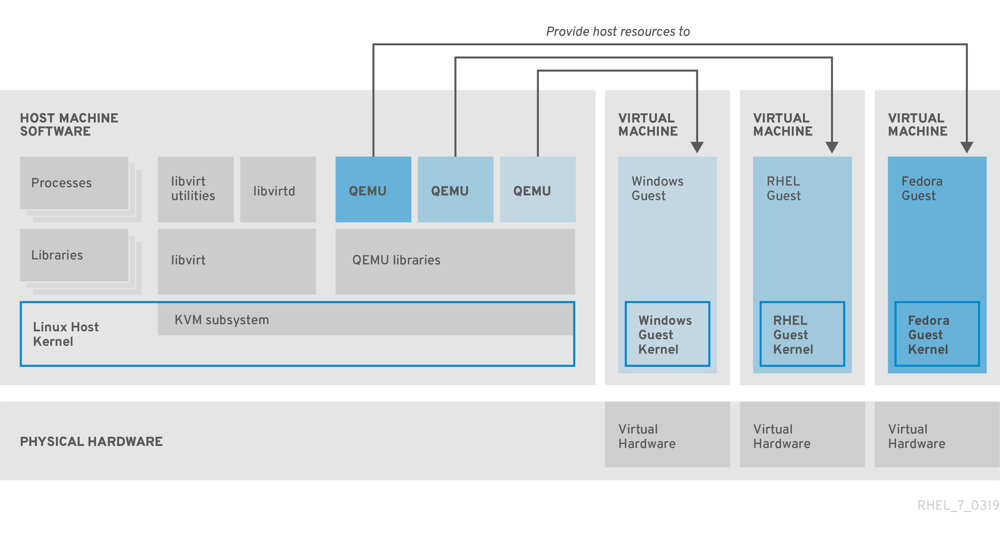 

<h3 id="tools-and-interfaces-for-virtualization-management">1.4. Tools and interfaces for virtualization management</h3>

You can manage virtualization in RHEL 10 by using the command line (CLI) or the web console graphical user interface (GUI).

**Command-line interface**

The CLI is the most powerful method of managing virtualization in RHEL 10. Prominent CLI commands for virtual machine (VM) management include:

- **virsh** - A versatile virtualization command-line utility and shell with a great variety of purposes, depending on the provided arguments. For example:
  
  - Starting and shutting down a VM - `virsh start` and `virsh shutdown`
  - Listing available VMs - `virsh list`
  - Creating a VM from a configuration file - `virsh create`
  - Entering a virtualization shell - `virsh`
  
  For more information, see the `virsh(1)` man page on your system.
- `virt-install` - A CLI utility for creating new VMs. For more information, see the `virt-install(1)` man page on your system.
- `virt-xml` - A utility for editing the configuration of a VM.
- `guestfish` - A utility for examining and modifying VM disk images. For more information, see the `guestfish(1)` man page on your system.

**Graphical interface**

- To manage virtualization in RHEL 10 in a GUI, you can use the **RHEL 10 web console**, also known as *Cockpit*. The web console provides a remotely accessible and easy-to-use GUI for managing VMs and virtualization hosts.
  
  For instructions on enabling virtualization management in the web console, see [Setting up the web console to manage virtual machines](#setting-up-the-web-console-to-manage-virtual-machines "2.4. Setting up the web console to manage virtual machines").

**Additional resources**

- [Creating virtual machines](#creating-virtual-machines "Chapter 3. Creating virtual machines")

<h3 id="user-space-connection-types-for-virtualization">1.5. User-space connection types for virtualization</h3>

Virtual machines (VMs) on your host use one of the following `libvirt` connection types to your RHEL 10 user space. The connection type influences what features the VM user can access.

System connection (`qemu:///system`)

Provides access to all available features for VM management in RHEL 10. To create or use a VM in the *system* connection, you must have root privileges on the system or be a part of the `libvirt` user group.

Session connection (`qemu:///session`)

Non-root users that are not in the `libvirt` group can only create VMs in the *session* connection, which has to respect the access rights of the local user when accessing resources. For example, when using the *session* connection, you cannot detect or access VMs created in the system connection or by other users.

In addition, VMs in the `session` connection cannot use features that require root privileges, such as the following:

- **Advanced networking** - You cannot set up system bridges or tap devices. You are limited to user-mode (`passt`) networking, and cannot configure full external visibility of the VM.
- **PCI device passthrough** - Modifying the device assignment of PCI host hardware for the VM is not possible.
- **Autostart** - VMs in the *session* connection cannot automatically start on system boot.
- **System-level storage pools and VM logs** - In the *system* connection, storage pools and VM log files are saved in system directories, such as `/etc/libvirt` and `/var/lib/libvirt`. In the *session* connection, the user is limited to files saved in their `home` directory. This prevents managing host-wide storage or viewing logs centrally.

To view your current connection type, use the `virsh uri` command on the host.

Important

Unless explicitly stated otherwise, the information in this documentation assumes you have root privileges and can use the system connection of `libvirt`.

<h3 id="rh-virtualization-solutions">1.6. Red Hat virtualization solutions</h3>

In addition to RHEL, Red Hat offers other products that you can use for hosting virtual machines. These products are built on top of RHEL 10 virtualization features and expand the KVM virtualization capabilities available in RHEL 10.

In addition, many [limitations of RHEL 10 virtualization](#feature-support-and-limitations-in-rhel-10-virtualization "Chapter 23. Feature support and limitations in RHEL 10 virtualization") do not apply to these products.

OpenShift Virtualization

Based on the KubeVirt technology, OpenShift Virtualization is a part of the Red Hat OpenShift Container Platform, and makes it possible to run virtual machines in containers.

For more information about OpenShift Virtualization, see the [Red Hat Hybrid Cloud](https://cloud.redhat.com/learn/topics/virtualization/) pages or the [OpenShift Virtualization documentation](https://docs.redhat.com/en/documentation/openshift_container_platform/4.20/html/virtualization/index).

Red Hat OpenStack Platform (RHOSP)

Red Hat OpenStack Platform offers an integrated foundation to create, deploy, and scale a secure and reliable public or private [OpenStack](https://www.redhat.com/en/topics/openstack) cloud.

For more information about Red Hat OpenStack Platform, see [the Red Hat Customer Portal](https://www.redhat.com/en/technologies/linux-platforms/openstack-platform) or the [Red Hat OpenStack Platform documentation suite](https://docs.redhat.com/en/documentation/red_hat_openstack_platform/).

<h2 id="preparing-rhel-to-host-virtual-machines">Chapter 2. Preparing RHEL to host virtual machines</h2>

To use virtualization in RHEL 10, you must install virtualization packages and ensure your system is configured to host virtual machines (VMs). The specific steps to do this vary based on your CPU architecture.

<h3 id="preparing-an-amd64-or-intel64-system-to-host-virtual-machines">2.1. Preparing an AMD64 or Intel 64 system to host virtual machines</h3>

Before creating virtual machines (VMs) on an AMD64 or Intel 64 system running RHEL 10, you must first set up a KVM hypervisor on the system.

**Prerequisites**

- Red Hat Enterprise Linux 10 is installed and registered on your host machine. For instructions, see the [RHEL installation guide](https://docs.redhat.com/en/documentation/red_hat_enterprise_linux/10/html/interactively_installing_rhel_from_installation_media/index).
- The following minimum system resources are available:
  
  - 6 GB free disk space for the host, plus another 6 GB for each intended VM.
  - 2 GB of RAM for the host, plus another 2 GB for each intended VM.

**Procedure**

1. Install the virtualization hypervisor packages.
   
   \# **dnf install qemu-kvm libvirt virt-install virt-viewer**
2. Start the virtualization services:
   
   \# **for drv in qemu network nodedev nwfilter secret storage interface; do systemctl start virt${drv}d{,-ro,-admin}.socket; done**

**Verification**

1. Verify that your system is prepared to be a virtualization host:
   
   ```
   virt-host-validate
   ```
   
   ```plaintext
   # virt-host-validate
   ```
   
   Example output:
   
   ```
   QEMU: Checking for device assignment IOMMU support         : PASS
   QEMU: Checking if IOMMU is enabled by kernel               : WARN (IOMMU appears to be disabled in kernel. Add intel_iommu=on to kernel cmdline arguments)
   LXC: Checking for Linux >= 2.6.26                          : PASS
   [...]
   LXC: Checking for cgroup 'blkio' controller mount-point    : PASS
   LXC: Checking if device /sys/fs/fuse/connections exists    : FAIL (Load the 'fuse' module to enable /proc/ overrides)
   ```
   
   ```plaintext
   QEMU: Checking for device assignment IOMMU support         : PASS
   QEMU: Checking if IOMMU is enabled by kernel               : WARN (IOMMU appears to be disabled in kernel. Add intel_iommu=on to kernel cmdline arguments)
   LXC: Checking for Linux >= 2.6.26                          : PASS
   [...]
   LXC: Checking for cgroup 'blkio' controller mount-point    : PASS
   LXC: Checking if device /sys/fs/fuse/connections exists    : FAIL (Load the 'fuse' module to enable /proc/ overrides)
   ```
2. If all **virt-host-validate** checks return a `PASS` value, your system is prepared for [creating VMs](#creating-virtual-machines "Chapter 3. Creating virtual machines").
   
   If any of the checks return a `FAIL` value, follow the displayed instructions to fix the problem.
   
   If any of the checks return a `WARN` value, consider following the displayed instructions to improve virtualization capabilities.

**Troubleshooting**

- If KVM virtualization is not supported by your host CPU, **virt-host-validate** generates the following output:
  
  ```
  QEMU: Checking for hardware virtualization: FAIL (Only emulated CPUs are available, performance will be significantly limited)
  ```
  
  ```plaintext
  QEMU: Checking for hardware virtualization: FAIL (Only emulated CPUs are available, performance will be significantly limited)
  ```
  
  However, VMs on such a host system will fail to boot, rather than have performance problems.
  
  To work around this, you can change the `<domain type>` value in the XML configuration of the VM to `qemu`. Note, however, that Red Hat does not support VMs that use the `qemu` domain type, and setting this is highly discouraged in production environments.

**Next steps**

- [Create a virtual machine on your RHEL 10 host](#creating-virtual-machines "Chapter 3. Creating virtual machines")

<h3 id="preparing-an-ibm-z-system-to-host-virtual-machines">2.2. Preparing an IBM Z system to host virtual machines</h3>

Before creating virtual machines (VMs) on an IBM Z system running RHEL 10, you must first set up a KVM hypervisor on the system.

**Prerequisites**

- Red Hat Enterprise Linux 10 is installed and registered on your host machine. For instructions, see the [RHEL installation guide](https://docs.redhat.com/en/documentation/red_hat_enterprise_linux/10/html/interactively_installing_rhel_from_installation_media/index).
- The following minimum system resources are available:
  
  - 6 GB free disk space for the host, plus another 6 GB for each intended VM.
  - 2 GB of RAM for the host, plus another 2 GB for each intended VM.
  - 4 CPUs on the host. VMs can generally run with a single assigned vCPU, but Red Hat recommends assigning 2 or more vCPUs per VM to avoid VMs becoming unresponsive during high load.
- Your IBM Z host system is using an IBM z14 CPU or later.
- RHEL 10 is installed on a logical partition (LPAR). In addition, the LPAR supports the *start-interpretive execution* (SIE) virtualization functions.
  
  To verify this, search for `sie` in your `/proc/cpuinfo` file.
  
  ```
  grep sie /proc/cpuinfo
  features        : esan3 zarch stfle msa ldisp eimm dfp edat etf3eh highgprs te sie
  ```
  
  ```plaintext
  # grep sie /proc/cpuinfo
  features        : esan3 zarch stfle msa ldisp eimm dfp edat etf3eh highgprs te sie
  ```

**Procedure**

1. Install the virtualization packages:
   
   ```
   dnf install qemu-kvm libvirt virt-install
   ```
   
   ```plaintext
   # dnf install qemu-kvm libvirt virt-install
   ```
2. Start the virtualization services:
   
   ```
   for drv in qemu network nodedev nwfilter secret storage interface; do systemctl start virt${drv}d{,-ro,-admin}.socket; done
   ```
   
   ```plaintext
   # for drv in qemu network nodedev nwfilter secret storage interface; do systemctl start virt${drv}d{,-ro,-admin}.socket; done
   ```

**Verification**

1. Verify that your system is prepared to be a virtualization host.
   
   ```
   virt-host-validate
   [...]
   QEMU: Checking if device /dev/kvm is accessible             : PASS
   QEMU: Checking if device /dev/vhost-net exists              : PASS
   QEMU: Checking if device /dev/net/tun exists                : PASS
   QEMU: Checking for cgroup 'memory' controller support       : PASS
   QEMU: Checking for cgroup 'memory' controller mount-point   : PASS
   [...]
   ```
   
   ```plaintext
   # virt-host-validate
   [...]
   QEMU: Checking if device /dev/kvm is accessible             : PASS
   QEMU: Checking if device /dev/vhost-net exists              : PASS
   QEMU: Checking if device /dev/net/tun exists                : PASS
   QEMU: Checking for cgroup 'memory' controller support       : PASS
   QEMU: Checking for cgroup 'memory' controller mount-point   : PASS
   [...]
   ```
2. If all **virt-host-validate** checks return a `PASS` value, your system is prepared for [creating VMs](#creating-virtual-machines "Chapter 3. Creating virtual machines").
   
   If any of the checks return a `FAIL` value, follow the displayed instructions to fix the problem.
   
   If any of the checks return a `WARN` value, consider following the displayed instructions to improve virtualization capabilities.

**Troubleshooting**

- If KVM virtualization is not supported by your host CPU, **virt-host-validate** generates the following output:
  
  ```
  QEMU: Checking for hardware virtualization: FAIL (Only emulated CPUs are available, performance will be significantly limited)
  ```
  
  ```plaintext
  QEMU: Checking for hardware virtualization: FAIL (Only emulated CPUs are available, performance will be significantly limited)
  ```
  
  However, VMs on such a host system will fail to boot, rather than have performance problems.
  
  To work around this, you can change the `<domain type>` value in the XML configuration of the VM to `qemu`. Note, however, that Red Hat does not support VMs that use the `qemu` domain type, and setting this is highly discouraged in production environments.

**Next steps**

- [Create a virtual machine on your RHEL 10 host](#creating-virtual-machines "Chapter 3. Creating virtual machines")

**Additional resources**

- [How virtualization on IBM Z differs from AMD64 and Intel 64](#how-virtualization-on-ibm-z-differs-from-amd64-and-intel-64 "23.5. How virtualization on IBM Z differs from AMD64 and Intel 64")

<h3 id="preparing-an-arm64-system-to-host-virtual-machines">2.3. Preparing an ARM 64 system to host virtual machines</h3>

Before creating virtual machines (VMs) on a 64-bit system (also known as ARM 64 or `AArch64`) running RHEL 10, you must first set up a KVM hypervisor on the system.

**Prerequisites**

- Red Hat Enterprise Linux 10 is installed and registered on your host machine. For instructions, see the [RHEL installation guide](https://docs.redhat.com/en/documentation/red_hat_enterprise_linux/10/html/interactively_installing_rhel_from_installation_media/index).
- The following minimum system resources are available:
  
  - 6 GB free disk space for the host, plus another 6 GB for each intended guest.
  - 4 GB of RAM for the host, plus another 4 GB for each intended guest.

**Procedure**

1. Install the virtualization packages:
   
   ```
   dnf install qemu-kvm libvirt virt-install
   ```
   
   ```plaintext
   # dnf install qemu-kvm libvirt virt-install
   ```
2. Start the virtualization services:
   
   ```
   for drv in qemu network nodedev nwfilter secret storage interface; do systemctl start virt${drv}d{,-ro,-admin}.socket; done
   ```
   
   ```plaintext
   # for drv in qemu network nodedev nwfilter secret storage interface; do systemctl start virt${drv}d{,-ro,-admin}.socket; done
   ```

**Verification**

1. Verify that your system is prepared to be a virtualization host. Run the following command as root:
   
   ```
   virt-host-validate
   [...]
   QEMU: Checking if device /dev/vhost-net exists              : PASS
   QEMU: Checking if device /dev/net/tun exists                : PASS
   QEMU: Checking for cgroup 'memory' controller support       : PASS
   QEMU: Checking for cgroup 'memory' controller mount-point   : PASS
   [...]
   QEMU: Checking for cgroup 'blkio' controller support        : PASS
   QEMU: Checking for cgroup 'blkio' controller mount-point    : PASS
   QEMU: Checking if IOMMU is enabled by kernel                : PASS
   ```
   
   ```plaintext
   # virt-host-validate
   [...]
   QEMU: Checking if device /dev/vhost-net exists              : PASS
   QEMU: Checking if device /dev/net/tun exists                : PASS
   QEMU: Checking for cgroup 'memory' controller support       : PASS
   QEMU: Checking for cgroup 'memory' controller mount-point   : PASS
   [...]
   QEMU: Checking for cgroup 'blkio' controller support        : PASS
   QEMU: Checking for cgroup 'blkio' controller mount-point    : PASS
   QEMU: Checking if IOMMU is enabled by kernel                : PASS
   ```
2. If all **virt-host-validate** checks return a `PASS` value, your system is prepared for [creating virtual machines](#creating-virtual-machines "Chapter 3. Creating virtual machines").
   
   If any of the checks return a `FAIL` value, follow the displayed instructions to fix the problem.
   
   If any of the checks return a `WARN` value, consider following the displayed instructions to improve virtualization capabilities.

**Next steps**

- [Create a virtual machine on your RHEL 10 host](#creating-virtual-machines "Chapter 3. Creating virtual machines")

**Additional resources**

- [How virtualization on ARM 64 differs from AMD64 and Intel 64](#how-virtualization-on-arm-64-differs-from-amd64-and-intel-64 "23.6. How virtualization on ARM 64 differs from AMD64 and Intel 64")

<h3 id="setting-up-the-web-console-to-manage-virtual-machines">2.4. Setting up the web console to manage virtual machines</h3>

Before using the RHEL 10 web console to manage virtual machines (VMs), you must install the web console virtual machine plugin on the host.

**Prerequisites**

- You have installed the RHEL 10 web console.
  
  For instructions, see [Installing and enabling the web console](https://docs.redhat.com/en/documentation/red_hat_enterprise_linux/10/html/managing_systems_in_the_rhel_web_console/getting-started-with-the-rhel-web-console#installing-and-enabling-the-web-console).

**Procedure**

- Install the `cockpit-machines` plugin.
  
  ```
  dnf install cockpit-machines
  ```
  
  ```plaintext
  # dnf install cockpit-machines
  ```

**Verification**

1. Log in to the RHEL 10 web console.
2. If the installation was successful, Virtual Machines appears in the web console side menu.
   
   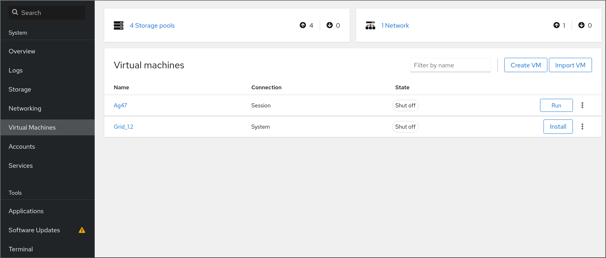 

**Additional resources**

- [Managing systems by using the RHEL 10 web console](https://docs.redhat.com/en/documentation/red_hat_enterprise_linux/10/html/managing_systems_in_the_rhel_web_console/index)

<h3 id="setting-up-easier-access-to-remote-virtualization-hosts">2.5. Setting up easier access to remote virtualization hosts</h3>

When managing virtual machines (VMs) on a remote host system by using `libvirt` utilities on the command line, you can optimize the process of connecting to the remote host.

By default, to connect to a VM on a remote host, you must use the `-c qemu+ssh://root@hostname/system` syntax. For example, to use the `virsh list` command as root on the `192.0.2.1` host:

```
virsh -c qemu+ssh://root@192.0.2.1/system list
```

```plaintext
# virsh -c qemu+ssh://root@192.0.2.1/system list
```

Example output:

```
root@192.0.2.1's password:

Id   Name              State
---------------------------------
1    remote-guest      running
```

```plaintext
root@192.0.2.1's password:

Id   Name              State
---------------------------------
1    remote-guest      running
```

However, you can remove the need to specify the connection details in full by modifying your SSH and `libvirt` configuration. For example:

```
virsh -c remote-host list
```

```plaintext
# virsh -c remote-host list
```

Example output:

```
root@192.0.2.1's password:

Id   Name              State
---------------------------------
1    remote-guest      running
```

```plaintext
root@192.0.2.1's password:

Id   Name              State
---------------------------------
1    remote-guest      running
```

To enable this improvement, use the following instructions.

**Prerequisites**

- Virtualization is enabled on your host system. For instructions, see [Preparing RHEL to host virtual machines](#preparing-rhel-to-host-virtual-machines "Chapter 2. Preparing RHEL to host virtual machines").

**Procedure**

1. Edit the `~/.ssh/config` file on your local host and add an entry similar to the following:
   
   ```
   Host <host-alias>
     User                    root
     Hostname                192.0.2.1
   ```
   
   ```plaintext
   Host <host-alias>
     User                    root
     Hostname                192.0.2.1
   ```
   
   In this example, *&lt;host-alias&gt;* is a shortened name associated with the `root@192.0.2.1` remote host connection.
2. Edit the `/etc/libvirt/libvirt.conf` file and add lines similar to the following:
   
   ```
   uri_aliases = [
     "<qemu-alias>=qemu+ssh://<host-alias>/system",
   ]
   ```
   
   ```plaintext
   uri_aliases = [
     "<qemu-alias>=qemu+ssh://<host-alias>/system",
   ]
   ```
   
   In this example, *&lt;qemu-alias&gt;* is a host alias that QEMU and `libvirt` utilities will use for the `qemu+ssh://192.0.2.1/system` connection.
3. Optional: If you want to use `libvirt` utilities exclusively on a single remote host, you can also set a specific connection as the default target for `libvirt`-based utilities.
   
   Edit the `/etc/libvirt/libvirt.conf` file and set the value of the `uri_default` parameter to *&lt;qemu-alias&gt;* as a default `libvirt` target.
   
   ```
   # These can be used in cases when no URI is supplied by the application
   # (@uri_default also prevents probing of the hypervisor driver).
   #
   uri_default = "<qemu-alias>"
   ```
   
   ```plaintext
   # These can be used in cases when no URI is supplied by the application
   # (@uri_default also prevents probing of the hypervisor driver).
   #
   uri_default = "<qemu-alias>"
   ```
   
   Warning
   
   You cannot do this if you also want to manage VMs on your local host or on different remote hosts.
4. Optional: To avoid having to provide the root password when connecting to a remote host, use one or more of the following methods:
   
   - [Set up key-based SSH access to the remote host](https://docs.redhat.com/en/documentation/red_hat_enterprise_linux/10/html/securing_networks/using-secure-communications-between-two-systems-with-openssh)
   - Use SSH connection multiplexing to connect to the remote system
   - [Kerberos authentication in Identity Management](https://docs.redhat.com/en/documentation/red_hat_enterprise_linux/10/html/accessing_identity_management_services/logging-in-to-idm-in-the-web-ui-using-a-kerberos-ticket#kerberos-authentication-in-identity-management)

**Verification**

1. Confirm that you can manage remote VMs by using `libvirt`-based utilities on the local system with an added `-c <qemu-alias>` parameter. This automatically performs the commands over SSH on the remote host.
   
   For example, verify that the following lists VMs on the 192.0.2.1 remote host, the connection to which was set up as *&lt;qemu-alias&gt;* in the previous steps:
   
   ```
   virsh -c <qemu-alias> list
   ```
   
   ```plaintext
   # virsh -c <qemu-alias> list
   ```
   
   Successful output:
   
   ```
   root@192.0.2.1's password:
   
   Id   Name                       State
   ----------------------------------------
   1    example-remote-guest      running
   ```
   
   ```plaintext
   root@192.0.2.1's password:
   
   Id   Name                       State
   ----------------------------------------
   1    example-remote-guest      running
   ```
2. If you have set up the default URI to a remote host, ensure that `libvirt` commands automatically apply to the specified remote host.
   
   ```
   virsh list
   ```
   
   ```plaintext
   $ virsh list
   ```
   
   Successful output:
   
   ```
   root@192.0.2.1's password:
   
   Id   Name              State
   ---------------------------------
   1   example-remote-guest      running
   ```
   
   ```plaintext
   root@192.0.2.1's password:
   
   Id   Name              State
   ---------------------------------
   1   example-remote-guest      running
   ```

<h2 id="creating-virtual-machines">Chapter 3. Creating virtual machines</h2>

To create a virtual machine (VM) in RHEL 10, you can use the command line or the RHEL 10 web console.

<h3 id="creating-virtual-machines-by-using-the-command-line-interface">3.1. Creating virtual machines by using the command line</h3>

To create a virtual machine (VM) on your RHEL 10 host, you can use the `virt-install` utility.

**Prerequisites**

- Virtualization is enabled on your host system. For instructions, see [Preparing RHEL to host virtual machines](#preparing-rhel-to-host-virtual-machines "Chapter 2. Preparing RHEL to host virtual machines").
- You have a sufficient amount of system resources to allocate to your VMs, such as disk space, RAM, or CPUs. The recommended values might vary significantly depending on the intended tasks and workload of the VMs.
- An operating system (OS) installation source is available locally or on a network. This can be one of the following:
  
  - An ISO image of an installation medium
  - A disk image of an existing VM installation
    
    Warning
    
    Installing from a host CD-ROM or DVD-ROM device is not possible in RHEL 10. If you select a CD-ROM or DVD-ROM as the installation source when using any VM installation method available in RHEL 10, the installation will fail. For more information, see the [Red Hat Knowledgebase](https://access.redhat.com/solutions/1185913).
    
    Also note that Red Hat provides support only for [a limited set of guest operating systems](#recommended-features-in-rhel-10-virtualization "23.2. Recommended features in RHEL 10 virtualization").
- To create a VM that uses the `system` connection of libvirt, you must have root privileges or be in the `libvirt` user group on the host. For more information, see [User-space connection types for virtualization](#user-space-connection-types-for-virtualization "1.5. User-space connection types for virtualization").
- Optional: A Kickstart file can be provided for faster and easier configuration of the installation.

**Procedure**

- To create a VM and start its OS installation, use the `virt-install` command, along with the following mandatory arguments:
  
  `--name`
  
  the name of the new machine
  
  `--memory`
  
  the amount of allocated memory
  
  `--vcpus`
  
  the number of allocated virtual CPUs
  
  `--disk`
  
  the type and size of the allocated storage
  
  `--cdrom` or `--location`
  
  the type and location of the OS installation source
  
  `--osinfo`
  
  the OS type and version that you intend to install
  
  Note
  
  To list all available values for the `--osinfo` argument, run the `virt-install --osinfo list` command.
  
  For more details, you can also run the `osinfo-query os` command. However, you might need to install the `libosinfo-bin` package first.
  
  Based on the chosen installation method, the necessary options and values can vary. See the following examples for more details.
- **Create a VM and install an OS from a local ISO file:**
  
  - The following command creates a VM named **demo-guest1** that installs the Windows 10 OS from an ISO image locally stored in the **/home/username/Downloads/Win10install.iso** file. This VM is also allocated with 2048 MiB of RAM and 2 vCPUs, and an 80 GiB qcow2 virtual disk is automatically configured for the VM.
    
    ```
    virt-install \
        --name demo-guest1 --memory 2048 \
        --vcpus 2 --disk size=80 --osinfo win10 \
        --cdrom /home/username/Downloads/Win10install.iso
    ```
    
    ```plaintext
    # virt-install \
        --name demo-guest1 --memory 2048 \
        --vcpus 2 --disk size=80 --osinfo win10 \
        --cdrom /home/username/Downloads/Win10install.iso
    ```
- **Create a VM, install an OS from a live CD, and do not create a permanent disk:**
  
  - The following command creates a VM named **demo-guest2** that uses the **/home/username/Downloads/rhel10.iso** image to run a RHEL 10 OS from a live CD. No disk space is assigned to this VM, so changes made during the session will not be preserved. In addition, the VM is allocated with 4096 MiB of RAM and 4 vCPUs.
    
    ```
    virt-install \
        --name demo-guest2 --memory 4096 --vcpus 4 \
        --disk none --livecd --osinfo rhel10.0 \
        --cdrom /home/username/Downloads/rhel10.iso
    ```
    
    ```plaintext
    # virt-install \
        --name demo-guest2 --memory 4096 --vcpus 4 \
        --disk none --livecd --osinfo rhel10.0 \
        --cdrom /home/username/Downloads/rhel10.iso
    ```
- **Create a VM and import an existing disk image:**
  
  - The following command creates a RHEL 10 VM named **demo-guest3** that connects to an existing disk image, **/home/username/backup/disk.qcow2**. This is similar to physically moving a hard drive between machines, so the OS and data available to demo-guest3 are determined by how the image was handled previously. In addition, this VM is allocated with 2048 MiB of RAM and 2 vCPUs.
    
    ```
    virt-install \
        --name demo-guest3 --memory 2048 --vcpus 2 \
        --osinfo rhel10.0 --import \
        --disk /home/username/backup/disk.qcow2
    ```
    
    ```plaintext
    # virt-install \
        --name demo-guest3 --memory 2048 --vcpus 2 \
        --osinfo rhel10.0 --import \
        --disk /home/username/backup/disk.qcow2
    ```
    
    Note that you must use the `--osinfo` option when importing a disk image. If it is not provided, the performance of the created VM will be negatively affected.
- **Create a VM and install an OS from a remote URL:**
  
  - The following command creates a VM named **demo-guest4** that installs from the `http://example.com/OS-install` URL. For the installation to start successfully, the URL must contain a working OS installation tree. In addition, the OS is automatically configured by using the **/home/username/ks.cfg** kickstart file. This VM is also allocated with 2048 MiB of RAM, 2 vCPUs, and a 160 GiB qcow2 virtual disk.
    
    ```
    virt-install \
        --name demo-guest4 --memory 2048 --vcpus 2 --disk size=160 \
        --osinfo rhel10.0 --location http://example.com/OS-install \
        --initrd-inject /home/username/ks.cfg --extra-args="inst.ks=file:/ks.cfg console=tty0 console=ttyS0,115200n8"
    ```
    
    ```plaintext
    # virt-install \
        --name demo-guest4 --memory 2048 --vcpus 2 --disk size=160 \
        --osinfo rhel10.0 --location http://example.com/OS-install \
        --initrd-inject /home/username/ks.cfg --extra-args="inst.ks=file:/ks.cfg console=tty0 console=ttyS0,115200n8"
    ```
    
    In addition, if you want to host demo-guest4 on an RHEL 10 on an ARM 64 host, include the following lines to ensure that the kickstart file installs the `kernel-64k` package:
    
    ```
    %packages
    -kernel
    kernel-64k
    %end
    ```
    
    ```plaintext
    %packages
    -kernel
    kernel-64k
    %end
    ```
- **Create a VM and install an OS in a text-only mode:**
  
  - The following command creates a VM named **demo-guest5** that installs from a `RHEL10.iso` image file in text-only mode, without graphics. It connects the guest console to the serial console. The VM has 16384 MiB of memory, 16 vCPUs, and 280 GiB disk. This kind of installation is useful when connecting to a host over a slow network link.
    
    ```
    virt-install \
        --name demo-guest5 --memory 16384 --vcpus 16 --disk size=280 \
        --osinfo rhel10.0 --location RHEL10.iso \
        --graphics none --extra-args='console=ttyS0'
    ```
    
    ```plaintext
    # virt-install \
        --name demo-guest5 --memory 16384 --vcpus 16 --disk size=280 \
        --osinfo rhel10.0 --location RHEL10.iso \
        --graphics none --extra-args='console=ttyS0'
    ```
- **Create a VM and install an OS in graphical mode:**
  
  - The following command creates a VM named **demo-guest-6**, which has the same configuration as demo-guest5, but provides the host device `pci_0003_00_00_0` for networking and configures graphics for a graphical installation.
    
    ```
    virt-install \
        --name demo-guest6 --memory 16384 --vcpus 16 --disk size=280 \
        --os-info rhel10.0 --location RHEL10.iso --graphics vnc,listen=0.0.0.0,5901 \
        --input keyboard,bus=virtio --input mouse,bus=virtio \
        --hostdev pci_0003_00_00_0 --network none
    ```
    
    ```plaintext
    # virt-install \
        --name demo-guest6 --memory 16384 --vcpus 16 --disk size=280 \
        --os-info rhel10.0 --location RHEL10.iso --graphics vnc,listen=0.0.0.0,5901 \
        --input keyboard,bus=virtio --input mouse,bus=virtio \
        --hostdev pci_0003_00_00_0 --network none
    ```
    
    Note that the name of the host device available for installation can be retrieved by using the `virsh nodedev-list --cap pci` command. To use the installation GUI, you can connect any VNC viewer to the host’s IP at VNC port 5901 when the installation starts. However, you might have to open this port in the firewall first, for example:
    
    ```
    firewall-cmd --add-port 5901/tcp
    ```
    
    ```plaintext
    # firewall-cmd --add-port 5901/tcp
    ```
- **Create a VM on a remote host:**
  
  - The following command creates a VM named **demo-guest7**, which has the same configuration as demo-guest5, but resides on the 192.0.2.1 remote host.
    
    ```
    virt-install \
        --connect qemu+ssh://root@192.0.2.1/system --name demo-guest7 --memory 16384 \
        --vcpus 16 --disk size=280 --osinfo rhel10.0 --location RHEL10.iso \
        --graphics none --extra-args='console=ttyS0'
    ```
    
    ```plaintext
    # virt-install \
        --connect qemu+ssh://root@192.0.2.1/system --name demo-guest7 --memory 16384 \
        --vcpus 16 --disk size=280 --osinfo rhel10.0 --location RHEL10.iso \
        --graphics none --extra-args='console=ttyS0'
    ```
- **Create a VM on a remote host and use a DASD mediated device as storage:**
  
  - The following command creates a VM named **demo-guest-8**, which has the same configuration as demo-guest5, but for its storage, it uses a DASD mediated device `mdev_30820a6f_b1a5_4503_91ca_0c10ba12345a_0_0_29a8`, and assigns it device number `1111`.
    
    ```
    virt-install \
        --name demo-guest8 --memory 16384 --vcpus 16 --disk size=280 \
        --osinfo rhel10.0 --location RHEL10.iso --graphics none \
        --disk none --hostdev mdev_30820a6f_b1a5_4503_91ca_0c10ba12345a_0_0_29a8,address.type=ccw,address.cssid=0xfe,address.ssid=0x0,address.devno=0x1111,boot-order=1 \
        --extra-args 'rd.dasd=0.0.1111'
    ```
    
    ```plaintext
    # virt-install \
        --name demo-guest8 --memory 16384 --vcpus 16 --disk size=280 \
        --osinfo rhel10.0 --location RHEL10.iso --graphics none \
        --disk none --hostdev mdev_30820a6f_b1a5_4503_91ca_0c10ba12345a_0_0_29a8,address.type=ccw,address.cssid=0xfe,address.ssid=0x0,address.devno=0x1111,boot-order=1 \
        --extra-args 'rd.dasd=0.0.1111'
    ```
    
    Note that the name of the mediated device available for installation can be retrieved by using the `virsh nodedev-list --cap mdev` command.
- For additional options and examples of `virt-install` commands, see the `virt-install (1)` man page on your system.

**Verification**

- If the VM is created successfully, a [virt-viewer](#opening-a-virtual-machine-graphical-console-by-using-the-command-line-interface "6.2. Opening a virtual machine graphical console by using the command line") window opens with a graphical console of the VM and starts the guest OS installation.

**Troubleshooting**

- If `virt-install` fails with a `cannot find default network` error:
  
  - Ensure that the `libvirt-daemon-config-network` package is installed:
    
    ```
    dnf info libvirt-daemon-config-network
    Installed Packages
    Name         : libvirt-daemon-config-network
    [...]
    ```
    
    ```plaintext
    # dnf info libvirt-daemon-config-network
    Installed Packages
    Name         : libvirt-daemon-config-network
    [...]
    ```
  - Verify that the `libvirt` default network is active and configured to start automatically:
    
    ```
    virsh net-list --all
     Name      State    Autostart   Persistent
    --------------------------------------------
     default   active   yes         yes
    ```
    
    ```plaintext
    # virsh net-list --all
     Name      State    Autostart   Persistent
    --------------------------------------------
     default   active   yes         yes
    ```
  - If it is not, activate the default network and set it to auto-start:
    
    ```
    virsh net-autostart default
    Network default marked as autostarted
    
    virsh net-start default
    Network default started
    ```
    
    ```plaintext
    # virsh net-autostart default
    Network default marked as autostarted
    
    # virsh net-start default
    Network default started
    ```
    
    - If activating the default network fails with the following error, the `libvirt-daemon-config-network` package has not been installed correctly.
      
      ```
      error: failed to get network 'default'
      error: Network not found: no network with matching name 'default'
      ```
      
      ```plaintext
      error: failed to get network 'default'
      error: Network not found: no network with matching name 'default'
      ```
      
      To fix this, re-install `libvirt-daemon-config-network`:
      
      ```
      dnf reinstall libvirt-daemon-config-network
      ```
      
      ```plaintext
      # dnf reinstall libvirt-daemon-config-network
      ```
    - If activating the default network fails with an error similar to the following, a conflict has occurred between the default network’s subnet and an existing interface on the host.
      
      ```
      error: Failed to start network default
      error: internal error: Network is already in use by interface ens2
      ```
      
      ```plaintext
      error: Failed to start network default
      error: internal error: Network is already in use by interface ens2
      ```
      
      To fix this, use the `virsh net-edit default` command and change the `192.0.2.*` values in the configuration to a subnet not already in use on the host.

**Additional resources**

- [Creating new virtual machines by using the web console](#creating-new-virtual-machines-by-using-the-web-console "3.2.1. Creating new virtual machines by using the web console")
- [Cloning virtual machines](#cloning-virtual-machines "Chapter 10. Cloning virtual machines")

<h3 id="creating-virtual-machines-by-using-the-web-console">3.2. Creating virtual machines by using the web console</h3>

To create virtual machines (VMs) in a GUI on a RHEL 10 host, you can use the web console.

<h4 id="creating-new-virtual-machines-by-using-the-web-console">3.2.1. Creating new virtual machines by using the web console</h4>

You can create a new virtual machine (VM) on a previously prepared host machine by using the RHEL 10 web console.

**Prerequisites**

- You have installed the RHEL 10 web console.
  
  For instructions, see [Installing and enabling the web console](https://docs.redhat.com/en/documentation/red_hat_enterprise_linux/10/html/managing_systems_in_the_rhel_web_console/getting-started-with-the-rhel-web-console#installing-and-enabling-the-web-console).
- [Virtualization is enabled on your host system](#preparing-rhel-to-host-virtual-machines "Chapter 2. Preparing RHEL to host virtual machines").
- [The web console VM plug-in is installed on your host system](#setting-up-the-web-console-to-manage-virtual-machines "2.4. Setting up the web console to manage virtual machines").
- To create a VM that uses the `system` connection of libvirt, you must have root privileges or be in the `libvirt` user group on the host. For more information, see [User-space connection types for virtualization](#user-space-connection-types-for-virtualization "1.5. User-space connection types for virtualization").
- You have a sufficient amount of system resources to allocate to your VMs, such as disk space, RAM, or CPUs. The recommended values might vary significantly depending on the intended tasks and workload of the VMs.

**Procedure**

1. In the **Virtual Machines** interface of the web console, click **Create VM**.
   
   The **Create new virtual machine** dialog appears.
   
   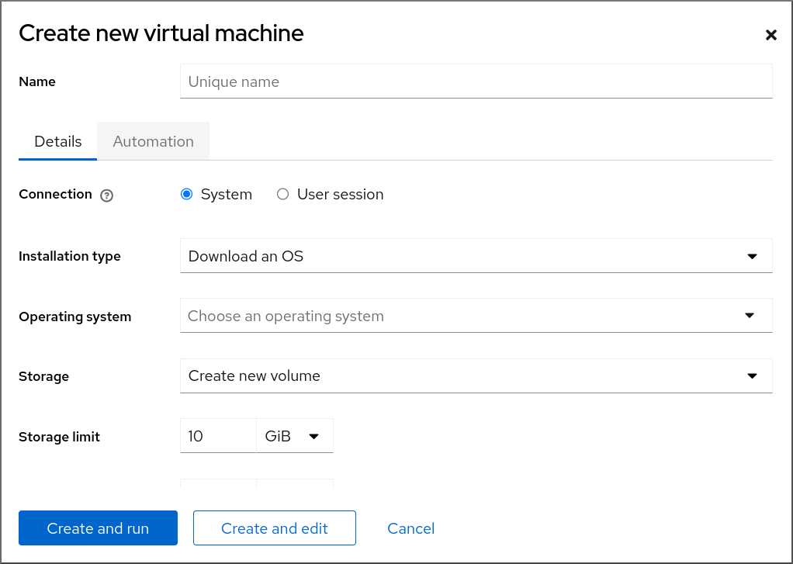 
2. Enter the basic configuration of the VM you want to create.
   
   - **Name** - The name of the VM.
   - **Connection** - The level of privileges granted to the session. For more details, expand the associated dialog box in the web console.
   - **Installation type** - The installation can use a local installation medium, a URL, a PXE network boot, a cloud base image, or download an operating system from [a limited set of guest operating systems](#recommended-features-in-rhel-10-virtualization "23.2. Recommended features in RHEL 10 virtualization").
   - **Operating system** - The guest operating system running on the VM. Note that Red Hat provides support only for [a limited set of guest operating systems](#recommended-features-in-rhel-10-virtualization "23.2. Recommended features in RHEL 10 virtualization").
     
     Note
     
     To download and install Red Hat Enterprise Linux directly from web console, you must add an offline token in the **Offline token** field.
   - **Storage** - The type of storage.
   - **Storage Limit** - The amount of storage space.
   - **Memory** - The amount of memory.
3. Create the VM:
   
   - If you want the VM to automatically install the operating system, click Create and run.
   - If you want to edit the VM before the operating system is installed, click Create and edit.
   
   Note
   
   If you do not want to install an operating system immediately after creating a VM, you can do it later by selecting the VM in the **Virtual Machines** interface and clicking the Install button.

**Additional resources**

- [Creating virtual machines by using the command line](#creating-virtual-machines-by-using-the-command-line-interface "3.1. Creating virtual machines by using the command line")

<h4 id="creating-virtual-machines-by-importing-disk-images-with-the-web-console">3.2.2. Creating virtual machines by importing disk images with the web console</h4>

You can create a virtual machine (VM) by importing a disk image of an existing VM installation in the RHEL 10 web console.

**Prerequisites**

- You have installed the RHEL 10 web console.
  
  For instructions, see [Installing and enabling the web console](https://docs.redhat.com/en/documentation/red_hat_enterprise_linux/10/html/managing_systems_in_the_rhel_web_console/getting-started-with-the-rhel-web-console#installing-and-enabling-the-web-console).
- [The web console VM plug-in is installed on your system](#setting-up-the-web-console-to-manage-virtual-machines "2.4. Setting up the web console to manage virtual machines").
- You have a sufficient amount of system resources to allocate to your VMs, such as disk space, RAM, or CPUs. The recommended values can vary significantly depending on the intended tasks and workload of the VMs.
- You have downloaded a disk image of an existing VM installation.

**Procedure**

1. In the **Virtual Machines** interface of the web console, click **Import VM**.
   
   The **Import a virtual machine dialog** appears.
2. Enter the basic configuration of the VM you want to create:
   
   - **Name** - The name of the VM.
   - **Disk image** - The path to the existing disk image of a VM on the host system.
   - **Operating system** - The operating system running on a VM disk. Note that Red Hat provides support only for [a limited set of guest operating systems](#recommended-features-in-rhel-10-virtualization "23.2. Recommended features in RHEL 10 virtualization").
   - **Memory** - The amount of memory to allocate for use by the VM.
3. Import the VM:
   
   - To install the operating system on the VM without additional edits to the VM settings, click Import and run.
   - To edit the VM settings before the installation of the operating system, click Import and edit.

<h4 id="creating-virtual-machines-with-cloud-image-authentication-by-using-the-web-console">3.2.3. Creating virtual machines with cloud image authentication by using the web console</h4>

By default, distro cloud images have no login accounts. However, by using the RHEL web console, you can now create a virtual machine (VM) and specify the root and user account login credentials, which are then passed to `cloud-init`.

**Prerequisites**

- You have installed the RHEL 10 web console.
  
  For instructions, see [Installing and enabling the web console](https://docs.redhat.com/en/documentation/red_hat_enterprise_linux/10/html/managing_systems_in_the_rhel_web_console/getting-started-with-the-rhel-web-console#installing-and-enabling-the-web-console).
- The web console VM plug-in [is installed on your system](#setting-up-the-web-console-to-manage-virtual-machines "2.4. Setting up the web console to manage virtual machines").
- Virtualization is [enabled](#preparing-rhel-to-host-virtual-machines "Chapter 2. Preparing RHEL to host virtual machines") on your host system.
- You have a sufficient amount of system resources to allocate to your VMs, such as disk space, RAM, or CPUs. The recommended values may vary significantly depending on the intended tasks and workload of the VMs.

**Procedure**

1. Log in to the RHEL 10 web console.
2. In the Virtual Machines interface of the web console, click **Create VM**.
   
   The Create new virtual machine dialog appears.
3. In the **Name** field, enter a name for the VM.
4. On the **Details** tab, in the **Installation type** field, select **Cloud base image**.
5. In the **Installation source** field, set the path to the image file on your host system.
6. Enter the configuration for the VM that you want to create.
   
   - **Operating system** - The VM’s operating system. Note that Red Hat provides support only for [a limited set of guest operating systems](#recommended-features-in-rhel-10-virtualization "23.2. Recommended features in RHEL 10 virtualization").
   - **Storage** - The type of storage with which to configure the VM.
   - **Storage Limit** - The amount of storage space with which to configure the VM.
   - **Memory** - The amount of memory with which to configure the VM.
7. Click the **Automation** tab and set your cloud authentication credentials:
   
   - **Root password** - Enter a root password for your VM. Leave the field blank if you do not want to set a root password.
   - **User login** - Enter a cloud-init user login. Leave this field blank if you do not want to create a user account.
   - **User password** - Enter a password. Leave this field blank if you do not want to create a user account.
8. Click Create and run.
   
   The VM is created.

<h3 id="enabling-qemu-guest-agent-features-on-your-virtual-machines">3.3. Enabling QEMU Guest Agent features on your virtual machines</h3>

To use certain features on a virtual machine (VM) hosted on your RHEL 10 system, you must first configure the VM to use the QEMU Guest Agent (GA).

For a complete list of these features, see [Virtualization features that require QEMU Guest Agent](#virtualization-features-that-require-qemu-guest-agent "3.3.2. Virtualization features that require QEMU Guest Agent").

<h4 id="enabling-qemu-guest-agent-on-linux-guests">3.3.1. Enabling QEMU Guest Agent on Linux guests</h4>

To allow a RHEL host to perform [a certain subset of operations](#virtualization-features-that-require-qemu-guest-agent "3.3.2. Virtualization features that require QEMU Guest Agent") on a Linux virtual machine (VM), you must enable the QEMU Guest Agent (GA).

You can enable QEMU GA both on running and shut-down VMs.

**Procedure**

1. Create an XML configuration file for the QEMU GA, for example named `qemuga.xml`:
   
   ```
   touch qemuga.xml
   ```
   
   ```plaintext
   # touch qemuga.xml
   ```
2. Add the following lines to the file:
   
   ```
   <channel type='unix'>
      <source mode='bind' path='/var/lib/libvirt/qemu/f16x86_64.agent'/>
      <target type='virtio' name='org.qemu.guest_agent.0'/>
   </channel>
   ```
   
   ```plaintext
   <channel type='unix'>
      <source mode='bind' path='/var/lib/libvirt/qemu/f16x86_64.agent'/>
      <target type='virtio' name='org.qemu.guest_agent.0'/>
   </channel>
   ```
3. Use the XML file to add QEMU GA to the configuration of the VM.
   
   - If the VM is running, use the following command:
     
     ```
     virsh attach-device <vm-name> qemuga.xml --live --config
     ```
     
     ```plaintext
     # virsh attach-device <vm-name> qemuga.xml --live --config
     ```
   - If the VM is shut-down, use the following command:
     
     ```
     virsh attach-device <vm-name> qemuga.xml --config
     ```
     
     ```plaintext
     # virsh attach-device <vm-name> qemuga.xml --config
     ```
4. In the Linux guest operating system, install the QEMU GA:
   
   ```
   dnf install qemu-guest-agent
   ```
   
   ```plaintext
   # dnf install qemu-guest-agent
   ```
5. Start the QEMU GA service on the guest:
   
   ```
   systemctl start qemu-guest-agent
   ```
   
   ```plaintext
   # systemctl start qemu-guest-agent
   ```

**Verification**

To ensure that QEMU GA is enabled and running on the Linux VM, do any of the following:

- In the guest operating system, use the `systemctl status qemu-guest-agent | grep Loaded` command. If the output includes `enabled`, QEMU GA is active on the VM.
- Use the `virsh domfsinfo <vm-name>` command on the host. If it displays any output, QEMU GA is active on the specified VM.

**Additional resources**

- [Virtualization features that require QEMU Guest Agent](#virtualization-features-that-require-qemu-guest-agent "3.3.2. Virtualization features that require QEMU Guest Agent")
- [Enabling QEMU Guest Agent on Windows guests](https://docs.redhat.com/en/documentation/red_hat_enterprise_linux/10/html/configuring_and_managing_windows_virtual_machines/preparing-rhel-to-host-virtual-machines#enabling-qemu-guest-agent-on-windows-guests)

<h4 id="virtualization-features-that-require-qemu-guest-agent">3.3.2. Virtualization features that require QEMU Guest Agent</h4>

If you enable QEMU Guest Agent (GA) on a virtual machine (VM), you can use the following commands on your host to manage the VM:

`virsh shutdown --mode=agent`

This shutdown method is more reliable than `virsh shutdown --mode=acpi`, because `virsh shutdown` used with QEMU GA is guaranteed to shut down a cooperative guest in a clean state.

`virsh domfsfreeze` and `virsh domfsthaw`

Freezes the guest file system in isolation.

`virsh domfstrim`

Instructs the guest to trim its file system, which helps to reduce the data that needs to be transferred during migrations.

Important

If you want to use this command to manage a Linux VM, you must also set the following SELinux boolean in the guest operating system:

```
setsebool virt_qemu_ga_read_nonsecurity_files on
```

```plaintext
# setsebool virt_qemu_ga_read_nonsecurity_files on
```

`virsh domtime`

Queries or sets the guest’s clock.

`virsh setvcpus --guest`

Instructs the guest to take CPUs offline, which is useful when CPUs cannot be hot-unplugged.

`virsh domifaddr --source agent`

Queries the guest operating system’s IP address by using QEMU GA. For example, this is useful when the guest interface is directly attached to a host interface.

`virsh domfsinfo`

Shows a list of mounted file systems in the running guest.

`virsh set-user-password`

Sets the password for a given user account in the guest.

`virsh set-user-sshkeys`

Edits the authorized SSH keys file for a given user in the guest.

Important

If you want to use this command to manage a Linux VM, you must also set the following SELinux boolean in the guest operating system:

```
setsebool virt_qemu_ga_manage_ssh on
```

```plaintext
# setsebool virt_qemu_ga_manage_ssh on
```

**Additional resources**

- [Enabling QEMU Guest Agent on Linux guests](#enabling-qemu-guest-agent-on-linux-guests "3.3.1. Enabling QEMU Guest Agent on Linux guests")

<h2 id="starting-virtual-machines">Chapter 4. Starting virtual machines</h2>

To start a virtual machine (VM) in RHEL 10, you can use [the command line interface](#starting-a-virtual-machine-by-using-the-command-line-interface "4.1. Starting a virtual machine by using the command line") or [the web console GUI](#starting-virtual-machines-by-using-the-web-console "4.2. Starting virtual machines by using the web console").

<h3 id="starting-a-virtual-machine-by-using-the-command-line-interface">4.1. Starting a virtual machine by using the command line</h3>

To start a shut-down virtual machine (VM) or restore a saved VM, you can use the command-line interface (CLI). By using the CLI, you can start both local and remote VMs.

**Prerequisites**

- You have created a VM and installed a guest operating system. For details, see [Creating virtual machines](#creating-virtual-machines "Chapter 3. Creating virtual machines").
- The VM is defined and inactive.
- You know the name of the VM.
- For remote VMs:
  
  - You have the IP address of the host where the VM is located.
  - You have root access privileges to the host.
- If the VM uses a `system` connection of `libvirt`, you have root privileges or belong to the `libvirt` user group on the host. For details, see [User-space connection types for virtualization](#user-space-connection-types-for-virtualization "1.5. User-space connection types for virtualization").

**Procedure**

- For a local VM, use the `virsh start` utility.
  
  For example, the following command starts the *demo-guest1* VM.
  
  ```
  virsh start demo-guest1
  Domain 'demo-guest1' started
  ```
  
  ```plaintext
  # virsh start demo-guest1
  Domain 'demo-guest1' started
  ```
- For a VM located on a remote host, use the `virsh start` utility along with the QEMU+SSH connection to the host.
  
  For example, the following command starts the *demo-guest1* VM on the 192.0.2.1 host.
  
  ```
  virsh -c qemu+ssh://root@192.0.2.1/system start demo-guest1
  
  root@192.0.2.1's password:
  
  Domain 'demo-guest1' started
  ```
  
  ```plaintext
  # virsh -c qemu+ssh://root@192.0.2.1/system start demo-guest1
  
  root@192.0.2.1's password:
  
  Domain 'demo-guest1' started
  ```

**Additional resources**

- [Setting up easy access to remote virtualization hosts](#setting-up-easier-access-to-remote-virtualization-hosts "2.5. Setting up easier access to remote virtualization hosts")
- [Starting virtual machines automatically when the host starts](#starting-virtual-machines-automatically-when-the-host-starts "4.3. Starting virtual machines automatically when the host starts")

<h3 id="starting-virtual-machines-by-using-the-web-console">4.2. Starting virtual machines by using the web console</h3>

If a virtual machine (VM) is in the *shut off* state, you can start it by using the RHEL 10 web console. You can also configure the VM to be started automatically when the host starts.

**Prerequisites**

- You have installed the RHEL 10 web console.
  
  For instructions, see [Installing and enabling the web console](https://docs.redhat.com/en/documentation/red_hat_enterprise_linux/10/html/managing_systems_in_the_rhel_web_console/getting-started-with-the-rhel-web-console#installing-and-enabling-the-web-console).
- You have created a VM and installed a guest operating system. For details, see [Creating virtual machines](#creating-virtual-machines "Chapter 3. Creating virtual machines").
- The VM is defined and currently inactive.
- You know the name of the VM.
- The web console VM plug-in is installed on your system. For details, see [Setting up the web console to manage virtual machines](#setting-up-the-web-console-to-manage-virtual-machines "2.4. Setting up the web console to manage virtual machines").
- If the VM uses a `system` connection of `libvirt`, you have root privileges or belong to the `libvirt` user group on the host. For details, see [User-space connection types for virtualization](#user-space-connection-types-for-virtualization "1.5. User-space connection types for virtualization").

**Procedure**

1. In the Virtual Machines interface, click the VM you want to start.
   
   A new page opens with detailed information about the selected VM and controls for shutting down and deleting the VM.
2. Click Run.
   
   The VM starts, and you can [connect to its console or graphical output](#connecting-to-virtual-machines "Chapter 6. Connecting to virtual machines").
3. Optional: To configure the VM to start automatically when the host starts, toggle the `Autostart` checkbox in the **Overview** section.
   
   If you use network interfaces that are not managed by libvirt, you must also make additional changes to the systemd configuration. Otherwise, the affected VMs might fail to start, see [starting virtual machines automatically when the host starts](#starting-virtual-machines-automatically-when-the-host-starts "4.3. Starting virtual machines automatically when the host starts").

**Additional resources**

- [Shutting down virtual machines in the web console](#shutting-down-a-virtual-machine-by-using-the-web-console "7.2. Shutting down a virtual machine by using the web console")
- [Restarting virtual machines by using the web console](#restarting-a-virtual-machine-by-using-the-web-console "7.4. Restarting a virtual machine by using the web console")

<h3 id="starting-virtual-machines-automatically-when-the-host-starts">4.3. Starting virtual machines automatically when the host starts</h3>

When a host with a running virtual machine (VM) restarts, the VM is shut down, and must be started again manually by default. To ensure a VM is active whenever its host is running, you can configure the VM to be started automatically.

Note

The following instructions describe setting up VM autostart in the command line. For autostarting VMs in the web console, see [Starting virtual machines by using the web console](#starting-virtual-machines-by-using-the-web-console "4.2. Starting virtual machines by using the web console").

**Prerequisites**

- You have created a virtual machine (VM) and installed a guest operating system. For details, see [Creating virtual machines](#creating-virtual-machines "Chapter 3. Creating virtual machines").

**Procedure**

1. Use the `virsh autostart` utility to configure the VM to start automatically when the host starts.
   
   For example, the following command configures the *demo-guest1* VM to start automatically.
   
   ```
   virsh autostart demo-guest1
   ```
   
   ```plaintext
   # virsh autostart demo-guest1
   ```
   
   Successful output:
   
   ```
   Domain '_demo-guest1_' marked as autostarted
   ```
   
   ```plaintext
   Domain '_demo-guest1_' marked as autostarted
   ```
2. If you use network interfaces that are not managed by `libvirt`, you must also make additional changes to the systemd configuration. Otherwise, the affected VMs might fail to start.
   
   Note
   
   These interfaces include for example:
   
   - Bridge devices created by `NetworkManager`
   - Networks configured to use `<forward mode='bridge'/>`
   
   <!--THE END-->
   
   1. In the systemd configuration directory tree, create a `virtqemud.service.d` directory if it does not exist yet.
      
      ```
      mkdir -p /etc/systemd/system/virtqemud.service.d/
      ```
      
      ```plaintext
      # mkdir -p /etc/systemd/system/virtqemud.service.d/
      ```
   2. Create a `10-network-online.conf` systemd unit override file in the previously created directory. The content of this file overrides the default systemd configuration for the `virtqemud` service.
      
      ```
      touch /etc/systemd/system/virtqemud.service.d/10-network-online.conf
      ```
      
      ```plaintext
      # touch /etc/systemd/system/virtqemud.service.d/10-network-online.conf
      ```
   3. Add the following lines to the `10-network-online.conf` file. This configuration change ensures systemd starts the `virtqemud` service only after the network on the host is ready.
      
      ```
      [Unit]
      After=network-online.target
      ```
      
      ```plaintext
      [Unit]
      After=network-online.target
      ```

**Verification**

1. View the VM configuration, and check that the *autostart* option is enabled.
   
   For example, the following command displays basic information about the *demo-guest1* VM, including the *autostart* option.
   
   ```
   virsh dominfo demo-guest1
   ```
   
   ```plaintext
   # virsh dominfo demo-guest1
   ```
   
   Example successful output:

```
Id:             2
Name:           demo-guest1
UUID:           e46bc81c-74e2-406e-bd7a-67042bae80d1
OS Type:        hvm
State:          running
CPU(s):         2
CPU time:       385.9s
Max memory:     4194304 KiB
Used memory:    4194304 KiB
Persistent:     yes
Autostart:      enable
Managed save:   no
Security model: selinux
Security DOI:   0
Security label: system_u:system_r:svirt_t:s0:c873,c919 (enforcing)
```

```plaintext
Id:             2
Name:           demo-guest1
UUID:           e46bc81c-74e2-406e-bd7a-67042bae80d1
OS Type:        hvm
State:          running
CPU(s):         2
CPU time:       385.9s
Max memory:     4194304 KiB
Used memory:    4194304 KiB
Persistent:     yes
Autostart:      enable
Managed save:   no
Security model: selinux
Security DOI:   0
Security label: system_u:system_r:svirt_t:s0:c873,c919 (enforcing)
```

1. If you use network interfaces that are not managed by `libvirt`, check if the content of the `10-network-online.conf` file is set correctly.
   
   ```
   cat /etc/systemd/system/virtqemud.service.d/10-network-online.conf
   ```
   
   ```plaintext
   $ cat /etc/systemd/system/virtqemud.service.d/10-network-online.conf
   ```
   
   Successful output:
   
   ```
   [Unit]
   After=network-online.target
   ```
   
   ```plaintext
   [Unit]
   After=network-online.target
   ```

**Additional resources**

- [Starting virtual machines by using the web console](#starting-virtual-machines-by-using-the-web-console "4.2. Starting virtual machines by using the web console")

<h2 id="converting-virtual-machines-to-q35">Chapter 5. Converting virtual machines to the Q35 machine type</h2>

In RHEL 10, the `i440fx` machine type is deprecated, and will be removed in a future major version of RHEL. Therefore, Red Hat recommends converting your virtual machines (VMs) that use `i440fx` to use the `q35` machine type instead.

In addition, using `q35` provides additional benefits in comparison to `i440fx`, such as Advanced Host Controller Interface (AHCI) and virtual Input-output memory management unit (vIOMMU) emulation.

Note that you can also convert VM configurations that you have not defined yet.

Important

Changing a machine type of a VM is similar to changing the motherboard on a physical machine. As a consequence, converting the machine type of a VM from `i440fx` to `q35` might, in some cases, cause problems with the functionality of the guest operating system.

**Prerequisites**

- A VM on your RHEL 10 host is using the `i440fx` machine type. To confirm this, use the following command:
  
  ```
  virsh dumpxml <vm-name> | grep machine
  ```
  
  ```plaintext
  # virsh dumpxml <vm-name> | grep machine
  ```
  
  Example output for an `i440fx` VM:
  
  ```
  <type arch='x86_64' *machine='pc-i440fx-10.0.0'*>hvm</type>
  ```
  
  ```plaintext
  <type arch='x86_64' *machine='pc-i440fx-10.0.0'*>hvm</type>
  ```
- You have backed up the original configuration of the VM, so you can use it for conversion and disaster recovery, if necessary.
  
  ```
  virsh dumpxml <vm-name> > <vm-name>-backup.xml
  ```
  
  ```plaintext
  # virsh dumpxml <vm-name> > <vm-name>-backup.xml
  ```

**Procedure**

- For undefined VMs, do the following:
  
  1. Adjust the configuration of the VM to use Q35. As the source configuration, use the backup file that you created previously.
     
     ```
     cat <vm-name>-backup.xml | virt-xml --edit --convert-to-q35 > <vm-name-q35>.xml
     ```
     
     ```plaintext
     # cat <vm-name>-backup.xml | virt-xml --edit --convert-to-q35 > <vm-name-q35>.xml
     ```
  2. Define the VM.
     
     ```
     virsh define <vm-name-q35>.xml
     ```
     
     ```plaintext
     # virsh define <vm-name-q35>.xml
     ```
- For defined VMs, do the following:
  
  1. Adjust the configuration of the VM to use Q35.
     
     ```
     virt-xml <vm-name> --edit --convert-to-q35
     ```
     
     ```plaintext
     # virt-xml <vm-name> --edit --convert-to-q35
     ```
  2. If the VM is running, shut it down.
     
     ```
     virsh shutdown <vm-name>
     ```
     
     ```plaintext
     # virsh shutdown <vm-name>
     ```

**Verification**

1. Display the machine type of the VM.
   
   ```
   virsh dumpxml <vm-name> | grep machine
   
       <type arch='x86_64' machine='q35'>hvm</type>
   ```
   
   ```plaintext
   # virsh dumpxml <vm-name> | grep machine
   
       <type arch='x86_64' machine='q35'>hvm</type>
   ```
2. Start the VM and check that you can log in to the guest operating system.

**Troubleshooting**

- If changing the machine type has made the VM not functional, define a new VM based on the backed-up configuration.
  
  ```
  virsh define <vm-name>-backup.xml
  ```
  
  ```plaintext
  # virsh define <vm-name>-backup.xml
  ```

<h2 id="connecting-to-virtual-machines">Chapter 6. Connecting to virtual machines</h2>

To interact with a virtual machine (VM) in RHEL 10, you need to connect to it by doing one of the following:

- For connecting to a VM graphical display in a graphical user interface, use the **Virtual Machines** pane in the RHEL web console.
- If you need to interact with a VM graphical display without using the web console, use the `Virt Viewer` application.
- When a graphical display is not possible or not necessary, use an SSH terminal connection.
- When the virtual machine is not reachable from your system by using a network, use the `virsh` console.

<h3 id="connecting-to-virtual-machines-by-using-the-web-console">6.1. Connecting to virtual machines by using the web console</h3>

To connect to running KVM virtual machines, you can use the web console interface.

<h4 id="opening-a-virtual-machine-graphical-console-in-the-web-console">6.1.1. Opening a virtual machine graphical console in the web console</h4>

To view and interact with the graphical output of a selected virtual machine (VM) in the RHEL 10 web console, use the VNC console or a remote viewer tool.

**Prerequisites**

- You have installed the RHEL 10 web console.
  
  For instructions, see [Installing and enabling the web console](https://docs.redhat.com/en/documentation/red_hat_enterprise_linux/10/html/managing_systems_in_the_rhel_web_console/getting-started-with-the-rhel-web-console#installing-and-enabling-the-web-console).
- The web console VM plug-in [is installed on your system](#setting-up-the-web-console-to-manage-virtual-machines "2.4. Setting up the web console to manage virtual machines").
- Ensure that both the host and the VM support a graphical interface.
- The VMs that you want to interact with are installed and started. For instructions, see [Creating virtual machines](#creating-virtual-machines "Chapter 3. Creating virtual machines") and [Starting virtual machines](#starting-virtual-machines "Chapter 4. Starting virtual machines").

**Procedure**

1. Log in to the RHEL 10 web console.
2. In the Virtual Machines interface, click the VM whose graphical console you want to view.
   
   A new page opens with an **Overview** and a **Console** section for the VM.
3. Select VNC console in the console drop down menu.
   
   The VNC console appears below the menu in the web interface.
   
   The graphical console appears in the web interface.
4. Click Expand
   
   You can now interact with the VM console by using the mouse and keyboard in the same manner you interact with a real machine. The display in the VM console reflects the activities being performed on the VM.
   
   Note
   
   The host on which the web console is running may intercept specific key combinations, such as `Ctrl`+`Alt`+`Del`, which prevents them from being sent to the VM.
   
   To send such key combinations, click the Send key menu and select the key sequence to send.
   
   For example, to send the `Ctrl`+`Alt`+`Del` combination to the VM, click the Send key and select the Ctrl+Alt+Del menu entry.
   
   - Optional: You can also display the graphical console of a selected VM in a remote viewer, such as Virt Viewer.
     
     1. Select Desktop viewer in the console drop down menu.
     2. Click Launch Remote Viewer.
        
        The virt viewer, `.vv`, file downloads.
     3. Open the file to launch Virt Viewer.
        
        Note
        
        You can launch Virt Viewer from within the web console. Other VNC remote viewers can be launched manually.

**Troubleshooting**

- If clicking in the graphical console does not have any effect, expand the console to full screen. This is a known issue with the mouse cursor offset.
- If launching the Remote Viewer in the web console does not work or is not optimal, you can manually connect with any viewer application by using the following protocols:
  
  - **Address** - The default address is `127.0.0.1`. You can modify the `vnc_listen` parameter in `/etc/libvirt/qemu.conf` to change it to the host’s IP address.
  - **VNC port** - 5901

**Additional resources**

- [Viewing virtual machine information by using the web console](#viewing-virtual-machine-information-by-using-the-web-console "9.2. Viewing virtual machine information by using the web console")
- [Opening a virtual machine graphical console by using the command line](#opening-a-virtual-machine-graphical-console-by-using-the-command-line-interface "6.2. Opening a virtual machine graphical console by using the command line")

<h4 id="opening-a-virtual-machine-serial-console-in-the-web-console">6.1.2. Opening a virtual machine serial console in the web console</h4>

You can view the serial console of a selected virtual machine (VM) in the RHEL 10 web console. This is useful when the host machine or the VM is not configured with a graphical interface.

For more information about the serial console, see [Opening a virtual machine serial console by using the command line interface](#opening-a-virtual-machine-serial-console-by-using-the-command-line-interface "6.4. Opening a virtual machine serial console by using the command line").

**Prerequisites**

- You have installed the RHEL 10 web console.
  
  For instructions, see [Installing and enabling the web console](https://docs.redhat.com/en/documentation/red_hat_enterprise_linux/10/html/managing_systems_in_the_rhel_web_console/getting-started-with-the-rhel-web-console#installing-and-enabling-the-web-console).
- The web console VM plug-in [is installed on your system](#setting-up-the-web-console-to-manage-virtual-machines "2.4. Setting up the web console to manage virtual machines").
- The VMs that you want to interact with are installed and started. For instructions, see [Creating virtual machines](#creating-virtual-machines "Chapter 3. Creating virtual machines") and [Starting virtual machines](#starting-virtual-machines "Chapter 4. Starting virtual machines").

**Procedure**

1. Log in to the RHEL 10 web console.
2. In the Virtual Machines pane, click the VM whose serial console you want to view.
   
   A new page opens with an **Overview** and a **Console** section for the VM.
3. Select Serial console in the console drop down menu.
   
   The graphical console appears in the web interface.
4. Optional: You can disconnect and reconnect the serial console from the VM.
   
   - To disconnect the serial console from the VM, click Disconnect.
   - To reconnect the serial console to the VM, click Reconnect.

**Additional resources**

- [Viewing the virtual machine graphical console in the web console](#viewing-virtual-machine-information-by-using-the-web-console "9.2. Viewing virtual machine information by using the web console")

<h3 id="opening-a-virtual-machine-graphical-console-by-using-the-command-line-interface">6.2. Opening a virtual machine graphical console by using the command line</h3>

You can connect to a graphical console of a virtual machine (VM) by opening the VM in the `Virt Viewer` utility.

**Prerequisites**

- Your system and the VM that you are connecting to must support graphical displays.
- If the target VM is located on a remote host, you must have connection and root access privileges to the host.
- Optional: If the target VM is located on a remote host, it is helpful to set up `libvirt` and SSH for more convenient access to remote hosts. For instructions, see [Setting up easier access to remote virtualization hosts](#setting-up-easier-access-to-remote-virtualization-hosts "2.5. Setting up easier access to remote virtualization hosts").
- The VMs that you want to interact with are installed and started. For instructions, see [Creating virtual machines](#creating-virtual-machines "Chapter 3. Creating virtual machines") and [Starting virtual machines](#starting-virtual-machines "Chapter 4. Starting virtual machines").

**Procedure**

- To connect to a local VM, use the following command and replace *guest-name* with the name of the VM you want to connect to:
  
  ```
  virt-viewer guest-name
  ```
  
  ```plaintext
  # virt-viewer guest-name
  ```
- To connect to a remote VM, use the `virt-viewer` command with the SSH protocol. For example, the following command connects as root to a VM called *guest-name*, located on remote system 192.0.2.1. The connection also requires root authentication for 192.0.2.1.
  
  ```
  virt-viewer --direct --connect qemu+ssh://root@192.0.2.1/system guest-name
  ```
  
  ```plaintext
  # virt-viewer --direct --connect qemu+ssh://root@192.0.2.1/system guest-name
  ```
  
  Successful output:
  
  ```
  root@192.0.2.1's password:
  ```
  
  ```plaintext
  root@192.0.2.1's password:
  ```

**Verification**

If the connection works correctly, the VM display is shown in the `Virt Viewer` window.

You can interact with the VM console by using the mouse and keyboard in the same manner you interact with a real machine. The display in the VM console reflects the activities being performed on the VM.

**Troubleshooting**

- If clicking in the graphical console does not have any effect, expand the console to full screen. This is a known issue with the mouse cursor offset.

**Additional resources**

- [Setting up easier access to remote virtualization hosts](#setting-up-easier-access-to-remote-virtualization-hosts "2.5. Setting up easier access to remote virtualization hosts")
- [Interacting with virtual machines by using the web console](#viewing-virtual-machine-information-by-using-the-web-console "9.2. Viewing virtual machine information by using the web console")

<h3 id="connecting-to-a-virtual-machine-by-using-ssh">6.3. Connecting to a virtual machine by using SSH</h3>

If you do not need to use the graphical display of a virtual machine (VM), you can interact with the VM through the command line using the SSH connection protocol.

**Prerequisites**

- You have network connection and root access privileges to the target VM.
- If the target VM is located on a remote host, you also have connection and root access privileges to that host.
- Your VM network assigns IP addresses by `dnsmasq` generated by `libvirt`. This is the case for example in `libvirt` [NAT networks](#virtual-networking-default-configuration "15.2. The default configuration for virtual machine networks").
  
  Notably, if your VM is using one of the following network configurations, you cannot connect to the VM by using SSH:
  
  - `hostdev` interfaces
  - Direct interfaces
  - Bridge interfaces
- The `libvirt-nss` component is installed and enabled on the VM’s host. If it is not, do the following:
  
  1. Install the `libvirt-nss` package:
     
     ```
     dnf install libvirt-nss
     ```
     
     ```plaintext
     # dnf install libvirt-nss
     ```
  2. Edit the `/etc/nsswitch.conf` file and add `libvirt_guest` to the `hosts` line:
     
     ```
     ...
     passwd:      compat
     shadow:      compat
     group:       compat
     hosts:       files libvirt_guest dns
     ...
     ```
     
     ```plaintext
     ...
     passwd:      compat
     shadow:      compat
     group:       compat
     hosts:       files libvirt_guest dns
     ...
     ```
- The VMs that you want to interact with are installed and started. For instructions, see [Creating virtual machines](#creating-virtual-machines "Chapter 3. Creating virtual machines") and [Starting virtual machines](#starting-virtual-machines "Chapter 4. Starting virtual machines").

**Procedure**

1. When connecting to a remote VM, SSH into its physical host first. The following example demonstrates connecting to a host machine `192.0.2.1` by using its root credentials:
   
   ```
   ssh root@192.0.2.1
   root@192.0.2.1's password:
   Last login: Mon Sep 24 12:05:36 2021
   root~#
   ```
   
   ```plaintext
   # ssh root@192.0.2.1
   root@192.0.2.1's password:
   Last login: Mon Sep 24 12:05:36 2021
   root~#
   ```
2. Use the VM’s name and user access credentials to connect to it. For example, the following connects to the `testguest1` VM by using its root credentials:
   
   ```
   ssh root@testguest1
   root@testguest1's password:
   Last login: Wed Sep 12 12:05:36 2018
   root~]#
   ```
   
   ```plaintext
   # ssh root@testguest1
   root@testguest1's password:
   Last login: Wed Sep 12 12:05:36 2018
   root~]#
   ```

**Troubleshooting**

- If you do not know the VM’s name, you can list all VMs available on the host by using the `virsh list --all` command:
  
  ```
  virsh list --all
  ```
  
  ```plaintext
  # virsh list --all
  ```
  
  Example output:
  
  ```
  Id    Name                           State
  ----------------------------------------------------
  2     testguest1                    running
  -     testguest2                    shut off
  ```
  
  ```plaintext
  Id    Name                           State
  ----------------------------------------------------
  2     testguest1                    running
  -     testguest2                    shut off
  ```

**Additional resources**

- [Upstream libvirt documentation](https://libvirt.org/nss.html)

<h3 id="opening-a-virtual-machine-serial-console-by-using-the-command-line-interface">6.4. Opening a virtual machine serial console by using the command line</h3>

To connect to the serial console of a virtual machine (VM), you can use the `virsh console` command. This is useful for example in the following situations:

- The VM does not provide VNC protocols, so it does not offer video display for GUI tools.
- The VM does not have a network connection, so it cannot be interacted with [by using SSH](#connecting-to-a-virtual-machine-by-using-ssh "6.3. Connecting to a virtual machine by using SSH").

**Prerequisites**

- The GRUB boot loader on your host must be configured to use serial console. To verify, check that the `/etc/default/grub` file on your host contains the `GRUB_TERMINAL=serial` parameter.
  
  ```
  sudo grep GRUB_TERMINAL /etc/default/grub
  GRUB_TERMINAL=serial
  ```
  
  ```plaintext
  $ sudo grep GRUB_TERMINAL /etc/default/grub
  GRUB_TERMINAL=serial
  ```
- The VM must have a serial console device configured, such as `console type='pty'`. To verify, do the following:
  
  ```
  virsh dumpxml vm-name | grep console
  
  <console type='pty' tty='/dev/pts/2'>
  </console>
  ```
  
  ```plaintext
  # virsh dumpxml vm-name | grep console
  
  <console type='pty' tty='/dev/pts/2'>
  </console>
  ```
- The VM must have the serial console configured in its kernel command line. To verify this, the `cat /proc/cmdline` command output on the VM should include *console=&lt;console-name&gt;*, where *&lt;console-name&gt;* is architecture-specific:
  
  - For AMD64 and Intel 64: `ttyS0`
  - For ARM 64: `ttyAMA0`
    
    Note
    
    The following commands in this procedure use `ttyS0`.
    
    ```
    cat /proc/cmdline
    BOOT_IMAGE=/vmlinuz-6.12.0-0.el10_0.x86_64 root=/dev/mapper/rhel-root ro console=tty0 console=ttyS0,9600n8 rd.lvm.lv=rhel/root rd.lvm.lv=rhel/swap rhgb
    ```
    
    ```plaintext
    # cat /proc/cmdline
    BOOT_IMAGE=/vmlinuz-6.12.0-0.el10_0.x86_64 root=/dev/mapper/rhel-root ro console=tty0 console=ttyS0,9600n8 rd.lvm.lv=rhel/root rd.lvm.lv=rhel/swap rhgb
    ```
    
    If the serial console is not set up properly on a VM, using **virsh console** to connect to the VM connects you to an unresponsive guest console. However, you can still exit the unresponsive console by using the `Ctrl`+`]` shortcut.
  - To set up serial console on the VM, do the following:
    
    1. On the VM, enable the `console=ttyS0` kernel option:
       
       ```
       grubby --update-kernel=ALL --args="console=ttyS0"
       ```
       
       ```plaintext
       # grubby --update-kernel=ALL --args="console=ttyS0"
       ```
    2. Clear the kernel options that might prevent your changes from taking effect.
       
       ```
       grub2-editenv - unset kernelopts
       ```
       
       ```plaintext
       # grub2-editenv - unset kernelopts
       ```
    3. Reboot the VM.
- The `serial-getty@<console-name>` service must be enabled. For example, on AMD64 and Intel 64:
  
  ```
  systemctl status serial-getty@ttyS0.service
  
  ○ serial-getty@ttyS0.service - Serial Getty on ttyS0
       Loaded: loaded (/usr/lib/systemd/system/serial-getty@.service; enabled; preset: enabled)
  ```
  
  ```plaintext
  # systemctl status serial-getty@ttyS0.service
  
  ○ serial-getty@ttyS0.service - Serial Getty on ttyS0
       Loaded: loaded (/usr/lib/systemd/system/serial-getty@.service; enabled; preset: enabled)
  ```
- The VMs that you want to interact with are installed and started. For instructions, see [Creating virtual machines](#creating-virtual-machines "Chapter 3. Creating virtual machines") and [Starting virtual machines](#starting-virtual-machines "Chapter 4. Starting virtual machines").

**Procedure**

1. On your host system, use the `virsh console` command. The following example connects to the *guest1* VM, if the `libvirt` driver supports safe console handling:
   
   ```
   virsh console guest1 --safe
   Connected to domain 'guest1'
   Escape character is ^]
   
   Subscription-name
   Kernel 3.10.0-948.el7.x86_64 on an x86_64
   
   localhost login:
   ```
   
   ```plaintext
   # virsh console guest1 --safe
   Connected to domain 'guest1'
   Escape character is ^]
   
   Subscription-name
   Kernel 3.10.0-948.el7.x86_64 on an x86_64
   
   localhost login:
   ```
2. You can interact with the virsh console in the same way as with a standard command-line interface.

**Additional resources**

- [Configuring Serial Console Logs on a VM (video)](https://youtu.be/sjyw-3oVrkQ)

<h3 id="replacing-the-spice-remote-display-protocol-with-vnc-by-using-the-command-line">6.5. Replacing the SPICE remote display protocol with VNC by using the command line</h3>

The SPICE remote display protocol is not supported on RHEL 10 hosts. If you have a virtual machine (VM) that is configured to use the SPICE protocol, you can replace the SPICE protocol with the VNC protocol by using the command line. Otherwise, the VM fails to start.

**Prerequisites**

- You have an existing VM that is configured to use the SPICE remote display protocol and is already shut-down.
- The VMs that you want to interact with are installed and started. For instructions, see [Creating virtual machines](#creating-virtual-machines "Chapter 3. Creating virtual machines") and [Starting virtual machines](#starting-virtual-machines "Chapter 4. Starting virtual machines").

**Procedure**

- On the host, run the following command, and replace *\`&lt;vm-name&gt;\`* with the name of the VM that you want to convert to VNC.
  
  ```
  virt-xml <vm-name> --edit --convert-to-vnc
  ```
  
  ```plaintext
  # virt-xml <vm-name> --edit --convert-to-vnc
  ```
  
  Successful output:
  
  ```
  Domain 'vm-name' defined successfully
  ```
  
  ```plaintext
  Domain 'vm-name' defined successfully
  ```
  
  Important
  
  This also removes certain SPICE devices from the VM, such as audio and USB passthrough, because they do not have a suitable replacement in the VNC protocol. For more information, see [Considerations in adopting RHEL 9](https://docs.redhat.com/en/documentation/red_hat_enterprise_linux/9/html/considerations_in_adopting_rhel_9/assembly_virtualization_considerations-in-adopting-rhel-9#ref_changes-to-spice_assembly_virtualization).

**Verification**

- Inspect the configuration of the VM you converted, and make sure the graphics type is listed as `vnc`.
  
  ```
  virsh dumpxml -xml <vm-name> | grep "graphics"
  ```
  
  ```plaintext
  # virsh dumpxml -xml <vm-name> | grep "graphics"
  ```
  
  Successful output:
  
  ```
  <graphics type='*vnc*' port='5900' autoport='yes' listen='127.0.0.1'>
  ```
  
  ```plaintext
  <graphics type='*vnc*' port='5900' autoport='yes' listen='127.0.0.1'>
  ```

<h2 id="shutting-down-and-restarting-virtual-machines">Chapter 7. Shutting down and restarting virtual machines</h2>

To shut down or restart a virtual machine on a RHEL 10 host, you can use the command line or the web console GUI.

<h3 id="shutting-down-a-virtual-machine-by-using-the-command-line">7.1. Shutting down a virtual machine by using the command line</h3>

To shut down a virtual machine (VM), you can use the `virsh shutdown` command. If the VM is unresponsive, you can force the shutdown by using the `virsh destroy` command.

**Prerequisites**

- You have a running VM on your host. For more information, see [Starting virtual machines](#starting-virtual-machines "Chapter 4. Starting virtual machines").

**Procedure**

1. To shut down a responsive VM, do one of the following:
   
   - If you are [connected to the guest](#connecting-to-virtual-machines "Chapter 6. Connecting to virtual machines"), use a shutdown command or a GUI element appropriate to the guest operating system.
     
     Note
     
     In some environments, such as in Linux guests that use the GNOME Desktop, using the GUI power button for suspending or hibernating the guest might instead shut down the VM.
   - Alternatively, use the `virsh shutdown` command on the host:
     
     - If the VM is on a local host:
       
       ```
       virsh shutdown <demo-guest1>
       ```
       
       ```plaintext
       # virsh shutdown <demo-guest1>
       ```
       
       Successful output:
       
       ```
       Domain 'demo-guest1' is being shutdown
       ```
       
       ```plaintext
       Domain 'demo-guest1' is being shutdown
       ```
     - If the VM is on a remote host (in this example *192.0.2.1*):
       
       ```
       virsh -c qemu+ssh://root@192.0.2.1/system shutdown <demo-guest1>
       ```
       
       ```plaintext
       # virsh -c qemu+ssh://root@192.0.2.1/system shutdown <demo-guest1>
       ```
       
       Successful output:
       
       ```
       root@192.0.2.1's password:
       Domain 'demo-guest1' is being shutdown
       ```
       
       ```plaintext
       root@192.0.2.1's password:
       Domain 'demo-guest1' is being shutdown
       ```
2. If the VM is not responding, you can force it to shut down. To do this, use the `virsh destroy` command on the host:
   
   ```
   virsh destroy <demo-guest1>
   ```
   
   ```plaintext
   # virsh destroy <demo-guest1>
   ```
   
   Successful output:
   
   ```
   Domain 'demo-guest1' destroyed
   ```
   
   ```plaintext
   Domain 'demo-guest1' destroyed
   ```
   
   Important
   
   The `virsh destroy` command does not actually delete or remove the VM configuration or disk images. It only terminates the running instance of the VM, similarly to pulling the power cord from a physical machine.
   
   However, in rare cases, `virsh destroy` may cause corruption of the VM’s file system, so use this command only if all other shutdown methods have failed.

**Verification**

- On the host, display the list of your VMs to see their status.
  
  ```
  virsh list --all
  ```
  
  ```plaintext
  # virsh list --all
  ```
  
  Successful output:
  
  ```
   Id    Name                 State
  ------------------------------------------
   1     demo-guest1          shut off
  ```
  
  ```plaintext
   Id    Name                 State
  ------------------------------------------
   1     demo-guest1          shut off
  ```

<h3 id="shutting-down-a-virtual-machine-by-using-the-web-console">7.2. Shutting down a virtual machine by using the web console</h3>

To shut down a running virtual machine (VM), you can use the Virtual Machines interface in the RHEL 10 web console.

**Prerequisites**

- You have installed the RHEL 10 web console.
  
  For instructions, see [Installing and enabling the web console](https://docs.redhat.com/en/documentation/red_hat_enterprise_linux/10/html/managing_systems_in_the_rhel_web_console/getting-started-with-the-rhel-web-console#installing-and-enabling-the-web-console).
- The web console VM plug-in [is installed on your system](#setting-up-the-web-console-to-manage-virtual-machines "2.4. Setting up the web console to manage virtual machines").
- You have a running VM on your host. For more information, see [Starting virtual machines](#starting-virtual-machines "Chapter 4. Starting virtual machines").

**Procedure**

1. In the Virtual Machines interface, find the row of the VM you want to shut down.
2. On the right side of the row, click Shut Down.
   
   The VM shuts down.

**Troubleshooting**

- If the VM does not shut down, click the Menu button ⋮ next to the Shut Down button and select Force Shut Down.
- To shut down an unresponsive VM, you can also send a non-maskable interrupt by clicking the Send non-maskable interrupt button in the Menu.

**Additional resources**

- [Starting virtual machines by using the web console](#starting-virtual-machines-by-using-the-web-console "4.2. Starting virtual machines by using the web console")
- [Restarting virtual machines by using the web console](#restarting-a-virtual-machine-by-using-the-web-console "7.4. Restarting a virtual machine by using the web console")

<h3 id="restarting-a-virtual-machine-by-using-the-command-line">7.3. Restarting a virtual machine by using the command line</h3>

To restart a virtual machine (VM), you can use the `virsh reboot` command. If the VM is unresponsive, you can force the restart by using the `virsh destroy` command.

**Prerequisites**

- You have a running VM on your host. For more information, see [Starting virtual machines](#starting-virtual-machines "Chapter 4. Starting virtual machines").

**Procedure**

1. To restart a responsive VM, do one of the following:
   
   - If you are [connected to the guest](#connecting-to-virtual-machines "Chapter 6. Connecting to virtual machines"), use a restart command or a GUI element appropriate to the guest operating system.
   - Alternatively, use the `virsh reboot` command on the host:
     
     - If the VM is on a local host:
       
       ```
       virsh reboot demo-guest1
       ```
       
       ```plaintext
       # virsh reboot demo-guest1
       ```
       
       Successful output:
       
       ```
       Domain 'demo-guest1' is being rebooted
       ```
       
       ```plaintext
       Domain 'demo-guest1' is being rebooted
       ```
     - If the VM is on a remote host (in this example *192.0.2.1*):
       
       ```
       virsh -c qemu+ssh://root@192.0.2.1/system reboot demo-guest1
       ```
       
       ```plaintext
       # virsh -c qemu+ssh://root@192.0.2.1/system reboot demo-guest1
       ```
       
       Successful output:
       
       ```
       root@192.0.2.1's password:
       Domain 'demo-guest1' is being rebooted
       ```
       
       ```plaintext
       root@192.0.2.1's password:
       Domain 'demo-guest1' is being rebooted
       ```
2. If the VM is not responding, you can force it to shut down, and then start it:
   
   1. Force a VM to shut down.
      
      ```
      virsh destroy demo-guest1
      ```
      
      ```plaintext
      # virsh destroy demo-guest1
      ```
      
      Successful output:
      
      ```
      Domain 'demo-guest1' destroyed
      ```
      
      ```plaintext
      Domain 'demo-guest1' destroyed
      ```
      
      Important
      
      The `virsh destroy` command does not actually delete or remove the VM configuration or disk images. It only terminates the running instance of the VM, similarly to pulling the power cord from a physical machine.
      
      However, in rare cases, `virsh destroy` may cause corruption of the VM’s file system, so use this command only if all other shutdown methods have failed.
   2. Start the VM again.
      
      ```
      virsh start demo-guest1
      ```
      
      ```plaintext
      # virsh start demo-guest1
      ```
      
      Successful output:
      
      ```
      Domain 'demo-guest1' started
      ```
      
      ```plaintext
      Domain 'demo-guest1' started
      ```

**Verification**

- On the host, display the list of your VMs to see their status.
  
  ```
  virsh list --all
  ```
  
  ```plaintext
  # virsh list --all
  ```
  
  Successful output:
  
  ```
   Id    Name                 State
  ------------------------------------------
   1     demo-guest1          running
  ```
  
  ```plaintext
   Id    Name                 State
  ------------------------------------------
   1     demo-guest1          running
  ```

<h3 id="restarting-a-virtual-machine-by-using-the-web-console">7.4. Restarting a virtual machine by using the web console</h3>

To restart a running virtual machine (VM), you can use the Virtual Machines interface in the RHEL 10 web console.

**Prerequisites**

- You have installed the RHEL 10 web console.
  
  For instructions, see [Installing and enabling the web console](https://docs.redhat.com/en/documentation/red_hat_enterprise_linux/10/html/managing_systems_in_the_rhel_web_console/getting-started-with-the-rhel-web-console#installing-and-enabling-the-web-console).
- The web console VM plug-in [is installed on your system](#setting-up-the-web-console-to-manage-virtual-machines "2.4. Setting up the web console to manage virtual machines").
- You have a running VM on your host. For more information, see [Starting virtual machines](#starting-virtual-machines "Chapter 4. Starting virtual machines").

**Procedure**

1. In the Virtual Machines interface, find the row of the VM you want to restart.
2. On the right side of the row, click the Menu button ⋮.
   
   A drop-down menu of actions appears.
3. In the drop-down menu, click Reboot.
   
   The VM shuts down and restarts.

**Troubleshooting**

- If the VM does not restart, click the Menu button ⋮ next to the Reboot button and select Force Reboot.
- To shut down an unresponsive VM, you can also send a non-maskable interrupt by clicking the Send non-maskable interrupt button in the Menu.

**Additional resources**

- [Starting virtual machines by using the web console](#starting-virtual-machines-by-using-the-web-console "4.2. Starting virtual machines by using the web console")
- [Shutting down virtual machines in the web console](#shutting-down-a-virtual-machine-by-using-the-web-console "7.2. Shutting down a virtual machine by using the web console")

<h2 id="deleting-virtual-machines">Chapter 8. Deleting virtual machines</h2>

To delete virtual machines in RHEL 10, use the [command line interface](#deleting-virtual-machines-by-using-the-command-line-interface "8.1. Deleting virtual machines by using the command line") or the [web console GUI](#deleting-virtual-machines-by-using-the-web-console "8.2. Deleting virtual machines by using the web console").

<h3 id="deleting-virtual-machines-by-using-the-command-line-interface">8.1. Deleting virtual machines by using the command line</h3>

To delete a virtual machine (VM), you can remove its XML configuration and associated storage files from the host by using the command line.

**Prerequisites**

- The VM is shut-down.
- No other VMs use the same associated storage.
- Optional: Important data from the VM have been backed up.

**Procedure**

- Use the `virsh undefine` utility:
  
  For example, the following command removes the *guest1* VM, its associated storage volumes, and non-volatile RAM, if any.
  
  ```
  virsh undefine guest1 --remove-all-storage --nvram
  Domain 'guest1' has been undefined
  Volume 'vda'(/home/images/guest1.qcow2) removed.
  ```
  
  ```plaintext
  # virsh undefine guest1 --remove-all-storage --nvram
  Domain 'guest1' has been undefined
  Volume 'vda'(/home/images/guest1.qcow2) removed.
  ```

**Verification**

- Ensure that the VM is no longer present on your host:
  
  ```
  virsh list --all
  ```
  
  ```plaintext
  # virsh list --all
  ```

<h3 id="deleting-virtual-machines-by-using-the-web-console">8.2. Deleting virtual machines by using the web console</h3>

You can delete a virtual machine (VM) and its associated storage files from the host by using the RHEL 10 web console.

**Prerequisites**

- You have installed the RHEL 10 web console.
  
  For instructions, see [Installing and enabling the web console](https://docs.redhat.com/en/documentation/red_hat_enterprise_linux/10/html/managing_systems_in_the_rhel_web_console/getting-started-with-the-rhel-web-console#installing-and-enabling-the-web-console).
- The web console VM plug-in [is installed on your system](#setting-up-the-web-console-to-manage-virtual-machines "2.4. Setting up the web console to manage virtual machines").
- Back up important data from the VM.
- Make sure no other VM uses the same associated storage.
- Optional: Shut down the VM.

**Procedure**

1. Log in to the RHEL 10 web console.
2. In the Virtual Machines interface, click the Menu button ⋮ of the VM that you want to delete.
   
   A drop down menu appears with controls for various VM operations.
3. Click Delete.
   
   A confirmation dialog appears.
4. Optional: To delete all or some of the storage files associated with the VM, select the checkboxes next to the storage files you want to delete.
5. Click Delete.
   
   The VM and any selected storage files are deleted.

<h2 id="viewing-information-about-virtual-machines">Chapter 9. Viewing information about virtual machines</h2>

When you need to adjust or troubleshoot any aspect of your virtualization deployment on RHEL 10, the first step you need to perform usually is to view information about the current state and configuration of your virtual machines (VMs).

To do so, you can use [the command line](#viewing-virtual-machine-information-by-using-the-command-line-interface "9.1. Viewing virtual machine information by using the command line") or [the web console](#viewing-virtual-machine-information-by-using-the-web-console "9.2. Viewing virtual machine information by using the web console"). You can also view the information in the VM’s [XML configuration](#sample-virtual-machine-xml-configuration "9.3. Sample virtual machine XML configuration").

<h3 id="viewing-virtual-machine-information-by-using-the-command-line-interface">9.1. Viewing virtual machine information by using the command line</h3>

To retrieve information about virtual machines (VMs) on your host and their configurations, you can use the `virsh` command-line utility.

**Procedure**

- To obtain a list of VMs on your host:
  
  ```
  virsh list --all
  Id   Name              State
  ----------------------------------
  1    testguest1             running
  -    testguest2             shut off
  -    testguest3             shut off
  -    testguest4             shut off
  ```
  
  ```plaintext
  # virsh list --all
  Id   Name              State
  ----------------------------------
  1    testguest1             running
  -    testguest2             shut off
  -    testguest3             shut off
  -    testguest4             shut off
  ```
- To obtain basic information about a specific VM:
  
  ```
  virsh dominfo _testguest1
  Id:             1
  Name:           testguest1
  UUID:           a973666f-2f6e-415a-8949-75a7a98569e1
  OS Type:        hvm
  State:          running
  CPU(s):         2
  CPU time:       188.3s
  Max memory:     4194304 KiB
  Used memory:    4194304 KiB
  Persistent:     yes
  Autostart:      disable
  Managed save:   no
  Security model: selinux
  Security DOI:   0
  Security label: system_u:system_r:svirt_t:s0:c486,c538 (enforcing)
  ```
  
  ```plaintext
  # virsh dominfo _testguest1
  Id:             1
  Name:           testguest1
  UUID:           a973666f-2f6e-415a-8949-75a7a98569e1
  OS Type:        hvm
  State:          running
  CPU(s):         2
  CPU time:       188.3s
  Max memory:     4194304 KiB
  Used memory:    4194304 KiB
  Persistent:     yes
  Autostart:      disable
  Managed save:   no
  Security model: selinux
  Security DOI:   0
  Security label: system_u:system_r:svirt_t:s0:c486,c538 (enforcing)
  ```
- To obtain the complete XML configuration of a specific VM:
  
  ```
  virsh dumpxml testguest2
  
  <domain type='kvm' id='1'>
    <name>testguest2</name>
    <uuid>a973434f-2f6e-4ěša-8949-76a7a98569e1</uuid>
    <metadata>
  [...]
  ```
  
  ```plaintext
  # virsh dumpxml testguest2
  
  <domain type='kvm' id='1'>
    <name>testguest2</name>
    <uuid>a973434f-2f6e-4ěša-8949-76a7a98569e1</uuid>
    <metadata>
  [...]
  ```
  
  For an annotated example of a VM’s XML configuration, see [Sample virtual machine XML configuration](#sample-virtual-machine-xml-configuration "9.3. Sample virtual machine XML configuration")
- For information about a VM’s disks and other block devices:
  
  ```
  virsh domblklist testguest3
   Target   Source
  ---------------------------------------------------------------
   vda      /var/lib/libvirt/images/testguest3.qcow2
   sda      -
   sdb      /home/username/Downloads/virt-p2v-1.36.10-1.el7.iso
  ```
  
  ```plaintext
  # virsh domblklist testguest3
   Target   Source
  ---------------------------------------------------------------
   vda      /var/lib/libvirt/images/testguest3.qcow2
   sda      -
   sdb      /home/username/Downloads/virt-p2v-1.36.10-1.el7.iso
  ```
  
  For instructions on managing a VM’s storage, see [Managing storage for virtual machines](#managing-storage-for-virtual-machines "Chapter 12. Managing storage for virtual machines").
- To obtain information about a VM’s file systems and their mountpoints:
  
  ```
  virsh domfsinfo testguest3
  Mountpoint   Name   Type   Target
  ------------------------------------
   /            dm-0   xfs   vda
   /boot        vda2   xfs   vda
   /boot/efi    vda1   vfat  vda
  ```
  
  ```plaintext
  # virsh domfsinfo testguest3
  Mountpoint   Name   Type   Target
  ------------------------------------
   /            dm-0   xfs   vda
   /boot        vda2   xfs   vda
   /boot/efi    vda1   vfat  vda
  ```

<!--THE END-->

- To obtain more details about the vCPUs of a specific VM:
  
  ```
  virsh vcpuinfo testguest4
  VCPU:           0
  CPU:            3
  State:          running
  CPU time:       103.1s
  CPU Affinity:   yyyy
  
  VCPU:           1
  CPU:            0
  State:          running
  CPU time:       88.6s
  CPU Affinity:   yyyy
  ```
  
  ```plaintext
  # virsh vcpuinfo testguest4
  VCPU:           0
  CPU:            3
  State:          running
  CPU time:       103.1s
  CPU Affinity:   yyyy
  
  VCPU:           1
  CPU:            0
  State:          running
  CPU time:       88.6s
  CPU Affinity:   yyyy
  ```
  
  To configure and optimize the vCPUs in your VM, see [Optimizing virtual machine CPU performance](#optimizing-virtual-machine-cpu-performance "17.6. Optimizing virtual machine CPU performance").

<!--THE END-->

- To list all network interfaces of a specific VM:
  
  ```
  virsh domiflist testguest5
  Interface   Type      Source    Model    MAC
  -------------------------------------------------------------
   vnet0       network   default   virtio   52:54:00:ad:23:fd
   vnet1       bridge    br0       virtio   52:54:00:40:d4:9d
  ```
  
  ```plaintext
  # virsh domiflist testguest5
  Interface   Type      Source    Model    MAC
  -------------------------------------------------------------
   vnet0       network   default   virtio   52:54:00:ad:23:fd
   vnet1       bridge    br0       virtio   52:54:00:40:d4:9d
  ```
  
  For details about network interfaces, VM networks, and instructions for configuring them, see [Configuring virtual machine network connections](#configuring-virtual-machine-network-connections "Chapter 15. Configuring virtual machine network connections").
- For instructions on viewing information about storage pools and storage volumes on your host, see [Viewing virtual machine storage information by using the CLI](#viewing-virtual-machine-storage-information-by-using-the-command-line "12.3. Viewing virtual machine storage information by using the command line").

<h3 id="viewing-virtual-machine-information-by-using-the-web-console">9.2. Viewing virtual machine information by using the web console</h3>

To access a virtualization overview that contains summarized information about available virtual machines (VMs), disks, storage pools, and networks, you can use the web console.

**Prerequisites**

- The web console VM plug-in [is installed on your system](#setting-up-the-web-console-to-manage-virtual-machines "2.4. Setting up the web console to manage virtual machines").

**Procedure**

- Click Virtual Machines in the web console’s side menu.
  
  A dialog box appears with information about the available storage pools, available networks, and the VMs to which the web console is connected.
  
  The information includes the following:
  
  - **Storage Pools** - The number of storage pools, active or inactive, that can be accessed by the web console and their state.
  - **Networks** - The number of networks, active or inactive, that can be accessed by the web console and their state.
  - **Name** - The name of the VM.
  - **Connection** - The type of libvirt connection, system or session.
  - **State** - The state of the VM.
  - **Resource usage** - Memory and virtual CPU usage of the VM.
  - **Disks** - Detailed information about disks assigned to the VM.
    
    Note
    
    Changes to the virtual network interface settings take effect only after restarting the VM.
    
    Additionally, MAC address can only be modified when the VM is shut off.

**Additional resources**

- [Viewing virtual machine information by using the command line](#viewing-virtual-machine-information-by-using-the-command-line-interface "9.1. Viewing virtual machine information by using the command line")

<h3 id="sample-virtual-machine-xml-configuration">9.3. Sample virtual machine XML configuration</h3>

The XML configuration of a virtual machine (VM), also referred to as a *domain XML*, determines the VM’s settings and components. The following table shows a sample XML configuration of a VM and explains the contents.

To obtain the XML configuration of a VM, you can use the `virsh dumpxml` command followed by the VM’s name.

```
virsh dumpxml testguest1
```

```plaintext
# virsh dumpxml testguest1
```

Table 9.1. Sample XML configuration

Domain XML SectionDescription

```
<domain type='kvm'>
 <name>Testguest1</name>
 <uuid>ec6fbaa1-3eb4-49da-bf61-bb02fbec4967</uuid>
 <memory unit='KiB'>1048576</memory>
 <currentMemory unit='KiB'>1048576</currentMemory>
```

```plaintext
<domain type='kvm'>
 <name>Testguest1</name>
 <uuid>ec6fbaa1-3eb4-49da-bf61-bb02fbec4967</uuid>
 <memory unit='KiB'>1048576</memory>
 <currentMemory unit='KiB'>1048576</currentMemory>
```

This is a KVM virtual machine called *Testguest1*, with 1024 MiB allocated RAM.

```
 <vcpu placement='static'>1</vcpu>
```

```plaintext
 <vcpu placement='static'>1</vcpu>
```

The VM is allocated with a single virtual CPU (vCPU).

For information about configuring vCPUs, see [Optimizing virtual machine CPU performance](#optimizing-virtual-machine-cpu-performance "17.6. Optimizing virtual machine CPU performance").

```
 <os>
  <type arch='x86_64' machine='pc-q35-rhel10.0.0'>hvm</type>
  <boot dev='hd'/>
 </os>
```

```plaintext
 <os>
  <type arch='x86_64' machine='pc-q35-rhel10.0.0'>hvm</type>
  <boot dev='hd'/>
 </os>
```

The machine architecture is set to the AMD64 and Intel 64 architecture, and uses the Intel Q35 machine type to determine feature compatibility. The OS is set to be booted from the hard disk drive.

```
 <features>
  <acpi/>
  <apic/>
 </features>
```

```plaintext
 <features>
  <acpi/>
  <apic/>
 </features>
```

The **acpi** and **apic** hypervisor features are enabled.

```
 <cpu mode='host-model' check='partial'/>
```

```plaintext
 <cpu mode='host-model' check='partial'/>
```

The host CPU definitions from capabilities XML (obtainable with `virsh domcapabilities`) are automatically copied into the VM’s XML configuration. Therefore, when the VM is booted, `libvirt` picks a CPU model that is similar to the host CPU, and then adds extra features to approximate the host model as closely as possible.

```
 <clock offset='utc'>
  <timer name='rtc' tickpolicy='catchup'/>
  <timer name='pit' tickpolicy='delay'/>
  <timer name='hpet' present='no'/>
 </clock>
```

```plaintext
 <clock offset='utc'>
  <timer name='rtc' tickpolicy='catchup'/>
  <timer name='pit' tickpolicy='delay'/>
  <timer name='hpet' present='no'/>
 </clock>
```

The VM’s virtual hardware clock uses the UTC time zone. In addition, three different timers are set up for synchronization with the QEMU hypervisor.

```
 <on_poweroff>destroy</on_poweroff>
 <on_reboot>restart</on_reboot>
 <on_crash>destroy</on_crash>
```

```plaintext
 <on_poweroff>destroy</on_poweroff>
 <on_reboot>restart</on_reboot>
 <on_crash>destroy</on_crash>
```

When the VM powers off, or its OS terminates unexpectedly, `libvirt` terminates the VM and releases all its allocated resources. When the VM is rebooted, `libvirt` restarts it with the same configuration.

```
 <pm>
  <suspend-to-mem enabled='no'/>
  <suspend-to-disk enabled='no'/>
 </pm>
```

```plaintext
 <pm>
  <suspend-to-mem enabled='no'/>
  <suspend-to-disk enabled='no'/>
 </pm>
```

The S3 and S4 ACPI sleep states are disabled for this VM.

```
<devices>
 <emulator>/usr/libexec/qemu-kvm</emulator>
 <disk type='file' device='disk'>
  <driver name='qemu' type='qcow2'/>
  <source file='/var/lib/libvirt/images/Testguest.qcow2'/>
  <target dev='vda' bus='virtio'/>
 </disk>
 <disk type='file' device='cdrom'>
  <driver name='qemu' type='raw'/>
  <target dev='sdb' bus='sata'/>
  <readonly/>
 </disk>
```

```plaintext
<devices>
 <emulator>/usr/libexec/qemu-kvm</emulator>
 <disk type='file' device='disk'>
  <driver name='qemu' type='qcow2'/>
  <source file='/var/lib/libvirt/images/Testguest.qcow2'/>
  <target dev='vda' bus='virtio'/>
 </disk>
 <disk type='file' device='cdrom'>
  <driver name='qemu' type='raw'/>
  <target dev='sdb' bus='sata'/>
  <readonly/>
 </disk>
```

The VM uses the `/usr/libexec/qemu-kvm` binary file for emulation and it has two disk devices attached.

The first disk is a virtualized hard-drive based on the `/var/lib/libvirt/images/Testguest.qcow2` stored on the host, and its logical device name is set to `vda`.

The second disk is a virtualized CD-ROM and its logical device name is set to `sdb`.

```
  <controller type='usb' index='0' model='qemu-xhci' ports='15'/>
  <controller type='sata' index='0'/>
  <controller type='pci' index='0' model='pcie-root'/>
  <controller type='pci' index='1' model='pcie-root-port'>
   <model name='pcie-root-port'/>
   <target chassis='1' port='0x10'/>
  </controller>
  <controller type='pci' index='2' model='pcie-root-port'>
   <model name='pcie-root-port'/>
   <target chassis='2' port='0x11'/>
  </controller>
  <controller type='pci' index='3' model='pcie-root-port'>
   <model name='pcie-root-port'/>
   <target chassis='3' port='0x12'/>
  </controller>
  <controller type='pci' index='4' model='pcie-root-port'>
   <model name='pcie-root-port'/>
   <target chassis='4' port='0x13'/>
  </controller>
  <controller type='pci' index='5' model='pcie-root-port'>
   <model name='pcie-root-port'/>
   <target chassis='5' port='0x14'/>
  </controller>
  <controller type='pci' index='6' model='pcie-root-port'>
   <model name='pcie-root-port'/>
   <target chassis='6' port='0x15'/>
  </controller>
  <controller type='pci' index='7' model='pcie-root-port'>
   <model name='pcie-root-port'/>
   <target chassis='7' port='0x16'/>
  </controller>
  <controller type='virtio-serial' index='0'/>
```

```plaintext
  <controller type='usb' index='0' model='qemu-xhci' ports='15'/>
  <controller type='sata' index='0'/>
  <controller type='pci' index='0' model='pcie-root'/>
  <controller type='pci' index='1' model='pcie-root-port'>
   <model name='pcie-root-port'/>
   <target chassis='1' port='0x10'/>
  </controller>
  <controller type='pci' index='2' model='pcie-root-port'>
   <model name='pcie-root-port'/>
   <target chassis='2' port='0x11'/>
  </controller>
  <controller type='pci' index='3' model='pcie-root-port'>
   <model name='pcie-root-port'/>
   <target chassis='3' port='0x12'/>
  </controller>
  <controller type='pci' index='4' model='pcie-root-port'>
   <model name='pcie-root-port'/>
   <target chassis='4' port='0x13'/>
  </controller>
  <controller type='pci' index='5' model='pcie-root-port'>
   <model name='pcie-root-port'/>
   <target chassis='5' port='0x14'/>
  </controller>
  <controller type='pci' index='6' model='pcie-root-port'>
   <model name='pcie-root-port'/>
   <target chassis='6' port='0x15'/>
  </controller>
  <controller type='pci' index='7' model='pcie-root-port'>
   <model name='pcie-root-port'/>
   <target chassis='7' port='0x16'/>
  </controller>
  <controller type='virtio-serial' index='0'/>
```

The VM uses a single controller for attaching USB devices, and a root controller for PCI-Express (PCIe) devices. In addition, a `virtio-serial` controller is available, which enables the VM to interact with the host in a variety of ways, such as the serial console.

For more information about virtual devices, see [Types of virtual devices](#types-of-virtual-devices "14.2. Types of virtual devices").

```
 <interface type='network'>
  <mac address='52:54:00:65:29:21'/>
  <source network='default'/>
  <model type='virtio'/>
 </interface>
```

```plaintext
 <interface type='network'>
  <mac address='52:54:00:65:29:21'/>
  <source network='default'/>
  <model type='virtio'/>
 </interface>
```

A network interface is set up in the VM that uses the `default` virtual network and the `virtio` network device model.

For information about configuring the network interface, see [Optimizing virtual machine network //performance](#optimizing-virtual-machine-network-performance "17.7. Optimizing virtual machine network performance").

```
  <serial type='pty'>
   <target type='isa-serial' port='0'>
    <model name='isa-serial'/>
   </target>
  </serial>
  <console type='pty'>
   <target type='serial' port='0'/>
  </console>
  <channel type='unix'>
   <target type='virtio' name='org.qemu.guest_agent.0'/>
   <address type='virtio-serial' controller='0' bus='0' port='1'/>
  </channel>
```

```plaintext
  <serial type='pty'>
   <target type='isa-serial' port='0'>
    <model name='isa-serial'/>
   </target>
  </serial>
  <console type='pty'>
   <target type='serial' port='0'/>
  </console>
  <channel type='unix'>
   <target type='virtio' name='org.qemu.guest_agent.0'/>
   <address type='virtio-serial' controller='0' bus='0' port='1'/>
  </channel>
```

A `pty` serial console is set up on the VM, which enables rudimentary VM communication with the host. The console uses the `UNIX` channel on port 1. This is set up automatically and changing these settings is not recommended.

For more information about interacting with VMs, see [Interacting with virtual machines by using the web console](#viewing-virtual-machine-information-by-using-the-web-console "9.2. Viewing virtual machine information by using the web console").

```
  <input type='tablet' bus='usb'>
   <address type='usb' bus='0' port='1'/>
  </input>
  <input type='mouse' bus='ps2'/>
  <input type='keyboard' bus='ps2'/>
```

```plaintext
  <input type='tablet' bus='usb'>
   <address type='usb' bus='0' port='1'/>
  </input>
  <input type='mouse' bus='ps2'/>
  <input type='keyboard' bus='ps2'/>
```

The VM uses a virtual **usb** port, which is set up to receive tablet input, and a virtual **ps2** port set up to receive mouse and keyboard input. This is set up automatically and changing these settings is not recommended.

```
  <graphics type='vnc' port='-1' autoport='yes' listen='127.0.0.1'>
   <listen type='address' address='127.0.0.1'/>
  </graphics>
```

```plaintext
  <graphics type='vnc' port='-1' autoport='yes' listen='127.0.0.1'>
   <listen type='address' address='127.0.0.1'/>
  </graphics>
```

The VM uses the `vnc` protocol for rendering its graphical output.

```
  <redirdev bus='usb' type='tcp'>
   <source mode='connect' host='localhost' service='4000'/>
   <protocol type='raw'/>
  </redirdev>
  <memballoon model='virtio'>
   <address type='pci' domain='0x0000' bus='0x00' slot='0x07' function='0x0'/>
  </memballoon>
 </devices>
</domain>
```

```plaintext
  <redirdev bus='usb' type='tcp'>
   <source mode='connect' host='localhost' service='4000'/>
   <protocol type='raw'/>
  </redirdev>
  <memballoon model='virtio'>
   <address type='pci' domain='0x0000' bus='0x00' slot='0x07' function='0x0'/>
  </memballoon>
 </devices>
</domain>
```

The VM uses `tcp` re-director for attaching USB devices remotely, and memory ballooning is turned on. This is set up automatically and changing these settings is not recommended.

<h2 id="cloning-virtual-machines">Chapter 10. Cloning virtual machines</h2>

To quickly create a new virtual machine (VM) with a specific set of properties, you can *clone* an existing VM.

Cloning creates a new VM that uses its own disk image for storage, but most of the clone’s configuration and stored data is identical to the source VM. This makes it possible to prepare multiple VMs optimized for a certain task without the need to optimize each VM individually.

<h3 id="how-cloning-virtual-machines-works">10.1. How cloning virtual machines works</h3>

Cloning a virtual machine (VM) copies the XML configuration of the source VM and its disk images, and makes adjustments to the configurations to ensure the uniqueness of the new VM. You can use this process to rapidly generate VMs with a specific configuration and content.

Adjustments to the cloned VM configuration include changing the name of the VM and ensuring it uses the disk image clones. Nevertheless, the data stored on the clone’s virtual disks is identical to the source VM.

If you are planning to create multiple clones of a VM, first create a VM *template* that does not contain:

- Unique settings, such as persistent network MAC configuration, which can prevent the clones from working correctly.
- Sensitive data, such as SSH keys and password files.

For instructions, see [Creating virtual machines templates](#creating-virtual-machine-templates "10.2. Creating virtual machine templates").

**Additional resources**

- [Cloning a virtual machine by using the command line](#cloning-a-virtual-machine-by-using-the-command-line-interface "10.3. Cloning a virtual machine by using the command line")
- [Cloning a virtual machine by using the web console](#cloning-a-virtual-machine-by-using-the-web-console "10.4. Cloning a virtual machine by using the web console")

<h3 id="creating-virtual-machine-templates">10.2. Creating virtual machine templates</h3>

To create multiple virtual machine (VM) clones that work correctly, you can remove information and configurations that are unique to a source VM, such as SSH keys or persistent network MAC configuration. This creates a VM *template*, which you can use to easily and safely create VM clones.

You can create VM templates [by using the `virt-sysprep` utility](#creating-a-virtual-machine-template-by-using-virt-sysprep "10.2.1. Creating a virtual machine template by using virt-sysprep") or you can [create them manually](#creating-a-virtual-machine-template-manually "10.2.2. Creating a virtual machine template manually") based on your requirements.

<h4 id="creating-a-virtual-machine-template-by-using-virt-sysprep">10.2.1. Creating a virtual machine template by using virt-sysprep</h4>

To create a cloning template from an existing virtual machine (VM), you can use the `virt-sysprep` utility. This utility removes certain configurations that might cause the clone to work incorrectly, such as specific network settings or system registration metadata.

As a result, `virt-sysprep` makes creating clones of the VM more efficient, and ensures that the clones work more reliably.

**Prerequisites**

- The `guestfs-tools` package, which contains the `virt-sysprep` utility, is installed on your host:
  
  ```
  dnf install guestfs-tools
  ```
  
  ```plaintext
  # dnf install guestfs-tools
  ```
- The source VM intended as a template is shut down.
- You know where the disk image for the source VM is located, and you are the owner of the VM’s disk image file.
  
  Note that disk images for VMs created in the system connection of `libvirt` are located in the `/var/lib/libvirt/images` directory and owned by the root user by default:
  
  ```
  ls -la /var/lib/libvirt/images
  -rw-------.  1 root root  9665380352 Jul 23 14:50 a-really-important-vm.qcow2
  -rw-------.  1 root root  8591507456 Jul 26  2017 an-actual-vm-that-i-use.qcow2
  -rw-------.  1 root root  8591507456 Jul 26  2017 totally-not-a-fake-vm.qcow2
  -rw-------.  1 root root 10739318784 Sep 20 17:57 another-vm-example.qcow2
  ```
  
  ```plaintext
  # ls -la /var/lib/libvirt/images
  -rw-------.  1 root root  9665380352 Jul 23 14:50 a-really-important-vm.qcow2
  -rw-------.  1 root root  8591507456 Jul 26  2017 an-actual-vm-that-i-use.qcow2
  -rw-------.  1 root root  8591507456 Jul 26  2017 totally-not-a-fake-vm.qcow2
  -rw-------.  1 root root 10739318784 Sep 20 17:57 another-vm-example.qcow2
  ```
- Optional: Any important data on the source VM’s disk has been backed up. If you want to preserve the source VM intact, [clone](#cloning-a-virtual-machine-by-using-the-command-line-interface "10.3. Cloning a virtual machine by using the command line") it first and turn the clone into a template.

**Procedure**

1. Ensure you are logged in as the owner of the VM’s disk image:
   
   ```
   whoami
   root
   ```
   
   ```plaintext
   # whoami
   root
   ```
2. Optional: Copy the disk image of the VM.
   
   ```
   cp /var/lib/libvirt/images/vm-name.qcow2 /var/lib/libvirt/images/vm-name-original.qcow2
   ```
   
   ```plaintext
   # cp /var/lib/libvirt/images/vm-name.qcow2 /var/lib/libvirt/images/vm-name-original.qcow2
   ```
   
   This is used later to verify that the VM was successfully turned into a template.
3. Use the following command, and replace */var/lib/libvirt/images/vm-name.qcow2* with the path to the disk image of the source VM.
   
   ```
   virt-sysprep -a /var/lib/libvirt/images/vm-name.qcow2
   [   0.0] Examining the guest ...
   [   7.3] Performing "abrt-data" ...
   [   7.3] Performing "backup-files" ...
   [   9.6] Performing "bash-history" ...
   [   9.6] Performing "blkid-tab" ...
   [...]
   ```
   
   ```plaintext
   # virt-sysprep -a /var/lib/libvirt/images/vm-name.qcow2
   [   0.0] Examining the guest ...
   [   7.3] Performing "abrt-data" ...
   [   7.3] Performing "backup-files" ...
   [   9.6] Performing "bash-history" ...
   [   9.6] Performing "blkid-tab" ...
   [...]
   ```
   
   Optionally, you can also adjust which modifications the `virt-sysprep` utility performs on the disk image. For details, see the **OPERATIONS** section in the `virt-sysprep` man page on your system.

**Verification**

- To confirm that the process was successful, compare the modified disk image to the original one. The following example shows a successful creation of a template:
  
  ```
  virt-diff -a /var/lib/libvirt/images/a-really-important-vm-orig.qcow2 -A /var/lib/libvirt/images/a-really-important-vm.qcow2
  - - 0644       1001 /etc/group-
  - - 0000        797 /etc/gshadow-
  = - 0444         33 /etc/machine-id
  [...]
  - - 0600        409 /home/username/.bash_history
  - d 0700          6 /home/username/.ssh
  - - 0600        868 /root/.bash_history
  [...]
  ```
  
  ```plaintext
  # virt-diff -a /var/lib/libvirt/images/a-really-important-vm-orig.qcow2 -A /var/lib/libvirt/images/a-really-important-vm.qcow2
  - - 0644       1001 /etc/group-
  - - 0000        797 /etc/gshadow-
  = - 0444         33 /etc/machine-id
  [...]
  - - 0600        409 /home/username/.bash_history
  - d 0700          6 /home/username/.ssh
  - - 0600        868 /root/.bash_history
  [...]
  ```

**Additional resources**

- [Cloning a virtual machine by using the command line](#cloning-a-virtual-machine-by-using-the-command-line-interface "10.3. Cloning a virtual machine by using the command line")
- [Cloning a virtual machine by using the command line](#cloning-a-virtual-machine-by-using-the-command-line-interface "10.3. Cloning a virtual machine by using the command line")

<h4 id="creating-a-virtual-machine-template-manually">10.2.2. Creating a virtual machine template manually</h4>

To create a template from an existing virtual machine (VM), you can manually remove specific configurations from a guest VM to prepare it for cloning.

**Prerequisites**

- Ensure that you know the location of the disk image for the source VM and are the owner of the VM’s disk image file.
  
  Note that disk images for VMs created in the [system connection of libvirt](#default-features-for-virtual-machine-security "18.3. Default features for virtual machine security") are by default located in the `/var/lib/libvirt/images` directory and owned by the root user:
  
  ```
  ls -la /var/lib/libvirt/images
  -rw-------.  1 root root  9665380352 Jul 23 14:50 a-really-important-vm.qcow2
  -rw-------.  1 root root  8591507456 Jul 26  2017 an-actual-vm-that-i-use.qcow2
  -rw-------.  1 root root  8591507456 Jul 26  2017 totally-not-a-fake-vm.qcow2
  -rw-------.  1 root root 10739318784 Sep 20 17:57 another-vm-example.qcow2
  ```
  
  ```plaintext
  # ls -la /var/lib/libvirt/images
  -rw-------.  1 root root  9665380352 Jul 23 14:50 a-really-important-vm.qcow2
  -rw-------.  1 root root  8591507456 Jul 26  2017 an-actual-vm-that-i-use.qcow2
  -rw-------.  1 root root  8591507456 Jul 26  2017 totally-not-a-fake-vm.qcow2
  -rw-------.  1 root root 10739318784 Sep 20 17:57 another-vm-example.qcow2
  ```
- Ensure that the VM is shut down.
- Optional: Any important data on the VM’s disk has been backed up. If you want to preserve the source VM intact, [clone](#cloning-a-virtual-machine-by-using-the-command-line-interface "10.3. Cloning a virtual machine by using the command line") it first and edit the clone to create a template.

**Procedure**

1. Configure the VM for cloning:
   
   1. Install any software needed on the clone.
   2. Configure any non-unique settings for the operating system.
   3. Configure any non-unique application settings.
2. Remove the network configuration:
   
   1. Remove any persistent udev rules by using the following command:
      
      ```
      rm -f /etc/udev/rules.d/70-persistent-net.rules
      ```
      
      ```plaintext
      # rm -f /etc/udev/rules.d/70-persistent-net.rules
      ```
      
      Note
      
      If udev rules are not removed, the name of the first NIC might be `eth1` instead of `eth0`.
   2. Remove unique information from the `NMConnection` files in the `/etc/NetworkManager/system-connections/` directory.
      
      1. Remove MAC address, IP address, DNS, gateway, and any other **unique** information or non-desired settings.
         
         ```
         *ID=ExampleNetwork
         BOOTPROTO="dhcp"
         HWADDR="AA:BB:CC:DD:EE:FF"                  <- REMOVE
         NM_CONTROLLED="yes"
         ONBOOT="yes"
         TYPE="Ethernet"
         UUID="954bd22c-f96c-4b59-9445-b39dd86ac8ab" <- REMOVE
         ```
         
         ```plaintext
         *ID=ExampleNetwork
         BOOTPROTO="dhcp"
         HWADDR="AA:BB:CC:DD:EE:FF"                  <- REMOVE
         NM_CONTROLLED="yes"
         ONBOOT="yes"
         TYPE="Ethernet"
         UUID="954bd22c-f96c-4b59-9445-b39dd86ac8ab" <- REMOVE
         ```
      2. Remove similar **unique** information and non-desired settings from the `/etc/hosts` and `/etc/resolv.conf` files.
3. Remove registration details:
   
   - For VMs registered on the Red Hat Network (RHN):
     
     ```
     rm /etc/sysconfig/rhn/systemid
     ```
     
     ```plaintext
     # rm /etc/sysconfig/rhn/systemid
     ```
   - For VMs registered with Red Hat Subscription Manager (RHSM):
     
     - If you do not plan to use the original VM:
       
       ```
       subscription-manager unsubscribe --all # subscription-manager unregister # subscription-manager clean
       ```
       
       ```plaintext
       # subscription-manager unsubscribe --all # subscription-manager unregister # subscription-manager clean
       ```
     - If you plan to use the original VM:
       
       ```
       subscription-manager clean
       ```
       
       ```plaintext
       # subscription-manager clean
       ```
       
       Note
       
       The original RHSM profile remains in the Portal along with your ID code. Use the following command to reactivate your RHSM registration on the VM after it is cloned:
       
       ```
       subscription-manager register --consumerid=71rd64fx-6216-4409-bf3a-e4b7c7bd8ac9
       ```
       
       ```plaintext
       # subscription-manager register --consumerid=71rd64fx-6216-4409-bf3a-e4b7c7bd8ac9
       ```
4. Remove other unique details:
   
   1. Remove SSH public and private key pairs:
      
      ```
      rm -rf /etc/ssh/ssh_host_example
      ```
      
      ```plaintext
      # rm -rf /etc/ssh/ssh_host_example
      ```
   2. Remove the configuration of LVM devices:
      
      ```
      rm /etc/lvm/devices/system.devices
      ```
      
      ```plaintext
      # rm /etc/lvm/devices/system.devices
      ```
   3. Remove any other application-specific identifiers or configurations that might cause conflicts if running on multiple machines.
5. Remove the `gnome-initial-setup-done` file to configure the VM to run the configuration wizard on the next boot:
   
   ```
   rm ~/.config/gnome-initial-setup-done
   ```
   
   ```plaintext
   # rm ~/.config/gnome-initial-setup-done
   ```
   
   Note
   
   The wizard that runs on the next boot depends on the configurations that have been removed from the VM. In addition, on the first boot of the clone, it is recommended that you change the hostname.

<h3 id="cloning-a-virtual-machine-by-using-the-command-line-interface">10.3. Cloning a virtual machine by using the command line</h3>

To create a new virtual machine (VM) with a specific set of properties, you can clone an existing VM by using the command line.

**Prerequisites**

- The source VM is shut down.
- Ensure that there is sufficient disk space to store the cloned disk images.
- The `virt-install` package is installed on the host.
- Optional: When creating multiple VM clones, remove unique data and settings from the source VM to ensure the cloned VMs work properly. For instructions, see [Creating virtual machine templates](#creating-virtual-machine-templates "10.2. Creating virtual machine templates").

**Procedure**

- Use the `virt-clone` utility with options that are appropriate for your environment and use case.
  
  **Sample use cases**
  
  - The following command clones a local VM named `example-VM-1` and creates the `example-VM-1-clone` VM. It also creates and allocates the `example-VM-1-clone.qcow2` disk image in the same location as the disk image of the original VM, and with the same data:
    
    ```
    virt-clone --original example-VM-1 --auto-clone
    Allocating 'example-VM-1-clone.qcow2'                            | 50.0 GB  00:05:37
    
    Clone 'example-VM-1-clone' created successfully.
    ```
    
    ```plaintext
    # virt-clone --original example-VM-1 --auto-clone
    Allocating 'example-VM-1-clone.qcow2'                            | 50.0 GB  00:05:37
    
    Clone 'example-VM-1-clone' created successfully.
    ```
  - The following command clones a VM named `example-VM-2`, and creates a local VM named `example-VM-3`, which uses only two out of multiple disks of `example-VM-2`:
    
    ```
    virt-clone --original example-VM-2 --name example-VM-3 --file /var/lib/libvirt/images/disk-1-example-VM-2.qcow2 --file /var/lib/libvirt/images/disk-2-example-VM-2.qcow2
    Allocating 'disk-1-example-VM-2.qcow2'                                      | 78.0 GB  00:05:37
    Allocating 'disk-2-example-VM-2.qcow2'                                      | 80.0 GB  00:05:37
    
    Clone 'example-VM-3' created successfully.
    ```
    
    ```plaintext
    # virt-clone --original example-VM-2 --name example-VM-3 --file /var/lib/libvirt/images/disk-1-example-VM-2.qcow2 --file /var/lib/libvirt/images/disk-2-example-VM-2.qcow2
    Allocating 'disk-1-example-VM-2.qcow2'                                      | 78.0 GB  00:05:37
    Allocating 'disk-2-example-VM-2.qcow2'                                      | 80.0 GB  00:05:37
    
    Clone 'example-VM-3' created successfully.
    ```
  - To clone your VM to a different host, migrate the VM without undefining it on the local host. For example, the following commands clone the previously created `example-VM-3` VM to the `192.0.2.1` remote system, including its local disks. Note that you require root privileges to run these commands for `192.0.2.1`:
    
    ```
    virsh migrate --offline --persistent example-VM-3 qemu+ssh://root@192.0.2.1/system
    root@192.0.2.1's password:
    
    scp /var/lib/libvirt/images/<disk-1-example-VM-2-clone>.qcow2 root@192.0.2.1/<user@remote_host.com>://var/lib/libvirt/images/
    
    scp /var/lib/libvirt/images/<disk-2-example-VM-2-clone>.qcow2 root@192.0.2.1/<user@remote_host.com>://var/lib/libvirt/images/
    ```
    
    ```plaintext
    # virsh migrate --offline --persistent example-VM-3 qemu+ssh://root@192.0.2.1/system
    root@192.0.2.1's password:
    
    # scp /var/lib/libvirt/images/<disk-1-example-VM-2-clone>.qcow2 root@192.0.2.1/<user@remote_host.com>://var/lib/libvirt/images/
    
    # scp /var/lib/libvirt/images/<disk-2-example-VM-2-clone>.qcow2 root@192.0.2.1/<user@remote_host.com>://var/lib/libvirt/images/
    ```
    
    Note
    
    For additional details and examples of using `virt-clone`, see the `virt-clone (1)` man page on your system.

**Verification**

1. To verify the VM has been successfully cloned and is working correctly:
   
   1. Confirm the clone has been added to the list of VMs on your host:
      
      ```
      virsh list --all
      Id   Name                  State
      ---------------------------------------
      -    example-VM-1          shut off
      -    example-VM-1-clone    shut off
      ```
      
      ```plaintext
      # virsh list --all
      Id   Name                  State
      ---------------------------------------
      -    example-VM-1          shut off
      -    example-VM-1-clone    shut off
      ```
   2. Start the clone and observe if it boots up:
      
      ```
      virsh start example-VM-1-clone
      Domain 'example-VM-1-clone' started
      ```
      
      ```plaintext
      # virsh start example-VM-1-clone
      Domain 'example-VM-1-clone' started
      ```

**Additional resources**

- [Migrating virtual machines](#migrating-virtual-machines "Chapter 11. Migrating virtual machines")

<h3 id="cloning-a-virtual-machine-by-using-the-web-console">10.4. Cloning a virtual machine by using the web console</h3>

To create new virtual machines (VMs) with a specific set of properties, you can clone an existing VM by using the web console.

Note

Cloning a VM also clones the disks associated with that VM.

**Prerequisites**

- You have installed the RHEL 10 web console.
  
  For instructions, see [Installing and enabling the web console](https://docs.redhat.com/en/documentation/red_hat_enterprise_linux/10/html/managing_systems_in_the_rhel_web_console/getting-started-with-the-rhel-web-console#installing-and-enabling-the-web-console).
- The web console VM plug-in [is installed on your system](#setting-up-the-web-console-to-manage-virtual-machines "2.4. Setting up the web console to manage virtual machines").
- Ensure that the VM you want to clone is shut down.

**Procedure**

1. Log in to the RHEL 10 web console.
2. In the Virtual Machines interface of the web console, click the Menu button ⋮ of the VM that you want to clone.
   
   A drop down menu is displayed with controls for various VM operations.
3. Click Clone.
   
   The Create a clone VM dialog is displayed.
4. Optional: Enter a new name for the VM clone.
5. Click Clone.
   
   A new VM is created based on the source VM.

**Verification**

- Confirm whether the cloned VM is displayed in the list of VMs available on your host.

<h2 id="migrating-virtual-machines">Chapter 11. Migrating virtual machines</h2>

If the current host of a virtual machine (VM) becomes unsuitable or cannot be used anymore, or if you want to redistribute the hosting workload, you can migrate the VM to another KVM host.

<h3 id="how-migrating-virtual-machines-works">11.1. How migrating virtual machines works</h3>

To successfully relocate virtual machines (VMs) between hosts with minimal downtime, you must use the appropriate migration type.

You can migrate a running VM without interrupting the workload, with only minor downtime, by using a *live* migration. By default, the migrated VM is transient on the destination host, and remains defined also on the source host. The essential part of a *live* migration is transferring the state of the VM’s memory and of any attached virtualized devices to a destination host. For the VM to remain functional on the destination host, the VM’s disk images must remain available to it.

To migrate a shut-off VM, you must use an *offline* migration, which copies the VM’s configuration to the destination host. For details, see the following table.

| Migration type        | Description                                                                                                                                                                                                                                  | Use case                                                                                                                                                                                       | Storage requirements                                                                                                                                                       |
|:----------------------|:---------------------------------------------------------------------------------------------------------------------------------------------------------------------------------------------------------------------------------------------|:-----------------------------------------------------------------------------------------------------------------------------------------------------------------------------------------------|:---------------------------------------------------------------------------------------------------------------------------------------------------------------------------|
| **Live migration**    | The VM continues to run on the source host machine while KVM is transferring the VM’s memory pages to the destination host. When the migration is nearly complete, KVM very briefly suspends the VM, and resumes it on the destination host. | Useful for VMs that require constant uptime. However, for VMs that modify memory pages faster than KVM can transfer them, such as VMs under heavy I/O load, the live migration might fail. (1) | The VM’s disk images must be accessible both to the source host and the destination host during the migration. (2)                                                         |
| **Offline migration** | Moves the VM’s configuration to the destination host                                                                                                                                                                                         | Recommended for shut-off VMs and in situations when shutting down the VM does not disrupt your workloads.                                                                                      | The VM’s disk images do not have to be accessible to the source or destination host during migration, and can be copied or moved manually to the destination host instead. |

Table 11.1. VM migration types

(1) For possible solutions, see: [Additional `virsh migrate` options for live migrations](#migrating-a-virtual-machine-by-using-the-command-line "11.4. Migrating a virtual machine by using the command line")

(2) To achieve this, use one of the following:

- Storage located [on a shared network](#sharing-virtual-machine-disk-images-with-other-hosts "11.8. Sharing virtual machine disk images with other hosts")
- The `--copy-storage-all` parameter for the `virsh migrate` command, which copies disk image contents from the source to the destination over the network.
- Storage area network (SAN) logical units (LUNs).
- [Ceph storage clusters](https://docs.ceph.com/en/latest/rados/)

Note

For easier management of large-scale migrations, explore other Red Hat products, such as:

- [OpenShift Virtualization](https://docs.redhat.com/en/documentation/openshift_container_platform/4.17/html/virtualization/index)
- [Red Hat OpenStack Platform](https://docs.redhat.com/en/documentation/red_hat_openstack_platform/17.1/html/introduction_to_red_hat_openstack_platform/index)

**Additional resources**

- [Benefits of migrating virtual machines](#benefits-of-migrating-virtual-machines "11.2. Benefits of migrating virtual machines")
- [Sharing virtual machine disk images with other hosts](#sharing-virtual-machine-disk-images-with-other-hosts "11.8. Sharing virtual machine disk images with other hosts")

<h3 id="benefits-of-migrating-virtual-machines">11.2. Benefits of migrating virtual machines</h3>

You can use virtual machine (VM) migration to balance workloads, maintain hardware independence, save energy, and relocate VMs geographically as needed.

Migrating VMs can be useful for:

Load balancing

VMs can be moved to host machines with lower usage if their host becomes overloaded, or if another host is under-utilized.

Hardware independence

When you need to upgrade, add, or remove hardware devices on the host machine, you can safely relocate VMs to other hosts. This means that VMs do not experience any downtime for hardware improvements.

Energy saving

VMs can be redistributed to other hosts, and the unloaded host systems can thus be powered off to save energy and cut costs during low usage periods.

Geographic migration

VMs can be moved to another physical location for lower latency or when required for other reasons.

<h3 id="limitations-for-migrating-virtual-machines">11.3. Limitations for migrating virtual machines</h3>

To avoid virtual machine (VM) migration failures and achieve successful VM relocations between hosts, ensure you are aware of the limitations of migrating VMs.

- VMs that use certain features and configurations will not work correctly if migrated, or the migration will fail. Such features include:
  
  - Device passthrough
  - SR-IOV device assignment (With the exception of [migrating a VM with an attached virtual function of a Mellanox networking device](#live-migrating-a-virtual-machine-with-an-attached-mellanox-virtual-function "11.6. Live migrating a virtual machine with an attached Mellanox virtual function"), which works correctly.)
  - Mediated devices, such as vGPUs (With the exception of [migrating a VM with an attached NVIDIA vGPU](#live-migrating-a-virtual-machine-with-an-attached-nvidia-vgpu "11.7. Live migrating a virtual machine with an attached NVIDIA vGPU"), which works correctly.)
- A migration between hosts that use Non-Uniform Memory Access (NUMA) pinning works only if the hosts have similar topology. However, the performance on running workloads might be negatively affected by the migration.
- Both the source and destination hosts use specific RHEL versions that are supported for VM migration, see [Supported hosts for virtual machine migration](#supported-hosts-for-virtual-machine-migration "11.10. Supported hosts for virtual machine migration")
- The physical CPUs, both on the source VM and the destination VM, must be identical, otherwise the migration might fail. Any differences between the VMs in the following CPU related areas can cause problems with the migration:
  
  - CPU model
    
    - Migrating between an Intel 64 host and an AMD64 host is unsupported, even though they share the x86-64 instruction set.
    - For steps to ensure that a VM will work correctly after migrating to a host with a different CPU model, see [Verifying host CPU compatibility for virtual machine migration](#verifying-host-cpu-compatibility-for-virtual-machine-migration "11.9. Verifying host CPU compatibility for virtual machine migration").
  - Physical machine firmware versions and settings
- Migrating VMs between ARM 64 hosts is currently only supported between hosts with identical CPUs, firmware, and memory page size. For more information, see [How virtualization on ARM 64 differs from AMD64 and Intel 64](#how-virtualization-on-arm-64-differs-from-amd64-and-intel-64 "23.6. How virtualization on ARM 64 differs from AMD64 and Intel 64").

<h3 id="migrating-a-virtual-machine-by-using-the-command-line">11.4. Migrating a virtual machine by using the command line</h3>

If the current host of a virtual machine (VM) becomes unsuitable or cannot be used anymore, or if you want to redistribute the hosting workload, you can migrate the VM to another KVM host.

You can perform a *live migration* or an *offline migration*. For differences between the two scenarios, see [How migrating virtual machines works](#how-migrating-virtual-machines-works "11.1. How migrating virtual machines works").

**Prerequisites**

Hypervisor

The source host and the destination host both use the KVM hypervisor.

Network connection

The source host and the destination host are able to reach each other over the network. Use the `ping` utility to verify this.

Open ports

Ensure the following ports are open on the destination host:

- Port 22 is needed for connecting to the destination host by using SSH.
- Port 16514 is needed for connecting to the destination host by using TLS.
- Port 16509 is needed for connecting to the destination host by using TCP.
- Ports 49152-49215 are needed by QEMU for transferring the memory and disk migration data.

Hosts

For the migration to be supportable by Red Hat, the source host and destination host must be using specific operating systems and machine types. To ensure this is the case, see [Supported hosts for virtual machine migration](#supported-hosts-for-virtual-machine-migration "11.10. Supported hosts for virtual machine migration").

CPU

The VM must be compatible with the CPU features of the destination host. To ensure this is the case, see [Verifying host CPU compatibility for virtual machine migration](#verifying-host-cpu-compatibility-for-virtual-machine-migration "11.9. Verifying host CPU compatibility for virtual machine migration").

Storage

The disk images of VMs that will be migrated are accessible to both the source host and the destination host. This is optional for offline migration, but required for migrating a running VM. To ensure storage accessibility for both hosts, one of the following must apply:

- You are using storage area network (SAN) logical units (LUNs).
- You are using a [Ceph storage clusters](https://docs.ceph.com/en/latest/rados/).
- You have [created a disk image](#attaching-a-file-based-virtual-disk-to-your-virtual-machine-by-using-the-command-line "12.4.1. Attaching a file-based virtual disk to your virtual machine by using the command line") with the same format and size as the source VM disk and you will use the `--copy-storage-all` parameter when migrating the VM.
- The disk image is located on a separate networked location. For instructions to set up such shared VM storage, see [Sharing virtual machine disk images with other hosts](#sharing-virtual-machine-disk-images-with-other-hosts "11.8. Sharing virtual machine disk images with other hosts").

Network bandwidth

When migrating a running VM, your network bandwidth must be higher than the rate in which the VM generates dirty memory pages.

To obtain the dirty page rate of your VM before you start the live migration, do the following:

- Monitor the rate of dirty page generation of the VM for a short period of time.
  
  ```
  virsh domdirtyrate-calc <example_VM> 30
  ```
  
  ```plaintext
  # virsh domdirtyrate-calc <example_VM> 30
  ```
- After the monitoring finishes, obtain its results:
  
  ```
  virsh domstats <example_VM> --dirtyrate
  Domain: 'example-VM'
    dirtyrate.calc_status=2
    dirtyrate.calc_start_time=200942
    dirtyrate.calc_period=30
    dirtyrate.megabytes_per_second=2
  ```
  
  ```plaintext
  # virsh domstats <example_VM> --dirtyrate
  Domain: 'example-VM'
    dirtyrate.calc_status=2
    dirtyrate.calc_start_time=200942
    dirtyrate.calc_period=30
    dirtyrate.megabytes_per_second=2
  ```
  
  In this example, the VM is generating 2 MB of dirty memory pages per second. Attempting to live-migrate such a VM on a network with a bandwidth of 2 MB/s or less will cause the live migration not to progress if you do not pause the VM or lower its workload.
  
  To ensure that the live migration finishes successfully, your network bandwidth should be significantly greater than the VM’s dirty page generation rate.
  
  Note
  
  The value of the `calc_period` option might differ based on the workload and dirty page rate. You can experiment with several `calc_period` values to determine the most suitable period that aligns with the dirty page rate in your environment.

Bridge tap network specifics

When migrating an existing VM in a public bridge tap network, the source and destination hosts must be located on the same network. Otherwise, the VM network will not work after migration.

Connection protocol

When performing a VM migration, the `virsh` client on the source host can use one of several protocols to connect to the libvirt daemon on the destination host. Examples in the following procedure use an SSH connection, but you can choose a different one.

- If you want libvirt to use an SSH connection, ensure that the `virtqemud` socket is enabled and running on the destination host.
  
  ```
  systemctl enable --now virtqemud.socket
  ```
  
  ```plaintext
  # systemctl enable --now virtqemud.socket
  ```
- If you want libvirt to use a TLS connection, ensure that the `virtproxyd-tls` socket is enabled and running on the destination host.
  
  ```
  systemctl enable --now virtproxyd-tls.socket
  ```
  
  ```plaintext
  # systemctl enable --now virtproxyd-tls.socket
  ```
- If you want libvirt to use a TCP connection, ensure that the `virtproxyd-tcp` socket is enabled and running on the destination host.
  
  ```
  systemctl enable --now virtproxyd-tcp.socket
  ```
  
  ```plaintext
  # systemctl enable --now virtproxyd-tcp.socket
  ```

**Procedure**

- **Offline migration**
  
  - The following command migrates a shut-off `example-VM` VM from your local host to the system connection of the `example-destination` host by using an SSH tunnel.
    
    ```
    virsh migrate --offline --persistent <example_VM> qemu+ssh://example-destination/system
    ```
    
    ```plaintext
    # virsh migrate --offline --persistent <example_VM> qemu+ssh://example-destination/system
    ```
- **Live migration**
  
  1. The following command migrates the `example-VM` VM from your local host to the system connection of the `example-destination` host by using an SSH tunnel. The VM keeps running during the migration.
     
     ```
     virsh migrate --live --persistent <example_VM> qemu+ssh://example-destination/system
     ```
     
     ```plaintext
     # virsh migrate --live --persistent <example_VM> qemu+ssh://example-destination/system
     ```
  2. Wait for the migration to complete. The process might take some time depending on network bandwidth, system load, and the size of the VM. If the `--verbose` option is not used for `virsh migrate`, the CLI does not display any progress indicators except errors.
     
     When the migration is in progress, you can use the `virsh domjobinfo` utility to display the migration statistics.

<!--THE END-->

- **Multi-FD live migration**
  
  - You can use multiple parallel connections to the destination host during the live migration. This is also known as multiple file descriptors (multi-FD) migration. With multi-FD migration, you can speed up the migration by using all of the available network bandwidth for the migration process.
    
    ```
    virsh migrate --live --persistent --parallel --parallel-connections 4 <example_VM> qemu+ssh://<example-destination>/system
    ```
    
    ```plaintext
    # virsh migrate --live --persistent --parallel --parallel-connections 4 <example_VM> qemu+ssh://<example-destination>/system
    ```
    
    This example uses 4 multi-FD channels to migrate the *&lt;example\_VM&gt;* VM. It is a good practice to use one channel for each 10 Gbps of available network bandwidth. The default value is 2 channels.
- **Live migration with an increased downtime limit**
  
  - To improve the reliability of a live migration, you can set the `maxdowntime` parameter, which specifies the maximum amount of time, in milliseconds, the VM can be paused during live migration. Setting a larger downtime can help to ensure the migration completes successfully.
    
    ```
    virsh migrate-setmaxdowntime <example_VM> <time_interval_in_milliseconds>
    ```
    
    ```plaintext
    # virsh migrate-setmaxdowntime <example_VM> <time_interval_in_milliseconds>
    ```
- **Live migration with passwordless SSH authentication**
  
  - To avoid the need to input the SSH password for the remote host during the migration, you can specify a private key file for the migration to use instead. This can be useful for example in automated migration scripts, or for peer-to-peer migration.
    
    ```
    virsh migrate --live --persistent <example_VM> qemu+ssh://<example-destination>/system?keyfile=<path_to_key>
    ```
    
    ```plaintext
    # virsh migrate --live --persistent <example_VM> qemu+ssh://<example-destination>/system?keyfile=<path_to_key>
    ```
- **Post-copy migration**
  
  - If your VM has a large memory footprint, you can perform a *post-copy* migration, which transfers the source VM’s CPU state first and immediately starts the migrated VM on the destination host. The source VM’s memory pages are transferred after the migrated VM is already running on the destination host. Because of this, a *post-copy* migration can result in a smaller downtime of the migrated VM.
    
    However, the running VM on the destination host might try to access memory pages that have not yet been transferred, which causes a *page fault*. If too many *page faults* occur during the migration, the performance of the migrated VM can be severely degraded.
    
    Given the potential complications of a *post-copy* migration, it is usually better to use the following command that starts a standard live migration and switches to a *post-copy* migration if the live migration cannot be finished in a specified amount of time.
    
    ```
    virsh migrate --live --persistent --postcopy --timeout <time_interval_in_seconds> --timeout-postcopy <example_VM> qemu+ssh://<example-destination>/system
    ```
    
    ```plaintext
    # virsh migrate --live --persistent --postcopy --timeout <time_interval_in_seconds> --timeout-postcopy <example_VM> qemu+ssh://<example-destination>/system
    ```
- **Auto-converged live migration**
  
  - If your VM is under a heavy memory workload, you can use the `--auto-converge` option. This option automatically slows down the execution speed of the VM’s CPU. As a consequence, this CPU throttling can help to slow down memory writes, which means the live migration might succeed even in VMs with a heavy memory workload.
    
    However, the CPU throttling does not help to resolve workloads where memory writes are not directly related to CPU execution speed, and it can negatively impact the performance of the VM during a live migration.
    
    ```
    virsh migrate --live --persistent --auto-converge <example_VM> qemu+ssh://<example-destination>/system
    ```
    
    ```plaintext
    # virsh migrate --live --persistent --auto-converge <example_VM> qemu+ssh://<example-destination>/system
    ```

**Verification**

- For *offline* migration:
  
  - On the destination host, list the available VMs to verify that the VM was migrated successfully.
    
    ```
    virsh list --all
    Id      Name             State
    ----------------------------------
    10    example-VM-1      shut off
    ```
    
    ```plaintext
    # virsh list --all
    Id      Name             State
    ----------------------------------
    10    example-VM-1      shut off
    ```
- For *live* migration:
  
  - On the destination host, list the available VMs to verify the state of the destination VM:
    
    ```
    virsh list --all
    Id      Name             State
    ----------------------------------
    10    example-VM-1      running
    ```
    
    ```plaintext
    # virsh list --all
    Id      Name             State
    ----------------------------------
    10    example-VM-1      running
    ```
    
    If the state of the VM is listed as `running`, it means that the migration is finished. However, if the live migration is still in progress, the state of the destination VM will be listed as `paused`.
- For *post-copy* migration:
  
  1. On the source host, list the available VMs to verify the state of the source VM.
     
     ```
     virsh list --all
     Id      Name             State
     ----------------------------------
     10    example-VM-1      shut off
     ```
     
     ```plaintext
     # virsh list --all
     Id      Name             State
     ----------------------------------
     10    example-VM-1      shut off
     ```
  2. On the destination host, list the available VMs to verify the state of the destination VM.
     
     ```
     virsh list --all
     Id      Name             State
     ----------------------------------
     10    example-VM-1      running
     ```
     
     ```plaintext
     # virsh list --all
     Id      Name             State
     ----------------------------------
     10    example-VM-1      running
     ```
     
     If the state of the source VM is listed as `shut off` and the state of the destination VM is listed as `running`, it means that the migration is finished.

<h3 id="live-migrating-a-virtual-machine-by-using-the-web-console">11.5. Live migrating a virtual machine by using the web console</h3>

To relocate running virtual machines (VMs) to another host without downtime or interruption, you can use the web console. This is also known as live migration.

**Prerequisites**

- You have installed the RHEL 10 web console.
  
  For instructions, see [Installing and enabling the web console](https://docs.redhat.com/en/documentation/red_hat_enterprise_linux/10/html/managing_systems_in_the_rhel_web_console/getting-started-with-the-rhel-web-console#installing-and-enabling-the-web-console).
- The web console VM plug-in [is installed on your system](#setting-up-the-web-console-to-manage-virtual-machines "2.4. Setting up the web console to manage virtual machines").
- **Hypervisor:** The source host and the destination host both use the KVM hypervisor.
- **Hosts:** The source and destination hosts are running.
- **Open ports:** Ensure the following ports are open on the destination host.
  
  - Port 22 is needed for connecting to the destination host by using SSH.
  - Port 16514 is needed for connecting to the destination host by using TLS.
  - Port 16509 is needed for connecting to the destination host by using TCP.
  - Ports 49152-49215 are needed by QEMU for transferring the memory and disk migration data.
- **CPU:** The VM must be compatible with the CPU features of the destination host. To ensure this is the case, see [Verifying host CPU compatibility for virtual machine migration](#verifying-host-cpu-compatibility-for-virtual-machine-migration "11.9. Verifying host CPU compatibility for virtual machine migration").
- **Storage:** The disk images of VMs that will be migrated are accessible to both the source host and the destination host. This is optional for offline migration, but required for migrating a running VM. To ensure storage accessibility for both hosts, one of the following must apply:
  
  - You are using storage area network (SAN) logical units (LUNs).
  - You are using a [Ceph storage clusters](https://docs.ceph.com/en/latest/rados/).
  - You have [created a disk image](#attaching-a-file-based-virtual-disk-to-your-virtual-machine-by-using-the-command-line "12.4.1. Attaching a file-based virtual disk to your virtual machine by using the command line") with the same format and size as the source VM disk and you will use the `--copy-storage-all` parameter when migrating the VM.
  - The disk image is located on a separate networked location. For instructions to set up such shared VM storage, see [Sharing virtual machine disk images with other hosts](#sharing-virtual-machine-disk-images-with-other-hosts "11.8. Sharing virtual machine disk images with other hosts").
- **Network bandwidth:** When migrating a running VM, your network bandwidth must be higher than the rate in which the VM generates dirty memory pages.
  
  To obtain the dirty page rate of your VM before you start the live migration, do the following on the command line:
  
  1. Monitor the rate of dirty page generation of the VM for a short period of time.
     
     ```
     virsh domdirtyrate-calc vm-name 30
     ```
     
     ```plaintext
     # virsh domdirtyrate-calc vm-name 30
     ```
  2. After the monitoring finishes, obtain its results:
     
     ```
     virsh domstats vm-name --dirtyrate
     Domain: 'vm-name'
       dirtyrate.calc_status=2
       dirtyrate.calc_start_time=200942
       dirtyrate.calc_period=30
       dirtyrate.megabytes_per_second=2
     ```
     
     ```plaintext
     # virsh domstats vm-name --dirtyrate
     Domain: 'vm-name'
       dirtyrate.calc_status=2
       dirtyrate.calc_start_time=200942
       dirtyrate.calc_period=30
       dirtyrate.megabytes_per_second=2
     ```
     
     In this example, the VM is generating 2 MB of dirty memory pages per second. Attempting to live-migrate such a VM on a network with a bandwidth of 2 MB/s or less will cause the live migration not to progress if you do not pause the VM or lower its workload.
     
     To ensure that the live migration finishes successfully, your network bandwidth should be significantly greater than the VM’s dirty page generation rate.
     
     Note
     
     The value of the `calc_period` option might differ based on the workload and dirty page rate. You can experiment with several `calc_period` values to determine the most suitable period that aligns with the dirty page rate in your environment.
- **Bridge tap network specifics:** When migrating an existing VM in a public bridge tap network, the source and destination hosts must be located on the same network. Otherwise, the VM network will not work after migration.

**Procedure**

1. In the Virtual Machines interface of the web console, click the Menu button ⋮ of the VM that you want to migrate.
   
   A drop down menu appears with controls for various VM operations.
2. Click Migrate
   
   The Migrate VM to another host dialog appears.
   
   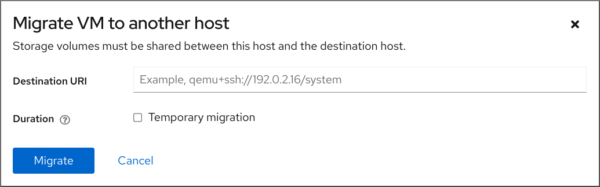 
3. Enter the URI of the destination host.
4. Configure the duration of the migration:
   
   - **Permanent** - Do not select the checkbox if you want to migrate the VM permanently. Permanent migration completely removes the VM configuration from the source host.
   - **Temporary** - Temporary migration migrates a copy of the VM to the destination host. This copy is deleted from the destination host when the VM is shut down. The original VM remains on the source host.
5. Click Migrate
   
   Your VM is migrated to the destination host.

**Verification**

To verify whether the VM has been successfully migrated and is working correctly:

- Confirm whether the VM appears in the list of VMs available on the destination host.
- Start the migrated VM and observe if it boots up.

<h3 id="live-migrating-a-virtual-machine-with-an-attached-mellanox-virtual-function">11.6. Live migrating a virtual machine with an attached Mellanox virtual function</h3>

You can live migrate a virtual machine (VM) with an attached virtual function (VF) of a supported Mellanox networking device.

Red Hat implements the general functionality of VM live migration with an attached VF of a Mellanox networking device. However, the functionality depends on specific Mellanox device models and firmware versions.

Currently, the VF migration is supported only with a Mellanox CX-7 networking device.

The VF on the Mellanox CX-7 networking device uses a new `mlx5_vfio_pci` driver, which adds functionality that is necessary for the live migration, and `libvirt` binds the new driver to the VF automatically.

Red Hat directly supports Mellanox VF live migration only with the included `mlx5_vfio_pci` driver.

**Limitations**

Some virtualization features cannot be used when live migrating a VM with an attached virtual function:

- Calculating dirty memory page rate generation of the VM.
  
  Currently, when migrating a VM with an attached Mellanox VF, live migration data and statistics provided by `virsh domjobinfo` and `virsh domdirtyrate-calc` commands are inaccurate, because the calculations only count guest RAM without including the impact of the attached VF.
- Using a post-copy live migration.
- Using a virtual I/O Memory Management Unit (vIOMMU) device in the VM.

Additional limitations that are specific to the Mellanox CX-7 networking device:

- A CX-7 device with the same Parameter-Set Identification (PSID) and the same firmware version must be used on both the source and the destination hosts.
  
  You can check the PSID of your device with the following command:
  
  ```
  mstflint -d <device_pci_address> query | grep -i PSID
  
  PSID: MT_1090111019
  ```
  
  ```plaintext
  # mstflint -d <device_pci_address> query | grep -i PSID
  
  PSID: MT_1090111019
  ```
- On one CX-7 physical function, you can use at maximum 4 VFs for live migration at the same time. For example, you can migrate one VM with 4 attached VFs, or 4 VMs with one VF attached to each VM.

**Prerequisites**

- You have a Mellanox CX-7 networking device with a firmware version that is equal to or greater than *28.36.1010*.
  
  Refer to [Mellanox documentation](https://docs.nvidia.com/networking/software/adapter-software/index.html#mlnx-ofed) for details about supported firmware versions and ensure you are using an up-to-date version of the firmware.
- The host uses the Intel 64, AMD64, or ARM 64 CPU architecture.
- The Mellanox firmware version on the source host must be the same as on the destination host.
- The `mstflint` package is installed on both the source and destination host:
  
  ```
  dnf install mstflint
  ```
  
  ```plaintext
  # dnf install mstflint
  ```
- The Mellanox CX-7 networking device has `VF_MIGRATION_MODE` set to `MIGRATION_ENABLED`:
  
  ```
  mstconfig -d <device_pci_address> query | grep -i VF_migration
  
  VF_MIGRATION_MODE                           MIGRATION_ENABLED(2)
  ```
  
  ```plaintext
  # mstconfig -d <device_pci_address> query | grep -i VF_migration
  
  VF_MIGRATION_MODE                           MIGRATION_ENABLED(2)
  ```
  
  - You can set `VF_MIGRATION_MODE` to `MIGRATION_ENABLED` by using the following command:
    
    ```
    mstconfig -d <device_pci_address> set VF_MIGRATION_MODE=2
    ```
    
    ```plaintext
    # mstconfig -d <device_pci_address> set VF_MIGRATION_MODE=2
    ```
- The `openvswitch` package is installed on both the source and destination host:
  
  ```
  dnf install openvswitch
  ```
  
  ```plaintext
  # dnf install openvswitch
  ```
- All of the general SR-IOV devices prerequisites. For details, see [Attaching SR-IOV networking devices to virtual machines](#attaching-sr-iov-networking-devices-to-virtual-machines "15.7.2. Attaching SR-IOV networking devices to virtual machines")
- All of the general VM migration prerequisites. For details, see [Migrating a virtual machine by using the command line](#migrating-a-virtual-machine-by-using-the-command-line "11.4. Migrating a virtual machine by using the command line")

**Procedure**

1. On the source host, set the Mellanox networking device to the `switchdev` mode.
   
   ```
   devlink dev eswitch set pci/<device_pci_address> mode switchdev
   ```
   
   ```plaintext
   # devlink dev eswitch set pci/<device_pci_address> mode switchdev
   ```
2. On the source host, create a virtual function on the Mellanox device.
   
   ```
   echo 1 > /sys/bus/pci/devices/0000\:e1\:00.0/sriov_numvfs
   ```
   
   ```plaintext
   # echo 1 > /sys/bus/pci/devices/0000\:e1\:00.0/sriov_numvfs
   ```
   
   The `/0000\:e1\:00.0/` part of the file path is based on the PCI address of the device. In the example it is: `0000:e1:00.0`
3. On the source host, unbind the VF from its driver.
   
   ```
   virsh nodedev-detach <vf_pci_address> --driver pci-stub
   ```
   
   ```plaintext
   # virsh nodedev-detach <vf_pci_address> --driver pci-stub
   ```
   
   You can view the PCI address of the VF by using the following command:
   
   ```
   lshw -c network -businfo
   
   Bus info            Device         Class          Description
   =============================================================================
   pci@0000:e1:00.0    enp225s0np0    network        MT2910 Family [ConnectX-7]
   pci@0000:e1:00.1    enp225s0v0     network        ConnectX Family mlx5Gen Virtual Function
   ```
   
   ```plaintext
   # lshw -c network -businfo
   
   Bus info            Device         Class          Description
   =============================================================================
   pci@0000:e1:00.0    enp225s0np0    network        MT2910 Family [ConnectX-7]
   pci@0000:e1:00.1    enp225s0v0     network        ConnectX Family mlx5Gen Virtual Function
   ```
4. On the source host, enable the migration function of the VF.
   
   ```
   devlink port function set pci/0000:e1:00.0/1 migratable enable
   ```
   
   ```plaintext
   # devlink port function set pci/0000:e1:00.0/1 migratable enable
   ```
   
   In this example, `pci/0000:e1:00.0/1` refers to the first VF on the Mellanox device with the given PCI address.
5. On the source host, configure Open vSwitch (OVS) for the migration of the VF. If the Mellanox device is in `switchdev` mode, it cannot transfer data over the network.
   
   1. Ensure the `openvswitch` service is running.
      
      ```
      systemctl start openvswitch
      ```
      
      ```plaintext
      # systemctl start openvswitch
      ```
   2. Enable hardware offloading to improve networking performance.
      
      ```
      ovs-vsctl set Open_vSwitch . other_config:hw-offload=true
      ```
      
      ```plaintext
      # ovs-vsctl set Open_vSwitch . other_config:hw-offload=true
      ```
   3. Increase the maximum idle time to ensure network connections remain open during the migration.
      
      ```
      ovs-vsctl set Open_vSwitch . other_config:max-idle=300000
      ```
      
      ```plaintext
      # ovs-vsctl set Open_vSwitch . other_config:max-idle=300000
      ```
   4. Create a new bridge in the OVS instance.
      
      ```
      ovs-vsctl add-br <bridge_name>
      ```
      
      ```plaintext
      # ovs-vsctl add-br <bridge_name>
      ```
   5. Restart the `openvswitch` service.
      
      ```
      systemctl restart openvswitch
      ```
      
      ```plaintext
      # systemctl restart openvswitch
      ```
   6. Add the physical Mellanox device to the OVS bridge.
      
      ```
      ovs-vsctl add-port <bridge_name> enp225s0np0
      ```
      
      ```plaintext
      # ovs-vsctl add-port <bridge_name> enp225s0np0
      ```
      
      In this example, `enp225s0np0` is the network interface name of the Mellanox device.
   7. Add the VF of the Mellanox device to the OVS bridge.
      
      ```
      ovs-vsctl add-port <bridge_name> enp225s0npf0vf0
      ```
      
      ```plaintext
      # ovs-vsctl add-port <bridge_name> enp225s0npf0vf0
      ```
      
      In this example, `enp225s0npf0vf0` is the network interface name of the VF.
6. Repeat steps 1-5 on the **destination host**.
7. On the source host, open a new file, such as `mlx_vf.xml`, and add the following XML configuration of the VF:
   
   ```
    <interface type='hostdev' managed='yes'>
         <mac address='52:54:00:56:8c:f7'/>
         <source>
           <address type='pci' domain='0x0000' bus='0xe1' slot='0x00' function='0x1'/>
         </source>
    </interface>
   ```
   
   ```plaintext
    <interface type='hostdev' managed='yes'>
         <mac address='52:54:00:56:8c:f7'/>
         <source>
           <address type='pci' domain='0x0000' bus='0xe1' slot='0x00' function='0x1'/>
         </source>
    </interface>
   ```
   
   This example configures a pass-through of the VF as a network interface for the VM. Ensure the MAC address is unique, and use the PCI address of the VF on the source host.
8. On the source host, attach the VF XML file to the VM.
   
   ```
   virsh attach-device <vm_name> mlx_vf.xml --live --config
   ```
   
   ```plaintext
   # virsh attach-device <vm_name> mlx_vf.xml --live --config
   ```
   
   In this example, `mlx_vf.xml` is the name of the XML file with the VF configuration. Use the `--live` option to attach the device to a running VM.
9. On the source host, start the live migration of the running VM with the attached VF.
   
   ```
   virsh migrate --live --domain <vm_name> --desturi qemu+ssh://<destination_host_ip_address>/system
   ```
   
   ```plaintext
   # virsh migrate --live --domain <vm_name> --desturi qemu+ssh://<destination_host_ip_address>/system
   ```
   
   For more details about performing a live migration, see [Migrating a virtual machine by using the command line](#migrating-a-virtual-machine-by-using-the-command-line "11.4. Migrating a virtual machine by using the command line").

**Verification**

1. In the migrated VM, view the network interface name of the Mellanox VF.
   
   ```
   ifconfig
   
   eth0: flags=4163<UP,BROADCAST,RUNNING,MULTICAST>  mtu 1500
           inet 192.168.1.10  netmask 255.255.255.0  broadcast 192.168.1.255
           inet6 fe80::a00:27ff:fe4e:66a1  prefixlen 64  scopeid 0x20<link>
           ether 08:00:27:4e:66:a1  txqueuelen 1000  (Ethernet)
           RX packets 100000  bytes 6543210 (6.5 MB)
           RX errors 0  dropped 0  overruns 0  frame 0
           TX packets 100000  bytes 6543210 (6.5 MB)
           TX errors 0  dropped 0 overruns 0  carrier 0  collisions 0
   
   enp4s0f0v0: flags=4163<UP,BROADCAST,RUNNING,MULTICAST>  mtu 1500
           inet 192.168.3.10  netmask 255.255.255.0  broadcast 192.168.3.255
           inet6 fe80::a00:27ff:fe4e:66c3  prefixlen 64  scopeid 0x20<link>
           ether 08:00:27:4e:66:c3  txqueuelen 1000  (Ethernet)
           RX packets 200000  bytes 12345678 (12.3 MB)
           RX errors 0  dropped 0  overruns 0  frame 0
           TX packets 200000  bytes 12345678 (12.3 MB)
           TX errors 0  dropped 0 overruns 0  carrier 0  collisions 0
   ```
   
   ```plaintext
   # ifconfig
   
   eth0: flags=4163<UP,BROADCAST,RUNNING,MULTICAST>  mtu 1500
           inet 192.168.1.10  netmask 255.255.255.0  broadcast 192.168.1.255
           inet6 fe80::a00:27ff:fe4e:66a1  prefixlen 64  scopeid 0x20<link>
           ether 08:00:27:4e:66:a1  txqueuelen 1000  (Ethernet)
           RX packets 100000  bytes 6543210 (6.5 MB)
           RX errors 0  dropped 0  overruns 0  frame 0
           TX packets 100000  bytes 6543210 (6.5 MB)
           TX errors 0  dropped 0 overruns 0  carrier 0  collisions 0
   
   enp4s0f0v0: flags=4163<UP,BROADCAST,RUNNING,MULTICAST>  mtu 1500
           inet 192.168.3.10  netmask 255.255.255.0  broadcast 192.168.3.255
           inet6 fe80::a00:27ff:fe4e:66c3  prefixlen 64  scopeid 0x20<link>
           ether 08:00:27:4e:66:c3  txqueuelen 1000  (Ethernet)
           RX packets 200000  bytes 12345678 (12.3 MB)
           RX errors 0  dropped 0  overruns 0  frame 0
           TX packets 200000  bytes 12345678 (12.3 MB)
           TX errors 0  dropped 0 overruns 0  carrier 0  collisions 0
   ```
2. In the migrated VM, check that the Mellanox VF works, for example:
   
   ```
   ping -I <VF_interface_name> 8.8.8.8
   
   PING 8.8.8.8 (8.8.8.8) from 192.168.3.10 <VF_interface_name>: 56(84) bytes of data.
   64 bytes from 8.8.8.8: icmp_seq=1 ttl=57 time=27.4 ms
   64 bytes from 8.8.8.8: icmp_seq=2 ttl=57 time=26.9 ms
   
   --- 8.8.8.8 ping statistics ---
   2 packets transmitted, 2 received, 0% packet loss, time 1002ms
   rtt min/avg/max/mdev = 26.944/27.046/27.148/0.102 ms
   ```
   
   ```plaintext
   # ping -I <VF_interface_name> 8.8.8.8
   
   PING 8.8.8.8 (8.8.8.8) from 192.168.3.10 <VF_interface_name>: 56(84) bytes of data.
   64 bytes from 8.8.8.8: icmp_seq=1 ttl=57 time=27.4 ms
   64 bytes from 8.8.8.8: icmp_seq=2 ttl=57 time=26.9 ms
   
   --- 8.8.8.8 ping statistics ---
   2 packets transmitted, 2 received, 0% packet loss, time 1002ms
   rtt min/avg/max/mdev = 26.944/27.046/27.148/0.102 ms
   ```

**Additional resources**

- [Mellanox networking documentation](https://docs.nvidia.com/networking/index.html)
- [Attaching SR-IOV networking devices to virtual machines](#attaching-sr-iov-networking-devices-to-virtual-machines "15.7.2. Attaching SR-IOV networking devices to virtual machines")
- [Migrating a virtual machine by using the command line](#migrating-a-virtual-machine-by-using-the-command-line "11.4. Migrating a virtual machine by using the command line")

<h3 id="live-migrating-a-virtual-machine-with-an-attached-nvidia-vgpu">11.7. Live migrating a virtual machine with an attached NVIDIA vGPU</h3>

If you use virtual GPUs (vGPUs) in your virtualization workloads, you can live migrate a running virtual machine (VM) with an attached vGPU to another KVM host. Currently, this is only possible with NVIDIA GPUs.

**Prerequisites**

- You have an NVIDIA GPU with an NVIDIA Virtual GPU Software Driver version that supports this functionality. Refer to the relevant [NVIDIA vGPU documentation](https://docs.nvidia.com/vgpu/index.html) for more details.
- You have a correctly configured NVIDIA vGPU assigned to a VM. For instructions, see: [Setting up NVIDIA vGPU devices](#setting-up-nvidia-vgpu-devices "16.2.1. Setting up NVIDIA vGPU devices")

Note

It is also possible to live migrate a VM with multiple vGPU devices attached.

- The host uses the Intel 64 or AMD64 CPU architecture.
- All of the vGPU migration prerequisites that are documented by NVIDIA. Refer to the relevant NVIDIA vGPU documentation for more details.
- All of the general VM migration prerequisites. For details, see [Migrating a virtual machine by using the command line](#migrating-a-virtual-machine-by-using-the-command-line "11.4. Migrating a virtual machine by using the command line")

**Limitations**

- Certain NVIDIA GPU features can disable the migration. For more information, see the specific NVIDIA documentation for your graphics card.
- Some GPU workloads are not compatible with the downtime that happens during a migration. As a consequence, the GPU workloads might stop or crash. It is recommended to test if your workloads are compatible with the downtime before attempting a vGPU live migration.
- Currently, vGPU live migration fails if the vGPU driver version differs on the source and destination hosts.
- Currently, some general virtualization features cannot be used when live migrating a VM with an attached vGPU:
  
  - Calculating dirty memory page rate generation of the VM.
    
    Currently, live migration data and statistics provided by `virsh domjobinfo` and `virsh domdirtyrate-calc` commands are inaccurate when migrating a VM with an attached vGPU, because the calculations only count guest RAM without including vRAM from the vGPU.
  - Using a post-copy live migration.
  - Using a virtual I/O Memory Management Unit (vIOMMU) device in the VM.

**Procedure**

- For instructions on how to proceed with the live migration, see: [Migrating a virtual machine by using the command line](#migrating-a-virtual-machine-by-using-the-command-line "11.4. Migrating a virtual machine by using the command line")
  
  No additional parameters for the migration command are required for the attached vGPU device.

**Additional resources**

- [General NVIDIA vGPU documentation](https://docs.nvidia.com/vgpu/index.html)
- [General NVIDIA AI Enterprise documentation](https://docs.nvidia.com/ai-enterprise/index.html)

<h3 id="sharing-virtual-machine-disk-images-with-other-hosts">11.8. Sharing virtual machine disk images with other hosts</h3>

To perform a live migration of a virtual machine (VM) between [supported KVM hosts](#supported-hosts-for-virtual-machine-migration "11.10. Supported hosts for virtual machine migration"), you must also migrate the storage of the running VM in a way that makes it possible for the VM to read from and write to the storage during the migration process.

One of the methods to do this is using shared VM storage. The following procedure provides instructions for sharing a locally stored VM image with the source host and the destination host by using the NFS protocol.

**Prerequisites**

- The VM intended for migration is shut down.
- Optional: A host system is available for hosting the storage that is not the source or destination host, but both the source and the destination host can reach it through the network. This is the optimal solution for shared storage.
- Make sure that NFS file locking is not used as it is not supported in KVM.
- The NFS protocol is installed and enabled on the source and destination hosts. See [Deploying an NFS server](https://docs.redhat.com/en/documentation/red_hat_enterprise_linux/10/html/configuring_and_using_network_file_services/deploying-an-nfs-server).
- The `virt_use_nfs` SELinux boolean is set to `on`.
  
  ```
  setsebool virt_use_nfs 1
  ```
  
  ```plaintext
  # setsebool virt_use_nfs 1
  ```

**Procedure**

1. Connect to the host that will provide shared storage. In this example, it is the `example-shared-storage` host:
   
   ```
   ssh root@example-shared-storage
   root@example-shared-storage's password:
   Last login: Mon Sep 24 12:05:36 2019
   root~#
   ```
   
   ```plaintext
   # ssh root@example-shared-storage
   root@example-shared-storage's password:
   Last login: Mon Sep 24 12:05:36 2019
   root~#
   ```
2. Create a directory on the `example-shared-storage` host that will hold the disk image and that will be shared with the migration hosts:
   
   ```
   mkdir /var/lib/libvirt/shared-images
   ```
   
   ```plaintext
   # mkdir /var/lib/libvirt/shared-images
   ```
3. Copy the disk image of the VM from the source host to the newly created directory. The following example copies the disk image `example-disk-1` of the VM to the `/var/lib/libvirt/shared-images/` directory of the `example-shared-storage` host:
   
   ```
   scp /var/lib/libvirt/images/example-disk-1.qcow2 root@example-shared-storage:/var/lib/libvirt/shared-images/example-disk-1.qcow2
   ```
   
   ```plaintext
   # scp /var/lib/libvirt/images/example-disk-1.qcow2 root@example-shared-storage:/var/lib/libvirt/shared-images/example-disk-1.qcow2
   ```
4. On the host that you want to use for sharing the storage, add the sharing directory to the `/etc/exports` file. The following example shares the `/var/lib/libvirt/shared-images` directory with the `example-source-machine` and `example-destination-machine` hosts:
   
   ```
   /var/lib/libvirt/shared-images example-source-machine(rw,no_root_squash) example-destination-machine(rw,no\_root_squash)
   ```
   
   ```plaintext
   # /var/lib/libvirt/shared-images example-source-machine(rw,no_root_squash) example-destination-machine(rw,no\_root_squash)
   ```
5. Run the `exportfs -a` command for the changes in the `/etc/exports` file to take effect.
   
   ```
   exportfs -a
   ```
   
   ```plaintext
   # exportfs -a
   ```
6. On both the source and destination host, mount the shared directory in the `/var/lib/libvirt/images` directory:
   
   ```
   mount example-shared-storage:/var/lib/libvirt/shared-images /var/lib/libvirt/images
   ```
   
   ```plaintext
   # mount example-shared-storage:/var/lib/libvirt/shared-images /var/lib/libvirt/images
   ```

**Verification**

- Start the VM on the source host and observe if it boots successfully.

**Additional resources**

- [Deploying an NFS server](https://docs.redhat.com/en/documentation/red_hat_enterprise_linux/10/html/configuring_and_using_network_file_services/deploying-an-nfs-server)

<h3 id="verifying-host-cpu-compatibility-for-virtual-machine-migration">11.9. Verifying host CPU compatibility for virtual machine migration</h3>

For migrated virtual machines (VMs) to work correctly on the destination host, the CPUs on the source and the destination hosts must be compatible. To ensure that this is the case, calculate a common CPU baseline before you begin the migration.

Note

The instructions in this section use an example migration scenario with the following host CPUs:

- Source host: Intel Core i7-8650U
- Destination hosts: Intel Xeon CPU E5-2620 v2

In addition, this procedure does not apply to 64-bit ARM systems.

**Prerequisites**

- Virtualization is [installed and enabled](#preparing-rhel-to-host-virtual-machines "Chapter 2. Preparing RHEL to host virtual machines") on your system.
- You have administrator access to the source host and the destination host for the migration.

**Procedure**

1. On the source host, obtain its CPU features and paste them into a new XML file, such as `domCaps-CPUs.xml`.
   
   ```
   virsh domcapabilities | xmllint --xpath "//cpu/mode[@name='host-model']" - > domCaps-CPUs.xml
   ```
   
   ```plaintext
   # virsh domcapabilities | xmllint --xpath "//cpu/mode[@name='host-model']" - > domCaps-CPUs.xml
   ```
2. In the XML file, replace the `<mode> </mode>` tags with `<cpu> </cpu>`.
3. Optional: Verify that the content of the `domCaps-CPUs.xml` file looks similar to the following:
   
   ```
   cat domCaps-CPUs.xml
   
       <cpu>
             <model fallback="forbid">Skylake-Client-IBRS</model>
             <vendor>Intel</vendor>
             <feature policy="require" name="ss"/>
             <feature policy="require" name="vmx"/>
             <feature policy="require" name="pdcm"/>
             <feature policy="require" name="hypervisor"/>
             <feature policy="require" name="tsc_adjust"/>
             <feature policy="require" name="clflushopt"/>
             <feature policy="require" name="umip"/>
             <feature policy="require" name="md-clear"/>
             <feature policy="require" name="stibp"/>
             <feature policy="require" name="arch-capabilities"/>
             <feature policy="require" name="ssbd"/>
             <feature policy="require" name="xsaves"/>
             <feature policy="require" name="pdpe1gb"/>
             <feature policy="require" name="invtsc"/>
             <feature policy="require" name="ibpb"/>
             <feature policy="require" name="ibrs"/>
             <feature policy="require" name="amd-stibp"/>
             <feature policy="require" name="amd-ssbd"/>
             <feature policy="require" name="rsba"/>
             <feature policy="require" name="skip-l1dfl-vmentry"/>
             <feature policy="require" name="pschange-mc-no"/>
             <feature policy="disable" name="hle"/>
             <feature policy="disable" name="rtm"/>
       </cpu>
   ```
   
   ```plaintext
   # cat domCaps-CPUs.xml
   
       <cpu>
             <model fallback="forbid">Skylake-Client-IBRS</model>
             <vendor>Intel</vendor>
             <feature policy="require" name="ss"/>
             <feature policy="require" name="vmx"/>
             <feature policy="require" name="pdcm"/>
             <feature policy="require" name="hypervisor"/>
             <feature policy="require" name="tsc_adjust"/>
             <feature policy="require" name="clflushopt"/>
             <feature policy="require" name="umip"/>
             <feature policy="require" name="md-clear"/>
             <feature policy="require" name="stibp"/>
             <feature policy="require" name="arch-capabilities"/>
             <feature policy="require" name="ssbd"/>
             <feature policy="require" name="xsaves"/>
             <feature policy="require" name="pdpe1gb"/>
             <feature policy="require" name="invtsc"/>
             <feature policy="require" name="ibpb"/>
             <feature policy="require" name="ibrs"/>
             <feature policy="require" name="amd-stibp"/>
             <feature policy="require" name="amd-ssbd"/>
             <feature policy="require" name="rsba"/>
             <feature policy="require" name="skip-l1dfl-vmentry"/>
             <feature policy="require" name="pschange-mc-no"/>
             <feature policy="disable" name="hle"/>
             <feature policy="disable" name="rtm"/>
       </cpu>
   ```
4. On the destination host, use the following command to obtain its CPU features:
   
   ```
   virsh domcapabilities | xmllint --xpath "//cpu/mode[@name='host-model']" -
   
       <mode name="host-model" supported="yes">
               <model fallback="forbid">IvyBridge-IBRS</model>
               <vendor>Intel</vendor>
               <feature policy="require" name="ss"/>
               <feature policy="require" name="vmx"/>
               <feature policy="require" name="pdcm"/>
               <feature policy="require" name="pcid"/>
               <feature policy="require" name="hypervisor"/>
               <feature policy="require" name="arat"/>
               <feature policy="require" name="tsc_adjust"/>
               <feature policy="require" name="umip"/>
               <feature policy="require" name="md-clear"/>
               <feature policy="require" name="stibp"/>
               <feature policy="require" name="arch-capabilities"/>
               <feature policy="require" name="ssbd"/>
               <feature policy="require" name="xsaveopt"/>
               <feature policy="require" name="pdpe1gb"/>
               <feature policy="require" name="invtsc"/>
               <feature policy="require" name="ibpb"/>
               <feature policy="require" name="amd-ssbd"/>
               <feature policy="require" name="skip-l1dfl-vmentry"/>
               <feature policy="require" name="pschange-mc-no"/>
       </mode>
   ```
   
   ```plaintext
   # virsh domcapabilities | xmllint --xpath "//cpu/mode[@name='host-model']" -
   
       <mode name="host-model" supported="yes">
               <model fallback="forbid">IvyBridge-IBRS</model>
               <vendor>Intel</vendor>
               <feature policy="require" name="ss"/>
               <feature policy="require" name="vmx"/>
               <feature policy="require" name="pdcm"/>
               <feature policy="require" name="pcid"/>
               <feature policy="require" name="hypervisor"/>
               <feature policy="require" name="arat"/>
               <feature policy="require" name="tsc_adjust"/>
               <feature policy="require" name="umip"/>
               <feature policy="require" name="md-clear"/>
               <feature policy="require" name="stibp"/>
               <feature policy="require" name="arch-capabilities"/>
               <feature policy="require" name="ssbd"/>
               <feature policy="require" name="xsaveopt"/>
               <feature policy="require" name="pdpe1gb"/>
               <feature policy="require" name="invtsc"/>
               <feature policy="require" name="ibpb"/>
               <feature policy="require" name="amd-ssbd"/>
               <feature policy="require" name="skip-l1dfl-vmentry"/>
               <feature policy="require" name="pschange-mc-no"/>
       </mode>
   ```
5. Add the obtained CPU features from the destination host to the `domCaps-CPUs.xml` file on the source host. Again, replace the `<mode> </mode>` tags with `<cpu> </cpu>` and save the file.
6. Optional: Verify that the XML file now contains the CPU features from both hosts.
   
   ```
   cat domCaps-CPUs.xml
   
       <cpu>
             <model fallback="forbid">Skylake-Client-IBRS</model>
             <vendor>Intel</vendor>
             <feature policy="require" name="ss"/>
             <feature policy="require" name="vmx"/>
             <feature policy="require" name="pdcm"/>
             <feature policy="require" name="hypervisor"/>
             <feature policy="require" name="tsc_adjust"/>
             <feature policy="require" name="clflushopt"/>
             <feature policy="require" name="umip"/>
             <feature policy="require" name="md-clear"/>
             <feature policy="require" name="stibp"/>
             <feature policy="require" name="arch-capabilities"/>
             <feature policy="require" name="ssbd"/>
             <feature policy="require" name="xsaves"/>
             <feature policy="require" name="pdpe1gb"/>
             <feature policy="require" name="invtsc"/>
             <feature policy="require" name="ibpb"/>
             <feature policy="require" name="ibrs"/>
             <feature policy="require" name="amd-stibp"/>
             <feature policy="require" name="amd-ssbd"/>
             <feature policy="require" name="rsba"/>
             <feature policy="require" name="skip-l1dfl-vmentry"/>
             <feature policy="require" name="pschange-mc-no"/>
             <feature policy="disable" name="hle"/>
             <feature policy="disable" name="rtm"/>
       </cpu>
       <cpu>
             <model fallback="forbid">IvyBridge-IBRS</model>
             <vendor>Intel</vendor>
             <feature policy="require" name="ss"/>
             <feature policy="require" name="vmx"/>
             <feature policy="require" name="pdcm"/>
             <feature policy="require" name="pcid"/>
             <feature policy="require" name="hypervisor"/>
             <feature policy="require" name="arat"/>
             <feature policy="require" name="tsc_adjust"/>
             <feature policy="require" name="umip"/>
             <feature policy="require" name="md-clear"/>
             <feature policy="require" name="stibp"/>
             <feature policy="require" name="arch-capabilities"/>
             <feature policy="require" name="ssbd"/>
             <feature policy="require" name="xsaveopt"/>
             <feature policy="require" name="pdpe1gb"/>
             <feature policy="require" name="invtsc"/>
             <feature policy="require" name="ibpb"/>
             <feature policy="require" name="amd-ssbd"/>
             <feature policy="require" name="skip-l1dfl-vmentry"/>
             <feature policy="require" name="pschange-mc-no"/>
       </cpu>
   ```
   
   ```plaintext
   # cat domCaps-CPUs.xml
   
       <cpu>
             <model fallback="forbid">Skylake-Client-IBRS</model>
             <vendor>Intel</vendor>
             <feature policy="require" name="ss"/>
             <feature policy="require" name="vmx"/>
             <feature policy="require" name="pdcm"/>
             <feature policy="require" name="hypervisor"/>
             <feature policy="require" name="tsc_adjust"/>
             <feature policy="require" name="clflushopt"/>
             <feature policy="require" name="umip"/>
             <feature policy="require" name="md-clear"/>
             <feature policy="require" name="stibp"/>
             <feature policy="require" name="arch-capabilities"/>
             <feature policy="require" name="ssbd"/>
             <feature policy="require" name="xsaves"/>
             <feature policy="require" name="pdpe1gb"/>
             <feature policy="require" name="invtsc"/>
             <feature policy="require" name="ibpb"/>
             <feature policy="require" name="ibrs"/>
             <feature policy="require" name="amd-stibp"/>
             <feature policy="require" name="amd-ssbd"/>
             <feature policy="require" name="rsba"/>
             <feature policy="require" name="skip-l1dfl-vmentry"/>
             <feature policy="require" name="pschange-mc-no"/>
             <feature policy="disable" name="hle"/>
             <feature policy="disable" name="rtm"/>
       </cpu>
       <cpu>
             <model fallback="forbid">IvyBridge-IBRS</model>
             <vendor>Intel</vendor>
             <feature policy="require" name="ss"/>
             <feature policy="require" name="vmx"/>
             <feature policy="require" name="pdcm"/>
             <feature policy="require" name="pcid"/>
             <feature policy="require" name="hypervisor"/>
             <feature policy="require" name="arat"/>
             <feature policy="require" name="tsc_adjust"/>
             <feature policy="require" name="umip"/>
             <feature policy="require" name="md-clear"/>
             <feature policy="require" name="stibp"/>
             <feature policy="require" name="arch-capabilities"/>
             <feature policy="require" name="ssbd"/>
             <feature policy="require" name="xsaveopt"/>
             <feature policy="require" name="pdpe1gb"/>
             <feature policy="require" name="invtsc"/>
             <feature policy="require" name="ibpb"/>
             <feature policy="require" name="amd-ssbd"/>
             <feature policy="require" name="skip-l1dfl-vmentry"/>
             <feature policy="require" name="pschange-mc-no"/>
       </cpu>
   ```
7. Use the XML file to calculate the CPU feature baseline for the VM you intend to migrate.
   
   ```
   virsh hypervisor-cpu-baseline domCaps-CPUs.xml
   
       <cpu mode='custom' match='exact'>
         <model fallback='forbid'>IvyBridge-IBRS</model>
         <vendor>Intel</vendor>
         <feature policy='require' name='ss'/>
         <feature policy='require' name='vmx'/>
         <feature policy='require' name='pdcm'/>
         <feature policy='require' name='pcid'/>
         <feature policy='require' name='hypervisor'/>
         <feature policy='require' name='arat'/>
         <feature policy='require' name='tsc_adjust'/>
         <feature policy='require' name='umip'/>
         <feature policy='require' name='md-clear'/>
         <feature policy='require' name='stibp'/>
         <feature policy='require' name='arch-capabilities'/>
         <feature policy='require' name='ssbd'/>
         <feature policy='require' name='xsaveopt'/>
         <feature policy='require' name='pdpe1gb'/>
         <feature policy='require' name='invtsc'/>
         <feature policy='require' name='ibpb'/>
         <feature policy='require' name='amd-ssbd'/>
         <feature policy='require' name='skip-l1dfl-vmentry'/>
         <feature policy='require' name='pschange-mc-no'/>
       </cpu>
   ```
   
   ```plaintext
   # virsh hypervisor-cpu-baseline domCaps-CPUs.xml
   
       <cpu mode='custom' match='exact'>
         <model fallback='forbid'>IvyBridge-IBRS</model>
         <vendor>Intel</vendor>
         <feature policy='require' name='ss'/>
         <feature policy='require' name='vmx'/>
         <feature policy='require' name='pdcm'/>
         <feature policy='require' name='pcid'/>
         <feature policy='require' name='hypervisor'/>
         <feature policy='require' name='arat'/>
         <feature policy='require' name='tsc_adjust'/>
         <feature policy='require' name='umip'/>
         <feature policy='require' name='md-clear'/>
         <feature policy='require' name='stibp'/>
         <feature policy='require' name='arch-capabilities'/>
         <feature policy='require' name='ssbd'/>
         <feature policy='require' name='xsaveopt'/>
         <feature policy='require' name='pdpe1gb'/>
         <feature policy='require' name='invtsc'/>
         <feature policy='require' name='ibpb'/>
         <feature policy='require' name='amd-ssbd'/>
         <feature policy='require' name='skip-l1dfl-vmentry'/>
         <feature policy='require' name='pschange-mc-no'/>
       </cpu>
   ```
8. Open the XML configuration of the VM you intend to migrate, and replace the contents of the `<cpu>` section with the settings obtained in the previous step.
   
   ```
   virsh edit <vm_name>
   ```
   
   ```plaintext
   # virsh edit <vm_name>
   ```
9. If the VM is running, shut down the VM and start it again.
   
   ```
   virsh shutdown <vm_name>
   
   virsh start <vm_name>
   ```
   
   ```plaintext
   # virsh shutdown <vm_name>
   
   # virsh start <vm_name>
   ```

**Next steps**

- [Sharing virtual machine disk images with other hosts](#sharing-virtual-machine-disk-images-with-other-hosts "11.8. Sharing virtual machine disk images with other hosts")
- [Migrating a virtual machine by using the command line](#migrating-a-virtual-machine-by-using-the-command-line "11.4. Migrating a virtual machine by using the command line")
- [Live-migrating a virtual machine by using the web console](#live-migrating-a-virtual-machine-by-using-the-web-console "11.5. Live migrating a virtual machine by using the web console")

<h3 id="supported-hosts-for-virtual-machine-migration">11.10. Supported hosts for virtual machine migration</h3>

For the virtual machine (VM) migration to work properly and be supported by Red Hat, the source and destination hosts must be specific RHEL versions and machine types. The following table shows supported VM migration paths.

VM migration between hosts with the same RHEL version on the supported machine types is also supported.

| Migration method | Release type  | Future version example | Support status                                 |
|:-----------------|:--------------|:-----------------------|:-----------------------------------------------|
| Forward          | Minor release | 10.0.1 → 10.1          | On supported RHEL 10 systems and machine types |
| Forward          | Major release | 9.7 → 10.1             | On supported RHEL systems and machine types    |
| Backward         | Minor release | 10.1 → 10.0.1          | On supported RHEL 10 systems and machine types |
| Backward         | Major release | 10.1 → 9.7             | On supported RHEL systems and machine types    |

Table 11.2. Live migration compatibility

Note

The support status might vary for other virtualization solutions provided by Red Hat, including RHOSP and OpenShift Virtualization.

<h2 id="managing-storage-for-virtual-machines">Chapter 12. Managing storage for virtual machines</h2>

A virtual machine (VM) requires storage for data, program, and system files. You can assign physical or network-based storage to your VMs as virtual storage.

You can also modify how the storage is presented to a VM regardless of the underlying hardware.

<h3 id="available-methods-for-attaching-storage-to-virtual-machines">12.1. Available methods for attaching storage to virtual machines</h3>

To provide storage for your virtual machines (VMs) running on a RHEL 10 host, you can use multiple types of storage hardware and services. Each of these types has different requirements, benefits, and use cases.

File-based storage

File-based virtual disks are disk image files on your host file system, which are stored in a directory-based `libvirt` storage pool.

File-based disks are quick to set up and easy to migrate, but create additional overhead for the local file system, which can have negative impact on the performance.

In addition, certain `libvirt` features, such as snapshots, require a file-based virtual disk.

For instructions on attaching file-based storage to your VMs, see [Attaching a file-based virtual disk to your virtual machine by using the command line](#attaching-a-file-based-virtual-disk-to-your-virtual-machine-by-using-the-command-line "12.4.1. Attaching a file-based virtual disk to your virtual machine by using the command line") or [Attaching a file-based virtual disk to your virtual machine by using the web console](#attaching-a-file-based-virtual-disk-to-your-virtual-machine-by-using-the-web-console "12.4.2. Attaching a file-based virtual disk to your virtual machine by using the web console").

Disk-based storage

VMs can use an entire physical disk or partition instead of virtual disks.

Disk-based storage has the best performance of the available storage types and also provides direct access to host disks. However, you cannot create snapshots for such storage, and it is difficult to migrate.

For instructions on attaching disk-based storage to your VMs, see [Attaching disk-based storage to your virtual machine by using the command line](#attaching-disk-based-storage-to-your-virtual-machine-by-using-the-command-line "12.4.3. Attaching disk-based storage to your virtual machine by using the command line") or [Attaching disk-based storage to your virtual machine by using the web console](#attaching-disk-based-storage-to-your-virtual-machine-by-using-the-web-console "12.4.4. Attaching disk-based storage to your virtual machine by using the web console").

LVM-based storage

VMs can use the Logical Volume Manager (LVM) to allocate storage directly from a volume group (VG).

LVM storage has better performance than file-based disks and is easy to resize, but can be more difficult to migrate.

For instructions on attaching LVM-based storage to your VMs, see [Attaching LVM-based storage to your virtual machine by using the command line](#attaching-lvm-based-storage-to-your-virtual-machine-by-using-the-command-line "12.4.5. Attaching LVM-based storage to your virtual machine by using the command line") or [Attaching LVM-based storage to your virtual machine by using the web console](#attaching-lvm-based-storage-to-your-virtual-machine-by-using-the-web-console "12.4.6. Attaching LVM-based storage to your virtual machine by using the web console").

Network-based storage

Instead of local hardware, you can use remote storage, such as the Network File System (NFS).

This is useful for shared storage in clusters or high-availability environments. However, network-based storage is generally slower than local storage, and your network bandwidth can further limit the performance.

For instructions on attaching NFS-based storage to your VMs, see [Attaching NFS-based storage to your virtual machine by using the command line](#attaching-nfs-based-storage-to-your-virtual-machine-by-using-the-command-line "12.4.7. Attaching NFS-based storage to your virtual machine by using the command line") or [Attaching NFS-based storage to your virtual machine by using the web console](#attaching-nfs-based-storage-to-your-virtual-machine-by-using-the-web-console "12.4.8. Attaching NFS-based storage to your virtual machine by using the web console").

<h3 id="viewing-virtual-machine-storage-information-by-using-the-web-console">12.2. Viewing virtual machine storage information by using the web console</h3>

By using the web console, you can view detailed information about storage resources available to your virtual machines (VMs).

**Prerequisites**

- You have installed the RHEL 10 web console.
  
  For instructions, see [Installing and enabling the web console](https://docs.redhat.com/en/documentation/red_hat_enterprise_linux/10/html/managing_systems_in_the_rhel_web_console/getting-started-with-the-rhel-web-console#installing-and-enabling-the-web-console).
- The web console VM plug-in [is installed on your system](#setting-up-the-web-console-to-manage-virtual-machines "2.4. Setting up the web console to manage virtual machines").

**Procedure**

1. Log in to the RHEL 10 web console.
2. To view a list of the storage pools available on your host, click Storage Pools at the top of the Virtual Machines interface.
   
   The **Storage pools** window appears, showing a list of configured storage pools.
   
   The information includes the following:
   
   - **Name** - The name of the storage pool.
   - **Size** - The current allocation and the total capacity of the storage pool.
   - **Connection** - The connection used to access the storage pool.
   - **State** - The state of the storage pool.
3. Click the arrow next to the storage pool whose information you want to see.
   
   The row expands to reveal the Overview pane with detailed information about the selected storage pool.
   
   The information includes:
   
   - **Target path** - The location of the storage pool.
   - **Persistent** - Indicates whether or not the storage pool has a persistent configuration.
   - **Autostart** - Indicates whether or not the storage pool starts automatically when the system boots up.
   - **Type** - The type of the storage pool.
4. To view a list of storage volumes associated with the storage pool, click Storage Volumes.
   
   The Storage Volumes pane appears, showing a list of configured storage volumes.
   
   The information includes:
   
   - **Name** - The name of the storage volume.
   - **Used by** - The VM that is currently using the storage volume.
   - **Size** - The size of the volume.
5. To view virtual disks attached to a specific VM:
   
   1. Click Virtual machines in the left-side menu.
   2. Click the VM whose information you want to see.
      
      A new page opens with an Overview section with basic information about the selected VM and a Console section to access the VM’s graphical interface.
6. Scroll to Disks.
   
   The Disks section displays information about the disks assigned to the VM, as well as options to **Add** or **Edit** disks.
   
   The information includes the following:
   
   - **Device** - The device type of the disk.
   - **Used** - The amount of disk currently allocated.
   - **Capacity** - The maximum size of the storage volume.
   - **Bus** - The type of disk device that is emulated.
   - **Access** - Whether the disk is **Writeable** or **Read-only**. For `raw` disks, you can also set the access to **Writeable and shared**.
   - **Source** - The disk device or file.

**Additional resources**

- [Viewing virtual machine information by using the command line](#viewing-virtual-machine-storage-information-by-using-the-command-line "12.3. Viewing virtual machine storage information by using the command line")

<h3 id="viewing-virtual-machine-storage-information-by-using-the-command-line">12.3. Viewing virtual machine storage information by using the command line</h3>

By using the command line, you can view detailed information about storage resources available to your virtual machines (VMs).

**Procedure**

1. To view the available storage pools on the host, run the `virsh pool-list` command with options for the required granularity of the list. For example, the following options display all available information about all storage pools on your host:
   
   ```
   virsh pool-list --all --details
   
    Name                State    Autostart  Persistent    Capacity  Allocation   Available
    default             running  yes        yes          48.97 GiB   23.93 GiB   25.03 GiB
    Downloads           running  yes        yes         175.62 GiB   62.02 GiB  113.60 GiB
    RHEL-Storage-Pool   running  yes        yes         214.62 GiB   93.02 GiB  168.60 GiB
   ```
   
   ```plaintext
   # virsh pool-list --all --details
   
    Name                State    Autostart  Persistent    Capacity  Allocation   Available
    default             running  yes        yes          48.97 GiB   23.93 GiB   25.03 GiB
    Downloads           running  yes        yes         175.62 GiB   62.02 GiB  113.60 GiB
    RHEL-Storage-Pool   running  yes        yes         214.62 GiB   93.02 GiB  168.60 GiB
   ```
   
   - For additional options available for viewing storage pool information, use the `virsh pool-list --help` command.
2. To list the storage volumes in a specified storage pool, use the `virsh vol-list` command.
   
   ```
   virsh vol-list --pool <RHEL-Storage-Pool> --details
    Name                Path                                               Type   Capacity  Allocation
   ---------------------------------------------------------------------------------------------
   
     RHEL_Volume.qcow2   /home/VirtualMachines/RHEL8_Volume.qcow2  file  60.00 GiB   13.93 GiB
   ```
   
   ```plaintext
   # virsh vol-list --pool <RHEL-Storage-Pool> --details
    Name                Path                                               Type   Capacity  Allocation
   ---------------------------------------------------------------------------------------------
   
     RHEL_Volume.qcow2   /home/VirtualMachines/RHEL8_Volume.qcow2  file  60.00 GiB   13.93 GiB
   ```
3. To view all block devices attached to a virtual machine, use the `virsh domblklist` command.
   
   ```
   # *virsh domblklist --details <vm-name>
   
    Type   Device   Target   Source
   -----------------------------------------------------------------------------
    file   disk     hda      /home/VirtualMachines/vm-name.qcow2
    file   cdrom    hdb      -
    file   disk     vdc      /home/VirtualMachines/test-disk2.qcow2
   ```
   
   ```plaintext
   # *virsh domblklist --details <vm-name>
   
    Type   Device   Target   Source
   -----------------------------------------------------------------------------
    file   disk     hda      /home/VirtualMachines/vm-name.qcow2
    file   cdrom    hdb      -
    file   disk     vdc      /home/VirtualMachines/test-disk2.qcow2
   ```

**Additional resources**

- [Viewing virtual machine information by using the web console](#viewing-virtual-machine-storage-information-by-using-the-web-console "12.2. Viewing virtual machine storage information by using the web console")

<h3 id="attaching-storage-to-virtual-machines">12.4. Attaching storage to virtual machines</h3>

To add storage to a virtual machine (VM), you can attach a storage resource to the VM as a virtual disk.

Similarly to physical storage devices, virtual disks are independent from the VMs that they are attached to, and can be moved to other VMs.

You can use multiple types of storage resources to add a virtual disk to a VM.

<h4 id="attaching-a-file-based-virtual-disk-to-your-virtual-machine-by-using-the-command-line">12.4.1. Attaching a file-based virtual disk to your virtual machine by using the command line</h4>

To provide local storage for a virtual machine, the easiest option typically is to attach a file-based virtual disk with the `.qcow2` or `.raw` format.

To do so on the command line, you can use one of the following methods:

- Create a file-based storage volume in a directory-based storage pool managed by `libvirt`. This requires multiple steps, but provides better integration with the hypervisor.
  
  Note that a default directory-based storage volume is created automatically when creating the first VM on your RHEL 10 host. The name of this storage pool is based on the name of the directory in which you save the disk image. For example, by default, in the `system` session of `libvirt`, the disk image is saved in the `/var/lib/libvirt/images/` directory and the storage pool is named `images`.
- Use the `qemu-img` command to create a virtual disk as a file on the host file system. This is a faster method, but does not provide integration with `libvirt`.
  
  As a result, virtual disks created by using `qemu-img` are more difficult to manage after creation.

Note

A file-based virtual disk can also be created and attached when creating a new VM on the command line. To do so, use the `--disk` option with the `virt-install` utility. For detailed instructions, see [Creating virtual machines](#creating-virtual-machines "Chapter 3. Creating virtual machines").

**Procedure**

1. Optional: If you want to create a virtual disk as a storage volume, but you do not want to use the default `images` storage pool or another existing storage pool on the host, create and set up a new directory-based storage pool.
   
   1. Configure a directory-type storage pool. For example, to create a storage pool named `guest_images_dir` that uses the `/guest_images` directory:
      
      ```
      virsh pool-define-as guest_images_dir dir --target "/guest_images"
      Pool guest_images_dir defined
      ```
      
      ```plaintext
      # virsh pool-define-as guest_images_dir dir --target "/guest_images"
      Pool guest_images_dir defined
      ```
   2. Create a target path for the storage pool based on the configuration you previously defined.
      
      ```
      virsh pool-build guest_images_dir
        Pool guest_images_dir built
      ```
      
      ```plaintext
      # virsh pool-build guest_images_dir
        Pool guest_images_dir built
      ```
   3. Start the storage pool.
      
      ```
      virsh pool-start guest_images_dir
        Pool guest_images_dir started
      ```
      
      ```plaintext
      # virsh pool-start guest_images_dir
        Pool guest_images_dir started
      ```
   4. Optional: Set the storage pool to start on host boot.
      
      ```
      virsh pool-autostart guest_images_dir
        Pool guest_images_dir marked as autostarted
      ```
      
      ```plaintext
      # virsh pool-autostart guest_images_dir
        Pool guest_images_dir marked as autostarted
      ```
   5. Optional: Verify that the storage pool is in the `running` state. Check if the sizes reported are as expected and if autostart is configured correctly.
      
      ```
      virsh pool-info guest_images_dir
        Name:           guest_images_dir
        UUID:           c7466869-e82a-a66c-2187-dc9d6f0877d0
        State:          running
        Persistent:     yes
        Autostart:      yes
        Capacity:       458.39 GB
        Allocation:     197.91 MB
        Available:      458.20 GB
      ```
      
      ```plaintext
      # virsh pool-info guest_images_dir
        Name:           guest_images_dir
        UUID:           c7466869-e82a-a66c-2187-dc9d6f0877d0
        State:          running
        Persistent:     yes
        Autostart:      yes
        Capacity:       458.39 GB
        Allocation:     197.91 MB
        Available:      458.20 GB
      ```
2. Create a file-based virtual disk. To do so, use one of the following methods:
   
   - To quickly create a file-based VM disk not managed by `libvirt`, use the `qemu-img` utility.
     
     For example, the following command creates a `qcow2` disk image named *test-image* with the size of 30 gigabytes:
     
     ```
     qemu-img create -f qcow2 test-image 30G
     
     Formatting 'test-image', fmt=qcow2 cluster_size=65536 extended_l2=off compression_type=zlib size=32212254720 lazy_refcounts=off refcount_bits=16
     ```
     
     ```plaintext
     # qemu-img create -f qcow2 test-image 30G
     
     Formatting 'test-image', fmt=qcow2 cluster_size=65536 extended_l2=off compression_type=zlib size=32212254720 lazy_refcounts=off refcount_bits=16
     ```
   - To create a file-based VM disk managed by `libvirt`, define the disk as a storage volume based on an existing directory-based storage pool.
     
     For example, the following command creates a 20 GB `qcow2` volume named `vm-disk1` and based on the `guest_images_dir` storage pool:
     
     ```
     virsh vol-create-as --pool guest_images_dir --name vm-disk1 --capacity 20GB --format qcow2
     
     Vol vm-disk1 created
     ```
     
     ```plaintext
     # virsh vol-create-as --pool guest_images_dir --name vm-disk1 --capacity 20GB --format qcow2
     
     Vol vm-disk1 created
     ```
3. Locate the virtual disk that you created:
   
   - For a VM disk created with `qemu-img`, this is typically your current directory.
   - For a storage volume, examine the storage pool that the volume belongs to:
     
     ```
     virsh vol-list --pool guest_images_dir --details
     
      Name        Path                          Type   Capacity    Allocation
     --------------------------------------------------------------------------
      vm-disk1    /guest-images/vm-disk1      file   20.00 GiB   196.00 KiB
     ```
     
     ```plaintext
     # virsh vol-list --pool guest_images_dir --details
     
      Name        Path                          Type   Capacity    Allocation
     --------------------------------------------------------------------------
      vm-disk1    /guest-images/vm-disk1      file   20.00 GiB   196.00 KiB
     ```
4. Find out which target devices are already used in the VM to which you want to attach the disk:
   
   ```
   virsh domblklist --details <vm-name> Type Device Target Source ---------------------------------------------------------------- file disk *vda      /home/VirtualMachines/vm-name.qcow2
    file   cdrom    vdb      -
   ```
   
   ```plaintext
   # virsh domblklist --details <vm-name> Type Device Target Source ---------------------------------------------------------------- file disk *vda      /home/VirtualMachines/vm-name.qcow2
    file   cdrom    vdb      -
   ```
5. Optional: Check the consistency of the disk, to avoid issues with data corruption or disk fragmentation. For instructions, see [Checking the consistency of a virtual disk](#checking-the-consistency-of-a-virtual-disk "12.5. Checking the consistency of a virtual disk").
6. Attach the disk to a VM by using the `virsh attach-disk` command. Provide a target device that is not in use in the VM.
   
   For example, the following command attaches the previously created `test-disk1` as the `vdc` device to the `testguest1` VM:
   
   ```
   virsh attach-disk testguest1 /guest-images/vm-disk1 vdc --persistent
   ```
   
   ```plaintext
   # virsh attach-disk testguest1 /guest-images/vm-disk1 vdc --persistent
   ```

**Verification**

1. Inspect the XML configuration of the VM to which you attached the disk to see if the configuration is correct.
   
   ```
   virsh dumpxml testguest1
   
   ...
       <disk type='file' device='disk'>
         <driver name='qemu' type='qcow2' discard='unmap'/>
         <source file='/guest-images/vm-disk1' index='1'/>
         <backingStore/>
         <target dev='vdc' bus='virtio'/>
         <alias name='virtio-disk2'/>
         <address type='drive' controller='0' bus='0' target='0' unit='0'/>
       </disk>
   ...
   ```
   
   ```plaintext
   # virsh dumpxml testguest1
   
   ...
       <disk type='file' device='disk'>
         <driver name='qemu' type='qcow2' discard='unmap'/>
         <source file='/guest-images/vm-disk1' index='1'/>
         <backingStore/>
         <target dev='vdc' bus='virtio'/>
         <alias name='virtio-disk2'/>
         <address type='drive' controller='0' bus='0' target='0' unit='0'/>
       </disk>
   ...
   ```
2. In the guest operating system of the VM, confirm that the disk image has become available as an un-formatted and un-allocated disk.

**Additional resources**

- [Attaching a file-based virtual disk to your virtual machine by using the web console](#attaching-a-file-based-virtual-disk-to-your-virtual-machine-by-using-the-web-console "12.4.2. Attaching a file-based virtual disk to your virtual machine by using the web console")

<h4 id="attaching-a-file-based-virtual-disk-to-your-virtual-machine-by-using-the-web-console">12.4.2. Attaching a file-based virtual disk to your virtual machine by using the web console</h4>

To provide local storage for a virtual machine, the easiest option typically is to attach a file-based virtual disk with the `.qcow2` or `.raw` format.

To do so, create a file-based storage volume in a directory-based storage pool managed by `libvirt`. A default directory-based storage volume is created automatically when creating the first VM on your RHEL 10 host. The name of this storage pool is based on the name of the directory in which you save the disk image. For example, by default, in the `system` session of `libvirt`, the disk image is saved in the `/var/lib/libvirt/images/` directory and the storage pool is named `images`.

Note

A file-based virtual disk can also be created and attached when creating a new VM in the web console. To do so, use the `Storage` option in the `Create virtual machine` dialog. For detailed instructions, see [creating virtual machines by using the web console](#creating-new-virtual-machines-by-using-the-web-console "3.2.1. Creating new virtual machines by using the web console").

**Prerequisites**

- You have installed the RHEL 10 web console.
  
  For instructions, see [Installing and enabling the web console](https://docs.redhat.com/en/documentation/red_hat_enterprise_linux/10/html/managing_systems_in_the_rhel_web_console/getting-started-with-the-rhel-web-console#installing-and-enabling-the-web-console).
- The web console VM plug-in [is installed on your system](#setting-up-the-web-console-to-manage-virtual-machines "2.4. Setting up the web console to manage virtual machines").

**Procedure**

1. Log in to the RHEL 10 web console.
2. Optional: If you do not want to use the default `images` storage pool to create a new virtual disk, create a new storage pool.
   
   1. Click `Storage Pools` at the top of the **Virtual Machines** interface. → `Create storage pool`.
   2. In the **Create Storage Pool** dialog, enter a name for the storage pool.
   3. In the **Type** drop-down menu, select **Filesystem directory**.
   4. Enter the following information:
      
      - **Target path** - The location of the storage pool.
      - **Startup** - Whether or not the storage pool starts when the host boots.
   5. Click Create.
      
      The storage pool is created, the **Create Storage Pool** dialog closes, and the new storage pool appears in the list of storage pools.
3. Create a new storage volume based on an existing storage pool.
   
   1. In the **Storage Pools** window, click the storage pool from which you want to create a storage volume. → `Storage Volumes` → `Create volume`.
   2. Enter the following information in the **Create Storage Volume** dialog:
      
      - **Name** - The name of the storage volume.
      - **Size** - The size of the storage volume in MiB or GiB.
      - **Format** - The format of the storage volume. The supported types are `qcow2` and `raw`.
   3. Click Create.
4. Optional: Check the consistency of the disk, to avoid issues with data corruption or disk fragmentation. For instructions, see [Checking the consistency of a virtual disk](#checking-the-consistency-of-a-virtual-disk "12.5. Checking the consistency of a virtual disk").
5. Add the created storage volume as a disk to a VM.
   
   1. In the Virtual Machines interface, click the VM for which you want to create and attach the new disk.
      
      A new page opens with an Overview section with basic information about the selected VM and a Console section to access the VM’s graphical interface.
   2. Scroll to Disks.
   3. In the *Disks* section, click Add disk.
   4. In the *Add disks* dialog, select Use existing.
   5. Select the storage pool and storage volume that you want to use for the disk.
   6. Select whether or not the disk will be persistent
      
      Note
      
      Transient disks can only be added to VMs that are running.
   7. Optional: Click Show additional options and adjust the cache type, bus type, and disk identifier of the storage volume.
   8. Click Add.

**Verification**

- In the guest operating system of the VM, confirm that the disk image has become available as an unformatted and un-allocated disk.

**Additional resources**

- [Attaching a file-based virtual disk to your virtual machine by using the command line](#attaching-a-file-based-virtual-disk-to-your-virtual-machine-by-using-the-command-line "12.4.1. Attaching a file-based virtual disk to your virtual machine by using the command line")

<h4 id="attaching-disk-based-storage-to-your-virtual-machine-by-using-the-command-line">12.4.3. Attaching disk-based storage to your virtual machine by using the command line</h4>

To provide local storage for a virtual machine (VM), you can use a disk-based disk image. This type of disk image is based on a disk partition on your host and uses the `.qcow2` or `.raw` format.

To attach disk-based storage to a VM by using the command line, use one of the following methods:

- When creating a new VM, create and attach a new disk as a part of the `virt-install` command, by using the `--disk` option. For detailed instructions, see [Creating virtual machines](#creating-virtual-machines "Chapter 3. Creating virtual machines").
- For an existing VM, create a disk-based storage volume and attach it to the VM. For instructions, see the following procedure.

**Prerequisites**

- Ensure your hypervisor supports disk-based storage pools:
  
  ```
  virsh pool-capabilities | grep "'disk' supported='yes'"
  ```
  
  ```plaintext
  # virsh pool-capabilities | grep "'disk' supported='yes'"
  ```
  
  If the command displays any output, disk-based pools are supported.
- Prepare a device on which you will base the storage pool. For this purpose, prefer partitions (for example, `/dev/sdb1`) or LVM volumes. If you provide a VM with write access to an entire disk or block device (for example, `/dev/sdb`), the VM will likely partition it or create its own LVM groups on it. This can result in system errors on the host.
  
  However, if you require using an entire block device for the storage pool, Red Hat recommends protecting any important partitions on the device from GRUB’s `os-prober` function. To do so, edit the `/etc/default/grub` file and apply one of the following configurations:
  
  - Disable `os-prober`.
    
    ```
    GRUB_DISABLE_OS_PROBER=true
    ```
    
    ```plaintext
    GRUB_DISABLE_OS_PROBER=true
    ```
  - Prevent `os-prober` from discovering the partition that you want to use. For example:
    
    ```
    GRUB_OS_PROBER_SKIP_LIST="5ef6313a-257c-4d43@/dev/sdb1"
    ```
    
    ```plaintext
    GRUB_OS_PROBER_SKIP_LIST="5ef6313a-257c-4d43@/dev/sdb1"
    ```
- Back up any data on the selected storage device before creating a storage pool. Depending on the version of `libvirt` being used, dedicating a disk to a storage pool may reformat and erase all data currently stored on the disk device.

**Procedure**

1. Create and set up a new disk-based storage pool, if you do not already have one.
   
   1. Define and create a disk-type storage pool. The following example creates a storage pool named `guest_images_disk` that uses the **/dev/sdb** device and is mounted on the /dev directory.
      
      ```
      virsh pool-define-as guest_images_disk disk --source-format=gpt --source-dev=/dev/sdb --target /dev
      Pool guest_images_disk defined
      ```
      
      ```plaintext
      # virsh pool-define-as guest_images_disk disk --source-format=gpt --source-dev=/dev/sdb --target /dev
      Pool guest_images_disk defined
      ```
   2. Create a storage pool target path for a pre-formatted file-system storage pool, initialize the storage source device, and define the format of the data.
      
      ```
      virsh pool-build guest_images_disk
        Pool guest_images_disk built
      ```
      
      ```plaintext
      # virsh pool-build guest_images_disk
        Pool guest_images_disk built
      ```
   3. Optional: Verify that the pool was created.
      
      ```
      virsh pool-list --all
      
        Name                 State      Autostart
        -----------------------------------------
        default              active     yes
        guest_images_disk    inactive   no
      ```
      
      ```plaintext
      # virsh pool-list --all
      
        Name                 State      Autostart
        -----------------------------------------
        default              active     yes
        guest_images_disk    inactive   no
      ```
   4. Start the storage pool.
      
      ```
      virsh pool-start guest_images_disk
        Pool guest_images_disk started
      ```
      
      ```plaintext
      # virsh pool-start guest_images_disk
        Pool guest_images_disk started
      ```
      
      Note
      
      The `virsh pool-start` command is only necessary for persistent storage pools. Transient storage pools are automatically started when they are created.
   5. Optional: Turn on autostart.
      
      By default, a storage pool defined with `virsh` is not set to automatically start each time virtualization services start. Use the `virsh pool-autostart` command to configure the storage pool to autostart.
      
      ```
      virsh pool-autostart guest_images_disk
        Pool guest_images_disk marked as autostarted
      ```
      
      ```plaintext
      # virsh pool-autostart guest_images_disk
        Pool guest_images_disk marked as autostarted
      ```
2. Create a disk-based storage volume. For example, the following command creates a 20 GB `qcow2` volume named `vm-disk1` and based on the `guest_images_disk` storage pool:
   
   ```
   virsh vol-create-as --pool guest_images_disk --name sdb1 --capacity 20GB --format extended
   
   Vol vm-disk1 created
   ```
   
   ```plaintext
   # virsh vol-create-as --pool guest_images_disk --name sdb1 --capacity 20GB --format extended
   
   Vol vm-disk1 created
   ```
3. Attach the storage volume as a virtual disk to a VM.
   
   1. Locate the storage volume that you created. To do so, examine the storage pool that the volume belongs to:
      
      ```
      virsh vol-list --pool guest_images_disk --details
      
       Name        Path                      Type   Capacity    Allocation
      ---------------------------------------------------------------------
       sdb1      /dev/sdb1                  block   20.00 GiB   20.00 GiB
      ```
      
      ```plaintext
      # virsh vol-list --pool guest_images_disk --details
      
       Name        Path                      Type   Capacity    Allocation
      ---------------------------------------------------------------------
       sdb1      /dev/sdb1                  block   20.00 GiB   20.00 GiB
      ```
   2. Find out which target devices are already used in the VM to which you want to attach the disk:
      
      ```
      virsh domblklist --details <vm-name> Type Device Target Source ---------------------------------------------------------------- file disk *vda      /home/VirtualMachines/vm-name.qcow2
       file   cdrom    vdb      -
      ```
      
      ```plaintext
      # virsh domblklist --details <vm-name> Type Device Target Source ---------------------------------------------------------------- file disk *vda      /home/VirtualMachines/vm-name.qcow2
       file   cdrom    vdb      -
      ```
   3. Optional: Check the consistency of the disk, to avoid issues with data corruption or disk fragmentation. For instructions, see [Checking the consistency of a virtual disk](#checking-the-consistency-of-a-virtual-disk "12.5. Checking the consistency of a virtual disk").
   4. Attach the disk to a VM by using the `virsh attach-disk` command. Provide a target device that is not in use in the VM.
      
      For example, the following command attaches the previously created `vm-disk1` as the `vdc` device to the `testguest1` VM:
      
      ```
      virsh attach-disk testguest1 /dev/sdb1 vdc --persistent
      ```
      
      ```plaintext
      # virsh attach-disk testguest1 /dev/sdb1 vdc --persistent
      ```

**Verification**

1. Inspect the XML configuration of the VM to which you attached the disk to see if the configuration is correct.
   
   ```
   virsh dumpxml testguest1
   
   ...
     <disk type="block" device="disk">
       <driver name="qemu" type="raw"/>
       <source dev="/dev/sdb1" index="2"/>
       <backingStore/>
       <target dev="vdc" bus="virtio"/>
       <alias name="virtio-disk2"/>
       <address type="pci" domain="0x0000" bus="0x07" slot="0x00" function="0x0"/>
     </disk>
   ...
   ```
   
   ```plaintext
   # virsh dumpxml testguest1
   
   ...
     <disk type="block" device="disk">
       <driver name="qemu" type="raw"/>
       <source dev="/dev/sdb1" index="2"/>
       <backingStore/>
       <target dev="vdc" bus="virtio"/>
       <alias name="virtio-disk2"/>
       <address type="pci" domain="0x0000" bus="0x07" slot="0x00" function="0x0"/>
     </disk>
   ...
   ```
2. In the guest operating system of the VM, confirm that the disk image has become available as an un-formatted and un-allocated disk.

**Additional resources**

- [Attaching NFS-based storage to your virtual machine by using the web console](#attaching-nfs-based-storage-to-your-virtual-machine-by-using-the-web-console "12.4.8. Attaching NFS-based storage to your virtual machine by using the web console")

<h4 id="attaching-disk-based-storage-to-your-virtual-machine-by-using-the-web-console">12.4.4. Attaching disk-based storage to your virtual machine by using the web console</h4>

To provide local storage for a virtual machine, the easiest option typically is to attach a file-based virtual disk with the `.qcow2` or `.raw` format.

To attach disk-based storage to a VM by using the web console, use one of the following methods:

- When creating a new VM, create and attach a new disk by using the `Storage` option in the `Create virtual machine` dialog. For detailed instructions, see [Creating virtual machines by using the web console](#creating-virtual-machines-by-using-the-web-console "3.2. Creating virtual machines by using the web console").
- For an existing VM, create a disk-based storage volume and attach it to the VM. For instructions, see the following procedure.

**Prerequisites**

- You have installed the RHEL 10 web console.
  
  For instructions, see [Installing and enabling the web console](https://docs.redhat.com/en/documentation/red_hat_enterprise_linux/10/html/managing_systems_in_the_rhel_web_console/getting-started-with-the-rhel-web-console#installing-and-enabling-the-web-console).
- The web console VM plug-in [is installed on your system](#setting-up-the-web-console-to-manage-virtual-machines "2.4. Setting up the web console to manage virtual machines").

**Procedure**

1. Log in to the RHEL 10 web console.
2. Create and set up a new disk-based storage pool, if you do not already have one.
   
   1. Click `Storage Pools` at the top of the **Virtual Machines** interface. → `Create storage pool`.
   2. In the **Create Storage Pool** dialog, enter a name for the storage pool.
   3. In the **Type** drop-down menu, select **Physical disk device**.
      
      Note
      
      If you do not see the **Physical disk device** option in the drop-down menu, then your hypervisor does not support disk-based storage pools.
   4. Enter the following information:
      
      - **Target Path** - The path specifying the target device. This will be the path used for the storage pool.
      - **Source path** - The path specifying the storage device. For example, `/dev/sdb`.
      - **Format** - The type of the partition table.
      - **Startup** - Whether or not the storage pool starts when the host boots.
   5. Click Create.
      
      The storage pool is created, the **Create Storage Pool** dialog closes, and the new storage pool appears in the list of storage pools.
3. Create a new storage volume based on an existing storage pool.
   
   1. In the **Storage Pools** window, click the storage pool from which you want to create a storage volume. → `Storage Volumes` → `Create volume`.
   2. Enter the following information in the **Create Storage Volume** dialog:
      
      - **Name** - The name of the storage volume.
      - **Size** - The size of the storage volume in MiB or GiB.
      - **Format** - The format of the storage volume.
   3. Click Create.
4. Optional: Check the consistency of the disk, to avoid issues with data corruption or disk fragmentation. For instructions, see [Checking the consistency of a virtual disk](#checking-the-consistency-of-a-virtual-disk "12.5. Checking the consistency of a virtual disk").
5. Add the created storage volume as a disk to a VM.
   
   1. In the Virtual Machines interface, click the VM for which you want to create and attach the new disk.
      
      A new page opens with an Overview section with basic information about the selected VM and a Console section to access the VM’s graphical interface.
   2. Scroll to Disks.
   3. In the *Disks* section, click Add disk.
   4. In the *Add disks* dialog, select Use existing.
   5. Select the storage pool and storage volume that you want to use for the disk.
   6. Select whether or not the disk will be persistent
      
      Note
      
      Transient disks can only be added to VMs that are running.
   7. Optional: Click Show additional options and adjust the cache type, bus type, and disk identifier of the storage volume.
   8. Click Add.

**Verification**

- In the guest operating system of the VM, confirm that the disk image has become available as an un-formatted and un-allocated disk.

**Additional resources**

- [Attaching disk-based storage to your virtual machine by using the command line](#attaching-disk-based-storage-to-your-virtual-machine-by-using-the-command-line "12.4.3. Attaching disk-based storage to your virtual machine by using the command line")

<h4 id="attaching-lvm-based-storage-to-your-virtual-machine-by-using-the-command-line">12.4.5. Attaching LVM-based storage to your virtual machine by using the command line</h4>

To provide local storage for a virtual machine (VM), you can use an LVM-based storage volume. This type of disk image is based on an LVM volume group, and uses the `.qcow2` or `.raw` format.

To attach LVM-based storage to a VM by using the command line, use one of the following methods:

- When creating a new VM, create and attach a new disk by using the `Storage` option in the `Create virtual machine` dialog. For detailed instructions, see [Creating virtual machines by using the web console](#creating-virtual-machines-by-using-the-web-console "3.2. Creating virtual machines by using the web console").
- For an existing VM, create an LVM-based storage volume and attach it to the VM. For instructions, see the following procedure.

Important

Note that LVM-based storage volumes have the following limitations:

- LVM-based storage pools do not provide the full flexibility of LVM.
- LVM-based storage pools are volume groups. You can create volume groups by using the `virsh` utility, but this way you can only have one device in the created volume group. To create a volume group with multiple devices, use the LVM utility instead, see [How to create a volume group in Linux with LVM](https://www.redhat.com/sysadmin/create-volume-group).
- LVM-based storage pools require a full disk partition. If you activate a new partition or device by using `virsh` commands, the partition will be formatted and all data will be erased. If you are using a host’s existing volume group, as in the following procedure, nothing will be erased.

**Prerequisites**

- Ensure your hypervisor supports LVM-based storage pools:
  
  ```
  virsh pool-capabilities | grep "'logical' supported='yes'"
  ```
  
  ```plaintext
  # virsh pool-capabilities | grep "'logical' supported='yes'"
  ```
  
  If the command displays any output, LVM-based pools are supported.
- Make sure an LVM volume group exists on your host. For instructions on creating one, see [Creating an LVM volume group](https://docs.redhat.com/en/documentation/red_hat_enterprise_linux/10/html/configuring_and_managing_logical_volumes/managing-lvm-volume-groups#creating-an-lvm-volume-group).
- Back up any data on the selected storage device before creating a storage pool. Dedicating a disk partition to a storage pool will reformat and erase all data currently stored on the disk device.

**Procedure**

1. Create and set up a new LVM-based storage pool, if you do not already have one.
   
   1. Define an LVM-type storage pool. For example, the following command defines a storage pool named `guest_images_lvm` that uses the `lvm_vg` volume group and is mounted on the `/dev/lvm_vg` directory:
      
      ```
      virsh pool-define-as guest_images_lvm logical --source-dev /dev/sdb --target /dev/lvm_vg
      Pool guest_images_lvm defined
      ```
      
      ```plaintext
      # virsh pool-define-as guest_images_lvm logical --source-dev /dev/sdb --target /dev/lvm_vg
      Pool guest_images_lvm defined
      ```
   2. Create a storage pool based on the configuration you previously defined.
      
      ```
      virsh pool-build guest_images_lvm
        Pool guest_images_lvm built
      ```
      
      ```plaintext
      # virsh pool-build guest_images_lvm
        Pool guest_images_lvm built
      ```
   3. Optional: Verify that the pool was created.
      
      ```
      virsh pool-list --all
      
        Name                   State      Autostart
        -------------------------------------------
        default                active     yes
        guest_images_lvm       inactive   no
      ```
      
      ```plaintext
      # virsh pool-list --all
      
        Name                   State      Autostart
        -------------------------------------------
        default                active     yes
        guest_images_lvm       inactive   no
      ```
   4. Start the storage pool.
      
      ```
      virsh pool-start guest_images_lvm
        Pool guest_images_lvm started
      ```
      
      ```plaintext
      # virsh pool-start guest_images_lvm
        Pool guest_images_lvm started
      ```
      
      Note
      
      The `virsh pool-start` command is only necessary for persistent storage pools. Transient storage pools are automatically started when they are created.
   5. Optional: Turn on autostart.
      
      By default, a storage pool defined with `virsh` is not set to automatically start each time virtualization services start. Use the `virsh pool-autostart` command to configure the storage pool to autostart.
      
      ```
      virsh pool-autostart guest_images_lvm
        Pool guest_images_lvm marked as autostarted
      ```
      
      ```plaintext
      # virsh pool-autostart guest_images_lvm
        Pool guest_images_lvm marked as autostarted
      ```
2. Create an LVM-based storage volume. For example, the following command creates a 20 GB `qcow2` volume named `vm-disk1` and based on the `guest_images_lvm` storage pool:
   
   ```
   virsh vol-create-as --pool guest_images_lvm --name vm-disk1 --capacity 20GB --format qcow2
   
   Vol vm-disk1 created
   ```
   
   ```plaintext
   # virsh vol-create-as --pool guest_images_lvm --name vm-disk1 --capacity 20GB --format qcow2
   
   Vol vm-disk1 created
   ```
3. Attach the storage volume as a virtual disk to a VM.
   
   1. Locate the storage volume that you created. To do so, examine the storage pool that the volume belongs to:
      
      ```
      virsh vol-list --pool guest_images_lvm --details
      
       Name        Path                            Type   Capacity    Allocation
      -----------------------------------------------------------------------------
       vm-disk1   /dev/guest_images_lvm/vm-disk1   block   20.00 GiB   196.00 KiB
      ```
      
      ```plaintext
      # virsh vol-list --pool guest_images_lvm --details
      
       Name        Path                            Type   Capacity    Allocation
      -----------------------------------------------------------------------------
       vm-disk1   /dev/guest_images_lvm/vm-disk1   block   20.00 GiB   196.00 KiB
      ```
   2. Find out which target devices are already used in the VM to which you want to attach the disk:
      
      ```
      virsh domblklist --details <vm-name> Type Device Target Source ---------------------------------------------------------------- file disk *vda      /home/VirtualMachines/vm-name.qcow2
       file   cdrom    vdb      -
      ```
      
      ```plaintext
      # virsh domblklist --details <vm-name> Type Device Target Source ---------------------------------------------------------------- file disk *vda      /home/VirtualMachines/vm-name.qcow2
       file   cdrom    vdb      -
      ```
   3. Optional: Check the consistency of the disk, to avoid issues with data corruption or disk fragmentation. For instructions, see [Checking the consistency of a virtual disk](#checking-the-consistency-of-a-virtual-disk "12.5. Checking the consistency of a virtual disk").
   4. Attach the disk to a VM by using the `virsh attach-disk` command. Provide a target device that is not in use in the VM.
      
      For example, the following command attaches the previously created `vm-disk1` as the `vdc` device to the `testguest1` VM:
      
      ```
      virsh attach-disk testguest1 /dev/guest_images_lvm/vm-disk1 vdc --persistent
      ```
      
      ```plaintext
      # virsh attach-disk testguest1 /dev/guest_images_lvm/vm-disk1 vdc --persistent
      ```

**Verification**

1. Inspect the XML configuration of the VM to which you attached the disk to see if the configuration is correct.
   
   ```
   virsh dumpxml testguest1
   
   ...
       <disk type="block" device="disk">
         <driver name="qemu" type="raw"/>
         <source dev="/dev/guest_images_lvm/vm-disk1" index="3"/>
         <backingStore/>
         <target dev="vdc" bus="virtio"/>
         <alias name="virtio-disk2"/>
         <address type="pci" domain="0x0000" bus="0x07" slot="0x00" function="0x0"/>
       </disk>
   
   ...
   ```
   
   ```plaintext
   # virsh dumpxml testguest1
   
   ...
       <disk type="block" device="disk">
         <driver name="qemu" type="raw"/>
         <source dev="/dev/guest_images_lvm/vm-disk1" index="3"/>
         <backingStore/>
         <target dev="vdc" bus="virtio"/>
         <alias name="virtio-disk2"/>
         <address type="pci" domain="0x0000" bus="0x07" slot="0x00" function="0x0"/>
       </disk>
   
   ...
   ```
2. In the guest operating system of the VM, confirm that the disk image has become available as an un-formatted and un-allocated disk.

**Additional resources**

- [Attaching LVM-based storage to your virtual machine by using the web console](#attaching-lvm-based-storage-to-your-virtual-machine-by-using-the-web-console "12.4.6. Attaching LVM-based storage to your virtual machine by using the web console")

<h4 id="attaching-lvm-based-storage-to-your-virtual-machine-by-using-the-web-console">12.4.6. Attaching LVM-based storage to your virtual machine by using the web console</h4>

To provide local storage for a virtual machine (VM), you can use an LVM-based storage volume. This type of disk image is based on an LVM volume group, and uses the `.qcow2` or `.raw` format.

To attach disk-based storage to a VM by using the web console, use one of the following methods:

- When creating a new VM, create and attach a new disk by using the `Storage` option in the `Create virtual machine` dialog. For detailed instructions, see [Creating virtual machines by using the web console](#creating-virtual-machines-by-using-the-web-console "3.2. Creating virtual machines by using the web console").
- For an existing VM, create an LVM-based storage volume and attach it to the VM. For instructions, see the following procedure.

Important

Note that LVM-based storage volumes have the following limitations:

- LVM-based storage pools do not provide the full flexibility of LVM.
- LVM-based storage pools are volume groups. You can create volume groups by using the `virsh` utility, but this way you can only have one device in the created volume group. To create a volume group with multiple devices, use the LVM utility instead, see [How to create a volume group in Linux with LVM](https://www.redhat.com/sysadmin/create-volume-group).
- LVM-based storage pools require a full disk partition. If you activate a new partition or device by using `virsh` commands, the partition will be formatted and all data will be erased. If you are using a host’s existing volume group, as in the following procedure, nothing will be erased.

**Prerequisites**

- You have installed the RHEL 10 web console.
  
  For instructions, see [Installing and enabling the web console](https://docs.redhat.com/en/documentation/red_hat_enterprise_linux/10/html/managing_systems_in_the_rhel_web_console/getting-started-with-the-rhel-web-console#installing-and-enabling-the-web-console).
- The web console VM plug-in [is installed on your system](#setting-up-the-web-console-to-manage-virtual-machines "2.4. Setting up the web console to manage virtual machines").
- An LVM volume group exists on your host. For instructions on creating one, see [Creating an LVM volume group](https://docs.redhat.com/en/documentation/red_hat_enterprise_linux/10/html/configuring_and_managing_logical_volumes/managing-lvm-volume-groups#creating-an-lvm-volume-group).

**Procedure**

1. Log in to the RHEL 10 web console.
2. Create and set up a new directory-based storage pool, if you do not already have one.
   
   1. Click `Storage Pools` at the top of the **Virtual Machines** interface. → `Create storage pool`.
   2. In the **Create Storage Pool** dialog, enter a name for the storage pool.
   3. In the **Type** drop-down menu, select **LVM volume group**.
      
      Note
      
      If you do not see the **LVM volume group** option in the drop-down menu, then your hypervisor does not support disk-based storage pools.
   4. Enter the following information:
      
      - **Source volume group** - The name of the LVM volume group that you want to use.
      - **Startup** - Whether or not the storage pool starts when the host boots.
   5. Click Create.
      
      The storage pool is created, the **Create Storage Pool** dialog closes, and the new storage pool appears in the list of storage pools.
3. Create a new storage volume based on an existing storage pool.
   
   1. In the **Storage Pools** window, click the storage pool from which you want to create a storage volume. → `Storage Volumes` → `Create volume`.
   2. Enter the following information in the **Create Storage Volume** dialog:
      
      - **Name** - The name of the storage volume.
      - **Size** - The size of the storage volume in MiB or GiB.
      - **Format** - The format of the storage volume. The supported types are `qcow2` and `raw`.
   3. Click Create.
4. Optional: Check the consistency of the disk, to avoid issues with data corruption or disk fragmentation. For instructions, see [Checking the consistency of a virtual disk](#checking-the-consistency-of-a-virtual-disk "12.5. Checking the consistency of a virtual disk").
5. Add the created storage volume as a disk to a VM.
   
   1. In the Virtual Machines interface, click the VM for which you want to create and attach the new disk.
      
      A new page opens with an Overview section with basic information about the selected VM and a Console section to access the VM’s graphical interface.
   2. Scroll to Disks.
   3. In the *Disks* section, click Add disk.
   4. In the *Add disks* dialog, select Use existing.
   5. Select the storage pool and storage volume that you want to use for the disk.
   6. Select whether or not the disk will be persistent
      
      Note
      
      Transient disks can only be added to VMs that are running.
   7. Optional: Click Show additional options and adjust the cache type, bus type, and disk identifier of the storage volume.
   8. Click Add.

**Verification**

- In the guest operating system of the VM, confirm that the disk image has become available as an un-formatted and un-allocated disk.

**Additional resources**

- [Attaching LVM-based storage to your virtual machine by using the command line](#attaching-lvm-based-storage-to-your-virtual-machine-by-using-the-command-line "12.4.5. Attaching LVM-based storage to your virtual machine by using the command line")

<h4 id="attaching-nfs-based-storage-to-your-virtual-machine-by-using-the-command-line">12.4.7. Attaching NFS-based storage to your virtual machine by using the command line</h4>

To provide network storage for a virtual machine (VM), you can use a storage volume based on a Network File System (NFS) server.

To attach NFS-based storage to a VM by using the command line, use one of the following methods:

- When creating a new VM, create and attach a new disk by using the `Storage` option in the `Create virtual machine` dialog. For detailed instructions, see [Creating virtual machines by using the web console](#creating-virtual-machines-by-using-the-web-console "3.2. Creating virtual machines by using the web console").
- For an existing VM, create an NFS-based storage volume and attach it to the VM. For instructions, see the following procedure.

**Prerequisites**

- Ensure your hypervisor supports NFS-based storage pools:
  
  ```
  virsh pool-capabilities | grep "<value>nfs</value>"
  ```
  
  ```plaintext
  # virsh pool-capabilities | grep "<value>nfs</value>"
  ```
  
  If the command displays any output, NFS-based pools are supported.
- You must have an available NFS that you can use. For details, see [Mounting NFS shares](https://docs.redhat.com/en/documentation/red_hat_enterprise_linux/10/html/managing_file_systems/mounting-nfs-shares)

**Procedure**

1. Create and set up a new NFS-based storage pool, if you do not already have one.
   
   1. Define and create an NFS-type storage pool. For example, to create a storage pool named `guest_images_netfs` that uses an NFS server with IP `111.222.111.222` mounted on the server directory `/home/net_mount` by using the target directory `/var/lib/libvirt/images/nfspool`:
      
      ```
      virsh pool-define-as --name guest_images_netfs \
         --type netfs --source-host='111.222.111.222' \
         --source-path='/home/net_mount' --source-format='nfs' \
         --target='/var/lib/libvirt/images/nfspool'
      
      Pool guest_images_netfs defined
      ```
      
      ```plaintext
      # virsh pool-define-as --name guest_images_netfs \
         --type netfs --source-host='111.222.111.222' \
         --source-path='/home/net_mount' --source-format='nfs' \
         --target='/var/lib/libvirt/images/nfspool'
      
      Pool guest_images_netfs defined
      ```
   2. Create a storage pool based on the configuration you previously defined.
      
      ```
      virsh pool-build guest_images_netfs
        Pool guest_images_netfs built
      ```
      
      ```plaintext
      # virsh pool-build guest_images_netfs
        Pool guest_images_netfs built
      ```
   3. Optional: Verify that the pool was created.
      
      ```
      virsh pool-list --all
      
        Name                   State      Autostart
        -------------------------------------------
        default                active     yes
        guest_images_netfs     inactive   no
      ```
      
      ```plaintext
      # virsh pool-list --all
      
        Name                   State      Autostart
        -------------------------------------------
        default                active     yes
        guest_images_netfs     inactive   no
      ```
   4. Start the storage pool.
      
      ```
      virsh pool-start guest_images_netfs
        Pool guest_images_netfs started
      ```
      
      ```plaintext
      # virsh pool-start guest_images_netfs
        Pool guest_images_netfs started
      ```
   5. Optional: Turn on autostart.
      
      By default, a storage pool defined with `virsh` is not set to automatically start each time virtualization services start. Use the `virsh pool-autostart` command to configure the storage pool to autostart.
      
      ```
      virsh pool-autostart guest_images_netfs
        Pool guest_images_netfs marked as autostarted
      ```
      
      ```plaintext
      # virsh pool-autostart guest_images_netfs
        Pool guest_images_netfs marked as autostarted
      ```
2. Create an NFS-based storage volume. For example, the following command creates a 20 GB `qcow2` volume named `vm-disk1` and based on the `guest_images_netfs` storage pool:
   
   ```
   virsh vol-create-as --pool guest_images_netfs --name vm-disk1 --capacity 20GB --format qcow2
   
   Vol vm-disk1 created
   ```
   
   ```plaintext
   # virsh vol-create-as --pool guest_images_netfs --name vm-disk1 --capacity 20GB --format qcow2
   
   Vol vm-disk1 created
   ```
3. Attach the storage volume as a virtual disk to a VM.
   
   1. Locate the storage volume that you created. To do so, examine the storage pool that the volume belongs to:
      
      ```
      virsh vol-list --pool guest_images_netfs --details
      
       Name        Path                                       Type   Capacity    Allocation
      -------------------------------------------------------------------------------------
       vm-disk1   /var/lib/libvirt/images/nfspool/vm-disk1    file  20.00 GiB   196.00 KiB
      ```
      
      ```plaintext
      # virsh vol-list --pool guest_images_netfs --details
      
       Name        Path                                       Type   Capacity    Allocation
      -------------------------------------------------------------------------------------
       vm-disk1   /var/lib/libvirt/images/nfspool/vm-disk1    file  20.00 GiB   196.00 KiB
      ```
   2. Find out which target devices are already used in the VM to which you want to attach the disk:
      
      ```
      virsh domblklist --details <vm-name> Type Device Target Source ---------------------------------------------------------------- file disk *vda      /home/VirtualMachines/vm-name.qcow2
       file   cdrom    vdb      -
      ```
      
      ```plaintext
      # virsh domblklist --details <vm-name> Type Device Target Source ---------------------------------------------------------------- file disk *vda      /home/VirtualMachines/vm-name.qcow2
       file   cdrom    vdb      -
      ```
   3. Optional: Check the consistency of the disk, to avoid issues with data corruption or disk fragmentation. For instructions, see [Checking the consistency of a virtual disk](#checking-the-consistency-of-a-virtual-disk "12.5. Checking the consistency of a virtual disk").
   4. Attach the disk to a VM by using the `virsh attach-disk` command. Provide a target device that is not in use in the VM.
      
      For example, the following command attaches the previously created `vm-disk1` as the `vdc` device to the `testguest1` VM:
      
      ```
      virsh attach-disk testguest1 /var/lib/libvirt/images/nfspool/vm-disk1 vdc --persistent
      ```
      
      ```plaintext
      # virsh attach-disk testguest1 /var/lib/libvirt/images/nfspool/vm-disk1 vdc --persistent
      ```

**Verification**

1. Inspect the XML configuration of the VM to which you attached the disk to see if the configuration is correct.
   
   ```
   virsh dumpxml testguest1
   
   ...
       <disk type='file' device='disk'>
         <driver name='qemu' type='qcow2' discard='unmap'/>
         <source file='/var/lib/libvirt/images/nfspool/vm-disk1' index='1'/>
         <backingStore/>
         <target dev='vdc' bus='virtio'/>
         <alias name='virtio-disk2'/>
         <address type='drive' controller='0' bus='0' target='0' unit='0'/>
       </disk>
   ...
   ```
   
   ```plaintext
   # virsh dumpxml testguest1
   
   ...
       <disk type='file' device='disk'>
         <driver name='qemu' type='qcow2' discard='unmap'/>
         <source file='/var/lib/libvirt/images/nfspool/vm-disk1' index='1'/>
         <backingStore/>
         <target dev='vdc' bus='virtio'/>
         <alias name='virtio-disk2'/>
         <address type='drive' controller='0' bus='0' target='0' unit='0'/>
       </disk>
   ...
   ```
2. In the guest operating system of the VM, confirm that the disk image has become available as an un-formatted and un-allocated disk.

**Additional resources**

- [Attaching NFS-based storage to your virtual machine by using the web console](#attaching-nfs-based-storage-to-your-virtual-machine-by-using-the-web-console "12.4.8. Attaching NFS-based storage to your virtual machine by using the web console")

<h4 id="attaching-nfs-based-storage-to-your-virtual-machine-by-using-the-web-console">12.4.8. Attaching NFS-based storage to your virtual machine by using the web console</h4>

To provide network storage for a virtual machine (VM), you can use a storage volume based on a Network File System (NFS) server.

To attach NFS-based storage to a VM by using the web console, use one of the following methods:

- When creating a new VM, create and attach a new disk by using the `Storage` option in the `Create virtual machine` dialog. For detailed instructions, see [Creating virtual machines by using the web console](#creating-virtual-machines-by-using-the-web-console "3.2. Creating virtual machines by using the web console").
- For an existing VM, create an NFS-based storage volume and attach it to the VM. For instructions, see the following procedure.

**Prerequisites**

- You have installed the RHEL 10 web console.
  
  For instructions, see [Installing and enabling the web console](https://docs.redhat.com/en/documentation/red_hat_enterprise_linux/10/html/managing_systems_in_the_rhel_web_console/getting-started-with-the-rhel-web-console#installing-and-enabling-the-web-console).
- The web console VM plug-in [is installed on your system](#setting-up-the-web-console-to-manage-virtual-machines "2.4. Setting up the web console to manage virtual machines").

**Procedure**

1. Log in to the RHEL 10 web console.
2. Create and set up a new NFS-based storage pool, if you do not already have one.
   
   1. Click `Storage Pools` at the top of the **Virtual Machines** interface. → `Create storage pool`.
   2. In the **Create Storage Pool** dialog, enter a name for the storage pool.
   3. In the **Type** drop-down menu, select **Network file system**.
      
      Note
      
      If you do not see the **Network file system** option in the drop-down menu, then your hypervisor does not support NFS-based storage pools.
   4. Enter the following information:
      
      - **Target path** - The path specifying the target. This will be the path used for the storage pool.
      - **Host** - The hostname of the network server where the mount point is located. This can be a hostname or an IP address.
      - **Source path** - The directory used on the network server.
      - **Startup** - Whether or not the storage pool starts when the host boots.
   5. Click Create.
      
      The storage pool is created, the **Create Storage Pool** dialog closes, and the new storage pool appears in the list of storage pools.
3. Create a new storage volume based on an existing storage pool.
   
   1. In the **Storage Pools** window, click the storage pool from which you want to create a storage volume. → `Storage Volumes` → `Create volume`.
   2. Enter the following information in the **Create Storage Volume** dialog:
      
      - **Name** - The name of the storage volume.
      - **Size** - The size of the storage volume in MiB or GiB.
      - **Format** - The format of the storage volume. The supported types are `qcow2` and `raw`.
   3. Click Create.
4. Optional: Check the consistency of the disk, to avoid issues with data corruption or disk fragmentation. For instructions, see [Checking the consistency of a virtual disk](#checking-the-consistency-of-a-virtual-disk "12.5. Checking the consistency of a virtual disk").
5. Add the created storage volume as a disk to a VM.
   
   1. In the Virtual Machines interface, click the VM for which you want to create and attach the new disk.
      
      A new page opens with an Overview section with basic information about the selected VM and a Console section to access the VM’s graphical interface.
   2. Scroll to Disks.
   3. In the *Disks* section, click Add disk.
   4. In the *Add disks* dialog, select Use existing.
   5. Select the storage pool and storage volume that you want to use for the disk.
   6. Select whether or not the disk will be persistent
      
      Note
      
      Transient disks can only be added to VMs that are running.
   7. Optional: Click Show additional options and adjust the cache type, bus type, and disk identifier of the storage volume.
   8. Click Add.

**Verification**

- In the guest operating system of the VM, confirm that the disk image has become available as an un-formatted and un-allocated disk.

**Additional resources**

- [Attaching NFS-based storage to your virtual machine by using the command line](#attaching-nfs-based-storage-to-your-virtual-machine-by-using-the-command-line "12.4.7. Attaching NFS-based storage to your virtual machine by using the command line")

<h3 id="checking-the-consistency-of-a-virtual-disk">12.5. Checking the consistency of a virtual disk</h3>

Before attaching a disk image to a virtual machine (VM), ensure that the disk image does not have problems, such as corruption or high fragmentation. To do so, you can use the `qemu-img check` command.

If needed, you can also use this command to attempt repairing the disk image.

**Prerequisites**

- Any virtual machines (VMs) that use the disk image must be shut down.

**Procedure**

1. Use the `qemu-img check` command on the image you want to test. For example:
   
   ```
   qemu-img check <test-name.qcow2>
   
   No errors were found on the image.
   327434/327680 = 99.92% allocated, 0.00% fragmented, 0.00% compressed clusters
   Image end offset: 21478375424
   ```
   
   ```plaintext
   # qemu-img check <test-name.qcow2>
   
   No errors were found on the image.
   327434/327680 = 99.92% allocated, 0.00% fragmented, 0.00% compressed clusters
   Image end offset: 21478375424
   ```
   
   If the check finds problems on the disk image, the output of the command looks similar to the following:
   
   ```
   167 errors were found on the image.
   Data may be corrupted, or further writes to the image may corrupt it.
   
   453368 leaked clusters were found on the image.
   This means waste of disk space, but no harm to data.
   
   259 internal errors have occurred during the check.
   Image end offset: 21478375424
   ```
   
   ```plaintext
   167 errors were found on the image.
   Data may be corrupted, or further writes to the image may corrupt it.
   
   453368 leaked clusters were found on the image.
   This means waste of disk space, but no harm to data.
   
   259 internal errors have occurred during the check.
   Image end offset: 21478375424
   ```
2. To attempt repairing the detected issues, use the `qemu-img check` command with the `-r all` option. Note, however, that this might fix only some of the problems.
   
   Warning
   
   Repairing the disk image can cause data corruption or other issues. Back up the disk image before attempting the repair.
   
   ```
   qemu-img check -r all <test-name.qcow2>
   
   [...]
   122 errors were found on the image.
   Data may be corrupted, or further writes to the image may corrupt it.
   
   250 internal errors have occurred during the check.
   Image end offset: 27071414272
   ```
   
   ```plaintext
   # qemu-img check -r all <test-name.qcow2>
   
   [...]
   122 errors were found on the image.
   Data may be corrupted, or further writes to the image may corrupt it.
   
   250 internal errors have occurred during the check.
   Image end offset: 27071414272
   ```
   
   This output indicates the number of problems found on the disk image after the repair.
3. If further disk image repairs are required, you can use various `libguestfs` tools in the [`guestfish` shell](https://www.libguestfs.org/guestfish.1.html).

<h3 id="resizing-a-virtual-disk">12.6. Resizing a virtual disk</h3>

If an existing disk image requires additional space, you can use the `qemu-img resize` utility to change the size of the image to fit your use case.

**Prerequisites**

- You have created a backup of the disk image.
- Any virtual machines (VMs) that use the disk image must be shut down.
  
  Warning
  
  Resizing the disk image of a running VM can cause data corruption or other issues.
- The hard disk of the host has sufficient free space for the intended disk image size.
- **Optional:** You have ensured that the disk image does not have data corruption or similar problems. For instructions, see [Checking the consistency of a virtual disk](#checking-the-consistency-of-a-virtual-disk "12.5. Checking the consistency of a virtual disk").

**Procedure**

1. Determine the location of the disk image file for the VM you want to resize. For example:
   
   ```
   virsh domblklist <vm-name>
   
    Target   Source
   ----------------------------------------------------------
    vda      /home/username/disk-images/example-image.qcow2
   ```
   
   ```plaintext
   # virsh domblklist <vm-name>
   
    Target   Source
   ----------------------------------------------------------
    vda      /home/username/disk-images/example-image.qcow2
   ```
2. **Optional:** Back up the current disk image.
   
   ```
   cp <example-image.qcow2> <example-image-backup.qcow2>
   ```
   
   ```plaintext
   # cp <example-image.qcow2> <example-image-backup.qcow2>
   ```
3. Use the `qemu-img resize` utility to resize the image.
   
   For example, to increase the *&lt;example-image.qcow2&gt;* size by 10 gigabytes:
   
   ```
   qemu-img resize <example-image.qcow2> +10G
   ```
   
   ```plaintext
   # qemu-img resize <example-image.qcow2> +10G
   ```
4. Resize the file system, partitions, or physical volumes inside the disk image to use the additional space. To do so in a RHEL guest operating system, use the instructions in [Managing storage devices](https://docs.redhat.com/en/documentation/red_hat_enterprise_linux/10/html/managing_storage_devices/getting-started-with-partitions#resizing-a-partition-with-parted) and [Managing file systems](https://docs.redhat.com/en/documentation/red_hat_enterprise_linux/10/html/managing_file_systems/index).

**Verification**

1. Display information about the resized image and see if it has the intended size:
   
   ```
   qemu-img info <converted-image.qcow2>
   
   image: converted-image.qcow2
   file format: qcow2
   virtual size: 30 GiB (32212254720 bytes)
   disk size: 196 KiB
   cluster_size: 65536
   Format specific information:
       compat: 1.1
       compression type: zlib
       lazy refcounts: false
       refcount bits: 16
       corrupt: false
       extended l2: false
   ```
   
   ```plaintext
   # qemu-img info <converted-image.qcow2>
   
   image: converted-image.qcow2
   file format: qcow2
   virtual size: 30 GiB (32212254720 bytes)
   disk size: 196 KiB
   cluster_size: 65536
   Format specific information:
       compat: 1.1
       compression type: zlib
       lazy refcounts: false
       refcount bits: 16
       corrupt: false
       extended l2: false
   ```
2. Check the resized disk image for potential errors. For instructions, see [Checking the consistency of a virtual disk](#checking-the-consistency-of-a-virtual-disk "12.5. Checking the consistency of a virtual disk").

**Additional resources**

- [Managing storage devices](https://docs.redhat.com/en/documentation/red_hat_enterprise_linux/10/html/managing_storage_devices/getting-started-with-partitions#resizing-a-partition-with-parted)
- [Managing file systems](https://docs.redhat.com/en/documentation/red_hat_enterprise_linux/10/html/managing_file_systems/index)

<h3 id="converting-between-virtual-disk-formats">12.7. Converting between virtual disk formats</h3>

You can convert the virtual disk image to a different format by using the `qemu-img convert` command. For example, converting between virtual disk image formats might be necessary if you want to attach the disk image to a virtual machine (VM) running on a different hypervisor.

**Prerequisites**

- Any virtual machines (VMs) that use the disk image must be shut down.
- The source disk image format must be supported for conversion by QEMU. For a detailed list, see [Supported disk image formats](#supported-disk-image-formats "12.10. Supported disk image formats").

**Procedure**

- Use the `qemu-img convert` command to convert an existing virtual disk image to a different format. For example, to convert a *raw* disk image to a *QCOW2* disk image:
  
  ```
  qemu-img convert -f raw <original-image.img> -O qcow2 <converted-image.qcow2>
  ```
  
  ```plaintext
  # qemu-img convert -f raw <original-image.img> -O qcow2 <converted-image.qcow2>
  ```

**Verification**

1. Display information about the converted image and see if it has the intended format and size.
   
   ```
   qemu-img info <converted-image.qcow2>
   
   image: converted-image.qcow2
   file format: qcow2
   virtual size: 30 GiB (32212254720 bytes)
   disk size: 196 KiB
   cluster_size: 65536
   Format specific information:
       compat: 1.1
       compression type: zlib
       lazy refcounts: false
       refcount bits: 16
       corrupt: false
       extended l2: false
   ```
   
   ```plaintext
   # qemu-img info <converted-image.qcow2>
   
   image: converted-image.qcow2
   file format: qcow2
   virtual size: 30 GiB (32212254720 bytes)
   disk size: 196 KiB
   cluster_size: 65536
   Format specific information:
       compat: 1.1
       compression type: zlib
       lazy refcounts: false
       refcount bits: 16
       corrupt: false
       extended l2: false
   ```
2. Check the disk image for potential errors. for instructions, see [Checking the consistency of a virtual disk](#checking-the-consistency-of-a-virtual-disk "12.5. Checking the consistency of a virtual disk").

**Additional resources**

- [Checking the consistency of a virtual disk](#checking-the-consistency-of-a-virtual-disk "12.5. Checking the consistency of a virtual disk")
- [Supported disk image formats](#supported-disk-image-formats "12.10. Supported disk image formats")

<h3 id="removing-virtual-machine-storage-by-using-the-command-line">12.8. Removing virtual machine storage by using the command line</h3>

If you no longer require a virtual disk to be attached to a virtual machine (VM), or if you want to free up host storage resources, you can remove storage from a VM.

By using the command line, you can do any of the following:

- Detach the virtual disk from the VM.
- Delete the virtual disk and its content.
- Deactivate the storage pool related to the virtual disk.
- Delete the storage pool related to the virtual disk.

**Procedure**

1. To detach a virtual disk from a VM, use the `virsh detach-disk` command.
   
   1. Optional: List all storage devices attached to the VM:
      
      ```
      # *virsh domblklist --details <vm-name>
      
       Type   Device   Target   Source
      -----------------------------------------------------------------------------
       file   disk     hda      /home/VirtualMachines/vm-name.qcow2
       file   cdrom    hdb      -
       file   disk     vdc      /home/VirtualMachines/test-disk2.qcow2
      ```
      
      ```plaintext
      # *virsh domblklist --details <vm-name>
      
       Type   Device   Target   Source
      -----------------------------------------------------------------------------
       file   disk     hda      /home/VirtualMachines/vm-name.qcow2
       file   cdrom    hdb      -
       file   disk     vdc      /home/VirtualMachines/test-disk2.qcow2
      ```
   2. Use the `target` parameter to detach the disk. For example, to detach the disk connected to as `vdc` to the `testguest` VM, use the following command:
      
      ```
      virsh detach-disk testguest vdc --persistent
      ```
      
      ```plaintext
      # virsh detach-disk testguest vdc --persistent
      ```
2. To delete the disk, do one of the following:
   
   1. If the disk is managed as a storage volume, use the `virsh vol-delete` command. For example, to delete volume `test-disk2` associated with storage pool `RHEL-storage-pool`:
      
      ```
      virsh vol-delete --pool RHEL-storage-pool test-disk2
      ```
      
      ```plaintext
      # virsh vol-delete --pool RHEL-storage-pool test-disk2
      ```
   2. If the disk is purely file-based, remove the file.
      
      ```
      rm /home/VirtualMachines/test-disk2.qcow2
      ```
      
      ```plaintext
      # rm /home/VirtualMachines/test-disk2.qcow2
      ```
3. To deactivate a storage pool, use the `virsh pool-destroy` command.
   
   When you deactivate a storage pool, no new volumes can be created in that pool. However, any VMs that have volumes in that pool will continue to run. This is useful, for example, if you want to limit the number of volumes that can be created in a pool to increase system performance.
   
   ```
   virsh pool-destroy RHEL-storage-pool
   
   Pool RHEL-storage-pool destroyed
   ```
   
   ```plaintext
   # virsh pool-destroy RHEL-storage-pool
   
   Pool RHEL-storage-pool destroyed
   ```
4. To completely remove a storage pool, delete its definition by using the `virsh pool-undefine` command.
   
   ```
   virsh pool-undefine RHEL-storage-pool
   
   Pool RHEL-storage-pool has been undefined
   ```
   
   ```plaintext
   # virsh pool-undefine RHEL-storage-pool
   
   Pool RHEL-storage-pool has been undefined
   ```

**Verification**

- To confirm that your changes to VM storage have been successful, inspect the current state of virtual storage on your host.
  
  For instructions, see [Viewing virtual machine storage information by using the command line](#viewing-virtual-machine-storage-information-by-using-the-command-line "12.3. Viewing virtual machine storage information by using the command line").

**Additional resources**

- [Removing virtual machine storage by using the web console](#removing-virtual-machine-storage-by-using-the-web-console "12.9. Removing virtual machine storage by using the web console")

<h3 id="removing-virtual-machine-storage-by-using-the-web-console">12.9. Removing virtual machine storage by using the web console</h3>

If you no longer require a virtual disk to be attached to a virtual machine (VM), or if you want to free up host storage resources, you can remove storage from a VM.

By using the web console, you can do any of the following:

- Detach the virtual disk from the VM.
- Delete the virtual disk and its content.
- Deactivate the storage pool related to the virtual disk.
- Delete the storage pool related to the virtual disk.

**Prerequisites**

- You have installed the RHEL 10 web console.
  
  For instructions, see [Installing and enabling the web console](https://docs.redhat.com/en/documentation/red_hat_enterprise_linux/10/html/managing_systems_in_the_rhel_web_console/getting-started-with-the-rhel-web-console#installing-and-enabling-the-web-console).
- The web console VM plug-in [is installed on your system](#setting-up-the-web-console-to-manage-virtual-machines "2.4. Setting up the web console to manage virtual machines").

**Procedure**

1. To detach a virtual disk from a VM, use the following steps:
   
   1. In the Virtual Machines interface, click the VM from which you want to detach a disk.
      
      A new page opens with an Overview section with basic information about the selected VM and a Console section to access the VM’s graphical interface.
   2. Scroll to Disks.
      
      The Disks section displays information about the disks assigned to the VM, as well as options to **Add** or **Edit** disks.
   3. On the right side of the row for the disk that you want to detach, click the Menu button ⋮.
   4. In the drop-down menu that appears, click the Remove button.
      
      A `Remove disk from VM?` confirmation dialog box appears.
   5. In the confirmation dialog box, click Remove. Optionally, if you also want to remove the disk image, click Remove and delete file.
      
      The virtual disk is detached from the VM.
2. To delete the disk, do one of the following:
   
   1. If the disk is managed as a storage volume, click Storage Pools at the top of the Virtual Machines tab. → Click the name of the storage pool that contains the disk. → Click Storage Volumes. → Select the storage volume you want to remove. → Click Delete 1 Volume.
      
      ```
      virsh vol-delete --pool RHEL-storage-pool test-disk2
      ```
      
      ```plaintext
      # virsh vol-delete --pool RHEL-storage-pool test-disk2
      ```
   2. If the disk is a file not managed as a storage volume (for example if it was created by `qemu-img`), you must use a graphical file manager or the command line to delete it. The RHEL web console currently does not support deleting individual files.
3. To deactivate a storage pool, use the following steps.
   
   When you deactivate a storage pool, no new volumes can be created in that pool. However, any VMs that have volumes in that pool will continue to run. This is useful, for example, if you want to limit the number of volumes that can be created in a pool to increase system performance.
   
   1. Click Storage Pools at the top of the Virtual Machines tab. The Storage Pools window appears, showing a list of configured storage pools.
   2. Click Deactivate on the storage pool row.
      
      The storage pool is deactivated.
4. To completely remove a storage pool, use the following steps:
   
   1. Click Storage Pools on the **Virtual Machines** tab.
      
      The **Storage Pools** window appears, showing a list of configured storage pools.
   2. Click the Menu button ⋮ of the storage pool you want to delete and click Delete.
      
      A confirmation dialog appears.
   3. Optional: To delete the storage volumes inside the pool, select the corresponding checkboxes in the dialog.
   4. Click Delete.
      
      The storage pool is deleted. If you selected the checkbox in the previous step, the associated storage volumes are deleted as well.

**Verification**

- To confirm that your changes to VM storage have been successful, inspect the current state of virtual storage on your host.
  
  For instructions, see [Viewing virtual machine storage information by using the web console](#viewing-virtual-machine-storage-information-by-using-the-web-console "12.2. Viewing virtual machine storage information by using the web console").

**Additional resources**

- [Removing virtual machine storage by using the command line](#removing-virtual-machine-storage-by-using-the-command-line "12.8. Removing virtual machine storage by using the command line")

<h3 id="supported-disk-image-formats">12.10. Supported disk image formats</h3>

To run a virtual machine (VM) on RHEL, you must use a disk image with a supported format. You can also convert certain unsupported disk images to a supported format.

**Supported disk image formats for VMs**

You can use disk images that use the following formats to run VMs in RHEL:

- **qcow2** - Provides certain additional features, such as compression.
- **raw** - Might provide better performance.
- **luks** - Disk images encrypted by using the Linux Unified Key Setup (LUKS) specification.

**Supported disk image formats for conversion**

- If required, you can convert your disk images between the `raw` and `qcow2` formats [by using the `qemu-img convert` command](#converting-between-virtual-disk-formats "12.7. Converting between virtual disk formats").
- If you require converting a **vmdk** disk image to a `raw` or `qcow2` format, convert the VM that uses the disk to KVM [by using the `virt-v2v` utility](https://access.redhat.com/articles/1351473).
- To convert other disk image formats to `raw` or `qcow2`, you can use [the `qemu-img convert` command](#converting-between-virtual-disk-formats "12.7. Converting between virtual disk formats"). For a list of formats that work with this command, see [the QEMU documentation](https://qemu.weilnetz.de/doc/9.1/system/images.html#disk-image-file-formats).
  
  Note that in most cases, converting the disk image format of a non-KVM virtual machine to `qcow2` or `raw` is not sufficient for the VM to correctly run on RHEL KVM. In addition to converting the disk image, corresponding drivers must be installed and configured in the guest operating system of the VM. For supported hypervisor conversion, use the `virt-v2v` utility.

**Additional resources**

- [Converting virtual machines from other hypervisors to KVM with virt-v2v in RHEL 7, RHEL 8, and RHEL 9](https://access.redhat.com/articles/1351473)
- [Converting between virtual disk image formats](#converting-between-virtual-disk-formats "12.7. Converting between virtual disk formats")

<h2 id="saving-and-restoring-virtual-machine-state-by-using-snapshots">Chapter 13. Saving and restoring virtual machine state by using snapshots</h2>

To save the current state of a virtual machine (VM), you can create a *snapshot* of the VM. Afterwards, you can revert to the snapshot to return the VM to the saved state.

A VM snapshot contains the disk image of the VM. If you create a snapshot from a running VM, also known as a *live snapshot*, the snapshot also contains the memory state of the VM, which includes running processes and applications.

Creating snapshots can be useful, for example, for the following tasks:

- Saving a clean state of the guest operating system
- Ensuring that you have a restore point before performing a potentially destructive operation on the VM

To create a VM snapshot or revert to one, you can use the command line (CLI) or the RHEL web console.

<h3 id="support-limitations-for-virtual-machine-snapshots">13.1. Support limitations for virtual machine snapshots</h3>

Red Hat supports the snapshot functionality for virtual machines (VMs) on RHEL only when you use **external** snapshots.

Currently, you can create external snapshots on RHEL only when all of the following requirements are met:

- The VM is using file-based storage.
- You create the VM snapshot only in one of the following scenarios:
  
  - The VM is shut-down.
  - If the VM is running, you use the `--disk-only --quiesce` options or the `--live --memspec` options.

Warning

Most other configurations create **internal** snapshots, which are deprecated in RHEL 10. Internal snapshots might work for your use case, but Red Hat does not provide full testing and support for them.

Do not use internal snapshots in production environments.

To ensure that a snapshot is supported, display the XML configuration of the snapshot and check the snapshot type and storage:

```
virsh snapshot-dumpxml <vm-name> <snapshot-name>
```

```plaintext
# virsh snapshot-dumpxml <vm-name> <snapshot-name>
```

- Example output of a supported snapshot:
  
  ```
  <domainsnapshot>
    <name>sample-snapshot-name-1<name>
    <state>shutoff</state>
    <creationTime>1706658764</creationTime>
    <memory snapshot='no'/>
    <disks>
      <disk name='vda' snapshot='external' type='file'>
        <driver type='qcow2'/>
        <source file='/var/lib/libvirt/images/vm-name.sample-snapshot-name-1'/>
      </disk>
    </disks>
    <domain type='kvm'>
    [...]
  ```
  
  ```plaintext
  <domainsnapshot>
    <name>sample-snapshot-name-1<name>
    <state>shutoff</state>
    <creationTime>1706658764</creationTime>
    <memory snapshot='no'/>
    <disks>
      <disk name='vda' snapshot='external' type='file'>
        <driver type='qcow2'/>
        <source file='/var/lib/libvirt/images/vm-name.sample-snapshot-name-1'/>
      </disk>
    </disks>
    <domain type='kvm'>
    [...]
  ```
- Example output of an unsupported snapshot:
  
  ```
  <domainsnapshot>
    <name>sample-snapshot-name-2</name>
    <state>running</state>
    <creationTime>1653396424</creationTime>
    <memory snapshot='internal'/>
    <disks>
      <disk name='vda' snapshot='internal'/>
      <disk name='sda' snapshot='no'/>
    </disks>
    <domain type='kvm'>
    [...]
  ```
  
  ```plaintext
  <domainsnapshot>
    <name>sample-snapshot-name-2</name>
    <state>running</state>
    <creationTime>1653396424</creationTime>
    <memory snapshot='internal'/>
    <disks>
      <disk name='vda' snapshot='internal'/>
      <disk name='sda' snapshot='no'/>
    </disks>
    <domain type='kvm'>
    [...]
  ```

<h3 id="creating-virtual-machine-snapshots-by-using-the-command-line">13.2. Creating virtual machine snapshots by using the command line</h3>

To save the state of a virtual machine (VM) in a snapshot, you can use the `virsh snapshot-create-as` command.

**Prerequisites**

- The VM uses file-based storage. To check whether this is the case, use the following command and ensure that for the `disk` device, it displays `disk type` as `file`:
  
  ```
  virsh dumpxml <vm-name> | grep "disk type"
      <disk type='file' device='disk'>
      <disk type='file' device='cdrom'>
  ```
  
  ```plaintext
  # virsh dumpxml <vm-name> | grep "disk type"
      <disk type='file' device='disk'>
      <disk type='file' device='cdrom'>
  ```
- If you want to create a VM snapshot that includes the memory of a running VM, you must have sufficient disk space to store the memory of the VM.
  
  - The minimum recommended space for saving the memory of a VM is equal to the VM’s assigned RAM. For example, saving the memory of a VM with 32 GB RAM requires up to 32 GB of disk space.
  - If the VM is under heavy I/O load, significant additional disk space might be required.
  - If the VM has assigned VFIO passthrough devices, additional disk space might be required.
  - If a snapshot is created without pausing the VM, additional disk space might be required.
    
    Important
    
    Red Hat recommends not saving the memory of a running VM that is under very high workload or that uses VFIO passthrough devices. Saving the memory of such VMs might fill up the host disk and degrade the system. Instead, consider creating snapshots without memory for such VMs.
    
    In addition, note that not all VFIO devices are capable of creating snapshots with memory. Currently, creating a snapshot with memory works correctly only in the following situations:
    
    - The attached VFIO device is a Mellanox VF with the migration capability enabled.
    - The attached VFIO device is an NVIDIA vGPU with the migration capability enabled.

**Procedure**

- To create a VM snapshot with the required parameters, use the `virsh snapshot-create-as` command.
  
  ```
  virsh snapshot-create-as <vm-name> <snapshot-name> <optional-description> <additional-parameters>
  ```
  
  ```plaintext
  # virsh snapshot-create-as <vm-name> <snapshot-name> <optional-description> <additional-parameters>
  ```
  
  - To create a snapshot of a shut-down VM, use the `--disk-only` parameter. For example, the following command creates `Snapshot1` from the current disk-state of the shut-down `Testguest1` VM:
    
    ```
    virsh snapshot-create-as Testguest1 Snapshot1 --disk-only
    
    Domain snapshot Snapshot1 created.
    ```
    
    ```plaintext
    # virsh snapshot-create-as Testguest1 Snapshot1 --disk-only
    
    Domain snapshot Snapshot1 created.
    ```
  - To create a snapshot that saves the disk-state of a running VM but not its memory, use the `--disk-only --quiesce` parameters. For example, the following command creates `Snapshot2` from the current disk state of the running `Testguest2` VM, with the description `clean system install`:
    
    ```
    virsh snapshot-create-as Testguest2 Snapshot2 "clean system install" --disk-only --quiesce
    
    Domain snapshot Snapshot2 created.
    ```
    
    ```plaintext
    # virsh snapshot-create-as Testguest2 Snapshot2 "clean system install" --disk-only --quiesce
    
    Domain snapshot Snapshot2 created.
    ```
  - To create a snapshot that pauses a running VM and saves its disk-state and memory, use the `--memspec` parameter. For example, the following command pauses the `Testguest3` VM and creates `Snapshot3` from the current disk and memory state of the VM. The VM memory is saved in the `/var/lib/libvirt/images/saved_memory.img` file. When the snapshot is complete, the VM automatically resumes operation.
    
    ```
    virsh snapshot-create-as Testguest3 Snapshot3 --memspec /var/lib/libvirt/images/saved_memory.img
    
    Domain snapshot Snapshot3 created.
    ```
    
    ```plaintext
    # virsh snapshot-create-as Testguest3 Snapshot3 --memspec /var/lib/libvirt/images/saved_memory.img
    
    Domain snapshot Snapshot3 created.
    ```
    
    Pausing the VM during the snapshot process creates downtime, but might work more reliably than creating a live snapshot of a running VM (by using the `--live` option), especially for VMs under a heavy load.
  - To create a snapshot that saves the disk-state of a running VM as well as its live memory, use the `--live --memspec` parameters. For example, the following command creates `Snapshot4` from the current disk and memory state of the running `Testguest4` VM, and saves the memory state in the `/var/lib/libvirt/images/saved_memory2.img` file.
    
    ```
    virsh snapshot-create-as Testguest4 Snapshot4 --live --memspec /var/lib/libvirt/images/saved_memory2.img
    
    Domain snapshot Snapshot4 created.
    ```
    
    ```plaintext
    # virsh snapshot-create-as Testguest4 Snapshot4 --live --memspec /var/lib/libvirt/images/saved_memory2.img
    
    Domain snapshot Snapshot4 created.
    ```
    
    Warning
    
    Saving the memory of a VM in a snapshot saves the state of the running processes in the guest operating system of the VM. However, when you revert to such a snapshot, the processes might fail due to a variety of factors, such as loss of network connectivity or unsynchronized system time.

**Verification**

1. List the snapshots associated with the specified VM:
   
   ```
   virsh snapshot-list <Testguest1>
   
    Name                    Creation Time               State
   --------------------------------------------------------------
   Snapshot1               2024-01-30 18:34:58 +0100   shutoff
   ```
   
   ```plaintext
   # virsh snapshot-list <Testguest1>
   
    Name                    Creation Time               State
   --------------------------------------------------------------
   Snapshot1               2024-01-30 18:34:58 +0100   shutoff
   ```
2. Verify that the snapshot has been created as *external*:
   
   ```
   virsh snapshot-dumpxml <Testguest1> <Snapshot1> | grep external
   
     <disk name='vda' snapshot='external' type='file'>
   ```
   
   ```plaintext
   # virsh snapshot-dumpxml <Testguest1> <Snapshot1> | grep external
   
     <disk name='vda' snapshot='external' type='file'>
   ```
   
   If the output of this command includes `snapshot='external'`, the snapshot is external and therefore fully supported by Red Hat.

**Next steps**

- [Reverting to a VM snapshot by using the CLI](#reverting-to-a-virtual-machine-snapshot-by-using-the-command-line "13.4. Reverting to a virtual machine snapshot by using the command line")
- [Reverting to a VM snapshot by using the web console](#reverting-to-a-virtual-machine-snapshot-by-using-the-web-console "13.5. Reverting to a virtual machine snapshot by using the web console")

**Additional resources**

- [Upstream libvirt information on snapshot metadata](https://libvirt.org/formatsnapshot.html)

<h3 id="creating-virtual-machine-snapshots-by-using-the-web-console">13.3. Creating virtual machine snapshots by using the web console</h3>

To save the state of a virtual machine (VM) in a snapshot, you can use the RHEL web console.

**Prerequisites**

- You have installed the RHEL 10 web console.
  
  For instructions, see [Installing and enabling the web console](https://docs.redhat.com/en/documentation/red_hat_enterprise_linux/10/html/managing_systems_in_the_rhel_web_console/getting-started-with-the-rhel-web-console#installing-and-enabling-the-web-console).
- The web console VM plug-in [is installed on your system](#setting-up-the-web-console-to-manage-virtual-machines "2.4. Setting up the web console to manage virtual machines").
- The VM uses file-based storage. To ensure that this is the case, perform the following steps:
  
  1. In the **Virtual machines** interface of the web console, click the VM of which you want to create a snapshot.
  2. In the **Disks** pane of the management overview, check the **Source** column of the listed devices. In all devices that list a source, this source must be **File**.

**Procedure**

1. Log in to the RHEL 10 web console.
2. In the **Virtual machines** interface of the web console, click the VM of which you want to create a snapshot.
   
   A management overview of the VM opens.
3. In the **Snapshots** pane of the management overview, click the `Create snapshot` button.
4. Enter a name for the snapshot, and optionally a description.
5. Click `Create`.

**Verification**

1. To ensure that creating the snapshot has succeeded, check that the snapshot is now listed in the **Snapshots** pane of the VM.
2. Verify that the snapshot has been created as *external*. To do so, use the following command on the command line of the host:
   
   ```
   virsh snapshot-dumpxml <Testguest1> <Snapshot1> | grep external
   
     <disk name='vda' snapshot='external' type='file'>
   ```
   
   ```plaintext
   # virsh snapshot-dumpxml <Testguest1> <Snapshot1> | grep external
   
     <disk name='vda' snapshot='external' type='file'>
   ```
   
   If the output of this command includes `snapshot='external'`, the snapshot is external and therefore supported by Red Hat.

**Next steps**

- [Reverting to a VM snapshot by using the web console](#reverting-to-a-virtual-machine-snapshot-by-using-the-web-console "13.5. Reverting to a virtual machine snapshot by using the web console")
- [Reverting to a VM snapshot by using the command line](#reverting-to-a-virtual-machine-snapshot-by-using-the-command-line "13.4. Reverting to a virtual machine snapshot by using the command line")

<h3 id="reverting-to-a-virtual-machine-snapshot-by-using-the-command-line">13.4. Reverting to a virtual machine snapshot by using the command line</h3>

To return a virtual machine (VM) to the state saved in a snapshot, you can use the command-line-interface (CLI).

**Prerequisites**

- A snapshot of the VM is available, which you have previously created [in the web console](#creating-virtual-machine-snapshots-by-using-the-web-console "13.3. Creating virtual machine snapshots by using the web console") or by [using the command line](#creating-virtual-machine-snapshots-by-using-the-command-line "13.2. Creating virtual machine snapshots by using the command line").
- Optional: You have created a snapshot of the current state of the VM. If you revert to a previous snapshot without saving the current state, changes performed on the VM since the last snapshot will be lost.

**Procedure**

- Use the `virsh snapshot-revert` utility and specify the name of the VM and the name of the snapshot to which you want to revert. For example, the following command reverts the `Testguest2` VM to the `clean-install` snapshot.
  
  ```
  virsh snapshot-revert Testguest2 clean-install
  
  Domain snapshot clean-install reverted
  ```
  
  ```plaintext
  # virsh snapshot-revert Testguest2 clean-install
  
  Domain snapshot clean-install reverted
  ```

**Verification**

- Display the currently active snapshot for the reverted VM:
  
  ```
  virsh snapshot-current Testguest2 --name
  
  clean-install
  ```
  
  ```plaintext
  # virsh snapshot-current Testguest2 --name
  
  clean-install
  ```

<h3 id="reverting-to-a-virtual-machine-snapshot-by-using-the-web-console">13.5. Reverting to a virtual machine snapshot by using the web console</h3>

To return a virtual machine (VM) to the state saved in a snapshot, you can use the RHEL web console.

**Prerequisites**

- You have installed the RHEL 10 web console.
  
  For instructions, see [Installing and enabling the web console](https://docs.redhat.com/en/documentation/red_hat_enterprise_linux/10/html/managing_systems_in_the_rhel_web_console/getting-started-with-the-rhel-web-console#installing-and-enabling-the-web-console).
- The web console VM plug-in [is installed on your system](#setting-up-the-web-console-to-manage-virtual-machines "2.4. Setting up the web console to manage virtual machines").
- A snapshot of the VM is available, which you have previously created [in the web console](#creating-virtual-machine-snapshots-by-using-the-web-console "13.3. Creating virtual machine snapshots by using the web console") or by [using the command line](#creating-virtual-machine-snapshots-by-using-the-command-line "13.2. Creating virtual machine snapshots by using the command line").
- Optional: You have created a snapshot of the current state of the VM. If you revert to a previous snapshot without saving the current state, changes performed on the VM since the last snapshot will be lost.

**Procedure**

1. Log in to the RHEL 10 web console.
2. In the **Virtual machines** interface of the web console, click the VM whose state you want to revert.
   
   A management overview of the VM opens.
3. In the **Snapshots** pane of the management overview, click the `Revert` button next to the snapshot to which you want to revert.
4. Wait until the revert operation finishes. Depending on the size of the snapshot and how different it is from the current state, this might take up to several minutes.

**Verification**

- In the **Snapshots** pane, if a green check symbol now displays on the left side of the selected snapshot, you have successfully reverted to it.

<h3 id="deleting-virtual-machine-snapshots-by-using-the-command-line">13.6. Deleting virtual machine snapshots by using the command line</h3>

When a virtual machine (VM) snapshot is no longer useful for you, you can delete it on the command line to free up the disk space that it uses.

**Prerequisites**

- Optional: A child snapshot exists for the snapshot you want to delete.
  
  A child snapshot is created automatically when you have an active snapshot and create a new snapshot. If you delete a snapshot that does not have any children, you will lose any changes saved in the snapshot after it was created from its parent snapshot.
  
  To view the parent-child structure of snapshots in a VM, use the `virsh snapshot-list --tree` command. The following example shows `Latest-snapshot` as a child of `Redundant-snapshot`.
  
  ```
  virsh snapshot-list --tree <vm-name>
  
  Clean-install-snapshot
    |
    +- Redundant-snapshot
        |
        +- Latest-snapshot
  ```
  
  ```plaintext
  # virsh snapshot-list --tree <vm-name>
  
  Clean-install-snapshot
    |
    +- Redundant-snapshot
        |
        +- Latest-snapshot
  ```

**Procedure**

- Use the `virsh snapshot-delete` command to delete the snapshot. For example, the following command deletes `Redundant-snapshot` from the `Testguest1` VM:
  
  ```
  virsh snapshot-delete Testguest1 Redundant-snapshot
  
  Domain snapshot Redundant-snapshot deleted
  ```
  
  ```plaintext
  # virsh snapshot-delete Testguest1 Redundant-snapshot
  
  Domain snapshot Redundant-snapshot deleted
  ```

**Verification**

- To ensure that the snapshot that you deleted is no longer present, display the existing snapshots of the impacted VM and their parent-child structure:
  
  ```
  virsh snapshot-list --tree <Testguest1>
  
  Clean-install-snapshot
    |
    +- Latest-snapshot
  ```
  
  ```plaintext
  # virsh snapshot-list --tree <Testguest1>
  
  Clean-install-snapshot
    |
    +- Latest-snapshot
  ```
  
  In this example, `Redundant-snapshot` has been deleted and `Latest-snapshot` has become the child of `Clean-install-snapshot`.

<h3 id="deleting-virtual-machine-snapshots-by-using-the-web-console">13.7. Deleting virtual machine snapshots by using the web console</h3>

When a virtual machine (VM) snapshot is no longer useful for you, you can delete it in the web console to free up the disk space that it uses.

**Prerequisites**

- You have installed the RHEL 10 web console.
  
  For instructions, see [Installing and enabling the web console](https://docs.redhat.com/en/documentation/red_hat_enterprise_linux/10/html/managing_systems_in_the_rhel_web_console/getting-started-with-the-rhel-web-console#installing-and-enabling-the-web-console).
- The web console VM plug-in [is installed on your system](#setting-up-the-web-console-to-manage-virtual-machines "2.4. Setting up the web console to manage virtual machines").
- Optional: A child snapshot exists for the snapshot you want to delete.
  
  A child snapshot is created automatically when you have an active snapshot and create a new snapshot. If you delete a snapshot that does not have any children, you will lose any changes saved in the snapshot after it was created from its parent snapshot.
  
  To check that the snapshot has a child, confirm that the snapshot is listed in the **Parent snapshot** column of the **Snapshots** in the web console overview of the VM.

**Procedure**

1. In the **Virtual machines** interface of the web console, click the VM whose snapshot you want to delete.
   
   A management overview of the VM opens.
2. In the **Snapshots** pane of the management overview, click the `Delete` button next to the snapshot that you want to delete.
3. Wait until the delete operation finishes. Depending on the size of the snapshot, this might take up to several minutes.

**Verification**

- If the snapshot no longer appears in the **Snapshots** pane, it has been deleted successfully.

<h2 id="attaching-host-devices-to-virtual-machines">Chapter 14. Attaching host devices to virtual machines</h2>

You can expand the functionality of a virtual machine (VM) by attaching a host device to the VM. When attaching a host device to the VM, a *virtual device* is used for this purpose, which is a software abstraction of the hardware device.

<h3 id="how-virtual-devices-work">14.1. How virtual devices work</h3>

To provide virtual machines (VMs) with various capabilities, VMs use software abstractions of hardware devices.

Just like physical machines, VMs require specialized devices to provide functions to the system, such as processing power, memory, storage, networking, or graphics. Physical systems usually use hardware devices for these purposes. However, because VMs work as software processes, they need to use software abstractions of such devices instead, referred to as *virtual devices*.

**The basics of virtual devices**

Virtual devices attached to a VM can be configured when [creating the VM](#creating-virtual-machines "Chapter 3. Creating virtual machines"), and can also be managed on an existing VM. Generally, virtual devices can be attached or detached from a VM only when the VM is shut off, but some can be added or removed when the VM is running. This feature is referred to as device *hot plug* and *hot unplug*.

When creating a new VM, `libvirt` automatically creates and configures a default set of essential virtual devices, unless specified otherwise by the user. These are based on the host system architecture and machine type, and usually include:

- the CPU
- memory
- a keyboard
- a network interface controller (NIC)
- various device controllers
- a video card
- a sound card

To manage virtual devices after the VM is created, use the command line (CLI). However, to manage [virtual storage devices](#managing-storage-for-virtual-machines "Chapter 12. Managing storage for virtual machines") and [network interfaces](#using-the-web-console-for-managing-virtual-machine-network-interfaces "15.6. Using the web console for managing virtual machine network interfaces"), you can also use the RHEL 10 web console.

**Performance or flexibility**

For some types of devices, RHEL 10 supports multiple implementations, often with a trade-off between performance and flexibility.

For example, the physical storage used for virtual disks can be represented by files in various formats, such as `qcow2` or `raw`, and presented to the VM by using a variety of controllers:

- an emulated controller
- `virtio-scsi`
- `virtio-blk`

An emulated controller is slower than a `virtio` controller, because `virtio` devices are designed specifically for virtualization purposes. However, emulated controllers make it possible to run operating systems that have no drivers for `virtio` devices. Similarly, `virtio-scsi` offers a more complete support for SCSI commands, and makes it possible to attach a larger number of disks to the VM. Finally, `virtio-blk` provides better performance than both `virtio-scsi` and emulated controllers, but a more limited range of use cases. For example, attaching a physical disk as a LUN device to a VM is not possible when using `virtio-blk`.

For more information about types of virtual devices, see [Types of virtual devices](#types-of-virtual-devices "14.2. Types of virtual devices").

**Additional resources**

- [Managing storage for virtual machines](#managing-storage-for-virtual-machines "Chapter 12. Managing storage for virtual machines")
- [Using the web console for managing virtual machine network interfaces](#using-the-web-console-for-managing-virtual-machine-network-interfaces "15.6. Using the web console for managing virtual machine network interfaces")
- [Managing NVIDIA vGPU devices](#managing-nvidia-vgpu-devices "16.2. Managing NVIDIA vGPU devices")

<h3 id="types-of-virtual-devices">14.2. Types of virtual devices</h3>

To choose the appropriate device type for your virtual machines (VMs), consider your requirements for performance, compatibility, and functionality.

Virtualization in RHEL 10 can present several distinct types of virtual devices that you can attach to VMs:

Emulated devices

Emulated devices are software implementations of widely used physical devices. Drivers designed for physical devices are also compatible with emulated devices. Therefore, emulated devices can be used very flexibly.

However, because they need to faithfully emulate a particular type of hardware, emulated devices might suffer a significant performance loss compared with the corresponding physical devices or more optimized virtual devices.

The following types of emulated devices are supported:

- Virtual CPUs (vCPUs), with a large choice of CPU models available. The performance impact of emulation depends significantly on the differences between the host CPU and the emulated vCPU.
- Emulated system components, such as PCI bus controllers.
- Emulated storage controllers, such as SATA, SCSI or even IDE.
- Emulated sound devices, such as ICH9, ICH6 or AC97.
- Emulated graphics cards, such as VGA cards.
- Emulated network devices, such as rtl8139.

Paravirtualized devices

Paravirtualization provides a fast and efficient method for exposing virtual devices to VMs. Paravirtualized devices expose interfaces that are designed specifically for use in VMs, and thus significantly increase device performance. RHEL 10 provides paravirtualized devices to VMs by using the *virtio* API as a layer between the hypervisor and the VM. The drawback of this approach is that it requires a specific device driver in the guest operating system.

It is recommended to use paravirtualized devices instead of emulated devices for VM whenever possible, notably if they are running I/O intensive applications. Paravirtualized devices decrease I/O latency and increase I/O throughput, in some cases bringing them very close to bare metal performance. Other paravirtualized devices also add functionality to VMs that is not otherwise available.

The following types of paravirtualized devices are supported:

- The paravirtualized network device (`virtio-net`).
- Paravirtualized storage controllers:
  
  - `virtio-blk` - provides block device emulation.
  - `virtio-scsi` - provides more complete SCSI emulation.
- The paravirtualized clock.
- The paravirtualized serial device (`virtio-serial`).
- The balloon device (`virtio-balloon`), used to dynamically distribute memory between a VM and its host.
- The paravirtualized random number generator (`virtio-rng`).

Physically shared devices

Certain hardware platforms enable VMs to directly access various hardware devices and components. This process is known as *device assignment* or *passthrough*.

When attached in this way, some aspects of the physical device are directly available to the VM as they would be to a physical machine. This provides superior performance for the device when used in the VM. However, devices physically attached to a VM become unavailable to the host, and also cannot be migrated.

Nevertheless, some devices can be *shared* across multiple VMs. For example, in certain cases a single physical device can provide multiple *mediated devices*, which can then be assigned to distinct VMs.

The following types of passthrough devices are supported:

- USB, PCI, and SCSI passthrough - expose common industry standard buses directly to VMs to make their specific features available to guest software.
- Single-root I/O virtualization (SR-IOV) - a specification that enables hardware-enforced isolation of PCI Express resources. This makes it safe and efficient to partition a single physical PCI resource into virtual PCI functions. It is commonly used for network interface cards (NICs).
- N\_Port ID virtualization (NPIV) - a Fibre Channel technology to share a single physical host bus adapter (HBA) with multiple virtual ports.
- GPUs and vGPUs - accelerators for specific kinds of graphic or compute workloads. Some GPUs can be attached directly to a VM, while certain types also offer the ability to create virtual GPUs (vGPUs) that share the underlying physical hardware.

Note

Some devices of these types might be unsupported or not compatible with RHEL. If you require assistance with setting up virtual devices, consult Red Hat support.

<h3 id="attaching-usb-devices-to-virtual-machines-by-using-the-command-line">14.3. Attaching USB devices to virtual machines by using the command line</h3>

When using a virtual machine (VM), you can access and control a USB device, such as a flash drive or a web camera, that is attached to the host system. In this scenario, the host system passes control of the device to the VM. This is also known as a USB-passthrough.

To attach a USB device to a VM, you can include the USB device information in the XML configuration file of the VM.

**Prerequisites**

- Ensure the device you want to pass through to the VM is attached to the host.

**Procedure**

1. Locate the bus and device values of the USB that you want to attach to the VM.
   
   For example, the following command displays a list of USB devices attached to the host. The device we will use in this example is attached on bus 001 as device 005.
   
   ```
   lsusb
   [...]
   Bus 001 Device 003: ID 2567:0a2b Intel Corp.
   Bus 001 Device 005: ID 0407:6252 Kingston River 2.0
   [...]
   ```
   
   ```plaintext
   # lsusb
   [...]
   Bus 001 Device 003: ID 2567:0a2b Intel Corp.
   Bus 001 Device 005: ID 0407:6252 Kingston River 2.0
   [...]
   ```
2. Use the `virt-xml` utility along with the `--add-device` argument.
   
   For example, the following command attaches a USB flash drive to the `example-VM-1` VM.
   
   ```
   virt-xml example-VM-1 --add-device --hostdev 001.005
   Domain 'example-VM-1' defined successfully.
   ```
   
   ```plaintext
   # virt-xml example-VM-1 --add-device --hostdev 001.005
   Domain 'example-VM-1' defined successfully.
   ```
   
   Note
   
   To attach a USB device to a running VM, add the `--update` argument to the command.

**Verification**

1. Use the `virsh dumpxml` command to see if the device’s XML definition has been added to the &lt;devices&gt; section in the VM’s XML configuration file.
   
   ```
   virsh dumpxml example-VM-1
   [...]
   <hostdev mode='subsystem' type='usb' managed='yes'>
     <source>
       <vendor id='0x0407'/>
       <product id='0x6252'/>
       <address bus='1' device='5'/>
     </source>
     <alias name='hostdev0'/>
     <address type='usb' bus='0' port='3'/>
   </hostdev>
   [...]
   ```
   
   ```plaintext
   # virsh dumpxml example-VM-1
   [...]
   <hostdev mode='subsystem' type='usb' managed='yes'>
     <source>
       <vendor id='0x0407'/>
       <product id='0x6252'/>
       <address bus='1' device='5'/>
     </source>
     <alias name='hostdev0'/>
     <address type='usb' bus='0' port='3'/>
   </hostdev>
   [...]
   ```
2. Run the VM and test if the device is present and works as expected.

<h3 id="attaching-pci-devices-to-virtual-machines-by-using-the-command-line">14.4. Attaching PCI devices to virtual machines by using the command line</h3>

When using a virtual machine (VM), you can access and control a PCI device, such as a storage or network controller, that is attached to the host system. In this scenario, the host system passes control of the device to the VM. This is also known as a PCI device assignment, or PCI passthrough.

To use a PCI hardware device attached to your host in a virtual machine (VM), you can detach the device from the host and assign it to the VM.

Note

This procedure describes generic PCI device assignment. For instructions on assigning specific types of PCI devices, see the relevant procedures:

- [Attaching SR-IOV network devices to virtual machines](#attaching-sr-iov-networking-devices-to-virtual-machines "15.7.2. Attaching SR-IOV networking devices to virtual machines")
- [Assigning a GPU to a virtual machine](#assigning-a-gpu-to-a-virtual-machine "16.1. Assigning a GPU to a virtual machine")

**Prerequisites**

- If your host is using the IBM Z architecture, the `vfio` kernel modules must be loaded on the host. To verify, use the following command:
  
  ```
  lsmod | grep vfio
  ```
  
  ```plaintext
  # lsmod | grep vfio
  ```
  
  The output must contain the following modules:
  
  - `vfio_pci`
  - `vfio_pci_core`
  - `vfio_iommu_type1`

**Procedure**

1. Obtain the PCI address identifier of the device that you want to use. For example, if you want to use a NVME disk attached to the host, the following output shows it as device `0000:65:00.0`.
   
   ```
   lspci -nkD
   
   0000:00:00.0 0600: 8086:a708 (rev 01)
   	Subsystem: 17aa:230e
   	Kernel driver in use: igen6_edac
   	Kernel modules: igen6_edac
   0000:00:02.0 0300: 8086:a7a1 (rev 04)
   	Subsystem: 17aa:230e
   	Kernel driver in use: i915
   	Kernel modules: i915, xe
   0000:00:04.0 1180: 8086:a71d (rev 01)
   	Subsystem: 17aa:230e
   	Kernel driver in use: thermal_pci
   	Kernel modules: processor_thermal_device_pci
   0000:00:05.0 0604: 8086:a74d (rev 01)
   	Subsystem: 17aa:230e
   	Kernel driver in use: pcieport
   0000:00:07.0 0604: 8086:a76e (rev 01)
   	Subsystem: 17aa:230e
   	Kernel driver in use: pcieport
   0000:65:00.0 0108: 144d:a822 (rev 01)
       DeviceName: PCIe SSD in Slot 0 Bay 2
       Subsystem: 1028:1fd9
       Kernel driver in use: nvme
       Kernel modules: nvme
   0000:6a:00.0 0108: 1179:0110 (rev 01)
       DeviceName: PCIe SSD in Slot 11 Bay 2
       Subsystem: 1028:1ffb
       Kernel driver in use: nvme
       Kernel modules: nvme
   ```
   
   ```plaintext
   # lspci -nkD
   
   0000:00:00.0 0600: 8086:a708 (rev 01)
   	Subsystem: 17aa:230e
   	Kernel driver in use: igen6_edac
   	Kernel modules: igen6_edac
   0000:00:02.0 0300: 8086:a7a1 (rev 04)
   	Subsystem: 17aa:230e
   	Kernel driver in use: i915
   	Kernel modules: i915, xe
   0000:00:04.0 1180: 8086:a71d (rev 01)
   	Subsystem: 17aa:230e
   	Kernel driver in use: thermal_pci
   	Kernel modules: processor_thermal_device_pci
   0000:00:05.0 0604: 8086:a74d (rev 01)
   	Subsystem: 17aa:230e
   	Kernel driver in use: pcieport
   0000:00:07.0 0604: 8086:a76e (rev 01)
   	Subsystem: 17aa:230e
   	Kernel driver in use: pcieport
   0000:65:00.0 0108: 144d:a822 (rev 01)
       DeviceName: PCIe SSD in Slot 0 Bay 2
       Subsystem: 1028:1fd9
       Kernel driver in use: nvme
       Kernel modules: nvme
   0000:6a:00.0 0108: 1179:0110 (rev 01)
       DeviceName: PCIe SSD in Slot 11 Bay 2
       Subsystem: 1028:1ffb
       Kernel driver in use: nvme
       Kernel modules: nvme
   ```
2. Open the XML configuration of the VM to which you want to attach the PCI device.
   
   ```
   virsh edit vm-name
   ```
   
   ```plaintext
   # virsh edit vm-name
   ```
3. Add the following `<hostdev>` configuration to the `<devices>` section of the XML file.
   
   Replace the values on the `address` line with the PCI address of your device. Optionally, to change the PCI address that the device will use in the VM, you can configure a different address on the `<address type="pci">` line.
   
   For example, if the device address on the host is `0000:65:00.0`, and you want it to use `0000:02:00.0` in the guest, use the following configuration:
   
   ```
   <hostdev mode="subsystem" type="pci" managed="yes">
     <driver name="vfio"/>
      <source>
       <address domain="0x0000" bus="0x65" slot="0x00" function="0x0"/>
      </source>
      <address type="pci" domain='0x0000' bus='0x02' slot='0x00' function='0x0'/>
   </hostdev>
   ```
   
   ```plaintext
   <hostdev mode="subsystem" type="pci" managed="yes">
     <driver name="vfio"/>
      <source>
       <address domain="0x0000" bus="0x65" slot="0x00" function="0x0"/>
      </source>
      <address type="pci" domain='0x0000' bus='0x02' slot='0x00' function='0x0'/>
   </hostdev>
   ```
4. Optional: On IBM Z hosts, you can modify how the guest operating system will detect the PCI device. To do this, add a `<zpci>` sub-element to the `<address>` element. In the `<zpci>` line, you can adjust the `uid` and `fid` values, which modifies the PCI address and function ID of the device in the guest operating system.
   
   ```
   <hostdev mode="subsystem" type="pci" managed="yes">
     <driver name="vfio"/>
      <source>
       <address domain="0x0000" bus="0x65" slot="0x00" function="0x0"/>
      </source>
      <address type="pci" domain='0x0000' bus='0x02' slot='0x00' function='0x0'>
        <zpci uid="0x0008" fid="0x001807"/>
      </address>
   </hostdev>
   ```
   
   ```plaintext
   <hostdev mode="subsystem" type="pci" managed="yes">
     <driver name="vfio"/>
      <source>
       <address domain="0x0000" bus="0x65" slot="0x00" function="0x0"/>
      </source>
      <address type="pci" domain='0x0000' bus='0x02' slot='0x00' function='0x0'>
        <zpci uid="0x0008" fid="0x001807"/>
      </address>
   </hostdev>
   ```
   
   In this example:
   
   - `uid="0x0008"` sets the domain PCI address of the device in the VM to `0008:00:00.0`.
   - `fid="0x001807"` sets the slot value of the device to `0x001807`. As a result, the device configuration in the file system of the VM is saved to `/sys/bus/pci/slots/00001087/address`.
     
     If these values are not specified, `libvirt` configures them automatically.
5. Save the XML configuration.
6. If the VM is running, shut it down.
   
   ```
   virsh shutdown vm-name
   ```
   
   ```plaintext
   # virsh shutdown vm-name
   ```

**Verification**

1. Start the VM and log in to its guest operating system.
2. In the guest operating system, confirm that the PCI device is listed.
   
   For example, if you configured guest device address as `0000:02:00.0`, use the following command:
   
   ```
   lspci -nkD | grep 0000:02:00.0
   
   0000:02:00.0 8086:9a09 (rev 01)
   ```
   
   ```plaintext
   # lspci -nkD | grep 0000:02:00.0
   
   0000:02:00.0 8086:9a09 (rev 01)
   ```

**Additional resources**

- [Attaching SR-IOV network devices to virtual machines](#attaching-sr-iov-networking-devices-to-virtual-machines "15.7.2. Attaching SR-IOV networking devices to virtual machines")
- [Assigning a GPU to a virtual machine](#assigning-a-gpu-to-a-virtual-machine "16.1. Assigning a GPU to a virtual machine")
- [Attaching devices to virtual machines by using the web console](#attaching-host-devices-to-virtual-machines-by-using-the-web-console "14.5. Attaching host devices to virtual machines by using the web console")

<h3 id="attaching-host-devices-to-virtual-machines-by-using-the-web-console">14.5. Attaching host devices to virtual machines by using the web console</h3>

To add specific functionalities to your virtual machine (VM), you can use the web console to attach host devices to the VM.

**Prerequisites**

- You have installed the RHEL 10 web console.
  
  For instructions, see [Installing and enabling the web console](https://docs.redhat.com/en/documentation/red_hat_enterprise_linux/10/html/managing_systems_in_the_rhel_web_console/getting-started-with-the-rhel-web-console#installing-and-enabling-the-web-console).
- If you are attaching PCI devices, ensure that the status of the `managed` attribute of the `hostdev` element is set to `yes`.
  
  Note
  
  When attaching PCI devices to your VM, do not omit the `managed` attribute of the `hostdev` element, or set it to `no`. If you do so, PCI devices cannot automatically detach from the host when you pass them to the VM. They also cannot automatically reattach to the host when you turn off the VM.
  
  As a consequence, the host might become unresponsive or shut down unexpectedly.
  
  You can find the status of the `managed` attribute in your VM’s XML configuration. The following example opens the XML configuration of the `example-VM-1` VM.
  
  ```
  virsh edit example-VM-1
  ```
  
  ```plaintext
  # virsh edit example-VM-1
  ```
- Back up important data from the VM.
- Optional: Back up the XML configuration of your VM. For example, to back up the `example-VM-1` VM:
  
  ```
  virsh dumpxml example-VM-1 > example-VM-1.xml
  ```
  
  ```plaintext
  # virsh dumpxml example-VM-1 > example-VM-1.xml
  ```
- [The web console VM plug-in is installed on your system](#setting-up-the-web-console-to-manage-virtual-machines "2.4. Setting up the web console to manage virtual machines").

**Procedure**

1. Log in to the RHEL 10 web console.
2. In the Virtual Machines interface, click the VM to which you want to attach a host device.
   
   A new page opens with an **Overview** section with basic information about the selected VM and a **Console** section to access the VM’s graphical interface.
3. Scroll to Host devices.
   
   The **Host devices** section displays information about the devices attached to the VM and options to **Add** or **Remove** devices.
4. Click Add host device.
   
   The **Add host device** dialog is displayed.
   
   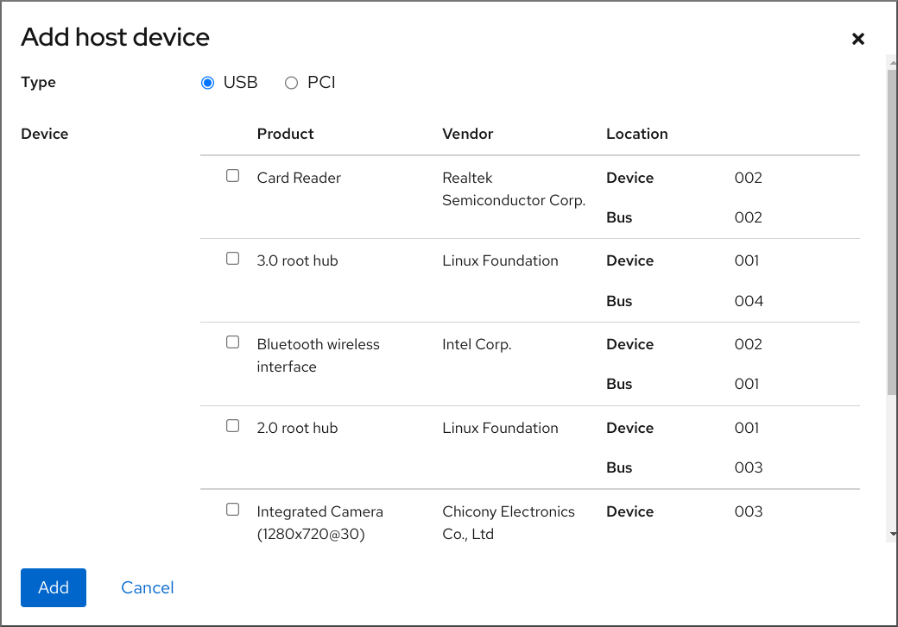 
5. Select the device you want to attach to the VM.
6. Click Add
   
   The selected device is attached to the VM.

**Verification**

- Run the VM and check if the device is displayed in the **Host devices** section.

<h3 id="removing-usb-devices-from-virtual-machines-by-using-the-command-line">14.6. Removing USB devices from virtual machines by using the command line</h3>

To remove a USB device from a virtual machine (VM), you can remove the USB device information from the XML configuration of the VM.

**Procedure**

1. Locate the bus and device values of the USB that you want to remove from the VM.
   
   For example, the following command displays a list of USB devices attached to the host. The device we will use in this example is attached on bus 001 as device 005.
   
   ```
   lsusb
   [...]
   Bus 001 Device 003: ID 2567:0a2b Intel Corp.
   Bus 001 Device 005: ID 0407:6252 Kingston River 2.0
   [...]
   ```
   
   ```plaintext
   # lsusb
   [...]
   Bus 001 Device 003: ID 2567:0a2b Intel Corp.
   Bus 001 Device 005: ID 0407:6252 Kingston River 2.0
   [...]
   ```
2. Use the `virt-xml` utility along with the `--remove-device` argument.
   
   For example, the following command removes a USB flash drive, attached to the host as device 005 on bus 001, from the `example-VM-1` VM.
   
   ```
   virt-xml example-VM-1 --remove-device --hostdev 001.005
   Domain 'example-VM-1' defined successfully.
   ```
   
   ```plaintext
   # virt-xml example-VM-1 --remove-device --hostdev 001.005
   Domain 'example-VM-1' defined successfully.
   ```
   
   To remove a USB device from a running VM, add the `--update` argument to this command.

**Verification**

- Run the VM and check if the device has been removed from the list of devices.

<h3 id="removing-pci-devices-from-virtual-machines-by-using-the-command-line">14.7. Removing PCI devices from virtual machines by using the command line</h3>

To remove a PCI device from a virtual machine (VM), remove the device information from the XML configuration of the VM.

**Procedure**

1. In the XML configuration of the VM to which the PCI device is attached, locate the `<address domain>` line in the `<hostdev>` section with the device’s setting.
   
   ```
   virsh dumpxml <VM-name>
   
   [...]
   <hostdev mode='subsystem' type='pci' managed='yes'>
     <source>
       <address domain='0x0000' bus='0x65' slot='0x00' function='0x0'/>
     </source>
     <address type='pci' domain='0x0000' bus='0x02' slot='0x00' function='0x0'/>
   </hostdev>
   [...]
   ```
   
   ```plaintext
   # virsh dumpxml <VM-name>
   
   [...]
   <hostdev mode='subsystem' type='pci' managed='yes'>
     <source>
       <address domain='0x0000' bus='0x65' slot='0x00' function='0x0'/>
     </source>
     <address type='pci' domain='0x0000' bus='0x02' slot='0x00' function='0x0'/>
   </hostdev>
   [...]
   ```
2. Use the `virsh detach-device` command with the `--hostdev` option and the device address.
   
   For example, the following command persistently removes the device located in the previous step.
   
   ```
   virsh detach-device <VM-name> --hostdev 0000:65:00.0 --config
   Domain 'VM-name' defined successfully.
   ```
   
   ```plaintext
   # virsh detach-device <VM-name> --hostdev 0000:65:00.0 --config
   Domain 'VM-name' defined successfully.
   ```
   
   Note
   
   To remove a PCI device from a running VM, add the `--live` argument to the previous command.
3. Optional: Re-attach the PCI device to the host. For example the following command re-attaches the device removed from the VM in the previous step:
   
   ```
   virsh nodedev-reattach pci_0000_65_00_0
   Device pci_0000_65_00_0 re-attached
   ```
   
   ```plaintext
   # virsh nodedev-reattach pci_0000_65_00_0
   Device pci_0000_65_00_0 re-attached
   ```

**Verification**

1. Display the XML configuration of the VM again, and check that the `<hostdev>` section of the device no longer appears.
   
   ```
   virsh dumpxml <VM-name>
   ```
   
   ```plaintext
   # virsh dumpxml <VM-name>
   ```

<h3 id="removing-host-devices-from-virtual-machines-by-using-the-web-console">14.8. Removing host devices from virtual machines by using the web console</h3>

To free up resources, modify the functionalities of your VM, or both, you can use the web console to modify the VM and remove host devices that are no longer required.

**Prerequisites**

- You have installed the RHEL 10 web console.
  
  For instructions, see [Installing and enabling the web console](https://docs.redhat.com/en/documentation/red_hat_enterprise_linux/10/html/managing_systems_in_the_rhel_web_console/getting-started-with-the-rhel-web-console#installing-and-enabling-the-web-console).
- [The web console VM plug-in is installed on your system](#setting-up-the-web-console-to-manage-virtual-machines "2.4. Setting up the web console to manage virtual machines").
- Optional: Back up the XML configuration of your VM by using `virsh dumpxml example-VM-1` and sending the output to a file. For example, the following backs up the configuration of your *testguest1* VM as the `testguest1.xml` file:
  
  ```
  virsh dumpxml testguest1 > testguest1.xml
  cat testguest1.xml
  <domain type='kvm' xmlns:qemu='http://libvirt.org/schemas/domain/qemu/1.0'>
    <name>testguest1</name>
    <uuid>ede29304-fe0c-4ca4-abcd-d246481acd18</uuid>
    [...]
  </domain>
  ```
  
  ```plaintext
  # virsh dumpxml testguest1 > testguest1.xml
  # cat testguest1.xml
  <domain type='kvm' xmlns:qemu='http://libvirt.org/schemas/domain/qemu/1.0'>
    <name>testguest1</name>
    <uuid>ede29304-fe0c-4ca4-abcd-d246481acd18</uuid>
    [...]
  </domain>
  ```

**Procedure**

1. In the Virtual Machines interface, click the VM from which you want to remove a host device.
   
   A new page opens with an **Overview** section with basic information about the selected VM and a **Console** section to access the VM’s graphical interface.
2. Scroll to Host devices.
   
   The **Host devices** section displays information about the devices attached to the VM and options to **Add** or **Remove** devices.
3. Click the Remove button next to the device you want to remove from the VM.
   
   A remove device confirmation dialog is displayed.
4. Click Remove.
   
   The device is removed from the VM.

**Troubleshooting**

- If removing a host device causes your VM to become unbootable, use the `virsh define` utility to restore the XML configuration by reloading the XML configuration file you backed up previously.
  
  ```
  virsh define testguest1.xml
  ```
  
  ```plaintext
  # virsh define testguest1.xml
  ```

<h3 id="attaching-iso-images-to-virtual-machines">14.9. Attaching ISO images to virtual machines</h3>

When using a virtual machine (VM), you can access information stored in an ISO image on the host. To do so, attach the ISO image to the VM as a virtual optical drive, such as a CD drive or a DVD drive.

<h4 id="attaching-iso-images-to-virtual-machines-by-using-the-command-line">14.9.1. Attaching ISO images to virtual machines by using the command line</h4>

To attach an ISO image as a virtual optical drive, edit the XML configuration file of the virtual machine (VM) and add the new drive.

**Prerequisites**

- You must store and copy path of the ISO image on the host machine.

**Procedure**

- Use the `virt-xml` utility with the `--add-device` argument:
  
  For example, the following command attaches the `example-ISO-name` ISO image, stored in the `/home/username/Downloads` directory, to the `example-VM-name` VM.
  
  ```
  virt-xml example-VM-name --add-device --disk /home/username/Downloads/example-ISO-name.iso,device=cdrom
  
  Domain 'example-VM-name' defined successfully.
  ```
  
  ```plaintext
  # virt-xml example-VM-name --add-device --disk /home/username/Downloads/example-ISO-name.iso,device=cdrom
  
  Domain 'example-VM-name' defined successfully.
  ```

**Verification**

- Run the VM and test if the device is present and works as expected.

<h4 id="replacing-iso-images-in-virtual-optical-drives">14.9.2. Replacing ISO images in virtual optical drives</h4>

To replace an ISO image attached as a virtual optical drive to a virtual machine (VM), edit the XML configuration file of the VM and specify the replacement.

**Prerequisites**

- You must store the ISO image on the host machine.
- You must know the path to the ISO image.

**Procedure**

1. Locate the target device where the ISO image is attached to the VM. You can find this information in the VM’s XML configuration file.
   
   For example, the following command displays the `example-VM-name` VM’s XML configuration file, where the target device for the virtual optical drive is `sda`.
   
   ```
   virsh dumpxml example-VM-name
   ...
   <disk>
     ...
     <source file='$(/home/username/Downloads/example-ISO-name.iso)'/>
     <target dev='sda' bus='sata'/>
     ...
   </disk>
   ...
   ```
   
   ```plaintext
   # virsh dumpxml example-VM-name
   ...
   <disk>
     ...
     <source file='$(/home/username/Downloads/example-ISO-name.iso)'/>
     <target dev='sda' bus='sata'/>
     ...
   </disk>
   ...
   ```
2. Use the `virt-xml` utility with the `--edit` argument.
   
   For example, the following command replaces the `example-ISO-name` ISO image, attached to the `example-VM-name` VM at target `sda`, with the `example-ISO-name-2` ISO image stored in the `/dev/cdrom` directory.
   
   ```
   virt-xml example-VM-name --edit target=sda --disk /dev/cdrom/example-ISO-name-2.iso
   Domain 'example-VM-name' defined successfully.
   ```
   
   ```plaintext
   # virt-xml example-VM-name --edit target=sda --disk /dev/cdrom/example-ISO-name-2.iso
   Domain 'example-VM-name' defined successfully.
   ```

**Verification**

- Run the VM and test if the device is replaced and works as expected.

<h4 id="removing-iso-images-from-virtual-machines-by-using-the-command-line">14.9.3. Removing ISO images from virtual machines by using the command line</h4>

To remove an ISO image attached to a virtual machine (VM), edit the XML configuration file of the VM.

**Procedure**

1. Locate the target device where the ISO image is attached to the VM. You can find this information in the VM’s XML configuration file.
   
   For example, the following command displays the `example-VM-name` VM’s XML configuration file, where the target device for the virtual optical drive is `sda`.
   
   ```
   virsh dumpxml example-VM-name
   ...
   <disk type='file' device='cdrom'>
     <driver name='qemu' type='raw'/>
     <target dev='sda' bus='sata'/>
     ...
   </disk>
   ...
   ```
   
   ```plaintext
   # virsh dumpxml example-VM-name
   ...
   <disk type='file' device='cdrom'>
     <driver name='qemu' type='raw'/>
     <target dev='sda' bus='sata'/>
     ...
   </disk>
   ...
   ```
2. Use the `virt-xml` utility with the `--remove-device` argument.
   
   For example, the following command removes the optical drive attached as target `sda` from the `example-VM-name` VM.
   
   ```
   virt-xml example-VM-name --remove-device --disk target=sda
   Domain 'example-VM-name' defined successfully.
   ```
   
   ```plaintext
   # virt-xml example-VM-name --remove-device --disk target=sda
   Domain 'example-VM-name' defined successfully.
   ```

**Verification**

- Confirm that the device is no longer listed in the XML configuration file of the VM.

<h3 id="attaching-dasd-devices-to-virtual-machines-on-ibm-z">14.10. Attaching DASD devices to virtual machines on IBM Z</h3>

By using the `vfio-ccw` feature, you can assign direct-access storage devices (DASDs) as mediated devices to your virtual machines (VMs) on IBM Z hosts. This for example makes it possible for the VM to access a z/OS data set, or to provide the assigned DASDs to a z/OS machine.

**Prerequisites**

- You have a system with IBM Z hardware architecture supported with the FICON protocol.
- You have a target VM of a Linux operating system.
- The *driverctl* package is installed.
  
  ```
  dnf install driverctl
  ```
  
  ```plaintext
  # dnf install driverctl
  ```
- The necessary `vfio` kernel modules have been loaded on the host.
  
  ```
  lsmod | grep vfio
  ```
  
  ```plaintext
  # lsmod | grep vfio
  ```
  
  The output of this command must contain the following modules:
  
  - `vfio_ccw`
  - `vfio_mdev`
  - `vfio_iommu_type1`
- You have a spare DASD device for exclusive use by the VM, and you know the identifier of the device.
  
  The following procedure uses `0.0.002c` as an example. When performing the commands, replace `0.0.002c` with the identifier of your DASD device.

**Procedure**

1. Obtain the subchannel identifier of the DASD device.
   
   ```
   lscss -d 0.0.002c
   Device   Subchan.  DevType CU Type Use  PIM PAM POM  CHPIDs
   ----------------------------------------------------------------------
   0.0.002c 0.0.29a8  3390/0c 3990/e9 yes  f0  f0  ff   02111221 00000000
   ```
   
   ```plaintext
   # lscss -d 0.0.002c
   Device   Subchan.  DevType CU Type Use  PIM PAM POM  CHPIDs
   ----------------------------------------------------------------------
   0.0.002c 0.0.29a8  3390/0c 3990/e9 yes  f0  f0  ff   02111221 00000000
   ```
   
   In this example, the subchannel identifier is detected as `0.0.29a8`. In the following commands of this procedure, replace `0.0.29a8` with the detected subchannel identifier of your device.
2. If the `lscss` command in the previous step only displayed the header output and no device information, perform the following steps:
   
   1. Remove the device from the `cio_ignore` list.
      
      ```
      cio_ignore -r 0.0.002c
      ```
      
      ```plaintext
      # cio_ignore -r 0.0.002c
      ```
   2. In the guest operating system, [edit the kernel command line](https://docs.redhat.com/en/documentation/red_hat_enterprise_linux/10/html/managing_monitoring_and_updating_the_kernel/configuring-kernel-parameters-at-runtime) of the VM and add the device identifier with a `!` mark to the line that starts with `cio_ignore=`, if it is not present already.
      
      ```
      cio_ignore=all,!condev,!0.0.002c
      ```
      
      ```plaintext
      cio_ignore=all,!condev,!0.0.002c
      ```
   3. Repeat step 1 on the host to obtain the subchannel identifier.
3. Bind the subchannel to the `vfio_ccw` passthrough driver.
   
   ```
   driverctl -b css set-override 0.0.29a8 vfio_ccw
   ```
   
   ```plaintext
   # driverctl -b css set-override 0.0.29a8 vfio_ccw
   ```
   
   Note
   
   This binds the *0.0.29a8* subchannel to `vfio_ccw` persistently, which means the DASD will not be usable on the host. If you need to use the device on the host, you must first remove the automatic binding to 'vfio\_ccw' and rebind the subchannel to the default driver:
   
   \# **driverctl -b css unset-override *0.0.29a8***
4. Define and start the DASD mediated device.
   
   ```
   cat nodedev.xml
   <device>
       <parent>css_0_0_29a8</parent>
       <capability type="mdev">
           <type id="vfio_ccw-io"/>
       </capability>
   </device>
   
   virsh nodedev-define nodedev.xml
   Node device 'mdev_30820a6f_b1a5_4503_91ca_0c10ba12345a_0_0_29a8' defined from 'nodedev.xml'
   
   virsh nodedev-start mdev_30820a6f_b1a5_4503_91ca_0c10ba12345a_0_0_29a8
   Device mdev_30820a6f_b1a5_4503_91ca_0c10ba12345a_0_0_29a8 started
   ```
   
   ```plaintext
   # cat nodedev.xml
   <device>
       <parent>css_0_0_29a8</parent>
       <capability type="mdev">
           <type id="vfio_ccw-io"/>
       </capability>
   </device>
   
   # virsh nodedev-define nodedev.xml
   Node device 'mdev_30820a6f_b1a5_4503_91ca_0c10ba12345a_0_0_29a8' defined from 'nodedev.xml'
   
   # virsh nodedev-start mdev_30820a6f_b1a5_4503_91ca_0c10ba12345a_0_0_29a8
   Device mdev_30820a6f_b1a5_4503_91ca_0c10ba12345a_0_0_29a8 started
   ```
5. Shut down the VM, if it is running.
6. Display the UUID of the previously defined device and save it for the next step.
   
   ```
   virsh nodedev-dumpxml mdev_30820a6f_b1a5_4503_91ca_0c10ba12345a_0_0_29a8
   
   <device>
     <name>mdev_30820a6f_b1a5_4503_91ca_0c10ba12345a_0_0_29a8</name>
     <parent>css_0_0_29a8</parent>
     <capability type='mdev'>
       <type id='vfio_ccw-io'/>
       <uuid>30820a6f-b1a5-4503-91ca-0c10ba12345a</uuid>
       <iommuGroup number='0'/>
       <attr name='assign_adapter' value='0x02'/>
       <attr name='assign_domain' value='0x002b'/>
     </capability>
   </device>
   ```
   
   ```plaintext
   # virsh nodedev-dumpxml mdev_30820a6f_b1a5_4503_91ca_0c10ba12345a_0_0_29a8
   
   <device>
     <name>mdev_30820a6f_b1a5_4503_91ca_0c10ba12345a_0_0_29a8</name>
     <parent>css_0_0_29a8</parent>
     <capability type='mdev'>
       <type id='vfio_ccw-io'/>
       <uuid>30820a6f-b1a5-4503-91ca-0c10ba12345a</uuid>
       <iommuGroup number='0'/>
       <attr name='assign_adapter' value='0x02'/>
       <attr name='assign_domain' value='0x002b'/>
     </capability>
   </device>
   ```
7. Attach the mediated device to the VM. To do so, use the `virsh edit` utility to edit the XML configuration of the VM, add the following section to the XML, and replace the `uuid` value with the UUID you obtained in the previous step.
   
   ```
   <hostdev mode='subsystem' type='mdev' model='vfio-ccw'>
     <source>
       <address uuid="30820a6f-b1a5-4503-91ca-0c10ba12345a"/>
     </source>
   </hostdev>
   ```
   
   ```plaintext
   <hostdev mode='subsystem' type='mdev' model='vfio-ccw'>
     <source>
       <address uuid="30820a6f-b1a5-4503-91ca-0c10ba12345a"/>
     </source>
   </hostdev>
   ```
8. Optional: Configure the mediated device to start automatically on host boot.
   
   ```
   virsh nodedev-autostart mdev_30820a6f_b1a5_4503_91ca_0c10ba12345a_0_0_29a8
   ```
   
   ```plaintext
   # virsh nodedev-autostart mdev_30820a6f_b1a5_4503_91ca_0c10ba12345a_0_0_29a8
   ```

**Verification**

1. Ensure that the mediated device is configured correctly.
   
   ```
   virsh nodedev-info mdev_30820a6f_b1a5_4503_91ca_0c10ba12345a_0_0_29a8
   Name:           mdev_30820a6f_b1a5_4503_91ca_0c10ba12345a_0_0_29a8
   Parent:         css_0_0_0121
   Active:         yes
   Persistent:     yes
   Autostart:      yes
   ```
   
   ```plaintext
   # virsh nodedev-info mdev_30820a6f_b1a5_4503_91ca_0c10ba12345a_0_0_29a8
   Name:           mdev_30820a6f_b1a5_4503_91ca_0c10ba12345a_0_0_29a8
   Parent:         css_0_0_0121
   Active:         yes
   Persistent:     yes
   Autostart:      yes
   ```
2. Obtain the identifier that `libvirt` assigned to the mediated DASD device. To do so, display the XML configuration of the VM and look for a `vfio-ccw` device.
   
   ```
   virsh dumpxml vm-name
   
   <domain>
   [...]
       <hostdev mode='subsystem' type='mdev' managed='no' model='vfio-ccw'>
         <source>
           <address uuid='10620d2f-ed4d-437b-8aff-beda461541f9'/>
         </source>
         <alias name='hostdev0'/>
         <address type='ccw' cssid='0xfe' ssid='0x0' devno='0x0009'/>
       </hostdev>
   [...]
   </domain>
   ```
   
   ```plaintext
   # virsh dumpxml vm-name
   
   <domain>
   [...]
       <hostdev mode='subsystem' type='mdev' managed='no' model='vfio-ccw'>
         <source>
           <address uuid='10620d2f-ed4d-437b-8aff-beda461541f9'/>
         </source>
         <alias name='hostdev0'/>
         <address type='ccw' cssid='0xfe' ssid='0x0' devno='0x0009'/>
       </hostdev>
   [...]
   </domain>
   ```
   
   In this example, the assigned identifier of the device is `0.0.0009`.
3. Start the VM and log in to its guest operating system.
4. In the guest operating system, confirm that the DASD device is listed. For example:
   
   ```
   lscss | grep 0.0.0009
   0.0.0009 0.0.0007  3390/0c 3990/e9      f0  f0  ff   12212231 00000000
   ```
   
   ```plaintext
   # lscss | grep 0.0.0009
   0.0.0009 0.0.0007  3390/0c 3990/e9      f0  f0  ff   12212231 00000000
   ```
5. In the guest operating system, set the device online. For example:
   
   ```
   chccwdev -e 0.0009
   Setting device 0.0.0009 online
   Done
   ```
   
   ```plaintext
   # chccwdev -e 0.0009
   Setting device 0.0.0009 online
   Done
   ```

**Additional resources**

- [IBM documentation on `cio_ignore`](https://www.ibm.com/docs/en/linux-on-systems?topic=parameters-cio-ignore)
- [Configuring kernel parameters at runtime](https://docs.redhat.com/en/documentation/red_hat_enterprise_linux/10/html/managing_monitoring_and_updating_the_kernel/configuring-kernel-parameters-at-runtime)

<h3 id="attaching-a-watchdog-device-to-a-virtual-machine-by-using-the-web-console">14.11. Attaching a watchdog device to a virtual machine by using the web console</h3>

To force the virtual machine (VM) to perform a specified action when it stops responding, you can attach virtual watchdog devices to a VM.

**Prerequisites**

- You have installed the RHEL 10 web console.
  
  For instructions, see [Installing and enabling the web console](https://docs.redhat.com/en/documentation/red_hat_enterprise_linux/10/html/managing_systems_in_the_rhel_web_console/getting-started-with-the-rhel-web-console#installing-and-enabling-the-web-console).
- You have installed the web console VM plug-in on your system. For more information, see [Setting up the web console to manage virtual machines](#setting-up-the-web-console-to-manage-virtual-machines "2.4. Setting up the web console to manage virtual machines").

**Procedure**

1. On the command line, install the watchdog service.
   
   \# **dnf install watchdog**
2. Shut down the VM.
3. Add the watchdog service to the VM.
   
   \# **virt-xml *vmname* --add-device --watchdog action=reset --update**
4. Run the VM.
5. Log in to the RHEL 10 web console.
6. In the Virtual Machines interface of the web console, click the VM to which you want to add the watchdog device.
7. Click add next to the **Watchdog** field in the Overview pane.
   
   The **Add watchdog device type** dialog is displayed.
8. Select the action that you want the watchdog device to perform if the VM stops responding.
9. Click Add.

**Verification**

- The action you selected is visible next to the **Watchdog** field in the Overview pane.

<h2 id="configuring-virtual-machine-network-connections">Chapter 15. Configuring virtual machine network connections</h2>

For your virtual machines (VMs) to connect over a network to your host, to other VMs on your host, and to locations on an external network, the VM networking must be configured accordingly. To provide VM networking, the RHEL 10 hypervisor and newly created VMs have a default network configuration, which can also be modified further.

For example:

- You can enable the VMs on your host to be discovered and connected to locations outside the host, as if the VMs were on the same network as the host.
- You can partially or completely isolate a VM from inbound network traffic to increase its security and minimize the risk of any problems with the VM impacting the host.

<h3 id="how-virtual-networks-work">15.1. How virtual networks work</h3>

The connection of virtual machines (VMs) to other devices and locations on a network is facilitated by the host hardware. Virtual networking uses the concept of a virtual network switch.

A virtual network switch is a software construct that operates on a host machine. VMs connect to the network through the virtual network switch. Based on the configuration of the virtual switch, a VM can use an existing virtual network managed by the hypervisor, or a different network connection method.

The following figure shows a virtual network switch connecting two VMs to the network:

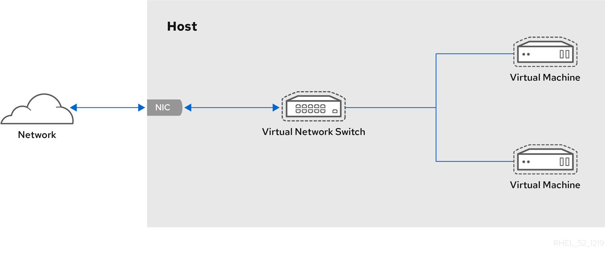 

From the perspective of a guest operating system, a virtual network connection is the same as a physical network connection. Host machines view virtual network switches as network interfaces. When the `virtnetworkd` service is first installed and started, it creates **virbr0**, the default network interface for VMs.

To view information about this interface, use the `ip` utility on the host.

```
ip addr show virbr0
3: virbr0: <BROADCAST,MULTICAST,UP,LOWER_UP> mtu 1500 qdisc noqueue state
UNKNOWN link/ether 1b:c4:94:cf:fd:17 brd ff:ff:ff:ff:ff:ff
inet 192.0.2.1/24 brd 192.0.2.255 scope global virbr0
```

```plaintext
$ ip addr show virbr0
3: virbr0: <BROADCAST,MULTICAST,UP,LOWER_UP> mtu 1500 qdisc noqueue state
UNKNOWN link/ether 1b:c4:94:cf:fd:17 brd ff:ff:ff:ff:ff:ff
inet 192.0.2.1/24 brd 192.0.2.255 scope global virbr0
```

By default, all VMs on a single host are connected to the same NAT-type virtual network, named **default**, which uses the **virbr0** interface. For details, see [Virtual networking default configuration](#virtual-networking-default-configuration "15.2. The default configuration for virtual machine networks").

For basic outbound-only network access from VMs, no additional network setup is usually needed, because the default network is installed along with the `libvirt-daemon-config-network` package, and is automatically started when the `virtnetworkd` service is started.

If a different VM network functionality is needed, you can create additional virtual networks and network interfaces and configure your VMs to use them. In addition to the default NAT, these networks and interfaces can be configured to use one of the following modes:

- Routed mode
- Bridged mode
- Isolated mode
- Open mode

**Additional resources**

- [Network connection types for virtual machines](#types-of-virtual-machine-network-connections "15.3. Network connection types for virtual machines")

<h3 id="virtual-networking-default-configuration">15.2. The default configuration for virtual machine networks</h3>

When the `virtnetworkd` service is first installed on a virtualization host, it contains an initial virtual network configuration in network address translation (NAT) mode. By default, all VMs on the host are connected to the same `libvirt` virtual network, named **default**. VMs on this network can connect to locations both on the host and on the network beyond the host, but with the following limitations:

- VMs on the network are visible to the host and other VMs on the host, but the network traffic is affected by the firewalls in the guest operating system’s network stack and by the `libvirt` network filtering rules attached to the guest interface.
- VMs on the network can connect to locations outside the host but are not visible to them. Outbound traffic is affected by the NAT rules, as well as the host system’s firewall.

The following diagram illustrates the default VM network configuration:

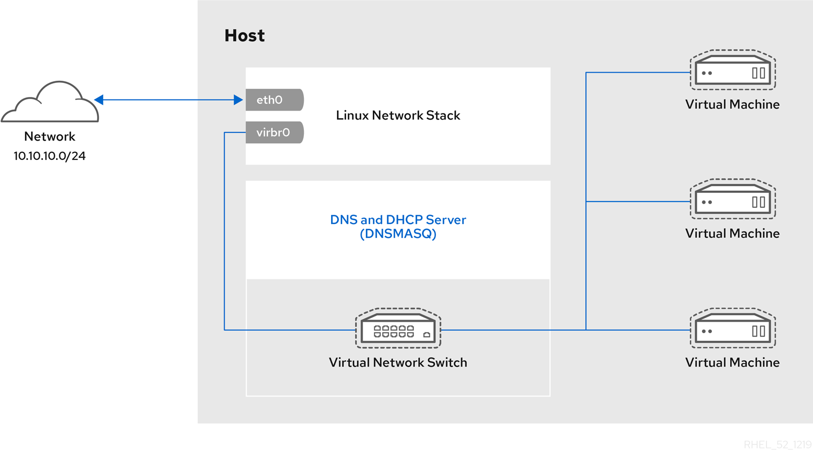 

<h3 id="types-of-virtual-machine-network-connections">15.3. Network connection types for virtual machines</h3>

To modify the networking properties and behavior of your VMs, change the type of virtual network or interface the VMs use. You can select from the following connection types available to VMs in RHEL 10.

<h4 id="virtual\_networking\_with\_network\_address\_translation">15.3.1. Virtual networking with network address translation</h4>

By default, virtual network switches operate in network address translation (NAT) mode. They use IP masquerading rather than Source-NAT (SNAT) or Destination-NAT (DNAT). IP masquerading enables connected VMs to use the host machine’s IP address for communication with any external network. When the virtual network switch is operating in NAT mode, computers external to the host cannot communicate with the VMs inside the host.

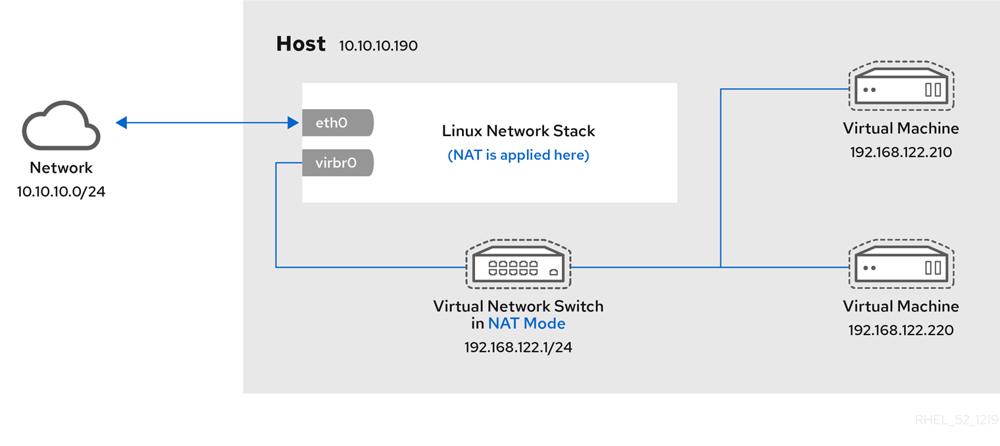 

Warning

Virtual network switches use NAT configured by firewall rules. Editing these rules while the switch is running is not recommended, because incorrect rules might result in the switch being unable to communicate.

<h4 id="virtual\_networking\_in\_routed\_mode">15.3.2. Virtual networking in routed mode</h4>

When using *Routed* mode, the virtual switch connects to the physical LAN connected to the host machine, passing traffic back and forth without the use of NAT. The virtual switch can examine all traffic and use the information contained within the network packets to make routing decisions. When using this mode, the virtual machines (VMs) are all in a single subnet, separate from the host machine. The VM subnet is routed through a virtual switch, which exists on the host machine. This enables incoming connections, but requires extra routing-table entries for systems on the external network.

Routed mode uses routing based on the IP address:

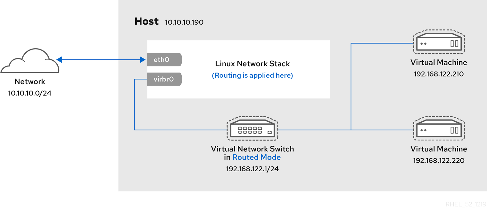 

A common topology that uses routed mode is virtual server hosting (VSH). A VSH provider may have several host machines, each with two physical network connections. One interface is used for management and accounting, the other for the VMs to connect through. Each VM has its own public IP address, but the host machines use private IP addresses so that only internal administrators can manage the VMs.

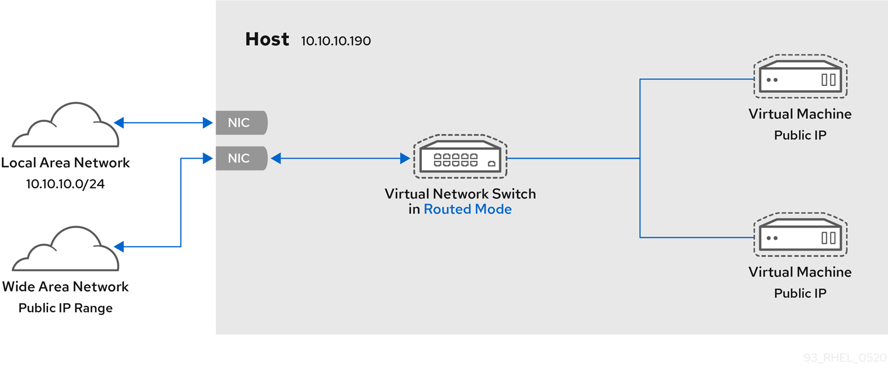 

<h4 id="virtual\_networking\_in\_bridged\_mode">15.3.3. Virtual networking in bridged mode</h4>

In most VM networking modes, VMs automatically create and connect to the `virbr0` virtual bridge. In contrast, in *bridged* mode, the VM connects to an existing Linux bridge on the host. As a result, the VM is directly visible on the physical network. This enables incoming connections, but does not require any extra routing-table entries.

Bridged mode uses connection switching based on the MAC address:

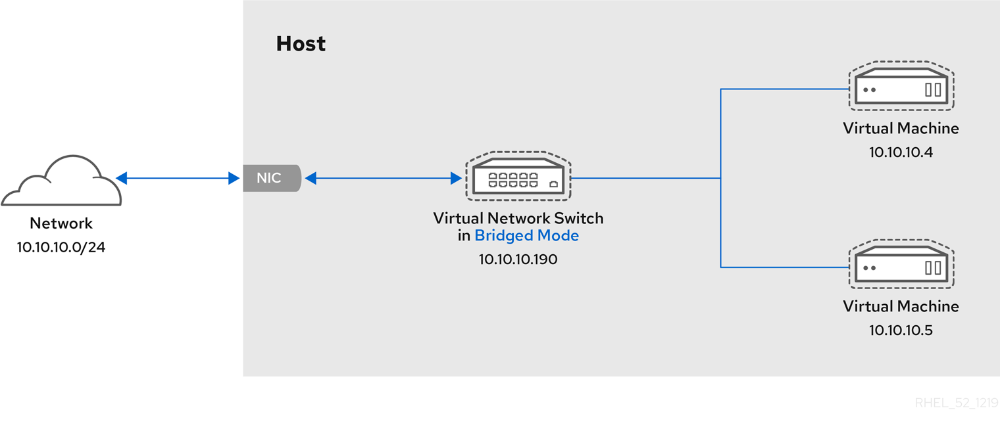 

In bridged mode, the VM appear within the same subnet as the host machine. All other physical machines on the same physical network can detect the VM and access it.

**Bridged network bonding**

It is possible to use multiple physical bridge interfaces on the hypervisor by joining them together with a bond. The bond can then be added to a bridge, after which the VMs can be added to the bridge as well. However, the bonding driver has several modes of operation, and not all of these modes work with a bridge where VMs are in use.

Bonding modes 1, 2, and 4 are usable.

In contrast, modes 0, 3, 5, or 6 are likely to cause the connection to fail. Also note that media-independent interface (MII) monitoring should be used to monitor bonding modes, as Address Resolution Protocol (ARP) monitoring does not work correctly.

For more information about bonding modes, see the Red Hat Knowledgebase solution [Which bonding modes work when used with a bridge that virtual machine guests or containers connect to?](https://access.redhat.com/solutions/67546).

**Common scenarios**

The most common use cases for bridged mode include:

- Deploying VMs in an existing network alongside host machines, making the difference between virtual and physical machines invisible to the user.
- Deploying VMs without making any changes to existing physical network configuration settings.
- Deploying VMs that must be easily accessible to an existing physical network. Placing VMs on a physical network where they must access DHCP services.
- Connecting VMs to an existing network where virtual LANs (VLANs) are used.
- A demilitarized zone (DMZ) network. For a DMZ deployment with VMs, Red Hat recommends setting up the DMZ at the physical network router and switches, and connecting the VMs to the physical network by using bridged mode.

<h3 id="virtual\_networking\_in\_isolated\_mode">15.4. Virtual networking in isolated mode</h3>

By using *isolated* mode, virtual machines connected to the virtual switch can communicate with each other and with the host machine, but their traffic will not pass outside of the host machine, and they cannot receive traffic from outside the host machine. Using `dnsmasq` in this mode is required for basic functionality such as DHCP.

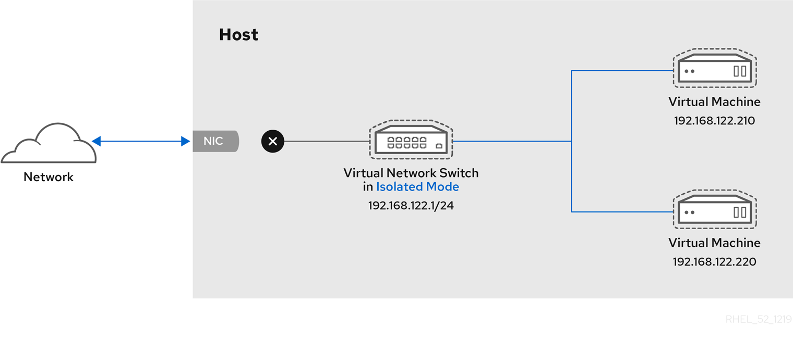 

<h4 id="virtual-networking-open-mode">15.4.1. Virtual networking in open mode</h4>

When using *open* mode for networking, `libvirt` does not generate any firewall rules for the network. As a result, `libvirt` does not overwrite firewall rules provided by the host, and the user can therefore manually manage the VM’s firewall rules.

<h3 id="comparison\_of\_virtual\_machine\_connection\_types">15.5. Comparison of virtual machine connection types</h3>

The following table provides information about the locations to which selected types of virtual machine (VM) network configurations can connect, and to which they are visible.

|                   | Connection to the host                 | Connection to other VMs on the host | Connection to outside locations | Visible to outside locations |
|:------------------|:---------------------------------------|:------------------------------------|:--------------------------------|:-----------------------------|
| **Bridged mode**  | YES                                    | YES                                 | YES                             | YES                          |
| **NAT**           | YES                                    | YES                                 | YES                             | *no*                         |
| **Routed mode**   | YES                                    | YES                                 | YES                             | YES                          |
| **Isolated mode** | YES                                    | YES                                 | *no*                            | *no*                         |
| **Open mode**     | *Depends on the host’s firewall rules* |                                     |                                 |                              |

Table 15.1. Virtual machine connection types

**Additional resources**

- [Configuring externally visible virtual machines by using the command line](#configuring-externally-visible-virtual-machines-by-using-the-command-line "15.9.1. Configuring externally visible virtual machines by using the command line")
- [Configuring externally visible virtual machines by using the web console](#configuring-externally-visible-virtual-machines-by-using-the-web-console "15.9.2. Configuring externally visible virtual machines by using the web console")
- [Explanation of `bridge_opts` parameters](https://docs.redhat.com/en/documentation/red_hat_virtualization/4.1/html/administration_guide/appe-custom_network_properties#Explanation_of_bridge_opts_Parameters)

<h3 id="using-the-web-console-for-managing-virtual-machine-network-interfaces">15.6. Using the web console for managing virtual machine network interfaces</h3>

To manage the virtual network interfaces for virtual machines (VMs) on your host, you can use the RHEL 10 web console.

<h4 id="viewing-and-editing-virtual-network-interface-information-in-the-web-console">15.6.1. Viewing and editing virtual network interface information in the web console</h4>

To view and modify the virtual network interfaces on a selected virtual machine (VM), you can use the RHEL 10 web console.

**Prerequisites**

- You have installed the RHEL 10 web console.
  
  For instructions, see [Installing and enabling the web console](https://docs.redhat.com/en/documentation/red_hat_enterprise_linux/10/html/managing_systems_in_the_rhel_web_console/getting-started-with-the-rhel-web-console#installing-and-enabling-the-web-console).
- The web console VM plug-in [is installed on your system](#setting-up-the-web-console-to-manage-virtual-machines "2.4. Setting up the web console to manage virtual machines").

**Procedure**

1. Log in to the RHEL 10 web console.
2. In the Virtual Machines interface, click the VM whose information you want to see.
   
   A new page opens with an Overview section with basic information about the selected VM and a Console section to access the VM’s graphical interface.
3. Scroll to Network Interfaces.
   
   The Network Interfaces section displays information about the virtual network interface configured for the VM as well as options to **Add**, **Delete**, **Edit**, or **Unplug** network interfaces.
   
   The information includes the following:
   
   - **Type** - The type of network interface for the VM. The types include virtual network, bridge to LAN, and direct attachment.
     
     Note
     
     Generic Ethernet connection is not supported in RHEL 10 and later.
   - **Model type** - The model of the virtual network interface.
   - **MAC Address** - The MAC address of the virtual network interface.
   - **IP Address** - The IP address of the virtual network interface.
   - **Source** - The source of the network interface. This is dependent on the network type.
   - **State** - The state of the virtual network interface.
4. To edit the virtual network interface settings, Click Edit. The Virtual Network Interface Settings dialog opens.
5. Change the interface type, source, model, or MAC address.
6. Click Save. The network interface is modified.
   
   Note
   
   Changes to the virtual network interface settings take effect only after restarting the VM.
   
   Additionally, MAC address can only be modified when the VM is shut off.

**Additional resources**

- [Viewing virtual machine information by using the web console](#viewing-virtual-machine-information-by-using-the-web-console "9.2. Viewing virtual machine information by using the web console")

<h4 id="adding-and-connecting-virtual-network-interfaces-in-the-web-console">15.6.2. Adding and connecting virtual network interfaces in the web console</h4>

To create a virtual network interface and connect a virtual machine (VM) to it, you can use the RHEL 10 web console.

**Prerequisites**

- You have installed the RHEL 10 web console.
  
  For instructions, see [Installing and enabling the web console](https://docs.redhat.com/en/documentation/red_hat_enterprise_linux/10/html/managing_systems_in_the_rhel_web_console/getting-started-with-the-rhel-web-console#installing-and-enabling-the-web-console).
- The web console VM plug-in [is installed on your system](#setting-up-the-web-console-to-manage-virtual-machines "2.4. Setting up the web console to manage virtual machines").

**Procedure**

1. Log in to the RHEL 10 web console.
2. In the Virtual Machines interface, click the VM whose information you want to see.
   
   A new page opens with an Overview section with basic information about the selected VM and a Console section to access the VM’s graphical interface.
3. Scroll to Network Interfaces.
   
   The Network Interfaces section displays information about the virtual network interface configured for the VM as well as options to **Add**, **Edit**, or **Plug** network interfaces.
4. If no network interfaces are available that meet your requirements, you can create a new interface by clicking the Add network interface button.
   
   1. In the **Add network interface** dialog, select the type and source of the interface, as well as other options, based on your requirements.
   2. Click Add.
5. Click Plug in the row of the virtual network interface you want to connect.
   
   The selected virtual network interface connects to the VM.

**Additional resources**

- [Types of virtual machines network connections](#types-of-virtual-machine-network-connections "15.3. Network connection types for virtual machines")

<h4 id="disconnecting-and-removing-virtual-network-interfaces-in-the-web-console">15.6.3. Disconnecting and removing virtual network interfaces in the web console</h4>

To disconnect virtual network interfaces connected to a selected virtual machine (VM), you can use the RHEL 10 web console.

**Prerequisites**

- You have installed the RHEL 10 web console.
  
  For instructions, see [Installing and enabling the web console](https://docs.redhat.com/en/documentation/red_hat_enterprise_linux/10/html/managing_systems_in_the_rhel_web_console/getting-started-with-the-rhel-web-console#installing-and-enabling-the-web-console).
- The web console VM plug-in [is installed on your system](#setting-up-the-web-console-to-manage-virtual-machines "2.4. Setting up the web console to manage virtual machines").

**Procedure**

1. Log in to the RHEL 10 web console.
2. In the Virtual Machines interface, click the VM whose information you want to see.
   
   A new page opens with an Overview section with basic information about the selected VM and a Console section to access the VM’s graphical interface.
3. Scroll to Network Interfaces.
   
   The Network Interfaces section displays information about the virtual network interface configured for the VM as well as options to **Add**, **Delete**, **Edit**, or **Unplug** network interfaces.
4. Click Unplug in the row of the virtual network interface you want to disconnect.
   
   The selected virtual network interface disconnects from the VM.
5. Optional: If you want to delete the virtual network interface from the host, click the menu button ⋮ in the pane of the interface, then click Remove.

<h3 id="managing-sr-iov-devices">15.7. Managing SR-IOV networking devices</h3>

An emulated virtual device often uses more CPU and memory than a hardware network device. This can limit the performance of a virtual machine (VM). However, if any devices on your virtualization host support Single Root I/O Virtualization (SR-IOV), you can use this feature to improve the device performance, and possibly also the overall performance of your VMs.

<h4 id="what-is-sr-iov">15.7.1. What is SR-IOV?</h4>

Single-root I/O virtualization (SR-IOV) is a specification that enables a single PCI Express (PCIe) device to present multiple separate PCI devices, called *virtual functions* (VFs), to the host system.

Each of these devices:

- Is able to provide the same or similar service as the original PCIe device.
- Appears at a different address on the host PCI bus.
- Can be assigned to a different VM by using VFIO assignment.

For example, a single SR-IOV capable network device can present VFs to multiple VMs. All of the VFs use the same physical card, the same network connection, and the same network cable, but each of the VMs directly controls its own hardware network device and uses no extra resources from the host.

**How SR-IOV works**

The SR-IOV functionality is possible thanks to the introduction of the following PCIe functions:

- **Physical functions (PFs)** - A PCIe function that provides the functionality of its device (for example networking) to the host, but can also create and manage a set of VFs. Each SR-IOV capable device has one or more PFs.
- **Virtual functions (VFs)** - Lightweight PCIe functions that behave as independent devices. Each VF is derived from a PF. The maximum number of VFs a device can have depends on the device hardware. Each VF can be assigned only to a single VM at a time, but a VM can have multiple VFs assigned to it.

VMs recognize VFs as virtual devices. For example, a VF created by an SR-IOV network device appears as a network card to a VM to which it is assigned, in the same way as a physical network card appears to the host system.

**Figure 15.1. SR-IOV architecture**

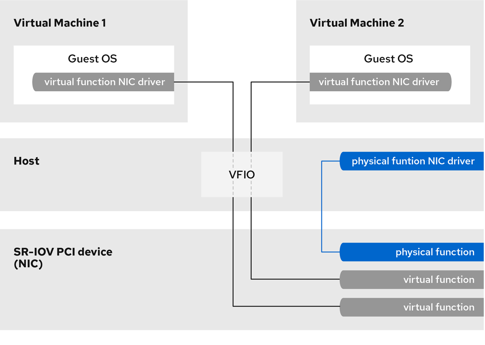 

**Advantages**

The primary advantages of using SR-IOV VFs rather than emulated devices are:

- Improved performance
- Reduced use of host CPU and memory resources

For example, a VF attached to a VM as a vNIC performs at almost the same level as a physical NIC, and much better than paravirtualized or emulated NICs. In particular, when multiple VFs are used simultaneously on a single host, the performance benefits can be significant.

**Disadvantages**

- To modify the configuration of a PF, you must first change the number of VFs exposed by the PF to zero. Therefore, you also need to remove the devices provided by these VFs from the VM to which they are assigned.
- A VM with an VFIO-assigned devices attached, including SR-IOV VFs, cannot be migrated to another host. In some cases, you can work around this limitation by pairing the assigned device with an emulated device. For example, you can bond an assigned networking VF to an emulated vNIC, and remove the VF before the migration.
- In addition, VFIO-assigned devices require pinning of VM memory, which increases the memory consumption of the VM and prevents the use of memory ballooning on the VM.

**Additional resources**

- [Supported devices for SR-IOV assignment](#supported-devices-for-sr-iov-assignment "15.7.3. Supported devices for SR-IOV assignment")
- [Configuring passthrough PCI devices on IBM Z](https://www.ibm.com/docs/en/linux-on-systems?topic=vfio-pass-through-pci)
- [Which bonding modes work when used with a bridge that virtual machine guests or containers connect to? (Red Hat Knowledgebase)](https://access.redhat.com/solutions/67546)

<h4 id="attaching-sr-iov-networking-devices-to-virtual-machines">15.7.2. Attaching SR-IOV networking devices to virtual machines</h4>

To assign an SR-IOV networking device to a virtual machine (VM), you must create a virtual function (VF) from an SR-IOV capable network interface on the host and assign the VF as a device to a specified VM.

**Prerequisites**

- The CPU and the firmware of your host support the I/O Memory Management Unit (IOMMU).
  
  - If using an Intel CPU, it must support the Intel Virtualization Technology for Directed I/O (VT-d).
  - If using an AMD CPU, it must support the AMD-Vi feature.
- The host system uses Access Control Service (ACS) to provide direct memory access (DMA) isolation for PCIe topology. Verify this with the system vendor.
  
  For additional information, see [Hardware Considerations for Implementing SR-IOV](https://docs.redhat.com/en/documentation/red_hat_virtualization/4.0/html/hardware_considerations_for_implementing_sr-iov/index).
- The physical network device supports SR-IOV. To verify if any network devices on your system support SR-IOV, use the `lspci -v` command and look for `Single Root I/O Virtualization (SR-IOV)` in the output.
  
  ```
  lspci -v
  [...]
  02:00.0 Ethernet controller: Intel Corporation 82576 Gigabit Network Connection (rev 01)
  	Subsystem: Intel Corporation Gigabit ET Dual Port Server Adapter
  	Flags: bus master, fast devsel, latency 0, IRQ 16, NUMA node 0
  	Memory at fcba0000 (32-bit, non-prefetchable) [size=128K]
  [...]
  	Capabilities: [150] Alternative Routing-ID Interpretation (ARI)
  	Capabilities: [160] Single Root I/O Virtualization (SR-IOV)
  	Kernel driver in use: igb
  	Kernel modules: igb
  [...]
  ```
  
  ```plaintext
  # lspci -v
  [...]
  02:00.0 Ethernet controller: Intel Corporation 82576 Gigabit Network Connection (rev 01)
  	Subsystem: Intel Corporation Gigabit ET Dual Port Server Adapter
  	Flags: bus master, fast devsel, latency 0, IRQ 16, NUMA node 0
  	Memory at fcba0000 (32-bit, non-prefetchable) [size=128K]
  [...]
  	Capabilities: [150] Alternative Routing-ID Interpretation (ARI)
  	Capabilities: [160] Single Root I/O Virtualization (SR-IOV)
  	Kernel driver in use: igb
  	Kernel modules: igb
  [...]
  ```
- The host network interface you want to use for creating VFs is running. For example, to activate the *eth1* interface and verify it is running:
  
  ```
  ip link set eth1 up
  ip link show eth1
  8: eth1: <BROADCAST,MULTICAST,UP,LOWER_UP> mtu 1500 qdisc mq state UP mode DEFAULT qlen 1000
     link/ether a0:36:9f:8f:3f:b8 brd ff:ff:ff:ff:ff:ff
     vf 0 MAC 00:00:00:00:00:00, spoof checking on, link-state auto
     vf 1 MAC 00:00:00:00:00:00, spoof checking on, link-state auto
     vf 2 MAC 00:00:00:00:00:00, spoof checking on, link-state auto
     vf 3 MAC 00:00:00:00:00:00, spoof checking on, link-state auto
  ```
  
  ```plaintext
  # ip link set eth1 up
  # ip link show eth1
  8: eth1: <BROADCAST,MULTICAST,UP,LOWER_UP> mtu 1500 qdisc mq state UP mode DEFAULT qlen 1000
     link/ether a0:36:9f:8f:3f:b8 brd ff:ff:ff:ff:ff:ff
     vf 0 MAC 00:00:00:00:00:00, spoof checking on, link-state auto
     vf 1 MAC 00:00:00:00:00:00, spoof checking on, link-state auto
     vf 2 MAC 00:00:00:00:00:00, spoof checking on, link-state auto
     vf 3 MAC 00:00:00:00:00:00, spoof checking on, link-state auto
  ```
- For SR-IOV device assignment to work, the IOMMU feature must be enabled in the host BIOS and kernel. To do so:
  
  - On an Intel host, enable VT-d:
    
    1. Regenerate the GRUB configuration with the `intel_iommu=on` and `iommu=pt` parameters:
       
       ```
       grubby --args="intel_iommu=on iommu=pt" --update-kernel=ALL
       ```
       
       ```plaintext
       # grubby --args="intel_iommu=on iommu=pt" --update-kernel=ALL
       ```
    2. Reboot the host.
  - On an AMD host, enable AMD-Vi:
    
    1. Regenerate the GRUB configuration with the `iommu=pt` parameter:
       
       ```
       grubby --args="iommu=pt" --update-kernel=ALL
       ```
       
       ```plaintext
       # grubby --args="iommu=pt" --update-kernel=ALL
       ```
    2. Reboot the host.
  - On an ARM 64 host, the required SMMU feature is enabled by default. For better performance, configure also the `iommu=pt` parameter:
    
    1. Regenerate the GRUB configuration with the `iommu=pt` parameter:
       
       ```
       grubby --args="iommu=pt" --update-kernel=ALL
       ```
       
       ```plaintext
       # grubby --args="iommu=pt" --update-kernel=ALL
       ```
    2. Reboot the host.

**Procedure**

1. Optional: Confirm the maximum number of VFs your network device can use. To do so, use the following command and replace *eth1* with your SR-IOV compatible network device.
   
   ```
   cat /sys/class/net/eth1/device/sriov_totalvfs
   7
   ```
   
   ```plaintext
   # cat /sys/class/net/eth1/device/sriov_totalvfs
   7
   ```
2. Use the following command to create a virtual function (VF):
   
   ```
   echo VF-number > /sys/class/net/network-interface/device/sriov_numvfs
   ```
   
   ```plaintext
   # echo VF-number > /sys/class/net/network-interface/device/sriov_numvfs
   ```
   
   In the command, replace:
   
   - *VF-number* with the number of VFs you want to create on the PF.
   - *network-interface* with the name of the network interface for which the VFs will be created.
   
   The following example creates 2 VFs from the eth1 network interface:
   
   ```
   echo 2 > /sys/class/net/eth1/device/sriov_numvfs
   ```
   
   ```plaintext
   # echo 2 > /sys/class/net/eth1/device/sriov_numvfs
   ```
3. Verify the VFs have been added:
   
   ```
   lspci | grep Ethernet
   82:00.0 Ethernet controller: Intel Corporation 82599ES 10-Gigabit SFI/SFP+ Network Connection (rev 01)
   82:00.1 Ethernet controller: Intel Corporation 82599ES 10-Gigabit SFI/SFP+ Network Connection (rev 01)
   82:10.0 Ethernet controller: Intel Corporation 82599 Ethernet Controller Virtual Function (rev 01)
   82:10.2 Ethernet controller: Intel Corporation 82599 Ethernet Controller Virtual Function (rev 01)
   ```
   
   ```plaintext
   # lspci | grep Ethernet
   82:00.0 Ethernet controller: Intel Corporation 82599ES 10-Gigabit SFI/SFP+ Network Connection (rev 01)
   82:00.1 Ethernet controller: Intel Corporation 82599ES 10-Gigabit SFI/SFP+ Network Connection (rev 01)
   82:10.0 Ethernet controller: Intel Corporation 82599 Ethernet Controller Virtual Function (rev 01)
   82:10.2 Ethernet controller: Intel Corporation 82599 Ethernet Controller Virtual Function (rev 01)
   ```
4. Make the created VFs persistent by creating a udev rule for the network interface you used to create the VFs. For example, for the *eth1* interface, create the `/etc/udev/rules.d/eth1.rules` file, and add the following line:
   
   ```
   ACTION=="add", SUBSYSTEM=="net", ENV{ID_NET_DRIVER}=="ixgbe", ATTR{device/sriov_numvfs}="2"
   ```
   
   ```bash
   ACTION=="add", SUBSYSTEM=="net", ENV{ID_NET_DRIVER}=="ixgbe", ATTR{device/sriov_numvfs}="2"
   ```
   
   This ensures that the two VFs that use the `ixgbe` driver will automatically be available for the `eth1` interface when the host starts. If you do not require persistent SR-IOV devices, skip this step.
   
   Warning
   
   Currently, the previously described setting does not work correctly when attempting to make VFs persistent on Broadcom NetXtreme II BCM57810 adapters. In addition, attaching VFs based on these adapters to Windows VMs is currently not reliable.
5. Hot plug one of the newly added VF interface devices to a running VM.
   
   ```
   virsh attach-interface <vm_name> hostdev 0000:82:10.0 --mac 52:54:00:00:01:01 --managed --live --config
   ```
   
   ```plaintext
   # virsh attach-interface <vm_name> hostdev 0000:82:10.0 --mac 52:54:00:00:01:01 --managed --live --config
   ```
   
   The `--live` option attaches the device to a running VM, without persistence between boots. The `--config` option makes the configuration changes persistent. To attach the device to a shut down VM, do not use the `--live` option.
   
   The `--mac` option specifies a MAC address for the attached interface. If you do not specify a MAC address for the interface, the VM automatically generates a permanent, pseudorandom address that begins with *52:54:00*.
   
   Important
   
   If you assign an SR-IOV VF to a virtual machine by manually adding a device entry to the *&lt;hostdev&gt;* section of your VM’s XML configuration file, the MAC address is not permanently assigned and network settings in the guest usually need to be reconfigured on every host reboot.
   
   To avoid these complications, use the `virsh attach-interface` command as described in this step.

**Verification**

- If the procedure is successful, the guest operating system detects a new network interface controller.

<h4 id="supported-devices-for-sr-iov-assignment">15.7.3. Supported devices for SR-IOV assignment</h4>

Not all devices can be used for SR-IOV. The following devices have been tested and verified as compatible with SR-IOV in RHEL 10.

**Networking devices**

- Intel 82599ES 10 Gigabit Ethernet Controller - uses the `ixgbe` driver
- Intel Ethernet Controller XL710 Series - uses the `i40e` driver
- Intel Ethernet Network Adapter XXV710 - uses the `i40e` driver
- Intel 82576 Gigabit Ethernet Controller - uses the `igb` driver
- Broadcom NetXtreme II BCM57810 - uses the `bnx2x` driver
- Ethernet Controller E810-C for QSFP - uses the `ice` driver
- SFC9220 10/40G Ethernet Controller - uses the `sfc` driver
- FastLinQ QL41000 Series 10/25/40/50GbE Controller - uses the `qede` driver
- Mellanox MT27710 Ethernet Adapter Cards
- Mellanox MT2892 Family \[ConnectX-6 Dx]
- Mellanox MT2910 \[ConnextX-7]

<h3 id="booting-virtual-machines-from-a-pxe-server">15.8. Booting virtual machines from a PXE server</h3>

Virtual machines (VMs) that use Preboot Execution Environment (PXE) can boot and load their configuration from a network. You can use `libvirt` to boot VMs from a PXE server on a virtual or bridged network.

Warning

The following procedures are provided only as examples. Ensure that you have sufficient backups before proceeding.

<h4 id="setting-up-a-pxe-boot-server-on-a-virtual-network">15.8.1. Setting up a PXE boot server on a virtual network</h4>

To configure virtual machines on your host to boot from a boot image available on the virtual network, you must configure a `libvirt` virtual network to provide Preboot Execution Environment (PXE).

**Prerequisites**

- A local PXE server (DHCP and TFTP), such as:
  
  - libvirt internal server
  - manually configured dhcpd and tftpd
  - dnsmasq
  - Cobbler server
- PXE boot images, such as `PXELINUX` configured by Cobbler or manually.

**Procedure**

1. Place the PXE boot images and configuration in `/var/lib/tftpboot` folder.
2. Set folder permissions:
   
   ```
   chmod -R a+r /var/lib/tftpboot
   ```
   
   ```plaintext
   # chmod -R a+r /var/lib/tftpboot
   ```
3. Set folder ownership:
   
   ```
   chown -R nobody: /var/lib/tftpboot
   ```
   
   ```plaintext
   # chown -R nobody: /var/lib/tftpboot
   ```
4. Update SELinux context:
   
   ```
   chcon -R --reference /usr/sbin/dnsmasq /var/lib/tftpboot
   chcon -R --reference /usr/libexec/libvirt_leaseshelper /var/lib/tftpboot
   ```
   
   ```plaintext
   # chcon -R --reference /usr/sbin/dnsmasq /var/lib/tftpboot
   # chcon -R --reference /usr/libexec/libvirt_leaseshelper /var/lib/tftpboot
   ```
5. Shut down the virtual network:
   
   ```
   virsh net-destroy default
   ```
   
   ```plaintext
   # virsh net-destroy default
   ```
6. Open the virtual network configuration file in your default editor:
   
   ```
   virsh net-edit default
   ```
   
   ```plaintext
   # virsh net-edit default
   ```
7. Edit the `<ip>` element to include the appropriate address, network mask, DHCP address range, and boot file, where *example-pxelinux* is the name of the boot image file.
   
   ```
   <ip address='192.0.2.1' netmask='255.255.255.0'>
      <tftp root='/var/lib/tftpboot'/>
      <dhcp>
         <range start='192.0.2.2' end='192.0.2.254' />
         <bootp file='example-pxelinux'/>
      </dhcp>
   </ip>
   ```
   
   ```plaintext
   <ip address='192.0.2.1' netmask='255.255.255.0'>
      <tftp root='/var/lib/tftpboot'/>
      <dhcp>
         <range start='192.0.2.2' end='192.0.2.254' />
         <bootp file='example-pxelinux'/>
      </dhcp>
   </ip>
   ```
8. Start the virtual network:
   
   ```
   virsh net-start default
   ```
   
   ```plaintext
   # virsh net-start default
   ```

**Verification**

- Verify that the `default` virtual network is active:
  
  ```
  virsh net-list
  Name             State    Autostart   Persistent
  ---------------------------------------------------
  default          active   no          no
  ```
  
  ```plaintext
  # virsh net-list
  Name             State    Autostart   Persistent
  ---------------------------------------------------
  default          active   no          no
  ```

**Next steps**

- [Booting virtual machines by using PXE and a virtual network](#booting-virtual-machines-by-using-pxe-and-a-virtual-network "15.8.2. Booting virtual machines by using PXE and a virtual network")
- [Booting virtual machines by using PXE and a bridged network](#booting-virtual-machines-by-using-pxe-and-a-bridged-network "15.8.3. Booting virtual machines by using PXE and a bridged network")

**Additional resources**

- [Preparing a PXE installation source](https://docs.redhat.com/en/documentation/red_hat_enterprise_linux/10/html/interactively_installing_rhel_over_the_network/preparing-a-pxe-installation-source)

<h4 id="booting-virtual-machines-by-using-pxe-and-a-virtual-network">15.8.2. Booting virtual machines by using PXE and a virtual network</h4>

To boot virtual machines (VMs) from a Preboot Execution Environment (PXE) server available on a virtual network, you must enable PXE booting.

**Prerequisites**

- A PXE boot server is set up on the virtual network as described in [Setting up a PXE boot server on a virtual network](#setting-up-a-pxe-boot-server-on-a-virtual-network "15.8.1. Setting up a PXE boot server on a virtual network").

**Procedure**

- Create a new VM with PXE booting enabled. For example, to install from a PXE, available on the `default` virtual network, into a new 10 GB QCOW2 image file:
  
  ```
  virt-install --pxe --network network=default --memory 2048 --vcpus 2 --disk size=10
  ```
  
  ```plaintext
  # virt-install --pxe --network network=default --memory 2048 --vcpus 2 --disk size=10
  ```
  
  - Alternatively, you can manually edit the XML configuration file of an existing VM. To do so, ensure the guest network is configured to use your virtual network and that the network is configured to be the primary boot device:
    
    ```
    <interface type='network'>
       <mac address='52:54:00:66:79:14'/>
       <source network='default'/>
       <target dev='vnet0'/>
       <alias name='net0'/>
       <address type='pci' domain='0x0000' bus='0x00' slot='0x03' function='0x0'/>
       <boot order='1'/>
    </interface>
    ```
    
    ```plaintext
    <interface type='network'>
       <mac address='52:54:00:66:79:14'/>
       <source network='default'/>
       <target dev='vnet0'/>
       <alias name='net0'/>
       <address type='pci' domain='0x0000' bus='0x00' slot='0x03' function='0x0'/>
       <boot order='1'/>
    </interface>
    ```

**Verification**

- Start the VM by using the `virsh start` command. If PXE is configured correctly, the VM boots from a boot image available on the PXE server.

<h4 id="booting-virtual-machines-by-using-pxe-and-a-bridged-network">15.8.3. Booting virtual machines by using PXE and a bridged network</h4>

To boot virtual machines (VMs) from a Preboot Execution Environment (PXE) server available on a bridged network, you must enable PXE booting.

**Prerequisites**

- Network bridging is enabled.
- A PXE boot server is available on the bridged network.

**Procedure**

- Create a new VM with PXE booting enabled. For example, to install from a PXE, available on the `breth0` bridged network, into a new 10 GB QCOW2 image file:
  
  ```
  virt-install --pxe --network bridge=breth0 --memory 2048 --vcpus 2 --disk size=10
  ```
  
  ```plaintext
  # virt-install --pxe --network bridge=breth0 --memory 2048 --vcpus 2 --disk size=10
  ```
  
  - Alternatively, you can manually edit the XML configuration file of an existing VM. To do so, ensure that the VM is configured with a bridged network and that the network is configured to be the primary boot device:
    
    ```
    <interface type='bridge'>
       <mac address='52:54:00:5a:ad:cb'/>
       <source bridge='breth0'/>
       <target dev='vnet0'/>
       <alias name='net0'/>
       <address type='pci' domain='0x0000' bus='0x00' slot='0x03' function='0x0'/>
       <boot order='1'/>
    </interface>
    ```
    
    ```plaintext
    <interface type='bridge'>
       <mac address='52:54:00:5a:ad:cb'/>
       <source bridge='breth0'/>
       <target dev='vnet0'/>
       <alias name='net0'/>
       <address type='pci' domain='0x0000' bus='0x00' slot='0x03' function='0x0'/>
       <boot order='1'/>
    </interface>
    ```

**Verification**

- Start the VM by using the `virsh start` command. If PXE is configured correctly, the VM boots from a boot image available on the PXE server.

**Additional resources**

- [Configuring a network bridge](https://docs.redhat.com/en/documentation/red_hat_enterprise_linux/10/html/configuring_and_managing_networking/configuring-a-network-bridge)

<h3 id="configuring-externally-visible-virtual-machines">15.9. Configuring externally visible virtual machines</h3>

In many scenarios, the default virtual machine (VM) networking configuration is sufficient. However, if you need to adjust the configuration for your VMs to become reachable from external systems, you can use the command line (CLI) or the RHEL 10 web console.

<h4 id="configuring-externally-visible-virtual-machines-by-using-the-command-line">15.9.1. Configuring externally visible virtual machines by using the command line</h4>

If you require a virtual machine (VM) to appear on the same external network as the hypervisor, you must use bridged mode. To do so, attach the VM to a bridge device connected to the hypervisor’s physical network device.

By default, a newly created VM connects to a NAT-type network that uses `virbr0`, the default virtual bridge on the host. This ensures that the VM can use the host’s network interface controller (NIC) for connecting to outside networks, but the VM is not reachable from external systems.

**Prerequisites**

- A shut-down [existing VM](#creating-virtual-machines-by-using-the-command-line-interface "3.1. Creating virtual machines by using the command line") with the default NAT setup.
- The IP configuration of the hypervisor. This varies depending on the network connection of the host. As an example, this procedure uses a scenario where the host is connected to the network by using an ethernet cable, and the hosts' physical NIC MAC address is assigned to a static IP on a DHCP server. Therefore, the ethernet interface is treated as the hypervisor IP.
  
  To obtain the IP configuration of the ethernet interface, use the `ip addr` utility:
  
  ```
  ip addr
  [...]
  enp0s25: <BROADCAST,MULTICAST,UP,LOWER_UP> mtu 1500 qdisc fq_codel state UP group default qlen 1000
      link/ether 54:ee:75:49:dc:46 brd ff:ff:ff:ff:ff:ff
      inet 192.0.2.1/24 brd 192.0.2.255 scope global dynamic noprefixroute enp0s25
  ```
  
  ```plaintext
  # ip addr
  [...]
  enp0s25: <BROADCAST,MULTICAST,UP,LOWER_UP> mtu 1500 qdisc fq_codel state UP group default qlen 1000
      link/ether 54:ee:75:49:dc:46 brd ff:ff:ff:ff:ff:ff
      inet 192.0.2.1/24 brd 192.0.2.255 scope global dynamic noprefixroute enp0s25
  ```

**Procedure**

1. Create and set up a bridge connection for the physical interface on the host. For instructions, see the [Configuring a network bridge](https://docs.redhat.com/en/documentation/red_hat_enterprise_linux/10/html/configuring_and_managing_networking/configuring-a-network-bridge).
   
   Note that in a scenario where static IP assignment is used, you must move the IPv4 setting of the physical ethernet interface to the bridge interface.
2. Modify the VM’s network to use the created bridged interface. For example, the following sets *testguest* to use *bridge0*.
   
   ```
   virt-xml testguest --edit --network bridge=bridge0
   Domain 'testguest' defined successfully.
   ```
   
   ```plaintext
   # virt-xml testguest --edit --network bridge=bridge0
   Domain 'testguest' defined successfully.
   ```
3. Start the VM.
   
   ```
   virsh start testguest
   ```
   
   ```plaintext
   # virsh start testguest
   ```
4. In the guest operating system, adjust the IP and DHCP settings of the system’s network interface as if the VM was another physical system in the same network as the hypervisor.
   
   The specific steps for this differ depending on the guest operating system used by the VM. For example, if the guest operating system is RHEL 10, see [Configuring an Ethernet connection](https://docs.redhat.com/en/documentation/red_hat_enterprise_linux/10/html/configuring_and_managing_networking/configuring-an-ethernet-connection).

**Verification**

1. Ensure the newly created bridge is running and contains both the host’s physical interface and the interface of the VM.
   
   ```
   ip link show master bridge0
   2: enp0s25: <BROADCAST,MULTICAST,UP,LOWER_UP> mtu 1500 qdisc fq_codel master bridge0 state UP mode DEFAULT group default qlen 1000
       link/ether 54:ee:75:49:dc:46 brd ff:ff:ff:ff:ff:ff
   10: vnet0: <BROADCAST,MULTICAST,UP,LOWER_UP> mtu 1500 qdisc fq_codel master bridge0 state UNKNOWN mode DEFAULT group default qlen 1000
       link/ether fe:54:00:89:15:40 brd ff:ff:ff:ff:ff:ff
   ```
   
   ```plaintext
   # ip link show master bridge0
   2: enp0s25: <BROADCAST,MULTICAST,UP,LOWER_UP> mtu 1500 qdisc fq_codel master bridge0 state UP mode DEFAULT group default qlen 1000
       link/ether 54:ee:75:49:dc:46 brd ff:ff:ff:ff:ff:ff
   10: vnet0: <BROADCAST,MULTICAST,UP,LOWER_UP> mtu 1500 qdisc fq_codel master bridge0 state UNKNOWN mode DEFAULT group default qlen 1000
       link/ether fe:54:00:89:15:40 brd ff:ff:ff:ff:ff:ff
   ```
2. Ensure the VM is displayed on the same external network as the hypervisor:
   
   1. In the guest operating system, obtain the network ID of the system. For example, if it is a Linux guest:
      
      ```
      ip addr
      [...]
      enp0s0: <BROADCAST,MULTICAST,UP,LOWER_UP> mtu 1500 qdisc fq_codel state UP group default qlen 1000
          link/ether 52:54:00:09:15:46 brd ff:ff:ff:ff:ff:ff
          inet 192.0.2.1/24 brd 192.0.2.255 scope global dynamic noprefixroute enp0s0
      ```
      
      ```plaintext
      # ip addr
      [...]
      enp0s0: <BROADCAST,MULTICAST,UP,LOWER_UP> mtu 1500 qdisc fq_codel state UP group default qlen 1000
          link/ether 52:54:00:09:15:46 brd ff:ff:ff:ff:ff:ff
          inet 192.0.2.1/24 brd 192.0.2.255 scope global dynamic noprefixroute enp0s0
      ```
   2. From an external system connected to the local network, connect to the VM by using the obtained ID.
      
      ```
      ssh root@192.0.2.1
      root@192.0.2.1's password:
      Last login: Mon Sep 24 12:05:36 2019
      root~#*
      ```
      
      ```plaintext
      # ssh root@192.0.2.1
      root@192.0.2.1's password:
      Last login: Mon Sep 24 12:05:36 2019
      root~#*
      ```
      
      If the connection works, the network has been configured successfully.

**Troubleshooting**

- In certain situations, such as when using a client-to-site VPN while the VM is hosted on the client, using bridged mode for making your VMs available to external locations is not possible.
  
  To work around this problem, you can [set destination NAT by using `nftables`](https://docs.redhat.com/en/documentation/red_hat_enterprise_linux/10/html/configuring_firewalls_and_packet_filters/configuring-nat-using-nftables) for the VM.

**Additional resources**

- [Configuring externally visible virtual machines by using the web console](#configuring-externally-visible-virtual-machines-by-using-the-web-console "15.9.2. Configuring externally visible virtual machines by using the web console")
- [Network connection types for virtual machines](#types-of-virtual-machine-network-connections "15.3. Network connection types for virtual machines")

<h4 id="configuring-externally-visible-virtual-machines-by-using-the-web-console">15.9.2. Configuring externally visible virtual machines by using the web console</h4>

If you require a VM to appear on the same external network as the hypervisor, you must use bridged mode. To do so, attach the VM to a bridge device connected to the hypervisor’s physical network device. To use the RHEL 10 web console for this, follow the instructions below.

By default, a newly created VM connects to a NAT-type network that uses `virbr0`, the default virtual bridge on the host. This ensures that the VM can use the host’s network interface controller (NIC) for connecting to outside networks, but the VM is not reachable from external systems.

**Prerequisites**

- You have installed the RHEL 10 web console.
  
  For instructions, see [Installing and enabling the web console](https://docs.redhat.com/en/documentation/red_hat_enterprise_linux/10/html/managing_systems_in_the_rhel_web_console/getting-started-with-the-rhel-web-console#installing-and-enabling-the-web-console).
- The web console VM plug-in [is installed on your system](#setting-up-the-web-console-to-manage-virtual-machines "2.4. Setting up the web console to manage virtual machines").
- A shut-down [existing VM](#creating-virtual-machines-by-using-the-command-line-interface "3.1. Creating virtual machines by using the command line") with the default NAT setup.
- The IP configuration of the hypervisor. This varies depending on the network connection of the host. As an example, this procedure uses a scenario where the host is connected to the network by using an ethernet cable, and the hosts' physical NIC MAC address is assigned to a static IP on a DHCP server. Therefore, the ethernet interface is treated as the hypervisor IP.
  
  To obtain the IP configuration of the ethernet interface, go to the `Networking` tab in the web console, and see the `Interfaces` section.

**Procedure**

1. Create and set up a bridge connection for the physical interface on the host. For instructions, see [Configuring network bridges in the web console](https://docs.redhat.com/en/documentation/red_hat_enterprise_linux/10/html/configuring_and_managing_networking/configuring-a-network-bridge#configuring-a-network-bridge-by-using-the-rhel-web-console).
   
   Note that in a scenario where static IP assignment is used, you must move the IPv4 setting of the physical ethernet interface to the bridge interface.
2. Modify the VM’s network to use the bridged interface. In the [Network Interfaces](#viewing-virtual-machine-information-by-using-the-command-line-interface "9.1. Viewing virtual machine information by using the command line") tab of the VM:
   
   1. Click Add Network Interface
   2. In the `Add Virtual Network Interface` dialog, set:
      
      - **Interface Type** to `Bridge to LAN`
      - Source to the newly created bridge, for example `bridge0`
   3. Click Add
   4. Optional: Click Unplug for all the other interfaces connected to the VM.
3. Click Run to start the VM.
4. In the guest operating system, adjust the IP and DHCP settings of the system’s network interface as if the VM was another physical system in the same network as the hypervisor.
   
   The specific steps for this will differ depending on the guest operating system used by the VM. For example, if the guest operating system is RHEL 10, see [Configuring an Ethernet connection](https://docs.redhat.com/en/documentation/red_hat_enterprise_linux/10/html/configuring_and_managing_networking/configuring-an-ethernet-connection).

**Verification**

1. In the **Networking** tab of the host’s web console, click the row with the newly created bridge to ensure it is running and contains both the host’s physical interface and the interface of the VM.
2. Ensure the VM is displayed on the same external network as the hypervisor.
   
   1. In the guest operating system, obtain the network ID of the system. For example, if it is a Linux guest:
      
      ```
      ip addr
      [...]
      enp0s0: <BROADCAST,MULTICAST,UP,LOWER_UP> mtu 1500 qdisc fq_codel state UP group default qlen 1000
          link/ether 52:54:00:09:15:46 brd ff:ff:ff:ff:ff:ff
          inet 192.0.2.1/24 brd 192.0.2.255 scope global dynamic noprefixroute enp0s0
      ```
      
      ```plaintext
      # ip addr
      [...]
      enp0s0: <BROADCAST,MULTICAST,UP,LOWER_UP> mtu 1500 qdisc fq_codel state UP group default qlen 1000
          link/ether 52:54:00:09:15:46 brd ff:ff:ff:ff:ff:ff
          inet 192.0.2.1/24 brd 192.0.2.255 scope global dynamic noprefixroute enp0s0
      ```
   2. From an external system connected to the local network, connect to the VM by using the obtained ID.
      
      ```
      ssh root@192.0.2.1
      root@192.0.2.1's password:
      Last login: Mon Sep 24 12:05:36 2019
      root~#*
      ```
      
      ```plaintext
      # ssh root@192.0.2.1
      root@192.0.2.1's password:
      Last login: Mon Sep 24 12:05:36 2019
      root~#*
      ```
      
      If the connection works, the network has been configured successfully.

**Troubleshooting**

- In certain situations, such as when using a client-to-site VPN while the VM is hosted on the client, using bridged mode for making your VMs available to external locations is not possible.

**Additional resources**

- [Configuring externally visible virtual machines by using the command line](#configuring-externally-visible-virtual-machines-by-using-the-command-line "15.9.1. Configuring externally visible virtual machines by using the command line")
- [Network connection types for virtual machines](#types-of-virtual-machine-network-connections "15.3. Network connection types for virtual machines")

<h4 id="replacing-macvtap-connections">15.9.3. Replacing macvtap connections</h4>

Using `macvtap` connections is supported in RHEL 10. However, in comparison to other available virtual machine (VM) networking configurations, `macvtap` has suboptimal performance and is more difficult to set up correctly. If your use case does not explicitly require macvtap, use a different supported networking configuration.

`macvtap` is a Linux networking device driver that creates a virtual network interface, through which VMs have direct access to the physical network interface on the host machine. If you are using a macvtap mode in your VM, consider instead using the following network configurations:

- Instead of macvtap bridge mode, use the [Linux bridge](#types-of-virtual-machine-network-connections "15.3. Network connection types for virtual machines") configuration.
- Instead of macvtap passthrough mode, use [PCI Passthrough](#attaching-pci-devices-to-virtual-machines-by-using-the-command-line "14.4. Attaching PCI devices to virtual machines by using the command line").

**Additional resources**

- [Upstream documentation for macvtap](https://libvirt.org/formatdomain.html#direct-attachment-to-physical-interface)

<h3 id="configuring-bridges-on-a-network-bond-to-connect-virtual-machines-with-the-network">15.10. Configuring bridges on a network bond to connect virtual machines with the network</h3>

The network bridge connects virtual machines (VMs) with the same network as the host. If you want to connect VMs on one host to another host or to VMs on another host, a bridge establishes communication between them. However, the bridge does not provide a fail-over mechanism.

To handle failures in communication, a network bond handles communication in case of failure of a network interface. To maintain fault tolerance and redundancy, the `active-backup` bonding mechanism determines that only one port is active in the bond and does not require any switch configuration. If an active port fails, an alternate port becomes active to retain communication between configured VMs in the network.

<h4 id="configuring-network-interfaces-on-a-network-bond-by-using-nmcli">15.10.1. Configuring network interfaces on a network bond by using nmcli</h4>

To configure a network bond on the command line, use the `nmcli` utility.

**Prerequisites**

- Two or more physical network devices are installed on the server, and they are not configured in any `NetworkManager` connection profile.

**Procedure**

1. Create a bond interface:
   
   ```
   nmcli connection add type bond con-name bond0 ifname bond0 bond.options "mode=active-backup"
   ```
   
   ```plaintext
   # nmcli connection add type bond con-name bond0 ifname bond0 bond.options "mode=active-backup"
   ```
   
   This command creates a bond named `bond0` that uses the `active-backup` mode.
2. Assign the Ethernet interfaces to the bond:
   
   ```
   nmcli connection add type ethernet slave-type bond con-name bond0-port1 ifname enp7s0 master bond0
   nmcli connection add type ethernet slave-type bond con-name bond0-port2 ifname enp8s0 master bond0
   ```
   
   ```plaintext
   # nmcli connection add type ethernet slave-type bond con-name bond0-port1 ifname enp7s0 master bond0
   # nmcli connection add type ethernet slave-type bond con-name bond0-port2 ifname enp8s0 master bond0
   ```
   
   These commands create profiles for `enp7s0` and `enp8s0`, and add them to the `bond0` connection.
3. Configure the IPv4 settings:
   
   - To use DHCP, no action is required.
   - To set a static IPv4 address, network mask, default gateway, and DNS server to the `bond0` connection, enter:
     
     ```
     nmcli connection modify bond0 ipv4.addresses 192.0.2.1/24 ipv4.gateway 192.0.2.254 ipv4.dns 192.0.2.253 ipv4.dns-search example.com ipv4.method manual
     ```
     
     ```plaintext
     # nmcli connection modify bond0 ipv4.addresses 192.0.2.1/24 ipv4.gateway 192.0.2.254 ipv4.dns 192.0.2.253 ipv4.dns-search example.com ipv4.method manual
     ```
4. Configure the IPv6 settings:
   
   - To use stateless address autoconfiguration (SLAAC), no action is required.
   - To set a static IPv6 address, network mask, default gateway, and DNS server to the `bond0` connection, enter:
     
     ```
     nmcli connection modify bond0 ipv6.addresses 2001:db8:1::1/64 ipv6.gateway 2001:db8:1::fffe ipv6.dns 2001:db8:1::fffd ipv6.dns-search example.com ipv6.method manual
     ```
     
     ```plaintext
     # nmcli connection modify bond0 ipv6.addresses 2001:db8:1::1/64 ipv6.gateway 2001:db8:1::fffe ipv6.dns 2001:db8:1::fffd ipv6.dns-search example.com ipv6.method manual
     ```
5. Optional: If you want to set any parameters on the bond ports, use the following command:
   
   ```
   nmcli connection modify bond0-port1 bond-port.<parameter> <value>
   ```
   
   ```plaintext
   # nmcli connection modify bond0-port1 bond-port.<parameter> <value>
   ```
6. Configure that Red Hat Enterprise Linux enables all ports automatically when the bond is enabled:
   
   ```
   nmcli connection modify bond0 connection.autoconnect-ports 1
   ```
   
   ```plaintext
   # nmcli connection modify bond0 connection.autoconnect-ports 1
   ```
7. Activate the bridge:
   
   ```
   nmcli connection up bond0
   ```
   
   ```plaintext
   # nmcli connection up bond0
   ```

**Verification**

1. Temporarily remove the network cable from the host.
   
   Note that there is no method to properly test link failure events using software utilities. Tools that deactivate connections, such as nmcli, show only the bonding driver’s ability to handle port configuration changes and not actual link failure events.
2. Display the status of the bond:
   
   ```
   cat /proc/net/bonding/bond0
   ```
   
   ```plaintext
   # cat /proc/net/bonding/bond0
   ```

**Next steps**

- [Configuring a network bridge for network bonds by using nmcli](#configuring-a-network-bridge-for-network-bonds-by-using-nmcli "15.10.2. Configuring a network bridge for network bonds by using nmcli")

<h4 id="configuring-a-network-bridge-for-network-bonds-by-using-nmcli">15.10.2. Configuring a network bridge for network bonds by using nmcli</h4>

To create a network bridge for network bonds, configure a bond interface that combines multiple network interfaces for improved traffic handling. As a result, VMs can use the network bridge to access the network through the bonded network interfaces. To configure this, you can use the `nmcli` utility.

**Prerequisites**

- You have created and configured a network bond. For instructions, see [Configuring network interfaces on a network bond by using nmcli](#configuring-network-interfaces-on-a-network-bond-by-using-nmcli "15.10.1. Configuring network interfaces on a network bond by using nmcli")

**Procedure**

1. Create a bridge interface:
   
   ```
   nmcli connection add type bridge con-name br0 ifname br0 ipv4.method disabled ipv6.method disabled
   ```
   
   ```plaintext
   # nmcli connection add type bridge con-name br0 ifname br0 ipv4.method disabled ipv6.method disabled
   ```
2. Add the `bond0` bond to the `br0` bridge:
   
   ```
   nmcli connection modify bond0 master br0
   ```
   
   ```plaintext
   # nmcli connection modify bond0 master br0
   ```
3. Configure that Red Hat Enterprise Linux enables all ports automatically when the bridge is enabled:
   
   ```
   nmcli connection modify br0 connection.autoconnect-ports 1
   ```
   
   ```plaintext
   # nmcli connection modify br0 connection.autoconnect-ports 1
   ```
4. Reactivate the bridge:
   
   ```
   nmcli connection up br0
   ```
   
   ```plaintext
   # nmcli connection up br0
   ```

**Verification**

- Use the `ip` utility to display the link status of Ethernet devices that are ports of a specific bridge:
  
  ```
  ip link show master br0
  6: bond0: <BROADCAST,MULTICAST,MASTER,UP,LOWER_UP> mtu 1500 qdisc noqueue master br0 state UP mode DEFAULT group default qlen 1000
      link/ether 52:54:00:38:a9:4d brd ff:ff:ff:ff:ff:ff
  ...
  ```
  
  ```plaintext
  # ip link show master br0
  6: bond0: <BROADCAST,MULTICAST,MASTER,UP,LOWER_UP> mtu 1500 qdisc noqueue master br0 state UP mode DEFAULT group default qlen 1000
      link/ether 52:54:00:38:a9:4d brd ff:ff:ff:ff:ff:ff
  ...
  ```
- Use the `bridge` utility to display the status of Ethernet devices that are ports of any bridge device:
  
  ```
  bridge link show
  6: bond0: <BROADCAST,MULTICAST,MASTER,UP,LOWER_UP> mtu 1500 master br0 state forwarding priority 32 cost 100
  ...
  ```
  
  ```plaintext
  # bridge link show
  6: bond0: <BROADCAST,MULTICAST,MASTER,UP,LOWER_UP> mtu 1500 master br0 state forwarding priority 32 cost 100
  ...
  ```
  
  To display the status for a specific Ethernet device, use the `bridge link show dev <ethernet_device_name>` command.

<h4 id="creating-a-virtual-network-in-libvirt-with-an-existing-bond-interface">15.10.3. Creating a virtual network in libvirt with an existing bond interface</h4>

To enable virtual machines (VM) to use the `br0` bridge with the bond, first add a virtual network to the `libvirtd` service that uses this bridge.

**Prerequisites**

- You installed the `libvirt` package.
- You started and enabled the `libvirtd` service.
- You configured the `br0` device with the bond on Red Hat Enterprise Linux. For instructions, see [Configuring a network bridge for network bonds by using nmcli](#configuring-a-network-bridge-for-network-bonds-by-using-nmcli "15.10.2. Configuring a network bridge for network bonds by using nmcli").

**Procedure**

1. Create the `~/bond0-bridge.xml` file with the following content:
   
   ```
   <network>
   	<name>bond0-bridge</name>
   	<forward mode="bridge" />
   	<bridge name="br0" />
   </network>
   ```
   
   ```plaintext
   <network>
   	<name>bond0-bridge</name>
   	<forward mode="bridge" />
   	<bridge name="br0" />
   </network>
   ```
2. Use the `~/bond0-bridge.xml` file to create a new virtual network in `libvirt`:
   
   ```
   virsh net-define ~/bond0-bridge.xml
   ```
   
   ```plaintext
   # virsh net-define ~/bond0-bridge.xml
   ```
3. Remove the `~/bond0-bridge.xml` file:
   
   ```
   rm ~/bond0-bridge.xml
   ```
   
   ```plaintext
   # rm ~/bond0-bridge.xml
   ```
4. Start the `bond0-bridge` virtual network:
   
   ```
   virsh net-start bond0-bridge
   ```
   
   ```plaintext
   # virsh net-start bond0-bridge
   ```
5. Configure the `bond0-bridge` virtual network to start automatically when the `libvirtd` service starts:
   
   ```
   virsh net-autostart bond0-bridge
   ```
   
   ```plaintext
   # virsh net-autostart bond0-bridge
   ```

**Verification**

- Display the list of virtual networks:
  
  ```
  virsh net-list
  Name              State    Autostart   Persistent
  ----------------------------------------------------
  bond0-bridge      active      yes         yes
  ...
  ```
  
  ```plaintext
  # virsh net-list
  Name              State    Autostart   Persistent
  ----------------------------------------------------
  bond0-bridge      active      yes         yes
  ...
  ```

**Next steps**

- [Configuring virtual machines to use a bond interface](configuring-virtual-machines-to-use-a-bond-interface.aodc#configuring-virtual-machines-to-use-a-bond-interface)

<h4 id="configuring-virtual-machines-to-use-a-bond-interface">15.10.4. Configuring virtual machines to use a bond interface</h4>

To configure a VM to use a bridge device with a bond interface on the host, create a new VM that uses the `bond0-bridge` virtual network or update the settings of existing VMs to use this network.

Perform this procedure on the RHEL hosts.

**Prerequisites**

- You configured the `bond0-bridge` virtual network in `libvirtd`. For instructions, see [Creating a virtual network in libvirt with an existing bond interface](#creating-a-virtual-network-in-libvirt-with-an-existing-bond-interface "15.10.3. Creating a virtual network in libvirt with an existing bond interface").

**Procedure**

1. To create a new VM and configure it to use the `bond0-bridge` network, pass the `--network network:bond0-bridge` option to the `virt-install` utility when you create the VM:
   
   ```
   virt-install ... --network network:bond0-bridge
   ```
   
   ```plaintext
   # virt-install ... --network network:bond0-bridge
   ```
2. To change the network settings of an existing VM:
   
   1. Connect the VM’s network interface to the `bond0-bridge` virtual network:
      
      ```
      virt-xml <example_vm> --edit --network network=bond0-bridge
      ```
      
      ```plaintext
      # virt-xml <example_vm> --edit --network network=bond0-bridge
      ```
3. Shut down the VM, and start it again:
   
   ```
   virsh shutdown <example_vm>
   virsh start <example_vm>
   ```
   
   ```plaintext
   # virsh shutdown <example_vm>
   # virsh start <example_vm>
   ```

**Verification**

- Display the virtual network interfaces of the VM on the host:
  
  ```
  virsh domiflist <example_vm>
  Interface   Type     Source           Model    MAC
  -------------------------------------------------------------------
  vnet1       bridge   bond0-bridge   virtio   52:54:00:c5:98:1c
  ```
  
  ```plaintext
  # virsh domiflist <example_vm>
  Interface   Type     Source           Model    MAC
  -------------------------------------------------------------------
  vnet1       bridge   bond0-bridge   virtio   52:54:00:c5:98:1c
  ```
- Display the interfaces attached to the `br0` bridge:
  
  ```
  ip link show master br0
  18: bond0: <BROADCAST,MULTICAST,UP,LOWER_UP> mtu 1500 qdisc noqueue master br0 state UNKNOWN mode DEFAULT group default qlen 1000
  link/ether 2a:53:bd:d5:b3:0a brd ff:ff:ff:ff:ff:ff
  
  19: vnet1: <BROADCAST,MULTICAST,UP,LOWER_UP> mtu 1500 qdisc noqueue master br0 state UNKNOWN mode DEFAULT group default qlen 1000
  link/ether 52:54:00:c5:98:1c brd ff:ff:ff:ff:ff:ff
  ...
  ```
  
  ```plaintext
  # ip link show master br0
  18: bond0: <BROADCAST,MULTICAST,UP,LOWER_UP> mtu 1500 qdisc noqueue master br0 state UNKNOWN mode DEFAULT group default qlen 1000
  link/ether 2a:53:bd:d5:b3:0a brd ff:ff:ff:ff:ff:ff
  
  19: vnet1: <BROADCAST,MULTICAST,UP,LOWER_UP> mtu 1500 qdisc noqueue master br0 state UNKNOWN mode DEFAULT group default qlen 1000
  link/ether 52:54:00:c5:98:1c brd ff:ff:ff:ff:ff:ff
  ...
  ```
  
  Note that the `libvirtd` service dynamically updates the bridge’s configuration. When you start a VM which uses the `bond0-bridge` network, the corresponding `vnet*` device on the host is displayed as a port of the bridge.

<h3 id="configuring-the-passt-user-space-connection">15.11. Configuring the passt user-space connection</h3>

If you require non-privileged access to a virtual network, for example when using a `session` connection of `libvirt`, you can configure your virtual machine (VM) to use the `passt` networking back end.

**Prerequisites**

- The `passt` package has been installed on your system.
  
  ```
  dnf install passt
  ```
  
  ```plaintext
  # dnf install passt
  ```

**Procedure**

1. Open the XML configuration of the VM on which you want to use a `passt` connection. For example:
   
   ```
   virsh edit <testguest1>
   ```
   
   ```plaintext
   # virsh edit <testguest1>
   ```
2. In the `<devices>` section, add an `<interface type='user'>` element that uses `passt` as its backend type.
   
   For example, the following configuration sets up a `passt` connection that uses addresses and routes copied from the host interface associated with the first default route:
   
   ```
   <devices>
     [...]
     <interface type='user'>
       <backend type='passt'/>
     </interface>
   </devices>
   ```
   
   ```plaintext
   <devices>
     [...]
     <interface type='user'>
       <backend type='passt'/>
     </interface>
   </devices>
   ```
   
   Optionally, when using `passt`, you can specify multiple `<portForward>` elements to forward incoming network traffic for the host to this VM interface. You can also customize interface IP addresses. For example:
   
   ```
   <devices>
     [...]
     <interface type='user'>
       <backend type='passt'/>
       <mac address="52:54:00:98:d8:b7"/>
       <source dev='eth0'/>
       <ip family='ipv4' address='192.0.2.1' prefix='24'/>
       <ip family='ipv6' address='::ffff:c000:201'/>
       <portForward proto='tcp'>
         <range start='2022' to='22'/>
       </portForward>
       <portForward proto='udp' address='1.2.3.4'>
          <range start='5000' end='5020' to='6000'/>
          <range start='5010' end='5015' exclude='yes'/>
       </portForward>
       <portForward proto='tcp' address='2001:db8:ac10:fd01::1:10' dev='eth0'>
         <range start='8080'/>
         <range start='4433' to='3444'/>
       </portForward>
     </interface>
   </devices>
   ```
   
   ```plaintext
   <devices>
     [...]
     <interface type='user'>
       <backend type='passt'/>
       <mac address="52:54:00:98:d8:b7"/>
       <source dev='eth0'/>
       <ip family='ipv4' address='192.0.2.1' prefix='24'/>
       <ip family='ipv6' address='::ffff:c000:201'/>
       <portForward proto='tcp'>
         <range start='2022' to='22'/>
       </portForward>
       <portForward proto='udp' address='1.2.3.4'>
          <range start='5000' end='5020' to='6000'/>
          <range start='5010' end='5015' exclude='yes'/>
       </portForward>
       <portForward proto='tcp' address='2001:db8:ac10:fd01::1:10' dev='eth0'>
         <range start='8080'/>
         <range start='4433' to='3444'/>
       </portForward>
     </interface>
   </devices>
   ```
   
   This example configuration sets up a `passt` connection with the following parameters:
   
   - The VM copies the network routes for forwarding traffic from the `eth0` host interface.
   - The interface MAC is set to `52:54:00:98:d8:b7`. If unset, a random one will be generated.
   - The IPv4 address is set to `192.0.2.1/24`, and the IPv6 address is set to `::ffff:c000:201`.
   - The TCP port `2022` on the host forwards its network traffic to port `22` on the VM.
   - The TCP address `2001:db8:ac10:fd01::1:10` on host interface `eth0` and port `8080` forwards its network traffic to port `8080` on the VM. Port `4433` forwards to port `3444` on the VM.
   - The UDP address `1.2.3.4` and ports `5000 - 5009` and `5016 - 5020` on the host forward their network traffic to ports `6000 - 6009` and `6016 - 6020` on the VM.
3. Save the XML configuration.

**Verification**

- Start or restart the VM you configured with `passt`:
  
  ```
  virsh reboot <vm-name>
  virsh start <vm-name>
  ```
  
  ```plaintext
  # virsh reboot <vm-name>
  # virsh start <vm-name>
  ```
  
  If the VM boots successfully, it is now using the `passt` networking back end.

**Additional resources**

- [User-space connection types for virtualization](#user-space-connection-types-for-virtualization "1.5. User-space connection types for virtualization")
- [passt configuration details in libvirt](https://libvirt.org/formatdomain.html#userspace-slirp-or-passt-connection)
- [Upstream project documentation for passt](https://passt.top/passt/about/)

<h2 id="managing-gpu-devices-in-virtual-machines">Chapter 16. Managing GPU devices in virtual machines</h2>

To prepare your virtual machine (VM) for running AI workloads or to enhance the graphical performance of the VM, you can assign a RHEL host GPU to the VM.

- You can detach the GPU from the host and pass full control of the GPU directly to the VM.
- You can create multiple mediated devices from a physical GPU, and assign these devices as virtual GPUs (vGPUs) to multiple guests. This is currently only supported on selected NVIDIA GPUs.

Important

GPU assignment is currently only supported on Intel 64 and AMD64 systems.

<h3 id="assigning-a-gpu-to-a-virtual-machine">16.1. Assigning a GPU to a virtual machine</h3>

To access and control GPUs that are attached to the host system, you must configure the host system to pass direct control of the GPU to the virtual machine (VM).

Note

If you are looking for information about assigning a virtual GPU, see [Managing NVIDIA vGPU devices](#managing-nvidia-vgpu-devices "16.2. Managing NVIDIA vGPU devices").

**Prerequisites**

- You must enable IOMMU support on the host machine kernel.
  
  - On an Intel host, you must enable VT-d:
    
    1. Regenerate the GRUB configuration with the `intel_iommu=on` and `iommu=pt` parameters:
       
       ```
       grubby --args="intel_iommu=on iommu_pt" --update-kernel DEFAULT
       ```
       
       ```plaintext
       # grubby --args="intel_iommu=on iommu_pt" --update-kernel DEFAULT
       ```
    2. Reboot the host.
  - On an AMD host, you must enable AMD-Vi.
    
    Note that on AMD hosts, IOMMU is enabled by default, you can add `iommu=pt` to switch it to pass-through mode:
    
    1. Regenerate the GRUB configuration with the `iommu=pt` parameter:
       
       ```
       grubby --args="iommu=pt" --update-kernel DEFAULT
       ```
       
       ```plaintext
       # grubby --args="iommu=pt" --update-kernel DEFAULT
       ```
       
       Note
       
       The `pt` option only enables IOMMU for devices used in pass-through mode and provides better host performance. However, not all hardware supports the option. You can still assign devices even when this option is not enabled.
    2. Reboot the host.

**Procedure**

1. Prevent the driver from binding to the GPU.
   
   1. Identify the PCI bus address to which the GPU is attached.
      
      ```
      lspci -Dnn | grep VGA
      0000:02:00.0 VGA compatible controller [0300]: NVIDIA Corporation GK106GL [Quadro K4000] [10de:11fa] (rev a1)
      ```
      
      ```plaintext
      # lspci -Dnn | grep VGA
      0000:02:00.0 VGA compatible controller [0300]: NVIDIA Corporation GK106GL [Quadro K4000] [10de:11fa] (rev a1)
      ```
   2. Prevent the host’s graphics driver from using the GPU. To do so, use the GPU PCI ID with the pci-stub driver.
      
      For example, the following command prevents the driver from binding to the GPU attached at the **10de:11fa** bus:
      
      ```
      grubby --args="pci-stub.ids=10de:11fa" --update-kernel DEFAULT
      ```
      
      ```plaintext
      # grubby --args="pci-stub.ids=10de:11fa" --update-kernel DEFAULT
      ```
   3. Reboot the host.
2. Optional: If certain GPU functions, such as audio, cannot be passed through to the VM due to support limitations, you can modify the driver bindings of the endpoints within an IOMMU group to pass through only the necessary GPU functions.
   
   1. Convert the GPU settings to XML and note the PCI address of the endpoints that you want to prevent from attaching to the host drivers.
      
      To do so, convert the GPU’s PCI bus address to a libvirt-compatible format by adding the `pci_` prefix to the address, and converting the delimiters to underscores.
      
      For example, the following command displays the XML configuration of the GPU attached at the `0000:02:00.0` bus address.
      
      ```
      virsh nodedev-dumpxml pci_0000_02_00_0
      ```
      
      ```plaintext
      # virsh nodedev-dumpxml pci_0000_02_00_0
      ```
      
      ```
      <device>
       <name>pci_0000_02_00_0</name>
       <path>/sys/devices/pci0000:00/0000:00:03.0/0000:02:00.0</path>
       <parent>pci_0000_00_03_0</parent>
       <driver>
        <name>pci-stub</name>
       </driver>
       <capability type='pci'>
        <domain>0</domain>
        <bus>2</bus>
        <slot>0</slot>
        <function>0</function>
        <product id='0x11fa'>GK106GL [Quadro K4000]</product>
        <vendor id='0x10de'>NVIDIA Corporation</vendor>
        <iommuGroup number='13'>
         <address domain='0x0000' bus='0x02' slot='0x00' function='0x0'/>
         <address domain='0x0000' bus='0x02' slot='0x00' function='0x1'/>
        </iommuGroup>
        <pci-express>
         <link validity='cap' port='0' speed='8' width='16'/>
         <link validity='sta' speed='2.5' width='16'/>
        </pci-express>
       </capability>
      </device>
      ```
      
      ```plaintext
      <device>
       <name>pci_0000_02_00_0</name>
       <path>/sys/devices/pci0000:00/0000:00:03.0/0000:02:00.0</path>
       <parent>pci_0000_00_03_0</parent>
       <driver>
        <name>pci-stub</name>
       </driver>
       <capability type='pci'>
        <domain>0</domain>
        <bus>2</bus>
        <slot>0</slot>
        <function>0</function>
        <product id='0x11fa'>GK106GL [Quadro K4000]</product>
        <vendor id='0x10de'>NVIDIA Corporation</vendor>
        <iommuGroup number='13'>
         <address domain='0x0000' bus='0x02' slot='0x00' function='0x0'/>
         <address domain='0x0000' bus='0x02' slot='0x00' function='0x1'/>
        </iommuGroup>
        <pci-express>
         <link validity='cap' port='0' speed='8' width='16'/>
         <link validity='sta' speed='2.5' width='16'/>
        </pci-express>
       </capability>
      </device>
      ```
   2. Prevent the endpoints from attaching to the host driver.
      
      In this example, to assign the GPU to a VM, prevent the endpoints that correspond to the audio function, `<address domain='0x0000' bus='0x02' slot='0x00' function='0x1'/>`, from attaching to the host audio driver, and instead attach the endpoints to VFIO-PCI.
      
      ```
      driverctl set-override 0000:02:00.1 vfio-pci
      ```
      
      ```plaintext
      # driverctl set-override 0000:02:00.1 vfio-pci
      ```
3. Attach the GPU to the VM
   
   1. Create an XML configuration file for the GPU by using the PCI bus address.
      
      For example, you can create the following XML file, GPU-Assign.xml, by using parameters from the GPU’s bus address.
      
      ```
      <hostdev mode='subsystem' type='pci' managed='yes'>
       <driver name='vfio'/>
       <source>
        <address domain='0x0000' bus='0x02' slot='0x00' function='0x0'/>
       </source>
      </hostdev>
      ```
      
      ```plaintext
      <hostdev mode='subsystem' type='pci' managed='yes'>
       <driver name='vfio'/>
       <source>
        <address domain='0x0000' bus='0x02' slot='0x00' function='0x0'/>
       </source>
      </hostdev>
      ```
   2. Save the file on the host system.
   3. Merge the file with the VM’s XML configuration.
      
      For example, the following command merges the GPU XML file, GPU-Assign.xml, with the XML configuration file of the `System1` VM.
      
      ```
      virsh attach-device System1 --file /home/GPU-Assign.xml --persistent
      Device attached successfully.
      ```
      
      ```plaintext
      # virsh attach-device System1 --file /home/GPU-Assign.xml --persistent
      Device attached successfully.
      ```
      
      Note
      
      The GPU is attached as a secondary graphics device to the VM. Assigning a GPU as the primary graphics device is not supported, and Red Hat does not recommend removing the primary emulated graphics device in the VM’s XML configuration.

**Verification**

- The device is displayed under the `<devices>` section in VM’s XML configuration.

<h3 id="managing-nvidia-vgpu-devices">16.2. Managing NVIDIA vGPU devices</h3>

The vGPU feature makes it possible to divide a physical NVIDIA GPU device into multiple virtual devices, referred to as `mediated devices`. These mediated devices can then be assigned to multiple virtual machines (VMs) as virtual GPUs. As a result, these VMs can share the performance of a single physical GPU.

Important

Assigning a physical GPU to VMs, with or without using mediated devices, makes it impossible for the host to use the GPU.

<h4 id="setting-up-nvidia-vgpu-devices">16.2.1. Setting up NVIDIA vGPU devices</h4>

To set up the NVIDIA vGPU feature, you need to download NVIDIA vGPU drivers for your GPU device, create mediated devices, and assign them to the intended virtual machines.

**Prerequisites**

- Your GPU supports vGPU mediated devices. For an up-to-date list of NVIDIA GPUs that support creating vGPUs, see the [NVIDIA vGPU software documentation](https://docs.nvidia.com/grid/latest/grid-vgpu-release-notes-red-hat-el-kvm/index.html#validated-platforms).
  
  - If you do not know which GPU your host is using, install the *lshw* package and use the `lshw -C display` command. The following example shows the system is using an NVIDIA Tesla P4 GPU, compatible with vGPU.
    
    ```
    lshw -C display
    
    *-display
           description: 3D controller
           product: GP104GL [Tesla P4]
           vendor: NVIDIA Corporation
           physical id: 0
           bus info: pci@0000:01:00.0
           version: a1
           width: 64 bits
           clock: 33MHz
           capabilities: pm msi pciexpress cap_list
           configuration: driver=vfio-pci latency=0
           resources: irq:16 memory:f6000000-f6ffffff memory:e0000000-efffffff memory:f0000000-f1ffffff
    ```
    
    ```plaintext
    # lshw -C display
    
    *-display
           description: 3D controller
           product: GP104GL [Tesla P4]
           vendor: NVIDIA Corporation
           physical id: 0
           bus info: pci@0000:01:00.0
           version: a1
           width: 64 bits
           clock: 33MHz
           capabilities: pm msi pciexpress cap_list
           configuration: driver=vfio-pci latency=0
           resources: irq:16 memory:f6000000-f6ffffff memory:e0000000-efffffff memory:f0000000-f1ffffff
    ```

**Procedure**

01. Download the NVIDIA vGPU drivers and install them on your system. For instructions, see [the NVIDIA documentation](https://docs.nvidia.com/grid/latest/grid-software-quick-start-guide/index.html#getting-your-nvidia-grid-software).
02. If the NVIDIA software installer did not create the **/etc/modprobe.d/nvidia-installer-disable-nouveau.conf** file, create a `conf` file of any name in **/etc/modprobe.d/**, and add the following lines in the file:
    
    ```
    blacklist nouveau
    options nouveau modeset=0
    ```
    
    ```plaintext
    blacklist nouveau
    options nouveau modeset=0
    ```
03. Regenerate the initial RAM disk for the current kernel, then reboot.
    
    ```
    dracut --force
    reboot
    ```
    
    ```plaintext
    # dracut --force
    # reboot
    ```
04. Check that the kernel has loaded the `nvidia_vgpu_vfio` module and that the `nvidia-vgpu-mgr.service` service is running.
    
    ```
    lsmod | grep nvidia_vgpu_vfio
    nvidia_vgpu_vfio 45011 0
    nvidia 14333621 10 nvidia_vgpu_vfio
    mdev 20414 2 vfio_mdev,nvidia_vgpu_vfio
    vfio 32695 3 vfio_mdev,nvidia_vgpu_vfio,vfio_iommu_type1
    
    systemctl status nvidia-vgpu-mgr.service
    nvidia-vgpu-mgr.service - NVIDIA vGPU Manager Daemon
       Loaded: loaded (/usr/lib/systemd/system/nvidia-vgpu-mgr.service; enabled; vendor preset: disabled)
       Active: active (running) since Fri 2018-03-16 10:17:36 CET; 5h 8min ago
     Main PID: 1553 (nvidia-vgpu-mgr)
     [...]
    ```
    
    ```plaintext
    # lsmod | grep nvidia_vgpu_vfio
    nvidia_vgpu_vfio 45011 0
    nvidia 14333621 10 nvidia_vgpu_vfio
    mdev 20414 2 vfio_mdev,nvidia_vgpu_vfio
    vfio 32695 3 vfio_mdev,nvidia_vgpu_vfio,vfio_iommu_type1
    
    # systemctl status nvidia-vgpu-mgr.service
    nvidia-vgpu-mgr.service - NVIDIA vGPU Manager Daemon
       Loaded: loaded (/usr/lib/systemd/system/nvidia-vgpu-mgr.service; enabled; vendor preset: disabled)
       Active: active (running) since Fri 2018-03-16 10:17:36 CET; 5h 8min ago
     Main PID: 1553 (nvidia-vgpu-mgr)
     [...]
    ```
    
    In addition, if creating vGPU on an NVIDIA GPU device that is based on the Ampere (or later) architecture, ensure that virtual functions are enabled for the physical GPU. For instructions, see the [NVIDIA documentation](https://docs.nvidia.com/grid/latest/grid-vgpu-user-guide/index.html#creating-sriov-vgpu-device-red-hat-el-kvm).
05. Generate a device UUID.
    
    ```
    uuidgen
    30820a6f-b1a5-4503-91ca-0c10ba58692a
    ```
    
    ```plaintext
    # uuidgen
    30820a6f-b1a5-4503-91ca-0c10ba58692a
    ```
06. Prepare an XML file with a configuration of the mediated device, based on the detected GPU hardware. For example, the following configures a mediated device of the `nvidia-63` vGPU type on an NVIDIA Tesla P4 card that runs on the 0000:01:00.0 PCI bus and uses the UUID generated in the previous step.
    
    ```
    <device>
        <parent>pci_0000_01_00_0</parent>
        <capability type="mdev">
            <type id="nvidia-63"/>
            <uuid>30820a6f-b1a5-4503-91ca-0c10ba58692a</uuid>
        </capability>
    </device>
    ```
    
    ```plaintext
    <device>
        <parent>pci_0000_01_00_0</parent>
        <capability type="mdev">
            <type id="nvidia-63"/>
            <uuid>30820a6f-b1a5-4503-91ca-0c10ba58692a</uuid>
        </capability>
    </device>
    ```
07. Define a vGPU mediated device based on the XML file you prepared. For example:
    
    ```
    virsh nodedev-define vgpu-test.xml
    Node device mdev_30820a6f_b1a5_4503_91ca_0c10ba58692a_0000_01_00_0 created from vgpu-test.xml
    ```
    
    ```plaintext
    # virsh nodedev-define vgpu-test.xml
    Node device mdev_30820a6f_b1a5_4503_91ca_0c10ba58692a_0000_01_00_0 created from vgpu-test.xml
    ```
08. Optional: Verify that the mediated device is listed as inactive.
    
    ```
    virsh nodedev-list --cap mdev --inactive
    mdev_30820a6f_b1a5_4503_91ca_0c10ba58692a_0000_01_00_0
    ```
    
    ```plaintext
    # virsh nodedev-list --cap mdev --inactive
    mdev_30820a6f_b1a5_4503_91ca_0c10ba58692a_0000_01_00_0
    ```
09. Start the vGPU mediated device you created.
    
    ```
    virsh nodedev-start mdev_30820a6f_b1a5_4503_91ca_0c10ba58692a_0000_01_00_0
    Device mdev_30820a6f_b1a5_4503_91ca_0c10ba58692a_0000_01_00_0 started
    ```
    
    ```plaintext
    # virsh nodedev-start mdev_30820a6f_b1a5_4503_91ca_0c10ba58692a_0000_01_00_0
    Device mdev_30820a6f_b1a5_4503_91ca_0c10ba58692a_0000_01_00_0 started
    ```
10. Optional: Ensure that the mediated device is listed as active.
    
    ```
    virsh nodedev-list --cap mdev
    mdev_30820a6f_b1a5_4503_91ca_0c10ba58692a_0000_01_00_0
    ```
    
    ```plaintext
    # virsh nodedev-list --cap mdev
    mdev_30820a6f_b1a5_4503_91ca_0c10ba58692a_0000_01_00_0
    ```
11. Set the vGPU device to start automatically after the host reboots
    
    ```
    virsh nodedev-autostart mdev_30820a6f_b1a5_4503_91ca_0c10ba58692a_0000_01_00_0
    Device mdev_30820a6f_b1a5_4503_91ca_0c10ba58692a_0000_01_00_0 marked as autostarted
    ```
    
    ```plaintext
    # virsh nodedev-autostart mdev_30820a6f_b1a5_4503_91ca_0c10ba58692a_0000_01_00_0
    Device mdev_30820a6f_b1a5_4503_91ca_0c10ba58692a_0000_01_00_0 marked as autostarted
    ```
12. Attach the mediated device to a VM that you want to share the vGPU resources. To do so, add the following lines, along with the previously generated UUID, to the **&lt;devices/&gt;** sections in the XML configuration of the VM.
    
    - To attach a single vGPU to a VM:
      
      ```
      ...
      <video>
        <model type='none'/>
      </video>
      ...
      
      <hostdev mode='subsystem' type='mdev' managed='no' model='vfio-pci' display='on' ramfb="on">
        <source>
          <address uuid='30820a6f-b1a5-4503-91ca-0c10ba58692a'/>
        </source>
      </hostdev>
      ```
      
      ```plaintext
      ...
      <video>
        <model type='none'/>
      </video>
      ...
      
      <hostdev mode='subsystem' type='mdev' managed='no' model='vfio-pci' display='on' ramfb="on">
        <source>
          <address uuid='30820a6f-b1a5-4503-91ca-0c10ba58692a'/>
        </source>
      </hostdev>
      ```
      
      Note that each UUID can only be assigned to one VM at a time.
    - To attach multiple vGPUs to a VM:
      
      ```
      ...
      <video>
        <model type='none'/>
      </video>
      ...
      
      <hostdev mode='subsystem' type='mdev' managed='no' model='vfio-pci' display='on' ramfb="on">
        <source>
          <address uuid='30820a6f-b1a5-4503-91ca-0c10ba58692a'/>
        </source>
      </hostdev>
      
      <hostdev mode='subsystem' type='mdev' managed='no' model='vfio-pci'>
        <source>
          <address uuid='751c2bd9-3322-4031-ad07-50a0d1367577'/>
        </source>
      </hostdev>
      ```
      
      ```plaintext
      ...
      <video>
        <model type='none'/>
      </video>
      ...
      
      <hostdev mode='subsystem' type='mdev' managed='no' model='vfio-pci' display='on' ramfb="on">
        <source>
          <address uuid='30820a6f-b1a5-4503-91ca-0c10ba58692a'/>
        </source>
      </hostdev>
      
      <hostdev mode='subsystem' type='mdev' managed='no' model='vfio-pci'>
        <source>
          <address uuid='751c2bd9-3322-4031-ad07-50a0d1367577'/>
        </source>
      </hostdev>
      ```
13. For full functionality of the vGPU mediated devices to be available on the assigned VMs, set up NVIDIA vGPU guest software licensing on the VMs. For further information and instructions, see the [NVIDIA Virtual GPU Software License Server User Guide](https://docs.nvidia.com/grid/ls/latest/grid-license-server-user-guide/index.html#installing-nvidia-grid-license-server).

**Verification**

1. Query the capabilities of the vGPU you created, and ensure it is listed as active and persistent.
   
   ```
   virsh nodedev-info mdev_30820a6f_b1a5_4503_91ca_0c10ba58692a_0000_01_00_0
   Name:           virsh nodedev-autostart mdev_30820a6f_b1a5_4503_91ca_0c10ba58692a_0000_01_00_0
   Parent:         pci_0000_01_00_0
   Active:         yes
   Persistent:     yes
   Autostart:      yes
   ```
   
   ```plaintext
   # virsh nodedev-info mdev_30820a6f_b1a5_4503_91ca_0c10ba58692a_0000_01_00_0
   Name:           virsh nodedev-autostart mdev_30820a6f_b1a5_4503_91ca_0c10ba58692a_0000_01_00_0
   Parent:         pci_0000_01_00_0
   Active:         yes
   Persistent:     yes
   Autostart:      yes
   ```
2. Start the VM and verify that the guest operating system detects the mediated device as an NVIDIA GPU. For example, if the VM uses Linux:
   
   ```
   lspci -d 10de: -k
   07:00.0 VGA compatible controller: NVIDIA Corporation GV100GL [Tesla V100 SXM2 32GB] (rev a1)
           Subsystem: NVIDIA Corporation Device 12ce
           Kernel driver in use: nvidia
           Kernel modules: nouveau, nvidia_drm, nvidia
   ```
   
   ```plaintext
   # lspci -d 10de: -k
   07:00.0 VGA compatible controller: NVIDIA Corporation GV100GL [Tesla V100 SXM2 32GB] (rev a1)
           Subsystem: NVIDIA Corporation Device 12ce
           Kernel driver in use: nvidia
           Kernel modules: nouveau, nvidia_drm, nvidia
   ```

**Troubleshooting**

- When using RHEL 10 in a VM, the only available display protocol is Wayland. However, Wayland is currently not supported by Nvidia vGPU guest driver. As a consequence, you are not able to start GNOME desktop running on vGPU. For more information, see [NVIDIA vGPU documentation](https://docs.nvidia.com/vgpu/index.html).

**Additional resources**

- [NVIDIA vGPU software documentation](https://docs.nvidia.com/grid/latest/grid-vgpu-release-notes-red-hat-el-kvm/index.html#validated-platforms)

<h4 id="removing-nvidia-vgpu-devices">16.2.2. Removing NVIDIA vGPU devices</h4>

To change the configuration of [assigned vGPU mediated devices](#setting-up-nvidia-vgpu-devices "16.2.1. Setting up NVIDIA vGPU devices"), you need to remove the existing devices from the assigned VMs.

**Prerequisites**

- The VM from which you want to remove the device is shut down.

**Procedure**

1. Obtain the ID of the mediated device that you want to remove.
   
   ```
   virsh nodedev-list --cap mdev
   mdev_30820a6f_b1a5_4503_91ca_0c10ba58692a_0000_01_00_0
   ```
   
   ```plaintext
   # virsh nodedev-list --cap mdev
   mdev_30820a6f_b1a5_4503_91ca_0c10ba58692a_0000_01_00_0
   ```
2. Stop the running instance of the vGPU mediated device.
   
   ```
   virsh nodedev-destroy mdev_30820a6f_b1a5_4503_91ca_0c10ba58692a_0000_01_00_0
   Destroyed node device 'mdev_30820a6f_b1a5_4503_91ca_0c10ba58692a_0000_01_00_0'
   ```
   
   ```plaintext
   # virsh nodedev-destroy mdev_30820a6f_b1a5_4503_91ca_0c10ba58692a_0000_01_00_0
   Destroyed node device 'mdev_30820a6f_b1a5_4503_91ca_0c10ba58692a_0000_01_00_0'
   ```
3. Optional: Ensure the mediated device has been deactivated.
   
   ```
   virsh nodedev-info mdev_30820a6f_b1a5_4503_91ca_0c10ba58692a_0000_01_00_0
   Name:           virsh nodedev-autostart mdev_30820a6f_b1a5_4503_91ca_0c10ba58692a_0000_01_00_0
   Parent:         pci_0000_01_00_0
   Active:         no
   Persistent:     yes
   Autostart:      yes
   ```
   
   ```plaintext
   # virsh nodedev-info mdev_30820a6f_b1a5_4503_91ca_0c10ba58692a_0000_01_00_0
   Name:           virsh nodedev-autostart mdev_30820a6f_b1a5_4503_91ca_0c10ba58692a_0000_01_00_0
   Parent:         pci_0000_01_00_0
   Active:         no
   Persistent:     yes
   Autostart:      yes
   ```
4. Remove the device from the XML configuration of the VM. To do so, use the `virsh edit` utility to edit the XML configuration of the VM, and remove the mdev’s configuration segment. The segment will look similar to the following:
   
   ```
   <hostdev mode='subsystem' type='mdev' managed='no' model='vfio-pci'>
     <source>
       <address uuid='30820a6f-b1a5-4503-91ca-0c10ba58692a'/>
     </source>
   </hostdev>
   ```
   
   ```plaintext
   <hostdev mode='subsystem' type='mdev' managed='no' model='vfio-pci'>
     <source>
       <address uuid='30820a6f-b1a5-4503-91ca-0c10ba58692a'/>
     </source>
   </hostdev>
   ```
   
   Note that stopping and detaching the mediated device does not delete it, but rather keeps it as **defined**. As such, you can [restart](#setting-up-nvidia-vgpu-devices "16.2.1. Setting up NVIDIA vGPU devices") and [attach](#attaching-nvidia-vgpu-devices) the device to a different VM.
5. Optional: To delete the stopped mediated device, remove its definition.
   
   ```
   virsh nodedev-undefine mdev_30820a6f_b1a5_4503_91ca_0c10ba58692a_0000_01_00_0
   Undefined node device 'mdev_30820a6f_b1a5_4503_91ca_0c10ba58692a_0000_01_00_0'
   ```
   
   ```plaintext
   # virsh nodedev-undefine mdev_30820a6f_b1a5_4503_91ca_0c10ba58692a_0000_01_00_0
   Undefined node device 'mdev_30820a6f_b1a5_4503_91ca_0c10ba58692a_0000_01_00_0'
   ```

**Verification**

- If you only stopped and detached the device, ensure the mediated device is listed as inactive.
  
  ```
  virsh nodedev-list --cap mdev --inactive
  mdev_30820a6f_b1a5_4503_91ca_0c10ba58692a_0000_01_00_0
  ```
  
  ```plaintext
  # virsh nodedev-list --cap mdev --inactive
  mdev_30820a6f_b1a5_4503_91ca_0c10ba58692a_0000_01_00_0
  ```
- If you also deleted the device, ensure the following command does not display it.
  
  ```
  virsh nodedev-list --cap mdev
  ```
  
  ```plaintext
  # virsh nodedev-list --cap mdev
  ```

<h4 id="obtaining-nvidia-vgpu-information-about-your-system">16.2.3. Obtaining NVIDIA vGPU information about your system</h4>

To evaluate the capabilities of the vGPU features available to you, you can obtain additional information about the mediated devices on your system, such as:

- How many mediated devices of a given type can be created
- What mediated devices are already configured on your system.

**Procedure**

- To see the available GPUs devices on your host that can support vGPU mediated devices, use the `virsh nodedev-list --cap mdev_types` command. For example, the following shows a system with two NVIDIA Quadro RTX6000 devices.
  
  ```
  virsh nodedev-list --cap mdev_types
  pci_0000_5b_00_0
  pci_0000_9b_00_0
  ```
  
  ```plaintext
  # virsh nodedev-list --cap mdev_types
  pci_0000_5b_00_0
  pci_0000_9b_00_0
  ```
- To display vGPU types supported by a specific GPU device, as well as additional metadata, use the `virsh nodedev-dumpxml` command.
  
  ```
  virsh nodedev-dumpxml pci_0000_9b_00_0
  <device>
    <name>pci_0000_9b_00_0</name>
    <path>/sys/devices/pci0000:9a/0000:9a:00.0/0000:9b:00.0</path>
    <parent>pci_0000_9a_00_0</parent>
    <driver>
      <name>nvidia</name>
    </driver>
    <capability type='pci'>
      <class>0x030000</class>
      <domain>0</domain>
      <bus>155</bus>
      <slot>0</slot>
      <function>0</function>
      <product id='0x1e30'>TU102GL [Quadro RTX 6000/8000]</product>
      <vendor id='0x10de'>NVIDIA Corporation</vendor>
      <capability type='mdev_types'>
        <type id='nvidia-346'>
          <name>GRID RTX6000-12C</name>
          <deviceAPI>vfio-pci</deviceAPI>
          <availableInstances>2</availableInstances>
        </type>
        <type id='nvidia-439'>
          <name>GRID RTX6000-3A</name>
          <deviceAPI>vfio-pci</deviceAPI>
          <availableInstances>8</availableInstances>
        </type>
        [...]
        <type id='nvidia-440'>
          <name>GRID RTX6000-4A</name>
          <deviceAPI>vfio-pci</deviceAPI>
          <availableInstances>6</availableInstances>
        </type>
        <type id='nvidia-261'>
          <name>GRID RTX6000-8Q</name>
          <deviceAPI>vfio-pci</deviceAPI>
          <availableInstances>3</availableInstances>
        </type>
      </capability>
      <iommuGroup number='216'>
        <address domain='0x0000' bus='0x9b' slot='0x00' function='0x3'/>
        <address domain='0x0000' bus='0x9b' slot='0x00' function='0x1'/>
        <address domain='0x0000' bus='0x9b' slot='0x00' function='0x2'/>
        <address domain='0x0000' bus='0x9b' slot='0x00' function='0x0'/>
      </iommuGroup>
      <numa node='2'/>
      <pci-express>
        <link validity='cap' port='0' speed='8' width='16'/>
        <link validity='sta' speed='2.5' width='8'/>
      </pci-express>
    </capability>
  </device>
  ```
  
  ```plaintext
  # virsh nodedev-dumpxml pci_0000_9b_00_0
  <device>
    <name>pci_0000_9b_00_0</name>
    <path>/sys/devices/pci0000:9a/0000:9a:00.0/0000:9b:00.0</path>
    <parent>pci_0000_9a_00_0</parent>
    <driver>
      <name>nvidia</name>
    </driver>
    <capability type='pci'>
      <class>0x030000</class>
      <domain>0</domain>
      <bus>155</bus>
      <slot>0</slot>
      <function>0</function>
      <product id='0x1e30'>TU102GL [Quadro RTX 6000/8000]</product>
      <vendor id='0x10de'>NVIDIA Corporation</vendor>
      <capability type='mdev_types'>
        <type id='nvidia-346'>
          <name>GRID RTX6000-12C</name>
          <deviceAPI>vfio-pci</deviceAPI>
          <availableInstances>2</availableInstances>
        </type>
        <type id='nvidia-439'>
          <name>GRID RTX6000-3A</name>
          <deviceAPI>vfio-pci</deviceAPI>
          <availableInstances>8</availableInstances>
        </type>
        [...]
        <type id='nvidia-440'>
          <name>GRID RTX6000-4A</name>
          <deviceAPI>vfio-pci</deviceAPI>
          <availableInstances>6</availableInstances>
        </type>
        <type id='nvidia-261'>
          <name>GRID RTX6000-8Q</name>
          <deviceAPI>vfio-pci</deviceAPI>
          <availableInstances>3</availableInstances>
        </type>
      </capability>
      <iommuGroup number='216'>
        <address domain='0x0000' bus='0x9b' slot='0x00' function='0x3'/>
        <address domain='0x0000' bus='0x9b' slot='0x00' function='0x1'/>
        <address domain='0x0000' bus='0x9b' slot='0x00' function='0x2'/>
        <address domain='0x0000' bus='0x9b' slot='0x00' function='0x0'/>
      </iommuGroup>
      <numa node='2'/>
      <pci-express>
        <link validity='cap' port='0' speed='8' width='16'/>
        <link validity='sta' speed='2.5' width='8'/>
      </pci-express>
    </capability>
  </device>
  ```

<h4 id="remote-desktop-streaming-services-for-nvidia-vgpu">16.2.4. Remote desktop streaming services for NVIDIA vGPU</h4>

The following remote desktop streaming services are supported on the RHEL 10 hypervisor with NVIDIA vGPU or NVIDIA GPU passthrough enabled:

- **HP ZCentral Remote Boost/Teradici**
- **NICE DCV**
- **Mechdyne TGX**

For support details, see the appropriate vendor support matrix.

<h4 id="managing-nvidia-vgpu-devices">16.2.5. Additional resources</h4>

- [NVIDIA vGPU software documentation](https://docs.nvidia.com/grid/latest/grid-vgpu-release-notes-red-hat-el-kvm/index.html#validated-platforms)

<h2 id="optimizing-virtual-machine-performance">Chapter 17. Optimizing virtual machine performance</h2>

Virtual machines (VMs) always experience some degree of performance deterioration in comparison to the host. However, you can use a variety of methods to minimize the performance impact of virtualization in RHEL 10, so that your hardware infrastructure resources can be used as efficiently as possible.

<h3 id="what-influences-virtual-machine-performance">17.1. What influences virtual machine performance</h3>

Virtual machines (VMs) run as user-space processes on the host. The hypervisor needs to convert the host’s system resources so that the VMs can use them. As a consequence, a portion of the resources is consumed by the conversion, and the VM cannot achieve the same performance efficiency as the host.

<h4 id="the\_impact\_of\_virtualization\_on\_system\_performance">17.1.1. The impact of virtualization on system performance</h4>

More specific reasons for VM performance loss include:

- Virtual CPUs (vCPUs) are implemented as threads on the host, handled by the Linux scheduler.
- VMs do not automatically inherit optimization features, such as NUMA or huge pages, from the host kernel.
- Disk and network I/O settings of the host might have a significant performance impact on the VM.
- Network traffic typically travels to a VM through a software-based bridge.
- Depending on the host devices and their models, there might be significant overhead due to emulation of particular hardware.

The severity of the virtualization impact on the VM performance is influenced by a variety of factors, which include:

- The number of concurrently running VMs.
- The amount of virtual devices used by each VM.
- The device types used by the VMs.

<h4 id="reducing\_vm\_performance\_loss">17.1.2. Reducing VM performance loss</h4>

RHEL 10 provides a number of features you can use to reduce the negative performance effects of virtualization. Notably:

- [The `TuneD` service](#optimizing-virtual-machine-performance-by-using-tuned "17.2. Optimizing virtual machine performance by using TuneD") can automatically optimize the resource distribution and performance of your VMs.
- [Block I/O tuning](#optimizing-virtual-machine-i-o-performance "17.5. Optimizing virtual machine I/O performance") can improve the performances of the VM’s block devices, such as disks.
- [NUMA tuning](#optimizing-virtual-machine-cpu-performance "17.6. Optimizing virtual machine CPU performance") can increase vCPU performance.
- [Virtual networking](#optimizing-virtual-machine-network-performance "17.7. Optimizing virtual machine network performance") can be optimized in various ways.

Important

Tuning VM performance can have negative effects on other virtualization functions. For example, it can make migrating the modified VM more difficult.

<h3 id="optimizing-virtual-machine-performance-by-using-tuned">17.2. Optimizing virtual machine performance by using TuneD</h3>

For an automated method of optimizing the performance of your virtual machines (VMs), you can use the `TuneD` utility.

`TuneD` is a tuning profile delivery mechanism that adapts RHEL for certain workload characteristics, such as requirements for CPU-intensive tasks or storage-network throughput responsiveness. It provides a number of tuning profiles that are pre-configured to enhance performance and reduce power consumption in a number of specific use cases. You can edit these profiles or create new profiles to create performance solutions tailored to your environment, including virtualized environments.

To optimize RHEL 10 for virtualization, use the following profiles:

- For RHEL 10 virtual machines, use the **virtual-guest** profile. It is based on the generally applicable `throughput-performance` profile, but also decreases the swappiness of virtual memory.
- For RHEL 10 virtualization hosts, use the **virtual-host** profile. This enables more aggressive writeback of dirty memory pages, which benefits the host performance.

**Prerequisites**

- The `TuneD` service is [installed and enabled](https://docs.redhat.com/en/documentation/red_hat_enterprise_linux/10/html/monitoring_and_managing_system_status_and_performance/optimizing-system-performance-with-tuned#installing-and-enabling-tuned).

**Procedure**

1. List the available `TuneD` profiles.
   
   ```
   tuned-adm list
   
   Available profiles:
   - balanced             - General non-specialized TuneD profile
   - desktop              - Optimize for the desktop use-case
   [...]
   - virtual-guest        - Optimize for running inside a virtual guest
   - virtual-host         - Optimize for running KVM guests
   Current active profile: balanced
   ```
   
   ```plaintext
   # tuned-adm list
   
   Available profiles:
   - balanced             - General non-specialized TuneD profile
   - desktop              - Optimize for the desktop use-case
   [...]
   - virtual-guest        - Optimize for running inside a virtual guest
   - virtual-host         - Optimize for running KVM guests
   Current active profile: balanced
   ```
2. Optional: Create a new `TuneD` profile or edit an existing `TuneD` profile.
   
   For more information, see [Managing TuneD profiles](https://docs.redhat.com/en/documentation/red_hat_enterprise_linux/10/html/monitoring_and_managing_system_status_and_performance/optimizing-system-performance-with-tuned#managing-tuned-profiles).
3. Activate a `TuneD` profile.
   
   ```
   tuned-adm profile selected-profile
   ```
   
   ```plaintext
   # tuned-adm profile selected-profile
   ```
   
   - To optimize a virtualization host, use the *virtual-host* profile.
     
     ```
     tuned-adm profile virtual-host
     ```
     
     ```plaintext
     # tuned-adm profile virtual-host
     ```
   - On a RHEL guest operating system, use the *virtual-guest* profile.
     
     ```
     tuned-adm profile virtual-guest
     ```
     
     ```plaintext
     # tuned-adm profile virtual-guest
     ```

**Verification**

1. Display the active profile for `TuneD`.
   
   ```
   tuned-adm active
   Current active profile: virtual-host
   ```
   
   ```plaintext
   # tuned-adm active
   Current active profile: virtual-host
   ```
2. Ensure that the `TuneD` profile settings have been applied on your system.
   
   ```
   tuned-adm verify
   Verification succeeded, current system settings match the preset profile. See tuned log file ('/var/log/tuned/tuned.log') for details.
   ```
   
   ```plaintext
   # tuned-adm verify
   Verification succeeded, current system settings match the preset profile. See tuned log file ('/var/log/tuned/tuned.log') for details.
   ```

**Additional resources**

- [Monitoring and managing system status and performance](https://docs.redhat.com/en/documentation/red_hat_enterprise_linux/10/html/monitoring_and_managing_system_status_and_performance/index)

<h3 id="virtual-machine-performance-optimization-for-specific-workloads">17.3. Virtual machine performance optimization for specific workloads</h3>

Virtual machines (VMs) are frequently dedicated to perform a specific workload. You can improve the performance of your VMs by optimizing their configuration for the intended workload.

| Use case                                     | [IOThread](#configuring-dedicated-iothreads "17.5.4. Configuring dedicated IOThreads") | [vCPU pinning](#configuring-virtual-cpu-pinning "17.6.5. Configuring virtual CPU pinning") | [vNUMA pinning](#configuring-numa-in-a-virtual-machine "17.6.4. Configuring NUMA in a virtual machine") | [huge pages](#configuring-virtual-machines-to-use-huge-pages "17.4.3. Configuring virtual machines to use huge pages") | multi-queue                                                                                                                                     |
|:---------------------------------------------|:---------------------------------------------------------------------------------------|:-------------------------------------------------------------------------------------------|:--------------------------------------------------------------------------------------------------------|:-----------------------------------------------------------------------------------------------------------------------|:------------------------------------------------------------------------------------------------------------------------------------------------|
| Database                                     | For database disks                                                                     | **Yes\***                                                                                  | **Yes\***                                                                                               | **Yes\***                                                                                                              | **Yes, see: [multi-queue virtio-blk, virtio-scsi](#enabling-multi-queue-on-storage-devices "17.5.3. Enabling multi-queue on storage devices")** |
| Virtualized Network Function (VNF)           | No                                                                                     | **Yes**                                                                                    | **Yes**                                                                                                 | **Yes**                                                                                                                | **Yes, see: [multi-queue virtio-net](#optimizing-virtual-machine-network-performance "17.7. Optimizing virtual machine network performance")**  |
| High Performance Computing (HPC)             | No                                                                                     | **Yes**                                                                                    | **Yes**                                                                                                 | **Yes**                                                                                                                | No                                                                                                                                              |
| Backup Server                                | For backup disks                                                                       | No                                                                                         | No                                                                                                      | No                                                                                                                     | **Yes, see: [multi-queue virtio-blk, virtio-scsi](#enabling-multi-queue-on-storage-devices "17.5.3. Enabling multi-queue on storage devices")** |
| VM with many CPUs (Usually more than 32)     | No                                                                                     | **Yes\***                                                                                  | **Yes\***                                                                                               | No                                                                                                                     | No                                                                                                                                              |
| VM with large RAM (Usually more than 128 GB) | No                                                                                     | No                                                                                         | **Yes\***                                                                                               | **Yes**                                                                                                                | No                                                                                                                                              |

Table 17.1. Recommended VM configurations for specific use cases

*\** If the VM has enough CPUs and RAM to use more than one NUMA node.

Note

A VM can fit in more than one category of use cases. In this situation, you should apply all of the suggested configurations.

<h3 id="configuring-virtual-machine-memory">17.4. Configuring virtual machine memory</h3>

To improve the performance of a virtual machine (VM), you can assign additional host RAM to the VM. Similarly, you can decrease the amount of memory allocated to a VM so the host memory can be allocated to other VMs or tasks.

<h4 id="memory-overcommitment">17.4.1. Memory overcommitment</h4>

To ensure optimal use of memory resources available to your host, *memory overcommitment* is enabled by default in RHEL. By using *memory overcommit*, you can assign more memory to virtual machines (VMs) than is available to your host. The RHEL kernel then automatically assigns memory to VMs that require it.

This is because VMs running on the KVM hypervisor do not have dedicated blocks of physical RAM assigned to them. Instead, each VM functions as a Linux process where the host’s Linux kernel allocates memory only when requested.

In addition, the host’s memory manager can move the VM’s memory between its own physical memory and swap space. When memory overcommitment is enabled, the kernel can decide to allocate less physical memory than is requested by a VM, because often the requested amount of memory is not fully used by the VM’s process.

Note, however, that with frequent overcommitment for memory-intensive workloads, the system can still become unstable.

Memory overcommitment requires you to allocate sufficient swap space on the host physical machine to accommodate all VMs, as well as enough memory for the host physical machine’s processes. For instructions on the basic recommended swap space size, see [What is the recommended swap size for Red Hat platforms?](https://access.redhat.com/solutions/15244) (Red Hat Knowledgebase).

Possible methods to deal with memory shortages on the host include the following:

- Allocate less memory per VM.
- Add more physical memory to the host.
- Use larger swap space.

Important

A VM will run slower if it is swapped frequently. In addition, overcommitting can cause the system to run out of memory (OOM), which may lead to the Linux kernel shutting down important system processes.

Memory overcommit is not supported with device assignment. This is because when device assignment is in use, all virtual machine memory must be statically pre-allocated to enable direct memory access (DMA) with the assigned device.

**Additional resources**

- [Virtual memory parameters](https://docs.redhat.com/en/documentation/red_hat_enterprise_linux/10/html/monitoring_and_managing_system_status_and_performance/configuring-an-operating-system-to-optimize-memory-access_monitoring-and-managing-system-status-and-performance#virtual-memory-parameters_configuring-an-operating-system-to-optimize-memory-access)
- [What is the recommended swap size for Red Hat platforms? (Red Hat Knowledgebase)](https://access.redhat.com/solutions/15244)

<h4 id="adding-and-removing-virtual-machine-memory-by-using-virtio-mem">17.4.2. Adding and removing virtual machine memory by using virtio-mem</h4>

RHEL 10 provides the `virtio-mem` paravirtualized memory device. This device makes it possible to dynamically add or remove host memory in virtual machines (VMs).

<h5 id="overview-of-virtio-mem">17.4.2.1. Overview of virtio-mem</h5>

`virtio-mem` is a paravirtualized memory device that can be used to dynamically add or remove host memory in virtual machines (VMs). For example, you can use this device to move memory resources between running VMs or to resize VM memory in cloud setups based on your current requirements.

By using `virtio-mem`, you can increase the memory of a VM beyond its initial size, and shrink it back to its original size, in units that can have the size of 2 to several hundred mebibytes (MiBs), depending on the used memory backing and the operating system running inside the VM. Note, however, that `virtio-mem` also relies on a specific guest operating system configuration, especially to reliably unplug memory.

**virtio-mem feature limitations**

`virtio-mem` is currently not compatible with the following features:

- Using memory locking for real-time applications on the host
- Using encrypted virtualization on the host
- Combining `virtio-mem` with `memballoon` inflation and deflation on the host
- Unloading or reloading the `virtio_mem` driver in a VM
- Using vhost-user devices, with the exception of `virtiofs`

**Additional resources**

- [Configuring memory onlining in virtual machines](#configuring-memory-onlining-in-virtual-machines "17.4.2.2. Configuring memory onlining in virtual machines")
- [Attaching a virtio-mem device to virtual machines](#attaching-a-virtio-mem-device-to-virtual-machines "17.4.2.3. Attaching a virtio-mem device to virtual machines")

<h5 id="configuring-memory-onlining-in-virtual-machines">17.4.2.2. Configuring memory onlining in virtual machines</h5>

Before using `virtio-mem` to attach memory to a running virtual machine (also known as *memory hot-plugging*), you must configure the virtual machine (VM) operating system to automatically set the hot-plugged memory to an online state. Otherwise, the guest operating system is not able to use the additional memory.

By default in RHEL, memory onlining is configured with udev rules. However, when using `virtio-mem`, configure memory onlining directly in the kernel.

**Prerequisites**

- The host uses the Intel 64, AMD64, ARM 64, or IBM Z CPU architecture.
- The host uses RHEL 10 as the operating system.
- VMs running on the host use one of the following operating system versions:
  
  - On Intel 64 and AMD64 hosts: RHEL 8.10, RHEL 9.4 or later, RHEL 10.0 or later, or supported 64-bit version of Windows
    
    Important
    
    Unplugging memory from a running VM is disabled by default in RHEL 8.10 VMs.
    
    For a list of supported Windows versions, see: [Certified Guest Operating Systems](https://access.redhat.com/articles/certified-hypervisors#rhelkvm)
  - On ARM 64 hosts: RHEL 9.6 or later or RHEL 10.0 or later
  - On IBM Z hosts: RHEL 9.7 or later or RHEL 10.1 or later
- You have chosen the optimal configuration for memory onlining:
  
  - `online_movable`
  - `online_kernel`
  - `auto-movable`
  
  To learn about differences between these configurations, see: [Comparison of memory onlining configurations](#comparison-of-memory-onlining-configurations "17.4.2.4. Comparison of memory onlining configurations")

**Procedure**

- To set memory onlining to use the `online_movable` configuration in the VM:
  
  1. Set the `memhp_default_state` kernel command line parameter to `online_movable`:
     
     ```
     grubby --update-kernel=ALL --remove-args=memhp_default_state --args=memhp_default_state=online_movable
     ```
     
     ```plaintext
     # grubby --update-kernel=ALL --remove-args=memhp_default_state --args=memhp_default_state=online_movable
     ```
  2. Reboot the VM.
- To set memory onlining to use the `online_kernel` configuration in the VM:
  
  1. Set the `memhp_default_state` kernel command line parameter to `online_kernel`:
     
     ```
     grubby --update-kernel=ALL --remove-args=memhp_default_state --args=memhp_default_state=online_kernel
     ```
     
     ```plaintext
     # grubby --update-kernel=ALL --remove-args=memhp_default_state --args=memhp_default_state=online_kernel
     ```
  2. Reboot the VM.
- To use the `auto-movable` memory onlining policy in the VM:
  
  1. Set the `memhp_default_state` kernel command line parameter to `online`:
     
     ```
     grubby --update-kernel=ALL --remove-args=memhp_default_state --args=memhp_default_state=online
     ```
     
     ```plaintext
     # grubby --update-kernel=ALL --remove-args=memhp_default_state --args=memhp_default_state=online
     ```
  2. Set the `memory_hotplug.online_policy` kernel command line parameter to `auto-movable`:
     
     ```
     grubby --update-kernel=ALL --remove-args="memory_hotplug.online_policy" --args=memory_hotplug.online_policy=auto-movable
     ```
     
     ```plaintext
     # grubby --update-kernel=ALL --remove-args="memory_hotplug.online_policy" --args=memory_hotplug.online_policy=auto-movable
     ```
  3. Optional: To further tune the `auto-movable` onlining policy, change the `memory_hotplug.auto_movable_ratio` and `memory_hotplug.auto_movable_numa_aware` parameters:
     
     ```
     grubby --update-kernel=ALL --remove-args="memory_hotplug.auto_movable_ratio" --args=memory_hotplug.auto_movable_ratio=<percentage>
     
     grubby --update-kernel=ALL --remove-args="memory_hotplug.memory_auto_movable_numa_aware" --args=memory_hotplug.auto_movable_numa_aware=<y/n>
     ```
     
     ```plaintext
     # grubby --update-kernel=ALL --remove-args="memory_hotplug.auto_movable_ratio" --args=memory_hotplug.auto_movable_ratio=<percentage>
     
     # grubby --update-kernel=ALL --remove-args="memory_hotplug.memory_auto_movable_numa_aware" --args=memory_hotplug.auto_movable_numa_aware=<y/n>
     ```
     
     - The `memory_hotplug.auto_movable_ratio parameter` sets the maximum ratio of memory only available for movable allocations compared to memory available for any allocations. The ratio is expressed in percents and the default value is: *301* (%), which is a 3:1 ratio.
     - The `memory_hotplug.auto_movable_numa_aware` parameter controls whether the `memory_hotplug.auto_movable_ratio` parameter applies to memory across all available NUMA nodes or only for memory within a single NUMA node. The default value is: *y* (yes)
       
       For example, if the maximum ratio is set to 301% and the `memory_hotplug.auto_movable_numa_aware` is set to *y* (yes), than the 3:1 ratio is applied even within the NUMA node with the attached `virtio-mem` device. If the parameter is set to *n* (no), the maximum 3:1 ratio is applied only for all the NUMA nodes as a whole.
       
       Additionally, if the ratio is not exceeded, the newly hot-plugged memory will be available only for movable allocations. Otherwise, the newly hot-plugged memory will be available for both movable and unmovable allocations.
  4. Reboot the VM.

**Verification**

- To see if the `online_movable` configuration has been set correctly, check the current value of the `memhp_default_state` kernel parameter:
  
  ```
  cat /sys/devices/system/memory/auto_online_blocks
  
  online_movable
  ```
  
  ```plaintext
  # cat /sys/devices/system/memory/auto_online_blocks
  
  online_movable
  ```
- To see if the `online_kernel` configuration has been set correctly, check the current value of the `memhp_default_state` kernel parameter:
  
  ```
  cat /sys/devices/system/memory/auto_online_blocks
  
  online_kernel
  ```
  
  ```plaintext
  # cat /sys/devices/system/memory/auto_online_blocks
  
  online_kernel
  ```
- To see if the `auto-movable` configuration has been set correctly, check the following kernel parameters:
  
  - `memhp_default_state`:
    
    ```
    cat /sys/devices/system/memory/auto_online_blocks
    
    online
    ```
    
    ```plaintext
    # cat /sys/devices/system/memory/auto_online_blocks
    
    online
    ```
  - `memory_hotplug.online_policy`:
    
    ```
    cat /sys/module/memory_hotplug/parameters/online_policy
    
    auto-movable
    ```
    
    ```plaintext
    # cat /sys/module/memory_hotplug/parameters/online_policy
    
    auto-movable
    ```
  - `memory_hotplug.auto_movable_ratio`:
    
    ```
    cat /sys/module/memory_hotplug/parameters/auto_movable_ratio
    
    301
    ```
    
    ```plaintext
    # cat /sys/module/memory_hotplug/parameters/auto_movable_ratio
    
    301
    ```
  - `memory_hotplug.auto_movable_numa_aware`:
    
    ```
    cat /sys/module/memory_hotplug/parameters/auto_movable_numa_aware
    
    y
    ```
    
    ```plaintext
    # cat /sys/module/memory_hotplug/parameters/auto_movable_numa_aware
    
    y
    ```

**Additional resources**

- [Overview of virtio-mem](#overview-of-virtio-mem "17.4.2.1. Overview of virtio-mem")
- [Attaching a virtio-mem device to virtual machines](#attaching-a-virtio-mem-device-to-virtual-machines "17.4.2.3. Attaching a virtio-mem device to virtual machines")
- [Configuring Memory Hot(Un)Plug](https://www.kernel.org/doc/html/latest/admin-guide/mm/memory-hotplug.html#configuring-memory-hot-un-plug)

<h5 id="attaching-a-virtio-mem-device-to-virtual-machines">17.4.2.3. Attaching a virtio-mem device to virtual machines</h5>

To attach additional memory to a running virtual machine (also known as *memory hot-plugging*) and afterwards be able to resize the hot-plugged memory, you can use a `virtio-mem` device.

Specifically, you can use libvirt XML configuration files and `virsh` commands to define and attach `virtio-mem` devices to virtual machines (VMs).

**Prerequisites**

- The host uses the Intel 64, AMD64, ARM 64, or IBM Z CPU architecture.
- The host uses RHEL 10 as the operating system.
- VMs running on the host use one of the following operating system versions:
  
  - On Intel 64 and AMD64 hosts: RHEL 8.10, RHEL 9.4 or later, RHEL 10.0 or later, or supported 64-bit version of Windows
    
    Important
    
    Unplugging memory from a running VM is disabled by default in RHEL 8.10 VMs.
    
    For a list of supported Windows versions, see: [Certified Guest Operating Systems](https://access.redhat.com/articles/certified-hypervisors#rhelkvm)
  - On ARM 64 hosts: RHEL 9.6 or later or RHEL 10.0 or later
  - On IBM Z hosts: RHEL 9.7 or later or RHEL 10.1 or later
- The VM has memory onlining configured. For instructions, see: [Configuring memory onlining in virtual machines](#configuring-memory-onlining-in-virtual-machines "17.4.2.2. Configuring memory onlining in virtual machines")

**Procedure**

1. Ensure that the XML configuration of the target VM includes the `maxMemory` parameter:
   
   ```
   virsh edit testguest1
   
   <domain type='kvm'>
     <name>testguest1</name>
     ...
     <maxMemory unit='GiB'>128</maxMemory>
     ...
   </domain>
   ```
   
   ```plaintext
   # virsh edit testguest1
   
   <domain type='kvm'>
     <name>testguest1</name>
     ...
     <maxMemory unit='GiB'>128</maxMemory>
     ...
   </domain>
   ```
   
   In this example, the XML configuration of the `testguest1` VM defines a `maxMemory` parameter with a 128 gibibyte (GiB) size. The `maxMemory` size specifies the maximum memory the VM can use, which includes both initial and hot-plugged memory.
2. Create and open an XML file to define `virtio-mem` devices on the host, for example:
   
   ```
   vim virtio-mem-device.xml
   ```
   
   ```plaintext
   # vim virtio-mem-device.xml
   ```
3. Add XML definitions of `virtio-mem` devices to the file and save it:
   
   ```
   <memory model='virtio-mem'>
           <target>
                   <size unit='GiB'>48</size>
                   <node>0</node>
                   <block unit='MiB'>2</block>
                   <requested unit='GiB'>16</requested>
                   <current unit='GiB'>16</current>
           </target>
           <alias name='ua-virtiomem0'/>
           <address type='pci' domain='0x0000' bus='0x00' slot='0x02' function='0x0'/>
   </memory>
   <memory model='virtio-mem'>
           <target>
                   <size unit='GiB'>48</size>
                   <node>1</node>
                   <block unit='MiB'>2</block>
                   <requested unit='GiB'>0</requested>
                   <current unit='GiB'>0</current>
           </target>
           <alias name='ua-virtiomem1'/>
           <address type='pci' domain='0x0000' bus='0x00' slot='0x04' function='0x0'/>
   </memory>
   ```
   
   ```plaintext
   <memory model='virtio-mem'>
           <target>
                   <size unit='GiB'>48</size>
                   <node>0</node>
                   <block unit='MiB'>2</block>
                   <requested unit='GiB'>16</requested>
                   <current unit='GiB'>16</current>
           </target>
           <alias name='ua-virtiomem0'/>
           <address type='pci' domain='0x0000' bus='0x00' slot='0x02' function='0x0'/>
   </memory>
   <memory model='virtio-mem'>
           <target>
                   <size unit='GiB'>48</size>
                   <node>1</node>
                   <block unit='MiB'>2</block>
                   <requested unit='GiB'>0</requested>
                   <current unit='GiB'>0</current>
           </target>
           <alias name='ua-virtiomem1'/>
           <address type='pci' domain='0x0000' bus='0x00' slot='0x04' function='0x0'/>
   </memory>
   ```
   
   In this example, two `virtio-mem` devices are defined with the following parameters:
   
   - `size`: This is the maximum size of the device. In the example, it is 48 GiB. The `size` must be a multiple of the `block` size.
   - `node`: This is the assigned vNUMA node for the `virtio-mem` device.
   - `block`: This is the block size of the device. It must be at least the size of the Transparent Huge Page (THP), which is 2 MiB on Intel 64 and AMD64 CPU architecture. On ARM64 architecture, the size of THP can be 2 MiB or 512 MiB depending on the base page size. The 2 MiB block size on Intel 64 or AMD64 architecture is usually a good default choice. When using `virtio-mem` with *Virtual Function I/O (VFIO)* or *mediated devices (mdev)*, the total number of blocks across all `virtio-mem` devices must not be larger than 32768, otherwise the plugging of RAM might fail.
   - `requested`: This is the amount of memory you attach to the VM with the `virtio-mem` device. However, it is just a request towards the VM and it might not be resolved successfully, for example if the VM is not properly configured. The `requested` size must be a multiple of the `block` size and cannot exceed the maximum defined `size`.
   - `current`: This represents the current size the `virtio-mem` device provides to the VM. The `current` size can differ from the `requested` size, for example when requests cannot be completed or when rebooting the VM.
   - `alias`: This is an optional user-defined alias that you can use to specify the intended `virtio-mem` device, for example when editing the device with libvirt commands. All user-defined aliases in libvirt must start with the *"ua-"* prefix.
     
     Apart from these specific parameters, `libvirt` handles the `virtio-mem` device like any other PCI device.
     
     For more information on managing PCI devices attached to VMs, see: [Managing virtual devices](#attaching-host-devices-to-virtual-machines "Chapter 14. Attaching host devices to virtual machines")
4. Use the XML file to attach the defined `virtio-mem` devices to a VM. For example, to permanently attach the two devices defined in the `virtio-mem-device.xml` to the running `testguest1` VM:
   
   ```
   virsh attach-device testguest1 virtio-mem-device.xml --live --config
   ```
   
   ```plaintext
   # virsh attach-device testguest1 virtio-mem-device.xml --live --config
   ```
   
   The `--live` option attaches the device to a running VM only, without persistence between boots. The `--config` option makes the configuration changes persistent. You can also attach the device to a shutdown VM without the `--live` option.
5. Optional: To dynamically change the `requested` size of a `virtio-mem` device attached to a running VM, use the `virsh update-memory-device` command:
   
   ```
   virsh update-memory-device testguest1 --alias ua-virtiomem0 --requested-size 4GiB
   ```
   
   ```plaintext
   # virsh update-memory-device testguest1 --alias ua-virtiomem0 --requested-size 4GiB
   ```
   
   In this example:
   
   - `testguest1` is the VM you want to update.
   - `--alias ua-virtiomem0` is the `virtio-mem` device specified by a previously defined alias.
   - `--requested-size 4GiB` changes the `requested` size of the `virtio-mem` device to 4 GiB.
     
     Warning
     
     Unplugging memory from a running VM by reducing the `requested` size might be unreliable. Whether this process succeeds depends on various factors, such as the memory onlining policy that is used.
     
     In some cases, the guest operating system cannot complete the request successfully, because changing the amount of hot-plugged memory is not possible at that time.
     
     Additionally, unplugging memory from a running VM is disabled by default in RHEL 8.10 VMs.
6. Optional: To unplug a `virtio-mem` device from a shut-down VM, use the `virsh detach-device` command:
   
   ```
   virsh detach-device testguest1 virtio-mem-device.xml
   ```
   
   ```plaintext
   # virsh detach-device testguest1 virtio-mem-device.xml
   ```
7. Optional: To unplug a `virtio-mem` device from a running VM:
   
   1. Change the `requested` size of the `virtio-mem` device to 0, otherwise the attempt to unplug a `virtio-mem` device from a running VM will fail.
      
      ```
      virsh update-memory-device testguest1 --alias ua-virtiomem0 --requested-size 0
      ```
      
      ```plaintext
      # virsh update-memory-device testguest1 --alias ua-virtiomem0 --requested-size 0
      ```
   2. Unplug a `virtio-mem` device from the running VM:
      
      ```
      virsh detach-device testguest1 virtio-mem-device.xml --config
      ```
      
      ```plaintext
      # virsh detach-device testguest1 virtio-mem-device.xml --config
      ```

**Verification**

- In the VM, check the available RAM and see if the total amount now includes the hot-plugged memory:
  
  ```
  free -h
  
          total    used    free   shared  buff/cache   available
  Mem:    31Gi     5.5Gi   14Gi   1.3Gi   11Gi         23Gi
  Swap:   8.0Gi    0B      8.0Gi
  ```
  
  ```plaintext
  # free -h
  
          total    used    free   shared  buff/cache   available
  Mem:    31Gi     5.5Gi   14Gi   1.3Gi   11Gi         23Gi
  Swap:   8.0Gi    0B      8.0Gi
  ```
  
  ```
  numactl -H
  
  available: 1 nodes (0)
  node 0 cpus: 0 1 2 3 4 5 6 7
  node 0 size: 29564 MB
  node 0 free: 13351 MB
  node distances:
  node   0
    0:  10
  ```
  
  ```plaintext
  # numactl -H
  
  available: 1 nodes (0)
  node 0 cpus: 0 1 2 3 4 5 6 7
  node 0 size: 29564 MB
  node 0 free: 13351 MB
  node distances:
  node   0
    0:  10
  ```
- The current amount of plugged-in RAM can be also viewed on the host by displaying the XML configuration of the running VM:
  
  ```
  virsh dumpxml testguest1
  
  <domain type='kvm'>
    <name>testguest1</name>
    ...
    <currentMemory unit='GiB'>31</currentMemory>
    ...
    <memory model='virtio-mem'>
        <target>
          <size unit='GiB'>48</size>
          <node>0</node>
          <block unit='MiB'>2</block>
          <requested unit='GiB'>16</requested>
          <current unit='GiB'>16</current>
        </target>
        <alias name='ua-virtiomem0'/>
        <address type='pci' domain='0x0000' bus='0x08' slot='0x00' function='0x0'/>
    ...
  </domain>
  ```
  
  ```plaintext
  # virsh dumpxml testguest1
  
  <domain type='kvm'>
    <name>testguest1</name>
    ...
    <currentMemory unit='GiB'>31</currentMemory>
    ...
    <memory model='virtio-mem'>
        <target>
          <size unit='GiB'>48</size>
          <node>0</node>
          <block unit='MiB'>2</block>
          <requested unit='GiB'>16</requested>
          <current unit='GiB'>16</current>
        </target>
        <alias name='ua-virtiomem0'/>
        <address type='pci' domain='0x0000' bus='0x08' slot='0x00' function='0x0'/>
    ...
  </domain>
  ```
  
  In this example:
  
  - `<currentMemory unit='GiB'>31</currentMemory>` represents the total RAM available in the VM from all sources.
  - `<current unit='GiB'>16</current>` represents the current size of the plugged-in RAM provided by the `virtio-mem` device.

**Additional resources**

- [Overview of virtio-mem](#overview-of-virtio-mem "17.4.2.1. Overview of virtio-mem")
- [Configuring memory onlining in virtual machines](#configuring-memory-onlining-in-virtual-machines "17.4.2.2. Configuring memory onlining in virtual machines")

<h5 id="comparison-of-memory-onlining-configurations">17.4.2.4. Comparison of memory onlining configurations</h5>

When attaching memory to a running RHEL virtual machine (also known as *memory hot-plugging*), you must set the hot-plugged memory to an online state in the virtual machine (VM) operating system. Otherwise, the system will not be able to use the memory.

To do this, you can use several different configurations. The following table summarizes the main considerations when choosing between the available memory onlining configurations.

| Configuration name | Unplugging memory from a VM                                       | A risk of creating a memory zone imbalance | A potential use case                                | Memory requirements of the intended workload |
|:-------------------|:------------------------------------------------------------------|:-------------------------------------------|:----------------------------------------------------|:---------------------------------------------|
| `online_movable`   | Hot-plugged memory can be reliably unplugged.                     | Yes                                        | Hot-plugging a comparatively small amount of memory | Mostly user-space memory                     |
| `auto-movable`     | Movable portions of hot-plugged memory can be reliably unplugged. | Minimal                                    | Hot-plugging a large amount of memory               | Mostly user-space memory                     |
| `online_kernel`    | Hot-plugged memory cannot be reliably unplugged.                  | No                                         | Unreliable memory unplugging is acceptable.         | User-space or kernel-space memory            |

Table 17.2. Comparison of memory onlining configurations

A *zone imbalance* is a lack of available memory pages in one of the Linux memory zones. A *zone imbalance* can negatively impact the system performance. For example, the kernel might crash if it runs out of free memory for unmovable allocations. Usually, movable allocations contain mostly user-space memory pages and unmovable allocations contain mostly kernel-space memory pages.

**Additional resources**

- [Onlining and Offlining Memory Blocks](https://www.kernel.org/doc/html/latest/admin-guide/mm/memory-hotplug.html#onlining-and-offlining-memory-blocks)
- [Zone Imbalances](https://www.kernel.org/doc/html/latest/admin-guide/mm/memory-hotplug.html#zone-movable)
- [Configuring memory onlining in virtual machines](#configuring-memory-onlining-in-virtual-machines "17.4.2.2. Configuring memory onlining in virtual machines")

<h4 id="configuring-virtual-machines-to-use-huge-pages">17.4.3. Configuring virtual machines to use huge pages</h4>

In certain use cases, you can improve memory allocation for your virtual machines (VMs) by using huge pages instead of the default 4 KiB memory pages. For example, huge pages can improve performance for VMs with high memory utilization, such as database servers.

**Prerequisites**

- The host is configured to use huge pages in memory allocation. For instructions, see [Configuring HugeTLB at boot time](https://docs.redhat.com/en/documentation/red_hat_enterprise_linux/10/html/managing_monitoring_and_updating_the_kernel/configuring-huge-pages#configuring-hugetlb-at-boot-time)
- The selected VM is shut down.

**Procedure**

1. Open the XML configuration of the selected VM. For example, to edit a `testguest` VM, run the following command:
   
   ```
   virsh edit testguest
   ```
   
   ```plaintext
   # virsh edit testguest
   ```
2. Adjust the huge page configuration of the VM. For example, to configure the VM to use 1 GiB huge pages, add the following lines to the `<memoryBacking>` section in the configuration:
   
   ```
   <memoryBacking>
     <hugepages>
       <page size='1' unit='GiB'/>
     </hugepages>
   </memoryBacking>
   ```
   
   ```plaintext
   <memoryBacking>
     <hugepages>
       <page size='1' unit='GiB'/>
     </hugepages>
   </memoryBacking>
   ```

**Verification**

1. Start the VM.
2. Confirm that the host has successfully allocated huge pages for the running VM. On the host, run the following command:
   
   ```
   cat /proc/meminfo | grep Huge
   
   HugePages_Total:    4
   HugePages_Free:     2
   HugePages_Rsvd:     1
   Hugepagesize:       1024000 kB
   ```
   
   ```plaintext
   # cat /proc/meminfo | grep Huge
   
   HugePages_Total:    4
   HugePages_Free:     2
   HugePages_Rsvd:     1
   Hugepagesize:       1024000 kB
   ```
   
   When you add together the number of free and reserved huge pages (`HugePages_Free` + `HugePages_Rsvd`), the result should be less than the total number of huge pages (`HugePages_Total`). The difference is the number of huge pages that is used by the running VM.

**Additional resources**

- [Configuring huge pages](https://docs.redhat.com/en/documentation/red_hat_enterprise_linux/10/html/managing_monitoring_and_updating_the_kernel/configuring-huge-pages)

<h3 id="optimizing-virtual-machine-i-o-performance">17.5. Optimizing virtual machine I/O performance</h3>

The input and output (I/O) capabilities of a virtual machine (VM) can significantly limit the VM’s overall efficiency. To address this, you can optimize a VM’s I/O by configuring block I/O parameters.

<h4 id="tuning-block-i-o-in-virtual-machines">17.5.1. Tuning block I/O in virtual machines</h4>

When multiple block devices, such as storage drives, are being used by one or more virtual machines (VMs), you can adjust the I/O priority of specific virtual devices by modifying their *I/O weights*.

Increasing the I/O weight of a device increases its priority for I/O bandwidth, and as a result, it provides the device with more host resources. Similarly, reducing a device’s weight makes the device consume less host resources.

Note

Each device’s `weight` value must be within the `100` to `1000` range. Alternatively, the value can be `0`, which removes that device from per-device listings.

**Procedure**

1. Display the current `<blkio>` parameters for a VM:
   
   `# virsh dumpxml VM-name`
   
   ```
   <domain>
     [...]
     <blkiotune>
       <weight>800</weight>
       <device>
         <path>/dev/sda</path>
         <weight>1000</weight>
       </device>
       <device>
         <path>/dev/sdb</path>
         <weight>500</weight>
       </device>
     </blkiotune>
     [...]
   </domain>
   ```
   
   ```plaintext
   <domain>
     [...]
     <blkiotune>
       <weight>800</weight>
       <device>
         <path>/dev/sda</path>
         <weight>1000</weight>
       </device>
       <device>
         <path>/dev/sdb</path>
         <weight>500</weight>
       </device>
     </blkiotune>
     [...]
   </domain>
   ```
2. Edit the I/O weight of a specified device:
   
   ```
   virsh blkiotune VM-name --device-weights device, I/O-weight
   ```
   
   ```plaintext
   # virsh blkiotune VM-name --device-weights device, I/O-weight
   ```
   
   For example, the following changes the weight of the */dev/sda* device in the *testguest1* VM to 500.
   
   ```
   virsh blkiotune testguest1 --device-weights /dev/sda, 500
   ```
   
   ```plaintext
   # virsh blkiotune testguest1 --device-weights /dev/sda, 500
   ```

**Verification**

- Check that the VM’s block I/O parameters have been configured correctly.
  
  ```
  virsh blkiotune testguest1
  
  Block I/O tuning parameters for domain testguest1:
  
      weight                        : 800
      device_weight                  : [
                                        {"sda": 500},
                                       ]
  ...
  ```
  
  ```plaintext
  # virsh blkiotune testguest1
  
  Block I/O tuning parameters for domain testguest1:
  
      weight                        : 800
      device_weight                  : [
                                        {"sda": 500},
                                       ]
  ...
  ```
  
  Important
  
  Certain kernels do not support setting I/O weights for specific devices. If the previous step does not display the weights as expected, it is likely that this feature is not compatible with your host kernel.

<h4 id="disk-i-o-throttling-in-virtual-machines">17.5.2. Configuring disk I/O throttling in virtual machines</h4>

When several virtual machines (VMs) are running simultaneously, they can interfere with system performance by using excessive disk I/O. To prevent this, you can use disk I/O throttling.

With disk I/O throttling, you can set a limit on disk I/O requests sent from the VMs to the host machine. This can prevent a VM from over-utilizing shared resources and impacting the performance of other VMs.

Disk I/O throttling can be useful in various situations, for example when VMs that belong to different customers are running on the same host, or when quality of service guarantees are given for different VMs. Disk I/O throttling can also be used to simulate slower disks.

To enable disk I/O throttling, set a limit on disk I/O requests sent from each block device attached to VMs to the host machine.

I/O throttling can be applied independently to each block device attached to a VM, and supports limits on throughput and I/O operations.

**Procedure**

1. Use the `virsh domblklist` command to list the names of all the disk devices on a specified VM.
   
   ```
   virsh domblklist testguest1
   Target     Source
   ------------------------------------------------
   vda        /var/lib/libvirt/images/testguest1.qcow2
   sda        -
   sdb        /home/sample-disk.iso
   ```
   
   ```plaintext
   # virsh domblklist testguest1
   Target     Source
   ------------------------------------------------
   vda        /var/lib/libvirt/images/testguest1.qcow2
   sda        -
   sdb        /home/sample-disk.iso
   ```
2. Find the host block device where the virtual disk that you want to throttle is mounted.
   
   For example, if you want to throttle the `sdb` virtual disk from the previous step, the following output shows that the disk is mounted on the `/dev/nvme0n1p3` partition.
   
   ```
   lsblk
   NAME                                          MAJ:MIN RM   SIZE RO TYPE  MOUNTPOINT
   zram0                                         252:0    0     4G  0 disk  [SWAP]
   nvme0n1                                       259:0    0 238.5G  0 disk
   ├─nvme0n1p1                                   259:1    0   600M  0 part  /boot/efi
   ├─nvme0n1p2                                   259:2    0     1G  0 part  /boot
   └─nvme0n1p3                                   259:3    0 236.9G  0 part
     └─luks-a1123911-6f37-463c-b4eb-fxzy1ac12fea 253:0    0 236.9G  0 crypt /home
   ```
   
   ```plaintext
   $ lsblk
   NAME                                          MAJ:MIN RM   SIZE RO TYPE  MOUNTPOINT
   zram0                                         252:0    0     4G  0 disk  [SWAP]
   nvme0n1                                       259:0    0 238.5G  0 disk
   ├─nvme0n1p1                                   259:1    0   600M  0 part  /boot/efi
   ├─nvme0n1p2                                   259:2    0     1G  0 part  /boot
   └─nvme0n1p3                                   259:3    0 236.9G  0 part
     └─luks-a1123911-6f37-463c-b4eb-fxzy1ac12fea 253:0    0 236.9G  0 crypt /home
   ```
3. Set I/O limits for the block device by using the `virsh blkiotune` command.
   
   ```
   virsh blkiotune VM-name --parameter device,limit
   ```
   
   ```plaintext
   # virsh blkiotune VM-name --parameter device,limit
   ```
   
   The following example throttles the `sdb` disk on the `testguest1` VM to 1000 read and write I/O operations per second and to 50 MB per second read and write throughput.
   
   ```
   virsh blkiotune testguest1 --device-read-iops-sec /dev/nvme0n1p3,1000 --device-write-iops-sec /dev/nvme0n1p3,1000 --device-write-bytes-sec /dev/nvme0n1p3,52428800 --device-read-bytes-sec /dev/nvme0n1p3,52428800
   ```
   
   ```plaintext
   # virsh blkiotune testguest1 --device-read-iops-sec /dev/nvme0n1p3,1000 --device-write-iops-sec /dev/nvme0n1p3,1000 --device-write-bytes-sec /dev/nvme0n1p3,52428800 --device-read-bytes-sec /dev/nvme0n1p3,52428800
   ```
   
   Important
   
   Red Hat does not support using the `virsh blkdeviotune` command to configure I/O throttling in VMs.
   
   \+ For more information about unsupported features when using RHEL 10 as a VM host, see [Unsupported features in RHEL 10 virtualization](#unsupported-features-in-rhel-10-virtualization "23.3. Unsupported features in RHEL 10 virtualization").

<h4 id="enabling-multi-queue-on-storage-devices">17.5.3. Enabling multi-queue on storage devices</h4>

When using `virtio-blk` or `virtio-scsi` storage devices in your virtual machines (VMs), you can improve your storage performance and scalability by using the *multi-queue* feature. With multi-queue, each virtual CPU (vCPU) can have a separate queue and interrupt to use without affecting other vCPUs.

Note that \_multi-queue feature is enabled by default for the `Q35` machine type, but on the `i440fx` machine type, you must enable it manually. You can tune the number of queues to be optimal for your workload, but the optimal number differs for each type of workload and you must test which number of queues works best in your case.

**Procedure**

1. To enable multi-queue on a storage device, edit the XML configuration of the VM.
   
   ```
   virsh edit <example_vm>
   ```
   
   ```plaintext
   # virsh edit <example_vm>
   ```
2. In the XML configuration, find the intended storage device and change the `queues` parameter to use multiple I/O queues. Replace *N* with the number of vCPUs in the VM, up to 16.
   
   - A `virtio-blk` example:
     
     ```
     <disk type='block' device='disk'>
       <driver name='qemu' type='raw' queues='N'/>
       <source dev='/dev/sda'/>
       <target dev='vda' bus='virtio'/>
       <address type='pci' domain='0x0000' bus='0x00' slot='0x04' function='0x0'/>
     </disk>
     ```
     
     ```plaintext
     <disk type='block' device='disk'>
       <driver name='qemu' type='raw' queues='N'/>
       <source dev='/dev/sda'/>
       <target dev='vda' bus='virtio'/>
       <address type='pci' domain='0x0000' bus='0x00' slot='0x04' function='0x0'/>
     </disk>
     ```
   - A `virtio-scsi` example:
     
     ```
     <controller type='scsi' index='0' model='virtio-scsi'>
        <driver queues='N' />
     </controller>
     ```
     
     ```plaintext
     <controller type='scsi' index='0' model='virtio-scsi'>
        <driver queues='N' />
     </controller>
     ```
3. Restart the VM for the changes to take effect.

<h4 id="configuring-dedicated-iothreads">17.5.4. Configuring dedicated IOThreads</h4>

To improve the I/O performance of a disk on your virtual machine (VM), you can configure a dedicated `IOThread` that is used to manage the I/O operations of the VM’s disk.

Normally, the I/O operations of a disk are a part of the main QEMU thread, which can decrease the responsiveness of the VM as a whole during intensive I/O workloads. By separating the I/O operations to a dedicated `IOThread`, you can significantly increase the responsiveness and performance of your VM.

**Procedure**

1. Shut down the selected VM if it is running.
2. On the host, add or edit the `<iothreads>` tag in the XML configuration of the VM. For example, to create a single `IOThread` for a `testguest1` VM:
   
   ```
   virsh edit <testguest1>
   
   <domain type='kvm'>
     <name>testguest1</name>
     ...
     <vcpu placement='static'>8</vcpu>
     <iothreads>1</iothreads>
     ...
   </domain>
   ```
   
   ```plaintext
   # virsh edit <testguest1>
   
   <domain type='kvm'>
     <name>testguest1</name>
     ...
     <vcpu placement='static'>8</vcpu>
     <iothreads>1</iothreads>
     ...
   </domain>
   ```
   
   Note
   
   For optimal results, use only 1-2 `IOThreads` per CPU on the host.
3. Assign a dedicated `IOThread` to a VM disk. For example, to assign an `IOThread` with ID of `1` to a disk on the `testguest1` VM:
   
   ```
   virsh edit <testguest1>
   
   <domain type='kvm'>
     <name>testguest1</name>
     ...
     <devices>
       <disk type='file' device='disk'>
         <driver name='qemu' type='raw' cache='none' io='native' iothread='1'/>
         <source file='/var/lib/libvirt/images/test-disk.raw'/>
         <target dev='vda' bus='virtio'/>
         <address type='pci' domain='0x0000' bus='0x04' slot='0x00' function='0x0'/>
       </disk>
       ...
     </devices>
     ...
   </domain>
   ```
   
   ```plaintext
   # virsh edit <testguest1>
   
   <domain type='kvm'>
     <name>testguest1</name>
     ...
     <devices>
       <disk type='file' device='disk'>
         <driver name='qemu' type='raw' cache='none' io='native' iothread='1'/>
         <source file='/var/lib/libvirt/images/test-disk.raw'/>
         <target dev='vda' bus='virtio'/>
         <address type='pci' domain='0x0000' bus='0x04' slot='0x00' function='0x0'/>
       </disk>
       ...
     </devices>
     ...
   </domain>
   ```
   
   Note
   
   `IOThread` IDs start from 1 and you must dedicate only a single `IOThread` to a disk.
   
   Usually, a one dedicated `IOThread` per VM is sufficient for optimal performance.
4. When using `virtio-scsi` storage devices, assign a dedicated `IOThread` to the `virtio-scsi` controller. For example, to assign an `IOThread` with ID of `1` to a controller on the `testguest1` VM:
   
   ```
   virsh edit <testguest1>
   
   <domain type='kvm'>
     <name>testguest1</name>
     ...
     <devices>
       <controller type='scsi' index='0' model='virtio-scsi'>
         <driver iothread='1'/>
         <address type='pci' domain='0x0000' bus='0x00' slot='0x0b' function='0x0'/>
       </controller>
       ...
     </devices>
     ...
   </domain>
   ```
   
   ```plaintext
   # virsh edit <testguest1>
   
   <domain type='kvm'>
     <name>testguest1</name>
     ...
     <devices>
       <controller type='scsi' index='0' model='virtio-scsi'>
         <driver iothread='1'/>
         <address type='pci' domain='0x0000' bus='0x00' slot='0x0b' function='0x0'/>
       </controller>
       ...
     </devices>
     ...
   </domain>
   ```

**Verification**

- Evaluate the impact of your changes on your VM performance. For details, see: [Virtual machine performance monitoring tools](#virtual-machine-performance-monitoring-tools "17.8. Virtual machine performance monitoring tools")

<h4 id="configuring-virtual-disk-caching">17.5.5. Configuring virtual disk caching</h4>

For intensive I/O workloads, selecting the optimal caching mode can significantly increase the virtual machine (VM) performance.

The KVM hypervisor provides several virtual disk caching modes:

`writethrough`

Host page cache is used for reading only. Writes are reported as completed only when the data has been committed to the storage device. The sustained IO performance is decreased but this mode has good write guarantees.

`writeback`

Host page cache is used for both reading and writing. Writes are reported as complete when data reaches the host’s memory cache, not physical storage. This mode has faster IO performance than `writethrough` but it is possible to lose data on host failure.

`none`

Host page cache is bypassed entirely. This mode relies directly on the write queue of the physical disk, so it has a predictable sustained IO performance and offers good write guarantees on a stable guest. It is also a safe cache mode for VM live migration.

**Procedure**

1. Shut down the selected VM if it is running.
2. Edit the XML configuration of the selected VM.
   
   ```
   virsh edit <vm_name>
   ```
   
   ```plaintext
   # virsh edit <vm_name>
   ```
3. Find the disk device and edit the `cache` option in the `driver` tag.
   
   ```
   <domain type='kvm'>
     <name>testguest1</name>
     ...
     <devices>
       <disk type='file' device='disk'>
         <driver name='qemu' type='raw' cache='none' io='native' iothread='1'/>
         <source file='/var/lib/libvirt/images/test-disk.raw'/>
         <target dev='vda' bus='virtio'/>
         <address type='pci' domain='0x0000' bus='0x04' slot='0x00' function='0x0'/>
       </disk>
       ...
     </devices>
     ...
   </domain>
   ```
   
   ```plaintext
   <domain type='kvm'>
     <name>testguest1</name>
     ...
     <devices>
       <disk type='file' device='disk'>
         <driver name='qemu' type='raw' cache='none' io='native' iothread='1'/>
         <source file='/var/lib/libvirt/images/test-disk.raw'/>
         <target dev='vda' bus='virtio'/>
         <address type='pci' domain='0x0000' bus='0x04' slot='0x00' function='0x0'/>
       </disk>
       ...
     </devices>
     ...
   </domain>
   ```

<h3 id="optimizing-virtual-machine-cpu-performance">17.6. Optimizing virtual machine CPU performance</h3>

Much like physical CPUs in host machines, virtual CPUs (vCPUs) are critical to virtual machine (VM) performance. Optimizing vCPUs can have a significant impact on the resource efficiency of your VMs.

The general steps to optimize your vCPU include the following:

- Adjust how many host CPUs are assigned to the VM. You can do this by using [the CLI](#adding-and-removing-virtual-cpus-by-using-the-command-line "17.6.2. Adding and removing virtual CPUs by using the command line") or [the web console](#managing-virtual-cpus-by-using-the-web-console "17.6.3. Managing virtual CPUs by using the web console").
- Ensure that the vCPU model is aligned with the CPU model of the host. For example, to set the *testguest1* VM to use the CPU model of the host:
  
  ```
  virt-xml testguest1 --edit --cpu host-model
  ```
  
  ```plaintext
  # virt-xml testguest1 --edit --cpu host-model
  ```
  
  On an ARM 64 system, use `--cpu host-passthrough`.
- [Manage kernel same-page merging (KSM)](#enabling-and-disabling-kernel-same-page-merging "17.6.8. Enabling and disabling kernel same-page merging").
- If your host machine uses Non-Uniform Memory Access (NUMA), you can also **configure NUMA** for its VMs. This maps the host’s CPU and memory processes onto the CPU and memory processes of the VM as closely as possible. In effect, NUMA tuning provides the vCPU with a more streamlined access to the system memory allocated to the VM, which can improve the vCPU processing effectiveness.
  
  For details, see [Configuring NUMA in a virtual machine](#configuring-numa-in-a-virtual-machine "17.6.4. Configuring NUMA in a virtual machine") and [Virtual machine performance optimization for specific workloads](#virtual-machine-performance-optimization-for-specific-workloads "17.3. Virtual machine performance optimization for specific workloads").

<h4 id="vcpu-overcommitment">17.6.1. vCPU overcommitment</h4>

By using virtual CPU (vCPU) overcommitment, you can have a setup where the sum of all vCPUs in virtual machines (VMs) running on a host exceeds the number of physical CPUs on the host.

However, you might experience performance deterioration when simultaneously running more cores in your VMs than are physically available on the host.

Best practices for vCPU overcommitment include the following:

- Assign the minimum amount of vCPUs required by by the VM’s workloads for best performance.
- Avoid overcommitting vCPUs in production without extensive testing.
- If overcomitting vCPUs, the safe ratio is typically 5 vCPUs to 1 physical CPU for loads under 100%.
- It is not recommended to have more than 10 total allocated vCPUs per physical processor core.
- Monitor CPU usage to prevent performance degradation under heavy loads.

Important

Applications that use 100% of memory or processing resources may become unstable in overcommitted environments. Because the CPU overcommit ratio is workload-dependent, do not overcommit memory or CPUs in a production environment without extensive testing.

<h4 id="adding-and-removing-virtual-cpus-by-using-the-command-line">17.6.2. Adding and removing virtual CPUs by using the command line</h4>

To increase or optimize the CPU performance of a virtual machine (VM), you can add or remove virtual CPUs (vCPUs) assigned to the VM.

When performed on a running VM, this is also referred to as vCPU *hot plugging and hot unplugging*. However, note that vCPU hot unplug is not supported in RHEL 10, and Red Hat highly discourages its use.

**Procedure**

1. Optional: View the current state of the vCPUs in the selected VM. For example, to display the number of vCPUs on the *testguest* VM:
   
   ```
   virsh vcpucount testguest
   maximum      config         4
   maximum      live           2
   current      config         2
   current      live           1
   ```
   
   ```plaintext
   # virsh vcpucount testguest
   maximum      config         4
   maximum      live           2
   current      config         2
   current      live           1
   ```
   
   This output indicates that *testguest* is currently using 1 vCPU, and 1 more vCPu can be hot plugged to it to increase the VM’s performance. However, after reboot, the number of vCPUs *testguest* uses will change to 2, and it will be possible to hot plug 2 more vCPUs.
2. Adjust the maximum number of vCPUs that can be attached to the VM, which takes effect on the VM’s next boot.
   
   For example, to increase the maximum vCPU count for the *testguest* VM to 8:
   
   ```
   virsh setvcpus testguest 8 --maximum --config
   ```
   
   ```plaintext
   # virsh setvcpus testguest 8 --maximum --config
   ```
   
   Note that the maximum may be limited by the CPU topology, host hardware, the hypervisor, and other factors.
3. Adjust the current number of vCPUs attached to the VM, up to the maximum configured in the previous step. For example:
   
   - To increase the number of vCPUs attached to the running *testguest* VM to 4:
     
     ```
     virsh setvcpus testguest 4 --live
     ```
     
     ```plaintext
     # virsh setvcpus testguest 4 --live
     ```
     
     This increases the VM’s performance and host load footprint of *testguest* until the VM’s next boot.
   - To permanently decrease the number of vCPUs attached to the *testguest* VM to 1:
     
     ```
     virsh setvcpus testguest 1 --config
     ```
     
     ```plaintext
     # virsh setvcpus testguest 1 --config
     ```
     
     This decreases the VM’s performance and host load footprint of *testguest* after the VM’s next boot. However, if needed, additional vCPUs can be hot plugged to the VM to temporarily increase its performance.

**Verification**

- Confirm that the current state of vCPU for the VM reflects your changes.
  
  ```
  virsh vcpucount testguest
  maximum      config         8
  maximum      live           4
  current      config         1
  current      live           4
  ```
  
  ```plaintext
  # virsh vcpucount testguest
  maximum      config         8
  maximum      live           4
  current      config         1
  current      live           4
  ```

**Additional resources**

- [Managing virtual CPUs by using the web console](#managing-virtual-cpus-by-using-the-web-console "17.6.3. Managing virtual CPUs by using the web console")

<h4 id="managing-virtual-cpus-by-using-the-web-console">17.6.3. Managing virtual CPUs by using the web console</h4>

To review and configure virtual CPUs used by virtual machines (VMs) on your host, you can use the RHEL 10 web console.

**Prerequisites**

- You have installed the RHEL 10 web console.
  
  For instructions, see [Installing and enabling the web console](https://docs.redhat.com/en/documentation/red_hat_enterprise_linux/10/html/managing_systems_in_the_rhel_web_console/getting-started-with-the-rhel-web-console#installing-and-enabling-the-web-console).
- The web console VM plug-in [is installed on your system](#setting-up-the-web-console-to-manage-virtual-machines "2.4. Setting up the web console to manage virtual machines").

**Procedure**

1. Log in to the RHEL 10 web console.
2. In the Virtual Machines interface, click the VM whose information you want to see.
   
   A new page opens with an Overview section with basic information about the selected VM and a Console section to access the VM’s graphical interface.
3. Click edit next to the number of vCPUs in the Overview pane.
   
   The vCPU details dialog appears.
4. Configure the virtual CPUs for the selected VM.
   
   - **vCPU Count** - The number of vCPUs currently in use.
     
     Note
     
     The vCPU count cannot be greater than the vCPU Maximum.
   - **vCPU Maximum** - The maximum number of virtual CPUs that can be configured for the VM. If this value is higher than the **vCPU Count**, additional vCPUs can be attached to the VM.
   - **Sockets** - The number of sockets to expose to the VM.
   - **Cores per socket** - The number of cores for each socket to expose to the VM.
   - **Threads per core** - The number of threads for each core to expose to the VM.
     
     Important
     
     Note that the **Sockets**, **Cores per socket**, and **Threads per core** options adjust the CPU topology of the VM. This may be beneficial for vCPU performance and may impact the functionality of certain software in the guest OS. If a different setting is not required by your deployment, keep the default values.
5. Click Apply.
   
   The virtual CPUs for the VM are configured.
6. If the VM is running, restart it for the changes to virtual CPU settings to take effect.

**Additional resources**

- [Adding and removing virtual CPUs by using the command line](#adding-and-removing-virtual-cpus-by-using-the-command-line "17.6.2. Adding and removing virtual CPUs by using the command line")

<h4 id="configuring-numa-in-a-virtual-machine">17.6.4. Configuring NUMA in a virtual machine</h4>

To configure Non-Uniform Memory Access (NUMA) settings of a virtual machine (VM), you can either use automated utilities or manual setup. By configuring NUMA settings, you can improve VM performance by aligning vCPUs with memory resources on NUMA-compatible hosts.

For ease of use, you can set up a VM’s NUMA configuration by using automated utilities and services. However, manual NUMA setup is more likely to yield a significant performance improvement.

**Prerequisites**

- The host is a NUMA-compatible machine. To detect whether this is the case, use the `virsh nodeinfo` command and see the `NUMA cell(s)` line:
  
  ```
  virsh nodeinfo
  CPU model:           x86_64
  CPU(s):              48
  CPU frequency:       1200 MHz
  CPU socket(s):       1
  Core(s) per socket:  12
  Thread(s) per core:  2
  NUMA cell(s):        2
  Memory size:         67012964 KiB
  ```
  
  ```plaintext
  # virsh nodeinfo
  CPU model:           x86_64
  CPU(s):              48
  CPU frequency:       1200 MHz
  CPU socket(s):       1
  Core(s) per socket:  12
  Thread(s) per core:  2
  NUMA cell(s):        2
  Memory size:         67012964 KiB
  ```
  
  If the value of the line is 2 or greater, the host is NUMA-compatible.
- Optional: You have the `numactl` package installed on the host.
  
  ```
  dnf install numactl
  ```
  
  ```plaintext
  # dnf install numactl
  ```

**Procedure**

1. Set the VM’s NUMA policy to `Preferred`. For example, to configure the *testguest5* VM:
   
   ```
   virt-xml testguest5 --edit --vcpus placement=auto
   virt-xml testguest5 --edit --numatune mode=preferred
   ```
   
   ```plaintext
   # virt-xml testguest5 --edit --vcpus placement=auto
   # virt-xml testguest5 --edit --numatune mode=preferred
   ```
2. Set up the `numad` service to automatically align the VM CPU with memory resources.
   
   ```
   echo 1 > /proc/sys/kernel/numa_balancing
   ```
   
   ```plaintext
   # echo 1 > /proc/sys/kernel/numa_balancing
   ```
3. Start the `numad` service.
   
   ```
   systemctl start numad
   ```
   
   ```plaintext
   # systemctl start numad
   ```
4. Optional: Tune NUMA settings manually. Specify which host NUMA nodes will be assigned specifically to a certain VM. This can improve the host memory usage by the VM’s vCPU.
   
   1. Use the `numactl` command to view the NUMA topology on the host:
      
      ```
      numactl --hardware
      
      available: 2 nodes (0-1)
      node 0 size: 18156 MB
      node 0 free: 9053 MB
      node 1 size: 18180 MB
      node 1 free: 6853 MB
      node distances:
      node   0   1
        0:  10  20
        1:  20  10
      ```
      
      ```plaintext
      # numactl --hardware
      
      available: 2 nodes (0-1)
      node 0 size: 18156 MB
      node 0 free: 9053 MB
      node 1 size: 18180 MB
      node 1 free: 6853 MB
      node distances:
      node   0   1
        0:  10  20
        1:  20  10
      ```
   2. Edit the XML configuration of a VM to assign CPU and memory resources to specific NUMA nodes. For example, the following configuration sets *testguest6* to use vCPUs 0-7 on NUMA node `0` and vCPUS 8-15 on NUMA node `1`. Both nodes are also assigned 16 GiB of VM’s memory.
      
      ```
      virsh edit <testguest6>
      
      <domain type='kvm'>
        <name>testguest6</name>
        ...
        <vcpu placement='static'>16</vcpu>
        ...
        <cpu ...>
          <numa>
            <cell id='0' cpus='0-7' memory='16' unit='GiB'/>
            <cell id='1' cpus='8-15' memory='16' unit='GiB'/>
          </numa>
        ...
      </domain>
      ```
      
      ```plaintext
      # virsh edit <testguest6>
      
      <domain type='kvm'>
        <name>testguest6</name>
        ...
        <vcpu placement='static'>16</vcpu>
        ...
        <cpu ...>
          <numa>
            <cell id='0' cpus='0-7' memory='16' unit='GiB'/>
            <cell id='1' cpus='8-15' memory='16' unit='GiB'/>
          </numa>
        ...
      </domain>
      ```
      
      Note
      
      For best performance results, it is a good practice to respect the maximum memory size for each NUMA node on the host.
   3. If the VM is running, restart it to apply the configuration.

**Troubleshooting**

- [NUMA tuning currently cannot be performed on IBM Z hosts.](#how-virtualization-on-ibm-z-differs-from-amd64-and-intel-64 "23.5. How virtualization on IBM Z differs from AMD64 and Intel 64")

**Additional resources**

- [Virtual machine performance optimization for specific workloads](#virtual-machine-performance-optimization-for-specific-workloads "17.3. Virtual machine performance optimization for specific workloads")
- [Virtual machine performance optimization for specific workloads](#virtual-machine-performance-optimization-for-specific-workloads "17.3. Virtual machine performance optimization for specific workloads")

<h4 id="configuring-virtual-cpu-pinning">17.6.5. Configuring virtual CPU pinning</h4>

To improve the CPU performance of a virtual machine (VM), you can pin a virtual CPU (vCPU) to a specific physical CPU thread on the host. This ensures that the vCPU will have its own dedicated physical CPU thread, which can significantly improve the vCPU performance.

To further optimize the CPU performance, you can also pin QEMU process threads associated with a specified VM to a specific host CPU.

**Procedure**

1. Check the CPU topology on the host:
   
   ```
   lscpu -p=node,cpu
   
   Node,CPU
   0,0
   0,1
   0,2
   0,3
   0,4
   0,5
   0,6
   0,7
   1,0
   1,1
   1,2
   1,3
   1,4
   1,5
   1,6
   1,7
   ```
   
   ```plaintext
   # lscpu -p=node,cpu
   
   Node,CPU
   0,0
   0,1
   0,2
   0,3
   0,4
   0,5
   0,6
   0,7
   1,0
   1,1
   1,2
   1,3
   1,4
   1,5
   1,6
   1,7
   ```
   
   In this example, the output contains NUMA nodes and the available physical CPU threads on the host.
2. Check the number of vCPU threads inside the VM:
   
   ```
   lscpu -p=node,cpu
   
   Node,CPU
   0,0
   0,1
   0,2
   0,3
   ```
   
   ```plaintext
   # lscpu -p=node,cpu
   
   Node,CPU
   0,0
   0,1
   0,2
   0,3
   ```
   
   In this example, the output contains NUMA nodes and the available vCPU threads inside the VM.
3. Pin specific vCPU threads from a VM to a specific host CPU or range of CPUs. This is suggested as a safe method of vCPU performance improvement.
   
   For example, the following commands pin vCPU threads 0 to 3 of the *testguest6* VM to host CPUs 1, 3, 5, 7, respectively:
   
   ```
   virsh vcpupin testguest6 0 1
   virsh vcpupin testguest6 1 3
   virsh vcpupin testguest6 2 5
   virsh vcpupin testguest6 3 7
   ```
   
   ```plaintext
   # virsh vcpupin testguest6 0 1
   # virsh vcpupin testguest6 1 3
   # virsh vcpupin testguest6 2 5
   # virsh vcpupin testguest6 3 7
   ```
4. Optional: Verify whether the vCPU threads are successfully pinned to CPUs.
   
   ```
   virsh vcpupin testguest6
   VCPU   CPU Affinity
   ----------------------
   0      1
   1      3
   2      5
   3      7
   ```
   
   ```plaintext
   # virsh vcpupin testguest6
   VCPU   CPU Affinity
   ----------------------
   0      1
   1      3
   2      5
   3      7
   ```
5. Optional: After pinning vCPU threads, you can also pin QEMU process threads associated with a specified VM to a specific host CPU or range of CPUs. This can further help the QEMU process to run more efficiently on the physical CPU.
   
   For example, the following commands pin the QEMU process thread of *testguest6* to CPUs 2 and 4, and verify this was successful:
   
   ```
   virsh emulatorpin testguest6 2,4
   virsh emulatorpin testguest6
   emulator: CPU Affinity
   ----------------------------------
          *: 2,4
   ```
   
   ```plaintext
   # virsh emulatorpin testguest6 2,4
   # virsh emulatorpin testguest6
   emulator: CPU Affinity
   ----------------------------------
          *: 2,4
   ```

<h4 id="configuring-virtual-cpu-capping">17.6.6. Configuring virtual CPU capping</h4>

To limit the amount of CPU resources a virtual machine (VM) can use, you can set up virtual CPU (vCPU) capping. vCPU capping can improve the overall performance by preventing excessive use of host’s CPU resources by a single VM and by making it easier for the hypervisor to manage CPU scheduling.

**Procedure**

1. View the current vCPU scheduling configuration on the host.
   
   ```
   virsh schedinfo <vm_name>
   
   Scheduler      : posix
   cpu_shares     : 0
   vcpu_period : 0
   vcpu_quota : 0
   emulator_period: 0
   emulator_quota : 0
   global_period  : 0
   global_quota   : 0
   iothread_period: 0
   iothread_quota : 0
   ```
   
   ```plaintext
   # virsh schedinfo <vm_name>
   
   Scheduler      : posix
   cpu_shares     : 0
   vcpu_period : 0
   vcpu_quota : 0
   emulator_period: 0
   emulator_quota : 0
   global_period  : 0
   global_quota   : 0
   iothread_period: 0
   iothread_quota : 0
   ```
2. To configure an absolute vCPU cap for a VM, set the `vcpu_period` and `vcpu_quota` parameters. Both parameters use a numerical value that represents a time duration in microseconds.
   
   1. Set the `vcpu_period` parameter by using the `virsh schedinfo` command. For example:
      
      ```
      virsh schedinfo <vm_name> --set vcpu_period=100000
      ```
      
      ```plaintext
      # virsh schedinfo <vm_name> --set vcpu_period=100000
      ```
      
      In this example, the `vcpu_period` is set to 100,000 microseconds, which means the scheduler enforces vCPU capping during this time interval.
      
      You can also use the `--live --config` options to configure a running VM without restarting it.
   2. Set the `vcpu_quota` parameter by using the `virsh schedinfo` command. For example:
      
      ```
      virsh schedinfo <vm_name> --set vcpu_quota=50000
      ```
      
      ```plaintext
      # virsh schedinfo <vm_name> --set vcpu_quota=50000
      ```
      
      In this example, the `vcpu_quota` is set to 50,000 microseconds, which specifies the maximum amount of CPU time that the VM can use during the `vcpu_period` time interval. In this case, `vcpu_quota` is set as the half of `vcpu_period`, so the VM can use up to 50% of the CPU time during that interval.
      
      You can also use the `--live --config` options to configure a running VM without restarting it.

**Verification**

- Check that the vCPU scheduling parameters have the correct values.
  
  ```
  virsh schedinfo <vm_name>
  
  Scheduler      : posix
  cpu_shares     : 2048
  vcpu_period    : 100000
  vcpu_quota     : 50000
  ...
  ```
  
  ```plaintext
  # virsh schedinfo <vm_name>
  
  Scheduler      : posix
  cpu_shares     : 2048
  vcpu_period    : 100000
  vcpu_quota     : 50000
  ...
  ```

<h4 id="tuning-cpu-weights">17.6.7. Tuning CPU weights</h4>

To improve the CPU performance of a specific virtal machine (VM), you can prioritize CPU time allocation for that VM. To do this, use the *CPU weight* setting.

This setting controls how much CPU time a virtual machine (VM) receives compared to other running VMs. When you increase the CPU weight of a specific VM, this VM receives more CPU time relative to other VMs.

To configure the CPU weight of a VM, adjust its `cpu_shares` parameter. The possible CPU weight values range from *0* to *262144* and the default value for a new VM is *1024*.

**Procedure**

1. Check the current *CPU weight* of a VM.
   
   ```
   virsh schedinfo <vm_name>
   
   Scheduler      : posix
   cpu_shares : 1024
   vcpu_period    : 0
   vcpu_quota     : 0
   emulator_period: 0
   emulator_quota : 0
   global_period  : 0
   global_quota   : 0
   iothread_period: 0
   iothread_quota : 0
   ```
   
   ```plaintext
   # virsh schedinfo <vm_name>
   
   Scheduler      : posix
   cpu_shares : 1024
   vcpu_period    : 0
   vcpu_quota     : 0
   emulator_period: 0
   emulator_quota : 0
   global_period  : 0
   global_quota   : 0
   iothread_period: 0
   iothread_quota : 0
   ```
2. Adjust the *CPU weight* to a preferred value.
   
   ```
   virsh schedinfo <vm_name> --set cpu_shares=2048
   
   Scheduler      : posix
   cpu_shares : 2048
   vcpu_period    : 0
   vcpu_quota     : 0
   emulator_period: 0
   emulator_quota : 0
   global_period  : 0
   global_quota   : 0
   iothread_period: 0
   iothread_quota : 0
   ```
   
   ```plaintext
   # virsh schedinfo <vm_name> --set cpu_shares=2048
   
   Scheduler      : posix
   cpu_shares : 2048
   vcpu_period    : 0
   vcpu_quota     : 0
   emulator_period: 0
   emulator_quota : 0
   global_period  : 0
   global_quota   : 0
   iothread_period: 0
   iothread_quota : 0
   ```
   
   In this example, `cpu_shares` is set to 2048. This means that if all other VMs have the value set to 1024, this VM receives approximately twice the amount of CPU time.
   
   You can also use the `--live --config` options to configure a running VM without restarting it.

<h4 id="enabling-and-disabling-kernel-same-page-merging">17.6.8. Enabling and disabling kernel same-page merging</h4>

To optimize CPU efficiency of your virtual machines (VMs), you can enable or disable kernel same-page merging (KSM).

KSM improves memory density by sharing identical memory pages between VMs. Therefore, enabling KSM might improve memory efficiency of your VM deployment. However, enabling KSM also increases CPU utilization, and might negatively affect overall performance depending on the workload.

In RHEL 10, **KSM is disabled by default**. To enable KSM and test its impact on your VM performance, see the following instructions.

**Prerequisites**

- Root access to your host system.

**Procedure**

1. Enable KSM:
   
   Warning
   
   Enabling KSM increases CPU utilization and affects overall CPU performance.
   
   1. Install the `ksmtuned` service:
      
      ```
      dnf install ksmtuned
      ```
      
      ```plaintext
      # dnf install ksmtuned
      ```
   2. Start the service:
      
      - To enable KSM for a single session, use the `systemctl` utility to start the `ksm` and `ksmtuned` services.
        
        ```
        systemctl start ksm
        systemctl start ksmtuned
        ```
        
        ```plaintext
        # systemctl start ksm
        # systemctl start ksmtuned
        ```
      - To enable KSM persistently, use the `systemctl` utility to enable the `ksm` and `ksmtuned` services.
        
        ```
        systemctl enable ksm
        Created symlink /etc/systemd/system/multi-user.target.wants/ksm.service → /usr/lib/systemd/system/ksm.service
        
        systemctl enable ksmtuned
        Created symlink /etc/systemd/system/multi-user.target.wants/ksmtuned.service → /usr/lib/systemd/system/ksmtuned.service
        ```
        
        ```plaintext
        # systemctl enable ksm
        Created symlink /etc/systemd/system/multi-user.target.wants/ksm.service → /usr/lib/systemd/system/ksm.service
        
        # systemctl enable ksmtuned
        Created symlink /etc/systemd/system/multi-user.target.wants/ksmtuned.service → /usr/lib/systemd/system/ksmtuned.service
        ```
2. Monitor the performance and resource consumption of VMs on your host to evaluate the benefits of activating KSM. Specifically, ensure that the additional CPU usage by KSM does not offset the memory improvements and does not cause additional performance issues. In latency-sensitive workloads, also pay attention to cross-NUMA page merges.
3. Optional: If KSM has not improved your VM performance, disable it:
   
   - To disable KSM for a single session, use the `systemctl` utility to stop `ksm` and `ksmtuned` services.
     
     ```
     systemctl stop ksm
     systemctl stop ksmtuned
     ```
     
     ```plaintext
     # systemctl stop ksm
     # systemctl stop ksmtuned
     ```
   - To disable KSM persistently, use the `systemctl` utility to disable `ksm` and `ksmtuned` services.
     
     ```
     systemctl disable ksm
     Removed /etc/systemd/system/multi-user.target.wants/ksm.service.
     systemctl disable ksmtuned
     Removed /etc/systemd/system/multi-user.target.wants/ksmtuned.service.
     ```
     
     ```plaintext
     # systemctl disable ksm
     Removed /etc/systemd/system/multi-user.target.wants/ksm.service.
     # systemctl disable ksmtuned
     Removed /etc/systemd/system/multi-user.target.wants/ksmtuned.service.
     ```
     
     Note
     
     Memory pages shared between VMs before deactivating KSM will remain shared. To stop sharing, delete all the `PageKSM` pages in the system by using the following command:
     
     ```
     echo 2 > /sys/kernel/mm/ksm/run
     ```
     
     ```plaintext
     # echo 2 > /sys/kernel/mm/ksm/run
     ```
     
     However, this command increases memory usage, and might cause performance problems on your host or your VMs.

<h3 id="optimizing-virtual-machine-network-performance">17.7. Optimizing virtual machine network performance</h3>

Due to the virtual nature of a VM’s network interface controller (NIC), the VM loses a portion of its allocated host network bandwidth. This can reduce the overall workload efficiency of the VM. To minimize the negative impact of virtualization on the virtual NIC (vNIC) throughput, you can use a variety of methods.

**Procedure**

- Use any of the following methods and observe if it has a beneficial effect on your VM network performance:
  
  - **Enable the vhost\_net module**
    
    On the host, ensure the `vhost_net` kernel feature is enabled:
    
    ```
    lsmod | grep vhost
    vhost_net              32768  1
    vhost                  53248  1 vhost_net
    tap                    24576  1 vhost_net
    tun                    57344  6 vhost_net
    ```
    
    ```plaintext
    # lsmod | grep vhost
    vhost_net              32768  1
    vhost                  53248  1 vhost_net
    tap                    24576  1 vhost_net
    tun                    57344  6 vhost_net
    ```
    
    If the output of this command is blank, enable the `vhost_net` kernel module:
    
    ```
    modprobe vhost_net
    ```
    
    ```plaintext
    # modprobe vhost_net
    ```

<!--THE END-->

- **Set up multi-queue virtio-net**
  
  To set up the *multi-queue virtio-net* feature for a VM, use the `virsh edit` command to edit to the XML configuration of the VM. In the XML, add the following to the `<devices>` section, and replace `N` with the number of vCPUs in the VM, up to 16:
  
  ```
  <interface type='network'>
        <source network='default'/>
        <model type='virtio'/>
        <driver name='vhost' queues='N'/>
  </interface>
  ```
  
  ```plaintext
  <interface type='network'>
        <source network='default'/>
        <model type='virtio'/>
        <driver name='vhost' queues='N'/>
  </interface>
  ```
  
  If the VM is running, restart it for the changes to take effect.
  
  - **Batching network packets**
    
    In Linux VM configurations with a long transmission path, batching packets before submitting them to the kernel may improve cache utilization. To set up packet batching, use the following command on the host, and replace *tap0* with the name of the network interface that the VMs use:
    
    ```
    ethtool -C tap0 rx-frames 64
    ```
    
    ```plaintext
    # ethtool -C tap0 rx-frames 64
    ```
  - **SR-IOV**
    
    If your host NIC supports SR-IOV, use SR-IOV device assignment for your vNICs.
    
    For more information, see [Managing SR-IOV devices](#managing-sr-iov-devices "15.7. Managing SR-IOV networking devices").

**Additional resources**

- [How virtual networking works](#how-virtual-networks-work "15.1. How virtual networks work")

<h3 id="virtual-machine-performance-monitoring-tools">17.8. Virtual machine performance monitoring tools</h3>

To identify what consumes the most virtual machine (VM) resources and which aspect of VM performance needs optimization, you can use a variety of performance diagnostic tools.

**Default OS performance monitoring tools**

For standard performance evaluation, you can use the utilities provided by default by your host and guest operating systems:

- On your RHEL 10 host, as root, use the `top` utility or the **system monitor** application, and look for `qemu` and `virt` in the output. This shows how much host system resources your VMs are consuming.
  
  - If the monitoring tool displays that any of the `qemu` or `virt` processes consume a large portion of the host CPU or memory capacity, use the `perf` utility to investigate. For details, see the following section.
  - In addition, if a `vhost_net` thread process, named for example *vhost\_net-1234*, is displayed as consuming an excessive amount of host CPU capacity, consider using [virtual network optimization features](#optimizing-virtual-machine-network-performance "17.7. Optimizing virtual machine network performance"), such as `multi-queue virtio-net`.
- On the guest operating system, use performance utilities and applications available on the system to evaluate which processes consume the most system resources.
  
  - On Linux systems, you can use the `top` utility.
  - On Windows systems, you can use the **Task Manager** application.

**perf kvm**

You can use the `perf` utility to collect and analyze virtualization-specific statistics about the performance of your RHEL 10 host. To do so:

1. On the host, install the *perf* package:
   
   ```
   dnf install perf
   ```
   
   ```plaintext
   # dnf install perf
   ```
2. Use one of the `perf kvm stat` commands to display perf statistics for your virtualization host:
   
   - For real-time monitoring of your hypervisor, use the `perf kvm stat live` command.
   - To log the perf data of your hypervisor over a period of time, activate the logging by using the `perf kvm stat record` command. After the command is canceled or interrupted, the data is saved in the `perf.data.guest` file, which can be analyzed by using the `perf kvm stat report` command.
3. Analyze the `perf` output for types of `VM-EXIT` events and their distribution. For example, the `PAUSE_INSTRUCTION` events should be infrequent, but in the following output, the high occurrence of this event suggests that the host CPUs are not handling the running vCPUs well. In such a scenario, consider shutting down some of your active VMs, removing vCPUs from these VMs, or [tuning the performance of the vCPUs](#optimizing-virtual-machine-cpu-performance "17.6. Optimizing virtual machine CPU performance").
   
   ```
   perf kvm stat report
   
   Analyze events for all VMs, all VCPUs:
   
   
                VM-EXIT    Samples  Samples%     Time%    Min Time    Max Time         Avg time
   
     EXTERNAL_INTERRUPT     365634    31.59%    18.04%      0.42us  58780.59us    204.08us ( +-   0.99% )
              MSR_WRITE     293428    25.35%     0.13%      0.59us  17873.02us      1.80us ( +-   4.63% )
       PREEMPTION_TIMER     276162    23.86%     0.23%      0.51us  21396.03us      3.38us ( +-   5.19% )
      PAUSE_INSTRUCTION     189375    16.36%    11.75%      0.72us  29655.25us    256.77us ( +-   0.70% )
                    HLT      20440     1.77%    69.83%      0.62us  79319.41us  14134.56us ( +-   0.79% )
                 VMCALL      12426     1.07%     0.03%      1.02us   5416.25us      8.77us ( +-   7.36% )
          EXCEPTION_NMI         27     0.00%     0.00%      0.69us      1.34us      0.98us ( +-   3.50% )
          EPT_MISCONFIG          5     0.00%     0.00%      5.15us     10.85us      7.88us ( +-  11.67% )
   
   Total Samples:1157497, Total events handled time:413728274.66us.
   ```
   
   ```plaintext
   # perf kvm stat report
   
   Analyze events for all VMs, all VCPUs:
   
   
                VM-EXIT    Samples  Samples%     Time%    Min Time    Max Time         Avg time
   
     EXTERNAL_INTERRUPT     365634    31.59%    18.04%      0.42us  58780.59us    204.08us ( +-   0.99% )
              MSR_WRITE     293428    25.35%     0.13%      0.59us  17873.02us      1.80us ( +-   4.63% )
       PREEMPTION_TIMER     276162    23.86%     0.23%      0.51us  21396.03us      3.38us ( +-   5.19% )
      PAUSE_INSTRUCTION     189375    16.36%    11.75%      0.72us  29655.25us    256.77us ( +-   0.70% )
                    HLT      20440     1.77%    69.83%      0.62us  79319.41us  14134.56us ( +-   0.79% )
                 VMCALL      12426     1.07%     0.03%      1.02us   5416.25us      8.77us ( +-   7.36% )
          EXCEPTION_NMI         27     0.00%     0.00%      0.69us      1.34us      0.98us ( +-   3.50% )
          EPT_MISCONFIG          5     0.00%     0.00%      5.15us     10.85us      7.88us ( +-  11.67% )
   
   Total Samples:1157497, Total events handled time:413728274.66us.
   ```
   
   Other event types that can signal problems in the output of `perf kvm stat` include:
   
   - `INSN_EMULATION` - suggests suboptimal [VM I/O configuration](#optimizing-virtual-machine-i-o-performance "17.5. Optimizing virtual machine I/O performance").

For more information about using `perf` to monitor virtualization performance, see the `perf-kvm(1)` man page on your system.

**numastat**

To see the current NUMA configuration of your system, you can use the `numastat` utility, which is provided by installing the **numactl** package.

The following shows a host with 4 running VMs, each obtaining memory from multiple NUMA nodes. This is not optimal for vCPU performance, and [warrants adjusting](#configuring-numa-in-a-virtual-machine "17.6.4. Configuring NUMA in a virtual machine"):

```
numastat -c qemu-kvm

Per-node process memory usage (in MBs)
PID              Node 0 Node 1 Node 2 Node 3 Node 4 Node 5 Node 6 Node 7 Total
---------------  ------ ------ ------ ------ ------ ------ ------ ------ -----
51722 (qemu-kvm)     68     16    357   6936      2      3    147    598  8128
51747 (qemu-kvm)    245     11      5     18   5172   2532      1     92  8076
53736 (qemu-kvm)     62    432   1661    506   4851    136     22    445  8116
53773 (qemu-kvm)   1393      3      1      2     12      0      0   6702  8114
---------------  ------ ------ ------ ------ ------ ------ ------ ------ -----
Total              1769    463   2024   7462  10037   2672    169   7837 32434
```

```plaintext
# numastat -c qemu-kvm

Per-node process memory usage (in MBs)
PID              Node 0 Node 1 Node 2 Node 3 Node 4 Node 5 Node 6 Node 7 Total
---------------  ------ ------ ------ ------ ------ ------ ------ ------ -----
51722 (qemu-kvm)     68     16    357   6936      2      3    147    598  8128
51747 (qemu-kvm)    245     11      5     18   5172   2532      1     92  8076
53736 (qemu-kvm)     62    432   1661    506   4851    136     22    445  8116
53773 (qemu-kvm)   1393      3      1      2     12      0      0   6702  8114
---------------  ------ ------ ------ ------ ------ ------ ------ ------ -----
Total              1769    463   2024   7462  10037   2672    169   7837 32434
```

In contrast, the following shows memory being provided to each VM by a single node, which is significantly more efficient.

```
numastat -c qemu-kvm

Per-node process memory usage (in MBs)
PID              Node 0 Node 1 Node 2 Node 3 Node 4 Node 5 Node 6 Node 7 Total
---------------  ------ ------ ------ ------ ------ ------ ------ ------ -----
51747 (qemu-kvm)      0      0      7      0   8072      0      1      0  8080
53736 (qemu-kvm)      0      0      7      0      0      0   8113      0  8120
53773 (qemu-kvm)      0      0      7      0      0      0      1   8110  8118
59065 (qemu-kvm)      0      0   8050      0      0      0      0      0  8051
---------------  ------ ------ ------ ------ ------ ------ ------ ------ -----
Total                 0      0   8072      0   8072      0   8114   8110 32368
```

```plaintext
# numastat -c qemu-kvm

Per-node process memory usage (in MBs)
PID              Node 0 Node 1 Node 2 Node 3 Node 4 Node 5 Node 6 Node 7 Total
---------------  ------ ------ ------ ------ ------ ------ ------ ------ -----
51747 (qemu-kvm)      0      0      7      0   8072      0      1      0  8080
53736 (qemu-kvm)      0      0      7      0      0      0   8113      0  8120
53773 (qemu-kvm)      0      0      7      0      0      0      1   8110  8118
59065 (qemu-kvm)      0      0   8050      0      0      0      0      0  8051
---------------  ------ ------ ------ ------ ------ ------ ------ ------ -----
Total                 0      0   8072      0   8072      0   8114   8110 32368
```

<h2 id="securing-virtual-machines">Chapter 18. Securing virtual machines</h2>

As an administrator of a RHEL 10 system with virtual machines (VMs), you can take a variety of measures to lower the risk of your guest and host operating systems being infected by malicious software.

<h3 id="how-security-works-in-virtual-machines">18.1. How security works in virtual machines</h3>

When using virtual machines (VMs), securing your environment requires additional considerations.

A single host machine can house multiple guest operating systems. These systems are connected with the host through the hypervisor, and usually also through a virtual network. As a consequence, each VM can be used as a vector for attacking the host with malicious software, and the host can be used as a vector for attacking any of the VMs.

**Figure 18.1. A potential malware attack vector on a virtualization host**

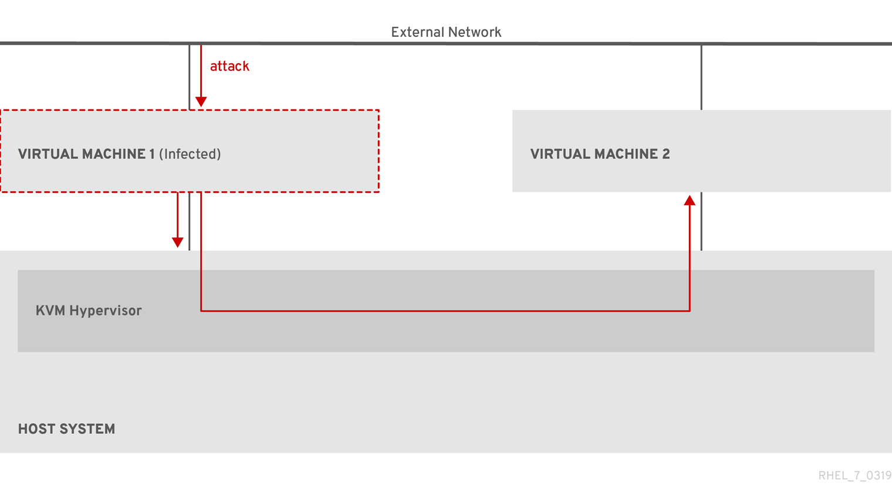 

Because the hypervisor uses the host kernel to manage VMs, services running on the VM’s operating system are frequently used for injecting malicious code into the host system. However, you can protect your system against such security threats by using [a number of security features](#best-practices-for-securing-virtual-machines "18.2. Best practices for securing virtual machines") on your host and your guest systems.

These features, such as SELinux or QEMU sandboxing, provide various measures that make it more difficult for malicious code to attack the hypervisor and transfer between your host and your VMs.

**Figure 18.2. Prevented malware attacks on a virtualization host**

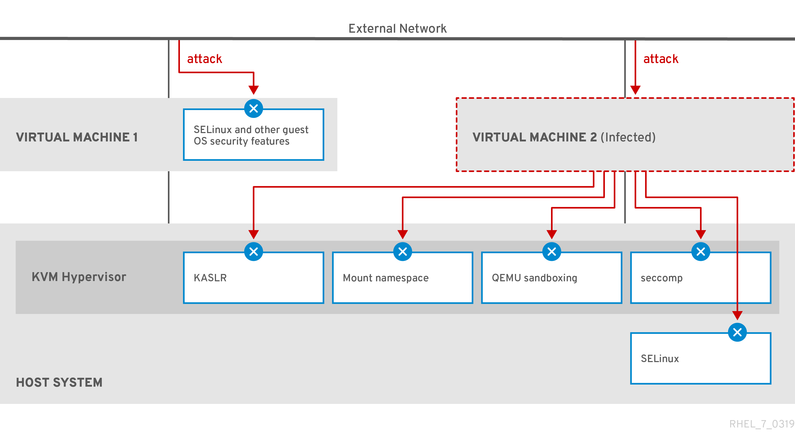 

Many of the features that RHEL 10 provides for VM security are always active and do not have to be enabled or configured. For details, see [Default features for virtual machine security](#default-features-for-virtual-machine-security "18.3. Default features for virtual machine security").

In addition, you can adhere to a variety of best practices to minimize the vulnerability of your VMs and your hypervisor. For more information, see [Best practices for securing virtual machines](#best-practices-for-securing-virtual-machines "18.2. Best practices for securing virtual machines").

<h3 id="best-practices-for-securing-virtual-machines">18.2. Best practices for securing virtual machines</h3>

To significantly decrease the risk of your virtual machines (VM) being infected with malicious code and used as attack vectors to infect your host system, you can increase the security of your systems by using a variety of methods.

**On the guest side:**

- Secure the virtual machine as if it was a physical machine. The specific methods available to enhance security depend on the guest OS.
  
  If your VM is running RHEL 10, see [Securing RHEL 10](https://docs.redhat.com/en/documentation/red_hat_enterprise_linux/10/html/security_hardening/) for detailed instructions on improving the security of your guest system.

**On the host side:**

- When managing VMs remotely, use cryptographic utilities such as **SSH** and network protocols such as **SSL** for connecting to the VMs.
- Ensure SELinux is in Enforcing mode:
  
  ```
  getenforce
  Enforcing
  ```
  
  ```plaintext
  # getenforce
  Enforcing
  ```
  
  If SELinux is disabled or in *Permissive* mode, see the [Using SELinux](https://docs.redhat.com/en/documentation/red_hat_enterprise_linux/10/html/using_selinux/changing-selinux-states-and-modes#changing-selinux-to-enforcing-mode) document for instructions on activating Enforcing mode.
  
  Note
  
  SELinux Enforcing mode also enables the sVirt RHEL 10 feature. This is a set of specialized SELinux booleans for virtualization, which can be [manually adjusted](#selinux-booleans-for-virtualization "18.6. SELinux booleans for virtualization") for fine-grained VM security management.
- Use VMs with *SecureBoot*:
  
  SecureBoot is a feature that ensures that your VM is running a cryptographically signed OS. This prevents VMs whose OS has been altered by a malware attack from booting.
  
  SecureBoot can only be applied when installing a Linux VM that uses OVMF firmware on an AMD64 or Intel 64 host. For instructions, see [Creating a SecureBoot virtual machine](#creating-a-secureboot-virtual-machine "18.7. Creating a Secure Boot virtual machine").
- Do not use `qemu-*` commands, such as `qemu-kvm`.
  
  QEMU is an essential component of the virtualization architecture in RHEL 10, but it is difficult to manage manually, and improper QEMU configurations may cause security vulnerabilities. Therefore, using most `qemu-*` commands is not supported by Red Hat. Instead, use *libvirt* utilities, such as `virsh`, `virt-install`, and `virt-xml`, as these orchestrate QEMU according to the best practices.
  
  Note, however, that the `qemu-img` utility is supported for [management of virtual disk images](#checking-the-consistency-of-a-virtual-disk "12.5. Checking the consistency of a virtual disk").

**Additional resources**

- [SELinux booleans for virtualization in RHEL](#selinux-booleans-for-virtualization "18.6. SELinux booleans for virtualization")

<h3 id="default-features-for-virtual-machine-security">18.3. Default features for virtual machine security</h3>

The `libvirt` software suite provides a number of security features that are automatically enabled when using virtualization in RHEL 10

You can use these in addition to manual means of improving the security of your virtual machines (VMs), which are listed in [Best practices for securing virtual machines](#best-practices-for-securing-virtual-machines "18.2. Best practices for securing virtual machines").

System and session connections

To access all the available utilities for virtual machine management on a RHEL 10 host, you need to use the *system connection* of `libvirt` (`qemu:///system`). To do so, you must have root privileges on the system or be a part of the *libvirt* user group.

Non-root users that are not in the *libvirt* group can only access a *session connection* of `libvirt` (`qemu:///session`), which has to respect the access rights of the local user when accessing resources.

For details, see [User-space connection types for virtualization](#user-space-connection-types-for-virtualization "1.5. User-space connection types for virtualization").

Virtual machine separation

Individual VMs run as isolated processes on the host, and rely on security enforced by the host kernel. Therefore, a VM cannot read or access the memory or storage of other VMs on the same host.

QEMU sandboxing

A feature that prevents QEMU code from executing system calls that can compromise the security of the host.

Kernel Address Space Randomization (KASLR)

Enables randomizing the physical and virtual addresses at which the kernel image is decompressed. Thus, KASLR prevents guest security exploits based on the location of kernel objects.

<h3 id="limiting-what-actions-are-available-to-virtual-machine-users">18.4. Limiting what actions are available to virtual machine users</h3>

In some cases, actions that users of virtual machines (VMs) hosted on RHEL 10 can perform by default might pose a security risk. To prevent this, you can limit the actions available to VM users by configuring the `libvirt` daemons to use the `polkit` policy toolkit on the host machine.

**Procedure**

1. Optional: Ensure your system’s `polkit` control policies related to `libvirt` are set up according to your preferences.
   
   1. Find all libvirt-related files in the `/usr/share/polkit-1/actions/` and `/usr/share/polkit-1/rules.d/` directories.
      
      ```
      ls /usr/share/polkit-1/actions | grep libvirt
      ls /usr/share/polkit-1/rules.d | grep libvirt
      ```
      
      ```plaintext
      # ls /usr/share/polkit-1/actions | grep libvirt
      # ls /usr/share/polkit-1/rules.d | grep libvirt
      ```
   2. Open the files and review the rule settings.
      
      For information about reading the syntax of `polkit` control policies, use `man polkit`.
   3. Modify the `libvirt` control policies. To do so:
      
      1. Create a new `.rules` file in the `/etc/polkit-1/rules.d/` directory.
      2. Add your custom policies to this file, and save it.
         
         For further information and examples of `libvirt` control policies, see [the `libvirt` upstream documentation](https://libvirt.org/aclpolkit.html#writing-access-control-policies).
2. Configure your VMs to use access policies determined by `polkit`.
   
   To do so, find all configuration files for virtualization drivers in the `/etc/libvirt/` directory, and uncomment the `access_drivers = [ "polkit" ]` line in them.
   
   ```
   find /etc/libvirt/ -name virt*d.conf -exec sed -i 's/#access_drivers = \[ "polkit" \]/access_drivers = \[ "polkit" \]/g' {} +
   ```
   
   ```plaintext
   # find /etc/libvirt/ -name virt*d.conf -exec sed -i 's/#access_drivers = \[ "polkit" \]/access_drivers = \[ "polkit" \]/g' {} +
   ```
3. For each file that you modified in the previous step, restart the corresponding service.
   
   For example, if you have modified `/etc/libvirt/virtqemud.conf`, restart the `virtqemud` service.
   
   ```
   systemctl try-restart virtqemud
   ```
   
   ```plaintext
   # systemctl try-restart virtqemud
   ```

**Verification**

- As a user whose VM actions you intended to limit, perform one of the restricted actions.
  
  For example, if unprivileged users are restricted from viewing VMs created in the system session:
  
  ```
  virsh -c qemu:///system list --all
  Id   Name           State
  -------------------------------
  ```
  
  ```plaintext
  $ virsh -c qemu:///system list --all
  Id   Name           State
  -------------------------------
  ```
  
  If this command does not list any VMs even though one or more VMs exist on your system, `polkit` successfully restricts the action for unprivileged users.

**Troubleshooting**

- Currently, configuring `libvirt` to use `polkit` makes it impossible to connect to VMs [by using the RHEL 10 web console](#connecting-to-virtual-machines-by-using-the-web-console "6.1. Connecting to virtual machines by using the web console"), due to an incompatibility with the `libvirt-dbus` service.
  
  If you require fine-grained access control of VMs in the web console, create a custom D-Bus policy. For more information, see the Red Hat Knowledgebase solution [How to configure fine-grained control of Virtual Machines in Cockpit](https://access.redhat.com/solutions/6106401).

**Additional resources**

- [`libvirt` upstream information about polkit access control policies](https://libvirt.org/aclpolkit.html#writing-access-control-policies)

<h3 id="configuring-vnc-passwords">18.5. Configuring VNC passwords</h3>

To manage access to the graphical output of a virtual machine (VM), you can configure a password for the VNC console of the VM.

With a VNC password configured on a VM, users of the VMs must enter the password when attempting to view or interact with the VNC graphical console of the VMs, for example by using the `virt-viewer` utility.

Important

VNC passwords are not a sufficient measure for ensuring the security of a VM environment. For details, see [QEMU documentation on VNC security](https://qemu-project.gitlab.io/qemu/system/vnc-security.html#with-passwords).

In addition, the VNC password is saved in plain text in the configuration of the VM, so for the password to be effective, the user must not be able to display the VM configuration.

**Prerequisites**

- The VM that you want to protect with a VNC password has VNC graphics configured.
  
  To ensure that this is the case, use the `virsh dumpxml` command as follows:
  
  ```
  virsh dumpxml <vm-name> | grep graphics
  
   <graphics type='vnc' ports='-1' autoport=yes listen=127.0.0.1>
   </graphics>
  ```
  
  ```plaintext
  # virsh dumpxml <vm-name> | grep graphics
  
   <graphics type='vnc' ports='-1' autoport=yes listen=127.0.0.1>
   </graphics>
  ```

**Procedure**

1. Open the configuration of the VM that you want to assign a VNC password to.
   
   ```
   virsh edit <vm-name>
   ```
   
   ```plaintext
   # virsh edit <vm-name>
   ```
2. On the `<graphics>` line of the configuration, add the `passwd` attribute and the password string. The password must be 8 characters or fewer.
   
   ```
    <graphics type='vnc' ports='-1' autoport=yes listen=127.0.0.1 passwd='<password>'>
   ```
   
   ```plaintext
    <graphics type='vnc' ports='-1' autoport=yes listen=127.0.0.1 passwd='<password>'>
   ```
   
   - Optional: In addition, define a date and time when the password will expire.
     
     ```
      <graphics type='vnc' ports='-1' autoport=yes listen=127.0.0.1 passwd='<password>' passwdValidTo='2025-02-01T15:30:00'>
     ```
     
     ```plaintext
      <graphics type='vnc' ports='-1' autoport=yes listen=127.0.0.1 passwd='<password>' passwdValidTo='2025-02-01T15:30:00'>
     ```
     
     In this example, the password will expire on February 1st 2025, at 15:30 UTC.
3. Save the configuration.

**Verification**

1. Start the modified VM.
   
   ```
   virsh start <vm-name>
   ```
   
   ```plaintext
   # virsh start <vm-name>
   ```
2. Open a graphical console of the VM, for example by using the `virt-viewer` utility:
   
   ```
   virt-viewer <vm-name>
   ```
   
   ```plaintext
   # virt-viewer <vm-name>
   ```
   
   If the VNC password has been configured properly, a dialog window appears that requests you to enter the password.

<h3 id="selinux-booleans-for-virtualization">18.6. SELinux booleans for virtualization</h3>

RHEL 10 provides the `sVirt` feature, which is a set of specialized SELinux booleans that are automatically enabled on a host with SELinux in Enforcing mode.

For fine-grained configuration of virtual machines security on a RHEL 10 system, you can configure SELinux booleans on the host to ensure the hypervisor acts in a specific way.

To list all virtualization-related booleans and their statuses, use the `getsebool -a | grep virt` command:

```
getsebool -a | grep virt
[...]
virt_sandbox_use_netlink --> off
virt_sandbox_use_sys_admin --> off
virt_transition_userdomain --> off
virt_use_comm --> off
virt_use_execmem --> off
virt_use_fusefs --> off
[...]
```

```plaintext
$ getsebool -a | grep virt
[...]
virt_sandbox_use_netlink --> off
virt_sandbox_use_sys_admin --> off
virt_transition_userdomain --> off
virt_use_comm --> off
virt_use_execmem --> off
virt_use_fusefs --> off
[...]
```

To enable a specific boolean, use the `setsebool -P boolean_name on` command as root. To disable a boolean, use `setsebool -P boolean_name off`.

The following table lists virtualization-related booleans available in RHEL 10 and what they do when enabled:

| SELinux Boolean                | Description                                                                    |
|:-------------------------------|:-------------------------------------------------------------------------------|
| staff\_use\_svirt              | Enables non-root users to create and transition VMs to sVirt.                  |
| unprivuser\_use\_svirt         | Enables unprivileged users to create and transition VMs to sVirt.              |
| virt\_sandbox\_use\_audit      | Enables sandbox containers to send audit messages.                             |
| virt\_sandbox\_use\_netlink    | Enables sandbox containers to use netlink system calls.                        |
| virt\_sandbox\_use\_sys\_admin | Enables sandbox containers to use sys\_admin system calls, such as mount.      |
| virt\_transition\_userdomain   | Enables virtual processes to run as user domains.                              |
| virt\_use\_comm                | Enables virt to use serial/parallel communication ports.                       |
| virt\_use\_execmem             | Enables confined virtual guests to use executable memory and executable stack. |
| virt\_use\_fusefs              | Enables virt to read FUSE mounted files.                                       |
| virt\_use\_nfs                 | Enables virt to manage NFS mounted files.                                      |
| virt\_use\_rawip               | Enables virt to interact with rawip sockets.                                   |
| virt\_use\_samba               | Enables virt to manage CIFS mounted files.                                     |
| virt\_use\_sanlock             | Enables confined virtual guests to interact with the sanlock.                  |
| virt\_use\_usb                 | Enables virt to use USB devices.                                               |
| virt\_use\_xserver             | Enables virtual machine to interact with the X Window System.                  |

Table 18.1. SELinux virtualization booleans

<h3 id="creating-a-secureboot-virtual-machine">18.7. Creating a Secure Boot virtual machine</h3>

To improve the security of your virtualization host, you can create Linux virtual machines (VMs) that use the *Secure Boot* feature. Secure Boot ensures that the VM is running a cryptographically signed operating system (OS).

This can be useful if the guest OS of a VM has been altered by malware. In such a scenario, Secure Boot prevents the VM from booting, which stops the potential spread of the malware to your host machine.

**Prerequisites**

- The VM is the Q35 machine type.
- Your host system uses the AMD64 or Intel 64 architecture.
- The `edk2-OVMF` package is installed:
  
  ```
  dnf install edk2-ovmf
  ```
  
  ```plaintext
  # dnf install edk2-ovmf
  ```
- An operating system (OS) installation source is available locally or on a network. This can be one of the following formats:
  
  - An ISO image of an installation medium
  - A disk image of an existing VM installation
    
    Warning
    
    Installing from a host CD-ROM or DVD-ROM device is not possible in RHEL 10. If you select a CD-ROM or DVD-ROM as the installation source when using any VM installation method available in RHEL 10, the installation will fail. For more information, see [RHEL 7 or higher can’t install guest OS from CD/DVD-ROM](https://access.redhat.com/solutions/1185913) (Red Hat Knowledgebase).
- Optional: A Kickstart file can be provided for faster and easier configuration of the installation.

**Procedure**

1. Use the `virt-install` command to create a VM as detailed in [Creating virtual machines by using the command line](#creating-virtual-machines-by-using-the-command-line-interface "3.1. Creating virtual machines by using the command line"). For the `--boot` option, use the `uefi,nvram_template=/usr/share/OVMF/OVMF_VARS.secboot.fd` value. This uses the `OVMF_VARS.secboot.fd` and `OVMF_CODE.secboot.fd` files as templates for the VM’s non-volatile RAM (NVRAM) settings, which enables the Secure Boot feature.
   
   For example:
   
   ```
   virt-install --name rhel8sb --memory 4096 --vcpus 4 --os-variant rhel10.0 --boot uefi,nvram_template=/usr/share/OVMF/OVMF_VARS.secboot.fd --disk boot_order=2,size=10 --disk boot_order=1,device=cdrom,bus=scsi,path=/images/RHEL-{ProductNumber}.0-installation.iso
   ```
   
   ```plaintext
   # virt-install --name rhel8sb --memory 4096 --vcpus 4 --os-variant rhel10.0 --boot uefi,nvram_template=/usr/share/OVMF/OVMF_VARS.secboot.fd --disk boot_order=2,size=10 --disk boot_order=1,device=cdrom,bus=scsi,path=/images/RHEL-{ProductNumber}.0-installation.iso
   ```
2. Follow the OS installation procedure according to the instructions on the screen.

**Verification**

1. After the guest OS is installed, access the VM’s command line by opening the terminal in [the graphical guest console](#opening-a-virtual-machine-graphical-console-by-using-the-command-line-interface "6.2. Opening a virtual machine graphical console by using the command line") or connecting to the guest OS [using SSH](#connecting-to-a-virtual-machine-by-using-ssh "6.3. Connecting to a virtual machine by using SSH").
2. To confirm that Secure Boot has been enabled on the VM, use the `mokutil --sb-state` command:
   
   ```
   mokutil --sb-state
   SecureBoot enabled
   ```
   
   ```plaintext
   # mokutil --sb-state
   SecureBoot enabled
   ```

**Additional resources**

- [Manually installing Red Hat Enterprise Linux](https://docs.redhat.com/en/documentation/red_hat_enterprise_linux/10/html/interactively_installing_rhel_from_installation_media/index#manually-installing-red-hat-enterprise-linux)

<h3 id="setting-up-ibm-secure-execution-on-ibm-z">18.8. Setting up IBM Secure Execution on IBM Z</h3>

When using IBM Z hardware to run a RHEL 10 host, you can improve the security of your virtual machines (VMs) by configuring the IBM Secure Execution feature for the VMs.

IBM Secure Execution, also known as Protected Virtualization, prevents the host system from accessing a VM’s state and memory contents. As a result, even if the host is compromised, it cannot be used as a vector for attacking the guest operating system. In addition, Secure Execution can be used to prevent untrusted hosts from obtaining sensitive information from the VM.

You can convert an existing VM on an IBM Z host into a secured VM by enabling IBM Secure Execution.

Important

For securing production environments, consult the [IBM documentation on fully securing workloads with Secure Execution](https://www.ibm.com/docs/en/linux-on-systems?topic=execution-workload-owner-tasks), which explains how to further secure your workloads.

<h4 id="configuring-vm-manually-for-ibm-secure-execution">18.8.1. Configuring a VM manually for IBM Secure Execution</h4>

You can configure IBM Secure Execution by manually logging in to the guest VM and performing configuration steps within the guest operating system. This method provides direct control over the configuration process and is suitable for production environments where you need to verify each step of the setup.

Important

For securing production environments, consult the [IBM documentation on fully securing workloads with Secure Execution](https://www.ibm.com/docs/en/linux-on-systems?topic=execution-workload-owner-tasks), which explains how to further secure your workloads.

**Prerequisites**

- The system hardware is one of the following:
  
  - IBM z15 or later
  - IBM LinuxONE III or later
- The Secure Execution feature is enabled for your system. To verify, use:
  
  ```
  grep facilities /proc/cpuinfo | grep 158
  ```
  
  ```plaintext
  # grep facilities /proc/cpuinfo | grep 158
  ```
  
  If this command displays any output, your CPU is compatible with Secure Execution.
- The kernel includes support for Secure Execution. To confirm, use:
  
  ```
  ls /sys/firmware | grep uv
  ```
  
  ```plaintext
  # ls /sys/firmware | grep uv
  ```
  
  If the command generates any output, your kernel supports Secure Execution.
- The host CPU model contains the `unpack` facility. To confirm, use:
  
  ```
  virsh domcapabilities | grep unpack
  <feature policy='require' name='unpack'/>
  ```
  
  ```plaintext
  # virsh domcapabilities | grep unpack
  <feature policy='require' name='unpack'/>
  ```
  
  If the command generates the above output, your CPU host model is compatible with Secure Execution.
- The CPU mode of the VM is set to `host-model`.
  
  ```
  virsh dumpxml <vm_name> | grep "<cpu mode='host-model'/>"
  ```
  
  ```plaintext
  # virsh dumpxml <vm_name> | grep "<cpu mode='host-model'/>"
  ```
  
  If the command generates any output, the VM’s CPU mode is set correctly.
- The *genprotimg* package must be installed on the host.
  
  ```
  dnf install genprotimg
  ```
  
  ```plaintext
  # dnf install genprotimg
  ```
- The `guestfs-tools` package is installed on the host in case you want to modify the VM image directly from the host.
  
  ```
  dnf install guestfs-tools
  ```
  
  ```plaintext
  # dnf install guestfs-tools
  ```
- You have obtained and verified the IBM Z host key document. For details, see [Verifying the host key document](https://www.ibm.com/support/knowledgecenter/linuxonibm/com.ibm.linux.z.lxse/lxse_t_verify.html#lxse_verify) in IBM documentation.

**Procedure**

01. Add the `prot_virt=1` kernel parameter to the boot configuration of the host.
    
    ```
    grubby --update-kernel=ALL --args="prot_virt=1"
    ```
    
    ```plaintext
    # grubby --update-kernel=ALL --args="prot_virt=1"
    ```
02. Update the boot menu:
    
    \# **zipl**
03. Use `virsh edit` to modify the XML configuration of the VM you want to secure.
04. Add `<launchSecurity type="s390-pv"/>` to the under the `</devices>` line. For example:
    
    ```
    [...]
        </memballoon>
      </devices>
      <launchSecurity type="s390-pv"/>
    </domain>
    ```
    
    ```plaintext
    [...]
        </memballoon>
      </devices>
      <launchSecurity type="s390-pv"/>
    </domain>
    ```
05. If the `<devices>` section of the configuration includes a `virtio-rng` device (`<rng model="virtio">`), remove all lines of the `<rng> </rng>` block.
06. Optional: If the VM that you want to secure is using 32 GiB of RAM or more, add the `<async-teardown enabled='yes'/>` line to the `<features></features>` section in its XML configuration on the host.
    
    This improves the performance of rebooting or stopping such Secure Execution guests.
07. Log in to the VM you want to secure and create a parameter file. For example:
    
    ```
    touch ~/secure-parameters
    ```
    
    ```plaintext
    # touch ~/secure-parameters
    ```
08. In the `/boot/loader/entries` directory of the guest operating system, identify the boot loader entry with the latest version:
    
    ```
    ls /boot/loader/entries -l
    [...]
    -rw-r--r--. 1 root root  281 Oct  9 15:51 3ab27a195c2849429927b00679db15c1-4.18.0-240.el8.s390x.conf
    ```
    
    ```plaintext
    # ls /boot/loader/entries -l
    [...]
    -rw-r--r--. 1 root root  281 Oct  9 15:51 3ab27a195c2849429927b00679db15c1-4.18.0-240.el8.s390x.conf
    ```
09. Retrieve the kernel options line of the boot loader entry in the guest operating system:
    
    ```
    cat /boot/loader/entries/3ab27a195c2849429927b00679db15c1-4.18.0-240.el8.s390x.conf | grep options
    options root=/dev/mapper/rhel-root
    rd.lvm.lv=rhel/root rd.lvm.lv=rhel/swap
    ```
    
    ```plaintext
    # cat /boot/loader/entries/3ab27a195c2849429927b00679db15c1-4.18.0-240.el8.s390x.conf | grep options
    options root=/dev/mapper/rhel-root
    rd.lvm.lv=rhel/root rd.lvm.lv=rhel/swap
    ```
10. Add the content of the options line and `swiotlb=262144` to the created parameters file in the guest operating system.
    
    ```
    echo "root=/dev/mapper/rhel-root rd.lvm.lv=rhel/root rd.lvm.lv=rhel/swap swiotlb=262144" > ~/secure-parameters
    ```
    
    ```plaintext
    # echo "root=/dev/mapper/rhel-root rd.lvm.lv=rhel/root rd.lvm.lv=rhel/swap swiotlb=262144" > ~/secure-parameters
    ```
11. Generate a new IBM Secure Execution image in the guest operating system.
    
    For example, the following creates a `/boot/secure-image` secured image based on the `/boot/vmlinuz-4.18.0-240.el8.s390x` image, using the `secure-parameters` file, the `/boot/initramfs-4.18.0-240.el8.s390x.img` initial RAM disk file, and the `HKD-8651-000201C048.crt` host key document.
    
    ```
    genprotimg -i /boot/vmlinuz-4.18.0-240.el8.s390x -r /boot/initramfs-4.18.0-240.el8.s390x.img -p ~/secure-parameters -k HKD-8651-00020089A8.crt -o /boot/secure-image
    ```
    
    ```plaintext
    # genprotimg -i /boot/vmlinuz-4.18.0-240.el8.s390x -r /boot/initramfs-4.18.0-240.el8.s390x.img -p ~/secure-parameters -k HKD-8651-00020089A8.crt -o /boot/secure-image
    ```
    
    By using the `genprotimg` utility creates the secure image, which contains the kernel parameters, initial RAM disk, and boot image.
12. Update the VM’s boot menu to boot from the secure image. In addition, remove the lines starting with `initrd` and `options`, as they are not needed.
    
    For example, in a RHEL 8.3 VM, the boot menu can be edited in the `/boot/loader/entries/` directory:
    
    ```
    cat /boot/loader/entries/3ab27a195c2849429927b00679db15c1-4.18.0-240.el8.s390x.conf
    title Red Hat Enterprise Linux 8.3
    version 4.18.0-240.el8.s390x
    linux /boot/secure-image
    [...]
    ```
    
    ```plaintext
    # cat /boot/loader/entries/3ab27a195c2849429927b00679db15c1-4.18.0-240.el8.s390x.conf
    title Red Hat Enterprise Linux 8.3
    version 4.18.0-240.el8.s390x
    linux /boot/secure-image
    [...]
    ```
13. Create the bootable disk image in the guest operating system:
    
    ```
    zipl -V
    ```
    
    ```plaintext
    # zipl -V
    ```
14. Securely remove the original unprotected files in the guest operating system. For example:
    
    ```
    shred /boot/vmlinuz-4.18.0-240.el8.s390x
    shred /boot/initramfs-4.18.0-240.el8.s390x.img
    shred secure-parameters
    ```
    
    ```plaintext
    # shred /boot/vmlinuz-4.18.0-240.el8.s390x
    # shred /boot/initramfs-4.18.0-240.el8.s390x.img
    # shred secure-parameters
    ```
    
    The original boot image, the initial RAM image, and the kernel parameter file are unprotected, and if they are not removed, VMs with Secure Execution enabled can still be vulnerable to hacking attempts or sensitive data mining.

**Verification**

- On the host, use the `virsh dumpxml` utility to confirm the XML configuration of the secured VM. The configuration must include the `<launchSecurity type="s390-pv"/>` element, and no &lt;rng model="virtio"&gt; lines.
  
  ```
  virsh dumpxml vm-name
  [...]
    <cpu mode='host-model'/>
    <devices>
      <disk type='file' device='disk'>
        <driver name='qemu' type='qcow2' cache='none' io='native'>
        <source file='/var/lib/libvirt/images/secure-guest.qcow2'/>
        <target dev='vda' bus='virtio'/>
      </disk>
      <interface type='network'>
        <source network='default'/>
        <model type='virtio'/>
      </interface>
      <console type='pty'/>
      <memballoon model='none'/>
    </devices>
    <launchSecurity type="s390-pv"/>
  </domain>
  ```
  
  ```plaintext
  # virsh dumpxml vm-name
  [...]
    <cpu mode='host-model'/>
    <devices>
      <disk type='file' device='disk'>
        <driver name='qemu' type='qcow2' cache='none' io='native'>
        <source file='/var/lib/libvirt/images/secure-guest.qcow2'/>
        <target dev='vda' bus='virtio'/>
      </disk>
      <interface type='network'>
        <source network='default'/>
        <model type='virtio'/>
      </interface>
      <console type='pty'/>
      <memballoon model='none'/>
    </devices>
    <launchSecurity type="s390-pv"/>
  </domain>
  ```

**Additional resources**

- [IBM documentation for Secure Execution on Linux](https://www.ibm.com/docs/en/linux-on-systems?topic=management-secure-execution)
- [IBM documentation on fully securing workloads with Secure Execution](https://www.ibm.com/docs/en/linux-on-systems?topic=execution-workload-owner-tasks)
- [IBM documentation on `genprotimg`](https://www.ibm.com/support/knowledgecenter/linuxonibm/com.ibm.linux.z.lxse/lxse_r_cmd.html#cmd_genprotimg)
- [Configuring kernel command-line parameters](https://docs.redhat.com/en/documentation/red_hat_enterprise_linux/10/html/managing_monitoring_and_updating_the_kernel/configuring-kernel-command-line-parameters)

<h4 id="configuring-vm-from-host-for-ibm-secure-execution">18.8.2. Configuring a VM from the host for IBM Secure Execution</h4>

You can configure IBM Secure Execution directly from the host by using the `guestfs-tools` package without needing to boot the VM. However, this method is suitable only for testing and development environments where you need to quickly configure multiple VMs or automate the setup process.

Important

For securing production environments, consult the [IBM documentation on fully securing workloads with Secure Execution](https://www.ibm.com/docs/en/linux-on-systems?topic=execution-workload-owner-tasks), which explains how to further secure your workloads.

**Prerequisites**

- The system hardware is one of the following:
  
  - IBM z15 or later
  - IBM LinuxONE III or later
- The Secure Execution feature is enabled for your system. To verify, use:
  
  ```
  grep facilities /proc/cpuinfo | grep 158
  ```
  
  ```plaintext
  # grep facilities /proc/cpuinfo | grep 158
  ```
  
  If this command displays any output, your CPU is compatible with Secure Execution.
- The kernel includes support for Secure Execution. To confirm, use:
  
  ```
  ls /sys/firmware | grep uv
  ```
  
  ```plaintext
  # ls /sys/firmware | grep uv
  ```
  
  If the command generates any output, your kernel supports Secure Execution.
- The host CPU model contains the `unpack` facility. To confirm, use:
  
  ```
  virsh domcapabilities | grep unpack
  <feature policy='require' name='unpack'/>
  ```
  
  ```plaintext
  # virsh domcapabilities | grep unpack
  <feature policy='require' name='unpack'/>
  ```
  
  If the command generates the above output, your CPU host model is compatible with Secure Execution.
- The CPU mode of the VM is set to `host-model`.
  
  ```
  virsh dumpxml <vm_name> | grep "<cpu mode='host-model'/>"
  ```
  
  ```plaintext
  # virsh dumpxml <vm_name> | grep "<cpu mode='host-model'/>"
  ```
  
  If the command generates any output, the VM’s CPU mode is set correctly.
- The *genprotimg* package must be installed on the host.
  
  ```
  dnf install genprotimg
  ```
  
  ```plaintext
  # dnf install genprotimg
  ```
- The `guestfs-tools` package is installed on the host in case you want to modify the VM image directly from the host.
  
  ```
  dnf install guestfs-tools
  ```
  
  ```plaintext
  # dnf install guestfs-tools
  ```
- You have obtained and verified the IBM Z host key document. For details, see [Verifying the host key document](https://www.ibm.com/support/knowledgecenter/linuxonibm/com.ibm.linux.z.lxse/lxse_t_verify.html#lxse_verify) in IBM documentation.

**Procedure**

01. Add the `prot_virt=1` kernel parameter to the boot configuration of the host.
    
    ```
    grubby --update-kernel=ALL --args="prot_virt=1"
    ```
    
    ```plaintext
    # grubby --update-kernel=ALL --args="prot_virt=1"
    ```
02. Update the boot menu:
    
    \# **zipl**
03. Use `virsh edit` to modify the XML configuration of the VM you want to secure.
04. Add `<launchSecurity type="s390-pv"/>` to the under the `</devices>` line. For example:
    
    ```
    [...]
        </memballoon>
      </devices>
      <launchSecurity type="s390-pv"/>
    </domain>
    ```
    
    ```plaintext
    [...]
        </memballoon>
      </devices>
      <launchSecurity type="s390-pv"/>
    </domain>
    ```
05. If the `<devices>` section of the configuration includes a `virtio-rng` device (`<rng model="virtio">`), remove all lines of the `<rng> </rng>` block.
06. Optional: If the VM that you want to secure is using 32 GiB of RAM or more, add the `<async-teardown enabled='yes'/>` line to the `<features></features>` section in its XML configuration on the host.
    
    This improves the performance of rebooting or stopping such Secure Execution guests.
07. On the host, create a script that contains the host key document and that configures the existing VM to use Secure Execution. For example:
    
    ```
    #!/usr/bin/bash
    
    echo "$(cat /proc/cmdline) swiotlb=262144" > parmfile
    
    cat > ./HKD.crt << EOF
    -----BEGIN CERTIFICATE-----
    1234569901234569901234569901234569901234569901234569901234569900
    1234569901234569901234569901234569901234569901234569901234569900
    1234569901234569901234569901234569901234569901234569901234569900
    1234569901234569901234569901234569901234569901234569901234569900
    1234569901234569901234569901234569901234569901234569901234569900
    1234569901234569901234569901234569901234569901234569901234569900
    1234569901234569901234569901234569901234569901234569901234569900
    1234569901234569901234569901234569901234569901234569901234569900
    1234569901234569901234569901234569901234569901234569901234569900
    1234569901234569901234569901234569901234569901234569901234569900
    1234569901234569901234569901234569901234569901234569901234569900
    1234569901234569901234569901234569901234569901234569901234569900
    1234569901234569901234569901234569901234569901234569901234569900
    1234569901234569901234569901234569901234569901234569901234569900
    1234569901234569901234569901234569901234569901234569901234569900
    1234569901234569901234569901234569901234569901234569901234569900
    1234569901234569901234569901234569901234569901234569901234569900
    1234569901234569901234569901234569901234569901234569901234569900
    1234569901234569901234569901234569901234569901234569901234569900
    1234569901234569901234569901234569901234569901234569901234569900
    1234569901234569901234569901234569901234569901234569901234569900
    1234569901234569901234569901234569901234569901234569901234569900
    1234569901234569901234569901234569901234569901234569901234569900
    1234569901234569901234569901234569901234569901234569901234569900
    1234569901234569901234569901234569901234569901234569901234569900
    xLPRGYwhmXzKDg==
    -----END CERTIFICATE-----
    EOF
    
    version=$(uname -r)
    
    kernel=/boot/vmlinuz-$version
    initrd=/boot/initramfs-$version.img
    
    genprotimg -k ./HKD.crt -p ./parmfile -i $kernel -r $initrd -o /boot/secure-linux --no-verify
    
    cat >> /etc/zipl.conf<< EOF
    
    [secure]
    target=/boot
    image=/boot/secure-linux
    EOF
    
    zipl -V
    
    shutdown -h now
    ```
    
    ```plaintext
    #!/usr/bin/bash
    
    echo "$(cat /proc/cmdline) swiotlb=262144" > parmfile
    
    cat > ./HKD.crt << EOF
    -----BEGIN CERTIFICATE-----
    1234569901234569901234569901234569901234569901234569901234569900
    1234569901234569901234569901234569901234569901234569901234569900
    1234569901234569901234569901234569901234569901234569901234569900
    1234569901234569901234569901234569901234569901234569901234569900
    1234569901234569901234569901234569901234569901234569901234569900
    1234569901234569901234569901234569901234569901234569901234569900
    1234569901234569901234569901234569901234569901234569901234569900
    1234569901234569901234569901234569901234569901234569901234569900
    1234569901234569901234569901234569901234569901234569901234569900
    1234569901234569901234569901234569901234569901234569901234569900
    1234569901234569901234569901234569901234569901234569901234569900
    1234569901234569901234569901234569901234569901234569901234569900
    1234569901234569901234569901234569901234569901234569901234569900
    1234569901234569901234569901234569901234569901234569901234569900
    1234569901234569901234569901234569901234569901234569901234569900
    1234569901234569901234569901234569901234569901234569901234569900
    1234569901234569901234569901234569901234569901234569901234569900
    1234569901234569901234569901234569901234569901234569901234569900
    1234569901234569901234569901234569901234569901234569901234569900
    1234569901234569901234569901234569901234569901234569901234569900
    1234569901234569901234569901234569901234569901234569901234569900
    1234569901234569901234569901234569901234569901234569901234569900
    1234569901234569901234569901234569901234569901234569901234569900
    1234569901234569901234569901234569901234569901234569901234569900
    1234569901234569901234569901234569901234569901234569901234569900
    xLPRGYwhmXzKDg==
    -----END CERTIFICATE-----
    EOF
    
    version=$(uname -r)
    
    kernel=/boot/vmlinuz-$version
    initrd=/boot/initramfs-$version.img
    
    genprotimg -k ./HKD.crt -p ./parmfile -i $kernel -r $initrd -o /boot/secure-linux --no-verify
    
    cat >> /etc/zipl.conf<< EOF
    
    [secure]
    target=/boot
    image=/boot/secure-linux
    EOF
    
    zipl -V
    
    shutdown -h now
    ```
08. Ensure the VM is shut-down.
09. On the host, add the script to the existing VM image by using `guestfs-tools` and mark it to *run on first boot*.
    
    ```
    virt-customize -a <vm_image_path> --selinux-relabel --firstboot <script_path>
    ```
    
    ```plaintext
    # virt-customize -a <vm_image_path> --selinux-relabel --firstboot <script_path>
    ```
10. Boot the VM from the image with the added script.
    
    The script runs on first boot, and then shuts down the VM again. As a result, the VM is now configured to run with Secure Execution on the host that has the corresponding host key.

**Verification**

- On the host, use the `virsh dumpxml` utility to confirm the XML configuration of the secured VM. The configuration must include the `<launchSecurity type="s390-pv"/>` element, and no &lt;rng model="virtio"&gt; lines.
  
  ```
  virsh dumpxml vm-name
  [...]
    <cpu mode='host-model'/>
    <devices>
      <disk type='file' device='disk'>
        <driver name='qemu' type='qcow2' cache='none' io='native'>
        <source file='/var/lib/libvirt/images/secure-guest.qcow2'/>
        <target dev='vda' bus='virtio'/>
      </disk>
      <interface type='network'>
        <source network='default'/>
        <model type='virtio'/>
      </interface>
      <console type='pty'/>
      <memballoon model='none'/>
    </devices>
    <launchSecurity type="s390-pv"/>
  </domain>
  ```
  
  ```plaintext
  # virsh dumpxml vm-name
  [...]
    <cpu mode='host-model'/>
    <devices>
      <disk type='file' device='disk'>
        <driver name='qemu' type='qcow2' cache='none' io='native'>
        <source file='/var/lib/libvirt/images/secure-guest.qcow2'/>
        <target dev='vda' bus='virtio'/>
      </disk>
      <interface type='network'>
        <source network='default'/>
        <model type='virtio'/>
      </interface>
      <console type='pty'/>
      <memballoon model='none'/>
    </devices>
    <launchSecurity type="s390-pv"/>
  </domain>
  ```

**Additional resources**

- [IBM documentation for Secure Execution on Linux](https://www.ibm.com/docs/en/linux-on-systems?topic=management-secure-execution)
- [IBM documentation on fully securing workloads with Secure Execution](https://www.ibm.com/docs/en/linux-on-systems?topic=execution-workload-owner-tasks)
- [IBM documentation on `genprotimg`](https://www.ibm.com/support/knowledgecenter/linuxonibm/com.ibm.linux.z.lxse/lxse_r_cmd.html#cmd_genprotimg)
- [Configuring kernel command-line parameters](https://docs.redhat.com/en/documentation/red_hat_enterprise_linux/10/html/managing_monitoring_and_updating_the_kernel/configuring-kernel-command-line-parameters)

<h3 id="attaching-cryptographic-coprocessors-to-virtual-machines-on-ibm-z">18.9. Attaching cryptographic coprocessors to virtual machines on IBM Z</h3>

To use hardware encryption in your virtual machine (VM) on an IBM Z host, create mediated devices from a cryptographic coprocessor device and assign them to the intended VMs.

**Prerequisites**

- Your host is running on IBM Z hardware.
- The cryptographic coprocessor is compatible with device assignment. To confirm this, ensure that the `type` of your coprocessor is listed as `CEX4` or later.
  
  ```
  lszcrypt -V
  
  CARD.DOMAIN TYPE  MODE        STATUS  REQUESTS  PENDING HWTYPE QDEPTH FUNCTIONS  DRIVER
  --------------------------------------------------------------------------------------------
  05         CEX5C CCA-Coproc  online         1        0     11     08 S--D--N--  cex4card
  05.0004    CEX5C CCA-Coproc  online         1        0     11     08 S--D--N--  cex4queue
  05.00ab    CEX5C CCA-Coproc  online         1        0     11     08 S--D--N--  cex4queue
  ```
  
  ```plaintext
  # lszcrypt -V
  
  CARD.DOMAIN TYPE  MODE        STATUS  REQUESTS  PENDING HWTYPE QDEPTH FUNCTIONS  DRIVER
  --------------------------------------------------------------------------------------------
  05         CEX5C CCA-Coproc  online         1        0     11     08 S--D--N--  cex4card
  05.0004    CEX5C CCA-Coproc  online         1        0     11     08 S--D--N--  cex4queue
  05.00ab    CEX5C CCA-Coproc  online         1        0     11     08 S--D--N--  cex4queue
  ```
- The `vfio_ap` kernel module is loaded. To verify, use:
  
  ```
  lsmod | grep vfio_ap
  vfio_ap         24576  0
  [...]
  ```
  
  ```plaintext
  # lsmod | grep vfio_ap
  vfio_ap         24576  0
  [...]
  ```
  
  To load the module, use:
  
  ```
  modprobe vfio_ap
  ```
  
  ```plaintext
  # modprobe vfio_ap
  ```
- The `s390utils` version supports `ap` handling:
  
  ```
  lszdev --list-types
  ...
  ap           Cryptographic Adjunct Processor (AP) device
  ...
  ```
  
  ```plaintext
  # lszdev --list-types
  ...
  ap           Cryptographic Adjunct Processor (AP) device
  ...
  ```

**Procedure**

1. Obtain the decimal values for the devices that you want to assign to the VM. For example, for the devices `05.0004` and `05.00ab`:
   
   ```
   echo "obase=10; ibase=16; 04" | bc
   4
   echo "obase=10; ibase=16; AB" | bc
   171
   ```
   
   ```plaintext
   # echo "obase=10; ibase=16; 04" | bc
   4
   # echo "obase=10; ibase=16; AB" | bc
   171
   ```
2. On the host, reassign the devices to the `vfio-ap` drivers:
   
   ```
   chzdev -t ap apmask=-5 aqmask=-4,-171
   ```
   
   ```plaintext
   # chzdev -t ap apmask=-5 aqmask=-4,-171
   ```
   
   Note
   
   To assign the devices persistently, use the `-p` flag.
3. Verify that the cryptographic devices have been reassigned correctly.
   
   ```
   lszcrypt -V
   
   CARD.DOMAIN TYPE  MODE        STATUS  REQUESTS  PENDING HWTYPE QDEPTH FUNCTIONS  DRIVER
   --------------------------------------------------------------------------------------------
   05          CEX5C CCA-Coproc  -              1        0     11     08 S--D--N--  cex4card
   05.0004     CEX5C CCA-Coproc  -              1        0     11     08 S--D--N--  vfio_ap
   05.00ab     CEX5C CCA-Coproc  -              1        0     11     08 S--D--N--  vfio_ap
   ```
   
   ```plaintext
   # lszcrypt -V
   
   CARD.DOMAIN TYPE  MODE        STATUS  REQUESTS  PENDING HWTYPE QDEPTH FUNCTIONS  DRIVER
   --------------------------------------------------------------------------------------------
   05          CEX5C CCA-Coproc  -              1        0     11     08 S--D--N--  cex4card
   05.0004     CEX5C CCA-Coproc  -              1        0     11     08 S--D--N--  vfio_ap
   05.00ab     CEX5C CCA-Coproc  -              1        0     11     08 S--D--N--  vfio_ap
   ```
   
   If the DRIVER values of the domain queues changed to `vfio_ap`, the reassignment succeeded.
4. Create an XML snippet that defines a new mediated device.
   
   The following example shows defining a persistent mediated device and assigning queues to it. Specifically, the `vfio_ap.xml` XML snippet in this example assigns a domain adapter `0x05`, domain queues `0x0004` and `0x00ab`, and a control domain `0x00ab` to the mediated device.
   
   ```
   vim vfio_ap.xml
   
   <device>
     <parent>ap_matrix</parent>
     <capability type="mdev">
       <type id="vfio_ap-passthrough"/>
       <attr name='assign_adapter' value='0x05'/>
       <attr name='assign_domain' value='0x0004'/>
       <attr name='assign_domain' value='0x00ab'/>
       <attr name='assign_control_domain' value='0x00ab'/>
     </capability>
   </device>
   ```
   
   ```plaintext
   # vim vfio_ap.xml
   
   <device>
     <parent>ap_matrix</parent>
     <capability type="mdev">
       <type id="vfio_ap-passthrough"/>
       <attr name='assign_adapter' value='0x05'/>
       <attr name='assign_domain' value='0x0004'/>
       <attr name='assign_domain' value='0x00ab'/>
       <attr name='assign_control_domain' value='0x00ab'/>
     </capability>
   </device>
   ```
5. Create a new mediated device from the `vfio_ap.xml` XML snippet.
   
   ```
   virsh nodedev-define vfio_ap.xml
   Node device 'mdev_8f9c4a73_1411_48d2_895d_34db9ac18f85_matrix' defined from 'vfio_ap.xml'
   ```
   
   ```plaintext
   # virsh nodedev-define vfio_ap.xml
   Node device 'mdev_8f9c4a73_1411_48d2_895d_34db9ac18f85_matrix' defined from 'vfio_ap.xml'
   ```
6. Start the mediated device that you created in the previous step, in this case `mdev_8f9c4a73_1411_48d2_895d_34db9ac18f85_matrix`.
   
   ```
   virsh nodedev-start mdev_8f9c4a73_1411_48d2_895d_34db9ac18f85_matrix
   Device mdev_8f9c4a73_1411_48d2_895d_34db9ac18f85_matrix started
   ```
   
   ```plaintext
   # virsh nodedev-start mdev_8f9c4a73_1411_48d2_895d_34db9ac18f85_matrix
   Device mdev_8f9c4a73_1411_48d2_895d_34db9ac18f85_matrix started
   ```
7. Check that the configuration has been applied correctly
   
   ```
   cat /sys/devices/vfio_ap/matrix/mdev_supported_types/vfio_ap-passthrough/devices/669d9b23-fe1b-4ecb-be08-a2fabca99b71/matrix
   05.0004
   05.00ab
   ```
   
   ```plaintext
   # cat /sys/devices/vfio_ap/matrix/mdev_supported_types/vfio_ap-passthrough/devices/669d9b23-fe1b-4ecb-be08-a2fabca99b71/matrix
   05.0004
   05.00ab
   ```
   
   If the output contains the numerical values of queues that you have previously assigned to `vfio-ap`, the process was successful.
8. Attach the mediated device to the VM.
   
   1. Display the UUID of the mediated device that you created and save it for the next step.
      
      ```
      virsh nodedev-dumpxml mdev_8f9c4a73_1411_48d2_895d_34db9ac18f85_matrix
      
      <device>
        <name>mdev_8f9c4a73_1411_48d2_895d_34db9ac18f85_matrix</name>
        <parent>ap_matrix</parent>
        <capability type='mdev'>
          <type id='vfio_ap-passthrough'/>
          <uuid>8f9c4a73-1411-48d2-895d-34db9ac18f85</uuid>
          <iommuGroup number='0'/>
          <attr name='assign_adapter' value='0x05'/>
          <attr name='assign_domain' value='0x0004'/>
          <attr name='assign_domain' value='0x00ab'/>
          <attr name='assign_control_domain' value='0x00ab'/>
        </capability>
      </device>
      ```
      
      ```plaintext
      # virsh nodedev-dumpxml mdev_8f9c4a73_1411_48d2_895d_34db9ac18f85_matrix
      
      <device>
        <name>mdev_8f9c4a73_1411_48d2_895d_34db9ac18f85_matrix</name>
        <parent>ap_matrix</parent>
        <capability type='mdev'>
          <type id='vfio_ap-passthrough'/>
          <uuid>8f9c4a73-1411-48d2-895d-34db9ac18f85</uuid>
          <iommuGroup number='0'/>
          <attr name='assign_adapter' value='0x05'/>
          <attr name='assign_domain' value='0x0004'/>
          <attr name='assign_domain' value='0x00ab'/>
          <attr name='assign_control_domain' value='0x00ab'/>
        </capability>
      </device>
      ```
   2. Create and open an XML file for the cryptographic card mediated device. For example:
      
      ```
      vim crypto-dev.xml
      ```
      
      ```plaintext
      # vim crypto-dev.xml
      ```
   3. Add the following lines to the file and save it. Replace the `uuid` value with the UUID you obtained in step *a*.
      
      ```
      <hostdev mode='subsystem' type='mdev' managed='no' model='vfio-ap'>
        <source>
          <address uuid='8f9c4a73-1411-48d2-895d-34db9ac18f85'/>
        </source>
      </hostdev>
      ```
      
      ```plaintext
      <hostdev mode='subsystem' type='mdev' managed='no' model='vfio-ap'>
        <source>
          <address uuid='8f9c4a73-1411-48d2-895d-34db9ac18f85'/>
        </source>
      </hostdev>
      ```
   4. Use the XML file to attach the mediated device to the VM. For example, to permanently attach a device defined in the `crypto-dev.xml` file to the running `testguest1` VM:
      
      ```
      virsh attach-device testguest1 crypto-dev.xml --live --config
      ```
      
      ```plaintext
      # virsh attach-device testguest1 crypto-dev.xml --live --config
      ```
      
      The `--live` option attaches the device to a running VM only, without persistence between boots. The `--config` option makes the configuration changes persistent. You can use the `--config` option alone to attach the device to a shut-down VM.
      
      Note that each UUID can only be assigned to one VM at a time.

**Verification**

1. Ensure that the guest operating system detects the assigned cryptographic devices.
   
   ```
   lszcrypt -V
   
   CARD.DOMAIN TYPE  MODE        STATUS  REQUESTS  PENDING HWTYPE QDEPTH FUNCTIONS  DRIVER
   --------------------------------------------------------------------------------------------
   05          CEX5C CCA-Coproc  online         1        0     11     08 S--D--N--  cex4card
   05.0004     CEX5C CCA-Coproc  online         1        0     11     08 S--D--N--  cex4queue
   05.00ab     CEX5C CCA-Coproc  online         1        0     11     08 S--D--N--  cex4queue
   ```
   
   ```plaintext
   # lszcrypt -V
   
   CARD.DOMAIN TYPE  MODE        STATUS  REQUESTS  PENDING HWTYPE QDEPTH FUNCTIONS  DRIVER
   --------------------------------------------------------------------------------------------
   05          CEX5C CCA-Coproc  online         1        0     11     08 S--D--N--  cex4card
   05.0004     CEX5C CCA-Coproc  online         1        0     11     08 S--D--N--  cex4queue
   05.00ab     CEX5C CCA-Coproc  online         1        0     11     08 S--D--N--  cex4queue
   ```
   
   The output of this command in the guest operating system will be identical to that on a host logical partition with the same cryptographic coprocessor devices available.
2. In the guest operating system, confirm that a control domain has been successfully assigned to the cryptographic devices.
   
   ```
   lszcrypt -d C
   
   DOMAIN 00 01 02 03 04 05 06 07 08 09 0a 0b 0c 0d 0e 0f
   ------------------------------------------------------
       00  .  .  .  .  U  .  .  .  .  .  .  .  .  .  .  .
       10  .  .  .  .  .  .  .  .  .  .  .  .  .  .  .  .
       20  .  .  .  .  .  .  .  .  .  .  .  .  .  .  .  .
       30  .  .  .  .  .  .  .  .  .  .  .  .  .  .  .  .
       40  .  .  .  .  .  .  .  .  .  .  .  .  .  .  .  .
       50  .  .  .  .  .  .  .  .  .  .  .  .  .  .  .  .
       60  .  .  .  .  .  .  .  .  .  .  .  .  .  .  .  .
       70  .  .  .  .  .  .  .  .  .  .  .  .  .  .  .  .
       80  .  .  .  .  .  .  .  .  .  .  .  .  .  .  .  .
       90  .  .  .  .  .  .  .  .  .  .  .  .  .  .  .  .
       a0  .  .  .  .  .  .  .  .  .  .  .  B  .  .  .  .
       b0  .  .  .  .  .  .  .  .  .  .  .  .  .  .  .  .
       c0  .  .  .  .  .  .  .  .  .  .  .  .  .  .  .  .
       d0  .  .  .  .  .  .  .  .  .  .  .  .  .  .  .  .
       e0  .  .  .  .  .  .  .  .  .  .  .  .  .  .  .  .
       f0  .  .  .  .  .  .  .  .  .  .  .  .  .  .  .  .
   ------------------------------------------------------
   C: Control domain
   U: Usage domain
   B: Both (Control + Usage domain)
   ```
   
   ```plaintext
   # lszcrypt -d C
   
   DOMAIN 00 01 02 03 04 05 06 07 08 09 0a 0b 0c 0d 0e 0f
   ------------------------------------------------------
       00  .  .  .  .  U  .  .  .  .  .  .  .  .  .  .  .
       10  .  .  .  .  .  .  .  .  .  .  .  .  .  .  .  .
       20  .  .  .  .  .  .  .  .  .  .  .  .  .  .  .  .
       30  .  .  .  .  .  .  .  .  .  .  .  .  .  .  .  .
       40  .  .  .  .  .  .  .  .  .  .  .  .  .  .  .  .
       50  .  .  .  .  .  .  .  .  .  .  .  .  .  .  .  .
       60  .  .  .  .  .  .  .  .  .  .  .  .  .  .  .  .
       70  .  .  .  .  .  .  .  .  .  .  .  .  .  .  .  .
       80  .  .  .  .  .  .  .  .  .  .  .  .  .  .  .  .
       90  .  .  .  .  .  .  .  .  .  .  .  .  .  .  .  .
       a0  .  .  .  .  .  .  .  .  .  .  .  B  .  .  .  .
       b0  .  .  .  .  .  .  .  .  .  .  .  .  .  .  .  .
       c0  .  .  .  .  .  .  .  .  .  .  .  .  .  .  .  .
       d0  .  .  .  .  .  .  .  .  .  .  .  .  .  .  .  .
       e0  .  .  .  .  .  .  .  .  .  .  .  .  .  .  .  .
       f0  .  .  .  .  .  .  .  .  .  .  .  .  .  .  .  .
   ------------------------------------------------------
   C: Control domain
   U: Usage domain
   B: Both (Control + Usage domain)
   ```
   
   If `lszcrypt -d C` displays `U` and `B` intersections in the cryptographic device matrix, the control domain assignment was successful.

<h3 id="enabling-sev-snp">18.10. Enabling SEV-SNP</h3>

Secure Encrypted Virtualization-Secure Nested Paging (SEV-SNP) is a hardware-based security feature that provides strong memory encryption and integrity protection for virtual machines (VMs). This isolates VMs from the hypervisor and other host system software. SEV-SNP is available only with AMD CPUs.

Important

Enabling SEV-SNP on a RHEL host is a Technology Preview only. However, enabling SEV-SNP on a RHEL guest is fully supported.

For more information about the support scope of Red Hat Technology Preview features, see [Technology Preview Features Support Scope](https://access.redhat.com/support/offerings/techpreview/).

<h4 id="enabling-sev-snp-on-a-rhel-host">18.10.1. Enabling SEV-SNP on a RHEL host</h4>

To enable Secure Encrypted Virtualization-Secure Nested Paging (SEV-SNP) on a RHEL host, you must ensure that your system meets the prerequisites and then install the `snphost` and `libvirt-daemon-kvm` packages.

SEV-SNP is a hardware-based security feature that provides strong memory encryption and integrity protection for virtual machines (VMs). This isolates VMs from the hypervisor and other host system software. SEV-SNP is available only with AMD CPUs.

Important

Using SEV-SNP on a RHEL host is a Technology Preview only. Technology Preview features are not supported with Red Hat production service levels agreements (SLAs) and might not be functionally complete. Red Hat does not recommend using them in production. These features provide early access to upcoming product features, enabling customers to test functionality and provide feedback during the development process.

For more information about the support scope of Red Hat Technology Preview features, see [Technology Preview Features Support Scope](https://access.redhat.com/support/offerings/techpreview/).

**Prerequisites**

- Your host uses the following hardware and software:
  
  - An AMD CPU that supports SEV-SNP, such as a supported model from the AMD EPYC series
  - RHEL 10.0 or later
  - SEV firmware version 1.55 or later
  - Sufficient system memory for SNP Memory Coverage configuration
- The following settings are enabled in UEFI CPU menu:
  
  - `SVM Mode` (Secure Virtual Machine Mode)
  - `SEV-SNP Support` or `Secure Nested Paging`
  - `SMEE` (Secure Memory Encryption)

**Procedure**

- Install the necessary packages on the RHEL host.
  
  ```
  dnf install snphost libvirt-daemon-kvm
  ```
  
  ```plaintext
  # dnf install snphost libvirt-daemon-kvm
  ```

**Verification**

- Verify that SEV-SNP is enabled on the host.
  
  ```
  virt-host-validate qemu
  
    QEMU: Checking for hardware virtualization:   PASS
    QEMU: Checking if device '/dev/kvm' exists:   PASS
    QEMU: Checking if device '/dev/kvm' is accessible:   PASS
    QEMU: Checking if device '/dev/vhost-net' exists:   PASS
    QEMU: Checking if device '/dev/net/tun' exists:   PASS
    QEMU: Checking for cgroup 'cpu' controller support:   PASS
    QEMU: Checking for cgroup 'cpuacct' controller support:   PASS
    QEMU: Checking for cgroup 'cpuset' controller support:   PASS
    QEMU: Checking for cgroup 'memory' controller support:   PASS
    QEMU: Checking for cgroup 'devices' controller support:   PASS
    QEMU: Checking for cgroup 'blkio' controller support:   PASS
    QEMU: Checking for device assignment IOMMU support:   PASS
    QEMU: Checking if IOMMU is enabled by kernel:   PASS
    QEMU: Checking for secure guest support:   PASS
  ```
  
  ```plaintext
  # virt-host-validate qemu
  
    QEMU: Checking for hardware virtualization:   PASS
    QEMU: Checking if device '/dev/kvm' exists:   PASS
    QEMU: Checking if device '/dev/kvm' is accessible:   PASS
    QEMU: Checking if device '/dev/vhost-net' exists:   PASS
    QEMU: Checking if device '/dev/net/tun' exists:   PASS
    QEMU: Checking for cgroup 'cpu' controller support:   PASS
    QEMU: Checking for cgroup 'cpuacct' controller support:   PASS
    QEMU: Checking for cgroup 'cpuset' controller support:   PASS
    QEMU: Checking for cgroup 'memory' controller support:   PASS
    QEMU: Checking for cgroup 'devices' controller support:   PASS
    QEMU: Checking for cgroup 'blkio' controller support:   PASS
    QEMU: Checking for device assignment IOMMU support:   PASS
    QEMU: Checking if IOMMU is enabled by kernel:   PASS
    QEMU: Checking for secure guest support:   PASS
  ```
  
  If SEV-SNP is enabled on the host, the `Checking for secure guest support` line reports `PASS`.

**Next steps**

- [Configure SEV-SNP on a RHEL guest](#enabling-sev-snp-on-a-rhel-guest "18.10.2. Enabling SEV-SNP on a RHEL guest")

<h4 id="enabling-sev-snp-on-a-rhel-guest">18.10.2. Enabling SEV-SNP on a RHEL guest</h4>

To enable Secure Encrypted Virtualization-Secure Nested Paging (SEV-SNP) in a RHEL virtual machine (VM), you can apply SEV-SNP configuration when creating the VM. Alternatively, you can enable SEV-SNP in an existing RHEL VM by editing the VM configuration.

SEV-SNP is a hardware-based security feature that provides strong memory encryption and integrity protection for VMs. This isolates VMs from the hypervisor and other host system software. SEV-SNP is available only with AMD CPUs.

**Prerequisites**

- SEV-SNP is enabled on your RHEL host. For instructions, see [Enabling SEV-SNP on a RHEL host](#enabling-sev-snp-on-a-rhel-host "18.10.1. Enabling SEV-SNP on a RHEL host")
- The host has `libvirt`, `virt-install`, and `virt-xml` installed
- The VM uses a supported RHEL version as the guest operating system:
  
  - RHEL 9.2 or later
  - RHEL 10.0 or later

**Procedure**

- To create a new RHEL VM with SEV-SNP enabled:
  
  - Use the `virt-install` utility with the `--launchSecurity sev-snp,policy=0x30000` option. For example:
    
    ```
    virt-install \
        --name <vm_name> --os-info rhel9.6 --memory 2048 --vcpus 2 \
        --boot uefi --import --disk /var/lib/libvirt/images/disk.qcow2 \
        --graphics none --console pty,target_type=serial \
        --launchSecurity sev-snp,policy=0x30000
    ```
    
    ```plaintext
    # virt-install \
        --name <vm_name> --os-info rhel9.6 --memory 2048 --vcpus 2 \
        --boot uefi --import --disk /var/lib/libvirt/images/disk.qcow2 \
        --graphics none --console pty,target_type=serial \
        --launchSecurity sev-snp,policy=0x30000
    ```
- To enable SEV-SNP functionality in an existing RHEL VM:
  
  1. Shut down the existing virtual machine if it is running.
     
     ```
     virsh shutdown <vm_name>
     ```
     
     ```plaintext
     # virsh shutdown <vm_name>
     ```
  2. Export and back up the current VM configuration.
     
     ```
     virsh dumpxml <vm_name> > /tmp/<vm_name>-backup.xml
     ```
     
     ```plaintext
     # virsh dumpxml <vm_name> > /tmp/<vm_name>-backup.xml
     ```
  3. Add SEV-SNP launch security configuration to the VM domain.
     
     ```
     virt-xml <vm_name> --edit --launchSecurity type=sev-snp,policy=0x30000
     ```
     
     ```plaintext
     # virt-xml <vm_name> --edit --launchSecurity type=sev-snp,policy=0x30000
     ```
     
     This command adds the SEV-SNP configuration to the VM’s domain XML. Alternatively, you can manually edit the configuration by using `virsh edit vm-name` and add the `<launchSecurity type='sev-snp'>` element.
  4. Ensure the VM is configured with a compatible CPU model.
     
     ```
     virsh dumpxml <vm_name> --xpath //cpu
     
     <cpu mode="host-passthrough" check="none" migratable="on"/>
     ```
     
     ```plaintext
     # virsh dumpxml <vm_name> --xpath //cpu
     
     <cpu mode="host-passthrough" check="none" migratable="on"/>
     ```
     
     The CPU should be set to `host-passthrough` or use an AMD EPYC model. If not, update it:
     
     ```
     virt-xml <vm_name> --edit --cpu mode=host-passthrough
     ```
     
     ```plaintext
     # virt-xml <vm_name> --edit --cpu mode=host-passthrough
     ```
  5. Start the VM.
     
     ```
     virsh start <vm_name>
     ```
     
     ```plaintext
     # virsh start <vm_name>
     ```

**Verification**

1. On the host, verify that the VM is running with SEV-SNP enabled.
   
   ```
   virsh dumpxml --xpath //launchSecurity <vm_name>
   
   <launchSecurity type="sev-snp">
     <policy>0x00030000</policy>
   </launchSecurity>
   ```
   
   ```plaintext
   # virsh dumpxml --xpath //launchSecurity <vm_name>
   
   <launchSecurity type="sev-snp">
     <policy>0x00030000</policy>
   </launchSecurity>
   ```
2. Log in to the guest VM.
3. Verify that the SEV-SNP guest device exists.
   
   ```
   ls -l /dev/sev_guest
   ```
   
   ```plaintext
   # ls -l /dev/sev_guest
   ```
   
   If SEV-SNP is properly enabled in the guest, this command lists the `/dev/sev_guest` character device.
   
   Important
   
   Checking the existence of `/dev/sev_guest` proves only that the VM is configured and operating correctly. To prove that the VM is using SEV-SNP to secure it against a hostile host, you must perform a cryptographic attestation of the guest.
   
   For more information about attestation, see [Learn about Confidential Computing Attestation (Red Hat Blog)](https://www.redhat.com/en/blog/learn-about-confidential-computing-attestation).

**Troubleshooting**

- If SEV-SNP is not detected in the guest, verify that the host SEV-SNP configuration is correct and that the VM was restarted after the configuration change.
- To revert to the original configuration, restore from the backup:
  
  ```
  virsh undefine <vm_name>
  virsh define /tmp/<vm_name>-backup.xml
  ```
  
  ```plaintext
  # virsh undefine <vm_name>
  # virsh define /tmp/<vm_name>-backup.xml
  ```

**Additional resources**

- [Learn about Confidential Computing Attestation (Red Hat Blog)](https://www.redhat.com/en/blog/learn-about-confidential-computing-attestation)

<h3 id="enabling-tdx">18.11. Enabling TDX</h3>

Trust Domain Extensions (TDX) is a hardware-based security feature that provides strong memory encryption and integrity protection for virtual machines (VMs). This isolates VMs from the hypervisor and other host system software. TDX is available only with Intel CPUs.

Important

Enabling TDX on a RHEL host is a Technology Preview only. However, enabling TDX on a RHEL guest is fully supported.

For more information about the support scope of Red Hat Technology Preview features, see [Technology Preview Features Support Scope](https://access.redhat.com/support/offerings/techpreview/).

<h4 id="enabling-tdx-on-a-rhel-host">18.11.1. Enabling TDX on a RHEL host</h4>

To enable Trust Domain Extensions (TDX) on a RHEL host, you must ensure that your system meets the prerequisites, then install the `libvirt-daemon-kvm` and `tdx-qgs` packages.

TDX is a hardware-based security feature that provides strong memory encryption and integrity protection for virtual machines (VMs). This isolates VMs from the hypervisor and other host system software. TDX is available only with Intel CPUs.

Important

Using TDX on a RHEL host is a Technology Preview only. Technology Preview features are not supported with Red Hat production service levels agreements (SLAs) and might not be functionally complete. Red Hat does not recommend using them in production. These features provide early access to upcoming product features, enabling customers to test functionality and provide feedback during the development process.

For more information about the support scope of Red Hat Technology Preview features, see [Technology Preview Features Support Scope](https://access.redhat.com/support/offerings/techpreview/).

**Prerequisites**

- Intel CPU that supports TDX, such as 5th Generation Intel Xeon Scalable Processors or newer
- Your host uses the following hardware and software:
  
  - RHEL 10.1 or later
  - TDX firmware version 1.5 or later
- The following settings are enabled in the UEFI CPU menu:
  
  - `Software Guard Extensions (SGX)`
  - `SGX Auto MP Registration Agent`
  - `Total Memory Encryption (TME)`
  - `Total Memory Encryption Multi-Tenant (TME-MT)`
  - `Trust Domain Extension (TDX)`
  - `TDX Secure Arbitration Mode Loader (SEAM Loader)`

**Procedure**

1. Install the necessary packages on the RHEL host.
   
   ```
   dnf install libvirt-daemon-kvm tdx-qgs
   ```
   
   ```plaintext
   # dnf install libvirt-daemon-kvm tdx-qgs
   ```
2. Disable hibernation on the host and enable IOMMU.
   
   ```
   grubby --update-kernel=ALL --args="nohibernate intel_iommu=on"
   ```
   
   ```plaintext
   # grubby --update-kernel=ALL --args="nohibernate intel_iommu=on"
   ```
   
   Hibernation must be disabled for TDX to function properly.
3. Update the bootloader configuration and reboot the system.
   
   ```
   grub2-mkconfig -o /boot/grub2/grub.cfg
   reboot
   ```
   
   ```plaintext
   # grub2-mkconfig -o /boot/grub2/grub.cfg
   # reboot
   ```
   
   The system must be rebooted for the TDX configuration to take effect.

**Verification**

- Verify that TDX is enabled on the host.
  
  ```
  virt-host-validate qemu
  
    QEMU: Checking for hardware virtualization:   PASS
    QEMU: Checking if device '/dev/kvm' exists:   PASS
    QEMU: Checking if device '/dev/kvm' is accessible:   PASS
    QEMU: Checking if device '/dev/vhost-net' exists:   PASS
    QEMU: Checking if device '/dev/net/tun' exists:   PASS
    QEMU: Checking for cgroup 'cpu' controller support:   PASS
    QEMU: Checking for cgroup 'cpuacct' controller support:   PASS
    QEMU: Checking for cgroup 'cpuset' controller support:   PASS
    QEMU: Checking for cgroup 'memory' controller support:   PASS
    QEMU: Checking for cgroup 'devices' controller support:   PASS
    QEMU: Checking for cgroup 'blkio' controller support:   PASS
    QEMU: Checking for device assignment IOMMU support:   PASS
    QEMU: Checking if IOMMU is enabled by kernel:   PASS
    QEMU: Checking for secure guest support:   PASS
  ```
  
  ```plaintext
  # virt-host-validate qemu
  
    QEMU: Checking for hardware virtualization:   PASS
    QEMU: Checking if device '/dev/kvm' exists:   PASS
    QEMU: Checking if device '/dev/kvm' is accessible:   PASS
    QEMU: Checking if device '/dev/vhost-net' exists:   PASS
    QEMU: Checking if device '/dev/net/tun' exists:   PASS
    QEMU: Checking for cgroup 'cpu' controller support:   PASS
    QEMU: Checking for cgroup 'cpuacct' controller support:   PASS
    QEMU: Checking for cgroup 'cpuset' controller support:   PASS
    QEMU: Checking for cgroup 'memory' controller support:   PASS
    QEMU: Checking for cgroup 'devices' controller support:   PASS
    QEMU: Checking for cgroup 'blkio' controller support:   PASS
    QEMU: Checking for device assignment IOMMU support:   PASS
    QEMU: Checking if IOMMU is enabled by kernel:   PASS
    QEMU: Checking for secure guest support:   PASS
  ```
  
  If TDX is enabled on the host, the `Checking for secure guest support` line reports `PASS`.

**Next steps**

- [Enabling TDX on a RHEL guest](#enabling-tdx-on-a-rhel-guest "18.11.2. Enabling TDX on a RHEL guest")

<h4 id="enabling-tdx-on-a-rhel-guest">18.11.2. Enabling TDX on a RHEL guest</h4>

To enable Domain Extensions (TDX) functionality in a RHEL virtual machine (VM), you can apply TDX configuration when creating the VM. Alternatively, you can enable TDX in an existing RHEL VM by editing the VM configuration.

TDX is a hardware-based security feature that provides strong memory encryption and integrity protection for VMs, that isolates VMs from the hypervisor and other host system software. TDX is available only with Intel CPUs.

**Prerequisites**

- TDX is enabled on your RHEL host. For instructions, see [Enabling TDX on a RHEL host](#enabling-tdx-on-a-rhel-host "18.11.1. Enabling TDX on a RHEL host")
- The host has `libvirt`, `virt-install`, and `virt-xml` installed.
- The VM uses a supported RHEL version as the guest operating system:
  
  - RHEL 9.6 or later
  - RHEL 10.0 or later

Note

TDX is incompatible with `kdump`. Enabling TDX in a VM will cause `kdump` to fail in that VM.

**Procedure**

- To create a new RHEL VM with TDX enabled:
  
  - Use the `virt-install` utility with the `--launchSecurity tdx,quoteGenerationService=on` option. For example:
    
    ```
    virt-install \
         --name <vm_name> --os-info rhel9.6 --memory 2048 --vcpus 2 \
         --boot uefi --import --disk /var/lib/libvirt/images/disk.qcow2 \
         --graphics none --console pty,target_type=serial \
         --launchSecurity tdx,quoteGenerationService=on
    ```
    
    ```plaintext
    # virt-install \
         --name <vm_name> --os-info rhel9.6 --memory 2048 --vcpus 2 \
         --boot uefi --import --disk /var/lib/libvirt/images/disk.qcow2 \
         --graphics none --console pty,target_type=serial \
         --launchSecurity tdx,quoteGenerationService=on
    ```
- To enable TDX functionality in an existing RHEL VM:
  
  1. Shut down the existing VM if it is running.
     
     ```
     virsh shutdown <vm_name>
     ```
     
     ```plaintext
     # virsh shutdown <vm_name>
     ```
  2. Export and back up the current VM configuration.
     
     ```
     virsh dumpxml <vm_name> > /tmp/<vm_name>-backup.xml
     ```
     
     ```plaintext
     # virsh dumpxml <vm_name> > /tmp/<vm_name>-backup.xml
     ```
  3. Add TDX launch security configuration to the VM domain.
     
     ```
     virt-xml <vm_name> --edit --launchSecurity type=tdx
     ```
     
     ```plaintext
     # virt-xml <vm_name> --edit --launchSecurity type=tdx
     ```
     
     This command adds the TDX configuration to the VM’s domain XML. Alternatively, you can manually edit the configuration by using `virsh edit <vm_name>` and add the `<launchSecurity type='tdx'>` element.
  4. Ensure the VM is configured with a compatible CPU model.
     
     ```
     virsh dumpxml <vm_name> --xpath //cpu
     
     <cpu mode="host-passthrough" check="none" migratable="on"/>
     ```
     
     ```plaintext
     # virsh dumpxml <vm_name> --xpath //cpu
     
     <cpu mode="host-passthrough" check="none" migratable="on"/>
     ```
     
     The CPU should be set to `host-passthrough` or use an Intel Xeon model. If not, update it:
     
     ```
     virt-xml <vm_name> --edit --cpu mode=host-passthrough
     ```
     
     ```plaintext
     # virt-xml <vm_name> --edit --cpu mode=host-passthrough
     ```
  5. Start the VM.
     
     ```
     virsh start <vm_name>
     ```
     
     ```plaintext
     # virsh start <vm_name>
     ```

**Verification**

1. On the host, verify that the VM is running with TDX enabled.
   
   ```
   virsh dumpxml --xpath //launchSecurity <vm_name>
   
   <launchSecurity type="tdx">
     <quoteGenerationService/>
   </launchSecurity>
   ```
   
   ```plaintext
   # virsh dumpxml --xpath //launchSecurity <vm_name>
   
   <launchSecurity type="tdx">
     <quoteGenerationService/>
   </launchSecurity>
   ```
2. Log in to the VM.
3. Verify that the TDX guest device exists.
   
   ```
   ls -l /dev/tdx_guest
   ```
   
   ```plaintext
   # ls -l /dev/tdx_guest
   ```
   
   If TDX is properly enabled in the guest, this command lists the `/dev/tdx_guest` character device.
   
   Important
   
   Checking the existence of `/dev/tdx_guest` proves only that the VM is configured and operating correctly. To prove that the VM is using TDX to secure it against a hostile host, you must perform a cryptographic attestation of the guest.
   
   For more information about attestation, see [Learn about Confidential Computing Attestation (Red Hat Blog)](https://www.redhat.com/en/blog/learn-about-confidential-computing-attestation).

**Troubleshooting**

- If TDX is not detected in the guest, verify that the host TDX configuration is correct and that the VM was restarted after the configuration change.
- To revert to the original configuration, restore from the backup:
  
  ```
  virsh undefine <vm_name>
  virsh define /tmp/<vm_name>-backup.xml
  ```
  
  ```plaintext
  # virsh undefine <vm_name>
  # virsh define /tmp/<vm_name>-backup.xml
  ```

**Additional resources**

- [Learn about Confidential Computing Attestation (Red Hat Blog)](https://www.redhat.com/en/blog/learn-about-confidential-computing-attestation)

<h2 id="sharing-files-between-the-host-and-its-virtual-machines">Chapter 19. Sharing files between the host and its virtual machines</h2>

You might frequently require to share data between your host system and the virtual machines (VMs) it runs. To do so quickly and efficiently, you can use the `virtio` file system (`virtiofs`).

<h3 id="sharing-files-between-the-host-and-linux-virtual-machines-by-using-the-command-line">19.1. Sharing files between the host and Linux virtual machines by using the command line</h3>

When using RHEL 10 as your hypervisor, you can share files between your host system and its virtual machines (VM) by using the `virtiofs` feature.

**Prerequisites**

- Virtualization is [installed and enabled](#preparing-rhel-to-host-virtual-machines "Chapter 2. Preparing RHEL to host virtual machines") on your RHEL 10 host.
- A directory is available that you want to share with your VMs. If you do not want to share any of your existing directories, create a new one, for example named *shared-files*.
  
  ```
  mkdir /root/shared-files
  ```
  
  ```plaintext
  # mkdir /root/shared-files
  ```
- The VM you want to share files with is using a Linux distribution as its guest operating system.

**Procedure**

1. For each directory on the host that you want to share with your VM, set it as a virtiofs file system in the VM’s XML configuration.
   
   1. Open the XML configuration of the intended VM.
      
      ```
      virsh edit vm-name
      ```
      
      ```plaintext
      # virsh edit vm-name
      ```
   2. Add an entry similar to the following to the `<devices>` section of the VM’s XML configuration.
      
      ```
      <filesystem type='mount' accessmode='passthrough'>
        <driver type='virtiofs'/>
        <binary path='/usr/libexec/virtiofsd' xattr='on'/>
        <source dir='/root/shared-files'/>
        <target dir='host-file-share'/>
      </filesystem>
      ```
      
      ```plaintext
      <filesystem type='mount' accessmode='passthrough'>
        <driver type='virtiofs'/>
        <binary path='/usr/libexec/virtiofsd' xattr='on'/>
        <source dir='/root/shared-files'/>
        <target dir='host-file-share'/>
      </filesystem>
      ```
      
      This example sets the `/root/shared-files` directory on the host to be visible as `host-file-share` to the VM.
2. Set up shared memory for the VM. To do so, add shared memory backing to the `<domain>` section of the XML configuration:
   
   ```
   <domain>
    [...]
    <memoryBacking>
      <access mode='shared'/>
    </memoryBacking>
    [...]
   </domain>
   ```
   
   ```plaintext
   <domain>
    [...]
    <memoryBacking>
      <access mode='shared'/>
    </memoryBacking>
    [...]
   </domain>
   ```
3. Boot up the VM.
   
   ```
   virsh start vm-name
   ```
   
   ```plaintext
   # virsh start vm-name
   ```
4. Mount the file system in the guest operating system. The following example mounts the previously configured `host-file-share` directory with a Linux guest operating system.
   
   ```
   mount -t virtiofs host-file-share /mnt
   ```
   
   ```plaintext
   # mount -t virtiofs host-file-share /mnt
   ```

**Verification**

- Ensure that the shared directory became accessible on the VM and that you can now open files stored in the directory.

**Troubleshooting**

- File-system mount options related to access time, such as `noatime` and `strictatime`, are not likely to work with virtiofs, and Red Hat discourages their use.

<h3 id="sharing-files-between-the-host-and-linux-virtual-machines-by-using-the-web-console">19.2. Sharing files between the host and Linux virtual machines by using the web console</h3>

To share files between your host system and its virtual machines (VM), you can use the `virtiofs` feature in the RHEL web console.

**Prerequisites**

- The web console VM plug-in [is installed on your system](#setting-up-the-web-console-to-manage-virtual-machines "2.4. Setting up the web console to manage virtual machines").
- A directory that you want to share with your VMs. If you do not want to share any of your existing directories, create a new one, for example named *shared-files*.
  
  ```
  mkdir /home/shared-files
  ```
  
  ```plaintext
  # mkdir /home/shared-files
  ```
- The VM you want to share data with is using a Linux distribution as its guest operating system.

**Procedure**

1. In the Virtual Machines interface, click the VM with which you want to share files.
   
   A new page opens with an **Overview** section with basic information about the selected VM and a **Console** section.
2. Scroll to Shared directories.
   
   The **Shared directories** section displays information about the host files and directories shared with that VM and options to **Add** or **Remove** a shared directory.
3. Click Add shared directory.
   
   The **Share a host directory with the guest** dialog is displayed.
4. Enter the following information:
   
   - **Source path** - The path to the host directory that you want to share.
   - **Mount tag** - The tag that the VM uses to mount the directory.
5. Set additional options:
   
   - **Extended attributes** - Set whether to enable extended attributes, `xattr`, on the shared files and directories.
6. Click Share.
   
   The selected directory is shared with the VM.

**Verification**

- Ensure that the shared directory is accessible on the VM and you can now open files stored in that directory.

<h3 id="removing-files-shared-between-the-host-and-linux-virtual-machines-by-using-the-web-console">19.3. Removing files shared between the host and Linux virtual machines by using the web console</h3>

To remove files shared between your host system and its virtual machines (VMs) by using the `virtiofs` feature, you can use the RHEL web console .

**Prerequisites**

- The web console VM plug-in [is installed on your system](#setting-up-the-web-console-to-manage-virtual-machines "2.4. Setting up the web console to manage virtual machines").
- The shared directory that you want to remove is no longer being used by the VM.

**Procedure**

1. In the Virtual Machines interface, click the VM from which you want to remove the shared files.
   
   A new page opens with an **Overview** section with basic information about the selected VM and a **Console** section.
2. Scroll to Shared directories.
   
   The **Shared directories** section displays information about the host files and directories shared with that VM, and options to **Add** or **Remove** a shared directory.
3. Click Remove next to the directory that you want to unshare with the VM.
   
   The **Remove filesystem** dialog is diplayed.
4. Click Remove.
   
   The selected directory is unshared with the VM.

**Verification**

- Ensure that the shared directory is no longer available and accessible on the VM.

<h2 id="diagnosing-virtual-machine-problems">Chapter 20. Diagnosing virtual machine problems</h2>

When working with virtual machines (VMs), you might encounter problems with varying levels of complexity and severity. For more complex problems, you might have to capture VM-related data and logs to report or diagnose the problems.

The following sections provide detailed information about generating logs and diagnosing some common VM problems, as well as about reporting these problems.

<h3 id="generating-libvirt-debug-logs">20.1. Generating libvirt debug logs</h3>

To diagnose virtual machine (VM) problems, it is helpful to generate and review `libvirt` debug logs. Attaching debug logs is also useful when asking for support to resolve VM-related problems.

<h4 id="understanding-libvirt-debug-logs">20.1.1. Understanding libvirt debug logs</h4>

Debug logs are text files that contain data about events that occur during virtual machine (VM) runtime. The logs provide information about fundamental server-side functionalities, such as host libraries and the `libvirt` daemon. The log files also contain the standard error output (`stderr`) of all running VMs.

Debug logging is not enabled by default and has to be enabled when `libvirt` starts.

- To collect `libvirt` debug logs for your current session, see [Enabling libvirt debug logs during runtime](#enabling-libvirt-debug-logs-during-runtime "20.1.3. Enabling libvirt debug logs during runtime").
- To collect `libvirt` debug logs by default, see [Enabling libvirt debug logs persistently](#enabling-libvirt-debug-logs-persistently "20.1.2. Enabling libvirt debug logs persistently").

Afterwards, you can attach the logs when requesting support with a VM problem. For details, see [Attaching libvirt debug logs to support requests](#attaching-libvirt-debug-logs-to-support-requests "20.1.4. Attaching libvirt debug logs to support requests").

<h4 id="enabling-libvirt-debug-logs-persistently">20.1.2. Enabling libvirt debug logs persistently</h4>

To ensure that your virtualization host automatically logs debug information, configure `libvirt` debug logging to be automatically enabled whenever `libvirt` starts.

By default, `virtqemud` is the main `libvirt` daemon in RHEL 10. To make persistent changes in the `libvirt` configuration, you must edit the `virtqemud.conf` file, located in the `/etc/libvirt` directory.

**Procedure**

1. Open the `virtqemud.conf` file in an editor.
2. Replace or set the filters according to your requirements.
   
   |       |                                                                 |
   |:------|:----------------------------------------------------------------|
   | **1** | logs all messages generated by `libvirt`.                       |
   | **2** | logs all non-debugging information.                             |
   | **3** | logs all warning and error messages. This is the default value. |
   | **4** | logs only error messages.                                       |
   
   Table 20.1. Debugging filter values
   
   **Sample daemon settings for logging filters**
   
   The following settings:
   
   - Log all error and warning messages from the `remote`, `util.json`, and `rpc` layers
   - Log only error messages from the `event` layer.
   - Save the filtered logs to `/var/log/libvirt/libvirt.log`
   
   ```
   log_filters="3:remote 4:event 3:util.json 3:rpc"
   log_outputs="1:file:/var/log/libvirt/libvirt.log"
   ```
   
   ```plaintext
   log_filters="3:remote 4:event 3:util.json 3:rpc"
   log_outputs="1:file:/var/log/libvirt/libvirt.log"
   ```
3. Save and exit.
4. Restart the `libvirt` daemon.
   
   ```
   systemctl restart virtqemud.service
   ```
   
   ```plaintext
   $ systemctl restart virtqemud.service
   ```

<h4 id="enabling-libvirt-debug-logs-during-runtime">20.1.3. Enabling libvirt debug logs during runtime</h4>

To temporarily gather virtualization debugging information, you can modify the `libvirt` daemon’s runtime settings to enable debug logs and save them to an output file.

This is useful when restarting the `libvirt` daemon is not possible because restarting fixes the problem, or because there is another process, such as migration or backup, running at the same time. Modifying runtime settings is also useful if you want to try a command without editing the configuration files or restarting the daemon.

**Prerequisites**

- Make sure the `libvirt-admin` package is installed.

**Procedure**

1. Optional: Back up the active set of log filters.
   
   ```
   virt-admin -c virtqemud:///system daemon-log-filters >> virt-filters-backup
   ```
   
   ```plaintext
   # virt-admin -c virtqemud:///system daemon-log-filters >> virt-filters-backup
   ```
   
   This makes it possible to restore the active set of filter after generating the logs. If you do not restore the filters, the messages continue to be logged, which may affect system performance.
2. Use the `virt-admin` utility to enable debugging and set the filters according to your requirements.
   
   |       |                                                                 |
   |:------|:----------------------------------------------------------------|
   | **1** | logs all messages generated by libvirt.                         |
   | **2** | logs all non-debugging information.                             |
   | **3** | logs all warning and error messages. This is the default value. |
   | **4** | logs only error messages.                                       |
   
   Table 20.2. Debugging filter values
   
   **Sample virt-admin setting for logging filters**
   
   The following command:
   
   - Logs all error and warning messages from the `remote`, `util.json`, and `rpc` layers
   - Logs only error messages from the `event` layer.
   
   ```
   virt-admin -c virtqemud:///system daemon-log-filters "3:remote 4:event 3:util.json 3:rpc"
   ```
   
   ```plaintext
   # virt-admin -c virtqemud:///system daemon-log-filters "3:remote 4:event 3:util.json 3:rpc"
   ```
3. Use the `virt-admin` utility to save the logs to a specific file or directory.
   
   For example, the following command saves the log output to the `libvirt.log` file in the `/var/log/libvirt/` directory.
   
   ```
   virt-admin -c virtqemud:///system daemon-log-outputs "1:file:/var/log/libvirt/libvirt.log"
   ```
   
   ```plaintext
   # virt-admin -c virtqemud:///system daemon-log-outputs "1:file:/var/log/libvirt/libvirt.log"
   ```
4. Optional: You can also remove the filters to generate a log file that contains all VM-related information. However, it is not recommended since this file may contain a large amount of redundant information produced by libvirt’s modules.
   
   - Use the `virt-admin` utility to specify an empty set of filters.
     
     ```
     virt-admin -c virtqemud:///system daemon-log-filters
       Logging filters:
     ```
     
     ```plaintext
     # virt-admin -c virtqemud:///system daemon-log-filters
       Logging filters:
     ```
5. Optional: Restore the filters to their original state by using the backup file that you created previously.
   
   ```
   virt-admin -c virtqemud:///system daemon-log-filters "<original-filters>"
   ```
   
   ```plaintext
   # virt-admin -c virtqemud:///system daemon-log-filters "<original-filters>"
   ```
   
   In this command, replace `<original-filters>` with the content of `virt-filters-backup`.
   
   Note that if you do not restore the filters, the messages continue to be logged, which may affect system performance.

<h4 id="attaching-libvirt-debug-logs-to-support-requests">20.1.4. Attaching libvirt debug logs to support requests</h4>

To diagnose and resolve virtual machine (VM) problems, you might have to request additional support. Attaching the debug logs to the support request is highly recommended to ensure that the support team has access to all the information they need to provide a quick resolution of the VM-related problem.

**Procedure**

- To report a problem and request support, [open a support case](https://access.redhat.com/support/cases/#/case/new?intcmp=hp%7Ca%7Ca3%7Ccase&).
- Based on the encountered problems, attach the following logs along with your report:
  
  - For problems with the `libvirt` service, attach the `/var/log/libvirt/libvirt.log` file from the host.
  - For problems with a specific VM, attach its respective log file.
    
    For example, for the *testguest1* VM, attach the `testguest1.log` file, which can be found at `/var/log/libvirt/qemu/testguest1.log`.

**Additional resources**

- [How to provide log files to Red Hat Support? (Red Hat Knowledgebase)](https://access.redhat.com/solutions/2112)

<h3 id="dumping-a-virtual-machine-core">20.2. Dumping a virtual machine core</h3>

To analyze why a virtual machine (VM) crashed or malfunctioned, you can dump the VM core to a file on disk for later analysis and diagnostics.

<h4 id="how-virtual-machine-core-dumping-works">20.2.1. How virtual machine core dumping works</h4>

Virtual machine (VM) core dumps save information about the state of a VM to help you debug it.

A VM requires numerous running processes to work accurately and efficiently. In some cases, a running VM might terminate unexpectedly or malfunction while you are using it. Restarting the VM might cause the data to be reset or lost, which makes it difficult to diagnose the exact problem that caused the VM to crash.

In such cases, you can use the `virsh dump` utility to save (or *dump*) the core of a VM to a file before you reboot the VM. The core dump file contains a raw physical memory image of the VM which contains detailed information about the VM. This information can be used to diagnose VM problems, either manually, or by using a tool such as the `crash` utility.

<h4 id="creating-a-virtual-machine-core-dump-file">20.2.2. Creating a virtual machine core dump file</h4>

A virtual machine (VM) core dump contains detailed information about the state of a VM at any given time. This information is similar to a snapshot of the VM, and can help you detect problems if a VM malfunctions or shuts down suddenly.

**Prerequisites**

- Make sure you have sufficient disk space to save the file. Note that the space occupied by the VM core dump depends on the amount of RAM allocated to the VM.

**Procedure**

- Use the `virsh dump` utility.
  
  For example, the following command dumps the `test-guest1` VM’s cores, its memory and the CPU common register file to `sample-core.file` in the `/core/file` directory.
  
  ```
  virsh dump test-guest1 /core/file/sample-core.file --memory-only
  Domain 'test-guest1' dumped to /core/file/sample-core.file
  ```
  
  ```plaintext
  # virsh dump test-guest1 /core/file/sample-core.file --memory-only
  Domain 'test-guest1' dumped to /core/file/sample-core.file
  ```
  
  Important
  
  The `crash` utility no longer supports the default file format of the `virsh dump` command. To analyze a core dump file by using `crash`, you must create the file with the `--memory-only` option.
  
  Additionally, you must use the `--memory-only` option when creating a core dump file to attach to a Red Hat Support Case.

**Troubleshooting**

If the `virsh dump` command fails with a `System is deadlocked on memory` error, ensure you are assigning sufficient memory for the core dump file. To do so, use the following `crashkernel` option value. Alternatively, do not use `crashkernel` at all, which assigns core dump memory automatically.

```
crashkernel=1G-4G:192M,4G-64G:256M,64G-:512M
```

```plaintext
crashkernel=1G-4G:192M,4G-64G:256M,64G-:512M
```

**Additional resources**

- [Opening a Support Case](https://access.redhat.com/support/cases/#/case/new?intcmp=hp%7Ca%7Ca3%7Ccase&)

<h3 id="backtracing-virtual-machine-processes">20.3. Backtracing virtual machine processes</h3>

When a process related to a virtual machine (VM) malfunctions, you can use the `gstack` command along with the process identifier (PID) to generate an execution stack trace of the malfunctioning process. If the process is a part of a thread group, then all the threads are traced as well.

**Prerequisites**

- Ensure that the `GDB` package is installed.
  
  For details about installing `GDB` and the available components, see [Installing the GNU Debugger](https://docs.redhat.com/en/documentation/red_hat_developer_toolset/12/html/user_guide/chap-gdb).
- Make sure you know the PID of the processes that you want to backtrace.
  
  You can find the PID by using the `pgrep` command followed by the name of the process. For example:
  
  ```
  pgrep libvirt
  22014
  22025
  ```
  
  ```plaintext
  # pgrep libvirt
  22014
  22025
  ```

**Procedure**

- Use the `gstack` utility followed by the PID of the process you want to backtrace.
  
  For example, the following command backtraces the `libvirt` process with the PID 22014.
  
  ```
  gstack 22014
  Thread 3 (Thread 0x7f33edaf7700 (LWP 22017)):
  #0  0x00007f33f81aef21 in poll () from /lib64/libc.so.6
  #1  0x00007f33f89059b6 in g_main_context_iterate.isra () from /lib64/libglib-2.0.so.0
  #2  0x00007f33f8905d72 in g_main_loop_run () from /lib64/libglib-2.0.so.0
  ...
  ```
  
  ```plaintext
  # gstack 22014
  Thread 3 (Thread 0x7f33edaf7700 (LWP 22017)):
  #0  0x00007f33f81aef21 in poll () from /lib64/libc.so.6
  #1  0x00007f33f89059b6 in g_main_context_iterate.isra () from /lib64/libglib-2.0.so.0
  #2  0x00007f33f8905d72 in g_main_loop_run () from /lib64/libglib-2.0.so.0
  ...
  ```
  
  For more information on using `gstack`, see the `gstack` man page on your system.

**Additional resources**

- [GNU Debugger (GDB) documentation](https://docs.redhat.com/en/documentation/red_hat_developer_toolset/12/html/user_guide/chap-gdb)

<h3 id="additional-resources-for-reporting-virtual-machine-problems-and-providing-logs">20.4. Additional resources for reporting virtual machine problems and providing logs</h3>

To request additional help and support with virtual machines, as well as other Red Hat software, you can do any of the following:

- Raise a service request by using the **redhat-support-tool** command line option, the Red Hat Portal UI, or several methods of FTP.
  
  - To report problems and request support, see [Open a Support Case](https://access.redhat.com/support/cases/#/case/new?intcmp=hp%7Ca%7Ca3%7Ccase&).
- Upload the SOS Report and the log files when you submit a service request.
  
  This ensures that the Red Hat support engineer has all the necessary diagnostic information for reference.
  
  - For more information about SOS reports, see the Red Hat Knowledgebase solution [What is an SOS Report and how to create one in Red Hat Enterprise Linux?](https://access.redhat.com/solutions/3592#command)
  - For information about attaching log files, see the Red Hat Knowledgebase solution [How to provide files to Red Hat Support?](https://access.redhat.com/solutions/2112)

<h2 id="backing-up-and-recovering-virtual-machines">Chapter 21. Backing up and recovering virtual machines</h2>

To ensure that you do not lose the setup and data of a virtual machine (VM) if your current host becomes unavailable or non-functional, back up the configuration and storage of the VM. Afterwards, for disaster recovery, you can create a new VM that uses the backed up configuration and storage.

Note

If you plan to create a backup to recover a VM while the host remains functional, it might be more efficient to use snapshots instead. For details, see [Saving and restoring virtual machine state by using snapshots](#saving-and-restoring-virtual-machine-state-by-using-snapshots "Chapter 13. Saving and restoring virtual machine state by using snapshots").

<h3 id="backing-up-a-virtual-machine">21.1. Backing up a virtual machine</h3>

To ensure that you do not lose the setup and data of a virtual machine (VM) if your current host becomes unavailable or non-functional, back up the configuration and disks of the VM. This allows you to later recover the backup on a functional host.

**Procedure**

1. Save the XML configuration of the VM to a separate file. For example, to save the configuration of the *testguest1* VM to the `/home/backup/testguest1-backup.xml` file, use the following command:
   
   ```
   virsh dumpxml testguest1 > /home/backup/testguest1-backup.xml
   ```
   
   ```plaintext
   # virsh dumpxml testguest1 > /home/backup/testguest1-backup.xml
   ```
2. Back up the disks of the VM. To do so, use the `virsh backup-begin` utility.
3. Optional: Customize your backup settings. By default, `libvirt` creates copies of all disks in the VM in the same directory as the original disks. If you want to use a different configuration for your backup, create an XML file with your required settings. For example:
   
   ```
   <domainbackup>
     <disks>
       <disk name='vda' backup='yes'/>
       <disk name='vdb' type='file'>
         <target file='/home/backup/vdb.backup'/>
         <driver type='raw'/>
       </disk>
       <disk name='vdc' backup='no'/>
     </disks>
   </domainbackup>
   ```
   
   ```plaintext
   <domainbackup>
     <disks>
       <disk name='vda' backup='yes'/>
       <disk name='vdb' type='file'>
         <target file='/home/backup/vdb.backup'/>
         <driver type='raw'/>
       </disk>
       <disk name='vdc' backup='no'/>
     </disks>
   </domainbackup>
   ```
   
   This example configuration ensures that the `vda` disk is backed up by using the `libvirt` defaults, the `vdb` disk is backed up in the `raw` format as `/home/backup/vdb.backup`, and that the `vdc` disk is not backed up.
4. Start the VM.
   
   ```
   virsh start <vm-name>
   ```
   
   ```plaintext
   # virsh start <vm-name>
   ```
5. Back up the disks of the VM by using the `virsh backup-begin` utility. The following command uses the default backup settings, which creates copies of all disks that the VM uses, and saves them in the same directory as the original disks
   
   ```
   virsh backup-begin <vm-name>
   ```
   
   ```plaintext
   # virsh backup-begin <vm-name>
   ```
   
   Optionally, to apply custom backup settings, you can specify the backup XML configuration that you created previously.
   
   ```
   virsh backup-begin <vm-name> --backupxml <backup-XML-location>
   ```
   
   ```plaintext
   # virsh backup-begin <vm-name> --backupxml <backup-XML-location>
   ```

**Verification**

1. Ensure that the backup operation has completed.
   
   ```
   virsh domjobinfo <vm-name> --completed
   ```
   
   ```plaintext
   # virsh domjobinfo <vm-name> --completed
   ```
   
   Example successful output:
   
   ```
   Job type:         Completed
   Operation:        Backup
   Time elapsed:     20704 ms
   File processed:   40.000 GiB
   File remaining:   0.000 B
   File total:       40.000 GiB
   ```
   
   ```plaintext
   Job type:         Completed
   Operation:        Backup
   Time elapsed:     20704 ms
   File processed:   40.000 GiB
   File remaining:   0.000 B
   File total:       40.000 GiB
   ```
2. Check the target location of the backup disks. For example, if you used the default backup configuration and the VM disks are located in the default `/var/lib/libvirt/images/` directory, use the following command:
   
   ```
   ls -l /var/lib/libvirt/images
   ```
   
   ```plaintext
   # ls -l /var/lib/libvirt/images
   ```
   
   Example successful output:
   
   ```
   -rw-------. 1 qemu qemu 42956488704 Oct 10 15:49 RHEL_10_beta.qcow2
   -rw-------. 1 root root 42956488704 Oct 29 16:12 RHEL_10_beta.qcow.21761750144
   -rw-------. 1 qemu qemu      196688 Oct 10 15:49 extra-storage.qcow2
   -rw-------. 1 root root 196688 Oct 29 16:12 extra-storage.qcow2.1761750144
   ```
   
   ```plaintext
   -rw-------. 1 qemu qemu 42956488704 Oct 10 15:49 RHEL_10_beta.qcow2
   -rw-------. 1 root root 42956488704 Oct 29 16:12 RHEL_10_beta.qcow.21761750144
   -rw-------. 1 qemu qemu      196688 Oct 10 15:49 extra-storage.qcow2
   -rw-------. 1 root root 196688 Oct 29 16:12 extra-storage.qcow2.1761750144
   ```

**Next steps**

- [Recovering a virtual machine](#recovering-a-virtual-machine "21.2. Recovering a virtual machine")

**Additional resources**

- [Libvirt reference for backup XML format](https://libvirt.org/formatbackup.html)

<h3 id="recovering-a-virtual-machine">21.2. Recovering a virtual machine</h3>

For disaster recovery of your virtual machines (VMs), you can create a new VM that uses the XML configuration and storage that you previously backed up.

**Prerequisites**

- You have created a backup of the VM’s XML configuration and storage. For instructions, see [Backing up a virtual machine](#backing-up-a-virtual-machine "21.1. Backing up a virtual machine").

**Procedure**

1. Inspect the backup XML configuration of the VM for the specific storage settings.
   
   ```
   cat </path/to/backup.xml>
   ```
   
   ```plaintext
   # cat </path/to/backup.xml>
   ```
   
   Example output section:
   
   ```
   <disk type='file' device='disk'>
         <driver name='qemu' type='qcow2' discard='unmap'/>
         <source file='/var/lib/libvirt/images/vm-name.qcow2' index='3'/>
   ```
   
   ```plaintext
   <disk type='file' device='disk'>
         <driver name='qemu' type='qcow2' discard='unmap'/>
         <source file='/var/lib/libvirt/images/vm-name.qcow2' index='3'/>
   ```
2. Move the backup disks to the locations specified in the backup XML and ensure that their names correspond with the values in the XML.
3. Define a new VM based on the backup XML.
   
   ```
   virsh define --file </path/to/backup.xml>
   ```
   
   ```plaintext
   # virsh define --file </path/to/backup.xml>
   ```
4. Optional: Modify the XML configuration of the newly created VM to adjust for settings that might be different from the original host, such as the network.
   
   ```
   virsh edit <vm-name>
   ```
   
   ```plaintext
   # virsh edit <vm-name>
   ```

**Verification**

- Start the VM and check that the guest operating system has been recovered correctly.
  
  ```
  virsh start <vm-name>
  ```
  
  ```plaintext
  # virsh start <vm-name>
  ```

<h2 id="creating-nested-virtual-machines">Chapter 22. Creating nested virtual machines</h2>

If you require a different host operating system than what your local host is running, you can use nested virtual machines (VMs). This eliminates the need for additional physical hardware.

Warning

In most environments, nested virtualization is only available as a [Technology Preview](https://access.redhat.com/support/offerings/techpreview/) in RHEL 10.

For detailed descriptions of the supported and unsupported environments, see [Support limitations for nested virtualization](#support-limitations-for-nested-virtualization "22.2. Support limitations for nested virtualization").

<h3 id="what-is-nested-virtualization">22.1. What is nested virtualization?</h3>

With nested virtualization, you can run virtual machines (VMs) within other VMs. A standard VM that runs on a physical host can also act as a second hypervisor and create its own VMs.

**Nested virtualization terminology**

Level 0 (`L0`)

A physical host, a bare-metal machine.

Level 1 (`L1`)

A standard VM, running on an `L0` physical host, that can act as an additional virtual host.

Level 2 (`L2`)

A nested VM running on an `L1` virtual host.

**Important:** The second level of virtualization severely limits the performance of an `L2` VM. For this reason, nested virtualization is primarily intended for development and testing scenarios, such as:

- Debugging hypervisors in a constrained environment
- Testing larger virtual deployments on a limited amount of physical resources

Warning

In most environments, nested virtualization is only available as a [Technology Preview](https://access.redhat.com/support/offerings/techpreview/) in RHEL 10.

For detailed descriptions of the supported and unsupported environments, see [Support limitations for nested virtualization](#support-limitations-for-nested-virtualization "22.2. Support limitations for nested virtualization").

**Additional resources**

- [Support limitations for nested virtualization](#support-limitations-for-nested-virtualization "22.2. Support limitations for nested virtualization")

<h3 id="support-limitations-for-nested-virtualization">22.2. Support limitations for nested virtualization</h3>

In most environments, nested virtualization is only available as a Technology Preview in RHEL 10.

However, you can use a Windows virtual machine (VM) with the Windows Subsystem for Linux (WSL2) to create a virtual Linux environment inside the Windows VM. This use case is fully supported on RHEL 10 under specific conditions.

To learn more about the relevant terminology for nested virtualization, see [What is nested virtualization?](#what-is-nested-virtualization "22.1. What is nested virtualization?")

**Supported environments**

To create a supported deployment of nested virtualization, create an `L1` Windows VM on a RHEL 9 or RHEL 10 `L0` host and use WSL2 to create a virtual Linux environment inside the `L1` Windows VM. Currently, this is the only supported nested environment.

Important

The `L0` host must be an Intel or AMD system. Other architectures, such as ARM or IBM Z, are currently not supported.

You must use only the following operating system versions:

| **On the `L0` host**: | **On the `L1` VMs**:                    |
|:----------------------|:----------------------------------------|
| RHEL 10.0 and later   | Windows Server 2019 and later with WSL2 |
|                       | Windows 10 and later with WSL2          |

See [Microsoft documentation](https://learn.microsoft.com/en-us/windows/wsl/install) for instructions on installing WSL2 and choosing supported Linux distributions.

To create a supported nested environment, use one of the following procedures:

- [Creating a nested virtual machine on Intel](#creating-a-nested-virtual-machine-on-intel "22.3. Creating a nested virtual machine on Intel")
- [Creating a nested virtual machine on AMD](#creating-a-nested-virtual-machine-on-amd "22.4. Creating a nested virtual machine on AMD")

**Technology Preview environments**

These nested environments are available only as a Technology Preview and are not supported.

Important

The `L0` host must be an Intel, AMD, or IBM Z system. Nested virtualization currently does not work on other architectures, such as ARM.

You must use only the following operating system versions for the deployment to work:

| **On the `L0` host**: | **On the `L1` VMs**:                       | **On the `L2` VMs**:          |
|:----------------------|:-------------------------------------------|:------------------------------|
| RHEL 10.0 and later   | RHEL 9.6 and later                         | RHEL 9.6 and later            |
|                       | RHEL 10.0 and later                        | RHEL 10.0 and later           |
|                       | Windows Server 2016 and later with Hyper-V | Windows Server 2019 and later |
|                       | Windows 10 and later with Hyper-V          |                               |

Note

Creating RHEL `L1` VMs is not tested when used in other Red Hat virtualization offerings. These include:

- Red Hat Virtualization
- Red Hat OpenStack Platform
- OpenShift Virtualization

To create a Technology Preview nested environment, use one of the following procedures:

- [Creating a nested virtual machine on Intel](#creating-a-nested-virtual-machine-on-intel "22.3. Creating a nested virtual machine on Intel")
- [Creating a nested virtual machine on AMD](#creating-a-nested-virtual-machine-on-amd "22.4. Creating a nested virtual machine on AMD")
- [Creating a nested virtual machine on IBM Z](#creating-a-nested-virtual-machine-on-ibm-z "22.5. Creating a nested virtual machine on IBM Z")

**Hypervisor limitations**

- Currently, Red Hat tests nesting only on RHEL-KVM. When RHEL is used as the `L0` hypervisor, you can use RHEL or Windows as the `L1` hypervisor.
- When using an `L1` RHEL VM on a non-KVM `L0` hypervisor, such as VMware ESXi or Amazon Web Services (AWS), creating `L2` VMs in the RHEL guest operating system has not been tested and might not work.

**Feature limitations**

- Use of `L2` VMs as hypervisors and creating `L3` guests has not been properly tested and is not expected to work.
- Migrating VMs currently does not work on AMD systems if nested virtualization has been enabled on the `L0` host.
- On an IBM Z system, huge-page backing storage and nested virtualization cannot be used at the same time.
  
  ```
  modprobe kvm hpage=1 nested=1
  modprobe: ERROR: could not insert 'kvm': Invalid argument
  dmesg |tail -1
  [90226.508366] kvm-s390: A KVM host that supports nesting cannot back its KVM guests with huge pages
  ```
  
  ```plaintext
  # modprobe kvm hpage=1 nested=1
  modprobe: ERROR: could not insert 'kvm': Invalid argument
  # dmesg |tail -1
  [90226.508366] kvm-s390: A KVM host that supports nesting cannot back its KVM guests with huge pages
  ```
- Some features available on the `L0` host might be unavailable on the `L1` hypervisor.

**Additional resources**

- [What is Windows Subsystem for Linux?](https://learn.microsoft.com/en-gb/windows/wsl/about)
- [Creating a nested virtual machine on Intel](#creating-a-nested-virtual-machine-on-intel "22.3. Creating a nested virtual machine on Intel")
- [Creating a nested virtual machine on AMD](#creating-a-nested-virtual-machine-on-amd "22.4. Creating a nested virtual machine on AMD")
- [Creating a nested virtual machine on IBM Z](#creating-a-nested-virtual-machine-on-ibm-z "22.5. Creating a nested virtual machine on IBM Z")

<h3 id="creating-a-nested-virtual-machine-on-intel">22.3. Creating a nested virtual machine on Intel</h3>

To create an L2 nested virtual machine (VM) on an Intel host, you must enable and configure nested virtualization capabilities on both the L0 host and the L1 VM.

Warning

In most environments, nested virtualization is only available as a [Technology Preview](https://access.redhat.com/support/offerings/techpreview/) in RHEL 10.

For detailed descriptions of the supported and unsupported environments, see [Support limitations for nested virtualization](#support-limitations-for-nested-virtualization "22.2. Support limitations for nested virtualization").

**Prerequisites**

- An L0 RHEL 10 host running an L1 VM.
- The hypervisor CPU must support nested virtualization. To verify, use the `cat /proc/cpuinfo` command on the L0 hypervisor. If the output of the command includes the `vmx` and `ept` flags, creating L2 VMs is possible. This is generally the case on Intel Xeon v3 cores and later.
- Ensure that nested virtualization is enabled on the L0 host:
  
  ```
  cat /sys/module/kvm_intel/parameters/nested
  ```
  
  ```plaintext
  # cat /sys/module/kvm_intel/parameters/nested
  ```
  
  - If the command returns **1** or **Y**, the feature is enabled. Skip the remaining prerequisite steps, and continue with the Procedure section.
  - If the command returns **0** or **N** but your system supports nested virtualization, use the following steps to enable the feature.
    
    1. Unload the `kvm_intel` module:
       
       ```
       modprobe -r kvm_intel
       ```
       
       ```plaintext
       # modprobe -r kvm_intel
       ```
    2. Activate the nesting feature:
       
       ```
       modprobe kvm_intel nested=1
       ```
       
       ```plaintext
       # modprobe kvm_intel nested=1
       ```
    3. The nesting feature is now enabled, but only until the next reboot of the L0 host. To enable it permanently, add the following line to the `/etc/modprobe.d/kvm.conf` file:
       
       ```
       options kvm_intel nested=1
       ```
       
       ```plaintext
       options kvm_intel nested=1
       ```

**Procedure**

1. Configure your L1 VM for nested virtualization.
   
   1. Open the XML configuration of the VM. The following example opens the configuration of the *Intel-L1* VM:
      
      ```
      virsh edit Intel-L1
      ```
      
      ```plaintext
      # virsh edit Intel-L1
      ```
   2. Configure the VM to use `host-passthrough` CPU mode by editing the `<cpu>` element:
      
      ```
      <cpu mode='host-passthrough'/>
      ```
      
      ```plaintext
      <cpu mode='host-passthrough'/>
      ```
      
      If you require the VM to use a specific CPU model, configure the VM to use `custom` CPU mode. Inside the `<cpu>` element, add a `<feature policy='require' name='vmx'/>` element and a `<model>` element with the CPU model specified inside. For example:
      
      ```
      <cpu mode ='custom' match ='exact' check='partial'>
        <model fallback='allow'>Haswell-noTSX</model>
        <feature policy='require' name='vmx'/>
        ...
      </cpu>
      ```
      
      ```plaintext
      <cpu mode ='custom' match ='exact' check='partial'>
        <model fallback='allow'>Haswell-noTSX</model>
        <feature policy='require' name='vmx'/>
        ...
      </cpu>
      ```
2. Create an L2 VM within the L1 VM. To do this, follow the same procedure as when [creating the L1 VM](#creating-virtual-machines "Chapter 3. Creating virtual machines").

<h3 id="creating-a-nested-virtual-machine-on-amd">22.4. Creating a nested virtual machine on AMD</h3>

To create an L2 nested virtual machine (VM) on an AMD host, you must enable and configure nested virtualization capabilities on both the L0 host and the L1 VM.

Warning

In most environments, nested virtualization is only available as a [Technology Preview](https://access.redhat.com/support/offerings/techpreview/) in RHEL 10.

For detailed descriptions of the supported and unsupported environments, see [Support limitations for nested virtualization](#support-limitations-for-nested-virtualization "22.2. Support limitations for nested virtualization").

**Prerequisites**

- An L0 RHEL 10 host running an L1 virtual machine (VM).
- The hypervisor CPU must support nested virtualization. To verify, use the `cat /proc/cpuinfo` command on the L0 hypervisor. If the output of the command includes the `svm` and `npt` flags, creating L2 VMs is possible. This is generally the case on AMD EPYC cores and later.
- Ensure that nested virtualization is enabled on the L0 host:
  
  ```
  cat /sys/module/kvm_amd/parameters/nested
  ```
  
  ```plaintext
  # cat /sys/module/kvm_amd/parameters/nested
  ```
  
  - If the command returns **1** or **Y**, the feature is enabled. Skip the remaining prerequisite steps, and continue with the Procedure section.
  - If the command returns **0** or **N**, use the following steps to enable the feature.
    
    1. Stop all running VMs on the L0 host.
    2. Unload the `kvm_amd` module:
       
       ```
       modprobe -r kvm_amd
       ```
       
       ```plaintext
       # modprobe -r kvm_amd
       ```
    3. Activate the nesting feature:
       
       ```
       modprobe kvm_amd nested=1
       ```
       
       ```plaintext
       # modprobe kvm_amd nested=1
       ```
    4. The nesting feature is now enabled, but only until the next reboot of the L0 host. To enable it permanently, add the following to the `/etc/modprobe.d/kvm.conf` file:
       
       ```
       options kvm_amd nested=1
       ```
       
       ```plaintext
       options kvm_amd nested=1
       ```

**Procedure**

1. Configure your L1 VM for nested virtualization.
   
   1. Open the XML configuration of the VM. The following example opens the configuration of the *AMD-L1* VM:
      
      ```
      virsh edit AMD-L1
      ```
      
      ```plaintext
      # virsh edit AMD-L1
      ```
   2. Configure the VM to use `host-passthrough` CPU mode by editing the `<cpu>` element:
      
      ```
      <cpu mode='host-passthrough'/>
      ```
      
      ```plaintext
      <cpu mode='host-passthrough'/>
      ```
      
      If you require the VM to use a specific CPU model, configure the VM to use `custom` CPU mode. Inside the `<cpu>` element, add a `<feature policy='require' name='svm'/>` element and a `<model>` element with the CPU model specified inside. For example:
      
      ```
      <cpu mode="custom" match="exact" check="none">
        <model fallback="allow">EPYC-IBPB</model>
        <feature policy="require" name="svm"/>
        ...
      </cpu>
      ```
      
      ```plaintext
      <cpu mode="custom" match="exact" check="none">
        <model fallback="allow">EPYC-IBPB</model>
        <feature policy="require" name="svm"/>
        ...
      </cpu>
      ```
2. Create an L2 VM within the L1 VM. To do this, follow the same procedure as when [creating the L1 VM](#creating-virtual-machines "Chapter 3. Creating virtual machines").

<h3 id="creating-a-nested-virtual-machine-on-ibm-z">22.5. Creating a nested virtual machine on IBM Z</h3>

To create an L2 nested virtual machine (VM) on an IBM Z host, you must enable and configure nested virtualization capabilities on both the L0 host and the L1 VM.

Note

IBM Z does not really provide a bare-metal `L0` host. Instead, user systems are set up on a logical partition (LPAR), which is already a virtualized system, so it is often referred to as `L1`. However, for better alignment with other architectures in this guide, the following steps refer to IBM Z as if it provides an `L0` host.

To learn more about nested virtualization, see: [What is nested virtualization?](#what-is-nested-virtualization "22.1. What is nested virtualization?")

Warning

In most environments, nested virtualization is only available as a [Technology Preview](https://access.redhat.com/support/offerings/techpreview/) in RHEL 10.

For detailed descriptions of the supported and unsupported environments, see [Support limitations for nested virtualization](#support-limitations-for-nested-virtualization "22.2. Support limitations for nested virtualization").

**Prerequisites**

- An L0 RHEL 10 host running an L1 virtual machine (VM).
- The hypervisor CPU must support nested virtualization. To verify this is the case, use the `cat /proc/cpuinfo` command on the L0 hypervisor. If the output of the command includes the `sie` flag, creating L2 VMs is possible.
- Ensure that nested virtualization is enabled on the L0 host:
  
  ```
  cat /sys/module/kvm/parameters/nested
  ```
  
  ```plaintext
  # cat /sys/module/kvm/parameters/nested
  ```
  
  - If the command returns **1** or **Y**, the feature is enabled. Skip the remaining prerequisite steps, and continue with the Procedure section.
  - If the command returns **0** or **N**, use the following steps to enable the feature.
    
    1. Stop all running VMs on the L0 host.
    2. Unload the `kvm` module:
       
       ```
       modprobe -r kvm
       ```
       
       ```plaintext
       # modprobe -r kvm
       ```
    3. Activate the nesting feature:
       
       ```
       modprobe kvm nested=1
       ```
       
       ```plaintext
       # modprobe kvm nested=1
       ```
    4. The nesting feature is now enabled, but only until the next reboot of the L0 host. To enable it permanently, add the following line to the `/etc/modprobe.d/kvm.conf` file:
       
       ```
       options kvm nested=1
       ```
       
       ```plaintext
       options kvm nested=1
       ```

**Procedure**

- Create an L2 VM within the L1 VM. To do this, follow the same procedure as when [creating the L1 VM](#creating-virtual-machines "Chapter 3. Creating virtual machines").

<h2 id="feature-support-and-limitations-in-rhel-10-virtualization">Chapter 23. Feature support and limitations in RHEL 10 virtualization</h2>

When using Red Hat Enterprise Linux 10 (RHEL 10) virtualization in a production environment, be aware of the relevant feature support and restrictions.

<h3 id="how-rhel-virtualization-support-works">23.1. How RHEL virtualization support works</h3>

A set of support limitations applies to virtualization in Red Hat Enterprise Linux 10 (RHEL 10). This means that when you use certain features or exceed a certain amount of allocated resources when using virtual machines in RHEL 10, Red Hat will provide only limited support for these guests unless you have a specific subscription plan.

Features listed in [Recommended features in RHEL 10 virtualization](#recommended-features-in-rhel-10-virtualization "23.2. Recommended features in RHEL 10 virtualization") have been tested and certified by Red Hat to work with the KVM hypervisor on a RHEL 10 system. Therefore, they are fully supported and recommended for use in virtualization in RHEL 10.

Features listed in [Unsupported features in RHEL 10 virtualization](#unsupported-features-in-rhel-10-virtualization "23.3. Unsupported features in RHEL 10 virtualization") may work, but are not supported and not intended for use in RHEL 10. Therefore, Red Hat strongly recommends not using these features in RHEL 10 with KVM.

[Resource allocation limits in RHEL 10 virtualization](#resource-allocation-limits-in-rhel-10-virtualization "23.4. Resource allocation limits in RHEL 10 virtualization") lists the maximum amount of specific resources supported on a KVM guest in RHEL 10. Guests that exceed these limits are considered as [Technology Preview](https://access.redhat.com/support/offerings/techpreview) by Red Hat.

In addition, unless stated otherwise, all features and solutions used by the documentation for RHEL 10 virtualization are supported. However, some of these have not been completely tested and therefore may not be fully optimized.

Important

Many of these limitations do not apply to other virtualization solutions provided by Red Hat, such as OpenShift Virtualization or Red Hat OpenStack Platform (RHOSP).

<h3 id="recommended-features-in-rhel-10-virtualization">23.2. Recommended features in RHEL 10 virtualization</h3>

The following features are recommended for use with the KVM hypervisor included with Red Hat Enterprise Linux 10 (RHEL 10):

**Host system architectures**

RHEL 10 with KVM is only supported on the following host architectures:

- AMD64 and Intel 64
- IBM Z - IBM z14 systems and later
- ARM 64

Any other hardware architectures are not supported for using RHEL 10 as a KVM virtualization host, and Red Hat highly discourages doing so.

**Guest operating systems**

Red Hat provides support with KVM virtual machines that use specific guest operating systems (OSs). For a detailed list of certified guest OSs, see [Certified Guest Operating Systems](https://access.redhat.com/articles/973163#rhelkvm) in the Red Hat KnowledgeBase.

Note, however, that by default, your guest OS does not use the same subscription as your host. Therefore, you must activate a separate license or subscription for the guest OS to work properly.

In addition, the pass-through devices that you attach to the VM must be supported by both the host OS and the guest OS.

Similarly, for optimal function of your deployment, Red Hat recommends that the CPU model and features that you define in the XML configuration of a VM are supported by both the host OS and the guest OS.

To view the certified CPUs and other hardware for various versions of RHEL, see the [Red Hat Ecosystem Catalog](https://catalog.redhat.com/hardware/search?type=Component%7CCPU%20Collection&p=1).

**Machine types**

To ensure that your VM is compatible with your host architecture and that the guest OS runs optimally, the VM must use an appropriate machine type.

Important

In RHEL 10, `pc-i440fx-rhel7.6.0` and earlier machine types, which were default in earlier major versions of RHEL, are no longer supported. As a consequence, attempting to start a VM with such machine types on a RHEL 10 host fails with an `unsupported configuration` error. If you encounter this problem after upgrading your host to RHEL 10, see the Red Hat Knowledgebase solution [Invalid virtual machines that used to work with RHEL 9 and newer hypervisors](https://access.redhat.com/solutions/6999469).

When [creating a VM by using the command line](#creating-virtual-machines-by-using-the-command-line-interface "3.1. Creating virtual machines by using the command line"), the `virt-install` utility provides multiple methods of setting the machine type.

- When you use the `--os-variant` option, `virt-install` automatically selects the machine type recommended for your host CPU and supported by the guest OS.
- If you do not use `--os-variant` or require a different machine type, use the `--machine` option to specify the machine type explicitly.
- If you specify a `--machine` value that is unsupported or not compatible with your host, `virt-install` fails and displays an error message.

The recommended machine types for KVM virtual machines on supported architectures, and the corresponding values for the `--machine` option, are as follows. *Y* stands for the latest minor version of RHEL 10.

| Architecture                     | Recommended machine type     | Machine type value          |
|:---------------------------------|:-----------------------------|:----------------------------|
| **Intel 64 and AMD64** (x86\_64) | `pc-q35-rhel10.Y.0`          | `--machine=q35`             |
| **IBM Z** (s390x)                | `s390-ccw-virtio-rhel10.Y.0` | `--machine=s390-ccw-virtio` |
| **ARM 64** (AArch64)             | `virt-rhel10.Y.0`            | `--machine=virt`            |

To obtain the machine type of an existing VM:

```
virsh dumpxml VM-name | grep machine=
```

```plaintext
# virsh dumpxml VM-name | grep machine=
```

To view the full list of machine types supported on your host:

```
/usr/libexec/qemu-kvm -M help
```

```plaintext
# /usr/libexec/qemu-kvm -M help
```

**Additional resources**

- [Unsupported features in RHEL 10 virtualization](#unsupported-features-in-rhel-10-virtualization "23.3. Unsupported features in RHEL 10 virtualization")
- [Resource allocation limits in RHEL 10 virtualization](#resource-allocation-limits-in-rhel-10-virtualization "23.4. Resource allocation limits in RHEL 10 virtualization")

<h3 id="unsupported-features-in-rhel-10-virtualization">23.3. Unsupported features in RHEL 10 virtualization</h3>

The following features are not supported by the KVM hypervisor included with Red Hat Enterprise Linux 10 (RHEL 10):

Important

Many of these limitations may not apply to other virtualization solutions provided by Red Hat, such as OpenShift Virtualization or Red Hat OpenStack Platform (RHOSP).

Features supported by other virtualization solutions are described below.

For support details of the respective virtualization solutions, consult the relevant documentation.

**Host system architectures**

RHEL 10 with KVM is not supported on any host architectures that are not listed in [Recommended features in RHEL 10 virtualization](#recommended-features-in-rhel-10-virtualization "23.2. Recommended features in RHEL 10 virtualization").

**Guest operating systems**

KVM virtual machines (VMs) that use the following guest operating systems (OSs) are not supported on a RHEL 10 host:

- Windows 8.1 and earlier
- Windows Server 2012 R2 and earlier
- macOS
- Solaris for x86 systems
- Any operating system released before 2009

For a list of guest OSs supported on RHEL hosts and other virtualization solutions, see [Certified Guest Operating Systems in Red Hat OpenStack Platform, Red Hat Virtualization, OpenShift Virtualization and Red Hat Enterprise Linux with KVM](https://access.redhat.com/articles/973163).

**Creating VMs in containers**

Red Hat does not support creating KVM virtual machines in any type of container that includes the elements of the RHEL 10 hypervisor (such as the `QEMU` emulator or the `libvirt` package).

To create VMs in containers, Red Hat recommends using the [OpenShift Virtualization](https://docs.redhat.com/en/documentation/openshift_container_platform/4.14/html/virtualization/about#about-virt) offering.

**Specific virsh commands and options**

Not every parameter that you can use with the `virsh` utility has been tested and certified as production-ready by Red Hat. Therefore, any `virsh` commands and options that are not explicitly recommended by Red Hat documentation may not work correctly, and Red Hat recommends not using them in your production environment.

Notably, unsupported `virsh` commands include the following:

- `virsh iface-*` commands, such as `virsh iface-start` and `virsh iface-destroy`
- `virsh blkdeviotune`
- `virsh snapshot-*` commands that do not support *external* snapshots. For details, see *Support limitations for virtual machine snapshots*.

**The QEMU command line**

QEMU is an essential component of the virtualization architecture in RHEL 10, but it is difficult to manage manually, and improper QEMU configurations might cause security vulnerabilities. Therefore, using `qemu-*` command-line utilities, such as, `qemu-kvm` is not supported by Red Hat. Instead, use *libvirt* utilities, such as `virt-install`, `virt-xml`, and supported `virsh` commands, as these orchestrate QEMU according to the best practices. However, the `qemu-img` utility is supported for management of virtual disk images.

**vCPU hot unplug**

Removing a virtual CPU (vCPU) from a running VM, also referred to as a vCPU hot unplug, is not supported in RHEL 10. Note that adding vCPUs to a running VM, or vCPU hot plug, is supported on Intel 64 and AMD64 CPU architectures. For more information, see [Overview of virtualization features support in RHEL 10](#overview-of-virtualization-features-support-in-rhel-10 "23.7. Overview of virtualization features support in RHEL 10").

**RDMA-based migration**

In RHEL 10, migrating virtual machines (VMs) by using Remote Direct Memory Access (RDMA) is no longer supported. Therefore, Red Hat highly discourages using the `rdma` URI for VM migration.

**QEMU-side I/O throttling**

Using the `virsh blkdeviotune` utility to configure maximum input and output levels for operations on virtual disk, also known as QEMU-side I/O throttling, is not supported in RHEL 10.

To set up I/O throttling in RHEL 10, use `virsh blkiotune`. This is also known as libvirt-side I/O throttling. For instructions, see *Disk I/O throttling in virtual machines*.

Other solutions:

- QEMU-side I/O throttling is also supported in RHOSP. For more information, see Red Hat Knowledgebase solutions [Setting Resource Limitation on Disk](https://access.redhat.com/solutions/875363) and the **Use Quality-of-Service Specifications** section in the [RHOSP Storage Guide](https://docs.redhat.com/en/documentation/red_hat_openstack_platform/16.0/html/storage_guide/index).
- In addition, OpenShift Virtualizaton supports QEMU-side I/O throttling as well.

**Storage live migration**

Moving the disk of a VM to another location while the VM is running on a single host, for example by using the `virsh blockcopy` command, is not supported in RHEL 10.

Note, however, that migrating a VM along with its storage, for example by using the `virsh migrate --live --copy-storage-all` command, is supported.

Other solutions:

- Storage live migration is supported in RHOSP, but with some limitations. For details, see [Migrate a Volume](https://docs.redhat.com/en/documentation/red_hat_openstack_platform/16.0/html/storage_guide/ch-cinder#section-volumes-advanced-migrate).

**vHost Data Path Acceleration**

On RHEL 10 hosts, it is possible to configure vHost Data Path Acceleration (vDPA) for virtio devices, but Red Hat currently does not support this feature, and strongly discourages its use in production environments.

**vhost-user**

RHEL 10 does not support the implementation of a user-space vHost interface.

Other solutions:

- `vhost-user` is supported in RHOSP, but only for `virtio-net` interfaces. For more information, see the Red Hat Knowledgebase solution [virtio-net implementation](https://access.redhat.com/solutions/3394851) and [vhost user ports](https://docs.redhat.com/en/documentation/red_hat_openstack_platform/10/html/network_functions_virtualization_planning_guide/ch-vhost-user-ports).
- OpenShift Virtualization supports `vhost-user` as well.

**S3 and S4 system power states**

Suspending a VM to the **Suspend to RAM** (S3) or **Suspend to disk** (S4) system power states is not supported. Note that these features are disabled by default, and enabling them will make your VM not supportable by Red Hat.

Note that the S3 and S4 states are also currently not supported in any other virtualization solution provided by Red Hat.

**virtio-crypto**

Using the *virtio-crypto* device in RHEL 10 is not supported and RHEL strongly discourages its use.

Note that *virtio-crypto* devices are also not supported in any other virtualization solution provided by Red Hat.

**virtio-multitouch-device, virtio-multitouch-pci**

Using the *virtio-multitouch-device* and *virtio-multitouch-pci* devices in RHEL 10 is not supported and RHEL strongly discourages their use.

**Incremental live backup**

Configuring a VM backup that only saves VM changes since the last backup, also known as incremental live backup, is not supported in RHEL 10, and Red Hat highly discourages its use.

Other solutions: * Use 3rd party backup solutions instead.

**net\_failover**

Using the `net_failover` driver to set up an automated network device failover mechanism is not supported in RHEL 10.

Note that `net_failover` is also currently not supported in any other virtualization solution provided by Red Hat.

**TCG**

QEMU and libvirt include a dynamic translation mode using the QEMU Tiny Code Generator (TCG). This mode does not require hardware virtualization support. However, TCG is not supported by Red Hat.

TCG-based guests can be recognized by examining its XML configuration, for example using the `virsh dumpxml` command.

- The configuration file of a TCG guest contains the following line:
  
  ```
  <domain type='qemu'>
  ```
  
  ```plaintext
  <domain type='qemu'>
  ```
- The configuration file of a KVM guest contains the following line:
  
  ```
  <domain type='kvm'>
  ```
  
  ```plaintext
  <domain type='kvm'>
  ```

**SR-IOV InfiniBand networking devices**

Attaching InfiniBand networking devices to VMs using Single-root I/O virtualization (SR-IOV) is not supported.

**Additional resources**

- [Recommended features in RHEL 10 virtualization](#recommended-features-in-rhel-10-virtualization "23.2. Recommended features in RHEL 10 virtualization")
- [Resource allocation limits in RHEL 10 virtualization](#resource-allocation-limits-in-rhel-10-virtualization "23.4. Resource allocation limits in RHEL 10 virtualization")

<h3 id="resource-allocation-limits-in-rhel-10-virtualization">23.4. Resource allocation limits in RHEL 10 virtualization</h3>

The following limits apply to virtualized resources that can be allocated to a single KVM virtual machine (VM) on a Red Hat Enterprise Linux 10 (RHEL 10) host. If your VM exceeds these limits, it is considered a [Technology Preview](https://access.redhat.com/support/offerings/techpreview) by Red Hat.

Important

Many of these limitations do not apply to other virtualization solutions provided by Red Hat, such as OpenShift Virtualization or Red Hat OpenStack Platform (RHOSP).

**Maximum vCPUs per VM**

For the maximum amount of vCPUs and memory that is supported on a single VM running on a RHEL 10 host, see: [Virtualization limits for Red Hat Enterprise Linux with KVM](https://access.redhat.com/articles/rhel-kvm-limits)

**PCI devices per VM**

RHEL 10 supports **32** PCI device slots per VM bus, and **8** PCI functions per device slot. This gives a theoretical maximum of 256 PCI functions per bus when multi-function capabilities are enabled in the VM, and no PCI bridges are used.

Each PCI bridge adds a new bus, potentially enabling another 256 device addresses. However, some buses do not make all 256 device addresses available for the user; for example, the root bus has several built-in devices occupying slots.

**Virtualized IDE devices**

KVM is limited to a maximum of **4** virtualized IDE devices per VM.

<h3 id="how-virtualization-on-ibm-z-differs-from-amd64-and-intel-64">23.5. How virtualization on IBM Z differs from AMD64 and Intel 64</h3>

KVM virtualization in RHEL 10 on IBM Z systems differs from KVM on AMD64 and Intel 64 systems in the following:

PCI and USB devices

Virtual PCI and USB devices are not supported on IBM Z. This also means that `virtio-*-pci` devices are unsupported, and `virtio-*-ccw` devices should be used instead. For example, use `virtio-net-ccw` instead of `virtio-net-pci`.

Note that direct attachment of PCI devices, also known as PCI passthrough, is supported.

Supported guest operating system

Red Hat only supports VMs hosted on IBM Z if they use RHEL 8, 9, or 10 as their guest operating system.

Device boot order

IBM Z does not support the `<boot dev='device'>` XML configuration element. To define device boot order, use the `<boot order='number'>` element in the `<devices>` section of the XML.

Note

Using `<boot order='number'>` for boot order management is recommended on all host architectures.

In addition, you can select the required boot entry by using the architecture-specific `loadparm` attribute in the `<boot>` element. For example, the following determines that the disk should be used first in the boot sequence and if a Linux distribution is available on that disk, it will select the second boot entry:

```
<disk type='file' device='disk'>
  <driver name='qemu' type='qcow2'/>
  <source file='/path/to/qcow2'/>
  <target dev='vda' bus='virtio'/>
  <address type='ccw' cssid='0xfe' ssid='0x0' devno='0x0000'/>
  <boot order='1' loadparm='2'/>
</disk>
```

```plaintext
<disk type='file' device='disk'>
  <driver name='qemu' type='qcow2'/>
  <source file='/path/to/qcow2'/>
  <target dev='vda' bus='virtio'/>
  <address type='ccw' cssid='0xfe' ssid='0x0' devno='0x0000'/>
  <boot order='1' loadparm='2'/>
</disk>
```

Memory hot plug

Adding memory to a running VM is not possible on IBM Z. Note that removing memory from a running VM (*memory hot unplug*) is also not possible on IBM Z, as well as on AMD64 and Intel 64.

NUMA topology

Non-Uniform Memory Access (NUMA) topology for CPUs is not supported by `libvirt` on IBM Z. Therefore, tuning vCPU performance by using NUMA is not possible on these systems.

GPU devices

Assigning GPU devices is not supported on IBM Z systems.

vfio-ap

VMs on an IBM Z host can use the *vfio-ap* cryptographic device passthrough, which is not supported on any other architecture.

vfio-ccw

VMs on an IBM Z host can use the *vfio-ccw* disk device passthrough, which is not supported on any other architecture.

SMBIOS

SMBIOS configuration is not available on IBM Z.

Live VM memory dumps

Creating a memory dump of a VM might fail on IBM Z when using the `--live` option. In rare cases, creating a VM snapshot might also fail. To prevent these issues, use RHEL 10.2 or later on the host and avoid using the `--live` option.

Watchdog devices

If using watchdog devices in your VM on an IBM Z host, use the `diag288` model. For example:

```
<devices>
  <watchdog model='diag288' action='poweroff'/>
</devices>
```

```plaintext
<devices>
  <watchdog model='diag288' action='poweroff'/>
</devices>
```

kvm-clock

The `kvm-clock` service is specific to AMD64 and Intel 64 systems, and does not have to be configured for VM time management on IBM Z.

v2v and p2v

The `virt-v2v` and `virt-p2v` utilities are supported only on the AMD64 and Intel 64 architecture, and are not provided on IBM Z.

Migrations

To successfully migrate to a later host model (for example from IBM z14 to z15), or to update the hypervisor, use the `host-model` CPU mode. The `host-passthrough` and `maximum` CPU modes are not recommended, as they are generally not migration-safe.

If you want to specify an explicit CPU model in the `custom` CPU mode, follow these guidelines:

- Do not use CPU models that end with `-base`.
- Do not use the `qemu`, `max` or `host` CPU model.

To successfully migrate to an older host model (such as from z15 to z14), or to an earlier version of QEMU, KVM, or the RHEL kernel, use the CPU type of the oldest available host model without `-base` at the end.

- If you have both the source host and the destination host running, you can instead use the `virsh hypervisor-cpu-baseline` command on the destination host to obtain a suitable CPU model. For details, see *Verifying host CPU compatibility for virtual machine migration*.
- For more information about supported machine types in RHEL 10, see [Recommended features in RHEL {ProductNumber} virtualization](#recommended-features-in-rhel-10-virtualization "23.2. Recommended features in RHEL 10 virtualization").

PXE installation and booting

When [using PXE](https://docs.redhat.com/en/documentation/red_hat_enterprise_linux/10/html/interactively_installing_rhel_over_the_network/index#preparing-for-a-network-install_rhel-installer) to run a VM on IBM Z, a specific configuration is required for the `pxelinux.cfg/default` file. For example:

```
pxelinux
default linux
label linux
kernel kernel.img
initrd initrd.img
append ip=dhcp inst.repo=example.com/redhat/BaseOS/s390x/os/
```

```plaintext
# pxelinux
default linux
label linux
kernel kernel.img
initrd initrd.img
append ip=dhcp inst.repo=example.com/redhat/BaseOS/s390x/os/
```

Secure Execution

You can boot a VM with a prepared secure guest image by defining `<launchSecurity type="s390-pv"/>` in the XML configuration of the VM. This encrypts the VM’s memory to protect it from unwanted access by the hypervisor.

Note that the following features are not supported when running a VM in secure execution mode:

- Device passthrough by using `vfio`
- Obtaining memory information by using `virsh domstats` and `virsh memstat`
- The `memballoon` and `virtio-rng` virtual devices
- Memory backing by using huge pages
- Live and non-live VM migrations
- Saving and restoring VMs
- VM snapshots, including memory snapshots (using the `--memspec` option)
- Full memory dumps. Instead, specify the `--memory-only` option for the `virsh dump` command.
- 248 or more vCPUs. The vCPU limit for secure guests is 247.
- Nested virtualization

**Additional resources**

- [Overview of virtualization features support across architectures](#overview-of-virtualization-features-support-in-rhel-10 "23.7. Overview of virtualization features support in RHEL 10")

<h3 id="how-virtualization-on-arm-64-differs-from-amd64-and-intel-64">23.6. How virtualization on ARM 64 differs from AMD64 and Intel 64</h3>

KVM virtualization in RHEL 10 on ARM 64 systems (also known as AArch64) is different from KVM on AMD64 and Intel 64 systems in several aspects. These include, but are not limited to, the following:

Guest operating systems

The only guest operating systems currently supported on ARM 64 virtual machines (VMs) are RHEL 9 and RHEL 10.

vCPU hot plug and hot unplug

Attaching a virtual CPU (vCPU) to a running VM, also referred to as a vCPU hot plug, is currently not supported on ARM 64 hosts. In addition, like on AMD64 and Intel 64 hosts, removing a vCPU from a running VM (vCPU hot unplug), is not supported on ARM 64.

SecureBoot

The SecureBoot feature is not available on ARM 64 systems.

Migration

Migrating VMs between ARM 64 hosts is currently only supported between hosts with identical CPUs, firmware, and memory page size.

Memory page sizes

ARM 64 currently supports running VMs with 64 KB or 4 KB memory page sizes, however both the host and the guest must use the same memory page size. Configurations where host and guest have different memory page sizes are not supported.

However, you can install alternative page size kernels. By default, RHEL 10 uses a 4 KB memory page size. If you want to run a VM with a 64 KB memory page size, your host must be [using a kernel with 64 KB memory page size](https://docs.redhat.com/en/documentation/red_hat_enterprise_linux/10/html/automatically_installing_rhel/installing-kernel-64k-on-arm-using-the-command-line). When creating the VM, you must install it with the `kernel-64k package`, for example by including the following parameter in the kickstart file:

```
%packages
-kernel
kernel-64k
%end
```

```bash
%packages
-kernel
kernel-64k
%end
```

Huge pages

ARM 64 hosts with 64 KB memory page size support huge memory pages with the following sizes:

- 2 MB
- 512 MB
- 16 GB
  
  When you use transparent huge pages (THP) on an ARM 64 host with 64 KB memory page size, it supports only 512 MB huge pages.
  
  ARM 64 hosts with 4 KB memory page size support huge memory pages with the following sizes:
- 64 KB
- 2 MB
- 32 MB
- 1024 MB
  
  When you use transparent huge pages (THP) on an ARM 64 host with 4 KB memory page size, it supports only 2 MB huge pages.

SVE

The ARM 64 architecture provides the Scalable Vector Expansion (SVE) feature. If the host supports the feature, using SVE in your VMs improves the speed of vector mathematics computation and string operations in these VMs.

The base-line level of SVE is enabled by default on host CPUs that support it. However, Red Hat recommends configuring each vector length explicitly. This ensures that the VM can only be launched on compatible hosts. To do so:

1. Verify that your CPU has the SVE feature:
   
   ```
   grep -m 1 Features /proc/cpuinfo | grep -w sve
   
   Features: fp asimd evtstrm aes pmull sha1 sha2 crc32 atomics fphp asimdhp cpuid asimdrdm fcma dcpop sve
   ```
   
   ```plaintext
   # grep -m 1 Features /proc/cpuinfo | grep -w sve
   
   Features: fp asimd evtstrm aes pmull sha1 sha2 crc32 atomics fphp asimdhp cpuid asimdrdm fcma dcpop sve
   ```
   
   If the output of this command includes `sve` or if its exit code is 0, your CPU supports SVE.
2. Open the XML configuration of the VM you want to modify:
   
   ```
   virsh edit vm-name
   ```
   
   ```plaintext
   # virsh edit vm-name
   ```
3. Edit the `<cpu>` element similarly to the following:
   
   ```
   <cpu mode='host-passthrough' check='none'>
   <feature policy='require' name='sve'/>
   <feature policy='require' name='sve128'/>
   <feature policy='require' name='sve256'/>
   <feature policy='disable' name='sve384'/>
   <feature policy='require' name='sve512'/>
   </cpu>
   ```
   
   ```plaintext
   <cpu mode='host-passthrough' check='none'>
   <feature policy='require' name='sve'/>
   <feature policy='require' name='sve128'/>
   <feature policy='require' name='sve256'/>
   <feature policy='disable' name='sve384'/>
   <feature policy='require' name='sve512'/>
   </cpu>
   ```
   
   This example explicitly enables SVE vector lengths 128, 256, and 512, and explicitly disables vector length 384.

CPU models

VMs on ARM 64 currently only support the `host-passthrough` CPU model.

PXE

Booting in the Preboot Execution Environment (PXE) is functional but not supported, Red Hat strongly discourages using it in production environments.

If you require PXE booting, it is only possible with the `virtio-net-pci` network interface controller (NIC).

EDK2

ARM 64 guests use UEFI firmware included in the `edk2-aarch64` package, which provides a similar interface as OVMF UEFI on AMD64 and Intel 64, and implements a similar set of features.

Specifically, `edk2-aarch64` provides a built-in UEFI shell, but does not support the following functionality:

- SecureBoot
- Management Mode

kvm-clock

The `kvm-clock` service does not have to be configured for time management in VMs on ARM 64.

Peripheral devices

ARM 64 systems support a partly different set of peripheral devices than AMD64 and Intel 64 devices.

- Only PCIe topologies are supported.
- ARM 64 systems support `virtio` devices by using the `virtio-*-pci` drivers. Therefore, only `virtio-pci` devices are supported.
- The `virtio-gpu` driver is only supported for graphical installs.
- ARM 64 systems support `usb-mouse` and `usb-tablet` devices for graphical installs only. Other USB devices, USB passthrough, or USB redirect are not supported.
- Device assignment that uses Virtual Function I/O (VFIO) is supported only for NICs (physical and virtual functions).

Emulated devices

The following devices are not supported on ARM 64:

- Emulated sound devices, such as ICH9, ICH6 or AC97.
- Emulated graphics cards, such as VGA cards.
- Emulated network devices, such as `rtl8139`.

Nested virtualization

Creating nested VMs is currently not possible on ARM 64 hosts.

v2v and p2v

The `virt-v2v` and `virt-p2v` utilities are only supported on the AMD64 and Intel 64 architecture and are, therefore, not provided on ARM 64.

<h3 id="overview-of-virtualization-features-support-in-rhel-10">23.7. Overview of virtualization features support in RHEL 10</h3>

For comparative information about the support state of selected virtualization features in RHEL 10 across the available system architectures, consult the following tables.

| Intel 64 and AMD64 | IBM Z     | ARM 64    |
|:-------------------|:----------|:----------|
| Supported          | Supported | Supported |

Table 23.1. General support

Table 23.2. Device hot plug and hot unplug

 Intel 64 and AMD64IBM ZARM 64

**CPU hot plug**

Supported

Supported

*UNSUPPORTED*

**CPU hot unplug**

*UNSUPPORTED*

*UNSUPPORTED*

*UNSUPPORTED*

**Memory hot plug [\[a\]](#ftn.idm140595233608480)**

Supported

Supported

Supported

**Memory hot unplug [\[b\]](#ftn.idm140595233599600)**

Supported

Supported

Supported

**Peripheral device hot plug**

Supported

Supported [\[c\]](#ftn.idm140595233587392)

Supported

**Peripheral device hot unplug**

Supported

Supported [\[d\]](#ftn.idm140595233576912)

Supported

[\[a\]](#idm140595233608480) Requires using the `virtio-mem` device

[\[b\]](#idm140595233599600) Requires using the `virtio-mem` device

[\[c\]](#idm140595233587392) Requires using `virtio-*-ccw` devices instead of `virtio-*-pci`

[\[d\]](#idm140595233576912) Requires using `virtio-*-ccw` devices instead of `virtio-*-pci`

|                      | Intel 64 and AMD64 | IBM Z         | ARM 64        |
|:---------------------|:-------------------|:--------------|:--------------|
| **NUMA tuning**      | Supported          | *UNSUPPORTED* | Supported     |
| **SR-IOV devices**   | Supported          | *UNSUPPORTED* | Supported     |
| **virt-v2v and p2v** | Supported          | *UNSUPPORTED* | *UNAVAILABLE* |

Table 23.3. Other selected features

Note that some of the unsupported features are supported on other Red Hat products, such as Red Hat Virtualization and Red Hat OpenStack platform. For more information, see [Unsupported features in RHEL 10 virtualization](#unsupported-features-in-rhel-10-virtualization "23.3. Unsupported features in RHEL 10 virtualization").

**Additional resources**

- [Unsupported features in RHEL 10 virtualization](#unsupported-features-in-rhel-10-virtualization "23.3. Unsupported features in RHEL 10 virtualization")
- [How virtualization on IBM Z differs from AMD 64 and Intel 64](#how-virtualization-on-ibm-z-differs-from-amd64-and-intel-64 "23.5. How virtualization on IBM Z differs from AMD64 and Intel 64")
- [How virtualization on ARM 64 differs from AMD 64 and Intel 64](#how-virtualization-on-arm-64-differs-from-amd64-and-intel-64 "23.6. How virtualization on ARM 64 differs from AMD64 and Intel 64")

<h2 id="idm140595253093456">Legal Notice</h2>

Copyright © Red Hat.

Except as otherwise noted below, the text of and illustrations in this documentation are licensed by Red Hat under the Creative Commons Attribution–Share Alike 3.0 Unported license . If you distribute this document or an adaptation of it, you must provide the URL for the original version.

Red Hat, as the licensor of this document, waives the right to enforce, and agrees not to assert, Section 4d of CC-BY-SA to the fullest extent permitted by applicable law.

Red Hat, the Red Hat logo, JBoss, Hibernate, and RHCE are trademarks or registered trademarks of Red Hat, LLC. or its subsidiaries in the United States and other countries.

Linux® is the registered trademark of Linus Torvalds in the United States and other countries.

XFS is a trademark or registered trademark of Hewlett Packard Enterprise Development LP or its subsidiaries in the United States and other countries.

The OpenStack® Word Mark and OpenStack logo are trademarks or registered trademarks of the Linux Foundation, used under license.

All other trademarks are the property of their respective owners.
