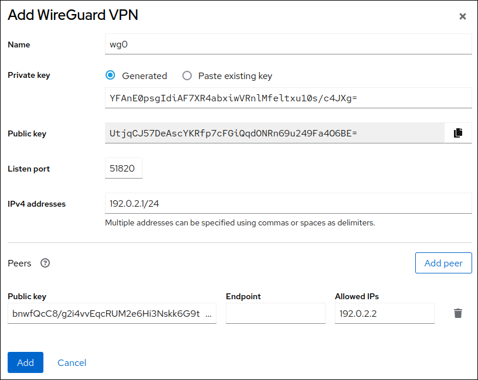
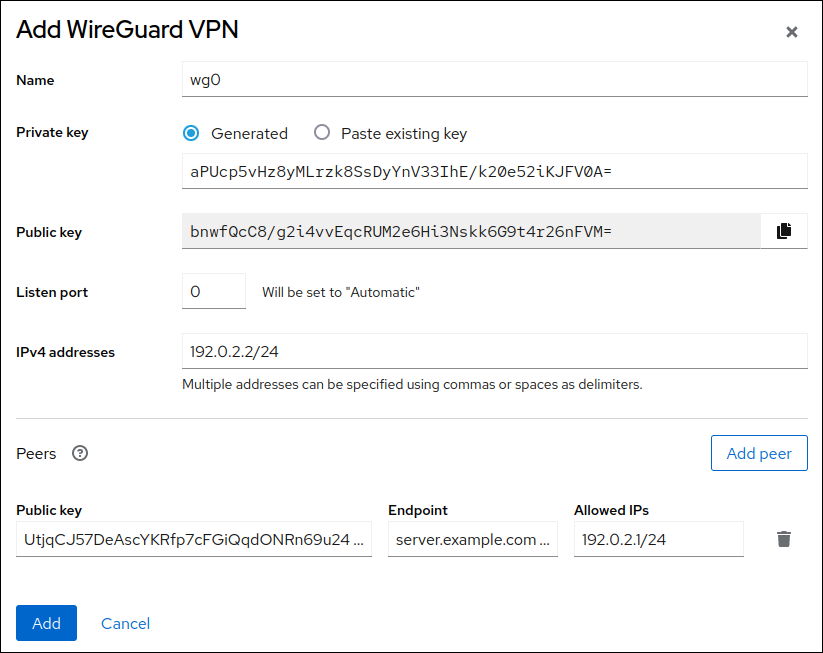
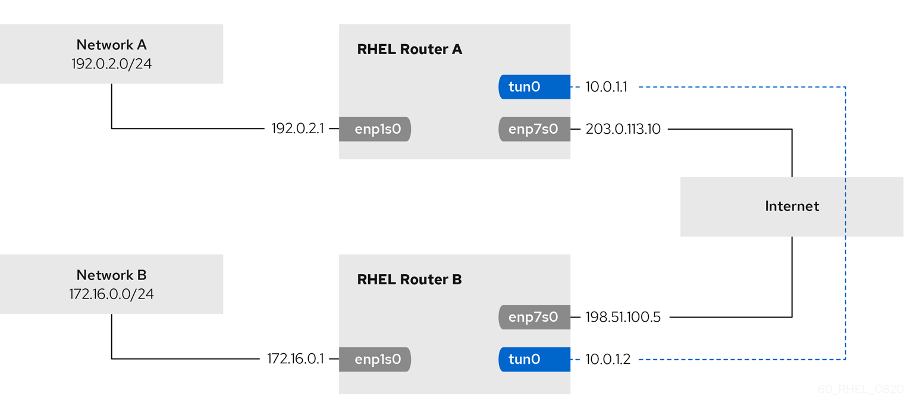
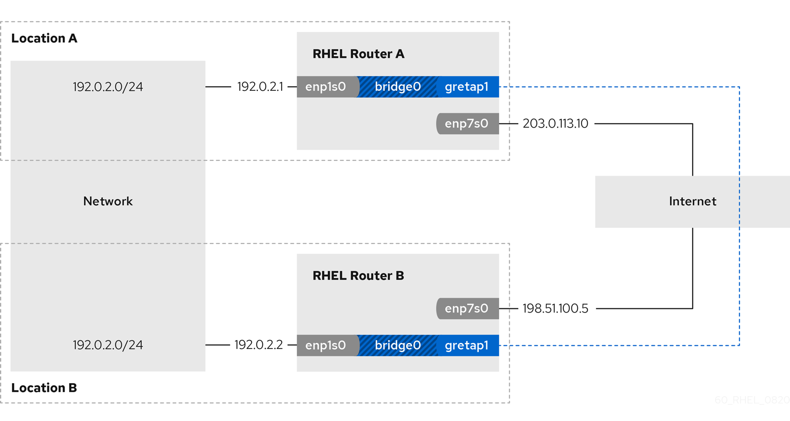
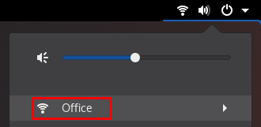
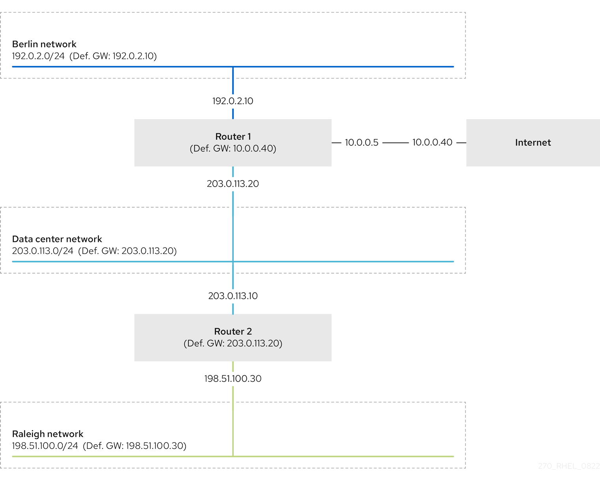
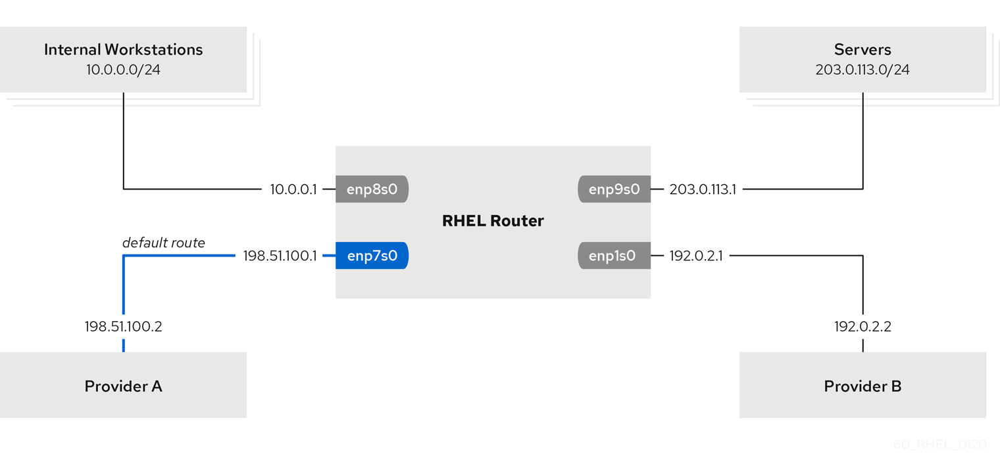
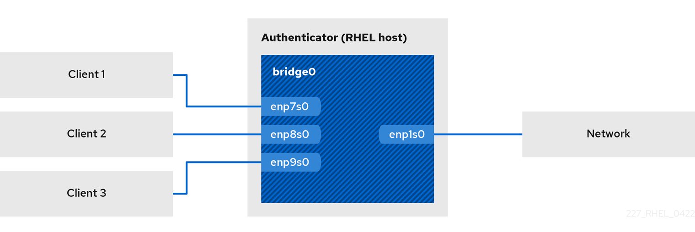

# Configuring and managing networking

* * *

Red Hat Enterprise Linux 10

## Managing network interfaces and advanced networking features

Red Hat Customer Content Services

[Legal Notice](#idm140202113317408)

**Abstract**

Using the networking capabilities of Red Hat Enterprise Linux (RHEL), you can configure your host to meet your organization's network and security requirements. This includes different network types and advanced networking features, such as policy-based routing and Multipath TCP (MPTCP).

* * *

<h2 id="providing-feedback-on-red-hat-documentation">Providing feedback on Red Hat documentation</h2>

We are committed to providing high-quality documentation and value your feedback. To help us improve, you can submit suggestions or report errors through the Red Hat Jira tracking system.

**Procedure**

1. Log in to the [Jira](https://issues.redhat.com/projects/RHELDOCS/issues) website.
   
   If you do not have an account, select the option to create one.
2. Click **Create** in the top navigation bar.
3. Enter a descriptive title in the **Summary** field.
4. Enter your suggestion for improvement in the **Description** field. Include links to the relevant parts of the documentation.
5. Click **Create** at the bottom of the dialogue.

<h2 id="implementing-consistent-network-interface-naming">Chapter 1. Implementing consistent network interface naming</h2>

The `udev` device manager implements consistent device naming in Red Hat Enterprise Linux. The device manager supports different naming schemes and, by default, assigns fixed names based on firmware, topology, and location information.

Without consistent device naming, the Linux kernel assigns names to network interfaces by combining a fixed prefix and an index. The index increases as the kernel initializes the network devices. For example, `eth0` represents the first Ethernet device being probed on start-up. If you add another network interface controller to the system, the assignment of the kernel device names is no longer fixed because, after a reboot, the devices can initialize in a different order. In that case, the kernel can name the devices differently.

To solve this problem, `udev` assigns consistent device names. This has the following advantages:

- Device names are stable across reboots.
- Device names stay fixed even if you add or remove hardware.
- Defective hardware can be seamlessly replaced.
- The network naming is stateless and does not require explicit configuration files.

Warning

Generally, Red Hat does not support systems where consistent device naming is disabled. For exceptions, see the Red Hat Knowledgebase solution [Is it safe to set net.ifnames=0](https://access.redhat.com/solutions/2435891).

<h3 id="how-the-udev-device-manager-renames-network-interfaces">1.1. How the udev device manager renames network interfaces</h3>

The `udev` device manager processes a set of rules to implement a consistent naming scheme for network interfaces.

Order of rule files:

1. Only on Dell systems: `/usr/lib/udev/rules.d/71-biosdevname.rules`
   
   This file exists only if the `biosdevname` package is installed, and the rules file defines that the `biosdevname` utility renames the interface according to its naming policy, if it was not renamed in the previous step.
   
   Note
   
   Install and use `biosdevname` only on Dell systems.
2. `/usr/lib/udev/rules.d/75-net-description.rules`
   
   This file defines how `udev` examines the network interface and sets the properties in `udev`-internal variables. These variables are then processed in the next step by the `/usr/lib/udev/rules.d/80-net-setup-link.rules` file. Some of the properties can be undefined.
3. `/usr/lib/udev/rules.d/80-net-setup-link.rules`
   
   This file calls the `net_setup_link` builtin of the `udev` service, and `udev` renames the interface based on the order of the policies in the `NamePolicy` parameter in the `/usr/lib/systemd/network/99-default.link` file. For further details, see [Network interface naming policies](#network-interface-naming-policies "1.2. Network interface naming policies").
   
   If none of the policies applies, `udev` does not rename the interface.

**Additional resources**

- [Why are systemd network interface names different between major RHEL versions (Red Hat Knowledgebase)](https://access.redhat.com/solutions/5984311)

<h3 id="network-interface-naming-policies">1.2. Network interface naming policies</h3>

By default, the `udev` device manager uses the `/usr/lib/systemd/network/99-default.link` file to determine how it renames interfaces. The `NamePolicy` parameter in this file defines which naming policies `udev` applies and in what order.

Default order:

```
NamePolicy=keep kernel database onboard slot path
```

```plaintext
NamePolicy=keep kernel database onboard slot path
```

The following table describes the different actions of `udev` based on which policy matches first as specified by the `NamePolicy` parameter:

| Policy   | Description                                                                                                                                                                                                       | Example name      |
|:---------|:------------------------------------------------------------------------------------------------------------------------------------------------------------------------------------------------------------------|:------------------|
| keep     | If the device already has a name that was assigned in the user space, `udev` does not rename this device. For example, this is the case if the name was assigned during device creation or by a rename operation. |                   |
| kernel   | If the kernel indicates that a device name is predictable, `udev` does not rename this device.                                                                                                                    | `lo`              |
| database | This policy assigns names based on mappings in the `udev` hardware database. For details, see the `hwdb(7)` man page.                                                                                             | `idrac`           |
| onboard  | Device names incorporate firmware or BIOS-provided index numbers for onboard devices.                                                                                                                             | `eno1`            |
| slot     | Device names incorporate firmware or BIOS-provided PCI Express (PCIe) hot-plug slot-index numbers.                                                                                                                | `ens1`            |
| path     | Device names incorporate the physical location of the connector of the hardware.                                                                                                                                  | `enp1s0`          |
| mac      | Device names incorporate the MAC address. By default, Red Hat Enterprise Linux does not use this policy, but administrators can enable it.                                                                        | `enx525400d5e0fb` |

**Additional resources**

- [How the `udev` device manager renames network interfaces](#how-the-udev-device-manager-renames-network-interfaces "1.1. How the udev device manager renames network interfaces")

<h3 id="network-interface-naming-schemes">1.3. Network interface naming schemes</h3>

The `udev` device manager uses certain stable interface attributes that device drivers provide to generate consistent device names.

If a new `udev` version changes how the service creates names for certain interfaces, Red Hat adds a new scheme version and documents the details in the `systemd.net-naming-scheme(7)` man page on your system. By default, Red Hat Enterprise Linux (RHEL) 10 uses the `rhel-10.0` naming scheme, even if you install or update to a later minor version of RHEL.

Note

On RHEL 10 you can also use all `rhel-8.*` and `rhel-9.*` naming schemes.

If you want to use a scheme other than the default, you can [switch the network interface naming scheme](#switching-to-a-different-network-interface-naming-scheme "1.4. Switching to a different network interface naming scheme").

For further details about the naming schemes for different device types and platforms, see the `systemd.net-naming-scheme(7)` man page on your system.

<h3 id="switching-to-a-different-network-interface-naming-scheme">1.4. Switching to a different network interface naming scheme</h3>

By default, RHEL 10 uses the `rhel-10.0` naming scheme, even if you install or update to a later minor version of RHEL. While the default naming scheme fits in most scenarios, there might be reasons to switch to a different scheme version.

Examples when you must change the naming scheme:

- A new scheme can help to better identify a device if it adds additional attributes, such as a slot number, to an interface name.
- An new scheme can prevent `udev` from falling back to the kernel-assigned device names (`eth*`). This happens if the driver does not provide enough unique attributes for two or more interfaces to generate unique names for them.

**Prerequisites**

- You have access to the console of the server.

**Procedure**

1. List the network interfaces:
   
   ```
   ip link show
   2: eno1: <BROADCAST,MULTICAST,UP,LOWER_UP> mtu 1500 qdisc fq_codel state UP mode DEFAULT group default qlen 1000
       link/ether 00:00:5e:00:53:1a brd ff:ff:ff:ff:ff:ff
   ...
   ```
   
   ```plaintext
   # ip link show
   2: eno1: <BROADCAST,MULTICAST,UP,LOWER_UP> mtu 1500 qdisc fq_codel state UP mode DEFAULT group default qlen 1000
       link/ether 00:00:5e:00:53:1a brd ff:ff:ff:ff:ff:ff
   ...
   ```
   
   Record the MAC addresses of the interfaces.
2. Optional: Display the `ID_NET_NAMING_SCHEME` property of a network interface to identify the naming scheme that RHEL currently uses:
   
   ```
   udevadm info --query=property --property=ID_NET_NAMING_SCHEME /sys/class/net/eno1
   ID_NET_NAMING_SCHEME=rhel-10.0
   ```
   
   ```plaintext
   # udevadm info --query=property --property=ID_NET_NAMING_SCHEME /sys/class/net/eno1
   ID_NET_NAMING_SCHEME=rhel-10.0
   ```
   
   Note that the property is not available on the `lo` loopback device.
3. Append the `net.naming-scheme=<scheme>` option to the command line of all installed kernels, for example:
   
   ```
   grubby --update-kernel=ALL --args=net.naming-scheme=rhel-10.1
   ```
   
   ```plaintext
   # grubby --update-kernel=ALL --args=net.naming-scheme=rhel-10.1
   ```
4. Reboot the system.
   
   ```
   reboot
   ```
   
   ```plaintext
   # reboot
   ```
5. Based on the MAC addresses you recorded, identify the new names of network interfaces that have changed due to the different naming scheme:
   
   ```
   ip link show
   2: eno1np0: <BROADCAST,MULTICAST,UP,LOWER_UP> mtu 1500 qdisc fq_codel state UP mode DEFAULT group default qlen 1000
       link/ether 00:00:5e:00:53:1a brd ff:ff:ff:ff:ff:ff
   ...
   ```
   
   ```plaintext
   # ip link show
   2: eno1np0: <BROADCAST,MULTICAST,UP,LOWER_UP> mtu 1500 qdisc fq_codel state UP mode DEFAULT group default qlen 1000
       link/ether 00:00:5e:00:53:1a brd ff:ff:ff:ff:ff:ff
   ...
   ```
   
   After switching the scheme, `udev` names the device with the specified MAC address `eno1np0`, whereas it was named `eno1` before.
6. Identify which NetworkManager connection profile uses an interface with the previous name:
   
   ```
   nmcli -f device,name connection show
   DEVICE  NAME
   eno1  example_profile
   ...
   ```
   
   ```plaintext
   # nmcli -f device,name connection show
   DEVICE  NAME
   eno1  example_profile
   ...
   ```
7. Set the `connection.interface-name` property in the connection profile to the new interface name:
   
   ```
   nmcli connection modify example_profile connection.interface-name "eno1np0"
   ```
   
   ```plaintext
   # nmcli connection modify example_profile connection.interface-name "eno1np0"
   ```
8. Reactivate the connection profile:
   
   ```
   nmcli connection up example_profile
   ```
   
   ```plaintext
   # nmcli connection up example_profile
   ```

**Verification**

- Identify the naming scheme that RHEL now uses by displaying the `ID_NET_NAMING_SCHEME` property of a network interface:
  
  ```
  udevadm info --query=property --property=ID_NET_NAMING_SCHEME /sys/class/net/eno1np0
  ID_NET_NAMING_SCHEME=_rhel-10.1
  ```
  
  ```plaintext
  # udevadm info --query=property --property=ID_NET_NAMING_SCHEME /sys/class/net/eno1np0
  ID_NET_NAMING_SCHEME=_rhel-10.1
  ```

**Additional resources**

- [Network interface naming schemes](#network-interface-naming-schemes "1.3. Network interface naming schemes")

<h3 id="customizing-the-prefix-for-ethernet-interfaces-during-installation">1.5. Customizing the prefix for Ethernet interfaces during installation</h3>

If you do not want to use the default device-naming policy for Ethernet interfaces, you can set a custom device prefix during the Red Hat Enterprise Linux (RHEL) installation.

Important

Red Hat supports systems with customized Ethernet prefixes only if you set the prefix during the RHEL installation. Using the `prefixdevname` utility on already deployed systems is not supported.

If you set a device prefix during the installation, the `udev` service uses the `<prefix><index>` format for Ethernet interfaces after the installation. For example, if you set the prefix `net`, the service assigns the names `net0`, `net1`, and so on to the Ethernet interfaces.

The `udev` service appends the index to the custom prefix, and preserves the index values of known Ethernet interfaces. If you add an interface, `udev` assigns an index value that is one greater than the previously-assigned index value to the new interface.

**Prerequisites**

- The prefix consists of ASCII characters.
- The prefix is an alphanumeric string.
- The prefix is shorter than 16 characters.
- The prefix does not conflict with any other well-known network interface prefix, such as `eth`, `eno`, `ens`, and `em`.

**Procedure**

1. Boot the Red Hat Enterprise Linux installation media.
2. In the boot manager, follow these steps:
   
   1. Select the **Install Red Hat Enterprise Linux *&lt;version&gt;*** entry.
   2. Press `Tab` to edit the entry.
   3. Append `net.ifnames.prefix=<prefix>` to the kernel options.
   4. Press `Enter` to start the installation program.
3. Install Red Hat Enterprise Linux.

**Verification**

- To verify the interface names, display the network interfaces:
  
  ```
  ip link show
  ...
  2: net0: <BROADCAST,MULTICAST,UP,LOWER_UP> mtu 1500 qdisc fq_codel state UP mode DEFAULT group default qlen 1000
      link/ether 00:00:5e:00:53:1a brd ff:ff:ff:ff:ff:ff
  ...
  ```
  
  ```plaintext
  # ip link show
  ...
  2: net0: <BROADCAST,MULTICAST,UP,LOWER_UP> mtu 1500 qdisc fq_codel state UP mode DEFAULT group default qlen 1000
      link/ether 00:00:5e:00:53:1a brd ff:ff:ff:ff:ff:ff
  ...
  ```

<h3 id="configuring-user-defined-network-interface-names-by-using-udev-rules">1.6. Configuring user-defined network interface names by using udev rules</h3>

You can use `udev` rules to implement custom network interface names that reflect your organization’s requirements.

**Procedure**

01. Identify the network interface that you want to rename:
    
    ```
    ip link show
    ...
    enp1s0: <BROADCAST,MULTICAST,UP,LOWER_UP> mtu 1500 qdisc fq_codel state UP mode DEFAULT group default qlen 1000
        link/ether 00:00:5e:00:53:1a brd ff:ff:ff:ff:ff:ff
    ...
    ```
    
    ```plaintext
    # ip link show
    ...
    enp1s0: <BROADCAST,MULTICAST,UP,LOWER_UP> mtu 1500 qdisc fq_codel state UP mode DEFAULT group default qlen 1000
        link/ether 00:00:5e:00:53:1a brd ff:ff:ff:ff:ff:ff
    ...
    ```
    
    Record the MAC address of the interface.
02. Display the device type ID of the interface:
    
    ```
    cat /sys/class/net/enp1s0/type
    1
    ```
    
    ```plaintext
    # cat /sys/class/net/enp1s0/type
    1
    ```
03. Create the `/etc/udev/rules.d/70-persistent-net.rules` file, and add a rule for each interface that you want to rename:
    
    ```
    SUBSYSTEM=="net",ACTION=="add",ATTR{address}=="<MAC_address>",ATTR{type}=="<device_type_id>",NAME="<new_interface_name>"
    ```
    
    ```plaintext
    SUBSYSTEM=="net",ACTION=="add",ATTR{address}=="<MAC_address>",ATTR{type}=="<device_type_id>",NAME="<new_interface_name>"
    ```
    
    Important
    
    Use only `70-persistent-net.rules` as a file name if you require consistent device names during the boot process. The `dracut` utility adds a file with this name to the `initrd` image if you regenerate the RAM disk image.
    
    For example, use the following rule to rename the interface with MAC address `00:00:5e:00:53:1a` to `provider0`:
    
    ```
    SUBSYSTEM=="net",ACTION=="add",ATTR{address}=="00:00:5e:00:53:1a",ATTR{type}=="1",NAME="provider0"
    ```
    
    ```plaintext
    SUBSYSTEM=="net",ACTION=="add",ATTR{address}=="00:00:5e:00:53:1a",ATTR{type}=="1",NAME="provider0"
    ```
04. Optional: Regenerate the `initrd` RAM disk image:
    
    ```
    dracut -f
    ```
    
    ```plaintext
    # dracut -f
    ```
    
    You require this step only if you need networking capabilities in the RAM disk. For example, this is the case if the root file system is stored on a network device, such as iSCSI.
05. Identify which NetworkManager connection profile uses the interface that you want to rename:
    
    ```
    nmcli -f device,name connection show
    DEVICE  NAME
    enp1s0  example_profile
    ...
    ```
    
    ```plaintext
    # nmcli -f device,name connection show
    DEVICE  NAME
    enp1s0  example_profile
    ...
    ```
06. Unset the `connection.interface-name` property in the connection profile:
    
    ```
    nmcli connection modify example_profile connection.interface-name ""
    ```
    
    ```plaintext
    # nmcli connection modify example_profile connection.interface-name ""
    ```
07. Temporarily, configure the connection profile to match both the new and the previous interface name:
    
    ```
    nmcli connection modify example_profile match.interface-name "provider0 enp1s0"
    ```
    
    ```plaintext
    # nmcli connection modify example_profile match.interface-name "provider0 enp1s0"
    ```
08. Reboot the system:
    
    ```
    reboot
    ```
    
    ```plaintext
    # reboot
    ```
09. Verify that the device with the MAC address that you specified in the link file has been renamed to `provider0`:
    
    ```
    ip link show
    provider0: <BROADCAST,MULTICAST,UP,LOWER_UP> mtu 1500 qdisc mq state UP mode DEFAULT group default qlen 1000
        link/ether 00:00:5e:00:53:1a brd ff:ff:ff:ff:ff:ff
    ...
    ```
    
    ```plaintext
    # ip link show
    provider0: <BROADCAST,MULTICAST,UP,LOWER_UP> mtu 1500 qdisc mq state UP mode DEFAULT group default qlen 1000
        link/ether 00:00:5e:00:53:1a brd ff:ff:ff:ff:ff:ff
    ...
    ```
10. Configure the connection profile to match only the new interface name:
    
    ```
    nmcli connection modify example_profile match.interface-name "provider0"
    ```
    
    ```plaintext
    # nmcli connection modify example_profile match.interface-name "provider0"
    ```
    
    You have now removed the old interface name from the connection profile.
11. Reactivate the connection profile:
    
    ```
    nmcli connection up example_profile
    ```
    
    ```plaintext
    # nmcli connection up example_profile
    ```

<h3 id="configuring-user-defined-network-interface-names-by-using-systemd-link-files">1.7. Configuring user-defined network interface names by using systemd link files</h3>

You can use `systemd` link files to implement custom network interface names that reflect your organization’s requirements.

**Prerequisites**

- NetworkManager does not manage this interface.

**Procedure**

01. Identify the network interface that you want to rename:
    
    ```
    ip link show
    ...
    enp1s0: <BROADCAST,MULTICAST,UP,LOWER_UP> mtu 1500 qdisc fq_codel state UP mode DEFAULT group default qlen 1000
        link/ether 00:00:5e:00:53:1a brd ff:ff:ff:ff:ff:ff
    ...
    ```
    
    ```plaintext
    # ip link show
    ...
    enp1s0: <BROADCAST,MULTICAST,UP,LOWER_UP> mtu 1500 qdisc fq_codel state UP mode DEFAULT group default qlen 1000
        link/ether 00:00:5e:00:53:1a brd ff:ff:ff:ff:ff:ff
    ...
    ```
    
    Record the MAC address of the interface.
02. If it does not already exist, create the `/etc/systemd/network/` directory:
    
    ```
    mkdir -p /etc/systemd/network/
    ```
    
    ```plaintext
    # mkdir -p /etc/systemd/network/
    ```
03. For each interface that you want to rename, create a `70-*.link` file in the `/etc/systemd/network/` directory with the following content:
    
    ```
    [Match]
    MACAddress=<MAC_address>
    
    [Link]
    Name=<new_interface_name>
    ```
    
    ```plaintext
    [Match]
    MACAddress=<MAC_address>
    
    [Link]
    Name=<new_interface_name>
    ```
    
    Important
    
    Use a file name with a `70-` prefix to keep the file names consistent with the `udev` rules-based solution.
    
    For example, create the `/etc/systemd/network/70-provider0.link` file with the following content to rename the interface with MAC address `00:00:5e:00:53:1a` to `provider0`:
    
    ```
    [Match]
    MACAddress=00:00:5e:00:53:1a
    
    [Link]
    Name=provider0
    ```
    
    ```plaintext
    [Match]
    MACAddress=00:00:5e:00:53:1a
    
    [Link]
    Name=provider0
    ```
04. Optional: Regenerate the `initrd` RAM disk image:
    
    ```
    dracut -f
    ```
    
    ```plaintext
    # dracut -f
    ```
    
    You require this step only if you need networking capabilities in the RAM disk. For example, this is the case if the root file system is stored on a network device, such as iSCSI.
05. Identify which NetworkManager connection profile uses the interface that you want to rename:
    
    ```
    nmcli -f device,name connection show
    DEVICE  NAME
    enp1s0  example_profile
    ...
    ```
    
    ```plaintext
    # nmcli -f device,name connection show
    DEVICE  NAME
    enp1s0  example_profile
    ...
    ```
06. Unset the `connection.interface-name` property in the connection profile:
    
    ```
    nmcli connection modify example_profile connection.interface-name ""
    ```
    
    ```plaintext
    # nmcli connection modify example_profile connection.interface-name ""
    ```
07. Temporarily, configure the connection profile to match both the new and the previous interface name:
    
    ```
    nmcli connection modify example_profile match.interface-name "provider0 enp1s0"
    ```
    
    ```plaintext
    # nmcli connection modify example_profile match.interface-name "provider0 enp1s0"
    ```
08. Reboot the system:
    
    ```
    reboot
    ```
    
    ```plaintext
    # reboot
    ```
09. Verify that the device with the MAC address that you specified in the link file has been renamed to `provider0`:
    
    ```
    ip link show
    provider0: <BROADCAST,MULTICAST,UP,LOWER_UP> mtu 1500 qdisc mq state UP mode DEFAULT group default qlen 1000
        link/ether 00:00:5e:00:53:1a brd ff:ff:ff:ff:ff:ff
    ...
    ```
    
    ```plaintext
    # ip link show
    provider0: <BROADCAST,MULTICAST,UP,LOWER_UP> mtu 1500 qdisc mq state UP mode DEFAULT group default qlen 1000
        link/ether 00:00:5e:00:53:1a brd ff:ff:ff:ff:ff:ff
    ...
    ```
10. Configure the connection profile to match only the new interface name:
    
    ```
    nmcli connection modify example_profile match.interface-name "provider0"
    ```
    
    ```plaintext
    # nmcli connection modify example_profile match.interface-name "provider0"
    ```
    
    You have now removed the old interface name from the connection profile.
11. Reactivate the connection profile.
    
    ```
    nmcli connection up example_profile
    ```
    
    ```plaintext
    # nmcli connection up example_profile
    ```

<h3 id="assigning-alternative-names-to-a-network-interface-by-using-systemd-link-files">1.8. Assigning alternative names to a network interface by using systemd link files</h3>

With alternative interface naming, the kernel can assign additional names to network interfaces. You can use these alternative names in the same way as the normal interface names in commands that require a network interface name.

**Prerequisites**

- You must use ASCII characters for the alternative name.
- The alternative name must be shorter than 128 characters.

**Procedure**

1. Display the network interface names and their MAC addresses:
   
   ```
   ip link show
   ...
   enp1s0: <BROADCAST,MULTICAST,UP,LOWER_UP> mtu 1500 qdisc fq_codel state UP mode DEFAULT group default qlen 1000
       link/ether 00:00:5e:00:53:1a brd ff:ff:ff:ff:ff:ff
   ...
   ```
   
   ```plaintext
   # ip link show
   ...
   enp1s0: <BROADCAST,MULTICAST,UP,LOWER_UP> mtu 1500 qdisc fq_codel state UP mode DEFAULT group default qlen 1000
       link/ether 00:00:5e:00:53:1a brd ff:ff:ff:ff:ff:ff
   ...
   ```
   
   Record the MAC address of the interface to which you want to assign an alternative name.
2. If it does not already exist, create the `/etc/systemd/network/` directory:
   
   ```
   mkdir -p /etc/systemd/network/
   ```
   
   ```plaintext
   # mkdir -p /etc/systemd/network/
   ```
3. For each interface that must have an alternative name, create a copy of the `/usr/lib/systemd/network/99-default.link` file with a unique name and `.link` suffix in the `/etc/systemd/network/` directory, for example:
   
   ```
   cp /usr/lib/systemd/network/99-default.link /etc/systemd/network/98-lan.link
   ```
   
   ```plaintext
   # cp /usr/lib/systemd/network/99-default.link /etc/systemd/network/98-lan.link
   ```
4. Modify the file you created in the previous step. Rewrite the `[Match]` section as follows, and append the `AlternativeName` entries to the `[Link]` section:
   
   ```
   [Match]
   MACAddress=<MAC_address>
   
   [Link]
   ...
   AlternativeName=<alternative_interface_name_1>
   AlternativeName=<alternative_interface_name_2>
   AlternativeName=<alternative_interface_name_n>
   ```
   
   ```plaintext
   [Match]
   MACAddress=<MAC_address>
   
   [Link]
   ...
   AlternativeName=<alternative_interface_name_1>
   AlternativeName=<alternative_interface_name_2>
   AlternativeName=<alternative_interface_name_n>
   ```
   
   For example, create the `/etc/systemd/network/70-altname.link` file with the following content to assign `provider` as an alternative name to the interface with MAC address `00:00:5e:00:53:1a`:
   
   ```
   [Match]
   MACAddress=00:00:5e:00:53:1a
   
   [Link]
   NamePolicy=keep kernel database onboard slot path
   AlternativeNamesPolicy=database onboard slot path mac
   MACAddressPolicy=none
   AlternativeName=provider
   ```
   
   ```plaintext
   [Match]
   MACAddress=00:00:5e:00:53:1a
   
   [Link]
   NamePolicy=keep kernel database onboard slot path
   AlternativeNamesPolicy=database onboard slot path mac
   MACAddressPolicy=none
   AlternativeName=provider
   ```
5. Regenerate the `initrd` RAM disk image:
   
   ```
   dracut -f
   ```
   
   ```plaintext
   # dracut -f
   ```
6. Reboot the system:
   
   ```
   reboot
   ```
   
   ```plaintext
   # reboot
   ```

**Verification**

- Use the alternative interface name. For example, display the IP address settings of the device with the alternative name `provider`:
  
  ```
  ip address show provider
  2: enp1s0: <BROADCAST,MULTICAST,UP,LOWER_UP> mtu 1500 qdisc fq_codel state UP group default qlen 1000
      link/ether 00:00:5e:00:53:1a brd ff:ff:ff:ff:ff:ff
      altname provider
      ...
  ```
  
  ```plaintext
  # ip address show provider
  2: enp1s0: <BROADCAST,MULTICAST,UP,LOWER_UP> mtu 1500 qdisc fq_codel state UP group default qlen 1000
      link/ether 00:00:5e:00:53:1a brd ff:ff:ff:ff:ff:ff
      altname provider
      ...
  ```

**Additional resources**

- [What is AlternativeNamesPolicy in Interface naming scheme? (Red Hat Knowledgebase)](https://access.redhat.com/solutions/6964829)

<h2 id="configuring-an-ethernet-connection">Chapter 2. Configuring an Ethernet connection</h2>

NetworkManager creates a connection profile for each Ethernet adapter that is installed in a host. By default, this profile uses DHCP for both IPv4 and IPv6 connections.

Modify the automatically-created profile or add a new one in the following cases:

- The network requires custom settings, such as a static IP address configuration.
- You require multiple profiles because the host roams among different networks.

Red Hat Enterprise Linux provides administrators different options to configure Ethernet connections. For example:

- Use `nmcli` to configure connections on the command line.
- Use `nmtui` to configure connections in a text-based user interface.
- Use the GNOME Settings menu to configure connections in a graphical interface.
- Use `nmstatectl` to configure connections through the Nmstate API.
- Use RHEL system roles to automate the configuration of connections on one or multiple hosts.

Note

If you want to manually configure Ethernet connections on hosts running in the Microsoft Azure cloud, disable the `cloud-init` service or configure it to ignore the network settings retrieved from the cloud environment. Otherwise, `cloud-init` will override on the next reboot the network settings that you have manually configured.

<h3 id="configuring-an-ethernet-connection-by-using-nmcli">2.1. Configuring an Ethernet connection by using nmcli</h3>

If you connect a host to the network over Ethernet, you can manage the connection’s settings on the command line by using the `nmcli` utility.

**Prerequisites**

- A physical or virtual Ethernet Network Interface Controller (NIC) exists in the server’s configuration.

**Procedure**

1. List the NetworkManager connection profiles:
   
   ```
   nmcli connection show
   NAME                UUID                                  TYPE      DEVICE
   Wired connection 1  a5eb6490-cc20-3668-81f8-0314a27f3f75  ethernet  enp1s0
   ```
   
   ```plaintext
   # nmcli connection show
   NAME                UUID                                  TYPE      DEVICE
   Wired connection 1  a5eb6490-cc20-3668-81f8-0314a27f3f75  ethernet  enp1s0
   ```
   
   By default, NetworkManager creates a profile for each NIC in the host. If you plan to connect this NIC only to a specific network, adapt the automatically-created profile. If you plan to connect this NIC to networks with different settings, create individual profiles for each network.
2. If you want to create an additional connection profile, enter:
   
   ```
   nmcli connection add con-name <connection-name> ifname <device-name> type ethernet
   ```
   
   ```plaintext
   # nmcli connection add con-name <connection-name> ifname <device-name> type ethernet
   ```
   
   Skip this step to modify an existing profile.
3. Optional: Rename the connection profile:
   
   ```
   nmcli connection modify "Wired connection 1" connection.id "Internal-LAN"
   ```
   
   ```plaintext
   # nmcli connection modify "Wired connection 1" connection.id "Internal-LAN"
   ```
   
   On hosts with multiple profiles, a meaningful name makes it easier to identify the purpose of a profile.
4. Display the current settings of the connection profile:
   
   ```
   nmcli connection show Internal-LAN
   ...
   connection.interface-name:     enp1s0
   connection.autoconnect:        yes
   ipv4.method:                   auto
   ipv6.method:                   auto
   ...
   ```
   
   ```plaintext
   # nmcli connection show Internal-LAN
   ...
   connection.interface-name:     enp1s0
   connection.autoconnect:        yes
   ipv4.method:                   auto
   ipv6.method:                   auto
   ...
   ```
5. Configure the IPv4 settings:
   
   - To use DHCP, enter:
     
     ```
     nmcli connection modify Internal-LAN ipv4.method auto
     ```
     
     ```plaintext
     # nmcli connection modify Internal-LAN ipv4.method auto
     ```
     
     Skip this step if `ipv4.method` is already set to `auto` (default).
   - To set a static IPv4 address, network mask, default gateway, DNS servers, and search domain, enter:
     
     ```
     nmcli connection modify Internal-LAN ipv4.method manual ipv4.addresses 192.0.2.1/24 ipv4.gateway 192.0.2.254 ipv4.dns 192.0.2.200 ipv4.dns-search example.com
     ```
     
     ```plaintext
     # nmcli connection modify Internal-LAN ipv4.method manual ipv4.addresses 192.0.2.1/24 ipv4.gateway 192.0.2.254 ipv4.dns 192.0.2.200 ipv4.dns-search example.com
     ```
6. Configure the IPv6 settings:
   
   - To use stateless address autoconfiguration (SLAAC), enter:
     
     ```
     nmcli connection modify Internal-LAN ipv6.method auto
     ```
     
     ```plaintext
     # nmcli connection modify Internal-LAN ipv6.method auto
     ```
     
     Skip this step if `ipv6.method` is already set to `auto` (default).
   - To set a static IPv6 address, network mask, default gateway, DNS servers, and search domain, enter:
     
     ```
     nmcli connection modify Internal-LAN ipv6.method manual ipv6.addresses 2001:db8:1::fffe/64 ipv6.gateway 2001:db8:1::fffe ipv6.dns 2001:db8:1::ffbb ipv6.dns-search example.com
     ```
     
     ```plaintext
     # nmcli connection modify Internal-LAN ipv6.method manual ipv6.addresses 2001:db8:1::fffe/64 ipv6.gateway 2001:db8:1::fffe ipv6.dns 2001:db8:1::ffbb ipv6.dns-search example.com
     ```
7. To customize other settings in the profile, use the following command:
   
   ```
   nmcli connection modify <connection-name> <setting> <value>
   ```
   
   ```plaintext
   # nmcli connection modify <connection-name> <setting> <value>
   ```
   
   Enclose values with spaces or semicolons in quotes.
   
   For details about which settings you can modify, see the `nm-settings(5)` man page on your system.
8. Activate the profile:
   
   ```
   nmcli connection up Internal-LAN
   ```
   
   ```plaintext
   # nmcli connection up Internal-LAN
   ```

**Verification**

1. Display the IP settings of the NIC:
   
   ```
   ip address show enp1s0
   2: enp1s0: <BROADCAST,MULTICAST,UP,LOWER_UP> mtu 1500 qdisc fq_codel state UP group default qlen 1000
       link/ether 52:54:00:17:b8:b6 brd ff:ff:ff:ff:ff:ff
       inet 192.0.2.1/24 brd 192.0.2.255 scope global noprefixroute enp1s0
          valid_lft forever preferred_lft forever
       inet6 2001:db8:1::fffe/64 scope global noprefixroute
          valid_lft forever preferred_lft forever
   ```
   
   ```plaintext
   # ip address show enp1s0
   2: enp1s0: <BROADCAST,MULTICAST,UP,LOWER_UP> mtu 1500 qdisc fq_codel state UP group default qlen 1000
       link/ether 52:54:00:17:b8:b6 brd ff:ff:ff:ff:ff:ff
       inet 192.0.2.1/24 brd 192.0.2.255 scope global noprefixroute enp1s0
          valid_lft forever preferred_lft forever
       inet6 2001:db8:1::fffe/64 scope global noprefixroute
          valid_lft forever preferred_lft forever
   ```
2. Display the IPv4 default gateway:
   
   ```
   ip route show default
   default via 192.0.2.254 dev enp1s0 proto static metric 102
   ```
   
   ```plaintext
   # ip route show default
   default via 192.0.2.254 dev enp1s0 proto static metric 102
   ```
3. Display the IPv6 default gateway:
   
   ```
   ip -6 route show default
   default via 2001:db8:1::fffe dev enp1s0 proto static metric 102 pref medium
   ```
   
   ```plaintext
   # ip -6 route show default
   default via 2001:db8:1::fffe dev enp1s0 proto static metric 102 pref medium
   ```
4. Display the DNS settings:
   
   ```
   cat /etc/resolv.conf
   search example.com
   nameserver 192.0.2.200
   nameserver 2001:db8:1::ffbb
   ```
   
   ```plaintext
   # cat /etc/resolv.conf
   search example.com
   nameserver 192.0.2.200
   nameserver 2001:db8:1::ffbb
   ```
   
   If multiple connection profiles are active at the same time, the order of `nameserver` entries depend on the DNS priority values in these profiles and the connection types.
5. Use the `ping` utility to verify that this host can send packets to other hosts:
   
   ```
   ping <host-name-or-IP-address>
   ```
   
   ```plaintext
   # ping <host-name-or-IP-address>
   ```

**Troubleshooting**

- Verify that the network cable is plugged-in to the host and a switch.
- Check whether the link failure exists only on this host or also on other hosts connected to the same switch.
- Verify that the network cable and the network interface are working as expected. Perform hardware diagnosis steps and replace defective cables and network interface cards.
- If the configuration on the disk does not match the configuration on the device, starting or restarting NetworkManager creates an in-memory connection that reflects the configuration of the device. For further details and how to avoid this problem, see the Red Hat Knowledgebase solution [NetworkManager duplicates a connection after restart of NetworkManager service](https://access.redhat.com/solutions/3068421).

<h3 id="configuring-an-ethernet-connection-by-using-nmtui">2.2. Configuring an Ethernet connection by using nmtui</h3>

If you connect a host to an Ethernet network, you can manage the connection’s settings in a text-based user interface. Use the `nmtui` application to create new profiles and to update existing ones on a host without a graphical interface.

Note

In `nmtui`:

- Navigate by using the cursor keys.
- Press a button by selecting it and hitting `Enter`.
- Select and clear checkboxes by using `Space`.
- To return to the previous screen, use `ESC`.

**Prerequisites**

- A physical or virtual Ethernet Network Interface Controller (NIC) exists in the server’s configuration.

**Procedure**

01. If you do not know the network device name you want to use in the connection, display the available devices:
    
    ```
    nmcli device status
    DEVICE     TYPE      STATE                   CONNECTION
    enp1s0     ethernet  unavailable             --
    ...
    ```
    
    ```plaintext
    # nmcli device status
    DEVICE     TYPE      STATE                   CONNECTION
    enp1s0     ethernet  unavailable             --
    ...
    ```
02. Start `nmtui`:
    
    ```
    nmtui
    ```
    
    ```plaintext
    # nmtui
    ```
03. Select **Edit a connection**, and press `Enter`.
04. Choose whether to add a new connection profile or to modify an existing one:
    
    - To create a new profile:
      
      1. Press **Add**.
      2. Select **Ethernet** from the list of network types, and press `Enter`.
    - To modify an existing profile, select the profile from the list, and press `Enter`.
05. Optional: Update the name of the connection profile.
    
    On hosts with multiple profiles, a meaningful name makes it easier to identify the purpose of a profile.
06. If you create a new connection profile, enter the network device name into the **Device** field.
07. Depending on your environment, configure the IP address settings in the `IPv4 configuration` and `IPv6 configuration` areas accordingly. For this, press the button next to these areas, and select:
    
    - **Disabled**, if this connection does not require an IP address.
    - **Automatic**, if a DHCP server dynamically assigns an IP address to this NIC.
    - **Manual**, if the network requires static IP address settings. In this case, you must fill further fields:
      
      1. Press **Show** next to the protocol you want to configure to display additional fields.
      2. Press **Add** next to **Addresses**, and enter the IP address and the subnet mask in Classless Inter-Domain Routing (CIDR) format.
         
         If you do not specify a subnet mask, NetworkManager sets a `/32` subnet mask for IPv4 addresses and `/64` for IPv6 addresses.
      3. Enter the address of the default gateway.
      4. Press **Add** next to **DNS servers**, and enter the DNS server address.
      5. Press **Add** next to **Search domains**, and enter the DNS search domain.
    
    **Figure 2.1. Example of an Ethernet connection with static IP address settings**
    
     
08. Press **OK** to create and automatically activate the new connection.
09. Press **Back** to return to the main menu.
10. Select **Quit**, and press `Enter` to close the `nmtui` application.

**Verification**

1. Display the IP settings of the NIC:
   
   ```
   ip address show enp1s0
   2: enp1s0: <BROADCAST,MULTICAST,UP,LOWER_UP> mtu 1500 qdisc fq_codel state UP group default qlen 1000
       link/ether 52:54:00:17:b8:b6 brd ff:ff:ff:ff:ff:ff
       inet 192.0.2.1/24 brd 192.0.2.255 scope global noprefixroute enp1s0
          valid_lft forever preferred_lft forever
       inet6 2001:db8:1::fffe/64 scope global noprefixroute
          valid_lft forever preferred_lft forever
   ```
   
   ```plaintext
   # ip address show enp1s0
   2: enp1s0: <BROADCAST,MULTICAST,UP,LOWER_UP> mtu 1500 qdisc fq_codel state UP group default qlen 1000
       link/ether 52:54:00:17:b8:b6 brd ff:ff:ff:ff:ff:ff
       inet 192.0.2.1/24 brd 192.0.2.255 scope global noprefixroute enp1s0
          valid_lft forever preferred_lft forever
       inet6 2001:db8:1::fffe/64 scope global noprefixroute
          valid_lft forever preferred_lft forever
   ```
2. Display the IPv4 default gateway:
   
   ```
   ip route show default
   default via 192.0.2.254 dev enp1s0 proto static metric 102
   ```
   
   ```plaintext
   # ip route show default
   default via 192.0.2.254 dev enp1s0 proto static metric 102
   ```
3. Display the IPv6 default gateway:
   
   ```
   ip -6 route show default
   default via 2001:db8:1::fffe dev enp1s0 proto static metric 102 pref medium
   ```
   
   ```plaintext
   # ip -6 route show default
   default via 2001:db8:1::fffe dev enp1s0 proto static metric 102 pref medium
   ```
4. Display the DNS settings:
   
   ```
   cat /etc/resolv.conf
   search example.com
   nameserver 192.0.2.200
   nameserver 2001:db8:1::ffbb
   ```
   
   ```plaintext
   # cat /etc/resolv.conf
   search example.com
   nameserver 192.0.2.200
   nameserver 2001:db8:1::ffbb
   ```
   
   If multiple connection profiles are active at the same time, the order of `nameserver` entries depend on the DNS priority values in these profiles and the connection types.
5. Use the `ping` utility to verify that this host can send packets to other hosts:
   
   ```
   ping <host-name-or-IP-address>
   ```
   
   ```plaintext
   # ping <host-name-or-IP-address>
   ```

**Troubleshooting**

- Verify that the network cable is plugged-in to the host and a switch.
- Check whether the link failure exists only on this host or also on other hosts connected to the same switch.
- Verify that the network cable and the network interface are working as expected. Perform hardware diagnosis steps and replace defective cables and network interface cards.
- If the configuration on the disk does not match the configuration on the device, starting or restarting NetworkManager creates an in-memory connection that reflects the configuration of the device. For further details and how to avoid this problem, see the Red Hat Knowledgebase solution [NetworkManager duplicates a connection after restart of NetworkManager service](https://access.redhat.com/solutions/3068421).

<h3 id="configuring-an-ethernet-connection-by-using-control-center">2.3. Configuring an Ethernet connection by using control-center</h3>

If you connect a host to the network over Ethernet, you can manage the connection’s settings with a graphical interface by using the GNOME Settings menu.

Note that `control-center` does not support as many configuration options as the `nmcli` utility.

**Prerequisites**

- A physical or virtual Ethernet Network Interface Controller (NIC) exists in the server’s configuration.
- GNOME is installed.

**Procedure**

1. Press the `Super` key, enter `Settings`, and press `Enter`.
2. Select **Network** in the navigation on the left.
3. Choose whether to add a new connection profile or to modify an existing one:
   
   - To create a new profile, click the + button next to the **Ethernet** entry.
   - To modify an existing profile, click the gear icon next to the profile entry.
4. Optional: On the **Identity** tab, update the name of the connection profile.
   
   On hosts with multiple profiles, a meaningful name makes it easier to identify the purpose of a profile.
5. Depending on your environment, configure the IP address settings on the **IPv4** and **IPv6** tabs accordingly:
   
   - To use DHCP or IPv6 stateless address autoconfiguration (SLAAC), select `Automatic (DHCP)` as method (default).
   - To set a static IP address, network mask, default gateway, DNS servers, and search domain, select `Manual` as method, and fill the fields on the tabs:
     
      
6. Depending on whether you add or modify a connection profile, click the Add or Apply button to save the connection.
   
   The GNOME `control-center` automatically activates the connection.

**Verification**

1. Display the IP settings of the NIC:
   
   ```
   ip address show enp1s0
   2: enp1s0: <BROADCAST,MULTICAST,UP,LOWER_UP> mtu 1500 qdisc fq_codel state UP group default qlen 1000
       link/ether 52:54:00:17:b8:b6 brd ff:ff:ff:ff:ff:ff
       inet 192.0.2.1/24 brd 192.0.2.255 scope global noprefixroute enp1s0
          valid_lft forever preferred_lft forever
       inet6 2001:db8:1::fffe/64 scope global noprefixroute
          valid_lft forever preferred_lft forever
   ```
   
   ```plaintext
   # ip address show enp1s0
   2: enp1s0: <BROADCAST,MULTICAST,UP,LOWER_UP> mtu 1500 qdisc fq_codel state UP group default qlen 1000
       link/ether 52:54:00:17:b8:b6 brd ff:ff:ff:ff:ff:ff
       inet 192.0.2.1/24 brd 192.0.2.255 scope global noprefixroute enp1s0
          valid_lft forever preferred_lft forever
       inet6 2001:db8:1::fffe/64 scope global noprefixroute
          valid_lft forever preferred_lft forever
   ```
2. Display the IPv4 default gateway:
   
   ```
   ip route show default
   default via 192.0.2.254 dev enp1s0 proto static metric 102
   ```
   
   ```plaintext
   # ip route show default
   default via 192.0.2.254 dev enp1s0 proto static metric 102
   ```
3. Display the IPv6 default gateway:
   
   ```
   ip -6 route show default
   default via 2001:db8:1::fffe dev enp1s0 proto static metric 102 pref medium
   ```
   
   ```plaintext
   # ip -6 route show default
   default via 2001:db8:1::fffe dev enp1s0 proto static metric 102 pref medium
   ```
4. Display the DNS settings:
   
   ```
   cat /etc/resolv.conf
   search example.com
   nameserver 192.0.2.200
   nameserver 2001:db8:1::ffbb
   ```
   
   ```plaintext
   # cat /etc/resolv.conf
   search example.com
   nameserver 192.0.2.200
   nameserver 2001:db8:1::ffbb
   ```
   
   If multiple connection profiles are active at the same time, the order of `nameserver` entries depend on the DNS priority values in these profiles and the connection types.
5. Use the `ping` utility to verify that this host can send packets to other hosts:
   
   ```
   ping <host-name-or-IP-address>
   ```
   
   ```plaintext
   # ping <host-name-or-IP-address>
   ```

**Troubleshooting steps**

- Verify that the network cable is plugged-in to the host and a switch.
- Check whether the link failure exists only on this host or also on other hosts connected to the same switch.
- Verify that the network cable and the network interface are working as expected. Perform hardware diagnosis steps and replace defective cables and network interface cards.
- If the configuration on the disk does not match the configuration on the device, starting or restarting NetworkManager creates an in-memory connection that reflects the configuration of the device. For further details and how to avoid this problem, see the Red Hat Knowledgebase solution [NetworkManager duplicates a connection after restart of NetworkManager service](https://access.redhat.com/solutions/3068421).

<h3 id="configuring-an-ethernet-connection-with-a-static-ip-address-by-using-nmstatectl-with-an-interface-name">2.4. Configuring an Ethernet connection with a static IP address by using nmstatectl with an interface name</h3>

You can use the declarative Nmstate API to configure an Ethernet connection with static IP addresses, gateways, and DNS settings, and assign them to a specified interface name. Nmstate ensures that the result matches the configuration file or rolls back the changes.

**Prerequisites**

- A physical or virtual Ethernet Network Interface Controller (NIC) exists in the server’s configuration.
- The `nmstate` package is installed.

**Procedure**

1. Create a YAML file, for example `~/create-ethernet-profile.yml`, with the following content:
   
   ```
   ---
   interfaces:
   - name: enp1s0
     type: ethernet
     state: up
     ipv4:
       enabled: true
       address:
       - ip: 192.0.2.1
         prefix-length: 24
       dhcp: false
     ipv6:
       enabled: true
       address:
       - ip: 2001:db8:1::1
         prefix-length: 64
       autoconf: false
       dhcp: false
   routes:
     config:
     - destination: 0.0.0.0/0
       next-hop-address: 192.0.2.254
       next-hop-interface: enp1s0
     - destination: ::/0
       next-hop-address: 2001:db8:1::fffe
       next-hop-interface: enp1s0
   dns-resolver:
     config:
       search:
       - example.com
       server:
       - 192.0.2.200
       - 2001:db8:1::ffbb
   ```
   
   ```yaml
   ---
   interfaces:
   - name: enp1s0
     type: ethernet
     state: up
     ipv4:
       enabled: true
       address:
       - ip: 192.0.2.1
         prefix-length: 24
       dhcp: false
     ipv6:
       enabled: true
       address:
       - ip: 2001:db8:1::1
         prefix-length: 64
       autoconf: false
       dhcp: false
   routes:
     config:
     - destination: 0.0.0.0/0
       next-hop-address: 192.0.2.254
       next-hop-interface: enp1s0
     - destination: ::/0
       next-hop-address: 2001:db8:1::fffe
       next-hop-interface: enp1s0
   dns-resolver:
     config:
       search:
       - example.com
       server:
       - 192.0.2.200
       - 2001:db8:1::ffbb
   ```
   
   These settings define an Ethernet connection profile for the `enp1s0` device with the following settings:
   
   - A static IPv4 address - `192.0.2.1` with the `/24` subnet mask
   - A static IPv6 address - `2001:db8:1::1` with the `/64` subnet mask
   - An IPv4 default gateway - `192.0.2.254`
   - An IPv6 default gateway - `2001:db8:1::fffe`
   - An IPv4 DNS server - `192.0.2.200`
   - An IPv6 DNS server - `2001:db8:1::ffbb`
   - A DNS search domain - `example.com`
2. Optional: You can define the `identifier: mac-address` and `mac-address: <mac_address>` properties in the `interfaces` property to identify the network interface card by its MAC address instead of its name, for example:
   
   ```
   ---
   interfaces:
   - name: <profile_name>
     type: ethernet
     identifier: mac-address
     mac-address: <mac_address>
     ...
   ```
   
   ```yaml
   ---
   interfaces:
   - name: <profile_name>
     type: ethernet
     identifier: mac-address
     mac-address: <mac_address>
     ...
   ```
3. Apply the settings to the system:
   
   ```
   nmstatectl apply ~/create-ethernet-profile.yml
   ```
   
   ```plaintext
   # nmstatectl apply ~/create-ethernet-profile.yml
   ```

**Verification**

1. Display the current state in YAML format:
   
   ```
   nmstatectl show enp1s0
   ```
   
   ```plaintext
   # nmstatectl show enp1s0
   ```
2. Display the IP settings of the NIC:
   
   ```
   ip address show enp1s0
   2: enp1s0: <BROADCAST,MULTICAST,UP,LOWER_UP> mtu 1500 qdisc fq_codel state UP group default qlen 1000
       link/ether 52:54:00:17:b8:b6 brd ff:ff:ff:ff:ff:ff
       inet 192.0.2.1/24 brd 192.0.2.255 scope global noprefixroute enp1s0
          valid_lft forever preferred_lft forever
       inet6 2001:db8:1::fffe/64 scope global noprefixroute
          valid_lft forever preferred_lft forever
   ```
   
   ```plaintext
   # ip address show enp1s0
   2: enp1s0: <BROADCAST,MULTICAST,UP,LOWER_UP> mtu 1500 qdisc fq_codel state UP group default qlen 1000
       link/ether 52:54:00:17:b8:b6 brd ff:ff:ff:ff:ff:ff
       inet 192.0.2.1/24 brd 192.0.2.255 scope global noprefixroute enp1s0
          valid_lft forever preferred_lft forever
       inet6 2001:db8:1::fffe/64 scope global noprefixroute
          valid_lft forever preferred_lft forever
   ```
3. Display the IPv4 default gateway:
   
   ```
   ip route show default
   default via 192.0.2.254 dev enp1s0 proto static metric 102
   ```
   
   ```plaintext
   # ip route show default
   default via 192.0.2.254 dev enp1s0 proto static metric 102
   ```
4. Display the IPv6 default gateway:
   
   ```
   ip -6 route show default
   default via 2001:db8:1::fffe dev enp1s0 proto static metric 102 pref medium
   ```
   
   ```plaintext
   # ip -6 route show default
   default via 2001:db8:1::fffe dev enp1s0 proto static metric 102 pref medium
   ```
5. Display the DNS settings:
   
   ```
   cat /etc/resolv.conf
   search example.com
   nameserver 192.0.2.200
   nameserver 2001:db8:1::ffbb
   ```
   
   ```plaintext
   # cat /etc/resolv.conf
   search example.com
   nameserver 192.0.2.200
   nameserver 2001:db8:1::ffbb
   ```
   
   If multiple connection profiles are active at the same time, the order of `nameserver` entries depend on the DNS priority values in these profiles and the connection types.
6. Use the `ping` utility to verify that this host can send packets to other hosts:
   
   ```
   ping <host-name-or-IP-address>
   ```
   
   ```plaintext
   # ping <host-name-or-IP-address>
   ```

<h3 id="configuring-an-ethernet-connection-with-a-static-ip-address-by-using-nmstatectl-with-a-pci-address">2.5. Configuring an Ethernet connection with a static IP address by using nmstatectl with a PCI address</h3>

You can use the declarative Nmstate API to configure an Ethernet connection with static IP addresses, gateways, and DNS settings, and assign them to a device based on its PCI address. Nmstate ensures that the result matches the configuration file or rolls back the changes.

**Prerequisites**

- A physical Ethernet Network Interface Controller (NIC) exists in the server’s configuration.
- You know the PCI address of the device. You can display the PCI address by using the `ethtool -i <interface_name> | grep bus-info` command.
- The `nmstate` package is installed.

**Procedure**

1. Create a YAML file, for example `~/create-ethernet-profile.yml`, with the following content:
   
   ```
   ---
   interfaces:
   - name: <profile_name>
     type: ethernet
     state: up
     identifier: pci-address
     pci-address: 0000:00:14.3
     ipv4:
       enabled: true
       address:
       - ip: 192.0.2.1
         prefix-length: 24
       dhcp: false
     ipv6:
       enabled: true
       address:
       - ip: 2001:db8:1::1
         prefix-length: 64
       autoconf: false
       dhcp: false
   routes:
     config:
     - destination: 0.0.0.0/0
       next-hop-address: 192.0.2.254
       next-hop-interface: <profile_name>
     - destination: ::/0
       next-hop-address: 2001:db8:1::fffe
       next-hop-interface: <profile_name>
   dns-resolver:
     config:
       search:
       - example.com
       server:
       - 192.0.2.200
       - 2001:db8:1::ffbb
   ```
   
   ```yaml
   ---
   interfaces:
   - name: <profile_name>
     type: ethernet
     state: up
     identifier: pci-address
     pci-address: 0000:00:14.3
     ipv4:
       enabled: true
       address:
       - ip: 192.0.2.1
         prefix-length: 24
       dhcp: false
     ipv6:
       enabled: true
       address:
       - ip: 2001:db8:1::1
         prefix-length: 64
       autoconf: false
       dhcp: false
   routes:
     config:
     - destination: 0.0.0.0/0
       next-hop-address: 192.0.2.254
       next-hop-interface: <profile_name>
     - destination: ::/0
       next-hop-address: 2001:db8:1::fffe
       next-hop-interface: <profile_name>
   dns-resolver:
     config:
       search:
       - example.com
       server:
       - 192.0.2.200
       - 2001:db8:1::ffbb
   ```
   
   These settings define an Ethernet connection profile for the device with the ID `0000:00:14.3` with the following settings:
   
   - A static IPv4 address - `192.0.2.1` with the `/24` subnet mask
   - A static IPv6 address - `2001:db8:1::1` with the `/64` subnet mask
   - An IPv4 default gateway - `192.0.2.254`
   - An IPv6 default gateway - `2001:db8:1::fffe`
   - An IPv4 DNS server - `192.0.2.200`
   - An IPv6 DNS server - `2001:db8:1::ffbb`
   - A DNS search domain - `example.com`
2. Apply the settings to the system:
   
   ```
   nmstatectl apply ~/create-ethernet-profile.yml
   ```
   
   ```plaintext
   # nmstatectl apply ~/create-ethernet-profile.yml
   ```

**Verification**

1. Display the current state in YAML format:
   
   ```
   nmstatectl show <interface_name>
   ```
   
   ```plaintext
   # nmstatectl show <interface_name>
   ```
2. Display the IP settings of the NIC:
   
   ```
   ip address show <interface_name>
   2: :<interface_name> <BROADCAST,MULTICAST,UP,LOWER_UP> mtu 1500 qdisc fq_codel state UP group default qlen 1000
       link/ether 52:54:00:17:b8:b6 brd ff:ff:ff:ff:ff:ff
       inet 192.0.2.1/24 brd 192.0.2.255 scope global noprefixroute <interface_name>
          valid_lft forever preferred_lft forever
       inet6 2001:db8:1::fffe/64 scope global noprefixroute
          valid_lft forever preferred_lft forever
   ```
   
   ```plaintext
   # ip address show <interface_name>
   2: :<interface_name> <BROADCAST,MULTICAST,UP,LOWER_UP> mtu 1500 qdisc fq_codel state UP group default qlen 1000
       link/ether 52:54:00:17:b8:b6 brd ff:ff:ff:ff:ff:ff
       inet 192.0.2.1/24 brd 192.0.2.255 scope global noprefixroute <interface_name>
          valid_lft forever preferred_lft forever
       inet6 2001:db8:1::fffe/64 scope global noprefixroute
          valid_lft forever preferred_lft forever
   ```
3. Display the IPv4 default gateway:
   
   ```
   ip route show default
   default via 192.0.2.254 dev <interface_name> proto static metric 102
   ```
   
   ```plaintext
   # ip route show default
   default via 192.0.2.254 dev <interface_name> proto static metric 102
   ```
4. Display the IPv6 default gateway:
   
   ```
   ip -6 route show default
   default via 2001:db8:1::fffe dev <interface_name> proto static metric 102 pref medium
   ```
   
   ```plaintext
   # ip -6 route show default
   default via 2001:db8:1::fffe dev <interface_name> proto static metric 102 pref medium
   ```
5. Display the DNS settings:
   
   ```
   cat /etc/resolv.conf
   search example.com
   nameserver 192.0.2.200
   nameserver 2001:db8:1::ffbb
   ```
   
   ```plaintext
   # cat /etc/resolv.conf
   search example.com
   nameserver 192.0.2.200
   nameserver 2001:db8:1::ffbb
   ```
6. Use the `ping` utility to verify that this host can send packets to other hosts:
   
   ```
   ping <host-name-or-IP-address>
   ```
   
   ```plaintext
   # ping <host-name-or-IP-address>
   ```

<h3 id="configuring-an-ethernet-connection-with-a-static-ip-address-by-using-the-network-rhelsystemroles-with-an-interface-name">2.6. Configuring an Ethernet connection with a static IP address by using the network RHEL system role with an interface name</h3>

You can use the `network` RHEL system role to configure an Ethernet connection with static IP addresses, gateways, and DNS settings, and assign them to a specified interface name.

To connect a Red Hat Enterprise Linux host to an Ethernet network, create a NetworkManager connection profile for the network device. By using Ansible and the `network` RHEL system role, you can automate this process and remotely configure connection profiles on the hosts defined in a playbook.

Typically, administrators want to reuse a playbook and not maintain individual playbooks for each host to which Ansible should assign static IP addresses. In this case, you can use variables in the playbook and maintain the settings in the inventory. As a result, you need only one playbook to dynamically assign individual settings to multiple hosts.

**Prerequisites**

- [You have prepared the control node and the managed nodes](https://docs.redhat.com/en/documentation/red_hat_enterprise_linux/10/html/automating_system_administration_by_using_rhel_system_roles/preparing-a-control-node-and-managed-nodes-to-use-rhel-system-roles).
- You are logged in to the control node as a user who can run playbooks on the managed nodes.
- The account you use to connect to the managed nodes has `sudo` permissions for these nodes.
- A physical or virtual Ethernet device exists in the server configuration.
- The managed nodes use NetworkManager to configure the network.

**Procedure**

1. Edit the `~/inventory` file, and append the host-specific settings to the host entries:
   
   ```
   managed-node-01.example.com interface=enp1s0 ip_v4=192.0.2.1/24 ip_v6=2001:db8:1::1/64 gateway_v4=192.0.2.254 gateway_v6=2001:db8:1::fffe
   
   managed-node-02.example.com interface=enp1s0 ip_v4=192.0.2.2/24 ip_v6=2001:db8:1::2/64 gateway_v4=192.0.2.254 gateway_v6=2001:db8:1::fffe
   ```
   
   ```plaintext
   managed-node-01.example.com interface=enp1s0 ip_v4=192.0.2.1/24 ip_v6=2001:db8:1::1/64 gateway_v4=192.0.2.254 gateway_v6=2001:db8:1::fffe
   
   managed-node-02.example.com interface=enp1s0 ip_v4=192.0.2.2/24 ip_v6=2001:db8:1::2/64 gateway_v4=192.0.2.254 gateway_v6=2001:db8:1::fffe
   ```
2. Create a playbook file, for example, `~/playbook.yml`, with the following content:
   
   ```
   ---
   - name: Configure the network
     hosts: managed-node-01.example.com,managed-node-02.example.com
     tasks:
       - name: Ethernet connection profile with static IP address settings
         ansible.builtin.include_role:
           name: redhat.rhel_system_roles.network
         vars:
           network_connections:
             - name: "{{ interface }}"
               interface_name: "{{ interface }}"
               type: ethernet
               autoconnect: yes
               ip:
                 address:
                   - "{{ ip_v4 }}"
                   - "{{ ip_v6 }}"
                 gateway4: "{{ gateway_v4 }}"
                 gateway6: "{{ gateway_v6 }}"
                 dns:
                   - 192.0.2.200
                   - 2001:db8:1::ffbb
                 dns_search:
                   - example.com
               state: up
   ```
   
   ```yaml
   ---
   - name: Configure the network
     hosts: managed-node-01.example.com,managed-node-02.example.com
     tasks:
       - name: Ethernet connection profile with static IP address settings
         ansible.builtin.include_role:
           name: redhat.rhel_system_roles.network
         vars:
           network_connections:
             - name: "{{ interface }}"
               interface_name: "{{ interface }}"
               type: ethernet
               autoconnect: yes
               ip:
                 address:
                   - "{{ ip_v4 }}"
                   - "{{ ip_v6 }}"
                 gateway4: "{{ gateway_v4 }}"
                 gateway6: "{{ gateway_v6 }}"
                 dns:
                   - 192.0.2.200
                   - 2001:db8:1::ffbb
                 dns_search:
                   - example.com
               state: up
   ```
   
   This playbook reads certain values dynamically for each host from the inventory file and uses static values in the playbook for settings which are the same for all hosts.
   
   For details about all variables used in the playbook, see the `/usr/share/ansible/roles/rhel-system-roles.network/README.md` file on the control node.
3. Validate the playbook syntax:
   
   ```
   ansible-playbook --syntax-check ~/playbook.yml
   ```
   
   ```plaintext
   $ ansible-playbook --syntax-check ~/playbook.yml
   ```
   
   Note that this command only validates the syntax and does not protect against a wrong but valid configuration.
4. Run the playbook:
   
   ```
   ansible-playbook ~/playbook.yml
   ```
   
   ```plaintext
   $ ansible-playbook ~/playbook.yml
   ```

**Verification**

- Query the Ansible facts of the managed node and verify the active network settings:
  
  ```
  ansible managed-node-01.example.com -m ansible.builtin.setup
  ...
          "ansible_default_ipv4": {
              "address": "192.0.2.1",
              "alias": "enp1s0",
              "broadcast": "192.0.2.255",
              "gateway": "192.0.2.254",
              "interface": "enp1s0",
              "macaddress": "52:54:00:17:b8:b6",
              "mtu": 1500,
              "netmask": "255.255.255.0",
              "network": "192.0.2.0",
              "prefix": "24",
              "type": "ether"
          },
          "ansible_default_ipv6": {
              "address": "2001:db8:1::1",
              "gateway": "2001:db8:1::fffe",
              "interface": "enp1s0",
              "macaddress": "52:54:00:17:b8:b6",
              "mtu": 1500,
              "prefix": "64",
              "scope": "global",
              "type": "ether"
          },
          ...
          "ansible_dns": {
              "nameservers": [
                  "192.0.2.1",
                  "2001:db8:1::ffbb"
              ],
              "search": [
                  "example.com"
              ]
          },
  ...
  ```
  
  ```plaintext
  # ansible managed-node-01.example.com -m ansible.builtin.setup
  ...
          "ansible_default_ipv4": {
              "address": "192.0.2.1",
              "alias": "enp1s0",
              "broadcast": "192.0.2.255",
              "gateway": "192.0.2.254",
              "interface": "enp1s0",
              "macaddress": "52:54:00:17:b8:b6",
              "mtu": 1500,
              "netmask": "255.255.255.0",
              "network": "192.0.2.0",
              "prefix": "24",
              "type": "ether"
          },
          "ansible_default_ipv6": {
              "address": "2001:db8:1::1",
              "gateway": "2001:db8:1::fffe",
              "interface": "enp1s0",
              "macaddress": "52:54:00:17:b8:b6",
              "mtu": 1500,
              "prefix": "64",
              "scope": "global",
              "type": "ether"
          },
          ...
          "ansible_dns": {
              "nameservers": [
                  "192.0.2.1",
                  "2001:db8:1::ffbb"
              ],
              "search": [
                  "example.com"
              ]
          },
  ...
  ```

<h3 id="configuring-an-ethernet-connection-with-a-static-ip-address-by-using-the-network-rhel-system-role-with-a-device-path">2.7. Configuring an Ethernet connection with a static IP address by using the network RHEL system role with a device path</h3>

You can use the `network` RHEL system role to configure an Ethernet connection with static IP addresses, gateways, and DNS settings, and assign them to a device based on its path instead of its name.

To connect a Red Hat Enterprise Linux host to an Ethernet network, create a NetworkManager connection profile for the network device. By using Ansible and the `network` RHEL system role, you can automate this process and remotely configure connection profiles on the hosts defined in a playbook.

**Prerequisites**

- [You have prepared the control node and the managed nodes](https://docs.redhat.com/en/documentation/red_hat_enterprise_linux/10/html/automating_system_administration_by_using_rhel_system_roles/preparing-a-control-node-and-managed-nodes-to-use-rhel-system-roles).
- You are logged in to the control node as a user who can run playbooks on the managed nodes.
- The account you use to connect to the managed nodes has `sudo` permissions for these nodes.
- A physical or virtual Ethernet device exists in the server’s configuration.
- The managed nodes use NetworkManager to configure the network.
- You know the path of the device. You can display the device path by using the `udevadm info /sys/class/net/<device_name> | grep ID_PATH=` command.

**Procedure**

1. Create a playbook file, for example, `~/playbook.yml`, with the following content:
   
   ```
   ---
   - name: Configure the network
     hosts: managed-node-01.example.com
     tasks:
       - name: Ethernet connection profile with static IP address settings
         ansible.builtin.include_role:
           name: redhat.rhel_system_roles.network
         vars:
           network_connections:
             - name: example
               match:
                 path:
                   - pci-0000:00:0[1-3].0
                   - '&!pci-0000:00:02.0'
               type: ethernet
               autoconnect: yes
               ip:
                 address:
                   - 192.0.2.1/24
                   - 2001:db8:1::1/64
                 gateway4: 192.0.2.254
                 gateway6: 2001:db8:1::fffe
                 dns:
                   - 192.0.2.200
                   - 2001:db8:1::ffbb
                 dns_search:
                   - example.com
               state: up
   ```
   
   ```yaml
   ---
   - name: Configure the network
     hosts: managed-node-01.example.com
     tasks:
       - name: Ethernet connection profile with static IP address settings
         ansible.builtin.include_role:
           name: redhat.rhel_system_roles.network
         vars:
           network_connections:
             - name: example
               match:
                 path:
                   - pci-0000:00:0[1-3].0
                   - '&!pci-0000:00:02.0'
               type: ethernet
               autoconnect: yes
               ip:
                 address:
                   - 192.0.2.1/24
                   - 2001:db8:1::1/64
                 gateway4: 192.0.2.254
                 gateway6: 2001:db8:1::fffe
                 dns:
                   - 192.0.2.200
                   - 2001:db8:1::ffbb
                 dns_search:
                   - example.com
               state: up
   ```
   
   The settings specified in the example playbook include the following:
   
   `match`
   
   Defines that a condition must be met in order to apply the settings. You can only use this variable with the `path` option.
   
   `path`
   
   Defines the persistent path of a device. You can set it as a fixed path or an expression. Its value can contain modifiers and wildcards. The example applies the settings to devices that match PCI ID `0000:00:0[1-3].0`, but not `0000:00:02.0`.
   
   For details about all variables used in the playbook, see the `/usr/share/ansible/roles/rhel-system-roles.network/README.md` file on the control node.
2. Validate the playbook syntax:
   
   ```
   ansible-playbook --syntax-check ~/playbook.yml
   ```
   
   ```plaintext
   $ ansible-playbook --syntax-check ~/playbook.yml
   ```
   
   Note that this command only validates the syntax and does not protect against a wrong but valid configuration.
3. Run the playbook:
   
   ```
   ansible-playbook ~/playbook.yml
   ```
   
   ```plaintext
   $ ansible-playbook ~/playbook.yml
   ```

**Verification**

- Query the Ansible facts of the managed node and verify the active network settings:
  
  ```
  ansible managed-node-01.example.com -m ansible.builtin.setup
  ...
          "ansible_default_ipv4": {
              "address": "192.0.2.1",
              "alias": "enp1s0",
              "broadcast": "192.0.2.255",
              "gateway": "192.0.2.254",
              "interface": "enp1s0",
              "macaddress": "52:54:00:17:b8:b6",
              "mtu": 1500,
              "netmask": "255.255.255.0",
              "network": "192.0.2.0",
              "prefix": "24",
              "type": "ether"
          },
          "ansible_default_ipv6": {
              "address": "2001:db8:1::1",
              "gateway": "2001:db8:1::fffe",
              "interface": "enp1s0",
              "macaddress": "52:54:00:17:b8:b6",
              "mtu": 1500,
              "prefix": "64",
              "scope": "global",
              "type": "ether"
          },
          ...
          "ansible_dns": {
              "nameservers": [
                  "192.0.2.1",
                  "2001:db8:1::ffbb"
              ],
              "search": [
                  "example.com"
              ]
          },
  ...
  ```
  
  ```plaintext
  # ansible managed-node-01.example.com -m ansible.builtin.setup
  ...
          "ansible_default_ipv4": {
              "address": "192.0.2.1",
              "alias": "enp1s0",
              "broadcast": "192.0.2.255",
              "gateway": "192.0.2.254",
              "interface": "enp1s0",
              "macaddress": "52:54:00:17:b8:b6",
              "mtu": 1500,
              "netmask": "255.255.255.0",
              "network": "192.0.2.0",
              "prefix": "24",
              "type": "ether"
          },
          "ansible_default_ipv6": {
              "address": "2001:db8:1::1",
              "gateway": "2001:db8:1::fffe",
              "interface": "enp1s0",
              "macaddress": "52:54:00:17:b8:b6",
              "mtu": 1500,
              "prefix": "64",
              "scope": "global",
              "type": "ether"
          },
          ...
          "ansible_dns": {
              "nameservers": [
                  "192.0.2.1",
                  "2001:db8:1::ffbb"
              ],
              "search": [
                  "example.com"
              ]
          },
  ...
  ```

<h3 id="configuring-an-ethernet-connection-with-a-dynamic-ip-address-by-using-nmstatectl-with-an-interface-name">2.8. Configuring an Ethernet connection with a dynamic IP address by using nmstatectl with an interface name</h3>

You can use the declarative Nmstate API to configure an Ethernet connection with static IP addresses, gateways, and DNS settings, and assign the configuration to a device based on its PCI address. Nmstate ensures that the result matches the configuration file or rolls back the changes.

**Prerequisites**

- A physical or virtual Ethernet Network Interface Controller (NIC) exists in the server’s configuration.
- A DHCP server is available in the network.
- The `nmstate` package is installed.

**Procedure**

1. Create a YAML file, for example `~/create-ethernet-profile.yml`, with the following content:
   
   ```
   ---
   interfaces:
   - name: enp1s0
     type: ethernet
     state: up
     ipv4:
       enabled: true
       auto-dns: true
       auto-gateway: true
       auto-routes: true
       dhcp: true
     ipv6:
       enabled: true
       auto-dns: true
       auto-gateway: true
       auto-routes: true
       autoconf: true
       dhcp: true
   ```
   
   ```yaml
   ---
   interfaces:
   - name: enp1s0
     type: ethernet
     state: up
     ipv4:
       enabled: true
       auto-dns: true
       auto-gateway: true
       auto-routes: true
       dhcp: true
     ipv6:
       enabled: true
       auto-dns: true
       auto-gateway: true
       auto-routes: true
       autoconf: true
       dhcp: true
   ```
   
   These settings define an Ethernet connection profile for the `enp1s0` device. The connection retrieves IPv4 addresses, IPv6 addresses, default gateway, routes, DNS servers, and search domains from a DHCP server and IPv6 stateless address autoconfiguration (SLAAC).
2. Optional: You can define the `identifier: mac-address` and `mac-address: <mac_address>` properties in the `interfaces` property to identify the network interface card by its MAC address instead of its name, for example:
   
   ```
   ---
   interfaces:
   - name: <profile_name>
     type: ethernet
     identifier: mac-address
     mac-address: <mac_address>
     ...
   ```
   
   ```yaml
   ---
   interfaces:
   - name: <profile_name>
     type: ethernet
     identifier: mac-address
     mac-address: <mac_address>
     ...
   ```
3. Apply the settings to the system:
   
   ```
   nmstatectl apply ~/create-ethernet-profile.yml
   ```
   
   ```plaintext
   # nmstatectl apply ~/create-ethernet-profile.yml
   ```

**Verification**

1. Display the current state in YAML format:
   
   ```
   nmstatectl show enp1s0
   ```
   
   ```plaintext
   # nmstatectl show enp1s0
   ```
2. Display the IP settings of the NIC:
   
   ```
   ip address show enp1s0
   2: enp1s0: <BROADCAST,MULTICAST,UP,LOWER_UP> mtu 1500 qdisc fq_codel state UP group default qlen 1000
       link/ether 52:54:00:17:b8:b6 brd ff:ff:ff:ff:ff:ff
       inet 192.0.2.1/24 brd 192.0.2.255 scope global noprefixroute enp1s0
          valid_lft forever preferred_lft forever
       inet6 2001:db8:1::fffe/64 scope global noprefixroute
          valid_lft forever preferred_lft forever
   ```
   
   ```plaintext
   # ip address show enp1s0
   2: enp1s0: <BROADCAST,MULTICAST,UP,LOWER_UP> mtu 1500 qdisc fq_codel state UP group default qlen 1000
       link/ether 52:54:00:17:b8:b6 brd ff:ff:ff:ff:ff:ff
       inet 192.0.2.1/24 brd 192.0.2.255 scope global noprefixroute enp1s0
          valid_lft forever preferred_lft forever
       inet6 2001:db8:1::fffe/64 scope global noprefixroute
          valid_lft forever preferred_lft forever
   ```
3. Display the IPv4 default gateway:
   
   ```
   ip route show default
   default via 192.0.2.254 dev enp1s0 proto static metric 102
   ```
   
   ```plaintext
   # ip route show default
   default via 192.0.2.254 dev enp1s0 proto static metric 102
   ```
4. Display the IPv6 default gateway:
   
   ```
   ip -6 route show default
   default via 2001:db8:1::fffe dev enp1s0 proto static metric 102 pref medium
   ```
   
   ```plaintext
   # ip -6 route show default
   default via 2001:db8:1::fffe dev enp1s0 proto static metric 102 pref medium
   ```
5. Display the DNS settings:
   
   ```
   cat /etc/resolv.conf
   search example.com
   nameserver 192.0.2.200
   nameserver 2001:db8:1::ffbb
   ```
   
   ```plaintext
   # cat /etc/resolv.conf
   search example.com
   nameserver 192.0.2.200
   nameserver 2001:db8:1::ffbb
   ```
   
   If multiple connection profiles are active at the same time, the order of `nameserver` entries depend on the DNS priority values in these profiles and the connection types.
6. Use the `ping` utility to verify that this host can send packets to other hosts:
   
   ```
   ping <host-name-or-IP-address>
   ```
   
   ```plaintext
   # ping <host-name-or-IP-address>
   ```

<h3 id="configuring-an-ethernet-connection-with-a-dynamic-ip-address-by-using-nmstatectl-with-a-pci-address">2.9. Configuring an Ethernet connection with a dynamic IP address by using nmstatectl with a PCI address</h3>

You can use the declarative Nmstate API to configure an Ethernet connection with DHCP and IPv6 stateless address autoconfiguration (SLAAC), and assign the configuration to a device based on its PCI address. Nmstate ensures that the result matches the configuration file or rolls back the changes.

**Prerequisites**

- A physical Ethernet device exists in the server’s configuration.
- A DHCP server and SLAAC are available in the network.
- The managed hosts use NetworkManager to configure the network.
- You know the PCI address of the device. You can display the PCI address by using the `ethtool -i <interface_name> | grep bus-info` command.
- The `nmstate` package is installed.

**Procedure**

1. Create a YAML file, for example `~/create-ethernet-profile.yml`, with the following content:
   
   ```
   ---
   interfaces:
   - name: <profile_name>
     type: ethernet
     state: up
     identifier: pci-address
     pci-address: 0000:00:14.3
     ipv4:
       enabled: true
       auto-dns: true
       auto-gateway: true
       auto-routes: true
       dhcp: true
     ipv6:
       enabled: true
       auto-dns: true
       auto-gateway: true
       auto-routes: true
       autoconf: true
       dhcp: true
   ```
   
   ```yaml
   ---
   interfaces:
   - name: <profile_name>
     type: ethernet
     state: up
     identifier: pci-address
     pci-address: 0000:00:14.3
     ipv4:
       enabled: true
       auto-dns: true
       auto-gateway: true
       auto-routes: true
       dhcp: true
     ipv6:
       enabled: true
       auto-dns: true
       auto-gateway: true
       auto-routes: true
       autoconf: true
       dhcp: true
   ```
   
   These settings define an Ethernet connection profile for the device with the ID `0000:00:14.3`. The connection retrieves IPv4 addresses, IPv6 addresses, default gateway, routes, DNS servers, and search domains from a DHCP server and IPv6 stateless address autoconfiguration (SLAAC).
2. Apply the settings to the system:
   
   ```
   nmstatectl apply ~/create-ethernet-profile.yml
   ```
   
   ```plaintext
   # nmstatectl apply ~/create-ethernet-profile.yml
   ```

**Verification**

1. Display the current state in YAML format:
   
   ```
   nmstatectl show <interface_name>
   ```
   
   ```plaintext
   # nmstatectl show <interface_name>
   ```
2. Display the IP settings of the NIC:
   
   ```
   ip address show <interface_name>
   2: <interface_name>: <BROADCAST,MULTICAST,UP,LOWER_UP> mtu 1500 qdisc fq_codel state UP group default qlen 1000
       link/ether 52:54:00:17:b8:b6 brd ff:ff:ff:ff:ff:ff
       inet 192.0.2.1/24 brd 192.0.2.255 scope global noprefixroute <interface_name>
          valid_lft forever preferred_lft forever
       inet6 2001:db8:1::fffe/64 scope global noprefixroute
          valid_lft forever preferred_lft forever
   ```
   
   ```plaintext
   # ip address show <interface_name>
   2: <interface_name>: <BROADCAST,MULTICAST,UP,LOWER_UP> mtu 1500 qdisc fq_codel state UP group default qlen 1000
       link/ether 52:54:00:17:b8:b6 brd ff:ff:ff:ff:ff:ff
       inet 192.0.2.1/24 brd 192.0.2.255 scope global noprefixroute <interface_name>
          valid_lft forever preferred_lft forever
       inet6 2001:db8:1::fffe/64 scope global noprefixroute
          valid_lft forever preferred_lft forever
   ```
3. Display the IPv4 default gateway:
   
   ```
   ip route show default
   default via 192.0.2.254 dev <interface_name> proto static metric 102
   ```
   
   ```plaintext
   # ip route show default
   default via 192.0.2.254 dev <interface_name> proto static metric 102
   ```
4. Display the IPv6 default gateway:
   
   ```
   ip -6 route show default
   default via 2001:db8:1::fffe dev <interface_name> proto static metric 102 pref medium
   ```
   
   ```plaintext
   # ip -6 route show default
   default via 2001:db8:1::fffe dev <interface_name> proto static metric 102 pref medium
   ```
5. Display the DNS settings:
   
   ```
   cat /etc/resolv.conf
   search example.com
   nameserver 192.0.2.200
   nameserver 2001:db8:1::ffbb
   ```
   
   ```plaintext
   # cat /etc/resolv.conf
   search example.com
   nameserver 192.0.2.200
   nameserver 2001:db8:1::ffbb
   ```
6. Use the `ping` utility to verify that this host can send packets to other hosts:
   
   ```
   ping <host-name-or-IP-address>
   ```
   
   ```plaintext
   # ping <host-name-or-IP-address>
   ```

<h3 id="configuring-an-ethernet-connection-with-a-dynamic-ip-address-by-using-the-network-rhel-system-role-with-an-interface-name">2.10. Configuring an Ethernet connection with a dynamic IP address by using the network RHEL system role with an interface name</h3>

You can use the `network` RHEL system role to configure an Ethernet connection that retrieves its IP addresses, gateways, and DNS settings from a DHCP server and IPv6 stateless address autoconfiguration (SLAAC). With this role you can assign the connection profile to the specified interface name.

To connect a Red Hat Enterprise Linux host to an Ethernet network, create a NetworkManager connection profile for the network device. By using Ansible and the `network` RHEL system role, you can automate this process and remotely configure connection profiles on the hosts defined in a playbook.

**Prerequisites**

- [You have prepared the control node and the managed nodes](https://docs.redhat.com/en/documentation/red_hat_enterprise_linux/10/html/automating_system_administration_by_using_rhel_system_roles/preparing-a-control-node-and-managed-nodes-to-use-rhel-system-roles).
- You are logged in to the control node as a user who can run playbooks on the managed nodes.
- The account you use to connect to the managed nodes has `sudo` permissions for these nodes.
- A physical or virtual Ethernet device exists in the server’s configuration.
- A DHCP server and SLAAC are available in the network.
- The managed nodes use the NetworkManager service to configure the network.

**Procedure**

1. Create a playbook file, for example, `~/playbook.yml`, with the following content:
   
   ```
   ---
   - name: Configure the network
     hosts: managed-node-01.example.com
     tasks:
       - name: Ethernet connection profile with dynamic IP address settings
         ansible.builtin.include_role:
           name: redhat.rhel_system_roles.network
         vars:
           network_connections:
             - name: enp1s0
               interface_name: enp1s0
               type: ethernet
               autoconnect: yes
               ip:
                 dhcp4: yes
                 auto6: yes
               state: up
   ```
   
   ```yaml
   ---
   - name: Configure the network
     hosts: managed-node-01.example.com
     tasks:
       - name: Ethernet connection profile with dynamic IP address settings
         ansible.builtin.include_role:
           name: redhat.rhel_system_roles.network
         vars:
           network_connections:
             - name: enp1s0
               interface_name: enp1s0
               type: ethernet
               autoconnect: yes
               ip:
                 dhcp4: yes
                 auto6: yes
               state: up
   ```
   
   The settings specified in the example playbook include the following:
   
   `dhcp4: yes`
   
   Enables automatic IPv4 address assignment from DHCP, PPP, or similar services.
   
   `auto6: yes`
   
   Enables IPv6 auto-configuration. By default, NetworkManager uses Router Advertisements. If the router announces the `managed` flag, NetworkManager requests an IPv6 address and prefix from a DHCPv6 server.
   
   For details about all variables used in the playbook, see the `/usr/share/ansible/roles/rhel-system-roles.network/README.md` file on the control node.
2. Validate the playbook syntax:
   
   ```
   ansible-playbook --syntax-check ~/playbook.yml
   ```
   
   ```plaintext
   $ ansible-playbook --syntax-check ~/playbook.yml
   ```
   
   Note that this command only validates the syntax and does not protect against a wrong but valid configuration.
3. Run the playbook:
   
   ```
   ansible-playbook ~/playbook.yml
   ```
   
   ```plaintext
   $ ansible-playbook ~/playbook.yml
   ```

**Verification**

- Query the Ansible facts of the managed node and verify that the interface received IP addresses and DNS settings:
  
  ```
  ansible managed-node-01.example.com -m ansible.builtin.setup
  ...
          "ansible_default_ipv4": {
              "address": "192.0.2.1",
              "alias": "enp1s0",
              "broadcast": "192.0.2.255",
              "gateway": "192.0.2.254",
              "interface": "enp1s0",
              "macaddress": "52:54:00:17:b8:b6",
              "mtu": 1500,
              "netmask": "255.255.255.0",
              "network": "192.0.2.0",
              "prefix": "24",
              "type": "ether"
          },
          "ansible_default_ipv6": {
              "address": "2001:db8:1::1",
              "gateway": "2001:db8:1::fffe",
              "interface": "enp1s0",
              "macaddress": "52:54:00:17:b8:b6",
              "mtu": 1500,
              "prefix": "64",
              "scope": "global",
              "type": "ether"
          },
          ...
          "ansible_dns": {
              "nameservers": [
                  "192.0.2.1",
                  "2001:db8:1::ffbb"
              ],
              "search": [
                  "example.com"
              ]
          },
  ...
  ```
  
  ```plaintext
  # ansible managed-node-01.example.com -m ansible.builtin.setup
  ...
          "ansible_default_ipv4": {
              "address": "192.0.2.1",
              "alias": "enp1s0",
              "broadcast": "192.0.2.255",
              "gateway": "192.0.2.254",
              "interface": "enp1s0",
              "macaddress": "52:54:00:17:b8:b6",
              "mtu": 1500,
              "netmask": "255.255.255.0",
              "network": "192.0.2.0",
              "prefix": "24",
              "type": "ether"
          },
          "ansible_default_ipv6": {
              "address": "2001:db8:1::1",
              "gateway": "2001:db8:1::fffe",
              "interface": "enp1s0",
              "macaddress": "52:54:00:17:b8:b6",
              "mtu": 1500,
              "prefix": "64",
              "scope": "global",
              "type": "ether"
          },
          ...
          "ansible_dns": {
              "nameservers": [
                  "192.0.2.1",
                  "2001:db8:1::ffbb"
              ],
              "search": [
                  "example.com"
              ]
          },
  ...
  ```

<h3 id="configuring-an-ethernet-connection-with-a-dynamic-ip-address-by-using-the-network-rhel-system-role-with-a-device-path">2.11. Configuring an Ethernet connection with a dynamic IP address by using the network RHEL system role with a device path</h3>

By using the `network` RHEL system role, you can configure an Ethernet connection to retrieve its IP addresses, gateways, and DNS settings from a DHCP server and IPv6 stateless address autoconfiguration (SLAAC). The role can assign the profile by the device’s path.

To connect a Red Hat Enterprise Linux host to an Ethernet network, create a NetworkManager connection profile for the network device. By using Ansible and the `network` RHEL system role, you can automate this process and remotely configure connection profiles on the hosts defined in a playbook.

**Prerequisites**

- [You have prepared the control node and the managed nodes](https://docs.redhat.com/en/documentation/red_hat_enterprise_linux/10/html/automating_system_administration_by_using_rhel_system_roles/preparing-a-control-node-and-managed-nodes-to-use-rhel-system-roles).
- You are logged in to the control node as a user who can run playbooks on the managed nodes.
- The account you use to connect to the managed nodes has `sudo` permissions for these nodes.
- A physical or virtual Ethernet device exists in the server’s configuration.
- A DHCP server and SLAAC are available in the network.
- The managed hosts use NetworkManager to configure the network.
- You know the path of the device. You can display the device path by using the `udevadm info /sys/class/net/<device_name> | grep ID_PATH=` command.

**Procedure**

1. Create a playbook file, for example, `~/playbook.yml`, with the following content:
   
   ```
   ---
   - name: Configure the network
     hosts: managed-node-01.example.com
     tasks:
       - name: Ethernet connection profile with dynamic IP address settings
         ansible.builtin.include_role:
           name: redhat.rhel_system_roles.network
         vars:
           network_connections:
             - name: example
               match:
                 path:
                   - pci-0000:00:0[1-3].0
                   - '&!pci-0000:00:02.0'
               type: ethernet
               autoconnect: yes
               ip:
                 dhcp4: yes
                 auto6: yes
               state: up
   ```
   
   ```yaml
   ---
   - name: Configure the network
     hosts: managed-node-01.example.com
     tasks:
       - name: Ethernet connection profile with dynamic IP address settings
         ansible.builtin.include_role:
           name: redhat.rhel_system_roles.network
         vars:
           network_connections:
             - name: example
               match:
                 path:
                   - pci-0000:00:0[1-3].0
                   - '&!pci-0000:00:02.0'
               type: ethernet
               autoconnect: yes
               ip:
                 dhcp4: yes
                 auto6: yes
               state: up
   ```
   
   The settings specified in the example playbook include the following:
   
   `match: path`
   
   Defines that a condition must be met in order to apply the settings. You can only use this variable with the `path` option.
   
   `path: <path_and_expressions>`
   
   Defines the persistent path of a device. You can set it as a fixed path or an expression. Its value can contain modifiers and wildcards. The example applies the settings to devices that match PCI ID `0000:00:0[1-3].0`, but not `0000:00:02.0`.
   
   `dhcp4: yes`
   
   Enables automatic IPv4 address assignment from DHCP, PPP, or similar services.
   
   `auto6: yes`
   
   Enables IPv6 auto-configuration. By default, NetworkManager uses Router Advertisements. If the router announces the `managed` flag, NetworkManager requests an IPv6 address and prefix from a DHCPv6 server.
   
   For details about all variables used in the playbook, see the `/usr/share/ansible/roles/rhel-system-roles.network/README.md` file on the control node.
2. Validate the playbook syntax:
   
   ```
   ansible-playbook --syntax-check ~/playbook.yml
   ```
   
   ```plaintext
   $ ansible-playbook --syntax-check ~/playbook.yml
   ```
   
   Note that this command only validates the syntax and does not protect against a wrong but valid configuration.
3. Run the playbook:
   
   ```
   ansible-playbook ~/playbook.yml
   ```
   
   ```plaintext
   $ ansible-playbook ~/playbook.yml
   ```

**Verification**

- Query the Ansible facts of the managed node and verify that the interface received IP addresses and DNS settings:
  
  ```
  ansible managed-node-01.example.com -m ansible.builtin.setup
  ...
          "ansible_default_ipv4": {
              "address": "192.0.2.1",
              "alias": "enp1s0",
              "broadcast": "192.0.2.255",
              "gateway": "192.0.2.254",
              "interface": "enp1s0",
              "macaddress": "52:54:00:17:b8:b6",
              "mtu": 1500,
              "netmask": "255.255.255.0",
              "network": "192.0.2.0",
              "prefix": "24",
              "type": "ether"
          },
          "ansible_default_ipv6": {
              "address": "2001:db8:1::1",
              "gateway": "2001:db8:1::fffe",
              "interface": "enp1s0",
              "macaddress": "52:54:00:17:b8:b6",
              "mtu": 1500,
              "prefix": "64",
              "scope": "global",
              "type": "ether"
          },
          ...
          "ansible_dns": {
              "nameservers": [
                  "192.0.2.1",
                  "2001:db8:1::ffbb"
              ],
              "search": [
                  "example.com"
              ]
          },
  ...
  ```
  
  ```plaintext
  # ansible managed-node-01.example.com -m ansible.builtin.setup
  ...
          "ansible_default_ipv4": {
              "address": "192.0.2.1",
              "alias": "enp1s0",
              "broadcast": "192.0.2.255",
              "gateway": "192.0.2.254",
              "interface": "enp1s0",
              "macaddress": "52:54:00:17:b8:b6",
              "mtu": 1500,
              "netmask": "255.255.255.0",
              "network": "192.0.2.0",
              "prefix": "24",
              "type": "ether"
          },
          "ansible_default_ipv6": {
              "address": "2001:db8:1::1",
              "gateway": "2001:db8:1::fffe",
              "interface": "enp1s0",
              "macaddress": "52:54:00:17:b8:b6",
              "mtu": 1500,
              "prefix": "64",
              "scope": "global",
              "type": "ether"
          },
          ...
          "ansible_dns": {
              "nameservers": [
                  "192.0.2.1",
                  "2001:db8:1::ffbb"
              ],
              "search": [
                  "example.com"
              ]
          },
  ...
  ```

<h3 id="configuring-multiple-ethernet-interfaces-by-using-a-single-connection-profile-by-interface-name">2.12. Configuring multiple Ethernet interfaces by using a single connection profile by interface name</h3>

NetworkManager supports using wildcards for interface names in connection profiles. This lets you create a single profile for multiple Ethernet interfaces, which is useful when a host roams between Ethernet networks with dynamic IP address assignment.

**Prerequisites**

- Multiple physical or virtual Ethernet devices exist in the server’s configuration.
- A DHCP server is available in the network.
- No connection profile exists on the host.

**Procedure**

1. Add a connection profile that applies to all interface names starting with `enp`:
   
   ```
   nmcli connection add con-name "Wired connection 1" connection.multi-connect multiple match.interface-name enp type ethernet*
   ```
   
   ```plaintext
   # nmcli connection add con-name "Wired connection 1" connection.multi-connect multiple match.interface-name enp type ethernet*
   ```

**Verification**

1. Display all settings of the single connection profile:
   
   ```
   nmcli connection show "Wired connection 1"
   connection.id:                      Wired connection 1
   ...
   connection.multi-connect:           3 (multiple)
   match.interface-name:               enp*
   ...
   ```
   
   ```plaintext
   # nmcli connection show "Wired connection 1"
   connection.id:                      Wired connection 1
   ...
   connection.multi-connect:           3 (multiple)
   match.interface-name:               enp*
   ...
   ```
   
   `3` indicates that the interface can be active multiple times at a particular moment. The connection profile uses all devices that match the pattern in the `match.interface-name` parameter and, therefore, the connection profiles have the same Universally Unique Identifier (UUID).
2. Display the status of the connections:
   
   ```
   nmcli connection show
   NAME                UUID                                  TYPE      DEVICE
   ...
   Wired connection 1  6f22402e-c0cc-49cf-b702-eaf0cd5ea7d1  ethernet  enp7s0
   Wired connection 1  6f22402e-c0cc-49cf-b702-eaf0cd5ea7d1  ethernet  enp8s0
   Wired connection 1  6f22402e-c0cc-49cf-b702-eaf0cd5ea7d1  ethernet  enp9s0
   ```
   
   ```plaintext
   # nmcli connection show
   NAME                UUID                                  TYPE      DEVICE
   ...
   Wired connection 1  6f22402e-c0cc-49cf-b702-eaf0cd5ea7d1  ethernet  enp7s0
   Wired connection 1  6f22402e-c0cc-49cf-b702-eaf0cd5ea7d1  ethernet  enp8s0
   Wired connection 1  6f22402e-c0cc-49cf-b702-eaf0cd5ea7d1  ethernet  enp9s0
   ```

**Additional resources**

- [NetworkManager duplicates a connection after restart of NetworkManager service (Red Hat Knowledgebase)](https://access.redhat.com/solutions/3068421)

<h3 id="configuring-a-single-connection-profile-for-multiple-ethernet-interfaces-using-pci-ids">2.13. Configuring a single connection profile for multiple Ethernet interfaces using PCI IDs</h3>

A PCI ID uniquely identifies devices on a system. A connection profile can add multiple devices by matching interfaces to a list of PCI IDs. With this feature, you can link multiple devices to one connection profile.

**Prerequisites**

- Multiple physical or virtual Ethernet devices exist in the server’s configuration.
- A DHCP server is available in the network.
- No connection profile exists on the host.

**Procedure**

1. Identify the device path. For example, to display the device paths of all interfaces starting with `enp`, enter :
   
   ```
   udevadm info /sys/class/net/enp* | grep ID_PATH=
   ...
   E: ID_PATH=pci-0000:07:00.0
   E: ID_PATH=pci-0000:08:00.0
   ```
   
   ```plaintext
   # udevadm info /sys/class/net/enp* | grep ID_PATH=
   ...
   E: ID_PATH=pci-0000:07:00.0
   E: ID_PATH=pci-0000:08:00.0
   ```
2. Add a connection profile that applies to all PCI IDs matching the `0000:00:0[7-8].0` expression:
   
   ```
   nmcli connection add type ethernet connection.multi-connect multiple match.path "pci-0000:07:00.0 pci-0000:08:00.0" con-name "Wired connection 1"
   ```
   
   ```plaintext
   # nmcli connection add type ethernet connection.multi-connect multiple match.path "pci-0000:07:00.0 pci-0000:08:00.0" con-name "Wired connection 1"
   ```

**Verification**

1. Display the status of the connection:
   
   ```
   nmcli connection show
   NAME                 UUID                                  TYPE      DEVICE
   Wired connection 1   9cee0958-512f-4203-9d3d-b57af1d88466  ethernet  enp7s0
   Wired connection 1   9cee0958-512f-4203-9d3d-b57af1d88466  ethernet  enp8s0
   ...
   ```
   
   ```plaintext
   # nmcli connection show
   NAME                 UUID                                  TYPE      DEVICE
   Wired connection 1   9cee0958-512f-4203-9d3d-b57af1d88466  ethernet  enp7s0
   Wired connection 1   9cee0958-512f-4203-9d3d-b57af1d88466  ethernet  enp8s0
   ...
   ```
2. To display all settings of the connection profile:
   
   ```
   nmcli connection show "Wired connection 1"
   connection.id:               Wired connection 1
   ...
   connection.multi-connect:    3 (multiple)
   match.path:                  pci-0000:07:00.0,pci-0000:08:00.0
   ...
   ```
   
   ```plaintext
   # nmcli connection show "Wired connection 1"
   connection.id:               Wired connection 1
   ...
   connection.multi-connect:    3 (multiple)
   match.path:                  pci-0000:07:00.0,pci-0000:08:00.0
   ...
   ```
   
   This connection profile uses all devices with a PCI ID which match the pattern in the `match.path` parameter and, therefore, the connection profiles have the same Universally Unique Identifier (UUID).

**Additional resources**

- [NetworkManager duplicates a connection after restart of NetworkManager service (Red Hat Knowledgebase)](https://access.redhat.com/solutions/3068421)

<h2 id="configuring-a-network-bond">Chapter 3. Configuring a network bond</h2>

A network bond aggregates physical and virtual network interfaces into a single logical one. The kernel exclusively handles all operations. You can create bonds on different device types, such as Ethernet or VLANs, for higher throughput or redundancy.

Red Hat Enterprise Linux provides administrators different options to configure bond devices. For example:

- Use `nmcli` to configure bond connections using the command line.
- Use the RHEL web console to configure bond connections using a web browser.
- Use `nmtui` to configure bond connections in a text-based user interface.
- Use `nmstatectl` to configure bond connections through the Nmstate API.
- Use RHEL system roles to automate the bond configuration on one or multiple hosts.

<h3 id="understanding-the-default-behavior-of-controller-and-port-interfaces">3.1. Understanding the default behavior of controller and port interfaces</h3>

Understanding the default behavior of NetworkManager when managing bond port interfaces helps you to troubleshoot problems more effectively.

Default behavior:

- Starting the controller interface does not automatically start the port interfaces.
- Starting a port interface always starts the controller interface.
- Stopping the controller interface also stops the port interface.
- A controller without ports can start static IP connections.
- A controller without ports waits for ports when starting DHCP connections.
- A controller with a DHCP connection waiting for ports completes when you add a port with a carrier.
- A controller with a DHCP connection waiting for ports continues waiting when you add a port without a carrier.

<h3 id="upstream-switch-configuration-depending-on-the-bonding-modes">3.2. Upstream switch configuration depending on the bonding modes</h3>

Depending on the bonding mode you want to use, you must configure the ports on the switch.

| Bonding mode          | Configuration on the switch                                                                    |
|:----------------------|:-----------------------------------------------------------------------------------------------|
| `0` - `balance-rr`    | Requires static EtherChannel enabled, not Link Aggregation Control Protocol (LACP)-negotiated. |
| `1` - `active-backup` | No configuration required on the switch.                                                       |
| `2` - `balance-xor`   | Requires static EtherChannel enabled, not LACP-negotiated.                                     |
| `3` - `broadcast`     | Requires static EtherChannel enabled, not LACP-negotiated.                                     |
| `4` - `802.3ad`       | Requires LACP-negotiated EtherChannel enabled.                                                 |
| `5` - `balance-tlb`   | No configuration required on the switch.                                                       |
| `6` - `balance-alb`   | No configuration required on the switch.                                                       |
| `balance-slb`         | No configuration required on the switch.                                                       |

For details on how to configure your switch, see the documentation of the switch.

Important

Certain network bonding features, such as the fail-over mechanism, do not support direct cable connections without a network switch. For further details, see the Red Hat Knowledgebase solution [Is bonding supported with direct connection using crossover cables](https://access.redhat.com/solutions/202583).

<h3 id="configuring-a-network-bond-by-using-nmcli">3.3. Configuring a network bond by using nmcli</h3>

To configure a network bond on the command line, use the `nmcli` utility.

**Prerequisites**

- Two or more physical or virtual network devices are installed on the server.
- To use Ethernet devices as ports of the bond, the physical or virtual Ethernet devices must be installed on the server.
- To use bridge or Virtual Local Area Network (VLAN) devices as ports of the bond, you can either create these devices while you create the bond or you can create them in advance as described in:
  
  - [Configuring a network bridge by using nmcli](#configuring-a-network-bridge-by-using-nmcli "5.1. Configuring a network bridge by using nmcli")
  - [Configuring VLAN tagging by using nmcli](#configuring-vlan-tagging-by-using-nmcli "4.1. Configuring VLAN tagging by using nmcli")

**Procedure**

1. Create a bond interface:
   
   ```
   nmcli connection add type bond con-name bond0 ifname bond0 bond.options "mode=active-backup"
   ```
   
   ```plaintext
   # nmcli connection add type bond con-name bond0 ifname bond0 bond.options "mode=active-backup"
   ```
   
   This command creates a bond named `bond0` that uses the `active-backup` mode.
   
   To additionally set a Media Independent Interface (MII) monitoring interval, add the `miimon=interval` option to the `bond.options` property, for example:
   
   ```
   nmcli connection add type bond con-name bond0 ifname bond0 bond.options "mode=active-backup,miimon=1000"
   ```
   
   ```plaintext
   # nmcli connection add type bond con-name bond0 ifname bond0 bond.options "mode=active-backup,miimon=1000"
   ```
2. Display the network interfaces, and note names of interfaces you plan to add to the bond:
   
   ```
   nmcli device status
   DEVICE   TYPE      STATE         CONNECTION
   enp7s0   ethernet  disconnected  --
   enp8s0   ethernet  disconnected  --
   bridge0  bridge    connected     bridge0
   bridge1  bridge    connected     bridge1
   ...
   ```
   
   ```plaintext
   # nmcli device status
   DEVICE   TYPE      STATE         CONNECTION
   enp7s0   ethernet  disconnected  --
   enp8s0   ethernet  disconnected  --
   bridge0  bridge    connected     bridge0
   bridge1  bridge    connected     bridge1
   ...
   ```
   
   In this example:
   
   - `enp7s0` and `enp8s0` are not configured. To use these devices as ports, add connection profiles in the next step.
   - `bridge0` and `bridge1` have existing connection profiles. To use these devices as ports, modify their profiles in the next step.
3. Assign interfaces to the bond:
   
   1. If the interfaces you want to assign to the bond are not configured, create new connection profiles for them:
      
      ```
      nmcli connection add type ethernet port-type bond con-name bond0-port1 ifname enp7s0 controller bond0
      nmcli connection add type ethernet port-type bond con-name bond0-port2 ifname enp8s0 controller bond0
      ```
      
      ```plaintext
      # nmcli connection add type ethernet port-type bond con-name bond0-port1 ifname enp7s0 controller bond0
      # nmcli connection add type ethernet port-type bond con-name bond0-port2 ifname enp8s0 controller bond0
      ```
      
      These commands create profiles for `enp7s0` and `enp8s0`, and add them to the `bond0` connection.
   2. To assign an existing connection profile to the bond:
      
      1. Set the `controller` parameter of these connections to `bond0`:
         
         ```
         nmcli connection modify bridge0 controller bond0
         nmcli connection modify bridge1 controller bond0
         ```
         
         ```plaintext
         # nmcli connection modify bridge0 controller bond0
         # nmcli connection modify bridge1 controller bond0
         ```
         
         These commands assign the existing connection profiles named `bridge0` and `bridge1` to the `bond0` connection.
      2. Reactivate the connections:
         
         ```
         nmcli connection up bridge0
         nmcli connection up bridge1
         ```
         
         ```plaintext
         # nmcli connection up bridge0
         # nmcli connection up bridge1
         ```
4. Configure the IPv4 settings:
   
   - To set a static IPv4 address, network mask, default gateway, and DNS server to the `bond0` connection, enter:
     
     ```
     nmcli connection modify bond0 ipv4.addresses '192.0.2.1/24' ipv4.gateway '192.0.2.254' ipv4.dns '192.0.2.253' ipv4.dns-search 'example.com' ipv4.method manual
     ```
     
     ```plaintext
     # nmcli connection modify bond0 ipv4.addresses '192.0.2.1/24' ipv4.gateway '192.0.2.254' ipv4.dns '192.0.2.253' ipv4.dns-search 'example.com' ipv4.method manual
     ```
   - To use DHCP, no action is required.
   - If you plan to use this bond device as a port of other devices, no action is required.
5. Configure the IPv6 settings:
   
   - To set a static IPv6 address, network mask, default gateway, and DNS server to the `bond0` connection, enter:
     
     ```
     nmcli connection modify bond0 ipv6.addresses '2001:db8:1::1/64' ipv6.gateway '2001:db8:1::fffe' ipv6.dns '2001:db8:1::fffd' ipv6.dns-search 'example.com' ipv6.method manual
     ```
     
     ```plaintext
     # nmcli connection modify bond0 ipv6.addresses '2001:db8:1::1/64' ipv6.gateway '2001:db8:1::fffe' ipv6.dns '2001:db8:1::fffd' ipv6.dns-search 'example.com' ipv6.method manual
     ```
   - To use stateless address autoconfiguration (SLAAC), no action is required.
   - If you plan to use this bond device as a port of other devices, no action is required.
6. Optional: If you want to set any parameters on the bond ports, use the following command:
   
   ```
   nmcli connection modify bond0-port1 bond-port.<parameter> <value>
   ```
   
   ```plaintext
   # nmcli connection modify bond0-port1 bond-port.<parameter> <value>
   ```
7. Activate the connection:
   
   ```
   nmcli connection up bond0
   ```
   
   ```plaintext
   # nmcli connection up bond0
   ```
8. Verify that the ports are connected, and the `CONNECTION` column displays the port’s connection name:
   
   ```
   nmcli device
   DEVICE   TYPE      STATE      CONNECTION
   ...
   enp7s0   ethernet  connected  bond0-port1
   enp8s0   ethernet  connected  bond0-port2
   ```
   
   ```plaintext
   # nmcli device
   DEVICE   TYPE      STATE      CONNECTION
   ...
   enp7s0   ethernet  connected  bond0-port1
   enp8s0   ethernet  connected  bond0-port2
   ```
   
   When you activate any port of the connection, NetworkManager also activates the bond, but not the other ports of it. You can configure that Red Hat Enterprise Linux enables all ports automatically when the bond is enabled:
   
   1. Enable the `connection.autoconnect-ports` parameter of the bond’s connection:
      
      ```
      nmcli connection modify bond0 connection.autoconnect-ports 1
      ```
      
      ```plaintext
      # nmcli connection modify bond0 connection.autoconnect-ports 1
      ```
   2. Reactivate the bridge:
      
      ```
      nmcli connection up bond0
      ```
      
      ```plaintext
      # nmcli connection up bond0
      ```

**Verification**

1. Temporarily remove the network cable from one of the network devices and check if the other device in the bond is handling the traffic.
   
   Note that there is no method to properly test link failure events using software utilities. Tools that deactivate connections, such as `nmcli`, show only the bonding driver’s ability to handle port configuration changes and not actual link failure events.
2. Display the status of the bond:
   
   ```
   cat /proc/net/bonding/bond0
   ```
   
   ```plaintext
   # cat /proc/net/bonding/bond0
   ```

<h3 id="configuring-a-network-bond-by-using-the-rhel-web-console">3.4. Configuring a network bond by using the RHEL web console</h3>

Use the RHEL web console to configure a network bond if you prefer to manage network settings using a web browser-based interface.

**Prerequisites**

- You are logged in to the RHEL web console.
- Two or more physical or virtual network devices are installed on the server.
- To use Ethernet devices as members of the bond, the physical or virtual Ethernet devices must be installed on the server.
- To use bridge or Virtual Local Area Network (VLAN) devices as members of the bond, create them in advance as described in:
  
  - [Configuring a network bridge by using the RHEL web console](#configuring-a-network-bridge-by-using-the-rhel-web-console "5.2. Configuring a network bridge by using the RHEL web console")
  - [Configuring VLAN tagging by using the RHEL web console](#configuring-vlan-tagging-by-using-the-rhel-web-console "4.3. Configuring VLAN tagging by using the RHEL web console")

**Procedure**

1. Select the **Networking** tab in the navigation on the left side of the screen.
2. Click Add bond in the **Interfaces** section.
3. Enter the name of the bond device you want to create.
4. Select the interfaces that should be members of the bond.
5. Select the mode of the bond.
   
   If you select **Active backup**, the web console shows the additional field **Primary** in which you can select the preferred active device.
6. Set the link monitoring mode. For example, when you use the **Adaptive load balancing** mode, set it to `ARP`.
7. Optional: Adjust the monitoring interval, link up delay, and link down delay settings. Typically, you only change the defaults for troubleshooting purposes.
8. Click Apply.
9. By default, the bond uses a dynamic IP address. If you want to set a static IP address:
   
   1. Click the name of the bond in the **Interfaces** section.
   2. Click **Edit** next to the protocol you want to configure.
   3. Select **Manual** next to **Addresses**, and enter the IP address, prefix, and default gateway.
   4. In the **DNS** section, click the + button, and enter the IP address of the DNS server. Repeat this step to set multiple DNS servers.
   5. In the **DNS search domains** section, click the + button, and enter the search domain.
   6. If the interface requires static routes, configure them in the **Routes** section.
   7. Click Apply

**Verification**

1. Select the **Networking** tab in the navigation on the left side of the screen, and check if there is incoming and outgoing traffic on the interface.
2. Temporarily remove the network cable from one of the network devices and check if the other device in the bond is handling the traffic.
   
   Note that there is no method to properly test link failure events using software utilities. Tools that deactivate connections, such as the web console, show only the bonding driver’s ability to handle member configuration changes and not actual link failure events.
3. Display the status of the bond:
   
   ```
   cat /proc/net/bonding/bond0
   ```
   
   ```plaintext
   # cat /proc/net/bonding/bond0
   ```

<h3 id="configuring-a-network-by-bond-using-nmtui">3.5. Configuring a network bond by using nmtui</h3>

The `nmtui` application provides a text-based user interface for NetworkManager. You can use `nmtui` to configure a network bond on a host without a graphical interface.

Note

In `nmtui`:

- Navigate by using the cursor keys.
- Press a button by selecting it and hitting `Enter`.
- Select and clear checkboxes by using `Space`.
- To return to the previous screen, use `ESC`.

**Prerequisites**

- Two or more physical or virtual network devices are installed on the server.
- To use Ethernet devices as ports of the bond, the physical or virtual Ethernet devices must be installed on the server.

**Procedure**

01. If you do not know the network device names on which you want configure a network bond, display the available devices:
    
    ```
    nmcli device status
    DEVICE     TYPE      STATE                   CONNECTION
    enp7s0     ethernet  unavailable             --
    enp8s0     ethernet  unavailable             --
    ...
    ```
    
    ```plaintext
    # nmcli device status
    DEVICE     TYPE      STATE                   CONNECTION
    enp7s0     ethernet  unavailable             --
    enp8s0     ethernet  unavailable             --
    ...
    ```
02. Start `nmtui`:
    
    ```
    nmtui
    ```
    
    ```plaintext
    # nmtui
    ```
03. Select **Edit a connection**, and press `Enter`.
04. Press **Add**.
05. Select **Bond** from the list of network types, and press `Enter`.
06. Optional: Enter a name for the NetworkManager profile to be created.
    
    On hosts with multiple profiles, a meaningful name makes it easier to identify the purpose of a profile.
07. Enter the bond device name to be created into the **Device** field.
08. Add ports to the bond to be created:
    
    1. Press **Add** next to the **Ports** list.
    2. Select the type of the interface you want to add as a port to the bond, for example, **Ethernet**.
    3. Optional: Enter a name for the NetworkManager profile to be created for this bond port.
    4. Enter the port’s device name into the **Device** field.
    5. Press **OK** to return to the window with the bond settings.
    6. Repeat these steps to add more ports to the bond.
09. Set the bond mode. Depending on the value you set, `nmtui` displays additional fields for settings that are related to the selected mode.
10. Depending on your environment, configure the IP address settings in the **IPv4 configuration** and **IPv6 configuration** areas accordingly. For this, press the button next to these areas, and select:
    
    - `Disabled`, if the bond does not require an IP address.
    - `Automatic`, if a DHCP server or stateless address autoconfiguration (SLAAC) dynamically assigns an IP address to the bond.
    - `Manual`, if the network requires static IP address settings. In this case, you must fill further fields:
      
      1. Press **Show** next to the protocol you want to configure to display additional fields.
      2. Press **Add** next to **Addresses**, and enter the IP address and the subnet mask in Classless Inter-Domain Routing (CIDR) format.
         
         If you do not specify a subnet mask, NetworkManager sets a `/32` subnet mask for IPv4 addresses and `/64` for IPv6 addresses.
      3. Enter the address of the default gateway.
      4. Press **Add** next to **DNS servers**, and enter the DNS server address.
      5. Press **Add** next to **Search domains**, and enter the DNS search domain.
11. Press **OK** to create and automatically activate the new connection.
12. Press **Back** to return to the main menu.
13. Select **Quit**, and press `Enter` to close the `nmtui` application.

**Verification**

1. Temporarily remove the network cable from one of the network devices and check if the other device in the bond is handling the traffic.
   
   Note that there is no method to properly test link failure events using software utilities. Tools that deactivate connections, such as `nmcli`, show only the bonding driver’s ability to handle port configuration changes and not actual link failure events.
2. Display the status of the bond:
   
   ```
   cat /proc/net/bonding/bond0
   ```
   
   ```plaintext
   # cat /proc/net/bonding/bond0
   ```

<h3 id="configuring-a-network-bond-by-using-nmstatectl">3.6. Configuring a network bond by using nmstatectl</h3>

You can use the declarative Nmstate API to configure a network bond. Nmstate ensures that the result matches the configuration file or rolls back the changes.

Depending on your environment, adjust the YAML file accordingly. For example, to use different devices than Ethernet adapters in the bond, adapt the `base-iface` attribute and `type` attributes of the ports you use in the bond.

**Prerequisites**

- Two or more physical or virtual network devices are installed on the server.
- To use Ethernet devices as ports in the bond, the physical or virtual Ethernet devices must be installed on the server.
- To use bridge or Virtual Local Area Network (VLAN) devices as ports in the bond, set the interface name in the `port` list, and define the corresponding interfaces.
- The `nmstate` package is installed.

**Procedure**

1. Create a YAML file, for example `~/create-bond.yml`, with the following content:
   
   ```
   ---
   interfaces:
   - name: bond0
     type: bond
     state: up
     ipv4:
       enabled: true
       address:
       - ip: 192.0.2.1
         prefix-length: 24
       dhcp: false
     ipv6:
       enabled: true
       address:
       - ip: 2001:db8:1::1
         prefix-length: 64
       autoconf: false
       dhcp: false
     link-aggregation:
       mode: active-backup
       port:
       - enp1s0
       - enp7s0
   - name: enp1s0
     type: ethernet
     state: up
   - name: enp7s0
     type: ethernet
     state: up
   
   routes:
     config:
     - destination: 0.0.0.0/0
       next-hop-address: 192.0.2.254
       next-hop-interface: bond0
       metric: 300
     - destination: ::/0
       next-hop-address: 2001:db8:1::fffe
       next-hop-interface: bond0
       metric: 300
   
   dns-resolver:
     config:
       search:
       - example.com
       server:
       - 192.0.2.200
       - 2001:db8:1::ffbb
   ```
   
   ```yaml
   ---
   interfaces:
   - name: bond0
     type: bond
     state: up
     ipv4:
       enabled: true
       address:
       - ip: 192.0.2.1
         prefix-length: 24
       dhcp: false
     ipv6:
       enabled: true
       address:
       - ip: 2001:db8:1::1
         prefix-length: 64
       autoconf: false
       dhcp: false
     link-aggregation:
       mode: active-backup
       port:
       - enp1s0
       - enp7s0
   - name: enp1s0
     type: ethernet
     state: up
   - name: enp7s0
     type: ethernet
     state: up
   
   routes:
     config:
     - destination: 0.0.0.0/0
       next-hop-address: 192.0.2.254
       next-hop-interface: bond0
       metric: 300
     - destination: ::/0
       next-hop-address: 2001:db8:1::fffe
       next-hop-interface: bond0
       metric: 300
   
   dns-resolver:
     config:
       search:
       - example.com
       server:
       - 192.0.2.200
       - 2001:db8:1::ffbb
   ```
   
   These settings define a network bond with the following settings:
   
   - Network interfaces in the bond: `enp1s0` and `enp7s0`
   - Mode: `active-backup`
   - Static IPv4 address: `192.0.2.1` with a `/24` subnet mask
   - Static IPv6 address: `2001:db8:1::1` with a `/64` subnet mask
   - IPv4 default gateway: `192.0.2.254`
   - IPv6 default gateway: `2001:db8:1::fffe`
   - IPv4 DNS server: `192.0.2.200`
   - IPv6 DNS server: `2001:db8:1::ffbb`
   - DNS search domain: `example.com`
2. Apply the settings to the system:
   
   ```
   nmstatectl apply ~/create-bond.yml
   ```
   
   ```plaintext
   # nmstatectl apply ~/create-bond.yml
   ```

**Verification**

1. Display the status of the devices and connections:
   
   ```
   nmcli device status
   DEVICE      TYPE      STATE      CONNECTION
   bond0       bond      connected  bond0
   ```
   
   ```plaintext
   # nmcli device status
   DEVICE      TYPE      STATE      CONNECTION
   bond0       bond      connected  bond0
   ```
2. Display all settings of the connection profile:
   
   ```
   nmcli connection show bond0
   connection.id:              bond0
   connection.uuid:            79cbc3bd-302e-4b1f-ad89-f12533b818ee
   connection.stable-id:       --
   connection.type:            bond
   connection.interface-name:  bond0
   ...
   ```
   
   ```plaintext
   # nmcli connection show bond0
   connection.id:              bond0
   connection.uuid:            79cbc3bd-302e-4b1f-ad89-f12533b818ee
   connection.stable-id:       --
   connection.type:            bond
   connection.interface-name:  bond0
   ...
   ```
3. Display the connection settings in YAML format:
   
   ```
   nmstatectl show bond0
   ```
   
   ```plaintext
   # nmstatectl show bond0
   ```

<h3 id="configuring-a-network-bond-by-using-the-network-rhel-system-role">3.7. Configuring a network bond by using the network RHEL system role</h3>

You can use the `network` RHEL system role to configure a network bond and, if a connection profile for the bond’s parent device does not exist, the role can create it as well.

You can combine network interfaces in a bond to provide a logical interface with higher throughput or redundancy. To configure a bond, create a NetworkManager connection profile. By using Ansible and the `network` RHEL system role, you can automate this process and remotely configure connection profiles on the hosts defined in a playbook.

**Prerequisites**

- [You have prepared the control node and the managed nodes](https://docs.redhat.com/en/documentation/red_hat_enterprise_linux/10/html/automating_system_administration_by_using_rhel_system_roles/preparing-a-control-node-and-managed-nodes-to-use-rhel-system-roles).
- You are logged in to the control node as a user who can run playbooks on the managed nodes.
- The account you use to connect to the managed nodes has `sudo` permissions for these nodes.
- Two or more physical or virtual network devices are installed on the server.

**Procedure**

1. Create a playbook file, for example, `~/playbook.yml`, with the following content:
   
   ```
   ---
   - name: Configure the network
     hosts: managed-node-01.example.com
     tasks:
       - name: Bond connection profile with two Ethernet ports
         ansible.builtin.include_role:
           name: redhat.rhel_system_roles.network
         vars:
           network_connections:
             # Bond profile
             - name: bond0
               type: bond
               interface_name: bond0
               ip:
                 dhcp4: yes
                 auto6: yes
               bond:
                 mode: active-backup
               state: up
   
             # Port profile for the 1st Ethernet device
             - name: bond0-port1
               interface_name: enp7s0
               type: ethernet
               controller: bond0
               state: up
   
             # Port profile for the 2nd Ethernet device
             - name: bond0-port2
               interface_name: enp8s0
               type: ethernet
               controller: bond0
               state: up
   ```
   
   ```yaml
   ---
   - name: Configure the network
     hosts: managed-node-01.example.com
     tasks:
       - name: Bond connection profile with two Ethernet ports
         ansible.builtin.include_role:
           name: redhat.rhel_system_roles.network
         vars:
           network_connections:
             # Bond profile
             - name: bond0
               type: bond
               interface_name: bond0
               ip:
                 dhcp4: yes
                 auto6: yes
               bond:
                 mode: active-backup
               state: up
   
             # Port profile for the 1st Ethernet device
             - name: bond0-port1
               interface_name: enp7s0
               type: ethernet
               controller: bond0
               state: up
   
             # Port profile for the 2nd Ethernet device
             - name: bond0-port2
               interface_name: enp8s0
               type: ethernet
               controller: bond0
               state: up
   ```
   
   The settings specified in the example playbook include the following:
   
   `type: <profile_type>`
   
   Sets the type of the profile to create. The example playbook creates three connection profiles: One for the bond and two for the Ethernet devices.
   
   `dhcp4: yes`
   
   Enables automatic IPv4 address assignment from DHCP, PPP, or similar services.
   
   `auto6: yes`
   
   Enables IPv6 auto-configuration. By default, NetworkManager uses Router Advertisements. If the router announces the `managed` flag, NetworkManager requests an IPv6 address and prefix from a DHCPv6 server.
   
   `mode: <bond_mode>`
   
   Sets the bonding mode. Possible values are:
   
   - `balance-rr` (default)
   - `active-backup`
   - `balance-xor`
   - `broadcast`
   - `802.3ad`
   - `balance-tlb`
   - `balance-alb`.
   
   Depending on the mode you set, you need to set additional variables in the playbook.
   
   For details about all variables used in the playbook, see the `/usr/share/ansible/roles/rhel-system-roles.network/README.md` file on the control node.
2. Validate the playbook syntax:
   
   ```
   ansible-playbook --syntax-check ~/playbook.yml
   ```
   
   ```plaintext
   $ ansible-playbook --syntax-check ~/playbook.yml
   ```
   
   Note that this command only validates the syntax and does not protect against a wrong but valid configuration.
3. Run the playbook:
   
   ```
   ansible-playbook ~/playbook.yml
   ```
   
   ```plaintext
   $ ansible-playbook ~/playbook.yml
   ```

**Verification**

- Temporarily remove the network cable from one of the network devices and check if the other device in the bond is handling the traffic.
  
  Note that there is no method to properly test link failure events using software utilities. Tools that deactivate connections, such as `nmcli`, show only the bonding driver’s ability to handle port configuration changes and not actual link failure events.

<h3 id="the-different-network-bonding-modes">3.8. The different network bonding modes</h3>

Bonding aggregates multiple network interfaces into a single logical one. The behavior of a bonded interface depends on its bonding policy, also known as mode, which provides either load-balancing or hot standby services.

The Linux bonding driver supports the following modes:

Balance-rr (Mode 0)

`Balance-rr` uses the round-robin algorithm that sequentially transmits packets from the first available port to the last one. This mode provides load balancing and fault tolerance.

This mode requires switch configuration of a port aggregation group, also called EtherChannel or similar port grouping. An EtherChannel is a port link aggregation technology to group multiple physical Ethernet links to one logical Ethernet link.

The drawback of this mode is that it is not suitable for heavy workloads and if TCP throughput or ordered packet delivery is essential.

Active-backup (Mode 1)

`Active-backup` uses the policy that determines that only one port is active in the bond. This mode provides fault tolerance and does not require any switch configuration.

If the active port fails, an alternate port becomes active. The bond sends a gratuitous address resolution protocol (ARP) response to the network. The gratuitous ARP forces the receiver of the ARP frame to update their forwarding table. The `Active-backup` mode transmits a gratuitous ARP to announce the new path to maintain connectivity for the host.

The `primary` option defines the preferred port of the bonding interface.

Balance-xor (Mode 2)

`Balance-xor` uses the selected transmit hash policy to send the packets. This mode provides load balancing, fault tolerance, and requires switch configuration to set up an Etherchannel or similar port grouping.

To alter packet transmission and balance transmit, this mode uses the `xmit_hash_policy` option. Depending on the source or destination of traffic on the interface, the interface requires an additional load-balancing configuration. See description [xmit\_hash\_policy bonding parameter](#the-xmit-hash-policy-bonding-parameter "3.9. The xmit_hash_policy bonding parameter").

Broadcast (Mode 3)

`Broadcast` uses a policy that transmits every packet on all interfaces. This mode provides fault tolerance and requires a switch configuration to set up an EtherChannel or similar port grouping.

The drawback of this mode is that it is not suitable for heavy workloads and if TCP throughput or ordered packet delivery is essential.

802.3ad (Mode 4)

`802.3ad` uses the same-named IEEE standard dynamic link aggregation policy. This mode provides fault tolerance. This mode requires switch configuration to set up a Link Aggregation Control Protocol (LACP) port grouping.

This mode creates aggregation groups that share the same speed and duplex settings and utilizes all ports in the active aggregator. Depending on the source or destination of traffic on the interface, this mode requires an additional load-balancing configuration.

By default, the port selection for outgoing traffic depends on the transmit hash policy. Use the `xmit_hash_policy` option of the transmit hash policy to change the port selection and balance transmit.

The difference between the `802.3ad` and the `Balance-xor` is compliance. The `802.3ad` policy negotiates LACP between the port aggregation groups. See description [xmit\_hash\_policy bonding parameter](#the-xmit-hash-policy-bonding-parameter "3.9. The xmit_hash_policy bonding parameter")

Balance-tlb (Mode 5)

`Balance-tlb` uses the transmit load balancing policy. This mode provides fault tolerance, load balancing, and establishes channel bonding that does not require any switch support.

The active port receives the incoming traffic. In case of failure of the active port, another one takes over the MAC address of the failed port. To decide which interface processes the outgoing traffic, use one of the following modes:

- Value `0`: Uses the hash distribution policy to distribute traffic without load balancing
- Value `1`: Distributes traffic to each port by using load balancing
  
  With the bonding option `tlb_dynamic_lb=0`, this bonding mode uses the `xmit_hash_policy` bonding option to balance transmit. The `primary` option defines the preferred port of the bonding interface.

See description [xmit\_hash\_policy bonding parameter](#the-xmit-hash-policy-bonding-parameter "3.9. The xmit_hash_policy bonding parameter").

Balance-alb (Mode 6)

`Balance-alb` uses an adaptive load balancing policy. This mode provides fault tolerance, load balancing, and does not require any special switch support.

This mode Includes balance-transmit load balancing (`balance-tlb`) and receive-load balancing for IPv4 and IPv6 traffic. The bonding intercepts ARP replies sent by the local system and overwrites the source hardware address of one of the ports in the bond. ARP negotiation manages the receive-load balancing. Therefore, different ports use different hardware addresses for the server.

The `primary` option defines the preferred port of the bonding interface. With the bonding option `tlb_dynamic_lb=0`, this bonding mode uses the `xmit_hash_policy` bonding option to balance transmit. See description [xmit\_hash\_policy bonding parameter](#the-xmit-hash-policy-bonding-parameter "3.9. The xmit_hash_policy bonding parameter").

Additionally, you can use NetworkManager to configure the following mode:

Balance-slb

The source load balancing (SLB) bonding mode distributes outgoing data streams across multiple network interfaces based on the source address of the traffic and a Virtual Local Area Network (VLAN) hash. This mode does not require any switch configuration.

NetworkManager uses the `balance-xor` mode in combination with `nftables` rules to provide SLB. For details about configuring this mode, see Red Hat Knowledgebase solution [Configuring a network bond on RHEL with source load balancing](https://access.redhat.com/solutions/7094905).

**Additional resources**

- [Which bonding modes work when used with a bridge that virtual machine guests or containers connect to? (Red Hat Knowledgebase)](https://access.redhat.com/solutions/67546)
- [How are the values for different policies in "xmit\_hash\_policy" bonding parameter calculated? (Red Hat Knowledgebase)](https://access.redhat.com/solutions/71883)

<h3 id="the-xmit-hash-policy-bonding-parameter">3.9. The xmit\_hash\_policy bonding parameter</h3>

The `xmit_hash_policy` load balancing parameter selects the transmit hash policy for a node selection in the `balance-xor`, `802.3ad`, `balance-alb`, and `balance-tlb` modes. It is only applicable to mode 5 and 6 if the `tlb_dynamic_lb` parameter is 0.

The possible values of `tlb_dynamic_lb` are `layer2`, `layer2+3`, `layer3+4`, `encap2+3`, `encap3+4`, and `vlan+srcmac`.

Refer the table for details:

|                              |                                                                                                      |                                                                                                  |                                                                                                                      |                                                                                                                                                                                                                    |                                                                                                                                                                                   |                                                                                                                                                                                                                                           |
|:-----------------------------|:-----------------------------------------------------------------------------------------------------|:-------------------------------------------------------------------------------------------------|:---------------------------------------------------------------------------------------------------------------------|:-------------------------------------------------------------------------------------------------------------------------------------------------------------------------------------------------------------------|:----------------------------------------------------------------------------------------------------------------------------------------------------------------------------------|:------------------------------------------------------------------------------------------------------------------------------------------------------------------------------------------------------------------------------------------|
| **Policy or Network layers** | **Layer2**                                                                                           | **Layer2+3**                                                                                     | **Layer3+4**                                                                                                         | **encap2+3**                                                                                                                                                                                                       | **encap3+4**                                                                                                                                                                      | **VLAN+srcmac**                                                                                                                                                                                                                           |
| **Uses**                     | XOR of source and destination MAC addresses and Ethernet protocol type                               | XOR of source and destination MAC addresses and IP addresses                                     | XOR of source and destination ports and IP addresses                                                                 | XOR of source and destination MAC addresses and IP addresses inside a supported tunnel, for example, Virtual Extensible LAN (VXLAN). This mode relies on `skb_flow_dissect()` function to obtain the header fields | XOR of source and destination ports and IP addresses inside a supported tunnel, for example, VXLAN. This mode relies on `skb_flow_dissect()` function to obtain the header fields | XOR of VLAN ID and source MAC vendor and source MAC device                                                                                                                                                                                |
| **Placement of traffic**     | All traffic to a particular network peer on the same underlying network interface                    | All traffic to a particular IP address on the same underlying network interface                  | All traffic to a particular IP address and port on the same underlying network interface                             |                                                                                                                                                                                                                    |                                                                                                                                                                                   |                                                                                                                                                                                                                                           |
| **Primary choice**           | If network traffic is between this system and multiple other systems in the same broadcast domain    | If network traffic between this system and multiple other systems goes through a default gateway | If network traffic between this system and another system uses the same IP addresses but goes through multiple ports | The encapsulated traffic is between the source system and multiple other systems using multiple IP addresses                                                                                                       | The encapsulated traffic is between the source system and other systems using multiple port numbers                                                                               | If the bond carries network traffic, from multiple containers or virtual machines (VM), that expose their MAC address directly to the external network such as the bridge network, and you cannot configure a switch for Mode 2 or Mode 4 |
| **Secondary choice**         | If network traffic is mostly between this system and multiple other systems behind a default gateway | If network traffic is mostly between this system and another system                              |                                                                                                                      |                                                                                                                                                                                                                    |                                                                                                                                                                                   |                                                                                                                                                                                                                                           |
| **Compliant**                | 802.3ad                                                                                              | 802.3ad                                                                                          | Not 802.3ad                                                                                                          |                                                                                                                                                                                                                    |                                                                                                                                                                                   |                                                                                                                                                                                                                                           |
| **Default policy**           | This is the default policy if no configuration is provided                                           | For non-IP traffic, the formula is the same as for the `layer2` transmit policy                  | For non-IP traffic, the formula is the same as for the `layer2` transmit policy                                      |                                                                                                                                                                                                                    |                                                                                                                                                                                   |                                                                                                                                                                                                                                           |

<h2 id="configuring-vlan-tagging">Chapter 4. Configuring VLAN tagging</h2>

A Virtual Local Area Network (VLAN) is a logical network within a physical network. The VLAN interface tags packets with the VLAN ID as they pass through the interface, and removes tags of returning packets.

You create VLAN interfaces on top of another interface, such as Ethernet, bond, or bridge devices. These interfaces are called the `parent interface`.

Red Hat Enterprise Linux provides administrators different options to configure VLAN devices. For example:

- Use `nmcli` to configure VLAN tagging using the command line.
- Use the RHEL web console to configure VLAN tagging using a web browser.
- Use `nmtui` to configure VLAN tagging in a text-based user interface.
- Use `nmstatectl` to configure connections through the Nmstate API.
- Use RHEL system roles to automate the VLAN configuration on one or multiple hosts.

<h3 id="configuring-vlan-tagging-by-using-nmcli">4.1. Configuring VLAN tagging by using nmcli</h3>

You can configure Virtual Local Area Network (VLAN) tagging on the command line using the `nmcli` utility.

**Prerequisites**

- The interface you plan to use as a parent to the virtual VLAN interface supports VLAN tags.
- If you configure the VLAN on top of a bond interface:
  
  - The ports of the bond are up.
  - The bond is not configured with the `fail_over_mac=follow` option. A VLAN virtual device cannot change its MAC address to match the parent’s new MAC address. In such a case, the traffic would still be sent with the incorrect source MAC address.
  - The bond is usually not expected to get IP addresses from a DHCP server or IPv6 auto-configuration. Ensure it by setting the `ipv4.method=disable` and `ipv6.method=disable` options while creating the bond. Otherwise, if DHCP or IPv6 auto-configuration fails after some time, the interface might be brought down.
- The switch, the host is connected to, is configured to support VLAN tags. For details, see the documentation of your switch.

**Procedure**

1. Display the network interfaces:
   
   ```
   nmcli device status
   DEVICE   TYPE      STATE         CONNECTION
   enp1s0   ethernet  disconnected  enp1s0
   bridge0  bridge    connected     bridge0
   bond0    bond      connected     bond0
   ...
   ```
   
   ```plaintext
   # nmcli device status
   DEVICE   TYPE      STATE         CONNECTION
   enp1s0   ethernet  disconnected  enp1s0
   bridge0  bridge    connected     bridge0
   bond0    bond      connected     bond0
   ...
   ```
2. Create the VLAN interface. For example, to create a VLAN interface named `vlan10` that uses `enp1s0` as its parent interface and that tags packets with VLAN ID `10`, enter:
   
   ```
   nmcli connection add type vlan con-name vlan10 ifname vlan10 vlan.parent enp1s0 vlan.id 10
   ```
   
   ```plaintext
   # nmcli connection add type vlan con-name vlan10 ifname vlan10 vlan.parent enp1s0 vlan.id 10
   ```
   
   Note that the VLAN must be within the range from `0` to `4094`.
3. By default, the VLAN connection inherits the maximum transmission unit (MTU) from the parent interface. If you require a different MTU value, enter:
   
   ```
   nmcli connection modify vlan10 ethernet.mtu 2000
   ```
   
   ```plaintext
   # nmcli connection modify vlan10 ethernet.mtu 2000
   ```
4. Configure the IPv4 settings:
   
   - To set a static IPv4 address, network mask, default gateway, and DNS server to the `vlan10` connection, enter:
     
     ```
     nmcli connection modify vlan10 ipv4.addresses '192.0.2.1/24' ipv4.gateway '192.0.2.254' ipv4.dns '192.0.2.253' ipv4.method manual
     ```
     
     ```plaintext
     # nmcli connection modify vlan10 ipv4.addresses '192.0.2.1/24' ipv4.gateway '192.0.2.254' ipv4.dns '192.0.2.253' ipv4.method manual
     ```
   - To use DHCP, no action is required.
   - If you plan to use this VLAN device as a port of other devices, no action is required.
5. Configure the IPv6 settings:
   
   - To set a static IPv6 address, network mask, default gateway, and DNS server to the `vlan10` connection, enter:
     
     ```
     nmcli connection modify vlan10 ipv6.addresses '2001:db8:1::1/32' ipv6.gateway '2001:db8:1::fffe' ipv6.dns '2001:db8:1::fffd' ipv6.method manual
     ```
     
     ```plaintext
     # nmcli connection modify vlan10 ipv6.addresses '2001:db8:1::1/32' ipv6.gateway '2001:db8:1::fffe' ipv6.dns '2001:db8:1::fffd' ipv6.method manual
     ```
   - To use stateless address autoconfiguration (SLAAC), no action is required.
   - If you plan to use this VLAN device as a port of other devices, no action is required.
6. Activate the connection:
   
   ```
   nmcli connection up vlan10
   ```
   
   ```plaintext
   # nmcli connection up vlan10
   ```

**Verification**

- Verify the settings:
  
  ```
  ip -d addr show vlan10
  4: vlan10@enp1s0: <BROADCAST,MULTICAST,UP,LOWER_UP> mtu 1500 qdisc noqueue state UP group default qlen 1000
      link/ether 52:54:00:72:2f:6e brd ff:ff:ff:ff:ff:ff promiscuity 0
      vlan protocol 802.1Q id 10 <REORDER_HDR> numtxqueues 1 numrxqueues 1 gso_max_size 65536 gso_max_segs 65535
      inet 192.0.2.1/24 brd 192.0.2.255 scope global noprefixroute vlan10
         valid_lft forever preferred_lft forever
      inet6 2001:db8:1::1/32 scope global noprefixroute
         valid_lft forever preferred_lft forever
      inet6 fe80::8dd7:9030:6f8e:89e6/64 scope link noprefixroute
         valid_lft forever preferred_lft forever
  ```
  
  ```plaintext
  # ip -d addr show vlan10
  4: vlan10@enp1s0: <BROADCAST,MULTICAST,UP,LOWER_UP> mtu 1500 qdisc noqueue state UP group default qlen 1000
      link/ether 52:54:00:72:2f:6e brd ff:ff:ff:ff:ff:ff promiscuity 0
      vlan protocol 802.1Q id 10 <REORDER_HDR> numtxqueues 1 numrxqueues 1 gso_max_size 65536 gso_max_segs 65535
      inet 192.0.2.1/24 brd 192.0.2.255 scope global noprefixroute vlan10
         valid_lft forever preferred_lft forever
      inet6 2001:db8:1::1/32 scope global noprefixroute
         valid_lft forever preferred_lft forever
      inet6 fe80::8dd7:9030:6f8e:89e6/64 scope link noprefixroute
         valid_lft forever preferred_lft forever
  ```

<h3 id="configuring-nested-vlans-by-using-nmcli">4.2. Configuring nested VLANs by using nmcli</h3>

802.1ad is a protocol used for Virtual Local Area Network (VLAN) tagging. It is also known as Q-in-Q tagging. You can use this technology to create multiple VLAN tags within a single Ethernet frame.

Benefits of multiple VLAN tags within a single Ethernet frame:

- Increased network scalability by creating multiple isolated network segments within a VLAN. This enables you to segment and organize large networks into smaller, manageable units.
- Improved traffic management by isolating and controlling different types of network traffic. This can improve the network performance and reduce network congestion.
- Efficient resource utilization by enabling the creation of smaller, more targeted network segments.
- Enhanced security by isolating network traffic and reducing the risk of unauthorized access to sensitive data.

**Prerequisites**

- The interface you plan to use as a parent to the virtual VLAN interface supports VLAN tags.
- If you configure the VLAN on top of a bond interface:
  
  - The ports of the bond are up.
  - The bond is not configured with the `fail_over_mac=follow` option. A VLAN virtual device cannot change its MAC address to match the parent’s new MAC address. In such a case, the traffic would still be sent with the incorrect source MAC address.
  - The bond is usually not expected to get IP addresses from a DHCP server or IPv6 auto-configuration. Ensure it by setting the `ipv4.method=disable` and `ipv6.method=disable` options while creating the bond. Otherwise, if DHCP or IPv6 auto-configuration fails after some time, the interface might be brought down.
- The switch, the host is connected to, is configured to support VLAN tags. For details, see the documentation of your switch.

**Procedure**

1. Display the physical network devices:
   
   ```
   nmcli device status
   DEVICE   TYPE      STATE         CONNECTION
   enp1s0  ethernet  connected      enp1s0
   ...
   ```
   
   ```plaintext
   # nmcli device status
   DEVICE   TYPE      STATE         CONNECTION
   enp1s0  ethernet  connected      enp1s0
   ...
   ```
2. Create the base VLAN interface. For example, to create a base VLAN interface named `vlan10` that uses `enp1s0` as its parent interface and that tags packets with VLAN ID `10`, enter:
   
   ```
   nmcli connection add type vlan con-name vlan10 dev enp1s0 vlan.id 10
   ```
   
   ```plaintext
   # nmcli connection add type vlan con-name vlan10 dev enp1s0 vlan.id 10
   ```
   
   Note that the VLAN must be within the range from `0` to `4094`.
3. By default, the VLAN connection inherits the maximum transmission unit (MTU) from the parent interface. If you require a different MTU value, enter:
   
   ```
   nmcli connection modify vlan10 ethernet.mtu 2000
   ```
   
   ```plaintext
   # nmcli connection modify vlan10 ethernet.mtu 2000
   ```
4. Create the nested VLAN interface on top of the base VLAN interface:
   
   ```
   nmcli connection add type vlan con-name vlan10.20 dev enp1s0.10 id 20 vlan.protocol 802.1ad
   ```
   
   ```plaintext
   # nmcli connection add type vlan con-name vlan10.20 dev enp1s0.10 id 20 vlan.protocol 802.1ad
   ```
   
   This command creates a new VLAN connection with a name of `vlan10.20` and a VLAN ID of `20` on the parent VLAN connection `vlan10`. The `dev` option specifies the parent network device. In this case it is `enp1s0.10`. The `vlan.protocol` option specifies the VLAN encapsulation protocol. In this case it is `802.1ad` (Q-in-Q).
5. Configure the IPv4 settings of the nested VLAN interface:
   
   - To use DHCP, no action is required.
   - To set a static IPv4 address, network mask, default gateway, and DNS server to the `vlan10.20` connection, enter:
     
     ```
     nmcli connection modify vlan10.20 ipv4.method manual ipv4.addresses 192.0.2.1/24 ipv4.gateway 192.0.2.254 ipv4.dns 192.0.2.200
     ```
     
     ```plaintext
     # nmcli connection modify vlan10.20 ipv4.method manual ipv4.addresses 192.0.2.1/24 ipv4.gateway 192.0.2.254 ipv4.dns 192.0.2.200
     ```
6. Configure the IPv6 settings of the nested VLAN interface:
   
   - To use stateless address autoconfiguration (SLAAC), no action is required.
   - To set a static IPv6 address, network mask, default gateway, and DNS server to the vlan10 connection, enter:
     
     ```
     nmcli connection modify vlan10.20 ipv6.addresses '2001:db8:1::1/64' ipv6.gateway '2001:db8:1::fffe' ipv6.dns '2001:db8:1::fffd' ipv6.dns-search 'example.com' ipv6.method manual
     ```
     
     ```plaintext
     # nmcli connection modify vlan10.20 ipv6.addresses '2001:db8:1::1/64' ipv6.gateway '2001:db8:1::fffe' ipv6.dns '2001:db8:1::fffd' ipv6.dns-search 'example.com' ipv6.method manual
     ```
7. Activate the profile:
   
   ```
   nmcli connection up vlan10.20
   ```
   
   ```plaintext
   # nmcli connection up vlan10.20
   ```

**Verification**

1. Verify the configuration of the nested VLAN interface:
   
   ```
   ip -d addr show enp1s0.10.20
   10: enp1s0.10.20@enp1s0.10: <BROADCAST,MULTICAST,UP,LOWER_UP> mtu 1500 qdisc noqueue state UP group default qlen 1000
       link/ether 52:54:00:d2:74:3e brd ff:ff:ff:ff:ff:ff promiscuity 0 minmtu 0 maxmtu 65535
       vlan protocol 802.1ad id 20 <REORDER_HDR> numtxqueues 1 numrxqueues 1 gso_max_size 65536 gso_max_segs 65535 tso_max_size 65536 tso_max_segs 65535 gro_max_size 65536
       inet 192.0.2.1/24 brd 192.0.2.255 scope global noprefixroute enp1s0.10.20
          valid_lft forever preferred_lft forever
       inet6 2001:db8:1::1/32 scope global noprefixroute
          valid_lft forever preferred_lft forever
       inet6 fe80::ce3b:84c5:9ef8:d0e6/64 scope link noprefixroute
          valid_lft forever preferred_lft forever
   ```
   
   ```plaintext
   # ip -d addr show enp1s0.10.20
   10: enp1s0.10.20@enp1s0.10: <BROADCAST,MULTICAST,UP,LOWER_UP> mtu 1500 qdisc noqueue state UP group default qlen 1000
       link/ether 52:54:00:d2:74:3e brd ff:ff:ff:ff:ff:ff promiscuity 0 minmtu 0 maxmtu 65535
       vlan protocol 802.1ad id 20 <REORDER_HDR> numtxqueues 1 numrxqueues 1 gso_max_size 65536 gso_max_segs 65535 tso_max_size 65536 tso_max_segs 65535 gro_max_size 65536
       inet 192.0.2.1/24 brd 192.0.2.255 scope global noprefixroute enp1s0.10.20
          valid_lft forever preferred_lft forever
       inet6 2001:db8:1::1/32 scope global noprefixroute
          valid_lft forever preferred_lft forever
       inet6 fe80::ce3b:84c5:9ef8:d0e6/64 scope link noprefixroute
          valid_lft forever preferred_lft forever
   ```

<h3 id="configuring-vlan-tagging-by-using-the-rhel-web-console">4.3. Configuring VLAN tagging by using the RHEL web console</h3>

Use the RHEL web console to configure VLAN tagging if you prefer to manage network settings using a web browser-based interface.

**Prerequisites**

- The interface you plan to use as a parent to the virtual VLAN interface supports VLAN tags.
- If you configure the VLAN on top of a bond interface:
  
  - The ports of the bond are up.
  - The bond is not configured with the `fail_over_mac=follow` option. A VLAN virtual device cannot change its MAC address to match the parent’s new MAC address. In such a case, the traffic would still be sent with the incorrect source MAC address.
  - The bond is usually not expected to get IP addresses from a DHCP server or IPv6 auto-configuration. Ensure it by disabling the IPv4 and IPv6 protocol creating the bond. Otherwise, if DHCP or IPv6 auto-configuration fails after some time, the interface might be brought down.
- The switch, the host is connected to, is configured to support VLAN tags. For details, see the documentation of your switch.

**Procedure**

1. Select the `Networking` tab in the navigation on the left side of the screen.
2. Click Add VLAN in the `Interfaces` section.
3. Select the parent device.
4. Enter the VLAN ID.
5. Enter the name of the VLAN device or keep the automatically-generated name.
6. Click Apply.
7. By default, the VLAN device uses a dynamic IP address. If you want to set a static IP address:
   
   1. Click the name of the VLAN device in the `Interfaces` section.
   2. Click `Edit` next to the protocol you want to configure.
   3. Select `Manual` next to `Addresses`, and enter the IP address, prefix, and default gateway.
   4. In the `DNS` section, click the + button, and enter the IP address of the DNS server. Repeat this step to set multiple DNS servers.
   5. In the `DNS search domains` section, click the + button, and enter the search domain.
   6. If the interface requires static routes, configure them in the `Routes` section.
   7. Click Apply

**Verification**

- Select the `Networking` tab in the navigation on the left side of the screen, and check if there is incoming and outgoing traffic on the interface:

<h3 id="configuring-vlan-tagging-by-using-nmtui">4.4. Configuring VLAN tagging by using nmtui</h3>

The `nmtui` application provides a text-based user interface for NetworkManager. You can use `nmtui` to configure VLAN tagging on a host without a graphical interface.

Note

In `nmtui`:

- Navigate by using the cursor keys.
- Press a button by selecting it and hitting `Enter`.
- Select and clear checkboxes by using `Space`.
- To return to the previous screen, use `ESC`.

**Prerequisites**

- The interface you plan to use as a parent to the virtual VLAN interface supports VLAN tags.
- If you configure the VLAN on top of a bond interface:
  
  - The ports of the bond are up.
  - The bond is not configured with the `fail_over_mac=follow` option. A VLAN virtual device cannot change its MAC address to match the parent’s new MAC address. In such a case, the traffic would still be sent with the then incorrect source MAC address.
  - The bond is usually not expected to get IP addresses from a DHCP server or IPv6 auto-configuration. Ensure it by setting the `ipv4.method=disable` and `ipv6.method=disable` options while creating the bond. Otherwise, if DHCP or IPv6 auto-configuration fails after some time, the interface might be brought down.
- The switch the host is connected to is configured to support VLAN tags. For details, see the documentation of your switch.

**Procedure**

01. If you do not know the network device name on which you want configure VLAN tagging, display the available devices:
    
    ```
    nmcli device status
    DEVICE     TYPE      STATE                   CONNECTION
    enp1s0     ethernet  unavailable             --
    ...
    ```
    
    ```plaintext
    # nmcli device status
    DEVICE     TYPE      STATE                   CONNECTION
    enp1s0     ethernet  unavailable             --
    ...
    ```
02. Start `nmtui`:
    
    ```
    nmtui
    ```
    
    ```plaintext
    # nmtui
    ```
03. Select **Edit a connection**, and press `Enter`.
04. Press **Add**.
05. Select **VLAN** from the list of network types, and press `Enter`.
06. Optional: Enter a name for the NetworkManager profile to be created.
    
    On hosts with multiple profiles, a meaningful name makes it easier to identify the purpose of a profile.
07. Enter the VLAN device name to be created into the **Device** field.
08. Enter the name of the device on which you want to configure VLAN tagging into the **Parent** field.
09. Enter the VLAN ID. The ID must be within the range from `0` to `4094`.
10. Depending on your environment, configure the IP address settings in the **IPv4 configuration** and **IPv6 configuration** areas accordingly. For this, press the button next to these areas, and select:
    
    - `Disabled`, if this VLAN device does not require an IP address or you want to use it as a port of other devices.
    - `Automatic`, if a DHCP server or stateless address autoconfiguration (SLAAC) dynamically assigns an IP address to the VLAN device.
    - `Manual`, if the network requires static IP address settings. In this case, you must fill further fields:
      
      1. Press **Show** next to the protocol you want to configure to display additional fields.
      2. Press **Add** next to **Addresses**, and enter the IP address and the subnet mask in Classless Inter-Domain Routing (CIDR) format.
         
         If you do not specify a subnet mask, NetworkManager sets a `/32` subnet mask for IPv4 addresses and `/64` for IPv6 addresses.
      3. Enter the address of the default gateway.
      4. Press **Add** next to **DNS servers**, and enter the DNS server address.
      5. Press **Add** next to **Search domains**, and enter the DNS search domain.
11. Press **OK** to create and automatically activate the new connection.
12. Press **Back** to return to the main menu.
13. Select **Quit**, and press `Enter` to close the `nmtui` application.

**Verification**

- Verify the settings:
  
  ```
  ip -d addr show vlan10
  4: vlan10@enp1s0: <BROADCAST,MULTICAST,UP,LOWER_UP> mtu 1500 qdisc noqueue state UP group default qlen 1000
      link/ether 52:54:00:72:2f:6e brd ff:ff:ff:ff:ff:ff promiscuity 0
      vlan protocol 802.1Q id 10 <REORDER_HDR> numtxqueues 1 numrxqueues 1 gso_max_size 65536 gso_max_segs 65535
      inet 192.0.2.1/24 brd 192.0.2.255 scope global noprefixroute vlan10
         valid_lft forever preferred_lft forever
      inet6 2001:db8:1::1/32 scope global noprefixroute
         valid_lft forever preferred_lft forever
      inet6 fe80::8dd7:9030:6f8e:89e6/64 scope link noprefixroute
         valid_lft forever preferred_lft forever
  ```
  
  ```plaintext
  # ip -d addr show vlan10
  4: vlan10@enp1s0: <BROADCAST,MULTICAST,UP,LOWER_UP> mtu 1500 qdisc noqueue state UP group default qlen 1000
      link/ether 52:54:00:72:2f:6e brd ff:ff:ff:ff:ff:ff promiscuity 0
      vlan protocol 802.1Q id 10 <REORDER_HDR> numtxqueues 1 numrxqueues 1 gso_max_size 65536 gso_max_segs 65535
      inet 192.0.2.1/24 brd 192.0.2.255 scope global noprefixroute vlan10
         valid_lft forever preferred_lft forever
      inet6 2001:db8:1::1/32 scope global noprefixroute
         valid_lft forever preferred_lft forever
      inet6 fe80::8dd7:9030:6f8e:89e6/64 scope link noprefixroute
         valid_lft forever preferred_lft forever
  ```

<h3 id="configuring-vlan-tagging-by-using-nmstatectl">4.5. Configuring VLAN tagging by using nmstatectl</h3>

You can use the declarative Nmstate API to configure a Virtual Local Area Network VLAN. Nmstate ensures that the result matches the configuration file or rolls back the changes.

Depending on your environment, adjust the YAML file accordingly. For example, to use different devices than Ethernet adapters in the VLAN, adapt the `base-iface` attribute and `type` attributes of the ports you use in the VLAN.

**Prerequisites**

- To use Ethernet devices as ports in the VLAN, the physical or virtual Ethernet devices must be installed on the server.
- The `nmstate` package is installed.

**Procedure**

1. Create a YAML file, for example `~/create-vlan.yml`, with the following content:
   
   ```
   ---
   interfaces:
   - name: vlan10
     type: vlan
     state: up
     ipv4:
       enabled: true
       address:
       - ip: 192.0.2.1
         prefix-length: 24
       dhcp: false
     ipv6:
       enabled: true
       address:
       - ip: 2001:db8:1::1
         prefix-length: 64
       autoconf: false
       dhcp: false
     vlan:
       base-iface: enp1s0
       id: 10
   - name: enp1s0
     type: ethernet
     state: up
   
   routes:
     config:
     - destination: 0.0.0.0/0
       next-hop-address: 192.0.2.254
       next-hop-interface: vlan10
     - destination: ::/0
       next-hop-address: 2001:db8:1::fffe
       next-hop-interface: vlan10
   
   dns-resolver:
     config:
       search:
       - example.com
       server:
       - 192.0.2.200
       - 2001:db8:1::ffbb
   ```
   
   ```yaml
   ---
   interfaces:
   - name: vlan10
     type: vlan
     state: up
     ipv4:
       enabled: true
       address:
       - ip: 192.0.2.1
         prefix-length: 24
       dhcp: false
     ipv6:
       enabled: true
       address:
       - ip: 2001:db8:1::1
         prefix-length: 64
       autoconf: false
       dhcp: false
     vlan:
       base-iface: enp1s0
       id: 10
   - name: enp1s0
     type: ethernet
     state: up
   
   routes:
     config:
     - destination: 0.0.0.0/0
       next-hop-address: 192.0.2.254
       next-hop-interface: vlan10
     - destination: ::/0
       next-hop-address: 2001:db8:1::fffe
       next-hop-interface: vlan10
   
   dns-resolver:
     config:
       search:
       - example.com
       server:
       - 192.0.2.200
       - 2001:db8:1::ffbb
   ```
   
   These settings define a VLAN with ID 10 that uses the `enp1s0` device. As the child device, the VLAN connection has the following settings:
   
   - A static IPv4 address - `192.0.2.1` with the `/24` subnet mask
   - A static IPv6 address - `2001:db8:1::1` with the `/64` subnet mask
   - An IPv4 default gateway - `192.0.2.254`
   - An IPv6 default gateway - `2001:db8:1::fffe`
   - An IPv4 DNS server - `192.0.2.200`
   - An IPv6 DNS server - `2001:db8:1::ffbb`
   - A DNS search domain - `example.com`
2. Apply the settings to the system:
   
   ```
   nmstatectl apply ~/create-vlan.yml
   ```
   
   ```plaintext
   # nmstatectl apply ~/create-vlan.yml
   ```

**Verification**

1. Display the status of the devices and connections:
   
   ```
   nmcli device status
   DEVICE      TYPE      STATE      CONNECTION
   vlan10      vlan      connected  vlan10
   ```
   
   ```plaintext
   # nmcli device status
   DEVICE      TYPE      STATE      CONNECTION
   vlan10      vlan      connected  vlan10
   ```
2. Display all settings of the connection profile:
   
   ```
   nmcli connection show vlan10
   connection.id:              vlan10
   connection.uuid:            1722970f-788e-4f81-bd7d-a86bf21c9df5
   connection.stable-id:       --
   connection.type:            vlan
   connection.interface-name:  vlan10
   ...
   ```
   
   ```plaintext
   # nmcli connection show vlan10
   connection.id:              vlan10
   connection.uuid:            1722970f-788e-4f81-bd7d-a86bf21c9df5
   connection.stable-id:       --
   connection.type:            vlan
   connection.interface-name:  vlan10
   ...
   ```
3. Display the connection settings in YAML format:
   
   ```
   nmstatectl show vlan10
   ```
   
   ```plaintext
   # nmstatectl show vlan10
   ```

<h3 id="configuring-vlan-tagging-by-using-the-network-rhel-system-role">4.6. Configuring VLAN tagging by using the network RHEL system role</h3>

You can use the `network` RHEL system role to configure VLAN tagging and, if a connection profile for the VLAN’s parent device does not exist, the role can create it as well.

If your network uses Virtual Local Area Networks (VLANs) to separate network traffic into logical networks, create a NetworkManager connection profile to configure VLAN tagging. By using Ansible and the `network` RHEL system role, you can automate this process and remotely configure connection profiles on the hosts defined in a playbook.

Note

If the VLAN device requires an IP address, default gateway, and DNS settings, configure them on the VLAN device and not on the parent device.

**Prerequisites**

- [You have prepared the control node and the managed nodes](https://docs.redhat.com/en/documentation/red_hat_enterprise_linux/10/html/automating_system_administration_by_using_rhel_system_roles/preparing-a-control-node-and-managed-nodes-to-use-rhel-system-roles).
- You are logged in to the control node as a user who can run playbooks on the managed nodes.
- The account you use to connect to the managed nodes has `sudo` permissions for these nodes.

**Procedure**

1. Create a playbook file, for example, `~/playbook.yml`, with the following content:
   
   ```
   ---
   - name: Configure the network
     hosts: managed-node-01.example.com
     tasks:
       - name: VLAN connection profile with Ethernet port
         ansible.builtin.include_role:
           name: redhat.rhel_system_roles.network
         vars:
           network_connections:
             # Ethernet profile
             - name: enp1s0
               type: ethernet
               interface_name: enp1s0
               autoconnect: yes
               state: up
               ip:
                 dhcp4: no
                 auto6: no
   
             # VLAN profile
             - name: enp1s0.10
               type: vlan
               vlan:
                 id: 10
               ip:
                 dhcp4: yes
                 auto6: yes
               parent: enp1s0
               state: up
   ```
   
   ```yaml
   ---
   - name: Configure the network
     hosts: managed-node-01.example.com
     tasks:
       - name: VLAN connection profile with Ethernet port
         ansible.builtin.include_role:
           name: redhat.rhel_system_roles.network
         vars:
           network_connections:
             # Ethernet profile
             - name: enp1s0
               type: ethernet
               interface_name: enp1s0
               autoconnect: yes
               state: up
               ip:
                 dhcp4: no
                 auto6: no
   
             # VLAN profile
             - name: enp1s0.10
               type: vlan
               vlan:
                 id: 10
               ip:
                 dhcp4: yes
                 auto6: yes
               parent: enp1s0
               state: up
   ```
   
   e settings specified in the example playbook include the following:
   
   `type: <profile_type>`
   
   Sets the type of the profile to create. The example playbook creates two connection profiles: One for the parent Ethernet device and one for the VLAN device.
   
   `dhcp4: <value>`
   
   If set to `yes`, automatic IPv4 address assignment from DHCP, PPP, or similar services is enabled. Disable the IP address configuration on the parent device.
   
   `auto6: <value>`
   
   If set to `yes`, IPv6 auto-configuration is enabled. In this case, by default, NetworkManager uses Router Advertisements and, if the router announces the `managed` flag, NetworkManager requests an IPv6 address and prefix from a DHCPv6 server. Disable the IP address configuration on the parent device.
   
   `parent: <parent_device>`
   
   Sets the parent device of the VLAN connection profile. In the example, the parent is the Ethernet interface.
   
   For details about all variables used in the playbook, see the `/usr/share/ansible/roles/rhel-system-roles.network/README.md` file on the control node.
2. Validate the playbook syntax:
   
   ```
   ansible-playbook --syntax-check ~/playbook.yml
   ```
   
   ```plaintext
   $ ansible-playbook --syntax-check ~/playbook.yml
   ```
   
   Note that this command only validates the syntax and does not protect against a wrong but valid configuration.
3. Run the playbook:
   
   ```
   ansible-playbook ~/playbook.yml
   ```
   
   ```plaintext
   $ ansible-playbook ~/playbook.yml
   ```

**Verification**

- Verify the VLAN settings:
  
  ```
  ansible managed-node-01.example.com -m command -a 'ip -d addr show enp1s0.10'
  managed-node-01.example.com | CHANGED | rc=0 >>
  4: vlan10@enp1s0.10: <BROADCAST,MULTICAST,UP,LOWER_UP> mtu 1500 qdisc noqueue state UP group default qlen 1000
      link/ether 52:54:00:72:2f:6e brd ff:ff:ff:ff:ff:ff promiscuity 0
      vlan protocol 802.1Q id 10 <REORDER_HDR> numtxqueues 1 numrxqueues 1 gso_max_size 65536 gso_max_segs 65535
      ...
  ```
  
  ```plaintext
  # ansible managed-node-01.example.com -m command -a 'ip -d addr show enp1s0.10'
  managed-node-01.example.com | CHANGED | rc=0 >>
  4: vlan10@enp1s0.10: <BROADCAST,MULTICAST,UP,LOWER_UP> mtu 1500 qdisc noqueue state UP group default qlen 1000
      link/ether 52:54:00:72:2f:6e brd ff:ff:ff:ff:ff:ff promiscuity 0
      vlan protocol 802.1Q id 10 <REORDER_HDR> numtxqueues 1 numrxqueues 1 gso_max_size 65536 gso_max_segs 65535
      ...
  ```

<h2 id="configuring-a-network-bridge">Chapter 5. Configuring a network bridge</h2>

A network bridge is a link-layer device that forwards traffic between networks by using a MAC address table. For example, you can use a software bridge to connect virtual machines to the same network as the host.

A bridge requires a network device in each network the bridge should connect. When you configure a bridge, the bridge is called `controller` and the devices it uses `ports`.

You can create bridges on different types of devices, such as:

- Physical and virtual Ethernet devices
- Network bonds
- Virtual Local Area Network (VLAN) devices

Due to the IEEE 802.11 standard which specifies the use of 3-address frames in Wi-Fi for the efficient use of airtime, you cannot configure a bridge over Wi-Fi networks operating in Ad-Hoc or Infrastructure modes.

Red Hat Enterprise Linux provides administrators different options to configure bridge devices. For example:

- Use `nmcli` to configure VLAN tagging using the command line.
- Use the RHEL web console to configure VLAN tagging using a web browser.
- Use `nmtui` to configure VLAN tagging in a text-based user interface.
- Use `nmstatectl` to configure connections through the Nmstate API.
- Use RHEL system roles to automate the VLAN configuration on one or multiple hosts.

<h3 id="configuring-a-network-bridge-by-using-nmcli">5.1. Configuring a network bridge by using nmcli</h3>

To configure a network bridge on the command line, use the `nmcli` utility.

**Prerequisites**

- Two or more physical or virtual network devices are installed on the server.
- To use Ethernet devices as ports of the bridge, the physical or virtual Ethernet devices must be installed on the server.
- To use bond or Virtual Local Area Network (VLAN) devices as ports of the bridge, you can either create these devices while you create the bridge or you can create them in advance as described in:
  
  - [Configuring a network bond by using nmcli](#configuring-a-network-bond-by-using-nmcli "3.3. Configuring a network bond by using nmcli")
  - [Configuring VLAN tagging by using nmcli](#configuring-vlan-tagging-by-using-nmcli "4.1. Configuring VLAN tagging by using nmcli")

**Procedure**

1. Create a bridge interface:
   
   ```
   nmcli connection add type bridge con-name bridge0 ifname bridge0
   ```
   
   ```plaintext
   # nmcli connection add type bridge con-name bridge0 ifname bridge0
   ```
   
   This command creates a bridge named `bridge0`.
2. Display the network interfaces, and note the names of the interfaces you want to add to the bridge:
   
   ```
   nmcli device status
   DEVICE  TYPE      STATE         CONNECTION
   enp7s0  ethernet  disconnected  --
   enp8s0  ethernet  disconnected  --
   bond0   bond      connected     bond0
   bond1   bond      connected     bond1
   ...
   ```
   
   ```plaintext
   # nmcli device status
   DEVICE  TYPE      STATE         CONNECTION
   enp7s0  ethernet  disconnected  --
   enp8s0  ethernet  disconnected  --
   bond0   bond      connected     bond0
   bond1   bond      connected     bond1
   ...
   ```
   
   In this example:
   
   - `enp7s0` and `enp8s0` are not configured. To use these devices as ports, add connection profiles in the next step.
   - `bond0` and `bond1` have existing connection profiles. To use these devices as ports, modify their profiles in the next step.
3. Assign the interfaces to the bridge.
   
   1. If the interfaces you want to assign to the bridge are not configured, create new connection profiles for them:
      
      ```
      nmcli connection add type ethernet port-type bridge con-name bridge0-port1 ifname enp7s0 controller bridge0
      nmcli connection add type ethernet port-type bridge con-name bridge0-port2 ifname enp8s0 controller bridge0
      ```
      
      ```plaintext
      # nmcli connection add type ethernet port-type bridge con-name bridge0-port1 ifname enp7s0 controller bridge0
      # nmcli connection add type ethernet port-type bridge con-name bridge0-port2 ifname enp8s0 controller bridge0
      ```
      
      These commands create profiles for `enp7s0` and `enp8s0`, and add them to the `bridge0` connection.
   2. If you want to assign an existing connection profile to the bridge:
      
      1. Set the `master` parameter of these connections to `bridge0`:
         
         ```
         nmcli connection modify bond0 master bridge0
         nmcli connection modify bond1 master bridge0
         ```
         
         ```plaintext
         # nmcli connection modify bond0 master bridge0
         # nmcli connection modify bond1 master bridge0
         ```
         
         These commands assign the existing connection profiles named `bond0` and `bond1` to the `bridge0` connection.
      2. Reactivate the connections:
         
         ```
         nmcli connection up bond0
         nmcli connection up bond1
         ```
         
         ```plaintext
         # nmcli connection up bond0
         # nmcli connection up bond1
         ```
4. Configure the IPv4 settings:
   
   - To set a static IPv4 address, network mask, default gateway, and DNS server to the `bridge0` connection, enter:
     
     ```
     nmcli connection modify bridge0 ipv4.addresses '192.0.2.1/24' ipv4.gateway '192.0.2.254' ipv4.dns '192.0.2.253' ipv4.dns-search 'example.com' ipv4.method manual
     ```
     
     ```plaintext
     # nmcli connection modify bridge0 ipv4.addresses '192.0.2.1/24' ipv4.gateway '192.0.2.254' ipv4.dns '192.0.2.253' ipv4.dns-search 'example.com' ipv4.method manual
     ```
   - To use DHCP, no action is required.
   - If you plan to use this bridge device as a port of other devices, no action is required.
5. Configure the IPv6 settings:
   
   - To set a static IPv6 address, network mask, default gateway, and DNS server to the `bridge0` connection, enter:
     
     ```
     nmcli connection modify bridge0 ipv6.addresses '2001:db8:1::1/64' ipv6.gateway '2001:db8:1::fffe' ipv6.dns '2001:db8:1::fffd' ipv6.dns-search 'example.com' ipv6.method manual
     ```
     
     ```plaintext
     # nmcli connection modify bridge0 ipv6.addresses '2001:db8:1::1/64' ipv6.gateway '2001:db8:1::fffe' ipv6.dns '2001:db8:1::fffd' ipv6.dns-search 'example.com' ipv6.method manual
     ```
   - To use stateless address autoconfiguration (SLAAC), no action is required.
   - If you plan to use this bridge device as a port of other devices, no action is required.
6. Optional: Configure further properties of the bridge. For example, to set the Spanning Tree Protocol (STP) priority of `bridge0` to `16384`, enter:
   
   ```
   nmcli connection modify bridge0 bridge.priority '16384'
   ```
   
   ```plaintext
   # nmcli connection modify bridge0 bridge.priority '16384'
   ```
   
   By default, STP is enabled.
7. Activate the connection:
   
   ```
   nmcli connection up bridge0
   ```
   
   ```plaintext
   # nmcli connection up bridge0
   ```
8. Verify that the ports are connected, and the `CONNECTION` column displays the port’s connection name:
   
   ```
   nmcli device
   DEVICE   TYPE      STATE      CONNECTION
   ...
   enp7s0   ethernet  connected  bridge0-port1
   enp8s0   ethernet  connected  bridge0-port2
   ```
   
   ```plaintext
   # nmcli device
   DEVICE   TYPE      STATE      CONNECTION
   ...
   enp7s0   ethernet  connected  bridge0-port1
   enp8s0   ethernet  connected  bridge0-port2
   ```
   
   When you activate any port of the connection, NetworkManager also activates the bridge, but not the other ports of it. You can configure that Red Hat Enterprise Linux enables all ports automatically when the bridge is enabled:
   
   1. Enable the `connection.autoconnect-ports` parameter of the bridge connection:
      
      ```
      nmcli connection modify bridge0 connection.autoconnect-ports 1
      ```
      
      ```plaintext
      # nmcli connection modify bridge0 connection.autoconnect-ports 1
      ```
   2. Reactivate the bridge:
      
      ```
      nmcli connection up bridge0
      ```
      
      ```plaintext
      # nmcli connection up bridge0
      ```

**Verification**

- Use the `ip` utility to display the link status of Ethernet devices that are ports of a specific bridge:
  
  ```
  ip link show master bridge0
  3: enp7s0: <BROADCAST,MULTICAST,UP,LOWER_UP> mtu 1500 qdisc fq_codel master bridge0 state UP mode DEFAULT group default qlen 1000
      link/ether 52:54:00:62:61:0e brd ff:ff:ff:ff:ff:ff
  4: enp8s0: <BROADCAST,MULTICAST,UP,LOWER_UP> mtu 1500 qdisc fq_codel master bridge0 state UP mode DEFAULT group default qlen 1000
      link/ether 52:54:00:9e:f1:ce brd ff:ff:ff:ff:ff:ff
  ```
  
  ```plaintext
  # ip link show master bridge0
  3: enp7s0: <BROADCAST,MULTICAST,UP,LOWER_UP> mtu 1500 qdisc fq_codel master bridge0 state UP mode DEFAULT group default qlen 1000
      link/ether 52:54:00:62:61:0e brd ff:ff:ff:ff:ff:ff
  4: enp8s0: <BROADCAST,MULTICAST,UP,LOWER_UP> mtu 1500 qdisc fq_codel master bridge0 state UP mode DEFAULT group default qlen 1000
      link/ether 52:54:00:9e:f1:ce brd ff:ff:ff:ff:ff:ff
  ```
- Use the `bridge` utility to display the status of Ethernet devices that are ports of any bridge device:
  
  ```
  bridge link show
  3: enp7s0: <BROADCAST,MULTICAST,UP,LOWER_UP> mtu 1500 master bridge0 state forwarding priority 32 cost 100
  4: enp8s0: <BROADCAST,MULTICAST,UP,LOWER_UP> mtu 1500 master bridge0 state listening priority 32 cost 100
  5: enp9s0: <BROADCAST,MULTICAST,UP,LOWER_UP> mtu 1500 master bridge1 state forwarding priority 32 cost 100
  6: enp11s0: <BROADCAST,MULTICAST,UP,LOWER_UP> mtu 1500 master bridge1 state blocking priority 32 cost 100
  ...
  ```
  
  ```plaintext
  # bridge link show
  3: enp7s0: <BROADCAST,MULTICAST,UP,LOWER_UP> mtu 1500 master bridge0 state forwarding priority 32 cost 100
  4: enp8s0: <BROADCAST,MULTICAST,UP,LOWER_UP> mtu 1500 master bridge0 state listening priority 32 cost 100
  5: enp9s0: <BROADCAST,MULTICAST,UP,LOWER_UP> mtu 1500 master bridge1 state forwarding priority 32 cost 100
  6: enp11s0: <BROADCAST,MULTICAST,UP,LOWER_UP> mtu 1500 master bridge1 state blocking priority 32 cost 100
  ...
  ```
  
  To display the status for a specific Ethernet device, use the `bridge link show dev <ethernet_device_name>` command.

**Additional resources**

- [NetworkManager duplicates a connection after restart of NetworkManager service (Red Hat Knowledgebase)](https://access.redhat.com/solutions/3068421)
- [How to configure a bridge with VLAN information? (Red Hat Knowledgebase)](https://access.redhat.com/solutions/5314671)

<h3 id="configuring-a-network-bridge-by-using-the-rhel-web-console">5.2. Configuring a network bridge by using the RHEL web console</h3>

Use the RHEL web console to configure a network bridge if you prefer to manage network settings using a web browser-based interface.

**Prerequisites**

- Two or more physical or virtual network devices are installed on the server.
- To use Ethernet devices as ports of the bridge, the physical or virtual Ethernet devices must be installed on the server.
- To use bond or Virtual Local Area Network (VLAN) devices as ports of the bridge, you can either create these devices while you create the bridge or you can create them in advance as described in:
  
  - [Configuring a network bond by using the RHEL web console](#configuring-a-network-bond-by-using-the-rhel-web-console "3.4. Configuring a network bond by using the RHEL web console")
  - [Configuring VLAN tagging by using the RHEL web console](#configuring-vlan-tagging-by-using-the-rhel-web-console "4.3. Configuring VLAN tagging by using the RHEL web console")

**Procedure**

1. Select the **Networking** tab in the navigation on the left side of the screen.
2. Click Add bridge in the **Interfaces** section.
3. Enter the name of the bridge device you want to create.
4. Select the interfaces that should be ports of the bridge.
5. Optional: Enable the **Spanning tree protocol (STP)** feature to avoid bridge loops and broadcast radiation.
6. Click Apply.
7. By default, the bridge uses a dynamic IP address. If you want to set a static IP address:
   
   1. Click the name of the bridge in the **Interfaces** section.
   2. Click **Edit** next to the protocol you want to configure.
   3. Select **Manual** next to **Addresses**, and enter the IP address, prefix, and default gateway.
   4. In the **DNS** section, click the + button, and enter the IP address of the DNS server. Repeat this step to set multiple DNS servers.
   5. In the **DNS search domains** section, click the + button, and enter the search domain.
   6. If the interface requires static routes, configure them in the **Routes** section.
   7. Click Apply

**Verification**

1. Select the **Networking** tab in the navigation on the left side of the screen, and check if there is incoming and outgoing traffic on the interface.

<h3 id="configuring-a-network-bridge-by-using-nmtui">5.3. Configuring a network bridge by using nmtui</h3>

The `nmtui` application provides a text-based user interface for NetworkManager. You can use `nmtui` to configure a network bridge on a host without a graphical interface.

Note

In `nmtui`:

- Navigate by using the cursor keys.
- Press a button by selecting it and hitting `Enter`.
- Select and clear checkboxes by using `Space`.
- To return to the previous screen, use `ESC`.

**Prerequisites**

- Two or more physical or virtual network devices are installed on the server.
- To use Ethernet devices as ports of the bridge, the physical or virtual Ethernet devices must be installed on the server.

**Procedure**

01. If you do not know the network device names on which you want configure a network bridge, display the available devices:
    
    ```
    nmcli device status
    DEVICE     TYPE      STATE                   CONNECTION
    enp7s0     ethernet  unavailable             --
    enp8s0     ethernet  unavailable             --
    ...
    ```
    
    ```plaintext
    # nmcli device status
    DEVICE     TYPE      STATE                   CONNECTION
    enp7s0     ethernet  unavailable             --
    enp8s0     ethernet  unavailable             --
    ...
    ```
02. Start `nmtui`:
    
    ```
    nmtui
    ```
    
    ```plaintext
    # nmtui
    ```
03. Select `Edit a connection`, and press `Enter`.
04. Press `Add`.
05. Select `Bridge` from the list of network types, and press `Enter`.
06. Optional: Enter a name for the NetworkManager profile to be created.
    
    On hosts with multiple profiles, a meaningful name makes it easier to identify the purpose of a profile.
07. Enter the bridge device name to be created into the `Device` field.
08. Add ports to the bridge to be created:
    
    1. Press `Add` next to the `Ports` list.
    2. Select the type of the interface you want to add as a port to the bridge, for example, `Ethernet`.
    3. Optional: Enter a name for the NetworkManager profile to be created for this bridge port.
    4. Enter the port’s device name into the `Device` field.
    5. Press `OK` to return to the window with the bridge settings.
    6. Repeat these steps to add more ports to the bridge.
09. Depending on your environment, configure the IP address settings in the `IPv4 configuration` and `IPv6 configuration` areas accordingly. For this, press the button next to these areas, and select:
    
    - `Disabled`, if the bridge does not require an IP address.
    - `Automatic`, if a DHCP server or stateless address autoconfiguration (SLAAC) dynamically assigns an IP address to the bridge.
    - `Manual`, if the network requires static IP address settings. In this case, you must fill further fields:
      
      1. Press `Show` next to the protocol you want to configure to display additional fields.
      2. Press `Add` next to `Addresses`, and enter the IP address and the subnet mask in Classless Inter-Domain Routing (CIDR) format.
         
         If you do not specify a subnet mask, NetworkManager sets a `/32` subnet mask for IPv4 addresses and `/64` for IPv6 addresses.
      3. Enter the address of the default gateway.
      4. Press `Add` next to `DNS servers`, and enter the DNS server address.
      5. Press `Add` next to `Search domains`, and enter the DNS search domain.
10. Press `OK` to create and automatically activate the new connection.
11. Press `Back` to return to the main menu.
12. Select `Quit`, and press `Enter` to close the `nmtui` application.

**Verification**

1. Use the `ip` utility to display the link status of Ethernet devices that are ports of a specific bridge:
   
   ```
   ip link show master bridge0
   3: enp7s0: <BROADCAST,MULTICAST,UP,LOWER_UP> mtu 1500 qdisc fq_codel master bridge0 state UP mode DEFAULT group default qlen 1000
       link/ether 52:54:00:62:61:0e brd ff:ff:ff:ff:ff:ff
   4: enp8s0: <BROADCAST,MULTICAST,UP,LOWER_UP> mtu 1500 qdisc fq_codel master bridge0 state UP mode DEFAULT group default qlen 1000
       link/ether 52:54:00:9e:f1:ce brd ff:ff:ff:ff:ff:ff
   ```
   
   ```plaintext
   # ip link show master bridge0
   3: enp7s0: <BROADCAST,MULTICAST,UP,LOWER_UP> mtu 1500 qdisc fq_codel master bridge0 state UP mode DEFAULT group default qlen 1000
       link/ether 52:54:00:62:61:0e brd ff:ff:ff:ff:ff:ff
   4: enp8s0: <BROADCAST,MULTICAST,UP,LOWER_UP> mtu 1500 qdisc fq_codel master bridge0 state UP mode DEFAULT group default qlen 1000
       link/ether 52:54:00:9e:f1:ce brd ff:ff:ff:ff:ff:ff
   ```
2. Use the `bridge` utility to display the status of Ethernet devices that are ports of any bridge device:
   
   ```
   bridge link show
   3: enp7s0: <BROADCAST,MULTICAST,UP,LOWER_UP> mtu 1500 master bridge0 state forwarding priority 32 cost 100
   4: enp8s0: <BROADCAST,MULTICAST,UP,LOWER_UP> mtu 1500 master bridge0 state listening priority 32 cost 100
   ...
   ```
   
   ```plaintext
   # bridge link show
   3: enp7s0: <BROADCAST,MULTICAST,UP,LOWER_UP> mtu 1500 master bridge0 state forwarding priority 32 cost 100
   4: enp8s0: <BROADCAST,MULTICAST,UP,LOWER_UP> mtu 1500 master bridge0 state listening priority 32 cost 100
   ...
   ```
   
   To display the status for a specific Ethernet device, use the `bridge link show dev <ethernet_device_name>` command.

<h3 id="configuring-a-network-bridge-by-using-nmstatectl">5.4. Configuring a network bridge by using nmstatectl</h3>

You can use the declarative Nmstate API to configure a network bridge. Nmstate ensures that the result matches the configuration file or rolls back the changes.

Depending on your environment, adjust the YAML file accordingly. For example, to use different devices than Ethernet adapters in the bridge, adapt the `base-iface` attribute and `type` attributes of the ports you use in the bridge.

**Prerequisites**

- Two or more physical or virtual network devices are installed on the server.
- To use Ethernet devices as ports in the bridge, the physical or virtual Ethernet devices must be installed on the server.
- To use bond or Virtual Local Area Network (VLAN) devices as ports in the bridge, set the interface name in the `port` list, and define the corresponding interfaces.
- The `nmstate` package is installed.

**Procedure**

1. Create a YAML file, for example `~/create-bridge.yml`, with the following content:
   
   ```
   ---
   interfaces:
   - name: bridge0
     type: linux-bridge
     state: up
     ipv4:
       enabled: true
       address:
       - ip: 192.0.2.1
         prefix-length: 24
       dhcp: false
     ipv6:
       enabled: true
       address:
       - ip: 2001:db8:1::1
         prefix-length: 64
       autoconf: false
       dhcp: false
     bridge:
       options:
         stp:
           enabled: true
       port:
         - name: enp1s0
         - name: enp7s0
   - name: enp1s0
     type: ethernet
     state: up
   - name: enp7s0
     type: ethernet
     state: up
   
   routes:
     config:
     - destination: 0.0.0.0/0
       next-hop-address: 192.0.2.254
       next-hop-interface: bridge0
     - destination: ::/0
       next-hop-address: 2001:db8:1::fffe
       next-hop-interface: bridge0
   dns-resolver:
     config:
       search:
       - example.com
       server:
       - 192.0.2.200
       - 2001:db8:1::ffbb
   ```
   
   ```yaml
   ---
   interfaces:
   - name: bridge0
     type: linux-bridge
     state: up
     ipv4:
       enabled: true
       address:
       - ip: 192.0.2.1
         prefix-length: 24
       dhcp: false
     ipv6:
       enabled: true
       address:
       - ip: 2001:db8:1::1
         prefix-length: 64
       autoconf: false
       dhcp: false
     bridge:
       options:
         stp:
           enabled: true
       port:
         - name: enp1s0
         - name: enp7s0
   - name: enp1s0
     type: ethernet
     state: up
   - name: enp7s0
     type: ethernet
     state: up
   
   routes:
     config:
     - destination: 0.0.0.0/0
       next-hop-address: 192.0.2.254
       next-hop-interface: bridge0
     - destination: ::/0
       next-hop-address: 2001:db8:1::fffe
       next-hop-interface: bridge0
   dns-resolver:
     config:
       search:
       - example.com
       server:
       - 192.0.2.200
       - 2001:db8:1::ffbb
   ```
   
   These settings define a network bridge with the following settings:
   
   - Network interfaces in the bridge: `enp1s0` and `enp7s0`
   - Spanning Tree Protocol (STP): Enabled
   - Static IPv4 address: `192.0.2.1` with the `/24` subnet mask
   - Static IPv6 address: `2001:db8:1::1` with the `/64` subnet mask
   - IPv4 default gateway: `192.0.2.254`
   - IPv6 default gateway: `2001:db8:1::fffe`
   - IPv4 DNS server: `192.0.2.200`
   - IPv6 DNS server: `2001:db8:1::ffbb`
   - DNS search domain: `example.com`
2. Apply the settings to the system:
   
   ```
   nmstatectl apply ~/create-bridge.yml
   ```
   
   ```plaintext
   # nmstatectl apply ~/create-bridge.yml
   ```

**Verification**

1. Display the status of the devices and connections:
   
   ```
   nmcli device status
   DEVICE      TYPE      STATE      CONNECTION
   bridge0     bridge    connected  bridge0
   ```
   
   ```plaintext
   # nmcli device status
   DEVICE      TYPE      STATE      CONNECTION
   bridge0     bridge    connected  bridge0
   ```
2. Display all settings of the connection profile:
   
   ```
   nmcli connection show bridge0
   connection.id:              bridge0_
   connection.uuid:            e2cc9206-75a2-4622-89cf-1252926060a9
   connection.stable-id:       --
   connection.type:            bridge
   connection.interface-name:  bridge0
   ...
   ```
   
   ```plaintext
   # nmcli connection show bridge0
   connection.id:              bridge0_
   connection.uuid:            e2cc9206-75a2-4622-89cf-1252926060a9
   connection.stable-id:       --
   connection.type:            bridge
   connection.interface-name:  bridge0
   ...
   ```
3. Display the connection settings in YAML format:
   
   ```
   nmstatectl show bridge0
   ```
   
   ```plaintext
   # nmstatectl show bridge0
   ```

**Additional resources**

- [How to configure a bridge with VLAN information? (Red Hat Knowledgebase)](https://access.redhat.com/solutions/5314671)

<h3 id="configuring-a-network-bridge-by-using-the-network-rhel-system-role">5.5. Configuring a network bridge by using the network RHEL system role</h3>

You can use the `network` RHEL system role to configure a bridge and, if a connection profile for the bridge’s parent device does not exist, the role can create it as well.

You can connect multiple networks on layer 2 of the Open Systems Interconnection (OSI) model by creating a network bridge. To configure a bridge, create a connection profile in NetworkManager. By using Ansible and the `network` RHEL system role, you can automate this process and remotely configure connection profiles on the hosts defined in a playbook.

Note

If you want to assign IP addresses, gateways, and DNS settings to a bridge, configure them on the bridge and not on its ports.

**Prerequisites**

- [You have prepared the control node and the managed nodes](https://docs.redhat.com/en/documentation/red_hat_enterprise_linux/10/html/automating_system_administration_by_using_rhel_system_roles/preparing-a-control-node-and-managed-nodes-to-use-rhel-system-roles).
- You are logged in to the control node as a user who can run playbooks on the managed nodes.
- The account you use to connect to the managed nodes has `sudo` permissions for these nodes.
- Two or more physical or virtual network devices are installed on the server.

**Procedure**

1. Create a playbook file, for example, `~/playbook.yml`, with the following content:
   
   ```
   ---
   - name: Configure the network
     hosts: managed-node-01.example.com
     tasks:
       - name: Bridge connection profile with two Ethernet ports
         ansible.builtin.include_role:
           name: redhat.rhel_system_roles.network
         vars:
           network_connections:
             # Bridge profile
             - name: bridge0
               type: bridge
               interface_name: bridge0
               ip:
                 dhcp4: yes
                 auto6: yes
               state: up
   
             # Port profile for the 1st Ethernet device
             - name: bridge0-port1
               interface_name: enp7s0
               type: ethernet
               controller: bridge0
               port_type: bridge
               state: up
   
             # Port profile for the 2nd Ethernet device
             - name: bridge0-port2
               interface_name: enp8s0
               type: ethernet
               controller: bridge0
               port_type: bridge
               state: up
   ```
   
   ```yaml
   ---
   - name: Configure the network
     hosts: managed-node-01.example.com
     tasks:
       - name: Bridge connection profile with two Ethernet ports
         ansible.builtin.include_role:
           name: redhat.rhel_system_roles.network
         vars:
           network_connections:
             # Bridge profile
             - name: bridge0
               type: bridge
               interface_name: bridge0
               ip:
                 dhcp4: yes
                 auto6: yes
               state: up
   
             # Port profile for the 1st Ethernet device
             - name: bridge0-port1
               interface_name: enp7s0
               type: ethernet
               controller: bridge0
               port_type: bridge
               state: up
   
             # Port profile for the 2nd Ethernet device
             - name: bridge0-port2
               interface_name: enp8s0
               type: ethernet
               controller: bridge0
               port_type: bridge
               state: up
   ```
   
   The settings specified in the example playbook include the following:
   
   `type: <profile_type>`
   
   Sets the type of the profile to create. The example playbook creates three connection profiles: One for the bridge and two for the Ethernet devices.
   
   `dhcp4: yes`
   
   Enables automatic IPv4 address assignment from DHCP, PPP, or similar services.
   
   `auto6: yes`
   
   Enables IPv6 auto-configuration. By default, NetworkManager uses Router Advertisements. If the router announces the `managed` flag, NetworkManager requests an IPv6 address and prefix from a DHCPv6 server.
   
   For details about all variables used in the playbook, see the `/usr/share/ansible/roles/rhel-system-roles.network/README.md` file on the control node.
2. Validate the playbook syntax:
   
   ```
   ansible-playbook --syntax-check ~/playbook.yml
   ```
   
   ```plaintext
   $ ansible-playbook --syntax-check ~/playbook.yml
   ```
   
   Note that this command only validates the syntax and does not protect against a wrong but valid configuration.
3. Run the playbook:
   
   ```
   ansible-playbook ~/playbook.yml
   ```
   
   ```plaintext
   $ ansible-playbook ~/playbook.yml
   ```

**Verification**

1. Display the link status of Ethernet devices that are ports of a specific bridge:
   
   ```
   ansible managed-node-01.example.com -m command -a 'ip link show master bridge0'
   managed-node-01.example.com | CHANGED | rc=0 >>
   3: enp7s0: <BROADCAST,MULTICAST,UP,LOWER_UP> mtu 1500 qdisc fq_codel master bridge0 state UP mode DEFAULT group default qlen 1000
       link/ether 52:54:00:62:61:0e brd ff:ff:ff:ff:ff:ff
   4: enp8s0: <BROADCAST,MULTICAST,UP,LOWER_UP> mtu 1500 qdisc fq_codel master bridge0 state UP mode DEFAULT group default qlen 1000
       link/ether 52:54:00:9e:f1:ce brd ff:ff:ff:ff:ff:ff
   ```
   
   ```plaintext
   # ansible managed-node-01.example.com -m command -a 'ip link show master bridge0'
   managed-node-01.example.com | CHANGED | rc=0 >>
   3: enp7s0: <BROADCAST,MULTICAST,UP,LOWER_UP> mtu 1500 qdisc fq_codel master bridge0 state UP mode DEFAULT group default qlen 1000
       link/ether 52:54:00:62:61:0e brd ff:ff:ff:ff:ff:ff
   4: enp8s0: <BROADCAST,MULTICAST,UP,LOWER_UP> mtu 1500 qdisc fq_codel master bridge0 state UP mode DEFAULT group default qlen 1000
       link/ether 52:54:00:9e:f1:ce brd ff:ff:ff:ff:ff:ff
   ```
2. Display the status of Ethernet devices that are ports of any bridge device:
   
   ```
   ansible managed-node-01.example.com -m command -a 'bridge link show'
   managed-node-01.example.com | CHANGED | rc=0 >>
   3: enp7s0: <BROADCAST,MULTICAST,UP,LOWER_UP> mtu 1500 master bridge0 state forwarding priority 32 cost 100
   4: enp8s0: <BROADCAST,MULTICAST,UP,LOWER_UP> mtu 1500 master bridge0 state listening priority 32 cost 100
   ```
   
   ```plaintext
   # ansible managed-node-01.example.com -m command -a 'bridge link show'
   managed-node-01.example.com | CHANGED | rc=0 >>
   3: enp7s0: <BROADCAST,MULTICAST,UP,LOWER_UP> mtu 1500 master bridge0 state forwarding priority 32 cost 100
   4: enp8s0: <BROADCAST,MULTICAST,UP,LOWER_UP> mtu 1500 master bridge0 state listening priority 32 cost 100
   ```

<h2 id="setting-up-an-ipsec-vpn">Chapter 6. Setting up an IPsec VPN</h2>

Configure and manage a secure Virtual Private Network (VPN) by using the Libreswan implementation of the IPsec protocol suite to create encrypted tunnels for secure data transmission over the internet.

IPsec tunnels ensure the confidentiality and integrity of data in transit. Common use cases include connecting branch offices to headquarters or providing remote users with secure access to a corporate network.

RHEL provides different options to configure Libreswan:

- Manually edit the Libreswan configuration files for granular control over advanced options.
- Use the `vpn` RHEL system role to automate the process of creating Libreswan VPN configurations.
- Use Nmstate to configure a Libreswan connection through a declarative API.

Libreswan does not use terms such as "client" and "server". Instead, IPsec refers to endpoints as "left" and "right". This design often enables you to use the same configuration on both hosts because Libreswan dynamically determines which role to adopt. As a convention, administrators typically use "left" for the local host and "right" for the remote host.

Note

Libreswan is the only supported VPN technology in RHEL.

IPsec relies on standardized protocols, such as Internet Key Exchange (IKE), to ensure that different systems can communicate effectively. However, in practice, minor differences in how vendors implement these standards can lead to compatibility problems. If you encounter such interoperability issues when connecting Libreswan to a third-party IPsec peer, contact [Red Hat Support](https://access.redhat.com/support/).

<h3 id="components-in-an-ipsec-vpn">6.1. Components in an IPsec VPN</h3>

Before setting up an IPsec VPN, it is important to understand its main components: Internet Key Exchange (IKE) for authentication and negotiation, and IPsec for data encryption and transport.

IKE is the protocol two endpoints use to authenticate each other and negotiate connection rules, including encryption algorithms. Libreswan implements IKE in a daemon called `pluto`.

IPsec is the part of the protocol that actually encrypts and transports data according to the policy agreed upon during the IKE negotiation. The Linux kernel implements the IPsec protocol suite.

<h3 id="libreswan-authentication-methods">6.2. Libreswan authentication methods</h3>

Select the appropriate authentication method to establish a secure VPN connection based on your security needs and network environment.

Libreswan supports the following authentication methods:

Pre-Shared key

The Pre-Shared Key (PSK) method involves both endpoints by using the same secret to authenticate each other. PSKs offer simplicity and broad compatibility, making them suitable for small-scale deployments. However, managing PSKs is risky if the key is reused or not rotated frequently. For security, PSKs should consist of more than 64 random characters and must meet FIPS strength requirements if your host operates in FIPS mode.

Raw RSA key

This method uses an RSA public and private key pair on each peer for mutual identification. Raw RSA keys provide stronger security than PSKs and are ideal for environments where a full certificate infrastructure is not required.

X.509 certificates

This method uses X.509 certificates issued by a trusted Certificate Authority (CA). Each peer proves its identity by using its certificate and private key, which the other peer verifies against the trusted CA. While providing the highest level of security and scalability for large enterprises, this method is more complex as it requires deploying and maintaining a public key infrastructure (PKI).

NULL authentication

This method provides only encryption with no authentication between peers. Because it does not verify the identity of the remote endpoint, NULL authentication is insecure and offers no protection against man-in-the-middle attacks.

Protection against quantum computers

While not a standalone authentication method, Libreswan offers Post-quantum Pre-shared Keys (PPKs) to protect modern IKEv2 connections from future attacks by quantum computers. This feature is necessary because neither the older IKEv1 protocol nor standard IKEv2 is inherently quantum-resistant on its own. A PPK adds another layer of security on top of the primary authentication method, and its security relies on using a cryptographically strong key that has been distributed securely through an external communication channel.

<h3 id="manually-configuring-an-ipsec-host-to-host-vpn-with-raw-rsa-key-authentication">6.3. Manually configuring an IPsec host-to-host VPN with raw RSA key authentication</h3>

A host-to-host VPN establishes a direct, secure, and encrypted connection between two devices, allowing applications to communicate safely over an insecure network, such as the internet.

For authentication, RSA keys are more secure than pre-shared keys (PSKs) because their asymmetric encryption eliminates the risk of a shared secret. Using RSA keys also simplifies deployment by avoiding the need for a certificate authority (CA), while still providing strong peer-to-peer authentication.

Perform the steps on both hosts.

**Procedure**

1. If Libreswan is not yet installed, perform the following steps:
   
   1. Install the `libreswan` package:
      
      ```
      dnf install libreswan
      ```
      
      ```plaintext
      # dnf install libreswan
      ```
   2. Initialize the Network Security Services (NSS) database:
      
      ```
      ipsec initnss
      ```
      
      ```plaintext
      # ipsec initnss
      ```
      
      The command creates the database in the `/var/lib/ipsec/nss/` directory.
   3. Enable and start the `ipsec` service:
      
      ```
      systemctl enable --now ipsec
      ```
      
      ```plaintext
      # systemctl enable --now ipsec
      ```
   4. Open the IPsec ports and protocols in the firewall:
      
      ```
      firewall-cmd --permanent --add-service="ipsec"
      firewall-cmd --reload
      ```
      
      ```plaintext
      # firewall-cmd --permanent --add-service="ipsec"
      # firewall-cmd --reload
      ```
2. Create an RSA key pair:
   
   ```
   ipsec newhostkey
   ```
   
   ```plaintext
   # ipsec newhostkey
   ```
   
   The `ipsec` utility stores the key pair in the NSS database.
3. Designate your peers. In an IPsec tunnel, you must designate one host as *left* and the other as *right*. This is an arbitrary choice. A common practice is to call your local host *left* and the remote host *right*.
4. Display the Certificate Key Attribute ID (CKAID) on both the left and right peer:
   
   ```
   ipsec showhostkey --list
   < 1> RSA keyid: <key_id> ckaid: <ckaid>
   ```
   
   ```plaintext
   # ipsec showhostkey --list
   < 1> RSA keyid: <key_id> ckaid: <ckaid>
   ```
   
   You require the CKAIDs of both peers in the next steps.
5. Display the public keys:
   
   1. On the left peer, enter:
      
      ```
      ipsec showhostkey --left --ckaid <ckaid_of_left_peer>
      	# rsakey AwEAAdKCx
      	leftrsasigkey=0sAwEAAdKCxpc9db48cehzQiQD...
      ```
      
      ```plaintext
      # ipsec showhostkey --left --ckaid <ckaid_of_left_peer>
      	# rsakey AwEAAdKCx
      	leftrsasigkey=0sAwEAAdKCxpc9db48cehzQiQD...
      ```
   2. On the right peer, enter:
      
      ```
      ipsec showhostkey --right --ckaid <ckaid_of_right_peer>
      	# rsakey AwEAAcNWC
      	rightrsasigkey=0sAwEAAcNWCzZO+PR1j8WbO8X...
      ```
      
      ```plaintext
      # ipsec showhostkey --right --ckaid <ckaid_of_right_peer>
      	# rsakey AwEAAcNWC
      	rightrsasigkey=0sAwEAAcNWCzZO+PR1j8WbO8X...
      ```
   
   The commands display the public keys with the corresponding parameters that you must use in the configuration file.
6. Create a `.conf` file for the connection in the `/etc/ipsec.d/` directory. For example, create the `/etc/ipsec.d/host-to-host.conf` file with the following settings:
   
   ```
   conn <connection_name>
       # General setup and authentication type
       auto=start
       authby=rsasig
   
       # Peer A
       left=<ip_address_or_fqdn_of_left_peer>
       leftid=@peer_a
       leftrsasigkey=<public_key_of_left_peer>
   
       # Peer B
       right=<ip_address_or_fqdn_of_right_peer>
       rightid=@peer_b
       rightrsasigkey=<public_key_of_right_peer>
   ```
   
   ```bash
   conn <connection_name>
       # General setup and authentication type
       auto=start
       authby=rsasig
   
       # Peer A
       left=<ip_address_or_fqdn_of_left_peer>
       leftid=@peer_a
       leftrsasigkey=<public_key_of_left_peer>
   
       # Peer B
       right=<ip_address_or_fqdn_of_right_peer>
       rightid=@peer_b
       rightrsasigkey=<public_key_of_right_peer>
   ```
   
   Note
   
   You can use the same configuration file on both hosts, and Libreswan identifies whether it is operating on the left or right host by using internal information. However, it is important that all values in `left*` parameters belong to one peer and the values in `right*` parameters belong to the other.
   
   The settings specified in the example include the following:
   
   `conn <connection_name>`
   
   Defines the connection name. The name is arbitrary, and Libreswan uses it to identify the connection. You must indent parameters in this connection by at least one space or tab.
   
   `auto=<type>`
   
   Controls how the connection is initiated. If you set the value to `start`, Libreswan activates the connection automatically when the service starts.
   
   `authby=rsasig`
   
   Enables RSA signature authentication for this connection.
   
   `left=<ip_address_or_fqdn_of_left_peer>` and `right=<ip_address_or_fqdn_of_right_peer>`
   
   Defines the IP address or DNS name of the peers.
   
   `leftid=<id>` and `rightid=<id>`
   
   Defines how each peer is identified during the Internet Key Exchange (IKE) negotiation process. This can be a fully-qualified domain name (FQDN), an IP address, or a literal string. In the latter case, precede the string with an `@` sign.
   
   `leftrsasigkey=<public_key>` and `rightrsasigkey=<public_key>`
   
   Specifies the public key of the peers. Use the values displayed by the `ipsec showhostkey` command in a previous step.
7. Restart the `ipsec` service:
   
   ```
   systemctl restart ipsec
   ```
   
   ```plaintext
   # systemctl restart ipsec
   ```
   
   If you use `auto=start` in the configuration file, the connection is automatically activated. With other methods, additional steps are required to activate the connection. For details, see the `ipsec.conf(5)` man page on your system.

**Verification**

- Display the IPsec status:
  
  ```
  ipsec status
  ```
  
  ```plaintext
  # ipsec status
  ```
  
  If the connection is successfully established, the output contains lines as follows:
  
  - Phase 1 of an Internet Key Exchange version 2 (IKEv2) negotiation has been successfully completed:
    
    ```
    #1: "<connection_name>":500 ESTABLISHED_IKE_SA (established IKE SA); REKEY in 28523s; REPLACE in 28793s; newest; idle;
    ```
    
    ```plaintext
    #1: "<connection_name>":500 ESTABLISHED_IKE_SA (established IKE SA); REKEY in 28523s; REPLACE in 28793s; newest; idle;
    ```
    
    The Security Association (SA) is now ready to negotiate the actual data encryption tunnels, known as child SAs or Phase 2 SAs.
  - A child SA has been established:
    
    ```
    #2: "<connection_name>":500 ESTABLISHED_CHILD_SA (established Child SA); REKEY in 28523s; REPLACE in 28793s; newest; eroute owner; IKE SA #1; idle;
    ```
    
    ```plaintext
    #2: "<connection_name>":500 ESTABLISHED_CHILD_SA (established Child SA); REKEY in 28523s; REPLACE in 28793s; newest; eroute owner; IKE SA #1; idle;
    ```
    
    This is the actual tunnel that your data traffic flows through.

**Next steps**

- If you use this host in a network with DHCP or Stateless Address Autoconfiguration (SLAAC), the connection can be vulnerable to being redirected. For details and mitigation steps, see [Assigning a VPN connection to a dedicated routing table to prevent the connection from bypassing the tunnel](#assigning-a-vpn-connection-to-a-dedicated-routing-table-to-prevent-the-connection-from-bypassing-the-tunnel_ipsec "6.11. Assigning a VPN connection to a dedicated routing table to prevent the connection from bypassing the tunnel").

<h3 id="manually-configuring-an-ipsec-site-to-site-vpn-with-raw-rsa-key-authentication">6.4. Manually configuring an IPsec site-to-site VPN with raw RSA key authentication</h3>

A site-to-site VPN establishes a secure, encrypted tunnel between two distinct networks, seamlessly linking them across an insecure public network such as the internet.

For example, a site-to-site VPN enables devices in a branch office to access resources at a corporate headquarters just as if they were all part of the same local network.

For authenticating the gateway devices, RSA keys are more secure than pre-shared keys (PSKs) because their asymmetric encryption eliminates the risk of a shared secret. Using RSA keys also simplifies deployment by avoiding the need for a certificate authority (CA), while still providing strong peer-to-peer authentication.

Perform the steps on both gateway devices.

**Prerequisites**

- Routes in both networks ensure that the traffic to the remote networks is sent through the local VPN gateway devices.

**Procedure**

1. If Libreswan is not yet installed, perform the following steps:
   
   1. Install the `libreswan` package:
      
      ```
      dnf install libreswan
      ```
      
      ```plaintext
      # dnf install libreswan
      ```
   2. Initialize the Network Security Services (NSS) database:
      
      ```
      ipsec initnss
      ```
      
      ```plaintext
      # ipsec initnss
      ```
      
      The command creates the database in the `/var/lib/ipsec/nss/` directory.
   3. Enable and start the `ipsec` service:
      
      ```
      systemctl enable --now ipsec
      ```
      
      ```plaintext
      # systemctl enable --now ipsec
      ```
   4. Open the IPsec ports and protocols in the firewall:
      
      ```
      firewall-cmd --permanent --add-service="ipsec"
      firewall-cmd --reload
      ```
      
      ```plaintext
      # firewall-cmd --permanent --add-service="ipsec"
      # firewall-cmd --reload
      ```
2. Create an RSA key pair:
   
   ```
   ipsec newhostkey
   ```
   
   ```plaintext
   # ipsec newhostkey
   ```
   
   The `ipsec` utility stores the key pair in the NSS database.
3. Designate your peers. In an IPsec tunnel, you must designate one host as *left* and the other as *right*. This is an arbitrary choice. A common practice is to call your local host *left* and the remote host *right*.
4. Display the Certificate Key Attribute ID (CKAID) on both the left and right peer:
   
   ```
   ipsec showhostkey --list
   < 1> RSA keyid: <key_id> ckaid: <ckaid>
   ```
   
   ```plaintext
   # ipsec showhostkey --list
   < 1> RSA keyid: <key_id> ckaid: <ckaid>
   ```
   
   You require the CKAIDs of both peers in the next steps.
5. Display the public keys:
   
   1. On the left peer, enter:
      
      ```
      ipsec showhostkey --left --ckaid <ckaid_of_left_peer>
      	# rsakey AwEAAdKCx
      	leftrsasigkey=0sAwEAAdKCxpc9db48cehzQiQD...
      ```
      
      ```plaintext
      # ipsec showhostkey --left --ckaid <ckaid_of_left_peer>
      	# rsakey AwEAAdKCx
      	leftrsasigkey=0sAwEAAdKCxpc9db48cehzQiQD...
      ```
   2. On the right peer, enter:
      
      ```
      ipsec showhostkey --right --ckaid <ckaid_of_right_peer>
      	# rsakey AwEAAcNWC
      	rightrsasigkey=0sAwEAAcNWCzZO+PR1j8WbO8X...
      ```
      
      ```plaintext
      # ipsec showhostkey --right --ckaid <ckaid_of_right_peer>
      	# rsakey AwEAAcNWC
      	rightrsasigkey=0sAwEAAcNWCzZO+PR1j8WbO8X...
      ```
   
   The commands display the public keys with the corresponding parameters that you must use in the configuration file.
6. Create a `.conf` file for the connection in the `/etc/ipsec.d/` directory. For example, create the `/etc/ipsec.d/site-to-site.conf` file with the following settings:
   
   ```
   conn <connection_name>
       # General setup and authentication type
       auto=start
       authby=rsasig
   
       # Site A
       left=<ip_address_or_fqdn_of_left_peer>
       leftid=@site_a
       leftrsasigkey=<public_key_of_left_peer>
       leftsubnet=192.0.2.0/24
   
       # Site B
       right=<ip_address_or_fqdn_of_right_peer>
       rightid=@site_b
       rightrsasigkey=<public_key_of_right_peer>
       rightsubnet={198.51.100.0/24, 203.0.113.0/24}
   ```
   
   ```bash
   conn <connection_name>
       # General setup and authentication type
       auto=start
       authby=rsasig
   
       # Site A
       left=<ip_address_or_fqdn_of_left_peer>
       leftid=@site_a
       leftrsasigkey=<public_key_of_left_peer>
       leftsubnet=192.0.2.0/24
   
       # Site B
       right=<ip_address_or_fqdn_of_right_peer>
       rightid=@site_b
       rightrsasigkey=<public_key_of_right_peer>
       rightsubnet={198.51.100.0/24, 203.0.113.0/24}
   ```
   
   Note
   
   You can use the same configuration file on both gateway devices, and Libreswan identifies whether it is operating on the left or right host by using internal information. However, it is important that all values in `left*` parameters belong to one peer and the values in `right*` parameters belong to the other.
   
   The settings specified in the example include the following:
   
   `conn <connection_name>`
   
   Defines the connection name. The name is arbitrary, and Libreswan uses it to identify the connection. You must indent parameters in this connection by at least one space or tab.
   
   `auto=<type>`
   
   Controls how the connection is initiated. If you set the value to `start`, Libreswan activates the connection automatically when the service starts.
   
   `authby=rsasig`
   
   Enables RSA signature authentication for this connection.
   
   `left=<ip_address_or_fqdn_of_left_peer>` and `right=<ip_address_or_fqdn_of_right_peer>`
   
   Defines the IP address or DNS name of the peers.
   
   `leftid=<id>` and `rightid=<id>`
   
   Defines how each peer is identified during the Internet Key Exchange (IKE) negotiation process. This can be a fully-qualified domain name (FQDN), an IP address, or a literal string. In the latter case, precede the string with an `@` sign.
   
   `leftrsasigkey=<public_key>` and `rightrsasigkey=<public_key>`
   
   Specifies the public key of the peers. Use the values displayed by the `ipsec showhostkey` command in a previous step.
   
   `leftsubnet=<subnet>` and `rightsubnet=<subnet>`
   
   Defines subnets in classless inter-domain routing (CIDR) format that are connected through the tunnel. If you want to tunnel multiple subnets on one side, specify them in curly brackets and separate them with a comma.
7. Enable packet forwarding:
   
   ```
   echo "net.ipv4.ip_forward=1" > /etc/sysctl.d/95-IPv4-forwarding.conf
   sysctl -p /etc/sysctl.d/95-IPv4-forwarding.conf
   ```
   
   ```plaintext
   # echo "net.ipv4.ip_forward=1" > /etc/sysctl.d/95-IPv4-forwarding.conf
   # sysctl -p /etc/sysctl.d/95-IPv4-forwarding.conf
   ```
8. Restart the `ipsec` service:
   
   ```
   systemctl restart ipsec
   ```
   
   ```plaintext
   # systemctl restart ipsec
   ```
   
   If you use `auto=start` in the configuration file, the connection is automatically activated. With other methods, additional steps are required to activate the connection. For details, see the `ipsec.conf(5)` man page on your system.

**Verification**

1. Display the IPsec status:
   
   ```
   ipsec status
   ```
   
   ```plaintext
   # ipsec status
   ```
   
   If the connection is successfully established, the output contains lines as follows:
   
   - Phase 1 of an Internet Key Exchange version 2 (IKEv2) negotiation has been successfully completed:
     
     ```
     #2: "<connection_name>":500 ESTABLISHED_IKE_SA (established IKE SA); REKEY in 28523s; REPLACE in 28793s; newest; idle;
     ```
     
     ```plaintext
     #2: "<connection_name>":500 ESTABLISHED_IKE_SA (established IKE SA); REKEY in 28523s; REPLACE in 28793s; newest; idle;
     ```
     
     The Security Association (SA) is now ready to negotiate the actual data encryption tunnels, known as child SAs or Phase 2 SAs.
   - A child SA has been established:
     
     ```
     #3: "<connection_name>":500 ESTABLISHED_CHILD_SA (established Child SA); REKEY in 28523s; REPLACE in 28793s; newest; eroute owner; IKE SA #2; idle;
     ```
     
     ```plaintext
     #3: "<connection_name>":500 ESTABLISHED_CHILD_SA (established Child SA); REKEY in 28523s; REPLACE in 28793s; newest; eroute owner; IKE SA #2; idle;
     ```
     
     This is the actual tunnel that your data traffic flows through.
2. From a client in the local subnet, ping a client in the remote subnet.

**Next steps**

- If you use this host in a network with DHCP or Stateless Address Autoconfiguration (SLAAC), the connection can be vulnerable to being redirected. For details and mitigation steps, see [Assigning a VPN connection to a dedicated routing table to prevent the connection from bypassing the tunnel](#assigning-a-vpn-connection-to-a-dedicated-routing-table-to-prevent-the-connection-from-bypassing-the-tunnel_ipsec "6.11. Assigning a VPN connection to a dedicated routing table to prevent the connection from bypassing the tunnel").

<h3 id="manually-configuring-an-ipsec-host-to-site-vpn-with-certificate-based-authentication">6.5. Manually configuring an IPsec host-to-site VPN with certificate-based authentication</h3>

A host-to-site VPN establishes a secure, encrypted connection between an individual remote computer and a private network, allowing them to be seamlessly linked across an insecure public network, such as the internet.

A host-to-site VPN is ideal for remote employees who need to access resources on their company’s internal network from their computer as if they were physically in the office.

For authentication, using digital certificates managed by a Certificate Authority (CA) offers a highly secure and scalable solution. Each connecting host and the gateway presents a certificate signed by a trusted CA. This method provides strong, verifiable authentication and simplifies user management. Access can be granted or revoked centrally at the CA, and Libreswan enforces this by checking each certificate against a certificate revocation list (CRL), denying access if a certificate appears on the list.

<h4 id="setting-up-an-ipsec-gateway-manually">6.5.1. Setting up an IPsec gateway manually</h4>

You must configure the Libreswan IPsec gateway properly to enable secure remote access. Libreswan reads the server certificate, private key, and CA certificate from a Network Security Services (NSS) database.

The following example permits authenticated clients to access the internal 192.0.2.0/24 subnet and dynamically assigns an IP address from a virtual IP pool to each client. To maintain security, the gateway verifies that client certificates are issued by the same trusted CA and automatically uses a certificate revocation list (CRL) to ensure access is denied for any revoked certificates.

**Prerequisites**

- The Public Key Cryptography Standards #12 (PKCS #12) file `~/file.p12` exists on the gateway with the following contents:
  
  - The private key of the server
  - The server certificate
  - The CA certificate
  - If required, intermediate certificates
  
  For details about creating a private key and certificate signing request (CSR), as well as about requesting a certificate from a CA, see your CA’s documentation.
- The server certificate contains the following fields:
  
  - Extended Key Usage (EKU) is set to `TLS Web Server Authentication`.
  - Common Name (CN) or Subject Alternative Name (SAN) is set to the fully-qualified domain name (FQDN) of the gateway.
  - X509v3 CRL distribution points contain URLs to Certificate Revocation Lists (CRLs).
- A return route for VPN client traffic is configured on the internal network, pointing to the VPN gateway.

**Procedure**

1. If Libreswan is not yet installed:
   
   1. Install the `libreswan` package:
      
      ```
      dnf install libreswan
      ```
      
      ```plaintext
      # dnf install libreswan
      ```
   2. Initialize the Network Security Services (NSS) database:
      
      ```
      ipsec initnss
      ```
      
      ```plaintext
      # ipsec initnss
      ```
      
      The command creates the database in the `/var/lib/ipsec/nss/` directory.
   3. Enable and start the `ipsec` service:
      
      ```
      systemctl enable --now ipsec
      ```
      
      ```plaintext
      # systemctl enable --now ipsec
      ```
   4. Open the IPsec ports and protocols in the firewall:
      
      ```
      firewall-cmd --permanent --add-service="ipsec"
      firewall-cmd --reload
      ```
      
      ```plaintext
      # firewall-cmd --permanent --add-service="ipsec"
      # firewall-cmd --reload
      ```
2. Import the PKCS #12 file into the NSS database:
   
   ```
   ipsec import ~/file.p12
   Enter password for PKCS12 file: <password>
   pk12util: PKCS12 IMPORT SUCCESSFUL
   correcting trust bits for Example-CA
   ```
   
   ```plaintext
   # ipsec import ~/file.p12
   Enter password for PKCS12 file: <password>
   pk12util: PKCS12 IMPORT SUCCESSFUL
   correcting trust bits for Example-CA
   ```
3. Display the nicknames of the server and CA certificates:
   
   ```
   certutil -L -d /var/lib/ipsec/nss/
   Certificate Nickname     Trust Attributes
                            SSL,S/MIME,JAR/XPI
   
   vpn-gateway              u,u,u
   Example-CA               CT,,
   ...
   ```
   
   ```plaintext
   # certutil -L -d /var/lib/ipsec/nss/
   Certificate Nickname     Trust Attributes
                            SSL,S/MIME,JAR/XPI
   
   vpn-gateway              u,u,u
   Example-CA               CT,,
   ...
   ```
   
   You need this information for the configuration file.
4. Create a `.conf` file for the connection in the `/etc/ipsec.d/` directory. For example, create the `/etc/ipsec.d/host-to-site.conf` file with the following settings:
   
   1. Add a `config setup` section to enable CRL checks:
      
      ```
      config setup
          crl-strict=yes
          crlcheckinterval=1h
      ```
      
      ```bash
      config setup
          crl-strict=yes
          crlcheckinterval=1h
      ```
      
      The settings specified in the example include the following:
      
      `crl-strict=yes`
      
      Enables CRL checks. Authenticating clients are rejected if no CRL is available in the NSS database.
      
      `crlcheckinterval=1h`
      
      Re-fetches the CRL from the URL specified in the server’s certificate after the specified period.
   2. Add a section for the gateway:
      
      ```
      conn <connection_name>
          # General setup and authentication type
          auto=start
          ikev2=insist
          authby=rsasig
      
          # VPN gateway settings
          left=%defaultroute
          leftid=%fromcert
          leftcert="<server_certificate_nickname>"
          leftrsasigkey=%cert
          leftsendcert=always
          leftsubnet=192.0.2.0/24
          rekey=no
          mobike=yes
          narrowing=yes
      
          # Client-related settings
          right=%any
          rightid=%fromcert
          rightrsasigkey=%cert
          rightaddresspool=198.51.100.129-198.51.100.254
          rightmodecfgclient=yes
          modecfgclient=yes
          modecfgdns=192.0.2.5
          modecfgdomains="example.com"
      
          # Dead Peer Detection
          dpddelay=30
          dpdtimeout=120
          dpdaction=clear
      ```
      
      ```bash
      conn <connection_name>
          # General setup and authentication type
          auto=start
          ikev2=insist
          authby=rsasig
      
          # VPN gateway settings
          left=%defaultroute
          leftid=%fromcert
          leftcert="<server_certificate_nickname>"
          leftrsasigkey=%cert
          leftsendcert=always
          leftsubnet=192.0.2.0/24
          rekey=no
          mobike=yes
          narrowing=yes
      
          # Client-related settings
          right=%any
          rightid=%fromcert
          rightrsasigkey=%cert
          rightaddresspool=198.51.100.129-198.51.100.254
          rightmodecfgclient=yes
          modecfgclient=yes
          modecfgdns=192.0.2.5
          modecfgdomains="example.com"
      
          # Dead Peer Detection
          dpddelay=30
          dpdtimeout=120
          dpdaction=clear
      ```
      
      The settings specified in the example include the following:
      
      `ikev2=insist`
      
      Defines the modern IKEv2 protocol as the only allowed protocol without fallback to IKEv1.
      
      `left=%defaultroute`
      
      Dynamically sets the IP address of the default route interface when the `ipsec` service starts. Alternatively, you can set the `left` parameter to the IP address or the FQDN of the host.
      
      `leftid=%fromcert` and `rightid=%fromcert`
      
      Configures Libreswan to retrieve the identity from the distinguished name (DN) field of the certificate.
      
      `leftcert="<server_certificate_nickname>"`
      
      Sets the nickname of the server’s certificate used in the NSS database.
      
      `leftrsasigkey=%cert` and `rightrsasigkey=%cert`
      
      Configures Libreswan to use the RSA public key embedded in the certificate.
      
      `leftsendcert=always`
      
      Instructs the gateway to always send the certificate, so that clients can validate it against the CA certificate.
      
      `leftsubnet=<subnets>`
      
      Specifies the subnets connected to the gateway that clients can access through the tunnel.
      
      `mobike=yes`
      
      Enables clients to seamlessly roam among networks.
      
      `rightaddresspool=<ip_range>`
      
      Specifies from which range the gateway can assign IP addresses to the clients.
      
      `modecfgclient=yes`
      
      Enables clients to receive the DNS server IP set in the `modecfgdns` parameter and the DNS search domain set in `modecfgdomains`.
   
   For details about all parameters used in the example, see the `ipsec.conf(5)` man page on your system.
5. Enable packet forwarding:
   
   ```
   echo "net.ipv4.ip_forward=1" > /etc/sysctl.d/95-IPv4-forwarding.conf
   sysctl -p /etc/sysctl.d/95-IPv4-forwarding.conf
   ```
   
   ```plaintext
   # echo "net.ipv4.ip_forward=1" > /etc/sysctl.d/95-IPv4-forwarding.conf
   # sysctl -p /etc/sysctl.d/95-IPv4-forwarding.conf
   ```
6. Restart the `ipsec` service:
   
   ```
   systemctl restart ipsec
   ```
   
   ```plaintext
   # systemctl restart ipsec
   ```
   
   If you use `auto=start` in the configuration file, the connection is automatically activated. With other methods, additional steps are required to activate the connection. For details, see the `ipsec.conf(5)` man page on your system.

**Verification**

1. [Configure a client and connect to the VPN gateway](#configuring-a-client-to-connect-to-an-ipsec-vpn-gateway-by-using-gnome-settings "6.5.2. Configuring a client to connect to an IPsec VPN gateway by using GNOME Settings").
2. Check if the service loaded the CRL and added the entries to the NSS database:
   
   ```
   ipsec listcrls
   
   List of CRLs:
   
   issuer: CN=Example-CA
   revoked certs: 1
   updates: this Tue Jul 15 10:22:36 2025
            next Sun Jan 11 10:22:36 2026
   
   List of CRL fetch requests:
   
   Jul 15 15:13:56 2025, trials: 1
          issuer:  'CN=Example-CA'
          distPts: 'https://ca.example.com/crl.pem'
   ```
   
   ```plaintext
   # ipsec listcrls
   
   List of CRLs:
   
   issuer: CN=Example-CA
   revoked certs: 1
   updates: this Tue Jul 15 10:22:36 2025
            next Sun Jan 11 10:22:36 2026
   
   List of CRL fetch requests:
   
   Jul 15 15:13:56 2025, trials: 1
          issuer:  'CN=Example-CA'
          distPts: 'https://ca.example.com/crl.pem'
   ```

**Next steps**

- Configure firewall rules to ensure that clients can only communicate with required resources. For details about firewalls, see [Configuring firewalls and packet filters](https://docs.redhat.com/en/documentation/red_hat_enterprise_linux/10/html/configuring_firewalls_and_packet_filters/index).

<h4 id="configuring-a-client-to-connect-to-an-ipsec-vpn-gateway-by-using-gnome-settings">6.5.2. Configuring a client to connect to an IPsec VPN gateway by using GNOME Settings</h4>

To access resources on a remote private network, users must first configure an IPsec VPN connection. The GNOME Settings application provides a graphical solution to create an IPsec VPN connection profile in NetworkManager and to establish the tunnel.

**Prerequisites**

- [You configured the IPsec VPN gateway](#setting-up-an-ipsec-gateway-manually "6.5.1. Setting up an IPsec gateway manually").
- The `NetworkManager-libreswan-gnome` package is installed.
- The PKCS #12 file `~/file.p12` exists on the client with the following contents:
  
  - The private key of the user
  - The user certificate
  - The CA certificate
  - If required, intermediate certificates
  
  For details about creating a private key and certificate signing request (CSR), as well as about requesting a certificate from a CA, see your CA’s documentation.
- The Extended Key Usage (EKU) in the certificate is set to `TLS Web Client Authentication`.

**Procedure**

01. Initialize the Network Security Services (NSS) database:
    
    ```
    ipsec initnss
    ```
    
    ```plaintext
    # ipsec initnss
    ```
    
    The command creates the database in the `/var/lib/ipsec/nss/` directory.
02. Import the PKCS #12 file into the NSS database:
    
    ```
    ipsec import ~/file.p12
    Enter password for PKCS12 file: <password>
    pk12util: PKCS12 IMPORT SUCCESSFUL
    correcting trust bits for Example-CA
    ```
    
    ```plaintext
    # ipsec import ~/file.p12
    Enter password for PKCS12 file: <password>
    pk12util: PKCS12 IMPORT SUCCESSFUL
    correcting trust bits for Example-CA
    ```
03. Display the nicknames of the user and CA certificates:
    
    ```
    certutil -L -d /var/lib/ipsec/nss/
    Certificate Nickname     Trust Attributes
                             SSL,S/MIME,JAR/XPI
    
    user                     u,u,u
    Example-CA               CT,,
    ...
    ```
    
    ```plaintext
    # certutil -L -d /var/lib/ipsec/nss/
    Certificate Nickname     Trust Attributes
                             SSL,S/MIME,JAR/XPI
    
    user                     u,u,u
    Example-CA               CT,,
    ...
    ```
    
    You require this information in the configuration file.
04. Press the `Super` key, type **Settings**, and press `Enter` to open the GNOME **Settings** application.
05. Click the + button next to the **VPN** entry.
06. Select **IPsec based VPN** from the list.
07. On the **Identity** tab, fill the fields as follows:
    
    | Field name           | Value                                 | Corresponding `ipsec.conf` parameter |
    |:---------------------|:--------------------------------------|:-------------------------------------|
    | **Name**             | `<networkmanager_profile_name>`       | N/A                                  |
    | **Gateway**          | `<ip_address_or_fqdn_of_the_gateway>` | `right`                              |
    | **Type**             | `IKEv2 (certificate)`                 | `authby`                             |
    | **Group name**       | `%fromcert`                           | `leftid`                             |
    | **Certificate name** | `<user_certificate_nickname>`         | `leftcert`                           |
    | **Remote ID**        | `%fromcert`                           | `rightid`                            |
    
    Table 6.1. Identity tab settings
08. Click **Advanced**.
09. In the **Advanced properties** window, fill the fields of the **Connectivity** tab as follows:
    
    | Field name         | Value          | Corresponding `ipsec.conf` parameter |
    |:-------------------|:---------------|:-------------------------------------|
    | **Remote Network** | `192.0.2.0/24` | `rightsubnet`                        |
    | **Narrowing**      | Selected       | `narrowing`                          |
    | **Enable MOBIKE**  | `yes`          | `mobike`                             |
    | **Delay**          | `30`           | `dpddelay`                           |
    | **Timeout**        | `120`          | `dpdtimeout`                         |
    | **Action**         | `Clear`        | `dpdaction`                          |
    
    Table 6.2. Connectivity tab settings
10. Click Apply to return to the connection settings.
11. Click Apply to save the connection.
12. In the **Network** tab of the **Settings** application, toggle the switch next to the VPN profile to activate the connection.

**Verification**

- Establish a connection to a host in the remote network or ping it.

**Next steps**

- If you use this host in a network with DHCP or Stateless Address Autoconfiguration (SLAAC), the connection can be vulnerable to being redirected. For details and mitigation steps, see [Assigning a VPN connection to a dedicated routing table to prevent the connection from bypassing the tunnel](#assigning-a-vpn-connection-to-a-dedicated-routing-table-to-prevent-the-connection-from-bypassing-the-tunnel_ipsec "6.11. Assigning a VPN connection to a dedicated routing table to prevent the connection from bypassing the tunnel").

<h3 id="manually-configuring-an-ipsec-mesh-vpn-with-certificate-based-authentication">6.6. Manually configuring an IPsec mesh VPN with certificate-based authentication</h3>

An IPsec mesh creates a fully interconnected network where every server can communicate securely and directly with every other server. This is ideal for distributed database clusters or high-availability environments that span multiple data centers or cloud providers.

Establishing a direct, encrypted tunnel between each pair of servers ensures secure communication without a central bottleneck. For authentication, using digital certificates managed by a Certificate Authority (CA) offers a highly secure and scalable solution. Each host in the mesh presents a certificate signed by a trusted CA. This method provides strong, verifiable authentication and simplifies user management. Access can be granted or revoked centrally at the CA, and Libreswan enforces this by checking each certificate against a certificate revocation list (CRL), denying access if a certificate appears on the list.

**Prerequisites**

- A Public Key Cryptography Standards #12 (PKCS #12) file exists on each peer in the mesh with the following contents:
  
  - The private key of the server
  - The server certificate
  - The CA certificate
  - If required, intermediate certificates
  
  For details about creating a private key and certificate signing request (CSR), as well as about requesting a certificate from a CA, see your CA’s documentation.
- The server certificate contains the following fields:
  
  - Extended Key Usage (EKU) is set to `TLS Web Server Authentication`.
  - Common Name (CN) or Subject Alternative Name (SAN) is set to the fully-qualified domain name (FQDN) of the host.
  - X509v3 CRL distribution points contain URLs to Certificate Revocation Lists (CRLs).

**Procedure**

1. If Libreswan is not yet installed, perform the following steps:
   
   1. Install the `libreswan` package:
      
      ```
      dnf install libreswan
      ```
      
      ```plaintext
      # dnf install libreswan
      ```
   2. Initialize the Network Security Services (NSS) database:
      
      ```
      ipsec initnss
      ```
      
      ```plaintext
      # ipsec initnss
      ```
      
      The command creates the database in the `/var/lib/ipsec/nss/` directory.
   3. Enable and start the `ipsec` service:
      
      ```
      systemctl enable --now ipsec
      ```
      
      ```plaintext
      # systemctl enable --now ipsec
      ```
   4. Open the IPsec ports and protocols in the firewall:
      
      ```
      firewall-cmd --permanent --add-service="ipsec"
      firewall-cmd --reload
      ```
      
      ```plaintext
      # firewall-cmd --permanent --add-service="ipsec"
      # firewall-cmd --reload
      ```
2. Import the PKCS #12 file into the NSS database:
   
   ```
   ipsec import <file>.p12
   Enter password for PKCS12 file: <password>
   pk12util: PKCS12 IMPORT SUCCESSFUL
   correcting trust bits for Example-CA
   ```
   
   ```plaintext
   # ipsec import <file>.p12
   Enter password for PKCS12 file: <password>
   pk12util: PKCS12 IMPORT SUCCESSFUL
   correcting trust bits for Example-CA
   ```
3. Display the nicknames of the server and CA certificates:
   
   ```
   certutil -L -d /var/lib/ipsec/nss/
   Certificate Nickname     Trust Attributes
                            SSL,S/MIME,JAR/XPI
   
   server1                  u,u,u
   Example-CA               CT,,
   ...
   ```
   
   ```plaintext
   # certutil -L -d /var/lib/ipsec/nss/
   Certificate Nickname     Trust Attributes
                            SSL,S/MIME,JAR/XPI
   
   server1                  u,u,u
   Example-CA               CT,,
   ...
   ```
   
   You need this information for the configuration file.
4. Create a `.conf` file for the connection in the `/etc/ipsec.d/` directory. For example, create the `/etc/ipsec.d/mesh.conf` file with the following settings:
   
   1. Add a `config setup` section to enable CRL checks:
      
      ```
      config setup
          crl-strict=yes
          crlcheckinterval=1h
      ```
      
      ```bash
      config setup
          crl-strict=yes
          crlcheckinterval=1h
      ```
      
      The settings specified in the example include the following:
      
      `crl-strict=yes`
      
      Enables CRL checks. Authenticating peers are rejected if no CRL is available in the NSS database.
      
      `crlcheckinterval=1h`
      
      Re-fetches the CRL from the URL specified in the server’s certificate after the specified period.
   2. Add a section that enforces traffic among members in the mesh:
      
      ```
      conn <connection_name>
          # General setup and authentication type
          auto=ondemand
          authby=rsasig
      
          # Local settings settings
          left=%defaultroute
          leftid=%fromcert
          leftcert="<server_certificate_nickname>"
          leftrsasigkey=%cert
          leftsendcert=always
          failureshunt=drop
          type=transport
      
          # Settings related to other peers in the mesh
          right=%opportunisticgroup
          rightid=%fromcert
      ```
      
      ```bash
      conn <connection_name>
          # General setup and authentication type
          auto=ondemand
          authby=rsasig
      
          # Local settings settings
          left=%defaultroute
          leftid=%fromcert
          leftcert="<server_certificate_nickname>"
          leftrsasigkey=%cert
          leftsendcert=always
          failureshunt=drop
          type=transport
      
          # Settings related to other peers in the mesh
          right=%opportunisticgroup
          rightid=%fromcert
      ```
      
      The settings specified in the example include the following:
      
      `left=%defaultroute`
      
      Dynamically sets the IP address of the default route interface when the `ipsec` service starts. Alternatively, you can set the `left` parameter to the IP address or the FQDN of the host.
      
      `leftid=%fromcert` and `rightid=%fromcert`
      
      Configures Libreswan to retrieve the identity from the distinguished name (DN) field of the certificate.
      
      `leftcert="<server_certificate_nickname>"`
      
      Sets the nickname of the server’s certificate used in the NSS database.
      
      `leftrsasigkey=%cert`
      
      Configures Libreswan to use the RSA public key embedded in the certificate.
      
      `leftsendcert=always`
      
      Instructs the peer to always send the certificate, so that peers can validate it against the CA certificate.
      
      `failureshunt=drop`
      
      Enforces encryption and drops traffic if IPsec negotiation fails. This is critical for a secure mesh.
      
      `right=%opportunisticgroup`
      
      Specifies that the connection should apply to a dynamic group of remote peers defined in a policy file. This enables Libreswan to instantiate IPsec tunnels opportunistically for each listed IP or subnet in that group.
   
   For details about all parameters used in the example, see the `ipsec.conf(5)` man page on your system.
5. Create the `/etc/ipsec.d/policies/server-mesh` policy file that specifies the peers or subnets in classless inter-domain routing (CIDR) format:
   
   ```
   192.0.2.0/24
   198.51.100.0/24
   ```
   
   ```bash
   192.0.2.0/24
   198.51.100.0/24
   ```
   
   With these settings, the `ipsec` service encrypts traffic between hosts in these subnets. If a host is not configured as a member of the IPsec mesh, communication between this host and the mesh members fails.
6. Restart the `ipsec` service:
   
   ```
   systemctl restart ipsec
   ```
   
   ```plaintext
   # systemctl restart ipsec
   ```
7. Repeat the procedure on every host in the subnets you specified in the policy file.

**Verification**

1. Send traffic to a host in the mesh to establish the tunnel. For example, ping the host:
   
   ```
   ping -c3 <peer_in_mesh>
   ```
   
   ```plaintext
   # ping -c3 <peer_in_mesh>
   ```
2. Display the IPsec status:
   
   ```
   ipsec status
   ```
   
   ```plaintext
   # ipsec status
   ```
   
   If the connection is successfully established, the output contains lines as follows for the peer:
   
   - Phase 1 of an Internet Key Exchange version 2 (IKEv2) negotiation has been successfully completed:
     
     ```
     #1: "<connection_name>#192.0.2.0/24"[1] ...192.0.2.2:500 ESTABLISHED_IKE_SA (established IKE SA); REKEY in 12822s; REPLACE in 13875s; newest; idle;
     ```
     
     ```plaintext
     #1: "<connection_name>#192.0.2.0/24"[1] ...192.0.2.2:500 ESTABLISHED_IKE_SA (established IKE SA); REKEY in 12822s; REPLACE in 13875s; newest; idle;
     ```
     
     The Security Association (SA) is now ready to negotiate the actual data encryption tunnels, known as child SAs or Phase 2 SAs.
   - A child SA has been established:
     
     ```
     #2: "<connection_name>#192.0.2.0/24"[1] ...192.0.2.2:500 ESTABLISHED_CHILD_SA (established Child SA); REKEY in 13071s; REPLACE in 13875s; newest; eroute owner; IKE SA #1; idle;
     ```
     
     ```plaintext
     #2: "<connection_name>#192.0.2.0/24"[1] ...192.0.2.2:500 ESTABLISHED_CHILD_SA (established Child SA); REKEY in 13071s; REPLACE in 13875s; newest; eroute owner; IKE SA #1; idle;
     ```
     
     This is the actual tunnel that your data traffic flows through.
3. Check if the service loaded the CRL and added the entries to the NSS database:
   
   ```
   ipsec listcrls
   
   List of CRLs:
   
   issuer: CN=Example-CA
   revoked certs: 1
   updates: this Tue Jul 15 10:22:36 2025
            next Sun Jan 11 10:22:36 2026
   
   List of CRL fetch requests:
   
   Jul 15 15:13:56 2025, trials: 1
          issuer:  'CN=Example-CA'
          distPts: 'https://ca.example.com/crl.pem'
   ```
   
   ```plaintext
   # ipsec listcrls
   
   List of CRLs:
   
   issuer: CN=Example-CA
   revoked certs: 1
   updates: this Tue Jul 15 10:22:36 2025
            next Sun Jan 11 10:22:36 2026
   
   List of CRL fetch requests:
   
   Jul 15 15:13:56 2025, trials: 1
          issuer:  'CN=Example-CA'
          distPts: 'https://ca.example.com/crl.pem'
   ```

**Next steps**

- If you use this host in a network with DHCP or Stateless Address Autoconfiguration (SLAAC), the connection can be vulnerable to being redirected. For details and mitigation steps, see [Assigning a VPN connection to a dedicated routing table to prevent the connection from bypassing the tunnel](#assigning-a-vpn-connection-to-a-dedicated-routing-table-to-prevent-the-connection-from-bypassing-the-tunnel_ipsec "6.11. Assigning a VPN connection to a dedicated routing table to prevent the connection from bypassing the tunnel").

<h3 id="protecting-the-ipsec-nss-database-with-a-password">6.7. Protecting the IPsec NSS database with a password</h3>

By default, only the root user can access the IPsec Network Security Services (NSS) database in the `/var/lib/ipsec/nss/` directory. You can additionally protect the database with a password. This is required if you run RHEL in Federal Information Processing Standard (FIPS) mode.

**Prerequisites**

- The `/var/lib/ipsec/nss/` directory contains the NSS database.

**Procedure**

1. Enable password protection for the Libreswan NSS database:
   
   ```
   certutil -W -d /var/lib/ipsec/nss/
   ```
   
   ```plaintext
   # certutil -W -d /var/lib/ipsec/nss/
   ```
2. Enter the current password:
   
   ```
   Enter Password or Pin for "NSS Certificate DB": <password>
   ```
   
   ```plaintext
   Enter Password or Pin for "NSS Certificate DB": <password>
   ```
   
   If the database is currently not protected by a password, press `Enter`.
3. Enter the new password:
   
   ```
   Enter new password: <new_password>
   Re-enter password: <new_password>
   ```
   
   ```plaintext
   Enter new password: <new_password>
   Re-enter password: <new_password>
   ```
4. To unlock the database, the `ipsec` service requires the `/etc/ipsec.d/nsspassword` file. Create the file with the following content:
   
   - If the host does not run in FIPS mode:
     
     ```
     NSS Certificate DB:<password>
     ```
     
     ```plaintext
     NSS Certificate DB:<password>
     ```
   - If the host runs in FIPS mode:
     
     ```
     NSS FIPS 140-2 Certificate DB:<password>
     ```
     
     ```plaintext
     NSS FIPS 140-2 Certificate DB:<password>
     ```
5. Set secure permissions on the `/etc/ipsec.d/nsspassword` file:
   
   ```
   chmod 600 /etc/ipsec.d/nsspassword
   chown root:root /etc/ipsec.d/nsspassword
   ```
   
   ```plaintext
   # chmod 600 /etc/ipsec.d/nsspassword
   # chown root:root /etc/ipsec.d/nsspassword
   ```
6. Restart the `ipsec` service:
   
   ```
   systemctl restart ipsec
   ```
   
   ```plaintext
   # systemctl restart ipsec
   ```

**Verification**

1. Verify that the `ipsec` service is running:
   
   ```
   systemctl is-active ipsec
   ```
   
   ```plaintext
   # systemctl is-active ipsec
   ```
   
   If the command returns `active`, the service successfully uses the password file to unlock the NSS database.
2. Perform an action on the NSS database that requires the password. For example, display the private keys:
   
   ```
   certutil -K -d /var/lib/ipsec/nss/
   certutil: Checking token "NSS Certificate DB" in slot "NSS User Private Key and Certificate Services"
   Enter Password or Pin for "NSS Certificate DB":
   ```
   
   ```plaintext
   # certutil -K -d /var/lib/ipsec/nss/
   certutil: Checking token "NSS Certificate DB" in slot "NSS User Private Key and Certificate Services"
   Enter Password or Pin for "NSS Certificate DB":
   ```
   
   Verify that the command prompts for the password.

<h3 id="using-ipsec-on-a-system-with-fips-mode-enabled">6.8. Using IPsec on a system with FIPS mode enabled</h3>

RHEL in Federal Information Processing Standard (FIPS) mode exclusively uses validated cryptographic modules, automatically disabling legacy protocols and ciphers. Enabling FIPS mode is often a requirement for federal compliance and enhances system security.

The Libreswan IPsec implementation provided by RHEL is fully FIPS-compliant. When the system is in FIPS mode, Libreswan automatically uses the certified cryptographic modules without requiring any additional configuration, regardless of whether Libreswan is installed on a new FIPS-enabled system or when FIPS mode is activated on a system with an existing Libreswan VPN.

If FIPS mode is enabled, you can confirm that Libreswan is running in FIPS mode:

```
ipsec whack --fipsstatus
FIPS mode enabled
```

```plaintext
# ipsec whack --fipsstatus
FIPS mode enabled
```

To list the allowed algorithms and ciphers in Libreswan in FIPS mode, enter:

```
ipsec pluto --selftest 2>&1
...
FIPS Encryption algorithms:
  AES_CCM_16  {256,192,*128} IKEv1:  ESP  IKEv2:  ESP  FIPS   aes_ccm, aes_ccm_c
  AES_CCM_12  {256,192,*128} IKEv1:  ESP  IKEv2:  ESP  FIPS   aes_ccm_b
  AES_CCM_8   {256,192,*128} IKEv1:  ESP  IKEv2:  ESP  FIPS   aes_ccm_a
...
```

```plaintext
# ipsec pluto --selftest 2>&1
...
FIPS Encryption algorithms:
  AES_CCM_16  {256,192,*128} IKEv1:  ESP  IKEv2:  ESP  FIPS   aes_ccm, aes_ccm_c
  AES_CCM_12  {256,192,*128} IKEv1:  ESP  IKEv2:  ESP  FIPS   aes_ccm_b
  AES_CCM_8   {256,192,*128} IKEv1:  ESP  IKEv2:  ESP  FIPS   aes_ccm_a
...
```

<h3 id="configuring-tcp-fallback-for-an-ipsec-vpn-connection">6.9. Configuring TCP fallback for an IPsec VPN connection</h3>

Standard IPsec VPNs can fail on restrictive networks that block the UDP and Encapsulating Security Payload (ESP) protocols. To ensure connectivity in such environments, Libreswan can encapsulate all VPN traffic within a TCP connection.

Important

Encapsulating VPN packets within TCP can reduce throughput and increase latency. For this reason, use TCP encapsulation only as a fallback option or if UDP-based connections are consistently blocked in your environment.

**Prerequisites**

- The IPsec connection is configured.

**Procedure**

1. Edit the `/etc/ipsec.conf` file, and make the following changes in the `config setup` section:
   
   1. Configure Libreswan to listen on a TCP port:
      
      ```
      listen-tcp=yes
      ```
      
      ```bash
      listen-tcp=yes
      ```
   2. By default, Libreswan listens on port 4500. If you want to use a different port, enter:
      
      ```
      tcp-remoteport=<port_number>
      ```
      
      ```bash
      tcp-remoteport=<port_number>
      ```
   3. Decide whether TCP should be used as a fallback option if UDP is not available or permanent:
      
      - As a fallback option, enter:
        
        ```
        enable-tcp=fallback
        retransmit-timeout=5s
        ```
        
        ```bash
        enable-tcp=fallback
        retransmit-timeout=5s
        ```
        
        By default, Libreswan waits 60 seconds after a failed attempt to connect by using UDP before retrying the connection over TCP. Lowering the `retransmit-timeout` value shortens the delay, enabling the fallback protocol to initiate more quickly.
      - As a permanent replacement for UDP, enter:
        
        ```
        enable-tcp=yes
        ```
        
        ```bash
        enable-tcp=yes
        ```
2. Restart the `ipsec` service:
   
   ```
   systemctl restart ipsec
   ```
   
   ```plaintext
   # systemctl restart ipsec
   ```
3. If you configured a TCP port other than the default 4500, open the port in the firewall:
   
   ```
   firewall-cmd --permanent --add-port=<tcp_port>/tcp
   firewall-cmd --reload
   ```
   
   ```plaintext
   # firewall-cmd --permanent --add-port=<tcp_port>/tcp
   # firewall-cmd --reload
   ```
4. Repeat the procedure on the peers that use this gateway.

<h3 id="enabling-legacy-ciphers-and-algorithms-in-libreswan">6.10. Enabling legacy ciphers and algorithms in Libreswan</h3>

Enable legacy ciphers and algorithms in Libreswan for backward compatibility with other IPsec peers. This overrides the RHEL system-wide cryptographic policies which, by default, enforce strong encryption ciphers and algorithms for IPsec and Internet Key Exchange (IKE).

The RHEL system-wide cryptographic policies create a special connection called `%default`. This connection sets the default values for the `keyexchange`, `esp`, and `ike` parameters.

**Prerequisites**

- Libreswan is installed.

**Procedure**

1. To override the defaults set by the RHEL system-wide cryptographic policies, add the `keyexchange`, `esp`, and `ike` parameters to your connection configuration and set them to the values you require. For example:
   
   ```
   conn <connection_name>
       keyexchange=ikev1
       ike=aes-sha2,aes-sha1;modp2048
       esp=aes-sha2,aes-sha1
       ...
   ```
   
   ```bash
   conn <connection_name>
       keyexchange=ikev1
       ike=aes-sha2,aes-sha1;modp2048
       esp=aes-sha2,aes-sha1
       ...
   ```
2. Restart the `ipsec` service:
   
   ```
   systemctl restart ipsec
   ```
   
   ```plaintext
   # systemctl restart ipsec
   ```

<h3 id="assigning-a-vpn-connection-to-a-dedicated-routing-table-to-prevent-the-connection-from-bypassing-the-tunnel\_ipsec">6.11. Assigning a VPN connection to a dedicated routing table to prevent the connection from bypassing the tunnel</h3>

To protect your VPN connection from traffic redirection attacks, assign it to a dedicated routing table. This prevents malicious network servers from bypassing the secure tunnel and compromising data integrity.

Both a DHCP server and Stateless Address Autoconfiguration (SLAAC) can add routes to a client’s routing table. For example, a malicious DHCP server can use this feature to force a host with VPN connection to redirect traffic through a physical interface instead of the VPN tunnel. This vulnerability is also known as TunnelVision and described in the [CVE-2024-3661](https://access.redhat.com/security/cve/cve-2024-3661) vulnerability article.

To mitigate this vulnerability, you can assign the VPN connection to a dedicated routing table. This prevents the DHCP configuration or SLAAC from manipulating routing decisions for network packets intended for the VPN tunnel.

Follow the steps if at least one of the conditions applies to your environment:

- At least one network interface uses DHCP or SLAAC.
- Your network does not use mechanisms, such as DHCP snooping, that prevent a rogue DHCP server.

Important

Routing the entire traffic through the VPN prevents the host from accessing local network resources.

**Procedure**

1. Decide which routing table you want to use. The following steps use table 75. By default, RHEL does not use the tables 1-254, and you can use any of them.
2. Configure the VPN connection profile to place the VPN routes in a dedicated routing table:
   
   ```
   nmcli connection modify <vpn_connection_profile> ipv4.route-table 75 ipv6.route-table 75
   ```
   
   ```plaintext
   # nmcli connection modify <vpn_connection_profile> ipv4.route-table 75 ipv6.route-table 75
   ```
3. Set a low priority value for the table you used in the previous command:
   
   ```
   nmcli connection modify <vpn_connection_profile> ipv4.routing-rules "priority 32345 from all table 75" ipv6.routing-rules "priority 32345 from all table 75"
   ```
   
   ```plaintext
   # nmcli connection modify <vpn_connection_profile> ipv4.routing-rules "priority 32345 from all table 75" ipv6.routing-rules "priority 32345 from all table 75"
   ```
   
   The priority value can be any value between 1 and 32766. The lower the value, the higher the priority.
4. Reconnect the VPN connection:
   
   ```
   nmcli connection down <vpn_connection_profile>
   nmcli connection up <vpn_connection_profile>
   ```
   
   ```plaintext
   # nmcli connection down <vpn_connection_profile>
   # nmcli connection up <vpn_connection_profile>
   ```

**Verification**

1. Display the IPv4 routes in table 75:
   
   ```
   ip route show table 75
   ...
   192.0.2.0/24 via 192.0.2.254 dev vpn_device proto static metric 50
   default dev vpn_device proto static scope link metric 50
   ```
   
   ```plaintext
   # ip route show table 75
   ...
   192.0.2.0/24 via 192.0.2.254 dev vpn_device proto static metric 50
   default dev vpn_device proto static scope link metric 50
   ```
   
   The output confirms that both the route to the remote network and the default gateway are assigned to routing table 75 and, therefore, all traffic is routed through the tunnel. If you set `ipv4.never-default true` in the VPN connection profile, a default route is not created and, therefore, not visible in this output.
2. Display the IPv6 routes in table 75:
   
   ```
   ip -6 route show table 75
   ...
   2001:db8:1::/64 dev vpn_device proto kernel metric 50 pref medium
   default dev vpn_device proto static metric 50 pref medium
   ```
   
   ```plaintext
   # ip -6 route show table 75
   ...
   2001:db8:1::/64 dev vpn_device proto kernel metric 50 pref medium
   default dev vpn_device proto static metric 50 pref medium
   ```
   
   The output confirms that both the route to the remote network and the default gateway are assigned to routing table 75 and, therefore, all traffic is routed through the tunnel. If you set `ipv6.never-default true` in the VPN connection profile, a default route is not created and, therefore, not visible in this output.

**Additional resources**

- [CVE-2024-3661](https://access.redhat.com/security/cve/cve-2024-3661)

<h3 id="configuring-ipsec-vpn-connections-by-using-rhel-system-roles">6.12. Configuring IPsec VPN connections by using RHEL system roles</h3>

Configure IPsec VPN connections to establish encrypted tunnels over untrusted networks and ensure the integrity of data in transit. By using the RHEL system roles, you can automate the setup for use cases, such as connecting branch offices to headquarters.

Note

The `vpn` RHEL system role can only create VPN configurations that use pre-shared keys (PSKs) or certificates to authenticate peers to each other.

<h4 id="configuring-an-ipsec-host-to-host-vpn-with-psk-authentication-by-using-the-vpn-rhel-system-role">6.12.1. Configuring an IPsec host-to-host VPN with PSK authentication by using the vpn RHEL system role</h4>

A host-to-host VPN establishes an encrypted connection between two devices, allowing applications to communicate safely over an insecure network. By using the `vpn` RHEL system role, you can automate the process of creating IPsec host-to-host connections.

For authentication, a pre-shared key (PSK) is a straightforward method that uses a single, shared secret known only to the two peers. This approach is simple to configure and ideal for basic setups where ease of deployment is a priority. However, you must keep the key strictly confidential. An attacker with access to the key can compromise the connection.

**Prerequisites**

- [You have prepared the control node and the managed nodes](https://docs.redhat.com/en/documentation/red_hat_enterprise_linux/10/html/automating_system_administration_by_using_rhel_system_roles/preparing-a-control-node-and-managed-nodes-to-use-rhel-system-roles).
- You are logged in to the control node as a user who can run playbooks on the managed nodes.
- The account you use to connect to the managed nodes has `sudo` permissions for these nodes.

**Procedure**

1. Create a playbook file, for example, `~/playbook.yml`, with the following content:
   
   ```
   ---
   - name: Configuring VPN
     hosts: managed-node-01.example.com, managed-node-02.example.com
     tasks:
       - name: IPsec VPN with PSK authentication
         ansible.builtin.include_role:
           name: redhat.rhel_system_roles.vpn
         vars:
           vpn_connections:
             - hosts:
                 managed-node-01.example.com:
                 managed-node-02.example.com:
               auth_method: psk
               auto: start
           vpn_manage_firewall: true
           vpn_manage_selinux: true
   ```
   
   ```yaml
   ---
   - name: Configuring VPN
     hosts: managed-node-01.example.com, managed-node-02.example.com
     tasks:
       - name: IPsec VPN with PSK authentication
         ansible.builtin.include_role:
           name: redhat.rhel_system_roles.vpn
         vars:
           vpn_connections:
             - hosts:
                 managed-node-01.example.com:
                 managed-node-02.example.com:
               auth_method: psk
               auto: start
           vpn_manage_firewall: true
           vpn_manage_selinux: true
   ```
   
   The settings specified in the example playbook include the following:
   
   `hosts: <list>`
   
   Defines a YAML dictionary with the peers between which you want to configure a VPN. If an entry is not an Ansible managed node, you must specify its fully-qualified domain name (FQDN) or IP address in the `hostname` parameter, for example:
   
   ```
             ...
             - hosts:
                 ...
                 external-host.example.com:
                   hostname: 192.0.2.1
   ```
   
   ```yaml
             ...
             - hosts:
                 ...
                 external-host.example.com:
                   hostname: 192.0.2.1
   ```
   
   The role configures the VPN connection on each managed node. The connections are named `<peer_A>-to-<peer_B>`, for example, `managed-node-01.example.com-to-managed-node-02.example.com`. Note that the role cannot configure Libreswan on external (unmanaged) nodes. You must manually create the configuration on these peers.
   
   `auth_method: psk`
   
   Enables PSK authentication between the peers. The role uses `openssl` on the control node to create the PSK.
   
   `auto: <startup_method>`
   
   Specifies the startup method of the connection. Valid values are `add`, `ondemand`, `start`, and `ignore`. For details, see the `ipsec.conf(5)` man page on a system with Libreswan installed. The default value of this variable is null, which means no automatic startup operation.
   
   `vpn_manage_firewall: true`
   
   Defines that the role opens the required ports in the `firewalld` service on the managed nodes.
   
   `vpn_manage_selinux: true`
   
   Defines that the role sets the required SELinux port type on the IPsec ports.
   
   For details about all variables used in the playbook, see the `/usr/share/ansible/roles/rhel-system-roles.vpn/README.md` file on the control node.
2. Validate the playbook syntax:
   
   ```
   ansible-playbook --syntax-check ~/playbook.yml
   ```
   
   ```plaintext
   $ ansible-playbook --syntax-check ~/playbook.yml
   ```
   
   Note that this command only validates the syntax and does not protect against a wrong but valid configuration.
3. Run the playbook:
   
   ```
   ansible-playbook ~/playbook.yml
   ```
   
   ```plaintext
   $ ansible-playbook ~/playbook.yml
   ```

**Verification**

- Confirm that the connections are successfully started, for example:
  
  ```
  ansible managed-node-01.example.com -m shell -a 'ipsec trafficstatus | grep "managed-node-01.example.com-to-managed-node-02.example.com"'
  ...
  006 #3: "managed-node-01.example.com-to-managed-node-02.example.com", type=ESP, add_time=1741857153, inBytes=38622, outBytes=324626, maxBytes=2^63B, id='@managed-node-02.example.com'
  ```
  
  ```plaintext
  # ansible managed-node-01.example.com -m shell -a 'ipsec trafficstatus | grep "managed-node-01.example.com-to-managed-node-02.example.com"'
  ...
  006 #3: "managed-node-01.example.com-to-managed-node-02.example.com", type=ESP, add_time=1741857153, inBytes=38622, outBytes=324626, maxBytes=2^63B, id='@managed-node-02.example.com'
  ```
  
  Note that this command only succeeds if the VPN connection is active. If you set the `auto` variable in the playbook to a value other than `start`, you might need to manually activate the connection on the managed nodes first.

<h4 id="configuring-an-ipsec-host-to-host-vpn-with-psk-authentication-and-separate-data-and-control-planes-by-using-the-vpn-rhel-system-role">6.12.2. Configuring an IPsec host-to-host VPN with PSK authentication and separate data and control planes by using the vpn RHEL system role</h4>

Use the `vpn` RHEL system role to automate the process of creating an IPsec host-to-host VPN. To enhance security by minimizing the risk of control messages being intercepted or disrupted, configure separate connections for both the data traffic and the control traffic.

A host-to-host VPN establishes a direct, secure, and encrypted connection between two devices, allowing applications to communicate safely over an insecure network, such as the internet.

For authentication, a pre-shared key (PSK) is a straightforward method that uses a single, shared secret known only to the two peers. This approach is simple to configure and ideal for basic setups where ease of deployment is a priority. However, you must keep the key strictly confidential. An attacker with access to the key can compromise the connection.

**Prerequisites**

- [You have prepared the control node and the managed nodes](https://docs.redhat.com/en/documentation/red_hat_enterprise_linux/10/html/automating_system_administration_by_using_rhel_system_roles/preparing-a-control-node-and-managed-nodes-to-use-rhel-system-roles).
- You are logged in to the control node as a user who can run playbooks on the managed nodes.
- The account you use to connect to the managed nodes has `sudo` permissions for these nodes.

**Procedure**

1. Create a playbook file, for example, `~/playbook.yml`, with the following content:
   
   ```
   ---
   - name: Configuring VPN
     hosts: managed-node-01.example.com, managed-node-02.example.com
     tasks:
       - name: IPsec VPN with PSK authentication
         ansible.builtin.include_role:
           name: redhat.rhel_system_roles.vpn
         vars:
           vpn_connections:
             - name: control_plane_vpn
               hosts:
                 managed-node-01.example.com:
                   hostname: 203.0.113.1  # IP address for the control plane
                 managed-node-02.example.com:
                   hostname: 198.51.100.2 # IP address for the control plane
               auth_method: psk
               auto: start
             - name: data_plane_vpn
               hosts:
                 managed-node-01.example.com:
                   hostname: 10.0.0.1   # IP address for the data plane
                 managed-node-02.example.com:
                   hostname: 172.16.0.2 # IP address for the data plane
               auth_method: psk
               auto: start
           vpn_manage_firewall: true
           vpn_manage_selinux: true
   ```
   
   ```yaml
   ---
   - name: Configuring VPN
     hosts: managed-node-01.example.com, managed-node-02.example.com
     tasks:
       - name: IPsec VPN with PSK authentication
         ansible.builtin.include_role:
           name: redhat.rhel_system_roles.vpn
         vars:
           vpn_connections:
             - name: control_plane_vpn
               hosts:
                 managed-node-01.example.com:
                   hostname: 203.0.113.1  # IP address for the control plane
                 managed-node-02.example.com:
                   hostname: 198.51.100.2 # IP address for the control plane
               auth_method: psk
               auto: start
             - name: data_plane_vpn
               hosts:
                 managed-node-01.example.com:
                   hostname: 10.0.0.1   # IP address for the data plane
                 managed-node-02.example.com:
                   hostname: 172.16.0.2 # IP address for the data plane
               auth_method: psk
               auto: start
           vpn_manage_firewall: true
           vpn_manage_selinux: true
   ```
   
   The settings specified in the example playbook include the following:
   
   `hosts: <list>`
   
   Defines a YAML dictionary with the hosts between which you want to configure a VPN. The connections are named `<name>-<IP_address_A>-to-<IP_address_B>`, for example `control_plane_vpn-203.0.113.1-to-198.51.100.2`.
   
   The role configures the VPN connection on each managed node. Note that the role cannot configure Libreswan on external (unmanaged) nodes. You must manually create the configuration on these hosts.
   
   `auth_method: psk`
   
   Enables PSK authentication between the hosts. The role uses `openssl` on the control node to create the pre-shared key.
   
   `auto: <startup_method>`
   
   Specifies the startup method of the connection. Valid values are `add`, `ondemand`, `start`, and `ignore`. For details, see the `ipsec.conf(5)` man page on a system with Libreswan installed. The default value of this variable is null, which means no automatic startup operation.
   
   `vpn_manage_firewall: true`
   
   Defines that the role opens the required ports in the `firewalld` service on the managed nodes.
   
   `vpn_manage_selinux: true`
   
   Defines that the role sets the required SELinux port type on the IPsec ports.
   
   For details about all variables used in the playbook, see the `/usr/share/ansible/roles/rhel-system-roles.vpn/README.md` file on the control node.
2. Validate the playbook syntax:
   
   ```
   ansible-playbook --syntax-check ~/playbook.yml
   ```
   
   ```plaintext
   $ ansible-playbook --syntax-check ~/playbook.yml
   ```
   
   Note that this command only validates the syntax and does not protect against a wrong but valid configuration.
3. Run the playbook:
   
   ```
   ansible-playbook ~/playbook.yml
   ```
   
   ```plaintext
   $ ansible-playbook ~/playbook.yml
   ```

**Verification**

- Confirm that the connections are successfully started, for example:
  
  ```
  ansible managed-node-01.example.com -m shell -a 'ipsec trafficstatus | grep "control_plane_vpn-203.0.113.1-to-198.51.100.2"'
  ...
  006 #3: "control_plane_vpn-203.0.113.1-to-198.51.100.2", type=ESP, add_time=1741860073, inBytes=0, outBytes=0, maxBytes=2^63B, id='198.51.100.2'
  ```
  
  ```plaintext
  # ansible managed-node-01.example.com -m shell -a 'ipsec trafficstatus | grep "control_plane_vpn-203.0.113.1-to-198.51.100.2"'
  ...
  006 #3: "control_plane_vpn-203.0.113.1-to-198.51.100.2", type=ESP, add_time=1741860073, inBytes=0, outBytes=0, maxBytes=2^63B, id='198.51.100.2'
  ```
  
  Note that this command only succeeds if the VPN connection is active. If you set the `auto` variable in the playbook to a value other than `start`, you might need to manually activate the connection on the managed nodes first.

<h4 id="configuring-an-ipsec-site-to-site-vpn-with-psk-authentication-by-using-the-vpn-rhel-system-role">6.12.3. Configuring an IPsec site-to-site VPN with PSK authentication by using the vpn RHEL system role</h4>

A site-to-site VPN establishes an encrypted tunnel between two distinct networks, seamlessly linking them across an insecure public network. By using the `vpn` RHEL system role, you can automate the process of creating IPsec site-to-site VPN connections.

A site-to-site VPN enables devices in a branch office to access resources at a corporate headquarters just as if they were all part of the same local network.

For authentication, a pre-shared key (PSK) is a straightforward method that uses a single, shared secret known only to the two peers. This approach is simple to configure and ideal for basic setups where ease of deployment is a priority. However, you must keep the key strictly confidential. An attacker with access to the key can compromise the connection.

**Prerequisites**

- [You have prepared the control node and the managed nodes](https://docs.redhat.com/en/documentation/red_hat_enterprise_linux/10/html/automating_system_administration_by_using_rhel_system_roles/preparing-a-control-node-and-managed-nodes-to-use-rhel-system-roles).
- You are logged in to the control node as a user who can run playbooks on the managed nodes.
- The account you use to connect to the managed nodes has `sudo` permissions for these nodes.

**Procedure**

1. Create a playbook file, for example, `~/playbook.yml`, with the following content:
   
   ```
   ---
   - name: Configuring VPN
     hosts: managed-node-01.example.com, managed-node-02.example.com
     tasks:
       - name: IPsec VPN with PSK authentication
         ansible.builtin.include_role:
           name: redhat.rhel_system_roles.vpn
         vars:
           vpn_connections:
             - hosts:
                 managed-node-01.example.com:
                   subnets:
                     - 192.0.2.0/24
                 managed-node-02.example.com:
                   subnets:
                     - 198.51.100.0/24
                     - 203.0.113.0/24
               auth_method: psk
               auto: start
           vpn_manage_firewall: true
           vpn_manage_selinux: true
   ```
   
   ```yaml
   ---
   - name: Configuring VPN
     hosts: managed-node-01.example.com, managed-node-02.example.com
     tasks:
       - name: IPsec VPN with PSK authentication
         ansible.builtin.include_role:
           name: redhat.rhel_system_roles.vpn
         vars:
           vpn_connections:
             - hosts:
                 managed-node-01.example.com:
                   subnets:
                     - 192.0.2.0/24
                 managed-node-02.example.com:
                   subnets:
                     - 198.51.100.0/24
                     - 203.0.113.0/24
               auth_method: psk
               auto: start
           vpn_manage_firewall: true
           vpn_manage_selinux: true
   ```
   
   The settings specified in the example playbook include the following:
   
   `hosts: <list>`
   
   Defines a YAML dictionary with the gateways between which you want to configure a VPN. If an entry is not an Ansible-managed node, you must specify its fully-qualified domain name (FQDN) or IP address in the `hostname` parameter, for example:
   
   ```
             ...
             - hosts:
                 ...
                 external-host.example.com:
                   hostname: 192.0.2.1
   ```
   
   ```yaml
             ...
             - hosts:
                 ...
                 external-host.example.com:
                   hostname: 192.0.2.1
   ```
   
   The role configures the VPN connection on each managed node. The connections are named `<gateway_A>-to-<gateway_B>`, for example, `managed-node-01.example.com-to-managed-node-02.example.com`. Note that the role cannot configure Libreswan on external (unmanaged) nodes. You must manually create the configuration on these peers.
   
   `subnets: <yaml_list_of_subnets>`
   
   Defines subnets in classless inter-domain routing (CIDR) format that are connected through the tunnel.
   
   `auth_method: psk`
   
   Enables PSK authentication between the peers. The role uses `openssl` on the control node to create the PSK.
   
   `auto: <startup_method>`
   
   Specifies the startup method of the connection. Valid values are `add`, `ondemand`, `start`, and `ignore`. For details, see the `ipsec.conf(5)` man page on a system with Libreswan installed. The default value of this variable is null, which means no automatic startup operation.
   
   `vpn_manage_firewall: true`
   
   Defines that the role opens the required ports in the `firewalld` service on the managed nodes.
   
   `vpn_manage_selinux: true`
   
   Defines that the role sets the required SELinux port type on the IPsec ports.
   
   For details about all variables used in the playbook, see the `/usr/share/ansible/roles/rhel-system-roles.vpn/README.md` file on the control node.
2. Validate the playbook syntax:
   
   ```
   ansible-playbook --syntax-check ~/playbook.yml
   ```
   
   ```plaintext
   $ ansible-playbook --syntax-check ~/playbook.yml
   ```
   
   Note that this command only validates the syntax and does not protect against a wrong but valid configuration.
3. Run the playbook:
   
   ```
   ansible-playbook ~/playbook.yml
   ```
   
   ```plaintext
   $ ansible-playbook ~/playbook.yml
   ```

**Verification**

- Confirm that the connections are successfully started, for example:
  
  ```
  ansible managed-node-01.example.com -m shell -a 'ipsec trafficstatus | grep "managed-node-01.example.com-to-managed-node-02.example.com"'
  ...
  006 #3: "managed-node-01.example.com-to-managed-node-02.example.com", type=ESP, add_time=1741857153, inBytes=38622, outBytes=324626, maxBytes=2^63B, id='@managed-node-02.example.com'
  ```
  
  ```plaintext
  # ansible managed-node-01.example.com -m shell -a 'ipsec trafficstatus | grep "managed-node-01.example.com-to-managed-node-02.example.com"'
  ...
  006 #3: "managed-node-01.example.com-to-managed-node-02.example.com", type=ESP, add_time=1741857153, inBytes=38622, outBytes=324626, maxBytes=2^63B, id='@managed-node-02.example.com'
  ```
  
  Note that this command only succeeds if the VPN connection is active. If you set the `auto` variable in the playbook to a value other than `start`, you might need to manually activate the connection on the managed nodes first.

<h4 id="configuring-an-ipsec-mesh-vpn-with-certificate-based-authentication-by-using-the-vpn-rhel-system-role">6.12.4. Configuring an IPsec mesh VPN with certificate-based authentication by using the vpn RHEL system role</h4>

An IPsec mesh creates a fully interconnected network where every server can communicate securely and directly with every other server. By using the `vpn` RHEL system role, you can automate configuring a VPN mesh with certificate-based authentication among managed nodes.

An IPsec mesh is ideal for distributed database clusters or high-availability environments that span multiple data centers or cloud providers. Establishing a direct, encrypted tunnel between each pair of servers ensures secure communication without a central bottleneck.

For authentication, using digital certificates managed by a Certificate Authority (CA) offers a highly secure and scalable solution. Each host in the mesh presents a certificate signed by a trusted CA. This method provides strong, verifiable authentication and simplifies user management. Access can be granted or revoked centrally at the CA, and Libreswan enforces this by checking each certificate against a certificate revocation list (CRL), denying access if a certificate appears on the list.

**Prerequisites**

- [You have prepared the control node and the managed nodes](https://docs.redhat.com/en/documentation/red_hat_enterprise_linux/10/html/automating_system_administration_by_using_rhel_system_roles/preparing-a-control-node-and-managed-nodes-to-use-rhel-system-roles).
- You are logged in to the control node as a user who can run playbooks on the managed nodes.
- The account you use to connect to the managed nodes has `sudo` permissions for these nodes.
- You prepared a PKCS #12 file for each managed node:
  
  - Each file contains:
    
    - The private key of the server
    - The server certificate
    - The CA certificate
    - If required, intermediate certificates
  - The files are named `<managed_node_name_as_in_the_inventory>.p12`.
  - The files are stored in the same directory as the playbook.
  - The server certificate contains the following fields:
    
    - Extended Key Usage (EKU) is set to `TLS Web Server Authentication`.
    - Common Name (CN) or Subject Alternative Name (SAN) is set to the fully-qualified domain name (FQDN) of the host.
    - X509v3 CRL distribution points contain URLs to Certificate Revocation Lists (CRLs).

**Procedure**

1. Edit the `~/inventory` file, and append the `cert_name` variable:
   
   ```
   managed-node-01.example.com cert_name=managed-node-01.example.com
   managed-node-02.example.com cert_name=managed-node-02.example.com
   managed-node-03.example.com cert_name=managed-node-03.example.com
   ```
   
   ```plaintext
   managed-node-01.example.com cert_name=managed-node-01.example.com
   managed-node-02.example.com cert_name=managed-node-02.example.com
   managed-node-03.example.com cert_name=managed-node-03.example.com
   ```
   
   Set the `cert_name` variable to the value of the common name (CN) field used in the certificate for each host. Typically, the CN field is set to the fully-qualified domain name (FQDN).
2. Store your sensitive variables in an encrypted file:
   
   1. Create the vault:
      
      ```
      ansible-vault create ~/vault.yml
      New Vault password: <vault_password>
      Confirm New Vault password: <vault_password>
      ```
      
      ```plaintext
      $ ansible-vault create ~/vault.yml
      New Vault password: <vault_password>
      Confirm New Vault password: <vault_password>
      ```
   2. After the `ansible-vault create` command opens an editor, enter the sensitive data in the `<key>: <value>` format:
      
      ```
      pkcs12_pwd: <password>
      ```
      
      ```plaintext
      pkcs12_pwd: <password>
      ```
   3. Save the changes, and close the editor. Ansible encrypts the data in the vault.
3. Create a playbook file, for example, `~/playbook.yml`, with the following content:
   
   ```
   - name: Configuring VPN
     hosts: managed-node-01.example.com, managed-node-02.example.com, managed-node-03.example.com
     vars_files:
       - ~/vault.yml
     tasks:
       - name: Install LibreSwan
         ansible.builtin.package:
           name: libreswan
           state: present
   
       - name: Identify the path to IPsec NSS database
         ansible.builtin.set_fact:
           nss_db_dir: "{{ '/etc/ipsec.d/' if
             ansible_distribution in ['CentOS', 'RedHat']
             and ansible_distribution_major_version is version('8', '=')
             else '/var/lib/ipsec/nss/' }}"
   
       - name: Locate IPsec NSS database files
         ansible.builtin.find:
           paths: "{{ nss_db_dir }}"
           patterns: "*.db"
         register: db_files
   
       - name: Initialize IPsec NSS database if not initialized
         ansible.builtin.command:
           cmd: ipsec initnss
         when: db_files.matched == 0
   
       - name: Copy PKCS #12 file to the managed node
         ansible.builtin.copy:
           src: "~/{{ inventory_hostname }}.p12"
           dest: "/etc/ipsec.d/{{ inventory_hostname }}.p12"
           mode: 0600
   
       - name: Import PKCS #12 file in IPsec NSS database
         ansible.builtin.shell:
           cmd: 'pk12util -d {{ nss_db_dir }} -i /etc/ipsec.d/{{ inventory_hostname }}.p12 -W "{{ pkcs12_pwd }}"'
   
       - name: Remove PKCS #12 file
         ansible.builtin.file:
           path: "/etc/ipsec.d/{{ inventory_hostname }}.p12"
           state: absent
   
       - name: Opportunistic mesh IPsec VPN with certificate-based authentication
         ansible.builtin.include_role:
           name: redhat.rhel_system_roles.vpn
         vars:
           vpn_connections:
             - opportunistic: true
               auth_method: cert
               policies:
                 - policy: private
                   cidr: default
                 - policy: private
                   cidr: 192.0.2.0/24
                 - policy: clear
                   cidr: 192.0.2.1/32
           vpn_manage_firewall: true
           vpn_manage_selinux: true
   ```
   
   ```yaml
   - name: Configuring VPN
     hosts: managed-node-01.example.com, managed-node-02.example.com, managed-node-03.example.com
     vars_files:
       - ~/vault.yml
     tasks:
       - name: Install LibreSwan
         ansible.builtin.package:
           name: libreswan
           state: present
   
       - name: Identify the path to IPsec NSS database
         ansible.builtin.set_fact:
           nss_db_dir: "{{ '/etc/ipsec.d/' if
             ansible_distribution in ['CentOS', 'RedHat']
             and ansible_distribution_major_version is version('8', '=')
             else '/var/lib/ipsec/nss/' }}"
   
       - name: Locate IPsec NSS database files
         ansible.builtin.find:
           paths: "{{ nss_db_dir }}"
           patterns: "*.db"
         register: db_files
   
       - name: Initialize IPsec NSS database if not initialized
         ansible.builtin.command:
           cmd: ipsec initnss
         when: db_files.matched == 0
   
       - name: Copy PKCS #12 file to the managed node
         ansible.builtin.copy:
           src: "~/{{ inventory_hostname }}.p12"
           dest: "/etc/ipsec.d/{{ inventory_hostname }}.p12"
           mode: 0600
   
       - name: Import PKCS #12 file in IPsec NSS database
         ansible.builtin.shell:
           cmd: 'pk12util -d {{ nss_db_dir }} -i /etc/ipsec.d/{{ inventory_hostname }}.p12 -W "{{ pkcs12_pwd }}"'
   
       - name: Remove PKCS #12 file
         ansible.builtin.file:
           path: "/etc/ipsec.d/{{ inventory_hostname }}.p12"
           state: absent
   
       - name: Opportunistic mesh IPsec VPN with certificate-based authentication
         ansible.builtin.include_role:
           name: redhat.rhel_system_roles.vpn
         vars:
           vpn_connections:
             - opportunistic: true
               auth_method: cert
               policies:
                 - policy: private
                   cidr: default
                 - policy: private
                   cidr: 192.0.2.0/24
                 - policy: clear
                   cidr: 192.0.2.1/32
           vpn_manage_firewall: true
           vpn_manage_selinux: true
   ```
   
   The settings specified in the example playbook include the following:
   
   `opportunistic: true`
   
   Enables an opportunistic mesh among multiple hosts. The `policies` variable defines for which subnets and hosts traffic must or can be encrypted and which of them should continue using plain text connections.
   
   `auth_method: cert`
   
   Enables certificate-based authentication. This requires that you specify the nickname of each managed node’s certificate in the inventory.
   
   `policies: <list_of_policies>`
   
   Defines the Libreswan policies in YAML list format.
   
   The default policy is `private-or-clear`. To change it to `private`, the above playbook contains an according policy for the default `cidr` entry.
   
   To prevent a loss of the SSH connection during the execution of the playbook if the Ansible control node is in the same IP subnet as the managed nodes, add a `clear` policy for the control node’s IP address. For example, if the mesh should be configured for the `192.0.2.0/24` subnet and the control node uses the IP address `192.0.2.1`, you require a `clear` policy for `192.0.2.1/32` as shown in the playbook.
   
   For details about policies, see the `ipsec.conf(5)` man page on a system with Libreswan installed.
   
   `vpn_manage_firewall: true`
   
   Defines that the role opens the required ports in the `firewalld` service on the managed nodes.
   
   `vpn_manage_selinux: true`
   
   Defines that the role sets the required SELinux port type on the IPsec ports.
   
   For details about all variables used in the playbook, see the `/usr/share/ansible/roles/rhel-system-roles.vpn/README.md` file on the control node.
4. Validate the playbook syntax:
   
   ```
   ansible-playbook --ask-vault-pass --syntax-check ~/playbook.yml
   ```
   
   ```plaintext
   $ ansible-playbook --ask-vault-pass --syntax-check ~/playbook.yml
   ```
   
   Note that this command only validates the syntax and does not protect against a wrong but valid configuration.
5. Run the playbook:
   
   ```
   ansible-playbook --ask-vault-pass ~/playbook.yml
   ```
   
   ```plaintext
   $ ansible-playbook --ask-vault-pass ~/playbook.yml
   ```

**Verification**

1. On a node in the mesh, ping another node to activate the connection:
   
   ```
   ping managed-node-02.example.com
   ```
   
   ```plaintext
   [root@managed-node-01]# ping managed-node-02.example.com
   ```
2. Confirm that the connection is active:
   
   ```
   ipsec trafficstatus
   006 #2: "private#192.0.2.0/24"[1] ...192.0.2.2, type=ESP, add_time=1741938929, inBytes=372408, outBytes=545728, maxBytes=2^63B, id='CN=managed-node-02.example.com'
   ```
   
   ```plaintext
   [root@managed-node-01]# ipsec trafficstatus
   006 #2: "private#192.0.2.0/24"[1] ...192.0.2.2, type=ESP, add_time=1741938929, inBytes=372408, outBytes=545728, maxBytes=2^63B, id='CN=managed-node-02.example.com'
   ```

<h3 id="configuring-ipsec-vpn-connections-by-using-nmstatectl">6.13. Configuring IPsec VPN connections by using nmstatectl</h3>

Configure IPsec VPN connections to establish encrypted tunnels over untrusted networks and ensure the integrity of data in transit. By using Nmstate, you can create IPsec VPN connections by using a declarative API.

You can use the `nmstatectl` utility to configure Libreswan IPsec VPN connections through the Nmstate API. The `nmstatectl` utility is a command-line tool to manage host networking through the declarative Nmstate API. Instead of running multiple imperative commands to configure an interface, you define the expected state in a YAML file. Nmstate then takes this definition and applies it to the system. A key advantage of this approach is an atomic result. Nmstate ensures that the resulting configuration precisely matches your YAML definition. If any part of the configuration fails to apply, it automatically rolls back all changes and prevents the system from entering an incorrect or broken network state.

Note

Due to the design of the `NetworkManager-libreswan` plugin, you can use `nmstatectl` only on one peer and must manually configure Libreswan on the other peer.

<h4 id="configuring-an-ipsec-host-to-host-vpn-with-raw-rsa-key-authentication-by-using-nmstatectl">6.13.1. Configuring an IPsec host-to-host VPN with raw RSA key authentication by using nmstatectl</h4>

You can use the declarative Nmstate API to configure a host-to-host VPN between two devices to communicate safely over an insecure network. Nmstate ensures that the result matches the configuration file or rolls back the changes.

For authentication, RSA keys are more secure than pre-shared keys (PSKs) because their asymmetric encryption eliminates the risk of a shared secret. Using RSA keys also simplifies deployment by avoiding the need for a certificate authority (CA), while still providing strong peer-to-peer authentication.

Note

In general, the choice of which host is named *left* and *right* is arbitrary. However, NetworkManager always uses the term *left* for the local host and *right* for the remote host.

**Prerequisites**

- The remote peer runs Libreswan IPsec and is prepared for a [host-to-host](#manually-configuring-an-ipsec-host-to-host-vpn-with-raw-rsa-key-authentication "6.3. Manually configuring an IPsec host-to-host VPN with raw RSA key authentication") connection.
  
  Due to the design of the `NetworkManager-libreswan` plugin, Nmstate cannot communicate with other peers that also use this plugin for the same connection.

**Procedure**

1. If Libreswan is not yet installed, perform the following steps:
   
   1. Install the required packages:
      
      ```
      dnf install nmstate libreswan NetworkManager-libreswan
      ```
      
      ```plaintext
      # dnf install nmstate libreswan NetworkManager-libreswan
      ```
   2. Restart the NetworkManager service:
      
      ```
      systemctl restart NetworkManager
      ```
      
      ```plaintext
      # systemctl restart NetworkManager
      ```
   3. Initialize the Network Security Services (NSS) database:
      
      ```
      ipsec initnss
      ```
      
      ```plaintext
      # ipsec initnss
      ```
      
      The command creates the database in the `/var/lib/ipsec/nss/` directory.
   4. Open the IPsec ports and protocols in the firewall:
      
      ```
      firewall-cmd --permanent --add-service="ipsec"
      firewall-cmd --reload
      ```
      
      ```plaintext
      # firewall-cmd --permanent --add-service="ipsec"
      # firewall-cmd --reload
      ```
2. Create an RSA key pair:
   
   ```
   ipsec newhostkey
   ```
   
   ```plaintext
   # ipsec newhostkey
   ```
   
   The `ipsec` utility stores the key pair in the NSS database.
3. Display the Certificate Key Attribute ID (CKAID) on both the left and right peers:
   
   ```
   ipsec showhostkey --list
   < 1> RSA keyid: <key_id> ckaid: <ckaid>
   ```
   
   ```plaintext
   # ipsec showhostkey --list
   < 1> RSA keyid: <key_id> ckaid: <ckaid>
   ```
   
   You require the CKAIDs of both peers in the next steps.
4. Display the public keys:
   
   1. On the left peer, enter:
      
      ```
      ipsec showhostkey --left --ckaid <ckaid_of_left_peer>
              # rsakey AwEAAdKCx
              leftrsasigkey=0sAwEAAdKCxpc9db48cehzQiQD...
      ```
      
      ```plaintext
      # ipsec showhostkey --left --ckaid <ckaid_of_left_peer>
              # rsakey AwEAAdKCx
              leftrsasigkey=0sAwEAAdKCxpc9db48cehzQiQD...
      ```
   2. On the right peer, enter:
      
      ```
      ipsec showhostkey --right --ckaid <ckaid_of_right_peer>
              # rsakey AwEAAcNWC
              rightrsasigkey=0sAwEAAcNWCzZO+PR1j8WbO8X...
      ```
      
      ```plaintext
      # ipsec showhostkey --right --ckaid <ckaid_of_right_peer>
              # rsakey AwEAAcNWC
              rightrsasigkey=0sAwEAAcNWCzZO+PR1j8WbO8X...
      ```
   
   The commands display the public keys with the corresponding parameters that you must use in the configuration file.
5. Create a YAML file, for example `~/ipsec-host-to-host-rsa-auth.yml`, with the following content:
   
   ```
   ---
   interfaces:
   - name: '<connection_name>'
     type: ipsec
     libreswan:
       ikev2: insist
   
       left: <ip_address_or_fqdn_of_left_peer>
       leftid: peer_b
       leftrsasigkey: <public_key_of_left_peer>
       leftmodecfgclient: false
   
       right: <ip_address_or_fqdn_of_right_peer>
       rightid: peer_a
       rightrsasigkey: <public_key_of_right_peer>
       rightsubnet: <ip_address_of_right_peer>/32
   ```
   
   ```yaml
   ---
   interfaces:
   - name: '<connection_name>'
     type: ipsec
     libreswan:
       ikev2: insist
   
       left: <ip_address_or_fqdn_of_left_peer>
       leftid: peer_b
       leftrsasigkey: <public_key_of_left_peer>
       leftmodecfgclient: false
   
       right: <ip_address_or_fqdn_of_right_peer>
       rightid: peer_a
       rightrsasigkey: <public_key_of_right_peer>
       rightsubnet: <ip_address_of_right_peer>/32
   ```
   
   The settings specified in the example include the following:
   
   `ikev2: insist`
   
   Defines the modern IKEv2 protocol as the only allowed protocol without fallback to IKEv1. This setting is mandatory in a host-to-host configuration with Nmstate.
   
   `left=<ip_address_or_fqdn_of_left_peer>` and `right=<ip_address_or_fqdn_of_right_peer>`
   
   Defines the IP address or DNS name of the peers.
   
   `leftid=<id>` and `rightid=<id>`
   
   Defines how each peer is identified during the Internet Key Exchange (IKE) negotiation process. This can be an IP address or a literal string. Note that NetworkManager interprets all values other than IP addresses as a literal string and internally adds a leading `@` sign. This requires that the Libreswan peer also uses literal strings as IDs or authentication fails.
   
   `leftrsasigkey=<public_key>` and `rightrsasigkey=<public_key>`
   
   Specifies the public key of the peers. Use the values displayed by the `ipsec showhostkey` command in a previous step.
   
   `leftmodecfgclient: false`
   
   Disables dynamic configuration on this host. This setting is mandatory in a host-to-host configuration with Nmstate.
   
   `rightsubnet: <ip_address_of_right_peer>/32`
   
   Defines that the host can only access this peer. This setting is mandatory in a host-to-host configuration with Nmstate.
6. Apply the settings to the system:
   
   ```
   nmstatectl apply ~/ipsec-host-to-host-rsa-auth.yml
   ```
   
   ```plaintext
   # nmstatectl apply ~/ipsec-host-to-host-rsa-auth.yml
   ```

**Verification**

- Display the IPsec status:
  
  ```
  ipsec status
  ```
  
  ```plaintext
  # ipsec status
  ```
  
  If the connection is successfully established, the output contains lines as follows:
  
  - Phase 1 of an Internet Key Exchange version 2 (IKEv2) negotiation has been successfully completed:
    
    ```
    000 #1: "<connection_name>":500 STATE_V2_ESTABLISHED_IKE_SA (established IKE SA); REKEY in 27935s; REPLACE in 28610s; newest; idle;
    ```
    
    ```plaintext
    000 #1: "<connection_name>":500 STATE_V2_ESTABLISHED_IKE_SA (established IKE SA); REKEY in 27935s; REPLACE in 28610s; newest; idle;
    ```
    
    The Security Association (SA) is now ready to negotiate the actual data encryption tunnels, known as child SAs or Phase 2 SAs.
  - A child SA has been established:
    
    ```
    000 #2: "<connection_name>":500 STATE_V2_ESTABLISHED_CHILD_SA (established Child SA); REKEY in 27671s; REPLACE in 28610s; IKE SA #1; idle;
    ```
    
    ```plaintext
    000 #2: "<connection_name>":500 STATE_V2_ESTABLISHED_CHILD_SA (established Child SA); REKEY in 27671s; REPLACE in 28610s; IKE SA #1; idle;
    ```
    
    This is the actual tunnel that your data traffic flows through.

**Troubleshooting**

- To display the actual configuration NetworkManager passes to Libreswan, enter:
  
  ```
  nmcli connection export <connection_name>
  ```
  
  ```plaintext
  # nmcli connection export <connection_name>
  ```
  
  The output can help to identify deviating settings, such as IDs and keys, when you compare them with the Libreswan configuration on the remote host.

**Next steps**

- If you use this host in a network with DHCP or Stateless Address Autoconfiguration (SLAAC), the connection can be vulnerable to being redirected. For details and mitigation steps, see [Assigning a VPN connection to a dedicated routing table to prevent the connection from bypassing the tunnel](#assigning-a-vpn-connection-to-a-dedicated-routing-table-to-prevent-the-connection-from-bypassing-the-tunnel_ipsec "6.11. Assigning a VPN connection to a dedicated routing table to prevent the connection from bypassing the tunnel").

<h4 id="configuring-an-ipsec-site-to-site-vpn-with-raw-rsa-key-authentication-by-using-nmstatectl">6.13.2. Configuring an IPsec site-to-site VPN with raw RSA key authentication by using nmstatectl</h4>

You can use the declarative Nmstate API to configure a site-to-site VPN between two distinct networks, seamlessly linking them across an insecure network. Nmstate ensures that the result matches the configuration file or rolls back the changes.

For authenticating the gateway devices, RSA keys are more secure than pre-shared keys (PSKs) because their asymmetric encryption eliminates the risk of a shared secret. Using RSA keys also simplifies deployment by avoiding the need for a certificate authority (CA), while still providing strong peer-to-peer authentication.

Note

In general, the choice which host is named *left* and *right* is arbitrary. However, NetworkManager always uses the term *left* for the local host and *right* for the remote host.

**Prerequisites**

- The remote gateway runs Libreswan IPsec and is prepared for a [site-to-site](#manually-configuring-an-ipsec-site-to-site-vpn-with-raw-rsa-key-authentication "6.4. Manually configuring an IPsec site-to-site VPN with raw RSA key authentication") connection.
  
  Due to the design of the `NetworkManager-libreswan` plugin, Nmstate cannot communicate with other peers that also use this plugin for the same connection.

**Procedure**

1. If Libreswan is not yet installed, perform the following steps:
   
   1. Install the required packages:
      
      ```
      dnf install nmstate libreswan NetworkManager-libreswan
      ```
      
      ```plaintext
      # dnf install nmstate libreswan NetworkManager-libreswan
      ```
   2. Restart the NetworkManager service:
      
      ```
      systemctl restart NetworkManager
      ```
      
      ```plaintext
      # systemctl restart NetworkManager
      ```
   3. Initialize the Network Security Services (NSS) database:
      
      ```
      ipsec initnss
      ```
      
      ```plaintext
      # ipsec initnss
      ```
      
      The command creates the database in the `/var/lib/ipsec/nss/` directory.
   4. Open the IPsec ports and protocols in the firewall:
      
      ```
      firewall-cmd --permanent --add-service="ipsec"
      firewall-cmd --reload
      ```
      
      ```plaintext
      # firewall-cmd --permanent --add-service="ipsec"
      # firewall-cmd --reload
      ```
2. Create an RSA key pair:
   
   ```
   ipsec newhostkey
   ```
   
   ```plaintext
   # ipsec newhostkey
   ```
   
   The `ipsec` utility stores the key pair in the NSS database.
3. Display the Certificate Key Attribute ID (CKAID) on both the left and right peer:
   
   ```
   ipsec showhostkey --list
   < 1> RSA keyid: <key_id> ckaid: <ckaid>
   ```
   
   ```plaintext
   # ipsec showhostkey --list
   < 1> RSA keyid: <key_id> ckaid: <ckaid>
   ```
   
   You require the CKAIDs of both peers in the following steps.
4. Display the public keys:
   
   1. On the left peer, enter:
      
      ```
      ipsec showhostkey --left --ckaid <ckaid_of_left_peer>
              # rsakey AwEAAdKCx
              leftrsasigkey=0sAwEAAdKCxpc9db48cehzQiQD...
      ```
      
      ```plaintext
      # ipsec showhostkey --left --ckaid <ckaid_of_left_peer>
              # rsakey AwEAAdKCx
              leftrsasigkey=0sAwEAAdKCxpc9db48cehzQiQD...
      ```
   2. On the right peer, enter:
      
      ```
      ipsec showhostkey --right --ckaid <ckaid_of_right_peer>
              # rsakey AwEAAcNWC
              rightrsasigkey=0sAwEAAcNWCzZO+PR1j8WbO8X...
      ```
      
      ```plaintext
      # ipsec showhostkey --right --ckaid <ckaid_of_right_peer>
              # rsakey AwEAAcNWC
              rightrsasigkey=0sAwEAAcNWCzZO+PR1j8WbO8X...
      ```
   
   The commands display the public keys with the corresponding parameters that you must use in the configuration file.
5. Create a YAML file, for example `~/ipsec-site-to-site-rsa-auth.yml`, with the following content:
   
   ```
   ---
   interfaces:
   - name: '<connection_name>'
     type: ipsec
     libreswan:
       ikev2: insist
   
       left: <ip_address_or_fqdn_of_left_peer>
       leftid: peer_b
       leftrsasigkey: <public_key_of_left_peer>
       leftmodecfgclient: false
       leftsubnet: 198.51.100.0/24
   
       right: <ip_address_or_fqdn_of_right_peer>
       rightid: peer_a
       rightrsasigkey: <public_key_of_right_peer>
       rightsubnet: 192.0.2.0/24
   ```
   
   ```yaml
   ---
   interfaces:
   - name: '<connection_name>'
     type: ipsec
     libreswan:
       ikev2: insist
   
       left: <ip_address_or_fqdn_of_left_peer>
       leftid: peer_b
       leftrsasigkey: <public_key_of_left_peer>
       leftmodecfgclient: false
       leftsubnet: 198.51.100.0/24
   
       right: <ip_address_or_fqdn_of_right_peer>
       rightid: peer_a
       rightrsasigkey: <public_key_of_right_peer>
       rightsubnet: 192.0.2.0/24
   ```
   
   The settings specified in the example include the following:
   
   `ikev2: insist`
   
   Defines the modern IKEv2 protocol as the only allowed protocol without fallback to IKEv1. This setting is mandatory in a site-to-site configuration with Nmstate.
   
   `left=<ip_address_or_fqdn_of_left_peer>` and `right=<ip_address_or_fqdn_of_right_peer>`
   
   Defines the IP address or DNS name of the peers.
   
   `leftid=<id>` and `rightid=<id>`
   
   Defines how each peer is identified during the Internet Key Exchange (IKE) negotiation process. This can be an IP address or a literal string. Note that NetworkManager interprets all values other than IP addresses as a literal string and internally adds a leading `@` sign. This requires that the Libreswan peer also uses literal strings as IDs or authentication fails.
   
   `leftrsasigkey=<public_key>` and `rightrsasigkey=<public_key>`
   
   Specifies the public key of the peers. Use the values displayed by the `ipsec showhostkey` command in a previous step.
   
   `leftmodecfgclient: false`
   
   Disables dynamic configuration on this host. This setting is mandatory in a site-to-site configuration with Nmstate.
   
   `leftsubnet=<subnet>` and `rightsubnet=<subnet>`
   
   Defines subnets in classless inter-domain routing (CIDR) format that are connected through the tunnel.
6. Enable packet forwarding:
   
   ```
   echo "net.ipv4.ip_forward=1" > /etc/sysctl.d/95-IPv4-forwarding.conf
   sysctl -p /etc/sysctl.d/95-IPv4-forwarding.conf
   ```
   
   ```plaintext
   # echo "net.ipv4.ip_forward=1" > /etc/sysctl.d/95-IPv4-forwarding.conf
   # sysctl -p /etc/sysctl.d/95-IPv4-forwarding.conf
   ```
7. Apply the settings to the system:
   
   ```
   nmstatectl apply ~/ipsec-site-to-site-rsa-auth.yml
   ```
   
   ```plaintext
   # nmstatectl apply ~/ipsec-site-to-site-rsa-auth.yml
   ```

**Verification**

1. Display the IPsec status:
   
   ```
   ipsec status
   ```
   
   ```plaintext
   # ipsec status
   ```
   
   If the connection is successfully established, the output contains lines as follows:
   
   - Phase 1 of an Internet Key Exchange version 2 (IKEv2) negotiation has been successfully completed:
     
     ```
     000 #1: "<connection_name>":500 STATE_V2_ESTABLISHED_IKE_SA (established IKE SA); REKEY in 27935s; REPLACE in 28610s; newest; idle;
     ```
     
     ```plaintext
     000 #1: "<connection_name>":500 STATE_V2_ESTABLISHED_IKE_SA (established IKE SA); REKEY in 27935s; REPLACE in 28610s; newest; idle;
     ```
     
     The Security Association (SA) is now ready to negotiate the actual data encryption tunnels, known as child SAs or Phase 2 SAs.
   - A child SA has been established:
     
     ```
     000 #2: "<connection_name>":500 STATE_V2_ESTABLISHED_CHILD_SA (established Child SA); REKEY in 27671s; REPLACE in 28610s; IKE SA #1; idle;
     ```
     
     ```plaintext
     000 #2: "<connection_name>":500 STATE_V2_ESTABLISHED_CHILD_SA (established Child SA); REKEY in 27671s; REPLACE in 28610s; IKE SA #1; idle;
     ```
     
     This is the actual tunnel that your data traffic flows through.
2. From a client in the local subnet, ping a client in the remote subnet.

**Troubleshooting**

- To display the actual configuration NetworkManager passes to Libreswan, enter:
  
  ```
  nmcli connection export <connection_name>
  ```
  
  ```plaintext
  # nmcli connection export <connection_name>
  ```
  
  The output can help to identify deviating settings, such as IDs and keys, when you compare them with the Libreswan configuration on the remote host.

**Next steps**

- If you use this host in a network with DHCP or Stateless Address Autoconfiguration (SLAAC), the connection can be vulnerable to being redirected. For details and mitigation steps, see [Assigning a VPN connection to a dedicated routing table to prevent the connection from bypassing the tunnel](#assigning-a-vpn-connection-to-a-dedicated-routing-table-to-prevent-the-connection-from-bypassing-the-tunnel_ipsec "6.11. Assigning a VPN connection to a dedicated routing table to prevent the connection from bypassing the tunnel").

<h4 id="configuring-a-client-to-connect-to-an-ipsec-vpn-gateway-by-using-nmstatectl">6.13.3. Configuring a client to connect to an IPsec VPN gateway by using nmstatectl</h4>

To access resources on a remote private network, users must first configure an IPsec VPN connection. By using Nmstate, you can create the connection with an existing Libreswan IPsec gateway by using a declarative API.

Note

In general, the choice of which host is named *left* and *right* is arbitrary. However, NetworkManager always uses the term *left* for the local host and *right* for the remote host.

**Prerequisites**

- The remote gateway runs Libreswan IPsec and is prepared for a [host-to-site](#setting-up-an-ipsec-gateway-manually "6.5.1. Setting up an IPsec gateway manually") connection with certificate-based authentication.
  
  Due to the design of the `NetworkManager-libreswan` plugin, Nmstate cannot communicate with other peers that also use this plugin for the same connection.
- The PKCS#12 file `~/file.p12` exists on the client with the following contents:
  
  - The private key of the user
  - The user certificate
  - The CA certificate
  - If required, intermediate certificates
  
  For details about creating a private key and certificate signing request (CSR), as well as about requesting a certificate from a CA, see your CA’s documentation.
- The Extended Key Usage (EKU) in the certificate is set to `TLS Web Client Authentication`.

**Procedure**

1. If Libreswan is not yet installed:
   
   1. Install the required packages:
      
      ```
      dnf install nmstate libreswan NetworkManager-libreswan
      ```
      
      ```plaintext
      # dnf install nmstate libreswan NetworkManager-libreswan
      ```
   2. Restart the NetworkManager service:
      
      ```
      systemctl restart NetworkManager
      ```
      
      ```plaintext
      # systemctl restart NetworkManager
      ```
   3. Initialize the Network Security Services (NSS) database:
      
      ```
      ipsec initnss
      ```
      
      ```plaintext
      # ipsec initnss
      ```
      
      The command creates the database in the `/var/lib/ipsec/nss/` directory.
   4. Open the IPsec ports and protocols in the firewall:
      
      ```
      firewall-cmd --permanent --add-service="ipsec"
      firewall-cmd --reload
      ```
      
      ```plaintext
      # firewall-cmd --permanent --add-service="ipsec"
      # firewall-cmd --reload
      ```
2. Import the PKCS #12 file into the NSS database:
   
   ```
   ipsec import ~/file.p12
   Enter password for PKCS12 file: <password>
   pk12util: PKCS12 IMPORT SUCCESSFUL
   correcting trust bits for Example-CA
   ```
   
   ```plaintext
   # ipsec import ~/file.p12
   Enter password for PKCS12 file: <password>
   pk12util: PKCS12 IMPORT SUCCESSFUL
   correcting trust bits for Example-CA
   ```
3. Display the nicknames of the user and CA certificates:
   
   ```
   certutil -L -d /var/lib/ipsec/nss/
   Certificate Nickname     Trust Attributes
                            SSL,S/MIME,JAR/XPI
   
   user                     u,u,u
   Example-CA               CT,,
   ...
   ```
   
   ```plaintext
   # certutil -L -d /var/lib/ipsec/nss/
   Certificate Nickname     Trust Attributes
                            SSL,S/MIME,JAR/XPI
   
   user                     u,u,u
   Example-CA               CT,,
   ...
   ```
   
   You require this information in the Nmstate YAML file.
4. Create a YAML file, for example, `~/ipsec-host-to-site-cert-auth.yml`, with the following content:
   
   ```
   ---
   interfaces:
   - name: '<connection_name>'
     type: ipsec
     libreswan:
       ikev2: insist
   
       left: <ip_address_or_fqdn_of_left_peer>
       leftid: '%fromcert'
       leftcert: <user_certificate_nickname>
   
       right: <ip_address_or_fqdn_of_right_peer>
       rightid: '%fromcert'
       rightsubnet: 192.0.2.0/24
   ```
   
   ```yaml
   ---
   interfaces:
   - name: '<connection_name>'
     type: ipsec
     libreswan:
       ikev2: insist
   
       left: <ip_address_or_fqdn_of_left_peer>
       leftid: '%fromcert'
       leftcert: <user_certificate_nickname>
   
       right: <ip_address_or_fqdn_of_right_peer>
       rightid: '%fromcert'
       rightsubnet: 192.0.2.0/24
   ```
   
   The settings specified in the example include the following:
   
   `ikev2: insist`
   
   Defines the modern IKEv2 protocol as the only allowed protocol without fallback to IKEv1. This setting is mandatory in a host-to-site configuration with Nmstate.
   
   `left=<ip_address_or_fqdn_of_left_peer>` and `right=<ip_address_or_fqdn_of_right_peer>`
   
   Defines the IP address or DNS name of the peers.
   
   `leftid=%fromcert` and `rightid=%fromcert`
   
   Configures Libreswan to retrieve the identity from the distinguished name (DN) field of the certificate.
   
   `leftcert="<server_certificate_nickname>"`
   
   Sets the nickname of the server’s certificate used in the NSS database.
   
   `rightsubnet: <subnet>`
   
   Defines the subnet in classless inter-domain routing (CIDR) format that is connected to the gateway.
5. Apply the settings to the system:
   
   ```
   nmstatectl apply ~/ipsec-host-to-site-cert-auth.yml
   ```
   
   ```plaintext
   # nmstatectl apply ~/ipsec-host-to-site-cert-auth.yml
   ```

**Verification**

- Establish a connection to a host in the remote network or ping it.

**Troubleshooting**

- To display the actual configuration NetworkManager passes to Libreswan, enter:
  
  ```
  nmcli connection export <connection_name>
  ```
  
  ```plaintext
  # nmcli connection export <connection_name>
  ```
  
  The output can help to identify deviating settings, such as IDs and keys, when you compare them with the Libreswan configuration on the remote host.

**Next steps**

- If you use this host in a network with DHCP or Stateless Address Autoconfiguration (SLAAC), the connection can be vulnerable to being redirected. For details and mitigation steps, see [Assigning a VPN connection to a dedicated routing table to prevent the connection from bypassing the tunnel](#assigning-a-vpn-connection-to-a-dedicated-routing-table-to-prevent-the-connection-from-bypassing-the-tunnel_ipsec "6.11. Assigning a VPN connection to a dedicated routing table to prevent the connection from bypassing the tunnel").

<h3 id="troubleshooting-ipsec-configurations">6.14. Troubleshooting IPsec configurations</h3>

Diagnosing IPsec configuration failures can be challenging, because issues can be caused by mismatched settings, firewall rules, and kernel-level errors. The following information provides a systematic approach to resolving common problems with IPsec VPN connections.

<h4 id="basic-connection-issues">6.14.1. Basic connection issues</h4>

Problems with VPN connections often occur due to mismatched configurations between the endpoints.

To confirm that an IPsec connection is established, enter:

```
ipsec trafficstatus
006 #8: "vpn.example.com"[1] 192.0.2.1, type=ESP, add_time=1595296930, inBytes=5999, outBytes=3231, id='@vpn.example.com', lease=198.51.100.1/32
```

```plaintext
# ipsec trafficstatus
006 #8: "vpn.example.com"[1] 192.0.2.1, type=ESP, add_time=1595296930, inBytes=5999, outBytes=3231, id='@vpn.example.com', lease=198.51.100.1/32
```

For a successful connection, the command shows an entry with the connection’s name and details. If the output is empty, the tunnel is not established.

<h4 id="firewall-related-problems">6.14.2. Firewall-related problems</h4>

Diagnose IPsec connection failures caused by firewall-related problems.

If a firewall on an endpoint or an intermediate route drops Internet Key Exchange version 2 (IKEv2) packets, the `ipsec up` command times out and shows repeated *retransmission* messages:

```
181 "vpn.example.com"[1] 192.0.2.2 #15: initiating IKEv2 IKE SA
181 "vpn.example.com"[1] 192.0.2.2 #15: STATE_PARENT_I1: sent v2I1, expected v2R1
010 "vpn.example.com"[1] 192.0.2.2 #15: STATE_PARENT_I1: retransmission; will wait 0.5 seconds for response
010 "vpn.example.com"[1] 192.0.2.2 #15: STATE_PARENT_I1: retransmission; will wait 1 seconds for response
010 "vpn.example.com"[1] 192.0.2.2 #15: STATE_PARENT_I1: retransmission; will wait 2 seconds for response
...
```

```plaintext
181 "vpn.example.com"[1] 192.0.2.2 #15: initiating IKEv2 IKE SA
181 "vpn.example.com"[1] 192.0.2.2 #15: STATE_PARENT_I1: sent v2I1, expected v2R1
010 "vpn.example.com"[1] 192.0.2.2 #15: STATE_PARENT_I1: retransmission; will wait 0.5 seconds for response
010 "vpn.example.com"[1] 192.0.2.2 #15: STATE_PARENT_I1: retransmission; will wait 1 seconds for response
010 "vpn.example.com"[1] 192.0.2.2 #15: STATE_PARENT_I1: retransmission; will wait 2 seconds for response
...
```

You can use the `tcpdump` utility to capture traffic and verify if IKE or IPsec packets are dropped by a firewall, for example:

```
tcpdump -i <interface> -n -n esp or udp port 500 or udp port 4500 or tcp port 4500
```

```plaintext
# tcpdump -i <interface> -n -n esp or udp port 500 or udp port 4500 or tcp port 4500
```

Note that `tcpdump` is of limited use for diagnosing other types of IPsec problems because the IKE protocol is encrypted.

<h4 id="mismatched-configurations">6.14.3. Mismatched Configurations</h4>

VPN connections fail if the endpoints are not configured with matching Internet Key Exchange (IKE) versions, algorithms, IP address ranges, or pre-shared keys (PSK). If you identify a mismatch, you must align the settings on both endpoints to resolve the issue.

Remote Peer Not Running IKE/IPsec

If the connection was refused, an ICMP error is displayed:

```
ipsec up vpn.example.com
...
000 "vpn.example.com"[1] 192.0.2.2 #16: ERROR: asynchronous network error report on wlp2s0 (192.0.2.2:500), complainant 198.51.100.1: Connection refused [errno 111, origin ICMP type 3 code 3 (not authenticated)]
```

```plaintext
# ipsec up vpn.example.com
...
000 "vpn.example.com"[1] 192.0.2.2 #16: ERROR: asynchronous network error report on wlp2s0 (192.0.2.2:500), complainant 198.51.100.1: Connection refused [errno 111, origin ICMP type 3 code 3 (not authenticated)]
```

Mismatched IKE Algorithms

The connection fails with a `NO_PROPOSAL_CHOSEN` notification during the initial setup:

```
ipsec up vpn.example.com
...
003 "vpn.example.com"[1] 193.110.157.148 #3: dropping unexpected IKE_SA_INIT message containing NO_PROPOSAL_CHOSEN notification; message payloads: N; missing payloads: SA,KE,Ni
```

```plaintext
# ipsec up vpn.example.com
...
003 "vpn.example.com"[1] 193.110.157.148 #3: dropping unexpected IKE_SA_INIT message containing NO_PROPOSAL_CHOSEN notification; message payloads: N; missing payloads: SA,KE,Ni
```

Mismatched IPsec Algorithms

The connection fails with a `NO_PROPOSAL_CHOSEN` error after the initial exchange:

```
ipsec up vpn.example.com
...
182 "vpn.example.com"[1] 193.110.157.148 #5: STATE_PARENT_I2: sent v2I2, expected v2R2 {auth=IKEv2 cipher=AES_GCM_16_256 integ=n/a prf=HMAC_SHA2_256 group=MODP2048}
002 "vpn.example.com"[1] 193.110.157.148 #6: IKE_AUTH response contained the error notification NO_PROPOSAL_CHOSEN
```

```plaintext
# ipsec up vpn.example.com
...
182 "vpn.example.com"[1] 193.110.157.148 #5: STATE_PARENT_I2: sent v2I2, expected v2R2 {auth=IKEv2 cipher=AES_GCM_16_256 integ=n/a prf=HMAC_SHA2_256 group=MODP2048}
002 "vpn.example.com"[1] 193.110.157.148 #6: IKE_AUTH response contained the error notification NO_PROPOSAL_CHOSEN
```

Mismatched IP Address Ranges (IKEv2)

The remote peer responds with a `TS_UNACCEPTABLE` error:

```
ipsec up vpn.example.com
...
1v2 "vpn.example.com" #1: STATE_PARENT_I2: sent v2I2, expected v2R2 {auth=IKEv2 cipher=AES_GCM_16_256 integ=n/a prf=HMAC_SHA2_512 group=MODP2048}
002 "vpn.example.com" #2: IKE_AUTH response contained the error notification TS_UNACCEPTABLE
```

```plaintext
# ipsec up vpn.example.com
...
1v2 "vpn.example.com" #1: STATE_PARENT_I2: sent v2I2, expected v2R2 {auth=IKEv2 cipher=AES_GCM_16_256 integ=n/a prf=HMAC_SHA2_512 group=MODP2048}
002 "vpn.example.com" #2: IKE_AUTH response contained the error notification TS_UNACCEPTABLE
```

Mismatched IP Address Ranges (IKEv1)

The connection times out during quick mode, with a message indicating the peer did not accept the proposal:

```
ipsec up vpn.example.com
...
031 "vpn.example.com" #2: STATE_QUICK_I1: 60 second timeout exceeded after 0 retransmits.  No acceptable response to our first Quick Mode message: perhaps peer likes no proposal
```

```plaintext
# ipsec up vpn.example.com
...
031 "vpn.example.com" #2: STATE_QUICK_I1: 60 second timeout exceeded after 0 retransmits.  No acceptable response to our first Quick Mode message: perhaps peer likes no proposal
```

Mismatched PSK (IKEv2)

The peer rejects the connection with an `AUTHENTICATION_FAILED` error:

```
ipsec up vpn.example.com
...
003 "vpn.example.com" #1: received Hash Payload does not match computed value
223 "vpn.example.com" #1: sending notification INVALID_HASH_INFORMATION to 192.0.2.23:500
```

```plaintext
# ipsec up vpn.example.com
...
003 "vpn.example.com" #1: received Hash Payload does not match computed value
223 "vpn.example.com" #1: sending notification INVALID_HASH_INFORMATION to 192.0.2.23:500
```

Mismatched PSK (IKEv1)

The hash payload does not match, making the IKE message unreadable and resulting in an `INVALID_HASH_INFORMATION` error:

```
ipsec up vpn.example.com
...
002 "vpn.example.com" #1: IKE SA authentication request rejected by peer: AUTHENTICATION_FAILED
```

```plaintext
# ipsec up vpn.example.com
...
002 "vpn.example.com" #1: IKE SA authentication request rejected by peer: AUTHENTICATION_FAILED
```

<h4 id="mtu-issues">6.14.4. MTU issues</h4>

Diagnose intermittent IPsec connection failures caused by Maximum Transmission Unit (MTU) issues. Encryption increases packet size, leading to fragmentation and lost data when packets exceed the network’s MTU, often seen with larger data transfers.

A common symptom is that small packets, for example pings, work correctly, but larger packets, such as an SSH session, freeze after the login. To fix the problem, lower the MTU for the tunnel by adding the `mtu=1400` option to the configuration file.

<h4 id="nat-conflicts">6.14.5. NAT conflicts</h4>

Resolve NAT conflicts that occur when an IPsec host also acts as a NAT router. Incorrect NAT application can translate source IP addresses before encryption, causing packets to be sent unencrypted over the network.

For example, if the source IP address of the packet is translated by a masquerade rule before IPsec encryption is applied, the packet’s source no longer matches the IPsec policy, and Libreswan sends it unencrypted over the network.

To solve this problem, add a firewall rule that excludes traffic between the IPsec subnets from NAT. This rule should be inserted at the beginning of the `POSTROUTING` chain to ensure it is processed before the general NAT rule.

**Example 6.1. Solution by using the `nftables` framework**

The following example uses `nftables` to set up a basic NAT environment that excludes traffic between the 192.0.2.0/24 and 198.51.100.0/24 subnets from address translation:

```
nft add table ip nat
nft add chain ip nat postrouting { type nat hook postrouting priority 100 \; }
nft add rule ip nat postrouting ip saddr 192.0.2.0/24 ip daddr 198.51.100.0/24 return
```

```plaintext
# nft add table ip nat
# nft add chain ip nat postrouting { type nat hook postrouting priority 100 \; }
# nft add rule ip nat postrouting ip saddr 192.0.2.0/24 ip daddr 198.51.100.0/24 return
```

<h4 id="kernel-level-ipsec-issues">6.14.6. Kernel-level IPsec issues</h4>

Troubleshoot kernel-level IPsec issues when a VPN tunnel appears established but no traffic flows. In this case, inspect the kernel’s IPsec state to check if the tunnel policies and cryptographic keys were correctly installed.

This process involves checking two components:

- The Security Policy Database (SPD): The rule that instructs the kernel what traffic to encrypt.
- The Security Association Database (SAD): The keys that instruct the kernel how to encrypt that traffic.

First, check if the correct policy exists in the SPD:

```
ip xfrm policy
src 192.0.2.1/32 dst 10.0.0.0/8
	dir out priority 666 ptype main
	tmpl src 198.51.100.13 dst 203.0.113.22
		proto esp reqid 16417 mode tunnel
```

```plaintext
# ip xfrm policy
src 192.0.2.1/32 dst 10.0.0.0/8
	dir out priority 666 ptype main
	tmpl src 198.51.100.13 dst 203.0.113.22
		proto esp reqid 16417 mode tunnel
```

The output should contain the policies matching your `leftsubnet` and `rightsubnet` parameters with both in and out directions. If you do not see a policy for your traffic, Libreswan failed to create the kernel rule, and traffic is not encrypted.

If the policy exists, check if it has a corresponding set of keys in the SAD:

```
ip xfrm state
src 203.0.113.22 dst 198.51.100.13
	proto esp spi 0xa78b3fdb reqid 16417 mode tunnel
	auth-trunc hmac(sha1) 0x3763cd3b... 96
	enc cbc(aes) 0xd9dba399...
```

```plaintext
# ip xfrm state
src 203.0.113.22 dst 198.51.100.13
	proto esp spi 0xa78b3fdb reqid 16417 mode tunnel
	auth-trunc hmac(sha1) 0x3763cd3b... 96
	enc cbc(aes) 0xd9dba399...
```

Warning

This command displays private cryptographic keys. Do not share this output, because attackers can use it to decrypt your VPN traffic.

If a policy exists but you see no corresponding state with the same `reqid`, it typically means the Internet Key Exchange (IKE) negotiation failed. The two VPN endpoints could not agree on a set of keys.

For more detailed diagnostics, use the `-s` option with either of the commands. This option adds traffic counters, which can help you identify if the kernel processes packets by a specific rule.

<h4 id="kernel-ipsec-subsystem-bugs">6.14.7. Kernel IPsec subsystem bugs</h4>

A defect in the kernel’s IPsec subsystem can cause it to lose sync with the IKE daemon. This can lead to discrepancies between negotiated security associations and actual IPsec policy enforcement, disrupting secure network communication.

To check for kernel-level errors, display the transform (XFRM) statistics:

```
cat /proc/net/xfrm_stat
```

```plaintext
# cat /proc/net/xfrm_stat
```

If any of the counters in the output, such as `XfrmInError`, show a nonzero value, it indicates a problem with the kernel subsystem. In this case, open a [support case](https://access.redhat.com/support), and attach the output of the command along with the corresponding IKE logs.

<h4 id="displaying-libreswan-logs">6.14.8. Displaying Libreswan logs</h4>

Display Libreswan logs to diagnose and troubleshoot IPsec service events and issues. Access the journal for the `ipsec` service to gain insights into connection status and potential problems.

To display the journal, enter:

```
journalctl -xeu ipsec
```

```plaintext
# journalctl -xeu ipsec
```

If the default logging level does not provide enough details, enable comprehensive debug logging by adding the following settings to the `config setup` section in the `/etc/ipsec.conf` file:

```
plutodebug=all
logfile=/var/log/pluto.log
```

```bash
plutodebug=all
logfile=/var/log/pluto.log
```

Because debug logging can produce many entries, redirecting the messages to a dedicated log file can prevent the `journald` and `systemd` services from rate-limiting the messages.

<h2 id="setting-up-a-wireguard-vpn">Chapter 7. Setting up a WireGuard VPN</h2>

WireGuard is a high-performance VPN that runs in the Linux kernel. It uses modern cryptography and is easier to configure than many other VPN solutions. Its small codebase improves security and, for authentication and encryption, it uses keys similar to SSH.

Important

WireGuard is provided as a Technology Preview only. Technology Preview features are not supported with Red Hat production Service Level Agreements (SLAs), might not be functionally complete, and Red Hat does not recommend using them for production. These previews provide early access to upcoming product features, enabling customers to test functionality and provide feedback during the development process.

See [Technology Preview Features Support Scope](https://access.redhat.com/support/offerings/techpreview) on the Red Hat Customer Portal for information about the support scope for Technology Preview features.

Note that all hosts that participate in a WireGuard VPN are peers. This documentation uses the terms `client` to describe hosts that establish a connection and `server` to describe the host with the fixed hostname or IP address that the clients connect to and, optionally, route all traffic through this server.

To set up a WireGuard VPN, you must complete the following steps:

1. Configure the server.
2. Open the WireGuard port in the local firewall.
3. Configure the clients.

WireGuard operates on the network layer (layer 3). Therefore, you cannot use DHCP and must assign static IP addresses or IPv6 global addresses to the tunnel devices on both the server and clients.

Important

You can use WireGuard only if the Federal Information Processing Standard (FIPS) mode in RHEL is disabled.

<h3 id="protocols-and-primitives-used-by-wireguard">7.1. Protocols and primitives used by WireGuard</h3>

Understanding the protocols and primitives used by WireGuard is important for evaluating its security and trustworthiness. Knowing these components enables a user to verify that the system uses modern and secure cryptographic standards.

WireGuard uses the following protocols and primitives:

- ChaCha20 for symmetric encryption, authenticated with Poly1305, using Authenticated Encryption with Associated Data (AEAD) construction
- Curve25519 for Elliptic-curve Diffie-Hellman (ECDH) key exchange
- BLAKE2s for hashing and keyed hashing
- SipHash24 for hash table keys
- HKDF for key derivation

<h3 id="how-wireguard-uses-tunnel-ip-addresses-public-keys-and-remote-endpoints">7.2. How WireGuard uses tunnel IP addresses, public keys, and remote endpoints</h3>

WireGuard’s design tightly couples network routing with cryptographic identity. With this design, the protocol functions as both a routing mechanism for outgoing traffic and an access control list for incoming packets, ensuring that only authenticated and authorized traffic is processed.

When WireGuard sends a network packet to a peer:

1. WireGuard reads the destination IP from the packet and compares it to the list of allowed IP addresses in the local configuration. If the peer is not found, WireGuard drops the packet.
2. If the peer is valid, WireGuard encrypts the packet using the peer’s public key.
3. The sending host looks up the most recent Internet IP address of the host and sends the encrypted packet to it.

When WireGuard receives a packet:

1. WireGuard decrypts the packet using the private key of the remote host.
2. WireGuard reads the internal source address from the packet and looks up whether the IP is configured in the list of allowed IP addresses in the settings for the peer on the local host. If the source IP is on the allowlist, WireGuard accepts the packet. If the IP address is not on the list, WireGuard drops the packet.

<h3 id="using-a-wireguard-client-behind-nat-and-firewalls">7.3. Using a WireGuard client behind NAT and firewalls</h3>

WireGuard uses the UDP protocol and transmits data only when a peer sends packets. Stateful firewalls and network address translation (NAT) on routers track connections to enable a peer behind NAT or a firewall to receive packets.

To keep the connection active, WireGuard supports `persistent keepalives`. This means you can set an interval at which WireGuard sends keepalive packets. By default, the persistent keep-alive feature is disabled to reduce network traffic. Enable this feature on the client if you use the client in a network with NAT or if a firewall closes the connection after some time of inactivity.

Note

Note that you cannot configure keepalive packets in WireGuard connections by using the RHEL web console. To configure this feature, edit the connection profile by using the `nmcli` utility.

<h3 id="creating-private-and-public-keys-to-be-used-in-wireguard-connections">7.4. Creating private and public keys to be used in WireGuard connections</h3>

WireGuard uses base64-encoded private and public keys to authenticate hosts to each other. Therefore, you must create the keys on each host that participates in the WireGuard VPN.

Important

For secure connections, create different keys for each host, and ensure that you only share the public key with the remote WireGuard host. Do not use the example keys used in this documentation.

If you plan to use the RHEL web console to create a WireGuard VPN connection, you can, alternatively, generate the public and private key pairs in the web console.

**Procedure**

1. Install the `wireguard-tools` package:
   
   ```
   dnf install wireguard-tools
   ```
   
   ```plaintext
   # dnf install wireguard-tools
   ```
2. Create a private key and a corresponding public key for the host:
   
   ```
   wg genkey | tee /etc/wireguard/$HOSTNAME.private.key | wg pubkey > /etc/wireguard/$HOSTNAME.public.key
   ```
   
   ```plaintext
   # wg genkey | tee /etc/wireguard/$HOSTNAME.private.key | wg pubkey > /etc/wireguard/$HOSTNAME.public.key
   ```
   
   You will need the content of the key files, but not the files themselves. However, Red Hat recommends keeping the files in case that you need to remember the keys in future.
3. Set secure permissions on the key files:
   
   ```
   chmod 600 /etc/wireguard/$HOSTNAME.private.key /etc/wireguard/$HOSTNAME.public.key
   ```
   
   ```plaintext
   # chmod 600 /etc/wireguard/$HOSTNAME.private.key /etc/wireguard/$HOSTNAME.public.key
   ```
4. Display the private key:
   
   ```
   cat /etc/wireguard/$HOSTNAME.private.key
   YFAnE0psgIdiAF7XR4abxiwVRnlMfeltxu10s/c4JXg=
   ```
   
   ```plaintext
   # cat /etc/wireguard/$HOSTNAME.private.key
   YFAnE0psgIdiAF7XR4abxiwVRnlMfeltxu10s/c4JXg=
   ```
   
   You will need the private key to configure the WireGuard connection on the local host. Do not share the private key.
5. Display the public key:
   
   ```
   cat /etc/wireguard/$HOSTNAME.public.key
   UtjqCJ57DeAscYKRfp7cFGiQqdONRn69u249Fa4O6BE=
   ```
   
   ```plaintext
   # cat /etc/wireguard/$HOSTNAME.public.key
   UtjqCJ57DeAscYKRfp7cFGiQqdONRn69u249Fa4O6BE=
   ```
   
   You will need the public key to configure the WireGuard connection on the remote host.

<h3 id="configuring-a-wireguard-server-by-using-nmcli">7.5. Configuring a WireGuard server by using nmcli</h3>

You can configure the WireGuard server by creating a connection profile in NetworkManager. Use this method to let NetworkManager manage the WireGuard connection.

This procedure assumes the following settings:

- Server:
  
  - Private key: `YFAnE0psgIdiAF7XR4abxiwVRnlMfeltxu10s/c4JXg=`
  - Tunnel IPv4 address: `192.0.2.1/24`
  - Tunnel IPv6 address: `2001:db8:1::1/64`
- Client:
  
  - Public key: `bnwfQcC8/g2i4vvEqcRUM2e6Hi3Nskk6G9t4r26nFVM=`
  - Tunnel IPv4 address: `192.0.2.2/24`
  - Tunnel IPv6 address: `2001:db8:1::2/64`

**Prerequisites**

- You have generated the public and private key for both the server and client.
- You know the following information:
  
  - The private key of the server
  - The static tunnel IP addresses and subnet masks of the client
  - The public key of the client
  - The static tunnel IP addresses and subnet masks of the server

**Procedure**

1. Add a NetworkManager WireGuard connection profile:
   
   ```
   nmcli connection add type wireguard con-name server-wg0 ifname wg0 autoconnect no
   ```
   
   ```plaintext
   # nmcli connection add type wireguard con-name server-wg0 ifname wg0 autoconnect no
   ```
   
   This command creates a profile named `server-wg0` and assigns the virtual interface `wg0` to it. To prevent the connection from starting automatically after you add it without finalizing the configuration, disable the `autoconnect` parameter.
2. Set the tunnel IPv4 address and subnet mask of the server:
   
   ```
   nmcli connection modify server-wg0 ipv4.method manual ipv4.addresses 192.0.2.1/24
   ```
   
   ```plaintext
   # nmcli connection modify server-wg0 ipv4.method manual ipv4.addresses 192.0.2.1/24
   ```
3. Set the tunnel IPv6 address and subnet mask of the server:
   
   ```
   nmcli connection modify server-wg0 ipv6.method manual ipv6.addresses 2001:db8:1::1/64
   ```
   
   ```plaintext
   # nmcli connection modify server-wg0 ipv6.method manual ipv6.addresses 2001:db8:1::1/64
   ```
4. Add the server’s private key to the connection profile:
   
   ```
   nmcli connection modify server-wg0 wireguard.private-key "YFAnE0psgIdiAF7XR4abxiwVRnlMfeltxu10s/c4JXg="
   ```
   
   ```plaintext
   # nmcli connection modify server-wg0 wireguard.private-key "YFAnE0psgIdiAF7XR4abxiwVRnlMfeltxu10s/c4JXg="
   ```
5. Set the port for incoming WireGuard connections:
   
   ```
   nmcli connection modify server-wg0 wireguard.listen-port 51820
   ```
   
   ```plaintext
   # nmcli connection modify server-wg0 wireguard.listen-port 51820
   ```
   
   Always set a fixed port number on hosts that receive incoming WireGuard connections. If you do not set a port, WireGuard uses a random free port each time you activate the `wg0` interface.
6. Add peer connection configurations for each client that you want to allow to communicate with this server:
   
   ```
   nmcli connection modify client-wg0 wireguard.peers 'bnwfQcC8/g2i4vvEqcRUM2e6Hi3Nskk6G9t4r26nFVM= allowed-ips=192.0.2.2;2001:db8:1::2'
   ```
   
   ```plaintext
   nmcli connection modify client-wg0 wireguard.peers 'bnwfQcC8/g2i4vvEqcRUM2e6Hi3Nskk6G9t4r26nFVM= allowed-ips=192.0.2.2;2001:db8:1::2'
   ```
   
   The `wireguard.peers` parameter defines the peer section of the client in the NetworkManager connection profile.
7. Optional: Configure the connection to start automatically, enter:
   
   ```
   nmcli connection modify server-wg0 autoconnect yes
   ```
   
   ```plaintext
   # nmcli connection modify server-wg0 autoconnect yes
   ```
8. Reactivate the `server-wg0` connection:
   
   ```
   nmcli connection up server-wg0
   ```
   
   ```plaintext
   # nmcli connection up server-wg0
   ```
9. If you use this host in a network with DHCP or Stateless Address Autoconfiguration (SLAAC), the connection can be vulnerable to being redirected. For details and mitigation steps, see [Assigning a VPN connection to a dedicated routing table to prevent the connection from bypassing the tunnel](#assigning-a-vpn-connection-to-a-dedicated-routing-table-to-prevent-the-connection-from-bypassing-the-tunnel_wireguard "7.13. Assigning a VPN connection to a dedicated routing table to prevent the connection from bypassing the tunnel").

**Verification**

1. Display the interface configuration of the `wg0` device:
   
   ```
   wg show wg0
   interface: wg0
     public key: UtjqCJ57DeAscYKRfp7cFGiQqdONRn69u249Fa4O6BE=
     private key: (hidden)
     listening port: 51820
   
   peer: bnwfQcC8/g2i4vvEqcRUM2e6Hi3Nskk6G9t4r26nFVM=
     allowed ips: 192.0.2.2/32, 2001:db8:1::2/128
   ```
   
   ```plaintext
   # wg show wg0
   interface: wg0
     public key: UtjqCJ57DeAscYKRfp7cFGiQqdONRn69u249Fa4O6BE=
     private key: (hidden)
     listening port: 51820
   
   peer: bnwfQcC8/g2i4vvEqcRUM2e6Hi3Nskk6G9t4r26nFVM=
     allowed ips: 192.0.2.2/32, 2001:db8:1::2/128
   ```
   
   To display the private key in the output, use the `WG_HIDE_KEYS=never wg show wg0` command.
2. Display the IP configuration of the `wg0` device:
   
   ```
   ip address show wg0
   20: wg0: <POINTOPOINT,NOARP,UP,LOWER_UP> mtu 1420 qdisc noqueue state UNKNOWN group default qlen 1000
       link/none
       inet 192.0.2.1/24 brd 192.0.2.255 scope global noprefixroute wg0
          valid_lft forever preferred_lft forever
       inet6 2001:db8:1::1/64 scope global noprefixroute
          valid_lft forever preferred_lft forever
       inet6 fe80::3ef:8863:1ce2:844/64 scope link noprefixroute
          valid_lft forever preferred_lft forever
   ```
   
   ```plaintext
   # ip address show wg0
   20: wg0: <POINTOPOINT,NOARP,UP,LOWER_UP> mtu 1420 qdisc noqueue state UNKNOWN group default qlen 1000
       link/none
       inet 192.0.2.1/24 brd 192.0.2.255 scope global noprefixroute wg0
          valid_lft forever preferred_lft forever
       inet6 2001:db8:1::1/64 scope global noprefixroute
          valid_lft forever preferred_lft forever
       inet6 fe80::3ef:8863:1ce2:844/64 scope link noprefixroute
          valid_lft forever preferred_lft forever
   ```

**Next steps**

- [Configure the firewalld service on the WireGuard server](#configuring-firewalld-on-a-wireguard-server-by-using-the-command-line "7.8. Configuring firewalld on a WireGuard server by using the command line").

<h3 id="configuring-a-wireguard-server-by-using-nmtui">7.6. Configuring a WireGuard server by using nmtui</h3>

You can configure the WireGuard server by creating a connection profile in NetworkManager. Use this method to let NetworkManager manage the WireGuard connection.

This procedure assumes the following settings:

- Server:
  
  - Private key: `YFAnE0psgIdiAF7XR4abxiwVRnlMfeltxu10s/c4JXg=`
  - Tunnel IPv4 address: `192.0.2.1/24`
  - Tunnel IPv6 address: `2001:db8:1::1/64`
- Client:
  
  - Public key: `bnwfQcC8/g2i4vvEqcRUM2e6Hi3Nskk6G9t4r26nFVM=`
  - Tunnel IPv4 address: `192.0.2.2/24`
  - Tunnel IPv6 address: `2001:db8:1::2/64`

**Prerequisites**

- You have generated the public and private key for both the server and client.
- You know the following information:
  
  - The private key of the server
  - The static tunnel IP addresses and subnet masks of the client
  - The public key of the client
  - The static tunnel IP addresses and subnet masks of the server
- You installed the `NetworkManager-tui` package.

**Procedure**

1. Start the `nmtui` application:
   
   ```
   nmtui
   ```
   
   ```plaintext
   # nmtui
   ```
2. Select **Edit a connection**, and press `Enter`.
3. Select Add, and press `Enter`.
4. Select the **WireGuard** connection type in the list, and press `Enter`.
5. In the **Edit connection** window:
   
   1. Enter the name of the connection and the virtual interface, such as `wg0`, that NetworkManager should assign to the connection.
   2. Enter the private key of the server.
   3. Set the listen port number, such as `51820`, for incoming WireGuard connections.
      
      Always set a fixed port number on hosts that receive incoming WireGuard connections. If you do not set a port, WireGuard uses a random free port each time you activate the interface.
      
       
   4. Click Add next to the **Peers** pane:
      
      1. Enter the public key of the client.
      2. Set the **Allowed IPs** field to the tunnel IP addresses of the client that are allowed to send data to this server.
      3. Select OK, and press `Enter`.
         
          
   5. Select Show next to \*IPv4 Configuration, and press `Enter`.
      
      1. Select the IPv4 configuration method **Manual**.
      2. Enter the tunnel IPv4 address and the subnet mask. Leave the **Gateway** field empty.
   6. Select Show next to **IPv6 Configuration**, and press `Enter`.
      
      1. Select the IPv6 configuration method **Manual**.
      2. Enter the tunnel IPv6 address and the subnet mask. Leave the `Gateway` field empty.
   7. Select OK, and press `Enter`
      
       
6. In the window with the list of connections, select Back, and press `Enter`.
7. In the **NetworkManager TUI** main window, select Quit, and press `Enter`.
8. If you use this host in a network with DHCP or Stateless Address Autoconfiguration (SLAAC), the connection can be vulnerable to being redirected. For details and mitigation steps, see [Assigning a VPN connection to a dedicated routing table to prevent the connection from bypassing the tunnel](#assigning-a-vpn-connection-to-a-dedicated-routing-table-to-prevent-the-connection-from-bypassing-the-tunnel_wireguard "7.13. Assigning a VPN connection to a dedicated routing table to prevent the connection from bypassing the tunnel").

**Verification**

1. Display the interface configuration of the `wg0` device:
   
   ```
   wg show wg0
   interface: wg0
     public key: UtjqCJ57DeAscYKRfp7cFGiQqdONRn69u249Fa4O6BE=
     private key: (hidden)
     listening port: 51820
   
   peer: bnwfQcC8/g2i4vvEqcRUM2e6Hi3Nskk6G9t4r26nFVM=
     allowed ips: 192.0.2.2/32, 2001:db8:1::2/128
   ```
   
   ```plaintext
   # wg show wg0
   interface: wg0
     public key: UtjqCJ57DeAscYKRfp7cFGiQqdONRn69u249Fa4O6BE=
     private key: (hidden)
     listening port: 51820
   
   peer: bnwfQcC8/g2i4vvEqcRUM2e6Hi3Nskk6G9t4r26nFVM=
     allowed ips: 192.0.2.2/32, 2001:db8:1::2/128
   ```
   
   To display the private key in the output, use the `WG_HIDE_KEYS=never wg show wg0` command.
2. Display the IP configuration of the `wg0` device:
   
   ```
   ip address show wg0
   20: wg0: <POINTOPOINT,NOARP,UP,LOWER_UP> mtu 1420 qdisc noqueue state UNKNOWN group default qlen 1000
       link/none
       inet 192.0.2.1/24 brd 192.0.2.255 scope global noprefixroute wg0
          valid_lft forever preferred_lft forever
       inet6 _2001:db8:1::1/64 scope global noprefixroute
          valid_lft forever preferred_lft forever
       inet6 fe80::3ef:8863:1ce2:844/64 scope link noprefixroute
          valid_lft forever preferred_lft forever
   ```
   
   ```plaintext
   # ip address show wg0
   20: wg0: <POINTOPOINT,NOARP,UP,LOWER_UP> mtu 1420 qdisc noqueue state UNKNOWN group default qlen 1000
       link/none
       inet 192.0.2.1/24 brd 192.0.2.255 scope global noprefixroute wg0
          valid_lft forever preferred_lft forever
       inet6 _2001:db8:1::1/64 scope global noprefixroute
          valid_lft forever preferred_lft forever
       inet6 fe80::3ef:8863:1ce2:844/64 scope link noprefixroute
          valid_lft forever preferred_lft forever
   ```

**Next steps**

- [Configure the firewalld service on the WireGuard server](#configuring-firewalld-on-a-wireguard-server-by-using-the-command-line "7.8. Configuring firewalld on a WireGuard server by using the command line").

<h3 id="configuring-a-wireguard-server-by-using-the-rhel-web-console">7.7. Configuring a WireGuard server by using the RHEL web console</h3>

You can configure a WireGuard server by using the browser-based RHEL web console. Use this method to let NetworkManager manage the WireGuard connection.

**Prerequisites**

- You are logged in to the RHEL web console.
- You know the following information:
  
  - The static tunnel IP addresses and subnet masks of both the server and client
  - The public key of the client

**Procedure**

01. Select the **Networking** tab in the navigation on the left side of the screen.
02. Click **Add VPN** in the **Interfaces** section.
03. If the `wireguard-tools` and `systemd-resolved` packages are not already installed, the web console displays a corresponding notification. Click **Install** to install these packages.
04. Enter the name of the WireGuard device that you want to create.
05. Configure the key pair of this host:
    
    - If you want use the keys that the web console has created:
      
      1. Keep the pre-selected **Generated** option in the **Private key** area.
      2. Note the **Public key** value. You require this information when you configure the client.
    - If you want to use an existing private key:
      
      1. Select **Paste existing key** in the **Private key** area.
      2. Paste the private key into the text field. The web console automatically calculates the corresponding public key.
06. Set a listen port number, such as `51820`, for incoming WireGuard connections.
    
    Always set a fixed port number on hosts that receive incoming WireGuard connections. If you do not set a port, WireGuard uses a random free port each time you activate the interface.
07. Set the tunnel IPv4 address and subnet mask of the server.
    
    To also set an IPv6 address, you must edit the connection after you have created it.
08. Add peer configurations for each client that you want to allow to communicate with this server:
    
    1. Click **Add peer**.
    2. Enter the public key of the client.
    3. Leave the **Endpoint** field empty.
    4. Set the **Allowed IPs** field to the tunnel IP addresses of the clients that are allowed to send data to this server.
    
     
09. Click **Add** to create the WireGuard connection.
10. If you want to also set a tunnel IPv6 address:
    
    1. Click on the WireGuard connection’s name in the **Interfaces** section.
    2. Click **edit** next to **IPv6**.
    3. Set the **Addresses** field to `Manual`, and enter the tunnel IPv6 address and prefix of the server.
    4. Click **Save**.
11. If you use this host in a network with DHCP or Stateless Address Autoconfiguration (SLAAC), the connection can be vulnerable to being redirected. For details and mitigation steps, see [Assigning a VPN connection to a dedicated routing table to prevent the connection from bypassing the tunnel](#assigning-a-vpn-connection-to-a-dedicated-routing-table-to-prevent-the-connection-from-bypassing-the-tunnel_wireguard "7.13. Assigning a VPN connection to a dedicated routing table to prevent the connection from bypassing the tunnel").

**Verification**

1. Display the interface configuration of the `wg0` device:
   
   ```
   wg show wg0
   interface: wg0
     public key: UtjqCJ57DeAscYKRfp7cFGiQqdONRn69u249Fa4O6BE=
     private key: (hidden)
     listening port: 51820
   
   peer: bnwfQcC8/g2i4vvEqcRUM2e6Hi3Nskk6G9t4r26nFVM=
     allowed ips: 192.0.2.2/32, 2001:db8:1::2/128
   ```
   
   ```plaintext
   # wg show wg0
   interface: wg0
     public key: UtjqCJ57DeAscYKRfp7cFGiQqdONRn69u249Fa4O6BE=
     private key: (hidden)
     listening port: 51820
   
   peer: bnwfQcC8/g2i4vvEqcRUM2e6Hi3Nskk6G9t4r26nFVM=
     allowed ips: 192.0.2.2/32, 2001:db8:1::2/128
   ```
   
   To display the private key in the output, use the `WG_HIDE_KEYS=never wg show wg0` command.
2. Display the IP configuration of the `wg0` device:
   
   ```
   ip address show wg0
   20: wg0: <POINTOPOINT,NOARP,UP,LOWERUP> mtu 1420 qdisc noqueue state UNKNOWN group default qlen 1000
       link/none
       inet 192.0.2.1/24 brd 192.0.2.255 scope global noprefixroute wg0
          valid_lft forever preferred_lft forever
       inet6 2001:db8:1::1/32 scope global noprefixroute
          valid_lft forever preferred_lft forever
       inet6 fe80::3ef:8863:1ce2:844/64 scope link noprefixroute
          valid_lft forever preferred_lft forever
   ```
   
   ```plaintext
   # ip address show wg0
   20: wg0: <POINTOPOINT,NOARP,UP,LOWERUP> mtu 1420 qdisc noqueue state UNKNOWN group default qlen 1000
       link/none
       inet 192.0.2.1/24 brd 192.0.2.255 scope global noprefixroute wg0
          valid_lft forever preferred_lft forever
       inet6 2001:db8:1::1/32 scope global noprefixroute
          valid_lft forever preferred_lft forever
       inet6 fe80::3ef:8863:1ce2:844/64 scope link noprefixroute
          valid_lft forever preferred_lft forever
   ```

**Next steps**

- [Configure the firewalld service on the WireGuard server](#configuring-firewalld-on-a-wireguard-server-by-using-the-rhel-web-console "7.9. Configuring firewalld on a WireGuard server by using the RHEL web console").

<h3 id="configuring-firewalld-on-a-wireguard-server-by-using-the-command-line">7.8. Configuring firewalld on a WireGuard server by using the command line</h3>

Configure the `firewalld` service on the WireGuard server, allowing incoming connections from clients. If clients need to use the server as their default gateway and route all traffic through the tunnel, enable also masquerading.

**Procedure**

1. Open the WireGuard port for incoming connections in the `firewalld` service:
   
   ```
   firewall-cmd --permanent --add-port=51820/udp --zone=public
   ```
   
   ```plaintext
   # firewall-cmd --permanent --add-port=51820/udp --zone=public
   ```
2. If clients should route all traffic through the tunnel and use the WireGuard server as the default gateway, enable masquerading for the `public` zone:
   
   ```
   firewall-cmd --permanent --zone=public --add-masquerade
   ```
   
   ```plaintext
   # firewall-cmd --permanent --zone=public --add-masquerade
   ```
3. Reload the `firewalld` rules.
   
   ```
   firewall-cmd --reload
   ```
   
   ```plaintext
   # firewall-cmd --reload
   ```

**Verification**

- Display the configuration of the `public` zone:
  
  ```
  firewall-cmd --list-all
  public (active)
    ...
    ports: 51820/udp
    masquerade: yes
    ...
  ```
  
  ```plaintext
  # firewall-cmd --list-all
  public (active)
    ...
    ports: 51820/udp
    masquerade: yes
    ...
  ```

<h3 id="configuring-firewalld-on-a-wireguard-server-by-using-the-rhel-web-console">7.9. Configuring firewalld on a WireGuard server by using the RHEL web console</h3>

Configure the `firewalld` service on the WireGuard server, allowing incoming connections from clients. If clients need to use the server as their default gateway and route all traffic through the tunnel, enable also masquerading.

**Prerequisites**

- You are logged in to the RHEL web console.

**Procedure**

1. Select the **Networking** tab in the navigation on the left side of the screen.
2. Click **Edit rules and zones** in the **Firewall** section.
3. Click **Add services**.
4. Enter `wireguard` into the **Filter services** field.
5. Select the `wireguard` entry from the list.
   
    
6. Click **Add services**.
7. If clients should route all traffic through the tunnel and use the WireGuard server as the default gateway, enable masquerading for the `public` zone:
   
   ```
   firewall-cmd --permanent --zone=public --add-masquerade
   firewall-cmd --reload
   ```
   
   ```plaintext
   # firewall-cmd --permanent --zone=public --add-masquerade
   # firewall-cmd --reload
   ```
   
   Note that you cannot enable masquerading in `firewalld` zones in the web console.

**Verification**

1. Select the **Networking** tab in the navigation on the left side of the screen.
2. Click **Edit rules and zones** in the **Firewall** section.
3. The list contains an entry for the `wireguard` service and displays the UDP port that you configured in the WireGuard connection profile.
4. To verify that masquerading is enabled in the `public` zone of `firewalld`, enter:
   
   ```
   firewall-cmd --list-all --zone=public
   public (active)
     ...
     services: ... wireguard
     ports:
     forward: yes
     masquerade: yes
     ...
   ```
   
   ```plaintext
   # firewall-cmd --list-all --zone=public
   public (active)
     ...
     services: ... wireguard
     ports:
     forward: yes
     masquerade: yes
     ...
   ```

<h3 id="configuring-a-wireguard-client-by-using-nmcli">7.10. Configuring a WireGuard client by using nmcli</h3>

You can configure a WireGuard client by creating a connection profile in NetworkManager. Use this method to let NetworkManager manage the WireGuard connection.

This procedure assumes the following settings:

- Client:
  
  - Private key: `aPUcp5vHz8yMLrzk8SsDyYnV33IhE/k20e52iKJFV0A=`
  - Tunnel IPv4 address: `192.0.2.2/24`
  - Tunnel IPv6 address: `2001:db8:1::2/64`
- Server:
  
  - Public key: `UtjqCJ57DeAscYKRfp7cFGiQqdONRn69u249Fa4O6BE=`
  - Tunnel IPv4 address: `192.0.2.1/24`
  - Tunnel IPv6 address: `2001:db8:1::1/64`

**Prerequisites**

- You have generated the public and private key for both the server and client.
- You know the following information:
  
  - The private key of the client
  - The static tunnel IP addresses and subnet masks of the client
  - The public key of the server
  - The static tunnel IP addresses and subnet masks of the server

**Procedure**

1. Add a NetworkManager WireGuard connection profile:
   
   ```
   nmcli connection add type wireguard con-name client-wg0 ifname wg0
   ```
   
   ```plaintext
   # nmcli connection add type wireguard con-name client-wg0 ifname wg0
   ```
   
   This command creates a profile named `client-wg0` and assigns the virtual interface `wg0` to it.
2. Optional: Configure NetworkManager so that it does not automatically start the `client-wg` connection:
   
   ```
   nmcli connection modify client-wg0 autoconnect no
   ```
   
   ```plaintext
   # nmcli connection modify client-wg0 autoconnect no
   ```
3. Set the tunnel IPv4 address and subnet mask of the client:
   
   ```
   nmcli connection modify client-wg0 ipv4.method manual ipv4.addresses 192.0.2.2/24
   ```
   
   ```plaintext
   # nmcli connection modify client-wg0 ipv4.method manual ipv4.addresses 192.0.2.2/24
   ```
4. Set the tunnel IPv6 address and subnet mask of the client:
   
   ```
   nmcli connection modify client-wg0 ipv6.method manual ipv6.addresses 2001:db8:1::2/64
   ```
   
   ```plaintext
   # nmcli connection modify client-wg0 ipv6.method manual ipv6.addresses 2001:db8:1::2/64
   ```
5. If you want to route all traffic through the tunnel, set the tunnel IP addresses of the server as the default gateway:
   
   ```
   nmcli connection modify client-wg0 ipv4.gateway 192.0.2.1 ipv6.gateway 2001:db8:1::1
   ```
   
   ```plaintext
   # nmcli connection modify client-wg0 ipv4.gateway 192.0.2.1 ipv6.gateway 2001:db8:1::1
   ```
   
   Routing all traffic through the tunnel requires that you set, in a later step, the `allowed-ips` on this client to `0.0.0.0/0;::/0`.
   
   Note that routing all traffic through the tunnel can impact the connectivity to other hosts based on the server routing and firewall configuration.
6. Add the client’s private key to the connection profile:
   
   ```
   nmcli connection modify client-wg0 wireguard.private-key "aPUcp5vHz8yMLrzk8SsDyYnV33IhE/k20e52iKJFV0A="
   ```
   
   ```plaintext
   # nmcli connection modify client-wg0 wireguard.private-key "aPUcp5vHz8yMLrzk8SsDyYnV33IhE/k20e52iKJFV0A="
   ```
7. Add peer connection configurations for each server that you want to allow to communicate with this client:
   
   ```
   nmcli connection modify client-wg0 wireguard.peers 'kEyMNyYhpmn9zPQ4m7iGmU9G7nooS9eeUBe0Y0wO0gM= endpoint=server.example.com:51820 allowed-ips=0.0.0.0/0 ;::/0'
   ```
   
   ```plaintext
   # nmcli connection modify client-wg0 wireguard.peers 'kEyMNyYhpmn9zPQ4m7iGmU9G7nooS9eeUBe0Y0wO0gM= endpoint=server.example.com:51820 allowed-ips=0.0.0.0/0 ;::/0'
   ```
   
   The `wireguard.peers` parameter defines the peer section of the client in the NetworkManager connection profile. Use `0.0.0.0/0;::/0;` in `allowed-ips` to allow any remote IPv4 and IPv6 address to communicate with this client. Use this setting to route all traffic through the tunnel and use the WireGuard server as default gateway.
8. Reactivate the `client-wg0` connection:
   
   ```
   nmcli connection up client-wg0
   ```
   
   ```plaintext
   # nmcli connection up client-wg0
   ```
9. If you use this host in a network with DHCP or Stateless Address Autoconfiguration (SLAAC), the connection can be vulnerable to being redirected. For details and mitigation steps, see [Assigning a VPN connection to a dedicated routing table to prevent the connection from bypassing the tunnel](#assigning-a-vpn-connection-to-a-dedicated-routing-table-to-prevent-the-connection-from-bypassing-the-tunnel_wireguard "7.13. Assigning a VPN connection to a dedicated routing table to prevent the connection from bypassing the tunnel").

**Verification**

1. Ping the IP addresses of the server:
   
   ```
   ping 192.0.2.1
   ping6 2001:db8:1::1
   ```
   
   ```plaintext
   # ping 192.0.2.1
   # ping6 2001:db8:1::1
   ```
2. Display the interface configuration of the `wg0` device:
   
   ```
   wg show wg0
   interface: wg0
     public key: bnwfQcC8/g2i4vvEqcRUM2e6Hi3Nskk6G9t4r26nFVM=
     private key: (hidden)
     listening port: 51820
   
   peer: UtjqCJ57DeAscYKRfp7cFGiQqdONRn69u249Fa4O6BE=
     endpoint: server.example.com:51820
     allowed ips: 192.0.2.1/32, 2001:db8:1::1/128
     latest handshake: 1 minute, 41 seconds ago
     transfer: 824 B received, 1.01 KiB sent
     persistent keepalive: every 20 seconds
   ```
   
   ```plaintext
   # wg show wg0
   interface: wg0
     public key: bnwfQcC8/g2i4vvEqcRUM2e6Hi3Nskk6G9t4r26nFVM=
     private key: (hidden)
     listening port: 51820
   
   peer: UtjqCJ57DeAscYKRfp7cFGiQqdONRn69u249Fa4O6BE=
     endpoint: server.example.com:51820
     allowed ips: 192.0.2.1/32, 2001:db8:1::1/128
     latest handshake: 1 minute, 41 seconds ago
     transfer: 824 B received, 1.01 KiB sent
     persistent keepalive: every 20 seconds
   ```
   
   To display the private key in the output, use the `WG_HIDE_KEYS=never wg show wg0` command.
   
   Note that the output has only the `latest handshake` and `transfer` entries if you have already sent traffic through the VPN tunnel.
3. Display the IP configuration of the `wg0` device:
   
   ```
   ip address show wg0
   10: wg0: <POINTOPOINT,NOARP,UP,LOWER_UP> mtu 1420 qdisc noqueue state UNKNOWN group default qlen 1000
       link/none
       inet 192.0.2.2/24 brd 192.0.2.255 scope global noprefixroute wg0
          valid_lft forever preferred_lft forever
       inet6 2001:db8:1::2/64 scope global noprefixroute
          valid_lft forever preferred_lft forever
       inet6 fe80::73d9:6f51:ea6f:863e/64 scope link noprefixroute
          valid_lft forever preferred_lft forever
   ```
   
   ```plaintext
   # ip address show wg0
   10: wg0: <POINTOPOINT,NOARP,UP,LOWER_UP> mtu 1420 qdisc noqueue state UNKNOWN group default qlen 1000
       link/none
       inet 192.0.2.2/24 brd 192.0.2.255 scope global noprefixroute wg0
          valid_lft forever preferred_lft forever
       inet6 2001:db8:1::2/64 scope global noprefixroute
          valid_lft forever preferred_lft forever
       inet6 fe80::73d9:6f51:ea6f:863e/64 scope link noprefixroute
          valid_lft forever preferred_lft forever
   ```

<h3 id="configuring-a-wireguard-client-by-using-nmtui">7.11. Configuring a WireGuard client by using nmtui</h3>

You can configure a WireGuard client by creating a connection profile in NetworkManager. Use this method to let NetworkManager manage the WireGuard connection.

This procedure assumes the following settings:

- Client:
  
  - Private key: `aPUcp5vHz8yMLrzk8SsDyYnV33IhE/k20e52iKJFV0A=`
  - Tunnel IPv4 address: `192.0.2.2/24`
  - Tunnel IPv6 address: `2001:db8:1::2/64`
- Server:
  
  - Public key: `UtjqCJ57DeAscYKRfp7cFGiQqdONRn69u249Fa4O6BE=`
  - Tunnel IPv4 address: `192.0.2.1/24`
  - Tunnel IPv6 address: `2001:db8:1::1/64`

**Prerequisites**

- You have generated the public and private key for both the server and client.
- You know the following information:
  
  - The private key of the client
  - The static tunnel IP addresses and subnet masks of the client
  - The public key of the server
  - The static tunnel IP addresses and subnet masks of the server
- You installed the `NetworkManager-tui` package

**Procedure**

1. Start the `nmtui` application:
   
   ```
   nmtui
   ```
   
   ```plaintext
   # nmtui
   ```
2. Select **Edit a connection**, and press `Enter`.
3. Select Add, and press `Enter`.
4. Select the **WireGuard** connection type in the list, and press `Enter`.
5. In the **Edit connection** window:
   
   1. Enter the name of the connection and the virtual interface, such as `wg0`, that NetworkManager should assign to the connection.
   2. Enter the private key of the client.
      
       
   3. Click Add next to the **Peers** pane:
      
      1. Enter the public key of the server.
      2. Set the **Allowed IPs** field. For example, set it to:
         
         - The tunnel IP addresses of the server to allow only the server to communicate with this client.
         - `0.0.0.0/0,::/0` to allow any remote IPv4 and IPv6 address to communicate with this client. Use this setting to route all traffic through the tunnel and use the WireGuard server as default gateway.
      3. Enter the host name or IP address and port of the WireGuard server into the **Endpoint** field. Use the following format: `<hostname_or_IP>:<port_number>`
      4. Optional: If you use the client in a network with network address translation (NAT) or if a firewall closes the UDP connection after some time of inactivity, set a persistent keepalive interval in seconds. In this interval, the client sends a keepalive packet to the server.
      5. Select OK, and press `Enter`.
         
          
   4. Select Show next to **IPv4 Configuration**, and press `Enter`.
      
      1. Select the IPv4 configuration method **Manual**.
      2. Enter the tunnel IPv4 address and the subnet mask. Leave the **Gateway** field empty.
   5. Select Show next to **IPv6 Configuration**, and press `Enter`.
      
      1. Select the IPv6 configuration method **Manual**.
      2. Enter the tunnel IPv6 address and the subnet mask. Leave the **Gateway** field empty.
   6. Optional: Select **Automatically connect**.
   7. Select OK, and press `Enter`
      
       
6. In the window with the list of connections, select Back, and press `Enter`.
7. In the **NetworkManager TUI** main window, select Quit, and press `Enter`.
8. If you use this host in a network with DHCP or Stateless Address Autoconfiguration (SLAAC), the connection can be vulnerable to being redirected. For details and mitigation steps, see [Assigning a VPN connection to a dedicated routing table to prevent the connection from bypassing the tunnel](#assigning-a-vpn-connection-to-a-dedicated-routing-table-to-prevent-the-connection-from-bypassing-the-tunnel_wireguard "7.13. Assigning a VPN connection to a dedicated routing table to prevent the connection from bypassing the tunnel").

**Verification**

1. Ping the IP addresses of the server:
   
   ```
   ping 192.0.2.1
   ping6 2001:db8:1::1
   ```
   
   ```plaintext
   # ping 192.0.2.1
   # ping6 2001:db8:1::1
   ```
2. Display the interface configuration of the `wg0` device:
   
   ```
   wg show wg0
   interface: wg0
     public key: bnwfQcC8/g2i4vvEqcRUM2e6Hi3Nskk6G9t4r26nFVM=
     private key: (hidden)
     listening port: 51820
   
   peer: UtjqCJ57DeAscYKRfp7cFGiQqdONRn69u249Fa4O6BE=
     endpoint: server.example.com:51820_
     allowed ips: 192.0.2.1/32, 2001:db8:1::1/128
     latest handshake: 1 minute, 41 seconds ago
     transfer: 824 B received, 1.01 KiB sent
     persistent keepalive: every 20 seconds
   ```
   
   ```plaintext
   # wg show wg0
   interface: wg0
     public key: bnwfQcC8/g2i4vvEqcRUM2e6Hi3Nskk6G9t4r26nFVM=
     private key: (hidden)
     listening port: 51820
   
   peer: UtjqCJ57DeAscYKRfp7cFGiQqdONRn69u249Fa4O6BE=
     endpoint: server.example.com:51820_
     allowed ips: 192.0.2.1/32, 2001:db8:1::1/128
     latest handshake: 1 minute, 41 seconds ago
     transfer: 824 B received, 1.01 KiB sent
     persistent keepalive: every 20 seconds
   ```
   
   To display the private key in the output, use the `WG_HIDE_KEYS=never wg show wg0` command.
   
   Note that the output contains only the `latest handshake` and `transfer` entries if you have already sent traffic through the VPN tunnel.
3. Display the IP configuration of the `wg0` device:
   
   ```
   ip address show wg0
   10: wg0: <POINTOPOINT,NOARP,UP,LOWER_UP> mtu 1420 qdisc noqueue state UNKNOWN group default qlen 1000
       link/none
       inet 192.0.2.2/24 brd 192.0.2.255 scope global noprefixroute wg0
          valid_lft forever preferred_lft forever
       inet6 2001:db8:1::2/64 scope global noprefixroute
          valid_lft forever preferred_lft forever
       inet6 fe80::73d9:6f51:ea6f:863e/64 scope link noprefixroute
          valid_lft forever preferred_lft forever
   ```
   
   ```plaintext
   # ip address show wg0
   10: wg0: <POINTOPOINT,NOARP,UP,LOWER_UP> mtu 1420 qdisc noqueue state UNKNOWN group default qlen 1000
       link/none
       inet 192.0.2.2/24 brd 192.0.2.255 scope global noprefixroute wg0
          valid_lft forever preferred_lft forever
       inet6 2001:db8:1::2/64 scope global noprefixroute
          valid_lft forever preferred_lft forever
       inet6 fe80::73d9:6f51:ea6f:863e/64 scope link noprefixroute
          valid_lft forever preferred_lft forever
   ```

<h3 id="configuring-a-wireguard-client-by-using-the-rhel-web-console">7.12. Configuring a WireGuard client by using the RHEL web console</h3>

You can configure a WireGuard client by using the browser-based RHEL web console. Use this method to let NetworkManager manage the WireGuard connection.

**Prerequisites**

- You are logged in to the RHEL web console.
- You know the following information:
  
  - The static tunnel IP addresses and subnet masks of both the server and client
  - The public key of the server

**Procedure**

01. Select the **Networking** tab in the navigation on the left side of the screen.
02. Click **Add VPN** in the **Interfaces** section.
03. If the `wireguard-tools` and `systemd-resolved` packages are not already installed, the web console displays a corresponding notification. Click **Install** to install these packages.
04. Enter the name of the WireGuard device that you want to create.
05. Configure the key pair of this host:
    
    - If you want use the keys that the web console has created:
      
      1. Keep the pre-selected **Generated** option in the **Private key** area.
      2. Note the **Public key** value. You require this information when you configure the client.
    - If you want to use an existing private key:
      
      1. Select **Paste existing key** in the **Private key** area.
      2. Paste the private key into the text field. The web console automatically calculates the corresponding public key.
06. Preserve the `0` value in the **Listen port** field.
07. Set the tunnel IPv4 address and subnet mask of the client.
    
    To also set an IPv6 address, you must edit the connection after you have created it.
08. Add a peer configuration for the server that you want to allow to communicate with this client:
    
    1. Click **Add peer**.
    2. Enter the public key of the server.
    3. Set the **Endpoint** field to the hostname or IP address and the port of the server, for example `server.example.com:51820`. The client uses this information to establish the connection.
    4. Set the **Allowed IPs** field to the tunnel IP addresses of the clients that are allowed to send data to this server. For example, set the field to one of the following:
       
       - The tunnel IP addresses of the server to allow only the server to communicate with this client. The value in the screen capture below configures this scenario.
       - `0.0.0.0/0` to allow any remote IPv4 address to communicate with this client. Use this setting to route all traffic through the tunnel and use the WireGuard server as default gateway.
    
     
09. Click **Add** to create the WireGuard connection.
10. If you want to also set a tunnel IPv6 address:
    
    1. Click on the WireGuard connection’s name in the **Interfaces** section.
    2. Click **Edit** next to **IPv6**.
    3. Set the **Addresses** field to `Manual`, and enter the tunnel IPv6 address and prefix of the client.
    4. Click **Save**.
11. If you use this host in a network with DHCP or Stateless Address Autoconfiguration (SLAAC), the connection can be vulnerable to being redirected. For details and mitigation steps, see [Assigning a VPN connection to a dedicated routing table to prevent the connection from bypassing the tunnel](#assigning-a-vpn-connection-to-a-dedicated-routing-table-to-prevent-the-connection-from-bypassing-the-tunnel_wireguard "7.13. Assigning a VPN connection to a dedicated routing table to prevent the connection from bypassing the tunnel").

**Verification**

1. Ping the IP addresses of the server:
   
   ```
   ping 192.0.2.1
   ```
   
   ```plaintext
   # ping 192.0.2.1
   ```
   
   WireGuard establishes the connection when you try to send traffic through the tunnel.
2. Display the interface configuration of the `wg0` device:
   
   ```
   wg show wg0
   interface: wg0
     public key: bnwfQcC8/g2i4vvEqcRUM2e6Hi3Nskk6G9t4r26nFVM=
     private key: (hidden)
     listening port: 45513
   
   peer: UtjqCJ57DeAscYKRfp7cFGiQqdONRn69u249Fa4O6BE=
     endpoint: server.example.com:51820
     allowed ips: 192.0.2.1/32, 2001:db8:1::1/128
     latest handshake: 1 minute, 41 seconds ago
     transfer: 824 B received, 1.01 KiB sent
     persistent keepalive: every 20 seconds
   ```
   
   ```plaintext
   # wg show wg0
   interface: wg0
     public key: bnwfQcC8/g2i4vvEqcRUM2e6Hi3Nskk6G9t4r26nFVM=
     private key: (hidden)
     listening port: 45513
   
   peer: UtjqCJ57DeAscYKRfp7cFGiQqdONRn69u249Fa4O6BE=
     endpoint: server.example.com:51820
     allowed ips: 192.0.2.1/32, 2001:db8:1::1/128
     latest handshake: 1 minute, 41 seconds ago
     transfer: 824 B received, 1.01 KiB sent
     persistent keepalive: every 20 seconds
   ```
   
   To display the private key in the output, use the `WG_HIDE_KEYS=never wg show wg0` command.
   
   Note that the output has only the `latest handshake` and `transfer` entries if you have already sent traffic through the VPN tunnel.
3. Display the IP configuration of the `wg0` device:
   
   ```
   ip address show wg0
   10: wg0: <POINTOPOINT,NOARP,UP,LOWERUP> mtu 1420 qdisc noqueue state UNKNOWN group default qlen 1000
       link/none
       inet 192.0.2.2/24 brd 192.0.2.255 scope global noprefixroute wg0
          valid_lft forever preferred_lft forever
       inet6 2001:db8:1::2/32 scope global noprefixroute
          valid_lft forever preferred_lft forever
       inet6 fe80::73d9:6f51:ea6f:863e/64 scope link noprefixroute
          valid_lft forever preferred_lft forever
   ```
   
   ```plaintext
   # ip address show wg0
   10: wg0: <POINTOPOINT,NOARP,UP,LOWERUP> mtu 1420 qdisc noqueue state UNKNOWN group default qlen 1000
       link/none
       inet 192.0.2.2/24 brd 192.0.2.255 scope global noprefixroute wg0
          valid_lft forever preferred_lft forever
       inet6 2001:db8:1::2/32 scope global noprefixroute
          valid_lft forever preferred_lft forever
       inet6 fe80::73d9:6f51:ea6f:863e/64 scope link noprefixroute
          valid_lft forever preferred_lft forever
   ```

<h3 id="assigning-a-vpn-connection-to-a-dedicated-routing-table-to-prevent-the-connection-from-bypassing-the-tunnel\_wireguard">7.13. Assigning a VPN connection to a dedicated routing table to prevent the connection from bypassing the tunnel</h3>

To protect your VPN connection from traffic redirection attacks, assign it to a dedicated routing table. This prevents malicious network servers from bypassing the secure tunnel and compromising data integrity.

Both a DHCP server and Stateless Address Autoconfiguration (SLAAC) can add routes to a client’s routing table. For example, a malicious DHCP server can use this feature to force a host with VPN connection to redirect traffic through a physical interface instead of the VPN tunnel. This vulnerability is also known as TunnelVision and described in the [CVE-2024-3661](https://access.redhat.com/security/cve/cve-2024-3661) vulnerability article.

To mitigate this vulnerability, you can assign the VPN connection to a dedicated routing table. This prevents the DHCP configuration or SLAAC from manipulating routing decisions for network packets intended for the VPN tunnel.

Follow the steps if at least one of the conditions applies to your environment:

- At least one network interface uses DHCP or SLAAC.
- Your network does not use mechanisms, such as DHCP snooping, that prevent a rogue DHCP server.

Important

Routing the entire traffic through the VPN prevents the host from accessing local network resources.

**Procedure**

1. Decide which routing table you want to use. The following steps use table 75. By default, RHEL does not use the tables 1-254, and you can use any of them.
2. Configure the VPN connection profile to place the VPN routes in a dedicated routing table:
   
   ```
   nmcli connection modify <vpn_connection_profile> ipv4.route-table 75 ipv6.route-table 75
   ```
   
   ```plaintext
   # nmcli connection modify <vpn_connection_profile> ipv4.route-table 75 ipv6.route-table 75
   ```
3. Set a low priority value for the table you used in the previous command:
   
   ```
   nmcli connection modify <vpn_connection_profile> ipv4.routing-rules "priority 32345 from all table 75" ipv6.routing-rules "priority 32345 from all table 75"
   ```
   
   ```plaintext
   # nmcli connection modify <vpn_connection_profile> ipv4.routing-rules "priority 32345 from all table 75" ipv6.routing-rules "priority 32345 from all table 75"
   ```
   
   The priority value can be any value between 1 and 32766. The lower the value, the higher the priority.
4. Reconnect the VPN connection:
   
   ```
   nmcli connection down <vpn_connection_profile>
   nmcli connection up <vpn_connection_profile>
   ```
   
   ```plaintext
   # nmcli connection down <vpn_connection_profile>
   # nmcli connection up <vpn_connection_profile>
   ```

**Verification**

1. Display the IPv4 routes in table 75:
   
   ```
   ip route show table 75
   ...
   192.0.2.0/24 via 192.0.2.254 dev vpn_device proto static metric 50
   default dev vpn_device proto static scope link metric 50
   ```
   
   ```plaintext
   # ip route show table 75
   ...
   192.0.2.0/24 via 192.0.2.254 dev vpn_device proto static metric 50
   default dev vpn_device proto static scope link metric 50
   ```
   
   The output confirms that both the route to the remote network and the default gateway are assigned to routing table 75 and, therefore, all traffic is routed through the tunnel. If you set `ipv4.never-default true` in the VPN connection profile, a default route is not created and, therefore, not visible in this output.
2. Display the IPv6 routes in table 75:
   
   ```
   ip -6 route show table 75
   ...
   2001:db8:1::/64 dev vpn_device proto kernel metric 50 pref medium
   default dev vpn_device proto static metric 50 pref medium
   ```
   
   ```plaintext
   # ip -6 route show table 75
   ...
   2001:db8:1::/64 dev vpn_device proto kernel metric 50 pref medium
   default dev vpn_device proto static metric 50 pref medium
   ```
   
   The output confirms that both the route to the remote network and the default gateway are assigned to routing table 75 and, therefore, all traffic is routed through the tunnel. If you set `ipv6.never-default true` in the VPN connection profile, a default route is not created and, therefore, not visible in this output.

**Additional resources**

- [CVE-2024-3661](https://access.redhat.com/security/cve/cve-2024-3661)

<h2 id="configuring-ip-tunnels">Chapter 8. Configuring IP tunnels</h2>

Similar to a VPN, an IP tunnel directly connects two networks over a third network, such as the internet. However, not all tunnel protocols support encryption.

The routers in both networks that establish the tunnel requires at least two interfaces:

- One interface that is connected to the local network
- One interface that is connected to the network through which the tunnel is established.

To establish the tunnel, you create a virtual interface on both routers with an IP address from the remote subnet.

NetworkManager supports the following IP tunnels:

- Generic Routing Encapsulation (GRE)
- Generic Routing Encapsulation over IPv6 (IP6GRE)
- Generic Routing Encapsulation Terminal Access Point (GRETAP)
- Generic Routing Encapsulation Terminal Access Point over IPv6 (IP6GRETAP)
- IPv4 over IPv4 (IPIP)
- IPv4 over IPv6 (IPIP6)
- IPv6 over IPv6 (IP6IP6)
- Simple Internet Transition (SIT)

Depending on the type, these tunnels act either on layer 2 or 3 of the Open Systems Interconnection (OSI) model.

<h3 id="configuring-an-ipip-tunnel-to-encapsulate-ipv4-traffic-in-ipv4-packets">8.1. Configuring an IPIP tunnel to encapsulate IPv4 traffic in IPv4 packets</h3>

An IP over IP (IPIP) tunnel operates on OSI layer 3 and encapsulates IPv4 traffic in IPv4 packets.

Important

Data sent through an IPIP tunnel is not encrypted. For security reasons, use the tunnel only for data that is already encrypted, for example, by other protocols, such as HTTPS.

Note that IPIP tunnels support only unicast packets. If you require an IPv4 tunnel that supports multicast, see [Configuring a GRE tunnel using nmcli to encapsulate layer-3 traffic in IPv4 packets](#configuring-a-gre-tunnel-to-encapsulate-layer-3-traffic-in-ipv4-packets "8.2. Configuring a GRE tunnel to encapsulate layer-3 traffic in IPv4 packets").

For example, you can create an IPIP tunnel between two RHEL routers to connect two internal subnets over the internet as shown in the following diagram:

 

**Prerequisites**

- Each RHEL router has a network interface that is connected to its local subnet.
- Each RHEL router has a network interface that is connected to the internet.
- The traffic you want to send through the tunnel is IPv4 unicast.

**Procedure**

1. On the RHEL router in network A:
   
   1. Create an IPIP tunnel interface named `tun0`:
      
      ```
      nmcli connection add type ip-tunnel ip-tunnel.mode ipip con-name tun0 ifname tun0 remote 198.51.100.5 local 203.0.113.10
      ```
      
      ```plaintext
      # nmcli connection add type ip-tunnel ip-tunnel.mode ipip con-name tun0 ifname tun0 remote 198.51.100.5 local 203.0.113.10
      ```
      
      The `remote` and `local` parameters set the public IP addresses of the remote and the local routers.
   2. Set the IPv4 address to the `tun0` device:
      
      ```
      nmcli connection modify tun0 ipv4.addresses '10.0.1.1/30'
      ```
      
      ```plaintext
      # nmcli connection modify tun0 ipv4.addresses '10.0.1.1/30'
      ```
      
      Note that a `/30` subnet with two usable IP addresses is sufficient for the tunnel.
   3. Configure the `tun0` connection to use a manual IPv4 configuration:
      
      ```
      nmcli connection modify tun0 ipv4.method manual
      ```
      
      ```plaintext
      # nmcli connection modify tun0 ipv4.method manual
      ```
   4. Add a static route that routes traffic to the `172.16.0.0/24` network to the tunnel IP on router B:
      
      ```
      nmcli connection modify tun0 +ipv4.routes "172.16.0.0/24 10.0.1.2"
      ```
      
      ```plaintext
      # nmcli connection modify tun0 +ipv4.routes "172.16.0.0/24 10.0.1.2"
      ```
   5. Enable the `tun0` connection.
      
      ```
      nmcli connection up tun0
      ```
      
      ```plaintext
      # nmcli connection up tun0
      ```
   6. Enable packet forwarding:
      
      ```
      echo "net.ipv4.ip_forward=1" > /etc/sysctl.d/95-IPv4-forwarding.conf
      sysctl -p /etc/sysctl.d/95-IPv4-forwarding.conf
      ```
      
      ```plaintext
      # echo "net.ipv4.ip_forward=1" > /etc/sysctl.d/95-IPv4-forwarding.conf
      # sysctl -p /etc/sysctl.d/95-IPv4-forwarding.conf
      ```
2. On the RHEL router in network B:
   
   1. Create an IPIP tunnel interface named `tun0`:
      
      ```
      nmcli connection add type ip-tunnel ip-tunnel.mode ipip con-name tun0 ifname tun0 remote 203.0.113.10 local 198.51.100.5
      ```
      
      ```plaintext
      # nmcli connection add type ip-tunnel ip-tunnel.mode ipip con-name tun0 ifname tun0 remote 203.0.113.10 local 198.51.100.5
      ```
      
      The `remote` and `local` parameters set the public IP addresses of the remote and local routers.
   2. Set the IPv4 address to the `tun0` device:
      
      ```
      nmcli connection modify tun0 ipv4.addresses '10.0.1.2/30'
      ```
      
      ```plaintext
      # nmcli connection modify tun0 ipv4.addresses '10.0.1.2/30'
      ```
   3. Configure the `tun0` connection to use a manual IPv4 configuration:
      
      ```
      nmcli connection modify tun0 ipv4.method manual
      ```
      
      ```plaintext
      # nmcli connection modify tun0 ipv4.method manual
      ```
   4. Add a static route that routes traffic to the `192.0.2.0/24` network to the tunnel IP on router A:
      
      ```
      nmcli connection modify tun0 +ipv4.routes "192.0.2.0/24 10.0.1.1"
      ```
      
      ```plaintext
      # nmcli connection modify tun0 +ipv4.routes "192.0.2.0/24 10.0.1.1"
      ```
   5. Enable the `tun0` connection.
      
      ```
      nmcli connection up tun0
      ```
      
      ```plaintext
      # nmcli connection up tun0
      ```
   6. Enable packet forwarding:
      
      ```
      echo "net.ipv4.ip_forward=1" > /etc/sysctl.d/95-IPv4-forwarding.conf
      sysctl -p /etc/sysctl.d/95-IPv4-forwarding.conf
      ```
      
      ```plaintext
      # echo "net.ipv4.ip_forward=1" > /etc/sysctl.d/95-IPv4-forwarding.conf
      # sysctl -p /etc/sysctl.d/95-IPv4-forwarding.conf
      ```

**Verification**

- From each RHEL router, ping the IP address of the internal interface of the other router:
  
  1. On Router A, ping `172.16.0.1`:
     
     ```
     ping 172.16.0.1
     ```
     
     ```plaintext
     # ping 172.16.0.1
     ```
  2. On Router B, ping `192.0.2.1`:
     
     ```
     ping 192.0.2.1
     ```
     
     ```plaintext
     # ping 192.0.2.1
     ```

<h3 id="configuring-a-gre-tunnel-to-encapsulate-layer-3-traffic-in-ipv4-packets">8.2. Configuring a GRE tunnel to encapsulate layer-3 traffic in IPv4 packets</h3>

A Generic Routing Encapsulation (GRE) tunnel encapsulates layer-3 traffic in IPv4 packets. A GRE tunnel can encapsulate any layer 3 protocol with a valid Ethernet type.

Important

Data sent through a GRE tunnel is not encrypted. For security reasons, use the tunnel only for data that is already encrypted, for example, by other protocols, such as HTTPS.

For example, you can create a GRE tunnel between two RHEL routers to connect two internal subnets over the internet as shown in the following diagram:

 

**Prerequisites**

- Each RHEL router has a network interface that is connected to its local subnet.
- Each RHEL router has a network interface that is connected to the internet.

**Procedure**

1. On the RHEL router in network A:
   
   1. Create a GRE tunnel interface named `gre1`:
      
      ```
      nmcli connection add type ip-tunnel ip-tunnel.mode gre con-name gre1 ifname gre1 remote 198.51.100.5 local 203.0.113.10
      ```
      
      ```plaintext
      # nmcli connection add type ip-tunnel ip-tunnel.mode gre con-name gre1 ifname gre1 remote 198.51.100.5 local 203.0.113.10
      ```
      
      The `remote` and `local` parameters set the public IP addresses of the remote and the local routers.
      
      Important
      
      The `gre0` device name is reserved. Use `gre1` or a different name for the device.
   2. Set the IPv4 address to the `gre1` device:
      
      ```
      nmcli connection modify gre1 ipv4.addresses '10.0.1.1/30'
      ```
      
      ```plaintext
      # nmcli connection modify gre1 ipv4.addresses '10.0.1.1/30'
      ```
      
      Note that a `/30` subnet with two usable IP addresses is sufficient for the tunnel.
   3. Configure the `gre1` connection to use a manual IPv4 configuration:
      
      ```
      nmcli connection modify gre1 ipv4.method manual
      ```
      
      ```plaintext
      # nmcli connection modify gre1 ipv4.method manual
      ```
   4. Add a static route that routes traffic to the `172.16.0.0/24` network to the tunnel IP on router B:
      
      ```
      nmcli connection modify gre1 +ipv4.routes "172.16.0.0/24 10.0.1.2"
      ```
      
      ```plaintext
      # nmcli connection modify gre1 +ipv4.routes "172.16.0.0/24 10.0.1.2"
      ```
   5. Enable the `gre1` connection.
      
      ```
      nmcli connection up gre1
      ```
      
      ```plaintext
      # nmcli connection up gre1
      ```
   6. Enable packet forwarding:
      
      ```
      echo "net.ipv4.ip_forward=1" > /etc/sysctl.d/95-IPv4-forwarding.conf
      sysctl -p /etc/sysctl.d/95-IPv4-forwarding.conf
      ```
      
      ```plaintext
      # echo "net.ipv4.ip_forward=1" > /etc/sysctl.d/95-IPv4-forwarding.conf
      # sysctl -p /etc/sysctl.d/95-IPv4-forwarding.conf
      ```
2. On the RHEL router in network B:
   
   1. Create a GRE tunnel interface named `gre1`:
      
      ```
      nmcli connection add type ip-tunnel ip-tunnel.mode gre con-name gre1 ifname gre1 remote 203.0.113.10 local 198.51.100.5
      ```
      
      ```plaintext
      # nmcli connection add type ip-tunnel ip-tunnel.mode gre con-name gre1 ifname gre1 remote 203.0.113.10 local 198.51.100.5
      ```
      
      The `remote` and `local` parameters set the public IP addresses of the remote and the local routers.
   2. Set the IPv4 address to the `gre1` device:
      
      ```
      nmcli connection modify gre1 ipv4.addresses '10.0.1.2/30'
      ```
      
      ```plaintext
      # nmcli connection modify gre1 ipv4.addresses '10.0.1.2/30'
      ```
   3. Configure the `gre1` connection to use a manual IPv4 configuration:
      
      ```
      nmcli connection modify gre1 ipv4.method manual
      ```
      
      ```plaintext
      # nmcli connection modify gre1 ipv4.method manual
      ```
   4. Add a static route that routes traffic to the `192.0.2.0/24` network to the tunnel IP on router A:
      
      ```
      nmcli connection modify gre1 +ipv4.routes "192.0.2.0/24 10.0.1.1"
      ```
      
      ```plaintext
      # nmcli connection modify gre1 +ipv4.routes "192.0.2.0/24 10.0.1.1"
      ```
   5. Enable the `gre1` connection.
      
      ```
      nmcli connection up gre1
      ```
      
      ```plaintext
      # nmcli connection up gre1
      ```
   6. Enable packet forwarding:
      
      ```
      echo "net.ipv4.ip_forward=1" > /etc/sysctl.d/95-IPv4-forwarding.conf
      sysctl -p /etc/sysctl.d/95-IPv4-forwarding.conf
      ```
      
      ```plaintext
      # echo "net.ipv4.ip_forward=1" > /etc/sysctl.d/95-IPv4-forwarding.conf
      # sysctl -p /etc/sysctl.d/95-IPv4-forwarding.conf
      ```

**Verification**

1. From each RHEL router, ping the IP address of the internal interface of the other router:
   
   1. On Router A, ping `172.16.0.1`:
      
      ```
      ping 172.16.0.1
      ```
      
      ```plaintext
      # ping 172.16.0.1
      ```
   2. On Router B, ping `192.0.2.1`:
      
      ```
      ping 192.0.2.1
      ```
      
      ```plaintext
      # ping 192.0.2.1
      ```

<h3 id="configuring-a-gretap-tunnel-to-transfer-ethernet-frames-over-ipv4">8.3. Configuring a GRETAP tunnel to transfer Ethernet frames over IPv4</h3>

A Generic Routing Encapsulation Terminal Access Point (GRETAP) tunnel operates on OSI level 2 and encapsulates Ethernet traffic in IPv4 packets.

Important

Data sent through a GRETAP tunnel is not encrypted. For security reasons, establish the tunnel over a VPN or a different encrypted connection.

For example, you can create a GRETAP tunnel between two RHEL routers to connect two networks using a bridge as shown in the following diagram:

 

**Prerequisites**

- Each RHEL router has a network interface that is connected to its local network, and the interface has no IP configuration assigned.
- Each RHEL router has a network interface that is connected to the internet.

**Procedure**

1. On the RHEL router in network A:
   
   1. Create a bridge interface named `bridge0`:
      
      ```
      nmcli connection add type bridge con-name bridge0 ifname bridge0
      ```
      
      ```plaintext
      # nmcli connection add type bridge con-name bridge0 ifname bridge0
      ```
   2. Configure the IP settings of the bridge:
      
      ```
      nmcli connection modify bridge0 ipv4.addresses '192.0.2.1/24'
      nmcli connection modify bridge0 ipv4.method manual
      ```
      
      ```plaintext
      # nmcli connection modify bridge0 ipv4.addresses '192.0.2.1/24'
      # nmcli connection modify bridge0 ipv4.method manual
      ```
   3. Add a new connection profile for the interface that is connected to local network to the bridge:
      
      ```
      nmcli connection add type ethernet port-type bridge con-name bridge0-port1 ifname enp1s0 controller bridge0
      ```
      
      ```plaintext
      # nmcli connection add type ethernet port-type bridge con-name bridge0-port1 ifname enp1s0 controller bridge0
      ```
   4. Add a new connection profile for the GRETAP tunnel interface to the bridge:
      
      ```
      nmcli connection add type ip-tunnel ip-tunnel.mode gretap port-type bridge con-name bridge0-port2 ifname gretap1 remote 198.51.100.5 local 203.0.113.10 controller bridge0
      ```
      
      ```plaintext
      # nmcli connection add type ip-tunnel ip-tunnel.mode gretap port-type bridge con-name bridge0-port2 ifname gretap1 remote 198.51.100.5 local 203.0.113.10 controller bridge0
      ```
      
      The `remote` and `local` parameters set the public IP addresses of the remote and the local routers.
      
      Important
      
      The `gretap0` device name is reserved. Use `gretap1` or a different name for the device.
   5. Optional: Disable the Spanning Tree Protocol (STP) if you do not need it:
      
      ```
      nmcli connection modify bridge0 bridge.stp no
      ```
      
      ```plaintext
      # nmcli connection modify bridge0 bridge.stp no
      ```
      
      By default, STP is enabled and causes a delay before you can use the connection.
   6. Configure that activating the `bridge0` connection automatically activates the ports of the bridge:
      
      ```
      nmcli connection modify bridge0 connection.autoconnect-ports 1
      ```
      
      ```plaintext
      # nmcli connection modify bridge0 connection.autoconnect-ports 1
      ```
   7. Active the `bridge0` connection:
      
      ```
      nmcli connection up bridge0
      ```
      
      ```plaintext
      # nmcli connection up bridge0
      ```
2. On the RHEL router in network B:
   
   1. Create a bridge interface named `bridge0`:
      
      ```
      nmcli connection add type bridge con-name bridge0 ifname bridge0
      ```
      
      ```plaintext
      # nmcli connection add type bridge con-name bridge0 ifname bridge0
      ```
   2. Configure the IP settings of the bridge:
      
      ```
      nmcli connection modify bridge0 ipv4.addresses '192.0.2.2/24'
      nmcli connection modify bridge0 ipv4.method manual
      ```
      
      ```plaintext
      # nmcli connection modify bridge0 ipv4.addresses '192.0.2.2/24'
      # nmcli connection modify bridge0 ipv4.method manual
      ```
   3. Add a new connection profile for the interface that is connected to local network to the bridge:
      
      ```
      nmcli connection add type ethernet port-type bridge con-name bridge0-port1 ifname enp1s0 controller bridge0
      ```
      
      ```plaintext
      # nmcli connection add type ethernet port-type bridge con-name bridge0-port1 ifname enp1s0 controller bridge0
      ```
   4. Add a new connection profile for the GRETAP tunnel interface to the bridge:
      
      ```
      nmcli connection add type ip-tunnel ip-tunnel.mode gretap port-type bridge con-name bridge0-port2 ifname gretap1 remote 203.0.113.10 local 198.51.100.5 controller bridge0
      ```
      
      ```plaintext
      # nmcli connection add type ip-tunnel ip-tunnel.mode gretap port-type bridge con-name bridge0-port2 ifname gretap1 remote 203.0.113.10 local 198.51.100.5 controller bridge0
      ```
      
      The `remote` and `local` parameters set the public IP addresses of the remote and the local routers.
   5. Optional: Disable the Spanning Tree Protocol (STP) if you do not need it:
      
      ```
      nmcli connection modify bridge0 bridge.stp no
      ```
      
      ```plaintext
      # nmcli connection modify bridge0 bridge.stp no
      ```
   6. Configure that activating the `bridge0` connection automatically activates the ports of the bridge:
      
      ```
      nmcli connection modify bridge0 connection.autoconnect-ports 1
      ```
      
      ```plaintext
      # nmcli connection modify bridge0 connection.autoconnect-ports 1
      ```
   7. Active the `bridge0` connection:
      
      ```
      nmcli connection up bridge0
      ```
      
      ```plaintext
      # nmcli connection up bridge0
      ```

**Verification**

1. On both routers, verify that the `enp1s0` and `gretap1` connections are connected and that the `CONNECTION` column displays the connection name of the port:
   
   ```
   nmcli device
   nmcli device
   DEVICE   TYPE      STATE      CONNECTION
   ...
   bridge0  bridge    connected  bridge0
   enp1s0   ethernet  connected  bridge0-port1
   gretap1  iptunnel  connected  bridge0-port2
   ```
   
   ```plaintext
   # nmcli device
   nmcli device
   DEVICE   TYPE      STATE      CONNECTION
   ...
   bridge0  bridge    connected  bridge0
   enp1s0   ethernet  connected  bridge0-port1
   gretap1  iptunnel  connected  bridge0-port2
   ```
2. From each RHEL router, ping the IP address of the internal interface of the other router:
   
   1. On Router A, ping `192.0.2.2`:
      
      ```
      ping 192.0.2.2
      ```
      
      ```plaintext
      # ping 192.0.2.2
      ```
   2. On Router B, ping `192.0.2.1`:
      
      ```
      ping 192.0.2.1
      ```
      
      ```plaintext
      # ping 192.0.2.1
      ```

<h2 id="managing-wifi-connections">Chapter 9. Managing wifi connections</h2>

If your host contains a wifi adapter, you can connect it to a wifi network.

RHEL provides multiple utilities and applications to configure and connect to wifi networks, for example:

- Use the `nmcli` utility to configure connections by using the command line.
- Use the `nmtui` application to configure connections in a text-based user interface.
- Use the `GNOME Settings` application to configure connections by using the GNOME application.
- Use the `network` RHEL system role to automate the configuration of connections on one or multiple hosts.

<h3 id="supported-wifi-security-types">9.1. Supported wifi security types</h3>

Depending on the security type a wifi network supports, you can transmit data more or less securely.

Warning

Do not connect to wifi networks that do not use encryption or which support only the insecure WPA standard.

Red Hat Enterprise Linux supports the following wifi security types:

- `None`: Encryption is disabled, and data is transferred in plain text over the network.
- `Enhanced Open`: With opportunistic wireless encryption (OWE), devices negotiate unique pairwise master keys (PMK) to encrypt connections in wireless networks without authentication.
- `LEAP`: The Lightweight Extensible Authentication Protocol, which was developed by Cisco, is a proprietary version of the extensible authentication protocol (EAP).
- `WPA & WPA2 Personal`: In personal mode, the Wi-Fi Protected Access (WPA) and Wi-Fi Protected Access 2 (WPA2) authentication methods use a pre-shared key.
- `WPA & WPA2 Enterprise`: In enterprise mode, WPA and WPA2 use the EAP framework and authenticate users to a remote authentication dial-in user service (RADIUS) server.
- `WPA3 Personal`: Wi-Fi Protected Access 3 (WPA3) Personal uses simultaneous authentication of equals (SAE) instead of pre-shared keys (PSK) to prevent dictionary attacks. WPA3 uses perfect forward secrecy (PFS).

<h3 id="connecting-to-a-wifi-network-by-using-nmcli">9.2. Connecting to a wifi network by using nmcli</h3>

When you first use the `nmcli` utility to connect to a wifi network, it automatically creates a NetworkManager connection profile. You can then modify this profile to add specific settings, such as a static IP address.

**Prerequisites**

- A wifi device is installed on the host.
- The wifi device is enabled. To verify, use the `nmcli radio` command.

**Procedure**

1. If the wifi radio has been disabled in NetworkManager, enable this feature:
   
   ```
   nmcli radio wifi on
   ```
   
   ```plaintext
   # nmcli radio wifi on
   ```
2. Optional: Display the available wifi networks:
   
   ```
   nmcli device wifi list
   IN-USE  BSSID              SSID          MODE   CHAN  RATE        SIGNAL  BARS  SECURITY
           00:53:00:2F:3B:08  Office        Infra  44    270 Mbit/s  57      ▂▄▆_  WPA2 WPA3
           00:53:00:15:03:BF  --            Infra  1     130 Mbit/s  48      ▂▄__  WPA2 WPA3
   ```
   
   ```plaintext
   # nmcli device wifi list
   IN-USE  BSSID              SSID          MODE   CHAN  RATE        SIGNAL  BARS  SECURITY
           00:53:00:2F:3B:08  Office        Infra  44    270 Mbit/s  57      ▂▄▆_  WPA2 WPA3
           00:53:00:15:03:BF  --            Infra  1     130 Mbit/s  48      ▂▄__  WPA2 WPA3
   ```
   
   The service set identifier (`SSID`) column contains the names of the networks. If the column shows `--`, the access point of this network does not broadcast an SSID.
3. Connect to the wifi network:
   
   ```
   nmcli device wifi connect Office --ask
   Password: wifi-password
   ```
   
   ```plaintext
   # nmcli device wifi connect Office --ask
   Password: wifi-password
   ```
   
   If you prefer to set the password in the command instead of entering it interactively, use the `password <wifi_password>` option in the command instead of `--ask`:
   
   ```
   nmcli device wifi connect Office password <wifi_password>
   ```
   
   ```plaintext
   # nmcli device wifi connect Office password <wifi_password>
   ```
   
   Note that, if the network requires static IP addresses, NetworkManager fails to activate the connection at this point. You can configure the IP addresses in later steps.
4. If the network requires static IP addresses:
   
   1. Configure the IPv4 address settings, for example:
      
      ```
      nmcli connection modify Office ipv4.method manual ipv4.addresses 192.0.2.1/24 ipv4.gateway 192.0.2.254 ipv4.dns 192.0.2.200 ipv4.dns-search example.com
      ```
      
      ```plaintext
      # nmcli connection modify Office ipv4.method manual ipv4.addresses 192.0.2.1/24 ipv4.gateway 192.0.2.254 ipv4.dns 192.0.2.200 ipv4.dns-search example.com
      ```
   2. Configure the IPv6 address settings, for example:
      
      ```
      nmcli connection modify Office ipv6.method manual ipv6.addresses 2001:db8:1::1/64 ipv6.gateway 2001:db8:1::fffe ipv6.dns 2001:db8:1::ffbb ipv6.dns-search example.com
      ```
      
      ```plaintext
      # nmcli connection modify Office ipv6.method manual ipv6.addresses 2001:db8:1::1/64 ipv6.gateway 2001:db8:1::fffe ipv6.dns 2001:db8:1::ffbb ipv6.dns-search example.com
      ```
5. Re-activate the connection:
   
   ```
   nmcli connection up Office
   ```
   
   ```plaintext
   # nmcli connection up Office
   ```

**Verification**

1. Display the active connections:
   
   ```
   nmcli connection show --active
   NAME    ID                                    TYPE  DEVICE
   Office  2501eb7e-7b16-4dc6-97ef-7cc460139a58  wifi  wlp0s20f3
   ```
   
   ```plaintext
   # nmcli connection show --active
   NAME    ID                                    TYPE  DEVICE
   Office  2501eb7e-7b16-4dc6-97ef-7cc460139a58  wifi  wlp0s20f3
   ```
   
   If the output lists the wifi connection you have created, the connection is active.
2. Ping a hostname or IP address:
   
   ```
   ping -c 3 example.com
   ```
   
   ```plaintext
   # ping -c 3 example.com
   ```

<h3 id="connecting-to-a-wifi-network-by-using-gnome-settings">9.3. Connecting to a wifi network by using GNOME Settings</h3>

You can use the GNOME Settings application, also named `gnome-control-center`, to connect to a wifi network and configure the connection. When you connect to the network for the first time, GNOME creates a NetworkManager connection profile for it.

In GNOME Settings, you can configure wifi connections for all wifi network security types that RHEL supports.

**Prerequisites**

- A wifi device is installed on the host.
- The wifi device is enabled. To verify, use the `nmcli radio` command.

**Procedure**

1. Press the `Super` key, type `Wi-Fi`, and press `Enter`.
2. Click on the name of the wifi network you want to connect to.
3. Enter the password for the network, and click `Connect`.
4. If the network requires additional settings, such as static IP addresses or a security type other than WPA2 Personal:
   
   1. Click the gear icon next to the network’s name.
   2. Optional: Configure the network profile on the `Details` tab to not automatically connect.
      
      If you deactivate this feature, you must always manually connect to the network, for example, by using GNOME Settings or the GNOME system menu.
   3. Configure IPv4 settings on the `IPv4` tab, and IPv6 settings on the `IPv6` tab.
   4. On the `Security` tab, select the authentication of the network, such as `WPA3 Personal`, and enter the password.
      
      Depending on the selected security, the application shows additional fields. Fill them accordingly. For details, ask the administrator of the wifi network.
   5. Click `Apply`.

**Verification**

1. Open the system menu on the right side of the top bar, and verify that the wifi network is connected:
   
    
   
   If the network appears in the list, it is connected.
2. Ping a hostname or IP address:
   
   ```
   ping -c 3 example.com
   ```
   
   ```plaintext
   # ping -c 3 example.com
   ```

<h3 id="configuring-a-wifi-connection-by-using-nmtui">9.4. Configuring a wifi connection by using nmtui</h3>

The `nmtui` application provides a text-based user interface for NetworkManager. You can use `nmtui` to connect to a wifi network.

Note

In `nmtui`:

- Navigate by using the cursor keys.
- Press a button by selecting it and hitting `Enter`.
- Select and clear checkboxes by using `Space`.
- To return to the previous screen, use `ESC`.

**Procedure**

01. Start `nmtui`:
    
    ```
    nmtui
    ```
    
    ```plaintext
    # nmtui
    ```
02. Select `Edit a connection`, and press `Enter`.
03. Press the `Add` button.
04. Select `Wi-Fi` from the list of network types, and press `Enter`.
05. Optional: Enter a name for the NetworkManager profile to be created.
    
    On hosts with multiple profiles, a meaningful name makes it easier to identify the purpose of a profile.
06. Enter the name of the Wi-Fi network, the Service Set Identifier (SSID), into the `SSID` field.
07. Leave the `Mode` field set to its default, `Client`.
08. Select the `Security` field, press `Enter`, and set the authentication type of the network from the list.
    
    Depending on the authentication type you have selected, `nmtui` displays different fields.
09. Fill the authentication type-related fields.
10. If the Wi-Fi network requires static IP addresses:
    
    1. Press the `Automatic` button next to the protocol, and select `Manual` from the displayed list.
    2. Press the `Show` button next to the protocol you want to configure to display additional fields, and fill them.
11. Press the `OK` button to create and automatically activate the new connection.
12. Press the `Back` button to return to the main menu.
13. Select `Quit`, and press `Enter` to close the `nmtui` application.

**Verification**

1. Open nmtui:
   
   ```
   nmcli connection show --active
   NAME    ID                                    TYPE  DEVICE
   Office  2501eb7e-7b16-4dc6-97ef-7cc460139a58  wifi  wlp0s20f3
   ```
   
   ```plaintext
   # nmcli connection show --active
   NAME    ID                                    TYPE  DEVICE
   Office  2501eb7e-7b16-4dc6-97ef-7cc460139a58  wifi  wlp0s20f3
   ```
   
   If the output lists the wifi connection you have created, the connection is active.
2. Ping a hostname or IP address:
   
   ```
   ping -c 3 example.com
   ```
   
   ```plaintext
   # ping -c 3 example.com
   ```

<h3 id="configuring-a-wifi-connection-with-802-1x-network-authentication-in-an-existing-profile-by-using-nmcli">9.5. Configuring a wifi connection with 802.1X network authentication in an existing profile by using nmcli</h3>

You can use the `nmcli` utility to configure a client to authenticate itself to a network.

For example, you can configure Protected Extensible Authentication Protocol (PEAP) authentication with Microsoft Challenge-Handshake Authentication Protocol version 2 (MSCHAPv2) in an existing NetworkManager wifi profile.

**Prerequisites**

- The network must have 802.1X network authentication.
- The wifi connection profile exists in NetworkManager and has a valid IP configuration.
- If the client is required to verify the certificate of the authenticator, the Certificate Authority (CA) certificate must be stored in the `/etc/pki/ca-trust/source/anchors/` directory.
- The `wpa_supplicant` package is installed.

**Procedure**

1. Set the wifi security mode to `wpa-eap`, the Extensible Authentication Protocol (EAP) to `peap`, the inner authentication protocol to `mschapv2`, and the user name:
   
   ```
   nmcli connection modify wlp1s0 wireless-security.key-mgmt wpa-eap 802-1x.eap peap 802-1x.phase2-auth mschapv2 802-1x.identity <user_name>
   ```
   
   ```plaintext
   # nmcli connection modify wlp1s0 wireless-security.key-mgmt wpa-eap 802-1x.eap peap 802-1x.phase2-auth mschapv2 802-1x.identity <user_name>
   ```
   
   Note that you must set the `wireless-security.key-mgmt`, `802-1x.eap`, `802-1x.phase2-auth`, and `802-1x.identity` parameters in a single command.
2. Optional: Store the password in the configuration:
   
   ```
   nmcli connection modify wlp1s0 802-1x.password <password>
   ```
   
   ```plaintext
   # nmcli connection modify wlp1s0 802-1x.password <password>
   ```
   
   Important
   
   By default, NetworkManager stores the password in plain text in the `/etc/sysconfig/network-scripts/keys-connection_name` file, which is readable only by the `root` user. However, plain text passwords in a configuration file can be a security risk.
   
   To increase the security, set the `802-1x.password-flags` parameter to `agent-owned`. With this setting, on servers with the GNOME desktop environment or the `nm-applet` running, NetworkManager retrieves the password from these services, after you unlock the keyring first. In other cases, NetworkManager prompts for the password.
3. If the client needs to verify the certificate of the authenticator, set the `802-1x.ca-cert` parameter in the connection profile to the path of the CA certificate:
   
   ```
   nmcli connection modify wlp1s0 802-1x.ca-cert /etc/pki/ca-trust/source/anchors/ca.crt
   ```
   
   ```plaintext
   # nmcli connection modify wlp1s0 802-1x.ca-cert /etc/pki/ca-trust/source/anchors/ca.crt
   ```
   
   Note
   
   For security reasons, clients should validate the certificate of the authenticator.
4. Activate the connection profile:
   
   ```
   nmcli connection up wlp1s0
   ```
   
   ```plaintext
   # nmcli connection up wlp1s0
   ```

**Verification**

- Access resources on the network that require network authentication.

**Additional resources**

- [Managing wifi connections](#managing-wifi-connections "Chapter 9. Managing wifi connections")

<h3 id="configuring-a-wifi-connection-with-8021x-network-authentication-by-using-the-network-rhel-system-role\_wifi">9.6. Configuring a wifi connection with 802.1X network authentication by using the network RHEL system role</h3>

By using the `network` RHEL system role, you can automate setting up Network Access Control (NAC) on remote hosts. You can define authentication details for clients in a playbook to ensure only authorized clients can access the network.

You can use an Ansible playbook to copy a private key, a certificate, and the CA certificate to the client, and then use the `network` RHEL system role to configure a connection profile with 802.1X network authentication.

**Prerequisites**

- [You have prepared the control node and the managed nodes](https://docs.redhat.com/en/documentation/red_hat_enterprise_linux/10/html/automating_system_administration_by_using_rhel_system_roles/preparing-a-control-node-and-managed-nodes-to-use-rhel-system-roles).
- You are logged in to the control node as a user who can run playbooks on the managed nodes.
- The account you use to connect to the managed nodes has `sudo` permissions for these nodes.
- The network supports 802.1X network authentication.
- You installed the `wpa_supplicant` package on the managed node.
- DHCP is available in the network of the managed node.
- The following files required for TLS authentication exist on the control node:
  
  - The client key is stored in the `/srv/data/client.key` file.
  - The client certificate is stored in the `/srv/data/client.crt` file.
  - The CA certificate is stored in the `/srv/data/ca.crt` file.

**Procedure**

1. Store your sensitive variables in an encrypted file:
   
   1. Create the vault:
      
      ```
      ansible-vault create ~/vault.yml
      New Vault password: <vault_password>
      Confirm New Vault password: <vault_password>
      ```
      
      ```plaintext
      $ ansible-vault create ~/vault.yml
      New Vault password: <vault_password>
      Confirm New Vault password: <vault_password>
      ```
   2. After the `ansible-vault create` command opens an editor, enter the sensitive data in the `<key>: <value>` format:
      
      ```
      pwd: <password>
      ```
      
      ```plaintext
      pwd: <password>
      ```
   3. Save the changes, and close the editor. Ansible encrypts the data in the vault.
2. Create a playbook file, for example, `~/playbook.yml`, with the following content:
   
   ```
   ---
   - name: Configure a wifi connection with 802.1X authentication
     hosts: managed-node-01.example.com
     vars_files:
       - ~/vault.yml
     tasks:
       - name: Copy client key for 802.1X authentication
         ansible.builtin.copy:
           src: "/srv/data/client.key"
           dest: "/etc/pki/tls/private/client.key"
           mode: 0400
   
       - name: Copy client certificate for 802.1X authentication
         ansible.builtin.copy:
           src: "/srv/data/client.crt"
           dest: "/etc/pki/tls/certs/client.crt"
   
       - name: Copy CA certificate for 802.1X authentication
         ansible.builtin.copy:
           src: "/srv/data/ca.crt"
           dest: "/etc/pki/ca-trust/source/anchors/ca.crt"
   
       - name: Wifi connection profile with dynamic IP address settings and 802.1X
         ansible.builtin.import_role:
           name: redhat.rhel_system_roles.network
         vars:
           network_connections:
             - name: Wifi connection profile with dynamic IP address settings and 802.1X
               interface_name: wlp1s0
               state: up
               type: wireless
               autoconnect: yes
               ip:
                 dhcp4: true
                 auto6: true
               wireless:
                 ssid: "Example-wifi"
                 key_mgmt: "wpa-eap"
               ieee802_1x:
                 identity: <user_name>
                 eap: tls
                 private_key: "/etc/pki/tls/private/client.key"
                 private_key_password: "{{ pwd }}"
                 private_key_password_flags: none
                 client_cert: "/etc/pki/tls/certs/client.crt"
                 ca_cert: "/etc/pki/ca-trust/source/anchors/ca.crt"
                 domain_suffix_match: "example.com"
                 network_allow_restart: true
   ```
   
   ```yaml
   ---
   - name: Configure a wifi connection with 802.1X authentication
     hosts: managed-node-01.example.com
     vars_files:
       - ~/vault.yml
     tasks:
       - name: Copy client key for 802.1X authentication
         ansible.builtin.copy:
           src: "/srv/data/client.key"
           dest: "/etc/pki/tls/private/client.key"
           mode: 0400
   
       - name: Copy client certificate for 802.1X authentication
         ansible.builtin.copy:
           src: "/srv/data/client.crt"
           dest: "/etc/pki/tls/certs/client.crt"
   
       - name: Copy CA certificate for 802.1X authentication
         ansible.builtin.copy:
           src: "/srv/data/ca.crt"
           dest: "/etc/pki/ca-trust/source/anchors/ca.crt"
   
       - name: Wifi connection profile with dynamic IP address settings and 802.1X
         ansible.builtin.import_role:
           name: redhat.rhel_system_roles.network
         vars:
           network_connections:
             - name: Wifi connection profile with dynamic IP address settings and 802.1X
               interface_name: wlp1s0
               state: up
               type: wireless
               autoconnect: yes
               ip:
                 dhcp4: true
                 auto6: true
               wireless:
                 ssid: "Example-wifi"
                 key_mgmt: "wpa-eap"
               ieee802_1x:
                 identity: <user_name>
                 eap: tls
                 private_key: "/etc/pki/tls/private/client.key"
                 private_key_password: "{{ pwd }}"
                 private_key_password_flags: none
                 client_cert: "/etc/pki/tls/certs/client.crt"
                 ca_cert: "/etc/pki/ca-trust/source/anchors/ca.crt"
                 domain_suffix_match: "example.com"
                 network_allow_restart: true
   ```
   
   The settings specified in the example playbook include the following:
   
   `ieee802_1x`
   
   This variable contains the 802.1X-related settings.
   
   `eap: tls`
   
   Configures the profile to use the certificate-based `TLS` authentication method for the Extensible Authentication Protocol (EAP).
   
   For details about all variables used in the playbook, see the `/usr/share/ansible/roles/rhel-system-roles.network/README.md` file on the control node.
3. Validate the playbook syntax:
   
   ```
   ansible-playbook --ask-vault-pass --syntax-check ~/playbook.yml
   ```
   
   ```plaintext
   $ ansible-playbook --ask-vault-pass --syntax-check ~/playbook.yml
   ```
   
   Note that this command only validates the syntax and does not protect against a wrong but valid configuration.
4. Run the playbook:
   
   ```
   ansible-playbook --ask-vault-pass ~/playbook.yml
   ```
   
   ```plaintext
   $ ansible-playbook --ask-vault-pass ~/playbook.yml
   ```

**Additional resources**

- [Ansible vault](https://docs.redhat.com/en/documentation/red_hat_enterprise_linux/10/html/automating_system_administration_by_using_rhel_system_roles/ansible-vault)

<h3 id="manually-setting-the-wireless-regulatory-domain">9.7. Manually setting the wireless regulatory domain</h3>

On RHEL, a `udev` rule executes the `setregdomain` utility to set the wireless regulatory domain. The utility then provides this information to the kernel.

By default, `setregdomain` attempts to determine the country code automatically. If this fails, the wireless regulatory domain setting might be wrong. To work around this problem, you can manually set the country code.

Important

Manually setting the regulatory domain disables the automatic detection. Therefore, if you later use the computer in a different country, the previously configured setting might no longer be correct. In this case, remove the `/etc/sysconfig/regdomain` file to switch back to automatic detection or use this procedure to manually update the regulatory domain setting again.

**Prerequisites**

- The driver of the wifi device supports changing the regulatory domain.

**Procedure**

1. Optional: Display the current regulatory domain settings:
   
   ```
   iw reg get
   global
   country US: DFS-FCC
   ...
   ```
   
   ```plaintext
   # iw reg get
   global
   country US: DFS-FCC
   ...
   ```
2. Create the `/etc/sysconfig/regdomain` file with the following content:
   
   ```
   COUNTRY=<country_code>
   ```
   
   ```plaintext
   COUNTRY=<country_code>
   ```
   
   Set the `COUNTRY` variable to an ISO 3166-1 alpha2 country code, such as `DE` for Germany or `US` for the United States of America.
3. Set the regulatory domain:
   
   ```
   setregdomain
   ```
   
   ```plaintext
   # setregdomain
   ```

**Verification**

- Display the regulatory domain settings:
  
  ```
  iw reg get
  global
  country DE: DFS-ETSI
  ...
  ```
  
  ```plaintext
  # iw reg get
  global
  country DE: DFS-ETSI
  ...
  ```

**Additional resources**

- [ISO 3166 Country Codes](https://www.iso.org/iso-3166-country-codes.html)

<h2 id="using-macsec-to-encrypt-layer-2-traffic-in-the-same-physical-network">Chapter 10. Using MACsec to encrypt layer-2 traffic in the same physical network</h2>

Configure MACsec to encrypt Layer 2 traffic within the same physical network. This helps secure point-to-point communication between directly connected devices, such as hosts or switches.

<h3 id="how-macsec-increases-security">10.1. How MACsec increases security</h3>

Use Media Access Control security (MACsec) to encrypt and authenticate LAN traffic at layer 2. This process helps eliminate the need to encrypt individual services at layer 7.

Media Access Control security secures point-to-point communication between devices. For example, you can configure MACsec on the two hosts connecting your branch and central offices over a Metro-Ethernet connection to increase security.

MACsec is a layer-2 protocol that encrypts and authenticates all LAN traffic. It uses a pre-shared key to establish connections. To change this key, you must update the NetworkManager configuration on all hosts that use MACsec.

MACsec secures different traffic types over the Ethernet links, including:

- Dynamic host configuration protocol (DHCP)
- address resolution protocol (ARP)
- IPv4 and IPv6 traffic
- Any traffic over IP such as TCP or UDP

A MACsec connection uses an Ethernet device, such as an Ethernet network card, Virtual Local Area Network (VLAN), or tunnel device, as a parent. You can either set an IP configuration only on the MACsec device to communicate with other hosts only by using the encrypted connection, or you can also set an IP configuration on the parent device. In the latter case, you can use the parent device to communicate with other hosts using an unencrypted connection and the MACsec device for encrypted connections.

MACsec does not require any special hardware. For example, you can use any switch, except if you want to encrypt traffic only between a host and a switch. In this scenario, the switch must also support MACsec.

That is, you can configure MACsec for two common scenarios:

- Host-to-host
- Host-to-switch and switch-to-other-hosts

Important

You can use MACsec only between hosts being in the same physical or virtual LAN.

Using the MACsec security standard for securing communication at the link layer, also known as layer 2 of the Open Systems Interconnection (OSI) model provides the following notable benefits:

- Encryption at layer 2 eliminates the need for encrypting individual services at layer 7. This reduces the overhead associated with managing a large number of certificates for each endpoint on each host.
- Point-to-point security between directly connected network devices such as routers and switches.
- No changes needed for applications and higher-layer protocols.

**Additional resources**

- [MACsec: a different solution to encrypt network traffic](https://developers.redhat.com/blog/2016/10/14/macsec-a-different-solution-to-encrypt-network-traffic)

<h3 id="configuring-a-macsec-connection-by-using-nmcli">10.2. Configuring a MACsec connection by using nmcli</h3>

You can use the `nmcli` utility to configure Ethernet interfaces to use MACsec. For example, you can create a MACsec connection between two hosts that are connected over Ethernet.

**Procedure**

1. On the first host on which you configure MACsec:
   
   - Create the connectivity association key (CAK) and connectivity-association key name (CKN) for the pre-shared key:
     
     1. Create a 16-byte hexadecimal CAK:
        
        ```
        dd if=/dev/urandom count=16 bs=1 2> /dev/null | hexdump -e '1/2 "%04x"'
        50b71a8ef0bd5751ea76de6d6c98c03a
        ```
        
        ```plaintext
        # dd if=/dev/urandom count=16 bs=1 2> /dev/null | hexdump -e '1/2 "%04x"'
        50b71a8ef0bd5751ea76de6d6c98c03a
        ```
     2. Create a 32-byte hexadecimal CKN:
        
        ```
        dd if=/dev/urandom count=32 bs=1 2> /dev/null | hexdump -e '1/2 "%04x"'
        f2b4297d39da7330910a74abc0449feb45b5c0b9fc23df1430e1898fcf1c4550
        ```
        
        ```plaintext
        # dd if=/dev/urandom count=32 bs=1 2> /dev/null | hexdump -e '1/2 "%04x"'
        f2b4297d39da7330910a74abc0449feb45b5c0b9fc23df1430e1898fcf1c4550
        ```
2. On both hosts you want to connect over a MACsec connection:
3. Create the MACsec connection:
   
   ```
   nmcli connection add type macsec con-name macsec0 ifname macsec0 connection.autoconnect yes macsec.parent enp1s0 macsec.mode psk macsec.mka-cak 50b71a8ef0bd5751ea76de6d6c98c03a macsec.mka-ckn f2b4297d39da7330910a74abc0449feb45b5c0b9fc23df1430e1898fcf1c4550
   ```
   
   ```plaintext
   # nmcli connection add type macsec con-name macsec0 ifname macsec0 connection.autoconnect yes macsec.parent enp1s0 macsec.mode psk macsec.mka-cak 50b71a8ef0bd5751ea76de6d6c98c03a macsec.mka-ckn f2b4297d39da7330910a74abc0449feb45b5c0b9fc23df1430e1898fcf1c4550
   ```
   
   Use the CAK and CKN generated in the previous step in the `macsec.mka-cak` and `macsec.mka-ckn` parameters. The values must be the same on every host in the MACsec-protected network.
4. Configure the IP settings on the MACsec connection.
   
   1. Configure the `IPv4` settings. For example, to set a static `IPv4` address, network mask, default gateway, and DNS server to the `macsec0` connection, enter:
      
      ```
      nmcli connection modify macsec0 ipv4.method manual ipv4.addresses '192.0.2.1/24' ipv4.gateway '192.0.2.254' ipv4.dns '192.0.2.253'
      ```
      
      ```plaintext
      # nmcli connection modify macsec0 ipv4.method manual ipv4.addresses '192.0.2.1/24' ipv4.gateway '192.0.2.254' ipv4.dns '192.0.2.253'
      ```
   2. Configure the `IPv6` settings. For example, to set a static `IPv6` address, network mask, default gateway, and DNS server to the `macsec0` connection, enter:
      
      ```
      nmcli connection modify macsec0 ipv6.method manual ipv6.addresses '2001:db8:1::1/32' ipv6.gateway '2001:db8:1::fffe' ipv6.dns '2001:db8:1::fffd'
      ```
      
      ```plaintext
      # nmcli connection modify macsec0 ipv6.method manual ipv6.addresses '2001:db8:1::1/32' ipv6.gateway '2001:db8:1::fffe' ipv6.dns '2001:db8:1::fffd'
      ```
5. Activate the connection:
   
   ```
   nmcli connection up macsec0
   ```
   
   ```plaintext
   # nmcli connection up macsec0
   ```

**Verification**

1. Verify that the traffic is encrypted:
   
   ```
   tcpdump -nn -i enp1s0
   ```
   
   ```plaintext
   # tcpdump -nn -i enp1s0
   ```
2. Optional: Display the unencrypted traffic:
   
   ```
   tcpdump -nn -i macsec0
   ```
   
   ```plaintext
   # tcpdump -nn -i macsec0
   ```
3. Display MACsec statistics:
   
   ```
   ip macsec show
   ```
   
   ```plaintext
   # ip macsec show
   ```
4. Display individual counters for each type of protection: integrity-only (encrypt off) and encryption (encrypt on)
   
   ```
   ip -s macsec show
   ```
   
   ```plaintext
   # ip -s macsec show
   ```

**Additional resources**

- [MACsec: a different solution to encrypt network traffic](https://developers.redhat.com/blog/2016/10/14/macsec-a-different-solution-to-encrypt-network-traffic)

<h3 id="configuring-a-macsec-connection-by-using-nmstatectl">10.3. Configuring a MACsec connection by using nmstatectl</h3>

You can use the declarative Nmstate API to configure Ethernet interfaces to use MACsec. Nmstate ensures that the result matches the configuration file or rolls back the changes.

**Prerequisites**

- A physical or virtual Ethernet Network Interface Controller (NIC) exists in the server configuration.
- The `nmstate` package is installed.

**Procedure**

1. On the first host on which you configure MACsec, create the connectivity association key (CAK) and connectivity-association key name (CKN) for the pre-shared key:
   
   1. Create a 16-byte hexadecimal CAK:
      
      ```
      dd if=/dev/urandom count=16 bs=1 2> /dev/null | hexdump -e '1/2 "%04x"'
      50b71a8ef0bd5751ea76de6d6c98c03a
      ```
      
      ```plaintext
      # dd if=/dev/urandom count=16 bs=1 2> /dev/null | hexdump -e '1/2 "%04x"'
      50b71a8ef0bd5751ea76de6d6c98c03a
      ```
   2. Create a 32-byte hexadecimal CKN:
      
      ```
      dd if=/dev/urandom count=32 bs=1 2> /dev/null | hexdump -e '1/2 "%04x"'
      f2b4297d39da7330910a74abc0449feb45b5c0b9fc23df1430e1898fcf1c4550
      ```
      
      ```plaintext
      # dd if=/dev/urandom count=32 bs=1 2> /dev/null | hexdump -e '1/2 "%04x"'
      f2b4297d39da7330910a74abc0449feb45b5c0b9fc23df1430e1898fcf1c4550
      ```
2. On both hosts that you want to connect over a MACsec connection, complete the following steps:
   
   1. Create a YAML file, for example `create-macsec-connection.yml`, with the following settings:
      
      ```
      ---
      routes:
        config:
        - destination: 0.0.0.0/0
          next-hop-interface: macsec0
          next-hop-address: 192.0.2.2
          table-id: 254
        - destination: 192.0.2.2/32
          next-hop-interface: macsec0
          next-hop-address: 0.0.0.0
          table-id: 254
      dns-resolver:
        config:
          search:
          - example.com
          server:
          - 192.0.2.200
          - 2001:db8:1::ffbb
      interfaces:
      - name: macsec0
        type: macsec
        state: up
        ipv4:
          enabled: true
          address:
          - ip: 192.0.2.1
            prefix-length: 32
        ipv6:
          enabled: true
          address:
          - ip: 2001:db8:1::1
            prefix-length: 64
        macsec:
          encrypt: true
          base-iface: enp0s1
          mka-cak: 50b71a8ef0bd5751ea76de6d6c98c03a
          mka-ckn: f2b4297d39da7330910a74abc0449feb45b5c0b9fc23df1430e1898fcf1c4550
          port: 0
          validation: strict
          send-sci: true
      ```
      
      ```plaintext
      ---
      routes:
        config:
        - destination: 0.0.0.0/0
          next-hop-interface: macsec0
          next-hop-address: 192.0.2.2
          table-id: 254
        - destination: 192.0.2.2/32
          next-hop-interface: macsec0
          next-hop-address: 0.0.0.0
          table-id: 254
      dns-resolver:
        config:
          search:
          - example.com
          server:
          - 192.0.2.200
          - 2001:db8:1::ffbb
      interfaces:
      - name: macsec0
        type: macsec
        state: up
        ipv4:
          enabled: true
          address:
          - ip: 192.0.2.1
            prefix-length: 32
        ipv6:
          enabled: true
          address:
          - ip: 2001:db8:1::1
            prefix-length: 64
        macsec:
          encrypt: true
          base-iface: enp0s1
          mka-cak: 50b71a8ef0bd5751ea76de6d6c98c03a
          mka-ckn: f2b4297d39da7330910a74abc0449feb45b5c0b9fc23df1430e1898fcf1c4550
          port: 0
          validation: strict
          send-sci: true
      ```
   2. Use the CAK and CKN generated in the previous step in the `mka-cak` and `mka-ckn` parameters. The values must be the same on every host in the MACsec-protected network.
   3. Optional: In the same YAML configuration file, you can also configure the following settings:
      
      - A static IPv4 address - `192.0.2.1` with the `/32` subnet mask
      - A static IPv6 address - `2001:db8:1::1` with the `/64` subnet mask
      - An IPv4 default gateway - `192.0.2.2`
      - An IPv4 DNS server - `192.0.2.200`
      - An IPv6 DNS server - `2001:db8:1::ffbb`
      - A DNS search domain - `example.com`
3. Apply the settings to the system:
   
   ```
   nmstatectl apply create-macsec-connection.yml
   ```
   
   ```plaintext
   # nmstatectl apply create-macsec-connection.yml
   ```

**Verification**

1. Display the current state in YAML format:
   
   ```
   nmstatectl show macsec0
   ```
   
   ```plaintext
   # nmstatectl show macsec0
   ```
2. Verify that the traffic is encrypted:
   
   ```
   tcpdump -nn -i enp0s1
   ```
   
   ```plaintext
   # tcpdump -nn -i enp0s1
   ```
3. Optional: Display the unencrypted traffic:
   
   ```
   tcpdump -nn -i macsec0
   ```
   
   ```plaintext
   # tcpdump -nn -i macsec0
   ```
4. Display MACsec statistics:
   
   ```
   ip macsec show
   ```
   
   ```plaintext
   # ip macsec show
   ```
5. Display individual counters for each type of protection: integrity-only (encrypt off) and encryption (encrypt on)
   
   ```
   ip -s macsec show
   ```
   
   ```plaintext
   # ip -s macsec show
   ```

**Additional resources**

- [MACsec: a different solution to encrypt network traffic](https://developers.redhat.com/blog/2016/10/14/macsec-a-different-solution-to-encrypt-network-traffic)

<h2 id="configuring-networkmanager-to-ignore-certain-devices">Chapter 11. Configuring NetworkManager to ignore certain devices</h2>

By default, NetworkManager manages all devices except the ones described in the `/usr/lib/udev/rules.d/85-nm-unmanaged.rules` file. To ignore certain other devices, you can configure them in NetworkManager as `unmanaged`.

<h3 id="permanently-configuring-a-device-as-unmanaged-in-networkmanager">11.1. Permanently configuring a device as unmanaged in NetworkManager</h3>

You can set devices as `unmanaged` based on criteria, such as interface name or MAC address. If you use a device section for this, NetworkManager does not manage the device until you include it in a connection profile.

**Procedure**

1. Optional: Display the list of devices to identify the device or MAC address you want to set as `unmanaged`:
   
   ```
   ip link show
   ...
   2: enp1s0: <BROADCAST,MULTICAST,UP,LOWER_UP> mtu 1500 qdisc fq_codel state UP mode DEFAULT group default qlen 1000
       link/ether 52:54:00:74:79:56 brd ff:ff:ff:ff:ff:ff
   ...
   ```
   
   ```plaintext
   # ip link show
   ...
   2: enp1s0: <BROADCAST,MULTICAST,UP,LOWER_UP> mtu 1500 qdisc fq_codel state UP mode DEFAULT group default qlen 1000
       link/ether 52:54:00:74:79:56 brd ff:ff:ff:ff:ff:ff
   ...
   ```
2. Create a `*.conf` file in the `/etc/NetworkManager/conf.d/` directory, for example, `/etc/NetworkManager/conf.d/99-unmanaged-devices.conf`.
3. For each device you want to configure as unmanaged, add a section with a unique name to the file.
   
   Important
   
   The section name must begin with `device-`.
   
   - To configure a specific interface as unmanaged, add:
     
     ```
     [device-enp1s0-unmanaged]
     match-device=interface-name:enp1s0
     managed=0
     ```
     
     ```plaintext
     [device-enp1s0-unmanaged]
     match-device=interface-name:enp1s0
     managed=0
     ```
   - To configure a device with a specific MAC address as unmanaged, add:
     
     ```
     [device-mac525400747956-unmanaged]
     match-device=mac:52:54:00:74:79:56
     managed=0
     ```
     
     ```plaintext
     [device-mac525400747956-unmanaged]
     match-device=mac:52:54:00:74:79:56
     managed=0
     ```
   - To configure all devices of a specific type as unmanaged, add:
     
     ```
     [device-ethernet-unmanaged]
     match-device=type:ethernet
     managed=0
     ```
     
     ```plaintext
     [device-ethernet-unmanaged]
     match-device=type:ethernet
     managed=0
     ```
   - To set multiple devices as unmanaged, separate the entries in the `unmanaged-devices` parameter with a semicolon, for example:
     
     ```
     [device-multiple-devices-unmanaged]
     match-device=interface-name:enp1s0;interface-name:enp7s0
     managed=0
     ```
     
     ```plaintext
     [device-multiple-devices-unmanaged]
     match-device=interface-name:enp1s0;interface-name:enp7s0
     managed=0
     ```
     
     Alternatively, you can add separate sections for each device in this file or create additional `*.conf` files in the `/etc/NetworkManager/conf.d/` directory.
4. Restart the host system:
   
   ```
   reboot
   ```
   
   ```plaintext
   # reboot
   ```
   
   The reboot clears the state in the `/run/NetworkManager/devices/` directory. This prevents that NetworkManager uses an existing connection from this directory for the device you set as unmanaged.

**Verification**

- Display the list of devices:
  
  ```
  nmcli device status
  DEVICE  TYPE      STATE      CONNECTION
  enp1s0  ethernet  unmanaged  --
  ...
  ```
  
  ```plaintext
  # nmcli device status
  DEVICE  TYPE      STATE      CONNECTION
  enp1s0  ethernet  unmanaged  --
  ...
  ```
  
  The `unmanaged` state next to the `enp1s0` device indicates that NetworkManager does not manage this device.

**Troubleshooting**

- If the output of the `nmcli device status` command does not list the device as `unmanaged`, display the NetworkManager configuration:
  
  ```
  # NetworkManager --print-config
  ...
  [device-enp1s0-unmanaged]
  match-device=interface-name:enp1s0
  managed=0
  ...
  ```
  
  ```plaintext
  # NetworkManager --print-config
  ...
  [device-enp1s0-unmanaged]
  match-device=interface-name:enp1s0
  managed=0
  ...
  ```
  
  If the output does not match the settings that you configured, ensure that no configuration file with a higher priority overrides your settings. For details on how NetworkManager merges multiple configuration files, see the `NetworkManager.conf(5)` man page on your system.

<h3 id="temporarily-configuring-a-device-as-unmanaged-in-networkmanager">11.2. Temporarily configuring a device as unmanaged in NetworkManager</h3>

You can temporarily configure devices as `unmanaged`, for example, for testing purposes. This change persists a reload and restart of the `NetworkManager` systemd service, but not a system reboot.

**Procedure**

1. Optional: Display the list of devices to identify the device you want to set as `unmanaged`:
   
   ```
   nmcli device status
   DEVICE  TYPE      STATE         CONNECTION
   enp1s0  ethernet  disconnected  --
   ...
   ```
   
   ```plaintext
   # nmcli device status
   DEVICE  TYPE      STATE         CONNECTION
   enp1s0  ethernet  disconnected  --
   ...
   ```
2. Set the `enp1s0` device to the `unmanaged` state:
   
   ```
   nmcli device set enp1s0 managed no
   ```
   
   ```plaintext
   # nmcli device set enp1s0 managed no
   ```

**Verification**

- Display the list of devices:
  
  ```
  nmcli device status
  DEVICE  TYPE      STATE      CONNECTION
  enp1s0  ethernet  unmanaged  --
  ...
  ```
  
  ```plaintext
  # nmcli device status
  DEVICE  TYPE      STATE      CONNECTION
  enp1s0  ethernet  unmanaged  --
  ...
  ```
  
  The `unmanaged` state next to the `enp1s0` device indicates that NetworkManager does not manage this device.

<h3 id="identifying-the-reason-why-networkmanager-does-not-manage-a-certain-network-device">11.3. Identifying the reason why NetworkManager does not manage a certain network device</h3>

In addition to the status of each network device, NetworkManager also tracks the reason why the devices are in their current status. You can use this feature to identify why NetworkManager does not manage certain devices.

**Procedure**

- Display the status and its reason of all network devices:
  
  ```
  nmcli -f GENERAL.DEVICE,GENERAL.STATE,GENERAL.REASON device show
  ```
  
  ```plaintext
  # nmcli -f GENERAL.DEVICE,GENERAL.STATE,GENERAL.REASON device show
  ```
  
  If you pass a device name to the command, you can display the output only of the specified device.
  
  Example output:
  
  ```
  GENERAL.DEVICE:    enp1s0
  GENERAL.STATE:     10 (unmanaged)
  GENERAL.REASON:    75 (The device is unmanaged by explicit user decision (e.g. 'nmcli device set $DEV managed no'))
  
  GENERAL.DEVICE:    enp7s0
  GENERAL.STATE:     10 (unmanaged)
  GENERAL.REASON:    74 (The device is unmanaged by user decision in NetworkManager.conf ('unmanaged' in a [device*] section)
  
  GENERAL.DEVICE:    veth3
  GENERAL.STATE:     10 (unmanaged)
  GENERAL.REASON:    77 (The device is unmanaged via udev rule)
  ```
  
  ```plaintext
  GENERAL.DEVICE:    enp1s0
  GENERAL.STATE:     10 (unmanaged)
  GENERAL.REASON:    75 (The device is unmanaged by explicit user decision (e.g. 'nmcli device set $DEV managed no'))
  
  GENERAL.DEVICE:    enp7s0
  GENERAL.STATE:     10 (unmanaged)
  GENERAL.REASON:    74 (The device is unmanaged by user decision in NetworkManager.conf ('unmanaged' in a [device*] section)
  
  GENERAL.DEVICE:    veth3
  GENERAL.STATE:     10 (unmanaged)
  GENERAL.REASON:    77 (The device is unmanaged via udev rule)
  ```
  
  Note
  
  Note that the command returns the status of all devices, regardless whether they are managed or unmanaged.

<h2 id="managing-the-default-gateway">Chapter 12. Managing the default gateway</h2>

The default gateway is a router that forwards network packets when no other route matches the destination of a packet. In a local network, the default gateway is typically the host that is one hop closer to the internet.

<h3 id="setting-the-default-gateway-on-an-existing-connection-by-using-nmcli">12.1. Setting the default gateway on an existing connection by using nmcli</h3>

In most situations, administrators set the default gateway when they create a connection. However, you can also set or update the default gateway setting on a previously created connection by using the `nmcli` utility.

**Prerequisites**

- At least one static IP address must be configured on the connection on which the default gateway will be set.
- If the user is logged in on a physical console, user permissions are sufficient. Otherwise, the user must have `root` permissions.

**Procedure**

1. Set the IP addresses of the default gateway:
   
   To set the IPv4 default gateway, enter:
   
   ```
   nmcli connection modify <connection_name> ipv4.gateway "<IPv4_gateway_address>"
   ```
   
   ```plaintext
   # nmcli connection modify <connection_name> ipv4.gateway "<IPv4_gateway_address>"
   ```
   
   To set the IPv6 default gateway, enter:
   
   ```
   nmcli connection modify <connection_name> ipv6.gateway "<IPv6_gateway_address>"
   ```
   
   ```plaintext
   # nmcli connection modify <connection_name> ipv6.gateway "<IPv6_gateway_address>"
   ```
2. Restart the network connection for changes to take effect:
   
   ```
   nmcli connection up <connection_name>
   ```
   
   ```plaintext
   # nmcli connection up <connection_name>
   ```
   
   Warning
   
   All connections currently using this network connection are temporarily interrupted during the restart.

**Verification**

- Verify that the route is active:
  
  1. To display the IPv4 default gateway, enter:
     
     ```
     ip -4 route
     default via 192.0.2.1 dev example proto static metric 100
     ```
     
     ```plaintext
     # ip -4 route
     default via 192.0.2.1 dev example proto static metric 100
     ```
  2. To display the IPv6 default gateway, enter:
     
     ```
     ip -6 route
     default via 2001:db8:1::1 dev example proto static metric 100 pref medium
     ```
     
     ```plaintext
     # ip -6 route
     default via 2001:db8:1::1 dev example proto static metric 100 pref medium
     ```

<h3 id="setting-the-default-gateway-on-an-existing-connection-by-using-nmstatectl">12.2. Setting the default gateway on an existing connection by using nmstatectl</h3>

You can use the declarative Nmstate API to set or update the default gateway in a connection. Nmstate ensures that the result matches the configuration file or rolls back the changes.

**Prerequisites**

- At least one static IP address must be configured on the connection on which the default gateway will be set.
- The `enp1s0` interface is configured, and the IP address of the default gateway is within the subnet of the IP configuration of this interface.
- The `nmstate` package is installed.

**Procedure**

1. Create a YAML file, for example `~/set-default-gateway.yml`, with the following content:
   
   ```
   ---
   routes:
     config:
     - destination: 0.0.0.0/0
       next-hop-address: 192.0.2.1
       next-hop-interface: enp1s0
   ```
   
   ```yaml
   ---
   routes:
     config:
     - destination: 0.0.0.0/0
       next-hop-address: 192.0.2.1
       next-hop-interface: enp1s0
   ```
   
   These settings define `192.0.2.1` as the default gateway, and the default gateway is reachable through the `enp1s0` interface.
2. Apply the settings to the system:
   
   ```
   nmstatectl apply ~/set-default-gateway.yml
   ```
   
   ```plaintext
   # nmstatectl apply ~/set-default-gateway.yml
   ```

<h3 id="setting-the-default-gateway-on-an-existing-connection-by-using-the-network-rhel-system-role">12.3. Setting the default gateway on an existing connection by using the network RHEL system role</h3>

By using the `network` RHEL system role, you can automate setting the default gateway in a NetworkManager connection profile. With this method, you can remotely configure the default gateway on hosts defined in a playbook.

In most situations, administrators set the default gateway when they create a connection. However, you can also set or update the default gateway setting on a previously-created connection.

Warning

You cannot use the `network` RHEL system role to update only specific values in an existing connection profile. The role ensures that a connection profile exactly matches the settings in a playbook. If a connection profile with the same name already exists, the role applies the settings from the playbook and resets all other settings in the profile to their defaults. To prevent resetting values, always specify the whole configuration of the network connection profile in the playbook, including the settings that you do not want to change.

**Prerequisites**

- [You have prepared the control node and the managed nodes](https://docs.redhat.com/en/documentation/red_hat_enterprise_linux/10/html/automating_system_administration_by_using_rhel_system_roles/preparing-a-control-node-and-managed-nodes-to-use-rhel-system-roles).
- You are logged in to the control node as a user who can run playbooks on the managed nodes.
- The account you use to connect to the managed nodes has `sudo` permissions for these nodes.

**Procedure**

1. Create a playbook file, for example, `~/playbook.yml`, with the following content:
   
   ```
   ---
   - name: Configure the network
     hosts: managed-node-01.example.com
     tasks:
       - name: Ethernet connection profile with static IP address settings
         ansible.builtin.include_role:
           name: redhat.rhel_system_roles.network
         vars:
           network_connections:
             - name: enp1s0
               type: ethernet
               autoconnect: yes
               ip:
                 address:
                   - 198.51.100.20/24
                   - 2001:db8:1::1/64
                 gateway4: 198.51.100.254
                 gateway6: 2001:db8:1::fffe
                 dns:
                   - 198.51.100.200
                   - 2001:db8:1::ffbb
                 dns_search:
                   - example.com
               state: up
   ```
   
   ```yaml
   ---
   - name: Configure the network
     hosts: managed-node-01.example.com
     tasks:
       - name: Ethernet connection profile with static IP address settings
         ansible.builtin.include_role:
           name: redhat.rhel_system_roles.network
         vars:
           network_connections:
             - name: enp1s0
               type: ethernet
               autoconnect: yes
               ip:
                 address:
                   - 198.51.100.20/24
                   - 2001:db8:1::1/64
                 gateway4: 198.51.100.254
                 gateway6: 2001:db8:1::fffe
                 dns:
                   - 198.51.100.200
                   - 2001:db8:1::ffbb
                 dns_search:
                   - example.com
               state: up
   ```
   
   For details about all variables used in the playbook, see the `/usr/share/ansible/roles/rhel-system-roles.network/README.md` file on the control node.
2. Validate the playbook syntax:
   
   ```
   ansible-playbook --syntax-check ~/playbook.yml
   ```
   
   ```plaintext
   $ ansible-playbook --syntax-check ~/playbook.yml
   ```
   
   Note that this command only validates the syntax and does not protect against a wrong but valid configuration.
3. Run the playbook:
   
   ```
   ansible-playbook ~/playbook.yml
   ```
   
   ```plaintext
   $ ansible-playbook ~/playbook.yml
   ```

**Verification**

- Query the Ansible facts of the managed node and verify the active network settings:
  
  ```
  ansible managed-node-01.example.com -m ansible.builtin.setup
  ...
          "ansible_default_ipv4": {
  	    ...
              "gateway": "198.51.100.254",
              "interface": "enp1s0",
  	    ...
          },
          "ansible_default_ipv6": {
  	    ...
              "gateway": "2001:db8:1::fffe",
              "interface": "enp1s0",
  	    ...
  	}
  ...
  ```
  
  ```plaintext
  # ansible managed-node-01.example.com -m ansible.builtin.setup
  ...
          "ansible_default_ipv4": {
  	    ...
              "gateway": "198.51.100.254",
              "interface": "enp1s0",
  	    ...
          },
          "ansible_default_ipv6": {
  	    ...
              "gateway": "2001:db8:1::fffe",
              "interface": "enp1s0",
  	    ...
  	}
  ...
  ```

<h3 id="how-networkmanager-manages-multiple-default-gateways">12.4. How NetworkManager manages multiple default gateways</h3>

In certain situations, for example for fallback reasons, you set multiple default gateways on a host. However, to avoid asynchronous routing issues, each default gateway of the same protocol requires a separate metric value.

Note that RHEL only uses the connection to the default gateway that has the lowest metric set.

You can set the metric for both the IPv4 and IPv6 gateway of a connection using the following command:

```
nmcli connection modify <connection_name> ipv4.route-metric <value> ipv6.route-metric <value>
```

```plaintext
# nmcli connection modify <connection_name> ipv4.route-metric <value> ipv6.route-metric <value>
```

Important

Do not set the same metric value for the same protocol in multiple connection profiles to avoid routing issues.

If you set a default gateway without a metric value, NetworkManager automatically sets the metric value based on the interface type. For that, NetworkManager assigns the default value of this network type to the first connection that is activated, and sets an incremented value to each other connection of the same type in the order they are activated. For example, if two Ethernet connections with a default gateway exist, NetworkManager sets a metric of `100` on the route to the default gateway of the connection that you activate first. For the second connection, NetworkManager sets `101`.

The following is an overview of frequently-used network types and their default metrics:

| Connection type | Default metric value |
|:----------------|:---------------------|
| VPN             | 50                   |
| Ethernet        | 100                  |
| MACsec          | 125                  |
| InfiniBand      | 150                  |
| Bond            | 300                  |
| VLAN            | 400                  |
| Bridge          | 425                  |
| TUN             | 450                  |
| Wi-Fi           | 600                  |
| IP tunnel       | 675                  |

**Additional resources**

- [Configuring policy-based routing to define alternative routes](#configuring-policy-based-routing-to-define-alternative-routes "Chapter 14. Configuring policy-based routing to define alternative routes")

<h3 id="configuring-networkmanager-to-avoid-using-a-specific-profile-to-provide-a-default-gateway">12.5. Configuring NetworkManager to avoid using a specific profile to provide a default gateway</h3>

In connection profiles that are not connected to the default gateway, you can configure that NetworkManager never uses this profile to provide the default gateway.

**Prerequisites**

- The NetworkManager connection profile for the connection that is not connected to the default gateway exists.

**Procedure**

1. If the connection uses a dynamic IP configuration, configure that NetworkManager does not use this connection as the default connection for the corresponding IP type, meaning that NetworkManager will never assign the default route to it:
   
   ```
   nmcli connection modify <connection_name> ipv4.never-default yes ipv6.never-default yes
   ```
   
   ```plaintext
   # nmcli connection modify <connection_name> ipv4.never-default yes ipv6.never-default yes
   ```
   
   Note that setting `ipv4.never-default` and `ipv6.never-default` to `yes`, automatically removes the default gateway’s IP address for the corresponding protocol from the connection profile.
2. Activate the connection:
   
   ```
   nmcli connection up <connection_name>
   ```
   
   ```plaintext
   # nmcli connection up <connection_name>
   ```

**Verification**

- Use the `ip -4 route` and `ip -6 route` commands to verify that RHEL does not use the network interface for the default route for the IPv4 and IPv6 protocol.

<h3 id="fixing-unexpected-routing-behavior-due-to-multiple-default-gateways">12.6. Fixing unexpected routing behavior due to multiple default gateways</h3>

For most hosts, you require only a single default gateway to prevent unexpected routing behavior and asynchronous routing issues. Multiple default gateways are typically needed only for specific scenarios, such as when using Multipath TCP.

Note

To route traffic to different internet providers, use policy-based routing instead of multiple default gateways.

**Prerequisites**

- The host uses NetworkManager to manage network connections, which is the default.
- The host has multiple network interfaces.
- The host has multiple default gateways configured.

**Procedure**

1. Display the routing table:
   
   - For IPv4, enter:
     
     ```
     ip -4 route
     default via 192.0.2.1 dev enp1s0 proto dhcp metric 101
     default via 198.51.100.1 dev enp7s0 proto dhcp metric 102
     ...
     ```
     
     ```plaintext
     # ip -4 route
     default via 192.0.2.1 dev enp1s0 proto dhcp metric 101
     default via 198.51.100.1 dev enp7s0 proto dhcp metric 102
     ...
     ```
   - For IPv6, enter:
     
     ```
     ip -6 route
     default via 2001:db8:1::1 dev enp1s0 proto ra metric 101 pref medium
     default via 2001:db8:2::1 dev enp7s0 proto ra metric 102 pref medium
     ...
     ```
     
     ```plaintext
     # ip -6 route
     default via 2001:db8:1::1 dev enp1s0 proto ra metric 101 pref medium
     default via 2001:db8:2::1 dev enp7s0 proto ra metric 102 pref medium
     ...
     ```
   
   Entries starting with `default` indicate a default route. Note the interface names of these entries displayed next to `dev`.
2. Use the following commands to display the NetworkManager connections that use the interfaces you identified in the previous step:
   
   ```
   nmcli -f GENERAL.CONNECTION,IP4.GATEWAY,IP6.GATEWAY device show enp1s0
   GENERAL.CONNECTION:      Corporate-LAN
   IP4.GATEWAY:             192.0.2.1
   IP6.GATEWAY:             2001:db8:1::1
   
   nmcli -f GENERAL.CONNECTION,IP4.GATEWAY,IP6.GATEWAY device show enp7s0
   GENERAL.CONNECTION:      Internet-Provider
   IP4.GATEWAY:             198.51.100.1
   IP6.GATEWAY:             2001:db8:2::1
   ```
   
   ```plaintext
   # nmcli -f GENERAL.CONNECTION,IP4.GATEWAY,IP6.GATEWAY device show enp1s0
   GENERAL.CONNECTION:      Corporate-LAN
   IP4.GATEWAY:             192.0.2.1
   IP6.GATEWAY:             2001:db8:1::1
   
   # nmcli -f GENERAL.CONNECTION,IP4.GATEWAY,IP6.GATEWAY device show enp7s0
   GENERAL.CONNECTION:      Internet-Provider
   IP4.GATEWAY:             198.51.100.1
   IP6.GATEWAY:             2001:db8:2::1
   ```
   
   In these examples, the profiles named `Corporate-LAN` and `Internet-Provider` have the default gateways set. Because, in a local network, the default gateway is typically the host that is one hop closer to the internet, the rest of this procedure assumes that the default gateways in the `Corporate-LAN` are incorrect.
3. Configure that NetworkManager does not use the `Corporate-LAN` connection as the default route for IPv4 and IPv6 connections:
   
   ```
   nmcli connection modify Corporate-LAN ipv4.never-default yes ipv6.never-default yes
   ```
   
   ```plaintext
   # nmcli connection modify Corporate-LAN ipv4.never-default yes ipv6.never-default yes
   ```
   
   Note that setting `ipv4.never-default` and `ipv6.never-default` to `yes`, automatically removes the default gateway’s IP address for the corresponding protocol from the connection profile.
4. Activate the `Corporate-LAN` connection:
   
   ```
   nmcli connection up Corporate-LAN
   ```
   
   ```plaintext
   # nmcli connection up Corporate-LAN
   ```

**Verification**

- Display the IPv4 and IPv6 routing tables and verify that only one default gateway is available for each protocol:
  
  - For IPv4, enter:
    
    ```
    ip -4 route
    default via 198.51.100.1 dev enp7s0 proto dhcp metric 102
    ...
    ```
    
    ```plaintext
    # ip -4 route
    default via 198.51.100.1 dev enp7s0 proto dhcp metric 102
    ...
    ```
  - For IPv6, enter:
    
    ```
    ip -6 route
    default via 2001:db8:2::1 dev enp7s0 proto ra metric 102 pref medium
    ...
    ```
    
    ```plaintext
    # ip -6 route
    default via 2001:db8:2::1 dev enp7s0 proto ra metric 102 pref medium
    ...
    ```

**Additional resources**

- [Configuring policy-based routing to define alternative routes](#configuring-policy-based-routing-to-define-alternative-routes "Chapter 14. Configuring policy-based routing to define alternative routes")

<h2 id="configuring-a-static-route">Chapter 13. Configuring a static route</h2>

Routing directs traffic between mutually-connected networks. In larger environments, administrators configure services so that routers dynamically learn about each other. In smaller ones, administrators often configure static routes to ensure traffic can reach its destination.

You need static routes to achieve a functioning communication among multiple networks if all of these conditions apply:

- The traffic has to pass multiple networks.
- The exclusive traffic flow through the default gateways is not sufficient.

The [Example of a network that requires static routes](#example-of-a-network-that-requires-static-routes "13.1. Example of a network that requires static routes") section describes scenarios and how the traffic flows between different networks when you do not configure static routes.

<h3 id="example-of-a-network-that-requires-static-routes">13.1. Example of a network that requires static routes</h3>

You require static routes in this example because not all IP networks are directly connected through one router. Without the static routes, some networks cannot communicate with each other. Additionally, traffic from some networks flows only in one direction.

Note

The network topology in this example is artificial and only used to explain the concept of static routing. It is not a recommended topology in production environments.

For a functioning communication among all networks in this example, configure a static route to Raleigh (`198.51.100.0/24`) with next the hop Router 2 (`203.0.113.10`). The IP address of the next hop is the one of Router 2 in the data center network (`203.0.113.0/24`).

You can configure the static route as follows:

- For a simplified configuration, set this static route only on Router 1. However, this increases the traffic on Router 1 because hosts from the data center (`203.0.113.0/24`) send traffic to Raleigh (`198.51.100.0/24`) always through Router 1 to Router 2.
- For a more complex configuration, configure this static route on all hosts in the data center (`203.0.113.0/24`). All hosts in this subnet then send traffic directly to Router 2 (`203.0.113.10`) that is closer to Raleigh (`198.51.100.0/24`).

For more details between which networks traffic flows or not, see the explanations below the diagram.

 

**In case that the required static routes are not configured**, the following are the situations in which the communication works and when it does not:

- Hosts in the Berlin network (`192.0.2.0/24`):
  
  - Can communicate with other hosts in the same subnet because they are directly connected.
  - Can communicate with the internet because Router 1 is in the Berlin network (`192.0.2.0/24`) and has a default gateway, which leads to the internet.
  - Can communicate with the data center network (`203.0.113.0/24`) because Router 1 has interfaces in both the Berlin (`192.0.2.0/24`) and the data center (`203.0.113.0/24`) networks.
  - Cannot communicate with the Raleigh network (`198.51.100.0/24`) because Router 1 has no interface in this network. Therefore, Router 1 sends the traffic to its own default gateway (internet).
- Hosts in the data center network (`203.0.113.0/24`):
  
  - Can communicate with other hosts in the same subnet because they are directly connected.
  - Can communicate with the internet because they have their default gateway set to Router 1, and Router 1 has interfaces in both networks, the data center (`203.0.113.0/24`) and to the internet.
  - Can communicate with the Berlin network (`192.0.2.0/24`) because they have their default gateway set to Router 1, and Router 1 has interfaces in both the data center (`203.0.113.0/24`) and the Berlin (`192.0.2.0/24`) networks.
  - Cannot communicate with the Raleigh network (`198.51.100.0/24`) because the data center network has no interface in this network. Therefore, hosts in the data center (`203.0.113.0/24`) send traffic to their default gateway (Router 1). Router 1 also has no interface in the Raleigh network (`198.51.100.0/24`) and, as a result, Router 1 sends this traffic to its own default gateway (internet).
- Hosts in the Raleigh network (`198.51.100.0/24`):
  
  - Can communicate with other hosts in the same subnet because they are directly connected.
  - Cannot communicate with hosts on the internet. Router 2 sends the traffic to Router 1 because of the default gateway settings. The actual behavior of Router 1 depends on the reverse path filter (`rp_filter`) system control (`sysctl`) setting. By default on RHEL, Router 1 drops the outgoing traffic instead of routing it to the internet. However, regardless of the configured behavior, communication is not possible without the static route.
  - Cannot communicate with the data center network (`203.0.113.0/24`). The outgoing traffic reaches the destination through Router 2 because of the default gateway setting. However, replies to packets do not reach the sender because hosts in the data center network (`203.0.113.0/24`) send replies to their default gateway (Router 1). Router 1 then sends the traffic to the internet.
  - Cannot communicate with the Berlin network (`192.0.2.0/24`). Router 2 sends the traffic to Router 1 because of the default gateway settings. The actual behavior of Router 1 depends on the `sysctl` setting `rp_filter`. By default on RHEL, Router 1 drops the outgoing traffic instead of sending it to the Berlin network (`192.0.2.0/24`). However, regardless of the configured behavior, communication is not possible without the static route.

Note

In addition to configuring the static routes, you must enable IP forwarding on both routers.

**Additional resources**

- [Why cannot a server be pinged if net.ipv4.conf.all.rp\_filter is set on the server? (Red Hat Knowledgebase)](https://access.redhat.com/solutions/32261)
- [Enabling IP forwarding (Red Hat Knowledgebase)](https://access.redhat.com/solutions/2854141)

<h3 id="how-to-use-the-nmcli-command-to-configure-a-static-route">13.2. How to use the nmcli utility to configure a static route</h3>

You can use the `nmcli` utility to configure a static route on the command line.

Use following syntax:

```
nmcli connection modify connection_name ipv4.routes "ip[/prefix] [next_hop] [metric] [attribute=value] [attribute=value] ..."
```

```plaintext
$ nmcli connection modify connection_name ipv4.routes "ip[/prefix] [next_hop] [metric] [attribute=value] [attribute=value] ..."
```

The command supports the following route attributes:

- `cwnd=n`: Sets the congestion window (CWND) size, defined in the number of packets.
- `lock-cwnd=true|false`: Defines whether or not the kernel can update the CWND value.
- `lock-mtu=true|false`: Defines whether or not the kernel can update the MTU to path MTU discovery.
- `lock-window=true|false`: Defines whether or not the kernel can update the maximum window size for TCP packets.
- `mtu=<mtu_value>`: Sets the maximum transfer unit (MTU) to use along the path to the destination.
- `onlink=true|false`: Defines whether the next hop is directly attached to this link even if it does not match any interface prefix.
- `scope=<scope>`: For an IPv4 route, this attribute sets the scope of the destinations covered by the route prefix. Set the value as an integer (0-255).
- `src=<source_address>`: Sets the source address to prefer when sending traffic to the destinations covered by the route prefix.
- `table=<table_id>`: Sets the ID of the table the route should be added to. If you omit this parameter, NetworkManager uses the `main` table.
- `tos=<type_of_service_key>`: Sets the type of service (TOS) key. Set the value as an integer (0-255).
- `type=<route_type>`: Sets the route type. NetworkManager supports the `unicast`, `local`, `blackhole`, `unreachable`, `prohibit`, and `throw` route types. The default is `unicast`.
- `window=<window_size>`: Sets the maximal window size for TCP to advertise to these destinations, measured in bytes.

Important

If you use the `ipv4.routes` option without a preceding `+` sign, `nmcli` overrides all current settings of this parameter.

- To create an additional route, enter:
  
  ```
  nmcli connection modify connection_name +ipv4.routes "<route>"
  ```
  
  ```plaintext
  $ nmcli connection modify connection_name +ipv4.routes "<route>"
  ```
- To remove a specific route, enter:
  
  ```
  nmcli connection modify connection_name -ipv4.routes "<route>"
  ```
  
  ```plaintext
  $ nmcli connection modify connection_name -ipv4.routes "<route>"
  ```

<h3 id="configuring-a-static-route-by-using-nmcli">13.3. Configuring a static route by using nmcli</h3>

You can add a static route to an existing NetworkManager connection profile using the `nmcli connection modify` command.

The procedure below configures the following routes:

- An IPv4 route to the remote `198.51.100.0/24` network. The corresponding gateway with the IP address `192.0.2.10` is reachable through the `LAN` connection profile.
- An IPv6 route to the remote `2001:db8:2::/64` network. The corresponding gateway with the IP address `2001:db8:1::10` is reachable through the `LAN` connection profile.

**Prerequisites**

- The `LAN` connection profile exists and it configures this host to be in the same IP subnet as the gateways.

**Procedure**

1. Add the static IPv4 route to the `LAN` connection profile:
   
   ```
   nmcli connection modify LAN +ipv4.routes "198.51.100.0/24 192.0.2.10"
   ```
   
   ```plaintext
   # nmcli connection modify LAN +ipv4.routes "198.51.100.0/24 192.0.2.10"
   ```
   
   To set multiple routes in one step, pass the individual routes comma-separated to the command:
   
   ```
   nmcli connection modify <connection_profile> +ipv4.routes "<remote_network_1>/<subnet_mask_1> <gateway_1>, <remote_network_n>/<subnet_mask_n> <gateway_n>, ..."
   ```
   
   ```plaintext
   # nmcli connection modify <connection_profile> +ipv4.routes "<remote_network_1>/<subnet_mask_1> <gateway_1>, <remote_network_n>/<subnet_mask_n> <gateway_n>, ..."
   ```
2. Add the static IPv6 route to the `LAN` connection profile:
   
   ```
   nmcli connection modify LAN +ipv6.routes "2001:db8:2::/64 2001:db8:1::10"
   ```
   
   ```plaintext
   # nmcli connection modify LAN +ipv6.routes "2001:db8:2::/64 2001:db8:1::10"
   ```
3. Re-activate the connection:
   
   ```
   nmcli connection up LAN
   ```
   
   ```plaintext
   # nmcli connection up LAN
   ```

**Verification**

1. Display the IPv4 routes:
   
   ```
   ip -4 route
   ...
   198.51.100.0/24 via 192.0.2.10 dev enp1s0
   ```
   
   ```plaintext
   # ip -4 route
   ...
   198.51.100.0/24 via 192.0.2.10 dev enp1s0
   ```
2. Display the IPv6 routes:
   
   ```
   ip -6 route
   ...
   2001:db8:2::/64 via 2001:db8:1::10 dev enp1s0 metric 1024 pref medium
   ```
   
   ```plaintext
   # ip -6 route
   ...
   2001:db8:2::/64 via 2001:db8:1::10 dev enp1s0 metric 1024 pref medium
   ```

<h3 id="configuring-a-static-route-by-using-nmtui">13.4. Configuring a static route by using nmtui</h3>

The `nmtui` application provides a text-based user interface for NetworkManager. You can use `nmtui` to configure static routes on a host without a graphical interface.

For example, the procedure below adds a route to the `192.0.2.0/24` network that uses the gateway running on `198.51.100.1`, which is reachable through an existing connection profile.

Note

In `nmtui`:

- Navigate by using the cursor keys.
- Press a button by selecting it and hitting `Enter`.
- Select and clear checkboxes by using `Space`.
- To return to the previous screen, use `ESC`.

**Prerequisites**

- The network is configured.
- The gateway for the static route must be directly reachable on the interface.
- If the user is logged in on a physical console, user permissions are sufficient. Otherwise, the command requires root permissions.

**Procedure**

01. Start `nmtui`:
    
    ```
    nmtui
    ```
    
    ```plaintext
    # nmtui
    ```
02. Select **Edit a connection**, and press `Enter`.
03. Select the connection profile through which you can reach the next hop to the destination network, and press `Enter`.
04. Depending on whether it is an IPv4 or IPv6 route, press the **Show** button next to the protocol’s configuration area.
05. Press the **Edit** button next to **Routing**. This opens a new window where you configure static routes:
    
    1. Press the **Add** button and fill in:
       
       - The destination network, including the prefix in Classless Inter-Domain Routing (CIDR) format
       - The IP address of the next hop
       - A metric value, if you add multiple routes to the same network and want to prioritize the routes by efficiency
    2. Repeat the previous step for every route you want to add and that is reachable through this connection profile.
    3. Press the **OK** button to return to the window with the connection settings.
       
       **Figure 13.1. Example of a static route without metric**
       
        
06. Press the OK button to return to the `nmtui` main menu.
07. Select **Activate a connection** and press `Enter`.
08. Select the connection profile that you edited, and press `Enter` twice to deactivate and activate it again.
    
    Important
    
    Skip this step if you run `nmtui` over a remote connection, such as SSH, that uses the connection profile you want to reactivate. In this case, if you deactivate it in `nmtui`, the connection is terminated and, consequently, you cannot activate it again. To avoid this problem, use the `nmcli connection <connection_profile> up` command to reactivate the connection in the mentioned scenario.
09. Press the **Back** button to return to the main menu.
10. Select **Quit**, and press `Enter` to close the `nmtui` application.

**Verification**

- Verify that the route is active:
  
  ```
  ip route
  ...
  192.0.2.0/24 via 198.51.100.1 dev example proto static metric 100
  ```
  
  ```plaintext
  $ ip route
  ...
  192.0.2.0/24 via 198.51.100.1 dev example proto static metric 100
  ```

<h3 id="configuring-a-static-route-by-using-nmstatectl">13.5. Configuring a static route by using nmstatectl</h3>

You can use the declarative Nmstate API to configure a static route. Nmstate ensures that the result matches the configuration file or rolls back the changes.

**Prerequisites**

- The `enp1s0` network interface is configured and is in the same IP subnet as the gateways.
- The `nmstate` package is installed.

**Procedure**

1. Create a YAML file, for example `~/add-static-route-to-enp1s0.yml`, with the following content:
   
   ```
   ---
   routes:
     config:
     - destination: 198.51.100.0/24
       next-hop-address: 192.0.2.10
       next-hop-interface: enp1s0
     - destination: 2001:db8:2::/64
       next-hop-address: 2001:db8:1::10
       next-hop-interface: enp1s0
   ```
   
   ```yaml
   ---
   routes:
     config:
     - destination: 198.51.100.0/24
       next-hop-address: 192.0.2.10
       next-hop-interface: enp1s0
     - destination: 2001:db8:2::/64
       next-hop-address: 2001:db8:1::10
       next-hop-interface: enp1s0
   ```
   
   These settings define the following static routes:
   
   - An IPv4 route to the remote `198.51.100.0/24` network. The corresponding gateway with the IP address `192.0.2.10` is reachable through the `enp1s0` interface.
   - An IPv6 route to the remote `2001:db8:2::/64` network. The corresponding gateway with the IP address `2001:db8:1::10` is reachable through the `enp1s0` interface.
2. Apply the settings to the system:
   
   ```
   nmstatectl apply ~/add-static-route-to-enp1s0.yml
   ```
   
   ```plaintext
   # nmstatectl apply ~/add-static-route-to-enp1s0.yml
   ```

**Verification**

1. Display the IPv4 routes:
   
   ```
   ip -4 route
   ...
   198.51.100.0/24 via 192.0.2.10 dev enp1s0
   ```
   
   ```plaintext
   # ip -4 route
   ...
   198.51.100.0/24 via 192.0.2.10 dev enp1s0
   ```
2. Display the IPv6 routes:
   
   ```
   ip -6 route
   ...
   2001:db8:2::/64 via 2001:db8:1::10 dev enp1s0 metric 1024 pref medium
   ```
   
   ```plaintext
   # ip -6 route
   ...
   2001:db8:2::/64 via 2001:db8:1::10 dev enp1s0 metric 1024 pref medium
   ```

<h3 id="configuring-a-static-route-by-using-the-network-rhel-system-role">13.6. Configuring a static route by using the network RHEL system role</h3>

You can use the `network` RHEL system role to configure static routes.

Important

When you run a play that uses the `network` RHEL system role and if the setting values do not match the values specified in the play, the role overrides the existing connection profile with the same name. To prevent resetting these values to their defaults, always specify the whole configuration of the network connection profile in the play, even if the configuration, for example the IP configuration, already exists.

**Prerequisites**

- [You have prepared the control node and the managed nodes](https://docs.redhat.com/en/documentation/red_hat_enterprise_linux/10/html/automating_system_administration_by_using_rhel_system_roles/preparing-a-control-node-and-managed-nodes-to-use-rhel-system-roles).
- You are logged in to the control node as a user who can run playbooks on the managed nodes.
- The account you use to connect to the managed nodes has `sudo` permissions for these nodes.

**Procedure**

1. Create a playbook file, for example, `~/playbook.yml`, with the following content:
   
   ```
   ---
   - name: Configure the network
     hosts: managed-node-01.example.com
     tasks:
       - name: Configure an Ethernet connection with static IP and additional routes
         ansible.builtin.include_role:
           name: redhat.rhel_system_roles.network
         vars:
           network_connections:
             - name: enp7s0
               type: ethernet
               autoconnect: yes
               ip:
                 address:
                   - 192.0.2.1/24
                   - 2001:db8:1::1/64
                 gateway4: 192.0.2.254
                 gateway6: 2001:db8:1::fffe
                 dns:
                   - 192.0.2.200
                   - 2001:db8:1::ffbb
                 dns_search:
                   - example.com
                 route:
                 route:
                   - network: 198.51.100.0
                     prefix: 24
                     gateway: 192.0.2.10
                   - network: '2001:db8:2::'
                     prefix: 64
                     gateway: 2001:db8:1::10
               state: up
   ```
   
   ```yaml
   ---
   - name: Configure the network
     hosts: managed-node-01.example.com
     tasks:
       - name: Configure an Ethernet connection with static IP and additional routes
         ansible.builtin.include_role:
           name: redhat.rhel_system_roles.network
         vars:
           network_connections:
             - name: enp7s0
               type: ethernet
               autoconnect: yes
               ip:
                 address:
                   - 192.0.2.1/24
                   - 2001:db8:1::1/64
                 gateway4: 192.0.2.254
                 gateway6: 2001:db8:1::fffe
                 dns:
                   - 192.0.2.200
                   - 2001:db8:1::ffbb
                 dns_search:
                   - example.com
                 route:
                 route:
                   - network: 198.51.100.0
                     prefix: 24
                     gateway: 192.0.2.10
                   - network: '2001:db8:2::'
                     prefix: 64
                     gateway: 2001:db8:1::10
               state: up
   ```
   
   Depending on whether it already exists, the procedure creates or updates the `enp7s0` connection profile with the following settings:
   
   - A static IPv4 address - `192.0.2.1` with a `/24` subnet mask
   - A static IPv6 address - `2001:db8:1::1` with a `/64` subnet mask
   - An IPv4 default gateway - `192.0.2.254`
   - An IPv6 default gateway - `2001:db8:1::fffe`
   - An IPv4 DNS server - `192.0.2.200`
   - An IPv6 DNS server - `2001:db8:1::ffbb`
   - A DNS search domain - `example.com`
   - Static routes:
     
     - `198.51.100.0/24` with gateway `192.0.2.10`
     - `2001:db8:2::/64` with gateway `2001:db8:1::10`
2. Validate the playbook syntax:
   
   ```
   ansible-playbook --syntax-check ~/playbook.yml
   ```
   
   ```plaintext
   $ ansible-playbook --syntax-check ~/playbook.yml
   ```
   
   Note that this command only validates the syntax and does not protect against a wrong but valid configuration.
3. Run the playbook:
   
   ```
   ansible-playbook ~/playbook.yml
   ```
   
   ```plaintext
   $ ansible-playbook ~/playbook.yml
   ```

**Verification**

1. On the managed nodes:
   
   1. Display the IPv4 routes:
      
      ```
      ip -4 route
      ...
      198.51.100.0/24 via 192.0.2.10 dev enp7s0
      ```
      
      ```plaintext
      # ip -4 route
      ...
      198.51.100.0/24 via 192.0.2.10 dev enp7s0
      ```
   2. Display the IPv6 routes:
      
      ```
      ip -6 route
      ...
      2001:db8:2::/64 via 2001:db8:1::10 dev enp7s0 metric 1024 pref medium
      ```
      
      ```plaintext
      # ip -6 route
      ...
      2001:db8:2::/64 via 2001:db8:1::10 dev enp7s0 metric 1024 pref medium
      ```

<h2 id="configuring-policy-based-routing-to-define-alternative-routes">Chapter 14. Configuring policy-based routing to define alternative routes</h2>

By default, the RHEL kernel forwards network packets based on the destination address by using a routing table. With policy-based routing, you can configure complex scenarios to route packets based on various criteria, such as the source address.

<h3 id="routing-traffic-from-a-specific-subnet-to-a-different-default-gateway-by-using-nmcli">14.1. Routing traffic from a specific subnet to a different default gateway by using nmcli</h3>

You can use policy-based routing to configure a different default gateway for traffic from certain subnets.

For example, you can configure RHEL as a router that, by default, routes all traffic to internet provider A using the default route. However, traffic received from the internal workstations subnet is routed to provider B.

The procedure assumes the following network topology:

 

**Prerequisites**

- The system uses `NetworkManager` to configure the network, which is the default.
- The RHEL router you want to set up in the procedure has four network interfaces:
  
  - The `enp7s0` interface is connected to the network of provider A. The gateway IP in the provider’s network is `198.51.100.2`, and the network uses a `/30` network mask.
  - The `enp1s0` interface is connected to the network of provider B. The gateway IP in the provider’s network is `192.0.2.2`, and the network uses a `/30` network mask.
  - The `enp8s0` interface is connected to the `10.0.0.0/24` subnet with internal workstations.
  - The `enp9s0` interface is connected to the `203.0.113.0/24` subnet with the company’s servers.
- Hosts in the internal workstations subnet use `10.0.0.1` as the default gateway. In the procedure, you assign this IP address to the `enp8s0` network interface of the router.
- Hosts in the server subnet use `203.0.113.1` as the default gateway. In the procedure, you assign this IP address to the `enp9s0` network interface of the router.
- The `firewalld` service is enabled and active.

**Procedure**

1. Configure the network interface to provider A:
   
   ```
   nmcli connection add type ethernet con-name Provider-A ifname enp7s0 ipv4.method manual ipv4.addresses 198.51.100.1/30 ipv4.gateway 198.51.100.2 ipv4.dns 198.51.100.200 connection.zone external
   ```
   
   ```plaintext
   # nmcli connection add type ethernet con-name Provider-A ifname enp7s0 ipv4.method manual ipv4.addresses 198.51.100.1/30 ipv4.gateway 198.51.100.2 ipv4.dns 198.51.100.200 connection.zone external
   ```
   
   The `nmcli connection add` command creates a NetworkManager connection profile. The command uses the following options:
   
   - `type ethernet`: Defines that the connection type is Ethernet.
   - `con-name <connection_name>`: Sets the name of the profile. Use a meaningful name to avoid confusion.
   - `ifname <network_device>`: Sets the network interface.
   - `ipv4.method manual`: Enables to configure a static IP address.
   - `ipv4.addresses <IP_address>/<subnet_mask>`: Sets the IPv4 addresses and subnet mask.
   - `ipv4.gateway <IP_address>`: Sets the default gateway address.
   - `ipv4.dns <IP_of_DNS_server>`: Sets the IPv4 address of the DNS server.
   - `connection.zone <firewalld_zone>`: Assigns the network interface to the defined `firewalld` zone. Note that `firewalld` automatically enables masquerading for interfaces assigned to the `external` zone.
2. Configure the network interface to provider B:
   
   ```
   nmcli connection add type ethernet con-name Provider-B ifname enp1s0 ipv4.method manual ipv4.addresses 192.0.2.1/30 ipv4.routes "0.0.0.0/0 192.0.2.2 table=5000" connection.zone external
   ```
   
   ```plaintext
   # nmcli connection add type ethernet con-name Provider-B ifname enp1s0 ipv4.method manual ipv4.addresses 192.0.2.1/30 ipv4.routes "0.0.0.0/0 192.0.2.2 table=5000" connection.zone external
   ```
   
   This command uses the `ipv4.routes` parameter instead of `ipv4.gateway` to set the default gateway. This is required to assign the default gateway for this connection to a different routing table (`5000`) than the default. NetworkManager automatically creates this new routing table when the connection is activated.
3. Configure the network interface to the internal workstations subnet:
   
   ```
   nmcli connection add type ethernet con-name Internal-Workstations ifname enp8s0 ipv4.method manual ipv4.addresses 10.0.0.1/24 ipv4.routes "10.0.0.0/24 table=5000" ipv4.routing-rules "priority 5 from 10.0.0.0/24 table 5000" connection.zone trusted
   ```
   
   ```plaintext
   # nmcli connection add type ethernet con-name Internal-Workstations ifname enp8s0 ipv4.method manual ipv4.addresses 10.0.0.1/24 ipv4.routes "10.0.0.0/24 table=5000" ipv4.routing-rules "priority 5 from 10.0.0.0/24 table 5000" connection.zone trusted
   ```
   
   This command uses the `ipv4.routes` parameter to add a static route to the routing table with ID `5000`. This static route for the `10.0.0.0/24` subnet uses the IP of the local network interface to provider B (`192.0.2.1`) as the next hop.
   
   Additionally, the command uses the `ipv4.routing-rules` parameter to add a routing rule with priority `5` that routes traffic from the `10.0.0.0/24` subnet to table `5000`. Low values have a high priority.
   
   Note that the syntax in the `ipv4.routing-rules` parameter is the same as in an `ip rule add` command, except that `ipv4.routing-rules` always requires specifying a priority.
4. Configure the network interface to the server subnet:
   
   ```
   nmcli connection add type ethernet con-name Servers ifname enp9s0 ipv4.method manual ipv4.addresses 203.0.113.1/24 connection.zone trusted
   ```
   
   ```plaintext
   # nmcli connection add type ethernet con-name Servers ifname enp9s0 ipv4.method manual ipv4.addresses 203.0.113.1/24 connection.zone trusted
   ```

**Verification**

1. On a RHEL host in the internal workstation subnet:
   
   1. Install the `traceroute` package:
      
      ```
      dnf install traceroute
      ```
      
      ```plaintext
      # dnf install traceroute
      ```
   2. Use the `traceroute` utility to display the route to a host on the internet:
      
      ```
      traceroute redhat.com
      traceroute to redhat.com (209.132.183.105), 30 hops max, 60 byte packets
       1  _gateway (10.0.0.1)     0.337 ms  0.260 ms  0.223 ms
       2  192.0.2.2 (192.0.2.2)   0.884 ms  1.066 ms  1.248 ms
       ...
      ```
      
      ```plaintext
      # traceroute redhat.com
      traceroute to redhat.com (209.132.183.105), 30 hops max, 60 byte packets
       1  _gateway (10.0.0.1)     0.337 ms  0.260 ms  0.223 ms
       2  192.0.2.2 (192.0.2.2)   0.884 ms  1.066 ms  1.248 ms
       ...
      ```
      
      The output of the command displays that the router sends packets over `192.0.2.1`, which is the network of provider B.
2. On a RHEL host in the server subnet:
   
   1. Install the `traceroute` package:
      
      ```
      dnf install traceroute
      ```
      
      ```plaintext
      # dnf install traceroute
      ```
   2. Use the `traceroute` utility to display the route to a host on the internet:
      
      ```
      traceroute redhat.com
      traceroute to redhat.com (209.132.183.105), 30 hops max, 60 byte packets
       1  _gateway (203.0.113.1)    2.179 ms  2.073 ms  1.944 ms
       2  198.51.100.2 (198.51.100.2)  1.868 ms  1.798 ms  1.549 ms
       ...
      ```
      
      ```plaintext
      # traceroute redhat.com
      traceroute to redhat.com (209.132.183.105), 30 hops max, 60 byte packets
       1  _gateway (203.0.113.1)    2.179 ms  2.073 ms  1.944 ms
       2  198.51.100.2 (198.51.100.2)  1.868 ms  1.798 ms  1.549 ms
       ...
      ```
      
      The output of the command displays that the router sends packets over `198.51.100.2`, which is the network of provider A.

**Troubleshooting steps**

On the RHEL router:

1. Display the rule list:
   
   ```
   ip rule list
   0:	from all lookup local
   5:	from 10.0.0.0/24 lookup 5000
   32766:	from all lookup main
   32767:	from all lookup default
   ```
   
   ```plaintext
   # ip rule list
   0:	from all lookup local
   5:	from 10.0.0.0/24 lookup 5000
   32766:	from all lookup main
   32767:	from all lookup default
   ```
   
   By default, RHEL contains rules for the tables `local`, `main`, and `default`.
2. Display the routes in table `5000`:
   
   ```
   ip route list table 5000
   default via 192.0.2.2 dev enp1s0 proto static metric 100
   10.0.0.0/24 dev enp8s0 proto static scope link src 192.0.2.1 metric 102
   ```
   
   ```plaintext
   # ip route list table 5000
   default via 192.0.2.2 dev enp1s0 proto static metric 100
   10.0.0.0/24 dev enp8s0 proto static scope link src 192.0.2.1 metric 102
   ```
3. Display the interfaces and firewall zones:
   
   ```
   firewall-cmd --get-active-zones
   external
     interfaces: enp1s0 enp7s0
   trusted
     interfaces: enp8s0 enp9s0
   ```
   
   ```plaintext
   # firewall-cmd --get-active-zones
   external
     interfaces: enp1s0 enp7s0
   trusted
     interfaces: enp8s0 enp9s0
   ```
4. Verify that the `external` zone has masquerading enabled:
   
   ```
   firewall-cmd --info-zone=external
   external (active)
     target: default
     icmp-block-inversion: no
     interfaces: enp1s0 enp7s0
     sources:
     services: ssh
     ports:
     protocols:
     masquerade: yes
     ...
   ```
   
   ```plaintext
   # firewall-cmd --info-zone=external
   external (active)
     target: default
     icmp-block-inversion: no
     interfaces: enp1s0 enp7s0
     sources:
     services: ssh
     ports:
     protocols:
     masquerade: yes
     ...
   ```

<h3 id="routing-traffic-from-a-specific-subnet-to-a-different-default-gateway-by-using-the-network-rhel-system-role">14.2. Routing traffic from a specific subnet to a different default gateway by using the network RHEL system role</h3>

You can use policy-based routing to configure a different default gateway for traffic from certain subnets. By using the `network` RHEL system role, you can automate the creation of the connection profiles, including routing tables and rules.

For example, you can configure RHEL as a router that, by default, routes all traffic to internet provider A using the default route. However, traffic received from the internal workstations subnet is routed to provider B. By using Ansible and the `network` RHEL system role, you can automate this process and remotely configure connection profiles on the hosts defined in a playbook.

This procedure assumes the following network topology:


**Prerequisites**

- [You have prepared the control node and the managed nodes](https://docs.redhat.com/en/documentation/red_hat_enterprise_linux/10/html/automating_system_administration_by_using_rhel_system_roles/preparing-a-control-node-and-managed-nodes-to-use-rhel-system-roles).
- You are logged in to the control node as a user who can run playbooks on the managed nodes.
- The account you use to connect to the managed nodes has `sudo` permissions for these nodes.
- The managed nodes use NetworkManager and the `firewalld` service.
- The managed nodes you want to configure has four network interfaces:
  
  - The `enp7s0` interface is connected to the network of provider A. The gateway IP in the provider’s network is `198.51.100.2`, and the network uses a `/30` network mask.
  - The `enp1s0` interface is connected to the network of provider B. The gateway IP in the provider’s network is `192.0.2.2`, and the network uses a `/30` network mask.
  - The `enp8s0` interface is connected to the `10.0.0.0/24` subnet with internal workstations.
  - The `enp9s0` interface is connected to the `203.0.113.0/24` subnet with the company’s servers.
- Hosts in the internal workstations subnet use `10.0.0.1` as the default gateway. In the procedure, you assign this IP address to the `enp8s0` network interface of the router.
- Hosts in the server subnet use `203.0.113.1` as the default gateway. In the procedure, you assign this IP address to the `enp9s0` network interface of the router.

**Procedure**

1. Create a playbook file, for example, `~/playbook.yml`, with the following content:
   
   ```
   ---
   - name: Configuring policy-based routing
     hosts: managed-node-01.example.com
     tasks:
       - name: Routing traffic from a specific subnet to a different default gateway
         ansible.builtin.include_role:
           name: redhat.rhel_system_roles.network
         vars:
           network_connections:
             - name: Provider-A
               interface_name: enp7s0
               type: ethernet
               autoconnect: True
               ip:
                 address:
                   - 198.51.100.1/30
                 gateway4: 198.51.100.2
                 dns:
                   - 198.51.100.200
               state: up
               zone: external
   
             - name: Provider-B
               interface_name: enp1s0
               type: ethernet
               autoconnect: True
               ip:
                 address:
                   - 192.0.2.1/30
                 route:
                   - network: 0.0.0.0
                     prefix: 0
                     gateway: 192.0.2.2
                     table: 5000
               state: up
               zone: external
   
             - name: Internal-Workstations
               interface_name: enp8s0
               type: ethernet
               autoconnect: True
               ip:
                 address:
                   - 10.0.0.1/24
                 route:
                   - network: 10.0.0.0
                     prefix: 24
                     table: 5000
                 routing_rule:
                   - priority: 5
                     from: 10.0.0.0/24
                     table: 5000
               state: up
               zone: trusted
   
             - name: Servers
               interface_name: enp9s0
               type: ethernet
               autoconnect: True
               ip:
                 address:
                   - 203.0.113.1/24
               state: up
               zone: trusted
   ```
   
   ```yaml
   ---
   - name: Configuring policy-based routing
     hosts: managed-node-01.example.com
     tasks:
       - name: Routing traffic from a specific subnet to a different default gateway
         ansible.builtin.include_role:
           name: redhat.rhel_system_roles.network
         vars:
           network_connections:
             - name: Provider-A
               interface_name: enp7s0
               type: ethernet
               autoconnect: True
               ip:
                 address:
                   - 198.51.100.1/30
                 gateway4: 198.51.100.2
                 dns:
                   - 198.51.100.200
               state: up
               zone: external
   
             - name: Provider-B
               interface_name: enp1s0
               type: ethernet
               autoconnect: True
               ip:
                 address:
                   - 192.0.2.1/30
                 route:
                   - network: 0.0.0.0
                     prefix: 0
                     gateway: 192.0.2.2
                     table: 5000
               state: up
               zone: external
   
             - name: Internal-Workstations
               interface_name: enp8s0
               type: ethernet
               autoconnect: True
               ip:
                 address:
                   - 10.0.0.1/24
                 route:
                   - network: 10.0.0.0
                     prefix: 24
                     table: 5000
                 routing_rule:
                   - priority: 5
                     from: 10.0.0.0/24
                     table: 5000
               state: up
               zone: trusted
   
             - name: Servers
               interface_name: enp9s0
               type: ethernet
               autoconnect: True
               ip:
                 address:
                   - 203.0.113.1/24
               state: up
               zone: trusted
   ```
   
   For details about all variables used in the playbook, see the `/usr/share/ansible/roles/rhel-system-roles.network/README.md` file on the control node.
2. Validate the playbook syntax:
   
   ```
   ansible-playbook --syntax-check ~/playbook.yml
   ```
   
   ```plaintext
   $ ansible-playbook --syntax-check ~/playbook.yml
   ```
   
   Note that this command only validates the syntax and does not protect against a wrong but valid configuration.
3. Run the playbook:
   
   ```
   ansible-playbook ~/playbook.yml
   ```
   
   ```plaintext
   $ ansible-playbook ~/playbook.yml
   ```

**Verification**

1. On a RHEL host in the internal workstation subnet:
   
   1. Install the `traceroute` package:
      
      ```
      dnf install traceroute
      ```
      
      ```plaintext
      # dnf install traceroute
      ```
   2. Use the `traceroute` utility to display the route to a host on the internet:
      
      ```
      traceroute redhat.com
      traceroute to redhat.com (209.132.183.105), 30 hops max, 60 byte packets
       1  _gateway (10.0.0.1)     0.337 ms  0.260 ms  0.223 ms
       2  192.0.2.1 (192.0.2.1)   0.884 ms  1.066 ms  1.248 ms
       ...
      ```
      
      ```plaintext
      # traceroute redhat.com
      traceroute to redhat.com (209.132.183.105), 30 hops max, 60 byte packets
       1  _gateway (10.0.0.1)     0.337 ms  0.260 ms  0.223 ms
       2  192.0.2.1 (192.0.2.1)   0.884 ms  1.066 ms  1.248 ms
       ...
      ```
      
      The output of the command displays that the router sends packets over `192.0.2.1`, which is the network of provider B.
2. On a RHEL host in the server subnet:
   
   1. Install the `traceroute` package:
      
      ```
      dnf install traceroute
      ```
      
      ```plaintext
      # dnf install traceroute
      ```
   2. Use the `traceroute` utility to display the route to a host on the internet:
      
      ```
      traceroute redhat.com
      traceroute to redhat.com (209.132.183.105), 30 hops max, 60 byte packets
       1  _gateway (203.0.113.1)    2.179 ms  2.073 ms  1.944 ms
       2  198.51.100.2 (198.51.100.2)  1.868 ms  1.798 ms  1.549 ms
       ...
      ```
      
      ```plaintext
      # traceroute redhat.com
      traceroute to redhat.com (209.132.183.105), 30 hops max, 60 byte packets
       1  _gateway (203.0.113.1)    2.179 ms  2.073 ms  1.944 ms
       2  198.51.100.2 (198.51.100.2)  1.868 ms  1.798 ms  1.549 ms
       ...
      ```
      
      The output of the command displays that the router sends packets over `198.51.100.2`, which is the network of provider A.
3. On the RHEL router that you configured using the RHEL system role:
   
   1. Display the rule list:
      
      ```
      ip rule list
      0:      from all lookup local
      5:    from 10.0.0.0/24 lookup 5000
      32766:  from all lookup main
      32767:  from all lookup default
      ```
      
      ```plaintext
      # ip rule list
      0:      from all lookup local
      5:    from 10.0.0.0/24 lookup 5000
      32766:  from all lookup main
      32767:  from all lookup default
      ```
      
      By default, RHEL contains rules for the tables `local`, `main`, and `default`.
   2. Display the routes in table `5000`:
      
      ```
      ip route list table 5000
      default via 192.0.2.2 dev enp1s0 proto static metric 100
      10.0.0.0/24 dev enp8s0 proto static scope link src 192.0.2.1 metric 102
      ```
      
      ```plaintext
      # ip route list table 5000
      default via 192.0.2.2 dev enp1s0 proto static metric 100
      10.0.0.0/24 dev enp8s0 proto static scope link src 192.0.2.1 metric 102
      ```
   3. Display the interfaces and firewall zones:
      
      ```
      firewall-cmd --get-active-zones
      external
        interfaces: enp1s0 enp7s0
      trusted
        interfaces: enp8s0 enp9s0
      ```
      
      ```plaintext
      # firewall-cmd --get-active-zones
      external
        interfaces: enp1s0 enp7s0
      trusted
        interfaces: enp8s0 enp9s0
      ```
   4. Verify that the `external` zone has masquerading enabled:
      
      ```
      firewall-cmd --info-zone=external
      external (active)
        target: default
        icmp-block-inversion: no
        interfaces: enp1s0 enp7s0
        sources:
        services: ssh
        ports:
        protocols:
        masquerade: yes
        ...
      ```
      
      ```plaintext
      # firewall-cmd --info-zone=external
      external (active)
        target: default
        icmp-block-inversion: no
        interfaces: enp1s0 enp7s0
        sources:
        services: ssh
        ports:
        protocols:
        masquerade: yes
        ...
      ```

<h2 id="changing-a-hostname-using-hostnamectl">Chapter 15. Changing a hostname by using hostnamectl</h2>

You can use the `hostnamectl` utility to update the hostname.

By default, `hostnamectl` sets the following hostname types:

- Static hostname: Stored in the `/etc/hostname` file. Typically, services use this name as the hostname.
- Pretty hostname: A descriptive name, such as `Proxy server in data center A`.
- Transient hostname: A fall-back value that is typically received from the network configuration.

**Procedure**

1. Optional: Display the current hostname setting:
   
   ```
   hostnamectl status --static
   old-hostname.example.com
   ```
   
   ```plaintext
   # hostnamectl status --static
   old-hostname.example.com
   ```
2. Set the new hostname:
   
   ```
   hostnamectl set-hostname new-hostname.example.com
   ```
   
   ```plaintext
   # hostnamectl set-hostname new-hostname.example.com
   ```
   
   This command sets the static and transient hostname to the new value. To set only a specific type, pass the `--static`, `--pretty`, or `--transient` option to the command.
3. The `hostnamectl` utility automatically restarts the `systemd-hostnamed` to activate the new name. For the changes to take effect, reboot the host:
   
   ```
   reboot
   ```
   
   ```plaintext
   # reboot
   ```
   
   Alternatively, if you know which services use the hostname:
   
   1. Restart all services that only read the hostname when the service starts:
      
      ```
      systemctl restart <service_name>
      ```
      
      ```plaintext
      # systemctl restart <service_name>
      ```
   2. Active shell users must re-login for the changes to take effect.

**Verification**

- Display the hostname:
  
  ```
  hostnamectl status --static
  new-hostname.example.com
  ```
  
  ```plaintext
  # hostnamectl status --static
  new-hostname.example.com
  ```

<h2 id="configuring-the-dhcp-timeout-behavior-of-a-networkmanager-connection">Chapter 16. Configuring the DHCP timeout behavior of a NetworkManager connection</h2>

In a connection profile that uses DHCP, NetworkManager waits, by default, 45 seconds for the DHCP request to complete. You can customize timeout-related settings, to adjust the connection profile to your environment.

Note

Red Hat supports only the NetworkManager-internal DHCP client.

**Prerequisites**

- A connection that uses DHCP is configured on the host.

**Procedure**

1. Optional: Set the `ipv4.dhcp-timeout` and `ipv6.dhcp-timeout` properties. For example, to set both options to `30` seconds, enter:
   
   ```
   nmcli connection modify <connection_name> ipv4.dhcp-timeout 30 ipv6.dhcp-timeout 30
   ```
   
   ```plaintext
   # nmcli connection modify <connection_name> ipv4.dhcp-timeout 30 ipv6.dhcp-timeout 30
   ```
   
   Alternatively, set the parameters to `infinity` to configure that NetworkManager does not stop trying to request and renew an IP address until it is successful.
2. Optional: Configure the behavior if NetworkManager does not receive an IPv4 address before the timeout:
   
   ```
   nmcli connection modify <connection_name> ipv4.may-fail <value>
   ```
   
   ```plaintext
   # nmcli connection modify <connection_name> ipv4.may-fail <value>
   ```
   
   If you set the `ipv4.may-fail` option to:
   
   - `yes`, the status of the connection depends on the IPv6 configuration:
     
     - If the IPv6 configuration is enabled and successful, NetworkManager activates the IPv6 connection and no longer tries to activate the IPv4 connection.
     - If the IPv6 configuration is disabled or not configured, the connection fails.
   - `no`, the connection is deactivated. In this case:
     
     - If the `autoconnect` property of the connection is enabled, NetworkManager retries to activate the connection as many times as set in the `autoconnect-retries` property. The default is `4`.
     - If the connection still cannot acquire a DHCP address, auto-activation fails. Note that after 5 minutes, the auto-connection process starts again to acquire an IP address from the DHCP server.
3. Optional: Configure the behavior if NetworkManager does not receive an IPv6 address before the timeout:
   
   ```
   nmcli connection modify <connection_name> ipv6.may-fail <value>
   ```
   
   ```plaintext
   # nmcli connection modify <connection_name> ipv6.may-fail <value>
   ```

<h2 id="configuring-the-order-of-dns-servers">Chapter 17. Configuring the order of DNS servers</h2>

The `getaddrinfo()` function of the `glibc` library sends all DNS requests to the first DNS server specified in the `/etc/resolv.conf` file. If this server does not reply, RHEL tries all other name servers. You can configure NetworkManager to influence the DNS server order in `/etc/resolv.conf`.

<h3 id="how-networkmanager-orders-dns-servers-in-etc-resolv-conf">17.1. How NetworkManager orders DNS servers in /etc/resolv.conf</h3>

NetworkManager orders DNS servers in the `/etc/resolv.conf` file by applying a specific set of rules.

The ordering depends on the following conditions:

- If only one connection profile exists, NetworkManager uses the order of IPv4 and IPv6 DNS server specified in that connection.
- If multiple connection profiles are activated, NetworkManager orders DNS servers based on a DNS priority value. If you set DNS priorities, the behavior of NetworkManager depends on the value set in the `dns` parameter. You can set this parameter in the `[main]` section in the `/etc/NetworkManager/NetworkManager.conf` file:
  
  - `dns=default` or if the `dns` parameter is not set:
    
    NetworkManager orders the DNS servers from different connections based on the `ipv4.dns-priority` and `ipv6.dns-priority` parameters in each connection.
    
    If you set no value or you set `ipv4.dns-priority` and `ipv6.dns-priority` to `0`, NetworkManager uses the global default value.
  - `dns=dnsmasq` or `dns=systemd-resolved`:
    
    When you use one of these settings, NetworkManager sets either `127.0.0.1` for `dnsmasq` or `127.0.0.53` as `nameserver` entry in the `/etc/resolv.conf` file.
    
    Both the `dnsmasq` and `systemd-resolved` services forward queries for the search domain set in a NetworkManager connection to the DNS server specified in that connection, and forwards queries to other domains to the connection with the default route. When multiple connections have the same search domain set, `dnsmasq` and `systemd-resolved` forward queries for this domain to the DNS server set in the connection with the lowest priority value.

NetworkManager uses the following default values for connections:

- `50` for VPN connections
- `100` for other connections

You can set both the global default and connection-specific `ipv4.dns-priority` and `ipv6.dns-priority` parameters to a value between `-2147483647` and `2147483647`.

- A lower value has a higher priority.
- Negative values have the special effect of excluding other configurations with a greater value. For example, if at least one connection with a negative priority value exists, NetworkManager uses only the DNS servers specified in the connection profile with the lowest priority.
- If multiple connections have the same DNS priority, NetworkManager prioritizes the DNS in the following order:
  
  1. VPN connections
  2. Connection with an active default route. The active default route is the default route with the lowest metric.

**Additional resources**

- [Using `dnsmasq` in NetworkManager to send DNS requests for a specific domain to a selected DNS server](#using-dnsmasq-in-networkmanager-to-send-dns-requests-for-a-specific-domain-to-a-selected-dns-server "18.1. Using dnsmasq in NetworkManager to send DNS requests for a specific domain to a selected DNS server")

<h3 id="setting-a-networkmanager-wide-default-dns-server-priority-value">17.2. Setting a NetworkManager-wide default DNS server priority value</h3>

You can override NetworkManager’s system-wide DNS server priority default values to set custom defaults for IPv4 and IPv6 DNS servers.

The default values are as follows:

- `50` for VPN connections
- `100` for other connections

**Procedure**

1. Edit the `/etc/NetworkManager/NetworkManager.conf` file:
   
   1. Add the `[connection]` section, if it does not exist:
      
      ```
      [connection]
      ```
      
      ```plaintext
      [connection]
      ```
   2. Add the custom default values to the `[connection]` section. For example, to set the new default for both IPv4 and IPv6 to `200`, add:
      
      ```
      ipv4.dns-priority=200
      ipv6.dns-priority=200
      ```
      
      ```plaintext
      ipv4.dns-priority=200
      ipv6.dns-priority=200
      ```
      
      You can set the parameters to a value between `-2147483647` and `2147483647`. Note that setting the parameters to `0` enables the built-in defaults (`50` for VPN connections and `100` for other connections).
2. Reload the `NetworkManager` service:
   
   ```
   systemctl reload NetworkManager
   ```
   
   ```plaintext
   # systemctl reload NetworkManager
   ```

<h3 id="setting-the-dns-priority-of-a-networkmanager-connection">17.3. Setting the DNS priority of a NetworkManager connection</h3>

If you require a specific order of DNS servers you can set priority values in connection profiles. NetworkManager uses these values to order the servers when the service creates or updates the `/etc/resolv.conf` file.

Note that setting DNS priorities makes only sense if you have multiple connections with different DNS servers configured. If you have only one connection with multiple DNS servers configured, manually set the DNS servers in the preferred order in the connection profile.

**Prerequisites**

- The system has multiple NetworkManager connections configured.
- The system either has no `dns` parameter set in the `/etc/NetworkManager/NetworkManager.conf` file or the parameter is set to `default`.

**Procedure**

1. Optional: Display the available connections:
   
   ```
   nmcli connection show
   NAME           UUID                                  TYPE      DEVICE
   Example_con_1  d17ee488-4665-4de2-b28a-48befab0cd43  ethernet  enp1s0
   Example_con_2  916e4f67-7145-3ffa-9f7b-e7cada8f6bf7  ethernet  enp7s0
   ...
   ```
   
   ```plaintext
   # nmcli connection show
   NAME           UUID                                  TYPE      DEVICE
   Example_con_1  d17ee488-4665-4de2-b28a-48befab0cd43  ethernet  enp1s0
   Example_con_2  916e4f67-7145-3ffa-9f7b-e7cada8f6bf7  ethernet  enp7s0
   ...
   ```
2. Set the `ipv4.dns-priority` and `ipv6.dns-priority` parameters. For example, to set both parameters to `10`, enter:
   
   ```
   nmcli connection modify <connection_name> ipv4.dns-priority 10 ipv6.dns-priority 10
   ```
   
   ```plaintext
   # nmcli connection modify <connection_name> ipv4.dns-priority 10 ipv6.dns-priority 10
   ```
3. Optional: Repeat the previous step for other connections.
4. Re-activate the connection you updated:
   
   ```
   nmcli connection up <connection_name>
   ```
   
   ```plaintext
   # nmcli connection up <connection_name>
   ```

**Verification**

- Display the contents of the `/etc/resolv.conf` file to verify that the DNS server order is correct:
  
  ```
  cat /etc/resolv.conf
  ```
  
  ```plaintext
  # cat /etc/resolv.conf
  ```

<h3 id="routing-dns-traffic-through-a-certain-interface">17.4. Routing DNS traffic through a certain interface</h3>

NetworkManager can configure the `systemd-resolved`, `dnsmasq`, and `dnsconf` DNS backends. To avoid DNS resolution issues on multi-interface systems, NetworkManager can automatically create dedicated routes for DNS servers tied to specific network interfaces.

Each DNS server mentioned in a connection profile is associated with a specific network interface. The DNS backend services `systemd-resolved` and `dnsmasq` ensure that each DNS name server remains accessible only through the correct network interface. However, other backend services do not support this feature. In this regard, NetworkManager has a feature that automatically adds a dedicated route so that each name server is reached only through the correct interface. You can set up the `ipv4.routed-dns` and `ipv6.routed-dns` properties to use this feature.

Example scenario:

- Connection profile 1 *&lt;example-connection-1&gt;* :
  
  - Default gateway: `192.0.2.254`
  - DNS server: `10.0.0.1`
  - Search domain: example-domain.com
- Connection profile 2 *&lt;example-connection-2&gt;* :
  
  - Default gateway: `198.51.100.254` (this gateway has no access to the `10.0.0.0/24` network)
  - DNS server: `203.0.113.1`

In this example, you have two connection profiles: *&lt;example-connection-1&gt;* and *&lt;example-connection-2&gt;* that are connected through `enp1s0` and `enp7s0` network interfaces. If the *&lt;example-connection-2&gt;* second profile was connected first, the default gateway `198.51.100.254` of this connection has a lower metric and takes precedence over the first profile. Consequently, RHEL uses the default gateway of the second connection while connecting to the DNS server `10.0.0.1` of the first profile. As a result, the DNS resolution fails. To solve this problem, enable the `ipv4.routed-dns` setting for both connection profiles so that NetworkManager creates a dedicated route for the `10.0.0.1` DNS server through the correct interface, in this case, `enp1s0`.

**Prerequisites**

- The connection profiles already exist.

**Procedure**

1. Modify the connection profile to enable the creation of routes to the name server:
   
   1. For connection profile 1, enter:
      
      ```
      nmcli connection modify <example-connection-1> ipv4.routed-dns yes
      ```
      
      ```plaintext
      # nmcli connection modify <example-connection-1> ipv4.routed-dns yes
      ```
   2. For connection profile 2, enter:
      
      ```
      nmcli connection modify <example-connection-2> ipv4.routed-dns yes
      ```
      
      ```plaintext
      # nmcli connection modify <example-connection-2> ipv4.routed-dns yes
      ```
2. Re-activate the connections:
   
   ```
   nmcli connection up <example-connection-1>
   
   nmcli connection up <example-connection-2>
   ```
   
   ```plaintext
   # nmcli connection up <example-connection-1>
   
   # nmcli connection up <example-connection-2>
   ```

**Verification**

- Display the route to reach an IP address:
  
  ```
  ip route get 203.0.113.1
  203.0.113.1  dev  enp1s0  table  20053  src  10.0.0.1  uid  0
  ```
  
  ```plaintext
  # ip route get 203.0.113.1
  203.0.113.1  dev  enp1s0  table  20053  src  10.0.0.1  uid  0
  ```
  
  This command verifies if the name server is reached through the correct interface and uses the policy routing method that places all the routes for DNS servers in the special routing table `20053`.

<h2 id="using-different-dns-servers-for-different-domains">Chapter 18. Using different DNS servers for different domains</h2>

In environments where one DNS server cannot resolve all domains, administrators can configure RHEL to send DNS requests for a specific domain to a selected DNS server.

By default, RHEL sends all DNS requests to the first DNS server specified in the `/etc/resolv.conf` file. If this server does not reply, RHEL tries the next server in this file until it finds a working one.

For example, you connect a server to a Virtual Private Network (VPN), and hosts in the VPN use the `example.com` domain. In this case, you can configure RHEL to process DNS queries in the following way:

- Send only DNS requests for `example.com` to the DNS server in the VPN network.
- Send all other requests to the DNS server that is configured in the connection profile with the default gateway.

<h3 id="using-dnsmasq-in-networkmanager-to-send-dns-requests-for-a-specific-domain-to-a-selected-dns-server">18.1. Using dnsmasq in NetworkManager to send DNS requests for a specific domain to a selected DNS server</h3>

On hosts with multiple network interfaces and where one DNS server cannot resolve all domains, you can configure RHEL to send DNS requests for a specific domain to a selected DNS server.

For example, you connect a server to a Virtual Private Network (VPN), and hosts in the VPN use the `example.com` domain. In this case, you can configure RHEL to process DNS queries in the following way:

- Send only DNS requests for `example.com` to the DNS server in the VPN network.
- Send all other requests to the DNS server that is configured in the connection profile with the default gateway.

You can configure NetworkManager to start an instance of `dnsmasq`. This DNS caching server then listens on port `53` on the `loopback` device. Consequently, this service is only reachable from the local system and not from the network.

With this configuration, NetworkManager adds the `nameserver 127.0.0.1` entry to the `/etc/resolv.conf` file, and `dnsmasq` dynamically routes DNS requests to the corresponding DNS servers specified in the NetworkManager connection profiles.

**Prerequisites**

- The system has multiple NetworkManager connections configured.
- A DNS server and search domain are configured for the connection that is responsible for resolving a specific domain.
  
  For example, to ensure that the DNS server specified in a VPN connection resolves queries for the `example.com` domain, the following settings must be available:
  
  - A DNS server that can resolve `example.com`. A DHCP server can provide this information dynamically or you set the `ipv4.dns` and `ipv6.dns` parameters in the VPN connection profile.
  - A search domain set to `example.com`. A DHCP server can provide this information dynamically or you set the `ipv4.dns-search` and `ipv6.dns-search` parameters in the VPN connection profile.
- The `dnsmasq` service is not running or configured to listen on a different interface than `localhost`.

**Procedure**

1. Install the `dnsmasq` package:
   
   ```
   dnf install dnsmasq
   ```
   
   ```plaintext
   # dnf install dnsmasq
   ```
2. Edit the `/etc/NetworkManager/NetworkManager.conf` file, and set the following entry in the `[main]` section:
   
   ```
   dns=dnsmasq
   ```
   
   ```plaintext
   dns=dnsmasq
   ```
3. Reload the `NetworkManager` service:
   
   ```
   systemctl reload NetworkManager
   ```
   
   ```plaintext
   # systemctl reload NetworkManager
   ```

**Verification**

1. Search in the `systemd` journal of the `NetworkManager` unit for which domains the service uses a different DNS server:
   
   ```
   journalctl -xeu NetworkManager
   ...
   Jun 02 13:30:17 <client_hostname>_ dnsmasq[5298]: using nameserver 198.51.100.7#53 for domain example.com
   ...
   ```
   
   ```plaintext
   # journalctl -xeu NetworkManager
   ...
   Jun 02 13:30:17 <client_hostname>_ dnsmasq[5298]: using nameserver 198.51.100.7#53 for domain example.com
   ...
   ```
2. Use the `tcpdump` packet sniffer to verify the correct route of DNS requests:
   
   1. Install the `tcpdump` package:
      
      ```
      dnf install tcpdump
      ```
      
      ```plaintext
      # dnf install tcpdump
      ```
   2. On one terminal, start `tcpdump` to capture DNS traffic on all interfaces:
      
      ```
      tcpdump -i any port 53
      ```
      
      ```plaintext
      # tcpdump -i any port 53
      ```
   3. On a different terminal, resolve host names for a domain for which an exception exists and another domain, for example:
      
      ```
      host -t A www.example.com
      host -t A www.redhat.com
      ```
      
      ```plaintext
      # host -t A www.example.com
      # host -t A www.redhat.com
      ```
   4. Verify in the `tcpdump` output that Red Hat Enterprise Linux sends only DNS queries for the `example.com` domain to the designated DNS server and through the corresponding interface:
      
      ```
      ...
      13:52:42.234533 tun0   Out IP server.43534 > 198.51.100.7.domain: 50121+ A? www.example.com. (33)
      ...
      13:52:57.753235 enp1s0 Out IP server.40864 > 192.0.2.1.domain: 6906+ A? www.redhat.com. (33)
      ...
      ```
      
      ```plaintext
      ...
      13:52:42.234533 tun0   Out IP server.43534 > 198.51.100.7.domain: 50121+ A? www.example.com. (33)
      ...
      13:52:57.753235 enp1s0 Out IP server.40864 > 192.0.2.1.domain: 6906+ A? www.redhat.com. (33)
      ...
      ```
      
      Red Hat Enterprise Linux sends the DNS query for `www.example.com` to the DNS server on `198.51.100.7` and the query for `www.redhat.com` to `192.0.2.1`.

**Troubleshooting**

1. Verify that the `nameserver` entry in the `/etc/resolv.conf` file refers to `127.0.0.1`:
   
   ```
   cat /etc/resolv.conf
   nameserver 127.0.0.1
   ```
   
   ```plaintext
   # cat /etc/resolv.conf
   nameserver 127.0.0.1
   ```
   
   If the entry is missing, check the `dns` parameter in the `/etc/NetworkManager/NetworkManager.conf` file.
2. Verify that the `dnsmasq` service listens on port `53` on the `loopback` device:
   
   ```
   ss -tulpn | grep "127.0.0.1:53"
   udp  UNCONN 0  0    127.0.0.1:53   0.0.0.0:*    users:(("dnsmasq",pid=7340,fd=18))
   tcp  LISTEN 0  32   127.0.0.1:53   0.0.0.0:*    users:(("dnsmasq",pid=7340,fd=19))
   ```
   
   ```plaintext
   # ss -tulpn | grep "127.0.0.1:53"
   udp  UNCONN 0  0    127.0.0.1:53   0.0.0.0:*    users:(("dnsmasq",pid=7340,fd=18))
   tcp  LISTEN 0  32   127.0.0.1:53   0.0.0.0:*    users:(("dnsmasq",pid=7340,fd=19))
   ```
   
   If the service does not listen on `127.0.0.1:53`, check the journal entries of the `NetworkManager` unit:
   
   ```
   journalctl -u NetworkManager
   ```
   
   ```plaintext
   # journalctl -u NetworkManager
   ```

<h2 id="authenticating-a-rhel-client-to-the-network-by-using-the-8021x-standard-with-a-certificate-stored-on-the-file-system">Chapter 19. Authenticating a RHEL client to the network by using the 802.1X standard with a certificate stored on the file system</h2>

Port-based Network Access Control (NAC), based on the IEEE 802.1X standard, protects a network from unauthorized clients. If the network uses Extensible Authentication Protocol Transport Layer Security (EAP-TLS), you require a certificate to authenticate the client.

<h3 id="configuring-8021x-network-authentication-on-an-existing-ethernet-connection-by-using-nmcli">19.1. Configuring 802.1X network authentication on an existing Ethernet connection by using nmcli</h3>

You can use the `nmcli` utility to configure an Ethernet connection with 802.1X network authentication on the command line.

**Prerequisites**

- The network supports 802.1X network authentication.
- The Ethernet connection profile exists in NetworkManager and has a valid IP configuration.
- The following files required for TLS authentication exist on the client:
  
  - The client key stored is in the `/etc/pki/tls/private/client.key` file, and the file is owned and only readable by the `root` user.
  - The client certificate is stored in the `/etc/pki/tls/certs/client.crt` file.
  - The Certificate Authority (CA) certificate is stored in the `/etc/pki/tls/certs/ca.crt` file.
- The `wpa_supplicant` package is installed.

**Procedure**

1. Set the Extensible Authentication Protocol (EAP) to `tls` and the paths to the client certificate and key file:
   
   ```
   nmcli connection modify enp1s0 802-1x.eap tls 802-1x.client-cert /etc/pki/tls/certs/client.crt 802-1x.private-key /etc/pki/tls/private/client.key
   ```
   
   ```plaintext
   # nmcli connection modify enp1s0 802-1x.eap tls 802-1x.client-cert /etc/pki/tls/certs/client.crt 802-1x.private-key /etc/pki/tls/private/client.key
   ```
   
   Note that you must set the `802-1x.eap`, `802-1x.client-cert`, and `802-1x.private-key` parameters in a single command.
2. Set the path to the CA certificate:
   
   ```
   nmcli connection modify enp1s0 802-1x.ca-cert /etc/pki/tls/certs/ca.crt
   ```
   
   ```plaintext
   # nmcli connection modify enp1s0 802-1x.ca-cert /etc/pki/tls/certs/ca.crt
   ```
3. Set the identity of the user used in the certificate:
   
   ```
   nmcli connection modify enp1s0 802-1x.identity user@example.com
   ```
   
   ```plaintext
   # nmcli connection modify enp1s0 802-1x.identity user@example.com
   ```
4. Optional: Store the password in the configuration:
   
   ```
   nmcli connection modify enp1s0 802-1x.private-key-password password
   ```
   
   ```plaintext
   # nmcli connection modify enp1s0 802-1x.private-key-password password
   ```
   
   Important
   
   By default, NetworkManager stores the password in clear text in the connection profile on the disk, but the file is readable only by the `root` user. However, clear text passwords in a configuration file can be a security risk.
   
   To increase the security, set the `802-1x.password-flags` parameter to `agent-owned`. With this setting, on servers with the GNOME desktop environment or the `nm-applet` running, NetworkManager retrieves the password from these services, after you unlock the keyring. In other cases, NetworkManager prompts for the password.
5. Activate the connection profile:
   
   ```
   nmcli connection up enp1s0
   ```
   
   ```plaintext
   # nmcli connection up enp1s0
   ```

**Verification**

- Access resources on the network that require network authentication.

**Additional resources**

- [Configuring an Ethernet connection](#configuring-an-ethernet-connection "Chapter 2. Configuring an Ethernet connection")

<h3 id="configuring-a-static-ethernet-connection-with-8021x-network-authentication-by-using-nmstatectl">19.2. Configuring a static Ethernet connection with 802.1X network authentication by using nmstatectl</h3>

You can use the declarative Nmstate API to configure an Ethernet connection with 802.1X network authentication. Nmstate ensures that the result matches the configuration file or rolls back the changes.

Note

The `nmstate` library only supports the `TLS` Extensible Authentication Protocol (EAP) method.

**Prerequisites**

- The network supports 802.1X network authentication.
- The managed node uses NetworkManager.
- The following files required for TLS authentication exist on the client:
  
  - The client key stored is in the `/etc/pki/tls/private/client.key` file, and the file is owned and only readable by the `root` user.
  - The client certificate is stored in the `/etc/pki/tls/certs/client.crt` file.
  - The Certificate Authority (CA) certificate is stored in the `/etc/pki/tls/certs/ca.crt` file.

**Procedure**

1. Create a YAML file, for example `~/create-ethernet-profile.yml`, with the following content:
   
   ```
   ---
   interfaces:
   - name: enp1s0
     type: ethernet
     state: up
     ipv4:
       enabled: true
       address:
       - ip: 192.0.2.1
         prefix-length: 24
       dhcp: false
     ipv6:
       enabled: true
       address:
       - ip: 2001:db8:1::1
         prefix-length: 64
       autoconf: false
       dhcp: false
     802.1x:
       ca-cert: /etc/pki/tls/certs/ca.crt
       client-cert: /etc/pki/tls/certs/client.crt
       eap-methods:
         - tls
       identity: client.example.org
       private-key: /etc/pki/tls/private/client.key
       private-key-password: password
   routes:
     config:
     - destination: 0.0.0.0/0
       next-hop-address: 192.0.2.254
       next-hop-interface: enp1s0
     - destination: ::/0
       next-hop-address: 2001:db8:1::fffe
       next-hop-interface: enp1s0
   dns-resolver:
     config:
       search:
       - example.com
       server:
       - 192.0.2.200
       - 2001:db8:1::ffbb
   ```
   
   ```yaml
   ---
   interfaces:
   - name: enp1s0
     type: ethernet
     state: up
     ipv4:
       enabled: true
       address:
       - ip: 192.0.2.1
         prefix-length: 24
       dhcp: false
     ipv6:
       enabled: true
       address:
       - ip: 2001:db8:1::1
         prefix-length: 64
       autoconf: false
       dhcp: false
     802.1x:
       ca-cert: /etc/pki/tls/certs/ca.crt
       client-cert: /etc/pki/tls/certs/client.crt
       eap-methods:
         - tls
       identity: client.example.org
       private-key: /etc/pki/tls/private/client.key
       private-key-password: password
   routes:
     config:
     - destination: 0.0.0.0/0
       next-hop-address: 192.0.2.254
       next-hop-interface: enp1s0
     - destination: ::/0
       next-hop-address: 2001:db8:1::fffe
       next-hop-interface: enp1s0
   dns-resolver:
     config:
       search:
       - example.com
       server:
       - 192.0.2.200
       - 2001:db8:1::ffbb
   ```
   
   These settings define an Ethernet connection profile for the `enp1s0` device with the following settings:
   
   - A static IPv4 address - `192.0.2.1` with a `/24` subnet mask
   - A static IPv6 address - `2001:db8:1::1` with a `/64` subnet mask
   - An IPv4 default gateway - `192.0.2.254`
   - An IPv6 default gateway - `2001:db8:1::fffe`
   - An IPv4 DNS server - `192.0.2.200`
   - An IPv6 DNS server - `2001:db8:1::ffbb`
   - A DNS search domain - `example.com`
   - 802.1X network authentication using the `TLS` EAP protocol
2. Apply the settings to the system:
   
   ```
   nmstatectl apply ~/create-ethernet-profile.yml
   ```
   
   ```plaintext
   # nmstatectl apply ~/create-ethernet-profile.yml
   ```

**Verification**

- Access resources on the network that require network authentication.

<h3 id="configuring-a-static-ethernet-connection-with-8021x-network-authentication-by-using-the-network-rhel-system-roles">19.3. Configuring a static Ethernet connection with 802.1X network authentication by using the network RHEL system role</h3>

By using the `network` RHEL system role, you can automate setting up Network Access Control (NAC) on remote hosts. You can define authentication details for clients in a playbook to ensure only authorized clients can access the network.

You can use an Ansible playbook to copy a private key, a certificate, and the CA certificate to the client, and then use the `network` RHEL system role to configure a connection profile with 802.1X network authentication.

**Prerequisites**

- [You have prepared the control node and the managed nodes](https://docs.redhat.com/en/documentation/red_hat_enterprise_linux/10/html/automating_system_administration_by_using_rhel_system_roles/preparing-a-control-node-and-managed-nodes-to-use-rhel-system-roles).
- You are logged in to the control node as a user who can run playbooks on the managed nodes.
- The account you use to connect to the managed nodes has `sudo` permissions for these nodes.
- The network supports 802.1X network authentication.
- The managed nodes use NetworkManager.
- The following files required for the TLS authentication exist on the control node:
  
  - The client key is stored in the `/srv/data/client.key` file.
  - The client certificate is stored in the `/srv/data/client.crt` file.
  - The Certificate Authority (CA) certificate is stored in the `/srv/data/ca.crt` file.

**Procedure**

1. Store your sensitive variables in an encrypted file:
   
   1. Create the vault:
      
      ```
      ansible-vault create ~/vault.yml
      New Vault password: <vault_password>
      Confirm New Vault password: <vault_password>
      ```
      
      ```plaintext
      $ ansible-vault create ~/vault.yml
      New Vault password: <vault_password>
      Confirm New Vault password: <vault_password>
      ```
   2. After the `ansible-vault create` command opens an editor, enter the sensitive data in the `<key>: <value>` format:
      
      ```
      pwd: <password>
      ```
      
      ```plaintext
      pwd: <password>
      ```
   3. Save the changes, and close the editor. Ansible encrypts the data in the vault.
2. Create a playbook file, for example, `~/playbook.yml`, with the following content:
   
   ```
   ---
   - name: Configure an Ethernet connection with 802.1X authentication
     hosts: managed-node-01.example.com
     vars_files:
       - ~/vault.yml
     tasks:
       - name: Copy client key for 802.1X authentication
         ansible.builtin.copy:
           src: "/srv/data/client.key"
           dest: "/etc/pki/tls/private/client.key"
           mode: 0600
   
       - name: Copy client certificate for 802.1X authentication
         ansible.builtin.copy:
           src: "/srv/data/client.crt"
           dest: "/etc/pki/tls/certs/client.crt"
   
       - name: Copy CA certificate for 802.1X authentication
         ansible.builtin.copy:
           src: "/srv/data/ca.crt"
           dest: "/etc/pki/ca-trust/source/anchors/ca.crt"
   
       - name: Ethernet connection profile with static IP address settings and 802.1X
         ansible.builtin.include_role:
           name: redhat.rhel_system_roles.network
         vars:
           network_connections:
             - name: enp1s0
               type: ethernet
               autoconnect: yes
               ip:
                 address:
                   - 192.0.2.1/24
                   - 2001:db8:1::1/64
                 gateway4: 192.0.2.254
                 gateway6: 2001:db8:1::fffe
                 dns:
                   - 192.0.2.200
                   - 2001:db8:1::ffbb
                 dns_search:
                   - example.com
               ieee802_1x:
                 identity: <user_name>
                 eap: tls
                 private_key: "/etc/pki/tls/private/client.key"
                 private_key_password: "{{ pwd }}"
                 client_cert: "/etc/pki/tls/certs/client.crt"
                 ca_cert: "/etc/pki/ca-trust/source/anchors/ca.crt"
                 domain_suffix_match: example.com
               state: up
   ```
   
   ```yaml
   ---
   - name: Configure an Ethernet connection with 802.1X authentication
     hosts: managed-node-01.example.com
     vars_files:
       - ~/vault.yml
     tasks:
       - name: Copy client key for 802.1X authentication
         ansible.builtin.copy:
           src: "/srv/data/client.key"
           dest: "/etc/pki/tls/private/client.key"
           mode: 0600
   
       - name: Copy client certificate for 802.1X authentication
         ansible.builtin.copy:
           src: "/srv/data/client.crt"
           dest: "/etc/pki/tls/certs/client.crt"
   
       - name: Copy CA certificate for 802.1X authentication
         ansible.builtin.copy:
           src: "/srv/data/ca.crt"
           dest: "/etc/pki/ca-trust/source/anchors/ca.crt"
   
       - name: Ethernet connection profile with static IP address settings and 802.1X
         ansible.builtin.include_role:
           name: redhat.rhel_system_roles.network
         vars:
           network_connections:
             - name: enp1s0
               type: ethernet
               autoconnect: yes
               ip:
                 address:
                   - 192.0.2.1/24
                   - 2001:db8:1::1/64
                 gateway4: 192.0.2.254
                 gateway6: 2001:db8:1::fffe
                 dns:
                   - 192.0.2.200
                   - 2001:db8:1::ffbb
                 dns_search:
                   - example.com
               ieee802_1x:
                 identity: <user_name>
                 eap: tls
                 private_key: "/etc/pki/tls/private/client.key"
                 private_key_password: "{{ pwd }}"
                 client_cert: "/etc/pki/tls/certs/client.crt"
                 ca_cert: "/etc/pki/ca-trust/source/anchors/ca.crt"
                 domain_suffix_match: example.com
               state: up
   ```
   
   The settings specified in the example playbook include the following:
   
   `ieee802_1x`
   
   This variable contains the 802.1X-related settings.
   
   `eap: tls`
   
   Configures the profile to use the certificate-based `TLS` authentication method for the Extensible Authentication Protocol (EAP).
   
   For details about all variables used in the playbook, see the `/usr/share/ansible/roles/rhel-system-roles.network/README.md` file on the control node.
3. Validate the playbook syntax:
   
   ```
   ansible-playbook --ask-vault-pass --syntax-check ~/playbook.yml
   ```
   
   ```plaintext
   $ ansible-playbook --ask-vault-pass --syntax-check ~/playbook.yml
   ```
   
   Note that this command only validates the syntax and does not protect against a wrong but valid configuration.
4. Run the playbook:
   
   ```
   ansible-playbook --ask-vault-pass ~/playbook.yml
   ```
   
   ```plaintext
   $ ansible-playbook --ask-vault-pass ~/playbook.yml
   ```

**Verification**

- Access resources on the network that require network authentication.

**Additional resources**

- [Ansible vault](https://docs.redhat.com/en/documentation/red_hat_enterprise_linux/10/html/automating_system_administration_by_using_rhel_system_roles/ansible-vault)

<h3 id="configuring-a-wifi-connection-with-8021x-network-authentication-by-using-the-network-rhel-system-role\_8021x">19.4. Configuring a wifi connection with 802.1X network authentication by using the network RHEL system role</h3>

By using the `network` RHEL system role, you can automate setting up Network Access Control (NAC) on remote hosts. You can define authentication details for clients in a playbook to ensure only authorized clients can access the network.

You can use an Ansible playbook to copy a private key, a certificate, and the CA certificate to the client, and then use the `network` RHEL system role to configure a connection profile with 802.1X network authentication.

**Prerequisites**

- [You have prepared the control node and the managed nodes](https://docs.redhat.com/en/documentation/red_hat_enterprise_linux/10/html/automating_system_administration_by_using_rhel_system_roles/preparing-a-control-node-and-managed-nodes-to-use-rhel-system-roles).
- You are logged in to the control node as a user who can run playbooks on the managed nodes.
- The account you use to connect to the managed nodes has `sudo` permissions for these nodes.
- The network supports 802.1X network authentication.
- You installed the `wpa_supplicant` package on the managed node.
- DHCP is available in the network of the managed node.
- The following files required for TLS authentication exist on the control node:
  
  - The client key is stored in the `/srv/data/client.key` file.
  - The client certificate is stored in the `/srv/data/client.crt` file.
  - The CA certificate is stored in the `/srv/data/ca.crt` file.

**Procedure**

1. Store your sensitive variables in an encrypted file:
   
   1. Create the vault:
      
      ```
      ansible-vault create ~/vault.yml
      New Vault password: <vault_password>
      Confirm New Vault password: <vault_password>
      ```
      
      ```plaintext
      $ ansible-vault create ~/vault.yml
      New Vault password: <vault_password>
      Confirm New Vault password: <vault_password>
      ```
   2. After the `ansible-vault create` command opens an editor, enter the sensitive data in the `<key>: <value>` format:
      
      ```
      pwd: <password>
      ```
      
      ```plaintext
      pwd: <password>
      ```
   3. Save the changes, and close the editor. Ansible encrypts the data in the vault.
2. Create a playbook file, for example, `~/playbook.yml`, with the following content:
   
   ```
   ---
   - name: Configure a wifi connection with 802.1X authentication
     hosts: managed-node-01.example.com
     vars_files:
       - ~/vault.yml
     tasks:
       - name: Copy client key for 802.1X authentication
         ansible.builtin.copy:
           src: "/srv/data/client.key"
           dest: "/etc/pki/tls/private/client.key"
           mode: 0400
   
       - name: Copy client certificate for 802.1X authentication
         ansible.builtin.copy:
           src: "/srv/data/client.crt"
           dest: "/etc/pki/tls/certs/client.crt"
   
       - name: Copy CA certificate for 802.1X authentication
         ansible.builtin.copy:
           src: "/srv/data/ca.crt"
           dest: "/etc/pki/ca-trust/source/anchors/ca.crt"
   
       - name: Wifi connection profile with dynamic IP address settings and 802.1X
         ansible.builtin.import_role:
           name: redhat.rhel_system_roles.network
         vars:
           network_connections:
             - name: Wifi connection profile with dynamic IP address settings and 802.1X
               interface_name: wlp1s0
               state: up
               type: wireless
               autoconnect: yes
               ip:
                 dhcp4: true
                 auto6: true
               wireless:
                 ssid: "Example-wifi"
                 key_mgmt: "wpa-eap"
               ieee802_1x:
                 identity: <user_name>
                 eap: tls
                 private_key: "/etc/pki/tls/private/client.key"
                 private_key_password: "{{ pwd }}"
                 private_key_password_flags: none
                 client_cert: "/etc/pki/tls/certs/client.crt"
                 ca_cert: "/etc/pki/ca-trust/source/anchors/ca.crt"
                 domain_suffix_match: "example.com"
                 network_allow_restart: true
   ```
   
   ```yaml
   ---
   - name: Configure a wifi connection with 802.1X authentication
     hosts: managed-node-01.example.com
     vars_files:
       - ~/vault.yml
     tasks:
       - name: Copy client key for 802.1X authentication
         ansible.builtin.copy:
           src: "/srv/data/client.key"
           dest: "/etc/pki/tls/private/client.key"
           mode: 0400
   
       - name: Copy client certificate for 802.1X authentication
         ansible.builtin.copy:
           src: "/srv/data/client.crt"
           dest: "/etc/pki/tls/certs/client.crt"
   
       - name: Copy CA certificate for 802.1X authentication
         ansible.builtin.copy:
           src: "/srv/data/ca.crt"
           dest: "/etc/pki/ca-trust/source/anchors/ca.crt"
   
       - name: Wifi connection profile with dynamic IP address settings and 802.1X
         ansible.builtin.import_role:
           name: redhat.rhel_system_roles.network
         vars:
           network_connections:
             - name: Wifi connection profile with dynamic IP address settings and 802.1X
               interface_name: wlp1s0
               state: up
               type: wireless
               autoconnect: yes
               ip:
                 dhcp4: true
                 auto6: true
               wireless:
                 ssid: "Example-wifi"
                 key_mgmt: "wpa-eap"
               ieee802_1x:
                 identity: <user_name>
                 eap: tls
                 private_key: "/etc/pki/tls/private/client.key"
                 private_key_password: "{{ pwd }}"
                 private_key_password_flags: none
                 client_cert: "/etc/pki/tls/certs/client.crt"
                 ca_cert: "/etc/pki/ca-trust/source/anchors/ca.crt"
                 domain_suffix_match: "example.com"
                 network_allow_restart: true
   ```
   
   The settings specified in the example playbook include the following:
   
   `ieee802_1x`
   
   This variable contains the 802.1X-related settings.
   
   `eap: tls`
   
   Configures the profile to use the certificate-based `TLS` authentication method for the Extensible Authentication Protocol (EAP).
   
   For details about all variables used in the playbook, see the `/usr/share/ansible/roles/rhel-system-roles.network/README.md` file on the control node.
3. Validate the playbook syntax:
   
   ```
   ansible-playbook --ask-vault-pass --syntax-check ~/playbook.yml
   ```
   
   ```plaintext
   $ ansible-playbook --ask-vault-pass --syntax-check ~/playbook.yml
   ```
   
   Note that this command only validates the syntax and does not protect against a wrong but valid configuration.
4. Run the playbook:
   
   ```
   ansible-playbook --ask-vault-pass ~/playbook.yml
   ```
   
   ```plaintext
   $ ansible-playbook --ask-vault-pass ~/playbook.yml
   ```

**Additional resources**

- [Ansible vault](https://docs.redhat.com/en/documentation/red_hat_enterprise_linux/10/html/automating_system_administration_by_using_rhel_system_roles/ansible-vault)

<h2 id="setting-up-an-802-1x-network-authentication-service-for-lan-clients-by-using-hostapd-with-freeradius-backend">Chapter 20. Setting up an 802.1x network authentication service for LAN clients by using hostapd with FreeRADIUS backend</h2>

The IEEE 802.1X standard defines secure authentication and authorization methods to protect networks from unauthorized clients. By using the `hostapd` service and FreeRADIUS, you can provide network access control (NAC) in your network.

Note

Red Hat supports only FreeRADIUS with Red Hat Identity Management (IdM) as the backend source of authentication.

In this documentation, the RHEL host acts as a bridge to connect different clients with an existing network. However, the RHEL host grants only authenticated clients access to the network.

 

<h3 id="prerequisites">20.1. Prerequisites</h3>

- A clean installation of the `freeradius` and `freeradius-ldap` packages.
  
  If the packages are already installed, remove the `/etc/raddb/` directory, uninstall and then install the packages again. Do not reinstall the packages by using the `dnf reinstall` command, because the permissions and symbolic links in the `/etc/raddb/` directory are then different.
- The host on which you want to configure FreeRADIUS is a [client in an IdM domain](https://docs.redhat.com/en/documentation/red_hat_enterprise_linux/10/html/installing_identity_management/index).

<h3 id="setting-up-the-bridge-on-the-authenticator">20.2. Setting up the bridge on the authenticator</h3>

A network bridge is a link-layer device that forwards traffic between hosts and networks based on a table of MAC addresses. If you set up RHEL as an 802.1X authenticator, add both the interfaces on which to perform authentication and the LAN interface to the bridge.

**Prerequisites**

- The server has multiple Ethernet interfaces.

**Procedure**

1. If the bridge interface does not exist, create it:
   
   ```
   nmcli connection add type bridge con-name br0 ifname br0
   ```
   
   ```plaintext
   # nmcli connection add type bridge con-name br0 ifname br0
   ```
2. Assign the Ethernet interfaces to the bridge:
   
   ```
   nmcli connection add type ethernet port-type bridge con-name br0-port1 ifname enp1s0 controller br0
   nmcli connection add type ethernet port-type bridge con-name br0-port2 ifname enp7s0 controller br0
   nmcli connection add type ethernet port-type bridge con-name br0-port3 ifname enp8s0 controller br0
   nmcli connection add type ethernet port-type bridge con-name br0-port4 ifname enp9s0 controller br0
   ```
   
   ```plaintext
   # nmcli connection add type ethernet port-type bridge con-name br0-port1 ifname enp1s0 controller br0
   # nmcli connection add type ethernet port-type bridge con-name br0-port2 ifname enp7s0 controller br0
   # nmcli connection add type ethernet port-type bridge con-name br0-port3 ifname enp8s0 controller br0
   # nmcli connection add type ethernet port-type bridge con-name br0-port4 ifname enp9s0 controller br0
   ```
3. Enable the bridge to forward extensible authentication protocol over LAN (EAPOL) packets:
   
   ```
   nmcli connection modify br0 group-forward-mask 8
   ```
   
   ```plaintext
   # nmcli connection modify br0 group-forward-mask 8
   ```
4. Disable the Spanning Tree Protocol (STP) on the bridge device:
   
   ```
   *nmcli connection modify br0 stp off"
   ```
   
   ```plaintext
   # *nmcli connection modify br0 stp off"
   ```
5. Configure the connection to automatically activate the ports:
   
   ```
   nmcli connection modify br0 connection.autoconnect-ports 1
   ```
   
   ```plaintext
   # nmcli connection modify br0 connection.autoconnect-ports 1
   ```
6. Activate the connection:
   
   ```
   nmcli connection up br0
   ```
   
   ```plaintext
   # nmcli connection up br0
   ```

**Verification**

1. Display the link status of Ethernet devices that are ports of a specific bridge:
   
   ```
   ip link show master br0
   3: enp1s0: <BROADCAST,MULTICAST,UP,LOWER_UP> mtu 1500 qdisc fq_codel master br0 state UP mode DEFAULT group default qlen 1000
       link/ether 52:54:00:62:61:0e brd ff:ff:ff:ff:ff:ff
   ...
   ```
   
   ```plaintext
   # ip link show master br0
   3: enp1s0: <BROADCAST,MULTICAST,UP,LOWER_UP> mtu 1500 qdisc fq_codel master br0 state UP mode DEFAULT group default qlen 1000
       link/ether 52:54:00:62:61:0e brd ff:ff:ff:ff:ff:ff
   ...
   ```
2. Verify if forwarding of EAPOL packets is enabled on the `br0` device:
   
   ```
   cat /sys/class/net/br0/bridge/group_fwd_mask
   0x8
   ```
   
   ```plaintext
   # cat /sys/class/net/br0/bridge/group_fwd_mask
   0x8
   ```
   
   If the command returns `0x8`, forwarding is enabled.

<h3 id="configuring-freeradius-to-authenticate-network-clients-securely-by-using-eap">20.3. Configuring FreeRADIUS to authenticate network clients securely by using EAP</h3>

FreeRADIUS supports different methods of the Extensible authentication protocol (EAP). However, for a supported and secure scenario, use EAP-TTLS (tunneled transport layer security).

With EAP-TTLS, the clients use a secure TLS connection as the outer authentication protocol to set up the tunnel. The inner authentication then uses LDAP to authenticate to Identity Management. To use EAP-TTLS, you need a TLS server certificate.

Note

The default FreeRADIUS configuration files serve as documentation and describe all parameters and directives. If you want to disable certain features, comment them out instead of removing the corresponding parts in the configuration files. This enables you to preserve the structure of the configuration files and the included documentation.

**Prerequisites**

- You installed the `freeradius` and `freeradius-ldap` packages.
- The configuration files in the `/etc/raddb/` directory are unchanged and as provided by the `freeradius` packages.
- The host is enrolled in a Red Hat Identity Management (IdM) domain.

**Procedure**

01. Create a private key and request a certificate from IdM:
    
    ```
    ipa-getcert request -w -k /etc/pki/tls/private/radius.key -f /etc/pki/tls/certs/radius.pem -o "root:radiusd" -m 640 -O "root:radiusd" -M 640 -T caIPAserviceCert -C 'systemctl restart radiusd.service' -N freeradius.idm.example.com -D freeradius.idm.example.com -K radius/freeradius.idm.example.com
    ```
    
    ```plaintext
    # ipa-getcert request -w -k /etc/pki/tls/private/radius.key -f /etc/pki/tls/certs/radius.pem -o "root:radiusd" -m 640 -O "root:radiusd" -M 640 -T caIPAserviceCert -C 'systemctl restart radiusd.service' -N freeradius.idm.example.com -D freeradius.idm.example.com -K radius/freeradius.idm.example.com
    ```
    
    The `certmonger` service stores the private key in the `/etc/pki/tls/private/radius.key` file and the certificate in the `/etc/pki/tls/certs/radius.pem` file, and it sets secure permissions. Additionally, `certmonger` will monitor the certificate, renew it before it expires, and restart the `radiusd` service after the certificate was renewed.
02. Verify that the CA successfully issued the certificate:
    
    ```
    ipa-getcert list -f /etc/pki/tls/certs/radius.pem
    ...
    Number of certificates and requests being tracked: 1.
    Request ID '20240918142211':
            status: MONITORING
            stuck: no
            key pair storage: type=FILE,location='/etc/pki/tls/private/radius.key'
            certificate: type=FILE,location='/etc/pki/tls/certs/radius.crt'
            ...
    ```
    
    ```plaintext
    # ipa-getcert list -f /etc/pki/tls/certs/radius.pem
    ...
    Number of certificates and requests being tracked: 1.
    Request ID '20240918142211':
            status: MONITORING
            stuck: no
            key pair storage: type=FILE,location='/etc/pki/tls/private/radius.key'
            certificate: type=FILE,location='/etc/pki/tls/certs/radius.crt'
            ...
    ```
03. Create the `/etc/raddb/certs/dh` file with Diffie-Hellman (DH) parameters. For example, to create a DH file with a 2048 bits prime, enter:
    
    ```
    openssl dhparam -out /etc/raddb/certs/dh 2048
    ```
    
    ```plaintext
    # openssl dhparam -out /etc/raddb/certs/dh 2048
    ```
    
    For security reasons, do not use a DH file with less than a 2048 bits prime. Depending on the number of bits, the creation of the file can take several minutes.
04. Edit the `/etc/raddb/mods-available/eap` file:
    
    1. Configure the TLS-related settings in the `tls-config tls-common` directive:
       
       ```
       eap {
           ...
           tls-config tls-common {
               ...
       	private_key_file = /etc/pki/tls/private/radius.key
       	certificate_file = /etc/pki/tls/certs/radius.pem
       	ca_file = /etc/ipa/ca.crt
               ...
           }
       }
       ```
       
       ```plaintext
       eap {
           ...
           tls-config tls-common {
               ...
       	private_key_file = /etc/pki/tls/private/radius.key
       	certificate_file = /etc/pki/tls/certs/radius.pem
       	ca_file = /etc/ipa/ca.crt
               ...
           }
       }
       ```
    2. Set the `default_eap_type` parameter in the `eap` directive to `ttls`:
       
       ```
       eap {
           ...
           default_eap_type = ttls
           ...
       }
       ```
       
       ```plaintext
       eap {
           ...
           default_eap_type = ttls
           ...
       }
       ```
    3. Comment out the `md5` directives to disable the insecure EAP-MD5 authentication method:
       
       ```
       eap {
           ...
           # md5 {
           # }
           ...
       }
       ```
       
       ```plaintext
       eap {
           ...
           # md5 {
           # }
           ...
       }
       ```
       
       Note that, in the default configuration file, other insecure EAP authentication methods are commented out by default.
05. Edit the `/etc/raddb/sites-available/default` file, and comment out all authentication methods other than `eap`:
    
    ```
    authenticate {
        ...
        # Auth-Type PAP {
        #     pap
        # }
    
        # Auth-Type CHAP {
        #     chap
        # }
    
        # Auth-Type MS-CHAP {
        #     mschap
        # }
    
        # mschap
    
        # digest
        ...
    }
    ```
    
    ```plaintext
    authenticate {
        ...
        # Auth-Type PAP {
        #     pap
        # }
    
        # Auth-Type CHAP {
        #     chap
        # }
    
        # Auth-Type MS-CHAP {
        #     mschap
        # }
    
        # mschap
    
        # digest
        ...
    }
    ```
    
    This leaves only EAP enabled for the outer authentication and disables plain-text authentication methods.
06. Edit the `/etc/raddb/sites-available/inner-tunnel` file, and make the following changes:
    
    1. Comment out the `-ldap` entry and add the `ldap` module configuration to the `authorize` directive:
       
       ```
       authorize {
           ...
       
           #-ldap
           ldap
           if ((ok || updated) && User-Password) {
               update {
                   control:Auth-Type := ldap
               }
           }
       
           ...
       }
       ```
       
       ```plaintext
       authorize {
           ...
       
           #-ldap
           ldap
           if ((ok || updated) && User-Password) {
               update {
                   control:Auth-Type := ldap
               }
           }
       
           ...
       }
       ```
    2. Uncomment the LDAP authentication type in the `authenticate` directive:
       
       ```
       authenticate {
           Auth-Type LDAP {
               ldap
           }
       }
       ```
       
       ```plaintext
       authenticate {
           Auth-Type LDAP {
               ldap
           }
       }
       ```
07. Enable the `ldap` module:
    
    ```
    ln -s /etc/raddb/mods-available/ldap /etc/raddb/mods-enabled/ldap
    ```
    
    ```plaintext
    # ln -s /etc/raddb/mods-available/ldap /etc/raddb/mods-enabled/ldap
    ```
08. Edit the `/etc/raddb/mods-available/ldap` file, and make the following changes:
    
    1. In the `ldap` directive, set the IdM LDAP server URL and the base distinguished name (DN):
       
       ```
       ldap {
           ...
           server = 'ldaps://idm_server.idm.example.com'
           base_dn = 'cn=users,cn=accounts,dc=idm,dc=example,dc=com'
           ...
       }
       ```
       
       ```plaintext
       ldap {
           ...
           server = 'ldaps://idm_server.idm.example.com'
           base_dn = 'cn=users,cn=accounts,dc=idm,dc=example,dc=com'
           ...
       }
       ```
       
       Specify the `ldaps` protocol in the server URL to use TLS-encrypted connections between the FreeRADIUS host and the IdM server.
    2. In the `ldap` directive, enable TLS certificate validation of the IdM LDAP server:
       
       ```
       tls {
           ...
               require_cert = 'demand'
           ...
       }
       ```
       
       ```plaintext
       tls {
           ...
               require_cert = 'demand'
           ...
       }
       ```
09. Edit the `/etc/raddb/clients.conf` file:
    
    1. Set a secure password in the `localhost` and `localhost_ipv6` client directives:
       
       ```
       client localhost {
           ipaddr = 127.0.0.1
           ...
           secret = localhost_client_password
           ...
       }
       
       client localhost_ipv6 {
           ipv6addr = ::1
           secret = localhost_client_password
       }
       ```
       
       ```plaintext
       client localhost {
           ipaddr = 127.0.0.1
           ...
           secret = localhost_client_password
           ...
       }
       
       client localhost_ipv6 {
           ipv6addr = ::1
           secret = localhost_client_password
       }
       ```
    2. Add a client directive for the network authenticator:
       
       ```
       client hostapd.example.org {
           ipaddr = 192.0.2.2/32
           secret = hostapd_client_password
       }
       ```
       
       ```plaintext
       client hostapd.example.org {
           ipaddr = 192.0.2.2/32
           secret = hostapd_client_password
       }
       ```
    3. Optional: If other hosts should also be able to access the FreeRADIUS service, add client directives for them as well, for example:
       
       ```
       client <hostname_or_description> {
           ipaddr = <IP_address_or_range>
           secret = <client_password>
       }
       ```
       
       ```plaintext
       client <hostname_or_description> {
           ipaddr = <IP_address_or_range>
           secret = <client_password>
       }
       ```
       
       The `ipaddr` parameter accepts IPv4 and IPv6 addresses, and you can use the optional classless inter-domain routing (CIDR) notation to specify ranges. However, you can set only one value in this parameter. For example, to grant access to both an IPv4 and IPv6 address, you must add two client directives.
       
       Use a descriptive name for the client directive, such as a hostname or a word that describes where the IP range is used.
10. Verify the configuration files:
    
    ```
    radiusd -XC
    ...
    Configuration appears to be OK
    ```
    
    ```plaintext
    # radiusd -XC
    ...
    Configuration appears to be OK
    ```
11. Open the RADIUS ports in the `firewalld` service:
    
    ```
    firewall-cmd --permanent --add-service=radius
    firewall-cmd --reload
    ```
    
    ```plaintext
    # firewall-cmd --permanent --add-service=radius
    # firewall-cmd --reload
    ```
12. Enable and start the `radiusd` service:
    
    ```
    systemctl enable --now radiusd
    ```
    
    ```plaintext
    # systemctl enable --now radiusd
    ```

**Verification**

- [Testing EAP-TTLS authentication against a FreeRADIUS server or authenticator](#testing-eap-ttls-authentication-against-a-freeradius-server-or-authenticator "20.5. Testing EAP-TTLS authentication against a FreeRADIUS server or authenticator")

**Troubleshooting**

- If the `radiusd` service fails to start, verify that you can resolve the IdM server host name:
  
  ```
  host -v idm_server.idm.example.com
  ```
  
  ```plaintext
  # host -v idm_server.idm.example.com
  ```
- For other problems, run `radiusd` in debug mode:
  
  1. Stop the `radiusd` service:
     
     ```
     systemctl stop radiusd
     ```
     
     ```plaintext
     # systemctl stop radiusd
     ```
  2. Start the service in debug mode:
     
     ```
     radiusd -X
     ...
     Ready to process requests
     ```
     
     ```plaintext
     # radiusd -X
     ...
     Ready to process requests
     ```
  3. Perform authentication tests on the FreeRADIUS host, as referenced in the `Verification` section.

**Next steps**

- Disable no longer required authentication methods and other features you do not use.

<h3 id="configuring-hostapd-as-an-authenticator-in-a-wired-network">20.4. Configuring hostapd as an authenticator in a wired network</h3>

The host access point daemon (`hostapd`) service can act as an authenticator in a wired network to provide 802.1X authentication. For this, the `hostapd` service requires a RADIUS server that authenticates the clients.

The `hostapd` service provides an integrated RADIUS server. However, use the integrated RADIUS server only for testing purposes. For production environments, use FreeRADIUS server, which supports additional features, such as different authentication methods and access control.

Important

The `hostapd` service does not interact with the traffic plane. The service acts only as an authenticator. For example, use a script or service that uses the `hostapd` control interface to allow or deny traffic based on the result of authentication events.

**Prerequisites**

- You installed the `hostapd` package.
- The FreeRADIUS server has been configured, and it is ready to authenticate clients.

**Procedure**

1. Create the `/etc/hostapd/hostapd.conf` file with the following content:
   
   ```
   # General settings of hostapd
   ===========================
   
   # Control interface settings
   ctrl_interface=/var/run/hostapd
   ctrl_interface_group=wheel
   
   # Enable logging for all modules
   logger_syslog=-1
   logger_stdout=-1
   
   # Log level
   logger_syslog_level=2
   logger_stdout_level=2
   
   
   # Wired 802.1X authentication
   ===========================
   
   # Driver interface type
   driver=wired
   
   # Enable IEEE 802.1X authorization
   ieee8021x=1
   
   # Use port access entry (PAE) group address
   (01:80:c2:00:00:03) when sending EAPOL frames
   use_pae_group_addr=1
   
   
   # Network interface for authentication requests
   interface=br0
   
   
   # RADIUS client configuration
   ===========================
   
   # Local IP address used as NAS-IP-Address
   own_ip_addr=192.0.2.2
   
   # Unique NAS-Identifier within scope of RADIUS server
   nas_identifier=hostapd.example.org
   
   # RADIUS authentication server
   auth_server_addr=192.0.2.1
   auth_server_port=1812
   auth_server_shared_secret=hostapd_client_password
   
   # RADIUS accounting server
   acct_server_addr=192.0.2.1
   acct_server_port=1813
   acct_server_shared_secret=hostapd_client_password
   ```
   
   ```plaintext
   # General settings of hostapd
   # ===========================
   
   # Control interface settings
   ctrl_interface=/var/run/hostapd
   ctrl_interface_group=wheel
   
   # Enable logging for all modules
   logger_syslog=-1
   logger_stdout=-1
   
   # Log level
   logger_syslog_level=2
   logger_stdout_level=2
   
   
   # Wired 802.1X authentication
   # ===========================
   
   # Driver interface type
   driver=wired
   
   # Enable IEEE 802.1X authorization
   ieee8021x=1
   
   # Use port access entry (PAE) group address
   # (01:80:c2:00:00:03) when sending EAPOL frames
   use_pae_group_addr=1
   
   
   # Network interface for authentication requests
   interface=br0
   
   
   # RADIUS client configuration
   # ===========================
   
   # Local IP address used as NAS-IP-Address
   own_ip_addr=192.0.2.2
   
   # Unique NAS-Identifier within scope of RADIUS server
   nas_identifier=hostapd.example.org
   
   # RADIUS authentication server
   auth_server_addr=192.0.2.1
   auth_server_port=1812
   auth_server_shared_secret=hostapd_client_password
   
   # RADIUS accounting server
   acct_server_addr=192.0.2.1
   acct_server_port=1813
   acct_server_shared_secret=hostapd_client_password
   ```
   
   For further details about the parameters used in this configuration, see their descriptions in the `/usr/share/doc/hostapd/hostapd.conf` example configuration file.
2. Enable and start the `hostapd` service:
   
   ```
   systemctl enable --now hostapd
   ```
   
   ```plaintext
   # systemctl enable --now hostapd
   ```

**Verification**

- [Testing EAP-TTLS authentication against a FreeRADIUS server or authenticator](#testing-eap-ttls-authentication-against-a-freeradius-server-or-authenticator "20.5. Testing EAP-TTLS authentication against a FreeRADIUS server or authenticator")

**Troubleshooting**

- If the `hostapd` service fails to start, verify that the bridge interface you use in the `/etc/hostapd/hostapd.conf` file is present on the system:
  
  ```
  ip link show br0
  ```
  
  ```plaintext
  # ip link show br0
  ```
- For other problems, run `hostapd` in debug mode:
  
  1. Stop the `hostapd` service:
     
     ```
     systemctl stop hostapd
     ```
     
     ```plaintext
     # systemctl stop hostapd
     ```
  2. Start the service in debug mode:
     
     ```
     hostapd -d /etc/hostapd/hostapd.conf
     ```
     
     ```plaintext
     # hostapd -d /etc/hostapd/hostapd.conf
     ```
  3. Perform authentication tests on the FreeRADIUS host, as referenced in the `Verification` section.

<h3 id="testing-eap-ttls-authentication-against-a-freeradius-server-or-authenticator">20.5. Testing EAP-TTLS authentication against a FreeRADIUS server or authenticator</h3>

After you set up the FreeRADIUS server and the `hostapd` service, test if authentication by using extensible authentication protocol (EAP) over tunneled transport layer security (EAP-TTLS) works as expected.

The output of the test utilities used in this procedure provide additional information about the EAP communication and help you to debug problems.

**Prerequisites**

- You set up the FreeRADIUS server.
- You set up the `hostapd` service as an authenticator for 802.1X network authentication.
- When you want to authenticate to:
  
  - A FreeRADIUS server:
    
    - The `eapol_test` utility, provided by the `hostapd` package, is installed.
    - The client, on which you run this procedure, has been authorized in the FreeRADIUS server’s client databases.
  - An authenticator, the `wpa_supplicant` utility, provided by the same-named package, is installed.
- You stored the certificate authority (CA) certificate in the `/etc/ipa/ca.cert` file.

**Procedure**

1. Optional: Create a user in Identity Management (IdM):
   
   ```
   ipa user-add --first "Test" --last "User" idm_user --password
   ```
   
   ```plaintext
   # ipa user-add --first "Test" --last "User" idm_user --password
   ```
2. Create the `/etc/wpa_supplicant/wpa_supplicant-TTLS.conf` file with the following content:
   
   ```
   ap_scan=0
   
   network={
       eap=TTLS
       eapol_flags=0
       key_mgmt=IEEE8021X
   
       # Anonymous identity (sent in unencrypted phase 1)
       # Can be any string
       anonymous_identity="anonymous"
   
       # Inner authentication (sent in TLS-encrypted phase 2)
       phase2="auth=PAP"
       identity="idm_user"
       password="idm_user_password"
   
       # CA certificate to validate the RADIUS server's identity
       ca_cert="/etc/ipa/ca.crt"
   }
   ```
   
   ```plaintext
   ap_scan=0
   
   network={
       eap=TTLS
       eapol_flags=0
       key_mgmt=IEEE8021X
   
       # Anonymous identity (sent in unencrypted phase 1)
       # Can be any string
       anonymous_identity="anonymous"
   
       # Inner authentication (sent in TLS-encrypted phase 2)
       phase2="auth=PAP"
       identity="idm_user"
       password="idm_user_password"
   
       # CA certificate to validate the RADIUS server's identity
       ca_cert="/etc/ipa/ca.crt"
   }
   ```
3. To authenticate to:
   
   - A FreeRADIUS server, enter:
     
     ```
     eapol_test -c /etc/wpa_supplicant/wpa_supplicant-TTLS.conf -a 192.0.2.1 -s <client_password>
     ...
     EAP: Status notification: remote certificate verification (param=success)
     ...
     CTRL-EVENT-EAP-SUCCESS EAP authentication completed successfully
     ...
     SUCCESS
     ```
     
     ```plaintext
     # eapol_test -c /etc/wpa_supplicant/wpa_supplicant-TTLS.conf -a 192.0.2.1 -s <client_password>
     ...
     EAP: Status notification: remote certificate verification (param=success)
     ...
     CTRL-EVENT-EAP-SUCCESS EAP authentication completed successfully
     ...
     SUCCESS
     ```
     
     The `-a` option defines the IP address of the FreeRADIUS server, and the `-s` option specifies the password for the host on which you run the command in the FreeRADIUS server’s client configuration.
   - An authenticator, enter:
     
     ```
     wpa_supplicant -c /etc/wpa_supplicant/wpa_supplicant-TTLS.conf -D wired -i enp0s31f6
     ...
     enp0s31f6: CTRL-EVENT-EAP-SUCCESS EAP authentication completed successfully
     ...
     ```
     
     ```plaintext
     # wpa_supplicant -c /etc/wpa_supplicant/wpa_supplicant-TTLS.conf -D wired -i enp0s31f6
     ...
     enp0s31f6: CTRL-EVENT-EAP-SUCCESS EAP authentication completed successfully
     ...
     ```
     
     The `-i` option specifies the network interface name on which `wpa_supplicant` sends out extended authentication protocol over LAN (EAPOL) packets.
     
     For more debugging information, pass the `-d` option to the command.

<h3 id="blocking-and-allowing-traffic-based-on-hostapd-authentication-events">20.6. Blocking and allowing traffic based on hostapd authentication events</h3>

The `hostapd` service does not interact with the traffic plane. The service acts only as an authenticator. However, you can write a script to allow and deny traffic based on the result of authentication events.

Important

This procedure is not supported and is no enterprise-ready solution. It only demonstrates how to block or allow traffic by evaluating events retrieved by `hostapd_cli`.

When the `802-1x-tr-mgmt` systemd service starts, RHEL blocks all traffic on the listen port of `hostapd` except extensible authentication protocol over LAN (EAPOL) packets and uses the `hostapd_cli` utility to connect to the `hostapd` control interface. The `/usr/local/bin/802-1x-tr-mgmt` script then evaluates events. Depending on the different events received by `hostapd_cli`, the script allows or blocks traffic for MAC addresses. Note that, when the `802-1x-tr-mgmt` service stops, all traffic is automatically allowed again.

Perform this procedure on the `hostapd` server.

**Prerequisites**

- The `hostapd` service has been configured, and the service is ready to authenticate clients.

**Procedure**

1. Create the `/usr/local/bin/802-1x-tr-mgmt` file with the following content:
   
   ```
   #!/bin/sh
   
   TABLE="tr-mgmt-${1}"
   read -r -d '' TABLE_DEF << EOF
   table bridge ${TABLE} {
       set allowed_macs {
           type ether_addr
       }
   
       chain accesscontrol {
           ether saddr @allowed_macs accept
           ether daddr @allowed_macs accept
           drop
       }
   
       chain forward {
           type filter hook forward priority 0; policy accept;
           meta ibrname "$0" jump accesscontrol
       }
   }
   EOF
   
   case ${2:-NOTANEVENT} in
       block_all)
           nft destroy table bridge "$TABLE"
           printf "$TABLE_DEF" | nft -f -
           echo "$1: All the bridge traffic blocked. Traffic for a client with a given MAC will be allowed after 802.1x authentication"
           ;;
   
       AP-STA-CONNECTED | CTRL-EVENT-EAP-SUCCESS | CTRL-EVENT-EAP-SUCCESS2)
           nft add element bridge tr-mgmt-br0 allowed_macs { $3 }
           echo "$1: Allowed traffic from $3"
           ;;
   
       AP-STA-DISCONNECTED | CTRL-EVENT-EAP-FAILURE)
           nft delete element bridge tr-mgmt-br0 allowed_macs { $3 }
           echo "$1: Denied traffic from $3"
           ;;
   
       allow_all)
           nft destroy table bridge "$TABLE"
           echo "$1: Allowed all bridge traffic again"
           ;;
   
       NOTANEVENT)
           echo "$0 was called incorrectly, usage: $0 interface event [mac_address]"
           ;;
   esac
   ```
   
   ```bash
   #!/bin/sh
   
   TABLE="tr-mgmt-${1}"
   read -r -d '' TABLE_DEF << EOF
   table bridge ${TABLE} {
       set allowed_macs {
           type ether_addr
       }
   
       chain accesscontrol {
           ether saddr @allowed_macs accept
           ether daddr @allowed_macs accept
           drop
       }
   
       chain forward {
           type filter hook forward priority 0; policy accept;
           meta ibrname "$0" jump accesscontrol
       }
   }
   EOF
   
   case ${2:-NOTANEVENT} in
       block_all)
           nft destroy table bridge "$TABLE"
           printf "$TABLE_DEF" | nft -f -
           echo "$1: All the bridge traffic blocked. Traffic for a client with a given MAC will be allowed after 802.1x authentication"
           ;;
   
       AP-STA-CONNECTED | CTRL-EVENT-EAP-SUCCESS | CTRL-EVENT-EAP-SUCCESS2)
           nft add element bridge tr-mgmt-br0 allowed_macs { $3 }
           echo "$1: Allowed traffic from $3"
           ;;
   
       AP-STA-DISCONNECTED | CTRL-EVENT-EAP-FAILURE)
           nft delete element bridge tr-mgmt-br0 allowed_macs { $3 }
           echo "$1: Denied traffic from $3"
           ;;
   
       allow_all)
           nft destroy table bridge "$TABLE"
           echo "$1: Allowed all bridge traffic again"
           ;;
   
       NOTANEVENT)
           echo "$0 was called incorrectly, usage: $0 interface event [mac_address]"
           ;;
   esac
   ```
2. Create the `/etc/systemd/system/802-1x-tr-mgmt@.service` systemd service file with the following content:
   
   ```
   [Unit]
   Description=Example 802.1x traffic management for hostapd
   After=hostapd.service
   After=sys-devices-virtual-net-%i.device
   
   [Service]
   Type=simple
   ExecStartPre=bash -c '/usr/sbin/hostapd_cli ping | grep PONG'
   ExecStartPre=/usr/local/bin/802-1x-tr-mgmt %i block_all
   ExecStart=/usr/sbin/hostapd_cli -i %i -a /usr/local/bin/802-1x-tr-mgmt
   ExecStopPost=/usr/local/bin/802-1x-tr-mgmt %i allow_all
   
   [Install]
   WantedBy=multi-user.target
   ```
   
   ```plaintext
   [Unit]
   Description=Example 802.1x traffic management for hostapd
   After=hostapd.service
   After=sys-devices-virtual-net-%i.device
   
   [Service]
   Type=simple
   ExecStartPre=bash -c '/usr/sbin/hostapd_cli ping | grep PONG'
   ExecStartPre=/usr/local/bin/802-1x-tr-mgmt %i block_all
   ExecStart=/usr/sbin/hostapd_cli -i %i -a /usr/local/bin/802-1x-tr-mgmt
   ExecStopPost=/usr/local/bin/802-1x-tr-mgmt %i allow_all
   
   [Install]
   WantedBy=multi-user.target
   ```
3. Reload systemd:
   
   ```
   systemctl daemon-reload
   ```
   
   ```plaintext
   # systemctl daemon-reload
   ```
4. Enable and start the `802-1x-tr-mgmt` service with the interface name `hostapd` is listening on:
   
   ```
   systemctl enable --now 802-1x-tr-mgmt@br0.service
   ```
   
   ```plaintext
   # systemctl enable --now 802-1x-tr-mgmt@br0.service
   ```

**Verification**

- Authenticate with a client to the network. See [Testing EAP-TTLS authentication against a FreeRADIUS server or authenticator](#testing-eap-ttls-authentication-against-a-freeradius-server-or-authenticator "20.5. Testing EAP-TTLS authentication against a FreeRADIUS server or authenticator").

<h2 id="networkmanager-connection-profiles-in-keyfile-format">Chapter 21. NetworkManager connection profiles in keyfile format</h2>

NetworkManager stores connection profiles in keyfile format. This format supports all connection settings that NetworkManager provides.

Note

Connection profiles in `ifcfg` format are not supported on RHEL 10. NetworkManager ignores files in this format and it is also not possible to convert them to the keyfile format on RHEL 10.

<h3 id="the-keyfile-format-of-networkmanager-profiles">21.1. The keyfile format of NetworkManager profiles</h3>

The keyfile format is an INI-like configuration for network connections.

For example, the following is an Ethernet connection profile in keyfile format:

```
[connection]
id=example_connection
uuid=82c6272d-1ff7-4d56-9c7c-0eb27c300029
type=ethernet
autoconnect=true

[ipv4]
method=auto

[ipv6]
method=auto

[ethernet]
mac-address=00:53:00:8f:fa:66
```

```plaintext
[connection]
id=example_connection
uuid=82c6272d-1ff7-4d56-9c7c-0eb27c300029
type=ethernet
autoconnect=true

[ipv4]
method=auto

[ipv6]
method=auto

[ethernet]
mac-address=00:53:00:8f:fa:66
```

Warning

Typos or incorrect placements of parameters can lead to unexpected behavior. Therefore, do not manually edit or create NetworkManager profiles.

Use the `nmcli` utility, the `network` RHEL system role, or the `nmstate` API to manage NetworkManager connections. For example, you can use the [`nmcli` utility in offline mode](#using-nmcli-to-create-keyfile-connection-profiles-in-offline-mode "21.2. Using nmcli to create keyfile connection profiles in offline mode") to create connection profiles.

Each section corresponds to a NetworkManager setting name as described in the `nm-settings(5)` man page. Each key-value-pair in a section is one of the properties listed in the settings specification of the man page.

Most variables in NetworkManager keyfiles have a one-to-one mapping. This means that a NetworkManager property is stored in the keyfile as a variable of the same name and in the same format. However, there are exceptions, mainly to make the keyfile syntax easier to read. For a list of these exceptions, see the `nm-settings-keyfile(5)` man page on your system.

Important

For security reasons, because connection profiles can contain sensitive information, such as private keys and passphrases, NetworkManager uses only configuration files owned by the `root` user and that are only readable and writable by `root`.

Save the connection profile with a `.nmconnection` suffix in the `/etc/NetworkManager/system-connections/` directory. This directory contains persistent profiles. If you modify a persistent profile by using the NetworkManager API, NetworkManager writes and overwrites files in this directory.

NetworkManager does not automatically reload profiles from disk. When you create or update a connection profile in keyfile format, use the `nmcli connection reload` command to inform NetworkManager about the changes.

<h3 id="using-nmcli-to-create-keyfile-connection-profiles-in-offline-mode">21.2. Using nmcli to create keyfile connection profiles in offline mode</h3>

You can use the `nmcli` utility in offline mode to create and manage NetworkManager connection profiles. In this mode, `nmcli` operates without the `NetworkManager` service to produce keyfile connection profiles through standard output.

This feature can be useful in the following scenarios:

- You want to create your connection profiles that need to be pre-deployed somewhere. For example in a container image, or as an RPM package.
- You want to create your connection profiles in an environment where the `NetworkManager` service is not available, for example, when you want to use the `chroot` utility. Alternatively, when you want to create or modify the network configuration of the RHEL system to be installed through the Kickstart `%post` script.

**Procedure**

1. Create a new connection profile in the keyfile format. For example, for a connection profile of an Ethernet device that does not use DHCP, run a similar `nmcli` command:
   
   ```
   nmcli --offline connection add type ethernet con-name Example-Connection ipv4.addresses 192.0.2.1/24 ipv4.dns 192.0.2.200 ipv4.method manual > /etc/NetworkManager/system-connections/example.nmconnection
   ```
   
   ```plaintext
   # nmcli --offline connection add type ethernet con-name Example-Connection ipv4.addresses 192.0.2.1/24 ipv4.dns 192.0.2.200 ipv4.method manual > /etc/NetworkManager/system-connections/example.nmconnection
   ```
   
   Note
   
   The connection name you specified with the `con-name` key is saved into the `id` variable of the generated profile. When you use the `nmcli` command to manage this connection later, specify the connection as follows:
   
   - When the `id` variable is not omitted, use the connection name, for example `Example-Connection`.
   - When the `id` variable is omitted, use the file name without the `.nmconnection` suffix, for example `output`.
2. Set permissions to the configuration file so that only the `root` user can read and update it:
   
   ```
   chmod 600 /etc/NetworkManager/system-connections/example.nmconnection
   chown root:root /etc/NetworkManager/system-connections/example.nmconnection
   ```
   
   ```plaintext
   # chmod 600 /etc/NetworkManager/system-connections/example.nmconnection
   # chown root:root /etc/NetworkManager/system-connections/example.nmconnection
   ```
3. Reload the NetworkManager connections:
   
   ```
   nmcli connection reload
   ```
   
   ```plaintext
   # nmcli connection reload
   ```
4. If you set the `autoconnect` variable in the profile to `false`, activate the connection:
   
   ```
   nmcli connection up Example-Connection
   ```
   
   ```plaintext
   # nmcli connection up Example-Connection
   ```

**Verification**

1. Verify that the `NetworkManager` service is running:
   
   ```
   systemctl status NetworkManager.service
   ● NetworkManager.service - Network Manager
      Loaded: loaded (/usr/lib/systemd/system/NetworkManager.service; enabled; vendor preset: enabled)
      Active: active (running) since Wed 2022-08-03 13:08:32 CEST; 1min 40s ago
   ...
   ```
   
   ```plaintext
   # systemctl status NetworkManager.service
   ● NetworkManager.service - Network Manager
      Loaded: loaded (/usr/lib/systemd/system/NetworkManager.service; enabled; vendor preset: enabled)
      Active: active (running) since Wed 2022-08-03 13:08:32 CEST; 1min 40s ago
   ...
   ```
2. Verify that NetworkManager can read the profile from the configuration file:
   
   ```
   nmcli -f TYPE,FILENAME,NAME connection
   TYPE      FILENAME                                                     NAME
   ethernet  /etc/NetworkManager/system-connections/example.nmconnection  Example-Connection
   ...
   ```
   
   ```plaintext
   # nmcli -f TYPE,FILENAME,NAME connection
   TYPE      FILENAME                                                     NAME
   ethernet  /etc/NetworkManager/system-connections/example.nmconnection  Example-Connection
   ...
   ```
   
   If the output does not show the newly created connection, verify that the keyfile permissions and the syntax you used are correct.
3. Display the connection profile:
   
   ```
   nmcli connection show Example-Connection
   connection.id:                          Example-Connection
   connection.uuid:                        232290ce-5225-422a-9228-cb83b22056b4
   connection.stable-id:                   --
   connection.type:                        802-3-ethernet
   connection.interface-name:              --
   connection.autoconnect:                 yes
   ...
   ```
   
   ```plaintext
   # nmcli connection show Example-Connection
   connection.id:                          Example-Connection
   connection.uuid:                        232290ce-5225-422a-9228-cb83b22056b4
   connection.stable-id:                   --
   connection.type:                        802-3-ethernet
   connection.interface-name:              --
   connection.autoconnect:                 yes
   ...
   ```

<h3 id="manually-creating-a-networkmanager-profile-in-keyfile-format">21.3. Manually creating a NetworkManager profile in keyfile format</h3>

You can manually create a NetworkManager connection profile in keyfile format. For example, this can be required if an external application generates the profiles.

Warning

Manually creating or updating the configuration files can result in an unexpected or non-functional network configuration. As an alternative, you can use `nmcli` in offline mode. See [Using `nmcli` to create keyfile connection profiles in offline mode](#using-nmcli-to-create-keyfile-connection-profiles-in-offline-mode "21.2. Using nmcli to create keyfile connection profiles in offline mode")

**Procedure**

1. Create a connection profile. For example, for a connection profile for the `enp1s0` Ethernet device that uses DHCP, create the `/etc/NetworkManager/system-connections/example.nmconnection` file with the following content:
   
   ```
   [connection]
   id=Example-Connection
   type=ethernet
   autoconnect=true
   interface-name=enp1s0
   
   [ipv4]
   method=auto
   
   [ipv6]
   method=auto
   ```
   
   ```plaintext
   [connection]
   id=Example-Connection
   type=ethernet
   autoconnect=true
   interface-name=enp1s0
   
   [ipv4]
   method=auto
   
   [ipv6]
   method=auto
   ```
   
   Note
   
   You can use any file name with a `.nmconnection` suffix. However, when you later use `nmcli` commands to manage the connection, you must use the connection name set in the `id` variable when you refer to this connection. When you omit the `id` variable, use the file name without the `.nmconnection` to refer to this connection.
2. Set permissions on the configuration file so that only the `root` user can read and update it:
   
   ```
   chown root:root /etc/NetworkManager/system-connections/example.nmconnection
   chmod 600 /etc/NetworkManager/system-connections/example.nmconnection
   ```
   
   ```plaintext
   # chown root:root /etc/NetworkManager/system-connections/example.nmconnection
   # chmod 600 /etc/NetworkManager/system-connections/example.nmconnection
   ```
3. Reload the connection profiles:
   
   ```
   nmcli connection reload
   ```
   
   ```plaintext
   # nmcli connection reload
   ```
4. Verify that NetworkManager read the profile from the configuration file:
   
   ```
   nmcli -f NAME,UUID,FILENAME connection
   NAME                UUID                                  FILENAME
   Example-Connection  86da2486-068d-4d05-9ac7-957ec118afba  /etc/NetworkManager/system-connections/example.nmconnection
   ...
   ```
   
   ```plaintext
   # nmcli -f NAME,UUID,FILENAME connection
   NAME                UUID                                  FILENAME
   Example-Connection  86da2486-068d-4d05-9ac7-957ec118afba  /etc/NetworkManager/system-connections/example.nmconnection
   ...
   ```
   
   If the command does not show the newly added connection, verify that the file permissions and the syntax you used in the file are correct.
5. If you set the `autoconnect` variable in the profile to `false`, activate the connection:
   
   ```
   nmcli connection up Example-Connection
   ```
   
   ```plaintext
   # nmcli connection up Example-Connection
   ```

**Verification**

- Display the connection profile:
  
  ```
  nmcli connection show Example-Connection
  ```
  
  ```plaintext
  # nmcli connection show Example-Connection
  ```

<h2 id="systemd-network-targets-and-services">Chapter 22. Systemd network targets and services</h2>

RHEL uses the `network` and `network-online` targets and the `NetworkManager-wait-online` service while applying network settings. Configure `systemd` services to start after the network is fully available if those services cannot react dynamically to a change in the network state.

<h3 id="differences-between-the-network-and-network-online-systemd-target">22.1. Differences between the network and network-online systemd target</h3>

The `network` target indicates that the network management stack has been started, and the `network-online` target is to actively wait until the network is up and a usable network connection is available.

Systemd maintains the `network` and `network-online` target units. The special units, such as `NetworkManager-wait-online.service`, have `WantedBy=network-online.target` and `Before=network-online.target` parameters. If enabled, these units get started with `network-online.target` and delay the target to be reached until some form of network connectivity is established. They delay the `network-online` target until the network is connected.

The `network-online` target starts a service, which adds substantial delays to further execution. Systemd automatically adds dependencies with `Wants` and `After` parameters for this target unit to all the System V (SysV) `init` script service units with a Linux Standard Base (LSB) header referring to the `$network` facility. The LSB header is metadata for `init` scripts. You can use it to specify dependencies. This is similar to the `systemd` target.

The `network` target does not significantly delay the execution of the boot process. Reaching the `network` target means that the service that is responsible for setting up the network has started. However, it does not mean that a network device was configured. This target is important during the shutdown of the system. For example, if you have a service that was ordered after the `network` target during bootup, then this dependency is reversed during the shutdown. The network does not get disconnected until your service has been stopped. All mount units for remote network file systems automatically start the `network-online` target unit and order themselves after it.

Note

The `network-online` target unit is only useful during the system startup. After the system has completed booting up, this target does not track the online state of the network. Therefore, you cannot use `network-online` to monitor the network connection. This target provides a one-time system startup concept.

<h3 id="overview-of-networkmanager-wait-online">22.2. Overview of NetworkManager-wait-online</h3>

The `NetworkManager-wait-online` service delays reaching the `network-online` target until NetworkManager reports that the startup is complete.

During boot, NetworkManager activates all profiles with the `connection.autoconnect` parameter set to `yes`. However, the activation of profiles is not complete as long as NetworkManager profiles are in an activating state. If activation fails, NetworkManager retries the activation depending on the value of the `connection.autoconnect-retries`.

When a device reaches the activated state depends on its configuration. For example, if a profile contains both IPv4 and IPv6 configuration, by default, NetworkManager considers the device as fully activated when only one of the Address families is ready. The `ipv4.may-fail` and `ipv6.may-fail` parameters in a connection profile control this behavior.

For Ethernet devices, NetworkManager waits for the carrier with a timeout. Consequently, if the Ethernet cable is not connected, this can further delay `NetworkManager-wait-online.service`.

When the startup completes, either all profiles are in a disconnected state or are successfully activated. You can configure profiles to auto-connect. The following are a few examples of parameters that set timeouts or define when the connection is considered active:

- `connection.wait-device-timeout`: Sets the timeout for the driver to detect the device.
- `ipv4.may-fail` and `ipv6.may-fail`: Sets activation with one IP address family ready, or whether a particular address family must have completed configuration.
- `ipv4.gateway-ping-timeout`: Delays network activation until NetworkManager receives a ping response from the IPv4 gateway. The system waits up to the specified number of seconds before proceeding.
- `ip-ping-timeout` and `ip-ping-addresses`: Delays network activation until NetworkManager receives a ping response from the hosts defined in `ip-ping-addresses`. The system waits up to the specified number of seconds before proceeding.

<h3 id="configuring-a-systemd-service-to-start-after-the-network-has-been-started">22.3. Configuring a systemd service to start after the network has been started</h3>

RHEL installs `systemd` service files in the `/usr/lib/systemd/system/` directory. You can create a drop-in snippet in `/etc/systemd/system/<service_name>.service.d/` to start a service after the network is online.

This snippet’s settings override any conflicting settings in the original service file.

**Procedure**

1. Open a service file in the editor:
   
   ```
   systemctl edit <service_name>
   ```
   
   ```plaintext
   # systemctl edit <service_name>
   ```
2. Enter the following, and save the changes:
   
   ```
   [Unit]
   After=network-online.target
   ```
   
   ```plaintext
   [Unit]
   After=network-online.target
   ```
3. Reload the `systemd` service.
   
   ```
   systemctl daemon-reload
   ```
   
   ```plaintext
   # systemctl daemon-reload
   ```

<h3 id="configuring-an-ip-address-ping-target-to-ensure-active-network-connections">22.4. Configuring an IP address ping target to ensure active network connections</h3>

Configure the `connection.ip-ping-addresses` and `connection.ip-ping-timeout` settings to verify connectivity to a specific target.

The NetworkManager service starts after the system boots. Certain services, such as network file system (NFS), are dependent on the network connectivity. If the gateway IP or the target IP address does not return a response, NFS fails to mount because it cannot connect to its destination as the network is not completely up and running. Therefore, you can configure the `connection.ip-ping-addresses` and `connection.ip-ping-timeout` settings to verify connectivity to a specific target to avoid such problems. The `connection.ip-ping-addresses` setting supports configuration of IPv4 and IPv6 addresses.

**Procedure**

1. Create a connection profile, if it does not already exist. For example, to create a profile for the `enp1s0` interface with dynamic IP address assignment, enter:
   
   ```
   nmcli connection add con-name enp1s0 ifname enp1s0 type ethernet
   ```
   
   ```plaintext
   # nmcli connection add con-name enp1s0 ifname enp1s0 type ethernet
   ```
   
   Note
   
   Configuration of `connection.ip-ping-addresses` can result in the delay of response from the `network-online` target service of `systemd`, because of waiting for either the ping operation completion or timeout period.
2. Configure the connection to ping the specified IP addresses with a defined timeout period:
   
   ```
   nmcli connection modify enp1s0 connection.ip-ping-addresses "192.0.2.56, 192.0.2.60" connection.ip-ping-timeout 10 ipv4.may-fail no
   ```
   
   ```plaintext
   # nmcli connection modify enp1s0 connection.ip-ping-addresses "192.0.2.56, 192.0.2.60" connection.ip-ping-timeout 10 ipv4.may-fail no
   ```
   
   Setting the `ipv4.may-fail` attribute to `no`, ensures that IPv4 configuration must complete successfully.
3. Re-activate the connection:
   
   ```
   nmcli connection up enp1s0
   ```
   
   ```plaintext
   # nmcli connection up enp1s0
   ```

<h2 id="introduction-to-nmstate">Chapter 23. Introduction to Nmstate</h2>

Nmstate is a declarative network manager API. When you use Nmstate, you describe the expected networking state by using YAML or JSON-formatted instructions.

Nmstate has many benefits. For example, it:

- Provides a stable and extensible interface to manage RHEL network capabilities
- Supports atomic and transactional operations at the host and cluster level
- Supports partial editing of most properties and preserves existing settings that are not specified in the instructions

Nmstate consists of the following packages:

| Packages             | Contents                              |
|:---------------------|:--------------------------------------|
| `nmstate`            | The `nmstatectl` command-line utility |
| `python3-libnmstate` | The `libnmstate` Python library       |
| `nmstate-libs`       | The Nmstate C library                 |
| `nmstate-devel`      | The Nmstate C library headers         |

<h3 id="using-the-libnmstate-library-in-a-python-application">23.1. Using the libnmstate library in a Python application</h3>

The `libnmstate` Python library enables developers to use Nmstate in their own application.

To use the library, import it in your source code:

```
import libnmstate
```

```plaintext
import libnmstate
```

Note that you must install the `nmstate` and `python3-libnmstate` packages to use this library.

**Example 23.1. Querying the network state by using the libnmstate library**

The following Python code imports the `libnmstate` library and displays the available network interfaces and their state:

```
import libnmstate
from libnmstate.schema import Interface

net_state = libnmstate.show()
for iface_state in net_state[Interface.KEY]:
    print(iface_state[Interface.NAME] + ": "
          + iface_state[Interface.STATE])
```

```plaintext
import libnmstate
from libnmstate.schema import Interface

net_state = libnmstate.show()
for iface_state in net_state[Interface.KEY]:
    print(iface_state[Interface.NAME] + ": "
          + iface_state[Interface.STATE])
```

<h3 id="updating-the-current-network-configuration-by-using-nmstatectl">23.2. Updating the current network configuration by using nmstatectl</h3>

You can use the `nmstatectl` utility to store the current network configuration of one or all interfaces in a file.

You can then use this file to:

- Modify the configuration and apply it to the same system.
- Copy the file to a different host and configure the host with the same or modified settings.

For example, you can export the settings of the `enp1s0` interface to a file, modify the configuration, and apply the settings to the host.

**Prerequisites**

- The `nmstate` package is installed.

**Procedure**

1. Export the settings of the `enp1s0` interface to the `~/network-config.yml` file:
   
   ```
   nmstatectl show enp1s0 > ~/network-config.yml
   ```
   
   ```plaintext
   # nmstatectl show enp1s0 > ~/network-config.yml
   ```
   
   This command stores the configuration of `enp1s0` in YAML format. To store the output in JSON format, pass the `--json` option to the command.
   
   If you do not specify an interface name, `nmstatectl` exports the configuration of all interfaces.
2. Modify the `~/network-config.yml` file using a text editor to update the configuration.
3. Apply the settings from the `~/network-config.yml` file:
   
   ```
   nmstatectl apply ~/network-config.yml
   ```
   
   ```plaintext
   # nmstatectl apply ~/network-config.yml
   ```
   
   If you exported the settings in JSON format, pass the `--json` option to the command.

<h3 id="the-nmstate-systemd-service">23.3. The nmstate systemd service</h3>

With the `nmstate` package installed, you can automatically apply new network settings when the system boots by configuring the `nmstate` systemd service.

The `nmstate` service is a `oneshot` systemd service. Consequently, systemd executes it only when the system boots and when you manually restart the service.

Note

By default, the `nmstate` service is disabled. Use the `systemctl enable nmstate` command to enable it. Afterwards, `systemd` executes this service each time when the system starts.

To use this service, store `*.yml` files with Nmstate instructions in the `/etc/nmstate/` directory. The `nmstate` service then automatically applies the files on the next reboot or when you manually restart the service. By default, after Nmstate successfully applies a file, it renames the file’s `.yml` suffix to `.applied` to prevent the service from processing the same file again.

You can configure the `nmstate` service in the `/etc/nmstate/nmstate.conf` file. For example, to preserve the original `*.yml` file after it was applied and to create only a copy with the `.applied` suffix, add the following lines to `/etc/nmstate/nmstate.conf`:

```
[service]
keep_state_file_after_apply = false
```

```plaintext
[service]
keep_state_file_after_apply = false
```

For further details and other configuration options, see the `nmstate.service(8)` man page on your system.

<h3 id="network-states-for-the-network-rhel-system-role">23.4. Network states for the network RHEL system role</h3>

The `network` RHEL system role supports state configurations in playbooks to configure the devices. For this, use the `network_state` variable followed by the state configurations.

Benefits of using the `network_state` variable in a playbook:

- Using the declarative method with the state configurations, you can configure interfaces, and the NetworkManager creates a profile for these interfaces in the background.
- With the `network_state` variable, you can specify the options that you require to change, and all the other options will remain the same as they are. However, with the `network_connections` variable, you must specify all settings to change the network connection profile.

Important

You can set only Nmstate YAML instructions in `network_state`. These instructions differ from the variables you can set in `network_connections`.

For example, to create an Ethernet connection with dynamic IP address settings, use the following `vars` block in your playbook:

Playbook with state configurations

Regular playbook

```
vars:
  network_state:
    interfaces:
    - name: enp7s0
      type: ethernet
      state: up
      ipv4:
        enabled: true
        auto-dns: true
        auto-gateway: true
        auto-routes: true
        dhcp: true
      ipv6:
        enabled: true
        auto-dns: true
        auto-gateway: true
        auto-routes: true
        autoconf: true
        dhcp: true
```

```yaml
vars:
  network_state:
    interfaces:
    - name: enp7s0
      type: ethernet
      state: up
      ipv4:
        enabled: true
        auto-dns: true
        auto-gateway: true
        auto-routes: true
        dhcp: true
      ipv6:
        enabled: true
        auto-dns: true
        auto-gateway: true
        auto-routes: true
        autoconf: true
        dhcp: true
```

```
vars:
  network_connections:
    - name: enp7s0
      interface_name: enp7s0
      type: ethernet
      autoconnect: yes
      ip:
        dhcp4: yes
        auto6: yes
      state: up
```

```yaml
vars:
  network_connections:
    - name: enp7s0
      interface_name: enp7s0
      type: ethernet
      autoconnect: yes
      ip:
        dhcp4: yes
        auto6: yes
      state: up
```

For example, to only change the connection status of dynamic IP address settings that you created as above, use the following `vars` block in your playbook:

Playbook with state configurations

Regular playbook

```
vars:
  network_state:
    interfaces:
    - name: enp7s0
      type: ethernet
      state: down
```

```yaml
vars:
  network_state:
    interfaces:
    - name: enp7s0
      type: ethernet
      state: down
```

```
vars:
  network_connections:
    - name: enp7s0
      interface_name: enp7s0
      type: ethernet
      autoconnect: yes
      ip:
        dhcp4: yes
        auto6: yes
      state: down
```

```yaml
vars:
  network_connections:
    - name: enp7s0
      interface_name: enp7s0
      type: ethernet
      autoconnect: yes
      ip:
        dhcp4: yes
        auto6: yes
      state: down
```

<h2 id="getting-started-with-multipath-tcp">Chapter 24. Getting started with Multipath TCP</h2>

Multipath TCP (MPTCP) is an extension to the original TCP protocol (single-path). MPTCP enables a transport connection to operate across multiple paths simultaneously, and brings network connection redundancy to user endpoint devices.

<h3 id="understanding-mptcp">24.1. Understanding MPTCP</h3>

The Multipath TCP (MPTCP) protocol provides simultaneous usage of multiple paths between connection endpoints. The protocol design improves connection stability and also brings other benefits compared to the single-path TCP.

Note

In MPTCP terminology, links are considered as paths.

The following are some of the advantages of using MPTCP:

- It allows a connection to simultaneously use multiple network interfaces.
- In case a connection is bound to a link speed, the usage of multiple links can increase the connection throughput. Note, that in case of the connection is bound to a CPU, the usage of multiple links causes the connection slowdown.
- It increases the resilience to link failures.

**Additional resources**

- [Understanding Multipath TCP: High availability for endpoints and the networking highway of the future](https://www.redhat.com/en/blog/understanding-multipath-tcp-networking-highway-future)

<h3 id="permanently-configuring-multiple-paths-for-mptcp-applications">24.2. Permanently configuring multiple paths for MPTCP applications</h3>

You can configure MultiPath TCP (MPTCP) by using the `nmcli` command to permanently establish multiple subflows between a source and destination system.

The subflows can use different resources, different routes to the destination, and even different networks. Such as Ethernet, cellular, wifi, and so on. As a result, you achieve combined connections, which increase network resilience and throughput.

The server uses the following network interfaces in our example:

- enp4s0: `192.0.2.1/24`
- enp1s0: `198.51.100.1/24`
- enp7s0: `192.0.2.3/24`

The client uses the following network interfaces in our example:

- enp4s0f0: `192.0.2.2/24`
- enp4s0f1: `198.51.100.2/24`
- enp6s0: `192.0.2.5/24`

**Prerequisites**

- You configured the default gateway on the relevant interfaces.

**Procedure**

1. Enable MPTCP sockets in the kernel:
   
   ```
   echo "net.mptcp.enabled=1" > /etc/sysctl.d/90-enable-MPTCP.conf
   sysctl -p /etc/sysctl.d/90-enable-MPTCP.conf
   ```
   
   ```plaintext
   # echo "net.mptcp.enabled=1" > /etc/sysctl.d/90-enable-MPTCP.conf
   # sysctl -p /etc/sysctl.d/90-enable-MPTCP.conf
   ```
2. Optional: The RHEL kernel default for subflow limit is 2. If you require more:
   
   1. Create the `/etc/systemd/system/set_mptcp_limit.service` file with the following content:
      
      ```
      [Unit]
      Description=Set MPTCP subflow limit to 3
      After=network.target
      
      [Service]
      ExecStart=ip mptcp limits set subflows 3
      Type=oneshot
      
      [Install]
      WantedBy=multi-user.target
      ```
      
      ```plaintext
      [Unit]
      Description=Set MPTCP subflow limit to 3
      After=network.target
      
      [Service]
      ExecStart=ip mptcp limits set subflows 3
      Type=oneshot
      
      [Install]
      WantedBy=multi-user.target
      ```
      
      The **oneshot** unit executes the `ip mptcp limits set subflows 3` command after your network (`network.target`) is operational during every boot process.
      
      The `ip mptcp limits set subflows 3` command sets the maximum number of *additional* subflows for each connection, so 4 in total. It is possible to add maximally 3 additional subflows.
   2. Enable the `set_mptcp_limit` service:
      
      ```
      systemctl enable --now set_mptcp_limit
      ```
      
      ```plaintext
      # systemctl enable --now set_mptcp_limit
      ```
3. Enable MPTCP on all connection profiles that you want to use for connection aggregation:
   
   ```
   nmcli connection modify <profile_name> connection.mptcp-flags signal,subflow,also-without-default-route
   ```
   
   ```plaintext
   # nmcli connection modify <profile_name> connection.mptcp-flags signal,subflow,also-without-default-route
   ```
   
   The `connection.mptcp-flags` parameter configures MPTCP endpoints and the IP address flags. If MPTCP is enabled in a NetworkManager connection profile, the setting will configure the IP addresses of the relevant network interface as MPTCP endpoints.
   
   By default, NetworkManager does not add MPTCP flags to IP addresses if there is no default gateway. If you want to bypass that check, you need to use the `also-without-default-route` flag.

**Verification**

1. Verify that you enabled the MPTCP kernel parameter:
   
   ```
   sysctl net.mptcp.enabled
   net.mptcp.enabled = 1
   ```
   
   ```plaintext
   # sysctl net.mptcp.enabled
   net.mptcp.enabled = 1
   ```
2. Verify that you set the subflow limit correctly, in case the default was not enough:
   
   ```
   ip mptcp limit show
   add_addr_accepted 2 subflows 3
   ```
   
   ```plaintext
   # ip mptcp limit show
   add_addr_accepted 2 subflows 3
   ```
3. Verify that you configured the per-address MPTCP setting correctly:
   
   ```
   ip mptcp endpoint show
   192.0.2.1 id 1 subflow dev enp4s0
   198.51.100.1 id 2 subflow dev enp1s0
   192.0.2.3 id 3 subflow dev enp7s0
   192.0.2.4 id 4 subflow dev enp3s0
   ...
   ```
   
   ```plaintext
   # ip mptcp endpoint show
   192.0.2.1 id 1 subflow dev enp4s0
   198.51.100.1 id 2 subflow dev enp1s0
   192.0.2.3 id 3 subflow dev enp7s0
   192.0.2.4 id 4 subflow dev enp3s0
   ...
   ```

**Additional resources**

- [Section 24.1, “Understanding MPTCP”](#understanding-mptcp "24.1. Understanding MPTCP")
- [Understanding Multipath TCP: High availability for endpoints and the networking highway of the future](https://www.redhat.com/en/blog/understanding-multipath-tcp-networking-highway-future)
- [Using Multipath TCP to better survive outages and increase bandwidth](https://www.redhat.com/en/blog/using-multipath-tcp-better-survive-outages-and-increase-bandwidth)

<h3 id="configuring-mptcpd">24.3. Configuring mptcpd</h3>

The `mptcpd` service is a component for configuring Multipath TCP (MPTCP) endpoints. It automatically creates and dynamically updates a list of subflow endpoints for each IP address on the host, providing an alternative to the ip utility for enabling multiple paths.

**Prerequisites**

- The `mptcpd` package installed

**Procedure**

1. Enable `mptcp.enabled` option in the kernel with the following command:
   
   ```
   echo "net.mptcp.enabled=1" > /etc/sysctl.d/90-enable-MPTCP.conf
   sysctl -p /etc/sysctl.d/90-enable-MPTCP.conf
   ```
   
   ```plaintext
   # echo "net.mptcp.enabled=1" > /etc/sysctl.d/90-enable-MPTCP.conf
   # sysctl -p /etc/sysctl.d/90-enable-MPTCP.conf
   ```
2. Enable and start the `mptcpd` service:
   
   ```
   systemctl enable --now mptcp.service
   ```
   
   ```plaintext
   # systemctl enable --now mptcp.service
   ```
3. To configure `mptcpd` service manually, modify the `/etc/mptcpd/mptcpd.conf` configuration file.
   
   Note, that the endpoint, which mptcpd service creates, lasts till the host shutdown.

**Verification**

- Verify endpoint creation:
  
  ```
  ip mptcp endpoint
  ```
  
  ```plaintext
  # ip mptcp endpoint
  ```

<h2 id="linux-traffic-control">Chapter 25. Linux traffic control</h2>

Linux Traffic Control (TC) helps in policing, classifying, shaping, and scheduling network traffic. It uses queuing disciplines (`qdisc`) and filters to manage and manipulate packet transmission, including mangling packet content.

The scheduling mechanism arranges or rearranges the packets before they enter or exit different queues. The most common scheduler is the First-In-First-Out (FIFO) scheduler. You can do the `qdiscs` operations temporarily using the `tc` utility or permanently using NetworkManager.

In Red Hat Enterprise Linux, you can configure default queueing disciplines in various ways to manage the traffic on a network interface.

<h3 id="overview-of-queuing-disciplines">25.1. Overview of queuing disciplines</h3>

Queuing disciplines (`qdiscs`) help with queuing up and, later, scheduling of traffic transmission by a network interface.

A `qdisc` has two operations;

- enqueue requests so that a packet can be queued up for later transmission and
- dequeue requests so that one of the queued-up packets can be chosen for immediate transmission.

Every `qdisc` has a 16-bit hexadecimal identification number called a `handle`, with an attached colon, such as `1:` or `abcd:`. This number is called the `qdisc` major number. If a `qdisc` has classes, then the identifiers are formed as a pair of two numbers with the major number before the minor, `<major>:<minor>`, for example `abcd:1`. The numbering scheme for the minor numbers depends on the `qdisc` type. Sometimes the numbering is systematic, where the first-class has the ID `<major>:1`, the second one `<major>:2`, and so on. Some `qdiscs` allow the user to set class minor numbers arbitrarily when creating the class.

Classful `qdiscs`

Different types of `qdiscs` exist and help in the transfer of packets to and from a networking interface. You can configure `qdiscs` with root, parent, or child classes. The point where children can be attached are called classes. Classes in `qdisc` are flexible and can always contain either multiple children classes or a single child, `qdisc`. There is no prohibition against a class containing a classful `qdisc` itself, this facilitates complex traffic control scenarios.

Classful `qdiscs` do not store any packets themselves. Instead, they enqueue and dequeue requests down to one of their children according to criteria specific to the `qdisc`. Eventually, this recursive packet passing ends up where the packets are stored (or picked up from in the case of dequeuing).

Classless `qdiscs`

Some `qdiscs` contain no child classes and they are called classless `qdiscs`. Classless `qdiscs` require less customization compared to classful `qdiscs`. It is usually enough to attach them to an interface.

<h3 id="inspecting-qdiscs-of-a-network-interface-by-using-the-tc-utility">25.2. Inspecting qdiscs of a network interface by using the tc utility</h3>

By default, Red Hat Enterprise Linux systems use `fq_codel qdisc`. You can inspect the `qdisc` counters by using the `tc` utility.

**Procedure**

1. Optional: View your current `qdisc`:
   
   ```
   tc qdisc show dev enp0s1
   ```
   
   ```plaintext
   # tc qdisc show dev enp0s1
   ```
2. Inspect the current `qdisc` counters:
   
   ```
   tc -s qdisc show dev enp0s1
   qdisc fq_codel 0: root refcnt 2 limit 10240p flows 1024 quantum 1514 target 5.0ms interval 100.0ms memory_limit 32Mb ecn
   Sent 1008193 bytes 5559 pkt (dropped 233, overlimits 55 requeues 77)
   backlog 0b 0p requeues 0
   ```
   
   ```plaintext
   # tc -s qdisc show dev enp0s1
   qdisc fq_codel 0: root refcnt 2 limit 10240p flows 1024 quantum 1514 target 5.0ms interval 100.0ms memory_limit 32Mb ecn
   Sent 1008193 bytes 5559 pkt (dropped 233, overlimits 55 requeues 77)
   backlog 0b 0p requeues 0
   ```
   
   - `dropped` - the number of times a packet is dropped because all queues are full
   - `overlimits` - the number of times the configured link capacity is filled
   - `sent` - the number of dequeues

<h3 id="updating-the-default-qdisc">25.3. Updating the default qdisc</h3>

If you observe networking packet losses with the current `qdisc`, you can change the `qdisc` based on your network-requirements.

**Procedure**

1. View the current default `qdisc`:
   
   ```
   sysctl -a | grep qdisc
   net.core.default_qdisc = fq_codel
   ```
   
   ```plaintext
   # sysctl -a | grep qdisc
   net.core.default_qdisc = fq_codel
   ```
2. View the `qdisc` of current Ethernet connection:
   
   ```
   tc -s qdisc show dev enp0s1
   qdisc fq_codel 0: root refcnt 2 limit 10240p flows 1024 quantum 1514 target 5.0ms interval 100.0ms memory_limit 32Mb ecn
   Sent 0 bytes 0 pkt (dropped 0, overlimits 0 requeues 0)
   backlog 0b 0p requeues 0
   maxpacket 0 drop_overlimit 0 new_flow_count 0 ecn_mark 0
   new_flows_len 0 old_flows_len 0
   ```
   
   ```plaintext
   # tc -s qdisc show dev enp0s1
   qdisc fq_codel 0: root refcnt 2 limit 10240p flows 1024 quantum 1514 target 5.0ms interval 100.0ms memory_limit 32Mb ecn
   Sent 0 bytes 0 pkt (dropped 0, overlimits 0 requeues 0)
   backlog 0b 0p requeues 0
   maxpacket 0 drop_overlimit 0 new_flow_count 0 ecn_mark 0
   new_flows_len 0 old_flows_len 0
   ```
3. Update the existing `qdisc`:
   
   ```
   sysctl -w net.core.default_qdisc=pfifo_fast
   ```
   
   ```plaintext
   # sysctl -w net.core.default_qdisc=pfifo_fast
   ```
4. To apply the changes, reload the network driver:
   
   ```
   modprobe -r NETWORKDRIVERNAME
   modprobe NETWORKDRIVERNAME
   ```
   
   ```plaintext
   # modprobe -r NETWORKDRIVERNAME
   # modprobe NETWORKDRIVERNAME
   ```
5. Start the network interface:
   
   ```
   ip link set enp0s1 up
   ```
   
   ```plaintext
   # ip link set enp0s1 up
   ```

**Verification**

- View the `qdisc` of the Ethernet connection:
  
  ```
  tc -s qdisc show dev enp0s1
  qdisc pfifo_fast 0: root refcnt 2 bands 3 priomap  1 2 2 2 1 2 0 0 1 1 1 1 1 1 1 1
   Sent 373186 bytes 5333 pkt (dropped 0, overlimits 0 requeues 0)
   backlog 0b 0p requeues 0
   ...
  ```
  
  ```plaintext
  # tc -s qdisc show dev enp0s1
  qdisc pfifo_fast 0: root refcnt 2 bands 3 priomap  1 2 2 2 1 2 0 0 1 1 1 1 1 1 1 1
   Sent 373186 bytes 5333 pkt (dropped 0, overlimits 0 requeues 0)
   backlog 0b 0p requeues 0
   ...
  ```

**Additional resources**

- [How to set `sysctl` variables on Red Hat Enterprise Linux (Red Hat Knowledgebase)](https://access.redhat.com/solutions/2587)

<h3 id="temporarily-setting-the-current-qdisc-of-a-network-interface-by-using-the-tc-utility">25.4. Temporarily setting the current qdisc of a network interface by using the tc utility</h3>

Changing the current `qdisc` can optimize how the kernel handles packets as they pass through a network interface. For testing and benchmarking purposes, you can change the `qdisc` temporarily.

**Procedure**

1. Optional: View the current `qdisc`:
   
   ```
   tc -s qdisc show dev enp0s1
   ```
   
   ```plaintext
   # tc -s qdisc show dev enp0s1
   ```
2. Update the current `qdisc`:
   
   ```
   tc qdisc replace dev enp0s1 root htb
   ```
   
   ```plaintext
   # tc qdisc replace dev enp0s1 root htb
   ```

**Verification**

- View the updated current `qdisc`:
  
  ```
  tc -s qdisc show dev enp0s1
  qdisc htb 8001: root refcnt 2 r2q 10 default 0 direct_packets_stat 0 direct_qlen 1000
  Sent 0 bytes 0 pkt (dropped 0, overlimits 0 requeues 0)
  backlog 0b 0p requeues 0
  ```
  
  ```plaintext
  # tc -s qdisc show dev enp0s1
  qdisc htb 8001: root refcnt 2 r2q 10 default 0 direct_packets_stat 0 direct_qlen 1000
  Sent 0 bytes 0 pkt (dropped 0, overlimits 0 requeues 0)
  backlog 0b 0p requeues 0
  ```

<h3 id="permanently-setting-the-current-qdisc-of-a-network-interface-by-using-networkmanager">25.5. Permanently setting the current qdisc of a network interface by using NetworkManager</h3>

Changing the current `qdisc` can optimize how the kernel handles packets as they pass through a network interface. If you identified the optimal `qdisc` for your scenario, set it permanently in the NetworkManager connection profile.

**Procedure**

1. Optional: View the current `qdisc`:
   
   ```
   tc qdisc show dev enp0s1
     qdisc fq_codel 0: root refcnt 2
   ```
   
   ```plaintext
   # tc qdisc show dev enp0s1
     qdisc fq_codel 0: root refcnt 2
   ```
2. Update the current `qdisc`:
   
   ```
   nmcli connection modify enp0s1 tc.qdiscs 'root pfifo_fast'
   ```
   
   ```plaintext
   # nmcli connection modify enp0s1 tc.qdiscs 'root pfifo_fast'
   ```
3. Optional: To add another `qdisc` over the existing `qdisc`, use the `+tc.qdisc` option:
   
   ```
   nmcli connection modify enp0s1 +tc.qdisc 'ingress handle ffff:'
   ```
   
   ```plaintext
   # nmcli connection modify enp0s1 +tc.qdisc 'ingress handle ffff:'
   ```
4. Activate the changes:
   
   ```
   nmcli connection up enp0s1
   ```
   
   ```plaintext
   # nmcli connection up enp0s1
   ```

**Verification**

- View current `qdisc` the network interface:
  
  ```
  tc qdisc show dev enp0s1
  qdisc pfifo_fast 8001: root refcnt 2 bands 3 priomap  1 2 2 2 1 2 0 0 1 1 1 1 1 1 1 1
  qdisc ingress ffff: parent ffff:fff1 ................
  ```
  
  ```plaintext
  # tc qdisc show dev enp0s1
  qdisc pfifo_fast 8001: root refcnt 2 bands 3 priomap  1 2 2 2 1 2 0 0 1 1 1 1 1 1 1 1
  qdisc ingress ffff: parent ffff:fff1 ................
  ```

<h3 id="configuring-the-rate-limiting-of-packets-by-using-the-tc-ctinfo-utility">25.6. Configuring the rate limiting of packets by using the tc-ctinfo utility</h3>

With rate limiting, you can limit network traffic, prevent the exhaustion of resources in the network, and reduce the load on servers by limiting repetitive packet requests in a specific time frame.

The connection tracking entry stores the `Netfilter` mark and connection information. When a router forwards a packet from the firewall, the router either removes or modifies the connection tracking entry from the packet. The connection tracking information (`ctinfo`) module retrieves data from connection tracking marks into various fields. This kernel module preserves the `Netfilter` mark by copying it into a socket buffer (`skb`) mark metadata field.

**Prerequisites**

- The `iperf3` utility is installed on a server and a client.

**Procedure**

1. Perform the following steps on the server:
   
   01. Add a virtual link to the network interface:
       
       ```
       ip link add name ifb4eth0 numtxqueues 48 numrxqueues 48 type ifb
       ```
       
       ```plaintext
       # ip link add name ifb4eth0 numtxqueues 48 numrxqueues 48 type ifb
       ```
       
       This command has the following parameters:
       
       `name ifb4eth0`
       
       Sets a new virtual device interface.
       
       `numtxqueues 48`
       
       Sets the number of transmit queues.
       
       `numrxqueues 48`
       
       Sets the number of receive queues.
       
       `type ifb`
       
       Sets the type of the new device.
   02. Change the state of the interface:
       
       ```
       ip link set dev ifb4eth0 up
       ```
       
       ```plaintext
       # ip link set dev ifb4eth0 up
       ```
   03. Add the `qdisc` attribute on the physical network interface and apply it to the incoming traffic:
       
       ```
       tc qdisc add dev enp1s0 handle ffff: ingress
       ```
       
       ```plaintext
       # tc qdisc add dev enp1s0 handle ffff: ingress
       ```
       
       In the `handle ffff:` option, the `handle` parameter assigns the major number `ffff:` as a default value to a classful `qdisc` on the `enp1s0` physical network interface, where `qdisc` is a queueing discipline parameter to analyze traffic control.
   04. Add a filter on the physical interface of the `ip` protocol to classify packets:
       
       ```
       tc filter add dev enp1s0 parent ffff: protocol ip u32 match u32 0 0 action ctinfo cpmark 100 action mirred egress redirect dev ifb4eth0
       ```
       
       ```plaintext
       # tc filter add dev enp1s0 parent ffff: protocol ip u32 match u32 0 0 action ctinfo cpmark 100 action mirred egress redirect dev ifb4eth0
       ```
       
       This command has the following attributes:
       
       `parent ffff:`
       
       Sets major number `ffff:` for the parent `qdisc`.
       
       `u32 match u32 0 0`
       
       Sets the `u32` filter to `match` the IP headers of the `u32` pattern. The first `0` represents the second byte of IP header while the other `0` is for the mask match telling the filter which bits to match.
       
       `action ctinfo`
       
       Sets action to retrieve data from the connection tracking mark into various fields.
       
       `cpmark 100`
       
       Copies the connection tracking mark (connmark) `100` into the packet IP header field.
       
       `action mirred egress redirect dev ifb4eth0`
       
       Sets the `action` to `mirred` to redirect the received packets to the `ifb4eth0` destination interface.
   05. Add a classful `qdisc` to the interface:
       
       ```
       tc qdisc add dev ifb4eth0 root handle 1: htb default 1000
       ```
       
       ```plaintext
       # tc qdisc add dev ifb4eth0 root handle 1: htb default 1000
       ```
       
       This command sets the major number `1` to root `qdisc` and uses the `htb` hierarchy token bucket with classful `qdisc` of minor-id `1000`.
   06. Limit the traffic on the interface to 1 Mbit/s with an upper limit of 2 Mbit/s:
       
       ```
       tc class add dev ifb4eth0 parent 1:1 classid 1:100 htb ceil 2mbit rate 1mbit prio 100
       ```
       
       ```plaintext
       # tc class add dev ifb4eth0 parent 1:1 classid 1:100 htb ceil 2mbit rate 1mbit prio 100
       ```
       
       This command has the following parameters:
       
       `parent 1:1`
       
       Sets `parent` with `classid` as `1` and `root` as `1`.
       
       `classid 1:100`
       
       Sets `classid` as `1:100` where `1` is the number of parent `qdisc` and `100` is the number of classes of the parent `qdisc`.
       
       `htb ceil 2mbit`
       
       The `htb` classful `qdisc` allows upper limit bandwidth of `2 Mbit/s` as the `ceil` rate limit.
   07. Apply the Stochastic Fairness Queuing (`sfq`) of classless `qdisc` to interface with a time interval of `60` seconds to reduce queue algorithm perturbation:
       
       ```
       tc qdisc add dev ifb4eth0 parent 1:100 sfq perturb 60
       ```
       
       ```plaintext
       # tc qdisc add dev ifb4eth0 parent 1:100 sfq perturb 60
       ```
   08. Add the firewall mark (`fw`) filter to the interface:
       
       ```
       tc filter add dev ifb4eth0 parent 1:0 protocol ip prio 100 handle 100 fw classid 1:100
       ```
       
       ```plaintext
       # tc filter add dev ifb4eth0 parent 1:0 protocol ip prio 100 handle 100 fw classid 1:100
       ```
   09. Restore the packet meta mark from the connection mark (`CONNMARK`):
       
       ```
       nft add rule ip mangle PREROUTING counter meta mark set ct mark
       ```
       
       ```plaintext
       # nft add rule ip mangle PREROUTING counter meta mark set ct mark
       ```
       
       In this command, the `nft` utility has a `mangle` table with the `PREROUTING` chain rule specification that alters incoming packets before routing to replace the packet mark with `CONNMARK`.
   10. If no `nft` table and chain exist, create a table and add a chain rule:
       
       ```
       nft add table ip mangle
       nft add chain ip mangle PREROUTING {type filter hook prerouting priority mangle \;}
       ```
       
       ```plaintext
       # nft add table ip mangle
       # nft add chain ip mangle PREROUTING {type filter hook prerouting priority mangle \;}
       ```
   11. Set the meta mark on `tcp` packets that are received on the specified destination address `192.0.2.3`:
       
       ```
       nft add rule ip mangle PREROUTING ip daddr 192.0.2.3 counter meta mark set 0x64
       ```
       
       ```plaintext
       # nft add rule ip mangle PREROUTING ip daddr 192.0.2.3 counter meta mark set 0x64
       ```
   12. Save the packet mark into the connection mark:
       
       ```
       nft add rule ip mangle PREROUTING counter ct mark set mark
       ```
       
       ```plaintext
       # nft add rule ip mangle PREROUTING counter ct mark set mark
       ```
   13. Run the `iperf3` utility as the server on a system by using the `-s` parameter and the server then waits for the response of the client connection:
       
       ```
       iperf3 -s
       ```
       
       ```plaintext
       # iperf3 -s
       ```
2. On the client, run `iperf3` as a client and connect to the server that listens on IP address `192.0.2.3` for periodic HTTP request-response timestamp:
   
   ```
   iperf3 -c 192.0.2.3 | tee rate
   ```
   
   ```plaintext
   # iperf3 -c 192.0.2.3 | tee rate
   ```
   
   `192.0.2.3` is the IP address of the server while `192.0.2.4` is the IP address of the client.
3. Terminate the `iperf3` utility on the server by pressing `Ctrl`+`C`:
   
   ```
   Accepted connection from 192.0.2.4, port 52128
   [5]  local 192.0.2.3 port 5201 connected to 192.0.2.4 port 52130
   [ID] Interval       	Transfer 	Bitrate
   [5]   0.00-1.00   sec   119 KBytes   973 Kbits/sec
   [5]   1.00-2.00   sec   116 KBytes   950 Kbits/sec
   ...
   [ID] Interval       	Transfer 	Bitrate
   [5]   0.00-14.81  sec  1.51 MBytes   853 Kbits/sec  receiver
   
   iperf3: interrupt - the server has terminated
   ```
   
   ```plaintext
   Accepted connection from 192.0.2.4, port 52128
   [5]  local 192.0.2.3 port 5201 connected to 192.0.2.4 port 52130
   [ID] Interval       	Transfer 	Bitrate
   [5]   0.00-1.00   sec   119 KBytes   973 Kbits/sec
   [5]   1.00-2.00   sec   116 KBytes   950 Kbits/sec
   ...
   [ID] Interval       	Transfer 	Bitrate
   [5]   0.00-14.81  sec  1.51 MBytes   853 Kbits/sec  receiver
   
   iperf3: interrupt - the server has terminated
   ```
4. Terminate the `iperf3` utility on the client by pressing `Ctrl`+`C`:
   
   ```
   Connecting to host 192.0.2.3, port 5201
   [5] local 192.0.2.4 port 52130 connected to 192.0.2.3 port 5201
   [ID] Interval       	Transfer 	Bitrate     	Retr  Cwnd
   [5]   0.00-1.00   sec   481 KBytes  3.94 Mbits/sec	0   76.4 KBytes
   [5]   1.00-2.00   sec   223 KBytes  1.83 Mbits/sec	0   82.0 KBytes
   ...
   [ID] Interval       	Transfer 	Bitrate     	Retr
   [5]   0.00-14.00  sec  3.92 MBytes  2.35 Mbits/sec   32     sender
   [5]   0.00-14.00  sec  0.00 Bytes  0.00 bits/sec            receiver
   
   iperf3: error - the server has terminated
   ```
   
   ```plaintext
   Connecting to host 192.0.2.3, port 5201
   [5] local 192.0.2.4 port 52130 connected to 192.0.2.3 port 5201
   [ID] Interval       	Transfer 	Bitrate     	Retr  Cwnd
   [5]   0.00-1.00   sec   481 KBytes  3.94 Mbits/sec	0   76.4 KBytes
   [5]   1.00-2.00   sec   223 KBytes  1.83 Mbits/sec	0   82.0 KBytes
   ...
   [ID] Interval       	Transfer 	Bitrate     	Retr
   [5]   0.00-14.00  sec  3.92 MBytes  2.35 Mbits/sec   32     sender
   [5]   0.00-14.00  sec  0.00 Bytes  0.00 bits/sec            receiver
   
   iperf3: error - the server has terminated
   ```

**Verification**

1. Display the statistics about packet counts of the `htb` and `sfq` classes on the interface:
   
   ```
   tc -s qdisc show dev ifb4eth0
   
   qdisc htb 1: root
   ...
    Sent 26611455 bytes 3054 pkt (dropped 76, overlimits 4887 requeues 0)
   ...
   qdisc sfq 8001: parent
   ...
    Sent 26535030 bytes 2296 pkt (dropped 76, overlimits 0 requeues 0)
   ...
   ```
   
   ```plaintext
   # tc -s qdisc show dev ifb4eth0
   
   qdisc htb 1: root
   ...
    Sent 26611455 bytes 3054 pkt (dropped 76, overlimits 4887 requeues 0)
   ...
   qdisc sfq 8001: parent
   ...
    Sent 26535030 bytes 2296 pkt (dropped 76, overlimits 0 requeues 0)
   ...
   ```
2. Display the statistics of packet counts for the `mirred` and `ctinfo` actions:
   
   ```
   tc -s filter show dev enp1s0 ingress
   filter parent ffff: protocol ip pref 49152 u32 chain 0
   filter parent ffff: protocol ip pref 49152 u32 chain 0 fh 800: ht divisor 1
   filter parent ffff: protocol ip pref 49152 u32 chain 0 fh 800::800 order 2048 key ht 800 bkt 0 terminal flowid not_in_hw (rule hit 8075 success 8075)
     match 00000000/00000000 at 0 (success 8075 )
       action order 1: ctinfo zone 0 pipe
         index 1 ref 1 bind 1 cpmark 0x00000064 installed 3105 sec firstused 3105 sec DSCP set 0 error 0
         CPMARK set 7712
       Action statistics:
       Sent 25891504 bytes 3137 pkt (dropped 0, overlimits 0 requeues 0)
       backlog 0b 0p requeues 0
   
       action order 2: mirred (Egress Redirect to device ifb4eth0) stolen
          index 1 ref 1 bind 1 installed 3105 sec firstused 3105 sec
       Action statistics:
       Sent 25891504 bytes 3137 pkt (dropped 0, overlimits 61 requeues 0)
       backlog 0b 0p requeues 0
   ```
   
   ```plaintext
   # tc -s filter show dev enp1s0 ingress
   filter parent ffff: protocol ip pref 49152 u32 chain 0
   filter parent ffff: protocol ip pref 49152 u32 chain 0 fh 800: ht divisor 1
   filter parent ffff: protocol ip pref 49152 u32 chain 0 fh 800::800 order 2048 key ht 800 bkt 0 terminal flowid not_in_hw (rule hit 8075 success 8075)
     match 00000000/00000000 at 0 (success 8075 )
       action order 1: ctinfo zone 0 pipe
         index 1 ref 1 bind 1 cpmark 0x00000064 installed 3105 sec firstused 3105 sec DSCP set 0 error 0
         CPMARK set 7712
       Action statistics:
       Sent 25891504 bytes 3137 pkt (dropped 0, overlimits 0 requeues 0)
       backlog 0b 0p requeues 0
   
       action order 2: mirred (Egress Redirect to device ifb4eth0) stolen
          index 1 ref 1 bind 1 installed 3105 sec firstused 3105 sec
       Action statistics:
       Sent 25891504 bytes 3137 pkt (dropped 0, overlimits 61 requeues 0)
       backlog 0b 0p requeues 0
   ```
3. Display the statistics of the `htb` rate-limiter and its configuration:
   
   ```
   tc -s class show dev ifb4eth0
   class htb 1:100 root leaf 8001: prio 7 rate 1Mbit ceil 2Mbit burst 1600b cburst 1600b
    Sent 26541716 bytes 2373 pkt (dropped 61, overlimits 4887 requeues 0)
    backlog 0b 0p requeues 0
    lended: 7248 borrowed: 0 giants: 0
    tokens: 187250 ctokens: 93625
   ```
   
   ```plaintext
   # tc -s class show dev ifb4eth0
   class htb 1:100 root leaf 8001: prio 7 rate 1Mbit ceil 2Mbit burst 1600b cburst 1600b
    Sent 26541716 bytes 2373 pkt (dropped 61, overlimits 4887 requeues 0)
    backlog 0b 0p requeues 0
    lended: 7248 borrowed: 0 giants: 0
    tokens: 187250 ctokens: 93625
   ```

<h3 id="available-qdiscs-in-rhel">25.7. Available qdiscs in RHEL</h3>

Each `qdisc` addresses unique networking-related issues. You can use any of them to shape network traffic based on your networking requirements.

These `qdiscs` are available in RHEL:

| `qdisc` name                              | Included in            | Offload support |
|:------------------------------------------|:-----------------------|:----------------|
| Credit-Based Shaper                       | `kernel-modules-core`  | Yes             |
| Enhanced Transmission Selection (ETS)     | `kernel-modules-core`  | Yes             |
| Earliest TxTime First (ETF)               | `kernel-modules-extra` |                 |
| Fair Queue (FQ)                           | `kernel-modules-core`  |                 |
| Fair Queuing Controlled Delay (FQ\_CODel) | `kernel-core`          |                 |
| Generalized Random Early Detection (GRED) | `kernel-modules-extra` |                 |
| Hierarchical Fair Service Curve (HSFC)    | `kernel-modules-core`  |                 |
| Hierarchy Token Bucket (HTB)              | `kernel-modules-core`  | Yes             |
| INGRESS                                   | `kernel-modules-core`  | Yes             |
| Multi Queue Priority (MQPRIO)             | `kernel-modules-extra` | Yes             |
| Multiqueue (MULTIQ)                       | `kernel-modules-extra` | Yes             |
| Network Emulator (NETEM)                  | `kernel-modules-extra` |                 |
| Random Early Detection (RED)              | `kernel-modules-extra` | Yes             |
| Stochastic Fairness Queueing (SFQ)        | `kernel-modules-core`  |                 |
| Time-aware Priority Shaper (TAPRIO)       | `kernel-modules-core`  |                 |
| Token Bucket Filter (TBF)                 | `kernel-modules-core`  | Yes             |

Table 25.1. Available schedulers in RHEL

Important

The `qdisc` offload requires hardware and driver support on NIC.

<h2 id="configuring-infiniband-and-rdma-networks">Chapter 26. Configuring InfiniBand and RDMA networks</h2>

You can configure and manage Remote Directory Memory Access (RDMA) networks and InfiniBand hardware at an enterprise level by using various protocols.

These protocols include InfiniBand (IB), RDMA over Converged Ethernet (RoCE), the IP networks protocol such as iWARP, and Omni-Path Architecture (OPA) protocol as a native support on RDMA-supported hardware. For low-latency and high-throughput connections, you can configure IP over InfiniBand (IPoIB).

<h3 id="introduction-to-infiniband-and-rdma">26.1. Introduction to InfiniBand and RDMA</h3>

InfiniBand refers to two distinct components: the physical link-layer protocol for InfiniBand networks and the InfiniBand Verbs API, an implementation of the remote direct memory access (RDMA) technology.

RDMA provides access between the main memory of two computers without involving an operating system, cache, or storage. By using RDMA, data transfers with high-throughput, low-latency, and low CPU utilization.

In a typical IP data transfer, when an application on one machine sends data to an application on another machine, the following actions happen on the receiving end:

1. The kernel must receive the data.
2. The kernel must determine that the data belongs to the application.
3. The kernel wakes up the application.
4. The kernel waits for the application to perform a system call into the kernel.
5. The application copies the data from the internal memory space of the kernel into the buffer provided by the application.

This process means that most network traffic is copied across the main memory of the system if the host adapter uses direct memory access (DMA) or otherwise at least twice. Additionally, the computer executes some context switches to switch between the kernel and application. These context switches can cause a higher CPU load with high traffic rates while slowing down the other tasks.

Unlike traditional IP communication, RDMA communication bypasses the kernel intervention in the communication process. This reduces the CPU overhead. After a packet enters a network, the RDMA protocol enables the host adapter to decide which application should receive it and where to store it in the memory space of that application. Instead of sending the packet for processing to the kernel and copying it into the memory of the user application, the host adapter directly places the packet contents in the application buffer. This process requires a separate API, the InfiniBand Verbs API, and applications need to implement the InfiniBand Verbs API to use RDMA.

Red Hat Enterprise Linux supports both the InfiniBand hardware and the InfiniBand Verbs API. Additionally, it supports the following technologies to use the InfiniBand Verbs API on non-InfiniBand hardware:

- iWARP: A network protocol that implements RDMA over IP networks
- RDMA over Converged Ethernet (RoCE), which is also known as InfiniBand over Ethernet (IBoE): A network protocol that implements RDMA over Ethernet networks

<h3 id="configuring-the-core-rdma-subsystem">26.2. Configuring the core RDMA subsystem</h3>

The `rdma` service configuration manages the network protocols and communication standards such as InfiniBand, iWARP, and RoCE.

**Procedure**

- Install the `rdma-core` package:
  
  ```
  dnf install rdma-core
  ```
  
  ```plaintext
  # dnf install rdma-core
  ```

**Verification**

1. Install the `libibverbs-utils` and `infiniband-diags` packages:
   
   ```
   dnf install libibverbs-utils infiniband-diags
   ```
   
   ```plaintext
   # dnf install libibverbs-utils infiniband-diags
   ```
2. List the available InfiniBand devices:
   
   ```
   ibv_devices
   
       mlx5_0          	946dae0300418002
       mlx5_1          	946dae0300418003
   ```
   
   ```plaintext
   # ibv_devices
   
       mlx5_0          	946dae0300418002
       mlx5_1          	946dae0300418003
   ```
3. Display the information of the `mlx5_0` device:
   
   ```
   ibv_devinfo -d mlx5_0
   
   hca_id:	mlx5_0
   	transport:			InfiniBand (0)
   	fw_ver:				28.42.1000
   	node_guid:			946d:ae03:0041:8002
   	sys_image_guid:			946d:ae03:0041:8002
   	vendor_id:			0x02c9
   	vendor_part_id:			4129
   	hw_ver:				0x0
   	board_id:			MT_0000000834
   	phys_port_cnt:			1
   		port:	1
   			state:			PORT_ACTIVE (4)
   			max_mtu:		4096 (5)
   			active_mtu:		4096 (5)
   			sm_lid:			3
   			port_lid:		66
   			port_lmc:		0x00
   			link_layer:		InfiniBand
   ```
   
   ```plaintext
   # ibv_devinfo -d mlx5_0
   
   hca_id:	mlx5_0
   	transport:			InfiniBand (0)
   	fw_ver:				28.42.1000
   	node_guid:			946d:ae03:0041:8002
   	sys_image_guid:			946d:ae03:0041:8002
   	vendor_id:			0x02c9
   	vendor_part_id:			4129
   	hw_ver:				0x0
   	board_id:			MT_0000000834
   	phys_port_cnt:			1
   		port:	1
   			state:			PORT_ACTIVE (4)
   			max_mtu:		4096 (5)
   			active_mtu:		4096 (5)
   			sm_lid:			3
   			port_lid:		66
   			port_lmc:		0x00
   			link_layer:		InfiniBand
   ```
4. Display the status of the `mlx5_0` device:
   
   ```
   ibstat mlx5_0
   
   CA 'mlx5_0'
   	CA type: MT4129
   	Number of ports: 1
   	Firmware version: 28.42.1000
   	Hardware version: 0
   	Node GUID: 0x946dae0300418002
   	System image GUID: 0x946dae0300418002
   	Port 1:
   		State: Active
   		Physical state: LinkUp
   		Rate: 100
   		Base lid: 66
   		LMC: 0
   		SM lid: 3
   		Capability mask: 0xa759e848
   		Port GUID: 0x946dae0300418002
   		Link layer: InfiniBand
   ```
   
   ```plaintext
   # ibstat mlx5_0
   
   CA 'mlx5_0'
   	CA type: MT4129
   	Number of ports: 1
   	Firmware version: 28.42.1000
   	Hardware version: 0
   	Node GUID: 0x946dae0300418002
   	System image GUID: 0x946dae0300418002
   	Port 1:
   		State: Active
   		Physical state: LinkUp
   		Rate: 100
   		Base lid: 66
   		LMC: 0
   		SM lid: 3
   		Capability mask: 0xa759e848
   		Port GUID: 0x946dae0300418002
   		Link layer: InfiniBand
   ```
5. The `ibping` utility pings an InfiniBand address and runs as a client/server by configuring the parameters.
   
   1. Start server mode `-S` on port number `-P` with `-C` InfiniBand channel adapter (CA) name on the host:
      
      ```
      ibping -S -C mlx5_0 -P 1
      ```
      
      ```plaintext
      # ibping -S -C mlx5_0 -P 1
      ```
   2. Start client mode, send some packets `-c` on port number `-P` by using `-C` InfiniBand channel adapter (CA) name with `-L` Local Identifier (LID) on the host:
      
      ```
      ibping -c 50 -C mlx5_0 -P 1 -L 2
      ```
      
      ```plaintext
      # ibping -c 50 -C mlx5_0 -P 1 -L 2
      ```

<h3 id="configuring-ipoib">26.3. Configuring IPoIB</h3>

IP over InfiniBand (IPoIB) provides an IP network emulation layer on top of InfiniBand remote direct memory access (RDMA) networks. Unmodified applications can use IPoIB to transmit data over InfiniBand networks.

Note that the IPoIB performance is lower than if the application would use RDMA natively.

Note

The Mellanox devices, starting from ConnectX-4 and above, on RHEL 8 and later use Enhanced IPoIB mode by default (datagram only). Connected mode is not supported on these devices.

<h4 id="the-ipoib-communication-modes">26.3.1. The IPoIB communication modes</h4>

An IPoIB device is configurable in either `Datagram` or `Connected` mode.

The difference is the type of queue pair the IPoIB layer attempts to open with the machine at the other end of the communication:

- In the `Datagram` mode, the system opens an unreliable, disconnected queue pair.
  
  This mode does not support packages larger than Maximum Transmission Unit (MTU) of the InfiniBand link layer. During transmission of data, the IPoIB layer adds a 4-byte IPoIB header on top of the IP packet. As a result, the IPoIB MTU is 4 bytes less than the InfiniBand link-layer MTU. As `2048` is a common InfiniBand link-layer MTU, the common IPoIB device MTU in `Datagram` mode is `2044`.
- In the `Connected` mode, the system opens a reliable, connected queue pair.
  
  This mode allows messages larger than the InfiniBand link-layer MTU. The host adapter handles packet segmentation and reassembly. As a result, in the `Connected` mode, the messages sent from Infiniband adapters have no size limits. However, there are limited IP packets due to the `data` field and TCP/IP `header` field. For this reason, the IPoIB MTU in the `Connected` mode is `65520` bytes.
  
  The `Connected` mode has a higher performance but consumes more kernel memory.

Though a system is configured to use the `Connected` mode, a system still sends multicast traffic by using the `Datagram` mode because InfiniBand switches and fabric cannot pass multicast traffic in the `Connected` mode. Also, when the host is not configured to use the `Connected` mode, the system falls back to the `Datagram` mode.

While running an application that sends multicast data up to the MTU on the interface, configure the interface in `Datagram` mode or configure the application to cap the send size of a packet that will fit in datagram-sized packets.

<h4 id="understanding-ipoib-hardware-addresses">26.3.2. Understanding IPoIB hardware addresses</h4>

InfiniBand hardware addresses, often referred to as Globally Unique Identifiers (GUIDs), are unique identifiers assigned to each InfiniBand device, such as Host Channel Adapters (HCAs). These addresses are essential for routing, device identification, and network management.

IPoIB devices have a `20` byte hardware address that consists of the following parts:

- The first 4 bytes are flags and queue pair numbers
- The next 8 bytes are the subnet prefix
  
  The default subnet prefix is `0xfe:80:00:00:00:00:00:00`. After the device connects to the subnet manager, the device changes this prefix to match with the configured subnet manager.
- The last 8 bytes are the Globally Unique Identifier (GUID) of the InfiniBand port that attaches to the IPoIB device

Note

As the first 12 bytes can change, do not use them in the `udev` device manager rules.

<h4 id="renaming-ipoib-devices-by-using-systemd-link-file">26.3.3. Renaming IPoIB devices by using systemd link file</h4>

By default, the kernel names Internet Protocol over InfiniBand (IPoIB) devices, for example, `ib0`, `ib1`, and so on. To avoid conflicts, create a `systemd` link file to create persistent and meaningful names such as `mlx5_ib0`.

**Prerequisites**

- You have installed an InfiniBand device.

**Procedure**

1. Display the hardware address of the device `ib0`:
   
   ```
   ip addr show ib0
   
   7: ib0: <BROADCAST,MULTICAST,UP,LOWER_UP> mtu 65520 qdisc fq_codel state UP group default qlen 256
       link/infiniband 00:00:10:71:fe:80:00:00:00:00:00:00:94:6d:ae:03:00:41:80:02 brd 00:ff:ff:ff:ff:12:40:1b:ff:ff:00:00:00:00:00:00:ff:ff:ff:ff
       altname ibp7s0
       altname ibs2
       inet 172.31.0.181/24 brd 172.31.0.255 scope global dynamic noprefixroute ib0
          valid_lft 2899sec preferred_lft 2899sec
       inet6 fe80::f652:1403:7b:e1b1/64 scope link noprefixroute
          valid_lft forever preferred_lft forever
   ```
   
   ```plaintext
   # ip addr show ib0
   
   7: ib0: <BROADCAST,MULTICAST,UP,LOWER_UP> mtu 65520 qdisc fq_codel state UP group default qlen 256
       link/infiniband 00:00:10:71:fe:80:00:00:00:00:00:00:94:6d:ae:03:00:41:80:02 brd 00:ff:ff:ff:ff:12:40:1b:ff:ff:00:00:00:00:00:00:ff:ff:ff:ff
       altname ibp7s0
       altname ibs2
       inet 172.31.0.181/24 brd 172.31.0.255 scope global dynamic noprefixroute ib0
          valid_lft 2899sec preferred_lft 2899sec
       inet6 fe80::f652:1403:7b:e1b1/64 scope link noprefixroute
          valid_lft forever preferred_lft forever
   ```
2. For naming the interface with MAC address `00:00:10:71:fe:80:00:00:00:00:00:00:94:6d:ae:03:00:41:80:02` to `mlx5_ib0`, create the `/etc/systemd/network/70-custom-ifnames.link` file with following contents:
   
   ```
   [Match]
   MACAddress=00:00:10:71:fe:80:00:00:00:00:00:00:94:6d:ae:03:00:41:80:02
   
   [Link]
   Name=_mlx5_ib0
   ```
   
   ```plaintext
   [Match]
   MACAddress=00:00:10:71:fe:80:00:00:00:00:00:00:94:6d:ae:03:00:41:80:02
   
   [Link]
   Name=_mlx5_ib0
   ```
   
   This link file matches a MAC address and renames the network interface to the name set in the `Name` parameter.

**Verification**

1. Reboot the host:
   
   ```
   reboot
   ```
   
   ```plaintext
   # reboot
   ```
2. Verify that the device with the MAC address you specified in the link file has been assigned to `mlx5_ib0`:
   
   ```
   ip addr show mlx5_ib0
   
   3: mlx5_ib0: <BROADCAST,MULTICAST,UP,LOWER_UP> mtu 2044 qdisc mq state UP group default qlen 1000
       link/infiniband 00:00:00:8c:fe:80:00:00:00:00:00:00:94:6d:ae:03:00:41:80:02 brd 00:ff:ff:ff:ff:12:40:1b:ff:ff:00:00:00:00:00:00:ff:ff:ff:ff
       altname ibp196s0f0
       altname ibs2f0
       inet 172.31.0.40/24 brd 172.31.0.255 scope global dynamic noprefixroute mlx5_ib0
          valid_lft 2497sec preferred_lft 2497sec
       inet6 fe80::6a6d:6879:7ccf:34c7/64 scope link noprefixroute
          valid_lft forever preferred_lft forever
   ```
   
   ```plaintext
   # ip addr show mlx5_ib0
   
   3: mlx5_ib0: <BROADCAST,MULTICAST,UP,LOWER_UP> mtu 2044 qdisc mq state UP group default qlen 1000
       link/infiniband 00:00:00:8c:fe:80:00:00:00:00:00:00:94:6d:ae:03:00:41:80:02 brd 00:ff:ff:ff:ff:12:40:1b:ff:ff:00:00:00:00:00:00:ff:ff:ff:ff
       altname ibp196s0f0
       altname ibs2f0
       inet 172.31.0.40/24 brd 172.31.0.255 scope global dynamic noprefixroute mlx5_ib0
          valid_lft 2497sec preferred_lft 2497sec
       inet6 fe80::6a6d:6879:7ccf:34c7/64 scope link noprefixroute
          valid_lft forever preferred_lft forever
   ```

<h4 id="configuring-an-ipoib-connection-by-using-nmcli">26.3.4. Configuring an IPoIB connection by using nmcli</h4>

You can use the `nmcli` utility to create an IP over InfiniBand connection on the command line.

**Prerequisites**

- An InfiniBand device is installed on the server
- The corresponding kernel module is loaded

**Procedure**

1. Create the InfiniBand connection to use the `mlx5_ib0` interface in the `Connected` transport mode and the maximum MTU of `65520` bytes:
   
   ```
   nmcli connection add type infiniband con-name mlx5_ib0 ifname mlx5_ib0 transport-mode Connected mtu 65520
   ```
   
   ```plaintext
   # nmcli connection add type infiniband con-name mlx5_ib0 ifname mlx5_ib0 transport-mode Connected mtu 65520
   ```
2. Set a `P_Key`, for example:
   
   ```
   nmcli connection modify mlx5_ib0 infiniband.p-key 0x8002
   ```
   
   ```plaintext
   # nmcli connection modify mlx5_ib0 infiniband.p-key 0x8002
   ```
3. Configure the IPv4 settings:
   
   - To use DHCP, enter:
     
     ```
     nmcli connection modify mlx5_ib0 ipv4.method auto
     ```
     
     ```plaintext
     # nmcli connection modify mlx5_ib0 ipv4.method auto
     ```
     
     Skip this step if `ipv4.method` is already set to `auto` (default).
   - To set a static IPv4 address, network mask, default gateway, DNS servers, and search domain, enter:
     
     ```
     nmcli connection modify mlx5_ib0 ipv4.method manual ipv4.addresses 192.0.2.1/24 ipv4.gateway 192.0.2.254 ipv4.dns 192.0.2.200 ipv4.dns-search example.com
     ```
     
     ```plaintext
     # nmcli connection modify mlx5_ib0 ipv4.method manual ipv4.addresses 192.0.2.1/24 ipv4.gateway 192.0.2.254 ipv4.dns 192.0.2.200 ipv4.dns-search example.com
     ```
4. Configure the IPv6 settings:
   
   - To use stateless address autoconfiguration (SLAAC), enter:
     
     ```
     nmcli connection modify mlx5_ib0 ipv6.method auto
     ```
     
     ```plaintext
     # nmcli connection modify mlx5_ib0 ipv6.method auto
     ```
     
     Skip this step if `ipv6.method` is already set to `auto` (default).
   - To set a static IPv6 address, network mask, default gateway, DNS servers, and search domain, enter:
     
     ```
     nmcli connection modify mlx5_ib0 ipv6.method manual ipv6.addresses 2001:db8:1::fffe/64 ipv6.gateway 2001:db8:1::fffe ipv6.dns 2001:db8:1::ffbb ipv6.dns-search example.com
     ```
     
     ```plaintext
     # nmcli connection modify mlx5_ib0 ipv6.method manual ipv6.addresses 2001:db8:1::fffe/64 ipv6.gateway 2001:db8:1::fffe ipv6.dns 2001:db8:1::ffbb ipv6.dns-search example.com
     ```
5. To customize other settings in the profile, use the following command:
   
   ```
   nmcli connection modify mlx5_ib0 <setting> <value>
   ```
   
   ```plaintext
   # nmcli connection modify mlx5_ib0 <setting> <value>
   ```
   
   Enclose values with spaces or semicolons in quotes.
6. Activate the profile:
   
   ```
   nmcli connection up mlx5_ib0
   ```
   
   ```plaintext
   # nmcli connection up mlx5_ib0
   ```

**Verification**

- Use the `ping` utility to send ICMP packets to the remote host’s InfiniBand adapter, for example:
  
  ```
  ping -c5 192.0.2.2
  ```
  
  ```plaintext
  # ping -c5 192.0.2.2
  ```

<h4 id="configuring-an-ipoib-connection-by-using-the-network-rhel-system-role">26.3.5. Configuring an IPoIB connection by using the network RHEL system role</h4>

To configure IP over InfiniBand (IPoIB), create a NetworkManager connection profile. You can automate this process by using the `network` RHEL system role and remotely configure connection profiles on hosts defined in a playbook.

You can use the `network` RHEL system role to configure IPoIB and, if a connection profile for the InfiniBand’s parent device does not exist, the role can create it as well.

**Prerequisites**

- [You have prepared the control node and the managed nodes](https://docs.redhat.com/en/documentation/red_hat_enterprise_linux/10/html/automating_system_administration_by_using_rhel_system_roles/preparing-a-control-node-and-managed-nodes-to-use-rhel-system-roles).
- You are logged in to the control node as a user who can run playbooks on the managed nodes.
- The account you use to connect to the managed nodes has `sudo` permissions for these nodes.
- An InfiniBand device named `mlx5_ib0` is installed in the managed nodes.
- The managed nodes use NetworkManager to configure the network.

**Procedure**

1. Create a playbook file, for example, `~/playbook.yml`, with the following content:
   
   ```
   ---
   - name: Configure the network
     hosts: managed-node-01.example.com
     tasks:
       - name: IPoIB connection profile with static IP address settings
         ansible.builtin.include_role:
           name: redhat.rhel_system_roles.network
         vars:
           network_connections:
             # InfiniBand connection mlx5_ib0
             - name: mlx5_ib0
               interface_name: mlx5_ib0
               type: infiniband
   
             # IPoIB device mlx5_ib0.8002 on top of mlx5_ib0
             - name: mlx5_ib0.8002
               type: infiniband
               autoconnect: yes
               infiniband:
                 p_key: 0x8002
                 transport_mode: datagram
               parent: mlx5_ib0
               ip:
                 address:
                   - 192.0.2.1/24
                   - 2001:db8:1::1/64
               state: up
   ```
   
   ```yaml
   ---
   - name: Configure the network
     hosts: managed-node-01.example.com
     tasks:
       - name: IPoIB connection profile with static IP address settings
         ansible.builtin.include_role:
           name: redhat.rhel_system_roles.network
         vars:
           network_connections:
             # InfiniBand connection mlx5_ib0
             - name: mlx5_ib0
               interface_name: mlx5_ib0
               type: infiniband
   
             # IPoIB device mlx5_ib0.8002 on top of mlx5_ib0
             - name: mlx5_ib0.8002
               type: infiniband
               autoconnect: yes
               infiniband:
                 p_key: 0x8002
                 transport_mode: datagram
               parent: mlx5_ib0
               ip:
                 address:
                   - 192.0.2.1/24
                   - 2001:db8:1::1/64
               state: up
   ```
   
   The settings specified in the example playbook include the following:
   
   `type: <profile_type>`
   
   Sets the type of the profile to create. The example playbook creates two connection profiles: One for the InfiniBand connection and one for the IPoIB device.
   
   `parent: <parent_device>`
   
   Sets the parent device of the IPoIB connection profile.
   
   `p_key: <value>`
   
   Sets the InfiniBand partition key. If you set this variable, do not set `interface_name` on the IPoIB device.
   
   `transport_mode: <mode>`
   
   Sets the IPoIB connection operation mode. You can set this variable to `datagram` (default) or `connected`.
   
   For details about all variables used in the playbook, see the `/usr/share/ansible/roles/rhel-system-roles.network/README.md` file on the control node.
2. Validate the playbook syntax:
   
   ```
   ansible-playbook --syntax-check ~/playbook.yml
   ```
   
   ```plaintext
   $ ansible-playbook --syntax-check ~/playbook.yml
   ```
   
   Note that this command only validates the syntax and does not protect against a wrong but valid configuration.
3. Run the playbook:
   
   ```
   ansible-playbook ~/playbook.yml
   ```
   
   ```plaintext
   $ ansible-playbook ~/playbook.yml
   ```

**Verification**

1. Display the IP settings of the `mlx5_ib0.8002` device:
   
   ```
   ansible managed-node-01.example.com -m command -a 'ip address show mlx5_ib0.8002'
   managed-node-01.example.com | CHANGED | rc=0 >>
   ...
   inet 192.0.2.1/24 brd 192.0.2.255 scope global noprefixroute ib0.8002
      valid_lft forever preferred_lft forever
   inet6 2001:db8:1::1/64 scope link tentative noprefixroute
      valid_lft forever preferred_lft forever
   ```
   
   ```plaintext
   # ansible managed-node-01.example.com -m command -a 'ip address show mlx5_ib0.8002'
   managed-node-01.example.com | CHANGED | rc=0 >>
   ...
   inet 192.0.2.1/24 brd 192.0.2.255 scope global noprefixroute ib0.8002
      valid_lft forever preferred_lft forever
   inet6 2001:db8:1::1/64 scope link tentative noprefixroute
      valid_lft forever preferred_lft forever
   ```
2. Display the partition key (P\_Key) of the `mlx5_ib0.8002` device:
   
   ```
   ansible managed-node-01.example.com -m command -a 'cat /sys/class/net/mlx5_ib0.8002/pkey'
   managed-node-01.example.com | CHANGED | rc=0 >>
   0x8002
   ```
   
   ```plaintext
   # ansible managed-node-01.example.com -m command -a 'cat /sys/class/net/mlx5_ib0.8002/pkey'
   managed-node-01.example.com | CHANGED | rc=0 >>
   0x8002
   ```
3. Display the mode of the `mlx5_ib0.8002` device:
   
   ```
   ansible managed-node-01.example.com -m command -a 'cat /sys/class/net/mlx5_ib0.8002/mode'
   managed-node-01.example.com | CHANGED | rc=0 >>
   datagram
   ```
   
   ```plaintext
   # ansible managed-node-01.example.com -m command -a 'cat /sys/class/net/mlx5_ib0.8002/mode'
   managed-node-01.example.com | CHANGED | rc=0 >>
   datagram
   ```

<h4 id="configuring-an-ipoib-connection-by-using-nmstatectl">26.3.6. Configuring an IPoIB connection by using nmstatectl</h4>

You can use the declarative Nmstate API to configure an IP over InfiniBand (IPoIB). Nmstate ensures that the result matches the configuration file or rolls back the changes.

**Prerequisites**

- An InfiniBand device is installed on the server.
- The kernel module for the InfiniBand device is loaded.

**Procedure**

1. Create a YAML file, for example `~/create-IPoIB-profile.yml`, with the following content:
   
   ```
   interfaces:
   - name: mlx5_ib0.8002
     type: infiniband
     state: up
     ipv4:
       enabled: true
       address:
       - ip: 192.0.2.1
         prefix-length: 24
       dhcp: false
     ipv6:
       enabled: true
       address:
       - ip: 2001:db8:1::1
         prefix-length: 64
       autoconf: false
       dhcp: false
     infiniband:
       base-iface: "mlx5_ib0"
       mode: datagram
       pkey: "0x8002"
   
   routes:
     config:
     - destination: 0.0.0.0/0
       next-hop-address: 192.0.2.254
       next-hop-interface: mlx5_ib0.8002
     - destination: ::/0
       next-hop-address: 2001:db8:1::fffe
       next-hop-interface: mlx5_ib0.8002
   ```
   
   ```yaml
   interfaces:
   - name: mlx5_ib0.8002
     type: infiniband
     state: up
     ipv4:
       enabled: true
       address:
       - ip: 192.0.2.1
         prefix-length: 24
       dhcp: false
     ipv6:
       enabled: true
       address:
       - ip: 2001:db8:1::1
         prefix-length: 64
       autoconf: false
       dhcp: false
     infiniband:
       base-iface: "mlx5_ib0"
       mode: datagram
       pkey: "0x8002"
   
   routes:
     config:
     - destination: 0.0.0.0/0
       next-hop-address: 192.0.2.254
       next-hop-interface: mlx5_ib0.8002
     - destination: ::/0
       next-hop-address: 2001:db8:1::fffe
       next-hop-interface: mlx5_ib0.8002
   ```
   
   An IPoIB connection has now the following settings:
   
   - IPOIB device name: `mlx5_ib0.8002`
   - Base interface (parent): `mlx5_ib0`
   - InfiniBand partition key: `0x8002`
   - Transport mode: `datagram`
   - Static IPv4 address: `192.0.2.1` with the `/24` subnet mask
   - Static IPv6 address: `2001:db8:1::1` with the `/64` subnet mask
   - IPv4 default gateway: `192.0.2.254`
   - IPv6 default gateway: `2001:db8:1::fffe`
2. Apply the settings to the system:
   
   ```
   nmstatectl apply ~/create-IPoIB-profile.yml
   ```
   
   ```plaintext
   # nmstatectl apply ~/create-IPoIB-profile.yml
   ```

**Verification**

1. Display the IP settings of the `mlx5_ib0.8002` device:
   
   ```
   ip address show mlx5_ib0.8002
   ...
   inet 192.0.2.1/24 brd 192.0.2.255 scope global noprefixroute ib0.8002
      valid_lft forever preferred_lft forever
   inet6 2001:db8:1::1/64 scope link tentative noprefixroute
      valid_lft forever preferred_lft forever
   ```
   
   ```plaintext
   # ip address show mlx5_ib0.8002
   ...
   inet 192.0.2.1/24 brd 192.0.2.255 scope global noprefixroute ib0.8002
      valid_lft forever preferred_lft forever
   inet6 2001:db8:1::1/64 scope link tentative noprefixroute
      valid_lft forever preferred_lft forever
   ```
2. Display the partition key (P\_Key) of the `mlx5_ib0.8002` device:
   
   ```
   cat /sys/class/net/mlx5_ib0.8002/pkey
   0x8002
   ```
   
   ```plaintext
   # cat /sys/class/net/mlx5_ib0.8002/pkey
   0x8002
   ```
3. Display the mode of the `mlx5_ib0.8002` device:
   
   ```
   cat /sys/class/net/mlx5_ib0.8002/mode
   datagram
   ```
   
   ```plaintext
   # cat /sys/class/net/mlx5_ib0.8002/mode
   datagram
   ```

<h4 id="testing-an-rdma-network-by-using-iperf3-after-ipoib-is-configured">26.3.7. Testing an RDMA network by using iperf3 after IPoIB is configured</h4>

The `iperf3` utility measures RDMA and IP performance between two nodes.

In the following example, the large buffer size is used to perform a 60 seconds test to measure maximum throughput and fully use the bandwidth and latency between two hosts by using the `iperf3` utility.

**Prerequisites**

- You have configured IPoIB on both hosts.

**Procedure**

1. To run `iperf3` as a server on a system, define a time interval to provide periodic bandwidth updates `-i` to listen as a server `-s` that waits for the response of the client connection:
   
   ```
   iperf3 -i 5 -s
   ```
   
   ```plaintext
   # iperf3 -i 5 -s
   ```
2. To run `iperf3` as a client on another system, define a time interval to provide periodic bandwidth updates `-i` to connect to the listening server `-c` of IP address `192.168.2.2` with `-t` time in seconds:
   
   ```
   iperf3 -i 5 -t 60 -c 192.168.2.2
   ```
   
   ```plaintext
   # iperf3 -i 5 -t 60 -c 192.168.2.2
   ```
3. Use the following commands:
   
   1. Display test results on the system that acts as a server:
      
      ```
      iperf3 -i 10 -s
      -----------------------------------------------------------
      Server listening on 5201
      -----------------------------------------------------------
      Accepted connection from 192.168.2.3, port 22216
      [5] local 192.168.2.2 port 5201 connected to 192.168.2.3 port 22218
      [ID] Interval           Transfer     Bandwidth
      [5]   0.00-10.00  sec  17.5 GBytes  15.0 Gbits/sec
      [5]  10.00-20.00  sec  17.6 GBytes  15.2 Gbits/sec
      [5]  20.00-30.00  sec  18.4 GBytes  15.8 Gbits/sec
      [5]  30.00-40.00  sec  18.0 GBytes  15.5 Gbits/sec
      [5]  40.00-50.00  sec  17.5 GBytes  15.1 Gbits/sec
      [5]  50.00-60.00  sec  18.1 GBytes  15.5 Gbits/sec
      [5]  60.00-60.04  sec  82.2 MBytes  17.3 Gbits/sec
      - - - - - - - - - - - - - - - - - - - - - - - - -
      [ID] Interval           Transfer     Bandwidth
      [5]   0.00-60.04  sec  0.00 Bytes    0.00 bits/sec  sender
      [5]   0.00-60.04  sec   107 GBytes  15.3 Gbits/sec  receiver
      ```
      
      ```plaintext
      # iperf3 -i 10 -s
      -----------------------------------------------------------
      Server listening on 5201
      -----------------------------------------------------------
      Accepted connection from 192.168.2.3, port 22216
      [5] local 192.168.2.2 port 5201 connected to 192.168.2.3 port 22218
      [ID] Interval           Transfer     Bandwidth
      [5]   0.00-10.00  sec  17.5 GBytes  15.0 Gbits/sec
      [5]  10.00-20.00  sec  17.6 GBytes  15.2 Gbits/sec
      [5]  20.00-30.00  sec  18.4 GBytes  15.8 Gbits/sec
      [5]  30.00-40.00  sec  18.0 GBytes  15.5 Gbits/sec
      [5]  40.00-50.00  sec  17.5 GBytes  15.1 Gbits/sec
      [5]  50.00-60.00  sec  18.1 GBytes  15.5 Gbits/sec
      [5]  60.00-60.04  sec  82.2 MBytes  17.3 Gbits/sec
      - - - - - - - - - - - - - - - - - - - - - - - - -
      [ID] Interval           Transfer     Bandwidth
      [5]   0.00-60.04  sec  0.00 Bytes    0.00 bits/sec  sender
      [5]   0.00-60.04  sec   107 GBytes  15.3 Gbits/sec  receiver
      ```
   2. Display test results on the system that acts as a client:
      
      ```
      iperf3 -i 1 -t 60 -c 192.168.2.2
      
      Connecting to host 192.168.2.2, port 5201
      [4] local 192.168.2.3 port 22218 connected to 192.168.2.2 port 5201
      [ID] Interval           Transfer     Bandwidth       Retr  Cwnd
      [4]   0.00-10.00  sec  17.6 GBytes  15.1 Gbits/sec    0   6.01 MBytes
      [4]  10.00-20.00  sec  17.6 GBytes  15.1 Gbits/sec    0   6.01 MBytes
      [4]  20.00-30.00  sec  18.4 GBytes  15.8 Gbits/sec    0   6.01 MBytes
      [4]  30.00-40.00  sec  18.0 GBytes  15.5 Gbits/sec    0   6.01 MBytes
      [4]  40.00-50.00  sec  17.5 GBytes  15.1 Gbits/sec    0   6.01 MBytes
      [4]  50.00-60.00  sec  18.1 GBytes  15.5 Gbits/sec    0   6.01 MBytes
      - - - - - - - - - - - - - - - - - - - - - - - - -
      [ID] Interval           Transfer     Bandwidth       Retr
      [4]   0.00-60.00  sec   107 GBytes  15.4 Gbits/sec    0   sender
      [4]   0.00-60.00  sec   107 GBytes  15.4 Gbits/sec        receiver
      ```
      
      ```plaintext
      # iperf3 -i 1 -t 60 -c 192.168.2.2
      
      Connecting to host 192.168.2.2, port 5201
      [4] local 192.168.2.3 port 22218 connected to 192.168.2.2 port 5201
      [ID] Interval           Transfer     Bandwidth       Retr  Cwnd
      [4]   0.00-10.00  sec  17.6 GBytes  15.1 Gbits/sec    0   6.01 MBytes
      [4]  10.00-20.00  sec  17.6 GBytes  15.1 Gbits/sec    0   6.01 MBytes
      [4]  20.00-30.00  sec  18.4 GBytes  15.8 Gbits/sec    0   6.01 MBytes
      [4]  30.00-40.00  sec  18.0 GBytes  15.5 Gbits/sec    0   6.01 MBytes
      [4]  40.00-50.00  sec  17.5 GBytes  15.1 Gbits/sec    0   6.01 MBytes
      [4]  50.00-60.00  sec  18.1 GBytes  15.5 Gbits/sec    0   6.01 MBytes
      - - - - - - - - - - - - - - - - - - - - - - - - -
      [ID] Interval           Transfer     Bandwidth       Retr
      [4]   0.00-60.00  sec   107 GBytes  15.4 Gbits/sec    0   sender
      [4]   0.00-60.00  sec   107 GBytes  15.4 Gbits/sec        receiver
      ```

<h3 id="configuring-roce">26.4. Configuring RoCE</h3>

Remote Direct Memory Access (RDMA) over Converged Ethernet (RoCE) is a network protocol that utilizes RDMA over an Ethernet network. For configuration, RoCE requires specific hardware and some of the hardware vendors are Mellanox, Broadcom, and QLogic.

<h4 id="overview-of-roce-protocol-versions">26.4.1. Overview of RoCE protocol versions</h4>

Understanding the differences between the different RoCE versions is crucial for designing efficient and scalable network infrastructures.

The following are the different RoCE versions:

RoCE v1

The RoCE version 1 protocol is an Ethernet link layer protocol with Ethertype `0x8915` that enables the communication between any two hosts in the same Ethernet broadcast domain.

RoCE v2

The RoCE version 2 protocol exists on the top of either the UDP over IPv4 or the UDP over IPv6 protocol. For RoCE v2, the UDP destination port number is `4791`.

The RDMA\_CM sets up a reliable connection between a client and a server for transferring data. RDMA\_CM provides an RDMA transport-neutral interface for establishing connections. The communication uses a specific RDMA device and message-based data transfers.

Important

Using different versions, such as RoCE v2 on the client and RoCE v1 on the server is not supported. In such a case, configure both the server and client to communicate over RoCE v1.

RoCE v1 works at the Data Link layer (Layer 2) and only supports the communication of two machines in the same network. By default, RoCE v2 is available. It works at the Network Layer (Layer 3). RoCE v2 supports packet routing that provides a connection with multiple Ethernet.

<h4 id="temporarily-changing-the-default-roce-version">26.4.2. Temporarily changing the default RoCE version</h4>

Using the RoCE v2 protocol on the client and RoCE v1 on the server is not supported. If the hardware in your server supports RoCE v1 only, configure your clients for RoCE v1 to communicate with the server.

For example, you can configure a client that uses the `mlx5_0` driver for the Mellanox ConnectX-5 InfiniBand device that only supports RoCE v1.

Note

The changes described here will remain effective until you reboot the host.

**Prerequisites**

- The client uses an InfiniBand device with RoCE v2 protocol.
- The server uses an InfiniBand device that only supports RoCE v1.

**Procedure**

1. Create the `/sys/kernel/config/rdma_cm/mlx5_0/` directory:
   
   ```
   mkdir /sys/kernel/config/rdma_cm/mlx5_0/
   ```
   
   ```plaintext
   # mkdir /sys/kernel/config/rdma_cm/mlx5_0/
   ```
2. Display the default RoCE mode:
   
   ```
   cat /sys/kernel/config/rdma_cm/mlx5_0/ports/1/default_roce_mode
   
   RoCE v2
   ```
   
   ```plaintext
   # cat /sys/kernel/config/rdma_cm/mlx5_0/ports/1/default_roce_mode
   
   RoCE v2
   ```
3. Change the default RoCE mode to version 1:
   
   ```
   echo "IB/RoCE v1" > /sys/kernel/config/rdma_cm/mlx5_0/ports/1/default_roce_mode
   ```
   
   ```plaintext
   # echo "IB/RoCE v1" > /sys/kernel/config/rdma_cm/mlx5_0/ports/1/default_roce_mode
   ```

<h3 id="increasing-the-amount-of-memory-that-users-are-allowed-to-pin-in-the-system">26.5. Increasing the amount of memory that users are allowed to pin in the system</h3>

Remote direct memory access (RDMA) operations require the pinning of physical memory. As a consequence, the kernel is not allowed to write memory into the swap space. If a user pins too much memory, the system can run out of memory, and the kernel terminates processes to free up more memory.

Memory pinning is a privileged operation. If non-root users need to run large RDMA applications, it is necessary to increase the amount of memory to maintain pages in primary memory pinned all the time.

**Procedure**

- As the `root` user, create the file `/etc/security/limits.conf` with the following contents:
  
  ```
  @rdma soft memlock unlimited
  @rdma hard memlock unlimited
  ```
  
  ```plaintext
  @rdma soft memlock unlimited
  @rdma hard memlock unlimited
  ```
  
  For further details, see the `limits.conf(5)` man page on your system.

**Verification**

1. Log in as a member of the `rdma` group after editing the `/etc/security/limits.conf` file.
   
   Note that Red Hat Enterprise Linux applies updated `ulimit` settings when the user logs in.
2. Use the `ulimit -l` command to display the limit:
   
   ```
   ulimit -l
   unlimited
   ```
   
   ```plaintext
   $ ulimit -l
   unlimited
   ```
   
   If the command returns `unlimited`, the user can pin an unlimited amount of memory.

<h3 id="enabling-nfs-over-rdma-on-an-nfs-server">26.6. Enabling NFS over RDMA on an NFS server</h3>

Remote Direct Memory Access (RDMA) is a protocol that enables a client system to directly transfer data from the memory of a storage server into its own memory. This enhances storage throughput, decreases latency in data transfer between the server and client, and reduces CPU load on both ends. If both the NFS server and clients are connected over RDMA, clients can use NFSoRDMA to mount an exported directory.

**Prerequisites**

- The NFS service is running and configured
- An InfiniBand or RDMA over Converged Ethernet (RoCE) device is installed on the server.
- IP over InfiniBand (IPoIB) is configured on the server, and the InfiniBand device has an IP address assigned.

**Procedure**

1. Install the `rdma-core` package:
   
   ```
   dnf install rdma-core
   ```
   
   ```plaintext
   # dnf install rdma-core
   ```
2. If the package was already installed, verify that the `xprtrdma` and `svcrdma` modules in the `/etc/rdma/modules/rdma.conf` file are uncommented:
   
   ```
   # NFS over RDMA client support
   xprtrdma
   # NFS over RDMA server support
   svcrdma
   ```
   
   ```plaintext
   # NFS over RDMA client support
   xprtrdma
   # NFS over RDMA server support
   svcrdma
   ```
3. Optional: By default, NFS over RDMA uses port 20049. If you want to use a different port, set the `rdma-port` setting in the `[nfsd]` section of the `/etc/nfs.conf` file:
   
   ```
   rdma-port=<port>
   ```
   
   ```plaintext
   rdma-port=<port>
   ```
4. Open the NFSoRDMA port in `firewalld`:
   
   ```
   firewall-cmd --permanent --add-port={20049/tcp,20049/udp}
   firewall-cmd --reload
   ```
   
   ```plaintext
   # firewall-cmd --permanent --add-port={20049/tcp,20049/udp}
   # firewall-cmd --reload
   ```
   
   Adjust the port numbers if you set a different port than 20049.
5. Restart the `nfs-server` service:
   
   ```
   systemctl restart nfs-server
   ```
   
   ```plaintext
   # systemctl restart nfs-server
   ```

**Verification**

1. On a client with InfiniBand hardware, perform the following steps:
   
   1. Install the following packages:
      
      ```
      dnf install nfs-utils rdma-core
      ```
      
      ```plaintext
      # dnf install nfs-utils rdma-core
      ```
   2. Mount an exported NFS share over RDMA:
      
      ```
      mount -o rdma server.example.com:/nfs/projects/ /mnt/
      ```
      
      ```plaintext
      # mount -o rdma server.example.com:/nfs/projects/ /mnt/
      ```
      
      If you set a port number other than the default (20049), pass `port=<port_number>` to the command:
      
      ```
      mount -o rdma,port=<port_number> server.example.com:/nfs/projects/ /mnt/
      ```
      
      ```plaintext
      # mount -o rdma,port=<port_number> server.example.com:/nfs/projects/ /mnt/
      ```
   3. Verify that the share was mounted with the `rdma` option:
      
      ```
      mount | grep "/mnt"
      server.example.com:/nfs/projects/ on /mnt type nfs (...,proto=rdma,...)
      ```
      
      ```plaintext
      # mount | grep "/mnt"
      server.example.com:/nfs/projects/ on /mnt type nfs (...,proto=rdma,...)
      ```

<h3 id="infiniband-subnet-manager">26.7. InfiniBand subnet manager</h3>

All InfiniBand networks must have a subnet manager running for the network to function. This is true even if two machines are connected directly with no switch involved.

It is possible to have more than one subnet manager. In that case, one acts as a controller and another subnet manager acts as a port that will take over in case the master subnet manager fails.

Red Hat Enterprise Linux provides `OpenSM`, an implementation of an InfiniBand subnet manager. However, the features of `OpenSM` are limited and there is no active upstream development. Typically, embedded subnet managers in InfiniBand switches provide more features and support up-to-date InfiniBand hardware. For further details, see [Installing and configuring the OpenSM InfiniBand subnet manager](https://access.redhat.com/articles/7087953).

<h2 id="idm140202113317408">Legal Notice</h2>

Copyright © Red Hat.

Except as otherwise noted below, the text of and illustrations in this documentation are licensed by Red Hat under the Creative Commons Attribution–Share Alike 3.0 Unported license . If you distribute this document or an adaptation of it, you must provide the URL for the original version.

Red Hat, as the licensor of this document, waives the right to enforce, and agrees not to assert, Section 4d of CC-BY-SA to the fullest extent permitted by applicable law.

Red Hat, the Red Hat logo, JBoss, Hibernate, and RHCE are trademarks or registered trademarks of Red Hat, LLC. or its subsidiaries in the United States and other countries.

Linux® is the registered trademark of Linus Torvalds in the United States and other countries.

XFS is a trademark or registered trademark of Hewlett Packard Enterprise Development LP or its subsidiaries in the United States and other countries.

The OpenStack® Word Mark and OpenStack logo are trademarks or registered trademarks of the Linux Foundation, used under license.

All other trademarks are the property of their respective owners.
