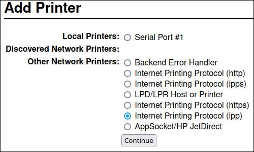
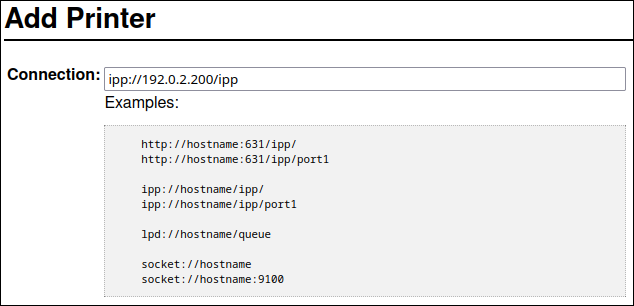
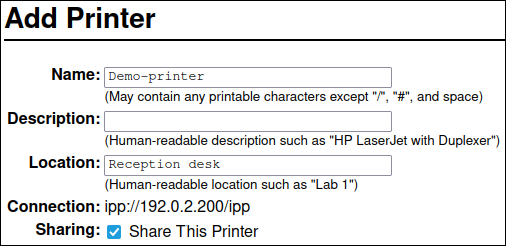
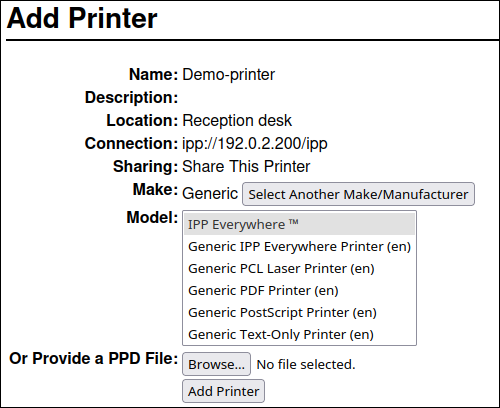
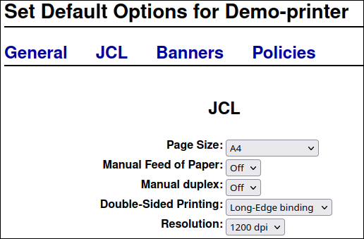

# Configuring and using a CUPS printing server

* * *

Red Hat Enterprise Linux 10

## Configure your system to operate as a CUPS server and manage printers, print queues and your printing environment

Red Hat Customer Content Services

[Legal Notice](#idm140497934288080)

**Abstract**

The Common Unix Printing System (CUPS) manages printing on {ProductName}. Users configure printers in CUPS on their host to print. Additionally, you can share printers in CUPS to use the host as a print server.

CUPS supports printing to:

- AirPrint™ and IPP Everywhere™ printers
- Network and local USB printers with printer applications
- Network and local USB printers with legacy PostScript Printer Description (PPD)-based drivers

* * *

<h2 id="providing-feedback-on-red-hat-documentation">Providing feedback on Red Hat documentation</h2>

We are committed to providing high-quality documentation and value your feedback. To help us improve, you can submit suggestions or report errors through the Red Hat Jira tracking system.

**Procedure**

1. Log in to the [Jira](https://issues.redhat.com/projects/RHELDOCS/issues) website.
   
   If you do not have an account, select the option to create one.
2. Click **Create** in the top navigation bar.
3. Enter a descriptive title in the **Summary** field.
4. Enter your suggestion for improvement in the **Description** field. Include links to the relevant parts of the documentation.
5. Click **Create** at the bottom of the dialogue.

<h2 id="installing-and-configuring-cups">Chapter 1. Installing and configuring CUPS</h2>

You can use CUPS to print from a local host. You can also use this host to share printers in the network and act as a print server.

**Procedure**

1. Install the `cups` package:
   
   ```
   dnf install cups
   ```
   
   ```plaintext
   # dnf install cups
   ```
2. If you configure CUPS as a print server, edit the `/etc/cups/cupsd.conf` file, and make the following changes:
   
   1. If you want to remotely configure CUPS or use this host as a print server, configure on which IP addresses and ports the service listens:
      
      ```
      Listen 192.0.2.1:631
      Listen [2001:db8:1::1]:631
      ```
      
      ```bash
      Listen 192.0.2.1:631
      Listen [2001:db8:1::1]:631
      ```
      
      By default, CUPS listens only on `localhost` interfaces (`127.0.0.1` and `::1`). Specify IPv6 addresses in square brackets.
      
      Important
      
      Do not configure CUPS to listen on interfaces that allow access from untrustworthy networks, such as the internet.
   2. Configure which IP ranges can access the service by allowing the IP ranges in the `<Location />` directive:
      
      ```
      <Location />
        Allow from 192.0.2.0/24
        Allow from [2001:db8:1::1]/32
        Order allow,deny
      </Location>
      ```
      
      ```bash
      <Location />
        Allow from 192.0.2.0/24
        Allow from [2001:db8:1::1]/32
        Order allow,deny
      </Location>
      ```
   3. In the `<Location /admin>` directive, configure which IP addresses and ranges can access the CUPS administration services:
      
      ```
      <Location /admin>
        Allow from 192.0.2.15/32
        Allow from [2001:db8:1::22]/128
        Order allow,deny
      </Location>
      ```
      
      ```bash
      <Location /admin>
        Allow from 192.0.2.15/32
        Allow from [2001:db8:1::22]/128
        Order allow,deny
      </Location>
      ```
      
      With these settings, only the hosts with the IP addresses `192.0.2.15` and `2001:db8:1::22` can access the administration services.
   4. Optional: Configure IP addresses and ranges that are allowed to access the configuration and log files in the web interface:
      
      ```
      <Location /admin/conf>
        Allow from 192.0.2.15/32
        Allow from [2001:db8:1::22]/128
        ...
      </Location>
      
      <Location /admin/log>
        Allow from 192.0.2.15/32
        Allow from [2001:db8:1::22]/128
        ...
      </Location>
      ```
      
      ```bash
      <Location /admin/conf>
        Allow from 192.0.2.15/32
        Allow from [2001:db8:1::22]/128
        ...
      </Location>
      
      <Location /admin/log>
        Allow from 192.0.2.15/32
        Allow from [2001:db8:1::22]/128
        ...
      </Location>
      ```
3. If you run the `firewalld` service and want to configure remote access to CUPS, open the CUPS port in `firewalld`:
   
   ```
   firewall-cmd --permanent --add-port=631/tcp
   firewall-cmd --reload
   ```
   
   ```plaintext
   # firewall-cmd --permanent --add-port=631/tcp
   # firewall-cmd --reload
   ```
   
   If you run CUPS on a host with multiple interfaces, consider limiting the access to the required networks.
4. Enable and start the `cups` service:
   
   ```
   systemctl enable --now cups
   ```
   
   ```plaintext
   # systemctl enable --now cups
   ```

**Verification**

- Use a browser, and access `http://<hostname>:631`. If you can connect to the web interface, CUPS works.
  
  Note that certain features, such as the `Administration` tab, require authentication and an HTTPS connection. By default, CUPS uses a self-signed certificate for HTTPS access and, consequently, the connection is not secure when you authenticate.

<h2 id="configuring-tls-encryption-on-a-cups-server">Chapter 2. Configuring TLS encryption on a CUPS server</h2>

CUPS supports TLS-encrypted connections and, by default, the service enforces encrypted connections for all requests that require authentication. TLS-encrypted connections ensure safe communication with the CUPS server.

If no certificates are configured, CUPS creates a private key and a self-signed certificate. This is only sufficient if you access CUPS from the local host itself. For a secure connection over the network, use a server certificate that is signed by a certificate authority (CA).

Warning

Without encryption or with a self-signed certificates, a man-in-the-middle (MITM) attack can disclose sensitive data, for example:

- Credentials of administrators when configuring CUPS by using the web interface
- Confidential data when sending print jobs over the network

**Prerequisites**

- [CUPS is configured](#installing-and-configuring-cups "Chapter 1. Installing and configuring CUPS").
- [You created a private key](https://docs.redhat.com/en/documentation/red_hat_enterprise_linux/10/html/securing_networks/creating-and-managing-tls-keys-and-certificates), and a CA issued a server certificate for it.
- If an intermediate certificate is required to validate the server certificate, append the intermediate certificate to the server certificate.
- The private key is not protected by a password because CUPS provides no option to enter the password when the service reads the key.
- The Canonical Name (`CN`) or Subject Alternative Name (SAN) field in the certificate matches one of the following:
  
  - The fully-qualified domain name (FQDN) of the CUPS server
  - An alias that the DNS resolves to the server’s IP address
- The private key and server certificate files use the Privacy Enhanced Mail (PEM) format.
- Clients trust the CA certificate.
- If the FIPS mode is enabled, clients must either support the Extended Master Secret (EMS) extension or use TLS 1.3. TLS 1.2 connections without EMS fail. For more information, see the Red Hat Knowledgebase solution [TLS extension "Extended Master Secret" enforced](https://access.redhat.com/solutions/7018256).

**Procedure**

01. Edit the `/etc/cups/cups-files.conf` file, and add the following setting to disable the automatic creation of self-signed certificates:
    
    ```
    CreateSelfSignedCerts no
    ```
    
    ```plaintext
    CreateSelfSignedCerts no
    ```
02. Remove the self-signed certificate and private key:
    
    ```
    rm /etc/cups/ssl/<hostname>.crt /etc/cups/ssl/<hostname>.key
    ```
    
    ```plaintext
    # rm /etc/cups/ssl/<hostname>.crt /etc/cups/ssl/<hostname>.key
    ```
03. Optional: Display the FQDN of the server:
    
    ```
    hostname -f
    ```
    
    ```plaintext
    # hostname -f
    ```
    
    ```
    server.example.com
    ```
    
    ```plaintext
    server.example.com
    ```
04. Store the private key and server certificate in the `/etc/cups/ssl/` directory, for example:
    
    ```
    mv /root/server.key /etc/cups/ssl/server.example.com.key
    mv /root/server.crt /etc/cups/ssl/server.example.com.crt
    ```
    
    ```plaintext
    # mv /root/server.key /etc/cups/ssl/server.example.com.key
    # mv /root/server.crt /etc/cups/ssl/server.example.com.crt
    ```
    
    Important
    
    CUPS requires that you name the private key `<fqdn>.key` and the server certificate file `<fqdn>.crt`. If you use an alias, you must name the files `<alias>.key` and `<alias>.crt`.
05. Set secure permissions on the private key that enable only the `root` user to read this file:
    
    ```
    chown root:root /etc/cups/ssl/server.example.com.key
    chmod 600 /etc/cups/ssl/server.example.com.key
    ```
    
    ```plaintext
    # chown root:root /etc/cups/ssl/server.example.com.key
    # chmod 600 /etc/cups/ssl/server.example.com.key
    ```
    
    Because certificates are part of the communication between a client and the server before they establish a secure connection, any client can retrieve the certificates without authentication. Therefore, you do not need to set strict permissions on the server certificate file.
06. Restore the SELinux context:
    
    ```
    restorecon -Rv /etc/cups/ssl/
    ```
    
    ```plaintext
    # restorecon -Rv /etc/cups/ssl/
    ```
07. Optional: Display the `CN` and SAN fields of the certificate:
    
    ```
    openssl x509 -text -in /etc/cups/ssl/server.example.com.crt
    ```
    
    ```plaintext
    # openssl x509 -text -in /etc/cups/ssl/server.example.com.crt
    ```
    
    ```
    Certificate:
      Data:
        ...
        Subject: CN = server.example.com
        ...
        X509v3 extensions:
          ...
          X509v3 Subject Alternative Name:
            DNS:server.example.com
      ...
    ```
    
    ```plaintext
    Certificate:
      Data:
        ...
        Subject: CN = server.example.com
        ...
        X509v3 extensions:
          ...
          X509v3 Subject Alternative Name:
            DNS:server.example.com
      ...
    ```
08. If the `CN` or SAN fields in the server certificate contains an alias that is different from the server’s FQDN, add the `ServerAlias` parameter to the `/etc/cups/cupsd.conf` file:
    
    ```
    ServerAlias alternative_name.example.com
    ```
    
    ```bash
    ServerAlias alternative_name.example.com
    ```
    
    In this case, use the alternative name instead of the FQDN in the rest of the procedure.
09. By default, CUPS enforces encrypted connections only if a task requires authentication, for example when performing administrative tasks on the `/admin` page in the web interface.
    
    To enforce encryption for the entire CUPS server, add `Encryption Required` to all `<Location>` directives in the `/etc/cups/cupsd.conf` file, for example:
    
    ```
    <Location />
      ...
      Encryption Required
    </Location>
    ```
    
    ```bash
    <Location />
      ...
      Encryption Required
    </Location>
    ```
10. Restart CUPS:
    
    ```
    systemctl restart cups
    ```
    
    ```plaintext
    # systemctl restart cups
    ```

**Verification**

1. Use a browser, and access `https://<hostname>:631/admin/`. This requires that your browser trusts the CA certificate. If the connection succeeds, you configured TLS encryption in CUPS correctly.
2. If you configured that encryption is required for the entire server, access `http://<hostname>:631/`. CUPS returns an `Upgrade Required` error in this case.

**Troubleshooting**

- Display the `systemd` journal entries of the `cups` service:
  
  ```
  journalctl -u cups
  ```
  
  ```plaintext
  # journalctl -u cups
  ```
  
  If the journal contains an `Unable to encrypt connection: Error while reading file` error after you failed to connect to the web interface by using the HTTPS protocol, verify the name of the private key and server certificate file.

**Additional resources**

- [How to configure CUPS to use a CA-signed TLS certificate in RHEL (Red Hat Knowledgebase)](https://access.redhat.com/solutions/5097251)

<h2 id="granting-administration-permissions-to-manage-a-cups-server-in-the-web-interface">Chapter 3. Granting administration permissions to manage a CUPS server in the web interface</h2>

To avoid CUPS administrators gaining unexpected permissions in other services, use a dedicated group for CUPS administrators.

By default, members of the `sys`, `root`, and `wheel` groups can perform administration tasks in the web interface. However, certain other services use these groups as well. For example, members of the `wheel` groups can, by default, run commands with `root` permissions by using `sudo`. By using a separate group for CUPS administrators, you can ensure that these users have only access to the CUPS interface.

**Prerequisites**

- [CUPS is configured](#installing-and-configuring-cups "Chapter 1. Installing and configuring CUPS").
- The IP address of the client you want to use has permissions to access the administration area in the web interface.

**Procedure**

1. Create a group for CUPS administrators:
   
   ```
   groupadd cups-admins
   ```
   
   ```plaintext
   # groupadd cups-admins
   ```
2. Add the users who should manage the service in the web interface to the `cups-admins` group:
   
   ```
   usermod -a -G cups-admins <username>
   ```
   
   ```plaintext
   # usermod -a -G cups-admins <username>
   ```
3. Update the value of the `SystemGroup` parameter in the `/etc/cups/cups-files.conf` file, and append the `cups-admin` group:
   
   ```
   SystemGroup sys root wheel cups-admins
   ```
   
   ```bash
   SystemGroup sys root wheel cups-admins
   ```
   
   If only the `cups-admin` group should have administrative access, remove the other group names from the parameter.
4. Restart CUPS:
   
   ```
   systemctl restart cups
   ```
   
   ```plaintext
   # systemctl restart cups
   ```

**Verification**

1. Use a browser, and access `https://<hostname_or_ip_address>:631/admin/`.
   
   Note
   
   You can access the administration area in the web UI only if you use the HTTPS protocol.
2. Start performing an administrative task. For example, click `Add printer`.
3. The web interface prompts for a username and password. To proceed, authenticate by using credentials of a user who is a member of the `cups-admins` group.
   
   If authentication succeeds, this user can perform administrative tasks.

<h2 id="packages-with-printer-drivers">Chapter 4. Packages with printer drivers</h2>

Red Hat Enterprise Linux (RHEL) provides different packages with printer drivers for CUPS. After installing the required package, you can display the list of drivers in the CUPS web interface or by using the `lpinfo -m` command.

The following is a general overview of these packages and for which vendors they contain drivers:

| Package name      | Drivers for printers                                                                                                                   |
|:------------------|:---------------------------------------------------------------------------------------------------------------------------------------|
| `cups`            | Zebra, Dymo                                                                                                                            |
| `c2esp`           | Kodak                                                                                                                                  |
| `foomatic`        | Brother, Canon, Epson, Gestetner, HP, Infotec, Kyocera, Lanier, Lexmark, NRG, Ricoh, Samsung, Savin, Sharp, Toshiba, Xerox, and others |
| `gutenprint-cups` | Brother, Canon, Epson, Fujitsu, HP, Infotec, Kyocera, Lanier, NRG, Oki, Minolta, Ricoh, Samsung, Savin, Xerox, and others              |
| `hplip`           | HP                                                                                                                                     |
| `pnm2ppa`         | HP                                                                                                                                     |
| `splix`           | Samsung, Xerox, and others                                                                                                             |

Table 4.1. Driver package list

Note that some packages can contain drivers for the same printer vendor or model but with different functionality.

<h2 id="determining-whether-a-printer-supports-driverless-printing">Chapter 5. Determining whether a printer supports driverless printing</h2>

CUPS supports driverless printing, which means that you can print without providing any hardware-specific software for the printer model.

For driverless printing, the printer must inform the client about its capabilities and use one of the following standards:

- AirPrint™
- IPP Everywhere™
- Mopria®
- Wi-Fi Direct Print Services

You can use the `ipptool` utility to discover whether a printer supports driverless printing.

**Prerequisites**

- The printer or remote print server supports the Internet Printing Protocol (IPP).
- The host can connect to the IPP port of the printer or remote print server. The default IPP port is 631.

**Procedure**

- Query the `ipp-versions-supported` and `document-format-supported` attributes, and ensure that the `get-printer-attributes` test passes:
  
  - For a remote printer, enter:
    
    ```
    ipptool -tv ipp://<ip_address_or_hostname>:631/ipp/print get-printer-attributes.test | grep -E "ipp-versions-supported|document-format-supported|get-printer-attributes"
    ```
    
    ```plaintext
    # ipptool -tv ipp://<ip_address_or_hostname>:631/ipp/print get-printer-attributes.test | grep -E "ipp-versions-supported|document-format-supported|get-printer-attributes"
    ```
    
    ```
    Get printer attributes using get-printer-attributes      [PASS]
        ipp-versions-supported (1setOf keyword) = ...
        document-format-supported (1setOf mimeMediaType) = ...
    ```
    
    ```plaintext
    Get printer attributes using get-printer-attributes      [PASS]
        ipp-versions-supported (1setOf keyword) = ...
        document-format-supported (1setOf mimeMediaType) = ...
    ```
  - For a queue on a remote print server, enter:
    
    ```
    ipptool -tv ipp://<ip_address_or_hostname>:631/printers/<queue_name> get-printer-attributes.test | grep -E "ipp-versions-supported|document-format-supported|get-printer-attributes"
    ```
    
    ```plaintext
    # ipptool -tv ipp://<ip_address_or_hostname>:631/printers/<queue_name> get-printer-attributes.test | grep -E "ipp-versions-supported|document-format-supported|get-printer-attributes"
    ```
    
    ```
    Get printer attributes using get-printer-attributes      [PASS]
        ipp-versions-supported (1setOf keyword) = ...
        document-format-supported (1setOf mimeMediaType) = ...
    ```
    
    ```plaintext
    Get printer attributes using get-printer-attributes      [PASS]
        ipp-versions-supported (1setOf keyword) = ...
        document-format-supported (1setOf mimeMediaType) = ...
    ```
  
  To ensure that driverless printing works, verify in the output:
  
  - The `get-printer-attributes` test returns `PASS`.
  - The IPP version that the printer supports is 2.0 or higher.
  - The list of formats contains one of the following:
    
    - `application/pdf`
    - `image/urf`
    - `image/pwg-raster`
  - For color printers, the output contains one of the mentioned formats and, additionally, `image/jpeg`.

<h2 id="driverless-usb-printing-and-scanning">Chapter 6. Driverless USB printing and scanning</h2>

Driverless printing and scanning has variants for USB-connected devices, covered by the IPP over USB standard. Install the `ipp-usb` package for it to work. This package registers the device with Avahi on the local host and makes the USB device look like a network device.

<h3 id="installing-and-checking-device-capabilities">6.1. Installing and checking device capabilities</h3>

In driverless printing, installing a device involves identifying this device on your network and using a print server to set up a print queue. You can then verify the device’s capabilities by accessing its settings within the print queue or using a tool such as `ipptool`.

**Prerequisites**

- You update the device firmware.
- You stopped and disabled the `cups-browsed` service if it is not used for installing printers from remote print servers. Note that in this case, the `BrowsePoll` server is used in the `/etc/cups/cups-browsed.conf` file.

**Procedure**

1. Install the `ipp-usb` package:
   
   ```
   dnf install ipp-usb
   ```
   
   ```plaintext
   # dnf install ipp-usb
   ```
   
   Note
   
   The `ipp-usb` package is installed by default with CUPS and `sane-airscane` packages.
2. Check if device has printing functionality:
   
   1. Verify that the device is recognized by `ipp-usb`:
      
      ```
      sudo ipp-usb check
      ```
      
      ```plaintext
      # sudo ipp-usb check
      ```
   2. Check if the device is identified by CUPS among existing destinations. The service name created by `ipp-usb` has the suffix `_USB`.
      
      ```
      lpstat -e
      ```
      
      ```plaintext
      $ lpstat -e
      ```
      
      ```
      Canon_MF440_Series_USB
      ```
      
      ```plaintext
      Canon_MF440_Series_USB
      ```
      
      The service name created by `ipp-usb` has the `_USB` suffix. For example, here Canon\_MF440\_Series\_USB represents IPP-over-USB device called Canon I-Sensys MF433
      
      Important
      
      If the Canon\_MF440\_Series\_USB is displayed in the output of the `lpstat -e` command, but not in your application, report the issue to the application.
   3. Check device capabilities:
      
      ```
      ipptool -tv ipp://localhost:60000/ipp/print get-printer-attributes.test
      lpoptions -p Canon_MF440_Series_USB -l
      ```
      
      ```plaintext
      # ipptool -tv ipp://localhost:60000/ipp/print get-printer-attributes.test
      # lpoptions -p Canon_MF440_Series_USB -l
      ```
      
      The `ipptool` command returns all IPP attributes which the device supports. If your printing option is present in IPP response, but not in `lpoptions` output, then it is a CUPS issue because the common PPD options are generated from some of the attributes. The `lpoptions` utility returns available PPD options.
3. Check if the device has scanning capabilities:
   
   1. Check if the `sane-airscan` backend recognizes your device:
      
      ```
      scanimage -L
      ```
      
      ```plaintext
      # scanimage -L
      ```
      
      ```
      device `airscan:e0:HP LaserJet MFP M130fw' is a eSCL HP LaserJet MFP M130fw ip=127.0.0.1
      Here, the HP LaserJet MFP M130fw device here is used for illustration, it does not show its real IPP-over-USB compatibility or its real options shared via AirScan from ipp-usb.
      ```
      
      ```plaintext
      device `airscan:e0:HP LaserJet MFP M130fw' is a eSCL HP LaserJet MFP M130fw ip=127.0.0.1
      Here, the HP LaserJet MFP M130fw device here is used for illustration, it does not show its real IPP-over-USB compatibility or its real options shared via AirScan from ipp-usb.
      ```
   2. Check the device capabilities:
      
      ```
      scanimage --help -d 'airscan:e0:HP LaserJet MFP M130fw (E700D6)'
      ```
      
      ```plaintext
      # scanimage --help -d 'airscan:e0:HP LaserJet MFP M130fw (E700D6)'
      ```

<h3 id="migrating-existing-classic-print-queues-and-scanner-devices">6.2. Migrating existing classic print queues and scanner devices</h3>

The `ipp-usb` package is incompatible with classic printing and scanning drivers for `IPP-over-USB` devices. Therefore, you must decide which method you want to use: driverless or classic drivers.

**Procedure**

- Use one of the following options:
  
  - Use driverless to support the USB device.
    
    To migrate the existing configuration with classic drivers to driverless support for USB device, follow the below mentioned steps depending on the device capabilities:
    
    1. If the device has printing functionality, remove any existing printers installed for the device in the past.
    2. To search for printer name, run:
       
       ```
       lpstat -a
       ```
       
       ```plaintext
       # lpstat -a
       ```
    3. Remove the printer:
       
       ```
       lpadmin -x <printer_name>
       ```
       
       ```plaintext
       # lpadmin -x <printer_name>
       ```
    4. If the device has scanning functionality, disable the `SANE` backend which provides the scanning support, for example, `hpaio`. You can achieve it by commenting out its name in the `/etc/sane.d/dll.conf` file or in a specific file in the `/etc/sane.d/dll.d/` directory, or uninstall the scanning driver. For example, to disable the `hpaio` scanning backend:
       
       1. List the available scanners:
          
          ```
          scanimage -L
          ```
          
          ```plaintext
          # scanimage -L
          ```
          
          ```
          device `hpaio:/usb/laserjet_mfp_m129-m134?serial=XXXX' is a Hewlett-Packard laserjet_mfp_m129-m134 all-in-one
          device `airscan:e0:HP LaserJet MFP M130fw (E700D6)' is a eSCL HP LaserJet MFP M130fw (E700D6) ip=127.0.0.1
          ```
          
          ```plaintext
          device `hpaio:/usb/laserjet_mfp_m129-m134?serial=XXXX' is a Hewlett-Packard laserjet_mfp_m129-m134 all-in-one
          device `airscan:e0:HP LaserJet MFP M130fw (E700D6)' is a eSCL HP LaserJet MFP M130fw (E700D6) ip=127.0.0.1
          ```
       2. Comment out the `hpaio` line in the `/etc/sane.d/dll.d/hpaio` file:
          
          ```
          #hpaio
          ```
          
          ```plaintext
          #hpaio
          ```
          
          As a result, scanning devices supported by the backend HPAIO are not visible in the list of scanners.
  - Use a classic driver to support the device.
    
    Choosing a classic driver requires rejecting the printer model in the `ipp-usb` configuration.
    
    1. Search for device model name:
       
       ```
       sudo ipp-usb check
       ```
       
       ```plaintext
       # sudo ipp-usb check
       ```
       
       ```
       Configuration files: OK
       IPP over USB devices:
        Num  Device              Vndr:Prod  Model
          1. Bus 001 Device 005  04a9:2823  "Canon MF440 Series"
       ```
       
       ```plaintext
       Configuration files: OK
       IPP over USB devices:
        Num  Device              Vndr:Prod  Model
          1. Bus 001 Device 005  04a9:2823  "Canon MF440 Series"
       ```
    2. Create a quirk for `ipp-usb` and use the name in the new quirk file in the `/etc/ipp-usb/quirks` directory. Note that the `.conf` suffix is required.
       
       ```
       cat /etc/ipp-usb/quirks/canon.conf
       ```
       
       ```plaintext
       # cat /etc/ipp-usb/quirks/canon.conf
       ```
       
       ```
       [Canon MF440 Series]
       blacklist = true
       ```
       
       ```plaintext
       [Canon MF440 Series]
       blacklist = true
       ```
    3. Restart the `ipp-usb` service:
       
       ```
       systemctl restart ipp-usb
       ```
       
       ```plaintext
       $ systemctl restart ipp-usb
       ```
       
       This quirk denies device’s support in `ipp-usb`, and classic drivers will work. The printer generated by `ipp-usb` is removed from the list of existing printers.
       
       Note
       
       You can opt-out from driverless USB support by removing the `ipp-usb` package and excluding it from DNF operations.

<h2 id="setting-up-a-legacy-printer">Chapter 7. Setting up a legacy printer</h2>

You can use the printer applications for supporting legacy printers which do not support driverless standards. After you install the legacy printer in a printer application, the application makes the legacy printer available for CUPS to use.

Important

Installing printers with classic drivers in CUPS is deprecated.

You can utilize classic CUPS drivers with a modern printing architecture by configuring a legacy printer in a printer application. Currently, RHEL includes printer applications based on the PAPPL, such as `lprint` and `legacy-printer-app`. The current PAPPL-based printer applications in RHEL and their TCP ports they are listening at are the following:

- LPrint: 8000
- Legacy Printer Application: 8001

<h3 id="setting-up-pappl-based-printer-application">7.1. Setting up PAPPL-based printer application</h3>

To easily and effectively support various printing requirements and prepare it for installing legacy printers, you can set up a PAPPL-based printer application.

**Prerequisites**

- CUPS is configured with a TLS certificate.

**Procedure**

1. Install a PAPPL-based printer application package, for example, `lprint` :
   
   ```
   dnf install <printer_application_name>
   ```
   
   ```plaintext
   # dnf install <printer_application_name>
   ```
2. Optional: Enable the port `8000` in firewalld to access the printer application web interface from a remote host:
   
   ```
   firewall-cmd --permanent --add-port=8000/tcp
   firewall-cmd --reload
   ```
   
   ```plaintext
   # firewall-cmd --permanent --add-port=8000/tcp
   # firewall-cmd --reload
   ```
   
   You can check the port in the `/etc/lprint.conf` configuration file.
3. Enable and start the service:
   
   ```
   systemctl enable --now <printer_application_name>
   ```
   
   ```plaintext
   # systemctl enable --now <printer_application_name>
   ```

<h3 id="installing-a-legacy-printer-in-pappl-based-printer-application-by-using-web-console">7.2. Installing a legacy printer in PAPPL based printer application by using web interface</h3>

Add legacy printers to a PAPPL-based application to bridge the gap between older hardware and modern driverless environments. This process converts legacy protocols into IPP services, ensuring non-driverless devices remain functional and discoverable on your network.

**Prerequisites**

- CUPS is configured with a TLS certificate.
- The printer application is configured and running.

**Procedure**

1. In the printer application home page, click `Add Printer`.
2. Choose `printer name`, `device`, `hostname/IP address` in case of network printers, select the driver name from the offered list, and click on the `Add Printer`. You can also use the auto-detect option to search for the driver.
   
   Using the auto-detection option for the driver might result in finding an incompatible driver for your device, if the device model is too different from available drivers. Check the assigned driver before printing and change the driver manually to prevent any printing issues.
3. The used driver is on the second line in the `block Status`. You can test the functionality by clicking on the `Print Test Page`.

<h3 id="installing-a-legacy-printer-in-pappl-based-printer-application-by-using-the-command-line-interface">7.3. Installing a legacy printer in PAPPL based printer application by using the command line interface</h3>

Add legacy printers to a PAPPL-based application to bridge the gap between older hardware and modern driverless environments. This process converts legacy protocols into IPP services, ensuring non-driverless devices remain functional and discoverable on your network.

**Prerequisites**

- CUPS is configured with a TLS certificate.
- The printer application is set and running.

**Procedure**

1. Search the available drivers in PAPPL based printer application:
   
   ```
   lprint drivers
   ```
   
   ```plaintext
   # lprint drivers
   ```
   
   ```
   zpl_2inch-203dpi-dt "Zebra ZPL 2-inch/203dpi/Direct-Thermal
   ```
   
   ```plaintext
   zpl_2inch-203dpi-dt "Zebra ZPL 2-inch/203dpi/Direct-Thermal
   ```
2. Install the printer. For example, to install a network printer with a specified driver, enter:
   
   ```
   lprint add -d <printer name> -v socket://<hostname> -m zpl_2inch-203dpi-dt
   ```
   
   ```plaintext
   # lprint add -d <printer name> -v socket://<hostname> -m zpl_2inch-203dpi-dt
   ```

**Verification**

1. Check printer is visible in the printers list, together with its raw socket for sending raw data:
   
   ```
   lprint printers
   ```
   
   ```plaintext
   # lprint printers
   ```
   
   ```
   <printer_name> - printer - ipp://localhost/ipp/print/<printer_name>
   <printer_name> - raw socket - socket://localhost:9101/
   ```
   
   ```plaintext
   <printer_name> - printer - ipp://localhost/ipp/print/<printer_name>
   <printer_name> - raw socket - socket://localhost:9101/
   ```

<h3 id="setting-up-a-generated-network-printer-as-cups-permanent-queue">7.4. Setting up a generated network printer as CUPS permanent queue</h3>

You can set up a generated network printer from a dedicated printer application as CUPS permanent queue by using the command line interface.

**Prerequisites**

- CUPS is configured with a TLS certificate.
- You have permission in CUPS to manage printers.
- The legacy printer is installed in a printer application.

**Procedure**

1. Check if the generated network printer is available:
   
   ```
   lpstat -e
   ```
   
   ```plaintext
   # lpstat -e
   ```
   
   ```
   <printer_name_in_printer_application>
   ```
   
   ```plaintext
   <printer_name_in_printer_application>
   ```
2. Search for the port that the printer application is using:
   
   ```
   grep 'server-port=' /etc/lprint.conf
   ```
   
   ```plaintext
   # grep 'server-port=' /etc/lprint.conf
   ```
   
   ```
   server-port=8000
   ```
   
   ```plaintext
   server-port=8000
   ```
3. Install the permanent queue by using the port number `8000`:
   
   ```
   lpadmin -p <printer_name_in_CUPS> -v ipps://localhost:8000/ipp/print/<printer_name_in_printer_application> -m everywhere -E
   ```
   
   ```plaintext
   # lpadmin -p <printer_name_in_CUPS> -v ipps://localhost:8000/ipp/print/<printer_name_in_printer_application> -m everywhere -E
   ```
4. Check if CUPS queue is installed:
   
   ```
   lpstat -a
   ```
   
   ```plaintext
   # lpstat -a
   ```
   
   ```
   <printer_name_in_CUPS>  accepting requests since Wed 07 May 2025 02:31:04 AM EDT
   ```
   
   ```plaintext
   <printer_name_in_CUPS>  accepting requests since Wed 07 May 2025 02:31:04 AM EDT
   ```

<h2 id="adding-a-printer-to-cups-by-using-the-web-interface">Chapter 8. Adding a printer to CUPS by using the web interface</h2>

Before users can print through CUPS, you must add printers. You can use both network printers and printers that are directly attached to the CUPS host, for example over USB.

You can add printers by using the CUPS driverless feature or by using a PostScript Printer Description (PPD) file.

Note

CUPS prefers driverless printing, and using drivers is deprecated.

Red Hat Enterprise Linux (RHEL) does not provide the name service switch multicast DNS plugin (`nss-mdns`), which resolves requests by querying an mDNS responder. Consequently, automatic discovery and installation for local driverless printers by using mDNS is not available in RHEL. To work around this limitation, install single printers manually or use `cups-browsed` to automatically install a high amount of print queues that are available on a remote print server.

**Prerequisites**

- [CUPS is configured](#installing-and-configuring-cups "Chapter 1. Installing and configuring CUPS").
- [You have permissions in CUPS to manage printers](#granting-administration-permissions-to-manage-a-cups-server-in-the-web-interface "Chapter 3. Granting administration permissions to manage a CUPS server in the web interface").
- If you use CUPS as a print server, [you configured TLS encryption](#configuring-tls-encryption-on-a-cups-server "Chapter 2. Configuring TLS encryption on a CUPS server") to securely transmit data over the network.
- [The printer supports driverless printing](#determining-whether-a-printer-supports-driverless-printing "Chapter 5. Determining whether a printer supports driverless printing"), if you want to use this feature.

**Procedure**

01. Use a browser, and access `https://<hostname>:631/admin/`.
    
    You must connect to the web interface by using the HTTPS protocol. Otherwise, CUPS prevents you from authenticating in a later step for security reasons.
02. Click Add printer.
03. If you are not already authenticated, CUPS prompts for credentials of an administrative user. Enter the username and password of an authorized user.
04. If you decide to not use driverless printing and the printer you want to add is detected automatically, select it, and click Continue.
05. If the printer was not detected:
    
    1. Select the protocol that the printer supports.
       
        
       
       If your printer supports driverless printing and you want to use this feature, select the `ipp` or `ipps` protocol.
    2. Click Continue.
    3. Enter the URL to the printer or to the queue on a remote print server.
       
        
    4. Click Continue.
06. Enter a name and, optionally, a description and location. If you use CUPS as a print server, and other clients should be able to print through CUPS on this printer, select also **Share this printer**.
    
     
07. Select the printer manufacturer in the **Make** list. If the printer manufacturer is not on the list, select **Generic** or upload a PPD file for the printer.
08. Click Continue.
09. Select the printer model:
    
    - If the printer supports driverless printing, select **IPP Everywhere**. Note that, if you previously installed printer-specific drivers locally, it is possible that the list also contains entries such as ***&lt;printer\_name&gt;* - IPP Everywhere**.
    - If the printer does not support driverless printing, select the model or upload the PPD file for the printer.
    
     
10. Click Add Printer
11. The settings and tabs on the **Set printer options** page depend on the driver and the features the printer supports. Use this page to set default options, such as for the paper size.
    
     
12. Click Set default options.

**Verification**

1. Open the **Printers** tab in the web interface.
2. Click the printer’s name.
3. In the **Maintenance** list, select **Print test page**.

**Troubleshooting**

- If you use driverless printing, and printing does not work, use the `lpadmin` utility to add the printer on the command line. For details, see [Adding a printer to CUPS by using the `lpadmin` utility](#adding-a-printer-to-cups-by-using-the-lpadmin-utility "Chapter 9. Adding a printer to CUPS by using the lpadmin utility").

<h2 id="adding-a-printer-to-cups-by-using-the-lpadmin-utility">Chapter 9. Adding a printer to CUPS by using the lpadmin utility</h2>

Before users can print through CUPS, you must add printers. You can use both network printers and printers that are directly attached to the CUPS host, for example over USB.

You can add printers by using the CUPS driverless feature or by using a PostScript Printer Description (PPD) file.

Note

CUPS prefers driverless printing, and using drivers is deprecated.

Red Hat Enterprise Linux (RHEL) does not provide the name service switch multicast DNS plugin (`nss-mdns`), which resolves requests by querying an mDNS responder. Consequently, automatic discovery and installation for local driverless printers by using mDNS is not available in RHEL. To work around this limitation, install single printers manually or use `cups-browsed` to automatically install a high amount of print queues that are available on a remote print server.

**Prerequisites**

- [CUPS is configured](#installing-and-configuring-cups "Chapter 1. Installing and configuring CUPS").
- [The printer supports driverless printing](#determining-whether-a-printer-supports-driverless-printing "Chapter 5. Determining whether a printer supports driverless printing"), if you want to use this feature.
- The printer accepts data on port 631 (IPP), 9100 (socket), or 515 (LPD). The port depends on the method you use to connect to the printer.

**Procedure**

- Add the printer to CUPS:
  
  - To add a printer with driverless support, enter:
    
    ```
    lpadmin -p Demo-printer -E -v ipp://192.0.2.200/ipp/print -m everywhere
    ```
    
    ```plaintext
    # lpadmin -p Demo-printer -E -v ipp://192.0.2.200/ipp/print -m everywhere
    ```
    
    If the `-m everywhere` option does not work for your printer, try `-m driverless:<uri>`, for example: `-m driverless:ipp://192.0.2.200/ipp/print`.
  - To add a queue from a remote print server with driverless support, enter:
    
    ```
    lpadmin -p Demo-printer -E -v ipp://192.0.2.201/printers/example-queue -m everywhere
    ```
    
    ```plaintext
    # lpadmin -p Demo-printer -E -v ipp://192.0.2.201/printers/example-queue -m everywhere
    ```
    
    If the `-m everywhere` option does not work for your printer, try `-m driverless:<uri>`, for example: `-m driverless:ipp://192.0.2.200/printers/example-queue`.
  - To add a printer with a driver in file, enter:
    
    ```
    lpadmin -p Demo-printer -E -v socket://192.0.2.200/ -P /root/example.ppd
    ```
    
    ```plaintext
    # lpadmin -p Demo-printer -E -v socket://192.0.2.200/ -P /root/example.ppd
    ```
  - To add a queue from a remote print server with a driver in a file, enter:
    
    ```
    lpadmin -p Demo-printer -E -v ipp://192.0.2.201/printers/example-queue -P /root/example.ppd
    ```
    
    ```plaintext
    # lpadmin -p Demo-printer -E -v ipp://192.0.2.201/printers/example-queue -P /root/example.ppd
    ```
  - To add a printer with a driver in the local driver database:
    
    1. List the drivers in the database:
       
       ```
       lpinfo -m
       ```
       
       ```plaintext
       # lpinfo -m
       ```
       
       ```
       drv:///sample.drv/generpcl.ppd Generic PCL Laser Printer
       ```
       
       ```plaintext
       drv:///sample.drv/generpcl.ppd Generic PCL Laser Printer
       ```
    2. Add the printer with the URI to the driver in the database:
       
       ```
       lpadmin -p Demo-printer -E -v socket://192.0.2.200/ -m drv:///sample.drv/generpcl.ppd
       ```
       
       ```plaintext
       # lpadmin -p Demo-printer -E -v socket://192.0.2.200/ -m drv:///sample.drv/generpcl.ppd
       ```
  
  These commands uses the following options:
  
  - `-p <printer_name>`: Sets the name of the printer in CUPS.
  - `-E`: Enables the printer and CUPS accepts jobs for it. Note that you must specify this option after `-p`. See the option’s description in the man page on your system for further details.
  - `-v <uri>`: Sets the URI to the printer or remote print server queue.
  - `-m <driver_uri>`: Sets the PPD file based on the provided driver URI obtained from the local driver database.
  - `-P <PPD_file>`: Sets the path to the PPD file.

**Verification**

1. Display the available printers:
   
   ```
   lpstat -p
   ```
   
   ```plaintext
   # lpstat -p
   ```
   
   ```
   printer Demo-printer is idle. enabled since Fri 23 Jun 2023 09:36:40 AM CEST
   ```
   
   ```plaintext
   printer Demo-printer is idle. enabled since Fri 23 Jun 2023 09:36:40 AM CEST
   ```
2. Print a test page:
   
   ```
   lp -d Demo-printer /usr/share/cups/data/default-testpage.pdf
   ```
   
   ```plaintext
   # lp -d Demo-printer /usr/share/cups/data/default-testpage.pdf
   ```

<h2 id="performing-maintenance-and-administration-tasks-on-cups-printers-by-using-the-web-interface">Chapter 10. Performing maintenance and administration tasks on CUPS printers by using the web interface</h2>

The CUPS web interface provides a graphical option to perform administration tasks on printers.

Printer administrators sometimes need to perform different tasks on a print server. For example:

- Maintenance tasks, such as temporary pausing a printer while a technician repairs a printer
- Administrative tasks, such as changing a printer’s default settings

You can perform these tasks by using the CUPS web interface.

**Prerequisites**

- [CUPS is configured](#installing-and-configuring-cups "Chapter 1. Installing and configuring CUPS").
- [You have permissions in CUPS to manage printers](#granting-administration-permissions-to-manage-a-cups-server-in-the-web-interface "Chapter 3. Granting administration permissions to manage a CUPS server in the web interface").
- If you use CUPS as a print server, [you configured TLS encryption](#configuring-tls-encryption-on-a-cups-server "Chapter 2. Configuring TLS encryption on a CUPS server") to not send credentials in plain text over the network.
- [The printer already exists in CUPS](#adding-a-printer-to-cups-by-using-the-web-interface "Chapter 8. Adding a printer to CUPS by using the web interface").

**Procedure**

1. Use a browser, and access `https://<hostname>:631/printers/`.
   
   You must connect to the web interface by using the HTTPS protocol. Otherwise, CUPS prevents you from authenticating in a later step for security reasons.
2. Click the name of the printer that you want to configure.
3. Depending on whether you want to perform a maintenance or administration task, select the required action from the list.
4. If you are not already authenticated, CUPS prompts for credentials of an administrative user. Enter the username and password of an authorized user.
5. Perform the task.

<h2 id="using-samba-to-print-to-a-windows-print-server-with-kerberos-authentication">Chapter 11. Using Samba to print to a Windows print server with Kerberos authentication</h2>

With the `samba-krb5-printing` wrapper, Active Directory (AD) users who are logged in to Red Hat Enterprise Linux (RHEL) can authenticate to Active Directory (AD) by using Kerberos and then print to a local CUPS print server that forwards the print job to a Windows print server.

The benefit of this configuration is that the administrator of CUPS on RHEL does not need to store a fixed user name and password in the configuration. CUPS authenticates to AD with the Kerberos ticket of the user that sends the print job.

Note

Red Hat supports only submitting print jobs to CUPS from your local system, and not to re-share a printer on a Samba print server.

**Prerequisites**

- The printer that you want to add to the local CUPS instance is shared on an AD print server.
- You joined the RHEL host as a member of the AD.
- CUPS is installed on RHEL, and the `cups` service is running.
- The PostScript Printer Description (PPD) file for the printer is stored in the `/usr/share/cups/model/` directory.

**Procedure**

1. Install the `samba-krb5-printing`, `samba-client`, and `krb5-workstation` packages:
   
   ```
   dnf install samba-krb5-printing samba-client krb5-workstation
   ```
   
   ```plaintext
   # dnf install samba-krb5-printing samba-client krb5-workstation
   ```
2. Optional: Authenticate as a domain administrator and display the list of printers that are shared on the Windows print server:
   
   ```
   smbclient -L <windows_print_server> -U administrator@<AD_KERBEROS_REALM> --use-kerberos=required
   ```
   
   ```plaintext
   # smbclient -L <windows_print_server> -U administrator@<AD_KERBEROS_REALM> --use-kerberos=required
   ```
   
   ```
   	Sharename       Type      Comment
   	---------       ----      -------
   	Example         Printer   Example
   ```
   
   ```plaintext
   	Sharename       Type      Comment
   	---------       ----      -------
   	Example         Printer   Example
   ```
3. Optional: Display the list of CUPS models to identify the PPD name of your printer:
   
   ```
   lpinfo -m
   ```
   
   ```plaintext
   lpinfo -m
   ```
   
   ```
   samsung.ppd Samsung M267x 287x Series PXL
   ```
   
   ```plaintext
   samsung.ppd Samsung M267x 287x Series PXL
   ```
   
   You require the name of the PPD file when you add the printer in the next step.
4. Add the printer to CUPS:
   
   ```
   lpadmin -p "<printer_name>" -v smb://<windows_print_server>/<printer_share_name> -m samsung.ppd -o auth-info-required=negotiate -E
   ```
   
   ```plaintext
   # lpadmin -p "<printer_name>" -v smb://<windows_print_server>/<printer_share_name> -m samsung.ppd -o auth-info-required=negotiate -E
   ```
   
   The command uses the following options:
   
   - `-p <printer_name>` sets the name of the printer in CUPS.
   - `-v <URI_to_Windows_printer>` sets the URI to the Windows printer. Use the following format: `smb://<host_name>/<printer_share_name>`.
   - `-m <PPD_file>` sets the PPD file the printer uses.
   - `-o auth-info-required=negotiate` configures CUPS to use Kerberos authentication when it forwards print jobs to the remote server.
   - `-E` enables the printer and CUPS accepts jobs for the printer.

**Verification**

1. Log in to the RHEL host as an AD domain user.
2. Authenticate as an AD domain user:
   
   ```
   kinit <domain_user_name>@<AD_KERBEROS_REALM>
   ```
   
   ```plaintext
   # kinit <domain_user_name>@<AD_KERBEROS_REALM>
   ```
3. Print a file to the printer you added to the local CUPS print server:
   
   ```
   lp -d <printer_name> <file>
   ```
   
   ```plaintext
   # lp -d <printer_name> <file>
   ```

<h2 id="using-cups-browsed-to-locally-integrate-printers-from-a-remote-print-server">Chapter 12. Using cups-browsed to locally integrate printers from a remote print server</h2>

The `cups-browsed` service uses DNS service discovery (DNS-SD) and CUPS browsing to make all or a filtered subset of shared remote printers automatically available in a local CUPS service. Use this feature on workstations to make only printers from a trusted print server available.

It is also possible to configure `cups-browsed` to filter the browsed printers by certain criteria to reduce the number of listed printers if a print server shares a large number of printers.

Note

If the print dialog in an application uses other mechanisms than, for example DNS-SD, to list remote printers, `cups-browsed` has no influence. The `cups-browsed` service also does not prevent users from manually accessing non-listed printers.

**Prerequisites**

- [The CUPS service is configured on the local host](#installing-and-configuring-cups "Chapter 1. Installing and configuring CUPS").
- A remote CUPS print server exists, and the following conditions apply to this server:
  
  - The server listens on an interface that is accessible from the client.
  - The `Allow from` parameter in the server’s `<Location />` directive in the `/etc/cups/cups.conf` file allows access from the client’s IP address.
  - The server shares printers.
  - Firewall rules allow access from the client to the CUPS port on the server.

**Procedure**

1. Edit the `/etc/cups/cups-browsed.conf` file, and make the following changes:
   
   1. Add `BrowsePoll` parameters for each remote CUPS server you want to poll:
      
      ```
      BrowsePoll remote_cups_server.example.com
      BrowsePoll 192.0.2.100:1631
      ```
      
      ```bash
      BrowsePoll remote_cups_server.example.com
      BrowsePoll 192.0.2.100:1631
      ```
      
      Append `:_<port>_` to the hostname or IP address if the remote CUPS server listens on a port different from 631.
   2. Optional: Configure a filter to limit which printers are shown in the local CUPS service. For example, to filter for queues whose name contain `sales_`, add:
      
      ```
      BrowseFilter name sales_
      ```
      
      ```bash
      BrowseFilter name sales_
      ```
      
      You can filter by different field names, negate the filter, and match the exact values. For further details, see the parameter description and examples in the `cups-browsed.conf(5)` man page on your system.
   3. Optional: Change the polling interval and timeout to limit the number of browsing cycles:
      
      ```
      BrowseInterval 1200
      BrowseTimeout 6000
      ```
      
      ```bash
      BrowseInterval 1200
      BrowseTimeout 6000
      ```
      
      Increase both `BrowseInterval` and `BrowseTimeout` in the same ratio to avoid situations in which printers disappear from the browsing list. This means, multiply the value of `BrowseInterval` by 5 or a higher integer, and use this result value for `BrowseTimeout`.
      
      By default, `cups-browsed` polls remote servers every 60 seconds and the timeout is 300 seconds. However, on print servers with many queues, these default values can cost many resources.
2. Enable and start the `cups-browsed` service:
   
   ```
   systemctl enable --now cups-browsed
   ```
   
   ```plaintext
   # systemctl enable --now cups-browsed
   ```

**Verification**

- List the available printers:
  
  ```
  lpstat -v
  ```
  
  ```plaintext
  # lpstat -v
  ```
  
  ```
  device for Demo-printer: implicitclass://Demo-printer/
  ```
  
  ```plaintext
  device for Demo-printer: implicitclass://Demo-printer/
  ```
  
  If the output for a printer contains `implicitclass`, the `cups-browsed` service manages the printer in CUPS.

<h2 id="accessing-the-cups-logs-in-the-systemd-journal">Chapter 13. Accessing the CUPS logs in the systemd journal</h2>

By default, CUPS stores log messages in the `systemd` journal. This includes, error messages, access log entries, and page log entries.

**Prerequisites**

- [CUPS is installed](#installing-and-configuring-cups "Chapter 1. Installing and configuring CUPS").

**Procedure**

- Display the log entries:
  
  - To display all log entries, enter:
    
    ```
    journalctl -u cups
    ```
    
    ```plaintext
    # journalctl -u cups
    ```
  - To display the log entries for a specific print job, enter:
    
    ```
    journalctl -u cups JID=<print_job_id>
    ```
    
    ```plaintext
    # journalctl -u cups JID=<print_job_id>
    ```
  - To display log entries within a specific time frame, enter:
    
    ```
    journalectl -u cups --since=<YYYY-MM-DD> --until=<YYYY-MM-DD>
    ```
    
    ```plaintext
    # journalectl -u cups --since=<YYYY-MM-DD> --until=<YYYY-MM-DD>
    ```
    
    Replace `YYYY` with the year, `MM` with the month, and `DD` with the day.

<h2 id="configuring-cups-to-store-logs-in-files-instead-of-the-systemd-journal">Chapter 14. Configuring CUPS to store logs in files instead of the systemd journal</h2>

By default, CUPS stores log messages in the `systemd` journal. Alternatively, you can configure CUPS to store log messages in files.

**Prerequisites**

- [CUPS is installed](#installing-and-configuring-cups "Chapter 1. Installing and configuring CUPS").

**Procedure**

1. Edit the `/etc/cups/cups-files.conf` file, and set the `AccessLog`, `ErrorLog`, and `PageLog` parameters to the paths where you want to store these log files:
   
   ```
   AccessLog /var/log/cups/access_log
   ErrorLog /var/log/cups/error_log
   PageLog /var/log/cups/page_log
   ```
   
   ```bash
   AccessLog /var/log/cups/access_log
   ErrorLog /var/log/cups/error_log
   PageLog /var/log/cups/page_log
   ```
2. If you configure CUPS to store the logs in a directory other than `/var/log/cups/`, set the `cupsd_log_t` SELinux context on this directory, for example:
   
   ```
   semanage fcontext -a -t cupsd_log_t "/var/log/printing(/.*)?"
   restorecon -Rv /var/log/printing/
   ```
   
   ```plaintext
   # semanage fcontext -a -t cupsd_log_t "/var/log/printing(/.*)?"
   # restorecon -Rv /var/log/printing/
   ```
3. Restart the `cups` service:
   
   ```
   systemctl restart cups
   ```
   
   ```plaintext
   # systemctl restart cups
   ```

**Verification**

1. Display the log files:
   
   ```
   cat /var/log/cups/access_log
   cat /var/log/cups/error_log
   cat /var/log/cups/page_log
   ```
   
   ```plaintext
   # cat /var/log/cups/access_log
   # cat /var/log/cups/error_log
   # cat /var/log/cups/page_log
   ```
2. If you configured CUPS to store the logs in a directory other than `/var/log/cups/`, verify that the SELinux context on the log directory is `cupsd_log_t`:
   
   ```
   ls -ldZ /var/log/printing/
   ```
   
   ```plaintext
   # ls -ldZ /var/log/printing/
   ```
   
   ```
   drwxr-xr-x. 2 lp sys unconfined_u:object_r:cupsd_log_t:s0 6 Jun 20 15:55 /var/log/printing/
   ```
   
   ```plaintext
   drwxr-xr-x. 2 lp sys unconfined_u:object_r:cupsd_log_t:s0 6 Jun 20 15:55 /var/log/printing/
   ```

<h2 id="setting-up-a-high-availability-cups-print-server-environment">Chapter 15. Setting up a high-availability CUPS print server environment</h2>

If your clients require access to printers without interruption, you can set up CUPS on multiple hosts and use the print queue browsing feature to provide high availability. Print clients then automatically configure print queues shared by the different print servers.

If a client sends a print job to its local print queue, CUPS on the client routes the job to one of the print servers which processes the job and sends it to the printer.

**Procedure**

1. Set up CUPS on two or more servers:
   
   1. [Install and configure CUPS](#installing-and-configuring-cups "Chapter 1. Installing and configuring CUPS").
   2. [Enable TLS encryption](#configuring-tls-encryption-on-a-cups-server "Chapter 2. Configuring TLS encryption on a CUPS server").
   3. Add print queues to all CUPS instances by using the [`lpadmin` utility](#adding-a-printer-to-cups-by-using-the-lpadmin-utility "Chapter 9. Adding a printer to CUPS by using the lpadmin utility") or the [web interface](#adding-a-printer-to-cups-by-using-the-web-interface "Chapter 8. Adding a printer to CUPS by using the web interface"). If you use the web interface, ensure that you select the **Share this printer** option while you add the printer. The `lpadmin` utility enables this setting by default.
      
      Important
      
      For the high-availability scenario, each queue on one print server requires a queue with exactly the same queue name on the other servers. You can display the queue names on each server by using the `lpstat -e` command.
      
      Optional: You can configure the queues on each server to refer to different printers.
2. On print clients:
   
   1. Edit the `/etc/cups/cups-browsed.conf` file, and add `BrowsePoll` directives for each CUPS print server:
      
      ```
      BrowsePoll print_server_1.example.com:631
      BrowsePoll print_server_2.example.com:631
      ```
      
      ```bash
      BrowsePoll print_server_1.example.com:631
      BrowsePoll print_server_2.example.com:631
      ```
   2. Enable and start both the `cups` and `cups-browsed` service:
      
      ```
      systemctl enable --now cups cups-browsed
      ```
      
      ```plaintext
      # systemctl enable --now cups cups-browsed
      ```

**Verification**

- Display the available printers on a client:
  
  ```
  lpstat -t
  ```
  
  ```plaintext
  # lpstat -t
  ```
  
  ```
  device for Demo-printer: implicitclass://Demo-printer/
  Demo-printer accepting requests since Fri 22 Nov 2024 11:54:59 AM CET
  printer Demo-printer is idle.  enabled since Fri 22 Nov 2024 11:54:59 AM CET
  ...
  ```
  
  ```plaintext
  device for Demo-printer: implicitclass://Demo-printer/
  Demo-printer accepting requests since Fri 22 Nov 2024 11:54:59 AM CET
  printer Demo-printer is idle.  enabled since Fri 22 Nov 2024 11:54:59 AM CET
  ...
  ```
  
  The example output shows that the **Demo-printer** queue uses the `implicitclass` back end. As a result, `cups-browsed` routes print jobs for this queue to the hosts specified in the `BrowsePoll` directives on this client.

**Additional resources**

- [High-availability printing in Red Hat Enterprise Linux (Red Hat Knowledgebase)](https://access.redhat.com/solutions/20501)

<h2 id="accessing-the-cups-documentation">Chapter 16. Accessing the CUPS documentation</h2>

CUPS provides browser-based access to the service’s documentation that is installed on the CUPS server.

The CUPS documentation includes:

- Administration documentation, such as for command-line printer administration and accounting
- Man pages
- Programming documentation, such as the administration API
- References
- Specifications

**Prerequisites**

- [CUPS is installed and running](#installing-and-configuring-cups "Chapter 1. Installing and configuring CUPS").
- The IP address of the client you want to use has permissions to access the web interface.

**Procedure**

1. Use a browser, and access `http://<hostname_or_ip_address>:631/help/`.
2. Expand the entries in `Online Help Documents`, and select the documentation you want to read.

<h2 id="idm140497934288080">Legal Notice</h2>

Copyright © Red Hat.

Except as otherwise noted below, the text of and illustrations in this documentation are licensed by Red Hat under the Creative Commons Attribution–Share Alike 3.0 Unported license . If you distribute this document or an adaptation of it, you must provide the URL for the original version.

Red Hat, as the licensor of this document, waives the right to enforce, and agrees not to assert, Section 4d of CC-BY-SA to the fullest extent permitted by applicable law.

Red Hat, the Red Hat logo, JBoss, Hibernate, and RHCE are trademarks or registered trademarks of Red Hat, LLC. or its subsidiaries in the United States and other countries.

Linux® is the registered trademark of Linus Torvalds in the United States and other countries.

XFS is a trademark or registered trademark of Hewlett Packard Enterprise Development LP or its subsidiaries in the United States and other countries.

The OpenStack® Word Mark and OpenStack logo are trademarks or registered trademarks of the Linux Foundation, used under license.

All other trademarks are the property of their respective owners.
