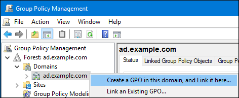
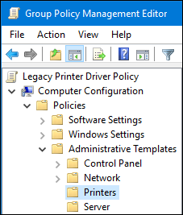
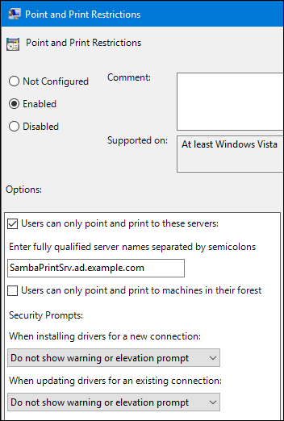
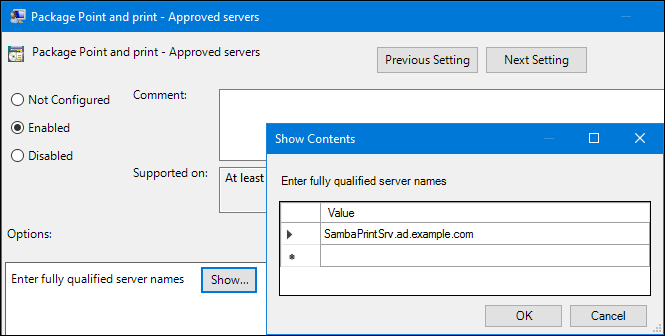
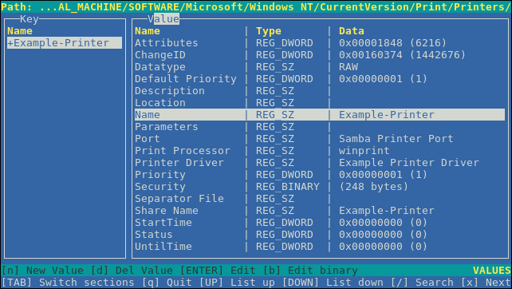

# Configuring and using network file services

* * *

Red Hat Enterprise Linux 10

## A guide to configuring and using network file services in Red Hat Enterprise Linux 10

Red Hat Customer Content Services

[Legal Notice](#idm140614338264944)

**Abstract**

This document describes how to configure and run network file services on Red Hat Enterprise Linux 10, including Samba server and NFS server.

* * *

<h2 id="providing-feedback-on-red-hat-documentation">Providing feedback on Red Hat documentation</h2>

We are committed to providing high-quality documentation and value your feedback. To help us improve, you can submit suggestions or report errors through the Red Hat Jira tracking system.

**Procedure**

1. Log in to the [Jira](https://issues.redhat.com/projects/RHELDOCS/issues) website.
   
   If you do not have an account, select the option to create one.
2. Click **Create** in the top navigation bar.
3. Enter a descriptive title in the **Summary** field.
4. Enter your suggestion for improvement in the **Description** field. Include links to the relevant parts of the documentation.
5. Click **Create** at the bottom of the dialogue.

<h2 id="using-samba-as-a-server">Chapter 1. Using Samba as a server</h2>

Samba implements the Server Message Block (SMB) protocol in Red Hat Enterprise Linux. The SMB protocol is used to access resources on a server, such as file shares and shared printers. Additionally, Samba implements the Distributed Computing Environment Remote Procedure Call (DCE RPC) protocol used by Microsoft Windows.

For more information refer to the:

- `smb.conf(5)` man page on your system
- `/usr/share/docs/samba-version/` directory that contains general documentation, example scripts, and LDAP schema files, provided by the Samba project

You can run Samba as:

- An Active Directory (AD) or NT4 domain member
- A standalone server
- An NT4 Primary Domain Controller (PDC) or Backup Domain Controller (BDC)
  
  Note
  
  Red Hat supports the PDC and BDC modes only in existing installations with Windows versions which support NT4 domains. Red Hat recommends not setting up a new Samba NT4 domain, because Microsoft operating systems later than Windows 7 and Windows Server 2008 R2 do not support NT4 domains.
  
  Red Hat does not support running Samba as an AD domain controller (DC).

Independently of the installation mode, you can optionally share directories and printers. This enables Samba to act as a file and print server.

<h3 id="understanding-the-different-samba-services-and-modes">1.1. Understanding the different Samba services and modes</h3>

The `samba` package provides multiple services. Depending on your environment and the scenario you want to configure, you require one or more of these services and configure Samba in different modes.

<h4 id="the-samba-services">1.1.1. The Samba services</h4>

Samba services in Linux include `smbd`, `nmbd`, `winbindd`, and `samba-bgqd`. Understand their roles in file and printer sharing, name resolution, domain integration, and printer management.

Samba provides the following services:

`smbd`

This service provides file sharing and printing services using the SMB protocol. Additionally, the service is responsible for resource locking and for authenticating connecting users. For authenticating domain members, `smbd` requires `winbindd`. The `smb` `systemd` service starts and stops the `smbd` daemon.

To use the `smbd` service, install the `samba` package.

`nmbd`

This service provides host name and IP resolution using the NetBIOS over IPv4 protocol. Additionally to the name resolution, the `nmbd` service enables browsing the SMB network to locate domains, work groups, hosts, file shares, and printers. For this, the service either reports this information directly to the broadcasting client or forwards it to a local or master browser. The `nmb` `systemd` service starts and stops the `nmbd` daemon.

Note that modern SMB networks use DNS to resolve clients and IP addresses. For Kerberos a working DNS setup is required.

To use the `nmbd` service, install the `samba` package.

`winbindd`

This service provides an interface for the Name Service Switch (NSS) to use AD or NT4 domain users and groups on the local system. This enables, for example, domain users to authenticate to services hosted on a Samba server or to other local services. The `winbind` `systemd` service starts and stops the `winbindd` daemon.

If you set up Samba as a domain member, `winbindd` must be started before the `smbd` service. Otherwise, domain users and groups are not available to the local system.

To use the `winbindd` service, install the `samba-winbind` package.

Important

Red Hat only supports running Samba as a server with the `winbindd` service to provide domain users and groups to the local system. Due to certain limitations, such as missing Windows access control list (ACL) support and NT LAN Manager (NTLM) fallback, SSSD is not supported.

`samba-bgqd`

The Samba background queue daemon regularly updates the printer list with printers from CUPS. For print servers with multiple printers, run this daemon. It is managed by the `samba-bgqd` `systemd` service. If it fails to run, `rpcd_spoolss` starts it on demand.

<h4 id="the-samba-security-services">1.1.2. The Samba security services</h4>

The `security` parameter in the `[global]` section in the `/etc/samba/smb.conf` file manages how Samba authenticates users that are connecting to the service.

Depending on the mode you install Samba in, the parameter must be set to different values:

On an AD domain member, set `security = ads`

In this mode, Samba uses Kerberos to authenticate AD users.

On a standalone server, set `security = user`

In this mode, Samba uses a local database to authenticate connecting users.

On an NT4 PDC or BDC, set `security = user`

In this mode, Samba authenticates users to a local or LDAP database.

On an NT4 domain member, set `security = domain`

In this mode, Samba authenticates connecting users to an NT4 PDC or BDC. You cannot use this mode on AD domain members.

**Additional resources**

- [Setting up Samba as an AD domain member server](https://docs.redhat.com/en/documentation/red_hat_enterprise_linux/10/html/configuring_and_using_network_file_services/using-samba-as-a-server#setting-up-samba-as-an-ad-domain-member-server)
- [Setting up Samba as a standalone server](https://docs.redhat.com/en/documentation/red_hat_enterprise_linux/10/html/configuring_and_using_network_file_services/using-samba-as-a-server#setting-up-samba-as-a-standalone-server)
- [Setting up Samba as an AD domain member server](https://docs.redhat.com/en/documentation/red_hat_enterprise_linux/10/html/configuring_and_using_network_file_services/using-samba-as-a-server#setting-up-samba-as-an-ad-domain-member-server)

<h4 id="scenarios-when-samba-services-and-samba-client-utilities-load-and-reload-their-configuration">1.1.3. Scenarios when Samba services and Samba client utilities load and reload their configuration</h4>

When Samba services and client utilities load or reload configuration files, details triggers for automatic and manual reloads, and certain settings require a full service restart for configuration changes to become effective.

The following describes when Samba services and utilities load and reload their configuration:

- Samba services reload their configuration:
  
  - Automatically every 3 minutes
  - On manual request, for example, when you run the `smbcontrol all reload-config` command.
- Samba client utilities read their configuration only when you start them.

Note that certain parameters, such as `security` require a restart of the `smb` service to take effect and a reload is not sufficient. For more information, refer to:

- The `How configuration changes are applied` section in the `smb.conf(5)` man page on your system
- `smbd(8)`, `nmbd(8)`, and `winbindd(8)` man pages on your system

<h4 id="editing-the-samba-configuration-in-a-safe-way">1.1.4. Editing the Samba configuration in a safe way</h4>

Samba services automatically reload their configuration every 3 minutes. For details, see [Scenarios when Samba services and Samba client utilities load and reload their configuration](#scenarios-when-samba-services-and-samba-client-utilities-load-and-reload-their-configuration "1.1.3. Scenarios when Samba services and Samba client utilities load and reload their configuration")

To prevent that the services reload the changes before you have verified the configuration using the `testparm` utility, you can edit the Samba configuration in a safe way.

**Prerequisites**

- Samba is installed.

**Procedure**

1. Create a copy of the `/etc/samba/smb.conf` file:
   
   ```
   cp /etc/samba/smb.conf /etc/samba/samba.conf.copy
   ```
   
   ```plaintext
   # cp /etc/samba/smb.conf /etc/samba/samba.conf.copy
   ```
2. Edit the copied file and make the required changes.
3. Verify the configuration in the `/etc/samba/samba.conf.copy` file:
   
   ```
   testparm -s /etc/samba/samba.conf.copy
   ```
   
   ```plaintext
   # testparm -s /etc/samba/samba.conf.copy
   ```
   
   If `testparm` reports errors, fix them and run the command again.
4. Override the `/etc/samba/smb.conf` file with the new configuration:
   
   ```
   mv /etc/samba/samba.conf.copy /etc/samba/smb.conf
   ```
   
   ```plaintext
   # mv /etc/samba/samba.conf.copy /etc/samba/smb.conf
   ```
5. Wait until the Samba services automatically reload their configuration or manually reload the configuration:
   
   ```
   smbcontrol all reload-config
   ```
   
   ```plaintext
   # smbcontrol all reload-config
   ```

<h3 id="verifying-the-smb-conf-file-by-using-the-testparm-utility">1.2. Verifying the smb.conf file by using the testparm utility</h3>

The `testparm` utility verifies that the Samba configuration in the `/etc/samba/smb.conf` file is correct. The utility detects invalid parameters and values, but also incorrect settings, such as for ID mapping. If `testparm` reports no problem, the Samba services will successfully load the `/etc/samba/smb.conf` file. Note that `testparm` cannot verify that the configured services will be available or work as expected.

Important

Red Hat recommends that you verify the `/etc/samba/smb.conf` file by using `testparm` after each modification of this file.

**Prerequisites**

- You installed Samba.
- The `/etc/samba/smb.conf` file exists.

**Procedure**

1. Run the `testparm` utility as the `root` user:
   
   ```
   testparm
   Load smb config files from /etc/samba/smb.conf
   rlimit_max: increasing rlimit_max (1024) to minimum Windows limit (16384)
   Unknown parameter encountered: "log level"
   Processing section "[example_share]"
   Loaded services file OK.
   ERROR: The idmap range for the domain * (tdb) overlaps with the range of DOMAIN (ad)!
   
   Server role: ROLE_DOMAIN_MEMBER
   
   Press enter to see a dump of your service definitions
   
   # Global parameters
   [global]
   	...
   
   [example_share]
   	...
   ```
   
   ```plaintext
   # testparm
   Load smb config files from /etc/samba/smb.conf
   rlimit_max: increasing rlimit_max (1024) to minimum Windows limit (16384)
   Unknown parameter encountered: "log level"
   Processing section "[example_share]"
   Loaded services file OK.
   ERROR: The idmap range for the domain * (tdb) overlaps with the range of DOMAIN (ad)!
   
   Server role: ROLE_DOMAIN_MEMBER
   
   Press enter to see a dump of your service definitions
   
   # Global parameters
   [global]
   	...
   
   [example_share]
   	...
   ```
   
   The previous example output reports a non-existent parameter and an incorrect ID mapping configuration.
2. If `testparm` reports incorrect parameters, values, or other errors in the configuration, fix the problem and run the utility again.

<h3 id="setting-up-samba-as-a-standalone-server">1.3. Setting up Samba as a standalone server</h3>

You can set up Samba as a server that is not a member of a domain. In this installation mode, Samba authenticates users to a local database instead of to a central DC. Additionally, you can enable guest access to allow users to connect to one or multiple services without authentication.

<h4 id="setting-up-the-server-configuration-for-the-standalone-server">1.3.1. Setting up the server configuration for the standalone server</h4>

You can set up the server configuration for a Samba standalone server. For more information, see the `smb.conf(5)` man page on your system.

**Procedure**

1. Install the `samba` package:
   
   ```
   dnf install samba
   ```
   
   ```plaintext
   # dnf install samba
   ```
2. Edit the `/etc/samba/smb.conf` file and set the following parameters:
   
   ```
   [global]
   	workgroup = Example-WG
   	netbios name = Server
   	security = user
   
   	log file = /var/log/samba/%m.log
   	log level = 1
   ```
   
   ```plaintext
   [global]
   	workgroup = Example-WG
   	netbios name = Server
   	security = user
   
   	log file = /var/log/samba/%m.log
   	log level = 1
   ```
   
   This configuration defines a standalone server named `Server` within the `Example-WG` work group. Additionally, this configuration enables logging on a minimal level (`1`) and log files will be stored in the `/var/log/samba/` directory. Samba will expand the `%m` macro in the `log file` parameter to the NetBIOS name of connecting clients. This enables individual log files for each client.
3. Optional: Configure file or printer sharing. See:
   
   - [Setting up a Samba file share that uses POSIX ACLs](https://docs.redhat.com/en/documentation/red_hat_enterprise_linux/10/html/configuring_and_using_network_file_services/using-samba-as-a-server#setting-up-a-samba-file-share-that-uses-posix-acls)
   - [Setting up a share that uses Windows ACLs](https://docs.redhat.com/en/documentation/red_hat_enterprise_linux/10/html/configuring_and_using_network_file_services/using-samba-as-a-server#setting-up-a-share-that-uses-windows-acls)
   - [Setting up Samba as a Print Server](https://docs.redhat.com/en/documentation/red_hat_enterprise_linux/10/html/configuring_and_using_network_file_services/using-samba-as-a-server#setting-up-samba-as-a-print-server)
4. Verify the `/etc/samba/smb.conf` file:
   
   ```
   testparm
   ```
   
   ```plaintext
   # testparm
   ```
5. If you set up shares that require authentication, create the user accounts.
   
   For details, see [Creating and enabling local user accounts](#creating-and-enabling-local-user-accounts "1.3.2. Creating and enabling local user accounts").
6. Open the required ports and reload the firewall configuration by using the `firewall-cmd` utility:
   
   ```
   firewall-cmd --permanent --add-service=samba
   firewall-cmd --reload
   ```
   
   ```plaintext
   # firewall-cmd --permanent --add-service=samba
   # firewall-cmd --reload
   ```
7. Enable and start the `smb` service:
   
   ```
   systemctl enable --now smb
   ```
   
   ```plaintext
   # systemctl enable --now smb
   ```

<h4 id="creating-and-enabling-local-user-accounts">1.3.2. Creating and enabling local user accounts</h4>

To enable users to authenticate when they connect to a share, you must create the accounts on the Samba host both in the operating system and in the Samba database. Samba requires the operating system account to validate the Access Control Lists (ACL) on file system objects and the Samba account to authenticate connecting users.

If you use the `passdb backend = tdbsam` default setting, Samba stores user accounts in the `/var/lib/samba/private/passdb.tdb` database.

You can create a local Samba user named `example`.

**Prerequisites**

- Samba is installed and configured as a standalone server.

**Procedure**

1. Create the operating system account:
   
   ```
   useradd -M -s /sbin/nologin example
   ```
   
   ```plaintext
   # useradd -M -s /sbin/nologin example
   ```
   
   This command adds the `example` account without creating a home directory. If the account is only used to authenticate to Samba, assign the `/sbin/nologin` command as shell to prevent the account from logging in locally.
2. Set a password to the operating system account to enable it:
   
   ```
   passwd example
   Enter new UNIX password: password
   Retype new UNIX password: password
   passwd: password updated successfully
   ```
   
   ```plaintext
   # passwd example
   Enter new UNIX password: password
   Retype new UNIX password: password
   passwd: password updated successfully
   ```
   
   Samba does not use the password set on the operating system account to authenticate. However, you need to set a password to enable the account. If an account is disabled, Samba denies access if this user connects.
3. Add the user to the Samba database and set a password to the account:
   
   ```
   smbpasswd -a example
   New SMB password: password
   Retype new SMB password: password
   Added user example.
   ```
   
   ```plaintext
   # smbpasswd -a example
   New SMB password: password
   Retype new SMB password: password
   Added user example.
   ```
   
   Use this password to authenticate when using this account to connect to a Samba share.
4. Enable the Samba account:
   
   ```
   smbpasswd -e example
   Enabled user example.
   ```
   
   ```plaintext
   # smbpasswd -e example
   Enabled user example.
   ```

<h3 id="understanding-and-configuring-samba-id-mapping">1.4. Understanding and configuring Samba ID mapping</h3>

Windows domains distinguish users and groups by unique Security Identifiers (SID). However, Linux requires unique UIDs and GIDs for each user and group. If you run Samba as a domain member, the `winbindd` service is responsible for providing information about domain users and groups to the operating system.

To enable the `winbindd` service to provide unique IDs for users and groups to Linux, you must configure ID mapping in the `/etc/samba/smb.conf` file for:

- The local database (default domain)
- The AD or NT4 domain the Samba server is a member of
- Each trusted domain from which users must be able to access resources on this Samba server

Samba provides different ID mapping back ends for specific configurations. The most frequently used back ends are:

| Back end  | Use case                            |
|:----------|:------------------------------------|
| `tdb`     | The `*` default domain only         |
| `ad`      | AD domains only                     |
| `rid`     | AD and NT4 domains                  |
| `autorid` | AD, NT4, and the `*` default domain |

<h4 id="planning-samba-id-ranges">1.4.1. Planning Samba ID ranges</h4>

Regardless of whether you store the Linux UIDs and GIDs in AD or if you configure Samba to generate them, each domain configuration requires a unique ID range that must not overlap with any of the other domains.

Warning

If you set overlapping ID ranges, Samba fails to work correctly.

**Example 1.1. Unique ID Ranges**

The following shows non-overlapping ID mapping ranges for the default (`*`), `AD-DOM`, and the `TRUST-DOM` domains.

```
[global]
...
idmap config * : backend = tdb
idmap config * : range = 10000-999999

idmap config AD-DOM:backend = rid
idmap config AD-DOM:range = 2000000-2999999

idmap config TRUST-DOM:backend = rid
idmap config TRUST-DOM:range = 4000000-4999999
```

```plaintext
[global]
...
idmap config * : backend = tdb
idmap config * : range = 10000-999999

idmap config AD-DOM:backend = rid
idmap config AD-DOM:range = 2000000-2999999

idmap config TRUST-DOM:backend = rid
idmap config TRUST-DOM:range = 4000000-4999999
```

Important

You can only assign one range per domain. Therefore, leave enough space between the domains ranges. This enables you to extend the range later if your domain grows.

If you later assign a different range to a domain, the ownership of files and directories previously created by these users and groups will be lost.

<h4 id="the-asterisk-default-domain">1.4.2. The * default domain</h4>

You can configure the default Samba ID mapping domain to ensure proper ID assignment for local users, groups, and built-in accounts. Select and manage appropriate back ends to maintain system security, scalability, and compliance in domain environments.

In a domain environment, you add one ID mapping configuration for each of the following:

- The domain the Samba server is a member of
- Each trusted domain that should be able to access the Samba server

However, for all other objects, Samba assigns IDs from the default domain. This includes:

- Local Samba users and groups
- Samba built-in accounts and groups, such as `BUILTIN\Administrators`

Important

You must configure the default domain as described to enable Samba to operate correctly.

The default domain back end must be writable to permanently store the assigned IDs.

For the default domain, you can use one of the following back ends:

`tdb`

When you configure the default domain to use the `tdb` back end, set an ID range that is big enough to include objects that will be created in the future and that are not part of a defined domain ID mapping configuration.

For example, set the following in the `[global]` section in the `/etc/samba/smb.conf` file:

```
idmap config * : backend = tdb
idmap config * : range = 10000-999999
```

```plaintext
idmap config * : backend = tdb
idmap config * : range = 10000-999999
```

`autorid`

When you configure the default domain to use the `autorid` back end, adding additional ID mapping configurations for domains is optional.

Note

The range should be a multiple of the `rangesize` and must be at least twice its value to ensure sufficient id range space for the mandatory `BUILTIN` domain. With a default `rangesize` of 100000, the range must span at least 200000. For example, range = 100000 - 299999.

For example, set the following in the `[global]` section in the `/etc/samba/smb.conf` file:

```
idmap config * : backend = autorid
idmap config * : range = 10000-999999
```

```plaintext
idmap config * : backend = autorid
idmap config * : range = 10000-999999
```

**Additional resources**

- [Using the TDB ID mapping back end](#using-the-tdb-id-mapping-back-end "1.4.3. Using the tdb ID mapping back end")
- [Using the autorid ID mapping back end](#using-the-autorid-id-mapping-back-end "1.4.6. Using the autorid ID mapping back end")

<h4 id="using-the-tdb-id-mapping-back-end">1.4.3. Using the tdb ID mapping back end</h4>

The `winbindd` service uses the writable `tdb` ID mapping back end by default to store Security Identifier (SID), UID, and GID mapping tables. This includes local users, groups, and built-in principals.

Use this back end only for the `*` default domain. For example:

```
idmap config * : backend = tdb
idmap config * : range = 10000-999999
```

```plaintext
idmap config * : backend = tdb
idmap config * : range = 10000-999999
```

<h4 id="using-the-ad-id-mapping-back-end">1.4.4. Using the ad ID mapping back end</h4>

You can configure a Samba AD member to use the `ad` ID mapping back end.

The `ad` ID mapping back end implements a read-only API to read account and group information from AD. This provides the following benefits:

- All user and group settings are stored centrally in AD.
- User and group IDs are consistent on all Samba servers that use this back end.
- The IDs are not stored in a local database which can corrupt, and therefore file ownerships cannot be lost.

Note

The `ad` ID mapping back end does not support {AD} domains with one-way trusts. If you configure a domain member in an {AD} with one-way trusts, use instead one of the following ID mapping back ends: `tdb`, `rid`, or `autorid`.

The ad back end reads the following attributes from AD:

AD attribute nameObject typeMapped to

`sAMAccountName`

User and group

User or group name, depending on the object

`uidNumber`

User

User ID (UID)

`gidNumber`

Group

Group ID (GID)

`loginShell` [\[a\]](#ftn.sambaloginshell)

User

Path to the shell of the user

`unixHomeDirectory` [\[a\]](#ftn.sambaloginshell)

User

Path to the home directory of the user

`primaryGroupID` [\[b\]](#ftn.samba_primarygroupid)

User

Primary group ID

[\[a\]](#sambaloginshell) Samba only reads this attribute if you set `idmap config DOMAIN:unix_nss_info = yes`.

[\[b\]](#samba_primarygroupid) Samba only reads this attribute if you set `idmap config DOMAIN:unix_primary_group = yes`.

**Prerequisites**

- Both users and groups must have unique IDs set in AD, and the IDs must be within the range configured in the `/etc/samba/smb.conf` file. Objects whose IDs are outside of the range will not be available on the Samba server.
- Users and groups must have all required attributes set in AD. If required attributes are missing, the user or group will not be available on the Samba server. The required attributes depend on your configuration.
- You installed Samba.
- The Samba configuration, except ID mapping, exists in the `/etc/samba/smb.conf` file.

**Procedure**

1. Edit the `[global]` section in the `/etc/samba/smb.conf` file:
   
   1. Add an ID mapping configuration for the default domain (`*`) if it does not exist. For example:
      
      ```
      idmap config * : backend = tdb
      idmap config * : range = 10000-999999
      ```
      
      ```plaintext
      idmap config * : backend = tdb
      idmap config * : range = 10000-999999
      ```
   2. Enable the `ad` ID mapping back end for the AD domain:
      
      ```
      idmap config DOMAIN : backend = ad
      ```
      
      ```plaintext
      idmap config DOMAIN : backend = ad
      ```
   3. Set the range of IDs that is assigned to users and groups in the AD domain. For example:
      
      ```
      idmap config DOMAIN : range = 2000000-2999999
      ```
      
      ```plaintext
      idmap config DOMAIN : range = 2000000-2999999
      ```
      
      Important
      
      The range must not overlap with any other domain configuration on this server. Additionally, the range must be set big enough to include all IDs assigned in the future. For further details, see [Planning Samba ID ranges](#planning-samba-id-ranges "1.4.1. Planning Samba ID ranges").
   4. Set that Samba uses the [RFC 2307](https://tools.ietf.org/html/rfc2307) schema when reading attributes from AD:
      
      ```
      idmap config DOMAIN : schema_mode = rfc2307
      ```
      
      ```plaintext
      idmap config DOMAIN : schema_mode = rfc2307
      ```
   5. To enable Samba to read the login shell and the path to the users home directory from the corresponding AD attribute, set:
      
      ```
      idmap config DOMAIN : unix_nss_info = yes
      ```
      
      ```plaintext
      idmap config DOMAIN : unix_nss_info = yes
      ```
      
      Alternatively, you can set a uniform domain-wide home directory path and login shell that is applied to all users. For example:
      
      ```
      template shell = /bin/bash
      template homedir = /home/%U
      ```
      
      ```plaintext
      template shell = /bin/bash
      template homedir = /home/%U
      ```
   6. By default, Samba uses the `primaryGroupID` attribute of a user object as the user’s primary group on Linux. Alternatively, you can configure Samba to use the value set in the `gidNumber` attribute instead:
      
      ```
      idmap config DOMAIN : unix_primary_group = yes
      ```
      
      ```plaintext
      idmap config DOMAIN : unix_primary_group = yes
      ```
2. Verify the `/etc/samba/smb.conf` file:
   
   ```
   testparm
   ```
   
   ```plaintext
   # testparm
   ```
3. Reload the Samba configuration:
   
   ```
   smbcontrol all reload-config
   ```
   
   ```plaintext
   # smbcontrol all reload-config
   ```

<h4 id="using-the-rid-id-mapping-back-end">1.4.5. Using the rid ID mapping back end</h4>

You can configure a Samba domain member to use the `rid` ID mapping back end.

Samba can use the relative identifier (RID) of a Windows SID to generate an ID on Red Hat Enterprise Linux.

Note

The RID is the last part of a SID. For example, if the SID of a user is `S-1-5-21-5421822485-1151247151-421485315-30014`, then `30014` is the corresponding RID.

The `rid` ID mapping back end implements a read-only API to calculate account and group information based on an algorithmic mapping scheme for AD and NT4 domains. When you configure the back end, you must set the lowest and highest RID in the `idmap config DOMAIN : range` parameter. Samba will not map users or groups with a lower or higher RID than set in this parameter.

Important

As a read-only back end, `rid` cannot assign new IDs, such as for `BUILTIN` groups. Therefore, do not use this back end for the `*` default domain.

**Benefits of using the rid back end**

- All domain users and groups that have an RID within the configured range are automatically available on the domain member.
- You do not need to manually assign IDs, home directories, and login shells.

**Drawbacks of using the rid back end**

- All domain users get the same login shell and home directory assigned. However, you can use variables.
- User and group IDs are only the same across Samba domain members if all use the `rid` back end with the same ID range settings.
- You cannot exclude individual users or groups from being available on the domain member. Only users and groups outside of the configured range are excluded.
- Based on the formulas the `winbindd` service uses to calculate the IDs, duplicate IDs can occur in multi-domain environments if objects in different domains have the same RID.

**Prerequisites**

- You installed Samba.
- The Samba configuration, except ID mapping, exists in the `/etc/samba/smb.conf` file.

**Procedure**

1. Edit the `[global]` section in the `/etc/samba/smb.conf` file:
   
   1. Add an ID mapping configuration for the default domain (`*`) if it does not exist. For example:
      
      ```
      idmap config * : backend = tdb
      idmap config * : range = 10000-999999
      ```
      
      ```plaintext
      idmap config * : backend = tdb
      idmap config * : range = 10000-999999
      ```
   2. Enable the `rid` ID mapping back end for the domain:
      
      ```
      idmap config DOMAIN : backend = rid
      ```
      
      ```plaintext
      idmap config DOMAIN : backend = rid
      ```
   3. Set a range that is big enough to include all RIDs that will be assigned in the future. For example:
      
      ```
      idmap config DOMAIN : range = 2000000-2999999
      ```
      
      ```plaintext
      idmap config DOMAIN : range = 2000000-2999999
      ```
      
      Samba ignores users and groups whose RIDs in this domain are not within the range.
      
      Important
      
      The range must not overlap with any other domain configuration on this server. Additionally, the range must be set big enough to include all IDs assigned in the future.
   4. Set a shell and home directory path that will be assigned to all mapped users. For example:
      
      ```
      template shell = /bin/bash
      template homedir = /home/%U
      ```
      
      ```plaintext
      template shell = /bin/bash
      template homedir = /home/%U
      ```
2. Verify the `/etc/samba/smb.conf` file:
   
   ```
   testparm
   ```
   
   ```plaintext
   # testparm
   ```
3. Reload the Samba configuration:
   
   ```
   smbcontrol all reload-config
   ```
   
   ```plaintext
   # smbcontrol all reload-config
   ```
   
   For more information, see:
   
   - `VARIABLE SUBSTITUTIONS` section in the `smb.conf(5)` man page on your system
   - Calculation of the local ID from a RID, see the `idmap_rid(8)` man page on your system

**Additional resources**

- [Planning Samba ID ranges](#planning-samba-id-ranges "1.4.1. Planning Samba ID ranges")
- [The * default domain](#the-asterisk-default-domain "1.4.2. The * default domain")

<h4 id="using-the-autorid-id-mapping-back-end">1.4.6. Using the autorid ID mapping back end</h4>

You can configure a Samba domain member to use the `autorid` ID mapping back end.

The `autorid` back end works similar to the `rid` ID mapping back end, but can automatically assign IDs for different domains. This enables you to use the `autorid` back end in the following situations:

- Only for the `*` default domain
- For the `*` default domain and additional domains, without the need to create ID mapping configurations for each of the additional domains
- Only for specific domains

Note

If you use `autorid` for the default domain, adding additional ID mapping configuration for domains is optional.

Parts of this section were adopted from the [idmap config autorid](https://wiki.samba.org/index.php/Idmap_config_autorid) documentation published in the Samba Wiki. License: [CC BY 4.0](https://creativecommons.org/licenses/by/4.0/). Authors and contributors: See the [history](https://wiki.samba.org/index.php?title=Idmap_config_autorid&action=history) tab on the Wiki page.

**Benefits of using the autorid back end**

- All domain users and groups whose calculated UID and GID is within the configured range are automatically available on the domain member.
- You do not need to manually assign IDs, home directories, and login shells.
- No duplicate IDs, even if multiple objects in a multi-domain environment have the same RID.

**Drawbacks**

- User and group IDs are not the same across Samba domain members.
- All domain users get the same login shell and home directory assigned. However, you can use variables.
- You cannot exclude individual users or groups from being available on the domain member. Only users and groups whose calculated UID or GID is outside of the configured range are excluded.

**Prerequisites**

- You installed Samba.
- The Samba configuration, except ID mapping, exists in the `/etc/samba/smb.conf` file.

**Procedure**

1. Edit the `[global]` section in the `/etc/samba/smb.conf` file:
   
   1. Enable the `autorid` ID mapping back end for the `*` default domain:
      
      ```
      idmap config * : backend = autorid
      ```
      
      ```plaintext
      idmap config * : backend = autorid
      ```
   2. Set a range that is big enough to assign IDs for all existing and future objects. For example:
      
      ```
      idmap config * : range = 10000-999999
      ```
      
      ```plaintext
      idmap config * : range = 10000-999999
      ```
      
      Samba ignores users and groups whose calculated IDs in this domain are not within the range.
      
      Warning
      
      After you set the range and Samba starts using it, you can only increase the upper limit of the range. Any other change to the range can result in new ID assignments, and thus in losing file ownerships.
   3. Optional: Set a range size. For example:
      
      ```
      idmap config * : rangesize = 200000
      ```
      
      ```plaintext
      idmap config * : rangesize = 200000
      ```
      
      Samba assigns this number of continuous IDs for each domain’s object until all IDs from the range set in the `idmap config * : range` parameter are taken.
      
      Note
      
      If you set a rangesize, you need to adapt the range accordingly. The range needs to be a multiple of the rangesize.
   4. Set a shell and home directory path that will be assigned to all mapped users. For example:
      
      ```
      template shell = /bin/bash
      template homedir = /home/%U
      ```
      
      ```plaintext
      template shell = /bin/bash
      template homedir = /home/%U
      ```
   5. Optional: Add additional ID mapping configuration for domains. If no configuration for an individual domain is available, Samba calculates the ID using the `autorid` back end settings in the previously configured `*` default domain.
      
      Important
      
      The range must not overlap with any other domain configuration on this server. Additionally, the range must be set big enough to include all IDs assigned in the future. For further details, see [Planning Samba ID ranges](#planning-samba-id-ranges "1.4.1. Planning Samba ID ranges").
2. Verify the `/etc/samba/smb.conf` file:
   
   ```
   testparm
   ```
   
   ```plaintext
   # testparm
   ```
3. Reload the Samba configuration:
   
   ```
   smbcontrol all reload-config
   ```
   
   ```plaintext
   # smbcontrol all reload-config
   ```
   
   For more information, see:
   
   - `THE MAPPING FORMULAS` section in the `idmap_autorid(8)` man page on your system
   - `rangesize` parameter description in the `idmap_autorid(8)` man page on your system
   - `VARIABLE SUBSTITUTIONS` section in the `smb.conf(5)` man page on your system

<h3 id="setting-up-samba-as-an-ad-domain-member-server">1.5. Setting up Samba as an AD domain member server</h3>

If you are running an AD or NT4 domain, use Samba to add your Red Hat Enterprise Linux server as a member to the domain.

This helps you to gain the following:

- Access domain resources on other domain members
- Authenticate domain users to local services, such as `sshd`
- Share directories and printers hosted on the server to act as a file and print server

<h4 id="joining-a-rhel-system-to-an-ad-domain">1.5.1. Joining a RHEL system to an AD domain</h4>

Samba Winbind is an alternative to the System Security Services Daemon (SSSD) for connecting a Red Hat Enterprise Linux (RHEL) system with Active Directory (AD). You can join a RHEL system to an AD domain by using `realmd` to configure Samba Winbind. For more information see, the `realm(8)` man page on your system.

**Procedure**

1. If your AD requires the deprecated RC4 encryption type for Kerberos authentication, enable support for these ciphers in RHEL:
   
   ```
   update-crypto-policies --set DEFAULT:AD-SUPPORT
   ```
   
   ```plaintext
   # update-crypto-policies --set DEFAULT:AD-SUPPORT
   ```
2. Install the following packages:
   
   ```
   dnf install realmd oddjob-mkhomedir oddjob samba-winbind-clients \
          samba-winbind samba-common-tools samba-winbind-krb5-locator krb5-workstation
   ```
   
   ```plaintext
   # dnf install realmd oddjob-mkhomedir oddjob samba-winbind-clients \
          samba-winbind samba-common-tools samba-winbind-krb5-locator krb5-workstation
   ```
3. To share directories or printers on the domain member, install the `samba` package:
   
   ```
   dnf install samba
   ```
   
   ```plaintext
   # dnf install samba
   ```
4. Backup the existing `/etc/samba/smb.conf` Samba configuration file:
   
   ```
   mv /etc/samba/smb.conf /etc/samba/smb.conf.bak
   ```
   
   ```plaintext
   # mv /etc/samba/smb.conf /etc/samba/smb.conf.bak
   ```
5. Join the domain. For example, to join a domain named `ad.example.com`:
   
   ```
   realm join --membership-software=samba --client-software=winbind ad.example.com
   ```
   
   ```plaintext
   # realm join --membership-software=samba --client-software=winbind ad.example.com
   ```
   
   Using the previous command, the `realm` utility automatically:
   
   - Creates a `/etc/samba/smb.conf` file for a membership in the `ad.example.com` domain
   - Adds the `winbind` module for user and group lookups to the `/etc/nsswitch.conf` file
   - Updates the Pluggable Authentication Module (PAM) configuration files in the `/etc/pam.d/` directory
   - Starts the `winbind` service and enables the service to start when the system boots
6. Optional: Set an alternative ID mapping back end or customized ID mapping settings in the `/etc/samba/smb.conf` file.
   
   For details, see [Understanding and configuring Samba ID mapping](https://docs.redhat.com/en/documentation/red_hat_enterprise_linux/10/html/configuring_and_using_network_file_services/using-samba-as-a-server#understanding-and-configuring-samba-id-mapping).
7. Edit the `/etc/krb5.conf` file and add the following section:
   
   ```
   [plugins]
       localauth = {
           module = winbind:/usr/lib64/samba/krb5/winbind_krb5_localauth.so
           enable_only = winbind
       }
   ```
   
   ```plaintext
   [plugins]
       localauth = {
           module = winbind:/usr/lib64/samba/krb5/winbind_krb5_localauth.so
           enable_only = winbind
       }
   ```
8. Verify that the `winbind` service is running:
   
   ```
   systemctl status winbind
   ...
      Active: active (running) since Tue 2018-11-06 19:10:40 CET; 15s ago
   ```
   
   ```plaintext
   # systemctl status winbind
   ...
      Active: active (running) since Tue 2018-11-06 19:10:40 CET; 15s ago
   ```
   
   Important
   
   To enable Samba to query domain user and group information, the `winbind` service must be running before you start `smb`.
9. If you installed the `samba` package to share directories and printers, enable and start the `smb` service:
   
   ```
   systemctl enable --now smb
   ```
   
   ```plaintext
   # systemctl enable --now smb
   ```

**Verification**

1. Display an AD user’s details, such as the AD administrator account in the AD domain:
   
   ```
   getent passwd "AD\administrator"
   AD\administrator:*:10000:10000::/home/administrator@AD:/bin/bash
   ```
   
   ```plaintext
   # getent passwd "AD\administrator"
   AD\administrator:*:10000:10000::/home/administrator@AD:/bin/bash
   ```
2. Query the members of the domain users group in the AD domain:
   
   ```
   getent group "AD\Domain Users"
       AD\domain users:x:10000:user1,user2
   ```
   
   ```plaintext
   # getent group "AD\Domain Users"
       AD\domain users:x:10000:user1,user2
   ```
3. Optional: Verify that you can use domain users and groups when you set permissions on files and directories. For example, to set the owner of the `/srv/samba/example.txt` file to `AD\administrator` and the group to `AD\Domain Users`:
   
   ```
   chown "AD\administrator":"AD\Domain Users" /srv/samba/example.txt
   ```
   
   ```plaintext
   # chown "AD\administrator":"AD\Domain Users" /srv/samba/example.txt
   ```
4. Verify that Kerberos authentication works as expected:
   
   1. On the AD domain member, obtain a ticket for the `administrator@AD.EXAMPLE.COM` principal:
      
      ```
      kinit administrator@AD.EXAMPLE.COM
      ```
      
      ```plaintext
      # kinit administrator@AD.EXAMPLE.COM
      ```
   2. Display the cached Kerberos ticket:
      
      ```
      klist
      Ticket cache: KCM:0
      Default principal: administrator@AD.EXAMPLE.COM
      
      Valid starting       Expires              Service principal
      01.11.2018 10:00:00  01.11.2018 20:00:00  krbtgt/AD.EXAMPLE.COM@AD.EXAMPLE.COM
              renew until 08.11.2018 05:00:00
      ```
      
      ```plaintext
      # klist
      Ticket cache: KCM:0
      Default principal: administrator@AD.EXAMPLE.COM
      
      Valid starting       Expires              Service principal
      01.11.2018 10:00:00  01.11.2018 20:00:00  krbtgt/AD.EXAMPLE.COM@AD.EXAMPLE.COM
              renew until 08.11.2018 05:00:00
      ```
5. Display the available domains:
   
   ```
   wbinfo --all-domains
   BUILTIN
   SAMBA-SERVER
   AD
   ```
   
   ```plaintext
   # wbinfo --all-domains
   BUILTIN
   SAMBA-SERVER
   AD
   ```

If you do not want to use the deprecated RC4 ciphers, you can enable the AES encryption type in AD. See [Enabling the AES encryption type in Active Directory using a GPO](https://docs.redhat.com/en/documentation/red_hat_enterprise_linux/10/html/installing_trust_between_idm_and_ad/ensuring-support-for-common-encryption-types-in-ad-and-rhel#enabling-the-aes-encryption-type-in-active-directory-using-a-gpo).

<h4 id="using-the-local-authorization-plug-in-for-mit-kerberos">1.5.2. Using the local authorization plug-in for MIT Kerberos</h4>

The `winbind` service provides {AD} users to the domain member. In certain situations, administrators want to enable domain users to authenticate to local services, such as an SSH server, which are running on the domain member. When using Kerberos to authenticate the domain users, enable the `winbind_krb5_localauth` plug-in to correctly map Kerberos principals to {AD} accounts through the `winbind` service.

For example, if the `sAMAccountName` attribute of an {AD} user is set to `EXAMPLE` and the user tries to log with the user name lowercase, Kerberos returns the user name in upper case. As a consequence, the entries do not match and authentication fails.

Using the `winbind_krb5_localauth` plug-in, the account names are mapped correctly. Note that this only applies to GSSAPI authentication and not for getting the initial ticket granting ticket (TGT).

**Prerequisites**

- Samba is configured as a member of an {AD}.
- Red Hat Enterprise Linux authenticates log in attempts against {AD}.
- The `winbind` service is running.

**Procedure**

- Edit the `/etc/krb5.conf` file and add the following section:
  
  ```
  [plugins]
  localauth = {
       module = winbind:/usr/lib64/samba/krb5/winbind_krb5_localauth.so
       enable_only = winbind
  }
  ```
  
  ```plaintext
  [plugins]
  localauth = {
       module = winbind:/usr/lib64/samba/krb5/winbind_krb5_localauth.so
       enable_only = winbind
  }
  ```
  
  For more information, see the `winbind_krb5_localauth(8)` man page on your system.

<h4 id="enabling-certificate-auto-enrollment-on-a-samba-client">1.5.3. Enabling certificate auto-enrollment on a Samba client</h4>

Certificate auto-enrollment is a function of the Active Directory (AD) Certificate Services. This feature enables users and devices enrollment for certificates without user interaction. Administrators can use certificates issued by the AD certificate authority (CA) in local services without manually monitor and renew certificates, which prevents disruptive outages.

If an AD provides a certificate authority (CA) and a RHEL host is a member of the AD, you can enable certificate auto-enrollment on the RHEL host. Samba then applies the auto-enrollment group policy from AD, and configures the `certmonger` service to request and manage certificates.

**Prerequisites**

- [Samba is configured as a member of an AD](#joining-a-rhel-system-to-an-ad-domain "1.5.1. Joining a RHEL system to an AD domain").
- A Windows server in the AD has the **Active Directory Certificate Services** server role with the following services installed:
  
  - Certificate Authority
  - Certificate Enrollment
  - Policy Web Service
- Internet Information Services (ISS) is configured to provide the certificate auto-enrollment feature over HTTPS.
- ISS uses a certificate issued by the AD CA.
- The Certificate Enrollment service supports Kerberos Authentication.
- A group policy object (GPO) for certificate auto-enrollment is configured in AD.

**Procedure**

1. Install the `samba-gpupdate` package:
   
   ```
   dnf install samba-gpupdate
   ```
   
   ```plaintext
   # dnf install samba-gpupdate
   ```
2. Append the following settings to the `/etc/samba/smb.conf` file:
   
   ```
   kerberos method = secrets and keytab
   sync machine password to keytab = "/etc/krb5.keytab:account_name:sync_spns:spn_prefixes=host:sync_kvno:machine_password", "/etc/samba/cepces.keytab:account_name:machine_password"
   apply group policies = yes
   ```
   
   ```plaintext
   kerberos method = secrets and keytab
   sync machine password to keytab = "/etc/krb5.keytab:account_name:sync_spns:spn_prefixes=host:sync_kvno:machine_password", "/etc/samba/cepces.keytab:account_name:machine_password"
   apply group policies = yes
   ```
   
   The settings specified in the Samba configuration include the following configuration:
   
   `kerberos method = secrets and keytab`
   
   Configures Samba to use the `/var/lib/samba/private/secrets.tdb` file first to verify Kerberos tickets and then the `/etc/krb5.keytab` file.
   
   `sync machine password to keytab = <list_of_keytab_files_and_their_principals>`
   
   Defines paths to keytab files that Samba maintains and the Kerberos principals in these files. With the shown value, Samba continues maintaining the `/etc/krb5.keytab` system keytab and, additionally, a `/etc/samba/cepces.keytab` file that the `cepces-submit` submission helper for `certmonger` uses to authenticate to the CA.
   
   `apply group policies = yes`
   
   Configures the `winbind` service to execute the `gpupdate` command in intervals. The update interval is 90 minutes, plus a random offset between 0 and 30 minutes.
3. Create the `/etc/samba/cepces.keytab` file:
   
   ```
   net ads keytab create
   ```
   
   ```plaintext
   # net ads keytab create
   ```
4. Edit the `/etc/cepces/cepces.conf` file, and make the following changes:
   
   1. In the `[global]` section, set the `server` variable to the fully-qualified domain name (FQDN) of the Windows server which runs the CA service:
      
      ```
      [global]
      server=win-server.ad.example.com
      ```
      
      ```plaintext
      [global]
      server=win-server.ad.example.com
      ```
   2. In the `[kerberos]` section, set the `keytab` variable to `/etc/samba/cepces.keytab`:
      
      ```
      [kerberos]
      keytab=/etc/samba/cepces.keytab
      ```
      
      ```plaintext
      [kerberos]
      keytab=/etc/samba/cepces.keytab
      ```
5. Enable and start the `certmonger` service:
   
   ```
   systemctl enable --now certmonger
   ```
   
   ```plaintext
   # systemctl enable --now certmonger
   ```
   
   The `certmonger` service requests the certificates from the CA and automatically renews them before they expire.
6. Manually run `samba-gpupdate` to ensure that the group policies have been loaded from AD:
   
   ```
   samba-gpupdate
   ```
   
   ```plaintext
   # samba-gpupdate
   ```
7. The `certmonger` service stores the keys and certificates in the following directories:
   
   - Private keys: `/var/lib/samba/private/certs/`
   - Issued certificates: `/var/lib/samba/certs/`
     
     You can now start using the keys and certificates in services on the same host.
8. Optional: Display the certificates that `certmonger` manages:
   
   ```
   getcert list
   Number of certificates and requests being tracked: 1.
   Request ID 'AD-ROOT-CA.Machine':
   	status: MONITORING
   	stuck: no
   	key pair storage: type=FILE,location='/var/lib/samba/private/certs/AD-ROOT-CA.Machine.key'
   	certificate: type=FILE,location='/var/lib/samba/certs/AD-ROOT-CA.Machine.crt'
   	CA: AD-ROOT-CA
   	issuer: CN=AD-ROOT-CA,DC=ad,DC=example,DC=com
   	subject: CN=rhel9.ad.example.com
   	issued: 2025-03-25 14:22:07 CET
   	expires: 2026-03-25 14:22:07 CET
   	dns: rhel9.ad.example.com
   	key usage: digitalSignature,keyEncipherment
   	eku: id-kp-clientAuth,id-kp-serverAuth
   	certificate template/profile: Machine
   	profile: Machine
   	pre-save command:
   	post-save command:
   	track: yes
   	auto-renew: yes
   ```
   
   ```plaintext
   # getcert list
   Number of certificates and requests being tracked: 1.
   Request ID 'AD-ROOT-CA.Machine':
   	status: MONITORING
   	stuck: no
   	key pair storage: type=FILE,location='/var/lib/samba/private/certs/AD-ROOT-CA.Machine.key'
   	certificate: type=FILE,location='/var/lib/samba/certs/AD-ROOT-CA.Machine.crt'
   	CA: AD-ROOT-CA
   	issuer: CN=AD-ROOT-CA,DC=ad,DC=example,DC=com
   	subject: CN=rhel9.ad.example.com
   	issued: 2025-03-25 14:22:07 CET
   	expires: 2026-03-25 14:22:07 CET
   	dns: rhel9.ad.example.com
   	key usage: digitalSignature,keyEncipherment
   	eku: id-kp-clientAuth,id-kp-serverAuth
   	certificate template/profile: Machine
   	profile: Machine
   	pre-save command:
   	post-save command:
   	track: yes
   	auto-renew: yes
   ```
   
   By default, the Windows CA issues only a certificate by using the `Machine` certificate template. If you configured additional templates in the Windows CA that apply for this host, `certmonger` requests certificates for these templates as well, and the `getcert list` output includes also entries for them.

<h3 id="setting-up-samba-on-an-idm-domain-member">1.6. Setting up Samba on an IdM domain member</h3>

You can set up Samba on a host that is joined to a Red Hat Identity Management (IdM) domain. Users from IdM and also, if available, from trusted Active Directory (AD) domains, can access shares and printer services provided by Samba.

Important

Using Samba on an IdM domain member is an unsupported Technology Preview feature and contains certain limitations. For example, IdM trust controllers do not support the Active Directory Global Catalog service, and they do not support resolving IdM groups using the Distributed Computing Environment / Remote Procedure Calls (DCE/RPC) protocols. As a consequence, AD users can only access Samba shares and printers hosted on IdM clients when logged in to other IdM clients; AD users logged into a Windows machine cannot access Samba shares hosted on an IdM domain member.

Customers deploying Samba on IdM domain members are encouraged to provide feedback to Red Hat.

If users from AD domains need to access shares and printer services provided by Samba, ensure the AES encryption type is enabled is AD. For more information, see [Enabling the AES encryption type in Active Directory using a GPO](https://docs.redhat.com/en/documentation/red_hat_enterprise_linux/10/html/installing_trust_between_idm_and_ad/ensuring-support-for-common-encryption-types-in-ad-and-rhel#enabling-the-aes-encryption-type-in-active-directory-using-a-gpo).

<h4 id="prerequisites">1.6.1. Prerequisites</h4>

- The host is joined as a client to the IdM domain.
- Both the IdM servers and the client must run on RHEL 10.

<h4 id="preparing-the-idm-domain-for-installing-samba-on-domain-members">1.6.2. Preparing the IdM domain for installing Samba on domain members</h4>

Before you can set up Samba on an IdM client, you must prepare the IdM domain using the `ipa-adtrust-install` utility on an IdM server.

Note

Any system where you run the `ipa-adtrust-install` command automatically becomes an AD trust controller. However, you must run `ipa-adtrust-install` only once on an IdM server.

**Prerequisites**

- IdM server is installed.
- You have root privileges to install packages and restart IdM services.

**Procedure**

1. Install the required packages:
   
   ```
   dnf install ipa-server-trust-ad samba-client
   ```
   
   ```plaintext
   [root@ipaserver ~]# dnf install ipa-server-trust-ad samba-client
   ```
2. Authenticate as the IdM administrative user:
   
   ```
   kinit admin
   ```
   
   ```plaintext
   [root@ipaserver ~]# kinit admin
   ```
3. Run the `ipa-adtrust-install` utility:
   
   ```
   ipa-adtrust-install
   ```
   
   ```plaintext
   [root@ipaserver ~]# ipa-adtrust-install
   ```
   
   The DNS service records are created automatically if IdM was installed with an integrated DNS server.
   
   If you installed IdM without an integrated DNS server, `ipa-adtrust-install` prints a list of service records that you must manually add to DNS before you can continue.
4. The script prompts you that the `/etc/samba/smb.conf` already exists and will be rewritten:
   
   ```
   WARNING: The smb.conf already exists. Running ipa-adtrust-install will break your existing Samba configuration.
   
   Do you wish to continue? [no]: yes
   ```
   
   ```plaintext
   WARNING: The smb.conf already exists. Running ipa-adtrust-install will break your existing Samba configuration.
   
   Do you wish to continue? [no]: yes
   ```
5. The script prompts you to configure the `slapi-nis` plug-in, a compatibility plug-in that allows older Linux clients to work with trusted users:
   
   ```
   Do you want to enable support for trusted domains in Schema Compatibility plugin?
   This will allow clients older than SSSD 1.9 and non-Linux clients to work with trusted users.
   
   Enable trusted domains support in slapi-nis? [no]: yes
   ```
   
   ```plaintext
   Do you want to enable support for trusted domains in Schema Compatibility plugin?
   This will allow clients older than SSSD 1.9 and non-Linux clients to work with trusted users.
   
   Enable trusted domains support in slapi-nis? [no]: yes
   ```
6. You are prompted to run the SID generation task to create a SID for any existing users:
   
   ```
   Do you want to run the ipa-sidgen task? [no]: yes
   ```
   
   ```plaintext
   Do you want to run the ipa-sidgen task? [no]: yes
   ```
   
   This is a resource-intensive task, so if you have a high number of users, you can run this at another time.
7. Optional: By default, the Dynamic RPC port range is defined as `49152-65535` for Windows Server 2008 and later. If you need to define a different Dynamic RPC port range for your environment, configure Samba to use different ports and open those ports in your firewall settings. The following example sets the port range to `55000-65000`.
   
   ```
   net conf setparm global 'rpc server dynamic port range' 55000-65000
   firewall-cmd --add-port=55000-65000/tcp
   firewall-cmd --runtime-to-permanent
   ```
   
   ```plaintext
   [root@ipaserver ~]# net conf setparm global 'rpc server dynamic port range' 55000-65000
   [root@ipaserver ~]# firewall-cmd --add-port=55000-65000/tcp
   [root@ipaserver ~]# firewall-cmd --runtime-to-permanent
   ```
8. Restart the `ipa` service:
   
   ```
   ipactl restart
   ```
   
   ```plaintext
   [root@ipaserver ~]# ipactl restart
   ```
9. Use the `smbclient` utility to verify that Samba responds to Kerberos authentication from the IdM side:
   
   ```
   smbclient -L ipaserver.idm.example.com -U user_name --use-kerberos=required
   ```
   
   ```plaintext
   [root@ipaserver ~]# smbclient -L ipaserver.idm.example.com -U user_name --use-kerberos=required
   ```
   
   ```
   lp_load_ex: changing to config backend registry
       Sharename       Type      Comment
       ---------       ----      -------
       IPC$            IPC       IPC Service (Samba 4.15.2)
   ...
   ```
   
   ```plaintext
   lp_load_ex: changing to config backend registry
       Sharename       Type      Comment
       ---------       ----      -------
       IPC$            IPC       IPC Service (Samba 4.15.2)
   ...
   ```

<h4 id="installing-and-configuring-a-samba-server-on-an-idm-client">1.6.3. Installing and configuring a Samba server on an IdM client</h4>

You can install and configure Samba on an IdM client to securely share files with integrated authentication, leveraging IdM domain accounts for access. Ensure proper prerequisites and configuration to enable seamless resource sharing across your network.

**Prerequisites**

- Both the IdM servers and the client must run on RHEL 10 or later.
- The IdM domain is prepared as described in [Preparing the IdM domain for installing Samba on domain members](#preparing-the-idm-domain-for-installing-samba-on-domain-members "1.6.2. Preparing the IdM domain for installing Samba on domain members").
- If IdM has a trust configured with AD, enable the AES encryption type for Kerberos. For example, use a group policy object (GPO) to enable the AES encryption type. For details, see [Enabling AES encryption in Active Directory using a GPO](https://docs.redhat.com/en/documentation/red_hat_enterprise_linux/10/html/installing_trust_between_idm_and_ad/ensuring-support-for-common-encryption-types-in-ad-and-rhel#enabling-the-aes-encryption-type-in-active-directory-using-a-gpo).

**Procedure**

1. Install the `ipa-client-samba` package:
   
   ```
   dnf install ipa-client-samba
   ```
   
   ```plaintext
   [root@idm_client]# dnf install ipa-client-samba
   ```
2. Use the `ipa-client-samba` utility to prepare the client and create an initial Samba configuration:
   
   ```
   ipa-client-samba
   Searching for IPA server...
   IPA server: DNS discovery
   Chosen IPA master: idm_server.idm.example.com
   SMB principal to be created: cifs/idm_client.idm.example.com@IDM.EXAMPLE.COM
   NetBIOS name to be used: IDM_CLIENT
   Discovered domains to use:
   
    Domain name: idm.example.com
   NetBIOS name: IDM
            SID: S-1-5-21-525930803-952335037-206501584
       ID range: 212000000 - 212199999
   
    Domain name: ad.example.com
   NetBIOS name: AD
            SID: None
       ID range: 1918400000 - 1918599999
   
   Continue to configure the system with these values? [no]: yes
   Samba domain member is configured. Please check configuration at /etc/samba/smb.conf and start smb and winbind services
   ```
   
   ```plaintext
   [root@idm_client]# ipa-client-samba
   Searching for IPA server...
   IPA server: DNS discovery
   Chosen IPA master: idm_server.idm.example.com
   SMB principal to be created: cifs/idm_client.idm.example.com@IDM.EXAMPLE.COM
   NetBIOS name to be used: IDM_CLIENT
   Discovered domains to use:
   
    Domain name: idm.example.com
   NetBIOS name: IDM
            SID: S-1-5-21-525930803-952335037-206501584
       ID range: 212000000 - 212199999
   
    Domain name: ad.example.com
   NetBIOS name: AD
            SID: None
       ID range: 1918400000 - 1918599999
   
   Continue to configure the system with these values? [no]: yes
   Samba domain member is configured. Please check configuration at /etc/samba/smb.conf and start smb and winbind services
   ```
3. By default, `ipa-client-samba` automatically adds the `[homes]` section to the `/etc/samba/smb.conf` file that dynamically shares a user’s home directory when the user connects. If users do not have home directories on this server, or if you do not want to share them, remove the following lines from `/etc/samba/smb.conf`:
   
   ```
   [homes]
       read only = no
   ```
   
   ```plaintext
   [homes]
       read only = no
   ```
4. Share directories and printers. For details, see:
   
   - [Setting up a Samba file share that uses POSIX ACLs](https://docs.redhat.com/en/documentation/red_hat_enterprise_linux/10/html/configuring_and_using_network_file_services/using-samba-as-a-server#setting-up-a-samba-file-share-that-uses-posix-acls)
   - [Setting up a share that uses Windows ACLs](https://docs.redhat.com/en/documentation/red_hat_enterprise_linux/10/html/configuring_and_using_network_file_services/using-samba-as-a-server#setting-up-a-share-that-uses-windows-acls)
   - [Setting up Samba as a print server](https://docs.redhat.com/en/documentation/red_hat_enterprise_linux/10/html/configuring_and_using_network_file_services/using-samba-as-a-server#setting-up-samba-as-a-print-server)
5. Open the ports required for a Samba client in the local firewall:
   
   ```
   firewall-cmd --permanent --add-service=samba-client
   firewall-cmd --reload
   ```
   
   ```plaintext
   [root@idm_client]# firewall-cmd --permanent --add-service=samba-client
   [root@idm_client]# firewall-cmd --reload
   ```
6. Enable and start the `smb` and `winbind` services:
   
   ```
   systemctl enable --now smb winbind
   ```
   
   ```plaintext
   [root@idm_client]# systemctl enable --now smb winbind
   ```

**Verification**

- Run the following verification step on a different IdM domain member that has the `samba-client` package installed:
  
  - List the shares on the Samba server using Kerberos authentication:
    
    ```
    smbclient -L idm_client.idm.example.com -U user_name --use-kerberos=required
    lp_load_ex: changing to config backend registry
    
        Sharename       Type      Comment
        ---------       ----      -------
        example         Disk
        IPC$            IPC       IPC Service (Samba 4.15.2)
    ...
    ```
    
    ```plaintext
    $ smbclient -L idm_client.idm.example.com -U user_name --use-kerberos=required
    lp_load_ex: changing to config backend registry
    
        Sharename       Type      Comment
        ---------       ----      -------
        example         Disk
        IPC$            IPC       IPC Service (Samba 4.15.2)
    ...
    ```
    
    For more information, see the `ipa-client-samba(1)` man page on your system.

<h4 id="manually-adding-an-id-mapping-configuration-if-idm-trusts-a-new-domain">1.6.4. Manually adding an ID mapping configuration if IdM trusts a new domain</h4>

Samba requires an ID mapping configuration for each domain from which users access resources. On an existing Samba server running on an IdM client, you must manually add an ID mapping configuration after the administrator added a new trust to an Active Directory (AD) domain.

**Prerequisites**

- You configured Samba on an IdM client. Afterward, a new trust was added to IdM.
- The DES and RC4 encryption types for Kerberos must be disabled in the trusted AD domain. For security reasons, RHEL 10 does not support these weak encryption types.

**Procedure**

1. Authenticate using the host’s keytab:
   
   ```
   kinit -k
   ```
   
   ```plaintext
   [root@idm_client]# kinit -k
   ```
2. Use the `ipa idrange-find` command to display both the base ID and the ID range size of the new domain. For example, the following command displays the values for the `ad.example.com` domain:
   
   ```
   ipa idrange-find --name="AD.EXAMPLE.COM_id_range" --raw
   ---------------
   1 range matched
   ---------------
     cn: AD.EXAMPLE.COM_id_range
     ipabaseid: 1918400000
     ipaidrangesize: 200000
     ipabaserid: 0
     ipanttrusteddomainsid: S-1-5-21-968346183-862388825-1738313271
     iparangetype: ipa-ad-trust
   ----------------------------
   Number of entries returned 1
   ----------------------------
   ```
   
   ```plaintext
   [root@idm_client]# ipa idrange-find --name="AD.EXAMPLE.COM_id_range" --raw
   ---------------
   1 range matched
   ---------------
     cn: AD.EXAMPLE.COM_id_range
     ipabaseid: 1918400000
     ipaidrangesize: 200000
     ipabaserid: 0
     ipanttrusteddomainsid: S-1-5-21-968346183-862388825-1738313271
     iparangetype: ipa-ad-trust
   ----------------------------
   Number of entries returned 1
   ----------------------------
   ```
   
   You need the values from the `ipabaseid` and `ipaidrangesize` attributes in the next steps.
3. To calculate the highest usable ID, use the following formula:
   
   ```
   maximum_range = ipabaseid + ipaidrangesize - 1
   ```
   
   ```plaintext
   maximum_range = ipabaseid + ipaidrangesize - 1
   ```
   
   With the values from the previous step, the highest usable ID for the `ad.example.com` domain is `1918599999` (1918400000 + 200000 - 1).
4. Edit the `/etc/samba/smb.conf` file, and add the ID mapping configuration for the domain to the `[global]` section:
   
   ```
   idmap config AD : range = 1918400000 - 1918599999
   idmap config AD : backend = sss
   ```
   
   ```plaintext
   idmap config AD : range = 1918400000 - 1918599999
   idmap config AD : backend = sss
   ```
   
   Specify the value from `ipabaseid` attribute as the lowest and the computed value from the previous step as the highest value of the range.
5. Restart the `smb` and `winbind` services:
   
   ```
   systemctl restart smb winbind
   ```
   
   ```plaintext
   [root@idm_client]# systemctl restart smb winbind
   ```

**Verification**

- List the shares on the Samba server using Kerberos authentication:
  
  ```
  smbclient -L idm_client.idm.example.com -U user_name --use-kerberos=required
  lp_load_ex: changing to config backend registry
  
      Sharename       Type      Comment
      ---------       ----      -------
      example         Disk
      IPC$            IPC       IPC Service (Samba 4.15.2)
  ...
  ```
  
  ```plaintext
  $ smbclient -L idm_client.idm.example.com -U user_name --use-kerberos=required
  lp_load_ex: changing to config backend registry
  
      Sharename       Type      Comment
      ---------       ----      -------
      example         Disk
      IPC$            IPC       IPC Service (Samba 4.15.2)
  ...
  ```

<h4 id="setting-up-samba-on-an-idm-domain-member">1.6.5. Additional resources</h4>

- [Installing an Identity Management client](https://docs.redhat.com/en/documentation/red_hat_enterprise_linux/10/html/installing_identity_management/installing-an-idm-client)

<h3 id="setting-up-a-samba-file-share-that-uses-posix-acls">1.7. Setting up a Samba file share that uses POSIX ACLs</h3>

As a Linux service, Samba supports shares with POSIX ACLs. They enable you to manage permissions locally on the Samba server using utilities, such as `chmod`. If the share is stored on a file system that supports extended attributes, you can define ACLs with multiple users and groups.

Note

If you need to use fine-granular Windows ACLs instead, see [Setting up a share that uses Windows ACLs](https://docs.redhat.com/en/documentation/red_hat_enterprise_linux/10/html/configuring_and_using_network_file_services/using-samba-as-a-server#setting-up-a-share-that-uses-windows-acls).

Parts of this section were adopted from the [Setting up a Share Using POSIX ACLs](https://wiki.samba.org/index.php/Setting_up_a_Share_Using_POSIX_ACLs) documentation published in the Samba Wiki. License: [CC BY 4.0](https://creativecommons.org/licenses/by/4.0/). Authors and contributors: See the [history](https://wiki.samba.org/index.php?title=Setting_up_a_Share_Using_POSIX_ACLs&action=history) tab on the Wiki page.

<h4 id="adding-a-share-that-uses-posix-acls">1.7.1. Adding a share that uses POSIX ACLs</h4>

You can create a share named `example` that provides the content of the `/srv/samba/example/` directory and uses POSIX ACLs.

**Prerequisites**

Samba has been set up in one of the following modes:

- [Standalone server](https://docs.redhat.com/en/documentation/red_hat_enterprise_linux/10/html/configuring_and_using_network_file_services/using-samba-as-a-server#setting-up-samba-as-a-standalone-server)
- [Domain member](https://docs.redhat.com/en/documentation/red_hat_enterprise_linux/10/html/configuring_and_using_network_file_services/using-samba-as-a-server#setting-up-samba-as-an-ad-domain-member-server)

**Procedure**

1. Create the directory if it does not exist. For example:
   
   ```
   mkdir -p /srv/samba/example/
   ```
   
   ```plaintext
   # mkdir -p /srv/samba/example/
   ```
2. If you run SELinux in `enforcing` mode, set the `samba_share_t` context on the directory:
   
   ```
   semanage fcontext -a -t samba_share_t "/srv/samba/example(/.*)?"
   restorecon -Rv /srv/samba/example/
   ```
   
   ```plaintext
   # semanage fcontext -a -t samba_share_t "/srv/samba/example(/.*)?"
   # restorecon -Rv /srv/samba/example/
   ```
3. Set file system ACLs on the directory. For details, see:
   
   - [Setting standard ACLs on a Samba Share that uses POSIX ACLs](#setting-standard-linux-acls-on-a-samba-share-that-uses-posix-acls "1.7.2. Setting standard Linux ACLs on a Samba share that uses POSIX ACLs")
   - [Setting extended ACLs on a share that uses POSIX ACLs](#setting-extended-acls-on-a-samba-share-that-uses-posix-acls "1.7.3. Setting extended ACLs on a Samba share that uses POSIX ACLs").
4. Add the example share to the `/etc/samba/smb.conf` file. For example, to add the share write-enabled:
   
   ```
   [example]
   	path = /srv/samba/example/
   	read only = no
   ```
   
   ```plaintext
   [example]
   	path = /srv/samba/example/
   	read only = no
   ```
   
   Note
   
   Regardless of the file system ACLs; if you do not set `read only = no`, Samba shares the directory in read-only mode.
5. Verify the `/etc/samba/smb.conf` file:
   
   ```
   testparm
   ```
   
   ```plaintext
   # testparm
   ```
6. Open the required ports and reload the firewall configuration using the `firewall-cmd` utility:
   
   ```
   firewall-cmd --permanent --add-service=samba
   firewall-cmd --reload
   ```
   
   ```plaintext
   # firewall-cmd --permanent --add-service=samba
   # firewall-cmd --reload
   ```
7. Restart the `smb` service:
   
   ```
   systemctl restart smb
   ```
   
   ```plaintext
   # systemctl restart smb
   ```

<h4 id="setting-standard-linux-acls-on-a-samba-share-that-uses-posix-acls">1.7.2. Setting standard Linux ACLs on a Samba share that uses POSIX ACLs</h4>

The standard ACLs on Linux support setting permissions for one owner, one group, and for all other undefined users. You can use the `chown`, `chgrp`, and `chmod` utility to update the ACLs. For more information, refer to the `chown(1)` and `chmod(1)` man pages on your system. If you require precise control, then you use the more complex POSIX ACLs, see

[Setting extended ACLs on a Samba share that uses POSIX ACLs](#setting-extended-acls-on-a-samba-share-that-uses-posix-acls "1.7.3. Setting extended ACLs on a Samba share that uses POSIX ACLs").

The following procedure sets the owner of the `/srv/samba/example/` directory to the `root` user, grants read and write permissions to the `Domain Users` group, and denies access to all other users.

**Prerequisites**

- The Samba share on which you want to set the ACLs exists.

**Procedure**

- Run the following command to initialize the process:
  
  ```
  chown root:"Domain Users" /srv/samba/example/
  chmod 2770 /srv/samba/example/
  ```
  
  ```plaintext
  # chown root:"Domain Users" /srv/samba/example/
  # chmod 2770 /srv/samba/example/
  ```
  
  Note
  
  Enabling the set-group-ID (SGID) bit on a directory automatically sets the default group for all new files and subdirectories to that of the directory group, instead of the usual behavior of setting it to the primary group of the user who created the new directory entry.

<h4 id="setting-extended-acls-on-a-samba-share-that-uses-posix-acls">1.7.3. Setting extended ACLs on a Samba share that uses POSIX ACLs</h4>

If the file system the shared directory is stored on supports extended ACLs, you can use them to set complex permissions. Extended ACLs can contain permissions for multiple users and groups.

Extended POSIX ACLs enable you to configure complex ACLs with multiple users and groups. However, you can only set the following permissions:

- No access
- Read access
- Write access
- Full control

If you require the fine-granular Windows permissions, such as `Create folder / append data`, configure the share to use Windows ACLs. See [Setting up a share that uses Windows ACLs](https://docs.redhat.com/en/documentation/red_hat_enterprise_linux/10/html/configuring_and_using_network_file_services/using-samba-as-a-server#setting-up-a-share-that-uses-windows-acls).

The following procedure shows how to enable extended ACLs on a share. Additionally, it contains an example about setting extended ACLs.

**Prerequisites**

- The Samba share on which you want to set the ACLs exists.

**Procedure**

1. Enable the following parameter in the share’s section in the `/etc/samba/smb.conf` file to enable ACL inheritance of extended ACLs:
   
   ```
   inherit acls = yes
   ```
   
   ```plaintext
   inherit acls = yes
   ```
   
   For details, see the parameter description in the `smb.conf(5`) man page.
2. Restart the `smb` service:
   
   ```
   systemctl restart smb
   ```
   
   ```plaintext
   # systemctl restart smb
   ```
3. Set the ACLs on the directory. For example:

**Example 1.2. Setting Extended ACLs**

The following procedure sets read, write, and execute permissions for the `Domain Admins` group, read, and execute permissions for the `Domain Users` group, and deny access to everyone else on the `/srv/samba/example/` directory:

1. Disable auto-granting permissions to the primary group of user accounts:
   
   ```
   setfacl -m group::--- /srv/samba/example/
   setfacl -m default:group::--- /srv/samba/example/
   ```
   
   ```plaintext
   # setfacl -m group::--- /srv/samba/example/
   # setfacl -m default:group::--- /srv/samba/example/
   ```
   
   The primary group of the directory is additionally mapped to the dynamic `CREATOR GROUP` principal. When you use extended POSIX ACLs on a Samba share, this principal is automatically added and you cannot remove it.
2. Set the permissions on the directory:
   
   1. Grant read, write, and execute permissions to the `Domain Admins` group:
      
      ```
      setfacl -m group:"DOMAIN\Domain Admins":rwx /srv/samba/example/
      ```
      
      ```plaintext
      # setfacl -m group:"DOMAIN\Domain Admins":rwx /srv/samba/example/
      ```
   2. Grant read and execute permissions to the `Domain Users` group:
      
      ```
      setfacl -m group:"DOMAIN\Domain Users":r-x /srv/samba/example/
      ```
      
      ```plaintext
      # setfacl -m group:"DOMAIN\Domain Users":r-x /srv/samba/example/
      ```
   3. Set permissions for the `other` ACL entry to deny access to users that do not match the other ACL entries:
      
      ```
      setfacl -R -m other::--- /srv/samba/example/
      ```
      
      ```plaintext
      # setfacl -R -m other::--- /srv/samba/example/
      ```
   
   These settings apply only to this directory. In Windows, these ACLs are mapped to the `This folder only` mode.
3. To enable the permissions set in the previous step to be inherited by new file system objects created in this directory:
   
   ```
   setfacl -m default:group:"DOMAIN\Domain Admins":rwx /srv/samba/example/
   setfacl -m default:group:"DOMAIN\Domain Users":r-x /srv/samba/example/
   setfacl -m default:other::--- /srv/samba/example/
   ```
   
   ```plaintext
   # setfacl -m default:group:"DOMAIN\Domain Admins":rwx /srv/samba/example/
   # setfacl -m default:group:"DOMAIN\Domain Users":r-x /srv/samba/example/
   # setfacl -m default:other::--- /srv/samba/example/
   ```
   
   With these settings, the `This folder only` mode for the principals is now set to `This folder, subfolders, and files`.

Samba maps the permissions set in the procedure to the following Windows ACLs:

PrincipalAccessApplies to

*Domain*\\Domain Admins

Full control

This folder, subfolders, and files

*Domain*\\Domain Users

Read & execute

This folder, subfolders, and files

`Everyone` [\[a\]](#ftn.idm140614327292976)

None

This folder, subfolders, and files

*owner* (*Unix User\\owner*) [\[b\]](#ftn.idm140614326895184)

Full control

This folder only

*primary\_group* (*Unix User\\primary\_group*) [\[c\]](#ftn.idm140614326354848)

None

This folder only

`CREATOR OWNER` [\[d\]](#ftn.idm140614326348128) [\[e\]](#ftn.sambawinaclcreatorowner)

Full control

Subfolders and files only

`CREATOR GROUP` [\[e\]](#ftn.sambawinaclcreatorowner) [\[f\]](#ftn.idm140614329587088)

None

Subfolders and files only

[\[a\]](#idm140614327292976) Samba maps the permissions for this principal from the `other` ACL entry.

[\[b\]](#idm140614326895184) Samba maps the owner of the directory to this entry.

[\[c\]](#idm140614326354848) Samba maps the primary group of the directory to this entry.

[\[d\]](#idm140614326348128) On new file system objects, the creator inherits automatically the permissions of this principal.

[\[e\]](#sambawinaclcreatorowner) Configuring or removing these principals from the ACLs not supported on shares that use POSIX ACLs.

[\[f\]](#idm140614329587088) On new file system objects, the creator’s primary group inherits automatically the permissions of this principal.

<h3 id="setting-permissions-on-a-share-that-uses-posix-acls">1.8. Setting permissions on a share that uses POSIX ACLs</h3>

Optionally, to limit or grant access to a Samba share, you can set certain parameters in the share’s section in the `/etc/samba/smb.conf` file.

Note

Share-based permissions manage if a user, group, or host is able to access a share. These settings do not affect file system ACLs.

Use share-based settings to restrict access to shares, for example, to deny access from specific hosts.

<h4 id="prerequisites\_2">1.8.1. Prerequisites</h4>

- A share with POSIX ACLs has been set up.

<h4 id="configuring-user-and-group-based-share-access">1.8.2. Configuring user and group-based share access</h4>

User and group-based access control enables you to grant or deny access to a share for certain users and groups. For more inforation, see the `smb.conf(5)` man page on your system.

**Prerequisites**

- The Samba share on which you want to set user or group-based access exists.

**Procedure**

1. For example, to enable all members of the `Domain Users` group to access a share while access is denied for the `user` account, add the following parameters to the share’s configuration:
   
   ```
   valid users = +DOMAIN\"Domain Users"
   invalid users = DOMAIN\user
   ```
   
   ```plaintext
   valid users = +DOMAIN\"Domain Users"
   invalid users = DOMAIN\user
   ```
   
   The `invalid users` parameter has a higher priority than the `valid users` parameter. For example, if the `user` account is a member of the `Domain Users` group, access is denied to this account when you use the previous example.
2. Reload the Samba configuration:
   
   ```
   smbcontrol all reload-config
   ```
   
   ```plaintext
   # smbcontrol all reload-config
   ```

<h4 id="configuring-host-based-share-access">1.8.3. Configuring host-based share access</h4>

Host-based access control enables you to grant or deny access to a share based on client’s host names, IP addresses, or IP range. For more information, see the `smb.conf(5)` man page on your system.

The following procedure explains how to enable the `127.0.0.1` IP address, the `192.0.2.0/24` IP range, and the `client1.example.com` host to access a share, and additionally deny access for the `client2.example.com` host:

**Prerequisites**

- The Samba share on which you want to set host-based access exists.

**Procedure**

1. Add the following parameters to the configuration of the share in the `/etc/samba/smb.conf` file:
   
   ```
   hosts allow = 127.0.0.1 192.0.2.0/24 client1.example.com
   hosts deny = client2.example.com
   ```
   
   ```plaintext
   hosts allow = 127.0.0.1 192.0.2.0/24 client1.example.com
   hosts deny = client2.example.com
   ```
   
   The `hosts deny` parameter has a higher priority than `hosts allow`. For example, if `client1.example.com` resolves to an IP address that is listed in the `hosts allow` parameter, access for this host is denied.
2. Reload the Samba configuration:
   
   ```
   smbcontrol all reload-config
   ```
   
   ```plaintext
   # smbcontrol all reload-config
   ```

<h3 id="setting-up-a-share-that-uses-windows-acls">1.9. Setting up a share that uses Windows ACLs</h3>

Samba supports setting Windows ACLs on shares and file system object.

This feature enables you to:

- Use the fine-granular Windows ACLs
- Manage share permissions and file system ACLs using Windows

Alternatively, you can configure a share to use POSIX ACLs. For details, see [Setting up a Samba file share that uses POSIX ACLs](https://docs.redhat.com/en/documentation/red_hat_enterprise_linux/10/html/configuring_and_using_network_file_services/using-samba-as-a-server#setting-up-a-samba-file-share-that-uses-posix-acls).

Parts of this section were adopted from the [Setting up a Share Using Windows ACLs](https://wiki.samba.org/index.php/Setting_up_a_Share_Using_Windows_ACLs) documentation published in the Samba Wiki. License: [CC BY 4.0](https://creativecommons.org/licenses/by/4.0/). Authors and contributors: See the [history](https://wiki.samba.org/index.php?title=Setting_up_a_Share_Using_Windows_ACLs&action=history) tab on the Wiki page.

<h4 id="granting-the-sediskoperatorprivilege-privilege">1.9.1. Granting the SeDiskOperatorPrivilege privilege</h4>

Only users and groups having the `SeDiskOperatorPrivilege` privilege granted can configure permissions on shares that use Windows ACLs.

**Procedure**

1. For example, to grant the `SeDiskOperatorPrivilege` privilege to the `DOMAIN\Domain Admins` group:
   
   ```
   net rpc rights grant "DOMAIN\Domain Admins" SeDiskOperatorPrivilege -U "DOMAIN\administrator"
   Enter DOMAIN\administrator's password:
   Successfully granted rights.
   ```
   
   ```plaintext
   # net rpc rights grant "DOMAIN\Domain Admins" SeDiskOperatorPrivilege -U "DOMAIN\administrator"
   Enter DOMAIN\administrator's password:
   Successfully granted rights.
   ```
   
   Note
   
   In a domain environment, grant `SeDiskOperatorPrivilege` to a domain group. This enables you to centrally manage the privilege by updating a user’s group membership.
2. To list all users and groups having `SeDiskOperatorPrivilege` granted:
   
   ```
   net rpc rights list privileges SeDiskOperatorPrivilege -U "DOMAIN\administrator"
   Enter administrator's password:
   SeDiskOperatorPrivilege:
     BUILTIN\Administrators
     DOMAIN\Domain Admins
   ```
   
   ```plaintext
   # net rpc rights list privileges SeDiskOperatorPrivilege -U "DOMAIN\administrator"
   Enter administrator's password:
   SeDiskOperatorPrivilege:
     BUILTIN\Administrators
     DOMAIN\Domain Admins
   ```

<h4 id="enabling-windows-acl-support">1.9.2. Enabling Windows ACL support</h4>

To configure shares that support Windows ACLs, you must enable this feature in Samba.

**Prerequisites**

- A user share is configured on the Samba server.

**Procedure**

1. To enable it globally for all shares, add the following settings to the `[global]` section of the `/etc/samba/smb.conf` file:
   
   ```
   vfs objects = acl_xattr
   map acl inherit = yes
   store dos attributes = yes
   ```
   
   ```plaintext
   vfs objects = acl_xattr
   map acl inherit = yes
   store dos attributes = yes
   ```
   
   Alternatively, you can enable Windows ACL support for individual shares, by adding the same parameters to a share’s section instead.
2. Restart the `smb` service:
   
   ```
   systemctl restart smb
   ```
   
   ```plaintext
   # systemctl restart smb
   ```

<h4 id="adding-a-share-that-uses-windows-acls">1.9.3. Adding a share that uses Windows ACLs</h4>

You can create a share named `example` that shares the content of the `/srv/samba/example/` directory and uses Windows ACLs.

**Procedure**

1. Create the folder if it does not exist. For example:
   
   ```
   mkdir -p /srv/samba/example/
   ```
   
   ```plaintext
   # mkdir -p /srv/samba/example/
   ```
2. If you run SELinux in `enforcing` mode, set the `samba_share_t` context on the directory:
   
   ```
   semanage fcontext -a -t samba_share_t "/srv/samba/example(/.*)?"
   restorecon -Rv /srv/samba/example/
   ```
   
   ```plaintext
   # semanage fcontext -a -t samba_share_t "/srv/samba/example(/.*)?"
   # restorecon -Rv /srv/samba/example/
   ```
3. Add the example share to the `/etc/samba/smb.conf` file. For example, to add the share write-enabled:
   
   ```
   [example]
   	path = /srv/samba/example/
   	read only = no
   ```
   
   ```plaintext
   [example]
   	path = /srv/samba/example/
   	read only = no
   ```
   
   Note
   
   Regardless of the file system ACLs; if you do not set `read only = no`, Samba shares the directory in read-only mode.
4. If you have not enabled Windows ACL support in the `[global]` section for all shares, add the following parameters to the `[example]` section to enable this feature for this share:
   
   ```
   vfs objects = acl_xattr
   map acl inherit = yes
   store dos attributes = yes
   ```
   
   ```plaintext
   vfs objects = acl_xattr
   map acl inherit = yes
   store dos attributes = yes
   ```
5. Verify the `/etc/samba/smb.conf` file:
   
   ```
   testparm
   ```
   
   ```plaintext
   # testparm
   ```
6. Open the required ports and reload the firewall configuration using the `firewall-cmd` utility:
   
   ```
   firewall-cmd --permanent --add-service=samba
   firewall-cmd --reload
   ```
   
   ```plaintext
   # firewall-cmd --permanent --add-service=samba
   # firewall-cmd --reload
   ```
7. Restart the `smb` service:
   
   ```
   systemctl restart smb
   ```
   
   ```plaintext
   # systemctl restart smb
   ```

<h4 id="managing-share-permissions-and-file-system-acls-of-a-share-that-uses-windows-acls">1.9.4. Managing share permissions and file system ACLs of a share that uses Windows ACLs</h4>

To manage share permissions and file system ACLs on a Samba share that uses Windows ACLs, use a Windows applications, such as `Computer Management`. For details, see the Windows documentation. Alternatively, use the `smbcacls` utility to manage ACLs.

Note

To modify the file system permissions from Windows, you must use an account that has the `SeDiskOperatorPrivilege` privilege granted.

<h3 id="managing-acls-on-an-smb-share-using-smbcacls">1.10. Managing ACLs on an SMB share using smbcacls</h3>

The `smbcacls` utility can list, set, and delete ACLs of files and directories stored on an SMB share.

You can use `smbcacls` to manage file system ACLs:

- On a local or remote Samba server that uses advanced Windows ACLs or POSIX ACLs
- On Red Hat Enterprise Linux to remotely manage ACLs on a share hosted on Windows

<h4 id="access-control-entries">1.10.1. Access control entries</h4>

Access Control Entries (ACEs) define permissions, inheritance, and access rights for users and groups on files and directories. Understand ACE format and components to interpret and manage file system access using ACLs, especially in SMB environments.

Each ACL entry of a file system object contains Access ACE in the following format:

```
security_principal:access_right/inheritance_information/permissions
```

```plaintext
security_principal:access_right/inheritance_information/permissions
```

**Example 1.3. Access control entries**

If the `AD\Domain Users` group has `Modify` permissions that apply to `This folder, subfolders, and files` on Windows, the ACL contains the following ACE:

```
AD\Domain Users:ALLOWED/OI|CI/CHANGE
```

```plaintext
AD\Domain Users:ALLOWED/OI|CI/CHANGE
```

An ACE contains the following parts:

Security principal

The security principal is the user, group, or SID the permissions in the ACL are applied to.

Access right

Defines if access to an object is granted or denied. The value can be `ALLOWED` or `DENIED`.

Inheritance information

The following values exist:

| Value | Description       | Maps to                                                 |
|-------|-------------------|---------------------------------------------------------|
| `OI`  | Object Inherit    | This folder and files                                   |
| `CI`  | Container Inherit | This folder and subfolders                              |
| `IO`  | Inherit Only      | The ACE does not apply to the current file or directory |
| `ID`  | Inherited         | The ACE was inherited from the parent directory         |

Table 1.1. Inheritance settings

Additionally, the values can be combined as follows:

| Value combinations | Maps to the Windows `Applies to` setting |
|--------------------|------------------------------------------|
| `OI|CI`            | This folder, subfolders, and files       |
| `OI|CI|IO`         | Subfolders and files only                |
| `CI|IO`            | Subfolders only                          |
| `OI|IO`            | Files only                               |

Table 1.2. Inheritance settings combinations

Permissions

This value can be either a hex value that represents one or more Windows permissions or an `smbcacls` alias:

- A hex value that represents one or more Windows permissions.
  
  The following table displays the advanced Windows permissions and their corresponding value in hex format:
  
  | Windows permissions            | Hex values   |
  |--------------------------------|--------------|
  | Full control                   | `0x001F01FF` |
  | Traverse folder / execute file | `0x00100020` |
  | List folder / read data        | `0x00100001` |
  | Read attributes                | `0x00100080` |
  | Read extended attributes       | `0x00100008` |
  | Create files / write data      | `0x00100002` |
  | Create folders / append data   | `0x00100004` |
  | Write attributes               | `0x00100100` |
  | Write extended attributes      | `0x00100010` |
  | Delete subfolders and files    | `0x00100040` |
  | Delete                         | `0x00110000` |
  | Read permissions               | `0x00120000` |
  | Change permissions             | `0x00140000` |
  | Take ownership                 | `0x00180000` |
  
  Table 1.3. Windows permissions and their corresponding smbcacls value in hex format
  
  Multiple permissions can be combined as a single hex value using the bit-wise `OR` operation.
- An `smbcacls` alias. The following table displays the available aliases:
  
  Table 1.4. Existing smbcacls aliases and their corresponding Windows permission
  
  `smbcacls` aliasMaps to Windows permission
  
  `R`
  
  Read
  
  `READ`
  
  Read & execute
  
  `W`
  
  Special:
  
  - Create files / write data
  - Create folders / append data
  - Write attributes
  - Write extended attributes
  - Read permissions
  
  `D`
  
  Delete
  
  `P`
  
  Change permissions
  
  `O`
  
  Take ownership
  
  `X`
  
  Traverse / execute
  
  `CHANGE`
  
  Modify
  
  `FULL`
  
  Full control
  
  Note
  
  You can combine single-letter aliases when you set permissions. For example, you can set `RD` to apply the Windows permission `Read` and `Delete`. However, you can neither combine multiple non-single-letter aliases nor combine aliases and hex values.

**Additional resources**

- [ACE mask calculation](#ace-mask-calculation "1.10.3. ACE mask calculation")

<h4 id="displaying-acls-using-smbcacls">1.10.2. Displaying ACLs using smbcacls</h4>

To display ACLs on an SMB share, use the `smbcacls` utility. If you run `smbcacls` without any operation parameter, such as `--add`, the utility displays the ACLs of a file system object.

**Procedure**

- For example, to list the ACLs of the root directory of the `//server/example` share:
  
  ```
  smbcacls //server/example / -U "DOMAIN\administrator"
  Enter DOMAIN\administrator's password:
  REVISION:1
  CONTROL:SR|PD|DI|DP
  OWNER:AD\Administrators
  GROUP:AD\Domain Users
  ACL:AD\Administrator:ALLOWED/OI|CI/FULL
  ACL:AD\Domain Users:ALLOWED/OI|CI/CHANGE
  ACL:AD\Domain Guests:ALLOWED/OI|CI/0x00100021
  ```
  
  ```plaintext
  # smbcacls //server/example / -U "DOMAIN\administrator"
  Enter DOMAIN\administrator's password:
  REVISION:1
  CONTROL:SR|PD|DI|DP
  OWNER:AD\Administrators
  GROUP:AD\Domain Users
  ACL:AD\Administrator:ALLOWED/OI|CI/FULL
  ACL:AD\Domain Users:ALLOWED/OI|CI/CHANGE
  ACL:AD\Domain Guests:ALLOWED/OI|CI/0x00100021
  ```
  
  The output of the command displays:
- `REVISION`: The internal Windows NT ACL revision of the security descriptor
- `CONTROL`: Security descriptor control
- `OWNER`: Name or SID of the security descriptor’s owner
- `GROUP`: Name or SID of the security descriptor’s group
- `ACL` entries. For details, see [Access control entries](#access-control-entries "1.10.1. Access control entries").

<h4 id="ace-mask-calculation">1.10.3. ACE mask calculation</h4>

In most situations, when you add or update an ACE, you use the `smbcacls` aliases.

However, if you want to set advanced Windows permissions, you must use the bit-wise `OR` operation to calculate the correct value. You can use the following shell command to calculate the value:

```
echo $(printf '0x%X' $(( hex_value_1 | hex_value_2 | ... )))
```

```plaintext
# echo $(printf '0x%X' $(( hex_value_1 | hex_value_2 | ... )))
```

**Example 1.4. Calculating an ACE Mask**

You want to set the following permissions:

- Traverse folder / execute file (0x00100020)
- List folder / read data (0x00100001)
- Read attributes (0x00100080)

To calculate the hex value for the previous permissions, enter:

```
echo $(printf '0x%X' $(( 0x00100020 | 0x00100001 | 0x00100080 )))
0x1000A1
```

```plaintext
# echo $(printf '0x%X' $(( 0x00100020 | 0x00100001 | 0x00100080 )))
0x1000A1
```

Use the returned value when you set or update an ACE.

**Additional resources**

- [Existing smbcacls aliases and their corresponding Windows permission](#table_smbcacls-aliases "Table 1.4. Existing smbcacls aliases and their corresponding Windows permission")
- [Windows permissions and their corresponding smbcacls value in hex format](#table_windows-permissions-hex-values "Table 1.3. Windows permissions and their corresponding smbcacls value in hex format")

<h4 id="adding-updating-and-removing-an-acl-using-smbcacls">1.10.4. Adding, updating, and removing an ACL using smbcacls</h4>

Depending on the parameter you pass to the `smbcacls` utility, you can add, update, and remove ACLs from a file or directory.

**Adding an ACL**

To add an ACL to the root of the `//server/example` share that grants `CHANGE` permissions for `This folder, subfolders, and files` to the `AD\Domain Users` group:

```
smbcacls //server/example / -U "DOMAIN\administrator --add ACL:"AD\Domain Users":ALLOWED/OI|CI/CHANGE
```

```plaintext
# smbcacls //server/example / -U "DOMAIN\administrator --add ACL:"AD\Domain Users":ALLOWED/OI|CI/CHANGE
```

**Updating an ACL**

Updating an ACL is similar to adding a new ACL. You update an ACL by overriding the ACL using the `--modify` parameter with an existing security principal. If `smbcacls` finds the security principal in the ACL list, the utility updates the permissions. Otherwise the command fails with an error:

```
ACL for SID principal_name not found
```

```plaintext
ACL for SID principal_name not found
```

For example, to update the permissions of the `AD\Domain Users` group and set them to `READ` for `This folder, subfolders, and files`:

```
smbcacls //server/example / -U "DOMAIN\administrator --modify ACL:"AD\Domain Users":ALLOWED/OI|CI/READ
```

```plaintext
# smbcacls //server/example / -U "DOMAIN\administrator --modify ACL:"AD\Domain Users":ALLOWED/OI|CI/READ
```

**Deleting an ACL**

To delete an ACL, pass the `--delete` parameter with the exact ACL to the `smbcacls` utility. For example:

```
smbcacls //server/example / -U "DOMAIN\administrator --delete ACL:"AD\Domain Users":ALLOWED/OI|CI/READ
```

```plaintext
# smbcacls //server/example / -U "DOMAIN\administrator --delete ACL:"AD\Domain Users":ALLOWED/OI|CI/READ
```

<h3 id="enabling-users-to-share-directories-on-a-samba-server">1.11. Enabling users to share directories on a Samba server</h3>

On a Samba server, you can configure that users can share directories without root permissions.

<h4 id="enabling-the-user-shares-feature">1.11.1. Enabling the user shares feature</h4>

Before users can share directories, the administrator must enable user shares in Samba.

For example, to enable only members of the local `example` group to create user shares.

**Procedure**

1. Create the local `example` group, if it does not exist:
   
   ```
   groupadd example
   ```
   
   ```plaintext
   # groupadd example
   ```
2. Prepare the directory for Samba to store the user share definitions and set its permissions properly. For example:
   
   1. Create the directory:
      
      ```
      mkdir -p /var/lib/samba/usershares/
      ```
      
      ```plaintext
      # mkdir -p /var/lib/samba/usershares/
      ```
   2. Set write permissions for the `example` group:
      
      ```
      chgrp example /var/lib/samba/usershares/
      chmod 1770 /var/lib/samba/usershares/
      ```
      
      ```plaintext
      # chgrp example /var/lib/samba/usershares/
      # chmod 1770 /var/lib/samba/usershares/
      ```
   3. Set the sticky bit to prevent users to rename or delete files stored by other users in this directory.
3. Edit the `/etc/samba/smb.conf` file and add the following to the `[global]` section:
   
   1. Set the path to the directory you configured to store the user share definitions. For example:
      
      ```
      usershare path = /var/lib/samba/usershares/
      ```
      
      ```plaintext
      usershare path = /var/lib/samba/usershares/
      ```
   2. Set how many user shares Samba allows to be created on this server. For example:
      
      ```
      usershare max shares = 100
      ```
      
      ```plaintext
      usershare max shares = 100
      ```
      
      If you use the default of `0` for the `usershare max shares` parameter, user shares are disabled.
   3. Optional: Set a list of absolute directory paths. For example, to configure that Samba only allows to share subdirectories of the `/data` and `/srv` directory to be shared, set:
      
      ```
      usershare prefix allow list = /data /srv
      ```
      
      ```plaintext
      usershare prefix allow list = /data /srv
      ```
   
   For a list of further user share-related parameters you can set, see the `USERSHARES` section in the `smb.conf(5)` man page on your system.
4. Verify the `/etc/samba/smb.conf` file:
   
   ```
   testparm
   ```
   
   ```plaintext
   # testparm
   ```
5. Reload the Samba configuration:
   
   ```
   smbcontrol all reload-config
   ```
   
   ```plaintext
   # smbcontrol all reload-config
   ```
   
   Users are now able to create user shares.

<h4 id="adding-a-user-share">1.11.2. Adding a user share</h4>

After you enabled the user share feature in Samba, users can share directories on the Samba server without `root` permissions by running the `net usershare add` command.

Synopsis of the `net usershare add` command:

`net usershare add` share\_name path \[\[ comment ] | \[ ACLs ]] \[ guest\_ok=y|n ]

Important

If you set ACLs when you create a user share, you must specify the comment parameter prior to the ACLs. To set an empty comment, use an empty string in double quotes.

Note that users can only enable guest access on a user share, if the administrator set `usershare allow guests = yes` in the `[global]` section in the `/etc/samba/smb.conf` file.

**Example 1.5. Adding a user share**

A user wants to share the `/srv/samba/` directory on a Samba server. The share should be named `example`, have no comment set, and should be accessible by guest users. Additionally, the share permissions should be set to full access for the `AD\Domain Users` group and read permissions for other users. To add this share, run as the user:

```
net usershare add example /srv/samba/ "" "AD\Domain Users":F,Everyone:R guest_ok=yes
```

```plaintext
$ net usershare add example /srv/samba/ "" "AD\Domain Users":F,Everyone:R guest_ok=yes
```

<h4 id="updating-settings-of-a-user-share">1.11.3. Updating settings of a user share</h4>

To update settings of a user share, override the share by using the `net usershare add` command with the same share name and the new settings. See [Adding a user share](#adding-a-user-share "1.11.2. Adding a user share").

<h4 id="displaying-information-about-existing-user-shares">1.11.4. Displaying information about existing user shares</h4>

Users can enter the `net usershare info` command on a Samba server to display user shares and their settings.

**Prerequisites**

- A user share is configured on the Samba server.

**Procedure**

1. To display all user shares created by any user:
   
   ```
   net usershare info -l
   [share_1]
   path=/srv/samba/
   comment=
   usershare_acl=Everyone:R,host_name\user:F,
   guest_ok=y
   ...
   ```
   
   ```plaintext
   $ net usershare info -l
   [share_1]
   path=/srv/samba/
   comment=
   usershare_acl=Everyone:R,host_name\user:F,
   guest_ok=y
   ...
   ```
   
   To list only shares created by the user who runs the command, omit the `-l` parameter.
2. To display only the information about specific shares, pass the share name or wild cards to the command. For example, to display the information about shares whose name starts with `share_`:
   
   ```
   net usershare info -l share_*
   ```
   
   ```plaintext
   $ net usershare info -l share_* 
   ```

<h4 id="listing-user-shares">1.11.5. Listing user shares</h4>

If you want to list only the available user shares without their settings on a Samba server, use the `net usershare list` command.

**Prerequisites**

- A user share is configured on the Samba server.

**Procedure**

1. To list the shares created by any user:
   
   ```
   net usershare list -l
   share_1
   share_2
   ...
   ```
   
   ```plaintext
   $ net usershare list -l
   share_1
   share_2
   ...
   ```
   
   To list only shares created by the user who runs the command, omit the `-l` parameter.
2. To list only specific shares, pass the share name or wild cards to the command. For example, to list only shares whose name starts with `share_`:
   
   ```
   net usershare list -l share_*
   ```
   
   ```plaintext
   $ net usershare list -l share_* 
   ```

<h4 id="deleting-a-user-share">1.11.6. Deleting a user share</h4>

To delete a user share, use the command `net usershare delete` command as the user who created the share or as the `root` user.

**Prerequisites**

- A user share is configured on the Samba server.

**Procedure**

- Delete a user:
  
  ```
  net usershare delete share_name
  ```
  
  ```plaintext
  $ net usershare delete share_name
  ```

<h3 id="configuring-a-share-to-allow-access-without-authentication">1.12. Configuring a share to allow access without authentication</h3>

In certain situations, you want to share a directory to which users can connect without authentication. To configure this, enable guest access on a share.

Warning

Shares that do not require authentication can be a security risk.

<h4 id="enabling-guest-access-to-a-share">1.12.1. Enabling guest access to a share</h4>

If guest access is enabled on a share, Samba maps guest connections to the operating system account set in the `guest account` parameter. Guest users can access files on this share if at least one of the following conditions is satisfied:

- The account is listed in file system ACLs
- The POSIX permissions for `other` users allow it

**Example 1.6. Guest share permissions**

If you configured Samba to map the guest account to `nobody`, which is the default, the ACLs in the following example:

- Allow guest users to read `file1.txt`
- Allow guest users to read and modify `file2.txt`
- Prevent guest users to read or modify `file3.txt`

```
-rw-r--r--. 1 root       root      1024 1. Sep 10:00 file1.txt
-rw-r-----. 1 nobody     root      1024 1. Sep 10:00 file2.txt
-rw-r-----. 1 root       root      1024 1. Sep 10:00 file3.txt
```

```plaintext
-rw-r--r--. 1 root       root      1024 1. Sep 10:00 file1.txt
-rw-r-----. 1 nobody     root      1024 1. Sep 10:00 file2.txt
-rw-r-----. 1 root       root      1024 1. Sep 10:00 file3.txt
```

**Procedure**

1. Edit the `/etc/samba/smb.conf` file:
   
   1. If this is the first guest share you set up on this server:
      
      1. Set `map to guest = Bad User` in the `[global]` section:
         
         ```
         [global]
                 ...
                 map to guest = Bad User
         ```
         
         ```plaintext
         [global]
                 ...
                 map to guest = Bad User
         ```
         
         With this setting, Samba rejects login attempts that use an incorrect password unless the user name does not exist. If the specified user name does not exist and guest access is enabled on a share, Samba treats the connection as a guest log in.
      2. By default, Samba maps the guest account to the `nobody` account on Red Hat Enterprise Linux. Alternatively, you can set a different account. For example:
         
         ```
         [global]
                 ...
                 guest account = user_name
         ```
         
         ```plaintext
         [global]
                 ...
                 guest account = user_name
         ```
         
         The account set in this parameter must exist locally on the Samba server. For security reasons, Red Hat recommends using an account that does not have a valid shell assigned.
   2. Add the `guest ok = yes` setting to the `[example]` share section:
      
      ```
      [example]
              ...
              guest ok = yes
      ```
      
      ```plaintext
      [example]
              ...
              guest ok = yes
      ```
2. Verify the `/etc/samba/smb.conf` file:
   
   ```
   testparm
   ```
   
   ```plaintext
   # testparm
   ```
3. Reload the Samba configuration:
   
   ```
   smbcontrol all reload-config
   ```
   
   ```plaintext
   # smbcontrol all reload-config
   ```

<h3 id="configuring-samba-for-macos-clients">1.13. Configuring Samba for macOS clients</h3>

The `fruit` virtual file system (VFS) Samba module provides enhanced compatibility with Apple server message block (SMB) clients.

<h4 id="optimizing-the-samba-configuration-for-providing-file-shares-for-macos-clients">1.13.1. Optimizing the Samba configuration for providing file shares for macOS clients</h4>

The `fruit` module provides enhanced compatibility of Samba with macOS clients. You can configure the module for all shares hosted on a Samba server to optimize the file shares for macOS clients. For more information, see the `vfs_fruit(8)` man page on your system.

Note

Enable the `fruit` module globally. Clients using macOS negotiate the server message block version 2 (SMB2) Apple (AAPL) protocol extensions when the client establishes the first connection to the server. If the client first connects to a share without AAPL extensions enabled, the client does not use the extensions for any share of the server.

**Prerequisites**

- Samba is configured as a file server.

**Procedure**

1. Edit the `/etc/samba/smb.conf` file, and enable the `fruit` and `streams_xattr` VFS modules in the `[global]` section:
   
   ```
   vfs objects = fruit streams_xattr
   ```
   
   ```plaintext
   vfs objects = fruit streams_xattr
   ```
   
   Important
   
   You must enable the `fruit` module before enabling `streams_xattr`. The `fruit` module uses alternate data streams (ADS). For this reason, you must also enable the `streams_xattr` module.
2. Optional: To provide macOS Time Machine support on a share, add the following setting to the share configuration in the `/etc/samba/smb.conf` file:
   
   ```
   fruit:time machine = yes
   ```
   
   ```plaintext
   fruit:time machine = yes
   ```
3. Verify the `/etc/samba/smb.conf` file:
   
   ```
   testparm
   ```
   
   ```plaintext
   # testparm
   ```
4. Reload the Samba configuration:
   
   ```
   smbcontrol all reload-config
   ```
   
   ```plaintext
   # smbcontrol all reload-config
   ```

**Additional resources**

- [Setting up a Samba file share that uses POSIX ACLs](https://docs.redhat.com/en/documentation/red_hat_enterprise_linux/10/html/configuring_and_using_network_file_services/using-samba-as-a-server#setting-up-a-samba-file-share-that-uses-posix-acls)
- [Setting up a share that uses Windows ACLs](https://docs.redhat.com/en/documentation/red_hat_enterprise_linux/10/html/configuring_and_using_network_file_services/using-samba-as-a-server#setting-up-a-share-that-uses-windows-acls)

<h3 id="using-the-smbclient-utility-to-access-an-smb-share">1.14. Using the smbclient utility to access an SMB share</h3>

The smbclient utility enables you to access file shares on an SMB server, similarly to a command-line FTP client. You can use it, for example, to upload and download files to and from a share.

<h4 id="prerequisites\_3">1.14.1. Prerequisites</h4>

- The `samba-client` package is installed.

<h4 id="how-the-smbclient-interactive-mode-works">1.14.2. How the smbclient interactive mode works</h4>

The interactive mode of `smbclient` enables users to connect to SMB/CIFS shares, navigate files and directories, and execute common file operations securely from the command line using various built-in commands.

For example, to authenticate to the `example` share hosted on `server` using the `DOMAIN\user` account:

```
smbclient -U "DOMAIN\user" //server/example
Enter domain\user's password:
Try "help" to get a list of possible commands.
smb: \>
```

```plaintext
# smbclient -U "DOMAIN\user" //server/example
Enter domain\user's password:
Try "help" to get a list of possible commands.
smb: \>
```

After `smbclient` connected successfully to the share, the utility enters the interactive mode and shows the following prompt:

```
smb: \>
```

```plaintext
smb: \>
```

To display all available commands in the interactive shell, enter:

```
smb: \> help
```

```plaintext
smb: \> help
```

To display the help for a specific command, enter:

```
smb: \> help command_name
```

```plaintext
smb: \> help command_name
```

<h4 id="using-smbclient-in-interactive-mode">1.14.3. Using smbclient in interactive mode</h4>

If you use `smbclient` without the `-c` parameter, the utility enters the interactive mode. The following procedure shows how to connect to an SMB share and download a file from a subdirectory.

**Procedure**

1. Connect to the share:
   
   ```
   smbclient -U "DOMAIN\user_name" //server_name/share_name
   ```
   
   ```plaintext
   # smbclient -U "DOMAIN\user_name" //server_name/share_name
   ```
2. Change into the `/example/` directory:
   
   ```
   smb: \> d /example/
   ```
   
   ```plaintext
   smb: \> d /example/
   ```
3. List the files in the directory:
   
   ```
   smb: \example\> ls
     .                    D         0  Thu Nov 1 10:00:00 2018
     ..                   D         0  Thu Nov 1 10:00:00 2018
     example.txt          N   1048576  Thu Nov 1 10:00:00 2018
   
            9950208 blocks of size 1024. 8247144 blocks available
   ```
   
   ```plaintext
   smb: \example\> ls
     .                    D         0  Thu Nov 1 10:00:00 2018
     ..                   D         0  Thu Nov 1 10:00:00 2018
     example.txt          N   1048576  Thu Nov 1 10:00:00 2018
   
            9950208 blocks of size 1024. 8247144 blocks available
   ```
4. Download the `example.txt` file:
   
   ```
   smb: \example\> get example.txt
   getting file \directory\subdirectory\example.txt of size 1048576 as example.txt (511975,0 KiloBytes/sec) (average 170666,7 KiloBytes/sec)
   ```
   
   ```plaintext
   smb: \example\> get example.txt
   getting file \directory\subdirectory\example.txt of size 1048576 as example.txt (511975,0 KiloBytes/sec) (average 170666,7 KiloBytes/sec)
   ```
5. Disconnect from the share:
   
   ```
   smb: \example\> exit
   ```
   
   ```plaintext
   smb: \example\> exit
   ```

<h4 id="using-smbclient-in-scripting-mode">1.14.4. Using smbclient in scripting mode</h4>

If you pass the `-c` parameter to `smbclient`, you can automatically execute the commands on the remote SMB share. This enables you to use `smbclient` in scripts.

The following procedure shows how to connect to an SMB share and download a file from a subdirectory.

**Procedure**

- Use the following command to connect to the share, change into the `example` directory, download the `example.txt` file:
  
  ```
  smbclient -U DOMAIN\user_name //server_name/share_name -c "cd /example/ ; get example.txt ; exit"
  ```
  
  ```plaintext
  # smbclient -U DOMAIN\user_name //server_name/share_name -c "cd /example/ ; get example.txt ; exit"
  ```

<h3 id="setting-up-samba-as-a-print-server">1.15. Setting up Samba as a print server</h3>

If you set up Samba as a print server, clients in your network can use Samba to print. Additionally, Windows clients can, if configured, download the driver from the Samba server.

Parts of this section were adopted from the [Setting up Samba as a Print Server](https://wiki.samba.org/index.php/Setting_up_Samba_as_a_Print_Server) documentation published in the Samba Wiki. License: [CC BY 4.0](https://creativecommons.org/licenses/by/4.0/). Authors and contributors: See the [history](https://wiki.samba.org/index.php?title=Setting_up_Samba_as_a_Print_Server&action=history) tab on the Wiki page.

<h4 id="prerequisites\_4">1.15.1. Prerequisites</h4>

Samba has been set up in one of the following modes:

- [Standalone server](https://docs.redhat.com/en/documentation/red_hat_enterprise_linux/10/html/configuring_and_using_network_file_services/using-samba-as-a-server#setting-up-samba-as-a-standalone-server)
- [Domain member](https://docs.redhat.com/en/documentation/red_hat_enterprise_linux/10/html/configuring_and_using_network_file_services/using-samba-as-a-server#setting-up-samba-as-an-ad-domain-member-server)

<h4 id="enabling-print-server-support-in-samba">1.15.2. Enabling print server support in Samba</h4>

By default, print server support is not enabled in Samba. To use Samba as a print server, you must configure Samba accordingly.

Note

Print jobs and printer operations require remote procedure calls (RPCs). By default, Samba starts the `rpcd_spoolss` service on demand to manage RPCs. During the first RPC call, or when you update the printer list in CUPS, Samba retrieves the printer information from CUPS. This can require approximately 1 second per printer. Therefore, if you have more than 50 printers, tune the `rpcd_spoolss` settings.

**Prerequisites**

- The printers are configured in a CUPS server.
  
  For details about configuring printers in CUPS, see the documentation provided in the CUPS web console (https://*printserver*:631/help) on the print server.

**Procedure**

1. Edit the `/etc/samba/smb.conf` file:
   
   1. Add the `[printers]` section to enable the printing backend in Samba:
      
      ```
      [printers]
              comment = All Printers
              path = /var/tmp/
              printable = yes
              create mask = 0600
      ```
      
      ```plaintext
      [printers]
              comment = All Printers
              path = /var/tmp/
              printable = yes
              create mask = 0600
      ```
      
      Important
      
      The `[printers]` share name is hard-coded and cannot be changed.
   2. If the CUPS server runs on a different host or port, specify the setting in the `[printers]` section:
      
      ```
      cups server = printserver.example.com:631
      ```
      
      ```plaintext
      cups server = printserver.example.com:631
      ```
   3. If you have many printers, set the number of idle seconds to a higher value than the numbers of printers connected to CUPS. For example, if you have 100 printers, set in the `[global]` section:
      
      ```
      rpcd_spoolss:idle_seconds = 200
      ```
      
      ```plaintext
      rpcd_spoolss:idle_seconds = 200
      ```
      
      If this setting does not scale in your environment, also increase the number of `rpcd_spoolss` workers in the `[global]` section:
      
      ```
      rpcd_spoolss:num_workers = 10
      ```
      
      ```plaintext
      rpcd_spoolss:num_workers = 10
      ```
      
      By default, `rpcd_spoolss` starts 5 workers.
2. Verify the `/etc/samba/smb.conf` file:
   
   ```
   testparm
   ```
   
   ```plaintext
   # testparm
   ```
3. Open the required ports and reload the firewall configuration using the `firewall-cmd` utility:
   
   ```
   firewall-cmd --permanent --add-service=samba
   firewall-cmd --reload
   ```
   
   ```plaintext
   # firewall-cmd --permanent --add-service=samba
   # firewall-cmd --reload
   ```
4. Restart the `smb` service:
   
   ```
   systemctl restart smb
   ```
   
   ```plaintext
   # systemctl restart smb
   ```
   
   After restarting the service, Samba automatically shares all printers that are configured in the CUPS back end. If you want to manually share only specific printers, see

**Verification**

- Submit a print job. For example, to print a PDF file, enter:
  
  ```
  smbclient -Uuser //sambaserver.example.com/printer_name -c "print example.pdf"
  ```
  
  ```plaintext
  # smbclient -Uuser //sambaserver.example.com/printer_name -c "print example.pdf"
  ```

<h4 id="manually-sharing-specific-printers">1.15.3. Manually sharing specific printers</h4>

If you configured Samba as a print server, by default, Samba shares all printers that are configured in the CUPS back end. The following procedure explains how to share only specific printers.

**Prerequisites**

- Samba is set up as a print server

**Procedure**

1. Edit the `/etc/samba/smb.conf` file:
   
   1. In the `[global]` section, disable automatic printer sharing by setting:
      
      ```
      load printers = no
      ```
      
      ```plaintext
      load printers = no
      ```
   2. Add a section for each printer you want to share. For example, to share the printer named `example` in the CUPS back end as `Example-Printer` in Samba, add the following section:
      
      ```
      [Example-Printer]
              path = /var/tmp/
              printable = yes
              printer name = example
      ```
      
      ```plaintext
      [Example-Printer]
              path = /var/tmp/
              printable = yes
              printer name = example
      ```
      
      You do not need individual spool directories for each printer. You can set the same spool directory in the `path` parameter for the printer as you set in the `[printers]` section.
2. Verify the `/etc/samba/smb.conf` file:
   
   ```
   testparm
   ```
   
   ```plaintext
   # testparm
   ```
3. Reload the Samba configuration:
   
   ```
   smbcontrol all reload-config
   ```
   
   ```plaintext
   # smbcontrol all reload-config
   ```

<h3 id="setting-up-automatic-printer-driver-downloads-for-windows-clients-on-samba-print-servers">1.16. Setting up automatic printer driver downloads for Windows clients on Samba print servers</h3>

If you are running a Samba print server for Windows clients, you can upload drivers and preconfigure printers.

If a user connects to a printer, Windows automatically downloads and installs the driver locally on the client. The user does not require local administrator permissions for the installation. Additionally, Windows applies preconfigured driver settings, such as the number of trays.

Parts of this section were adopted from the [Setting up Automatic Printer Driver Downloads for Windows Clients](https://wiki.samba.org/index.php/Setting_up_Automatic_Printer_Driver_Downloads_for_Windows_Clients) documentation published in the Samba Wiki. License: [CC BY 4.0](https://creativecommons.org/licenses/by/4.0/). Authors and contributors: See the [history](https://wiki.samba.org/index.php?title=Setting_up_Automatic_Printer_Driver_Downloads_for_Windows_Clients&action=history) tab on the Wiki page.

<h4 id="prerequisites\_5">1.16.1. Prerequisites</h4>

- Samba is set up as a print server

<h4 id="basic-information-about-printer-drivers">1.16.2. Basic information about printer drivers</h4>

Learn key concepts about printer drivers in Samba, including supported versions and limitations. Understand driver preparation and how to provide compatible drivers for both 32-bit and 64-bit Windows clients in different environments.

**Supported driver model version**

Samba only supports the printer driver model version 3 which is supported in Windows 2000 and later, and Windows Server 2000 and later. Samba does not support the driver model version 4, introduced in Windows 8 and Windows Server 2012. However, these and later Windows versions also support version 3 drivers.

**Package-aware drivers**

Samba does not support package-aware drivers.

**Preparing a printer driver for being uploaded**

Before you can upload a driver to a Samba print server:

- Unpack the driver if it is provided in a compressed format.
- Some drivers require to start a setup application that installs the driver locally on a Windows host. In certain situations, the installer extracts the individual files into the operating system’s temporary folder during the setup runs. To use the driver files for uploading:
  
  1. Start the installer.
  2. Copy the files from the temporary folder to a new location.
  3. Cancel the installation.

Ask your printer manufacturer for drivers that support uploading to a print server.

**Providing 32-bit and 64-bit drivers for a printer to a client**

To provide the driver for a printer for both 32-bit and 64-bit Windows clients, you must upload a driver with exactly the same name for both architectures. For example, if you are uploading the 32-bit driver named `Example PostScript` and the 64-bit driver named `Example PostScript (v1.0)`, the names do not match. Consequently, you can only assign one of the drivers to a printer and the driver will not be available for both architectures.

<h4 id="enabling-users-to-upload-and-preconfigure-drivers">1.16.3. Enabling users to upload and preconfigure drivers</h4>

To be able to upload and preconfigure printer drivers, a user or a group needs to have the `SePrintOperatorPrivilege` privilege granted. A user must be added into the `printadmin` group. Red Hat Enterprise Linux automatically creates this group when you install the `samba` package. The `printadmin` group gets assigned the lowest available dynamic system GID that is lower than 1000.

**Procedure**

1. For example, to grant the `SePrintOperatorPrivilege` privilege to the `printadmin` group:
   
   ```
   net rpc rights grant "printadmin" SePrintOperatorPrivilege -U "DOMAIN\administrator"
   Enter DOMAIN\administrator's password:
   Successfully granted rights.
   ```
   
   ```plaintext
   # net rpc rights grant "printadmin" SePrintOperatorPrivilege -U "DOMAIN\administrator"
   Enter DOMAIN\administrator's password:
   Successfully granted rights.
   ```
   
   Note
   
   In a domain environment, grant `SePrintOperatorPrivilege` to a domain group. This enables you to centrally manage the privilege by updating a user’s group membership.
2. To list all users and groups having `SePrintOperatorPrivilege` granted:
   
   ```
   net rpc rights list privileges SePrintOperatorPrivilege -U "DOMAIN\administrator"
   Enter administrator's password:
   SePrintOperatorPrivilege:
     BUILTIN\Administrators
     DOMAIN\printadmin
   ```
   
   ```plaintext
   # net rpc rights list privileges SePrintOperatorPrivilege -U "DOMAIN\administrator"
   Enter administrator's password:
   SePrintOperatorPrivilege:
     BUILTIN\Administrators
     DOMAIN\printadmin
   ```

<h4 id="setting-up-the-print-share">1.16.4. Setting up the print$ share</h4>

Windows operating systems download printer drivers from a share named `print$` from a print server. This share name is hard-coded in Windows and cannot be changed.

The following procedure explains how to share the `/var/lib/samba/drivers/` directory as `print$`, and enable members of the local `printadmin` group to upload printer drivers.

**Procedure**

1. Add the `[print$]` section to the `/etc/samba/smb.conf` file:
   
   ```
   [print$]
           path = /var/lib/samba/drivers/
           read only = no
           write list = printadmin
           force group = printadmin
           create mask = 0664
           directory mask = 2775
   ```
   
   ```plaintext
   [print$]
           path = /var/lib/samba/drivers/
           read only = no
           write list = printadmin
           force group = printadmin
           create mask = 0664
           directory mask = 2775
   ```
   
   Using these settings:
   
   - Only members of the `printadmin` group can upload printer drivers to the share.
   - The group of new created files and directories will be set to `printadmin`.
   - The permissions of new files will be set to `664`.
   - The permissions of new directories will be set to `2775`.
     
     For more information, see [Enabling users to upload and preconfigure drivers](#enabling-users-to-upload-and-preconfigure-drivers "1.16.3. Enabling users to upload and preconfigure drivers").
2. To upload only 64-bit drivers for all printers, include this setting in the `[global]` section in the `/etc/samba/smb.conf` file:
   
   ```
   spoolss: architecture = Windows x64
   ```
   
   ```plaintext
   spoolss: architecture = Windows x64
   ```
   
   Without this setting, Windows only displays drivers for which you have uploaded at least the 32-bit version.
3. Verify the `/etc/samba/smb.conf` file:
   
   ```
   testparm
   ```
   
   ```plaintext
   # testparm
   ```
4. Reload the Samba configuration
   
   ```
   smbcontrol all reload-config
   ```
   
   ```plaintext
   # smbcontrol all reload-config
   ```
5. Create the `printadmin` group if it does not exist:
   
   ```
   groupadd printadmin
   ```
   
   ```plaintext
   # groupadd printadmin
   ```
6. Grant the `SePrintOperatorPrivilege` privilege to the `printadmin` group.
   
   ```
   net rpc rights grant "printadmin" SePrintOperatorPrivilege -U "DOMAIN\administrator"
   Enter DOMAIN\administrator's password:
   Successfully granted rights.
   ```
   
   ```plaintext
   # net rpc rights grant "printadmin" SePrintOperatorPrivilege -U "DOMAIN\administrator"
   Enter DOMAIN\administrator's password:
   Successfully granted rights.
   ```
7. If you run SELinux in `enforcing` mode, set the `samba_share_t` context on the directory:
   
   ```
   semanage fcontext -a -t samba_share_t "/var/lib/samba/drivers(/.*)?"
   
   restorecon -Rv /var/lib/samba/drivers/
   ```
   
   ```plaintext
   # semanage fcontext -a -t samba_share_t "/var/lib/samba/drivers(/.*)?"
   
   # restorecon -Rv /var/lib/samba/drivers/
   ```
8. Set the permissions on the `/var/lib/samba/drivers/` directory:
   
   - If you use POSIX ACLs, set:
     
     ```
     chgrp -R "printadmin" /var/lib/samba/drivers/
     chmod -R 2775 /var/lib/samba/drivers/
     ```
     
     ```plaintext
     # chgrp -R "printadmin" /var/lib/samba/drivers/
     # chmod -R 2775 /var/lib/samba/drivers/
     ```
   - If you use Windows ACLs, set:
     
     | Principal             | Access                                     | Apply to                           |
     |:----------------------|:-------------------------------------------|:-----------------------------------|
     | `CREATOR OWNER`       | Full control                               | Subfolders and files only          |
     | `Authenticated Users` | Read & execute, List folder contents, Read | This folder, subfolders, and files |
     | `printadmin`          | Full control                               | This folder, subfolders, and files |
     
     For details about setting ACLs on Windows, see the Windows documentation.

<h4 id="creating-a-gpo-to-enable-clients-to-trust-the-samba-print-server">1.16.5. Creating a GPO to enable clients to trust the Samba print server</h4>

For security reasons, recent Windows operating systems prevent clients from downloading non-package-aware printer drivers from an untrusted server. If your print server is a member in an AD, you can create a Group Policy Object (GPO) in your domain to trust the Samba server.

**Prerequisites**

- The Samba print server is a member of an AD domain.
- The Windows computer you are using to create the GPO must have the Windows Remote Server Administration Tools (RSAT) installed. For details, see the Windows documentation.

**Procedure**

01. Log into a Windows computer using an account that is allowed to edit group policies, such as the AD domain `Administrator` user.
02. Open the `Group Policy Management Console`.
03. Right-click to your AD domain and select `Create a GPO in this domain, and Link it here`.
    
     
04. Enter a name for the GPO, such as `Legacy Printer Driver Policy` and click `OK`. The new GPO will be displayed under the domain entry.
05. Right-click to the newly-created GPO and select `Edit` to open the `Group Policy Management Editor`.
06. Navigate to Computer Configuration → Policies → Administrative Templates → Printers.
    
     
07. On the right side of the window, double-click `Point and Print Restriction` to edit the policy:
    
    1. Enable the policy and set the following options:
       
       1. Select `Users can only point and print to these servers` and enter the fully-qualified domain name (FQDN) of the Samba print server to the field next to this option.
       2. In both check boxes under `Security Prompts`, select `Do not show warning or elevation prompt`.
          
           
    2. Click OK.
08. Double-click `Package Point and Print - Approved servers` to edit the policy:
    
    1. Enable the policy and click the `Show` button.
    2. Enter the FQDN of the Samba print server.
       
        
    3. Close both the `Show Contents` and the policy’s properties window by clicking `OK`.
09. Close the `Group Policy Management Editor`.
10. Close the `Group Policy Management Console`.
    
    After the Windows domain members applied the group policy, printer drivers are automatically downloaded from the Samba server when a user connects to a printer.
    
    For using group policies, see the Windows documentation.

<h4 id="uploading-drivers-and-preconfiguring-printers">1.16.6. Uploading drivers and preconfiguring printers</h4>

Use the `Print Management` application on a Windows client to upload drivers and preconfigure printers hosted on the Samba print server. For further details, see the Windows documentation.

<h3 id="running-samba-on-a-server-with-fips-mode-enabled">1.17. Running Samba on a server with FIPS mode enabled</h3>

This section provides an overview of the limitations of running Samba with FIPS mode enabled. It also provides the procedure for enabling FIPS mode on a Red Hat Enterprise Linux host running Samba.

<h4 id="limitations-of-using-samba-in-fips-mode">1.17.1. Limitations of using Samba in FIPS mode</h4>

Samba features have specific limitations when running in FIPS mode, with some modes working under certain conditions while others are restricted for security compliance.

The following Samba modes and features work in FIPS mode under the indicated conditions:

- Samba as a domain member only in Active Directory (AD) or Red Hat Enterprise Linux Identity Management (IdM) environments with Kerberos authentication that uses AES ciphers.
- Samba as a file server on an Active Directory domain member. However, this requires that clients use Kerberos to authenticate to the server.

Due to the increased security of FIPS, the following Samba features and modes do not work if FIPS mode is enabled:

- NT LAN Manager (NTLM) authentication because RC4 ciphers are blocked
- The server message block version 1 (SMB1) protocol
- The stand-alone file server mode because it uses NTLM authentication
- NT4-style domain controllers
- NT4-style domain members. Note that Red Hat continues supporting the primary domain controller (PDC) functionality IdM uses in the background.
- Password changes against the Samba server. You can only perform password changes using Kerberos against an Active Directory domain controller.

The following feature is not tested in FIPS mode and, therefore, is not supported by Red Hat:

- Running Samba as a print server

<h4 id="using-samba-in-fips-mode">1.17.2. Using Samba in FIPS mode</h4>

You can enable the FIPS mode on a RHEL host that runs Samba.

**Prerequisites**

- Samba is configured on the Red Hat Enterprise Linux host.
- Samba runs in a mode that is supported in FIPS mode.

**Procedure**

1. Enable the FIPS mode on RHEL:
   
   ```
   fips-mode-setup --enable
   ```
   
   ```plaintext
   # fips-mode-setup --enable
   ```
2. Reboot the server:
   
   ```
   reboot
   ```
   
   ```plaintext
   # reboot
   ```
3. Use the `testparm` utility to verify the configuration:
   
   ```
   testparm -s
   ```
   
   ```plaintext
   # testparm -s
   ```
   
   If the command displays any errors or incompatibilities, fix them to ensure that Samba works correctly.

**Additional resources**

- [Section 1.17.1, “Limitations of using Samba in FIPS mode”](#limitations-of-using-samba-in-fips-mode "1.17.1. Limitations of using Samba in FIPS mode")

<h3 id="tuning-the-performance-of-a-samba-server">1.18. Tuning the performance of a Samba server</h3>

Learn what settings can improve the performance of Samba in certain situations, and which settings can have a negative performance impact.

Parts of this section were adopted from the [Performance Tuning](https://wiki.samba.org/index.php/Performance_Tuning) documentation published in the Samba Wiki. License: [CC BY 4.0](https://creativecommons.org/licenses/by/4.0/). Authors and contributors: See the [history](https://wiki.samba.org/index.php?title=Performance_Tuning&action=history) tab on the Wiki page.

<h4 id="prerequisites\_6">1.18.1. Prerequisites</h4>

- Samba is set up as a file or print server

<h4 id="setting-the-smb-protocol-version">1.18.2. Setting the SMB protocol version</h4>

Each new SMB version adds features and improves the performance of the protocol. The recent Windows and Windows Server operating systems always supports the latest protocol version. If Samba also uses the latest protocol version, Windows clients connecting to Samba benefit from the performance improvements. In Samba, the default value of the server max protocol is set to the latest supported stable SMB protocol version.

Note

To always have the latest stable SMB protocol version enabled, do not set the `server max protocol` parameter. If you set the parameter manually, you will need to modify the setting with each new version of the SMB protocol, to have the latest protocol version enabled.

The following procedure explains how to use the default value in the `server max protocol` parameter.

**Procedure**

1. Remove the `server max protocol` parameter from the `[global]` section in the `/etc/samba/smb.conf` file.
2. Reload the Samba configuration
   
   ```
   smbcontrol all reload-config
   ```
   
   ```plaintext
   # smbcontrol all reload-config
   ```

<h4 id="tuning-shares-with-directories-that-contain-a-large-number-of-files">1.18.3. Tuning shares with directories that contain a large number of files</h4>

Linux supports case-sensitive file names. For this reason, Samba needs to scan directories for uppercase and lowercase file names when searching or accessing a file. You can configure a share to create new files only in lowercase or uppercase, which improves the performance.

**Prerequisites**

- Samba is configured as a file server

**Procedure**

1. Rename all files on the share to lowercase.
   
   Note
   
   Using the settings in this procedure, files with names other than in lowercase will no longer be displayed.
2. Set the following parameters in the share’s section:
   
   ```
   case sensitive = true
   default case = lower
   preserve case = no
   short preserve case = no
   ```
   
   ```plaintext
   case sensitive = true
   default case = lower
   preserve case = no
   short preserve case = no
   ```
   
   For details about the parameters, see their descriptions in the `smb.conf(5)` man page on your system.
3. Verify the `/etc/samba/smb.conf` file:
   
   ```
   testparm
   ```
   
   ```plaintext
   # testparm
   ```
4. Reload the Samba configuration:
   
   ```
   smbcontrol all reload-config
   ```
   
   ```plaintext
   # smbcontrol all reload-config
   ```
   
   After you applied these settings, the names of all newly created files on this share use lowercase. Because of these settings, Samba no longer needs to scan the directory for uppercase and lowercase, which improves the performance.

<h4 id="settings-that-can-have-a-negative-performance-impact">1.18.4. Settings that can have a negative performance impact</h4>

By default, the kernel in Red Hat Enterprise Linux is tuned for high network performance. For example, the kernel uses an auto-tuning mechanism for buffer sizes. Setting the `socket options` parameter in the `/etc/samba/smb.conf` file overrides these kernel settings. As a result, setting this parameter decreases the Samba network performance in most cases.

To use the optimized settings from the Kernel, remove the `socket options` parameter from the `[global]` section in the `/etc/samba/smb.conf`.

<h3 id="configuring-samba-to-be-compatible-with-clients-that-require-an-smb-version-lower-than-the-default">1.19. Configuring Samba to be compatible with clients that require an SMB version lower than the default</h3>

Samba uses a reasonable and secure default value for the minimum server message block (SMB) version it supports. However, if you have clients that require an older SMB version, you can configure Samba to support it.

<h4 id="setting-the-minimum-smb-protocol-version-supported-by-a-samba-server">1.19.1. Setting the minimum SMB protocol version supported by a Samba server</h4>

In Samba, the `server min protocol` parameter in the `/etc/samba/smb.conf` file defines the minimum server message block (SMB) protocol version the Samba server supports. You can change the minimum SMB protocol version. For more information, see the `smb.conf(5)` man page on your system.

Note

By default, Samba on RHEL 8.2 and later supports only SMB2 and newer protocol versions. Red Hat recommends to not use the deprecated SMB1 protocol. However, if your environment requires SMB1, you can manually set the `server min protocol` parameter to `NT1` to re-enable SMB1.

**Prerequisites**

- Samba is installed and configured.

**Procedure**

1. Edit the `/etc/samba/smb.conf` file, add the `server min protocol` parameter, and set the parameter to the minimum SMB protocol version the server should support. For example, to set the minimum SMB protocol version to `SMB3`, add:
   
   ```
   server min protocol = SMB3
   ```
   
   ```plaintext
   server min protocol = SMB3
   ```
2. Restart the `smb` service:
   
   ```
   systemctl restart smb
   ```
   
   ```plaintext
   # systemctl restart smb
   ```

<h3 id="frequently-used-samba-command-line-utilities">1.20. Frequently used Samba command-line utilities</h3>

This chapter describes frequently used commands when working with a Samba server.

<h4 id="using-the-net-ads-join-and-net-rpc-join-commands">1.20.1. Using the net ads join and net rpc join commands</h4>

Using the `join` subcommand of the `net` utility, you can join Samba to an AD or NT4 domain. To join the domain, you must create the `/etc/samba/smb.conf` file manually, and optionally update additional configurations, such as PAM.

Important

Red Hat recommends using the `realm` utility to join a domain. The `realm` utility automatically updates all involved configuration files.

**Procedure**

1. Manually create the `/etc/samba/smb.conf` file with the following settings:
   
   - For an AD domain member:
     
     ```
     [global]
     workgroup = domain_name
     security = ads
     passdb backend = tdbsam
     realm = AD_REALM
     ```
     
     ```plaintext
     [global]
     workgroup = domain_name
     security = ads
     passdb backend = tdbsam
     realm = AD_REALM
     ```
   - For an NT4 domain member:
     
     ```
     [global]
     workgroup = domain_name
     security = user
     passdb backend = tdbsam
     ```
     
     ```plaintext
     [global]
     workgroup = domain_name
     security = user
     passdb backend = tdbsam
     ```
2. Add an ID mapping configuration for the `*` default domain and for the domain you want to join to the `[global`] section in the `/etc/samba/smb.conf` file.
3. Verify the `/etc/samba/smb.conf` file:
   
   ```
   testparm
   ```
   
   ```plaintext
   # testparm
   ```
4. Join the domain as the domain administrator:
   
   - To join an AD domain:
     
     ```
     net ads join -U "DOMAIN\administrator"
     ```
     
     ```plaintext
     # net ads join -U "DOMAIN\administrator"
     ```
   - To join an NT4 domain:
     
     ```
     net rpc join -U "DOMAIN\administrator"
     ```
     
     ```plaintext
     # net rpc join -U "DOMAIN\administrator"
     ```
5. Append the `winbind` source to the `passwd` and `group` database entry in the `/etc/nsswitch.conf` file:
   
   ```
   passwd:     files winbind
   group:      files winbind
   ```
   
   ```plaintext
   passwd:     files winbind
   group:      files winbind
   ```
6. Enable and start the `winbind` service:
   
   ```
   systemctl enable --now winbind
   ```
   
   ```plaintext
   # systemctl enable --now winbind
   ```
7. Optional: Configure PAM using the `authselect` utility.
   
   For details, see the `authselect(8)` man page on your system.
8. Optional: For AD environments, configure the Kerberos client.
   
   For details, see the documentation of your Kerberos client.

<h4 id="using-the-net-rpc-rights-command">1.20.2. Using the net rpc rights command</h4>

In Windows, you can assign privileges to accounts and groups to perform special operations, such as setting ACLs on a share or upload printer drivers. On a Samba server, you can use the `net rpc rights` command to manage privileges.

**Listing privileges you can set**

To list all available privileges and their owners, use the `net rpc rights list` command. For example:

```
net rpc rights list -U "DOMAIN\administrator"
Enter DOMAIN\administrator's password:
     SeMachineAccountPrivilege  Add machines to domain
      SeTakeOwnershipPrivilege  Take ownership of files or other objects
             SeBackupPrivilege  Back up files and directories
            SeRestorePrivilege  Restore files and directories
     SeRemoteShutdownPrivilege  Force shutdown from a remote system
      SePrintOperatorPrivilege  Manage printers
           SeAddUsersPrivilege  Add users and groups to the domain
       SeDiskOperatorPrivilege  Manage disk shares
           SeSecurityPrivilege  System security
```

```plaintext
# net rpc rights list -U "DOMAIN\administrator"
Enter DOMAIN\administrator's password:
     SeMachineAccountPrivilege  Add machines to domain
      SeTakeOwnershipPrivilege  Take ownership of files or other objects
             SeBackupPrivilege  Back up files and directories
            SeRestorePrivilege  Restore files and directories
     SeRemoteShutdownPrivilege  Force shutdown from a remote system
      SePrintOperatorPrivilege  Manage printers
           SeAddUsersPrivilege  Add users and groups to the domain
       SeDiskOperatorPrivilege  Manage disk shares
           SeSecurityPrivilege  System security
```

**Granting privileges**

To grant a privilege to an account or group, use the `net rpc rights grant` command.

For example, grant the `SePrintOperatorPrivilege` privilege to the `DOMAIN\printadmin` group:

```
net rpc rights grant "DOMAIN\printadmin" SePrintOperatorPrivilege -U "DOMAIN\administrator"
Enter DOMAIN\administrator's password:
Successfully granted rights.
```

```plaintext
# net rpc rights grant "DOMAIN\printadmin" SePrintOperatorPrivilege -U "DOMAIN\administrator"
Enter DOMAIN\administrator's password:
Successfully granted rights.
```

**Revoking privileges**

To revoke a privilege from an account or group, use the `net rpc rights revoke` command.

For example, to revoke the `SePrintOperatorPrivilege` privilege from the `DOMAIN\printadmin` group:

```
net rpc rights remoke "DOMAIN\printadmin" SePrintOperatorPrivilege -U "DOMAIN\administrator"
Enter DOMAIN\administrator's password:
Successfully revoked rights.
```

```plaintext
# net rpc rights remoke "DOMAIN\printadmin" SePrintOperatorPrivilege -U "DOMAIN\administrator"
Enter DOMAIN\administrator's password:
Successfully revoked rights.
```

<h4 id="using-the-net-rpc-share-command">1.20.3. Using the net rpc share command</h4>

The `net rpc share` command provides the capability to list, add, and remove shares on a local or remote Samba or Windows server.

**Listing shares**

To list the shares on an SMB server, use the `net rpc share list` command. Optionally, pass the `-S server_name` parameter to the command to list the shares of a remote server. For example:

```
net rpc share list -U "DOMAIN\administrator" -S server_name
Enter DOMAIN\administrator's password:
IPC$
share_1
share_2
...
```

```plaintext
# net rpc share list -U "DOMAIN\administrator" -S server_name
Enter DOMAIN\administrator's password:
IPC$
share_1
share_2
...
```

Note

Shares hosted on a Samba server that have `browseable = no` set in their section in the `/etc/samba/smb.conf` file are not displayed in the output.

**Adding a share**

The `net rpc share add` command enables you to add a share to an SMB server.

For example, to add a share named `example` on a remote Windows server that shares the `C:\example\` directory:

```
net rpc share add example="C:\example" -U "DOMAIN\administrator" -S server_name
```

```plaintext
# net rpc share add example="C:\example" -U "DOMAIN\administrator" -S server_name
```

Note

You must omit the trailing backslash in the path when specifying a Windows directory name.

To use the command to add a share to a Samba server:

- The user specified in the `-U` parameter must have the `SeDiskOperatorPrivilege` privilege granted on the destination server.
- You must write a script that adds a share section to the `/etc/samba/smb.conf` file and reloads Samba. The script must be set in the `add share command` parameter in the `[global]` section in `/etc/samba/smb.conf`. For further details, see the `add share command` description in the `smb.conf(5)` man page on your system.

**Removing a share**

The `net rpc share delete` command enables you to remove a share from an SMB server.

For example, to remove the share named example from a remote Windows server:

```
net rpc share delete example -U "DOMAIN\administrator" -S server_name
```

```plaintext
# net rpc share delete example -U "DOMAIN\administrator" -S server_name
```

To use the command to remove a share from a Samba server:

- The user specified in the `-U` parameter must have the `SeDiskOperatorPrivilege` privilege granted.
- You must write a script that removes the share’s section from the `/etc/samba/smb.conf` file and reloads Samba. The script must be set in the `delete share command` parameter in the `[global]` section in `/etc/samba/smb.conf`. For further details, see the `delete share command` description in the `smb.conf(5)` man page on your system.

<h4 id="using-the-net-user-command">1.20.4. Using the net user command</h4>

The `net user` command enables you to perform the following actions on an AD DC or NT4 PDC:

- List all user accounts
- Add users
- Remove Users

Note

Specifying a connection method, such as `ads` for AD domains or `rpc` for NT4 domains, is only required when you list domain user accounts. Other user-related subcommands can auto-detect the connection method.

Pass the `-U user_name` parameter to the command to specify a user that is allowed to perform the requested action.

**Listing domain user accounts**

To list all users in an AD domain:

```
net ads user -U "DOMAIN\administrator"
```

```plaintext
# net ads user -U "DOMAIN\administrator"
```

To list all users in an NT4 domain:

```
net rpc user -U "DOMAIN\administrator"
```

```plaintext
# net rpc user -U "DOMAIN\administrator"
```

**Adding a user account to the domain**

On a Samba domain member, you can use the `net user add` command to add a user account to the domain.

For example, add the `user` account to the domain:

1. Add the account:
   
   ```
   net user add user password -U "DOMAIN\administrator"
   User user added
   ```
   
   ```plaintext
   # net user add user password -U "DOMAIN\administrator"
   User user added
   ```
2. Optional: Use the remote procedure call (RPC) shell to enable the account on the AD DC or NT4 PDC. For example:
   
   ```
   net rpc shell -U DOMAIN\administrator -S DC_or_PDC_name
   Talking to domain DOMAIN (S-1-5-21-1424831554-512457234-5642315751)
   
   net rpc> user edit disabled user: no
   Set user's disabled flag from [yes] to [no]
   
   net rpc> exit
   ```
   
   ```plaintext
   # net rpc shell -U DOMAIN\administrator -S DC_or_PDC_name
   Talking to domain DOMAIN (S-1-5-21-1424831554-512457234-5642315751)
   
   net rpc> user edit disabled user: no
   Set user's disabled flag from [yes] to [no]
   
   net rpc> exit
   ```

**Deleting a user account from the domain**

On a Samba domain member, you can use the `net user delete` command to remove a user account from the domain.

For example, to remove the `user` account from the domain:

```
net user delete user -U "DOMAIN\administrator"
User user deleted
```

```plaintext
# net user delete user -U "DOMAIN\administrator"
User user deleted
```

<h4 id="using-the-rpcclient-utility">1.20.5. Using the rpcclient utility</h4>

The `rpcclient` utility enables you to manually execute client-side Microsoft Remote Procedure Call (MS-RPC) functions on a local or remote SMB server. However, most of the features are integrated into separate utilities provided by Samba. Use `rpcclient` only for testing MS-PRC functions.

**Prerequisites**

- The `samba-client` package is installed.

**Procedure**

- You can use the `rpcclient` utility to:
  
  - Manage the printer Spool Subsystem (SPOOLSS) by assigning a driver to a printer:
    
    ```
    rpcclient server_name -U "DOMAIN\administrator" -c 'setdriver "printer_name" "driver_name"'
    Enter DOMAIN\administrators password:
    Successfully set printer_name to driver driver_name.
    ```
    
    ```plaintext
    # rpcclient server_name -U "DOMAIN\administrator" -c 'setdriver "printer_name" "driver_name"'
    Enter DOMAIN\administrators password:
    Successfully set printer_name to driver driver_name.
    ```
  - Retrieve information about an SMB server by listing all file shares and shared printers:
    
    ```
    rpcclient server_name -U "DOMAIN\administrator" -c 'netshareenum'
    Enter DOMAIN\administrators password:
    netname: Example_Share
    	remark:
    	path:   C:\srv\samba\example_share\
    	password:
    netname: Example_Printer
    	remark:
    	path:   C:\var\spool\samba\
    	password:
    ```
    
    ```plaintext
    # rpcclient server_name -U "DOMAIN\administrator" -c 'netshareenum'
    Enter DOMAIN\administrators password:
    netname: Example_Share
    	remark:
    	path:   C:\srv\samba\example_share\
    	password:
    netname: Example_Printer
    	remark:
    	path:   C:\var\spool\samba\
    	password:
    ```
  - Perform actions using the Security Account Manager Remote (SAMR) protocol by listing Users on an SMB Server:
    
    ```
    rpcclient server_name -U "DOMAIN\administrator" -c 'enumdomusers'
    Enter DOMAIN\administrators password:
    user:[user1] rid:[0x3e8]
    user:[user2] rid:[0x3e9]
    ```
    
    ```plaintext
    # rpcclient server_name -U "DOMAIN\administrator" -c 'enumdomusers'
    Enter DOMAIN\administrators password:
    user:[user1] rid:[0x3e8]
    user:[user2] rid:[0x3e9]
    ```
    
    If you run the command against a standalone server or a domain member, it lists the users in the local database. Running the command against an AD DC or NT4 PDC lists the domain users.
    
    For more information, please see the `rpcclient(1)` man page on your system.

<h4 id="using-the-samba-regedit-application">1.20.6. Using the samba-regedit application</h4>

Certain settings, such as printer configurations, are stored in the registry on the Samba server. You can use the ncurses-based `samba-regedit` application to edit the registry of a Samba server.



**Prerequisites**

- The `samba-client` package is installed.

**Procedure**

- To start the application, enter:
  
  ```
  samba-regedit
  ```
  
  ```plaintext
  # samba-regedit
  ```
  
  Use the following keys:
- Cursor up and cursor down: Navigate through the registry tree and the values.
- `Enter`: Opens a key or edits a value.
- `Tab`: Switches between the `Key` and `Value` pane.
- `Ctrl`+`C`: Closes the application.

<h4 id="using-the-smbcontrol-utility">1.20.7. Using the smbcontrol utility</h4>

The `smbcontrol` utility enables you to send command messages to the `smbd`, `nmbd`, `winbindd`, or all of these services. These control messages instruct the service, for example, to reload its configuration.

**Prerequisites**

- The `samba-common-tools` package is installed.

**Procedure**

- Reload the configuration of the `smbd`, `nmbd`, `winbindd` services by sending the `reload-config` message type to the `all` destination:
  
  ```
  smbcontrol all reload-config
  ```
  
  ```plaintext
  # smbcontrol all reload-config
  ```
  
  For more information, see the `smbcontrol(1)` man page on your system.

<h4 id="using-the-smbpasswd-utility">1.20.8. Using the smbpasswd utility</h4>

The `smbpasswd` utility manages user accounts and passwords in the local Samba database. For more information, see the `smbpasswd(8)` man page on your system.

**Prerequisites**

- The `samba-common-tools` package is installed.

**Procedure**

1. If you run the command as a user, `smbpasswd` changes the Samba password of the user who run the command. For example:
   
   ```
   smbpasswd
   New SMB password: password
   Retype new SMB password: password
   ```
   
   ```plaintext
   [user@server ~]$ smbpasswd
   New SMB password: password
   Retype new SMB password: password
   ```
2. If you run `smbpasswd` as the `root` user, you can use the utility, for example, to:
   
   - Create a new user:
     
     ```
     smbpasswd -a user_name
     New SMB password: password
     Retype new SMB password: password
     Added user user_name.
     ```
     
     ```plaintext
     [root@server ~]# smbpasswd -a user_name
     New SMB password: password
     Retype new SMB password: password
     Added user user_name.
     ```
     
     Note
     
     Before you can add a user to the Samba database, you must create the account in the local operating system.
   - Enable a Samba user:
     
     ```
     smbpasswd -e user_name
     Enabled user user_name.
     ```
     
     ```plaintext
     [root@server ~]# smbpasswd -e user_name
     Enabled user user_name.
     ```
   - Disable a Samba user:
     
     ```
     smbpasswd -x user_name
     Disabled user user_name
     ```
     
     ```plaintext
     [root@server ~]# smbpasswd -x user_name
     Disabled user user_name
     ```
   - Delete a user:
     
     ```
     smbpasswd -x user_name
     Deleted user user_name.
     ```
     
     ```plaintext
     [root@server ~]# smbpasswd -x user_name
     Deleted user user_name.
     ```

<h4 id="using-the-smbstatus-utility">1.20.9. Using the smbstatus utility</h4>

The `smbstatus` utility reports on:

- Connections per PID of each `smbd` daemon to the Samba server. This report includes the user name, primary group, SMB protocol version, encryption, and signing information.
- Connections per Samba share. This report includes the PID of the `smbd` daemon, the IP of the connecting machine, the time stamp when the connection was established, encryption, and signing information.
- A list of locked files. The report entries include further details, such as opportunistic lock (oplock) types

**Prerequisites**

- The `samba` package is installed.
- The `smbd` service is running.

**Procedure**

- Run the `smbstatus` utility:
  
  ```
  smbstatus
  
  Samba version 4.15.2
  PID  Username              Group                Machine                            Protocol Version  Encryption  Signing
  ....-------------------------------------------------------------------------------------------------------------------------
  963  DOMAIN\administrator  DOMAIN\domain users  client-pc  (ipv4:192.0.2.1:57786)  SMB3_02           -           AES-128-CMAC
  
  Service  pid  Machine    Connected at                  Encryption  Signing:
  ....---------------------------------------------------------------------------
  example  969  192.0.2.1  Thu Nov  1 10:00:00 2018 CEST  -           AES-128-CMAC
  
  Locked files:
  Pid  Uid    DenyMode   Access    R/W     Oplock      SharePath           Name      Time
  ....--------------------------------------------------------------------------------------------------------
  969  10000  DENY_WRITE 0x120089  RDONLY  LEASE(RWH)  /srv/samba/example  file.txt  Thu Nov  1 10:00:00 2018
  ```
  
  ```plaintext
  # smbstatus
  
  Samba version 4.15.2
  PID  Username              Group                Machine                            Protocol Version  Encryption  Signing
  ....-------------------------------------------------------------------------------------------------------------------------
  963  DOMAIN\administrator  DOMAIN\domain users  client-pc  (ipv4:192.0.2.1:57786)  SMB3_02           -           AES-128-CMAC
  
  Service  pid  Machine    Connected at                  Encryption  Signing:
  ....---------------------------------------------------------------------------
  example  969  192.0.2.1  Thu Nov  1 10:00:00 2018 CEST  -           AES-128-CMAC
  
  Locked files:
  Pid  Uid    DenyMode   Access    R/W     Oplock      SharePath           Name      Time
  ....--------------------------------------------------------------------------------------------------------
  969  10000  DENY_WRITE 0x120089  RDONLY  LEASE(RWH)  /srv/samba/example  file.txt  Thu Nov  1 10:00:00 2018
  ```
  
  For more information, see the `smbstatus(1)` man page on your system.

<h4 id="using-the-smbtar-utility">1.20.10. Using the smbtar utility</h4>

The `smbtar` utility backs up the content of an SMB share or a subdirectory of it and stores the content in a `tar` archive. Alternatively, you can write the content to a tape device. For more information, see the `smbtar(1)` man page on your system.

**Prerequisites**

- The `samba-client` package is installed.

**Procedure**

- Use the following command to back up the content of the `demo` directory on the `//server/example/` share and store the content in the `/root/example.tar` archive:
  
  ```
  smbtar -s server -x example -u user_name -p password -t /root/example.tar
  ```
  
  ```plaintext
  # smbtar -s server -x example -u user_name -p password -t /root/example.tar
  ```

<h4 id="using-the-wbinfo-utility">1.20.11. Using the wbinfo utility</h4>

The `wbinfo` utility queries and returns information created and used by the `winbindd` service. For more information, see the `wbinfo(1)` man page on your system.

**Prerequisites**

- The `samba-winbind-clients` package is installed.

**Procedure**

- You can use `wbinfo`, for example, to:
  
  - List domain users:
    
    ```
    wbinfo -u
    AD\administrator
    AD\guest
    ...
    ```
    
    ```plaintext
    # wbinfo -u
    AD\administrator
    AD\guest
    ...
    ```
  - List domain groups:
    
    ```
    wbinfo -g
    AD\domain computers
    AD\domain admins
    AD\domain users
    ...
    ```
    
    ```plaintext
    # wbinfo -g
    AD\domain computers
    AD\domain admins
    AD\domain users
    ...
    ```
  - Display the SID of a user:
    
    ```
    wbinfo --name-to-sid="AD\administrator"
    S-1-5-21-1762709870-351891212-3141221786-500 SID_USER (1)
    ```
    
    ```plaintext
    # wbinfo --name-to-sid="AD\administrator"
    S-1-5-21-1762709870-351891212-3141221786-500 SID_USER (1)
    ```
  - Display information about domains and trusts:
    
    ```
    wbinfo --trusted-domains --verbose
    Domain Name   DNS Domain            Trust Type  Transitive  In   Out
    BUILTIN                             None        Yes         Yes  Yes
    server                              None        Yes         Yes  Yes
    DOMAIN1       domain1.example.com   None        Yes         Yes  Yes
    DOMAIN2       domain2.example.com   External    No          Yes  Yes
    ```
    
    ```plaintext
    # wbinfo --trusted-domains --verbose
    Domain Name   DNS Domain            Trust Type  Transitive  In   Out
    BUILTIN                             None        Yes         Yes  Yes
    server                              None        Yes         Yes  Yes
    DOMAIN1       domain1.example.com   None        Yes         Yes  Yes
    DOMAIN2       domain2.example.com   External    No          Yes  Yes
    ```

<h3 id="using-samba-as-a-server">1.21. Additional resources</h3>

- [Setting up Samba and the Clustered Trivial Database (CDTB) to share directories stored on an GlusterFS volume](https://docs.redhat.com/en/documentation/red_hat_gluster_storage/3.5/html/administration_guide/sect-smb)
- [Mounting an SMB Share](https://docs.redhat.com/en/documentation/red_hat_enterprise_linux/10/html/managing_file_systems/mounting-an-smb-share)

<h2 id="deploying-an-nfs-server">Chapter 2. Deploying an NFS server</h2>

By using the Network File System (NFS) protocol, remote users can mount shared directories over a network and use them as they were mounted locally. This enables you to consolidate resources onto centralized servers on the network.

<h3 id="key-features-of-minor-nfsv4-versions">2.1. Key features of minor NFSv4 versions</h3>

Each minor NFSv4 version brings enhancements aimed at improving performance and security. Use these improvements to utilize the full potential of NFSv4, ensuring efficient and reliable file sharing across networks.

**Key features of NFSv4.2**

Server-side copy

Server-side copy is a capability of the NFS server to copy files on the server without transferring the data back and forth over the network.

Sparse files

Enables files to have one or more empty spaces, or gaps, which are unallocated or uninitialized data blocks consisting only of zeros. This enables applications to map out the location of holes in the sparse file.

Space reservation

Clients can reserve or allocate space on the storage server before writing data. This prevents the server from running out of space.

Labeled NFS

Enforces data access rights and enables SELinux labels between a client and a server for individual files on an NFS file system.

Layout enhancements

Provides functionality to enable Parallel NFS (pNFS) servers to collect better performance statistics.

**Key features of NFSv4.1**

Client-side support for pNFS

The support of high-speed I/O to clustered servers enables you to store data on multiple machines, to provide direct access to data, and synchronization of updates to metadata.

Sessions

Sessions maintain the state of the server relative to the connections belonging to a client. They provide two key features.

- `exactly-once-semantics` (EOS) which helps to distinguish between the response of an old and new operation.
- Bind multiple network connections for NFS operations, improving performance

**Key features of NFSv4.0**

RPC and security

The `RPCSEC_GSS` framework enhances RPC security. The NFSv4 protocol introduces a new operation for in-band security negotiation. This enables clients to query server policies for accessing file system resources securely.

Procedure and operation structure

NFS 4.0 introduces the `COMPOUND` procedure, which enables clients to merge multiple operations into a single request to reduce RPCs.

File system model

NFS 4.0 retains the hierarchical file system model, treating files as byte streams and encoding names with UTF-8 for internationalization.

- **File handle types**
  
  With volatile file handles, servers can adjust to file system changes and enable clients to adapt as needed without requiring permanent file handles.
- **Attribute types**
  
  The file attribute structure includes required, recommended, and named attributes, each serving distinct purposes. Required attributes, derived from NFSv3, are essential for distinguishing file types, while recommended attributes, such as ACLs, provide enhanced access control.
- **Multi-server namespace**
  
  Namespaces span across multiple servers, simplify file system transfers based on attributes, support referrals, redundancy, and seamless server migration.

OPEN and CLOSE operations

These operations can combine file lookup, creation, and semantic sharing at a single point, ensuring correct file sharing semantics.

File locking

File locking is part of the protocol, eliminating the need for RPC callbacks. File lock state is managed by the server under a lease-based model, where failure to renew the lease may result in state release by the server.

Client caching and delegation

Caching resembles previous versions, with client-determined timeouts for attribute and directory caching. Delegations in NFS 4.0 allow the server to assign certain responsibilities to the client, guaranteeing specific file sharing semantics and enabling local file operations without immediate server interaction.

<h3 id="the-authsys-authentication-method">2.2. The AUTH\_SYS authentication method</h3>

The `AUTH_SYS` method, which is also known as `AUTH_UNIX`, is a client authentication mechanism. With `AUTH_SYS`, the client sends the User ID (UID) and Group ID (GID) of the user to the server to verify its identity and permissions when accessing files.

It is considered less secure as it relies on the client-provided information, making it susceptible to unauthorized access if misconfigured.

Mapping mechanisms ensure that NFS clients can access files with the appropriate permissions on the server, even if the UID and GID assignments differ between systems. UIDs and GIDs are mapped between NFS client and server by the following mechanisms:

Direct mapping

UIDs and GIDs are directly mapped by NFS servers and clients between local and remote systems. This requires consistent UID and GID assignments across all systems participating in NFS file sharing. For example, a user with UID 1000 on a client can only access the files on a share that a user with UID 1000 on the server has access to.

For a simplified ID management in an NFS environment, administrators often rely on centralized services, such as LDAP or Network Information Service (NIS) to manage UID and GID mappings across multiple systems.

User and Group ID mapping

NFS servers and clients can use the `idmapd` service to translate UIDs and GIDs between different systems for consistent identification and permission assignment.

<h3 id="the-authgss-authentication-method">2.3. The AUTH\_GSS authentication method</h3>

Kerberos is a network authentication protocol that allows secure authentication for clients and servers over a non-secure network. It uses symmetric key cryptography and requires a trusted Key Distribution Center (KDC) to authenticate users and services.

Unlike `AUTH_SYS`, with the `RPCSEC_GSS` Kerberos mechanism, the server does not depend on the client to correctly represent which user is accessing the file. Instead, cryptography is used to authenticate users to the server, which prevents a malicious client from impersonating a user without having that user’s Kerberos credentials.

In the `/etc/exports` file, the `sec` option defines one or multiple methods of Kerberos security that the share should provide, and clients can mount the share with one of these methods. The `sec` option supports the following values:

- `sys`: no cryptographic protection (default)
- `krb5`: authentication only
- `krb5i`: authentication and integrity protection
- `krb5p`: authentication, integrity checking, and traffic encryption

Note that the more cryptographic functionality a method provides, the lower is the performance.

<h3 id="file-permissions-on-exported-file-systems">2.4. File permissions on exported file systems</h3>

File permissions on exported file systems determine access rights to files and directories for clients accessing them over NFS.

Once the NFS file system is mounted by a remote host, the only protection each shared file has is its file system permissions. If two users that share the same User ID (UID) value mount the same NFS file system on different client systems, they can modify each other’s files.

NFS treats the `root` user on the client as equivalent to the `root` user on the server. However, by default, the NFS server maps `root` to the `nobody` account when accessing an NFS share. The `root_squash` option controls this behavior.

For more information about this option, see the `exports(5)` man page on your system.

<h3 id="services-required-on-an-nfs-server">2.5. Services required on an NFS server</h3>

Red Hat Enterprise Linux (RHEL) uses a combination of a kernel module and user-space processes to provide NFS file shares.

Principal services used by NFS servers include kernel modules and user-space processes that provide access to NFS file shares, with details on their functions and configuration.

Table 2.1. Services required on an NFS server

Service NameNFS versionsDescription

`rpcbind`

3

This process accepts port reservations from local remote procedure call (RPC) services, makes them available or advertised, allowing corresponding remote RPC services to access them. The `rpcbind` service responds to requests and sets up connections to the specified RPC service.

`rpc.mountd`

3, 4

This service processes `MOUNT` requests from NFSv3 clients, and NFSv4 servers use internal functions of this service.

It checks that the requested NFS share is currently exported by the NFS server and that the client is allowed to access it.

`rpc.nfsd`

3, 4

This process advertises explicit NFS versions and protocols the server defines. It works with the kernel to meet the dynamic demands of NFS clients, such as providing server threads each time an NFS client connects.

The `nfs-server` service starts this process.

`rpc.rquotad`

3, 4

This service provides user quota information for remote users.

`rpc.idmapd`

4

This process provides NFSv4 client and server upcalls, which map between NFSv4 names (strings in the form of *\`user@domain\`*) and local user and group IDs.

`gssproxy`

3, 4

This service handles `krb5` authentication on behalf of `rpc.nfsd`.

`nfsdcld`

4

This service provides a NFSv4 client tracking daemon that prevents the server from granting lock reclaims when other clients have taken conflicting locks during a network partition combined with a server reboot.

`rpc.statd`

3

This service provides notification to other NFSv3 clients when the local host reboots, and to the kernel when a remote NFSv3 host reboots.

| Module Name | NFS versions | Description                                                                                                                                                                             |
|:------------|:-------------|:----------------------------------------------------------------------------------------------------------------------------------------------------------------------------------------|
| `nfsd`      | 3, 4         | The NFS kernel module that services requests for shared NFS file systems.                                                                                                               |
| `lockd`     | 3            | This kernel module implements the Network Lock Manager (NLM) protocol, which enables clients to lock files on the server. RHEL loads the module automatically when the NFS server runs. |

Table 2.2. Modules required on an NFS server

For more information, see the following man pages in your system:

- `rpcbind(8)`
- `rpc.mountd(8)`
- `rpc.nfsd(8)`
- `rpc.statd(8)`
- `rpc.rquotad(8)`
- `rpc.idmapd(8)`
- `gssproxy(8)`
- `nfsdcld(8)`

<h3 id="the--etc-exports-configuration-file">2.6. The /etc/exports configuration file</h3>

The `/etc/exports` file controls which directories the server exports. Each line contains an export point, a whitespace-separated list of clients that are allowed to mount the directory, and options for each of the clients.

The following is the format for an `/etc/exports` entry:

```
<directory> <host_or_network_1>(<options_1>) <host_or_network_n>(<options_n>)...
```

```plaintext
<directory> <host_or_network_1>(<options_1>) <host_or_network_n>(<options_n>)...
```

The following are the individual parts of an `/etc/exports` entry:

**&lt;directory&gt;**

The directory that is being exported.

**&lt;host\_or\_network&gt;**

The host or network to which the export is being shared. For example, you can specify a hostname, an IP address, or an IP network.

**&lt;options&gt;**

The options for the host or network.

Adding a space between a client and options, changes the behavior. For example, the following lines do not have the same meaning:

```
/projects	client.example.com(rw)
/projects	client.example.com (rw)
```

```plaintext
/projects	client.example.com(rw)
/projects	client.example.com (rw)
```

In the first line, the server allows only `client.example.com` to mount the `/projects` directory in read-write mode, and no other hosts can mount the share. However, due to the space between `client.example.com` and `(rw)` in the second line, the server exports the directory to `client.example.com` in read-only mode (default setting), but all other hosts can mount the share in read-write mode.

The NFS server uses the following default settings for each exported directory:

| Default setting | Description                                                                                                                                                                        |
|:----------------|:-----------------------------------------------------------------------------------------------------------------------------------------------------------------------------------|
| `ro`            | Exports the directory in read-only mode.                                                                                                                                           |
| `sync`          | The NFS server does not reply to requests before changes made by previous requests are written to disk.                                                                            |
| `wdelay`        | The server delays writing to the disk if it suspects another write request is pending..                                                                                            |
| `root_squash`   | Prevents that the `root` user on clients has `root` permissions on an exported directory. With `root_squash` enabled, the NFS server maps access from `root` to the user `nobody`. |

Table 2.3. Default options of entries in /etc/exports

You can view and manage exported file systems using the `exportfs` command. For details see the `exportfs(8)` man page on your system.

<h3 id="configuring-an-nfsv4-only-server">2.7. Configuring an NFSv4-only server</h3>

If you do not have any NFSv3 clients in your network, you can configure the NFS server to support only NFSv4 or specific minor protocol versions of it. Using only NFSv4 on the server reduces the number of ports that are open to the network.

**Procedure**

01. Install the `nfs-utils` package:
    
    ```
    dnf install nfs-utils
    ```
    
    ```plaintext
    # dnf install nfs-utils
    ```
02. Edit the `/etc/nfs.conf` file, and make the following changes:
    
    1. Disable the `vers3` parameter in the `[nfsd]` section to disable NFSv3:
       
       ```
       [nfsd]
       vers3=n
       ```
       
       ```plaintext
       [nfsd]
       vers3=n
       ```
    2. Optional: If you require only specific NFSv4 minor versions, uncomment all `vers4.<minor_version>` parameters and set them accordingly, for example:
       
       ```
       [nfsd]
       vers3=n
       # vers4=y
       vers4.0=n
       vers4.1=n
       vers4.2=y
       ```
       
       ```plaintext
       [nfsd]
       vers3=n
       # vers4=y
       vers4.0=n
       vers4.1=n
       vers4.2=y
       ```
       
       With this configuration, the server provides only NFS version 4.2.
       
       Important
       
       If you require only a specific NFSv4 minor version, set only the parameters for the minor versions. Do not uncomment the `vers4` parameter to avoid an unpredictable activation or deactivation of minor versions. By default, the `vers4` parameter enables or disables all NFSv4 minor versions. However, this behavior changes if you set `vers4` in conjunction with other `vers` parameters.
03. Disable all NFSv3-related services:
    
    ```
    systemctl mask --now rpc-statd.service rpcbind.service rpcbind.socket
    ```
    
    ```plaintext
    # systemctl mask --now rpc-statd.service rpcbind.service rpcbind.socket
    ```
04. Configure the `rpc.mountd` daemon to not listen for NFSv3 mount requests. Create a `/etc/systemd/system/nfs-mountd.service.d/v4only.conf` file with the following content:
    
    ```
    [Service]
    ExecStart=
    ExecStart=/usr/sbin/rpc.mountd --no-tcp --no-udp
    ```
    
    ```plaintext
    [Service]
    ExecStart=
    ExecStart=/usr/sbin/rpc.mountd --no-tcp --no-udp
    ```
05. Reload the `systemd` manager configuration and restart the `nfs-mountd` service:
    
    ```
    systemctl daemon-reload
    systemctl restart nfs-mountd
    ```
    
    ```plaintext
    # systemctl daemon-reload
    # systemctl restart nfs-mountd
    ```
06. Optional: Create a directory that you want to share, for example:
    
    ```
    mkdir -p /nfs/projects/
    ```
    
    ```plaintext
    # mkdir -p /nfs/projects/
    ```
    
    If you want to share an existing directory, skip this step.
07. Set the permissions you require on the `/nfs/projects/` directory:
    
    ```
    chmod 2770 /nfs/projects/
    chgrp users /nfs/projects/
    ```
    
    ```plaintext
    # chmod 2770 /nfs/projects/
    # chgrp users /nfs/projects/
    ```
    
    These commands set write permissions for the `users` group on the `/nfs/projects/` directory and ensure that the same group is automatically set on new entries created in this directory.
08. Add an export point to the `/etc/exports` file for each directory that you want to share:
    
    ```
    /nfs/projects/     192.0.2.0/24(rw) 2001:db8::/32(rw)
    ```
    
    ```plaintext
    /nfs/projects/     192.0.2.0/24(rw) 2001:db8::/32(rw)
    ```
    
    This entry shares the `/nfs/projects/` directory to be accessible with read and write access to clients in the `192.0.2.0/24` and `2001:db8::/32` subnets.
09. Open the relevant ports in `firewalld`:
    
    ```
    firewall-cmd --permanent --add-service nfs
    firewall-cmd --reload
    ```
    
    ```plaintext
    # firewall-cmd --permanent --add-service nfs
    # firewall-cmd --reload
    ```
10. Enable and start the NFS server:
    
    ```
    systemctl enable --now nfs-server
    ```
    
    ```plaintext
    # systemctl enable --now nfs-server
    ```

**Verification**

- On the server, verify that the server provides only the NFS versions that you have configured:
  
  ```
  cat /proc/fs/nfsd/versions
  -3 +4 -4.0 -4.1 +4.2
  ```
  
  ```plaintext
  # cat /proc/fs/nfsd/versions
  -3 +4 -4.0 -4.1 +4.2
  ```
- On a client, perform the following steps:
  
  1. Install the `nfs-utils` package:
     
     ```
     dnf install nfs-utils
     ```
     
     ```plaintext
     # dnf install nfs-utils
     ```
  2. Mount an exported NFS share:
     
     ```
     mount server.example.com:/nfs/projects/ /mnt/
     ```
     
     ```plaintext
     # mount server.example.com:/nfs/projects/ /mnt/
     ```
  3. As a user which is a member of the `users` group, create a file in `/mnt/`:
     
     ```
     touch /mnt/file
     ```
     
     ```plaintext
     # touch /mnt/file
     ```
  4. List the directory to verify that the file was created:
     
     ```
     ls -l /mnt/
     total 0
     -rw-r--r--. 1 demo users 0 Jan 16 14:18 file
     ```
     
     ```plaintext
     # ls -l /mnt/
     total 0
     -rw-r--r--. 1 demo users 0 Jan 16 14:18 file
     ```

<h3 id="configuring-an-nfsv3-server-with-optional-nfsv4-support">2.8. Configuring an NFSv3 server with optional NFSv4 support</h3>

In a network which still uses NFSv3 clients, configure the server to provide shares by using the NFSv3 protocol. If you also have newer clients in your network, you can, additionally, enable NFSv4. By default, Red Hat Enterprise Linux NFS clients use the latest NFS version that the server provides.

**Procedure**

1. Install the `nfs-utils` package:
   
   ```
   dnf install nfs-utils
   ```
   
   ```plaintext
   # dnf install nfs-utils
   ```
2. Optional: By default, NFSv3 and NFSv4 are enabled. If you do not require NFSv4 or only specific minor versions, uncomment all `vers4.<minor_version>` parameters and set them accordingly:
   
   ```
   [nfsd]
   # vers3=y
   # vers4=y
   vers4.0=n
   vers4.1=n
   vers4.2=y
   ```
   
   ```plaintext
   [nfsd]
   # vers3=y
   # vers4=y
   vers4.0=n
   vers4.1=n
   vers4.2=y
   ```
   
   With this configuration, the server provides only the NFS version 3 and 4.2.
   
   Important
   
   If you require only a specific NFSv4 minor version, set only the parameters for the minor versions. Do not uncomment the `vers4` parameter to avoid an unpredictable activation or deactivation of minor versions. By default, the `vers4` parameter enables or disables all NFSv4 minor versions. However, this behavior changes if you set `vers4` in conjunction with other `vers` parameters.
3. By default, NFSv3 RPC services use random ports. To enable a firewall configuration, configure fixed port numbers in the `/etc/nfs.conf` file:
   
   1. In the `[lockd]` section, set a fixed port number for the `nlockmgr` RPC service, for example:
      
      ```
      [lockd]
      port=5555
      ```
      
      ```plaintext
      [lockd]
      port=5555
      ```
      
      With this setting, the service automatically uses this port number for both the UDP and TCP protocol.
   2. In the `[statd]` section, set a fixed port number for the `rpc.statd` service, for example:
      
      ```
      [statd]
      port=6666
      ```
      
      ```plaintext
      [statd]
      port=6666
      ```
      
      With this setting, the service automatically uses this port number for both the UDP and TCP protocol.
4. Optional: Create a directory that you want to share, for example:
   
   ```
   mkdir -p /nfs/projects/
   ```
   
   ```plaintext
   # mkdir -p /nfs/projects/
   ```
   
   If you want to share an existing directory, skip this step.
5. Set the permissions you require on the `/nfs/projects/` directory:
   
   ```
   chmod 2770 /nfs/projects/
   chgrp users /nfs/projects/
   ```
   
   ```plaintext
   # chmod 2770 /nfs/projects/
   # chgrp users /nfs/projects/
   ```
   
   These commands set write permissions for the `users` group on the `/nfs/projects/` directory and ensure that the same group is automatically set on new entries created in this directory.
6. Add an export point to the `/etc/exports` file for each directory that you want to share:
   
   ```
   /nfs/projects/     192.0.2.0/24(rw) 2001:db8::/32(rw)
   ```
   
   ```plaintext
   /nfs/projects/     192.0.2.0/24(rw) 2001:db8::/32(rw)
   ```
   
   This entry shares the `/nfs/projects/` directory to be accessible with read and write access to clients in the `192.0.2.0/24` and `2001:db8::/32` subnets.
7. Open the relevant ports in `firewalld`:
   
   ```
   firewall-cmd --permanent --add-service={nfs,rpc-bind,mountd}
   firewall-cmd --permanent --add-port={5555/tcp,5555/udp,6666/tcp,6666/udp}
   firewall-cmd --reload
   ```
   
   ```plaintext
   # firewall-cmd --permanent --add-service={nfs,rpc-bind,mountd}
   # firewall-cmd --permanent --add-port={5555/tcp,5555/udp,6666/tcp,6666/udp}
   # firewall-cmd --reload
   ```
8. Enable and start the NFS server:
   
   ```
   systemctl enable --now rpc-statd nfs-server
   ```
   
   ```plaintext
   # systemctl enable --now rpc-statd nfs-server
   ```

**Verification**

- On the server, verify that the server provides only the NFS versions that you have configured:
  
  ```
  cat /proc/fs/nfsd/versions
  +3 +4 -4.0 -4.1 +4.2
  ```
  
  ```plaintext
  # cat /proc/fs/nfsd/versions
  +3 +4 -4.0 -4.1 +4.2
  ```
- On a client, perform the following steps:
  
  1. Install the `nfs-utils` package:
     
     ```
     dnf install nfs-utils
     ```
     
     ```plaintext
     # dnf install nfs-utils
     ```
  2. Mount an exported NFS share:
     
     ```
     mount -o vers=<version> server.example.com:/nfs/projects/ /mnt/
     ```
     
     ```plaintext
     # mount -o vers=<version> server.example.com:/nfs/projects/ /mnt/
     ```
  3. Verify that the share was mounted with the specified NFS version:
     
     ```
     mount | grep "/mnt"
     server.example.com:/nfs/projects/ on /mnt type nfs (rw,relatime,vers=3,...
     ```
     
     ```plaintext
     # mount | grep "/mnt"
     server.example.com:/nfs/projects/ on /mnt type nfs (rw,relatime,vers=3,...
     ```
  4. As a user which is a member of the `users` group, create a file in `/mnt/`:
     
     ```
     touch /mnt/file
     ```
     
     ```plaintext
     # touch /mnt/file
     ```
  5. List the directory to verify that the file was created:
     
     ```
     ls -l /mnt/
     total 0
     -rw-r--r--. 1 demo users 0 Jan 16 14:18 file
     ```
     
     ```plaintext
     # ls -l /mnt/
     total 0
     -rw-r--r--. 1 demo users 0 Jan 16 14:18 file
     ```

<h3 id="enabling-quota-support-on-an-nfs-server">2.9. Enabling quota support on an NFS server</h3>

If you want to restrict the amount of data a user or a group can store, you can configure quotas on the file system. On an NFS server, the `rpc-rquotad` service ensures that the quota is also applied to users on NFS clients. For more information, see the `quota(1)` and `xfs_quota(8)` man pages on your system.

**Prerequisites**

- The NFS server is running and configured.
- Quotas have been configured on the [ext](https://docs.redhat.com/en/documentation/red_hat_enterprise_linux/10/html/managing_file_systems/limiting-storage-space-usage-on-ext4-with-quotas#doc-wrapper) or [XFS](https://docs.redhat.com/en/documentation/red_hat_enterprise_linux/10/html/managing_file_systems/limiting-storage-space-usage-on-xfs-with-quotas) file system.

**Procedure**

1. Verify that quotas are enabled on the directories that you export:
   
   - For ext file system, enter:
     
     ```
     quotaon -p /nfs/projects/
     group quota on /nfs/projects (/dev/sdb1) is on
     user quota on /nfs/projects (/dev/sdb1) is on
     project quota on /nfs/projects (/dev/sdb1) is off
     ```
     
     ```plaintext
     # quotaon -p /nfs/projects/
     group quota on /nfs/projects (/dev/sdb1) is on
     user quota on /nfs/projects (/dev/sdb1) is on
     project quota on /nfs/projects (/dev/sdb1) is off
     ```
   - For an XFS file system, enter:
     
     ```
     findmnt /nfs/projects
     TARGET    	SOURCE	FSTYPE OPTIONS
     /nfs/projects /dev/sdb1 xfs	rw,relatime,seclabel,attr2,inode64,logbufs=8,logbsize=32k,usrquota,grpquota
     ```
     
     ```plaintext
     # findmnt /nfs/projects
     TARGET    	SOURCE	FSTYPE OPTIONS
     /nfs/projects /dev/sdb1 xfs	rw,relatime,seclabel,attr2,inode64,logbufs=8,logbsize=32k,usrquota,grpquota
     ```
2. Install the `quota-rpc` package:
   
   ```
   dnf install quota-rpc
   ```
   
   ```plaintext
   # dnf install quota-rpc
   ```
3. Optional: By default, the quota RPC service runs on port 875. If you want to run the service on a different port, append `-p <port_number>` to the `RPCRQUOTADOPTS` variable in the `/etc/sysconfig/rpc-rquotad` file:
   
   ```
   RPCRQUOTADOPTS="-p __<port_number>__"
   ```
   
   ```plaintext
   RPCRQUOTADOPTS="-p __<port_number>__"
   ```
4. Optional: By default, remote hosts can only read quotas. To allow clients to set quotas, append the `-S` option to the `RPCRQUOTADOPTS` variable in the `/etc/sysconfig/rpc-rquotad` file:
   
   ```
   RPCRQUOTADOPTS="-S"
   ```
   
   ```plaintext
   RPCRQUOTADOPTS="-S"
   ```
5. Open the port in `firewalld`:
   
   ```
   firewall-cmd --permanent --add-port=875/udp
   firewall-cmd --reload
   ```
   
   ```plaintext
   # firewall-cmd --permanent --add-port=875/udp
   # firewall-cmd --reload
   ```
6. Enable and start the `rpc-rquotad` service:
   
   ```
   systemctl enable --now rpc-rquotad
   ```
   
   ```plaintext
   # systemctl enable --now rpc-rquotad
   ```

**Verification**

1. On the client:
   
   1. Mount the exported share:
      
      ```
      mount server.example.com:/nfs/projects/ /mnt/
      ```
      
      ```plaintext
      # mount server.example.com:/nfs/projects/ /mnt/
      ```
   2. Display the quota. The command depends on the file system of the exported directory. For example:
      
      - To display the quota of a specific user on all mounted ext file systems, enter:
        
        ```
        quota -u <user_name>
        Disk quotas for user demo (uid 1000):
             Filesystem     space     quota     limit     grace     files     quota      limit     grace
        server.example.com:/nfs/projects
                     0K       100M      200M                  0         0         0
        ```
        
        ```plaintext
        # quota -u <user_name>
        Disk quotas for user demo (uid 1000):
             Filesystem     space     quota     limit     grace     files     quota      limit     grace
        server.example.com:/nfs/projects
                     0K       100M      200M                  0         0         0
        ```
      - To display the user and group quota on an XFS file system, enter:
        
        ```
        xfs_quota -x -c "report -h" /mnt/
        User quota on /nfs/projects (/dev/vdb1)
                    Blocks
        User ID     Used     Soft     Hard     Warn/Grace
        ---------- ---------------------------------
        root        0        0        0        00 [------]
        demo        0        100M     200M     00 [------]
        ```
        
        ```plaintext
        # xfs_quota -x -c "report -h" /mnt/
        User quota on /nfs/projects (/dev/vdb1)
                    Blocks
        User ID     Used     Soft     Hard     Warn/Grace
        ---------- ---------------------------------
        root        0        0        0        00 [------]
        demo        0        100M     200M     00 [------]
        ```

<h3 id="enabling-nfs-over-rdma-on-an-nfs-server">2.10. Enabling NFS over RDMA on an NFS server</h3>

Remote Direct Memory Access (RDMA) is a protocol that enables a client system to directly transfer data from the memory of a storage server into its own memory. This enhances storage throughput, decreases latency in data transfer between the server and client, and reduces CPU load on both ends. If both the NFS server and clients are connected over RDMA, clients can use NFSoRDMA to mount an exported directory.

**Prerequisites**

- The NFS service is running and configured
- An InfiniBand or RDMA over Converged Ethernet (RoCE) device is installed on the server.
- IP over InfiniBand (IPoIB) is configured on the server, and the InfiniBand device has an IP address assigned.

**Procedure**

1. Install the `rdma-core` package:
   
   ```
   dnf install rdma-core
   ```
   
   ```plaintext
   # dnf install rdma-core
   ```
2. If the package was already installed, verify that the `xprtrdma` and `svcrdma` modules in the `/etc/rdma/modules/rdma.conf` file are uncommented:
   
   ```
   # NFS over RDMA client support
   xprtrdma
   # NFS over RDMA server support
   svcrdma
   ```
   
   ```plaintext
   # NFS over RDMA client support
   xprtrdma
   # NFS over RDMA server support
   svcrdma
   ```
3. Optional: By default, NFS over RDMA uses port 20049. If you want to use a different port, set the `rdma-port` setting in the `[nfsd]` section of the `/etc/nfs.conf` file:
   
   ```
   rdma-port=<port>
   ```
   
   ```plaintext
   rdma-port=<port>
   ```
4. Open the NFSoRDMA port in `firewalld`:
   
   ```
   firewall-cmd --permanent --add-port={20049/tcp,20049/udp}
   firewall-cmd --reload
   ```
   
   ```plaintext
   # firewall-cmd --permanent --add-port={20049/tcp,20049/udp}
   # firewall-cmd --reload
   ```
   
   Adjust the port numbers if you set a different port than 20049.
5. Restart the `nfs-server` service:
   
   ```
   systemctl restart nfs-server
   ```
   
   ```plaintext
   # systemctl restart nfs-server
   ```

**Verification**

1. On a client with InfiniBand hardware, perform the following steps:
   
   1. Install the following packages:
      
      ```
      dnf install nfs-utils rdma-core
      ```
      
      ```plaintext
      # dnf install nfs-utils rdma-core
      ```
   2. Mount an exported NFS share over RDMA:
      
      ```
      mount -o rdma server.example.com:/nfs/projects/ /mnt/
      ```
      
      ```plaintext
      # mount -o rdma server.example.com:/nfs/projects/ /mnt/
      ```
      
      If you set a port number other than the default (20049), pass `port=<port_number>` to the command:
      
      ```
      mount -o rdma,port=<port_number> server.example.com:/nfs/projects/ /mnt/
      ```
      
      ```plaintext
      # mount -o rdma,port=<port_number> server.example.com:/nfs/projects/ /mnt/
      ```
   3. Verify that the share was mounted with the `rdma` option:
      
      ```
      mount | grep "/mnt"
      server.example.com:/nfs/projects/ on /mnt type nfs (...,proto=rdma,...)
      ```
      
      ```plaintext
      # mount | grep "/mnt"
      server.example.com:/nfs/projects/ on /mnt type nfs (...,proto=rdma,...)
      ```

<h3 id="setting-up-an-nfs-server-with-kerberos-in-a-rhel-identity-management-domain">2.11. Setting up an NFS server with Kerberos in an Identity Management domain</h3>

If you use Red Hat Enterprise Linux Identity Management (IdM), you can join your NFS server to the IdM domain. This enables you to centrally manage users and groups and to use Kerberos for authentication, integrity protection, and traffic encryption.

**Prerequisites**

- The NFS server is [enrolled](https://docs.redhat.com/en/documentation/red_hat_enterprise_linux/10/html/installing_identity_management/installing-an-idm-client) in a Red Hat Enterprise Linux Identity Management (IdM) domain.
- The NFS server is running and configured.

**Procedure**

1. Obtain a kerberos ticket as an IdM administrator:
   
   ```
   kinit admin
   ```
   
   ```plaintext
   # kinit admin
   ```
2. Create a `nfs/<FQDN>` service principal:
   
   ```
   ipa service-add nfs/nfs_server.idm.example.com
   ```
   
   ```plaintext
   # ipa service-add nfs/nfs_server.idm.example.com
   ```
3. Retrieve the `nfs` service principal from IdM, and store it in the `/etc/krb5.keytab` file:
   
   ```
   ipa-getkeytab -s idm_server.idm.example.com -p nfs/nfs_server.idm.example.com -k /etc/krb5.keytab
   ```
   
   ```plaintext
   # ipa-getkeytab -s idm_server.idm.example.com -p nfs/nfs_server.idm.example.com -k /etc/krb5.keytab
   ```
4. Optional: Display the principals in the `/etc/krb5.keytab` file:
   
   ```
   klist -k /etc/krb5.keytab
   Keytab name: FILE:/etc/krb5.keytab
   KVNO Principal
   ---- --------------------------------------------------------------------------
      1 nfs/nfs_server.idm.example.com@IDM.EXAMPLE.COM
      1 nfs/nfs_server.idm.example.com@IDM.EXAMPLE.COM
      1 nfs/nfs_server.idm.example.com@IDM.EXAMPLE.COM
      1 nfs/nfs_server.idm.example.com@IDM.EXAMPLE.COM
      7 host/nfs_server.idm.example.com@IDM.EXAMPLE.COM
      7 host/nfs_server.idm.example.com@IDM.EXAMPLE.COM
      7 host/nfs_server.idm.example.com@IDM.EXAMPLE.COM
      7 host/nfs_server.idm.example.com@IDM.EXAMPLE.COM
   ```
   
   ```plaintext
   # klist -k /etc/krb5.keytab
   Keytab name: FILE:/etc/krb5.keytab
   KVNO Principal
   ---- --------------------------------------------------------------------------
      1 nfs/nfs_server.idm.example.com@IDM.EXAMPLE.COM
      1 nfs/nfs_server.idm.example.com@IDM.EXAMPLE.COM
      1 nfs/nfs_server.idm.example.com@IDM.EXAMPLE.COM
      1 nfs/nfs_server.idm.example.com@IDM.EXAMPLE.COM
      7 host/nfs_server.idm.example.com@IDM.EXAMPLE.COM
      7 host/nfs_server.idm.example.com@IDM.EXAMPLE.COM
      7 host/nfs_server.idm.example.com@IDM.EXAMPLE.COM
      7 host/nfs_server.idm.example.com@IDM.EXAMPLE.COM
   ```
   
   By default, the IdM client adds the host principal to the `/etc/krb5.keytab` file when you join the host to the IdM domain. If the host principal is missing, use the `ipa-getkeytab -s idm_server.idm.example.com -p host/nfs_server.idm.example.com -k /etc/krb5.keytab` command to add it.
5. Use the `ipa-client-automount` utility to configure mapping of IdM IDs.
   
   1. If the client is not in the IdM DNS domain, either use the `--domain` option to specify the primary DNS domain of the IdM deployment or the `--server` option to specify the IdM server to connect to:
      
      ```
      ipa-client-automount --domain idm.example.com
      ```
      
      ```plaintext
      # ipa-client-automount --domain idm.example.com
      ```
      
      The `--domain` option triggers DNS discovery to determine the IdM servers to use.
   2. If the client is already in the IdM DNS domain, run the command without the `--domain` option:
      
      ```
      ipa-client-automount
      Searching for IPA server...
      IPA server: DNS discovery
      Location: default
      Continue to configure the system with these values? [no]: yes
      Configured /etc/idmapd.conf
      Restarting sssd, waiting for it to become available.
      Started autofs
      ```
      
      ```plaintext
      # ipa-client-automount
      Searching for IPA server...
      IPA server: DNS discovery
      Location: default
      Continue to configure the system with these values? [no]: yes
      Configured /etc/idmapd.conf
      Restarting sssd, waiting for it to become available.
      Started autofs
      ```
6. Update your `/etc/exports` file, and add the Kerberos security method to the client options. For example:
   
   ```
   /nfs/projects/      	192.0.2.0/24(rw,sec=krb5i)
   ```
   
   ```plaintext
   /nfs/projects/      	192.0.2.0/24(rw,sec=krb5i)
   ```
   
   If you want that your clients can select from multiple security methods, specify them separated by colons:
   
   ```
   /nfs/projects/      	192.0.2.0/24(rw,sec=krb5:krb5i:krb5p)
   ```
   
   ```plaintext
   /nfs/projects/      	192.0.2.0/24(rw,sec=krb5:krb5i:krb5p)
   ```
7. Reload the exported file systems:
   
   ```
   exportfs -r
   ```
   
   ```plaintext
   # exportfs -r
   ```

<h3 id="configuring-an-nfs-server-with-tls-support">2.12. Configuring an NFS server with TLS support</h3>

Without the `RPCSEC_GSS` protocol, NFS traffic is unencrypted by default. Starting with Red Hat Enterprise Linux 10, it is possible to configure NFS with TLS, allowing NFS traffic to be encrypted by default.

**Prerequisites**

- You have configured an NFSv4 server. For instructions, see [Configuring an NFSv4-only server](https://docs.redhat.com/en/documentation/red_hat_enterprise_linux/10/html/configuring_and_using_network_file_services/deploying-an-nfs-server#configuring-an-nfsv4-only-server).
- You have a Certificate Authority (CA) certificate.
- You have installed the `ktls-utils` package.

**Procedure**

1. Create a private key and a certificate signing request (CSR):
   
   ```
   openssl req -new -newkey rsa:4096 -noenc \
   -keyout /etc/pki/tls/private/server.example.com.key \
   -out /etc/pki/tls/private/server.example.com.csr \
   -subj "/C=US/ST=State/L=City/O=Organization/CN=server.example.com" \
   -addext "subjectAltName=DNS:server.example.com,IP:192.0.2.1"
   ```
   
   ```plaintext
   # openssl req -new -newkey rsa:4096 -noenc \
   -keyout /etc/pki/tls/private/server.example.com.key \
   -out /etc/pki/tls/private/server.example.com.csr \
   -subj "/C=US/ST=State/L=City/O=Organization/CN=server.example.com" \
   -addext "subjectAltName=DNS:server.example.com,IP:192.0.2.1"
   ```
   
   Important
   
   Common Name (CN) and DNS must match the hostname. IP must match IP of the host.
2. Send the `/etc/pki/tls/private/server.example.com.csr` file to a CA and request a server certificate. Store the received CA certificate and the server certificate on the host.
3. Import the CA certificate to the systems’s truststore:
   
   ```
   cp ca.crt /etc/pki/ca-trust/source/anchors
   update-ca-trust
   ```
   
   ```plaintext
   # cp ca.crt /etc/pki/ca-trust/source/anchors
   # update-ca-trust
   ```
4. Move the server certificate to the `/etc/pki/tls/certs/` directory:
   
   ```
   mv server.example.com.crt /etc/pki/tls/certs/
   ```
   
   ```plaintext
   # mv server.example.com.crt /etc/pki/tls/certs/
   ```
5. Ensure the SELinux context is correct on the private key and certificates:
   
   ```
   restorecon -Rv /etc/pki/tls/certs/
   ```
   
   ```plaintext
   # restorecon -Rv /etc/pki/tls/certs/
   ```
6. Add the server certificate and private key to the `[authenticate.server]` section in the `/etc/tlshd.conf` file:
   
   ```
   x509.certificate= /etc/pki/tls/certs/server.example.com.crt
   x509.private_key= /etc/pki/tls/private/server.example.com.key
   ```
   
   ```plaintext
   x509.certificate= /etc/pki/tls/certs/server.example.com.crt
   x509.private_key= /etc/pki/tls/private/server.example.com.key
   ```
   
   Leave the `x509.truststore` parameter unset.
7. Enable and start the `tlshd` service:
   
   ```
   systemctl enable --now tlshd.service
   ```
   
   ```plaintext
   # systemctl enable --now tlshd.service
   ```

**Next steps**

- [Configuring an NFS client with TLS support](#configuring-an-nfs-client-with-tls-support "2.13. Configuring an NFS client with TLS support")
- [Configuring an NFS client with mutual TLS support](#configuring-an-nfs-client-with-mutual-tls-support "2.14. Configuring an NFS client with mutual TLS support")

<h3 id="configuring-an-nfs-client-with-tls-support">2.13. Configuring an NFS client with TLS support</h3>

If the server supports NFS with TLS encryption, you can configure the client accordingly and use the `xprtsec=tls` parameter to mount it with TLS support.

**Prerequisites**

- You have configured the NFS server with TLS encryption. For details, see [Configuring an NFS server with TLS support](#configuring-an-nfs-server-with-tls-support "2.12. Configuring an NFS server with TLS support").
- You have installed the `ktls-utils` package.

**Procedure**

1. Import the Certificate Authority (CA) certificate to the systems’s truststore:
   
   ```
   cp ca.crt /etc/pki/ca-trust/source/anchors
   update-ca-trust
   ```
   
   ```plaintext
   # cp ca.crt /etc/pki/ca-trust/source/anchors
   # update-ca-trust
   ```
2. Enable and start the `tlshd` service:
   
   ```
   systemctl enable --now tlshd.service
   ```
   
   ```plaintext
   # systemctl enable --now tlshd.service
   ```
3. Mount an NFS share by using TLS encryption:
   
   ```
   mount -o xprtsec=tls server.example.com:/nfs/projects/ /mnt/
   ```
   
   ```plaintext
   # mount -o xprtsec=tls server.example.com:/nfs/projects/ /mnt/
   ```

**Verification**

- Verify that the client successfully mounted NFS share with TLS support:
  
  ```
  journalctl -u tlshd
  …
  Apr 01 08:37:56 client.example.com tlshd[10688]: Handshake with server.example.com (192.0.2.1) was successful
  ```
  
  ```plaintext
  # journalctl -u tlshd
  …
  Apr 01 08:37:56 client.example.com tlshd[10688]: Handshake with server.example.com (192.0.2.1) was successful
  ```

<h3 id="configuring-an-nfs-client-with-mutual-tls-support">2.14. Configuring an NFS client with mutual TLS support</h3>

If the server supports NFS with TLS encryption, you can configure the NFS server and client to authenticate each other by using TLS protocol.

**Prerequisites**

- You have configured the NFS server with TLS encryption. For details, see [Configuring an NFS server with TLS support](#configuring-an-nfs-server-with-tls-support "2.12. Configuring an NFS server with TLS support").
- You have installed the `ktls-utils` package.

**Procedure**

1. Create a private key and a certificate signing request (CSR):
   
   ```
   openssl req -new -newkey rsa:4096 -noenc \
   -keyout /etc/pki/tls/private/client.example.com.key \
   -out /etc/pki/tls/private/client.example.com.csr \
   -subj "/C=US/ST=State/L=City/O=Organization/CN=client.example.com" \
   -addext "subjectAltName=DNS:client.example.com,IP:192.0.2.2"
   ```
   
   ```plaintext
   # openssl req -new -newkey rsa:4096 -noenc \
   -keyout /etc/pki/tls/private/client.example.com.key \
   -out /etc/pki/tls/private/client.example.com.csr \
   -subj "/C=US/ST=State/L=City/O=Organization/CN=client.example.com" \
   -addext "subjectAltName=DNS:client.example.com,IP:192.0.2.2"
   ```
   
   Important
   
   Common Name (CN) and DNS must match the hostname. IP must match IP of the host.
2. Send the `/etc/pki/tls/private/client.example.com.csr` file to a Certificate Authority (CA) and request a client certificate. Store the received CA certificate and the client certificate on the host.
3. Import the CA certificate to the systems’s truststore:
   
   ```
   cp ca.crt /etc/pki/ca-trust/source/anchors
   update-ca-trust
   ```
   
   ```plaintext
   # cp ca.crt /etc/pki/ca-trust/source/anchors
   # update-ca-trust
   ```
4. Move the client certificate to the `/etc/pki/tls/certs/` directory:
   
   ```
   mv client.example.com.crt /etc/pki/tls/certs/
   ```
   
   ```plaintext
   # mv client.example.com.crt /etc/pki/tls/certs/
   ```
5. Ensure the SELinux context is correct on the private key and certificates:
   
   ```
   restorecon -Rv /etc/pki/tls/certs/
   ```
   
   ```plaintext
   # restorecon -Rv /etc/pki/tls/certs/
   ```
6. Add the client certificate and private key to the `[authenticate.client]` section in the `/etc/tlshd.conf` file:
   
   ```
   x509.certificate= /etc/pki/tls/certs/client.example.com.crt
   x509.private_key= /etc/pki/tls/private/client.example.com.key
   ```
   
   ```plaintext
   x509.certificate= /etc/pki/tls/certs/client.example.com.crt
   x509.private_key= /etc/pki/tls/private/client.example.com.key
   ```
   
   Leave the `x509.truststore` parameter unset.
7. Enable and start the `tlshd` service:
   
   ```
   systemctl enable --now tlshd.service
   ```
   
   ```plaintext
   # systemctl enable --now tlshd.service
   ```
8. Mount an NFS share by using TLS encryption:
   
   ```
   mount -o xprtsec=mtls server.example.com:/nfs/projects/ /mnt/
   ```
   
   ```plaintext
   # mount -o xprtsec=mtls server.example.com:/nfs/projects/ /mnt/
   ```

**Verification**

- Verify that the client successfully mounted NFS share with TLS support:
  
  ```
  journalctl -u tlshd
  …
  Apr 01 08:37:56 client.example.com tlshd[10688]: Handshake with server.example.com (192.0.2.1) was successful
  ```
  
  ```plaintext
  # journalctl -u tlshd
  …
  Apr 01 08:37:56 client.example.com tlshd[10688]: Handshake with server.example.com (192.0.2.1) was successful
  ```

<h2 id="idm140614338264944">Legal Notice</h2>

Copyright © Red Hat.

Except as otherwise noted below, the text of and illustrations in this documentation are licensed by Red Hat under the Creative Commons Attribution–Share Alike 3.0 Unported license . If you distribute this document or an adaptation of it, you must provide the URL for the original version.

Red Hat, as the licensor of this document, waives the right to enforce, and agrees not to assert, Section 4d of CC-BY-SA to the fullest extent permitted by applicable law.

Red Hat, the Red Hat logo, JBoss, Hibernate, and RHCE are trademarks or registered trademarks of Red Hat, LLC. or its subsidiaries in the United States and other countries.

Linux® is the registered trademark of Linus Torvalds in the United States and other countries.

XFS is a trademark or registered trademark of Hewlett Packard Enterprise Development LP or its subsidiaries in the United States and other countries.

The OpenStack® Word Mark and OpenStack logo are trademarks or registered trademarks of the Linux Foundation, used under license.

All other trademarks are the property of their respective owners.
