# Configuring authentication and authorization in RHEL

* * *

Red Hat Enterprise Linux 10

## Using SSSD, authselect, and sssctl to configure authentication and authorization

Red Hat Customer Content Services

[Legal Notice](#idm140712140753040)

**Abstract**

You can configure Red Hat Enterprise Linux (RHEL) to authenticate and authorize users to Identity Management (IdM), Active Directory (AD), and LDAP directories RHEL uses the System Security Services Daemon (SSSD) to communicate with these services. The \`authselect\` and \`sssctl\` utilities assist you in configuring SSSD, Pluggable Authentication Modules (PAM) and the Name Service Switch (NSS).

* * *

<h2 id="providing-feedback-on-red-hat-documentation">Providing feedback on Red Hat documentation</h2>

We are committed to providing high-quality documentation and value your feedback. To help us improve, you can submit suggestions or report errors through the Red Hat Jira tracking system.

**Procedure**

1. Log in to the [Jira](https://issues.redhat.com/projects/RHELDOCS/issues) website.
   
   If you do not have an account, select the option to create one.
2. Click **Create** in the top navigation bar.
3. Enter a descriptive title in the **Summary** field.
4. Enter your suggestion for improvement in the **Description** field. Include links to the relevant parts of the documentation.
5. Click **Create** at the bottom of the dialogue.

<h2 id="introduction-to-system-authentication">Chapter 1. Introduction to system authentication</h2>

Secure networks require verifying user identities before granting access. Red Hat Enterprise Linux provides tools to manage these identities, ranging from local system files to external domains like Kerberos and Samba.

<h3 id="authentication-methods-in-rhel">1.1. Authentication methods in RHEL</h3>

Authentication verifies identity using credentials, while authorization determines access rights. RHEL supports multiple verification mechanisms, including passwords, certificates, and tokens, to ensure secure network interactions.

Authentication requires that an entity presents some kind of credential to verify its identity. The kind of credential that is required is defined by the authentication mechanism being used.

<h4 id="types\_of\_authentication\_for\_local\_users\_on\_a\_system">1.1.1. Types of authentication for local users on a system</h4>

Password-based authentication

Almost all software permits the user to authenticate by providing a recognized username and password. This is also called simple authentication.

Certificate-based authentication

Client authentication based on certificates is part of the Secure Sockets Layer (SSL) protocol. The client digitally signs a randomly generated piece of data and sends both the certificate and the signed data across the network. The server validates the signature and confirms the validity of the certificate.

Kerberos authentication

Kerberos establishes a system of short-lived credentials, called ticket-granting tickets (TGTs). The user presents credentials, that is, user name and password, that identify the user and indicate to the system that the user can be issued a ticket. TGT can then be repeatedly used to request access tickets to other services, like websites and email. Authentication using Kerberos allows the user to undergo only a single authentication process in this way.

Smart card-based authentication

This is a variant of certificate-based authentication. The smart card (or token) stores user certificates; when a user inserts the token into a system, the system reads the certificates and grants access. Single sign-on using smart cards goes through three steps:

1. A user inserts a smart card into the card reader. Pluggable authentication modules (PAMs) on Red Hat Enterprise Linux detect the inserted smart card.
2. The system maps the certificate to the user entry and then compares the presented certificates on the smart card, which are encrypted with a private key as explained under the certificate-based authentication, to the certificates stored in the user entry.
3. If the certificate is successfully validated against the key distribution center (KDC), then the user is allowed to log in.

Smart card-based authentication builds on the simple authentication layer established by Kerberos by adding certificates as additional identification mechanisms as well as by adding physical access requirements.

One-time password authentication

One-time passwords bring an additional step to your authentication security. The authentication uses your password in combination with an automatically generated one time password.

Passkey authentication

A passkey is a FIDO2 authentication device that is supported by the libfido2 library, such as Yubikey 5 and Nitrokey. It allows passwordless and multi-factor authentication. If your system is enrolled and connected to an IdM environment, this authentication method issues a Kerberos ticket automatically, which enables single sign-on (SSO) for an Identity Management (IdM) user.

External identity providers

You can associate users with external identity providers (IdP) that support the OAuth 2 device authorization flow. When these users authenticate with the SSSD version available in RHEL 9.1 or later, they receive RHEL Identity Management (IdM) single sign-on capabilities with Kerberos tickets after performing authentication and authorization at the external IdP.

**Additional resources**

- [Managing smart card authentication](https://docs.redhat.com/documentation/en-us/red_hat_enterprise_linux/10/html/managing_smart_card_authentication/index)
- [One time password (OTP) authentication in Identity Management](https://docs.redhat.com/en/documentation/red_hat_enterprise_linux/10/html/accessing_identity_management_services/logging-in-to-the-identity-management-web-ui-using-one-time-passwords#one-time-password-otp-authentication-in-identity-management)
- [Enabling passkey authentication in IdM environment](https://docs.redhat.com/en/documentation/red_hat_enterprise_linux/10/html/managing_idm_users_groups_hosts_and_access_control_rules/enabling-passkey-authentication-in-idm-environment)
- [Using external identity providers to authenticate to IdM](https://docs.redhat.com/en/documentation/red_hat_enterprise_linux/10/html/managing_idm_users_groups_hosts_and_access_control_rules/using-external-identity-providers-to-authenticate-to-idm)

<h3 id="overview-of-single-sign-on-in-rhel">1.2. Overview of single sign-on in RHEL</h3>

Single sign-on (SSO) consolidates credentials, allowing users to log in once for access to all network resources. RHEL implements SSO through Kerberos and smart cards, creating a centralized identity store that improves both convenience and security.

Red Hat Enterprise Linux supports SSO for several resources, including logging into workstations, unlocking screen savers, and accessing secured web pages using Mozilla Firefox. With other available system services such as Privileged Access Management (PAM), Name Service Switch (NSS), and Kerberos, other system applications can be configured to use those identity sources.

SSO is both a convenience to users and another layer of security for the server and the network. SSO hinges on secure and effective authentication. RHEL provides two authentication mechanisms to enable SSO:

- Kerberos-based authentication, through both Kerberos realms and Active Directory domains
- Smart card-based authentication

Both methods create a centralized identity store (either through a Kerberos realm or a certificate authority in a public key infrastructure), and the local system services then use those identity domains rather than maintaining multiple local stores.

<h3 id="services-available-for-local-user-authentication">1.3. Services available for local user authentication</h3>

Red Hat Enterprise Linux provides specific services to configure local user authentication. Use these tools to manage identity backends, control low-level system calls, and enforce authentication policies.

Authentication setup

- The Authentication Configuration tool `authselect` sets up different identity back ends and means of authentication (such as passwords, fingerprints, or smart cards) for the system.

Identity back end setup

- The Security System Services Daemon (SSSD) sets up multiple identity providers, primarily LDAP-based directories such as Microsoft Active Directory or IdM. Both the local system and applications can use these identity providers for authentication. SSSD caches passwords and tickets, allowing offline authentication and single sign-on by reusing credentials.
- The `realmd` service is a command-line utility that allows you to configure an authentication back end, which is SSSD for IdM. The `realmd` service detects available IdM domains based on the DNS records, configures SSSD, and then joins the system as an account to a domain.
- Name Service Switch (NSS) is a mechanism for low-level system calls that return information about users, groups, or hosts. NSS determines what source, that is, which modules, should be used to obtain the required information. For example, user information can be located in traditional UNIX files, such as the `/etc/passwd` file, or in LDAP-based directories, while host addresses can be read from files, such as the `/etc/hosts` file, or the DNS records; NSS locates where the information is stored.

Authentication mechanisms

- Pluggable Authentication Modules (PAM) provide a system to set up authentication policies. An application using PAM for authentication loads different modules that control different aspects of authentication; which PAM module an application uses is based on how the application is configured. The available PAM modules include Kerberos, Winbind, SSSD, or local UNIX file-based authentication.

Other services and applications are also available, but these are common ones.

<h2 id="configuring-user-authentication-using-authselect">Chapter 2. Configuring user authentication using authselect</h2>

The `authselect` utility simplifies system identity and authentication configuration. Utilize specific profiles to automatically manage PAM and NSS settings, ensuring consistent access controls for local and remote users.

<h3 id="what-is-authselect-used-for">2.1. What is authselect used for</h3>

Authselect simplifies system identity management by providing ready-made configuration profiles. Select a profile to automatically generate the necessary PAM and NSS settings, ensuring consistent authentication across local and remote sources.

You can use the default profile set or create a custom profile. Note that you must manually update custom profiles to keep them up to date with your system.

**Authselect profiles**

local

Configures authentication to handle local users without SSSD by using traditional system files such as `/etc/passwd` and `/etc/shadow`. This is the default profile.

sssd

Enables SSSD for systems that use LDAP authentication. Use this profile to integrate remote identity providers and support features such as smart cards, GSSAPI, and session recording.

winbind

Enables the Winbind utility for systems directly integrated with Microsoft Active Directory.

After selecting an `authselect` profile for a given host, the profile applies to all users logging into the host.

Red Hat recommends using `authselect` to manage authentication settings in semi-centralized identity management environments, for example if your organization utilizes LDAP or Winbind databases to authenticate users to use services in your domain.

If the provided profile set is not sufficient, you can create a custom profile.

Warning

You do not need to use `authselect` if:

- Your host is part of Red Hat Enterprise Linux Identity Management (IdM). Joining your host to an IdM domain with the `ipa-client-install` command automatically configures SSSD authentication on your host.
- Your host is part of Active Directory via SSSD. Calling the `realm join` command to join your host to an Active Directory domain automatically configures SSSD authentication on your host.

Red Hat recommends against changing the `authselect` profiles configured by `ipa-client-install` or `realm join`. If you need to modify them, display the current settings before making any modifications, so you can revert back to them if necessary:

```
authselect current
Profile ID: sssd
Enabled features:
- with-sudo
- with-mkhomedir
- with-smartcard
```

```plaintext
$ authselect current
Profile ID: sssd
Enabled features:
- with-sudo
- with-mkhomedir
- with-smartcard
```

<h4 id="files\_and\_directories\_modified\_by\_authselect">2.1.1. Files and directories modified by authselect</h4>

`authselect` modifies only a limited set of configuration files, making it easier to manage and troubleshoot authentication settings.

`/etc/nsswitch.conf`

The GNU C Library and other applications use this Name Service Switch (NSS) configuration file to determine the sources from which to obtain name-service information in a range of categories, and in what order. Each category of information is identified by a database name.

`/etc/pam.d/*` files

Linux-PAM (Pluggable Authentication Modules) is a system of modules that handle the authentication tasks of applications (services) on the system. The nature of the authentication is dynamically configurable: the system administrator can choose how individual service-providing applications will authenticate users.

The configuration files in the `/etc/pam.d/` directory list the PAMs that will perform authentication tasks required by a service, and the appropriate behavior of the PAM-API in the event that individual PAMs fail.

Among other things, these files contain information about:

- User password lockout rules
- The ability to authenticate with a smart card
- The ability to authenticate with a fingerprint reader

`/etc/dconf/db/distro.d/*` files

This directory holds configuration profiles for the `dconf` utility, which you can use to manage settings for the GNOME Desktop Graphical User Interface (GUI).

**Additional resources**

- [Creating and deploying your own `authselect` profile](https://docs.redhat.com/en/documentation/red_hat_enterprise_linux/10/html/configuring_authentication_and_authorization_in_rhel/configuring-user-authentication-using-authselect#creating-and-deploying-your-own-authselect-profile)

<h3 id="choosing-an-authselect-profile">2.2. Choosing an authselect profile</h3>

Select specific `authselect` profiles to enforce authentication policies on a host. This process configures the system to use the chosen identity provider for all user logins.

**Prerequisites**

- You need `root` credentials to run `authselect` commands

Note

Make sure that the configuration files that are relevant for your profile are configured properly before finishing the `authselect select` procedure. For example, if the `sssd` daemon is not configured correctly and active, running `authselect select` results in only local users being able to authenticate, using `pam_unix`.

**Procedure**

- Select the `authselect` profile that is appropriate for your authentication provider. Replace `<profile>` with the profile name that you want to use:
  
  ```
  authselect select <profile>
  ```
  
  ```plaintext
  # authselect select <profile>
  ```
- Optional: You can modify the default profile settings by enabling or disabling features that the selected profile provides.
  
  ```
  authselect select <profile> <feature>
  ```
  
  ```plaintext
  # authselect select <profile> <feature>
  ```
  
  For example to select the `sssd` profile and enable smart card authentication in addition to password authentication:
  
  ```
  authselect select sssd with-smartcard
  ```
  
  ```plaintext
  # authselect select sssd with-smartcard
  ```

**Verification**

1. Verify `sss` entries for SSSD are present in `/etc/nsswitch.conf`:
   
   ```
   passwd:     sss files
   group:      sss files
   netgroup:   sss files
   automount:  sss files
   services:   sss files
   ...
   ```
   
   ```plaintext
   passwd:     sss files
   group:      sss files
   netgroup:   sss files
   automount:  sss files
   services:   sss files
   ...
   ```
2. Review the contents of the `/etc/pam.d/system-auth` file for `pam_sss.so` entries:
   
   ```
   # Do not modify this file manually, use authselect instead. Any user changes will be overwritten.
   # You can stop authselect from managing your configuration by calling 'authselect opt-out'.
   # See authselect(8) for more details.
   
   auth        required        pam_env.so
   auth        required        pam_faildelay.so delay=2000000
   auth        [default=1 ignore=ignore success=ok]    pam_succeed_if.so uid >= 1000 quiet
   auth        [default=1 ignore=ignore success=ok]    pam_localuser.so
   auth        sufficient      pam_unix.so nullok try_first_pass
   auth        requisite       pam_succeed_if.so uid >= 1000 quiet_success
   auth        sufficient      pam_sss.so forward_pass
   auth        required        pam_deny.so
   
   account     required        pam_unix.so
   account     sufficient      pam_localuser.so
   ...
   ```
   
   ```plaintext
   # Do not modify this file manually, use authselect instead. Any user changes will be overwritten.
   # You can stop authselect from managing your configuration by calling 'authselect opt-out'.
   # See authselect(8) for more details.
   
   auth        required        pam_env.so
   auth        required        pam_faildelay.so delay=2000000
   auth        [default=1 ignore=ignore success=ok]    pam_succeed_if.so uid >= 1000 quiet
   auth        [default=1 ignore=ignore success=ok]    pam_localuser.so
   auth        sufficient      pam_unix.so nullok try_first_pass
   auth        requisite       pam_succeed_if.so uid >= 1000 quiet_success
   auth        sufficient      pam_sss.so forward_pass
   auth        required        pam_deny.so
   
   account     required        pam_unix.so
   account     sufficient      pam_localuser.so
   ...
   ```

**Additional resources**

- [What is authselect used for](https://docs.redhat.com/en/documentation/red_hat_enterprise_linux/10/html/configuring_authentication_and_authorization_in_rhel/configuring-user-authentication-using-authselect#what-is-authselect-used-for)
- [Creating and deploying your own authselect profile](https://docs.redhat.com/en/documentation/red_hat_enterprise_linux/10/html/configuring_authentication_and_authorization_in_rhel/configuring-user-authentication-using-authselect#creating-and-deploying-your-own-authselect-profile)

<h3 id="creating-and-deploying-your-own-authselect-profile">2.3. Creating and deploying your own authselect profile</h3>

Create custom profiles by duplicating default templates to accommodate specific requirements. This approach permits detailed configuration changes while maintaining system compatibility. Applying the profile enforces these settings for all users.

**Procedure**

1. To create your custom profile, run the `authselect create-profile` command. Replace `<custom_profile>` with the desired profile name. For example, to create a profile based on the ready-made `sssd` profile with the option to configure the items in the `/etc/nsswitch.conf` file yourself, use the following command:
   
   ```
   authselect create-profile <custom_profile> -b sssd --symlink-meta --symlink-pam
   ```
   
   ```plaintext
   # authselect create-profile <custom_profile> -b sssd --symlink-meta --symlink-pam
   ```
   
   ```
   New profile was created at /etc/authselect/custom/<custom_profile>
   ```
   
   ```plaintext
   New profile was created at /etc/authselect/custom/<custom_profile>
   ```
   
   Warning
   
   If you are planning to modify `/etc/authselect/custom/<custom_profile>/{password-auth,system-auth,fingerprint-auth,smartcard-auth,postlogin}`, then enter the command above without the `--symlink-pam` option. This is to ensure that the modification persists during the upgrade of `authselect-libs`.
   
   Including the `--symlink-pam` option in the command means that PAM templates are symbolic links to the origin profile files instead of their copy; including the `--symlink-meta` option means that meta files, such as README and REQUIREMENTS are symbolic links to the origin profile files instead of their copy. This ensures that all future updates to the PAM templates and meta files in the original profile are reflected in your custom profile, too.
   
   The command creates a copy of the `/etc/nsswitch.conf` file in the `/etc/authselect/custom/<custom_profile>/` directory.
2. Configure the `/etc/authselect/custom/<custom_profile>/nsswitch.conf` file.
3. Select the custom profile by running the `authselect select` command with `custom/<custom_profile>` as a parameter:
   
   ```
   authselect select custom/<custom_profile>
   ```
   
   ```plaintext
   # authselect select custom/<custom_profile>
   ```
   
   Selecting the `<custom_profile>` profile for your machine means that if the `sssd` profile is subsequently updated by Red Hat, you benefit from all the updates with the exception of updates made to the `/etc/nsswitch.conf` file.
   
   **Example creating a custom profile based on the sssd profile:**
   
   You can create a profile based on the `sssd` profile which only consults the local static table lookup for hostnames in the `/etc/hosts` file, not in the `dns` or `myhostname` databases.
   
   1. Edit the `/etc/nsswitch.conf` file by editing the following line:
      
      ```
      hosts:      files
      ```
      
      ```plaintext
      hosts:      files
      ```
   2. Create a custom profile based on `sssd` that excludes changes to `/etc/nsswitch.conf`:
      
      ```
      authselect create-profile custom-sssd-profile -b sssd --symlink-meta --symlink-pam
      ```
      
      ```plaintext
      # authselect create-profile custom-sssd-profile -b sssd --symlink-meta --symlink-pam
      ```
   3. Select the profile:
      
      ```
      authselect select custom/custom-sssd-profile
      ```
      
      ```plaintext
      # authselect select custom/custom-sssd-profile
      ```
   4. Optional: Check that selecting the custom profile has
      
      - created the `/etc/pam.d/system-auth` file according to the chosen `sssd` profile
      - left the configuration in the `/etc/nsswitch.conf` unchanged:
        
        ```
        hosts:      files
        ```
        
        ```plaintext
        hosts:      files
        ```
        
        Note
        
        Running `authselect select` `sssd` would, in contrast, result in `hosts: files dns myhostname`

**Additional resources**

- [What is authselect used for](https://docs.redhat.com/en/documentation/red_hat_enterprise_linux/10/html/configuring_authentication_and_authorization_in_rhel/configuring-user-authentication-using-authselect#what-is-authselect-used-for)

<h3 id="opting-out-of-using-authselect">2.4. Opting out of using authselect</h3>

You cannot uninstall `authselect` but can opt out to stop it from managing configurations. This action restores PAM and NSS files to their default locations, returning full manual control over authentication settings.

Important

Authselect ensures consistent and supported management of system authentication and identity configuration. Opting out might lead to unsupported or inconsistent configurations, which can cause authentication issues. If you require a special configuration, consider creating a custom profile within the `authselect` framework.

**Procedure**

- To stop `authselect` from managing your system’s configuration:
  
  ```
  authselect opt-out
  ```
  
  ```plaintext
  # authselect opt-out
  ```
  
  To start using `authselect` again, run `authselect select <profile_name>`.

<h2 id="understanding-sssd-and-its-benefits">Chapter 3. Understanding SSSD and its benefits</h2>

The System Security Services Daemon (SSSD) connects local systems to remote identity providers, including LDAP and Active Directory. It retrieves and caches credentials to enable offline authentication, reduce network traffic, and streamline access control for system services.

<h3 id="how-sssd-works">3.1. How SSSD works</h3>

SSSD functions by linking a local client to an external backend provider. The service operates in two stages: connecting to the remote source to retrieve identity data, then creating a local cache to verify credentials without creating permanent local accounts.

SSSD supports multiple identity and authentication providers, such as:

- LDAP directories
- Identity Management (IdM) domains
- Active Directory (AD) domains
- Kerberos realms

SSSD works in two stages:

1. It connects the client to a remote provider to retrieve identity and authentication information.
2. It uses the obtained authentication information to create a local cache of users and credentials on the client.

Users on the local system are then able to authenticate using the user accounts stored in the remote provider.

SSSD does not create user accounts on the local system. However, SSSD can be configured to create home directories for IdM users. Once created, an IdM user home directory and its contents on the client are not deleted when the user logs out.

**Figure 3.1. How SSSD works**

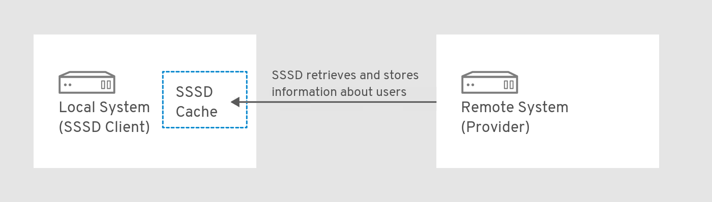 

SSSD can also provide caches for several system services, such as Name Service Switch (NSS) or Pluggable Authentication Modules (PAM).

Note

Only use the SSSD service for caching user information. Running both Name Service Caching Daemon (NSCD) and SSSD for caching on the same system might lead to performance issues and conflicts.

<h3 id="benefits-of-using-sssd">3.2. Benefits of using SSSD</h3>

The System Security Services Daemon (SSSD) enhances system efficiency by caching credentials locally. This capability enables offline authentication, minimizes traffic to remote providers, and consolidates network access into a single user account.

Offline authentication

SSSD optionally keeps a cache of user identities and credentials retrieved from remote providers. In this setup, a user - provided they have already authenticated once against the remote provider at the start of the session - can successfully authenticate to resources even if the remote provider or the client are offline.

A single user account: improved consistency of the authentication process

With SSSD, it is not necessary to maintain both a central account and a local user account for offline authentication. The conditions are:

- In a particular session, the user must have logged in at least once: the client must be connected to the remote provider when the user logs in for the first time.
- Caching must be enabled in SSSD.
  
  Without SSSD, remote users often have multiple user accounts. For example, to connect to a virtual private network (VPN), remote users have one account for the local system and another account for the VPN system. In this scenario, you must first authenticate on the private network to fetch the user from the remote server and cache the user credentials locally.
  
  With SSSD, thanks to caching and offline authentication, remote users can connect to network resources simply by authenticating to their local machine. SSSD then maintains their network credentials.

Reduced load on identity and authentication providers

When requesting information, the clients first check the local SSSD cache. SSSD contacts the remote providers only if the information is not available in the cache.

<h3 id="multiple-sssd-configuration-files-on-a-per-client-basis">3.3. Multiple SSSD configuration files on a per-client basis</h3>

The System Security Services Daemon (SSSD) builds its configuration by combining the primary file with modular files in the `conf.d` directory. This structure helps you to maintain global defaults while applying specific overrides or extensions for individual clients.

The default configuration file for SSSD is `/etc/sssd/sssd.conf`. Apart from this file, SSSD can read its configuration from all `*.conf` files in the `/etc/sssd/conf.d/` directory.

This combination allows you to use the default `/etc/sssd/sssd.conf` file on all clients and add additional settings in further configuration files to extend the functionality individually on a per-client basis.

SSSD reads the configuration files in this order:

1. The primary `/etc/sssd/sssd.conf` file.
2. Other `*.conf` files in `/etc/sssd/conf.d/`, processed in alphabetical order.

If the same parameter appears in multiple configuration files, SSSD uses the last read parameter.

Note

SSSD does not read hidden files (files starting with `.`) in the `conf.d` directory.

<h3 id="identity-and-authentication-providers-for-sssd">3.4. Identity and authentication providers for SSSD</h3>

SSSD links local clients to external backends like LDAP, Identity Management (IdM), Active Directory (AD), and Kerberos. Configure these connections as domains, assigning specific providers to handle identity, authentication, or access control tasks.

<h4 id="identity\_and\_authentication\_providers\_as\_sssd\_domains">3.4.1. Identity and authentication providers as SSSD domains</h4>

Define SSSD domains in `/etc/sssd/sssd.conf` to map backends to specific functions. You can configure a single domain to handle identity lookups, authentication requests, and access control either separately or together.

The providers are listed in the `[domain/<domain_name>]` or `[domain/default]` section of the file.

You can configure a single domain as one of the following providers:

- An *identity provider*, which supplies user information such as UID and GID.
  
  - Specify a domain as the *identity provider* by using the `id_provider` option in the `[domain/<domain_name>]` section of the `/etc/sssd/sssd.conf` file.
- An *authentication provider*, which handles authentication requests.
  
  - Specify a domain as the *authentication provider* by using the `auth_provider` option in the `[domain/<domain_name>]` section of `/etc/sssd/sssd.conf`.
- An *access control provider*, which handles authorization requests.
  
  - Specify a domain as the *access control provider* using the `access_provider` option in the `[domain/<domain_name>]` section of `/etc/sssd/sssd.conf`. By default, the option is set to `permit`, which always allows all access. See the **sssd.conf**(5) man page for details.
- A combination of these providers, for example if all the corresponding operations are performed within a single server.
  
  - In this case, the `id_provider`, `auth_provider`, and `access_provider` options are all listed in the same `[domain/<domain_name>]` or `[domain/default]` section of `/etc/sssd/sssd.conf`.

Note

You can configure multiple domains for SSSD. You must configure at least one domain, otherwise SSSD will not start.

<h4 id="proxy\_providers">3.4.2. Proxy providers</h4>

Proxy providers serve as intermediaries for resources SSSD cannot directly access. SSSD connects to the proxy service to load external libraries, enabling integration with legacy systems like NIS and alternative authentication hardware.

You can configure SSSD to use a proxy provider to enable:

- Alternative authentication methods, such as a fingerprint scanner
- Legacy systems, such as NIS
- A local system account defined in the `/etc/passwd` file as an identity provider and a remote authentication provider, for example Kerberos
- Authentication of local users using smart cards

<h4 id="available\_combinations\_of\_identity\_and\_authentication\_providers">3.4.3. Available combinations of identity and authentication providers</h4>

With SSSD, you can mix specific providers for identity and authentication tasks. You can configure unified backends like Active Directory or hybrid setups, such as combining LDAP directories with Kerberos realms.

| Identity Provider                                                    | Authentication Provider |
|:---------------------------------------------------------------------|:------------------------|
| Identity Management [\[a\]](#ftn.idm140712138494656)                 | Identity Management     |
| Active Directory                                                     | Active Directory        |
| LDAP                                                                 | LDAP                    |
| LDAP                                                                 | Kerberos                |
| Proxy                                                                | Proxy                   |
| Proxy                                                                | LDAP                    |
| Proxy                                                                | Kerberos                |
| [\[a\]](#idm140712138494656) An extension of the LDAP provider type. |                         |

Table 3.1. Available combinations of identity and authentication providers

**Additional resources**

- [Configuring user authentication using authselect](https://docs.redhat.com/en/documentation/red_hat_enterprise_linux/10/html/configuring_authentication_and_authorization_in_rhel/configuring-user-authentication-using-authselect)
- [Querying domain information using SSSD](https://docs.redhat.com/en/documentation/red_hat_enterprise_linux/10/html/configuring_authentication_and_authorization_in_rhel/querying-domain-information-using-sssd)
- [Reporting on user access on hosts using SSSD](https://docs.redhat.com/en/documentation/red_hat_enterprise_linux/10/html/configuring_authentication_and_authorization_in_rhel/reporting-on-user-access-on-hosts-using-sssd)

<h2 id="configuring-sssd-to-use-ldap-and-require-tls-authentication">Chapter 4. Configuring SSSD to use LDAP and require TLS authentication</h2>

Configure the System Security Services Daemon (SSSD) to authenticate users against standalone LDAP servers. Enforcing TLS encryption ensures secure communication, protecting identity data from interception during retrieval.

Note

The SSSD configuration option to enforce TLS, `ldap_id_use_start_tls`, defaults to `false`. When using `ldap://` without TLS for identity lookups, it can pose a risk for an attack vector, namely a man-in-the-middle (MITM) attack which could allow you to impersonate a user by altering, for example, the UID or GID of an object returned in an LDAP search.

Ensure that your setup operates in a trusted environment and decide if it is safe to use unencrypted communication for `id_provider = ldap`. Note `id_provider = ad` and `id_provider = ipa` are not affected as they use encrypted connections protected by SASL and GSSAPI.

If it is not safe to use unencrypted communication, you should enforce TLS by setting the `ldap_id_use_start_tls` option to `true` in the `/etc/sssd/sssd.conf` file.

<h3 id="an-openldap-client-using-sssd-to-retrieve-data-from-ldap-in-an-encrypted-way">4.1. An OpenLDAP client using SSSD to retrieve data from LDAP in an encrypted way</h3>

SSSD operates as a client to retrieve identity data from OpenLDAP servers. This configuration utilizes encrypted connections and supports authentication through either Kerberos tickets or standard LDAP passwords.

Important

Configuring SSSD with LDAP is a complex procedure requiring a high level of expertise in SSSD and LDAP. Consider using an integrated and automated solution such as Active Directory or Identity Management (IdM) instead. For details about IdM, see [Planning Identity Management](https://docs.redhat.com/en/documentation/red_hat_enterprise_linux/10/html/planning_identity_management/index).

<h3 id="configuring-sssd-to-use-ldap-and-require-tls-authentication\_configuring-sssd-to-use-ldap-and-require-tls-authentication">4.2. Configuring SSSD to use LDAP and require TLS authentication</h3>

Establish a secure connection between Red Hat Enterprise Linux (RHEL) and an OpenLDAP server by configuring SSSD to enforce TLS. This process ensures that all identity data retrieval and authentication requests occur over an encrypted channel.

Use the following client configuration:

- The RHEL system authenticates users stored in an OpenLDAP user account database.
- The RHEL system uses the System Security Services Daemon (SSSD) service to retrieve user data.
- The RHEL system communicates with the OpenLDAP server over a TLS-encrypted connection.

Note

You can alternatively use this procedure to configure your RHEL system as a client of a Red Hat Directory Server.

**Prerequisites**

- The OpenLDAP server is installed and configured with user information.
- You have root permissions on the host you are configuring as the LDAP client.
- On the host you are configuring as the LDAP client, the `/etc/sssd/sssd.conf` file has been created and configured to specify `ldap` as the `autofs_provider` and the `id_provider`.
- You have a PEM-formatted copy of the root CA signing certificate chain from the Certificate Authority that issued the OpenLDAP server certificate, stored in a local file named `core-dirsrv.ca.pem`.

**Procedure**

01. Install the requisite packages:
    
    ```
    dnf -y install openldap-clients sssd sssd-ldap oddjob-mkhomedir
    ```
    
    ```plaintext
    # dnf -y install openldap-clients sssd sssd-ldap oddjob-mkhomedir
    ```
02. Switch the authentication provider to `sssd`:
    
    ```
    authselect select sssd with-mkhomedir
    ```
    
    ```plaintext
    # authselect select sssd with-mkhomedir
    ```
03. Copy the `core-dirsrv.ca.pem` file containing the root CA signing certificate chain from the Certificate Authority that issued the OpenLDAP server’s SSL/TLS certificate into the `/etc/openldap/certs` folder.
    
    ```
    cp core-dirsrv.ca.pem /etc/openldap/certs
    ```
    
    ```plaintext
    # cp core-dirsrv.ca.pem /etc/openldap/certs
    ```
04. Add the URL and suffix of your LDAP server to the `/etc/openldap/ldap.conf` file:
    
    ```
    URI ldap://ldap-server.example.com/
    BASE dc=example,dc=com
    ```
    
    ```plaintext
    URI ldap://ldap-server.example.com/
    BASE dc=example,dc=com
    ```
05. In the `/etc/openldap/ldap.conf` file, add a line pointing the **TLS\_CACERT** parameter to `/etc/openldap/certs/core-dirsrv.ca.pem`:
    
    ```
    # When no CA certificates are specified the Shared System Certificates
    are in use. In order to have these available along with the ones specified
    by TLS_CACERTDIR one has to include them explicitly:
    TLS_CACERT /etc/openldap/certs/core-dirsrv.ca.pem
    ```
    
    ```plaintext
    # When no CA certificates are specified the Shared System Certificates
    # are in use. In order to have these available along with the ones specified
    # by TLS_CACERTDIR one has to include them explicitly:
    TLS_CACERT /etc/openldap/certs/core-dirsrv.ca.pem
    ```
06. In the `/etc/sssd/sssd.conf` file, add your environment values to the `ldap_uri` and `ldap_search_base` parameters and set the `ldap_id_use_start_tls` to `True`:
    
    ```
    [domain/default]
    id_provider = ldap
    autofs_provider = ldap
    auth_provider = ldap
    chpass_provider = ldap
    ldap_uri = ldap://ldap-server.example.com/
    ldap_search_base = dc=example,dc=com
    ldap_id_use_start_tls = True
    cache_credentials = True
    ldap_tls_cacertdir = /etc/openldap/certs
    ldap_tls_reqcert = allow
    
    [sssd]
    services = nss, pam, autofs
    domains = default
    
    [nss]
    homedir_substring = /home
    …
    ```
    
    ```plaintext
    [domain/default]
    id_provider = ldap
    autofs_provider = ldap
    auth_provider = ldap
    chpass_provider = ldap
    ldap_uri = ldap://ldap-server.example.com/
    ldap_search_base = dc=example,dc=com
    ldap_id_use_start_tls = True
    cache_credentials = True
    ldap_tls_cacertdir = /etc/openldap/certs
    ldap_tls_reqcert = allow
    
    [sssd]
    services = nss, pam, autofs
    domains = default
    
    [nss]
    homedir_substring = /home
    …
    ```
07. In `/etc/sssd/sssd.conf`, specify the TLS authentication requirement by modifying the `ldap_tls_cacert` and `ldap_tls_reqcert` values in the `[domain]` section:
    
    ```
    …
    cache_credentials = True
    ldap_tls_cacert = /etc/openldap/certs/core-dirsrv.ca.pem
    ldap_tls_reqcert = hard
    …
    ```
    
    ```plaintext
    …
    cache_credentials = True
    ldap_tls_cacert = /etc/openldap/certs/core-dirsrv.ca.pem
    ldap_tls_reqcert = hard
    …
    ```
08. Change the permissions on the `/etc/sssd/sssd.conf` file:
    
    ```
    chmod 600 /etc/sssd/sssd.conf
    ```
    
    ```plaintext
    # chmod 600 /etc/sssd/sssd.conf
    ```
09. Restart and enable the SSSD service and the `oddjobd` daemon:
    
    ```
    systemctl restart sssd oddjobd
    systemctl enable sssd oddjobd
    ```
    
    ```plaintext
    # systemctl restart sssd oddjobd
    # systemctl enable sssd oddjobd
    ```
10. Optional: If your LDAP server uses the deprecated TLS 1.0 or TLS 1.1 protocols, switch the system-wide cryptographic policy on the client system to the LEGACY level to allow RHEL to communicate using these protocols:
    
    ```
    update-crypto-policies --set LEGACY
    ```
    
    ```plaintext
    # update-crypto-policies --set LEGACY
    ```
    
    For more details, see the [Strong crypto defaults in RHEL 8 and deprecation of weak crypto algorithms](https://access.redhat.com/articles/3642912) Knowledgebase article on the Red Hat Customer Portal and the `update-crypto-policies(8)` man page on your system.

**Verification**

- Verify you can retrieve user data from your LDAP server by using the `id` command and specifying an LDAP user:
  
  ```
  id <ldap_user>
  ```
  
  ```plaintext
  # id <ldap_user>
  ```
  
  ```
  uid=17388( <ldap_user>) gid=45367(sysadmins) groups=45367(sysadmins),25395(engineers),10(wheel),1202200000(admins)
  ```
  
  ```plaintext
  uid=17388( <ldap_user>) gid=45367(sysadmins) groups=45367(sysadmins),25395(engineers),10(wheel),1202200000(admins)
  ```

The system administrator can now query users from LDAP using the `id` command. The command returns a correct user ID and group membership.

<h2 id="additional-configuration-for-identity-and-authentication-providers">Chapter 5. Additional configuration for identity and authentication providers</h2>

Extend the System Security Services Daemon (SSSD) functionality beyond basic connectivity by modifying the `/etc/sssd/sssd.conf` file. Advanced configurations include customizing user name formats, enabling offline access, dynamically discovering servers via DNS, and enforcing granular access control rules.

- Adjust how SSSD interprets and prints full user names to enable offline authentication.
- Configure DNS Service Discovery, simple Access Provider Rules, and SSSD to apply an LDAP Access Filter.

<h3 id="adjusting-how-sssd-interprets-full-user-names">5.1. Adjusting how SSSD interprets full user names</h3>

The System Security Services Daemon (SSSD) parses user inputs into name and domain components using Python-compatible regular expressions. You can override the default parsing logic by defining custom patterns with the `re_expression` parameter to match specific organizational naming conventions.

By default, SSSD interprets full user names in the format `<user_name>@<domain_name>` based on the following regular expression in Python syntax:

```
(?P_<name>_[^@]+)@?(?P_<domain>_[^@]*$)
```

```plaintext
(?P_<name>_[^@]+)@?(?P_<domain>_[^@]*$)
```

Note

For Identity Management and Active Directory providers, the default user name format is `<user_name>@<domain_name>` or `<NetBIOS_name>\<user_name>`.

You can adjust how SSSD interprets full user names by adding the `re_expression` option to the `/etc/sssd/sssd.conf` file and defining a custom regular expression.

**Prerequisites**

- `root` access

**Procedure**

1. Open the `/etc/sssd/sssd.conf` file.
2. Use the `re_expression` option to define a custom regular expression.
   
   1. To define regular expressions globally for all domains, add `re_expression` to the `[sssd]` section of the `sssd.conf` file.
      
      You can use the following global expression to define the username in the format of `<domain>\_<username>_` or `<domain>@<user_name>`:
      
      ```
      [sssd]
      [... file truncated ...]
      re_expression = (?P_<domain>_[\\]*?)\\?(?P_<name>_[\\]+$)
      ```
      
      ```plaintext
      [sssd]
      [... file truncated ...]
      re_expression = (?P_<domain>_[\\]*?)\\?(?P_<name>_[\\]+$)
      ```
   2. To define the regular expressions individually for a particular domain, add `re_expression` to the corresponding domain section of the `sssd.conf` file.
      
      You can use the following global expression to define the username in the format of `<domain>\_<username>_` or `<domain>@<user_name>` for the LDAP domain:
      
      ```
      [domain/LDAP]
      [... file truncated ...]
      re_expression = (?P_<domain>_[\\]*?)\\?(?P_<name>_[\\]+$)
      ```
      
      ```plaintext
      [domain/LDAP]
      [... file truncated ...]
      re_expression = (?P_<domain>_[\\]*?)\\?(?P_<name>_[\\]+$)
      ```

<h3 id="adjusting-how-sssd-prints-full-user-names">5.2. Adjusting how SSSD prints full user names</h3>

The System Security Services Daemon (SSSD) displays fully qualified user names, for example, `user@domain`, by default when `use_fully_qualified_names` is active. You can customize this output format using the `full_name_format` option to match legacy requirements, such as displaying `domain\user`.

If the `use_fully_qualified_names` option is enabled in the `/etc/sssd/sssd.conf` file, SSSD prints full user names in the format `<name>@<domain>` based on the following expansion by default:

```
%1$s@%2$s
```

```plaintext
%1$s@%2$s
```

Note

If `use_fully_qualified_names` is not set or is explicitly set to `false` for trusted domains, it only prints the user name without the domain component.

You can adjust the format in which SSSD prints full user names by adding the `full_name_format` option to the `/etc/sssd/sssd.conf` file and defining a custom expansion.

**Prerequisites**

- `root` access

**Procedure**

1. As `root`, open the `/etc/sssd/sssd.conf` file.
2. To define the expansion globally for all domains, add `full_name_format` to the `[sssd]` section of `sssd.conf`.
   
   ```
   [sssd]
   [... file truncated ...]
   full_name_format = %1$s@%2$s
   ```
   
   ```plaintext
   [sssd]
   [... file truncated ...]
   full_name_format = %1$s@%2$s
   ```
   
   In this case the user name is displayed as `user@domain.test`.
3. To define the user name printing format for a particular domain, add `full_name_format` to the corresponding domain section of `sssd.conf`.
   
   - To configure the expansion for the Active Directory (AD) domain using `%2$s\%1$s`:
     
     ```
     [domain/ad.domain]
     [... file truncated ...]
     full_name_format = %2$s\%1$s
     ```
     
     ```plaintext
     [domain/ad.domain]
     [... file truncated ...]
     full_name_format = %2$s\%1$s
     ```
     
     In this case the user name is displayed as `ad.domain\user`.
   - To configure the expansion for the Active Directory (AD) domain using `%3$s\%1$s`:
     
     ```
     [domain/ad.domain]
     [... file truncated ...]
     full_name_format = %3$s\%1$s
     ```
     
     ```plaintext
     [domain/ad.domain]
     [... file truncated ...]
     full_name_format = %3$s\%1$s
     ```
     
     In this case the user name is displayed as `AD\user` if the flat domain name of the Active Directory domain is set to `AD`.
   
   Note
   
   SSSD can strip the domain component of the name in some name configurations, which can cause authentication errors. If you set `full_name_format` to a non-standard value, you will get a warning prompting you to change it to a standard format.

<h3 id="enabling-offline-authentication">5.3. Enabling offline authentication</h3>

The System Security Services Daemon (SSSD) requires credential caching to enable authentication when the identity provider is unreachable. Enabling `cache_credentials` allows users to log in using locally stored hashes of their passwords during network outages, ensuring business continuity.

You can enable credential caching by setting `cache_credentials` to `true` in the `/etc/sssd/sssd.conf` file. Cached credentials refer to passwords and the first authentication factor if two-factor authentication is used. Note that for passkey and smart card authentication, you do not need to set `cache_credentials` to true or set any additional configuration; they are expected to work offline as long as a successful online authentication is recorded in the cache.

Important

SSSD never caches passwords in plain text. It stores only a hash of the password.

While credentials are stored as a salted SHA-512 hash, this potentially poses a security risk in case an attacker manages to access the cache file and break a password using a brute force attack. Accessing a cache file requires privileged access, which is the default on RHEL.

**Prerequisites**

- `root` access

**Procedure**

1. Open the `/etc/sssd/sssd.conf` file.
2. In a domain section, add the `cache_credentials = true` setting:
   
   ```
   [domain/<domain_name>]
   cache_credentials = true
   ```
   
   ```plaintext
   [domain/<domain_name>]
   cache_credentials = true
   ```
3. Optional, but recommended: Configure a time limit for how long SSSD allows offline authentication if the identity provider is unavailable:
   
   1. Configure the PAM service to work with SSSD.
   2. Use the `offline_credentials_expiration` option to specify the time limit.
      
      Note that the limit is set in days.
      
      For example, to specify that users are able to authenticate offline for 3 days since the last successful login, use:
      
      ```
      [pam]
      offline_credentials_expiration = 3
      ```
      
      ```plaintext
      [pam]
      offline_credentials_expiration = 3
      ```

**Additional resources**

- [Configuring user authentication using authselect](https://docs.redhat.com/en/documentation/red_hat_enterprise_linux/10/html/configuring_authentication_and_authorization_in_rhel/configuring-user-authentication-using-authselect)

<h3 id="configuring-dns-service-discovery">5.4. Configuring DNS Service Discovery</h3>

DNS service discovery allows the System Security Services Daemon (SSSD) to automatically locate identity servers by using SRV records. This configuration removes the need to hardcode server IP addresses, enabling dynamic failover and load balancing by querying the DNS infrastructure.

If the identity or authentication server is not explicitly defined in the `/etc/sssd/sssd.conf` file, SSSD can discover the server dynamically using DNS service discovery.

For example, if `sssd.conf` includes the `id_provider = ldap` setting, but the `ldap_uri` option does not specify any host name or IP address, SSSD uses DNS service discovery to discover the server dynamically.

Note

SSSD cannot dynamically discover backup servers, only the primary server.

**Prerequisites**

- `root` access

**Procedure**

1. Open the `/etc/sssd/sssd.conf` file.
2. Set the primary server value to `_srv_`.
   
   For an LDAP provider, the primary server is set using the `ldap_uri` option:
   
   ```
   [domain/<ldap_domain_name>]
   id_provider = ldap
   ldap_uri = _srv_
   ```
   
   ```plaintext
   [domain/<ldap_domain_name>]
   id_provider = ldap
   ldap_uri = _srv_
   ```
3. Enable service discovery in the password change provider by setting a service type:
   
   ```
   [domain/<ldap_domain_name>]
   id_provider = ldap
   ldap_uri = _srv_
   
   chpass_provider = ldap
   ldap_chpass_dns_service_name = ldap
   ```
   
   ```plaintext
   [domain/<ldap_domain_name>]
   id_provider = ldap
   ldap_uri = _srv_
   
   chpass_provider = ldap
   ldap_chpass_dns_service_name = ldap
   ```
4. Optional: By default, the service discovery uses the domain portion of the system host name as the domain name. To use a different DNS domain, specify the domain name by using the `dns_discovery_domain` option.
5. Optional: By default, the service discovery scans for the LDAP service type. To use a different service type, specify the type by using the `ldap_dns_service_name` option.
6. Optional: By default, SSSD attempts to look up an IPv4 address. If the attempt fails, SSSD attempts to look up an IPv6 address. To customize this behavior, use the `lookup_family_order` option.
7. For every service with which you want to use service discovery, add a DNS record to the DNS server:
   
   ```
   _<service_name>.<protocol>.<domain_name> <TTL> <priority> <weight> <port_number> <hostname>_
   ```
   
   ```plaintext
   _<service_name>.<protocol>.<domain_name> <TTL> <priority> <weight> <port_number> <hostname>_
   ```

**Additional resources**

- [RFC 2782 on DNS service discovery](http://www.ietf.org/rfc/rfc2782.txt)

<h3 id="configuring-simple-access-provider-rules">5.5. Configuring simple Access Provider Rules</h3>

The `simple` access provider restricts system login access based on explicit lists of users or groups. Configure allow or deny rules directly in `sssd.conf` to enforce security policies locally without modifying the remote backend directory.

For example, you can use the `simple` access provider to restrict access to a specific user or group. Other users or groups will not be allowed to log in even if they authenticate successfully against the configured authentication provider.

**Prerequisites**

- `root` access

**Procedure**

1. Open the `/etc/sssd/sssd.conf` file.
2. Set the `access_provider` option to `simple`:
   
   ```
   [domain/<domain_name>]
   access_provider = simple
   ```
   
   ```plaintext
   [domain/<domain_name>]
   access_provider = simple
   ```
3. Define the access control rules for users.
   
   1. To allow access to users, use the `simple_allow_users` option.
   2. To deny access to users, use the `simple_deny_users` option.
   
   Important
   
   If you deny access to specific users, you automatically allow access to everyone else. Allowing access to specific users is considered safer than denying.
4. Define the access control rules for groups. Choose one of the following:
   
   1. To allow access to groups, use the `simple_allow_groups` option.
   2. To deny access to groups, use the `simple_deny_groups` option.
      
      Important
      
      If you deny access to specific groups, you automatically allow access to everyone else. Allowing access to specific groups is considered safer than denying.
      
      For example, you can grant access to `alice`, `bob`, and members of the `engineers` group, while denying access to all other users:
      
      ```
      [domain/<domain_name>]
      access_provider = simple
      simple_allow_users = alice, bob
      simple_allow_groups = engineers
      ```
      
      ```plaintext
      [domain/<domain_name>]
      access_provider = simple
      simple_allow_users = alice, bob
      simple_allow_groups = engineers
      ```
      
      Important
      
      Keeping the deny list empty can lead to allowing access to everyone.
   
   Note
   
   If you are adding a trusted AD user to the `simple_allow_users` list, ensure that you use the fully qualified domain name (FQDN) format, for example, aduser@ad.example.com. As short names in different domains can be the same, this prevents issues with the access control configuration.

<h3 id="configuring-sssd-to-apply-an-ldap-access-filter">5.6. Configuring SSSD to apply an LDAP access filter</h3>

LDAP access filters refine authorization by requiring specific attribute matches in the directory entry. SSSD evaluates these filters during login, granting access only if the user object satisfies the defined criteria, such as membership in a specific group.

When the `access_provider` option is set in `/etc/sssd/sssd.conf`, SSSD uses the specified access provider to evaluate which users are granted access to the system. If the access provider you are using is an extension of the LDAP provider type, you can also specify an LDAP access control filter that a user must match to be allowed access to the system.

For example, when using the Active Directory (AD) server as the access provider, you can restrict access to the Linux system only to specified AD users. All other users that do not match the specified filter have access denied.

Note

The access filter is applied on the LDAP user entry only. Therefore, using this type of access control on nested groups might not work. To apply access control on nested groups, see [Configuring `simple` access provider rules](#configuring-simple-access-provider-rules "5.5. Configuring simple Access Provider Rules").

Important

When using offline caching, SSSD checks if the user’s most recent online login attempt was successful. Users who logged in successfully during the most recent online login will still be able to log in offline, even if they do not match the access filter.

**Prerequisites**

- `root` access

**Procedure**

1. Open the `/etc/sssd/sssd.conf` file.
2. In the `[domain]` section, specify the access control filter.
   
   - For an LDAP, use the `ldap_access_filter` option.
   - For an AD, use the `ad_access_filter` option. Additionally, you must disable the GPO-based access control by setting the `ad_gpo_access_control` option to `disabled`.
     
     For example, to allow access only to AD users who belong to the `admins` user group and have a `unixHomeDirectory` attribute set, use:
     
     ```
     [domain/<ad_domain_name>]
     access provider = ad
     [... file truncated ...]
     ad_access_filter = (&(memberOf=cn=admins,ou=groups,dc=example,dc=com)(unixHomeDirectory=*))
     ad_gpo_access_control = disabled
     ```
     
     ```plaintext
     [domain/<ad_domain_name>]
     access provider = ad
     [... file truncated ...]
     ad_access_filter = (&(memberOf=cn=admins,ou=groups,dc=example,dc=com)(unixHomeDirectory=*))
     ad_gpo_access_control = disabled
     ```
     
     SSSD can also check results by the `authorizedService` or `host` attribute in an entry. In fact, all options MDASH LDAP filter, `authorizedService`, and `host` MDASH can be evaluated, depending on the user entry and the configuration. The `ldap_access_order` parameter lists all access control methods to use, ordered as how they should be evaluated.
     
     ```
     [domain/example.com]
     access_provider = ldap
     ldap_access_filter = memberOf=cn=allowedusers,ou=Groups,dc=example,dc=com
     ldap_access_order = filter, host, authorized_service
     ```
     
     ```plaintext
     [domain/example.com]
     access_provider = ldap
     ldap_access_filter = memberOf=cn=allowedusers,ou=Groups,dc=example,dc=com
     ldap_access_order = filter, host, authorized_service
     ```

<h2 id="sssd-client-side-view">Chapter 6. SSSD client-side view</h2>

The `sss_override` utility helps you to create a local view of user data. This tool modifies POSIX attributes on a specific machine without altering the central identity provider, handling conflicts or local requirements effectively.

You can configure overrides for all `id_provider` values, except `ipa`.

If you are using the `ipa` provider, define ID views centrally in IPA. For more information, see [Using an ID view to override a user attribute value on an IdM client](https://access.redhat.com/documentation/hi-in/red_hat_enterprise_linux/9/html/managing_idm_users_groups_hosts_and_access_control_rules/using-an-id-view-to-override-a-user-attribute-value-on-an-idm-client_managing-users-groups-hosts).

For information about a potential negative impact on the SSSD performance, see [Potential negative impact of ID views on SSSD performance](https://docs.redhat.com/en/documentation/red_hat_enterprise_linux/10/html/managing_idm_users_groups_hosts_and_access_control_rules/using-an-id-view-to-override-a-user-attribute-value-on-an-idm-client#potential-negative-impact-of-id-views-on-sssd-performance).

<h3 id="overriding-the-ldap-username-attribute">6.1. Overriding the LDAP username attribute</h3>

LDAP user names may conflict with local system policies or naming conventions. Use the `sss_override` command to map a remote LDAP user name to a distinct local alias, ensuring compatibility with the specific host.

**Prerequisites**

- `root` access
- Have `sssd-tools` package installed

**Procedure**

1. Display the current information for the user:
   
   ```
   id <ldap_username>
   ```
   
   ```plaintext
   # id <ldap_username>
   ```
   
   Replace `<ldap_username>` with the LDAP `username` of the user. For example:
   
   ```
   id sjones
   ```
   
   ```plaintext
   # id sjones
   ```
   
   ```
   uid=1001(sjones) gid=6003 groups=6003,10(wheel)
   ```
   
   ```plaintext
   uid=1001(sjones) gid=6003 groups=6003,10(wheel)
   ```
2. Add the local username:
   
   ```
   sss_override user-add <ldap_username> -n <local_username>
   ```
   
   ```plaintext
   # sss_override user-add <ldap_username> -n <local_username>
   ```
   
   Replace `<ldap_username>` with the LDAP `username` and replace `<local_username>` with the desired local username. For example:
   
   ```
   sss_override user-add sjones -n sarah
   ```
   
   ```plaintext
   # sss_override user-add sjones -n sarah
   ```
3. After creating the first override using the `sss_override user-add` command, restart SSSD for the changes to take effect:
   
   ```
   systemctl restart sssd
   ```
   
   ```plaintext
   # systemctl restart sssd
   ```

**Verification**

- Verify that the local username is added:
  
  ```
  id <local_username>
  ```
  
  ```plaintext
  # id <local_username>
  ```
  
  For example:
  
  ```
  id sarah
  ```
  
  ```plaintext
  # id sarah
  ```
  
  ```
  uid=1001(sjones) gid=6003(sjones) groups=6003(sjones),10(wheel)
  ```
  
  ```plaintext
  uid=1001(sjones) gid=6003(sjones) groups=6003(sjones),10(wheel)
  ```
  
  ```
  sss_override user-show sjones
  user@ldap.example.com:sarah::::::
  ```
  
  ```plaintext
  # sss_override user-show sjones
  user@ldap.example.com:sarah::::::
  ```
- Optional: Display the overrides for the user:
  
  ```
  sss_override user-show <ldap_username>
  ```
  
  ```plaintext
  # sss_override user-show <ldap_username>
  ```
  
  ```
  user@ldap.example.com:_<local_username>_::::::
  ```
  
  ```plaintext
  user@ldap.example.com:_<local_username>_::::::
  ```

<h3 id="overriding-the-ldap-uid-attribute">6.2. Overriding the LDAP UID attribute</h3>

Conflicting numeric identifiers can cause file permission errors. You can override the unique identifier (UID) provided by LDAP with a specific local value using `sss_override`, ensuring the user matches local file ownership requirements.

**Prerequisites**

- `root` access
- Have `sssd-tools` package installed

**Procedure**

1. Display the current UID of the user:
   
   ```
   id -u <ldap_username>
   ```
   
   ```plaintext
   # id -u <ldap_username>
   ```
   
   Replace `<ldap_username>` with the LDAP `username` of the user. For example:
   
   ```
   id -u sarah
   ```
   
   ```plaintext
   # id -u sarah
   ```
   
   ```
   1001
   ```
   
   ```plaintext
   1001
   ```
2. Override the UID of the user’s account:
   
   ```
   sss_override user-add <ldap_username> -u <local_uid>
   ```
   
   ```plaintext
   # sss_override user-add <ldap_username> -u <local_uid>
   ```
   
   Replace `<ldap_username>` with the LDAP `username` of the user and replace `<local_uid>` with the new UID number. For example:
   
   ```
   sss_override user-add sarah -u 6666
   ```
   
   ```plaintext
   # sss_override user-add sarah -u 6666
   ```
3. Expire the in-memory cache:
   
   ```
   sss_cache --users
   ```
   
   ```plaintext
   # sss_cache --users
   ```
4. After creating the first override using the `sss_override user-add` command, restart SSSD for the changes to take effect:
   
   ```
   systemctl restart sssd
   ```
   
   ```plaintext
   # systemctl restart sssd
   ```

**Verification**

- Verify that the local UID has been applied:
  
  ```
  id -u <ldap_username>
  ```
  
  ```plaintext
  # id -u <ldap_username>
  ```
- Optional: Display the overrides for the user:
  
  ```
  sss_override user-show <ldap_username>
  ```
  
  ```plaintext
  # sss_override user-show <ldap_username>
  ```
  
  ```
  user@ldap.example.com::_<local_uid>_:::::
  ```
  
  ```plaintext
  user@ldap.example.com::_<local_uid>_:::::
  ```

<h3 id="overriding-the-ldap-gid-attribute">6.3. Overriding the LDAP GID attribute</h3>

You can change the group identifier (GID) for an LDAP user on the local system. This action ensures the user’s primary group matches specific local requirements, facilitating correct file access and group membership.

**Prerequisites**

- `root` access
- Installed `sssd-tools`

**Procedure**

1. Display the current GID of the user:
   
   ```
   id -g <ldap_username>
   ```
   
   ```plaintext
   # id -g <ldap_username>
   ```
   
   Replace `<ldap_username>` with the name of the user. For example:
   
   ```
   id -g sarah
   ```
   
   ```plaintext
   # id -g sarah
   ```
   
   ```
   6003
   ```
   
   ```plaintext
   6003
   ```
2. Override the GID of the user’s account:
   
   ```
   sss_override user-add <ldap_username> -g <local_gid>
   ```
   
   ```plaintext
   # sss_override user-add <ldap_username> -g <local_gid>
   ```
   
   Replace `<ldap_username>` with the name of the user and replace `<local_gid>` with the local GID number. For example:
   
   ```
   sss_override user-add sarah -g 6666
   ```
   
   ```plaintext
   # sss_override user-add sarah -g 6666
   ```
3. Expire the in-memory cache:
   
   ```
   sss_cache --users
   ```
   
   ```plaintext
   # sss_cache --users
   ```
4. After creating the first override using the `sss_override user-add` command, restart SSSD for the changes to take effect:
   
   ```
   systemctl restart sssd
   ```
   
   ```plaintext
   # systemctl restart sssd
   ```

**Verification**

- Verify that the local GID is applied:
  
  ```
  id -g <ldap_username>
  ```
  
  ```plaintext
  # id -g <ldap_username>
  ```
- Optional: Display the overrides for the user:
  
  ```
  sss_override user-show <ldap_username>
  ```
  
  ```plaintext
  # sss_override user-show <ldap_username>
  ```
  
  ```
  user@ldap.example.com::: 6666::::
  ```
  
  ```plaintext
  user@ldap.example.com::: 6666::::
  ```

<h3 id="overriding-the-ldap-home-directory-attribute">6.4. Overriding the LDAP home directory attribute</h3>

Remote home directory paths often do not exist on every client machine. Overriding this attribute helps you to map users to a valid local path, ensuring they land in an existing directory upon login.

**Prerequisites**

- `root` access
- Installed `sssd-tools`

**Procedure**

1. Display the current home directory of the user as stored locally:
   
   ```
   getent passwd <ldap_username>
   ```
   
   ```plaintext
   # getent passwd <ldap_username>
   ```
   
   ```
   <ldap_username>:x:XXXX:XXXX::/home/<home_directory>:/bin/bash
   ```
   
   ```plaintext
   <ldap_username>:x:XXXX:XXXX::/home/<home_directory>:/bin/bash
   ```
   
   Replace `<ldap_username>` with the name of the user. The output shows the home directory value as seen locally, which might be different from the LDAP record. For example:
   
   ```
   getent passwd sarah
   ```
   
   ```plaintext
   # getent passwd sarah
   ```
   
   ```
   sarah:x:1001:6003::sarah:/bin/bash
   ```
   
   ```plaintext
   sarah:x:1001:6003::sarah:/bin/bash
   ```
2. Override the home directory of the user:
   
   ```
   sss_override user-add <ldap_username> -h <new_home_directory>
   ```
   
   ```plaintext
   # sss_override user-add <ldap_username> -h <new_home_directory>
   ```
   
   Replace `<ldap_username>` with the name of the user and replace `<new_home_directory>` with the new home directory. For example:
   
   ```
   sss_override user-add sarah -h admin
   ```
   
   ```plaintext
   # sss_override user-add sarah -h admin
   ```
3. Restart SSSD for the changes to take effect:
   
   ```
   systemctl restart sssd
   ```
   
   ```plaintext
   # systemctl restart sssd
   ```

**Verification**

- Verify that the new home directory is defined:
  
  ```
  getent passwd <ldap_username>
  ```
  
  ```plaintext
  # getent passwd <ldap_username>
  ```
  
  ```
  <ldap_username>:x:XXXX:XXXX::/home/<new_home_directory>:/bin/bash
  ```
  
  ```plaintext
  <ldap_username>:x:XXXX:XXXX::/home/<new_home_directory>:/bin/bash
  ```
- Optional: Display the overrides for the user:
  
  ```
  sss_override user-show <ldap_username>
  ```
  
  ```plaintext
  # sss_override user-show <ldap_username>
  ```
  
  ```
  user@ldap.example.com:::::::<new_home_directory>::
  ```
  
  ```plaintext
  user@ldap.example.com:::::::<new_home_directory>::
  ```

<h3 id="overriding-the-ldap-shell-attribute">6.5. Overriding the LDAP shell attribute</h3>

The default shell assigned in LDAP may be restricted or unavailable on specific clients. You can override this attribute to assign a valid local shell, such as `/bin/bash` or `/sbin/nologin`, appropriate for the host’s specific purpose.

**Prerequisites**

- `root` access
- Installed `sssd-tools`

**Procedure**

1. Display the current shell of the user as stored locally:
   
   ```
   getent passwd <ldap_username>
   ```
   
   ```plaintext
   # getent passwd <ldap_username>
   ```
   
   ```
   <ldap_username>:x:XXXX:XXXX::/home/<home_directory>:_<currentshell>_
   ```
   
   ```plaintext
   <ldap_username>:x:XXXX:XXXX::/home/<home_directory>:_<currentshell>_
   ```
   
   Replace `<ldap_username>` with the name of the user.
2. Override the shell of the user:
   
   ```
   sss_override user-add <ldap_username> -s <new_shell>
   ```
   
   ```plaintext
   # sss_override user-add <ldap_username> -s <new_shell>
   ```
   
   Replace `<ldap_username>` with the name of the user and replace `<new_shell>` with the new shell.
3. Restart SSSD for the changes to take effect:
   
   ```
   systemctl restart sssd
   ```
   
   ```plaintext
   # systemctl restart sssd
   ```

**Verification**

- Verify that the new shell is defined:
  
  ```
  getent passwd <ldap_username>
  ```
  
  ```plaintext
  # getent passwd <ldap_username>
  ```
  
  ```
  <ldap_username>:x:XXXX:XXXX::/home/<home_directory>:_<new_shell>_
  ```
  
  ```plaintext
  <ldap_username>:x:XXXX:XXXX::/home/<home_directory>:_<new_shell>_
  ```
- Optional: Display the overrides for the user:
  
  ```
  sss_override user-show <ldap_username>
  ```
  
  ```plaintext
  # sss_override user-show <ldap_username>
  ```
  
  ```
  user@ldap.example.com::::::_<new_shell>_:
  ```
  
  ```plaintext
  user@ldap.example.com::::::_<new_shell>_:
  ```
  
  For example, to change the shell of the user `sarah` from `/bin/bash` to `sbin/nologin`:
  
  1. Display the current shell of the user `sarah`:
     
     ```
     getent passwd sarah
     ```
     
     ```plaintext
     # getent passwd sarah
     ```
     
     ```
     sarah:x:1001:6003::sarah:/bin/bash
     ```
     
     ```plaintext
     sarah:x:1001:6003::sarah:/bin/bash
     ```
  2. Override the shell of the user sarah with new `/sbin/nologin` shell:
     
     ```
     sss_override user-add sarah -s /sbin/nologin
     ```
     
     ```plaintext
     # sss_override user-add sarah -s /sbin/nologin
     ```
  3. Restart SSSD for the changes to take effect:
     
     ```
     systemctl restart sssd
     ```
     
     ```plaintext
     # systemctl restart sssd
     ```
  4. Verify that the new shell is defined and overrides for the user display correctly:
     
     ```
     getent passwd sarah
     ```
     
     ```plaintext
     # getent passwd sarah
     ```
     
     ```
     sarah:x:1001:6003::sarah:/sbin/nologin
     ```
     
     ```plaintext
     sarah:x:1001:6003::sarah:/sbin/nologin
     ```
     
     ```
     sss_override user-show sarah
     ```
     
     ```plaintext
     # sss_override user-show sarah
     ```
     
     ```
     user@ldap.example.com::::::/sbin/nologin:
     ```
     
     ```plaintext
     user@ldap.example.com::::::/sbin/nologin:
     ```

<h3 id="listing-overrides-on-a-host">6.6. Listing overrides on a host</h3>

You must audit local modifications to ensure configuration consistency. The `sss_override` tool provides search functions to list all currently active user and group overrides stored in the local cache.

**Prerequisites**

- `root` access
- Installed `sssd-tools`

**Procedure**

- List all user overrides:
  
  ```
  sss_override user-find
  ```
  
  ```plaintext
  # sss_override user-find
  ```
  
  ```
  user1@ldap.example.com::8000::::/bin/zsh:
  user2@ldap.example.com::8001::::/bin/bash:
  ...
  ```
  
  ```plaintext
  user1@ldap.example.com::8000::::/bin/zsh:
  user2@ldap.example.com::8001::::/bin/bash:
  ...
  ```
- List all group overrides:
  
  ```
  sss_override group-find
  ```
  
  ```plaintext
  # sss_override group-find
  ```
  
  ```
  group1@ldap.example.com::7000
  group2@ldap.example.com::7001
  ...
  ```
  
  ```plaintext
  group1@ldap.example.com::7000
  group2@ldap.example.com::7001
  ...
  ```

<h3 id="removing-a-local-override">6.7. Removing a local override</h3>

Removing an override reverts the user or group attributes to the values provided by the central directory. Use deletion commands to clean up obsolete configurations or restore default identity data immediately.

**Prerequisites**

- `root` access
- Installed `sssd-tools`

**Procedure**

- To remove the override for a user account, use:
  
  ```
  sss_override user-del <local_username>
  ```
  
  ```plaintext
  # sss_override user-del <local_username>
  ```
  
  Replace *&lt;local\_username&gt;* with the name of the user. The changes take effect immediately.
- To remove an override for a group, use:
  
  ```
  sss_override group-del <group_name>
  ```
  
  ```plaintext
  # sss_override group-del <group_name>
  ```
- After removing the first override using the `sss_override user-del` or `sss_override group-del` command, restart SSSD for the changes to take effect:
  
  ```
  systemctl restart sssd
  ```
  
  ```plaintext
  # systemctl restart sssd
  ```
  
  When you remove overrides for a user or group, all overrides for this object are removed.

<h3 id="exporting-and-importing-local-view">6.8. Exporting and importing local view</h3>

Local overrides reside in the SSSD cache and risk deletion during cache clearing. Exporting these configurations to a backup file helps you to restore custom views quickly after system maintenance or migrations.

**Prerequisites**

- `root` access
- Installed `sssd-tools`

**Procedure**

- To back up user and group view, use:
  
  ```
  sss_override user-export /var/lib/sss/backup/sssd_user_overrides.bak
  sss_override group-export /var/lib/sss/backup/sssd_group_overrides.bak
  ```
  
  ```plaintext
  # sss_override user-export /var/lib/sss/backup/sssd_user_overrides.bak
  # sss_override group-export /var/lib/sss/backup/sssd_group_overrides.bak
  ```
- To restore user and group view, use:
  
  ```
  sss_override user-import /var/lib/sss/backup/sssd_user_overrides.bak
  sss_override group-import /var/lib/sss/backup/sssd_group_overrides.bak
  ```
  
  ```plaintext
  # sss_override user-import /var/lib/sss/backup/sssd_user_overrides.bak
  # sss_override group-import /var/lib/sss/backup/sssd_group_overrides.bak
  ```

<h2 id="configuring-a-rhel-host-to-use-ad-as-an-authentication-provider">Chapter 7. Configuring a RHEL host to use AD as an authentication provider</h2>

Configure Red Hat Enterprise Linux (RHEL) to authenticate against Active Directory (AD) without a domain join. This method utilizes SSSD proxies and Kerberos to verify credentials, allowing centralized authentication while preserving local administrative control.

Use this approach if:

- You do not want AD administrators to have control over enabling and disabling the host.
- The host, which can be a corporate PC, is only meant to be used by one user in your company.

Important

Use this approach only if you have a specific reason to avoid joining your host to AD.

Consider fully joining the system to AD or Identity Management (IdM) instead. Joining the RHEL host to a domain makes the setup easier to manage. If you are concerned about client access licences related to joining clients into AD directly, consider leveraging an IdM server that is in a trust agreement with AD. For more information about an IdM-AD trust, see [Planning a cross-forest trust between IdM and AD](https://docs.redhat.com/en/documentation/red_hat_enterprise_linux/10/html/planning_identity_management/planning-a-cross-forest-trust-between-idm-and-ad) and

[Installing a trust between IdM and AD](https://docs.redhat.com/en/documentation/red_hat_enterprise_linux/10/html/installing_trust_between_idm_and_ad/index).

After you complete this procedure, **AD\_user** can log in to **rhel\_host** system using their the password set in the AD user database in the **example.com** domain. The **EXAMPLE.COM** Kerberos realm corresponds to the **example.com** domain.

**Prerequisites**

- You have root access to **rhel\_host**.
- The **AD\_user** user account exists in the **example.com** domain.
- The Kerberos realm is **EXAMPLE.COM**.
- **rhel\_host** has not been joined to AD using the `realm join` command.
- You have installed the `sssd-proxy` package.
  
  ```
  dnf install sssd-proxy
  ```
  
  ```plaintext
  # dnf install sssd-proxy
  ```

**Procedure**

1. Create the **AD\_user** user account locally without assigning a password to it:
   
   ```
   useradd AD_user
   ```
   
   ```plaintext
   # useradd AD_user
   ```
2. Open the `/etc/nsswitch.conf` file for editing, and make sure that it contains the following lines:
   
   ```
   passwd:     sss files systemd
   group:      sss files systemd
   shadow:     files sss
   ```
   
   ```plaintext
   passwd:     sss files systemd
   group:      sss files systemd
   shadow:     files sss
   ```
3. Open the `/etc/krb5.conf` file for editing, and make sure that it contains the following sections and items:
   
   ```
   # To opt out of the system crypto-policies configuration of krb5, remove the
   # symlink at /etc/krb5.conf.d/crypto-policies which will not be recreated.
   includedir /etc/krb5.conf.d/
   
   [logging]
       default = FILE:/var/log/krb5libs.log
       kdc = FILE:/var/log/krb5kdc.log
       admin_server = FILE:/var/log/kadmind.log
   
   [libdefaults]
       dns_lookup_realm = false
       ticket_lifetime = 24h
       renew_lifetime = 7d
       forwardable = true
       rdns = false
       pkinit_anchors = /etc/pki/tls/certs/ca-bundle.crt
       spake_preauth_groups = edwards25519
       default_realm = EXAMPLE.COM
       default_ccache_name = KEYRING:persistent:%{uid}
   
   [realms]
    EXAMPLE.COM = {
        kdc = ad.example.com
        admin_server = ad.example.com
    }
   
   [domain_realm]
    .example.com = EXAMPLE.COM
    example.com = EXAMPLE.COM
   ```
   
   ```plaintext
   # To opt out of the system crypto-policies configuration of krb5, remove the
   # symlink at /etc/krb5.conf.d/crypto-policies which will not be recreated.
   includedir /etc/krb5.conf.d/
   
   [logging]
       default = FILE:/var/log/krb5libs.log
       kdc = FILE:/var/log/krb5kdc.log
       admin_server = FILE:/var/log/kadmind.log
   
   [libdefaults]
       dns_lookup_realm = false
       ticket_lifetime = 24h
       renew_lifetime = 7d
       forwardable = true
       rdns = false
       pkinit_anchors = /etc/pki/tls/certs/ca-bundle.crt
       spake_preauth_groups = edwards25519
       default_realm = EXAMPLE.COM
       default_ccache_name = KEYRING:persistent:%{uid}
   
   [realms]
    EXAMPLE.COM = {
        kdc = ad.example.com
        admin_server = ad.example.com
    }
   
   [domain_realm]
    .example.com = EXAMPLE.COM
    example.com = EXAMPLE.COM
   ```
4. Create the `/etc/sssd/sssd.conf` file and insert the following sections and lines into it:
   
   ```
   [sssd]
       services = nss, pam
       domains = EXAMPLE.COM
   
   [domain/EXAMPLE.COM]
       id_provider = proxy
       proxy_lib_name = files
       auth_provider = krb5
       krb5_realm = EXAMPLE.COM
       krb5_server = ad.example.com
   ```
   
   ```plaintext
   [sssd]
       services = nss, pam
       domains = EXAMPLE.COM
   
   [domain/EXAMPLE.COM]
       id_provider = proxy
       proxy_lib_name = files
       auth_provider = krb5
       krb5_realm = EXAMPLE.COM
       krb5_server = ad.example.com
   ```
5. Change the permissions on the `/etc/sssd/sssd.conf` file:
   
   ```
   chmod 600 /etc/sssd/sssd.conf
   ```
   
   ```plaintext
   # chmod 600 /etc/sssd/sssd.conf
   ```
6. Start the Security System Services Daemon (SSSD):
   
   ```
   systemctl start sssd
   ```
   
   ```plaintext
   # systemctl start sssd
   ```
7. Enable SSSD:
   
   ```
   systemctl enable sssd
   ```
   
   ```plaintext
   # systemctl enable sssd
   ```
8. Open the `/etc/pam.d/system-auth` file, and modify it so that it contains the following sections and lines:
   
   ```
   # Generated by authselect on Wed May  8 08:55:04 2019
   # Do not modify this file manually.
   
   auth        required                                     pam_env.so
   auth        required                                     pam_faildelay.so delay=2000000
   auth        [default=1 ignore=ignore success=ok]         pam_succeed_if.so uid >= 1000 quiet
   auth        [default=1 ignore=ignore success=ok]         pam_localuser.so
   auth        sufficient                                   pam_unix.so nullok try_first_pass
   auth        requisite                                    pam_succeed_if.so uid >= 1000 quiet_success
   auth        sufficient                                   pam_sss.so forward_pass
   auth        required                                     pam_deny.so
   
   account     required                                     pam_unix.so
   account     sufficient                                   pam_localuser.so
   account     sufficient                                   pam_succeed_if.so uid < 1000 quiet
   account     [default=bad success=ok user_unknown=ignore] pam_sss.so
   account     required                                     pam_permit.so
   
   password    requisite                                    pam_pwquality.so try_first_pass local_users_only
   password    sufficient                                   pam_unix.so sha512 shadow nullok try_first_pass use_authtok
   password    sufficient                                   pam_sss.so use_authtok
   password    required                                     pam_deny.so
   
   session     optional                                     pam_keyinit.so revoke
   session     required                                     pam_limits.so
   -session    optional                                     pam_systemd.so
   session     [success=1 default=ignore]                   pam_succeed_if.so service in crond quiet use_uid
   session     required                                     pam_unix.so
   session     optional                                     pam_sss.so
   ```
   
   ```plaintext
   # Generated by authselect on Wed May  8 08:55:04 2019
   # Do not modify this file manually.
   
   auth        required                                     pam_env.so
   auth        required                                     pam_faildelay.so delay=2000000
   auth        [default=1 ignore=ignore success=ok]         pam_succeed_if.so uid >= 1000 quiet
   auth        [default=1 ignore=ignore success=ok]         pam_localuser.so
   auth        sufficient                                   pam_unix.so nullok try_first_pass
   auth        requisite                                    pam_succeed_if.so uid >= 1000 quiet_success
   auth        sufficient                                   pam_sss.so forward_pass
   auth        required                                     pam_deny.so
   
   account     required                                     pam_unix.so
   account     sufficient                                   pam_localuser.so
   account     sufficient                                   pam_succeed_if.so uid < 1000 quiet
   account     [default=bad success=ok user_unknown=ignore] pam_sss.so
   account     required                                     pam_permit.so
   
   password    requisite                                    pam_pwquality.so try_first_pass local_users_only
   password    sufficient                                   pam_unix.so sha512 shadow nullok try_first_pass use_authtok
   password    sufficient                                   pam_sss.so use_authtok
   password    required                                     pam_deny.so
   
   session     optional                                     pam_keyinit.so revoke
   session     required                                     pam_limits.so
   -session    optional                                     pam_systemd.so
   session     [success=1 default=ignore]                   pam_succeed_if.so service in crond quiet use_uid
   session     required                                     pam_unix.so
   session     optional                                     pam_sss.so
   ```
9. Copy the contents of the `/etc/pam.d/system-auth` file into the `/etc/pam.d/password-auth` file. Enter **yes** to confirm the overwriting of the current contents of the file:
   
   ```
   cp /etc/pam.d/system-auth /etc/pam.d/password-auth
   ```
   
   ```plaintext
   # cp /etc/pam.d/system-auth /etc/pam.d/password-auth
   ```
   
   ```
   cp: overwrite '/etc/pam.d/password-auth'? yes
   ```
   
   ```plaintext
   cp: overwrite '/etc/pam.d/password-auth'? yes
   ```

**Verification**

1. Request a Kerberos ticket-granting ticket (TGT) for **AD\_user**. Enter the password of **AD\_user** as requested:
   
   ```
   kinit AD_user
   ```
   
   ```plaintext
   # kinit AD_user
   ```
   
   ```
   Password for AD_user@EXAMPLE.COM:
   ```
   
   ```plaintext
   Password for AD_user@EXAMPLE.COM:
   ```
2. Display the obtained TGT:
   
   ```
   klist
   ```
   
   ```plaintext
   # klist
   ```
   
   ```
   Ticket cache: KEYRING:persistent:0:0
   Default principal: AD_user@EXAMPLE.COM
   
   Valid starting     Expires            Service principal
   11/02/20 04:16:38  11/02/20 14:16:38  krbtgt/EXAMPLE.COM@EXAMPLE.COM
   	renew until 18/02/20 04:16:34
   ```
   
   ```plaintext
   Ticket cache: KEYRING:persistent:0:0
   Default principal: AD_user@EXAMPLE.COM
   
   Valid starting     Expires            Service principal
   11/02/20 04:16:38  11/02/20 14:16:38  krbtgt/EXAMPLE.COM@EXAMPLE.COM
   	renew until 18/02/20 04:16:34
   ```

**AD\_user** has successfully logged in to **rhel\_host** using the credentials from the **EXAMPLE.COM** Kerberos domain.

<h2 id="reporting-on-user-access-on-hosts-using-sssd">Chapter 8. Reporting on user access on hosts using SSSD</h2>

The Security System Services Daemon (SSSD) tracks user access rights across network clients. Use the `sssctl` command-line tool to generate detailed access control reports and audit user data for security compliance.

<h3 id="prerequisites">8.1. Prerequisites</h3>

- SSSD packages are installed in your network environment

<h3 id="the-sssctl-command">8.2. The sssctl command</h3>

The `sssctl` utility provides a unified interface for monitoring the Security System Services Daemon (SSSD) status. Use this tool to manage caches, review logs, and audit domain states or user authentication access.

You can use the `sssctl` utility to gather information about:

- Domain state
- Client user authentication
- User access on clients of a particular domain
- Information about cached content

With the `sssctl` tool, you can:

- Manage the SSSD cache
- Manage logs
- Check configuration files

Note

The `sssctl` tool replaces `sss_cache` and `sss_debuglevel` tools.

<h3 id="generating-access-control-reports-using-sssctl">8.3. Generating access control reports using sssctl</h3>

The Security System Services Daemon (SSSD) enforces login permissions on the local machine. Generating an access control report lists the specific rules currently applied to the host, helping you to verify active security policies.

Note

The access report is not accurate because the tool does not track users locked out by the Key Distribution Center (KDC).

**Prerequisites**

- You must be logged in with administrator privileges.

**Procedure**

- To generate an access control report, run the following command, replacing `<domain_name>`:
  
  ```
  sssctl access-report <domain_name>
  ```
  
  ```plaintext
  [root@client1 ~]# sssctl access-report <domain_name>
  ```
  
  ```
  1 rule cached
  
  Rule name: example.user
  	Member users: example.user
  	Member services: sshd
  ```
  
  ```plaintext
  1 rule cached
  
  Rule name: example.user
  	Member users: example.user
  	Member services: sshd
  ```

<h3 id="displaying-user-authorization-details-using-sssctl">8.4. Displaying user authorization details using sssctl</h3>

The `sssctl user-checks` command validates specific user permissions against PAM services. Run this diagnostic tool to troubleshoot login failures and view data from the Name Service Switch (NSS) or InfoPipe responder.

Run `sssctl user-checks <user_name>` to display user data available from Name Service Switch (NSS) and the InfoPipe responder for the D-Bus interface. The output shows whether the user is authorized to log in using the `system-auth` Pluggable Authentication Module (PAM) service.

The command has two options:

- `-a` for a PAM action
- `-s` for a PAM service

If you do not specify `-a` and `-s` options, the `sssctl` tool uses default options: `-a acct -s system-auth`.

**Prerequisites**

- You must be logged in with administrator privileges.

**Procedure**

- To display user data for a particular user, enter:
  
  ```
  sssctl user-checks -a acct -s sshd <user_name>
  ```
  
  ```plaintext
  [root@client1 ~]# sssctl user-checks -a acct -s sshd <user_name>
  ```
  
  ```
  user: example.user
  action: acct
  service: sshd
  ...
  ```
  
  ```plaintext
  user: example.user
  action: acct
  service: sshd
  ...
  ```

<h2 id="querying-domain-information-using-sssd">Chapter 9. Querying domain information using SSSD</h2>

The `sssctl` utility retrieves domain data from the System Security Services Daemon (SSSD), covering Identity Management and trusted Active Directory realms. Use this tool to audit available domains and verify connection status for troubleshooting.

<h3 id="listing-domains-using-sssctl">9.1. Listing domains using sssctl</h3>

The `sssctl domain-list` command outputs all detected identity domains, including local files and trusted external directories. This list helps you to verify the domain topology and ensure complete visibility of identity sources.

Note

The status might not be available immediately. If the domain is not visible, repeat the command.

**Prerequisites**

- You must be logged in with administrator privileges.

**Procedure**

1. Optional: To display help for the `sssctl` command, enter:
   
   ```
   sssctl --help
   ...
   ```
   
   ```plaintext
   [user@client1 ~]$ sssctl --help
   ...
   ```
2. To display a list of available domains, enter:
   
   ```
   sssctl domain-list
   ```
   
   ```plaintext
   [root@client1 ~]# sssctl domain-list
   ```
   
   ```
   implicit_files
   idm.example.com
   ad.example.com
   sub1.ad.example.com
   ```
   
   ```plaintext
   implicit_files
   idm.example.com
   ad.example.com
   sub1.ad.example.com
   ```
   
   The list includes domains in the cross-forest trust between Active Directory and Identity Management.

<h3 id="verifying-the-domain-status-using-sssctl">9.2. Verifying the domain status using sssctl</h3>

The `sssctl domain-status` command checks the real-time connectivity of a specific domain. This utility confirms server reachability and online status, assisting you in diagnosing network or configuration failures.

Note

The status might not be available immediately. If the domain is not visible, repeat the command.

**Prerequisites**

- You must be logged in with administrator privileges.

**Procedure**

1. Optional: To display help for the `sssctl` command, enter:
   
   ```
   sssctl --help
   ```
   
   ```plaintext
   [user@client1 ~]$ sssctl --help
   ```
2. To display user data for a particular domain, replace `<domain_name>` with the actual domain name and enter:
   
   ```
   sssctl domain-status <domain_name>
   ```
   
   ```plaintext
   [root@client1 ~]# sssctl domain-status <domain_name>
   ```
   
   Example output for the domain idm.example.com
   
   ```
   Online status: Online
   
   Active servers:
   IPA: server.idm.example.com
   
   Discovered IPA servers:
   - server.idm.example.com
   ```
   
   ```plaintext
   Online status: Online
   
   Active servers:
   IPA: server.idm.example.com
   
   Discovered IPA servers:
   - server.idm.example.com
   ```
   
   The domain `idm.example.com` is online and visible from the client where you applied the command.
   
   If the domain is not available, the result is:
   
   ```
   sssctl domain-status <domain_name>
   ```
   
   ```plaintext
   [root@client1 ~]# sssctl domain-status <domain_name>
   ```
   
   ```
   Unable to get online status
   ```
   
   ```plaintext
   Unable to get online status
   ```

<h2 id="restricting-domains-for-pam-services-using-sssd">Chapter 10. Restricting domains for PAM services using SSSD</h2>

The System Security Services Daemon (SSSD) restricts Pluggable Authentication Modules (PAMs) service access to specific identity domains based on the user running the service. With this evaluation mechanism, you can enforce granular control, ensuring services only interact with authorized identity providers.

<h3 id="introduction-to-pam">10.1. Introduction to PAM</h3>

Pluggable Authentication Modules (PAM) provide a modular framework for system authentication. Applications offload identity verification to centrally configured PAM stacks, helping you to implement flexible policies involving Kerberos, SSSD, or local files.

PAM is pluggable because a PAM module exists for different types of authentication sources, such as Kerberos, SSSD, NIS, or the local file system. You can prioritize different authentication sources.

This modular architecture offers administrators a great deal of flexibility in setting authentication policies for the system. PAM is a useful system for developers and administrators for several reasons:

- PAM provides a common authentication scheme, which can be used with a wide variety of applications.
- PAM provides significant flexibility and control over authentication for system administrators.
- PAM provides a single, fully-documented library, which allows developers to write programs without having to create their own authentication schemes.

<h4 id="pam-configuration-file-format">10.1.1. PAM configuration file format</h4>

Pluggable Authentication Module (PAM) configuration files consist of directives that control module behavior. Each line specifies the interface type, a control flag, the module library name, and optional arguments, instructing the system on how to process specific authentication tasks.

```
module_type	control_flag	<module_name> <module_arguments>
```

```plaintext
module_type	control_flag	<module_name> <module_arguments>
```

For example:

```
auth	required	pam_unix.so
```

```plaintext
auth	required	pam_unix.so
```

<h5 id="pam\_module\_types">10.1.1.1. PAM module types</h5>

PAM defines four interface types: account, authentication, password, and session. These categories determine the specific task a module performs, such as verifying credentials, setting up the user environment, or enforcing password complexity policies.

An individual module can provide any or all types of authentication tasks. For example, `pam_unix.so` provides all four authentication tasks.

The module name, such as `pam_unix.so`, provides PAM with the name of the library containing the specified module type. The directory name is omitted because the application is linked to the appropriate version of `libpam`, which can locate the correct version of the module.

Module type directives can be stacked, or placed upon one another, so that multiple modules are used together for one purpose. The order of the modules is important, along with the control flags, it determines how significant the success or failure of a particular module is to the overall goal of authenticating the user to the service.

You can stack PAM modules to enforce specific conditions that must be met before a user is allowed to authenticate.

<h5 id="pam\_control\_flags">10.1.1.2. PAM control flags</h5>

Control flags dictate how PAM handles module results. Keywords like required, requisite, and sufficient determine whether the authentication stack continues processing or immediately returns a success or failure status to the application.

Simple flags use a keyword, more complex syntax follows `[<value1>=<action1> <value2>=<action2> …​]` format.

Note

When a module’s control flag uses the `sufficient` or `requisite` value, the order in which the modules are listed is important to the authentication process.

For a detailed description of PAM control flags, including a list of options, see the `pam.conf(5)` man page.

<h3 id="domain-access-restriction-options">10.2. Domain-access restriction options</h3>

Manage control domain access by using `pam_trusted_users` and `pam_public_domains` in `sssd.conf`. Additionally, the domains option in PAM configuration files limits specific services to a defined list of authentication providers.

To restrict access to selected domains, you can use the following options:

pam\_trusted\_users in /etc/sssd/sssd.conf

Lists numerical UIDs or user names for PAM services that SSSD trusts. The default setting is `all`, which means all service users are trusted and can access any domain.

pam\_public\_domains in /etc/sssd/sssd.conf

Specifies public SSSD domains that are accessible by untrusted PAM service users. The option accepts the `all` and `none` values. The default value is `none`, which means no domains are public and untrusted service users cannot access any domain.

domains for PAM configuration files

Specifies a list of domains against which a PAM service can authenticate. If you use `domains` without specifying any domain, the PAM service cannot authenticate against any domain, for example:

```
auth     required   pam_sss.so domains=
```

```plaintext
auth     required   pam_sss.so domains=
```

If the PAM configuration file uses `domains`, the PAM service is able to authenticate against all domains when that service is running under a trusted user.

The `domains` option in the `/etc/sssd/sssd.conf` SSSD configuration file also specifies a list of domains to which SSSD attempts to authenticate. Note that the `domains` option in a PAM configuration file cannot extend the list of domains in `sssd.conf`, it can only restrict the `sssd.conf` list of domains by specifying a shorter list. Therefore, if a domain is specified in the PAM file but not in `sssd.conf`, the PAM service cannot authenticate against the domain.

The default settings `pam_trusted_users = all` and `pam_public_domains = none` specify that all PAM service users are trusted and can access any domain. Use the `domains` option in PAM configuration files to restrict domain access.

Specifying a domain using `domains` in the PAM configuration file while `sssd.conf` contains `pam_public_domains` also requires to specify the domain in `pam_public_domains`. The `pam_public_domains` option without including the required domain leads the PAM service to unsuccessful authentication against the domain in case this service is running under an untrusted user.

Note

Domain restrictions defined in a PAM configuration file apply to authentication actions only, not to user lookups.

<h3 id="restricting-domains-for-a-pam-service">10.3. Restricting domains for a PAM service</h3>

You can lock specific PAM services to a subset of available SSSD domains. This configuration forces the service to authenticate only against the specified providers, isolating critical applications from other identity sources.

**Prerequisites**

- SSSD installed and running.

**Procedure**

1. Configure SSSD to access the required domain or domains. Define the domains against which SSSD can authenticate in the `domains` option in the `/etc/sssd/sssd.conf` file:
   
   ```
   [sssd]
   domains = <idm.example.com>, <ad.example.com>, <ldap.example.com>
   ```
   
   ```plaintext
   [sssd]
   domains = <idm.example.com>, <ad.example.com>, <ldap.example.com>
   ```
2. Specify the domain or domains to which a PAM service can authenticate by setting the\`domains\` option in the PAM configuration file. For example:
   
   ```
   auth        sufficient    pam_sss.so forward_pass domains=<idm.example.com>
   account     [default=bad success=ok user_unknown=ignore] pam_sss.so
   password    sufficient    pam_sss.so use_authtok
   ```
   
   ```plaintext
   auth        sufficient    pam_sss.so forward_pass domains=<idm.example.com>
   account     [default=bad success=ok user_unknown=ignore] pam_sss.so
   password    sufficient    pam_sss.so use_authtok
   ```
   
   This configuration restricts the PAM service to authenticate against `<idm.example.com>` only.

**Verification**

- Authenticate against `<idm.example.com>`. It must be successful.

<h3 id="about-pam-configuration-files">10.4. About PAM configuration files</h3>

PAM configuration files in `/etc/pam.d/` define policies for individual applications. Each file stacks specific modules to enforce security requirements, such as password quality checks or root access limits, for the service it controls.

For example, the `login` program has a corresponding PAM configuration file named `/etc/pam.d/login`.

Warning

Manual editing of PAM configuration files might lead to authentication and access issues. Configure PAMs using the `authselect` tool.

See an example of PAM configuration file with the detailed description.

**Annotated PAM configuration example**

```
#%PAM-1.0
auth		required	pam_securetty.so
auth		required	pam_unix.so nullok
auth		required	pam_nologin.so
account		required	pam_unix.so
password	required	pam_pwquality.so retry=3
password	required	pam_unix.so shadow nullok use_authtok
session		required	pam_unix.so
```

```plaintext
#%PAM-1.0
auth		required	pam_securetty.so
auth		required	pam_unix.so nullok
auth		required	pam_nologin.so
account		required	pam_unix.so
password	required	pam_pwquality.so retry=3
password	required	pam_unix.so shadow nullok use_authtok
session		required	pam_unix.so
```

where:

`auth required pam_securetty.so`

Ensures that the root login is allowed only from a terminal which is listed in the `/etc/securetty` file, if this file exists. If the terminal is not listed in the file, the login as root fails with a `Login incorrect` message.

`auth required pam_unix.so nullok`

Prompts the user for a password and checks it against the information stored in `/etc/passwd` and, if it exists, `/etc/shadow`. The `nullok` argument allows a blank password.

`auth required pam_nologin.so`

Checks if `/etc/nologin` file exists. If it exists, and the user is not root, authentication fails.

Note

In this example, all three `auth` modules are checked, even if the first `auth` module fails. This is a good security approach that prevents potential attacker from knowing at what stage their authentication failed.

`account required pam_unix.so`

Verifies the user’s account. For example, if shadow passwords have been enabled, the account type of the `pam_unix.so` module checks for expired accounts or if the user needs to change the password.

`password required pam_pwquality.so retry=3`

Prompts for a new password if the current one has expired or when the user manually requests a password change. Then it checks the strength of the newly created password to ensure it meets quality requirements and is not easily determined by a dictionary-based password cracking program. The argument `retry=3` specifies that user has three attempts to create a strong password.

`password required pam_unix.so shadow nullok use_authtok`

The `pam_unix.so` module manages password changes. The `shadow` argument instructs the module to create shadow passwords when updating a user’s password. The `nullok` argument allows the user to change their password from a blank password, otherwise a null password is treated as an account lock. The `use_authtok` argument accepts any password that was entered previously without prompting the user again. In this way, all new passwords must pass the `pam_pwquality.so` check for secure passwords before being accepted.

`session required pam_unix.so`

The `pam_unix.so` module manages the session and logs the user name and service type at the beginning and end of each session. Logs are collected by the `systemd-journald` service and can be viewed by using the `journalctl` command. Logs are also stored in `/var/log/secure`. This module can be supplemented by stacking it with other session modules for additional functionality.

<h2 id="eliminating-typographical-errors-in-local-sssd-configuration">Chapter 11. Eliminating typographical errors in local SSSD configuration</h2>

Use the `sssctl config-check` command to validate the syntax of SSSD configuration files. This utility detects typos and invalid parameters in `/etc/sssd/sssd.conf`, ensuring clean configuration before restarting the service.

**Prerequisites**

- You are logged in as root.
- The `sssd-tools` package is installed.

**Procedure**

1. Enter the `sssctl config-check` command:
   
   ```
   sssctl config-check
   ```
   
   ```plaintext
   # sssctl config-check
   ```
   
   ```
   Issues identified by validators: 1
   [rule/allowed_domain_options]: Attribute 'ldap_search' is not allowed in section 'domain/<domain_name>'. Check for typos.
   
   Messages generated during configuration merging: 0
   
   Used configuration snippet files: 0
   ```
   
   ```plaintext
   Issues identified by validators: 1
   [rule/allowed_domain_options]: Attribute 'ldap_search' is not allowed in section 'domain/<domain_name>'. Check for typos.
   
   Messages generated during configuration merging: 0
   
   Used configuration snippet files: 0
   ```
2. Open the `/etc/sssd/sssd.conf` file and correct the typo. If you, for example, received the error message in the previous step, replace `ldap_search` with `ldap_search_base`:
   
   ```
   [...]
   [domain/<domain_name>]
   ldap_search_base = dc=<domain_component>,dc=<tld>
   [...]
   ```
   
   ```plaintext
   [...]
   [domain/<domain_name>]
   ldap_search_base = dc=<domain_component>,dc=<tld>
   [...]
   ```
3. Save the file.
4. Restart SSSD:
   
   ```
   systemctl restart sssd
   ```
   
   ```plaintext
   # systemctl restart sssd
   ```

**Verification**

- Enter the `sssctl config-check` command:
  
  ```
  sssctl config-check
  ```
  
  ```plaintext
  # sssctl config-check
  ```
  
  The output should indicate that no issues were found:

```
Issues identified by validators: 0

Messages generated during configuration merging: 0

Used configuration snippet files: 0
```

```plaintext
Issues identified by validators: 0

Messages generated during configuration merging: 0

Used configuration snippet files: 0
```

The `/etc/sssd/sssd.conf` file now has no typographical errors.

<h2 id="troubleshooting-authentication-with-sssd-in-idm">Chapter 12. Troubleshooting authentication with SSSD in IdM</h2>

Troubleshoot SSSD by analyzing interactions between clients, back-end servers, and authentication protocols. Tracing data flows helps isolate failures to specific components within the Identity Management infrastructure.

Authentication in an Identity Management (IdM) environment involves many components:

On the IdM client

- The SSSD service.
- The Name Services Switch (NSS).
- Pluggable Authentication Modules (PAM).

On the IdM server

- The SSSD service.
- The IdM Directory Server.
- The IdM Kerberos Key Distribution Center (KDC).

If you are authenticating as an Active Directory (AD) user

- The Directory Server on an AD Domain Controller.
- The Kerberos server on an AD Domain Controller.

To authenticate users, you must be able to perform the following functions with the SSSD service:

- Retrieve user information from the authentication server.
- Prompt the user for their credentials, pass those credentials to the authentication server, and process the outcome.

Troubleshooting involves understanding how information flows between the SSSD service and the servers that store user information. This helps you to identify where the issue occurs and narrow down potential causes.

<h3 id="data-flow-when-retrieving-idm-user-information-with-sssd">12.1. Data flow when retrieving IdM user information with SSSD</h3>

SSSD retrieves user data by routing `libc` requests through the NSS responder to the backend process. The service checks local caches first, querying the remote IdM server only when necessary to fetch current identity information.

The following diagram is a simplification of the information flow between an IdM client and an IdM server during a request for IdM user information with the command `getent passwd <idm_user_name>`.

**Information flow between an IdM client and server for user information retrieval using `getent passwd`**

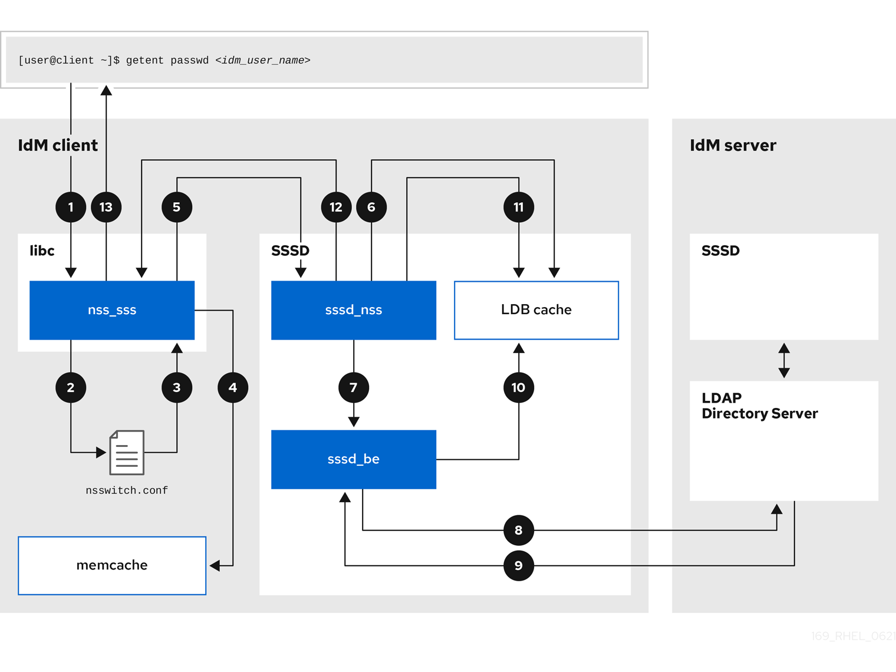 

01. The `getent` command triggers the `getpwnam` call from the `libc` library.
02. The `libc` library references the `/etc/nsswitch.conf` configuration file to check which service is responsible for providing user information, and discovers the entry `sss` for the SSSD service.
03. The `libc` library opens the `nss_sss` module.
04. The nss\_sss module checks the memory-mapped cache for the user information. If the data is present in the cache, the `nss_sss` module returns it.
05. If the user information is not in the memory-mapped cache, the request is passed to the SSSD `sssd_nss` responder process.
06. The SSSD service checks its cache. If the data is present in the cache and valid, the `sssd_nss` responder reads the data from the cache and returns it to the application.
07. If the data is not present in the cache or it is expired, the `sssd_nss` responder queries the appropriate back-end process and waits for a reply. The SSSD service uses the IPA backend in an IdM environment, enabled by the setting `id_provider=ipa` in the `sssd.conf` configuration file.
08. The `sssd_be` back-end process connects to the IdM server and requests the information from the IdM LDAP Directory Server.
09. The SSSD back-end on the IdM server responds to the SSSD back-end process on the IdM client.
10. The SSSD back-end on the client stores the resulting data in the SSSD cache and alerts the responder process that the cache has been updated.
11. The `sssd_nss` front-end responder process retrieves the information from the SSSD cache.
12. The `sssd_nss` responder sends the user information to the `nss_sss` responder, completing the request.
13. The `libc` library returns the user information to the application that requested it.

<h3 id="data-flow-when-retrieving-ad-user-information-with-sssd">12.2. Data flow when retrieving AD user information with SSSD</h3>

Retrieving Active Directory (AD) data involves the IdM server acting as a bridge. The client SSSD service queries the IdM server, which triggers the `extdom_extop` plugin to fetch identity records from the AD Domain Controller.

If you have established a cross-forest trust between your IdM environment and an AD domain, the information flow when retrieving AD user information about an IdM client is very similar to the information flow when retrieving IdM user information, with the additional step of contacting the AD user database.

The following diagram is a simplification of the information flow when a user requests information about an AD user with the command `getent passwd <user_name@ad.example.com>`. This diagram does not include the internal details discussed in the [Data flow when retrieving IdM user information with SSSD](#data-flow-when-retrieving-idm-user-information-with-sssd "12.1. Data flow when retrieving IdM user information with SSSD") section. It focuses on the communication between the SSSD service on an IdM client, the SSSD service on an IdM server, and the LDAP database on an AD Domain Controller.

**Information flow for retrieval of AD user information between an IdM client, IdM server, and AD Domain controller** image::169\_RHEL\_IdM\_with\_SSSD\_0621-ad\_user\_info.png\["A diagram with numbered arrows representing the flow of information between an IdM client, an IdM server, and an AD Domain Controller. The following numbered list describes each step in the process."]

1. The IdM client looks to its local SSSD cache for AD user information.
2. If the IdM client does not have the user information, or the information is stale, the SSSD service on the client contacts the `extdom_extop` plugin on the IdM server to perform an LDAP extended operation and requests the information.
3. The SSSD service on the IdM server looks for the AD user information in its local cache.
4. If the IdM server does not have the user information in its SSSD cache, or its information is stale, it performs an LDAP search to request the user information from an AD Domain Controller.
5. The SSSD service on the IdM server receives the AD user information from the AD domain controller and stores it in its cache.
6. The `extdom_extop` plugin receives the information from the SSSD service on the IdM server, which completes the LDAP extended operation.
7. The SSSD service on the IdM client receives the AD user information from the LDAP extended operation.
8. The IdM client stores the AD user information in its SSSD cache and returns the information to the application that requested it.

<h3 id="data-flow-when-authenticating-as-a-user-with-sssd-in-idm">12.3. Data flow when authenticating as a user with SSSD in IdM</h3>

Services invoke the Pluggable Authentication Module (PAM) stack to initiate authentication. SSSD processes these requests by spawning child processes to validate credentials against the IdM Kerberos Key Distribution Center (KDC), supporting both standard password and smart card verification methods.

Authenticating as a user on an IdM server or client involves the following components:

- The service that initiates the authentication request, such as the `sshd` service.
- The PAM library and its modules.
- The SSSD service, its responders, and back-ends.
- A smart card reader, if smart card authentication is configured.
- The authentication server:
  
  - IdM users are authenticated against an IdM KDC.
  - Active Directory (AD) users are authenticated against an AD Domain Controller (DC).

The following diagram is a simplification of the information flow when a user needs to authenticate during an attempt to log in locally to a host via the SSH service on the command line.

**Information flow between an IdM client and an IdM server or AD Domain Controller during an authentication attempt** 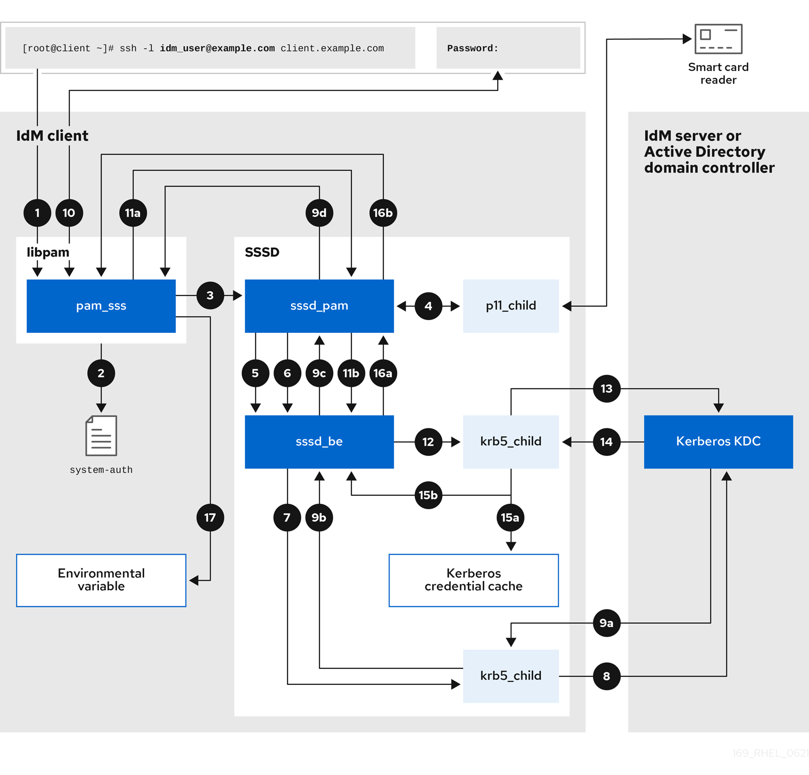

01. The authentication attempt with the `ssh` command triggers the `libpam` library.
02. The `libpam` library references the PAM file in the `/etc/pam.d/` directory that corresponds to the service requesting the authentication attempt. In this example involving authenticating via the SSH service on the local host, the `libpam` library checks the `/etc/pam.d/system-auth` configuration file and discovers the `pam_sss.so` entry for the SSSD PAM:
    
    ```
    auth    sufficient    pam_sss.so
    ```
    
    ```plaintext
    auth    sufficient    pam_sss.so
    ```
03. To determine which authentication methods are available, the `libpam` library opens the `pam_sss` module and sends an `SSS_PAM_PREAUTH` request to the `sssd_pam` PAM responder of the SSSD service.
04. If smart card authentication is configured, the SSSD service spawns a temporary `p11_child` process to check for a smart card and retrieve certificates from it.
05. If smart card authentication is configured for the user, the `sssd_pam` responder attempts to match the certificate from the smart card with the user. The `sssd_pam` responder also performs a search for the groups that the user belongs to, since group membership might affect access control.
06. The `sssd_pam` responder sends an `SSS_PAM_PREAUTH` request to the `sssd_be` back-end responder to see which authentication methods the server supports, such as passwords or 2-factor authentication. In an IdM environment, where the SSSD service uses the IPA responder, the default authentication method is Kerberos. For this example, the user authenticates with a simple Kerberos password.
07. The `sssd_be` responder spawns a temporary `krb5_child` process.
08. The `krb5_child` process contacts the KDC on the IdM server and checks for available authentication methods.
09. The KDC responds to the request:
    
    1. The `krb5_child` process evaluates the reply and sends the results back to the `sssd_be` backend process.
    2. The `sssd_be` backend process receives the result.
    3. The `sssd_pam` responder receives the result.
    4. The `pam_sss` module receives the result.
10. If password authentication is configured for the user, the `pam_sss` module prompts the user for their password. If smart card authentication is configured, the `pam_sss` module prompts the user for their smart card PIN.
11. The module sends an `SSS_PAM_AUTHENTICATE` request with the user name and password, which travels to:
    
    1. The `sssd_pam` responder.
    2. The `sssd_be` back-end process.
12. The `sssd_be` process spawns a temporary `krb5_child` process to contact the KDC.
13. The `krb5_child` process attempts to retrieve a Kerberos Ticket Granting Ticket (TGT) from the KDC with the user name and password the user provided.
14. The `krb5_child` process receives the result of the authentication attempt.
15. The `krb5_child` process:
    
    1. Stores the TGT in a credential cache.
    2. Returns the authentication result to the `sssd_be` back-end process.
16. The authentication result travels from the `sssd_be` process to:
    
    1. The `sssd_pam` responder.
    2. The `pam_sss` module.
17. The `pam_sss` module sets an environment variable with the location of the user’s TGT so other applications can reference it.

<h3 id="narrowing-the-scope-of-authentication-issues">12.4. Narrowing the scope of authentication issues</h3>

Diagnosing login failures requires validating the authentication chain step-by-step. Verify network connectivity, service status, and KDC reachability before analyzing specific authorization rules.

To successfully authenticate a user, you must be able to retrieve user information with the SSSD service from the database that stores user information. Follow the steps to test different components of the authentication process so you can narrow the scope of authentication issues when a user is unable to log in.

**Procedure**

1. Verify that the SSSD service and its processes are running.
   
   ```
   pstree -a | grep sssd
   ```
   
   ```plaintext
   [root@client ~]# pstree -a | grep sssd
   ```
   
   ```
     |-sssd -i --logger=files
     |   |-sssd_be --domain implicit_files --uid 0 --gid 0 --logger=files
     |   |-sssd_be --domain <domain_name> --uid 0 --gid 0 --logger=files
     |   |-sssd_ifp --uid 0 --gid 0 --logger=files
     |   |-sssd_nss --uid 0 --gid 0 --logger=files
     |   |-sssd_pac --uid 0 --gid 0 --logger=files
     |   |-sssd_pam --uid 0 --gid 0 --logger=files
     |   |-sssd_ssh --uid 0 --gid 0 --logger=files
     |   `-sssd_sudo --uid 0 --gid 0 --logger=files
     |-sssd_kcm --uid 0 --gid 0 --logger=files
   ```
   
   ```plaintext
     |-sssd -i --logger=files
     |   |-sssd_be --domain implicit_files --uid 0 --gid 0 --logger=files
     |   |-sssd_be --domain <domain_name> --uid 0 --gid 0 --logger=files
     |   |-sssd_ifp --uid 0 --gid 0 --logger=files
     |   |-sssd_nss --uid 0 --gid 0 --logger=files
     |   |-sssd_pac --uid 0 --gid 0 --logger=files
     |   |-sssd_pam --uid 0 --gid 0 --logger=files
     |   |-sssd_ssh --uid 0 --gid 0 --logger=files
     |   `-sssd_sudo --uid 0 --gid 0 --logger=files
     |-sssd_kcm --uid 0 --gid 0 --logger=files
   ```
2. Verify that the client can contact the user database server via the IP address.
   
   ```
   ping <IP_address_of_the_database_server>
   ```
   
   ```plaintext
   [user@client ~]$ ping <IP_address_of_the_database_server>
   ```
   
   If this step fails, check that your network and firewall settings allow direct communication between IdM clients and servers. See [Using and configuring firewalld](https://docs.redhat.com/en/documentation/red_hat_enterprise_linux/10/html/configuring_firewalls_and_packet_filters/using-and-configuring-firewalld).
3. Verify that the client can discover and contact the IdM LDAP server (for IdM users) or AD domain controller (for AD users) via the fully qualified host name.
   
   ```
   dig -t SRV ldap._tcp.<domain>@<server_name>
   ping <fully_qualified_host_name_of_the_server>
   ```
   
   ```plaintext
   [user@client ~]$ dig -t SRV ldap._tcp.<domain>@<server_name>
   [user@client ~]$ ping <fully_qualified_host_name_of_the_server>
   ```
   
   If this step fails, check your Dynamic Name Service (DNS) settings, including the `/etc/resolv.conf` file. See [Configuring the order of DNS servers](https://docs.redhat.com/en/documentation/red_hat_enterprise_linux/10/html/configuring_and_managing_networking/configuring-the-order-of-dns-servers).
   
   Note
   
   By default, the SSSD service attempts to automatically discover LDAP servers and AD DCs through DNS service (SRV) records. To restrict SSSD to specific servers, define them in the `sssd.conf` configuration file using the following options:
   
   - `ipa_server = <fully_qualified_host_name_of_the_server>`
   - `ad_server = <fully_qualified_host_name_of_the_server>`
   - `ldap_uri = <fully_qualified_host_name_of_the_server>`
   
   If you use these options, verify you can contact the servers listed in them.
4. Verify that the client can authenticate to the LDAP server and retrieve user information with `ldapsearch` commands.
   
   1. If your LDAP server is an IdM server, like `server.example.com`, retrieve a Kerberos ticket for the host and perform the database search authenticating with the host Kerberos principal:
      
      ```
      kinit -k 'host/client.example.com@EXAMPLE.COM'
      ldapsearch -LLL -Y GSSAPI -h server.example.com -b "dc=example,dc=com" uid=<idm_user>
      ```
      
      ```plaintext
      [user@client ~]$ kinit -k 'host/client.example.com@EXAMPLE.COM'
      [user@client ~]$ ldapsearch -LLL -Y GSSAPI -h server.example.com -b "dc=example,dc=com" uid=<idm_user>
      ```
   2. If your LDAP server is an Active Directory (AD) Domain Controller (DC), like `server.ad.example.com`, retrieve a Kerberos ticket for the host and perform the database search authenticating with the host Kerberos principal:
      
      ```
      kinit -k 'CLIENT$@AD.EXAMPLE.COM'
      ldapsearch -LLL -Y GSSAPI -h server.ad.example.com -b "dc=example,dc=com" sAMAccountname=<idm_user>
      ```
      
      ```plaintext
      [user@client ~]$ kinit -k 'CLIENT$@AD.EXAMPLE.COM'
      [user@client ~]$ ldapsearch -LLL -Y GSSAPI -h server.ad.example.com -b "dc=example,dc=com" sAMAccountname=<idm_user>
      ```
   3. If your LDAP server is a plain LDAP server, and you have set the `ldap_default_bind_dn` and `ldap_default_authtok` options in the `sssd.conf` file, authenticate as the same `ldap_default_bind_dn` account:
      
      ```
      ldapsearch -xLLL -D "cn=ldap_default_bind_dn_value" -W -h ldapserver.example.com -b "dc=example,dc=com" uid=<idm_user>
      ```
      
      ```plaintext
      [user@client ~]$ ldapsearch -xLLL -D "cn=ldap_default_bind_dn_value" -W -h ldapserver.example.com -b "dc=example,dc=com" uid=<idm_user>
      ```
   
   If this step fails, verify that your database settings allow your host to search the LDAP server.
5. Since the SSSD service uses Kerberos encryption, verify you can obtain a Kerberos ticket as the user that is unable to log in.
   
   1. If your LDAP server is an IdM server:
      
      ```
      kinit <idm_user>
      ```
      
      ```plaintext
      [user@client ~]$ kinit <idm_user>
      ```
   2. If LDAP server database is an AD server:
      
      ```
      kinit <ad_user@AD.EXAMPLE.COM>
      ```
      
      ```plaintext
      [user@client ~]$ kinit <ad_user@AD.EXAMPLE.COM>
      ```
   
   If this step fails, verify that your Kerberos server is operating properly, all servers have their times synchronized, and that the user account is not locked.
6. Verify you can retrieve user information about the command line.
   
   ```
   getent passwd <idm_user>
   id <idm_user>
   ```
   
   ```plaintext
   [user@client ~]$ getent passwd <idm_user>
   [user@client ~]$ id <idm_user>
   ```
   
   If this step fails, verify that the SSSD service on the client can receive information from the user database:
   
   1. Review errors in the `/var/log/messages` log file.
   2. Enable detailed logging in the SSSD service, collect debugging logs, and review the logs for indications to the source of the issue.
   3. Optional: Open a Red Hat Technical Support case and provide the troubleshooting information you have gathered.
7. If you have `sudo` privileges on the host, use the `sssctl` utility to verify the user is allowed to log in.
   
   ```
   sudo sssctl user-checks -a auth -s ssh <idm_user>
   ```
   
   ```plaintext
   [user@client ~]$ sudo sssctl user-checks -a auth -s ssh <idm_user>
   ```
   
   If this step fails, verify your authorization settings, such as your PAM configuration, IdM HBAC rules, and IdM RBAC rules:
   
   1. Ensure that the user’s UID is equal to or higher than `UID_MIN`, which is defined in the `/etc/login.defs` file.
   2. Review authorization errors in the `/var/log/secure` and `/var/log/messages` log files.
   3. Enable detailed logging in the SSSD service, collect debugging logs, and review the logs for indications to the source of the issue.
   4. Optional: Open a Red Hat Technical Support case and provide the troubleshooting information you have gathered.

**Additional resources**

- [Enabling detailed logging for SSSD in the sssd.conf file](#enabling-detailed-logging-for-sssd-in-the-sssd-conf-file "12.6. Enabling detailed logging for SSSD in the sssd.conf file")
- [Enabling detailed logging for SSSD with the sssctl command](#enabling-detailed-logging-for-sssd-with-the-sssctl-command "12.7. Enabling detailed logging for SSSD with the sssctl command")
- [Gathering debugging logs from the SSSD service to troubleshoot authentication issues with an IdM server](#gathering-debugging-logs-from-the-sssd-service-to-troubleshoot-authentication-issues-with-an-idm-server "12.8. Gathering debugging logs from the SSSD service to troubleshoot authentication issues with an IdM server")
- [Gathering debugging logs from the SSSD service to troubleshoot authentication issues with an IdM client](#gathering-debugging-logs-from-the-sssd-service-to-troubleshoot-authentication-issues-with-an-idm-client "12.9. Gathering debugging logs from the SSSD service to troubleshoot authentication issues with an IdM client")

<h3 id="sssd-log-files-and-logging-levels">12.5. SSSD log files and logging levels</h3>

SSSD segregates logs by domain and component in the `/var/log/sssd/` directory. Configure debug levels ranging from 0 to 9 to control verbosity, balancing disk usage with diagnostic detail.

For an IdM server in the `example.com` IdM domain, its log files might look like this:

```
ls -l /var/log/sssd/
```

```plaintext
[root@server ~]# ls -l /var/log/sssd/
```

```
total 620
-rw-------.  1 root root      0 Mar 29 09:21 krb5_child.log
-rw-------.  1 root root  14324 Mar 29 09:50 ldap_child.log
-rw-------.  1 root root 212870 Mar 29 09:50 sssd_example.com.log
-rw-------.  1 root root      0 Mar 29 09:21 sssd_ifp.log
-rw-------.  1 root root      0 Mar 29 09:21 sssd_implicit_files.log
-rw-------.  1 root root      0 Mar 29 09:21 sssd.log
-rw-------.  1 root root 219873 Mar 29 10:03 sssd_nss.log
-rw-------.  1 root root      0 Mar 29 09:21 sssd_pac.log
-rw-------.  1 root root  13105 Mar 29 09:21 sssd_pam.log
-rw-------.  1 root root   9390 Mar 29 09:21 sssd_ssh.log
-rw-------.  1 root root      0 Mar 29 09:21 sssd_sudo.log
```

```plaintext
total 620
-rw-------.  1 root root      0 Mar 29 09:21 krb5_child.log
-rw-------.  1 root root  14324 Mar 29 09:50 ldap_child.log
-rw-------.  1 root root 212870 Mar 29 09:50 sssd_example.com.log
-rw-------.  1 root root      0 Mar 29 09:21 sssd_ifp.log
-rw-------.  1 root root      0 Mar 29 09:21 sssd_implicit_files.log
-rw-------.  1 root root      0 Mar 29 09:21 sssd.log
-rw-------.  1 root root 219873 Mar 29 10:03 sssd_nss.log
-rw-------.  1 root root      0 Mar 29 09:21 sssd_pac.log
-rw-------.  1 root root  13105 Mar 29 09:21 sssd_pam.log
-rw-------.  1 root root   9390 Mar 29 09:21 sssd_ssh.log
-rw-------.  1 root root      0 Mar 29 09:21 sssd_sudo.log
```

<h4 id="sssd\_log\_file\_purposes">12.5.1. SSSD log file purposes</h4>

Each SSSD component maintains a dedicated log file to isolate specific operations. These files capture data from helper processes, responders, and domain backends, simplifying the search for relevant error messages.

`krb5_child.log`

Log file for the short-lived helper process involved in Kerberos authentication.

`ldap_child.log`

Log file for the short-lived helper process involved in getting a Kerberos ticket for the communication with the LDAP server.

`sssd_<domain_name>.log`

For each domain section in the `sssd.conf` file, the SSSD service logs information about communication with the LDAP server to a separate log file. For example, in an environment with an IdM domain named `example.com`, the SSSD service logs its information in a file named `sssd_example.com.log`. If a host is directly integrated with an AD domain named `ad.example.com`, information is logged to a file named `sssd_ad.example.com.log`.

Note

If you have an IdM environment and a cross-forest trust with an AD domain, information about the AD domain is still logged to the log file for the IdM domain.

Similarly, if a host is directly integrated to an AD domain, information about any child domains is written in the log file for the primary domain.

`selinux_child.log`

Log file for the short-lived helper process that retrieves and sets SELinux information.

`sssd.log`

Log file for SSSD monitoring and communicating with its responder and backend processes.

`sssd_ifp.log`

Log file for the InfoPipe responder, which provides a public D-Bus interface accessible over the system bus.

`sssd_nss.log`

Log file for the Name Services Switch (NSS) responder that retrieves user and group information.

`sssd_pac.log`

Log file for the Microsoft Privilege Attribute Certificate (PAC) responder, which collects the PAC from AD Kerberos tickets and derives information about AD users from the PAC, which avoids requesting it directly from AD.

`sssd_pam.log`

Log file for the Pluggable Authentication Module (PAM) responder.

`sssd_ssh.log`

Log file for the SSH responder process.

<h4 id="sssd\_logging\_levels">12.5.2. SSSD logging levels</h4>

Debug levels define the granularity of recorded events. Higher integer values capture increasingly detailed trace messages and internal function data, while lower levels record only critical or fatal service failures.

Setting a debug level also enables all debug levels below it. For example, setting the debug level at 6 also enables debug levels 0 through 5.

| Level | Description                                                                                                                         |
|:------|:------------------------------------------------------------------------------------------------------------------------------------|
| 0     | **Fatal failures**. Errors that prevent the SSSD service from starting up or cause it to terminate.                                 |
| 1     | **Critical failures**. Errors that do not terminate the SSSD service, but at least one major feature is not working properly.       |
| 2     | **Serious failures**. Errors announcing that a particular request or operation has failed. **This is the default debug log level.** |
| 3     | **Minor failures**. Errors that cause the operation failures captured at level 2.                                                   |
| 4     | **Configuration** settings.                                                                                                         |
| 5     | **Function** data.                                                                                                                  |
| 6     | Trace messages for **operation** functions.                                                                                         |
| 7     | Trace messages for **internal control** functions.                                                                                  |
| 8     | Contents of **function-internal** variables.                                                                                        |
| 9     | Extremely **low-level tracing** information.                                                                                        |

Table 12.1. SSSD logging levels

<h3 id="enabling-detailed-logging-for-sssd-in-the-sssd-conf-file">12.6. Enabling detailed logging for SSSD in the sssd.conf file</h3>

Enable persistent verbose logging by modifying the `sssd.conf` file. Setting the `debug_level` parameter in specific configuration sections captures detailed data across service restarts.

By default, the SSSD service only logs serious failures (debug level 2), but it does not log at the level of detail necessary to troubleshoot authentication issues.

To enable detailed logging persistently across SSSD service restarts, add the option `debug_level=<integer>` in each section of the `/etc/sssd/sssd.conf` configuration file, where the `<integer>` value is a number between 0 and 9. Debug levels up to 3 log larger failures, and levels 8 and higher provide a large number of detailed log messages. **Level 6** is a good starting point for debugging authentication issues.

**Prerequisites**

- You need the root password to edit the `sssd.conf` configuration file and restart the SSSD service.

**Procedure**

1. Open the `/etc/sssd/sssd.conf` file in a text editor.
2. Add the `debug_level` option to every section of the file, and set the debug level to the verbosity of your choice.
   
   ```
   [domain/<domain_name>]
   debug_level = 6
   id_provider = ipa
   ...
   
   [sssd]
   debug_level = 6
   services = nss, pam, ifp, ssh, sudo
   domains = <domain_name>
   
   [nss]
   debug_level = 6
   
   [pam]
   debug_level = 6
   
   [sudo]
   debug_level = 6
   
   [ssh]
   debug_level = 6
   
   [pac]
   debug_level = 6
   
   [ifp]
   debug_level = 6
   ```
   
   ```plaintext
   [domain/<domain_name>]
   debug_level = 6
   id_provider = ipa
   ...
   
   [sssd]
   debug_level = 6
   services = nss, pam, ifp, ssh, sudo
   domains = <domain_name>
   
   [nss]
   debug_level = 6
   
   [pam]
   debug_level = 6
   
   [sudo]
   debug_level = 6
   
   [ssh]
   debug_level = 6
   
   [pac]
   debug_level = 6
   
   [ifp]
   debug_level = 6
   ```
3. Save and close the `sssd.conf` file.
4. Restart the SSSD service to load the new configuration settings.
   
   ```
   systemctl restart sssd
   ```
   
   ```plaintext
   [root@server ~]# systemctl restart sssd
   ```

**Additional resources**

- [SSSD log files and logging levels](#sssd-log-files-and-logging-levels "12.5. SSSD log files and logging levels")

<h3 id="enabling-detailed-logging-for-sssd-with-the-sssctl-command">12.7. Enabling detailed logging for SSSD with the sssctl command</h3>

The `sssctl` utility adjusts logging verbosity immediately without editing configuration files. With this command, you can increase debug levels to capture specific events during active troubleshooting sessions.

By default, the SSSD service only logs serious failures (debug level 2), but it does not log at the level of detail necessary to troubleshoot authentication issues.

You can change the debug level of the SSSD service on the command line with the `sssctl debug-level <integer>` command, where the `<integer>` value is a number between 0 and 9. Debug levels up to 3 log larger failures, and levels 8 and higher provide a large number of detailed log messages. Level 6 is a good starting point for debugging authentication issues.

**Prerequisites**

- You need the root password to run the `sssctl` command.

**Procedure**

- Use the `sssctl debug-level` command to set the debug level to your desired verbosity. For example:
  
  ```
  sssctl debug-level 6
  ```
  
  ```plaintext
  [root@server ~]# sssctl debug-level 6
  ```

**Additional resources**

- [SSSD log files and logging levels](#sssd-log-files-and-logging-levels "12.5. SSSD log files and logging levels")

<h3 id="gathering-debugging-logs-from-the-sssd-service-to-troubleshoot-authentication-issues-with-an-idm-server">12.8. Gathering debugging logs from the SSSD service to troubleshoot authentication issues with an IdM server</h3>

Resolving server-side authentication errors involves capturing a clean set of logs during a reproduction attempt. Clear old logs and caches before triggering the failure to generate a focused dataset.

If you experience issues when attempting to authenticate as an IdM user to an IdM server, enable detailed debug logging in the SSSD service on the server and gather logs of an attempt to retrieve information about the user.

**Prerequisites**

- You have `root` permissions.

**Procedure**

1. Enable detailed SSSD debug logging on the IdM server.
   
   ```
   sssctl debug-level 6
   ```
   
   ```plaintext
   [root@server ~]# sssctl debug-level 6
   ```
2. Invalidate objects in the SSSD cache for the user that is experiencing authentication issues, so you do not bypass the LDAP server and retrieve information SSSD has already cached.
   
   ```
   sssctl cache-expire -u <idm_user>
   ```
   
   ```plaintext
   [root@server ~]# sssctl cache-expire -u <idm_user>
   ```
3. Minimize the troubleshooting dataset by removing older SSSD logs.
   
   ```
   sssctl logs-remove
   ```
   
   ```plaintext
   [root@server ~]# sssctl logs-remove
   ```
4. Attempt to switch to the user experiencing authentication problems, while gathering timestamps before and after the attempt. These timestamps further narrow the scope of the dataset.
   
   ```
   date; su <idm_user>; date
   ```
   
   ```plaintext
   [root@server sssd]# date; su <idm_user>; date
   ```
   
   ```
   Mon Mar 29 15:33:48 EDT 2021
   su: user idm_user does not exist
   Mon Mar 29 15:33:49 EDT 2021
   ```
   
   ```plaintext
   Mon Mar 29 15:33:48 EDT 2021
   su: user idm_user does not exist
   Mon Mar 29 15:33:49 EDT 2021
   ```
5. Optional: Lower the debug level if you do not wish to continue gathering detailed SSSD logs.
   
   ```
   sssctl debug-level 2
   ```
   
   ```plaintext
   [root@server ~]# sssctl debug-level 2
   ```
6. Review SSSD logs for information about the failed request. For example, reviewing the `/var/log/sssd/sssd_example.com.log` file shows that the SSSD service did not find the user in the `cn=accounts,dc=example,dc=com` LDAP subtree. This might indicate that the user does not exist, or exists in another location.
   
   ```
   (Mon Mar 29 15:33:48 2021) [sssd[be[example.com]]] [dp_get_account_info_send] (0x0200): Got request for [0x1][BE_REQ_USER][name=idm_user@example.com]
   ...
   (Mon Mar 29 15:33:48 2021) [sssd[be[example.com]]] [sdap_get_generic_ext_step] (0x0400): calling ldap_search_ext with [(&(uid=idm_user)(objectclass=posixAccount)(uid=)(&(uidNumber=)(!(uidNumber=0))))][cn=accounts,dc=example,dc=com].
   (Mon Mar 29 15:33:48 2021) [sssd[be[example.com]]] [sdap_get_generic_op_finished] (0x0400): Search result: Success(0), no errmsg set
   (Mon Mar 29 15:33:48 2021) [sssd[be[example.com]]] [sdap_search_user_process] (0x0400): Search for users, returned 0 results.
   (Mon Mar 29 15:33:48 2021) [sssd[be[example.com]]] [sysdb_search_by_name] (0x0400): No such entry
   (Mon Mar 29 15:33:48 2021) [sssd[be[example.com]]] [sysdb_delete_user] (0x0400): Error: 2 (No such file or directory)
   (Mon Mar 29 15:33:48 2021) [sssd[be[example.com]]] [sysdb_search_by_name] (0x0400): No such entry
   (Mon Mar 29 15:33:49 2021) [sssd[be[example.com]]] [ipa_id_get_account_info_orig_done] (0x0080): Object not found, ending request
   ```
   
   ```plaintext
   (Mon Mar 29 15:33:48 2021) [sssd[be[example.com]]] [dp_get_account_info_send] (0x0200): Got request for [0x1][BE_REQ_USER][name=idm_user@example.com]
   ...
   (Mon Mar 29 15:33:48 2021) [sssd[be[example.com]]] [sdap_get_generic_ext_step] (0x0400): calling ldap_search_ext with [(&(uid=idm_user)(objectclass=posixAccount)(uid=)(&(uidNumber=)(!(uidNumber=0))))][cn=accounts,dc=example,dc=com].
   (Mon Mar 29 15:33:48 2021) [sssd[be[example.com]]] [sdap_get_generic_op_finished] (0x0400): Search result: Success(0), no errmsg set
   (Mon Mar 29 15:33:48 2021) [sssd[be[example.com]]] [sdap_search_user_process] (0x0400): Search for users, returned 0 results.
   (Mon Mar 29 15:33:48 2021) [sssd[be[example.com]]] [sysdb_search_by_name] (0x0400): No such entry
   (Mon Mar 29 15:33:48 2021) [sssd[be[example.com]]] [sysdb_delete_user] (0x0400): Error: 2 (No such file or directory)
   (Mon Mar 29 15:33:48 2021) [sssd[be[example.com]]] [sysdb_search_by_name] (0x0400): No such entry
   (Mon Mar 29 15:33:49 2021) [sssd[be[example.com]]] [ipa_id_get_account_info_orig_done] (0x0080): Object not found, ending request
   ```
7. If you are unable to determine the cause of the authentication issue:
   
   1. Collect the SSSD logs you recently generated.
      
      ```
      sssctl logs-fetch sssd-logs-Mar29.tar
      ```
      
      ```plaintext
      [root@server ~]# sssctl logs-fetch sssd-logs-Mar29.tar
      ```
   2. Open a Red Hat Technical Support case and provide:
      
      1. The SSSD logs: `sssd-logs-Mar29.tar`
      2. The console output, including the time stamps and user name, of the request that corresponds to the logs:
         
         ```
         date; id <idm_user>; date
         ```
         
         ```plaintext
         [root@server sssd]# date; id <idm_user>; date
         ```
         
         ```
         Mon Mar 29 15:33:48 EDT 2021
         id: 'idm_user': no such user
         Mon Mar 29 15:33:49 EDT 2021
         ```
         
         ```plaintext
         Mon Mar 29 15:33:48 EDT 2021
         id: 'idm_user': no such user
         Mon Mar 29 15:33:49 EDT 2021
         ```

<h3 id="gathering-debugging-logs-from-the-sssd-service-to-troubleshoot-authentication-issues-with-an-idm-client">12.9. Gathering debugging logs from the SSSD service to troubleshoot authentication issues with an IdM client</h3>

Client-side issues require simultaneous analysis of both client and server logs. Configure the client to contact a specific server, synchronizing log capture to trace the request across the network.

If you experience issues when attempting to authenticate as an IdM user to an IdM client, verify that you can retrieve user information about the IdM server. If you cannot retrieve the user information about an IdM server, you will not be able to retrieve it on an IdM client (which retrieves information from the IdM server).

After you have confirmed that authentication issues do not originate from the IdM server, gather SSSD debugging logs from both the IdM server and IdM client.

**Prerequisites**

- The user only has authentication issues on IdM clients, not IdM servers.
- You need the root password to run the `sssctl` command and restart the SSSD service.

**Procedure**

01. **On the client:** Open the `/etc/sssd/sssd.conf` file in a text editor.
02. **On the client:** Add the `ipa_server` option to the `[domain]` section of the file and set it to an IdM server using its fully qualified domain name (FQDN). This avoids the IdM client autodiscovering other IdM servers, thus limiting this test to just one client and one server.
    
    ```
    [domain/<idm_domain_name>]
    ipa_server = <idm_server_fqdn>
    ...
    ```
    
    ```plaintext
    [domain/<idm_domain_name>]
    ipa_server = <idm_server_fqdn>
    ...
    ```
03. **On the client:** Save and close the `sssd.conf` file.
04. **On the client:** Restart the SSSD service to load the configuration changes.
    
    ```
    systemctl restart sssd
    ```
    
    ```plaintext
    [root@client ~]# systemctl restart sssd
    ```
05. **On the server and client:** Enable detailed SSSD debug logging.
    
    ```
    sssctl debug-level 6
    ```
    
    ```plaintext
    [root@server ~]# sssctl debug-level 6
    ```
    
    ```
    sssctl debug-level 6
    ```
    
    ```plaintext
    [root@client ~]# sssctl debug-level 6
    ```
06. **On the server and client:** Invalidate objects in the SSSD cache for the user experiencing authentication issues, so you do not bypass the LDAP database and retrieve information SSSD has already cached.
    
    ```
    sssctl cache-expire -u <idm_user>
    ```
    
    ```plaintext
    [root@server ~]# sssctl cache-expire -u <idm_user>
    ```
    
    ```
    sssctl cache-expire -u <idm_user>
    ```
    
    ```plaintext
    [root@client ~]# sssctl cache-expire -u <idm_user>
    ```
07. **On the server and client:** Minimize the troubleshooting dataset by removing older SSSD logs.
    
    ```
    sssctl logs-remove
    ```
    
    ```plaintext
    [root@server ~]# sssctl logs-remove
    ```
    
    ```
    sssctl logs-remove
    ```
    
    ```plaintext
    [root@server ~]# sssctl logs-remove
    ```
08. **On the client:** Attempt to switch to the user experiencing authentication problems while gathering timestamps before and after the attempt. These timestamps further narrow the scope of the dataset.
    
    ```
    date; su <idm_user>; date
    ```
    
    ```plaintext
    [root@client sssd]# date; su <idm_user>; date
    ```
    
    ```
    Mon Mar 29 16:20:13 EDT 2021
    su: user idm_user does not exist
    Mon Mar 29 16:20:14 EDT 2021
    ```
    
    ```plaintext
    Mon Mar 29 16:20:13 EDT 2021
    su: user idm_user does not exist
    Mon Mar 29 16:20:14 EDT 2021
    ```
09. Optional: **On the server and client:** Lower the debug level if you do not wish to continue gathering detailed SSSD logs.
    
    ```
    sssctl debug-level 0
    ```
    
    ```plaintext
    [root@server ~]# sssctl debug-level 0
    ```
    
    ```
    sssctl debug-level 0
    ```
    
    ```plaintext
    [root@client ~]# sssctl debug-level 0
    ```
10. **On the server and client:** Review SSSD logs for information about the failed request.
    
    1. Review the request from the client in the client logs.
    2. Review the request from the client in the server logs.
    3. Review the result of the request in the server logs.
    4. Review the outcome of the client receiving the results of the request from the server.
11. If you are unable to determine the cause of the authentication issue:
    
    1. Collect the SSSD logs you recently generated on the IdM server and IdM client. Label them according to their hostname or role.
       
       ```
       sssctl logs-fetch sssd-logs-server-Mar29.tar
       ```
       
       ```plaintext
       [root@server ~]# sssctl logs-fetch sssd-logs-server-Mar29.tar
       ```
       
       ```
       sssctl logs-fetch sssd-logs-client-Mar29.tar
       ```
       
       ```plaintext
       [root@client ~]# sssctl logs-fetch sssd-logs-client-Mar29.tar
       ```
    2. Open a Red Hat Technical Support case and provide:
       
       1. The SSSD debug logs:
          
          1. `sssd-logs-server-Mar29.tar` from the server
          2. `sssd-logs-client-Mar29.tar` from the client
       2. The console output, including the time stamps and user name, of the request that corresponds to the logs:
          
          ```
          date; su <idm_user>; date
          ```
          
          ```plaintext
          [root@client sssd]# date; su <idm_user>; date
          ```
          
          ```
          Mon Mar 29 16:20:13 EDT 2021
          su: user idm_user does not exist
          Mon Mar 29 16:20:14 EDT 2021
          ```
          
          ```plaintext
          Mon Mar 29 16:20:13 EDT 2021
          su: user idm_user does not exist
          Mon Mar 29 16:20:14 EDT 2021
          ```

<h3 id="tracking-client-requests-in-the-sssd-backend">12.10. Tracking client requests in the SSSD backend</h3>

SSSD assigns unique Request IDs (RID) and Client IDs (CID) to track operations asynchronously. Trace these identifiers through the backend logs to correlate complex sequences of internal events.

To track client request in the back-end logs, you can use the unique request identifier ``RID#<integer> and client ID `[CID #<integer>]``. These identifiers help isolate logs to follow an individual request from start to finish across log files from multiple SSSD components.

**Prerequisites**

- You have enabled debug logging and a request has been submitted from an IdM client.
- You have `root` privileges.

**Procedure**

1. To review your SSSD log file, open the log file `/var/log/sssd/sssd_<domain_name>.log` using the `less` utility. For example:
   
   ```
   less /var/log/sssd/sssd_example.com.log
   ```
   
   ```plaintext
   [root@server ~]# less /var/log/sssd/sssd_example.com.log
   ```
2. Review the SSSD logs for information about the client request.
   
   ```
   (2021-07-26 18:26:37): [be[testidm.com]] [dp_req_destructor] (0x0400): [RID#3] Number of active DP request: 0
   (2021-07-26 18:26:37): [be[testidm.com]] [dp_req_reply_std] (0x1000): [RID#3] DP Request AccountDomain #3: Returning [Internal Error]: 3,1432158301,GetAccountDomain() not supported
   (2021-07-26 18:26:37): [be[testidm.com]] [dp_attach_req] (0x0400): [RID#4] DP Request Account #4: REQ_TRACE: New request. [sssd.nss CID #1] Flags [0x0001].
   (2021-07-26 18:26:37): [be[testidm.com]] [dp_attach_req] (0x0400): [RID#4] Number of active DP request: 1
   ```
   
   ```plaintext
   (2021-07-26 18:26:37): [be[testidm.com]] [dp_req_destructor] (0x0400): [RID#3] Number of active DP request: 0
   (2021-07-26 18:26:37): [be[testidm.com]] [dp_req_reply_std] (0x1000): [RID#3] DP Request AccountDomain #3: Returning [Internal Error]: 3,1432158301,GetAccountDomain() not supported
   (2021-07-26 18:26:37): [be[testidm.com]] [dp_attach_req] (0x0400): [RID#4] DP Request Account #4: REQ_TRACE: New request. [sssd.nss CID #1] Flags [0x0001].
   (2021-07-26 18:26:37): [be[testidm.com]] [dp_attach_req] (0x0400): [RID#4] Number of active DP request: 1
   ```
   
   This sample output from an SSSD log file shows the unique identifiers `RID#3` and `RID#4` for two different requests.
   
   However, a single client request to the SSSD client interface often triggers multiple requests in the backend and as a result it is not a 1-to-1 correlation between client request and requests in the backend. Though the multiple requests in the backend have different RID numbers, each initial backend request includes the unique client ID so an administrator can track the multiple RID numbers to the single client request.
   
   The following example shows one client request `[sssd.nss CID #1]` and the multiple requests generated in the backend, `[RID#5]` to `[RID#13]`:
   
   ```
   (2021-10-29 13:24:16): [be[ad.vm]] [dp_attach_req] (0x0400): [RID#5] DP Request [Account #5]: REQ_TRACE: New request. [sssd.nss CID #1] Flags [0x0001].
   (2021-10-29 13:24:16): [be[ad.vm]] [dp_attach_req] (0x0400): [RID#6] DP Request [AccountDomain #6]: REQ_TRACE: New request. [sssd.nss CID #1] Flags [0x0001].
   (2021-10-29 13:24:16): [be[ad.vm]] [dp_attach_req] (0x0400): [RID#7] DP Request [Account #7]: REQ_TRACE: New request. [sssd.nss CID #1] Flags [0x0001].
   (2021-10-29 13:24:17): [be[ad.vm]] [dp_attach_req] (0x0400): [RID#8] DP Request [Initgroups #8]: REQ_TRACE: New request. [sssd.nss CID #1] Flags [0x0001].
   (2021-10-29 13:24:17): [be[ad.vm]] [dp_attach_req] (0x0400): [RID#9] DP Request [Account #9]: REQ_TRACE: New request. [sssd.nss CID #1] Flags [0x0001].
   (2021-10-29 13:24:17): [be[ad.vm]] [dp_attach_req] (0x0400): [RID#10] DP Request [Account #10]: REQ_TRACE: New request. [sssd.nss CID #1] Flags [0x0001].
   (2021-10-29 13:24:17): [be[ad.vm]] [dp_attach_req] (0x0400): [RID#11] DP Request [Account #11]: REQ_TRACE: New request. [sssd.nss CID #1] Flags [0x0001].
   (2021-10-29 13:24:17): [be[ad.vm]] [dp_attach_req] (0x0400): [RID#12] DP Request [Account #12]: REQ_TRACE: New request. [sssd.nss CID #1] Flags [0x0001].
   (2021-10-29 13:24:17): [be[ad.vm]] [dp_attach_req] (0x0400): [RID#13] DP Request [Account #13]: REQ_TRACE: New request. [sssd.nss CID #1] Flags [0x0001].
   ```
   
   ```plaintext
   (2021-10-29 13:24:16): [be[ad.vm]] [dp_attach_req] (0x0400): [RID#5] DP Request [Account #5]: REQ_TRACE: New request. [sssd.nss CID #1] Flags [0x0001].
   (2021-10-29 13:24:16): [be[ad.vm]] [dp_attach_req] (0x0400): [RID#6] DP Request [AccountDomain #6]: REQ_TRACE: New request. [sssd.nss CID #1] Flags [0x0001].
   (2021-10-29 13:24:16): [be[ad.vm]] [dp_attach_req] (0x0400): [RID#7] DP Request [Account #7]: REQ_TRACE: New request. [sssd.nss CID #1] Flags [0x0001].
   (2021-10-29 13:24:17): [be[ad.vm]] [dp_attach_req] (0x0400): [RID#8] DP Request [Initgroups #8]: REQ_TRACE: New request. [sssd.nss CID #1] Flags [0x0001].
   (2021-10-29 13:24:17): [be[ad.vm]] [dp_attach_req] (0x0400): [RID#9] DP Request [Account #9]: REQ_TRACE: New request. [sssd.nss CID #1] Flags [0x0001].
   (2021-10-29 13:24:17): [be[ad.vm]] [dp_attach_req] (0x0400): [RID#10] DP Request [Account #10]: REQ_TRACE: New request. [sssd.nss CID #1] Flags [0x0001].
   (2021-10-29 13:24:17): [be[ad.vm]] [dp_attach_req] (0x0400): [RID#11] DP Request [Account #11]: REQ_TRACE: New request. [sssd.nss CID #1] Flags [0x0001].
   (2021-10-29 13:24:17): [be[ad.vm]] [dp_attach_req] (0x0400): [RID#12] DP Request [Account #12]: REQ_TRACE: New request. [sssd.nss CID #1] Flags [0x0001].
   (2021-10-29 13:24:17): [be[ad.vm]] [dp_attach_req] (0x0400): [RID#13] DP Request [Account #13]: REQ_TRACE: New request. [sssd.nss CID #1] Flags [0x0001].
   ```

<h3 id="tracking-client-requests-using-the-log-analyzer-tool">12.11. Tracking client requests using the log analyzer tool</h3>

The System Security Services Daemon (SSSD) log analyzer tool parses verbose logs to reconstruct request chains. This utility filters the output to show only relevant entries for a specific client request, simplifying the analysis of dense log files.

You can use the tool to track requests from start to finish across log files from multiple SSSD components.

<h4 id="how-the-log-analyzer-tool-works">12.11.1. How the log analyzer tool works</h4>

The analyzer links NSS and PAM requests across multiple SSSD processes. It tracks the lifecycle of a request using Client IDs, helping you to isolate specific authentication or lookup attempts.

Using the log parsing tool, you can track SSSD requests from start to finish across log files from multiple SSSD components. You run the analyzer tool using the `sssctl analyze` command.

The log analyzer tool helps you to troubleshoot NSS and PAM issues in SSSD and more easily review SSSD debug logs. You can extract and print SSSD logs related only to certain client requests across SSSD processes.

SSSD tracks user and group identity information (`id`, `getent`) separately from user authentication (`su`, `ssh`) information. The client ID (CID) in the NSS responder is independent of the CID in the PAM responder and you see overlapping numbers when analyzing NSS and PAM requests. Use the `--pam` option with the `sssctl analyze` command to review PAM requests.

Note

Requests returned from the SSSD memory cache are not logged and cannot be tracked by the log analyzer tool.

<h4 id="running-the-log-analyzer-tool">12.11.2. Running the log analyzer tool</h4>

Use `sssctl analyze` to list recent requests and display their associated logs. This workflow identifies the unique Client ID and extracts the specific log entries required for troubleshooting.

**Prerequisites**

- You must set `debug_level` to at least 7 in the `[$responder]` section, and `[domain/$domain]` section of the `/etc/sssd/sssd.conf` file to enable log parsing functionality.
- Logs to analyze must be from a compatible version of SSSD built with `libtevent` chain ID support, that is SSSD in RHEL 8.5 and later.

**Procedure**

1. Run the log analyzer tool in `list` mode to determine the client ID of the request you are tracking, adding the `-v` option to display verbose output:
   
   ```
   sssctl analyze request list -v
   ```
   
   ```plaintext
   # sssctl analyze request list -v
   ```
   
   A verbose list of recent client requests made to SSSD is displayed.
   
   Note
   
   If analyzing PAM requests, run the `sssctl analyze request list` command with the `--pam` option.
2. Run the log analyzer tool with the `show [unique client ID]` option to display logs pertaining to the specified client ID number:
   
   ```
   sssctl analyze request show 20
   ```
   
   ```plaintext
   # sssctl analyze request show 20
   ```
3. If required, you can run the log analyzer tool against log files, for example:
   
   ```
   sssctl analyze --logdir=/tmp/var/log/sssd request list
   ```
   
   ```plaintext
   # sssctl analyze --logdir=/tmp/var/log/sssd request list
   ```

<h3 id="troubleshooting-authentication-with-sssd-in-idm">12.12. Additional resources</h3>

- [General SSSD Debugging Procedures (Red Hat Knowledgebase)](https://access.redhat.com/solutions/217963)

<h2 id="Configuring\_Applications\_for\_SSO">Chapter 13. Configuring applications for a single sign-on</h2>

Single sign-on (SSO) simplifies authentication by allowing users to access multiple systems via a single login procedure. Configure applications like browsers and email clients to accept Kerberos tickets, SSL certificates, or tokens as valid credentials.

The configuration of different applications may vary. This chapter shows how to configure SSO authentication schema for the Mozilla Thunderbird email client and Mozilla Firefox web browser as the examples.

<h3 id="prerequisites\_2">13.1. Prerequisites</h3>

Verify that the target system hosts the required versions of Mozilla Firefox and Mozilla Thunderbird before attempting configuration. Ensure these applications are installed and accessible to the user. **Mozilla Firefox *version 88*** Mozilla Thunderbird *version 78*

<h3 id="Configuring\_Firefox\_to\_use\_Kerberos\_for\_SSO">13.2. Configuring Firefox to use Kerberos for single sign-on</h3>

Configure Firefox to negotiate Kerberos authentication with intranet sites. Adding specific domains to the trusted URI list in the configuration settings permits the browser to pass existing Kerberos credentials to the Key Distribution Center (KDC) automatically.

Note

Even after configuring Firefox to pass Kerberos credentials, you still need a valid Kerberos ticket. To generate a Kerberos ticket, use the `kinit` command and supply the user password for the user on the KDC.

```
[jsmith@host ~] $ kinit
```

```plaintext
[jsmith@host ~] $ kinit
```

```
Password for jsmith@EXAMPLE.COM:
```

```plaintext
Password for jsmith@EXAMPLE.COM:
```

**Procedure**

1. In the address bar of Firefox, type `about:config` to display the list of current configuration options.
2. In the **Filter** field, type `negotiate` to restrict the list of options.
3. Double-click the **network.negotiate-auth.trusted-uris** entry.
4. Enter the name of the domain against which to authenticate, including the preceding period (.). If you want to add multiple domains, enter them in a comma separated list.
   
   **Manual Firefox Configuration**
   
   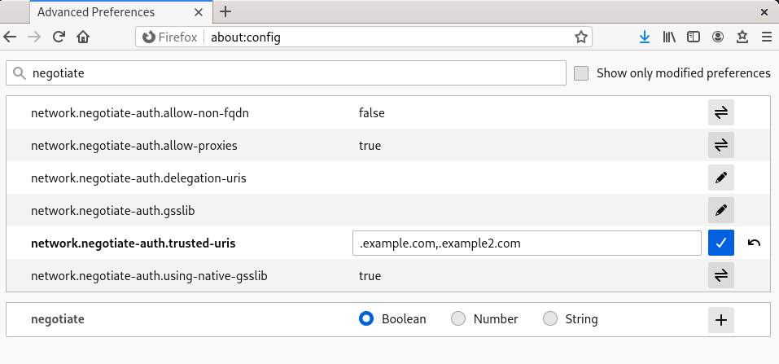 

**Additional resources**

- [Logging in to IdM in the Web UI: Using a Kerberos ticket](https://docs.redhat.com/en/documentation/red_hat_enterprise_linux/10/html/accessing_identity_management_services/logging-in-to-idm-in-the-web-ui-using-a-kerberos-ticket)

<h3 id="viewing-certificates-in-firefox">13.3. Viewing certificates in Firefox</h3>

By inspecting the Certificate Manager, users can verify currently installed authorities and personal credentials. This audit ensures the browser possesses the necessary trust anchors for secure connections.

You can view stored certificates in Mozilla Firefox to verify authentication settings.

**Procedure**

1. In Mozilla Firefox, open the Firefox menu and select **Preferences**.
   
   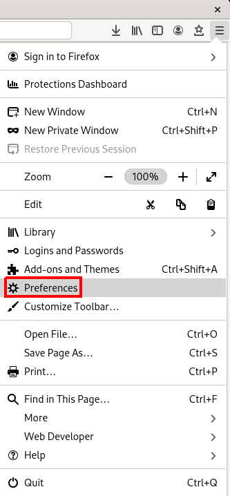 
2. In the left panel, select the **Privacy & Security** section.
   
   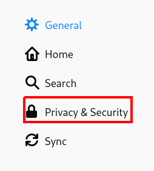 
3. Scroll down to the **Certificates** section.
4. Click **View Certificates** to open the **Certificate Manager**.
   
   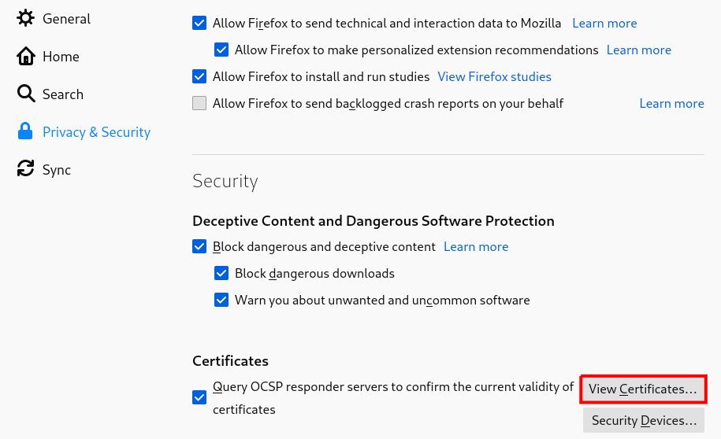 

<h3 id="importing-ca-certificates-in-firefox">13.4. Importing CA certificates in Firefox</h3>

Importing a Certificate Authority (CA) certificate establishes trust with external servers. Adding the CA file to the browser’s store enables secure, encrypted connections to websites and applications issued by that authority.

**Prerequisites**

- You have a CA certificate on your device.

**Procedure**

1. Open **Certificate Manager**.
2. Select the **Authorities** tab and click **Import**.
   
   **Figure 13.1. Importing the CA Certificate in Firefox**
   
   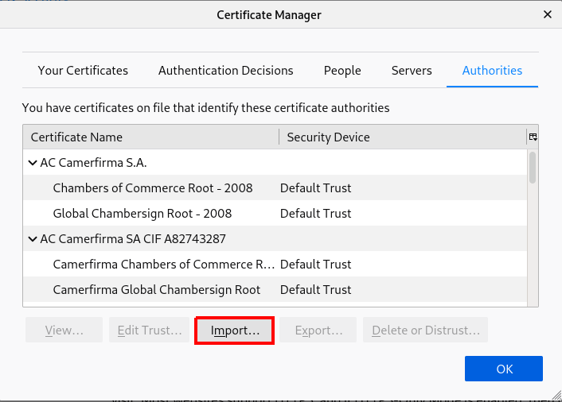 
3. Select the downloaded CA certificate from your device.

<h3 id="editing-certificate-trust-settings-in-firefox">13.5. Editing certificate trust settings in Firefox</h3>

Modify trust settings to define how the browser interacts with specific certificates. Adjusting these permissions determines if the browser validates the certificate for identifying websites or email users.

**Prerequisites**

1. You have successfully imported a certificate.

**Procedure**

1. Open **Certificate Manager**.
2. Under the **Authorities** tab, select the appropriate certificate and click **Edit Trust**.
3. Edit the certificate trust settings.
   
   **Figure 13.2. Editing the Certificate Trust Settings in Firefox**
   
   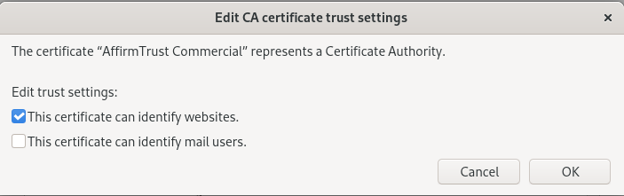 

<h3 id="importing-personal-certificate-for-authentication-in-firefox">13.6. Importing personal certificate for authentication in Firefox</h3>

Personal certificates identify the user to remote web services. Importing these files into the browser enables client-side authentication, allowing access to secure sites that require identity verification beyond simple passwords.

**Prerequisites**

1. You have a personal certificate stored on your device.

**Procedure**

1. Open **Certificate Manager**.
2. Select the **Your Certificates** tab and click **Import**.
   
   **Figure 13.3. Importing a Personal Certificate for Authentication in Firefox**
   
   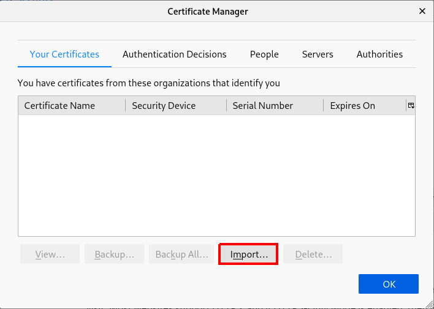 
3. Import the appropriate certificate from your computer.

<h3 id="viewing-certificates-in-thunderbird">13.7. Viewing certificates in Thunderbird</h3>

By accessing the Certificate Manager in Thunderbird, users can audit stored security credentials. Reviewing these files ensures the email client contains the correct authorities and personal keys for encrypted communication.

**Procedure**

1. In Thunderbird, open the main menu and select **Preferences**.
   
   **Figure 13.4. Selecting Preferences from menu**
   
   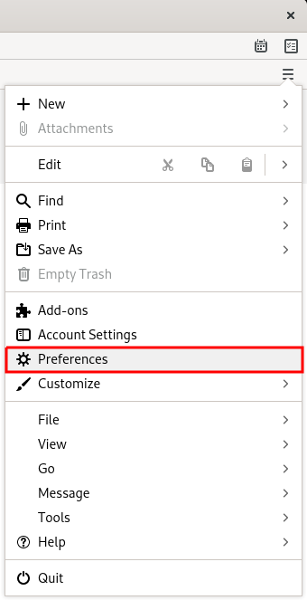 
2. In the left panel, select the **Privacy & Security** section.
   
   **Figure 13.5. Selecting security section**
   
   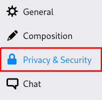 
3. Scroll down to the **Certificates** section.
4. Click **Manage Certificates** to open the **Certificate Manager**.
   
   **Figure 13.6. Opening Certificate Manager**
   
   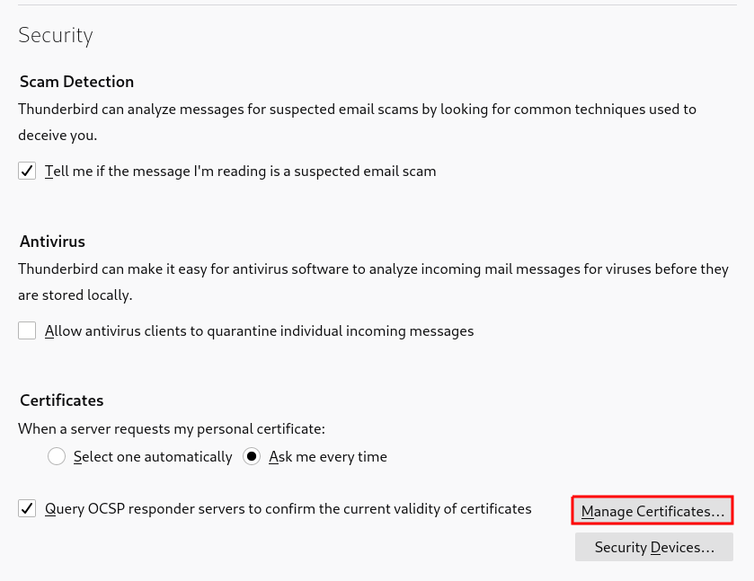 

<h3 id="importing-certificates-in-thunderbird">13.8. Importing certificates in Thunderbird</h3>

Importing Certificate Authority (CA) files enables the email client to validate secure connections. Adding these authorities ensures Thunderbird trusts the SSL/TLS certificates presented by mail servers during data exchange.

**Prerequisites**

- You have a CA certificate stored on your device.

**Procedure**

1. Open **Certificate Manager**.
2. Select the **Authorities** tab and click **Import**.
   
   **Figure 13.7. Importing the CA certificate in Thunderbird**
   
   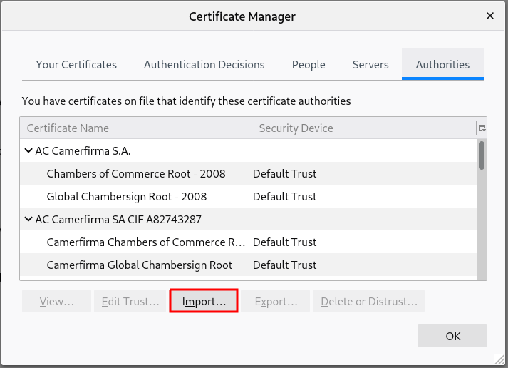 
3. Select the downloaded CA certificate.

<h3 id="editing-certificate-trust-settings-in-thunderbird">13.9. Editing certificate trust settings in Thunderbird</h3>

Modifying trust attributes controls how Thunderbird validates certificates for specific operations. Adjust these settings to explicitly authorize authorities for identifying mail servers or signing email messages.

**Prerequisites**

- You have successfully imported a certificate.

**Procedure**

1. Open **Certificate Manager**.
2. Under the **Authorities** tab, select the appropriate certificate and click **Edit Trust**.
3. Edit the certificate trust settings.
   
   **Figure 13.8. Editing the certificate trust settings in Thunderbird**
   
   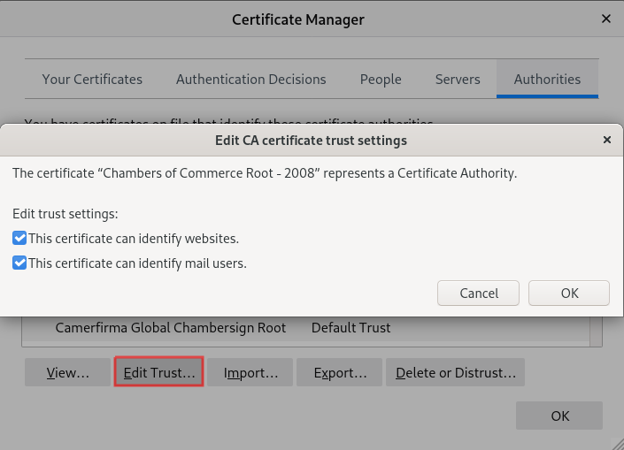 

<h3 id="importing-personal-certificate-in-thunderbird">13.10. Importing personal certificate in Thunderbird</h3>

Personal certificates enable S/MIME functionality for signing and encrypting emails. Importing these keys into the personal store allows the client to prove the sender’s identity and decrypt incoming secure messages.

**Prerequisites**

1. You have a personal certificate stored on your device.

**Procedure**

1. Open **Certificate Manager**.
2. Under the **Your Certificates** tab, click **Import**.
   
   **Figure 13.9. Importing a personal certificate for authentication in Thunderbird**
   
   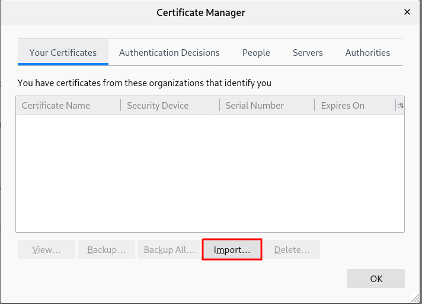 
3. Import the required certificate from your computer.
4. Close the **Certificate Manager**.
5. Open the main menu and select **Account Settings**.
   
   **Figure 13.10. Selecting Account Settings from menu**
   
   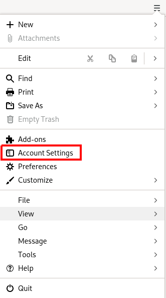 
6. Select **End-To-End Encryption** in the left panel under your account email address.
   
   Selecting End-To-End Encryption section.
   
   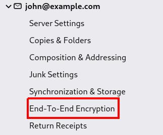 
7. Under **S/MIME** section, click the first **Select** button to choose your personal certificate to use for signing messages.
8. Under **S/MIME** section, click the second **Select** button to choose your personal certificate for encrypting and decrypting messages.
   
   Choosing certificate for signing and encryption/decryption.
   
   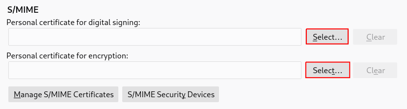 
   
   Note
   
   If you forgot to import valid certificate, you can open **Certificate Manager** directly using the **Manage S/MIME certificate** option.

<h2 id="idm140712140753040">Legal Notice</h2>

Copyright © Red Hat.

Except as otherwise noted below, the text of and illustrations in this documentation are licensed by Red Hat under the Creative Commons Attribution–Share Alike 3.0 Unported license . If you distribute this document or an adaptation of it, you must provide the URL for the original version.

Red Hat, as the licensor of this document, waives the right to enforce, and agrees not to assert, Section 4d of CC-BY-SA to the fullest extent permitted by applicable law.

Red Hat, the Red Hat logo, JBoss, Hibernate, and RHCE are trademarks or registered trademarks of Red Hat, LLC. or its subsidiaries in the United States and other countries.

Linux® is the registered trademark of Linus Torvalds in the United States and other countries.

XFS is a trademark or registered trademark of Hewlett Packard Enterprise Development LP or its subsidiaries in the United States and other countries.

The OpenStack® Word Mark and OpenStack logo are trademarks or registered trademarks of the Linux Foundation, used under license.

All other trademarks are the property of their respective owners.
