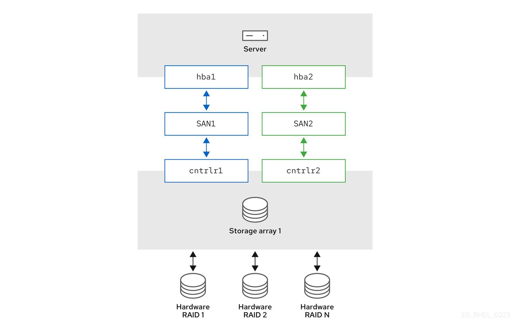
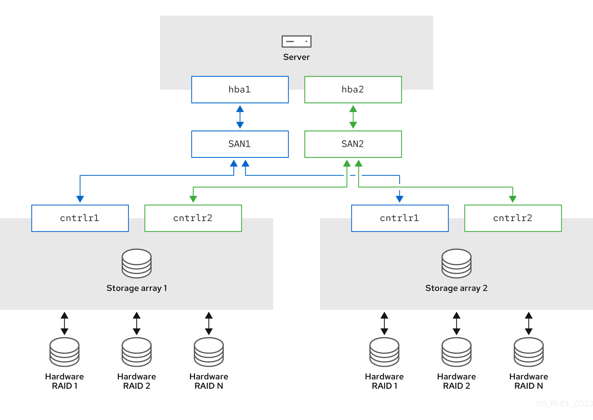

# Configuring device mapper multipath

* * *

Red Hat Enterprise Linux 10

## Configuring and managing the Device Mapper Multipath feature

Red Hat Customer Content Services

[Legal Notice](#idm140053892690800)

**Abstract**

With Device mapper multipathing (DM Multipath), you can configure multiple I/O paths between server nodes and storage arrays into a single device. These I/O paths are physical Storage Area Network (SAN) connections that can include separate cables, switches, and controllers.

Multipathing aggregates the I/O paths and creates a new device that consists of the aggregated paths.

* * *

<h2 id="providing-feedback-on-red-hat-documentation">Providing feedback on Red Hat documentation</h2>

We appreciate your feedback on our documentation. Let us know how we can improve it.

**Submitting feedback through Jira (account required)**

1. Log in to the [Jira](https://issues.redhat.com/projects/RHELDOCS/issues) website.
2. Click **Create** in the top navigation bar
3. Enter a descriptive title in the **Summary** field.
4. Enter your suggestion for improvement in the **Description** field. Include links to the relevant parts of the documentation.
5. Click **Create** at the bottom of the dialogue.

<h2 id="overview-of-device-mapper-multipathing">Chapter 1. Overview of device mapper multipathing</h2>

DM Multipath provides redundancy through failover in active/passive configurations and improved performance by spreading I/O across multiple paths in active/active mode.

DM Multipath provides:

Redundancy

DM Multipath can provide failover in an active/passive configuration. In an active/passive configuration, only a subset of the paths is used at any time for I/O. If any element of an I/O path such as the cable, switch, or controller fails, DM Multipath switches to an alternate path. For more information, see:

- `multipath(8)` and `multipathd(8)` man pages on your system
- `/etc/multipath.conf` file

Note

The number of paths is dependent on the setup. Usually, DM Multipath setups have 2, 4, or 8 paths to the storage, but this is a common setup and other numbers are possible for the paths.

Improved Performance

DM Multipath can be configured in an active/active mode, where I/O is spread over the paths in a round-robin fashion. In some configurations, DM Multipath can detect loading on the I/O paths and dynamically rebalance the load.

<h3 id="activepassive-multipath-configuration-with-one-raid-device">1.1. Active/Passive multipath configuration with one RAID device</h3>

Active/passive configuration provides redundant I/O paths through dual HBAs and SAN switches to a single RAID device, enabling automatic failover when path components fail.

In this configuration, there are two Host Bus Adapters (HBAs) on the server, two SAN switches, and two RAID controllers. Following are the possible failure in this configuration:

- HBA failure
- Fibre Channel cable failure
- SAN switch failure
- Array controller port failure

With DM Multipath configured, a failure at any of these points causes DM Multipath to switch to the alternate I/O path. The following image describes the configuration with two I/O paths from the server to a RAID device. Here, there is one I/O path that goes through `hba1`, `SAN1`, and `cntrlr1` and a second I/O path that goes through `hba2`, `SAN2`, and `cntrlr2`.

**Figure 1.1. Active/Passive multipath configuration with one RAID device**

 

<h3 id="activepassive-multipath-configuration-with-two-raid-devices">1.2. Active/Passive multipath configuration with two RAID devices</h3>

Active/passive configuration with dual RAID devices provides redundant paths to multiple storage arrays, ensuring failover protection across separate RAID systems with dedicated controllers.

In this configuration, there are two HBAs on the server, two SAN switches, and two RAID devices with two RAID controllers each. With DM Multipath configured, a failure at any of the points of the I/O path to either of the RAID devices causes DM Multipath to switch to the alternate I/O path for that device. The following image describes the configuration with two I/O paths to each RAID device. Here, there are two I/O paths to each RAID device.

**Figure 1.2. Active/Passive multipath configuration with two RAID device**

 

<h3 id="activeactive-multipath-configuration-with-one-raid-device">1.3. Active/Active multipath configuration with one RAID device</h3>

Active/active configuration enables simultaneous I/O across multiple paths to a RAID device, distributing workload for improved performance while maintaining failover capability.

In this configuration, there are two HBAs on the server, two SAN switches, and two RAID controllers. The following image describes the configuration with two I/O paths from the server to a storage device. Here, I/O can be spread among these two paths.

**Figure 1.3. Active/Active multipath configuration with one RAID device**

 

<h3 id="dm-multipath-components">1.4. DM Multipath components</h3>

DM Multipath consists of kernel modules, utilities, and daemons that work together to manage multiple I/O paths, including the multipathd daemon and multipath command tools.

The following table describes the DM Multipath components.

|                              |                                                                                                                                                                                                                                                                                                                                                                                                                                                                                                                                                                                                                         |
|:-----------------------------|:------------------------------------------------------------------------------------------------------------------------------------------------------------------------------------------------------------------------------------------------------------------------------------------------------------------------------------------------------------------------------------------------------------------------------------------------------------------------------------------------------------------------------------------------------------------------------------------------------------------------|
| Component                    | Description                                                                                                                                                                                                                                                                                                                                                                                                                                                                                                                                                                                                             |
| `dm_multipath` kernel module | Reroutes I/O and supports failover for paths and path groups.                                                                                                                                                                                                                                                                                                                                                                                                                                                                                                                                                           |
| `mpathconf` utility          | Configures and enables device mapper multipathing.                                                                                                                                                                                                                                                                                                                                                                                                                                                                                                                                                                      |
| `multipath` command          | Lists and configures the multipath devices. It is also executed by `udev` whenever a block device is added, to determine if the device should be part of a multipath device or not.                                                                                                                                                                                                                                                                                                                                                                                                                                     |
| `multipathd` daemon          | Automatically creates and removes multipath devices and monitors paths; as paths fail and come back, it may update the multipath device. Allows interactive changes to multipath devices. Reload the service if there are any changes to the `/etc/multipath.conf` file.                                                                                                                                                                                                                                                                                                                                                |
| `kpartx` command             | Creates device mapper devices for the partitions on a device. This command is automatically executed by `udev` when multipath devices are created to create partition devices on top of them. The `kpartx` command is provided in its own package, but the `device-mapper-multipath` package depends on it.                                                                                                                                                                                                                                                                                                             |
| `mpathpersist`               | Sets up `SCSI-3` persistent reservations on multipath devices. This command works similarly to the way `sg_persist` works for SCSI devices that are not multipathed, but it handles setting persistent reservations on all paths of a multipath device. It coordinates with `multipathd` to ensure that the reservations are set up correctly on paths that are added later. To use this functionality, the `reservation_key` attribute must be defined in the `/etc/multipath.conf` file. Otherwise the `multipathd` daemon will not check for persistent reservations for newly discovered paths or reinstated paths. |

Table 1.1. Components of DM Multipath

<h3 id="displaying-multipath-topology">1.5. Displaying multipath topology</h3>

To effectively monitor paths, troubleshoot multipath issues, or check whether the multipath configurations are set correctly, you can display the multipath topology.

**Procedure**

1. Display the multipath device topology:
   
   ```
   multipath -ll
   mpatha (3600d0230000000000e13954ed5f89300) dm-4 WINSYS,SF2372
   size=233G features='1 queue_if_no_path' hwhandler='0' wp=rw
   `-+- policy='service-time 0' prio=1 status=active
     `- 6:0:0:0 sdf 8:80 active ready running
   ```
   
   ```plaintext
   # multipath -ll
   mpatha (3600d0230000000000e13954ed5f89300) dm-4 WINSYS,SF2372
   size=233G features='1 queue_if_no_path' hwhandler='0' wp=rw
   `-+- policy='service-time 0' prio=1 status=active
     `- 6:0:0:0 sdf 8:80 active ready running
   ```
   
   The output can be split into three parts. Each part displays information for the following group:
   
   - Multipath device information:
     
     - `mpatha (3600d0230000000000e13954ed5f89300)`: alias (wwid if it’s different from the alias)
     - `dm-4`: dm device name
     - `WINSYS,SF2372`: vendor, product
     - `size=233G`: size
     - `features='1 queue_if_no_path'`: features
     - `hwhandler='0'`: hardware handler
     - `wp=rw`: write permissions
   - Path group information:
     
     - `policy='service-time 0'`: scheduling policy
     - `prio=1`: path group priority
     - `status=active`: path group status
   - Path information:
     
     - `6:0:0:0`: host:channel:id:lun
     - `sdf`: devnode
     - `8:80`: major:minor numbers
     - `active`: dm status
     - `ready`: path status
     - `running`: online status
       
       For more information about the dm, path and online status, see [Path status](#path-status "1.6. Path status").
       
       Other multipath commands, which are used to list, create, or reload multipath devices, also display the device topology. However, some information might be unknown and shown as `undef` in the output. This is normal behavior. Use the `multipath -ll` command to view the correct state.
       
       Note
       
       In certain cases, such as creating a multipath device, the multipath topology displays a parameter, which represents if any action was taken. For example, the following command output shows the `create:` parameter to represent that a multipath device was created:
       
       ```
       create: mpatha (3600d0230000000000e13954ed5f89300) undef WINSYS,SF2372
       size=233G features='1 queue_if_no_path' hwhandler='0' wp=undef
       `-+- policy='service-time 0' prio=1 status=undef
         `- 6:0:0:0 sdf 8:80 undef ready running
       ```
       
       ```plaintext
       create: mpatha (3600d0230000000000e13954ed5f89300) undef WINSYS,SF2372
       size=233G features='1 queue_if_no_path' hwhandler='0' wp=undef
       `-+- policy='service-time 0' prio=1 status=undef
         `- 6:0:0:0 sdf 8:80 undef ready running
       ```

<h3 id="path-status">1.6. Path status</h3>

Path status indicates the current state of individual storage paths, ranging from ready and functional to faulty or delayed, helping determine multipath device health and behavior.

The path status is updated periodically by the `multipathd` daemon based on the polling interval defined in the `/etc/multipath.conf` file. In terms of the kernel, the `dm` status is similar to the path status. The `dm` state will retain its current status until the path checker has completed.

Path status

ready, ghost

The path is up and ready for I/O.

faulty, shaky

The path is down.

i/o pending

The checker is actively checking this path, and the state will be updated shortly.

i/o timeout

The checker did not return `success`/`failure` before the timeout period. This is treated the same as `faulty`.

removed

The path has been removed from the system, and will shortly be removed from the multipath device. This is treated the same as `faulty`.

wild

`multipathd` was unable to run the path checker, because of an internal error or configuration issue. This is treated the same as `faulty`, except multipath will skip many actions on the path.

unchecked

The path checker has not run on this path, either because it has just been discovered, it does not have an assigned path checker, or the path checker encountered an error. This is treated the same as `wild`.

delayed

The path checker returns that the path is up, but multipath is delaying the reinstatement of the path because the path has recently failed multiple times and multipath has been configured to delay paths in this case. This is treated the same as `faulty`.

Dm status

Active

Maps to the `ready` and `ghost` path status.

Failed

Maps to all other path status, except `i/o pending` that does not have an equivalent `dm` state.

Online status

Running

The device is enabled.

Offline

The device has been disabled.

<h2 id="multipath-devices">Chapter 2. Multipath devices</h2>

DM Multipath creates a single multipath device over multiple I/O paths to the same storage, organizing them logically. Without it, each path is seen as a separate device, even if they connect the same server to the same storage controller.

<h3 id="multipath-device-identifiers">2.1. Multipath device identifiers</h3>

Multipath devices use specific naming conventions that determine how they appear in the file system. They can be identified by their World Wide Identifier (WWID) or user-friendly names like `mpathN`, depending on your configuration preferences.

When new devices are under the control of DM Multipath, these devices are created in the `/dev/mapper/` and `/dev/` directory.

Note

Any devices of the form `/dev/dm-X` are for internal use only and should never be used by the administrator directly.

The following describes multipath device names:

- When the `user_friendly_names` configuration option is set to `no`, the name of the multipath device is set to World Wide Identifier (WWID). By default, the name of a multipath device is set to its WWID. The device name would be `/dev/mapper/WWID`. It is also created in the `/dev/` directory, named as `/dev/dm-X`.
- Alternately, you can set the `user_friendly_names` option to `yes` in the `/etc/multipath.conf` file. This sets the `alias` in the `multipath` section to a node-unique name of the form `mpathN`. The device name would be `/dev/mapper/mpathN` and `/dev/dm-X`. But the device name is not guaranteed to be the same on all nodes using the multipath device. Similarly, if you set the `alias` option in the `/etc/multipath.conf` file, the name is not automatically consistent across all nodes in the cluster.

Note

This should not cause any difficulties if you use LVM to create logical devices from the multipath device. To keep your multipath device names consistent in every node, disable the `user_friendly_names` option.

For example, a node with two HBAs attached to a storage controller with two ports by means of a single unzoned FC switch sees four devices: `/dev/sda`, `/dev/sdb`, `/dev/sdc`, and `/dev/sdd`. DM Multipath creates a single device with a unique WWID that reroutes I/O to those four underlying devices according to the multipath configuration.

In addition to the `user_friendly_names` and `alias` options, a multipath device also has other attributes. You can modify these attributes for a specific multipath device by creating an entry for that device in the `multipaths` section of the `/etc/multipath.conf` file. For more information, see:

- `multipath(8)` and `multipath.conf(8)` man pages on your system
- `/etc/multipath.conf` file

<h3 id="multipath-devices-in-logical-volumes">2.2. Multipath devices in logical volumes</h3>

Multipath devices integrate seamlessly with LVM, allowing you to create physical volumes, volume groups, and logical volumes by using multipath device names instead of individual disk paths.

After creating multipath devices, you can use the multipath device names as you would use a physical device name when creating an Logical volume manager (LVM) physical volume. For example, if `/dev/mapper/mpatha` is the name of a multipath device, the `pvcreate /dev/mapper/mpatha` command marks `/dev/mapper/mpatha` as a physical volume.

You can use the resulting LVM physical device when you create an LVM volume group just as you would use any other LVM physical device.

To filter all the `sd` devices in the `/etc/lvm/lvm.conf` file, add the `filter = [ "r/block/", "r/disk/", "r/sd./", "a/./" ]` filter in the `devices` section of the file. For more information see the `lvm.conf` man page on your system.

Note

If you attempt to create an LVM physical volume on a whole device on which you have configured partitions, the `pvcreate` command fails. The Anaconda and Kickstart installation programs create empty partition tables if you do not specify otherwise for every block device. If you want to use the whole device instead of creating a partition, remove the existing partitions from the device. You can remove existing partitions with the `kpartx -d` device command and the `fdisk` utility. If your system has block devices that are greater than 2Tb, use the `parted` utility to remove partitions.

When you create an LVM logical volume that uses `active/passive` multipath arrays as the underlying physical devices, you can optionally include filters in the `/etc/lvm/lvm.conf` file to exclude the disks that underline the multipath devices. This is because if the array automatically changes the active path to the passive path when it receives I/O, multipath will failover and failback whenever LVM scans the passive path, if these devices are not filtered.

The kernel changes the active/passive state by automatically detecting the correct hardware handler to use. For active/passive paths that require intervention to change their state, multipath automatically uses this hardware handler to do so as necessary. If the kernel does not automatically detect the correct hardware handler to use, you can configure which hardware handler to use in the multipath.conf file with the "hardware\_handler" option. For `active/passive` arrays that require a command to make the passive path active, LVM prints a warning message when this occurs.

Depending on your configuration, LVM may print any of the following messages:

- LUN not ready:
  
  ```
  end_request: I/O error, dev sdc, sector 0
  sd 0:0:0:3: Device not ready: <6>: Current: sense key: Not Ready
      Add. Sense: Logical unit not ready, manual intervention required
  ```
  
  ```plaintext
  end_request: I/O error, dev sdc, sector 0
  sd 0:0:0:3: Device not ready: <6>: Current: sense key: Not Ready
      Add. Sense: Logical unit not ready, manual intervention required
  ```
- Read failed:
  
  ```
  /dev/sde: read failed after 0 of 4096 at 0: Input/output error
  ```
  
  ```plaintext
  /dev/sde: read failed after 0 of 4096 at 0: Input/output error
  ```

The following are the reasons for the mentioned errors:

- Multipath is not set up on storage devices that are providing active/passive paths to a machine.
- Paths are accessed directly, instead of through the multipath device.

<h2 id="configuring-dm-multipath">Chapter 3. Configuring DM Multipath</h2>

Configure DM Multipath using the `mpathconf` utility, which creates or edits the `/etc/multipath.conf` configuration file to set up basic failover and additional storage options.

This utility creates or edits the `/etc/multipath.conf` multipath configuration file based on the following scenarios:

- If the `/etc/multipath.conf` file already exists, the `mpathconf` utility will edit it.
- If the `/etc/multipath.conf` file does not exist, the `mpathconf` utility will create the `/etc/multipath.conf` file from scratch.

<h3 id="checking-for-the-device-mapper-multipath-package">3.1. Checking for the device-mapper-multipath package</h3>

Verify that the device-mapper-multipath package is installed on your system to ensure all necessary components are available before configuring multipathing. This prevents potential failures caused by missing core software.

**Procedure**

1. Check if your system includes the `device-mapper-multipath` package:
   
   ```
   rpm -q device-mapper-multipath
   device-mapper-multipath-current-package-version
   ```
   
   ```plaintext
   # rpm -q device-mapper-multipath
   device-mapper-multipath-current-package-version
   ```
   
   If your system does not include the package, it prints the following:
   
   ```
   package device-mapper-multipath is not installed
   ```
   
   ```plaintext
   package device-mapper-multipath is not installed
   ```
2. If your system does not include the package, install it by running the following command:
   
   ```
   dnf install device-mapper-multipath
   ```
   
   ```plaintext
   # dnf install device-mapper-multipath
   ```

<h3 id="setting-up-basic-failover-configuration-with-dm-multipath">3.2. Setting up basic failover configuration with DM Multipath</h3>

Establishing a basic failover configuration for DM Multipath provides path redundancy and enhances storage reliability. It ensures that I/O operations continue through alternate paths if one fails, preventing downtime or data loss.

**Prerequisites**

- Administrative access.

**Procedure**

1. Enable and initialize the multipath configuration file:
   
   ```
   mpathconf --enable
   ```
   
   ```plaintext
   # mpathconf --enable
   ```
2. Optional: Edit the `/etc/multipath.conf` file.
   
   Most default settings are already configured, including `path_grouping_policy` which is set to `failover`.
3. Optional: The default naming format of multipath devices is set to `/dev/mapper/mpathn` format. If you prefer a different naming format:
   
   1. Configure DM Multipath to use the multipath device WWID as its name, instead of the mpath\_n_ user-friendly naming scheme:
      
      ```
      mpathconf --enable --user_friendly_names n
      ```
      
      ```plaintext
      # mpathconf --enable --user_friendly_names n
      ```
   2. Reload the configuration of the DM Multipath daemon:
      
      ```
      systemctl reload multipathd.service
      ```
      
      ```plaintext
      # systemctl reload multipathd.service
      ```
4. Start the DM Multipath daemon:
   
   ```
   systemctl start multipathd.service
   ```
   
   ```plaintext
   # systemctl start multipathd.service
   ```

**Verification**

- Confirm that the DM Multipath daemon is running without issues:
  
  ```
  systemctl status multipathd.service
  ```
  
  ```plaintext
  # systemctl status multipathd.service
  ```
- Verify the naming format of multipath devices:
  
  ```
  ls /dev/mapper/
  ```
  
  ```plaintext
  # ls /dev/mapper/
  ```

<h3 id="ignoring-local-disks-when-generating-multipath-devices">3.3. Ignoring local disks when generating multipath devices</h3>

To prevent DM Multipath from using local SCSI disks, you can configure it to ignore these devices during multipath device generation. Setting `find_multipaths` to `on` simplifies this process; otherwise, manual exclusion is required in the configuration file.

**Procedure**

1. Identify the internal disk using any known parameters such as the device’s model, path or vendor, and determine its WWID by using any one of the following options:
   
   - Display existing multipath devices:
     
     ```
     multipath -v2 -l
     
     mpatha (WDC_WD800JD-75MSA3_WD-WMAM9FU71040) dm-2 ATA,WDC WD800JD-75MS
     size=33 GB features="0" hwhandler="0" wp=rw
     `-+- policy='round-robin 0' prio=0 status=active
       |- 0:0:0:0 sda 8:0 active undef running
     ```
     
     ```plaintext
     # multipath -v2 -l
     
     mpatha (WDC_WD800JD-75MSA3_WD-WMAM9FU71040) dm-2 ATA,WDC WD800JD-75MS
     size=33 GB features="0" hwhandler="0" wp=rw
     `-+- policy='round-robin 0' prio=0 status=active
       |- 0:0:0:0 sda 8:0 active undef running
     ```
   - Display additional multipath devices that DM Multipath could create:
     
     ```
     multipath -v2 -d
     
     : mpatha (WDC_WD800JD-75MSA3_WD-WMAM9FU71040) dm-2 ATA,WDC WD800JD-75MS
     size=33 GB features="0" hwhandler="0" wp=undef
     `-+- policy='round-robin 0' prio=1 status=undef
       |- 0:0:0:0 sda 8:0  undef ready running
     ```
     
     ```plaintext
     # multipath -v2 -d
     
     : mpatha (WDC_WD800JD-75MSA3_WD-WMAM9FU71040) dm-2 ATA,WDC WD800JD-75MS
     size=33 GB features="0" hwhandler="0" wp=undef
     `-+- policy='round-robin 0' prio=1 status=undef
       |- 0:0:0:0 sda 8:0  undef ready running
     ```
   - Display device information:
     
     ```
     multipathd show paths raw format "%d %w" | grep sda
     sda WDC_WD800JD-75MSA3_WD-WMAM9FU71040
     ```
     
     ```plaintext
     # multipathd show paths raw format "%d %w" | grep sda
     sda WDC_WD800JD-75MSA3_WD-WMAM9FU71040
     ```
     
     In this example, `/dev/sda` is the internal disk and its WWID is `WDC_WD800JD-75MSA3_WD-WMAM9FU71040`.
2. Edit the `blacklist` section of the `/etc/multipath.conf` file to ignore this device, using its WWID attribute:
   
   ```
   blacklist {
         wwid WDC_WD800JD-75MSA3_WD-WMAM9FU71040
   }
   ```
   
   ```plaintext
   blacklist {
         wwid WDC_WD800JD-75MSA3_WD-WMAM9FU71040
   }
   ```
   
   Warning
   
   Although you could identify the device using its `devnode` parameter, such as `sda`, it would not be a safe procedure, because `/dev/sda` is not guaranteed to refer to the same device on reboot.
3. Check for any configuration errors in the `/etc/multipath.conf` file:
   
   ```
   multipath -t > /dev/null
   ```
   
   ```plaintext
   # multipath -t > /dev/null
   ```
   
   To see the full report, do not discard the command output:
   
   ```
   multipath -t
   ```
   
   ```plaintext
   # multipath -t
   ```
4. Remake the initramfs if the disk is included in `initramfs`. For more information, see [Configuring multipathing in initramfs](#configuring-multipathing-in-initramfs "3.5. Configuring multipathing in initramfs").
5. Reload the `/etc/multipath.conf` file by reconfiguring the `multipathd` daemon:
   
   ```
   systemctl reload multipathd
   ```
   
   ```plaintext
   # systemctl reload multipathd
   ```
   
   Note
   
   Multipath devices on top of local disks cannot be removed when in use. To ignore such device, stop all users of the device. For example, by unmounting any filesystem on top of it and deactivating any logical volumes using it. If this is not possible, you can reboot the system to remove the multipath device.

**Verification**

1. Verify that the internal disk is ignored and it is not displayed in the multipath output:
   
   - List the multipathed devices:
     
     ```
     multipath -v2 -l
     ```
     
     ```plaintext
     # multipath -v2 -l
     ```
   - List the additional devices that DM Multipath could create:
     
     ```
     multipath -v2 -d
     ```
     
     ```plaintext
     # multipath -v2 -d
     ```

<h3 id="configuring-additional-storage-with-dm-multipath">3.4. Configuring additional storage with DM Multipath</h3>

By default, DM Multipath includes built-in configurations for the most common storage arrays, which support DM Multipath. If your storage array does not already have a configuration, you can add one by editing the `/etc/multipath.conf` file.

Note

Add additional storage devices during the initial configuration to align the setup with your anticipated needs. DM Multipath enables adding devices later for scalability or upgrades, but this approach may require adjusting configurations to ensure compatibility.

**Procedure**

1. View the default configuration value and supported devices:
   
   ```
   multipathd show config
   ```
   
   ```plaintext
   # multipathd show config
   ```
2. Edit the `/etc/multipath.conf` file to set up your multipath configuration. Below is an example for the DM Multipath configuration for HP OPEN-V Storage Device:
   
   ```
   # Set default configurations for all devices managed by DM Multipath
   
   defaults {
       # Enable user-friendly names for devices
       user_friendly_names yes
   }
   
   devices {
       # Define configuration for HP OPEN-V storage
       device {
           vendor "HP"
           pproduct "OPEN-V"
           no_path_retry 18
       }
   }
   ```
   
   ```plaintext
   # Set default configurations for all devices managed by DM Multipath
   
   defaults {
       # Enable user-friendly names for devices
       user_friendly_names yes
   }
   
   devices {
       # Define configuration for HP OPEN-V storage
       device {
           vendor "HP"
           pproduct "OPEN-V"
           no_path_retry 18
       }
   }
   ```
3. Save your changes and close the editor.
4. Update the multipath device list by scanning for new devices:
   
   ```
   multipath -r
   ```
   
   ```plaintext
   # multipath -r
   ```

**Verification**

- Confirm that the multipath devices are recognized correctly:
  
  ```
  multipath -ll
  ```
  
  ```plaintext
  # multipath -ll
  ```

<h3 id="configuring-multipathing-in-initramfs">3.5. Configuring multipathing in initramfs</h3>

Setting up multipathing in the `initramfs` ensure multipath devices are available early in the boot process. This is essential for storage setups requiring redundancy and load balancing, helping maintain system integrity and avoid issues during startup.

**Prerequisites**

- Configured DM multipath on your system.

**Procedure**

1. Rebuild the `initramfs` file system with the multipath configuration files:
   
   ```
   dracut --force --add multipath
   ```
   
   ```plaintext
   # dracut --force --add multipath
   ```
   
   Note
   
   When using multipath in the `initramfs` and modifying its configuration files, remember to rebuild the `initramfs` for the changes to take effect. If your root device employs multipath, the `dracut` command will automatically include the multipath module in the `initramfs`.
2. Optional: If multipath in the `initramfs` is no longer necessary:
   
   1. Remove the multipath configuration file:
      
      ```
      rm /etc/dracut.conf.d/multipath.conf
      ```
      
      ```plaintext
      # rm /etc/dracut.conf.d/multipath.conf
      ```
   2. Rebuild the `initramfs` with the added multipath configuration:
      
      ```
      dracut --force --omit multipath
      ```
      
      ```plaintext
      # dracut --force --omit multipath
      ```

**Verification**

- Check if multipath-related files and configurations are present:
  
  ```
  lsinitrd /path/to/initramfs.img -m | grep multipath
  ```
  
  ```plaintext
  # lsinitrd /path/to/initramfs.img -m | grep multipath
  ```

Note

While verification steps provided can give you an indication of success, a final test boot-up is recommended to ensure that the configuration works as expected.

- After the reboot, confirm that the multipath devices are recognized correctly:
  
  ```
  multipath -ll
  ```
  
  ```plaintext
  # multipath -ll
  ```

<h2 id="modifying-the-dm-multipath-configuration-file">Chapter 4. Modifying the DM Multipath configuration file</h2>

Override DM Multipath default configuration values by editing the `/etc/multipath.conf` file to customize multipathing behavior and add support for unsupported storage arrays.

In the multipath configuration file, you need to specify only the sections that you need for your configuration, or that you need to change from the default values. If there are sections of the file that are not relevant to your environment or for which you do not need to override the default values, you can leave them commented out, as they are in the initial file.

In the configuration file, you can also use the regular expression.

Note

If you run multipath from the `initramfs` file system and you make any changes to the multipath configuration files, you must rebuild the `initramfs` file system for the changes to take effect.

<h3 id="configuration-file-overview">4.1. Configuration file overview</h3>

The multipath configuration file contains distinct sections for blacklists, defaults, devices, multipaths, and overrides, evaluated in priority order to determine device behavior.

The multipath configuration file is divided into the following sections:

blacklist

Listing of specific devices that will not be considered for multipath.

blacklist\_exceptions

Listing of multipath devices that would otherwise be ignored according to the parameters of the `blacklist` section.

defaults

General default settings for DM Multipath.

multipaths

Settings for the characteristics of individual multipath devices. These values overwrite what is specified in the `overrides`, `devices`, and `defaults` sections of the configuration file.

devices

Settings for the individual storage controllers. These values overwrite what is specified in the `defaults` section of the configuration file. If you are using a storage array that is not supported by default, you may need to create a `devices` subsection for your array.

overrides

Settings that are applied to all devices. These values overwrite what is specified in the `devices` and `defaults` sections of the configuration file.

When the system determines the attributes of a multipath device, it checks the settings of the separate sections from the `multipath.conf` file in the following order:

1. `multipaths` section
2. `overrides` section
3. `devices` section
4. `defaults` section

The following are the ways to view the default configurations:

- If you install your machine on a multipath device, the default multipath configuration applies automatically. The default configuration includes the following:
  
  - For a complete list of the default configuration values, execute either `multipath -t` or `multipathd show config` command.
  - For a list of configuration options with descriptions, see the `multipath.conf` man page on your system.
- If you did not set up multipathing during installation, execute the `mpathconf --enable` command to get the default configuration.

<h3 id="configuration-file-defaults">4.2. Configuration file defaults</h3>

The `defaults` section establishes global configuration parameters for DM Multipath behavior, including polling intervals, path grouping policies, and failover settings applied to all multipath devices.

The `/etc/multipath.conf` configuration file contains a `defaults` section. This section includes the default configuration of Device Mapper (DM) Multipath. The default values might differ based on your initial device settings.

The following table describes the optional attributes, set in the `defaults` section of the `multipath.conf` configuration file. If you do not set them, default values from the `overrides`, or `devices` sections apply.

| Attribute                                                                                                                                     | Description                                                                                                                                                                                                                                                                                                                                                                                                                                                                                                                                                                                                                                                                                                                                                                                                                                                         |
|:----------------------------------------------------------------------------------------------------------------------------------------------|:--------------------------------------------------------------------------------------------------------------------------------------------------------------------------------------------------------------------------------------------------------------------------------------------------------------------------------------------------------------------------------------------------------------------------------------------------------------------------------------------------------------------------------------------------------------------------------------------------------------------------------------------------------------------------------------------------------------------------------------------------------------------------------------------------------------------------------------------------------------------|
| `polling_interval`                                                                                                                            | Specifies the interval between two path checks in seconds. For properly functioning paths, the interval between checks gradually increases to `max_polling_interval`.                                                                                                                                                                                                                                                                                                                                                                                                                                                                                                                                                                                                                                                                                               |
|                                                                                                                                               | The default value is `5`.                                                                                                                                                                                                                                                                                                                                                                                                                                                                                                                                                                                                                                                                                                                                                                                                                                           |
| `max_polling_interval`                                                                                                                        | Specifies the maximum length of the interval between two path checks in seconds.                                                                                                                                                                                                                                                                                                                                                                                                                                                                                                                                                                                                                                                                                                                                                                                    |
|                                                                                                                                               | The default value is `4 * polling_interval`.                                                                                                                                                                                                                                                                                                                                                                                                                                                                                                                                                                                                                                                                                                                                                                                                                        |
| `find_multipaths`                                                                                                                             | Defines the mode for setting up multipath devices. Available values include:                                                                                                                                                                                                                                                                                                                                                                                                                                                                                                                                                                                                                                                                                                                                                                                        |
|                                                                                                                                               | `off`: If `find_multipaths` is set to `off`, `multipath` applies rules as with the `strict` value and the `multipathd` daemon applies rules as with the `greedy` value.                                                                                                                                                                                                                                                                                                                                                                                                                                                                                                                                                                                                                                                                                             |
|                                                                                                                                               | `on`: If there are at least two devices that are not on the `blacklist` with the same World Wide Identifier (WWID), or if multipath created a multipath device with a device WWID before (even if that multipath device is no longer present), then the device is treated as a multipath device path.                                                                                                                                                                                                                                                                                                                                                                                                                                                                                                                                                               |
|                                                                                                                                               | `greedy`: Both `multipathd` and `multipath` treat every non-blacklisted device as a multipath device path.                                                                                                                                                                                                                                                                                                                                                                                                                                                                                                                                                                                                                                                                                                                                                          |
|                                                                                                                                               | `smart`: Multipath automatically considers that every non-blacklisted device is a multipath device path. If a second path, with the same WWID does not appear within the time set for `find_multipaths_timeout`, multipath releases the device and enables it for use by the rest of the system. The `multipathd` daemon applies rules as with the `on` value.                                                                                                                                                                                                                                                                                                                                                                                                                                                                                                      |
|                                                                                                                                               | `strict`: This value only treats a device as a multipath path, if you create a multipath device with the device WWID.                                                                                                                                                                                                                                                                                                                                                                                                                                                                                                                                                                                                                                                                                                                                               |
|                                                                                                                                               | The default value is `off`. The default `multipath.conf` file sets `find_multipaths` to `on`.                                                                                                                                                                                                                                                                                                                                                                                                                                                                                                                                                                                                                                                                                                                                                                       |
| `find_multipaths_timeout`                                                                                                                     | This represents the timeout in seconds, to wait for additional paths after detecting the first one, if `find_multipaths` `smart` is set. Possible values include:                                                                                                                                                                                                                                                                                                                                                                                                                                                                                                                                                                                                                                                                                                   |
|                                                                                                                                               | **Positive value**: If set with a positive value, the timeout applies for all non-blacklisted devices.                                                                                                                                                                                                                                                                                                                                                                                                                                                                                                                                                                                                                                                                                                                                                              |
|                                                                                                                                               | **Negative value**: If set with a negative value, the timeout applies only to known devices that have an entry in the multipath hardware table, either in the built-in table, or in a `device` section. Other unknown devices use a timeout of only 1 second to avoid booting delays.                                                                                                                                                                                                                                                                                                                                                                                                                                                                                                                                                                               |
|                                                                                                                                               | `0`: The system applies the built-in default for this attribute.                                                                                                                                                                                                                                                                                                                                                                                                                                                                                                                                                                                                                                                                                                                                                                                                    |
|                                                                                                                                               | The default value for known hardware is `-10`. This means that known devices have a 10 second timeout. Unknown devices have a 1 second timeout. If the `find_multipaths` attribute has a value other than `smart`, this attribute has no effect.                                                                                                                                                                                                                                                                                                                                                                                                                                                                                                                                                                                                                    |
| `uxsock_timeout`                                                                                                                              | Set the timeout of `multipathd` interactive commands in milliseconds.                                                                                                                                                                                                                                                                                                                                                                                                                                                                                                                                                                                                                                                                                                                                                                                               |
|                                                                                                                                               | For systems with a large number of devices, `multipathd` interactive commands might timeout and fail. If this happens, increase this timeout to resolve the issue.                                                                                                                                                                                                                                                                                                                                                                                                                                                                                                                                                                                                                                                                                                  |
|                                                                                                                                               | The default value is `4000`.                                                                                                                                                                                                                                                                                                                                                                                                                                                                                                                                                                                                                                                                                                                                                                                                                                        |
| `reassign_maps`                                                                                                                               | Enable reassigning of device-mapper maps. With this option, the `multipathd` daemon remaps existing device-mapper maps to always point to the multipath device, not the underlying block devices. Possible values are `yes` and `no`. The default value is `no`.                                                                                                                                                                                                                                                                                                                                                                                                                                                                                                                                                                                                    |
| `verbosity`                                                                                                                                   | The default verbosity value is `2`. Higher values increase the verbosity level. Valid levels are between `0` and `4`.                                                                                                                                                                                                                                                                                                                                                                                                                                                                                                                                                                                                                                                                                                                                               |
| `path_selector`                                                                                                                               | Specifies the default algorithm to use in determining what path to use for the next I/O operation. Possible values include:                                                                                                                                                                                                                                                                                                                                                                                                                                                                                                                                                                                                                                                                                                                                         |
|                                                                                                                                               | `round-robin 0`: Loop through every path in the path group, sending the same number of I/O requests, determined by `rr_min_io` or `rr_min_io_rq`, to each.                                                                                                                                                                                                                                                                                                                                                                                                                                                                                                                                                                                                                                                                                                          |
|                                                                                                                                               | `queue-length 0`: Send the next group of I/O requests down the path with the least number of outstanding I/O requests.                                                                                                                                                                                                                                                                                                                                                                                                                                                                                                                                                                                                                                                                                                                                              |
|                                                                                                                                               | `service-time 0`: Send the next group of I/O requests down the path with the shortest estimated service time. This is determined by dividing the total size of the outstanding I/O to each path by the relative throughput.                                                                                                                                                                                                                                                                                                                                                                                                                                                                                                                                                                                                                                         |
|                                                                                                                                               | The default value is `service-time 0`.                                                                                                                                                                                                                                                                                                                                                                                                                                                                                                                                                                                                                                                                                                                                                                                                                              |
| `path_grouping_policy`                                                                                                                        | Specifies the default path grouping policy to apply to unspecified multipaths. Possible values include:                                                                                                                                                                                                                                                                                                                                                                                                                                                                                                                                                                                                                                                                                                                                                             |
|                                                                                                                                               | `failover`: 1 path per priority group.                                                                                                                                                                                                                                                                                                                                                                                                                                                                                                                                                                                                                                                                                                                                                                                                                              |
|                                                                                                                                               | `multibus`: All valid paths in 1 priority group.                                                                                                                                                                                                                                                                                                                                                                                                                                                                                                                                                                                                                                                                                                                                                                                                                    |
|                                                                                                                                               | `group_by_serial`: 1 priority group per detected serial number.                                                                                                                                                                                                                                                                                                                                                                                                                                                                                                                                                                                                                                                                                                                                                                                                     |
|                                                                                                                                               | `group_by_prio`: 1 priority group per path priority value. Priorities are determined by the `prio` attribute.                                                                                                                                                                                                                                                                                                                                                                                                                                                                                                                                                                                                                                                                                                                                                       |
|                                                                                                                                               | `group_by_node_name`: 1 priority group per target node name. The `/sys/class/fc_transport/target*/node_name` directory includes target node names.                                                                                                                                                                                                                                                                                                                                                                                                                                                                                                                                                                                                                                                                                                                  |
|                                                                                                                                               | `group_by_tpg`: 1 priority group per target port group. All paths in the multipath device must have their priority function set to `alua` or `sysfs`.                                                                                                                                                                                                                                                                                                                                                                                                                                                                                                                                                                                                                                                                                                               |
|                                                                                                                                               | The default value is `failover`.                                                                                                                                                                                                                                                                                                                                                                                                                                                                                                                                                                                                                                                                                                                                                                                                                                    |
| `uid_attrs`                                                                                                                                   | Set this option to activate merging `uevents` by WWID. This action might improve uevent processing efficiency. It is also an alternative method to configure the udev properties to use for determining unique path identifiers (WWIDs).                                                                                                                                                                                                                                                                                                                                                                                                                                                                                                                                                                                                                            |
|                                                                                                                                               | The value of this option is a space separated list of records like `type:ATTR`, where `type` is matched against the beginning of the device node name, and `ATTR` is the name of the udev property to use for matching devices.                                                                                                                                                                                                                                                                                                                                                                                                                                                                                                                                                                                                                                     |
|                                                                                                                                               | If you configure this option and it matches the device node name of a device, it overrides any other configured methods for determining the WWID for this device.                                                                                                                                                                                                                                                                                                                                                                                                                                                                                                                                                                                                                                                                                                   |
|                                                                                                                                               | You can enable `uevent` merging by setting this value to `sd:ID_SERIAL dasd:ID_UID nvme:ID_WWN`.                                                                                                                                                                                                                                                                                                                                                                                                                                                                                                                                                                                                                                                                                                                                                                    |
|                                                                                                                                               | The default is `unset`.                                                                                                                                                                                                                                                                                                                                                                                                                                                                                                                                                                                                                                                                                                                                                                                                                                             |
| `prio`                                                                                                                                        | Specifies the default function to call to obtain a path priority value. For example, the ALUA bits in SPC-3 provide an exploitable `prio` value. Possible values include:                                                                                                                                                                                                                                                                                                                                                                                                                                                                                                                                                                                                                                                                                           |
|                                                                                                                                               | `const`: Set a priority of 1 to all paths.                                                                                                                                                                                                                                                                                                                                                                                                                                                                                                                                                                                                                                                                                                                                                                                                                          |
|                                                                                                                                               | `emc`: Generate the path priority for EMC arrays.                                                                                                                                                                                                                                                                                                                                                                                                                                                                                                                                                                                                                                                                                                                                                                                                                   |
|                                                                                                                                               | `sysfs`: Generate the path priority from `sysfs`. This prioritizer accepts the optional `prio_arg` value `exclusive_pref_bit`. The `sysfs` value uses the `sysfs` attributes `access_state` and `preferred_path`.                                                                                                                                                                                                                                                                                                                                                                                                                                                                                                                                                                                                                                                   |
|                                                                                                                                               | `alua`: Generate the path priority based on the SCSI-3 ALUA settings. If you specify `prio alua` and `prio_args` `exclusive_pref_bit` in your device configuration, multipath creates a path group that contains only the path with the `exclusive_pref_bit` set, and assigns that path group the highest priority. Refer to the `multipath.conf(5)` man page for more information about this type of cases.                                                                                                                                                                                                                                                                                                                                                                                                                                                        |
|                                                                                                                                               | `ontap`: Generate the path priority for NetApp arrays.                                                                                                                                                                                                                                                                                                                                                                                                                                                                                                                                                                                                                                                                                                                                                                                                              |
|                                                                                                                                               | `rdac`: Generate the path priority for LSI/Engenio RDAC controller.                                                                                                                                                                                                                                                                                                                                                                                                                                                                                                                                                                                                                                                                                                                                                                                                 |
|                                                                                                                                               | `hp_sw`: Generate the path priority for Compaq/HP controller in active/standby mode.                                                                                                                                                                                                                                                                                                                                                                                                                                                                                                                                                                                                                                                                                                                                                                                |
|                                                                                                                                               | `hds`: Generate the path priority for Hitachi HDS Modular storage arrays.                                                                                                                                                                                                                                                                                                                                                                                                                                                                                                                                                                                                                                                                                                                                                                                           |
|                                                                                                                                               | `random`: Generate a random priority between 1 and 10.                                                                                                                                                                                                                                                                                                                                                                                                                                                                                                                                                                                                                                                                                                                                                                                                              |
|                                                                                                                                               | `weightedpath`: Generate the path priority based on the regular expression and the provided priority as an argument. Requires a `prio_args` keyword.                                                                                                                                                                                                                                                                                                                                                                                                                                                                                                                                                                                                                                                                                                                |
|                                                                                                                                               | `path_latency`: Generate the path priority based on a latency algorithm. Requires a `prio_args` keyword.                                                                                                                                                                                                                                                                                                                                                                                                                                                                                                                                                                                                                                                                                                                                                            |
|                                                                                                                                               | `ana`: Generate the path priority based on the NVMe ANA settings. This priority routine is hardware dependent.                                                                                                                                                                                                                                                                                                                                                                                                                                                                                                                                                                                                                                                                                                                                                      |
|                                                                                                                                               | `datacore`: Generate the path priority for some DataCore storage arrays. Requires a `prio_args` keyword. This priority routine is hardware dependent.                                                                                                                                                                                                                                                                                                                                                                                                                                                                                                                                                                                                                                                                                                               |
|                                                                                                                                               | `iet`: Generate path priority for iSCSI targets based on IP their address. Requires a `prio_args` keyword. This priority routine is available only with iSCSI.                                                                                                                                                                                                                                                                                                                                                                                                                                                                                                                                                                                                                                                                                                      |
|                                                                                                                                               | The default value depends on the `detect_prio` setting. If `detect_prio` is set to `yes`, then the default priority algorithm is `sysfs`. The only exception is for NetAPP E-Series, where the default is `alua`. If `detect_prio` is set to `no`, the default priority algorithm is `const`.                                                                                                                                                                                                                                                                                                                                                                                                                                                                                                                                                                       |
| `prio_args`                                                                                                                                   | Arguments to pass to the `prio` function. This applies only to the following prioritizers:                                                                                                                                                                                                                                                                                                                                                                                                                                                                                                                                                                                                                                                                                                                                                                          |
|                                                                                                                                               | `weighted`: Needs a value of the form `<hbtl,devname,serial,wwn> <regex1> <prio1> <regex2> <prio2>`                                                                                                                                                                                                                                                                                                                                                                                                                                                                                                                                                                                                                                                                                                                                                                 |
|                                                                                                                                               | `hbtl`: The Regex value can be of SCSI H:B:T:L format. For example: `1:0:.:. , *:0:0:`.                                                                                                                                                                                                                                                                                                                                                                                                                                                                                                                                                                                                                                                                                                                                                                             |
|                                                                                                                                               | `devname`: The Regex value can be in device name format. For example: `sda`, `sd.e`.                                                                                                                                                                                                                                                                                                                                                                                                                                                                                                                                                                                                                                                                                                                                                                                |
|                                                                                                                                               | `serial`: The Regex value can be in serial number format. Look up `serial` through `sysfs`, or by running the command `multipathd show paths format "%z"`.                                                                                                                                                                                                                                                                                                                                                                                                                                                                                                                                                                                                                                                                                                          |
|                                                                                                                                               | `wwn`: The Regex value can be in the form `host_wwnn:host_wwpn:target_wwnn:target_wwpn`. These values can be looked up through `sysfs` or by running the command `multipathd show paths format %N:%R:%n:%r"`.                                                                                                                                                                                                                                                                                                                                                                                                                                                                                                                                                                                                                                                       |
|                                                                                                                                               | `path_latency`: Requires a value in the form `io_num= <integer> base_num=<integer>`.                                                                                                                                                                                                                                                                                                                                                                                                                                                                                                                                                                                                                                                                                                                                                                                |
|                                                                                                                                               | `io_num`: The number of read IOs, continuously sent to the current path. This value helps calculate the average path latency. Valid values include `Integer`, `[2, 200]`.                                                                                                                                                                                                                                                                                                                                                                                                                                                                                                                                                                                                                                                                                           |
|                                                                                                                                               | `base_num`: The base number value of logarithmic scale. This value helps to partition different priority ranks. Valid values include `Integer`, `[2, 10]`. The maximum average latency value is `100s` and the minimum average latency value is `1us`.                                                                                                                                                                                                                                                                                                                                                                                                                                                                                                                                                                                                              |
|                                                                                                                                               | `alua`: If the `exclusive_pref_bit` value is set, paths with the `preferred_path_bit` set always create their own path group.                                                                                                                                                                                                                                                                                                                                                                                                                                                                                                                                                                                                                                                                                                                                       |
|                                                                                                                                               | `sysfs`: If the `exclusive_pref_bit` value is set, paths with the `preferred_path_bit` set always create their own path group.                                                                                                                                                                                                                                                                                                                                                                                                                                                                                                                                                                                                                                                                                                                                      |
|                                                                                                                                               | `datacore`: Requires a value of the form `timeout=<milliseconds> preferredsds=<name>`.                                                                                                                                                                                                                                                                                                                                                                                                                                                                                                                                                                                                                                                                                                                                                                              |
|                                                                                                                                               | `preferredsds`: This value is mandatory and it represents the preferred SDS name.                                                                                                                                                                                                                                                                                                                                                                                                                                                                                                                                                                                                                                                                                                                                                                                   |
|                                                                                                                                               | `timeout`: This value is optional. Set the timeout for the inquiry in milliseconds.                                                                                                                                                                                                                                                                                                                                                                                                                                                                                                                                                                                                                                                                                                                                                                                 |
|                                                                                                                                               | `iet`: Requires a value of the form `preferredip=<ip_address>`.                                                                                                                                                                                                                                                                                                                                                                                                                                                                                                                                                                                                                                                                                                                                                                                                     |
|                                                                                                                                               | `preferredip`: This value is mandatory. This is the preferred IP address, in dotted decimal notation, for iSCSI targets.                                                                                                                                                                                                                                                                                                                                                                                                                                                                                                                                                                                                                                                                                                                                            |
|                                                                                                                                               | The default value is `unset`.                                                                                                                                                                                                                                                                                                                                                                                                                                                                                                                                                                                                                                                                                                                                                                                                                                       |
| `features`                                                                                                                                    | The default extra features of multipath devices, using the format: *"number\_of\_features\_plus\_arguments feature1 …​"*.                                                                                                                                                                                                                                                                                                                                                                                                                                                                                                                                                                                                                                                                                                                                           |
|                                                                                                                                               | Possible values for `features` include:                                                                                                                                                                                                                                                                                                                                                                                                                                                                                                                                                                                                                                                                                                                                                                                                                             |
|                                                                                                                                               | `queue_if_no_path`: The same as setting `no_path_retry` to `queue`.                                                                                                                                                                                                                                                                                                                                                                                                                                                                                                                                                                                                                                                                                                                                                                                                 |
|                                                                                                                                               | `pg_init_retries n`: Retry path group initialization up to *n* times before failing. The number must be between 1 and 50.                                                                                                                                                                                                                                                                                                                                                                                                                                                                                                                                                                                                                                                                                                                                           |
|                                                                                                                                               | `pg_init_delay_msecs msecs`: Number of milliseconds before `pg_init` retry initiates. The number must be between 0 and 60000.                                                                                                                                                                                                                                                                                                                                                                                                                                                                                                                                                                                                                                                                                                                                       |
|                                                                                                                                               | `queue_mode mode`: Select the queueing mode per multipath device. The *mode* value options are `bio`, `rq` or `mq`. These correspond to bio-based, request-based, and block-multiqueue request-based (`blk-mq`), respectively.                                                                                                                                                                                                                                                                                                                                                                                                                                                                                                                                                                                                                                      |
|                                                                                                                                               | By default, the value is *unset*.                                                                                                                                                                                                                                                                                                                                                                                                                                                                                                                                                                                                                                                                                                                                                                                                                                   |
| `path_checker`                                                                                                                                | Specifies the default method to determine the state of the paths. Possible values include:                                                                                                                                                                                                                                                                                                                                                                                                                                                                                                                                                                                                                                                                                                                                                                          |
|                                                                                                                                               | `readsector0`: Read the first sector of the device.                                                                                                                                                                                                                                                                                                                                                                                                                                                                                                                                                                                                                                                                                                                                                                                                                 |
|                                                                                                                                               | `tur`: Issue a `TEST UNIT READY` command to the device.                                                                                                                                                                                                                                                                                                                                                                                                                                                                                                                                                                                                                                                                                                                                                                                                             |
|                                                                                                                                               | `emc_clariion`: Query the EMC Clariion specific EVPD page 0xC0 to determine the path.                                                                                                                                                                                                                                                                                                                                                                                                                                                                                                                                                                                                                                                                                                                                                                               |
|                                                                                                                                               | `hp_sw`: Check the path state for HP storage arrays with Active/Standby firmware.                                                                                                                                                                                                                                                                                                                                                                                                                                                                                                                                                                                                                                                                                                                                                                                   |
|                                                                                                                                               | `rdac`: Check the path state for LSI/Engenio RDAC storage controller.                                                                                                                                                                                                                                                                                                                                                                                                                                                                                                                                                                                                                                                                                                                                                                                               |
|                                                                                                                                               | `directio`: Read the first sector with direct I/O.                                                                                                                                                                                                                                                                                                                                                                                                                                                                                                                                                                                                                                                                                                                                                                                                                  |
|                                                                                                                                               | `cciss_tur`: Check the path state for HP/COMPAQ Smart Array(CCISS) controllers. This is hardware dependent.                                                                                                                                                                                                                                                                                                                                                                                                                                                                                                                                                                                                                                                                                                                                                         |
|                                                                                                                                               | `none`: Does not check the device. Falls back to use values retrieved from `sysfs`.                                                                                                                                                                                                                                                                                                                                                                                                                                                                                                                                                                                                                                                                                                                                                                                 |
|                                                                                                                                               | The default value is `tur`.                                                                                                                                                                                                                                                                                                                                                                                                                                                                                                                                                                                                                                                                                                                                                                                                                                         |
| `alias_prefix`                                                                                                                                | This attribute represents the `user_friendly_names` prefix.                                                                                                                                                                                                                                                                                                                                                                                                                                                                                                                                                                                                                                                                                                                                                                                                         |
|                                                                                                                                               | The default value is `mpath`.                                                                                                                                                                                                                                                                                                                                                                                                                                                                                                                                                                                                                                                                                                                                                                                                                                       |
| `failback`                                                                                                                                    | Manages path group failback. Possible values include:                                                                                                                                                                                                                                                                                                                                                                                                                                                                                                                                                                                                                                                                                                                                                                                                               |
|                                                                                                                                               | `immediate`: Specifies immediate failback to the highest priority path group that contains active paths.                                                                                                                                                                                                                                                                                                                                                                                                                                                                                                                                                                                                                                                                                                                                                            |
|                                                                                                                                               | `manual`: Specifies that there is no immediate failback, but that failback can happen only with operator intervention.                                                                                                                                                                                                                                                                                                                                                                                                                                                                                                                                                                                                                                                                                                                                              |
|                                                                                                                                               | `followover`: Specifies that automatic failback can only be performed when the first path of a path group becomes active. This keeps a node from automatically failing back, when another node requested the failover.                                                                                                                                                                                                                                                                                                                                                                                                                                                                                                                                                                                                                                              |
|                                                                                                                                               | A numeric value greater than zero, specifies deferred failback, and is expressed in seconds.                                                                                                                                                                                                                                                                                                                                                                                                                                                                                                                                                                                                                                                                                                                                                                        |
|                                                                                                                                               | The default value is `manual`.                                                                                                                                                                                                                                                                                                                                                                                                                                                                                                                                                                                                                                                                                                                                                                                                                                      |
| `rr_min_io`                                                                                                                                   | Specifies the number of I/O requests to route to a path before switching to the next path in the current path group. This setting is only for systems running kernels older than 2.6.31. Newer systems should use `rr_min_io_rq`. The default value is `1000`.                                                                                                                                                                                                                                                                                                                                                                                                                                                                                                                                                                                                      |
| `rr_min_io_rq`                                                                                                                                | Specifies the number of I/O requests to route to a path, before switching to the next path in the current path group. Uses a request-based device-mapper-multipath. This setting can be used on systems running current kernels. On systems running kernels older than 2.6.31, use `rr_min_io`. The default value is `1`.                                                                                                                                                                                                                                                                                                                                                                                                                                                                                                                                           |
| `no_path_retry`                                                                                                                               | A numeric value for this attribute specifies the number of times that the path checker must fail for all paths in a multipath device, before disabling queuing.                                                                                                                                                                                                                                                                                                                                                                                                                                                                                                                                                                                                                                                                                                     |
|                                                                                                                                               | A value of `fail` indicates immediate failure, without queuing.                                                                                                                                                                                                                                                                                                                                                                                                                                                                                                                                                                                                                                                                                                                                                                                                     |
|                                                                                                                                               | A value of `queue` indicates that queuing should not stop until the path is fixed.                                                                                                                                                                                                                                                                                                                                                                                                                                                                                                                                                                                                                                                                                                                                                                                  |
|                                                                                                                                               | The default value is `fail`.                                                                                                                                                                                                                                                                                                                                                                                                                                                                                                                                                                                                                                                                                                                                                                                                                                        |
| `user_friendly_names`                                                                                                                         | Possible values include:                                                                                                                                                                                                                                                                                                                                                                                                                                                                                                                                                                                                                                                                                                                                                                                                                                            |
|                                                                                                                                               | `yes`: Specifies that the system can use the `/etc/multipath/bindings` file to assign a persistent and unique alias to the multipath, in the form of `mpath<n>`.                                                                                                                                                                                                                                                                                                                                                                                                                                                                                                                                                                                                                                                                                                    |
|                                                                                                                                               | `no`: The system uses the WWID as the alias for the multipath. Any device-specific alias you set in the `multipaths` section of the configuration file, overrides this name.                                                                                                                                                                                                                                                                                                                                                                                                                                                                                                                                                                                                                                                                                        |
|                                                                                                                                               | The default value is `no`.                                                                                                                                                                                                                                                                                                                                                                                                                                                                                                                                                                                                                                                                                                                                                                                                                                          |
| `queue_without_daemon`                                                                                                                        | If set to `no`, the `multipathd` daemon disables queuing for all devices, when it is shut down. The default value is `no`.                                                                                                                                                                                                                                                                                                                                                                                                                                                                                                                                                                                                                                                                                                                                          |
| `flush_on_last_del`                                                                                                                           | If set to `yes`, the `multipathd` daemon disables queuing when the last path to a device is deleted. The default value is no.                                                                                                                                                                                                                                                                                                                                                                                                                                                                                                                                                                                                                                                                                                                                       |
| `max_fds`                                                                                                                                     | Sets the maximum number of open file descriptors that can be opened by multipath and the `multipathd` daemon. This is equivalent to the `ulimit -n` command. The default value is `max`, which sets this to the system limit from `/proc/sys/fs/nr_open`.                                                                                                                                                                                                                                                                                                                                                                                                                                                                                                                                                                                                           |
| `checker_timeout`                                                                                                                             | The timeout to use for prioritizers and path checkers that issue SCSI commands with an explicit timeout, in seconds. The `sys/block/sd<x>/device/timeout` directory contains the default value.                                                                                                                                                                                                                                                                                                                                                                                                                                                                                                                                                                                                                                                                     |
| `fast_io_fail_tmo`                                                                                                                            | The number of seconds the SCSI layer waits after a problem is detected on an FC remote port, before failing I/O to devices on that remote port. This value must be smaller than the value of `dev_loss_tmo`. Setting this to `off` disables the timeout. The default value is `5`. The `fast_io_fail_tmo` option overrides the values of the `recovery_tmo` and `replacement_timeout` options of the underlying path devices.                                                                                                                                                                                                                                                                                                                                                                                                                                       |
| `dev_loss_tmo`                                                                                                                                | The number of seconds the SCSI layer waits after a problem is detected on an FC remote port, before removing it from the system. Setting this to infinity will set this to 2147483647 seconds, or 68 years. The operating system determines the default value.                                                                                                                                                                                                                                                                                                                                                                                                                                                                                                                                                                                                      |
| `eh_deadline`                                                                                                                                 | Specifies the maximum number of seconds the SCSI layer spends performing error handling, when SCSI devices fail. After this timeout, the scsi layer performs a full HBA reset. Setting this is necessary in cases where the `rport` is never lost, so `fast_io_fail_tmo` and `dev_loss_tmo` never trigger, but `scsi` commands still hang. When the SCSI error handler performs the HBA reset, this affects all target paths on that HBA. The `eh_deadline` value should only be set in cases where all targets on the affected HBAs are multipathed.                                                                                                                                                                                                                                                                                                               |
|                                                                                                                                               | The default value is `unset`.                                                                                                                                                                                                                                                                                                                                                                                                                                                                                                                                                                                                                                                                                                                                                                                                                                       |
| `detect_prio`                                                                                                                                 | If this is set to `yes`, multipath detects if the device is a SCSI device that supports Asymmetric Logical Unit Access (ALUA), or a NVMe device that supports Asymmetric Namespace Access (ANA). If the device supports ALUA, multipath automatically assigns it the `alua` prioritizer. If the device supports ANA, multipath automatically assigns it the `ana` prioritizer.                                                                                                                                                                                                                                                                                                                                                                                                                                                                                      |
|                                                                                                                                               | If `detect_prio` is set to `no`, or if the device does not support ALUA or ANA, the `prio` attribute sets the prioritizer.                                                                                                                                                                                                                                                                                                                                                                                                                                                                                                                                                                                                                                                                                                                                          |
|                                                                                                                                               | The default value is `yes`.                                                                                                                                                                                                                                                                                                                                                                                                                                                                                                                                                                                                                                                                                                                                                                                                                                         |
| `detect_pgpolicy`                                                                                                                             | If `detect_pgpolicy` is set to `yes` and all paths of a multipath device are configured with either the `alua` or `sysfs` prioritizer, multipath automatically sets `path_grouping_policy` to `group_by_prio` or `group_by_tpg`.                                                                                                                                                                                                                                                                                                                                                                                                                                                                                                                                                                                                                                    |
|                                                                                                                                               | If `detect_pgpolicy` is set to `no`, the path grouping policy is set to `failover`.                                                                                                                                                                                                                                                                                                                                                                                                                                                                                                                                                                                                                                                                                                                                                                                 |
|                                                                                                                                               | The default value is `yes`.                                                                                                                                                                                                                                                                                                                                                                                                                                                                                                                                                                                                                                                                                                                                                                                                                                         |
| `detect_pgpolicy_use_tpg`                                                                                                                     | Controls which path grouping policy is set when `detect_pgpolicy` is set to `yes` and an ALUA compatible device is detected.                                                                                                                                                                                                                                                                                                                                                                                                                                                                                                                                                                                                                                                                                                                                        |
|                                                                                                                                               | If `detect_pgpolicy_use_tpg` is set to `yes`, then `detect_pgpolicy` sets `path_grouping_policy` to `group_by_tpg`.                                                                                                                                                                                                                                                                                                                                                                                                                                                                                                                                                                                                                                                                                                                                                 |
|                                                                                                                                               | If `detect_pgpolicy_use_tpg` is set to `no`, then `detect_pgpolicy` sets `path_grouping_policy` to `group_by_prio`.                                                                                                                                                                                                                                                                                                                                                                                                                                                                                                                                                                                                                                                                                                                                                 |
|                                                                                                                                               | The default value is `no`.                                                                                                                                                                                                                                                                                                                                                                                                                                                                                                                                                                                                                                                                                                                                                                                                                                          |
| `uid_attribute`                                                                                                                               | Specifies the `udev` attribute to use for the device WWID.                                                                                                                                                                                                                                                                                                                                                                                                                                                                                                                                                                                                                                                                                                                                                                                                          |
|                                                                                                                                               | The default value is device dependent: `ID_SERIAL` for SCSI devices, `ID_UID` for DASD devices, and `ID_WWN` for NVMe devices.                                                                                                                                                                                                                                                                                                                                                                                                                                                                                                                                                                                                                                                                                                                                      |
| `force_sync`                                                                                                                                  | If set to `yes`, this parameter prevents path checkers from running in async mode. This means that only one checker runs at a time. This is useful in cases where many `multipathd` checkers run in parallel, and can cause significant CPU pressure.                                                                                                                                                                                                                                                                                                                                                                                                                                                                                                                                                                                                               |
|                                                                                                                                               | The default value is `no`.                                                                                                                                                                                                                                                                                                                                                                                                                                                                                                                                                                                                                                                                                                                                                                                                                                          |
| `strict_timing`                                                                                                                               | If set to `yes`, the `multipathd` daemon starts a new path checker loop after exactly one second, so that each path check occurs at the exactly set seconds for `polling_interval`. On busy systems, path checks might take longer than one second. The missing ticks are accounted for in the next round. A warning prints if path checks take longer than the set seconds for `polling_interval`.                                                                                                                                                                                                                                                                                                                                                                                                                                                                 |
|                                                                                                                                               | The default value is `no`.                                                                                                                                                                                                                                                                                                                                                                                                                                                                                                                                                                                                                                                                                                                                                                                                                                          |
| `retrigger_tries`, `retrigger_delay`                                                                                                          | Use the `retrigger_tries` and `retrigger_delay` parameters in conjunction to make `multipathd` retrigger uevents. If `udev` fails to completely process the original `uevents`, this leaves multipath unable to use the device. The `retrigger_tries` parameter sets the number of times that multipath tries to retrigger a `uevent`, in case a device is not completely set up. The `retrigger_delay` parameter sets the number of seconds between retries. Both of these options accept numbers greater than or equal to `0`. Setting the `retrigger_tries` parameter to `0` disables retries. Setting the `retrigger_delay` parameter to `0` causes the `uevent` to be reissued on the next loop of the path checker.                                                                                                                                           |
|                                                                                                                                               | The default value of `retrigger_tries` is `3`. The default value of `retrigger_delay` is 10.                                                                                                                                                                                                                                                                                                                                                                                                                                                                                                                                                                                                                                                                                                                                                                        |
| `missing_uev_wait_timeout`                                                                                                                    | This attribute controls the number of seconds the `multipathd` daemon waits to receive a change event from `udev` for a newly created multipath device. After that it automatically enables device reloads. In most cases, `multipathd` delays reloads on a device, until it receives a change `uevent` from the initial table load.                                                                                                                                                                                                                                                                                                                                                                                                                                                                                                                                |
|                                                                                                                                               | The default value is `30`.                                                                                                                                                                                                                                                                                                                                                                                                                                                                                                                                                                                                                                                                                                                                                                                                                                          |
| `deferred_remove`                                                                                                                             | If set to `yes`, `multipathd` performs a deferred remove, instead of a regular remove, when the last path device is deleted. This ensures that if a multipathed device is in use when a regular remove is performed and the remove fails, the device is automatically removed, when the last user closes the device. The default value is `no`.                                                                                                                                                                                                                                                                                                                                                                                                                                                                                                                     |
| `san_path_err_threshold`, `san_path_err_forget_rate`, `san_path_err_recovery_time`                                                            | If you set all three of these attributes to integers greater than zero, they enable the `multipathd` daemon to keep shaky paths from reinstating, by monitoring how frequently the path checker fails. If a path checker fails a path more than the value in the `san_path_err_threshold` attribute, within `san_path_err_forget_rate` checks, then the `multipathd` daemon does not reinstate the path until the value of the `san_path_err_recovery_time` attribute in seconds passes, without any path checker failures.                                                                                                                                                                                                                                                                                                                                         |
|                                                                                                                                               | See the **Shaky paths detection** section of the `multipath.conf(5)` for more information.                                                                                                                                                                                                                                                                                                                                                                                                                                                                                                                                                                                                                                                                                                                                                                          |
|                                                                                                                                               | The default value is `no`.                                                                                                                                                                                                                                                                                                                                                                                                                                                                                                                                                                                                                                                                                                                                                                                                                                          |
| `marginal_path_double_failed_time`, `marginal_path_err_sample_time`, `marginal_path_err_rate_threshold`, `marginal_path_err_recheck_gap_time` | If `marginal_path_double_failed_time`, `marginal_path_err_rate_threshold`, and `marginal_path_err_recheck_gap_time` are set to integers greater than `0` and `marginal_path_err_sample_time` is set to an integer greater than `120`, they enable the `multipathd` daemon to keep shaky paths from reinstating, by testing the I/O failure rate of paths that repeatedly fail.                                                                                                                                                                                                                                                                                                                                                                                                                                                                                      |
|                                                                                                                                               | If a path fails twice within the value set in the `marginal_path_double_failed_time` attribute in seconds, the `multipathd` daemon does not immediately reinstate it, when the path checker determines that it is back up. Instead, `multipathd` issues a steady stream of read I/Os to the path for the value set in the `marginal_path_err_sample_time` attribute in seconds. If there are more than the value set in the `marginal_path_err_rate_threshold` attribute number of errors per thousand I/Os, `multipathd` waits for `marginal_path_err_recheck_gap_time` seconds, and then starts another cycle of testing the path with read I/Os. Otherwise, `multipathd` reinstates the path.                                                                                                                                                                    |
|                                                                                                                                               | See the **Shaky paths detection** section of the `multipath.conf(5)` for more information.                                                                                                                                                                                                                                                                                                                                                                                                                                                                                                                                                                                                                                                                                                                                                                          |
|                                                                                                                                               | The default value is `no`.                                                                                                                                                                                                                                                                                                                                                                                                                                                                                                                                                                                                                                                                                                                                                                                                                                          |
| `marginal_pathgroups`                                                                                                                         | Possible values include:                                                                                                                                                                                                                                                                                                                                                                                                                                                                                                                                                                                                                                                                                                                                                                                                                                            |
|                                                                                                                                               | `on`: When one of the marginal path detecting methods determines that a path is marginal, the system reinstates the path and places it in a separate pathgroup. This group comes into effect only after all the non-marginal path groups are tried first. This prevents the possibility of IO errors occurring while the system can still use some marginal paths. The path returns to a regular path group as soon as it passes monitoring for a configured time.                                                                                                                                                                                                                                                                                                                                                                                                  |
|                                                                                                                                               | `off`: The `delay_*_checks`, `marginal_path_*`, and `san_path_err_*` attributes keep the system from reinstating any **marginal**, or **shaky** paths, until they are monitored for a configured time.                                                                                                                                                                                                                                                                                                                                                                                                                                                                                                                                                                                                                                                              |
|                                                                                                                                               | `fpin`: The `multipathd` daemon receives `fpin` notifications, sets path states to `marginal`, and regroups paths, as described for the `on` value.                                                                                                                                                                                                                                                                                                                                                                                                                                                                                                                                                                                                                                                                                                                 |
|                                                                                                                                               | The `marginal_path_*` and `san_path_err_*` attributes are implicitly set to `no`.                                                                                                                                                                                                                                                                                                                                                                                                                                                                                                                                                                                                                                                                                                                                                                                   |
|                                                                                                                                               | See the **Shaky paths detection** section of the `multipath.conf(5)` for more information.                                                                                                                                                                                                                                                                                                                                                                                                                                                                                                                                                                                                                                                                                                                                                                          |
|                                                                                                                                               | The default value is `no`.                                                                                                                                                                                                                                                                                                                                                                                                                                                                                                                                                                                                                                                                                                                                                                                                                                          |
| `log_checker_err`                                                                                                                             | If set to `once`, `multipathd` logs the first path checker error at verbosity level 2. The system logs any further errors at verbosity level 3, until the device is restored. If the `log_checker_err` parameter is set to `always`, `multipathd` always logs the path checker error at verbosity level 2. The default value is `always`.                                                                                                                                                                                                                                                                                                                                                                                                                                                                                                                           |
| `skip_kpartx`                                                                                                                                 | If set to `yes`, `kpartx` does not automatically create partitions on the device. This enables you to create a multipath device, without creating partitions, even if the device has a partition table. The default value of this option is `no`.                                                                                                                                                                                                                                                                                                                                                                                                                                                                                                                                                                                                                   |
| `max_sectors_kb`                                                                                                                              | Using this option, you can set the `max_sectors_kb` device queue parameter to the specified value on all underlying paths of a multipath device, before the first activation of a multipath device. Whenever the system creates a new multipath device, the device inherits the `max_sectors_kb` value from the path devices. Manually raising this value for the multipath device, or lowering this value for the path devices, can cause multipath to create I/O operations larger than the path devices allow. Using the `max_sectors_kb` parameter is an easy way to set these values, before the creation of a multipath device on top of the path devices, and prevent passing any invalid-sized I/O operations. If you do not set this parameter, the path devices driver sets it automatically, and the multipath device inherits it from the path devices. |
| `ghost_delay`                                                                                                                                 | This attribute sets the number of seconds that multipath waits after creating a device with only ghost paths, before marking it ready for use in `systemd`. This gives the active paths time to appear before the multipath runs the hardware handler to switch the ghost paths to active ones.                                                                                                                                                                                                                                                                                                                                                                                                                                                                                                                                                                     |
|                                                                                                                                               | Setting this to `0` or `no` makes multipath immediately mark a device with only ghost paths as ready.                                                                                                                                                                                                                                                                                                                                                                                                                                                                                                                                                                                                                                                                                                                                                               |
|                                                                                                                                               | The default value is `no`.                                                                                                                                                                                                                                                                                                                                                                                                                                                                                                                                                                                                                                                                                                                                                                                                                                          |
| `enable_foreign`                                                                                                                              | This attribute enables or disables foreign libraries.                                                                                                                                                                                                                                                                                                                                                                                                                                                                                                                                                                                                                                                                                                                                                                                                               |
|                                                                                                                                               | The value is a regular expression. Foreign libraries are loaded if their name matches the expression.                                                                                                                                                                                                                                                                                                                                                                                                                                                                                                                                                                                                                                                                                                                                                               |
|                                                                                                                                               | By default, no foreign libraries are enabled. Use `nvme` to enable NVMe native multipath support, or `".*"` to enable all foreign libraries.                                                                                                                                                                                                                                                                                                                                                                                                                                                                                                                                                                                                                                                                                                                        |
| `recheck_wwid`                                                                                                                                | If set to `yes`, when a failed path is restored, the `multipathd` daemon rechecks the path WWID. If there is a change in the WWID, the path is removed from the current multipath device, and added again as a new path. The `multipathd` daemon also checks the path WWID again if it is manually re-added.                                                                                                                                                                                                                                                                                                                                                                                                                                                                                                                                                        |
|                                                                                                                                               | This option only works for SCSI devices with configuration to use the default `uid_attribute`, `ID_SERIAL`, or `sysfs`, for getting their WWID.                                                                                                                                                                                                                                                                                                                                                                                                                                                                                                                                                                                                                                                                                                                     |
|                                                                                                                                               | The default value is `no`.                                                                                                                                                                                                                                                                                                                                                                                                                                                                                                                                                                                                                                                                                                                                                                                                                                          |
| `remove_retries`                                                                                                                              | This option sets the number of times multipath retries removing a device that is in use. Between each attempt, multipath becomes inactive for 1 second. The default value is `0`, which means that multipath does not retry the remove.                                                                                                                                                                                                                                                                                                                                                                                                                                                                                                                                                                                                                             |
| `detect_checker`                                                                                                                              | If set to `yes`, multipath checks if the device supports ALUA or Redundant Disk Array Controller (RDAC). If the device supports ALUA, multipath assigns it the `tur` `path_checker`. If the device supports RDAC, the `multipathd` daemon assigns it the `rdac` `path_checker`. If the device does not support ALUA or RDAC, or the `detect_checker` is set to `no`, the `path_checker` attribute sets the path checker.                                                                                                                                                                                                                                                                                                                                                                                                                                            |
|                                                                                                                                               | The default value is `yes`.                                                                                                                                                                                                                                                                                                                                                                                                                                                                                                                                                                                                                                                                                                                                                                                                                                         |
| `reservation_key`                                                                                                                             | The `mpathpersist` parameter uses this service action reservation key. It must be set for all multipath devices using persistent reservations, and it must be the same as the `RESERVATION KEY` field of the `PERSISTENT RESERVE OUT` parameter list, which contains an 8-byte value provided by the application client to the device server to identify the I\_T nexus. If you use the `--param-aptpl` option when registering the key with `mpathpersist`, you must append `:aptpl` to the end of the reservation key.                                                                                                                                                                                                                                                                                                                                            |
|                                                                                                                                               | This parameter can also be set to `file`, which causes `mpathpersist` to automatically store the `RESERVATION KEY` used to register the multipath device in the `prkeys` file. The `multipathd` daemon then uses this key to register additional paths as they appear. When you remove the registration, this automatically removes the `RESERVATION KEY` from the `prkeys` file. It is `unset` by default. If persistent reservations are necessary, it is recommended to set this attribute to `file`.                                                                                                                                                                                                                                                                                                                                                            |
| `all_tg_pt`                                                                                                                                   | If this option is set to `yes` when `mpathpersist` registers keys, it treats a registered key from one host to one target port, as going from one host to all target ports. This must be set to `yes` to successfully use `mpathpersist` on arrays that automatically set and clear registration keys on all target ports from a host, instead of per target port per host. The default value is `no`.                                                                                                                                                                                                                                                                                                                                                                                                                                                              |
| `auto_resize`                                                                                                                                 | Controls when the `multipathd` command can automatically resize a multipath device. Possible values include:                                                                                                                                                                                                                                                                                                                                                                                                                                                                                                                                                                                                                                                                                                                                                        |
|                                                                                                                                               | `never`: `multipathd` works without any change. This is the default value.                                                                                                                                                                                                                                                                                                                                                                                                                                                                                                                                                                                                                                                                                                                                                                                          |
|                                                                                                                                               | `grow_only`: `multipathd` automatically resizes the multipath device when the device’s paths have grown in size.                                                                                                                                                                                                                                                                                                                                                                                                                                                                                                                                                                                                                                                                                                                                                    |
|                                                                                                                                               | `grow_shrink`: `multipathd` automatically resizes the multipath device when the device’s paths have either decreased or grown in size.                                                                                                                                                                                                                                                                                                                                                                                                                                                                                                                                                                                                                                                                                                                              |

Table 4.1. Multipath configuration defaults

For more information, see the `multipath.conf(5)` man page on your system.

<h3 id="modifying-multipath-configuration-file-defaults">4.3. Modifying multipath configuration file defaults</h3>

Customize global DM Multipath behavior by editing the defaults section of the `multipath.conf` file. Set system-wide values like polling intervals, path selection algorithms, and timeouts to match the needs and performance goals of your storage environment.

**Procedure**

1. View the `/etc/multipath.conf` configuration file, which includes a template of configuration defaults:
   
   ```
   #defaults {
         polling_interval        10
         path_selector           "round-robin 0"
         path_grouping_policy    multibus
         uid_attribute           ID_SERIAL
         prio                    alua
         path_checker            readsector0
         rr_min_io               100
         max_fds                 8192
         rr_weight               priorities
         failback                immediate
         no_path_retry           fail
         user_friendly_names     yes
   #}
   ```
   
   ```plaintext
   #defaults {
   #       polling_interval        10
   #       path_selector           "round-robin 0"
   #       path_grouping_policy    multibus
   #       uid_attribute           ID_SERIAL
   #       prio                    alua
   #       path_checker            readsector0
   #       rr_min_io               100
   #       max_fds                 8192
   #       rr_weight               priorities
   #       failback                immediate
   #       no_path_retry           fail
   #       user_friendly_names     yes
   #}
   ```
2. Overwrite the default value for any of the configuration parameters. You can copy the relevant line from this template into the `defaults` section and uncomment it.
   
   For example, to overwrite the `path_grouping_policy` parameter to `multibus` instead of the default value of `failover`, copy the appropriate line from the template to the initial defaults section of the configuration file, and uncomment it, as follows:
   
   ```
   defaults {
           user_friendly_names     yes
           path_grouping_policy    multibus
   }
   ```
   
   ```plaintext
   defaults {
           user_friendly_names     yes
           path_grouping_policy    multibus
   }
   ```
3. Validate the `/etc/multipath.conf` file after modifying the multipath configuration file by running one of the following commands:
   
   - To display any configuration errors, run:
     
     ```
     multipath -t > /dev/null
     ```
     
     ```plaintext
     # multipath -t > /dev/null
     ```
   - To display the new configuration with the changes added, run:
     
     ```
     multipath -t
     ```
     
     ```plaintext
     # multipath -t
     ```
4. Reload the `/etc/multipath.conf` file and reconfigure the `multipathd` daemon for changes to take effect:
   
   ```
   service multipathd reload
   ```
   
   ```plaintext
   # service multipathd reload
   ```

<h3 id="configuration-file-multipaths-section">4.4. Configuration file multipaths section</h3>

The `multipaths` section allows customization of specific multipath devices by WWID, overriding global settings with device-specific configurations like aliases and path policies.

Set attributes of individual multipath devices by using the `multipaths` section of the `/etc/multipath.conf` configuration file. Device Mapper (DM) Multipath uses these attributes to override all other configuration settings, including those from the `overrides` section.

The `multipaths` section recognizes only the `multipath` subsection as an attribute. The following table shows the attributes that you can set in the `multipath` subsection, for each specific multipath device. These attributes apply only to one specified multipath. If several `multipath` subsections match a specific device World Wide Identifier (WWID), the contents of those subsections merge. The settings from latest entries have priority over any previous versions. For more information, see the `multipath.conf(5)` man page on your system.

| Attribute | Description                                                                                                                                                                                                                                                                                          |
|:----------|:-----------------------------------------------------------------------------------------------------------------------------------------------------------------------------------------------------------------------------------------------------------------------------------------------------|
| `wwid`    | Specifies the WWID of the multipath device, to which the multipath attributes apply. This parameter is mandatory for this section of the `multipath.conf` file.                                                                                                                                      |
| `alias`   | Specifies the symbolic name for the multipath device, to which the multipath attributes apply. If you are using `user_friendly_names`, do not set this value to `mpath <n>`. This might cause conflicts with an automatically assigned user friendly name, and give you incorrect device node names. |

Table 4.2. Multipath subsection attributes

The following example shows multipath attributes specified in the configuration file for two specific multipath devices. The first device has a WWID of `3600508b4000156d70001200000b0000` and a symbolic name of `yellow`.

The second multipath device in the example has a WWID of `1DEC_321816758474` and a symbolic name of `red`.

**Example 4.1. Multipath attributes specification**

```
multipaths {
       multipath {
              wwid                  3600508b4000156d70001200000b0000
              alias                 yellow
              path_grouping_policy  multibus
              path_selector         "round-robin 0"
              failback              manual
              no_path_retry         5
       }
       multipath {
              wwid                  1DEC_321816758474
              alias                 red
        }
}
```

```plaintext
multipaths {
       multipath {
              wwid                  3600508b4000156d70001200000b0000
              alias                 yellow
              path_grouping_policy  multibus
              path_selector         "round-robin 0"
              failback              manual
              no_path_retry         5
       }
       multipath {
              wwid                  1DEC_321816758474
              alias                 red
        }
}
```

**Additional resources**

- [Configuration file defaults](#configuration-file-defaults "4.2. Configuration file defaults")
- [Configuration file overrides section](#configuration-file-overrides-section "4.6. Configuration file overrides section")

<h3 id="configuration-file-devices-section">4.5. Configuration file devices section</h3>

The `devices` section defines configuration settings for specific storage controller types, identified by vendor, product, and revision patterns to optimize multipath behavior per device.

Use the `devices` section of the `multipath.conf` configuration file to define settings for individual storage controller types. Values set in this section overwrite specified values in the `defaults` section.

The system identifies the storage controller types by the `vendor`, `product`, and `revision` keywords. These keywords are regular expressions and must match the `sysfs` information about the specific device.

The `devices` section recognizes only the `device` subsection as an attribute. If there are multiple keyword matches for a device, the attributes of all matching entries apply to it. If an attribute is specified in several matching `device` subsections, later versions of entries have priority over any previous entries. For more information, see the `multipath.conf(5)` man page on your system

Important

Configuration attributes in the latest version of the `device` subsections override attributes in any previous `devices` subsections and from the `defaults` section.

The following table shows the attributes that you can set in the `device` subsection.

| Attribute           | Description                                                                                                                                                                                                                           |
|:--------------------|:--------------------------------------------------------------------------------------------------------------------------------------------------------------------------------------------------------------------------------------|
| `vendor`            | Specifies the regular expression to match the device vendor name. This is a mandatory attribute.                                                                                                                                      |
| `product`           | Specifies the regular expression to match the device product name. This is a mandatory attribute.                                                                                                                                     |
| `revision`          | Specifies the regular expression to match the device product revision. If the revision attribute is missing, all device revisions match.                                                                                              |
| `product_blacklist` | Multipath uses this attribute to create a device `blacklist` entry that has a `vendor` attribute that matches the `vendor` attribute of this device entry, and a `product` attribute that matches this `product_blacklist` attribute. |
| `vpd_vendor`        | Shows the vendor specific Vital Product Data (VPD) page information, using the VPD page abbreviation.                                                                                                                                 |
|                     | The `multipathd` daemon uses this information to gather device specific information. Currently only the `hp3par` VPD page is supported.                                                                                               |
| `hardware_handler`  | Specifies the hardware handler to use for a particular device type. All possible values are hardware dependent and include:                                                                                                           |
|                     | `emc`: Hardware handler for DGC class arrays, as CLARiiON CX/AX and EMC VNX and Unity families.                                                                                                                                       |
|                     | `rdac`: Hardware handler for LSI/Engenio/NetApp RDAC class, as NetApp SANtricity E/EF Series, and OEM arrays from IBM DELL SGI STK and SUN.                                                                                           |
|                     | `hp_sw`: Hardware handler for HP/COMPAQ/DEC HSG80 and MSA/HSV arrays with Active/Standby mode exclusively.                                                                                                                            |
|                     | `alua`: Hardware handler for SCSI-3 ALUA compatible arrays.                                                                                                                                                                           |
|                     | `ana`: Hardware handler for NVMe ANA compatible arrays.                                                                                                                                                                               |
|                     | The default value is `unset`.                                                                                                                                                                                                         |

Table 4.3. Devices section attributes

Important

​​Linux kernels, versions 4.3 and newer, automatically attach a device handler to known devices. This includes all devices supporting SCSI-3 ALUA). The kernel does not enable changing the handler later on. Setting the hardware\_handler attribute for such devices on these kernels takes no effect.

**Additional resources**

- [Configuration file defaults](#configuration-file-defaults "4.2. Configuration file defaults")

<h3 id="configuration-file-overrides-section">4.6. Configuration file overrides section</h3>

The `overrides` section applies configuration changes to all devices, with optional protocol-specific subsections that take precedence over device and default settings.

The `overrides` section recognizes the optional `protocol` subsection, and can contain multiple `protocol` subsections. The system matches path devices against the `protocol` subsection, using the mandatory `type` attribute. Attributes in a matching `protocol` subsection have priority over attributes in the rest of the `overrides` section. If there are multiple matching `protocol` subsections, later entries have higher priority. For more information, see the `multipath.conf(5)` man page on your system.

The `protocol` subsection recognizes the following mandatory attribute:

| Attribute | Description                                                                                                                                                  |
|:----------|:-------------------------------------------------------------------------------------------------------------------------------------------------------------|
| `type`    | Specifies the protocol string of the path device. Possible values include:                                                                                   |
|           | `scsi:fcp`, `scsi:spi`, `scsi:ssa`, `scsi:sbp`, `scsi:srp`, `scsi:iscsi`, `scsi:sas`, `scsi:adt`, `scsi:ata`, `scsi:unspec`, `ccw`, `cciss`, `nvme`, `undef` |
|           | This attribute is not a regular expression. The path device protocol string must match exactly.                                                              |

Table 4.4. Protocol subsection attribute

The attributes in the following list are optional for the `protocol` subsection. If you do not set them, default values from the `overrides`, `devices` or `defaults` sections apply.

- `fast_io_fail_tmo`
- `dev_loss_tmo`
- `eh_deadline`

**Additional resources**

- [Configuration file defaults](#configuration-file-defaults "4.2. Configuration file defaults")

<h3 id="dm-multipath-overrides-of-the-device-timeout">4.7. DM Multipath overrides of the device timeout</h3>

The `recovery_tmo` `sysfs` option controls the timeout for a particular iSCSI device.

The following options globally override the `recovery_tmo` values:

- The `replacement_timeout` configuration option globally overrides the `recovery_tmo` value for all iSCSI devices.
- For all iSCSI devices that are managed by DM Multipath, the `fast_io_fail_tmo` option in DM Multipath globally overrides the `recovery_tmo` value.
  
  The `fast_io_fail_tmo` option in DM Multipath also overrides the `fast_io_fail_tmo` option in Fibre Channel devices.

The DM Multipath `fast_io_fail_tmo` option takes precedence over `replacement_timeout`. Every time the `multipathd` service is reloaded, it resets `recovery_tmo` to the value of the `fast_io_fail_tmo` configuration option. Use the DM multipath `fast_io_fail_tmo` configuration option to override `recovery_tmo` in devices managed by DM Multipath.

<h3 id="modifying-multipath-settings-for-specific-devices">4.8. Modifying multipath settings for specific devices</h3>

In the multipaths section of the multipath.conf file, define settings for specific devices using the WWID. These settings override values in overrides, defaults, and devices, letting you fine-tune behavior per device. Multiple entries are allowed.

**Procedure**

1. Modify the `multipaths` section for specific multipath device. The following example shows multipath attributes specified in the configuration file for two specific multipath devices:
   
   - The first device has a WWID of `3600508b4000156d70001200000b0000` and a symbolic name of `yellow`.
   - The second multipath device in the example has a WWID of `1DEC_321816758474` and a symbolic name of `red`.
   
   In this example, the `rr_weight` attribute is set to `priorities`.
   
   ```
   multipaths {
          multipath {
                 wwid                  3600508b4000156d70001200000b0000
                 alias                 yellow
                 path_grouping_policy  multibus
                 path_selector         "round-robin 0"
                 failback              manual
                 rr_weight             priorities
                 no_path_retry         5
          }
          multipath {
                 wwid                  1DEC_321816758474
                 alias                 red
                 rr_weight             priorities
           }
   }
   ```
   
   ```plaintext
   multipaths {
          multipath {
                 wwid                  3600508b4000156d70001200000b0000
                 alias                 yellow
                 path_grouping_policy  multibus
                 path_selector         "round-robin 0"
                 failback              manual
                 rr_weight             priorities
                 no_path_retry         5
          }
          multipath {
                 wwid                  1DEC_321816758474
                 alias                 red
                 rr_weight             priorities
           }
   }
   ```
2. Validate the `/etc/multipath.conf` file after modifying the multipath configuration file by running one of the following commands:
   
   - To display any configuration errors, run:
     
     ```
     multipath -t > /dev/null
     ```
     
     ```plaintext
     # multipath -t > /dev/null
     ```
   - To display the new configuration with the changes added, run:
     
     ```
     multipath -t
     ```
     
     ```plaintext
     # multipath -t
     ```
3. Reload the `/etc/multipath.conf` file and reconfigure the `multipathd` daemon for changes to take effect:
   
   ```
   service multipathd reload
   ```
   
   ```plaintext
   # service multipathd reload
   ```

<h3 id="modifying-the-multipath-configuration-for-specific-devices-with-protocol">4.9. Modifying the multipath configuration for specific devices with protocol</h3>

You can Use the `protocol` subsection in the overrides section of `/etc/multipath.conf` to set path-specific options by transport type. These settings override values in overrides, devices, and defaults and apply only to matching type values.

**Prerequisites**

- You have configured Device Mapper (DM) multipath in your system.
- You have multipath devices where not all paths use the same transport protocol.

**Procedure**

1. View the specific path protocol by running the following:
   
   ```
   multipathd show paths format "%d %P"
   dev protocol
   sda scsi:ata
   sdb scsi:fcp
   sdc scsi:fcp
   ```
   
   ```plaintext
   # multipathd show paths format "%d %P"
   dev protocol
   sda scsi:ata
   sdb scsi:fcp
   sdc scsi:fcp
   ```
2. Edit the `overrides` section of the `/etc/multipath.conf` file, by adding `protocol` subsections for each multipath type.
   
   The `overrides` section can include multiple `protocol` subsections.
   
   Important
   
   The `protocol` subsection must include a `type` parameter. The configuration of all paths with a matching `type` parameter is then updated with the rest of the parameters listed in the `protocol` subsection.
   
   - Settings for path devices, which use the `scsi:fcp` protocol:
     
     ```
     overrides {
             dev_loss_tmo 60
             fast_io_fail_tmo 8
             protocol {
                     type "scsi:fcp"
                     dev_loss_tmo 70
                     fast_io_fail_tmo 10
                     eh_deadline 360
             }
     }
     ```
     
     ```plaintext
     overrides {
             dev_loss_tmo 60
             fast_io_fail_tmo 8
             protocol {
                     type "scsi:fcp"
                     dev_loss_tmo 70
                     fast_io_fail_tmo 10
                     eh_deadline 360
             }
     }
     ```
   - Settings for path devices, which use the `scsi:iscsi` protocol:
     
     ```
     overrides {
             dev_loss_tmo 60
             fast_io_fail_tmo 8
             protocol {
                     type "scsi:iscsi"
                     dev_loss_tmo 60
                     fast_io_fail_tmo 120
             }
     }
     ```
     
     ```plaintext
     overrides {
             dev_loss_tmo 60
             fast_io_fail_tmo 8
             protocol {
                     type "scsi:iscsi"
                     dev_loss_tmo 60
                     fast_io_fail_tmo 120
             }
     }
     ```
   - Settings for path devices, which use all other protocols:
     
     ```
     overrides {
             dev_loss_tmo 60
             fast_io_fail_tmo 8
             protocol {
                     type "<type of protocol>"
                     dev_loss_tmo 60
                     fast_io_fail_tmo 8
             }
     }
     ```
     
     ```plaintext
     overrides {
             dev_loss_tmo 60
             fast_io_fail_tmo 8
             protocol {
                     type "<type of protocol>"
                     dev_loss_tmo 60
                     fast_io_fail_tmo 8
             }
     }
     ```

<h3 id="modifying-multipath-settings-for-storage-controllers">4.10. Modifying multipath settings for storage controllers</h3>

Customize DM Multipath settings for specific storage vendors and models in the devices section of `multipath.conf`. These attributes optimize performance and override defaults, unless replaced by values in multipaths or overrides for matching paths.

**Procedure**

1. View the information about the default configuration value, including supported devices:
   
   ```
   multipathd show config
   multipath -t
   ```
   
   ```plaintext
   # multipathd show config
   # multipath -t
   ```
   
   Many devices that support multipathing are included by default in a multipath configuration.
2. Optional: If you need to modify the default configuration values, you can overwrite the default values by including an entry in the configuration file for the device that overwrites those values. You can copy the device configuration defaults for the device that the `multipathd show config` command displays and override the values that you want to change.
3. Add a device that is not configured automatically by default to the `devices` section of the configuration file by setting the `vendor` and `product` parameters. Find these values by opening the `/sys/block/device_name/device/vendor` and `/sys/block/device_name/device/model` files where *device\_name* is the device to be multipathed, as mentioned in the following example:
   
   ```
   cat /sys/block/sda/device/vendor
   WINSYS
   cat /sys/block/sda/device/model
   SF2372
   ```
   
   ```plaintext
   # cat /sys/block/sda/device/vendor
   WINSYS
   # cat /sys/block/sda/device/model
   SF2372
   ```
4. Optional: Specify the additional parameters depending on your specific device:
   
   `active/active` device
   
   Usually there is no need to set additional parameters in this case. If required, you might set `path_grouping_policy` to `multibus`. Other parameters you may need to set are `no_path_retry` and `rr_min_io`.
   
   `active/passive` device
   
   If it automatically switches paths with I/O to the passive path, you need to change the checker function to one that does not send I/O to the path to test if it is working, otherwise, your device will keep failing over. This means that you have set the `path_checker` to `tur`, which works for all SCSI devices that support the Test Unit Ready command, which most do.
   
   If the device needs a special command to switch paths, then configuring this device for multipath requires a hardware handler kernel module. The current available hardware handler is `emc`. If this is not sufficient for your device, you might not be able to configure the device for multipath.
   
   The following example shows a `device` entry in the multipath configuration file:
   
   ```
   }
   device {
   	vendor			"COMPAQ  "
   	product			"MSA1000         "
   	path_grouping_policy	multibus
   	path_checker		tur
   	rr_weight		priorities
   }
   #}
   ```
   
   ```plaintext
   #	}
   #	device {
   #		vendor			"COMPAQ  "
   #		product			"MSA1000         "
   #		path_grouping_policy	multibus
   #		path_checker		tur
   #		rr_weight		priorities
   #	}
   #}
   ```
5. Validate the `/etc/multipath.conf` file after modifying the multipath configuration file by running one of the following commands:
   
   - To display any configuration errors, run:
     
     ```
     multipath -t > /dev/null
     ```
     
     ```plaintext
     # multipath -t > /dev/null
     ```
   - To display the new configuration with the changes added, run:
     
     ```
     multipath -t
     ```
     
     ```plaintext
     # multipath -t
     ```
6. Reload the `/etc/multipath.conf` file and reconfigure the `multipathd` daemon for changes to take effect:
   
   ```
   service multipathd reload
   ```
   
   ```plaintext
   # service multipathd reload
   ```

<h3 id="setting-multipath-values-for-all-devices">4.11. Setting multipath values for all devices</h3>

Use the overrides section in `multipath.conf` to apply global settings to all devices, ensuring consistent path management, timeouts, and other parameters. These values override defaults and devices, unless replaced in the multipaths section.

**Procedure**

1. Override device specific settings. For example, you might want all devices to set `no_path_retry` to `fail`. Use the following command to turn off queueing, when all paths have failed. This overrides any device specific settings.
   
   ```
   overrides {
           no_path_retry fail
   }
   ```
   
   ```plaintext
   overrides {
           no_path_retry fail
   }
   ```
2. Validate the `/etc/multipath.conf` file after modifying the multipath configuration file by running one of the following commands:
   
   - To display any configuration errors, run:
     
     ```
     multipath -t > /dev/null
     ```
     
     ```plaintext
     # multipath -t > /dev/null
     ```
   - To display the new configuration with the changes added, run:
     
     ```
     multipath -t
     ```
     
     ```plaintext
     # multipath -t
     ```
3. Reload the `/etc/multipath.conf` file and reconfigure the `multipathd` daemon for changes to take effect:
   
   ```
   service multipathd reload
   ```
   
   ```plaintext
   # service multipathd reload
   ```

<h2 id="preventing-devices-from-multipathing">Chapter 5. Preventing devices from multipathing</h2>

You can configure DM Multipath to ignore selected devices when it configures multipath devices. DM Multipath does not group these ignored devices into a multipath device.

<h3 id="conditions-when-dm-multipath-creates-a-multipath-device-for-a-path">5.1. Conditions when DM Multipath creates a multipath device for a path</h3>

DM Multipath uses the `find_multipaths` parameter and device discovery rules to automatically determine when to create multipath devices for detected storage paths.

DM Multipath has a set of default rules to determine whether to create a multipath device for a path or whether to ignore the path. You can configure the behavior.

If the `find_multipaths` configuration parameter is set to `off`, multipath always tries to create a multipath device for every path that is not explicitly disabled. If the `find_multipaths` configuration parameter is set to `on`, then multipath creates a device, only if one of following conditions is met:

- There are at least two paths with the same World-Wide Identification (WWID) that are not disabled.
- You manually force the creation of the device by specifying a device with the `multipath` command.
- A path has the same WWID as a multipath device that was previously created even if that multipath device does not currently exist. Whenever a multipath device is created, multipath remembers the WWID of the device so that it automatically creates the device again as soon as it sees a path with that WWID. This allows you to have multipath automatically choose the correct paths to make into multipath devices, without having to disable multipathing on other devices.

If you have previously created a multipath device without using the `find_multipaths` parameter and then you later set the parameter to `on`, you might need to remove the WWIDs of any device you do not want created as a multipath device from the `/etc/multipath/wwids` file. The following example shows a sample `/etc/multipath/wwids` file. The WWIDs are enclosed by slashes (`/`):

```
# Multipath wwids, Version : 1.0
# NOTE: This file is automatically maintained by multipath and multipathd.
# You should not need to edit this file in normal circumstances.
#
# Valid WWIDs:
/3600d0230000000000e13955cc3757802/
/3600d0230000000000e13955cc3757801/
/3600d0230000000000e13955cc3757800/
/3600d02300069c9ce09d41c31f29d4c00/
/SWINSYS  SF2372         0E13955CC3757802/
/3600d0230000000000e13955cc3757803/
```

```plaintext
# Multipath wwids, Version : 1.0
# NOTE: This file is automatically maintained by multipath and multipathd.
# You should not need to edit this file in normal circumstances.
#
# Valid WWIDs:
/3600d0230000000000e13955cc3757802/
/3600d0230000000000e13955cc3757801/
/3600d0230000000000e13955cc3757800/
/3600d02300069c9ce09d41c31f29d4c00/
/SWINSYS  SF2372         0E13955CC3757802/
/3600d0230000000000e13955cc3757803/
```

In addition to `on` and `off`, you can also set `find_multipaths` to the following values:

`strict`

Multipath never accepts paths that have not previously been multipathed and are therefore not in the `/etc/multipath/wwids` file.

`smart`

Multipath always accepts non-disabled devices in `udev` as soon as they appear. If `multipathd` does not create the device within a timeout set with the `find_multipaths_timeout` parameter, it will release its claim on the device.

The built-in default value of `find_multipaths` is `off`. The default `multipath.conf` file created by `mpathconf`, however, will set the value of `find_multipaths` to `on`.

When the `find_multipaths` parameter is set to `on`, disable multipathing only on the devices with multiple paths that you do not want to be multipathed. Because of this, it will generally not be necessary to disable multipathing on devices.

If you add a previously created multipath device to `blacklist`, removing the WWID of that device from the `/etc/multipath/wwids` file by using the `-w` option can help avoid issues with other programs. For example, to remove the device `/dev/sdb` with WWID `3600d0230000000000e13954ed5f89300` from the `/etc/multipath/wwids` file, you can use either of the following methods.

- Removing a multipath device by using the device name.
  
  ```
  multipath -w /dev/sdb
  wwid '3600d0230000000000e13954ed5f89300' removed
  ```
  
  ```plaintext
  # multipath -w /dev/sdb
  wwid '3600d0230000000000e13954ed5f89300' removed
  ```
- Removing a multipath device by using the WWID of the device.
  
  ```
  multipath -w 3600d0230000000000e13954ed5f89300
  wwid '3600d0230000000000e13954ed5f89300' removed
  ```
  
  ```plaintext
  # multipath -w 3600d0230000000000e13954ed5f89300
  wwid '3600d0230000000000e13954ed5f89300' removed
  ```

You can also use the `-W` option to update the `/etc/multipath/wwids` file. This would reset the `/etc/multipath/wwids` file to only include the WWIDs of the current multipath devices. To reset the file, run the following:

```
multipath -W
successfully reset wwids
```

```plaintext
# multipath -W
successfully reset wwids
```

<h3 id="criteria-for-disabling-multipathing-on-certain-devices">5.2. Criteria for disabling multipathing on certain devices</h3>

Device exclusion from multipathing uses criteria such as, WWID, device name, type, property, or protocol, evaluated in priority order with exception lists taking precedence.

You can disable multipathing on devices by any of the following criteria:

- WWID
- device name
- device type
- property
- protocol

Note

By default, a variety of device types are disabled, even after you comment out the initial `blacklist` section of the configuration file.

For every device, DM Multipath evaluates these criteria in the following order:

1. `property`
2. `devnode`
3. `device`
4. `protocol`
5. `wwid`

If a device turns out to be disabled by any of the mentioned criteria, DM Multipath excludes it from handling by `multipathd`, and does not evaluate the later criteria. For each criteria, the exception list takes precedence over the list of disabled devices, if a device matches both.

**Additional resources**

- [Adding exceptions for devices with disabled multipathing](#adding-exceptions-for-devices-with-disabled-multipathing "5.8. Adding exceptions for devices with disabled multipathing")

<h3 id="disabling-multipathing-by-wwid">5.3. Disabling multipathing by WWID</h3>

Exclude specific devices from multipath by disabling them by using their WWID in the `multipath.conf file`. This is useful for local disks, single-path devices, or storage needing special handling outside the multipath framework.

**Procedure**

1. Find WWID of a device:
   
   ```
   multipathd show paths raw format "%d %w" | grep sdb
   sdb 3600508b4001080520001e00011700000
   ```
   
   ```plaintext
   # multipathd show paths raw format "%d %w" | grep sdb
   sdb 3600508b4001080520001e00011700000
   ```
2. Disable devices in the `/etc/multipath.conf` configuration file by using the `wwid` entry.
   
   The following example shows the lines in the DM Multipath configuration file that disable a device with a WWID of `3600508b4001080520001e00011700000`:
   
   ```
   blacklist {
          wwid 3600508b4001080520001e00011700000
   }
   ```
   
   ```plaintext
   blacklist {
          wwid 3600508b4001080520001e00011700000
   }
   ```
3. Validate the `/etc/multipath.conf` file after modifying the multipath configuration file by running one of the following commands:
   
   - To display any configuration errors, run:
     
     ```
     multipath -t > /dev/null
     ```
     
     ```plaintext
     # multipath -t > /dev/null
     ```
   - To display the new configuration with the changes added, run:
     
     ```
     multipath -t
     ```
     
     ```plaintext
     # multipath -t
     ```
4. Reload the `/etc/multipath.conf` file and reconfigure the `multipathd` daemon for changes to take effect:
   
   ```
   service multipathd reload
   ```
   
   ```plaintext
   # service multipathd reload
   ```

<h3 id="disabling-multipathing-by-device-name">5.4. Disabling multipathing by device name</h3>

Disable multipathing for specific devices by using their device names, such as `/dev/sda` in the multipath.conf file. This prevents DM Multipath from grouping local disks, USB devices, or other storage into multipath devices, keeping them as individual block devices.

**Procedure**

1. Display device information:
   
   ```
   udevadm info --query=all -n /dev/mapper/sd*
   ```
   
   ```plaintext
   # udevadm info --query=all -n /dev/mapper/sd* 
   ```
2. Disable devices in the `/etc/multipath.conf` configuration file by using the `devnode` entry.
   
   The following example shows the lines in the DM Multipath configuration file that disable all SCSI devices, because it disables all `sd*` devices as well:
   
   ```
   blacklist {
          devnode "^sd[a-z]"
   }
   ```
   
   ```plaintext
   blacklist {
          devnode "^sd[a-z]"
   }
   ```
   
   You can use a `devnode` entry to disable individual devices rather than all devices of a specific type. However, this is not recommended because unless it is statically mapped by `udev` rules, there is no guarantee that a specific device will have the same name on reboot. For example, a device name could change from `/dev/sda` to `/dev/sdb` on reboot.
   
   By default, DM Multipath disables all devices that are not SCSI, NVMe, or DASD, by using the following `devnode` entry:
   
   ```
   blacklist {
          devnode "!^(sd[a-z]|dasd[a-z]|nvme[0-9])"
   }
   ```
   
   ```plaintext
   blacklist {
          devnode "!^(sd[a-z]|dasd[a-z]|nvme[0-9])"
   }
   ```
   
   The devices that this entry disables do not generally support DM Multipath.
3. Validate the `/etc/multipath.conf` file after modifying the multipath configuration file by running one of the following commands:
   
   - To display any configuration errors, run:
     
     ```
     multipath -t > /dev/null
     ```
     
     ```plaintext
     # multipath -t > /dev/null
     ```
   - To display the new configuration with the changes added, run:
     
     ```
     multipath -t
     ```
     
     ```plaintext
     # multipath -t
     ```
4. Reload the `/etc/multipath.conf` file and reconfigure the `multipathd` daemon for changes to take effect:
   
   ```
   service multipathd reload
   ```
   
   ```plaintext
   # service multipathd reload
   ```

**Additional resources**

- [Adding exceptions for devices with disabled multipathing](#adding-exceptions-for-devices-with-disabled-multipathing "5.8. Adding exceptions for devices with disabled multipathing")

<h3 id="disabling-multipathing-by-device-type">5.5. Disabling multipathing by device type</h3>

Exclude entire categories of devices from multipath by specifying vendor and product info in the device section of `multipath.conf`. This prevents DM Multipath from grouping devices of certain models or vendors, keeping them as individual block devices.

**Procedure**

1. Display device type:
   
   ```
   multipathd show paths raw format "%d %s" | grep sdb
   sdb HP,HSV210
   ```
   
   ```plaintext
   # multipathd show paths raw format "%d %s" | grep sdb
   sdb HP,HSV210
   ```
2. Disable devices in the `/etc/multipath.conf` configuration file by using the `device` section.
   
   The following example disables multipathing on all IBM DS4200 and HP devices:
   
   ```
   blacklist {
          device {
                  vendor  "IBM"
                  product "3S42"       #DS4200 Product 10
          }
          device {
                  vendor  "HP"
                  product ".*"
          }
   }
   ```
   
   ```plaintext
   blacklist {
          device {
                  vendor  "IBM"
                  product "3S42"       #DS4200 Product 10
          }
          device {
                  vendor  "HP"
                  product ".*"
          }
   }
   ```
3. Validate the `/etc/multipath.conf` file after modifying the multipath configuration file by running one of the following commands:
   
   - To display any configuration errors, run:
     
     ```
     multipath -t > /dev/null
     ```
     
     ```plaintext
     # multipath -t > /dev/null
     ```
   - To display the new configuration with the changes added, run:
     
     ```
     multipath -t
     ```
     
     ```plaintext
     # multipath -t
     ```
4. Reload the `/etc/multipath.conf` file and reconfigure the `multipathd` daemon for changes to take effect:
   
   ```
   service multipathd reload
   ```
   
   ```plaintext
   # service multipathd reload
   ```

<h3 id="disabling-multipathing-by-udev-property">5.6. Disabling multipathing by udev property</h3>

Exclude devices from multipath using their udev properties in the `multipath.conf` file. This method allows flexible filtering based on system-detected attributes like hardware type or connection, giving precise control over which devices are excluded from multipathing.

**Procedure**

1. Display the `udev` variables for a device:
   
   ```
   udevadm info --query=all -n /dev/sdb
   ```
   
   ```plaintext
   # udevadm info --query=all -n /dev/sdb
   ```
2. Disable devices in the `/etc/multipath.conf` configuration file by using the `property` parameter. This parameter is a regular expression string that matches against the `udev` environment variable name for the devices.
   
   The following example disables multipathing on all devices with the `udev` property `ID_ATA`:
   
   ```
   blacklist {
           property "ID_ATA"
   }
   ```
   
   ```plaintext
   blacklist {
           property "ID_ATA"
   }
   ```
3. Validate the `/etc/multipath.conf` file after modifying the multipath configuration file by running one of the following commands:
   
   - To display any configuration errors, run:
     
     ```
     multipath -t > /dev/null
     ```
     
     ```plaintext
     # multipath -t > /dev/null
     ```
   - To display the new configuration with the changes added, run:
     
     ```
     multipath -t
     ```
     
     ```plaintext
     # multipath -t
     ```
4. Reload the `/etc/multipath.conf` file and reconfigure the `multipathd` daemon for changes to take effect:
   
   ```
   service multipathd reload
   ```
   
   ```plaintext
   # service multipathd reload
   ```

<h3 id="disabling-multipathing-by-device-protocol">5.7. Disabling multipathing by device protocol</h3>

Exclude devices from multipath based on their transport protocol by using the device protocol setting in `multipath.conf`. This is useful for preventing multipathing on local or specific protocols better managed outside the multipath framework. sa .Procedure

1. Optional: View the protocol that a path is using:
   
   ```
   multipathd show paths raw format "%d %P" | grep sdb
   sdb scsi:fcp
   ```
   
   ```plaintext
   # multipathd show paths raw format "%d %P" | grep sdb
   sdb scsi:fcp
   ```
2. Disable devices in the `/etc/multipath.conf` configuration file by using the `protocol` parameter.
   
   The `protocol` parameter takes a regular expression and blacklists all devices with matching protocol strings. For example, to disable multipathing on all nvme devices, use the following:
   
   ```
   blacklist {
           protocol "nvme"
   }
   ```
   
   ```plaintext
   blacklist {
           protocol "nvme"
   }
   ```
   
   DM Multipath recognizes the `protocol` strings such as `scsi:fcp`, `scsi:spi`, `scsi:ssa`, `scsi:sbp`, `scsi:srp`, `scsi:iscsi`, `scsi:sas`, `scsi:adt`, `scsi:ata`, `scsi:unspec`, `ccw`, `cciss`, `nvme:pcie`, `nvme:rdma`, `nvme:fc`, `nvme:tcp`, `nvme:loop`, `nvme:apple-nvme`, `nvme:unspec`, and `undef`.
3. Validate the `/etc/multipath.conf` file after modifying the multipath configuration file by running one of the following commands:
   
   - To display any configuration errors, run:
     
     ```
     multipath -t > /dev/null
     ```
     
     ```plaintext
     # multipath -t > /dev/null
     ```
   - To display the new configuration with the changes added, run:
     
     ```
     multipath -t
     ```
     
     ```plaintext
     # multipath -t
     ```
4. Reload the `/etc/multipath.conf` file and reconfigure the `multipathd` daemon for changes to take effect:
   
   ```
   service multipathd reload
   ```
   
   ```plaintext
   # service multipathd reload
   ```

<h3 id="adding-exceptions-for-devices-with-disabled-multipathing">5.8. Adding exceptions for devices with disabled multipathing</h3>

Re-enable multipathing for specific devices by adding exceptions in `multipath.conf`. This is useful when broad exclusion rules are in place but certain devices still require multipathing, allowing precise control over which devices are managed by DM Multipath.

**Prerequisites**

- Multipathing is disabled on certain devices.

**Procedure**

1. Enable multipathing on the devices by using the `blacklist_exceptions` section of the `/etc/multipath.conf` configuration file.
   
   When specifying devices in the `blacklist_exceptions` section of the configuration file, you must specify the exceptions by using the same criteria as they were specified in the `blacklist` section. For example, a WWID exception does not apply to devices disabled by a `devnode` entry, even if the disabled device is associated with that WWID. Similarly, `devnode` exceptions apply only to `devnode` entries, and `device` exceptions apply only to device entries.
   
   Following is an example for adding exceptions for devices with disabled multipathing
   
   - An exception by WWID
     
     If you have a large number of devices and want to multipath only one of them with the WWID of `3600d0230000000000e13955cc3757803`, instead of individually disabling each of the devices except the one you want, you could disable all of them, and then enable only the one you want by adding the following lines to the `/etc/multipath.conf` file:
     
     ```
     blacklist {
             wwid ".*"
     }
     
     blacklist_exceptions {
             wwid "3600d0230000000000e13955cc3757803"
     }
     ```
     
     ```plaintext
     blacklist {
             wwid ".*"
     }
     
     blacklist_exceptions {
             wwid "3600d0230000000000e13955cc3757803"
     }
     ```
     
     Alternatively, you could use an exclamation mark (`!`) to invert the `blacklist` entry, which disables all devices except the specified WWID:
     
     ```
     blacklist {
             wwid "!3600d0230000000000e13955cc3757803"
     }
     ```
     
     ```plaintext
     blacklist {
             wwid "!3600d0230000000000e13955cc3757803"
     }
     ```
   - An exception by udev property
     
     The `property` parameter works differently than the other `blacklist_exception` parameters. The value of the `property` parameter must match the name of a variable in the `udev` database. Otherwise, the device is disabled. Using this parameter, you can disable multipathing on certain SCSI devices, such as USB sticks and local hard drives.
     
     To enable multipathing only on SCSI devices that could reasonably be multipathed, set this parameter to `(SCSI_IDENT_|ID_WWN)` as in the following example:
     
     ```
     blacklist_exceptions {
             property "(SCSI_IDENT_|ID_WWN)"
     }
     ```
     
     ```plaintext
     blacklist_exceptions {
             property "(SCSI_IDENT_|ID_WWN)"
     }
     ```
2. Validate the `/etc/multipath.conf` file after modifying the multipath configuration file by running one of the following commands:
   
   - To display any configuration errors, run:
     
     ```
     multipath -t > /dev/null
     ```
     
     ```plaintext
     # multipath -t > /dev/null
     ```
   - To display the new configuration with the changes added, run:
     
     ```
     multipath -t
     ```
     
     ```plaintext
     # multipath -t
     ```
3. Reload the `/etc/multipath.conf` file and reconfigure the `multipathd` daemon for changes to take effect:
   
   ```
   service multipathd reload
   ```
   
   ```plaintext
   # service multipathd reload
   ```

<h2 id="managing-multipathed-volumes">Chapter 6. Managing multipathed volumes</h2>

You can manage multipath volumes by using the `multipath`, `dmsetup`, and `multipathd` commands, which are provided by DM Multipath to resize devices, move file systems, and administer the multipathd daemon.

<h3 id="resizing-an-online-multipath-device">6.1. Resizing an online multipath device</h3>

Resize an online multipath device and its filesystem using the `multipathd` and `resize2fs` commands. This allows you to expand storage capacity without downtime, ensuring applications remain available while scaling to meet growing data needs.

**Procedure**

1. Resize your physical device.
2. Find the paths to the logical unit number (LUN):
   
   ```
   multipath -l
   ```
   
   ```plaintext
   # multipath -l
   ```
3. Resize your paths. For SCSI devices, writing a 1 to the `rescan` file for the device causes the SCSI driver to rescan, as in the following command:
   
   ```
   echo 1 > /sys/block/path_device/device/rescan
   ```
   
   ```plaintext
   # echo 1 > /sys/block/path_device/device/rescan
   ```
   
   Ensure that you run this command for each of the path devices. For example, if your path devices are `sda`, `sdb`, `sde`, and `sdf`, run the following commands:
   
   ```
   echo 1 > /sys/block/sda/device/rescan
   echo 1 > /sys/block/sdb/device/rescan
   echo 1 > /sys/block/sde/device/rescan
   echo 1 > /sys/block/sdf/device/rescan
   ```
   
   ```plaintext
   # echo 1 > /sys/block/sda/device/rescan
   # echo 1 > /sys/block/sdb/device/rescan
   # echo 1 > /sys/block/sde/device/rescan
   # echo 1 > /sys/block/sdf/device/rescan
   ```
4. Resize your multipath device:
   
   ```
   multipathd resize map multipath_device
   ```
   
   ```plaintext
   # multipathd resize map multipath_device
   ```
5. Resize the file system, assuming no LVM or DOS partitions are used:
   
   ```
   resize2fs /dev/mapper/mpatha
   ```
   
   ```plaintext
   # resize2fs /dev/mapper/mpatha
   ```

<h3 id="moving-a-root-file-system-from-a-single-path-device-to-a-multipath-device">6.2. Moving a root file system from a single path device to a multipath device</h3>

Move the root filesystem from a single-path device to a multipath setup to ensure path redundancy for critical system data. This enhances reliability by allowing the system to boot and operate even if one storage path fails, improving overall availability.

**Prerequisites**

- You have installed the `device-mapper-multipath` package.

**Procedure**

1. Create the `/etc/multipath.conf` configuration file:
   
   ```
   mpathconf --enable
   ```
   
   ```plaintext
   # mpathconf --enable
   ```
2. Enable the `multipathd` service:
   
   ```
   systemctl enable multipathd.service
   ```
   
   ```plaintext
   # systemctl enable multipathd.service
   ```
3. If the `find_multipaths` configuration parameter is not set to `on`, edit the `blacklist` and `blacklist_exceptions` sections of the `/etc/multipath.conf` file, as described in [Preventing devices from multipathing](#preventing-devices-from-multipathing "Chapter 5. Preventing devices from multipathing").
4. Add the WWID of the device to the `/etc/multipath/wwids` file:
   
   ```
   multipath -a /dev/sdb
   wwid '3600d02300069c9ce09d41c4ac9c53200' added
   ```
   
   ```plaintext
   # multipath -a /dev/sdb
   wwid '3600d02300069c9ce09d41c4ac9c53200' added
   ```
   
   Replace */dev/sdb* with the root device name.
5. Confirm that your configuration file is set up correctly:
   
   ```
   multipath -d 3600d02300069c9ce09d41c4ac9c53200
   : mpatha (3600d02300069c9ce09d41c4ac9c53200) undef 3PARdata,VV
   size=446M features='1 queue_if_no_path' hwhandler='1 alua' wp=undef
   `-+- policy='service-time 0' prio=50 status=undef
     `- 5:0:0:0 sdb 8:16 undef ready running
   ```
   
   ```plaintext
   # multipath -d 3600d02300069c9ce09d41c4ac9c53200
   : mpatha (3600d02300069c9ce09d41c4ac9c53200) undef 3PARdata,VV
   size=446M features='1 queue_if_no_path' hwhandler='1 alua' wp=undef
   `-+- policy='service-time 0' prio=50 status=undef
     `- 5:0:0:0 sdb 8:16 undef ready running
   ```
   
   Replace 3600d02300069c9ce09d41c4ac9c53200 with the WWID of your swap device.
6. Rebuild the `initramfs` file system with `multipath`:
   
   ```
   dracut --force --add multipath
   ```
   
   ```plaintext
   # dracut --force --add multipath
   ```
7. Shut the machine down.
8. Boot the machine.
9. Make the other paths visible to the machine.

**Verification**

- Check if the multipath device is created by running the following command:
  
  ```
  multipath -l | grep 3600d02300069c9ce09d41c4ac9c53200
  mpatha (3600d02300069c9ce09d41c4ac9c53200) dm-0 3PARdata,VV
  ```
  
  ```plaintext
  # multipath -l | grep 3600d02300069c9ce09d41c4ac9c53200
  mpatha (3600d02300069c9ce09d41c4ac9c53200) dm-0 3PARdata,VV
  ```

<h3 id="moving-a-swap-file-system-from-a-single-path-device-to-a-multipath-device">6.3. Moving a swap file system from a single path device to a multipath device</h3>

Move swap file system from single-path to multipath storage to ensure redundancy and prevent performance issues. If swap uses LVM, no special steps are needed, but non-LVM swap devices may require editing `/etc/fstab` to use the correct multipath device name.

**Procedure**

01. Create the `/etc/multipath.conf` configuration file:
    
    ```
    mpathconf --enable
    ```
    
    ```plaintext
    # mpathconf --enable
    ```
02. Enable the `multipathd` service:
    
    ```
    systemctl enable multipathd.service
    ```
    
    ```plaintext
    # systemctl enable multipathd.service
    ```
03. If the `find_multipaths` configuration parameter is not set to `on`, edit the `blacklist` and `blacklist_exceptions` sections of the `/etc/multipath.conf` file, as described in [Preventing devices from multipathing](#preventing-devices-from-multipathing "Chapter 5. Preventing devices from multipathing").
04. Add the WWID of the device to the `/etc/multipath/wwids` file:
    
    ```
    multipath -a /dev/sdb
    wwid '3600d02300069c9ce09d41c4ac9c53200' added
    ```
    
    ```plaintext
    # multipath -a /dev/sdb
    wwid '3600d02300069c9ce09d41c4ac9c53200' added
    ```
    
    Replace */dev/sdb* with the swap device name.
05. Confirm that your configuration file is set up correctly:
    
    ```
    multipath -d 3600d02300069c9ce09d41c4ac9c53200
    : mpatha (3600d02300069c9ce09d41c4ac9c53200) undef 3PARdata,VV
    size=446M features='1 queue_if_no_path' hwhandler='1 alua' wp=undef
    `-+- policy='service-time 0' prio=50 status=undef
      `- 5:0:0:0 sdb 8:16 undef ready running
    ```
    
    ```plaintext
    # multipath -d 3600d02300069c9ce09d41c4ac9c53200
    : mpatha (3600d02300069c9ce09d41c4ac9c53200) undef 3PARdata,VV
    size=446M features='1 queue_if_no_path' hwhandler='1 alua' wp=undef
    `-+- policy='service-time 0' prio=50 status=undef
      `- 5:0:0:0 sdb 8:16 undef ready running
    ```
    
    Replace 3600d02300069c9ce09d41c4ac9c53200 with the WWID of your swap device.
06. Set up an alias for the swap device in the `/etc/multipath.conf` file:
    
    ```
    multipaths {
        multipath {
            wwid WWID_of_swap_device
            alias swapdev
        }
    }
    ```
    
    ```plaintext
    multipaths {
        multipath {
            wwid WWID_of_swap_device
            alias swapdev
        }
    }
    ```
07. Edit the `/etc/fstab` file and replace the old device path to the root device with the multipath device.
    
    For example, if you had the following entry in the `/etc/fstab` file:
    
    ```
    /dev/sdb2 swap                    swap    defaults        0 0
    ```
    
    ```plaintext
    /dev/sdb2 swap                    swap    defaults        0 0
    ```
    
    Change the entry to the following:
    
    ```
    /dev/mapper/swapdev swap          swap    defaults        0 0
    ```
    
    ```plaintext
    /dev/mapper/swapdev swap          swap    defaults        0 0
    ```
08. Rebuild the initramfs file system with multipath:
    
    ```
    dracut --force --add multipath
    ```
    
    ```plaintext
    # dracut --force --add multipath
    ```
09. Shut the machine down.
10. Boot the machine.
11. Make the other paths visible to the machine.

**Verification**

- Verify if the swap device is on the multipath device:
  
  ```
  swapon -s
  
  Filename                Type          Size Used    Priority
  /dev/dm-3               partition     4169724 0    -2
  ```
  
  ```plaintext
  # swapon -s
  
  Filename                Type          Size Used    Priority
  /dev/dm-3               partition     4169724 0    -2
  ```
  
  The file name should match the multipath swap device.
  
  ```
  readlink -f /dev/mapper/swapdev
  /dev/dm-3
  ```
  
  ```plaintext
  # readlink -f /dev/mapper/swapdev
  /dev/dm-3
  ```

<h3 id="determining-device-mapper-entries-for-multipath-devices">6.4. Determining device mapper entries for multipath devices</h3>

Identify device mapper entries for configured multipath devices by using the `multipathd` command. This helps link multipath device names to their underlying device mapper entries, aiding in monitoring, troubleshooting, and system administration tasks for accurate device identification.

**Procedure**

- Display all device mapper devices:
  
  ```
  multipathd show maps format "%n %d"
  
  name   sysfs
  mpathd dm-4
  mpathb dm-3
  mpatha dm-2
  mpathh dm-9
  ```
  
  ```plaintext
  # multipathd show maps format "%n %d"
  
  name   sysfs
  mpathd dm-4
  mpathb dm-3
  mpatha dm-2
  mpathh dm-9
  ```

<h3 id="administering-the-multipathd-daemon">6.5. Administering the multipathd daemon</h3>

Manage and interact with the `multipathd` daemon using its commands. Administering `multipathd` is essential for monitoring path status, viewing device info, and controlling multipath behavior in real-time without needing service restarts or system reboots.

**Procedure**

- View the default format for the output of the `multipathd show maps` command:
  
  ```
  multipathd show maps
  name sysfs uuid
  mpathc dm-0 360a98000324669436c2b45666c567942
  ```
  
  ```plaintext
  # multipathd show maps
  name sysfs uuid
  mpathc dm-0 360a98000324669436c2b45666c567942
  ```
- Some `multipathd` commands include a `format` option followed by a wildcard. Display a list of available wildcards with the following command:
  
  ```
  multipathd show wildcards
  multipath format wildcards:
  %n  name
  %w  uuid
  %d  sysfs
  ...
  ```
  
  ```plaintext
  # multipathd show wildcards
  multipath format wildcards:
  %n  name
  %w  uuid
  %d  sysfs
  ...
  ```
- Display the multipath devices that `multipathd` is monitoring. Use wildcards to specify the shown fields:
  
  ```
  multipathd show maps format "%n %w %d %s"
  name   uuid                              sysfs vend/prod/rev
  mpathc 360a98000324669436c2b45666c567942 dm-0  NETAPP,LUN
  ```
  
  ```plaintext
  # multipathd show maps format "%n %w %d %s"
  name   uuid                              sysfs vend/prod/rev
  mpathc 360a98000324669436c2b45666c567942 dm-0  NETAPP,LUN
  ```
- Display the paths that `multipathd` is monitoring. Use wildcards to specify the shown fields:
  
  ```
  multipathd show paths format "%n %w %d %s"
  target WWNN        uuid                              dev vend/prod/rev
  0x50001fe1500d2250 3600508b4001080520001e00011700000 sdb HP,HSV210
  ```
  
  ```plaintext
  # multipathd show paths format "%n %w %d %s"
  target WWNN        uuid                              dev vend/prod/rev
  0x50001fe1500d2250 3600508b4001080520001e00011700000 sdb HP,HSV210
  ```
- Display data in a raw format:
  
  ```
  multipathd show maps raw format "%n %w %d %s"
  mpathc 360a98000324669436c2b45666c567942 dm-0 NETAPP,LUN
  ```
  
  ```plaintext
  # multipathd show maps raw format "%n %w %d %s"
  mpathc 360a98000324669436c2b45666c567942 dm-0 NETAPP,LUN
  ```
  
  In raw format, no headers are printed and the fields are not padded to align the columns with the headers. This output can be more easily used for scripting.

<h2 id="removing-storage-devices">Chapter 7. Removing storage devices</h2>

You can safely remove a storage device from a running system, which helps prevent system memory overload and data loss.

Do not remove a storage device on a system where:

- Free memory is less than 5% of the total memory in more than 10 samples per 100.
- Swapping is active (non-zero `si` and `so` columns in the `vmstat` command output).

<h3 id="prerequisites">7.1. Prerequisites</h3>

- Before you remove a storage device, ensure that you have enough free system memory due to the increased system memory load during an I/O flush. Use the following commands to view the current memory load and free memory of the system:
  
  ```
  vmstat 1 100
  free
  ```
  
  ```plaintext
  # vmstat 1 100
  # free
  ```

<h3 id="safe-removal-of-storage-devices">7.2. Safe removal of storage devices</h3>

Safely removing a storage device from a running system requires a top-to-bottom approach. Start from the top layer, which typically is an application or a file system, and work towards the bottom layer, which is the physical device.

You can use storage devices in multiple ways, and they can have different virtual configurations on top of physical devices. For example, you can group multiple instances of a device into a multipath device, make it part of a RAID, or you can make it part of an LVM group. Additionally, devices can be accessed via a file system, or they can be accessed directly such as a "raw" device.

While using the top-to-bottom approach, you must ensure that:

- the device that you want to remove is not in use
- all pending I/O to the device is flushed
- the operating system is not referencing the storage device

<h3 id="removing-block-devices-and-associated-metadata">7.3. Removing block devices and associated metadata</h3>

To safely remove a block device from a running system and avoid memory overload or data loss, remove its metadata first. Address each layer, starting with the filesystem down to the disk—to ensure the system remains stable and in a consistent state.

**Prerequisites**

- You have an existing block device stack containing the file system, the logical volume, and the volume group.
- You ensured that no other applications or services are using the device that you want to remove.
- You backed up the data from the device that you want to remove.
- Optional: If you want to remove a multipath device, and you are unable to access its path devices, disable queueing of the multipath device by running the following command:
  
  ```
  multipathd disablequeueing map multipath-device
  ```
  
  ```plaintext
  # multipathd disablequeueing map multipath-device
  ```
  
  This enables the I/O of the device to fail, allowing the applications that are using the device to shut down.

Note

Removing devices with their metadata one layer at a time ensures no stale signatures remain on the disk.

Use specific commands depending on what type of devices you are removing:

- For LVM, run `lvremove`, `vgremove`, and `pvremove`.
- For software RAID, run `mdadm` to remove the array. For more information, see [Managing RAID](https://docs.redhat.com/en/documentation/red_hat_enterprise_linux/10/html/managing_storage_devices/managing-raid).
- For block devices encrypted by using LUKS, there are specific additional steps. The following procedure will not work for the block devices encrypted by using LUKS. For more information, see [Encrypting block devices by using LUKS](https://docs.redhat.com/en/documentation/red_hat_enterprise_linux/10/html/managing_storage_devices/encrypting-block-devices-by-using-luks).

Warning

Rescanning the SCSI bus or performing any other action that changes the state of the operating system, without following the procedure documented here can cause delays due to I/O timeouts, devices to be removed unexpectedly, or data loss.

**Procedure**

1. Unmount the file system:
   
   ```
   umount /mnt/mount-point
   ```
   
   ```plaintext
   # umount /mnt/mount-point
   ```
2. Remove the file system:
   
   ```
   wipefs -a /dev/vg0/myvol
   ```
   
   ```plaintext
   # wipefs -a /dev/vg0/myvol
   ```
   
   If you have added an entry into the `/etc/fstab` file to make a persistent association between the file system and a mount point, edit `/etc/fstab` at this point to remove that entry.
   
   Continue with the following steps, depending on the type of the device you want to remove:
3. Remove the logical volume (LV) that contained the file system:
   
   ```
   lvremove vg0/myvol
   ```
   
   ```plaintext
   # lvremove vg0/myvol
   ```
4. If there are no other logical volumes remaining in the volume group (VG), you can safely remove the VG that contained the device:
   
   ```
   vgremove vg0
   ```
   
   ```plaintext
   # vgremove vg0
   ```
5. Remove the physical volume (PV) metadata from the PV device(s):
   
   ```
   pvremove /dev/sdc1
   ```
   
   ```plaintext
   # pvremove /dev/sdc1
   ```
   
   ```
   wipefs -a /dev/sdc1
   ```
   
   ```plaintext
   # wipefs -a /dev/sdc1
   ```
6. Remove the partitions that contained the PVs:
   
   ```
   parted /dev/sdc rm 1
   ```
   
   ```plaintext
   # parted /dev/sdc rm 1
   ```
7. Remove the partition table if you want to fully wipe the device:
   
   ```
   wipefs -a /dev/sdc
   ```
   
   ```plaintext
   # wipefs -a /dev/sdc
   ```
8. Execute the following steps only if you want to physically remove the device:
   
   - If you are removing a multipath device, execute the following commands:
     
     1. View all the paths to the device:
        
        ```
        multipath -l
        ```
        
        ```plaintext
        # multipath -l
        ```
        
        The output of this command is required in a later step.
     2. Flush the I/O and remove the multipath device:
        
        ```
        multipath -f multipath-device
        ```
        
        ```plaintext
        # multipath -f multipath-device
        ```
   - If the device is not configured as a multipath device, or if the device is configured as a multipath device and you have previously passed I/O to the individual paths, flush any outstanding I/O to all device paths that are used:
     
     ```
     blockdev --flushbufs device
     ```
     
     ```plaintext
     # blockdev --flushbufs device
     ```
     
     This is important for devices accessed directly where the `umount` or `vgreduce` commands do not flush the I/O.
   - If you are removing a SCSI device, execute the following commands:
     
     1. Remove any reference to the path-based name of the device, such as `/dev/sd`, `/dev/disk/by-path`, or the `major:minor` number, in applications, scripts, or utilities on the system. This ensures that different devices added in the future are not mistaken for the current device.
     2. Remove each path to the device from the SCSI subsystem:
        
        ```
        echo 1 > /sys/block/device-name/device/delete
        ```
        
        ```plaintext
        # echo 1 > /sys/block/device-name/device/delete
        ```
        
        Here the `device-name` is retrieved from the output of the `multipath -l` command, if the device was previously used as a multipath device.
9. Remove the physical device from a running system. Note that the I/O to other devices does not stop when you remove this device.

**Verification**

- Verify that the devices you intended to remove are not displaying on the output of `lsblk` command. The following is an example output:
  
  ```
  lsblk
  
  NAME   MAJ:MIN RM  SIZE RO TYPE MOUNTPOINT
  sda      8:0    0    5G  0 disk
  sr0     11:0    1 1024M  0 rom
  vda    252:0    0   10G  0 disk
  |-vda1 252:1    0    1M  0 part
  |-vda2 252:2    0  100M  0 part /boot/efi
  `-vda3 252:3    0  9.9G  0 part /
  ```
  
  ```plaintext
  # lsblk
  
  NAME   MAJ:MIN RM  SIZE RO TYPE MOUNTPOINT
  sda      8:0    0    5G  0 disk
  sr0     11:0    1 1024M  0 rom
  vda    252:0    0   10G  0 disk
  |-vda1 252:1    0    1M  0 part
  |-vda2 252:2    0  100M  0 part /boot/efi
  `-vda3 252:3    0  9.9G  0 part /
  ```

<h2 id="troubleshooting-dm-multipath">Chapter 8. Troubleshooting DM Multipath</h2>

Troubleshoot multipath configuration issues by checking daemon status, queue\_if\_no\_path feature problems, and using the multipathd interactive console for diagnostics.

The following issues may result in a slow or non-functioning multipath configuration:

The multipath daemon is not running

If you find you have trouble implementing a multipath configuration, ensure that the `multipathd` daemon is running, as described in [Configuring DM Multipath](#configuring-dm-multipath "Chapter 3. Configuring DM Multipath"). The `multipathd` daemon must be running to use multipathed devices.

Issues with `queue_if_no_path` feature

If a multipath device is configured with the `features "1 queue_if_no_path"` option, then any process that issues I/O hangs until one or more paths are restored.

<h3 id="troubleshooting-issues-with-queueifnopath-feature">8.1. Troubleshooting issues with queue\_if\_no\_path feature</h3>

Resolve I/O hangs from `queue_if_no_path` by setting `no_path_retry N` in `/etc/multipath.conf`, limiting retries when all paths fail. You can also disable queueing at runtime for specific LUNs to prevent applications from hanging during path outages.

**Procedure**

1. Disable queueing:
   
   - For a specific device:
     
     ```
     multipathd disablequeueing map device
     ```
     
     ```plaintext
     # multipathd disablequeueing map device
     ```
   - For all devices:
     
     ```
     multipathd disablequeueing maps
     ```
     
     ```plaintext
     # multipathd disablequeueing maps
     ```
     
     After you disable queueing, it will remain disabled until you restart or reload `multipathd`.
2. Reset queueing to a previous value:
   
   - For a specific device:
     
     ```
     multipathd restorequeueing map device
     ```
     
     ```plaintext
     # multipathd restorequeueing map device
     ```
   - For all devices:
     
     ```
     multipathd restorequeueing maps
     ```
     
     ```plaintext
     # multipathd restorequeueing maps
     ```

<h3 id="troubleshooting-with-the-multipathd-interactive-console">8.2. Troubleshooting with the multipathd interactive console</h3>

Use the `multipathd -k` interactive console to troubleshoot multipath issues in real time. This console provides access to status info, config details, and control commands. Type `help` for commands and press Ctrl+D to exit without disrupting services.

**Procedure**

1. Display the multipath configuration, including the default values, before exiting the console:
   
   ```
   multipathd -k
   multipathd> show config
   multipathd> Ctrl+D
   ```
   
   ```plaintext
   # multipathd -k
   multipathd> show config
   multipathd> Ctrl+D
   ```
2. Ensure that multipath picked up all changes to the `multipath.conf` file:
   
   ```
   multipathd -k
   multipathd> reconfigure
   multipathd> Ctrl+D
   ```
   
   ```plaintext
   # multipathd -k
   multipathd> reconfigure
   multipathd> Ctrl+D
   ```
3. Ensure that the path checker is working properly:
   
   ```
   multipathd -k
   multipathd> show paths
   multipathd> Ctrl+D
   ```
   
   ```plaintext
   # multipathd -k
   multipathd> show paths
   multipathd> Ctrl+D
   ```
4. You can also run a single `multipathd` interactive command directly from the command line, without starting the interactive console. For example, to check that multipath picks up all changes to the `multipath.conf` file, run the following command:
   
   ```
   multipathd reconfigure
   ```
   
   ```plaintext
   # multipathd reconfigure
   ```

<h2 id="configuring-maximum-time-for-storage-error-recovery-with-ehdeadline">Chapter 9. Configuring maximum time for storage error recovery with eh\_deadline</h2>

You can configure the maximum allowed time to recover failed SCSI devices. This configuration guarantees an I/O response time even when storage hardware becomes unresponsive due to a failure.

<h3 id="the-ehdeadline-parameter">9.1. The eh\_deadline parameter</h3>

The `eh_deadline` parameter sets a maximum time limit for SCSI error recovery operations, after which the system resets the entire host bus adapter to prevent indefinite hangs.

The SCSI error handling (EH) mechanism attempts to perform error recovery on failed SCSI devices. The SCSI host object `eh_deadline` parameter enables you to configure the maximum amount of time for the recovery. After the configured time expires, SCSI EH stops and resets the entire host bus adapter (HBA).

Using `eh_deadline` can reduce the time:

- to shut off a failed path,
- to switch a path, or
- to disable a RAID slice.

Warning

When `eh_deadline` expires, SCSI EH resets the HBA, which affects all target paths on that HBA, not only the failing one. If some of the redundant paths are not available for other reasons, I/O errors might occur. Enable `eh_deadline` only if you have multipath configured on all targets. Also, if your multipath devices are not fully redundant, you should verify that `no_path_retry` is set large enough to allow paths to recover.

The value of the `eh_deadline` parameter is specified in seconds. The default setting is `off`, which disables the time limit and allows all of the error recovery to take place.

**Scenarios when eh\_deadline is useful**

In most scenarios, you do not need to enable `eh_deadline`. Using `eh_deadline` can be useful in certain specific scenarios. For example if a link loss occurs between a Fibre Channel (FC) switch and a target port, and the HBA does not receive Registered State Change Notifications (RSCNs). In such a case, I/O requests and error recovery commands all time out rather than encounter an error. Setting `eh_deadline` in this environment puts an upper limit on the recovery time. That enables the failed I/O to be retried on another available path by DM Multipath.

Under the following conditions, the `eh_deadline` parameter provides no additional benefit, because the I/O and error recovery commands fail immediately, which enables DM Multipath to retry:

- If RSCNs are enabled
- If the HBA does not register the link becoming unavailable

<h3 id="setting-the-ehdeadline-parameter">9.2. Setting the eh\_deadline parameter</h3>

Configure the eh\_deadline parameter to limit the maximum time allowed for SCSI error recovery. This ensures predictable I/O response times and prevents indefinite hangs, allowing applications to handle unresponsive storage with defined timeout limits.

**Procedure**

- You can configure `eh_deadline` using either of the following methods:
  
  - `defaults` section of the `multpath.conf` file
    
    From the defaults section of the `multpath.conf` file, set the `eh_deadline` parameter to the required number of seconds:
    
    ```
    eh_deadline 300
    ```
    
    ```plaintext
    # eh_deadline 300
    ```
    
    Note
    
    From RHEL 8.4, setting the `eh_deadline` parameter using the defaults section of the `multpath.conf` file is the preferred method.
    
    To turn off the `eh_deadline` parameter with this method, set `eh_deadline` to `off`.
  - `sysfs`
    
    Write the number of seconds into the `/sys/class/scsi_host/host<host-number>/eh_deadline` files. For example, to set the `eh_deadline` parameter through `sysfs` on SCSI host 6:
    
    ```
    echo 300 > /sys/class/scsi_host/host6/eh_deadline
    ```
    
    ```plaintext
    # echo 300 > /sys/class/scsi_host/host6/eh_deadline
    ```
    
    To turn off the `eh_deadline` parameter with this method, use echo `off`.
  - Kernel parameter
    
    Set a default value for all SCSI HBAs using the `scsi_mod.eh_deadline` kernel parameter.
    
    ```
    echo 300 > /sys/module/scsi_mod/parameters/eh_deadline
    ```
    
    ```plaintext
    # echo 300 > /sys/module/scsi_mod/parameters/eh_deadline
    ```
    
    To turn off the `eh_deadline` parameter with this method, use echo `-1`.

**Additional resources**

- [How to set eh\_deadline and eh\_timeout persistently, using a udev rule](https://access.redhat.com/solutions/3209481)

<h2 id="idm140053892690800">Legal Notice</h2>

Copyright © 2025 Red Hat, Inc.

The text of and illustrations in this document are licensed by Red Hat under a Creative Commons Attribution–Share Alike 3.0 Unported license ("CC-BY-SA"). An explanation of CC-BY-SA is available at [http://creativecommons.org/licenses/by-sa/3.0/](http://creativecommons.org/licenses/by-sa/3.0/). In accordance with CC-BY-SA, if you distribute this document or an adaptation of it, you must provide the URL for the original version.

Red Hat, as the licensor of this document, waives the right to enforce, and agrees not to assert, Section 4d of CC-BY-SA to the fullest extent permitted by applicable law.

Red Hat, Red Hat Enterprise Linux, the Shadowman logo, the Red Hat logo, JBoss, OpenShift, Fedora, the Infinity logo, and RHCE are trademarks of Red Hat, Inc., registered in the United States and other countries.

Linux® is the registered trademark of Linus Torvalds in the United States and other countries.

Java® is a registered trademark of Oracle and/or its affiliates.

XFS® is a trademark of Silicon Graphics International Corp. or its subsidiaries in the United States and/or other countries.

MySQL® is a registered trademark of MySQL AB in the United States, the European Union and other countries.

Node.js® is an official trademark of Joyent. Red Hat is not formally related to or endorsed by the official Joyent Node.js open source or commercial project.

The OpenStack® Word Mark and OpenStack logo are either registered trademarks/service marks or trademarks/service marks of the OpenStack Foundation, in the United States and other countries and are used with the OpenStack Foundation's permission. We are not affiliated with, endorsed or sponsored by the OpenStack Foundation, or the OpenStack community.

All other trademarks are the property of their respective owners.
