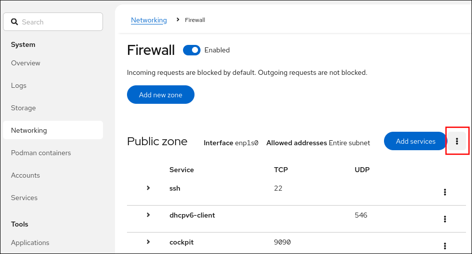

# Configuring firewalls and packet filters

* * *

Red Hat Enterprise Linux 10

## Managing the firewalld service, the nftables framework, and XDP packet filtering features

Red Hat Customer Content Services

[Legal Notice](#idm140288515734320)

**Abstract**

Packet filters, such as firewalls, use rules to control incoming, outgoing, and forwarded network traffic. In Red Hat Enterprise Linux (RHEL), you can use the \`firewalld\` service and the \`nftables\` framework to filter network traffic and build performance-critical firewalls. You can also use the Express Data Path (XDP) feature of the kernel to process or drop network packets at the network interface at a very high rate.

* * *

<h2 id="providing-feedback-on-red-hat-documentation">Providing feedback on Red Hat documentation</h2>

We are committed to providing high-quality documentation and value your feedback. To help us improve, you can submit suggestions or report errors through the Red Hat Jira tracking system.

**Procedure**

1. Log in to the [Jira](https://issues.redhat.com/projects/RHELDOCS/issues) website.
   
   If you do not have an account, select the option to create one.
2. Click **Create** in the top navigation bar.
3. Enter a descriptive title in the **Summary** field.
4. Enter your suggestion for improvement in the **Description** field. Include links to the relevant parts of the documentation.
5. Click **Create** at the bottom of the dialogue.

<h2 id="using-and-configuring-firewalld">Chapter 1. Using and configuring firewalld</h2>

A firewall is a way to protect machines from any unwanted traffic from outside. It enables users to control incoming network traffic on host machines by defining a set of *firewall rules*. These rules are used to sort the incoming traffic and either block it or allow it through.

`firewalld` is a firewall service daemon that provides a dynamic, customizable firewall with a D-Bus interface. Being dynamic, it enables creating, changing, and deleting rules without the necessity of restarting the firewall daemon each time the rules are changed.

You can use `firewalld` to configure packet filtering required by the majority of typical cases. If `firewalld` does not cover your scenario, or you want to have complete control of rules, use the `nftables` framework. See the [Getting started with nftables](#getting-started-with-nftables "Chapter 2. Getting started with nftables") for more information.

`firewalld` uses the concepts of zones, policies, and services to simplify traffic management. Zones logically separate a network. Network interfaces and sources can be assigned to a zone. Policies are used to deny or allow traffic flowing between zones. Firewall services are predefined rules that cover all necessary settings to allow incoming traffic for a specific service, and they apply within a zone.

Services use one or more ports or addresses for network communication. Firewalls filter communication based on ports. To allow network traffic for a service, its ports must be open. `firewalld` blocks all traffic on ports that are not explicitly set as open. Some zones, such as trusted, allow all traffic by default.

`firewalld` maintains separate runtime and permanent configurations. This allows runtime-only changes. The runtime configuration does not persist after `firewalld` reload or restart. At startup, it is populated from the permanent configuration.

<h3 id="firewalld-zones">1.1. Firewall zones</h3>

You can use the `firewalld` utility to separate networks into different zones according to the level of trust that you have with the interfaces and traffic within that network. A connection can only be part of one zone, but you can use that zone for many network connections.

`firewalld` follows strict principles in regards to zones:

1. Traffic ingresses only one zone.
2. Traffic egresses only one zone.
3. A zone defines a level of trust.
4. Intrazone traffic (within the same zone) is allowed by default.
5. Interzone traffic (from zone to zone) is denied by default.

Principles 4 and 5 are a consequence of principle 3.

Principle 4 is configurable through the zone option `--remove-forward`. Principle 5 is configurable by adding new policies.

`NetworkManager` notifies `firewalld` of the zone of an interface. You can assign zones to interfaces with the following utilities:

- `NetworkManager`
- `firewall-config` utility
- `firewall-cmd` utility
- The RHEL web console

The RHEL web console, `firewall-config`, and `firewall-cmd` can only edit the appropriate `NetworkManager` configuration files. If you change the zone of the interface using the web console, `firewall-cmd`, or `firewall-config`, the request is forwarded to `NetworkManager` and is not handled by `firewalld`.

The `/usr/lib/firewalld/zones/` directory stores the predefined zones, and you can instantly apply them to any available network interface. These files are copied to the `/etc/firewalld/zones/` directory only after they are modified. The default settings of the predefined zones are as follows:

`block`

- Suitable for: Any incoming network connections are rejected with an icmp-host-prohibited message for `IPv4` and icmp6-adm-prohibited for `IPv6`.
- Accepts: Only network connections initiated from within the system.

`dmz`

- Suitable for: Computers in your DMZ that are publicly-accessible with limited access to your internal network.
- Accepts: Only selected incoming connections.

`drop`

Suitable for: Any incoming network packets are dropped without any notification.

- Accepts: Only outgoing network connections.

`external`

- Suitable for: External networks with masquerading enabled, especially for routers. Situations when you do not trust the other computers on the network.
- Accepts: Only selected incoming connections.

`home`

- Suitable for: Home environment where you mostly trust the other computers on the network.
- Accepts: Only selected incoming connections.

`internal`

- Suitable for: Internal networks where you mostly trust the other computers on the network.
- Accepts: Only selected incoming connections.

`public`

- Suitable for: Public areas where you do not trust other computers on the network.
- Accepts: Only selected incoming connections.

`trusted`

- Accepts: All network connections.

`work`

Suitable for: Work environment where you mostly trust the other computers on the network.

- Accepts: Only selected incoming connections.

One of these zones is set as the *default* zone. When interface connections are added to `NetworkManager`, they are assigned to the default zone. On installation, the default zone in `firewalld` is the `public` zone. You can change the default zone.

Note

Make network zone names self-explanatory to help users understand them quickly.

To avoid any security problems, review the default zone configuration and disable any unnecessary services according to your needs and risk assessments.

For more details, see the `firewalld.zone(5)` man page on your system.

<h3 id="firewall-policies">1.2. Firewall policies</h3>

The firewall policies specify the desired security state of your network. They outline rules and actions to take for different types of traffic.

Typically, the policies contain rules for the following types of traffic:

- Incoming traffic
- Outgoing traffic
- Forward traffic
- Specific services and applications
- Network address translations (NAT)

Firewall policies use the concept of firewall zones. Each zone is associated with a specific set of firewall rules that determine the traffic allowed. Policies apply firewall rules in a stateful, unidirectional manner. This means you only consider one direction of the traffic. The traffic return path is implicitly allowed due to stateful filtering of `firewalld`.

Policies are associated with an ingress zone and an egress zone. The ingress zone is where the traffic originated (received). The egress zone is where the traffic leaves (sent).

The firewall rules defined in a policy can reference the firewall zones to apply consistent configurations across multiple network interfaces.

<h3 id="firewall-rules">1.3. Firewall rules</h3>

You can use the firewall rules to implement specific configurations for allowing or blocking network traffic. As a result, you can control the flow of network traffic to protect your system from security threats.

Firewall rules typically define certain criteria based on various attributes. The attributes can be as:

- Source IP addresses
- Destination IP addresses
- Transfer Protocols (TCP, UDP, …​)
- Ports
- Network interfaces

The `firewalld` utility organizes the firewall rules into zones (such as `public`, `internal`, and others) and policies. Each zone has its own set of rules that determine the level of traffic freedom for network interfaces associated with a particular zone.

<h3 id="firewall-direct-rules">1.4. Firewall direct rules</h3>

The `firewalld` service provides multiple ways with which to configure rules, including regular rules and direct rules.

One difference between these is how each method interacts with the underlying backend (`iptables` or `nftables`).

The direct rules are advanced, low-level rules that allow direct interaction with `iptables`. However, the `iptables` component is unmaintained and will be eventually removed from RHEL. Therefore you might consider replacing direct rules with `nftables`. For more details, review the knowledgebase solution [How to replace firewalld direct rules with nftables?](https://access.redhat.com/solutions/7038927), and policy objects related parts in [Filtering forwarded traffic between zones](https://docs.redhat.com/en/documentation/red_hat_enterprise_linux/10/html-single/configuring_firewalls_and_packet_filters/index#assembly_filtering-forwarded-traffic-between-zones_using-and-configuring-firewalld).

<h3 id="predefined-firewalld-services">1.5. Predefined firewalld services</h3>

Predefined `firewalld` services offer an abstraction layer for low-level firewall rules. They map common network services, such as SSH or HTTP, to their specific ports and protocols, simplifying firewall management and reducing errors by using a named service instead of manual configuration.

- To see available predefined services:
  
  ```
  firewall-cmd --get-services
  RH-Satellite-6 RH-Satellite-6-capsule afp amanda-client amanda-k5-client amqp amqps apcupsd audit ausweisapp2 bacula bacula-client bareos-director bareos-filedaemon bareos-storage bb bgp bitcoin bitcoin-rpc bitcoin-testnet bitcoin-testnet-rpc bittorrent-lsd ceph ceph-exporter ceph-mon cfengine checkmk-agent cockpit collectd condor-collector cratedb ctdb dds...
  ```
  
  ```plaintext
  # firewall-cmd --get-services
  RH-Satellite-6 RH-Satellite-6-capsule afp amanda-client amanda-k5-client amqp amqps apcupsd audit ausweisapp2 bacula bacula-client bareos-director bareos-filedaemon bareos-storage bb bgp bitcoin bitcoin-rpc bitcoin-testnet bitcoin-testnet-rpc bittorrent-lsd ceph ceph-exporter ceph-mon cfengine checkmk-agent cockpit collectd condor-collector cratedb ctdb dds...
  ```
- To further inspect a particular predefined service:
  
  ```
  sudo firewall-cmd --info-service=RH-Satellite-6
  RH-Satellite-6
    ports: 5000/tcp 5646-5647/tcp 5671/tcp 8000/tcp 8080/tcp 9090/tcp
    protocols:
    source-ports:
    modules:
    destination:
    includes: foreman
    helpers:
  ```
  
  ```plaintext
  # sudo firewall-cmd --info-service=RH-Satellite-6
  RH-Satellite-6
    ports: 5000/tcp 5646-5647/tcp 5671/tcp 8000/tcp 8080/tcp 9090/tcp
    protocols:
    source-ports:
    modules:
    destination:
    includes: foreman
    helpers:
  ```
  
  The example output shows that the `RH-Satellite-6` predefined service listens on ports 5000/tcp 5646-5647/tcp 5671/tcp 8000/tcp 8080/tcp 9090/tcp. Additionally, `RH-Satellite-6` inherits rules from another predefined service. In this case `foreman.`

Each predefined service is stored as an XML file with the same name in the `/usr/lib/firewalld/services/` directory.

<h3 id="working-with-firewalld-zones">1.6. Working with firewalld zones</h3>

Zones represent a concept to manage incoming traffic more transparently. Network interfaces and source addresses are assigned to zones. You manage firewall rules for each zone independently, which enables you to define complex firewall settings and apply them to the traffic.

<h4 id="changing-the-default-zone">1.6.1. Changing the default zone</h4>

If an interface is not assigned to a specific zone, it is assigned to the default zone. After each restart of the `firewalld` service, `firewalld` loads the settings for the default zone and makes it active. Settings for all other zones are preserved and ready to be used.

Typically, zones are assigned to interfaces by NetworkManager according to the `connection.zone` setting in NetworkManager connection profiles. Also, after a reboot NetworkManager manages assignments for "activating" those zones.

**Prerequisites**

- The `firewalld` service is running.

**Procedure**

1. Display the current default zone:
   
   ```
   firewall-cmd --get-default-zone
   ```
   
   ```plaintext
   # firewall-cmd --get-default-zone
   ```
2. Set the new default zone:
   
   ```
   firewall-cmd --set-default-zone <zone_name>
   ```
   
   ```plaintext
   # firewall-cmd --set-default-zone <zone_name>
   ```
   
   Note
   
   Following this procedure, the setting is a permanent setting, even without the `--permanent` option.

<h4 id="creating-a-new-zone">1.6.2. Creating a new zone</h4>

To use custom zones, create a new zone and use it just like a predefined zone. New zones require the `--permanent` option, otherwise the command does not work.

**Prerequisites**

- The `firewalld` service is running.

**Procedure**

1. Create a new zone:
   
   ```
   firewall-cmd --permanent --new-zone=zone-name
   ```
   
   ```plaintext
   # firewall-cmd --permanent --new-zone=zone-name
   ```
2. Make the new zone usable:
   
   ```
   firewall-cmd --reload
   ```
   
   ```plaintext
   # firewall-cmd --reload
   ```
   
   The command applies recent changes to the firewall configuration without interrupting network services that are already running.

**Verification**

- Check if the new zone is added to your permanent settings:
  
  ```
  firewall-cmd --get-zones --permanent
  ```
  
  ```plaintext
  # firewall-cmd --get-zones --permanent
  ```

<h4 id="assigning-a-network-interface-to-a-zone">1.6.3. Assigning a network interface to a zone</h4>

It is possible to define different sets of rules for different zones and then change the settings quickly by changing the zone for the interface that is being used. With multiple interfaces, a specific zone can be set for each of them to distinguish traffic that is coming through them.

**Procedure**

1. List the active zones and the interfaces assigned to them:
   
   ```
   firewall-cmd --get-active-zones
   ```
   
   ```plaintext
   # firewall-cmd --get-active-zones
   ```
2. Assign the interface to a different zone:
   
   ```
   firewall-cmd --zone=zone_name --change-interface=interface_name --permanent
   ```
   
   ```plaintext
   # firewall-cmd --zone=zone_name --change-interface=interface_name --permanent
   ```

<h4 id="adding-a-source">1.6.4. Adding a source</h4>

To route incoming traffic into a specific zone, add the source to that zone. The source can be an IP address or an IP mask in the classless inter-domain routing (CIDR) notation.

Note

In case you add multiple zones with an overlapping network range, they are ordered alphanumerically by zone name and only the first one is considered.

- To set the source in the current zone:
  
  ```
  firewall-cmd --add-source=<source>
  ```
  
  ```plaintext
  # firewall-cmd --add-source=<source>
  ```
- To set the source IP address for a specific zone:
  
  ```
  firewall-cmd --zone=zone-name --add-source=<source>
  ```
  
  ```plaintext
  # firewall-cmd --zone=zone-name --add-source=<source>
  ```

The following procedure allows all incoming traffic from *192.168.2.15* in the `trusted` zone:

**Procedure**

1. List all available zones:
   
   ```
   firewall-cmd --get-zones
   ```
   
   ```plaintext
   # firewall-cmd --get-zones
   ```
2. Add the source IP to the trusted zone in the permanent mode:
   
   ```
   firewall-cmd --zone=trusted --add-source=192.168.2.15
   ```
   
   ```plaintext
   # firewall-cmd --zone=trusted --add-source=192.168.2.15
   ```
3. Make the new settings persistent:
   
   ```
   firewall-cmd --runtime-to-permanent
   ```
   
   ```plaintext
   # firewall-cmd --runtime-to-permanent
   ```

<h4 id="removing-a-source">1.6.5. Removing a source</h4>

When you remove a source from a firewalld zone, its traffic is no longer directed by that source’s rules. Instead, it falls back to the rules of the interface’s zone or the default zone.

**Procedure**

1. List allowed sources for the required zone:
   
   ```
   firewall-cmd --zone=zone-name --list-sources
   ```
   
   ```plaintext
   # firewall-cmd --zone=zone-name --list-sources
   ```
2. Remove the source from the zone permanently:
   
   ```
   firewall-cmd --zone=zone-name --remove-source=<source>
   ```
   
   ```plaintext
   # firewall-cmd --zone=zone-name --remove-source=<source>
   ```
3. Make the new settings persistent:
   
   ```
   firewall-cmd --runtime-to-permanent
   ```
   
   ```plaintext
   # firewall-cmd --runtime-to-permanent
   ```

<h4 id="assigning-a-zone-to-a-connection-using-nmcli">1.6.6. Assigning a zone to a connection by using nmcli</h4>

You can add a `firewalld` zone to a `NetworkManager` connection using the `nmcli` utility.

**Procedure**

1. Assign the zone to the `NetworkManager` connection profile:
   
   ```
   nmcli connection modify profile connection.zone zone_name
   ```
   
   ```plaintext
   # nmcli connection modify profile connection.zone zone_name
   ```
2. Activate the connection:
   
   ```
   nmcli connection up profile
   ```
   
   ```plaintext
   # nmcli connection up profile
   ```

<h4 id="using-zone-targets-to-set-default-behavior-for-incoming-traffic">1.6.7. Using zone targets to set default behavior for incoming traffic</h4>

For every zone, you can set a default behavior that handles incoming traffic that is not further specified. Such behavior is defined by setting the target of the zone.

There are four options:

- `ACCEPT`: Accepts all incoming packets except those disallowed by specific rules.
- `REJECT`: Rejects all incoming packets except those allowed by specific rules. When `firewalld` rejects packets, the source machine is informed about the rejection.
- `DROP`: Drops all incoming packets except those allowed by specific rules. When `firewalld` drops packets, the source machine is not informed about the packet drop.
- `default`: Identical to `REJECT`, but implicitly allows Internet Control Message Protocol (ICMP).

**Prerequisites**

- The `firewalld` service is running.

**Procedure**

1. List the information for the specific zone to see the default target:
   
   ```
   firewall-cmd --zone=zone-name --list-all
   ```
   
   ```plaintext
   # firewall-cmd --zone=zone-name --list-all
   ```
2. Set a new target in the zone:
   
   ```
   firewall-cmd --permanent --zone=zone-name --set-target=<default|ACCEPT|REJECT|DROP>
   ```
   
   ```plaintext
   # firewall-cmd --permanent --zone=zone-name --set-target=<default|ACCEPT|REJECT|DROP>
   ```

<h4 id="customizing-firewall-settings-for-a-specific-zone-to-enhance-security">1.6.8. Customizing firewall settings for a specific zone to enhance security</h4>

To strengthen network security, modify the firewalld settings by associating a specific network interface or connection with a particular firewall zone. By defining granular rules for a zone, you can control inbound and outbound traffic according to your security needs.

For example, you can achieve the following benefits:

- Protection of sensitive data
- Prevention of unauthorized access
- Mitigation of potential network threats

**Prerequisites**

- The `firewalld` service is running.

**Procedure**

1. List the available firewall zones:
   
   ```
   firewall-cmd --get-zones
   ```
   
   ```plaintext
   # firewall-cmd --get-zones
   ```
   
   The `firewall-cmd --get-zones` command displays all zones that are available on the system, but it does not show any details for particular zones. To see more detailed information for all zones, use the `firewall-cmd --list-all-zones` command.
2. Choose the zone you want to use for this configuration.
3. Modify firewall settings for the chosen zone. For example, to allow the `SSH` service and remove the `ftp` service:
   
   ```
   firewall-cmd --add-service=ssh --zone=<your_chosen_zone>
   firewall-cmd --remove-service=ftp --zone=<same_chosen_zone>
   ```
   
   ```plaintext
   # firewall-cmd --add-service=ssh --zone=<your_chosen_zone>
   # firewall-cmd --remove-service=ftp --zone=<same_chosen_zone>
   ```
4. Assign a network interface to the firewall zone:
   
   1. List the available network interfaces:
      
      ```
      firewall-cmd --get-active-zones
      ```
      
      ```plaintext
      # firewall-cmd --get-active-zones
      ```
      
      Activity of a zone is determined by the presence of network interfaces or source address ranges that match its configuration. The default zone is active for unclassified traffic but is not always active if no traffic matches its rules.
   2. Assign a network interface to the chosen zone:
      
      ```
      firewall-cmd --zone=<your_chosen_zone> --change-interface=<interface_name> --permanent
      ```
      
      ```plaintext
      # firewall-cmd --zone=<your_chosen_zone> --change-interface=<interface_name> --permanent
      ```
      
      Assigning a network interface to a zone is more suitable for applying consistent firewall settings to all traffic on a particular interface (physical or virtual).
      
      The `firewall-cmd` command, when used with the `--permanent` option, often involves updating NetworkManager connection profiles to make changes to the firewall configuration permanent. This integration between `firewalld` and NetworkManager ensures consistent network and firewall settings.

**Verification**

1. Display the updated settings for your chosen zone:
   
   ```
   firewall-cmd --zone=<your_chosen_zone> --list-all
   ```
   
   ```plaintext
   # firewall-cmd --zone=<your_chosen_zone> --list-all
   ```
   
   The command output displays all zone settings including the assigned services, network interface, and network connections (sources).

<h4 id="configuring-dynamic-updates-for-allowlisting-with-ip-sets">1.6.9. Configuring dynamic updates for allowlisting with IP sets</h4>

You can make near real-time updates to flexibly allow specific IP addresses or ranges in the IP sets even in unpredictable conditions.

These updates can be triggered by various events, such as detection of security threats or changes in the network behavior. Typically, such a solution leverages automation to reduce manual effort and improve security by responding quickly to the situation.

**Prerequisites**

- The `firewalld` service is running.

**Procedure**

1. Create an IP set with a meaningful name:
   
   ```
   firewall-cmd --permanent --new-ipset=allowlist --type=hash:ip
   ```
   
   ```plaintext
   # firewall-cmd --permanent --new-ipset=allowlist --type=hash:ip
   ```
   
   The new IP set called `allowlist` contains IP addresses that you want your firewall to allow.
2. Add a dynamic update to the IP set:
   
   ```
   firewall-cmd --permanent --ipset=allowlist --add-entry=198.51.100.10
   ```
   
   ```plaintext
   # firewall-cmd --permanent --ipset=allowlist --add-entry=198.51.100.10
   ```
   
   This configuration updates the `allowlist` IP set with a newly added IP address that is allowed to pass network traffic by your firewall.
3. Create a firewall rule that references the previously created IP set:
   
   ```
   firewall-cmd --permanent --zone=public --add-source=ipset:allowlist
   ```
   
   ```plaintext
   # firewall-cmd --permanent --zone=public --add-source=ipset:allowlist
   ```
   
   Without this rule, the IP set would not have any impact on network traffic. The default firewall policy would prevail.
4. Reload the firewall configuration to apply the changes:
   
   ```
   firewall-cmd --reload
   ```
   
   ```plaintext
   # firewall-cmd --reload
   ```

**Verification**

1. List all IP sets:
   
   ```
   firewall-cmd --get-ipsets
   allowlist
   ```
   
   ```plaintext
   # firewall-cmd --get-ipsets
   allowlist
   ```
2. List the active rules:
   
   ```
   firewall-cmd --list-all
   public (active)
     target: default
     icmp-block-inversion: no
     interfaces: enp0s1
     sources: ipset:allowlist
     services: cockpit dhcpv6-client ssh
     ports:
     protocols:
     ...
   ```
   
   ```plaintext
   # firewall-cmd --list-all
   public (active)
     target: default
     icmp-block-inversion: no
     interfaces: enp0s1
     sources: ipset:allowlist
     services: cockpit dhcpv6-client ssh
     ports:
     protocols:
     ...
   ```
   
   The `sources` section of the command-line output provides insights to what origins of traffic (hostnames, interfaces, IP sets, subnets, and others) are permitted or denied access to a particular firewall zone. In this case, the IP addresses contained in the `allowlist` IP set are allowed to pass traffic through the firewall for the `public` zone.
3. Explore the contents of your IP set:
   
   ```
   cat /etc/firewalld/ipsets/allowlist.xml
   <?xml version="1.0" encoding="utf-8"?>
   <ipset type="hash:ip">
     <entry>198.51.100.10</entry>
   </ipset>
   ```
   
   ```plaintext
   # cat /etc/firewalld/ipsets/allowlist.xml
   <?xml version="1.0" encoding="utf-8"?>
   <ipset type="hash:ip">
     <entry>198.51.100.10</entry>
   </ipset>
   ```

**Next steps**

- Use a script or a security utility to fetch your threat intelligence feeds and update `allowlist` accordingly in an automated fashion.

<h4 id="enabling-zones-using-the-web-console">1.6.10. Enabling zones by using the web console</h4>

You can apply predefined and existing firewall zones on a particular interface or a range of IP addresses through the RHEL 10 web console.

**Prerequisites**

- You have installed the RHEL 10 web console.
  
  For instructions, see [Installing and enabling the web console](https://docs.redhat.com/en/documentation/red_hat_enterprise_linux/10/html/managing_systems_in_the_rhel_web_console/getting-started-with-the-rhel-web-console#installing-and-enabling-the-web-console).
- You enabled [Administrative access](https://docs.redhat.com/en/documentation/red_hat_enterprise_linux/10/html/managing_systems_in_the_rhel_web_console/getting-started-with-the-rhel-web-console#administrative-access-in-the-web-console) in the web console.
- The `firewalld` service is running.

**Procedure**

1. Log in to the RHEL 10 web console.
2. Click **Networking**.
3. Click the Edit rules and zones button.
4. In the **Firewall** section, click **Add new zone**.
5. In the **Add zone** dialog box, select a zone from the **Trust level** options.
   
   The web console displays all zones predefined in the `firewalld` service.
6. In the **Interfaces** part, select an interface or interfaces to which you want to apply the selected zone.
7. In the **Allowed Addresses** part, you can select whether the zone is applied to:
   
   - the whole subnet
   - a range of IP addresses in the following format:
     
     - 192.168.1.0
     - 192.168.1.0/24
     - 192.168.1.0/24, 192.168.1.0
8. Click the Add zone button.

<h4 id="disabling-zones-using-the-web-console">1.6.11. Disabling zones by using the web console</h4>

You can remove a firewall zone from your firewall configuration by using the web console.

**Prerequisites**

- You have installed the RHEL 10 web console.
  
  For instructions, see [Installing and enabling the web console](https://docs.redhat.com/en/documentation/red_hat_enterprise_linux/10/html/managing_systems_in_the_rhel_web_console/getting-started-with-the-rhel-web-console#installing-and-enabling-the-web-console).
- You enabled [Administrative access](https://docs.redhat.com/en/documentation/red_hat_enterprise_linux/10/html/managing_systems_in_the_rhel_web_console/getting-started-with-the-rhel-web-console#administrative-access-in-the-web-console) in the web console.
- The `firewalld` service is running.

**Procedure**

1. Log in to the RHEL 10 web console.
2. Click **Networking**.
3. Click the Edit rules and zones button.
4. Click the ⋮ button (three-dot menu) at the zone you want to remove.
   
   
5. Click **Delete**.

<h3 id="controlling-network-traffic-using-firewalld">1.7. Controlling network traffic by using firewalld</h3>

The `firewalld` package installs a large number of predefined service files and you can add more or customize them. You can then use these service definitions to open or close ports for services without knowing the protocol and port numbers they use.

<h4 id="controlling-traffic-with-predefined-services-using-the-cli">1.7.1. Controlling traffic with predefined services using the CLI</h4>

The most straightforward method to control traffic is to add a predefined service to `firewalld`. This opens all necessary ports and modifies other settings according to the *service definition file*.

**Prerequisites**

- The `firewalld` service is running.

**Procedure**

1. Check that the service in `firewalld` is not already allowed:
   
   ```
   firewall-cmd --list-services
   ssh dhcpv6-client
   ```
   
   ```plaintext
   # firewall-cmd --list-services
   ssh dhcpv6-client
   ```
   
   The command lists the services that are enabled in the default zone.
2. List all predefined services in `firewalld`:
   
   ```
   firewall-cmd --get-services
   RH-Satellite-6 amanda-client amanda-k5-client bacula bacula-client bitcoin bitcoin-rpc bitcoin-testnet bitcoin-testnet-rpc ceph ceph-mon cfengine condor-collector ctdb dhcp dhcpv6 dhcpv6-client dns docker-registry ...
   ```
   
   ```plaintext
   # firewall-cmd --get-services
   RH-Satellite-6 amanda-client amanda-k5-client bacula bacula-client bitcoin bitcoin-rpc bitcoin-testnet bitcoin-testnet-rpc ceph ceph-mon cfengine condor-collector ctdb dhcp dhcpv6 dhcpv6-client dns docker-registry ...
   ```
   
   The command displays a list of available services for the default zone.
3. Add the service to the list of services that `firewalld` allows:
   
   ```
   firewall-cmd --add-service=<service_name>
   ```
   
   ```plaintext
   # firewall-cmd --add-service=<service_name>
   ```
   
   The command adds the specified service to the default zone.
4. Make the new settings persistent:
   
   ```
   firewall-cmd --runtime-to-permanent
   ```
   
   ```plaintext
   # firewall-cmd --runtime-to-permanent
   ```
   
   The command applies these runtime changes to the permanent configuration of the firewall. By default, it applies these changes to the configuration of the default zone.

**Verification**

- List all permanent firewall rules:
  
  ```
  firewall-cmd --list-all --permanent
  public
    target: default
    icmp-block-inversion: no
    interfaces:
    sources:
    services: cockpit dhcpv6-client ssh
    ports:
    protocols:
    forward: no
    masquerade: no
    forward-ports:
    source-ports:
    icmp-blocks:
    rich rules:
  ```
  
  ```plaintext
  # firewall-cmd --list-all --permanent
  public
    target: default
    icmp-block-inversion: no
    interfaces:
    sources:
    services: cockpit dhcpv6-client ssh
    ports:
    protocols:
    forward: no
    masquerade: no
    forward-ports:
    source-ports:
    icmp-blocks:
    rich rules:
  ```
  
  The command displays complete configuration with the permanent firewall rules of the default firewall zone (`public`).

<h4 id="enabling-services-on-firewall-using-the-web-console">1.7.2. Enabling services on the firewall by using the web console</h4>

By default, services are added to the default firewall zone. If you use more firewall zones on multiple network interfaces, you must select a zone first and then add the service with its corresponding port.

The RHEL 10 web console displays predefined `firewalld` services, and you can add them to active firewall zones.

Important

The RHEL 10 web console configures the `firewalld` service.

The web console does not allow generic `firewalld` rules that are not listed in the web console.

**Prerequisites**

- You have installed the RHEL 10 web console.
  
  For instructions, see [Installing and enabling the web console](https://docs.redhat.com/en/documentation/red_hat_enterprise_linux/10/html/managing_systems_in_the_rhel_web_console/getting-started-with-the-rhel-web-console#installing-and-enabling-the-web-console).
- You enabled [Administrative access](https://docs.redhat.com/en/documentation/red_hat_enterprise_linux/10/html/managing_systems_in_the_rhel_web_console/getting-started-with-the-rhel-web-console#administrative-access-in-the-web-console) in the web console.
- The `firewalld` service is running.

**Procedure**

1. Log in to the RHEL 10 web console.
2. Click **Networking**.
3. Click the Edit rules and zones button.
4. In the **Firewall** section, select a zone for which you want to add the service and click **Add Services**.
5. In the **Add Services** dialog box, find the service you want to enable in the firewall.
6. Enable services according to your scenario:
7. Click **Add Services**.

<h4 id="configuring-custom-ports-using-the-web-console">1.7.3. Configuring custom ports by using the web console</h4>

You can add custom ports for services through the RHEL web console.

**Prerequisites**

- You have installed the RHEL 10 web console.
  
  For instructions, see [Installing and enabling the web console](https://docs.redhat.com/en/documentation/red_hat_enterprise_linux/10/html/managing_systems_in_the_rhel_web_console/getting-started-with-the-rhel-web-console#installing-and-enabling-the-web-console).
- You enabled [administrative access](https://docs.redhat.com/en/documentation/red_hat_enterprise_linux/10/html/managing_systems_in_the_rhel_web_console/getting-started-with-the-rhel-web-console#administrative-access-in-the-web-console) in the web console.
- The `firewalld` service is running.

**Procedure**

1. Log in to the RHEL 10 web console.
2. Click **Networking**.
3. Click the Edit rules and zones button.
   
   If you do not see the Edit rules and zones button, log in to the web console with the administrative privileges.
4. In the **Firewall** section, select a zone for which you want to configure a custom port and click **Add Services**.
5. In the **Add services** dialog box, click the Custom Ports radio button.
6. In the TCP and UDP fields, add ports according to examples. You can add ports in the following formats:
   
   - Port numbers such as 22
   - Range of port numbers such as 5900-5910
   - Aliases such as nfs, rsync
   
   Note
   
   You can add multiple values into each field. You must separate values with a comma and without a space, for example: 8080,8081,http
7. After adding the port number in the **TCP** field, the **UDP** field, or both, verify the service name in the **Name** field.
   
   The **Name** field displays the name of the service for which this port is reserved. You can rewrite the name if you are sure that this port is free to use and no server requires it to communicate on this port.
8. In the **Name** field, add a name for the service including defined ports.
9. Click Add Ports button.

<h3 id="filtering-forwarded-traffic-between-zones">1.8. Filtering forwarded traffic between zones</h3>

`firewalld` enables you to control the flow of network data between different `firewalld` zones. By defining rules and policies, you can manage how traffic is allowed or blocked when it moves between these zones.

The policy objects feature provides forward and output filtering in `firewalld`. You can use `firewalld` to filter traffic between different zones to allow access to locally hosted VMs to connect the host.

<h4 id="relationship-between-policy-objects-and-zones">1.8.1. The relationship between policy objects and zones</h4>

Policy objects allow the user to attach firewalld’s primitives such as services, ports, and rich rules to the policy. You can apply the policy objects to traffic that passes between zones in a stateful and unidirectional manner.

```
firewall-cmd --permanent --new-policy myOutputPolicy

firewall-cmd --permanent --policy myOutputPolicy --add-ingress-zone HOST

firewall-cmd --permanent --policy myOutputPolicy --add-egress-zone ANY
```

```plaintext
# firewall-cmd --permanent --new-policy myOutputPolicy

# firewall-cmd --permanent --policy myOutputPolicy --add-ingress-zone HOST

# firewall-cmd --permanent --policy myOutputPolicy --add-egress-zone ANY
```

`HOST` and `ANY` are the symbolic zones used in the ingress and egress zone lists.

- The `HOST` symbolic zone allows policies for the traffic originating from or has a destination to the host running firewalld.
- The `ANY` symbolic zone applies policy to all the current and future zones. `ANY` symbolic zone acts as a wildcard for all zones.

<h4 id="using-priorities-to-sort-policies">1.8.2. Using priorities to sort policies</h4>

Multiple policies can apply to the same set of traffic, therefore, priorities should be used to create an order of precedence for the policies that may be applied.

**Procedure**

- Set a priority to sort the policies:

```
*firewall-cmd --permanent --policy _mypolicy_ --set-priority _-500_*
```

```plaintext
# *firewall-cmd --permanent --policy _mypolicy_ --set-priority _-500_*
```

\+ In the above example *-500* is a lower priority value but has higher precedence. Thus, -500 will execute before -100.

\+ Lower numerical priority values have higher precedence and are applied first.

<h4 id="using-policy-objects-to-filter-traffic-between-locally-hosted-containers-and-a-network-physically-connected-to-the-host">1.8.3. Using policy objects to filter traffic between locally hosted containers and a network physically connected to the host</h4>

The policy objects feature enables users to filter traffic between Podman and firewalld zones.

Note

Red Hat recommends blocking all traffic by default and opening the selective services needed for the Podman utility.

**Procedure**

1. Create a new firewall policy:
   
   ```
   firewall-cmd --permanent --new-policy podmanToAny
   ```
   
   ```plaintext
   # firewall-cmd --permanent --new-policy podmanToAny
   ```
2. Block all traffic from Podman to other zones and allow only necessary services on Podman:
   
   ```
   firewall-cmd --permanent --policy podmanToAny --set-target REJECT
   firewall-cmd --permanent --policy podmanToAny --add-service dhcp
   firewall-cmd --permanent --policy podmanToAny --add-service dns
   firewall-cmd --permanent --policy podmanToAny --add-service https
   ```
   
   ```plaintext
   # firewall-cmd --permanent --policy podmanToAny --set-target REJECT
   # firewall-cmd --permanent --policy podmanToAny --add-service dhcp
   # firewall-cmd --permanent --policy podmanToAny --add-service dns
   # firewall-cmd --permanent --policy podmanToAny --add-service https
   ```
3. Create a new Podman zone:
   
   ```
   firewall-cmd --permanent --new-zone=podman
   ```
   
   ```plaintext
   # firewall-cmd --permanent --new-zone=podman
   ```
4. Define the ingress zone for the policy:
   
   ```
   firewall-cmd --permanent --policy podmanToHost --add-ingress-zone podman
   ```
   
   ```plaintext
   # firewall-cmd --permanent --policy podmanToHost --add-ingress-zone podman
   ```
5. Define the egress zone for all other zones:
   
   ```
   firewall-cmd --permanent --policy podmanToHost --add-egress-zone ANY
   ```
   
   ```plaintext
   # firewall-cmd --permanent --policy podmanToHost --add-egress-zone ANY
   ```
   
   Setting the egress zone to ANY means that you filter from Podman to other zones. If you want to filter to the host, then set the egress zone to HOST.
6. Restart the firewalld service:
   
   ```
   systemctl restart firewalld
   ```
   
   ```plaintext
   # systemctl restart firewalld
   ```

**Verification**

- Verify the Podman firewall policy to other zones:
  
  ```
  firewall-cmd --info-policy podmanToAny
  podmanToAny (active)
    ...
    target: REJECT
    ingress-zones: podman
    egress-zones: ANY
    services: dhcp dns https
    ...
  ```
  
  ```plaintext
  # firewall-cmd --info-policy podmanToAny
  podmanToAny (active)
    ...
    target: REJECT
    ingress-zones: podman
    egress-zones: ANY
    services: dhcp dns https
    ...
  ```

<h4 id="setting-the-default-target-of-policy-objects">1.8.4. Setting the default target of policy objects</h4>

You can specify `--set-target` options for policies.

The following targets are available:

- `ACCEPT` - accepts the packet
- `DROP` - drops the unwanted packets
- `REJECT` - rejects unwanted packets with an ICMP reply
- `CONTINUE` (default) - packets will be subject to rules in following policies and zones.

**Procedure**

- Set the default target:
  
  ```
  firewall-cmd --permanent --policy mypolicy --set-target CONTINUE
  ```
  
  ```plaintext
  # firewall-cmd --permanent --policy mypolicy --set-target CONTINUE
  ```

**Verification**

- Verify information about the policy
  
  ```
  firewall-cmd --info-policy mypolicy
  ```
  
  ```plaintext
  # firewall-cmd --info-policy mypolicy
  ```

<h3 id="configuring-nat-using-firewalld">1.9. Configuring NAT by using firewalld</h3>

With `firewalld`, you can configure the masquerading, destination NAT (DNAT), and redirect NAT types. With NAT, you can modify the source or destination IP address.

<h4 id="network-address-translation-types">1.9.1. Network address translation types</h4>

If you require network address translation (NAT) in your network, it is important to understand the NAT types.

These are the different NAT types:

Masquerading

Use this NAT type to change the source IP address of packets. For example, Internet Service Providers (ISPs) do not route private IP ranges, such as `10.0.0.0/8`. If you use private IP ranges in your network and users should be able to reach servers on the internet, map the source IP address of packets from these ranges to a public IP address.

Masquerading automatically uses the IP address of the outgoing interface. Therefore, use masquerading if the outgoing interface uses a dynamic IP address.

Destination NAT (DNAT)

Use this NAT type to rewrite the destination address and port of incoming packets. For example, if your web server uses an IP address from a private IP range and is, therefore, not directly accessible from the internet, you can set a DNAT rule on the router to redirect incoming traffic to this server.

Redirect

This type is a special case of DNAT that redirects packets to a different port on the local machine. For example, if a service runs on a different port than its standard port, you can redirect incoming traffic from the standard port to this specific port.

<h4 id="configuring-ip-address-masquerading">1.9.2. Configuring IP address masquerading</h4>

You can enable IP masquerading on your system. IP masquerading hides individual machines behind a gateway when accessing the internet.

**Procedure**

1. To check if IP masquerading is enabled (for example, for the `external` zone), enter the following command as `root`:
   
   ```
   firewall-cmd --zone=external --query-masquerade
   ```
   
   ```plaintext
   # firewall-cmd --zone=external --query-masquerade
   ```
   
   The command prints `yes` with exit status `0` if enabled. It prints `no` with exit status `1` otherwise. If `zone` is omitted, the default zone will be used.
2. To enable IP masquerading, enter the following command as `root`:
   
   ```
   firewall-cmd --zone=external --add-masquerade
   ```
   
   ```plaintext
   # firewall-cmd --zone=external --add-masquerade
   ```
3. To make this setting persistent, pass the `--permanent` option to the command.
4. To disable IP masquerading, enter the following command as `root`:
   
   ```
   firewall-cmd --zone=external --remove-masquerade
   ```
   
   ```plaintext
   # firewall-cmd --zone=external --remove-masquerade
   ```
   
   To make this setting permanent, pass the `--permanent` option to the command.

<h4 id="using-dnat-to-forward-incoming-http-traffic">1.9.3. Using DNAT to forward incoming HTTP traffic</h4>

You can use destination network address translation (DNAT) to direct incoming traffic from one destination address and port to another. Typically, this is useful for redirecting incoming requests from an external network interface to specific internal servers or services.

**Prerequisites**

- The `firewalld` service is running.

**Procedure**

1. Forward incoming HTTP traffic:
   
   ```
   firewall-cmd --zone=public --add-forward-port=port=80:proto=tcp:toaddr=198.51.100.10:toport=8080 --permanent
   ```
   
   ```plaintext
   # firewall-cmd --zone=public --add-forward-port=port=80:proto=tcp:toaddr=198.51.100.10:toport=8080 --permanent
   ```
   
   The previous command defines a DNAT rule with the following settings:
   
   - `--zone=public` - The firewall zone for which you configure the DNAT rule. You can adjust this to whatever zone you need.
   - `--add-forward-port` - The option that indicates you are adding a port-forwarding rule.
   - `port=80` - The external destination port.
   - `proto=tcp` - The protocol indicating that you forward TCP traffic.
   - `toaddr=198.51.100.10` - The destination IP address.
   - `toport=8080` - The destination port of the internal server.
   - `--permanent` - The option that makes the DNAT rule persistent across reboots.
2. Reload the firewall configuration to apply the changes:
   
   ```
   firewall-cmd --reload
   ```
   
   ```plaintext
   # firewall-cmd --reload
   ```

**Verification**

- Verify the DNAT rule for the firewall zone that you used:
  
  ```
  firewall-cmd --list-forward-ports --zone=public
  port=80:proto=tcp:toport=8080:toaddr=198.51.100.10
  ```
  
  ```plaintext
  # firewall-cmd --list-forward-ports --zone=public
  port=80:proto=tcp:toport=8080:toaddr=198.51.100.10
  ```
  
  Alternatively, view the corresponding XML configuration file:
  
  ```
  cat /etc/firewalld/zones/public.xml
  <?xml version="1.0" encoding="utf-8"?>
  <zone>
    <short>Public</short>
    <description>For use in public areas. You do not trust the other computers on networks to not harm your computer. Only selected incoming connections are accepted.</description>
    <service name="ssh"/>
    <service name="dhcpv6-client"/>
    <service name="cockpit"/>
    <forward-port port="80" protocol="tcp" to-port="8080" to-addr="198.51.100.10"/>
    <forward/>
  </zone>
  ```
  
  ```plaintext
  # cat /etc/firewalld/zones/public.xml
  <?xml version="1.0" encoding="utf-8"?>
  <zone>
    <short>Public</short>
    <description>For use in public areas. You do not trust the other computers on networks to not harm your computer. Only selected incoming connections are accepted.</description>
    <service name="ssh"/>
    <service name="dhcpv6-client"/>
    <service name="cockpit"/>
    <forward-port port="80" protocol="tcp" to-port="8080" to-addr="198.51.100.10"/>
    <forward/>
  </zone>
  ```

**Additional resources**

- [Configuring kernel parameters at runtime](https://docs.redhat.com/en/documentation/red_hat_enterprise_linux/10/html/managing_monitoring_and_updating_the_kernel/configuring-kernel-parameters-at-runtime)

<h4 id="redirecting-traffic-from-a-non-standard-port-to-make-the-web-service-accessible-on-a-standard-port">1.9.4. Redirecting traffic from a non-standard port to make the web service accessible on a standard port</h4>

You can use the redirect mechanism to make the web service that internally runs on a non-standard port accessible without requiring users to specify the port in the URL.

If you use redirect, the URLs are simpler and provide better browsing experience, while a non-standard port is still used internally or for specific requirements.

**Prerequisites**

- The `firewalld` service is running.

**Procedure**

1. Create the NAT redirect rule:
   
   ```
   firewall-cmd --zone=public --add-forward-port=port=<standard_port>:proto=tcp:toport=<non_standard_port> --permanent
   ```
   
   ```plaintext
   # firewall-cmd --zone=public --add-forward-port=port=<standard_port>:proto=tcp:toport=<non_standard_port> --permanent
   ```
   
   The previous command defines the NAT redirect rule with the following settings:
   
   - `--zone=public` - The firewall zone, for which you configure the rule. You can adjust this to whatever zone you need.
   - `--add-forward-port=port=<non_standard_port>` - The option that indicates you are adding a port-forwarding (redirecting) rule with source port on which you initially receive the incoming traffic.
   - `proto=tcp` - The protocol indicating that you redirect TCP traffic.
   - `toport=<standard_port>` - The destination port, to which the incoming traffic should be redirected after being received on the source port.
   - `--permanent` - The option that makes the rule persist across reboots.
2. Reload the firewall configuration to apply the changes:
   
   ```
   firewall-cmd --reload
   ```
   
   ```plaintext
   # firewall-cmd --reload
   ```

**Verification**

- Verify the redirect rule for the firewall zone that you used:
  
  ```
  firewall-cmd --list-forward-ports
  port=8080:proto=tcp:toport=80:toaddr=
  ```
  
  ```plaintext
  # firewall-cmd --list-forward-ports
  port=8080:proto=tcp:toport=80:toaddr=
  ```
  
  Alternatively, view the corresponding XML configuration file:
  
  ```
  cat /etc/firewalld/zones/public.xml
  <?xml version="1.0" encoding="utf-8"?>
  <zone>
    <short>Public</short>
    <description>For use in public areas. You do not trust the other computers on networks to not harm your computer. Only selected incoming connections are accepted.</description>
    <service name="ssh"/>
    <service name="dhcpv6-client"/>
    <service name="cockpit"/>
    <forward-port port="8080" protocol="tcp" to-port="80"/>
    <forward/>
  </zone>
  ```
  
  ```plaintext
  # cat /etc/firewalld/zones/public.xml
  <?xml version="1.0" encoding="utf-8"?>
  <zone>
    <short>Public</short>
    <description>For use in public areas. You do not trust the other computers on networks to not harm your computer. Only selected incoming connections are accepted.</description>
    <service name="ssh"/>
    <service name="dhcpv6-client"/>
    <service name="cockpit"/>
    <forward-port port="8080" protocol="tcp" to-port="80"/>
    <forward/>
  </zone>
  ```

**Additional resources**

- [Configuring kernel parameters at runtime](https://docs.redhat.com/en/documentation/red_hat_enterprise_linux/10/html/managing_monitoring_and_updating_the_kernel/configuring-kernel-parameters-at-runtime)

<h3 id="prioritizing-rich-rules">1.10. Prioritizing rich rules</h3>

Rich rules provide a more advanced and flexible way to define firewall rules. Rich rules are particularly useful where services, ports, and so on are not enough to express complex firewall rules.

Concepts behind rich rules:

granularity and flexibility

You can define detailed conditions for network traffic based on more specific criteria.

rule structure

A rich rule consists of a family (IPv4 or IPv6), followed by conditions and actions.

```
rule family="ipv4|ipv6" [conditions] [actions]
```

```plaintext
rule family="ipv4|ipv6" [conditions] [actions]
```

conditions

They allow rich rules to apply only when certain criteria are met.

actions

You can define what happens to network traffic that matches the conditions.

combining multiple conditions

You can create more specific and complex filtering.

hierarchical control and reusability

You can combine rich rules with other firewall mechanisms such as zones or services.

By default, rich rules are organized based on their rule action. For example, `deny` rules have precedence over `allow` rules. The `priority` parameter in rich rules provides administrators fine-grained control over rich rules and their execution order. When using the `priority` parameter, rules are sorted first by their priority values in ascending order. When more rules have the same `priority`, their order is determined by the rule action, and if the action is also the same, the order may be undefined.

<h4 id="how-the-priority-parameter-organizes-rules-into-different-chains">1.10.1. How the priority parameter organizes rules into different chains</h4>

You can set the `priority` parameter in a rich rule to any number between `-32768` and `32767`, and lower numerical values have higher precedence.

The `firewalld` service organizes rules based on their priority value into different chains:

- Priority lower than 0: the rule is redirected into a chain with the `_pre` suffix.
- Priority higher than 0: the rule is redirected into a chain with the `_post` suffix.
- Priority equals 0: based on the action, the rule is redirected into a chain with the `_log`, `_deny`, or `_allow` the action.

Inside these sub-chains, `firewalld` sorts the rules based on their priority value.

For more information see, the manual page \`firewalld.richlanguage(5) on your system.

<h4 id="setting-the-priority-of-a-rich-rule">1.10.2. Setting the priority of a rich rule</h4>

You can use the `priority` parameter to log all traffic that is not allowed or denied by other rules. For example, you can use this feature to flag unexpected traffic.

**Procedure**

- Add a rich rule with a very low precedence to log all traffic that has not been matched by other rules:
  
  ```
  firewall-cmd --add-rich-rule='rule priority=32767 log prefix="UNEXPECTED: " limit value="5/m"'
  ```
  
  ```plaintext
  # firewall-cmd --add-rich-rule='rule priority=32767 log prefix="UNEXPECTED: " limit value="5/m"'
  ```
  
  The command additionally limits the number of log entries to `5` per minute. For more details, see the \`firewalld.richlanguage(5) manual page on your system.

**Verification**

- Display the `nftables` rule that the command in the previous step created:
  
  ```
  nft list chain inet firewalld filter_IN_public_post
  table inet firewalld {
    chain filter_IN_public_post {
      log prefix "UNEXPECTED: " limit rate 5/minute
    }
  }
  ```
  
  ```plaintext
  # nft list chain inet firewalld filter_IN_public_post
  table inet firewalld {
    chain filter_IN_public_post {
      log prefix "UNEXPECTED: " limit rate 5/minute
    }
  }
  ```

<h3 id="enabling-traffic-forwarding-between-different-interfaces-or-sources-within-a-firewalld-zone">1.11. Enabling traffic forwarding between different interfaces or sources within a firewalld zone</h3>

Intra-zone forwarding is a `firewalld` feature that enables traffic forwarding between interfaces or sources within a `firewalld` zone.

<h4 id="difference-between-intra-zone-forwarding-and-zones-with-the-default-target-set-to-accept">1.11.1. Difference between intra-zone forwarding and zones with the default target set to ACCEPT</h4>

With intra-zone forwarding enabled, the traffic within a single `firewalld` zone can flow from one interface or source to another interface or source. The zone specifies the trust level of interfaces and sources. If the trust level is the same, the traffic stays inside the same zone.

Note

Enabling intra-zone forwarding in the default zone of `firewalld`, applies only to the interfaces and sources added to the current default zone.

`firewalld` uses different zones to manage incoming and outgoing traffic. Each zone has its own set of rules and behaviors. For example, the `trusted` zone allows all forwarded traffic by default.

Other zones can have different default behaviors. In standard zones, forwarded traffic is typically dropped by default when the target of the zone is set to `default`.

To control how the traffic is forwarded between different interfaces or sources within a zone, make sure you understand and configure the target of the zone accordingly.

<h4 id="using-intra-zone-forwarding-to-forward-traffic-between-an-ethernet-and-wi-fi-network">1.11.2. Using intra-zone forwarding to forward traffic between an Ethernet and Wi-Fi network</h4>

You can use intra-zone forwarding to forward traffic between interfaces and sources within the same `firewalld` zone.

This feature brings the following benefits:

- Seamless connectivity between wired and wireless devices (you can forward traffic between an Ethernet network connected to `enp1s0` and a Wi-Fi network connected to `wlp0s20`)
- Support for flexible work environments
- Shared resources that are accessible and used by multiple devices or users within a network (such as printers, databases, network-attached storage, and others)
- Efficient internal networking (such as smooth communication, reduced latency, resource accessibility, and others)

You can enable this functionality for individual `firewalld` zones.

For more details, see the `firewalld.zones(5)` man page on your system.

**Procedure**

1. Enable packet forwarding in the kernel:
   
   ```
   echo "net.ipv4.ip_forward=1" > /etc/sysctl.d/95-IPv4-forwarding.conf
   sysctl -p /etc/sysctl.d/95-IPv4-forwarding.conf
   ```
   
   ```plaintext
   # echo "net.ipv4.ip_forward=1" > /etc/sysctl.d/95-IPv4-forwarding.conf
   # sysctl -p /etc/sysctl.d/95-IPv4-forwarding.conf
   ```
2. Ensure that interfaces between which you want to enable intra-zone forwarding are assigned only to the `internal` zone:
   
   ```
   firewall-cmd --get-active-zones
   ```
   
   ```plaintext
   # firewall-cmd --get-active-zones
   ```
3. If the interface is currently assigned to a zone other than `internal`, reassign it:
   
   ```
   firewall-cmd --zone=internal --change-interface=interface_name --permanent
   ```
   
   ```plaintext
   # firewall-cmd --zone=internal --change-interface=interface_name --permanent
   ```
4. Add the `enp1s0` and `wlp0s20` interfaces to the `internal` zone:
   
   ```
   firewall-cmd --zone=internal --add-interface=enp1s0 --add-interface=wlp0s20
   ```
   
   ```plaintext
   # firewall-cmd --zone=internal --add-interface=enp1s0 --add-interface=wlp0s20
   ```
5. Enable intra-zone forwarding:
   
   ```
   firewall-cmd --zone=internal --add-forward
   ```
   
   ```plaintext
   # firewall-cmd --zone=internal --add-forward
   ```

**Verification**

1. Log in to a host that is on the same network as the `enp1s0` interface of the host on which you enabled zone forwarding.
2. Start an echo service with `ncat` to test connectivity:
   
   ```
   ncat -e /usr/bin/cat -l 12345
   ```
   
   ```plaintext
   # ncat -e /usr/bin/cat -l 12345
   ```
3. Log in to a host that is in the same network as the `wlp0s20` interface.
4. Connect to the echo server running on the host that is in the same network as the `enp1s0`:
   
   ```
   ncat <other_host> 12345
   ```
   
   ```plaintext
   # ncat <other_host> 12345
   ```
5. Type something and press Enter. Verify the text is sent back.

<h3 id="configuring-firewalld-by-using-rhel-system-roles">1.12. Configuring firewalld by using RHEL system roles</h3>

RHEL system roles is a set of contents for the Ansible automation utility. This content together with the Ansible automation utility provides a consistent configuration interface to remotely manage multiple systems at once.

The `rhel-system-roles` package contains the `rhel-system-roles.firewall` RHEL system role. This role was introduced for automated configurations of the `firewalld` service.

With the `firewall` RHEL system role you can configure many different `firewalld` parameters, for example:

- Zones
- The services for which packets should be allowed
- Granting, rejection, or dropping of traffic access to ports
- Forwarding of ports or port ranges for a zone

<h4 id="resetting-the-firewalld-settings-by-using-the-firewall-rhel-system-role">1.12.1. Resetting the firewalld settings by using the firewall RHEL system role</h4>

The `firewall` RHEL system role supports automating a reset of `firewalld` settings to their defaults. This efficiently removes insecure or unintentional firewall rules and simplifies management.

**Prerequisites**

- [You have prepared the control node and the managed nodes](https://docs.redhat.com/en/documentation/red_hat_enterprise_linux/10/html/automating_system_administration_by_using_rhel_system_roles/preparing-a-control-node-and-managed-nodes-to-use-rhel-system-roles).
- You are logged in to the control node as a user who can run playbooks on the managed nodes.
- The account you use to connect to the managed nodes has `sudo` permissions for these nodes.

**Procedure**

1. Create a playbook file, for example, `~/playbook.yml`, with the following content:
   
   ```
   ---
   - name: Reset firewalld example
     hosts: managed-node-01.example.com
     tasks:
       - name: Reset firewalld
         ansible.builtin.include_role:
           name: redhat.rhel_system_roles.firewall
         vars:
           firewall:
             - previous: replaced
   ```
   
   ```yaml
   ---
   - name: Reset firewalld example
     hosts: managed-node-01.example.com
     tasks:
       - name: Reset firewalld
         ansible.builtin.include_role:
           name: redhat.rhel_system_roles.firewall
         vars:
           firewall:
             - previous: replaced
   ```
   
   The settings specified in the example playbook include the following:
   
   `previous: replaced`
   
   Removes all existing user-defined settings and resets the `firewalld` settings to defaults. If you combine the `previous:replaced` parameter with other settings, the `firewall` role removes all existing settings before applying new ones.
   
   For details about all variables used in the playbook, see the `/usr/share/ansible/roles/rhel-system-roles.firewall/README.md` file on the control node.
2. Validate the playbook syntax:
   
   ```
   ansible-playbook --syntax-check ~/playbook.yml
   ```
   
   ```plaintext
   $ ansible-playbook --syntax-check ~/playbook.yml
   ```
   
   Note that this command only validates the syntax and does not protect against a wrong but valid configuration.
3. Run the playbook:
   
   ```
   ansible-playbook ~/playbook.yml
   ```
   
   ```plaintext
   $ ansible-playbook ~/playbook.yml
   ```

**Verification**

- Run this command on the control node to remotely check that all firewall configuration on your managed node was reset to its default values:
  
  ```
  ansible managed-node-01.example.com -m ansible.builtin.command -a 'firewall-cmd --list-all-zones'
  ```
  
  ```plaintext
  # ansible managed-node-01.example.com -m ansible.builtin.command -a 'firewall-cmd --list-all-zones'
  ```

<h4 id="forwarding-incoming-traffic-in-firewalld-from-one-local-port-to-a-different-local-port-by-using-the-firewall-rhel-system-role">1.12.2. Forwarding incoming traffic in firewalld from one local port to a different local port by using the firewall RHEL system role</h4>

You can use the `firewall` RHEL system role to remotely configure forwarding of incoming traffic from one local port to a different local port.

For example, if you have an environment where multiple services co-exist on the same machine and need the same default port, there are likely to become port conflicts. These conflicts can disrupt services and cause downtime. With the `firewall` RHEL system role, you can efficiently forward traffic to alternative ports to ensure that your services can run simultaneously without modification to their configuration.

**Prerequisites**

- [You have prepared the control node and the managed nodes](https://docs.redhat.com/en/documentation/red_hat_enterprise_linux/10/html/automating_system_administration_by_using_rhel_system_roles/preparing-a-control-node-and-managed-nodes-to-use-rhel-system-roles).
- You are logged in to the control node as a user who can run playbooks on the managed nodes.
- The account you use to connect to the managed nodes has `sudo` permissions for these nodes.

**Procedure**

1. Create a playbook file, for example, `~/playbook.yml`, with the following content:
   
   ```
   ---
   - name: Configure firewalld
     hosts: managed-node-01.example.com
     tasks:
       - name: Forward incoming traffic on port 8080 to 443
         ansible.builtin.include_role:
           name: redhat.rhel_system_roles.firewall
         vars:
           firewall:
             - forward_port: 8080/tcp;443;
               state: enabled
               runtime: true
               permanent: true
   ```
   
   ```yaml
   ---
   - name: Configure firewalld
     hosts: managed-node-01.example.com
     tasks:
       - name: Forward incoming traffic on port 8080 to 443
         ansible.builtin.include_role:
           name: redhat.rhel_system_roles.firewall
         vars:
           firewall:
             - forward_port: 8080/tcp;443;
               state: enabled
               runtime: true
               permanent: true
   ```
   
   The settings specified in the example playbook include the following:
   
   `forward_port: 8080/tcp;443`
   
   Traffic coming to the local port 8080 using the TCP protocol is forwarded to port 443.
   
   `runtime: true`
   
   Enables changes in the runtime configuration. The default is set to `true`.
   
   For details about all variables used in the playbook, see the `/usr/share/ansible/roles/rhel-system-roles.firewall/README.md` file on the control node.
2. Validate the playbook syntax:
   
   ```
   ansible-playbook --syntax-check ~/playbook.yml
   ```
   
   ```plaintext
   $ ansible-playbook --syntax-check ~/playbook.yml
   ```
   
   Note that this command only validates the syntax and does not protect against a wrong but valid configuration.
3. Run the playbook:
   
   ```
   ansible-playbook ~/playbook.yml
   ```
   
   ```plaintext
   $ ansible-playbook ~/playbook.yml
   ```

**Verification**

- On the control node, run the following command to remotely check the forwarded-ports on your managed node:
  
  ```
  ansible managed-node-01.example.com -m ansible.builtin.command -a 'firewall-cmd --list-forward-ports'
  managed-node-01.example.com | CHANGED | rc=0 >>
  port=8080:proto=tcp:toport=443:toaddr=
  ```
  
  ```plaintext
  # ansible managed-node-01.example.com -m ansible.builtin.command -a 'firewall-cmd --list-forward-ports'
  managed-node-01.example.com | CHANGED | rc=0 >>
  port=8080:proto=tcp:toport=443:toaddr=
  ```

<h4 id="configuring-a-firewalld-dmz-zone-by-using-the-firewall-rhel-system-role">1.12.3. Configuring a firewalld DMZ zone by using the firewall RHEL system role</h4>

You can use the `firewall` RHEL system role to configure a zone to allow certain traffic. For example, you can configure that the `dmz` zone with the `enp1s0` interface allows HTTPS traffic to enable external users to access your web servers.

**Prerequisites**

- [You have prepared the control node and the managed nodes](https://docs.redhat.com/en/documentation/red_hat_enterprise_linux/10/html/automating_system_administration_by_using_rhel_system_roles/preparing-a-control-node-and-managed-nodes-to-use-rhel-system-roles).
- You are logged in to the control node as a user who can run playbooks on the managed nodes.
- The account you use to connect to the managed nodes has `sudo` permissions for these nodes.

**Procedure**

1. Create a playbook file, for example, `~/playbook.yml`, with the following content:
   
   ```
   ---
   - name: Configure firewalld
     hosts: managed-node-01.example.com
     tasks:
       - name: Creating a DMZ with access to HTTPS port and masquerading for hosts in DMZ
         ansible.builtin.include_role:
           name: redhat.rhel_system_roles.firewall
         vars:
           firewall:
             - zone: dmz
               interface: enp1s0
               service: https
               state: enabled
               runtime: true
               permanent: true
   ```
   
   ```yaml
   ---
   - name: Configure firewalld
     hosts: managed-node-01.example.com
     tasks:
       - name: Creating a DMZ with access to HTTPS port and masquerading for hosts in DMZ
         ansible.builtin.include_role:
           name: redhat.rhel_system_roles.firewall
         vars:
           firewall:
             - zone: dmz
               interface: enp1s0
               service: https
               state: enabled
               runtime: true
               permanent: true
   ```
   
   For details about all variables used in the playbook, see the `/usr/share/ansible/roles/rhel-system-roles.firewall/README.md` file on the control node.
2. Validate the playbook syntax:
   
   ```
   ansible-playbook --syntax-check ~/playbook.yml
   ```
   
   ```plaintext
   $ ansible-playbook --syntax-check ~/playbook.yml
   ```
   
   Note that this command only validates the syntax and does not protect against a wrong but valid configuration.
3. Run the playbook:
   
   ```
   ansible-playbook ~/playbook.yml
   ```
   
   ```plaintext
   $ ansible-playbook ~/playbook.yml
   ```

**Verification**

- On the control node, run the following command to remotely check the information about the `dmz` zone on your managed node:
  
  ```
  ansible managed-node-01.example.com -m ansible.builtin.command -a 'firewall-cmd --zone=dmz --list-all'
  managed-node-01.example.com | CHANGED | rc=0 >>
  dmz (active)
    target: default
    icmp-block-inversion: no
    interfaces: enp1s0
    sources:
    services: https ssh
    ports:
    protocols:
    forward: no
    masquerade: no
    forward-ports:
    source-ports:
    icmp-blocks:
  ```
  
  ```plaintext
  # ansible managed-node-01.example.com -m ansible.builtin.command -a 'firewall-cmd --zone=dmz --list-all'
  managed-node-01.example.com | CHANGED | rc=0 >>
  dmz (active)
    target: default
    icmp-block-inversion: no
    interfaces: enp1s0
    sources:
    services: https ssh
    ports:
    protocols:
    forward: no
    masquerade: no
    forward-ports:
    source-ports:
    icmp-blocks:
  ```

<h4 id="creating-a-custom-firewalld-service-by-using-the-firewall-rhel-system-role">1.12.4. Creating a custom firewalld service by using the firewall RHEL system role</h4>

In `firewalld`, a service is a named collection of rules that permit traffic for specific applications. Instead of manually managing individual ports and protocols, administrators can open up traffic by using a service name.

You can use the `firewall` RHEL system role to automate the creation of custom service files, making your firewall configurations simpler and more reusable.

**Prerequisites**

- [You have prepared the control node and the managed nodes](https://docs.redhat.com/en/documentation/red_hat_enterprise_linux/10/html/automating_system_administration_by_using_rhel_system_roles/preparing-a-control-node-and-managed-nodes-to-use-rhel-system-roles).
- You are logged in to the control node as a user who can run playbooks on the managed nodes.
- The account you use to connect to the managed nodes has `sudo` permissions for these nodes.

**Procedure**

1. Create a playbook file, for example `~/playbook.yml`, with the following content:
   
   ```
   ---
   - name: Configure firewalld
     hosts: managed-node-01.example.com
     tasks:
       - name: Create a firewalld service
         ansible.builtin.include_role:
           name: redhat.rhel_system_roles.firewall
         vars:
           firewall:
             service: custom_service
             short: A custom firewalld service
             description: >-
               A custom firewalld service that opens port 2222/tcp and
               the ports opened by the http and https firewalld services.
             port: 2222/tcp
             includes:
               - http
               - https
             state: present
             permanent: true
   ```
   
   ```yaml
   ---
   - name: Configure firewalld
     hosts: managed-node-01.example.com
     tasks:
       - name: Create a firewalld service
         ansible.builtin.include_role:
           name: redhat.rhel_system_roles.firewall
         vars:
           firewall:
             service: custom_service
             short: A custom firewalld service
             description: >-
               A custom firewalld service that opens port 2222/tcp and
               the ports opened by the http and https firewalld services.
             port: 2222/tcp
             includes:
               - http
               - https
             state: present
             permanent: true
   ```
   
   The settings specified in the example playbook include the following:
   
   `service: <service_name>`
   
   Sets the name of the service.
   
   `short: <short_description>`
   
   Sets a short description for the service.
   
   `description: <description>`
   
   Sets a long description for the service.
   
   `port: <port>/<protocol>`
   
   Defines the ports and protocols the service file should allow. To define multiple entries, use a YAML list.
   
   `includes: <services>`
   
   Optional: Defines other `firewalld` service files the service you want to create should include.
   
   `state: present`
   
   Adds the service. If the service already exists, the role modifies it as defined.
   
   `permanent: true`
   
   Enables changes in the permanent configuration of `firewalld`.
   
   For details about all variables used in the playbook, see the `/usr/share/ansible/roles/rhel-system-roles.firewall/README.md` file on the control node.
2. Validate the playbook syntax:
   
   ```
   ansible-playbook --syntax-check ~/playbook.yml
   ```
   
   ```plaintext
   $ ansible-playbook --syntax-check ~/playbook.yml
   ```
   
   Note that this command only validates the syntax and does not protect against a wrong but valid configuration.
3. Run the playbook:
   
   ```
   ansible-playbook ~/playbook.yml
   ```
   
   ```plaintext
   $ ansible-playbook ~/playbook.yml
   ```

**Verification**

- Display the service definition you created:
  
  ```
  ansible managed-node-01.example.com -m ansible.builtin.command -a 'firewall-cmd --info-service=custom_service'
  ```
  
  ```plaintext
  # ansible managed-node-01.example.com -m ansible.builtin.command -a 'firewall-cmd --info-service=custom_service'
  ```

<h3 id="accelerating-firewalld-forwarded-traffic">1.13. Accelerating firewalld forwarded traffic</h3>

The `firewalld` service supports the flowtable functionality, which can improve performance of the forwarded traffic. The mechanism uses the kernel connection tracking to bypass the majority of the networking stack. As a result, you get the accelerated data packets of established connections.

The flowtable mechanism has the following features:

- Uses connection tracking to bypass the classic packet forwarding path.
- Avoids revisiting the routing table by bypassing the classic packet processing.
- Works only with TCP and UDP protocols.
- Hardware independent software fast path.

**Procedure**

1. Enable the flowtable feature:
   
   ```
   sed -i 's/^NftablesFlowtable=.*/NftablesFlowtable=enp1s0 enp2s0/' /etc/firewalld/firewalld.conf
   ```
   
   ```plaintext
   # sed -i 's/^NftablesFlowtable=.*/NftablesFlowtable=enp1s0 enp2s0/' /etc/firewalld/firewalld.conf
   ```
   
   The command sets the `NftablesFlowtable` option (defaults to `off`) in the `/etc/firewalld/firewalld.conf` file to a list of network interfaces for which you want the flowtable to be enabled. In this case `NftablesFlowtable=enp1s0 enp2s0`.
2. Reload your firewall configuration for the changes to take effect:
   
   ```
   firewall-cmd --reload
   ```
   
   ```plaintext
   # firewall-cmd --reload
   ```

<h3 id="configuring-zone-priorities-for-traffic-classification-by-using-firewalld">1.14. Configuring zone priorities for traffic classification by using firewalld</h3>

With zone priorities, you can control the packet classification order by specifying priorities for `ingress` and `egress` traffic. The benefit is that you can specify the traffic classification order in a zone.

So zone A may be considered before zone B regardless of the source address or interfaces. A zone of a lower priority value has higher precedence over a zone with a higher priority value. This classification has a pair of `ingress` priority value and `egress` priority value.

<h4 id="setting-same-priority-value-for-both-traffic-types-in-a-zone">1.14.1. Setting same priority value for both traffic types in a zone</h4>

By using the `--set-priority` option, you can set a common value for both `ingress` and `egress` traffic classification without explicit specification.

**Procedure**

1. Create a new zone:
   
   ```
   firewall-cmd --permanent --new-zone=example-zone
   ```
   
   ```plaintext
   # firewall-cmd --permanent --new-zone=example-zone
   ```
2. Set a common zone priority value for the `example-zone` zone with `--set-priority`:
   
   ```
   firewall-cmd --permanent --zone example-zone --set-priority -10
   ```
   
   ```plaintext
   # firewall-cmd --permanent --zone example-zone --set-priority -10
   ```
   
   By setting a lower value ensures the higher precedence. This ensures that all configured operations for both traffic types in this zone will take precedence over operations from other zones.
3. Apply permanent configuration to runtime:
   
   ```
   firewall-cmd --reload
   ```
   
   ```plaintext
   # firewall-cmd --reload
   ```

**Verification**

- Display the priority value for both traffic types:
  
  ```
  firewall-cmd --permanent --info-zone example-zone
  
  example-zone
    target: default
    ingress-priority: -10
    egress-priority: -10
    ...
    icmp-block-inversion: no
    ...
    services: dhcpv6-client mdns samba-client ssh
    ...
    forward: yes
    masquerade: no
    ...
  ```
  
  ```plaintext
  # firewall-cmd --permanent --info-zone example-zone
  
  example-zone
    target: default
    ingress-priority: -10
    egress-priority: -10
    ...
    icmp-block-inversion: no
    ...
    services: dhcpv6-client mdns samba-client ssh
    ...
    forward: yes
    masquerade: no
    ...
  ```
  
  This setting ensures that the traffic will be considered for classification into the `example-zone` before other zones.

<h4 id="setting-different-priority-value-for-each-traffic-type-in-a-zone">1.14.2. Setting different priority value for each traffic type in a zone</h4>

By setting distinct values for `ingress` and `egress` traffic, you can set priorities for the traffic classification in a zone.

**Procedure**

1. Create a new zone:
   
   ```
   firewall-cmd --permanent --new-zone=example-zone
   ```
   
   ```plaintext
   # firewall-cmd --permanent --new-zone=example-zone
   ```
2. Set a zone priority value for `ingress` traffic in the `example-zone` zone with `--set-ingress-priority`:
   
   ```
   firewall-cmd --permanent --zone example-zone --set-ingress-priority -10
   ```
   
   ```plaintext
   # firewall-cmd --permanent --zone example-zone --set-ingress-priority -10
   ```
3. Set a zone priority value for `egress` traffic in the `example-zone` zone with `--set-egress-priority`:
   
   ```
   firewall-cmd --permanent --zone example-zone --set-egress-priority 100
   ```
   
   ```plaintext
   # firewall-cmd --permanent --zone example-zone --set-egress-priority 100
   ```
4. Apply permanent configuration to runtime:
   
   ```
   firewall-cmd --reload
   ```
   
   ```plaintext
   # firewall-cmd --reload
   ```

**Verification**

- Display the priority value for both traffic types:
  
  ```
  firewall-cmd --permanent --info-zone example-zone
  
  example-zone (active)
    target: default
    ingress-priority: -10
    egress-priority: 100
    icmp-block-inversion: no
    interfaces: eth0
    ...
    services: dhcpv6-client mdns samba-client ssh
    ...
    forward: yes
    masquerade: no
    ...
  ```
  
  ```plaintext
  # firewall-cmd --permanent --info-zone example-zone
  
  example-zone (active)
    target: default
    ingress-priority: -10
    egress-priority: 100
    icmp-block-inversion: no
    interfaces: eth0
    ...
    services: dhcpv6-client mdns samba-client ssh
    ...
    forward: yes
    masquerade: no
    ...
  ```
  
  These values indicate that the `ingress` traffic has priority over the `egress` traffic in the `example-zone` zone before other zones.

<h2 id="getting-started-with-nftables">Chapter 2. Getting started with nftables</h2>

If your scenario does not fall under typical packet-filtering cases covered by `firewalld`, or you want to have complete control of rules, you can use the `nftables` framework.

<h3 id="what-is-nftables">2.1. What is nftables</h3>

The `nftables` framework classifies packets, and it is the successor to the `iptables`, `ip6tables`, `arptables`, `ebtables`, and `ipset` utilities. It offers numerous improvements in convenience, features, and performance over previous packet-filtering tools, most notably:

- Built-in lookup tables instead of linear processing
- A single framework for both the `IPv4` and `IPv6` protocols
- Updating the kernel rule set in place through transactions instead of fetching, updating, and storing the entire rule set
- Support for debugging and tracing in the rule set (`nftrace`) and monitoring trace events (in the `nft` tool)
- More consistent and compact syntax, no protocol-specific extensions
- A Netlink API for third-party applications

The `nftables` framework uses tables to store chains. The chains contain individual rules for performing actions. The `nft` utility replaces all tools from the previous packet-filtering frameworks. You can use the `libnftables` library for low-level interaction with `nftables` Netlink API through the `libnftnl` library.

To display the effect of rule set changes, use the `nft list ruleset` command. To clear the kernel rule set, use the `nft flush ruleset` command. Note that this may also affect the rule set installed by the `iptables-nft` command, as it utilizes the same kernel infrastructure.

<h3 id="when-to-use-firewalld-or-nftables">2.2. When to use firewalld or nftables</h3>

RHEL provides the `nftables` framework and the `firewalld` service to configure a firewall.

On Red Hat Enterprise Linux, you can use the following packet-filtering utilities depending on your scenario:

- `firewalld`: The `firewalld` utility simplifies firewall configuration for common use cases.
- `nftables`: Use the `nftables` utility to set up complex and performance-critical firewalls, such as for a whole network.

Important

To prevent the different firewall-related services (`firewalld` or `nftables`) from influencing each other, run only one of them on a RHEL host, and disable the other service.

<h3 id="concepts-in-the-nftables-framework">2.3. Concepts in the nftables framework</h3>

The `nftables` framework is a modern, efficient, and flexible alternative to `iptables`. It simplifies rule management and enhances performance, making it a better choice for complex, high-performance network environments.

Tables and namespaces

In `nftables`, tables represent organizational units or namespaces that group together related firewall chains, sets, flowtables, and other objects. In `nftables`, tables provide a more flexible way to structure firewall rules and related components. While in `iptables`, the tables were more rigidly defined with specific purposes.

Table families

Each table in `nftables` is associated with a specific family (`ip`, `ip6`, `inet`, `arp`, `bridge`, or `netdev`). This association determines which packets the table can process. For example, a table in the `ip` family handles only IPv4 packets. On the other hand, `inet` is a special case of table family. It offers a unified approach across protocols, because it can process both IPv4 and IPv6 packets. Another case of a special table family is `netdev`, because it is used for rules that apply directly to network devices, enabling filtering at the device level.

Base chains

Base chains in `nftables` are highly configurable entry-points in the packet processing pipeline that enable users to specify the following:

- Type of chain, for example, "filter"
- The hook point in the packet processing path, for example, "input", "output", "forward"
- Priority of the chain

This flexibility enables precise control over when and how the rules are applied to packets as they pass through the network stack. A special case of a chain is the `route` chain, which is used to influence the routing decisions made by the kernel, based on packet headers.

Virtual machine for rule processing

The `nftables` framework uses an internal virtual machine to process rules. This virtual machine executes instructions that are similar to assembly language operations (loading data into registers, performing comparisons, and so on). Such a mechanism allows for highly flexible and efficient rule processing.

Enhancements in `nftables` can be introduced as new instructions for that virtual machine. This typically requires a new kernel module and updates to the `libnftnl` library and the `nft` command-line utility.

Alternatively, you can introduce new features by combining existing instructions in innovative ways without a need for kernel modifications. The syntax of `nftables` rules reflects the flexibility of the underlying virtual machine. For example, the rule `meta mark set tcp dport map { 22: 1, 80: 2 }` sets a packet’s firewall mark to 1 if the TCP destination port is 22, and to 2 if the port is 80. This demonstrates how complex logic can be expressed concisely.

Complex filtering and verdict maps

The `nftables` framework integrates and extends the functionality of the `ipset` utility, which is used in `iptables` for bulk matching on IP addresses, ports, other data types and, most importantly, combinations thereof. This integration makes it easier to manage large and dynamic sets of data directly within `nftables`. Next, `nftables` natively supports matching packets based on multiple values or ranges for any data type, which enhances its capability to handle complex filtering requirements. With `nftables` you can manipulate any field within a packet.

In `nftables`, sets can be either named or anonymous. The named sets can be referenced by multiple rules and modified dynamically. The anonymous sets are defined inline within a rule and are immutable. Sets can contain elements that are combinations of different types, for example IP address and port number pairs. This feature provides greater flexibility in matching complex criteria. To manage sets, the kernel can select the most appropriate backend based on the specific requirements (performance, memory efficiency, and others). Sets can also function as maps with key-value pairs. The value part can be used as data points (values to write into packet headers), or as verdicts or chains to jump to. This enables complex and dynamic rule behaviors, known as "verdict maps".

Flexible rule format

The structure of `nftables` rules is straightforward. The conditions and actions are applied sequentially from left to right. This intuitive format simplifies rule creating and troubleshooting.

Conditions in a rule are logically connected (with the AND operator) together, which means that all conditions must be evaluated as "true" for the rule to match. If any condition fails, the evaluation moves to the next rule.

Actions in `nftables` can be final, such as `drop` or `accept`, which stop further rule processing for the packet. Non-terminal actions, such as `counter log meta mark set 0x3`, perform specific tasks (counting packets, logging, setting a mark, and others), but allow subsequent rules to be evaluated.

**Additional resources**

- [What comes after iptables? Its successor, of course: nftables](https://developers.redhat.com/blog/2016/10/28/what-comes-after-iptables-its-successor-of-course-nftables/)
- [Firewalld: The Future is nftables](https://developers.redhat.com/blog/2018/08/10/firewalld-the-future-is-nftables/)

<h3 id="creating-and-managing-nftables-tables-chains-and-rules">2.4. Creating and managing nftables tables, chains, and rules</h3>

You can display `nftables` rule sets and manage them.

<h4 id="basics-of-nftables-tables">2.4.1. Basics of nftables tables</h4>

A table in `nftables` is a namespace that contains a collection of chains, rules, sets, and other objects.

Each table must have an address family assigned. The address family defines the packet types that this table processes. You can set one of the following address families when you create a table:

- `ip`: Matches only IPv4 packets. This is the default if you do not specify an address family.
- `ip6`: Matches only IPv6 packets.
- `inet`: Matches both IPv4 and IPv6 packets.
- `arp`: Matches IPv4 address resolution protocol (ARP) packets.
- `bridge`: Matches packets that pass through a bridge device.
- `netdev`: Matches packets from ingress.

If you want to add a table, the format to use depends on your firewall script:

- In scripts in native syntax, use:
  
  ```
  table <table_address_family> <table_name> {
  }
  ```
  
  ```plaintext
  table <table_address_family> <table_name> {
  }
  ```
- In shell scripts, use:
  
  ```
  nft add table <table_address_family> <table_name>
  ```
  
  ```plaintext
  nft add table <table_address_family> <table_name>
  ```

<h4 id="basics-of-nftables-chains">2.4.2. Basics of nftables chains</h4>

Tables contain chains which in turn are containers for rules. The following two chain types exists:

- **Base chain**: Base chains act as an entry point for packets from the networking stack.
- **Regular chain**: You can use regular chains as a `jump` target to better organize rules.

If you want to add a base chain to a table, the format to use depends on your firewall script:

- In scripts in native syntax, use:
  
  ```
  table <table_address_family> <table_name> {
    chain <chain_name> {
      type <type> hook <hook> priority <priority>
      policy <policy> ;
    }
  }
  ```
  
  ```plaintext
  table <table_address_family> <table_name> {
    chain <chain_name> {
      type <type> hook <hook> priority <priority>
      policy <policy> ;
    }
  }
  ```
- In shell scripts, use:
  
  ```
  nft add chain <table_address_family> <table_name> <chain_name> { type <type> hook <hook> priority <priority> \; policy <policy> \; }
  ```
  
  ```plaintext
  nft add chain <table_address_family> <table_name> <chain_name> { type <type> hook <hook> priority <priority> \; policy <policy> \; }
  ```
  
  To avoid that the shell interprets the semicolons as the end of the command, place the `\` escape character in front of the semicolons.

Both examples create **base chains**. To create a **regular chain**, do not set any parameters in the curly brackets.

Chain types:

The following are the chain types and an overview with which address families and hooks you can use them:

| Type     | Address families    | Hooks                                          | Description                                                                                                                                   |
|:---------|:--------------------|:-----------------------------------------------|:----------------------------------------------------------------------------------------------------------------------------------------------|
| `filter` | all                 | all                                            | Standard chain type                                                                                                                           |
| `nat`    | `ip`, `ip6`, `inet` | `prerouting`, `input`, `output`, `postrouting` | Chains of this type perform native address translation based on connection tracking entries. Only the first packets of a connection traverse. |
| `route`  | `ip`, `ip6`         | `output`                                       | Accepted packets that traverse this chain type cause a new route lookup if relevant parts of the IP header have changed.                      |

Chain priorities:

The priority parameter specifies the order in which packets traverse chains with the same hook value. You can set this parameter to an integer value or use a standard priority name.

The following matrix is an overview of the standard priority names and their numeric values, and with which address families and hooks you can use them:

| Textual value | Numeric value | Address families                     | Hooks         |
|:--------------|:--------------|:-------------------------------------|:--------------|
| `raw`         | `-300`        | `ip`, `ip6`, `inet`                  | all           |
| `mangle`      | `-150`        | `ip`, `ip6`, `inet`                  | all           |
| `dstnat`      | `-100`        | `ip`, `ip6`, `inet`                  | `prerouting`  |
|               | `-300`        | `bridge`                             | `prerouting`  |
| `filter`      | `0`           | `ip`, `ip6`, `inet`, `arp`, `netdev` | all           |
|               | `-200`        | `bridge`                             | all           |
| `security`    | `50`          | `ip`, `ip6`, `inet`                  | all           |
| `srcnat`      | `100`         | `ip`, `ip6`, `inet`                  | `postrouting` |
|               | `300`         | `bridge`                             | `postrouting` |
| `out`         | `100`         | `bridge`                             | `output`      |

Chain policies:

The chain policy defines whether `nftables` should accept or drop packets if rules in this chain do not specify any action. You can set one of the following policies in a chain:

- `accept` (default)
- `drop`

<h4 id="basics-of-nftables-rules">2.4.3. Basics of nftables rules</h4>

Rules define actions to perform on packets that pass a chain that contains this rule. If the rule also contains matching expressions, `nftables` performs the actions only if all previous expressions apply.

If you want to add a rule to a chain, the format to use depends on your firewall script:

- In scripts in native syntax, use:
  
  ```
  table <table_address_family> <table_name> {
    chain <chain_name> {
      type <type> hook <hook> priority <priority> ; policy <policy> ;
        <rule>
    }
  }
  ```
  
  ```plaintext
  table <table_address_family> <table_name> {
    chain <chain_name> {
      type <type> hook <hook> priority <priority> ; policy <policy> ;
        <rule>
    }
  }
  ```
- In shell scripts, use:
  
  ```
  nft add rule <table_address_family> <table_name> <chain_name> <rule>
  ```
  
  ```plaintext
  nft add rule <table_address_family> <table_name> <chain_name> <rule>
  ```
  
  This shell command appends the new rule at the end of the chain. If you prefer to add a rule at the beginning of the chain, use the `nft insert` command instead of `nft add`.

<h4 id="managing-tables-chains-and-rules-using-nft-commands">2.4.4. Managing tables, chains, and rules by using nft commands</h4>

To manage an `nftables` firewall on the command line or in shell scripts, use the `nft` utility.

Important

The commands in this procedure do not represent a typical workflow and are not optimized. This procedure only demonstrates how to use `nft` commands to manage tables, chains, and rules in general.

**Procedure**

01. Create a table named `nftables_svc` with the `inet` address family so that the table can process both IPv4 and IPv6 packets:
    
    ```
    nft add table inet nftables_svc
    ```
    
    ```plaintext
    # nft add table inet nftables_svc
    ```
02. Add a base chain named `INPUT`, that processes incoming network traffic, to the `inet nftables_svc` table:
    
    ```
    nft add chain inet nftables_svc INPUT { type filter hook input priority filter \; policy accept \; }
    ```
    
    ```plaintext
    # nft add chain inet nftables_svc INPUT { type filter hook input priority filter \; policy accept \; }
    ```
    
    To avoid that the shell interprets the semicolons as the end of the command, escape the semicolons using the `\` character.
03. Add rules to the `INPUT` chain. For example, allow incoming TCP traffic on port 22 and 443, and, as the last rule of the `INPUT` chain, reject other incoming traffic with an Internet Control Message Protocol (ICMP) port unreachable message:
    
    ```
    nft add rule inet nftables_svc INPUT tcp dport 22 accept
    nft add rule inet nftables_svc INPUT tcp dport 443 accept
    nft add rule inet nftables_svc INPUT reject with icmpx type port-unreachable
    ```
    
    ```plaintext
    # nft add rule inet nftables_svc INPUT tcp dport 22 accept
    # nft add rule inet nftables_svc INPUT tcp dport 443 accept
    # nft add rule inet nftables_svc INPUT reject with icmpx type port-unreachable
    ```
    
    If you enter the `nft add rule` commands as shown, `nft` adds the rules in the same order to the chain as you run the commands.
04. Display the current rule set including handles:
    
    ```
    nft -a list table inet nftables_svc
    table inet nftables_svc { # handle 13
      chain INPUT { # handle 1
        type filter hook input priority filter; policy accept;
        tcp dport 22 accept # handle 2
        tcp dport 443 accept # handle 3
        reject # handle 4
      }
    }
    ```
    
    ```plaintext
    # nft -a list table inet nftables_svc
    table inet nftables_svc { # handle 13
      chain INPUT { # handle 1
        type filter hook input priority filter; policy accept;
        tcp dport 22 accept # handle 2
        tcp dport 443 accept # handle 3
        reject # handle 4
      }
    }
    ```
05. Insert a rule before the existing rule with handle 3. For example, to insert a rule that allows TCP traffic on port 636, enter:
    
    ```
    nft insert rule inet nftables_svc INPUT handle 3 tcp dport 636 accept
    ```
    
    ```plaintext
    # nft insert rule inet nftables_svc INPUT handle 3 tcp dport 636 accept
    ```
06. Append a rule after the existing rule with handle 3. For example, to insert a rule that allows TCP traffic on port 80, enter:
    
    ```
    nft add rule inet nftables_svc INPUT handle 3 tcp dport 80 accept
    ```
    
    ```plaintext
    # nft add rule inet nftables_svc INPUT handle 3 tcp dport 80 accept
    ```
07. Display the rule set again with handles. Verify that the later added rules have been added to the specified positions:
    
    ```
    nft -a list table inet nftables_svc
    table inet nftables_svc { # handle 13
      chain INPUT { # handle 1
        type filter hook input priority filter; policy accept;
        tcp dport 22 accept # handle 2
        tcp dport 636 accept # handle 5
        tcp dport 443 accept # handle 3
        tcp dport 80 accept # handle 6
        reject # handle 4
      }
    }
    ```
    
    ```plaintext
    # nft -a list table inet nftables_svc
    table inet nftables_svc { # handle 13
      chain INPUT { # handle 1
        type filter hook input priority filter; policy accept;
        tcp dport 22 accept # handle 2
        tcp dport 636 accept # handle 5
        tcp dport 443 accept # handle 3
        tcp dport 80 accept # handle 6
        reject # handle 4
      }
    }
    ```
08. Remove the rule with handle 6:
    
    ```
    nft delete rule inet nftables_svc INPUT handle 6
    ```
    
    ```plaintext
    # nft delete rule inet nftables_svc INPUT handle 6
    ```
    
    To remove a rule, you must specify the handle.
09. Display the rule set, and verify that the removed rule is no longer present:
    
    ```
    nft -a list table inet nftables_svc
    table inet nftables_svc { # handle 13
      chain INPUT { # handle 1
        type filter hook input priority filter; policy accept;
        tcp dport 22 accept # handle 2
        tcp dport 636 accept # handle 5
        tcp dport 443 accept # handle 3
        reject # handle 4
      }
    }
    ```
    
    ```plaintext
    # nft -a list table inet nftables_svc
    table inet nftables_svc { # handle 13
      chain INPUT { # handle 1
        type filter hook input priority filter; policy accept;
        tcp dport 22 accept # handle 2
        tcp dport 636 accept # handle 5
        tcp dport 443 accept # handle 3
        reject # handle 4
      }
    }
    ```
10. Remove all remaining rules from the `INPUT` chain:
    
    ```
    nft flush chain inet nftables_svc INPUT
    ```
    
    ```plaintext
    # nft flush chain inet nftables_svc INPUT
    ```
11. Display the rule set, and verify that the `INPUT` chain is empty:
    
    ```
    nft list table inet nftables_svc
    table inet nftables_svc {
      chain INPUT {
        type filter hook input priority filter; policy accept
      }
    }
    ```
    
    ```plaintext
    # nft list table inet nftables_svc
    table inet nftables_svc {
      chain INPUT {
        type filter hook input priority filter; policy accept
      }
    }
    ```
12. Delete the `INPUT` chain:
    
    ```
    nft delete chain inet nftables_svc INPUT
    ```
    
    ```plaintext
    # nft delete chain inet nftables_svc INPUT
    ```
    
    You can also use this command to delete chains that still contain rules.
13. Display the rule set, and verify that the `INPUT` chain has been deleted:
    
    ```
    nft list table inet nftables_svc
    table inet nftables_svc {
    }
    ```
    
    ```plaintext
    # nft list table inet nftables_svc
    table inet nftables_svc {
    }
    ```
14. Delete the `nftables_svc` table:
    
    ```
    nft delete table inet nftables_svc
    ```
    
    ```plaintext
    # nft delete table inet nftables_svc
    ```
    
    You can also use this command to delete tables that still contain chains.
    
    Note
    
    To delete the entire rule set, use the `nft flush ruleset` command instead of manually deleting all rules, chains, and tables in separate commands.

<h3 id="configuring-nat-using-nftables">2.5. Configuring NAT using nftables</h3>

With `nftables`, you can configure the masquerading, source (SNAT), destination NAT (DNAT), and redirect types. With NAT, you can modify the source or destination IP address.

<h4 id="nat-types">2.5.1. NAT types</h4>

The `nftables` framework supports different network address translation (NAT) types.

Masquerading and source NAT (SNAT)

Use one of these NAT types to change the source IP address of packets. For example, Internet Service Providers (ISPs) do not route private IP ranges, such as `10.0.0.0/8`. If you use private IP ranges in your network and users should be able to reach servers on the internet, map the source IP address of packets from these ranges to a public IP address.

Masquerading and SNAT are very similar to one another. The differences are:

- Masquerading automatically uses the IP address of the outgoing interface. Therefore, use masquerading if the outgoing interface uses a dynamic IP address.
- SNAT sets the source IP address of packets to a specified IP and does not dynamically look up the IP of the outgoing interface. Therefore, SNAT is faster than masquerading. Use SNAT if the outgoing interface uses a fixed IP address.

Destination NAT (DNAT)

Use this NAT type to rewrite the destination address and port of incoming packets. For example, if your web server uses an IP address from a private IP range and is, therefore, not directly accessible from the internet, you can set a DNAT rule on the router to redirect incoming traffic to this server.

Redirect

This type is a special case of DNAT that redirects packets to the local machine depending on the chain hook. For example, if a service runs on a different port than its standard port, you can redirect incoming traffic from the standard port to this specific port.

<h4 id="configuring-masquerading-using-nftables">2.5.2. Configuring masquerading by using nftables</h4>

Masquerading enables a router to dynamically change the source IP of packets sent through an interface to the IP address of the interface. This means that if the interface gets a new IP assigned, `nftables` automatically uses the new IP when replacing the source IP.

Replace the source IP of packets leaving the host through the `ens3` interface to the IP set on `ens3`.

**Procedure**

1. Create a table:
   
   ```
   nft add table nat
   ```
   
   ```plaintext
   # nft add table nat
   ```
2. Add the `postrouting` chain to the table:
   
   ```
   nft add chain nat postrouting { type nat hook postrouting priority 100 \; }
   ```
   
   ```plaintext
   # nft add chain nat postrouting { type nat hook postrouting priority 100 \; }
   ```
3. Add a rule to the `postrouting` chain that matches outgoing packets on the `ens3` interface:
   
   ```
   nft add rule nat postrouting oifname "ens3" masquerade
   ```
   
   ```plaintext
   # nft add rule nat postrouting oifname "ens3" masquerade
   ```
   
   Important
   
   You can only use real interface names in `iifname` and `oifname` parameters, and alternative names (`altname`) are not supported.

<h4 id="configuring-source-nat-using-nftables">2.5.3. Configuring source NAT using nftables</h4>

On a router, Source NAT (SNAT) enables you to change the IP of packets sent through an interface to a specific IP address. The router then replaces the source IP of outgoing packets.

**Procedure**

1. Create a table:
   
   ```
   nft add table nat
   ```
   
   ```plaintext
   # nft add table nat
   ```
2. Add the `postrouting` chain to the table:
   
   ```
   nft add chain nat postrouting { type nat hook postrouting priority 100 \; }
   ```
   
   ```plaintext
   # nft add chain nat postrouting { type nat hook postrouting priority 100 \; }
   ```
3. Add a rule to the `postrouting` chain that replaces the source IP of outgoing packets through `ens3` with `192.0.2.1`:
   
   ```
   nft add rule nat postrouting oifname "ens3" snat to 192.0.2.1
   ```
   
   ```plaintext
   # nft add rule nat postrouting oifname "ens3" snat to 192.0.2.1
   ```

<h4 id="configuring-destination-nat-using-nftables">2.5.4. Configuring destination NAT using nftables</h4>

Destination NAT (DNAT) enables you to redirect traffic on a router to a host that is not directly accessible from the internet.

For example, with DNAT the router redirects incoming traffic sent to port `80` and `443` to a web server with the IP address `192.0.2.1`.

**Procedure**

1. Create a table:
   
   ```
   nft add table nat
   ```
   
   ```plaintext
   # nft add table nat
   ```
2. Add the `prerouting` and `postrouting` chains to the table:
   
   ```
   nft -- add chain nat prerouting { type nat hook prerouting priority -100 \; }
   nft add chain nat postrouting { type nat hook postrouting priority 100 \; }
   ```
   
   ```plaintext
   # nft -- add chain nat prerouting { type nat hook prerouting priority -100 \; }
   # nft add chain nat postrouting { type nat hook postrouting priority 100 \; }
   ```
   
   Note that you must pass the `--` option to the `nft` command to prevent the shell from interpreting the negative priority value as an option of the `nft` command.
3. Add a rule to the `prerouting` chain that redirects incoming traffic to port `80` and `443` on the `ens3` interface of the router to the web server with the IP address `192.0.2.1`:
   
   ```
   nft add rule nat prerouting iifname ens3 tcp dport { 80, 443 } dnat to 192.0.2.1
   ```
   
   ```plaintext
   # nft add rule nat prerouting iifname ens3 tcp dport { 80, 443 } dnat to 192.0.2.1
   ```
4. Depending on your environment, add either a SNAT or masquerading rule to change the source address for packets returning from the web server to the sender:
   
   1. If the `ens3` interface uses a dynamic IP addresses, add a masquerading rule:
      
      ```
      nft add rule nat postrouting oifname "ens3" masquerade
      ```
      
      ```plaintext
      # nft add rule nat postrouting oifname "ens3" masquerade
      ```
   2. If the `ens3` interface uses a static IP address, add a SNAT rule. For example, if the `ens3` uses the `198.51.100.1` IP address:
      
      ```
      nft add rule nat postrouting oifname "ens3" snat to 198.51.100.1
      ```
      
      ```plaintext
      # nft add rule nat postrouting oifname "ens3" snat to 198.51.100.1
      ```
5. Enable packet forwarding:
   
   ```
   echo "net.ipv4.ip_forward=1" > /etc/sysctl.d/95-IPv4-forwarding.conf
   sysctl -p /etc/sysctl.d/95-IPv4-forwarding.conf
   ```
   
   ```plaintext
   # echo "net.ipv4.ip_forward=1" > /etc/sysctl.d/95-IPv4-forwarding.conf
   # sysctl -p /etc/sysctl.d/95-IPv4-forwarding.conf
   ```

**Additional resources**

- [NAT types](#nat-types "2.5.1. NAT types")

<h4 id="configuring-a-redirect-using-nftables">2.5.5. Configuring a redirect using nftables</h4>

The `redirect` feature is a special case of destination network address translation (DNAT) that redirects packets to the local machine depending on the chain hook.

For example, you can redirect incoming and forwarded traffic sent to port `22` of the local host to port `2222`.

**Procedure**

1. Create a table:
   
   ```
   nft add table nat
   ```
   
   ```plaintext
   # nft add table nat
   ```
2. Add the `prerouting` chain to the table:
   
   ```
   nft -- add chain nat prerouting { type nat hook prerouting priority -100 \; }
   ```
   
   ```plaintext
   # nft -- add chain nat prerouting { type nat hook prerouting priority -100 \; }
   ```
   
   Note that you must pass the `--` option to the `nft` command to prevent the shell from interpreting the negative priority value as an option of the `nft` command.
3. Add a rule to the `prerouting` chain that redirects incoming traffic on port `22` to port `2222`:
   
   ```
   nft add rule nat prerouting tcp dport 22 redirect to 2222
   ```
   
   ```plaintext
   # nft add rule nat prerouting tcp dport 22 redirect to 2222
   ```

**Additional resources**

- [NAT types](#nat-types "2.5.1. NAT types")

<h3 id="writing-and-executing-nftables-scripts">2.6. Writing and executing nftables scripts</h3>

The major benefit of using the `nftables` framework is that the execution of scripts is atomic. This means that the system either applies the whole script or prevents the execution if an error occurs. This guarantees that the firewall is always in a consistent state.

Additionally, with the `nftables` script environment, you can:

- Add comments
- Define variables
- Include other rule set files

When you install the `nftables` package, RHEL automatically creates `*.nft` scripts in the `/etc/nftables/` directory. These scripts contain commands that create tables and empty chains for different purposes.

<h4 id="supported-nftables-script-formats">2.6.1. Supported nftables script formats</h4>

The `nftables` framework supports scripts in different formats.

You can use the following formats:

- The same format as the `nft list ruleset` command displays the rule set:
  
  ```
  #!/usr/sbin/nft -f
  
  # Flush the rule set
  flush ruleset
  
  table inet example_table {
    chain example_chain {
      # Chain for incoming packets that drops all packets that
      # are not explicitly allowed by any rule in this chain
      type filter hook input priority 0; policy drop;
  
      # Accept connections to port 22 (ssh)
      tcp dport ssh accept
    }
  }
  ```
  
  ```bash
  #!/usr/sbin/nft -f
  
  # Flush the rule set
  flush ruleset
  
  table inet example_table {
    chain example_chain {
      # Chain for incoming packets that drops all packets that
      # are not explicitly allowed by any rule in this chain
      type filter hook input priority 0; policy drop;
  
      # Accept connections to port 22 (ssh)
      tcp dport ssh accept
    }
  }
  ```
- The same syntax as for `nft` commands:
  
  ```
  #!/usr/sbin/nft -f
  
  # Flush the rule set
  flush ruleset
  
  # Create a table
  add table inet example_table
  
  # Create a chain for incoming packets that drops all packets
  that are not explicitly allowed by any rule in this chain
  add chain inet example_table example_chain { type filter hook input priority 0 ; policy drop ; }
  
  # Add a rule that accepts connections to port 22 (ssh)
  add rule inet example_table example_chain tcp dport ssh accept
  ```
  
  ```bash
  #!/usr/sbin/nft -f
  
  # Flush the rule set
  flush ruleset
  
  # Create a table
  add table inet example_table
  
  # Create a chain for incoming packets that drops all packets
  # that are not explicitly allowed by any rule in this chain
  add chain inet example_table example_chain { type filter hook input priority 0 ; policy drop ; }
  
  # Add a rule that accepts connections to port 22 (ssh)
  add rule inet example_table example_chain tcp dport ssh accept
  ```

<h4 id="running-nftables-scripts">2.6.2. Running nftables scripts</h4>

You can run an `nftables` script either by passing it to the `nft` utility or by executing the script directly.

**Procedure**

- To run an `nftables` script by passing it to the `nft` utility, enter:
  
  ```
  nft -f /etc/nftables/<example_firewall_script>.nft
  ```
  
  ```plaintext
  # nft -f /etc/nftables/<example_firewall_script>.nft
  ```
- To run an `nftables` script directly:
  
  1. For the single time that you perform this:
     
     1. Ensure that the script starts with the following shebang sequence:
        
        ```
        #!/usr/sbin/nft -f
        ```
        
        ```bash
        #!/usr/sbin/nft -f
        ```
        
        Important
        
        If you omit the `-f` parameter, the `nft` utility does not read the script and displays: `Error: syntax error, unexpected newline, expecting string`.
     2. Optional: Set the owner of the script to `root`:
        
        ```
        chown root /etc/nftables/<example_firewall_script>.nft
        ```
        
        ```plaintext
        # chown root /etc/nftables/<example_firewall_script>.nft
        ```
     3. Make the script executable for the owner:
        
        ```
        chmod u+x /etc/nftables/<example_firewall_script>.nft
        ```
        
        ```plaintext
        # chmod u+x /etc/nftables/<example_firewall_script>.nft
        ```
  2. Run the script:
     
     ```
     /etc/nftables/<example_firewall_script>.nft
     ```
     
     ```plaintext
     # /etc/nftables/<example_firewall_script>.nft
     ```
     
     If no output is displayed, the system executed the script successfully.
     
     Important
     
     Even if `nft` executes the script successfully, incorrectly placed rules, missing parameters, or other problems in the script can cause that the firewall behaves not as expected.

**Additional resources**

- [Automatically loading nftables rules when the system boots](https://docs.redhat.com/en/documentation/red_hat_enterprise_linux/10/html-single/configuring_firewalls_and_packet_filters/index#automatically-loading-nftables-rules-when-the-system-boots_writing-and-executing-nftables-scripts)

<h4 id="using-comments-in-nftables-scripts">2.6.3. Using comments in nftables scripts</h4>

The `nftables` scripting environment interprets everything to the right of a `#` character to the end of a line as a comment.

Comments can start at the beginning of a line, or next to a command:

```
...
# Flush the rule set
flush ruleset

add table inet example_table  # Create a table
...
```

```bash
...
# Flush the rule set
flush ruleset

add table inet example_table  # Create a table
...
```

<h4 id="using-variables-in-nftables-script">2.6.4. Using variables in nftables script</h4>

To define a variable in an `nftables` script, use the `define` keyword. You can store single values and anonymous sets in a variable. For more complex scenarios, use sets or verdict maps.

Variables with a single value

The following example defines a variable named `INET_DEV` with the value `enp1s0`:

```
define INET_DEV = enp1s0
```

```plaintext
define INET_DEV = enp1s0
```

You can use the variable in the script by entering the `$` sign followed by the variable name:

```
...
add rule inet example_table example_chain iifname $INET_DEV tcp dport ssh accept
...
```

```plaintext
...
add rule inet example_table example_chain iifname $INET_DEV tcp dport ssh accept
...
```

Variables that contain an anonymous set

The following example defines a variable that contains an anonymous set:

```
define DNS_SERVERS = { 192.0.2.1, 192.0.2.2 }
```

```plaintext
define DNS_SERVERS = { 192.0.2.1, 192.0.2.2 }
```

You can use the variable in the script by writing the `$` sign followed by the variable name:

```
add rule inet example_table example_chain ip daddr $DNS_SERVERS accept
```

```plaintext
add rule inet example_table example_chain ip daddr $DNS_SERVERS accept
```

Note

Curly braces have special semantics when you use them in a rule because they indicate that the variable represents a set.

**Additional resources**

- [Using sets in nftables commands](https://docs.redhat.com/en/documentation/red_hat_enterprise_linux/10/html-single/configuring_firewalls_and_packet_filters/index#using-anonymous-sets-in-nftables_using-sets-in-nftables-commands)
- [Using verdict maps in nftables commands](https://docs.redhat.com/en/documentation/red_hat_enterprise_linux/10/html-single/configuring_firewalls_and_packet_filters/index#using-anonymous-maps-in-nftables_using-verdict-maps-in-nftables-commands)

<h4 id="including-files-in-nftables-scripts">2.6.5. Including files in nftables scripts</h4>

In the `nftables` scripting environment, you can include other scripts by using the `include` statement.

If you specify only a file name without an absolute or relative path, `nftables` includes files from the default search path, which is set to `/etc` on RHEL.

**Example 2.1. Including files from the default search directory**

To include a file from the default search directory:

```
include "example.nft"
```

```plaintext
include "example.nft"
```

**Example 2.2. Including all \*.nft files from a directory**

To include all files ending with `*.nft` that are stored in the `/etc/nftables/rulesets/` directory:

```
include "/etc/nftables/rulesets/*.nft"
```

```plaintext
include "/etc/nftables/rulesets/*.nft"
```

Note that the `include` statement does not match files beginning with a dot.

For more details, see the `Include files` section in the `nft(8)` man page on your system.

<h4 id="automatically-loading-nftables-rules-when-the-system-boots">2.6.6. Automatically loading nftables rules when the system boots</h4>

The `nftables` systemd service loads firewall scripts that are included in the `/etc/sysconfig/nftables.conf` file.

**Prerequisites**

- The `nftables` scripts are stored in the `/etc/nftables/` directory.

**Procedure**

1. Edit the `/etc/sysconfig/nftables.conf` file.
   
   - If you modified the `*.nft` scripts that were created in `/etc/nftables/` with the installation of the `nftables` package, uncomment the `include` statement for these scripts.
   - If you wrote new scripts, add `include` statements to include these scripts. For example, to load the `/etc/nftables/example.nft` script when the `nftables` service starts, add:
     
     ```
     include "/etc/nftables/example.nft"
     ```
     
     ```plaintext
     include "/etc/nftables/example.nft"
     ```
2. Optional: Start the `nftables` service to load the firewall rules without rebooting the system:
   
   ```
   systemctl start nftables
   ```
   
   ```plaintext
   # systemctl start nftables
   ```
3. Enable the `nftables` service.
   
   ```
   systemctl enable nftables
   ```
   
   ```plaintext
   # systemctl enable nftables
   ```

**Additional resources**

- [Supported nftables script formats](https://docs.redhat.com/en/documentation/red_hat_enterprise_linux/10/html-single/configuring_firewalls_and_packet_filters/index#supported-nftables-script-formats_writing-and-executing-nftables-scripts)

<h3 id="using-sets-in-nftables-commands">2.7. Using sets in nftables commands</h3>

The `nftables` framework natively supports sets. You can use sets, for example, if a rule should match multiple IP addresses, port numbers, interfaces, or any other match criteria.

<h4 id="using-anonymous-sets-in-nftables">2.7.1. Using anonymous sets in nftables</h4>

An anonymous set contains comma-separated values enclosed in curly brackets, such as `{ 22, 80, 443 }`, that you use directly in a rule. You can use anonymous sets also for IP addresses and any other match criteria.

The drawback of anonymous sets is that if you want to change the set, you must replace the rule. For a dynamic solution, use named sets as described in [Using named sets in nftables](#using-named-sets-in-nftables "2.7.2. Using named sets in nftables").

**Prerequisites**

- The `example_chain` chain and the `example_table` table in the `inet` family exist.

**Procedure**

1. For example, to add a rule to `example_chain` in `example_table` that allows incoming traffic to port `22`, `80`, and `443`:
   
   ```
   nft add rule inet example_table example_chain tcp dport { 22, 80, 443 } accept
   ```
   
   ```plaintext
   # nft add rule inet example_table example_chain tcp dport { 22, 80, 443 } accept
   ```
2. Optional: Display all chains and their rules in `example_table`:
   
   ```
   nft list table inet example_table
   table inet example_table {
     chain example_chain {
       type filter hook input priority filter; policy accept;
       tcp dport { ssh, http, https } accept
     }
   }
   ```
   
   ```plaintext
   # nft list table inet example_table
   table inet example_table {
     chain example_chain {
       type filter hook input priority filter; policy accept;
       tcp dport { ssh, http, https } accept
     }
   }
   ```

<h4 id="using-named-sets-in-nftables">2.7.2. Using named sets in nftables</h4>

The `nftables` framework supports mutable named sets. A named set is a list of ranges that you can use in multiple rules within a table. Another benefit over anonymous sets is that you can update a named set without replacing the rules that use the set.

When you create a named set, you must specify the type of elements the set contains. You can set the following types:

- `ipv4_addr` for a set that contains IPv4 addresses or ranges, such as `192.0.2.1` or `192.0.2.0/24`.
- `ipv6_addr` for a set that contains IPv6 addresses or ranges, such as `2001:db8:1::1` or `2001:db8:1::/64`.
- `ether_addr` for a set that contains a list of media access control (MAC) addresses, such as `52:54:00:6b:66:42`.
- `inet_proto` for a set that contains a list of internet protocol types, such as `tcp`.
- `inet_service` for a set that contains a list of internet services, such as `ssh`.
- `mark` for a set that contains a list of packet marks. Packet marks can be any positive 32-bit integer value (`0` to `2147483647`).

**Prerequisites**

- The `example_chain` chain and the `example_table` table exists.

**Procedure**

1. Create an empty set. The following examples create a set for IPv4 addresses:
   
   - To create a set that can store multiple individual IPv4 addresses:
     
     ```
     nft add set inet example_table example_set { type ipv4_addr \; }
     ```
     
     ```plaintext
     # nft add set inet example_table example_set { type ipv4_addr \; }
     ```
   - To create a set that can store IPv4 address ranges:
     
     ```
     nft add set inet example_table example_set { type ipv4_addr \; flags interval \; }
     ```
     
     ```plaintext
     # nft add set inet example_table example_set { type ipv4_addr \; flags interval \; }
     ```
   
   Important
   
   To prevent the shell from interpreting the semicolons as the end of the command, you must escape the semicolons with a backslash.
2. Optional: Create rules that use the set. For example, the following command adds a rule to the `example_chain` in the `example_table` that will drop all packets from IPv4 addresses in `example_set`.
   
   ```
   nft add rule inet example_table example_chain ip saddr @example_set drop
   ```
   
   ```plaintext
   # nft add rule inet example_table example_chain ip saddr @example_set drop
   ```
   
   Because `example_set` is still empty, the rule has currently no effect.
3. Add IPv4 addresses to `example_set`:
   
   - If you create a set that stores individual IPv4 addresses, enter:
     
     ```
     nft add element inet example_table example_set { 192.0.2.1, 192.0.2.2 }
     ```
     
     ```plaintext
     # nft add element inet example_table example_set { 192.0.2.1, 192.0.2.2 }
     ```
   - If you create a set that stores IPv4 ranges, enter:
     
     ```
     nft add element inet example_table example_set { 192.0.2.0-192.0.2.255 }
     ```
     
     ```plaintext
     # nft add element inet example_table example_set { 192.0.2.0-192.0.2.255 }
     ```
     
     When you specify an IP address range, you can alternatively use the Classless Inter-Domain Routing (CIDR) notation, such as `192.0.2.0/24` in the above example.

<h4 id="using-dynamic-sets-to-add-entries-from-the-packet-path">2.7.3. Using dynamic sets to add entries from the packet path</h4>

Dynamic sets in `nftables` automatically add elements, such as IP addresses, ports, and MAC addresses from packet data. This enables real-time collection of data to create dynamic deny or ban lists, instantly reacting to security threats.

**Prerequisites**

- The `example_chain` chain and the `example_table` table in the `inet` family exist.

**Procedure**

1. Create an empty set. The following examples create a set for IPv4 addresses:
   
   - To create a set that can store multiple individual IPv4 addresses:
     
     ```
     nft add set inet example_table example_set { type ipv4_addr \; }
     ```
     
     ```plaintext
     # nft add set inet example_table example_set { type ipv4_addr \; }
     ```
   - To create a set that can store IPv4 address ranges:
     
     ```
     nft add set inet example_table example_set { type ipv4_addr \; flags interval \; }
     ```
     
     ```plaintext
     # nft add set inet example_table example_set { type ipv4_addr \; flags interval \; }
     ```
     
     Important
     
     To prevent the shell from interpreting the semicolons as the end of the command, you must escape the semicolons with a backslash.
2. Create a rule for dynamically adding the source IPv4 addresses of incoming packets to the `example_set` set:
   
   ```
   nft add rule inet example_table example_chain set add ip saddr @example_set
   ```
   
   ```plaintext
   # nft add rule inet example_table example_chain set add ip saddr @example_set
   ```
   
   The command creates a new rule within the `example_chain` rule chain and the `example_table` to dynamically add the source IPv4 address of the packet to the `example_set`.

**Verification**

- Ensure the rule was added:
  
  ```
  nft list ruleset
  ...
  table ip example_table {
  	set example_set {
  		type ipv4_addr
  		elements = { 192.0.2.250, 192.0.2.251 }
  	}
  
  	chain example_chain {
      type filter hook input priority 0
  		add @example_set { ip saddr }
  	}
  }
  ```
  
  ```plaintext
  # nft list ruleset
  ...
  table ip example_table {
  	set example_set {
  		type ipv4_addr
  		elements = { 192.0.2.250, 192.0.2.251 }
  	}
  
  	chain example_chain {
      type filter hook input priority 0
  		add @example_set { ip saddr }
  	}
  }
  ```
  
  The command displays the entire ruleset currently loaded in `nftables`. It shows that IPs are actively triggering the rule, and `example_set` is being updated with the relevant addresses.

**Next steps**

- Once you have a dynamic set of IPs, you can use it for various security, filtering, and traffic control purposes. For example:
  
  - block, limit, or log network traffic
  - combine with allow-listing to avoid banning trusted users
  - use automatic timeouts to prevent over-blocking

<h3 id="using-verdict-maps-in-nftables-commands">2.8. Using verdict maps in nftables commands</h3>

Verdict maps, which are also known as dictionaries, enable `nft` to perform an action based on packet information by mapping match criteria to an action.

<h4 id="using-anonymous-maps-in-nftables">2.8.1. Using anonymous maps in nftables</h4>

An anonymous map is a `{ match_criteria : action }` statement that you use directly in a rule. The statement can contain multiple comma-separated mappings.

The drawback of an anonymous map is that if you want to change the map, you must replace the rule. For a dynamic solution, use named maps as described in [Using named maps in nftables](#using-named-maps-in-nftables "2.8.2. Using named maps in nftables").

For example, you can use an anonymous map to route both TCP and UDP packets of the IPv4 and IPv6 protocol to different chains to count incoming TCP and UDP packets separately.

**Procedure**

1. Create a new table:
   
   ```
   nft add table inet example_table
   ```
   
   ```plaintext
   # nft add table inet example_table
   ```
2. Create the `tcp_packets` chain in `example_table`:
   
   ```
   nft add chain inet example_table tcp_packets
   ```
   
   ```plaintext
   # nft add chain inet example_table tcp_packets
   ```
3. Add a rule to `tcp_packets` that counts the traffic in this chain:
   
   ```
   nft add rule inet example_table tcp_packets counter
   ```
   
   ```plaintext
   # nft add rule inet example_table tcp_packets counter
   ```
4. Create the `udp_packets` chain in `example_table`
   
   ```
   nft add chain inet example_table udp_packets
   ```
   
   ```plaintext
   # nft add chain inet example_table udp_packets
   ```
5. Add a rule to `udp_packets` that counts the traffic in this chain:
   
   ```
   nft add rule inet example_table udp_packets counter
   ```
   
   ```plaintext
   # nft add rule inet example_table udp_packets counter
   ```
6. Create a chain for incoming traffic. For example, to create a chain named `incoming_traffic` in `example_table` that filters incoming traffic:
   
   ```
   nft add chain inet example_table incoming_traffic { type filter hook input priority 0 \; }
   ```
   
   ```plaintext
   # nft add chain inet example_table incoming_traffic { type filter hook input priority 0 \; }
   ```
7. Add a rule with an anonymous map to `incoming_traffic`:
   
   ```
   nft add rule inet example_table incoming_traffic ip protocol vmap { tcp : jump tcp_packets, udp : jump udp_packets }
   ```
   
   ```plaintext
   # nft add rule inet example_table incoming_traffic ip protocol vmap { tcp : jump tcp_packets, udp : jump udp_packets }
   ```
   
   The anonymous map distinguishes the packets and sends them to the different counter chains based on their protocol.
8. To list the traffic counters, display `example_table`:
   
   ```
   nft list table inet example_table
   table inet example_table {
     chain tcp_packets {
       counter packets 36379 bytes 2103816
     }
   
     chain udp_packets {
       counter packets 10 bytes 1559
     }
   
     chain incoming_traffic {
       type filter hook input priority filter; policy accept;
       ip protocol vmap { tcp : jump tcp_packets, udp : jump udp_packets }
     }
   }
   ```
   
   ```plaintext
   # nft list table inet example_table
   table inet example_table {
     chain tcp_packets {
       counter packets 36379 bytes 2103816
     }
   
     chain udp_packets {
       counter packets 10 bytes 1559
     }
   
     chain incoming_traffic {
       type filter hook input priority filter; policy accept;
       ip protocol vmap { tcp : jump tcp_packets, udp : jump udp_packets }
     }
   }
   ```
   
   The counters in the `tcp_packets` and `udp_packets` chain display both the number of received packets and bytes.

<h4 id="using-named-maps-in-nftables">2.8.2. Using named maps in nftables</h4>

The `nftables` framework supports named maps. You can use these maps in multiple rules within a table. Another benefit over anonymous maps is that you can update a named map without replacing the rules that use it.

When you create a named map, you must specify the type of elements:

- `ipv4_addr` for a map whose match part contains an IPv4 address, such as `192.0.2.1`.
- `ipv6_addr` for a map whose match part contains an IPv6 address, such as `2001:db8:1::1`.
- `ether_addr` for a map whose match part contains a media access control (MAC) address, such as `52:54:00:6b:66:42`.
- `inet_proto` for a map whose match part contains an internet protocol type, such as `tcp`.
- `inet_service` for a map whose match part contains an internet services name port number, such as `ssh` or `22`.
- `mark` for a map whose match part contains a packet mark. A packet mark can be any positive 32-bit integer value (`0` to `2147483647`).

For example, you can allow or drop incoming packets based on their source IP address. Using a named map, you require only a single rule to configure this scenario while the IP addresses and actions are dynamically stored in the map.

**Procedure**

1. Create a table. For example, to create a table named `example_table` that processes IPv4 packets:
   
   ```
   nft add table ip example_table
   ```
   
   ```plaintext
   # nft add table ip example_table
   ```
2. Create a chain. For example, to create a chain named `example_chain` in `example_table`:
   
   ```
   nft add chain ip example_table example_chain { type filter hook input priority 0 \; }
   ```
   
   ```plaintext
   # nft add chain ip example_table example_chain { type filter hook input priority 0 \; }
   ```
   
   Important
   
   To prevent the shell from interpreting the semicolons as the end of the command, you must escape the semicolons with a backslash.
3. Create an empty map. For example, to create a map for IPv4 addresses:
   
   ```
   nft add map ip example_table example_map { type ipv4_addr : verdict \; }
   ```
   
   ```plaintext
   # nft add map ip example_table example_map { type ipv4_addr : verdict \; }
   ```
4. Create rules that use the map. For example, the following command adds a rule to `example_chain` in `example_table` that applies actions to IPv4 addresses which are both defined in `example_map`:
   
   ```
   nft add rule example_table example_chain ip saddr vmap @example_map
   ```
   
   ```plaintext
   # nft add rule example_table example_chain ip saddr vmap @example_map
   ```
5. Add IPv4 addresses and corresponding actions to `example_map`:
   
   ```
   nft add element ip example_table example_map { 192.0.2.1 : accept, 192.0.2.2 : drop }
   ```
   
   ```plaintext
   # nft add element ip example_table example_map { 192.0.2.1 : accept, 192.0.2.2 : drop }
   ```
   
   This example defines the mappings of IPv4 addresses to actions. In combination with the rule created above, the firewall accepts packets from `192.0.2.1` and drops packets from `192.0.2.2`.
6. Optional: Enhance the map by adding another IP address and action statement:
   
   ```
   nft add element ip example_table example_map { 192.0.2.3 : accept }
   ```
   
   ```plaintext
   # nft add element ip example_table example_map { 192.0.2.3 : accept }
   ```
7. Optional: Remove an entry from the map:
   
   ```
   nft delete element ip example_table example_map { 192.0.2.1 }
   ```
   
   ```plaintext
   # nft delete element ip example_table example_map { 192.0.2.1 }
   ```
8. Optional: Display the rule set:
   
   ```
   nft list ruleset
   table ip example_table {
     map example_map {
       type ipv4_addr : verdict
       elements = { 192.0.2.2 : drop, 192.0.2.3 : accept }
     }
   
     chain example_chain {
       type filter hook input priority filter; policy accept;
       ip saddr vmap @example_map
     }
   }
   ```
   
   ```plaintext
   # nft list ruleset
   table ip example_table {
     map example_map {
       type ipv4_addr : verdict
       elements = { 192.0.2.2 : drop, 192.0.2.3 : accept }
     }
   
     chain example_chain {
       type filter hook input priority filter; policy accept;
       ip saddr vmap @example_map
     }
   }
   ```

<h3 id="example-protecting-a-lan-and-dmz-using-an-nftables-script">2.9. Example: Protecting a LAN and DMZ using an nftables script</h3>

Use the `nftables` framework on a RHEL router to write and install a firewall script that protects the network clients in an internal LAN and a web server in a DMZ from unauthorized access from the internet and from other networks.

Important

This example is only for demonstration purposes and describes a scenario with specific requirements.

Firewall scripts highly depend on the network infrastructure and security requirements. Use this example to learn the concepts of `nftables` firewalls when you write scripts for your own environment.

<h4 id="network-conditions">2.9.1. Network conditions</h4>

The network in this example has the following conditions.

- The router is connected to the following networks:
  
  - The internet through interface `enp1s0`
  - The internal LAN through interface `enp7s0`
  - The DMZ through `enp8s0`
- The internet interface of the router has both a static IPv4 address (`203.0.113.1`) and IPv6 address (`2001:db8:a::1`) assigned.
- The clients in the internal LAN use only private IPv4 addresses from the range `10.0.0.0/24`. Consequently, traffic from the LAN to the internet requires source network address translation (SNAT).
- The administrator PCs in the internal LAN use the IP addresses `10.0.0.100` and `10.0.0.200`.
- The DMZ uses public IP addresses from the ranges `198.51.100.0/24` and `2001:db8:b::/56`.
- The web server in the DMZ uses the IP addresses `198.51.100.5` and `2001:db8:b::5`.
- The router acts as a caching DNS server for hosts in the LAN and DMZ.

<h4 id="security-requirements-to-the-firewall-script">2.9.2. Security requirements to the firewall script</h4>

The following are the requirements to the `nftables` firewall in the example network.

- The router must be able to:
  
  - Recursively resolve DNS queries.
  - Perform all connections on the loopback interface.
- Clients in the internal LAN must be able to:
  
  - Query the caching DNS server running on the router.
  - Access the HTTPS server in the DMZ.
  - Access any HTTPS server on the internet.
- The PCs of the administrators must be able to access the router and every server in the DMZ using SSH.
- The web server in the DMZ must be able to:
  
  - Query the caching DNS server running on the router.
  - Access HTTPS servers on the internet to download updates.
- Hosts on the internet must be able to:
  
  - Access the HTTPS servers in the DMZ.
- Additionally, the following security requirements exists:
  
  - Connection attempts that are not explicitly allowed should be dropped.
  - Dropped packets should be logged.

<h4 id="configuring-logging-of-dropped-packets-to-a-file">2.9.3. Configuring logging of dropped packets to a file</h4>

By default, `systemd` logs kernel messages, such as for dropped packets, to the journal. Additionally, you can configure the `rsyslog` service to log such entries to a separate file. To ensure that the log file does not grow infinitely, configure a rotation policy.

**Prerequisites**

- The `rsyslog` package is installed.
- The `rsyslog` service is running.

**Procedure**

1. Create the `/etc/rsyslog.d/nftables.conf` file with the following content:
   
   ```
   :msg, startswith, "nft drop" -/var/log/nftables.log
   & stop
   ```
   
   ```bash
   :msg, startswith, "nft drop" -/var/log/nftables.log
   & stop
   ```
   
   Using this configuration, the `rsyslog` service logs dropped packets to the `/var/log/nftables.log` file instead of `/var/log/messages`.
2. Restart the `rsyslog` service:
   
   ```
   systemctl restart rsyslog
   ```
   
   ```plaintext
   # systemctl restart rsyslog
   ```
3. Create the `/etc/logrotate.d/nftables` file with the following content to rotate `/var/log/nftables.log` if the size exceeds 10 MB:
   
   ```
   /var/log/nftables.log {
     size +10M
     maxage 30
     sharedscripts
     postrotate
       /usr/bin/systemctl kill -s HUP rsyslog.service >/dev/null 2>&1 || true
     endscript
   }
   ```
   
   ```bash
   /var/log/nftables.log {
     size +10M
     maxage 30
     sharedscripts
     postrotate
       /usr/bin/systemctl kill -s HUP rsyslog.service >/dev/null 2>&1 || true
     endscript
   }
   ```
   
   The `maxage 30` setting defines that `logrotate` removes rotated logs older than 30 days during the next rotation operation.

<h4 id="writing-and-activating-the-nftables-script">2.9.4. Writing and activating the nftables script</h4>

This example is an `nftables` firewall script that runs on a RHEL router and protects the clients in an internal LAN and a web server in a DMZ.

For details about the network and the requirements for the firewall used in the example, see [Network conditions](https://docs.redhat.com/en/documentation/red_hat_enterprise_linux/10/html-single/configuring_firewalls_and_packet_filters/index#con_network-conditions_assembly_example-protecting-a-lan-and-dmz-using-an-nftables-script) and [Security requirements to the firewall script](https://docs.redhat.com/en/documentation/red_hat_enterprise_linux/10/html-single/configuring_firewalls_and_packet_filters/index#con_security-requirements-to-the-firewall-script_assembly_example-protecting-a-lan-and-dmz-using-an-nftables-script).

Warning

This `nftables` firewall script is only for demonstration purposes. Do not use it without adapting it to your environments and security requirements.

**Prerequisites**

- The network is configured as described in [Network conditions](https://docs.redhat.com/en/documentation/red_hat_enterprise_linux/10/html-single/configuring_firewalls_and_packet_filters/index.xml#network-conditions_assembly_example-protecting-a-lan-and-dmz-using-an-nftables-script).

**Procedure**

1. Create the `/etc/nftables/firewall.nft` script with the following content:
   
   ```
   # Remove all rules
   flush ruleset
   
   
   # Table for both IPv4 and IPv6 rules
   table inet nftables_svc {
   
     # Define variables for the interface name
     define INET_DEV = enp1s0
     define LAN_DEV  = enp7s0
     define DMZ_DEV  = enp8s0
   
   
     # Set with the IPv4 addresses of admin PCs
     set admin_pc_ipv4 {
       type ipv4_addr
       elements = { 10.0.0.100, 10.0.0.200 }
     }
   
   
     # Chain for incoming traffic. Default policy: drop
     chain INPUT {
       type filter hook input priority filter
       policy drop
   
       # Accept packets in established and related state, drop invalid packets
       ct state vmap { established:accept, related:accept, invalid:drop }
   
       # Accept incoming traffic on loopback interface
       iifname lo accept
   
       # Allow request from LAN and DMZ to local DNS server
       iifname { $LAN_DEV, $DMZ_DEV } meta l4proto { tcp, udp } th dport 53 accept
   
       # Allow admins PCs to access the router using SSH
       iifname $LAN_DEV ip saddr @admin_pc_ipv4 tcp dport 22 accept
   
       # Last action: Log blocked packets
       # (packets that were not accepted in previous rules in this chain)
       log prefix "nft drop IN : "
     }
   
   
     # Chain for outgoing traffic. Default policy: drop
     chain OUTPUT {
       type filter hook output priority filter
       policy drop
   
       # Accept packets in established and related state, drop invalid packets
       ct state vmap { established:accept, related:accept, invalid:drop }
   
       # Accept outgoing traffic on loopback interface
       oifname lo accept
   
       # Allow local DNS server to recursively resolve queries
       oifname $INET_DEV meta l4proto { tcp, udp } th dport 53 accept
   
       # Last action: Log blocked packets
       log prefix "nft drop OUT: "
     }
   
   
     # Chain for forwarding traffic. Default policy: drop
     chain FORWARD {
       type filter hook forward priority filter
       policy drop
   
       # Accept packets in established and related state, drop invalid packets
       ct state vmap { established:accept, related:accept, invalid:drop }
   
       # IPv4 access from LAN and internet to the HTTPS server in the DMZ
       iifname { $LAN_DEV, $INET_DEV } oifname $DMZ_DEV ip daddr 198.51.100.5 tcp dport 443 accept
   
       # IPv6 access from internet to the HTTPS server in the DMZ
       iifname $INET_DEV oifname $DMZ_DEV ip6 daddr 2001:db8:b::5 tcp dport 443 accept
   
       # Access from LAN and DMZ to HTTPS servers on the internet
       iifname { $LAN_DEV, $DMZ_DEV } oifname $INET_DEV tcp dport 443 accept
   
       # Last action: Log blocked packets
       log prefix "nft drop FWD: "
     }
   
   
     # Postrouting chain to handle SNAT
     chain postrouting {
       type nat hook postrouting priority srcnat; policy accept;
   
       # SNAT for IPv4 traffic from LAN to internet
       iifname $LAN_DEV oifname $INET_DEV snat ip to 203.0.113.1
     }
   }
   ```
   
   ```bash
   # Remove all rules
   flush ruleset
   
   
   # Table for both IPv4 and IPv6 rules
   table inet nftables_svc {
   
     # Define variables for the interface name
     define INET_DEV = enp1s0
     define LAN_DEV  = enp7s0
     define DMZ_DEV  = enp8s0
   
   
     # Set with the IPv4 addresses of admin PCs
     set admin_pc_ipv4 {
       type ipv4_addr
       elements = { 10.0.0.100, 10.0.0.200 }
     }
   
   
     # Chain for incoming traffic. Default policy: drop
     chain INPUT {
       type filter hook input priority filter
       policy drop
   
       # Accept packets in established and related state, drop invalid packets
       ct state vmap { established:accept, related:accept, invalid:drop }
   
       # Accept incoming traffic on loopback interface
       iifname lo accept
   
       # Allow request from LAN and DMZ to local DNS server
       iifname { $LAN_DEV, $DMZ_DEV } meta l4proto { tcp, udp } th dport 53 accept
   
       # Allow admins PCs to access the router using SSH
       iifname $LAN_DEV ip saddr @admin_pc_ipv4 tcp dport 22 accept
   
       # Last action: Log blocked packets
       # (packets that were not accepted in previous rules in this chain)
       log prefix "nft drop IN : "
     }
   
   
     # Chain for outgoing traffic. Default policy: drop
     chain OUTPUT {
       type filter hook output priority filter
       policy drop
   
       # Accept packets in established and related state, drop invalid packets
       ct state vmap { established:accept, related:accept, invalid:drop }
   
       # Accept outgoing traffic on loopback interface
       oifname lo accept
   
       # Allow local DNS server to recursively resolve queries
       oifname $INET_DEV meta l4proto { tcp, udp } th dport 53 accept
   
       # Last action: Log blocked packets
       log prefix "nft drop OUT: "
     }
   
   
     # Chain for forwarding traffic. Default policy: drop
     chain FORWARD {
       type filter hook forward priority filter
       policy drop
   
       # Accept packets in established and related state, drop invalid packets
       ct state vmap { established:accept, related:accept, invalid:drop }
   
       # IPv4 access from LAN and internet to the HTTPS server in the DMZ
       iifname { $LAN_DEV, $INET_DEV } oifname $DMZ_DEV ip daddr 198.51.100.5 tcp dport 443 accept
   
       # IPv6 access from internet to the HTTPS server in the DMZ
       iifname $INET_DEV oifname $DMZ_DEV ip6 daddr 2001:db8:b::5 tcp dport 443 accept
   
       # Access from LAN and DMZ to HTTPS servers on the internet
       iifname { $LAN_DEV, $DMZ_DEV } oifname $INET_DEV tcp dport 443 accept
   
       # Last action: Log blocked packets
       log prefix "nft drop FWD: "
     }
   
   
     # Postrouting chain to handle SNAT
     chain postrouting {
       type nat hook postrouting priority srcnat; policy accept;
   
       # SNAT for IPv4 traffic from LAN to internet
       iifname $LAN_DEV oifname $INET_DEV snat ip to 203.0.113.1
     }
   }
   ```
2. Include the `/etc/nftables/firewall.nft` script in the `/etc/sysconfig/nftables.conf` file:
   
   ```
   include "/etc/nftables/firewall.nft"
   ```
   
   ```plaintext
   include "/etc/nftables/firewall.nft"
   ```
3. Enable IPv4 forwarding:
   
   ```
   echo "net.ipv4.ip_forward=1" > /etc/sysctl.d/95-IPv4-forwarding.conf
   sysctl -p /etc/sysctl.d/95-IPv4-forwarding.conf
   ```
   
   ```plaintext
   # echo "net.ipv4.ip_forward=1" > /etc/sysctl.d/95-IPv4-forwarding.conf
   # sysctl -p /etc/sysctl.d/95-IPv4-forwarding.conf
   ```
4. Enable and start the `nftables` service:
   
   ```
   systemctl enable --now nftables
   ```
   
   ```plaintext
   # systemctl enable --now nftables
   ```

**Verification**

1. Optional: Verify the `nftables` rule set:
   
   ```
   nft list ruleset
   ...
   ```
   
   ```plaintext
   # nft list ruleset
   ...
   ```
2. Try to perform an access that the firewall prevents. For example, try to access the router using SSH from the DMZ:
   
   ```
   ssh router.example.com
   ssh: connect to host router.example.com port 22: Network is unreachable
   ```
   
   ```plaintext
   # ssh router.example.com
   ssh: connect to host router.example.com port 22: Network is unreachable
   ```
3. Depending on your logging settings, search:
   
   - The `systemd` journal for the blocked packets:
     
     ```
     journalctl -k -g "nft drop"
     Oct 14 17:27:18 router kernel: nft drop IN : IN=enp8s0 OUT= MAC=... SRC=198.51.100.5 DST=198.51.100.1 ... PROTO=TCP SPT=40464 DPT=22 ... SYN ...
     ```
     
     ```plaintext
     # journalctl -k -g "nft drop"
     Oct 14 17:27:18 router kernel: nft drop IN : IN=enp8s0 OUT= MAC=... SRC=198.51.100.5 DST=198.51.100.1 ... PROTO=TCP SPT=40464 DPT=22 ... SYN ...
     ```
   - The `/var/log/nftables.log` file for the blocked packets:
     
     ```
     Oct 14 17:27:18 router kernel: nft drop IN : IN=enp8s0 OUT= MAC=... SRC=198.51.100.5 DST=198.51.100.1 ... PROTO=TCP SPT=40464 DPT=22 ... SYN ...
     ```
     
     ```plaintext
     Oct 14 17:27:18 router kernel: nft drop IN : IN=enp8s0 OUT= MAC=... SRC=198.51.100.5 DST=198.51.100.1 ... PROTO=TCP SPT=40464 DPT=22 ... SYN ...
     ```

<h3 id="using-nftables-to-limit-the-amount-of-connections">2.10. Using nftables to limit the amount of connections</h3>

You can use `nftables` to limit the number of connections or to block IP addresses that attempt to establish a given amount of connections to prevent them from using too many system resources.

<h4 id="limiting-the-number-of-connections-using-nftables">2.10.1. Limiting the number of connections by using nftables</h4>

By using the `ct count` parameter of the `nft` utility, you can limit the number of simultaneous connections per IP address. For example, you can use this feature to configure that each source IP address can only establish two parallel SSH connections to a host.

**Procedure**

1. Create the `filter` table with the `inet` address family:
   
   ```
   nft add table inet filter
   ```
   
   ```plaintext
   # nft add table inet filter
   ```
2. Add the `input` chain to the `inet filter` table:
   
   ```
   nft add chain inet filter input { type filter hook input priority 0 \; }
   ```
   
   ```plaintext
   # nft add chain inet filter input { type filter hook input priority 0 \; }
   ```
3. Create a dynamic set for IPv4 addresses:
   
   ```
   nft add set inet filter limit-ssh { type ipv4_addr\; flags dynamic \;}
   ```
   
   ```plaintext
   # nft add set inet filter limit-ssh { type ipv4_addr\; flags dynamic \;}
   ```
4. Add a rule to the `input` chain that allows only two simultaneous incoming connections to the SSH port (22) from an IPv4 address and rejects all further connections from the same IP:
   
   ```
   nft add rule inet filter input tcp dport ssh ct state new add @limit-ssh { ip saddr ct count over 2 } counter reject
   ```
   
   ```plaintext
   # nft add rule inet filter input tcp dport ssh ct state new add @limit-ssh { ip saddr ct count over 2 } counter reject
   ```

**Verification**

1. Establish more than two new simultaneous SSH connections from the same IP address to the host. Nftables refuses connections to the SSH port if two connections are already established.
2. Display the `limit-ssh` dynamic set:
   
   ```
   nft list set inet filter limit-ssh
   table inet filter {
     set limit-ssh {
       type ipv4_addr
       size 65535
       flags dynamic
       elements = { 192.0.2.1 ct count over 2 , 192.0.2.2 ct count over 2 }
     }
   }
   ```
   
   ```plaintext
   # nft list set inet filter limit-ssh
   table inet filter {
     set limit-ssh {
       type ipv4_addr
       size 65535
       flags dynamic
       elements = { 192.0.2.1 ct count over 2 , 192.0.2.2 ct count over 2 }
     }
   }
   ```
   
   The `elements` entry displays addresses that currently match the rule. In this example, `elements` lists IP addresses that have active connections to the SSH port. Note that the output does not display the number of active connections or if connections were rejected.

<h4 id="blocking-ip-addresses-that-attempt-more-than-ten-new-incoming-tcp-connections-within-one-minute">2.10.2. Blocking IP addresses that attempt more than ten new incoming TCP connections within one minute</h4>

You can temporarily block hosts that are establishing more than ten IPv4 TCP connections within one minute.

**Procedure**

1. Create the `filter` table with the `ip` address family:
   
   ```
   nft add table ip filter
   ```
   
   ```plaintext
   # nft add table ip filter
   ```
2. Add the `input` chain to the `filter` table:
   
   ```
   nft add chain ip filter input { type filter hook input priority 0 \; }
   ```
   
   ```plaintext
   # nft add chain ip filter input { type filter hook input priority 0 \; }
   ```
3. Add a set named `denylist` to the `filter` table:
   
   ```
   nft add set ip filter denylist { type ipv4_addr \; flags dynamic, timeout \; timeout 5m \; }
   ```
   
   ```plaintext
   # nft add set ip filter denylist { type ipv4_addr \; flags dynamic, timeout \; timeout 5m \; }
   ```
   
   This command creates a dynamic set for IPv4 addresses. The `timeout 5m` parameter defines that `nftables` automatically removes entries after five minutes to prevent that the set fills up with stale entries.
4. Add a rule that automatically adds the source IP address of hosts that attempt to establish more than ten new TCP connections within one minute to the `denylist` set:
   
   ```
   nft add rule ip filter input ip protocol tcp ct state new, untracked add @denylist { ip saddr limit rate over 10/minute } drop
   ```
   
   ```plaintext
   # nft add rule ip filter input ip protocol tcp ct state new, untracked add @denylist { ip saddr limit rate over 10/minute } drop
   ```

**Additional resources**

- [Using named sets in nftables](https://docs.redhat.com/en/documentation/red_hat_enterprise_linux/10/html-single/configuring_firewalls_and_packet_filters/index#using-named-sets-in-nftables_using-sets-in-nftables-commands)

<h3 id="debugging-nftables-rules">2.11. Debugging nftables rules</h3>

The `nftables` framework provides different options for administrators to debug rules and if packets match them.

<h4 id="creating-a-rule-with-a-counter">2.11.1. Creating a rule with a counter</h4>

To identify if a rule is matched, you can use a counter.

**Prerequisites**

- The chain to which you want to add the rule exists.

**Procedure**

1. Add a new rule with the `counter` parameter to the chain. The following example adds a rule with a counter that allows TCP traffic on port 22 and counts the packets and traffic that match this rule:
   
   ```
   nft add rule inet example_table example_chain tcp dport 22 counter accept
   ```
   
   ```plaintext
   # nft add rule inet example_table example_chain tcp dport 22 counter accept
   ```
2. To display the counter values:
   
   ```
   nft list ruleset
   table inet example_table {
     chain example_chain {
       type filter hook input priority filter; policy accept;
       tcp dport ssh counter packets 6872 bytes 105448565 accept
     }
   }
   ```
   
   ```plaintext
   # nft list ruleset
   table inet example_table {
     chain example_chain {
       type filter hook input priority filter; policy accept;
       tcp dport ssh counter packets 6872 bytes 105448565 accept
     }
   }
   ```

<h4 id="adding-a-counter-to-an-existing-rule">2.11.2. Adding a counter to an existing rule</h4>

To identify if a rule is matched, you can use a counter.

**Prerequisites**

- The rule to which you want to add the counter exists.

**Procedure**

1. Display the rules in the chain including their handles:
   
   ```
   nft --handle list chain inet example_table example_chain
   table inet example_table {
     chain example_chain { # handle 1
       type filter hook input priority filter; policy accept;
       tcp dport ssh accept # handle 4
     }
   }
   ```
   
   ```plaintext
   # nft --handle list chain inet example_table example_chain
   table inet example_table {
     chain example_chain { # handle 1
       type filter hook input priority filter; policy accept;
       tcp dport ssh accept # handle 4
     }
   }
   ```
2. Add the counter by replacing the rule but with the `counter` parameter. The following example replaces the rule displayed in the previous step and adds a counter:
   
   ```
   nft replace rule inet example_table example_chain handle 4 tcp dport 22 counter accept
   ```
   
   ```plaintext
   # nft replace rule inet example_table example_chain handle 4 tcp dport 22 counter accept
   ```
3. To display the counter values:
   
   ```
   nft list ruleset
   table inet example_table {
     chain example_chain {
       type filter hook input priority filter; policy accept;
       tcp dport ssh counter packets 6872 bytes 105448565 accept
     }
   }
   ```
   
   ```plaintext
   # nft list ruleset
   table inet example_table {
     chain example_chain {
       type filter hook input priority filter; policy accept;
       tcp dport ssh counter packets 6872 bytes 105448565 accept
     }
   }
   ```

<h4 id="monitoring-packets-that-match-an-existing-rule">2.11.3. Monitoring packets that match an existing rule</h4>

The tracing feature in `nftables` in combination with the `nft monitor` command enables administrators to display packets that match a rule. You can enable tracing for a rule and use it to monitor packets that match this rule.

**Prerequisites**

- The rule to which you want to add the counter exists.

**Procedure**

1. Display the rules in the chain including their handles:
   
   ```
   nft --handle list chain inet example_table example_chain
   table inet example_table {
     chain example_chain { # handle 1
       type filter hook input priority filter; policy accept;
       tcp dport ssh accept # handle 4
     }
   }
   ```
   
   ```plaintext
   # nft --handle list chain inet example_table example_chain
   table inet example_table {
     chain example_chain { # handle 1
       type filter hook input priority filter; policy accept;
       tcp dport ssh accept # handle 4
     }
   }
   ```
2. Add the tracing feature by replacing the rule but with the `meta nftrace set 1` parameters. The following example replaces the rule displayed in the previous step and enables tracing:
   
   ```
   nft replace rule inet example_table example_chain handle 4 tcp dport 22 meta nftrace set 1 accept
   ```
   
   ```plaintext
   # nft replace rule inet example_table example_chain handle 4 tcp dport 22 meta nftrace set 1 accept
   ```
3. Use the `nft monitor` command to display the tracing. The following example filters the output of the command to display only entries that contain `inet example_table example_chain`:
   
   ```
   nft monitor | grep "inet example_table example_chain"
   trace id 3c5eb15e inet example_table example_chain packet: iif "enp1s0" ether saddr 52:54:00:17:ff:e4 ether daddr 52:54:00:72:2f:6e ip saddr 192.0.2.1 ip daddr 192.0.2.2 ip dscp cs0 ip ecn not-ect ip ttl 64 ip id 49710 ip protocol tcp ip length 60 tcp sport 56728 tcp dport ssh tcp flags == syn tcp window 64240
   trace id 3c5eb15e inet example_table example_chain rule tcp dport ssh nftrace set 1 accept (verdict accept)
   ...
   ```
   
   ```plaintext
   # nft monitor | grep "inet example_table example_chain"
   trace id 3c5eb15e inet example_table example_chain packet: iif "enp1s0" ether saddr 52:54:00:17:ff:e4 ether daddr 52:54:00:72:2f:6e ip saddr 192.0.2.1 ip daddr 192.0.2.2 ip dscp cs0 ip ecn not-ect ip ttl 64 ip id 49710 ip protocol tcp ip length 60 tcp sport 56728 tcp dport ssh tcp flags == syn tcp window 64240
   trace id 3c5eb15e inet example_table example_chain rule tcp dport ssh nftrace set 1 accept (verdict accept)
   ...
   ```
   
   Warning
   
   Depending on the number of rules with tracing enabled and the amount of matching traffic, the `nft monitor` command can display a lot of output. Use `grep` or other utilities to filter the output.

<h3 id="backing-up-and-restoring-the-nftables-rule-set">2.12. Backing up and restoring the nftables rule set</h3>

You can backup `nftables` rules to a file and later restoring them. Also, administrators can use a file with the rules to, for example, transfer the rules to a different server.

<h4 id="backing-up-the-nftables-rule-set-to-a-file">2.12.1. Backing up the nftables rule set to a file</h4>

You can use the `nft` utility to back up the `nftables` rule set to a file.

**Procedure**

- To backup `nftables` rules:
  
  - In a format produced by `nft list ruleset` format:
    
    ```
    nft list ruleset > file.nft
    ```
    
    ```plaintext
    # nft list ruleset > file.nft
    ```
  - In JSON format:
    
    ```
    nft -j list ruleset > file.json
    ```
    
    ```plaintext
    # nft -j list ruleset > file.json
    ```

<h4 id="restoring-the-nftables-rule-set-from-a-file">2.12.2. Restoring the nftables rule set from a file</h4>

You can restore the `nftables` rule set from a file.

**Procedure**

- To restore `nftables` rules:
  
  - If the file to restore is in the format produced by `nft list ruleset` or contains `nft` commands directly:
    
    ```
    nft -f file.nft
    ```
    
    ```plaintext
    # nft -f file.nft
    ```
  - If the file to restore is in JSON format:
    
    ```
    nft -j -f file.json
    ```
    
    ```plaintext
    # nft -j -f file.json
    ```

<h3 id="accelerating-nftables-packet-forwarding-by-using-flowtables">2.13. Accelerating nftables packet forwarding by using flowtables</h3>

The `nftables` utility uses the Netfilter framework, which provides the fastpath feature-based `flowtable` mechanism to accelerate data packets of established connections.

The flowtable mechanism has the following features:

- Uses connection tracking to bypass the classic packet forwarding path.
- Avoids revisiting the routing table by bypassing the classic packet processing.
- Works only with TCP and UDP protocols.
- Hardware independent software fast path.

**Procedure**

1. Add an `example-table` table of `inet` family:
   
   ```
   nft add table inet <example-table>
   ```
   
   ```plaintext
   # nft add table inet <example-table>
   ```
2. Add an `example-flowtable` flowtable with `ingress` hook and `filter` as a priority type:
   
   ```
   nft add flowtable inet <example-table> <example-flowtable> { hook ingress priority filter \; devices = { example_device_one, example_device_two } \; }
   ```
   
   ```plaintext
   # nft add flowtable inet <example-table> <example-flowtable> { hook ingress priority filter \; devices = { example_device_one, example_device_two } \; }
   ```
3. Add an `example-forwardchain` flow to the flowtable from a packet processing table:
   
   ```
   nft add chain inet <example-table> <example-forwardchain> { type filter hook forward priority filter \; }
   ```
   
   ```plaintext
   # nft add chain inet <example-table> <example-forwardchain> { type filter hook forward priority filter \; }
   ```
   
   This command adds a flowtable of `filter` type with `forward` hook and `filter` priority.
4. Add a rule with `established` connection tracking state to offload `example-flowtable` flow:
   
   ```
   nft add rule inet <example-table> <example-forwardchain> ct state { established, related } flow add @<example-flowtable>
   ```
   
   ```plaintext
   # nft add rule inet <example-table> <example-forwardchain> ct state { established, related } flow add @<example-flowtable>
   ```

**Verification**

- Verify the properties of `example-table`:
  
  ```
  nft list table inet <example-table>
  table inet example-table {
        flowtable example-flowtable {
          hook ingress priority filter
             devices = { example_device_one, example_device_two }
        }
  
        chain example-forwardchain {
  type filter hook forward priority filter; policy accept;
  ct state established flow add @example-flowtable
      }
  }
  ```
  
  ```plaintext
  # nft list table inet <example-table>
  table inet example-table {
        flowtable example-flowtable {
          hook ingress priority filter
             devices = { example_device_one, example_device_two }
        }
  
        chain example-forwardchain {
  type filter hook forward priority filter; policy accept;
  ct state established flow add @example-flowtable
      }
  }
  ```

<h3 id="migrating-from-iptables-to-nftables">2.14. Migrating from iptables to nftables</h3>

If your firewall configuration still uses `iptables` rules, you can migrate your `iptables` rules to `nftables`.

Important

The `ipset` and `iptables-nft` packages have been deprecated in Red Hat Enterprise Linux 9. This includes deprecation of `nft-variants` such as `iptables`, `ip6tables`, `arptables`, and `ebtables` utilities. If you are using any of these tools, for example, because you upgraded from an earlier RHEL version, migrate to the `nft` command-line tool provided by the `nftables` package.

<h4 id="concepts-in-the-deprecated-iptables-framework">2.14.1. Concepts in the deprecated iptables framework</h4>

Similar to the actively-maintained `nftables` framework, the deprecated `iptables` framework enables you to perform a variety of packet filtering tasks, logging and auditing, NAT-related configuration tasks, and more.

The `iptables` framework is structured into multiple tables, where each table is designed for a specific purpose:

`filter`

The default table, ensures general packet filtering

`nat`

For Network Address Translation (NAT), includes altering the source and destination addresses of packets

`mangle`

For specific packet alteration, enables you to do modification of packet headers for advanced routing decisions

`raw`

For configurations that need to happen before connection tracking

These tables are implemented as separate kernel modules, where each table offers a fixed set of builtin chains such as `INPUT`, `OUTPUT`, and `FORWARD`. A chain is a sequence of rules that packets are evaluated against. These chains hook into specific points in the packet processing flow in the kernel. The chains have the same names across different tables, however their order of execution is determined by their respective hook priorities. The priorities are managed internally by the kernel to make sure that the rules are applied in the correct sequence.

Originally, `iptables` was designed to process IPv4 traffic. However, with the inception of the IPv6 protocol, the `ip6tables` utility needed to be introduced to provide comparable functionality (as `iptables`) and enable users to create and manage firewall rules for IPv6 packets. With the same logic, the `arptables` utility was created to process Address Resolution Protocol (ARP) and the `ebtables` utility was developed to handle Ethernet bridging frames. These tools ensure that you can apply the packet filtering abilities of `iptables` across various network protocols and provide comprehensive network coverage.

To enhance the functionality of `iptables`, the extensions started to be developed. The functionality extensions are typically implemented as kernel modules that are paired with user-space dynamic shared objects (DSOs). The extensions introduce "matches" and "targets" that you can use in firewall rules to perform more sophisticated operations. Extensions can enable complex matches and targets. For instance you can match on, or manipulate specific layer 4 protocol header values, perform rate-limiting, enforce quotas, and so on. Some extensions are designed to address limitations in the default `iptables` syntax, for example the "multiport" match extension. This extension allows a single rule to match multiple, non-consecutive ports to simplify rule definitions, and thereby reducing the number of individual rules required.

An `ipset` is a special kind of functionality extension to `iptables`. It is a kernel-level data structure that is used together with `iptables` to create collections of IP addresses, port numbers, and other network-related elements that you can match against packets. These sets significantly streamline, optimize, and accelerate the process of writing and managing firewall rules.

For more details, see the `iptables(8)` man page on your system.

<h4 id="converting-iptables-and-ip6tables-rule-sets-to-nftables">2.14.2. Converting iptables and ip6tables rule sets to nftables</h4>

Use the `iptables-restore-translate` and `ip6tables-restore-translate` utilities to translate `iptables` and `ip6tables` rule sets to `nftables`.

**Prerequisites**

- The `nftables` and `iptables` packages are installed.
- The system has `iptables` and `ip6tables` rules configured.

**Procedure**

1. Write the `iptables` and `ip6tables` rules to a file:
   
   ```
   iptables-save >/root/iptables.dump
   ip6tables-save >/root/ip6tables.dump
   ```
   
   ```plaintext
   # iptables-save >/root/iptables.dump
   # ip6tables-save >/root/ip6tables.dump
   ```
2. Convert the dump files to `nftables` instructions:
   
   ```
   iptables-restore-translate -f /root/iptables.dump > /etc/nftables/ruleset-migrated-from-iptables.nft
   ip6tables-restore-translate -f /root/ip6tables.dump > /etc/nftables/ruleset-migrated-from-ip6tables.nft
   ```
   
   ```plaintext
   # iptables-restore-translate -f /root/iptables.dump > /etc/nftables/ruleset-migrated-from-iptables.nft
   # ip6tables-restore-translate -f /root/ip6tables.dump > /etc/nftables/ruleset-migrated-from-ip6tables.nft
   ```
3. Review and, if needed, manually update the generated `nftables` rules.
4. To enable the `nftables` service to load the generated files, add the following to the `/etc/sysconfig/nftables.conf` file:
   
   ```
   include "/etc/nftables/ruleset-migrated-from-iptables.nft"
   include "/etc/nftables/ruleset-migrated-from-ip6tables.nft"
   ```
   
   ```plaintext
   include "/etc/nftables/ruleset-migrated-from-iptables.nft"
   include "/etc/nftables/ruleset-migrated-from-ip6tables.nft"
   ```
5. Stop and disable the `iptables` service:
   
   ```
   systemctl disable --now iptables
   ```
   
   ```plaintext
   # systemctl disable --now iptables
   ```
   
   If you used a custom script to load the `iptables` rules, ensure that the script no longer starts automatically and reboot to flush all tables.
6. Enable and start the `nftables` service:
   
   ```
   systemctl enable --now nftables
   ```
   
   ```plaintext
   # systemctl enable --now nftables
   ```

**Verification**

- Display the `nftables` rule set:
  
  ```
  nft list ruleset
  ```
  
  ```plaintext
  # nft list ruleset
  ```

**Additional resources**

- [Automatically loading nftables rules when the system boots](#automatically-loading-nftables-rules-when-the-system-boots "2.6.6. Automatically loading nftables rules when the system boots")

<h4 id="converting-single-iptables-and-ip6tables-rules-to-nftables">2.14.3. Converting single iptables and ip6tables rules to nftables</h4>

RHEL provides the `iptables-translate` and `ip6tables-translate` utilities to convert an `iptables` or `ip6tables` rule into the equivalent one for `nftables`.

**Prerequisites**

- The `nftables` package is installed.

**Procedure**

- Use the `iptables-translate` or `ip6tables-translate` utility instead of `iptables` or `ip6tables` to display the corresponding `nftables` rule, for example:
  
  ```
  iptables-translate -A INPUT -s 192.0.2.0/24 -j ACCEPT
  nft add rule ip filter INPUT ip saddr 192.0.2.0/24 counter accept
  ```
  
  ```plaintext
  # iptables-translate -A INPUT -s 192.0.2.0/24 -j ACCEPT
  nft add rule ip filter INPUT ip saddr 192.0.2.0/24 counter accept
  ```
  
  Note that some extensions lack translation support. In these cases, the utility prints the untranslated rule prefixed with the `#` sign, for example:
  
  ```
  iptables-translate -A INPUT -j CHECKSUM --checksum-fill
  nft # -A INPUT -j CHECKSUM --checksum-fill
  ```
  
  ```plaintext
  # iptables-translate -A INPUT -j CHECKSUM --checksum-fill
  nft # -A INPUT -j CHECKSUM --checksum-fill
  ```

<h4 id="comparison-of-common-iptables-and-nftables-commands">2.14.4. Comparison of common iptables and nftables commands</h4>

The following is a comparison of common `iptables` and `nftables` commands.

- Listing all rules:
  
  | iptables        | nftables           |
  |:----------------|:-------------------|
  | `iptables-save` | `nft list ruleset` |
- Listing a certain table and chain:
  
  | iptables                        | nftables                           |
  |:--------------------------------|:-----------------------------------|
  | `iptables -L`                   | `nft list table ip filter`         |
  | `iptables -L INPUT`             | `nft list chain ip filter INPUT`   |
  | `iptables -t nat -L PREROUTING` | `nft list chain ip nat PREROUTING` |
  
  The `nft` command does not pre-create tables and chains. They exist only if a user created them manually.
  
  Listing rules generated by firewalld:
  
  ```
  nft list table inet firewalld
  nft list table ip firewalld
  nft list table ip6 firewalld
  ```
  
  ```plaintext
  # nft list table inet firewalld
  # nft list table ip firewalld
  # nft list table ip6 firewalld
  ```

<h2 id="getting-started-with-xdp-and-ebpf">Chapter 3. Getting started with XDP and eBPF</h2>

The eXpress Data Path (XDP) and the extended Berkeley Packet Filter (eBPF) features are a powerful combination for high-speed networks. XDP provides a high-performance framework for early packet processing, while eBPF allows safe, dynamic program execution in the kernel.

The synergy of XDP and eBPF improves network performance and enables robust traffic tracing, filtering, and monitoring.

<h3 id="understanding-the-ebpf-networking-features-in-rhel-10">3.1. Understanding the eBPF networking features in RHEL 10</h3>

The extended Berkeley Packet Filter (eBPF) is an in-kernel virtual machine that allows code execution in the kernel space. This code runs in a restricted sandbox environment with access only to a limited set of functions.

In networking, you can use eBPF to complement or replace kernel packet processing. Depending on the hook you use, eBPF programs have, for example:

- Read and write access to packet data and metadata
- Can look up sockets and routes
- Can set socket options
- Can redirect packets

<h4 id="overview-of-networking-ebpf-features-in-rhel-10">3.1.1. Overview of networking eBPF features in RHEL 10</h4>

The Extended Berkeley Packet Filter (eBPF) lets developers run sandboxed programs in the Linux kernel. For networking, eBPF programs attach to hooks to inspect, modify, and filter traffic.

You can attach extended Berkeley Packet Filter (eBPF) networking programs to the following hooks in RHEL:

- eXpress Data Path (XDP): Provides early access to received packets before the kernel networking stack processes them.
- `tc` eBPF classifier with a direct-action flag: Provides powerful packet processing on ingress and egress. Programs can be attached as an eBPF classifier with a direct-action flag in the `qdisc` hierarchy, or using the link-based `tcx` API.
- Control Groups version 2 (cgroup v2): Enables filtering and overriding socket-based operations performed by programs in a control group.
- Socket filtering: Enables filtering of packets received from sockets. This feature was also available in the classic Berkeley Packet Filter (cBPF), but has been extended to support eBPF programs.
- Stream parser: Enables splitting up streams to individual messages, filtering, and redirecting them to sockets.
- `SO_REUSEPORT` socket selection: Provides a programmable selection of a receiving socket from a `reuseport` socket group.
- Flow dissector: Enables overriding the way the kernel parses packet headers in certain situations.
- TCP congestion control callbacks: Enables implementing a custom TCP congestion control algorithm.
- Routes with encapsulation: Enables creating custom tunnel encapsulation.
- Netfilter: Enables implementing custom Netfilter hooks.
  
  XDP
  
  You can attach programs of the `BPF_PROG_TYPE_XDP` type to a network interface. The kernel then executes the program on received packets before the kernel network stack starts processing them. This allows fast packet forwarding in certain situations, such as fast packet dropping to prevent distributed denial of service (DDoS) attacks and fast packet redirects for load balancing scenarios.
  
  You can also use XDP for different forms of packet monitoring and sampling. The kernel allows XDP programs to modify packets and to pass them for further processing to the kernel network stack.
  
  The following XDP modes are available:
  
  - Native (driver) XDP: The kernel executes the program from the earliest possible point during packet reception. At this moment, the kernel did not parse the packet and, therefore, no metadata provided by the kernel is available. This mode requires that the network interface driver supports XDP but not all drivers support this native mode.
  - Generic XDP: The kernel network stack executes the XDP program early in the processing. At that time, kernel data structures have been allocated, and the packet has been pre-processed. If a packet should be dropped or redirected, it requires a significant overhead compared to the native mode. However, the generic mode does not require network interface driver support and works with all network interfaces.
  - Offloaded XDP: The kernel executes the XDP program on the network interface instead of on the host CPU. Note that this requires specific hardware, and only certain eBPF features are available in this mode.
  
  On RHEL, load all XDP programs using the `libxdp` library. This library enables system-controlled usage of XDP.
  
  Note
  
  Currently, there are some system configuration limitations for XDP programs. For example, you must disable certain hardware offload features on the receiving interface. Additionally, not all features are available with all drivers that support the native mode.
  
  In RHEL 10, Red Hat supports the XDP features only if you use the `libxdp` library to load the program into the kernel.
  
  AF\_XDP
  
  Using an XDP program that filters and redirects packets to a given `AF_XDP` socket, you can use one or more sockets from the `AF_XDP` protocol family to quickly copy packets from the kernel to the user space.
  
  Traffic Control
  
  The Traffic Control (`tc`) subsystem offers the following types of eBPF programs:
  
  - `BPF_PROG_TYPE_SCHED_CLS`
  - `BPF_PROG_TYPE_SCHED_ACT`
  
  These types enable you to write custom `tc` classifiers and `tc` actions in eBPF. Together with the parts of the `tc` ecosystem, this provides the ability for powerful packet processing and is the core part of several container networking orchestration solutions.
  
  In most cases, only the classifier is used, as with the direct-action flag, the eBPF classifier can execute actions directly from the same eBPF program. The `clsact` Queueing Discipline (`qdisc`) has been designed to enable this on the ingress side.
  
  Note that using a flow dissector eBPF program can influence operation of some other `qdiscs` and `tc` classifiers, such as `flower`.
  
  The link-based `tcx` API is provided along with the `qdisc` API. It enables your applications to maintain ownership over a BPF program to prevent accidental removal of the BPF program. Also, the `tcx` API has multiprogram support that allows multiple applications to attach BPF programs in the `tc` layer in parallel.
  
  Socket filter
  
  Several utilities use or have used the classic Berkeley Packet Filter (cBPF) for filtering packets received on a socket. For example, the `tcpdump` utility enables the user to specify expressions, which `tcpdump` then translates into cBPF code.
  
  As an alternative to cBPF, the kernel allows eBPF programs of the `BPF_PROG_TYPE_SOCKET_FILTER` type for the same purpose.
  
  Control Groups
  
  In RHEL, you can use multiple types of eBPF programs that you can attach to a cgroup. The kernel executes these programs when a program in the given cgroup performs an operation. Note that you can use only cgroups version 2.
  
  The following networking-related cgroup eBPF programs are available in RHEL:
  
  - `BPF_PROG_TYPE_SOCK_OPS`: The kernel calls this program on various TCP events. The program can adjust the behavior of the kernel TCP stack, including custom TCP header options, and so on.
  - `BPF_PROG_TYPE_CGROUP_SOCK_ADDR`: The kernel calls this program during `connect`, `bind`, `sendto`, `recvmsg`, `getpeername`, and `getsockname` operations. This program allows changing IP addresses and ports. This is useful when you implement socket-based network address translation (NAT) in eBPF.
  - `BPF_PROG_TYPE_CGROUP_SOCKOPT`: The kernel calls this program during `setsockopt` and `getsockopt` operations and allows changing the options.
  - `BPF_PROG_TYPE_CGROUP_SOCK`: The kernel calls this program during socket creation, socket releasing, and binding to addresses. You can use these programs to allow or deny the operation, or only to inspect socket creation for statistics.
  - `BPF_PROG_TYPE_CGROUP_SKB`: This program filters individual packets on ingress and egress, and can accept or reject packets.
  
  Stream Parser
  
  A stream parser operates on a group of sockets that are added to a special eBPF map. The eBPF program then processes packets that the kernel receives or sends on those sockets.
  
  The following stream parser eBPF programs are available in RHEL:
  
  - `BPF_PROG_TYPE_SK_SKB`: An eBPF program parses packets received on the socket into individual messages, and instructs the kernel to drop those messages, accept them, or send them to another socket.
  - `BPF_PROG_TYPE_SK_MSG`: This program filters egress messages. An eBPF program parses the packets and either approves or rejects them.
  
  SO\_REUSEPORT socket selection
  
  Using this socket option, you can bind multiple sockets to the same IP address and port. Without eBPF, the kernel selects the receiving socket based on a connection hash. With the `BPF_PROG_TYPE_SK_REUSEPORT` program, the selection of the receiving socket is fully programmable.
  
  Flow dissector
  
  When the kernel needs to process packet headers without going through the full protocol decode, they are `dissected`. For example, this happens in the `tc` subsystem, in multipath routing, in bonding, or when calculating a packet hash. In this situation the kernel parses the packet headers and fills internal structures with the information from the packet headers. You can replace this internal parsing using the `BPF_PROG_TYPE_FLOW_DISSECTOR` program. Note that you can only dissect TCP and UDP over IPv4 and IPv6 in eBPF in RHEL.
  
  TCP Congestion Control
  
  You can write a custom TCP congestion control algorithm using a group of `BPF_PROG_TYPE_STRUCT_OPS` programs that implement `struct tcp_congestion_oops` callbacks. An algorithm that is implemented this way is available to the system alongside the built-in kernel algorithms.
  
  Routes with encapsulation
  
  You can attach one of the following eBPF program types to routes in the routing table as a tunnel encapsulation attribute:
  
  - `BPF_PROG_TYPE_LWT_IN`
  - `BPF_PROG_TYPE_LWT_OUT`
  - `BPF_PROG_TYPE_LWT_XMIT`
  - `BPF_PROG_TYPE_LWT_SEG6LOCAL` (Technology Preview)
  
  The functionality of such an eBPF program is limited to specific tunnel configurations and does not allow creating a generic encapsulation or decapsulation solution.
  
  Socket lookup
  
  To bypass limitations of the `bind` system call, use an eBPF program of the `BPF_PROG_TYPE_SK_LOOKUP` type. Such programs can select a listening socket for new incoming TCP connections or an unconnected socket for UDP packets.
  
  Netfilter
  
  You can implement custom Netfilter hooks by using the `BPF_PROG_TYPE_NETFILTER` type. Such hooks integrate into the Netfilter infrastructure, have read-only access to packets, and can either drop or accept them. Optionally, the eBPF program can run on the defragmented packet after the reassembly of IP fragments.

<h4 id="overview-of-xdp-features-in-productshortname-productnumber-by-network-cards">3.1.2. Overview of XDP features in RHEL 10 by network cards</h4>

The XDP features available in RHEL depend on the network card and their drivers.

The following is an overview of XDP-enabled network cards and the XDP features you can use with them:

Network cardDriverBasicRedirectTargetHW offloadZero-copyLarge MTU

Amazon Elastic Network Adapter

`ena`

yes

yes

yes [\[a\]](#ftn.xdp-on-interface)

no

no

no

aQuantia AQtion Ethernet card

`atlantic`

yes

yes

yes

no

no

yes

Broadcom NetXtreme-C/E 10/25/40/50 gigabit Ethernet

`bnxt_en`

yes

yes

yes [\[a\]](#ftn.xdp-on-interface)

no

no

yes

Cavium Thunder Virtual function

`nicvf`

yes

no

no

no

no

no

Freescale DPAA2 Ethernet

`fsl-dpaa2-eth`

yes

yes

yes

no

yes [\[b\]](#ftn.depend-on-hw-rev)

no

Google Virtual NIC (gVNIC) support

`gve`

yes

yes

yes

no

yes

no

Intel® 10GbE PCI Express Virtual Function Ethernet

`ixgbevf`

yes

no

no

no

no

no

Intel® 10GbE PCI Express adapters

`ixgbe`

yes

yes

yes [\[a\]](#ftn.xdp-on-interface)

no

yes

yes [\[c\]](#ftn.transmitting-side-only)

Intel® Ethernet Connection E800 Series

`ice`

yes

yes

yes [\[a\]](#ftn.xdp-on-interface)

no

yes

yes

Intel® Ethernet Controller I225-LM/I225-V family

`igc`

yes

yes

yes [\[a\]](#ftn.xdp-on-interface)

no

yes

yes [\[c\]](#ftn.transmitting-side-only)

Intel® PCI Express Gigabit adapters

`igb`

yes

yes

yes [\[a\]](#ftn.xdp-on-interface)

no

no

yes [\[c\]](#ftn.transmitting-side-only)

Intel® Ethernet Controller XL710 Family

`i40e`

yes

yes

yes [\[a\]](#ftn.xdp-on-interface) [\[d\]](#ftn.requires-queues-ge-cpu-index)

no

yes

no

Marvell OcteonTX2

`rvu_nicpf`

yes

yes

yes [\[a\]](#ftn.xdp-on-interface) [\[d\]](#ftn.requires-queues-ge-cpu-index)

no

no

no

Mellanox 5th generation network adapters (ConnectX series)

`mlx5_core`

yes

yes

yes [\[d\]](#ftn.requires-queues-ge-cpu-index)

no

yes

yes

Mellanox Technologies 1/10/40Gbit Ethernet

`mlx4_en`

yes

yes

no

no

no

no

Microsoft Azure Network Adapter

`mana`

yes

yes

yes

no

no

no

Microsoft Hyper-V virtual network

`hv_netvsc`

yes

yes

yes

no

no

no

Netronome® NFP4000/NFP6000 NIC [\[e\]](#ftn.netronome-xdp-limitation)

`nfp`

yes

yes

no

yes

yes

no

NXP ENETC Gigabit Ethernet

`fsl-enetc`

yes

yes

yes

no

no

yes

NXP Fast Ethernet Controller

`fec`

yes

yes

yes [\[a\]](#ftn.xdp-on-interface)

no

no

no

Pensando Ethernet Adapter

`ionic`

yes

yes

yes

no

no

yes

QEMU Virtio network

`virtio_net`

yes

yes

yes [\[a\]](#ftn.xdp-on-interface)

no

no

yes

QLogic QED 25/40/100Gb Ethernet NIC

`qede`

yes

yes

yes

no

no

no

QorIQ DPAA Ethernet

`fsl_dpa`

yes

yes

yes

no

no

no

STMicroelectronics Multi-Gigabit Ethernet

`stmmac`

yes

yes

yes

no

yes

no

Solarflare SFC9000/SFC9100/EF100-family

`sfc`

yes

yes

yes [\[d\]](#ftn.requires-queues-ge-cpu-index)

no

no

no

Universal TUN/TAP device

`tun`

yes

yes

yes

no

no

no

Virtual Ethernet pair device

`veth`

yes

yes

yes

no

no

yes

VMware VMXNET3 ethernet driver

`vmxnet3`

yes

yes

yes [\[a\]](#ftn.xdp-on-interface) [\[d\]](#ftn.requires-queues-ge-cpu-index)

no

no

no

Xen paravirtual network device

`xen-netfront`

yes

yes

yes

no

no

no

[\[a\]](#xdp-on-interface) Only if an XDP program is loaded on the interface.

[\[b\]](#depend-on-hw-rev) Not available on all hardware revisions.

[\[c\]](#transmitting-side-only) Transmitting side only. Cannot receive large packets through XDP.

[\[d\]](#requires-queues-ge-cpu-index) Requires at least one XDP TX queue for every CPU, for example, the number of queues must be larger than the largest CPU index.

[\[e\]](#netronome-xdp-limitation) Some of the listed features are not available for the Netronome® NFP3800 NIC.

Legend:

- Basic: Supports basic return codes: `DROP`, `PASS`, `ABORTED`, and `TX`.
- Redirect: Supports the `XDP_REDIRECT` return code.
- Target: Can be a target of a `XDP_REDIRECT` return code.
- HW offload: Supports XDP hardware offload.
- Zero-copy: Supports the zero-copy mode for the `AF_XDP` protocol family.
- Large MTU: Supports packets larger than page size.

<h3 id="network-tracing-using-the-bpf-compiler-collection">3.2. Network tracing using the BPF compiler collection</h3>

BPF Compiler Collection (BCC) is a library, which facilitates the creation of the extended Berkeley Packet Filter (eBPF) programs. The main utility of eBPF programs is analyzing the operating system performance and network performance without experiencing overhead or security issues.

BCC removes the need for users to know deep technical details of eBPF, and provides many out-of-the-box starting points, such as the `bcc-tools` package with pre-created eBPF programs.

Note

The eBPF programs are triggered on events, such as disk I/O, TCP connections, and process creations. It is unlikely that the programs should cause the kernel to crash, loop or become unresponsive because they run in a safe virtual machine in the kernel.

<h4 id="installing-the-bcc-tools-package">3.2.1. Installing the bcc-tools package</h4>

Install the `bcc-tools` package, which also installs the BPF Compiler Collection (BCC) library as a dependency.

**Procedure**

- Install `bcc-tools`:
  
  ```
  dnf install bcc-tools
  ```
  
  ```plaintext
  # dnf install bcc-tools
  ```
  
  The BCC tools are installed in the `/usr/share/bcc/tools/` directory.

**Verification**

- Inspect the installed tools:
  
  ```
  ls -l /usr/share/bcc/tools/
  ...
  -rwxr-xr-x. 1 root root  4198 Dec 14 17:53 dcsnoop
  -rwxr-xr-x. 1 root root  3931 Dec 14 17:53 dcstat
  -rwxr-xr-x. 1 root root 20040 Dec 14 17:53 deadlock_detector
  -rw-r--r--. 1 root root  7105 Dec 14 17:53 deadlock_detector.c
  drwxr-xr-x. 3 root root  8192 Mar 11 10:28 doc
  -rwxr-xr-x. 1 root root  7588 Dec 14 17:53 execsnoop
  -rwxr-xr-x. 1 root root  6373 Dec 14 17:53 ext4dist
  -rwxr-xr-x. 1 root root 10401 Dec 14 17:53 ext4slower
  ...
  ```
  
  ```plaintext
  # ls -l /usr/share/bcc/tools/
  ...
  -rwxr-xr-x. 1 root root  4198 Dec 14 17:53 dcsnoop
  -rwxr-xr-x. 1 root root  3931 Dec 14 17:53 dcstat
  -rwxr-xr-x. 1 root root 20040 Dec 14 17:53 deadlock_detector
  -rw-r--r--. 1 root root  7105 Dec 14 17:53 deadlock_detector.c
  drwxr-xr-x. 3 root root  8192 Mar 11 10:28 doc
  -rwxr-xr-x. 1 root root  7588 Dec 14 17:53 execsnoop
  -rwxr-xr-x. 1 root root  6373 Dec 14 17:53 ext4dist
  -rwxr-xr-x. 1 root root 10401 Dec 14 17:53 ext4slower
  ...
  ```
  
  The `doc` directory in the listing above contains documentation for each tool.

<h4 id="displaying-tcp-connections-added-to-the-kernels-accept-queue">3.2.2. Displaying TCP connections added to the Kernel’s accept queue</h4>

By using the `tcpaccept` utility, you can monitor newly accepted connections by tracing the kernel’s `accept()` function.

After the kernel receives the `ACK` packet in a TCP 3-way handshake, the kernel moves the connection from the `SYN` queue to the `accept` queue after the connection’s state changes to `ESTABLISHED`. Therefore, only successful TCP connections are visible in this queue.

The `tcpaccept` utility uses eBPF features to display all connections the kernel adds to the `accept` queue. The utility is lightweight because it traces the `accept()` function of the kernel instead of capturing packets and filtering them. For example, use `tcpaccept` for general troubleshooting to display new connections the server has accepted.

**Procedure**

1. Enter the following command to start the tracing the kernel `accept` queue:
   
   ```
   /usr/share/bcc/tools/tcpaccept
   PID   COMM      IP RADDR         RPORT  LADDR    LPORT
   843   sshd      4  192.0.2.17    50598  192.0.2.1  22
   1107  ns-slapd  4  198.51.100.6  38772  192.0.2.1  389
   1107  ns-slapd  4  203.0.113.85  38774  192.0.2.1  389
   ...
   ```
   
   ```plaintext
   # /usr/share/bcc/tools/tcpaccept
   PID   COMM      IP RADDR         RPORT  LADDR    LPORT
   843   sshd      4  192.0.2.17    50598  192.0.2.1  22
   1107  ns-slapd  4  198.51.100.6  38772  192.0.2.1  389
   1107  ns-slapd  4  203.0.113.85  38774  192.0.2.1  389
   ...
   ```
   
   Each time the kernel accepts a connection, `tcpaccept` displays the details of the connections.
   
   For further details, see the `tcpaccept(8)` man page and the `/usr/share/bcc/tools/doc/tcpaccept_example.txt` file on your system.
2. Press `Ctrl`+`C` to stop the tracing process.

<h4 id="tracing-outgoing-tcp-connection-attempts">3.2.3. Tracing outgoing TCP connection attempts</h4>

The `tcpconnect` utility uses eBPF features to trace outgoing TCP connection attempts. The output of the utility also includes connections that failed.

The `tcpconnect` utility is lightweight because it traces, for example, the `connect()` function of the kernel instead of capturing packets and filtering them.

**Procedure**

1. Enter the following command to start the tracing process that displays all outgoing connections:
   
   ```
   /usr/share/bcc/tools/tcpconnect
   PID    COMM         IP SADDR      DADDR          DPORT
   31346  curl         4  192.0.2.1  198.51.100.16  80
   31348  telnet       4  192.0.2.1  203.0.113.231  23
   31361  isc-worker00 4  192.0.2.1  192.0.2.254    53
   ...
   ```
   
   ```plaintext
   # /usr/share/bcc/tools/tcpconnect
   PID    COMM         IP SADDR      DADDR          DPORT
   31346  curl         4  192.0.2.1  198.51.100.16  80
   31348  telnet       4  192.0.2.1  203.0.113.231  23
   31361  isc-worker00 4  192.0.2.1  192.0.2.254    53
   ...
   ```
   
   Each time the kernel processes an outgoing connection, `tcpconnect` displays the details of the connections.
   
   For further details, see the `tcpconnect(8)` man page and the `/usr/share/bcc/tools/doc/tcpconnect_example.txt` file on your system.
2. Press `Ctrl`+`C` to stop the tracing process.

<h4 id="measuring-the-latency-of-outgoing-tcp-connections">3.2.4. Measuring the latency of outgoing TCP connections</h4>

The `tcpconnlat` utility uses eBPF features to measure the time between a sent `SYN` packet and the received response packet.

The TCP connection latency is the time taken to establish a connection. This typically involves the kernel TCP/IP processing and network round trip time, and not the application runtime.

**Procedure**

1. Start measuring the latency of outgoing connections:
   
   ```
   /usr/share/bcc/tools/tcpconnlat
   PID    COMM         IP SADDR      DADDR          DPORT LAT(ms)
   32151  isc-worker00 4  192.0.2.1  192.0.2.254    53    0.60
   32155  ssh          4  192.0.2.1  203.0.113.190  22    26.34
   32319  curl         4  192.0.2.1  198.51.100.59  443   188.96
   ...
   ```
   
   ```plaintext
   # /usr/share/bcc/tools/tcpconnlat
   PID    COMM         IP SADDR      DADDR          DPORT LAT(ms)
   32151  isc-worker00 4  192.0.2.1  192.0.2.254    53    0.60
   32155  ssh          4  192.0.2.1  203.0.113.190  22    26.34
   32319  curl         4  192.0.2.1  198.51.100.59  443   188.96
   ...
   ```
   
   Each time the kernel processes an outgoing connection, `tcpconnlat` displays the details of the connection after the kernel receives the response packet.
   
   For further details, see the `tcpconnlat(8)` man page and the `/usr/share/bcc/tools/doc/tcpconnlat_example.txt` file on your system.
2. Press `Ctrl`+`C` to stop the tracing process.

<h4 id="displaying-details-about-tcp-packets-and-segments-that-were-dropped-by-the-kernel">3.2.5. Displaying details about TCP packets and segments that were dropped by the kernel</h4>

The `tcpdrop` utility enables administrators to display details about TCP packets and segments that were dropped by the kernel. Use this utility to debug high rates of dropped packets that can cause the remote system to send timer-based retransmits.

High rates of dropped packets and segments can impact the performance of a server. Instead of capturing and filtering packets, which is resource-intensive, the `tcpdrop` utility uses eBPF features to retrieve the information directly from the kernel.

**Procedure**

1. Enter the following command to start displaying details about dropped TCP packets and segments:
   
   ```
   /usr/share/bcc/tools/tcpdrop
   TIME     PID    IP SADDR:SPORT       > DADDR:DPORT   STATE (FLAGS)
   13:28:39 32253  4  192.0.2.85:51616  > 192.0.2.1:22  CLOSE_WAIT (FIN|ACK)
   	b'tcp_drop+0x1'
   	b'tcp_data_queue+0x2b9'
   	...
   
   13:28:39 1      4  192.0.2.85:51616  > 192.0.2.1:22   CLOSE (ACK)
   	b'tcp_drop+0x1'
   	b'tcp_rcv_state_process+0xe2'
   	...
   ```
   
   ```plaintext
   # /usr/share/bcc/tools/tcpdrop
   TIME     PID    IP SADDR:SPORT       > DADDR:DPORT   STATE (FLAGS)
   13:28:39 32253  4  192.0.2.85:51616  > 192.0.2.1:22  CLOSE_WAIT (FIN|ACK)
   	b'tcp_drop+0x1'
   	b'tcp_data_queue+0x2b9'
   	...
   
   13:28:39 1      4  192.0.2.85:51616  > 192.0.2.1:22   CLOSE (ACK)
   	b'tcp_drop+0x1'
   	b'tcp_rcv_state_process+0xe2'
   	...
   ```
   
   Each time the kernel drops TCP packets and segments, `tcpdrop` displays the details of the connection, including the kernel stack trace that led to the dropped package.
   
   For further details, see the `tcpdrop(8)` man page and the `/usr/share/bcc/tools/doc/tcpdrop_example.txt` file on your system.
2. Press `Ctrl`+`C` to stop the tracing process.

<h4 id="tracing-tcp-sessions">3.2.6. Tracing TCP sessions</h4>

The `tcplife` utility uses eBPF to trace TCP sessions that open and close, and prints a line of output to summarize each one. Administrators can use `tcplife` to identify connections and the amount of transferred traffic.

For example, you can display connections to port `22` (SSH) to retrieve the following information:

- The local process ID (PID)
- The local process name
- The local IP address and port number
- The remote IP address and port number
- The amount of received and transmitted traffic in KB.
- The time in milliseconds the connection was active

**Procedure**

1. Enter the following command to start the tracing of connections to the local port `22`:
   
   ```
   /usr/share/bcc/tools/tcplife -L 22
   PID   COMM    LADDR      LPORT RADDR       RPORT TX_KB  RX_KB      MS
   19392 sshd    192.0.2.1  22    192.0.2.17  43892    53     52 6681.95
   19431 sshd    192.0.2.1  22    192.0.2.245 43902    81 249381 7585.09
   19487 sshd    192.0.2.1  22    192.0.2.121 43970  6998     7 16740.35
   ...
   ```
   
   ```plaintext
   # /usr/share/bcc/tools/tcplife -L 22
   PID   COMM    LADDR      LPORT RADDR       RPORT TX_KB  RX_KB      MS
   19392 sshd    192.0.2.1  22    192.0.2.17  43892    53     52 6681.95
   19431 sshd    192.0.2.1  22    192.0.2.245 43902    81 249381 7585.09
   19487 sshd    192.0.2.1  22    192.0.2.121 43970  6998     7 16740.35
   ...
   ```
   
   Each time a connection is closed, `tcplife` displays the details of the connections.
   
   For further details, see the `tcplife(8)` man page and the `/usr/share/bcc/tools/doc/tcplife_example.txt` file on your system.
2. Press `Ctrl`+`C` to stop the tracing process.

<h4 id="tracing-tcp-retransmissions">3.2.7. Tracing TCP retransmissions</h4>

The `tcpretrans` utility displays details about TCP retransmissions, such as the local and remote IP address and port number, as well as the TCP state at the time of the retransmissions.

The utility uses eBPF features and, therefore, has a very low overhead.

**Procedure**

1. Use the following command to start displaying TCP retransmission details:
   
   ```
   /usr/share/bcc/tools/tcpretrans
   TIME     PID  IP LADDR:LPORT   T> RADDR:RPORT         STATE
   00:23:02 0    4  192.0.2.1:22  R> 198.51.100.0:26788  ESTABLISHED
   00:23:02 0    4  192.0.2.1:22  R> 198.51.100.0:26788  ESTABLISHED
   00:45:43 0    4  192.0.2.1:22  R> 198.51.100.0:17634  ESTABLISHED
   ...
   ```
   
   ```plaintext
   # /usr/share/bcc/tools/tcpretrans
   TIME     PID  IP LADDR:LPORT   T> RADDR:RPORT         STATE
   00:23:02 0    4  192.0.2.1:22  R> 198.51.100.0:26788  ESTABLISHED
   00:23:02 0    4  192.0.2.1:22  R> 198.51.100.0:26788  ESTABLISHED
   00:45:43 0    4  192.0.2.1:22  R> 198.51.100.0:17634  ESTABLISHED
   ...
   ```
   
   Each time the kernel calls the TCP retransmit function, `tcpretrans` displays the details of the connection.
   
   For further details, see the `tcpretrans(8)` man page and the `/usr/share/bcc/tools/doc/tcpretrans_example.txt` file on your system.
2. Press `Ctrl`+`C` to stop the tracing process.

<h4 id="displaying-tcp-state-change-information">3.2.8. Displaying TCP state change information</h4>

During a TCP session, the TCP state changes. The `tcpstates` utility uses eBPF functions to trace these state changes, and prints details including the duration in each state. For example, use `tcpstates` to identify if connections spend too much time in the initialization state.

**Procedure**

1. Use the following command to start tracing TCP state changes:
   
   ```
   /usr/share/bcc/tools/tcpstates
   SKADDR           C-PID C-COMM     LADDR     LPORT RADDR       RPORT OLDSTATE    -> NEWSTATE    MS
   ffff9cd377b3af80 0     swapper/1  0.0.0.0   22    0.0.0.0     0     LISTEN      -> SYN_RECV    0.000
   ffff9cd377b3af80 0     swapper/1  192.0.2.1 22    192.0.2.45  53152 SYN_RECV    -> ESTABLISHED 0.067
   ffff9cd377b3af80 818   sssd_nss   192.0.2.1 22    192.0.2.45  53152 ESTABLISHED -> CLOSE_WAIT  65636.773
   ffff9cd377b3af80 1432  sshd       192.0.2.1 22    192.0.2.45  53152 CLOSE_WAIT  -> LAST_ACK    24.409
   ffff9cd377b3af80 1267  pulseaudio 192.0.2.1 22    192.0.2.45  53152 LAST_ACK    -> CLOSE       0.376
   ...
   ```
   
   ```plaintext
   # /usr/share/bcc/tools/tcpstates
   SKADDR           C-PID C-COMM     LADDR     LPORT RADDR       RPORT OLDSTATE    -> NEWSTATE    MS
   ffff9cd377b3af80 0     swapper/1  0.0.0.0   22    0.0.0.0     0     LISTEN      -> SYN_RECV    0.000
   ffff9cd377b3af80 0     swapper/1  192.0.2.1 22    192.0.2.45  53152 SYN_RECV    -> ESTABLISHED 0.067
   ffff9cd377b3af80 818   sssd_nss   192.0.2.1 22    192.0.2.45  53152 ESTABLISHED -> CLOSE_WAIT  65636.773
   ffff9cd377b3af80 1432  sshd       192.0.2.1 22    192.0.2.45  53152 CLOSE_WAIT  -> LAST_ACK    24.409
   ffff9cd377b3af80 1267  pulseaudio 192.0.2.1 22    192.0.2.45  53152 LAST_ACK    -> CLOSE       0.376
   ...
   ```
   
   Each time a connection changes its state, `tcpstates` displays a new line with updated connection details.
   
   If multiple connections change their state at the same time, use the socket address in the first column (`SKADDR`) to determine which entries belong to the same connection.
   
   For further details, see the `tcpstates(8)` man page and the `/usr/share/bcc/tools/doc/tcpstates_example.txt` file on your system.
2. Press `Ctrl`+`C` to stop the tracing process.

<h4 id="summarizing-and-aggregating-tcp-traffic-sent-to-specific-subnets">3.2.9. Summarizing and aggregating TCP traffic sent to specific subnets</h4>

The `tcpsubnet` utility summarizes and aggregates IPv4 TCP traffic that the local host sends to subnets and displays the output on a fixed interval. The utility uses eBPF features to collect and summarize the data to reduce the overhead.

By default, `tcpsubnet` summarizes traffic for the following subnets:

- `127.0.0.1/32`
- `10.0.0.0/8`
- `172.16.0.0/12`
- `192.0.2.0/24/16`
- `0.0.0.0/0`

Note that the last subnet (`0.0.0.0/0`) is a catch-all option. The `tcpsubnet` utility counts all traffic for subnets different from the first four in this catch-all entry.

Follow the procedure to count the traffic for the `192.0.2.0/24` and `198.51.100.0/24` subnets. Traffic to other subnets will be tracked in the `0.0.0.0/0` catch-all subnet entry.

**Procedure**

1. Start monitoring the amount of traffic sent to the `192.0.2.0/24`, `198.51.100.0/24`, and other subnets:
   
   ```
   /usr/share/bcc/tools/tcpsubnet 192.0.2.0/24,198.51.100.0/24,0.0.0.0/0
   Tracing... Output every 1 secs. Hit Ctrl-C to end
   [02/21/20 10:04:50]
   192.0.2.0/24           856
   198.51.100.0/24       7467
   [02/21/20 10:04:51]
   192.0.2.0/24          1200
   198.51.100.0/24       8763
   0.0.0.0/0              673
   ...
   ```
   
   ```plaintext
   # /usr/share/bcc/tools/tcpsubnet 192.0.2.0/24,198.51.100.0/24,0.0.0.0/0
   Tracing... Output every 1 secs. Hit Ctrl-C to end
   [02/21/20 10:04:50]
   192.0.2.0/24           856
   198.51.100.0/24       7467
   [02/21/20 10:04:51]
   192.0.2.0/24          1200
   198.51.100.0/24       8763
   0.0.0.0/0              673
   ...
   ```
   
   This command displays the traffic in bytes for the specified subnets once per second.
   
   For further details, see the `tcpsubnet(8)` man page and the `/usr/share/bcc/tools/doc/tcpsubnet.txt` file on your system.
2. Press `Ctrl`+`C` to stop the tracing process.

<h4 id="displaying-the-network-throughput-by-ip-address-and-port">3.2.10. Displaying the network throughput by IP address and port</h4>

The `tcptop` utility displays TCP traffic the host sends and receives in kilobytes. The report automatically refreshes and contains only active TCP connections. The utility uses eBPF features and, therefore, has only a very low overhead.

**Procedure**

1. To monitor the sent and received traffic, enter:
   
   ```
   /usr/share/bcc/tools/tcptop
   13:46:29 loadavg: 0.10 0.03 0.01 1/215 3875
   
   PID    COMM         LADDR           RADDR              RX_KB   TX_KB
   3853   3853         192.0.2.1:22    192.0.2.165:41838  32     102626
   1285   sshd         192.0.2.1:22    192.0.2.45:39240   0           0
   ...
   ```
   
   ```plaintext
   # /usr/share/bcc/tools/tcptop
   13:46:29 loadavg: 0.10 0.03 0.01 1/215 3875
   
   PID    COMM         LADDR           RADDR              RX_KB   TX_KB
   3853   3853         192.0.2.1:22    192.0.2.165:41838  32     102626
   1285   sshd         192.0.2.1:22    192.0.2.45:39240   0           0
   ...
   ```
   
   The output of the command includes only active TCP connections. If the local or remote system closes a connection, the connection is no longer visible in the output.
   
   For further details, see the `tcptop(8)` man page and the `/usr/share/bcc/tools/doc/tcptop.txt` file on your system.
2. Press `Ctrl`+`C` to stop the tracing process.

<h4 id="tracing-established-tcp-connections">3.2.11. Tracing established TCP connections</h4>

The `tcptracer` utility traces the kernel functions that connect, accept, and close TCP connections. The utility uses eBPF features and, therefore, has a very low overhead.

**Procedure**

1. Use the following command to start the tracing process:
   
   ```
   /usr/share/bcc/tools/tcptracer
   Tracing TCP established connections. Ctrl-C to end.
   T  PID    COMM        IP SADDR        DADDR       SPORT  DPORT
   A  1088   ns-slapd    4  192.0.2.153  192.0.2.1   0      65535
   A  845    sshd        4  192.0.2.1    192.0.2.67  22     42302
   X  4502   sshd        4  192.0.2.1    192.0.2.67  22     42302
   ...
   ```
   
   ```plaintext
   # /usr/share/bcc/tools/tcptracer
   Tracing TCP established connections. Ctrl-C to end.
   T  PID    COMM        IP SADDR        DADDR       SPORT  DPORT
   A  1088   ns-slapd    4  192.0.2.153  192.0.2.1   0      65535
   A  845    sshd        4  192.0.2.1    192.0.2.67  22     42302
   X  4502   sshd        4  192.0.2.1    192.0.2.67  22     42302
   ...
   ```
   
   Each time the kernel connects, accepts, or closes a connection, `tcptracer` displays the details of the connections.
   
   For further details, see the `tcptracer(8)` man page and the `/usr/share/bcc/tools/doc/tcptracer_example.txt` file on your system.
2. Press `Ctrl`+`C` to stop the tracing process.

<h4 id="tracing-ipv4-and-ipv6-listen-attempts">3.2.12. Tracing IPv4 and IPv6 listen attempts</h4>

The `solisten` utility traces all IPv4 and IPv6 listen attempts. It traces the attempts including which ultimately fail or the listening program that does not accept the connection. The utility traces functions that the kernel calls when a program wants to listen for TCP connections.

**Procedure**

1. Enter the following command to start the tracing process that displays all listen TCP attempts:
   
   ```
   /usr/share/bcc/tools/solisten
   PID    COMM           PROTO         BACKLOG     PORT     ADDR
   3643   nc             TCPv4         1           4242     0.0.0.0
   3659   nc             TCPv6         1           4242     2001:db8:1::1
   4221   redis-server   TCPv6         128         6379     ::
   4221   redis-server   TCPv4         128         6379     0.0.0.0
   ....
   ```
   
   ```plaintext
   # /usr/share/bcc/tools/solisten
   PID    COMM           PROTO         BACKLOG     PORT     ADDR
   3643   nc             TCPv4         1           4242     0.0.0.0
   3659   nc             TCPv6         1           4242     2001:db8:1::1
   4221   redis-server   TCPv6         128         6379     ::
   4221   redis-server   TCPv4         128         6379     0.0.0.0
   ....
   ```
   
   For further details, see the `solisten(9)` man page and the `/usr/share/bcc/tools/doc/solisten_example.txt` file on your system.
2. Press `Ctrl`+`C` to stop the tracing process.

<h4 id="summarizing-the-service-time-of-soft-interrupts">3.2.13. Summarizing the service time of soft interrupts</h4>

The `softirqs` utility summarizes the time spent servicing soft interrupts (soft IRQs) and shows this time as either totals or histogram distributions. This utility uses the `irq:softirq_enter` and `irq:softirq_exit` kernel tracepoints, which is a stable tracing mechanism.

**Procedure**

1. Enter the following command to start the tracing `soft irq` event time:
   
   ```
   /usr/share/bcc/tools/softirqs
   Tracing soft irq event time... Hit Ctrl-C to end.
   ^C
   SOFTIRQ          TOTAL_usecs
   tasklet                  166
   block                   9152
   net_rx                 12829
   rcu                    53140
   sched                 182360
   timer                 306256
   ```
   
   ```plaintext
   # /usr/share/bcc/tools/softirqs
   Tracing soft irq event time... Hit Ctrl-C to end.
   ^C
   SOFTIRQ          TOTAL_usecs
   tasklet                  166
   block                   9152
   net_rx                 12829
   rcu                    53140
   sched                 182360
   timer                 306256
   ```
   
   For further details, see the `softirqs(8)` and `mpstat(1)` man pages and the `/usr/share/bcc/tools/doc/softirqs_example.txt` file on your system.
2. Press `Ctrl`+`C` to stop the tracing process.

<h4 id="summarizing-packets-size-and-count-on-a-network-interface">3.2.14. Summarizing packets size and count on a network interface</h4>

The `netqtop` utility displays statistics about the attributes of received (RX) and transmitted (TX) packets on each network queue of a particular network interface.

The statistics include:

- Bytes per second (BPS)
- Packets per second (PPS)
- The average packet size
- Total number of packets

To generate these statistics, `netqtop` traces the kernel functions that perform events of transmitted packets `net_dev_start_xmit` and received packets `netif_receive_skb`.

**Procedure**

1. Display the number of packets within the range of bytes size of the time interval of `2` seconds:
   
   ```
   /usr/share/bcc/tools/netqtop -n enp1s0 -i 2
   
   Fri Jan 31 18:08:55 2023
   TX
    QueueID	avg_size   [0, 64)	[64, 512)  [512, 2K)  [2K, 16K)  [16K, 64K)
    0      	0      	0      	0      	0      	0      	0
    Total  	0      	0      	0      	0      	0      	0
   
   RX
    QueueID	avg_size   [0, 64)	[64, 512)  [512, 2K)  [2K, 16K)  [16K, 64K)
    0      	38.0   	1      	0      	0      	0      	0
    Total  	38.0   	1      	0      	0      	0      	0
   -----------------------------------------------------------------------------
   Fri Jan 31 18:08:57 2023
   TX
    QueueID	avg_size   [0, 64)	[64, 512)  [512, 2K)  [2K, 16K)  [16K, 64K)
    0      	0      	0      	0      	0      	0      	0
    Total  	0      	0      	0      	0      	0      	0
   
   RX
    QueueID	avg_size   [0, 64)	[64, 512)  [512, 2K)  [2K, 16K)  [16K, 64K)
    0      	38.0   	1      	0      	0      	0      	0
    Total  	38.0   	1      	0      	0      	0      	0
   -----------------------------------------------------------------------------
   ```
   
   ```plaintext
   # /usr/share/bcc/tools/netqtop -n enp1s0 -i 2
   
   Fri Jan 31 18:08:55 2023
   TX
    QueueID	avg_size   [0, 64)	[64, 512)  [512, 2K)  [2K, 16K)  [16K, 64K)
    0      	0      	0      	0      	0      	0      	0
    Total  	0      	0      	0      	0      	0      	0
   
   RX
    QueueID	avg_size   [0, 64)	[64, 512)  [512, 2K)  [2K, 16K)  [16K, 64K)
    0      	38.0   	1      	0      	0      	0      	0
    Total  	38.0   	1      	0      	0      	0      	0
   -----------------------------------------------------------------------------
   Fri Jan 31 18:08:57 2023
   TX
    QueueID	avg_size   [0, 64)	[64, 512)  [512, 2K)  [2K, 16K)  [16K, 64K)
    0      	0      	0      	0      	0      	0      	0
    Total  	0      	0      	0      	0      	0      	0
   
   RX
    QueueID	avg_size   [0, 64)	[64, 512)  [512, 2K)  [2K, 16K)  [16K, 64K)
    0      	38.0   	1      	0      	0      	0      	0
    Total  	38.0   	1      	0      	0      	0      	0
   -----------------------------------------------------------------------------
   ```
   
   For further details, see the `netqtop(8)` man page and the `/usr/share/bcc/tools/doc/netqtop_example.txt` file on your system.
2. Press `Ctrl`+`C` to stop `netqtop`.

<h3 id="using-xdp-filter-for-high-performance-traffic-filtering-to-prevent-ddos-attacks">3.3. Using xdp-filter for high-performance traffic filtering to prevent DDoS attacks</h3>

The `xdp-filter` utility uses XDP to drop packets directly at the network interface, making it faster than filters, such as `nftables`. It helps block traffic quickly during DDoS attacks and you can filter by IP, MAC address, or port.

For example, during testing, Red Hat dropped 26 million network packets per second on a single core, which is significantly higher than the drop rate of `nftables` on the same hardware.

The `xdp-filter` utility allows or drops incoming network packets by using XDP. You can create rules to filter traffic to or from specific:

- IP addresses
- MAC addresses
- Ports

Note that, even if `xdp-filter` has a significantly higher packet-processing rate, it does not have the same capabilities as, for example, `nftables`. Consider `xdp-filter` a conceptual utility to demonstrate packet filtering by using XDP. Additionally, you can use the code of the utility for a better understanding of how to write your own XDP applications.

Important

On other architectures than AMD and Intel 64-bit, the `xdp-filter` utility is provided as a Technology Preview only. Technology Preview features are not supported with Red Hat production Service Level Agreements (SLAs), might not be functionally complete, and Red Hat does not recommend using them for production. These previews provide early access to upcoming product features, enabling customers to test functionality and provide feedback during the development process.

See [Technology Preview Features Support Scope](https://access.redhat.com/support/offerings/techpreview) on the Red Hat Customer Portal for information about the support scope for Technology Preview features.

<h4 id="dropping-network-packets-that-match-an-xdp-filter-rule">3.3.1. Dropping network packets that match an xdp-filter rule</h4>

The `xdp-filter` utility can use an `allow` policy that allows all traffic except packets that match specific rules, such as those from a particular source IP address, source MAC address, or to a specific destination port.

**Prerequisites**

- The `xdp-tools` package is installed.
- A network driver that supports XDP programs.

**Procedure**

1. Load `xdp-filter` to process incoming packets on a certain interface, such as `enp1s0`:
   
   ```
   xdp-filter load enp1s0
   ```
   
   ```plaintext
   # xdp-filter load enp1s0
   ```
   
   By default, `xdp-filter` uses the `allow` policy, and the utility drops only traffic that matches any rule.
   
   Optional: Use the `-f <feature>` option to enable only particular features, such as `tcp`, `ipv4`, or `ethernet`. Loading only the required features instead of all of them increases the speed of packet processing. To enable multiple features, separate them with a comma.
   
   If the command fails with an error, the network driver does not support XDP programs.
2. Add rules to drop packets that match them. For example:
   
   - To drop incoming packets to port `22`, enter:
     
     ```
     xdp-filter port 22
     ```
     
     ```plaintext
     # xdp-filter port 22
     ```
     
     This command adds a rule that matches TCP and UDP traffic. To match only a particular protocol, use the `-p protocol` option.
   - To drop incoming packets from `192.0.2.1`, enter:
     
     ```
     xdp-filter ip 192.0.2.1 -m src
     ```
     
     ```plaintext
     # xdp-filter ip 192.0.2.1 -m src
     ```
     
     Note that `xdp-filter` does not support IP ranges.
   - To drop incoming packets from MAC address `00:53:00:AA:07:BE`, enter:
     
     ```
     xdp-filter ether 00:53:00:AA:07:BE -m src
     ```
     
     ```plaintext
     # xdp-filter ether 00:53:00:AA:07:BE -m src
     ```

**Verification**

- Use the following command to display statistics about dropped and allowed packets:
  
  ```
  xdp-filter status
  ```
  
  ```plaintext
  # xdp-filter status
  ```
  
  If you are a developer and interested in the code of `xdp-filter`, download and install the corresponding source RPM (SRPM) from the Red Hat Customer Portal.

<h4 id="dropping-all-network-packets-except-the-ones-that-match-an-xdp-filter-rule">3.3.2. Dropping all network packets except the ones that match an xdp-filter rule</h4>

The `xdp-filter` utility can use a `deny` policy that drops all traffic except packets that match specific rules, such as those from a particular source IP address, source MAC address, or to a specific destination port.

Warning

If you set the default policy to `deny` when you load `xdp-filter` on an interface, the kernel immediately drops all packets from this interface until you create rules that allow certain traffic. To avoid being locked out from the system, enter the commands locally or connect through a different network interface to the host.

**Prerequisites**

- The `xdp-tools` package is installed.
- You are logged in to the host either locally or by using a network interface for which you do not plan to filter the traffic.
- A network driver that supports XDP programs.

**Procedure**

1. Load `xdp-filter` to process packets on a certain interface, such as `enp1s0`:
   
   ```
   xdp-filter load enp1s0 -p deny
   ```
   
   ```plaintext
   # xdp-filter load enp1s0 -p deny
   ```
   
   Optional: Use the `-f <feature>` option to enable only particular features, such as `tcp`, `ipv4`, or `ethernet`. Loading only the required features instead of all of them increases the speed of packet processing. To enable multiple features, separate them with a comma.
   
   If the command fails with an error, the network driver does not support XDP programs.
2. Add rules to allow packets that match them. For example:
   
   - To allow packets to port `22`, enter:
     
     ```
     xdp-filter port 22
     ```
     
     ```plaintext
     # xdp-filter port 22
     ```
     
     This command adds a rule that matches TCP and UDP traffic. To match only a particular protocol, pass the `-p protocol` option to the command.
   - To allow packets to `192.0.2.1`, enter:
     
     ```
     xdp-filter ip 192.0.2.1
     ```
     
     ```plaintext
     # xdp-filter ip 192.0.2.1
     ```
     
     Note that `xdp-filter` does not support IP ranges.
   - To allow packets to MAC address `00:53:00:AA:07:BE`, enter:
     
     ```
     xdp-filter ether 00:53:00:AA:07:BE
     ```
     
     ```plaintext
     # xdp-filter ether 00:53:00:AA:07:BE
     ```
   
   Important
   
   The `xdp-filter` utility does not support stateful packet inspection. This requires that you either do not set a mode using the `-m mode` option or you add explicit rules to allow incoming traffic that the machine receives in reply to outgoing traffic.

**Verification**

- Use the following command to display statistics about dropped and allowed packets:
  
  ```
  xdp-filter status
  ```
  
  ```plaintext
  # xdp-filter status
  ```
  
  If you are a developer and you are interested in the code of `xdp-filter`, download and install the corresponding source RPM (SRPM) from the Red Hat Customer Portal.

<h3 id="using-xdpdump-to-capture-network-packets-including-packets-dropped-by-xdp-programs">3.4. Using xdpdump to capture network packets including packets dropped by XDP programs</h3>

The `xdpdump` utility captures network packets, including those dropped or modified by XDP programs. Unlike `tcpdump`, `xdpdump` uses an eBPF program, allowing it to capture packets that traditional user-space utilities cannot.

You can use `xdpdump` to debug XDP programs that are already attached to an interface. Therefore, the utility can capture packets before an XDP program is started and after it has finished. In the latter case, `xdpdump` also captures the XDP action. By default, `xdpdump` captures incoming packets at the entry of the XDP program.

Important

On other architectures than AMD and Intel 64-bit, the `xdpdump` utility is provided as a Technology Preview only. Technology Preview features are not supported with Red Hat production Service Level Agreements (SLAs), might not be functionally complete, and Red Hat does not recommend using them for production. These previews provide early access to upcoming product features, enabling customers to test functionality and provide feedback during the development process.

See [Technology Preview Features Support Scope](https://access.redhat.com/support/offerings/techpreview) on the Red Hat Customer Portal for information about the support scope for Technology Preview features.

Note that `xdpdump` has no packet filter or decode capabilities. However, you can use it in combination with `tcpdump` for packet decoding.

**Prerequisites**

- A network driver that supports XDP programs.
- An XDP program is loaded to the `enp1s0` interface. If no program is loaded, `xdpdump` captures packets in a similar way `tcpdump` does, for backward compatibility.

**Procedure**

1. To capture packets on the `enp1s0` interface and write them to the `/root/capture.pcap` file, enter:
   
   ```
   xdpdump -i enp1s0 -w /root/capture.pcap
   ```
   
   ```plaintext
   # xdpdump -i enp1s0 -w /root/capture.pcap
   ```
   
   If you are a developer and you are interested in the source code of `xdpdump`, download and install the corresponding source RPM (SRPM) from the Red Hat Customer Portal.
2. To stop capturing packets, press `Ctrl`+`C`.

<h2 id="idm140288515734320">Legal Notice</h2>

Copyright © Red Hat.

Except as otherwise noted below, the text of and illustrations in this documentation are licensed by Red Hat under the Creative Commons Attribution–Share Alike 3.0 Unported license . If you distribute this document or an adaptation of it, you must provide the URL for the original version.

Red Hat, as the licensor of this document, waives the right to enforce, and agrees not to assert, Section 4d of CC-BY-SA to the fullest extent permitted by applicable law.

Red Hat, the Red Hat logo, JBoss, Hibernate, and RHCE are trademarks or registered trademarks of Red Hat, LLC. or its subsidiaries in the United States and other countries.

Linux® is the registered trademark of Linus Torvalds in the United States and other countries.

XFS is a trademark or registered trademark of Hewlett Packard Enterprise Development LP or its subsidiaries in the United States and other countries.

The OpenStack® Word Mark and OpenStack logo are trademarks or registered trademarks of the Linux Foundation, used under license.

All other trademarks are the property of their respective owners.
