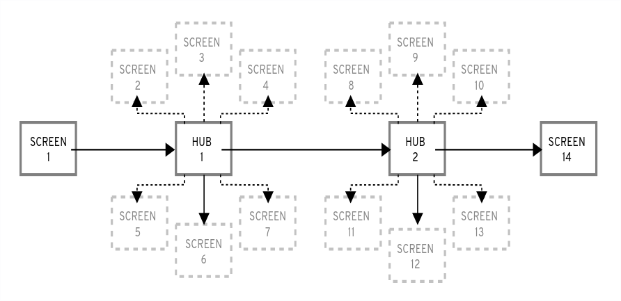

# Customizing Anaconda

* * *

Red Hat Enterprise Linux 10.0 Beta

## Changing the installer appearance and creating custom add-ons on Red Hat Enterprise Linux

Red Hat Customer Content Services

[Legal Notice](#idm140011509778112)

**Abstract**

Anaconda is the installer used by Red Hat Enterprise Linux. You can customize Anaconda for extending capabilities when you install RHEL in your environment.

* * *

<h2 id="introduction-to-anaconda-customization">Chapter 1. Introduction to Anaconda customization</h2>

The Red Hat Enterprise Linux and Fedora installation program, **Anaconda**, brings many improvements in its most recent versions. One of these improvements is enhanced customizability. You can now write add-ons to extend the base installer functionality, and change the appearance of the graphical user interface.

This document will explain how to customize the following:

- Boot menu - pre-configured options, color scheme and background
- Appearance of the graphical interface - logo, backgrounds, product name
- Installer functionality - add-ons which can enhance the installer by adding new Kickstart commands and new screens in the graphical and textual user interfaces

Important

Procedures described in this book are written for Red Hat Enterprise Linux 10 or a similar systems. On other systems, the tools and applications used (such as `xorrisofs` for creating custom ISO images) may be different, and procedures may need to be adjusted.

Support Statement

Red Hat supports only customizing the Red Hat Enterprise Linux installation media and images by using Red Hat Enterprise Linux Image Builder. Alternatively, you can use Kickstart to deploy consistent systems in your infrastructure.

<h2 id="performing-the-pre-customization-tasks">Chapter 2. Performing the pre-customization tasks</h2>

Red Hat Enterprise Linux installation media can be customized by downloading the RHEL 10 boot images from the Red Hat Customer Portal, extracting their contents, and rebuilding the boot image with specific modifications to support tailored deployment needs.

<h3 id="working-with-iso-images">2.1. Working with ISO images</h3>

In this section, you will learn how to:

- Extract Red Hat Enterprise Linux ISO.
- Create a new boot image containing your customizations.

<h3 id="downloading-rh-boot-images">2.2. Downloading RHEL boot images</h3>

Before you begin to customize the installer, download the Red Hat-provided boot images. You can obtain Red Hat Enterprise Linux 10 boot media from the [Red Hat Customer Portal](https://access.redhat.com/downloads/content/486/ver=/rhel---10/10/x86_64/product-software) after loging in to your account.

Note

- Your account must have sufficient entitlements to download Red Hat Enterprise Linux 10 images.
- You must download either the `Binary DVD` or `Boot ISO` image.
- You cannot customize the installer by using the other available downloads, such as the KVM Guest Image or Supplementary DVD.

For more information about the Binary DVD and Boot ISO downloads, see [Product Downloads](https://access.redhat.com/downloads/content/rhel).

<h3 id="extracting-red-hat-enterprise-linux-boot-images">2.3. Extracting Red Hat Enterprise Linux boot images</h3>

You can extract the contents of a boot image.

**Procedure**

1. Ensure that the directory `/mnt/iso` exists and nothing is currently mounted there.
2. Mount the downloaded image.
   
   ```
   mount -t iso9660 -o loop path/to/image.iso /mnt/iso
   ```
   
   ```plaintext
   # mount -t iso9660 -o loop path/to/image.iso /mnt/iso
   ```
   
   Where *path/to/image.iso* is the path to the downloaded boot image.
3. Create a working directory where you want to place the contents of the ISO image.
   
   ```
   mkdir /tmp/ISO
   ```
   
   ```plaintext
   $ mkdir /tmp/ISO
   ```
4. Copy all contents of the mounted image to your new working directory. Make sure to use the `-p` option to preserve file and directory permissions and ownership.
   
   ```
   cp -pRf /mnt/iso /tmp/ISO
   ```
   
   ```plaintext
   # cp -pRf /mnt/iso /tmp/ISO
   ```
5. Unmount the image.
   
   ```
   umount /mnt/iso
   ```
   
   ```plaintext
   # umount /mnt/iso
   ```

**Additional resources**

- [Product Downloads](https://access.redhat.com/downloads/content/rhel)

<h2 id="customizing-the-boot-menu">Chapter 3. Customizing the boot menu</h2>

You can customize the Boot menu options. For information about downloading and extracting Boot images, see [Extracting Red Hat Enterprise Linux boot images](#extracting-red-hat-enterprise-linux-boot-images "2.3. Extracting Red Hat Enterprise Linux boot images").

The Boot menu customization involves the following high-level tasks:

1. Complete the prerequisites.
2. Customize the Boot menu.
3. Create a custom Boot image.

<h3 id="customizing-boot-menu">3.1. Customizing the boot menu</h3>

The *Boot menu* is the menu which appears after you boot your system using an installation image. Normally, this menu allows you to choose between options such as `Install Red Hat Enterprise Linux`, `Boot from local drive` or `Rescue an installed system`.

To customize the Boot menu, you can:

- Customize the default options.
- Add more options.
- Change the visual style (color and background).

An installation media consists of a **GRUB2** boot loader. The **GRUB2** boot loader is used on systems with UEFI firmware.

Customizing the boot menu options can especially be useful with Kickstart. Kickstart files must be provided to the installer before the installation begins. Normally, this is done by manually editing one of the existing boot options to add the `inst.ks=` boot option. You can add this option to one of the pre-configured entries, if you edit boot loader configuration files on the media.

<h3 id="systems-with-bios-firmware">3.2. Systems with legacy BIOS firmware</h3>

The `boot/grub2/grub.cfg` configuration file on the boot media contains a list of preconfigured menu entries and other directives which controls the appearance and the Boot menu functionality. In the configuration file, the default menu entry for Red Hat Enterprise Linux (Test this media & install Red Hat Enterprise Linux 10) is defined in the following block:

```
menuentry 'Install Red Hat Enterprise Linux 10.0' --class fedora --class gnu-linux --class gnu --class os {
	linux /images/pxeboot/vmlinuz inst.stage2=hd:LABEL=RHEL-10-0-BaseOS-x86_64 quiet
	initrd /images/pxeboot/initrd.img
}
menuentry 'Test this media & install Red Hat Enterprise Linux 10.0' --class fedora --class gnu-linux --class gnu --class os {
	linux /images/pxeboot/vmlinuz inst.stage2=hd:LABEL=RHEL-10-0-BaseOS-x86_64 rd.live.check quiet
	initrd /images/pxeboot/initrd.img
}
```

```plaintext
menuentry 'Install Red Hat Enterprise Linux 10.0' --class fedora --class gnu-linux --class gnu --class os {
	linux /images/pxeboot/vmlinuz inst.stage2=hd:LABEL=RHEL-10-0-BaseOS-x86_64 quiet
	initrd /images/pxeboot/initrd.img
}
menuentry 'Test this media & install Red Hat Enterprise Linux 10.0' --class fedora --class gnu-linux --class gnu --class os {
	linux /images/pxeboot/vmlinuz inst.stage2=hd:LABEL=RHEL-10-0-BaseOS-x86_64 rd.live.check quiet
	initrd /images/pxeboot/initrd.img
}
```

Where:

- `menuentry` - Defines the title of the entry. It is specified in single or double quotes (' or "). You can use the `--class` option to group menu entries into different classes, which can then be styled differently using GRUB2 themes.
  
  Note
  
  You must enclose each menu entry definition in curly braces ({}).
- `linux` - Defines the kernel that boots (`/images/pxeboot/vmlinuz` in the example) and the other additional options, if any. You can customize these options to change the behavior of the boot entry. For details about the options that are applicable to Anaconda, see [Automatically installing RHEL](https://docs.redhat.com/en/documentation/red_hat_enterprise_linux/10/html/automatically_installing_rhel/boot-options-reference). One of the notable options is `inst.ks=` that allows you to specify a location of a Kickstart file. You can place a Kickstart file on the boot ISO image and use the `inst.ks=` option to specify its location; for example, you can place a `kickstart.ks` file into the image’s root directory and use `inst.ks=hd:LABEL=RHEL-10-0-BaseOS-x86_64:/kickstart.ks`. You can also use dracut options which are listed on the `dracut.cmdline(7)` man page.
  
  Important
  
  When using a disk label to refer to a certain drive, for example, `inst.stage2=hd:LABEL=RHEL-10-0-BaseOS-x86_64`, replace all spaces with `\x20`.
- `initrd` - Location of the initial RAM disk (`initrd`) image to be loaded. Other options used in the `grub.cfg` configuration file are:
  
  - `set timeout` - determines how long is the boot menu displayed before the default menu entry is automatically used. The default value is 60, which means the menu is displayed for 60 seconds. Setting this value to `-1` disables the timeout completely.
    
    Note
    
    Setting the timeout to 0 is useful when performing a headless installation, because this setting immediately activates the default boot entry.
- `submenu` - A submenu block allows you to create a sub-menu and group some entries under it, instead of displaying them in the main menu. The Troubleshooting submenu in the default configuration contains entries for rescuing an existing system. The title of the entry is in single or double quotes (' or "). The submenu block contains one or more menuentry definitions as described above, and the entire block is enclosed in curly braces ({}). For example:
  
  ```
  submenu 'Submenu title' {
    menuentry 'Submenu option 1' {
      linux /images/pxeboot/vmlinuz inst.stage2=hd:LABEL=RHEL-10-0-BaseOS-x86_64 nomodeset quiet
      initrd /images/pxeboot/initrd.img
    }
    menuentry 'Submenu option 2' {
      linux /images/pxeboot/vmlinuz inst.stage2=hd:LABEL=RHEL-10-0-BaseOS-x86_64 inst.rescue quiet
      initrd /images/pxeboot/initrd.img
    }
  }
  ```
  
  ```plaintext
  submenu 'Submenu title' {
    menuentry 'Submenu option 1' {
      linux /images/pxeboot/vmlinuz inst.stage2=hd:LABEL=RHEL-10-0-BaseOS-x86_64 nomodeset quiet
      initrd /images/pxeboot/initrd.img
    }
    menuentry 'Submenu option 2' {
      linux /images/pxeboot/vmlinuz inst.stage2=hd:LABEL=RHEL-10-0-BaseOS-x86_64 inst.rescue quiet
      initrd /images/pxeboot/initrd.img
    }
  }
  ```
- `set default` - Determines the default entry. The entry numbers start from 0. If you want to make the third entry the default one, use set `default=2` and so on.
- `theme` - Determines the directory which contains GRUB2 theme files. You can use the themes to customize visual aspects of the boot loader - background, fonts, and colors of specific elements.

**Additional resources**

- [GNU GRUB Manual](https://www.gnu.org/software/grub/manual/grub.html#Theme-file-format)
- [Managing, monitoring and updating the kernel](https://docs.redhat.com/en/documentation/red_hat_enterprise_linux/10/html/managing_monitoring_and_updating_the_kernel/index)

<h3 id="systems-with-uefi-firmware">3.3. Systems with UEFI firmware</h3>

The `EFI/BOOT/grub.cfg` configuration file on the boot media contains a list of preconfigured menu entries and other directives which controls the appearance and the Boot menu functionality. In the configuration file, the default menu entry for Red Hat Enterprise Linux (`Test this media & install Red Hat Enterprise Linux 10`) is defined in the following block:

```
menuentry 'Test this media & install Red Hat Enterprise Linux 10.0' --class fedora --class gnu-linux --class gnu --class os {
	linuxefi /images/pxeboot/vmlinuz inst.stage2=hd:LABEL=RHEL-10-0-BaseOS-x86_64 rd.live.check quiet
	initrdefi /images/pxeboot/initrd.img
}
```

```plaintext
menuentry 'Test this media & install Red Hat Enterprise Linux 10.0' --class fedora --class gnu-linux --class gnu --class os {
	linuxefi /images/pxeboot/vmlinuz inst.stage2=hd:LABEL=RHEL-10-0-BaseOS-x86_64 rd.live.check quiet
	initrdefi /images/pxeboot/initrd.img
}
```

Where:

- `menuentry` - Defines the title of the entry. It is specified in single or double quotes (`'` or `"`). You can use the `--class` option to group menu entries into different *classes*, which can then be styled differently by using **GRUB2** themes.
  
  Note
  
  As shown in the above example, you must enclose each menu entry definition in curly braces (`{}`).
- `linuxefi` - Defines the kernel that boots (`/images/pxeboot/vmlinuz` from the example) and the other additional options, if any.
  
  You can customize these options to change the behavior of the boot entry.
  
  One of the notable options is `inst.ks=`, which allows you to specify a location of a Kickstart file. You can place a Kickstart file on the boot ISO image and use the inst.ks= option to specify its location; for example, you can place a `kickstart.ks` file into the image’s root directory and use `inst.ks=hd:LABEL=RHEL-10-0-BaseOS-x86_64:/kickstart.ks`.
  
  You can also use `dracut` options which are listed on the `dracut.cmdline(7)` man page on your system.
  
  Important
  
  When using a disk label to refer to a certain drive, for example, `inst.stage2=hd:LABEL=RHEL-10-BaseOS-x86_64`, replace all spaces with `\x20`.
- `initrdefi` - Location of the initial RAM disk (initrd) image to be loaded.

Other options used in the `grub.cfg` configuration file are:

- `set timeout` - Determines how long is the boot menu displayed before the default menu entry is automatically used. The default value is `60`, which means the menu is displayed for 60 seconds. Setting this value to `-1` disables the timeout completely.
  
  Note
  
  Setting the timeout to `0` is useful when performing a headless installation, because this setting immediately activates the default boot entry.
- `submenu` - A *submenu* block allows you to create a sub-menu and group some entries under it, instead of displaying them in the main menu. The `Troubleshooting` submenu in the default configuration contains entries for rescuing an existing system.
  
  The title of the entry is in single or double quotes (`'` or `"`).
  
  The `submenu` block contains one or more `menuentry` definitions as described above, and the entire block is enclosed in curly braces (`{}`) For example:
  
  ```
  submenu 'Submenu title' {
    menuentry 'Submenu option 1' {
      linuxefi /images/pxeboot/vmlinuz inst.stage2=hd:LABEL=RHEL-10-0-BaseOS-x86_64 nomodeset quiet
      initrdefi /images/pxeboot/initrd.img
    }
    menuentry 'Submenu option 2' {
      linuxefi /images/pxeboot/vmlinuz inst.stage2=hd:LABEL=RHEL-10-0-BaseOS-x86_64 inst.rescue quiet
      initrdefi /images/pxeboot/initrd.img
    }
  }
  ```
  
  ```plaintext
  submenu 'Submenu title' {
    menuentry 'Submenu option 1' {
      linuxefi /images/pxeboot/vmlinuz inst.stage2=hd:LABEL=RHEL-10-0-BaseOS-x86_64 nomodeset quiet
      initrdefi /images/pxeboot/initrd.img
    }
    menuentry 'Submenu option 2' {
      linuxefi /images/pxeboot/vmlinuz inst.stage2=hd:LABEL=RHEL-10-0-BaseOS-x86_64 inst.rescue quiet
      initrdefi /images/pxeboot/initrd.img
    }
  }
  ```
- `set default` - Determines the default entry. The entry numbers start from `0`. If you want to make the *third* entry the default one, use `set default=2` and so on.
- `theme` - Determines the directory which contains **GRUB2** theme files. You can use the themes to customize visual aspects of the boot loader - background, fonts, and colors of specific elements.

**Additional resources**

- [*GNU GRUB Manual*](https://www.gnu.org/software/grub/manual/grub.html#Theme-file-format)
- [*Managing, monitoring and updating the kernel*](https://docs.redhat.com/en/documentation/red_hat_enterprise_linux/10/html/managing_monitoring_and_updating_the_kernel/index)

<h2 id="branding-and-chroming-the-graphical-user-interface">Chapter 4. Branding and chroming the graphical user interface</h2>

The customization of Anaconda user interface may include the customization of graphical elements and the customization of product name.

The user interface customization involves the following high-level tasks:

1. Complete the prerequisites.
2. Create custom branding material (if you plan to customize the graphical elements).
3. Customize the graphical elements (if you plan to customize them).
4. Customize the product name (if you plan to customize it).
5. Create a product.img file.
6. Create a custom Boot image.
   
   Note
   
   To create the custom branding material, first refer to the default graphical element files type and dimensions. You can accordingly create the custom material. Details about default graphical elements are available in the sample files that are provided in the [Customizing graphical elements](#customizing-graphical-elements "4.2. Customizing graphical elements") section.

<h3 id="prerequisites">4.1. Prerequisites</h3>

- You have downloaded and extracted the ISO image.
- You have created your own branding material.
  
  For information about downloading and extracting boot images, see [Extracting Red Hat Enterprise Linux boot images](#extracting-red-hat-enterprise-linux-boot-images "2.3. Extracting Red Hat Enterprise Linux boot images").

<h3 id="customizing-graphical-elements">4.2. Customizing graphical elements</h3>

To customize the graphical elements, you can modify or replace the customisable elements with the custom branded material, and update the container files.

The customisable graphical elements of the installer are stored in the `/usr/share/anaconda/pixmaps/` directory in the installer runtime file system. This directory contains the following customisable files:

```
pixmaps
├─ anaconda-password-show-off.svg
├─ anaconda-password-show-on.svg
├─ right-arrow-icon.png
├─ sidebar-bg.png
├─ sidebar-logo.png
└─ topbar-bg.png
```

```plaintext
pixmaps
├─ anaconda-password-show-off.svg
├─ anaconda-password-show-on.svg
├─ right-arrow-icon.png
├─ sidebar-bg.png
├─ sidebar-logo.png
└─ topbar-bg.png
```

Additionally, the `/usr/share/anaconda/` directory contains a base CSS stylesheet named `anaconda-gtk.css`, which determines the file names and parameters of the main UI elements - the logo and the backgrounds for the sidebar and top bar. Product-specific stylesheet customizations are located in a separate file (`/usr/share/anaconda/pixmaps/redhat.css`) and override the defaults from the `anaconda-gtk.css` file. Use a product-specific file for CSS customizations as it only overrides the particular elements of the stylesheet as needed.

The product-specific `redhat.css` file has the following content that can be customized as per your requirement (for the full stylesheet specifications, see content of the `anaconda-gtk.css` file):

```
/* theme colors/images */

@define-color product_bg_color @redhat;

/* logo and sidebar classes */

.logo-sidebar {
   background-image: url('/usr/share/anaconda/pixmaps/sidebar-bg.png');
   background-color: @product_bg_color;
   background-repeat: no-repeat;
}

/* Add a logo to the sidebar */

.logo {
   background-image: url('/usr/share/anaconda/pixmaps/sidebar-logo.png');
   background-position: 50% 20px;
   background-repeat: no-repeat;
   background-color: transparent;
}

/* This is a placeholder to be filled by a product-specific logo. */

.product-logo {
   background-image: none;
   background-color: transparent;
}

AnacondaSpokeWindow #nav-box {
   background-color: @product_bg_color;
   background-image: url('/usr/share/anaconda/pixmaps/topbar-bg.png');
   background-repeat: no-repeat;
   color: white;
}
```

```plaintext
/* theme colors/images */

@define-color product_bg_color @redhat;

/* logo and sidebar classes */

.logo-sidebar {
   background-image: url('/usr/share/anaconda/pixmaps/sidebar-bg.png');
   background-color: @product_bg_color;
   background-repeat: no-repeat;
}

/* Add a logo to the sidebar */

.logo {
   background-image: url('/usr/share/anaconda/pixmaps/sidebar-logo.png');
   background-position: 50% 20px;
   background-repeat: no-repeat;
   background-color: transparent;
}

/* This is a placeholder to be filled by a product-specific logo. */

.product-logo {
   background-image: none;
   background-color: transparent;
}

AnacondaSpokeWindow #nav-box {
   background-color: @product_bg_color;
   background-image: url('/usr/share/anaconda/pixmaps/topbar-bg.png');
   background-repeat: no-repeat;
   color: white;
}
```

The most important part of the CSS file is the way in which it handles scaling based on resolution. The PNG image backgrounds do not scale, they are always displayed in their true dimensions. Instead, the backgrounds have a transparent background, and the stylesheet defines a matching background color on the `@define-color` line. Therefore, the background *images* "fade" into the background *color*, which means that the backgrounds work on all resolutions without a need for image scaling.

You could also change the `background-repeat` parameters to tile the background, or, if you are confident that every system you will be installing on will have the same display resolution, you can use background images which fill the entire bar.

Any of the files listed above can be customized. Once you do so, follow the instructions in [Creating a product.img File](#creating-a-product-img-file "6.1. Creating a product.img file") to create your own `product.img` with custom graphics, and then [Creating Custom Boot Images](#creating-custom-boot-images "6.2. Creating custom boot images") to create a new bootable ISO image with your changes included.

<h3 id="customizing-the-product-name">4.3. Customizing the product name</h3>

You can customize the product name by creating a custom `.buildstamp` file.

**Procedure**

1. Create a new `.buildstamp` file with the following content:
   
   ```
   [Main]
   Product=My Distribution
   Version=10
   BugURL=https://bugzilla.redhat.com/
   IsFinal=True
   ```
   
   ```plaintext
   [Main]
   Product=My Distribution
   Version=10
   BugURL=https://bugzilla.redhat.com/
   IsFinal=True
   ```
   
   Change *My Distribution* to the name which you want to display in the installer.
2. After you create the custom `.buildstamp` file, follow [Creating a product.img file](#creating-a-product-img-file "6.1. Creating a product.img file") section to create a new `product.img` file containing your customizations, and the [Creating custom boot images](#creating-custom-boot-images "6.2. Creating custom boot images") section to create a new bootable ISO file with your changes included.

<h3 id="configuring\_the\_product\_configuration\_files">4.4. Configuring the default configuration files</h3>

You can write the Anaconda configuration files in the `.ini` file format. The Anaconda configuration file consists of sections, options and comments. Each section is defined by a `section` header, the comments starting with a `#` character and the `key = value` pairs to define the `options`. The resulting configuration file is processed with the `configparser` Python configuration file parser.

The default configuration file, located at `/etc/anaconda/anaconda.conf`, contains sections and options that are supported. The file provides a full default configuration of the installer. You can create custom configuration files in `/etc/anaconda/conf.d/` directory.

The following configuration file describes the default configuration:

```
# Anaconda configuration file.

[Anaconda]
# Run Anaconda in the debugging mode.
debug = False

# List of Anaconda DBus modules that can be activated.
# Supported patterns: MODULE.PREFIX., MODULE.NAME activatable_modules = org.fedoraproject.Anaconda.Modules.
    org.fedoraproject.Anaconda.Addons.*

# List of Anaconda DBus modules that are not allowed to run.
# Supported patterns: MODULE.PREFIX., MODULE.NAME forbidden_modules = # List of Anaconda DBus modules that can fail to run. # The installation won't be aborted because of them. # Supported patterns: MODULE.PREFIX., MODULE.NAME
optional_modules =
    org.fedoraproject.Anaconda.Modules.Subscription
    org.fedoraproject.Anaconda.Addons.*


[Installation System]
# Type of the installation system.
# FIXME: This is a temporary solution.
type = UNKNOWN

# Should the installer show a warning about enabled SMT?
can_detect_enabled_smt = False


[Installation Target]
# Type of the installation target.
type = HARDWARE

# A path to the physical root of the target.
physical_root = /mnt/sysimage

# A path to the system root of the target.
system_root = /mnt/sysroot

# Should we install the network configuration?
can_configure_network = True

# Should we copy input kickstart to target system?
can_copy_input_kickstart = True

# Should we save kickstart equivalent to installation settings to the new system?
can_save_output_kickstart = True

# Should we save logs from the installation to the new system?
can_save_installation_logs = True


[Network]
# Network device to be activated on boot if none was configured so.
# Valid values:
#
#   NONE                   No device
#   DEFAULT_ROUTE_DEVICE   A default route device
#   FIRST_WIRED_WITH_LINK  The first wired device with link
#
default_on_boot = NONE


[Payload]
# Default package environment.
default_environment =

# List of ignored packages.
ignored_packages =

# Names of repositories that provide latest updates.
updates_repositories =

# Names of repositories disabled by default.
# Supported patterns: REPO-NAME, PREFIX*, SUFFIX, *INFIX
disabled_repositories =
    source
    debuginfo
    updates-testing
    updates-testing-modular

# List of .treeinfo variant types to enable.
# Valid items:
#
  addon
  optional
  variant
#
enabled_repositories_from_treeinfo = addon optional variant

# Enable installation from the closest mirror.
enable_closest_mirror = True

# Default installation source.
# Valid values:
#
#    CLOSEST_MIRROR  Use closest public repository mirror.
#    CDN             Use Content Delivery Network (CDN).
#
default_source = CLOSEST_MIRROR

# Enable ssl verification for all HTTP connection
verify_ssl = True

# GPG keys to import to RPM database by default.
# Specify paths on the installed system, each on a line.
# Substitutions for $releasever and $basearch happen automatically.
default_rpm_gpg_keys =

[Security]
# Enable SELinux usage in the installed system.
# Valid values:
#
#  -1  The value is not set.
#   0  SELinux is disabled.
#   1  SELinux is enabled.
#
selinux = -1


[Bootloader]
# Type of the bootloader.
# Supported values:
#
#   DEFAULT   Choose the type by platform.
#   EXTLINUX  Use extlinux as the bootloader.
#   SDBOOT    Use systemd-boot as the bootloader.
#
type = DEFAULT

# Name of the EFI directory.
efi_dir = default

# Hide the GRUB menu.
menu_auto_hide = False

# Are non-iBFT iSCSI disks allowed?
nonibft_iscsi_boot = False

# Arguments preserved from the installation system.
preserved_arguments =
    cio_ignore zfcp.allow_lun_scan
    speakup_synth apic noapic apm ide noht acpi video
    pci nodmraid nompath nomodeset noiswmd fips selinux
    biosdevname ipv6.disable net.ifnames net.ifnames.prefix
    nosmt vga


[Storage]
# Enable iBFT usage during the installation.
ibft = True

# Tell multipathd to use user friendly names when naming devices during the installation.
multipath_friendly_names = True

# Create GPT discoverable partition type IDs, if possible
gpt_discoverable_partitions = True

# Do you want to allow imperfect devices (for example, degraded mdraid array devices)?
allow_imperfect_devices = False

# Btrfs compression algorithm and level. e.g. zstd:1
btrfs_compression =

# Default disk label type.
# Valid values:
#
#    gpt  Prefer creation of GPT disk labels.
#    mbr  Prefer creation of MBR disk labels.
#
#    If not specified, use whatever Blivet uses by default.
#
disk_label_type =

# Default file system type. Use whatever Blivet uses by default.
file_system_type =

# Default partitioning.
# Specify a mount point and its attributes on each line.
#
# Valid attributes:
#
#   size <SIZE>    The size of the mount point.
#   min <MIN_SIZE> The size will grow from MIN_SIZE to MAX_SIZE.
#   max <MAX_SIZE> The max size is unlimited by default.
#   free <SIZE>    The required available space.
  btrfs          The mount point will be created only for the Btrfs scheme
#
default_partitioning =
    /     (min 1 GiB, max 70 GiB)
    /home (min 500 MiB, free 50 GiB)

# Default partitioning scheme.
# Valid values:
#
#   PLAIN      Create standard partitions.
#   BTRFS      Use the Btrfs scheme.
#   LVM        Use the LVM scheme.
#   LVM_THINP  Use LVM Thin Provisioning.
#
default_scheme = LVM

# Default version of LUKS.
# Valid values:
#
#   luks1  Use version 1 by default.
#   luks2  Use version 2 by default.
#
luks_version = luks2


[Storage Constraints]

# Minimal size of the total memory.
min_ram = 320 MiB

# Minimal size of the available memory for LUKS2.
luks2_min_ram = 128 MiB

# Should we recommend to specify a swap partition?
swap_is_recommended = False

# Recommended minimal sizes of partitions.
# Specify a mount point and a size on each line.
min_partition_sizes =
    /      250 MiB
    /usr   250 MiB
    /tmp   50  MiB
    /var   384 MiB
    /home  100 MiB
    /boot  512 MiB

# Required minimal sizes of partitions.
# Specify a mount point and a size on each line.
req_partition_sizes =

# Allowed device types of the / partition if any.
# Valid values:
#
#   LVM        Allow LVM.
#   MD         Allow RAID.
#   PARTITION  Allow standard partitions.
#   BTRFS      Allow Btrfs.
#   DISK       Allow disks.
#   LVM_THINP  Allow LVM Thin Provisioning.
#
root_device_types =

# Mount points that must be on a linux file system.
# Specify a list of mount points.
must_be_on_linuxfs = / /var /tmp /usr /home /usr/share /usr/lib

# Paths that must be directories on the / file system.
# Specify a list of paths.
must_be_on_root = /bin /dev /sbin /etc /lib /root /mnt lost+found /proc

# Paths that must NOT be directories on the / file system.
# Specify a list of paths.
must_not_be_on_root =

# Mount points that are recommended to be reformatted.
#
# It will be recommended to create a new file system on a mount point
# that has an allowed prefix, but doesn't have a blocked one.
# Specify lists of mount points.
reformat_allowlist = /boot /var /tmp /usr
reformat_blocklist = /home /usr/local /opt /var/www


[User Interface]
# The path to a custom stylesheet.
custom_stylesheet =

# A list of spokes to hide in UI.
# FIXME: Use other identification then names of the spokes.
hidden_spokes =

# Should the UI allow to change the configured root account?
can_change_root = False

# Should the UI allow to change the configured user accounts?
can_change_users = False

# Define the default password policies.
# Specify a policy name and its attributes on each line.
#
# Valid attributes:
#
#   quality <NUMBER>  The minimum quality score (see libpwquality).
#   length <NUMBER>   The minimum length of the password.
#   empty             Allow an empty password.
#   strict            Require the minimum quality.
#
password_policies =
    root (quality 1, length 6)
    user (quality 1, length 6, empty)
    luks (quality 1, length 6)

# Should kernel options be shown in the software selection spoke?
show_kernel_options = True

[License]
# A path to EULA (if any)
#
# If the given distribution has an EULA & feels the need to
tell the user about it fill in this variable by a path
# pointing to a file with the EULA on the installed system.
#
# This is currently used just to show the path to the file to
# the user at the end of the installation.
eula =


[Timezone]
# URL for geolocation data provider.
# This is used for automatic language and timezone detection.
#
# Known valid providers:
#
  https://geoip.fedoraproject.org/city
  https://api.hostip.info/get_json.php
#
# If left empty, geolocation does not run.
#
geolocation_provider = https://geoip.fedoraproject.org/city

[Localization]
# Should geolocation be used when setting the language ?
#
use_geolocation = True
```

```plaintext
# Anaconda configuration file.

[Anaconda]
# Run Anaconda in the debugging mode.
debug = False

# List of Anaconda DBus modules that can be activated.
# Supported patterns: MODULE.PREFIX., MODULE.NAME activatable_modules = org.fedoraproject.Anaconda.Modules.
    org.fedoraproject.Anaconda.Addons.*

# List of Anaconda DBus modules that are not allowed to run.
# Supported patterns: MODULE.PREFIX., MODULE.NAME forbidden_modules = # List of Anaconda DBus modules that can fail to run. # The installation won't be aborted because of them. # Supported patterns: MODULE.PREFIX., MODULE.NAME
optional_modules =
    org.fedoraproject.Anaconda.Modules.Subscription
    org.fedoraproject.Anaconda.Addons.*


[Installation System]
# Type of the installation system.
# FIXME: This is a temporary solution.
type = UNKNOWN

# Should the installer show a warning about enabled SMT?
can_detect_enabled_smt = False


[Installation Target]
# Type of the installation target.
type = HARDWARE

# A path to the physical root of the target.
physical_root = /mnt/sysimage

# A path to the system root of the target.
system_root = /mnt/sysroot

# Should we install the network configuration?
can_configure_network = True

# Should we copy input kickstart to target system?
can_copy_input_kickstart = True

# Should we save kickstart equivalent to installation settings to the new system?
can_save_output_kickstart = True

# Should we save logs from the installation to the new system?
can_save_installation_logs = True


[Network]
# Network device to be activated on boot if none was configured so.
# Valid values:
#
#   NONE                   No device
#   DEFAULT_ROUTE_DEVICE   A default route device
#   FIRST_WIRED_WITH_LINK  The first wired device with link
#
default_on_boot = NONE


[Payload]
# Default package environment.
default_environment =

# List of ignored packages.
ignored_packages =

# Names of repositories that provide latest updates.
updates_repositories =

# Names of repositories disabled by default.
# Supported patterns: REPO-NAME, PREFIX*, SUFFIX, *INFIX
disabled_repositories =
    source
    debuginfo
    updates-testing
    updates-testing-modular

# List of .treeinfo variant types to enable.
# Valid items:
#
#   addon
#   optional
#   variant
#
enabled_repositories_from_treeinfo = addon optional variant

# Enable installation from the closest mirror.
enable_closest_mirror = True

# Default installation source.
# Valid values:
#
#    CLOSEST_MIRROR  Use closest public repository mirror.
#    CDN             Use Content Delivery Network (CDN).
#
default_source = CLOSEST_MIRROR

# Enable ssl verification for all HTTP connection
verify_ssl = True

# GPG keys to import to RPM database by default.
# Specify paths on the installed system, each on a line.
# Substitutions for $releasever and $basearch happen automatically.
default_rpm_gpg_keys =

[Security]
# Enable SELinux usage in the installed system.
# Valid values:
#
#  -1  The value is not set.
#   0  SELinux is disabled.
#   1  SELinux is enabled.
#
selinux = -1


[Bootloader]
# Type of the bootloader.
# Supported values:
#
#   DEFAULT   Choose the type by platform.
#   EXTLINUX  Use extlinux as the bootloader.
#   SDBOOT    Use systemd-boot as the bootloader.
#
type = DEFAULT

# Name of the EFI directory.
efi_dir = default

# Hide the GRUB menu.
menu_auto_hide = False

# Are non-iBFT iSCSI disks allowed?
nonibft_iscsi_boot = False

# Arguments preserved from the installation system.
preserved_arguments =
    cio_ignore zfcp.allow_lun_scan
    speakup_synth apic noapic apm ide noht acpi video
    pci nodmraid nompath nomodeset noiswmd fips selinux
    biosdevname ipv6.disable net.ifnames net.ifnames.prefix
    nosmt vga


[Storage]
# Enable iBFT usage during the installation.
ibft = True

# Tell multipathd to use user friendly names when naming devices during the installation.
multipath_friendly_names = True

# Create GPT discoverable partition type IDs, if possible
gpt_discoverable_partitions = True

# Do you want to allow imperfect devices (for example, degraded mdraid array devices)?
allow_imperfect_devices = False

# Btrfs compression algorithm and level. e.g. zstd:1
btrfs_compression =

# Default disk label type.
# Valid values:
#
#    gpt  Prefer creation of GPT disk labels.
#    mbr  Prefer creation of MBR disk labels.
#
#    If not specified, use whatever Blivet uses by default.
#
disk_label_type =

# Default file system type. Use whatever Blivet uses by default.
file_system_type =

# Default partitioning.
# Specify a mount point and its attributes on each line.
#
# Valid attributes:
#
#   size <SIZE>    The size of the mount point.
#   min <MIN_SIZE> The size will grow from MIN_SIZE to MAX_SIZE.
#   max <MAX_SIZE> The max size is unlimited by default.
#   free <SIZE>    The required available space.
#   btrfs          The mount point will be created only for the Btrfs scheme
#
default_partitioning =
    /     (min 1 GiB, max 70 GiB)
    /home (min 500 MiB, free 50 GiB)

# Default partitioning scheme.
# Valid values:
#
#   PLAIN      Create standard partitions.
#   BTRFS      Use the Btrfs scheme.
#   LVM        Use the LVM scheme.
#   LVM_THINP  Use LVM Thin Provisioning.
#
default_scheme = LVM

# Default version of LUKS.
# Valid values:
#
#   luks1  Use version 1 by default.
#   luks2  Use version 2 by default.
#
luks_version = luks2


[Storage Constraints]

# Minimal size of the total memory.
min_ram = 320 MiB

# Minimal size of the available memory for LUKS2.
luks2_min_ram = 128 MiB

# Should we recommend to specify a swap partition?
swap_is_recommended = False

# Recommended minimal sizes of partitions.
# Specify a mount point and a size on each line.
min_partition_sizes =
    /      250 MiB
    /usr   250 MiB
    /tmp   50  MiB
    /var   384 MiB
    /home  100 MiB
    /boot  512 MiB

# Required minimal sizes of partitions.
# Specify a mount point and a size on each line.
req_partition_sizes =

# Allowed device types of the / partition if any.
# Valid values:
#
#   LVM        Allow LVM.
#   MD         Allow RAID.
#   PARTITION  Allow standard partitions.
#   BTRFS      Allow Btrfs.
#   DISK       Allow disks.
#   LVM_THINP  Allow LVM Thin Provisioning.
#
root_device_types =

# Mount points that must be on a linux file system.
# Specify a list of mount points.
must_be_on_linuxfs = / /var /tmp /usr /home /usr/share /usr/lib

# Paths that must be directories on the / file system.
# Specify a list of paths.
must_be_on_root = /bin /dev /sbin /etc /lib /root /mnt lost+found /proc

# Paths that must NOT be directories on the / file system.
# Specify a list of paths.
must_not_be_on_root =

# Mount points that are recommended to be reformatted.
#
# It will be recommended to create a new file system on a mount point
# that has an allowed prefix, but doesn't have a blocked one.
# Specify lists of mount points.
reformat_allowlist = /boot /var /tmp /usr
reformat_blocklist = /home /usr/local /opt /var/www


[User Interface]
# The path to a custom stylesheet.
custom_stylesheet =

# A list of spokes to hide in UI.
# FIXME: Use other identification then names of the spokes.
hidden_spokes =

# Should the UI allow to change the configured root account?
can_change_root = False

# Should the UI allow to change the configured user accounts?
can_change_users = False

# Define the default password policies.
# Specify a policy name and its attributes on each line.
#
# Valid attributes:
#
#   quality <NUMBER>  The minimum quality score (see libpwquality).
#   length <NUMBER>   The minimum length of the password.
#   empty             Allow an empty password.
#   strict            Require the minimum quality.
#
password_policies =
    root (quality 1, length 6)
    user (quality 1, length 6, empty)
    luks (quality 1, length 6)

# Should kernel options be shown in the software selection spoke?
show_kernel_options = True

[License]
# A path to EULA (if any)
#
# If the given distribution has an EULA & feels the need to
# tell the user about it fill in this variable by a path
# pointing to a file with the EULA on the installed system.
#
# This is currently used just to show the path to the file to
# the user at the end of the installation.
eula =


[Timezone]
# URL for geolocation data provider.
# This is used for automatic language and timezone detection.
#
# Known valid providers:
#
#   https://geoip.fedoraproject.org/city
#   https://api.hostip.info/get_json.php
#
# If left empty, geolocation does not run.
#
geolocation_provider = https://geoip.fedoraproject.org/city

[Localization]
# Should geolocation be used when setting the language ?
#
use_geolocation = True
```

Content of files in the `conf.d` directory overrides defaults from `anaconda.conf`. The files are named in a &lt;priority&gt;-&lt;config-description&gt;.conf form, for example `100-my-distribution.conf`. The file with the highest priority is applied last, overriding all configuration files applied earlier.

Here’s an example of a customization configuration file content:

```
# Anaconda configuration file for My Distribution

[Profile]
 Define the profile.
profile_id = my_distribution

[Profile Detection]
 Match os-release values.
os_id = my_distribution

[Network]
default_on_boot = NONE

[Storage]
file_system_type = xfs
default_partitioning =
	/     (min 2 GiB, max 50 GiB)
	/home (min 20 GiB, free 10 GiB)
	/test (size 256 MiB)
	swap

[Storage Constraints]
swap_is_recommended = True

[User Interface]
custom_stylesheet = /usr/share/anaconda/pixmaps/my_distribution.css
```

```plaintext
# Anaconda configuration file for My Distribution

[Profile]
 Define the profile.
profile_id = my_distribution

[Profile Detection]
 Match os-release values.
os_id = my_distribution

[Network]
default_on_boot = NONE

[Storage]
file_system_type = xfs
default_partitioning =
	/     (min 2 GiB, max 50 GiB)
	/home (min 20 GiB, free 10 GiB)
	/test (size 256 MiB)
	swap

[Storage Constraints]
swap_is_recommended = True

[User Interface]
custom_stylesheet = /usr/share/anaconda/pixmaps/my_distribution.css
```

<h2 id="developing-installer-add-ons">Chapter 5. Developing installer add-ons</h2>

Details about Anaconda and its architecture explain its backend and the various plug points necessary for add-ons to function. This information supports the development of custom add-ons tailored to specific requirements.

<h3 id="introduction-to-anaconda-and-add-ons">5.1. Introduction to Anaconda and add-ons</h3>

**Anaconda** is the operating system installer used in Fedora, Red Hat Enterprise Linux, and their derivatives. It is a set of Python modules and scripts together with some additional files like `Gtk` widgets (written in C), `systemd` units, and `dracut` libraries. Together, they form a tool that allows users to set parameters of the resulting (target) system and then set up this system on a machine. The installation process has four major steps:

1. Prepare installation destination (usually disk partitioning)
2. Install package and data
3. Install and configure boot loader
4. Configure newly installed system

Using Anaconda enables you to install Fedora, Red Hat Enterprise Linux, and their derivatives, in the following three ways:

**Using graphical user interface (GUI):**

This is the most common installation method. The interface allows users to install the system interactively with little or no configuration required before starting the installation. This method covers all common use cases, including setting up complicated partitioning layouts.

The graphical interface supports remote access over `RDP`, which allows you to use the GUI even on systems with no graphics cards or attached monitor.

**Using text user interface (TUI):**

The TUI works similar to a monochrome line printer, which allows it to work on serial consoles that do not support cursor movement, colors and other advanced features. The text mode is limited and allows you to customize only the most common options, such as network settings, language options or installation (package) source; advanced features such as manual partitioning are not available in this interface.

**Using Kickstart file:**

A Kickstart file is a plain text file with shell-like syntax that can contain data to drive the installation process. A Kickstart file allows you to partially or completely automate the installation. A set of commands which configures all required areas is necessary to completely automate the installation. If one or more commands are missed, the installation requires interaction.

Apart from automation of the installer itself, Kickstart files can contain custom scripts that are run at specific moments during the installation process.

<h3 id="anaconda-architecture-">5.2. Anaconda Architecture</h3>

**Anaconda** is a set of Python modules and scripts. It also uses several external packages and libraries.

The major components of this toolset include the following packages:

- `pykickstart` - parses and validates the Kickstart files. Also, provides data structure that stores values that drive the installation.
- `dnf` - the package manager that installs packages and resolves dependencies
- `blivet` - handles all activities related to storage management
- `pyanaconda` - contains the user interface and modules for **Anaconda**, such as keyboard and timezone selection, network configuration, and user creation. Also provides various utilities to perform system-oriented functions
- `python-meh` - contains an exception handler that gathers and stores additional system information in case of a crash and passes this information to the `libreport` library, which itself is a part of the [ABRT Project](https://fedorahosted.org/abrt/)
- `dasbus` - enables communication between the `D-Bus` library with modules of anaconda and with external components
- `python-simpleline` - text UI framework library to manage user interaction in the **Anaconda** text mode
- `gtk` - the Gnome toolkit library for creating and managing GUI

Apart from the division into packages previously mentioned, **Anaconda** is internally divided into the user interface and a set of modules that run as separate processes and communicate by using the `D-Bus` library. These modules are:

- `Boss` - manages the internal module discovery, lifecycle, and coordination
- `Localization` - manages locales
- `Network` - handles network
- `Payloads` - handles data for installation in different formats, such as `rpm`, `ostree`, `tar` and other installation formats. Payloads manage the sources of data for installation; sources can vary in format such as CD-ROM, HDD, NFS, URLs, and other sources
- `Security` - manages security related aspects
- `Services` - handles services
- `Storage` - manages storage by using `blivet`
- `Subscription` - handles the `subscription-manager` tool and Red Hat Lightspeed.
- `Timezone` - deals with time, date, zones, and time synchronization.
- `Users` - creates users and groups.

Each module declares which parts of Kickstart it handles, and has methods to apply the configuration from Kickstart to the installation environment and to the installed system.

The Python code portion of Anaconda (`pyanaconda`) starts as a "main" process that owns the user interface. Any Kickstart data you provide are parsed by using the `pykickstart` module and the `Boss` module is started, it discovers all other modules, and starts them. Main process then sends Kickstart data to the modules according to their declared capabilities. Modules process the data, apply the configuration to the installation environment, and the UI validates if all required choices have been made. If not, you must supply the data in an interactive installation mode. Once all required choices have been made, the installation can start - the modules write data to the installed system.

<h3 id="anaconda-user-interface">5.3. Anaconda user interface</h3>

The Anaconda user interface (UI) has a non-linear structure, also known as hub and spoke model.

The advantages of **Anaconda** hub and spoke model are:

- Flexibility to follow the installer screens.
- Flexibility to retain the default settings.
- Provides an overview of the configured values.
- Supports extensibility. You can add hubs without the need to reorder anything and can resolve some complex ordering dependencies.
- Supports installation in graphical and text mode.

The following diagram shows the installer layout and the possible interactions between *hubs* and *spokes* (screens):

**Figure 5.1. Hub and spoke model**

 

In the diagram, screens 2-13 are called *normal spokes*, and screens 1 and 14 are *standalone spokes*. Standalone spokes are the screens that can be used before or after the standalone spoke or hub. For example, the `Welcome` screen at the beginning of the installation which prompts you to choose your language for the rest of the installation.

Note

- The `Installation Summary` is the only hub in Anaconda. It shows a summary of configured options before the installation begins

Each spoke has the following predefined *properties* that reflect the hub.

- `ready` - states whether or not you can visit a spoke. For example, when the installer is configuring a package source, the spoke is colored in gray, and you cannot access it until the configuration is complete.
- `completed` - marks whether or not the spoke is complete (all required values are set).
- `mandatory` - determines whether you *must* visit the spoke before continuing the installation; for example, you must visit the `Installation Destination` spoke, even if you want to use automatic disk partitioning
- `status` - provides a short summary of values configured within the spoke (displayed under the spoke name in the hub)

To make the user interface clearer, spokes are grouped together into *categories*. For example, the `Localization` category groups together spokes for keyboard layout selection, language support and time zone settings.

Each spoke contains UI controls that display and allow modification of values from one or more modules. This behavior also applies to spokes provided by add-ons. During a Kickstart installation, some spokes may remain hidden while still processing their data automatically without requiring them to be opened.

<h3 id="communication-across-anaconda-threads-">5.4. Communication across Anaconda threads</h3>

Some of the actions that you need to perform during the installation process may take a long time. For example, scanning disks for existing partitions or downloading package metadata. To prevent you from waiting and remaining responsive, **Anaconda** runs these actions in separate threads.

The **Gtk** toolkit does not support element changes from multiple threads. The main event loop of **Gtk** runs in the main thread of the **Anaconda** process. Therefore, all actions pertaining to the GUI must be performed in the main thread. To do so, use `GLib.idle_add`, which is not always easy or desired. Several helper functions and decorators that are defined in the **pyanaconda.ui.gui.utils** module may add to the difficulty.

The `@gtk_action_wait` and `@gtk_action_nowait` decorators change the decorated function or method in such a way that when this function or method is called, it is automatically queued into Gtk’s main loop that runs in the main thread. The return value is either returned to the caller or dropped, respectively.

In a spoke and hub communication, a spoke announces when it is ready and is not blocked. The `hubQ` message queue handles this function, and periodically checks the main event loop. When a spoke becomes accessible, it sends a message to the queue announcing the change and that it should no longer be blocked.

The same applies in a situation where a spoke needs to refresh its status or complete a flag. The `Configuration and Progress` hub has a different queue called `progressQ` which serves as a medium to transfer installation progress updates.

These mechanisms are also used for the text-based interface. In the text mode, there is no main loop, but the keyboard input takes most of the time.

<h3 id="anaconda-modules-and-d-bus-library">5.5. Anaconda modules and D-Bus library</h3>

Anaconda’s modules run as independent processes. To communicate with these processes via their `D-Bus` API, use the `dasbus` library.

Calls to methods via `D-Bus` API are asynchronous, but with the `dasbus` library you can convert them to synchronous method calls in Python. You can also write either of the following programs:

- program with asynchronous calls and return handlers
- A program with synchronous calls that makes the caller wait until the call is complete.

For more information about threads and communication, see [Communication across Anaconda threads](#communication-across-anaconda-threads- "5.4. Communication across Anaconda threads").

Additionally, Anaconda uses Task objects running in modules. Tasks have a `D-Bus` API and methods that are automatically executed in additional threads. To successfully run the tasks, use the `sync_run_task` and `async_run_task` helper functions.

<h3 id="the-hello-world-addon-example">5.6. The Hello World addon example</h3>

Anaconda developers publish an example addon called "Hello World", available on [GitHub](https://github.com/rhinstaller/hello-world-anaconda-addon/). The descriptions in further sections are reproduced in this.

<h3 id="anaconda-add-on-structure">5.7. Anaconda add-on structure</h3>

An **Anaconda** add-on is a Python package that contains a directory with an `__init__.py` and other source directories (subpackages). Because Python allows you to import each package name only once, specify a unique name for the package top-level directory. You can use an arbitrary name, because add-ons are loaded regardless of their name - the only requirement is that they must be placed in a specific directory.

The suggested naming convention for add-ons is similar to Java packages or D-Bus service names.

To make the directory name a unique identifier for a Python package, prefix the add-on name with the reversed domain name of your organization, by using underscores (`_`) instead of dots. For example, `com_example_hello_world`.

Important

Make sure to create an `__init__.py` file in each directory. Directories missing this file are considered as invalid Python packages.

When writing an add-on, ensure the following:

- Support for each interface (graphical interface and text interface) is available in a separate subpackage and these subpackages are named `gui` for the graphical interface and `tui` for the text-based interface.
- The `gui` and `tui` packages contain a `spokes` subpackage. [\[1\]](#ftn.idm140011503321856)
- Modules contained in the packages have an arbitrary name.
- The `gui/` and `tui/` directories contain Python modules with any name.
- There is a service that performs the actual work of the addon. This service can be written in Python or any other language.
- The service implements support for D-Bus and Kickstart.
- The addon contains files that enable automatic startup of the service.

Following is a sample directory structure for an add-on which supports every interface (Kickstart, GUI and TUI):

```
com_example_hello_world
├─ gui
│  ├─ init.py
│  └─ spokes
│     └─ init.py
└─ tui
   ├─ init.py
   └─ spokes
   └─ init.py
```

```plaintext
com_example_hello_world
├─ gui
│  ├─ init.py
│  └─ spokes
│     └─ init.py
└─ tui
   ├─ init.py
   └─ spokes
   └─ init.py
```

Each package must contain at least one module with an arbitrary name defining the classes that are inherited from one or more classes defined in the API.

Note

For all add-ons, follow Python’s [PEP 8](http://www.python.org/dev/peps/pep-0008/) and [PEP 257](http://www.python.org/dev/peps/pep-0257/) guidelines for docstring conventions. There is no consensus on the format of the actual content of docstrings in **Anaconda**; the only requirement is that they are human-readable. If you plan to use auto-generated documentation for your add-on, docstrings should follow the guidelines for the toolkit you use to accomplish this.

You can include a category subpackage if an add-on needs to define a new category, but this is not recommended.

* * *

[\[1\]](#idm140011503321856) The **gui** package may also contain a **categories** subpackage if the add-on needs to define a new category, but this is not recommended.

<h3 id="anaconda-services-and-configuration-files">5.8. Anaconda services and configuration files</h3>

Anaconda services and configuration files are included in data/ directory. These files are required to start the add-ons service and to configure D-Bus.

Following are some examples of Anaconda Hello World add-on:

**Example 5.1. Example of *addon-name*.conf:**

```
<!DOCTYPE busconfig PUBLIC
"-//freedesktop//DTD D-BUS Bus Configuration 1.0//EN"
"http://www.freedesktop.org/standards/dbus/1.0/busconfig.dtd">
<busconfig>
       <policy user="root">
               <allow own="org.fedoraproject.Anaconda.Addons.HelloWorld"/>
               <allow send_destination="org.fedoraproject.Anaconda.Addons.HelloWorld"/>
       </policy>
       <policy context="default">
               <deny own="org.fedoraproject.Anaconda.Addons.HelloWorld"/>
               <allow send_destination="org.fedoraproject.Anaconda.Addons.HelloWorld"/>
       </policy>
</busconfig>
```

```plaintext
<!DOCTYPE busconfig PUBLIC
"-//freedesktop//DTD D-BUS Bus Configuration 1.0//EN"
"http://www.freedesktop.org/standards/dbus/1.0/busconfig.dtd">
<busconfig>
       <policy user="root">
               <allow own="org.fedoraproject.Anaconda.Addons.HelloWorld"/>
               <allow send_destination="org.fedoraproject.Anaconda.Addons.HelloWorld"/>
       </policy>
       <policy context="default">
               <deny own="org.fedoraproject.Anaconda.Addons.HelloWorld"/>
               <allow send_destination="org.fedoraproject.Anaconda.Addons.HelloWorld"/>
       </policy>
</busconfig>
```

This file must be placed in the `/usr/share/anaconda/dbus/confs/` directory in the installation environment. The string `org.fedoraproject.Anaconda.Addons.HelloWorld` must correspond to the location of addon’s service on D-Bus.

**Example 5.2. Example of *addon-name*.service:**

```
[D-BUS Service]
# Start the org.fedoraproject.Anaconda.Addons.HelloWorld service.
# Runs org_fedora_hello_world/service/main.py
Name=org.fedoraproject.Anaconda.Addons.HelloWorld
Exec=/usr/libexec/anaconda/start-module org_fedora_hello_world.service
User=root
```

```plaintext
[D-BUS Service]
# Start the org.fedoraproject.Anaconda.Addons.HelloWorld service.
# Runs org_fedora_hello_world/service/main.py
Name=org.fedoraproject.Anaconda.Addons.HelloWorld
Exec=/usr/libexec/anaconda/start-module org_fedora_hello_world.service
User=root
```

This file must be placed in the `/usr/share/anaconda/dbus/services/` directory in the installation environment. The string `org.fedoraproject.Anaconda.Addons.HelloWorld` must correspond to the location of addon’s service on D-Bus. The value on the line starting with `Exec=` must be a valid command that starts the service in the installation environment.

<h3 id="gui-add-on-basic-features">5.9. GUI Add-on basic features</h3>

Similarly to Kickstart support in add-ons, GUI support requires that every part of the add-on must contain at least one module with a definition of a class inherited from a particular class defined by the API. For the graphical add-on support, the only class you should add is the `NormalSpoke` class, defined in `pyanaconda.ui.gui.spokes`, as a class for the normal spoke type of screen. To learn more about it, see [Anaconda user interface](#anaconda-user-interface "5.3. Anaconda user interface").

To implement a new class inherited from `NormalSpoke`, you must define the following class attributes that the API requires:

- `builderObjects` - lists all top-level objects from the spoke’s `.glade` file that should be exposed to the spoke with their children objects (recursively). In case everything should be exposed to the spoke, the list should be empty.
- `mainWidgetName` - contains the id of the main window widget (Add Link) as defined in the `.glade` file.
- `uiFile` - contains the name of the `.glade` file.
- `category` - contains the class of the category the spoke belongs to.
- `icon` - contains the identifier of the icon that will be used for the spoke on the hub.
- `title` - defines the title that will be used for the spoke on the hub.

<h3 id="adding-support-for-the-add-on-graphical-user-interface-gui">5.10. Adding support for the Add-on graphical user interface (GUI)</h3>

You can add support to the graphical user interface (GUI) of your add-on. To do so, perform the following high-level steps:

1. Define Attributes Required for the Normalspoke Class
2. Define the `__init__` and `initialize` Methods
3. Define the `refresh`, `apply`, and `execute` Methods
4. Define the `status` and the `ready`, `completed` and `mandatory` Properties

**Prerequisites**

- Your add-on includes support for Kickstart. See [Anaconda add-on structure](#anaconda-add-on-structure "5.7. Anaconda add-on structure").
- Install the `anaconda-widgets` and `anaconda-widgets-devel` packages, which contain Gtk widgets specific for `Anaconda`, such as `SpokeWindow`.

**Procedure**

- Create the following modules with all required definitions to add support for the Add-on graphical user interface (GUI), according to the following examples.
  
  ```
  will never be translated
  _ = lambda x: x
  N_ = lambda x: x
  
  the path to addons is in sys.path so we can import things from org_fedora_hello_world
  from org_fedora_hello_world.gui.categories.hello_world import HelloWorldCategory
  from pyanaconda.ui.gui.spokes import NormalSpoke
  
  export only the spoke, no helper functions, classes or constants
  all = ["HelloWorldSpoke"]
  
  class HelloWorldSpoke(FirstbootSpokeMixIn, NormalSpoke):
      """
      Class for the Hello world spoke. This spoke will be in the Hello world
      category and thus on the Summary hub. It is a very simple example of a unit
      for the Anaconda's graphical user interface. Since it is also inherited form
      the FirstbootSpokeMixIn, it will also appear in the Initial Setup (successor
      of the Firstboot tool).
  
      :see: pyanaconda.ui.common.UIObject
      :see: pyanaconda.ui.common.Spoke
      :see: pyanaconda.ui.gui.GUIObject
      :see: pyanaconda.ui.common.FirstbootSpokeMixIn
      :see: pyanaconda.ui.gui.spokes.NormalSpoke
  
      """
  
      # class attributes defined by API #
  
      # list all top-level objects from the .glade file that should be exposed
      # to the spoke or leave empty to extract everything
      builderObjects = ["helloWorldSpokeWindow", "buttonImage"]
  
      # the name of the main window widget
      mainWidgetName = "helloWorldSpokeWindow"
  
      # name of the .glade file in the same directory as this source
      uiFile = "hello_world.glade"
  
      # category this spoke belongs to
      category = HelloWorldCategory
  
      # spoke icon (will be displayed on the hub)
      # preferred are the -symbolic icons as these are used in Anaconda's spokes
      icon = "face-cool-symbolic"
  
      # title of the spoke (will be displayed on the hub)
      title = N_("_HELLO WORLD")
  ```
  
  ```plaintext
  # will never be translated
  _ = lambda x: x
  N_ = lambda x: x
  
  # the path to addons is in sys.path so we can import things from org_fedora_hello_world
  from org_fedora_hello_world.gui.categories.hello_world import HelloWorldCategory
  from pyanaconda.ui.gui.spokes import NormalSpoke
  
  # export only the spoke, no helper functions, classes or constants
  all = ["HelloWorldSpoke"]
  
  class HelloWorldSpoke(FirstbootSpokeMixIn, NormalSpoke):
      """
      Class for the Hello world spoke. This spoke will be in the Hello world
      category and thus on the Summary hub. It is a very simple example of a unit
      for the Anaconda's graphical user interface. Since it is also inherited form
      the FirstbootSpokeMixIn, it will also appear in the Initial Setup (successor
      of the Firstboot tool).
  
      :see: pyanaconda.ui.common.UIObject
      :see: pyanaconda.ui.common.Spoke
      :see: pyanaconda.ui.gui.GUIObject
      :see: pyanaconda.ui.common.FirstbootSpokeMixIn
      :see: pyanaconda.ui.gui.spokes.NormalSpoke
  
      """
  
      # class attributes defined by API #
  
      # list all top-level objects from the .glade file that should be exposed
      # to the spoke or leave empty to extract everything
      builderObjects = ["helloWorldSpokeWindow", "buttonImage"]
  
      # the name of the main window widget
      mainWidgetName = "helloWorldSpokeWindow"
  
      # name of the .glade file in the same directory as this source
      uiFile = "hello_world.glade"
  
      # category this spoke belongs to
      category = HelloWorldCategory
  
      # spoke icon (will be displayed on the hub)
      # preferred are the -symbolic icons as these are used in Anaconda's spokes
      icon = "face-cool-symbolic"
  
      # title of the spoke (will be displayed on the hub)
      title = N_("_HELLO WORLD")
  ```
  
  The `__all__` attribute exports the `spoke` class, followed by the first lines of its definition including definitions of attributes previously mentioned in [GUI Add-on basic features](#gui-add-on-basic-features "5.9. GUI Add-on basic features"). These attribute values are referencing widgets defined in the `com_example_hello_world/gui/spokes/hello.glade` file. Two other notable attributes are present:
- `category`, which has its value imported from the `HelloWorldCategory` class from the `com_example_hello_world.gui.categories` module. The `HelloWorldCategory` that the path to add-ons is in `sys.path` so that values can be imported from the `com_example_hello_world` package. The `category` attribute is part of the `N_ function` name, which marks the string for translation; but returns the non-translated version of the string, as the translation happens in a later stage.
- `title`, which contains one underscore in its definition. The `title` attribute underscore marks the beginning of the title itself and makes the spoke reachable by using the `Alt+H` keyboard shortcut.
  
  What usually follows the header of the class definition and the class `attributes` definitions is the constructor that initializes an instance of the class. In case of the Anaconda graphical interface objects, there are two methods initializing a new instance: the `__init__` method and the `initialize` method.
  
  The reason behind two such functions is that the GUI objects may be created in memory at one time and fully initialized at a different time, as the `spoke` initialization could be time consuming. Therefore, the `__init__` method should only call the parent’s `__init__` method and, for example, initialize non-GUI attributes. On the other hand, the `initialize` method that is called when the installer’s graphical user interface initializes should finish the full initialization of the spoke.
  
  In the `Hello World add-on` example, define these two methods as follows. Note the number and description of the arguments passed to the `__init__` method. For example:
  
  ```
  def __init__(self, data, storage, payload):
      """
      :see: pyanaconda.ui.common.Spoke.init
      :param data: data object passed to every spoke to load/store data
      from/to it
      :type data: pykickstart.base.BaseHandler
      :param storage: object storing storage-related information
      (disks, partitioning, boot loader, etc.)
      :type storage: blivet.Blivet
      :param payload: object storing packaging-related information
      :type payload: pyanaconda.packaging.Payload
  
      """
  
      NormalSpoke.init(self, data, storage, payload)
      self._hello_world_module = HELLO_WORLD.get_proxy()
  
  def initialize(self):
      """
      The initialize method that is called after the instance is created.
      The difference between init and this method is that this may take
      a long time and thus could be called in a separate thread.
      :see: pyanaconda.ui.common.UIObject.initialize
      """
      NormalSpoke.initialize(self)
      self._entry = self.builder.get_object("textLines")
      self._reverse = self.builder.get_object("reverseCheckButton")
  ```
  
  ```plaintext
  def __init__(self, data, storage, payload):
      """
      :see: pyanaconda.ui.common.Spoke.init
      :param data: data object passed to every spoke to load/store data
      from/to it
      :type data: pykickstart.base.BaseHandler
      :param storage: object storing storage-related information
      (disks, partitioning, boot loader, etc.)
      :type storage: blivet.Blivet
      :param payload: object storing packaging-related information
      :type payload: pyanaconda.packaging.Payload
  
      """
  
      NormalSpoke.init(self, data, storage, payload)
      self._hello_world_module = HELLO_WORLD.get_proxy()
  
  def initialize(self):
      """
      The initialize method that is called after the instance is created.
      The difference between init and this method is that this may take
      a long time and thus could be called in a separate thread.
      :see: pyanaconda.ui.common.UIObject.initialize
      """
      NormalSpoke.initialize(self)
      self._entry = self.builder.get_object("textLines")
      self._reverse = self.builder.get_object("reverseCheckButton")
  ```
  
  The data parameter passed to the `__init__` method is the in-memory tree-like representation of the Kickstart file where all data is stored. In one of the ancestors' `__init__` methods it is stored in the `self.data` attribute, which allows all other methods in the class to read and modify the structure.
  
  Note
  
  The `storage object` is no longer usable as of RHEL10. If your add-on needs to interact with storage configuration, use the `Storage DBus` module.
  
  Because the HelloWorldData class has already been defined in [The Hello World addon example](#the-hello-world-addon-example "5.6. The Hello World addon example"), there already is a subtree in self.data for this add-on. Its root, an instance of the class, is available as `self.data.addons.com_example_hello_world`.
  
  Another action that an ancestor’s `__init__` does is initializing an instance of the GtkBuilder with the `spoke’s .glade` file and storing it as `self.builder`. The `initialize` method uses this to get the `GtkTextEntry` used to show and modify the text from the Kickstart file’s %addon section.
  
  The `__init__` and `initialize` methods are both important when the spoke is created. However, the main role of the spoke is to be visited by a user who wants to change or review the spoke’s values shows and sets. To enable this, three other methods are available:
- `refresh` - called when the spoke is about to be visited; this method refreshes the state of the spoke, mainly its UI elements, to ensure that the displayed data matches internal data structures and, with that, to ensure that current values stored in the self.data structure are displayed.
- `apply` - called when the spoke is left and used to store values from UI elements back into the `self.data` structure.
- `execute` - called when users leave the spoke and used to perform any runtime changes based on the new state of the spoke.
  
  These functions are implemented in the sample Hello World add-on in the following way:
  
  ```
  def refresh(self):
      """
      The refresh method that is called every time the spoke is displayed.
      It should update the UI elements according to the contents of
      internal data structures.
      :see: pyanaconda.ui.common.UIObject.refresh
      """
      lines = self._hello_world_module.Lines
      self._entry.get_buffer().set_text("".join(lines))
      reverse = self._hello_world_module.Reverse
      self._reverse.set_active(reverse)
  
  def apply(self):
      """
      The apply method that is called when user leaves the spoke. It should
      update the D-Bus service with values set in the GUI elements.
      """
      buf = self._entry.get_buffer()
      text = buf.get_text(buf.get_start_iter(),
                          buf.get_end_iter(),
                          True)
      lines = text.splitlines(True)
      self._hello_world_module.SetLines(lines)
  
      self._hello_world_module.SetReverse(self._reverse.get_active())
  
  def execute(self):
    """
    The execute method that is called when the spoke is exited. It is
    supposed to do all changes to the runtime environment according to
    the values set in the GUI elements.
  
    """
  
    # nothing to do here
    pass
  ```
  
  ```plaintext
  def refresh(self):
      """
      The refresh method that is called every time the spoke is displayed.
      It should update the UI elements according to the contents of
      internal data structures.
      :see: pyanaconda.ui.common.UIObject.refresh
      """
      lines = self._hello_world_module.Lines
      self._entry.get_buffer().set_text("".join(lines))
      reverse = self._hello_world_module.Reverse
      self._reverse.set_active(reverse)
  
  def apply(self):
      """
      The apply method that is called when user leaves the spoke. It should
      update the D-Bus service with values set in the GUI elements.
      """
      buf = self._entry.get_buffer()
      text = buf.get_text(buf.get_start_iter(),
                          buf.get_end_iter(),
                          True)
      lines = text.splitlines(True)
      self._hello_world_module.SetLines(lines)
  
      self._hello_world_module.SetReverse(self._reverse.get_active())
  
  def execute(self):
    """
    The execute method that is called when the spoke is exited. It is
    supposed to do all changes to the runtime environment according to
    the values set in the GUI elements.
  
    """
  
    # nothing to do here
    pass
  ```
  
  You can use several additional methods to control the spoke’s state:
- `ready` - determines whether the spoke is ready to be visited; if the value is "False", the `spoke` is not accessible, for example, the `Package Selection` spoke before a package source is configured.
- `completed` - determines if the spoke has been completed.
- `mandatory` - determines if the spoke is mandatory or not, for example, the `Installation Destination` spoke, which must always be visited, even if you want to use automatic partitioning.
  
  All of these attributes need to be dynamically determined based on the current state of the installation process. Below is a sample implementation of these methods in the Hello World add-on, which requires a certain value to be set in the text attribute of the `HelloWorldData` class:
  
  ```
  @property
  def ready(self):
      """
      The ready property reports whether the spoke is ready, that is, can be visited
      or not. The spoke is made (in)sensitive based on the returned value of the ready
      property.
  
      :rtype: bool
  
      """
  
      # this spoke is always ready
      return True
  
  
  @property
  def mandatory(self):
      """
      The mandatory property that tells whether the spoke is mandatory to be
      completed to continue in the installation process.
  
      :rtype: bool
  
      """
  
      # this is an optional spoke that is not mandatory to be completed
      return False
  ```
  
  ```plaintext
  @property
  def ready(self):
      """
      The ready property reports whether the spoke is ready, that is, can be visited
      or not. The spoke is made (in)sensitive based on the returned value of the ready
      property.
  
      :rtype: bool
  
      """
  
      # this spoke is always ready
      return True
  
  
  @property
  def mandatory(self):
      """
      The mandatory property that tells whether the spoke is mandatory to be
      completed to continue in the installation process.
  
      :rtype: bool
  
      """
  
      # this is an optional spoke that is not mandatory to be completed
      return False
  ```
  
  After these properties are defined, the spoke can control its accessibility and completeness, but it cannot provide a summary of the values configured within - you must visit the spoke to see how it is configured, which may not be desired. For this reason, an additional property called `status` exists. This property contains a single line of text with a short summary of configured values, which can then be displayed in the hub under the spoke title.
  
  The status property is defined in the `Hello World` example add-on as follows:
  
  ```
  @property
  def status(self):
      """
      The status property that is a brief string describing the state of the
      spoke. It should describe whether all values are set and if possible
      also the values themselves. The returned value will appear on the hub
      below the spoke's title.
      :rtype: str
      """
      lines = self._hello_world_module.Lines
      if not lines:
          return _("No text added")
      elif self._hello_world_module.Reverse:
          return _("Text set with {} lines to reverse").format(len(lines))
      else:
          return _("Text set with {} lines").format(len(lines))
  ```
  
  ```plaintext
  @property
  def status(self):
      """
      The status property that is a brief string describing the state of the
      spoke. It should describe whether all values are set and if possible
      also the values themselves. The returned value will appear on the hub
      below the spoke's title.
      :rtype: str
      """
      lines = self._hello_world_module.Lines
      if not lines:
          return _("No text added")
      elif self._hello_world_module.Reverse:
          return _("Text set with {} lines to reverse").format(len(lines))
      else:
          return _("Text set with {} lines").format(len(lines))
  ```
  
  After defining all properties described in the examples, the add-on has full support for showing a graphical user interface (GUI) as well as Kickstart.
  
  Note
  
  The example demonstrated here is very simple and does not contain any controls; knowledge of Python Gtk programming is required to develop a functional, interactive spoke in the GUI.
  
  One notable restriction is that each spoke must have its own main window - an instance of the `SpokeWindow` widget. This widget, along with other widgets specific to Anaconda, is found in the `anaconda-widgets` package. You can find other files required for development of add-ons with GUI support, such as `Glade` definitions, in the `anaconda-widgets-devel` package.
  
  Once your graphical interface support module contains all necessary methods you can continue with the following section to add support for the text-based user interface.

<h3 id="add-on-gui-advanced-features">5.11. Add-on GUI advanced features</h3>

The `pyanaconda` package contains several helper and utility functions, as well as constructs which may be used by hubs and spokes. Most of them are located in the `pyanaconda.ui.gui.utils` package.

The sample `Hello World` add-on demonstrates usage of the `englightbox` content manager which **Anaconda** also uses. This content manager can put a window into a lightbox to increase its visibility and focus it to prevent users interacting with the underlying window. To demonstrate this function, the sample add-on contains a button which opens a new dialog window; the dialog itself is a special HelloWorldDialog inheriting from the GUIObject class, which is defined in pyanaconda.ui.gui.*init*.

The dialog class defines the run method that runs and destroys an internal Gtk dialog accessible through the self.window attribute, which is populated by using a mainWidgetName class attribute with the same meaning. Therefore, the code defining the dialog is very simple, as demonstrated in the following example:

**Example 5.3. Defining a englightbox Dialog**

```
every GUIObject gets ksdata in init
        dialog = HelloWorldDialog(self.data)

        # show dialog above the lightbox
        with self.main_window.enlightbox(dialog.window):
            dialog.run()
```

```plaintext
        # every GUIObject gets ksdata in init
        dialog = HelloWorldDialog(self.data)

        # show dialog above the lightbox
        with self.main_window.enlightbox(dialog.window):
            dialog.run()
```

The `Defining an englightbox Dialog` example code creates an instance of the dialog and then uses the enlightbox context manager to run the dialog within a lightbox. The context manager has a reference to the window of the spoke and only needs the dialog’s window to instantiate the lightbox for the dialog.

<h3 id="tui-add-on-basic-features">5.12. TUI Add-on basic features</h3>

Anaconda also supports a text-based interface (TUI). This interface is more limited in its capabilities, but on some systems it might be the only choice for an interactive installation. For more information about differences between the text-based interface and graphical interface and about limitations of the TUI, see [Introduction to Anaconda and add-ons](#introduction-to-anaconda-and-add-ons "5.1. Introduction to Anaconda and add-ons").

Note

To add support for the text interface into your add-on, create a new set of subpackages under the tui directory as described in [Anaconda add-on structure](#anaconda-add-on-structure "5.7. Anaconda add-on structure").

The text mode support in the installer is based on the `simpleline` library, which only allows very simple user interaction. The text mode interface:

- Does not support cursor movement - instead, it acts like a line printer.
- Does not support any visual enhancements, such as using different colors or fonts, for example.

Internally, the `simpleline` toolkit has three main classes: `App`, `UIScreen` and `Widget`. Widgets are units containing information to be printed on the screen. They are placed on UIScreens that are switched by a single instance of the `App` class. On top of the basic elements, `hubs`, `spokes` and `dialogs` all contain various widgets in a way similar to the graphical interface.

The most important classes for an add-on are `NormalTUISpoke` and various other classes defined in the `pyanaconda.ui.tui.spokes` package. All those classes are based on the `TUIObject` class, which itself is an equivalent of the `GUIObject` class. Each TUI spoke is a Python class inheriting from the `NormalTUISpoke` class, overriding special arguments and methods defined by the API. Because the text interface is simpler than the GUI, there are only two such arguments:

- `title` - determines the title of the spoke, similar to the title argument in the GUI.
- `category` - determines the category of the spoke as a string; the category name is not displayed anywhere, it is only used for grouping.

Note

The TUI handles categories differently than the GUI. Assign a pre-existing category to your new spoke. Creating a new category would require patching Anaconda, and brings little benefit.

Each spoke is also expected to override several methods, namely `init`, `initialize`, `refresh`, `apply`, `execute`, `input`, `prompt`, and properties (`ready`, `completed`, `mandatory`, and `status`).

**Additional resources**

- [Adding support for the Add-on GUI](#adding-support-for-the-add-on-graphical-user-interface-gui "5.10. Adding support for the Add-on graphical user interface (GUI)")

<h3 id="defining-a-simple-tui-spoke">5.13. Defining a Simple TUI Spoke</h3>

The following example shows the implementation of a simple Text User Interface (TUI) spoke in the Hello World sample add-on:

**Prerequisites**

- You have created a new set of subpackages under the tui directory as described in [Anaconda add-on structure](#anaconda-add-on-structure "5.7. Anaconda add-on structure").

**Procedure**

- Create modules with all required definitions to add support for the add-on text user interface (TUI), according to the following examples:
  
  ```
  class HelloWorldSpoke(NormalTUISpoke):
      # category this spoke belongs to
      category = HelloWorldCategory
  
  def init(self, *args, kwargs): """ Create the representation of the spoke. :see: simpleline.render.screen.UIScreen """ super().init(*args, kwargs)
      self.title = N_("Hello World")
      self._hello_world_module = HELLO_WORLD.get_proxy()
      self._container = None
      self._reverse = False
      self._lines = ""
  
  def initialize(self):
      """
      The initialize method that is called after the instance is created.
      The difference between init and this method is that this may take
      a long time and thus could be called in a separated thread.
  
      :see: pyanaconda.ui.common.UIObject.initialize
      """
      # nothing to do here
      super().initialize()
  
  def setup(self, args=None):
      """
      The setup method that is called right before the spoke is entered.
      It should update its state according to the contents of DBus modules.
  
      :see: simpleline.render.screen.UIScreen.setup
      """
      super().setup(args)
  
      self._reverse = self._hello_world_module.Reverse
      self._lines = self._hello_world_module.Lines
  
      return True
  
  def refresh(self, args=None):
      """
      The refresh method that is called every time the spoke is displayed.
      It should generate the UI elements according to its state.
  
      :see: pyanaconda.ui.common.UIObject.refresh
      :see: simpleline.render.screen.UIScreen.refresh
      """
      super().refresh(args)
  
      self._container = ListColumnContainer(
          columns=1
      )
      self._container.add(
          CheckboxWidget(
              title="Reverse",
              completed=self._reverse
          ),
          callback=self._change_reverse
      )
      self._container.add(
          EntryWidget(
              title="Hello world text",
              value="".join(self._lines)
          ),
          callback=self._change_lines
      )
  
      self.window.add_with_separator(self._container)
  
  def _change_reverse(self, data):
      """
      Callback when user wants to switch checkbox.
      Flip state of the "reverse" parameter which is boolean.
      """
      self._reverse = not self._reverse
  
  def _change_lines(self, data):
      """
      Callback when user wants to input new lines.
      Show a dialog and save the provided lines.
      """
      dialog = Dialog("Lines")
      result = dialog.run()
      self._lines = result.splitlines(True)
  
  def input(self, args, key):
      """
      The input method that is called by the main loop on user's input.
  
      * If the input should not be handled here, return it.
      * If the input is invalid, return InputState.DISCARDED.
      * If the input is handled and the current screen should be refreshed,
        return InputState.PROCESSED_AND_REDRAW.
      * If the input is handled and the current screen should be closed,
        return InputState.PROCESSED_AND_CLOSE.
  
      :see: simpleline.render.screen.UIScreen.input
      """
      if self._container.process_user_input(key):
          return InputState.PROCESSED_AND_REDRAW
  
      if key.lower() == Prompt.CONTINUE:
          self.apply()
          self.execute()
          return InputState.PROCESSED_AND_CLOSE
  
      return super().input(args, key)
  
  def apply(self):
      """
      The apply method is not called automatically for TUI. It should be called
      in input() if required. It should update the contents of internal data
      structures with values set in the spoke.
      """
      self._hello_world_module.SetReverse(self._reverse)
      self._hello_world_module.SetLines(self._lines)
  
  def execute(self):
      """
      The execute method is not called automatically for TUI. It should be called
      in input() if required. It is supposed to do all changes to the runtime
      environment according to the values set in the spoke.
      """
      # nothing to do here
      pass
  ```
  
  ```plaintext
  class HelloWorldSpoke(NormalTUISpoke):
      # category this spoke belongs to
      category = HelloWorldCategory
  
  def init(self, *args, kwargs): """ Create the representation of the spoke. :see: simpleline.render.screen.UIScreen """ super().init(*args, kwargs)
      self.title = N_("Hello World")
      self._hello_world_module = HELLO_WORLD.get_proxy()
      self._container = None
      self._reverse = False
      self._lines = ""
  
  def initialize(self):
      """
      The initialize method that is called after the instance is created.
      The difference between init and this method is that this may take
      a long time and thus could be called in a separated thread.
  
      :see: pyanaconda.ui.common.UIObject.initialize
      """
      # nothing to do here
      super().initialize()
  
  def setup(self, args=None):
      """
      The setup method that is called right before the spoke is entered.
      It should update its state according to the contents of DBus modules.
  
      :see: simpleline.render.screen.UIScreen.setup
      """
      super().setup(args)
  
      self._reverse = self._hello_world_module.Reverse
      self._lines = self._hello_world_module.Lines
  
      return True
  
  def refresh(self, args=None):
      """
      The refresh method that is called every time the spoke is displayed.
      It should generate the UI elements according to its state.
  
      :see: pyanaconda.ui.common.UIObject.refresh
      :see: simpleline.render.screen.UIScreen.refresh
      """
      super().refresh(args)
  
      self._container = ListColumnContainer(
          columns=1
      )
      self._container.add(
          CheckboxWidget(
              title="Reverse",
              completed=self._reverse
          ),
          callback=self._change_reverse
      )
      self._container.add(
          EntryWidget(
              title="Hello world text",
              value="".join(self._lines)
          ),
          callback=self._change_lines
      )
  
      self.window.add_with_separator(self._container)
  
  def _change_reverse(self, data):
      """
      Callback when user wants to switch checkbox.
      Flip state of the "reverse" parameter which is boolean.
      """
      self._reverse = not self._reverse
  
  def _change_lines(self, data):
      """
      Callback when user wants to input new lines.
      Show a dialog and save the provided lines.
      """
      dialog = Dialog("Lines")
      result = dialog.run()
      self._lines = result.splitlines(True)
  
  def input(self, args, key):
      """
      The input method that is called by the main loop on user's input.
  
      * If the input should not be handled here, return it.
      * If the input is invalid, return InputState.DISCARDED.
      * If the input is handled and the current screen should be refreshed,
        return InputState.PROCESSED_AND_REDRAW.
      * If the input is handled and the current screen should be closed,
        return InputState.PROCESSED_AND_CLOSE.
  
      :see: simpleline.render.screen.UIScreen.input
      """
      if self._container.process_user_input(key):
          return InputState.PROCESSED_AND_REDRAW
  
      if key.lower() == Prompt.CONTINUE:
          self.apply()
          self.execute()
          return InputState.PROCESSED_AND_CLOSE
  
      return super().input(args, key)
  
  def apply(self):
      """
      The apply method is not called automatically for TUI. It should be called
      in input() if required. It should update the contents of internal data
      structures with values set in the spoke.
      """
      self._hello_world_module.SetReverse(self._reverse)
      self._hello_world_module.SetLines(self._lines)
  
  def execute(self):
      """
      The execute method is not called automatically for TUI. It should be called
      in input() if required. It is supposed to do all changes to the runtime
      environment according to the values set in the spoke.
      """
      # nothing to do here
      pass
  ```
  
  For more details and latest code, see the [Hello World Anaconda Addon - GitHub Repository](https://github.com/rhinstaller/hello-world-anaconda-addon/blob/rhel-10/org_fedora_hello_world/tui/spokes/hello_world.py).
  
  Note
  
  It is not necessary to override the `init` method if it only calls the ancestor’s `init`, but the comments in the example describe the arguments passed to constructors of spoke classes in an understandable way.
  
  In the previous example:
- The `setup` method sets up a default value for the internal attribute of the spoke on every entry, which is then displayed by the `refresh` method, updated by the `input` method and used by the `apply` method to update internal data structures.
- The `execute` method has the same purpose as the equivalent method in the GUI; in this case, the method has no effect.
- The `input` method is specific to the text interface; there are no equivalents in Kickstart or GUI. The `input` methods are responsible for user interaction.
- The `input` method processes the entered string and takes action depending on its type and value. The above example asks for any value and then stores it as an internal attribute (key). In more complex add-ons, you typically need to perform some non-trivial actions, such as parse letters as actions, convert numbers into integers, show additional screens or toggle boolean values.
- The `return` value of the input class must be either the `InputState` enum or the `input` string itself, in case this input should be processed by a different screen. In contrast to the graphical mode, the `apply` and `execute` methods are not called automatically when leaving the spoke; they must be called explicitly from the input method. The same applies to closing (hiding) the spoke’s screen: it must be called explicitly from the `close` method.
  
  To show another screen, for example if you need additional information that was entered in a different spoke, you can instantiate another `TUIObject` and use `ScreenHandler.push_screen_modal()` to show it.
  
  Due to restrictions of the text-based interface, TUI spokes tend to have a very similar structure, that consists of a list of checkboxes or entries that should be checked or unchecked and populated by the user.

<h3 id="using-normaltuispoke-to-define-a-text-interface-spoke">5.14. Using NormalTUISpoke to Define a Text Interface Spoke</h3>

The [Defining a Simple TUI Spoke](#defining-a-simple-tui-spoke "5.13. Defining a Simple TUI Spoke") example showed a way to implement a TUI spoke where its methods handle printing and processing the available and provided data. However, there is a different way to accomplish this by using the `NormalTUISpoke` class from the `pyanaconda.ui.tui.spokes` package. By inheriting this class, you can implement a typical TUI spoke by only specifying fields and attributes that should be set in it. The following example demonstrates this:

**Prerequisites**

- You have added a new set of subpackages under the `TUI` directory, as described in [Anaconda add-on structure](#anaconda-add-on-structure "5.7. Anaconda add-on structure").

**Procedure**

- Create modules with all required definitions to add support for the Add-on text user interface (TUI), according to the following examples.
  
  ```
  class HelloWorldEditSpoke(NormalTUISpoke):
      """Example class demonstrating usage of editing in TUI"""
      category = HelloWorldCategory
  
      def init(self, data, storage, payload):
          """
          :see: simpleline.render.screen.UIScreen
          :param data: data object passed to every spoke to load/store data
                       from/to it
          :type data: pykickstart.base.BaseHandler
          :param storage: object storing storage-related information
                          (disks, partitioning, boot loader, etc.)
          :type storage: blivet.Blivet
          :param payload: object storing packaging-related information
          :type payload: pyanaconda.packaging.Payload
          """
          super().init(self, *args, **Kwargs)
  
          self.title = N_("Hello World Edit")
          self._container = None
  
          # values for user to set
          self._checked = False
          self._unconditional_input = ""
          self._conditional_input = ""
  
      def refresh(self, args=None):
          """
          The refresh method that is called every time the spoke is displayed.
          It should update the UI elements according to the contents of self.data.
          :see: pyanaconda.ui.common.UIObject.refresh
          :see: simpleline.render.screen.UIScreen.refresh
          :param args: optional argument that may be used when the screen is
                       scheduled
          :type args: anything
          """
          super().refresh(args)
          self._container = ListColumnContainer(columns=1)
  
          # add ListColumnContainer to window (main window container)
          # this will automatically add numbering and will call callbacks when required
          self.window.add(self._container)
  
          self._container.add(CheckboxWidget(title="Simple checkbox", completed=self._checked),
                              callback=self._checkbox_called)
          self._container.add(EntryWidget(title="Unconditional text input",
                                          value=self._unconditional_input),
                              callback=self._get_unconditional_input)
  
          # show conditional input only if the checkbox is checked
          if self._checked:
              self._container.add(EntryWidget(title="Conditional password input",
                                              value="Password set" if self._conditional_input
                                              else ""),
                                  callback=self._get_conditional_input)
  
          self.window.add_with_separator(self._container)
  
      def _checkbox_called(self, data):  # pylint: disable=unused-argument
          """Callback when user wants to switch checkbox.
  
          :param data: can be passed when adding callback in container (not used here)
          :type data: anything
          """
          self._checked = not self._checked
  
      def _get_unconditional_input(self, data):  # pylint: disable=unused-argument
          """Callback when the user wants to set unconditional input.
  
          :param data: can be passed when adding callback in container (not used here)
          :type data: anything
          """
          dialog = Dialog(
              "Unconditional input",
              conditions=[self._check_user_input]
          )
          self._unconditional_input = dialog.run()
  
      def _get_conditional_input(self, data):  # pylint: disable=unused-argument
          """Callback when the user wants to set conditional input.
  
          :param data: can be passed when adding callback in container (not used here)
          :type data: anything
          """
          dialog = PasswordDialog(
              "Unconditional password input",
              policy_name=PASSWORD_POLICY_ROOT
          )
          self._conditional_input = dialog.run()
  
      def _check_user_input(self, user_input, report_func):
          """Check if the user has written a valid value.
  
          :param user_input: user input for validation
          :type user_input: str
  
          :param report_func: function for reporting errors on user input
          :type report_func: func with one param
          """
          if re.match(r'^\w+$', user_input):
              return True
          else:
              report_func("You must set at least one word")
              return False
  
      def input(self, args, key):
          """
          The input method that is called by the main loop on user's input.
  
          :param args: optional argument that may be used when the screen is
                       scheduled
          :type args: anything
          :param key: user's input
          :type key: unicode
          :return: if the input should not be handled here, return it, otherwise
                   return InputState.PROCESSED or InputState.DISCARDED if the input was
                   processed successfully or not respectively
          :rtype: enum InputState
          """
          if self._container.process_user_input(key):
              return InputState.PROCESSED_AND_REDRAW
          else:
              return super().input(args, key)
  
  
      @property
      def completed(self):
          # completed if user entered something non-empty to the Conditioned input
          return bool(self._conditional_input)
  
      @property
      def status(self):
          return "Hidden input %s" % ("entered" if self._conditional_input
                                      else "not entered")
  
      def apply(self):
          # nothing needed here, values are set in the self.args tree
          pass
  ```
  
  ```plaintext
  class HelloWorldEditSpoke(NormalTUISpoke):
      """Example class demonstrating usage of editing in TUI"""
      category = HelloWorldCategory
  
      def init(self, data, storage, payload):
          """
          :see: simpleline.render.screen.UIScreen
          :param data: data object passed to every spoke to load/store data
                       from/to it
          :type data: pykickstart.base.BaseHandler
          :param storage: object storing storage-related information
                          (disks, partitioning, boot loader, etc.)
          :type storage: blivet.Blivet
          :param payload: object storing packaging-related information
          :type payload: pyanaconda.packaging.Payload
          """
          super().init(self, *args, **Kwargs)
  
          self.title = N_("Hello World Edit")
          self._container = None
  
          # values for user to set
          self._checked = False
          self._unconditional_input = ""
          self._conditional_input = ""
  
      def refresh(self, args=None):
          """
          The refresh method that is called every time the spoke is displayed.
          It should update the UI elements according to the contents of self.data.
          :see: pyanaconda.ui.common.UIObject.refresh
          :see: simpleline.render.screen.UIScreen.refresh
          :param args: optional argument that may be used when the screen is
                       scheduled
          :type args: anything
          """
          super().refresh(args)
          self._container = ListColumnContainer(columns=1)
  
          # add ListColumnContainer to window (main window container)
          # this will automatically add numbering and will call callbacks when required
          self.window.add(self._container)
  
          self._container.add(CheckboxWidget(title="Simple checkbox", completed=self._checked),
                              callback=self._checkbox_called)
          self._container.add(EntryWidget(title="Unconditional text input",
                                          value=self._unconditional_input),
                              callback=self._get_unconditional_input)
  
          # show conditional input only if the checkbox is checked
          if self._checked:
              self._container.add(EntryWidget(title="Conditional password input",
                                              value="Password set" if self._conditional_input
                                              else ""),
                                  callback=self._get_conditional_input)
  
          self.window.add_with_separator(self._container)
  
      def _checkbox_called(self, data):  # pylint: disable=unused-argument
          """Callback when user wants to switch checkbox.
  
          :param data: can be passed when adding callback in container (not used here)
          :type data: anything
          """
          self._checked = not self._checked
  
      def _get_unconditional_input(self, data):  # pylint: disable=unused-argument
          """Callback when the user wants to set unconditional input.
  
          :param data: can be passed when adding callback in container (not used here)
          :type data: anything
          """
          dialog = Dialog(
              "Unconditional input",
              conditions=[self._check_user_input]
          )
          self._unconditional_input = dialog.run()
  
      def _get_conditional_input(self, data):  # pylint: disable=unused-argument
          """Callback when the user wants to set conditional input.
  
          :param data: can be passed when adding callback in container (not used here)
          :type data: anything
          """
          dialog = PasswordDialog(
              "Unconditional password input",
              policy_name=PASSWORD_POLICY_ROOT
          )
          self._conditional_input = dialog.run()
  
      def _check_user_input(self, user_input, report_func):
          """Check if the user has written a valid value.
  
          :param user_input: user input for validation
          :type user_input: str
  
          :param report_func: function for reporting errors on user input
          :type report_func: func with one param
          """
          if re.match(r'^\w+$', user_input):
              return True
          else:
              report_func("You must set at least one word")
              return False
  
      def input(self, args, key):
          """
          The input method that is called by the main loop on user's input.
  
          :param args: optional argument that may be used when the screen is
                       scheduled
          :type args: anything
          :param key: user's input
          :type key: unicode
          :return: if the input should not be handled here, return it, otherwise
                   return InputState.PROCESSED or InputState.DISCARDED if the input was
                   processed successfully or not respectively
          :rtype: enum InputState
          """
          if self._container.process_user_input(key):
              return InputState.PROCESSED_AND_REDRAW
          else:
              return super().input(args, key)
  
  
      @property
      def completed(self):
          # completed if user entered something non-empty to the Conditioned input
          return bool(self._conditional_input)
  
      @property
      def status(self):
          return "Hidden input %s" % ("entered" if self._conditional_input
                                      else "not entered")
  
      def apply(self):
          # nothing needed here, values are set in the self.args tree
          pass
  ```
  
  For more details and latest code, see the [Hello World NormalTUISpoke - GitHub Repository](https://github.com/rhinstaller/hello-world-anaconda-addon/blob/rhel-10/org_fedora_hello_world/tui/spokes/hello_world.py#L245).

<h3 id="deploying-and-testing-an-anaconda-add-on">5.15. Deploying and testing an Anaconda add-on</h3>

You can deploy and test your own Anaconda add-on into the installation environment. To do so, follow the steps:

**Prerequisites**

- You created an Add-on.
- You have access to your `D-Bus` files.
- You have installed the `lorax` package.

**Procedure**

1. Create a directory `DIR` at the place of your preference.
2. Add the `Add-on` python files into `DIR/usr/share/anaconda/addons/`.
3. Copy your `D-Bus` service file into `DIR/usr/share/anaconda/dbus/services/`.
4. Copy your `D-Bus` service configuration file to `/usr/share/anaconda/dbus/confs/`.
5. Create the *updates* image.
   
   Access the `DIR` directory:
   
   ```
   cd DIR
   ```
   
   ```plaintext
   cd DIR
   ```
   
   Locate the *updates* image.
   
   ```
   find . | cpio -c -o | pigz -9cv > DIR/updates.img
   ```
   
   ```plaintext
   find . | cpio -c -o | pigz -9cv > DIR/updates.img
   ```
6. Use the mkksiso utility to include the `updates` image into the ISO boot image:
   
   ```
   sudo mkksiso -u updates.img boot.iso new_boot.iso
   ```
   
   ```plaintext
   sudo mkksiso -u updates.img boot.iso new_boot.iso
   ```
7. Boot the resulting *new\_boot.iso*.
   
   It automatically applies the embedded *updates* image with the addon, resulting in your addon being used during installation.
   
   For specific instructions on unpacking an existing boot image, creating a `product.img` file and repackaging the image, see [Extracting Red Hat Enterprise Linux boot images](#extracting-red-hat-enterprise-linux-boot-images "2.3. Extracting Red Hat Enterprise Linux boot images").

<h2 id="completing-post-customization-tasks">Chapter 6. Completing post customization tasks</h2>

To complete the customizations made, perform the following tasks:

- Create a product.img image file (applies only for graphical customizations).
- Create a custom boot image.

This section provides information about how to create a product.img image file and to create a custom boot image.

<h3 id="creating-a-product-img-file">6.1. Creating a product.img file</h3>

A `product.img` image file is an archive containing new installer files that replace the existing ones at runtime.

During a system boot, **Anaconda** loads the product.img file from the images/ directory on the boot media. It then uses the files that are present in this directory to replace identically named files in the installer’s file system. The files when replaced customizes the installer (for example, for replacing default images with custom ones).

Note

The `product.img` image must contain a directory structure identical to the installer. For more information about the installer directory structure, see the table below.

| Type of custom content                       | File system location                   |
|:---------------------------------------------|:---------------------------------------|
| Pixmaps (logo, sidebar, top bar, and so on.) | `/usr/share/anaconda/pixmaps/`         |
| GUI stylesheet                               | `/usr/share/anaconda/anaconda-gtk.css` |
| Anaconda add-ons                             | `/usr/share/anaconda/addons/`          |
| Profile configuration files                  | `/etc/anaconda/profile.d/`             |
| Custom configuration files                   | `/etc/anaconda/conf.d/`                |
| Anaconda DBus service conf files             | `/usr/share/anaconda/dbus/confs/`      |
| Anaconda DBus service files                  | `/usr/share/anaconda/dbus/services/`   |

Table 6.1. Installer directory structure and custom contents

**Procedure**

1. Navigate to a working directory such as `/tmp`, and create a subdirectory named `product/`:
   
   ```
   cd /tmp
   ```
   
   ```plaintext
   $ cd /tmp
   ```
2. Create a subdirectory product/
   
   ```
   mkdir product/
   ```
   
   ```plaintext
   $ mkdir product/
   ```
3. Create a directory structure identical to the location of the file you want to replace. For example, if you want to test an add-on that is present in the `/usr/share/anaconda/addons` directory on the installation system, create the same structure in your working directory:
   
   ```
   mkdir -p product/usr/share/anaconda/addons
   ```
   
   ```plaintext
   $ mkdir -p product/usr/share/anaconda/addons
   ```
   
   Note
   
   To view the installer’s runtime filesystem, boot the installation and switch to virtual console 1 (`Ctrl`+`Alt`+`F1`) and then switch to the second **tmux** window (`Ctrl`+`b`+`2`). A shell prompt that can be used to browse a file system opens.
4. Place your customized files (in this example, custom add-on for **Anaconda**) into the newly created directory:
   
   ```
   cp -r ~/path/to/custom/addon/ product/usr/share/anaconda/addons/
   ```
   
   ```plaintext
   $ cp -r ~/path/to/custom/addon/ product/usr/share/anaconda/addons/
   ```
5. Repeat steps 3 and 4 (create a directory structure and place the custom files into it) for every file you want to add to the installer.
6. Create a `.buildstamp` file in the root of the directory. The `.buildstamp` file describes the system version, the product and several other parameters. The following is an example of a `.buildstamp` file from Red Hat Enterprise Linux 8.4:
   
   ```
   [Main]
   Product=Red Hat Enterprise Linux
   Version=8.4
   BugURL=https://bugzilla.redhat.com/
   IsFinal=True
   UUID=202007011344.x86_64
   [Compose]
   Lorax=28.14.49-1
   ```
   
   ```plaintext
   [Main]
   Product=Red Hat Enterprise Linux
   Version=8.4
   BugURL=https://bugzilla.redhat.com/
   IsFinal=True
   UUID=202007011344.x86_64
   [Compose]
   Lorax=28.14.49-1
   ```
   
   The `IsFinal` parameter specifies whether the image is for a release (GA) version of the product (`True`), or a pre-release such as Alpha, Beta, or an internal milestone (`False`).
7. Navigate to the `product/` directory, and create the `product.img` archive:
   
   ```
   cd product
   ```
   
   ```plaintext
   $ cd product
   ```
   
   ```
   find . | cpio -c -o | gzip -9cv > ../product.img
   ```
   
   ```plaintext
   $ find . | cpio -c -o | gzip -9cv > ../product.img
   ```
   
   This creates a `product.img` file one level above the `product/` directory.
8. Move the `product.img` file to the `images/` directory of the extracted ISO image.
   
   The `product.img` file is now created and the customizations that you want to make are placed in the respective directories.
   
   Note
   
   Instead of adding the `product.img` file on the boot media, you can place this file into a different location and use the `inst.updates=` boot option at the boot menu to load it. In that case, the image file can have any name, and it can be placed in any location (USB flash drive, hard disk, HTTP, FTP or NFS server), as long as this location is reachable from the installation system.

<h3 id="creating-custom-boot-images">6.2. Creating custom boot images</h3>

After you customize the boot images and the GUI layout, create a new image that includes the changes you made.

**Procedure**

1. Make sure that all of your changes are included in the working directory. For example, if you are testing an add-on, make sure to place the `product.img` in the `images/` directory.
2. Make sure your current working directory is the top-level directory of the extracted ISO image, for example, `/tmp/ISO/iso/`.
3. Install the following packages: `isomd5sum`, `xorriso`, `lorax`:
   
   ```
   dnf install isomd5sum xorriso lorax
   ```
   
   ```plaintext
   # dnf install isomd5sum xorriso lorax
   ```
4. Make an EFI boot image by using `mkefiboot`:
   
   ```
   mkefiboot --label=ANACONDA /tmp/ISO/iso/EFI/BOOT/ /tmp/ISO/iso/images/efiboot.img
   ```
   
   ```plaintext
   # mkefiboot --label=ANACONDA /tmp/ISO/iso/EFI/BOOT/ /tmp/ISO/iso/images/efiboot.img
   ```
5. Create a new ISO image by using the `xorrisofs`:
   
   ```
   xorrisofs -o ../NEWISO.iso -R -J -V RHEL-10-0-BaseOS-x86_64 --grub2-mbr /usr/lib/grub/i386-pc/boot_hybrid.img -partition_offset 16 -appended_part_as_gpt -append_partition 2 C12A7328-F81F-11D2-BA4B-00A0C93EC93B /tmp/ISO/iso/images/efiboot.img -iso_mbr_part_type EBD0A0A2-B9E5-4433-87C0-68B6B72699C7 -c boot.cat --boot-catalog-hide -b images/eltorito.img -no-emul-boot -boot-load-size 4 -boot-info-table --grub2-boot-info -eltorito-alt-boot -e --interval:appended_partition_2:all:: -no-emul-boot -graft-points .discinfo=/tmp/ISO/iso/.discinfo images/install.img=/tmp/ISO/iso/images/install.img images/pxeboot=/tmp/ISO/iso/images/pxeboot boot/grub2=/tmp/ISO/iso/boot/grub2 boot/grub2/i386-pc=/usr/lib/grub/i386-pc images/eltorito.img=/tmp/ISO/iso/images/eltorito.img EFI/BOOT=/tmp/ISO/iso/EFI/BOOT
   ```
   
   ```plaintext
   # xorrisofs -o ../NEWISO.iso -R -J -V RHEL-10-0-BaseOS-x86_64 --grub2-mbr /usr/lib/grub/i386-pc/boot_hybrid.img -partition_offset 16 -appended_part_as_gpt -append_partition 2 C12A7328-F81F-11D2-BA4B-00A0C93EC93B /tmp/ISO/iso/images/efiboot.img -iso_mbr_part_type EBD0A0A2-B9E5-4433-87C0-68B6B72699C7 -c boot.cat --boot-catalog-hide -b images/eltorito.img -no-emul-boot -boot-load-size 4 -boot-info-table --grub2-boot-info -eltorito-alt-boot -e --interval:appended_partition_2:all:: -no-emul-boot -graft-points .discinfo=/tmp/ISO/iso/.discinfo images/install.img=/tmp/ISO/iso/images/install.img images/pxeboot=/tmp/ISO/iso/images/pxeboot boot/grub2=/tmp/ISO/iso/boot/grub2 boot/grub2/i386-pc=/usr/lib/grub/i386-pc images/eltorito.img=/tmp/ISO/iso/images/eltorito.img EFI/BOOT=/tmp/ISO/iso/EFI/BOOT
   ```
   
   In the above example:
   
   - Ensure the value for the `-V` option matches the image’s boot loader configuration, if you are using the `LABEL=` directive for options that require a location to load a file on the same disk. If your boot loader configuration (`boot/grub2/grub.cfg` for BIOS and `EFI/BOOT/grub.cfg` for UEFI) uses the `inst.stage2=LABEL=disk_label` stanza to load the second stage of the installer from the same disk, then the disk labels must match.
     
     Important
     
     In boot loader configuration files, replace all spaces in disk labels with `\x20`. For example, if you create an ISO image with a `RHEL 10.0` label, boot loader configuration should use `RHEL\x2010.0`.
   - Replace the value of the `-o` option (`-o ../NEWISO.iso`) with the file name of your new image. The value in the example creates the `NEWISO.iso` file in the directory *above* the current one. For more information about this command, see the `xorrisofs(1)` man page on your system.
6. Implant an MD5 checksum into the image. Note that without an MD5 checksu, the image verification check might fail (the `rd.live.check` option in the boot loader configuration) and the installation can hang.
   
   ```
   implantisomd5 ../NEWISO.iso
   ```
   
   ```plaintext
   # implantisomd5 ../NEWISO.iso
   ```
   
   In the above example, replace *../NEWISO.iso* with the file name and the location of the ISO image that you have created in the previous step.
   
   You can now write the new ISO image to physical media or a network server to boot it on physical hardware, or you can use it to start installing a virtual machine.

**Additional resources**

- [Advanced installation boot options](https://docs.redhat.com/en/documentation/red_hat_enterprise_linux/10/html/automatically_installing_rhel/index#installation-source-boot-options)
- [Configuring and managing Linux virtual machines](https://docs.redhat.com/en/documentation/red_hat_enterprise_linux/10/html/configuring_and_managing_linux_virtual_machines/index)

<h2 id="idm140011509778112">Legal Notice</h2>

Copyright © Red Hat.

Except as otherwise noted below, the text of and illustrations in this documentation are licensed by Red Hat under the Creative Commons Attribution–Share Alike 3.0 Unported license . If you distribute this document or an adaptation of it, you must provide the URL for the original version.

Red Hat, as the licensor of this document, waives the right to enforce, and agrees not to assert, Section 4d of CC-BY-SA to the fullest extent permitted by applicable law.

Red Hat, the Red Hat logo, JBoss, Hibernate, and RHCE are trademarks or registered trademarks of Red Hat, LLC. or its subsidiaries in the United States and other countries.

Linux® is the registered trademark of Linus Torvalds in the United States and other countries.

XFS is a trademark or registered trademark of Hewlett Packard Enterprise Development LP or its subsidiaries in the United States and other countries.

The OpenStack® Word Mark and OpenStack logo are trademarks or registered trademarks of the Linux Foundation, used under license.

All other trademarks are the property of their respective owners.
