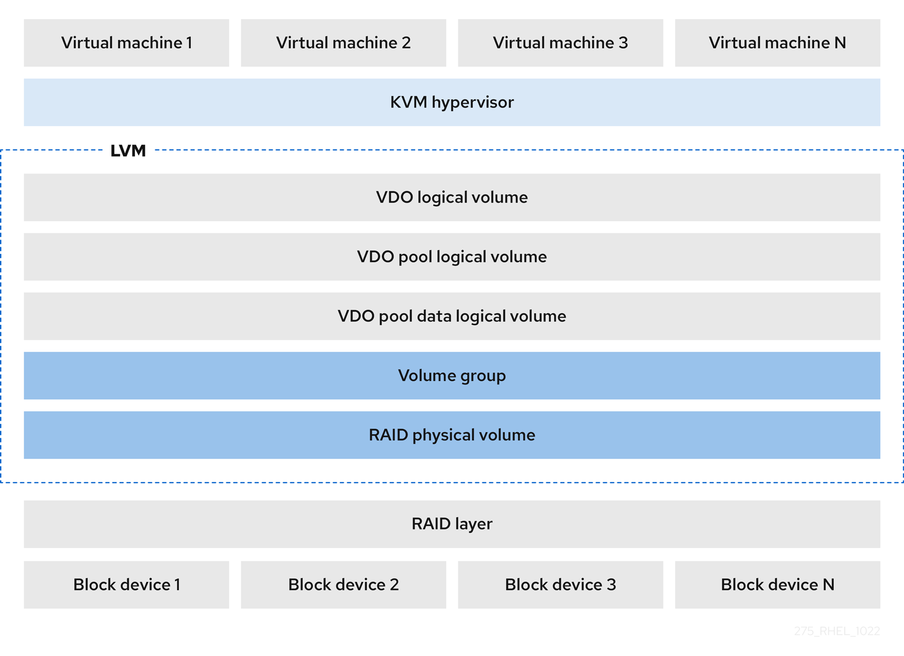
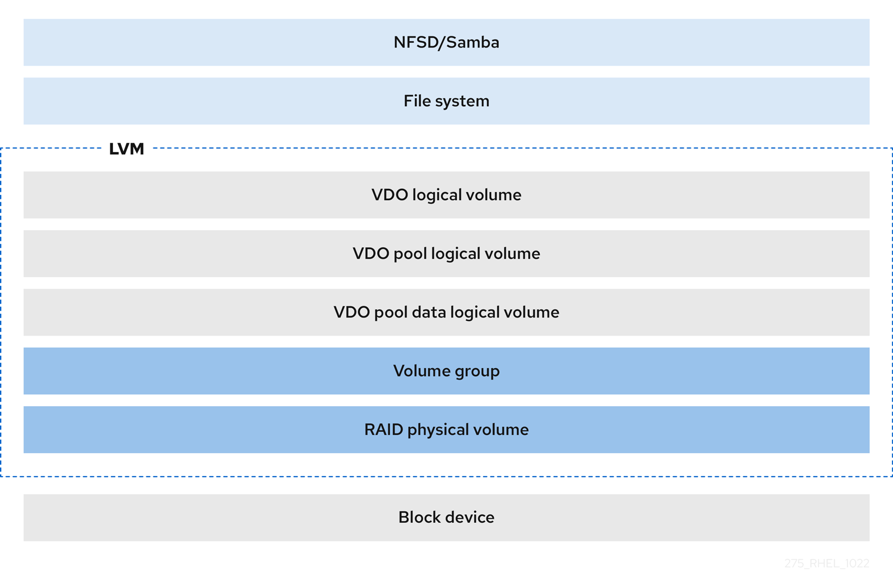
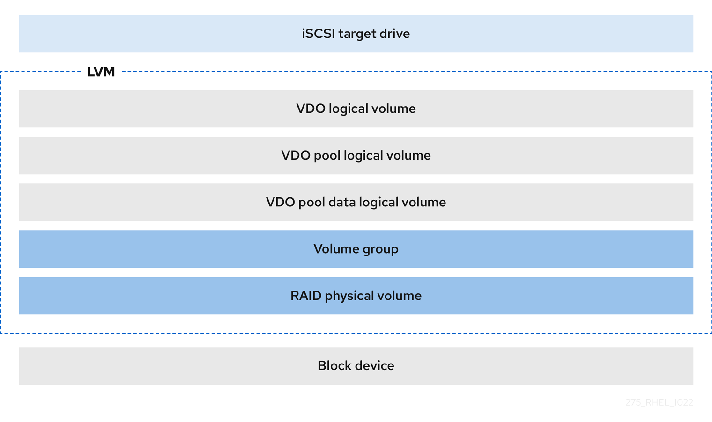
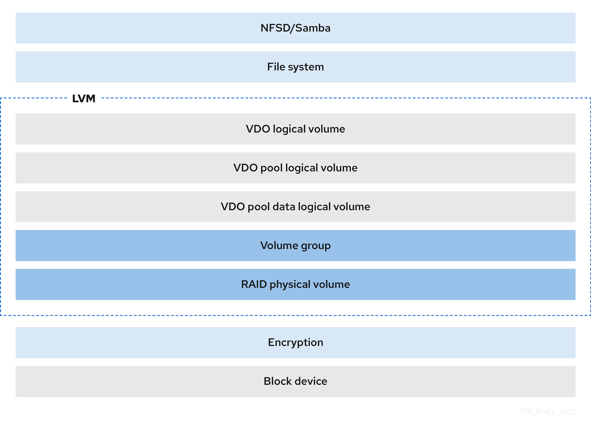

# Deduplicating and compressing logical volumes on RHEL

* * *

Red Hat Enterprise Linux 10

## Deploying VDO on LVM to increase the storage capacity

Red Hat Customer Content Services

[Legal Notice](#idm140398913685296)

**Abstract**

Use the Virtual Data Optimizer (VDO) feature in Logical Volume Manager (LVM) to manage deduplicated and compressed logical volumes. You can manage VDO as a type of LVM's Logical Volume (LV), similar to LVM thin-provisioned volumes.

You can deploy VDO on LVM (LVM-VDO) to provide deduplicated storage for block access, file access, local storage, and remote storage. You can also configure a thin-provisioned VDO volume to avoid the physical space of the VDO volume being 100% used.

* * *

<h2 id="providing-feedback-on-red-hat-documentation">Providing feedback on Red Hat documentation</h2>

We appreciate your feedback on our documentation. Let us know how we can improve it.

**Submitting feedback through Jira (account required)**

1. Log in to the [Jira](https://issues.redhat.com/projects/RHELDOCS/issues) website.
2. Click **Create** in the top navigation bar
3. Enter a descriptive title in the **Summary** field.
4. Enter your suggestion for improvement in the **Description** field. Include links to the relevant parts of the documentation.
5. Click **Create** at the bottom of the dialogue.

<h2 id="introduction-to-vdo-on-lvm">Chapter 1. Introduction to VDO on LVM</h2>

The Virtual Data Optimizer (VDO) feature provides inline block-level deduplication, compression, and thin provisioning for storage. You can manage VDO as a type of Logical Volume Manager (LVM) Logical Volumes (LVs), similar to LVM thin-provisioned volumes.

VDO volumes on LVM (LVM-VDO) contain the following components:

VDO pool LV

- This is the backing physical device that stores, deduplicates, and compresses data for the VDO LV. The VDO pool LV sets the physical size of the VDO volume, which is the amount of data that VDO can store on the disk.
- Currently, each VDO pool LV can hold only one VDO LV. As a result, VDO deduplicates and compresses each VDO LV separately. Duplicate data that is stored on separate LVs do not benefit from data optimization of the same VDO volume.

VDO LV

- This is the virtual, provisioned device on top of the VDO pool LV. The VDO LV sets the provisioned, logical size of the VDO volume, which is the amount of data that applications can write to the volume before deduplication and compression occurs.

`dm-vdo`

- The `dm-vdo` module is a Linux Device Mapper target that provides a deduplicated, compressed, and thin-provisioned block storage volume.
- The `dm-vdo` module exposes a block device that the VDO pool LV uses to create a VDO LV. The VDO LV is then used by the system.
- When `dm-vdo` receives a request to read a logical block of data from a VDO volume, it maps the requested logical block to the underlying physical block and then reads and returns the requested data.
- When `dm-vdo` receives a request to write a block of data to a VDO volume, it first checks whether the request is a DISCARD or TRIM request or whether the data is uniformly zero. If either of these conditions is met, `dm-vdo` updates its block map and acknowledges the request. Otherwise, VDO processes and optimizes the data.
- The `dm-vdo` module utilizes the Universal Deduplication Service (UDS) index on the volume internally and analyzes data, as it is received for duplicates. For each new piece of data, UDS determines if that piece is identical to any previously stored piece of data. If the index finds a match, the storage system can then verify the accuracy of that match and then update internal references to avoid storing the same information more than once.

If you are already familiar with the structure of an LVM thin-provisioned implementation, see the following table to understand how the different aspects of VDO are presented to the system.

|                       | Physical device | Provisioned device |
|:----------------------|:----------------|:-------------------|
| VDO on LVM            | VDO pool LV     | VDO LV             |
| LVM thin provisioning | Thin pool       | Thin volume        |

Table 1.1. A comparison of components in VDO on LVM and LVM thin provisioning

Since the VDO is thin-provisioned, the file system and applications only see the logical space in use and not the actual available physical space. Use scripting to monitor the available physical space and generate an alert if use exceeds a threshold.

<h2 id="lvm-vdo-requirements">Chapter 2. LVM-VDO requirements</h2>

VDO on LVM has certain requirements on its placement and your system resources.

<h3 id="vdo-memory-requirements">2.1. VDO memory requirements</h3>

This section describes the RAM requirements for VDO volumes, including memory allocation for the VDO module and Universal Deduplication Service (UDS), to optimize storage efficiency and performance.

Each VDO volume has two distinct memory requirements:

The VDO module

VDO requires a fixed 38 MB of RAM and several variable amounts:

- 1.15 MB of RAM for each 1 MB of configured block map cache size. The block map cache requires a minimum of 150 MB of RAM.
- 1.6 MB of RAM for each 1 TB of logical space.
- 268 MB of RAM for each 1 TB of physical storage managed by the volume.

The UDS index

The Universal Deduplication Service (UDS) requires a minimum of 250 MB of RAM, which is also the default amount that deduplication uses. You can configure the value when formatting a VDO volume, because the value also affects the amount of storage that the index needs.

The memory required for the UDS index is determined by the index type and the required size of the deduplication window. The deduplication window is the amount of previously written data that VDO can check for matching blocks.

| Index type | Deduplication window  |
|------------|-----------------------|
| Dense      | 1 TB per 1 GB of RAM  |
| Sparse     | 10 TB per 1 GB of RAM |

Note

The minimal disk usage for a VDO volume using default settings of 2 GB slab size and 0.25 dense index, requires approx 4.7 GB. This provides slightly less than 2 GB of physical data to write at 0% deduplication or compression.

Here, the minimal disk usage is the sum of the default slab size and dense index.

**Additional resources**

- [Examples of VDO requirements by physical size](#examples-of-vdo-requirements-by-physical-size "2.4. Examples of VDO requirements by physical size")

<h3 id="differences-between-the-sparse-and-dense-index">2.2. Differences between the sparse and dense index</h3>

UDS sparse and dense index types differ in memory usage, deduplication window coverage, and physical space requirements, affecting optimal workload selection strategies.

The UDS Sparse Indexing feature relies on the temporal locality of data and attempts to retain only the most relevant index entries in memory. With the sparse index, UDS can maintain a deduplication window that is ten times larger than with the dense index while using the same amount of memory. The sparse index requires ten times more physical space for metadata.

Although the sparse index provides the greatest coverage, the dense index provides more deduplication advice. For most workloads, given the same amount of memory, the difference in deduplication rates between dense and sparse indexes is negligible.

<h3 id="vdo-storage-space-requirements">2.3. VDO storage space requirements</h3>

You can configure a VDO volume to use up to 256 TB of physical storage. Only a certain part of the physical storage is usable to store data.

VDO requires storage for two types of VDO metadata and for the UDS index. Use the following calculations to determine the usable size of a VDO-managed volume:

- The first type of VDO metadata uses approximately 1 MB for each 4 GB of *physical storage* plus an additional 1 MB per slab.
- The second type of VDO metadata consumes approximately 1.25 MB for each 1 GB of *logical storage*, rounded up to the nearest slab.
- The amount of storage required for the UDS index depends on the type of index and the amount of RAM allocated to the index. For each 1 GB of RAM, a dense UDS index uses 17 GB of storage, and a sparse UDS index will use 170 GB of storage.

**Additional resources**

- [Examples of VDO requirements by physical size](#examples-of-vdo-requirements-by-physical-size "2.4. Examples of VDO requirements by physical size")
- [Slab size in VDO](#slab-size-in-vdo "3.2. Slab size in VDO")

<h3 id="examples-of-vdo-requirements-by-physical-size">2.4. Examples of VDO requirements by physical size</h3>

VDO system requirements vary by physical volume size and deployment type, with specific RAM and disk usage examples for primary storage and backup storage scenarios.

The following tables provide approximate system requirements of VDO based on the physical size of the underlying volume. Each table lists requirements appropriate to the intended deployment, such as primary storage or backup storage.

The exact numbers depend on your configuration of the VDO volume.

Primary storage deployment

In the primary storage case, the UDS index is between 0.01% to 25% the size of the physical size.

| Physical size | RAM usage: UDS | RAM usage: VDO | Disk usage | Index type |
|---------------|----------------|----------------|------------|------------|
| 1 TB          | 250 MB         | 472 MB         | 2.5 GB     | Dense      |
| 10 TB         | 1 GB           | 3 GB           | 10 GB      | Dense      |
|               | 250 MB         |                | 22 GB      | Sparse     |
| 50 TB         | 1 GB           | 14 GB          | 85 GB      | Sparse     |
| 100 TB        | 3 GB           | 27 GB          | 255 GB     | Sparse     |
| 256 TB        | 5 GB           | 69 GB          | 425 GB     | Sparse     |

Table 2.1. Examples of storage and memory configurations for primary storage

Backup storage deployment

In the backup storage case, the deduplication window must be larger than the backup set. If you expect the backup set or the physical size to grow in the future, factor this into the index size.

| Deduplication window | RAM usage: VDO | Disk usage | Index type |
|----------------------|----------------|------------|------------|
| 1 TB                 | 250 MB         | 2.5 GB     | Dense      |
| 10 TB                | 2 GB           | 21 GB      | Dense      |
| 50 TB                | 2 GB           | 170 GB     | Sparse     |
| 100 TB               | 4 GB           | 340 GB     | Sparse     |
| 256 TB               | 8 GB           | 700 GB     | Sparse     |

Table 2.2. Examples of storage and memory configurations for backup storage

<h3 id="placement-of-lvm-vdo-in-the-storage-stack">2.5. Placement of LVM-VDO in the storage stack</h3>

You must place certain storage layers under a VDO logical volume and others on top of it.

You can place thick-provisioned layers on top of VDO, but you cannot rely on the guarantees of thick provisioning in that case. Since the VDO layer is thin-provisioned, the effects of thin provisioning apply to all layers. If you do not monitor the VDO volume, you might run out of physical space on thick-provisioned volumes on top of VDO.

Since the supported placement of the following layers is under VDO, do not place them on top of VDO:

- DM Multipath
- DM Crypt
- Software RAID (LVM or MD RAID)

The following configurations are not supported:

- VDO on top of a loopback device
- Encrypted volumes on top of VDO
- Partitions on a VDO volume
- RAID, such as LVM RAID, MD RAID, or any other type, on top of a VDO volume
- Deploying Ceph Storage on LVM-VDO

**Additional resources**

- [Stacking LVM volumes (Red Hat Knowledgebase)](https://access.redhat.com/articles/2106521#vdo)

<h3 id="lvm-vdo-deployment-scenarios">2.6. LVM-VDO deployment scenarios</h3>

LVM-VDO can be deployed in various scenarios including KVM, file systems, iSCSI targets, and encryption configurations to provide deduplicated storage solutions.

You can deploy VDO on LVM (LVM-VDO) in a variety of ways to provide deduplicated storage for:

- block access
- file access
- local storage
- remote storage

Because LVM-VDO exposes its deduplicated storage as a regular logical volume (LV), you can use it with standard file systems, iSCSI and FC target drivers, or as unified storage.

KVM

You can deploy LVM-VDO on a KVM server configured with Direct Attached Storage.

**Figure 2.1. LVM-VDO deployment with KVM**

 

File systems

You can create file systems on top of a VDO LV and expose them to NFS or CIFS users with the NFS server or Samba.

**Figure 2.2. LVM-VDO deployment with NAS**

 

iSCSI target

You can export the entirety of the VDO LV as an iSCSI target to remote iSCSI initiators.

**Figure 2.3. LVM-VDO deployment with block storage target**

 

Encryption

Device Mapper (DM) mechanisms such as DM Crypt are compatible with VDO. Encrypting VDO LV volumes helps ensure data security, and any file systems above the VDO LV are still deduplicated.

Important

Applying the encryption layer above the VDO LV results in little if any data deduplication. Encryption makes duplicate blocks different before VDO can deduplicate them.

Always place the encryption layer below the VDO LV.

**Figure 2.4. LVM-VDO deployment with encryption**

 

<h2 id="creating-a-deduplicated-and-compressed-logical-volume">Chapter 3. Creating a deduplicated and compressed logical volume</h2>

You can create an LVM logical volume that uses the VDO feature to deduplicate and compress data.

<h3 id="the-physical-and-logical-size-of-an-lvm-vdo-volume">3.1. The physical and logical size of an LVM-VDO volume</h3>

VDO calculates physical, available physical, and logical sizes for LVM-VDO volumes, emphasizing size relationships, storage efficiency, provisioning best practices, and capacity limits.

VDO uses different definitions of size:

Physical size

This is the same size as the physical extents allocated to the VDO pool LV. VDO uses this storage for:

- User data, which might be deduplicated and compressed
- VDO metadata, such as the UDS index

Available physical size

This is the portion of the physical size that VDO is able to use for user data.

It is equivalent to the physical size minus the size of the metadata, rounded down to a multiple of the slab size.

Logical Size

This is the provisioned size that the VDO LV presents to applications. It is usually larger than the available physical size. VDO currently supports any logical size up to 254 times the size of the physical volume with an absolute maximum logical size of 4 PB.

When you set up a VDO logical volume (LV), you specify the amount of logical storage that the VDO LV presents. When hosting active virtual machines (VMs) or containers, use provisioning storage at a 10:1 logical to physical ratio. For example, if you are utilizing 1 TB of physical storage, you would present it as 10 TB of logical storage.

If you do not specify the `--virtualsize` option, VDO provisions the volume to a `1:1` ratio. For example, if you put a VDO LV on top of a 20 GB VDO pool LV, VDO reserves 2.5 GB for the UDS index, if the default index size is used. The remaining 17.5 GB is provided for the VDO metadata and user data. As a result, the available storage to consume is not more than 17.5 GB, and can be less due to metadata that makes up the actual VDO volume.

**Additional resources**

- [Examples of VDO requirements by physical size](#examples-of-vdo-requirements-by-physical-size "2.4. Examples of VDO requirements by physical size")

<h3 id="slab-size-in-vdo">3.2. Slab size in VDO</h3>

The physical storage of the VDO volume is divided into several slabs. Each slab is a contiguous region of the physical space. All of the slabs for a given volume have the same size, which can be any power of 2 multiple of 128 MB up to 32 GB.

The default slab size is 2 GB to facilitate evaluating VDO on smaller test systems. A single VDO volume can have up to 8192 slabs. Therefore, in the default configuration with 2 GB slabs, the maximum allowed physical storage is 16 TB. When using 32 GB slabs, the maximum allowed physical storage is 256 TB.

Slab size has no effect on the performance of the VDO volume.

| Physical volume size | Recommended slab size |
|:---------------------|:----------------------|
| 10-99 GB             | 1 GB                  |
| 100 GB - 1 TB        | 2 GB                  |
| 2-256 TB             | 32 GB                 |

Table 3.1. Recommended VDO slab sizes by physical volume size

The minimal disk usage for a VDO volume with default settings of 2 GB slab size and 0.25 dense index requires approx 4.7 GB. This provides slightly less than 2 GB of physical data to write at 0% deduplication or compression.

Here, the minimal disk usage is the sum of the default slab size and dense index.

You can control the slab size by providing the `--vdosettings 'vdo_slab_size_mb=<size_in_megabytes>'` option to the `lvcreate` command.

<h3 id="installing-vdo">3.3. Installing VDO</h3>

You can install the VDO software necessary to create, mount, and manage VDO volumes.

**Procedure**

- Install the VDO software:
  
  ```
  dnf install lvm2 vdo
  ```
  
  ```plaintext
  # dnf install lvm2 vdo
  ```

<h3 id="creating-and-mounting-an-lvm-vdo-volume">3.4. Creating and mounting an LVM-VDO volume</h3>

You can create a VDO logical volume (LV) on a VDO pool LV by using the `lvcreate` command.

Choose a name for your LVM-VDO, such as `vdo1`. You must use a different name and device for each LVM-VDO on the system.

**Prerequisites**

- Install the VDO software. For more information, see [Installing VDO](#installing-vdo "3.3. Installing VDO").
- An LVM volume group with free storage capacity exists on your system.

**Procedure**

1. Create the LVM-VDO:
   
   ```
   lvcreate --type vdo \
              --name vdo1 \
              --size 1T \
              --virtualsize 10T \
              <vg_name>
   ```
   
   ```plaintext
   # lvcreate --type vdo \
              --name vdo1 \
              --size 1T \
              --virtualsize 10T \
              <vg_name>
   ```
   
   Replace `1T` with the physical size. If the physical size is larger than 16 TiB, add the following option to increase the slab size on the volume to 32 GiB:
   
   ```
   --vdosettings 'vdo_slab_size_mb=32768'
   ```
   
   ```plaintext
   --vdosettings 'vdo_slab_size_mb=32768'
   ```
   
   If you use the default slab size of 2 GiB on a physical size larger than 16 TiB, the `lvcreate` command fails with the following error:
   
   ```
   ERROR - vdoformat: formatVDO failed on '/dev/<device>': VDO Status: Exceeds maximum number of slabs supported
   ```
   
   ```plaintext
   ERROR - vdoformat: formatVDO failed on '/dev/<device>': VDO Status: Exceeds maximum number of slabs supported
   ```
   
   Replace `10T` with the logical storage that the LVM-VDO will present.
   
   Replace `<vg_name>` with the name of an existing LVM volume group where you want to place the LVM-VDO.
   
   Important
   
   If creating the LVM-VDO volume fails, use `lvremove <vg_name>` to remove the volume. Depending on the reason of the failure, you might also need to add two force options (`-ff`).
2. Create a file system on the LVM-VDO:
   
   - For the XFS file system:
     
     ```
     mkfs.xfs -K /dev/<vg_name>/<vdo_name>
     ```
     
     ```plaintext
     # mkfs.xfs -K /dev/<vg_name>/<vdo_name>
     ```
   - For the ext4 file system:
     
     ```
     mkfs.ext4 -E nodiscard /dev/<vg_name>/<vdo_name>
     ```
     
     ```plaintext
     # mkfs.ext4 -E nodiscard /dev/<vg_name>/<vdo_name>
     ```
3. Mount the file system on the LVM-VDO volume:
   
   - To mount the file system persistently, add the following line to the `/etc/fstab` file:
     
     ```
     /dev/<vg_name>/<vdo_name> <mount_point> <file_system_type> defaults 0 0
     ```
     
     ```plaintext
     /dev/<vg_name>/<vdo_name> <mount_point> <file_system_type> defaults 0 0
     ```
     
     Replace `<file_system_type>` with your file system, such as `xfs` or `ext4`.
   - To mount the file system manually, use the `mount` command:
     
     ```
     mount /dev/<vg_name>/<vdo_name> <mount_point>
     ```
     
     ```plaintext
     # mount /dev/<vg_name>/<vdo_name> <mount_point>
     ```
     
     If the LVM-VDO volume is located on a block device that requires network, such as iSCSI, add the `_netdev` mount option. For iSCSI and other block devices requiring network, see the `systemd.mount(5)` man page for information about the `_netdev` mount option.

**Verification**

- Verify that an LVM-VDO volume is created:
  
  ```
  lvs
  ```
  
  ```plaintext
  # lvs
  ```

<h3 id="configuring-an-lvm-vdo-volume-by-using-the-storage-rhel-system-role">3.5. Configuring an LVM-VDO volume by using the storage RHEL system role</h3>

You can use the `storage` RHEL system role to create a VDO volume on LVM (LVM-VDO) with enabled compression and deduplication.

Note

Because of the `storage` system role use of LVM-VDO, only one volume can be created per pool.

**Prerequisites**

- [You have prepared the control node and the managed nodes](https://docs.redhat.com/en/documentation/red_hat_enterprise_linux/10/html/automating_system_administration_by_using_rhel_system_roles/preparing-a-control-node-and-managed-nodes-to-use-rhel-system-roles).
- You are logged in to the control node as a user who can run playbooks on the managed nodes.
- The account you use to connect to the managed nodes has `sudo` permissions for these nodes.

**Procedure**

1. Create a playbook file, for example, `~/playbook.yml`, with the following content:
   
   ```
   ---
   - name: Manage local storage
     hosts: managed-node-01.example.com
     tasks:
       - name: Create LVM-VDO volume under volume group 'myvg'
         ansible.builtin.include_role:
           name: redhat.rhel_system_roles.storage
         vars:
           storage_pools:
             - name: myvg
               disks:
                 - /dev/sdb
               volumes:
                 - name: mylv1
                   compression: true
                   deduplication: true
                   vdo_pool_size: 10 GiB
                   size: 30 GiB
                   mount_point: /mnt/app/shared
   ```
   
   ```yaml
   ---
   - name: Manage local storage
     hosts: managed-node-01.example.com
     tasks:
       - name: Create LVM-VDO volume under volume group 'myvg'
         ansible.builtin.include_role:
           name: redhat.rhel_system_roles.storage
         vars:
           storage_pools:
             - name: myvg
               disks:
                 - /dev/sdb
               volumes:
                 - name: mylv1
                   compression: true
                   deduplication: true
                   vdo_pool_size: 10 GiB
                   size: 30 GiB
                   mount_point: /mnt/app/shared
   ```
   
   The settings specified in the example playbook include the following:
   
   `vdo_pool_size: <size>`
   
   The actual size that the volume takes on the device. You can specify the size in human-readable format, such as 10 GiB. If you do not specify a unit, it defaults to bytes.
   
   `size: <size>`
   
   The virtual size of VDO volume.
   
   For details about all variables used in the playbook, see the `/usr/share/ansible/roles/rhel-system-roles.storage/README.md` file on the control node.
2. Validate the playbook syntax:
   
   ```
   ansible-playbook --syntax-check ~/playbook.yml
   ```
   
   ```plaintext
   $ ansible-playbook --syntax-check ~/playbook.yml
   ```
   
   Note that this command only validates the syntax and does not protect against a wrong but valid configuration.
3. Run the playbook:
   
   ```
   ansible-playbook ~/playbook.yml
   ```
   
   ```plaintext
   $ ansible-playbook ~/playbook.yml
   ```

**Verification**

- View the current status of compression and deduplication:
  
  ```
  ansible managed-node-01.example.com -m command -a 'lvs -o+vdo_compression,vdo_compression_state,vdo_deduplication,vdo_index_state'
  ```
  
  ```plaintext
  $ ansible managed-node-01.example.com -m command -a 'lvs -o+vdo_compression,vdo_compression_state,vdo_deduplication,vdo_index_state'
  ```
  
  ```
    LV       VG      Attr       LSize   Pool   Origin Data%  Meta%  Move Log Cpy%Sync Convert VDOCompression VDOCompressionState VDODeduplication VDOIndexState
    mylv1   myvg   vwi-a-v---   3.00t vpool0                                                         enabled              online          enabled        online
  ```
  
  ```plaintext
    LV       VG      Attr       LSize   Pool   Origin Data%  Meta%  Move Log Cpy%Sync Convert VDOCompression VDOCompressionState VDODeduplication VDOIndexState
    mylv1   myvg   vwi-a-v---   3.00t vpool0                                                         enabled              online          enabled        online
  ```

<h3 id="creating-lvm-vdo-volumes-in-the-web-console">3.6. Creating LVM-VDO volumes in the web console</h3>

Create an LVM-VDO volume in the RHEL web console.

**Prerequisites**

- You have installed the RHEL 10 web console.
  
  For instructions, see [Installing and enabling the web console](https://docs.redhat.com/en/documentation/red_hat_enterprise_linux/10/html/managing_systems_in_the_rhel_web_console/getting-started-with-the-rhel-web-console#installing-and-enabling-the-web-console).
- You have installed the `cockpit-storaged` package on your system.
- You have created an LVM2 group from which you want to create an LVM-VDO volume.

**Procedure**

1. Log in to the RHEL 10 web console.
2. In the panel, click **Storage**.
3. Click the menu button \[⋮] for the LVM2 group in which you want to create an LVM-VDO volume and click **Create new logical volume**.
4. In the **Name** field, enter a name for your LVM-VDO volume without spaces.
5. From the **Purpose** drop-down list, select **VDO filesystem volume**.
6. In the **Size** slider, set up the physical size of your LVM-VDO volume.
7. In the **Logical size** slider, set up the size of the LVM-VDO volume. You can extend it more than ten times, but consider for what purpose you are creating the LVM-VDO volume:
   
   - For active VMs or container storage, use a logical size that is ten times the physical size of the volume.
   - For object storage, use a logical size that is three times the physical size of the volume.
8. In the **Options** list, select **Compression** and **Deduplication**.
9. Click Create.

**Verification**

- Check that you can see the new LVM-VDO volume in the **Storage** section.

<h3 id="formatting-lvm-vdo-volumes-in-the-web-console">3.7. Formatting LVM-VDO volumes in the web console</h3>

LVM-VDO volumes act as physical drives. To use them, you must format them with a file system.

Warning

Formatting erases all data on the volume. Creating a file system might take a long time.

**Prerequisites**

- You have installed the RHEL 10 web console.
  
  For instructions, see [Installing and enabling the web console](https://docs.redhat.com/en/documentation/red_hat_enterprise_linux/10/html/managing_systems_in_the_rhel_web_console/getting-started-with-the-rhel-web-console#installing-and-enabling-the-web-console).
- You have installed the `cockpit-storaged` package on your system.
- You have created an LVM-VDO volume.

**Procedure**

01. Log in to the RHEL 10 web console.
02. In the panel, click **Storage**.
03. Click the LVM2 volume group that has the LVM-VDO volume you want to format and click the menu button \[⋮] for the LVM-VDO volume.
04. In the drop-down menu, click **Format**.
05. In the **Name** field, enter the logical volume name.
06. In the **Mount Point** field, enter the mount path.
07. From the **Type** drop-down list, select a file system.
08. Optional: Select **Overwrite existing data with zeros**, if the disk includes any sensitive data and you want to rewrite them. Otherwise the web console rewrites only the disk header.
09. From the **Encryption** drop-down list, select the type of encryption.
10. From the **At boot** drop-down list, select when you want to mount the volume.
11. In the **Mount options** list, choose the appropriate settings:
    
    1. Select the **Mount read only** checkbox if you want to mount the volume as a read-only logical volume.
    2. Select the **Custom mount options** checkbox and add the mount options if you want to change the default mount option.
12. Format the LVM-VDO volume:
    
    1. If you want to format and mount the LVM-VDO volume, click Format and mount.
    2. If you want to only format the partition, click Format only.

**Verification**

- Verify the details of the formatted LVM-VDO volume on the **Storage** tab and in the LVM2 volume group tab.

<h3 id="extending-lvm-vdo-volumes-in-the-web-console">3.8. Extending LVM-VDO volumes in the web console</h3>

Extend LVM-VDO volumes in the RHEL 10 web console.

**Prerequisites**

- You have installed the RHEL 10 web console.
  
  For instructions, see [Installing and enabling the web console](https://docs.redhat.com/en/documentation/red_hat_enterprise_linux/10/html/managing_systems_in_the_rhel_web_console/getting-started-with-the-rhel-web-console#installing-and-enabling-the-web-console).
- You have installed the `cockpit-storaged` package on your system.
- You have created an LVM-VDO volume.

**Procedure**

1. Log in to the RHEL 10 web console.
2. In the panel, click **Storage**.
3. Click your LVM-VDO volume in the **VDO Devices** box.
4. In the LVM-VDO volume details, click Grow.
5. In the **Grow logical size of VDO** dialog box, extend the logical size of the LVM-VDO volume.
6. Click **Grow**.

**Verification**

- Check the LVM-VDO volume details for the new size to verify that your changes have been successful.

<h3 id="changing-the-compression-settings-on-an-lvm-vdo-volume">3.9. Changing the compression settings on an LVM-VDO volume</h3>

By default, the compression of a VDO pool logical volume (LV) is enabled. To save CPU usage, you can disable it. Enable or disable compression by using the `lvchange` command.

**Prerequisites**

- An LVM-VDO volume exists on your system.

**Procedure**

1. Check the compression status for your logical volumes:
   
   ```
   lvs -o+vdo_compression,vdo_compression_state
   ```
   
   ```plaintext
   # lvs -o+vdo_compression,vdo_compression_state
   ```
   
   ```
     LV         VG        Attr         LSize   Pool   Origin Data%  Meta%  Move Log Cpy%Sync Convert VDOCompression VDOCompressionState
     <vdo_name> <vg_name> vwi-a-v---   1.00t vpool0          0.00                                           enabled online
     vpool0     <vg_name> dwi------- <15.00g                 20.03                                          enabled online
   ```
   
   ```plaintext
     LV         VG        Attr         LSize   Pool   Origin Data%  Meta%  Move Log Cpy%Sync Convert VDOCompression VDOCompressionState
     <vdo_name> <vg_name> vwi-a-v---   1.00t vpool0          0.00                                           enabled online
     vpool0     <vg_name> dwi------- <15.00g                 20.03                                          enabled online
   ```
2. Disable the compression for VDOPoolLV:
   
   ```
   lvchange --compression n <vg_name>/<vdo_pool_name>
   ```
   
   ```plaintext
   # lvchange --compression n <vg_name>/<vdo_pool_name>
   ```
   
   If you want to enable the compression, use the `y` option instead of `n`.

**Verification**

- View the current status of compression:
  
  ```
  lvs -o+vdo_compression,vdo_compression_state
  ```
  
  ```plaintext
  # lvs -o+vdo_compression,vdo_compression_state
  ```
  
  ```
    LV         VG        Attr         LSize   Pool   Origin Data%  Meta%  Move Log Cpy%Sync Convert VDOCompression VDOCompressionState
    <vdo_name> <vg_name> vwi-a-v---   1.00t vpool0          0.00                                                     offline
    vpool0     <vg_name> dwi------- <15.00g                 20.03                                                    offline
  ```
  
  ```plaintext
    LV         VG        Attr         LSize   Pool   Origin Data%  Meta%  Move Log Cpy%Sync Convert VDOCompression VDOCompressionState
    <vdo_name> <vg_name> vwi-a-v---   1.00t vpool0          0.00                                                     offline
    vpool0     <vg_name> dwi------- <15.00g                 20.03                                                    offline
  ```

<h3 id="changing-the-deduplication-settings-on-an-lvm-vdo-volume">3.10. Changing the deduplication settings on an LVM-VDO volume</h3>

By default, the deduplication of a VDO pool logical volume (LV) is enabled. To save memory, you can disable deduplication. Enable or disable deduplication by using the `lvchange` command.

Note

Because of the way that VDO handles ongoing parallel I/O operations, a VDO volume continues to identify duplicate data within those operations. For example, if a VM clone operation is in progress and a VDO volume has many duplicate blocks in close proximity, then the volume can still achieve some amount of space savings by using deduplication. The index state of the volume does not affect the process.

**Prerequisites**

- An LVM-VDO volume exists on your system.

**Procedure**

1. Check the deduplication status for your logical volumes:
   
   ```
   lvs -o+vdo_deduplication,vdo_index_state
   ```
   
   ```plaintext
   # lvs -o+vdo_deduplication,vdo_index_state
   ```
   
   ```
     LV         VG        Attr         LSize   Pool   Origin Data%  Meta%  Move Log Cpy%Sync Convert VDODeduplication VDOIndexState
     <vdo_name> <vg_name> vwi-a-v---   1.00t vpool0          0.00                                             enabled  online
     vpool0     <vg_name> dwi------- <15.00g                 20.03                                            enabled  online
   ```
   
   ```plaintext
     LV         VG        Attr         LSize   Pool   Origin Data%  Meta%  Move Log Cpy%Sync Convert VDODeduplication VDOIndexState
     <vdo_name> <vg_name> vwi-a-v---   1.00t vpool0          0.00                                             enabled  online
     vpool0     <vg_name> dwi------- <15.00g                 20.03                                            enabled  online
   ```
2. Disable the deduplication for VDOPoolLV:
   
   ```
   lvchange --deduplication n <vg_name>/<vdo_pool_name>
   ```
   
   ```plaintext
   # lvchange --deduplication n <vg_name>/<vdo_pool_name>
   ```
   
   If you want to enable the deduplication, use the `y` option instead of `n`.

**Verification**

- View the current status of deduplication:
  
  ```
  lvs -o+vdo_deduplication,vdo_index_state
  ```
  
  ```plaintext
  # lvs -o+vdo_deduplication,vdo_index_state
  ```
  
  ```
    LV         VG        Attr         LSize   Pool   Origin Data%  Meta%  Move Log Cpy%Sync Convert VDODeduplication VDOIndexState
    <vdo_name> <vg_name> vwi-a-v---   1.00t vpool0          0.00                                                       closed
    vpool0     <vg_name> dwi------- <15.00g                 20.03                                                      closed
  ```
  
  ```plaintext
    LV         VG        Attr         LSize   Pool   Origin Data%  Meta%  Move Log Cpy%Sync Convert VDODeduplication VDOIndexState
    <vdo_name> <vg_name> vwi-a-v---   1.00t vpool0          0.00                                                       closed
    vpool0     <vg_name> dwi------- <15.00g                 20.03                                                      closed
  ```

<h3 id="managing-thin-provisioned-lvm-vdo-volumes">3.11. Managing thin-provisioned LVM-VDO volumes</h3>

It is possible to configure a thin-provisioned LVM-VDO volume to prepare for future expansion of the physical space, to address a condition where the physical space usage of the LVM-VDO volume is approaching 100%. Instead of using `-l 100%FREE` in the `lvcreate` operation, for example, use `95%FREE` to ensure that there is some reserved space for recovery later on if needed. You can use the same method to resolve the following issues:

- The volume runs out of space.
- The file system enters read-only mode.
- ENOSPC reported by the volume.

Note

The best way to address high physical space usage on an LVM-VDO volume is to delete unused files, and discard the blocks used by these unused files either by using online discard or the `fstrim` program. The physical space of an LVM-VDO volume can only be grown to 8192 slabs that is 16 TB for an LVM-VDO volume with the default slab size of 2 GB, or 256 TB for an LVM-VDO volume with the maximal slab size of 32 GB.

In all of the following steps, replace `myvg` and `myvdo` with the volume group and LVM-VDO name respectively.

**Prerequisites**

1. Install the VDO software. For more information, see [Installing VDO](#installing-vdo "3.3. Installing VDO").
2. An LVM volume group with free storage capacity exists on your system.
3. A thin-provisioned LVM-VDO volume using the `lvcreate --type vdo --name myvdo myvg -l <percentage_of_free_space_in_vg> --virtualsize <virtual_size_of_vdo>` command. For more information, see [Creating and mounting an LVM-VDO volume](#creating-and-mounting-an-lvm-vdo-volume "3.4. Creating and mounting an LVM-VDO volume").

**Procedure**

1. Determine the optimal logical size for a thin-provisioned LVM-VDO volume:
   
   ```
   vdostats myvg-vpool0-vpool
   ```
   
   ```plaintext
   # vdostats myvg-vpool0-vpool
   ```
   
   ```
   Device              1K-blocks  Used     Available  Use% Space saving%
   myvg-vpool0-vpool   104856576  29664088 75192488   28%   69%
   ```
   
   ```plaintext
   Device              1K-blocks  Used     Available  Use% Space saving%
   myvg-vpool0-vpool   104856576  29664088 75192488   28%   69%
   ```
   
   To calculate the space savings ratio, use the following formula:
   
   ```
   Savings ratio = 1 / (1 - Space saving%)
   ```
   
   ```plaintext
   Savings ratio = 1 / (1 - Space saving%)
   ```
   
   In this example,
   
   - there is approximately a `3.22:1` space savings ratio on a data set of about 80 GB.
   - Multiplying the data set size by the ratio would yield a potential logical size of 256 GB if more data with the same space savings were written to the LVM-VDO volume.
   - Adjusting this number downward to 200 GB yields a logical size with a safe margin of free physical space, given the same space savings ratio.
2. Monitor the free physical space in an LVM-VDO volume:
   
   ```
   vdostats myvg-vpool0-vpool
   ```
   
   ```plaintext
   # vdostats myvg-vpool0-vpool
   ```
   
   This command can be executed periodically to provide monitoring of the used and free physical space of the LVM-VDO volume.
3. Optional: View the warnings on physical space usage on an LVM-VDO volume by using the available `/usr/share/doc/vdo/examples/monitor/monitor_check_vdostats_physicalSpace.pl` script:
   
   ```
   /usr/share/doc/vdo/examples/monitor/monitor_check_vdostats_physicalSpace.pl myvg-vpool0-vpool
   ```
   
   ```plaintext
   # /usr/share/doc/vdo/examples/monitor/monitor_check_vdostats_physicalSpace.pl myvg-vpool0-vpool
   ```
4. When creating an LVM-VDO volume, the `dmeventd` monitoring service monitors the usage of physical space in an LVM-VDO volume. This is enabled by default when an LVM-VDO volume is created or started.
   
   Use the `journalctl` command to view the output of `dmeventd` in the logs while monitoring an LVM-VDO volume:
   
   ```
   lvm[8331]: Monitoring VDO pool myvg-vpool0-vpool.
   ...
   
   lvm[8331]: WARNING: VDO pool myvg-vpool0-vpool is now 84.63% full.
   lvm[8331]: WARNING: VDO pool myvg-vpool0-vpool is now 91.01% full.
   lvm[8331]: WARNING: VDO pool myvg-vpool0-vpool is now 97.34% full.
   ```
   
   ```plaintext
   lvm[8331]: Monitoring VDO pool myvg-vpool0-vpool.
   ...
   
   lvm[8331]: WARNING: VDO pool myvg-vpool0-vpool is now 84.63% full.
   lvm[8331]: WARNING: VDO pool myvg-vpool0-vpool is now 91.01% full.
   lvm[8331]: WARNING: VDO pool myvg-vpool0-vpool is now 97.34% full.
   ```
5. Remediate LVM-VDO volumes that are almost out of available physical space. When it is possible to add a physical space to an LVM-VDO volume, but the volume space is full before it can be grown, it may be necessary to temporarily stop I/O to the volume.
   
   To temporarily stop I/O to the volume, execute the following steps, where LVM-VDO volume `myvdo` contains a file system mounted on the `</users/homeDir>` path:
   
   1. Freeze the file system:
      
      ```
      xfs_freeze -f </users/homeDir>
      ```
      
      ```plaintext
      # xfs_freeze -f </users/homeDir>
      ```
      
      ```
      vgextend myvg /dev/vdc2
      ```
      
      ```plaintext
      # vgextend myvg /dev/vdc2
      ```
      
      ```
      lvextend -L <new_size> myvg/vpool0
      ```
      
      ```plaintext
      # lvextend -L <new_size> myvg/vpool0
      ```
      
      ```
      xfs_freeze -u </users/homeDir>
      ```
      
      ```plaintext
      # xfs_freeze -u </users/homeDir>
      ```
   2. Unmount the file system:
      
      ```
      umount </users/homeDir>
      ```
      
      ```plaintext
      # umount </users/homeDir>
      ```
      
      ```
      vgextend myvg /dev/vdc2
      ```
      
      ```plaintext
      # vgextend myvg /dev/vdc2
      ```
      
      ```
      lvextend -L <new_size> myvg/vpool0
      ```
      
      ```plaintext
      # lvextend -L <new_size> myvg/vpool0
      ```
      
      ```
      mount -o discard /dev/myvg/myvdo </users/homeDir>
      ```
      
      ```plaintext
      # mount -o discard /dev/myvg/myvdo </users/homeDir>
      ```
      
      Note
      
      Unmounting or freezing a file system with cached data will incur a write of the cached data, which might fill the physical space of the LVM-VDO volume. Consider the maximum amount of cached file system data when setting a monitoring threshold for free physical space on an LVM-VDO volume.
6. Blocks that are no longer used by a file system can be cleaned up by using the `fstrim` utility. Executing `fstrim` against a mounted file system on top of a VDO volume can result in increased free physical space for that volume. The `fstrim` utility will send discards to the LVM-VDO volume, which are then used to remove references to the previously used blocks. If any of those blocks are single-referenced, the physical space will be available to use.
   
   1. Check VDO stats to see what the current amount of free space is:
      
      ```
      vdostats --human-readable myvg-vpool0-vpool
      ```
      
      ```plaintext
      # vdostats --human-readable myvg-vpool0-vpool
      ```
      
      ```
      Device             Size   Used  Available Use%  Space saving%
      myvg-vpool0-vpool  100.0G 95.0G 5.0G      95%   73%
      ```
      
      ```plaintext
      Device             Size   Used  Available Use%  Space saving%
      myvg-vpool0-vpool  100.0G 95.0G 5.0G      95%   73%
      ```
   2. Discard unused blocks:
      
      ```
      fstrim </users/homeDir>
      ```
      
      ```plaintext
      # fstrim </users/homeDir>
      ```
   3. View the free physical space of the LVM-VDO volume:
      
      ```
      vdostats --human-readable myvg-vpool0-vpool
      ```
      
      ```plaintext
      # vdostats --human-readable myvg-vpool0-vpool
      ```
      
      ```
      Device             Size     Used   Available Use%  Space saving%
      myvg-vpool0-vpool  100.0G   30.0G  70.0G     30%    43%
      ```
      
      ```plaintext
      Device             Size     Used   Available Use%  Space saving%
      myvg-vpool0-vpool  100.0G   30.0G  70.0G     30%    43%
      ```
      
      In this example, after executing `fstrim` on the file system, the discards were able to return 65 G of physical space to use in the LVM-VDO volume.
      
      Note
      
      Discarding volumes with lower levels of deduplication and compression will have a possibility of reclaiming physical space than discarding volumes with higher levels of deduplication and compression. A volume that has high levels of deduplication and compression can potentially require a more extensive cleanup to reclaim physical space than just simply discarding already unused blocks.

<h2 id="trim-options-on-an-lvm-vdo-volume">Chapter 4. Trim options on an LVM-VDO volume</h2>

LVM-VDO volumes offer two trim options. `discard`, which performs online block discard to automatically free unused blocks (use `mount -o discard` for immediate effect), and `fstrim`, which does periodic discards that require the admin to schedule and monitor the process.

Note

It is currently recommended to use `fstrim` application to discard unused blocks rather than the `discard` mount option because the performance impact of this option can be quite severe. For this reason, `nodiscard` is the default.

<h3 id="enabling-discard-mount-option-on-an-lvm-vdo-volume">4.1. Enabling discard mount option on an LVM-VDO volume</h3>

You can enable the `discard` option on your LVM-VDO volume.

**Prerequisites**

- An LVM-VDO volume exists on your system.

**Procedure**

- Enable the `discard` option on your volume:
  
  ```
  mount -o discard /dev/<vg_name>/<vdo_name> <mount_point>
  ```
  
  ```plaintext
  # mount -o discard /dev/<vg_name>/<vdo_name> <mount_point>
  ```

<h3 id="setting-up-periodic-trim-operation">4.2. Setting up periodic TRIM operation</h3>

You can enable a scheduled TRIM operation on your system.

**Prerequisites**

- An LVM-VDO volume exists on your system.

**Procedure**

- Enable and start the timer:
  
  ```
  systemctl enable --now fstrim.timer
  ```
  
  ```plaintext
  # systemctl enable --now fstrim.timer
  ```

**Verification**

- Verify that the timer is enabled:
  
  ```
  systemctl list-timers fstrim.timer
  ```
  
  ```plaintext
  # systemctl list-timers fstrim.timer
  ```
  
  ```
  NEXT                         LEFT         LAST  PASSED  UNIT         ACTIVATES
  Mon 2021-05-10 00:00:00 EDT  5 days left  n/a   n/a     fstrim.timer fstrim.service
  ```
  
  ```plaintext
  NEXT                         LEFT         LAST  PASSED  UNIT         ACTIVATES
  Mon 2021-05-10 00:00:00 EDT  5 days left  n/a   n/a     fstrim.timer fstrim.service
  ```
  
  Note
  
  You will not see any reference to a VDO volume, because the `fstrim.timer` runs across all mounted file systems.

<h2 id="optimizing-lvm-vdo-performance">Chapter 5. Optimizing LVM-VDO performance</h2>

The VDO kernel driver speeds up tasks by using multiple threads. It breaks I/O requests into smaller parts handled by different threads that communicate with each other. This allows one thread to manage shared data efficiently without frequent locking and unlocking. When one thread finishes a task, VDO already has another task ready for it. This keeps the threads busy and reduces the time spent switching tasks. VDO also uses separate threads for slower tasks, such as adding I/O operations to the queue or handling messages to the deduplication index.

<h3 id="vdo-thread-types">5.1. VDO thread types</h3>

VDO uses various thread types to handle specific operations including I/O processing, compression, deduplication, and other storage management tasks.

Following are the thread types used by VDO:

Logical zone threads (`vdo:logQ`)

Maintain the mapping between the logical block numbers (LBNs) presented to the user of the VDO device and the physical block numbers (PBNs) in the underlying storage system. They also prevent concurrent writes to the same block. Logical threads are active during both read and write operations. Processing is generally evenly distributed, however, specific access patterns may occasionally concentrate work in one thread. For example, frequent access to LBNs in a specific block map page might make one logical thread handle all those operations.

Physical zone threads (`vdo:physQ`)

Handle data block allocation and reference counts during write operations.

I/O submission threads (`vdo:bioQ`)

Handle the transfer of block I/O (`bio`) operations from VDO to the storage system. They handle I/O requests from other VDO threads and pass them to the underlying device driver. These threads interact with device-related data structures, create requests for device driver kernel threads, and prevent delays when I/O requests get blocked due to a full device request queue.

CPU-processing threads (`vdo:cpuQ`)

Handle CPU-intensive tasks that do not block or need exclusive access to data structures managed by other thread types. These tasks include calculating hash values and compressing data blocks.

I/O acknowledgment threads (`vdo:ackQ`)

Signal the completion of I/O requests to higher-level components, such as the kernel page cache or application threads performing direct I/O. Their CPU usage and impact on memory contention are influenced by kernel-level code.

Hash zone threads (`vdo:hashQ)`

Coordinate I/O requests with matching hashes to handle potential deduplication tasks. Although they create and manage deduplication requests, they do not perform significant computations. A single hash zone thread is usually sufficient.

Deduplication thread (`vdo:dedupeQ`)

Handles I/O requests and communicates with the deduplication index. This work is performed on a separate thread to prevent blocking. It also has a timeout mechanism to skip deduplication if the index does not respond quickly. There is only one deduplication thread per VDO device.

Journal thread (`vdo:journalQ`)

Updates the recovery journal and schedules journal blocks for writing. This task cannot be divided among multiple threads. There is only one journal thread per VDO device.

Packer thread (`vdo:packerQ`)

Works during write operations when the compression is enabled. It collects compressed data blocks from the CPU threads to reduce wasted space. There is only one packer thread per VDO device.

<h3 id="identifying-performance-bottlenecks">5.2. Identifying performance bottlenecks</h3>

Identifying bottlenecks in VDO performance is crucial for optimizing system efficiency. One of the primary steps you can take is to determine whether the bottleneck lies in the CPU, memory, or the speed of the backing storage.

After pinpointing the slowest component, you can develop strategies for enhancing performance. To ensure that the root cause of the low performance is not a hardware issue, run tests with and without VDO in the storage stack.

The `journalQ` thread in VDO is a natural bottleneck, especially when the VDO volume is handling write operations. If you notice that another thread type has higher utilization than the `journalQ` thread, you can remediate this by adding more threads of that type.

<h4 id="analyzing-vdo-performance-with-top">5.2.1. Analyzing VDO performance with top</h4>

You can examine the performance of VDO threads by using the `top` utility.

Note

Tools such as `top` cannot differentiate between productive CPU cycles and cycles stalled due to cache or memory delays. These tools interpret cache contention and slow memory access as actual work. Moving threads between nodes can appear like reduced CPU utilization while increasing operations per second.

**Procedure**

1. Display the individual threads:
   
   ```
   top -H
   ```
   
   ```plaintext
   $ top -H
   ```
2. Press the `f` key to display the fields manager.
3. Use the `(↓)` key to navigate to the `P = Last Used Cpu (SMP)` field.
4. Press the spacebar to select the `P = Last Used Cpu (SMP)` field.
5. Press the `q` key to close the fields manager. The `top` utility now displays the CPU load for individual cores and indicates which CPU each process or thread recently used. You can switch to per-CPU statistics by pressing `1`.

**Additional resources**

- [Interpretation of the `top` results](#interpretation-of-the-top-results "5.2.2. Interpretation of the top results")

<h4 id="interpretation-of-the-top-results">5.2.2. Interpretation of the top results</h4>

Interpreting top utility results helps analyze VDO thread performance by understanding CPU usage thresholds and applying appropriate troubleshooting recommendations.

While analyzing the performance of VDO threads, use the following table to interpret results of the `top` utility.

Table 5.1. Interpreting top results

ValuesDescriptionSuggestions

Thread or CPU usage surpasses 70%.

The thread or CPU is overloaded. High usage can result from a VDO thread scheduled on a CPU with no actual work. This may happen due to excessive hardware interrupts, memory conflicts, or resource competition.

Increase the number of threads of the type running this core.

Low `%id` and `%wa` values

The core is actively handling tasks.

No action required.

Low `%hi` value

The core is performing standard processing work.

Add more cores to improve the performance. Avoid NUMA conflicts.

- High (more than a few percent) `%hi` value
- Only one thread is assigned to the core
- `%id` is zero
- `%wa` values is zero

The core is over-committed.

Reassign kernel threads and device interrupt handling to different cores.

- `vdo:bioQ` threads frequently in `D` state.

VDO is consistently keeping the storage system busy with I/O requests. This is good if the storage system can handle multiple requests or if request processing is efficient.

Reduce the number of I/O submission threads if the CPU utilization is very low.

`vdo:bioQ` threads frequently in `S` state.

VDO has more `vdo:bioQ` threads than it needs.

Reduce the number of `vdo:bioQ` threads.

High CPU utilization per I/O request.

CPU utilization per I/O request increases with more threads.

Check for CPU, memory, or lock contention.

<h4 id="analyzing-vdo-performance-with-perf">5.2.3. Analyzing VDO performance with perf</h4>

You can check the CPU performance of VDO by using the `perf` utility.

**Prerequisites**

- The `perf` package is installed.

**Procedure**

1. Display the performance profile:
   
   ```
   perf top
   ```
   
   ```plaintext
   # perf top
   ```
2. Analyze the CPU performance by interpreting `perf` results:
   
   Table 5.2. Interpreting perf results
   
   ValuesDescriptionSuggestions
   
   `vdo:bioQ` threads spend excessive cycles acquiring spin locks
   
   Too much contention might be occurring in the device driver below VDO
   
   Reduce the number of `vdo:bioQ` threads
   
   High CPU usage
   
   Contention between NUMA nodes.
   
   Check counters such as `stalled-cycles-backend`, `cache-misses`, and `node-load-misses` if they are supported by your processor. High miss rates might cause stalls, resembling high CPU usage in other tools, indicating possible contention.
   
   Implement CPU affinity for the VDO kernel threads or IRQ affinity for interrupt handlers to restrict processing work to a single node.

<h4 id="analyzing-vdo-performance-with-sar">5.2.4. Analyzing VDO performance with sar</h4>

You can create periodic reports on VDO performance by using the `sar` utility.

Note

Not all block device drivers can provide the data needed by the `sar` utility. For example, devices such as MD RAID do not report the `%util` value.

**Prerequisites**

- Install the `sysstat` utility:
  
  ```
  dnf install sysstat
  ```
  
  ```plaintext
  # dnf install sysstat
  ```

**Procedure**

1. Displays the disk I/O statistics at 1-second intervals:
   
   ```
   sar -d 1
   ```
   
   ```plaintext
   $ sar -d 1
   ```
2. Analyze the VDO performance by interpreting `sar` results:
   
   Table 5.3. Interpreting sar results
   
   ValuesDescriptionSuggestions
   
   - The `%util` value for the underlying storage device is well under 100%.
   - VDO is busy at 100%.
   - `bioQ` threads are using a lot of CPU time.
   
   VDO has too few `bioQ` threads for a fast device.
   
   Add more `bioQ` threads.
   
   Note that certain storage drivers might slow down when you add `bioQ` threads due to spin lock contention.

<h3 id="redistributing-vdo-threads">5.3. Redistributing VDO threads</h3>

VDO uses various thread pools for different tasks when handling requests. Optimal performance depends on setting the right number of threads in each pool, which varies based on available storage, CPU resources, and the type of workload.

You can spread out VDO work across multiple threads to improve VDO performance. VDO aims to maximize performance through parallelism. You can improve it by allocating more threads to a bottlenecked task, depending on factors such as available CPU resources and the root cause of the bottleneck. High thread utilization (above 70-80%) can lead to delays. Therefore, increasing thread count can help in such cases. However, excessive threads might hinder performance and incur extra costs.

For optimal performance, carry out these actions:

- Test VDO with various expected workloads to evaluate and optimize its performance.
- Increase thread count for pools with more than 50% utilization.
- Increase the number of cores available to VDO if the overall utilization is greater than 50%, even if the individual thread utilization is lower.

<h4 id="grouping-vdo-threads-across-numa-nodes">5.3.1. Grouping VDO threads across NUMA nodes</h4>

Accessing memory across NUMA nodes is slower than local access and can introduce cache contention. Grouping related VDO threads on the same NUMA node minimizes latency and resource contention, improving system performance.

When VDO kernel threads are distributed across NUMA nodes or reassigned by the scheduler, contention may arise from nodes competing for shared data structures or exchanging messages about I/O requests. This slows access and can degrade overall performance.

You can enhance VDO performance by grouping certain threads on the same NUMA nodes.

Group related threads together on one NUMA node

- I/O acknowledgment (`ackQ`) threads
- Higher-level I/O submission threads:
  
  - User-mode threads handling direct I/O
  - Kernel page cache flush thread

Optimize device access

- If device access timing varies across NUMA nodes, run `bioQ` threads on the node closest to the storage device controllers

Minimize contention

- Run I/O submissions and storage device interrupt processing on the same node as `logQ` or `physQ` threads.
- Run other VDO-related work on the same node.
- If one node cannot handle all VDO work, consider memory contention when moving threads to other nodes. For example, move the device that interrupts handling and `bioQ` threads to another node.

<h4 id="configuring-the-cpu-affinity">5.3.2. Configuring the CPU affinity</h4>

You can improve VDO performance on certain storage device drivers if you adjust the CPU affinity of VDO threads.

When the interrupt (IRQ) handler of the storage device driver does substantial work and the driver does not use a threaded IRQ handler, it could limit the ability of the system scheduler to optimize VDO performance.

For optimal performance, carry out these actions:

- Dedicate specific cores to IRQ handling and adjust VDO thread affinity if the core is overloaded. The core is overloaded if the `%hi` value is more than a few percent higher than on other cores.
- Avoid running singleton VDO threads, for example, `vdo:journalQ` on busy IRQ cores.
- Keep other thread types off cores busy with IRQs only if the individual CPU use is high.

Note

The configuration does not persist across system reboots.

**Procedure**

- Set the CPU affinity:
  
  ```
  taskset -cp <cpu_numbers> <process_id>
  ```
  
  ```plaintext
  # taskset -cp <cpu_numbers> <process_id>
  ```
  
  Replace `<cpu_numbers>` with a comma-separated list of CPU numbers to which you want to assign the process. Replace `<process_id>` with the ID of the running process to which you want to set CPU affinity.
  
  For example, to set the CPU affinity for `dm-vdo` processes on CPU cores 1 and 2:
  
  ```
  for pid in $(ps -eo pid,comm | awk '/vdo/ {print $1}');
  do
      taskset -cp "1,2" "$pid";
  done
  ```
  
  ```plaintext
  # for pid in $(ps -eo pid,comm | awk '/vdo/ {print $1}');
  do
      taskset -cp "1,2" "$pid";
  done
  ```

**Verification**

- Display the affinity set:
  
  ```
  taskset -cp <cpu_numbers> <process_id>
  ```
  
  ```plaintext
  # taskset -cp <cpu_numbers> <process_id>
  ```
  
  Replace `<process_id>` with the ID of the running process for which you want to display CPU affinity.

<h3 id="increasing-block-map-cache-size-to-enhance-performance">5.4. Increasing block map cache size to enhance performance</h3>

You can enhance read and write performance by increasing the cache size for your LVM-VDO volume.

If you have extended read and write latencies or a significant volume of data read from storage that does not align with application requirements, you might need to adjust the cache size.

Warning

When you increase a block map cache, the cache uses the amount of memory that you specified, plus an additional 15% of memory. Larger cache sizes use more RAM and affect overall system stability.

The following example shows how to change the cache size from 128 MB to 640 MB in your system.

**Procedure**

1. Check the current cache size of your LVM-VDO volume:
   
   ```
   lvs -o vdo_block_map_cache_size
   ```
   
   ```plaintext
   # lvs -o vdo_block_map_cache_size
   ```
   
   ```
     VDOBlockMapCacheSize
                  128.00m
                  128.00m
   ```
   
   ```plaintext
     VDOBlockMapCacheSize
                  128.00m
                  128.00m
   ```
2. Deactivate the LVM-VDO volume:
   
   ```
   lvchange -an <vg_name>/<vdo_volume>
   ```
   
   ```plaintext
   # lvchange -an <vg_name>/<vdo_volume>
   ```
3. Change the LVM-VDO setting:
   
   ```
   lvchange --vdosettings "block_map_cache_size_mb=640" <vg_name>/<vdo_volume>
   ```
   
   ```plaintext
   # lvchange --vdosettings "block_map_cache_size_mb=640" <vg_name>/<vdo_volume>
   ```
   
   Replace `640` with your new cache size in megabytes.
   
   Note
   
   The cache size must be a multiple of 4096, within the range of 128 MB to 16 TB, and at least 16 MB per logical thread. Changes take effect the next time the LVM-VDO device is started. Already running devices are not affected.
4. Activate the LVM-VDO volume:
   
   ```
   lvchange -ay <vg_name>/<vdo_volume>
   ```
   
   ```plaintext
   # lvchange -ay <vg_name>/<vdo_volume>
   ```

**Verification**

- Check the current LVM-VDO volume configuration:
  
  ```
  lvs -o vdo_block_map_cache_size <vg_name>/<vdo_volume>
  ```
  
  ```plaintext
  # lvs -o vdo_block_map_cache_size <vg_name>/<vdo_volume>
  ```
  
  ```
    VDOBlockMapCacheSize
                 640.00m
  ```
  
  ```plaintext
    VDOBlockMapCacheSize
                 640.00m
  ```

<h3 id="speeding-up-discard-operations">5.5. Speeding up discard operations</h3>

VDO sets a maximum size for DISCARD (TRIM) operations that notify underlying storage of unused blocks on all LVM-VDO devices. The default value is 1, which corresponds to 8 sectors or 4KB (maximum). Increasing the DISCARD size can significantly improve the speed of the discard operations. However, there is a tradeoff between improving discard performance and maintaining the speed of other write operations.

The optimal DISCARD sector size depends on the characteristics of the underlying storage stack. Using either excessively large or excessively small DISCARD blocks might negatively impact performance. To identify an appropriate sector size, test multiple values and select the one that provides acceptable performance for your specific environment.

For example, for an LVM-VDO volume that stores a local file system, it is optimal to use the default value. For an LVM-VDO volume that serves as a SCSI target, a moderately large DISCARD size works best. For example, 256 blocks which corresponds to a 1 MB discard. It is recommended that the maximum DISCARD size does not exceed 2560 blocks, which translates to 5 MB discard. When choosing the size, ensure it is a multiple of 8. VDO might not handle discards effectively if they do not align with an 8 sector boundary.

**Procedure**

1. Deactivate the LVM-VDO volume:
   
   ```
   lvchange -an <vg_name>/<vdo_volume>
   ```
   
   ```plaintext
   # lvchange -an <vg_name>/<vdo_volume>
   ```
2. Set the new maximum size for the DISCARD sector:
   
   ```
   lvchange --vdosettings "vdo_max_discard=<value>" <vg_name>/<vdo_volume>
   ```
   
   ```plaintext
   # lvchange --vdosettings "vdo_max_discard=<value>" <vg_name>/<vdo_volume>
   ```
3. Activate the LVM-VDO volume:
   
   ```
   lvchange -ay <vg_name>/<vdo_volume>
   ```
   
   ```plaintext
   # lvchange -ay <vg_name>/<vdo_volume>
   ```

**Verification**

- Verify that the discard value has changed successfully:
  
  ```
  lvs -o vdo_max_discard <vg_name>/<vdo_volume>
  ```
  
  ```plaintext
  # lvs -o vdo_max_discard <vg_name>/<vdo_volume>
  ```

<h3 id="optimizing-cpu-frequency-scaling">5.6. Optimizing CPU frequency scaling</h3>

By default, RHEL uses CPU frequency scaling to save power and reduce heat when the CPU is not under heavy load. To prioritize performance over power savings, you can configure the CPU to operate at its maximum clock speed. This ensures that the CPU can handle data deduplication and compression processes with maximum efficiency. By running the CPU at its highest frequency, resource-intensive operations can be executed more quickly, potentially improving the overall performance of LVM-VDO in terms of data reduction and storage optimization.

Warning

Tuning CPU frequency scaling for higher performance can increase power consumption and heat generation. In inadequately cooled systems, this can cause overheating and might result in thermal throttling, which limits the performance gains.

**Procedure**

1. Display available CPU governors:
   
   ```
   cpupower frequency-info -g
   ```
   
   ```plaintext
   $ cpupower frequency-info -g
   ```
2. Change the scaling governor to prioritize performance:
   
   ```
   cpupower frequency-set -g performance
   ```
   
   ```plaintext
   # cpupower frequency-set -g performance
   ```
   
   This setting persists until reboot.
3. Optional: To make the persistent change in scaling governor across reboot, create a custom `systemd` service:
   
   1. Create a new `/etc/systemd/system/cpufreq.service` file with the following content:
      
      ```
      [Unit]
      Description=Set CPU scaling governor to performance
      
      [Service]
      ExecStart=/usr/bin/cpupower frequency-set -g performance
      
      [Install]
      WantedBy=multi-user.target
      ```
      
      ```plaintext
      [Unit]
      Description=Set CPU scaling governor to performance
      
      [Service]
      ExecStart=/usr/bin/cpupower frequency-set -g performance
      
      [Install]
      WantedBy=multi-user.target
      ```
   2. Save the file and exit.
   3. Reload the service file:
      
      ```
      systemctl daemon-reload
      ```
      
      ```plaintext
      # systemctl daemon-reload
      ```
   4. Enable the new service:
      
      ```
      systemctl enable cpufreq.service
      ```
      
      ```plaintext
      # systemctl enable cpufreq.service
      ```

**Verification**

- Display the currently used CPU frequency policy:
  
  ```
  cpupower frequency-info -p
  ```
  
  ```plaintext
  $ cpupower frequency-info -p
  ```
- Optional: If you made the scaling governor change persistent, check if the `cpufreq.service` is enabled:
  
  ```
  systemctl is-enabled cpufreq.service
  ```
  
  ```plaintext
  # systemctl is-enabled cpufreq.service
  ```

<h2 id="idm140398913685296">Legal Notice</h2>

Copyright © Red Hat.

The text of and illustrations in this document are licensed by Red Hat under a Creative Commons Attribution–Share Alike 3.0 Unported license ("CC-BY-SA"). An explanation of CC-BY-SA is available at [http://creativecommons.org/licenses/by-sa/3.0/](http://creativecommons.org/licenses/by-sa/3.0/). In accordance with CC-BY-SA, if you distribute this document or an adaptation of it, you must provide the URL for the original version.

Red Hat, as the licensor of this document, waives the right to enforce, and agrees not to assert, Section 4d of CC-BY-SA to the fullest extent permitted by applicable law.

Red Hat, Red Hat Enterprise Linux, the Shadowman logo, JBoss, OpenShift, Fedora, the Infinity logo, and RHCE are trademarks of Red Hat, Inc., registered in the United States and other countries.

Linux® is the registered trademark of Linus Torvalds in the United States and other countries.

Java® is a registered trademark of Oracle and/or its affiliates.

XFS® is a trademark of Silicon Graphics International Corp. or its subsidiaries in the United States and/or other countries.

MySQL® is a registered trademark of MySQL AB in the United States, the European Union and other countries.

Node.js® is an official trademark of Joyent. Red Hat Software Collections is not formally related to or endorsed by the official Joyent Node.js open source or commercial project.

The OpenStack® Word Mark and OpenStack logo are either registered trademarks/service marks or trademarks/service marks of the OpenStack Foundation, in the United States and other countries and are used with the OpenStack Foundation's permission. We are not affiliated with, endorsed or sponsored by the OpenStack Foundation, or the OpenStack community.

All other trademarks are the property of their respective owners.
