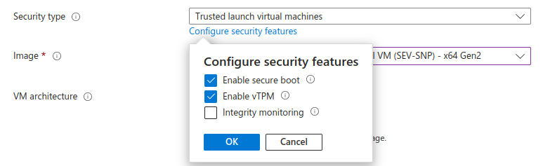

# Deploying and managing RHEL on Microsoft Azure

* * *

Red Hat Enterprise Linux 10

## Obtaining RHEL system images and creating RHEL instances on Azure

Red Hat Customer Content Services

[Legal Notice](#idm140500917844640)

**Abstract**

To use Red Hat Enterprise Linux (RHEL) on Microsoft Azure, you can create and deploy RHEL system images.

This also involves:

- Registering, deploying, and provisioning RHEL images on Azure
- Managing networking configurations for RHEL Azure virtual machine (VM)
- Configuring platform security and trusted execution technologies
- Managing Red Hat High Availability (HA) clusters for RHEL instances

* * *

<h2 id="providing-feedback-on-red-hat-documentation">Providing feedback on Red Hat documentation</h2>

We are committed to providing high-quality documentation and value your feedback. To help us improve, you can submit suggestions or report errors through the Red Hat Jira tracking system.

**Procedure**

1. Log in to the [Jira](https://issues.redhat.com/projects/RHELDOCS/issues) website.
   
   If you do not have an account, select the option to create one.
2. Click **Create** in the top navigation bar.
3. Enter a descriptive title in the **Summary** field.
4. Enter your suggestion for improvement in the **Description** field. Include links to the relevant parts of the documentation.
5. Click **Create** at the bottom of the dialogue.

<h2 id="introducing-rhel-on-public-cloud-platforms">Chapter 1. Introducing RHEL on public cloud platforms</h2>

Public cloud platforms offer computing resources as a service. Instead of using on-premise hardware, you can run your IT workloads, including Red Hat Enterprise Linux (RHEL) systems, as public cloud instances.

<h3 id="benefits-of-using-rhel-in-a-public-cloud">1.1. Benefits of using RHEL in a public cloud</h3>

Running Red Hat Enterprise Linux (RHEL) on public cloud platforms provides flexible resource allocation, cost efficiency, and software-controlled configurations to optimize your infrastructure without managing physical hardware.

RHEL as a cloud instance located on a public cloud platform has the following benefits over RHEL on-premise physical systems or virtual machines (VMs):

Flexible and fine-grained allocation of resources

A cloud instance of RHEL runs as a VM on a cloud platform, which means a cluster of remote servers maintained by the cloud service provider. Therefore, on the software level, allocating hardware resources to the instance is easily customizable, such as a specific type of CPU or storage.

In comparison to a local RHEL system, you are also not limited by the capabilities of physical host. Instead, you can select from a variety of features, based on selections offered by the cloud provider.

Space and cost efficiency

You do not need to own any on-premise servers to host cloud workloads. This avoids the space, power, and maintenance requirements associated with physical hardware.

Instead, on public cloud platforms, you pay the cloud provider directly for using a cloud instance. The cost is typically based on the hardware allocated to the instance and the time to use it. Therefore, you can optimize your costs based on the requirements.

Software-controlled configurations

You save the entire configuration of a cloud instance as data on the cloud platform and control it with software. Therefore, you can easily create, remove, clone, or migrate the instance. You also operate a cloud instance remotely in a cloud provider console, and it connects to remote storage by default.

In addition, you can back up the current state of a cloud instance as a snapshot at any time. Afterwards, you can load the snapshot to restore the instance to the saved state.

Separation from the host and software compatibility

Similarly to a local VM, the RHEL guest operating system on a cloud instance runs on a Kernel-based Virtual Machine (KVM). This kernel is separate from the host operating system and from the *client* system that you use to connect to the instance.

Therefore, you can install any operating system on the cloud instance. This means that on a RHEL public cloud instance, you can run RHEL-specific applications not usable on your local operating system.

In addition, even if the operating system of the instance becomes unstable or compromised, it does not affect your client system.

**Additional resources**

- [What is public cloud?](https://www.redhat.com/en/topics/cloud-computing/what-is-public-cloud)
- [What is a hyperscaler?](https://www.redhat.com/en/topics/cloud/what-is-a-hyperscaler)
- [Types of cloud computing](https://www.redhat.com/en/topics/cloud-computing/public-cloud-vs-private-cloud-and-hybrid-cloud)

<h3 id="public-cloud-use-cases-for-rhel">1.2. Public cloud use cases for RHEL</h3>

Deploying on a public cloud provides many benefits, but might not be the most efficient solution in every scenario. If you are evaluating whether to migrate your Red Hat Enterprise Linux (RHEL) deployments to the public cloud, consider whether your use case will benefit from the advantages of the public cloud.

Beneficial use cases

- Deploying public cloud instances is very effective for flexibly increasing and decreasing the active computing power of your deployments. This is also known as *scaling up* and *scaling down*. You can use RHEL on public cloud in the following scenarios:
  
  - Clusters with high peak workloads and low general performance requirements. Scaling up and down based on your demands can be highly efficient in terms of resource costs.
  - Quickly setting up or expanding your clusters. This avoids high upfront costs of setting up local servers.
- What happens in your local environment does not affect cloud instances. Therefore, you can use them for backup and disaster recovery.

Potentially problematic use cases

- You are running an existing environment that you cannot adjust. Customizing a cloud instance to fit the specific needs of an existing deployment might not be economically efficient in comparison with your current host platform.
- You are operating with a hard limit on your budget. Maintaining your deployment in a local data center typically provides less flexibility but more control over the maximum resource costs than the public cloud does.

For details on how to obtain RHEL for public cloud deployments, see [Obtaining RHEL for public cloud deployments](#obtaining-rhel-for-public-cloud-deployments "1.4. Obtaining RHEL for public cloud deployments").

**Additional resources**

- [Should I migrate my application to the cloud? Here’s how to decide.](https://www.redhat.com/en/blog/should-i-migrate-my-application-cloud-heres-how-decide)

<h3 id="frequent-concerns-when-migrating-to-a-public-cloud">1.3. Frequent concerns when migrating to a public cloud</h3>

Moving your RHEL workloads from a local environment to a public cloud platform might raise concerns about the changes involved. The following are the most commonly asked questions:

Will my RHEL work differently as a cloud instance than as a local virtual machine?

In most respects, RHEL instances on a public cloud platform work the same as RHEL virtual machines on a local host, such as an on-premise server. Notable exceptions include:

- Instead of private orchestration interfaces, public cloud instances use provider-specific console interfaces for managing your cloud resources.
- Certain features, such as nested virtualization, might not work correctly. If a specific feature is critical for your deployment, check the feature’s compatibility in advance with your chosen public cloud provider.

Will my data stay safe in a public cloud as opposed to a local server?

The data in your RHEL cloud instances is in your ownership, and your public cloud provider does not have any access to it. In addition, major cloud providers support data encryption in transit, which improves the security of data when migrating your virtual machines to the public cloud.

In terms of security of RHEL public cloud instances, the following applies:

- Your public cloud provider is responsible for the security of the cloud hypervisor
- Red Hat provides the security features of the RHEL guest operating systems in your instances
- You manage the specific security settings and practices in your cloud infrastructure

What effect does my geographic region have on the functionality of RHEL public cloud instances?

You can use RHEL instances on a public cloud platform regardless of your geographical location. Therefore, you can run your instances in the same region as your on-premises server. However, hosting your instances in a physically distant region might cause high latency when operating them. In addition, depending on the public cloud provider, certain regions might offer additional features or be more cost-efficient. Before creating your RHEL instances, review the properties of the hosting regions available for your chosen cloud provider.

<h3 id="obtaining-rhel-for-public-cloud-deployments">1.4. Obtaining RHEL for public cloud deployments</h3>

To deploy Red Hat Enterprise Linux (RHEL) in a public cloud environment, you must select a certified cloud service provider and create a RHEL cloud instance.

- Based on your requirements and the current offerings in the market, select the optimal cloud service provider for your use case. The certified cloud service providers for running RHEL instances are:
  
  - [Amazon Web Services (AWS)](https://aws.amazon.com/)
  - [Google Cloud](https://cloud.google.com/)
  - [Microsoft Azure](https://azure.microsoft.com/en-us/)
    
    Note
    
    This document specifically addresses the process of deploying RHEL on Azure.
- Create a RHEL cloud instance on your cloud platform. For details, see [Methods for creating RHEL cloud instances](#methods-for-creating-rhel-cloud-instances "1.5. Methods for creating RHEL cloud instances").
- To keep your RHEL deployment up-to-date, use [Red Hat Update Infrastructure](https://access.redhat.com/products/red-hat-update-infrastructure) (RHUI).

**Additional resources**

- [RHUI documentation](https://docs.redhat.com/en/documentation/red_hat_update_infrastructure)
- [Red Hat Open Hybrid Cloud](https://www.redhat.com/en/products/open-hybrid-cloud)
- [Red Hat Ecosystem Catalog](https://catalog.redhat.com/)

<h3 id="methods-for-creating-rhel-cloud-instances">1.5. Methods for creating RHEL cloud instances</h3>

You can create a Red Hat Enterprise Linux (RHEL) system image and import it to the cloud platform by using either RHEL image builder or purchasing a RHEL image directly from the cloud service provider marketplace. You can then deploy the RHEL image as a cloud instance.

To deploy a RHEL instance on a public cloud platform, you can use either of the following methods:

Create a RHEL system image and import it to the cloud platform

- To create the system image, you can use the [RHEL image builder](https://docs.redhat.com/en/documentation/red_hat_enterprise_linux/10/html/composing_a_customized_rhel_system_image/installing-rhel-image-builder) or build the image manually.
- This method uses your existing RHEL subscription. This is also referred to as *bring your own subscription* (BYOS).
- You pre-pay a yearly subscription, and you can use your Red Hat customer discount.
- Red Hat provides customer service.
- For creating many images effectively, you can use the `cloud-init` utility.

Purchase a RHEL instance directly from the cloud provider marketplace

- You post-pay an hourly rate for using the service. This method is also referred to as *pay as you go* (PAYG).
- The cloud service provider provides customer service.

**Additional resources**

- [What is a golden image?](https://www.redhat.com/en/topics/linux/what-is-a-golden-image)

<h2 id="preparing-and-uploading-vhd-images-to-microsoft-azure">Chapter 2. Preparing and uploading VHD images to Microsoft Azure</h2>

You can create custom images and update them, either manually or automatically, on the Microsoft Azure cloud by using RHEL image builder.

<h3 id="preparing-to-manually-upload-microsoft-azure-vhd-images">2.1. Preparing to upload Microsoft Azure VHD images manually</h3>

To create a VHD image that you can manually upload to the `Microsoft Azure` cloud, you can use RHEL image builder.

**Prerequisites**

- You must have a Microsoft Azure resource group and storage account.
- You have Python installed. The `AZ CLI` tool depends on Python.

**Procedure**

1. Import the Microsoft repository key:
   
   ```
   sudo rpm --import https://packages.microsoft.com/keys/microsoft-2025.asc
   ```
   
   ```plaintext
   $ sudo rpm --import https://packages.microsoft.com/keys/microsoft-2025.asc
   ```
2. Create a `packages-microsoft-com-prod` repository:
   
   ```
   [azure-cli]
   name=Azure CLI
   baseurl=https://packages.microsoft.com/yumrepos/packages.microsoft.com/rhel/10/prod/
   enabled=1
   gpgcheck=1
   gpgkey=https://packages.microsoft.com/keys/microsoft.asc
   ```
   
   ```plaintext
   [azure-cli]
   name=Azure CLI
   baseurl=https://packages.microsoft.com/yumrepos/packages.microsoft.com/rhel/10/prod/
   enabled=1
   gpgcheck=1
   gpgkey=https://packages.microsoft.com/keys/microsoft.asc
   ```
3. Install Microsoft Azure CLI. The downloaded version of the Microsoft Azure CLI package can vary depending on the currently available version.
   
   ```
   sudo dnf install azure-cli
   ```
   
   ```plaintext
   $ sudo dnf install azure-cli
   ```
4. Run Microsoft Azure CLI:
   
   ```
   az login
   ```
   
   ```plaintext
   $ az login
   ```
   
   The terminal shows the following message: `Note, we have launched a browser for you to login. For old experience with device code, use az login --use-device-code`. Then, the terminal opens the [Login](https://microsoft.com/devicelogin) from where you can log in.
   
   Note
   
   If you are running a remote (SSH) session, the login page link does not open in the browser. In this case, you can copy the link to a browser and log in to authenticate your remote session. To sign in, use a web browser to open the [Login](https://microsoft.com/devicelogin) page and enter the device code to authenticate.
5. List the keys for the storage account in Microsoft Azure and make note of the value `key1` from the output of the previous command.
   
   ```
   az storage account keys list --resource-group <resource_group_name> --account-name <account_name>
   ```
   
   ```plaintext
   $ az storage account keys list --resource-group <resource_group_name> --account-name <account_name>
   ```
   
   Replace `resource-group-name` with the name of your Microsoft Azure resource group and `storage-account-name` with the name of your Microsoft Azure storage account.
   
   1. To list the available resources using the following command:
      
      ```
      az resource list
      ```
      
      ```plaintext
      $ az resource list
      ```
6. Create a storage container:
   
   ```
   az storage container create --account-name <storage_account_name> \
   --account-key <key1_value> --name <storage_account_name>
   ```
   
   ```plaintext
   $ az storage container create --account-name <storage_account_name> \
   --account-key <key1_value> --name <storage_account_name>
   ```
   
   Replace `storage-account-name` with the name of the storage account.

**Additional resources**

- [Microsoft Azure CLI](https://learn.microsoft.com/en-us/cli/azure/install-azure-cli-linux?view=azure-cli-latest&pivots=dnf)

<h3 id="manually-uploading-vhd-images-to-microsoft-azure-cloud">2.2. Manually uploading VHD images to Microsoft Azure cloud</h3>

Create your customized virtual hard disk (VHD) image, and manually upload it to the Microsoft Azure cloud. When you create a `.vhd` image by using the CLI, RHEL image builder writes temporary files to the `/var` subdirectory.

Note

The partition and filesystem configurations that you define in your image blueprint determine the size of the resulting `.vhd` image. If you allocate insufficient storage,the process might fail with a “No space left on device” error. This occurs, for example, if the available space on the `/var` partition is smaller than the total space required for the image build. To prevent the `.vhd` image creation from failing, verify that the `/var` subdirectory has at least 15 to 20 GB of free space.

**Prerequisites**

- Your system must be set up for uploading Microsoft Azure VHD images.
- Your Azure access key storage account.

**Procedure**

1. Create a `azure.toml` blueprint, and add the following information to it:
   
   ```
   provider = "azure"
   
   [settings]
   storageAccount = "<your-storage-account-name>"
   storageAccessKey = "<storage-access-key-you-copied-in-the-Azure-portal>"
   container = "<your-storage-container-name>"
   ```
   
   ```plaintext
   provider = "azure"
   
   [settings]
   storageAccount = "<your-storage-account-name>"
   storageAccessKey = "<storage-access-key-you-copied-in-the-Azure-portal>"
   container = "<your-storage-container-name>"
   ```
2. Build the image, passing the following arguments:
   
   ```
   image-builder build <your-blueprint> vhd <your-image-key> azure.toml
   ```
   
   ```plaintext
   $ image-builder build <your-blueprint> vhd <your-image-key> azure.toml
   ```
   
   Replace *&lt;your-image-key&gt;* with the name of the image that you want.
3. Push the image to Microsoft Azure and create an instance from it:
   
   ```
   az storage blob upload --account-name <account-name> --container-name <container-name> --file <image-disk>.vhd --name image-disk.vhd --type page
   ```
   
   ```plaintext
   $ az storage blob upload --account-name <account-name> --container-name <container-name> --file <image-disk>.vhd --name image-disk.vhd --type page
   ```
4. After the upload to the Microsoft Azure Blob storage completes, create a Microsoft Azure image from it. Because the images that you create with RHEL image builder generate hybrid images that support both the `V1 = BIOS` and `V2 = UEFI` instance types, you can specify the `--hyper-v-generation` argument. The default instance type is `V1`.
   
   ```
   az image create --resource-group resource_group_name --name image-disk.vhd --os-type linux --location location \
   --source https://$account_name.blob.core.windows.net/container_name/image-disk.vhd
   - Running
   ```
   
   ```plaintext
   $ az image create --resource-group resource_group_name --name image-disk.vhd --os-type linux --location location \
   --source https://$account_name.blob.core.windows.net/container_name/image-disk.vhd
   - Running
   ```

**Verification**

1. Create an instance either with the Microsoft Azure portal, or a command similar to the following:
   
   ```
   az vm create --resource-group resource_group_name --location location --name vm_name --image image-disk.vhd(--admin-username azure-user --generate-ssh-keys*
   - Running
   ```
   
   ```plaintext
   $ az vm create --resource-group resource_group_name --location location --name vm_name --image image-disk.vhd(--admin-username azure-user --generate-ssh-keys*
   - Running
   ```
2. Use your private key by using SSH to access the resulting instance. Log in as `azure-user`. This username was set on the previous step.

**Additional resources**

- [Composing an image for the `.vhd` format fails (Red Hat Knowledgebase)](https://access.redhat.com/solutions/6955577)

<h3 id="creating-and-automatically-uploading-vhd-images-to-microsoft-azure-cloud">2.3. Creating and automatically uploading VHD images to Microsoft Azure cloud</h3>

By using RHEL image builder, you can create `.vhd` images, which will be automatically uploaded to an Azure Blob Storage in the Microsoft Azure Cloud service provider.

**Prerequisites**

- You have root access to the system.
- You have access to the RHEL image builder interface of the RHEL web console.
- You created a blueprint. See [Creating a RHEL image builder blueprint in the web console interface](https://docs.redhat.com/en/documentation/red_hat_enterprise_linux/10/html/composing_a_customized_rhel_system_image/creating-system-images-with-gui#creating-a-blueprint-in-the-web-console-interface).
- You have a [Microsoft Storage Account](https://portal.azure.com/#create/Microsoft.StorageAccount) created.
- You have a writable [Blob Storage](https://portal.azure.com/#blade/HubsExtension/BrowseResource/resourceType/Microsoft.Storage%2FStorageAccounts) prepared.

**Procedure**

01. In the RHEL image builder dashboard, select the blueprint you want to use.
02. Click the **Images** tab.
03. Click **Create Image** to create your customized `.vhd` image.
    
    The **Create image** wizard opens.
    
    1. Select `Microsoft Azure (.vhd)` from the **Type** drop-down menu list.
    2. Check the **Upload to Azure** checkbox to upload your image to the Microsoft Azure Cloud.
    3. Enter the **Image Size** and click **Next**.
04. On the **Upload to Azure** page, enter the following information:
    
    1. On the Authentication page, enter:
       
       1. Your **Storage account** name. You can find it on the **Storage account** page in the [Microsoft Azure portal](https://portal.azure.com).
       2. Your **Storage access key**: You can find it on the **Access Key** Storage page.
       3. Click **Next**.
    2. On the **Authentication** page, enter:
       
       1. The image name.
       2. The **Storage container**. It is the blob container to which you will upload the image. Find it under the **Blob service** section, in the [Microsoft Azure portal](https://portal.azure.com).
       3. Click **Next**.
05. On the **Review** page, click **Create**. The RHEL image builder and upload processes start.
    
    Access the image you pushed into **Microsoft Azure Cloud**.
06. Access the [Microsoft Azure portal](https://portal.azure.com).
07. In the search bar, type "storage account" and click **Storage accounts** from the list.
08. On the search bar, type "Images" and select the first entry under **Services**. You are redirected to the **Image dashboard**.
09. On the navigation panel, click **Containers**.
10. Find the container you created. Inside the container is the `.vhd` file you created and pushed by using RHEL image builder.

**Verification**

1. Verify that you can create a VM image and launch it.
   
   01. In the search bar, type images account and click **Images** from the list.
   02. Click **+Create**.
   03. From the dropdown list, choose the resource group you used earlier.
   04. Enter a name for the image.
   05. For the **OS type**, select **Linux**.
   06. For the **VM generation**, select **Gen 2**.
   07. Under **Storage Blob**, click **Browse** and click through the storage accounts and containers until you reach your VHD file.
   08. Click **Select** at the end of the page.
   09. Choose an Account Type, for example, **Standard SSD**.
   10. Click **Review + Create** and then **Create**. Wait a few moments for the image creation.
2. To launch the VM, follow the steps:
   
   1. Click **Go to resource**.
   2. Click **+ Create VM** from the menu bar on the header.
   3. Enter a name for your virtual machine.
   4. Complete the **Size** and **Administrator account** sections.
   5. Click **Review + Create** and then **Create**. You can see the deployment progress.
      
      After the deployment finishes, click the virtual machine name to retrieve the public IP address of the instance to connect by using SSH.
   6. Open a terminal to create an SSH connection to connect to the VM.

**Additional resources**

- [Microsoft Azure Storage Documentation](https://docs.microsoft.com/en-us/azure/storage/)
- [Create an Azure storage account](https://docs.microsoft.com/en-us/azure/storage/common/storage-account-create?toc=%2Fazure%2Fstorage%2Fblobs%2Ftoc.json&tabs=azure-portal)

<h2 id="deploying-a-rhel-image-as-an-compute-instance-on-azure">Chapter 3. Deploying a RHEL image as a compute instance on Azure</h2>

You can deploy a Red Hat Enterprise Linux (RHEL) image as an Azure Compute virtual machine (VM) by converting the image to an Azure-compatible format and then deploying it. Use the RHEL image builder or manually create a virtual hard drive (VHD) to customize and deploy your RHEL image to Azure.

<h3 id="available-rhel-image-types-for-public-cloud">3.1. Available RHEL image types for public cloud</h3>

To deploy your RHEL virtual machine VM on a certified cloud service provider (CCSP), you can use several options. The following table lists the available image types, subscriptions, considerations, and sample scenarios for the image types.

Note

To deploy customized ISO images, you can use RHEL image builder. With RHEL image builder, you can create, upload, and deploy these custom images specific to your chosen CCSP. For details, see [Composing a Customized RHEL System Image](https://docs.redhat.com/en/documentation/red_hat_enterprise_linux/10/html/composing_a_customized_rhel_system_image/installing-rhel-image-builder).

| Image types                                        | Subscriptions                                  | Considerations                                                                                                                                                                                                                                                                                      | Sample scenario                                                                                                                                                                                                                                                                |
|:---------------------------------------------------|:-----------------------------------------------|:----------------------------------------------------------------------------------------------------------------------------------------------------------------------------------------------------------------------------------------------------------------------------------------------------|:-------------------------------------------------------------------------------------------------------------------------------------------------------------------------------------------------------------------------------------------------------------------------------|
| Deploy a Red Hat gold image                        | Use your existing Red Hat subscriptions        | The subscriptions include the Red Hat product cost and support for Cloud Access images, while you pay the CCSP for all other instance costs                                                                                                                                                         | Select a Red Hat gold image on the CCSP. For details on gold images and how to access them on the CCSP, see the [Red Hat Cloud Access Reference Guide](https://docs.redhat.com/en/documentation/subscription_central/1-latest/html/red_hat_cloud_access_reference_guide/index) |
| Deploy a custom image that you move to the CCSP    | Use your existing Red Hat subscriptions        | The subscriptions includes the Red Hat product cost and support for custom RHEL image, while you pay the CCSP for all other instance costs                                                                                                                                                          | Upload your custom image and attach your subscriptions                                                                                                                                                                                                                         |
| Deploy an existing RHEL based custom machine image | The custom machine images include a RHEL image | You pay the CCSP on an hourly basis based on a *pay-as-you-go* model. For this model, on-demand images are available on the CCSP marketplace. The CCSP provides support for these images, while Red Hat handles updates. The CCSP provides updates through the Red Hat Update Infrastructure (RHUI) | Select a RHEL image when you launch an instance on the CCSP cloud management console, or choose an image from the CCSP marketplace.                                                                                                                                            |

Table 3.1. Image options

Important

You cannot convert an on-demand instance to a custom RHEL instance. For migrating from an on-demand image to a custom RHEL bring your own subscription (BYOS) image, do the following:

- Create a new custom RHEL instance, then migrate data from your on-demand instance.
- When you complete data migration, terminate the on-demand instance to avoid additional billing.

<!--THE END-->

- For the required list of system packages, check the [required list of system packages](#required-system-packages "3.2. Required system packages").

**Additional resources**

- [Red Hat Ecosystem Catalog](https://catalog.redhat.com/)
- [Red Hat Cloud Access Reference Guide](https://docs.redhat.com/en/documentation/subscription_central/1-latest/html/red_hat_cloud_access_reference_guide/index)
- [Using Red Hat gold images on Azure](https://docs.redhat.com/en/documentation/subscription_central/1-latest/html/getting_started_with_rhel_system_registration/red-hat-cloud-access-program-overview_#using-gold-images-on-azure_using-gold-images-on-aws)
- [Azure Marketplace](https://azuremarketplace.microsoft.com/en-us/marketplace/apps/redhat.rhel-20190605?tab=PlansAndPrice)
- [Billing options in the Azure Marketplace](https://docs.microsoft.com/en-us/azure/marketplace/marketplace-commercial-transaction-capabilities-and-considerations)
- [Red Hat Enterprise Linux Bring-Your-Own-Subscription gold images in Azure](https://docs.microsoft.com/en-us/azure/virtual-machines/workloads/redhat/byos)

<h3 id="required-system-packages">3.2. Required system packages</h3>

To create and configure a base image of RHEL, your host system must have the following packages installed.

| Package       | Repository                          | Description                                                                       |
|:--------------|:------------------------------------|:----------------------------------------------------------------------------------|
| libvirt       | `rhel-10-for-x86_64-appstream-rpms` | Open source API, daemon, and management tool for managing platform virtualization |
| virt-install  | `rhel-10-for-x86_64-appstream-rpms` | A command-line utility for building VMs                                           |
| libguestfs    | `rhel-10-for-x86_64-appstream-rpms` | A library for accessing and modifying VM file systems                             |
| guestfs-tools | `rhel-10-for-x86_64-appstream-rpms` | System administration tools for VMs; includes the `virt-customize` utility        |

Table 3.2. System packages

By confirming installation of the mentioned system packages, you can now follow the deployment steps in [Deploying a RHEL instance by using a custom base image](#deploying-a-rhel-instance-by-using-a-custom-base-image "3.3. Deploying a RHEL instance by using a custom base image")

<h3 id="deploying-a-rhel-instance-by-using-a-custom-base-image">3.3. Deploying a RHEL instance by using a custom base image</h3>

To manually configure a virtual machine (VM), first create a base (starter) image. Then, you can modify configuration settings and add the packages the VM requires to operate on the cloud. You can also make additional configuration changes for your specific application after you upload the image.

To prepare a cloud image of RHEL, follow the instructions in the sections below. To prepare a Hyper-V cloud image of RHEL, see the [Prepare a Red Hat-based virtual machine from Hyper-V Manager](https://docs.microsoft.com/en-us/azure/virtual-machines/linux/redhat-create-upload-vhd#prepare-a-red-hat-based-virtual-machine-from-hyper-v-manager).

Creating a VM from a base image has the following advantages:

- Fully customizable
- High flexibility for any use case
- Lightweight - includes only the operating system and the required runtime libraries

To create a custom base image of RHEL from an ISO image, you can use the command line interface (CLI) or the web console for creating and configuring VM.

Note

Verify the following VM configurations.

Settings are enabled either during the initial VM creation or provising VM image to Azure cloud.

- SSH - Enable SSH to give remote access to your VM.
- DHCP - Configure the primary virtual adapter to use DHCP.
- Swap space - Do not create a dedicated swap file or `swap` partition on the operating system (OS) disk or storage disk during installation. Configure the `cloud-init` utility to automatically create a `swap` partition on an ephemeral disk of the VM. Ephemeral disk is a local storage of the VM, while resource disk is mounted storage on VM itself. Both storage types store data temporarily.
- NIC - Choose virtio for the primary virtual network adapter.
- Encryption - For custom images, use Network Bound Disk Encryption (NBDE) for full disk encryption on Azure.

**Prerequisites**

- You have checked the [required list of system packages](#required-system-packages "3.2. Required system packages").
- You have [enabled virtualization](https://docs.redhat.com/en/documentation/red_hat_enterprise_linux/10/html/configuring_and_managing_linux_virtual_machines/preparing-rhel-to-host-virtual-machines#preparing-an-amd64-or-intel64-system-to-host-virtual-machines) on the host machine.
- For web console, ensure the following options:
- You have not checked the **Immediately Start VM** option.
- You have already changed the **Memory** size to your preferred settings.
- You have changed the **Model** option under **Virtual Network Interface Settings** to **virtio** and **vCPUs** to the capacity settings for the VM.

**Procedure**

1. Configure the Red Hat Enterprise Linux (RHEL) VM:
   
   1. To install from the command line (CLI), ensure that you set the default memory, network interfaces, and CPUs according to your requirement for the VM. For details, see [Creating virtual machines by using the command line](https://docs.redhat.com/en/documentation/red_hat_enterprise_linux/10/html/configuring_and_managing_linux_virtual_machines/creating-virtual-machines#creating-virtual-machines-by-using-the-command-line-interface)
   2. To install from the web console, see [Creating virtual machines by using the web console](https://docs.redhat.com/en/documentation/red_hat_enterprise_linux/10/html/configuring_and_managing_linux_virtual_machines/creating-virtual-machines#creating-virtual-machines-by-using-the-web-console)
2. When the installation starts:
   
   1. Create a `root` password.
   2. Create an administrative user account.
3. After the installation completes, reboot the VM and log in to the `root` account.
4. After logging in as `root`, you can configure the image.
5. Register the VM and enable the RHEL repository:
   
   ```
   subscription-manager register
   ```
   
   ```plaintext
   # subscription-manager register
   ```

**Verification**

- Verify if the system has the `cloud-init` package and enable it:
  
  ```
  dnf install cloud-init
  systemctl enable --now cloud-init.service
  ```
  
  ```plaintext
  # dnf install cloud-init
  # systemctl enable --now cloud-init.service
  ```
- Power off the VM.

**Next steps**

- Install [the Azure CLI](#installing-the-azure-cli "3.4. Installing the Azure CLI") to access Azure resources and services.

<h3 id="installing-the-azure-cli">3.4. Installing the Azure CLI</h3>

To connect to Azure Cloud and manage Azure resources directly from terminal of your host system, you can use the Azure command-line interface (CLI).

**Prerequisites**

- You have created a [Red Hat account](https://www.redhat.com/wapps/ugc/register.html).
- You have completed [the deployment of a RHEL image on Azure](#deploying-a-rhel-instance-by-using-a-custom-base-image "3.3. Deploying a RHEL instance by using a custom base image").
- You have an account with [Microsoft Azure](https://azure.microsoft.com/en-us/free/).
- You have installed Python 3.x.

**Procedure**

1. Import the Microsoft repository key:
   
   ```
   sudo dnf --import https://packages.microsoft.com/keys/microsoft.asc
   ```
   
   ```plaintext
   $ sudo dnf --import https://packages.microsoft.com/keys/microsoft.asc
   ```
2. Create a local Azure CLI repository entry:
   
   ```
   sudo sh -c 'echo -e "[azure-cli]\nname=Azure CLI\nbaseurl=https://packages.microsoft.com/yumrepos/azure-cli\nenabled=1\ngpgcheck=1\ngpgkey=https://packages.microsoft.com/keys/microsoft.asc" > /etc/yum.repos.d/azure-cli.repo'
   ```
   
   ```plaintext
   $ sudo sh -c 'echo -e "[azure-cli]\nname=Azure CLI\nbaseurl=https://packages.microsoft.com/yumrepos/azure-cli\nenabled=1\ngpgcheck=1\ngpgkey=https://packages.microsoft.com/keys/microsoft.asc" > /etc/yum.repos.d/azure-cli.repo'
   ```
3. Update the `dnf` package index:
   
   ```
   sudo dnf update
   ```
   
   ```plaintext
   $ sudo dnf update
   ```
4. Install the Azure CLI:
   
   ```
   sudo dnf install -y azure-cli
   ```
   
   ```plaintext
   $ sudo dnf install -y azure-cli
   ```
5. Run the Azure CLI:
   
   ```
   az login
   ```
   
   ```plaintext
   $ az login
   ```

**Next steps**

- Install [the Hyper-V device drivers](#installing-hyper-v-device-drivers "3.5. Installing Hyper-V device drivers") to efficiently run VM on Azure.

**Additional resources**

- [Install the Azure CLI on Linux](https://learn.microsoft.com/en-us/cli/azure/install-azure-cli-linux?pivots=dnf)
- [Azure CLI command reference](https://docs.microsoft.com/en-us/cli/azure/reference-index?view=azure-cli-latest)

<h3 id="installing-hyper-v-device-drivers">3.5. Installing Hyper-V device drivers</h3>

Before provisioning a virtual machine (VM) image as an Azure VM, you must install Hyper-V device drivers. Microsoft provides these network and storage device drivers as a part of their Linux Integration Services (LIS) for Hyper-V package.

**Prerequisites**

- You have created a [Red Hat account](https://www.redhat.com/wapps/ugc/register.html).
- You have a [Microsoft Azure account](https://azure.microsoft.com/en-us/Free).
- You have installed [the Azure CLI](#installing-the-azure-cli "3.4. Installing the Azure CLI").

**Procedure**

1. Verify if the system has Hyper-V device drivers:
   
   ```
   lsinitrd | grep hv
   
   drwxr-xr-x   2 root     root            0 Aug 12 14:21 usr/lib/modules/3.10.0-932.el10.x86_64/kernel/drivers/hv
   -rw-r--r--   1 root     root        31272 Aug 11 08:45 usr/lib/modules/3.10.0-932.el10.x86_64/kernel/drivers/hv/hv_vmbus.ko.xz
   -rw-r--r--   1 root     root        25132 Aug 11 08:46 usr/lib/modules/3.10.0-932.el10.x86_64/kernel/drivers/net/hyperv/hv_netvsc.ko.xz
   -rw-r--r--   1 root     root         9796 Aug 11 08:45 usr/lib/modules/3.10.0-932.el10.x86_64/kernel/drivers/scsi/hv_storvsc.ko.xz
   ```
   
   ```plaintext
   # lsinitrd | grep hv
   
   drwxr-xr-x   2 root     root            0 Aug 12 14:21 usr/lib/modules/3.10.0-932.el10.x86_64/kernel/drivers/hv
   -rw-r--r--   1 root     root        31272 Aug 11 08:45 usr/lib/modules/3.10.0-932.el10.x86_64/kernel/drivers/hv/hv_vmbus.ko.xz
   -rw-r--r--   1 root     root        25132 Aug 11 08:46 usr/lib/modules/3.10.0-932.el10.x86_64/kernel/drivers/net/hyperv/hv_netvsc.ko.xz
   -rw-r--r--   1 root     root         9796 Aug 11 08:45 usr/lib/modules/3.10.0-932.el10.x86_64/kernel/drivers/scsi/hv_storvsc.ko.xz
   ```
   
   In case, all the drivers are not installed or even the `hv_vmbus` driver is listed, complete the remaining steps.
2. Create the `hv.conf` file in the `/etc/dracut.conf.d` directory and add the following driver parameters:
   
   ```
   vi hv.conf
   
   add_drivers+=" hv_vmbus "
   add_drivers+=" hv_netvsc "
   add_drivers+=" hv_storvsc "
   add_drivers+=" nvme "
   ```
   
   ```plaintext
   # vi hv.conf
   
   add_drivers+=" hv_vmbus "
   add_drivers+=" hv_netvsc "
   add_drivers+=" hv_storvsc "
   add_drivers+=" nvme "
   ```
   
   Ensure that you have added spaces after and before the double quotes `add_drivers+=" hv_vmbus "` to load unique drivers, in case other Hyper-V drivers already exist in the environment.
3. Regenerate the `initramfs` image:
   
   ```
   dracut -f -v --regenerate-all
   ```
   
   ```plaintext
   # dracut -f -v --regenerate-all
   ```

**Verification**

1. Reboot the machine.
2. Verify installation of drivers:
   
   ```
   lsinitrd | grep hv
   ```
   
   ```plaintext
   # lsinitrd | grep hv
   ```

**Next steps**

- Prepare your VM for [deployment on Azure cloud](#preparing-a-virtual-machine-for-azure-deployment "3.7. Preparing a virtual machine for Azure deployment").

<h3 id="configuring-swap-space-with-cloud-init-on-azure">3.6. Configuring swap space with cloud-init on Azure</h3>

To use swap space for a Red Hat Enterprise Linux (RHEL) virtual machine (VM) on Microsoft Azure, create a swap partition on an ephemeral disk. Only use the ephemeral disk for creating the swap partition, not the operating system disk or data disk.

You can use the `cloud-init` utility to configure a swap partition on the ephemeral disk on-demand. Ephemeral disk is a local storage of the VM, while a resource disk is mounted storage on VM itself. Both storage types store data temporarily. Deleting, moving, stopping, or failure of the VM will result in the loss of the data stored on the ephemeral or resource disk.

Important

Do not use the ephemeral disk for persistent data. All contents, including the swap partition, are deleted when the VM is stopped or moved.

**Prerequisites**

- You have created a [Red Hat account](https://www.redhat.com/wapps/ugc/register.html).
- You have a [Microsoft Azure account](https://azure.microsoft.com/en-us/Free).
- You have installed the `cloud-init` utility on the VM.
- You have disabled the swap configuration in the Windows Azure Linux Agent (WALA) by setting the parameters in the `/etc/waagent.conf` file:
  
  ```
  ResourceDisk.Format=n
  ResourceDisk.EnableSwap=n
  ResourceDisk.SwapSizeMB=0
  ```
  
  ```plaintext
  ResourceDisk.Format=n
  ResourceDisk.EnableSwap=n
  ResourceDisk.SwapSizeMB=0
  ```
- You have an ephemeral disk available on the VM.

**Procedure**

1. Log in to the VM.
2. Create and edit the `/etc/cloud/cloud.cfg.d/00-azure-swap.cfg` configuration file and add the following `cloud-init` configuration to the file:
   
   ```
   vi /etc/cloud/cloud.cfg.d/00-azure-swap.cfg
   ```
   
   ```plaintext
   # vi /etc/cloud/cloud.cfg.d/00-azure-swap.cfg
   ```
   
   ```
   #cloud-config
   disk_setup:
     ephemeral0:
       table_type: gpt
       layout: [66, [33,82]]
       overwrite: true
   fs_setup:
     - device: ephemeral0.1
       filesystem: ext4
     - device: ephemeral0.2
       filesystem: swap
   mounts:
     - ["ephemeral0.1", "/mnt"]
     - ["ephemeral0.2", "none", "swap", "sw,nofail,x-systemd.requires=cloud-init.service", "0", "0"]
   ```
   
   ```yaml
   #cloud-config
   disk_setup:
     ephemeral0:
       table_type: gpt
       layout: [66, [33,82]]
       overwrite: true
   fs_setup:
     - device: ephemeral0.1
       filesystem: ext4
     - device: ephemeral0.2
       filesystem: swap
   mounts:
     - ["ephemeral0.1", "/mnt"]
     - ["ephemeral0.2", "none", "swap", "sw,nofail,x-systemd.requires=cloud-init.service", "0", "0"]
   ```
   
   This configuration:
   
   - Partitions the ephemeral disk (`ephemeral0`) with a GPT partition table.
   - Creates two partitions: 66% for a file system (mounted at `/mnt`) and 33% for `swap` space.
   - Formats the first partition as `ext4` and the second partition as `swap`.
   - Configures automatic mounting of both partitions at boot time.
     
     Note
     
     The partition layout `[66, [33,82]]` allocates 66% of the disk to the first partition and 33% to the second partition. The `82` in the second partition specification indicates a Linux swap partition type. You can adjust these percentages based on your requirements.
3. Verify the configuration file for any errors:
   
   ```
   cloud-init devel schema --config-file /etc/cloud/cloud.cfg.d/00-azure-swap.cfg
   ```
   
   ```plaintext
   # cloud-init devel schema --config-file /etc/cloud/cloud.cfg.d/00-azure-swap.cfg
   ```
   
   If the configuration is valid, the command returns no errors.

**Verification**

- After you reboot the VM, check that the swap partition is configured and active by verifying the active swap space, swap usage, and the swap partition entry in the `/etc/fstab` file.
  
  - Check active swap space:
    
    ```
    swapon -s
    ```
    
    ```plaintext
    $ swapon -s
    ```
    
    The output should show the swap partition from `ephemeral0.2`:
    
    ```
    Filename  Type  Size  Used  Priority
    /dev/ephemeral0.2  partition  8388604  0  2
    ```
    
    ```plaintext
    Filename  Type  Size  Used  Priority
    /dev/ephemeral0.2  partition  8388604  0  2
    ```
  - Check swap usage:
    
    ```
    free -h
    ```
    
    ```plaintext
    $ free -h
    ```
    
    The output should show swap space in the `Swap` row:
    
    ```
          total  used  free  shared  buffered/cache  available
    Mem: 7.8Gi  1.2Gi  5.8Gi  16MiB  800MiB  6.3Gi
    Swap: 8.0Gi  0B  8.0Gi
    ```
    
    ```plaintext
          total  used  free  shared  buffered/cache  available
    Mem: 7.8Gi  1.2Gi  5.8Gi  16MiB  800MiB  6.3Gi
    Swap: 8.0Gi  0B  8.0Gi
    ```
  - Verify the swap partition is present in the `/etc/fstab` file:
    
    ```
    grep swap /etc/fstab
    ```
    
    ```plaintext
    $ grep swap /etc/fstab
    ```
    
    The output should include an entry for the swap partition, for example:
    
    ```
    /dev/ephemeral0.2  none  swap  sw,nofail,x-systemd.requires=cloud-init.service  0  0
    ```
    
    ```plaintext
    /dev/ephemeral0.2  none  swap  sw,nofail,x-systemd.requires=cloud-init.service  0  0
    ```

**Additional resources**

- [Configure swap file with cloud-init on Azure Linux VMs](https://learn.microsoft.com/en-us/azure/virtual-machines/linux/cloudinit-configure-swapfile)
- [Create and configure a swap file on a Linux VM in Azure](https://learn.microsoft.com/en-us/troubleshoot/azure/virtual-machines/linux/create-swap-file-linux-vm)
- [Disk setup for cloud-init](https://cloudinit.readthedocs.io/en/latest/reference/examples.html#disk-setup)

<h3 id="preparing-a-virtual-machine-for-azure-deployment">3.7. Preparing a virtual machine for Azure deployment</h3>

To ensure a virtual machine (VM) has compatibility and can operate in the Azure environment, you must perform configuration changes before deploying a custom base image in Azure.

**Prerequisites**

- You have created a [Red Hat account](https://www.redhat.com/wapps/ugc/register.html).
- You have a [Microsoft Azure account](https://azure.microsoft.com/en-us/Free).
- You have installed [the Hyper-V device drivers](#installing-hyper-v-device-drivers "3.5. Installing Hyper-V device drivers").

**Procedure**

1. Log in and register the VM to enable the Red Hat Enterprise Linux (RHEL) repository:
   
   ```
   subscription-manager register
   
   Installed Product Current Status:
   Product Name: Red Hat Enterprise Linux for x86_64
   Status: Subscribed
   ```
   
   ```plaintext
   # subscription-manager register
   
   Installed Product Current Status:
   Product Name: Red Hat Enterprise Linux for x86_64
   Status: Subscribed
   ```
2. Install the `cloud-init` and `hyperv-daemons` packages:
   
   ```
   dnf install cloud-init hyperv-daemons -y
   ```
   
   ```plaintext
   # dnf install cloud-init hyperv-daemons -y
   ```
3. Create the `cloud-init` configuration files and edit them to offer integration with Azure services:
   
   1. To enable logging to the Hyper-V Data Exchange Service (KVP), edit the `/etc/cloud/cloud.cfg.d/10-azure-kvp.cfg` file and append the following lines:
      
      ```
      reporting:
          logging:
              type: log
          telemetry:
              type: hyperv
      ```
      
      ```plaintext
      reporting:
          logging:
              type: log
          telemetry:
              type: hyperv
      ```
   2. To add the Azure datasource, edit the `/etc/cloud/cloud.cfg.d/91-azure_datasource.cfg` file and append the following lines:
      
      ```
      datasource_list: [ Azure ]
      datasource:
          Azure:
              apply_network_config: False
      ```
      
      ```plaintext
      datasource_list: [ Azure ]
      datasource:
          Azure:
              apply_network_config: False
      ```
   3. To configure swap space on the ephemeral disk, create the `/etc/cloud/cloud.cfg.d/00-azure-swap.cfg` configuration file and add the following lines to that file.
      
      Important
      
      The ephemeral disk is temporary storage. Therefore, data stored on it, including swap space, is lost when the VM is deallocated or moved. Use the ephemeral disk only for temporary data such as swap space.
      
      ```
      #cloud-config
      disk_setup:
        ephemeral0:
          table_type: gpt
          layout: [66, [33,82]]
          overwrite: true
      fs_setup:
        - device: ephemeral0.1
          filesystem: ext4
        - device: ephemeral0.2
          filesystem: swap
      mounts:
        - ["ephemeral0.1", "/mnt"]
        - ["ephemeral0.2", "none", "swap", "sw,nofail,x-systemd.requires=cloud-init.service", "0", "0"]
      ```
      
      ```yaml
      #cloud-config
      disk_setup:
        ephemeral0:
          table_type: gpt
          layout: [66, [33,82]]
          overwrite: true
      fs_setup:
        - device: ephemeral0.1
          filesystem: ext4
        - device: ephemeral0.2
          filesystem: swap
      mounts:
        - ["ephemeral0.1", "/mnt"]
        - ["ephemeral0.2", "none", "swap", "sw,nofail,x-systemd.requires=cloud-init.service", "0", "0"]
      ```
4. To block automatic loading of specific kernel modules, edit the `/etc/modprobe.d/blocklist.conf` file and append the following lines:
   
   ```
   blacklist nouveau
   blacklist lbm-nouveau
   blacklist floppy
   blacklist amdgpu
   blacklist skx_edac
   blacklist intel_cstate
   ```
   
   ```plaintext
   blacklist nouveau
   blacklist lbm-nouveau
   blacklist floppy
   blacklist amdgpu
   blacklist skx_edac
   blacklist intel_cstate
   ```
5. Modify `udev` network device rules:
   
   1. If present, remove the following persistent network device rules:
      
      ```
      rm -f /etc/udev/rules.d/70-persistent-net.rules
      rm -f /etc/udev/rules.d/75-persistent-net-generator.rules
      rm -f /etc/udev/rules.d/80-net-name-slot-rules
      ```
      
      ```plaintext
      # rm -f /etc/udev/rules.d/70-persistent-net.rules
      # rm -f /etc/udev/rules.d/75-persistent-net-generator.rules
      # rm -f /etc/udev/rules.d/80-net-name-slot-rules
      ```
   2. To ensure working of accelerated networking on Azure, edit the `/etc/udev/rules.d/68-azure-sriov-nm-unmanaged.rules` new network device rule and append the following line:
      
      ```
      SUBSYSTEM=="net", DRIVERS=="hv_pci", ACTION=="add", ENV{NM_UNMANAGED}="1"
      ```
      
      ```plaintext
      SUBSYSTEM=="net", DRIVERS=="hv_pci", ACTION=="add", ENV{NM_UNMANAGED}="1"
      ```
6. Set the `sshd` service to start automatically:
   
   ```
   systemctl enable sshd
   systemctl is-enabled sshd
   ```
   
   ```plaintext
   # systemctl enable sshd
   # systemctl is-enabled sshd
   ```
7. Modify kernel boot parameters:
   
   1. Update the `GRUB_TIMEOUT` parameter value in the `/etc/default/grub` file:
      
      ```
      GRUB_TIMEOUT=10
      ```
      
      ```plaintext
      GRUB_TIMEOUT=10
      ```
   2. Remove the following option from the end of the `GRUB_CMDLINE_LINUX` line, if present:
      
      ```
      rhgb quiet
      ```
      
      ```plaintext
      rhgb quiet
      ```
   3. Update the `/etc/default/grub` file with the following configuration details:
      
      ```
      GRUB_CMDLINE_LINUX="loglevel=3 crashkernel=auto console=tty1 console=ttyS0 earlyprintk=ttyS0 rootdelay=300"
      GRUB_TIMEOUT_STYLE=countdown
      GRUB_TERMINAL="serial console"
      GRUB_SERIAL_COMMAND="serial --speed=115200 --unit=0 --word=8 --parity=no --stop=1"
      ```
      
      ```plaintext
      GRUB_CMDLINE_LINUX="loglevel=3 crashkernel=auto console=tty1 console=ttyS0 earlyprintk=ttyS0 rootdelay=300"
      GRUB_TIMEOUT_STYLE=countdown
      GRUB_TERMINAL="serial console"
      GRUB_SERIAL_COMMAND="serial --speed=115200 --unit=0 --word=8 --parity=no --stop=1"
      ```
      
      Note
      
      By adding the `elevator=none` option to the end of the `GRUB_CMDLINE_LINUX` line disables the I/O scheduler entirely. This option processes I/O requests according to the order of execution, without optimizing disk performance. With `elevator=none` on:
      
      - Hard disk drive (HDD): Performance and throughput decreases, therefore not suitable for running workloads.
      - Solid state drive (SSD): High performance and low latency, therefore suitable for running workloads.
   4. Regenerate the `grub.cfg` file:
      
      - On a BIOS-based machine:
        
        ```
        grub2-mkconfig -o /boot/grub2/grub.cfg --update-bls-cmdline
        ```
        
        ```plaintext
        # grub2-mkconfig -o /boot/grub2/grub.cfg --update-bls-cmdline
        ```
      - On a UEFI-based machine:
        
        ```
        grub2-mkconfig -o /boot/grub2/grub.cfg --update-bls-cmdline
        ```
        
        ```plaintext
        # grub2-mkconfig -o /boot/grub2/grub.cfg --update-bls-cmdline
        ```
        
        Warning
        
        The path to rebuild `grub.cfg` is same for both BIOS and UEFI based machines. Original `grub.cfg` is present at BIOS path only. The UEFI path has a stub file that must not be modified or recreated using `grub2-mkconfig` command.
        
        If your system uses a non-default location for `grub.cfg`, adjust the command accordingly.
8. Configure the Windows Azure Linux Agent (`WALinuxAgent`):
   
   1. Install and enable the `WALinuxAgent` package:
      
      ```
      dnf install WALinuxAgent -y
      systemctl enable waagent
      ```
      
      ```plaintext
      # dnf install WALinuxAgent -y
      # systemctl enable waagent
      ```
   2. To disable swap configuration in WALinuxAgent (required when using cloud-init to manage swap), edit the following lines in the `/etc/waagent.conf` file:
      
      ```
      Provisioning.DeleteRootPassword=y
      ResourceDisk.Format=n
      ResourceDisk.EnableSwap=n
      ResourceDisk.SwapSizeMB=0
      ```
      
      ```plaintext
      Provisioning.DeleteRootPassword=y
      ResourceDisk.Format=n
      ResourceDisk.EnableSwap=n
      ResourceDisk.SwapSizeMB=0
      ```
      
      Note
      
      By disabling swap in WALinuxAgent, you enable `cloud-init` to manage the swap configuration on the ephemeral disk.
9. Prepare the VM for Azure provisioning:
   
   1. Unregister the VM from Red Hat Subscription Manager:
      
      ```
      subscription-manager unregister
      ```
      
      ```plaintext
      # subscription-manager unregister
      ```
   2. Clean up the existing provisioning details:
      
      ```
      waagent -force -deprovision
      ```
      
      ```plaintext
      # waagent -force -deprovision
      ```
      
      Note
      
      This command generates warnings as Azure automatically handles the VM provisioning.
   3. Clear the shell history and shut down the VM:
      
      ```
      export HISTSIZE=0
      poweroff
      ```
      
      ```plaintext
      # export HISTSIZE=0
      # poweroff
      ```

**Next steps**

- To upload the RHEL image to Azure cloud, [convert it to Azure disk image format](#converting-a-rhel-image-to-azure-disk-image "3.8. Converting a RHEL image to Azure disk image").

<h3 id="converting-a-rhel-image-to-azure-disk-image">3.8. Converting a RHEL image to Azure disk image</h3>

You can convert a Red Hat Enterprise Linux (RHEL) image from `qcow2` to a fixed Azure disk image (`.vhd`) format. Ensure the image file starts at a position that is a multiple of 1 MB before conversion.

\+

Note

The following commands use `qemu-img` version 2.12.0.

**Prerequisites**

- You have created a [Red Hat account](https://www.redhat.com/wapps/ugc/register.html).
- You have a [Microsoft Azure account](https://azure.microsoft.com/en-us/Free).
- You have completed the steps of [preparing VM for Azure deployment](#preparing-a-virtual-machine-for-azure-deployment "3.7. Preparing a virtual machine for Azure deployment").

**Procedure**

1. Convert the image from `qcow2` to `raw` format.
   
   ```
   qemu-img convert -f qcow2 -O raw <image_example_name>.qcow2 <image_name>.raw
   ```
   
   ```plaintext
   $ qemu-img convert -f qcow2 -O raw <image_example_name>.qcow2 <image_name>.raw
   ```
2. Edit the `align.sh` shell script:
   
   ```
   vi align.sh
   
   #!/bin/bash
   MB=$((1024 * 1024))
   size=$(qemu-img info -f raw --output json "$1" | gawk 'match($0, /"virtual-size": ([0-9]+),/, val) {print val[1]}')
   rounded_size=$((($size/$MB + 1) * $MB))
   if [ $(($size % $MB)) -eq  0 ]
   then
    echo "Your image is already aligned. You do not need to resize."
    exit 1
   fi
   echo "rounded size = $rounded_size"
   export rounded_size
   ```
   
   ```plaintext
   $ vi align.sh
   
   #!/bin/bash
   MB=$((1024 * 1024))
   size=$(qemu-img info -f raw --output json "$1" | gawk 'match($0, /"virtual-size": ([0-9]+),/, val) {print val[1]}')
   rounded_size=$((($size/$MB + 1) * $MB))
   if [ $(($size % $MB)) -eq  0 ]
   then
    echo "Your image is already aligned. You do not need to resize."
    exit 1
   fi
   echo "rounded size = $rounded_size"
   export rounded_size
   ```
3. Run the script:
   
   ```
   sh align.sh <image_example_name>.raw
   ```
   
   ```plaintext
   $ sh align.sh <image_example_name>.raw
   ```
4. If the *Your image is already aligned. You do not need to resize.* message displays:
   
   1. Convert the file to a fixed `VHD` format:
      
      ```
      qemu-img convert -f raw -o subformat=fixed,force_size -O vpc <image_example_name>.raw <image_example_name>.vhd
      ```
      
      ```plaintext
      $ qemu-img convert -f raw -o subformat=fixed,force_size -O vpc <image_example_name>.raw <image_example_name>.vhd
      ```
      
      Once converted, the `VHD` file is ready to upload to Azure.
5. If a value displays mean the `raw` image is not aligned:
   
   1. Resize the `raw` file by using the rounded value as displayed above:
      
      ```
      qemu-img resize -f raw <image_example_name>.raw +1G
      ```
      
      ```plaintext
      $ qemu-img resize -f raw <image_example_name>.raw +1G
      ```
   2. Convert the `raw` image file to a `VHD` format.
      
      ```
      qemu-img convert -f raw -o subformat=fixed,force_size -O vpc <image_example_name>.raw <image_example_name>.vhd
      ```
      
      ```plaintext
      $ qemu-img convert -f raw -o subformat=fixed,force_size -O vpc <image_example_name>.raw <image_example_name>.vhd
      ```
      
      Once converted, the `VHD` file is ready to upload to Azure.

**Next steps**

- You can now [configure Azure resources for your RHEL image](#configuring-the-azure-resources-for-a-rhel-image "3.9. Configuring the Azure resources for a RHEL image").

<h3 id="configuring-the-azure-resources-for-a-rhel-image">3.9. Configuring the Azure resources for a RHEL image</h3>

Before uploading the virtual hard drive (VHD) image file and creating the Azure image, you must configure Azure resources such as compute, network, and storage.

**Prerequisites**

- You have created a [Red Hat account](https://www.redhat.com/wapps/ugc/register.html).
- You have a [Microsoft Azure account](https://azure.microsoft.com/en-us/Free).
- You have installed the Azure CLI. For details, see [Installing the Azure CLI](#installing-the-azure-cli "3.4. Installing the Azure CLI").
- You have completed the process of [conversion of a RHEL image to Azure disk image](#converting-a-rhel-image-to-azure-disk-image "3.8. Converting a RHEL image to Azure disk image").

**Procedure**

1. Authenticate your host with Azure credentials and log in:
   
   ```
   az login
   ```
   
   ```plaintext
   $ az login
   ```
   
   To login from a browser, open the Azure sign-in page in the browser from the CLI. For details, see [Sign in with a browser](https://learn.microsoft.com/en-us/cli/azure/authenticate-azure-cli-interactively?view=azure-cli-latest#sign-in-with-a-browser).
2. Create a resource group in an Azure region:
   
   ```
   az group create --name <resource-group> --location <azure-region>
   ```
   
   ```plaintext
   $ az group create --name <resource-group> --location <azure-region>
   ```
   
   Example:
   
   ```
   az group create --name azrhelclirsgrp --location southcentralus
   {
     "id": "/subscriptions//resourceGroups/azrhelclirsgrp",
     "location": "southcentralus",
     "managedBy": null,
     "name": "azrhelclirsgrp",
     "properties": {
       "provisioningState": "Succeeded"
     },
     "tags": null
   }
   ```
   
   ```plaintext
   [clouduser@localhost]$ az group create --name azrhelclirsgrp --location southcentralus
   {
     "id": "/subscriptions//resourceGroups/azrhelclirsgrp",
     "location": "southcentralus",
     "managedBy": null,
     "name": "azrhelclirsgrp",
     "properties": {
       "provisioningState": "Succeeded"
     },
     "tags": null
   }
   ```
3. Create a storage account with a valid stock keeping units (SKU) types. For details, see [SKU Types](https://docs.microsoft.com/en-us/rest/api/storagerp/srp_sku_types):
   
   ```
   az storage account create -l <azure-region> -n <storage-account-name> -g <resource-group> --sku <sku_type>
   ```
   
   ```plaintext
   $ az storage account create -l <azure-region> -n <storage-account-name> -g <resource-group> --sku <sku_type>
   ```
   
   Example:
   
   ```
   az storage account create -l southcentralus -n azrhelclistact -g azrhelclirsgrp --sku Standard_LRS
   {
     "accessTier": null,
     "creationTime": "2017-04-05T19:10:29.855470+00:00",
     "customDomain": null,
     "encryption": null,
     "id": "/subscriptions//resourceGroups/azrhelclirsgrp/providers/Microsoft.Storage/storageAccounts/azrhelclistact",
     "kind": "StorageV2",
     "lastGeoFailoverTime": null,
     "location": "southcentralus",
     "name": "azrhelclistact",
     "primaryEndpoints": {
       "blob": "https://azrhelclistact.blob.core.windows.net/",
       "file": "https://azrhelclistact.file.core.windows.net/",
       "queue": "https://azrhelclistact.queue.core.windows.net/",
       "table": "https://azrhelclistact.table.core.windows.net/"
   },
   "primaryLocation": "southcentralus",
   "provisioningState": "Succeeded",
   "resourceGroup": "azrhelclirsgrp",
   "secondaryEndpoints": null,
   "secondaryLocation": null,
   "sku": {
     "name": "Standard_LRS",
     "tier": "Standard"
   },
   "statusOfPrimary": "available",
   "statusOfSecondary": null,
   "tags": {},
     "type": "Microsoft.Storage/storageAccounts"
   }
   ```
   
   ```plaintext
   $ az storage account create -l southcentralus -n azrhelclistact -g azrhelclirsgrp --sku Standard_LRS
   {
     "accessTier": null,
     "creationTime": "2017-04-05T19:10:29.855470+00:00",
     "customDomain": null,
     "encryption": null,
     "id": "/subscriptions//resourceGroups/azrhelclirsgrp/providers/Microsoft.Storage/storageAccounts/azrhelclistact",
     "kind": "StorageV2",
     "lastGeoFailoverTime": null,
     "location": "southcentralus",
     "name": "azrhelclistact",
     "primaryEndpoints": {
       "blob": "https://azrhelclistact.blob.core.windows.net/",
       "file": "https://azrhelclistact.file.core.windows.net/",
       "queue": "https://azrhelclistact.queue.core.windows.net/",
       "table": "https://azrhelclistact.table.core.windows.net/"
   },
   "primaryLocation": "southcentralus",
   "provisioningState": "Succeeded",
   "resourceGroup": "azrhelclirsgrp",
   "secondaryEndpoints": null,
   "secondaryLocation": null,
   "sku": {
     "name": "Standard_LRS",
     "tier": "Standard"
   },
   "statusOfPrimary": "available",
   "statusOfSecondary": null,
   "tags": {},
     "type": "Microsoft.Storage/storageAccounts"
   }
   ```
4. Display the storage account details:
   
   ```
   az storage account show-connection-string -n <storage_account_name> -g <resource_group>
   ```
   
   ```plaintext
   $ az storage account show-connection-string -n <storage_account_name> -g <resource_group>
   ```
   
   Example:
   
   ```
   az storage account show-connection-string -n azrhelclistact -g azrhelclirsgrp
   {
     "connectionString": "DefaultEndpointsProtocol=https;EndpointSuffix=core.windows.net;AccountName=azrhelclistact;AccountKey=NreGk...=="
   }
   ```
   
   ```plaintext
   $ az storage account show-connection-string -n azrhelclistact -g azrhelclirsgrp
   {
     "connectionString": "DefaultEndpointsProtocol=https;EndpointSuffix=core.windows.net;AccountName=azrhelclistact;AccountKey=NreGk...=="
   }
   ```
5. Set the environment variable by exporting the existing connection string to connect system to the storage account:
   
   ```
   export AZURE_STORAGE_CONNECTION_STRING="<storage_connection_string>"
   ```
   
   ```plaintext
   $ export AZURE_STORAGE_CONNECTION_STRING="<storage_connection_string>"
   ```
   
   Example:
   
   ```
   export AZURE_STORAGE_CONNECTION_STRING="DefaultEndpointsProtocol=https;EndpointSuffix=core.windows.net;AccountName=azrhelclistact;AccountKey=NreGk...=="
   ```
   
   ```plaintext
   $ export AZURE_STORAGE_CONNECTION_STRING="DefaultEndpointsProtocol=https;EndpointSuffix=core.windows.net;AccountName=azrhelclistact;AccountKey=NreGk...=="
   ```
6. Create a storage container:
   
   ```
   az storage container create -n <container_name>
   ```
   
   ```plaintext
   $ az storage container create -n <container_name>
   ```
   
   Example:
   
   ```
   az storage container create -n azrhelclistcont
   {
     "created": true
   }
   ```
   
   ```plaintext
   $ az storage container create -n azrhelclistcont
   {
     "created": true
   }
   ```
7. Create a virtual network:
   
   ```
   az network vnet create -g <resource group> --name <vnet_name> --subnet-name <subnet_name>
   ```
   
   ```plaintext
   $ az network vnet create -g <resource group> --name <vnet_name> --subnet-name <subnet_name>
   ```
   
   Example:
   
   ```
   az network vnet create --resource-group azrhelclirsgrp --name azrhelclivnet1 --subnet-name azrhelclisubnet1
   {
     "newVNet": {
       "addressSpace": {
         "addressPrefixes": [
         "10.0.0.0/16"
         ]
     },
     "dhcpOptions": {
       "dnsServers": []
     },
     "etag": "W/\"\"",
     "id": "/subscriptions//resourceGroups/azrhelclirsgrp/providers/Microsoft.Network/virtualNetworks/azrhelclivnet1",
     "location": "southcentralus",
     "name": "azrhelclivnet1",
     "provisioningState": "Succeeded",
     "resourceGroup": "azrhelclirsgrp",
     "resourceGuid": "0f25efee-e2a6-4abe-a4e9-817061ee1e79",
     "subnets": [
       {
         "addressPrefix": "10.0.0.0/24",
         "etag": "W/\"\"",
         "id": "/subscriptions//resourceGroups/azrhelclirsgrp/providers/Microsoft.Network/virtualNetworks/azrhelclivnet1/subnets/azrhelclisubnet1",
         "ipConfigurations": null,
         "name": "azrhelclisubnet1",
         "networkSecurityGroup": null,
         "provisioningState": "Succeeded",
         "resourceGroup": "azrhelclirsgrp",
         "resourceNavigationLinks": null,
         "routeTable": null
       }
     ],
     "tags": {},
     "type": "Microsoft.Network/virtualNetworks",
     "virtualNetworkPeerings": null
     }
   }
   ```
   
   ```plaintext
   $ az network vnet create --resource-group azrhelclirsgrp --name azrhelclivnet1 --subnet-name azrhelclisubnet1
   {
     "newVNet": {
       "addressSpace": {
         "addressPrefixes": [
         "10.0.0.0/16"
         ]
     },
     "dhcpOptions": {
       "dnsServers": []
     },
     "etag": "W/\"\"",
     "id": "/subscriptions//resourceGroups/azrhelclirsgrp/providers/Microsoft.Network/virtualNetworks/azrhelclivnet1",
     "location": "southcentralus",
     "name": "azrhelclivnet1",
     "provisioningState": "Succeeded",
     "resourceGroup": "azrhelclirsgrp",
     "resourceGuid": "0f25efee-e2a6-4abe-a4e9-817061ee1e79",
     "subnets": [
       {
         "addressPrefix": "10.0.0.0/24",
         "etag": "W/\"\"",
         "id": "/subscriptions//resourceGroups/azrhelclirsgrp/providers/Microsoft.Network/virtualNetworks/azrhelclivnet1/subnets/azrhelclisubnet1",
         "ipConfigurations": null,
         "name": "azrhelclisubnet1",
         "networkSecurityGroup": null,
         "provisioningState": "Succeeded",
         "resourceGroup": "azrhelclirsgrp",
         "resourceNavigationLinks": null,
         "routeTable": null
       }
     ],
     "tags": {},
     "type": "Microsoft.Network/virtualNetworks",
     "virtualNetworkPeerings": null
     }
   }
   ```

**Next steps**

- You now [upload the custom Azure disk image to Azure Blob storage](#uploading-a-vhd-image-to-azure-blob-storage "3.10. Uploading a VHD image to Azure Blob storage").

**Additional resources**

- [Azure Managed Disks Overview](https://docs.microsoft.com/en-us/azure/virtual-machines/windows/managed-disks-overview)

<h3 id="uploading-a-vhd-image-to-azure-blob-storage">3.10. Uploading a VHD image to Azure Blob storage</h3>

To create a custom Azure VM image, you must first use Microsoft Azure Blob storage to upload and store your converted Red Hat Enterprise Linux (RHEL) virtual hard drive (VHD) image file.

Warning

The exported storage connection string does not persist after a system reboot. If any of the commands in the following steps fail, export the connection string again. See [Configuring the Azure resources for a RHEL image](#configuring-the-azure-resources-for-a-rhel-image "3.9. Configuring the Azure resources for a RHEL image") to obtain and export a connection string.

**Prerequisites**

- You have created a [Red Hat account](https://www.redhat.com/wapps/ugc/register.html).
- You have a [Microsoft Azure account](https://azure.microsoft.com/en-us/Free).
- You have already [configured Azure resources](#configuring-the-azure-resources-for-a-rhel-image "3.9. Configuring the Azure resources for a RHEL image").

**Procedure**

1. Upload the `VHD` file to the storage container:
   
   ```
   az storage blob upload \
       --account-name _<storage_account_name> --container-name _<container_name> \
       --type page --file _<path_to_vhd> --name _<image_name>.vhd
   ```
   
   ```plaintext
   $ az storage blob upload \
       --account-name _<storage_account_name> --container-name _<container_name> \
       --type page --file _<path_to_vhd> --name _<image_name>.vhd
   ```
   
   Example:
   
   ```
   az storage blob upload \
   --account-name azrhelclistact --container-name azrhelclistcont \
   --type page --file ~/Downloads/rhel-image-10.vhd --name rhel-image-10.vhd
   
   Percent complete: 100.0%
   ```
   
   ```plaintext
   $ az storage blob upload \
   --account-name azrhelclistact --container-name azrhelclistcont \
   --type page --file ~/Downloads/rhel-image-10.vhd --name rhel-image-10.vhd
   
   Percent complete: 100.0%
   ```
2. List the storage containers:
   
   1. To display in the tabular format, enter:
      
      ```
      az storage container list --output table
      ```
      
      ```plaintext
      $ az storage container list --output table
      ```
   2. To display in the YAML format, enter:
      
      ```
      az storage container list --output yaml
      ```
      
      ```plaintext
      $ az storage container list --output yaml
      ```
3. Use the URL for the uploaded `VHD` file from the 1st step:
   
   ```
   az storage blob url -c <container_name> -n _<image_name>.vhd _<url_of_vhd_file>_
   ```
   
   ```plaintext
   $ az storage blob url -c <container_name> -n _<image_name>.vhd _<url_of_vhd_file>_
   ```
   
   Example:
   
   ```
   az storage blob url -c azrhelclistcont -n rhel-image-10.vhd "https://azrhelclistact.blob.core.windows.net/azrhelclistcont/rhel-image-10.vhd"
   ```
   
   ```plaintext
   $ az storage blob url -c azrhelclistcont -n rhel-image-10.vhd "https://azrhelclistact.blob.core.windows.net/azrhelclistcont/rhel-image-10.vhd"
   ```
4. Create the Azure custom image:
   
   ```
   az image create -n _<image_name> -g _<resource_group> -l _<azure_region> --source _<URL> --os-type linux
   ```
   
   ```plaintext
   $ az image create -n _<image_name> -g _<resource_group> -l _<azure_region> --source _<URL> --os-type linux
   ```
   
   Note
   
   The default hypervisor generation of the VM is V1. You can optionally specify a V2 hypervisor generation by including the option `--hyper-v-generation V2`. Generation 2 VMs use an UEFI-based boot architecture. For details, see [Support for generation 2 VMs on Azure](https://docs.microsoft.com/en-us/azure/virtual-machines/linux/generation-2). If the command returns the error `Only blobs formatted as VHDs can be imported`, it means that the image was not aligned to the nearest 1 MB boundary before it was converted to `VHD`. See [Converting a RHEL image to Azure disk iamge](#converting-a-rhel-image-to-azure-disk-image "3.8. Converting a RHEL image to Azure disk image").
   
   Example:
   
   ```
   az image create -n rhel10 -g azrhelclirsgrp2 -l southcentralus --source https://azrhelclistact.blob.core.windows.net/azrhelclistcont/rhel-image-10.vhd --os-type linux
   ```
   
   ```plaintext
   $ az image create -n rhel10 -g azrhelclirsgrp2 -l southcentralus --source https://azrhelclistact.blob.core.windows.net/azrhelclistcont/rhel-image-10.vhd --os-type linux
   ```

**Next steps**

- You can [launch and connect to an Azure VM](#launching-and-connecting-to-a-rhel-vm-in-azure "3.11. Launching and connecting to a RHEL VM in Azure").

<h3 id="launching-and-connecting-to-a-rhel-vm-in-azure">3.11. Launching and connecting to a RHEL VM in Azure</h3>

You can create a managed disk Azure virtual machine (VM) from your uploaded RHEL image and connect to it by using SSH. A managed disk VM uses Azure-managed storage, which simplifies disk management and provides better reliability.

**Prerequisites**

- You have created a [Red Hat account](https://www.redhat.com/wapps/ugc/register.html).
- You have a [Microsoft Azure account](https://azure.microsoft.com/en-us/Free).
- You have completed the [uploading of Azure VHD image to Azure Blob storage](#uploading-a-vhd-image-to-azure-blob-storage "3.10. Uploading a VHD image to Azure Blob storage").

**Procedure**

1. Create the VM:
   
   ```
   az vm create \
       -g <resource_group> -l <azure_region> -n <vm_name> \
       --vnet-name <vnet_name> --subnet <subnet_name> --size Standard_A2 \
       --os-disk-name <simple_name> --admin-username <administrator_name> \
       --generate-ssh-keys --image <path_to_image>
   ```
   
   ```plaintext
   $ az vm create \
       -g <resource_group> -l <azure_region> -n <vm_name> \
       --vnet-name <vnet_name> --subnet <subnet_name> --size Standard_A2 \
       --os-disk-name <simple_name> --admin-username <administrator_name> \
       --generate-ssh-keys --image <path_to_image>
   ```
   
   Example:
   
   ```
   az vm create \
   -g azrhelclirsgrp2 -l southcentralus -n rhel-azure-vm-1 \
   --vnet-name azrhelclivnet1 --subnet azrhelclisubnet1 --size Standard_A2 \
   --os-disk-name vm-1-osdisk --admin-username clouduser \
   --generate-ssh-keys --image rhel10
   
   {
     "fqdns": "",
     "id": "/subscriptions//resourceGroups/azrhelclirsgrp/providers/Microsoft.Compute/virtualMachines/rhel-azure-vm-1",
     "location": "southcentralus",
     "macAddress": "",
     "powerState": "VM running",
     "privateIpAddress": "10.0.0.4",
     "publicIpAddress": "<public_ip_address>",
     "resourceGroup": "azrhelclirsgrp2"
   }
   ```
   
   ```plaintext
   $ az vm create \
   -g azrhelclirsgrp2 -l southcentralus -n rhel-azure-vm-1 \ 
   ```
   
   1
   
   ```plaintext
   
   --vnet-name azrhelclivnet1 --subnet azrhelclisubnet1 --size Standard_A2 \
   --os-disk-name vm-1-osdisk --admin-username clouduser \ 
   ```
   
   2
   
   ```plaintext
   
   --generate-ssh-keys --image rhel10
   
   {
     "fqdns": "",
     "id": "/subscriptions//resourceGroups/azrhelclirsgrp/providers/Microsoft.Compute/virtualMachines/rhel-azure-vm-1",
     "location": "southcentralus",
     "macAddress": "",
     "powerState": "VM running",
     "privateIpAddress": "10.0.0.4",
     "publicIpAddress": "<public_ip_address>",
     "resourceGroup": "azrhelclirsgrp2"
   }
   ```
   
   - `--generate-ssh-keys` option creates a private and public key pair files in the `~/.ssh` directory.
   - The public key is added to the `authorized_keys` file on the VM for the user specified by the `--admin-username` option.
     
     For details, see [Types of SSH authentication methods](#types-of-ssh-authentication-methods "3.12. Types of SSH authentication methods"). Note the `publicIpAddress`, which you will need to log in to the VM in the following step.
2. Start an SSH session and log in to the Azure VM:
   
   ```
   ssh -i /home/clouduser/.ssh/id_rsa clouduser@<public_ip_address>
   
   The authenticity of host '<public_ip_address>' can't be established.
   Are you sure you want to continue connecting (yes/no)? yes
   Warning: Permanently added '<public_ip_address>' (ECDSA) to the list of known hosts.
   ```
   
   ```plaintext
   [clouduser@localhost]$ ssh -i /home/clouduser/.ssh/id_rsa clouduser@<public_ip_address>
   
   The authenticity of host '<public_ip_address>' can't be established.
   Are you sure you want to continue connecting (yes/no)? yes
   Warning: Permanently added '<public_ip_address>' (ECDSA) to the list of known hosts.
   ```

**Verification**

- If you successfully connected to the VM, you see a user prompt.
- Use the Microsoft Azure portal to check the audit logs, assigned resources properties, and manage virtual machines. For details, see [Tutorial: Create and manage Linux VMs with the Azure portal](https://docs.microsoft.com/en-us/azure/virtual-machines/linux/tutorial-manage-vm).
- You can also use the Azure CLI if you are managing many VMs. For details, enter `az --help` in the CLI or see [Azure CLI command reference](https://docs.microsoft.com/en-us/cli/azure/reference-index?view=azure-cli-latest).

<h3 id="types-of-ssh-authentication-methods">3.12. Types of SSH authentication methods</h3>

You can connect to an Azure virtual machine (VM) by using various SSH authentication methods, including password authentication or an existing public key file.

Example 1

Provision a new Azure VM with a password without generating a public key file.

```
az vm create \
    -g <resource_group> -l <azure_region> -n <vm_name> \
    -vnet-name <vnet_name> -subnet <subnet_name> -size Standard_A2 \
    -os-disk-name <simple_name> -authentication-type password \
    -admin-username <administrator_name> -admin-password <ssh_password> -image <path_to_image>
```

```plaintext
$ az vm create \
    -g <resource_group> -l <azure_region> -n <vm_name> \
    -vnet-name <vnet_name> -subnet <subnet_name> -size Standard_A2 \
    -os-disk-name <simple_name> -authentication-type password \
    -admin-username <administrator_name> -admin-password <ssh_password> -image <path_to_image>
```

```
ssh <admin_username>@<public_ip_address>
```

```plaintext
$ ssh <admin_username>@<public_ip_address>
```

Example 2

Provision a new Azure VM with an existing public key file.

```
az vm create \
    -g <resource_group> -l <azure_region> -n <vm_name> \
    -vnet-name <vnet_name> -subnet <subnet_name> -size Standard_A2 \
    -os-disk-name <simple_name> -admin-username <administrator_name> \
    -ssh-key-value <path_to_existing_ssh_key> -image <path_to_image>
```

```plaintext
$ az vm create \
    -g <resource_group> -l <azure_region> -n <vm_name> \
    -vnet-name <vnet_name> -subnet <subnet_name> -size Standard_A2 \
    -os-disk-name <simple_name> -admin-username <administrator_name> \
    -ssh-key-value <path_to_existing_ssh_key> -image <path_to_image>
```

```
ssh -i <path_to_existing_ssh_key> <admin_username>@<public_ip_address>
```

```plaintext
$ ssh -i <path_to_existing_ssh_key> <admin_username>@<public_ip_address>
```

<h3 id="attaching-red-hat-subscriptions">3.13. Attaching Red Hat subscriptions</h3>

To register and attach your Red Hat subscription to a RHEL instance, you can use the `subscription-manager` command.

**Prerequisites**

- You have an active [Red Hat account](https://www.redhat.com/wapps/ugc/register.html).

**Procedure**

1. Register your system:
   
   ```
   subscription-manager register
   ```
   
   ```plaintext
   # subscription-manager register
   ```
2. Attach your subscriptions:
   
   - You can use an activation key to attach subscriptions. See [Creating Red Hat Customer Portal Activation Keys](https://access.redhat.com/articles/1378093) for more information.
   - Otherwise, you can manually attach a subscription by using the ID of the subscription pool (Pool ID). See [Attaching a host-based subscription to hypervisors](https://docs.redhat.com/en/documentation/subscription_central/1-latest/html/getting_started_with_rhel_system_registration/adv-reg-rhel-config-vm-sub_#attaching-a-host-based-subscription-to-hypervisors_).
3. Optional: To collect various system metrics about the instance in the [Red Hat Hybrid Cloud Console](https://console.redhat.com), you can register the instance with [Red Hat Lightspeed](https://www.redhat.com/en/technologies/management/insights).
   
   ```
   insights-client register --display-name <display_name_value>
   ```
   
   ```plaintext
   # insights-client register --display-name <display_name_value>
   ```
   
   For information about further configuration of Red Hat Lightspeed, see [Client Configuration Guide for Red Hat Lightspeed](https://docs.redhat.com/en/documentation/red_hat_lightspeed/1-latest/html/client_configuration_guide_for_red_hat_lightspeed/index).

**Additional resources**

- [Creating Red Hat Customer Portal Activation Keys](https://access.redhat.com/articles/1378093)
- [Client Configuration Guide for Red Hat Lightspeed](https://docs.redhat.com/en/documentation/red_hat_lightspeed/1-latest/html/client_configuration_guide_for_red_hat_lightspeed/index)
- [Red Hat Cloud Access Reference Guide](https://docs.redhat.com/en/documentation/subscription_central/1-latest/html/red_hat_cloud_access_reference_guide/index)

<h3 id="setting-up-automatic-registration-on-azure-gold-images">3.14. Setting up automatic registration on Azure gold images</h3>

You can deploy Red Hat Enterprise Linux (RHEL) virtual machines (VMs) more efficiently on Microsoft Azure by using gold images of RHEL. This ensures that the VMs are automatically registered to the Red Hat Subscription Manager (RHSM).

**Prerequisites**

- You have created a [Red Hat account](https://www.redhat.com/wapps/ugc/register.html).
- You have a [Microsoft Azure account](https://azure.microsoft.com/en-us/Free).
- You have downloaded the latest RHEL gold image for Azure. For instructions, see [Using gold images on Azure](https://docs.redhat.com/en/documentation/subscription_central/1-latest/html/red_hat_cloud_access_reference_guide/understanding-gold-images_cloud-access#using-gold-images-on-azure_cloud-access).
  
  Note
  
  At a time, you can only attach an Azure account to a single Red Hat account. Therefore, ensure no other users require access to the Azure account before attaching it to your Red Hat account.

**Procedure**

- Upload the gold image to Azure. For instructions, see [Launching and connecting to a RHEL VM in Azure](#launching-and-connecting-to-a-rhel-vm-in-azure "3.11. Launching and connecting to a RHEL VM in Azure").
  
  If your RHSM settings are correct, the VM will be automatically subscribed to RHSM.

**Verification**

- In a RHEL VM created by using the above instructions, verify that RHSM connects to the system. On a successfully registered system, the `subscription-manager identity` command displays the UUID of the system. For example:
  
  ```
  subscription-manager identity
  system identity: fdc46662-c536-43fb-a18a-bbcb283102b7
  name: 192.168.122.222
  org name: 6340056
  org ID: 6340056
  ```
  
  ```plaintext
  # subscription-manager identity
  system identity: fdc46662-c536-43fb-a18a-bbcb283102b7
  name: 192.168.122.222
  org name: 6340056
  org ID: 6340056
  ```

**Additional resources**

- [Red Hat gold images in Azure](https://docs.microsoft.com/en-us/azure/virtual-machines/workloads/redhat/byos)
- [Overview of RHEL images in Azure](https://docs.microsoft.com/en-us/azure/virtual-machines/workloads/redhat/redhat-images)
- [Configuring cloud integration for Red Hat services](https://docs.redhat.com/en/documentation/red_hat_hybrid_cloud_console/1-latest/html/configuring_cloud_integrations_for_red_hat_services/index)

<h3 id="configuring-kdump-for-microsoft-azure-instances">3.15. Configuring kdump for Microsoft Azure instances</h3>

You can configure the `kdump` service on Microsoft Azure virtual machine (VM) to generate dump files when a kernel crash occurs. These files are known as a crash dump or a `vmcore` file. If `kdump` is configured correctly and a kernel instance terminates unexpectedly, you can analyze these files to diagnose the cause of the crash.

For `kdump` to work on Microsoft Azure VMs, you might need to adjust the `kdump` reserved memory and the `vmcore` target to fit VM sizes and Red Hat Enterprise Linux (RHEL) versions.

**Prerequisites**

- You have created a [Red Hat account](https://www.redhat.com/wapps/ugc/register.html).
- You have a [Microsoft Azure account](https://azure.microsoft.com/en-us/Free).
- You are using a VM from Microsoft Azure environment that supports `kdump`:
  
  - Standard\_DS2\_v2
  - Standard NV16as v4
  - Standard M416-208s v2
  - Standard M416ms v2
- You have the `root` permission.
- Your system meets the requirements for `kdump` configurations and targets. For details, see [Supported kdump configurations and targets](https://docs.redhat.com/en/documentation/red_hat_enterprise_linux/10/html/managing_monitoring_and_updating_the_kernel/supported-kdump-configurations-and-targets).

**Procedure**

1. Install `kdump` and other necessary packages:
   
   ```
   dnf install kexec-tools kdump-utils makedumpfile
   ```
   
   ```plaintext
   # dnf install kexec-tools kdump-utils makedumpfile
   ```
2. Verify that the default location for crash dump files is set in the `kdump` configuration file and that the `/var/crash` file is available:
   
   ```
   grep -v "#" /etc/kdump.conf
   
   path /var/crash
   core_collector makedumpfile -l --message-level 7 -d 31
   ```
   
   ```plaintext
   # grep -v "#" /etc/kdump.conf
   
   path /var/crash
   core_collector makedumpfile -l --message-level 7 -d 31
   ```
3. Based on the RHEL VM size and version, check if you need a `vmcore` target with more free space, such as `/mnt/crash`:
   
   | RHEL Version       | Standard DS1 v2 (1 vCPU, 3.5GiB) | Standard NV16as v4 (16 vCPUs, 56 GiB) | Standard M416-208s v2 (208 vCPUs, 5700 GiB) | Standard M416ms v2 (416 vCPUs, 11400 GiB) |
   |:-------------------|:---------------------------------|:--------------------------------------|:--------------------------------------------|:------------------------------------------|
   | RHEL 9.4 - RHEL 10 | Default                          | Default                               | Target                                      | Target                                    |
   
   Table 3.3. Virtual machine sizes that have been tested with GEN2 VM on Azure
   
   - **Default** indicates that `kdump` works as expected with the default memory and the default `kdump` target. The default `kdump` target is the `/var/crash` file.
   - **Target** indicates that `kdump` works as expected with the default memory. However, you might need to assign a target with more free space.
4. To assign a target with free space, such as `/mnt/crash`, edit the `/etc/kdump.conf` file and replace the default path:
   
   ```
   sed s/"path /var/crash"/"path /mnt/crash"
   ```
   
   ```plaintext
   $ sed s/"path /var/crash"/"path /mnt/crash"
   ```
   
   The option path `/mnt/crash` represents the path to the file system where `kdump` saves the crash dump file.
   
   For details, such as writing the crash dump file to a different partition, directly to a device or storing it to a remote machine, see [Configuring the kdump target](https://docs.redhat.com/en/documentation/red_hat_enterprise_linux/10/html/managing_monitoring_and_updating_the_kernel/configuring-kdump-on-the-command-line#configuring-the-kdump-target).
5. Increase the crash kernel size to the sufficient size for `kdump` to capture the `vmcore` by adding the relative boot parameter if the instance required:
   
   For example, for a Standard M416-208s v2 VM, the sufficient size is 512 MB, so the boot parameter would be `crashkernel=512M`.
   
   1. Open the GRUB configuration file and add `crashkernel=512M` to the boot parameter line:
      
      ```
      vi /etc/default/grub
      
      GRUB_CMDLINE_LINUX="console=tty1 console=ttyS0 earlyprintk=ttyS0 rootdelay=300 crashkernel=512M"
      ```
      
      ```plaintext
      # vi /etc/default/grub
      
      GRUB_CMDLINE_LINUX="console=tty1 console=ttyS0 earlyprintk=ttyS0 rootdelay=300 crashkernel=512M"
      ```
   2. Update the GRUB configuration file:
      
      ```
      grub2-mkconfig -o /boot/grub2/grub.cfg --update-bls-cmdline
      ```
      
      ```plaintext
      # grub2-mkconfig -o /boot/grub2/grub.cfg --update-bls-cmdline
      ```
6. Reboot the VM to allocate separate kernel crash memory to the VM.

**Verification**

- Ensure that `kdump` is active and running.
  
  ```
  systemctl status kdump
  ● kdump.service - Crash recovery kernel arming
     Loaded: loaded (/usr/lib/systemd/system/kdump.service; enabled; vendor prese>
     Active: active (exited) since Fri 2024-02-09 10:50:18 CET; 1h 20min ago
    Process: 1252 ExecStart=/usr/bin/kdumpctl start (code=exited, status=0/SUCCES>
   Main PID: 1252 (code=exited, status=0/SUCCESS)
      Tasks: 0 (limit: 16975)
     Memory: 512B
     CGroup: /system.slice/kdump.service
  ```
  
  ```plaintext
  # systemctl status kdump
  ● kdump.service - Crash recovery kernel arming
     Loaded: loaded (/usr/lib/systemd/system/kdump.service; enabled; vendor prese>
     Active: active (exited) since Fri 2024-02-09 10:50:18 CET; 1h 20min ago
    Process: 1252 ExecStart=/usr/bin/kdumpctl start (code=exited, status=0/SUCCES>
   Main PID: 1252 (code=exited, status=0/SUCCESS)
      Tasks: 0 (limit: 16975)
     Memory: 512B
     CGroup: /system.slice/kdump.service
  ```

**Additional resources**

- [Installing kdump](https://docs.redhat.com/en/documentation/red_hat_enterprise_linux/10/html/managing_monitoring_and_updating_the_kernel/installing-kdump)
- [How to troubleshoot kernel crashes, hangs, or reboots with kdump on Red Hat Enterprise Linux (Red Hat Knowledgebase)](https://access.redhat.com/solutions/6038#dumptargets)
- [Memory requirements for kdump](https://docs.redhat.com/en/documentation/red_hat_enterprise_linux/10/html/managing_monitoring_and_updating_the_kernel/supported-kdump-configurations-and-targets#memory-requirements-for-kdump)

<h2 id="configuring-a-red-hat-high-availability-cluster-on-microsoft-azure">Chapter 4. Configuring a Red Hat High Availability cluster on Microsoft Azure</h2>

To group RHEL nodes on Microsoft Azure and automatically redistribute workloads if a node fails, you can configure a high availability (HA) cluster. The process for setting up HA clusters on Azure is comparable to configuring them in traditional, non-cloud environments.

To configure a Red Hat HA cluster on Azure that uses virtual hard drive (VHD) instances as cluster nodes, see the following sections. You have several options for obtaining RHEL images for the cluster. For details, see [Available RHEL image types for public cloud](#available-rhel-image-types-for-public-cloud "3.1. Available RHEL image types for public cloud").

<h3 id="benefits-of-using-high-availability-clusters-on-public-cloud-platforms">4.1. Benefits of using high-availability clusters on public cloud platforms</h3>

A high-availability (HA) cluster links a set of computers (called *nodes*) to run a specific workload. HA clusters offer redundancy to handle hardware or software failures. When a node in the HA cluster fails, the Pacemaker cluster resource manager quickly distributes the workload to other nodes, ensuring that services on the cluster continue without noticeable downtime.

You can also run HA clusters on public cloud platforms. In this case, you would use virtual machine (VM) instances in the cloud as the individual cluster nodes. Using HA clusters on a public cloud platform has the following benefits:

- *Improved availability*: In case of a VM failure, the workload is quickly redistributed to other nodes, so running services are not disrupted.
- *Scalability*: You can start additional nodes when demand is high and stop them when demand is low.
- *Cost-effectiveness*: With the pay-as-you-go pricing, you pay only for nodes that are running.
- *Simplified management*: Some public cloud platforms offer management interfaces to make configuring HA clusters easier.

To enable HA on your RHEL systems, Red Hat offers a HA Add-On. You can configure a RHEL cluster with Red Hat HA Add-On to manage HA clusters with groups of RHEL servers. Red Hat HA Add-On gives access to integrated and streamlined tools. With cluster resource manager, fencing agents, and resource agents, you can set up and configure the cluster for automation. The Red Hat HA Add-On offers the following components for automation:

- `Pacemaker`, a cluster resource manager that offers both a command line utility (`pcs`) and a GUI (`pcsd`) to support many nodes
- `Corosync` and `Kronosnet` to create and manage HA clusters
- Resource agents to configure and manage custom applications
- Fencing agents to use cluster on platforms such as bare-metal servers and virtual machines

The Red Hat HA Add-On handles critical tasks such as node failures, load balancing, and node health checks for fault tolerance and system reliability.

**Additional resources**

- [High Availability Add-On overview](https://docs.redhat.com/en/documentation/red_hat_enterprise_linux/10/html/configuring_and_managing_high_availability_clusters/overview-of-high-availability)

<h3 id="installing-the-high-availability-packages-and-agents-for-azure">4.2. Installing the High Availability packages and agents for Azure</h3>

To configure a Red Hat High Availability cluster on Azure, you must install the High Availability packages and agents on each node.

While the primary aim to create a fault-tolerant, highly available system, the installation of these specific packages enables:

- Automatic failover capabilities - If one node fails, services automatically move to healthy nodes
- Resource management - The cluster can manage and monitor services, databases, applications, and so on.
- Service continuity - Minimize downtime by ensuring services remain available even during hardware or software failures
- Azure-specific integration - The fence-agents-azure-arm package provides Azure-specific fencing capabilities, allowing the cluster to safely isolate failed nodes by stopping VMs or managing network access in the Azure environment

**Prerequisites**

- You have created [a Red Hat account](https://www.redhat.com/wapps/ugc/register.html)
- You have [signed up and set up an Azure account](https://azure.microsoft.com/en-in/free).
- You have completed [deployment of RHEL image as an Azure compute instance](#deploying-a-rhel-image-as-an-compute-instance-on-azure "Chapter 3. Deploying a RHEL image as a compute instance on Azure").

**Procedure**

1. To get the public IP address for an Azure VM, open the VM properties in the Azure Portal or enter:
   
   ```
   az vm list -g <resource_group> -d --output table
   ```
   
   ```plaintext
   $ az vm list -g <resource_group> -d --output table
   ```
   
   Example:
   
   ```
   az vm list -g azrhelclirsgrp -d --output table
   
   Name    ResourceGroup  PowerState      PublicIps        Location
   ------  ----------------------  --------------  -------------    --------------
   node01 azrhelclirsgrp VM running 192.98.152.251 southcentralus
   ```
   
   ```plaintext
   $ az vm list -g azrhelclirsgrp -d --output table
   
   Name    ResourceGroup  PowerState      PublicIps        Location
   ------  ----------------------  --------------  -------------    --------------
   node01 azrhelclirsgrp VM running 192.98.152.251 southcentralus
   ```
2. Register the VM with Red Hat:
   
   ```
   sudo -i
   subscription-manager register
   ```
   
   ```plaintext
   $ sudo -i
   # subscription-manager register
   ```
3. Disable all repositories:
   
   ```
   subscription-manager repos --disable= *
   ```
   
   ```plaintext
   # subscription-manager repos --disable= *
   ```
4. Enable the RHEL Server HA repositories:
   
   ```
   subscription-manager repos --enable=rhel-10-for-x86_64-highavailability-rpms
   ```
   
   ```plaintext
   # subscription-manager repos --enable=rhel-10-for-x86_64-highavailability-rpms
   ```
5. Update all packages:
   
   ```
   dnf update -y
   ```
   
   ```plaintext
   # dnf update -y
   ```
6. Install the Red Hat HA Add-On packages, along with the Azure fencing agent:
   
   ```
   dnf install pcs pacemaker fence-agents-azure-arm
   ```
   
   ```plaintext
   # dnf install pcs pacemaker fence-agents-azure-arm
   ```
7. The `pcs` and `pacemaker` installation created the `hacluster` user in the last step. Now, create a password for the `hacluster` and use it for all cluster nodes:
   
   ```
   passwd hacluster
   ```
   
   ```plaintext
   # passwd hacluster
   ```
8. Add the `high availability` service to the RHEL Firewall if your system has `firewalld.service`:
   
   ```
   firewall-cmd --permanent --add-service=high-availability
   firewall-cmd --reload
   ```
   
   ```plaintext
   # firewall-cmd --permanent --add-service=high-availability
   # firewall-cmd --reload
   ```
9. Start the `pcs` service and enable it to start on boot.
   
   ```
   systemctl start pcsd.service
   systemctl enable pcsd.service
   
   Created symlink from /etc/systemd/system/multi-user.target.wants/pcsd.service to /usr/lib/systemd/system/pcsd.service.
   ```
   
   ```plaintext
   # systemctl start pcsd.service
   # systemctl enable pcsd.service
   
   Created symlink from /etc/systemd/system/multi-user.target.wants/pcsd.service to /usr/lib/systemd/system/pcsd.service.
   ```

**Verification**

- Ensure the `pcs` service is running.
  
  ```
  systemctl status pcsd.service
  ...
  Active: active (running) since Fri 2018-02-23 11:00:58 EST; 1min 23s ago
  ...
  ```
  
  ```plaintext
  # systemctl status pcsd.service
  ...
  Active: active (running) since Fri 2018-02-23 11:00:58 EST; 1min 23s ago
  ...
  ```

**Additional resources**

- [Support Policies for RHEL High Availability Clusters - Microsoft Azure Virtual Machines as Cluster Members](https://access.redhat.com/articles/3131341)

<h3 id="creating-an-azure-active-directory-application">4.3. Creating an Azure AD application</h3>

To authorize and automate access for high availability (HA) operations for all nodes in the cluster, you can create an Azure Active Directory (AD) application.

**Prerequisites**

- You have created [a Red Hat account](https://www.redhat.com/wapps/ugc/register.html)
- You have [signed up and set up an Azure account](https://azure.microsoft.com/en-in/free).
- The [Azure Command Line Interface (CLI)](#installing-the-azure-cli "3.4. Installing the Azure CLI") is installed on your system.
- You are an administrator or owner for the Microsoft Azure subscription to create an Azure AD application.

**Procedure**

01. From any node in the HA cluster, log in to your Azure account:
    
    ```
    az login
    ```
    
    ```plaintext
    $ az login
    ```
02. Create a `json` configuration file for a custom role for the Azure fence agent. Use the following configuration, but replace *&lt;subscription\_id&gt;* with your subscription IDs:
    
    ```
    {
          "Name": "Linux Fence Agent Role",
          "description": "Allows to power-off and start virtual machines",
          "assignableScopes": [
                  "/subscriptions/<subscription_id>"
          ],
          "actions": [
                  "Microsoft.Compute/*/read",
                  "Microsoft.Compute/virtualMachines/powerOff/action",
                  "Microsoft.Compute/virtualMachines/start/action"
          ],
          "notActions": [],
          "dataActions": [],
          "notDataActions": []
    }
    ```
    
    ```plaintext
    {
          "Name": "Linux Fence Agent Role",
          "description": "Allows to power-off and start virtual machines",
          "assignableScopes": [
                  "/subscriptions/<subscription_id>"
          ],
          "actions": [
                  "Microsoft.Compute/*/read",
                  "Microsoft.Compute/virtualMachines/powerOff/action",
                  "Microsoft.Compute/virtualMachines/start/action"
          ],
          "notActions": [],
          "dataActions": [],
          "notDataActions": []
    }
    ```
03. Define the custom role for the Azure fence agent. Use the `json` file created in the earlier step:
    
    ```
    az role definition create --role-definition <azure_fence_role.json>
    
    {
      "assignableScopes": [
        "/subscriptions/<my_subscription_id>"
      ],
      "description": "Allows to power-off and start virtual machines",
      "id": "/subscriptions/<my_subscription_id>/providers/Microsoft.Authorization/roleDefinitions/<role_id>",
      "name": "<role_id>",
      "permissions": [
        {
          "actions": [
            "Microsoft.Compute/*/read",
            "Microsoft.Compute/virtualMachines/powerOff/action",
            "Microsoft.Compute/virtualMachines/start/action"
          ],
          "dataActions": [],
          "notActions": [],
          "notDataActions": []
        }
      ],
      "roleName": "Linux Fence Agent Role",
      "roleType": "CustomRole",
      "type": "Microsoft.Authorization/roleDefinitions"
    }
    ```
    
    ```plaintext
    $ az role definition create --role-definition <azure_fence_role.json>
    
    {
      "assignableScopes": [
        "/subscriptions/<my_subscription_id>"
      ],
      "description": "Allows to power-off and start virtual machines",
      "id": "/subscriptions/<my_subscription_id>/providers/Microsoft.Authorization/roleDefinitions/<role_id>",
      "name": "<role_id>",
      "permissions": [
        {
          "actions": [
            "Microsoft.Compute/*/read",
            "Microsoft.Compute/virtualMachines/powerOff/action",
            "Microsoft.Compute/virtualMachines/start/action"
          ],
          "dataActions": [],
          "notActions": [],
          "notDataActions": []
        }
      ],
      "roleName": "Linux Fence Agent Role",
      "roleType": "CustomRole",
      "type": "Microsoft.Authorization/roleDefinitions"
    }
    ```
04. In the Azure web console interface, select **Virtual Machine** → click **Identity** in the left-side menu.
05. Select **On** → click **Save** → click **Yes** to confirm.
06. Click **Azure role assignments** → **Add role assignment**.
07. Select the **Scope** required for the role, for example `Resource Group`.
08. Select the required **Resource Group**.
09. Optional: Change the **Subscription** if necessary.
10. Select the **Linux Fence Agent Role** role.
11. Click **Save**.

**Verification**

- Display nodes visible in Azure AD:
  
  ```
  fence_azure_arm --msi -o list
  node1,
  node2,
  [...]
  ```
  
  ```plaintext
  # fence_azure_arm --msi -o list
  node1,
  node2,
  [...]
  ```
  
  If this command outputs all nodes on your cluster, you have successfully configured the AD application.

**Additional resources**

- [View the access a user has to Azure resources](https://docs.microsoft.com/en-us/azure/role-based-access-control/check-access)
- [Create a custom role for the fence agent](https://docs.microsoft.com/en-us/azure/virtual-machines/workloads/sap/high-availability-guide-rhel-pacemaker#1-create-a-custom-role-for-the-fence-agent)
- [Assign Azure roles by using Azure CLI](https://learn.microsoft.com/en-us/azure/role-based-access-control/role-assignments-cli)

<h3 id="creating-a-high-availability-cluster">4.4. Creating a high availability cluster</h3>

You can create a Red Hat High Availability Add-On cluster. This example uses nodes `z1.example.com` and `z2.example.com`.

Note

To display the parameters of a `pcs` command and a description of those parameters, use the `-h` option of the `pcs` command.

**Prerequisites**

- You have created [a Red Hat account](https://www.redhat.com/wapps/ugc/register.html)

**Procedure**

1. Authenticate the `pcs` user `hacluster` for each node in the cluster on the node from which you will be running `pcs`.
   
   The following command authenticates user `hacluster` on `z1.example.com` for both of the nodes in a two-node cluster that will consist of `z1.example.com` and `z2.example.com`.
   
   ```
   pcs host auth z1.example.com z2.example.com
   Username: hacluster
   Password:
   z1.example.com: Authorized
   z2.example.com: Authorized
   ```
   
   ```plaintext
   [root@z1 ~]# pcs host auth z1.example.com z2.example.com
   Username: hacluster
   Password:
   z1.example.com: Authorized
   z2.example.com: Authorized
   ```
2. Execute the following command from `z1.example.com` to create the two-node cluster `my_cluster` that consists of nodes `z1.example.com` and `z2.example.com`. This will propagate the cluster configuration files to both nodes in the cluster. This command includes the `--start` option, which will start the cluster services on both nodes in the cluster.
   
   ```
   pcs cluster setup my_cluster --start z1.example.com z2.example.com
   ```
   
   ```plaintext
   [root@z1 ~]# pcs cluster setup my_cluster --start z1.example.com z2.example.com
   ```
3. Enable the cluster services to run on each node in the cluster when the node is booted.
   
   Note
   
   For your particular environment, you can skip this step by keeping the cluster services disabled. If enabled and a node goes down, any issues with your cluster or your resources are resolved before the node rejoins the cluster. If you keep the cluster services disabled, you need to manually start the services when you reboot a node by executing the `pcs cluster start` command on that node.
   
   ```
   pcs cluster enable --all
   ```
   
   ```plaintext
   [root@z1 ~]# pcs cluster enable --all
   ```
4. Display the status of the cluster you created with the `pcs cluster status` command. Because there could be a slight delay before the cluster is up and running when you start the cluster services with the `--start` option of the `pcs cluster setup` command, you should ensure that the cluster is up and running before performing any subsequent actions on the cluster and its configuration.
   
   ```
   pcs cluster status
   Cluster Status:
    Stack: corosync
    Current DC: z2.example.com (version 2.0.0-10.el8-b67d8d0de9) - partition with quorum
    Last updated: Thu Oct 11 16:11:18 2018
    Last change: Thu Oct 11 16:11:00 2018 by hacluster via crmd on z2.example.com
    2 Nodes configured
    0 Resources configured
   
   ...
   ```
   
   ```plaintext
   [root@z1 ~]# pcs cluster status
   Cluster Status:
    Stack: corosync
    Current DC: z2.example.com (version 2.0.0-10.el8-b67d8d0de9) - partition with quorum
    Last updated: Thu Oct 11 16:11:18 2018
    Last change: Thu Oct 11 16:11:00 2018 by hacluster via crmd on z2.example.com
    2 Nodes configured
    0 Resources configured
   
   ...
   ```

<h3 id="configuring-fencing">4.5. Configuring fencing in a Red Hat High Availability cluster</h3>

When a node becomes unresponsive, the cluster must isolate it to prevent data corruption. Since the node cannot be contacted directly, you must configure fencing. An external fence device cuts off the node’s access to shared resources or performs a hard reboot.

Without a fence device configured you do not have a way to know that the resources previously used by the disconnected cluster node have been released, and this could prevent the services from running on any of the other cluster nodes. Conversely, the system may assume erroneously that the cluster node has released its resources and this can lead to data corruption and data loss. Without a fence device configured data integrity cannot be guaranteed and the cluster configuration will be unsupported.

When the fencing is in progress no other cluster operation is allowed to run. Normal operation of the cluster cannot resume until fencing has completed or the cluster node rejoins the cluster after the cluster node has been rebooted. For more information about fencing and its importance in a Red Hat High Availability cluster, see the Red Hat Knowledgebase solution [Fencing in a Red Hat High Availability Cluster](https://access.redhat.com/solutions/15575).

<h4 id="displaying-fence-agents">4.5.1. Displaying available fence agents and their options</h4>

You can view available fencing agents and the available options for specific fencing agents.

Note

Your system’s hardware determines the type of fencing device to use for your cluster. For information about supported platforms and architectures and the different fencing devices, see the Red Hat Knowledgebase article [Cluster Platforms and Architectures](https://access.redhat.com/articles/2912891#platforms) section of the article [Support Policies for RHEL High Availability Clusters](https://access.redhat.com/articles/2912891).

Run the following command to list all available fencing agents. When you specify a filter, this command displays only the fencing agents that match the filter.

```
pcs stonith list [filter]
```

```plaintext
# pcs stonith list [filter]
```

Run the following command to display the options for the specified fencing agent.

```
pcs stonith describe [stonith_agent]
```

```plaintext
# pcs stonith describe [stonith_agent]
```

For example, the following command displays the options for the fence agent for APC over telnet/SSH.

```
pcs stonith describe fence_apc
Stonith options for: fence_apc
  ipaddr (required): IP Address or Hostname
  login (required): Login Name
  passwd: Login password or passphrase
  passwd_script: Script to retrieve password
  cmd_prompt: Force command prompt
  secure: SSH connection
  port (required): Physical plug number or name of virtual machine
  identity_file: Identity file for ssh
  switch: Physical switch number on device
  inet4_only: Forces agent to use IPv4 addresses only
  inet6_only: Forces agent to use IPv6 addresses only
  ipport: TCP port to use for connection with device
  action (required): Fencing Action
  verbose: Verbose mode
  debug: Write debug information to given file
  version: Display version information and exit
  help: Display help and exit
  separator: Separator for CSV created by operation list
  power_timeout: Test X seconds for status change after ON/OFF
  shell_timeout: Wait X seconds for cmd prompt after issuing command
  login_timeout: Wait X seconds for cmd prompt after login
  power_wait: Wait X seconds after issuing ON/OFF
  delay: Wait X seconds before fencing is started
  retry_on: Count of attempts to retry power on
```

```plaintext
# pcs stonith describe fence_apc
Stonith options for: fence_apc
  ipaddr (required): IP Address or Hostname
  login (required): Login Name
  passwd: Login password or passphrase
  passwd_script: Script to retrieve password
  cmd_prompt: Force command prompt
  secure: SSH connection
  port (required): Physical plug number or name of virtual machine
  identity_file: Identity file for ssh
  switch: Physical switch number on device
  inet4_only: Forces agent to use IPv4 addresses only
  inet6_only: Forces agent to use IPv6 addresses only
  ipport: TCP port to use for connection with device
  action (required): Fencing Action
  verbose: Verbose mode
  debug: Write debug information to given file
  version: Display version information and exit
  help: Display help and exit
  separator: Separator for CSV created by operation list
  power_timeout: Test X seconds for status change after ON/OFF
  shell_timeout: Wait X seconds for cmd prompt after issuing command
  login_timeout: Wait X seconds for cmd prompt after login
  power_wait: Wait X seconds after issuing ON/OFF
  delay: Wait X seconds before fencing is started
  retry_on: Count of attempts to retry power on
```

Warning

For fence agents that provide a `method` option, with the exception of the `fence_sbd` agent a value of `cycle` is unsupported and should not be specified, as it may cause data corruption. Even for `fence_sbd`, however. you should not specify a method and instead use the default value.

<h4 id="creating-fence-devices">4.5.2. Creating a fence device</h4>

Create a fence device using the `pcs stonith create` command. To view all available creation options, use the `pcs stonith -h` command.

**Procedure**

- Create a fence device:
  
  ```
  pcs stonith create stonith_id stonith_device_type [stonith_device_options] [op operation_action operation_options]
  ```
  
  ```plaintext
  # pcs stonith create stonith_id stonith_device_type [stonith_device_options] [op operation_action operation_options]
  ```
- The following command creates a single fencing device for a single node:
  
  ```
  pcs stonith create MyStonith fence_virt pcmk_host_list=f1 op monitor interval=30s
  ```
  
  ```plaintext
  # pcs stonith create MyStonith fence_virt pcmk_host_list=f1 op monitor interval=30s
  ```
  
  Some fence devices can fence only a single node, while other devices can fence multiple nodes. The parameters you specify when you create a fencing device depend on what your fencing device supports and requires.
- Some fence devices can automatically determine what nodes they can fence.
- You can use the `pcmk_host_list` parameter when creating a fencing device to specify all of the machines that are controlled by that fencing device.
- Some fence devices require a mapping of host names to the specifications that the fence device understands. You can map host names with the `pcmk_host_map` parameter when creating a fencing device.

**Additional resources**

- [General properties of fencing devices](https://docs.redhat.com/en/documentation/red_hat_enterprise_linux/10/html-single/configuring_and_managing_high_availability_clusters/index#general-fence-device-properties)
- [Testing a fence device](https://docs.redhat.com/en/documentation/red_hat_enterprise_linux/10/html-single/configuring_and_managing_high_availability_clusters/index#testing-fence-devices)

<h4 id="general-fence-device-properties">4.5.3. General properties of fencing devices</h4>

Configure fencing behavior using device-specific options and cluster-wide properties. Device options define agent settings, such as IP addresses, and metadata like delays. Cluster properties manage global logic, including timeouts and the `stonith-enabled` parameter.

Any cluster node can fence any other cluster node with any fence device, regardless of whether the fence resource is started or stopped. Whether the resource is started controls only the recurring monitor for the device, not whether it can be used, with the following exceptions:

- You can disable a fencing device by running the `pcs stonith disable stonith_id` command. This will prevent any node from using that device.
- To prevent a specific node from using a fencing device, you can configure location constraints for the fencing resource with the `pcs constraint location …​ avoids` command.
- Configuring `stonith-enabled=false` will disable fencing altogether. Note, however, that Red Hat does not support clusters when fencing is disabled, as it is not suitable for a production environment.

The following table describes the general properties you can set for fencing devices.

Table 4.1. General Properties of Fencing Devices

FieldTypeDefaultDescription

`pcmk_host_map`

string

 

A mapping of host names to port numbers for devices that do not support host names. For example: `node1:1;node2:2,3` tells the cluster to use port 1 for node1 and ports 2 and 3 for node2. The `pcmk_host_map` property supports special characters inside `pcmk_host_map` values using a backslash in front of the value. For example, you can specify `pcmk_host_map="node3:plug\ 1"` to include a space in the host alias.

`pcmk_host_list`

string

 

A list of machines controlled by this device (Optional unless `pcmk_host_check=static-list`).

`pcmk_host_check`

string

\* `static-list` if either `pcmk_host_list` or `pcmk_host_map` is set

\* Otherwise, `dynamic-list` if the fence device supports the `list` action

\* Otherwise, `status` if the fence device supports the `status` action

\*Otherwise, `none`.

How to determine which machines are controlled by the device. Allowed values: `dynamic-list` (query the device), `static-list` (check the `pcmk_host_list` attribute), none (assume every device can fence every machine)

The following table summarizes additional properties you can set for fencing devices. Note that these properties are for advanced use only.

| Field                  | Type    | Default | Description                                                                                                                                                                                                                                                                                                                                                                                                |
|:-----------------------|:--------|:--------|:-----------------------------------------------------------------------------------------------------------------------------------------------------------------------------------------------------------------------------------------------------------------------------------------------------------------------------------------------------------------------------------------------------------|
| `pcmk_host_argument`   | string  | port    | An alternate parameter to supply instead of port. Some devices do not support the standard port parameter or may provide additional ones. Use this to specify an alternate, device-specific parameter that should indicate the machine to be fenced. A value of `none` can be used to tell the cluster not to supply any additional parameters.                                                            |
| `pcmk_reboot_action`   | string  | reboot  | An alternate command to run instead of `reboot`. Some devices do not support the standard commands or may provide additional ones. Use this to specify an alternate, device-specific, command that implements the reboot action.                                                                                                                                                                           |
| `pcmk_reboot_timeout`  | time    | 60s     | Specify an alternate timeout to use for reboot actions instead of `stonith-timeout`. Some devices need much more/less time to complete than normal. Use this to specify an alternate, device-specific, timeout for reboot actions.                                                                                                                                                                         |
| `pcmk_reboot_retries`  | integer | 2       | The maximum number of times to retry the `reboot` command within the timeout period. Some devices do not support multiple connections. Operations may fail if the device is busy with another task so Pacemaker will automatically retry the operation, if there is time remaining. Use this option to alter the number of times Pacemaker retries reboot actions before giving up.                        |
| `pcmk_off_action`      | string  | off     | An alternate command to run instead of `off`. Some devices do not support the standard commands or may provide additional ones. Use this to specify an alternate, device-specific, command that implements the off action.                                                                                                                                                                                 |
| `pcmk_off_timeout`     | time    | 60s     | Specify an alternate timeout to use for off actions instead of `stonith-timeout`. Some devices need much more or much less time to complete than normal. Use this to specify an alternate, device-specific, timeout for off actions.                                                                                                                                                                       |
| `pcmk_off_retries`     | integer | 2       | The maximum number of times to retry the off command within the timeout period. Some devices do not support multiple connections. Operations may fail if the device is busy with another task so Pacemaker will automatically retry the operation, if there is time remaining. Use this option to alter the number of times Pacemaker retries off actions before giving up.                                |
| `pcmk_list_action`     | string  | list    | An alternate command to run instead of `list`. Some devices do not support the standard commands or may provide additional ones. Use this to specify an alternate, device-specific, command that implements the list action.                                                                                                                                                                               |
| `pcmk_list_timeout`    | time    | 60s     | Specify an alternate timeout to use for list actions. Some devices need much more or much less time to complete than normal. Use this to specify an alternate, device-specific, timeout for list actions.                                                                                                                                                                                                  |
| `pcmk_list_retries`    | integer | 2       | The maximum number of times to retry the `list` command within the timeout period. Some devices do not support multiple connections. Operations may fail if the device is busy with another task so Pacemaker will automatically retry the operation, if there is time remaining. Use this option to alter the number of times Pacemaker retries list actions before giving up.                            |
| `pcmk_monitor_action`  | string  | monitor | An alternate command to run instead of `monitor`. Some devices do not support the standard commands or may provide additional ones. Use this to specify an alternate, device-specific, command that implements the monitor action.                                                                                                                                                                         |
| `pcmk_monitor_timeout` | time    | 60s     | Specify an alternate timeout to use for monitor actions instead of `stonith-timeout`. Some devices need much more or much less time to complete than normal. Use this to specify an alternate, device-specific, timeout for monitor actions.                                                                                                                                                               |
| `pcmk_monitor_retries` | integer | 2       | The maximum number of times to retry the `monitor` command within the timeout period. Some devices do not support multiple connections. Operations may fail if the device is busy with another task so Pacemaker will automatically retry the operation, if there is time remaining. Use this option to alter the number of times Pacemaker retries monitor actions before giving up.                      |
| `pcmk_status_action`   | string  | status  | An alternate command to run instead of `status`. Some devices do not support the standard commands or may provide additional ones. Use this to specify an alternate, device-specific, command that implements the status action.                                                                                                                                                                           |
| `pcmk_status_timeout`  | time    | 60s     | Specify an alternate timeout to use for status actions instead of `stonith-timeout`. Some devices need much more or much less time to complete than normal. Use this to specify an alternate, device-specific, timeout for status actions.                                                                                                                                                                 |
| `pcmk_status_retries`  | integer | 2       | The maximum number of times to retry the status command within the timeout period. Some devices do not support multiple connections. Operations may fail if the device is busy with another task so Pacemaker will automatically retry the operation, if there is time remaining. Use this option to alter the number of times Pacemaker retries status actions before giving up.                          |
| `pcmk_delay_base`      | string  | 0s      | Enables a base delay for fencing actions and specifies a base delay value. You can specify different values for different nodes with the `pcmk_delay_base` parameter. For general information about fencing delay parameters and their interactions, see [Fencing delays](#fence-delays "4.5.4. Fencing delays").                                                                                          |
| `pcmk_delay_max`       | time    | 0s      | Enables a random delay for fencing actions and specifies the maximum delay, which is the maximum value of the combined base delay and random delay. For example, if the base delay is 3 and `pcmk_delay_max` is 10, the random delay will be between 3 and 10. For general information about fencing delay parameters and their interactions, see [Fencing delays](#fence-delays "4.5.4. Fencing delays"). |
| `pcmk_action_limit`    | integer | 1       | The maximum number of actions that can be performed in parallel on this device. The cluster property `concurrent-fencing=true` needs to be configured first (this is the default value). A value of -1 is unlimited.                                                                                                                                                                                       |
| `pcmk_on_action`       | string  | on      | For advanced use only: An alternate command to run instead of `on`. Some devices do not support the standard commands or may provide additional ones. Use this to specify an alternate, device-specific, command that implements the `on` action.                                                                                                                                                          |
| `pcmk_on_timeout`      | time    | 60s     | For advanced use only: Specify an alternate timeout to use for `on` actions instead of `stonith-timeout`. Some devices need much more or much less time to complete than normal. Use this to specify an alternate, device-specific, timeout for `on` actions.                                                                                                                                              |
| `pcmk_on_retries`      | integer | 2       | For advanced use only: The maximum number of times to retry the `on` command within the timeout period. Some devices do not support multiple connections. Operations may `fail` if the device is busy with another task so Pacemaker will automatically retry the operation, if there is time remaining. Use this option to alter the number of times Pacemaker retries `on` actions before giving up.     |

Table 4.2. Advanced Properties of Fencing Devices

In addition to the properties you can set for individual fence devices, there are also cluster properties you can set that determine fencing behavior, as described in the following table.

Table 4.3. Cluster Properties that Determine Fencing Behavior

OptionDefaultDescription

`stonith-enabled`

true

Indicates that failed nodes and nodes with resources that cannot be stopped should be fenced. Protecting your data requires that you set this `true`.

If `true`, or unset, the cluster will refuse to start resources unless one or more STONITH resources have been configured also.

Red Hat only supports clusters with this value set to `true`.

`stonith-action`

reboot

Action to send to fencing device. Allowed values: `reboot`, `off`. The value `poweroff` is also allowed, but is only used for legacy devices.

`stonith-timeout`

60s

How long to wait for a STONITH action to complete.

`stonith-max-attempts`

10

How many times fencing can fail for a target before the cluster will no longer immediately re-attempt it.

`stonith-watchdog-timeout`

 

The maximum time to wait until a node can be assumed to have been killed by the hardware watchdog. It is recommended that this value be set to twice the value of the hardware watchdog timeout. This option is needed only if watchdog-only SBD configuration is used for fencing.

`concurrent-fencing`

true

Allow fencing operations to be performed in parallel.

`fence-reaction`

stop

Determines how a cluster node should react if notified of its own fencing. A cluster node may receive notification of its own fencing if fencing is misconfigured, or if fabric fencing is in use that does not cut cluster communication. Allowed values are `stop` to attempt to immediately stop Pacemaker and stay stopped, or `panic` to attempt to immediately reboot the local node, falling back to stop on failure.

Although the default value for this property is `stop`, the safest choice for this value is `panic`, which attempts to immediately reboot the local node. If you prefer the stop behavior, as is most likely to be the case in conjunction with fabric fencing, it is recommended that you set this explicitly.

`priority-fencing-delay`

0 (disabled)

Sets a fencing delay that allows you to configure a two-node cluster so that in a split-brain situation the node with the fewest or least important resources running is the node that gets fenced. For general information about fencing delay parameters and their interactions, see [Fencing delays](#fence-delays "4.5.4. Fencing delays").

For information about setting cluster properties, see [https://docs.redhat.com/en/documentation/red\_hat\_enterprise\_linux/10/html/configuring\_and\_managing\_high\_availability\_clusters/index#setting-cluster-properties](https://docs.redhat.com/en/documentation/red_hat_enterprise_linux/10/html/configuring_and_managing_high_availability_clusters/index#setting-cluster-properties)

<h4 id="fence-delays">4.5.4. Fencing delays</h4>

In two-node clusters, simultaneous communication loss can cause nodes to fence each other, shutting down the entire cluster. Configure a fencing delay to prevent this race condition. Delays are unnecessary in larger clusters, where quorum determines fencing authority.

You can set different types of fencing delays, depending on your system requirements.

- **static fencing delays**
  
  A static fencing delay is a fixed, predetermined delay. Setting a static delay on one node makes that node more likely to be fenced because it increases the chances that the other node will initiate fencing first after detecting lost communication. In an active/passive cluster, setting a delay on a passive node makes it more likely that the passive node will be fenced when communication breaks down. You configure a static delay by using the `pcs_delay_base` cluster property. You can set this property when a separate fence device is used for each node or when a single fence device is used for all nodes.
- **dynamic fencing delays**
  
  A dynamic fencing delay is random. It can vary and is determined at the time fencing is needed. You configure a random delay and specify a maximum value for the combined base delay and random delay with the `pcs_delay_max` cluster property. When the fencing delay for each node is random, which node is fenced is also random. You may find this feature useful if your cluster is configured with a single fence device for all nodes in an active/active design.
- **priority fencing delays**
  
  A priority fencing delay is based on active resource priorities. If all resources have the same priority, the node with the fewest resources running is the node that gets fenced. In most cases, you use only one delay-related parameter, but it is possible to combine them. Combining delay-related parameters adds the priority values for the resources together to create a total delay. You configure a priority fencing delay with the `priority-fencing-delay` cluster property. You may find this feature useful in an active/active cluster design because it can make the node running the fewest resources more likely to be fenced when communication between the nodes is lost.

**The `pcmk_delay_base` cluster property**

Setting the `pcmk_delay_base` cluster property enables a base delay for fencing and specifies a base delay value.

When you set the `pcmk_delay_max` cluster property in addition to the `pcmk_delay_base` property, the overall delay is derived from a random delay value added to this static delay so that the sum is kept below the maximum delay. When you set `pcmk_delay_base` but do not set `pcmk_delay_max`, there is no random component to the delay and it will be the value of `pcmk_delay_base`.

You can specify different values for different nodes with the `pcmk_delay_base` parameter. This allows a single fence device to be used in a two-node cluster, with a different delay for each node. You do not need to configure two separate devices to use separate delays. To specify different values for different nodes, you map the host names to the delay value for that node using a similar syntax to `pcmk_host_map`. For example, `node1:0;node2:10s` would use no delay when fencing `node1` and a 10-second delay when fencing `node2`.

The `pcmk_delay_max` cluster property

Setting the `pcmk_delay_max` cluster property enables a random delay for fencing actions and specifies the maximum delay, which is the maximum value of the combined base delay and random delay. For example, if the base delay is 3 and `pcmk_delay_max` is 10, the random delay will be between 3 and 10.

When you set the `pcmk_delay_base` cluster property in addition to the `pcmk_delay_max` property, the overall delay is derived from a random delay value added to this static delay so that the sum is kept below the maximum delay. When you set `pcmk_delay_max` but do not set `pcmk_delay_base` there is no static component to the delay.

**The `priority-fencing-delay` cluster property**

Setting the `priority-fencing-delay` cluster property allows you to configure a two-node cluster so that in a split-brain situation the node with the fewest or least important resources running is the node that gets fenced.

The `priority-fencing-delay` property can be set to a time duration. The default value for this property is 0 (disabled). If this property is set to a non-zero value, and the priority meta-attribute is configured for at least one resource, then in a split-brain situation the node with the highest combined priority of all resources running on it will be more likely to remain operational. For example, if you set `pcs resource defaults update priority=1` and `pcs property set priority-fencing-delay=15s` and no other priorities are set, then the node running the most resources will be more likely to remain operational because the other node will wait 15 seconds before initiating fencing. If a particular resource is more important than the rest, you can give it a higher priority.

The node running the promoted role of a promotable clone gets an extra 1 point if a priority has been configured for that clone.

**Interaction of fencing delays**

Setting more than one type of fencing delay yields the following results:

- Any delay set with the `priority-fencing-delay` property is added to any delay from the `pcmk_delay_base` and `pcmk_delay_max` fence device properties. This behavior allows some delay when both nodes have equal priority, or both nodes need to be fenced for some reason other than node loss, as when `on-fail=fencing` is set for a resource monitor operation. When setting these delays in combination, set the `priority-fencing-delay` property to a value that is significantly greater than the maximum delay from `pcmk_delay_base` and `pcmk_delay_max` to be sure the prioritized node is preferred. Setting this property to twice this value is always safe.
- Only fencing scheduled by Pacemaker itself observes fencing delays. Fencing scheduled by external code such as `dlm_controld` and fencing implemented by the `pcs stonith fence` command do not provide the necessary information to the fence device.
- Some individual fence agents implement a delay parameter, with a name determined by the agent and which is independent of delays configured with a `pcmk_delay_`* property. If both of these delays are configured, they are added together and would generally not be used in conjunction.

<h4 id="testing-fence-devices">4.5.5. Testing a fence device</h4>

Validate fence devices to ensure the cluster can successfully recover from node failures and prevent data corruption. A complete testing strategy involves verifying network connectivity, executing the fence agent script directly, triggering the fence action through the cluster manager, and simulating a physical node failure.

Note

When a Pacemaker cluster node or Pacemaker remote node is fenced a hard kill should occur and not a graceful shutdown of the operating system. If a graceful shutdown occurs when your system fences a node, disable ACPI soft-off in the `/etc/systemd/logind.conf` file so that your system ignores any power-button-pressed signal. For instructions on disabling ACPI soft-off in the `logind.conf` file, see [Disabling ACPI soft-off in the logind.conf file](https://docs.redhat.com/en/documentation/red_hat_enterprise_linux/10/html-single/configuring_and_managing_high_availability_clusters/index#disabling_acpi_soft_off_in_the_logind_conf_file)

Use the following procedure to test a fence device.

**Procedure**

1. Use SSH, Telnet, HTTP, or whatever remote protocol is used to connect to the device to manually log in and test the fence device or see what output is given. For example, if you will be configuring fencing for an IPMI-enabled device,then try to log in remotely with `ipmitool`. Take note of the options used when logging in manually because those options might be needed when using the fencing agent.
   
   If you are unable to log in to the fence device, verify that the device is pingable, there is nothing such as a firewall configuration that is preventing access to the fence device, remote access is enabled on the fencing device, and the credentials are correct.
2. Run the fence agent manually, using the fence agent script. This does not require that the cluster services are running, so you can perform this step before the device is configured in the cluster. This can ensure that the fence device is responding properly before proceeding.
   
   Note
   
   These examples use the `fence_ipmilan` fence agent script for an iLO device. The actual fence agent you will use and the command that calls that agent will depend on your server hardware. You should consult the man page for the fence agent you are using to determine which options to specify. You will usually need to know the login and password for the fence device and other information related to the fence device.
   
   The following example shows the format you would use to run the `fence_ipmilan` fence agent script with `-o status` parameter to check the status of the fence device interface on another node without actually fencing it. This allows you to test the device and get it working before attempting to reboot the node. When running this command, you specify the name and password of an iLO user that has power on and off permissions for the iLO device.
   
   ```
   fence_ipmilan -a ipaddress -l username -p password -o status
   ```
   
   ```plaintext
   # fence_ipmilan -a ipaddress -l username -p password -o status
   ```
   
   The following example shows the format you would use to run the `fence_ipmilan` fence agent script with the `-o reboot` parameter. Running this command on one node reboots the node managed by this iLO device.
   
   ```
   fence_ipmilan -a ipaddress -l username -p password -o reboot
   ```
   
   ```plaintext
   # fence_ipmilan -a ipaddress -l username -p password -o reboot
   ```
   
   If the fence agent failed to properly do a status, off, on, or reboot action, you should check the hardware, the configuration of the fence device, and the syntax of your commands. In addition, you can run the fence agent script with the debug output enabled. The debug output is useful for some fencing agents to see where in the sequence of events the fencing agent script is failing when logging into the fence device.
   
   ```
   fence_ipmilan -a ipaddress -l username -p password -o status -D /tmp/$(hostname)-fence_agent.debug
   ```
   
   ```plaintext
   # fence_ipmilan -a ipaddress -l username -p password -o status -D /tmp/$(hostname)-fence_agent.debug
   ```
   
   When diagnosing a failure that has occurred, you should ensure that the options you specified when manually logging in to the fence device are identical to what you passed on to the fence agent with the fence agent script.
   
   For fence agents that support an encrypted connection, you may see an error due to certificate validation failing, requiring that you trust the host or that you use the fence agent’s `ssl-insecure` parameter. Similarly, if SSL/TLS is disabled on the target device, you may need to account for this when setting the SSL parameters for the fence agent.
   
   Note
   
   If the fence agent that is being tested is a `fence_drac`, `fence_ilo`, or some other fencing agent for a systems management device that continues to fail, then fall back to trying `fence_ipmilan`. Most systems management cards support IPMI remote login and the only supported fencing agent is `fence_ipmilan`.
3. Once the fence device has been configured in the cluster with the same options that worked manually and the cluster has been started, test fencing with the `pcs stonith fence` command from any node (or even multiple times from different nodes), as in the following example. The `pcs stonith fence` command reads the cluster configuration from the CIB and calls the fence agent as configured to execute the fence action. This verifies that the cluster configuration is correct.
   
   ```
   pcs stonith fence node_name
   ```
   
   ```plaintext
   # pcs stonith fence node_name
   ```
   
   If the `pcs stonith fence` command works properly, that means the fencing configuration for the cluster should work when a fence event occurs. If the command fails, it means that cluster management cannot invoke the fence device through the configuration it has retrieved. Check for the following issues and update your cluster configuration as needed.
   
   - Check your fence configuration. For example, if you have used a host map you should ensure that the system can find the node using the host name you have provided.
   - Check whether the password and user name for the device include any special characters that could be misinterpreted by the bash shell. Making sure that you enter passwords and user names surrounded by quotation marks could address this issue.
   - Check whether you can connect to the device using the exact IP address or host name you specified in the `pcs stonith` command. For example, if you give the host name in the stonith command but test by using the IP address, that is not a valid test.
   - If the protocol that your fence device uses is accessible to you, use that protocol to try to connect to the device. For example many agents use ssh or telnet. You should try to connect to the device with the credentials you provided when configuring the device, to see if you get a valid prompt and can log in to the device.
     
     If you determine that all your parameters are appropriate but you still have trouble connecting to your fence device, you can check the logging on the fence device itself, if the device provides that, which will show if the user has connected and what command the user issued. You can also search through the `/var/log/messages` file for instances of stonith and error, which could give some idea of what is transpiring, but some agents can provide additional information.
4. Once the fence device tests are working and the cluster is up and running, test an actual failure. To do this, take an action in the cluster that should initiate a token loss.
   
   - Take down a network. How you take a network depends on your specific configuration. In many cases, you can physically pull the network or power cables out of the host. For information about simulating a network failure, see the Red Hat Knowledgebase solution [What is the proper way to simulate a network failure on a RHEL Cluster?](https://access.redhat.com/solutions/79523/).
     
     Note
     
     Disabling the network interface on the local host rather than physically disconnecting the network or power cables is not recommended as a test of fencing because it does not accurately simulate a typical real-world failure.
   - Block corosync traffic both inbound and outbound using the local firewall.
     
     The following example blocks corosync, assuming the default corosync port is used, `firewalld` is used as the local firewall, and the network interface used by corosync is in the default firewall zone:
     
     ```
     firewall-cmd --direct --add-rule ipv4 filter OUTPUT 2 -p udp --dport=5405 -j DROP
     firewall-cmd --add-rich-rule='rule family="ipv4" port port="5405" protocol="udp" drop
     ```
     
     ```plaintext
     # firewall-cmd --direct --add-rule ipv4 filter OUTPUT 2 -p udp --dport=5405 -j DROP
     # firewall-cmd --add-rich-rule='rule family="ipv4" port port="5405" protocol="udp" drop
     ```
   - Simulate a crash and panic your machine with `sysrq-trigger`. Note, however, that triggering a kernel panic can cause data loss; it is recommended that you disable your cluster resources first.
     
     ```
     echo c > /proc/sysrq-trigger
     ```
     
     ```plaintext
     # echo c > /proc/sysrq-trigger
     ```

<h4 id="configuring-fencing-levels">4.5.6. Configuring fencing levels</h4>

Pacemaker supports fencing nodes with multiple devices through a feature called fencing topologies. To implement topologies, create the individual devices as you normally would and then define one or more fencing levels in the fencing topology section in the configuration.

Pacemaker processes fencing levels as follows:

- Each level is attempted in ascending numeric order, starting at 1.
- If a device fails, processing terminates for the current level. No further devices in that level are exercised and the next level is attempted instead.
- If all devices are successfully fenced, then that level has succeeded and no other levels are tried.
- The operation is finished when a level has passed (success), or all levels have been attempted (failed).

Use the following command to add a fencing level to a node. The devices are given as a comma-separated list of `stonith` ids, which are attempted for the node at that level.

```
pcs stonith level add level node devices
```

```plaintext
pcs stonith level add level node devices
```

The following example sets up fence levels so that if the device `my_ilo` fails and is unable to fence the node, then Pacemaker attempts to use the device `my_apc`.

**Prerequisites**

- You have configured an ilo fence device called `my_ilo` for node `rh7-2`.
- You have configured an apc fence device called `my_apc` for node `rh7-2`.

**Procedure**

1. Add a fencing level of 1 for fence device `my_ilo` on node `rh7-2`.
   
   ```
   pcs stonith level add 1 rh7-2 my_ilo
   ```
   
   ```plaintext
   # pcs stonith level add 1 rh7-2 my_ilo
   ```
2. Add a fencing level of 2 for fence device `my_apc` on node `rh7-2`.
   
   ```
   pcs stonith level add 2 rh7-2 my_apc
   ```
   
   ```plaintext
   # pcs stonith level add 2 rh7-2 my_apc
   ```
3. List the currently configured fencing levels.
   
   ```
   pcs stonith level
    Node: rh7-2
     Level 1 - my_ilo
     Level 2 - my_apc
   ```
   
   ```plaintext
   # pcs stonith level
    Node: rh7-2
     Level 1 - my_ilo
     Level 2 - my_apc
   ```

**Additional resources**

- [Configuring node-specific values using node attributes](https://docs.redhat.com/en/documentation/red_hat_enterprise_linux/10/html-single/configuring_and_managing_high_availability_clusters/index#node-attributes)

<h4 id="removing-a-fence-level">4.5.7. Removing a fence level</h4>

You can remove the fence level for the specified node and device. If no nodes or devices are specified then the fence level you specify is removed from all nodes.

**Procedure**

- Remove the fence level for the specified node and device:
  
  ```
  pcs stonith level remove level [node_id] [stonith_id] ... [stonith_id]
  ```
  
  ```plaintext
  # pcs stonith level remove level [node_id] [stonith_id] ... [stonith_id]
  ```

<h4 id="clearing-fence-levels">4.5.8. Clearing fence levels</h4>

You can clear the fence levels on the specified node or stonith id. If you do not specify a node or stonith id, all fence levels are cleared.

**Procedure**

- Clear the fence levels on the specified node or stinith id:
  
  ```
  pcs stonith level clear [node]|stonith_id(s)]
  ```
  
  ```plaintext
  # pcs stonith level clear [node]|stonith_id(s)]
  ```
- If you specify more than one stonith id, they must be separated by a comma and no spaces, as in the following example.
  
  ```
  pcs stonith level clear dev_a,dev_b
  ```
  
  ```plaintext
  # pcs stonith level clear dev_a,dev_b
  ```

<h4 id="verifying-nodes-and-devices-in-fence-levels\_general-fence">4.5.9. Verifying nodes and devices in fence levels</h4>

You can verify that all fence devices and nodes specified in fence levels exist.

**Procedure**

- Use the following command to verify that all fence devices and nodes specified in fence levels exist:
  
  ```
  pcs stonith level verify
  ```
  
  ```plaintext
  # pcs stonith level verify
  ```

<h4 id="specifying-nodes-in-fencing-topology">4.5.10. Specifying nodes in fencing topology</h4>

You can specify nodes in fencing topology by a regular expression applied on a node name and by a node attribute and its value.

**Procedure**

- The following commands configure nodes `node1`, `node2`, and `node3` to use fence devices `apc1` and `apc2`, and nodes `node4`, `node5`, and `node6` to use fence devices `apc3` and `apc4`:
  
  ```
  pcs stonith level add 1 "regexp%node[1-3]" apc1,apc2
  pcs stonith level add 1 "regexp%node[4-6]" apc3,apc4
  ```
  
  ```plaintext
  # pcs stonith level add 1 "regexp%node[1-3]" apc1,apc2
  # pcs stonith level add 1 "regexp%node[4-6]" apc3,apc4
  ```
- The following commands yield the same results by using node attribute matching:
  
  ```
  pcs node attribute node1 rack=1
  pcs node attribute node2 rack=1
  pcs node attribute node3 rack=1
  pcs node attribute node4 rack=2
  pcs node attribute node5 rack=2
  pcs node attribute node6 rack=2
  pcs stonith level add 1 attrib%rack=1 apc1,apc2
  pcs stonith level add 1 attrib%rack=2 apc3,apc4
  ```
  
  ```plaintext
  # pcs node attribute node1 rack=1
  # pcs node attribute node2 rack=1
  # pcs node attribute node3 rack=1
  # pcs node attribute node4 rack=2
  # pcs node attribute node5 rack=2
  # pcs node attribute node6 rack=2
  # pcs stonith level add 1 attrib%rack=1 apc1,apc2
  # pcs stonith level add 1 attrib%rack=2 apc3,apc4
  ```

<h4 id="configuring-fencing-for-redundant-power">4.5.11. Configuring fencing for redundant power supplies</h4>

When configuring fencing for redundant power supplies, the cluster must ensure that when attempting to reboot a host, both power supplies are turned off before either power supply is turned back on.

If the node never completely loses power, the node may not release its resources. This opens up the possibility of nodes accessing these resources simultaneously and corrupting them.

You need to define each device only once and to specify that both are required to fence the node.

**Procedure**

1. Create the first fence device.
   
   ```
   pcs stonith create apc1 fence_apc_snmp ipaddr=apc1.example.com login=user passwd='7a4D#1j!pz864' pcmk_host_map="node1.example.com:1;node2.example.com:2"
   ```
   
   ```plaintext
   # pcs stonith create apc1 fence_apc_snmp ipaddr=apc1.example.com login=user passwd='7a4D#1j!pz864' pcmk_host_map="node1.example.com:1;node2.example.com:2"
   ```
2. Create the second fence device.
   
   ```
   pcs stonith create apc2 fence_apc_snmp ipaddr=apc2.example.com login=user passwd='7a4D#1j!pz864' pcmk_host_map="node1.example.com:1;node2.example.com:2"
   ```
   
   ```plaintext
   # pcs stonith create apc2 fence_apc_snmp ipaddr=apc2.example.com login=user passwd='7a4D#1j!pz864' pcmk_host_map="node1.example.com:1;node2.example.com:2"
   ```
3. Specify that both devices are required to fence the node.
   
   ```
   pcs stonith level add 1 node1.example.com apc1,apc2
   pcs stonith level add 1 node2.example.com apc1,apc2
   ```
   
   ```plaintext
   # pcs stonith level add 1 node1.example.com apc1,apc2
   # pcs stonith level add 1 node2.example.com apc1,apc2
   ```

<h4 id="administering-fence-devices">4.5.12. Administering fence devices</h4>

The `pcs` command-line interface provides a variety of commands you can use to administer your fence devices after you have configured them.

<h5 id="displaying\_configured\_fence\_devices">4.5.12.1. Displaying configured fence devices</h5>

The following command shows all currently configured fence devices. If a *stonith\_id* is specified, the command shows the options for that configured fencing device only. If the `--full` option is specified, all configured fencing options are displayed.

```
pcs stonith config [stonith_id] [--full]
```

```plaintext
pcs stonith config [stonith_id] [--full]
```

<h5 id="exporting\_fence\_devices\_as\_pcs\_commands">4.5.12.2. Exporting fence devices as pcs commands</h5>

You can display the `pcs` commands that can be used to re-create configured fence devices on a different system using the `--output-format=cmd` option of the `pcs stonith config` command.

The following commands create a `fence_apc_snmp` fence device and display the `pcs` command you can use to re-create the device.

```
pcs stonith create myapc fence_apc_snmp ip="zapc.example.com" pcmk_host_map="z1.example.com:1;z2.example.com:2" username="apc" password="apc"
pcs stonith config --output-format=cmd
Warning: Only 'text' output format is supported for stonith levels
pcs stonith create --no-default-ops --force -- myapc fence_apc_snmp \
  ip=zapc.example.com password=apc 'pcmk_host_map=z1.example.com:1;z2.example.com:2' username=apc \
  op \
    monitor interval=60s id=myapc-monitor-interval-60s
```

```plaintext
# pcs stonith create myapc fence_apc_snmp ip="zapc.example.com" pcmk_host_map="z1.example.com:1;z2.example.com:2" username="apc" password="apc"
# pcs stonith config --output-format=cmd
Warning: Only 'text' output format is supported for stonith levels
pcs stonith create --no-default-ops --force -- myapc fence_apc_snmp \
  ip=zapc.example.com password=apc 'pcmk_host_map=z1.example.com:1;z2.example.com:2' username=apc \
  op \
    monitor interval=60s id=myapc-monitor-interval-60s
```

<h5 id="exporting\_fence\_level\_configuration">4.5.12.3. Exporting fence level configuration</h5>

The `pcs stonith config` and the `pcs stonith level config` commands support the `--output-format=` option to export the fencing level configuration in JSON format and as `pcs` commands.

- Specifying `--output-format=cmd` displays the `pcs` commands created from the current cluster configuration that configure fencing levels. You can use these commands to re-create configured fencing levels on a different system.
- Specifying `--output-format=json` displays the fencing level configuration in JSON format, which is suitable for machine parsing.

<h5 id="modifying\_and\_deleting\_fence\_devices">4.5.12.4. Modifying and deleting fence devices</h5>

Modify or add options to a currently configured fencing device with the following command.

```
pcs stonith update stonith_id [stonith_device_options]
```

```plaintext
pcs stonith update stonith_id [stonith_device_options]
```

Updating a SCSI fencing device with the `pcs stonith update` command causes a restart of all resources running on the same node where the fencing resource was running. You can use either version of the following command to update SCSI devices without causing a restart of other cluster resources. SCSI fencing devices can be configured as multipath devices.

```
pcs stonith update-scsi-devices stonith_id set device-path1 device-path2
pcs stonith update-scsi-devices stonith_id add device-path1 remove device-path2
```

```plaintext
pcs stonith update-scsi-devices stonith_id set device-path1 device-path2
pcs stonith update-scsi-devices stonith_id add device-path1 remove device-path2
```

Use the following command to remove a fencing device from the current configuration.

```
pcs stonith delete stonith_id
```

```plaintext
pcs stonith delete stonith_id
```

<h5 id="manually\_fencing\_a\_cluster\_node">4.5.12.5. Manually fencing a cluster node</h5>

You can fence a node manually with the following command. If you specify the `--off` option this will use the `off` API call to stonith which will turn the node off instead of rebooting it.

```
pcs stonith fence node [--off]
```

```plaintext
pcs stonith fence node [--off]
```

In a situation where no fence device is able to fence a node even if it is no longer active, the cluster may not be able to recover the resources on the node. If this occurs, after manually ensuring that the node is powered down you can enter the following command to confirm to the cluster that the node is powered down and free its resources for recovery.

Warning

If the node you specify is not actually off, but running the cluster software or services normally controlled by the cluster, data corruption and cluster failure occurs.

```
pcs stonith confirm node
```

```plaintext
pcs stonith confirm node
```

<h5 id="disabling\_a\_fence\_device">4.5.12.6. Disabling a fence device</h5>

To disable a fencing device, run the `pcs stonith disable` command.

The following command disables the fence device `myapc`.

```
pcs stonith disable myapc
```

```plaintext
# pcs stonith disable myapc
```

<h5 id="preventing\_a\_node\_from\_using\_a\_fencing\_device">4.5.12.7. Preventing a node from using a fencing device</h5>

To prevent a specific node from using a fencing device, you can configure location constraints for the fencing resource.

The following example prevents fence device `node1-ipmi` from running on `node1`.

```
pcs constraint location node1-ipmi avoids node1
```

```plaintext
# pcs constraint location node1-ipmi avoids node1
```

<h3 id="configuring-acpi-for-use-with-integrated-fence-devices">4.6. Configuring ACPI for use with integrated fence devices</h3>

If your cluster uses integrated fence devices, you must configure ACPI (Advanced Configuration and Power Interface) to ensure immediate and complete fencing.

If a cluster node is configured to be fenced by an integrated fence device, disable ACPI Soft-Off for that node. Disabling ACPI Soft-Off allows an integrated fence device to turn off a node immediately and completely rather than attempting a clean shutdown (for example, `shutdown -h now`). Otherwise, if ACPI Soft-Off is enabled, an integrated fence device can take four or more seconds to turn off a node (see the note that follows). In addition, if ACPI Soft-Off is enabled and a node panics or freezes during shutdown, an integrated fence device may not be able to turn off the node. Under those circumstances, fencing is delayed or unsuccessful. Consequently, when a node is fenced with an integrated fence device and ACPI Soft-Off is enabled, a cluster recovers slowly or requires administrative intervention to recover.

Note

The amount of time required to fence a node depends on the integrated fence device used. Some integrated fence devices perform the equivalent of pressing and holding the power button; therefore, the fence device turns off the node in four to five seconds. Other integrated fence devices perform the equivalent of pressing the power button momentarily, relying on the operating system to turn off the node; therefore, the fence device turns off the node in a time span much longer than four to five seconds.

- The preferred way to disable ACPI Soft-Off is to change the BIOS setting to "instant-off" or an equivalent setting that turns off the node without delay, as described in [Disabling ACPI Soft-Off with the Bios"](https://docs.redhat.com/en/documentation/red_hat_enterprise_linux/10/html-single/configuring_and_managing_high_availability_clusters/index#disabling_acpi_soft_off_with_the_bios).

Disabling ACPI Soft-Off with the BIOS may not be possible with some systems. If disabling ACPI Soft-Off with the BIOS is not satisfactory for your cluster, you can disable ACPI Soft-Off with one of the following alternate methods:

- Setting `HandlePowerKey=ignore` in the `/etc/systemd/logind.conf` file and verifying that the node node turns off immediately when fenced, as described in [Disabling ACPI soft-off in the logind.conf file](https://docs.redhat.com/en/documentation/red_hat_enterprise_linux/10/html-single/configuring_and_managing_high_availability_clusters/index#disabling_acpi_soft_off_in_the_logind_conf_file). This is the first alternate method of disabling ACPI Soft-Off.
- Appending `acpi=off` to the kernel boot command line, as described in [Disabling ACPI completely in the GRUB 2 file](https://docs.redhat.com/en/documentation/red_hat_enterprise_linux/10/html-single/configuring_and_managing_high_availability_clusters/index#disabling_acpi_completely_in_the_grub_2_file). This is the second alternate method of disabling ACPI Soft-Off, if the preferred or the first alternate method is not available.
  
  Important
  
  This method completely disables ACPI; some computers do not boot correctly if ACPI is completely disabled. Use this method *only* if the other methods are not effective for your cluster.

<h4 id="disabling-acpi-soft-off-with-the-bios">4.6.1. Disabling ACPI Soft-Off with the BIOS</h4>

You can disable ACPI Soft-Off by configuring the BIOS of each cluster node.

Note

The procedure for disabling ACPI Soft-Off with the BIOS may differ among server systems. You should verify this procedure with your hardware documentation.

**Procedure**

1. Reboot the node and start the `BIOS CMOS Setup Utility` program.
2. Navigate to the Power menu (or equivalent power management menu).
3. At the Power menu, set the `Soft-Off by PWR-BTTN` function (or equivalent) to `Instant-Off` (or the equivalent setting that turns off the node by means of the power button without delay). The `BIOS CMOS Setup Utiliy` example below shows a Power menu with `ACPI Function` set to `Enabled` and `Soft-Off by PWR-BTTN` set to `Instant-Off`.
   
   Note
   
   The equivalents to `ACPI Function`, `Soft-Off by PWR-BTTN`, and `Instant-Off` may vary among computers. However, the objective of this procedure is to configure the BIOS so that the computer is turned off by means of the power button without delay.
4. Exit the `BIOS CMOS Setup Utility` program, saving the BIOS configuration.
5. Verify that the node turns off immediately when fenced. For information about testing a fence device, see [Testing a fence device](#testing-fence-devices "4.5.5. Testing a fence device").

**Example 4.1. BIOS CMOS Setup Utility**

```
`Soft-Off by PWR-BTTN` set to
`Instant-Off`
```

```plaintext
`Soft-Off by PWR-BTTN` set to
`Instant-Off`
```

```
+---------------------------------------------|-------------------+
|    ACPI Function             [Enabled]      |    Item Help      |
|    ACPI Suspend Type         [S1(POS)]      |-------------------|
|  x Run VGABIOS if S3 Resume   Auto          |   Menu Level   *  |
|    Suspend Mode              [Disabled]     |                   |
|    HDD Power Down            [Disabled]     |                   |
|    Soft-Off by PWR-BTTN      [Instant-Off   |                   |
|    CPU THRM-Throttling       [50.0%]        |                   |
|    Wake-Up by PCI card       [Enabled]      |                   |
|    Power On by Ring          [Enabled]      |                   |
|    Wake Up On LAN            [Enabled]      |                   |
|  x USB KB Wake-Up From S3     Disabled      |                   |
|    Resume by Alarm           [Disabled]     |                   |
|  x  Date(of Month) Alarm       0            |                   |
|  x  Time(hh:mm:ss) Alarm       0 :  0 :     |                   |
|    POWER ON Function         [BUTTON ONLY   |                   |
|  x KB Power ON Password       Enter         |                   |
|  x Hot Key Power ON           Ctrl-F1       |                   |
|                                             |                   |
|                                             |                   |
+---------------------------------------------|-------------------+
```

```plaintext
+---------------------------------------------|-------------------+
|    ACPI Function             [Enabled]      |    Item Help      |
|    ACPI Suspend Type         [S1(POS)]      |-------------------|
|  x Run VGABIOS if S3 Resume   Auto          |   Menu Level   *  |
|    Suspend Mode              [Disabled]     |                   |
|    HDD Power Down            [Disabled]     |                   |
|    Soft-Off by PWR-BTTN      [Instant-Off   |                   |
|    CPU THRM-Throttling       [50.0%]        |                   |
|    Wake-Up by PCI card       [Enabled]      |                   |
|    Power On by Ring          [Enabled]      |                   |
|    Wake Up On LAN            [Enabled]      |                   |
|  x USB KB Wake-Up From S3     Disabled      |                   |
|    Resume by Alarm           [Disabled]     |                   |
|  x  Date(of Month) Alarm       0            |                   |
|  x  Time(hh:mm:ss) Alarm       0 :  0 :     |                   |
|    POWER ON Function         [BUTTON ONLY   |                   |
|  x KB Power ON Password       Enter         |                   |
|  x Hot Key Power ON           Ctrl-F1       |                   |
|                                             |                   |
|                                             |                   |
+---------------------------------------------|-------------------+
```

This example shows `ACPI Function` set to `Enabled`, and `Soft-Off by PWR-BTTN` set to `Instant-Off`.

<h4 id="disabling-acpi-soft-off-in-the-logind-conf-file">4.6.2. Disabling ACPI Soft-Off in the logind.conf file</h4>

You can disable power-key handing in the `/etc/systemd/logind.conf` file.

**Procedure**

1. Define the following configuration in the `/etc/systemd/logind.conf` file:
   
   ```
   HandlePowerKey=ignore
   ```
   
   ```plaintext
   HandlePowerKey=ignore
   ```
2. Restart the `systemd-logind` service:
   
   ```
   systemctl restart systemd-logind.service
   ```
   
   ```plaintext
   # systemctl restart systemd-logind.service
   ```

**Verification**

1. Verify that the node turns off immediately when fenced. For information about testing a fence device, see [Testing a fence device](#testing-fence-devices "4.5.5. Testing a fence device").

<h4 id="disabling-acpi-completely-in-the-grub-2-file">4.6.3. Disabling ACPI completely in the GRUB 2 file</h4>

You can disable ACPI Soft-Off by appending `acpi=off` to the GRUB menu entry for a kernel.

Important

This method completely disables ACPI; some computers do not boot correctly if ACPI is completely disabled. Use this method *only* if the other methods are not effective for your cluster.

**Procedure**

1. Use the `--args` option in combination with the `--update-kernel` option of the `grubby` tool to change the `grub.cfg` file of each cluster node as follows:
   
   ```
   grubby --args=acpi=off --update-kernel=ALL
   ```
   
   ```plaintext
   # grubby --args=acpi=off --update-kernel=ALL
   ```
2. Reboot the node.

**Verification**

1. Verify that the node turns off immediately when fenced. For information about testing a fence device, see [Testing a fence device](#testing-fence-devices "4.5.5. Testing a fence device")

<h3 id="creating-an-azure-internal-load-balancer">4.7. Creating an Azure internal load balancer</h3>

To ensure that cluster nodes that do not respond to health probe requests are removed, you can create an Azure internal load balancer. Configure the load balancer with settings customized for high availability (HA) clusters.

**Prerequisites**

- You have created [a Red Hat account](https://www.redhat.com/wapps/ugc/register.html)
- You have [signed up and set up an Azure account](https://azure.microsoft.com/en-in/free).

**Procedure**

1. [Create a Basic load balancer](https://docs.microsoft.com/en-us/azure/load-balancer/tutorial-load-balancer-basic-internal-portal#create-a-basic-load-balancer). Select **Internal load balancer**, the **Basic SKU**, and **Dynamic** for the type of IP address assignment.
2. [Create a back-end address pool](https://docs.microsoft.com/en-us/azure/load-balancer/tutorial-load-balancer-basic-internal-portal#create-a-back-end-address-pool). Associate the backend pool to the availability set created while creating Azure resources in HA. Do not set any target network IP configurations.
3. [Create a health probe](https://docs.microsoft.com/en-us/azure/load-balancer/tutorial-load-balancer-basic-internal-portal#create-a-health-probe). For the health probe, select **TCP** and enter port **61000**. You can use TCP port number that does not interfere with another service. For certain HA product applications (for example, SAP HANA and SQL Server), you need to work with Microsoft to identify the correct port to use.
4. [Create a load balancer rule](https://docs.microsoft.com/en-us/azure/load-balancer/tutorial-load-balancer-basic-internal-portal#create-a-load-balancer-rule). To create the load balancing rule, the default values are provided. Ensure to set **Floating IP (direct server return)** to **Enabled**.

**Next steps**

- You can [configure the load balancer resource agent for Azure](#configuring-the-load-balancer-resource-agent "4.8. Configuring the load balancer resource agent").

<h3 id="configuring-the-load-balancer-resource-agent">4.8. Configuring the load balancer resource agent</h3>

After creating a health probe, you must configure the load balancer resource agent. This resource agent runs a service that responds to health probe requests from the Azure load balancer and removes cluster nodes that do not respond.

**Prerequisites**

- You have completed the process of [creating an Azure load balancer](#creating-an-azure-internal-load-balancer "4.7. Creating an Azure internal load balancer").

**Procedure**

1. Install the `nmap-ncat` resource agents on all nodes:
   
   ```
   dnf install nmap-ncat resource-agents-cloud
   ```
   
   ```plaintext
   # dnf install nmap-ncat resource-agents-cloud
   ```
2. Perform the following steps on a single node:
   
   1. Create the `pcs` resources and group by using the `FrontendIP` load balancer for the `IPaddr2` address:
      
      ```
      pcs resource create resource-name IPaddr2 ip="10.0.0.7" --group <cluster_resources_group>
      ```
      
      ```plaintext
      # pcs resource create resource-name IPaddr2 ip="10.0.0.7" --group <cluster_resources_group>
      ```
   2. Configure the `load balancer` resource agent:
      
      ```
      pcs resource create resource-loadbalancer-name azure-lb port=port-number --group <cluster_resources_group>
      ```
      
      ```plaintext
      # pcs resource create resource-loadbalancer-name azure-lb port=port-number --group <cluster_resources_group>
      ```

**Verification**

- Run `pcs status` to see the results.
  
  ```
  pcs status
  
  Cluster name: clusterfence01
  Stack: corosync
  Current DC: node02 (version 1.1.16-12.el7_4.7-94ff4df) - partition with quorum
  Last updated: Tue Jan 30 12:42:35 2018
  Last change: Tue Jan 30 12:26:42 2018 by root via cibadmin on node01
  
  3 nodes configured
  3 resources configured
  
  Online: [ node01 node02 node03 ]
  
  Full list of resources:
  
  clusterfence (stonith:fence_azure_arm):      Started node01
  Resource Group: g_azure
      vip_azure  (ocf::heartbeat:IPaddr2):       Started node02
      lb_azure   (ocf::heartbeat:azure-lb):      Started node02
  
  Daemon Status:
    corosync: active/disabled
    pacemaker: active/disabled
    pcsd: active/enabled
  ```
  
  ```plaintext
  [root@node01 clouduser]# pcs status
  
  Cluster name: clusterfence01
  Stack: corosync
  Current DC: node02 (version 1.1.16-12.el7_4.7-94ff4df) - partition with quorum
  Last updated: Tue Jan 30 12:42:35 2018
  Last change: Tue Jan 30 12:26:42 2018 by root via cibadmin on node01
  
  3 nodes configured
  3 resources configured
  
  Online: [ node01 node02 node03 ]
  
  Full list of resources:
  
  clusterfence (stonith:fence_azure_arm):      Started node01
  Resource Group: g_azure
      vip_azure  (ocf::heartbeat:IPaddr2):       Started node02
      lb_azure   (ocf::heartbeat:azure-lb):      Started node02
  
  Daemon Status:
    corosync: active/disabled
    pacemaker: active/disabled
    pcsd: active/enabled
  ```

<h3 id="configuring-shared-block-storage">4.9. Configuring shared block storage</h3>

To deploy Red Hat High Availability cluster with Microsoft Azure Shared Disks, you can configure shared block storage. Use shared block storage when multiple cluster nodes need simultaneous access to the same data, such as for database clusters, shared file systems, or clustered applications that require consistent data access across all nodes.

Note

This is a standalone sample procedure for configuring block storage. The procedure assumes that you have not yet created your cluster.

**Prerequisites**

- You have three Azure VMs (a three-node cluster) with a 1 TB shared disk.
- You have [the Azure CLI](#installing-the-azure-cli "3.4. Installing the Azure CLI") on your host system and created SSH key(s).
- You must have created the cluster environment in Azure. To do so, follow the resources in this list:
  
  - [Resource group](https://docs.microsoft.com/en-us/azure/virtual-network/quick-create-cli#create-a-resource-group-and-a-virtual-network)
  - [Virtual network](https://docs.microsoft.com/en-us/azure/virtual-network/quick-create-cli#create-a-resource-group-and-a-virtual-network)
  - [Network security group(s)](https://docs.microsoft.com/en-us/azure/virtual-network/manage-network-security-group)
  - [Network security group rules](https://docs.microsoft.com/en-us/azure/virtual-network/manage-network-security-group#view-details-of-a-network-security-group)
  - [Subnet(s)](https://docs.microsoft.com/en-us/azure/virtual-network/virtual-network-manage-subnet)
  - [Load balancer (optional)](https://docs.microsoft.com/en-us/azure/load-balancer/quickstart-load-balancer-standard-public-portal?tabs=option-1-create-load-balancer-standard)
  - [Storage account](https://docs.microsoft.com/en-us/cli/azure/storage/account?view=azure-cli-latest#az_storage_account_create)
  - [Proximity placement group](https://docs.microsoft.com/en-us/cli/azure/ppg?view=azure-cli-latest#az_ppg_create)
  - [Availability set](https://docs.microsoft.com/en-us/cli/azure/vm/availability-set?view=azure-cli-latest#az_vm_availability_set_create)

**Procedure**

1. Create a [shared block volume](https://docs.microsoft.com/en-us/cli/azure/disk?view=azure-cli-latest#az_disk_create):
   
   ```
   az disk create -g <resource_group> -n <shared_block_volume_name> --size-gb <disk_size> --max-shares <number_vms> -l <location>
   ```
   
   ```plaintext
   $ az disk create -g <resource_group> -n <shared_block_volume_name> --size-gb <disk_size> --max-shares <number_vms> -l <location>
   ```
   
   For example, the following command creates a shared block volume named `shared-block-volume.vhd` in the resource group `sharedblock` within the Azure Availability Zone `westcentralus`.
   
   ```
   az disk create -g sharedblock-rg -n shared-block-volume.vhd --size-gb 1024 --max-shares 3 -l westcentralus
   
   {
     "creationData": {
       "createOption": "Empty",
       "galleryImageReference": null,
       "imageReference": null,
       "sourceResourceId": null,
       "sourceUniqueId": null,
       "sourceUri": null,
       "storageAccountId": null,
       "uploadSizeBytes": null
     },
     "diskAccessId": null,
     "diskIopsReadOnly": null,
     "diskIopsReadWrite": 5000,
     "diskMbpsReadOnly": null,
     "diskMbpsReadWrite": 200,
     "diskSizeBytes": 1099511627776,
     "diskSizeGb": 1024,
     "diskState": "Unattached",
     "encryption": {
       "diskEncryptionSetId": null,
       "type": "EncryptionAtRestWithPlatformKey"
     },
     "encryptionSettingsCollection": null,
     "hyperVgeneration": "V1",
     "id": "/subscriptions/12345678910-12345678910/resourceGroups/sharedblock-rg/providers/Microsoft.Compute/disks/shared-block-volume.vhd",
     "location": "westcentralus",
     "managedBy": null,
     "managedByExtended": null,
     "maxShares": 3,
     "name": "shared-block-volume.vhd",
     "networkAccessPolicy": "AllowAll",
     "osType": null,
     "provisioningState": "Succeeded",
     "resourceGroup": "sharedblock-rg",
     "shareInfo": null,
     "sku": {
       "name": "Premium_LRS",
       "tier": "Premium"
     },
     "tags": {},
     "timeCreated": "2020-08-27T15:36:56.263382+00:00",
     "type": "Microsoft.Compute/disks",
     "uniqueId": "cd8b0a25-6fbe-4779-9312-8d9cbb89b6f2",
     "zones": null
   }
   ```
   
   ```plaintext
   $ az disk create -g sharedblock-rg -n shared-block-volume.vhd --size-gb 1024 --max-shares 3 -l westcentralus
   
   {
     "creationData": {
       "createOption": "Empty",
       "galleryImageReference": null,
       "imageReference": null,
       "sourceResourceId": null,
       "sourceUniqueId": null,
       "sourceUri": null,
       "storageAccountId": null,
       "uploadSizeBytes": null
     },
     "diskAccessId": null,
     "diskIopsReadOnly": null,
     "diskIopsReadWrite": 5000,
     "diskMbpsReadOnly": null,
     "diskMbpsReadWrite": 200,
     "diskSizeBytes": 1099511627776,
     "diskSizeGb": 1024,
     "diskState": "Unattached",
     "encryption": {
       "diskEncryptionSetId": null,
       "type": "EncryptionAtRestWithPlatformKey"
     },
     "encryptionSettingsCollection": null,
     "hyperVgeneration": "V1",
     "id": "/subscriptions/12345678910-12345678910/resourceGroups/sharedblock-rg/providers/Microsoft.Compute/disks/shared-block-volume.vhd",
     "location": "westcentralus",
     "managedBy": null,
     "managedByExtended": null,
     "maxShares": 3,
     "name": "shared-block-volume.vhd",
     "networkAccessPolicy": "AllowAll",
     "osType": null,
     "provisioningState": "Succeeded",
     "resourceGroup": "sharedblock-rg",
     "shareInfo": null,
     "sku": {
       "name": "Premium_LRS",
       "tier": "Premium"
     },
     "tags": {},
     "timeCreated": "2020-08-27T15:36:56.263382+00:00",
     "type": "Microsoft.Compute/disks",
     "uniqueId": "cd8b0a25-6fbe-4779-9312-8d9cbb89b6f2",
     "zones": null
   }
   ```
2. Verify the [shared block volume](https://docs.microsoft.com/en-us/cli/azure/disk?view=azure-cli-latest#az_disk_show):
   
   ```
   az disk show -g <resource_group> -n <shared_block_volume_name>
   ```
   
   ```plaintext
   $ az disk show -g <resource_group> -n <shared_block_volume_name>
   ```
   
   For example, the following command shows details for the shared block volume `shared-block-volume.vhd` within the resource group `sharedblock-rg`.
   
   ```
   az disk show -g sharedblock-rg -n shared-block-volume.vhd
   
   {
     "creationData": {
       "createOption": "Empty",
       "galleryImageReference": null,
       "imageReference": null,
       "sourceResourceId": null,
       "sourceUniqueId": null,
       "sourceUri": null,
       "storageAccountId": null,
       "uploadSizeBytes": null
     },
     "diskAccessId": null,
     "diskIopsReadOnly": null,
     "diskIopsReadWrite": 5000,
     "diskMbpsReadOnly": null,
     "diskMbpsReadWrite": 200,
     "diskSizeBytes": 1099511627776,
     "diskSizeGb": 1024,
     "diskState": "Unattached",
     "encryption": {
       "diskEncryptionSetId": null,
       "type": "EncryptionAtRestWithPlatformKey"
     },
     "encryptionSettingsCollection": null,
     "hyperVgeneration": "V1",
     "id": "/subscriptions/12345678910-12345678910/resourceGroups/sharedblock-rg/providers/Microsoft.Compute/disks/shared-block-volume.vhd",
     "location": "westcentralus",
     "managedBy": null,
     "managedByExtended": null,
     "maxShares": 3,
     "name": "shared-block-volume.vhd",
     "networkAccessPolicy": "AllowAll",
     "osType": null,
     "provisioningState": "Succeeded",
     "resourceGroup": "sharedblock-rg",
     "shareInfo": null,
     "sku": {
       "name": "Premium_LRS",
       "tier": "Premium"
     },
     "tags": {},
     "timeCreated": "2020-08-27T15:36:56.263382+00:00",
     "type": "Microsoft.Compute/disks",
     "uniqueId": "cd8b0a25-6fbe-4779-9312-8d9cbb89b6f2",
     "zones": null
   }
   ```
   
   ```plaintext
   $ az disk show -g sharedblock-rg -n shared-block-volume.vhd
   
   {
     "creationData": {
       "createOption": "Empty",
       "galleryImageReference": null,
       "imageReference": null,
       "sourceResourceId": null,
       "sourceUniqueId": null,
       "sourceUri": null,
       "storageAccountId": null,
       "uploadSizeBytes": null
     },
     "diskAccessId": null,
     "diskIopsReadOnly": null,
     "diskIopsReadWrite": 5000,
     "diskMbpsReadOnly": null,
     "diskMbpsReadWrite": 200,
     "diskSizeBytes": 1099511627776,
     "diskSizeGb": 1024,
     "diskState": "Unattached",
     "encryption": {
       "diskEncryptionSetId": null,
       "type": "EncryptionAtRestWithPlatformKey"
     },
     "encryptionSettingsCollection": null,
     "hyperVgeneration": "V1",
     "id": "/subscriptions/12345678910-12345678910/resourceGroups/sharedblock-rg/providers/Microsoft.Compute/disks/shared-block-volume.vhd",
     "location": "westcentralus",
     "managedBy": null,
     "managedByExtended": null,
     "maxShares": 3,
     "name": "shared-block-volume.vhd",
     "networkAccessPolicy": "AllowAll",
     "osType": null,
     "provisioningState": "Succeeded",
     "resourceGroup": "sharedblock-rg",
     "shareInfo": null,
     "sku": {
       "name": "Premium_LRS",
       "tier": "Premium"
     },
     "tags": {},
     "timeCreated": "2020-08-27T15:36:56.263382+00:00",
     "type": "Microsoft.Compute/disks",
     "uniqueId": "cd8b0a25-6fbe-4779-9312-8d9cbb89b6f2",
     "zones": null
   }
   ```
3. Create three [network interfaces](https://docs.microsoft.com/en-us/cli/azure/network/nic?view=azure-cli-latest#az_network_nic_create). Run the following command three times by using a different `<nic_name>` for each node:
   
   ```
   az network nic create \
       -g <resource_group> -n <nic_name> --subnet <subnet_name> \
       --vnet-name <virtual_network> --location <location> \
       --network-security-group <network_security_group> --private-ip-address-version IPv4
   ```
   
   ```plaintext
   $ az network nic create \
       -g <resource_group> -n <nic_name> --subnet <subnet_name> \
       --vnet-name <virtual_network> --location <location> \
       --network-security-group <network_security_group> --private-ip-address-version IPv4
   ```
   
   For example, the following command creates a network interface with the name `shareblock-nodea-vm-nic-protected`.
   
   ```
   az network nic create \
       -g sharedblock-rg -n sharedblock-nodea-vm-nic-protected --subnet sharedblock-subnet-protected \
       --vnet-name sharedblock-vn --location westcentralus \
       --network-security-group sharedblock-nsg --private-ip-address-version IPv4
   ```
   
   ```plaintext
   $ az network nic create \
       -g sharedblock-rg -n sharedblock-nodea-vm-nic-protected --subnet sharedblock-subnet-protected \
       --vnet-name sharedblock-vn --location westcentralus \
       --network-security-group sharedblock-nsg --private-ip-address-version IPv4
   ```
4. Create three VMs and attach the shared block volume. Option values are the same for each VM except that each VM has its own `<vm_name>`, `<new_vm_disk_name>`, and `<nic_name>`:
   
   ```
   az vm create \
       -n <vm_name> -g <resource_group> --attach-data-disks <shared_block_volume_name> \
       --data-disk-caching None --os-disk-caching ReadWrite --os-disk-name <new_vm_disk_name> \
       --os-disk-size-gb <disk_size> --location <location> --size <virtual_machine_size> \
       --image <image_name> --admin-username <vm_username> --authentication-type ssh \
       --ssh-key-values <ssh_key> --nics <nic_name> --availability-set <availability_set> --ppg <proximity_placement_group>
   ```
   
   ```plaintext
   $ az vm create \
       -n <vm_name> -g <resource_group> --attach-data-disks <shared_block_volume_name> \
       --data-disk-caching None --os-disk-caching ReadWrite --os-disk-name <new_vm_disk_name> \
       --os-disk-size-gb <disk_size> --location <location> --size <virtual_machine_size> \
       --image <image_name> --admin-username <vm_username> --authentication-type ssh \
       --ssh-key-values <ssh_key> --nics <nic_name> --availability-set <availability_set> --ppg <proximity_placement_group>
   ```
   
   For example, the following command creates a VM named `sharedblock-nodea-vm`:
   
   ```
   az vm create \
   -n sharedblock-nodea-vm -g sharedblock-rg --attach-data-disks shared-block-volume.vhd \
   --data-disk-caching None --os-disk-caching ReadWrite --os-disk-name sharedblock-nodea-vm.vhd \
   --os-disk-size-gb 64 --location westcentralus --size Standard_D2s_v3 \
   --image /subscriptions/12345678910-12345678910/resourceGroups/sample-azureimagesgroupwestcentralus/providers/Microsoft.Compute/images/sample-azure-rhel-10.3.0-20200713.n.0.x86_64 --admin-username sharedblock-user --authentication-type ssh \
   --ssh-key-values @sharedblock-key.pub --nics sharedblock-nodea-vm-nic-protected --availability-set sharedblock-as --ppg sharedblock-ppg
   
   {
     "fqdns": "",
     "id": "/subscriptions/12345678910-12345678910/resourceGroups/sharedblock-rg/providers/Microsoft.Compute/virtualMachines/sharedblock-nodea-vm",
     "location": "westcentralus",
     "macAddress": "00-22-48-5D-EE-FB",
     "powerState": "VM running",
     "privateIpAddress": "198.51.100.3",
     "publicIpAddress": "",
     "resourceGroup": "sharedblock-rg",
     "zones": ""
   }
   ```
   
   ```plaintext
   $ az vm create \
   -n sharedblock-nodea-vm -g sharedblock-rg --attach-data-disks shared-block-volume.vhd \
   --data-disk-caching None --os-disk-caching ReadWrite --os-disk-name sharedblock-nodea-vm.vhd \
   --os-disk-size-gb 64 --location westcentralus --size Standard_D2s_v3 \
   --image /subscriptions/12345678910-12345678910/resourceGroups/sample-azureimagesgroupwestcentralus/providers/Microsoft.Compute/images/sample-azure-rhel-10.3.0-20200713.n.0.x86_64 --admin-username sharedblock-user --authentication-type ssh \
   --ssh-key-values @sharedblock-key.pub --nics sharedblock-nodea-vm-nic-protected --availability-set sharedblock-as --ppg sharedblock-ppg
   
   {
     "fqdns": "",
     "id": "/subscriptions/12345678910-12345678910/resourceGroups/sharedblock-rg/providers/Microsoft.Compute/virtualMachines/sharedblock-nodea-vm",
     "location": "westcentralus",
     "macAddress": "00-22-48-5D-EE-FB",
     "powerState": "VM running",
     "privateIpAddress": "198.51.100.3",
     "publicIpAddress": "",
     "resourceGroup": "sharedblock-rg",
     "zones": ""
   }
   ```

**Verification**

1. For each VM in your cluster, verify that the block device is available. To do so, connect to the vm by using the `ssh` command with your VM’s IP address:
   
   ```
   ssh <ip_address> "hostname ; lsblk -d | grep ' 1T '"
   ```
   
   ```plaintext
   # ssh <ip_address> "hostname ; lsblk -d | grep ' 1T '"
   ```
   
   For example, the following command lists details including the hostname and block device for the VM IP `198.51.100.3`:
   
   ```
   ssh 198.51.100.3 "hostname ; lsblk -d | grep ' 1T '"
   
   nodea
   sdb    8:16   0    1T  0 disk
   ```
   
   ```plaintext
   # ssh 198.51.100.3 "hostname ; lsblk -d | grep ' 1T '"
   
   nodea
   sdb    8:16   0    1T  0 disk
   ```
2. Use the `ssh` utility to verify that each VM in your cluster uses the same shared disk:
   
   ```
   ssh <ip_address> "hostname ; lsblk -d | grep ' 1T ' | awk '{print \$1}' | xargs -i udevadm info --query=all --name=/dev/{} | grep '^E: ID_SERIAL='"
   ```
   
   ```plaintext
   # ssh <ip_address> "hostname ; lsblk -d | grep ' 1T ' | awk '{print \$1}' | xargs -i udevadm info --query=all --name=/dev/{} | grep '^E: ID_SERIAL='"
   ```
   
   For example, the following command lists details including the hostname and shared disk volume ID for the instance IP address `198.51.100.3`:
   
   ```
   ssh 198.51.100.3 "hostname ; lsblk -d | grep ' 1T ' | awk '{print \$1}' | xargs -i udevadm info --query=all --name=/dev/{} | grep '^E: ID_SERIAL='"
   
   nodea
   E: ID_SERIAL=3600224808dd8eb102f6ffc5822c41d89
   ```
   
   ```plaintext
   # ssh 198.51.100.3 "hostname ; lsblk -d | grep ' 1T ' | awk '{print \$1}' | xargs -i udevadm info --query=all --name=/dev/{} | grep '^E: ID_SERIAL='"
   
   nodea
   E: ID_SERIAL=3600224808dd8eb102f6ffc5822c41d89
   ```
   
   After you verify that each VM connects to the shared disk, you can configure resilient storage for the cluster.

<h2 id="configuring-rhel-on-azure-with-secure-boot">Chapter 5. Configuring RHEL on Azure with Secure Boot</h2>

To provide security at boot time for Red Hat Enterprise Linux (RHEL) instances on Microsoft Azure, you can configure Secure Boot. During startup, Secure Boot verifies digital signatures of the boot loader and other components. Then, Secure Boot allows only trusted programs to load and blocks unauthorized programs.

Publicly available RHEL images on the Azure platform include Secure Boot by default. The Allowed Signature database (`db`) has Microsoft certificates. When you register a new image version in the `Azure Compute Gallery`, you can add custom certificates to the UEFI Secure Boot variables.

<h3 id="understanding-secure-boot-for-rhel-on-cloud">5.1. Understanding Secure Boot for RHEL on cloud</h3>

Secure Boot is a Unified Extensible Firmware Interface (UEFI) feature that verifies digital signatures of boot components, such as boot loader and kernel, against trusted keys stored in hardware. Secure Boot prevents unauthorized or tampered software from running during boot, protecting your system from malicious code.

If Secure Boot detects any tampered components or components signed by untrusted entities, it aborts the boot process. Secure Boot plays a critical role in configuring a Confidential Virtual Machine (CVM) by ensuring that only trusted entities participate in the boot chain. It authenticates access to specific device paths through defined interfaces, enforces the use of the latest configuration, and permanently overwrites earlier configurations. When the Red Hat Enterprise Linux (RHEL) kernel boots with Secure Boot enabled, it enters the `lockdown` mode, allowing only kernel modules signed by a trusted vendor to load. Therefore, Secure Boot strengthens the security of the operating system boot sequence.

<h4 id="components\_of\_secure\_boot">5.1.1. Components of Secure Boot</h4>

The Secure Boot mechanism consists of firmware, signature databases, cryptographic keys, boot loader, hardware modules, and the operating system. The following are the components of the UEFI trusted variables:

- Key Exchange Key database (KEK): An exchange of public keys to establish trust between the RHEL operating system and the VM firmware. You can also update Allowed Signature database (`db`) and Forbidden Signature database (`dbx`) by using these keys.
- Platform Key database (PK): A self-signed single-key database to establish trust between the VM firmware and the cloud platform. The PK also updates the KEK database.
- Allowed Signature database (`db`): A database that maintains a list of certificates or binary hashes to check whether the binary file can boot on the system. Additionally, all certificates from `db` are imported to the `.platform` keyring of the RHEL kernel. With this feature, you can add and load signed third party kernel modules in the `lockdown` mode.
- Forbidden Signature database (`dbx`): A database that maintains a list of certificates or binary hashes that are not allowed to boot on the system.

Note

Binary files check against the `dbx` database and the Secure Boot Advanced Targeting (SBAT) mechanism. With SBAT, you can revoke older versions of specific binaries by keeping the certificate that has signed binaries as valid.

<h4 id="stages\_of\_secure\_boot\_for\_rhel\_on\_cloud">5.1.2. Stages of Secure Boot for RHEL on Cloud</h4>

When a RHEL instance boots in the Unified Kernel Image (UKI) mode and with Secure Boot enabled, the RHEL instance interacts with the cloud service infrastructure in the following sequence:

1. *Initialization*: When a RHEL instance boots, the cloud-hosted firmware initially boots and implements the Secure Boot mechanism.
2. *Variable store initialization*: The firmware initializes UEFI variables from a variable store, a dedicated storage area for information that firmware needs to manage for the boot process and runtime operations. When the RHEL instance boots for the first time, the store initializes from default values associated with the VM image.
3. *Boot loader*: When booted, the firmware loads the first stage boot loader. For the RHEL instance in a x86 UEFI environment, the first stage boot loader is shim. The shim boot loader authenticates and loads the next stage of the boot process and acts as a bridge between UEFI and GRUB.
   
   1. The shim x86 binary in RHEL is currently signed by the `Microsoft Corporation UEFI CA 2011` Microsoft certificate so that the RHEL instance can boot in the Secure Boot enabled mode on various hardware and virtualized platforms where the Allowed Signature database (`db`) has the default Microsoft certificates.
   2. The shim binary extends the list of trusted certificates with Red Hat Secure Boot CA and optionally, with Machine Owner Key (`MOK`).
4. *UKI*: The shim binary loads the RHEL UKI (the `kernel-uki-virt` package). The corresponding certificate, `Red Hat Secure Boot Signing 504` on the x86\_64 architecture, signs the UKI. You can find this certificate in the `redhat-sb-certs` package. Red Hat Secure Boot CA signs this certificate, so the check succeeds.
5. *UKI add-ons*: When you use the UKI `cmdline` extensions, the RHEL kernel actively checks their signatures against `db`, `MOK`, and certificates shipped with shim. This process ensures that either the operating system vendor RHEL or a user has signed the extensions.

When the RHEL kernel boots in the Secure Boot mode, it enters `lockdown` mode. After entering `lockdown`, the RHEL kernel adds the `db` keys to the `.platform` keyring and the `MOK` keys to the `.machine` keyring. During the kernel build process, the build system works with an ephemeral key, which consists of private and public keys. The build system signs standard RHEL kernel modules, such as `kernel-modules-core`, `kernel-modules`, and `kernel-modules-extra`. After the completion of each kernel build, the private key becomes obsolete to sign third-party modules. You can use certificates from `db` and `MOK` for this purpose.

**Additional resources**

- [SBAT mechanism](https://github.com/rhboot/shim/blob/main/SBAT.md)
- [Red Hat Enterprise Linux and Secure Boot in cloud](https://www.redhat.com/en/blog/red-hat-enterprise-linux-and-secure-boot-cloud)

<h3 id="configuring-a-rhel-vm-on-azure-with-secure-boot">5.2. Configuring a RHEL VM on Azure with Secure Boot</h3>

To ensure that your Red Hat Enterprise Linux (RHEL) instance on the Azure cloud platform has a secured operating system booting process, use the Secure Boot mechanism. You can configure the Secure Boot during registration of a custom RHEL Azure image.

This image consists of pre-stored Unified Extensible Firmware Interface (UEFI) variables. Therefore, virtual machines (VMs) launched from this image use the Secure Boot mechanism with the required variables on the first boot. Microsoft Azure supports Secure Boot with Trusted Launch VMs. These VMs offer security mechanisms to protect against rootkits and bootkits, while providing additional features such as Virtual Trusted Platform Manager (vTPM). When creating a VM by using the GUI, you can find the `Enable secure boot` option under the `Configure security features` setting.

 

**Prerequisites**

- You have installed the packages:
  
  - `python3`
  - `openssl`
  - `efivar`
  - `keyutils`
  - `python3-virt-firmware`
- You have installed the `azure-cli` utility. For details, see [Installing the Azure CLI on Linux](https://learn.microsoft.com/en-us/cli/azure/install-azure-cli-linux?pivots=dnf).

**Procedure**

1. Generate a custom certificate `custom_db.cer` by using the `openssl` utility:
   
   ```
   openssl req -quiet \
   -newkey rsa:4096 \
   -nodes -keyout custom_db.key \
   -new -x509 \
   -sha256 -days 3650 \
   -subj "/CN=Signature Database key/" \
   --outform DER \
   -out custom_db.cer
   ```
   
   ```plaintext
   $ openssl req -quiet \
   -newkey rsa:4096 \
   -nodes -keyout custom_db.key \
   -new -x509 \
   -sha256 -days 3650 \
   -subj "/CN=Signature Database key/" \
   --outform DER \
   -out custom_db.cer
   ```
2. Convert the certificate into `base64`-encoded format:
   
   ```
   echo base64 -w0 custom_db.cer
   
   MIIFIjCCAwqgAwIBAgITNf23J4k0d8c0NR ....
   ```
   
   ```plaintext
   $ echo base64 -w0 custom_db.cer
   
   MIIFIjCCAwqgAwIBAgITNf23J4k0d8c0NR ....
   ```
3. Create and edit an `azure-example-template.json` Azure Resource Manager (ARM) file for registering a new Azure Compute Gallery image version:
   
   ```
   vi azure-example-template.json
   
   {
       "$schema": "https://schema.management.azure.com/schemas/2019-04-01/deploymentTemplate.json#",
       "contentVersion": "1.0.0.0",
       "resources": [
           {
               "type": "Microsoft.Compute/galleries/images/versions",
               "apiVersion": "2023-07-03",
               "name": "<your compute gallery/your image definition/version>",
               "location": "<location of the VHD>",
               "properties": {
                   "storageProfile": {
                       "osDiskImage": {
                           "source": {
                               "id": "<your-storage-account-id>",
                               "uri": "<url-with-the-vhd>"
                           },
                           "hostCaching": "ReadOnly"
                       }
                   },
                   "securityProfile": {
                       "uefiSettings": {
                           "signatureTemplateNames": [
                               "MicrosoftUefiCertificateAuthorityTemplate"
                           ],
                           "additionalSignatures": {
                               "db": [
                                   {
                                       "type": "x509",
                                       "value": [
                                           "<base64 of custom_db.cer>"
                                       ]
                                   }
                               ]
                           }
                       }
                   }
               }
           }
       ]
   }
   ```
   
   ```plaintext
   $ vi azure-example-template.json
   
   {
       "$schema": "https://schema.management.azure.com/schemas/2019-04-01/deploymentTemplate.json#",
       "contentVersion": "1.0.0.0",
       "resources": [
           {
               "type": "Microsoft.Compute/galleries/images/versions",
               "apiVersion": "2023-07-03",
               "name": "<your compute gallery/your image definition/version>",
               "location": "<location of the VHD>",
               "properties": {
                   "storageProfile": {
                       "osDiskImage": {
                           "source": {
                               "id": "<your-storage-account-id>",
                               "uri": "<url-with-the-vhd>"
                           },
                           "hostCaching": "ReadOnly"
                       }
                   },
                   "securityProfile": {
                       "uefiSettings": {
                           "signatureTemplateNames": [
                               "MicrosoftUefiCertificateAuthorityTemplate"
                           ],
                           "additionalSignatures": {
                               "db": [
                                   {
                                       "type": "x509",
                                       "value": [
                                           "<base64 of custom_db.cer>"
                                       ]
                                   }
                               ]
                           }
                       }
                   }
               }
           }
       ]
   }
   ```
4. Use the `azure-cli` utility to register the image version:
   
   ```
   az deployment group create --name <example_deployment> \
   --resource-group <example_resource_group> \
   --template-file <example_template.json>
   ```
   
   ```plaintext
   $ az deployment group create --name <example_deployment> \
   --resource-group <example_resource_group> \
   --template-file <example_template.json>
   ```
5. Reboot the instance from the Azure Portal.

**Verification**

1. Check if the newly created RHEL instance has Secure Boot enabled:
   
   ```
   mokutil --sb-state
   SecureBoot enabled
   ```
   
   ```plaintext
   $ mokutil --sb-state
   SecureBoot enabled
   ```
2. Use the `keyctl` utility to verify the kernel keyring for the custom certificate:
   
   ```
   sudo keyctl list %:.platform
   
   keys in keyring:
   ...
   586621657: ---lswrv 0 0
   asymmetric: Signature Database key: f064979641c24e1b935e402bdbc3d5c4672a1acc
   ...
   ```
   
   ```plaintext
   $ sudo keyctl list %:.platform
   
   keys in keyring:
   ...
   586621657: ---lswrv 0 0
   asymmetric: Signature Database key: f064979641c24e1b935e402bdbc3d5c4672a1acc
   ...
   ```

**Additional resources**

- [Trusted Launch in Azure](https://learn.microsoft.com/en-us/azure/virtual-machines/trusted-launch)

<h2 id="configuring-rhel-on-public-cloud-platforms-with-intel-tdx">Chapter 6. Configuring RHEL on Public Cloud Platforms with Intel TDX</h2>

To have a secure and isolated environment for your VM, you can use Intel Trust Domain Extensions (TDX) on Red Hat Enterprise Linux (RHEL) instances on public cloud platforms. Intel TDX is a security type of Confidential Virtual Machine (CVM).

<h3 id="introduction-to-intel-tdx">6.1. Introduction to Intel TDX</h3>

You can enable secure boot process for your RHEL instance, by using Intel Trust Domain Extensions (TDX).

Intel TDX is an advancement to the former technology, Intel Software Guard Extensions (SGX). SGX provides VM isolation from the hypervisor and cloud service providers by creating secure memory regions known as enclaves. Application code stored in enclaves has access to memory and data stored inside the enclave, making it inaccessible to outside entities. TDX is a hardware-based trusted execution environment (TEE)..

TDX creates hardware-isolated VMs called Trusted Domains (TDs). You can use TDs to isolate virtual machines (VM) from Virtual Machine Manager (VMM), hypervisors, other VMs, and the host, and allow only the VM to access its resources. This ensures that while using resources from hypervisor, CPU, TD VMs remain secure by maintaining data confidentiality and integrity.

The main difference between SGX and TDX is that SGX works at application level while TDX works at virtualization level by limiting hypervisor access.

Note

Before deploying Red Hat Enterprise Linux (RHEL) on a public cloud platform, always check with the corresponding cloud service provider for the support status and certification of the particular RHEL instance type.

<h3 id="understanding-the-intel-tdx-secure-boot-process">6.2. Understanding the Intel TDX secure boot process</h3>

To ensure that the VM is running in a trusted and secured environment, you need to use Intel Trust Domain Extensions (TDX) on your Red Hat Enterprise Linux (RHEL) instance to have the secure boot process.

**Procedure**

1. **Initialization and measurement**: A TDX-enabled hypervisor sets the initial state of a VM. This hypervisor loads the firmware binary file into the VM memory and sets the initial register state. The Intel processor measures the initial state of the VM and provides details to verify the initial state of the VM.
2. **Firmware**: The VM initiates the UEFI firmware. The firmware might include stateful or stateless Virtual Trusted Platform Module (vTPM) implementation. Stateful vTPM maintains persistent cryptographic state across VM reboots and migrations, whereas stateless vTPM generates fresh cryptographic state for each VM session without persistence. Virtual Machine Privilege Levels (VMPL) technology isolates vTPM from the guest. VMPL offers hardware-enforced privilege isolation between different VM components and the hypervisor.
3. **vTPM**: Depending on your cloud service provider, for stateful vTPM implementation, the UEFI firmware might perform a remote attestation to decrypt the persistent state of vTPM. The vTPM also gathers data about the boot process, such as Secure Boot state, certificates used for signing boot artifacts, or UEFI binary hashes.
4. **Shim** : When the UEFI firmware finishes the initialization process, it searches for the extended firmware interface (EFI) system partition. Then, the UEFI firmware verifies and executes the first stage boot loader from there. For RHEL, this is `shim`. The `shim` program allows non-Microsoft operating systems to load the second stage boot loader from the EFI system partition.
   
   1. `shim` uses a Red Hat certificate to verify the second stage boot loader (`grub`) or Red Hat Unified Kernel Image (UKI).
   2. `grub` or `UKI` unpacks, verifies, and executes Linux kernel and initramfs, and the kernel command line. This process ensures that the Linux kernel is loaded in a trusted and secured environment.
5. **Initramfs**: In initramfs, vTPM information automatically unlocks the encrypted root partition in case of full disk encryption technology.
   
   1. When the root volume becomes available, `initramfs` transfers the execution flow there.
6. **Attestation**: The VM tenant gets access to the system and can perform a remote attestation to ensure that the accessed VM is an untampered Confidential Virtual Machine (CVM). Attestation is performed based on information from the Intel processor and vTPM. This process confirms the authenticity and reliability of the initial CPU and memory state of the RHEL instance and Intel processor.
7. **TEE**: This process creates a Trusted Execution Environment (TEE) to ensure that booting of the VM is in a trusted and secured environment.

<h2 id="configuring-a-rhel-vm-on-azure-with-intel-tdx">Chapter 7. Configuring a RHEL VM on Azure with Intel TDX</h2>

By using Intel Trusted Domain Extensions (TDX), you can create hardware-assisted isolated VMs known as trusted domains (TDs). It ensures that only the VM has access to its resources, while remaining inaccessible to hypervisors and hosts.

**Prerequisites**

- You have installed the `openssh` and `openssh-clients` packages.
- You have installed the Azure CLI utility. For details, see [Installing the Azure CLI on Linux](https://learn.microsoft.com/en-us/cli/azure/install-azure-cli-linux?pivots=dnf).
- You have launched the RHEL instance from a supported Azure instance type. For details, see [Azure Confidential VM options](https://learn.microsoft.com/en-us/azure/confidential-computing/virtual-machine-options#sizes).

**Procedure**

1. Log in to Azure by using the `azure cli` utility:
   
   ```
   az login
   ```
   
   ```plaintext
   $ az login
   ```
2. Create an Azure resource group for the selected availability zone:
   
   ```
   az group create --name <example_resource_group> --location westeurope
   ```
   
   ```plaintext
   $ az group create --name <example_resource_group> --location westeurope
   ```
3. Deploy a RHEL instance with TDX enabled, for example, the `Standard_DC2eds_v5` instance type:
   
   ```
   az vm create --resource-group <example_resource_group> \
   --name <example_rhel_instance> \
   --image <"RedHat:rhel-cvm:9_5_cvm:latest"> \
   --size <Standard_DC2eds_v5> \
   --admin-username <example_azure_user> \
   --generate-ssh-keys \
   --security-type ConfidentialVM \
   --os-disk-security-encryption-type DiskWithVMGuestState
   ```
   
   ```plaintext
   $ az vm create --resource-group <example_resource_group> \
   --name <example_rhel_instance> \
   --image <"RedHat:rhel-cvm:9_5_cvm:latest"> \
   --size <Standard_DC2eds_v5> \
   --admin-username <example_azure_user> \
   --generate-ssh-keys \
   --security-type ConfidentialVM \
   --os-disk-security-encryption-type DiskWithVMGuestState
   ```
4. Connect to the RHEL instance:
   
   ```
   ssh <example_azure_user>@<example_ip_address_of_the_instance>
   ```
   
   ```plaintext
   $ ssh <example_azure_user>@<example_ip_address_of_the_instance>
   ```

**Verification**

- Check kernel logs to verify status of TDX:
  
  ```
  sudo dmesg | grep -i tdx
  ```
  
  ```plaintext
  $ sudo dmesg | grep -i tdx
  ```
  
  ```
  ...
  [    0.733613] Memory Encryption Features active: Intel TDX
  [    4.320222] systemd[1]: Detected confidential virtualization tdx.
  [    5.977432] systemd[1]: Detected confidential virtualization tdx.
  ...
  ```
  
  ```plaintext
  ...
  [    0.733613] Memory Encryption Features active: Intel TDX
  [    4.320222] systemd[1]: Detected confidential virtualization tdx.
  [    5.977432] systemd[1]: Detected confidential virtualization tdx.
  ...
  ```
- Check metadata of the RHEL instance configuration:
  
  ```
  az vm show --resource-group <example_resource_group> \
  --name <example_rhel_instance> \
  --query "securityProfile.enableTrustedDomainExtensions" \
  --output json
  ```
  
  ```plaintext
  $ az vm show --resource-group <example_resource_group> \
  --name <example_rhel_instance> \
  --query "securityProfile.enableTrustedDomainExtensions" \
  --output json
  ```

<h2 id="configuring-rhel-on-public-cloud-platforms-with-amd-sev-snp">Chapter 8. Configuring RHEL on Public Cloud Platforms with AMD SEV SNP</h2>

To prevent VM integrity-based attacks and reduce memory integrity violations, you need to configure AMD Secure Encrypted Virtualization with Secure Nested Paging (SEV-SNP). AMD processors offer three hardware-based security mechanisms: SEV, SEV-ES, and SEV-SNP.

- **SEV**: The SEV mechanism encrypts virtual machine (VM) memory to prevent the hypervisor from accessing VM data.
- **SEV-ES**: SEV with Encrypted State (SEV-ES) extends SEV by encrypting CPU register states. This mechanism prevents the hypervisor from accessing or modifying VM CPU registers. Despite providing isolation between hypervisor and VM, it is still vulnerable to memory integrity attacks.
- **SEV-SNP**: SEV-SNP is an enhancement to SEV-ES that adds memory integrity protection along with VM encryption. This mechanism prevents the hypervisor from modifying page tables to redirect VM memory access, protecting against replay attacks and memory tampering.
  
  Note
  
  Before deploying Red Hat Enterprise Linux (RHEL) on a public cloud platform, always check with the corresponding cloud service provider for the support status and certification of the particular RHEL instance type.

<h3 id="introduction-to-amd-sev-snp">8.1. Introduction to AMD SEV SNP</h3>

To protect your data from access by the hypervisor and cloud service provider, you can configure AMD Secure Encrypted Virtualization with Secure Nested Paging (SEV-SNP) on Red Hat Enterprise Linux (RHEL) instances on public cloud platforms.

Properties of SEV-SNP

- **Secure Processor**: The AMD `EPYC` processor integrates a Secure Processor (SP) subsystem. AMD SP is a dedicated hardware component to manage keys and encryption operations.
- **Memory Integrity**: For managing virtualization and isolation, memory management unit (MMU) utilizes page tables to translate virtual addresses to guest-physical addresses. SEV-SNP uses nested page tables for translating guest-physical addresses to host-physical addresses. Once nested page tables are defined, the hypervisor or host cannot alter page tables to modify the VM into accessing different pages, resulting in protection of memory integrity. SEV-SNP uses this method to offer protection against replay attacks and malicious modifications to VM memory.
- **Memory Encryption**: The AMD `EPYC` processor hides the memory encryption key, which remains hidden from both host and VM.
- **Attestation report for verification**: A CPU-generated report about RHEL instance information in an authorized cryptographic format. This process confirms the authenticity and reliability of the initial CPU and memory state of the RHEL instance and AMD processor.
  
  Note
  
  Even if a hypervisor creates the primary memory and CPU register state of the VM, they remain hidden and inaccessible to the hypervisor after initialization of that VM.

Understanding AMD SEV SNP secure boot process

1. **Initialization and measurement**: A SEV-SNP enabled hypervisor sets the initial state of a VM. This hypervisor loads firmware binary into the VM memory and sets the initial register state. AMD Secure Processor (SP) measures the initial state of the VM and provides details to verify the initial state of the VM.
2. **Firmware**: The VM initiates the UEFI firmware. The firmware might include either stateful or stateless Virtual Trusted Platform Module (vTPM) implementation. Stateful vTPM maintains persistent cryptographic state across VM reboots and migrations, whereas stateless vTPM generates fresh cryptographic state for each VM session without persistence. Virtual Machine Privilege Levels (VMPL) technology isolates vTPM from the guest. VMPL offers hardware-enforced privilege isolation between different VM components and the hypervisor.
3. **vTPM**: Depending on your cloud service provider, for stateful vTPM implementation, the UEFI firmware might perform a remote attestation to decrypt the persistent state of vTPM.
   
   1. The vTPM also measures facts about the boot process such as Secure Boot state, certificates used for signing boot artifacts, UEFI binary hashes, and so on.
4. **Shim**: When the UEFI firmware finishes the initialization process, it searches for the extended firmware interface (EFI) system partition. Then, the UEFI firmware verifies and executes the first stage boot loader from there. For RHEL, this is `shim`. The `shim` program allows non-Microsoft operating systems to load the second stage boot loader from the EFI system partition.
   
   1. `shim` uses a Red Hat certificate to verify the second stage boot loader (`grub`) or Red Hat Unified Kernel Image (UKI).
   2. `grub` or `UKI` unpacks, verifies, and executes Linux kernel and initial RAM filesystem (`initramfs`), and the kernel command line. This process ensures that the Linux kernel is loaded in a trusted and secured environment.
5. **Initramfs**: In `initramfs`, vTPM information automatically unlocks the encrypted root partition in case of full disk encryption technology.
   
   1. When the root volume becomes available, `initramfs` transfers the execution flow to the root volume.
6. **Attestation**: The VM tenant gets access to the system and can perform a remote attestation to ensure that the accessed VM is an untampered Confidential Virtual Machine (CVM). Attestation is performed based on information from AMD SP and vTPM. This process confirms the authenticity and reliability of the initial CPU and memory state of the RHEL instance and AMD processor.
7. **TEE**: This process creates a Trusted Execution Environment (TEE) to ensure that booting of the VM is in a trusted and secured environment.

<h2 id="configuring-a-rhel-vm-on-azure-with-amd-sev-snp">Chapter 9. Configuring a RHEL VM on Azure with AMD SEV SNP</h2>

You can configure AMD Secure Encrypted Virtualization with Secure Nested Paging (SEV-SNP) on RHEL VMs on Azure to create a trusted boot environment. SEV-SNP protects your data from access by the hypervisor and cloud service provider, and is available only for AMD EPYC processor family.

**Prerequisites**

- You have installed the `openssh` and `openssh-clients` packages.
- You have installed the Azure CLI utility. For details, see [Installing the Azure CLI](https://docs.redhat.com/en/documentation/red_hat_enterprise_linux/10/html/deploying_and_managing_rhel_on_microsoft_azure/deploying-a-rhel-image-as-an-compute-instance-on-azure#installing-the-azure-cli).
- You have created an Azure virtual machine (VM) that uses a supported AMD EPYC processor-based machine type. For a list of supported machine types, see [Supported VM sizes for CVM](https://learn.microsoft.com/en-us/azure/confidential-computing/confidential-vm-overview#size-support).

**Procedure**

1. Log in to Azure by using the Azure CLI utility:
   
   ```
   az login
   ```
   
   ```plaintext
   $ az login
   ```
2. Create an azure resource group for selected availability zone:
   
   ```
   az group create --name <example_resource_group> --location eastus
   ```
   
   ```plaintext
   $ az group create --name <example_resource_group> --location eastus
   ```
3. Deploy a RHEL instance with SEV-SNP, for example, the `Standard_DC4as_V5` instance type:
   
   ```
   az vm create --resource-group <example_resource_group> \
   --name <example-rhel-10-sev-snp-instance> \
   --image <RedHat:rhel:10_x64_Gen2:latest> \
   --size <Standard_DC4as_V5> \
   --admin-username <example_azure_user> \
   --generate-ssh-keys \
   --security-type ConfidentialVM \
   --os-disk-security-encryption-type DiskWithVMGuestState
   ```
   
   ```plaintext
   $ az vm create --resource-group <example_resource_group> \
   --name <example-rhel-10-sev-snp-instance> \
   --image <RedHat:rhel:10_x64_Gen2:latest> \
   --size <Standard_DC4as_V5> \
   --admin-username <example_azure_user> \
   --generate-ssh-keys \
   --security-type ConfidentialVM \
   --os-disk-security-encryption-type DiskWithVMGuestState
   ```
4. Connect to the RHEL instance:
   
   ```
   ssh <example_azure_user>@<example_ip_address_of_VM>
   ```
   
   ```plaintext
   $ ssh <example_azure_user>@<example_ip_address_of_VM>
   ```

**Verification**

- Check kernel logs to verify status of SEV-SNP:
  
  ```
  sudo dmesg | grep -i sev
  ```
  
  ```plaintext
  $ sudo dmesg | grep -i sev
  ```
  
  ```
  ...
  [    0.547223] Memory Encryption Features active: AMD SEV
  [    4.843171] kvm-guest: setup_efi_kvm_sev_migration : EFI live migration variable not found
  ...
  ```
  
  ```plaintext
  ...
  [    0.547223] Memory Encryption Features active: AMD SEV
  [    4.843171] kvm-guest: setup_efi_kvm_sev_migration : EFI live migration variable not found
  ...
  ```

<h2 id="configuring-rhel-on-public-cloud-platforms-with-uki">Chapter 10. Configuring RHEL on Public Cloud Platforms with UKI</h2>

To ensure that a Red Hat Enterprise Linux (RHEL) instance has a secured boot process from an untrusted storage such as confidential virtual machine (CVM) on a public cloud platform, use Unified Kernel Image (UKI).

<h3 id="introduction-to-uki">10.1. Introduction to Unified Kernel Image</h3>

To extend the secure boot protection throughout the entire boot chain, use Unified Kernel Image (UKI).

Components of UKI

Unified Kernel Image (UKI) is a Unified Extensible Firmware Interface (UEFI) Portable Executable (PE) binary for the UEFI environment that bundles together the essential components of an operating system. UKI binary components extend the Secure Boot coverage by including the `initramfs` and the kernel command line. `Initramfs` is a part of the Linux startup process, while the kernel command line gives you limited access to define parameters. The primary components contained within the UKI binary are:

- The `.linux` section stores the Linux kernel image.
- The `.initrd` section stores the initial RAM filesystem `initramfs`.
- The `.cmdline` section stores the kernel command line.
- Additional sections, such as `.sbat`.
- The Red Hat signature.

Features of RHEL UKI with pre-built `initramfs`

- Prohibits any malicious agent or component to alter any objects in the boot chain.
- Due to pre-built `initramfs`, the user does not need to build its custom `initramfs`, which results in a faster kernel installation.
- Provides support for the pre-built `initramfs` systems as it is similar in all installations such as virtual machine (VMs), containers, or cloud instances.
- Provides support for the `x86_64` architecture.
- Includes the `kernel-uki-virt` package.
- Built for virtual machines and cloud instances.

Limitation of UKI because of the reduced flexibility of the boot process

- When building the UKI, the operating system vendor creates `initramfs`. As a consequence, the listed and included kernel modules are static. You can use the `systemd` system and configuration extensions to address this limitation.
- The kernel command line parameters are static, which limits the use of parameters for different instance sizes or debugging options.

You can use the UKI command line extensions to overcome this limitation.

<h3 id="understanding-the-uki-secure-boot-process">10.2. Understanding the UKI secure boot process</h3>

To protect your system against unauthorized boot-time modifications, use the secure boot mechanism with Unified Kernel Image (UKI).

When using UKI with secure boot, the system verifies each component in the boot chain to ensure system integrity and prevent malicious code execution.

**Procedure**

1. **UEFI Firmware**: The boot process starts from the Unified Extensible Firmware Interface (UEFI) firmware. For boot, Red Hat Enterprise Linux (RHEL) UKI requires UEFI firmware, because legacy basic input/output system (BIOS) firmware is not supported.
2. **Shim boot loader**: Use the `shim` boot loader for booting rather than directly booting the UKI (a PE binary) from the UEFI firmware. `shim` includes additional security mechanisms such as Machine Owner Key (`MOK`) and Secure Boot Advanced Targeting (SBAT).
3. **Signature verification (Secure Boot UEFI mechanism)**: During boot, `shim` reads the UKI binary and the secure boot UEFI mechanism verifies the signature of UKI against trusted keys stored in the Secure Boot Allowed Signature Database (`db`) of the system, the `MOK` database, and the built-in database of the `shim` binary. If the signature key is valid, the verification passes.
4. **SBAT verification**: Immediately after signature verification, the `shim` boot loader verifies the SBAT rules at startup.
   
   During SBAT verification, the system compares generation numbers, for components such as `systemd.rhel` or `linux.rhel`, embedded in the UKI by using the `.sbat` section against values in the `shim` boot loader. If the generation number for a component in the `shim` is higher than the generation number in the UKI, the binary gets automatically discarded, even if it was signed by a trusted key.
   
   Note that the generation number is a version identifier for UEFI applications, such as `shim` and `grub`.
5. **Unpacking and Execution**: If verification passes, control passes from `shim` to the `systemd-stub` code in the UKI to continue the boot process.
6. **systemd-stub add-ons**: During execution, `systemd-stub` unpacks and extracts the contents of the `.cmdline` section, the plain text kernel command line, and the `.initrd` section, the temporary root file system, for the boot process.
   
   Note that `systemd-stub` reads UKI add-ons, which are also PE binaries, and verifies their signatures to safely extend the kernel command line of UKI by appending the `.cmdline` content from add-ons. `systemd-stub` reads add-ons from two locations:
   
   - Global (UKI-independent) add-ons from the `/loader/addons/` directory on the Extensible Firmware Interface (EFI) System Partition (ESP).
   - Per-UKI add-ons from the `/EFI/Linux/<UKI-name>.extra.d/` directory on the ESP.
7. Control passes from `systemd-stub` to the Linux kernel and the operating system boot process continues.
   
   From this point, secure boot with UKI mechanisms follows the standard kernel boot process.

<h2 id="idm140500917844640">Legal Notice</h2>

Copyright © Red Hat.

Except as otherwise noted below, the text of and illustrations in this documentation are licensed by Red Hat under the Creative Commons Attribution–Share Alike 3.0 Unported license . If you distribute this document or an adaptation of it, you must provide the URL for the original version.

Red Hat, as the licensor of this document, waives the right to enforce, and agrees not to assert, Section 4d of CC-BY-SA to the fullest extent permitted by applicable law.

Red Hat, the Red Hat logo, JBoss, Hibernate, and RHCE are trademarks or registered trademarks of Red Hat, LLC. or its subsidiaries in the United States and other countries.

Linux® is the registered trademark of Linus Torvalds in the United States and other countries.

XFS is a trademark or registered trademark of Hewlett Packard Enterprise Development LP or its subsidiaries in the United States and other countries.

The OpenStack® Word Mark and OpenStack logo are trademarks or registered trademarks of the Linux Foundation, used under license.

All other trademarks are the property of their respective owners.
