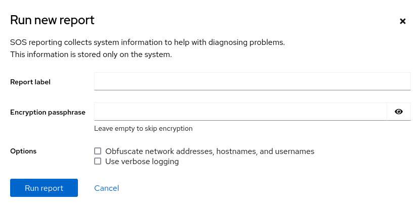

# Getting the most from your Support experience

* * *

Red Hat Enterprise Linux 10

## Gathering troubleshooting information from RHEL servers with the sos utility

Red Hat Customer Content Services

[Legal Notice](#idm139658498740960)

**Abstract**

Collect configuration, diagnostic, and troubleshooting data with the sos utility and provide those files to Red Hat Technical Support. The Support team can analyze and investigate this data to resolve your service requests reported in your support case.

* * *

<h2 id="providing-feedback-on-red-hat-documentation">Providing feedback on Red Hat documentation</h2>

We are committed to providing high-quality documentation and value your feedback. To help us improve, you can submit suggestions or report errors through the Red Hat Jira tracking system.

**Procedure**

1. Log in to the [Jira](https://issues.redhat.com/projects/RHELDOCS/issues) website.
   
   If you do not have an account, select the option to create one.
2. Click **Create** in the top navigation bar.
3. Enter a descriptive title in the **Summary** field.
4. Enter your suggestion for improvement in the **Description** field. Include links to the relevant parts of the documentation.
5. Click **Create** at the bottom of the dialogue.

<h2 id="generating-an-sos-report-for-technical-support">Chapter 1. Generating an sos report for technical support</h2>

To collect configuration details, system information, and diagnostic data from Red Hat Enterprise Linux (RHEL) environment, generate an sos report so that Red Hat Support engineers can analyze and resolve technical issues efficiently.

<h3 id="what-the-sos-utility-does">1.1. What the sos utility does</h3>

An `sos` report is a common starting point for Red Hat technical support engineers when performing analysis of a service request for a RHEL system. The `sos` utility (also known as `sosreport`) provides a standardized way to collect diagnostic information that Red Hat support engineers can reference throughout their investigation of issues reported in support cases.

The `sos` utility allows to collect various debugging information from one or more systems, optionally clean sensitive data, and upload it in a form of a report to Red Hat. More specifically, the three `sos` components do the following:

- `sos report` collects debugging information from *one* system.

Note

This program was originally named `sosreport`. Running `sosreport` no longer works as `sos report` has to be called instead, with the same arguments.

- `sos collect` allows to run and collect individual `sos` reports from a specified set of nodes.
- `sos clean` obfuscates potentially sensitive information such as user names, host names, IP or MAC addresses, or other user-specified data.

The information collected in a report contains configuration details, system information, and diagnostic information from a RHEL system, such as:

- The running kernel version.
- Loaded kernel modules.
- System and service configuration files.
- Diagnostic command output.
- A list of installed packages.

The `sos` utility writes the data it collects to an archive named `sosreport-<host_name>-<support_case_number>-<YYYY-MM-DD>-<unique_random_characters>.tar.xz`.

The utility stores the archive and its SHA-256 checksum in the `/var/tmp/` directory:

```
ll /var/tmp/sosreport*
total 18704
-rw-------. 1 root root 19136596 Jan 25 07:42 sosreport-server1-12345678-2022-01-25-tgictvu.tar.xz
-rw-r--r--. 1 root root       65 Jan 25 07:42 sosreport-server1-12345678-2022-01-25-tgictvu.tar.xz.sha256
```

```plaintext
[root@server1 ~]# ll /var/tmp/sosreport*
total 18704
-rw-------. 1 root root 19136596 Jan 25 07:42 sosreport-server1-12345678-2022-01-25-tgictvu.tar.xz
-rw-r--r--. 1 root root       65 Jan 25 07:42 sosreport-server1-12345678-2022-01-25-tgictvu.tar.xz.sha256
```

\+ For more information, see the `sosreport(1)` man page on your system.

<h3 id="installing-the-sos-package-from-the-command-line">1.2. Installing the sos package from the command line</h3>

Install the sos package on Red Hat Enterprise Linux to enable the generation of diagnostic reports by using the command line. Installing this package allows you to run the sos report command, which collects the system information and configuration details that Red Hat Support engineers review to troubleshoot issues.

**Prerequisites**

- You need `root` privileges.

**Procedure**

- Install the `sos` package.
  
  ```
  dnf install sos
  ```
  
  ```plaintext
  [root@server ~]# dnf install sos
  ```

**Verification**

- Use the `rpm` utility to verify that the `sos` package is installed.
  
  ```
  rpm -q sos
  sos-4.2-15.el9.noarch
  ```
  
  ```plaintext
  [root@server ~]# rpm -q sos
  sos-4.2-15.el9.noarch
  ```

<h3 id="generating-an-sos-report-from-the-command-line">1.3. Generating an sos report from the command line</h3>

Use the `sos report` command to gather an `sos` report from a RHEL server.

**Prerequisites**

- You have installed the `sos` package.
- You need `root` privileges.

**Procedure**

1. Run the `sos report` command and follow the on-screen instructions. You can add the `--upload` option to transfer the `sos` report to Red Hat immediately after generating it.
   
   ```
   sudo sos report
   [sudo] password for user:
   
   sos report (version 4.2)
   
   This command will collect diagnostic and configuration information from
   this Red Hat Enterprise Linux system and installed applications.
   
   An archive containing the collected information will be generated in
   /var/tmp/sos.qkn_b7by and may be provided to a Red Hat support
   representative.
   
   Press ENTER to continue, or CTRL-C to quit.
   ```
   
   ```plaintext
   [user@server1 ~]$ sudo sos report
   [sudo] password for user:
   
   sos report (version 4.2)
   
   This command will collect diagnostic and configuration information from
   this Red Hat Enterprise Linux system and installed applications.
   
   An archive containing the collected information will be generated in
   /var/tmp/sos.qkn_b7by and may be provided to a Red Hat support
   representative.
   
   Press ENTER to continue, or CTRL-C to quit.
   ```
2. Optional: If you have already opened a Technical Support case with Red Hat, enter the case number to embed it in the `sos` report file name, and it will be uploaded to that case if you specified the `--upload` option. If you do not have a case number, leave this field blank. Entering a case number is optional and does not affect the operation of the `sos` utility.
   
   ```
   Please enter the case id that you are generating this report for []: <8-digit_case_number>
   ```
   
   ```plaintext
   Please enter the case id that you are generating this report for []: <8-digit_case_number>
   ```
3. Take note of the `sos` report file name displayed at the end of the console output.
   
   ```
   Finished running plugins
   Creating compressed archive...
   
   Your sos report has been generated and saved in
   /var/tmp/sosreport-server1-12345678-2022-04-17-qmtnqng.tar.xz
   
   Size    16.51MiB
   Owner   root
   sha256  bf303917b689b13f0c059116d9ca55e341d5fadcd3f1473bef7299c4ad2a7f4f
   
   Please send this file to your support representative.
   ```
   
   ```plaintext
   Finished running plugins
   Creating compressed archive...
   
   Your sos report has been generated and saved in
   /var/tmp/sosreport-server1-12345678-2022-04-17-qmtnqng.tar.xz
   
   Size    16.51MiB
   Owner   root
   sha256  bf303917b689b13f0c059116d9ca55e341d5fadcd3f1473bef7299c4ad2a7f4f
   
   Please send this file to your support representative.
   ```
4. Optional: You can use the `--batch` option to generate an `sos` report without prompting for interactive input.
   
   ```
   sudo sos report --batch --case-id <8-digit_case_number>
   ```
   
   ```plaintext
   [user@server1 ~]$ sudo sos report --batch --case-id <8-digit_case_number>
   ```
5. You can also use the `--clean` option to obfuscate a just-collected `sos` report.
   
   ```
   sudo sos report --clean
   ```
   
   ```plaintext
   [user@server1 ~]$ sudo sos report --clean
   ```

**Verification**

- Verify that the `sos` utility created an archive in `/var/tmp/` matching the description from the command output.
  
  ```
  sudo ls -l /var/tmp/sosreport*
  [sudo] password for user:
  -rw-------. 1 root root 17310544 Sep 17 19:11 /var/tmp/sosreport-server1-12345678-2022-04-17-qmtnqng.tar.xz
  ```
  
  ```plaintext
  [user@server1 ~]$ sudo ls -l /var/tmp/sosreport*
  [sudo] password for user:
  -rw-------. 1 root root 17310544 Sep 17 19:11 /var/tmp/sosreport-server1-12345678-2022-04-17-qmtnqng.tar.xz
  ```

<h3 id="generating-and-collecting-sos-reports-on-multiple-systems-concurrently">1.4. Generating and collecting sos reports on multiple systems concurrently</h3>

You can use the `sos` utility to trigger the `sos report` command on multiple systems. Wait for the report to terminate and collect all generated reports.

**Prerequisites**

- You know the *cluster* type or list of *nodes* to run on.
- You have installed the `sos` package on all systems.
- You have `ssh` keys for the `root` account on all the systems, or you can provide the root password via the `--password` option.

**Procedure**

- Run the `sos collect` command and follow the on-screen instructions.
  
  Note
  
  By default, `sos collect` tries to identify the type of *cluster* it runs on to automatically identify the *nodes* to collect reports from.
  
  1. You can set the *cluster* or *nodes* types manually with the `--cluster` or `--nodes` options.
  2. You can also use the `--master` option to point the `sos` utility at a remote node to determine the *cluster* type and the *node* lists. Thus, you do not have to be logged into one of the *cluster* *nodes* to collect `sos` reports; you can do it from your workstation.
  3. You can add the `--upload` option to transfer the `sos report` to Red Hat immediately after generating it.
  4. Any valid `sos report` option can be further supplied and will be passed to all `sos` reports executions, such as the `--batch` and `--clean` options.
  
  ```
  sos collect --nodes=sos-node1,sos-node2 -o process,apache --log-size=50
  
  sos-collector (version 4.2)
  
  This utility is used to collect sosreports from multiple nodes simultaneously.
  It uses OpenSSH's ControlPersist feature to connect to nodes and run commands remotely. If your system installation of OpenSSH is older than 5.6, please upgrade.
  
  An archive of sosreport tarballs collected from the nodes will be generated in /var/tmp/sos.o4l55n1s and may be provided to an appropriate support representative.
  
  The generated archive may contain data considered sensitive and its content should be reviewed by the originating organization before being passed to any third party.
  
  No configuration changes will be made to the system running this utility or remote systems that it connects to.
  
  
  Press ENTER to continue, or CTRL-C to quit
  
  
  Please enter the case id you are collecting reports for: <8-digit_case_number>
  
  sos-collector ASSUMES that SSH keys are installed on all nodes unless the
  --password option is provided.
  
  The following is a list of nodes to collect from:
      primary-rhel10
      sos-node1
      sos-node2
  
  
  Press ENTER to continue with these nodes, or press CTRL-C to quit
  
  
  Connecting to nodes...
  
  Beginning collection of sosreports from 3 nodes, collecting a maximum of 4 concurrently
  
  primary-rhel10 : Generating sosreport...
  sos-node1  : Generating sosreport...
  sos-node2 : Generating sosreport...
  primary-rhel10 : Retrieving sosreport...
  sos-node1  : Retrieving sosreport...
  primary-rhel10  : Successfully collected sosreport
  sos-node1 : Successfully collected sosreport
  sos-node2 : Retrieving sosreport...
  sos-node2 : Successfully collected sosreport
  
  The following archive has been created. Please provide it to your support team.
      /var/tmp/sos-collector-2022-05-15-pafsr.tar.xz
  
  ```
  
  ```plaintext
  [root@primary-rhel10 ~]# sos collect --nodes=sos-node1,sos-node2 -o process,apache --log-size=50
  
  sos-collector (version 4.2)
  
  This utility is used to collect sosreports from multiple nodes simultaneously.
  It uses OpenSSH's ControlPersist feature to connect to nodes and run commands remotely. If your system installation of OpenSSH is older than 5.6, please upgrade.
  
  An archive of sosreport tarballs collected from the nodes will be generated in /var/tmp/sos.o4l55n1s and may be provided to an appropriate support representative.
  
  The generated archive may contain data considered sensitive and its content should be reviewed by the originating organization before being passed to any third party.
  
  No configuration changes will be made to the system running this utility or remote systems that it connects to.
  
  
  Press ENTER to continue, or CTRL-C to quit
  
  
  Please enter the case id you are collecting reports for: <8-digit_case_number>
  
  sos-collector ASSUMES that SSH keys are installed on all nodes unless the
  --password option is provided.
  
  The following is a list of nodes to collect from:
      primary-rhel10
      sos-node1
      sos-node2
  
  
  Press ENTER to continue with these nodes, or press CTRL-C to quit
  
  
  Connecting to nodes...
  
  Beginning collection of sosreports from 3 nodes, collecting a maximum of 4 concurrently
  
  primary-rhel10 : Generating sosreport...
  sos-node1  : Generating sosreport...
  sos-node2 : Generating sosreport...
  primary-rhel10 : Retrieving sosreport...
  sos-node1  : Retrieving sosreport...
  primary-rhel10  : Successfully collected sosreport
  sos-node1 : Successfully collected sosreport
  sos-node2 : Retrieving sosreport...
  sos-node2 : Successfully collected sosreport
  
  The following archive has been created. Please provide it to your support team.
      /var/tmp/sos-collector-2022-05-15-pafsr.tar.xz
  
  [root@primary-rhel10 ~]#
  ```

**Verification**

- Verify that the `sos collect` command created an archive in the `/var/tmp/` directory matching the description from the command output.
  
  ```
  ls -l /var/tmp/sos-collector*
  -rw-------. 1 root root 160492 May 15 13:35 /var/tmp/sos-collector-2022-05-15-pafsr.tar.xz
  ```
  
  ```plaintext
  [root@primary-rhel10 ~]# ls -l /var/tmp/sos-collector*
  -rw-------. 1 root root 160492 May 15 13:35 /var/tmp/sos-collector-2022-05-15-pafsr.tar.xz
  ```

<h3 id="cleaning-an-sos-report">1.5. Cleaning an sos report</h3>

The `sos` utility offers a routine to obfuscate potentially sensitive data, such as user names, host names, IP or MAC addresses, or other user-specified keywords. The original `sos report` or `sos collect` stays unchanged, and a new `*-obfuscated.tar.xz` file is generated and intended to be shared with a third party.

**Prerequisites**

- You have generated an `sos report` or an `sos collect` tarball.
- *(Optional)* You have a list of specific keywords beyond the user names, host names, and other data you want to obfuscate.

**Procedure**

- Run the `sos clean` command on either an `sos report` or `sos collect` tarball and follow the on-screen instructions.
  
  1. You can add the `--keywords` option to additionally clean a given list of keywords.
  2. You can add the `--usernames` option to obfuscate further sensitive user names.
     
     The automatic user name cleaning will automatically run for users reported through the `lastlog` file for users with an UID of 1000 and above. This option is used for LDAP users that may not appear as an actual login, but may occur in certain log files.
     
     ```
     sudo sos clean /var/tmp/sos-collector-2022-05-15-pafsr.tar.xz
     [sudo] password for user:
     
     sos clean (version 4.2)
     
     This command will attempt to obfuscate information that is generally considered to be potentially sensitive. Such information includes IP addresses, MAC addresses, domain names, and any user-provided keywords.
     
     Note that this utility provides a best-effort approach to data obfuscation, but it does not guarantee that such obfuscation provides complete coverage of all such data in the archive, or that any obfuscation is provided to data that does not fit the description above.
     
     Users should review any resulting data and/or archives generated or processed by this utility for remaining sensitive content before being passed to a third party.
     
     
     Press ENTER to continue, or CTRL-C to quit.
     
     Found 4 total reports to obfuscate, processing up to 4 concurrently
     
     sosreport-primary-rhel10-2022-05-15-nchbdmd :      Extracting...
     sosreport-sos-node1-2022-05-15-wmlomgu :      Extracting...
     sosreport-sos-node2-2022-05-15-obsudzc :      Extracting...
     sos-collector-2022-05-15-pafsr :                   Beginning obfuscation...
     sosreport-sos-node1-2022-05-15-wmlomgu :      Beginning obfuscation...
     sos-collector-2022-05-15-pafsr :                   Obfuscation completed
     sosreport-primary-rhel10-2022-05-15-nchbdmd :      Beginning obfuscation...
     sosreport-sos-node2-2022-05-15-obsudzc :      Beginning obfuscation...
     sosreport-primary-rhel10-2022-05-15-nchbdmd :      Re-compressing...
     sosreport-sos-node2-2022-05-15-obsudzc :      Re-compressing...
     sosreport-sos-node1-2022-05-15-wmlomgu :      Re-compressing...
     sosreport-primary-rhel10-2022-05-15-nchbdmd :      Obfuscation completed
     sosreport-sos-node2-2022-05-15-obsudzc :      Obfuscation completed
     sosreport-sos-node1-2022-05-15-wmlomgu :      Obfuscation completed
     
     Successfully obfuscated 4 report(s)
     
     A mapping of obfuscated elements is available at
         /var/tmp/sos-collector-2022-05-15-pafsr-private_map
     
     The obfuscated archive is available at
         /var/tmp/sos-collector-2022-05-15-pafsr-obfuscated.tar.xz
     
         Size    157.10KiB
         Owner    root
     
     Please send the obfuscated archive to your support representative and keep the mapping file private
     ```
     
     ```plaintext
     [user@server1 ~]$ sudo sos clean /var/tmp/sos-collector-2022-05-15-pafsr.tar.xz
     [sudo] password for user:
     
     sos clean (version 4.2)
     
     This command will attempt to obfuscate information that is generally considered to be potentially sensitive. Such information includes IP addresses, MAC addresses, domain names, and any user-provided keywords.
     
     Note that this utility provides a best-effort approach to data obfuscation, but it does not guarantee that such obfuscation provides complete coverage of all such data in the archive, or that any obfuscation is provided to data that does not fit the description above.
     
     Users should review any resulting data and/or archives generated or processed by this utility for remaining sensitive content before being passed to a third party.
     
     
     Press ENTER to continue, or CTRL-C to quit.
     
     Found 4 total reports to obfuscate, processing up to 4 concurrently
     
     sosreport-primary-rhel10-2022-05-15-nchbdmd :      Extracting...
     sosreport-sos-node1-2022-05-15-wmlomgu :      Extracting...
     sosreport-sos-node2-2022-05-15-obsudzc :      Extracting...
     sos-collector-2022-05-15-pafsr :                   Beginning obfuscation...
     sosreport-sos-node1-2022-05-15-wmlomgu :      Beginning obfuscation...
     sos-collector-2022-05-15-pafsr :                   Obfuscation completed
     sosreport-primary-rhel10-2022-05-15-nchbdmd :      Beginning obfuscation...
     sosreport-sos-node2-2022-05-15-obsudzc :      Beginning obfuscation...
     sosreport-primary-rhel10-2022-05-15-nchbdmd :      Re-compressing...
     sosreport-sos-node2-2022-05-15-obsudzc :      Re-compressing...
     sosreport-sos-node1-2022-05-15-wmlomgu :      Re-compressing...
     sosreport-primary-rhel10-2022-05-15-nchbdmd :      Obfuscation completed
     sosreport-sos-node2-2022-05-15-obsudzc :      Obfuscation completed
     sosreport-sos-node1-2022-05-15-wmlomgu :      Obfuscation completed
     
     Successfully obfuscated 4 report(s)
     
     A mapping of obfuscated elements is available at
         /var/tmp/sos-collector-2022-05-15-pafsr-private_map
     
     The obfuscated archive is available at
         /var/tmp/sos-collector-2022-05-15-pafsr-obfuscated.tar.xz
     
         Size    157.10KiB
         Owner    root
     
     Please send the obfuscated archive to your support representative and keep the mapping file private
     ```
     
     You can append the cleaner functionality to the `sos report` or `sos collect` commands with the `--clean` option:
     
     ```
     sudo sos report --clean
     ```
     
     ```plaintext
     [user@server1 ~]$ sudo sos report --clean
     ```

**Verification**

- Verify that the `sos clean` command created an obfuscated archive and an obfuscation mapping in the `/var/tmp/` directory matching the description from the command output.
  
  ```
  sudo ls -l /var/tmp/sos-collector-2022-05-15-pafsr-private_map /var/tmp/sos-collector-2022-05-15-pafsr-obfuscated.tar.xz
  [sudo] password for user:
  
  -rw-------. 1 root root 160868 May 15 16:10 /var/tmp/sos-collector-2022-05-15-pafsr-obfuscated.tar.xz
  -rw-------. 1 root root  96622 May 15 16:10 /var/tmp/sos-collector-2022-05-15-pafsr-private_map
  ```
  
  ```plaintext
  [user@server1 ~]$ sudo ls -l /var/tmp/sos-collector-2022-05-15-pafsr-private_map /var/tmp/sos-collector-2022-05-15-pafsr-obfuscated.tar.xz
  [sudo] password for user:
  
  -rw-------. 1 root root 160868 May 15 16:10 /var/tmp/sos-collector-2022-05-15-pafsr-obfuscated.tar.xz
  -rw-------. 1 root root  96622 May 15 16:10 /var/tmp/sos-collector-2022-05-15-pafsr-private_map
  ```
- Check the `*-private_map` file for the obfuscation mapping:
  
  ```
  [user@server1 ~]$ sudo cat /var/tmp/sos-collector-2022-05-15-pafsr-private_map
  [sudo] password for user:
  
  {
      "hostname_map": {
          "pmoravec-rhel10": "host0"
      },
      "ip_map": {
          "10.44.128.0/22": "100.0.0.0/22",
  ..
      "username_map": {
          "foobaruser": "obfuscateduser0",
          "jsmith": "obfuscateduser1",
          "johndoe": "obfuscateduser2"
      }
  }
  ```
  
  ```plaintext
  [user@server1 ~]$ sudo cat /var/tmp/sos-collector-2022-05-15-pafsr-private_map
  [sudo] password for user:
  
  {
      "hostname_map": {
          "pmoravec-rhel10": "host0"
      },
      "ip_map": {
          "10.44.128.0/22": "100.0.0.0/22",
  ..
      "username_map": {
          "foobaruser": "obfuscateduser0",
          "jsmith": "obfuscateduser1",
          "johndoe": "obfuscateduser2"
      }
  }
  ```

Important

Keep both the original unobfuscated archive and the `*private_map` files locally as Red Hat support can refer to the obfuscated terms that you will need to translate to the original values.

<h3 id="generating-an-sos-report-and-securing-it-with-gpg-passphrase-encryption">1.6. Generating an sos report and securing it with GPG passphrase encryption</h3>

To generate an `sos` report and encrypt it with symmetric GPG2 based on a passphrase, secure the contents of an `sos` report with a password if, for example, you need to transfer it over a public network to a third party.

Ensure you have sufficient space when creating an encrypted `sos` report, as it temporarily uses double the disk space:

1. The `sos` utility creates an unencrypted `sos` report.
2. The utility encrypts the `sos` report as a new file.
3. The utility then removes the unencrypted archive.

**Prerequisites**

- You have installed the `sos` package.
- You need `root` privileges.

**Procedure**

1. Run the `sos report` command and specify a passphrase with the `--encrypt-pass` option. You can add the `--upload` option to transfer the `sos` report to Red Hat immediately after generating it.
   
   ```
   sudo sos report --encrypt-pass my-passphrase
   [sudo] password for user:
   
   sosreport (version 4.2)
   
   This command will collect diagnostic and configuration information from
   this Red Hat Enterprise Linux system and installed applications.
   
   An archive containing the collected information will be generated in
   /var/tmp/sos.6lck0myd and may be provided to a Red Hat support
   representative.
   
   ...
   
   Press ENTER to continue, or CTRL-C to quit.
   ```
   
   ```plaintext
   [user@server1 ~]$ sudo sos report --encrypt-pass my-passphrase
   [sudo] password for user:
   
   sosreport (version 4.2)
   
   This command will collect diagnostic and configuration information from
   this Red Hat Enterprise Linux system and installed applications.
   
   An archive containing the collected information will be generated in
   /var/tmp/sos.6lck0myd and may be provided to a Red Hat support
   representative.
   
   ...
   
   Press ENTER to continue, or CTRL-C to quit.
   ```
2. Optional: If you have already opened a Technical Support case with Red Hat, enter the case number to embed it in the `sos` report file name, and it will be uploaded to that case if you specified the `--upload` option. If you do not have a case number, leave this field blank. Entering a case number is optional and does not affect the operation of the `sos` utility.
   
   ```
   Please enter the case id that you are generating this report for []: <8-digit_case_number>
   ```
   
   ```plaintext
   Please enter the case id that you are generating this report for []: <8-digit_case_number>
   ```
3. Take note of the `sos` report file name displayed at the end of the console output.
   
   ```
   Finished running plugins
   Creating compressed archive...
   
   Your sosreport has been generated and saved in:
   /var/tmp/secured-sosreport-server1-12345678-2022-01-24-ueqijfm.tar.xz.gpg
   
   Size    17.53MiB
   Owner   root
   sha256     bf303917b689b13f0c059116d9ca55e341d5fadcd3f1473bef7299c4ad2a7f4f
   
   Please send this file to your support representative.
   ```
   
   ```plaintext
   Finished running plugins
   Creating compressed archive...
   
   Your sosreport has been generated and saved in:
   /var/tmp/secured-sosreport-server1-12345678-2022-01-24-ueqijfm.tar.xz.gpg
   
   Size    17.53MiB
   Owner   root
   sha256     bf303917b689b13f0c059116d9ca55e341d5fadcd3f1473bef7299c4ad2a7f4f
   
   Please send this file to your support representative.
   ```

**Verification**

1. Verify that the `sos` utility created an archive meeting the following requirements:
   
   - File name starts with `secured`.
   - File name ends with a `.gpg` extension.
   - Located in the `/var/tmp/` directory.
     
     ```
     sudo ls -l /var/tmp/sosreport*
     [sudo] password for user:
     -rw-------. 1 root root 18381537 Jan 24 17:55 /var/tmp/secured-sosreport-server1-12345678-2022-01-24-ueqijfm.tar.xz.gpg
     ```
     
     ```plaintext
     [user@server1 ~]$ sudo ls -l /var/tmp/sosreport*
     [sudo] password for user:
     -rw-------. 1 root root 18381537 Jan 24 17:55 /var/tmp/secured-sosreport-server1-12345678-2022-01-24-ueqijfm.tar.xz.gpg
     ```
2. Verify that you can decrypt the archive with the same passphrase you used to encrypt it.
   
   1. Use the `gpg` command to decrypt the archive.
      
      ```
      sudo gpg --output decrypted-sosreport.tar.gz --decrypt /var/tmp/secured-sosreport-server1-12345678-2022-01-24-ueqijfm.tar.xz.gpg
      ```
      
      ```plaintext
      [user@server1 ~]$ sudo gpg --output decrypted-sosreport.tar.gz --decrypt /var/tmp/secured-sosreport-server1-12345678-2022-01-24-ueqijfm.tar.xz.gpg
      ```
   2. When prompted, enter the passphrase you used to encrypt the archive.
      
      ```
      ┌──────────────────────────────────────────────────────┐
      │ Enter passphrase                                     │
      │                                                      │
      │                                                      │
      │ Passphrase: <passphrase>                             │
      │                                                      │
      │       <OK>                              <Cancel>     │
      └──────────────────────────────────────────────────────┘
      ```
      
      ```plaintext
      ┌──────────────────────────────────────────────────────┐
      │ Enter passphrase                                     │
      │                                                      │
      │                                                      │
      │ Passphrase: <passphrase>                             │
      │                                                      │
      │       <OK>                              <Cancel>     │
      └──────────────────────────────────────────────────────┘
      ```
   3. Verify that the `gpg` utility produced an unencrypted archive with a `.tar.gz` file extension.
      
      ```
      sudo ls -l decrypted-sosreport.tar.gz
      [sudo] password for user:
      -rw-r--r--. 1 root root 18381537 Jan 24 17:59 decrypted-sosreport.tar.gz
      ```
      
      ```plaintext
      [user@server1 ~]$ sudo ls -l decrypted-sosreport.tar.gz
      [sudo] password for user:
      -rw-r--r--. 1 root root 18381537 Jan 24 17:59 decrypted-sosreport.tar.gz
      ```

**Additional resources**

- [Methods for providing an `sos` report to Red Hat technical support](https://docs.redhat.com/en/documentation/red_hat_enterprise_linux/10/html/getting_the_most_from_your_support_experience/index#methods-for-providing-an-sos-report-to-red-hat-technical-support)

<h3 id="generating-an-sos-report-and-securing-it-with-gpg-encryption-based-on-a-keypair">1.7. Generating an sos report and securing it with GPG encryption based on a keypair</h3>

You can generate an `sos` report and secure it with GPG2 encryption based on a keypair from a GPG keyring. To secure the contents of an `sos` report with this type of encryption if, for example, you want to protect an `sos` report stored on a server.

Ensure you have sufficient space when creating an encrypted `sos` report, as it temporarily uses double the disk space:

1. The `sos` utility creates an unencrypted `sos` report.
2. The utility encrypts the `sos` report as a new file.
3. The utility then removes the unencrypted archive.

**Prerequisites**

- You have installed the `sos` package.
- You need `root` privileges.
- You have created a GPG2 key.

**Procedure**

1. Run the `sos report` command and specify the user name that owns the GPG keyring with the `--encrypt-key` option. You can add the `--upload` option to transfer the `sos` report to Red Hat immediately after generating it.
   
   Note
   
   The user running the `sos report` command **must** be the same user that owns the GPG keyring used to encrypt and decrypt the `sos` report. If the user uses `sudo` to run the `sos report` command, the keyring must also be set up using `sudo`, or the user must have direct shell access to that account.
   
   ```
   sudo sos report --encrypt-key root
   [sudo] password for user:
   
   sosreport (version 4.2)
   
   This command will collect diagnostic and configuration information from
   this Red Hat Enterprise Linux system and installed applications.
   
   An archive containing the collected information will be generated in
   /var/tmp/sos.6ucjclgf and may be provided to a Red Hat support
   representative.
   
   ...
   
   Press ENTER to continue, or CTRL-C to quit.
   ```
   
   ```plaintext
   [user@server1 ~]$ sudo sos report --encrypt-key root
   [sudo] password for user:
   
   sosreport (version 4.2)
   
   This command will collect diagnostic and configuration information from
   this Red Hat Enterprise Linux system and installed applications.
   
   An archive containing the collected information will be generated in
   /var/tmp/sos.6ucjclgf and may be provided to a Red Hat support
   representative.
   
   ...
   
   Press ENTER to continue, or CTRL-C to quit.
   ```
2. Optional: If you have already opened a Technical Support case with Red Hat, enter the case number to embed it in the `sos` report file name, and it will be uploaded to that case if you specified the `--upload` option. If you do not have a case number, leave this field blank. Entering a case number is optional and does not affect the operation of the `sos` utility.
   
   ```
   Please enter the case id that you are generating this report for []: <8-digit_case_number>
   ```
   
   ```plaintext
   Please enter the case id that you are generating this report for []: <8-digit_case_number>
   ```
3. Take note of the `sos` report file name displayed at the end of the console output.
   
   ```
   ...
   Finished running plugins
   Creating compressed archive...
   
   Your sosreport has been generated and saved in:
   /var/tmp/secured-sosreport-server1-23456789-2022-02-27-zhdqhdi.tar.xz.gpg
   
   Size    15.44MiB
   Owner   root
   sha256  bf303917b689b13f0c059116d9ca55e341d5fadcd3f1473bef7299c4ad2a7f4f
   
   Please send this file to your support representative.
   ```
   
   ```plaintext
   ...
   Finished running plugins
   Creating compressed archive...
   
   Your sosreport has been generated and saved in:
   /var/tmp/secured-sosreport-server1-23456789-2022-02-27-zhdqhdi.tar.xz.gpg
   
   Size    15.44MiB
   Owner   root
   sha256  bf303917b689b13f0c059116d9ca55e341d5fadcd3f1473bef7299c4ad2a7f4f
   
   Please send this file to your support representative.
   ```

**Verification**

1. Verify that the `sos` utility created an archive meeting the following requirements:
   
   - File name starts with `secured`.
   - File name ends with a `.gpg` extension.
   - Located in the `/var/tmp/` directory.
     
     ```
     sudo ls -l /var/tmp/sosreport*
     [sudo] password for user:
     -rw-------. 1 root root 16190013 Jan 24 17:55 /var/tmp/secured-sosreport-server1-23456789-2022-01-27-zhdqhdi.tar.xz.gpg
     ```
     
     ```plaintext
     [user@server1 ~]$ sudo ls -l /var/tmp/sosreport*
     [sudo] password for user:
     -rw-------. 1 root root 16190013 Jan 24 17:55 /var/tmp/secured-sosreport-server1-23456789-2022-01-27-zhdqhdi.tar.xz.gpg
     ```
2. Verify you can decrypt the archive with the same key you used to encrypt it.
   
   1. Use the `gpg` command to decrypt the archive.
      
      ```
      sudo gpg --output decrypted-sosreport.tar.gz --decrypt /var/tmp/secured-sosreport-server1-23456789-2022-01-27-zhdqhdi.tar.xz.gpg
      ```
      
      ```plaintext
      [user@server1 ~]$ sudo gpg --output decrypted-sosreport.tar.gz --decrypt /var/tmp/secured-sosreport-server1-23456789-2022-01-27-zhdqhdi.tar.xz.gpg
      ```
   2. When prompted, enter the passphrase you used when creating the GPG key.
      
      ```
      ┌────────────────────────────────────────────────────────────────┐
      │ Please enter the passphrase to unlock the OpenPGP secret key:  │
      │ "GPG User (first key) <root@example.com>"                      │
      │ 2048-bit RSA key, ID BF28FFA302EF4557,                         │
      │ created 2020-01-13.                                            │
      │                                                                │
      │                                                                │
      │ Passphrase: <passphrase>                                       │
      │                                                                │
      │         <OK>                                    <Cancel>       │
      └────────────────────────────────────────────────────────────────┘
      ```
      
      ```plaintext
      ┌────────────────────────────────────────────────────────────────┐
      │ Please enter the passphrase to unlock the OpenPGP secret key:  │
      │ "GPG User (first key) <root@example.com>"                      │
      │ 2048-bit RSA key, ID BF28FFA302EF4557,                         │
      │ created 2020-01-13.                                            │
      │                                                                │
      │                                                                │
      │ Passphrase: <passphrase>                                       │
      │                                                                │
      │         <OK>                                    <Cancel>       │
      └────────────────────────────────────────────────────────────────┘
      ```
   3. Verify that the `gpg` utility produced an unencrypted archive with a `.tar.gz` file extension.
      
      ```
      sudo ll decrypted-sosreport.tar.gz
      [sudo] password for user:
      -rw-r--r--. 1 root root 16190013 Jan 27 17:47 decrypted-sosreport.tar.gz
      ```
      
      ```plaintext
      [user@server1 ~]$ sudo ll decrypted-sosreport.tar.gz
      [sudo] password for user:
      -rw-r--r--. 1 root root 16190013 Jan 27 17:47 decrypted-sosreport.tar.gz
      ```

**Additional resources**

- [Methods for providing an `sos` report to Red Hat technical support](https://docs.redhat.com/en/documentation/red_hat_enterprise_linux/10/html/getting_the_most_from_your_support_experience/index#methods-for-providing-an-sos-report-to-red-hat-technical-support)

<h3 id="creating-a-gpg2-key">1.8. Creating a GPG2 key</h3>

Generate a GPG key on Red Hat Enterprise Linux to secure the data you exchange with Red Hat Technical Support. Creating a key pair enables you to encrypt confidential files, such as sos reports, before uploading them to the Customer Portal.

**Prerequisites**

- You need `root` privileges.

**Procedure**

1. Install and configure the `pinentry` utility.
   
   ```
   dnf install pinentry
   mkdir ~/.gnupg -m 700
   echo "pinentry-program /usr/bin/pinentry-curses" >> ~/.gnupg/gpg-agent.conf
   ```
   
   ```plaintext
   [root@server ~]# dnf install pinentry
   [root@server ~]# mkdir ~/.gnupg -m 700
   [root@server ~]# echo "pinentry-program /usr/bin/pinentry-curses" >> ~/.gnupg/gpg-agent.conf
   ```
2. Create a `key-input` file used for generating a GPG keypair with your preferred details. For example:
   
   ```
   [root@server ~]# cat >key-input <<EOF
   %echo Generating a standard key
   Key-Type: RSA
   Key-Length: 2048
   Name-Real: GPG User
   Name-Comment: first key
   Name-Email: root@example.com
   Expire-Date: 0
   %commit
   %echo Finished creating standard key
   EOF
   ```
   
   ```plaintext
   [root@server ~]# cat >key-input <<EOF
   %echo Generating a standard key
   Key-Type: RSA
   Key-Length: 2048
   Name-Real: GPG User
   Name-Comment: first key
   Name-Email: root@example.com
   Expire-Date: 0
   %commit
   %echo Finished creating standard key
   EOF
   ```
3. Optional: By default, GPG2 stores its keyring in the `~/.gnupg` file. To use a custom keyring location, set the `GNUPGHOME` environment variable to a directory that is only accessible by root.
   
   ```
   export GNUPGHOME=/root/backup
   
   mkdir -p $GNUPGHOME -m 700
   ```
   
   ```plaintext
   [root@server ~]# export GNUPGHOME=/root/backup
   
   [root@server ~]# mkdir -p $GNUPGHOME -m 700
   ```
4. Generate a new GPG2 key based on the contents of the `key-input` file.
   
   ```
   gpg2 --batch --gen-key key-input
   ```
   
   ```plaintext
   [root@server ~]# gpg2 --batch --gen-key key-input
   ```
5. Enter a passphrase to protect the GPG2 key. You use this passphrase to access the private key for decryption.
   
   ```
   ┌──────────────────────────────────────────────────────┐
   │ Please enter the passphrase to                       │
   │ protect your new key                                 │
   │                                                      │
   │ Passphrase: <passphrase>                             │
   │                                                      │
   │	 <OK>                             <Cancel>         │
   └──────────────────────────────────────────────────────┘
   ```
   
   ```plaintext
   ┌──────────────────────────────────────────────────────┐
   │ Please enter the passphrase to                       │
   │ protect your new key                                 │
   │                                                      │
   │ Passphrase: <passphrase>                             │
   │                                                      │
   │	 <OK>                             <Cancel>         │
   └──────────────────────────────────────────────────────┘
   ```
6. Confirm the correct passphrase by entering it again.
   
   ```
   ┌──────────────────────────────────────────────────────┐
   │ Please re-enter this passphrase                      │
   │                                                      │
   │ Passphrase: <passphrase>                             │
   │                                                      │
   │	 <OK>                             <Cancel>         │
   └──────────────────────────────────────────────────────┘
   ```
   
   ```plaintext
   ┌──────────────────────────────────────────────────────┐
   │ Please re-enter this passphrase                      │
   │                                                      │
   │ Passphrase: <passphrase>                             │
   │                                                      │
   │	 <OK>                             <Cancel>         │
   └──────────────────────────────────────────────────────┘
   ```
7. Verify that the new GPG2 key was created successfully.
   
   ```
   gpg: keybox '/root/backup/pubring.kbx' created
   gpg: Generating a standard key
   gpg: /root/backup/trustdb.gpg: trustdb created
   gpg: key BF28FFA302EF4557 marked as ultimately trusted
   gpg: directory '/root/backup/openpgp-revocs.d' created
   gpg: revocation certificate stored as '/root/backup/openpgp-revocs.d/8F6FCF10C80359D5A05AED67BF28FFA302EF4557.rev'
   gpg: Finished creating standard key
   ```
   
   ```plaintext
   gpg: keybox '/root/backup/pubring.kbx' created
   gpg: Generating a standard key
   gpg: /root/backup/trustdb.gpg: trustdb created
   gpg: key BF28FFA302EF4557 marked as ultimately trusted
   gpg: directory '/root/backup/openpgp-revocs.d' created
   gpg: revocation certificate stored as '/root/backup/openpgp-revocs.d/8F6FCF10C80359D5A05AED67BF28FFA302EF4557.rev'
   gpg: Finished creating standard key
   ```

**Verification**

- List the GPG keys on the server.
  
  ```
  gpg2 --list-secret-keys
  gpg: checking the trustdb
  gpg: marginals needed: 3  completes needed: 1  trust model: pgp
  gpg: depth: 0  valid:   1  signed:   0  trust: 0-, 0q, 0n, 0m, 0f, 1u
  /root/backup/pubring.kbx
  ------------------------
  sec   rsa2048 2020-01-13 [SCEA]
        8F6FCF10C80359D5A05AED67BF28FFA302EF4557
  uid           [ultimate] GPG User (first key) <root@example.com>
  ```
  
  ```plaintext
  [root@server ~]# gpg2 --list-secret-keys
  gpg: checking the trustdb
  gpg: marginals needed: 3  completes needed: 1  trust model: pgp
  gpg: depth: 0  valid:   1  signed:   0  trust: 0-, 0q, 0n, 0m, 0f, 1u
  /root/backup/pubring.kbx
  ------------------------
  sec   rsa2048 2020-01-13 [SCEA]
        8F6FCF10C80359D5A05AED67BF28FFA302EF4557
  uid           [ultimate] GPG User (first key) <root@example.com>
  ```

**Additional resources**

- [GNU Privacy Guard](https://gnupg.org/)

<h3 id="generating-an-sos-report-from-the-rescue-environment">1.9. Generating an sos report from the rescue environment</h3>

If a Red Hat Enterprise Linux (RHEL) host does not boot properly, you can boot the host into a *rescue environment* to gather an `sos` report. By using the rescue environment, you can mount the target system under `/mnt/sysroot`, access its contents, and run the `sos report` command.

**Prerequisites**

- If the host is a bare metal server, you need physical access to the machine.
- If the host is a virtual machine, you need access to the virtual machine’s settings in the hypervisor.
- A RHEL installation source, such as an ISO image file, an installation DVD, a netboot CD, or a Preboot Execution Environment (PXE) configuration providing a RHEL installation tree.

**Procedure**

01. Boot the host from an installation source.
02. In the boot menu for the installation media, select the `Troubleshooting` option.
03. In the Troubleshooting menu, select the `Rescue a Red Hat Enterprise Linux system` option.
04. At the Rescue menu, select `1` and press the `Enter` key to continue and mount the system under the `/mnt/sysroot` directory.
    
    ```
    …​
    1) Continue
    2) Read-only mount
    3) Skip to shell
    4) Quit (Reboot)
    Please make a selection from the above: 1
    ```
    
    ```plaintext
    …​
    1) Continue
    2) Read-only mount
    3) Skip to shell
    4) Quit (Reboot)
    Please make a selection from the above: 1
    ```
05. Press the `Enter` key to obtain a shell when prompted.
    
    ```
    Rescue Shell
    
    Your system has been mounted under /mnt/sysroot.
    
    If you would like to make the root of your system the root of the activate system, run the command:
    
        chroot /mnt/sysroot
    Warning: The rescue shell will trigger SELinux autorelabel on the subsequent boot. Add "enforcing=0" on the kernel command line for autorelabel to work properly.
    When finished, please exit from the shell and your system will reboot.
    
    Please press ENTER to get a shell:
    bash-5.2#
    ```
    
    ```plaintext
    Rescue Shell
    
    Your system has been mounted under /mnt/sysroot.
    
    If you would like to make the root of your system the root of the activate system, run the command:
    
        chroot /mnt/sysroot
    Warning: The rescue shell will trigger SELinux autorelabel on the subsequent boot. Add "enforcing=0" on the kernel command line for autorelabel to work properly.
    When finished, please exit from the shell and your system will reboot.
    
    Please press ENTER to get a shell:
    bash-5.2#
    ```
06. Use the `chroot` command to change the apparent root directory of the rescue session to the `/mnt/sysroot` directory.
    
    ```
    Rescue Shell
    …​
    Please press ENTER to get a shell:
    bash-5.2# chroot /mnt/sysimage/
    ```
    
    ```plaintext
    Rescue Shell
    …​
    Please press ENTER to get a shell:
    bash-5.2# chroot /mnt/sysimage/
    ```
07. Optional: Your network might not be up in the inital Rescue Environment, so make sure you set it up first. For example, if the network requires static IP addresses, and you want to transfer the `sos` report over the network, configure the network:
    
    1. Identify the Ethernet device you want to use:
       
       ```
       ip link show
       …​
       2: enp1s0: <BROADCAST,MULTICAST,UP,LOWER_UP> mtu 1500 qdisc fq_codel state UP mode DEFAULT group default qlen 1000
           link/ether 52:54:00:74:79:56 brd ff:ff:ff:ff:ff:ff
       ```
       
       ```plaintext
       # ip link show
       …​
       2: enp1s0: <BROADCAST,MULTICAST,UP,LOWER_UP> mtu 1500 qdisc fq_codel state UP mode DEFAULT group default qlen 1000
           link/ether 52:54:00:74:79:56 brd ff:ff:ff:ff:ff:ff
       ```
    2. Assign an IP address to the network interface, and set the default gateway. For example, if you wanted to add the IP address of *192.168.0.1* with a subnet of *255.255.255.0*, which is a CIDR of *24*, to device *enp1s0*, enter:
       
       ```
       ip address add <192.168.0.1/24> dev <enp1s0>
       ip route add default via <192.168.0.254>
       ```
       
       ```plaintext
       # ip address add <192.168.0.1/24> dev <enp1s0>
       # ip route add default via <192.168.0.254>
       ```
    3. Add a `nameserver` entry to the `/etc/resolv.conf` file, for example:
       
       ```
       nameserver <192.168.0.5>
       ```
       
       ```plaintext
       nameserver <192.168.0.5>
       ```
08. Run the `sos report` command and follow the on-screen instructions. You can add the `--upload` option to transfer the `sos` report to Red Hat immediately after generating it.
    
    ```
    bash-5.2# sos report
    sos report (version 4.8.2)
    
    This command will collect system configuration and diagnostic
    information from this Fedora Linux system.
    
    For more information on the Fedora Project visit:
    
            Community Website : https://fedoraproject.org/
            Community Forums  : https://discussion.fedoraproject.org/
    
    The generated archive may contain data considered sensitive and its
    content should be reviewed by the originating organization before being
    passed to any third party.
    
    No changes will be made to system configuration.
    
    Press ENTER to continue, or CTRL-C to quit.
    ```
    
    ```plaintext
    bash-5.2# sos report
    sos report (version 4.8.2)
    
    This command will collect system configuration and diagnostic
    information from this Fedora Linux system.
    
    For more information on the Fedora Project visit:
    
            Community Website : https://fedoraproject.org/
            Community Forums  : https://discussion.fedoraproject.org/
    
    The generated archive may contain data considered sensitive and its
    content should be reviewed by the originating organization before being
    passed to any third party.
    
    No changes will be made to system configuration.
    
    Press ENTER to continue, or CTRL-C to quit.
    ```
09. Optional: If you have already opened a Technical Support case with Red Hat, enter the case number to embed it in the `sos` report file name, and it will be uploaded to that case if you specified the `--upload` option and your host is connected to the internet. If you do not have a case number, leave this field blank. Entering a case number is optional and does not affect the operation of the `sos` utility.
    
    ```
    sos report (version 4.8.2)
    …​
    
    Press ENTER to continue, or CTRL-C to quit.
    Optionally, please enter the case id that you are generating this report for []:
    ```
    
    ```plaintext
    sos report (version 4.8.2)
    …​
    
    Press ENTER to continue, or CTRL-C to quit.
    Optionally, please enter the case id that you are generating this report for []:
    ```
10. Take note of the `sos` report file name displayed at the end of the console output.
    
    ```
    Finished running plugins
    Creating compressed archive…​
    
    Your sosreport has been generated and saved in:
    /var/tmp/secured-sosreport-unused-2025-05-14-lofqhen.tar.xz
    
    Size    9.30MiB
    Owner   root
    sha256     bf303917b689b13f0c059116d9ca55e341d5fadcd3f1473bef7299c4ad2a7f4f
    
    Please send this file to your support representative.
    bash-5.2#
    ```
    
    ```plaintext
    Finished running plugins
    Creating compressed archive…​
    
    Your sosreport has been generated and saved in:
    /var/tmp/secured-sosreport-unused-2025-05-14-lofqhen.tar.xz
    
    Size    9.30MiB
    Owner   root
    sha256     bf303917b689b13f0c059116d9ca55e341d5fadcd3f1473bef7299c4ad2a7f4f
    
    Please send this file to your support representative.
    bash-5.2#
    ```
11. If your host does not have a connection to the internet, use a file transfer utility such as `scp` to transfer the `sos` report to another host on your network, then upload it to a Red Hat Technical Support case.

**Verification**

- Verify that the `sos` utility created an archive in the `/var/tmp/` directory.
  
  ```
  ls -l /var/tmp/sosreport*
  -rw-r—​r--. 1 root root       65 Mar 14  2025 /var/tmp/sosreport-example.hostname-2025-05-14-lofqhen.tar.xz.sha256
  -rw-------. 1 root root 17036176 Mar 14  2025 /var/tmp/sosreport-example.hostname-2025-05-14-lofqhen.tar.xz5-14-lofqhen.tar.xz
  ```
  
  ```plaintext
  $ ls -l /var/tmp/sosreport*
  -rw-r—​r--. 1 root root       65 Mar 14  2025 /var/tmp/sosreport-example.hostname-2025-05-14-lofqhen.tar.xz.sha256
  -rw-------. 1 root root 17036176 Mar 14  2025 /var/tmp/sosreport-example.hostname-2025-05-14-lofqhen.tar.xz5-14-lofqhen.tar.xz
  ```

**Additional resources**

- [How to generate sosreport from the rescue environment](https://access.redhat.com/solutions/2626631)
- [Enabling networking in rescue environment without chrooting](https://access.redhat.com/solutions/2626631)
- [RHEL installation DVD download on Red Hat Customer Portal](https://access.redhat.com/downloads)

<h3 id="methods-for-providing-an-sos-report-to-red-hat-technical-support">1.10. Methods for providing an sos report to Red Hat technical support</h3>

Select a method to submit an sos report to Red Hat Technical Support to troubleshoot your Red Hat Enterprise Linux system faster. Providing diagnostic data allows support engineers to efficiently analyze system configurations and resolve issues.

You can use the following methods to upload your `sos` report to Red Hat Technical Support:

Upload with the `sos report` command

Use the `--upload` option to transfer the `sos` report to Red Hat immediately after generating it.

- If you provide one of the following options:
  
  - a case ID when prompted
  - the `--case-id` option
  - the `--ticket-number` option
    
    the `sos` utility uploads the `sos` report to your case after you authenticate your device.
- If you do not provide a case number or you do not authenticate your device, the utility uploads the `sos` report to the Red Hat public SFTP site using an anonymous upload. Provide Red Hat Technical Support Engineers with the name and name of the auxiliary user used for the upload so they can access it.
- Generate and upload the `sos` report to the Red Hat Technical Support:
  
  ```
  sudo sos report --upload
  
  sosreport (version 4.7.0)
  ...
  Optionally, please enter the case id that you are generating this report for []:
  ...
  Your sosreport has been generated and saved in:
  	/var/tmp/sosreport-localhost-2024-03-19-xavvwkw.tar.xz
  ...
  ```
  
  ```plaintext
  [user@server1 ~]$ sudo sos report --upload
  
  sosreport (version 4.7.0)
  ...
  Optionally, please enter the case id that you are generating this report for []:
  ...
  Your sosreport has been generated and saved in:
  	/var/tmp/sosreport-localhost-2024-03-19-xavvwkw.tar.xz
  ...
  ```
  
  - If you specify the case ID, the output is:
    
    ```
    Attempting upload to Red Hat Customer Portal
    Please visit the following URL to authenticate this device: https://sso.redhat.com/device?user_code=VGEL-PYIM
    Device authorized correctly. Uploading file to Red Hat Customer Portal
    Uploaded archive successfully
    ```
    
    ```plaintext
    Attempting upload to Red Hat Customer Portal
    Please visit the following URL to authenticate this device: https://sso.redhat.com/device?user_code=VGEL-PYIM
    Device authorized correctly. Uploading file to Red Hat Customer Portal
    Uploaded archive successfully
    ```
  - If you do not specify the case ID, the output is:
    
    ```
    Attempting upload to Red Hat Secure FTP
    Please visit the following URL to authenticate this device: https://sso.redhat.com/device?user_code=VGEL-PYIM
    Device authorized correctly. Uploading file to Red Hat Secure FTP
    Uploaded archive successfully
    ```
    
    ```plaintext
    Attempting upload to Red Hat Secure FTP
    Please visit the following URL to authenticate this device: https://sso.redhat.com/device?user_code=VGEL-PYIM
    Device authorized correctly. Uploading file to Red Hat Secure FTP
    Uploaded archive successfully
    ```

Upload files via the Red Hat Customer Portal

Using your Red Hat user account, you can log into the `Support Cases` section of the Red Hat Customer Portal website and upload an `sos` report to a technical support case.

To log in, visit [Support Cases](https://access.redhat.com/support/cases).

**Additional resources**

- [How to provide files to Red Hat Support](https://access.redhat.com/solutions/2112)

<h2 id="generating-and-maintaining-the-diagnostic-reports-using-the-rhel-web-console">Chapter 2. Generating and maintaining the diagnostic reports by using the RHEL web console</h2>

To troubleshoot system issues, generate and manage diagnostic reports by using the Red Hat Enterprise Linux web console. Creating an sos report collects configuration details and system data, enabling Red Hat Support engineers to analyze and resolve your problems efficiently.

<h3 id="generating-diagnostic-reports-using-the-rhel-web-console">2.1. Generating diagnostic reports by using the RHEL web console</h3>

To collect system configuration and diagnostic data, generate an sos report by using the Red Hat Enterprise Linux web console. Providing these details enables Red Hat Support engineers to analyze your environment and troubleshoot issues efficiently.

**Prerequisites**

- The RHEL web console has been installed. For details, see [Installing and enabling the web console](https://docs.redhat.com/en/documentation/red_hat_enterprise_linux/10/html/managing_systems_in_the_rhel_web_console/index#installing-and-enabling-the-web-console).
- The `cockpit-storaged` package is installed on your system.
- You have administrator privileges.

**Procedure**

1. Log in to the RHEL web console. For details, see [Logging in to the web console](https://docs.redhat.com/en/documentation/red_hat_enterprise_linux/10/html/managing_systems_in_the_rhel_web_console/index#logging-in-to-the-web-console).
2. In the left side menu, select **Tools &gt;&gt; Diagnostic reports**.
3. To generate a new diagnostic report, click the Run report button.
   
    
4. Enter the label for the report you want to create.
5. Optional: Customize your report.
   
   1. Enter the encryption passphrase to encrypt your report. If you want to skip the encryption of the report, leave the field empty.
   2. Check the checkbox **Obfuscate network addresses, hostnames, and usernames** to obfuscate certain data.
   3. Check the checkbox **Use verbose logging** to increase logging verbosity.
6. Click the Run report button to generate a report and wait for the process to complete. You can stop generating the report using the Stop report button.

<h3 id="downloading-diagnostic-reports-in-the-rhel-web-console">2.2. Downloading diagnostic reports in the RHEL web console</h3>

You can select and download diagnostic reports in the RHEL web console graphical user interface.

**Prerequisites**

- You have installed the RHEL 10 web console.
  
  For instructions, see [Installing and enabling the web console](https://docs.redhat.com/en/documentation/red_hat_enterprise_linux/10/html/managing_systems_in_the_rhel_web_console/getting-started-with-the-rhel-web-console#installing-and-enabling-the-web-console).
- You have administrator privileges.
- One or more diagnostic reports have been generated.

**Procedure**

1. Log in to the RHEL 10 web console.
2. In the left-side menu, select **Tools &gt;&gt; Diagnostic reports**.
3. Click the Download button next to the report that you want to download. The download starts automatically.

**Next step**

- [Methods for providing an `sos` report to Red Hat technical support](https://docs.redhat.com/en/documentation/red_hat_enterprise_linux/10/html/getting_the_most_from_your_support_experience/index#methods-for-providing-an-sos-report-to-red-hat-technical-support).

<h3 id="deleting-diagnostic-reports-using-the-rhel-web-console">2.3. Deleting diagnostic reports using the RHEL web console</h3>

To delete the sos reports using Red Hat Enterprise Linux web console to reclaim system storage space. Removing obsolete diagnostic files ensures you maintain sufficient disk capacity for ongoing operations.

**Prerequisites**

- The RHEL web console has been installed. For details, see [Installing the web console](https://docs.redhat.com/en/documentation/red_hat_enterprise_linux/10/html/managing_systems_in_the_rhel_web_console/getting-started-with-the-rhel-web-console#installing-and-enabling-the-web-console).
- You have administrator privileges.
- One or more diagnostic reports have been generated.

**Procedure**

1. Log in to the RHEL web console. For details, see [Logging in to the web console](https://docs.redhat.com/en/documentation/red_hat_enterprise_linux/10/html/managing_systems_in_the_rhel_web_console/getting-started-with-the-rhel-web-console#logging-in-to-the-web-console).
2. In the left side menu, select **Tools &gt;&gt; Diagnostic reports**.
3. Click the vertical ellipsis by the Download button next to the report that you want to delete, then click on the Delete button.
4. In the **Delete report permanently?** window, click the Delete button to delete the report.

<h2 id="idm139658498740960">Legal Notice</h2>

Copyright © Red Hat.

Except as otherwise noted below, the text of and illustrations in this documentation are licensed by Red Hat under the Creative Commons Attribution–Share Alike 3.0 Unported license . If you distribute this document or an adaptation of it, you must provide the URL for the original version.

Red Hat, as the licensor of this document, waives the right to enforce, and agrees not to assert, Section 4d of CC-BY-SA to the fullest extent permitted by applicable law.

Red Hat, the Red Hat logo, JBoss, Hibernate, and RHCE are trademarks or registered trademarks of Red Hat, LLC. or its subsidiaries in the United States and other countries.

Linux® is the registered trademark of Linus Torvalds in the United States and other countries.

XFS is a trademark or registered trademark of Hewlett Packard Enterprise Development LP or its subsidiaries in the United States and other countries.

The OpenStack® Word Mark and OpenStack logo are trademarks or registered trademarks of the Linux Foundation, used under license.

All other trademarks are the property of their respective owners.
