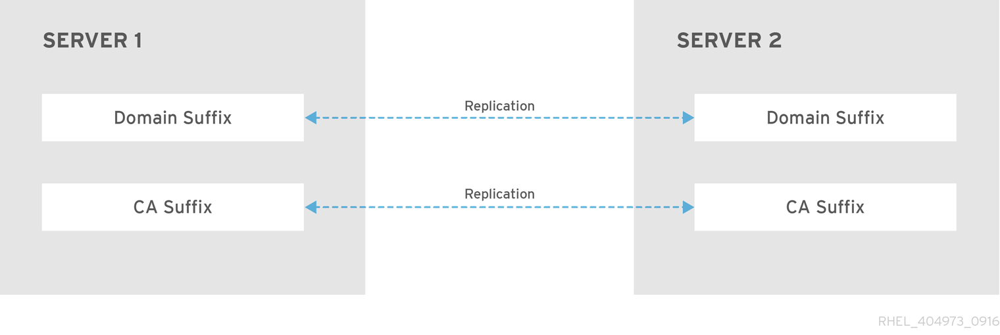
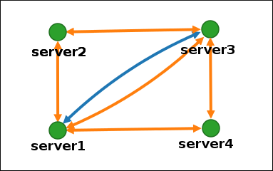
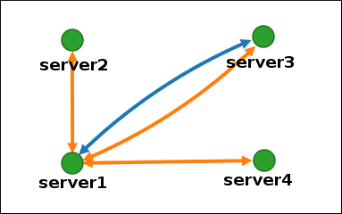
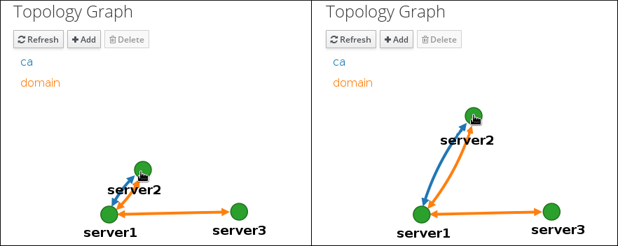
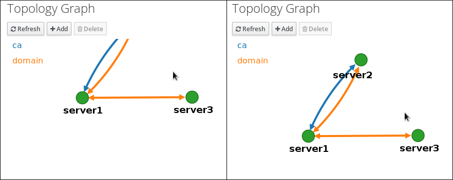
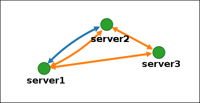

# Installing Identity Management

* * *

Red Hat Enterprise Linux 10

## Manual and automated installation of IdM servers, replicas, and clients

Red Hat Customer Content Services

[Legal Notice](#idm140279644500480)

**Abstract**

Depending on your environment, you can install Identity Management (IdM) to provide DNS and Certificate Authority (CA) services, or configure IdM to use an existing DNS and CA infrastructure. You can install IdM servers, replicas, and clients manually or by using Ansible Playbooks. Additionally, you can use a Kickstart file to automatically join a client to an IdM domain during the system installation.

* * *

<h2 id="providing-feedback-on-red-hat-documentation">Providing feedback on Red Hat documentation</h2>

We are committed to providing high-quality documentation and value your feedback. To help us improve, you can submit suggestions or report errors through the Red Hat Jira tracking system.

**Procedure**

1. Log in to the [Jira](https://issues.redhat.com/projects/RHELDOCS/issues) website.
   
   If you do not have an account, select the option to create one.
2. Click **Create** in the top navigation bar.
3. Enter a descriptive title in the **Summary** field.
4. Enter your suggestion for improvement in the **Description** field. Include links to the relevant parts of the documentation.
5. Click **Create** at the bottom of the dialogue.

<h2 id="preparing-the-system-for-idm-server-installation">Chapter 1. Preparing the system for IdM server installation</h2>

Review and configure the necessary requirements before deploying an Identity Management (IdM) server. Verify hardware specifications, open required firewall ports, synchronize system time, and check specific DNS and network configuration prerequisites to ensure a successful installation.

<h3 id="prerequisites">1.1. Prerequisites</h3>

- You need `root` privileges to install an IdM server on your host.

<h3 id="hardware-recommendations">1.2. Hardware recommendations</h3>

RAM is the most important hardware feature to size properly. Make sure your system has enough RAM available.

Typical RAM requirements are:

- For 10,000 users and 100 groups: at least 4 GB of RAM and 4 GB swap space
- For 100,000 users and 50,000 groups: at least 16 GB of RAM and 4 GB of swap space

For larger deployments, increasing RAM is more effective than increasing disk space because much of the data is stored in cache. In general, adding more RAM leads to better performance for larger deployments due to caching. In virtualized environments, memory ballooning must be disabled or the complete RAM must be reserved for the guest IdM servers.

Note

A basic user entry or a simple host entry with a certificate is approximately 5—​10 kB in size.

<h3 id="custom-configuration-requirements-for-idm">1.3. Custom configuration requirements for IdM</h3>

Install an Identity Management (IdM) server on a clean system without any custom configuration for services such as DNS, Kerberos, Apache, or Directory Server. Learn about supported encryption and policies for communication with clients and external environments like Active Directory.

The IdM server installation overwrites system files to set up the IdM domain. IdM backs up the original system files to `/var/lib/ipa/sysrestore/`. When an IdM server is uninstalled at the end of the lifecycle, these files are restored.

<h4 id="ipv6\_requirements\_in\_idm">1.3.1. IPv6 requirements in IdM</h4>

The IdM system must have the IPv6 protocol enabled in the kernel. If IPv6 is disabled, then the CLDAP plug-in used by the IdM services fails to initialize.

Note

IPv6 does not have to be enabled on the network.

<h4 id="support\_for\_encryption\_types\_in\_idm">1.3.2. Support for encryption types in IdM</h4>

Red Hat Enterprise Linux (RHEL) uses Version 5 of the Kerberos protocol, which supports encryption types such as Advanced Encryption Standard (AES), Camellia, and Data Encryption Standard (DES).

**List of supported encryption types**

While the Kerberos libraries on IdM servers and clients might support more encryption types, the IdM Kerberos Distribution Center (KDC) only supports the following encryption types:

- `aes256-cts:normal`
- `aes256-cts:special` (default)
- `aes128-cts:normal`
- `aes128-cts:special` (default)
- `aes128-sha2:normal`
- `aes128-sha2:special`
- `aes256-sha2:normal`
- `aes256-sha2:special`
- `camellia128-cts-cmac:normal`
- `camellia128-cts-cmac:special`
- `camellia256-cts-cmac:normal`
- `camellia256-cts-cmac:special`

**RC4 encryption types are disabled by default**

The following RC4 encryption types have been disabled by default in RHEL 9, as they are considered less secure than the newer AES-128 and AES-256 encryption types:

- `arcfour-hmac:normal`
- `arcfour-hmac:special`

For more information about manually enabling RC4 support for compatibility with legacy Active Directory environments, see [Ensuring support for common encryption types in AD and RHEL](https://docs.redhat.com/en/documentation/red_hat_enterprise_linux/10/html/installing_trust_between_idm_and_ad/ensuring-support-for-common-encryption-types-in-ad-and-rhel).

**Support for DES and 3DES encryption has been removed**

Due to security reasons, support for the DES algorithm was deprecated in RHEL 7. Single-DES (DES) and triple-DES (3DES) encryption types were removed from RHEL 8 and are not used in RHEL 9.

<h4 id="support\_for\_system\_wide\_cryptographic\_policies\_in\_idm">1.3.3. Support for system-wide cryptographic policies in IdM</h4>

IdM uses the `DEFAULT` system-wide cryptographic policy. This policy offers secure settings for current threat models. It allows the TLS 1.2 and 1.3 protocols, as well as the IKEv2 and SSH2 protocols. The RSA keys and Diffie-Hellman parameters are accepted if they are at least 2048 bits long. This policy does not allow DES, 3DES, RC4, DSA, TLS v1.0, and other weaker algorithms.

Note

You cannot install an IdM server while using the `FUTURE` system-wide cryptographic policy. When installing an IdM server, ensure you are using the `DEFAULT` system-wide cryptographic policy.

**Additional resources**

- [System-wide cryptographic policies](https://docs.redhat.com/en/documentation/red_hat_enterprise_linux/10/html/security_hardening/using-system-wide-cryptographic-policies)

<h4 id="fips\_compliance">1.3.4. FIPS compliance</h4>

You can install a new IdM server or replica on a system with the Federal Information Processing Standard (FIPS) mode enabled. The only exception is a system on which the `FIPS:OSPP` cryptographic subpolicy is enabled.

To install IdM with FIPS, first enable FIPS mode on the host, then install IdM. The IdM installation script detects if FIPS is enabled and configures IdM to only use encryption types that are compliant with FIPS 140-3:

- `aes128-sha2:normal`
- `aes128-sha2:special`
- `aes256-sha2:normal`
- `aes256-sha2:special`

For an IdM environment to be FIPS-compliant, **all** IdM replicas must have FIPS mode enabled.

Red Hat recommends that you enable FIPS in IdM clients as well, especially if you might promote those clients to IdM replicas. Ultimately, it is up to administrators to determine how they meet FIPS requirements; Red Hat does not enforce FIPS criteria.

**Migration to FIPS-compliant IdM**

You cannot migrate an existing IdM installation from a non-FIPS environment to a FIPS-compliant installation. This is not a technical problem but a legal and regulatory restriction.

To operate a FIPS-compliant system, all cryptographic key material must be created in FIPS mode. Furthermore, the cryptographic key material must never leave the FIPS environment unless it is securely wrapped and never unwrapped in non-FIPS environments.

If your scenario requires a migration of a non-FIPS IdM realm to a FIPS-compliant one, you must:

1. create a new IdM realm in FIPS mode
2. perform data migration from the non-FIPS realm to the new FIPS-mode realm with a filter that blocks all key material

The migration filter must block:

- KDC master key, keytabs, and all related Kerberos key material
- user passwords
- all certificates including CA, service, and user certificates
- OTP tokens
- SSH keys and fingerprints
- all vault entries
- AD trust-related key material

Effectively, the new FIPS installation is a different installation. Even with rigorous filtering, such a migration may not pass a FIPS 140 certification. Your FIPS auditor may flag this migration.

**Support for cross-forest trust with FIPS mode enabled**

To establish a cross-forest trust with an Active Directory (AD) domain while FIPS mode is enabled, you must authenticate with an AD administrative account. You cannot establish a trust using a shared secret while FIPS mode is enabled.

Important

RADIUS authentication is not FIPS compliant. Do not install IdM on a server with FIPS mode enabled if you require RADIUS authentication.

**Additional resources**

- [Switching the system to FIPS mode](https://docs.redhat.com/en/documentation/red_hat_enterprise_linux/10/html/security_hardening/switching-rhel-to-fips-mode)
- [Security Requirements for Cryptographic Modules](https://csrc.nist.gov/publications/detail/fips/140/2/final)

<h3 id="time-service-requirements-for-idm">1.4. Time service requirements for IdM</h3>

Learn about the Network Time Protocol (NTP) requirements to maintain synchronization between IdM servers, clients, and a central time source. Consistent system clocks ensure stable Kerberos authentication and prevent login failures across the realm.

<h4 id="how-idm-uses-chronyd-for-synchronization">1.4.1. How IdM uses chronyd for synchronization</h4>

Learn how the installation process configures `chronyd` to keep IdM hosts synchronized with a central time source and ensure Kerberos authentication works across the realm.

Kerberos, the underlying authentication mechanism in IdM, uses time stamps as part of its protocol. Kerberos authentication fails if the system time of an IdM client differs by more than five minutes from the system time of the Key Distribution Center (KDC).

To ensure that IdM servers and clients stay in sync with a central time source, IdM installation scripts automatically configure `chronyd` Network Time Protocol (NTP) client software.

If you do not pass any NTP options to the IdM installation command, the installer searches for `_ntp._udp` DNS service (SRV) records that point to the NTP server in your network and configures `chrony` with that IP address. If you do not have any `_ntp._udp` SRV records, `chronyd` uses the configuration shipped with the `chrony` package.

**Additional resources**

- [Implementation of NTP](https://docs.redhat.com/en/documentation/red_hat_enterprise_linux/10/html/installing_identity_management/preparing-the-system-for-idm-server-installation#how-idm-uses-chronyd-for-synchronization)
- [Using the Chrony suite to configure NTP](https://docs.redhat.com/en/documentation/red_hat_enterprise_linux/10/html/configuring_time_synchronization/using-chrony)

<h4 id="list-of-ntp-configuration-options-for-idm-installation-commands">1.4.2. List of NTP configuration options for IdM installation commands</h4>

Learn about the Network Time Protocol (NTP) arguments that define how the IdM installation process configures the `chrony` daemon.

You can specify the following options with any of the IdM installation commands (`ipa-server-install`, `ipa-replica-install`, `ipa-client-install`) to configure `chronyd` client software during setup.

| Option           | Behavior                                                                                     |
|:-----------------|:---------------------------------------------------------------------------------------------|
| `--ntp-server`   | Use it to specify one NTP server. You can use it multiple times to specify multiple servers. |
| `--ntp-pool`     | Use it to specify a pool of multiple NTP servers resolved as one hostname.                   |
| `-N`, `--no-ntp` | Do not configure, start, or enable `chronyd`.                                                |

Table 1.1. List of NTP configuration options for IdM installation commands

**Additional resources**

- [Using the Chrony suite to configure NTP](https://docs.redhat.com/en/documentation/red_hat_enterprise_linux/10/html/configuring_time_synchronization/using-chrony)

<h4 id="ensuring-idm-can-reference-your-ntp-time-server">1.4.3. Ensuring IdM can reference your NTP time server</h4>

You can verify if you have the necessary configurations in place for IdM to be able to synchronize with your Network Time Protocol (NTP) time server.

**Prerequisites**

- You have configured an NTP time server in your environment. In this example, the hostname of the previously configured time server is `ntpserver.example.com`.

**Procedure**

1. Perform a DNS service (SRV) record search for NTP servers in your environment.
   
   ```
   dig +short -t SRV _ntp._udp.example.com
   ```
   
   ```plaintext
   [user@server ~]$ dig +short -t SRV _ntp._udp.example.com
   ```
   
   ```
   0 100 123 ntpserver.example.com.
   ```
   
   ```plaintext
   0 100 123 ntpserver.example.com.
   ```
2. If the previous `dig` search does not return your time server, add a `_ntp._udp` SRV record that points to your time server on port `123`. This process depends on your DNS solution.

**Verification**

- Verify that DNS returns an entry for your time server on port `123` when you perform a search for `_ntp._udp` SRV records.
  
  ```
  dig +short -t SRV _ntp._udp.example.com
  ```
  
  ```plaintext
  [user@server ~]$ dig +short -t SRV _ntp._udp.example.com
  ```
  
  ```
  0 100 123 ntpserver.example.com.
  ```
  
  ```plaintext
  0 100 123 ntpserver.example.com.
  ```

**Additional resources**

- [Using the Chrony suite to configure NTP](https://docs.redhat.com/en/documentation/red_hat_enterprise_linux/10/html/configuring_time_synchronization/using-chrony)

<h3 id="meeting-dns-host-name-and-dns-requirements-for-idm">1.5. Meeting DNS host name and DNS requirements for IdM</h3>

Verify that the host name and DNS settings meet the requirements for an Identity Management (IdM) server or replica installation. Proper configuration ensures that IdM functions, such as LDAP, Kerberos, and Active Directory integration, work as expected.

Warning

These requirements apply to all IdM servers, both with and without integrated DNS. DNS records are vital for nearly all IdM domain functions. Be extremely cautious and ensure that:

- You have a tested and functional DNS service available
- The service is properly configured

Host name requirements

- Use a fully qualified domain name (FQDN), such as `server.idm.example.com`.
- **Set a permanent host name for the IdM server or replica.** You cannot change the host name after you complete the installation.
- Ensure the IdM domain is composed of one or more subdomains and a top level domain, for example `example.com` or `company.example.com`. Do not use single-label domain names, for example `.company`.
- Use a valid DNS name that contains only numbers, alphabetic characters, and hyphens (-). Other characters, such as underscores (\_), cause DNS failures.
- Use lowercase letters only. Do not use capital letters.
- The name must resolve to a network IP address and not a loopback address in the `127.x.x.x` range.
- If you plan to integrate IdM with Active Directory (AD), you must use a unique domain name for IdM. For more information see [Guidelines for setting up DNS for an IdM-AD trust](https://docs.redhat.com/en/documentation/red_hat_enterprise_linux/10/html/planning_identity_management/planning-a-cross-forest-trust-between-idm-and-ad#guidelines-for-setting-up-dns-for-an-idm-ad-trust).

**Procedure**

1. On the system where you want to install the IdM server, verify the host name:
   
   ```
   hostname
   ```
   
   ```plaintext
   # hostname
   ```
   
   ```
   server.idm.example.com
   ```
   
   ```plaintext
   server.idm.example.com
   ```
   
   The output of `hostname` must not be `localhost` or `localhost6`.
2. To verify the forward and reverse DNS configuration, obtain the IP address of the server:
   
   ```
   ip addr show
   ```
   
   ```plaintext
   [root@server ~]# ip addr show
   ```
   
   The `ip addr show` command displays both the IPv4 and IPv6 addresses. In the following output example, the relevant IPv6 address is `2001:DB8::1111` because its scope is global:
   
   ```
   ...
   2: eth0: <BROADCAST,MULTICAST,UP,LOWER_UP> mtu 1500 qdisc pfifo_fast state UP group default qlen 1000
   link/ether 00:1a:4a:10:4e:33 brd ff:ff:ff:ff:ff:ff
   inet 192.0.2.1/24 brd 192.0.2.255 scope global dynamic eth0
   valid_lft 106694sec preferred_lft 106694sec
   inet6 2001:DB8::1111/32 scope global dynamic
   valid_lft 2591521sec preferred_lft 604321sec
   inet6 fe80::56ee:75ff:fe2b:def6/64 scope link
   valid_lft forever preferred_lft forever
   ...
   ```
   
   ```plaintext
   ...
   2: eth0: <BROADCAST,MULTICAST,UP,LOWER_UP> mtu 1500 qdisc pfifo_fast state UP group default qlen 1000
   link/ether 00:1a:4a:10:4e:33 brd ff:ff:ff:ff:ff:ff
   inet 192.0.2.1/24 brd 192.0.2.255 scope global dynamic eth0
   valid_lft 106694sec preferred_lft 106694sec
   inet6 2001:DB8::1111/32 scope global dynamic
   valid_lft 2591521sec preferred_lft 604321sec
   inet6 fe80::56ee:75ff:fe2b:def6/64 scope link
   valid_lft forever preferred_lft forever
   ...
   ```
3. To verify the forward DNS configuration:
   
   1. Run the `dig +short server.idm.example.com A` command. The returned IPv4 address must match the IP address returned by `ip addr show`:
      
      ```
      dig +short server.idm.example.com A
      ```
      
      ```plaintext
      [root@server ~]# dig +short server.idm.example.com A
      ```
      
      ```
      192.0.2.1
      ```
      
      ```plaintext
      192.0.2.1
      ```
   2. Run the `dig +short server.idm.example.com AAAA` command. If it returns an address, it must match the IPv6 address returned by `ip addr show`:
      
      ```
      dig +short server.idm.example.com AAAA
      ```
      
      ```plaintext
      [root@server ~]# dig +short server.idm.example.com AAAA
      ```
      
      ```
      2001:DB8::1111
      ```
      
      ```plaintext
      2001:DB8::1111
      ```
      
      Note
      
      If `dig` does not return any output for the AAAA record, it does not indicate incorrect configuration. No output only means that no IPv6 address is configured in DNS for the system. If you do not intend to use the IPv6 protocol in your network, you can proceed with the installation in this situation.
4. To verify the reverse DNS configuration (PTR records):
   
   1. Run the `dig +short -x IPv4_address` command. The output must display the server host name. For example:
      
      ```
      dig +short -x 192.0.2.1
      ```
      
      ```plaintext
      [root@server ~]# dig +short -x 192.0.2.1
      ```
      
      ```
      server.idm.example.com
      ```
      
      ```plaintext
      server.idm.example.com
      ```
   2. If the `dig +short -x server.idm.example.com AAAA` command in the previous step returned an IPv6 address, use `dig` to query the IPv6 address too. The output must display the server host name. For example:
      
      ```
      dig +short -x 2001:DB8::1111
      ```
      
      ```plaintext
      [root@server ~]# dig +short -x 2001:DB8::1111
      ```
      
      ```
      server.idm.example.com
      ```
      
      ```plaintext
      server.idm.example.com
      ```
      
      Note
      
      If the `dig +short server.idm.example.com AAAA` command in the previous step did not display any IPv6 address, querying the AAAA record does not output anything. In this case, this is normal behavior and does not indicate incorrect configuration.
      
      Warning
      
      If a reverse DNS (PTR record) search returns multiple host names, `httpd` and other software associated with IdM may show unpredictable behavior. Red Hat strongly recommends configuring only one PTR record per IP.
5. To verify that DNS forwarders are compliant with the Extension Mechanisms for DNS (EDNS0), run the following command for each DNS forwarder:
   
   ```
   dig @IP_address_of_the_DNS_forwarder . SOA
   ```
   
   ```plaintext
   $ dig @IP_address_of_the_DNS_forwarder . SOA
   ```
   
   The output must contain the following information:
   
   - Status: `NOERROR`
   - Flags: `ra`
   
   If either of these items is missing from the output, inspect the documentation for your DNS forwarder and verify that EDNS0 is supported and enabled.
6. To verify that the `/etc/hosts` file is configured correctly, ensure the file meets one of the following conditions:
   
   - The file does not contain an entry for the host. It only lists the IPv4 and IPv6 localhost entries for the host.
   - The file contains an entry for the host and the file fulfills all the following conditions:
     
     - The first two entries are the IPv4 and IPv6 localhost entries.
     - The next entry specifies the IdM server IPv4 address and host name.
     - The `FQDN` of the IdM server comes before the short name of the IdM server.
     - The IdM server host name is not part of the localhost entry.
     
     The following is an example of a correctly configured `/etc/hosts` file:
   
   ```
   127.0.0.1 localhost localhost.localdomain \
   localhost4 localhost4.localdomain4
   ::1 localhost localhost.localdomain \
   localhost6 localhost6.localdomain6
   192.0.2.1 server.idm.example.com server
   2001:DB8::1111 server.idm.example.com server
   ```
   
   ```plaintext
   127.0.0.1 localhost localhost.localdomain \
   localhost4 localhost4.localdomain4
   ::1 localhost localhost.localdomain \
   localhost6 localhost6.localdomain6
   192.0.2.1 server.idm.example.com server
   2001:DB8::1111 server.idm.example.com server
   ```

<h3 id="port-requirements-for-idm">1.6. Port requirements for IdM</h3>

Identity Management (IdM) uses several ports to communicate with its services. All IdM servers in the deployment must have these ports open and available for communication from all other IdM servers for IdM to work. They must not be currently used by another service or blocked by a firewall.

| Service    | Ports    | Protocol               |
|:-----------|:---------|:-----------------------|
| HTTP/HTTPS | 80, 443  | TCP                    |
| LDAP/LDAPS | 389, 636 | TCP                    |
| Kerberos   | 88, 464  | TCP and UDP            |
| DNS        | 53       | TCP and UDP (optional) |

Table 1.2. IdM ports

Note

IdM uses ports 80 and 389. This is a secure practice because of the following safeguards:

- IdM normally redirects requests that arrive on port 80 to port 443. Port 80 (HTTP) is only used to provide Online Certificate Status Protocol (OCSP) responses and Certificate Revocation Lists (CRL). Both are digitally signed and therefore secured against man-in-the-middle attacks.
- Port 389 (LDAP) uses STARTTLS and Generic Security Services API (GSSAPI) for encryption.

In addition, ports 8080 and 8443 are used internally by `pki-tomcat` and leave them blocked in the firewall to prevent their use by other services. Port 749 is used for remote management of the Kerberos server and only open it if you intend to use remote management.

| Service name | For details, see:                           |
|:-------------|:--------------------------------------------|
| `freeipa-4`  | `/usr/lib/firewalld/services/freeipa-4.xml` |
| `dns`        | `/usr/lib/firewalld/services/dns.xml`       |

Table 1.3. firewalld services

<h3 id="opening-the-ports-required-by-idm">1.7. Opening the ports required by IdM</h3>

Open the required ports that IdM uses to communicate with its services. Configure the `firewalld` to ensure that servers, replicas, and clients can reach each other across the network.

**Procedure**

1. Verify that the `firewalld` service is running.
   
   - To find out if `firewalld` is currently running:
     
     ```
     systemctl status firewalld.service
     ```
     
     ```plaintext
     # systemctl status firewalld.service
     ```
   - To start `firewalld` and configure it to start automatically when the system boots:
     
     ```
     systemctl start firewalld.service
     systemctl enable firewalld.service
     ```
     
     ```plaintext
     # systemctl start firewalld.service
     # systemctl enable firewalld.service
     ```
2. Open the required ports using the `firewall-cmd` utility. Choose one of the following options:
   
   1. Add the individual ports to the firewall by using the `firewall-cmd --add-port` command. For example, to open the ports in the default zone:
      
      ```
      firewall-cmd --permanent --add-port={80/tcp,443/tcp,389/tcp,636/tcp,88/tcp,88/udp,464/tcp,464/udp,53/tcp,53/udp}
      ```
      
      ```plaintext
      # firewall-cmd --permanent --add-port={80/tcp,443/tcp,389/tcp,636/tcp,88/tcp,88/udp,464/tcp,464/udp,53/tcp,53/udp}
      ```
   2. Add the `firewalld` services to the firewall by using the `firewall-cmd --add-service` command. For example, to open the ports in the default zone:
      
      ```
      firewall-cmd --permanent --add-service={freeipa-4,dns}
      ```
      
      ```plaintext
      # firewall-cmd --permanent --add-service={freeipa-4,dns}
      ```
      
      For details on using `firewall-cmd` to open ports on a system, see the **firewall-cmd**(1) man page.
3. Reload the `firewall-cmd` configuration to ensure that the change takes place immediately:
   
   ```
   firewall-cmd --reload
   ```
   
   ```plaintext
   # firewall-cmd --reload
   ```
   
   Note that reloading `firewalld` on a system in production can cause DNS connection time outs. If required, to avoid the risk of time outs and to make the changes persistent on the running system, use the `--runtime-to-permanent` option of the `firewall-cmd` command, for example:
   
   ```
   firewall-cmd --runtime-to-permanent
   ```
   
   ```plaintext
   # firewall-cmd --runtime-to-permanent
   ```

**Verification**

- Log in to a host on the client subnet and use the `nmap` or `nc` utilities to connect to the opened ports or run a port scan.
  
  - For example, to scan the ports that are required for TCP traffic:
    
    ```
    nmap -p 80,443,389,636,88,464,53 server.idm.example.com
    ```
    
    ```plaintext
    $ nmap -p 80,443,389,636,88,464,53 server.idm.example.com
    ```
    
    ```
    [...]
    PORT    STATE SERVICE
    53/tcp  open  domain
    80/tcp  open  http
    88/tcp  open  kerberos-sec
    389/tcp open  ldap
    443/tcp open  https
    464/tcp open  kpasswd5
    636/tcp open  ldapssl
    ```
    
    ```plaintext
    [...]
    PORT    STATE SERVICE
    53/tcp  open  domain
    80/tcp  open  http
    88/tcp  open  kerberos-sec
    389/tcp open  ldap
    443/tcp open  https
    464/tcp open  kpasswd5
    636/tcp open  ldapssl
    ```
  - To scan the ports that are required for UDP traffic:
    
    ```
    nmap -sU -p 88,464,53 server.idm.example.com
    ```
    
    ```plaintext
    # nmap -sU -p 88,464,53 server.idm.example.com
    ```
    
    ```
    [...]
    PORT    STATE         SERVICE
    53/udp  open          domain
    88/udp  open|filtered kerberos-sec
    464/udp open|filtered kpasswd5
    ```
    
    ```plaintext
    [...]
    PORT    STATE         SERVICE
    53/udp  open          domain
    88/udp  open|filtered kerberos-sec
    464/udp open|filtered kpasswd5
    ```

Note

You also have to open network-based firewalls for both incoming and outgoing traffic.

<h3 id="installing-packages-required-for-an-idm-server">1.8. Installing packages required for an IdM server</h3>

Download the packages for Identity Management (IdM) to prepare the system for a server or replica installation.

**Prerequisites**

- You have a newly installed RHEL system.
- You have made the required repositories available:
  
  - If your RHEL system is not running in the cloud, you have registered your system with the Red Hat Subscription Manager (RHSM). For details, see [Subscription Central](https://docs.redhat.com/en/documentation/subscription_central/1-latest). You have also enabled the `BaseOS` and `AppStream` repositories that IdM uses:
    
    ```
    subscription-manager repos --enable=rhel-10-for-x86_64-baseos-rpms
    subscription-manager repos --enable=rhel-10-for-x86_64-appstream-rpms
    ```
    
    ```plaintext
    # subscription-manager repos --enable=rhel-10-for-x86_64-baseos-rpms
    # subscription-manager repos --enable=rhel-10-for-x86_64-appstream-rpms
    ```
    
    For details on how to enable and disable specific repositories using RHSM, see [Subscription Central](https://docs.redhat.com/en/documentation/subscription_central/1-latest).
  - If your RHEL system is running in the cloud, skip the registration. The required repositories are already available via the Red Hat Update Infrastructure (RHUI).

**Procedure**

- Choose one of the following options, depending on your IdM requirements:
  
  - To download the packages necessary for installing an IdM server without an integrated DNS:
    
    ```
    dnf install ipa-server
    ```
    
    ```plaintext
    # dnf install ipa-server
    ```
  - To download the packages necessary for installing an IdM server with an integrated DNS:
    
    ```
    dnf install ipa-server ipa-server-dns
    ```
    
    ```plaintext
    # dnf install ipa-server ipa-server-dns
    ```
  - To download the packages necessary for installing an IdM server that has a trust agreement with Active Directory:
    
    ```
    dnf install ipa-server ipa-server-trust-ad samba-client
    ```
    
    ```plaintext
    # dnf install ipa-server ipa-server-trust-ad samba-client
    ```

<h3 id="setting-the-correct-file-mode-creation-mask-for-idm-installation">1.9. Setting the correct file mode creation mask for IdM installation</h3>

Set the file mode creation mask (umask) to `0022` before you install an Identity Management (IdM) server. This mask ensures that the installation process creates files and directories with the correct permissions for IdM services to function.

The Identity Management (IdM) installation process requires that the file mode creation mask (`umask`) is set to `0022` for the `root` account. This allows users other than `root` to read files created during the installation. If a different `umask` is set, the installation of an IdM server will display a warning. If you continue with the installation, some functions of the server will not perform properly. For example, you will be unable to install an IdM replica from this server. After the installation, you can set the `umask` back to its original value.

**Prerequisites**

- You have `root` privileges.

**Procedure**

1. Optional: Display the current `umask`:
   
   ```
   umask
   ```
   
   ```plaintext
   # umask
   ```
   
   ```
   0027
   ```
   
   ```plaintext
   0027
   ```
2. Set the `umask` to `0022`:
   
   ```
   *umask 0022*
   ```
   
   ```plaintext
   # *umask 0022*
   ```
3. Optional: After the IdM installation is complete, set the `umask` back to its original value:
   
   ```
   *umask 0027*
   ```
   
   ```plaintext
   # *umask 0027*
   ```

<h3 id="fapolicyd-requirements-for-idm-installation">1.10. fapolicyd requirements for IdM installation</h3>

If you are using the `fapolicyd` software framework on your RHEL host to control the execution of applications based on a user-defined policy, the installation of the Identity Management (IdM) server can fail. As the installation and operation requires the Java program to complete successfully, ensure that Java and Java classes are not blocked by any `fapolicyd` rules.

For more information, see the Red Hat Knowledgebase solution [fapolicy restrictions causing IdM installation failures](https://access.redhat.com/solutions/5567781).

<h3 id="options-for-the-idm-installation-commands">1.11. Options for the IdM installation commands</h3>

Learn about the the most common options for the Identity Management (IdM) installation commands.

Commands such as `ipa-server-install`, `ipa-replica-install`, `ipa-dns-install` and `ipa-ca-install` have numerous options you can use to supply additional information for an interactive installation. You can also use these options to script an unattended installation.

Use the options that the `ipa-server-install`, `ipa-replica-install`, `ipa-dns-install`, and `ipa-ca-install` utilities provide to supply additional information for an interactive installation. You can also use these options to script an unattended installation.

For an exhaustive list of options, see the `ipa-server-install(1)`, `ipa-replica-install(1)`, `ipa-dns-install(1)` and `ipa-ca-install(1)` man pages.

| Argument                                | Description                                                                                                                                                                                                                                        |
|:----------------------------------------|:---------------------------------------------------------------------------------------------------------------------------------------------------------------------------------------------------------------------------------------------------|
| `-d`, `--debug`                         | Enables debug logging for more verbose output.                                                                                                                                                                                                     |
| `-U`, `--unattended`                    | Enables an unattended installation session that does not prompt for user input.                                                                                                                                                                    |
| `--hostname=server.idm.example.com`     | The fully-qualified domain name of the IdM server machine. Only numbers, lowercase alphabetic characters, and hyphens (-) are allowed.                                                                                                             |
| `--ip-address 127.0.0.1`                | Specifies the IP address of the server. This option only accepts IP addresses associated with the local interface.                                                                                                                                 |
| `--dirsrv-config-file <LDIF_file_name>` | The path to an LDIF file used to modify the configuration of the directory server instance.                                                                                                                                                        |
| `-n example.com`                        | The name of the LDAP server domain to use for the IdM domain. This is usually based on the IdM server’s hostname.                                                                                                                                  |
| `-p <directory_manager_password>`       | The password of the superuser, `cn=Directory Manager`, for the LDAP service.                                                                                                                                                                       |
| `-a <ipa_admin_password>`               | The password for the `admin` IdM administrator account to authenticate to the Kerberos realm. For `ipa-replica-install`, use `-w` instead.                                                                                                         |
| `-r <KERBEROS_REALM_NAME>`              | The name of the Kerberos realm to create for the IdM domain in uppercase, such as `EXAMPLE.COM`. For `ipa-replica-install`, this specifies the name of a Kerberos realm of an existing IdM deployment.                                             |
| `--setup-dns`                           | Tells the installation script to set up a DNS service within the IdM domain.                                                                                                                                                                       |
| `--setup-ca`                            | Install and configure a CA on this replica. If a CA is not configured, certificate operations are forwarded to another replica with a CA installed. For `ipa-server-install`, a CA is installed by default and you do not need to use this option. |

Table 1.4. General options: available for ipa-server-install and ipa-replica-install

Table 1.5. CA options: available for ipa-ca-install and ipa-server-install

ArgumentDescription

`--random-serial-numbers`

Enables Random Serial Numbers version 3 (RSNv3) for the IdM CA. When enabled, the CA generates fully random serial numbers for certificates and requests in the PKI. This option is enabled by default for all new IdM installations on RHEL 10 or if another CA in the topology is configured with RSNv3. Since RHEL 10 does not support sequential serial numbers, it is not possible to disable this.

IMPORTANT: RSNv3 is supported only for new IdM CA installations. If enabled, it is required to use RSNv3 on all PKI services.

`--ca-subject=<SUBJECT>`

Specifies the CA certificate subject Distinguished Name (default: CN=Certificate Authority,O=REALM.NAME). Relative Distinguished Names (RDN) are in LDAP order, with the most specific RDN first.

`--subject-base=<SUBJECT>`

Specifies the subject base for certificates issued by IdM (default O=REALM.NAME). Relative Distinguished Names (RDN) are in LDAP order, with the most specific RDN first.

`--external-ca`

Generates a certificate signing request to be signed by an external CA.

`--ca-signing-algorithm=<ALGORITHM>`

Specifies the signing algorithm of the IdM CA certificate. Possible values are SHA1withRSA, SHA256withRSA, SHA512withRSA. The default is SHA256withRSA. Use this option with `--external-ca` if the external CA does not support the default signing algorithm.

`--pki-config-override=<PKI_CONFIG_OVERRIDE>`

Specifies a file that contains overrides for the CA installation. Also available with the `ipa-replica-install` command.

Table 1.6. DNS options: available for ipa-dns-install, or for ipa-server-install and ipa-replica-install when using --setup-dns

ArgumentDescription

`--forwarder=192.0.2.1`

Specifies a DNS forwarder to use with the DNS service. To specify more than one forwarder, use this option multiple times.

`--no-forwarders`

Uses root servers with the DNS service instead of forwarders.

`--no-reverse`

Does not create a reverse DNS zone when the DNS domain is set up. If a reverse DNS zone is already configured, then that existing reverse DNS zone is used.

If this option is not used, then the default value is `true`. This instructs the installation script to configure reverse DNS.

<h2 id="installing-an-idm-server-with-integrated-dns-with-an-integrated-ca-as-the-root-ca">Chapter 2. Installing an IdM server: With integrated DNS, with an integrated CA as the root CA</h2>

Install an Identity Management (IdM) server that functions as the root Certificate Authority (CA) and manages an integrated DNS service.

Integrated DNS in IdM deployments provide the following advantages:

- You can automate much of the maintenance and DNS record management using native IdM tools. For example, DNS SRV records are automatically created during the setup, and later on are automatically updated.
- You can configure global forwarders during the installation of the IdM server for a stable external internet connection. Global forwarders are also useful for trusts with Active Directory.
- You can set up a DNS reverse zone to prevent emails from your domain to be considered spam by email servers outside of the IdM domain.

Installing IdM with integrated DNS has certain limitations:

- Do not use IdM DNS as a general-purpose DNS server. Some of the advanced DNS functions are not supported. For more information, see [DNS services available in an IdM server](https://docs.redhat.com/en/documentation/red_hat_enterprise_linux/10/html/planning_identity_management/planning-your-dns-services-and-host-names#dns-services-available-in-an-idm-server).

Note

The default configuration for the **ipa-server-install** command is an integrated CA as the root CA. If you do not provide HTTP and LDAP server certificates using `--http-cert-file` and `--dirsrv-cert-file`, the IdM server is installed with an integrated CA. The CA is either self-signed by default or externally signed if you specify `--external-ca`).

<h3 id="interactive-installation-of-an-idm-server-with-integrated-dns-and-with-an-integrated-ca-as-the-root-ca">2.1. Interactive installation of an IdM server with integrated DNS and with an integrated CA as the root CA</h3>

You can install IdM server with integrated DNS and with an integrated CA as the root CA by using an interactive script that guides you step by step through the installation and prompts you for basic configuration of the system, for example the realm, the administrator’s password and the Directory Manager’s password.

The `ipa-server-install` installation script creates a log file at `/var/log/ipaserver-install.log`. If the installation fails, the log can help you identify the problem.

**Procedure**

1. Run the **ipa-server-install** utility.
   
   ```
   ipa-server-install
   ```
   
   ```plaintext
   # ipa-server-install
   ```
2. The script prompts to configure an integrated DNS service. Enter `yes`.
   
   ```
   Do you want to configure integrated DNS (BIND)? [no]: yes
   ```
   
   ```plaintext
   Do you want to configure integrated DNS (BIND)? [no]: yes
   ```
3. The script prompts for several required settings and offers recommended default values in brackets.
   
   - To accept a default value, press `Enter`.
   - To provide a custom value, enter the required value.
     
     ```
     Server host name [server.idm.example.com]:
     Please confirm the domain name [idm.example.com]:
     Please provide a realm name [IDM.EXAMPLE.COM]:
     ```
     
     ```plaintext
     Server host name [server.idm.example.com]:
     Please confirm the domain name [idm.example.com]:
     Please provide a realm name [IDM.EXAMPLE.COM]:
     ```
     
     Warning
     
     Plan these names carefully. You will not be able to change them after the installation is complete.
4. Enter the passwords for the Directory Server superuser (`cn=Directory Manager`) and for the Identity Management (IdM) administration system user account (`admin`). Note that the administrator is responsible for picking a strong password for the Directory Manager account.
   
   ```
   Directory Manager password:
   IPA admin password:
   ```
   
   ```plaintext
   Directory Manager password:
   IPA admin password:
   ```
5. The script prompts for per-server DNS forwarders.
   
   ```
   Do you want to configure DNS forwarders? [yes]:
   ```
   
   ```plaintext
   Do you want to configure DNS forwarders? [yes]:
   ```
   
   - To configure per-server DNS forwarders, enter `yes`, and then follow the instructions on the command line. The installation process will add the forwarder IP addresses to the IdM LDAP.
     
     - For the forwarding policy default settings, see the `--forward-policy` description in the **ipa-dns-install**(1) man page.
   - If you do not want to use DNS forwarding, enter `no`.
     
     With no DNS forwarders, hosts in your IdM domain will not be able to resolve names from other, internal, DNS domains in your infrastructure. The hosts will only be left with public DNS servers to resolve their DNS queries.
6. The script prompts to check if any DNS reverse (PTR) records for the IP addresses associated with the server need to be configured.
   
   ```
   Do you want to search for missing reverse zones? [yes]:
   ```
   
   ```plaintext
   Do you want to search for missing reverse zones? [yes]:
   ```
   
   If you run the search and missing reverse zones are discovered, the script asks you whether to create the reverse zones along with the PTR records.
   
   ```
   Do you want to create reverse zone for IP 192.0.2.1 [yes]:
   Please specify the reverse zone name [2.0.192.in-addr.arpa.]:
   Using reverse zone(s) 2.0.192.in-addr.arpa.
   ```
   
   ```plaintext
   Do you want to create reverse zone for IP 192.0.2.1 [yes]:
   Please specify the reverse zone name [2.0.192.in-addr.arpa.]:
   Using reverse zone(s) 2.0.192.in-addr.arpa.
   ```
   
   Note
   
   Using IdM to manage reverse zones is optional. You can use an external DNS service for this purpose instead.
7. Enter `yes` to confirm the server configuration.
   
   ```
   Continue to configure the system with these values? [no]: yes
   ```
   
   ```plaintext
   Continue to configure the system with these values? [no]: yes
   ```
8. The installation script now configures the server. Wait for the operation to complete.
9. After the installation script completes, update your DNS records in the following way:
   
   1. Add DNS delegation from the parent domain to the IdM DNS domain. For example, if the IdM DNS domain is `idm.example.com`, add a name server (NS) record to the `example.com` parent domain.
      
      Important
      
      Repeat this step each time after an IdM DNS server is installed.
   2. Add an `_ntp._udp` service (SRV) record for your time server to your IdM DNS. The presence of the SRV record for the time server of the newly-installed IdM server in IdM DNS ensures that future replica and client installations are automatically configured to synchronize with the time server used by this primary IdM server.

<h3 id="non-interactive-installation-of-an-idm-server-with-integrated-dns-and-with-an-integrated-ca-as-the-root-ca">2.2. Non-interactive installation of an IdM server with integrated DNS and with an integrated CA as the root CA</h3>

You can install an IdM server with integrated DNS and with an integrated CA as the root CA by providing all configuration details, such as the realm and administrative passwords, within a single command.

The `ipa-server-install` installation script creates a log file at `/var/log/ipaserver-install.log`. If the installation fails, the log can help you identify the problem.

**Procedure**

1. Run the **ipa-server-install** utility with the options to supply all the required information. The minimum required options for non-interactive installation are:
   
   - `--realm` to provide the Kerberos realm name
   - `--ds-password` to provide the password for the Directory Manager (DM), the Directory Server super user
   - `--admin-password` to provide the password for `admin`, the Identity Management (IdM) administrator
   - `--unattended` to let the installation process select default options for the host name and domain name
   
   To install a server with integrated DNS, add also these options:
   
   - `--setup-dns` to configure integrated DNS
   - `--forwarder` or `--no-forwarders`, depending on whether you want to configure DNS forwarders or not
   - `--auto-reverse` or `--no-reverse`, depending on whether you want to configure automatic detection of the reverse DNS zones that must be created in the IdM DNS or no reverse zone auto-detection
   
   For example:
   
   ```
   ipa-server-install --realm IDM.EXAMPLE.COM --ds-password DM_password --admin-password admin_password --unattended --setup-dns --forwarder 192.0.2.1 --no-reverse
   ```
   
   ```plaintext
   # ipa-server-install --realm IDM.EXAMPLE.COM --ds-password DM_password --admin-password admin_password --unattended --setup-dns --forwarder 192.0.2.1 --no-reverse
   ```
2. After the installation script completes, update your DNS records in the following way:
   
   1. Add DNS delegation from the parent domain to the IdM DNS domain. For example, if the IdM DNS domain is `idm.example.com`, add a name server (NS) record to the `example.com` parent domain.
      
      Important
      
      Repeat this step each time after an IdM DNS server is installed.
   2. Add an `_ntp._udp` service (SRV) record for your time server to your IdM DNS. The presence of the SRV record for the time server of the newly-installed IdM server in IdM DNS ensures that future replica and client installations are automatically configured to synchronize with the time server used by this primary IdM server.

<h3 id="installing-an-idm-server-with-integrated-dns-with-an-integrated-ca-as-the-root-ca">2.3. Additional resources</h3>

- [Failover, load-balancing, and high-availability in IdM](https://docs.redhat.com/en/documentation/red_hat_enterprise_linux/10/html/tuning_performance_in_identity_management/failover-load-balancing-and-high-availability-in-idm)

<h2 id="installing-an-idm-server-with-integrated-dns-with-an-external-ca-as-the-root-ca">Chapter 3. Installing an IdM server: With integrated DNS, with an external CA as the root CA</h2>

Install an Identity Management (IdM) server that uses an external Certificate Authority (CA) as the root and manages an integrated DNS service.

Integrated DNS in IdM deployments provide the following advantages:

- You can automate much of the maintenance and DNS record management using native IdM tools. For example, DNS SRV records are automatically created during the setup, and later on are automatically updated.
- You can configure global forwarders during the installation of the IdM server for a stable external internet connection. Global forwarders are also useful for trusts with Active Directory.
- You can set up a DNS reverse zone to prevent emails from your domain to be considered spam by email servers outside of the IdM domain.

Installing IdM with integrated DNS has certain limitations:

- IdM DNS is not meant to be used as a general-purpose DNS server. Some of the advanced DNS functions are not supported. For more information, see [DNS services available in an IdM server](https://docs.redhat.com/en/documentation/red_hat_enterprise_linux/10/html/planning_identity_management/planning-your-dns-services-and-host-names#dns-services-available-in-an-idm-server).

<h3 id="interactive-installation-of-an-idm-server-with-integrated-dns-and-with-an-external-ca-as-the-root-ca">3.1. Interactive installation of an IdM server with integrated DNS and with an external CA as the root CA</h3>

You can install IdM server with integrated DNS and with an external CA as the root CA by using an interactive script that guides you step by step through the installation and prompts you for basic configuration of the system, for example the realm, the administrator’s password and the Directory Manager’s password.

The `ipa-server-install` installation script creates a log file at `/var/log/ipaserver-install.log`. If the installation fails, the log can help you identify the problem.

**Prerequisites**

- You have determined the type of the external CA to specify with the `--external-ca-type` option. See the `ipa-server-install`(1) man page for details.
- If you are using a Microsoft Certificate Services certificate authority (MS CS CA) as your external CA: you have determined the certificate profile or template to specify with the `--external-ca-profile` option. By default, the `SubCA` template is used.
  
  For more information about the `--external-ca-type` and `--external-ca-profile` options, see [Options used when installing an IdM CA with an external CA as the root CA](https://docs.redhat.com/en/documentation/red_hat_enterprise_linux/10/html/installing_identity_management/installing-an-idm-server-without-integrated-dns-with-an-external-ca-as-the-root-ca#options-used-when-installing-an-idm-ca-with-an-external-ca-as-the-root-ca).

**Procedure**

01. Run the **ipa-server-install** utility with the `--external-ca` option.
    
    ```
    ipa-server-install --external-ca
    ```
    
    ```plaintext
    # ipa-server-install --external-ca
    ```
    
    - If you are using the Microsoft Certificate Services (MS CS) CA, also use the `--external-ca-type` option and, optionally, the `--external-ca-profile` option:
      
      ```
      ipa-server-install --external-ca --external-ca-type=ms-cs --external-ca-profile=<oid>/<name>/default
      ```
      
      ```plaintext
      [root@server ~]# ipa-server-install --external-ca --external-ca-type=ms-cs --external-ca-profile=<oid>/<name>/default
      ```
    - If you are not using MS CS to generate the signing certificate for your IdM CA, no other option may be necessary:
      
      ```
      ipa-server-install --external-ca
      ```
      
      ```plaintext
      # ipa-server-install --external-ca
      ```
02. The script prompts to configure an integrated DNS service. Enter `yes` or `no`. In this procedure, we are installing a server with integrated DNS.
    
    ```
    Do you want to configure integrated DNS (BIND)? [no]: yes
    ```
    
    ```plaintext
    Do you want to configure integrated DNS (BIND)? [no]: yes
    ```
    
    Note
    
    If you want to install a server without integrated DNS, the installation script will not prompt you for DNS configuration as described in the steps below. See [Chapter 5, *Installing an IdM server: Without integrated DNS, with an integrated CA as the root CA*](#installing-an-idm-server-without-integrated-dns-with-an-integrated-ca-as-the-root-ca "Chapter 5. Installing an IdM server: Without integrated DNS, with an integrated CA as the root CA") for details on the steps for installing a server without DNS.
03. The script prompts for several required settings and offers recommended default values in brackets.
    
    - To accept a default value, press `Enter`.
    - To provide a custom value, enter the required value.
      
      ```
      Server host name [server.idm.example.com]:
      Please confirm the domain name [idm.example.com]:
      Please provide a realm name [IDM.EXAMPLE.COM]:
      ```
      
      ```plaintext
      Server host name [server.idm.example.com]:
      Please confirm the domain name [idm.example.com]:
      Please provide a realm name [IDM.EXAMPLE.COM]:
      ```
      
      Warning
      
      Plan these names carefully. You will not be able to change them after the installation is complete.
04. Enter the passwords for the Directory Server superuser (`cn=Directory Manager`) and for the Identity Management (IdM) administration system user account (`admin`).
    
    ```
    Directory Manager password:
    IPA admin password:
    ```
    
    ```plaintext
    Directory Manager password:
    IPA admin password:
    ```
05. The script prompts for per-server DNS forwarders.
    
    ```
    Do you want to configure DNS forwarders? [yes]:
    ```
    
    ```plaintext
    Do you want to configure DNS forwarders? [yes]:
    ```
    
    - To configure per-server DNS forwarders, enter `yes`, and then follow the instructions on the command line. The installation process will add the forwarder IP addresses to the IdM LDAP.
      
      - For the forwarding policy default settings, see the `--forward-policy` description in the **ipa-dns-install**(1) man page.
    - If you do not want to use DNS forwarding, enter `no`.
      
      With no DNS forwarders, hosts in your IdM domain will not be able to resolve names from other, internal, DNS domains in your infrastructure. The hosts will only be left with public DNS servers to resolve their DNS queries.
06. The script prompts to check if any DNS reverse (PTR) records for the IP addresses associated with the server need to be configured.
    
    ```
    Do you want to search for missing reverse zones? [yes]:
    ```
    
    ```plaintext
    Do you want to search for missing reverse zones? [yes]:
    ```
    
    If you run the search and missing reverse zones are discovered, the script asks you whether to create the reverse zones along with the PTR records.
    
    ```
    Do you want to create reverse zone for IP 192.0.2.1 [yes]:
    Please specify the reverse zone name [2.0.192.in-addr.arpa.]:
    Using reverse zone(s) 2.0.192.in-addr.arpa.
    ```
    
    ```plaintext
    Do you want to create reverse zone for IP 192.0.2.1 [yes]:
    Please specify the reverse zone name [2.0.192.in-addr.arpa.]:
    Using reverse zone(s) 2.0.192.in-addr.arpa.
    ```
    
    Note
    
    Using IdM to manage reverse zones is optional. You can use an external DNS service for this purpose instead.
07. Enter `yes` to confirm the server configuration.
    
    ```
    Continue to configure the system with these values? [no]: yes
    ```
    
    ```plaintext
    Continue to configure the system with these values? [no]: yes
    ```
08. During the configuration of the Certificate System instance, the utility prints the location of the certificate signing request (CSR): `/root/ipa.csr`:
    
    ```
    ...
    
    Configuring certificate server (pki-tomcatd): Estimated time 3 minutes 30 seconds
      [1/8]: creating certificate server user
      [2/8]: configuring certificate server instance
    The next step is to get /root/ipa.csr signed by your CA and re-run /sbin/ipa-server-install as:
    /sbin/ipa-server-install --external-cert-file=/path/to/signed_certificate --external-cert-file=/path/to/external_ca_certificate
    ```
    
    ```plaintext
    ...
    
    Configuring certificate server (pki-tomcatd): Estimated time 3 minutes 30 seconds
      [1/8]: creating certificate server user
      [2/8]: configuring certificate server instance
    The next step is to get /root/ipa.csr signed by your CA and re-run /sbin/ipa-server-install as:
    /sbin/ipa-server-install --external-cert-file=/path/to/signed_certificate --external-cert-file=/path/to/external_ca_certificate
    ```
    
    When this happens:
    
    1. Submit the CSR located in `/root/ipa.csr` to the external CA. The process differs depending on the service to be used as the external CA.
    2. Retrieve the issued certificate and the CA certificate chain for the issuing CA in a base 64-encoded blob (either a PEM file or a Base\_64 certificate from a Windows CA). Again, the process differs for every certificate service. Usually, a download link on a web page or in the notification email allows the administrator to download all the required certificates.
       
       Important
       
       Be sure to get the full certificate chain for the CA, not just the CA certificate.
    3. Run `ipa-server-install` again, this time specifying the locations and names of the newly-issued CA certificate and the CA chain files. For example:
       
       ```
       ipa-server-install --external-cert-file=/tmp/servercert20170601.pem --external-cert-file=/tmp/cacert.pem
       ```
       
       ```plaintext
       # ipa-server-install --external-cert-file=/tmp/servercert20170601.pem --external-cert-file=/tmp/cacert.pem
       ```
09. The installation script now configures the server. Wait for the operation to complete.
10. After the installation script completes, update your DNS records in the following way:
    
    1. Add DNS delegation from the parent domain to the IdM DNS domain. For example, if the IdM DNS domain is `idm.example.com`, add a name server (NS) record to the `example.com` parent domain.
       
       Important
       
       Repeat this step each time after an IdM DNS server is installed.
    2. Add an `_ntp._udp` service (SRV) record for your time server to your IdM DNS. The presence of the SRV record for the time server of the newly-installed IdM server in IdM DNS ensures that future replica and client installations are automatically configured to synchronize with the time server used by this primary IdM server.
    
    Note
    
    The `ipa-server-install --external-ca` command can sometimes fail with the following error:
    
    ```
    ipa         : CRITICAL failed to configure ca instance Command '/usr/sbin/pkispawn -s CA -f /tmp/configuration_file' returned non-zero exit status 1
    Configuration of CA failed
    ```
    
    ```plaintext
    ipa         : CRITICAL failed to configure ca instance Command '/usr/sbin/pkispawn -s CA -f /tmp/configuration_file' returned non-zero exit status 1
    Configuration of CA failed
    ```
    
    This failure occurs when the `*_proxy` environmental variables are set. For a solution of the problem, see [Troubleshooting: External CA installation fails](#troubleshooting-external-ca-installation-fails "3.2. Troubleshooting: External CA installation fails").

<h3 id="troubleshooting-external-ca-installation-fails">3.2. Troubleshooting: External CA installation fails</h3>

When external CA installation fails, analyze installation logs and certificate validation reports to identify the cause of the error.

**Situation**

The `ipa-server-install --external-ca` command fails with the following error:

```
ipa         : CRITICAL failed to configure ca instance Command '/usr/sbin/pkispawn -s CA -f /tmp/configuration_file' returned non-zero exit status 1
Configuration of CA failed
```

```plaintext
ipa         : CRITICAL failed to configure ca instance Command '/usr/sbin/pkispawn -s CA -f /tmp/configuration_file' returned non-zero exit status 1
Configuration of CA failed
```

The `env|grep proxy` command displays variables such as the following:

```
env|grep proxy
http_proxy=http://example.com:8080
ftp_proxy=http://example.com:8080
https_proxy=http://example.com:8080
```

```plaintext
# env|grep proxy
http_proxy=http://example.com:8080
ftp_proxy=http://example.com:8080
https_proxy=http://example.com:8080
```

**What this means:** The `*_proxy` environmental variables are preventing the server from being installed.

**Procedure**

1. Use the following shell script to unset the `*_proxy` environmental variables:
   
   ```
   for i in ftp http https; do unset ${i}_proxy; done
   ```
   
   ```plaintext
   # for i in ftp http https; do unset ${i}_proxy; done
   ```
2. Run the `pkidestroy` utility to remove the unsuccessful certificate authority (CA) subsystem installation:
   
   ```
   pkidestroy -s CA -i pki-tomcat; rm -rf /var/log/pki/pki-tomcat /etc/sysconfig/pki-tomcat /etc/sysconfig/pki/tomcat/pki-tomcat /var/lib/pki/pki-tomcat /etc/pki/pki-tomcat /root/ipa.csr
   ```
   
   ```plaintext
   # pkidestroy -s CA -i pki-tomcat; rm -rf /var/log/pki/pki-tomcat /etc/sysconfig/pki-tomcat /etc/sysconfig/pki/tomcat/pki-tomcat /var/lib/pki/pki-tomcat /etc/pki/pki-tomcat /root/ipa.csr
   ```
3. Remove the failed Identity Management (IdM) server installation:
   
   ```
   ipa-server-install --uninstall
   ```
   
   ```plaintext
   # ipa-server-install --uninstall
   ```
4. Retry running `ipa-server-install --external-ca`.

<h3 id="installing-an-idm-server-with-integrated-dns-with-an-external-ca-as-the-root-ca">3.3. Additional resources</h3>

- [Failover, load-balancing, and high-availability in IdM](https://docs.redhat.com/en/documentation/red_hat_enterprise_linux/10/html/tuning_performance_in_identity_management/failover-load-balancing-and-high-availability-in-idm)

<h2 id="installing-an-idm-server-with-integrated-dns-without-a-ca">Chapter 4. Installing an IdM server: With integrated DNS, without a CA</h2>

Install an Identity Management (IdM) server without a Certificate Authority (CA) while maintaining an integrated DNS service. With this configuration, you can use externally managed certificates for all IdM services and benefit from automated service discovery.

Integrated DNS in IdM deployments provide the following advantages:

- You can automate much of the maintenance and DNS record management using native IdM tools. For example, DNS SRV records are automatically created during the setup, and later on are automatically updated.
- You can configure global forwarders during the installation of the IdM server for a stable external internet connection. Global forwarders are also useful for trusts with Active Directory.
- You can set up a DNS reverse zone to prevent emails from your domain to be considered spam by email servers outside of the IdM domain.

Installing IdM with integrated DNS has certain limitations:

- IdM DNS is not meant to be used as a general-purpose DNS server. Some of the advanced DNS functions are not supported. For more information, see [DNS services available in an IdM server](https://docs.redhat.com/en/documentation/red_hat_enterprise_linux/10/html/planning_identity_management/planning-your-dns-services-and-host-names#dns-services-available-in-an-idm-server).

<h3 id="certificates-required-to-install-an-idm-server-without-a-ca">4.1. Certificates required to install an IdM server without a CA</h3>

When you install an Identity Management (IdM) server without a certificate authority (CA), use these command-line options to provide your external certificates. By using the command-line options described, you can provide these certificates to the `ipa-server-install` utility.

Important

You cannot install a server or replica using self-signed third-party server certificates because the imported certificate files must contain the full CA certificate chain of the CA that issued the LDAP and Apache server certificates.

The LDAP server certificate and private key

- `--dirsrv-cert-file` for the certificate and private key files for the LDAP server certificate
- `--dirsrv-pin` for the password to access the private key in the files specified in `--dirsrv-cert-file`

The Apache server certificate and private key

- `--http-cert-file` for the certificate and private key files for the Apache server certificate
- `--http-pin` for the password to access the private key in the files specified in `--http-cert-file`

The full CA certificate chain of the CA that issued the LDAP and Apache server certificates

- `--dirsrv-cert-file` and `--http-cert-file` for the certificate files with the full CA certificate chain or a part of it

You can provide the files specified in the `--dirsrv-cert-file` and `--http-cert-file` options in the following formats:

- Privacy-Enhanced Mail (PEM) encoded certificate (RFC 7468). Note that the Identity Management installer accepts concatenated PEM-encoded objects.
- Distinguished Encoding Rules (DER)
- PKCS #7 certificate chain objects
- PKCS #8 private key objects
- PKCS #12 archives

You can specify the `--dirsrv-cert-file` and `--http-cert-file` options multiple times to specify multiple files.

The certificate files to complete the full CA certificate chain (not needed in some environments)

- `--ca-cert-file` for the file or files containing the CA certificate of the CA that issued the LDAP, Apache Server, and Kerberos KDC certificates. Use this option if the CA certificate is not present in the certificate files provided by the other options.

The files provided using `--dirsrv-cert-file` and `--http-cert-file` combined with the file provided using `--ca-cert-file` must contain the full CA certificate chain of the CA that issued the LDAP and Apache server certificates.

The Kerberos key distribution center (KDC) PKINIT certificate and private key

- If you have a PKINIT certificate, use the following 2 options:
  
  - `--pkinit-cert-file` for the Kerberos KDC SSL certificate and private key
  - `--pkinit-pin` for the password to access the Kerberos KDC private key in the files specified in `--pkinit-cert-file`
- If you do not have a PKINIT certificate and want to configure the IdM server with a local KDC with a self-signed certificate, use the following option:
  
  - `--no-pkinit` for disabling pkinit setup steps

**Additional resources**

- [RHEL IdM PKINIT KDC certificate and extensions](https://access.redhat.com/solutions/6280501)
- [Certificates internal to IdM](https://docs.redhat.com/en/documentation/Red_Hat_Enterprise_Linux/10/html/managing_certificates_in_idm/understanding-the-certificates-used-internally-by-idm#certificates-internal-to-idm)

<h3 id="interactive-installation-of-an-idm-server-with-integrated-dns-and-without-a-ca">4.2. Interactive installation of an IdM server with integrated DNS and without a CA</h3>

You can install IdM server with integrated DNS and without a CA by using an interactive script that guides you step by step through the installation and prompts you for basic configuration of the system, for example the realm, the administrator’s password and the Directory Manager’s password.

The `ipa-server-install` installation script creates a log file at `/var/log/ipaserver-install.log`. If the installation fails, the log can help you identify the problem.

**Procedure**

1. Run the `ipa-server-install` utility and provide all the required certificates. For example:
   
   ```
   ipa-server-install \
       --http-cert-file /tmp/server.crt \
       --http-cert-file /tmp/server.key \
       --http-pin secret \
       --dirsrv-cert-file /tmp/server.crt \
       --dirsrv-cert-file /tmp/server.key \
       --dirsrv-pin secret \
       --ca-cert-file ca.crt
   ```
   
   ```plaintext
   [root@server ~]# ipa-server-install \
       --http-cert-file /tmp/server.crt \
       --http-cert-file /tmp/server.key \
       --http-pin secret \
       --dirsrv-cert-file /tmp/server.crt \
       --dirsrv-cert-file /tmp/server.key \
       --dirsrv-pin secret \
       --ca-cert-file ca.crt
   ```
   
   See [Certificates required to install an IdM server without a CA](#certificates-required-to-install-an-idm-server-without-a-ca "4.1. Certificates required to install an IdM server without a CA") for details on the provided certificates.
2. The script prompts to configure an integrated DNS service. Enter `yes` or `no`. In this procedure, we are installing a server with integrated DNS.
   
   ```
   Do you want to configure integrated DNS (BIND)? [no]: yes
   ```
   
   ```plaintext
   Do you want to configure integrated DNS (BIND)? [no]: yes
   ```
   
   Note
   
   If you want to install a server without integrated DNS, the installation script will not prompt you for DNS configuration as described in the steps below. See [Installing an IdM server: Without integrated DNS, with an integrated CA as the root CA](#installing-an-idm-server-without-integrated-dns-with-an-integrated-ca-as-the-root-ca "Chapter 5. Installing an IdM server: Without integrated DNS, with an integrated CA as the root CA") for details on the steps for installing a server without DNS.
3. The script prompts for several required settings and offers recommended default values in brackets.
   
   - To accept a default value, press `Enter`.
   - To provide a custom value, enter the required value.
     
     ```
     Server host name [server.idm.example.com]:
     Please confirm the domain name [idm.example.com]:
     Please provide a realm name [IDM.EXAMPLE.COM]:
     ```
     
     ```plaintext
     Server host name [server.idm.example.com]:
     Please confirm the domain name [idm.example.com]:
     Please provide a realm name [IDM.EXAMPLE.COM]:
     ```
     
     Warning
     
     Plan these names carefully. You will not be able to change them after the installation is complete.
4. Enter the passwords for the Directory Server superuser (`cn=Directory Manager`) and for the Identity Management (IdM) administration system user account (`admin`).
   
   ```
   Directory Manager password:
   IPA admin password:
   ```
   
   ```plaintext
   Directory Manager password:
   IPA admin password:
   ```
5. The script prompts for per-server DNS forwarders.
   
   ```
   Do you want to configure DNS forwarders? [yes]:
   ```
   
   ```plaintext
   Do you want to configure DNS forwarders? [yes]:
   ```
   
   - To configure per-server DNS forwarders, enter `yes`, and then follow the instructions on the command line. The installation process will add the forwarder IP addresses to the IdM LDAP.
     
     - For the forwarding policy default settings, see the `--forward-policy` description in the **ipa-dns-install**(1) man page.
   - If you do not want to use DNS forwarding, enter `no`.
     
     With no DNS forwarders, hosts in your IdM domain will not be able to resolve names from other, internal, DNS domains in your infrastructure. The hosts will only be left with public DNS servers to resolve their DNS queries.
6. The script prompts to check if any DNS reverse (PTR) records for the IP addresses associated with the server need to be configured.
   
   ```
   Do you want to search for missing reverse zones? [yes]:
   ```
   
   ```plaintext
   Do you want to search for missing reverse zones? [yes]:
   ```
   
   If you run the search and missing reverse zones are discovered, the script asks you whether to create the reverse zones along with the PTR records.
   
   ```
   Do you want to create reverse zone for IP 192.0.2.1 [yes]:
   Please specify the reverse zone name [2.0.192.in-addr.arpa.]:
   Using reverse zone(s) 2.0.192.in-addr.arpa.
   ```
   
   ```plaintext
   Do you want to create reverse zone for IP 192.0.2.1 [yes]:
   Please specify the reverse zone name [2.0.192.in-addr.arpa.]:
   Using reverse zone(s) 2.0.192.in-addr.arpa.
   ```
   
   Note
   
   Using IdM to manage reverse zones is optional. You can use an external DNS service for this purpose instead.
7. Enter `yes` to confirm the server configuration.
   
   ```
   Continue to configure the system with these values? [no]: yes
   ```
   
   ```plaintext
   Continue to configure the system with these values? [no]: yes
   ```
8. The installation script now configures the server. Wait for the operation to complete.
9. After the installation script completes, update your DNS records in the following way:
   
   1. Add DNS delegation from the parent domain to the IdM DNS domain. For example, if the IdM DNS domain is `idm.example.com`, add a name server (NS) record to the `example.com` parent domain.
      
      Important
      
      Repeat this step each time after an IdM DNS server is installed.
   2. Add an `_ntp._udp` service (SRV) record for your time server to your IdM DNS. The presence of the SRV record for the time server of the newly-installed IdM server in IdM DNS ensures that future replica and client installations are automatically configured to synchronize with the time server used by this primary IdM server.

<h2 id="installing-an-idm-server-without-integrated-dns-with-an-integrated-ca-as-the-root-ca">Chapter 5. Installing an IdM server: Without integrated DNS, with an integrated CA as the root CA</h2>

Install an Identity Management (IdM) server that functions as the root Certificate Authority (CA) but relies on an external DNS provider.

Note

Red Hat strongly recommends installing IdM-integrated DNS for basic usage within the IdM deployment: When the IdM server also manages DNS, there is tight integration between DNS and native IdM tools which enables automating some of the DNS record management.

For more details, see [Planning your DNS services and host names](https://docs.redhat.com/en/documentation/red_hat_enterprise_linux/10/html/planning_identity_management/planning-your-dns-services-and-host-names).

<h3 id="interactive-installation-of-an-idm-server-without-integrated-dns-and-with-an-integrated-ca-as-the-root-ca">5.1. Interactive installation of an IdM server without integrated DNS and with an integrated CA as the root CA</h3>

You can install IdM server without integrated DNS and with an integrated CA as the root CA by using an interactive script that guides you step by step through the installation and prompts you for basic configuration of the system, for example the realm, the administrator’s password and the Directory Manager’s password.

The `ipa-server-install` installation script creates a log file at `/var/log/ipaserver-install.log`. If the installation fails, the log can help you identify the problem.

**Procedure**

1. Run the `ipa-server-install` utility.
   
   ```
   ipa-server-install
   ```
   
   ```plaintext
   # ipa-server-install
   ```
2. The script prompts to configure an integrated DNS service. Press `Enter` to select the default `no` option.
   
   ```
   Do you want to configure integrated DNS (BIND)? [no]:
   ```
   
   ```plaintext
   Do you want to configure integrated DNS (BIND)? [no]:
   ```
3. The script prompts for several required settings and offers recommended default values in brackets.
   
   - To accept a default value, press `Enter`.
   - To provide a custom value, enter the required value.
     
     ```
     Server host name [server.idm.example.com]:
     Please confirm the domain name [idm.example.com]:
     Please provide a realm name [IDM.EXAMPLE.COM]:
     ```
     
     ```plaintext
     Server host name [server.idm.example.com]:
     Please confirm the domain name [idm.example.com]:
     Please provide a realm name [IDM.EXAMPLE.COM]:
     ```
     
     Warning
     
     Plan these names carefully. You will not be able to change them after the installation is complete.
4. Enter the passwords for the Directory Server superuser (`cn=Directory Manager`) and for the IdM administration system user account (`admin`).
   
   ```
   Directory Manager password:
   IPA admin password:
   ```
   
   ```plaintext
   Directory Manager password:
   IPA admin password:
   ```
5. The script prompts for several required settings and offers recommended default values in brackets.
   
   - To accept a default value, press `Enter`.
   - To provide a custom value, enter the required value.
     
     ```
     NetBIOS domain name [EXAMPLE]:
     Do you want to configure chrony with NTP server or pool address? [no]:
     ```
     
     ```plaintext
     NetBIOS domain name [EXAMPLE]:
     Do you want to configure chrony with NTP server or pool address? [no]:
     ```
6. Enter `yes` to confirm the server configuration.
   
   ```
   Continue to configure the system with these values? [no]: yes
   ```
   
   ```plaintext
   Continue to configure the system with these values? [no]: yes
   ```
7. The installation script now configures the server. Wait for the operation to complete.
8. The installation script produces a file with DNS resource records: `the /tmp/ipa.system.records.UFRPto.db` file in the example output below. Add these records to the existing external DNS servers. The process of updating the DNS records varies depending on the particular DNS solution.
   
   ```
   _kerberos-master._tcp.example.com. 86400 IN SRV 0 100 88 server.example.com.
   _kerberos-master._udp.example.com. 86400 IN SRV 0 100 88 server.example.com.
   _kerberos._tcp.example.com. 86400 IN SRV 0 100 88 server.example.com.
   _kerberos._udp.example.com. 86400 IN SRV 0 100 88 server.example.com.
   _kerberos.example.com. 86400 IN TXT "EXAMPLE.COM"
   _kpasswd._tcp.example.com. 86400 IN SRV 0 100 464 server.example.com.
   _kpasswd._udp.example.com. 86400 IN SRV 0 100 464 server.example.com.
   _ldap._tcp.example.com. 86400 IN SRV 0 100 389 server.example.com.
   ```
   
   ```plaintext
   _kerberos-master._tcp.example.com. 86400 IN SRV 0 100 88 server.example.com.
   _kerberos-master._udp.example.com. 86400 IN SRV 0 100 88 server.example.com.
   _kerberos._tcp.example.com. 86400 IN SRV 0 100 88 server.example.com.
   _kerberos._udp.example.com. 86400 IN SRV 0 100 88 server.example.com.
   _kerberos.example.com. 86400 IN TXT "EXAMPLE.COM"
   _kpasswd._tcp.example.com. 86400 IN SRV 0 100 464 server.example.com.
   _kpasswd._udp.example.com. 86400 IN SRV 0 100 464 server.example.com.
   _ldap._tcp.example.com. 86400 IN SRV 0 100 389 server.example.com.
   ```
   
   Important
   
   The server installation is not complete until you add the DNS records to the existing DNS servers.

**Additional resources**

- [IdM DNS records for external DNS systems](#idm-dns-records-for-external-dns-systems_installing-an-idm-server-without-integrated-dns-with-an-integrated-ca-as-the-root-ca "5.3. IdM DNS records for external DNS systems")

<h3 id="non-interactive-installation-of-an-idm-server-without-integrated-dns-and-with-an-integrated-ca-as-the-root-ca">5.2. Non-interactive installation of an IdM server without integrated DNS and with an integrated CA as the root CA</h3>

You can install an Identity Management IdM server without integrated DNS and with integrated IdM certificate authority (CA) by providing all configuration details, such as the realm and administrative passwords, within a single command.

Note

The `ipa-server-install` installation script creates a log file at `/var/log/ipaserver-install.log`. If the installation fails, the log can help you identify the problem.

**Procedure**

1. Run the `ipa-server-install` utility with the options to supply all the required information. The minimum required options for non-interactive installation are:
   
   - `--realm` to provide the Kerberos realm name
   - `--ds-password` to provide the password for the Directory Manager (DM), the Directory Server super user
   - `--admin-password` to provide the password for `admin`, the IdM administrator
   - `--unattended` to let the installation process select default options for the host name and domain name
   
   For example:
   
   ```
   ipa-server-install --realm IDM.EXAMPLE.COM --ds-password DM_password --admin-password admin_password --unattended
   ```
   
   ```plaintext
   # ipa-server-install --realm IDM.EXAMPLE.COM --ds-password DM_password --admin-password admin_password --unattended
   ```
2. The installation script produces a file with DNS resource records: `the /tmp/ipa.system.records.UFRPto.db` file in the example output below. Add these records to the existing external DNS servers. The process of updating the DNS records varies depending on the particular DNS solution.
   
   ```
   ...
   Restarting the KDC
   Please add records in this file to your DNS system: /tmp/ipa.system.records.UFRBto.db
   Restarting the web server
   ...
   ```
   
   ```plaintext
   ...
   Restarting the KDC
   Please add records in this file to your DNS system: /tmp/ipa.system.records.UFRBto.db
   Restarting the web server
   ...
   ```
   
   Important
   
   The server installation is not complete until you add the DNS records to the existing DNS servers.

**Additional resources**

- [IdM DNS records for external DNS systems](#idm-dns-records-for-external-dns-systems_installing-an-idm-server-without-integrated-dns-with-an-integrated-ca-as-the-root-ca "5.3. IdM DNS records for external DNS systems")

<h3 id="idm-dns-records-for-external-dns-systems\_installing-an-idm-server-without-integrated-dns-with-an-integrated-ca-as-the-root-ca">5.3. IdM DNS records for external DNS systems</h3>

When an Identity Management (IdM) server does not include integrated DNS, you must add LDAP and Kerberos DNS resource records for the IdM server to your external DNS system. IdM clients use these records to locate the server and authenticate to the realm.

The `ipa-server-install` installation script generates a file containing the list of DNS resource records with a file name in the format `/tmp/ipa.system.records.<random_characters>.db` and prints instructions to add those records:

```
Please add records in this file to your DNS system: /tmp/ipa.system.records.6zdjqxh3.db
```

```plaintext
Please add records in this file to your DNS system: /tmp/ipa.system.records.6zdjqxh3.db
```

This is an example of the contents of the file:

```
_kerberos-master._tcp.example.com. 86400 IN SRV 0 100 88 server.example.com.
_kerberos-master._udp.example.com. 86400 IN SRV 0 100 88 server.example.com.
_kerberos._tcp.example.com. 86400 IN SRV 0 100 88 server.example.com.
_kerberos._udp.example.com. 86400 IN SRV 0 100 88 server.example.com.
_kerberos.example.com. 86400 IN TXT "EXAMPLE.COM"
_kpasswd._tcp.example.com. 86400 IN SRV 0 100 464 server.example.com.
_kpasswd._udp.example.com. 86400 IN SRV 0 100 464 server.example.com.
_ldap._tcp.example.com. 86400 IN SRV 0 100 389 server.example.com.
```

```plaintext
_kerberos-master._tcp.example.com. 86400 IN SRV 0 100 88 server.example.com.
_kerberos-master._udp.example.com. 86400 IN SRV 0 100 88 server.example.com.
_kerberos._tcp.example.com. 86400 IN SRV 0 100 88 server.example.com.
_kerberos._udp.example.com. 86400 IN SRV 0 100 88 server.example.com.
_kerberos.example.com. 86400 IN TXT "EXAMPLE.COM"
_kpasswd._tcp.example.com. 86400 IN SRV 0 100 464 server.example.com.
_kpasswd._udp.example.com. 86400 IN SRV 0 100 464 server.example.com.
_ldap._tcp.example.com. 86400 IN SRV 0 100 389 server.example.com.
```

Note

After adding the LDAP and Kerberos DNS resource records for the IdM server to your DNS system, ensure that the DNS management tools have not added PTR records for `ipa-ca`. The presence of PTR records for `ipa-ca` in your DNS could cause subsequent IdM replica installations to fail.

<h2 id="installing-an-idm-server-without-integrated-dns-with-an-external-ca-as-the-root-ca">Chapter 6. Installing an IdM server: Without integrated DNS, with an external CA as the root CA</h2>

Install an Identity Management (IdM) server that uses an external certificate authority (CA) as the root CA and relies on an external DNS provider.

Note

Install IdM-integrated DNS for basic usage within the IdM deployment. When the IdM server also manages DNS, there is tight integration between DNS and native IdM tools which enables automating some of the DNS record management.

For more details, see [Planning your DNS services and host names](https://docs.redhat.com/en/documentation/red_hat_enterprise_linux/10/html/planning_identity_management/planning-your-dns-services-and-host-names).

<h3 id="options-used-when-installing-an-idm-ca-with-an-external-ca-as-the-root-ca">6.1. Options used when installing an IdM CA with an external CA as the root CA</h3>

Review the command-line options for generating a certificate signing request (CSR) when you install an Identity Management (IdM) certificate authority (CA) with an external root CA.

This configuration applies when:

- You are installing a new IdM server or replica by using the `ipa-server-install` command.
- You are installing the CA component into an existing IdM server by using the `ipa-ca-install` command.

You can use following options for both commands that you can use for creating a certificate signing request (CSR) during the installation of an IdM CA with an external CA as the root CA.

--external-ca-type=*TYPE*

Type of the external CA. Possible values are `generic` and `ms-cs`. The default value is `generic`. Use `ms-cs` to include a template name required by Microsoft Certificate Services (MS CS) in the generated CSR. To use a non-default profile, use the `--external-ca-profile` option in conjunction with `--external-ca-type=ms-cs`.

--external-ca-profile=*PROFILE\_SPEC*

Specify the certificate profile or template that you want the MS CS to apply when issuing the certificate for your IdM CA.

Note that the `--external-ca-profile` option can only be used if `--external-ca-type` is ms-cs.

You can identify the MS CS template in one of the following ways:

- `<oid>:<majorVersion>[:<minorVersion>]`. You can specify a certificate template by its object identifier (OID) and major version. You can optionally also specify the minor version.
- `<name>`. You can specify a certificate template by its name. The name cannot contain any **:** characters and cannot be an OID, otherwise the OID-based template specifier syntax takes precedence.
- `default`. If you use this specifier, the template name `SubCA` is used.

In certain scenarios, the Active Directory (AD) administrator can use the `Subordinate Certification Authority` (SCA) template, which is a built-in template in AD CS, to create a unique template to better suit the needs of the organization. The new template can, for example, have a customized validity period and customized extensions. The associated Object Identifier (OID) can be found in the AD `Certificates Template` console.

If the AD administrator has disabled the original, built-in template, you must specify the OID or name of the new template when requesting a certificate for your IdM CA. Ask your AD administrator to provide you with the name or OID of the new template.

If the original SCA AD CS template is still enabled, you can use it by specifying `--external-ca-type=ms-cs` without additionally using the `--external-ca-profile` option. In this case, the `subCA` external CA profile is used, which is the default IdM template corresponding to the SCA AD CS template.

<h3 id="interactive-installation-of-an-idm-server-without-integrated-dns-and-with-an-external-ca-as-the-root-ca">6.2. Interactive installation of an IdM server without integrated DNS and with an external CA as the root CA</h3>

Install an Identity Management (IdM) server without integrated DNS using an external certificate authority to integrate with your existing DNS and certificate infrastructure.

During the interactive installation using the `ipa-server-install` utility, you are asked to supply basic configuration of the system, for example the realm, the administrator’s password and the Directory Manager’s password.

The `ipa-server-install` installation script creates a log file at `/var/log/ipaserver-install.log`. If the installation fails, the log can help you identify the problem.

**Prerequisites**

- You have determined the type of the external CA to specify with the `--external-ca-type` option. See the `ipa-server-install`(1) man page for details.
- If you are using a Microsoft Certificate Services certificate authority (MS CS CA) as your external CA: you have determined the certificate profile or template to specify with the `--external-ca-profile` option. By default, the `SubCA` template is used.
  
  For more information about the `--external-ca-type` and `--external-ca-profile` options, see [Options used when installing an IdM CA with an external CA as the root CA](https://docs.redhat.com/en/documentation/red_hat_enterprise_linux/10/html/installing_identity_management/installing-an-idm-server-without-integrated-dns-with-an-external-ca-as-the-root-ca#options-used-when-installing-an-idm-ca-with-an-external-ca-as-the-root-ca).

**Procedure**

1. Run the **ipa-server-install** utility with the `--external-ca` option.
   
   - If you are using the Microsoft Certificate Services (MS CS) CA, also use the `--external-ca-type` option and, optionally, the `--external-ca-profile` option:
     
     ```
     ipa-server-install --external-ca --external-ca-type=ms-cs --external-ca-profile=<oid>/<name>/default
     ```
     
     ```plaintext
     [root@server ~]# ipa-server-install --external-ca --external-ca-type=ms-cs --external-ca-profile=<oid>/<name>/default
     ```
   - If you are not using MS CS to generate the signing certificate for your IdM CA, no other option may be necessary:
     
     ```
     ipa-server-install --external-ca
     ```
     
     ```plaintext
     # ipa-server-install --external-ca
     ```
2. The script prompts to configure an integrated DNS service. Press `Enter` to select the default `no` option.
   
   ```
   Do you want to configure integrated DNS (BIND)? [no]:
   ```
   
   ```plaintext
   Do you want to configure integrated DNS (BIND)? [no]:
   ```
3. The script prompts for several required settings and offers recommended default values in brackets.
   
   - To accept a default value, press `Enter`.
   - To provide a custom value, enter the required value.
     
     ```
     Server host name [server.idm.example.com]:
     Please confirm the domain name [idm.example.com]:
     Please provide a realm name [IDM.EXAMPLE.COM]:
     ```
     
     ```plaintext
     Server host name [server.idm.example.com]:
     Please confirm the domain name [idm.example.com]:
     Please provide a realm name [IDM.EXAMPLE.COM]:
     ```
     
     Warning
     
     Plan these names carefully. You will not be able to change them after the installation is complete.
4. Enter the passwords for the Directory Server superuser (`cn=Directory Manager`) and for the IdM administration system user account (`admin`).
   
   ```
   Directory Manager password:
   IPA admin password:
   ```
   
   ```plaintext
   Directory Manager password:
   IPA admin password:
   ```
5. Enter `yes` to confirm the server configuration.
   
   ```
   Continue to configure the system with these values? [no]: yes
   ```
   
   ```plaintext
   Continue to configure the system with these values? [no]: yes
   ```
6. During the configuration of the Certificate System instance, the utility prints the location of the certificate signing request (CSR): `/root/ipa.csr`:
   
   ```
   ...
   
   Configuring certificate server (pki-tomcatd): Estimated time 3 minutes 30 seconds
     [1/8]: creating certificate server user
     [2/8]: configuring certificate server instance
   The next step is to get /root/ipa.csr signed by your CA and re-run /sbin/ipa-server-install as:
   /sbin/ipa-server-install --external-cert-file=/path/to/signed_certificate --external-cert-file=/path/to/external_ca_certificate
   ```
   
   ```plaintext
   ...
   
   Configuring certificate server (pki-tomcatd): Estimated time 3 minutes 30 seconds
     [1/8]: creating certificate server user
     [2/8]: configuring certificate server instance
   The next step is to get /root/ipa.csr signed by your CA and re-run /sbin/ipa-server-install as:
   /sbin/ipa-server-install --external-cert-file=/path/to/signed_certificate --external-cert-file=/path/to/external_ca_certificate
   ```
   
   When this happens:
   
   1. Submit the CSR located in `/root/ipa.csr` to the external CA. The process differs depending on the service to be used as the external CA.
   2. Retrieve the issued certificate and the CA certificate chain for the issuing CA in a base 64-encoded blob (either a PEM file or a Base\_64 certificate from a Windows CA). Again, the process differs for every certificate service. Usually, a download link on a web page or in the notification email allows the administrator to download all the required certificates.
      
      Important
      
      Be sure to get the full certificate chain for the CA, not just the CA certificate.
   3. Run `ipa-server-install` again, this time specifying the locations and names of the newly-issued CA certificate and the CA chain files. For example:
      
      ```
      ipa-server-install --external-cert-file=/tmp/servercert20170601.pem --external-cert-file=/tmp/cacert.pem
      ```
      
      ```plaintext
      # ipa-server-install --external-cert-file=/tmp/servercert20170601.pem --external-cert-file=/tmp/cacert.pem
      ```
7. The installation script now configures the server. Wait for the operation to complete.
8. The installation script produces a file with DNS resource records: `the /tmp/ipa.system.records.UFRPto.db` file in the example output below. Add these records to the existing external DNS servers. The process of updating the DNS records varies depending on the particular DNS solution.
   
   ```
   ...
   Restarting the KDC
   Please add records in this file to your DNS system: /tmp/ipa.system.records.UFRBto.db
   Restarting the web server
   ...
   ```
   
   ```plaintext
   ...
   Restarting the KDC
   Please add records in this file to your DNS system: /tmp/ipa.system.records.UFRBto.db
   Restarting the web server
   ...
   ```
   
   Important
   
   The server installation is not complete until you add the DNS records to the existing DNS servers.

**Additional resources**

- [IdM DNS records for external DNS systems](#idm-dns-records-for-external-dns-systems_installing-an-idm-server-without-integrated-dns-with-an-external-ca-as-the-root-ca "6.4. IdM DNS records for external DNS systems")
- [Troubleshooting: External CA installation fails](#troubleshooting-external-ca-installation-fails "3.2. Troubleshooting: External CA installation fails")

<h3 id="non-interactive-installation-of-an-idm-server-without-integrated-dns-and-with-an-external-ca-as-the-root-ca">6.3. Non-interactive installation of an IdM server without integrated DNS and with an external CA as the root CA</h3>

Install an Identity Management (IdM) server non-interactively without integrated DNS using an external certificate authority for automated deployments.

Note

The `ipa-server-install` installation script creates a log file at `/var/log/ipaserver-install.log`. If the installation fails, the log can help you identify the problem.

**Prerequisites**

- You have determined the type of the external CA to specify with the `--external-ca-type` option. See the `ipa-server-install`(1) man page for details.
- If you are using a Microsoft Certificate Services certificate authority (MS CS CA) as your external CA: you have determined the certificate profile or template to specify with the `--external-ca-profile` option. By default, the `SubCA` template is used.
  
  For more information about the `--external-ca-type` and `--external-ca-profile` options, see [Options used when installing an IdM CA with an external CA as the root CA](https://docs.redhat.com/en/documentation/red_hat_enterprise_linux/10/html/installing_identity_management/installing-an-idm-server-without-integrated-dns-with-an-external-ca-as-the-root-ca#options-used-when-installing-an-idm-ca-with-an-external-ca-as-the-root-ca).

**Procedure**

1. Run the `ipa-server-install` utility with the options to supply all the required information. The minimum required options for non-interactive installation of an IdM server with an external CA as the root CA are:
   
   - `--external-ca` to specify an external CA is the root CA
   - `--realm` to provide the Kerberos realm name
   - `--ds-password` to provide the password for the Directory Manager (DM), the Directory Server super user
   - `--admin-password` to provide the password for `admin`, the IdM administrator
   - `--unattended` to let the installation process select default options for the host name and domain name
     
     For example:
     
     ```
     ipa-server-install --external-ca --realm IDM.EXAMPLE.COM --ds-password DM_password --admin-password admin_password --unattended
     ```
     
     ```plaintext
     # ipa-server-install --external-ca --realm IDM.EXAMPLE.COM --ds-password DM_password --admin-password admin_password --unattended
     ```
   
   If you are using a Microsoft Certificate Services (MS CS) CA, also use the `--external-ca-type` option and, optionally, the `--external-ca-profile` option. For more information, see [Options used when installing an IdM CA with an external CA as the root CA](https://docs.redhat.com/en/documentation/red_hat_enterprise_linux/10/html/installing_identity_management/installing-an-idm-server-without-integrated-dns-with-an-external-ca-as-the-root-ca#options-used-when-installing-an-idm-ca-with-an-external-ca-as-the-root-ca).
2. During the configuration of the Certificate System instance, the utility prints the location of the certificate signing request (CSR): `/root/ipa.csr`:
   
   ```
   ...
   
   Configuring certificate server (pki-tomcatd). Estimated time: 3 minutes
     [1/11]: configuring certificate server instance
   The next step is to get /root/ipa.csr signed by your CA and re-run /usr/sbin/ipa-server-install as:
   /usr/sbin/ipa-server-install --external-cert-file=/path/to/signed_certificate --external-cert-file=/path/to/external_ca_certificate
   The ipa-server-install command was successful
   ```
   
   ```plaintext
   ...
   
   Configuring certificate server (pki-tomcatd). Estimated time: 3 minutes
     [1/11]: configuring certificate server instance
   The next step is to get /root/ipa.csr signed by your CA and re-run /usr/sbin/ipa-server-install as:
   /usr/sbin/ipa-server-install --external-cert-file=/path/to/signed_certificate --external-cert-file=/path/to/external_ca_certificate
   The ipa-server-install command was successful
   ```
   
   When this happens:
   
   1. Submit the CSR located in `/root/ipa.csr` to the external CA. The process differs depending on the service to be used as the external CA.
   2. Retrieve the issued certificate and the CA certificate chain for the issuing CA in a base 64-encoded blob (either a PEM file or a Base\_64 certificate from a Windows CA). Again, the process differs for every certificate service. Usually, a download link on a web page or in the notification email allows the administrator to download all the required certificates.
      
      Important
      
      Be sure to get the full certificate chain for the CA, not just the CA certificate.
   3. Run `ipa-server-install` again, this time specifying the locations and names of the newly-issued CA certificate and the CA chain files. For example:
      
      ```
      ipa-server-install --external-cert-file=/tmp/servercert20170601.pem --external-cert-file=/tmp/cacert.pem --realm IDM.EXAMPLE.COM --ds-password DM_password --admin-password admin_password --unattended
      ```
      
      ```plaintext
      # ipa-server-install --external-cert-file=/tmp/servercert20170601.pem --external-cert-file=/tmp/cacert.pem --realm IDM.EXAMPLE.COM --ds-password DM_password --admin-password admin_password --unattended
      ```
3. The installation script now configures the server. Wait for the operation to complete.
4. The installation script produces a file with DNS resource records: the `/tmp/ipa.system.records.UFRPto.db` file in the example output below. Add these records to the existing external DNS servers. The process of updating the DNS records varies depending on the particular DNS solution.
   
   ```
   ...
   Restarting the KDC
   Please add records in this file to your DNS system: /tmp/ipa.system.records.UFRBto.db
   Restarting the web server
   ...
   ```
   
   ```plaintext
   ...
   Restarting the KDC
   Please add records in this file to your DNS system: /tmp/ipa.system.records.UFRBto.db
   Restarting the web server
   ...
   ```

The server installation is not complete until you add the DNS records to the existing DNS servers.

**Additional resources**

- [IdM DNS records for external DNS systems](#idm-dns-records-for-external-dns-systems_installing-an-idm-server-without-integrated-dns-with-an-external-ca-as-the-root-ca "6.4. IdM DNS records for external DNS systems")

<h3 id="idm-dns-records-for-external-dns-systems\_installing-an-idm-server-without-integrated-dns-with-an-external-ca-as-the-root-ca">6.4. IdM DNS records for external DNS systems</h3>

When an Identity Management (IdM) server does not include integrated DNS, you must add LDAP and Kerberos DNS resource records for the IdM server to your external DNS system. IdM clients use these records to locate the server and authenticate to the realm.

The `ipa-server-install` installation script generates a file containing the list of DNS resource records with a file name in the format `/tmp/ipa.system.records.<random_characters>.db` and prints instructions to add those records:

```
Please add records in this file to your DNS system: /tmp/ipa.system.records.6zdjqxh3.db
```

```plaintext
Please add records in this file to your DNS system: /tmp/ipa.system.records.6zdjqxh3.db
```

This is an example of the contents of the file:

```
_kerberos-master._tcp.example.com. 86400 IN SRV 0 100 88 server.example.com.
_kerberos-master._udp.example.com. 86400 IN SRV 0 100 88 server.example.com.
_kerberos._tcp.example.com. 86400 IN SRV 0 100 88 server.example.com.
_kerberos._udp.example.com. 86400 IN SRV 0 100 88 server.example.com.
_kerberos.example.com. 86400 IN TXT "EXAMPLE.COM"
_kpasswd._tcp.example.com. 86400 IN SRV 0 100 464 server.example.com.
_kpasswd._udp.example.com. 86400 IN SRV 0 100 464 server.example.com.
_ldap._tcp.example.com. 86400 IN SRV 0 100 389 server.example.com.
```

```plaintext
_kerberos-master._tcp.example.com. 86400 IN SRV 0 100 88 server.example.com.
_kerberos-master._udp.example.com. 86400 IN SRV 0 100 88 server.example.com.
_kerberos._tcp.example.com. 86400 IN SRV 0 100 88 server.example.com.
_kerberos._udp.example.com. 86400 IN SRV 0 100 88 server.example.com.
_kerberos.example.com. 86400 IN TXT "EXAMPLE.COM"
_kpasswd._tcp.example.com. 86400 IN SRV 0 100 464 server.example.com.
_kpasswd._udp.example.com. 86400 IN SRV 0 100 464 server.example.com.
_ldap._tcp.example.com. 86400 IN SRV 0 100 389 server.example.com.
```

Note

After adding the LDAP and Kerberos DNS resource records for the IdM server to your DNS system, ensure that the DNS management tools have not added PTR records for `ipa-ca`. The presence of PTR records for `ipa-ca` in your DNS could cause subsequent IdM replica installations to fail.

<h2 id="installing-an-idm-deployment-with-keys-and-certificates-stored-on-a-hsm">Chapter 7. Installing an IdM deployment with keys and certificates stored on an HSM</h2>

Install an Identity Management (IdM) deployment that stores core keys and certificates on a Hardware Security Module (HSM). By storing your key pairs and certificates for your IdM Certificate Authority (CA) and Key Recovery Authority (KRA) on an HSM, you add a physical security to the private key material.

An HSM provides a hardened, tamper-resistant environment for secure cryptographic processing, key generation, and encryption. IdM relies on the networking features of the HSM to share the keys between machines to create replicas. The HSM provides additional security without visibly affecting most IdM operations. When you use low-level tooling, the system handles certificates and keys differently, but this is seamless for most users.

Important

Note the following:

- The HSM must be connected to a network.
- The private keys cannot leave the device.
- You cannot mix what is stored on an HSM. For example, you cannot install the KRA private keys on an HSM without also installing the CA private keys on it.
- If you use an HSM on the initial installation, then all replicas and KRAs must also use the same HSM.
- You cannot upgrade an existing installation where the keys were not generated on an HSM to an HSM-based install.

Using an HSM is largely invisible to users and administrators beyond passing additional options during the installation. The options required and any pre-installation work are HSM-specific.

<h3 id="supported-hardware-security-modules">7.1. Supported hardware security modules</h3>

Using hardware security modules (HSMs) provides dedicated cryptographic processing for Identity Management servers. The system supports specific firmware and client software versions for devices like nCipher nShield and Thales Luna to ensure secure key management.

| HSM                                 | Firmware                       | Appliance Software | Client Software                     |
|:------------------------------------|:-------------------------------|:-------------------|:------------------------------------|
| nCipher nShield Connect XC (High)   | nShield\_HSM\_Firmware-12.72.1 | 12.71.0            | SecWorld\_Lin64-12.71.0             |
| Thales TCT Luna Network HSM Luna-T7 | lunafw\_update-7.11.1-4        | 7.11.0-25          | 610-500244-001\_LunaClient-7.11.1-5 |

<h3 id="installing-an-idm-server-with-an-integrated-ca-with-keys-and-certificates-stored-on-an-hsm">7.2. Installing an IdM server with an integrated CA with keys and certificates stored on an HSM</h3>

Install an Identity Management (IdM) server with integrated certificate authority (CA) using HSM-stored keys to ensure hardware-backed cryptographic operations and enhanced security.

During the installation, you must supply basic configuration of the system, for example the realm, the administrator’s password and the Directory Manager’s password.

The `ipa-server-install` installation script creates a log file at `/var/log/ipaserver-install.log`. If the installation fails, the log can help you identify the problem.

**Prerequisites**

- A supported networked HSM installed set up according to its vendors instructions. See [Supported HSMs](#supported-hardware-security-modules "7.1. Supported hardware security modules").
- The HSM PKCS #11 library path, `/opt/nfast/toolkits/pkcs11/libcknfast.so`.
- An available slot, token, and the token password.

**Procedure**

1. Run the install command, ensuring you specify the location of the PKCS #11 library, the token name, and the token password:
   
   ```
   ipa-server-install -a <password> -p <dmpassword>-r <IDM.EXAMPLE.COM> -U --setup-dns --allow-zone-overlap --no-forwarders -N --auto-reverse --random-serial-numbers -–token-name=<HSM-TOKEN> --token-library-path=/opt/nfast/toolkits/pkcs11/libcknfast.so
   ```
   
   ```plaintext
   ipa-server-install -a <password> -p <dmpassword>-r <IDM.EXAMPLE.COM> -U --setup-dns --allow-zone-overlap --no-forwarders -N --auto-reverse --random-serial-numbers -–token-name=<HSM-TOKEN> --token-library-path=/opt/nfast/toolkits/pkcs11/libcknfast.so
   ```
2. Specify the token password when prompted.

**Verification**

1. Run `certutil` to display CA certificate information:
   
   ```
   certutil -L -d /etc/pki/pki-tomcat/alias
   
   Certificate Nickname                    Trust Attributes
                                           SSL,S/MIME,JAR/XPI
   
   caSigningCert cert-pki-ca               CT,C,C
   ocspSigningCert cert-pki-ca             ,,
   Server-Cert cert-pki-ca                 u,u,u
   subsystemCert cert-pki-ca               ,,
   auditSigningCert cert-pki-ca            ,,P
   ```
   
   ```plaintext
   certutil -L -d /etc/pki/pki-tomcat/alias
   
   Certificate Nickname                    Trust Attributes
                                           SSL,S/MIME,JAR/XPI
   
   caSigningCert cert-pki-ca               CT,C,C
   ocspSigningCert cert-pki-ca             ,,
   Server-Cert cert-pki-ca                 u,u,u
   subsystemCert cert-pki-ca               ,,
   auditSigningCert cert-pki-ca            ,,P
   ```
   
   Note that where there is no `u` listed under Trust Attributes for a certificate, it indicates the private keys are stored on the token. In this case, only the `Server-Cert cert-pki-ca` has the `u` flags as it is not installed on the HSM for performance reasons.
2. Verify that the keys and certificates are stored on the HSM:
   
   ```
   certutil -L -d /etc/pki/pki-tomcat/alias -h <HSM-TOKEN>
   
   Certificate Nickname                                Trust Attributes
   	   SSL,S/MIME,JAR/XPI
   
   Enter Password or Pin for "<HSM-TOKEN>":
   <HSM-TOKEN>:subsystemCert cert-pki-ca                  	u,u,u
   <HSM-TOKEN>:ocspSigningCert cert-pki-ca                	u,u,u
   <HSM-TOKEN>:caSigningCert cert-pki-ca                  	CTu,Cu,Cu
   <HSM-TOKEN>:auditSigningCert cert-pki-ca               	u,u,Pu
   ```
   
   ```plaintext
   certutil -L -d /etc/pki/pki-tomcat/alias -h <HSM-TOKEN>
   
   Certificate Nickname                                Trust Attributes
   	   SSL,S/MIME,JAR/XPI
   
   Enter Password or Pin for "<HSM-TOKEN>":
   <HSM-TOKEN>:subsystemCert cert-pki-ca                  	u,u,u
   <HSM-TOKEN>:ocspSigningCert cert-pki-ca                	u,u,u
   <HSM-TOKEN>:caSigningCert cert-pki-ca                  	CTu,Cu,Cu
   <HSM-TOKEN>:auditSigningCert cert-pki-ca               	u,u,Pu
   ```
   
   The certificate name is prefixed with the HSM token name, which indicates that the private keys and certificates are stored on the token.
   
   Where the keys are stored does not affect how users obtain or use certificates.

**Additional resources**

- [Installing an IdM server: With integrated DNS, with an integrated CA as the root CA](https://docs.redhat.com/en/documentation/red_hat_enterprise_linux/10/html/installing_identity_management/installing-an-idm-server-with-integrated-dns-with-an-integrated-ca-as-the-root-ca)
- [Installing an IdM server: Without integrated DNS, with an integrated CA as the root CA](https://docs.redhat.com/en/documentation/red_hat_enterprise_linux/10/html/installing_identity_management/installing-an-idm-server-without-integrated-dns-with-an-integrated-ca-as-the-root-ca)

<h3 id="installing-an-idm-server-with-an-external-ca-with-keys-and-certificates-stored-on-an-hsm">7.3. Installing an IdM server with an external CA with keys and certificates stored on an HSM</h3>

Install an Identity Management (IdM) server using external certificate authorities (CA) with HSM-stored keys to integrate with existing PKI infrastructure while ensuring hardware-backed security.

During the installation, you must supply basic configuration of the system, for example the realm, the administrator’s password and the Directory Manager’s password.

The `ipa-server-install` installation script creates a log file at `/var/log/ipaserver-install.log`. If the installation fails, the log can help you identify the problem.

**Prerequisites**

- A supported networked HSM installed set up according to its vendors instructions. See [Supported HSMs](#supported-hardware-security-modules "7.1. Supported hardware security modules").
- The HSM PKCS #11 library path, `/opt/nfast/toolkits/pkcs11/libcknfast.so`.
- An available slot, token, and the token password.
- If you install a server without an integrated IdM CA, you must request the following certificates from a third-party authority:
  
  - An LDAP server certificate
  - An Apache server certificate
  - A PKINIT certificate
  - Full CA certificate chain of the CA that issued the LDAP and Apache server certificates

**Procedure**

1. Run the install command, ensuring you specify that you are using an external CA.
   
   ```
   ipa-server-install --external-ca
   ```
   
   ```plaintext
   # ipa-server-install --external-ca
   ```
   
   During the installation process, the utility prints the location of the certificate signing request (CSR) `/root/ipa.csr`:
   
   ```
   ...
   
   Configuring certificate server (pki-tomcatd): Estimated time 3 minutes 30 seconds
     [1/8]: creating certificate server user
     [2/8]: configuring certificate server instance
   The next step is to get /root/ipa.csr signed by your CA and re-run /sbin/ipa-server-install as:
   /sbin/ipa-server-install --external-cert-file=/path/to/signed_certificate --external-cert-file=/path/to/external_ca_certificate
   ```
   
   ```plaintext
   ...
   
   Configuring certificate server (pki-tomcatd): Estimated time 3 minutes 30 seconds
     [1/8]: creating certificate server user
     [2/8]: configuring certificate server instance
   The next step is to get /root/ipa.csr signed by your CA and re-run /sbin/ipa-server-install as:
   /sbin/ipa-server-install --external-cert-file=/path/to/signed_certificate --external-cert-file=/path/to/external_ca_certificate
   ```
2. To complete the certificate process, using the CSR generated by the installation utility, complete the following steps:
   
   1. Submit the CSR located in `/root/ipa.csr` to the external CA. The process differs depending on the service to be used as the external CA.
   2. Retrieve the issued certificate and the CA certificate chain for the issuing CA in a base 64-encoded blob (either a PEM file or a Base\_64 certificate from a Windows CA). Again, the process differs for every certificate service. Usually, a download link on a web page or in the notification email allows the administrator to download all the required certificates.
      
      Important
      
      Obtain the full certificate chain for the CA, not just the CA certificate.
3. Run the `ipa-server-install` utility again to specify the path and names of the newly-issued CA certificate and the CA chain files and the location of the PKCS #11 library, the token name, and the token password:
   
   ```
   ipa-server-install --external-cert-file=</tmp/servercert20170601.pem> --external-cert-file=</tmp/cacert.pem> -–token-name=<HSM-TOKEN> --token-library-path=/opt/nfast/toolkits/pkcs11/libcknfast.so
   ```
   
   ```plaintext
   # ipa-server-install --external-cert-file=</tmp/servercert20170601.pem> --external-cert-file=</tmp/cacert.pem> -–token-name=<HSM-TOKEN> --token-library-path=/opt/nfast/toolkits/pkcs11/libcknfast.so
   ```
4. Specify the token password when prompted.
5. The installation script now configures the server. Wait for the operation to complete.

**Verification**

1. Run `certutil` to display CA certificate information:
   
   ```
   certutil -L -d /etc/pki/pki-tomcat/alias
   
   Certificate Nickname                    Trust Attributes
                                           SSL,S/MIME,JAR/XPI
   
   caSigningCert cert-pki-ca               CT,C,C
   ocspSigningCert cert-pki-ca             ,,
   Server-Cert cert-pki-ca                 u,u,u
   subsystemCert cert-pki-ca               ,,
   auditSigningCert cert-pki-ca            ,,P
   ```
   
   ```plaintext
   certutil -L -d /etc/pki/pki-tomcat/alias
   
   Certificate Nickname                    Trust Attributes
                                           SSL,S/MIME,JAR/XPI
   
   caSigningCert cert-pki-ca               CT,C,C
   ocspSigningCert cert-pki-ca             ,,
   Server-Cert cert-pki-ca                 u,u,u
   subsystemCert cert-pki-ca               ,,
   auditSigningCert cert-pki-ca            ,,P
   ```
   
   You can see the certificates but the `,,` indicates no private keys as they are stored on the token.
2. Verify that the keys and certificates are stored on the HSM:
   
   ```
   certutil -L -d /etc/pki/pki-tomcat/alias - h <HSM-TOKEN>
   
   Certificate Nickname                                Trust Attributes
   	   SSL,S/MIME,JAR/XPI
   
   Enter Password or Pin for "<HSM-TOKEN>":
   <HSM-TOKEN>:subsystemCert cert-pki-ca                  	u,u,u
   <HSM-TOKEN>:ocspSigningCert cert-pki-ca                	u,u,u
   <HSM-TOKEN>:caSigningCert cert-pki-ca                  	CTu,Cu,Cu
   <HSM-TOKEN>:auditSigningCert cert-pki-ca               	u,u,Pu
   ```
   
   ```plaintext
   certutil -L -d /etc/pki/pki-tomcat/alias - h <HSM-TOKEN>
   
   Certificate Nickname                                Trust Attributes
   	   SSL,S/MIME,JAR/XPI
   
   Enter Password or Pin for "<HSM-TOKEN>":
   <HSM-TOKEN>:subsystemCert cert-pki-ca                  	u,u,u
   <HSM-TOKEN>:ocspSigningCert cert-pki-ca                	u,u,u
   <HSM-TOKEN>:caSigningCert cert-pki-ca                  	CTu,Cu,Cu
   <HSM-TOKEN>:auditSigningCert cert-pki-ca               	u,u,Pu
   ```
   
   The certificate name is prefixed with the HSM token name, which indicates that the private keys and certificates are stored on the token.
   
   Where the keys are stored does not affect how users obtain or use certificates.

**Additional resources**

- [Installing an IdM server: With integrated DNS, with an external CA as the root CA](https://docs.redhat.com/en/documentation/red_hat_enterprise_linux/10/html/installing_identity_management/installing-an-idm-server-with-integrated-dns-with-an-external-ca-as-the-root-ca)
- [Installing an IdM server: Without integrated DNS, with an external CA as the root CA](https://docs.redhat.com/en/documentation/red_hat_enterprise_linux/10/html/installing_identity_management/installing-an-idm-server-without-integrated-dns-with-an-external-ca-as-the-root-ca)

<h3 id="installing-an-idm-replica-server-with-keys-and-certificates-stored-on-an-hsm">7.4. Installing an IdM replica server with keys and certificates stored on an HSM</h3>

Install Identity Management (IdM) replicas with HSM-stored keys and certificates to enhance security and ensure hardware-backed cryptographic operations across the infrastructure.

The replica installation process copies the configuration of the existing server and installs the replica based on that configuration.

**Prerequisites**

- A supported HSM installed and the CA keys and certificates installed on that HSM. See [Installing an IdM server with an integrated CA with keys and certificates stored on an HSM](#installing-an-idm-server-with-an-integrated-ca-with-keys-and-certificates-stored-on-an-hsm "7.2. Installing an IdM server with an integrated CA with keys and certificates stored on an HSM").
- An available slot, token, and the token password.

**Procedure**

1. Run the install command, ensuring you specify the token name:
   
   ```
   ipa-replica-install --token-name=<HSM-TOKEN> --setup-ca -P admin -w <password> -U
   ```
   
   ```plaintext
   # ipa-replica-install --token-name=<HSM-TOKEN> --setup-ca -P admin -w <password> -U
   ```
2. Specify the token password when prompted.

**Verification**

- Verify that the keys and certificates are stored on the HSM:
  
  ```
  certutil -L -d /etc/pki/pki-tomcat/alias - h <HSM-TOKEN>
  ```
  
  ```plaintext
  certutil -L -d /etc/pki/pki-tomcat/alias - h <HSM-TOKEN>
  ```
  
  ```
  Certificate Nickname                                Trust Attributes
  	   SSL,S/MIME,JAR/XPI
  
  Enter Password or Pin for "<HSM-TOKEN>":
  <HSM-TOKEN>:subsystemCert cert-pki-ca                  	u,u,u
  <HSM-TOKEN>:ocspSigningCert cert-pki-ca                	u,u,u
  <HSM-TOKEN>:caSigningCert cert-pki-ca                  	CTu,Cu,Cu
  <HSM-TOKEN>:auditSigningCert cert-pki-ca               	u,u,Pu
  ```
  
  ```plaintext
  Certificate Nickname                                Trust Attributes
  	   SSL,S/MIME,JAR/XPI
  
  Enter Password or Pin for "<HSM-TOKEN>":
  <HSM-TOKEN>:subsystemCert cert-pki-ca                  	u,u,u
  <HSM-TOKEN>:ocspSigningCert cert-pki-ca                	u,u,u
  <HSM-TOKEN>:caSigningCert cert-pki-ca                  	CTu,Cu,Cu
  <HSM-TOKEN>:auditSigningCert cert-pki-ca               	u,u,Pu
  ```
  
  The certificate name is prefixed with the HSM token name, which indicates that the private keys and certificates are stored on the token.
  
  Where the keys are stored does not affect how users obtain or use certificates.

**Additional resources**

- [Installing an IdM replica](https://docs.redhat.com/en/documentation/red_hat_enterprise_linux/10/html/installing_identity_management/installing-an-idm-replica)

<h3 id="installing-a-kra-server-with-keys-and-certificates-stored-on-an-hsm">7.5. Installing a KRA server with keys and certificates stored on an HSM</h3>

Install Key Recovery Authority (KRA) on Identity Management (IdM) servers with HSM-stored keys to enable secure vault functionality and protect sensitive credentials.

**Prerequisites**

- The token password.

**Procedure**

1. Run the install command, ensuring you specify the token name and the token password:
   
   ```
   ipa-kra-install -p <password>
   ```
   
   ```plaintext
   # ipa-kra-install -p <password>
   ```
2. Specify the token password when prompted.

**Verification**

- Verify that the keys and certificates are stored on the HSM:
  
  ```
  certutil -L -d /etc/pki/pki-tomcat/alias - h <HSM-TOKEN>
  ```
  
  ```plaintext
  certutil -L -d /etc/pki/pki-tomcat/alias - h <HSM-TOKEN>
  ```
  
  ```
  Certificate Nickname                                Trust Attributes
  	   SSL,S/MIME,JAR/XPI
  
  Enter Password or Pin for "<HSM-TOKEN>":
  <HSM-TOKEN>:subsystemCert cert-pki-ca                  	u,u,u
  <HSM-TOKEN>:ocspSigningCert cert-pki-ca                	u,u,u
  <HSM-TOKEN>:caSigningCert cert-pki-ca                  	CTu,Cu,Cu
  <HSM-TOKEN>:auditSigningCert cert-pki-ca               	u,u,Pu
  <HSM-TOKEN>:storageCert cert-pki-kra                           u,u,u
  <HSM-TOKEN>:transportCert cert-pki-kra                         u,u,u
  <HSM-TOKEN>:auditSigningCert cert-pki-kra                      u,u,Pu
  ```
  
  ```plaintext
  Certificate Nickname                                Trust Attributes
  	   SSL,S/MIME,JAR/XPI
  
  Enter Password or Pin for "<HSM-TOKEN>":
  <HSM-TOKEN>:subsystemCert cert-pki-ca                  	u,u,u
  <HSM-TOKEN>:ocspSigningCert cert-pki-ca                	u,u,u
  <HSM-TOKEN>:caSigningCert cert-pki-ca                  	CTu,Cu,Cu
  <HSM-TOKEN>:auditSigningCert cert-pki-ca               	u,u,Pu
  <HSM-TOKEN>:storageCert cert-pki-kra                           u,u,u
  <HSM-TOKEN>:transportCert cert-pki-kra                         u,u,u
  <HSM-TOKEN>:auditSigningCert cert-pki-kra                      u,u,Pu
  ```
  
  The certificate name is prefixed with the HSM token name, which indicates that the private keys and certificates are stored on the token.
  
  Where the keys are stored does not affect how users obtain or use certificates.

**Additional resources**

- [Installing the Key Recovery Authority in IdM](https://docs.redhat.com/en/documentation/red_hat_enterprise_linux/10/html/working_with_vaults_in_identity_management/vaults-in-idm#installing-the-key-recovery-authority-in-idm)

<h3 id="installing-a-kra-clone-with-keys-and-certificates-stored-on-an-hsm">7.6. Installing a KRA clone with keys and certificates stored on an HSM</h3>

Install Key Recovery Authority (KRA) clones on Identity Management (IdM) replicas with HSM-stored keys to enable secure vault services and distributed key recovery.

By default an IdM replica does not have a KRA, unless you specified the `--setup-kra` option during the IdM client promotion.

**Prerequisites**

- The token password.
- A KRA server installed.

**Procedure**

1. To install a KRA clone, execute the following command on the replica:
   
   ```
   ipa-kra-install -p <Secret.123 >
   ```
   
   ```plaintext
   # ipa-kra-install -p <Secret.123 >
   ```
2. Specify the token password when prompted.

**Verification**

- Verify that the keys and certificates are stored on the HSM:
  
  ```
  certutil -L -d /etc/pki/pki-tomcat/alias - h <HSM-TOKEN>
  ```
  
  ```plaintext
  certutil -L -d /etc/pki/pki-tomcat/alias - h <HSM-TOKEN>
  ```
  
  ```
  Certificate Nickname                                Trust Attributes
  	   SSL,S/MIME,JAR/XPI
  
  Enter Password or Pin for "<HSM-TOKEN>":
  <HSM-TOKEN>:subsystemCert cert-pki-ca                  	u,u,u
  <HSM-TOKEN>:ocspSigningCert cert-pki-ca                	u,u,u
  <HSM-TOKEN>:caSigningCert cert-pki-ca                  	CTu,Cu,Cu
  <HSM-TOKEN>:auditSigningCert cert-pki-ca               	u,u,Pu
  <HSM-TOKEN>:storageCert cert-pki-kra                           u,u,u
  <HSM-TOKEN>:transportCert cert-pki-kra                         u,u,u
  <HSM-TOKEN>:auditSigningCert cert-pki-kra                      u,u,Pu
  ```
  
  ```plaintext
  Certificate Nickname                                Trust Attributes
  	   SSL,S/MIME,JAR/XPI
  
  Enter Password or Pin for "<HSM-TOKEN>":
  <HSM-TOKEN>:subsystemCert cert-pki-ca                  	u,u,u
  <HSM-TOKEN>:ocspSigningCert cert-pki-ca                	u,u,u
  <HSM-TOKEN>:caSigningCert cert-pki-ca                  	CTu,Cu,Cu
  <HSM-TOKEN>:auditSigningCert cert-pki-ca               	u,u,Pu
  <HSM-TOKEN>:storageCert cert-pki-kra                           u,u,u
  <HSM-TOKEN>:transportCert cert-pki-kra                         u,u,u
  <HSM-TOKEN>:auditSigningCert cert-pki-kra                      u,u,Pu
  ```
  
  The certificate name is prefixed with the HSM token name, which indicates that the private keys and certificates are stored on the token.
  
  Where the keys are stored does not affect how users obtain or use certificates.

**Additional resources**

- [Installing the Key Recovery Authority in IdM](https://docs.redhat.com/en/documentation/red_hat_enterprise_linux/10/html/working_with_vaults_in_identity_management/vaults-in-idm#installing-the-key-recovery-authority-in-idm)

<h2 id="installing-an-idm-server-or-replica-with-custom-directory-server-and-certificate-authority-settings-from-ldif-and-ini-files">Chapter 8. Installing an IdM server or replica with custom Directory Server and certificate authority settings from LDIF and INI files</h2>

Simplify large-scale Identity Management (IdM) deployments by using LDIF and INI files to automate server and replica installations. You can ensure consistent environments and reduce manual errors by predefining custom directory server and certificate authority settings.

You can use a configuration file to install an Identity Management (IdM) server or replicas with custom settings for:

- The IdM Directory Server.
- The IdM Certificate Authority.

<h3 id="installing-an-idm-server-or-replica-with-custom-directory-server-settings-from-an-ldif-file">8.1. Installing an IdM server or replica with custom Directory Server settings from an LDIF file</h3>

Install Identity Management (IdM) server and replica with custom settings for the Directory Server (DS) to optimize performance and meet specific deployment requirements.

Create an LDAP Data Interchange Format (LDIF) file with the IdM DS settings and pass this file directly into the server and replica installation commands to apply the custom configurations automatically.

**Prerequisites**

- You have determined custom Directory Server settings that improve the performance of your IdM environment. See [Adjusting IdM Directory Server performance](https://docs.redhat.com/en/documentation/red_hat_enterprise_linux/10/html/tuning_performance_in_identity_management/adjusting-idm-directory-server-performance).
- You have `root` privileges.

**Procedure**

1. Create a text file in LDIF format with your custom DS settings. Separate LDAP attribute modifications with a dash (-). This example sets non-default values for the idle timeout and maximum file descriptors.
   
   ```
   dn: cn=config
   changetype: modify
   replace: nsslapd-idletimeout
   nsslapd-idletimeout: 1800
   -
   replace: nsslapd-maxdescriptors
   nsslapd-maxdescriptors: 8192
   ```
   
   ```plaintext
   dn: cn=config
   changetype: modify
   replace: nsslapd-idletimeout
   nsslapd-idletimeout: 1800
   -
   replace: nsslapd-maxdescriptors
   nsslapd-maxdescriptors: 8192
   ```
2. Use the `--dirsrv-config-file` parameter to pass the LDIF file to the installation script.
   
   1. To install an IdM server:
      
      ```
      ipa-server-install --dirsrv-config-file <filename.ldif>
      ```
      
      ```plaintext
      # ipa-server-install --dirsrv-config-file <filename.ldif>
      ```
   2. To install an IdM replica:
      
      ```
      ipa-replica-install --dirsrv-config-file <filename.ldif>
      ```
      
      ```plaintext
      # ipa-replica-install --dirsrv-config-file <filename.ldif>
      ```

**Additional resources**

- [Options for the IdM installation commands](https://docs.redhat.com/en/documentation/red_hat_enterprise_linux/10/html/installing_identity_management/preparing-the-system-for-idm-server-installation#options-for-the-idm-installation-commands)

<h3 id="installing-an-idm-server-or-replica-with-custom-certificate-authority-settings-from-an-ini-file">8.2. Installing an IdM server or replica with custom certificate authority settings from an INI file</h3>

Install an Identity Management (IdM) server and replica with custom settings for the IdM certificate authority (CA) and Key Recovery Authority (KRA) to meet specific security or operational requirements.

The following procedure describes how to create an `INI` file containing an override for the CA, and how to pass it to the IdM server and replica installation commands.modules/identity-management/installing-an-idm-server-or-replica-with-custom-directory-server-settings-from-an-ldif-file.adoc

**Prerequisites**

- You have `root` privileges.

**Procedure**

1. Create a text file in `INI` format with your custom CA settings. Write each parameter on a new line. This example sets the CA signing key size to 4096 bits.
   
   ```
   [CA]
   pki_ca_signing_key_size=4096
   ```
   
   ```plaintext
   [CA]
   pki_ca_signing_key_size=4096
   ```
2. Use the `--pki-config-override` parameter to pass the INI file to the installation script.
   
   1. To install an IdM server:
      
      ```
      ipa-server-install --pki-config-override <pkiconfig.ini>
      ```
      
      ```plaintext
      # ipa-server-install --pki-config-override <pkiconfig.ini>
      ```
   2. To install an IdM replica:
      
      ```
      ipa-replica-install --pki-config-override <pkiconfig.ini>
      ```
      
      ```plaintext
      # ipa-replica-install --pki-config-override <pkiconfig.ini>
      ```

**Additional resources**

- [Options for the IdM installation commands](https://docs.redhat.com/en/documentation/red_hat_enterprise_linux/10/html/installing_identity_management/preparing-the-system-for-idm-server-installation#options-for-the-idm-installation-commands)

<h2 id="troubleshooting-idm-server-installation">Chapter 9. Troubleshooting IdM server installation</h2>

Diagnose and resolve Identity Management (IdM) server installation failures to ensure successful deployment. Gather diagnostic information and apply solutions for common installation issues.

<h3 id="reviewing-idm-server-installation-error-logs">9.1. Reviewing IdM server installation error logs</h3>

Review Identity Management (IdM) server installation log files to identify and troubleshoot deployment failures.

Find the debugging information in the following files:

- `/var/log/ipaserver-install.log`
- `/var/log/httpd/error_log`
- `/var/log/dirsrv/slapd-INSTANCE-NAME/access`
- `/var/log/dirsrv/slapd-INSTANCE-NAME/errors`

The last lines of the log files report success or failure, and the `ERROR` and `DEBUG` entries provide additional context.

To troubleshoot a failing IdM server installation, review the errors at the end of the log files and use this information to resolve any corresponding issues.

**Prerequisites**

- You must have `root` privileges to display the contents of IdM log files.

**Procedure**

1. Use the `tail` command to display the last lines of a log file. The following example displays the last 10 lines of `/var/log/ipaserver-install.log`.
   
   ```
   sudo tail -n 10 /var/log/ipaserver-install.log
   [sudo] password for user:
   value = gen.send(prev_value)
   File "/usr/lib/python3.6/site-packages/ipapython/install/common.py", line 65, in _install
   for unused in self._installer(self.parent):
   File "/usr/lib/python3.6/site-packages/ipaserver/install/server/init.py", line 564, in main
   master_install(self)
   File "/usr/lib/python3.6/site-packages/ipaserver/install/server/install.py", line 291, in decorated
   raise ScriptError()
   
   2020-05-27T22:59:41Z DEBUG The ipa-server-install command failed, exception: ScriptError:
   2020-05-27T22:59:41Z ERROR The ipa-server-install command failed. See /var/log/ipaserver-install.log for more information
   ```
   
   ```plaintext
   [user@server ~]$ sudo tail -n 10 /var/log/ipaserver-install.log
   [sudo] password for user:
   value = gen.send(prev_value)
   File "/usr/lib/python3.6/site-packages/ipapython/install/common.py", line 65, in _install
   for unused in self._installer(self.parent):
   File "/usr/lib/python3.6/site-packages/ipaserver/install/server/init.py", line 564, in main
   master_install(self)
   File "/usr/lib/python3.6/site-packages/ipaserver/install/server/install.py", line 291, in decorated
   raise ScriptError()
   
   2020-05-27T22:59:41Z DEBUG The ipa-server-install command failed, exception: ScriptError:
   2020-05-27T22:59:41Z ERROR The ipa-server-install command failed. See /var/log/ipaserver-install.log for more information
   ```
2. To review a log file interactively, open the end of the log file using the `less` utility and use the `↑` and `↓` arrow keys to navigate. The following example opens the `/var/log/ipaserver-install.log` file interactively.
   
   ```
   sudo less -N +G /var/log/ipaserver-install.log
   ```
   
   ```plaintext
   [user@server ~]$ sudo less -N +G /var/log/ipaserver-install.log
   ```
3. Gather additional troubleshooting information by repeating this review process with the remaining log files.
   
   ```
   sudo less -N +G /var/log/httpd/error_log
   
   sudo less -N +G /var/log/dirsrv/slapd-INSTANCE-NAME/access
   
   sudo less -N +G /var/log/dirsrv/slapd-INSTANCE-NAME/errors
   ```
   
   ```plaintext
   [user@server ~]$ sudo less -N +G /var/log/httpd/error_log
   
   [user@server ~]$ sudo less -N +G /var/log/dirsrv/slapd-INSTANCE-NAME/access
   
   [user@server ~]$ sudo less -N +G /var/log/dirsrv/slapd-INSTANCE-NAME/errors
   ```

**Additional resources**

- [Red Hat Customer Portal](https://access.redhat.com/support/cases/#/)
- [What is an sosreport and how to create one in Red Hat Enterprise Linux?](https://access.redhat.com/solutions/3592)

<h3 id="ca-installation-error-log-files-on-the-first-idm-ca-server">9.2. CA installation error log files on the first IdM CA server</h3>

Review debugging information for certificate authority (CA) installation failures on the first Identity Management CA server to diagnose and resolve deployment issues.

LocationDescription

`/var/log/pki/pki-ca-spawn.$TIME_OF_INSTALLATION.log`

High-level issues and Python traces for the `pkispawn` installation process

`journalctl -u pki-tomcatd@pki-tomcat` output

Errors from the `pki-tomcatd@pki-tomcat` service

`/var/log/pki/pki-tomcat/ca/debug.$DATE.log`

Large JAVA stacktraces of activity in the core of the Public Key Infrastructure (PKI) product

`/var/log/pki/pki-tomcat/ca/signedAudit/ca_audit` log file

Audit log of the PKI product

- `/var/log/pki/pki-tomcat/ca/system`
- `/var/log/pki/pki-tomcat/ca/transactions`
- `/var/log/pki/pki-tomcat/catalina.$DATE.log`

Low-level debug data of certificate operations for service principals, hosts, and other entities that use certificates

Note

If a full IdM server installation fails while installing the optional CA component, no details about the CA are logged; a message is logged in the `/var/log/ipaserver-install.log` file indicating that the overall installation process failed. Review the log files listed above for details specific to the CA installation failure.

The only exception to this behavior is when you are installing the CA service and the root CA is an external CA. If there is an issue with the certificate from the external CA, errors are logged in `/var/log/ipaserver-install.log`.

**Additional resources**

- [Reviewing CA installation errors on the first IdM CA server](#reviewing-ca-installation-errors-on-the-first-idm-ca-server "9.3. Reviewing CA installation errors on the first IdM CA server")

<h3 id="reviewing-ca-installation-errors-on-the-first-idm-ca-server">9.3. Reviewing CA installation errors on the first IdM CA server</h3>

Review Identity Management [CA installation error log files on the first IdM CA server](#ca-installation-error-log-files-on-the-first-idm-ca-server "9.2. CA installation error log files on the first IdM CA server") to identify and troubleshoot certificate authority deployment failures.

**Prerequisites**

- You must have `root` privileges to display the contents of IdM log files.

**Procedure**

1. To review a log file interactively, open the end of the log file using the `less` utility and use the kbd:\[] arrow keys to navigate, while searching for `ScriptError` entries. The following example opens `/var/log/pki/pki-ca-spawn.$TIME_OF_INSTALLATION.log`.
   
   ```
   sudo less -N +G /var/log/pki/pki-ca-spawn.20200527185902.log
   ```
   
   ```plaintext
   [user@server ~]$ sudo less -N +G /var/log/pki/pki-ca-spawn.20200527185902.log
   ```
2. Gather additional troubleshooting information by repeating this review process with all the log files listed above.

**Additional resources**

- [Red Hat Customer Portal](https://access.redhat.com/support/cases/#/)
- [What is an sosreport and how to create one in Red Hat Enterprise Linux?](https://access.redhat.com/solutions/3592)

<h3 id="removing-a-partial-idm-server-installation">9.4. Removing a partial IdM server installation</h3>

Remove partial Identity Management (IdM) server configuration after a failed installation to enable successful server deployment.

Additional attempts to install the IdM server fail and the installation script reports that IdM is already configured:

```
ipa-server-install

The log file for this installation can be found in /var/log/ipaserver-install.log
IPA server is already configured on this system.
If you want to reinstall the IdM server, please uninstall it first using 'ipa-server-install --uninstall'.
The ipa-server-install command failed. See /var/log/ipaserver-install.log for more information
```

```plaintext
[root@server ~]# ipa-server-install

The log file for this installation can be found in /var/log/ipaserver-install.log
IPA server is already configured on this system.
If you want to reinstall the IdM server, please uninstall it first using 'ipa-server-install --uninstall'.
The ipa-server-install command failed. See /var/log/ipaserver-install.log for more information
```

To resolve this issue, uninstall the partial IdM server configuration and retry the installation process.

**Prerequisites**

- You must have `root` privileges.

**Procedure**

1. Uninstall the IdM server software from the host you are trying to configure as an IdM server.
   
   ```
   ipa-server-install --uninstall
   ```
   
   ```plaintext
   [root@server ~]# ipa-server-install --uninstall
   ```
2. If you continue to experience difficulty installing an IdM server because of repeated failed installations, reinstall the operating system.
   
   One of the requirements for installing an IdM server is a clean system without any customization. Failed installations may have compromised the integrity of the host by unexpectedly modifying system files.

**Additional resources**

- [Uninstalling an IdM server](https://docs.redhat.com/en/documentation/red_hat_enterprise_linux/10/html/installing_identity_management/uninstalling-an-idm-server)
- [Red Hat Customer Portal](https://access.redhat.com/support/cases/#/)
- [What is an sosreport and how to create one in Red Hat Enterprise Linux?](https://access.redhat.com/solutions/3592)

<h3 id="troubleshooting-idm-server-installation">9.5. Additional resources</h3>

- [Troubleshooting IdM replica installation](#troubleshooting-idm-replica-installation "Chapter 22. Troubleshooting IdM replica installation")
- [Troubleshooting IdM client installation](#troubleshooting-idm-client-installation "Chapter 16. Troubleshooting IdM client installation")
- [Backing up and restoring IdM](https://docs.redhat.com/en/documentation/red_hat_enterprise_linux/10/html-single/planning_identity_management/index#backing-up-and-restoring-idm_planning-identity-management)

<h2 id="uninstalling-an-idm-server">Chapter 10. Uninstalling an IdM server or replica</h2>

Uninstall an Identity Management (IdM) server or replica from the topology while ensuring critical services remain available on other servers.

The uninstallation process is the same for both the initial IdM server and any replicas. The term "server" in this procedure refers to any IdM server, whether it is the first server installed or a replica.

Note

If your keys and certificates are stored on a hardware security module (HSM), they are not deleted as part of the uninstall. You should refer to the documentation that came with your HSM for information on how to clear or reset your HSM to ensure that the public and private keys are deleted from the HSM.

**Prerequisites**

- You have `root` access to the server you want to uninstall (server123 in this example).
- You have an IdM administrator’s credentials.

**Procedure**

1. If your IdM environment uses integrated DNS, ensure that server123 is not the only `enabled` DNS server:
   
   ```
   ipa server-role-find --role 'DNS server'
   ```
   
   ```plaintext
   [root@server123 ~]# ipa server-role-find --role 'DNS server'
   ```
   
   ```
   ----------------------
   2 server roles matched
   ----------------------
     Server name: server456.idm.example.com
     Role name: DNS server
     Role status: enabled
   [...]
   ----------------------------
   Number of entries returned 2
   ----------------------------
   ```
   
   ```plaintext
   ----------------------
   2 server roles matched
   ----------------------
     Server name: server456.idm.example.com
     Role name: DNS server
     Role status: enabled
   [...]
   ----------------------------
   Number of entries returned 2
   ----------------------------
   ```
   
   If server123 is the only remaining DNS server in the topology, add the DNS server role to another IdM server. For more information, see the `ipa-dns-install(1)` man page on your system.
2. If your IdM environment uses an integrated certificate authority (CA):
   
   1. Ensure that server123 is not the only `enabled` CA server:
      
      ```
      ipa server-role-find --role 'CA server'
      ```
      
      ```plaintext
      [root@server123 ~]# ipa server-role-find --role 'CA server'
      ```
      
      ```
      ----------------------
      2 server roles matched
      ----------------------
        Server name: server123.idm.example.com
        Role name: CA server
        Role status: enabled
      
        Server name: server.idm.example.com
        Role name: CA server
        Role status: enabled
      ----------------------------
      Number of entries returned 2
      ----------------------------
      ```
      
      ```plaintext
      ----------------------
      2 server roles matched
      ----------------------
        Server name: server123.idm.example.com
        Role name: CA server
        Role status: enabled
      
        Server name: server.idm.example.com
        Role name: CA server
        Role status: enabled
      ----------------------------
      Number of entries returned 2
      ----------------------------
      ```
      
      If server123 is the only remaining CA server in the topology, add the CA server role to another IdM server. For more information, see the `ipa-ca-install(1)` man page on your system.
   2. If you have enabled vaults in your IdM environment, ensure that server123.idm.example.com is not the only `enabled` Key Recovery Authority (KRA) server:
      
      ```
      ipa server-role-find --role 'KRA server'
      ```
      
      ```plaintext
      [root@server123 ~]# ipa server-role-find --role 'KRA server'
      ```
      
      ```
      ----------------------
      2 server roles matched
      ----------------------
        Server name: server123.idm.example.com
        Role name: KRA server
        Role status: enabled
      
        Server name: server.idm.example.com
        Role name: KRA server
        Role status: enabled
      ----------------------------
      Number of entries returned 2
      ----------------------------
      ```
      
      ```plaintext
      ----------------------
      2 server roles matched
      ----------------------
        Server name: server123.idm.example.com
        Role name: KRA server
        Role status: enabled
      
        Server name: server.idm.example.com
        Role name: KRA server
        Role status: enabled
      ----------------------------
      Number of entries returned 2
      ----------------------------
      ```
      
      If server123 is the only remaining KRA server in the topology, add the KRA server role to another IdM server. For more information, see `man ipa-kra-install(1)`.
   3. Ensure that server123.idm.example.com is not the CA renewal server:
      
      ```
      ipa config-show | grep 'CA renewal'
      ```
      
      ```plaintext
      [root@server123 ~]# ipa config-show | grep 'CA renewal'
      ```
      
      ```
        IPA CA renewal master: server.idm.example.com
      ```
      
      ```plaintext
        IPA CA renewal master: server.idm.example.com
      ```
      
      If server123 is the CA renewal server, see [Changing and resetting IdM CA renewal server](https://docs.redhat.com/en/documentation/red_hat_enterprise_linux/10/html/managing_certificates_in_idm/using-idm-ca-renewal-server#changing-and-resetting-idm-ca-renewal-server) for more information about how to move the CA renewal server role to another server.
   4. Ensure that server123.idm.example.com is not the current certificate revocation list (CRL) publisher:
      
      ```
      ipa-crlgen-manage status
      +
      [literal,subs="+quotes,attributes"]
      ```
      
      ```plaintext
      [root@server123 ~]# ipa-crlgen-manage status
      +
      [literal,subs="+quotes,attributes"]
      ```
      
      **CRL generation: disabled**
   
   ```
   +
   If the output shows that CRL generation is enabled on server123, see
   link:https://docs.redhat.com/en/documentation/red_hat_enterprise_linux/10/html/managing_certificates_in_idm/generating-crl-on-the-idm-ca-server[Generating CRL on an IdM CA server] for more information about how to move the CRL publisher role to another server.
   ```
   
   ```plaintext
   +
   If the output shows that CRL generation is enabled on server123, see
   link:https://docs.redhat.com/en/documentation/red_hat_enterprise_linux/10/html/managing_certificates_in_idm/generating-crl-on-the-idm-ca-server[Generating CRL on an IdM CA server] for more information about how to move the CRL publisher role to another server.
   ```
3. Connect to another IdM server in the topology:
   
   ```
   ssh idm_user@server456
   ```
   
   ```plaintext
   $ ssh idm_user@server456
   ```
4. On the server, obtain the IdM administrator’s credentials:
   
   ```
   kinit admin
   ```
   
   ```plaintext
   [idm_user@server456 ~]$ kinit admin
   ```
5. View the DNA ID ranges assigned to the servers in the topology:
   
   ```
   ipa-replica-manage dnarange-show
   ```
   
   ```plaintext
   [idm_user@server456 ~]$ ipa-replica-manage dnarange-show
   ```
   
   ```
   server123.idm.example.com: 1001-1500
   server456.idm.example.com: 1501-2000
   [...]
   ```
   
   ```plaintext
   server123.idm.example.com: 1001-1500
   server456.idm.example.com: 1501-2000
   [...]
   ```
   
   The output shows that a DNA ID range is assigned to both server123 and server456.
6. If server123 is the only IdM server in the topology with a DNA ID range assigned, create a test IdM user on server456 to ensure that the server has a DNA ID range assigned:
   
   ```
   ipa user-add test_idm_user
   ```
   
   ```plaintext
   [idm_user@server456 ~]$ ipa user-add test_idm_user
   ```
7. Delete server123.idm.example.com from the topology:
   
   ```
   ipa server-del server123.idm.example.com
   ```
   
   ```plaintext
   [idm_user@server456 ~]$ ipa server-del server123.idm.example.com
   ```
   
   Important
   
   If deleting server123 would lead to a disconnected topology, the script warns you about it. For information about how to create a replication agreement between the remaining replicas so that the deletion can proceed, see [Setting up replication between two servers using the CLI](#setting-up-replication-between-two-servers-using-the-cli "26.10. Setting up replication between two servers using the CLI").
   
   Note
   
   Running the `ipa server-del` command removes all replication data and agreements related to server123 for both the `domain` and `ca` suffixes. This is in contrast to Domain Level 0 IdM topologies, where you initially had to remove these data by using the `ipa-replica-manage del server123` command. Domain Level 0 IdM topologies are those running on RHEL 7.2 and earlier. Use the `ipa domainlevel-get` command to view the current domain level.
8. Return to server123.idm.example.com and uninstall the existing IdM installation:
   
   ```
   ipa-server-install --uninstall
   ...
   Are you sure you want to continue with the uninstall procedure? [no]: true
   ```
   
   ```plaintext
   [root@server123 ~]# ipa-server-install --uninstall
   ...
   Are you sure you want to continue with the uninstall procedure? [no]: true
   ```
9. Ensure that all name server (NS) DNS records pointing to server123.idm.example.com are deleted from your DNS zones. This applies regardless of whether you use integrated DNS managed by IdM or external DNS. For more information about how to delete DNS records from IdM.

**Additional resources**

- [Deleting DNS records in the IdM CLI](https://docs.redhat.com/en/documentation/red_hat_enterprise_linux/10/html/working_with_dns_in_identity_management/managing-dns-records-in-idm#deleting-dns-records-in-the-idm-cli)
- [Planning the replica topology](https://docs.redhat.com/en/documentation/red_hat_enterprise_linux/10/html/planning_identity_management/planning-the-replica-topology)
- [Explanation of IdM CA renewal server](https://docs.redhat.com/en/documentation/red_hat_enterprise_linux/10/html/managing_certificates_in_idm/using-idm-ca-renewal-server#explanation-of-idm-ca-renewal-server)
- [Generating CRL on an IdM CA server](https://docs.redhat.com/en/documentation/red_hat_enterprise_linux/10/html/managing_certificates_in_idm/generating-crl-on-the-idm-ca-server)

<h2 id="renaming-an-idm-server">Chapter 11. Renaming an IdM server</h2>

You cannot change the host name of an existing Identity Management (IdM) server. However, you can replace an existing IdM server with a new replica to change the server’s host name and IP address.

**Procedure**

1. Install a new replica that will replace the existing server, ensuring the replica has the required host name and IP address. For details, see [Installing an IdM replica](#installing-an-idm-replica "Chapter 21. Installing an IdM replica").
   
   Important
   
   If the server you are uninstalling is the certificate revocation list (CRL) publisher server, make another server the CRL publisher server before proceeding.
2. Stop the existing IdM server instance.
   
   ```
   ipactl stop
   ```
   
   ```plaintext
   [root@old_server ~]# ipactl stop
   ```
3. Uninstall the existing server as described in [Uninstalling an IdM server](#uninstalling-an-idm-server "Chapter 10. Uninstalling an IdM server or replica").

<h2 id="update-downgrade-ipa">Chapter 12. Updating IdM packages</h2>

Update Identity Management (IdM) packages using DNF to apply security patches, bug fixes, and new features.

Important

Red Hat does not support reverting to an earlier version of IdM packages.

**Prerequisites**

- Ensure you have applied all previously released errata relevant to the RHEL system. For more information, see the [How do I apply package updates to my RHEL system?](https://access.redhat.com/articles/11258) KCS article.

**Procedure**

- Select one of the following options:
  
  - Update the entire system (recommended). If your system has third-party repositories enabled, disable them first to avoid potential conflicts from external packages.
    
    For instructions on how to identify and disable repositories, see the [Enabling or disabling a repository using Red Hat Subscription Management](https://access.redhat.com/solutions/265523) article.
    
    - After disabling any third-party repositories, update the system:
      
      ```
      dnf update
      ```
      
      ```plaintext
      # dnf update
      ```
  - Alternatively, you can update only the IdM-related packages.
    
    Important
    
    This method only updates IdM packages. As a result, you might miss other important RHEL updates, including security patches and bug fixes.
    
    - To upgrade all IdM packages to the latest available version:
      
      ```
      dnf upgrade ipa-* 389-ds-*
      ```
      
      ```plaintext
      # dnf upgrade ipa-* 389-ds-*
      ```
    - To synchronize IdM packages to the latest version available from any enabled repository:
      
      ```
      dnf distro-sync ipa-* 389-ds-*
      ```
      
      ```plaintext
      # dnf distro-sync ipa-* 389-ds-*
      ```
      
      After you update the IdM packages on at least one server, all other servers in the topology receive the updated schema, even if you do not update their packages. This ensures that any new entries which use the new schema can be replicated among the other servers.
  
  Warning
  
  When updating multiple IdM servers, wait at least 10 minutes after updating one server before updating another server. However, the actual time required for a server’s successful update depends on the topology deployed, the latency of the connections, and the number of changes generated by the update.
  
  When two or more servers are updated simultaneously or with only short intervals between the upgrades, there is not enough time to replicate the post-upgrade data changes throughout the topology, which can result in conflicting replication events.

**Additional resources**

- [Managing software with the DNF tool](https://docs.redhat.com/en/documentation/Red_Hat_Enterprise_Linux/10/html/managing_software_with_the_dnf_tool/index)

<h2 id="preparing-the-system-for-idm-client-installation">Chapter 13. Preparing the system for IdM client installation</h2>

Verify system requirements for Identity Management (IdM) client installation to ensure successful enrollment and prevent configuration issues.

<h3 id="supported-versions-of-rhel-for-installing-idm-clients">13.1. Supported versions of RHEL for installing IdM clients</h3>

Identify the supported Red Hat Enterprise Linux client versions for Identity Management (IdM) when servers run on RHEL 10.

An IdM deployment in which IdM servers are running on the latest minor version of RHEL 10 supports clients that are running on the latest minor versions of:

- RHEL 7
- RHEL 8
- RHEL 9
- RHEL 10

Note

While other client systems, for example Ubuntu, can work with IdM 10 servers, Red Hat does not provide support for these clients.

<h3 id="dns-requirements-for-idm-clients">13.2. DNS requirements for IdM clients</h3>

Identity Management (IdM) clients rely on specific DNS configurations to locate and authenticate with the realm. You can ensure seamless service discovery and domain integration by providing clients with access to accurate SRV records and consistent name resolution.

Client installer by default tries to search for `_ldap._tcp.DOMAIN` DNS SRV records for all domains that are parent to its hostname. For example, if a client machine has a hostname `client1.idm.example.com`, the installer will try to retrieve an IdM server hostname from `_ldap._tcp.idm.example.com`, `_ldap._tcp.example.com` and `_ldap._tcp.com` DNS SRV records, respectively. The discovered domain is then used to configure client components (for example, SSSD and Kerberos 5 configuration) on the machine.

However, the hostnames of IdM clients are not required to be part of the primary DNS domain. If the client machine hostname is not in a subdomain of an IdM server, pass the IdM domain as the `--domain` option of the `ipa-client-install` command. In that case, after the installation of the client, both SSSD and Kerberos components will have the domain set in their configuration files and will use it to autodiscover IdM servers.

**Additional resources**

- [Meeting host name and DNS requirements for IdM](#meeting-dns-host-name-and-dns-requirements-for-idm "1.5. Meeting DNS host name and DNS requirements for IdM")

<h3 id="port-requirements-for-idm-clients">13.3. Port requirements for IdM clients</h3>

Open outgoing network ports on Identity Management (IdM) clients to enable communication with IdM server services.

On IdM client, these ports must be open *in the outgoing direction*. If you are using a firewall that does not filter outgoing packets, such as `firewalld`, the ports are already available in the outgoing direction.

**Additional resources**

- [Port requirements for IdM](#port-requirements-for-idm "1.6. Port requirements for IdM")

<h3 id="ipv6-requirements-for-idm-clients">13.4. Restricting Identity Management clients to IPv4</h3>

Configure Identity Management (IdM) clients to communicate exclusively over `IPv4` if your network environment does not support `IPv6`. You can ensure consistent service discovery and avoid timeout issues by restricting the System Security Services Daemon (SSSD) to use the IPv4 protocol.

IdM does not require the `IPv6` protocol to be enabled in the kernel of the host that you want to enroll into IdM.

**Procedure**

1. Add the `lookup_family_order` parameter to the `[domain/NAME]` section of the `/etc/sssd/sssd.conf` file:
   
   ```
   lookup_family_order = ipv4_only
   ```
   
   ```plaintext
   lookup_family_order = ipv4_only
   ```
2. Restart the SSSD service to apply the changes:
   
   ```
   systemctl restart sssd
   ```
   
   ```plaintext
   # systemctl restart sssd
   ```

<h3 id="installing-packages-required-for-an-idm-client">13.5. Installing packages required for an IdM client</h3>

Install the necessary software packages to prepare a client system for Identity Management (IdM) enrollment. The `ipa-client` package automatically installs other required packages as dependencies, such as the System Security Services Daemon (SSSD) packages.

**Procedure**

- Install the `ipa-client` package:
  
  ```
  dnf install ipa-client
  ```
  
  ```plaintext
  # dnf install ipa-client
  ```

<h2 id="installing-an-idm-client">Chapter 14. Installing an IdM client</h2>

Enroll systems into Identity Management (IdM) as clients to centralize authentication and access control. Configure client systems by using the `ipa-client-install` utility to enable integration with IdM domain services.

<h3 id="prerequisites\_2">14.1. Prerequisites</h3>

- You have prepared the system for IdM client installation. For details, see [Preparing the system for IdM client installation](#preparing-the-system-for-idm-client-installation "Chapter 13. Preparing the system for IdM client installation").

<h3 id="installing-a-client-by-using-user-credentials-interactive-installation">14.2. Installing a client by using user credentials: Interactive installation</h3>

Install Identity Management (IdM) clients interactively using the credentials of an authorized user to enroll the system into the domain securely.

**Prerequisites**

- Ensure you have the credentials of a user authorized to enroll clients into the IdM domain. This could be, for example, a `hostadmin` user with the Enrollment Administrator role.

**Procedure**

1. Run the `ipa-client-install` utility on the system that you want to configure as an IdM client, adding the options that correspond to your use case:
   
   - Add the `--mkhomedir` option to configure PAM to create a user home directory if it does not exist.
   - Consider adding the `--enable-dns-updates` option to update the DNS records with the IP address of the client system in one of the following situations:
     
     - Your client has a dynamic IP address issued using the Dynamic Host Configuration Protocol.
     - Your client has a static IP address but it has just been allocated and the IdM server does not know about it.
       
       IMPORTANT
       
       Use the `--enable-dns-updates` option only if your DNS server accepts DNS entry updates with the GSS-TSIG protocol. If your client is going to be enrolled with an IdM server with integrated DNS, this condition is met.
   
   For example:
   
   ```
   ipa-client-install --mkhomedir --enable-dns-updates
   ```
   
   ```plaintext
   # ipa-client-install --mkhomedir --enable-dns-updates
   ```
2. The installation script attempts to obtain all the required settings, such as DNS records, automatically.
   
   - If the SRV records are set properly in the IdM DNS zone, the script automatically discovers all the other required values and displays them. Enter `yes` to confirm.
     
     ```
     Client hostname: client.example.com
     Realm: EXAMPLE.COM
     DNS Domain: example.com
     IPA Server: server.example.com
     BaseDN: dc=example,dc=com
     
     Continue to configure the system with these values? [no]: yes
     ```
     
     ```plaintext
     Client hostname: client.example.com
     Realm: EXAMPLE.COM
     DNS Domain: example.com
     IPA Server: server.example.com
     BaseDN: dc=example,dc=com
     
     Continue to configure the system with these values? [no]: yes
     ```
   - To install the system with different values, enter `no`. Then run `ipa-client-install` again, and specify the required values by adding command-line options to `ipa-client-install`, for example:
     
     - `--hostname`
     - `--realm`
     - `--domain`
     - `--server`
     - `--mkhomedir`
     
     Important
     
     The fully qualified domain name must be a valid DNS name:
     
     - Only numbers, alphabetic characters, and hyphens (`-`) are allowed. For example, underscores are not allowed and can cause DNS failures.
     - The host name must be all lower-case. No capital letters are allowed.
   - If the script fails to obtain some settings automatically, it prompts you for the values.
3. The script prompts for a user whose identity will be used to enroll the client. This could be, for example, a `hostadmin` user with the Enrollment Administrator role:
   
   ```
   User authorized to enroll computers: hostadmin
   Password for hostadmin@EXAMPLE.COM:
   ```
   
   ```plaintext
   User authorized to enroll computers: hostadmin
   Password for hostadmin@EXAMPLE.COM:
   ```
4. The installation script now configures the client. Wait for the operation to complete.
   
   ```
   Client configuration complete.
   ```
   
   ```plaintext
   Client configuration complete.
   ```

<h3 id="installing-a-client-by-using-a-one-time-password-interactive-installation">14.3. Installing a client by using a one-time password: Interactive installation</h3>

Install Identity Management (IdM) clients interactively by using one-time passwords to securely enroll systems without providing administrator credentials.

**Prerequisites**

- On a server in the domain, add the future client system as an IdM host. Use the `--random` option with the `ipa host-add` command to generate a one-time random password for the enrollment.
  
  Note
  
  The `ipa host-add <idm_client_fqdn>` command requires that the client FQDN is resolvable through DNS. If it is not resolvable, provide the IdM client system’s IP address using the `--ip address` option or alternatively, use the `--force` option.
  
  ```
  ipa host-add <idm_client_fqdn> --random
  ```
  
  ```plaintext
  $ ipa host-add <idm_client_fqdn> --random
  ```
  
  ```
   --------------------------------------------------
   Added host "client.example.com"
   --------------------------------------------------
    Host name: client.example.com
    Random password: W5YpARl=7M.n
    Password: True
    Keytab: False
    Managed by: server.example.com
  ```
  
  ```plaintext
   --------------------------------------------------
   Added host "client.example.com"
   --------------------------------------------------
    Host name: client.example.com
    Random password: W5YpARl=7M.n
    Password: True
    Keytab: False
    Managed by: server.example.com
  ```
  
  Note
  
  The generated password will become invalid after you use it to enroll the machine into the IdM domain. It will be replaced with a proper host keytab after the enrollment is finished.

**Procedure**

1. Run the `ipa-client-install` utility on the system that you want to configure as an IdM client, adding the options that correspond to your use case:
   
   - Use the `--password` option to provide the one-time random password. Because the password often contains special characters, enclose it in single quotes (').
     
     ```
     ipa-client-install --mkhomedir --password=<password>
     ```
     
     ```plaintext
     # ipa-client-install --mkhomedir --password=<password>
     ```
   - Consider adding the `--enable-dns-updates` option to update the DNS records with the IP address of the client system in one of the following situations:
     
     - Your client has a dynamic IP address issued using the Dynamic Host Configuration Protocol.
     - Your client has a static IP address but it has just been allocated and the IdM server does not know about it.
   
   Important
   
   Use the `--enable-dns-updates` option only if your DNS server accepts DNS entry updates with the GSS-TSIG protocol. If your client is going to be enrolled with an IdM server with integrated DNS, this condition is met.
   
   For example:
   
   ```
   ipa-client-install --password 'W5YpARl=7M.n' --enable-dns-updates --mkhomedir
   ```
   
   ```plaintext
   # ipa-client-install --password 'W5YpARl=7M.n' --enable-dns-updates --mkhomedir
   ```
2. The installation script attempts to obtain all the required settings, such as DNS records, automatically.
   
   - If the SRV records are set properly in the IdM DNS zone, the script automatically discovers all the other required values and displays them. Enter `yes` to confirm.
     
     ```
     Client hostname: client.example.com
     Realm: EXAMPLE.COM
     DNS Domain: example.com
     IPA Server: server.example.com
     BaseDN: dc=example,dc=com
     
     Continue to configure the system with these values? [no]: yes
     ```
     
     ```plaintext
     Client hostname: client.example.com
     Realm: EXAMPLE.COM
     DNS Domain: example.com
     IPA Server: server.example.com
     BaseDN: dc=example,dc=com
     
     Continue to configure the system with these values? [no]: yes
     ```
   - To install the system with different values, enter `no`. Then run `ipa-client-install` again, and specify the required values by adding command-line options to `ipa-client-install`, for example:
     
     - `--hostname`
     - `--realm`
     - `--domain`
     - `--server`
     - `--mkhomedir`
     
     Important
     
     The fully qualified domain name must be a valid DNS name:
     
     - Only numbers, alphabetic characters, and hyphens (`-`) are allowed. For example, underscores are not allowed and can cause DNS failures.
     - The host name must be all lower-case. No capital letters are allowed.
   - If the script fails to obtain some settings automatically, it prompts you for the values.
3. The installation script now configures the client. Wait for the operation to complete.
   
   ```
   Client configuration complete.
   ```
   
   ```plaintext
   Client configuration complete.
   ```

<h3 id="installing-a-client-non-interactive-installation">14.4. Options for non-interactive Identity Management client installation</h3>

Review the non-interactive Identity Management (IdM) client installation options to automate deployment across multiple systems.

Options for the intended authentication method for client enrollment

The available options are:

- `--principal` and `--password` to specify the credentials of a user authorized to enroll clients
- `--random` to specify a one-time random password generated for the client
- `--keytab` to specify the keytab from a previous enrollment

The option for unattended installation

The `--unattended` option lets the installation run without requiring user confirmation.

If the SRV records are set properly in the IdM DNS zone, the script automatically discovers all the other required values. If the script cannot discover the values automatically, provide them using command-line options, such as:

- `--hostname` to specify a static fully qualified domain name (FQDN) for the client machine.
  
  Important
  
  The FQDN must be a valid DNS name:
  
  - Only numbers, alphabetic characters, and hyphens (-) are allowed. For example, underscores are not allowed and can cause DNS failures.
  - The host name must be all lower-case. No capital letters are allowed.
- `--domain` to specify the primary DNS domain of an existing IdM deployment, such as `example.com`. The name is a lowercase version of the IdM Kerberos realm name.
- `--server` to specify the FQDN of the IdM server to connect to. When this option is used, DNS autodiscovery for Kerberos is disabled and a fixed list of KDC and Admin servers is configured. Under normal circumstances, this option is not needed as the list of servers is retrieved from the primary IdM DNS domain.
- `--realm` to specify the Kerberos realm of an existing IdM deployment. Usually it is an uppercase version of the primary DNS domain used by the IdM installation. Under normal circumstances, this option is not needed as the realm name is retrieved from the IdM server.

An example of a basic **ipa-client-install** command for non-interactive installation:

```
ipa-client-install --password 'W5YpARl=7M.n' --mkhomedir --unattended
```

```plaintext
# ipa-client-install --password 'W5YpARl=7M.n' --mkhomedir --unattended
```

An example of an **ipa-client-install** command for non-interactive installation with more options specified:

```
ipa-client-install --password 'W5YpARl=7M.n' --domain <domain_name> --server <server_hostname> --realm <realm-name> --mkhomedir --unattended
```

```plaintext
# ipa-client-install --password 'W5YpARl=7M.n' --domain <domain_name> --server <server_hostname> --realm <realm-name> --mkhomedir --unattended
```

<h3 id="removing-pre-idm-configuration-after-installing-a-client">14.5. Removing pre-IdM configuration after installing a client</h3>

Remove pre-existing LDAP and System Security Services Daemon (SSSD) configurations after you install an Identity Management (IdM) client. You can resolve configuration conflicts and ensure that the host uses IdM settings exclusively by manually updating files that the installation script modified.

The `ipa-client-install` script preserves existing LDAP and SSSD settings within the `/etc/openldap/ldap.conf` and `/etc/sssd/sssd.conf` files.

If you modified the configuration in these files before installing the client, the script adds the new client values, but comments them out. For example:

```
BASE   dc=example,dc=com
URI    ldap://ldap.example.com

#URI ldaps://server.example.com # modified by IPA
#BASE dc=ipa,dc=example,dc=com # modified by IPA
```

```plaintext
BASE   dc=example,dc=com
URI    ldap://ldap.example.com

#URI ldaps://server.example.com # modified by IPA
#BASE dc=ipa,dc=example,dc=com # modified by IPA
```

**Procedure**

1. Open `/etc/openldap/ldap.conf` and `/etc/sssd/sssd.conf` to apply the new IdM configuration values.
2. Delete the previous configuration.
3. Uncomment the new IdM configuration.
4. Server processes that rely on system-wide LDAP configuration might require a restart to apply the changes. Applications that use `openldap` libraries typically import the configuration when started.

<h3 id="testing-an-idm-client\_installing-an-idm-client">14.6. Testing an IdM client</h3>

Verify Identity Management (IdM) client functionality by testing user information resolution and authentication to ensure proper deployment.

**Procedure**

- To test that the Identity Management (IdM) client can obtain information about users defined on the server, check that you are able to resolve a user defined on the server. For example, to check the default `admin` user:
  
  ```
  id admin
  ```
  
  ```plaintext
  [user@client ~]$ id admin
  ```
  
  ```
  uid=1254400000(admin) gid=1254400000(admins) groups=1254400000(admins)
  ```
  
  ```plaintext
  uid=1254400000(admin) gid=1254400000(admins) groups=1254400000(admins)
  ```
- To test that authentication works correctly, `su` to a root user from a non-root user:
  
  ```
  su -
  ```
  
  ```plaintext
  [user@client ~]$ su -
  ```
  
  ```
  Last login: Thu Oct 18 18:39:11 CEST 2018 from 192.168.122.1 on pts/0
  [root@client ~]#
  ```
  
  ```plaintext
  Last login: Thu Oct 18 18:39:11 CEST 2018 from 192.168.122.1 on pts/0
  [root@client ~]#
  ```

<h3 id="connections-performed-during-an-idm-client-installation">14.7. Connections performed during an IdM client installation</h3>

Understand network operations and protocols used during Identity Management (IdM) client installation to ensure proper network configuration and troubleshoot connectivity issues.

| Operation                                                                                                 | Protocol used | Purpose                                                                                                                       |
|:----------------------------------------------------------------------------------------------------------|:--------------|:------------------------------------------------------------------------------------------------------------------------------|
| DNS resolution against the DNS resolvers configured on the client system                                  | DNS           | To discover the IP addresses of IdM servers; (optionally) to add A/AAAA and SSHFP records                                     |
| Requests to ports 88 (TCP/TCP6 and UDP/UDP6) on an IdM replica                                            | Kerberos      | To obtain a Kerberos ticket                                                                                                   |
| JSON-RPC calls to the IdM Apache-based web-service on discovered or configured IdM servers                | HTTPS         | IdM client enrollment; retrieval of CA certificate chain if LDAP method fails; request for a certificate issuance if required |
| Requests over TCP/TCP6 to ports 389 on IdM servers, using SASL GSSAPI authentication, plain LDAP, or both | LDAP          | IdM client enrollment; identity retrieval by SSSD processes; Kerberos key retrieval for the host principal                    |
| Network time protocol (NTP) discovery and resolution (optionally)                                         | NTP           | To synchronize time between the client system and an NTP server                                                               |

Table 14.1. Requests performed during an IdM client installation

<h3 id="idm-clients-communications-with-the-server-during-post-installation-deployment">14.8. IdM client’s communications with the server during post-installation deployment</h3>

Understand network operations performed by Identity Management (IdM) client tools and Web UI after installation to ensure proper connectivity and troubleshoot communication issues.

The client side of IdM framework is implemented with two different applications:

- The `ipa` command-line interface (CLI)
- (*optional*) the browser-based Web UI .CLI post-installation operations

| Operation                                                                                      | Protocol used | Purpose                                                                                 |
|:-----------------------------------------------------------------------------------------------|:--------------|:----------------------------------------------------------------------------------------|
| DNS resolution against the DNS resolvers configured on the client system                       | DNS           | To discover the IP addresses of IdM servers                                             |
| Requests to ports 88 (TCP/TCP6 and UDP/UDP6) and 464 (TCP/TCP6 and UDP/UDP6) on an IdM replica | Kerberos      | To obtain a Kerberos ticket; change a Kerberos password; authenticate to the IdM Web UI |
| JSON-RPC calls to the IdM Apache-based web-service on discovered or configured IdM servers     | HTTPS         | any `ipa` utility usage                                                                 |

| Operation                                                                                  | Protocol used | Purpose                          |
|:-------------------------------------------------------------------------------------------|:--------------|:---------------------------------|
| JSON-RPC calls to the IdM Apache-based web-service on discovered or configured IdM servers | HTTPS         | To retrieve the IdM Web UI pages |

Table 14.2. Web UI post-installation operations

**Additional resources**

- [SSSD communication patterns](#sssd-communication-patterns "14.9. SSSD communication patterns")
- [Certmonger communication patterns](#certmonger-communication-patterns "14.10. Certmonger communication patterns")

<h3 id="sssd-communication-patterns">14.9. SSSD communication patterns</h3>

Review the System Security Services Daemon (SSSD) communication patterns with Identity Management (IdM) servers. You can ensure secure identity lookups, optimize authentication performance, and verify that your firewall rules support the necessary Kerberos, LDAP, and DNS traffic.

If you configure SSSD on an IdM client, it connects to the IdM server, which provides authentication, authorization and other identity and policy information. If the IdM server is in a trust relationships with Active Directory (AD), SSSD also connects to AD to perform authentication for AD users using the Kerberos protocol. By default, SSSD uses Kerberos to authenticate any non-local user. In special situations, SSSD might be configured to use the LDAP protocol instead.

The SSSD can be configured to communicate with multiple servers. The tables below show common communication patterns for SSSD in IdM.

| Operation                                                                                                                                                                                                                                                          | Protocol used | Purpose                                                                                                                                                                            |
|:-------------------------------------------------------------------------------------------------------------------------------------------------------------------------------------------------------------------------------------------------------------------|:--------------|:-----------------------------------------------------------------------------------------------------------------------------------------------------------------------------------|
| DNS resolution against the DNS resolvers configured on the client system                                                                                                                                                                                           | DNS           | To discover the IP addresses of IdM servers                                                                                                                                        |
| Requests to ports 88 (TCP/TCP6 and UDP/UDP6), 464 (TCP/TCP6 and UDP/UDP6), and 749 (TCP/TCP6) on an Identity Management replica and Active Directory domain controllers                                                                                            | Kerberos      | To obtain a Kerberos ticket; to change a Kerberos password                                                                                                                         |
| Requests over TCP/TCP6 to ports 389 on IdM servers, using SASL GSSAPI authentication, plain LDAP, or both                                                                                                                                                          | LDAP          | To obtain information about IdM users and hosts, download HBAC and sudo rules, automount maps, the SELinux user context, public SSH keys, and other information stored in IdM LDAP |
| (optionally) In case of smart-card authentication, requests to the Online Certificate Status Protocol (OCSP) responder, if it is configured. This often is done via port 80, but it depends on the actual value of the OCSP responder URL in a client certificate. | HTTP          | To obtain information about the status of the certificate installed in the smart card                                                                                              |

Table 14.3. Communication patterns of SSSD on IdM clients when talking to IdM servers

| Operation                                                                                                                                                                                                                                                          | Protocol used | Purpose                                                                                               |
|:-------------------------------------------------------------------------------------------------------------------------------------------------------------------------------------------------------------------------------------------------------------------|:--------------|:------------------------------------------------------------------------------------------------------|
| DNS resolution against the DNS resolvers configured on the client system                                                                                                                                                                                           | DNS           | To discover the IP addresses of IdM servers                                                           |
| Requests to ports 88 (TCP/TCP6 and UDP/UDP6), 464 (TCP/TCP6 and UDP/UDP6), and 749 (TCP/TCP6) on an Identity Management replica and Active Directory domain controllers                                                                                            | Kerberos      | To obtain a Kerberos ticket; change a Kerberos password; administer Kerberos remotely                 |
| Requests to ports 389 (TCP/TCP6 and UDP/UDP6) and 3268 (TCP/TCP6)                                                                                                                                                                                                  | LDAP          | To query Active Directory user and group information; to discover Active Directory domain controllers |
| (optionally) In case of smart-card authentication, requests to the Online Certificate Status Protocol (OCSP) responder, if it is configured. This often is done via port 80, but it depends on the actual value of the OCSP responder URL in a client certificate. | HTTP          | To obtain information about the status of the certificate installed in the smart card                 |

Table 14.4. Communication patterns of SSSD on IdM servers acting as trust agents when talking to Active Directory Domain Controllers

**Additional resources**

- [IdM client’s communications with the server during post-installation deployment](#idm-clients-communications-with-the-server-during-post-installation-deployment "14.8. IdM client’s communications with the server during post-installation deployment")

<h3 id="certmonger-communication-patterns">14.10. Certmonger communication patterns</h3>

Understand network operations performed by the `Certmonger` daemon on Identity Management (IdM) servers and clients to ensure timely SSL certificate renewal.

`Certmonger` runs on IdM servers and IdM clients to allow a timely renewal of SSL certificates associated with the services on the host.

| Operation                                                                                                                                           | Protocol used | Purpose                                                                                                                                                                                                                               |
|:----------------------------------------------------------------------------------------------------------------------------------------------------|:--------------|:--------------------------------------------------------------------------------------------------------------------------------------------------------------------------------------------------------------------------------------|
| DNS resolution against the DNS resolvers configured on the client system                                                                            | DNS           | To discover the IP addresses of IdM servers                                                                                                                                                                                           |
| Requests to ports 88 (TCP/TCP6 and UDP/UDP6) and 464 (TCP/TCP6 and UDP/UDP6) on an IdM replica                                                      | Kerberos      | To obtain a Kerberos ticket                                                                                                                                                                                                           |
| JSON-RPC calls to the IdM Apache-based web-service on discovered or configured IdM servers                                                          | HTTPS         | To request new certificates                                                                                                                                                                                                           |
| Access over port 8080 (TCP/TCP6) on the IdM server                                                                                                  | HTTP          | To obtain an Online Certificate Status Protocol (OCSP) responder and certificate status                                                                                                                                               |
| (on the first installed server or on the server where certificate tracking has been transferred) Access over port 8443 (TCP/TCP6) on the IdM server | HTTPS         | To administer the Certificate Authority on the IdM server (only during IdM server and replica installation). `certmonger` on the server contacts only its own local server on ports 8080 and 8443 for CA-related certificate renewal. |

Table 14.5. Certmonger communication patterns

**Additional resources**

- [IdM client’s communications with the server during post-installation deployment](#idm-clients-communications-with-the-server-during-post-installation-deployment "14.8. IdM client’s communications with the server during post-installation deployment")

<h2 id="installing-an-idm-client-with-kickstart">Chapter 15. Installing an IdM client with Kickstart</h2>

Automate Identity Management client enrollment during RHEL installation to reduce manual configuration. This process creates a consistent domain setup across new systems and simplifies large-scale deployments.

<h3 id="installing-client-with-kickstart">15.1. Installing an IdM client with Kickstart</h3>

Install Identity Management (IdM) clients by using Kickstart files to automate enrollment during system installation and reduce manual configuration.

**Prerequisites**

- Do not start the `sshd` service prior to the Kickstart enrollment. Starting `sshd` before enrolling the client generates the SSH keys automatically, but the Kickstart enrollment process uses a script for the same purpose, which is the preferred solution.

**Procedure**

1. Pre-create the host entry on the IdM server and set a one-time password for the entry:
   
   ```
   ipa host-add <idm_client_fqdn> --password=<password>
   ```
   
   ```plaintext
   $ ipa host-add <idm_client_fqdn> --password=<password>
   ```
   
   The password is used by Kickstart to authenticate during the client installation and expires after the first authentication attempt. After the client is successfully installed, it authenticates using its keytab.
2. Create a Kickstart file with the required components:
   
   1. Add the `ipa-client` package to the `%packages` section of the Kickstart file:
      
      ```
      %packages
      ...
      ipa-client
      ...
      ```
      
      ```plaintext
      %packages
      ...
      ipa-client
      ...
      ```
   2. Add a `%post` section with the required post installation instructions:
      
      - Instructions to generate SSH keys before enrollment.
      - Instructions to run the `ipa-client-install` utility.
        
        For example, the post-installation instructions for a Kickstart installation that uses a one-time password and retrieves the required options from the command line rather than via DNS can look like this:
        
        ```
        %post --log=/root/ks-post.log
        
        # Generate SSH keys; ipa-client-install uploads them to the IdM server by default
        /usr/libexec/openssh/sshd-keygen rsa
        
        # Run the client install script
        /usr/sbin/ipa-client-install --hostname=client.example.com --domain=EXAMPLE.COM --enable-dns-updates --mkhomedir -w secret --realm=EXAMPLE.COM --server=server.example.com
        ```
        
        ```plaintext
        %post --log=/root/ks-post.log
        
        # Generate SSH keys; ipa-client-install uploads them to the IdM server by default
        /usr/libexec/openssh/sshd-keygen rsa
        
        # Run the client install script
        /usr/sbin/ipa-client-install --hostname=client.example.com --domain=EXAMPLE.COM --enable-dns-updates --mkhomedir -w secret --realm=EXAMPLE.COM --server=server.example.com
        ```
3. Use the Kickstart file to install the IdM client system.

**Verification**

1. Log in to the newly deployed client system.
2. Verify that the client can obtain information about users defined on the server by checking that you can resolve a user. For example, to check the default `admin` user:
   
   ```
   id admin
   ```
   
   ```plaintext
   [user@client ~]$ id admin
   ```
   
   ```
   uid=1254400000(admin) gid=1254400000(admins) groups=1254400000(admins)
   ```
   
   ```plaintext
   uid=1254400000(admin) gid=1254400000(admins) groups=1254400000(admins)
   ```
3. Verify that authentication works correctly by switching to a root user from a non-root user:
   
   ```
   su -
   ```
   
   ```plaintext
   [user@client ~]$ su -
   ```
   
   ```
   Last login: Thu Oct 18 18:39:11 CEST 2018 from 192.168.122.1 on pts/0
   [root@client ~]#
   ```
   
   ```plaintext
   Last login: Thu Oct 18 18:39:11 CEST 2018 from 192.168.122.1 on pts/0
   [root@client ~]#
   ```

<h3 id="kickstart-client-installation">15.2. Kickstart-based client installation</h3>

Kickstart-based client installation enables automates system enrollment into an Identity Management (IdM) domain, eliminates manual post-installation configuration, and ensures consistent domain integration across multiple systems.

The `ipa-client` package provides the necessary tools and utilities for domain enrollment, including the `ipa-client-install` command-line utility.

During a Kickstart-based installation, the system installs the `ipa-client` package and executes post-installation scripts that enroll the client into the IdM domain.

Post-installation configuration

The post-installation section executes the enrollment commands using predefined parameters such as the domain name, realm, server location, and authentication credentials.

The post-instllation section must include:

- An instruction for ensuring SSH keys are generated before enrollment. The Kickstart script generates SSH keys instead of relying on the `sshd` service to generate them automatically.
- An instruction to run the `ipa-client-install` utility, while specifying:
  
  - All the required information to access and configure the IdM domain services.
  - The password which you set when pre-creating the client host on the IdM server.

Optionally, you can also include other options in the Kickstart file, such as:

- For a non-interactive installation, add the `--unattended` option to `ipa-client-install`.
- To let the client installation script request a certificate for the machine:
  
  - Add the `--request-cert` option to `ipa-client-install`.
  - Set the system bus address to `/dev/null` for both the `getcert` and `ipa-client-install` utility in the Kickstart `chroot` environment. To do this, add these lines to the post-installation instructions in the Kickstart file before the `ipa-client-install` instruction:
    
    ```
    env DBUS_SYSTEM_BUS_ADDRESS=unix:path=/dev/null getcert list
    env DBUS_SYSTEM_BUS_ADDRESS=unix:path=/dev/null ipa-client-install
    ```
    
    ```plaintext
    # env DBUS_SYSTEM_BUS_ADDRESS=unix:path=/dev/null getcert list
    # env DBUS_SYSTEM_BUS_ADDRESS=unix:path=/dev/null ipa-client-install
    ```

<h2 id="troubleshooting-idm-client-installation">Chapter 16. Troubleshooting IdM client installation</h2>

Diagnose and resolve Identity Management (IdM) client installation failures to ensure successful domain enrollment. Gather diagnostic information and apply solutions for common installation issues.

<h3 id="reviewing-idm-client-installation-errors">16.1. Reviewing IdM client installation errors</h3>

Review Identity Management (IdM) client installation log files to identify and troubleshoot deployment failures.

If a client installation fails, the installer logs the failure and rolls back changes to undo any modifications to the host. The reason for the installation failure may not be at the end of the log file, as the installer also logs the roll back procedure.

To troubleshoot a failing IdM client installation, review lines labeled `ScriptError` in the `/var/log/ipaclient-install.log` file and use this information to resolve any corresponding issues.

**Prerequisites**

- You must have `root` privileges to display the contents of IdM log files.

**Procedure**

1. Use the `grep` utility to retrieve any occurrences of the keyword `ScriptError` from the `/var/log/ipaserver-install.log` file.
   
   ```
   sudo grep ScriptError /var/log/ipaclient-install.log
   ```
   
   ```plaintext
   [user@server ~]$ sudo grep ScriptError /var/log/ipaclient-install.log
   ```
   
   ```
   [sudo] password for user:
   2020-05-28T18:24:50Z DEBUG The ipa-client-install command failed, exception: ScriptError: One of password / principal / keytab is required.
   ```
   
   ```plaintext
   [sudo] password for user:
   2020-05-28T18:24:50Z DEBUG The ipa-client-install command failed, exception: ScriptError: One of password / principal / keytab is required.
   ```
2. To review a log file interactively, open the end of the log file using the `less` utility and use the `↑` and `↓` arrow keys to navigate.
   
   ```
   sudo less -N +G /var/log/ipaclient-install.log
   ```
   
   ```plaintext
   [user@server ~]$ sudo less -N +G /var/log/ipaclient-install.log
   ```

**Additional resources**

- [Red Hat Customer Portal](https://access.redhat.com/support/cases/#/)
- [What is an sosreport and how to create one in Red Hat Enterprise Linux?](https://access.redhat.com/solutions/3592)

<h3 id="resolving-issues-if-the-client-installation-fails-to-update-dns-records">16.2. Resolving issues if the client installation fails to update DNS records</h3>

Enable dynamic DNS updates and open required firewall ports to resolve Identity Management (IdM) client DNS record creation failures.

The IdM client installer issues `nsupdate` commands to create PTR, SSHFP, and additional DNS records. However, the installation process fails if the client is unable to update DNS records after installing and configuring the client software.

To fix this problem, verify the configuration and review DNS errors in `/var/log/client-install.log`.

**Prerequisites**

- You are using IdM DNS as the DNS solution for your IdM environment

**Procedure**

1. Ensure that dynamic updates for the DNS zone the client is in are enabled:
   
   ```
   ipa dnszone-mod idm.example.com. --dynamic-update=TRUE
   ```
   
   ```plaintext
   [user@server ~]$ ipa dnszone-mod idm.example.com. --dynamic-update=TRUE
   ```
2. Ensure that the IdM server running the DNS service has port 53 opened for both TCP and UDP protocols.
   
   ```
   sudo firewall-cmd --permanent --add-port=53/tcp --add-port=53/udp
   ```
   
   ```plaintext
   [user@server ~]$ sudo firewall-cmd --permanent --add-port=53/tcp --add-port=53/udp
   ```
   
   ```
   [sudo] password for user:
   success
   ```
   
   ```plaintext
   [sudo] password for user:
   success
   ```
   
   ```
   firewall-cmd --runtime-to-permanent
   ```
   
   ```plaintext
   [user@server ~]$ firewall-cmd --runtime-to-permanent
   ```
   
   ```
   success
   ```
   
   ```plaintext
   success
   ```
3. Use the `grep` utility to retrieve the contents of `nsupdate` commands from `/var/log/client-install.log` to see which DNS record updates are failing.
   
   ```
   sudo grep nsupdate /var/log/ipaclient-install.log
   ```
   
   ```plaintext
   [user@server ~]$ sudo grep nsupdate /var/log/ipaclient-install.log
   ```

**Additional resources**

- [Red Hat Customer Portal](https://access.redhat.com/support/cases/#/)
- [What is an sosreport and how to create one in Red Hat Enterprise Linux?](https://access.redhat.com/solutions/3592)

<h3 id="resolving-issues-if-the-client-installation-fails-to-join-the-idm-kerberos-realm">16.3. Resolving issues if the client installation fails to join the IdM Kerberos realm</h3>

Remove corrupted Kerberos keytabs to resolve Identity Management (IdM) client installation failures when joining the Kerberos realm.

```
Joining realm failed: Failed to add key to the keytab
child exited with 11

Installation failed. Rolling back changes.
```

```plaintext
Joining realm failed: Failed to add key to the keytab
child exited with 11

Installation failed. Rolling back changes.
```

This failure can be caused by an empty Kerberos keytab.

**Prerequisites**

- Removing system files requires `root` privileges.

**Procedure**

1. Remove `/etc/krb5.keytab`.
   
   ```
   sudo rm /etc/krb5.keytab
   ```
   
   ```plaintext
   [user@client ~]$ sudo rm /etc/krb5.keytab
   ```
   
   ```
   [sudo] password for user:
   ```
   
   ```plaintext
   [sudo] password for user:
   ```
   
   ```
   ls /etc/krb5.keytab
   ```
   
   ```plaintext
   [user@client ~]$ ls /etc/krb5.keytab
   ```
   
   ```
   ls: cannot access '/etc/krb5.keytab': No such file or directory
   ```
   
   ```plaintext
   ls: cannot access '/etc/krb5.keytab': No such file or directory
   ```
2. Retry the IdM client installation.

**Additional resources**

- [Red Hat Customer Portal](https://access.redhat.com/support/cases/#/)
- [What is an sosreport and how to create one in Red Hat Enterprise Linux?](https://access.redhat.com/solutions/3592)

<h3 id="resolving-issues-if-the-client-installation-fails-to-configure-automount">16.4. Resolving issues if the client installation fails to configure automount</h3>

Configure automount locations for Identity Management (IdM) clients after installation to enable automatic mounting of network file systems.

Run `/usr/sbin/ipa-client-automount <raleigh>` after a successful installation to configure an automount location for the client correctly.

**Prerequisites**

- With the exception of configuring an automount location, the IdM client installation proceeded correctly. The CLI output was:
  
  ```
  The ipa-client-install command was successful.
  ```
  
  ```plaintext
  The ipa-client-install command was successful.
  ```

**Procedure**

- Configure the automount location:
  
  ```
  /usr/sbin/ipa-client-automount -U --location <raleigh>
  ```
  
  ```plaintext
  /usr/sbin/ipa-client-automount -U --location <raleigh>
  ```

<h3 id="troubleshooting-idm-client-installation">16.5. Additional resources</h3>

- [Troubleshooting IdM server installation](#troubleshooting-idm-server-installation "Chapter 9. Troubleshooting IdM server installation")
- [Troubleshooting IdM replica installation](#troubleshooting-idm-replica-installation "Chapter 22. Troubleshooting IdM replica installation")

<h2 id="re-enrolling-an-idm-client">Chapter 17. Re-enrolling an IdM client</h2>

Restore Identity Management (IdM) client connectivity after hardware failure or system loss. You can use existing keytabs to re-enroll a client with its original hostname.

<h3 id="client-re-enrollment-in-idm">17.1. Client re-enrollment in IdM</h3>

Re-enroll Identity Management (IdM) clients after hardware failure or connection loss to restore domain connectivity while preserving the original hostname and LDAP identity.

During the re-enrollment, the client generates a new Kerberos key and SSH keys, but the identity of the client in the LDAP database remains unchanged. After the re-enrollment, the host has its keys and other information in the same LDAP object with the same `FQDN` as previously, before the machine’s loss of connection with the IdM servers.

Important

You can only re-enroll clients whose domain entry is still active. If you uninstalled a client (using `ipa-client-install --uninstall`) or disabled its host entry (using `ipa host-disable`), you cannot re-enroll it.

You cannot re-enroll a client after you have renamed it. This is because in IdM, the key attribute of the client’s entry in LDAP is the client’s hostname, its `FQDN`. As opposed to re-enrolling a client, during which the client’s LDAP object remains unchanged, the outcome of renaming a client is that the client has its keys and other information in a different LDAP object with a new `FQDN`. Therefore, the only way to rename a client is to uninstall the host from IdM, change the host’s hostname, and install it as an IdM client with a new name. For details on how to rename a client, see [Renaming IdM client systems](#renaming-idm-client-systems "Chapter 19. Renaming IdM client systems").

**During re-enrollment, IdM:**

- Revokes the original host certificate
- Creates new SSH keys
- Generates a new keytab

<h3 id="re-enrolling-a-client-by-using-user-credentials-interactive-re-enrollment">17.2. Re-enrolling a client interactively by using user credentials</h3>

Re-enroll an Identity Management (IdM) client interactively by using authorized user credentials to restore client functionality after system reinstallation.

**Procedure**

1. Re-create the client machine with the same host name.
2. Run the `ipa-client-install --force-join` command on the client machine:
   
   ```
   ipa-client-install --force-join
   ```
   
   ```plaintext
   # ipa-client-install --force-join
   ```
3. The script prompts for a user whose identity will be used to re-enroll the client. This could be, for example, a `hostadmin` user with the Enrollment Administrator role:
   
   ```
   User authorized to enroll computers: hostadmin
   Password for hostadmin@EXAMPLE.COM:
   ```
   
   ```plaintext
   User authorized to enroll computers: hostadmin
   Password for hostadmin@EXAMPLE.COM:
   ```

**Additional resources**

- [Installing a client by using user credentials: Interactive installation](#installing-a-client-by-using-user-credentials-interactive-installation "14.2. Installing a client by using user credentials: Interactive installation")

<h3 id="re-enrolling-a-client-by-using-the-client-keytab-non-interactive-re-enrollment">17.3. Re-enrolling a client non-interactively by using the client keytab</h3>

Re-enroll an Identity Management (IdM) client non-interactively by using a saved keytab file to automate re-deployment after system reinstallation. For example, re-enrollment using the client keytab is appropriate for an automated installation.

**Prerequisites**

- You have backed up the keytab of the client from the previous deployment on another system.

**Procedure**

1. Re-create the client machine with the same host name.
2. Copy the keytab file from the backup location to the re-created client machine, for example its `/tmp/` directory.
   
   Important
   
   Do not put the keytab in the `/etc/krb5.keytab` file as old keys are removed from this location during the execution of the `ipa-client-install` installation script.
3. Use the `ipa-client-install` utility to re-enroll the client. Specify the keytab location with the `--keytab` option:
   
   ```
   ipa-client-install --keytab /tmp/krb5.keytab
   ```
   
   ```plaintext
   # ipa-client-install --keytab /tmp/krb5.keytab
   ```
   
   Note
   
   The keytab specified in the `--keytab` option is only used when authenticating to initiate the re-enrollment. During the re-enrollment, IdM generates a new keytab for the client.

<h3 id="testing-an-idm-client\_re-enrolling-client">17.4. Testing an IdM client</h3>

Verify Identity Management (IdM) client functionality by testing user information resolution and authentication to ensure proper deployment.

**Procedure**

- To test that the Identity Management (IdM) client can obtain information about users defined on the server, check that you are able to resolve a user defined on the server. For example, to check the default `admin` user:
  
  ```
  id admin
  ```
  
  ```plaintext
  [user@client ~]$ id admin
  ```
  
  ```
  uid=1254400000(admin) gid=1254400000(admins) groups=1254400000(admins)
  ```
  
  ```plaintext
  uid=1254400000(admin) gid=1254400000(admins) groups=1254400000(admins)
  ```
- To test that authentication works correctly, `su` to a root user from a non-root user:
  
  ```
  su -
  ```
  
  ```plaintext
  [user@client ~]$ su -
  ```
  
  ```
  Last login: Thu Oct 18 18:39:11 CEST 2018 from 192.168.122.1 on pts/0
  [root@client ~]#
  ```
  
  ```plaintext
  Last login: Thu Oct 18 18:39:11 CEST 2018 from 192.168.122.1 on pts/0
  [root@client ~]#
  ```

<h2 id="uninstalling-an-idm-client">Chapter 18. Uninstalling an IdM client</h2>

Remove Identity Management (IdM) clients from the domain to clean up decommissioned systems.

<h3 id="uninstalling-an-idm-client\_uninstalling-client">18.1. Uninstalling an IdM client</h3>

Uninstalling a client removes the client from the Identity Management (IdM) domain, along with all of the specific IdM configuration of system services, such as System Security Services Daemon (SSSD). This restores the previous configuration of the client system.

**Procedure**

1. Enter the `ipa-client-install --uninstall` command:
   
   ```
   ipa-client-install --uninstall
   ```
   
   ```plaintext
   [root@client ~]# ipa-client-install --uninstall
   ```
2. Optional: Check that you cannot obtain a Kerberos ticket-granting ticket (TGT) for an IdM user:
   
   ```
   kinit admin
   ```
   
   ```plaintext
   [root@client ~]# kinit admin
   ```
   
   ```
   kinit: Client 'admin@EXAMPLE.COM' not found in Kerberos database while getting initial credentials
   [root@client ~]#
   ```
   
   ```plaintext
   kinit: Client 'admin@EXAMPLE.COM' not found in Kerberos database while getting initial credentials
   [root@client ~]#
   ```
   
   If a Kerberos TGT ticket has been returned successfully, follow the additional uninstallation steps in [Uninstalling an IdM client: additional steps after multiple past installations](#uninstalling-an-idm-client-additional-steps-after-multiple-past-installations_uninstalling-client "18.2. Uninstalling an IdM client: additional steps after multiple past installations").
3. On the client, remove old Kerberos principals from each identified keytab other than `/etc/krb5.keytab`:
   
   ```
   ipa-rmkeytab -k /path/to/keytab -r EXAMPLE.COM
   ```
   
   ```plaintext
   [root@client ~]# ipa-rmkeytab -k /path/to/keytab -r EXAMPLE.COM
   ```
4. On an IdM server, remove all DNS entries for the client host from IdM:
   
   ```
   ipa dnsrecord-del
   ```
   
   ```plaintext
   [root@server ~]# ipa dnsrecord-del
   ```
   
   ```
   Record name: old-client-name
   Zone name: idm.example.com
   No option to delete specific record provided.
   Delete all? Yes/No (default No): true
   ------------------------
   Deleted record "old-client-name"
   ```
   
   ```plaintext
   Record name: old-client-name
   Zone name: idm.example.com
   No option to delete specific record provided.
   Delete all? Yes/No (default No): true
   ------------------------
   Deleted record "old-client-name"
   ```
5. On the IdM server, remove the client host entry from the IdM LDAP server. This removes all services and revokes all certificates issued for that host:
   
   ```
   ipa host-del client.idm.example.com
   ```
   
   ```plaintext
   [root@server ~]# ipa host-del client.idm.example.com
   ```
   
   Important
   
   Removing the client host entry from the IdM LDAP server is crucial if you think you might re-enroll the client in the future, with a different IP address or a different hostname.

<h3 id="uninstalling-an-idm-client-additional-steps-after-multiple-past-installations\_uninstalling-client">18.2. Uninstalling an IdM client: additional steps after multiple past installations</h3>

Restore Kerberos configuration after multiple Identity Management (IdM) client installations to remove residual IdM settings.

In this situation, you must manually remove the IdM Kerberos configuration. In extreme cases, you must reinstall the operating system.

**Prerequisites**

- You have used the `ipa-client-install --uninstall` command to uninstall the IdM client configuration from the host. However, you can still obtain a Kerberos ticket-granting ticket (TGT) for an IdM user from the IdM server.
- You have checked that the `/var/lib/ipa-client/sysrestore` directory is empty and hence you cannot restore the prior-to-IdM-client configuration of the system using the files in the directory.

**Procedure**

1. Check the `/etc/krb5.conf.ipa` file:
   
   - If the contents of the `/etc/krb5.conf.ipa` file are the same as the contents of the `krb5.conf` file prior to the installation of the IdM client, you can:
     
     1. Remove the `/etc/krb5.conf` file:
        
        ```
        rm /etc/krb5.conf
        ```
        
        ```plaintext
        # rm /etc/krb5.conf
        ```
     2. Rename the `/etc/krb5.conf.ipa` file into `/etc/krb5.conf`:
        
        ```
        mv /etc/krb5.conf.ipa /etc/krb5.conf
        ```
        
        ```plaintext
        # mv /etc/krb5.conf.ipa /etc/krb5.conf
        ```
   - If the contents of the `/etc/krb5.conf.ipa` file are not the same as the contents of the `krb5.conf` file prior to the installation of the IdM client, you can at least restore the Kerberos configuration to the state directly after the installation of the operating system:
   
   <!--THE END-->
   
   1. Re-install the `krb5-libs` package:
      
      ```
      dnf reinstall krb5-libs
      ```
      
      ```plaintext
      # dnf reinstall krb5-libs
      ```
      
      As a dependency, this command will also re-install the `krb5-workstation` package and the original version of the `/etc/krb5.conf` file.
2. Remove the `var/log/ipaclient-install.log` file if present.

**Verification**

- On the IdM client, try to obtain IdM user credentials. This should fail:
  
  ```
  kinit admin
  ```
  
  ```plaintext
  # kinit admin
  ```
  
  ```
  kinit: Client 'admin@EXAMPLE.COM' not found in Kerberos database while getting initial credentials
  #
  ```
  
  ```plaintext
  kinit: Client 'admin@EXAMPLE.COM' not found in Kerberos database while getting initial credentials
  #
  ```

The `/etc/krb5.conf` file is now restored to its factory state. As a result, you cannot obtain a Kerberos TGT for an IdM user on the host.

<h2 id="renaming-idm-client-systems">Chapter 19. Renaming IdM client systems</h2>

You can change the host name of Identity Management (IdM) client systems after installation. Renaming involves a manual multi-step process including client uninstallation and reinstallation.

Do not perform it unless changing the host name is absolutely necessary.

Renaming an Identity Management client involves:

1. Preparing the host. For details, see [Preparing an IdM client for its renaming](#preparing-an-idm-client-for-its-renaming "19.1. Preparing an IdM client for its renaming").
2. Uninstalling the IdM client from the host. For details, see [Uninstalling an Identity Management client](#uninstalling-an-idm-client "Chapter 18. Uninstalling an IdM client").
3. Renaming the host. For details, see [Renaming the host system](#renaming-the-host-system "19.4. Renaming the host system").
4. Installing the IdM client on the host with the new name. For details, see [Installing an Identity Management client](https://docs.redhat.com/en/documentation/red_hat_enterprise_linux/10/html/installing_identity_management/installing-an-idm-client) in *Installing Identity Management*.
5. Configuring the host after the IdM client installation. For details, see [Re-adding services, re-generating certificates, and re-adding host groups](#re-adding-services-re-generating-certificates-and-re-adding-host-groups "19.6. Re-adding services, re-generating certificates, and re-adding host groups").

<h3 id="preparing-an-idm-client-for-its-renaming">19.1. Preparing an IdM client for its renaming</h3>

Before uninstalling the current Identity Management (IdM) client, record the current settings for the client to preserve configuration after re-enrollment. You will apply this configuration after re-enrolling the machine with a new host name.

**Procedure**

- Identify which services are running on the machine:
  
  - Use the `ipa service-find` command, and identify services with certificates in the output:
    
    ```
    ipa service-find old-client-name.example.com
    ```
    
    ```plaintext
    $ ipa service-find old-client-name.example.com
    ```
  - In addition, each host has a default *host service* which does not appear in the `ipa service-find` output. The service principal for the host service, also called a *host principal*, is `host/old-client-name.example.com`.
- For all service principals displayed by `ipa service-find old-client-name.example.com`, determine the location of the corresponding keytabs on the `old-client-name.example.com` system:
  
  ```
  find / -name "*.keytab"
  ```
  
  ```plaintext
  # find / -name "*.keytab"
  ```
  
  Each service on the client system has a Kerberos principal in the form *service\_name/host\_name@REALM*, such as `ldap/old-client-name.example.com@EXAMPLE.COM`.
- Identify all host groups to which the machine belongs.
  
  ```
  ipa hostgroup-find old-client-name.example.com
  ```
  
  ```plaintext
  # ipa hostgroup-find old-client-name.example.com
  ```

<h3 id="uninstalling-an-idm-client\_renaming-clients">19.2. Uninstalling an IdM client</h3>

Uninstalling a client removes the client from the Identity Management (IdM) domain, along with all of the specific IdM configuration of system services, such as System Security Services Daemon (SSSD). This restores the previous configuration of the client system.

**Procedure**

1. Enter the `ipa-client-install --uninstall` command:
   
   ```
   ipa-client-install --uninstall
   ```
   
   ```plaintext
   [root@client ~]# ipa-client-install --uninstall
   ```
2. Optional: Check that you cannot obtain a Kerberos ticket-granting ticket (TGT) for an IdM user:
   
   ```
   kinit admin
   ```
   
   ```plaintext
   [root@client ~]# kinit admin
   ```
   
   ```
   kinit: Client 'admin@EXAMPLE.COM' not found in Kerberos database while getting initial credentials
   [root@client ~]#
   ```
   
   ```plaintext
   kinit: Client 'admin@EXAMPLE.COM' not found in Kerberos database while getting initial credentials
   [root@client ~]#
   ```
   
   If a Kerberos TGT ticket has been returned successfully, follow the additional uninstallation steps in [Uninstalling an IdM client: additional steps after multiple past installations](#uninstalling-an-idm-client-additional-steps-after-multiple-past-installations_uninstalling-client "18.2. Uninstalling an IdM client: additional steps after multiple past installations").
3. On the client, remove old Kerberos principals from each identified keytab other than `/etc/krb5.keytab`:
   
   ```
   ipa-rmkeytab -k /path/to/keytab -r EXAMPLE.COM
   ```
   
   ```plaintext
   [root@client ~]# ipa-rmkeytab -k /path/to/keytab -r EXAMPLE.COM
   ```
4. On an IdM server, remove all DNS entries for the client host from IdM:
   
   ```
   ipa dnsrecord-del
   ```
   
   ```plaintext
   [root@server ~]# ipa dnsrecord-del
   ```
   
   ```
   Record name: old-client-name
   Zone name: idm.example.com
   No option to delete specific record provided.
   Delete all? Yes/No (default No): true
   ------------------------
   Deleted record "old-client-name"
   ```
   
   ```plaintext
   Record name: old-client-name
   Zone name: idm.example.com
   No option to delete specific record provided.
   Delete all? Yes/No (default No): true
   ------------------------
   Deleted record "old-client-name"
   ```
5. On the IdM server, remove the client host entry from the IdM LDAP server. This removes all services and revokes all certificates issued for that host:
   
   ```
   ipa host-del client.idm.example.com
   ```
   
   ```plaintext
   [root@server ~]# ipa host-del client.idm.example.com
   ```
   
   Important
   
   Removing the client host entry from the IdM LDAP server is crucial if you think you might re-enroll the client in the future, with a different IP address or a different hostname.

<h3 id="uninstalling-an-idm-client-additional-steps-after-multiple-past-installations\_renaming-clients">19.3. Uninstalling an IdM client: additional steps after multiple past installations</h3>

Restore Kerberos configuration after multiple Identity Management (IdM) client installations to remove residual IdM settings.

In this situation, you must manually remove the IdM Kerberos configuration. In extreme cases, you must reinstall the operating system.

**Prerequisites**

- You have used the `ipa-client-install --uninstall` command to uninstall the IdM client configuration from the host. However, you can still obtain a Kerberos ticket-granting ticket (TGT) for an IdM user from the IdM server.
- You have checked that the `/var/lib/ipa-client/sysrestore` directory is empty and hence you cannot restore the prior-to-IdM-client configuration of the system using the files in the directory.

**Procedure**

1. Check the `/etc/krb5.conf.ipa` file:
   
   - If the contents of the `/etc/krb5.conf.ipa` file are the same as the contents of the `krb5.conf` file prior to the installation of the IdM client, you can:
     
     1. Remove the `/etc/krb5.conf` file:
        
        ```
        rm /etc/krb5.conf
        ```
        
        ```plaintext
        # rm /etc/krb5.conf
        ```
     2. Rename the `/etc/krb5.conf.ipa` file into `/etc/krb5.conf`:
        
        ```
        mv /etc/krb5.conf.ipa /etc/krb5.conf
        ```
        
        ```plaintext
        # mv /etc/krb5.conf.ipa /etc/krb5.conf
        ```
   - If the contents of the `/etc/krb5.conf.ipa` file are not the same as the contents of the `krb5.conf` file prior to the installation of the IdM client, you can at least restore the Kerberos configuration to the state directly after the installation of the operating system:
   
   <!--THE END-->
   
   1. Re-install the `krb5-libs` package:
      
      ```
      dnf reinstall krb5-libs
      ```
      
      ```plaintext
      # dnf reinstall krb5-libs
      ```
      
      As a dependency, this command will also re-install the `krb5-workstation` package and the original version of the `/etc/krb5.conf` file.
2. Remove the `var/log/ipaclient-install.log` file if present.

**Verification**

- On the IdM client, try to obtain IdM user credentials. This should fail:
  
  ```
  kinit admin
  ```
  
  ```plaintext
  # kinit admin
  ```
  
  ```
  kinit: Client 'admin@EXAMPLE.COM' not found in Kerberos database while getting initial credentials
  #
  ```
  
  ```plaintext
  kinit: Client 'admin@EXAMPLE.COM' not found in Kerberos database while getting initial credentials
  #
  ```

The `/etc/krb5.conf` file is now restored to its factory state. As a result, you cannot obtain a Kerberos TGT for an IdM user on the host.

<h3 id="renaming-the-host-system">19.4. Renaming the host system</h3>

You must rename the client system using the `hostnamectl` utility. Because IdM binds critical identity services, including Kerberos, DNS, certificates, to the original hostname, you can perform this action only after client uninstallation so you can re-install the IdM client with the new name.

**Procedure**

- set the new fully qualified domain name (FQDN) for the client system:
  
  ```
  hostnamectl set-hostname <new_client_FQDN>
  ```
  
  ```plaintext
  # hostnamectl set-hostname <new_client_FQDN>
  ```
  
  You can now re-install the Identity Management (IdM) client to the IdM domain with the new host name.

<h3 id="re-installing-an-idm-client">19.5. Re-installing an IdM client</h3>

You can re-install the Identity Management (IdM) client on your host to refresh its configuration or recover from failure. Treat this action as a fresh installation, which means you must review all prerequisites and ensure the environment is ready before proceeding with the `ipa-client-install` utility.

**Procedure**

- Review prerequisites and follow one of the [standard client installation](https://docs.redhat.com/en/documentation/red_hat_enterprise_linux/10/html/installing_identity_management/installing-an-idm-client).

<h3 id="re-adding-services-re-generating-certificates-and-re-adding-host-groups">19.6. Re-adding services, re-generating certificates, and re-adding host groups</h3>

Restore Identity Management (IdM) client services, certificates, and host group memberships after renaming a client system.

**Procedure**

1. On the IdM server, add a new keytab for every service identified in the [Preparing an IdM client for its renaming](#preparing-an-idm-client-for-its-renaming "19.1. Preparing an IdM client for its renaming").
   
   ```
   ipa service-add service_name/new-client-name
   ```
   
   ```plaintext
   [root@server ~]# ipa service-add service_name/new-client-name
   ```
2. Generate certificates for services that had a certificate assigned in the [Preparing an IdM client for its renaming](#preparing-an-idm-client-for-its-renaming "19.1. Preparing an IdM client for its renaming"). You can do this:
   
   - Using the IdM administration tools. See [Managing Certificates for Users, Hosts, and Services](https://docs.redhat.com/en/documentation/red_hat_enterprise_linux/10/html/managing_certificates_in_idm/managing-certificates-for-users-hosts-and-services-by-using-the-integrated-idm-ca).
   - Using the `certmonger` utility
3. Re-add the client to the host groups identified in the [Preparing an IdM client for its renaming](#preparing-an-idm-client-for-its-renaming "19.1. Preparing an IdM client for its renaming").

<h2 id="preparing-the-system-for-an-idm-replica-installation">Chapter 20. Preparing the system for an IdM replica installation</h2>

Verify system requirements and authorization for Identity Management (IdM) replica installation to ensure successful deployment and prevent installation failures.

1. Ensure [the target system meets the general requirements for IdM server installation](https://docs.redhat.com/en/documentation/red_hat_enterprise_linux/10/html/installing_identity_management/preparing-the-system-for-idm-server-installation).
2. Ensure [the target system meets the additional, version requirements for IdM replica installation](#replica-version-requirements "20.2. Replica version requirements").
3. Authorize the target system for enrollment into the IdM domain. For more information, see one of the following sections that best fits your needs:
   
   - [Authorizing the installation of a replica on an IdM client](#authorizing-the-installation-of-a-replica-on-an-idm-client "20.4. Authorizing the installation of a replica on an IdM client")
   - [Authorizing the installation of a replica on a system that is not enrolled into IdM](#authorizing-the-installation-of-a-replica-on-a-system-that-is-not-enrolled-into-idm "20.5. Authorizing the installation of a replica on a system that is not enrolled into IdM")

<h3 id="preparing-the-system-for-an-idm-replica-installation">20.1. Additional resources</h3>

- [Planning the replica topology](https://docs.redhat.com/en/documentation/red_hat_enterprise_linux/10/html-single/planning_identity_management/index)

<h3 id="replica-version-requirements">20.2. Replica version requirements</h3>

Identity Management (IdM) replicas must run compatible RHEL and IdM versions to maintain proper configuration replication across the topology.

IdM replicas must run the same major version of RHEL and the same or later version of IdM as other IdM servers. This ensures that configuration can be properly copied from the server to the replica.

**Additional resources**

- [Displaying IdM software version](#displaying-idm-software-version "20.3. Displaying the IdM software version")

<h3 id="displaying-idm-software-version">20.3. Displaying the IdM software version</h3>

Display the Identity Management (IdM) software version using the IdM WebUI, command-line tools, or package management to verify compatibility and track updates.

**Procedure**

- In the IdM WebUI, choose `About` from the username menu at the upper-right to display the software version.
  
   
- From the command line, use the `ipa --version` command:
  
  ```
  ipa --version
  ```
  
  ```plaintext
  [root@server ~]# ipa --version
  ```
  
  ```
  VERSION: 4.8.0, API_VERSION: 2.233
  ```
  
  ```plaintext
  VERSION: 4.8.0, API_VERSION: 2.233
  ```
- If IdM services are not operating properly, use the `rpm` utility to determine the version number of the `ipa-server` package that is currently installed:
  
  ```
  rpm -q ipa-server
  ```
  
  ```plaintext
  [root@server ~]# rpm -q ipa-server
  ```
  
  ```
  ipa-server-4.8.0-11.module+el8.1.0+4247+9f3fd721.x86_64
  ```
  
  ```plaintext
  ipa-server-4.8.0-11.module+el8.1.0+4247+9f3fd721.x86_64
  ```

<h3 id="authorizing-the-installation-of-a-replica-on-an-idm-client">20.4. Authorizing the installation of a replica on an IdM client</h3>

Authorize Identity Management (IdM) replica installation on an existing client system. You can promote a configured host to a replica to expand the domain’s capacity and ensure high availability for authentication services.

Choose **Method 1** or **Method 2** to authorize the installation:

**Method 1** uses a two-step authorization to separate duties or automate the process. A senior administrator adds the client to the `ipaservers` host group, granting the machine elevated privileges. A junior administrator or automation script can then successfully run the `ipa-replica-install` utility on the host.

**Method 2** uses direct authorization during the installation. You authorize the replica enrollment by providing the credentials of an IdM user with administrative privileges, either interactively or via an active Kerberos ticket.

Note

When installing an IdM replica, the system verifies if the provided Kerberos principal has the required privileges, which includes checking for user ID overrides. As a result, you can deploy a replica using the credentials of an AD administrator that is configured to act as an IdM administrator.

**Procedure**

- **Method 1: By using the `ipaservers` host group**
  
  1. Log in to any IdM host as IdM admin:
     
     ```
     kinit admin
     ```
     
     ```plaintext
     $ kinit admin
     ```
  2. Add the client machine to the `ipaservers` host group:
     
     ```
     ipa hostgroup-add-member ipaservers --hosts <client_hostname>
     ```
     
     ```plaintext
     $ ipa hostgroup-add-member ipaservers --hosts <client_hostname>
     ```
     
     ```
       Host-group: ipaservers
       Description: IPA server hosts
       Member hosts: server.example.com, client.example.com
     -------------------------
     Number of members added 1
     -------------------------
     ```
     
     ```plaintext
       Host-group: ipaservers
       Description: IPA server hosts
       Member hosts: server.example.com, client.example.com
     -------------------------
     Number of members added 1
     -------------------------
     ```
     
     Note
     
     Membership in the `ipaservers` group grants the machine elevated privileges similar to the administrator’s credentials. Therefore, you can deploy a replica using the credentials of an AD administrator configured to act as an IdM administrator.
- **Method 2: By using a privileged user’s credentials**
  
  Choose one of the following methods to authorize the replica installation by providing a privileged user’s credentials:
  
  - Let IdM prompt you for the credentials interactively after you start the `ipa-replica-install` utility. This is the default behavior.
  - Log in to the client as a privileged user immediately before running the `ipa-replica-install` utility. The default privileged user is `admin`:
    
    ```
    kinit admin
    ```
    
    ```plaintext
    $ kinit admin
    ```

**Additional resources**

- [Installing an IdM replica](#installing-an-idm-replica "Chapter 21. Installing an IdM replica")
- [Installing an Identity Management replica using an Ansible playbook](#installing-an-identity-management-replica-using-an-ansible-playbook "Chapter 24. Installing an Identity Management replica using an Ansible playbook")

<h3 id="authorizing-the-installation-of-a-replica-on-a-system-that-is-not-enrolled-into-idm">20.5. Authorizing the installation of a replica on a system that is not enrolled into IdM</h3>

Authorize Identity Management (IdM) replica installation on a system that is not yet enrolled in the domain. You can pre-configure the host and provide the credentials required to join the system to the realm as a replica.

Choose **Method 1** or **Method 2** to authorize the installation:

**Method 1** uses a two-step authorization that you can use to separate duries or automate the process. A senior system administrator adds the external system as an IdM host and generates a random one-time password (OTP). A junior administrator or automation script then uses the OTP to enroll the replica.

**Method 2** uses direct authorization during the installation. You authorize the replica enrollment by providing the credentials of an IdM user with administrative privileges.

Note

When installing an IdM replica, the system verifies if the provided Kerberos principal has the required privileges, which includes checking for user ID overrides. As a result, you can deploy a replica using the credentials of an AD administrator that is configured to act as an IdM administrator.

**Procedure**

- **Method 1: By using a random password generated on an IdM server**
  
  1. Log in as the administrator on any server in the domain:
     
     ```
     kinit admin
     ```
     
     ```plaintext
     $ kinit admin
     ```
  2. Add the external system as an IdM host. Use the `--random` option with the `ipa host-add` command to generate a random one-time password to be used for the subsequent replica installation.
     
     ```
     ipa host-add replica.example.com --random
     ```
     
     ```plaintext
     $ ipa host-add replica.example.com --random
     ```
     
     ```
     --------------------------------------------------
     Added host "replica.example.com"
     --------------------------------------------------
       Host name: replica.example.com
       Random password: W5YpARl=7M.n
       Password: True
       Keytab: False
       Managed by: server.example.com
     ```
     
     ```plaintext
     --------------------------------------------------
     Added host "replica.example.com"
     --------------------------------------------------
       Host name: replica.example.com
       Random password: W5YpARl=7M.n
       Password: True
       Keytab: False
       Managed by: server.example.com
     ```
     
     The generated password will become invalid after you use it to enroll the machine into the IdM domain. It will be replaced with a proper host keytab after the enrollment is finished.
  3. Add the system to the `ipaservers` host group.
     
     ```
     ipa hostgroup-add-member ipaservers --hosts replica.example.com
     ```
     
     ```plaintext
     $ ipa hostgroup-add-member ipaservers --hosts replica.example.com
     ```
     
     ```
       Host-group: ipaservers
       Description: IPA server hosts
       Member hosts: server.example.com, replica.example.com
     -------------------------
     Number of members added 1
     -------------------------
     ```
     
     ```plaintext
       Host-group: ipaservers
       Description: IPA server hosts
       Member hosts: server.example.com, replica.example.com
     -------------------------
     Number of members added 1
     -------------------------
     ```
  
  Note
  
  Membership in the `ipaservers` group grants the machine elevated privileges similar to the administrator’s credentials. Therefore a junior system administrator can successfully run the `ipa-replica-install` utility on the host by providing the generated random password.
- **Method 2: By using a privileged user’s credentials**
  
  The default privileged user is `admin`. No action is required prior to running the IdM replica installation utility. Add the principal name and password options (`--principal admin --admin-password password`) to the `ipa-replica-install` command directly during the installation.

**Additional resources**

- [Installing an IdM replica](#installing-an-idm-replica "Chapter 21. Installing an IdM replica")
- [Installing an Identity Management replica using an Ansible playbook](#installing-an-identity-management-replica-using-an-ansible-playbook "Chapter 24. Installing an Identity Management replica using an Ansible playbook")

<h2 id="installing-an-idm-replica">Chapter 21. Installing an IdM replica</h2>

Deploy Identity Management (IdM) replicas to ensure high availability and distribute authentication services. Install replicas interactively by using the command line to copy existing server configurations.

Note

See [Installing an Identity Management server using an Ansible playbook](#installing-an-identity-management-replica-using-an-ansible-playbook "Chapter 24. Installing an Identity Management replica using an Ansible playbook"). Use Ansible roles to consistently install and customize multiple replicas.

Interactive and non-interactive methods that do not use Ansible are useful in topologies where, for example, the replica preparation is delegated to a user or a third party. You can also use these methods in geographically distributed topologies where you do not have access from the Ansible controller node.

<h3 id="prerequisites\_3">21.1. Prerequisites</h3>

- You are installing one IdM replica at a time. The installation of multiple replicas at the same time is not supported.
- Ensure your system is [prepared for IdM replica installation](#preparing-the-system-for-an-idm-replica-installation "Chapter 20. Preparing the system for an IdM replica installation").
  
  Important
  
  If this preparation is not performed, installing an IdM replica will fail.

<h3 id="installing-an-idm-replica-with-integrated-dns-and-a-ca">21.2. Installing an IdM replica with integrated DNS and a CA</h3>

Install Identity Management (IdM) replicas with integrated DNS and a certificate authority (CA) to provide service redundancy and improve infrastructure resilience.

Important

When configuring a replica with a CA, the CA configuration of the replica must mirror the CA configuration of the other server.

For example, if the server includes an integrated IdM CA as the root CA, the new replica must also be installed with an integrated CA as the root CA. No other CA configuration is available in this case.

Including the `--setup-ca` option in the `ipa-replica-install` command copies the CA configuration of the initial server.

**Prerequisites**

- Ensure your system is [prepared for an IdM replica installation](#preparing-the-system-for-an-idm-replica-installation "Chapter 20. Preparing the system for an IdM replica installation").

**Procedure**

1. Enter `ipa-replica-install` with these options:
   
   - `--setup-dns` to configure the replica as a DNS server
   - `--forwarder` to specify a per-server forwarder, or `--no-forwarder` if you do not want to use any per-server forwarders. To specify multiple per-server forwarders for failover reasons, use `--forwarder` multiple times.
     
     Note
     
     The `ipa-replica-install` utility accepts a number of other options related to DNS settings, such as `--no-reverse` or `--no-host-dns`. For more information about them, see the `ipa-replica-install`(1) man page.
   - `--setup-ca` to include a CA on the replica
   
   For example, to set up a replica with an integrated DNS server and a CA that forwards all DNS requests not managed by the IdM servers to the DNS server running on IP 192.0.2.1:
   
   ```
   ipa-replica-install --setup-dns --forwarder 192.0.2.1 --setup-ca
   ```
   
   ```plaintext
   # ipa-replica-install --setup-dns --forwarder 192.0.2.1 --setup-ca
   ```
2. After the installation completes, add a DNS delegation from the parent domain to the IdM DNS domain. For example, if the IdM DNS domain is `idm.example.com`, add a name server (NS) record to the `example.com` parent domain.
   
   Important
   
   Repeat this step each time after you install an IdM DNS server.

**Next steps**

- In large deployments, you might want to tune specific parameters of IdM replicas for better performance. Consult the [Tuning Performance in Identity Management](https://docs.redhat.com/en/documentation/red_hat_enterprise_linux/10/html-single/tuning_performance_in_identity_management/index) title to find tuning instructions to best suit your scenario.

<h3 id="installing-an-idm-replica-with-integrated-dns-and-no-ca">21.3. Installing an IdM replica with integrated DNS and no CA</h3>

Install Identity Management (IdM) replicas with integrated DNS but without a certificate authority (CA) component. You can provide local DNS services while you centralize certificate management on other existing IdM servers in the realm.

Note

In contrast, when installing a replica with integrated DNS and without a CA in a CA-less IdM environment, you must specify certificate files using additional options, specifically:

- --dirsrv-cert-file
- --dirsrv-pin
- --http-cert-file
- --http-pin

You must also specify one of the following options:

- --no-pkinit
- --pkinit-cert-file *and* --pkinit-pin

For example:

```
ipa-replica-install --setup-dns --forwarder 192.0.2.1 --dirsrv-cert-file /tmp/server.crt --dirsrv-cert-file /tmp/server.key --dirsrv-pin secret --http-cert-file /tmp/server.crt --http-cert-file /tmp/server.key --http-pin secret --no-pkinit
```

```plaintext
ipa-replica-install --setup-dns --forwarder 192.0.2.1 --dirsrv-cert-file /tmp/server.crt --dirsrv-cert-file /tmp/server.key --dirsrv-pin secret --http-cert-file /tmp/server.crt --http-cert-file /tmp/server.key --http-pin secret --no-pkinit
```

For details about the files, see [Certificates required to install an IdM server without a CA](#certificates-required-to-install-an-idm-server-without-a-ca "4.1. Certificates required to install an IdM server without a CA").

**Prerequisites**

- Ensure your system is [prepared for an IdM replica installation](#preparing-the-system-for-an-idm-replica-installation "Chapter 20. Preparing the system for an IdM replica installation").

**Procedure**

1. Enter `ipa-replica-install` with these options:
   
   - `--setup-dns` to configure the replica as a DNS server
   - `--forwarder` to specify a per-server forwarder, or `--no-forwarder` if you do not want to use any per-server forwarders. To specify multiple per-server forwarders for failover reasons, use `--forwarder` multiple times.
   
   For example, to set up a replica with an integrated DNS server that forwards all DNS requests not managed by the IdM servers to the DNS server running on IP 192.0.2.1:
   
   ```
   ipa-replica-install --setup-dns --forwarder 192.0.2.1
   ```
   
   ```plaintext
   # ipa-replica-install --setup-dns --forwarder 192.0.2.1
   ```
   
   Note
   
   The `ipa-replica-install` utility accepts a number of other options related to DNS settings, such as `--no-reverse` or `--no-host-dns`. For more information about them, see the `ipa-replica-install`(1) man page.
2. After the installation completes, add a DNS delegation from the parent domain to the IdM DNS domain. For example, if the IdM DNS domain is `idm.example.com`, add a name server (NS) record to the `example.com` parent domain.
   
   Important
   
   Repeat this step each time after you install an IdM DNS server.

**Next steps**

- In large deployments, you might want to tune specific parameters of IdM replicas for better performance. Consult the [Tuning Performance in Identity Management](https://docs.redhat.com/en/documentation/red_hat_enterprise_linux/10/html-single/tuning_performance_in_identity_management/index) title to find tuning instructions to best suit your scenario.

<h3 id="installing-an-idm-replica-without-integrated-dns-and-with-a-ca">21.4. Installing an IdM replica without integrated DNS and with a CA</h3>

Install Identity Management (IdM) replicas with a certificate authority (CA) but without integrated DNS to provide certificate services while using an external DNS infrastructure.

Important

When configuring a replica with a CA, the CA configuration of the replica must mirror the CA configuration of the other server.

For example, if the server includes an integrated IdM CA as the root CA, the new replica must also be installed with an integrated CA as the root CA. No other CA configuration is available in this case.

Including the `--setup-ca` option in the `ipa-replica-install` command copies the CA configuration of the initial server.

**Prerequisites**

- Ensure your system is [prepared for an IdM replica installation](#preparing-the-system-for-an-idm-replica-installation "Chapter 20. Preparing the system for an IdM replica installation").

**Procedure**

1. Enter `ipa-replica-install` with the `--setup-ca` option.
   
   ```
   ipa-replica-install --setup-ca
   ```
   
   ```plaintext
   # ipa-replica-install --setup-ca
   ```
2. Add the newly created IdM DNS service records to your DNS server:
   
   1. Export the IdM DNS service records into a file in the `nsupdate` format:
      
      ```
      ipa dns-update-system-records --dry-run --out dns_records_file.nsupdate
      ```
      
      ```plaintext
      $ ipa dns-update-system-records --dry-run --out dns_records_file.nsupdate
      ```
   2. Submit a DNS update request to your DNS server using the `nsupdate` utility and the **dns\_records\_file.nsupdate** file. For more information, see [Updating External DNS Records Using nsupdate](https://docs.redhat.com/en/documentation/red_hat_enterprise_linux/7/html/linux_domain_identity_authentication_and_policy_guide/dns-updates-external#dns-update-external-nsupdate) in RHEL 7 documentation. Alternatively, refer to your DNS server documentation for adding DNS records.

**Next steps**

- In large deployments, you might want to tune specific parameters of IdM replicas for better performance. Consult the [Tuning Performance in Identity Management](https://docs.redhat.com/en/documentation/red_hat_enterprise_linux/10/html-single/tuning_performance_in_identity_management/index) title to find tuning instructions to best suit your scenario.

<h3 id="installing-an-idm-replica-without-integrated-dns-and-without-a-ca">21.5. Installing an IdM replica without integrated DNS and without a CA</h3>

Install Identity Management (IdM) replicas without integrated DNS or a certificate authority (CA) component by providing the required certificates manually. You can extend a CA-less deployment and maintain architectural consistency with other IdM servers that rely on external certificate providers.

Important

You cannot install a server or replica using self-signed third-party server certificates because the imported certificate files must contain the full CA certificate chain of the CA that issued the LDAP and Apache server certificates.

**Prerequisites**

- Ensure your system is [prepared for an IdM replica installation](#preparing-the-system-for-an-idm-replica-installation "Chapter 20. Preparing the system for an IdM replica installation").

**Procedure**

- Enter `ipa-replica-install`, and provide the required certificate files by adding these options:
  
  - `--dirsrv-cert-file`
  - `--dirsrv-pin`
  - `--http-cert-file`
  - `--http-pin`
  
  Additionally, you must specify either `--no-pkinit` or both `--pkinit-cert-file` and `--pkinit-pin`.
  
  For details about the files that are provided using these options, see [Certificates required to install an IdM server without a CA](#certificates-required-to-install-an-idm-server-without-a-ca "4.1. Certificates required to install an IdM server without a CA").
  
  For example:
  
  ```
  ipa-replica-install \
      --dirsrv-cert-file /tmp/server.crt \
      --dirsrv-cert-file /tmp/server.key \
      --dirsrv-pin secret \
      --http-cert-file /tmp/server.crt \
      --http-cert-file /tmp/server.key \
      --http-pin secret \
      --no-pkinit
  ```
  
  ```plaintext
  # ipa-replica-install \
      --dirsrv-cert-file /tmp/server.crt \
      --dirsrv-cert-file /tmp/server.key \
      --dirsrv-pin secret \
      --http-cert-file /tmp/server.crt \
      --http-cert-file /tmp/server.key \
      --http-pin secret \
      --no-pkinit
  ```
  
  Note
  
  Do not add the `--ca-cert-file` option. The `ipa-replica-install` utility takes this part of the certificate information automatically from the first server you installed.

**Next steps**

- In large deployments, you might want to tune specific parameters of IdM replicas for better performance. Consult the [Tuning Performance in Identity Management](https://docs.redhat.com/en/documentation/red_hat_enterprise_linux/10/html-single/tuning_performance_in_identity_management/index) title to find tuning instructions to best suit your scenario.

<h3 id="installing-an-idm-hidden-replica">21.6. Installing an IdM hidden replica</h3>

Install an Identity Management (IdM) hidden replica to provide a dedicated resource for administrative tasks or backups without impacting client traffic. You can enhance service stability and protect performance by isolating heavy workloads on a replica that remains invisible to automated client discovery.

A hidden (unadvertised) replica is an IdM server that has all services running and available. However, it has no SRV records in DNS, and LDAP server roles are not enabled. Therefore, clients cannot use service discovery to detect these hidden replicas.

For further details about hidden replicas, see [The hidden replica mode](https://docs.redhat.com/en/documentation/red_hat_enterprise_linux/10/html/planning_identity_management/planning-the-replica-topology#the-hidden-replica-mode).

**Prerequisites**

- Ensure your system is [prepared for an IdM replica installation](#preparing-the-system-for-an-idm-replica-installation "Chapter 20. Preparing the system for an IdM replica installation").

**Procedure**

- To install a hidden replica, use the following command:
  
  ```
  ipa-replica-install --hidden-replica
  ```
  
  ```plaintext
  ipa-replica-install --hidden-replica
  ```
  
  Note that the command installs a replica without DNS SRV records and with disabled LDAP server roles.
  
  You can also change the mode of existing replica to hidden. For details, see [Demoting or promoting hidden replicas](https://docs.redhat.com/en/documentation/red_hat_enterprise_linux/10/html/installing_identity_management/managing-replication-topology#demoting-or-promoting-hidden-replicas)

<h3 id="testing-an-idm-replica">21.7. Testing an IdM replica</h3>

Verify Identity Management (IdM) replica functionality by testing data replication across the topology to ensure proper deployment.

**Procedure**

1. Create a user on the new replica:
   
   ```
   ipa user-add test_user
   ```
   
   ```plaintext
   [admin@new_replica ~]$ ipa user-add test_user
   ```
2. Make sure the user is visible on another replica:
   
   ```
   ipa user-show test_user
   ```
   
   ```plaintext
   [admin@another_replica ~]$ ipa user-show test_user
   ```

<h3 id="connections-performed-during-an-idm-replica-installation">21.8. Connections performed during an IdM replica installation</h3>

Understand network operations and protocols used during Identity Management (IdM) replica installation to ensure proper network configuration and troubleshoot connectivity issues.

| Operation                                                                                                   | Protocol used | Purpose                                                                                                     |
|:------------------------------------------------------------------------------------------------------------|:--------------|:------------------------------------------------------------------------------------------------------------|
| DNS resolution against the DNS resolvers configured on the client system                                    | DNS           | To discover the IP addresses of IdM servers                                                                 |
| Requests to ports 88 (TCP/TCP6 and UDP/UDP6) on the discovered IdM servers                                  | Kerberos      | To obtain a Kerberos ticket                                                                                 |
| JSON-RPC calls to the IdM Apache-based web-service on the discovered or configured IdM servers              | HTTPS         | IdM client enrollment; replica keys retrieval and certificate issuance if required                          |
| Requests over TCP/TCP6 to port 389 on the IdM server, using SASL GSSAPI authentication, plain LDAP, or both | LDAP          | IdM client enrollment; CA certificate chain retrieval; LDAP data replication                                |
| Requests over TCP/TCP6 to port 22 on IdM server                                                             | SSH           | To check if the connection is working                                                                       |
| (optionally) Access over port 8443 (TCP/TCP6) on the IdM servers                                            | HTTPS         | To administer the Certificate Authority on the IdM server (only during IdM server and replica installation) |

Table 21.1. Requests performed during an IdM replica installation

<h2 id="troubleshooting-idm-replica-installation">Chapter 22. Troubleshooting IdM replica installation</h2>

Diagnose and resolve Identity Management replica installation failures to ensure successful deployment. Gather diagnostic information and apply solutions for common installation issues.

<h3 id="idm-replica-installation-error-log-files">22.1. IdM replica installation error log files</h3>

Review debugging information for Identity Management (IdM) replica installation failures to diagnose issues and resolve deployment problems efficiently.

- `/var/log/ipareplica-install.log`
- `/var/log/ipareplica-conncheck.log`
- `/var/log/ipaclient-install.log`
- `/var/log/httpd/error_log`
- `/var/log/dirsrv/slapd-INSTANCE-NAME/access`
- `/var/log/dirsrv/slapd-INSTANCE-NAME/errors`
- `/var/log/ipaserver-install.log`

The replica installation process also appends debugging information to the following log files on the IdM **server** the replica is contacting:

- `/var/log/httpd/error_log`
- `/var/log/dirsrv/slapd-INSTANCE-NAME/access`
- `/var/log/dirsrv/slapd-INSTANCE-NAME/errors`

The last line of each log file reports success or failure, and `ERROR` and `DEBUG` entries provide additional context.

**Additional resources**

- [Reviewing IdM replica installation errors](#reviewing-idm-replica-installation-errors "22.2. Reviewing IdM replica installation errors")

<h3 id="reviewing-idm-replica-installation-errors">22.2. Reviewing IdM replica installation errors</h3>

Review Identity Management (IdM) replica and server installation log files to identify and troubleshoot deployment failures.

**Prerequisites**

- You must have `root` privileges to display the contents of IdM log files.

**Procedure**

1. Use the `tail` command to display the latest errors from the primary log file `/var/log/ipareplica-install.log`. The following example displays the last 10 lines.
   
   ```
   sudo tail -n 10 /var/log/ipareplica-install.log
   [sudo] password for user:
     func(installer)
   File "/usr/lib/python3.6/site-packages/ipaserver/install/server/replicainstall.py", line 424, in decorated
     func(installer)
   File "/usr/lib/python3.6/site-packages/ipaserver/install/server/replicainstall.py", line 785, in promote_check
     ensure_enrolled(installer)
   File "/usr/lib/python3.6/site-packages/ipaserver/install/server/replicainstall.py", line 740, in ensure_enrolled
     raise ScriptError("Configuration of client side components failed!")
   
   2020-05-28T18:24:51Z DEBUG The ipa-replica-install command failed, exception: ScriptError: Configuration of client side components failed!
   2020-05-28T18:24:51Z ERROR Configuration of client side components failed!
   2020-05-28T18:24:51Z ERROR The ipa-replica-install command failed. See /var/log/ipareplica-install.log for more information
   ```
   
   ```plaintext
   [user@replica ~]$ sudo tail -n 10 /var/log/ipareplica-install.log
   [sudo] password for user:
     func(installer)
   File "/usr/lib/python3.6/site-packages/ipaserver/install/server/replicainstall.py", line 424, in decorated
     func(installer)
   File "/usr/lib/python3.6/site-packages/ipaserver/install/server/replicainstall.py", line 785, in promote_check
     ensure_enrolled(installer)
   File "/usr/lib/python3.6/site-packages/ipaserver/install/server/replicainstall.py", line 740, in ensure_enrolled
     raise ScriptError("Configuration of client side components failed!")
   
   2020-05-28T18:24:51Z DEBUG The ipa-replica-install command failed, exception: ScriptError: Configuration of client side components failed!
   2020-05-28T18:24:51Z ERROR Configuration of client side components failed!
   2020-05-28T18:24:51Z ERROR The ipa-replica-install command failed. See /var/log/ipareplica-install.log for more information
   ```
2. To review the log file interactively, open the end of the log file using the `less` utility and use the `↑` and `↓` arrow keys to navigate.
   
   ```
   sudo less -N +G /var/log/ipareplica-install.log
   ```
   
   ```plaintext
   [user@replica ~]$ sudo less -N +G /var/log/ipareplica-install.log
   ```
3. Optional: While `/var/log/ipareplica-install.log` is the primary log file for a replica installation, you can gather additional troubleshooting information by repeating this review process with additional files on the replica and the server.
   
   **On the replica:**
   
   ```
   sudo less -N +G /var/log/ipareplica-conncheck.log
   sudo less -N +G /var/log/ipaclient-install.log
   sudo less -N +G /var/log/httpd/error_log
   sudo less -N +G /var/log/dirsrv/slapd-INSTANCE-NAME/access
   sudo less -N +G /var/log/dirsrv/slapd-INSTANCE-NAME/errors
   sudo less -N +G /var/log/ipaserver-install.log
   ```
   
   ```plaintext
   [user@replica ~]$ sudo less -N +G /var/log/ipareplica-conncheck.log
   [user@replica ~]$ sudo less -N +G /var/log/ipaclient-install.log
   [user@replica ~]$ sudo less -N +G /var/log/httpd/error_log
   [user@replica ~]$ sudo less -N +G /var/log/dirsrv/slapd-INSTANCE-NAME/access
   [user@replica ~]$ sudo less -N +G /var/log/dirsrv/slapd-INSTANCE-NAME/errors
   [user@replica ~]$ sudo less -N +G /var/log/ipaserver-install.log
   ```
   
   **On the server:**
   
   ```
   sudo less -N +G /var/log/httpd/error_log
   sudo less -N +G /var/log/dirsrv/slapd-INSTANCE-NAME/access
   sudo less -N +G /var/log/dirsrv/slapd-INSTANCE-NAME/errors
   ```
   
   ```plaintext
   [user@server ~]$ sudo less -N +G /var/log/httpd/error_log
   [user@server ~]$ sudo less -N +G /var/log/dirsrv/slapd-INSTANCE-NAME/access
   [user@server ~]$ sudo less -N +G /var/log/dirsrv/slapd-INSTANCE-NAME/errors
   ```

**Additional resources**

- [IdM replica installation error log files](#idm-replica-installation-error-log-files "22.1. IdM replica installation error log files")
- [Red Hat Customer Portal](https://access.redhat.com/support/cases/#/)
- [What is an sosreport and how to create one in Red Hat Enterprise Linux?](https://access.redhat.com/solutions/3592)

<h3 id="ca-installation-error-log-files-on-an-idm-replica">22.3. CA installation error log files on an IdM replica</h3>

Review debugging information for certificate authority (CA) installation failures on Identity Management (IdM) replicas to diagnose and resolve deployment issues.

Table 22.1. On the replica (in order of recommended priority):

LocationDescription

`/var/log/pki/pki-ca-spawn.$TIME_OF_INSTALLATION.log`

High-level issues and Python traces for the `pkispawn` installation process

`journalctl -u pki-tomcatd@pki-tomcat` output

Errors from the `pki-tomcatd@pki-tomcat` service

`/var/log/pki/pki-tomcat/ca/debug.$DATE.log`

Large JAVA stacktraces of activity in the core of the Public Key Infrastructure (PKI) product

`/var/log/pki/pki-tomcat/ca/signedAudit/ca_audit`

Audit log of the PKI product

- `/var/log/pki/pki-tomcat/ca/system`
- `/var/log/pki/pki-tomcat/ca/transactions`
- `/var/log/pki/pki-tomcat/catalina.$DATE.log`

Low-level debug data of certificate operations for service principals, hosts, and other entities that use certificates

On the server contacted by the replica

- `/var/log/httpd/error_log` log file
  
  Installing the CA service on an existing IdM replica also writes debugging information to the following log file:
- `/var/log/ipareplica-ca-install.log` log file

Note

If a full IdM replica installation fails while installing the optional CA component, no details about the CA are logged; a message is logged in the `/var/log/ipareplica-install.log` file indicating that the overall installation process failed. Review the log files listed above for details specific to the CA installation failure.

The only exception to this behavior is when you are installing the CA service and the root CA is an external CA. If there is an issue with the certificate from the external CA, errors are logged in `/var/log/ipareplica-install.log`.

**Additional resources**

- [Reviewing IdM CA installation errors](#reviewing-ca-installation-errors-on-an-idm-replica "22.4. Reviewing CA installation errors on an IdM replica")

<h3 id="reviewing-ca-installation-errors-on-an-idm-replica">22.4. Reviewing CA installation errors on an IdM replica</h3>

Review Identity Management [CA installation error log files on an IdM replica](#ca-installation-error-log-files-on-an-idm-replica "22.3. CA installation error log files on an IdM replica") to identify and troubleshoot certificate authority deployment failures.

**Prerequisites**

- You must have `root` privileges to display the contents of IdM log files.

**Procedure**

1. To review a log file interactively, open the end of the log file using the `less` utility and use the kbd:\[] arrow keys to navigate, while searching for `ScriptError` entries. The following example opens `/var/log/pki/pki-ca-spawn.$TIME_OF_INSTALLATION.log`.
   
   ```
   sudo less -N +G /var/log/pki/pki-ca-spawn.20200527185902.log
   ```
   
   ```plaintext
   [user@server ~]$ sudo less -N +G /var/log/pki/pki-ca-spawn.20200527185902.log
   ```
2. Gather additional troubleshooting information by repeating this review process with all the CA installation error log files.

**Additional resources**

- [Red Hat Customer Portal](https://access.redhat.com/support/cases/#/)
- [What is an sosreport and how to create one in Red Hat Enterprise Linux?](https://access.redhat.com/solutions/3592)

<h3 id="removing-a-partial-idm-replica-installation">22.5. Removing a partial IdM replica installation</h3>

Remove partial Identity Management (IdM) replica configuration after a failed installation to enable successful replica deployment.

Additional attempts to install the IdM replica can fail and the installation script reports that IdM is already configured:

```
ipa-replica-install
Your system may be partly configured.
Run /usr/sbin/ipa-server-install --uninstall to clean up.

IdM server is already configured on this system.
If you want to reinstall the IdM server, please uninstall it first using 'ipa-server-install --uninstall'.
The ipa-replica-install command failed. See /var/log/ipareplica-install.log for more information
```

```plaintext
[root@server ~]# ipa-replica-install
Your system may be partly configured.
Run /usr/sbin/ipa-server-install --uninstall to clean up.

IdM server is already configured on this system.
If you want to reinstall the IdM server, please uninstall it first using 'ipa-server-install --uninstall'.
The ipa-replica-install command failed. See /var/log/ipareplica-install.log for more information
```

To resolve this issue, uninstall IdM software from the replica, remove the replica from the IdM topology, and retry the installation process.

**Prerequisites**

- You must have `root` privileges.

**Procedure**

1. Uninstall the IdM server software on the host you are trying to configure as an IdM replica.
   
   ```
   ipa-server-install --uninstall
   ```
   
   ```plaintext
   [root@replica ~]# ipa-server-install --uninstall
   ```
2. On all other servers in the topology, use the `ipa server-del` command to delete any references to the replica that did not install properly.
   
   ```
   ipa server-del replica.idm.example.com
   ```
   
   ```plaintext
   [root@other-replica ~]# ipa server-del replica.idm.example.com
   ```
3. Attempt installing the replica.
4. If you continue to experience difficulty installing an IdM replica because of repeated failed installations, reinstall the operating system.
   
   One of the requirements for installing an IdM replica is a clean system without any customization. Failed installations may have compromised the integrity of the host by unexpectedly modifying system files.

**Additional resources**

- [Uninstalling an IdM replica](https://docs.redhat.com/en/documentation/red_hat_enterprise_linux/10/html/installing_identity_management/uninstalling-an-idm-replica)
- [Red Hat Customer Portal](https://access.redhat.com/support/cases/#/)
- [What is an sosreport and how to create one in Red Hat Enterprise Linux?](https://access.redhat.com/solutions/3592)

<h3 id="resolving-invalid-credential-errors">22.6. Resolving invalid credential errors</h3>

Synchronize system clocks to resolve Identity Management (IdM) replica installation failures caused by Kerberos authentication errors.

If an IdM replica installation fails with an `Invalid credentials` error, the system clocks on the hosts might be out of sync with each other:

```
[27/40]: setting up initial replication
Starting replication, please wait until this has completed.
Update in progress, 15 seconds elapsed
[ldap://server.example.com:389] reports: Update failed! Status: [49 - LDAP error: Invalid credentials]

[error] RuntimeError: Failed to start replication
Your system may be partly configured.
Run /usr/sbin/ipa-server-install --uninstall to clean up.

ipa.ipapython.install.cli.install_tool(CompatServerReplicaInstall): ERROR    Failed to start replication
ipa.ipapython.install.cli.install_tool(CompatServerReplicaInstall): ERROR    The ipa-replica-install command failed. See /var/log/ipareplica-install.log for more information
```

```plaintext
[27/40]: setting up initial replication
Starting replication, please wait until this has completed.
Update in progress, 15 seconds elapsed
[ldap://server.example.com:389] reports: Update failed! Status: [49 - LDAP error: Invalid credentials]

[error] RuntimeError: Failed to start replication
Your system may be partly configured.
Run /usr/sbin/ipa-server-install --uninstall to clean up.

ipa.ipapython.install.cli.install_tool(CompatServerReplicaInstall): ERROR    Failed to start replication
ipa.ipapython.install.cli.install_tool(CompatServerReplicaInstall): ERROR    The ipa-replica-install command failed. See /var/log/ipareplica-install.log for more information
```

If you use the `--no-ntp` or `-N` options to attempt the replica installation while clocks are out of sync, the installation fails because services are unable to authenticate with Kerberos.

To resolve this issue, synchronize the clocks on both hosts and retry the installation process.

**Prerequisites**

- You must have `root` privileges to change system time.

**Procedure**

1. Synchronize the system clocks manually or with `chronyd`.
   
   Synchronizing manually
   
   Display the system time on the server and set the replica’s time to match.
   
   ```
   date
   Thu May 28 21:03:57 EDT 2020
   
   sudo timedatectl set-time '2020-05-28 21:04:00'
   ```
   
   ```plaintext
   [user@server ~]$ date
   Thu May 28 21:03:57 EDT 2020
   
   [user@replica ~]$ sudo timedatectl set-time '2020-05-28 21:04:00'
   ```
   
   - **Synchronizing with `chronyd`** :
     
     See [Using the Chrony](https://docs.redhat.com/en/documentation/red_hat_enterprise_linux/10/html/configuring_time_synchronization/using-chrony) to configure and set system time with `chrony` tools.
2. Attempt the IdM replica installation again.

**Additional resources**

- [Red Hat Customer Portal](https://access.redhat.com/support/cases/#/)
- [What is an sosreport and how to create one in Red Hat Enterprise Linux?](https://access.redhat.com/solutions/3592)

<h3 id="troubleshooting-idm-replica-installation">22.7. Additional resources</h3>

- [Troubleshooting the first IdM server installation](#troubleshooting-idm-server-installation "Chapter 9. Troubleshooting IdM server installation")
- [Troubleshooting IdM client installation](#troubleshooting-idm-client-installation "Chapter 16. Troubleshooting IdM client installation")
- [Backing up and restoring IdM](https://docs.redhat.com/en/documentation/red_hat_enterprise_linux/10/html-single/planning_identity_management/index#backing-up-and-restoring-idm_planning-identity-management)

<h2 id="installing-an-identity-management-server-using-an-ansible-playbook">Chapter 23. Installing an Identity Management server using an Ansible playbook</h2>

Learn more about how to configure a system as an IdM server by using the `freeipa.ansible_freeipa.ipaserver` Ansible role. Configuring a system as an IdM server establishes an IdM domain and enables the system to offer IdM services to IdM clients.

<h3 id="prerequisites\_4">23.1. Prerequisites</h3>

- You understand the general [Ansible](https://docs.ansible.com/ansible/latest/index.html) and IdM concepts.

<h3 id="ansible-and-its-advantages-for-installing-idm">23.2. Ansible and its advantages for installing IdM</h3>

Understand why using Ansible to deploy Identity Management (IdM) provides benefits over manual installation, including centralized management and repeatable deployments.

Ansible is an automation tool used to configure systems, deploy software, and perform rolling updates. Ansible includes support for IdM, and you can use Ansible roles to automate installation tasks such as the setup of an IdM server, replica, client, or an entire IdM topology.

<h4 id="advantages\_of\_using\_ansible\_to\_install\_idm">23.2.1. Advantages of using Ansible to install IdM</h4>

The following list presents advantages of installing Identity Management using Ansible in contrast to manual installation.

- You do not need to log into the managed node.
- You do not need to configure settings on each host to be deployed individually. Instead, you can have one inventory file to deploy a complete cluster.
- You can reuse an inventory file later for management tasks, for example to add users and hosts. You can reuse an inventory file even for such tasks as are not related to IdM.

**Additional resources**

- [Automating Red Hat Enterprise Linux Identity Management installation](https://www.redhat.com/en/blog/automating-red-hat-identity-management-installation)
- [Planning Identity Management](https://docs.redhat.com/en/documentation/red_hat_enterprise_linux/10/html-single/planning_identity_management/index)
- [Preparing the system for IdM server installation](https://docs.redhat.com/en/documentation/red_hat_enterprise_linux/10/html-single/installing_identity_management/index#preparing-the-system-for-idm-server-installation_installing-identity-management)

<h3 id="installing-the-ansible-freeipa-package">23.3. Installing the ansible-freeipa package</h3>

Install the `ansible-freeipa` package on your control node to access the Ansible roles and modules required for Identity Management (IdM) deployment and management.

Important

In RHEL 10, the `ansible-freeipa` RPM package installs the `freeipa.ansible_freeipa` collection only.

To use the new collection, add the `freeipa.ansible_freeipa` prefix to the names of roles and modules. Use the fully-qualified names to follow Ansible recommendations. For example, to refer to the `ipahbacrule` module, use `freeipa.ansible_freeipa.ipahbacrule`.

**Prerequisites**

- Ensure that the controller is a Red Hat Enterprise Linux system with a valid subscription. If this is not the case, see the official Ansible documentation [Installation guide](https://docs.ansible.com/ansible/latest/installation_guide/intro_installation.html) for alternative installation instructions.
- Ensure that you can reach the managed node over the `SSH` protocol from the controller. Check that the managed node is listed in the `/root/.ssh/known_hosts` file of the controller.

**Procedure**

- On the Ansible controller, install the `ansible-freeipa` package:
  
  ```
  dnf install ansible-freeipa
  ```
  
  ```plaintext
  # dnf install ansible-freeipa
  ```
  
  The roles and modules are installed into the `/usr/share/ansible/collections/ansible_collections/freeipa/ansible_freeipa/roles/` and `/usr/share/ansible/collections/ansible_collections/freeipa/ansible_freeipa/plugins/modules` directories.

<h3 id="ansible-roles-location-in-the-file-system">23.4. Ansible roles location in the file system</h3>

Locate `ansible-freeipa` roles and playbook examples in the file system to use as templates for your IdM deployment and management tasks.

Important

In RHEL 10, the `ansible-freeipa` RPM package installs the `freeipa.ansible_freeipa` collection only.

To use the new collection, add the `freeipa.ansible_freeipa` prefix to the names of roles and modules. Use the fully-qualified names to follow Ansible recommendations. For example, to refer to the `ipahbacrule` module, use `freeipa.ansible_freeipa.ipahbacrule`.

By default, the `ansible-freeipa` roles are installed to the `/usr/share/ansible/collections/ansible_collections/freeipa/ansible_freeipa/roles/` directory. The structure of the `ansible-freeipa` package is as follows:

- The `/usr/share/ansible/collections/ansible_collections/freeipa/ansible_freeipa/roles/` directory stores the `ipaserver`, `ipareplica`, `ipaclient`, `ipasmartcard` and `ipabackup` roles on the Ansible controller. Each role directory stores examples, a basic overview, the license and documentation about the role in a `README.md` Markdown file.
  
  ```
  ls -1 /usr/share/ansible/collections/ansible_collections/freeipa/ansible_freeipa/roles
  ipaclient
  ipareplica
  ipaserver
  ```
  
  ```plaintext
  [root@server]# ls -1 /usr/share/ansible/collections/ansible_collections/freeipa/ansible_freeipa/roles
  ipaclient
  ipareplica
  ipaserver
  ```
- The `/usr/share/ansible/collections/ansible_collections/freeipa/ansible_freeipa/` directory stores the documentation about individual roles and the topology in `README.md` Markdown files. It also stores the `playbooks/` subdirectory.
  
  ```
  ls -1 /usr/share/ansible/collections/ansible_collections/freeipa/ansible_freeipa/
  playbooks
  README-client.md
  README.md
  README-replica.md
  README-server.md
  README-topology.md
  ```
  
  ```plaintext
  [root@server]# ls -1 /usr/share/ansible/collections/ansible_collections/freeipa/ansible_freeipa/
  playbooks
  README-client.md
  README.md
  README-replica.md
  README-server.md
  README-topology.md
  ```
- The `/usr/share/ansible/collections/ansible_collections/freeipa/ansible_freeipa/playbooks/` directory stores the example playbooks:
  
  ```
  ls -1 /usr/share/ansible/collections/ansible_collections/freeipa/ansible_freeipa/playbooks/
  install-client.yml
  install-cluster.yml
  install-replica.yml
  install-server.yml
  uninstall-client.yml
  uninstall-cluster.yml
  uninstall-replica.yml
  uninstall-server.yml
  ```
  
  ```plaintext
  [root@server]# ls -1 /usr/share/ansible/collections/ansible_collections/freeipa/ansible_freeipa/playbooks/
  install-client.yml
  install-cluster.yml
  install-replica.yml
  install-server.yml
  uninstall-client.yml
  uninstall-cluster.yml
  uninstall-replica.yml
  uninstall-server.yml
  ```

<h3 id="setting-the-parameters-for-a-deployment-with-an-integrated-dns-and-an-integrated-ca-as-the-root-ca">23.5. Setting the parameters for a deployment with an integrated DNS and an integrated CA as the root CA</h3>

Configure the inventory file for installing an IdM server with an integrated CA as the root CA in an environment that uses the IdM integrated DNS solution.

Note

The inventory in this procedure uses the `INI` format. You can, alternatively, use the `YAML` or `JSON` formats.

**Procedure**

1. Create a `~/MyPlaybooks/` directory:
   
   ```
   mkdir MyPlaybooks
   ```
   
   ```plaintext
   $ mkdir MyPlaybooks
   ```
2. Create a `~/MyPlaybooks/inventory` file.
3. Open the inventory file for editing. Specify the fully-qualified domain names (`FQDN`) of the host you want to use as an IdM server. Ensure that the `FQDN` meets the following criteria:
   
   - Only alphanumeric characters and hyphens (-) are allowed. For example, underscores are not allowed and can cause DNS failures.
   - The host name must be all lower-case.
4. Specify the IdM domain and realm information.
5. Specify that you want to use integrated DNS by adding the following option:
   
   ```
   ipaserver_setup_dns=true
   ```
   
   ```plaintext
   ipaserver_setup_dns=true
   ```
6. Specify the DNS forwarding settings. Choose one of the following options:
   
   - Use the `ipaserver_auto_forwarders=true` option if you want the installer to use forwarders from the `/etc/resolv.conf` file. Do not use this option if the nameserver specified in the `/etc/resolv.conf` file is the localhost 127.0.0.1 address or if you are on a virtual private network and the DNS servers you are using are normally unreachable from the public internet.
   - Use the `ipaserver_forwarders` option to specify your forwarders manually. The installation process adds the forwarder IP addresses to the `/etc/named.conf` file on the installed IdM server.
   - Use the `ipaserver_no_forwarders=true` option to configure root DNS servers to be used instead.
     
     Note
     
     With no DNS forwarders, your environment is isolated, and names from other DNS domains in your infrastructure are not resolved.
7. Specify the DNS reverse record and zone settings. Choose from the following options:
   
   - Use the `ipaserver_allow_zone_overlap=true` option to allow the creation of a (reverse) zone even if the zone is already resolvable.
   - Use the `ipaserver_reverse_zones` option to specify your reverse zones manually.
   - Use the `ipaserver_no_reverse=true` option if you do not want the installer to create a reverse DNS zone.
     
     Note
     
     Using IdM to manage reverse zones is optional. You can use an external DNS service for this purpose instead.
8. Specify the passwords for `admin` and for the `Directory Manager`. Use the Ansible Vault to store the password, and reference the Vault file from the playbook file. Alternatively and less securely, specify the passwords directly in the inventory file.
9. Optional: Specify a custom `firewalld` zone to be used by the IdM server. If you do not set a custom zone, IdM will add its services to the default `firewalld` zone. The predefined default zone is `public`.
   
   Important
   
   The specified `firewalld` zone must exist and be permanent.
   
   **Example of an inventory file with the required server information (excluding the passwords)**
   
   ```
   [ipaserver]
   server.idm.example.com
   
   [ipaserver:vars]
   ipaserver_domain=idm.example.com
   ipaserver_realm=IDM.EXAMPLE.COM
   ipaserver_setup_dns=true
   ipaserver_auto_forwarders=true
   [...]
   ```
   
   ```plaintext
   [ipaserver]
   server.idm.example.com
   
   [ipaserver:vars]
   ipaserver_domain=idm.example.com
   ipaserver_realm=IDM.EXAMPLE.COM
   ipaserver_setup_dns=true
   ipaserver_auto_forwarders=true
   [...]
   ```
   
   **Example of an inventory file with the required server information (including the passwords)**
   
   ```
   [ipaserver]
   server.idm.example.com
   
   [ipaserver:vars]
   ipaserver_domain=idm.example.com
   ipaserver_realm=IDM.EXAMPLE.COM
   ipaserver_setup_dns=true
   ipaserver_auto_forwarders=true
   ipaadmin_password=MySecretPassword123
   ipadm_password=MySecretPassword234
   
   [...]
   ```
   
   ```plaintext
   [ipaserver]
   server.idm.example.com
   
   [ipaserver:vars]
   ipaserver_domain=idm.example.com
   ipaserver_realm=IDM.EXAMPLE.COM
   ipaserver_setup_dns=true
   ipaserver_auto_forwarders=true
   ipaadmin_password=MySecretPassword123
   ipadm_password=MySecretPassword234
   
   [...]
   ```
   
   **Example of an inventory file with a custom `firewalld` zone**
   
   ```
   [ipaserver]
   server.idm.example.com
   
   [ipaserver:vars]
   ipaserver_domain=idm.example.com
   ipaserver_realm=IDM.EXAMPLE.COM
   ipaserver_setup_dns=true
   ipaserver_auto_forwarders=true
   ipaadmin_password=MySecretPassword123
   ipadm_password=MySecretPassword234
   ipaserver_firewalld_zone=custom zone
   ```
   
   ```plaintext
   [ipaserver]
   server.idm.example.com
   
   [ipaserver:vars]
   ipaserver_domain=idm.example.com
   ipaserver_realm=IDM.EXAMPLE.COM
   ipaserver_setup_dns=true
   ipaserver_auto_forwarders=true
   ipaadmin_password=MySecretPassword123
   ipadm_password=MySecretPassword234
   ipaserver_firewalld_zone=custom zone
   ```
   
   **Example playbook to set up an IdM server using admin and Directory Manager passwords stored in an Ansible Vault file**
   
   ```
   ---
   - name: Playbook to configure IPA server
     hosts: ipaserver
     become: true
     vars_files:
     - playbook_sensitive_data.yml
   
     roles:
     - role: freeipa.ansible_freeipa.ipaserver
       state: present
   ```
   
   ```plaintext
   ---
   - name: Playbook to configure IPA server
     hosts: ipaserver
     become: true
     vars_files:
     - playbook_sensitive_data.yml
   
     roles:
     - role: freeipa.ansible_freeipa.ipaserver
       state: present
   ```
   
   **Example playbook to set up an IdM server using admin and Directory Manager passwords from an inventory file**
   
   ```
   ---
   - name: Playbook to configure IPA server
     hosts: ipaserver
     become: true
   
     roles:
     - role: freeipa.ansible_freeipa.ipaserver
       state: present
   ```
   
   ```plaintext
   ---
   - name: Playbook to configure IPA server
     hosts: ipaserver
     become: true
   
     roles:
     - role: freeipa.ansible_freeipa.ipaserver
       state: present
   ```
   
   For details about all variables used in the playbook, see the `/usr/share/ansible/collections/ansible_collections/freeipa/ansible_freeipa/README-server.md` file on the control node.

<h3 id="setting-the-parameters-for-a-deployment-with-external-dns-and-an-integrated-ca-as-the-root-ca">23.6. Setting the parameters for a deployment with external DNS and an integrated CA as the root CA</h3>

Complete this procedure to configure the inventory file for installing an IdM server with an integrated CA as the root CA in an environment that uses an external DNS solution.

Note

The inventory file in this procedure uses the `INI` format. You can, alternatively, use the `YAML` or `JSON` formats.

**Procedure**

1. Create a `~/MyPlaybooks/` directory:
   
   ```
   mkdir MyPlaybooks
   ```
   
   ```plaintext
   $ mkdir MyPlaybooks
   ```
2. Create a `~/MyPlaybooks/inventory` file.
3. Open the inventory file for editing. Specify the fully-qualified domain names (`FQDN`) of the host you want to use as an IdM server. Ensure that the `FQDN` meets the following criteria:
   
   - Only alphanumeric characters and hyphens (-) are allowed. For example, underscores are not allowed and can cause DNS failures.
   - The host name must be all lower-case.
4. Specify the IdM domain and realm information.
5. Make sure that the `ipaserver_setup_dns` option is set to `no` or that it is absent.
6. Specify the passwords for `admin` and for the `Directory Manager`. Use the Ansible Vault to store the password, and reference the Vault file from the playbook file. Alternatively and less securely, specify the passwords directly in the inventory file.
7. Optional: Specify a custom `firewalld` zone to be used by the IdM server. If you do not set a custom zone, IdM will add its services to the default `firewalld` zone. The predefined default zone is `public`.
   
   Important
   
   The specified `firewalld` zone must exist and be permanent.
   
   **Example of an inventory file with the required server information (excluding the passwords)**
   
   ```
   [ipaserver]
   server.idm.example.com
   
   [ipaserver:vars]
   ipaserver_domain=idm.example.com
   ipaserver_realm=IDM.EXAMPLE.COM
   ipaserver_setup_dns=no
   [...]
   ```
   
   ```plaintext
   [ipaserver]
   server.idm.example.com
   
   [ipaserver:vars]
   ipaserver_domain=idm.example.com
   ipaserver_realm=IDM.EXAMPLE.COM
   ipaserver_setup_dns=no
   [...]
   ```
   
   **Example of an inventory file with the required server information (including the passwords)**
   
   ```
   [ipaserver]
   server.idm.example.com
   
   [ipaserver:vars]
   ipaserver_domain=idm.example.com
   ipaserver_realm=IDM.EXAMPLE.COM
   ipaserver_setup_dns=no
   ipaadmin_password=MySecretPassword123
   ipadm_password=MySecretPassword234
   
   [...]
   ```
   
   ```plaintext
   [ipaserver]
   server.idm.example.com
   
   [ipaserver:vars]
   ipaserver_domain=idm.example.com
   ipaserver_realm=IDM.EXAMPLE.COM
   ipaserver_setup_dns=no
   ipaadmin_password=MySecretPassword123
   ipadm_password=MySecretPassword234
   
   [...]
   ```
   
   **Example of an inventory file with a custom `firewalld` zone**
   
   ```
   [ipaserver]
   server.idm.example.com
   
   [ipaserver:vars]
   ipaserver_domain=idm.example.com
   ipaserver_realm=IDM.EXAMPLE.COM
   ipaserver_setup_dns=no
   ipaadmin_password=MySecretPassword123
   ipadm_password=MySecretPassword234
   ipaserver_firewalld_zone=custom zone
   ```
   
   ```plaintext
   [ipaserver]
   server.idm.example.com
   
   [ipaserver:vars]
   ipaserver_domain=idm.example.com
   ipaserver_realm=IDM.EXAMPLE.COM
   ipaserver_setup_dns=no
   ipaadmin_password=MySecretPassword123
   ipadm_password=MySecretPassword234
   ipaserver_firewalld_zone=custom zone
   ```
   
   **Example playbook to set up an IdM server using admin and Directory Manager passwords stored in an Ansible Vault file**
   
   ```
   ---
   - name: Playbook to configure IPA server
     hosts: ipaserver
     become: true
     vars_files:
     - playbook_sensitive_data.yml
   
     roles:
     - role: freeipa.ansible_freeipa.ipaserver
       state: present
   ```
   
   ```plaintext
   ---
   - name: Playbook to configure IPA server
     hosts: ipaserver
     become: true
     vars_files:
     - playbook_sensitive_data.yml
   
     roles:
     - role: freeipa.ansible_freeipa.ipaserver
       state: present
   ```
   
   **Example playbook to set up an IdM server using admin and Directory Manager passwords from an inventory file**
   
   ```
   ---
   - name: Playbook to configure IPA server
     hosts: ipaserver
     become: true
   
     roles:
     - role: freeipa.ansible_freeipa.ipaserver
       state: present
   ```
   
   ```plaintext
   ---
   - name: Playbook to configure IPA server
     hosts: ipaserver
     become: true
   
     roles:
     - role: freeipa.ansible_freeipa.ipaserver
       state: present
   ```
   
   For details about all variables used in the playbook, see the `/usr/share/ansible/collections/ansible_collections/freeipa/ansible_freeipa/README-server.md` file on the control node.

<h3 id="deploying-an-idm-server-with-an-integrated-ca-as-the-root-ca-using-an-ansible-playbook">23.7. Deploying an IdM server with an integrated CA as the root CA using an Ansible playbook</h3>

Run the Ansible playbook to deploy your first IdM server with an integrated certificate authority (CA), establishing the foundation of your IdM domain.

**Prerequisites**

- The managed node is a Red Hat Enterprise Linux 10 system with a static IP address and a working package manager.
- You have set the parameters that correspond to your scenario by choosing one of the following procedures:
  
  - [Procedure with integrated DNS](#setting-the-parameters-for-a-deployment-with-an-integrated-dns-and-an-integrated-ca-as-the-root-ca "23.5. Setting the parameters for a deployment with an integrated DNS and an integrated CA as the root CA")
  - [Procedure with external DNS](#setting-the-parameters-for-a-deployment-with-external-dns-and-an-integrated-ca-as-the-root-ca "23.6. Setting the parameters for a deployment with external DNS and an integrated CA as the root CA")

**Procedure**

1. Run the Ansible playbook:
   
   ```
   ansible-playbook -i ~/MyPlaybooks/inventory ~/MyPlaybooks/install-server.yml
   ```
   
   ```plaintext
   $ ansible-playbook -i ~/MyPlaybooks/inventory ~/MyPlaybooks/install-server.yml
   ```
2. Choose one of the following options:
   
   - If your IdM deployment uses external DNS: add the DNS resource records contained in the `/tmp/ipa.system.records.UFRPto.db` file to the existing external DNS servers. The process of updating the DNS records varies depending on the particular DNS solution.
     
     ```
     ...
     Restarting the KDC
     Please add records in this file to your DNS system: /tmp/ipa.system.records.UFRBto.db
     Restarting the web server
     ...
     ```
     
     ```plaintext
     ...
     Restarting the KDC
     Please add records in this file to your DNS system: /tmp/ipa.system.records.UFRBto.db
     Restarting the web server
     ...
     ```
   
   Important
   
   The server installation is not complete until you add the DNS records to the existing DNS servers.
   
   - If your IdM deployment uses integrated DNS:
     
     - Add DNS delegation from the parent domain to the IdM DNS domain. For example, if the IdM DNS domain is `idm.example.com`, add a name server (NS) record to the `example.com` parent domain.
       
       Important
       
       Repeat this step each time after an IdM DNS server is installed.
     - Add an `_ntp._udp` service (SRV) record for your time server to your IdM DNS. The presence of the SRV record for the time server of the newly-installed IdM server in IdM DNS ensures that future replica and client installations are automatically configured to synchronize with the time server used by this primary IdM server.

<h3 id="setting-the-parameters-for-a-deployment-with-an-integrated-dns-and-an-external-ca-as-the-root-ca">23.8. Setting the parameters for a deployment with an integrated DNS and an external CA as the root CA</h3>

Configure the inventory file for installing an IdM server with an external CA as the root CA in an environment that uses the IdM integrated DNS solution if your organization requires certificates signed by an existing enterprise CA.

Note

The inventory file in this procedure uses the `INI` format. You can, alternatively, use the `YAML` or `JSON` formats.

**Procedure**

01. Create a `~/MyPlaybooks/` directory:
    
    ```
    mkdir MyPlaybooks
    ```
    
    ```plaintext
    $ mkdir MyPlaybooks
    ```
02. Create a `~/MyPlaybooks/inventory` file.
03. Open the inventory file for editing. Specify the fully-qualified domain names (`FQDN`) of the host you want to use as an IdM server. Ensure that the `FQDN` meets the following criteria:
    
    - Only alphanumeric characters and hyphens (-) are allowed. For example, underscores are not allowed and can cause DNS failures.
    - The host name must be all lower-case.
04. Specify the IdM domain and realm information.
05. Specify that you want to use integrated DNS by adding the following option:
    
    ```
    ipaserver_setup_dns=true
    ```
    
    ```plaintext
    ipaserver_setup_dns=true
    ```
06. Specify the DNS forwarding settings. Choose one of the following options:
    
    - Use the `ipaserver_auto_forwarders=true` option if you want the installation process to use forwarders from the `/etc/resolv.conf` file. This option is not recommended if the nameserver specified in the `/etc/resolv.conf` file is the localhost 127.0.0.1 address or if you are on a virtual private network and the DNS servers you are using are normally unreachable from the public internet.
    - Use the `ipaserver_forwarders` option to specify your forwarders manually. The installation process adds the forwarder IP addresses to the `/etc/named.conf` file on the installed IdM server.
    - Use the `ipaserver_no_forwarders=true` option to configure root DNS servers to be used instead.
      
      Note
      
      With no DNS forwarders, your environment is isolated, and names from other DNS domains in your infrastructure are not resolved.
07. Specify the DNS reverse record and zone settings. Choose from the following options:
    
    - Use the `ipaserver_allow_zone_overlap=true` option to allow the creation of a (reverse) zone even if the zone is already resolvable.
    - Use the `ipaserver_reverse_zones` option to specify your reverse zones manually.
    - Use the `ipaserver_no_reverse=true` option if you do not want the installation process to create a reverse DNS zone.
      
      Note
      
      Using IdM to manage reverse zones is optional. You can use an external DNS service for this purpose instead.
08. Specify the passwords for `admin` and for the `Directory Manager`. Use the Ansible Vault to store the password, and reference the Vault file from the playbook file. Alternatively and less securely, specify the passwords directly in the inventory file.
09. Optional: Specify a custom `firewalld` zone to be used by the IdM server. If you do not set a custom zone, IdM adds its services to the default `firewalld` zone. The predefined default zone is `public`.
    
    Important
    
    The specified `firewalld` zone must exist and be permanent.
    
    **Example of an inventory file with the required server information (excluding the passwords)**
    
    ```
    [ipaserver]
    server.idm.example.com
    
    [ipaserver:vars]
    ipaserver_domain=idm.example.com
    ipaserver_realm=IDM.EXAMPLE.COM
    ipaserver_setup_dns=true
    ipaserver_auto_forwarders=true
    [...]
    ```
    
    ```plaintext
    [ipaserver]
    server.idm.example.com
    
    [ipaserver:vars]
    ipaserver_domain=idm.example.com
    ipaserver_realm=IDM.EXAMPLE.COM
    ipaserver_setup_dns=true
    ipaserver_auto_forwarders=true
    [...]
    ```
    
    **Example of an inventory file with the required server information (including the passwords)**
    
    ```
    [ipaserver]
    server.idm.example.com
    
    [ipaserver:vars]
    ipaserver_domain=idm.example.com
    ipaserver_realm=IDM.EXAMPLE.COM
    ipaserver_setup_dns=true
    ipaserver_auto_forwarders=true
    ipaadmin_password=MySecretPassword123
    ipadm_password=MySecretPassword234
    
    [...]
    ```
    
    ```plaintext
    [ipaserver]
    server.idm.example.com
    
    [ipaserver:vars]
    ipaserver_domain=idm.example.com
    ipaserver_realm=IDM.EXAMPLE.COM
    ipaserver_setup_dns=true
    ipaserver_auto_forwarders=true
    ipaadmin_password=MySecretPassword123
    ipadm_password=MySecretPassword234
    
    [...]
    ```
    
    **Example of an inventory file with a custom `firewalld` zone**
    
    ```
    [ipaserver]
    server.idm.example.com
    
    [ipaserver:vars]
    ipaserver_domain=idm.example.com
    ipaserver_realm=IDM.EXAMPLE.COM
    ipaserver_setup_dns=true
    ipaserver_auto_forwarders=true
    ipaadmin_password=MySecretPassword123
    ipadm_password=MySecretPassword234
    ipaserver_firewalld_zone=custom zone
    
    [...]
    ```
    
    ```plaintext
    [ipaserver]
    server.idm.example.com
    
    [ipaserver:vars]
    ipaserver_domain=idm.example.com
    ipaserver_realm=IDM.EXAMPLE.COM
    ipaserver_setup_dns=true
    ipaserver_auto_forwarders=true
    ipaadmin_password=MySecretPassword123
    ipadm_password=MySecretPassword234
    ipaserver_firewalld_zone=custom zone
    
    [...]
    ```
10. Create a playbook for the first step of the installation. Enter instructions for generating the certificate signing request (CSR) and copying it from the controller to the managed node.
    
    ```
    ---
    - name: Playbook to configure IPA server Step 1
      hosts: ipaserver
      become: true
      vars_files:
      - playbook_sensitive_data.yml
      vars:
        ipaserver_external_ca: true
    
      roles:
      - role: freeipa.ansible_freeipa.ipaserver
        state: present
    
      post_tasks:
      - name: Copy CSR /root/ipa.csr from node to "{{ groups.ipaserver[0] + '-ipa.csr' }}"
        fetch:
          src: /root/ipa.csr
          dest: "{{ groups.ipaserver[0] + '-ipa.csr' }}"
          flat: true
    ```
    
    ```plaintext
    ---
    - name: Playbook to configure IPA server Step 1
      hosts: ipaserver
      become: true
      vars_files:
      - playbook_sensitive_data.yml
      vars:
        ipaserver_external_ca: true
    
      roles:
      - role: freeipa.ansible_freeipa.ipaserver
        state: present
    
      post_tasks:
      - name: Copy CSR /root/ipa.csr from node to "{{ groups.ipaserver[0] + '-ipa.csr' }}"
        fetch:
          src: /root/ipa.csr
          dest: "{{ groups.ipaserver[0] + '-ipa.csr' }}"
          flat: true
    ```
11. Create another playbook for the final step of the installation.
    
    ```
    ---
    - name: Playbook to configure IPA server Step 2
      hosts: ipaserver
      become: true
      vars_files:
      - playbook_sensitive_data.yml
      vars:
        ipaserver_external_cert_files:
          - "/root/servercert20240601.pem"
          - "/root/cacert.pem"
    
      pre_tasks:
      - name: Copy "{{ groups.ipaserver[0] }}-{{ item }}" to "/root/{{ item }}" on node
        ansible.builtin.copy:
          src: "{{ groups.ipaserver[0] }}-{{ item }}"
          dest: "/root/{{ item }}"
          force: true
        with_items:
        - servercert20240601.pem
        - cacert.pem
    
      roles:
      - role: freeipa.ansible_freeipa.ipaserver
        state: present
    ```
    
    ```plaintext
    ---
    - name: Playbook to configure IPA server Step 2
      hosts: ipaserver
      become: true
      vars_files:
      - playbook_sensitive_data.yml
      vars:
        ipaserver_external_cert_files:
          - "/root/servercert20240601.pem"
          - "/root/cacert.pem"
    
      pre_tasks:
      - name: Copy "{{ groups.ipaserver[0] }}-{{ item }}" to "/root/{{ item }}" on node
        ansible.builtin.copy:
          src: "{{ groups.ipaserver[0] }}-{{ item }}"
          dest: "/root/{{ item }}"
          force: true
        with_items:
        - servercert20240601.pem
        - cacert.pem
    
      roles:
      - role: freeipa.ansible_freeipa.ipaserver
        state: present
    ```
    
    For details about all variables used in the playbook, see the `/usr/share/ansible/collections/ansible_collections/freeipa/ansible_freeipa/README-server.md` file on the control node.

<h3 id="setting-the-parameters-for-a-deployment-with-external-dns-and-an-external-ca-as-the-root-ca">23.9. Setting the parameters for a deployment with external DNS and an external CA as the root CA</h3>

Configure the Ansible inventory file for installing an IdM server with external DNS and an external CA as the root CA when integrating with existing DNS and PKI infrastructure.

Note

The inventory file in this procedure uses the `INI` format. You can, alternatively, use the `YAML` or `JSON` formats.

**Procedure**

1. Create a `~/MyPlaybooks/` directory:
   
   ```
   mkdir MyPlaybooks
   ```
   
   ```plaintext
   $ mkdir MyPlaybooks
   ```
2. Create a `~/MyPlaybooks/inventory` file.
3. Open the inventory file for editing. Specify the fully-qualified domain names (`FQDN`) of the host you want to use as an IdM server. Ensure that the `FQDN` meets the following criteria:
   
   - Only alphanumeric characters and hyphens (-) are allowed. For example, underscores are not allowed and can cause DNS failures.
   - The host name must be all lower-case.
4. Specify the IdM domain and realm information.
5. Make sure that the `ipaserver_setup_dns` option is set to `no` or that it is absent.
6. Specify the passwords for `admin` and for the `Directory Manager`. Use the Ansible Vault to store the password, and reference the Vault file from the playbook file. Alternatively and less securely, specify the passwords directly in the inventory file.
7. Optional: Specify a custom `firewalld` zone to be used by the IdM server. If you do not set a custom zone, IdM will add its services to the default `firewalld` zone. The predefined default zone is `public`.
   
   Important
   
   The specified `firewalld` zone must exist and be permanent.
   
   **Example of an inventory file with the required server information (excluding the passwords)**
   
   ```
   [ipaserver]
   server.idm.example.com
   
   [ipaserver:vars]
   ipaserver_domain=idm.example.com
   ipaserver_realm=IDM.EXAMPLE.COM
   ipaserver_setup_dns=no
   [...]
   ```
   
   ```plaintext
   [ipaserver]
   server.idm.example.com
   
   [ipaserver:vars]
   ipaserver_domain=idm.example.com
   ipaserver_realm=IDM.EXAMPLE.COM
   ipaserver_setup_dns=no
   [...]
   ```
   
   **Example of an inventory file with the required server information (including the passwords)**
   
   ```
   [ipaserver]
   server.idm.example.com
   
   [ipaserver:vars]
   ipaserver_domain=idm.example.com
   ipaserver_realm=IDM.EXAMPLE.COM
   ipaserver_setup_dns=no
   ipaadmin_password=MySecretPassword123
   ipadm_password=MySecretPassword234
   
   [...]
   ```
   
   ```plaintext
   [ipaserver]
   server.idm.example.com
   
   [ipaserver:vars]
   ipaserver_domain=idm.example.com
   ipaserver_realm=IDM.EXAMPLE.COM
   ipaserver_setup_dns=no
   ipaadmin_password=MySecretPassword123
   ipadm_password=MySecretPassword234
   
   [...]
   ```
   
   **Example of an inventory file with a custom `firewalld` zone**
   
   ```
   [ipaserver]
   server.idm.example.com
   
   [ipaserver:vars]
   ipaserver_domain=idm.example.com
   ipaserver_realm=IDM.EXAMPLE.COM
   ipaserver_setup_dns=no
   ipaadmin_password=MySecretPassword123
   ipadm_password=MySecretPassword234
   ipaserver_firewalld_zone=custom zone
   
   [...]
   ```
   
   ```plaintext
   [ipaserver]
   server.idm.example.com
   
   [ipaserver:vars]
   ipaserver_domain=idm.example.com
   ipaserver_realm=IDM.EXAMPLE.COM
   ipaserver_setup_dns=no
   ipaadmin_password=MySecretPassword123
   ipadm_password=MySecretPassword234
   ipaserver_firewalld_zone=custom zone
   
   [...]
   ```
8. Create a playbook for the first step of the installation. Enter instructions for generating the certificate signing request (CSR) and copying it from the controller to the managed node.
   
   ```
   ---
   - name: Playbook to configure IPA server Step 1
     hosts: ipaserver
     become: true
     vars_files:
     - playbook_sensitive_data.yml
     vars:
       ipaserver_external_ca: true
   
     roles:
     - role: freeipa.ansible_freeipa.ipaserver
       state: present
   
     post_tasks:
     - name: Copy CSR /root/ipa.csr from node to "{{ groups.ipaserver[0] + '-ipa.csr' }}"
       fetch:
         src: /root/ipa.csr
         dest: "{{ groups.ipaserver[0] + '-ipa.csr' }}"
         flat: true
   ```
   
   ```plaintext
   ---
   - name: Playbook to configure IPA server Step 1
     hosts: ipaserver
     become: true
     vars_files:
     - playbook_sensitive_data.yml
     vars:
       ipaserver_external_ca: true
   
     roles:
     - role: freeipa.ansible_freeipa.ipaserver
       state: present
   
     post_tasks:
     - name: Copy CSR /root/ipa.csr from node to "{{ groups.ipaserver[0] + '-ipa.csr' }}"
       fetch:
         src: /root/ipa.csr
         dest: "{{ groups.ipaserver[0] + '-ipa.csr' }}"
         flat: true
   ```
9. Create another playbook for the final step of the installation.
   
   ```
   ---
   - name: Playbook to configure IPA server Step 2
     hosts: ipaserver
     become: true
     vars_files:
     - playbook_sensitive_data.yml
     vars:
       ipaserver_external_cert_files:
         - "/root/servercert20240601.pem"
         - "/root/cacert.pem"
   
     pre_tasks:
     - name: Copy "{{ groups.ipaserver[0] }}-{{ item }}" to "/root/{{ item }}" on node
       ansible.builtin.copy:
         src: "{{ groups.ipaserver[0] }}-{{ item }}"
         dest: "/root/{{ item }}"
         force: true
       with_items:
       - servercert20240601.pem
       - cacert.pem
   
     roles:
     - role: freeipa.ansible_freeipa.ipaserver
       state: present
   ```
   
   ```plaintext
   ---
   - name: Playbook to configure IPA server Step 2
     hosts: ipaserver
     become: true
     vars_files:
     - playbook_sensitive_data.yml
     vars:
       ipaserver_external_cert_files:
         - "/root/servercert20240601.pem"
         - "/root/cacert.pem"
   
     pre_tasks:
     - name: Copy "{{ groups.ipaserver[0] }}-{{ item }}" to "/root/{{ item }}" on node
       ansible.builtin.copy:
         src: "{{ groups.ipaserver[0] }}-{{ item }}"
         dest: "/root/{{ item }}"
         force: true
       with_items:
       - servercert20240601.pem
       - cacert.pem
   
     roles:
     - role: freeipa.ansible_freeipa.ipaserver
       state: present
   ```
   
   For details about all variables used in the playbook, see the `/usr/share/ansible/collections/ansible_collections/freeipa/ansible_freeipa/README-server.md` file on the control node.

<h3 id="deploying-an-idm-server-with-an-external-ca-as-the-root-ca-using-an-ansible-playbook">23.10. Deploying an IdM server with an external CA as the root CA using an Ansible playbook</h3>

Run the Ansible playbook to deploy an IdM server that chains to an external or your enterprise certificate authority (CA), integrating IdM certificates with an existing PKI hierarchy.

**Prerequisites**

- The managed node is a Red Hat Enterprise Linux 10 system with a static IP address and a working package manager.
- You have set the parameters that correspond to your scenario by choosing one of the following procedures:
  
  - [Procedure with integrated DNS](#setting-the-parameters-for-a-deployment-with-an-integrated-dns-and-an-external-ca-as-the-root-ca "23.8. Setting the parameters for a deployment with an integrated DNS and an external CA as the root CA")
  - [Procedure with external DNS](#setting-the-parameters-for-a-deployment-with-external-dns-and-an-external-ca-as-the-root-ca "23.9. Setting the parameters for a deployment with external DNS and an external CA as the root CA")

**Procedure**

1. Run the Ansible playbook with the instructions for the first step of the installation, for example `install-server-step1.yml`:
   
   ```
   ansible-playbook --vault-password-file=password_file -v -i ~/MyPlaybooks/inventory ~/MyPlaybooks/install-server-step1.yml
   ```
   
   ```plaintext
   $ ansible-playbook --vault-password-file=password_file -v -i ~/MyPlaybooks/inventory ~/MyPlaybooks/install-server-step1.yml
   ```
2. Locate the `ipa.csr` certificate signing request file on the controller and submit it to the external CA.
3. Place the IdM CA certificate signed by the external CA in the controller file system so that the playbook in the next step can find it.
4. Run the Ansible playbook with the instructions for the final step of the installation, for example `install-server-step2.yml`:
   
   ```
   ansible-playbook -v -i ~/MyPlaybooks/inventory ~/MyPlaybooks/install-server-step2.yml
   ```
   
   ```plaintext
   $ ansible-playbook -v -i ~/MyPlaybooks/inventory ~/MyPlaybooks/install-server-step2.yml
   ```
5. Choose one of the following options:
   
   - If your IdM deployment uses external DNS: add the DNS resource records contained in the `/tmp/ipa.system.records.UFRPto.db` file to the existing external DNS servers. The process of updating the DNS records varies depending on the particular DNS solution.
     
     ```
     ...
     Restarting the KDC
     Please add records in this file to your DNS system: /tmp/ipa.system.records.UFRBto.db
     Restarting the web server
     ...
     ```
     
     ```plaintext
     ...
     Restarting the KDC
     Please add records in this file to your DNS system: /tmp/ipa.system.records.UFRBto.db
     Restarting the web server
     ...
     ```
   
   Important
   
   The server installation is not complete until you add the DNS records to the existing DNS servers.
   
   - If your IdM deployment uses integrated DNS:
     
     - Add DNS delegation from the parent domain to the IdM DNS domain. For example, if the IdM DNS domain is `idm.example.com`, add a name server (NS) record to the `example.com` parent domain.
       
       Important
       
       Repeat this step each time after an IdM DNS server is installed.
     - Add an `_ntp._udp` service (SRV) record for your time server to your IdM DNS. The presence of the SRV record for the time server of the newly-installed IdM server in IdM DNS ensures that future replica and client installations are automatically configured to synchronize with the time server used by this primary IdM server.

<h3 id="uninstalling-an-idm-server-using-an-ansible-playbook\_install-server-ansible">23.11. Uninstalling an IdM server or replica using an Ansible playbook</h3>

Remove an IdM server or replica from your topology using Ansible when decommissioning hardware or reducing infrastructure.

Note

In an existing Identity Management (IdM) deployment, **replica** and **server** are interchangeable terms.

In this example:

- IdM configuration is uninstalled from **server123.idm.example.com**.
- **server123.idm.example.com** and the associated host entry are removed from the IdM topology.

**Prerequisites**

- On the control node:
  
  - You are using Ansible version 2.15 or later.
  - You have installed the [`ansible-freeipa`](https://docs.redhat.com/en/documentation/red_hat_enterprise_linux/10/html/using_ansible_to_install_and_manage_identity_management_in_rhel/installing-an-identity-management-server-using-an-ansible-playbook#installing-the-ansible-freeipa-package) package.
  - The example assumes that in the **~/*MyPlaybooks*/** directory, you have created an [Ansible inventory file](https://docs.redhat.com/en/documentation/red_hat_enterprise_linux/10/html/using_ansible_to_install_and_manage_identity_management_in_rhel/preparing-your-environment-for-managing-idm-using-ansible-playbooks) with the fully-qualified domain name (FQDN) of the IdM server.
  - The example assumes that the **secret.yml** Ansible vault stores your `ipaadmin_password` and that you have access to a file that stores the password protecting the **secret.yml** file.
- The target node, that is the node on which the `freeipa.ansible_freeipa` module is executed, is part of the IdM domain as an IdM client, server or replica.
- On the managed node:
  
  - The system is running on RHEL 10.

**Procedure**

1. Create your Ansible playbook file **uninstall-server.yml** with the following content:
   
   ```
   ---
   - name: Playbook to uninstall an IdM replica
     hosts: ipaserver
     become: true
   
     roles:
     - role: freeipa.ansible_freeipa.ipaserver
       ipaserver_remove_from_domain: true
       state: absent
   ```
   
   ```plaintext
   ---
   - name: Playbook to uninstall an IdM replica
     hosts: ipaserver
     become: true
   
     roles:
     - role: freeipa.ansible_freeipa.ipaserver
       ipaserver_remove_from_domain: true
       state: absent
   ```
   
   The `ipaserver_remove_from_domain` option unenrolls the host from the IdM topology.
   
   Note
   
   If the removal of server123.idm.example.com should lead to a disconnected topology, the removal will be aborted. For more information, see [Using an Ansible playbook to uninstall an IdM server even if this leads to a disconnected topology](https://docs.redhat.com/en/documentation/red_hat_enterprise_linux/10/html/using_ansible_to_install_and_manage_identity_management_in_rhel/installing-an-identity-management-server-using-an-ansible-playbook#using-an-ansible-playbook-to-uninstall-an-idm-server-even-if-this-leads-to-a-disconnected-topology).
2. Uninstall the replica:
   
   ```
   ansible-playbook --vault-password-file=password_file -v -i <path_to_inventory_directory>/inventory <path_to_playbooks_directory>/uninstall-server.yml
   ```
   
   ```plaintext
   $ ansible-playbook --vault-password-file=password_file -v -i <path_to_inventory_directory>/inventory <path_to_playbooks_directory>/uninstall-server.yml
   ```
3. Ensure that all name server (NS) DNS records pointing to **server123.idm.example.com** are deleted from your DNS zones. This applies regardless of whether you use integrated DNS managed by IdM or external DNS.

**Additional resources**

- [Using Ansible to manage DNS records in IdM](https://docs.redhat.com/en/documentation/red_hat_enterprise_linux/10/html/working_with_dns_in_identity_management/using-ansible-to-manage-dns-records-in-idm)

<h3 id="using-an-ansible-playbook-to-uninstall-an-idm-server-even-if-this-leads-to-a-disconnected-topology">23.12. Using an Ansible playbook to uninstall an IdM server even if this leads to a disconnected topology</h3>

Force-remove an IdM server using Ansible when normal uninstallation fails due to topology constraints, specifying which domain segment to preserve.

Note

In an existing Identity Management (IdM) deployment, **replica** and **server** are interchangeable terms.

In the example, **server456.idm.example.com** is used to remove the replica and the associated host entry with the FQDN of **server123.idm.example.com** from the topology, leaving certain replicas disconnected from **server456.idm.example.com** and the rest of the topology.

Note

If removing a replica from the topology using only the `remove_server_from_domain` does not result in a disconnected topology, no other options are required. If the result is a disconnected topology, you must specify which part of the domain you want to preserve. In that case, you must do the following:

- Specify the `ipaserver_remove_on_server` value.
- Set `ipaserver_ignore_topology_disconnect` to True.

**Prerequisites**

- On the control node:
  
  - You are using Ansible version 2.15 or later.
  - You have installed the [`ansible-freeipa`](https://docs.redhat.com/en/documentation/red_hat_enterprise_linux/10/html/using_ansible_to_install_and_manage_identity_management_in_rhel/installing-an-identity-management-server-using-an-ansible-playbook#installing-the-ansible-freeipa-package) package.
  - The example assumes that in the **~/*MyPlaybooks*/** directory, you have created an [Ansible inventory file](https://docs.redhat.com/en/documentation/red_hat_enterprise_linux/10/html/using_ansible_to_install_and_manage_identity_management_in_rhel/preparing-your-environment-for-managing-idm-using-ansible-playbooks) with the fully-qualified domain name (FQDN) of the IdM server.
  - The example assumes that the **secret.yml** Ansible vault stores your `ipaadmin_password` and that you have access to a file that stores the password protecting the **secret.yml** file.
- The target node, that is the node on which the `freeipa.ansible_freeipa` module is executed, is part of the IdM domain as an IdM client, server or replica.
- On the managed node:
  
  - The system is running on RHEL 10.

**Procedure**

1. Create your Ansible playbook file **uninstall-server.yml** with the following content:
   
   ```
   ---
   - name: Playbook to uninstall an IdM replica
     hosts: ipaserver
     become: true
   
     roles:
     - role: freeipa.ansible_freeipa.ipaserver
       ipaserver_remove_from_domain: true
       ipaserver_remove_on_server: server456.idm.example.com
       ipaserver_ignore_topology_disconnect: true
       state: absent
   ```
   
   ```plaintext
   ---
   - name: Playbook to uninstall an IdM replica
     hosts: ipaserver
     become: true
   
     roles:
     - role: freeipa.ansible_freeipa.ipaserver
       ipaserver_remove_from_domain: true
       ipaserver_remove_on_server: server456.idm.example.com
       ipaserver_ignore_topology_disconnect: true
       state: absent
   ```
   
   Note
   
   Under normal circumstances, if the removal of server123 does not result in a disconnected topology: if the value for `ipaserver_remove_on_server` is not set, the replica on which server123 is removed is automatically determined using the replication agreements of server123.
2. Uninstall the replica:
   
   ```
   ansible-playbook --vault-password-file=password_file -v -i <path_to_inventory_directory>/hosts <path_to_playbooks_directory>/uninstall-server.yml
   ```
   
   ```plaintext
   $ ansible-playbook --vault-password-file=password_file -v -i <path_to_inventory_directory>/hosts <path_to_playbooks_directory>/uninstall-server.yml
   ```
3. Ensure that all name server (NS) DNS records pointing to **server123.idm.example.com** are deleted from your DNS zones. This applies regardless of whether you use integrated DNS managed by IdM or external DNS.

**Additional resources**

- [Using Ansible to manage DNS records in IdM](https://docs.redhat.com/en/documentation/red_hat_enterprise_linux/10/html/working_with_dns_in_identity_management/using-ansible-to-manage-dns-records-in-idm)

<h3 id="installing-an-identity-management-server-using-an-ansible-playbook">23.13. Additional resources</h3>

- [Planning the replica topology](https://docs.redhat.com/en/documentation/red_hat_enterprise_linux/10/html-single/planning_identity_management/index#planning-the-replica-topology_planning-identity-management)
- [Backing up and restoring IdM servers using Ansible playbooks](https://docs.redhat.com/en/documentation/red_hat_enterprise_linux/10/html-single/planning_identity_management/index#assembly_backing-up-and-restoring-idm-servers-using-ansible-playbooks_planning-identity-management)
- [Inventory basics: formats, hosts, and groups](https://docs.ansible.com/ansible/latest/user_guide/intro_inventory.html#inventory-basics-formats-hosts-and-groups)

<h2 id="installing-an-identity-management-replica-using-an-ansible-playbook">Chapter 24. Installing an Identity Management replica using an Ansible playbook</h2>

Deploy IdM replicas using Ansible to provide redundancy and load balancing, ensuring continued identity services if the primary server or any of the replicas becomes unavailable.

Configuring a system as an IdM replica enrolls it into an IdM domain and enables the system to offer IdM services to IdM clients in the domain. The deployment is managed by the `freeipa.ansible_freeipa.ipaserver` Ansible role. The role can use the autodiscovery mode for identifying the IdM servers, domain and other settings. However, if you deploy multiple replicas in a tier-like model, with different groups of replicas being deployed at different times, you must define specific servers or replicas for each group.

<h3 id="prerequisites\_5">24.1. Prerequisites</h3>

- You have installed the [ansible-freeipa](https://docs.redhat.com/en/documentation/red_hat_enterprise_linux/10/html/using_ansible_to_install_and_manage_identity_management_in_rhel/installing-an-identity-management-server-using-an-ansible-playbook#installing-the-ansible-freeipa-package) package on the Ansible control node.
- You understand the general [Ansible](https://docs.ansible.com/ansible/latest/index.html) and IdM concepts.
- You have [planned the replica topology in your deployment](https://docs.redhat.com/en/documentation/red_hat_enterprise_linux/10/html-single/planning_identity_management/index#planning-the-replica-topology_planning-identity-management).

<h3 id="specifying-the-base-server-and-client-variables-for-installing-the-idm-replica">24.2. Specifying the base, server and client variables for installing the IdM replica</h3>

Configure the inventory file with server and client variables to prepare for IdM replica deployment.

**Prerequisites**

- You have configured your Ansible control node to meet the following requirements:
  
  - You are using Ansible version 2.15 or later.
  - You have installed the [`ansible-freeipa`](#installing-the-ansible-freeipa-package "23.3. Installing the ansible-freeipa package") package on the Ansible controller.

**Procedure**

1. Open the inventory file for editing. Specify the fully-qualified domain names (FQDN) of the hosts to become IdM replicas. The FQDNs must be valid DNS names:
   
   - Only numbers, alphabetic characters, and hyphens (`-`) are allowed. For example, underscores are not allowed and can cause DNS failures.
   - The host name must be all lower-case.
     
     Example of a simple inventory hosts file with only the replicas' FQDN defined
     
     ```
     [ipareplicas]
     replica1.idm.example.com
     replica2.idm.example.com
     replica3.idm.example.com
     [...]
     ```
     
     ```plaintext
     [ipareplicas]
     replica1.idm.example.com
     replica2.idm.example.com
     replica3.idm.example.com
     [...]
     ```
     
     If the IdM server is already deployed and the SRV records are set properly in the IdM DNS zone, the script automatically discovers all the other required values.
2. Optional: Provide additional information in the inventory file based on how you have designed your topology:
   
   Scenario 1
   
   If you want to avoid autodiscovery and have all replicas listed in the `[ipareplicas]` section use a specific IdM server, set the server in the `[ipaservers]` section of the inventory file.
   
   Example inventory hosts file with the FQDN of the IdM server and replicas defined
   
   ```
   [ipaservers]
   server.idm.example.com
   
   [ipareplicas]
   replica1.idm.example.com
   replica2.idm.example.com
   replica3.idm.example.com
   [...]
   ```
   
   ```plaintext
   [ipaservers]
   server.idm.example.com
   
   [ipareplicas]
   replica1.idm.example.com
   replica2.idm.example.com
   replica3.idm.example.com
   [...]
   ```
   
   Scenario 2
   
   Alternatively, if you want to avoid autodiscovery but want to deploy specific replicas with specific servers, set the servers for specific replicas individually in the `ipareplicas` section in the inventory file.
   
   Example inventory file with a specific IdM server defined for a specific replica
   
   ```
   [ipaservers]
   server.idm.example.com
   replica1.idm.example.com
   
   [ipareplicas]
   replica2.idm.example.com
   replica3.idm.example.com ipareplica_servers=replica1.idm.example.com
   ```
   
   ```plaintext
   [ipaservers]
   server.idm.example.com
   replica1.idm.example.com
   
   [ipareplicas]
   replica2.idm.example.com
   replica3.idm.example.com ipareplica_servers=replica1.idm.example.com
   ```
   
   In the example above, `replica3.idm.example.com` uses the already deployed `replica1.idm.example.com` as its replication source.
   
   Scenario 3
   
   If you are deploying several replicas in one batch and time is a concern to you, multitier replica deployment can be useful for you. Define specific groups of replicas in the inventory file, for example `[ipareplicas_tier1]` and `[ipareplicas_tier2]`, and design separate plays for each group in the `install-replica.yml` playbook.
   
   Example inventory file with replica tiers defined
   
   ```
   [ipaservers]
   server.idm.example.com
   
   [ipareplicas_tier1]
   replica1.idm.example.com
   
   [ipareplicas_tier2]
   replica2.idm.example.com \ ipareplica_servers=replica1.idm.example.com,server.idm.example.com
   ```
   
   ```plaintext
   [ipaservers]
   server.idm.example.com
   
   [ipareplicas_tier1]
   replica1.idm.example.com
   
   [ipareplicas_tier2]
   replica2.idm.example.com \ ipareplica_servers=replica1.idm.example.com,server.idm.example.com
   ```
   
   The first entry in `ipareplica_servers` will be used. The second entry will be used as a fallback option. When using multiple tiers for deploying IdM replicas, you must have separate tasks in the playbook to first deploy replicas from tier1 and then replicas from tier2:
   
   Example of a playbook file with different plays for different replica groups
   
   ```
   ---
   - name: Playbook to configure IPA replicas (tier1)
     hosts: ipareplicas_tier1
     become: true
   
     roles:
     - role: freeipa.ansible_freeipa.ipareplica
       state: present
   
   - name: Playbook to configure IPA replicas (tier2)
     hosts: ipareplicas_tier2
     become: true
   
     roles:
     - role: freeipa.ansible_freeipa.ipareplica
       state: present
   ```
   
   ```plaintext
   ---
   - name: Playbook to configure IPA replicas (tier1)
     hosts: ipareplicas_tier1
     become: true
   
     roles:
     - role: freeipa.ansible_freeipa.ipareplica
       state: present
   
   - name: Playbook to configure IPA replicas (tier2)
     hosts: ipareplicas_tier2
     become: true
   
     roles:
     - role: freeipa.ansible_freeipa.ipareplica
       state: present
   ```
3. Optional: Provide additional information regarding `firewalld` and DNS:
   
   Scenario 1
   
   If you want the replica to use a specified `firewalld` zone, for example an internal one, you can specify it in the inventory file. If you do not set a custom zone, IdM will add its services to the default `firewalld` zone. The predefined default zone is `public`.
   
   Important
   
   The specified `firewalld` zone must exist and be permanent.
   
   Example of a simple inventory hosts file with a custom `firewalld` zone
   
   ```
   [ipaservers]
   server.idm.example.com
   
   [ipareplicas]
   replica1.idm.example.com
   replica2.idm.example.com
   replica3.idm.example.com
   [...]
   
   [ipareplicas:vars]
   ipareplica_firewalld_zone=<custom zone>
   ```
   
   ```plaintext
   [ipaservers]
   server.idm.example.com
   
   [ipareplicas]
   replica1.idm.example.com
   replica2.idm.example.com
   replica3.idm.example.com
   [...]
   
   [ipareplicas:vars]
   ipareplica_firewalld_zone=<custom zone>
   ```
   
   Scenario 2
   
   If you want the replica to host the IdM DNS service, add the **ipareplica\_setup\_dns=true** line to the `[ipareplicas:vars]` section. Additionally, specify if you want to use per-server DNS forwarders:
   
   - To configure per-server forwarders, add the `ipareplica_forwarders` variable and a list of strings to the `[ipareplicas:vars]` section, for example: **ipareplica\_forwarders=192.0.2.1,192.0.2.2**
   - To configure no per-server forwarders, add the following line to the `[ipareplicas:vars]` section: **ipareplica\_no\_forwarders=true**.
   - To configure per-server forwarders based on the forwarders listed in the `/etc/resolv.conf` file of the replica, add the `ipareplica_auto_forwarders` variable to the `[ipareplicas:vars]` section.
     
     Example inventory file with instructions to set up DNS and per-server forwarders on the replicas
     
     ```
     [ipaservers]
     server.idm.example.com
     
     [ipareplicas]
     replica1.idm.example.com
     replica2.idm.example.com
     replica3.idm.example.com
     [...]
     
     [ipareplicas:vars]
     ipareplica_setup_dns=true
     ipareplica_forwarders=192.0.2.1,192.0.2.2
     ```
     
     ```plaintext
     [ipaservers]
     server.idm.example.com
     
     [ipareplicas]
     replica1.idm.example.com
     replica2.idm.example.com
     replica3.idm.example.com
     [...]
     
     [ipareplicas:vars]
     ipareplica_setup_dns=true
     ipareplica_forwarders=192.0.2.1,192.0.2.2
     ```
   
   Scenario 3
   
   Specify the DNS resolver using the `ipaclient_configure_dns_resolve` and `ipaclient_dns_servers` options (if available) to simplify cluster deployments. This is especially useful if your IdM deployment is using integrated DNS:
   
   An inventory file snippet specifying a DNS resolver:
   
   ```
   [...]
   [ipaclient:vars]
   ipaclient_configure_dns_resolver=true
   ipaclient_dns_servers=192.168.100.1
   ```
   
   ```plaintext
   [...]
   [ipaclient:vars]
   ipaclient_configure_dns_resolver=true
   ipaclient_dns_servers=192.168.100.1
   ```
   
   Note
   
   The `ipaclient_dns_servers` list must contain only IP addresses. Host names are not allowed.
   
   For details about all variables used in the playbook, see the `/usr/share/ansible/collections/ansible_collections/freeipa/ansible_freeipa/README.md` file on the control node.

<h3 id="specifying-the-credentials-for-installing-the-idm-replica-using-an-ansible-playbook">24.3. Specifying the credentials for installing the IdM replica using an Ansible playbook</h3>

Configure the authentication credentials in your inventory file to authorize the replica enrollment into the IdM domain.

**Prerequisites**

- You have configured your Ansible control node to meet the following requirements:
  
  - You are using Ansible version 2.15 or later.
  - You have installed the [`ansible-freeipa`](https://docs.redhat.com/en/documentation/red_hat_enterprise_linux/10/html/using_ansible_to_install_and_manage_identity_management_in_rhel/installing-an-identity-management-server-using-an-ansible-playbook#installing-the-ansible-freeipa-package) package.
  - The example assumes that in the **~/*MyPlaybooks*/** directory, you have created an [Ansible inventory file](https://docs.redhat.com/en/documentation/red_hat_enterprise_linux/10/html/using_ansible_to_install_and_manage_identity_management_in_rhel/preparing-your-environment-for-managing-idm-using-ansible-playbooks) with the fully-qualified domain name (FQDN) of the IdM server.
  - The example assumes that the **secret.yml** Ansible vault stores your `ipaadmin_password` and that you have access to a file that stores the password protecting the **secret.yml** file.
- The target node, that is the node on which the `freeipa.ansible_freeipa` module is executed, is part of the IdM domain as an IdM client, server or replica.

**Procedure**

- Specify the **password of a user authorized to deploy replicas**, for example the IdM `admin`.
  
  - Use the Ansible Vault to store the password, and reference the Vault file from the playbook file, for example `install-replica.yml`:
    
    **Example playbook file using principal from inventory file and password from an Ansible Vault file:**
    
    ```
    - name: Playbook to configure IPA replicas
      hosts: ipareplicas
      become: true
      vars_files:
      - playbook_sensitive_data.yml
    
      roles:
      - role: freeipa.ansible_freeipa.ipareplica
        state: present
    ```
    
    ```plaintext
    - name: Playbook to configure IPA replicas
      hosts: ipareplicas
      become: true
      vars_files:
      - playbook_sensitive_data.yml
    
      roles:
      - role: freeipa.ansible_freeipa.ipareplica
        state: present
    ```
    
    For details how to use Ansible Vault, see the official [Ansible Vault](https://docs.ansible.com/ansible/latest/user_guide/vault.html) documentation.
  - Less securely, provide the credentials of `admin` directly in the inventory file. Use the `ipaadmin_password` option in the `[ipareplicas:vars]` section of the inventory file. The inventory file and the `install-replica.yml` playbook file can then look as follows:
    
    **Example inventory `hosts.replica` file:**
    
    ```
    [...]
    [ipareplicas:vars]
    ipaadmin_password=Secret123
    ```
    
    ```plaintext
    [...]
    [ipareplicas:vars]
    ipaadmin_password=Secret123
    ```
    
    **Example playbook using principal and password from inventory file:**
    
    ```
    - name: Playbook to configure IPA replicas
      hosts: ipareplicas
      become: true
    
      roles:
      - role: freeipa.ansible_freeipa.ipareplica
        state: present
    ```
    
    ```plaintext
    - name: Playbook to configure IPA replicas
      hosts: ipareplicas
      become: true
    
      roles:
      - role: freeipa.ansible_freeipa.ipareplica
        state: present
    ```
  - Alternatively but also less securely, provide the credentials of another user authorized to deploy a replica directly in the inventory file. To specify a different authorized user, use the `ipaadmin_principal` option for the user name, and the `ipaadmin_password` option for the password. The inventory file and the `install-replica.yml` playbook file can then look as follows:
    
    **Example inventory hosts.replica file:**
    
    ```
    [...]
    [ipareplicas:vars]
    ipaadmin_principal=my_admin
    ipaadmin_password=my_admin_secret123
    ```
    
    ```plaintext
    [...]
    [ipareplicas:vars]
    ipaadmin_principal=my_admin
    ipaadmin_password=my_admin_secret123
    ```
    
    **Example playbook using principal and password from inventory file:**
    
    ```
    - name: Playbook to configure IPA replicas
      hosts: ipareplicas
      become: true
    
      roles:
      - role: freeipa.ansible_freeipa.ipareplica
        state: present
    ```
    
    ```plaintext
    - name: Playbook to configure IPA replicas
      hosts: ipareplicas
      become: true
    
      roles:
      - role: freeipa.ansible_freeipa.ipareplica
        state: present
    ```
    
    Note
    
    During the installation of an IdM replica, checking if the provided Kerberos principal has the required privilege also extends to checking user ID overrides. As a result, you can deploy a replica using the credentials of an AD administrator that is configured to act as an IdM administrator.
  
  For details about all variables used in the playbook, see the `/usr/share/ansible/collections/ansible_collections/freeipa/ansible_freeipa/README.md` file on the control node.

<h3 id="deploying-an-idm-replica-using-an-ansible-playbook">24.4. Deploying an IdM replica using an Ansible playbook</h3>

Run the Ansible playbook to deploy an IdM replica, adding redundancy and improving availability in your IdM domain.

**Prerequisites**

- The managed node is a Red Hat Enterprise Linux 10 system with a static IP address and a working package manager.
- You have configured [the inventory file for installing an IdM replica](#specifying-the-base-server-and-client-variables-for-installing-the-idm-replica "24.2. Specifying the base, server and client variables for installing the IdM replica").
- You have configured [the authorization for installing the IdM replica](#specifying-the-credentials-for-installing-the-idm-replica-using-an-ansible-playbook "24.3. Specifying the credentials for installing the IdM replica using an Ansible playbook").

**Procedure**

- Run the Ansible playbook:
  
  ```
  ansible-playbook -i ~/MyPlaybooks/inventory ~/MyPlaybooks/install-replica.yml
  ```
  
  ```plaintext
  $ ansible-playbook -i ~/MyPlaybooks/inventory ~/MyPlaybooks/install-replica.yml
  ```

**Next steps**

- In large deployments, you can tune specific parameters of IdM replicas for better performance. Consult the [Tuning Performance in Identity Management](https://docs.redhat.com/en/documentation/red_hat_enterprise_linux/10/html-single/tuning_performance_in_identity_management/index) title to find tuning instructions to best suit your scenario.

<h3 id="uninstalling-an-idm-server-using-an-ansible-playbook\_install-replica-ansible">24.5. Uninstalling an IdM server or replica using an Ansible playbook</h3>

Remove an IdM server or replica from your topology using Ansible when decommissioning hardware or reducing infrastructure.

Note

In an existing Identity Management (IdM) deployment, **replica** and **server** are interchangeable terms.

In this example:

- IdM configuration is uninstalled from **server123.idm.example.com**.
- **server123.idm.example.com** and the associated host entry are removed from the IdM topology.

**Prerequisites**

- On the control node:
  
  - You are using Ansible version 2.15 or later.
  - You have installed the [`ansible-freeipa`](https://docs.redhat.com/en/documentation/red_hat_enterprise_linux/10/html/using_ansible_to_install_and_manage_identity_management_in_rhel/installing-an-identity-management-server-using-an-ansible-playbook#installing-the-ansible-freeipa-package) package.
  - The example assumes that in the **~/*MyPlaybooks*/** directory, you have created an [Ansible inventory file](https://docs.redhat.com/en/documentation/red_hat_enterprise_linux/10/html/using_ansible_to_install_and_manage_identity_management_in_rhel/preparing-your-environment-for-managing-idm-using-ansible-playbooks) with the fully-qualified domain name (FQDN) of the IdM server.
  - The example assumes that the **secret.yml** Ansible vault stores your `ipaadmin_password` and that you have access to a file that stores the password protecting the **secret.yml** file.
- The target node, that is the node on which the `freeipa.ansible_freeipa` module is executed, is part of the IdM domain as an IdM client, server or replica.
- On the managed node:
  
  - The system is running on RHEL 10.

**Procedure**

1. Create your Ansible playbook file **uninstall-server.yml** with the following content:
   
   ```
   ---
   - name: Playbook to uninstall an IdM replica
     hosts: ipaserver
     become: true
   
     roles:
     - role: freeipa.ansible_freeipa.ipaserver
       ipaserver_remove_from_domain: true
       state: absent
   ```
   
   ```plaintext
   ---
   - name: Playbook to uninstall an IdM replica
     hosts: ipaserver
     become: true
   
     roles:
     - role: freeipa.ansible_freeipa.ipaserver
       ipaserver_remove_from_domain: true
       state: absent
   ```
   
   The `ipaserver_remove_from_domain` option unenrolls the host from the IdM topology.
   
   Note
   
   If the removal of server123.idm.example.com should lead to a disconnected topology, the removal will be aborted. For more information, see [Using an Ansible playbook to uninstall an IdM server even if this leads to a disconnected topology](https://docs.redhat.com/en/documentation/red_hat_enterprise_linux/10/html/using_ansible_to_install_and_manage_identity_management_in_rhel/installing-an-identity-management-server-using-an-ansible-playbook#using-an-ansible-playbook-to-uninstall-an-idm-server-even-if-this-leads-to-a-disconnected-topology).
2. Uninstall the replica:
   
   ```
   ansible-playbook --vault-password-file=password_file -v -i <path_to_inventory_directory>/inventory <path_to_playbooks_directory>/uninstall-server.yml
   ```
   
   ```plaintext
   $ ansible-playbook --vault-password-file=password_file -v -i <path_to_inventory_directory>/inventory <path_to_playbooks_directory>/uninstall-server.yml
   ```
3. Ensure that all name server (NS) DNS records pointing to **server123.idm.example.com** are deleted from your DNS zones. This applies regardless of whether you use integrated DNS managed by IdM or external DNS.

**Additional resources**

- [Using Ansible to manage DNS records in IdM](https://docs.redhat.com/en/documentation/red_hat_enterprise_linux/10/html/working_with_dns_in_identity_management/using-ansible-to-manage-dns-records-in-idm)

<h2 id="installing-an-identity-management-client-using-an-ansible-playbook">Chapter 25. Installing an Identity Management client using an Ansible playbook</h2>

Enroll systems as Identity Management (IdM) clients using Ansible to enable centralized authentication and access to IdM services across multiple hosts simultaneously.

By default, the `freeipa.ansible_freeipa.ipaclient` Ansible role, which mamages the enrollment, uses the autodiscovery mode for identifying the IdM servers, domain and other settings. The role can be modified to have the Ansible playbook use the settings specified, for example in the inventory file.

<h3 id="prerequisites\_6">25.1. Prerequisites</h3>

- You have installed the [ansible-freeipa](https://docs.redhat.com/en/documentation/red_hat_enterprise_linux/10/html/using_ansible_to_install_and_manage_identity_management_in_rhel/installing-an-identity-management-server-using-an-ansible-playbook#installing-the-ansible-freeipa-package) package on the Ansible control node.
- You are using Ansible version 2.15 or later.
- You understand the general [Ansible](https://docs.ansible.com/ansible/latest/index.html) and IdM concepts.

<h3 id="setting-the-parameters-of-the-inventory-file-for-the-autodiscovery-client-installation-mode">25.2. Setting the parameters of the inventory file for the autodiscovery client installation mode</h3>

Configure the inventory file to use DNS autodiscovery when your network has properly configured SRV records for IdM servers.

To install an Identity Management (IdM) client using an Ansible playbook, configure the target host parameters in an inventory file, for example `inventory`:

- The information about the host
- The authorization for the task

The inventory file can be in one of many formats, depending on the inventory plugins you have. The `INI-like` format is one of Ansible’s defaults and is used in the examples below.

Note

To use smart cards with the graphical user interface in RHEL, ensure that you include the `ipaclient_mkhomedir` variable in your Ansible playbook.

**Procedure**

1. Open your `inventory` file for editing.
2. Specify the fully-qualified hostname (FQDN) of the host to become an IdM client. The fully qualified domain name must be a valid DNS name:
   
   - Only numbers, alphabetic characters, and hyphens (`-`) are allowed. For example, underscores are not allowed and can cause DNS failures.
   - The host name must be all lower-case. No capital letters are allowed.
     
     If the SRV records are set properly in the IdM DNS zone, the script automatically discovers all the other required values.
     
     **Example of a simple inventory hosts file with only the client FQDN defined**
     
     ```
     [ipaclients]
     client.idm.example.com
     [...]
     ```
     
     ```plaintext
     [ipaclients]
     client.idm.example.com
     [...]
     ```
3. Specify the credentials for enrolling the client. The following authentication methods are available:
   
   - The **password of a user authorized to enroll clients**. This is the default option.
     
     - Use the Ansible Vault to store the password, and reference the Vault file from the playbook file, for example `install-client.yml`, directly:
       
       **Example playbook file using principal from inventory file and password from an Ansible Vault file**
       
       ```
       - name: Playbook to configure IPA clients with username/password
         hosts: ipaclients
         become: true
         vars_files:
         - playbook_sensitive_data.yml
       
         roles:
         - role: freeipa.ansible_freeipa.ipaclient
           state: present
       ```
       
       ```plaintext
       - name: Playbook to configure IPA clients with username/password
         hosts: ipaclients
         become: true
         vars_files:
         - playbook_sensitive_data.yml
       
         roles:
         - role: freeipa.ansible_freeipa.ipaclient
           state: present
       ```
     - Less securely, provide the credentials of `admin` using the `ipaadmin_password` option in the `[ipaclients:vars]` section of the `inventory/hosts` file. Alternatively, to specify a different authorized user, use the `ipaadmin_principal` option for the user name, and the `ipaadmin_password` option for the password. The `inventory/hosts` inventory file and the `install-client.yml` playbook file can then look as follows:
       
       **Example inventory hosts file**
       
       ```
       [...]
       [ipaclients:vars]
       ipaadmin_principal=my_admin
       ipaadmin_password=Secret123
       ```
       
       ```plaintext
       [...]
       [ipaclients:vars]
       ipaadmin_principal=my_admin
       ipaadmin_password=Secret123
       ```
       
       **Example Playbook using principal and password from inventory file**
       
       ```
       - name: Playbook to unconfigure IPA clients
         hosts: ipaclients
         become: true
       
         roles:
         - role: freeipa.ansible_freeipa.ipaclient
           state: true
       ```
       
       ```plaintext
       - name: Playbook to unconfigure IPA clients
         hosts: ipaclients
         become: true
       
         roles:
         - role: freeipa.ansible_freeipa.ipaclient
           state: true
       ```
   - The **client keytab** from the previous enrollment if it is still available.
     
     This option is available if the system was previously enrolled as an Identity Management client. To use this authentication method, uncomment the `#ipaclient_keytab` option, specifying the path to the file storing the keytab, for example in the `[ipaclient:vars]` section of `inventory/hosts`.
   - A **random, one-time password** (OTP) to be generated during the enrollment. To use this authentication method, use the `ipaclient_use_otp=true` option in your inventory file. For example, you can uncomment the `ipaclient_use_otp=true` option in the `[ipaclients:vars]` section of the `inventory/hosts` file. Note that with OTP you must also specify one of the following options:
     
     - The **password of a user authorized to enroll clients**, for example by providing a value for `ipaadmin_password` in the `[ipaclients:vars]` section of the `inventory/hosts` file.
     - The **admin keytab**, for example by providing a value for `ipaadmin_keytab` in the `[ipaclients:vars]` section of `inventory/hosts`.
4. Optional: Specify the DNS resolver using the `ipaclient_configure_dns_resolve` and `ipaclient_dns_servers` options (if available) to simplify cluster deployments. This is especially useful if your IdM deployment is using integrated DNS:
   
   **An inventory file snippet specifying a DNS resolver:**
   
   ```
   [...]
   [ipaclients:vars]
   ipaadmin_password: "{{ ipaadmin_password }}"
   ipaclient_domain=idm.example.com
   ipaclient_configure_dns_resolver=true
   ipaclient_dns_servers=192.168.100.1
   ```
   
   ```plaintext
   [...]
   [ipaclients:vars]
   ipaadmin_password: "{{ ipaadmin_password }}"
   ipaclient_domain=idm.example.com
   ipaclient_configure_dns_resolver=true
   ipaclient_dns_servers=192.168.100.1
   ```
   
   Note
   
   The `ipaclient_dns_servers` list must contain only IP addresses. Host names are not allowed.
5. You can also specify the `ipaclient_subid: true` option to have subid ranges configured for IdM users on the IdM level.
   
   For details about all variables used in the playbook, see the `/usr/share/ansible/collections/ansible_collections/freeipa/ansible_freeipa/README.md` file on the control node.

**Additional resources**

- [Managing subID ranges manually](https://docs.redhat.com/en/documentation/red_hat_enterprise_linux/10/html/managing_idm_users_groups_hosts_and_access_control_rules/managing-subid-ranges-manually)

<h3 id="setting-the-parameters-of-the-inventory-file-when-autodiscovery-is-not-possible-during-client-installation">25.3. Setting the parameters of the inventory file when autodiscovery is not possible during client installation</h3>

Manually specify the IdM server, domain, and realm in the inventory file when DNS SRV records are unavailable or autodiscovery fails.

To install an Identity Management client using an Ansible playbook, configure the target host parameters in an inventory file, for example `inventory/hosts`:

- The information about the host, the IdM server and the IdM domain or the IdM realm
- The authorization for the task

The inventory file can be in one of many formats, depending on the inventory plugins you have. The `INI-like` format is one of Ansible’s defaults and is used in the examples below.

Note

To use smart cards with the graphical user interface in RHEL, ensure that you include the `ipaclient_mkhomedir` variable in your Ansible playbook.

**Procedure**

1. Specify the fully-qualified hostname (FQDN) of the host to become an IdM client. The fully qualified domain name must be a valid DNS name:
   
   - Only numbers, alphabetic characters, and hyphens (`-`) are allowed. For example, underscores are not allowed and can cause DNS failures.
   - The host name must be all lower-case. No capital letters are allowed.
2. Specify other options in the relevant sections of the `inventory/hosts` file:
   
   - The FQDN of the servers in the `[ipaservers]` section to indicate which IdM server the client will be enrolled with
   - One of the two following options:
     
     - The `ipaclient_domain` option in the `[ipaclients:vars]` section to indicate the DNS domain name of the IdM server the client will be enrolled with
     - The `ipaclient_realm` option in the `[ipaclients:vars]` section to indicate the name of the Kerberos realm controlled by the IdM server
       
       **Example of an inventory hosts file with the client FQDN, the server FQDN and the domain defined**
       
       ```
       [ipaclients]
       client.idm.example.com
       
       [ipaservers]
       server.idm.example.com
       
       [ipaclients:vars]
       ipaclient_domain=idm.example.com
       [...]
       ```
       
       ```plaintext
       [ipaclients]
       client.idm.example.com
       
       [ipaservers]
       server.idm.example.com
       
       [ipaclients:vars]
       ipaclient_domain=idm.example.com
       [...]
       ```
3. Specify the credentials for enrolling the client. The following authentication methods are available:
   
   - The **password of a user authorized to enroll clients**. This is the default option.
     
     - Use the Ansible Vault to store the password, and reference the Vault file from the playbook file, for example `install-client.yml`, directly:
       
       **Example playbook file using principal from inventory file and password from an Ansible Vault file**
       
       ```
       - name: Playbook to configure IPA clients with username/password
         hosts: ipaclients
         become: true
         vars_files:
         - playbook_sensitive_data.yml
       
         roles:
         - role: freeipa.ansible_freeipa.ipaclient
           state: present
       ```
       
       ```plaintext
       - name: Playbook to configure IPA clients with username/password
         hosts: ipaclients
         become: true
         vars_files:
         - playbook_sensitive_data.yml
       
         roles:
         - role: freeipa.ansible_freeipa.ipaclient
           state: present
       ```
   - Less securely, the credentials of `admin` to be provided using the `ipaadmin_password` option in the `[ipaclients:vars]` section of the `inventory/hosts` file. Alternatively, to specify a different authorized user, use the `ipaadmin_principal` option for the user name, and the `ipaadmin_password` option for the password. The `install-client.yml` playbook file can then look as follows:
     
     **Example inventory hosts file**
     
     ```
     [...]
     [ipaclients:vars]
     ipaadmin_principal=my_admin
     ipaadmin_password=Secret123
     ```
     
     ```plaintext
     [...]
     [ipaclients:vars]
     ipaadmin_principal=my_admin
     ipaadmin_password=Secret123
     ```
     
     **Example Playbook using principal and password from inventory file**
     
     ```
     - name: Playbook to unconfigure IPA clients
       hosts: ipaclients
       become: true
     
       roles:
       - role: freeipa.ansible_freeipa.ipaclient
         state: true
     ```
     
     ```plaintext
     - name: Playbook to unconfigure IPA clients
       hosts: ipaclients
       become: true
     
       roles:
       - role: freeipa.ansible_freeipa.ipaclient
         state: true
     ```
   - The **client keytab** from the previous enrollment if it is still available:
     
     This option is available if the system was previously enrolled as an Identity Management client. To use this authentication method, uncomment the `ipaclient_keytab` option, specifying the path to the file storing the keytab, for example in the `[ipaclient:vars]` section of `inventory/hosts`.
   - A **random, one-time password** (OTP) to be generated during the enrollment. To use this authentication method, use the `ipaclient_use_otp=true` option in your inventory file. For example, you can uncomment the `#ipaclient_use_otp=true` option in the `[ipaclients:vars]` section of the `inventory/hosts` file. Note that with OTP you must also specify one of the following options:
     
     - The **password of a user authorized to enroll clients**, for example by providing a value for `ipaadmin_password` in the `[ipaclients:vars]` section of the `inventory/hosts` file.
     - The **admin keytab**, for example by providing a value for `ipaadmin_keytab` in the `[ipaclients:vars]` section of `inventory/hosts`.
4. You can also specify the `ipaclient_subid: true` option to have subid ranges configured for IdM users on the IdM level.
   
   For details about all variables used in the playbook, see the `/usr/share/ansible/collections/ansible_collections/freeipa/ansible_freeipa/README.md` file on the control node.

**Additional resources**

- [Managing subID ranges manually](https://docs.redhat.com/en/documentation/red_hat_enterprise_linux/10/html/managing_idm_users_groups_hosts_and_access_control_rules/managing-subid-ranges-manually)

<h3 id="authorization-options-for-idm-client-enrollment-using-an-ansible-playbook">25.4. Authorization options for IdM client enrollment using an Ansible playbook</h3>

Choose the appropriate authentication method for Identity Management (IdM) client enrollment based on your security requirements and administrative workflow.

You can authorize IdM client enrollment by using any of the following methods:

- A random, one-time password (OTP) + administrator password
- A random, one-time password (OTP) + an admin keytab
- The client keytab from the previous enrollment
- The password of a user authorized to enroll a client (`admin`) stored in an inventory file
- The password of a user authorized to enroll a client (`admin`) stored in an Ansible vault

It is possible to have the OTP generated by an IdM administrator before the IdM client installation. In that case, you do not need any credentials for the installation other than the OTP itself.

The following are sample inventory files for these methods:

Table 25.1. Sample inventory files

Authorization optionInventory file

A random, one-time password (OTP) + administrator password

```
[ipaclients:vars]
ipaadmin_password=Secret123
ipaclient_use_otp=true
```

```plaintext
[ipaclients:vars]
ipaadmin_password=Secret123
ipaclient_use_otp=true
```

A random, one-time password (OTP)

```
[ipaclients:vars]
ipaclient_otp=<W5YpARl=7M.>
```

```plaintext
[ipaclients:vars]
ipaclient_otp=<W5YpARl=7M.>
```

This scenario assumes that the OTP was already generated by an IdM `admin` before the installation.

A random, one-time password (OTP) + an admin keytab

```
[ipaclients:vars]
ipaadmin_keytab=/root/admin.keytab
ipaclient_use_otp=true
```

```plaintext
[ipaclients:vars]
ipaadmin_keytab=/root/admin.keytab
ipaclient_use_otp=true
```

The client keytab from the previous enrollment

```
[ipaclients:vars]
ipaclient_keytab=/root/krb5.keytab
```

```plaintext
[ipaclients:vars]
ipaclient_keytab=/root/krb5.keytab
```

Password of an `admin` user stored in an inventory file

```
[ipaclients:vars]
ipaadmin_password=Secret123
```

```plaintext
[ipaclients:vars]
ipaadmin_password=Secret123
```

Password of an `admin` user stored in an Ansible vault file

```
[ipaclients:vars]
[...]
```

```plaintext
[ipaclients:vars]
[...]
```

If you are using the password of an `admin` user stored in an Ansible vault file, the corresponding playbook file must have an additional `vars_files` directive:

Table 25.2. User password stored in an Ansible vault

Inventory filePlaybook file

```
[ipaclients:vars]
[...]
```

```plaintext
[ipaclients:vars]
[...]
```

```
- name: Playbook to configure IPA clients
  hosts: ipaclients
  become: true
  vars_files:
  - ansible_vault_file.yml

  roles:
  - role: freeipa.ansible_freeipa.ipaclient
    state: present
```

```plaintext
- name: Playbook to configure IPA clients
  hosts: ipaclients
  become: true
  vars_files:
  - ansible_vault_file.yml

  roles:
  - role: freeipa.ansible_freeipa.ipaclient
    state: present
```

In all the other authorization scenarios described above, a basic playbook file could look as follows:

```
- name: Playbook to configure IPA clients
  hosts: ipaclients
  become: true

  roles:
  - role: freeipa.ansible_freeipa.ipaclient
    state: true
```

```plaintext
- name: Playbook to configure IPA clients
  hosts: ipaclients
  become: true

  roles:
  - role: freeipa.ansible_freeipa.ipaclient
    state: true
```

Note

In the two OTP authorization scenarios described above, the requesting of the administrator’s TGT by using the `kinit` command occurs on the first specified or discovered IdM server. Therefore, no additional modification of the Ansible control node is required.

<h3 id="deploying-an-idm-client-using-an-ansible-playbook">25.5. Deploying an IdM client using an Ansible playbook</h3>

Use an Ansible playbook to deploy an IdM client in your IdM environment, enabling it to consume IdM resources.

**Prerequisites**

- The managed node is a Red Hat Enterprise Linux 10 system with a static IP address and a working package manager.
- You have set the parameters of the IdM client deployment to correspond to your deployment scenario:
  
  - [Setting the parameters of the inventory file for the autodiscovery client installation mode](#setting-the-parameters-of-the-inventory-file-for-the-autodiscovery-client-installation-mode "25.2. Setting the parameters of the inventory file for the autodiscovery client installation mode")
  - [Setting the parameters of the inventory file when autodiscovery is not possible during client installation](#setting-the-parameters-of-the-inventory-file-when-autodiscovery-is-not-possible-during-client-installation "25.3. Setting the parameters of the inventory file when autodiscovery is not possible during client installation")

**Procedure**

- Run the Ansible playbook:
  
  ```
  ansible-playbook -v -i ~/MyPlaybooks/inventory ~/MyPlaybooks/install-client.yml
  ```
  
  ```plaintext
  $ ansible-playbook -v -i ~/MyPlaybooks/inventory ~/MyPlaybooks/install-client.yml
  ```

<h3 id="using-the-one-time-password-method-in-ansible-to-install-an-idm-client">25.6. Using the one-time password method in Ansible to install an IdM client</h3>

Use a one-time password to enroll an IdM client when separating administrator privileges between the person who pre-registers hosts and the person who deploys them.

You can generate a one-time password (OTP) for a new host in Identity Management (IdM) and use it to enroll a system into the IdM domain. In the example, you use Ansible to install an IdM client after generating an OTP for it on another IdM host.

This method of installing an IdM client is convenient if two system administrators with different privileges exist in your organisation:

- One that has the credentials of an IdM administrator.
- Another that has the required Ansible credentials, including `root` access to the host to become an IdM client.

The IdM administrator performs the first part of the procedure in which the OTP password is generated. The Ansible administrator performs the remaining part of the procedure in which the OTP is used to install an IdM client.

**Prerequisites**

- You have the IdM `admin` credentials or at least the `Host Enrollment` privilege and a permission to add DNS records in IdM.
- You have configured a user escalation method on the Ansible managed node to allow you to install an IdM client.
- If your Ansible control node is running on RHEL 8.7 or earlier, you must be able to install packages on your Ansible control node.
- You have configured your Ansible control node to meet the following requirements:
  
  - You are using Ansible version 2.15 or later.
  - You have installed the [`ansible-freeipa`](https://docs.redhat.com/en/documentation/red_hat_enterprise_linux/10/html/using_ansible_to_install_and_manage_identity_management_in_rhel/installing-an-identity-management-server-using-an-ansible-playbook#installing-the-ansible-freeipa-package) package.
  - The example assumes that in the **~/*MyPlaybooks*/** directory, you have created an [Ansible inventory file](https://docs.redhat.com/en/documentation/red_hat_enterprise_linux/10/html/using_ansible_to_install_and_manage_identity_management_in_rhel/preparing-your-environment-for-managing-idm-using-ansible-playbooks) with the fully-qualified domain name (FQDN) of the IdM server.
  - The example assumes that the **secret.yml** Ansible vault stores your `ipaadmin_password` and that you have access to a file that stores the password protecting the **secret.yml** file.
- The target node, that is the node on which the `freeipa.ansible_freeipa` module is executed, is part of the IdM domain as an IdM client, server or replica.
- The managed node is a Red Hat Enterprise Linux 10 system with a static IP address and a working package manager.

**Procedure**

1. `SSH` to an IdM host as an IdM user with a role that has the `Host Enrollment` privilege and a permission to add DNS records:
   
   ```
   ssh admin@server.idm.example.com
   ```
   
   ```plaintext
   $ ssh admin@server.idm.example.com
   ```
2. Generate an OTP for the new client:
   
   ```
   ipa host-add client.idm.example.com --ip-address=172.25.250.11 --random
    --------------------------------------------------
    Added host "client.idm.example.com"
    --------------------------------------------------
     Host name: client.idm.example.com
     Random password: W5YpARl=7M.n
     Password: True
     Keytab: False
     Managed by: server.idm.example.com
   ```
   
   ```plaintext
   [admin@server ~]$ ipa host-add client.idm.example.com --ip-address=172.25.250.11 --random
    --------------------------------------------------
    Added host "client.idm.example.com"
    --------------------------------------------------
     Host name: client.idm.example.com
     Random password: W5YpARl=7M.n
     Password: True
     Keytab: False
     Managed by: server.idm.example.com
   ```
   
   The **--ip-address=*&lt;your\_host\_ip\_address&gt;*** option adds the host to IdM DNS with the specified IP address.
3. Exit the IdM host:
   
   ```
   exit
   logout
   Connection to server.idm.example.com closed.
   ```
   
   ```plaintext
   $ exit
   logout
   Connection to server.idm.example.com closed.
   ```
4. On the ansible controller, update the inventory file to include the random password:
   
   ```
   [...]
   [ipaclients]
   client.idm.example.com
   
   [ipaclients:vars]
   ipaclient_domain=idm.example.com
   ipaclient_otp=W5YpARl=7M.n
   [...]
   ```
   
   ```plaintext
   [...]
   [ipaclients]
   client.idm.example.com
   
   [ipaclients:vars]
   ipaclient_domain=idm.example.com
   ipaclient_otp=W5YpARl=7M.n
   [...]
   ```
5. Run the playbook to install the client:
   
   ```
   ansible-playbook -i inventory install-client.yml
   ```
   
   ```plaintext
   $ ansible-playbook -i inventory install-client.yml
   ```

<h3 id="testing-an-ipa-client-after-ansible-installation">25.7. Testing an Identity Management client after Ansible installation</h3>

You can manually verify the functionality of the IdM client even after the `ansible-playbook` command reports success. Running these checks confirms that your client system successfully authenticates IdM users and retrieves identity information from the server.

**Procedure**

- To test that the Identity Management client can obtain information about users defined on the server, check that you are able to resolve a user defined on the server. For example, to check the default `admin` user:
  
  ```
  id admin
  uid=1254400000(admin) gid=1254400000(admins) groups=1254400000(admins)
  ```
  
  ```plaintext
  [user@client1 ~]$ id admin
  uid=1254400000(admin) gid=1254400000(admins) groups=1254400000(admins)
  ```
- To test that authentication works correctly, `su -` as another already existing IdM user:
  
  ```
  su - idm_user
  Last login: Thu Oct 18 18:39:11 CEST 2018 from 192.168.122.1 on pts/0
  ```
  
  ```plaintext
  [user@client1 ~]$ su - idm_user
  Last login: Thu Oct 18 18:39:11 CEST 2018 from 192.168.122.1 on pts/0
  [idm_user@client1 ~]$
  ```

<h3 id="uninstalling-an-idm-client-using-an-ansible-playbook">25.8. Uninstalling an IdM client using an Ansible playbook</h3>

Remove the IdM client configuration from a host using Ansible when decommissioning systems or troubleshooting enrollment issues.

Important

The uninstallation of the client only removes the basic IdM configuration from the host but leaves the configuration files on the host in case you decide to re-install the client. In addition, the uninstallation has the following limitations:

- It does not remove the client host entry from the IdM LDAP server. The uninstallation only unenrolls the host.
- It does not remove any services residing on the client from IdM.
- It does not remove the DNS entries for the client from the IdM server.
- It does not remove the old principals for keytabs other than `/etc/krb5.keytab`.

Note that the uninstallation does remove all certificates that were issued for the host by the IdM CA.

**Prerequisites**

- IdM administrator credentials.
- The managed node is a Red Hat Enterprise Linux 10 system with a static IP address.

**Procedure**

- Run the Ansible playbook with the instructions to uninstall the client, for example `uninstall-client.yml`:
  
  ```
  ansible-playbook -v -i ~/MyPlaybooks/inventory ~/MyPlaybooks/uninstall-client.yml
  ```
  
  ```plaintext
  $ ansible-playbook -v -i ~/MyPlaybooks/inventory ~/MyPlaybooks/uninstall-client.yml
  ```

**Additional resources**

- [Uninstalling an IdM client](https://docs.redhat.com/en/documentation/red_hat_enterprise_linux/10/html/installing_identity_management/uninstalling-an-idm-client)

<h2 id="managing-replication-topology">Chapter 26. Managing replication topology</h2>

To ensure continuous service availability and data consistency across your IdM domain, configure replication agreements between servers so that data automatically synchronizes, preventing service interruptions when individual servers fail.

When you create a replica, Identity Management (IdM) creates a replication agreement between the initial server and the replica. The data that is replicated is then stored in topology suffixes and when two replicas have a replication agreement between their suffixes, the suffixes form a topology segment. This chapter describes how to actively manage replication between servers in an IdM domain.

<h3 id="managing-replication-topology">26.1. Additional resources</h3>

- [Planning the replica topology](https://docs.redhat.com/en/documentation/red_hat_enterprise_linux/10/html/planning_identity_management/planning-the-replica-topology)
- [Uninstalling an IdM server](https://docs.redhat.com/en/documentation/red_hat_enterprise_linux/10/html/installing_identity_management/uninstalling-an-idm-server)
- [Failover, load-balancing, and high-availability in IdM](https://docs.redhat.com/en/documentation/red_hat_enterprise_linux/10/html/tuning_performance_in_identity_management/failover-load-balancing-and-high-availability-in-idm)
- [Tuning performance in Identity Management](https://docs.redhat.com/en/documentation/red_hat_enterprise_linux/10/html-single/tuning_performance_in_identity_management/index)

<h3 id="replication-agreements-between-idm-replicas">26.2. Replication agreements between IdM replicas</h3>

Learn how IdM creates bilateral replication agreements between servers to synchronize identity and certificate data, ensuring data redundancy and preventing service disruptions across your domain.

When an administrator creates a replica based on an existing server, Identity Management (IdM) creates a *replication agreement* between the initial server and the replica. The replication agreement ensures that the data and configuration is continuously replicated between the two servers.

IdM uses *multiple read/write replica replication*. In this configuration, all replicas joined in a replication agreement receive and provide updates, and are therefore considered suppliers and consumers. Replication agreements are always bilateral.

**Figure 26.1. Server and replica agreements**

 

IdM uses two types of replication agreements:

- **Domain replication agreements** replicate the identity information.
- **Certificate replication agreements** replicate the certificate information.

Both replication channels are independent. Two servers can have one or both types of replication agreements configured between them. For example, when server A and server B have only domain replication agreement configured, only identity information is replicated between them, not the certificate information.

<h3 id="topology-suffixes">26.3. Topology suffixes</h3>

Learn how IdM organizes replicated data into domain and certificate authority suffixes to enable targeted replication between servers, ensuring efficient data synchronization for different types of directory information.

*Topology suffixes* store the data that is replicated. IdM supports two types of topology suffixes: `domain` and `ca`. Each suffix represents a separate server, a separate replication topology.

When a replication agreement is configured, it joins two topology suffixes of the same type on two different servers.

The `domain` suffix: dc=*example*,dc=*com*

The `domain` suffix contains all domain-related data.

When two replicas have a replication agreement between their `domain` suffixes, they share directory data, such as users, groups, and policies.

The `ca` suffix: o=ipaca

The `ca` suffix contains data for the Certificate System component. It is only present on servers with a certificate authority (CA) installed.

When two replicas have a replication agreement between their `ca` suffixes, they share certificate data.

**Figure 26.2. Topology suffixes**

 

An initial topology replication agreement is set up between two servers by the `ipa-replica-install` script when installing a new replica.

<h3 id="topology-segments">26.4. Topology segments</h3>

Understand how topology segments represent bidirectional replication agreements between two IdM servers, ensuring data flows in both directions to maintain synchronization across your infrastructure.

When two replicas have a replication agreement between their suffixes, the suffixes form a *topology segment*. Each topology segment consists of a *left node* and a *right node*. The nodes represent the servers joined in the replication agreement.

Topology segments in IdM are always bidirectional. Each segment represents two replication agreements: from server A to server B, and from server B to server A. The data is therefore replicated in both directions.

**Figure 26.3. Topology segments**

 

<h3 id="viewing-and-modifying-the-visual-representation-of-the-replication-topology-using-the-webui">26.5. Viewing and modifying the visual representation of the replication topology using the WebUI</h3>

Visualize your replication topology through an interactive graph to identify potential issues like single points of failure and ensure your servers maintain proper connectivity for data redundancy.

Using the Web UI, you can view, manipulate, and transform the representation of the replication topology. The topology graph in the web UI shows the relationships between the servers in the domain. You can move individual topology nodes by using drag-and-drop.

The examples below illustrate different types of topology graphs.

Servers joined in a domain replication agreement are connected by an orange arrow. Servers joined in a CA replication agreement are connected by a blue arrow.

Topology graph example: recommended topology

The recommended topology example below shows one of the possible recommended topologies for four servers: each server is connected to at least two other servers, and more than one server is a CA server.

 

Topology graph example: discouraged topology

In the discouraged topology example below, `server1` is a single point of failure. All the other servers have replication agreements with this server, but not with any of the other servers. Therefore, if `server1` fails, all the other servers will become isolated.

Avoid creating topologies like this.

 

**Prerequisites**

- You are logged in as an IdM administrator.

**Procedure**

1. Select IPA Server → Topology → Topology Graph.
2. Make changes to the topology:
   
   - You can move the topology graph nodes by using drag-and-drop:
     
      
   - You can zoom in and zoom out the topology graph using the mouse wheel:
     
      
   - You can move the canvas of the topology graph by holding the left mouse button:
     
      
3. If you make any changes to the topology that are not immediately reflected in the graph, click Refresh.

<h3 id="viewing-topology-suffixes-using-the-cli">26.6. Viewing topology suffixes using the CLI</h3>

In a replication agreement, topology suffixes store the data that is replicated. Use the CLI to display the topology suffixes in your IdM deployment to ensure proper configuration of domain and certificate data synchronization.

**Procedure**

- Enter the `ipa topologysuffix-find` command to display a list of topology suffixes:
  
  ```
  ipa topologysuffix-find
  ---------------------------
  2 topology suffixes matched
  ---------------------------
    Suffix name: ca
    Managed LDAP suffix DN: o=ipaca
  
    Suffix name: domain
    Managed LDAP suffix DN: dc=example,dc=com
  ----------------------------
  Number of entries returned 2
  ----------------------------
  ```
  
  ```plaintext
  $ ipa topologysuffix-find
  ---------------------------
  2 topology suffixes matched
  ---------------------------
    Suffix name: ca
    Managed LDAP suffix DN: o=ipaca
  
    Suffix name: domain
    Managed LDAP suffix DN: dc=example,dc=com
  ----------------------------
  Number of entries returned 2
  ----------------------------
  ```

**Additional resources**

- [Topology suffixes](https://docs.redhat.com/en/documentation/red_hat_enterprise_linux/10/html-single/installing_identity_management/index#con_topology-suffixes_assembly_explaining-replication-agreements-topology-suffixes-and-topology-segments)

<h3 id="viewing-topology-segments-using-the-cli">26.7. Viewing topology segments using the CLI</h3>

In a replication agreement, when two replicas have a replication agreement between their suffixes, the suffixes form a topology segments. Use the CLI to list topology segments to verify proper connectivity and understand which servers are sharing data, helping you maintain a resilient topology.

**Procedure**

1. Enter the `ipa topologysegment-find` command to show the current topology segments configured for the domain or CA suffixes. For example, for the domain suffix:
   
   ```
   ipa topologysegment-find
   Suffix name: domain
   -----------------
   1 segment matched
   -----------------
     Segment name: server1.example.com-to-server2.example.com
     Left node: server1.example.com
     Right node: server2.example.com
     Connectivity: both
   ----------------------------
   Number of entries returned 1
   ----------------------------
   ```
   
   ```plaintext
   $ ipa topologysegment-find
   Suffix name: domain
   -----------------
   1 segment matched
   -----------------
     Segment name: server1.example.com-to-server2.example.com
     Left node: server1.example.com
     Right node: server2.example.com
     Connectivity: both
   ----------------------------
   Number of entries returned 1
   ----------------------------
   ```
   
   In this example, domain-related data is only replicated between two servers: `server1.example.com` and `server2.example.com`.
2. Optional: To display details for a particular segment only, enter the `ipa topologysegment-show` command:
   
   ```
   ipa topologysegment-show
   Suffix name: domain
   Segment name: server1.example.com-to-server2.example.com
     Segment name: server1.example.com-to-server2.example.com
     Left node: server1.example.com
     Right node: server2.example.com
     Connectivity: both
   ```
   
   ```plaintext
   $ ipa topologysegment-show
   Suffix name: domain
   Segment name: server1.example.com-to-server2.example.com
     Segment name: server1.example.com-to-server2.example.com
     Left node: server1.example.com
     Right node: server2.example.com
     Connectivity: both
   ```

**Additional resources**

- [Topology segments](https://docs.redhat.com/en/documentation/red_hat_enterprise_linux/10/html/installing_identity_management/index#con_topology-segments_assembly_explaining-replication-agreements-topology-suffixes-and-topology-segments)

<h3 id="managing-topology-ui-set-up">26.8. Setting up replication between two servers using the Web UI</h3>

Create replication agreements between specific IdM servers through the web interface to expand your domain topology, ensuring new servers automatically receive existing user and configuration data for consistent service delivery.

Using the Identity Management (IdM) Web UI, you can select two servers and create a new replication agreement between them.

**Prerequisites**

- You are logged in as an IdM administrator.

**Procedure**

1. In the topology graph, hover your mouse over one of the server nodes.
   
   Domain or CA options
   
    
2. Click on the `domain` or the `ca` part of the circle depending on what type of topology segment you want to create.
3. A new arrow representing the new replication agreement appears under your mouse pointer. Move your mouse to the other server node, and click on it.
   
   Creating a new segment
   
    
4. In the `Add topology segment` window, click Add to confirm the properties of the new segment.
   
   The new topology segment between the two servers joins them in a replication agreement. The topology graph now shows the updated replication topology:
   
   New segment created
   
    

<h3 id="managing-topology-ui-stop">26.9. Stopping replication between two servers using the Web UI</h3>

Remove a replication agreement between two servers through the Identity Management (IdM) Web UI when reconfiguring your topology or decommissioning a server. The removal of the replication agreement stops data synchronization.

**Prerequisites**

- You are logged in as an IdM administrator.

**Procedure**

1. Click on an arrow representing the replication agreement you want to remove. This highlights the arrow.
   
   **Topology segment highlighted**
   
    
2. Click Delete.
3. In the `Confirmation` window, click OK.
   
   IdM removes the topology segment between the two servers, which deletes their replication agreement. The topology graph now shows the updated replication topology:
   
   **Topology segment deleted**
   
    

<h3 id="setting-up-replication-between-two-servers-using-the-cli">26.10. Setting up replication between two servers using the CLI</h3>

Create replication agreements between specific IdM servers through the CLI to expand your domain topology, ensuring new servers automatically receive existing user and configuration data for consistent service delivery.

Use the `ipa topologysegment-add` command to create a new replication agreement between two replicas.

**Prerequisites**

- You have the IdM administrator credentials.

**Procedure**

- Create a topology segment for the two servers. When prompted, provide:
  
  - The required topology suffix: `domain` or `ca`
  - The left node and the right node, representing the two servers
  - Optional: A custom name for the segment
    
    For example:
    
    ```
    ipa topologysegment-add
    Suffix name: domain
    Left node: server1.example.com
    Right node: server2.example.com
    Segment name [server1.example.com-to-server2.example.com]: new_segment
    ---------------------------
    Added segment "new_segment"
    ---------------------------
      Segment name: new_segment
      Left node: server1.example.com
      Right node: server2.example.com
      Connectivity: both
    ```
    
    ```plaintext
    $ ipa topologysegment-add
    Suffix name: domain
    Left node: server1.example.com
    Right node: server2.example.com
    Segment name [server1.example.com-to-server2.example.com]: new_segment
    ---------------------------
    Added segment "new_segment"
    ---------------------------
      Segment name: new_segment
      Left node: server1.example.com
      Right node: server2.example.com
      Connectivity: both
    ```
    
    Adding the new segment joins the servers in a replication agreement.

**Verification**

- Verify that the new segment is configured:
  
  ```
  ipa topologysegment-show
  Suffix name: domain
  Segment name: new_segment
    Segment name: new_segment
    Left node: server1.example.com
    Right node: server2.example.com
    Connectivity: both
  ```
  
  ```plaintext
  $ ipa topologysegment-show
  Suffix name: domain
  Segment name: new_segment
    Segment name: new_segment
    Left node: server1.example.com
    Right node: server2.example.com
    Connectivity: both
  ```

<h3 id="managing-topology-stop-cli">26.11. Stopping replication between two servers using the CLI</h3>

Remove a replication agreement between two servers when reconfiguring your topology or decommissioning a server. Stop data synchronization by using the `ipa topology segment-del` command.

**Prerequisites**

- You have the IdM administrator credentials.

**Procedure**

1. Optional: If you do not know the name of the specific replication segment that you want to remove, display all segments available. Use the `ipa topologysegment-find` command. When prompted, provide the required topology suffix: `domain` or `ca`. For example:
   
   ```
   ipa topologysegment-find
   Suffix name: domain
   ------------------
   8 segments matched
   ------------------
     Segment name: new_segment
     Left node: server1.example.com
     Right node: server2.example.com
     Connectivity: both
   
   ...
   
   ----------------------------
   Number of entries returned 8
   ----------------------------
   ```
   
   ```plaintext
   $ ipa topologysegment-find
   Suffix name: domain
   ------------------
   8 segments matched
   ------------------
     Segment name: new_segment
     Left node: server1.example.com
     Right node: server2.example.com
     Connectivity: both
   
   ...
   
   ----------------------------
   Number of entries returned 8
   ----------------------------
   ```
   
   Locate the required segment in the output.
2. Remove the topology segment joining the two servers:
   
   ```
   ipa topologysegment-del
   Suffix name: domain
   Segment name: new_segment
   -----------------------------
   Deleted segment "new_segment"
   -----------------------------
   ```
   
   ```plaintext
   $ ipa topologysegment-del
   Suffix name: domain
   Segment name: new_segment
   -----------------------------
   Deleted segment "new_segment"
   -----------------------------
   ```
   
   Deleting the segment removes the replication agreement.

**Verification**

- Verify that the segment is no longer listed:
  
  ```
  ipa topologysegment-find
  Suffix name: domain
  ------------------
  7 segments matched
  ------------------
    Segment name: server2.example.com-to-server3.example.com
    Left node: server2.example.com
    Right node: server3.example.com
    Connectivity: both
  
  ...
  
  ----------------------------
  Number of entries returned 7
  ----------------------------
  ```
  
  ```plaintext
  $ ipa topologysegment-find
  Suffix name: domain
  ------------------
  7 segments matched
  ------------------
    Segment name: server2.example.com-to-server3.example.com
    Left node: server2.example.com
    Right node: server3.example.com
    Connectivity: both
  
  ...
  
  ----------------------------
  Number of entries returned 7
  ----------------------------
  ```

<h3 id="managing-topology-remove-ui">26.12. Removing server from topology using the Web UI</h3>

Remove a server from the IdM topology through the Identity Management IdM Web UI when decommissioning infrastructure, while ensuring remaining servers maintain replication connectivity. This action does not uninstall the server components from the host.

**Prerequisites**

- You are logged in as an IdM administrator.
- The server you want to remove is **not** the only server connecting other servers with the rest of the topology; this would cause the other servers to become isolated, which is not allowed.
- The server you want to remove is **not** your last CA or DNS server.

Warning

Removing a server is an irreversible action. If you remove a server, the only way to introduce it back into the topology is to install a new replica on the machine.

**Procedure**

1. Select IPA Server → Topology → IPA Servers.
2. Click on the name of the server you want to delete.
   
   **Selecting a server**
   
    
3. Click Delete Server.

**Additional resources**

- [Uninstalling an IdM server](https://docs.redhat.com/en/documentation/red_hat_enterprise_linux/10/html/installing_identity_management/uninstalling-an-idm-server#uninstalling-an-idm-server)

<h3 id="managing-topology-remove-cli">26.13. Removing server from topology using the CLI</h3>

Remove a server from the IdM topology through the Identity Management IdM CLI when decommissioning infrastructure, while ensuring remaining servers maintain replication connectivity. This action does not uninstall the server components from the host.

**Prerequisites**

- You have the IdM administrator credentials.
- The server you want to remove is **not** the only server connecting other servers with the rest of the topology; this would cause the other servers to become isolated, which is not allowed.
- The server you want to remove is **not** your last CA or DNS server.

Important

Removing a server is an irreversible action. If you remove a server, the only way to introduce it back into the topology is to install a new replica on the machine.

**Procedure**

1. On `server2.example.com`, run the `ipa server-del` command to remove `server1.example.com`. The command removes all topology segments pointing to the server:
   
   ```
   ipa server-del
   Server name: server1.example.com
   Removing server1.example.com from replication topology, please wait...
   ----------------------------------------------------------
   Deleted IPA server "server1.example.com"
   ----------------------------------------------------------
   ```
   
   ```plaintext
   [user@server2 ~]$ ipa server-del
   Server name: server1.example.com
   Removing server1.example.com from replication topology, please wait...
   ----------------------------------------------------------
   Deleted IPA server "server1.example.com"
   ----------------------------------------------------------
   ```
2. Optional: On `server1.example.com`, run the `ipa server-install --uninstall` command to uninstall the server components from the machine.
   
   ```
   ipa server-install --uninstall
   ```
   
   ```plaintext
   [root@server1 ~]# ipa server-install --uninstall
   ```

<h3 id="removing-obsolete-ruv-records">26.14. Removing obsolete RUV records</h3>

Clean obsolete replica update vector (RUV) records from remaining servers when a replica was removed without properly deleting its replication agreements, restoring normal replication behavior.

If you remove a server from the IdM topology without properly removing its replication agreements, obsolete replica update vector (RUV) records will remain on one or more remaining servers in the topology. This can happen, for example, due to automation. These servers will then expect to receive updates from the now removed server. In this case, you need to clean the obsolete RUV records from the remaining servers.

**Prerequisites**

- You have the IdM administrator credentials.
- You know which replicas are corrupted or have been improperly removed.

**Procedure**

1. List the details about RUVs using the `ipa-replica-manage list-ruv` command. The command displays the replica IDs:
   
   ```
   ipa-replica-manage list-ruv
   
   server1.example.com:389: 6
   server2.example.com:389: 5
   server3.example.com:389: 4
   server4.example.com:389: 12
   ```
   
   ```plaintext
   $ ipa-replica-manage list-ruv
   
   server1.example.com:389: 6
   server2.example.com:389: 5
   server3.example.com:389: 4
   server4.example.com:389: 12
   ```
   
   Important
   
   The `ipa-replica-manage list-ruv` command lists ALL replicas in the topology, not only the malfunctioning or improperly removed ones.
2. Remove obsolete RUVs associated with a specified replica using the `ipa-replica-manage clean-ruv` command. Repeat the command for every replica ID with obsolete RUVs. For example, if you know `server1.example.com` and `server2.example.com` are the malfunctioning or improperly removed replicas:
   
   ```
   ipa-replica-manage clean-ruv 6
   ipa-replica-manage clean-ruv 5
   ```
   
   ```plaintext
   ipa-replica-manage clean-ruv 6
   ipa-replica-manage clean-ruv 5
   ```
   
   Warning
   
   Proceed with extreme caution when using `ipa-replica-manage clean-ruv`. Running the command against a valid replica ID will corrupt all the data associated with that replica in the replication database.
   
   If this happens, re-initialize the replica from another replica using `$ ipa-replica-manage re-initialize --from server1.example.com`.

**Verification**

1. Run `ipa-replica-manage list-ruv` again. If the command no longer displays any corrupt RUVs, the records have been successfully cleaned.
2. If the command still displays corrupt RUVs, clear them manually using this task:
   
   ```
   dn: cn=clean replica_ID, cn=cleanallruv, cn=tasks, cn=config
   objectclass: extensibleObject
   replica-base-dn: dc=example,dc=com
   replica-id: replica_ID
   replica-force-cleaning: no
   cn: clean replica_ID
   ```
   
   ```plaintext
   dn: cn=clean replica_ID, cn=cleanallruv, cn=tasks, cn=config
   objectclass: extensibleObject
   replica-base-dn: dc=example,dc=com
   replica-id: replica_ID
   replica-force-cleaning: no
   cn: clean replica_ID
   ```

<h3 id="viewing-available-server-roles-in-the-idm-topology-using-the-idm-web-ui">26.15. Viewing available server roles in the IdM topology using the IdM Web UI</h3>

Use the Identity Management (IdM) Web UI to identify which IdM servers perform CA, DNS, or Key Recovery Authority (KRA) *server roles*. Verify that services are properly distributed across your topology.

**Procedure**

- For a complete list of the supported server roles, see IPA Server → Topology → Server Roles.
  
  Note
  
  - Role status `absent` means that no server in the topology is performing the role.
  - Role status `enabled` means that one or more servers in the topology are performing the role.
  
  **Server roles in the web UI**
  
   

<h3 id="viewing-available-server-roles-in-the-idm-topology-using-the-idm-cli">26.16. Viewing available server roles in the IdM topology using the IdM CLI</h3>

Use the Identity Management (IdM) CLI to identify which IdM servers perform CA, DNS, or Key Recovery Authority (KRA) *server roles*. Verify that services are properly distributed across your topology.

**Procedure**

- To display all CA servers in the topology and the current CA renewal server:
  
  ```
  ipa config-show
    ...
    IPA masters: server1.example.com, server2.example.com, server3.example.com
    IPA CA servers: server1.example.com, server2.example.com
    IPA CA renewal master: server1.example.com
  ```
  
  ```plaintext
  $ ipa config-show
    ...
    IPA masters: server1.example.com, server2.example.com, server3.example.com
    IPA CA servers: server1.example.com, server2.example.com
    IPA CA renewal master: server1.example.com
  ```
- Alternatively, to display a list of roles enabled on a particular server, for example *server.example.com*:
  
  ```
  ipa server-show
  Server name: server.example.com
    ...
    Enabled server roles: CA server, DNS server, KRA server
  ```
  
  ```plaintext
  $ ipa server-show
  Server name: server.example.com
    ...
    Enabled server roles: CA server, DNS server, KRA server
  ```
- Alternatively, use the `ipa server-find --servrole` command to search for all servers with a particular server role enabled. For example, to search for all CA servers:
  
  ```
  ipa server-find --servrole "CA server"
  ---------------------
  2 IPA servers matched
  ---------------------
    Server name: server1.example.com
    ...
  
    Server name: server2.example.com
    ...
  ----------------------------
  Number of entries returned 2
  ----------------------------
  ```
  
  ```plaintext
  $ ipa server-find --servrole "CA server"
  ---------------------
  2 IPA servers matched
  ---------------------
    Server name: server1.example.com
    ...
  
    Server name: server2.example.com
    ...
  ----------------------------
  Number of entries returned 2
  ----------------------------
  ```

<h3 id="server-roles-promote-to-ca">26.17. Promoting a replica to a CA renewal server and CRL publisher server</h3>

Transfer the CA renewal server or CRL publisher role to another IdM CA server to redistribute certificate management responsibilities or prepare for server maintenance.

If your IdM deployment uses an embedded certificate authority (CA), one of the Identity Management (IdM) CA servers acts as the CA renewal server, a server that manages the renewal of CA subsystem certificates. One of the IdM CA servers also acts as the IdM CRL publisher server, a server that generates certificate revocation lists.

By default, the CA renewal server and CRL publisher server roles are installed on the first server on which the system administrator installed the CA role using the `ipa-server-install` or `ipa-ca-install` command. You can, however, transfer either of the two roles to any other IdM server on which the CA role is enabled.

**Prerequisites**

- You have the IdM administrator credentials.

**Procedure**

- [Change the current CA renewal server.](https://docs.redhat.com/en/documentation/red_hat_enterprise_linux/10/html/managing_certificates_in_idm/using-idm-ca-renewal-server#changing-and-resetting-idm-ca-renewal-server)
- [Configure a replica to generate CRLs.](https://docs.redhat.com/en/documentation/red_hat_enterprise_linux/10/html/managing_certificates_in_idm/generating-crl-on-the-idm-ca-server#starting-crl-generation-on-an-idm-replica-server)

<h3 id="demoting-or-promoting-hidden-replicas">26.18. Demoting or promoting hidden replicas</h3>

Configure a replica as hidden or visible to control whether clients and other servers can discover it, enabling dedicated backup replicas or maintenance scenarios.

After an Identity Management (IdM) replica has been installed, you can configure whether the replica is hidden or visible.

For details about hidden replicas, see [The hidden replica mode](https://docs.redhat.com/en/documentation/red_hat_enterprise_linux/10/html/planning_identity_management/planning-the-replica-topology#the-hidden-replica-mode).

**Prerequisites**

- Ensure that the replica is not a CA renewal server. If it is, move the service to another replica before making this replica hidden. For details, see [Changing and resetting IdM CA renewal server](https://docs.redhat.com/en/documentation/red_hat_enterprise_linux/10/html/managing_certificates_in_idm/using-idm-ca-renewal-server#changing-and-resetting-idm-ca-renewal-server)

**Procedure**

- To hide a replica:
  
  ```
  ipa server-state replica.idm.example.com --state=hidden
  ```
  
  ```plaintext
  # ipa server-state replica.idm.example.com --state=hidden
  ```
- To make a replica visible again:
  
  ```
  ipa server-state replica.idm.example.com --state=enabled
  ```
  
  ```plaintext
  # ipa server-state replica.idm.example.com --state=enabled
  ```
- To view a list of all the hidden replicas in your topology:
  
  ```
  ipa config-show
  ```
  
  ```plaintext
  # ipa config-show
  ```
  
  If all of your replicas are enabled, the command output does not mention hidden replicas.

<h2 id="installing-and-running-the-idm-healthcheck-tool">Chapter 27. Installing and running the IdM Healthcheck tool</h2>

Install and run the IdM Healthcheck tool to help find issues that can impact the performance of your IdM environment.

<h3 id="healthcheck-in-idm">27.1. Healthcheck in IdM</h3>

The `Healthcheck` command line tool in Identity Management (IdM) helps find issues that can impact the performance of your IdM environment. Using Healthcheck, you can identify an issue in advance so that you can correct it before it becomes critical.

Note

You can use Healthcheck without obtaining a Kerberos ticket.

**Modules are independent**

Healthcheck consists of independent modules which check for:

- Replication issues
- Certificate validity
- Certificate authority infrastructure issues
- IdM and Active Directory trust issues
- Correct file permissions and ownership settings

**Output formats and destination**

You can set the following types of output for Healthcheck to generate by using the `output-type` option:

- `json`: Machine-readable output in JSON format (default)
- `human`: Human-readable output

You can specify a file to store the output by using the `--output-file` option.

**Results**

Each Healthcheck module returns one of the following results:

SUCCESS

The system is configured as expected.

WARNING

It is advisable to monitor or evaluate the configuration.

ERROR

The system is not configured as expected.

CRITICAL

The configuration is not as expected, with a significant potential to impact the functioning of your IdM deployment.

<h3 id="installing-idm-healthcheck">27.2. Installing IdM Healthcheck</h3>

You can install the IdM Healthcheck tool to help find issues that can impact the performance of your IdM environment.

**Prerequisites**

- You are logged in as `root`.

**Procedure**

- Install the `ipa-healthcheck` package:
  
  ```
  dnf install ipa-healthcheck
  ```
  
  ```plaintext
  # dnf install ipa-healthcheck
  ```

**Verification**

- Perform a basic Healthcheck test:
  
  ```
  ipa-healthcheck
  ```
  
  ```plaintext
  # ipa-healthcheck
  ```
  
  ```
  []
  ```
  
  ```plaintext
  []
  ```
  
  The empty square brackets `[]` indicate a fully-functioning IdM installation.

<h3 id="running-idm-healthcheck-manually">27.3. Running IdM Healthcheck manually</h3>

You can execute Healthcheck tests either manually on the CLI or automatically by using a timer. You can manually run IdM Healthcheck tests from the command line to diagnose and monitor the health of your environment.

**Prerequisites**

- The Healthcheck tool is installed. See [Installing IdM Healthcheck](#installing-idm-healthcheck "27.2. Installing IdM Healthcheck").

**Procedure**

1. Optional: To display a list of all available Healthcheck tests, enter:
   
   ```
   ipa-healthcheck --list-sources
   ```
   
   ```plaintext
   # ipa-healthcheck --list-sources
   ```
2. To run the Healthcheck utility, enter:
   
   ```
   ipa-healthcheck
   ```
   
   ```plaintext
   # ipa-healthcheck
   ```

<h3 id="installing-and-running-the-idm-healthcheck-tool">27.4. Additional resources</h3>

- [Using IdM Healthcheck to monitor your IdM environment](https://docs.redhat.com/en/documentation/red_hat_enterprise_linux/10/html/using_idm_healthcheck_to_monitor_your_idm_environment/index)

<h2 id="securing-dns-with-dot-in-idm">Chapter 28. Securing DNS with DoT in IdM</h2>

Secure DNS traffic in Identity Management (IdM) deployments by enabling encrypted DNS (eDNS) with DNS-over-TLS (DoT) to protect queries and responses between clients and servers.

You can deploy IdM with DoT by using the IdM CLI commands. Starting with RHEL 10.1, you can also use the `ansible-freeipa` collection to do the deployment.

Important

Encrypted DNS in IdM is a Technology Preview feature only. Technology Preview features are not supported with Red Hat production service level agreements (SLAs) and might not be functionally complete. Red Hat does not recommend using them in production. These features provide early access to upcoming product features, enabling customers to test functionality and provide feedback during the development process.

For more information about the support scope of Red Hat Technology Preview features, see [Technology Preview Features Support Scope](https://access.redhat.com/support/offerings/techpreview/).

<h3 id="encrypted-dns-in-idm">28.1. Encrypted DNS in IdM</h3>

Encrypt DNS queries and responses between Identity Management (IdM) clients and servers by using DNS-over-TLS (DoT) to protect against eavesdropping and ensure query privacy. IdM configures the `unbound` service as a local caching resolver on clients and uses the BIND service to receive DoT requests on servers.

By default, IdM uses the `relaxed` DNS policy, which allows fallback to unencrypted DNS if DoT is unavailable. When using the `relaxed` policy, IdM clients and replicas automatically detect DoT-capable DNS servers during installation.

For encrypted-only communication, you can configure the `--dns-policy enforced` option. This setting strictly requires DoT for all DNS resolution and rejects any unencrypted requests. Before installation, you must manually preconfigure both client and replica systems to trust the IdM server’s DoT certificate and use it for eDNS resolution.

IdM provides an optional integrated DNS server. When you use the integrated DNS server, IdM automatically manages SRV and other service records as you modify the topology. If you require advanced features such as DNS views, you can manage your DNS records manually on an external DNS server. The integrated IdM DNS is not a general-purpose DNS solution.

When setting up eDNS for your IdM servers, replicas, and clients, you can either use the IdM Certificate Authority (CA) service for certificate management or provide your own certificates. If you don’t provide a certificate, IdM CA automatically generates and assigns TLS certificates for the DNS service.

**Additional resources**

- [DNS services available in an IdM server](https://docs.redhat.com/en/documentation/red_hat_enterprise_linux/10/html/planning_identity_management/planning-your-dns-services-and-host-names#dns-services-available-in-an-idm-server)

<h3 id="installing-an-idm-server-configured-to-use-edns">28.2. Installing an IdM server configured to use eDNS</h3>

Install Identity Management (IdM) server with DNS-over-TLS (DoT) by performing a non-interactive installation. You can configure DoT with an `enforced` or `relaxed` policy to encrypt DNS traffic and protect query privacy.

This procedure describes how to configure DoT with the `enforced` policy using the integrated DNS service. If you require the `relaxed` policy instead, you can skip the steps for pre-configuring clients and replicas for DoT exclusively, as the IdM server automatically discovers them.

You can use a certificate issued by the integrated IdM Certificate Authority (CA) or provide a custom certificate issued by an external CA. If you do not provide a certificate, the IdM CA automatically issues a DoT certificate during the installation.

**Prerequisites**

- Review the steps outlined in [Preparing the system for IdM server installation](#preparing-the-system-for-idm-server-installation "Chapter 1. Preparing the system for IdM server installation").
- For `enforced` DoT, complete the steps in [Configuring client and replica systems to use DoT exclusively](#configuring-client-and-replica-systems-to-use-dot-exclusively "28.3. Configuring client and replica systems to use DoT exclusively").
- Ensure the following packages are installed:
  
  - `ipa-server`
  - `ipa-server-dns`
  - `ipa-server-encrypted-dns`
  - `ipa-client-encrypted-dns`

**Procedure**

1. Add the `dns-over-tls` service to the system `firewall` to open port 853/TCP for DoT traffic:
   
   ```
   firewall-cmd --add-service=dns-over-tls
   ```
   
   ```plaintext
   # firewall-cmd --add-service=dns-over-tls
   ```
2. Optional: To use a custom PEM-formatted certificate and key for DoT issued by an external certificate authority, create the files:
   
   ```
   openssl req \
     -newkey rsa:2048 \
     -nodes \
     -keyout /etc/pki/tls/certs/privkey.pem \
     -x509 \
     -days 36500 \
     -out /etc/pki/tls/certs/certificate.pem \
     -subj "/C=<country_code>/ST=<state>/L=<location>/O=<organization>/OU=<organizational_unit>/CN=<idm_server_fqdn>/emailAddress=<email>" && \
     chown named:named /etc/pki/tls/certs/privkey.pem /etc/pki/tls/certs/certificate.pem
   ```
   
   ```plaintext
   $ openssl req \
     -newkey rsa:2048 \
     -nodes \
     -keyout /etc/pki/tls/certs/privkey.pem \
     -x509 \
     -days 36500 \
     -out /etc/pki/tls/certs/certificate.pem \
     -subj "/C=<country_code>/ST=<state>/L=<location>/O=<organization>/OU=<organizational_unit>/CN=<idm_server_fqdn>/emailAddress=<email>" && \
     chown named:named /etc/pki/tls/certs/privkey.pem /etc/pki/tls/certs/certificate.pem
   ```
3. Install the IdM server with integrated DNS:
   
   Note
   
   If you do not strictly require DoT, you can omit the `--dns-policy` option. The installer then uses the default `relaxed` policy.
   
   - To install the IdM server with externally issued keys and certificates, specify the certificate and key paths:
     
     ```
     ipa-server-install --setup-dns --dns-over-tls --dot-forwarder "<server_ip>#<dns_server_hostname>" --dns-policy enforced --dns-over-tls-cert /etc/pki/tls/certs/certificate.pem --dns-over-tls-key /etc/pki/tls/certs/privkey.pem --no-dnssec-validation --auto-reverse --domain <domain_name> --realm <realm_name> --hostname <idm_server_fqdn> -p <admin_password> -a <admin_password> -U
     ```
     
     ```plaintext
     # ipa-server-install --setup-dns --dns-over-tls --dot-forwarder "<server_ip>#<dns_server_hostname>" --dns-policy enforced --dns-over-tls-cert /etc/pki/tls/certs/certificate.pem --dns-over-tls-key /etc/pki/tls/certs/privkey.pem --no-dnssec-validation --auto-reverse --domain <domain_name> --realm <realm_name> --hostname <idm_server_fqdn> -p <admin_password> -a <admin_password> -U
     ```
   - To install the IdM server with the integrated IdM CA, run the following command:
     
     ```
     ipa-server-install --setup-dns --dns-over-tls --dot-forwarder "<server_ip>#<dns_server_hostname>" --dns-policy enforced --no-dnssec-validation --auto-reverse --domain <domain_name> --realm <realm_name> --hostname <idm_server_fqdn> -p <admin_password> -a <admin_password> -U
     ```
     
     ```plaintext
     # ipa-server-install --setup-dns --dns-over-tls --dot-forwarder "<server_ip>#<dns_server_hostname>" --dns-policy enforced --no-dnssec-validation --auto-reverse --domain <domain_name> --realm <realm_name> --hostname <idm_server_fqdn> -p <admin_password> -a <admin_password> -U
     ```

**Troubleshooting**

1. Enable detailed logging for the `unbound` service:
   
   ```
   unbound-control verbosity 3
   ```
   
   ```plaintext
   # unbound-control verbosity 3
   ```
2. Restart the `unbound` service to apply the updated configuration:
   
   ```
   systemctl restart unbound
   ```
   
   ```plaintext
   # systemctl restart unbound
   ```
3. Monitor real-time logs of the `unbound` service:
   
   ```
   journalctl -u unbound -f
   ```
   
   ```plaintext
   $ journalctl -u unbound -f
   ```

**Additional resources**

- [Creating and managing TLS keys and certificates](https://docs.redhat.com/en/documentation/red_hat_enterprise_linux/10/html/securing_networks/creating-and-managing-tls-keys-and-certificates)
- [DoT configuration options for `ipa-server-install` and `ipa-dns-install`](#edns-server-configuration "28.7. DoT configuration options for ipa-server-install and ipa-dns-install")

<h3 id="configuring-client-and-replica-systems-to-use-dot-exclusively">28.3. Configuring client and replica systems to use DoT exclusively</h3>

To enforce DNS over TLS (DoT) communication, configure client and replica systems to use a DoT-capable resolver. You can protect sensitive DNS data from interception and ensure that all name resolution remains private across your network.

You must update the NetworkManager DNS settings to ensure that all DNS queries remain encrypted and protected from interception across your network. This configuration is required when the `--dns-policy` option is set to `enforced`.

**Prerequisites**

- Review the steps outlined in [Preparing the system for IdM client installation](#preparing-the-system-for-idm-client-installation "Chapter 13. Preparing the system for IdM client installation") and [Preparing the system for an IdM replica installation](#preparing-the-system-for-an-idm-replica-installation "Chapter 20. Preparing the system for an IdM replica installation").
- Ensure the following packages are installed:
  
  - `ipa-server-encrypted-dns`
  - `ipa-client-encrypted-dns`

**Procedure**

1. Copy the IdM server’s DoT certificate to the client and replica system.
   
   ```
   scp /etc/pki/tls/certs/bind_dot.crt <username>@<ip>:/etc/pki/ca-trust/source/anchors/
   ```
   
   ```plaintext
   $ scp /etc/pki/tls/certs/bind_dot.crt <username>@<ip>:/etc/pki/ca-trust/source/anchors/
   ```
2. Update the system-wide trust store configuration:
   
   ```
   update-ca-trust extract
   ```
   
   ```plaintext
   # update-ca-trust extract
   ```
3. On the client and replica system, install the `dnsconfd` package:
   
   ```
   dnf install dnsconfd
   ```
   
   ```plaintext
   # dnf install dnsconfd
   ```
4. Generate the default configuration files for DoT on your system:
   
   ```
   dnsconfd config install
   ```
   
   ```plaintext
   dnsconfd config install
   ```
5. Enable the `dnsconfd` service:
   
   ```
   systemctl enable --now dnsconfd
   ```
   
   ```plaintext
   # systemctl enable --now dnsconfd
   ```
6. Reload NetworkManager to apply the configuration:
   
   ```
   nmcli g reload
   ```
   
   ```plaintext
   # nmcli g reload
   ```
7. Configure the system’s DNS settings in NetworkManager.
   
   ```
   nmcli device modify <device_name> ipv4.dns dns+tls://<idm_server_ip>
   
   Connection successfully reapplied to device '<device_name>'.
   ```
   
   ```plaintext
   # nmcli device modify <device_name> ipv4.dns dns+tls://<idm_server_ip>
   
   Connection successfully reapplied to device '<device_name>'.
   ```

**Additional resources**

- [DoT configuration options for `ipa-server-install` and `ipa-dns-install`](#edns-server-configuration "28.7. DoT configuration options for ipa-server-install and ipa-dns-install")

<h3 id="installing-an-idm-client-configured-to-use-edns">28.4. Installing an IdM client configured to use eDNS</h3>

Install Identity Management (IdM) clients with DNS-over-TLS (DoT) enabled to enforce encrypted DNS queries.

This setup applies the `enforced` DoT policy and requires the client to use eDNS queries exclusively.

**Prerequisites**

- Review the steps outlined in the [Preparing the system for IdM client installation](#preparing-the-system-for-idm-client-installation "Chapter 13. Preparing the system for IdM client installation").
- For `enforced` DoT, complete the steps in [Configuring client and replica systems to use DoT exclusively](#configuring-client-and-replica-systems-to-use-dot-exclusively "28.3. Configuring client and replica systems to use DoT exclusively").
- Ensure the `ipa-client` and `ipa-client-encrypted-dns` packages are installed.

**Procedure**

- Install an IdM client with DoT enabled:
  
  ```
  ipa-client-install --domain <domain_name> --dns-over-tls -p admin --password <admin_password> -U
  ```
  
  ```plaintext
  # ipa-client-install --domain <domain_name> --dns-over-tls -p admin --password <admin_password> -U
  ```

**Verification**

1. On the IdM client, review cat `/etc/unbound/unbound.conf`:
   
   ```
   cat /etc/unbound/unbound.conf
   ```
   
   ```plaintext
   $ cat /etc/unbound/unbound.conf
   ```
2. Verify that the configuration contains the IP address and hostname of the IdM server.

**Troubleshooting**

1. On the IdM client, run a DNS query to trigger traffic:
   
   ```
   dig <domain_name>
   ```
   
   ```plaintext
   $ dig <domain_name>
   ```
2. Review the logs on the IdM server to verify that the query was routed through DoT.

<h3 id="installing-an-idm-replica-configured-to-use-edns">28.5. Installing an IdM replica configured to use eDNS</h3>

Install Identity Management (IdM) replica with DNS-over-TLS (DoT) enabled to extend encrypted DNS infrastructure and ensure consistent security across the domain.

When you install the replica with the integrated DNS service, the replica uses the same configuration as the IdM server. It runs BIND to handle incoming DNS queries, including encrypted queries, and uses `unbound` for outgoing encrypted DNS traffic.

When you install the replica without the integrated DNS service, the replica inherits the client-side configuration. It uses `unbound` with a DoT forwarder to send encrypted DNS queries to the IdM DNS server.

**Prerequisites**

- Review the steps outlined in [Preparing the system for an IdM replica installation](#preparing-the-system-for-an-idm-replica-installation "Chapter 20. Preparing the system for an IdM replica installation").
- For `enforced` DoT, complete the steps in [Configuring client and replica systems to use DoT exclusively](#configuring-client-and-replica-systems-to-use-dot-exclusively "28.3. Configuring client and replica systems to use DoT exclusively").
- Ensure the `ipa-client-encrypted-dns` and `ipa-server-encrypted-dns` packages are installed.

**Procedure**

1. Add the `dns-over-tls` service to the system `firewall` to open port 853/TCP for DoT traffic:
   
   ```
   firewall-cmd --add-service=dns-over-tls
   ```
   
   ```plaintext
   # firewall-cmd --add-service=dns-over-tls
   ```
2. Depending on whether you want the replica to manage DNS records, choose one of the following:
   
   - To install an IdM replica with integrated DNS:
     
     ```
     ipa-replica-install --setup-dns --dns-over-tls --dot-forwarder <server_ip>#<dns_server_hostname>
     ```
     
     ```plaintext
     # ipa-replica-install --setup-dns --dns-over-tls --dot-forwarder <server_ip>#<dns_server_hostname>
     ```
   - To install an IdM replica without integrated DNS:
     
     ```
     ipa-replica-install --dns-over-tls
     ```
     
     ```plaintext
     # ipa-replica-install --dns-over-tls
     ```

**Verification**

- On the IdM server, list all replicas in the topology:
  
  ```
  ipa-replica-manage list-ruv
  ```
  
  ```plaintext
  # ipa-replica-manage list-ruv
  ```

**Additional resources**

- [DoT configuration options for `ipa-server-install` and `ipa-dns-install`](#edns-server-configuration "28.7. DoT configuration options for ipa-server-install and ipa-dns-install")

<h3 id="configuring-an-existing-idm-dns-server-to-use-edns">28.6. Configuring an existing IdM DNS server to use eDNS</h3>

You can enable DNS-over-TLS (DoT) on an existing Identity Management (IdM) server by reconfiguring the integrated DNS service. Use the `ipa-dns-install` utility with DoT-specific options to update the DNS configuration without reinstalling the server.

**Prerequisites**

- You have root access to the IdM server.
- DNS is already installed on the IdM server.

**Procedure**

1. Optional: Verify that your IdM server uses integrated DNS:
   
   ```
   ipa server-role-find --role 'DNS server'
   ---------------------
   1 server role matched
   ---------------------
     Server name: server.idm.example.com
     Role name: DNS server
     Role status: enabled
   ----------------------------
   Number of entries returned 1
   ----------------------------
   ```
   
   ```plaintext
   $ ipa server-role-find --role 'DNS server'
   ---------------------
   1 server role matched
   ---------------------
     Server name: server.idm.example.com
     Role name: DNS server
     Role status: enabled
   ----------------------------
   Number of entries returned 1
   ----------------------------
   ```
2. Install the `ipa-server-encrypted-dns` package on your IdM server:
   
   ```
   dnf install ipa-server-encrypted-dns
   ```
   
   ```plaintext
   # dnf install ipa-server-encrypted-dns
   ```
3. Update the integrated DNS service to enable DoT and configure DoT policy and forwarders:
   
   ```
   ipa-dns-install --dns-over-tls --dot-forwarder "<server_ip>#<dns_server_hostname>" --dns-policy enforced -U
   ```
   
   ```plaintext
   # ipa-dns-install --dns-over-tls --dot-forwarder "<server_ip>#<dns_server_hostname>" --dns-policy enforced -U
   ```
   
   For a complete list of options see the `ipa-dns-install(1)` man page on your system.
4. Add the `dns-over-tls` service to the system `firewall` to open port 853/TCP for DoT traffic:
   
   ```
   firewall-cmd --add-service=dns-over-tls
   ```
   
   ```plaintext
   # firewall-cmd --add-service=dns-over-tls
   ```

**Verification**

- Verify that the firewall allows DoT traffic:
  
  ```
  firewall-cmd --list-services
  ```
  
  ```plaintext
  # firewall-cmd --list-services
  ```

**Additional resources**

- [Installing DNS on an existing IdM server](https://docs.redhat.com/en/documentation/red_hat_enterprise_linux/10/html/installing_identity_management/installing-dns-on-an-existing-idm-server)
- [DoT configuration options for `ipa-server-install` and `ipa-dns-install`](#edns-server-configuration "28.7. DoT configuration options for ipa-server-install and ipa-dns-install")

<h3 id="edns-server-configuration">28.7. DoT configuration options for ipa-server-install and ipa-dns-install</h3>

Learn about the available configuration options for enabling eDNS in your IdM deployment. You can use the same options to enable eDNS during a new IdM server installation using the `ipa-server-install` or to modify an existing installation using the `ipa-dns-install` command.

- `--dns-over-tls` enables DoT
- `--dot-forwarder` specifies upstream DoT servers using the `--dot-forwarder <server_ip_1>#<dns_server_hostname_1> --dot-forwarder <server_ip_2>#<dns_server_hostname_2>` format. For example, if `dot.dns.example.com` is the name of your upstream DoT server and 198.51.100.143 is its IP address, set `--dot-forwarder` to `198.51.100.143#dot.dns.example.com`.
- `--dns-over-tls-key` and `--dns-over-tls-cert` to configure custom keys and certificates
- `--dns-policy` sets the DNS security policy
  
  - `--dns-policy=relaxed` allows both encrypted (DoT) and unencrypted DNS queries. The system attempts to use DoT but falls back to unencrypted DNS if DoT is unavailable. This is the default policy.
  - `--dns-policy=enforced` requires only encrypted DNS communication. The system strictly enforces DoT, and rejects any DNS resolution that does not support encryption, including discovery from IdM clients and replicas.

For more details about the configuration options see the `DNS OPTIONS` section in the `ipa-server-install(1)` and the `ipa-dns-install(1)` man page on your system.

<h3 id="using-ansible-to-install-an-idm-server-with-integrated-edns-and-an-integrated-root-ca">28.8. Using Ansible to install an IdM server with integrated eDNS and an integrated root CA</h3>

You can use the `ipaserver` role available in the `ansible-freeipa` package to install an Identity Management (IdM) server with DNS-over-TLS (DoT) enabled.

Important

You can select either the `enforced` or `relaxed` policy. By default, the installer uses the `relaxed` policy, which attempts DoT but allows fallback to standard, unencrypted DNS if a secure connection cannot be established. To apply the `enforced` policy, set the `ipaserver_dns_policy` variable to `enforced` in the `vars` section of the Ansible playbook.

For the configuration of DoT, you can use a certificate issued by the integrated IdM Certificate Authority (CA) or provide a custom certificate issued by an external CA. If you do not provide a certificate, the IdM CA automatically issues a DoT certificate during the installation.

For more information see `/usr/share/ansible/collections/ansible_collections/freeipa/ansible_freeipa/README-server.md` on your system.

**Prerequisites**

- You are using Ansible version 2.15 or later.
- You have installed the [`ansible-freeipa`](https://docs.redhat.com/en/documentation/red_hat_enterprise_linux/10/html/using_ansible_to_install_and_manage_identity_management_in_rhel/installing-an-identity-management-server-using-an-ansible-playbook#installing-the-ansible-freeipa-package) package.
- The example assumes that the `secret.yml` Ansible vault stores your `ipaadmin_password` and that you have access to a file that stores the password protecting the `secret.yml` file.
- Review the steps outlined in [Preparing the system for IdM server installation](#preparing-the-system-for-idm-server-installation "Chapter 1. Preparing the system for IdM server installation").
- For `enforced` DoT, complete the steps in [Configuring client and replica systems to use DoT exclusively](#configuring-client-and-replica-systems-to-use-dot-exclusively "28.3. Configuring client and replica systems to use DoT exclusively").

**Procedure**

1. Optional: To use a custom PEM-formatted certificate and key for DoT issued by an external certificate authority:
   
   1. SSH to the host where you are going to install the IdM server:
      
      ```
      ssh root@server.idm.example.com
      ```
      
      ```plaintext
      $ ssh root@server.idm.example.com
      ```
   2. Create the two files and assign ownership to the `named` daemon:
      
      ```
      openssl req \
        -newkey rsa:2048 \
        -nodes \
        -keyout /etc/pki/tls/certs/privkey.pem \
        -x509 \
        -days 36500 \
        -out /etc/pki/tls/certs/certificate.pem \
        -subj "/C=<country_code>/ST=<state>/L=<location>/O=<organization>/OU=<organizational_unit>/CN=<idm_server_fqdn>/emailAddress=<email>" && \
        chown named:named /etc/pki/tls/certs/privkey.pem /etc/pki/tls/certs/certificate.pem
      ```
      
      ```plaintext
      # openssl req \
        -newkey rsa:2048 \
        -nodes \
        -keyout /etc/pki/tls/certs/privkey.pem \
        -x509 \
        -days 36500 \
        -out /etc/pki/tls/certs/certificate.pem \
        -subj "/C=<country_code>/ST=<state>/L=<location>/O=<organization>/OU=<organizational_unit>/CN=<idm_server_fqdn>/emailAddress=<email>" && \
        chown named:named /etc/pki/tls/certs/privkey.pem /etc/pki/tls/certs/certificate.pem
      ```
   3. Exit the SSH session on the IdM server:
      
      ```
      exit
      ```
      
      ```plaintext
      # exit
      ```
2. On the Ansible controller, create a playbook file named `install-server-integrated-ca.yml` with the instructions to install an IdM server with an integrated IdM CA:
   
   ```
   ---
   - name: Playbook to configure IPA server
     hosts: ipaserver
     become: true
     vars_files:
     - /home/user_name/MyPlaybooks/secret.yml
     vars:
       ipaserver_domain: idm.example.com
       ipaserver_realm: IDM.EXAMPLE.COM
       ipaserver_hostname: server.idm.example.com
       ipa_admin_password: "{{ vault_admin_password }}"
       ipadm_password: "{{ vault_dm_password }}"
       ipaserver_setup_dns: true
       ipaserver_dot_forwarders:
         - "<server_ip>#<dns_server_hostname>"
       ipaserver_dns_over_tls: true
       ipaserver_auto_reverse: true
   
     roles:
     - role: freeipa.ansible_freeipa.ipaserver
   ```
   
   ```plaintext
   ---
   - name: Playbook to configure IPA server
     hosts: ipaserver
     become: true
     vars_files:
     - /home/user_name/MyPlaybooks/secret.yml
     vars:
       ipaserver_domain: idm.example.com
       ipaserver_realm: IDM.EXAMPLE.COM
       ipaserver_hostname: server.idm.example.com
       ipa_admin_password: "{{ vault_admin_password }}"
       ipadm_password: "{{ vault_dm_password }}"
       ipaserver_setup_dns: true
       ipaserver_dot_forwarders:
         - "<server_ip>#<dns_server_hostname>"
       ipaserver_dns_over_tls: true
       ipaserver_auto_reverse: true
   
     roles:
     - role: freeipa.ansible_freeipa.ipaserver
   ```
   
   If you are using a custom PEM-formatted certificate and key for DoT issued by an external certificate authority, add the following in the `vars` section:
   
   ```
   ipaserver_dns_over_tls_cert: /etc/pki/tls/certs/certificate.pem
   ipaserver_dns_over_tls_key: /etc/pki/tls/certs/privkey.pem
   ```
   
   ```plaintext
   ipaserver_dns_over_tls_cert: /etc/pki/tls/certs/certificate.pem
   ipaserver_dns_over_tls_key: /etc/pki/tls/certs/privkey.pem
   ```
3. Run the Ansible playbook:
   
   ```
   ansible-playbook --vault-password-file=password_file -v -i ~/MyPlaybooks/inventory ~/MyPlaybooks/install-server-integrated-ca.yml
   ```
   
   ```plaintext
   $ ansible-playbook --vault-password-file=password_file -v -i ~/MyPlaybooks/inventory ~/MyPlaybooks/install-server-integrated-ca.yml
   ```

**Troubleshooting**

1. `SSH` to the IdM server:
   
   ```
   ssh root@server.idm.example.com
   ```
   
   ```plaintext
   # ssh root@server.idm.example.com
   ```
2. Enable detailed logging for the `unbound` service:
   
   ```
   unbound-control verbosity 3
   ```
   
   ```plaintext
   # unbound-control verbosity 3
   ```
3. Restart the `unbound` service to apply the updated configuration:
   
   ```
   systemctl restart unbound
   ```
   
   ```plaintext
   # systemctl restart unbound
   ```
4. Monitor real-time logs of the `unbound` service:
   
   ```
   journalctl -u unbound -f
   ```
   
   ```plaintext
   $ journalctl -u unbound -f
   ```

**Additional resources**

- [Creating and managing TLS keys and certificates](https://docs.redhat.com/en/documentation/red_hat_enterprise_linux/10/html/securing_networks/creating-and-managing-tls-keys-and-certificates)
- [DoT configuration options for `ipa-server-install` and `ipa-dns-install`](#edns-server-configuration "28.7. DoT configuration options for ipa-server-install and ipa-dns-install")

<h3 id="using-ansible-to-install-an-idm-server-with-integrated-edns-and-an-external-root-ca">28.9. Using Ansible to install an IdM server with integrated eDNS and an external root CA</h3>

Install an Identity Management (IdM) server with DNS-over-TLS (DoT) and an external root CA by using Ansible to encrypt DNS traffic.

Important

You can select either the `enforced` or `relaxed` policy. By default, the installer uses the `relaxed` policy, which attempts DoT but allows fallback to standard, unencrypted DNS if a secure connection cannot be established. To apply the `enforced` policy, set the `ipaserver_dns_policy` variable to `enforced` in the `vars` section of the Ansible playbook.

You can use a certificate issued by the integrated IdM Certificate Authority (CA) or provide a custom certificate issued by an external CA. If you do not provide a certificate, the IdM CA automatically issues a DoT certificate during the installation.

For more information see `/usr/share/ansible/collections/ansible_collections/freeipa/ansible_freeipa/README-server.md` on your system.

**Prerequisites**

- You are using Ansible version 2.15 or later.
- You have installed the [`ansible-freeipa`](https://docs.redhat.com/en/documentation/red_hat_enterprise_linux/10/html/using_ansible_to_install_and_manage_identity_management_in_rhel/installing-an-identity-management-server-using-an-ansible-playbook#installing-the-ansible-freeipa-package) package.
- The example assumes that the `secret.yml` Ansible vault stores your `ipaadmin_password` and that you have access to a file that stores the password protecting the `secret.yml` file.
- You have reviewed the steps outlined in [Preparing the system for IdM server installation](#preparing-the-system-for-idm-server-installation "Chapter 1. Preparing the system for IdM server installation").
- For `enforced` DoT, you have completed the steps in [Configuring client and replica systems to use DoT exclusively](#configuring-client-and-replica-systems-to-use-dot-exclusively "28.3. Configuring client and replica systems to use DoT exclusively").

**Procedure**

1. Optional: To use a custom PEM-formatted certificate and key for DoT issued by an external certificate authority:
   
   1. SSH to the host where you are going to install the IdM server:
      
      ```
      ssh root@server.idm.example.com
      ```
      
      ```plaintext
      $ ssh root@server.idm.example.com
      ```
   2. Create the two files and assign ownership to the `named` daemon:
      
      ```
      openssl req \
        -newkey rsa:2048 \
        -nodes \
        -keyout /etc/pki/tls/certs/privkey.pem \
        -x509 \
        -days 36500 \
        -out /etc/pki/tls/certs/certificate.pem \
        -subj "/C=<country_code>/ST=<state>/L=<location>/O=<organization>/OU=<organizational_unit>/CN=<idm_server_fqdn>/emailAddress=<email>" && \
        chown named:named /etc/pki/tls/certs/privkey.pem /etc/pki/tls/certs/certificate.pem
      ```
      
      ```plaintext
      # openssl req \
        -newkey rsa:2048 \
        -nodes \
        -keyout /etc/pki/tls/certs/privkey.pem \
        -x509 \
        -days 36500 \
        -out /etc/pki/tls/certs/certificate.pem \
        -subj "/C=<country_code>/ST=<state>/L=<location>/O=<organization>/OU=<organizational_unit>/CN=<idm_server_fqdn>/emailAddress=<email>" && \
        chown named:named /etc/pki/tls/certs/privkey.pem /etc/pki/tls/certs/certificate.pem
      ```
   3. Exit the SSH session on the IdM server:
      
      ```
      exit
      ```
      
      ```plaintext
      # exit
      ```
2. On the Ansible controller, create a playbook file named `install-server-external-ca-step1.yml` with the instructions to install an IdM server with an external CA:
   
   ```
   ---
   - name: Playbook to configure IPA server Step 1: generate CSR for IdM external CA setup
     hosts: ipaserver
     become: true
     vars_files:
     - /home/user_name/MyPlaybooks/secret.yml
     vars:
       ipaserver_domain: idm.example.com
       ipaserver_realm: IDM.EXAMPLE.COM
       ipaserver_hostname: server.idm.example.com
       ipaadmin_password: "{{ vault_admin_password }}"
       ipadm_password: "{{ vault_dm_password }}"
       ipaserver_setup_dns: true
       ipaserver_dot_forwarders:
         - "<server_ip>#<dns_server_hostname>"
       ipaserver_external_ca: true
       ipaserver_dns_over_tls: true
       ipaserver_no_dnssec_validation: true
       ipaserver_auto_reverse: true
   
     roles:
       - role: freeipa.ansible_freeipa.ipaserver
   
     post_tasks:
     - name: Copy CSR /root/ipa.csr from node to "{{ groups.ipaserver[0] + '-ipa.csr' }}"
       fetch:
         src: /root/ipa.csr
         dest: "{{ groups.ipaserver[0] + '-ipa.csr' }}"
         flat: true
   ```
   
   ```plaintext
   ---
   - name: Playbook to configure IPA server Step 1: generate CSR for IdM external CA setup
     hosts: ipaserver
     become: true
     vars_files:
     - /home/user_name/MyPlaybooks/secret.yml
     vars:
       ipaserver_domain: idm.example.com
       ipaserver_realm: IDM.EXAMPLE.COM
       ipaserver_hostname: server.idm.example.com
       ipaadmin_password: "{{ vault_admin_password }}"
       ipadm_password: "{{ vault_dm_password }}"
       ipaserver_setup_dns: true
       ipaserver_dot_forwarders:
         - "<server_ip>#<dns_server_hostname>"
       ipaserver_external_ca: true
       ipaserver_dns_over_tls: true
       ipaserver_no_dnssec_validation: true
       ipaserver_auto_reverse: true
   
     roles:
       - role: freeipa.ansible_freeipa.ipaserver
   
     post_tasks:
     - name: Copy CSR /root/ipa.csr from node to "{{ groups.ipaserver[0] + '-ipa.csr' }}"
       fetch:
         src: /root/ipa.csr
         dest: "{{ groups.ipaserver[0] + '-ipa.csr' }}"
         flat: true
   ```
   
   If you are using a custom PEM-formatted certificate and key for DoT issued by an external certificate authority, add the following in the `vars` section:
   
   ```
   ipaserver_dns_over_tls_cert: /etc/pki/tls/certs/certificate.pem
   ipaserver_dns_over_tls_key: /etc/pki/tls/certs/privkey.pem
   ```
   
   ```plaintext
   ipaserver_dns_over_tls_cert: /etc/pki/tls/certs/certificate.pem
   ipaserver_dns_over_tls_key: /etc/pki/tls/certs/privkey.pem
   ```
3. Run the Ansible playbook with the instructions for the first step of the installation:
   
   ```
   ansible-playbook --vault-password-file=password_file -v -i ~/MyPlaybooks/inventory ~/MyPlaybooks/install-server-external-ca-step1.yml
   ```
   
   ```plaintext
   $ ansible-playbook --vault-password-file=password_file -v -i ~/MyPlaybooks/inventory ~/MyPlaybooks/install-server-external-ca-step1.yml
   ```
4. Locate the `ipa.csr` certificate signing request file on the controller and submit it to the external CA.
5. Place the IdM CA certificate signed by the external CA and the CA certificate chain in the controller file system so that the playbook in the next step can find it.
6. Create a new Ansible playbook, for example `install-server-external-ca-step2.yml`, for the second step of IdM server installation with the following content:
   
   ```
   ---
   - name: Playbook to configure IdM server Step 2: import certificates and finalize installation
     hosts: ipaserver
     become: true
     vars_files:
     - /home/user_name/MyPlaybooks/secret.yml
     vars:
       ipaserver_domain: idm.example.com
       ipaserver_realm: IDM.EXAMPLE.COM
       ipaserver_hostname: server.idm.example.com
       ipaadmin_password: "{{ vault_admin_password }}"
       ipadm_password: "{{ vault_dm_password }}"
       ipaserver_setup_dns: true
       ipaserver_dot_forwarders:
         - "<server_ip>#<dns_server_hostname>"
       ipaserver_external_ca: true
       ipaserver_dns_over_tls: true
       ipaserver_no_dnssec_validation: true
       ipaserver_auto_reverse: true
       ipaserver_external_cert_files:
         - servercert20240601.pem
         - cacert.pem
   
     pre_tasks:
     - name: Copy "{{ groups.ipaserver[0] }}-{{ item }}" to "/root/{{ item }}" on node
       ansible.builtin.copy:
         src: "{{ groups.ipaserver[0] }}-{{ item }}"
         dest: "/root/{{ item }}"
         force: true
       with_items:
       - servercert20240601.pem
       - cacert.pem
   
     roles:
     - role: freeipa.ansible_freeipa.ipaserver
       state: present
   ```
   
   ```plaintext
   ---
   - name: Playbook to configure IdM server Step 2: import certificates and finalize installation
     hosts: ipaserver
     become: true
     vars_files:
     - /home/user_name/MyPlaybooks/secret.yml
     vars:
       ipaserver_domain: idm.example.com
       ipaserver_realm: IDM.EXAMPLE.COM
       ipaserver_hostname: server.idm.example.com
       ipaadmin_password: "{{ vault_admin_password }}"
       ipadm_password: "{{ vault_dm_password }}"
       ipaserver_setup_dns: true
       ipaserver_dot_forwarders:
         - "<server_ip>#<dns_server_hostname>"
       ipaserver_external_ca: true
       ipaserver_dns_over_tls: true
       ipaserver_no_dnssec_validation: true
       ipaserver_auto_reverse: true
       ipaserver_external_cert_files:
         - servercert20240601.pem
         - cacert.pem
   
     pre_tasks:
     - name: Copy "{{ groups.ipaserver[0] }}-{{ item }}" to "/root/{{ item }}" on node
       ansible.builtin.copy:
         src: "{{ groups.ipaserver[0] }}-{{ item }}"
         dest: "/root/{{ item }}"
         force: true
       with_items:
       - servercert20240601.pem
       - cacert.pem
   
     roles:
     - role: freeipa.ansible_freeipa.ipaserver
       state: present
   ```
7. Run the Ansible playbook with the instructions for the final step of the installation:
   
   ```
   ansible-playbook --vault-password-file=password_file -v -i ~/MyPlaybooks/inventory ~/MyPlaybooks/install-server-external-ca-step2.yml
   ```
   
   ```plaintext
   $ ansible-playbook --vault-password-file=password_file -v -i ~/MyPlaybooks/inventory ~/MyPlaybooks/install-server-external-ca-step2.yml
   ```

**Troubleshooting**

1. `SSH` to the IdM server:
   
   ```
   ssh root@server.idm.example.com
   ```
   
   ```plaintext
   # ssh root@server.idm.example.com
   ```
2. Enable detailed logging for the `unbound` service:
   
   ```
   unbound-control verbosity 3
   ```
   
   ```plaintext
   # unbound-control verbosity 3
   ```
3. Restart the `unbound` service to apply the updated configuration:
   
   ```
   systemctl restart unbound
   ```
   
   ```plaintext
   # systemctl restart unbound
   ```
4. Monitor real-time logs of the `unbound` service:
   
   ```
   journalctl -u unbound -f
   ```
   
   ```plaintext
   $ journalctl -u unbound -f
   ```

**Additional resources**

- [Creating and managing TLS keys and certificates](https://docs.redhat.com/en/documentation/red_hat_enterprise_linux/10/html/securing_networks/creating-and-managing-tls-keys-and-certificates)
- [DoT configuration options for `ipa-server-install` and `ipa-dns-install`](#edns-server-configuration "28.7. DoT configuration options for ipa-server-install and ipa-dns-install")

<h3 id="using-ansible-to-install-an-idm-client-configured-to-use-edns">28.10. Using Ansible to install an IdM client configured to use eDNS</h3>

Install a Identity Management (IdM) client with DNS-over-TLS (DoT) by using Ansible to encrypt all DNS queries for enhanced security.

The example below applies the `enforced` DoT policy and requires the client to use eDNS queries exclusively.

**Prerequisites**

- You are using Ansible version 2.15 or later.
- You have installed the [`ansible-freeipa`](https://docs.redhat.com/en/documentation/red_hat_enterprise_linux/10/html/using_ansible_to_install_and_manage_identity_management_in_rhel/installing-an-identity-management-server-using-an-ansible-playbook#installing-the-ansible-freeipa-package) package.
- The example assumes that the `secret.yml` Ansible vault stores your `ipaadmin_password` and that you have access to a file that stores the password protecting the `secret.yml` file.
- You have configured the resolver for DNS over TLS on the client.

**Procedure**

1. On the controller, create a playbook named `install-client-edns.yml` that includes a task to install an IdM client with eDNS enabled:
   
   ```
   ---
   - name: Playbook to configure an IdM client with eDNS enabled
     hosts: ipaclients
     become: true
     vars_files:
     - /home/user_name/MyPlaybooks/secret.yml
     vars:
       ipaadmin_password: "{{ ipaadmin_password }}"
       ipaclient_domain=idm.example.com
       ipaclient_dns_over_tls=true
   
     roles:
     - role: freeipa.ansible_freeipa.ipaclient
   ```
   
   ```plaintext
   ---
   - name: Playbook to configure an IdM client with eDNS enabled
     hosts: ipaclients
     become: true
     vars_files:
     - /home/user_name/MyPlaybooks/secret.yml
     vars:
       ipaadmin_password: "{{ ipaadmin_password }}"
       ipaclient_domain=idm.example.com
       ipaclient_dns_over_tls=true
   
     roles:
     - role: freeipa.ansible_freeipa.ipaclient
   ```
   
   If DNSSEC validation is turned off on the IdM server that the client is communicating with, you must also disable it on the client by setting `ipaclient_no_dnssec_validation = true` in the `vars` section of the playbook. Otherwise, DNS over TLS will not function correctly for the client.
2. Run the Ansible playbook:
   
   ```
   ansible-playbook --vault-password-file=password_file -v -i ~/MyPlaybooks/inventory ~/MyPlaybooks/install-client-edns.yml
   ```
   
   ```plaintext
   $ ansible-playbook --vault-password-file=password_file -v -i ~/MyPlaybooks/inventory ~/MyPlaybooks/install-client-edns.yml
   ```

**Verification**

1. On the IdM client, review `/etc/unbound/unbound.conf`:
   
   ```
   cat /etc/unbound/unbound.conf
   ```
   
   ```plaintext
   $ cat /etc/unbound/unbound.conf
   ```
2. Verify that the configuration contains the IP address and host name of the IdM server.

**Troubleshooting**

1. On the IdM client, run a DNS query to trigger traffic:
   
   ```
   dig <domain_name>
   ```
   
   ```plaintext
   $ dig <domain_name>
   ```
2. Review the logs on the IdM server to verify that the query was routed through DoT.

<h3 id="using-ansible-to-install-an-idm-replica-configured-to-use-edns">28.11. Using Ansible to install an IdM replica configured to use eDNS</h3>

Install an Identity Management (IdM) replica with an integrated DNS service configured for DNS-over-TLS (DoT) by using an Ansible playbook. You can automate deployment of your secure DNS infrastructure and ensure query privacy by applying consistent eDNS and DoT policies to your replicas.

When you install the replica with the integrated DNS service, the replica uses the same configuration as the IdM server. It runs BIND to handle incoming DNS queries, including encrypted queries, and uses `unbound` for outgoing encrypted DNS traffic.

When you install the replica without the integrated DNS service, the replica inherits the client-side configuration. It uses `unbound` with a DoT forwarder to send encrypted DNS queries to the IdM DNS server. For more information see `/usr/share/ansible/collections/ansible_collections/freeipa/ansible_freeipa/README-replica.md` on your system.

**Prerequisites**

- You are using Ansible version 2.15 or later.
- You have installed the [`ansible-freeipa`](https://docs.redhat.com/en/documentation/red_hat_enterprise_linux/10/html/using_ansible_to_install_and_manage_identity_management_in_rhel/installing-an-identity-management-server-using-an-ansible-playbook#installing-the-ansible-freeipa-package) package.
- The example assumes that the `secret.yml` Ansible vault stores your `ipaadmin_password` and that you have access to a file that stores the password protecting the `secret.yml` file.

**Procedure**

1. On the controller, create a playbook named `install-replica-edns.yml` that includes a task to install an IdM replica with eDNS enabled:
   
   ```
   ---
   - name: Playbook to configure an IdM replica with eDNS enabled
     hosts: ipareplicas
     become: true
     vars_files:
     - /home/user_name/MyPlaybooks/secret.yml
     vars:
       ipaadmin_password: "{{ ipaadmin_password }}"
       ipareplica_domain=idm.example.com
       ipareplica_dns_over_tls=true
   
     roles:
     - role: freeipa.ansible_freeipa.ipareplica
   ```
   
   ```plaintext
   ---
   - name: Playbook to configure an IdM replica with eDNS enabled
     hosts: ipareplicas
     become: true
     vars_files:
     - /home/user_name/MyPlaybooks/secret.yml
     vars:
       ipaadmin_password: "{{ ipaadmin_password }}"
       ipareplica_domain=idm.example.com
       ipareplica_dns_over_tls=true
   
     roles:
     - role: freeipa.ansible_freeipa.ipareplica
   ```
   
   If DNSSEC validation is turned off on the IdM server that the replica is communicating with, you must also disable it on the replica by setting `ipaclient_no_dnssec_validation = true` in the `vars` section of the playbook. Otherwise, DNS over TLS will not function correctly for the replica.
   
   To install integrated IdM DNS on the IdM replica, add `ipareplica_setup_dns=true` and `ipareplica_dot_forwarders="<server_ip>#<dns_server_hostname>"` to the list of variables.
2. Run the Ansible playbook:
   
   ```
   ansible-playbook --vault-password-file=password_file -v -i ~/MyPlaybooks/inventory ~/MyPlaybooks/install-replica-edns.yml
   ```
   
   ```plaintext
   $ ansible-playbook --vault-password-file=password_file -v -i ~/MyPlaybooks/inventory ~/MyPlaybooks/install-replica-edns.yml
   ```

**Verification**

- On the IdM server, list all replicas in the topology:
  
  ```
  ipa-replica-manage list-ruv
  ```
  
  ```plaintext
  # ipa-replica-manage list-ruv
  ```

**Additional resources**

- [DoT configuration options for `ipa-server-install` and `ipa-dns-install`](#edns-server-configuration "28.7. DoT configuration options for ipa-server-install and ipa-dns-install")

<h2 id="installing-dns-on-an-existing-idm-server">Chapter 29. Installing DNS on an existing IdM server</h2>

Add DNS service to an existing Identity Management (IdM) server that was originally installed without it. You can manage DNS records within the IdM framework and ensure that the server automatically generates and updates its own service records.

**Prerequisites**

- You understand the advantages and limitations of using IdM with integrated DNS as described in [Installing an IdM server: With integrated DNS, with an integrated CA as the root CA](#installing-an-idm-server-with-integrated-dns-with-an-integrated-ca-as-the-root-ca "Chapter 2. Installing an IdM server: With integrated DNS, with an integrated CA as the root CA").
- You have `root` access to the IdM server.

**Procedure**

1. Optional: On the IdM server, verify that DNS is not already installed:
   
   ```
   ipa server-role-show server.idm.example.com
   Role name: DNS server
     Server name: server.idm.example.com
     Role name: DNS server
     Role status: absent
   ```
   
   ```plaintext
   # ipa server-role-show server.idm.example.com
   Role name: DNS server
     Server name: server.idm.example.com
     Role name: DNS server
     Role status: absent
   ```
   
   The output confirms that IdM DNS is not available on the server.
2. Download the `ipa-dns-server` package and its dependencies:
   
   ```
   dnf install ipa-server-dns
   ```
   
   ```plaintext
   # dnf install ipa-server-dns
   ```
3. On the IdM server, start the script to install DNS on the server:
   
   ```
   ipa-dns-install
   ```
   
   ```plaintext
   # ipa-dns-install
   ```
   
   1. The script prompts for per-server DNS forwarders.
      
      ```
      Do you want to configure DNS forwarders? [yes]:
      ```
      
      ```plaintext
      Do you want to configure DNS forwarders? [yes]:
      ```
      
      - To configure per-server DNS forwarders, enter `yes`, and then follow the instructions on the command line. The installation process will add the forwarder IP addresses to the IdM LDAP.
        
        - For the forwarding policy default settings, see the `--forward-policy` description in the **ipa-dns-install**(1) man page.
      - If you do not want to use DNS forwarding, enter `no`.
        
        With no DNS forwarders, hosts in your IdM domain will not be able to resolve names from other, internal, DNS domains in your infrastructure. The hosts will only be left with public DNS servers to resolve their DNS queries.
   2. The script prompts to check if any DNS reverse (PTR) records for the IP addresses associated with the server need to be configured.
      
      ```
      Do you want to search for missing reverse zones? [yes]:
      ```
      
      ```plaintext
      Do you want to search for missing reverse zones? [yes]:
      ```
      
      If you run the search and missing reverse zones are discovered, the script asks you whether to create the reverse zones along with the PTR records.
      
      ```
      Do you want to create reverse zone for IP 192.0.2.1 [yes]:
      Please specify the reverse zone name [2.0.192.in-addr.arpa.]:
      Using reverse zone(s) 2.0.192.in-addr.arpa.
      ```
      
      ```plaintext
      Do you want to create reverse zone for IP 192.0.2.1 [yes]:
      Please specify the reverse zone name [2.0.192.in-addr.arpa.]:
      Using reverse zone(s) 2.0.192.in-addr.arpa.
      ```
      
      Note
      
      Using IdM to manage reverse zones is optional. You can use an external DNS service for this purpose instead.

<h2 id="uninstalling-the-integrated-idm-dns-service-from-an-idm-server">Chapter 30. Uninstalling the integrated IdM DNS service from an IdM server</h2>

Remove integrated DNS from an Identity Management (IdM) server by reinstalling the replica without the DNS role.

While it is possible to add the DNS role to an IdM server using the `ipa-dns-install` command, IdM does not support removing the DNS role independently as the command does not have an `--uninstall` option.

This limitation applies to all IdM server roles, that is `CA server`, `KRA server`, `AD trust agent`, and `AD trust controller`. To remove any of these roles, you must fully decommission the replica and then reinstall it, this time without the unwanted role — for example, without integrated DNS.

**Prerequisites**

- You have integrated DNS installed on an IdM server.
- This is not the last integrated DNS service in your IdM topology.

**Procedure**

1. Identify the redundant DNS service and follow the procedure in [Uninstalling an IdM server](#uninstalling-an-idm-server "Chapter 10. Uninstalling an IdM server or replica") on the IdM replica that hosts this service.
2. On the same host, follow the procedure in either [Without integrated DNS, with an integrated CA as the root CA](#installing-an-idm-server-without-integrated-dns-with-an-integrated-ca-as-the-root-ca "Chapter 5. Installing an IdM server: Without integrated DNS, with an integrated CA as the root CA") or [Without integrated DNS, with an external CA as the root CA](#installing-an-idm-server-without-integrated-dns-with-an-external-ca-as-the-root-ca "Chapter 6. Installing an IdM server: Without integrated DNS, with an external CA as the root CA"), depending on your use case.

<h2 id="adding-the-idm-ca-service-to-an-idm-server-in-a-deployment-without-a-ca">Chapter 31. Adding the IdM CA service to an IdM server in a deployment without a CA</h2>

If you previously installed an Identity Management (IdM) domain without the certificate authority (CA) component, you can add the IdM CA service to the domain to enable internal certificate management and enhance security.

Note

For details on the supported CA configurations, see [Planning your CA services](https://docs.redhat.com/en/documentation/red_hat_enterprise_linux/10/html/planning_identity_management/planning-your-ca-services).

<h3 id="installing-the-first-idm-ca-as-the-root-ca-into-an-existing-idm-domain">31.1. Installing the first IdM CA as the root CA into an existing IdM domain</h3>

Install an Identity Management (IdM) certificate authority (CA) on an existing IdM server that was installed without a CA. You can provide local certificate services and maintain control over your security infrastructure without a dependency on an external root CA.

**Prerequisites**

- You have `root` permissions on *idmserver*.
- The IdM server is installed on *idmserver*.
- Your IdM deployment has no CA installed.
- You know the IdM `Directory Manager` password.

**Procedure**

1. On *idmserver*, install the IdM Certificate Server CA:
   
   ```
   [root@idmserver ~] ipa-ca-install
   ```
   
   ```plaintext
   [root@idmserver ~] ipa-ca-install
   ```
2. On each IdM host in the topology, run the `ipa-certupdate` utility to update the host with the information about the new certificate from the IdM LDAP.
   
   Important
   
   If you do not run `ipa-certupdate` after generating the IdM CA certificate, the certificate will not be distributed to the other IdM machines.

<h3 id="installing-the-first-idm-ca-with-an-external-ca-as-the-root-ca-into-an-existing-idm-domain">31.2. Installing the first IdM CA with an external CA as the root CA into an existing IdM domain</h3>

Install the Identity Management (IdM) CA subordinate to an external root CA to integrate with your existing certificate infrastructure. This setup configures the server to operate directly under the root or through intermediate authorities to establish trust.

**Prerequisites**

- You have `root` permissions on *idmserver*.
- The IdM server is installed on *idmserver*.
- Your IdM deployment has no CA installed.
- You know the IdM `Directory Manager` password.

**Procedure**

1. Start the installation:
   
   ```
   [root@idmserver ~] ipa-ca-install --external-ca
   ```
   
   ```plaintext
   [root@idmserver ~] ipa-ca-install --external-ca
   ```
2. Wait till the command line informs you that a certificate signing request (CSR) has been saved.
3. Submit the CSR to the external CA.
4. Copy the issued certificate to the IdM server.
5. Continue the installation by adding the certificates and full path to the external CA files to `ipa-ca-install`:
   
   ```
   ipa-ca-install --external-cert-file=/root/master.crt --external-cert-file=/root/ca.crt
   ```
   
   ```plaintext
   [root@idmserver ~]# ipa-ca-install --external-cert-file=/root/master.crt --external-cert-file=/root/ca.crt
   ```
6. On each IdM host in the topology, run the `ipa-certupdate` utility to update the host with the information about the new certificate from the IdM LDAP.
   
   Important
   
   Failing to run `ipa-certupdate` after generating the IdM CA certificate means that the certificate will not be distributed to the other IdM machines.

<h2 id="adding-the-idm-ca-service-to-an-idm-server-in-a-deployment-with-a-ca">Chapter 32. Adding the IdM CA service to an IdM server in a deployment with a CA</h2>

If you previously installed a replica without the certificate authority (CA) component, you can add the IdM CA service to that replica to enable certificate operations and improve service resilience.

Note

This procedure is identical for both the following scenarios:

- The IdM CA is a root CA.
- The IdM CA is subordinate to an external, root CA.

**Prerequisites**

- You have `root` permissions on *idmserver*.
- The IdM server is installed on *idmserver*.
- Your IdM deployment has a CA installed on another IdM server.
- You know the IdM `Directory Manager` password.

**Procedure**

- On *idmserver*, install the IdM Certificate Server CA:
  
  ```
  [root@idmserver ~] ipa-ca-install
  ```
  
  ```plaintext
  [root@idmserver ~] ipa-ca-install
  ```

<h2 id="uninstalling-the-idm-ca-service-from-an-idm-server">Chapter 33. Uninstalling the IdM CA service from an IdM server</h2>

If you have more than four Identity Management (IdM) replicas with the **CA role** in your topology and you run into performance problems due to redundant certificate replication, remove redundant CA service instances from IdM replicas.

To do this, you must first decommission the affected IdM replicas completely, then reinstall IdM on them without the CA service.

Note

While you can **add** the CA role to an IdM replica, IdM does not provide a method to **remove** only the CA role from an IdM replica: the `ipa-ca-install` command does not have an `--uninstall` option. This limitation applies to all other IdM server roles, including `DNS server`, `KRA server`, `AD trust agent`, and `AD trust controller`. In each case, removing a role requires fully decommissioning the replica and reinstalling it without the unwanted role.

**Prerequisites**

- You have the IdM CA service installed on more than four IdM servers in your topology.

**Procedure**

1. Identify the redundant CA service and follow the procedure in [Uninstalling an IdM server](https://docs.redhat.com/en/documentation/red_hat_enterprise_linux/10/html/installing_identity_management/uninstalling-an-idm-server) on the IdM replica that hosts this service.
2. On the same host, follow the procedure in [Installing an IdM server: With integrated DNS, without a CA](https://docs.redhat.com/en/documentation/red_hat_enterprise_linux/10/html/installing_identity_management/installing-an-idm-server-with-integrated-dns-without-a-ca).

<h2 id="idm140279644500480">Legal Notice</h2>

Copyright © Red Hat.

Except as otherwise noted below, the text of and illustrations in this documentation are licensed by Red Hat under the Creative Commons Attribution–Share Alike 3.0 Unported license . If you distribute this document or an adaptation of it, you must provide the URL for the original version.

Red Hat, as the licensor of this document, waives the right to enforce, and agrees not to assert, Section 4d of CC-BY-SA to the fullest extent permitted by applicable law.

Red Hat, the Red Hat logo, JBoss, Hibernate, and RHCE are trademarks or registered trademarks of Red Hat, LLC. or its subsidiaries in the United States and other countries.

Linux® is the registered trademark of Linus Torvalds in the United States and other countries.

XFS is a trademark or registered trademark of Hewlett Packard Enterprise Development LP or its subsidiaries in the United States and other countries.

The OpenStack® Word Mark and OpenStack logo are trademarks or registered trademarks of the Linux Foundation, used under license.

All other trademarks are the property of their respective owners.
