# Installing trust between IdM and AD

* * *

Red Hat Enterprise Linux 10

## Managing a cross-forest trust between an IdM and AD domain

Red Hat Customer Content Services

[Legal Notice](#idm140625352689056)

**Abstract**

Both Identity Management (IdM) and Active Directory (AD) manage a variety of core services, such as Kerberos, LDAP, DNS, and certificate services. A trust relationship transparently integrates these two environments by enabling all core services to interact seamlessly. For example, a trust enables AD users to authenticate to services in the IdM topology. Preparing the trust requires the use of common encryption types in IdM and AD, opening ports in the firewall, and to configure DNS and Kerberos realm settings. If the trust is no longer required, you can remove it.

* * *

<h2 id="providing-feedback-on-red-hat-documentation">Providing feedback on Red Hat documentation</h2>

We appreciate your feedback on our documentation. Let us know how we can improve it.

**Submitting feedback through Jira (account required)**

1. Log in to the [Jira](https://issues.redhat.com/projects/RHELDOCS/issues) website.
2. Click **Create** in the top navigation bar.
3. Enter a descriptive title in the **Summary** field.
4. Enter your suggestion for improvement in the **Description** field. Include links to the relevant parts of the documentation.
5. Click **Create** at the bottom of the dialogue.

<h2 id="prerequisites-for-establishing-a-trust">Chapter 1. Prerequisites for establishing a trust</h2>

To establish a cross-forest trust between your Identity Management (IdM) domain and an Active Directory (AD) domain, you must correctly configure all required prerequisites on both the IdM server and the AD domain controller.

**Prerequisites**

- First, read the [Planning a cross-forest trust between Identity Management and Active Directory](https://docs.redhat.com/en/documentation/red_hat_enterprise_linux/10/html/planning_identity_management/planning-a-cross-forest-trust-between-idm-and-ad) document.
- AD is installed with a domain controller on it.
- The IdM server is installed and running.
  
  For details, see [Installing Identity Management](https://docs.redhat.com/en/documentation/red_hat_enterprise_linux/10/html/installing_identity_management).
- Both the AD server and the IdM server must have their clocks in sync because Kerberos requires a maximum delay of five minutes in communication.
- Unique NetBIOS names for each of the servers placed in the trust because the NetBIOS names are critical for identifying the AD domain.
  
  The NetBIOS name of an AD or IdM domain is usually the first part of the corresponding DNS domain. If the DNS domain is `ad.example.com`, the NetBIOS name is typically `AD`. However, it is not required. Important is that the NetBIOS name is just one word without periods. The maximum length of a NetBIOS name is 15 characters.
- The IdM system must have the IPv6 protocol enabled in the kernel.
  
  If IPv6 is disabled, then the CLDAP plug-in used by the IdM services fails to initialize.
  
  NOTE
  
  In RHEL 7, *synchronization* and *trust* were two possible approaches to indirect integration of RHEL systems to Active Directory (AD). In RHEL 8, synchronization is deprecated and in RHEL 9, it is not available any more. To integrate IdM and AD, use the trust approach instead. To migrate from synchronization to trust in RHEL 8, see [Migrating an existing environment from synchronization to trust in the context of integrating a Linux domain with an Active Directory domain](https://docs.redhat.com/en/documentation/red_hat_enterprise_linux/8/html-single/migrating_to_identity_management_on_rhel_8/index#migrating-an-existing-environment-from-synchronization-to-trust-in-the-context-of-integrating-a-linux-domain-with-an-active-directory-domain).

<h2 id="supported-versions-of-windows-server">Chapter 2. Supported versions of Windows Server</h2>

Ensure that your Active Directory (AD) environment meets the requirements for compatibility with Identity Management (IdM).

You can establish a trust relationship with AD forests that use the following forest and domain functional levels:

- Forest functional level range: Windows Server 2012 — Windows Server 2025
- Domain functional level range: Windows Server 2012 — Windows Server 2025

IdM supports establishing a trust with AD domain controllers running the following operating systems:

- Windows Server 2025
- Windows Server 2022
- Windows Server 2019
- Windows Server 2016
- Windows Server 2012 R2
- Windows Server 2012

Important

IdM does not support establishing trust to AD with AD domain controllers running Windows Server 2008 R2 or earlier versions. IdM requires SMB encryption when establishing the trust relationship, which is only supported in Windows Server 2012 or later.

<h2 id="how-the-trust-between-idm-and-ad-works">Chapter 3. How the trust between IdM and AD works</h2>

Identity Management (IdM) and Active Directory (AD) establish trust via cross-realm Kerberos trust, which leverages Kerberos capability to connect different identity sources. This enables all AD users to:

- Log in to access Linux systems and resources.
- Use single sign-on (SSO).

In the trust relationship, all IdM objects are managed in IdM, while all AD objects are managed in AD.

In complex environments, a single IdM forest can be connected to multiple AD forests. This setup enables better separation of duties for different functions in the organization. AD administrators can focus on users and policies related to users while Linux administrators have full control over the Linux infrastructure. In such a case, the Linux realm controlled by IdM is analogous to an AD resource domain or realm but with Linux systems in it.

From the perspective of AD, Identity Management represents a separate AD forest with a single AD domain. When cross-forest trust is established between an AD forest root domain and an IdM domain, users from the AD forest domains can interact with Linux machines and services from the IdM domain.

Note

In trust environments, IdM enables you to use ID views to configure POSIX attributes for AD users on the IdM server.

<h2 id="ad-administration-rights">Chapter 4. AD administration rights</h2>

To establish a trust between Active Directory (AD) and Identity Management (IdM), you must use an AD administrator account that possesses the necessary privileges.

The AD administrator account used to establish a trust between AD and IdM must belong to one of the following groups:

- Enterprise Admin group in the AD forest
- Domain Admins group in the forest root domain for your AD forest

**Additional resources**

- [Enterprise Admins](https://docs.microsoft.com/en-us/windows/security/identity-protection/access-control/active-directory-security-groups#bkmk-entadmins)
- [Domain Admins](https://docs.microsoft.com/en-us/windows/security/identity-protection/access-control/active-directory-security-groups#bkmk-domainadmins)
- [How Domain and Forest Trusts Work](https://docs.microsoft.com/en-us/previous-versions/windows/it-pro/windows-server-2003/cc773178%28v=ws.10%29)

<h2 id="ensuring-support-for-common-encryption-types-in-ad-and-rhel">Chapter 5. Ensuring support for common encryption types in AD and RHEL</h2>

By default, Identity Management establishes a cross-realm trust with support for AES-128, and AES-256 Kerberos encryption types, having deprecated the less secure RC4 type. However, Active Directory (AD) user credentials and trusts between AD domains might still rely solely on RC4 encryption.

RC4 encryption has been deprecated and disabled by default, as it is considered less secure than the newer AES-128 and AES-256 encryption types. In contrast, Active Directory (AD) user credentials and trusts between AD domains support RC4 encryption and they might not support AES encryption types.

Without any common encryption types, communication between IdM and AD child domains might not work, or some AD accounts might not be able to authenticate. To remedy this situation, do the following:

Enable AES encryption support in Active Directory (recommended option)

To ensure trusts between AD domains in an AD forest support strong AES encryption types, see the following Microsoft article: [AD DS: Security: Kerberos "Unsupported etype" error when accessing a resource in a trusted domain](https://docs.microsoft.com/en-us/troubleshoot/windows-server/windows-security/unsupported-etype-error-accessing-trusted-domain)

Enable RC4 support in RHEL

On every IdM trust controller, trust agent, and client where authentication against AD Domain Controllers takes place:

1. Use the `update-crypto-policies` command to enable the `LEGACY:AD-SUPPORT-LEGACY` cryptographic subpolicy.
   
   ```
   update-crypto-policies --set LEGACY:AD-SUPPORT-LEGACY
   Setting system policy to LEGACY:AD-SUPPORT-LEGACY
   Note: System-wide crypto policies are applied on application start-up.
   It is recommended to restart the system for the change of policies
   to fully take place.
   ```
   
   ```plaintext
   [root@host ~]# update-crypto-policies --set LEGACY:AD-SUPPORT-LEGACY
   Setting system policy to LEGACY:AD-SUPPORT-LEGACY
   Note: System-wide crypto policies are applied on application start-up.
   It is recommended to restart the system for the change of policies
   to fully take place.
   ```
2. Restart the host.

**Additional resources**

- [Using system-wide cryptographic policies](https://docs.redhat.com/en/documentation/red_hat_enterprise_linux/10/html/security_hardening/using-system-wide-cryptographic-policies)
- [Trust controllers and trust agents](https://docs.redhat.com/en/documentation/red_hat_enterprise_linux/10/html/planning_identity_management/planning-a-cross-forest-trust-between-idm-and-ad#trust-controllers-and-trust-agents)

<h2 id="ports-required-for-communication-between-idm-and-ad">Chapter 6. Ports required for communication between IdM and AD</h2>

Open the following ports on the firewalls of your AD Domain Controllers and IdM servers to enable necessary communication between your Active Directory (AD) and Identity Management (IdM) environments.

| Service                        | Port        | Protocol    |
|:-------------------------------|:------------|:------------|
| Endpoint resolution portmapper | 135         | TCP         |
| NetBIOS-DGM                    | 138         | TCP and UDP |
| NetBIOS-SSN                    | 139         | TCP and UDP |
| Microsoft-DS                   | 445         | TCP and UDP |
| Dynamic RPC                    | 49152-65535 | TCP         |
| AD Global Catalog              | 3268        | TCP         |
| LDAP                           | 389         | TCP and UDP |

Table 6.1. Ports required for an AD trust

Note

The TCP port 389 is not required to be open on IdM servers for trust, but it is necessary for clients communicating with the IdM server.

The TCP port 135 is required for the DCE RPC end-point mapper to work and is used during the IdM-AD trust creation.

To open ports, you can use the following methods:

- `firewalld` service — you can enable the particular ports or enable the following services which includes the ports:
  
  - FreeIPA trust setup
  - FreeIPA with LDAP
  - Kerberos
  - DNS
  
  For details, see the `firewall-cmd` man page on your system.
- The [RHEL web console](https://docs.redhat.com/en/documentation/red_hat_enterprise_linux/10/html/managing_systems_in_the_rhel_web_console/getting-started-with-the-rhel-web-console), which is a UI with firewall settings based on the `firewalld` service. In the **Networking** section, click Add services next to the firewall zone you use, and add the required services and ports.
  
  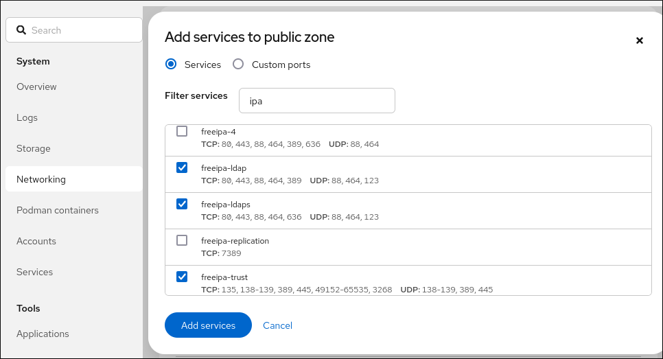

| Service  | Port    | Protocol    |
|:---------|:--------|:------------|
| Kerberos | 88, 464 | TCP and UDP |
| LDAP     | 389     | TCP         |
| DNS      | 53      | TCP and UDP |

Table 6.2. Ports required by IdM servers in a trust

| Service  | Port | Protocol    |
|:---------|:-----|:------------|
| Kerberos | 88   | UDP and TCP |

Table 6.3. Ports required by IdM clients in an AD trust

Note

The `libkrb5` library uses UDP and falls back to the TCP protocol if the data sent from the Key Distribution Center (KDC) is too large. Active Directory attaches a Privilege Attribute Certificate (PAC) to the Kerberos ticket, which increases the size and requires to use the TCP protocol. To avoid the fall-back and resending the request, SSSD uses TCP for user authentication by default. If you want to configure the size before `libkrb5` uses TCP, set the `udp_preference_limit` in the `/etc/krb5.conf` file. For details, see the `krb5.conf(5)` man page on your system.

The following diagram shows communication sent by IdM clients, and received and responded to by IdM servers and AD Domain Controllers. To set the incoming and outgoing ports and protocols on your firewall, use the `firewalld` service, which already has definitions for FreeIPA services.

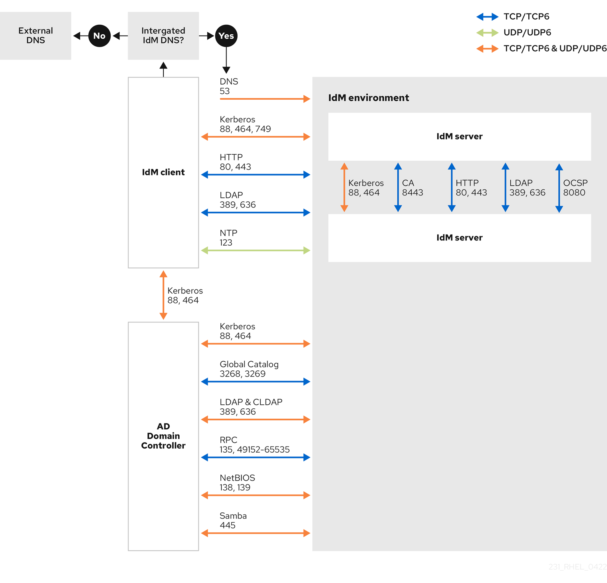

Note

The default and recommended configuration for establishing a trust uses port `389` (LDAP). This connection is secured by SASL/GSSAPI, which provides strong, built-in encryption. For compatibility with specific Active Directory (AD) environments that are configured to reject this default method and mandate LDAPS, communication over port `636` is also possible. This is a non-standard configuration and should only be used if your AD policy makes it strictly necessary. Consult your AD administrator to confirm your environment’s requirements before configuring your firewall. If you are in this scenario, open a support case.

**Additional resources**

- [The default dynamic port range for TCP/IP has changed since Windows Vista and in Windows Server 2008](https://support.microsoft.com/en-us/help/929851/the-default-dynamic-port-range-for-tcp-ip-has-changed-in-windows-vista)

<h2 id="configuring-dns-and-realm-settings-for-a-trust">Chapter 7. Configuring DNS and realm settings for a trust</h2>

Before establishing a trust between Identity Management (IdM) and Active Directory (AD), you must ensure that both environments can mutually resolve domain names correctly.

To configure DNS resolution between an IdM server, using an integrated DNS server and a Certification Authority (CA), and an AD Domain Controller, perform the following tasks:

- Prepare the IdM environment: configure the necessary DNS zones and resource records.
- Enable cross-domain resolution: configure conditional DNS forwarding on the AD server to point to IdM.
- Validate connectivity: verify the DNS configuration to ensure seamless communication between realms.

<h3 id="unique-primary-dns-domains">7.1. Unique primary DNS domains</h3>

For a successful Identity Management (IdM) to Active Directory (AD) trust, each environment must occupy a unique, dedicated DNS domain and Kerberos realm. This separation allows Active Directory to route authentication requests correctly via name suffix routing.

Each system must have its own unique primary DNS domain configured. For example:

- `ad.example.com` for AD and `idm.example.com` for IdM
- `example.com` for AD and `idm.example.com` for IdM
- `ad.example.com` for AD and `example.com` for IdM

The most convenient management solution is an environment where each DNS domain is managed by integrated DNS servers, but it is possible to use any other standard-compliant DNS server as well.

Kerberos realm names as upper-case versions of primary DNS domain names

Kerberos realm names must match the primary DNS domain names, with all letters uppercase. For example, if the domain names are `ad.example.com` for AD and `idm.example.com` for IdM, the Kerberos realm names are required to be `AD.EXAMPLE.COM` and `IDM.EXAMPLE.COM`.

DNS records resolvable from all DNS domains in the trust

All machines must resolve DNS records from all DNS domains involved in the trust relationship.

IdM and AD DNS Domains

Systems joined to IdM can be distributed over multiple DNS domains. Deploy IdM clients in a DNS zone separate from those managed by Active Directory. The primary IdM DNS domain must have proper SRV records to support AD trusts.

Note

In some environments with trusts between IdM and AD, you can install an IdM client on a host that is part of the Active Directory DNS domain. The host can then benefit from the Linux-focused features of IdM. This is not a recommended configuration and has some limitations. See [Configuring IdM clients in an Active Directory DNS domain](https://docs.redhat.com/en/documentation/red_hat_enterprise_linux/10/html/installing_trust_between_idm_and_ad/configuring-idm-clients-in-an-active-directory-dns-domain) for more details.

You can acquire a list of the required SRV records specific to your system setup by running the following command:

```
ipa dns-update-system-records --dry-run
```

```plaintext
$ ipa dns-update-system-records --dry-run
```

The generated list can look for example like this:

```
IPA DNS records:
  _kerberos-master._tcp.idm.example.com. 86400 IN SRV 0 100 88 server.idm.example.com.
  _kerberos-master._udp.idm.example.com. 86400 IN SRV 0 100 88 server.idm.example.com.
  _kerberos._tcp.idm.example.com. 86400 IN SRV 0 100 88 server.idm.example.com.
  _kerberos._tcp.idm.example.com. 86400 IN SRV 0 100 88 server.idm.example.com.
  _kerberos.idm.example.com. 86400 IN TXT "IDM.EXAMPLE.COM"
  _kpasswd._tcp.idm.example.com. 86400 IN SRV 0 100 464 server.idm.example.com.
  _kpasswd._udp.idm.example.com. 86400 IN SRV 0 100 464 server.idm.example.com.
  _ldap._tcp.idm.example.com. 86400 IN SRV 0 100 389 server.idm.example.com.
  _ipa-ca.idm.example.com. 86400 IN A 192.168.122.2
```

```plaintext
IPA DNS records:
  _kerberos-master._tcp.idm.example.com. 86400 IN SRV 0 100 88 server.idm.example.com.
  _kerberos-master._udp.idm.example.com. 86400 IN SRV 0 100 88 server.idm.example.com.
  _kerberos._tcp.idm.example.com. 86400 IN SRV 0 100 88 server.idm.example.com.
  _kerberos._tcp.idm.example.com. 86400 IN SRV 0 100 88 server.idm.example.com.
  _kerberos.idm.example.com. 86400 IN TXT "IDM.EXAMPLE.COM"
  _kpasswd._tcp.idm.example.com. 86400 IN SRV 0 100 464 server.idm.example.com.
  _kpasswd._udp.idm.example.com. 86400 IN SRV 0 100 464 server.idm.example.com.
  _ldap._tcp.idm.example.com. 86400 IN SRV 0 100 389 server.idm.example.com.
  _ipa-ca.idm.example.com. 86400 IN A 192.168.122.2
```

For other DNS domains that are part of the same IdM realm, it is not required for the SRV records to be configured when the trust to AD is configured. The reason is that AD domain controllers do not use SRV records to discover KDCs but rather base the KDC discovery on name suffix routing information for the trust.

<h3 id="configuring-a-dns-forward-zone-in-the-idm-web-ui">7.2. Configuring a DNS forward zone in the IdM Web UI</h3>

Use the Identity Management (IdM) Web UI to configure DNS forward zones. This allows the IdM server to route queries for external domains, such as an Active Directory environment, to their respective DNS servers.

**Prerequisites**

- Access to the IdM Web UI with a user account that has administrator rights.
- Correctly configured DNS server.

**Procedure**

1. Log in to the IdM Web UI with administrator privileges.
2. Click the **Network Services** tab.
3. Click the **DNS** tab.
4. In the drop down menu, click **DNS Forward Zones**.
   
   
5. Click the **Add** button.
6. In the **Add DNS forward zone** dialog box, add a zone name.
7. In the **Zone forwarders** item, click the **Add** button.
8. In the **Zone forwarders** field, add the IP address of the server for which you want to create the forward zone.
9. Click the **Add** button.
   
   
   
   The forwarded zone has been added to the DNS settings and you can verify it in the DNS Forward Zones settings. The Web UI informs you about success with the following pop-up message: **DNS Forward Zone successfully added.**
   
   Note
   
   After adding a forward zone to the configuration, the Web UI might display a warning about a DNSSEC validation failure.
   
   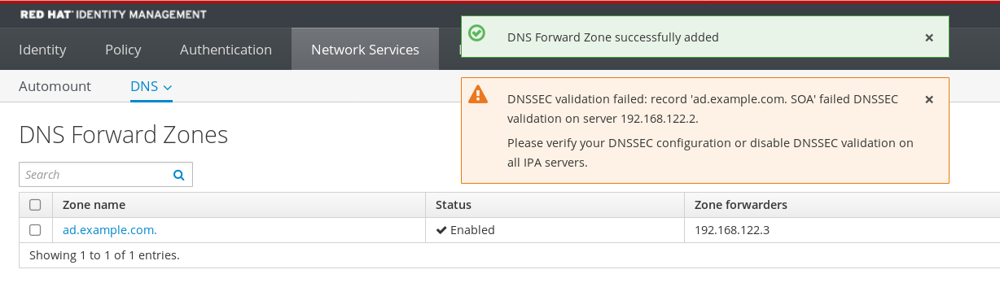
   
   DNSSEC (Domain Name System Security Extensions) secures DNS data with a digital signature to protect DNS from attacks. This service is enabled by default in the IdM server. The warning appears because the remote DNS server does not use DNSSEC. Enable DNSSEC on the remote DNS server.
   
   If you cannot enable DNSSEC validation on the remote server, you can disable DNSSEC in the IdM server:
   
   1. Open the `/etc/named/ipa-options-ext.conf` file on your IdM server.
   2. Add the following DNSSEC parameters:
      
      ```
      dnssec-validation no;
      ```
      
      ```plaintext
      dnssec-validation no;
      ```
   3. Save and close the configuration file.
   4. Restart the DNS service:
      
      ```
      systemctl restart named
      ```
      
      ```plaintext
      # systemctl restart named
      ```
   
   Note that DNSSEC is only available as Technology Preview in IdM.

**Verification**

- Use the `nslookup` command with the name of the remote DNS server:
  
  ```
  nslookup ad.example.com
  ```
  
  ```plaintext
  $ nslookup ad.example.com
  ```
  
  ```
  Server:        192.168.122.2
  Address:       192.168.122.2#53
  
  No-authoritative answer:
  Name:          ad.example.com
  Address:       192.168.122.3
  ```
  
  ```plaintext
  Server:        192.168.122.2
  Address:       192.168.122.2#53
  
  No-authoritative answer:
  Name:          ad.example.com
  Address:       192.168.122.3
  ```
  
  If you configured the domain forwarding correctly, the IP address of the remote DNS server is displayed.

**Additional resources**

- [Accessing the IdM Web UI in a web browser](https://docs.redhat.com/en/documentation/red_hat_enterprise_linux/10/html/accessing_identity_management_services/accessing-the-idm-web-ui-in-a-web-browser)

<h3 id="configuring-a-dns-forward-zone-in-the-cli">7.3. Configuring a DNS forward zone in the CLI</h3>

Use the Identity Management (IdM) CLI to configure DNS forward zones. This allows the IdM server to route queries for external domains, such as an Active Directory environment, to their respective DNS servers.

**Prerequisites**

- Access to the CLI with a user account that has administrator rights.
- Correctly configured DNS server.

**Procedure**

- Create a DNS forward zone for the AD domain, and specify the IP address of the remote DNS server with the `--forwarder` option:
  
  ```
  ipa dnsforwardzone-add ad.example.com --forwarder=192.168.122.3 --forward-policy=first
  ```
  
  ```plaintext
  # ipa dnsforwardzone-add ad.example.com --forwarder=192.168.122.3 --forward-policy=first
  ```
  
  Note
  
  You might see a warning about a DNSSEC validation failure in the `/var/log/messages` system logs after adding a new forward zone to the configuration:
  
  ```
  named[2572]: no valid DS resolving 'host.ad.example.com/A/IN':  192.168.100.25#53
  ```
  
  ```plaintext
  named[2572]: no valid DS resolving 'host.ad.example.com/A/IN':  192.168.100.25#53
  ```
  
  DNSSEC (Domain Name System Security Extensions) secures DNS data with a digital signature to protect DNS from attacks. This service is enabled by default in the IdM server. The warning appears because the remote DNS server does not use DNSSEC. Enable DNSSEC on the remote DNS server.
  
  If you cannot enable DNSSEC validation on the remote server, you can disable DNSSEC in the IdM server:
  
  1. Open the `/etc/named/ipa-options-ext.conf` file on your IdM server.
  2. Add the following DNSSEC parameters:
     
     ```
     dnssec-validation no;
     ```
     
     ```plaintext
     dnssec-validation no;
     ```
  3. Save and close the configuration file.
  4. Restart the DNS service:
     
     ```
     systemctl restart named
     ```
     
     ```plaintext
     # systemctl restart named
     ```
  
  Note that DNSSEC is only available as Technology Preview in IdM.

**Verification**

- Use the `nslookup` command with the name of the remote DNS server:
  
  ```
  nslookup ad.example.com
  ```
  
  ```plaintext
  $ nslookup ad.example.com
  ```
  
  ```
  Server:        192.168.122.2
  Address:       192.168.122.2#53
  
  No-authoritative answer:
  Name:          ad.example.com
  Address:       192.168.122.3
  ```
  
  ```plaintext
  Server:        192.168.122.2
  Address:       192.168.122.2#53
  
  No-authoritative answer:
  Name:          ad.example.com
  Address:       192.168.122.3
  ```
  
  If the domain forwarding is configured correctly, the `nslookup` request displays an IP address of the remote DNS server.

<h3 id="configuring-dns-forwarding-in-ad">7.4. Configuring DNS forwarding in AD</h3>

Configure a conditional forwarder in Active Directory (AD) to enable the Windows environment to resolve the Identity Management (IdM) domain. This is essential for AD to locate IdM Kerberos and LDAP services.

**Prerequisites**

- Windows Server with AD installed.
- DNS port open on both servers.

**Procedure**

1. Log in to the Windows Server.
2. Open **Server Manager**.
3. Open **DNS Manager**.
4. In **Conditional Forwarders**, add a new forwarder and enter:
   
   - DNS Domain: The fully qualified domain name, for example, `server.idm.example.com`
   - IP Address: The IP address of the IdM DNS server.
5. Save the settings.

<h3 id="verifying-the-dns-configuration">7.5. Verifying the DNS configuration</h3>

Verify that both Identity Management (IdM) and Active Directory (AD) can resolve their own service records and those of the peer domain. Ensure successful bidirectional resolution before establishing the trust relationship.

**Prerequisites**

- You are logged in with an account that has `sudo` permissions.

**Procedure**

1. Run a DNS query for the Kerberos over UDP and LDAP over TCP service records.
   
   ```
   dig +short -t SRV _kerberos._udp.idm.example.com.
   ```
   
   ```plaintext
   [admin@server ~]# dig +short -t SRV _kerberos._udp.idm.example.com.
   ```
   
   ```
   0 100 88 server.idm.example.com.
   ```
   
   ```plaintext
   0 100 88 server.idm.example.com.
   ```
   
   ```
   dig +short -t SRV _ldap._tcp.idm.example.com.
   ```
   
   ```plaintext
   [admin@server ~]# dig +short -t SRV _ldap._tcp.idm.example.com.
   ```
   
   ```
   0 100 389 server.idm.example.com.
   ```
   
   ```plaintext
   0 100 389 server.idm.example.com.
   ```
   
   The commands return the SRV records for the IdM servers.
2. Run a DNS query for the TXT record with the IdM Kerberos realm name. The returned value should match the Kerberos realm you specified when installing IdM.
   
   ```
   dig +short -t TXT _kerberos.idm.example.com.
   ```
   
   ```plaintext
   [admin@server ~]# dig +short -t TXT _kerberos.idm.example.com.
   ```
   
   ```
   "IDM.EXAMPLE.COM"
   ```
   
   ```plaintext
   "IDM.EXAMPLE.COM"
   ```
   
   If the previous steps did not return all the expected records, update the DNS configuration with the missing records:
   
   - If your IdM environment uses an integrated DNS server, enter the `ipa dns-update-system-records` command without any options to update your system records:
     
     ```
     ipa dns-update-system-records
     ```
     
     ```plaintext
     [admin@server ~]$ ipa dns-update-system-records
     ```
   - If your IdM environment does not use an integrated DNS server:
     
     1. On the IdM server, export the IdM DNS records into a file:
        
        ```
        ipa dns-update-system-records --dry-run --out dns_records_file.nsupdate
        ```
        
        ```plaintext
        [admin@server ~]$ ipa dns-update-system-records --dry-run --out dns_records_file.nsupdate
        ```
        
        The command creates a file named **dns\_records\_file.nsupdate** with the relevant IdM DNS records.
     2. Submit a DNS update request to your DNS server using the `nsupdate` utility and the `dns_records_file.nsupdate` file. For more information, see [Updating External DNS Records Using nsupdate](https://docs.redhat.com/en/documentation/red_hat_enterprise_linux/7/html/linux_domain_identity_authentication_and_policy_guide/dns-updates-external#dns-update-external-nsupdate) in RHEL 7 documentation. Alternatively, refer to your DNS server documentation for adding DNS records.
3. Verify that IdM is able to resolve service records for AD with a command that runs a DNS query for Kerberos and LDAP over TCP service records:
   
   ```
   dig +short -t SRV _kerberos._tcp.dc._msdcs.ad.example.com.
   ```
   
   ```plaintext
   [admin@server ~]# dig +short -t SRV _kerberos._tcp.dc._msdcs.ad.example.com.
   ```
   
   ```
   0 100 88 addc1.ad.example.com.
   ```
   
   ```plaintext
   0 100 88 addc1.ad.example.com.
   ```
   
   ```
   dig +short -t SRV _ldap._tcp.dc._msdcs.ad.example.com.
   ```
   
   ```plaintext
   [admin@server ~]# dig +short -t SRV _ldap._tcp.dc._msdcs.ad.example.com.
   ```
   
   ```
   0 100 389 addc1.ad.example.com.
   ```
   
   ```plaintext
   0 100 389 addc1.ad.example.com.
   ```

<h2 id="configuring-idm-clients-in-an-active-directory-dns-domain">Chapter 8. Configuring IdM clients in an Active Directory DNS domain</h2>

While IdM clients should ideally reside in a separate DNS zone, you can join clients located in an Active Directory (AD) DNS domain to IdM. This enables RHEL-specific features for hosts within the AD namespace.

Important

This configuration is not recommended and has limitations. Always deploy IdM clients in a DNS zone separate from the ones owned by AD and access IdM clients using their IdM host names.

Your IdM client configuration depends on whether you require single sign-on with Kerberos.

<h3 id="configuring-an-idm-client-without-kerberos-single-sign-on">8.1. Configuring an IdM client without Kerberos single sign-on</h3>

When an IdM client resides in an Active Directory (AD) DNS domain, password-based authentication is the only supported authentication method. Join the client to the IdM realm manually without Kerberos single sign-on.

**Procedure**

1. Install the IdM client with the `--domain=IPA_DNS_Domain` option to ensure the System Security Services Daemon (SSSD) can communicate with the IdM servers:
   
   ```
   [root@idm-client.ad.example.com ~]# ipa-client-install --domain=idm.example.com
   ```
   
   ```plaintext
   [root@idm-client.ad.example.com ~]# ipa-client-install --domain=idm.example.com
   ```
   
   This option disables the SRV record auto-detection for the Active Directory DNS domain.
2. Open the `/etc/krb5.conf` configuration file and locate the existing mapping for the Active Directory domain in the `[domain_realm]` section.
   
   ```
   .ad.example.com = IDM.EXAMPLE.COM
   ad.example.com = IDM.EXAMPLE.COM
   ```
   
   ```plaintext
   .ad.example.com = IDM.EXAMPLE.COM
   ad.example.com = IDM.EXAMPLE.COM
   ```
3. Replace both lines with an entry mapping the fully qualified domain name (FQDN) of the Linux clients in the Active Directory DNS zone to the IdM realm:
   
   ```
   idm-client.ad.example.com = IDM.EXAMPLE.COM
   ```
   
   ```plaintext
   idm-client.ad.example.com = IDM.EXAMPLE.COM
   ```
   
   By replacing the default mapping, you prevent Kerberos from sending its requests for the Active Directory domain to the IdM Kerberos Distribution Center (KDC). Instead Kerberos uses auto-discovery through SRV DNS records to locate the KDC.

<h3 id="requesting-ssl-certificates-without-single-sign-on">8.2. Requesting SSL certificates without single sign-on</h3>

After you configure an IdM client without Kerberos single sign-on, you can set up SSL-based services.

SSL-based services require a certificate with `dNSName` extension records that cover all system host names, because both original (A/AAAA) and CNAME records must be in the certificate. Currently, IdM only issues certificates to host objects in the IdM database.

In this setup, where single sign-on is not enabled, IdM already contains a host object for the FQDN in its database. You can use `certmonger` to request a certificate using the FQDN.

**Prerequisites**

- An IdM client configured without Kerberos single-sign on.

**Procedure**

- Use `certmonger` to request a certificate using the FQDN:
  
  ```
  [root@idm-client.ad.example.com ~]# ipa-getcert request -r \
        -f /etc/httpd/alias/server.crt \
        -k /etc/httpd/alias/server.key \
        -N CN=ipa-client.ad.example.com \
        -D ipa-client.ad.example.com \
        -K host/idm-client.ad.example.com@IDM.EXAMPLE.COM \
        -U id-kp-serverAuth
  ```
  
  ```plaintext
  [root@idm-client.ad.example.com ~]# ipa-getcert request -r \
        -f /etc/httpd/alias/server.crt \
        -k /etc/httpd/alias/server.key \
        -N CN=ipa-client.ad.example.com \
        -D ipa-client.ad.example.com \
        -K host/idm-client.ad.example.com@IDM.EXAMPLE.COM \
        -U id-kp-serverAuth
  ```
  
  The `certmonger` service uses the default host key stored in the `/etc/krb5.keytab` file to authenticate to the IdM Certificate Authority (CA).

<h3 id="configuring-an-idm-client-with-kerberos-single-sign-on">8.3. Configuring an IdM client with Kerberos single sign-on</h3>

To enable Kerberos single sign-on (SSO) for IdM clients across DNS domains, you must map a CNAME record from the Active Directory (AD) domain to the IdM client’s A/AAAA record and configure the client to allow flexible principal acceptance.

For Kerberos-based application servers, MIT Kerberos supports a method to allow the acceptance of any host-based principal available in the application’s keytab.

**Procedure**

1. Configure Kerberos by editing the `/etc/krb5.conf` file on the IdM client. In the `[libdefaults]` section, set `ignore_acceptor_hostname` to `true`. This allows the application to accept any host-based principal in its keytab:
   
   ```
   ignore_acceptor_hostname = true
   ```
   
   ```plaintext
   ignore_acceptor_hostname = true
   ```
2. Ensure a CNAME record exists in the Active Directory DNS, for example `idm-client.ad.example.com`, pointing to the IdM client’s A/AAAA record in the IdM DNS domain.

<h3 id="requesting-ssl-certificates-with-single-sign-on">8.4. Requesting SSL certificates with single sign-on</h3>

To secure services using Kerberos SSO, your SSL certificate must include both the host’s A/AAAA and CNAME records. Since IdM only issues certificates to database host objects, you must manually create and link a host entry for the CNAME alias.

Create a host object for `ipa-client.example.com` in IdM and make sure the real IdM machine’s host object is able to manage this host.

**Prerequisites**

- You have disabled the strict checks on what Kerberos principal is used to target the Kerberos server.

**Procedure**

1. On the IdM server, create a host entry for the AD-side alias. Use `--force` because the name resolves to a CNAME rather than an A/AAAA record.
   
   ```
   [root@idm-server.idm.example.com ~]# ipa host-add idm-client.ad.example.com --force
   ```
   
   ```plaintext
   [root@idm-server.idm.example.com ~]# ipa host-add idm-client.ad.example.com --force
   ```
2. To allow the physical IdM host to manage the new alias entry in the IdM database, grant management permissions to the host.
   
   ```
   [root@idm-server.idm.example.com ~]# ipa host-add-managedby idm-client.ad.example.com \
         --hosts=idm-client.idm.example.com
   ```
   
   ```plaintext
   [root@idm-server.idm.example.com ~]# ipa host-add-managedby idm-client.ad.example.com \
         --hosts=idm-client.idm.example.com
   ```
3. On the IdM client, use `ipa-getcert` to request the certificate. Ensure that you include both the FQDN and the CNAME using the `-D` flags.
   
   ```
   [root@idm-client.idm.example.com ~]# ipa-getcert request -r \
         -f /etc/httpd/alias/server.crt \
         -k /etc/httpd/alias/server.key \
         -N CN=`hostname --fqdn` \
         -D `hostname --fqdn` \
         -D idm-client.ad.example.com \
         -K host/idm-client.idm.example.com@IDM.EXAMPLE.COM \
         -U id-kp-serverAuth
   ```
   
   ```plaintext
   [root@idm-client.idm.example.com ~]# ipa-getcert request -r \
         -f /etc/httpd/alias/server.crt \
         -k /etc/httpd/alias/server.key \
         -N CN=`hostname --fqdn` \
         -D `hostname --fqdn` \
         -D idm-client.ad.example.com \
         -K host/idm-client.idm.example.com@IDM.EXAMPLE.COM \
         -U id-kp-serverAuth
   ```
   
   In SSL/TLS, the client checks the Subject Alternative Name (SAN) field. By using -D twice, you are populating that SAN field with both names so that no matter which URL the user hits, the certificate remains valid.

<h2 id="setting-up-a-trust">Chapter 9. Setting up a trust</h2>

Establishing a trust between Identity Management (IdM) and Active Directory (AD) enables seamless cross-platform resource access. Learn how to prepare the IdM domain, configure trust agreements via the CLI, Web UI, or Ansible, and verify cross-realm Kerberos authentication.

<h3 id="prerequisites">9.1. Prerequisites</h3>

- DNS is correctly configured. Both IdM and AD servers must be able to resolve each other names. For details, see [Configuring DNS and realm settings for a trust](#unique-primary-dns-domains "7.1. Unique primary DNS domains").
- Supported versions of AD and IdM are deployed. For details, see [Supported versions of Windows Server](#supported-versions-of-windows-server "Chapter 2. Supported versions of Windows Server").
- You have obtained a Kerberos ticket. For details, see [Using kinit to log in to IdM manually](https://docs.redhat.com/en/documentation/red_hat_enterprise_linux/10/html/accessing_identity_management_services/logging-in-to-idm-in-the-web-ui-using-a-kerberos-ticket#using-kinit-to-log-in-to-idm-manually_login-web-ui-krb).

<h3 id="preparing-the-idm-server-for-the-trust">9.2. Preparing the IdM server for the trust</h3>

Before you can establish a trust with AD, you must prepare the IdM domain using the `ipa-adtrust-install` utility on an IdM server.

Note

Any system where you run the `ipa-adtrust-install` command automatically becomes an AD trust controller. However, you must run `ipa-adtrust-install` only once on an IdM server.

**Prerequisites**

- IdM server is installed.
- You have root privileges to install packages and restart IdM services.

**Procedure**

01. Install the required packages:
    
    ```
    dnf install ipa-server-trust-ad samba-client
    ```
    
    ```plaintext
    [root@ipaserver ~]# dnf install ipa-server-trust-ad samba-client
    ```
02. Authenticate as the IdM administrative user:
    
    ```
    kinit admin
    ```
    
    ```plaintext
    [root@ipaserver ~]# kinit admin
    ```
03. Run the `ipa-adtrust-install` utility:
    
    ```
    ipa-adtrust-install
    ```
    
    ```plaintext
    [root@ipaserver ~]# ipa-adtrust-install
    ```
    
    The DNS service records are created automatically if IdM was installed with an integrated DNS server.
    
    If you installed IdM without an integrated DNS server, `ipa-adtrust-install` prints a list of service records that you must manually add to DNS before you can continue.
04. The script prompts you that the `/etc/samba/smb.conf` already exists and will be rewritten:
    
    ```
    WARNING: The smb.conf already exists. Running ipa-adtrust-install will break your existing Samba configuration.
    
    Do you wish to continue? [no]: yes
    ```
    
    ```plaintext
    WARNING: The smb.conf already exists. Running ipa-adtrust-install will break your existing Samba configuration.
    
    Do you wish to continue? [no]: yes
    ```
05. The script prompts you to configure the `slapi-nis` plug-in, a compatibility plug-in that allows older Linux clients to work with trusted users:
    
    ```
    Do you want to enable support for trusted domains in Schema Compatibility plugin?
    This will allow clients older than SSSD 1.9 and non-Linux clients to work with trusted users.
    
    Enable trusted domains support in slapi-nis? [no]: yes
    ```
    
    ```plaintext
    Do you want to enable support for trusted domains in Schema Compatibility plugin?
    This will allow clients older than SSSD 1.9 and non-Linux clients to work with trusted users.
    
    Enable trusted domains support in slapi-nis? [no]: yes
    ```
06. You are prompted to run the SID generation task to create a SID for any existing users:
    
    ```
    Do you want to run the ipa-sidgen task? [no]: yes
    ```
    
    ```plaintext
    Do you want to run the ipa-sidgen task? [no]: yes
    ```
    
    This is a resource-intensive task, so if you have a high number of users, you can run this at another time.
07. Optional: By default, the Dynamic RPC port range is defined as `49152-65535` for Windows Server 2008 and later. If you need to define a different Dynamic RPC port range for your environment, configure Samba to use different ports and open those ports in your firewall settings. The following example sets the port range to `55000-65000`.
    
    ```
    net conf setparm global 'rpc server dynamic port range' 55000-65000
    firewall-cmd --add-port=55000-65000/tcp
    firewall-cmd --runtime-to-permanent
    ```
    
    ```plaintext
    [root@ipaserver ~]# net conf setparm global 'rpc server dynamic port range' 55000-65000
    [root@ipaserver ~]# firewall-cmd --add-port=55000-65000/tcp
    [root@ipaserver ~]# firewall-cmd --runtime-to-permanent
    ```
08. Make sure that DNS is properly configured, as described in [Verifying the DNS configuration for a trust](#verifying-the-dns-configuration "7.5. Verifying the DNS configuration").
    
    Important
    
    Red Hat strongly recommends you verify the DNS configuration as described in [Verifying the DNS configuration for a trust](#verifying-the-dns-configuration "7.5. Verifying the DNS configuration") every time after running `ipa-adtrust-install`, especially if IdM or AD do not use integrated DNS servers.
09. Restart the `ipa` service:
    
    ```
    ipactl restart
    ```
    
    ```plaintext
    [root@ipaserver ~]# ipactl restart
    ```
10. Use the `smbclient` utility to verify that Samba responds to Kerberos authentication from the IdM side:
    
    ```
    smbclient -L ipaserver.idm.example.com -U user_name --use-kerberos=required
    ```
    
    ```plaintext
    [root@ipaserver ~]# smbclient -L ipaserver.idm.example.com -U user_name --use-kerberos=required
    ```
    
    ```
    lp_load_ex: changing to config backend registry
        Sharename       Type      Comment
        ---------       ----      -------
        IPC$            IPC       IPC Service (Samba 4.15.2)
    ...
    ```
    
    ```plaintext
    lp_load_ex: changing to config backend registry
        Sharename       Type      Comment
        ---------       ----      -------
        IPC$            IPC       IPC Service (Samba 4.15.2)
    ...
    ```

<h3 id="setting-up-a-trust-agreement-using-the-command-line">9.3. Setting up a trust agreement using the command line</h3>

Use the command line to establish a trust between Identity Management (IdM) and Active Directory (AD). IdM supports one-way, two-way, and external forest trusts, allowing you to control how users access resources across domains using the `ipa trust-add` utility.

- **One-way trust** — default option. One-way trust enables Active Directory (AD) users and groups to access resources in IdM, but not the other way around. The IdM domain trusts the AD forest, but the AD forest does not trust the IdM domain.
- **Two-way trust** — Two-way trust enables AD users and groups to access resources in IdM.
  
  You must configure a two-way trust for solutions such as Microsoft SQL Server that expect the `S4U2Self` and `S4U2Proxy` Microsoft extensions to the Kerberos protocol to work over a trust boundary. An application on a RHEL IdM host might request `S4U2Self` or `S4U2Proxy` information from an Active Directory domain controller about an AD user, and a two-way trust provides this feature.
  
  Note that this two-way trust functionality does not allow IdM users to login to Windows systems, and the two-way trust in IdM does not give the users any additional rights compared to the one-way trust solution in AD.
  
  - To create the two-way trust, add the following option to the command: `--two-way=true`
- **External trust** - a trust relationship between IdM and an AD domain in different forests. While a forest trust always requires establishing a trust between IdM and the root domain of an Active Directory forest, an external trust can be established from IdM to a domain within a forest. This is only recommended if it is not possible to establish a forest trust between forest root domains due to administrative or organizational reasons.
  
  - To create the external trust, add the following option to the command: `--external=true`

The steps below show you how to create a one-way trust agreement.

**Prerequisites**

- User name and password of a Windows administrator.
- You have [prepared the IdM server for the trust](https://docs.redhat.com/en/documentation/red_hat_enterprise_linux/10/html-single/installing_trust_between_idm_and_ad/index#preparing-the-idm-server-for-the-trust_setting-up-a-trust).

**Procedure**

- Create a trust agreement for the AD domain and the IdM domain by using the `ipa trust-add` command:
  
  - To have SSSD automatically generate UIDs and GIDs for AD users based on their SID, create a trust agreement with the `Active Directory domain` ID range type. This is the most common configuration.
    
    ```
    ipa trust-add --type=ad ad.example.com --admin <ad_admin_username> --password --range-type=ipa-ad-trust
    ```
    
    ```plaintext
    [root@server ~]# ipa trust-add --type=ad ad.example.com --admin <ad_admin_username> --password --range-type=ipa-ad-trust
    ```
  - If you have configured POSIX attributes for your users in Active Directory (such as `uidNumber` and `gidNumber`) and you want SSSD to process this information, create a trust agreement with the `Active Directory domain with POSIX attributes` ID range type:
    
    ```
    ipa trust-add --type=ad ad.example.com --admin <ad_admin_username> --password --range-type=ipa-ad-trust-posix
    ```
    
    ```plaintext
    [root@server ~]# ipa trust-add --type=ad ad.example.com --admin <ad_admin_username> --password --range-type=ipa-ad-trust-posix
    ```
    
    Warning
    
    If you do not specify an ID Range type when creating a trust, IdM attempts to automatically select the appropriate range type by requesting details from AD domain controllers in the forest root domain. If IdM does not detect any POSIX attributes, the trust installation script selects the `Active Directory domain` ID range.
    
    If IdM detects any POSIX attributes in the forest root domain, the trust installation script selects the `Active Directory domain with POSIX attributes` ID range and assumes that UIDs and GIDs are correctly defined in AD. If POSIX attributes are not correctly set in AD, you will not be able to resolve AD users.
    
    For example, if the users and groups that need access to IdM systems are not part of the forest root domain, but instead are located in a child domain of the forest domain, the installation script might not detect the POSIX attributes defined in the child AD domain. In this case, explicitly choose the POSIX ID range type when establishing the trust.

<h3 id="setting-up-a-trust-agreement-in-the-idm-web-ui">9.4. Setting up a trust agreement in the IdM Web UI</h3>

To enable Active Directory (AD) users to authenticate and access resources, you can establish a cross-forest trust by using the Identity Management (IdM) Web UI. This configuration ensures that both domains correctly resolve identities and share resources.

**Prerequisites**

- DNS is correctly configured. Both IdM and AD servers must be able to resolve each other names.
- Supported versions of AD and IdM are deployed.
- You have obtained a Kerberos ticket.
- Before creating a trust in the Web UI, prepare the IdM server for the trust as described in: [Setting up a trust](https://docs.redhat.com/en/documentation/red_hat_enterprise_linux/10/html/installing_trust_between_idm_and_ad/setting-up-a-trust).
- You are logged in as an IdM administrator. For details, see [Accessing the IdM Web UI in a web browser](https://docs.redhat.com/en/documentation/red_hat_enterprise_linux/10/html/accessing_identity_management_services/accessing-the-idm-web-ui-in-a-web-browser).

**Procedure**

01. In the IdM Web UI, click the **IPA Server** tab.
02. In the **IPA Server** tab, click the **Trusts** tab.
03. In the drop down menu, select the **Trusts** option.
    
    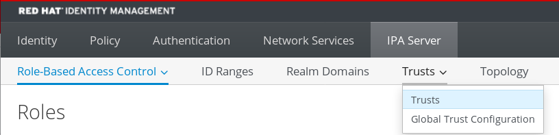
04. Click the **Add** button.
05. In the **Add Trust** dialog box, enter the name of the Active Directory domain.
06. In the **Account** and **Password** fields, add the administrator credentials of the Active Directory administrator.
    
    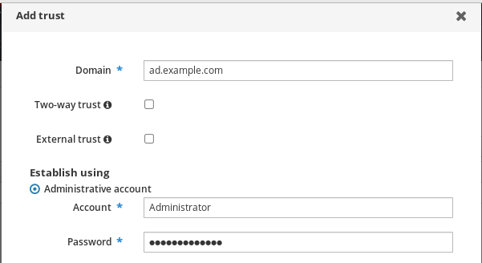
07. Optional: Select **Two-way trust**, if you want to enable AD users and groups to access resources in IdM. However, the two-way trust in IdM does not give the users any additional rights compared to the one-way trust solution in AD. Both solutions are considered equally secure because of default cross-forest trust SID filtering settings.
08. Optional: Select **External trust** if you are configuring a trust with an AD domain that is not the root domain of an AD forest. While a forest trust always requires establishing a trust between IdM and the root domain of an Active Directory forest, you can establish an external trust from IdM to any domain within an AD forest.
09. Optional: By default, the trust installation script tries to detect the appropriate ID range type. You can also explicitly set the ID range type by choosing one of the following options:
    
    1. To have SSSD automatically generate UIDs and GIDs for AD users based on their SID, select the `Active Directory domain` ID range type. This is the most common configuration.
    2. If you have configured POSIX attributes for your users in Active Directory (such as `uidNumber` and `gidNumber`) and you want SSSD to process this information, select the `Active Directory domain with POSIX attributes` ID range type.
       
       
       
       Warning
       
       If you leave the **Range type** setting on the default `Detect` option, IdM attempts to automatically select the appropriate range type by requesting details from AD domain controllers in the forest root domain. If IdM does not detect any POSIX attributes, the trust installation script selects the `Active Directory domain` ID range.
       
       If IdM detects any POSIX attributes in the forest root domain, the trust installation script selects the `Active Directory domain with POSIX attributes` ID range and assumes that UIDs and GIDs are correctly defined in AD. If POSIX attributes are not correctly set in AD, you will not be able to resolve AD users.
       
       For example, if the users and groups that need access to IdM systems are not part of the forest root domain, but instead are located in a child domain of the forest domain, the installation script might not detect the POSIX attributes defined in the child AD domain. In this case, explicitly choose the POSIX ID range type when establishing the trust.
10. Click **Add**.

**Verification**

- If the trust has been successfully added to the IdM server, you can see the green pop-up window in the IdM Web UI. It means that the:
  
  - Domain name exists
  - User name and password of the Windows Server has been added correctly.
    
    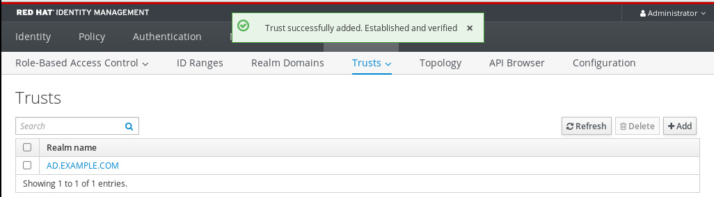

Now you can continue to test the trust connection and Kerberos authentication.

<h3 id="setting-up-a-trust-agreement-using-ansible">9.5. Setting up a trust agreement using Ansible</h3>

To automate the creation of trust agreements between Identity Management (IdM) and Active Directory (AD), use the `ansible-freeipa` package via Ansible playbooks.

You can configure three types of trust agreements:

- **One-way trust** — default option. One-way trust enables Active Directory (AD) users and groups to access resources in IdM, but not the other way around. The IdM domain trusts the AD forest, but the AD forest does not trust the IdM domain.
- **Two-way trust** — Two-way trust enables AD users and groups to access resources in IdM.
  
  You must configure a two-way trust for solutions such as Microsoft SQL Server that expect the `S4U2Self` and `S4U2Proxy` Microsoft extensions to the Kerberos protocol to work over a trust boundary. An application on a RHEL IdM host might request `S4U2Self` or `S4U2Proxy` information from an Active Directory domain controller about an AD user, and a two-way trust provides this feature.
  
  Note that this two-way trust functionality does not allow IdM users to login to Windows systems, and the two-way trust in IdM does not give the users any additional rights compared to the one-way trust solution in AD.
  
  - To create the two-way trust, add the following variable to the playbook task below: `two_way: true`
- **External trust** - a trust relationship between IdM and an AD domain in different forests. While a forest trust always requires establishing a trust between IdM and the root domain of an Active Directory forest, an external trust can be established from IdM to a domain within a forest. This is only recommended if it is not possible to establish a forest trust between forest root domains due to administrative or organizational reasons.
  
  - To create the external trust, add the following variable to the playbook task below: `external: true`

**Prerequisites**

- User name and password of a Windows administrator.
- The IdM `admin` password.
- You have [prepared the IdM server for the trust](https://docs.redhat.com/en/documentation/red_hat_enterprise_linux/10/html/installing_trust_between_idm_and_ad/setting-up-a-trust).
- You have configured your Ansible control node to meet the following requirements:
  
  - You are using Ansible version 2.15 or later.
  - You have installed the [`ansible-freeipa`](https://docs.redhat.com/en/documentation/red_hat_enterprise_linux/10/html/using_ansible_to_install_and_manage_identity_management_in_rhel/installing-an-identity-management-server-using-an-ansible-playbook#installing-the-ansible-freeipa-package) package.
  - The example assumes that in the **~/*MyPlaybooks*/** directory, you have created an [Ansible inventory file](https://docs.redhat.com/en/documentation/red_hat_enterprise_linux/10/html/using_ansible_to_install_and_manage_identity_management_in_rhel/preparing-your-environment-for-managing-idm-using-ansible-playbooks) with the fully-qualified domain name (FQDN) of the IdM server.
  - The example assumes that the **secret.yml** Ansible vault stores your `ipaadmin_password` and that you have access to a file that stores the password protecting the **secret.yml** file.
- The target node, that is the node on which the `freeipa.ansible_freeipa` module is executed, is part of the IdM domain as an IdM client, server or replica.

**Procedure**

1. Navigate to your **~/*MyPlaybooks*/** directory:
   
   ```
   cd ~/MyPlaybooks/
   ```
   
   ```plaintext
   $ cd ~/MyPlaybooks/
   ```
2. Select one of the following scenarios based on your use case:
   
   - To create an ID mapping trust agreement, in which SSSD automatically generates UIDs and GIDs for AD users and groups based on their SIDs, create an `add-trust.yml` playbook with the following content:
     
     ```
     ---
     - name: Playbook to create a trust
       hosts: ipaserver
     
       vars_files:
       - /home/user_name/MyPlaybooks/secret.yml
       tasks:
         - name: ensure the trust is present
           ipatrust:
             ipaadmin_password: "{{ ipaadmin_password }}"
             realm: ad.example.com
             admin: Administrator
             password: secret_password
             state: present
     ```
     
     ```plaintext
     ---
     - name: Playbook to create a trust
       hosts: ipaserver
     
       vars_files:
       - /home/user_name/MyPlaybooks/secret.yml
       tasks:
         - name: ensure the trust is present
           ipatrust:
             ipaadmin_password: "{{ ipaadmin_password }}"
             realm: ad.example.com
             admin: Administrator
             password: secret_password
             state: present
     ```
     
     In the example:
     
     - `realm` defines the AD realm name string.
     - `admin` defines the AD domain administrator string.
     - `password` defines the AD domain administrator’s password string.
   - To create a POSIX trust agreement, in which SSSD processes POSIX attributes stored in AD, such as `uidNumber` and `gidNumber`, create an `add-trust.yml` playbook with the following content:
     
     ```
     ---
     - name: Playbook to create a trust
       hosts: ipaserver
     
       vars_files:
       - /home/user_name/MyPlaybooks/secret.yml
       tasks:
         - name: ensure the trust is present
           ipatrust:
             ipaadmin_password: "{{ ipaadmin_password }}"
             realm: ad.example.com
             admin: Administrator
             password: secret_password
             range_type: ipa-ad-trust-posix
             state: present
     ```
     
     ```plaintext
     ---
     - name: Playbook to create a trust
       hosts: ipaserver
     
       vars_files:
       - /home/user_name/MyPlaybooks/secret.yml
       tasks:
         - name: ensure the trust is present
           ipatrust:
             ipaadmin_password: "{{ ipaadmin_password }}"
             realm: ad.example.com
             admin: Administrator
             password: secret_password
             range_type: ipa-ad-trust-posix
             state: present
     ```
   - To create a trust agreement in which IdM attempts to automatically select the appropriate range type, `ipa-ad-trust` or `ipa-ad-trust-posix`, by requesting details from AD domain controllers in the forest root domain, create an `add-trust.yml` playbook with the following content:
     
     ```
     ---
     - name: Playbook to create a trust
       hosts: ipaserver
     
       vars_files:
       - /home/user_name/MyPlaybooks/secret.yml
       tasks:
         - name: ensure the trust is present
           ipatrust:
             ipaadmin_password: "{{ ipaadmin_password }}"
             realm: ad.example.com
             admin: Administrator
             password: secret_password
             state: present
     ```
     
     ```plaintext
     ---
     - name: Playbook to create a trust
       hosts: ipaserver
     
       vars_files:
       - /home/user_name/MyPlaybooks/secret.yml
       tasks:
         - name: ensure the trust is present
           ipatrust:
             ipaadmin_password: "{{ ipaadmin_password }}"
             realm: ad.example.com
             admin: Administrator
             password: secret_password
             state: present
     ```
   
   Warning
   
   If you do not specify an ID range type when creating a trust, and if IdM does not detect any POSIX attributes in the AD forest root domain, the trust installation script selects the `Active Directory domain` ID range.
   
   If IdM detects any POSIX attributes in the forest root domain, the trust installation script selects the `Active Directory domain with POSIX attributes` ID range and assumes that UIDs and GIDs are correctly defined in AD.
   
   However, if POSIX attributes are not correctly set in AD, you will not be able to resolve AD users. For example, if the users and groups that need access to IdM systems are not part of the forest root domain, but instead are located in a child domain of the forest domain, the installation script might not detect the POSIX attributes defined in the child AD domain. In this case, explicitly choose the POSIX ID range type when establishing the trust.
3. Save the file.
   
   For details about variables and example playbooks in the FreeIPA Ansible collection, see the `/usr/share/ansible/collections/ansible_collections/freeipa/ansible_freeipa/README-trust.md` file and the `/usr/share/ansible/collections/ansible_collections/freeipa/ansible_freeipa/playbooks/trust` directory on the control node.
4. Run the Ansible playbook. Specify the playbook file, the file storing the password protecting the **secret.yml** file, and the inventory file:
   
   ```
   ansible-playbook --vault-password-file=password_file -v -i inventory add-trust.yml
   ```
   
   ```plaintext
   $ ansible-playbook --vault-password-file=password_file -v -i inventory add-trust.yml
   ```

<h3 id="verifying-the-kerberos-configuration">9.6. Verifying the Kerberos configuration</h3>

Verify the cross-realm trust by confirming that an Active Directory (AD) user can successfully obtain a Kerberos ticket-granting ticket (TGT) and access services within the IdM domain.

**Procedure**

1. Request a ticket for an Active Directory (AD) user:
   
   ```
   kinit user@AD.EXAMPLE.COM
   ```
   
   ```plaintext
   [root@ipaserver ~]# kinit user@AD.EXAMPLE.COM
   ```
2. Request service tickets for a service within the IdM domain:
   
   ```
   kvno -S host server.idm.example.com
   ```
   
   ```plaintext
   [root@server ~]# kvno -S host server.idm.example.com
   ```
   
   If the AD service ticket is successfully granted, there is a cross-realm ticket-granting ticket (TGT) listed with all of the other requested tickets. The TGT is named krbtgt/IPA.DOMAIN@AD.DOMAIN.
   
   ```
   klist
   ```
   
   ```plaintext
   [root@server ]# klist
   ```
   
   ```
   Ticket cache: KEYRING:persistent:0:krb_ccache_hRtox00
   Default principal: user@AD.EXAMPLE.COM
   
   Valid starting       Expires              Service principal
   03.05.2016 18:31:06  04.05.2016 04:31:01  host/server.idm.example.com@IDM.EXAMPLE.COM
   	renew until 04.05.2016 18:31:00
   03.05.2016 18:31:06 04.05.2016 04:31:01 krbtgt/IDM.EXAMPLE.COM@AD.EXAMPLE.COM
   	renew until 04.05.2016 18:31:00
   03.05.2016 18:31:01  04.05.2016 04:31:01  krbtgt/AD.EXAMPLE.COM@AD.EXAMPLE.COM
   	renew until 04.05.2016 18:31:00
   ```
   
   ```plaintext
   Ticket cache: KEYRING:persistent:0:krb_ccache_hRtox00
   Default principal: user@AD.EXAMPLE.COM
   
   Valid starting       Expires              Service principal
   03.05.2016 18:31:06  04.05.2016 04:31:01  host/server.idm.example.com@IDM.EXAMPLE.COM
   	renew until 04.05.2016 18:31:00
   03.05.2016 18:31:06 04.05.2016 04:31:01 krbtgt/IDM.EXAMPLE.COM@AD.EXAMPLE.COM
   	renew until 04.05.2016 18:31:00
   03.05.2016 18:31:01  04.05.2016 04:31:01  krbtgt/AD.EXAMPLE.COM@AD.EXAMPLE.COM
   	renew until 04.05.2016 18:31:00
   ```
   
   The `localauth` plug-in maps Kerberos principals to local SSSD user names. This allows AD users to use Kerberos authentication and access Linux services, which support GSSAPI authentication directly.

<h3 id="verifying-the-trust-configuration-on-idm">9.7. Verifying the trust configuration on IdM</h3>

Ensure the Identity Management (IdM) and Active Directory (AD) environments are correctly integrated by verifying that both systems can resolve the necessary SRV service records for Kerberos and LDAP.

**Prerequisites**

- You need to be logged in with administrator privileges.

**Procedure**

1. Run a DNS query for the MS DC Kerberos over UDP and LDAP over TCP service records.
   
   ```
   dig +short -t SRV _kerberos._udp.dc._msdcs.idm.example.com.
   ```
   
   ```plaintext
   [root@server ~]# dig +short -t SRV _kerberos._udp.dc._msdcs.idm.example.com.
   ```
   
   ```
   0 100 88 server.idm.example.com.
   ```
   
   ```plaintext
   0 100 88 server.idm.example.com.
   ```
   
   ```
   dig +short -t SRV _ldap._tcp.dc._msdcs.idm.example.com.
   ```
   
   ```plaintext
   [root@server ~]# dig +short -t SRV _ldap._tcp.dc._msdcs.idm.example.com.
   ```
   
   ```
   0 100 389 server.idm.example.com.
   ```
   
   ```plaintext
   0 100 389 server.idm.example.com.
   ```
   
   These commands list all IdM servers on which `ipa-adtrust-install` has been executed. The output is empty if `ipa-adtrust-install` has not been executed on any IdM server, which is typically before establishing the first trust relationship.
2. Run a DNS query for the Kerberos and LDAP over TCP service records to verify that IdM is able to resolve service records for AD:
   
   ```
   dig +short -t SRV _kerberos._tcp.dc._msdcs.ad.example.com.
   ```
   
   ```plaintext
   [root@server ~]# dig +short -t SRV _kerberos._tcp.dc._msdcs.ad.example.com.
   ```
   
   ```
   0 100 88 addc1.ad.example.com.
   ```
   
   ```plaintext
   0 100 88 addc1.ad.example.com.
   ```
   
   ```
   dig +short -t SRV _ldap._tcp.dc._msdcs.ad.example.com.
   ```
   
   ```plaintext
   [root@ipaserver ~]# dig +short -t SRV _ldap._tcp.dc._msdcs.ad.example.com.
   ```
   
   ```
   0 100 389 addc1.ad.example.com.
   ```
   
   ```plaintext
   0 100 389 addc1.ad.example.com.
   ```

<h3 id="verifying-the-trust-configuration-on-ad">9.8. Verifying the trust configuration on AD</h3>

Use the `nslookup.exe` utility on the Active Directory (AD) server to verify that IdM service records, including SRV and TXT types, are correctly resolvable to ensure proper communication between the two realms.

**Prerequisites**

- You need to be logged in with administrator privileges.

**Procedure**

1. On the AD server, set the `nslookup.exe` utility to look up service records.
   
   ```
   C:\>nslookup.exe
   > set type=SRV
   ```
   
   ```plaintext
   C:\>nslookup.exe
   > set type=SRV
   ```
2. Enter the domain name for the Kerberos over UDP and LDAP over TCP service records.
   
   ```
   > _kerberos._udp.idm.example.com.
   _kerberos._udp.idm.example.com.       SRV service location:
       priority                = 0
       weight                  = 100
       port                    = 88
       svr hostname   = server.idm.example.com
   > _ldap._tcp.idm.example.com
   _ldap._tcp.idm.example.com       SRV service location:
       priority                = 0
       weight                  = 100
       port                    = 389
       svr hostname   = server.idm.example.com
   ```
   
   ```plaintext
   > _kerberos._udp.idm.example.com.
   _kerberos._udp.idm.example.com.       SRV service location:
       priority                = 0
       weight                  = 100
       port                    = 88
       svr hostname   = server.idm.example.com
   > _ldap._tcp.idm.example.com
   _ldap._tcp.idm.example.com       SRV service location:
       priority                = 0
       weight                  = 100
       port                    = 389
       svr hostname   = server.idm.example.com
   ```
3. Change the service type to TXT and run a DNS query for the TXT record with the IdM Kerberos realm name.
   
   ```
   C:\>nslookup.exe
   > set type=TXT
   > _kerberos.idm.example.com.
   _kerberos.idm.example.com.        text =
   
       "IDM.EXAMPLE.COM"
   ```
   
   ```plaintext
   C:\>nslookup.exe
   > set type=TXT
   > _kerberos.idm.example.com.
   _kerberos.idm.example.com.        text =
   
       "IDM.EXAMPLE.COM"
   ```
4. Run a DNS query for the MS DC Kerberos over UDP and LDAP over TCP service records.
   
   ```
   C:\>nslookup.exe
   > set type=SRV
   > _kerberos._udp.dc._msdcs.idm.example.com.
   _kerberos._udp.dc._msdcs.idm.example.com.        SRV service location:
       priority = 0
       weight = 100
       port = 88
       svr hostname = server.idm.example.com
   > _ldap._tcp.dc._msdcs.idm.example.com.
   _ldap._tcp.dc._msdcs.idm.example.com.        SRV service location:
       priority = 0
       weight = 100
       port = 389
       svr hostname = server.idm.example.com
   ```
   
   ```plaintext
   C:\>nslookup.exe
   > set type=SRV
   > _kerberos._udp.dc._msdcs.idm.example.com.
   _kerberos._udp.dc._msdcs.idm.example.com.        SRV service location:
       priority = 0
       weight = 100
       port = 88
       svr hostname = server.idm.example.com
   > _ldap._tcp.dc._msdcs.idm.example.com.
   _ldap._tcp.dc._msdcs.idm.example.com.        SRV service location:
       priority = 0
       weight = 100
       port = 389
       svr hostname = server.idm.example.com
   ```
   
   Active Directory only expects to discover domain controllers that can respond to AD-specific protocol requests, such as other AD domain controllers and IdM trust controllers. Use the `ipa-adtrust-install` tool to promote an IdM server to a trust controller, and you can verify which servers are trust controllers with the `ipa server-role-find --role 'AD trust controller'` command.
5. Verify that AD services are resolvable from the AD server.
   
   ```
   C:\>nslookup.exe
   > set type=SRV
   ```
   
   ```plaintext
   C:\>nslookup.exe
   > set type=SRV
   ```
6. Enter the domain name for the Kerberos over UDP and LDAP over TCP service records.
   
   ```
   > _kerberos._udp.dc._msdcs.ad.example.com.
   _kerberos._udp.dc._msdcs.ad.example.com. 	SRV service location:
       priority = 0
       weight = 100
       port = 88
       svr hostname = addc1.ad.example.com
   > _ldap._tcp.dc._msdcs.ad.example.com.
   _ldap._tcp.dc._msdcs.ad.example.com. 	SRV service location:
       priority = 0
       weight = 100
       port = 389
       svr hostname = addc1.ad.example.com
   ```
   
   ```plaintext
   > _kerberos._udp.dc._msdcs.ad.example.com.
   _kerberos._udp.dc._msdcs.ad.example.com. 	SRV service location:
       priority = 0
       weight = 100
       port = 88
       svr hostname = addc1.ad.example.com
   > _ldap._tcp.dc._msdcs.ad.example.com.
   _ldap._tcp.dc._msdcs.ad.example.com. 	SRV service location:
       priority = 0
       weight = 100
       port = 389
       svr hostname = addc1.ad.example.com
   ```

<h3 id="creating-a-trust-agent">9.9. Creating a trust agent</h3>

A trust agent is an IdM server that can perform identity lookups against AD domain controllers. For example, you can configure an IdM replica as a trust agent to enable it to resolve Active Directory identities. This role allows the replica to perform lookups against AD domain controllers without being a full AD trust controller.

**Prerequisites**

- IdM is installed with an Active Directory trust.
- The `sssd-tools` package is installed.

**Procedure**

1. On an existing trust controller, run the `ipa-adtrust-install --add-agents` command:
   
   ```
   ipa-adtrust-install --add-agents
   ```
   
   ```plaintext
   [root@existing_trust_controller]# ipa-adtrust-install --add-agents
   ```
   
   The command starts an interactive configuration session and prompts you for the information required to set up the agent.
2. Restart the IdM service on the trust agent.
   
   ```
   ipactl restart
   ```
   
   ```plaintext
   [root@new_trust_agent]# ipactl restart
   ```
3. Remove all entries from the SSSD cache on the trust agent:
   
   ```
   sssctl cache-remove
   ```
   
   ```plaintext
   [root@new_trust_agent]# sssctl cache-remove
   ```
4. Verify that the replica has the AD trust agent role installed:.
   
   ```
   ipa server-show new_replica.idm.example.com
   ```
   
   ```plaintext
   [root@existing_trust_controller]# ipa server-show new_replica.idm.example.com
   ```
   
   ```
   Enabled server roles: CA server, NTP server, AD trust agent
   ```
   
   ```plaintext
   Enabled server roles: CA server, NTP server, AD trust agent
   ```

**Additional resources**

- [Trust controllers and trust agents](https://docs.redhat.com/en/documentation/red_hat_enterprise_linux/10/html/planning_identity_management/planning-a-cross-forest-trust-between-idm-and-ad#trust-controllers-and-trust-agents)

<h3 id="enabling-automatic-private-group-mapping-for-a-posix-id-range-on-the-cli">9.10. Enabling automatic private group mapping for a POSIX ID range on the CLI</h3>

Enable automatic private group mapping for POSIX ID ranges to resolve Active Directory users who lack primary group configurations. Setting the `hybrid` option for the `auto_private_groups` SSSD parameter ensures SSSD can correctly map these users within IdM.

**Prerequisites**

- You have successfully established a POSIX cross-forest trust between your IdM and AD environments.

**Procedure**

1. Display all ID ranges and make note of the AD ID range you want to modify.
   
   ```
   ipa idrange-find
   ```
   
   ```plaintext
   [root@server ~]# ipa idrange-find
   ```
   
   ```
   ----------------
   2 ranges matched
   ----------------
     Range name: IDM.EXAMPLE.COM_id_range
     First Posix ID of the range: 882200000
     Number of IDs in the range: 200000
     Range type: local domain range
   
     Range name: AD.EXAMPLE.COM_id_range
     First Posix ID of the range: 1337000000
     Number of IDs in the range: 200000
     Domain SID of the trusted domain: S-1-5-21-4123312420-990666102-3578675309
     Range type: Active Directory trust range with POSIX attributes
   ----------------------------
   Number of entries returned 2
   ----------------------------
   ```
   
   ```plaintext
   ----------------
   2 ranges matched
   ----------------
     Range name: IDM.EXAMPLE.COM_id_range
     First Posix ID of the range: 882200000
     Number of IDs in the range: 200000
     Range type: local domain range
   
     Range name: AD.EXAMPLE.COM_id_range
     First Posix ID of the range: 1337000000
     Number of IDs in the range: 200000
     Domain SID of the trusted domain: S-1-5-21-4123312420-990666102-3578675309
     Range type: Active Directory trust range with POSIX attributes
   ----------------------------
   Number of entries returned 2
   ----------------------------
   ```
2. Adjust the automatic private group behavior for the AD ID range with the `ipa idrange-mod` command.
   
   ```
   ipa idrange-mod --auto-private-groups=hybrid AD.EXAMPLE.COM_id_range
   ```
   
   ```plaintext
   [root@server ~]# ipa idrange-mod --auto-private-groups=hybrid AD.EXAMPLE.COM_id_range
   ```
3. Reset the SSSD cache to enable the new setting.
   
   ```
   sss_cache -E
   ```
   
   ```plaintext
   [root@server ~]# sss_cache -E
   ```

**Additional resources**

- [Options for automatically mapping private groups for AD users](https://docs.redhat.com/en/documentation/red_hat_enterprise_linux/10/html-single/planning_identity_management/index#options-for-automatically-mapping-private-groups-for-ad-users-posix-trusts)

<h3 id="enabling-automatic-private-group-mapping-for-a-posix-id-range-in-the-idm-webui">9.11. Enabling automatic private group mapping for a POSIX ID range in the IdM WebUI</h3>

Enable automatic private group mapping for POSIX ID ranges to resolve Active Directory users who lack primary group configurations. Setting the `hybrid` option for the `auto_private_groups` SSSD parameter ensures SSSD can correctly map these users within IdM.

**Prerequisites**

- You have successfully established a POSIX cross-forest trust between your IdM and AD environments.

**Procedure**

1. Log into the IdM Web UI with your user name and password.
2. Open the **IPA Server** → **ID Ranges** tab.
3. Select the ID range you want to modify, such as `AD.EXAMPLE.COM_id_range`.
4. From the **Auto private groups** drop down menu, select the `hybrid` option.
   
   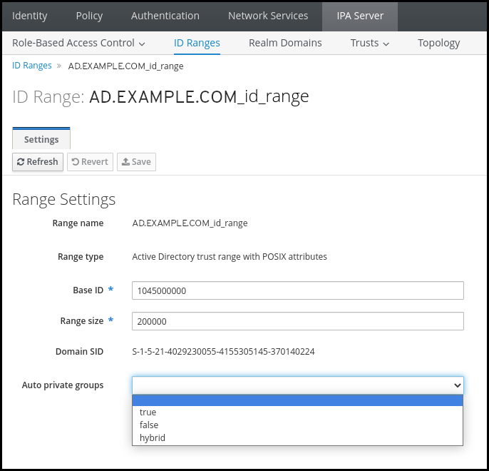
5. Click the **Save** button to save your changes.

**Additional resources**

- [Options for automatically mapping private groups for AD users: ID mapping trusts](https://docs.redhat.com/en/documentation/red_hat_enterprise_linux/10/html/planning_identity_management/planning-a-cross-forest-trust-between-idm-and-ad#options-for-automatically-mapping-private-groups-for-ad-users-id-mapping-trusts)

<h2 id="troubleshooting-setting-up-a-cross-forest-trust">Chapter 10. Troubleshooting setting up a cross-forest trust</h2>

Resolve cross-forest trust issues by analyzing the command execution sequence, verifying environment prerequisites, and capturing detailed debug logs for analysis.

<h3 id="sequence-of-events-when-establishing-a-cross-forest-trust-with-ad">10.1. Sequence of events when establishing a cross-forest trust with AD</h3>

Establishing a cross-forest trust involves a specific sequence of validation and configuration steps. Understanding these internal actions helps isolate whether a failure occurs during input verification or domain-level communication.

Part 1: The command verifies settings and inputs

1. Verify that the IdM server has the **Trust Controller** role.
2. Validate the options passed to the `ipa trust-add` command.
3. Validate the ID range associated with a trusted forest root domain. If you did not specify the ID range type and properties as options to the `ipa trust-add` command, they are discovered from Active Directory.

Part 2: The command attempts to establish a trust to an Active Directory domain

4. Create a separate trust object for each trust direction. Each of the objects get created on both sides (IdM and AD). If you are establishing a one-way trust, only one object is created on each side.
5. The IdM server uses the Samba suite to handle domain controller capabilities for Active Directory and creates a trust object on the target AD PDC:
   
   1. The IdM server establishes a secure connection to the `IPC$` share on the target DC. Since RHEL 8.4, the connection requires at least the SMB3 protocol with Windows Server 2012 and above to ensure the connection is sufficiently secure with AES-based encryption used for the session.
   2. The IdM server queries for the presence of the trusted domain object (TDO) using an `LSA QueryTrustedDomainInfoByName` call.
   3. If the TDO is already present, remove it with an `LSA DeleteTrustedDomain` call.
      
      Note
      
      This call fails if the AD user account used to establish the trust does not have full **Enterprise Admin (EA)** or **Domain Admin (DA)** privileges for the forest root, such as members of the **Incoming Forest Trust Builders** group. If the old TDO is not automatically removed, an AD Administrator must manually remove it from AD.
   4. The IdM server creates a new TDO with an `LSA CreateTrustedDomainEx2` call. The TDO credentials are randomly generated using a Samba-provided password generator with 128 random characters.
   5. The new TDO is then modified with an `LSA SetInformationTrustedDomain` call to make sure encryption types supported by the trust are set properly:
      
      1. The `RC4_HMAC_MD5` encryption type is enabled, even if there are no RC4 keys in use, due to how Active Directory is designed.
      2. `AES128_CTS_HMAC_SHA1_96` and `AES256_CTS_HMAC_SHA1_96` encryption types are enabled.
6. For a forest trust, verify that in-forest domains can be reached transitively with an `LSA SetInformationTrustedDomain` call.
7. Add trust topology information about the other forest (IdM in the case of communicating with AD, AD in the case of communicating with IdM) using an `LSA RSetForestTrustInformation` call.
   
   Note
   
   This step might cause a conflict for one of three reasons:
   
   - A SID namespace conflict, reported as an `LSA_SID_DISABLED_CONFLICT` error. This conflict cannot be resolved.
   - A NetBIOS namespace conflict, reported as an `LSA_NB_DISABLED_CONFLICT` error. This conflict cannot be resolved.
   - A DNS namespace conflict with a top level name (TLN), reported as an `LSA_TLN_DISABLED_CONFLICT` error. The IdM server can automatically resolve a TLN conflict if it is caused by another forest.
   
   To resolve a TLN conflict, the IdM server performs the following steps:
   
   1. Retrieve forest trust information for the conflicting forest.
   2. Add an exclusion entry for the IdM DNS namespace to the AD forest.
   3. Set forest trust information for the forest we conflict on.
   4. Re-try establishing the trust to the original forest.
   
   The IdM server can only resolve these conflicts if you authenticated the `ipa trust-add` command with the privileges of an AD administrator that can change forest trusts. If you do not have access to those privileges, the administrator of the original forest must manually perform the steps above in the **Active Directory Domains and Trusts** section of the Windows UI.
8. If it does not exist, create the ID range for the trusted domain.
9. For a forest trust, query Active Directory domain controllers from the forest root for details about the forest topology. The IdM server uses this information to create additional ID ranges for any additional domains from the trusted forest.

**Additional resources**

- [Trust controllers and trust agents](https://docs.redhat.com/en/documentation/red_hat_enterprise_linux/10/html/planning_identity_management/planning-a-cross-forest-trust-between-idm-and-ad#trust-controllers-and-trust-agents)
- [Microsoft Documentation: Overview Documents](https://docs.microsoft.com/en-us/openspecs/windows_protocols/ms-winprotlp/4a1806f9-2979-491d-af3c-f82ed0a4c1ba)
- [Microsoft Documentation: Technical Documents](https://docs.microsoft.com/en-us/openspecs/windows_protocols/ms-winprotlp/e36c976a-6263-42a8-b119-7a3cc41ddd2a)
- [Microsoft Documentation: Privileged Accounts and Groups in Active Directory](https://learn.microsoft.com/en-us/windows-server/identity/ad-ds/plan/security-best-practices/appendix-b--privileged-accounts-and-groups-in-active-directory)

<h3 id="checklist-of-prerequisites-for-establishing-an-ad-trust">10.2. Checklist of prerequisites for establishing an AD trust</h3>

Successful trust establishment depends on specific environmental configurations. Review the requirements for product versions, administrative privileges, networking, and DNS settings.

Table 10.1. Table

ComponentConfigurationAdditional details

Product versions

Your Active Directory domain is using a supported version of Windows Server.

[Supported versions of Windows Server](#supported-versions-of-windows-server "Chapter 2. Supported versions of Windows Server")

AD Administrator privileges

The Active Directory administration account must be a member of one of the following groups:

- **Enterprise Admin (EA)** group in the AD forest
- **Domain Admins (DA)** group in the forest root domain for your AD forest

 

Networking

IPv6 support is enabled in the Linux kernel for all IdM servers.

[IPv6 requirements in IdM](https://docs.redhat.com/en/documentation/red_hat_enterprise_linux/10/html/installing_identity_management/preparing-the-system-for-idm-server-installation#ipv6_requirements_in_idm)

Date and time

Verify the date and time settings on both servers match.

[Time service requirements for IdM](https://docs.redhat.com/en/documentation/red_hat_enterprise_linux/10/html/installing_identity_management/preparing-the-system-for-idm-server-installation#time-service-requirements-for-idm)

Encryption types

The following AD accounts have AES encryption keys:

- AD Administrator
- AD user accounts
- AD services

If you have recently enabled AES encryption in AD, generate new AES keys with the following steps:

1. Re-establish trust relationships between any AD domains in your forest.
2. Change the passwords for the AD Administrator, user accounts, and services.

<!--THE END-->

- [Support for encryption types in IdM](https://docs.redhat.com/en/documentation/red_hat_enterprise_linux/10/html/installing_identity_management/preparing-the-system-for-idm-server-installation#ipv6_requirements_in_idm)
- [Enabling the AES encryption type in Active Directory using a GPO](https://docs.redhat.com/en/documentation/red_hat_enterprise_linux/10/html/installing_trust_between_idm_and_ad/ensuring-support-for-common-encryption-types-in-ad-and-rhel#enabling-the-aes-encryption-type-in-active-directory-using-a-gpo)

Firewall

You have opened all necessary ports on IdM servers and AD Domain Controllers for bidirectional communication.

[Ports required for communication between IdM and AD](#ports-required-for-communication-between-idm-and-ad "Chapter 6. Ports required for communication between IdM and AD")

DNS

- IdM and AD each have unique primary DNS domains.
- IdM and AD DNS domains do not overlap.
- Proper DNS service (SRV) records for LDAP and Kerberos services.
- You can resolve DNS records from all DNS domains in the trust.
- Kerberos realm names are the upper-case versions of primary DNS domain names. For example, DNS domain `example.com` has a corresponding Kerberos realm `EXAMPLE.COM`

[Configuring DNS and realm settings for a trust](#configuring-dns-and-realm-settings-for-a-trust "Chapter 7. Configuring DNS and realm settings for a trust")

Topology

Ensure you are attempting to establish a trust with an IdM server you have configured as a trust controller.

[Trust controllers and trust agents](https://docs.redhat.com/en/documentation/red_hat_enterprise_linux/10/html/planning_identity_management/planning-a-cross-forest-trust-between-idm-and-ad#trust-controllers-and-trust-agents)

<h3 id="gathering-debug-logs-of-an-attempt-to-establish-an-ad-trust">10.3. Gathering debug logs of an attempt to establish an AD trust</h3>

Detailed error logging helps isolate the root cause of failed trust attempts. Enabling debug mode for IdM, Apache, and Samba provides the granular data required for deep-dive analysis. You can review these logs to help with your troubleshooting efforts, or you can provide them in a Red Hat Technical Support case.

**Prerequisites**

- You need root permissions to restart IdM services.

**Procedure**

01. To enable debugging for the IdM server, create the file `/etc/ipa/server.conf` with the following contents.
    
    ```
    [global]
    debug=True
    ```
    
    ```plaintext
    [global]
    debug=True
    ```
02. Restart the `httpd` service to load the debugging configuration.
    
    ```
    systemctl restart httpd
    ```
    
    ```plaintext
    [root@trust_controller ~]# systemctl restart httpd
    ```
03. Stop the `smb` and `winbind` services.
    
    ```
    systemctl stop smb winbind
    ```
    
    ```plaintext
    [root@trust_controller ~]# systemctl stop smb winbind
    ```
04. Set the debugging log level for the `smb` and `winbind` services.
    
    ```
    net conf setparm global 'log level' 100
    ```
    
    ```plaintext
    [root@trust_controller ~]# net conf setparm global 'log level' 100
    ```
05. To enable debug logging for Samba client code used by the IdM framework, edit the `/usr/share/ipa/smb.conf.empty` configuration file to have the following contents.
    
    ```
        [global]
        log level = 100
    ```
    
    ```plaintext
        [global]
        log level = 100
    ```
06. Remove previous Samba logs.
    
    ```
    rm /var/log/samba/log.*
    ```
    
    ```plaintext
    [root@trust_controller ~]# rm /var/log/samba/log.*
    ```
07. Start the `smb` and `winbind` services.
    
    ```
    systemctl start smb winbind
    ```
    
    ```plaintext
    [root@trust_controller ~]# systemctl start smb winbind
    ```
08. Print a timestamp as you attempt to establish a trust with verbose mode enabled.
    
    ```
    date; ipa -vvv trust-add --type=ad ad.example.com
    ```
    
    ```plaintext
    [root@trust_controller ~]# date; ipa -vvv trust-add --type=ad ad.example.com
    ```
09. Review the following error log files for information about the failed request:
    
    1. `/var/log/httpd/error_log`
    2. `/var/log/samba/log.*`
10. Disable debugging.
    
    ```
    mv /etc/ipa/server.conf /etc/ipa/server.conf.backup
    systemctl restart httpd
    systemctl stop smb winbind
    net conf setparm global 'log level' 0
    mv /usr/share/ipa/smb.conf.empty /usr/share/ipa/smb.conf.empty.backup
    systemctl start smb winbind
    ```
    
    ```plaintext
    [root@trust_controller ~]# mv /etc/ipa/server.conf /etc/ipa/server.conf.backup
    [root@trust_controller ~]# systemctl restart httpd
    [root@trust_controller ~]# systemctl stop smb winbind
    [root@trust_controller ~]# net conf setparm global 'log level' 0
    [root@trust_controller ~]# mv /usr/share/ipa/smb.conf.empty /usr/share/ipa/smb.conf.empty.backup
    [root@trust_controller ~]# systemctl start smb winbind
    ```
11. Optional: If you are unable to determine the cause of the authentication issue:
    
    1. Collect and archive the log files you recently generated.
       
       ```
       tar -cvf debugging-trust.tar /var/log/httpd/error_log /var/log/samba/log.*
       ```
       
       ```plaintext
       [root@trust_controller ~]# tar -cvf debugging-trust.tar /var/log/httpd/error_log /var/log/samba/log.*
       ```
    2. Open a Red Hat Technical Support case and provide the timestamp and debug logs from the attempt.

**Additional resources**

- [IPA - AD Trust Troubleshooting](https://access.redhat.com/articles/2772181)

<h2 id="troubleshooting-client-access-to-services-in-the-other-forest">Chapter 11. Troubleshooting client access to services in the other forest</h2>

Troubleshoot cross-forest authentication by tracing the Kerberos ticket requests and referrals between environments. These logic flows help isolate failures in the service request chain.

<h3 id="flow-of-information-when-a-host-in-the-ad-forest-root-domain-requests-services-from-an-idm-server">11.1. Flow of information when a host in the AD forest root domain requests services from an IdM server</h3>

Analyze the Kerberos communication path for Active Directory (AD) clients requesting services in the Identity Management (IdM) domain. This sequence identifies how KDCs handle cross-realm referrals and PAC validation.

If you have trouble accessing IdM services from AD clients, you can use this information to narrow your troubleshooting efforts and identify the source of the issue.

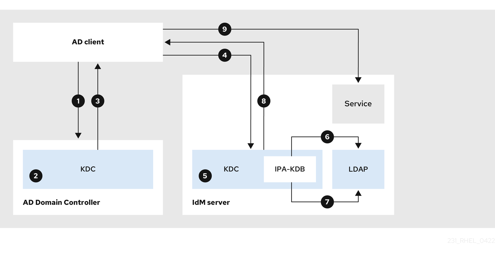

1. The AD client contacts the AD Kerberos Distribution Center (KDC) to perform a TGS Request for the service in the IdM domain.
2. The AD KDC recognizes that the service belongs to the trusted IdM domain.
3. The AD KDC sends the client a cross-realm ticket-granting ticket (TGT), along with a referral to the trusted IdM KDC.
4. The AD client uses the cross-realm TGT to request a ticket to the IdM KDC.
5. The IdM KDC validates the Privileged Attribute Certificate (MS-PAC) that is transmitted with the cross-realm TGT.
6. The IPA-KDB plugin might check the LDAP directory to see if foreign principals are allowed to get tickets for the requested service.
7. The IPA-KDB plugin decodes the MS-PAC, verifies, and filters the data. It performs lookups in the LDAP server to check if it needs to augment the MS-PAC with additional information, such as local groups.
8. The IPA-KDB plugin then encodes the PAC, signs it, attaches it to the service ticket, and sends it to the AD client.
9. The AD client can now contact the IdM service using the service ticket issued by IdM KDC.

<h3 id="flow-of-information-when-a-host-in-an-ad-child-domain-requests-services-from-an-idm-server">11.2. Flow of information when a host in an AD child domain requests services from an IdM server</h3>

Authenticating a client from an Active Directory (AD) child domain involves a multi-step Kerberos referral chain through the AD forest root KDC before reaching the Identity Management (IdM) KDC for final validation.

If you have trouble accessing IdM services from AD clients, and your AD client belongs to a domain that is a child domain of an AD forest root, you can use this information to narrow your troubleshooting efforts and identify the source of the issue.

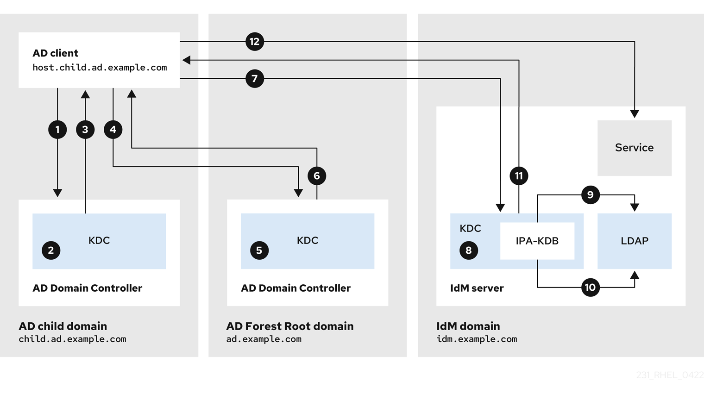

01. The AD client contacts the AD Kerberos Distribution Center (KDC) in its own domain to perform a TGS Request for the service in the IdM domain.
02. The AD KDC in `child.ad.example.com`, the child domain, recognizes that the service belongs to the trusted IdM domain.
03. The AD KDC in the child domain sends the client a referral ticket for the AD forest root domain `ad.example.com`.
04. The AD client contacts the KDC in the AD forest root domain for the service in the IdM domain.
05. The KDC in the forest root domain recognizes that the service belongs to the trusted IdM domain.
06. The AD KDC sends the client a cross-realm ticket-granting ticket (TGT), along with a referral to the trusted IdM KDC.
07. The AD client uses the cross-realm TGT to request a ticket to the IdM KDC.
08. The IdM KDC validates the Privileged Attribute Certificate (MS-PAC) that is transmitted with the cross-realm TGT.
09. The IPA-KDB plugin might check the LDAP directory to see if foreign principals are allowed to get tickets for the requested service.
10. The IPA-KDB plugin decodes the MS-PAC, verifies, and filters the data. It performs lookups in the LDAP server to check if it needs to augment the MS-PAC with additional information, such as local groups.
11. The IPA-KDB plugin then encodes the PAC, signs it, attaches it to the service ticket, and sends it to the AD client.
12. The AD client can now contact the IdM service using the service ticket issued by IdM KDC.

<h3 id="flow-of-information-when-an-idm-client-requests-services-from-an-ad-server">11.3. Flow of information when an IdM client requests services from an AD server</h3>

Accessing Active Directory (AD) services from an Identity Management (IdM) client requires a two-way trust to facilitate cross-realm ticket-granting tickets (TGT) and the generation of a Privileged Attribute Certificate.

If you have trouble accessing AD services from IdM clients, you can use this information to narrow your troubleshooting efforts and identify the source of the issue.

Note

By default, IdM establishes a one-way trust to AD, which means it is not possible to issue cross-realm ticket-granting ticket (TGT) for resources in an AD forest. To be able to request tickets to services from trusted AD domains, configure a two-way trust.

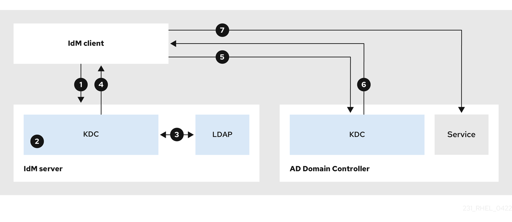

1. The IdM client requests a ticket-granting ticket (TGT) from the IdM Kerberos Distribution Center (KDC) for the AD service it wants to contact.
2. The IdM KDC recognizes that the service belongs to the AD realm, verifies that the realm is known and trusted, and that the client is allowed to request services from that realm.
3. Using information from the IdM Directory Server about the user principal, the IdM KDC creates a cross-realm TGT with a Privileged Attribute Certificate (MS-PAC) record about the user principal.
4. The IdM KDC sends back a cross-realm TGT to the IdM client.
5. The IdM client contacts the AD KDC to request a ticket for the AD service, presenting the cross-realm TGT that contains the MS-PAC provided by the IdM KDC.
6. The AD server validates and filters the PAC, and returns a ticket for the AD service.
7. The IPA client can now contact the AD service.

**Additional resources**

- [One-way trusts and two-way trusts](https://docs.redhat.com/en/documentation/red_hat_enterprise_linux/10/html/planning_identity_management/planning-a-cross-forest-trust-between-idm-and-ad#one-way-trusts-and-two-way-trusts)

<h2 id="removing-the-trust-using-the-command-line">Chapter 12. Removing the trust using the command line</h2>

Delete an Identity Management (IdM) trust agreement using the command line. This process removes the trust relationship from the IdM framework but preserves existing ID ranges by default.

**Prerequisites**

- You have obtained a Kerberos ticket as an IdM administrator. For details, see [Logging in to IdM in the Web UI: Using a Kerberos ticket](https://docs.redhat.com/en/documentation/red_hat_enterprise_linux/10/html/accessing_identity_management_services/logging-in-to-idm-in-the-web-ui-using-a-kerberos-ticket).

**Procedure**

1. Use the `ipa trust-del` command to remove the trust configuration from IdM.
   
   ```
   ipa trust-del ad_domain_name
   ```
   
   ```plaintext
   [root@server ~]# ipa trust-del ad_domain_name
   ```
   
   ```
   ------------------------------
   Deleted trust "ad_domain_name"
   ------------------------------
   ```
   
   ```plaintext
   ------------------------------
   Deleted trust "ad_domain_name"
   ------------------------------
   ```
2. Remove the trust object from your Active Directory configuration.
   
   Note
   
   Removing the trust configuration does not automatically remove the ID range IdM has created for AD users. This way, if you add the trust again, the existing ID range is re-used. Also, if AD users have created files on an IdM client, their POSIX IDs are preserved in the file metadata.
   
   To remove all information related to an AD trust, remove the AD user ID range after removing the trust configuration and trust object:
   
   ```
   ipa idrange-del AD.EXAMPLE.COM_id_range
   systemctl restart sssd
   ```
   
   ```plaintext
   # ipa idrange-del AD.EXAMPLE.COM_id_range
   # systemctl restart sssd
   ```

**Verification**

- Use the `ipa trust-show` command to confirm that the trust has been removed.
  
  ```
  ipa trust-show ad.example.com
  ```
  
  ```plaintext
  [root@server ~]# ipa trust-show ad.example.com
  ```
  
  ```
  ipa: ERROR: ad.example.com: trust not found
  ```
  
  ```plaintext
  ipa: ERROR: ad.example.com: trust not found
  ```

<h2 id="removing-the-trust-using-the-idm-web-ui">Chapter 13. Removing the trust using the IdM Web UI</h2>

Remove an Active Directory (AD) trust relationship through the Identity Management (IdM) Web UI. This action deletes the trust configuration in IdM while retaining associated ID ranges.

**Prerequisites**

- You have obtained a Kerberos ticket. For details, see [Logging in to IdM in the Web UI: Using a Kerberos ticket](https://docs.redhat.com/en/documentation/red_hat_enterprise_linux/10/html/accessing_identity_management_services/logging-in-to-idm-in-the-web-ui-using-a-kerberos-ticket).

**Procedure**

1. Log in to the IdM Web UI with administrator privileges. For details, see [Accessing the IdM Web UI in a web browser](https://docs.redhat.com/en/documentation/red_hat_enterprise_linux/10/html/accessing_identity_management_services/accessing-the-idm-web-ui-in-a-web-browser).
2. In the IdM Web UI, click the **IPA Server** tab.
3. In the **IPA Server** tab, click the **Trusts** tab.
4. Select the trust you want to remove.
   
   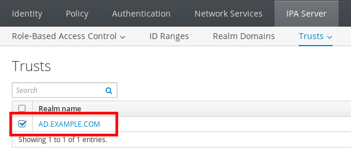
5. Click the **Delete** button.
6. In the **Remove trusts** dialog box, click **Delete**.
   
   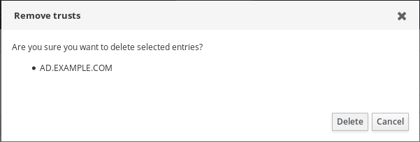
7. Remove the trust object from your Active Directory configuration.
   
   Note
   
   Removing the trust configuration does not automatically remove the ID range IdM has created for AD users. This way, if you add the trust again, the existing ID range is re-used. Also, if AD users have created files on an IdM client, their POSIX IDs are preserved in the file metadata.
   
   To remove all information related to an AD trust, remove the AD user ID range in the `ID Ranges` tab after removing the trust configuration and trust object.

**Verification**

- If the trust has been successfully deleted, the Web UI displays a green pop-up with the text:
  
  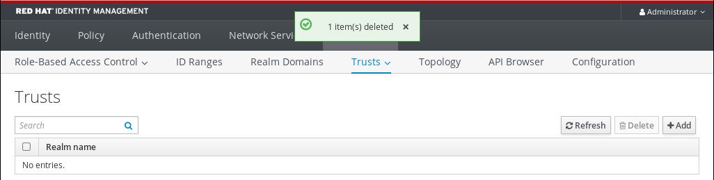

<h2 id="removing-the-trust-using-ansible">Chapter 14. Removing the trust using Ansible</h2>

To ensure consistent cleanup across your Identity Management (IdM) environment, run an Ansible playbook using the `ipatrust` module to automate the removal of an Active Directory (AD) trust.

**Prerequisites**

- You have obtained a Kerberos ticket as an IdM administrator. For details, see [Logging in to IdM in the Web UI: Using a Kerberos ticket](https://docs.redhat.com/en/documentation/red_hat_enterprise_linux/10/html/accessing_identity_management_services/logging-in-to-idm-in-the-web-ui-using-a-kerberos-ticket).
- You have configured your Ansible control node to meet the following requirements:
  
  - You are using Ansible version 2.15 or later.
  - You have installed the [`ansible-freeipa`](https://docs.redhat.com/en/documentation/red_hat_enterprise_linux/10/html/using_ansible_to_install_and_manage_identity_management_in_rhel/installing-an-identity-management-server-using-an-ansible-playbook#installing-the-ansible-freeipa-package) package.
  - The example assumes that in the **~/*MyPlaybooks*/** directory, you have created an [Ansible inventory file](https://docs.redhat.com/en/documentation/red_hat_enterprise_linux/10/html/using_ansible_to_install_and_manage_identity_management_in_rhel/preparing-your-environment-for-managing-idm-using-ansible-playbooks) with the fully-qualified domain name (FQDN) of the IdM server.
  - The example assumes that the **secret.yml** Ansible vault stores your `ipaadmin_password` and that you have access to a file that stores the password protecting the **secret.yml** file.
- The target node, that is the node on which the `freeipa.ansible_freeipa` module is executed, is part of the IdM domain as an IdM client, server or replica.

**Procedure**

1. Navigate to your **~/*MyPlaybooks*/** directory:
   
   ```
   cd ~/MyPlaybooks/
   ```
   
   ```plaintext
   $ cd ~/MyPlaybooks/
   ```
2. Create an `del-trust.yml` playbook with the following content:
   
   ```
   ---
   - name: Playbook to delete trust
     hosts: ipaserver
   
     vars_files:
     - /home/user_name/MyPlaybooks/secret.yml
     tasks:
       - name: ensure the trust is absent
         ipatrust:
           ipaadmin_password: "{{ ipaadmin_password }}"
           realm: ad.example.com
           state: absent
   ```
   
   ```plaintext
   ---
   - name: Playbook to delete trust
     hosts: ipaserver
   
     vars_files:
     - /home/user_name/MyPlaybooks/secret.yml
     tasks:
       - name: ensure the trust is absent
         ipatrust:
           ipaadmin_password: "{{ ipaadmin_password }}"
           realm: ad.example.com
           state: absent
   ```
   
   In the example, `realm` defines the AD realm name string.
3. Save the file.
   
   For details about variables and example playbooks in the FreeIPA Ansible collection, see the `/usr/share/ansible/collections/ansible_collections/freeipa/ansible_freeipa/README-trust.md` file and the `/usr/share/ansible/collections/ansible_collections/freeipa/ansible_freeipa/playbooks/trust` directory on the control node.
4. Run the Ansible playbook. Specify the playbook file, the file storing the password protecting the **secret.yml** file, and the inventory file:
   
   ```
   ansible-playbook --vault-password-file=password_file -v -i inventory del-trust.yml
   ```
   
   ```plaintext
   $ ansible-playbook --vault-password-file=password_file -v -i inventory del-trust.yml
   ```
   
   Note
   
   Removing the trust configuration does not automatically remove the ID range IdM has created for AD users. This way, if you add the trust again, the existing ID range is re-used. Also, if AD users have created files on an IdM client, their POSIX IDs are preserved in the file metadata.
   
   To remove all information related to an AD trust, remove the AD user ID range after removing the trust configuration and trust object:
   
   ```
   ipa idrange-del AD.EXAMPLE.COM_id_range
   systemctl restart sssd
   ```
   
   ```plaintext
   # ipa idrange-del AD.EXAMPLE.COM_id_range
   # systemctl restart sssd
   ```

**Verification**

- Use the `ipa trust-show` command to confirm that the trust has been removed.
  
  ```
  ipa trust-show ad.example.com
  ```
  
  ```plaintext
  [root@server ~]# ipa trust-show ad.example.com
  ```
  
  ```
  ipa: ERROR: ad.example.com: trust not found
  ```
  
  ```plaintext
  ipa: ERROR: ad.example.com: trust not found
  ```

<h2 id="removing-an-id-range-after-removing-a-trust-to-ad">Chapter 15. Removing an ID range after removing a trust to AD</h2>

Manually delete the ID range associated with a removed Active Directory (AD) trust to clean up the Identity Management (IdM) configuration. This action purges unused ID allocations from the system.

Warning

IDs allocated to ID ranges associated with trusted domains might still be used for ownership of files and directories on systems enrolled into IdM.

If you remove the ID range that corresponds to an AD trust that you have removed, you will not be able to resolve the ownership of any files and directories owned by AD users.

**Prerequisites**

- You have removed a trust to an AD environment.

**Procedure**

1. Display all the ID ranges that are currently in use:
   
   ```
   ipa idrange-find
   ```
   
   ```plaintext
   [root@server ~]# ipa idrange-find
   ```
2. Identify the name of the ID range associated with the trust you have removed. The first part of the name of the ID range is the name of the trust, for example `AD.EXAMPLE.COM_id_range`.
3. Remove the range:
   
   ```
   ipa idrange-del AD.EXAMPLE.COM_id_range
   ```
   
   ```plaintext
   [root@server ~]# ipa idrange-del AD.EXAMPLE.COM_id_range
   ```
4. Restart the SSSD service to remove references to the ID range you have removed.
   
   ```
   systemctl restart sssd
   ```
   
   ```plaintext
   [root@server ~]# systemctl restart sssd
   ```

<h2 id="idm140625352689056">Legal Notice</h2>

Copyright © Red Hat.

The text of and illustrations in this document are licensed by Red Hat under a Creative Commons Attribution–Share Alike 3.0 Unported license ("CC-BY-SA"). An explanation of CC-BY-SA is available at [http://creativecommons.org/licenses/by-sa/3.0/](http://creativecommons.org/licenses/by-sa/3.0/). In accordance with CC-BY-SA, if you distribute this document or an adaptation of it, you must provide the URL for the original version.

Red Hat, as the licensor of this document, waives the right to enforce, and agrees not to assert, Section 4d of CC-BY-SA to the fullest extent permitted by applicable law.

Red Hat, Red Hat Enterprise Linux, the Shadowman logo, JBoss, OpenShift, Fedora, the Infinity logo, and RHCE are trademarks of Red Hat, Inc., registered in the United States and other countries.

Linux® is the registered trademark of Linus Torvalds in the United States and other countries.

Java® is a registered trademark of Oracle and/or its affiliates.

XFS® is a trademark of Silicon Graphics International Corp. or its subsidiaries in the United States and/or other countries.

MySQL® is a registered trademark of MySQL AB in the United States, the European Union and other countries.

Node.js® is an official trademark of Joyent. Red Hat Software Collections is not formally related to or endorsed by the official Joyent Node.js open source or commercial project.

The OpenStack® Word Mark and OpenStack logo are either registered trademarks/service marks or trademarks/service marks of the OpenStack Foundation, in the United States and other countries and are used with the OpenStack Foundation's permission. We are not affiliated with, endorsed or sponsored by the OpenStack Foundation, or the OpenStack community.

All other trademarks are the property of their respective owners.
