# Managing certificates in IdM

* * *

Red Hat Enterprise Linux 10

## Issuing certificates, configuring certificate-based authentication, and controlling certificate validity

Red Hat Customer Content Services

[Legal Notice](#idm140251035148128)

**Abstract**

Administrators use X.509 certificates to authenticate users, hosts, and services, and to enable digital signing and encryption. In Identity Management (IdM), you can manage certificates by using the integrated or an external Certificate Authority (CA).

You can request and renew certificates by using the `certmonger` service, the `certutil` tool, or Ansible Playbooks. To replace the web server and LDAP server certificates of IdM servers, you must perform manual actions.

Administrators can create lightweight sub-CAs to issue certificates for a specific purpose, such as user certificates for a VPN gateway. The administrator can then invalidate all certificates for this service by revoking the sub-CA's certificate when this VPN gateway is no longer needed.

* * *

<h2 id="providing-feedback-on-red-hat-documentation">Providing feedback on Red Hat documentation</h2>

We are committed to providing high-quality documentation and value your feedback. To help us improve, you can submit suggestions or report errors through the Red Hat Jira tracking system.

**Procedure**

1. Log in to the [Jira](https://issues.redhat.com/projects/RHELDOCS/issues) website.
   
   If you do not have an account, select the option to create one.
2. Click **Create** in the top navigation bar.
3. Enter a descriptive title in the **Summary** field.
4. Enter your suggestion for improvement in the **Description** field. Include links to the relevant parts of the documentation.
5. Click **Create** at the bottom of the dialogue.

<h2 id="public-key-certificates-in-identity-management">Chapter 1. Public key certificates in Identity Management</h2>

You can use the X.509 public key certificates in Identity Management (IdM) to authenticate users, hosts and services. In addition to authentication, X.509 certificates also enable digital signing and encryption to provide privacy, integrity and non-repudiation.

A certificate contains the following information:

- The subject that the certificate authenticates.
- The issuer, that is the CA that has signed the certificate.
- The start and end date of the validity of the certificate.
- The valid uses of the certificate.
- The public key of the subject.

A message encrypted by the public key can only be decrypted by a corresponding private key. While a certificate and the public key it includes can be made publicly available, the user, host or service must keep their private key secret.

<h3 id="certificate-authorities-in-idm">1.1. Certificate authorities in IdM</h3>

Certificate authorities operate in a hierarchy of trust. In an IdM environment with an internal Certificate Authority (CA), all the IdM hosts, users and services trust certificates that have been signed by the CA. Apart from this root CA, IdM supports sub-CAs to which the root CA has granted the ability to sign certificates in their turn. Frequently, the certificates that such sub-CAs are able to sign are certificates of a specific kind, for example VPN certificates. Finally, IdM supports using external CAs. The table below presents the specifics of using the individual types of CA in IdM.

| Name of CA   | Description                                                             | Use                                                                                                                                                                          | Useful links                                                                                                                                                                                                                                    |
|:-------------|:------------------------------------------------------------------------|:-----------------------------------------------------------------------------------------------------------------------------------------------------------------------------|:------------------------------------------------------------------------------------------------------------------------------------------------------------------------------------------------------------------------------------------------|
| The `ipa` CA | An integrated CA based on the Dogtag upstream project                   | Integrated CAs can create, revoke, and issue certificates for users, hosts, and services.                                                                                    | [Using the ipa CA to request a new user certificate and exporting it to the client](#requesting-a-new-user-certificate-and-exporting-it-to-the-client "16.2. Requesting a new user certificate and exporting it to the client")                 |
| IdM sub-CAs  | An integrated CA that is subordinate to the `ipa` CA                    | IdM sub-CAs are CAs to which the `ipa` CA has granted the ability to sign certificates. Frequently, these certificates are of a specific kind, for example VPN certificates. | [Restricting an application to trust only a subset of certificates](#restricting-an-application-to-trust-only-a-subset-of-certificates "Chapter 28. Restricting an application to trust only a subset of certificates")                         |
| External CAs | An external CA is a CA other than the integrated IdM CA or its sub-CAs. | Using IdM tools, you add certificates issued by these CAs to users, services, or hosts as well as remove them.                                                               | [Managing externally signed certificates for IdM users, hosts, and services](#managing-externally-signed-certificates-for-idm-users-hosts-and-services "Chapter 4. Managing externally signed certificates for IdM users, hosts, and services") |

Table 1.1. Comparison of using integrated and external CAs in IdM

From the certificate point of view, there is no difference between being signed by a self-signed IdM CA and being signed externally.

The role of the CA includes the following purposes:

- It issues digital certificates.
- By signing a certificate, it certifies that the subject named in the certificate owns a public key. The subject can be a user, host or service.
- It can revoke certificates, and provides revocation status via Certificate Revocation Lists (CRLs) and Online Certificate Status Protocol (OCSP).

**Additional resources**

- [Planning your CA services](https://docs.redhat.com/en/documentation/red_hat_enterprise_linux/10/html/planning_identity_management/planning-your-ca-services)

<h3 id="comparison-of-certificates-and-kerberos">1.2. Comparison of certificates and Kerberos</h3>

Certificates perform a similar function to that performed by Kerberos tickets. Kerberos is a computer network authentication protocol that works on the basis of tickets to allow nodes communicating over a non-secure network to prove their identity to one another in a secure manner. The following table shows a comparison of Kerberos and X.509 certificates:

|                                 |               |               |
|:--------------------------------|:--------------|:--------------|
| **Characteristic**              | **Kerberos**  | **X.509**     |
| `Authentication`                | Yes           | Yes           |
| `Privacy`                       | Optional      | Yes           |
| `Integrity`                     | Optional      | Yes           |
| `Type of cryptography involved` | Symmetrical   | Asymmetrical  |
| `Default validity`              | Short (1 day) | Long(2 years) |

Table 1.2. Comparison of certificates and Kerberos

By default, Kerberos in Identity Management only ensures the identity of the communicating parties.

<h3 id="the-pros-and-cons-of-using-certificates-to-authenticate-users-in-idm">1.3. The pros and cons of using certificates to authenticate users in IdM</h3>

The advantages of using certificates to authenticate users in IdM include the following points:

- A PIN that protects the private key on a smart card is typically less complex and easier to remember than a regular password.
- Depending on the device, a private key stored on a smart card cannot be exported. This provides additional security.
- Smart cards can make logout automatic: IdM can be configured to log out users when they remove the smart card from the reader.
- Stealing the private key requires actual physical access to a smart card, making smart cards secure against hacking attacks.
- Smart card authentication is an example of two-factor authentication: it requires both something you have (the card) and something you know (the PIN).
- Smart cards are more flexible than passwords because they provide the keys that can be used for other purposes, such as encrypting email.
- Using smart cards use on shared machines that are IdM clients does not typically pose additional configuration problems for system administrators. In fact, smart card authentication is an ideal choice for shared machines.

The disadvantages of using certificates to authenticate users in IdM include the following points:

- Users might lose or forget to bring their smart card or certificate and be effectively locked out.
- Mistyping a PIN multiple times might result in a card becoming locked.
- There is generally an intermediate step between request and authorization by some sort of security officer or approver. In IdM, the security officer or administrator must run the **ipa cert-request** command.
- Smart cards and readers tend to be vendor and driver specific: although a lot of readers can be used for different cards, a smart card of a specific vendor might not work in the reader of another vendor or in the type of a reader for which it was not designed.
- Certificates and smart cards have a steep learning curve for administrators.

<h2 id="managing-idm-certificates-using-ansible">Chapter 2. Managing IdM certificates using Ansible</h2>

Use the `ansible-freeipa` `ipacert` module to request, revoke, and retrieve SSL certificates for Identity Management (IdM) users, hosts and services. You can also restore a certificate that has been put on hold.

<h3 id="using-ansible-to-request-ssl-certificates-for-idm-hosts-services-and-users">2.1. Using Ansible to request SSL certificates for IdM hosts, services and users</h3>

Automate SSL certificate requests using Ansible to establish encrypted, trusted connections between IdM entities and enable certificate-based authentication.

The example below uses the `ansible-freeipa` `freeipa.ansible_freeipa.ipacert` module to request a SSL certificate for an HTTP server from an IdM certificate authority (CA).

**Prerequisites**

- On the control node:
  
  - You are using Ansible version 2.15 or later.
  - You have installed the [`ansible-freeipa`](https://docs.redhat.com/en/documentation/red_hat_enterprise_linux/10/html/using_ansible_to_install_and_manage_identity_management_in_rhel/installing-an-identity-management-server-using-an-ansible-playbook#installing-the-ansible-freeipa-package) package.
  - The example assumes that in the **~/*MyPlaybooks*/** directory, you have created an [Ansible inventory file](https://docs.redhat.com/en/documentation/red_hat_enterprise_linux/10/html/using_ansible_to_install_and_manage_identity_management_in_rhel/preparing-your-environment-for-managing-idm-using-ansible-playbooks) with the fully-qualified domain name (FQDN) of the IdM server.
  - The example assumes that the **secret.yml** Ansible vault stores your `ipaadmin_password` and that you have access to a file that stores the password protecting the **secret.yml** file.
- The target node, that is the node on which the `freeipa.ansible_freeipa` module is executed, is part of the IdM domain as an IdM client, server or replica.
- Your IdM deployment has an integrated CA.

**Procedure**

1. Generate a certificate-signing request (CSR) for your user, host or service. For example, to use the `openssl` utility to generate a CSR for the `HTTP` service running on client.idm.example.com, enter:
   
   ```
   openssl req -new -newkey rsa:2048 -days 365 -nodes -keyout new.key \
   -out new.csr -subj '/CN=client.idm.example.com,O=IDM.EXAMPLE.COM'
   ```
   
   ```plaintext
   # openssl req -new -newkey rsa:2048 -days 365 -nodes -keyout new.key \
   -out new.csr -subj '/CN=client.idm.example.com,O=IDM.EXAMPLE.COM'
   ```
   
   As a result, the CSR is stored in **new.csr**.
2. Create your Ansible playbook file **request-certificate.yml** with the following content:
   
   ```
   ---
   - name: Playbook to request a certificate
     hosts: ipaserver
   
     vars_files:
     - /home/user_name/MyPlaybooks/secret.yml
   
     tasks:
     - name: Request a certificate for a web server
       freeipa.ansible_freeipa.ipacert:
         ipaadmin_password: "{{ ipaadmin_password }}"
         state: requested
         csr: |
           -----BEGIN CERTIFICATE REQUEST-----
           MIGYMEwCAQAwGTEXMBUGA1UEAwwOZnJlZWlwYSBydWxlcyEwKjAFBgMrZXADIQBs
           HlqIr4b/XNK+K8QLJKIzfvuNK0buBhLz3LAzY7QDEqAAMAUGAytlcANBAF4oSCbA
           5aIPukCidnZJdr491G4LBE+URecYXsPknwYb+V+ONnf5ycZHyaFv+jkUBFGFeDgU
           SYaXm/gF8cDYjQI=
           -----END CERTIFICATE REQUEST-----
         principal: HTTP/client.idm.example.com
       register: cert
   ```
   
   ```plaintext
   ---
   - name: Playbook to request a certificate
     hosts: ipaserver
   
     vars_files:
     - /home/user_name/MyPlaybooks/secret.yml
   
     tasks:
     - name: Request a certificate for a web server
       freeipa.ansible_freeipa.ipacert:
         ipaadmin_password: "{{ ipaadmin_password }}"
         state: requested
         csr: |
           -----BEGIN CERTIFICATE REQUEST-----
           MIGYMEwCAQAwGTEXMBUGA1UEAwwOZnJlZWlwYSBydWxlcyEwKjAFBgMrZXADIQBs
           HlqIr4b/XNK+K8QLJKIzfvuNK0buBhLz3LAzY7QDEqAAMAUGAytlcANBAF4oSCbA
           5aIPukCidnZJdr491G4LBE+URecYXsPknwYb+V+ONnf5ycZHyaFv+jkUBFGFeDgU
           SYaXm/gF8cDYjQI=
           -----END CERTIFICATE REQUEST-----
         principal: HTTP/client.idm.example.com
       register: cert
   ```
   
   Replace the certificate request with the CSR from **new.csr**.
3. Request the certificate:
   
   ```
   ansible-playbook --vault-password-file=password_file -v -i <path_to_inventory_directory>/hosts <path_to_playbooks_directory>/request-certificate.yml
   ```
   
   ```plaintext
   $ ansible-playbook --vault-password-file=password_file -v -i <path_to_inventory_directory>/hosts <path_to_playbooks_directory>/request-certificate.yml
   ```

**Additional resources**

- [The cert module in `ansible-freeipa` upstream docs](https://github.com/freeipa/ansible-freeipa/blob/master/README-cert.md)

<h3 id="using-ansible-to-revoke-ssl-certificates-for-idm-hosts-services-and-users">2.2. Using Ansible to revoke SSL certificates for IdM hosts, services and users</h3>

You can use the `ansible-freeipa` `freeipa.ansible_freeipa.ipacert` module to revoke SSL certificates used by Identity Management (IdM) users, hosts and services to authenticate to IdM.

Use the example below to revoke a certificate for an HTTP server. The reason for revoking the certificate is "keyCompromise".

**Prerequisites**

- On the control node:
  
  - You are using Ansible version 2.15 or later.
  - You have installed the [`ansible-freeipa`](https://docs.redhat.com/en/documentation/red_hat_enterprise_linux/10/html/using_ansible_to_install_and_manage_identity_management_in_rhel/installing-an-identity-management-server-using-an-ansible-playbook#installing-the-ansible-freeipa-package) package.
  - The example assumes that in the **~/*MyPlaybooks*/** directory, you have created an [Ansible inventory file](https://docs.redhat.com/en/documentation/red_hat_enterprise_linux/10/html/using_ansible_to_install_and_manage_identity_management_in_rhel/preparing-your-environment-for-managing-idm-using-ansible-playbooks) with the fully-qualified domain name (FQDN) of the IdM server.
  - The example assumes that the **secret.yml** Ansible vault stores your `ipaadmin_password` and that you have access to a file that stores the password protecting the **secret.yml** file.
- The target node, that is the node on which the `freeipa.ansible_freeipa` module is executed, is part of the IdM domain as an IdM client, server or replica.
- You have obtained the serial number of the certificate, for example by entering the `openssl x509 -noout -text -in <path_to_certificate>` command. In this example, the serial number of the certificate is 123456789.
- Your IdM deployment has an integrated CA.

**Procedure**

1. Create your Ansible playbook file **revoke-certificate.yml** with the following content:
   
   ```
   ---
   - name: Playbook to revoke a certificate
     hosts: ipaserver
   
     vars_files:
     - /home/user_name/MyPlaybooks/secret.yml
   
     tasks:
     - name: Revoke a certificate for a web server
       freeipa.ansible_freeipa.ipacert:
         ipaadmin_password: "{{ ipaadmin_password }}"
         serial_number: 123456789
         revocation_reason: "keyCompromise"
         state: revoked
   ```
   
   ```plaintext
   ---
   - name: Playbook to revoke a certificate
     hosts: ipaserver
   
     vars_files:
     - /home/user_name/MyPlaybooks/secret.yml
   
     tasks:
     - name: Revoke a certificate for a web server
       freeipa.ansible_freeipa.ipacert:
         ipaadmin_password: "{{ ipaadmin_password }}"
         serial_number: 123456789
         revocation_reason: "keyCompromise"
         state: revoked
   ```
2. Revoke the certificate:
   
   ```
   ansible-playbook --vault-password-file=password_file -v -i <path_to_inventory_directory>/hosts <path_to_playbooks_directory>/revoke-certificate.yml
   ```
   
   ```plaintext
   $ ansible-playbook --vault-password-file=password_file -v -i <path_to_inventory_directory>/hosts <path_to_playbooks_directory>/revoke-certificate.yml
   ```

**Additional resources**

- [The cert module in `ansible-freeipa` upstream docs](https://github.com/freeipa/ansible-freeipa/blob/master/README-cert.md)
- [Reason Code](https://datatracker.ietf.org/doc/html/rfc5280#section-5.3.1)

<h3 id="using-ansible-to-restore-ssl-certificates-for-idm-users-hosts-and-services">2.3. Using Ansible to restore SSL certificates for IdM users, hosts, and services</h3>

Release a certificate from hold using an Ansible playbook when you recover a private key and confirm it was not compromised during the hold period.

You can use the `ansible-freeipa ipacert` module to restore a revoked SSL certificate previously used by an Identity Management (IdM) user, host or a service to authenticate to IdM. The example below describes how to release a certificate for an HTTP service from hold.

Note

You can only restore a certificate that was put on hold. You may have put it on hold because, for example, you were not sure if the private key had been lost. However, now you have recovered the key and as you are certain that no-one has accessed it in the meantime, you want to reinstate the certificate.

**Prerequisites**

- You have configured your Ansible control node to meet the following requirements:
  
  - You are using Ansible version 2.15 or later.
  - You have installed the [`ansible-freeipa`](https://docs.redhat.com/en/documentation/red_hat_enterprise_linux/10/html/using_ansible_to_install_and_manage_identity_management_in_rhel/installing-an-identity-management-server-using-an-ansible-playbook#installing-the-ansible-freeipa-package) package.
  - The example assumes that in the **~/*MyPlaybooks*/** directory, you have created an [Ansible inventory file](https://docs.redhat.com/en/documentation/red_hat_enterprise_linux/10/html/using_ansible_to_install_and_manage_identity_management_in_rhel/preparing-your-environment-for-managing-idm-using-ansible-playbooks) with the fully-qualified domain name (FQDN) of the IdM server.
  - The example assumes that the **secret.yml** Ansible vault stores your `ipaadmin_password` and that you have access to a file that stores the password protecting the **secret.yml** file.
- Your IdM deployment has an integrated CA.
- You have obtained the serial number of the certificate, for example by entering the `openssl x509 -noout -text -in path/to/certificate` command. In this example, the certificate serial number is **123456789**.

**Procedure**

1. Create your Ansible playbook file **restore-certificate.yml** with the following content:
   
   ```
   ---
   - name: Playbook to restore a certificate
     hosts: ipaserver
     vars_files:
     - /home/user_name/MyPlaybooks/secret.yml
   
     tasks:
     - name: Restore a certificate for a web service
       ipacert:
         ipaadmin_password: "{{ ipaadmin_password }}"
         serial_number: 123456789
         state: released
   ```
   
   ```plaintext
   ---
   - name: Playbook to restore a certificate
     hosts: ipaserver
     vars_files:
     - /home/user_name/MyPlaybooks/secret.yml
   
     tasks:
     - name: Restore a certificate for a web service
       ipacert:
         ipaadmin_password: "{{ ipaadmin_password }}"
         serial_number: 123456789
         state: released
   ```
2. Run the playbook:
   
   ```
   ansible-playbook --vault-password-file=password_file -v -i <path_to_inventory_directory>/hosts <path_to_playbooks_directory>/restore-certificate.yml
   ```
   
   ```plaintext
   $ ansible-playbook --vault-password-file=password_file -v -i <path_to_inventory_directory>/hosts <path_to_playbooks_directory>/restore-certificate.yml
   ```

**Additional resources**

- [The cert module in `ansible-freeipa` upstream docs](https://github.com/freeipa/ansible-freeipa/blob/master/README-cert.md)

<h3 id="using-ansible-to-retrieve-ssl-certificates-for-idm-users-hosts-and-services">2.4. Using Ansible to retrieve SSL certificates for IdM users, hosts, and services</h3>

Retrieve an existing SSL certificate from Identity Management (IdM) using Ansible and store it locally on the managed node for use by users, hosts, or services.

**Prerequisites**

- On the control node:
  
  - You are using Ansible version 2.15 or later.
  - You have installed the [`ansible-freeipa`](https://docs.redhat.com/en/documentation/red_hat_enterprise_linux/10/html/using_ansible_to_install_and_manage_identity_management_in_rhel/installing-an-identity-management-server-using-an-ansible-playbook#installing-the-ansible-freeipa-package) package.
  - The example assumes that in the **~/*MyPlaybooks*/** directory, you have created an [Ansible inventory file](https://docs.redhat.com/en/documentation/red_hat_enterprise_linux/10/html/using_ansible_to_install_and_manage_identity_management_in_rhel/preparing-your-environment-for-managing-idm-using-ansible-playbooks) with the fully-qualified domain name (FQDN) of the IdM server.
  - The example assumes that the **secret.yml** Ansible vault stores your `ipaadmin_password` and that you have access to a file that stores the password protecting the **secret.yml** file.
- The target node, that is the node on which the `freeipa.ansible_freeipa` module is executed, is part of the IdM domain as an IdM client, server or replica.
- You have obtained the serial number of the certificate, for example by entering the `openssl x509 -noout -text -in <path_to_certificate>` command. In this example, the serial number of the certificate is 123456789, and the file in which you store the retrieved certificate is **cert.pem**.

**Procedure**

1. Create your Ansible playbook file **retrieve-certificate.yml** with the following content:
   
   ```
   ---
   - name: Playbook to retrieve a certificate and store it locally on the managed node
     hosts: ipaserver
   
     vars_files:
     - /home/user_name/MyPlaybooks/secret.yml
   
     tasks:
     - name: Retrieve a certificate and save it to file 'cert.pem'
       freeipa.ansible_freeipa.ipacert:
         ipaadmin_password: "{{ ipaadmin_password }}"
         serial_number: 123456789
         certificate_out: cert.pem
         state: retrieved
   ```
   
   ```plaintext
   ---
   - name: Playbook to retrieve a certificate and store it locally on the managed node
     hosts: ipaserver
   
     vars_files:
     - /home/user_name/MyPlaybooks/secret.yml
   
     tasks:
     - name: Retrieve a certificate and save it to file 'cert.pem'
       freeipa.ansible_freeipa.ipacert:
         ipaadmin_password: "{{ ipaadmin_password }}"
         serial_number: 123456789
         certificate_out: cert.pem
         state: retrieved
   ```
2. Retrieve the certificate:
   
   ```
   ansible-playbook --vault-password-file=password_file -v -i <path_to_inventory_directory>/hosts <path_to_playbooks_directory>/retrieve-certificate.yml
   ```
   
   ```plaintext
   $ ansible-playbook --vault-password-file=password_file -v -i <path_to_inventory_directory>/hosts <path_to_playbooks_directory>/retrieve-certificate.yml
   ```

**Additional resources**

- [The cert module in `ansible-freeipa` upstream docs](https://github.com/freeipa/ansible-freeipa/blob/master/README-cert.md)

<h2 id="managing-certificates-for-users-hosts-and-services-by-using-the-integrated-idm-ca">Chapter 3. Managing certificates for users, hosts, and services by using the integrated IdM CA</h2>

Administrators manage the lifecycle of certificates for users, hosts, and services directly through the integrated IdM Certificate Authority. This central control allows for streamlined issuance, revocation, and renewal across the entire domain infrastructure.

<h3 id="requesting-new-certificates-for-a-user-host-or-service-using-idm-web-ui">3.1. Requesting new certificates for a user, host, or service using IdM Web UI</h3>

You can use the Identity Management (IdM) Web UI to request a new certificate for any IdM entity from the integrated IdM certificate authorities (CAs): the `ipa` CA or any of its sub-CAs.

IdM entities include:

- Users
- Hosts
- Services

Important

Services typically run on dedicated service nodes on which the private keys are stored. Copying a service’s private key to the IdM server is considered insecure. Therefore, when requesting a certificate for a service, create the certificate signing request (CSR) on the service node.

**Prerequisites**

- Your IdM deployment contains an integrated CA.
- You are logged into the IdM Web UI as the IdM administrator.

**Procedure**

1. Under the `Identity` tab, select the `Users`, `Hosts`, or `Services` subtab.
2. Click the name of the user, host, or service to open its configuration page.
   
   **List of Hosts**
   
   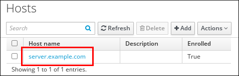 
3. Click Actions → New Certificate.
4. Optional: Select the issuing CA and profile ID.
5. Follow the instructions for using the `certutil` command-line (CLI) utility on the screen.
6. Click Issue.

<h3 id="requesting-new-certificates-for-a-user-host-or-service-from-idm-ca-using-certutil">3.2. Requesting new certificates for a user, host, or service from IdM CA using certutil</h3>

You can use the `certutil` utility to request a certificate for an Identity Management (IdM) user, host or service in standard IdM situations. To ensure that a host or service Kerberos alias can use a certificate, [use the openssl utility to request a certificate](#requesting-new-certificates-for-a-user-host-or-service-from-idm-ca-using-openssl "3.3. Requesting new certificates for a user, host, or service from IdM CA using openssl") instead.

Important

Services typically run on dedicated service nodes on which the private keys are stored. Copying a service’s private key to the IdM server is considered insecure. Therefore, when requesting a certificate for a service, create the certificate signing request (CSR) on the service node.

**Prerequisites**

- Your IdM deployment contains an integrated CA.
- You are logged into the IdM command-line interface (CLI) as the IdM administrator.

**Procedure**

1. Create a temporary directory for the certificate database:
   
   ```
   mkdir ~/certdb/
   ```
   
   ```plaintext
   # mkdir ~/certdb/
   ```
2. Create a new temporary certificate database, for example:
   
   ```
   certutil -N -d ~/certdb/
   ```
   
   ```plaintext
   # certutil -N -d ~/certdb/
   ```
3. Create the CSR and redirect the output to a file. For example, to create a CSR for a 4096 bit certificate and to set the subject to *CN=server.example.com,O=EXAMPLE.COM*:
   
   ```
   certutil -R -d ~/certdb/ -a -g 4096 -s "CN=server.example.com,O=EXAMPLE.COM" -8 server.example.com > certificate_request.csr
   ```
   
   ```plaintext
   # certutil -R -d ~/certdb/ -a -g 4096 -s "CN=server.example.com,O=EXAMPLE.COM" -8 server.example.com > certificate_request.csr
   ```
4. Submit the certificate request file to the CA running on the IdM server. Specify the Kerberos principal to associate with the newly-issued certificate:
   
   ```
   ipa cert-request certificate_request.csr --principal=host/server.example.com
   ```
   
   ```plaintext
   # ipa cert-request certificate_request.csr --principal=host/server.example.com
   ```
   
   The `ipa cert-request` command in IdM uses the following defaults:
   
   - The `caIPAserviceCert` certificate profile
     
     To select a custom profile, use the `--profile-id` option.
   - The integrated IdM root CA, `ipa`
     
     To select a sub-CA, use the `--ca` option.

**Additional resources**

- [Creating and managing certificate profiles in Identity Management](#creating-and-managing-certificate-profiles-in-identity-management "Chapter 6. Creating and managing certificate profiles in Identity Management")

<h3 id="requesting-new-certificates-for-a-user-host-or-service-from-idm-ca-using-openssl">3.3. Requesting new certificates for a user, host, or service from IdM CA using openssl</h3>

You can use the `openssl` utility to request a certificate for an Identity Management (IdM) host or service if you want to ensure that the Kerberos alias of the host or service can use the certificate. In standard situations, consider [requesting a new certificate using the certutil utility](#requesting-new-certificates-for-a-user-host-or-service-from-idm-ca-using-certutil "3.2. Requesting new certificates for a user, host, or service from IdM CA using certutil") instead.

Important

Services typically run on dedicated service nodes on which the private keys are stored. Copying a service’s private key to the IdM server is considered insecure. Therefore, when requesting a certificate for a service, create the certificate signing request (CSR) on the service node.

**Prerequisites**

- Your IdM deployment contains an integrated CA.
- You are logged into the IdM command-line interface (CLI) as the IdM administrator.

**Procedure**

1. Create one or more aliases for your Kerberos principal *test/server.example.com*. For example, *test1/server.example.com* and *test2/server.example.com*.
2. In the CSR, add a subjectAltName for dnsName (*server.example.com*) and otherName (*test2/server.example.com*). To do this, configure the `openssl.conf` file to include the following line specifying the UPN otherName and subjectAltName:
   
   ```
   otherName=1.3.6.1.4.1.311.20.2.3;UTF8:test2/server.example.com@EXAMPLE.COM
   DNS.1 = server.example.com
   ```
   
   ```plaintext
   otherName=1.3.6.1.4.1.311.20.2.3;UTF8:test2/server.example.com@EXAMPLE.COM
   DNS.1 = server.example.com
   ```
3. Create a certificate request by using `openssl`:
   
   ```
   openssl req -new -newkey rsa:2048 -keyout test2service.key -sha256 -nodes -out certificate_request.csr -config openssl.conf
   ```
   
   ```plaintext
   # openssl req -new -newkey rsa:2048 -keyout test2service.key -sha256 -nodes -out certificate_request.csr -config openssl.conf
   ```
4. Submit the certificate request file to the CA running on the IdM server. Specify the Kerberos principal to associate with the newly-issued certificate:
   
   ```
   ipa cert-request certificate_request.csr --principal=host/server.example.com
   ```
   
   ```plaintext
   # ipa cert-request certificate_request.csr --principal=host/server.example.com
   ```
   
   The `ipa cert-request` command in IdM uses the following defaults:
   
   - The `caIPAserviceCert` certificate profile
     
     To select a custom profile, use the `--profile-id` option.
   - The integrated IdM root CA, `ipa`
     
     To select a sub-CA, use the `--ca` option.

**Additional resources**

- [Creating and managing certificate profiles in Identity Management](#creating-and-managing-certificate-profiles-in-identity-management "Chapter 6. Creating and managing certificate profiles in Identity Management")

<h2 id="managing-externally-signed-certificates-for-idm-users-hosts-and-services">Chapter 4. Managing externally signed certificates for IdM users, hosts, and services</h2>

Administrators use the Identity Management (IdM) command-line interface (CLI) and IdM Web UI to associate externally signed certificates with internal accounts. This integration allows users, hosts, and services to authenticate using credentials issued by third-party or corporate Certificate Authorities.

<h3 id="adding-a-certificate-issued-by-an-external-ca-to-an-idm-user-host-or-service-by-using-the-idm-cli">4.1. Adding a certificate issued by an external CA to an IdM user, host, or service by using the IdM CLI</h3>

The `ipa` command-line tools enable administrators to attach specific external certificates to IdM entities. Commands such as `ipa user-add-cert` accept Base64-encoded strings, linking the external credential directly to the specified user, host, or service account.

**Prerequisites**

- You have obtained the ticket-granting ticket of an administrative user.

**Procedure**

1. To add a certificate to an IdM user, enter:
   
   ```
   ipa user-add-cert user --certificate=MIQTPrajQAwg...
   ```
   
   ```plaintext
   $ ipa user-add-cert user --certificate=MIQTPrajQAwg...
   ```
2. Specify the following information:
   
   - The name of the user
   - The Base64-encoded DER certificate
     
     Note
     
     Instead of copying and pasting the certificate contents into the command line, you can convert the certificate to the DER format and then re-encode it to Base64. For example, to add the `user_cert.pem` certificate to `user`, enter:
     
     ```
     ipa user-add-cert user --certificate="$(openssl x509 -outform der -in user_cert.pem | base64 -w 0)"
     ```
     
     ```plaintext
     $ ipa user-add-cert user --certificate="$(openssl x509 -outform der -in user_cert.pem | base64 -w 0)"
     ```
   
   You can run the `ipa user-add-cert` command interactively by executing it without adding any options.
   
   - To add a certificate to an IdM host, enter: `ipa host-add-cert`
   - To add a certificate to an IdM service, enter: `ipa service-add-cert`

**Additional resources**

- [Managing certificates for users, hosts, and services using the integrated IdM CA](#managing-certificates-for-users-hosts-and-services-by-using-the-integrated-idm-ca "Chapter 3. Managing certificates for users, hosts, and services by using the integrated IdM CA")

<h3 id="adding-a-certificate-issued-by-an-external-ca-to-an-idm-user-host-or-service-by-using-the-idm-web-ui">4.2. Adding a certificate issued by an external CA to an IdM user, host, or service by using the IdM Web UI</h3>

The IdM Web UI offers a graphical interface for uploading external certificates. Administrators navigate to the target entity’s profile page and paste the PEM or Base64-encoded certificate data directly into the configuration field to associate it.

**Prerequisites**

- You are logged in to the Identity Management (IdM) Web UI as an administrative user.

**Procedure**

1. Open the `Identity` tab, and select the `Users`, `Hosts`, or `Services` subtab.
2. Click the name of the user, host, or service to open its configuration page.
3. Click Add next to the `Certificates` entry.
   
   **Adding a certificate to a user account**
   
   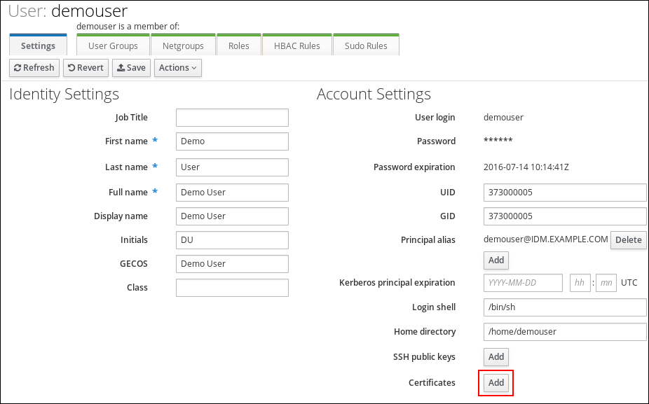 
4. Paste the certificate in Base64 or PEM encoded format into the text field, and click Add.
5. Click Save to store the changes.

<h3 id="removing-a-certificate-issued-by-an-external-ca-from-an-idm-user-host-or-service-account-by-using-the-idm-cli">4.3. Removing a certificate issued by an external CA from an IdM user, host, or service account by using the IdM CLI</h3>

As an Identity Management (IdM) administrator, you can remove an externally signed certificate from the account of an IdM user, host, or service by using the Identity Management (IdM) CLI .

**Prerequisites**

- You have obtained the ticket-granting ticket of an administrative user.

**Procedure**

1. To remove a certificate from an IdM user, enter:
   
   ```
   ipa user-remove-cert user --certificate=MIQTPrajQAwg...
   ```
   
   ```plaintext
   $ ipa user-remove-cert user --certificate=MIQTPrajQAwg...
   ```
   
   Alternatively, you can run the `ipa user-remove-cert` command interactively by executing it without adding any options.
2. Specify the following information:
   
   - The name of the user
   - The Base64-encoded DER certificate
   
   Note
   
   Instead of copying and pasting the certificate contents into the command line, you can convert the certificate to the DER format and then re-encode it to Base64. For example, to remove the `user_cert.pem` certificate from `user`, enter:
   
   ```
   ipa user-remove-cert user --certificate="$(openssl x509 -outform der -in user_cert.pem | base64 -w 0)"
   ```
   
   ```plaintext
   $ ipa user-remove-cert user --certificate="$(openssl x509 -outform der -in user_cert.pem | base64 -w 0)"
   ```
3. To remove a certificate from an IdM host, enter:
   
   - `ipa host-remove-cert`
4. To remove a certificate from an IdM service, enter:
   
   - `ipa service-remove-cert`

**Additional resources**

- [Managing certificates for users, hosts, and services using the integrated IdM CA](#managing-certificates-for-users-hosts-and-services-by-using-the-integrated-idm-ca "Chapter 3. Managing certificates for users, hosts, and services by using the integrated IdM CA")

<h3 id="removing-a-certificate-issued-by-an-external-ca-from-an-idm-user-host-or-service-account-by-using-the-idm-web-ui">4.4. Removing a certificate issued by an external CA from an IdM user, host, or service account by using the IdM Web UI</h3>

As an Identity Management (IdM) administrator, you can remove an externally signed certificate from the account of an IdM user, host, or service by using the Identity Management (IdM) Web UI.

**Prerequisites**

- You are logged in to the Identity Management (IdM) Web UI as an administrative user.

**Procedure**

1. Open the `Identity` tab, and select the `Users`, `Hosts`, or `Services` subtab.
2. Click the name of the user, host, or service to open its configuration page.
3. Click the Actions next to the certificate to delete, and select Delete.
4. Click Save to store the changes.

<h3 id="managing-externally-signed-certificates-for-idm-users-hosts-and-services">4.5. Additional resources</h3>

- [Ensuring the presence of an externally signed certificate in an IdM service entry using an Ansible playbook](https://docs.redhat.com/en/documentation/red_hat_enterprise_linux/10/html/using_ansible_to_install_and_manage_identity_management_in_rhel/ensuring-the-presence-and-absence-of-services-in-idm-using-ansible#ensuring-the-presence-of-an-externally-signed-certificate-in-an-idm-service-entry-using-an-ansible-playbook)

<h2 id="converting-certificate-formats-to-work-with-idm">Chapter 5. Converting certificate formats to work with IdM</h2>

Administrators format certificates correctly to ensure compatibility with IdM commands. Common tasks include loading external certificates into user profiles, configuring smart card authentication, and exporting credentials for browser compatibility.

<h3 id="certificate-formats-and-encodings-in-idm">5.1. Certificate formats and encodings in IdM</h3>

IdM authentication verifies user identity by comparing the presented certificate against the stored profile data. While the profile stores only the public certificate, the user must prove possession of the corresponding private key during the authentication process.

System configuration

What is stored in the IdM profile is only the certificate, not the corresponding private key. During authentication, the user must also show that he is in possession of the corresponding private key. The user does that by either presenting a PKCS #12 file that contains both the certificate and the private key or by presenting two files: one that contains the certificate and the other containing the private key.

Therefore, processes such as loading a certificate into a user profile only accept certificate files that do not contain the private key.

Similarly, when a system administrator provides you with an external CA certificate, he will provide only the public data: the certificate without the private key. The `ipa-advise` utility for configuring the IdM server or the IdM client for smart card authentication expects the input file to contain the certificate of the external CA but not the private key.

Certificate encodings

There are two common certificate encodings: Privacy-enhanced Electronic Mail (`PEM`) and Distinguished Encoding Rules (`DER`). The `base64` format is almost identical to the `PEM` format but it does not contain the `-----BEGIN CERTIFICATE-----/-----END CERTIFICATE-----` header and footer.

A certificate that has been encoded using `DER` is a binary X509 digital certificate file. As a binary file, the certificate is not human-readable. `DER` files sometimes use the `.der` filename extension, but files with the `.crt` and `.cer` filename extensions also sometimes contain `DER` certificates. `DER` files containing keys can be named `.key`.

A certificate that has been encoded using `PEM` Base64 is a human-readable file. The file contains ASCII (Base64) armored data prefixed with a "-----BEGIN …" line. `PEM` files sometimes use the `.pem` filename extension, but files with the `.crt` and `.cer` filename extensions also sometimes contain `PEM` certificates. `PEM` files containing keys can be named `.key`.

Different `ipa` commands have different limitations regarding the types of certificates that they accept. For example, the `ipa user-add-cert` command only accepts certificates encoded in the `base64` format but `ipa-server-certinstall` accepts `PEM, DER, PKCS #7, PKCS #8` and `PKCS #12` certificates.

| Encoding format | Human-readable | Common filename extensions | Sample IdM commands accepting the encoding format |
|:----------------|:---------------|:---------------------------|:--------------------------------------------------|
| PEM/base64      | Yes            | .pem, .crt, .cer           | ipa user-add-cert, ipa-server-certinstall, …​     |
| DER             | No             | .der, .crt, .cer           | ipa-server-certinstall, …​                        |

Table 5.1. Certificate encodings

[Certificate-related commands and formats in IdM](#certificate-related-commands-and-formats-in-idm "5.5. Certificate-related commands and formats in IdM") lists further `ipa` commands with the certificate formats that the commands accept.

User authentication

When using the web UI to access IdM, the user proves that he is in possession of the private key corresponding to the certificate by having both stored in the browser’s database.

When using the CLI to access IdM, the user proves that he is in possession of the private key corresponding to the certificate by one of the following methods:

- The user adds, as the value of the `X509_user_identity` parameter of the `kinit -X` command, the path to the smart card module that is connected to the smart card that contains both the certificate and the key:
  
  ```
  kinit -X X509_user_identity='PKCS11:opensc-pkcs11.so' idm_user
  ```
  
  ```plaintext
  $ kinit -X X509_user_identity='PKCS11:opensc-pkcs11.so' idm_user
  ```
- The user adds two files as the values of the `X509_user_identity` parameter of the `kinit -X` command, one containing the certificate and the other the private key:
  
  ```
  kinit -X X509_user_identity='FILE:`/path/to/cert.pem,/path/to/cert.key`' idm_user
  ```
  
  ```plaintext
  $ kinit -X X509_user_identity='FILE:`/path/to/cert.pem,/path/to/cert.key`' idm_user
  ```
  
  Useful certificate commands
  
  To view the certificate data, such as the subject and the issuer:
  
  ```
  openssl x509 -noout -text -in ca.pem
  ```
  
  ```plaintext
  $ openssl x509 -noout -text -in ca.pem
  ```
  
  To compare in which lines two certificates differ:
  
  ```
  diff cert1.crt cert2.crt
  ```
  
  ```plaintext
  $ diff cert1.crt cert2.crt
  ```
  
  To compare in which lines two certificates differ with the output displayed in two columns:
  
  ```
  diff cert1.crt cert2.crt -y
  ```
  
  ```plaintext
  $ diff cert1.crt cert2.crt -y
  ```

<h3 id="converting-an-external-certificate-in-the-idm-cli-and-loading-it-into-an-idm-user-account">5.2. Converting an external certificate in the IdM CLI and loading it into an IdM user account</h3>

The IdM CLI requires certificates in a specific stripped PEM format. Administrators use OpenSSL to convert binary DER or PKCS #12 files into PEM strings, removing the header and footer lines before adding them to user entries by using the `ipa user-add-cert` command.

**Procedure**

1. Convert the certificate to the `PEM` format:
   
   - If your certificate is in the `DER` format:
     
     ```
     openssl x509 -in cert.crt -inform der -outform pem -out cert.pem
     ```
     
     ```plaintext
     $ openssl x509 -in cert.crt -inform der -outform pem -out cert.pem
     ```
   - If your file is in the `PKCS #12` format, whose common filename extensions are `.pfx` and `.p12`, and contains a certificate, a private key, and possibly other data, extract the certificate using the `openssl pkcs12` utility. When prompted, enter the password protecting the private key stored in the file:
     
     ```
     openssl pkcs12 -in cert_and_key.p12 -clcerts -nokeys -out cert.pem
     ```
     
     ```plaintext
     $ openssl pkcs12 -in cert_and_key.p12 -clcerts -nokeys -out cert.pem
     ```
     
     ```
     Enter Import Password:
     ```
     
     ```plaintext
     Enter Import Password:
     ```
2. Obtain the administrator’s credentials:
   
   ```
   kinit admin
   ```
   
   ```plaintext
   $ kinit admin
   ```
3. Add the certificate to the user account using the `IdM CLI` following one of the following methods:
   
   - Remove the first and last lines (-----BEGIN CERTIFICATE----- and -----END CERTIFICATE-----) of the `PEM` file using the `sed` utility before adding the string to the `ipa user-add-cert` command:
     
     ```
     ipa user-add-cert some_user --certificate="$(sed -e '/BEGIN CERTIFICATE/d;/END CERTIFICATE/d' cert.pem)"
     ```
     
     ```plaintext
     $ ipa user-add-cert some_user --certificate="$(sed -e '/BEGIN CERTIFICATE/d;/END CERTIFICATE/d' cert.pem)"
     ```
   - Copy and paste the contents of the certificate file without the first and last lines (-----BEGIN CERTIFICATE----- and -----END CERTIFICATE-----) into the `ipa user-add-cert` command:
     
     ```
     ipa user-add-cert some_user --certificate=MIIDlzCCAn+gAwIBAgIBATANBgkqhki...
     ```
     
     ```plaintext
     $ ipa user-add-cert some_user --certificate=MIIDlzCCAn+gAwIBAgIBATANBgkqhki...
     ```
     
     Note
     
     You cannot pass a `PEM` file containing the certificate as input to the `ipa user-add-cert` command directly, without first removing the first and last lines (-----BEGIN CERTIFICATE----- and -----END CERTIFICATE-----):
     
     ```
     ipa user-add-cert some_user --cert=some_user_cert.pem
     ```
     
     ```plaintext
     $ ipa user-add-cert some_user --cert=some_user_cert.pem
     ```
     
     This command results in the "ipa: ERROR: Base64 decoding failed: Incorrect padding" error message.
4. To check if the certificate was accepted by the system:
   
   ```
   ipa user-show some_user
   ```
   
   ```plaintext
   $ ipa user-show some_user
   ```

<h3 id="converting-an-external-certificate-in-the-idm-web-ui-for-loading-into-an-idm-user-account">5.3. Converting an external certificate in the IdM web UI for loading into an IdM user account</h3>

The IdM Web UI simplifies certificate management by accepting standard PEM or Base64 formats with or without headers. Administrators convert source files by using OpenSSL and paste the resulting text directly into the user profile interface.

**Procedure**

1. Using the `CLI`, convert the certificate to the `PEM` format:
   
   - If your certificate is in the `DER` format:
   
   ```
   openssl x509 -in cert.crt -inform der -outform pem -out cert.pem
   ```
   
   ```plaintext
   $ openssl x509 -in cert.crt -inform der -outform pem -out cert.pem
   ```
   
   - If your file is in the `PKCS #12` format, whose common filename extensions are `.pfx` and `.p12`, and contains a certificate, a private key, and possibly other data, extract the certificate using the `openssl pkcs12` utility. When prompted, enter the password protecting the private key stored in the file:
     
     ```
     openssl pkcs12 -in cert_and_key.p12 -clcerts -nokeys -out cert.pem
     ```
     
     ```plaintext
     $ openssl pkcs12 -in cert_and_key.p12 -clcerts -nokeys -out cert.pem
     ```
     
     ```
     Enter Import Password:
     ```
     
     ```plaintext
     Enter Import Password:
     ```
2. Open the certificate in an editor and copy the contents. You can include the "-----BEGIN CERTIFICATE-----" and "-----END CERTIFICATE-----" header and footer lines but you do not have to, as both the `PEM` and `base64` formats are accepted by the IdM web UI.
3. In the IdM web UI, log in as security officer.
4. Go to **Identity** → **Users** → `<user_name>`.
5. Click **Add** next to **Certificates**.
6. Paste the PEM-formatted contents of the certificate into the window that opens.
7. Click **Add**.
   
   If the certificate was accepted by the system, you can see it listed among the **Certificates** in the user profile.

<h3 id="preparing-to-load-a-certificate-into-the-browser">5.4. Preparing to load a certificate into the browser</h3>

Before importing a user certificate into the browser, make sure that the certificate and the corresponding private key are in a `PKCS #12` format. There are two common situations requiring extra preparatory work:

- The certificate is located in an NSS database. For details how to proceed in this situation, see [Exporting a certificate and private key from an NSS database into a PKCS #12 file](#exporting-a-certificate-and-private-key-from-an-nss-database-into-a-pkcs-12-file "5.4.1. Exporting a certificate and private key from an NSS database into a PKCS #12 file").
- The certificate and the private key are in two separate `PEM` files. For details how to proceed in this situation, see [Combining certificate and private key PEM files into a PKCS #12 file](#combining-certificate-and-private-key-pem-files-into-a-pkcs-12-file "5.4.2. Combining certificate and private key PEM files into a PKCS #12 file").

Afterwards, to import both the CA certificate in the `PEM` format and the user certificate in the `PKCS #12` format into the browser, follow the procedures in [Configuring a browser to enable certificate authentication](#configuring-a-browser-to-enable-certificate-authentication "16.4. Configuring a browser to enable certificate authentication") and [Authenticating to the Identity Management Web UI with a Certificate as an Identity Management User](#authenticating-to-the-identity-management-web-ui-with-a-certificate-as-an-identity-management-user "16.5. Authenticating to the Identity Management Web UI with a Certificate as an Identity Management User").

<h4 id="exporting-a-certificate-and-private-key-from-an-nss-database-into-a-pkcs-12-file">5.4.1. Exporting a certificate and private key from an NSS database into a PKCS #12 file</h4>

The `pk12util` tool exports cryptographic pairs from the NSS database into a portable format. This command extracts the specified certificate and its private key into a password-protected `.p12` file suitable for browser import.

**Procedure**

1. Use the `pk12util` command to export the certificate from the NSS database to the `PKCS12` format. For example, to export the certificate with the `some_user` nickname from the NSS database stored in the `~/certdb` directory into the `~/some_user.p12` file:
   
   ```
   pk12util -d ~/certdb -o ~/some_user.p12 -n some_user
   ```
   
   ```plaintext
   $ pk12util -d ~/certdb -o ~/some_user.p12 -n some_user
   ```
   
   ```
   Enter Password or Pin for "NSS Certificate DB":
   Enter password for PKCS12 file:
   Re-enter password:
   pk12util: PKCS12 EXPORT SUCCESSFUL
   ```
   
   ```plaintext
   Enter Password or Pin for "NSS Certificate DB":
   Enter password for PKCS12 file:
   Re-enter password:
   pk12util: PKCS12 EXPORT SUCCESSFUL
   ```
2. Set appropriate permissions for the `.p12` file:
   
   ```
   chmod 600 ~/some_user.p12
   ```
   
   ```plaintext
   # chmod 600 ~/some_user.p12
   ```
   
   Because the `PKCS #12` file also contains the private key, it must be protected to prevent other users from using the file. Otherwise, they would be able to impersonate the user.

<h4 id="combining-certificate-and-private-key-pem-files-into-a-pkcs-12-file">5.4.2. Combining certificate and private key PEM files into a PKCS #12 file</h4>

You can combine a certificate and the corresponding key stored in separate `PEM` files into a `PKCS #12` file by using the `openssl` command.

**Procedure**

- To combine a certificate stored in `certfile.cer` and a key stored in `certfile.key` into a `certfile.p12` file that contains both the certificate and the key:
  
  ```
  openssl pkcs12 -export -in certfile.cer -inkey certfile.key -out certfile.p12
  ```
  
  ```plaintext
  $ openssl pkcs12 -export -in certfile.cer -inkey certfile.key -out certfile.p12
  ```

<h3 id="certificate-related-commands-and-formats-in-idm">5.5. Certificate-related commands and formats in IdM</h3>

IdM utilities enforce specific format requirements for input files. Commands like `ipa-server-certinstall` accept a broad range of binary and text formats, while others like `ipa user-add-cert` require strictly formatted Base64 strings.

| Command                                                           | Acceptable formats                                                                                                 | Notes                                                                                                                                                                                                          |
|:------------------------------------------------------------------|:-------------------------------------------------------------------------------------------------------------------|:---------------------------------------------------------------------------------------------------------------------------------------------------------------------------------------------------------------|
| `ipa user-add-cert some_user --certificate`                       | base64 PEM certificate                                                                                             |                                                                                                                                                                                                                |
| `ipa-server-certinstall`                                          | PEM and DER certificate; PKCS#7 certificate chain; PKCS#8 and raw private key; PKCS#12 certificate and private key |                                                                                                                                                                                                                |
| `ipa-cacert-manage install`                                       | DER; PEM; PKCS#7                                                                                                   |                                                                                                                                                                                                                |
| `ipa-cacert-manage renew --external-cert-file`                    | PEM and DER certificate; PKCS#7 certificate chain                                                                  |                                                                                                                                                                                                                |
| `ipa-ca-install --external-cert-file`                             | PEM and DER certificate; PKCS#7 certificate chain                                                                  |                                                                                                                                                                                                                |
| `ipa cert-show <cert serial> --certificate-out /path/to/file.pem` | N/A                                                                                                                | Creates the PEM-encoded `file.pem` file with the certificate having the `<cert_serial>` serial number.                                                                                                         |
| `ipa cert-show <cert serial> --certificate-out /path/to/file.pem` | N/A                                                                                                                | Creates the PEM-encoded `file.pem` file with the certificate having the `<cert_serial>` serial number. If the `--chain` option is used, the PEM file contains the certificate including the certificate chain. |
| `ipa cert-request --certificate-out=FILE /path/to/req.csr`        | N/A                                                                                                                | Creates the `req.csr` file in the PEM format with the new certificate.                                                                                                                                         |
| `ipa cert-request --certificate-out=FILE /path/to/req.csr`        | N/A                                                                                                                | Creates the `req.csr` file in the PEM format with the new certificate. If the `--chain` option is used, the PEM file contains the certificate including the certificate chain.                                 |

Table 5.2. IdM certificate commands and formats

<h2 id="creating-and-managing-certificate-profiles-in-identity-management">Chapter 6. Creating and managing certificate profiles in Identity Management</h2>

Certificate profiles are used by the Certificate Authority (CA) when signing certificates to determine if a certificate signing request (CSR) is acceptable, and if so what features and extensions are present on the certificate. A certificate profile is associated with issuing a particular type of certificate. By combining certificate profiles and CA access control lists (ACLs), you can define and control access to custom certificate profiles.

In describing how to create certificate profiles, the procedures use S/MIME certificates as an example. Some email programs support digitally signed and encrypted email using the Secure Multipurpose Internet Mail Extension (S/MIME) protocol. Using S/MIME to sign or encrypt email messages requires the sender of the message to have an S/MIME certificate.

<h3 id="what-is-a-certificate-profile">6.1. What is a certificate profile?</h3>

You can use certificate profiles to determine the content of certificates, as well as constraints for issuing the certificates, such as the following:

- The signing algorithm to use to encipher the certificate signing request.
- The default validity of the certificate.
- The revocation reasons that can be used to revoke a certificate.
- If the common name of the principal is copied to the subject alternative name field.
- The features and extensions that should be present on the certificate.

A single certificate profile is associated with issuing a particular type of certificate. You can define different certificate profiles for users, services, and hosts in IdM. IdM includes the following certificate profiles by default:

- `caIPAserviceCert`
- `IECUserRoles`
- `KDCs_PKINIT_Certs` (used internally)

In addition, you can create and import custom profiles, which allow you to issue certificates for specific purposes. For example, you can restrict the use of a particular profile to only one user or one group, preventing other users and groups from using that profile to issue a certificate for authentication. To create custom certificate profiles, use the `ipa certprofile` command.

<h3 id="creating-a-certificate-profile">6.2. Creating a certificate profile</h3>

You can create a certificate profile through the command line by creating a profile configuration file for requesting S/MIME certificates.

**Procedure**

1. Create a custom profile by copying an existing default profile:
   
   ```
   ipa certprofile-show --out smime.cfg caIPAserviceCert
   ```
   
   ```plaintext
   $ ipa certprofile-show --out smime.cfg caIPAserviceCert
   ```
   
   ```
   ------------------------------------------------
   Profile configuration stored in file 'smime.cfg'
   ------------------------------------------------
     Profile ID: caIPAserviceCert
     Profile description: Standard profile for network services
     Store issued certificates: TRUE
   ```
   
   ```plaintext
   ------------------------------------------------
   Profile configuration stored in file 'smime.cfg'
   ------------------------------------------------
     Profile ID: caIPAserviceCert
     Profile description: Standard profile for network services
     Store issued certificates: TRUE
   ```
2. Open the newly created profile configuration file in a text editor.
   
   ```
   vi smime.cfg
   ```
   
   ```plaintext
   $ vi smime.cfg
   ```
3. Change the `Profile ID` to a name that reflects the usage of the profile, for example `smime`.
   
   Note
   
   When you are importing a newly created profile, the `profileId` field, if present, must match the ID specified on the command line.
4. Update the Extended Key Usage configuration. The default Extended Key Usage extension configuration is for TLS server and client authentication. For example for S/MIME, the Extended Key Usage must be configured for email protection:
   
   ```
   policyset.serverCertSet.7.default.params.exKeyUsageOIDs=1.3.6.1.5.5.7.3.4
   ```
   
   ```plaintext
   policyset.serverCertSet.7.default.params.exKeyUsageOIDs=1.3.6.1.5.5.7.3.4
   ```
5. Import the new profile:
   
   ```
   ipa certprofile-import smime --file smime.cfg \ --desc "S/MIME certificates" --store TRUE
   ```
   
   ```plaintext
   $ ipa certprofile-import smime --file smime.cfg \ --desc "S/MIME certificates" --store TRUE
   ```
   
   ```
   ------------------------
   Imported profile "smime"
   ------------------------
     Profile ID: smime
     Profile description: S/MIME certificates
     Store issued certificates: TRUE
   ```
   
   ```plaintext
   ------------------------
   Imported profile "smime"
   ------------------------
     Profile ID: smime
     Profile description: S/MIME certificates
     Store issued certificates: TRUE
   ```

**Verification**

- Verify the new certificate profile has been imported:
  
  ```
  ipa certprofile-find
  ```
  
  ```plaintext
  $ ipa certprofile-find
  ```
  
  ```
  ------------------
  4 profiles matched
  ------------------
    Profile ID: caIPAserviceCert
    Profile description: Standard profile for network services
    Store issued certificates: TRUE
  
    Profile ID: IECUserRoles
    Profile description: User profile that includes IECUserRoles extension from request
    Store issued certificates: TRUE
  
    Profile ID: KDCs_PKINIT_Certs
    Profile description: Profile for PKINIT support by KDCs
    Store issued certificates: TRUE
  
    Profile ID: smime
    Profile description: S/MIME certificates
    Store issued certificates: TRUE
  ----------------------------
  Number of entries returned 4
  ----------------------------
  ```
  
  ```plaintext
  ------------------
  4 profiles matched
  ------------------
    Profile ID: caIPAserviceCert
    Profile description: Standard profile for network services
    Store issued certificates: TRUE
  
    Profile ID: IECUserRoles
    Profile description: User profile that includes IECUserRoles extension from request
    Store issued certificates: TRUE
  
    Profile ID: KDCs_PKINIT_Certs
    Profile description: Profile for PKINIT support by KDCs
    Store issued certificates: TRUE
  
    Profile ID: smime
    Profile description: S/MIME certificates
    Store issued certificates: TRUE
  ----------------------------
  Number of entries returned 4
  ----------------------------
  ```

**Additional resources**

- [RFC 5280, section 4.2.1.12](https://tools.ietf.org/html/rfc5280#section-4.2.1.12)

<h3 id="what-is-a-ca-access-control-list">6.3. What is a CA access control list?</h3>

Certificate Authority access control list (CA ACL) rules define which profiles can be used to issue certificates to which principals. You can use CA ACLs to do this, for example:

- Determine which user, host, or service can be issued a certificate with a particular profile
- Determine which IdM certificate authority or sub-CA is permitted to issue the certificate

For example, using CA ACLs, you can restrict use of a profile intended for employees working from an office located in London only to users that are members of the London office-related IdM user group.

The `ipa caacl` utility for management of CA ACL rules allows privileged users to add, display, modify, or delete a specified CA ACL.

<h3 id="defining-a-ca-acl-to-control-access-to-certificate-profiles">6.4. Defining a CA ACL to control access to certificate profiles</h3>

You can use the `caacl` utility to define a CA Access Control List (ACL) rule to allow users in a group access to a custom certificate profile. In this case, the procedure describes how to create an S/MIME user’s group and a CA ACL to allow users in that group access to the `smime` certificate profile.

**Prerequisites**

- Make sure that you have obtained IdM administrator’s credentials.

**Procedure**

1. Create a new group for the users of the certificate profile:
   
   ```
   ipa group-add smime_users_group
   ```
   
   ```plaintext
   $ ipa group-add smime_users_group
   ```
   
   ```
   ---------------------------------
   Added group "smime users group"
   ---------------------------------
     Group name: smime_users_group
     GID: 75400001
   ```
   
   ```plaintext
   ---------------------------------
   Added group "smime users group"
   ---------------------------------
     Group name: smime_users_group
     GID: 75400001
   ```
2. Create a new user to add to the `smime_user_group` group:
   
   ```
   ipa user-add smime_user
   ```
   
   ```plaintext
   $ ipa user-add smime_user
   ```
   
   ```
   First name: smime
   Last name: user
   ```
   
   ```plaintext
   First name: smime
   Last name: user
   ```
   
   ```
   ----------------------
   Added user "smime_user"
   ----------------------
     User login: smime_user
     First name: smime
     Last name: user
     Full name: smime user
     Display name: smime user
     Initials: TU
     Home directory: /home/smime_user
     GECOS: smime user
     Login shell: /bin/sh
     Principal name: smime_user@IDM.EXAMPLE.COM
     Principal alias: smime_user@IDM.EXAMPLE.COM
     Email address: smime_user@idm.example.com
     UID: 1505000004
     GID: 1505000004
     Password: False
     Member of groups: ipausers
     Kerberos keys available: False
   ```
   
   ```plaintext
   ----------------------
   Added user "smime_user"
   ----------------------
     User login: smime_user
     First name: smime
     Last name: user
     Full name: smime user
     Display name: smime user
     Initials: TU
     Home directory: /home/smime_user
     GECOS: smime user
     Login shell: /bin/sh
     Principal name: smime_user@IDM.EXAMPLE.COM
     Principal alias: smime_user@IDM.EXAMPLE.COM
     Email address: smime_user@idm.example.com
     UID: 1505000004
     GID: 1505000004
     Password: False
     Member of groups: ipausers
     Kerberos keys available: False
   ```
3. Add the `smime_user` to the `smime_users_group` group:
   
   ```
   ipa group-add-member smime_users_group --users=smime_user
   ```
   
   ```plaintext
   $ ipa group-add-member smime_users_group --users=smime_user
   ```
   
   ```
     Group name: smime_users_group
     GID: 1505000003
     Member users: smime_user
   ```
   
   ```plaintext
     Group name: smime_users_group
     GID: 1505000003
     Member users: smime_user
   ```
   
   ```
   -------------------------
   Number of members added 1
   -------------------------
   ```
   
   ```plaintext
   -------------------------
   Number of members added 1
   -------------------------
   ```
4. Create the CA ACL to allow users in the group to access the certificate profile:
   
   ```
   ipa caacl-add smime_acl
   ```
   
   ```plaintext
   $ ipa caacl-add smime_acl
   ```
   
   ```
   ------------------------
   Added CA ACL "smime_acl"
   ------------------------
     ACL name: smime_acl
     Enabled: TRUE
   ```
   
   ```plaintext
   ------------------------
   Added CA ACL "smime_acl"
   ------------------------
     ACL name: smime_acl
     Enabled: TRUE
   ```
5. Add the user group to the CA ACL:
   
   ```
   ipa caacl-add-user smime_acl --group smime_users_group
   ```
   
   ```plaintext
   $ ipa caacl-add-user smime_acl --group smime_users_group
   ```
   
   ```
     ACL name: smime_acl
     Enabled: TRUE
     User Groups: smime_users_group
   ```
   
   ```plaintext
     ACL name: smime_acl
     Enabled: TRUE
     User Groups: smime_users_group
   ```
   
   ```
   -------------------------
   Number of members added 1
   -------------------------
   ```
   
   ```plaintext
   -------------------------
   Number of members added 1
   -------------------------
   ```
6. Add the certificate profile to the CA ACL:
   
   ```
   ipa caacl-add-profile smime_acl --certprofile smime
   ```
   
   ```plaintext
   $ ipa caacl-add-profile smime_acl --certprofile smime
   ```
   
   ```
     ACL name: smime_acl
     Enabled: TRUE
     Profiles: smime
     User Groups: smime_users_group
   ```
   
   ```plaintext
     ACL name: smime_acl
     Enabled: TRUE
     Profiles: smime
     User Groups: smime_users_group
   ```
   
   ```
   -------------------------
   Number of members added 1
   -------------------------
   ```
   
   ```plaintext
   -------------------------
   Number of members added 1
   -------------------------
   ```

**Verification**

- View the details of the CA ACL you created:
  
  ```
  ipa caacl-show smime_acl
  ```
  
  ```plaintext
  $ ipa caacl-show smime_acl
  ```
  
  ```
    ACL name: smime_acl
    Enabled: TRUE
    Profiles: smime
    User Groups: smime_users_group
  ...
  ```
  
  ```plaintext
    ACL name: smime_acl
    Enabled: TRUE
    Profiles: smime
    User Groups: smime_users_group
  ...
  ```

<h3 id="using-certificate-profiles-and-ca-acls-to-issue-certificates">6.5. Using certificate profiles and CA ACLs to issue certificates</h3>

You can request certificates using a certificate profile when permitted by the Certificate Authority access control lists (CA ACLs). Follow this procedure to request an S/MIME certificate for a user using a custom certificate profile which has been granted access through a CA ACL.

**Prerequisites**

- Your certificate profile has been created.
- An CA ACL has been created which permits the user to use the required certificate profile to request a certificate.

Note

You can bypass the CA ACL check if the user performing the `cert-request` command:

- Is the `admin` user.
- Has the `Request Certificate ignoring CA ACLs` permission.

**Procedure**

1. Generate a certificate request for the user. For example, using OpenSSL:
   
   ```
   openssl req -new -newkey rsa:2048 -days 365 -nodes -keyout private.key -out cert.csr -subj '/CN=smime_user'
   ```
   
   ```plaintext
   $ openssl req -new -newkey rsa:2048 -days 365 -nodes -keyout private.key -out cert.csr -subj '/CN=smime_user'
   ```
2. Request a new certificate for the user from the IdM CA:
   
   ```
   ipa cert-request cert.csr --principal=smime_user --profile-id=smime
   ```
   
   ```plaintext
   $ ipa cert-request cert.csr --principal=smime_user --profile-id=smime
   ```
   
   Optional: Pass the --ca *sub-CA\_name* option to the command to request the certificate from a sub-CA instead of the root CA.

**Verification**

- Verify the newly-issued certificate is assigned to the user:
  
  ```
  ipa user-show user
  ```
  
  ```plaintext
  $ ipa user-show user
  ```
  
  ```
    User login: _user_
    ...
    Certificate: MIICfzCCAWcCAQA...
    ...
  ```
  
  ```plaintext
    User login: _user_
    ...
    Certificate: MIICfzCCAWcCAQA...
    ...
  ```

<h3 id="modifying-a-certificate-profile">6.6. Modifying a certificate profile</h3>

You can modify certificate profiles directly through the command line by using the `ipa certprofile-mod` command.

**Procedure**

1. Determine the certificate profile ID for the certificate profile you are modifying. To display all certificate profiles currently stored in IdM:
   
   ```
   ipa certprofile-find
   ```
   
   ```plaintext
   # ipa certprofile-find
   ```
   
   ```
   ------------------
   4 profiles matched
   ------------------
     Profile ID: caIPAserviceCert
     Profile description: Standard profile for network services
     Store issued certificates: TRUE
   
     Profile ID: IECUserRoles
     ...
   
     Profile ID: smime
     Profile description: S/MIME certificates
     Store issued certificates: TRUE
   --------------------------
   Number of entries returned
   --------------------------
   ```
   
   ```plaintext
   ------------------
   4 profiles matched
   ------------------
     Profile ID: caIPAserviceCert
     Profile description: Standard profile for network services
     Store issued certificates: TRUE
   
     Profile ID: IECUserRoles
     ...
   
     Profile ID: smime
     Profile description: S/MIME certificates
     Store issued certificates: TRUE
   --------------------------
   Number of entries returned
   --------------------------
   ```
2. Modify the certificate profile description. For example, if you created a custom certificate profile for S/MIME certificates using an existing profile, change the description in line with the new usage:
   
   ```
   ipa certprofile-mod smime --desc "New certificate profile description"
   ```
   
   ```plaintext
   # ipa certprofile-mod smime --desc "New certificate profile description"
   ```
   
   ```
   ------------------------------------
   Modified Certificate Profile "smime"
   ------------------------------------
       Profile ID: smime
       Profile description: New certificate profile description
       Store issued certificates: TRUE
   ```
   
   ```plaintext
   ------------------------------------
   Modified Certificate Profile "smime"
   ------------------------------------
       Profile ID: smime
       Profile description: New certificate profile description
       Store issued certificates: TRUE
   ```
3. Open your customer certificate profile file in a text editor and modify to suit your requirements:
   
   ```
   vi smime.cfg
   ```
   
   ```plaintext
   # vi smime.cfg
   ```
   
   For details on the options which can be configured in the certificate profile configuration file, see [Certificate profile configuration parameters](#certificate-profile-configuration-parameters "6.7. Certificate profile configuration parameters").
4. Update the existing certificate profile configuration file:
   
   ```
   ipa certprofile-mod profile_ID --file=smime.cfg
   ```
   
   ```plaintext
   # ipa certprofile-mod profile_ID --file=smime.cfg
   ```

**Verification**

- Verify the certificate profile has been updated:
  
  ```
  ipa certprofile-show smime
  ```
  
  ```plaintext
  $ ipa certprofile-show smime
  ```
  
  ```
    Profile ID: smime
    Profile description: New certificate profile description
    Store issued certificates: TRUE
  ```
  
  ```plaintext
    Profile ID: smime
    Profile description: New certificate profile description
    Store issued certificates: TRUE
  ```

<h3 id="certificate-profile-configuration-parameters">6.7. Certificate profile configuration parameters</h3>

Profile configuration files utilize parameters and policy sets to define Certificate Authority behavior. These settings control inputs, outputs, defaults, and validation constraints, allowing administrators to fine-tune how the CA processes and approves specific certificate requests.

Certificate profile configuration parameters are stored in a *profile\_name*.cfg file in the CA profile directory, `/var/lib/pki/pki-tomcat/ca/profiles/ca`. All of the parameters for a profile - defaults, inputs, outputs, and constraints - are configured within a single policy set. A policy set for a certificate profile has the name `policyset.policyName.policyNumber.` For example, for policy set `serverCertSet`:

```
policyset.list=serverCertSet
policyset.serverCertSet.list=1,2,3,4,5,6,7,8
policyset.serverCertSet.1.constraint.class_id=subjectNameConstraintImpl
policyset.serverCertSet.1.constraint.name=Subject Name Constraint
policyset.serverCertSet.1.constraint.params.pattern=CN=[^,]+,.+
policyset.serverCertSet.1.constraint.params.accept=true
policyset.serverCertSet.1.default.class_id=subjectNameDefaultImpl
policyset.serverCertSet.1.default.name=Subject Name Default
policyset.serverCertSet.1.default.params.name=CN=$request.req_subject_name.cn$, OU=pki-ipa, O=IPA
policyset.serverCertSet.2.constraint.class_id=validityConstraintImpl
policyset.serverCertSet.2.constraint.name=Validity Constraint
policyset.serverCertSet.2.constraint.params.range=740
policyset.serverCertSet.2.constraint.params.notBeforeCheck=false
policyset.serverCertSet.2.constraint.params.notAfterCheck=false
policyset.serverCertSet.2.default.class_id=validityDefaultImpl
policyset.serverCertSet.2.default.name=Validity Default
policyset.serverCertSet.2.default.params.range=731
policyset.serverCertSet.2.default.params.startTime=0
```

```plaintext
policyset.list=serverCertSet
policyset.serverCertSet.list=1,2,3,4,5,6,7,8
policyset.serverCertSet.1.constraint.class_id=subjectNameConstraintImpl
policyset.serverCertSet.1.constraint.name=Subject Name Constraint
policyset.serverCertSet.1.constraint.params.pattern=CN=[^,]+,.+
policyset.serverCertSet.1.constraint.params.accept=true
policyset.serverCertSet.1.default.class_id=subjectNameDefaultImpl
policyset.serverCertSet.1.default.name=Subject Name Default
policyset.serverCertSet.1.default.params.name=CN=$request.req_subject_name.cn$, OU=pki-ipa, O=IPA
policyset.serverCertSet.2.constraint.class_id=validityConstraintImpl
policyset.serverCertSet.2.constraint.name=Validity Constraint
policyset.serverCertSet.2.constraint.params.range=740
policyset.serverCertSet.2.constraint.params.notBeforeCheck=false
policyset.serverCertSet.2.constraint.params.notAfterCheck=false
policyset.serverCertSet.2.default.class_id=validityDefaultImpl
policyset.serverCertSet.2.default.name=Validity Default
policyset.serverCertSet.2.default.params.range=731
policyset.serverCertSet.2.default.params.startTime=0
```

Each policy set contains a list of policies configured for the certificate profile by policy ID number in the order in which they should be evaluated. The server evaluates each policy set for each request it receives. When a single certificate request is received, one set is evaluated, and any other sets in the profile are ignored. When dual key pairs are issued, the first policy set is evaluated for the first certificate request, and the second set is evaluated for the second certificate request. You do not need more than one policy set when issuing single certificates or more than two sets when issuing dual key pairs.

Table 6.1. Certificate profile configuration file parameters

ParameterDescription

desc

A free text description of the certificate profile, which is shown on the end-entities page. For example, `desc=This certificate profile is for enrolling server certificates with agent authentication`.

enable

Enables the profile so it is accessible through the end-entities page. For example, `enable=true`.

auth.instance\_id

Sets the authentication manager plug-in to use to authenticate the certificate request. For automatic enrollment, the CA issues a certificate immediately if the authentication is successful. If authentication fails or there is no authentication plug-in specified, the request is queued to be manually approved by an agent. For example, `auth.instance_id=AgentCertAuth`.

authz.acl

Specifies the authorization constraint. This is predominantly used to set the group evaluation Access Control List (ACL). For example, the `caCMCUserCert` parameter requires that the signer of the CMC request belongs to the Certificate Manager Agents group:

`authz.acl=group="Certificate Manager Agents`

In directory-based user certificate renewal, this option is used to ensure that the original requester and the currently-authenticated user are the same. An entity must authenticate (bind or, essentially, log into the system) before authorization can be evaluated.

name

The name of the certificate profile. For example, `name=Agent-Authenticated Server Certificate Enrollment`. This name is displayed on the end users enrollment or renewal page.

input.list

Lists the allowed inputs for the certificate profile by name. For example, `input.list=i1,i2`.

input.input\_id.class\_id

Indicates the java class name for the input by input ID (the name of the input listed in input.list). For example, `input.i1.class_id=certReqInputImpl`.

output.list

Lists the possible output formats for the certificate profile by name. For example, `output.list=o1`.

output.output\_id.class\_id

Specifies the java class name for the output format named in output.list. For example, `output.o1.class_id=certOutputImpl`.

policyset.list

Lists the configured certificate profile rules. For dual certificates, one set of rules applies to the signing key and the other to the encryption key. Single certificates use only one set of certificate profile rules. For example, `policyset.list=serverCertSet`.

policyset.policyset\_id.list

Lists the policies within the policy set configured for the certificate profile by policy ID number in the order in which they should be evaluated. For example, `policyset.serverCertSet.list=1,2,3,4,5,6,7,8`.

policyset.policyset\_id.policy\_number.constraint.class\_id

Indicates the java class name of the constraint plug-in set for the default configured in the profile rule. For example, policyset.serverCertSet.1.constraint.class\_id=subjectNameConstraintImpl.

policyset.policyset\_id.policy\_number.constraint.name

Gives the user-defined name of the constraint. For example, policyset.serverCertSet.1.constraint.name=Subject Name Constraint.

policyset.policyset\_id.policy\_number.constraint.params.attribute

Specifies a value for an allowed attribute for the constraint. The possible attributes vary depending on the type of constraint. For example, policyset.serverCertSet.1.constraint.params.pattern=CN=.\*.

policyset.policyset\_id.policy\_number.default.class\_id

Gives the java class name for the default set in the profile rule. For example, policyset.serverCertSet.1.default.class\_id=userSubjectNameDefaultImpl

policyset.policyset\_id.policy\_number.default.name

Gives the user-defined name of the default. For example, policyset.serverCertSet.1.default.name=Subject Name Default

policyset.policyset\_id.policy\_number.default.params.attribute

Specifies a value for an allowed attribute for the default. The possible attributes vary depending on the type of default. For example, policyset.serverCertSet.1.default.params.name=CN=(Name)$request.requestor\_name$.

<h2 id="managing-the-validity-of-certificates-in-idm">Chapter 7. Managing the validity of certificates in IdM</h2>

In Identity Management (IdM), you can manage the validity of both already existing certificates and certificates you want to issue in the future, but the methods are different.

<h3 id="managing-the-validity-of-an-existing-certificate-that-was-issued-by-idm-ca">7.1. Managing the validity of an existing certificate that was issued by IdM CA</h3>

Administrators maintain security by monitoring expiration dates and renewing valid certificates or immediately revoking compromised credentials. Utilities like `certmonger` and `certutil` handle these lifecycle actions.

You can manage the validity of an already existing certificate that was issued by IdM CA in the following ways:

- Renew a certificate by requesting a new certificate using either the original certificate signing request (CSR) or a new CSR generated from the private key. You can request a new certificate using the following utilities:
  
  certmonger
  
  You can use `certmonger` to request a service certificate. Before the certificate is due to expire, `certmonger` will automatically renew the certificate, thereby ensuring a continuing validity of the service certificate. For details, see [Obtaining an IdM certificate for a service using certmonger](https://docs.redhat.com/en/documentation/red_hat_enterprise_linux/10/html-single/managing_certificates_in_idm/index#obtaining-an-idm-certificate-for-a-service-using-certmonger-assembly).
  
  certutil
  
  You can use `certutil` to renew user, host, and service certificates. For details on requesting a user certificate, see [Requesting a new user certificate and exporting it to the client](https://docs.redhat.com/en/documentation/red_hat_enterprise_linux/10/html-single/managing_certificates_in_idm/index#requesting-a-new-user-certificate-and-exporting-it-to-the-client).
  
  openssl
  
  You can use `openssl` to renew user, host, and service certificates.
- Revoke a certificate.
- Restore a certificate if it has been temporarily revoked.

<h3 id="managing-the-validity-of-future-certificates-issued-by-idm-ca">7.2. Managing the validity of future certificates issued by IdM CA</h3>

To manage the validity of future certificates issued by IdM CA, modify, import, or create a certificate profile. For details, see [Creating and managing certificate profiles in Identity Management](#creating-and-managing-certificate-profiles-in-identity-management "Chapter 6. Creating and managing certificate profiles in Identity Management").

<h3 id="viewing-the-expiry-date-of-a-certificate-in-idm-webui">7.3. Viewing the expiry date of a certificate in IdM WebUI</h3>

You can use the IdM WebUI to view the expiry date of all the certificates that have been issued by IdM CA.

**Prerequisites**

- Ensure that you have obtained the administrator’s credentials.

**Procedure**

1. In the `Authentication` menu, click `Certificates` &gt; `Certificates`.
2. Click the serial number of the certificate to open the certificate information page.
   
   **List of Certificates**
   
   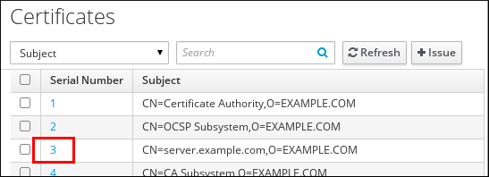 
3. In the certificate information page, locate the `Expires On` information.

<h3 id="viewing-the-expiry-date-of-a-certificate-in-the-cli">7.4. Viewing the expiry date of a certificate in the CLI</h3>

You can use the command line (CLI) to view the expiry date of a certificate.

**Procedure**

- Use the `openssl` utility to open the file in a human-readable format:
  
  ```
  openssl x509 -noout -text -in ca.pem
  ```
  
  ```plaintext
  $ openssl x509 -noout -text -in ca.pem
  ```
  
  ```
  Certificate:
      Data:
          Version: 3 (0x2)
          Serial Number: 1 (0x1)
          Signature Algorithm: sha256WithRSAEncryption
          Issuer: O = IDM.EXAMPLE.COM, CN = Certificate Authority
          Validity
              Not Before: Oct 30 19:39:14 2017 GMT
              Not After : Oct 30 19:39:14 2037 GMT
  ```
  
  ```plaintext
  Certificate:
      Data:
          Version: 3 (0x2)
          Serial Number: 1 (0x1)
          Signature Algorithm: sha256WithRSAEncryption
          Issuer: O = IDM.EXAMPLE.COM, CN = Certificate Authority
          Validity
              Not Before: Oct 30 19:39:14 2017 GMT
              Not After : Oct 30 19:39:14 2037 GMT
  ```

<h3 id="revoking-certificates-with-the-integrated-idm-cas">7.5. Revoking certificates with the integrated IdM CAs</h3>

If you know you have lost the private key for your certificate, you must revoke the certificate to prevent its abuse. You can revoke a certificate with the integrated IdM CAs in the following ways:

<h4 id="certificate-revocation-reasons">7.5.1. Certificate revocation reasons</h4>

A revoked certificate is invalid and cannot be used for authentication. All revocations are permanent, except for reason 6: `Certificate Hold`.

The default revocation reason is 0: `unspecified`.

Table 7.1. Revocation Reasons

IDReasonExplanation

0

Unspecified

\-

1

Key Compromised

The key that issued the certificate is no longer trusted.

Possible causes include a lost token or an improperly accessed file.

2

CA Compromised

The CA that issued the certificate is no longer trusted.

3

Affiliation Changed

Possible causes include:

- A person has left the company or moved to another department.
- A host or service is being retired.

4

Superseded

A newer certificate has replaced the current certificate.

5

Cessation of Operation

The host or service is being decommissioned.

6

Certificate Hold

The certificate is temporarily revoked. You can restore the certificate later.

8

Remove from CRL

The certificate is not included in the certificate revocation list (CRL).

9

Privilege Withdrawn

The user, host, or service is no longer permitted to use the certificate.

10

Attribute Authority (AA) Compromise

The AA certificate is no longer trusted.

<h4 id="revoking-certificates-with-the-integrated-idm-cas-using-idm-webui">7.5.2. Revoking certificates with the integrated IdM CAs using IdM WebUI</h4>

If you know you have lost the private key for your certificate, you must revoke the certificate to prevent its abuse. You can use the IdM WebUI to revoke a certificate issued by the IdM CA.

**Procedure**

1. Click `Authentication` &gt; `Certificates` &gt; `Certificates`.
2. Click the serial number of the certificate to open the certificate information page.
   
   **List of Certificates**
   
    
3. In the certificate information page, click Actions → Revoke Certificate.
4. Select the reason for revoking and click Revoke. See [Certificate revocation reasons](#certificate-revocation-reasons "7.5.1. Certificate revocation reasons") for details.

<h4 id="revoking-certificates-with-the-integrated-idm-cas-using-idm-cli">7.5.3. Revoking certificates with the integrated IdM CAs using IdM CLI</h4>

If you know you have lost the private key for your certificate, you must revoke the certificate to prevent its abuse. You can use the IdM CLI to revoke a certificate issued by the IdM CA.

**Procedure**

- Use the `ipa cert-revoke` command, and specify:
  
  - the certificate serial number
  - the ID number for the revocation reason; see [Certificate revocation reasons](#certificate-revocation-reasons "7.5.1. Certificate revocation reasons") for details
    
    For example, to revoke the certificate with serial number `1032` because of reason 1: `Key Compromised`, enter:
    
    ```
    ipa cert-revoke 1032 --revocation-reason=1
    ```
    
    ```plaintext
    $ ipa cert-revoke 1032 --revocation-reason=1
    ```

<h4 id="revoking-certificates-with-the-integrated-idm-cas">7.5.4. Additional resources</h4>

- [Requesting a new user certificate and exporting it to the client](https://docs.redhat.com/en/documentation/red_hat_enterprise_linux/10/html/managing_certificates_in_idm/configuring-authentication-with-a-certificate-stored-on-the-desktop-of-an-idm-client#requesting-a-new-user-certificate-and-exporting-it-to-the-client)
- [Obtaining an IdM certificate for a service using certmonger](https://docs.redhat.com/en/documentation/red_hat_enterprise_linux/10/html/managing_certificates_in_idm/obtaining-an-idm-certificate-for-a-service-using-certmonger-assembly)

<h3 id="restoring-certificates-with-the-integrated-idm-cas">7.6. Restoring certificates with the integrated IdM CAs</h3>

Administrators can reinstate certificates previously placed on "Certificate Hold." Restoring a temporarily revoked credential reactivates it for authentication without requiring a new issuance request.

- [Restore certificates with the integrated IdM CAs using IdM WebUI](#restoring-certificates-with-the-integrated-idm-cas-using-idm-webui "7.6.1. Restoring certificates with the integrated IdM CAs using IdM WebUI");
- [Restore certificates with the integrated IdM CAs using IdM CLI](#restoring-certificates-with-the-integrated-idm-cas-using-idm-cli "7.6.2. Restoring certificates with the integrated IdM CAs using IdM CLI").

<h4 id="restoring-certificates-with-the-integrated-idm-cas-using-idm-webui">7.6.1. Restoring certificates with the integrated IdM CAs using IdM WebUI</h4>

The IdM Web UI simplifies restoring functionality for suspended certificates. Administrators locate the serial number in the registry and remove the hold status to immediately validate the credential.

**Procedure**

1. In the `Authentication` menu, click `Certificates` &gt; `Certificates`.
2. Click the serial number of the certificate to open the certificate information page.
   
   **List of Certificates in the IdM Web UI**
   
    
3. In the certificate information page, click Actions → Restore Certificate.

<h4 id="restoring-certificates-with-the-integrated-idm-cas-using-idm-cli">7.6.2. Restoring certificates with the integrated IdM CAs using IdM CLI</h4>

The `ipa cert-remove-hold` command reactivates certificates currently in a hold state. Administrators execute this tool with the target serial number to lift the temporary revocation and restore access.

**Procedure**

- Use the `ipa cert-remove-hold` command and specify the certificate serial number. For example:
  
  ```
  ipa cert-remove-hold 1032
  ```
  
  ```plaintext
  $ ipa cert-remove-hold 1032
  ```

<h2 id="configuring-identity-management-for-smart-card-authentication">Chapter 8. Configuring Identity Management for smart card authentication</h2>

Identity Management (IdM) supports smart card authentication by using certificates issued internally or by external authorities. Configure the `rootca.pem` file to establish trust for external certificate authorities, enabling secure access across the domain.

Note

Currently, IdM does not support importing multiple CAs that share the same Subject Distinguished Name (DN) but are cryptographically different.

<h3 id="configuring-the-idm-server-for-smart-card-authentication">8.1. Configuring the IdM server for smart card authentication</h3>

The `ipa-advise` utility generates a configuration script to enable smart card authentication on the server. This script automates the setup of the Apache HTTP Server, Key Distribution Center (KDC) Public Key Cryptography for Initial Authentication in Kerberos (PKINIT), and the IdM Web UI for certificate handling.

Learn how to enable smart card authentication for users whose certificates have been issued by the certificate authority (CA) of the &lt;EXAMPLE.ORG&gt; domain that your Identity Management (IdM) CA trusts.

**Prerequisites**

- You have root access to the IdM server.
- You have the root CA certificate and all the intermediate CA certificates:
  
  - The certificate of the root CA that has either issued the certificate for the &lt;EXAMPLE.ORG&gt; CA directly, or by using one or more of its sub-CAs. You can download the certificate chain from a web page whose certificate has been issued by the authority.
  - The IdM CA certificate. You can obtain the CA certificate from the `/etc/ipa/ca.crt` file on the IdM server on which an IdM CA instance is running.
  - The certificates of all of the intermediate CAs; that is, intermediate between the &lt;EXAMPLE.ORG&gt; CA and the IdM CA.

**Procedure**

1. Create a directory in which you will do the configuration:
   
   ```
   mkdir ~/SmartCard/
   ```
   
   ```plaintext
   [root@server]# mkdir ~/SmartCard/
   ```
2. Navigate to the directory:
   
   ```
   cd ~/SmartCard/
   ```
   
   ```plaintext
   [root@server]# cd ~/SmartCard/
   ```
3. Obtain the relevant CA certificates stored in files in PEM format. If your CA certificate is stored in a file of a different format, such as DER, convert it to PEM format. The IdM Certificate Authority certificate is in PEM format and is located in the `/etc/ipa/ca.crt` file.
   
   Convert a DER file to a PEM file:
   
   ```
   openssl x509 -in <filename>.der -inform DER -out <filename>.pem -outform PEM
   ```
   
   ```plaintext
   # openssl x509 -in <filename>.der -inform DER -out <filename>.pem -outform PEM
   ```
4. For convenience, copy the certificates to the directory in which you want to do the configuration:
   
   ```
   cp /tmp/rootca.pem ~/SmartCard/
   ```
   
   ```plaintext
   [root@server SmartCard]# cp /tmp/rootca.pem ~/SmartCard/
   ```
   
   ```
   cp /tmp/subca.pem ~/SmartCard/
   ```
   
   ```plaintext
   [root@server SmartCard]# cp /tmp/subca.pem ~/SmartCard/
   ```
   
   ```
   cp /tmp/issuingca.pem ~/SmartCard/
   ```
   
   ```plaintext
   [root@server SmartCard]# cp /tmp/issuingca.pem ~/SmartCard/
   ```
5. Optional: If you use certificates of external certificate authorities, use the `openssl x509` utility to view the contents of the files in the `PEM` format to check that the `Issuer` and `Subject` values are correct:
   
   ```
   openssl x509 -noout -text -in rootca.pem | more
   ```
   
   ```plaintext
   [root@server SmartCard]# openssl x509 -noout -text -in rootca.pem | more
   ```
6. Generate a configuration script with the in-built `ipa-advise` utility, using the administrator’s privileges:
   
   ```
   kinit admin
   ```
   
   ```plaintext
   [root@server SmartCard]# kinit admin
   ```
   
   ```
   ipa-advise config-server-for-smart-card-auth > config-server-for-smart-card-auth.sh
   ```
   
   ```plaintext
   [root@server SmartCard]# ipa-advise config-server-for-smart-card-auth > config-server-for-smart-card-auth.sh
   ```
   
   The `config-server-for-smart-card-auth.sh` script performs the following actions:
   
   - It configures the IdM Apache HTTP Server.
   - It enables Public Key Cryptography for Initial Authentication in Kerberos (PKINIT) on the Key Distribution Center (KDC).
   - It configures the IdM Web UI to accept smart card authorization requests.
7. Execute the script, adding the PEM files containing the root CA and sub CA certificates as arguments:
   
   ```
   chmod +x config-server-for-smart-card-auth.sh
   ```
   
   ```plaintext
   [root@server SmartCard]# chmod +x config-server-for-smart-card-auth.sh
   ```
   
   ```
   ./config-server-for-smart-card-auth.sh rootca.pem subca.pem issuingca.pem
   ```
   
   ```plaintext
   [root@server SmartCard]# ./config-server-for-smart-card-auth.sh rootca.pem subca.pem issuingca.pem
   ```
   
   ```
   Ticket cache:KEYRING:persistent:0:0
   Default principal: \admin@IDM.EXAMPLE.COM
   [...]
   Systemwide CA database updated.
   The ipa-certupdate command was successful
   ```
   
   ```plaintext
   Ticket cache:KEYRING:persistent:0:0
   Default principal: \admin@IDM.EXAMPLE.COM
   [...]
   Systemwide CA database updated.
   The ipa-certupdate command was successful
   ```
   
   Note
   
   Ensure that you add the root CA’s certificate as an argument before any sub CA certificates and that the CA or sub CA certificates have not expired.
8. Optional: If the certificate authority that issued the user certificate does not provide any Online Certificate Status Protocol (OCSP) responder, you may need to disable OCSP check for authentication to the IdM Web UI:
   
   1. Set the `SSLOCSPEnable` parameter to `off` in the `/etc/httpd/conf.d/ssl.conf` file:
      
      ```
      SSLOCSPEnable off
      ```
      
      ```plaintext
      SSLOCSPEnable off
      ```
   2. Restart the Apache daemon (httpd) for the changes to take effect immediately:
      
      ```
      systemctl restart httpd
      ```
      
      ```plaintext
      [root@server SmartCard]# systemctl restart httpd
      ```
   
   Warning
   
   Do not disable the OCSP check if you only use user certificates issued by the IdM CA. OCSP responders are part of IdM.
   
   For instructions on how to keep the OCSP check enabled, and yet prevent a user certificate from being rejected by the IdM server if it does not contain the information about the location at which the CA that issued the user certificate listens for OCSP service requests, see the `SSLOCSPDefaultResponder` directive in [Apache mod\_ssl configuration options](http://httpd.apache.org/docs/trunk/en/mod/mod_ssl.html).
   
   The server is now configured for smart card authentication.
   
   Note
   
   To enable smart card authentication in the whole topology, run the procedure on each IdM server.

**Additional resources**

- [Configuring a browser to enable certificate authentication](https://docs.redhat.com/en/documentation/red_hat_enterprise_linux/10/html/managing_certificates_in_idm/configuring-authentication-with-a-certificate-stored-on-the-desktop-of-an-idm-client#configuring-a-browser-to-enable-certificate-authentication)

<h3 id="using-ansible-to-configure-the-idm-server-for-smart-card-authentication">8.2. Using Ansible to configure the IdM server for smart card authentication</h3>

Ansible automates the server configuration by using the `ipasmartcard_server` role. This playbook configures Apache and the KDC using the root and intermediate CA certificates specified in the inventory file.

You can use Ansible to enable smart card authentication for users whose certificates have been issued by the certificate authority (CA) of the &lt;EXAMPLE.ORG&gt; domain that your Identity Management (IdM) CA trusts. To do that, you must obtain the following certificates so that you can use them when running an Ansible playbook with the `ipasmartcard_server` `ansible-freeipa` role script:

- The certificate of the root CA that has either issued the certificate for the &lt;EXAMPLE.ORG&gt; CA directly, or by using one or more of its sub-CAs. You can download the certificate chain from a web page whose certificate has been issued by the authority. For details, see Step 4 in [Configuring a browser to enable certificate authentication](https://docs.redhat.com/en/documentation/red_hat_enterprise_linux/10/html/managing_certificates_in_idm/configuring-authentication-with-a-certificate-stored-on-the-desktop-of-an-idm-client#configuring-a-browser-to-enable-certificate-authentication).
- The IdM CA certificate. You can obtain the CA certificate from the `/etc/ipa/ca.crt` file on any IdM CA server.
- The certificates of all of the CAs that are intermediate between the &lt;EXAMPLE.ORG&gt; CA and the IdM CA.

**Prerequisites**

- You have `root` access to the IdM server.
- You know the IdM `admin` password.
- You have the root CA certificate, the IdM CA certificate, and all the intermediate CA certificates.
- You have configured your Ansible control node to meet the following requirements:
  
  - You are using Ansible version 2.15 or later.
  - You have installed the [`ansible-freeipa`](https://docs.redhat.com/en/documentation/red_hat_enterprise_linux/10/html/using_ansible_to_install_and_manage_identity_management_in_rhel/installing-an-identity-management-server-using-an-ansible-playbook#installing-the-ansible-freeipa-package) package.
  - The example assumes that in the **~/*MyPlaybooks*/** directory, you have created an [Ansible inventory file](https://docs.redhat.com/en/documentation/red_hat_enterprise_linux/10/html/using_ansible_to_install_and_manage_identity_management_in_rhel/preparing-your-environment-for-managing-idm-using-ansible-playbooks) with the fully-qualified domain name (FQDN) of the IdM server.
  - The example assumes that the **secret.yml** Ansible vault stores your `ipaadmin_password` and that you have access to a file that stores the password protecting the **secret.yml** file.
- The target node, that is the node on which the `freeipa.ansible_freeipa` module is executed, is part of the IdM domain as an IdM client, server or replica.

**Procedure**

01. If your CA certificates are stored in files of a different format, such as `DER`, convert them to `PEM` format:
    
    ```
    openssl x509 -in <filename>.der -inform DER -out <filename>.pem -outform PEM
    ```
    
    ```plaintext
    # openssl x509 -in <filename>.der -inform DER -out <filename>.pem -outform PEM
    ```
    
    The IdM Certificate Authority certificate is in `PEM` format and is located in the `/etc/ipa/ca.crt` file.
02. Optional: Use the `openssl x509` utility to view the contents of the files in the `PEM` format to check that the `Issuer` and `Subject` values are correct:
    
    ```
    openssl x509 -noout -text -in root-ca.pem | more
    ```
    
    ```plaintext
    # openssl x509 -noout -text -in root-ca.pem | more
    ```
03. Navigate to your **~/*MyPlaybooks*/** directory:
    
    ```
    cd ~/MyPlaybooks/
    ```
    
    ```plaintext
    $ cd ~/MyPlaybooks/
    ```
04. Create a subdirectory dedicated to the CA certificates:
    
    ```
    mkdir SmartCard/
    ```
    
    ```plaintext
    $ mkdir SmartCard/
    ```
05. For convenience, copy all the required certificates to the **~/MyPlaybooks/SmartCard/** directory:
    
    ```
    cp /tmp/root-ca.pem ~/MyPlaybooks/SmartCard/
    ```
    
    ```plaintext
    # cp /tmp/root-ca.pem ~/MyPlaybooks/SmartCard/
    ```
    
    ```
    cp /tmp/intermediate-ca.pem ~/MyPlaybooks/SmartCard/
    ```
    
    ```plaintext
    # cp /tmp/intermediate-ca.pem ~/MyPlaybooks/SmartCard/
    ```
    
    ```
    cp /etc/ipa/ca.crt ~/MyPlaybooks/SmartCard/ipa-ca.crt
    ```
    
    ```plaintext
    # cp /etc/ipa/ca.crt ~/MyPlaybooks/SmartCard/ipa-ca.crt
    ```
06. In your Ansible inventory file, specify the following:
    
    - The IdM servers that you want to configure for smart card authentication.
    - The IdM administrator password.
    - The paths to the certificates of the CAs in the following order:
      
      - The root CA certificate file
      - The intermediate CA certificates files
      - The IdM CA certificate file
    
    The file can look as follows:
    
    ```
    [ipaserver]
    ipaserver.idm.example.com
    
    [ipareplicas]
    ipareplica1.idm.example.com
    ipareplica2.idm.example.com
    
    [ipacluster:children]
    ipaserver
    ipareplicas
    
    [ipacluster:vars]
    ipaadmin_password= "{{ ipaadmin_password }}"
    ipasmartcard_server_ca_certs=/home/<user_name>/MyPlaybooks/SmartCard/root-ca.pem,/home/<user_name>/MyPlaybooks/SmartCard/intermediate-ca.pem,/home/<user_name>/MyPlaybooks/SmartCard/ipa-ca.crt
    ```
    
    ```plaintext
    [ipaserver]
    ipaserver.idm.example.com
    
    [ipareplicas]
    ipareplica1.idm.example.com
    ipareplica2.idm.example.com
    
    [ipacluster:children]
    ipaserver
    ipareplicas
    
    [ipacluster:vars]
    ipaadmin_password= "{{ ipaadmin_password }}"
    ipasmartcard_server_ca_certs=/home/<user_name>/MyPlaybooks/SmartCard/root-ca.pem,/home/<user_name>/MyPlaybooks/SmartCard/intermediate-ca.pem,/home/<user_name>/MyPlaybooks/SmartCard/ipa-ca.crt
    ```
07. Create an `install-smartcard-server.yml` playbook with the following content:
    
    ```
    ---
    - name: Playbook to set up smart card authentication for an IdM server
      hosts: ipaserver
      become: true
    
      roles:
      - role: ipasmartcard_server
        state: present
    ```
    
    ```plaintext
    ---
    - name: Playbook to set up smart card authentication for an IdM server
      hosts: ipaserver
      become: true
    
      roles:
      - role: ipasmartcard_server
        state: present
    ```
08. Save the file.
    
    For example playbooks in the FreeIPA Ansible collection, see the `/usr/share/ansible/collections/ansible_collections/freeipa/ansible_freeipa/playbooks/` directory on the control node.
09. Run the Ansible playbook. Specify the playbook file, the file storing the password protecting the **secret.yml** file, and the inventory file:
    
    ```
    ansible-playbook --vault-password-file=password_file -v -i inventory install-smartcard-server.yml
    ```
    
    ```plaintext
    $ ansible-playbook --vault-password-file=password_file -v -i inventory install-smartcard-server.yml
    ```
    
    The `ipasmartcard_server` Ansible role performs the following actions:
    
    - It configures the IdM Apache HTTP Server.
    - It enables Public Key Cryptography for Initial Authentication in Kerberos (PKINIT) on the Key Distribution Center (KDC).
    - It configures the IdM Web UI to accept smart card authorization requests.
10. Optional: If the certificate authority that issued the user certificate does not provide any Online Certificate Status Protocol (OCSP) responder, you may need to disable OCSP check for authentication to the IdM Web UI:
    
    1. Connect to the IdM server as `root`:
       
       ```
       ssh root@ipaserver.idm.example.com
       ```
       
       ```plaintext
       ssh root@ipaserver.idm.example.com
       ```
    2. Set the `SSLOCSPEnable` parameter to `off` in the `/etc/httpd/conf.d/ssl.conf` file:
       
       ```
       SSLOCSPEnable off
       ```
       
       ```plaintext
       SSLOCSPEnable off
       ```
    3. Restart the Apache daemon (httpd) for the changes to take effect immediately:
       
       ```
       systemctl restart httpd
       ```
       
       ```plaintext
       # systemctl restart httpd
       ```
    
    Warning
    
    Do not disable the OCSP check if you only use user certificates issued by the IdM CA. OCSP responders are part of IdM.
    
    For instructions on how to keep the OCSP check enabled, and yet prevent a user certificate from being rejected by the IdM server if it does not contain the information about the location at which the CA that issued the user certificate listens for OCSP service requests, see the `SSLOCSPDefaultResponder` directive in [Apache mod\_ssl configuration options](http://httpd.apache.org/docs/trunk/en/mod/mod_ssl.html).
    
    The server listed in the inventory file is now configured for smart card authentication.
    
    Note
    
    To enable smart card authentication in the whole topology, set the `hosts` variable in the Ansible playbook to `ipacluster`:
    
    ```
    ---
    - name: Playbook to set up smartcard for IPA server and replicas
      hosts: ipacluster
    [...]
    ```
    
    ```plaintext
    ---
    - name: Playbook to set up smartcard for IPA server and replicas
      hosts: ipacluster
    [...]
    ```

<h3 id="configuring-the-idm-client-for-smart-card-authentication">8.3. Configuring the IdM client for smart card authentication</h3>

IdM clients require specific configurations to support smart card logins for SSH, GDM, and console sessions. You can generate a setup script on the server and execute it on target clients to configure SSSD and system truststores.

You can configure IdM clients for smart card authentication. The procedure needs to be run on each IdM system, a client or a server, to which you want to connect while using a smart card for authentication. For example, to enable an `ssh` connection from host A to host B, the script needs to be run on host B.

As an administrator, run this procedure to enable smart card authentication using

- The `ssh` protocol
  
  For details see [Configuring SSH access using smart card authentication](https://docs.redhat.com/en/documentation/red_hat_enterprise_linux/10/html/managing_smart_card_authentication/configuring-smart-card-authentication-with-local-certificates#configuring-ssh-access-using-smart-card-authentication).
- The console login
- The GNOME Display Manager (GDM)
- The `su` command

This procedure is not required for authenticating to the IdM Web UI. Authenticating to the IdM Web UI involves two hosts, neither of which needs to be an IdM client:

- The machine on which the browser is running. The machine can be outside of the IdM domain.
- The IdM server on which `httpd` is running.

The following procedure assumes that you are configuring smart card authentication on an IdM client, not an IdM server. For this reason you need two computers: an IdM server to generate the configuration script, and the IdM client on which to run the script.

**Prerequisites**

- Your IdM server has been configured for smart card authentication, as described in [Configuring the IdM server for smart card authentication](https://docs.redhat.com/en/documentation/red_hat_enterprise_linux/10/html/managing_smart_card_authentication/configuring-identity-management-for-smart-card-authentication#configuring-the-idm-server-for-smart-card-authentication).
- You have root access to the IdM server and the IdM client.
- You have the root CA certificate and all the intermediate CA certificates.
- You installed the IdM client with the `--mkhomedir` option to ensure remote users can log in successfully. If you do not create a home directory, the default login location is the root of the directory structure, `/`.

**Procedure**

1. On an IdM server, generate a configuration script with `ipa-advise` using the administrator’s privileges:
   
   ```
   kinit admin
   ```
   
   ```plaintext
   [root@server SmartCard]# kinit admin
   ```
   
   ```
   ipa-advise config-client-for-smart-card-auth > config-client-for-smart-card-auth.sh
   ```
   
   ```plaintext
   [root@server SmartCard]# ipa-advise config-client-for-smart-card-auth > config-client-for-smart-card-auth.sh
   ```
   
   The `config-client-for-smart-card-auth.sh` script performs the following actions:
   
   - It configures the smart card daemon.
   - It sets the system-wide truststore.
   - It configures the System Security Services Daemon (SSSD) to allow users to authenticate with either their user name and password or with their smart card. For more details on SSSD profile options for smart card authentication, see [Smart card authentication options in RHEL](https://docs.redhat.com/en/documentation/red_hat_enterprise_linux/10/html/managing_smart_card_authentication/understanding-smart-card-authentication#smart-card-authentication-options-in-rhel).
2. From the IdM server, copy the script to a directory of your choice on the IdM client machine:
   
   ```
   scp config-client-for-smart-card-auth.sh root@client.idm.example.com:/root/SmartCard/
   ```
   
   ```plaintext
   [root@server SmartCard]# scp config-client-for-smart-card-auth.sh root@client.idm.example.com:/root/SmartCard/
   ```
   
   ```
   Password:
   config-client-for-smart-card-auth.sh        100%   2419       3.5MB/s   00:00
   ```
   
   ```plaintext
   Password:
   config-client-for-smart-card-auth.sh        100%   2419       3.5MB/s   00:00
   ```
3. From the IdM server, copy the CA certificate files in PEM format for convenience to the same directory on the IdM client machine as used in the previous step:
   
   ```
   scp {rootca.pem,subca.pem,issuingca.pem} root@client.idm.example.com:/root/SmartCard/
   ```
   
   ```plaintext
   [root@server SmartCard]# scp {rootca.pem,subca.pem,issuingca.pem} root@client.idm.example.com:/root/SmartCard/
   ```
   
   ```
   Password:
   rootca.pem                          100%   1237     9.6KB/s   00:00
   subca.pem                           100%   2514    19.6KB/s   00:00
   issuingca.pem                       100%   2514    19.6KB/s   00:00
   ```
   
   ```plaintext
   Password:
   rootca.pem                          100%   1237     9.6KB/s   00:00
   subca.pem                           100%   2514    19.6KB/s   00:00
   issuingca.pem                       100%   2514    19.6KB/s   00:00
   ```
4. On the client machine, execute the script, adding the PEM files containing the CA certificates as arguments:
   
   ```
   kinit admin
   ```
   
   ```plaintext
   [root@client SmartCard]# kinit admin
   ```
   
   ```
   chmod +x config-client-for-smart-card-auth.sh
   ```
   
   ```plaintext
   [root@client SmartCard]# chmod +x config-client-for-smart-card-auth.sh
   ```
   
   ```
   ./config-client-for-smart-card-auth.sh rootca.pem subca.pem issuingca.pem
   ```
   
   ```plaintext
   [root@client SmartCard]# ./config-client-for-smart-card-auth.sh rootca.pem subca.pem issuingca.pem
   ```
   
   ```
   Ticket cache:KEYRING:persistent:0:0
   Default principal: \admin@IDM.EXAMPLE.COM
   [...]
   Systemwide CA database updated.
   The ipa-certupdate command was successful
   ```
   
   ```plaintext
   Ticket cache:KEYRING:persistent:0:0
   Default principal: \admin@IDM.EXAMPLE.COM
   [...]
   Systemwide CA database updated.
   The ipa-certupdate command was successful
   ```
   
   Note
   
   Ensure that you add the root CA’s certificate as an argument before any sub CA certificates and that the CA or sub CA certificates have not expired.
   
   The client is now configured for smart card authentication.

<h3 id="using-ansible-to-configure-idm-clients-for-smart-card-authentication">8.4. Using Ansible to configure IdM clients for smart card authentication</h3>

The `ipasmartcard_client` Ansible role automates the setup of multiple clients simultaneously. This playbook configures the smart card daemon, system truststores, and SSSD profiles to permit certificate-based authentication across the entire infrastructure.

Enable smart card authentication for IdM users that use any of the following to access IdM:

- The `ssh` protocol
  
  For details see [Configuring SSH access using smart card authentication](https://docs.redhat.com/en/documentation/red_hat_enterprise_linux/10/html/managing_smart_card_authentication/configuring-identity-management-for-smart-card-authentication).
- The console login
- The GNOME Display Manager (GDM)
- The `su` command

Note

This procedure is not required for authenticating to the IdM Web UI. Authenticating to the IdM Web UI involves two hosts, neither of which needs to be an IdM client:

- The machine on which the browser is running. The machine can be outside of the IdM domain.
- The IdM server on which `httpd` is running.

**Prerequisites**

- Your IdM server has been configured for smart card authentication, as described in [Using Ansible to configure the IdM server for smart card authentication](#using-ansible-to-configure-the-idm-server-for-smart-card-authentication "8.2. Using Ansible to configure the IdM server for smart card authentication").
- You have root access to the IdM server and the IdM client.
- You have the root CA certificate, the IdM CA certificate, and all the intermediate CA certificates.
- You have configured your Ansible control node to meet the following requirements:
  
  - You are using Ansible version 2.15 or later.
  - You have installed the [`ansible-freeipa`](https://docs.redhat.com/en/documentation/red_hat_enterprise_linux/10/html/using_ansible_to_install_and_manage_identity_management_in_rhel/installing-an-identity-management-server-using-an-ansible-playbook#installing-the-ansible-freeipa-package) package.
  - The example assumes that in the **~/*MyPlaybooks*/** directory, you have created an [Ansible inventory file](https://docs.redhat.com/en/documentation/red_hat_enterprise_linux/10/html/using_ansible_to_install_and_manage_identity_management_in_rhel/preparing-your-environment-for-managing-idm-using-ansible-playbooks) with the fully-qualified domain name (FQDN) of the IdM server.
  - The example assumes that the **secret.yml** Ansible vault stores your `ipaadmin_password` and that you have access to a file that stores the password protecting the **secret.yml** file.
- The target node, that is the node on which the `freeipa.ansible_freeipa` module is executed, is part of the IdM domain as an IdM client, server or replica.

**Procedure**

1. If your CA certificates are stored in files of a different format, such as `DER`, convert them to `PEM` format:
   
   ```
   openssl x509 -in <filename>.der -inform DER -out <filename>.pem -outform PEM
   ```
   
   ```plaintext
   # openssl x509 -in <filename>.der -inform DER -out <filename>.pem -outform PEM
   ```
   
   The IdM CA certificate is in `PEM` format and is located in the `/etc/ipa/ca.crt` file.
2. Optional: Use the `openssl x509` utility to view the contents of the files in the `PEM` format to check that the `Issuer` and `Subject` values are correct:
   
   ```
   openssl x509 -noout -text -in root-ca.pem | more
   ```
   
   ```plaintext
   # openssl x509 -noout -text -in root-ca.pem | more
   ```
3. On your Ansible control node, navigate to your **~/*MyPlaybooks*/** directory:
   
   ```
   cd ~/MyPlaybooks/
   ```
   
   ```plaintext
   $ cd ~/MyPlaybooks/
   ```
4. Create a subdirectory dedicated to the CA certificates:
   
   ```
   mkdir SmartCard/
   ```
   
   ```plaintext
   $ mkdir SmartCard/
   ```
5. For convenience, copy all the required certificates to the **~/MyPlaybooks/SmartCard/** directory, for example:
   
   ```
   cp /tmp/root-ca.pem ~/MyPlaybooks/SmartCard/
   ```
   
   ```plaintext
   # cp /tmp/root-ca.pem ~/MyPlaybooks/SmartCard/
   ```
   
   ```
   cp /tmp/intermediate-ca.pem ~/MyPlaybooks/SmartCard/
   ```
   
   ```plaintext
   # cp /tmp/intermediate-ca.pem ~/MyPlaybooks/SmartCard/
   ```
   
   ```
   cp /etc/ipa/ca.crt ~/MyPlaybooks/SmartCard/ipa-ca.crt
   ```
   
   ```plaintext
   # cp /etc/ipa/ca.crt ~/MyPlaybooks/SmartCard/ipa-ca.crt
   ```
6. In your Ansible inventory file, specify the following:
   
   - The IdM clients that you want to configure for smart card authentication.
   - The IdM administrator password.
   - The paths to the certificates of the CAs in the following order:
     
     - The root CA certificate file
     - The intermediate CA certificates files
     - The IdM CA certificate file
   
   The file can look as follows:
   
   ```
   [ipaclients]
   ipaclient1.example.com
   ipaclient2.example.com
   
   [ipaclients:vars]
   ipaadmin_password=SomeADMINpassword
   ipasmartcard_client_ca_certs=/home/<user_name>/MyPlaybooks/SmartCard/root-ca.pem,/home/<user_name>/MyPlaybooks/SmartCard/intermediate-ca.pem,/home/<user_name>/MyPlaybooks/SmartCard/ipa-ca.crt
   ```
   
   ```plaintext
   [ipaclients]
   ipaclient1.example.com
   ipaclient2.example.com
   
   [ipaclients:vars]
   ipaadmin_password=SomeADMINpassword
   ipasmartcard_client_ca_certs=/home/<user_name>/MyPlaybooks/SmartCard/root-ca.pem,/home/<user_name>/MyPlaybooks/SmartCard/intermediate-ca.pem,/home/<user_name>/MyPlaybooks/SmartCard/ipa-ca.crt
   ```
7. Create an `install-smartcard-clients.yml` playbook with the following content:
   
   ```
   ---
   - name: Playbook to set up smart card authentication for an IdM client
     hosts: ipaclients
     become: true
   
     roles:
     - role: ipasmartcard_client
       state: present
   ```
   
   ```plaintext
   ---
   - name: Playbook to set up smart card authentication for an IdM client
     hosts: ipaclients
     become: true
   
     roles:
     - role: ipasmartcard_client
       state: present
   ```
8. Save the file.
   
   For example playbooks in the FreeIPA Ansible collection, see the `/usr/share/ansible/collections/ansible_collections/freeipa/ansible_freeipa/playbooks/` directory on the control node.
9. Run the Ansible playbook. Specify the playbook and inventory files:
   
   ```
   ansible-playbook --vault-password-file=password_file -v -i inventory install-smartcard-clients.yml
   ```
   
   ```plaintext
   $ ansible-playbook --vault-password-file=password_file -v -i inventory install-smartcard-clients.yml
   ```
   
   The `ipasmartcard_client` Ansible role performs the following actions:
   
   - It configures the smart card daemon.
   - It sets the system-wide truststore.
   - It configures the System Security Services Daemon (SSSD) to allow users to authenticate with either their user name and password or their smart card. For more details on SSSD profile options for smart card authentication, see [Smart card authentication options in RHEL](https://docs.redhat.com/en/documentation/red_hat_enterprise_linux/10/html/managing_smart_card_authentication/understanding-smart-card-authentication#smart-card-authentication-options-in-rhel).
     
     The clients listed in the **ipaclients** section of the inventory file are now configured for smart card authentication.
   
   Note
   
   If you have installed the IdM clients with the `--mkhomedir` option, remote users will be able to log in to their home directories. Otherwise, the default login location is the root of the directory structure, `/`.

<h3 id="adding-a-certificate-to-a-user-entry-in-the-idm-web-ui">8.5. Adding a certificate to a user entry in the IdM Web UI</h3>

You can upload external certificates directly to user profiles by using the IdM Web UI. This action associates the specific credentials on a physical smart card with the corresponding Identity Management user account.

Instead of uploading the whole certificate, it is also possible to upload certificate mapping data to a user entry in IdM. User entries containing either full certificates or certificate mapping data can be used in conjunction with corresponding certificate mapping rules to facilitate the configuration of smart card authentication for system administrators. For details, see [Certificate mapping rules for configuring authentication](https://docs.redhat.com/en/documentation/red_hat_enterprise_linux/10/html/managing_smart_card_authentication/certificate-mapping-rules-for-configuring-authentication).

Note

If the user’s certificate has been issued by the IdM Certificate Authority, the certificate is already stored in the user entry, and you do not need to follow this procedure.

**Prerequisites**

- You have the certificate that you want to add to the user entry at your disposal.

**Procedure**

1. Log into the IdM Web UI as an administrator if you want to add a certificate to another user. For adding a certificate to your own profile, you do not need the administrator’s credentials.
2. Navigate to `Users` → `Active users` → `sc_user`.
3. Find the `Certificate` option and click `Add`.
4. On the command line, display the certificate in the `PEM` format using the `cat` utility or a text editor:
   
   ```
   cat testuser.crt
   ```
   
   ```plaintext
   [user@client SmartCard]$ cat testuser.crt
   ```
5. Copy and paste the certificate from the CLI into the window that has opened in the Web UI.
6. Click `Add`.
   
   The `sc_user` entry now contains an external certificate.

<h3 id="adding-a-certificate-to-a-user-entry-in-the-idm-cli">8.6. Adding a certificate to a user entry in the IdM CLI</h3>

The command-line interface enables you to map external certificates to user entries. You must format the certificate string to remove headers and footers before executing the `ipa user-add-cert` command.

Instead of uploading the whole certificate, it is also possible to upload certificate mapping data to a user entry in IdM. User entries containing either full certificates or certificate mapping data can be used in conjunction with corresponding certificate mapping rules to facilitate the configuration of smart card authentication for system administrators. For details, see [Certificate mapping rules for configuring authentication](https://docs.redhat.com/en/documentation/red_hat_enterprise_linux/10/html/managing_smart_card_authentication/certificate-mapping-rules-for-configuring-authentication).

Note

If the user’s certificate has been issued by the IdM Certificate Authority, the certificate is already stored in the user entry, and you do not need to follow this procedure.

**Prerequisites**

- You have the certificate that you want to add to the user entry at your disposal.

**Procedure**

1. Log into the IdM CLI as an administrator if you want to add a certificate to another user:
   
   ```
   kinit admin
   ```
   
   ```plaintext
   [user@client SmartCard]$ kinit admin
   ```
   
   For adding a certificate to your own profile, you do not need the administrator’s credentials.
   
   ```
   kinit <smartcard_user>
   ```
   
   ```plaintext
   [user@client SmartCard]$ kinit <smartcard_user>
   ```
2. Create an environment variable containing the certificate with the header and footer removed and concatenated into a single line, which is the format expected by the `ipa user-add-cert` command:
   
   ```
   export CERT=`openssl x509 -outform der -in testuser.crt | base64 -w0 -`
   ```
   
   ```plaintext
   [user@client SmartCard]$ export CERT=`openssl x509 -outform der -in testuser.crt | base64 -w0 -`
   ```
   
   Note that certificate in the `testuser.crt` file must be in the `PEM` format.
3. Add the certificate to the profile of *&lt;smartcard\_user&gt;* using the `ipa user-add-cert` command:
   
   ```
   ipa user-add-cert <smartcard_user> --certificate=$CERT
   ```
   
   ```plaintext
   [user@client SmartCard]$ ipa user-add-cert <smartcard_user> --certificate=$CERT
   ```
   
   The `<smartcard_user>` entry now contains an external certificate.

<h3 id="installing-tools-for-managing-and-using-smart-cards">8.7. Installing tools for managing and using smart cards</h3>

Configuring smart cards requires specific middleware and management utilities, such as OpenSC and GnuTLS packages. Enable the `pcscd` service to facilitate communication between the system and the card reader.

**Prerequisites**

- You have `root` permissions.

**Procedure**

1. Install the `opensc` and `gnutls-utils` packages:
   
   ```
   dnf -y install opensc gnutls-utils
   ```
   
   ```plaintext
   # dnf -y install opensc gnutls-utils
   ```
2. Start the `pcscd` service.
   
   ```
   systemctl start pcscd
   ```
   
   ```plaintext
   # systemctl start pcscd
   ```

**Verification**

- Verify that the `pcscd` service is up and running:
  
  ```
  systemctl status pcscd
  ```
  
  ```plaintext
  # systemctl status pcscd
  ```

<h3 id="preparing-your-smart-card-and-uploading-your-certificates-and-keys-to-your-smart-card">8.8. Preparing your smart card and uploading your certificates and keys to your smart card</h3>

The `pkcs15-init` tool initializes blank smart cards and manages their cryptographic contents. Use this utility to erase cards, define PINs, create storage slots, and upload the necessary private keys and certificates.

The `pkcs15-init` tool may not work with all smart cards. You must use the tools that work with the smart card you are using.

**Prerequisites**

- The `opensc` package, which includes the `pkcs15-init` tool, is installed.
  
  For more details, see [Installing tools for managing and using smart cards](https://docs.redhat.com/en/documentation/red_hat_enterprise_linux/10/html/managing_smart_card_authentication/configuring-identity-management-for-smart-card-authentication#installing-tools-for-managing-and-using-smart-cards).
- The card is inserted in the reader and connected to the computer.
- You have a private key, a public key, and a certificate to store on the smart card. In this procedure, `testuser.key`, `testuserpublic.key`, and `testuser.crt` are the names used for the private key, public key, and the certificate.
- You have your current smart card user PIN and Security Officer PIN (SO-PIN).

**Procedure**

1. Erase your smart card and authenticate yourself with your PIN:
   
   ```
   pkcs15-init --erase-card --use-default-transport-keys
   ```
   
   ```plaintext
   $ pkcs15-init --erase-card --use-default-transport-keys
   ```
   
   ```
   Using reader with a card: Reader name
   PIN [Security Officer PIN] required.
   Please enter PIN [Security Officer PIN]:
   ```
   
   ```plaintext
   Using reader with a card: Reader name
   PIN [Security Officer PIN] required.
   Please enter PIN [Security Officer PIN]:
   ```
   
   The card has been erased.
2. Initialize your smart card, set your user PIN and PUK, and your Security Officer PIN and PUK:
   
   ```
   pkcs15-init --create-pkcs15 --use-default-transport-keys \
       --pin 963214 --puk 321478 --so-pin 65498714 --so-puk 784123
   ```
   
   ```plaintext
   $ pkcs15-init --create-pkcs15 --use-default-transport-keys \
       --pin 963214 --puk 321478 --so-pin 65498714 --so-puk 784123
   ```
   
   ```
   Using reader with a card: Reader name
   ```
   
   ```plaintext
   Using reader with a card: Reader name
   ```
   
   The `pcks15-init` tool creates a new slot on the smart card.
3. Set a label and the authentication ID for the slot:
   
   ```
   pkcs15-init --store-pin --label testuser \
       --auth-id 01 --so-pin 65498714 --pin 963214 --puk 321478
   ```
   
   ```plaintext
   $ pkcs15-init --store-pin --label testuser \
       --auth-id 01 --so-pin 65498714 --pin 963214 --puk 321478
   ```
   
   ```
   Using reader with a card: Reader name
   ```
   
   ```plaintext
   Using reader with a card: Reader name
   ```
   
   The label is set to a human-readable value, in this case, `testuser`. The `auth-id` must be two hexadecimal values, in this case it is set to `01`.
4. Store and label the private key in the new slot on the smart card:
   
   ```
   pkcs15-init --store-private-key testuser.key --label testuser_key \
       --auth-id 01 --id 01 --pin 963214
   ```
   
   ```plaintext
   $ pkcs15-init --store-private-key testuser.key --label testuser_key \
       --auth-id 01 --id 01 --pin 963214
   ```
   
   ```
   Using reader with a card: Reader name
   ```
   
   ```plaintext
   Using reader with a card: Reader name
   ```
   
   Note
   
   The value you specify for `--id` must be the same when storing your private key and storing your certificate in the next step. Specifying your own value for `--id` is recommended as otherwise a more complicated value is calculated by the tool.
5. Store and label the certificate in the new slot on the smart card:
   
   ```
   pkcs15-init --store-certificate testuser.crt --label testuser_crt \
       --auth-id 01 --id 01 --format pem --pin 963214
   ```
   
   ```plaintext
   $ pkcs15-init --store-certificate testuser.crt --label testuser_crt \
       --auth-id 01 --id 01 --format pem --pin 963214
   ```
   
   ```
   Using reader with a card: Reader name
   ```
   
   ```plaintext
   Using reader with a card: Reader name
   ```
6. Optional: Store and label the public key in the new slot on the smart card:
   
   ```
   pkcs15-init --store-public-key testuserpublic.key \
       --label testuserpublic_key --auth-id 01 --id 01 --pin 963214
   ```
   
   ```plaintext
   $ pkcs15-init --store-public-key testuserpublic.key \
       --label testuserpublic_key --auth-id 01 --id 01 --pin 963214
   ```
   
   ```
   Using reader with a card: Reader name
   ```
   
   ```plaintext
   Using reader with a card: Reader name
   ```
   
   Note
   
   If the public key corresponds to a private key or certificate, specify the same ID as the ID of the private key or certificate.
7. Optional: Certain smart cards require you to finalize the card by locking the settings:
   
   ```
   pkcs15-init -F
   ```
   
   ```plaintext
   $ pkcs15-init -F
   ```
   
   At this stage, your smart card contains the certificate, private key, and public key in the newly created slot. You have also created your user PIN and PUK and the Security Officer PIN and PUK.

<h3 id="logging-in-to-idm-with-smart-cards">8.9. Logging in to IdM with smart cards</h3>

Users access the IdM Web UI securely by selecting the certificate authentication option. The browser prompts for the smart card PIN to unlock the device and validate the user’s identity against the server.

**Prerequisites**

- The web browser is configured for using smart card authentication.
- The IdM server is configured for smart card authentication.
- The certificate installed on your smart card is either issued by the IdM server or has been added to the user entry in IdM.
- You know the PIN required to unlock the smart card.
- The smart card has been inserted into the reader.

**Procedure**

1. Open the IdM Web UI in the browser.
2. Click **Log In Using Certificate**.
3. If the **Password Required** dialog box opens, add the PIN to unlock the smart card and click the **OK** button.
   
   The **User Identification Request** dialog box opens.
   
   If the smart card contains more than one certificate, select the certificate you want to use for authentication in the drop down list below **Choose a certificate to present as identification**.
4. Click the **OK** button.
   
   Now you are successfully logged in to the IdM Web UI.

<h3 id="logging-in-to-gdm-using-smart-card-authentication-on-an-idm-client">8.10. Logging in to GDM using smart card authentication on an IdM client</h3>

The GNOME Display Manager (GDM) supports direct login by using smart card hardware. Users insert their card and enter the PIN to authenticate, automatically obtaining a Kerberos Ticket Granting Ticket (TGT) for the session.

**Prerequisites**

- The system has been configured for smart card authentication. For details, see [Configuring the IdM client for smart card authentication](https://docs.redhat.com/en/documentation/red_hat_enterprise_linux/10/html/managing_smart_card_authentication/configuring-identity-management-for-smart-card-authentication#configuring-the-idm-client-for-smart-card-authentication).
- The smart card contains your certificate and private key.
- The user account is a member of the IdM domain.
- The certificate on the smart card maps to the user entry by using one of the following:
  
  - Assigning the certificate to a particular user entry. For details, see, [Adding a certificate to a user entry in the IdM Web UI](https://docs.redhat.com/en/documentation/red_hat_enterprise_linux/10/html/managing_smart_card_authentication/configuring-identity-management-for-smart-card-authentication#adding-a-certificate-to-a-user-entry-in-the-idm-web-ui) or [Adding a certificate to a user entry in the IdM CLI](https://docs.redhat.com/en/documentation/red_hat_enterprise_linux/10/html/managing_smart_card_authentication/configuring-identity-management-for-smart-card-authentication#adding-a-certificate-to-a-user-entry-in-the-idm-cli).
  - The certificate mapping data being applied to the account. For details, see [Certificate mapping rules for configuring authentication on smart cards](https://docs.redhat.com/en/documentation/red_hat_enterprise_linux/10/html/managing_smart_card_authentication/certificate-mapping-rules-for-configuring-authentication).

**Procedure**

1. Insert the smart card in the reader.
2. Enter the smart card PIN.
3. Click **Sign In**.
   
   You are successfully logged in to the RHEL system and you have a TGT provided by the IdM server.

**Verification**

- In the **Terminal** window, enter `klist` and check the result:
  
  ```
  klist
  ```
  
  ```plaintext
  $ klist
  ```
  
  ```
  Ticket cache: KEYRING:persistent:1358900015:krb_cache_TObtNMd
  Default principal: example.user@REDHAT.COM
  
  Valid starting       Expires              Service principal
  04/20/2020 13:58:24  04/20/2020 23:58:24  krbtgt/EXAMPLE.COM@EXAMPLE.COM
  	renew until 04/27/2020 08:58:15
  ```
  
  ```plaintext
  Ticket cache: KEYRING:persistent:1358900015:krb_cache_TObtNMd
  Default principal: example.user@REDHAT.COM
  
  Valid starting       Expires              Service principal
  04/20/2020 13:58:24  04/20/2020 23:58:24  krbtgt/EXAMPLE.COM@EXAMPLE.COM
  	renew until 04/27/2020 08:58:15
  ```

<h3 id="using-smart-card-authentication-with-the-su-command">8.11. Using smart card authentication with the su command</h3>

The `su` command supports smart card validation for switching user contexts. When you configure it, the system prompts the user for the smart card PIN instead of a password to authorize the privilege escalation.

**Prerequisites**

- Your IdM server and client have been configured for smart card authentication.
  
  - See [Configuring the IdM server for smart card authentication](https://docs.redhat.com/en/documentation/red_hat_enterprise_linux/10/html/managing_smart_card_authentication/configuring-identity-management-for-smart-card-authentication#configuring-the-idm-server-for-smart-card-authentication)
  - See [Configuring the IdM client for smart card authentication](https://docs.redhat.com/en/documentation/red_hat_enterprise_linux/10/html/managing_smart_card_authentication/configuring-identity-management-for-smart-card-authentication#configuring-the-idm-client-for-smart-card-authentication)
- The card is inserted in the reader and connected to the computer.

**Procedure**

- In a terminal window, change to a different user with the `su` command:
  
  ```
  su - <user_name>
  ```
  
  ```plaintext
  $ su - <user_name>
  ```
  
  ```
  PIN for smart_card
  ```
  
  ```plaintext
  PIN for smart_card
  ```
  
  If the configuration is correct, you are prompted to enter the smart card PIN.

<h2 id="configuring-certificates-issued-by-adcs-for-smart-card-authentication-in-idm">Chapter 9. Configuring certificates issued by ADCS for smart card authentication in IdM</h2>

You can leverage Active Directory (AD) Certificate Services (ADCS) to issue credentials for IdM smart card users. This configuration integrates AD-issued certificates within an IdM environment, utilizing a cross-forest trust to authenticate users across both domains.

<h3 id="prerequisites">9.1. Prerequisites</h3>

- Identity Management (IdM) and Active Directory (AD) trust is installed
- Active Directory Certificate Services (ADCS) is installed and certificates for users are generated

<h3 id="windows-server-settings-required-for-trust-configuration-and-certificate-usage">9.2. Windows Server settings required for trust configuration and certificate usage</h3>

Configuring the Windows Server involves preparing the Certificate Authority to issue compatible credentials. You must set key lengths to at least 2048 bits and enable private key export to generate valid PKCS #12 (.PFX) files.

You must configure the following on the Windows Server:

- Active Directory Certificate Services (ADCS) is installed
- Certificate Authority is created
- Optional: If you are using Certificate Authority Web Enrollment, the Internet Information Services (IIS) must be configured

The exported certificate must fulfill the following criteria:

- Key must have `2048` bits or more
- Include a private key
- You will need a certificate in the following format: Personal Information Exchange — `PKCS #12(.PFX)`
  
  - Enable certificate privacy

<h3 id="copying-certificates-from-active-directory-using-sftp">9.3. Copying certificates from Active Directory using sftp</h3>

To enable cross-platform trust, you must transfer specific certificate files from the Windows Server to the Linux environment. You must securely copying the root CA certificate to the IdM server and the user’s private key file to the client.

To be able to use smart card authentication, you need to copy the following certificate files:

- A root CA certificate in the `CER` format: `adcs-winserver-ca.cer` on your IdM server.
- A user certificate with a private key in the `PFX` format: `aduser1.pfx` on an IdM client.

Note

This procedure expects SSH access is allowed. If SSH is unavailable the user must copy the file from the AD Server to the IdM server and client.

**Procedure**

1. Connect from **the IdM server** and copy the `adcs-winserver-ca.cer` root certificate to the IdM server:
   
   ```
   root@idmserver ~]# sftp Administrator@winserver.ad.example.com
   ```
   
   ```plaintext
   root@idmserver ~]# sftp Administrator@winserver.ad.example.com
   ```
   
   ```
   Administrator@winserver.ad.example.com's password:
   Connected to Administrator@winserver.ad.example.com.
   sftp> cd <path_to_certificates>
   sftp> ls
   adcs-winserver-ca.cer    aduser1.pfx
   sftp>
   sftp> get adcs-winserver-ca.cer
   Fetching <path_to_certificates>/adcs-winserver-ca.cer to adcs-winserver-ca.cer
   <path_to_certificates>/adcs-winserver-ca.cer                 100%  1254    15KB/s 00:00
   sftp quit
   ```
   
   ```plaintext
   Administrator@winserver.ad.example.com's password:
   Connected to Administrator@winserver.ad.example.com.
   sftp> cd <path_to_certificates>
   sftp> ls
   adcs-winserver-ca.cer    aduser1.pfx
   sftp>
   sftp> get adcs-winserver-ca.cer
   Fetching <path_to_certificates>/adcs-winserver-ca.cer to adcs-winserver-ca.cer
   <path_to_certificates>/adcs-winserver-ca.cer                 100%  1254    15KB/s 00:00
   sftp quit
   ```
2. Connect from **the IdM client** and copy the `aduser1.pfx` user certificate to the client:
   
   ```
   sftp Administrator@winserver.ad.example.com
   ```
   
   ```plaintext
   [root@client1 ~]# sftp Administrator@winserver.ad.example.com
   ```
   
   ```
   Administrator@winserver.ad.example.com's password:
   Connected to Administrator@winserver.ad.example.com.
   sftp> cd /<path_to_certificates>
   sftp> get aduser1.pfx
   Fetching <path_to_certificates>/aduser1.pfx to aduser1.pfx
   <path_to_certificates>/aduser1.pfx                 100%  1254    15KB/s 00:00
   sftp quit
   ```
   
   ```plaintext
   Administrator@winserver.ad.example.com's password:
   Connected to Administrator@winserver.ad.example.com.
   sftp> cd /<path_to_certificates>
   sftp> get aduser1.pfx
   Fetching <path_to_certificates>/aduser1.pfx to aduser1.pfx
   <path_to_certificates>/aduser1.pfx                 100%  1254    15KB/s 00:00
   sftp quit
   ```
   
   Now the CA certificate is stored in the IdM server and the user certificates is stored on the client machine.

<h3 id="configuring-the-idm-server-and-clients-for-smart-card-authentication-using-adcs-certificates">9.4. Configuring the IdM server and clients for smart card authentication using ADCS certificates</h3>

The `ipa-advise` utility automates the configuration of Identity Management (IdM) components for ADCS integration. Generate server and client scripts to install necessary packages, configure Kerberos PKINIT, and place CA certificates in the correct system directories.

Configure your server and clients for smart card authentication by choosing one of the options:

- On an IdM server: Prepare the `ipa-advise` script to configure your IdM server for smart card authentication.
- On an IdM server: Prepare the `ipa-advise` script to configure your IdM client for smart card authentication.
- On an IdM server: Apply the the `ipa-advise` server script on the IdM server using the AD certificate.
- Move the client script to the IdM client machine.
- On an IdM client: Apply the the `ipa-advise` client script on the IdM client using the AD certificate.

**Prerequisites**

- The certificate has been copied to the IdM server.
- Obtain the Kerberos ticket.
- Log in as a user with administration rights.

**Procedure**

1. On the IdM server, use the `ipa-advise` script for configuring a client:
   
   ```
   ipa-advise config-client-for-smart-card-auth > sc_client.sh
   ```
   
   ```plaintext
   [root@idmserver ~]# ipa-advise config-client-for-smart-card-auth > sc_client.sh
   ```
2. On the IdM server, use the `ipa-advise` script for configuring a server:
   
   ```
   ipa-advise config-server-for-smart-card-auth > sc_server.sh
   ```
   
   ```plaintext
   [root@idmserver ~]# ipa-advise config-server-for-smart-card-auth > sc_server.sh
   ```
3. On the IdM server, execute the script:
   
   ```
   sh -x sc_server.sh adcs-winserver-ca.cer
   ```
   
   ```plaintext
   [root@idmserver ~]# sh -x sc_server.sh adcs-winserver-ca.cer
   ```
   
   - It configures the IdM Apache HTTP Server.
   - It enables Public Key Cryptography for Initial Authentication in Kerberos (PKINIT) on the Key Distribution Center (KDC).
   - It configures the IdM Web UI to accept smart card authorization requests.
4. Copy the `sc_client.sh` script to the client system:
   
   ```
   scp sc_client.sh root@client1.idm.example.com:/root
   ```
   
   ```plaintext
   [root@idmserver ~]# scp sc_client.sh root@client1.idm.example.com:/root
   ```
   
   ```
   Password:
   sc_client.sh                  100%  2857   1.6MB/s   00:00
   ```
   
   ```plaintext
   Password:
   sc_client.sh                  100%  2857   1.6MB/s   00:00
   ```
5. Copy the Windows certificate to the client system:
   
   ```
   scp adcs-winserver-ca.cer root@client1.idm.example.com:/root
   ```
   
   ```plaintext
   [root@idmserver ~]# scp adcs-winserver-ca.cer root@client1.idm.example.com:/root
   ```
   
   ```
   Password:
   adcs-winserver-ca.cer                 100%  1254   952.0KB/s   00:00
   ```
   
   ```plaintext
   Password:
   adcs-winserver-ca.cer                 100%  1254   952.0KB/s   00:00
   ```
6. On the client system, run the client script:
   
   ```
   sh -x sc_client.sh adcs-winserver-ca.cer
   ```
   
   ```plaintext
   [root@idmclient1 ~]# sh -x sc_client.sh adcs-winserver-ca.cer
   ```
   
   The CA certificate is now installed in the correct format on the IdM server and client systems. The next step is to copy the user certificates onto the smart card itself.

<h3 id="converting-the-pfx-file">9.5. Converting the PFX file</h3>

Smart card tools require certificates and keys in specific formats. You must convert the PKCS #12 (.PFX) file exported from Active Directory into separate PEM-formatted private key and certificate files using OpenSSL.

**Prerequisites**

- The PFX file is copied into the IdM client machine.

**Procedure**

1. On the IdM client, convert the file into the PEM format:
   
   ```
   openssl pkcs12 -in aduser1.pfx -out aduser1_cert_only.pem -clcerts -nodes
   ```
   
   ```plaintext
   [root@idmclient1 ~]# openssl pkcs12 -in aduser1.pfx -out aduser1_cert_only.pem -clcerts -nodes
   ```
   
   ```
   Enter Import Password:
   ```
   
   ```plaintext
   Enter Import Password:
   ```
2. Extract the key into the separate file:
   
   ```
   openssl pkcs12 -in adduser1.pfx -nocerts -out adduser1.pem > aduser1.key
   ```
   
   ```plaintext
   [root@idmclient1 ~]# openssl pkcs12 -in adduser1.pfx -nocerts -out adduser1.pem > aduser1.key
   ```
3. Extract the public certificate into the separate file:
   
   ```
   openssl pkcs12 -in adduser1.pfx -clcerts -nokeys -out aduser1_cert_only.pem > aduser1.crt
   ```
   
   ```plaintext
   [root@idmclient1 ~]# openssl pkcs12 -in adduser1.pfx -clcerts -nokeys -out aduser1_cert_only.pem > aduser1.crt
   ```
   
   At this point, you can store the `aduser1.key` and `aduser1.crt` into the smart card.

<h3 id="installing-tools-for-managing-and-using-smart-cards-with-adcs-certificates-on-them">9.6. Installing tools for managing and using smart cards with ADCS certificates on them</h3>

Managing smart card content requires specific software utilities, such as the `opensc` and `gnutls-utils` packages. You must start the `pcscd` service to enable communication between the system and the smart card reader.

**Prerequisites**

- You have `root` permissions.

**Procedure**

1. Install the `opensc` and `gnutls-utils` packages:
   
   ```
   dnf -y install opensc gnutls-utils
   ```
   
   ```plaintext
   # dnf -y install opensc gnutls-utils
   ```
2. Start the `pcscd` service.
   
   ```
   systemctl start pcscd
   ```
   
   ```plaintext
   # systemctl start pcscd
   ```

**Verification**

- Verify that the `pcscd` service is up and running:
  
  ```
  systemctl status pcscd
  ```
  
  ```plaintext
  # systemctl status pcscd
  ```

<h3 id="preparing-your-smart-card-and-uploading-your-adcs-certificates-and-keys-to-your-smart-card">9.7. Preparing your smart card and uploading your ADCS certificates and keys to your smart card</h3>

With the `pkcs15-init` tool, you can initialize smart cards and provision them with ADCS credentials. Initialization involves erasing the card, setting PINs, and uploading the converted private key and certificate files to a new storage slot.

The `pkcs15-init` tool may not work with all smart cards. You must use the tools that work with the smart card you are using.

**Prerequisites**

- The `opensc` package, which includes the `pkcs15-init` tool, is installed.
  
  For more details, see [Installing tools for managing and using smart cards](https://docs.redhat.com/en/documentation/red_hat_enterprise_linux/10/html/managing_smart_card_authentication/configuring-identity-management-for-smart-card-authentication#installing-tools-for-managing-and-using-smart-cards).
- The card is inserted in the reader and connected to the computer.
- You have a private key, a public key, and a certificate to store on the smart card. In this procedure, `testuser.key`, `testuserpublic.key`, and `testuser.crt` are the names used for the private key, public key, and the certificate.
- You have your current smart card user PIN and Security Officer PIN (SO-PIN).

**Procedure**

1. Erase your smart card and authenticate yourself with your PIN:
   
   ```
   pkcs15-init --erase-card --use-default-transport-keys
   ```
   
   ```plaintext
   $ pkcs15-init --erase-card --use-default-transport-keys
   ```
   
   ```
   Using reader with a card: Reader name
   PIN [Security Officer PIN] required.
   Please enter PIN [Security Officer PIN]:
   ```
   
   ```plaintext
   Using reader with a card: Reader name
   PIN [Security Officer PIN] required.
   Please enter PIN [Security Officer PIN]:
   ```
   
   The card has been erased.
2. Initialize your smart card, set your user PIN and PUK, and your Security Officer PIN and PUK:
   
   ```
   pkcs15-init --create-pkcs15 --use-default-transport-keys \
       --pin 963214 --puk 321478 --so-pin 65498714 --so-puk 784123
   ```
   
   ```plaintext
   $ pkcs15-init --create-pkcs15 --use-default-transport-keys \
       --pin 963214 --puk 321478 --so-pin 65498714 --so-puk 784123
   ```
   
   ```
   Using reader with a card: Reader name
   ```
   
   ```plaintext
   Using reader with a card: Reader name
   ```
   
   The `pcks15-init` tool creates a new slot on the smart card.
3. Set a label and the authentication ID for the slot:
   
   ```
   pkcs15-init --store-pin --label testuser \
       --auth-id 01 --so-pin 65498714 --pin 963214 --puk 321478
   ```
   
   ```plaintext
   $ pkcs15-init --store-pin --label testuser \
       --auth-id 01 --so-pin 65498714 --pin 963214 --puk 321478
   ```
   
   ```
   Using reader with a card: Reader name
   ```
   
   ```plaintext
   Using reader with a card: Reader name
   ```
   
   The label is set to a human-readable value, in this case, `testuser`. The `auth-id` must be two hexadecimal values, in this case it is set to `01`.
4. Store and label the private key in the new slot on the smart card:
   
   ```
   pkcs15-init --store-private-key testuser.key --label testuser_key \
       --auth-id 01 --id 01 --pin 963214
   ```
   
   ```plaintext
   $ pkcs15-init --store-private-key testuser.key --label testuser_key \
       --auth-id 01 --id 01 --pin 963214
   ```
   
   ```
   Using reader with a card: Reader name
   ```
   
   ```plaintext
   Using reader with a card: Reader name
   ```
   
   Note
   
   The value you specify for `--id` must be the same when storing your private key and storing your certificate in the next step. Specifying your own value for `--id` is recommended as otherwise a more complicated value is calculated by the tool.
5. Store and label the certificate in the new slot on the smart card:
   
   ```
   pkcs15-init --store-certificate testuser.crt --label testuser_crt \
       --auth-id 01 --id 01 --format pem --pin 963214
   ```
   
   ```plaintext
   $ pkcs15-init --store-certificate testuser.crt --label testuser_crt \
       --auth-id 01 --id 01 --format pem --pin 963214
   ```
   
   ```
   Using reader with a card: Reader name
   ```
   
   ```plaintext
   Using reader with a card: Reader name
   ```
6. Optional: Store and label the public key in the new slot on the smart card:
   
   ```
   pkcs15-init --store-public-key testuserpublic.key \
       --label testuserpublic_key --auth-id 01 --id 01 --pin 963214
   ```
   
   ```plaintext
   $ pkcs15-init --store-public-key testuserpublic.key \
       --label testuserpublic_key --auth-id 01 --id 01 --pin 963214
   ```
   
   ```
   Using reader with a card: Reader name
   ```
   
   ```plaintext
   Using reader with a card: Reader name
   ```
   
   Note
   
   If the public key corresponds to a private key or certificate, specify the same ID as the ID of the private key or certificate.
7. Optional: Certain smart cards require you to finalize the card by locking the settings:
   
   ```
   pkcs15-init -F
   ```
   
   ```plaintext
   $ pkcs15-init -F
   ```
   
   At this stage, your smart card contains the certificate, private key, and public key in the newly created slot. You have also created your user PIN and PUK and the Security Officer PIN and PUK.

<h3 id="configuring-timeouts-in-sssd-conf">9.8. Configuring timeouts in sssd.conf</h3>

Smart card operations can exceed default SSSD timeout values due to hardware latency or virtualization. You can extend the `p11_child_timeout` and `krb5_auth_timeout` parameters in `sssd.conf` to prevent premature authentication failures.

Authentication with a smart card certificate might take longer than the default timeouts used by SSSD. Time out expiration can be caused by:

- A slow reader
- Forwarding from a physical device into a virtual environment
- Too many certificates stored on the smart card
- Slow response from the OCSP (Online Certificate Status Protocol) responder if OCSP is used to verify the certificates

**Prerequisites**

- You must be logged in as root.

**Procedure**

1. Open the `sssd.conf` file:
   
   ```
   vim /etc/sssd/sssd.conf
   ```
   
   ```plaintext
   [root@idmclient1 ~]# vim /etc/sssd/sssd.conf
   ```
2. Change the value of `p11_child_timeout`:
   
   ```
   [pam]
   p11_child_timeout = 60
   ```
   
   ```plaintext
   [pam]
   p11_child_timeout = 60
   ```
3. Change the value of `krb5_auth_timeout`:
   
   ```
   [domain/IDM.EXAMPLE.COM]
   krb5_auth_timeout = 60
   ```
   
   ```plaintext
   [domain/IDM.EXAMPLE.COM]
   krb5_auth_timeout = 60
   ```
4. Save the settings.
   
   Now, the interaction with the smart card is allowed to run for 1 minute (60 seconds) before authentication fails with a timeout.

<h3 id="creating-certificate-mapping-rules-for-smart-card-authentication">9.9. Creating certificate mapping rules for smart card authentication</h3>

Certificate mapping rules link a single smart card certificate to multiple user accounts across AD and IdM. Administrators configure these rules on the IdM server to enable seamless authentication in both domains using the same physical token.

If you want to use one certificate for a user who has accounts in AD (Active Directory) and in IdM (Identity Management), you can create a certificate mapping rule on the IdM server.

After creating such a rule, the user is able to authenticate with their smart card in both domains.

For details about certificate mapping rules, see [Certificate mapping rules for configuring authentication](https://docs.redhat.com/en/documentation/red_hat_enterprise_linux/10/html/managing_smart_card_authentication/certificate-mapping-rules-for-configuring-authentication).

<h2 id="certificate-mapping-rules-in-identity-management">Chapter 10. Certificate mapping rules in Identity Management</h2>

Certificate mapping rules are a convenient way of allowing users to authenticate by using certificates in scenarios when the Identity Management (IdM) administrator does not have access to certain users' certificates. This is typically because the certificates have been issued by an external certificate authority.

<h3 id="certificate-mapping-rules-for-configuring-authentication">10.1. Certificate mapping rules for configuring authentication</h3>

You might need to configure certificate mapping rules in the following scenarios:

- Certificates have been issued by the Certificate System of the Active Directory (AD) with which the IdM domain is in a trust relationship.
- Certificates have been issued by an external certificate authority.
- The IdM environment is large with many users using smart cards. In this case, adding full certificates can be complicated. The subject and issuer are predictable in most scenarios and therefore easier to add ahead of time than the full certificate.

As a system administrator, you can create a certificate mapping rule and add certificate mapping data to a user entry even before a certificate is issued to a particular user. Once the certificate is issued, the user can log in using the certificate even though the full certificate has not yet been uploaded to the user entry.

In addition, as certificates are renewed at regular intervals, certificate mapping rules reduce administrative overhead. When a user’s certificate is renewed, the administrator does not have to update the user entry. For example, if the mapping is based on the `Subject` and `Issuer` values, and if the new certificate has the same subject and issuer as the old one, the mapping still applies. If, in contrast, the full certificate was used, then the administrator would have to upload the new certificate to the user entry to replace the old one.

To set up certificate mapping:

1. An administrator has to load the certificate mapping data or the full certificate into a user account.
2. An administrator has to create a certificate mapping rule to allow successful logging into IdM for a user whose account contains a certificate mapping data entry that matches the information on the certificate.

Once the certificate mapping rules have been created, when the end-user presents the certificate, stored either on [the filesystem](https://docs.redhat.com/en/documentation/red_hat_enterprise_linux/10/html-single/managing_certificates_in_idm/index#configuring-authentication-with-a-certificate-stored-on-the-desktop-of-an-idm-client) or a [smart card](https://docs.redhat.com/en/documentation/red_hat_enterprise_linux/10/html/managing_smart_card_authentication/configuring-identity-management-for-smart-card-authentication#logging-in-to-idm-with-smart-cards), authentication is successful.

Note

- The Key Distribution Center (KDC) has a cache for certificate mapping rules. The cache is populated on the first `certauth` request and it has a hard-coded timeout of 300 seconds. KDC will not see any changes to certificate mapping rules unless it is restarted or the cache expires.
- Your certificate mapping rules can depend on the use case for which you are using the certificate. For example, if you are using SSH with certificates, you must have the full certificate to extract the public key from the certificate.

<h3 id="components-of-an-identity-mapping-rule-in-idm">10.2. Components of an identity mapping rule in IdM</h3>

You configure different components when creating an *identity mapping rule* in IdM. Each component has a default value that you can override. You can define the components in either the web UI or the CLI. In the CLI, the identity mapping rule is created using the `ipa certmaprule-add` command.

Mapping rule

The mapping rule component associates (or *maps*) a certificate with one or more user accounts. The rule defines an LDAP search filter that associates a certificate with the intended user account.

Certificates issued by different certificate authorities (CAs) might have different properties and might be used in different domains. Therefore, IdM does not apply mapping rules unconditionally, but only to the appropriate certificates. The appropriate certificates are defined using *matching rules*.

Note that if you leave the mapping rule option empty, the certificates are searched in the `userCertificate` attribute as a DER encoded binary file.

Define the mapping rule in the CLI using the `--maprule` option.

Matching rule

The matching rule component selects a certificate to which you want to apply the mapping rule. The default matching rule matches certificates with the `digitalSignature key` usage and `clientAuth extended key` usage.

For the matching, the subject name, which is stored in `DER` encoded `ASN.1`, is converted into a string according to [RFC 4514](https://datatracker.ietf.org/doc/html/rfc4514). This means the most specific name component comes first.

Define the matching rule in the CLI using the `--matchrule` option.

For example, `ipa certmaprule-mod` with matching rule: `<ISSUER>C=US,O=EXAMPLE.COM,CN=Global CA1` does not work for certificate with `issuer=C=US,O=EXAMPLE.COM,CN=Global CA1`.

The correct syntax for matching rule should be `<ISSUER>CN=Global CA1,O=EXAMPLE.COM,C=US`, in which the most specific component `CN` and `O` come before `C`, for example:

```
ipa certmaprule-mod "Certificate mapping match" --matchrule '<ISSUER>CN=Global CA1,O=EXAMPLE.COM,C=US'
```

```plaintext
# ipa certmaprule-mod "Certificate mapping match" --matchrule '<ISSUER>CN=Global CA1,O=EXAMPLE.COM,C=US'
```

```
----------------------------------------------------------------------
Modified Certificate Identity Mapping Rule "Certificate mapping match"
----------------------------------------------------------------------
  Rule name: Certificate mapping match
  Mapping rule: (ipacertmapdata=X509:<I>{issuer_dn!nss_x500}<S>{subject_dn!nss_x500})
  Matching rule: <ISSUER>CN=Global CA1,O=EXAMPLE.COM,C=US
  Priority: 1
  Enabled: True
```

```plaintext
----------------------------------------------------------------------
Modified Certificate Identity Mapping Rule "Certificate mapping match"
----------------------------------------------------------------------
  Rule name: Certificate mapping match
  Mapping rule: (ipacertmapdata=X509:<I>{issuer_dn!nss_x500}<S>{subject_dn!nss_x500})
  Matching rule: <ISSUER>CN=Global CA1,O=EXAMPLE.COM,C=US
  Priority: 1
  Enabled: True
```

Domain list

The domain list specifies the identity domains in which you want IdM to search the users when processing identity mapping rules. If you leave the option unspecified, IdM searches the users only in the local domain to which the IdM client belongs.

Define the domain in the CLI using the `--domain` option.

Priority

When multiple rules are applicable to a certificate, the rule with the highest priority takes precedence. All other rules are ignored.

- The lower the numerical value, the higher the priority of the identity mapping rule. For example, a rule with a priority 1 has higher priority than a rule with a priority 2.
- If a rule has no priority value defined, it has the lowest priority.

Define the mapping rule priority in the CLI using the `--priority` option.

Certificate mapping rule example

To define, using the CLI, a certificate mapping rule called `simple_rule` that allows authentication for a certificate issued by the `Smart Card CA` of the `EXAMPLE.ORG` organization if the `Subject` on that certificate matches a `certmapdata` entry in a user account in IdM:

```
ipa certmaprule-add simple_rule --matchrule '<ISSUER>CN=Smart Card CA,O=EXAMPLE.ORG' --maprule '(ipacertmapdata=X509:<I>{issuer_dn!nss_x500}<S>{subject_dn!nss_x500})'
```

```plaintext
# ipa certmaprule-add simple_rule --matchrule '<ISSUER>CN=Smart Card CA,O=EXAMPLE.ORG' --maprule '(ipacertmapdata=X509:<I>{issuer_dn!nss_x500}<S>{subject_dn!nss_x500})'
```

<h3 id="obtaining-data-from-a-certificate-for-use-in-a-matching-rule">10.3. Obtaining data from a certificate for use in a matching rule</h3>

You can obtain data from a certificate so that you can copy and paste it into the matching rule of a certificate mapping rule. To get data required by a matching rule, use the `sssctl cert-show` or `sssctl cert-eval-rule` commands.

**Prerequisites**

- You have the user certificate in PEM format.

**Procedure**

1. Create a variable pointing to your certificate that also ensures it is correctly encoded so you can retrieve the required data.
   
   ```
   CERT=$(openssl x509 -in /path/to/certificate -outform der|base64 -w0)
   ```
   
   ```plaintext
   # CERT=$(openssl x509 -in /path/to/certificate -outform der|base64 -w0)
   ```
2. Use the `sssctl cert-eval-rule` to determine the matching data. In the following example the certificate serial number is used.
   
   ```
   sssctl cert-eval-rule $CERT --match='<ISSUER>CN=adcs19-WIN1-CA,DC=AD,DC=EXAMPLE,DC=COM' --map='LDAPU1:(altSecurityIdentities=X509:<I>{issuer_dn!ad_x500}<SR>{serial_number!hex_ur})'
   ```
   
   ```plaintext
   # sssctl cert-eval-rule $CERT --match='<ISSUER>CN=adcs19-WIN1-CA,DC=AD,DC=EXAMPLE,DC=COM' --map='LDAPU1:(altSecurityIdentities=X509:<I>{issuer_dn!ad_x500}<SR>{serial_number!hex_ur})'
   ```
   
   ```
   Certificate matches rule.
   Mapping filter:
   
       (altSecurityIdentities=X509:<I>DC=com,DC=example,DC=ad,CN=adcs19-WIN1-CA<SR>0F0000000000DB8852DD7B246C9C0F0000003B)
   ```
   
   ```plaintext
   Certificate matches rule.
   Mapping filter:
   
       (altSecurityIdentities=X509:<I>DC=com,DC=example,DC=ad,CN=adcs19-WIN1-CA<SR>0F0000000000DB8852DD7B246C9C0F0000003B)
   ```
   
   In this case, add everything after `altSecurityIdentities=` to the `altSecurityIdentities` attribute in AD for the user. If using SKI mapping, use `--map='LDAPU1:(altSecurityIdentities=X509:<SKI>{subject_key_id!hex_u})'`.
3. Optional: To create a new mapping rule in the CLI based on a matching rule which specifies that the certificate issuer must match `adcs19-WIN1-CA` of the `ad.example.com` domain and the serial number of the certificate must match the `altSecurityIdentities` entry in a user account:
   
   ```
   ipa certmaprule-add simple_rule --matchrule '<ISSUER>CN=adcs19-WIN1-CA,DC=AD,DC=EXAMPLE,DC=COM' --maprule 'LDAPU1:(altSecurityIdentities=X509:<I>{issuer_dn!ad_x500}<SR>{serial_number!hex_ur})'
   ```
   
   ```plaintext
   # ipa certmaprule-add simple_rule --matchrule '<ISSUER>CN=adcs19-WIN1-CA,DC=AD,DC=EXAMPLE,DC=COM' --maprule 'LDAPU1:(altSecurityIdentities=X509:<I>{issuer_dn!ad_x500}<SR>{serial_number!hex_ur})'
   ```

<h3 id="certificate-mapping-rules-for-trusts-with-active-directory-domains">10.4. Certificate mapping rules for trusts with Active Directory domains</h3>

IdM supports flexible certificate mapping for Active Directory users based on the trust configuration. Scenarios range from mapping full certificates stored in AD to using the `altSecurityIdentities` attribute or processing authentication entirely on the IdM side.

Depending on the AD configuration, the following scenarios are possible:

- If the certificate is issued by AD Certificate System but the user and the certificate are stored in IdM, the mapping and the whole processing of the authentication request takes place on the IdM side. For details of configuring this scenario, see [Configuring certificate mapping for users stored in IdM](#configuring-certificate-mapping-for-users-stored-in-idm "Chapter 11. Configuring certificate mapping for users stored in IdM").
- If the user is stored in AD, the processing of the authentication request takes place in AD. There are three different subcases:
  
  - The AD user entry contains the whole certificate. For details how to configure IdM in this scenario, see [Configuring certificate mapping for users whose AD user entry contains the whole certificate](#configuring-certificate-mapping-for-users-whose-ad-user-entry-contains-the-whole-certificate "Chapter 12. Configuring certificate mapping for users whose AD user entry contains the whole certificate").
  - AD is configured to map user certificates to user accounts. In this case, the AD user entry does not contain the whole certificate but instead contains an attribute called `altSecurityIdentities`. For details how to configure IdM in this scenario, see [Configuring certificate mapping if AD is configured to map user certificates to user accounts](#configuring-certificate-mapping-if-ad-is-configured-to-map-user-certificates-to-user-accounts "Chapter 13. Configuring certificate mapping if AD is configured to map user certificates to user accounts").
  - The AD user entry contains neither the whole certificate nor the mapping data. In this case, there are two options:
    
    - If the user certificate is issued by AD Certificate System, the certificate either contains the user principal name as the Subject Alternative Name (SAN) or, if the latest updates are applied to AD, the SID of the user in the SID extension of the certificate. Both of these can be used to map the certificate to the user.
    - If the user certificate is on a smart card, to enable SSH with smart cards, SSSD must derive the public SSH key from the certificate and therefore the full certificate is required. The only solution is to use the `ipa idoverrideuser-add` command to add the whole certificate to the AD user’s ID override in IdM. For details, see [Configuring certificate mapping if AD user entry contains no certificate or mapping data](#configuring-certificate-mapping-if-ad-user-entry-contains-no-certificate-or-mapping-data "Chapter 14. Configuring certificate mapping if AD user entry contains no certificate or mapping data").

AD domain administrators can manually map certificates to a user in AD using the `altSecurityIdentities` attribute. There are six supported values for this attribute, though three mappings are considered insecure. As part of [May 10,2022 security update](https://support.microsoft.com/en-us/topic/kb5014754-certificate-based-authentication-changes-on-windows-domain-controllers-ad2c23b0-15d8-4340-a468-4d4f3b188f16), once it is installed, all devices are in compatibility mode and if a certificate is weakly mapped to a user, authentication occurs as expected. However, warning messages are logged identifying any certificates that are not compatible with full enforcement mode. As of November 14, 2023 or later, all devices will be updated to full enforcement mode and if a certificate fails the strong mapping criteria, authentication will be denied.

For example, when an AD user requests an IdM Kerberos ticket with a certificate (PKINIT), AD needs to map the certificate to a user internally and uses the new mapping rules for this. However in IdM, the previous rules continue to work if IdM is used to map a certificate to a user on an IdM client, .

IdM supports the new mapping templates, making it easier for an AD administrator to use the new rules and not maintain both. IdM now supports the new mapping templates added to Active Directory to include:

- Serial Number: LDAPU1:(altSecurityIdentities=X509:&lt;I&gt;{issuer\_dn!ad\_x500}&lt;SR&gt;{serial\_number!hex\_ur})
- Subject Key Id: LDAPU1:(altSecurityIdentities=X509:&lt;SKI&gt;{subject\_key\_id!hex\_u})
- User SID: LDAPU1:(objectsid={sid})

If you do not want to reissue certificates with the new SID extension, you can create a manual mapping by adding the appropriate mapping string to a user’s `altSecurityIdentities` attribute in AD.

<h2 id="configuring-certificate-mapping-for-users-stored-in-idm">Chapter 11. Configuring certificate mapping for users stored in IdM</h2>

You can enable certificate mapping in IdM if the user for whom certificate authentication is being configured is stored in IdM. You must complete the following tasks:

- Set up a certificate mapping rule so that IdM users with certificates that match the conditions specified in the mapping rule and in their certificate mapping data entries can authenticate to IdM.
- Enter certificate mapping data to an IdM user entry so that the user can authenticate using multiple certificates provided that they all contain the values specified in the certificate mapping data entry.

<h3 id="prerequisites\_2">11.1. Prerequisites</h3>

- The user has an account in IdM.
- The administrator has either the whole certificate or the certificate mapping data to add to the user entry.

<h3 id="adding-a-certificate-mapping-rule-in-the-idm-web-ui-for-users-stored-in-idm">11.2. Adding a certificate mapping rule in the IdM web UI for users stored in IdM</h3>

The IdM Web UI provides a graphical interface for defining mapping policies. Administrators configure rules to filter certificates based on the Issuer and define how the system extracts identity information to match against stored user records.

**Procedure**

1. Log in to the IdM web UI as an administrator.
2. Navigate to `Authentication` → `Certificate Identity Mapping Rules` → `Certificate Identity Mapping Rules`.
3. Click `Add`.
   
   **Adding a new certificate mapping rule in the IdM web UI** image::new-certmaprule-add.png\[Screenshot of the IdM Web UI displaying the "Certificate Identity Mapping Rules" sub-tab from the Authentication tab. The "Add" button at the right of the page is highlighted.]
4. Enter the rule name.
5. Enter the mapping rule. For example, to make IdM search for the `Issuer` and `Subject` entries in any certificate presented to them, and base its decision to authenticate or not on the information found in these two entries of the presented certificate:
   
   ```
   (ipacertmapdata=X509:<I>{issuer_dn!nss_x500}<S>{subject_dn!nss_x500})
   ```
   
   ```plaintext
   (ipacertmapdata=X509:<I>{issuer_dn!nss_x500}<S>{subject_dn!nss_x500})
   ```
6. Enter the matching rule. For example, to only allow certificates issued by the `Smart Card CA` of the `EXAMPLE.ORG` organization to authenticate users to IdM:
   
   ```
   <ISSUER>CN=Smart Card CA,O=EXAMPLE.ORG
   ```
   
   ```plaintext
   <ISSUER>CN=Smart Card CA,O=EXAMPLE.ORG
   ```
   
   **Entering the details for a certificate mapping rule in the IdM web UI** image::certmaprule-add-details1.png\[Screenshot of the "Add Certificate Identity Mapping Rule" pop-up window with the following fields filled in: Rule name (which is required) - Mapping rule - Matching rule. The Priority field is blank and there is also an Add button next to the Domain name label.]
7. Click `Add` at the bottom of the dialog box to add the rule and close the box.
8. The System Security Services Daemon (SSSD) periodically re-reads the certificate mapping rules. To force the newly-created rule to be loaded immediately, restart SSSD:
   
   ```
   systemctl restart sssd
   ```
   
   ```plaintext
   # systemctl restart sssd
   ```
   
   Now you have a certificate mapping rule set up that compares the type of data specified in the mapping rule that it finds on a smart card certificate with the certificate mapping data in your IdM user entries. Once it finds a match, it authenticates the matching user.

<h3 id="adding-a-certificate-mapping-rule-in-the-idm-cli-for-users-stored-in-idm">11.3. Adding a certificate mapping rule in the IdM CLI for users stored in IdM</h3>

The `ipa certmaprule-add` command defines mapping policies directly from the terminal. Administrators use this utility to script the creation of rules that filter certificates by issuer and extract specific attributes for user identification.

**Procedure**

1. Obtain the administrator’s credentials:
   
   ```
   kinit admin
   ```
   
   ```plaintext
   # kinit admin
   ```
2. Enter the mapping rule and the matching rule the mapping rule is based on. For example, to make IdM search for the `Issuer` and `Subject` entries in any certificate presented, and base its decision to authenticate or not on the information found in these two entries of the presented certificate, recognizing only certificates issued by the `Smart Card CA` of the `EXAMPLE.ORG` organization:
   
   ```
   ipa certmaprule-add rule_name --matchrule '<ISSUER>CN=Smart Card CA,O=EXAMPLE.ORG' --maprule '(ipacertmapdata=X509:<I>{issuer_dn!nss_x500}<S>{subject_dn!nss_x500})'
   ```
   
   ```plaintext
   # ipa certmaprule-add rule_name --matchrule '<ISSUER>CN=Smart Card CA,O=EXAMPLE.ORG' --maprule '(ipacertmapdata=X509:<I>{issuer_dn!nss_x500}<S>{subject_dn!nss_x500})'
   ```
   
   ```
   -------------------------------------------------------
   Added Certificate Identity Mapping Rule "rule_name"
   -------------------------------------------------------
     Rule name: rule_name
     Mapping rule: (ipacertmapdata=X509:<I>{issuer_dn!nss_x500}<S>{subject_dn!nss_x500})
     Matching rule: <ISSUER>CN=Smart Card CA,O=EXAMPLE.ORG
     Enabled: TRUE
   ```
   
   ```plaintext
   -------------------------------------------------------
   Added Certificate Identity Mapping Rule "rule_name"
   -------------------------------------------------------
     Rule name: rule_name
     Mapping rule: (ipacertmapdata=X509:<I>{issuer_dn!nss_x500}<S>{subject_dn!nss_x500})
     Matching rule: <ISSUER>CN=Smart Card CA,O=EXAMPLE.ORG
     Enabled: TRUE
   ```
3. The System Security Services Daemon (SSSD) periodically re-reads the certificate mapping rules. To force the newly-created rule to be loaded immediately, restart SSSD:
   
   ```
   systemctl restart sssd
   ```
   
   ```plaintext
   # systemctl restart sssd
   ```
   
   Now you have a certificate mapping rule set up that compares the type of data specified in the mapping rule that it finds on a smart card certificate with the certificate mapping data in your IdM user entries. Once it finds a match, it authenticates the matching user.

<h3 id="adding-certificate-mapping-data-to-a-user-entry-in-the-idm-web-ui-for-users-stored-in-idm">11.4. Adding certificate mapping data to a user entry in the IdM web UI for users stored in IdM</h3>

Administrators link authentication credentials to user accounts by using the IdM Web UI. This interface supports uploading full certificate files or manually entering the specific Issuer and Subject strings required to validate the user’s identity.

**Procedure**

1. Log into the IdM web UI as an administrator.
2. Navigate to `Users` → `Active users` → `idm_user`.
3. Find the `Certificate mapping data` option and click `Add`.
4. Choose one of the following options:
   
   - If you have the certificate of `idm_user`:
     
     1. On the command line, display the certificate using the `cat` utility or a text editor:
        
        ```
        cat idm_user_certificate.pem
        ```
        
        ```plaintext
        [root@server ~]# cat idm_user_certificate.pem
        ```
        
        ```
        -----BEGIN CERTIFICATE-----
        MIIFFTCCA/2gAwIBAgIBEjANBgkqhkiG9w0BAQsFADA6MRgwFgYDVQQKDA9JRE0u
        RVhBTVBMRS5DT00xHjAcBgNVBAMMFUNlcnRpZmljYXRlIEF1dGhvcml0eTAeFw0x
        ODA5MDIxODE1MzlaFw0yMDA5MDIxODE1MzlaMCwxGDAWBgNVBAoMD0lETS5FWEFN
        [...output truncated...]
        ```
        
        ```plaintext
        -----BEGIN CERTIFICATE-----
        MIIFFTCCA/2gAwIBAgIBEjANBgkqhkiG9w0BAQsFADA6MRgwFgYDVQQKDA9JRE0u
        RVhBTVBMRS5DT00xHjAcBgNVBAMMFUNlcnRpZmljYXRlIEF1dGhvcml0eTAeFw0x
        ODA5MDIxODE1MzlaFw0yMDA5MDIxODE1MzlaMCwxGDAWBgNVBAoMD0lETS5FWEFN
        [...output truncated...]
        ```
     2. Copy the certificate.
     3. In the IdM web UI, click `Add` next to `Certificate` and paste the certificate into the window that opens up.
        
        **Adding a user’s certificate mapping data: certificate** image::user-add-cert.png\[Screenshot of a page displaying settings for the user "demouser" with an Identity Settings column on the left with entries such as Job Title - First name - Last name - Full name - Display name. The "Account Settings" column is on the right with entries such as User login - Password - UID - GID. The "Add" button for the "Certificates" entry is highlighted.]
        
        - If you do not have the certificate of `idm_user` at your disposal but know the `Issuer` and the `Subject` of the certificate, check the radio button of `Issuer and subject` and enter the values in the two respective boxes.
        
        **Adding a user’s certificate mapping data: issuer and subject** image::user-add-certdata.png\[Screenshot of the "Add Certificate Mapping Data" pop-up window with two radial button options: "Certificate mapping data" and "Issuer and subject." "Issuer and subject" is selected and its two fields (Issuer and Subject) have been filled out.]
5. Click `Add`.

**Verification**

If you have access to the whole certificate in the `.pem` format, verify that the user and certificate are linked:

1. Use the `sss_cache` utility to invalidate the record of `idm_user` in the SSSD cache and force a reload of the `idm_user` information:
   
   ```
   sss_cache -u idm_user
   ```
   
   ```plaintext
   # sss_cache -u idm_user
   ```
2. Run the `ipa certmap-match` command with the name of the file containing the certificate of the IdM user:
   
   ```
   ipa certmap-match idm_user_cert.pem
   ```
   
   ```plaintext
   # ipa certmap-match idm_user_cert.pem
   ```
   
   ```
   --------------
   1 user matched
   --------------
    Domain: IDM.EXAMPLE.COM
    User logins: idm_user
   ----------------------------
   Number of entries returned 1
   ----------------------------
   ```
   
   ```plaintext
   --------------
   1 user matched
   --------------
    Domain: IDM.EXAMPLE.COM
    User logins: idm_user
   ----------------------------
   Number of entries returned 1
   ----------------------------
   ```
   
   The output confirms that now you have certificate mapping data added to `idm_user` and that a corresponding mapping rule exists. This means that you can use any certificate that matches the defined certificate mapping data to authenticate as `idm_user`.

<h3 id="adding-certificate-mapping-data-to-a-user-entry-in-the-idm-cli-for-users-stored-in-idm">11.5. Adding certificate mapping data to a user entry in the IdM CLI for users stored in IdM</h3>

The ipa `user-add-certmapdata` command links certificate attributes to user entries. Administrators use this tool to upload encoded certificates or define specific Subject and Issuer strings, establishing the trust relationship required for authentication.

**Procedure**

1. Obtain the administrator’s credentials:
   
   ```
   kinit admin
   ```
   
   ```plaintext
   # kinit admin
   ```
2. Choose one of the following options:
   
   - If you have the certificate of `idm_user`, add the certificate to the user account using the `ipa user-add-cert` command:
     
     ```
     CERT=$(openssl x509 -in idm_user_cert.pem -outform der|base64 -w0)
     ```
     
     ```plaintext
     # CERT=$(openssl x509 -in idm_user_cert.pem -outform der|base64 -w0)
     ```
     
     ```
     ipa user-add-certmapdata idm_user --certificate $CERT
     ```
     
     ```plaintext
     # ipa user-add-certmapdata idm_user --certificate $CERT
     ```
   - If you do not have the certificate of `idm_user` but know the `Issuer` and the `Subject` of the user’s certificate:
     
     ```
     ipa user-add-certmapdata idm_user --subject "O=EXAMPLE.ORG,CN=test" --issuer "CN=Smart Card CA,O=EXAMPLE.ORG"
     ```
     
     ```plaintext
     # ipa user-add-certmapdata idm_user --subject "O=EXAMPLE.ORG,CN=test" --issuer "CN=Smart Card CA,O=EXAMPLE.ORG"
     ```
     
     ```
     --------------------------------------------
     Added certificate mappings to user "idm_user"
     --------------------------------------------
       User login: idm_user
       Certificate mapping data: X509:<I>O=EXAMPLE.ORG,CN=Smart Card CA<S>CN=test,O=EXAMPLE.ORG
     ```
     
     ```plaintext
     --------------------------------------------
     Added certificate mappings to user "idm_user"
     --------------------------------------------
       User login: idm_user
       Certificate mapping data: X509:<I>O=EXAMPLE.ORG,CN=Smart Card CA<S>CN=test,O=EXAMPLE.ORG
     ```

**Verification**

If you have access to the whole certificate in the `.pem` format, verify that the user and certificate are linked:

1. Use the `sss_cache` utility to invalidate the record of `idm_user` in the SSSD cache and force a reload of the `idm_user` information:
   
   ```
   sss_cache -u idm_user
   ```
   
   ```plaintext
   # sss_cache -u idm_user
   ```
2. Run the `ipa certmap-match` command with the name of the file containing the certificate of the IdM user:
   
   ```
   ipa certmap-match idm_user_cert.pem
   ```
   
   ```plaintext
   # ipa certmap-match idm_user_cert.pem
   ```
   
   ```
   --------------
   1 user matched
   --------------
    Domain: IDM.EXAMPLE.COM
    User logins: idm_user
   ----------------------------
   Number of entries returned 1
   ----------------------------
   ```
   
   ```plaintext
   --------------
   1 user matched
   --------------
    Domain: IDM.EXAMPLE.COM
    User logins: idm_user
   ----------------------------
   Number of entries returned 1
   ----------------------------
   ```
   
   The output confirms that now you have certificate mapping data added to `idm_user` and that a corresponding mapping rule exists. This means that you can use any certificate that matches the defined certificate mapping data to authenticate as `idm_user`.

<h2 id="configuring-certificate-mapping-for-users-whose-ad-user-entry-contains-the-whole-certificate">Chapter 12. Configuring certificate mapping for users whose AD user entry contains the whole certificate</h2>

You can enable certificate mapping in IdM if the IdM deployment is in a trust with Active Directory (AD), the user is stored in AD and the user entry in AD contains the whole certificate.

<h3 id="prerequisites\_3">12.1. Prerequisites</h3>

- The user does not have an account in IdM.
- The user has an account in AD which contains a certificate.
- The IdM administrator has access to data on which the IdM certificate mapping rule can be based.

Note

To ensure PKINIT works for a user, one of the following conditions must apply:

- The certificate in the user entry includes the user principal name or the SID extension for the user.
- The user entry in AD has a suitable entry in the `altSecurityIdentities` attribute.

<h3 id="adding-a-certificate-mapping-rule-in-the-idm-web-ui-for-users-whose-ad-entry-contains-the-whole-certificate">12.2. Adding a certificate mapping rule in the IdM web UI for users whose AD entry contains the whole certificate</h3>

The IdM Web UI allows administrators to create rules that match the binary blob of a presented certificate against the `userCertificate` attribute in AD. This ensures the user possesses the exact credential stored in the directory.

**Procedure**

1. Log into the IdM web UI as an administrator.
2. Navigate to `Authentication` → `Certificate Identity Mapping Rules` → `Certificate Identity Mapping Rules`.
3. Click `Add`.
   
   **Adding a new certificate mapping rule in the IdM web UI** image::new-certmaprule-add.png\[Screenshot of the IdM Web UI displaying the "Certificate Identity Mapping Rules" sub-page from the Authentication tab. The "Add" button to the right is highlighted.]
4. Enter the rule name.
5. Enter the mapping rule. To have the whole certificate that is presented to IdM for authentication compared to what is available in AD:
   
   ```
   (userCertificate;binary={cert!bin})
   ```
   
   ```plaintext
   (userCertificate;binary={cert!bin})
   ```
   
   Note
   
   If mapping using the full certificate, if you renew the certificate, you must ensure that you add the new certificate to the AD user object.
6. Enter the matching rule. For example, to only allow certificates issued by the `AD-ROOT-CA` of the `AD.EXAMPLE.COM` domain to authenticate:
   
   ```
   <ISSUER>CN=AD-ROOT-CA,DC=ad,DC=example,DC=com
   ```
   
   ```plaintext
   <ISSUER>CN=AD-ROOT-CA,DC=ad,DC=example,DC=com
   ```
   
   **Certificate mapping rule for a user with a certificate stored in AD** image::certmaprule-add-details-ad-cert.png\[Screenshot of the "Add Certificate Identity Mapping Rule" pop-up window with the following fields filled in: Rule name (which is required) - Mapping rule - Matching rule. The Priority field is blank and there is also an "Add" button next to the "Domain name" label.]
7. Click `Add`.
8. The System Security Services Daemon (SSSD) periodically re-reads the certificate mapping rules. To force the newly-created rule to be loaded immediately, restart SSSD in the CLI::
   
   ```
   systemctl restart sssd
   ```
   
   ```plaintext
   # systemctl restart sssd
   ```

<h3 id="adding-a-certificate-mapping-rule-in-the-idm-cli-for-users-whose-ad-entry-contains-the-whole-certificate">12.3. Adding a certificate mapping rule in the IdM CLI for users whose AD entry contains the whole certificate</h3>

Use the IdM CLI to define mapping rules that enforce a strict binary match. The `ipa certmaprule-add` command links the presented certificate to the `userCertificate` attribute in AD, validating the user’s identity.

**Procedure**

1. Obtain the administrator’s credentials:
   
   ```
   kinit admin
   ```
   
   ```plaintext
   # kinit admin
   ```
2. Enter the mapping rule and the matching rule the mapping rule is based on. To have the whole certificate that is presented for authentication compared to what is available in AD, only allowing certificates issued by the `AD-ROOT-CA` of the `AD.EXAMPLE.COM` domain to authenticate:
   
   ```
   ipa certmaprule-add simpleADrule --matchrule '<ISSUER>CN=AD-ROOT-CA,DC=ad,DC=example,DC=com' --maprule '(userCertificate;binary={cert!bin})' --domain ad.example.com
   ```
   
   ```plaintext
   # ipa certmaprule-add simpleADrule --matchrule '<ISSUER>CN=AD-ROOT-CA,DC=ad,DC=example,DC=com' --maprule '(userCertificate;binary={cert!bin})' --domain ad.example.com
   ```
   
   ```
   -------------------------------------------------------
   Added Certificate Identity Mapping Rule "simpleADrule"
   -------------------------------------------------------
     Rule name: simpleADrule
     Mapping rule: (userCertificate;binary={cert!bin})
     Matching rule: <ISSUER>CN=AD-ROOT-CA,DC=ad,DC=example,DC=com
     Domain name: ad.example.com
     Enabled: TRUE
   ```
   
   ```plaintext
   -------------------------------------------------------
   Added Certificate Identity Mapping Rule "simpleADrule"
   -------------------------------------------------------
     Rule name: simpleADrule
     Mapping rule: (userCertificate;binary={cert!bin})
     Matching rule: <ISSUER>CN=AD-ROOT-CA,DC=ad,DC=example,DC=com
     Domain name: ad.example.com
     Enabled: TRUE
   ```
   
   Note
   
   If mapping using the full certificate, if you renew the certificate, you must ensure that you add the new certificate to the AD user object.
3. The System Security Services Daemon (SSSD) periodically re-reads the certificate mapping rules. To force the newly-created rule to be loaded immediately, restart SSSD:
   
   ```
   systemctl restart sssd
   ```
   
   ```plaintext
   # systemctl restart sssd
   ```

<h2 id="configuring-certificate-mapping-if-ad-is-configured-to-map-user-certificates-to-user-accounts">Chapter 13. Configuring certificate mapping if AD is configured to map user certificates to user accounts</h2>

You can enable certificate mapping in IdM if the IdM deployment is in a trust with Active Directory (AD), the user is stored in AD, and the user entry in AD contains certificate mapping data.

<h3 id="prerequisites\_4">13.1. Prerequisites</h3>

- The user does not have an account in IdM.
- The user has an account in AD which contains the `altSecurityIdentities` attribute, the AD equivalent of the IdM `certmapdata` attribute.
- The IdM administrator has access to data on which the IdM certificate mapping rule can be based.

<h3 id="adding-a-certificate-mapping-rule-in-the-idm-web-ui-if-ad-is-configured-to-map-user-certificates-to-user-accounts">13.2. Adding a certificate mapping rule in the IdM web UI if AD is configured to map user certificates to user accounts</h3>

The IdM Web UI enables administrators to create rules that map presented certificates to the `altSecurityIdentities` attribute in Active Directory. Configure the rule to extract specific Issuer and Subject information for authentication against the trusted domain.

**Procedure**

1. Log into the IdM web UI as an administrator.
2. Navigate to `Authentication` → `Certificate Identity Mapping Rules` → `Certificate Identity Mapping Rules`.
3. Click `Add`.
   
   **Adding a new certificate mapping rule in the IdM web UI** image::new-certmaprule-add.png\[Screenshot of the IdM Web UI displaying the "Certificate Identity Mapping Rules" sub-tab from the Authentication tab. The "Add" button at the right of the page is highlighted.]
4. Enter the rule name.
5. Enter the mapping rule. For example, to make AD DC search for the `Issuer` and `Subject` entries in any certificate presented, and base its decision to authenticate or not on the information found in these two entries of the presented certificate:
   
   ```
   (altSecurityIdentities=X509:<I>{issuer_dn!ad_x500}<S>{subject_dn!ad_x500})
   ```
   
   ```plaintext
   (altSecurityIdentities=X509:<I>{issuer_dn!ad_x500}<S>{subject_dn!ad_x500})
   ```
6. Enter the matching rule. For example, to only allow certificates issued by the `AD-ROOT-CA` of the `AD.EXAMPLE.COM` domain to authenticate users to IdM:
   
   ```
   <ISSUER>CN=AD-ROOT-CA,DC=ad,DC=example,DC=com
   ```
   
   ```plaintext
   <ISSUER>CN=AD-ROOT-CA,DC=ad,DC=example,DC=com
   ```
7. Enter the domain:
   
   ```
   ad.example.com
   ```
   
   ```plaintext
   ad.example.com
   ```
   
   **Certificate mapping rule if AD is configured for mapping** image::certmaprule-add-details-ad-map.png\[Screenshot of the "Add Certificate Identity Mapping Rule" pop-up window with the following fields filled in: Rule name (which is required) - Mapping rule - Matching rule. The "Priority" field is blank and there is also an "Add" button next to the "Domain name" label.]
8. Click `Add`.
9. The System Security Services Daemon (SSSD) periodically re-reads the certificate mapping rules. To force the newly-created rule to be loaded immediately, restart SSSD in the CLI::
   
   ```
   systemctl restart sssd
   ```
   
   ```plaintext
   # systemctl restart sssd
   ```

<h3 id="adding-a-certificate-mapping-rule-in-the-idm-cli-if-ad-is-configured-to-map-user-certificates-to-user-accounts">13.3. Adding a certificate mapping rule in the IdM CLI if AD is configured to map user certificates to user accounts</h3>

You can use the IdM CLI to add the required certificate mapping rule to complete the authentication linkage with Active Directory (AD). With this rule, IdM can correctly map AD user certificates to their IdM accounts.

**Procedure**

1. Obtain the administrator’s credentials:
   
   ```
   kinit admin
   ```
   
   ```plaintext
   # kinit admin
   ```
2. Enter the mapping rule and the matching rule the mapping rule is based on. For example, to make AD search for the `Issuer` and `Subject` entries in any certificate presented, and only allow certificates issued by the `AD-ROOT-CA` of the `AD.EXAMPLE.COM` domain:
   
   ```
   ipa certmaprule-add ad_configured_for_mapping_rule --matchrule '<ISSUER>CN=AD-ROOT-CA,DC=ad,DC=example,DC=com' --maprule '(altSecurityIdentities=X509:<I>{issuer_dn!ad_x500}<S>{subject_dn!ad_x500})' --domain=ad.example.com
   ```
   
   ```plaintext
   # ipa certmaprule-add ad_configured_for_mapping_rule --matchrule '<ISSUER>CN=AD-ROOT-CA,DC=ad,DC=example,DC=com' --maprule '(altSecurityIdentities=X509:<I>{issuer_dn!ad_x500}<S>{subject_dn!ad_x500})' --domain=ad.example.com
   ```
   
   ```
   -------------------------------------------------------
   Added Certificate Identity Mapping Rule "ad_configured_for_mapping_rule"
   -------------------------------------------------------
     Rule name: ad_configured_for_mapping_rule
     Mapping rule: (altSecurityIdentities=X509:<I>{issuer_dn!ad_x500}<S>{subject_dn!ad_x500})
     Matching rule: <ISSUER>CN=AD-ROOT-CA,DC=ad,DC=example,DC=com
     Domain name: ad.example.com
     Enabled: TRUE
   ```
   
   ```plaintext
   -------------------------------------------------------
   Added Certificate Identity Mapping Rule "ad_configured_for_mapping_rule"
   -------------------------------------------------------
     Rule name: ad_configured_for_mapping_rule
     Mapping rule: (altSecurityIdentities=X509:<I>{issuer_dn!ad_x500}<S>{subject_dn!ad_x500})
     Matching rule: <ISSUER>CN=AD-ROOT-CA,DC=ad,DC=example,DC=com
     Domain name: ad.example.com
     Enabled: TRUE
   ```
3. The System Security Services Daemon (SSSD) periodically re-reads the certificate mapping rules. To force the newly-created rule to be loaded immediately, restart SSSD:
   
   ```
   systemctl restart sssd
   ```
   
   ```plaintext
   # systemctl restart sssd
   ```

<h3 id="checking-certificate-mapping-data-on-the-ad-side">13.4. Checking certificate mapping data on the AD side</h3>

The `altSecurityIdentities` attribute is the Active Directory (AD) equivalent of `certmapdata` user attribute in IdM. When configuring certificate mapping in IdM in the scenario when a trusted AD domain is configured to map user certificates to user accounts, the IdM system administrator needs to check that the `altSecurityIdentities` attribute is set correctly in the user entries in AD.

**Prerequisites**

- The user account must have user administration access.

**Procedure**

- To check that AD contains the right information for the user stored in AD, use the `ldapsearch` command. For example, enter the command below to check with the `adserver.ad.example.com` server that the following conditions apply:
  
  - The `altSecurityIdentities` attribute is set in the user entry of `ad_user`.
  - The matchrule stipulates that the following conditions apply:
    
    - The certificate that `ad_user` uses to authenticate to AD was issued by `AD-ROOT-CA` of the `ad.example.com` domain.
    - The subject is `<S>DC=com,DC=example,DC=ad,CN=Users,CN=ad_user`:
      
      ```
      ldapsearch -o ldif-wrap=no -LLL -h adserver.ad.example.com \
      -p 389 -D cn=Administrator,cn=users,dc=ad,dc=example,dc=com \
      -W -b cn=users,dc=ad,dc=example,dc=com "(cn=ad_user)" \
      altSecurityIdentities
      ```
      
      ```plaintext
      $ ldapsearch -o ldif-wrap=no -LLL -h adserver.ad.example.com \
      -p 389 -D cn=Administrator,cn=users,dc=ad,dc=example,dc=com \
      -W -b cn=users,dc=ad,dc=example,dc=com "(cn=ad_user)" \
      altSecurityIdentities
      ```
      
      ```
      Enter LDAP Password:
      dn: CN=ad_user,CN=Users,DC=ad,DC=example,DC=com
      altSecurityIdentities: X509:<I>DC=com,DC=example,DC=ad,CN=AD-ROOT-CA<S>DC=com,DC=example,DC=ad,CN=Users,CN=ad_user
      ```
      
      ```plaintext
      Enter LDAP Password:
      dn: CN=ad_user,CN=Users,DC=ad,DC=example,DC=com
      altSecurityIdentities: X509:<I>DC=com,DC=example,DC=ad,CN=AD-ROOT-CA<S>DC=com,DC=example,DC=ad,CN=Users,CN=ad_user
      ```

<h2 id="configuring-certificate-mapping-if-ad-user-entry-contains-no-certificate-or-mapping-data">Chapter 14. Configuring certificate mapping if AD user entry contains no certificate or mapping data</h2>

You can enable certificate mapping in IdM if the IdM deployment is in a trust with Active Directory (AD), the user is stored in AD, and the user entry in AD contains neither the whole certificate nor certificate mapping data.

<h3 id="prerequisites\_5">14.1. Prerequisites</h3>

- The user does not have an account in IdM.
- The user has an account in AD which contains neither the whole certificate nor the `altSecurityIdentities` attribute, the AD equivalent of the IdM `certmapdata` attribute.
- The IdM administrator has done one of the following:
  
  - Added the whole AD user certificate to the AD user’s `user ID override` in IdM.
  - Created a certificate mapping rule that maps to an alternative field in the certificate, such as Subject Alternative Name or the SID of the user.

<h3 id="adding-a-certificate-mapping-rule-in-the-idm-web-ui-if-ad-user-entry-contains-no-certificate-or-mapping-data">14.2. Adding a certificate mapping rule in the IdM web UI if AD user entry contains no certificate or mapping data</h3>

The IdM Web UI allows administrators to define rules that match presented certificates against ID overrides. By specifying a mapping rule like `(userCertificate;binary={cert!bin})`, the system compares the binary certificate data to the override entry created in IdM.

**Procedure**

1. Log into the IdM web UI as an administrator.
2. Navigate to `Authentication` → `Certificate Identity Mapping Rules` → `Certificate Identity Mapping Rules`.
3. Click `Add`.
   
   **Adding a new certificate mapping rule in the IdM web UI** image::new-certmaprule-add.png\[Screenshot of the IdM Web UI displaying the "Certificate Identity Mapping Rules" sub-page from the Authentication tab. The "Add" button to the right is highlighted]
4. Enter the rule name.
5. Enter the mapping rule. To have the whole certificate that is presented to IdM for authentication compared to the certificate stored in the user ID override entry of the AD user entry in IdM:
   
   ```
   (userCertificate;binary={cert!bin})
   ```
   
   ```plaintext
   (userCertificate;binary={cert!bin})
   ```
   
   Note
   
   As the certificate also contains the user principal name as the SAN, or with the latest updates, the SID of the user in the SID extension of the certificate, you can also use these fields to map the certificate to the user. For example, if using the SID of the user, replace this mapping rule with `LDAPU1:(objectsid={sid})`. For more information on certificate mapping, see the `sss-certmap` man page on your system.
6. Enter the matching rule. For example, to only allow certificates issued by the `AD-ROOT-CA` of the `AD.EXAMPLE.COM` domain to authenticate:
   
   ```
   <ISSUER>CN=AD-ROOT-CA,DC=ad,DC=example,DC=com
   ```
   
   ```plaintext
   <ISSUER>CN=AD-ROOT-CA,DC=ad,DC=example,DC=com
   ```
7. Enter the domain name. For example, to search for users in the `ad.example.com` domain:
   
   **Certificate mapping rule for a user with no certificate or mapping data stored in AD** image::certmaprule-add-details-ad-cert.png\[Screenshot of the "Add Certificate Identity Mapping Rule" pop-up window with the following fields filled in: Rule name (which is required) - Mapping rule - Matching rule. The "Priority" field is blank and there is also an Add button next to the "Domain name" label.]
8. Click `Add`.
9. The System Security Services Daemon (SSSD) periodically re-reads the certificate mapping rules. To force the newly-created rule to be loaded immediately, restart SSSD in the CLI:
   
   ```
   systemctl restart sssd
   ```
   
   ```plaintext
   # systemctl restart sssd
   ```

<h3 id="adding-a-certificate-mapping-rule-in-the-idm-cli-if-ad-user-entry-contains-no-certificate-or-mapping-data">14.3. Adding a certificate mapping rule in the IdM CLI if AD user entry contains no certificate or mapping data</h3>

Administrators define mapping rules by using the IdM CLI to link certificates to AD users. The `ipa certmaprule-add` command creates a policy that matches the certificate’s binary data or specific attributes against the ID override entry stored in the Default Trust View.

**Procedure**

1. Obtain the administrator’s credentials:
   
   ```
   kinit admin
   ```
   
   ```plaintext
   # kinit admin
   ```
2. Enter the mapping rule and the matching rule the mapping rule is based on. To have the whole certificate that is presented for authentication compared to the certificate stored in the user ID override entry of the AD user entry in IdM, only allowing certificates issued by the `AD-ROOT-CA` of the `AD.EXAMPLE.COM` domain to authenticate:
   
   ```
   ipa certmaprule-add simpleADrule --matchrule '<ISSUER>CN=AD-ROOT-CA,DC=ad,DC=example,DC=com' --maprule '(userCertificate;binary={cert!bin})' --domain ad.example.com
   ```
   
   ```plaintext
   # ipa certmaprule-add simpleADrule --matchrule '<ISSUER>CN=AD-ROOT-CA,DC=ad,DC=example,DC=com' --maprule '(userCertificate;binary={cert!bin})' --domain ad.example.com
   ```
   
   ```
   -------------------------------------------------------
   Added Certificate Identity Mapping Rule "simpleADrule"
   -------------------------------------------------------
     Rule name: simpleADrule
     Mapping rule: (userCertificate;binary={cert!bin})
     Matching rule: <ISSUER>CN=AD-ROOT-CA,DC=ad,DC=example,DC=com
     Domain name: ad.example.com
     Enabled: TRUE
   ```
   
   ```plaintext
   -------------------------------------------------------
   Added Certificate Identity Mapping Rule "simpleADrule"
   -------------------------------------------------------
     Rule name: simpleADrule
     Mapping rule: (userCertificate;binary={cert!bin})
     Matching rule: <ISSUER>CN=AD-ROOT-CA,DC=ad,DC=example,DC=com
     Domain name: ad.example.com
     Enabled: TRUE
   ```
   
   Note
   
   As the certificate also contains the user principal name as the SAN, or with the latest updates, the SID of the user in the SID extension of the certificate, you can also use these fields to map the certificate to the user. For example, if using the SID of the user, replace this mapping rule with `LDAPU1:(objectsid={sid})`. For more information on certificate mapping, see the `sss-certmap` man page on your system.
3. The System Security Services Daemon (SSSD) periodically re-reads the certificate mapping rules. To force the newly-created rule to be loaded immediately, restart SSSD:
   
   ```
   systemctl restart sssd
   ```
   
   ```plaintext
   # systemctl restart sssd
   ```

<h3 id="adding-a-certificate-to-an-ad-users-id-override-in-the-idm-web-ui">14.4. Adding a certificate to an AD user’s ID override in the IdM web UI</h3>

ID overrides allow administrators to attach specific certificates to AD user identities within IdM. This IdM Web UI procedure stores the certificate data in the Default Trust View, enabling the system to validate authentication requests against the mapping rules.

**Procedure**

1. Navigate to `Identity` → `ID Views` → `Default Trust View`.
2. Click `Add`.
   
   **Adding a new user ID override in the IdM web UI** image::new-useridoverride-add.png\[Screenshot of the IdM Web UI displaying the "ID Views" page from the Identity tab. The Add button on the right is highlighted.]
3. In the `User to override` field, enter `ad_user@ad.example.com`.
4. Copy and paste the certificate of `ad_user` into the `Certificate` field.
   
   **Configuring the User ID override for an AD user** image::useridoverride-add-details.png\[Screenshot displaying the "Add User ID override" pop-up window with the following fields: User to override (which is required) - User login - GECOS - UID - GID - Certificate (which has been filled in with the plaintext version of a certificate).]
5. Click `Add`.

**Verification**

1. Use the `sss_cache` utility to invalidate the record of `ad_user@ad.example.com` in the SSSD cache and force a reload of the `ad_user@ad.example.com` information:
   
   ```
   sss_cache -u ad_user@ad.example.com
   ```
   
   ```plaintext
   # sss_cache -u ad_user@ad.example.com
   ```
2. Run the `ipa certmap-match` command with the name of the file containing the certificate of the AD user:
   
   ```
   ipa certmap-match ad_user_cert.pem
   ```
   
   ```plaintext
   # ipa certmap-match ad_user_cert.pem
   ```
   
   ```
   --------------
   1 user matched
   --------------
    Domain: AD.EXAMPLE.COM
    User logins: ad_user@ad.example.com
   ----------------------------
   Number of entries returned 1
   ----------------------------
   ```
   
   ```plaintext
   --------------
   1 user matched
   --------------
    Domain: AD.EXAMPLE.COM
    User logins: ad_user@ad.example.com
   ----------------------------
   Number of entries returned 1
   ----------------------------
   ```
   
   The output confirms that you have certificate mapping data added to `ad_user@ad.example.com` and that a corresponding mapping rule defined in [Adding a certificate mapping rule if the AD user entry contains no certificate or mapping data](#adding-a-certificate-mapping-rule-in-the-idm-web-ui-if-ad-user-entry-contains-no-certificate-or-mapping-data "14.2. Adding a certificate mapping rule in the IdM web UI if AD user entry contains no certificate or mapping data") exists. This means that you can use any certificate that matches the defined certificate mapping data to authenticate as `ad_user@ad.example.com`.

**Additional resources**

- [Using ID views for Active Directory users](https://docs.redhat.com/en/documentation/red_hat_enterprise_linux/10/html/managing_idm_users_groups_hosts_and_access_control_rules/using-id-views-for-active-directory-users)

<h3 id="adding-a-certificate-to-an-ad-users-id-override-in-the-idm-cli">14.5. Adding a certificate to an AD user’s ID override in the IdM CLI</h3>

The ipa `idoverrideuser-add-cert` command links a Base64-encoded certificate directly to an AD user’s ID override. This CLI method establishes the necessary data association for the certificate mapping rule to successfully authenticate the user.

**Procedure**

1. Obtain the administrator’s credentials:
   
   ```
   kinit admin
   ```
   
   ```plaintext
   # kinit admin
   ```
2. Store the certificate blob in a new variable called `CERT`:
   
   ```
   CERT=$(openssl x509 -in /path/to/certificate -outform der|base64 -w0)
   ```
   
   ```plaintext
   # CERT=$(openssl x509 -in /path/to/certificate -outform der|base64 -w0)
   ```
3. Add the certificate of `ad_user@ad.example.com` to the user account using the `ipa idoverrideuser-add-cert` command:
   
   ```
   ipa idoverrideuser-add-cert ad_user@ad.example.com --certificate $CERT
   ```
   
   ```plaintext
   # ipa idoverrideuser-add-cert ad_user@ad.example.com --certificate $CERT
   ```

**Verification**

1. Use the `sss_cache` utility to invalidate the record of `ad_user@ad.example.com` in the SSSD cache and force a reload of the `ad_user@ad.example.com` information:
   
   ```
   sss_cache -u ad_user@ad.example.com
   ```
   
   ```plaintext
   # sss_cache -u ad_user@ad.example.com
   ```
2. Run the `ipa certmap-match` command with the name of the file containing the certificate of the AD user:
   
   ```
   ipa certmap-match ad_user_cert.pem
   ```
   
   ```plaintext
   # ipa certmap-match ad_user_cert.pem
   ```
   
   ```
   --------------
   1 user matched
   --------------
    Domain: AD.EXAMPLE.COM
    User logins: ad_user@ad.example.com
   ----------------------------
   Number of entries returned 1
   ----------------------------
   ```
   
   ```plaintext
   --------------
   1 user matched
   --------------
    Domain: AD.EXAMPLE.COM
    User logins: ad_user@ad.example.com
   ----------------------------
   Number of entries returned 1
   ----------------------------
   ```
   
   The output confirms that you have certificate mapping data added to `ad_user@ad.example.com` and that a corresponding mapping rule defined in [Adding a certificate mapping rule if the AD user entry contains no certificate or mapping data](https://docs.redhat.com/en/documentation/red_hat_enterprise_linux/10/html/managing_certificates_in_idm/configuring-certificate-mapping-if-ad-user-entry-contains-no-certificate-or-mapping-data#adding-a-certificate-mapping-rule-in-the-idm-web-ui-if-ad-user-entry-contains-no-certificate-or-mapping-data) exists. This means that you can use any certificate that matches the defined certificate mapping data to authenticate as `ad_user@ad.example.com`.

**Additional resources**

- [Using ID views for Active Directory users](https://docs.redhat.com/en/documentation/red_hat_enterprise_linux/10/html/managing_idm_users_groups_hosts_and_access_control_rules/using-id-views-for-active-directory-users)

<h2 id="combining-several-identity-mapping-rules-into-one">Chapter 15. Combining several identity mapping rules into one</h2>

To combine several identity mapping rules into one combined rule, use the `|` (or) character to precede the individual mapping rules, and separate them using `()` brackets, for example:

**Example of certificate mapping filter**

```
ipa certmaprule-add ad_cert_for_ipa_and_ad_users \
  --maprule='(|(ipacertmapdata=X509:<I>{issuer_dn!nss_x500}<S>{subject_dn!nss_x500})(altSecurityIdentities=X509:<I>{issuer_dn!ad_x500}<S>{subject_dn!ad_x500}))' \
  --matchrule='<ISSUER>CN=AD-ROOT-CA,DC=ad,DC=example,DC=com' \
  --domain=ad.example.com
```

```plaintext
$ ipa certmaprule-add ad_cert_for_ipa_and_ad_users \
  --maprule='(|(ipacertmapdata=X509:<I>{issuer_dn!nss_x500}<S>{subject_dn!nss_x500})(altSecurityIdentities=X509:<I>{issuer_dn!ad_x500}<S>{subject_dn!ad_x500}))' \
  --matchrule='<ISSUER>CN=AD-ROOT-CA,DC=ad,DC=example,DC=com' \
  --domain=ad.example.com
```

In the above example, the filter definition in the `--maprule` option includes these criteria:

- `ipacertmapdata=X509:<I>{issuer_dn!nss_x500}<S>{subject_dn!nss_x500}` is a filter that links the subject and issuer from a smart card certificate to the value of the `ipacertmapdata` attribute in an IdM user account.
- `altSecurityIdentities=X509:<I>{issuer_dn!ad_x500}<S>{subject_dn!ad_x500}` is a filter that links the subject and issuer from a smart card certificate to the value of the `altSecurityIdentities` attribute in an AD user account.
- The addition of the `--domain=ad.example.com` option means that users mapped to a given certificate are not only searched in the local `idm.example.com` domain but also in the `ad.example.com` domain

The filter definition in the `--maprule` option accepts the logical operator `|` (or), so that you can specify multiple criteria. In this case, the rule maps all user accounts that meet at least one of the criteria.

**Example of certificate mapping filter**

```
ipa certmaprule-add ipa_cert_for_ad_users \
  --maprule='(|(userCertificate;binary={cert!bin})(ipacertmapdata=X509:<I>{issuer_dn!nss_x500}<S>{subject_dn!nss_x500})(altSecurityIdentities=X509:<I>{issuer_dn!ad_x500}<S>{subject_dn!ad_x500}))' \
  --matchrule='<ISSUER>CN=Certificate Authority,O=REALM.EXAMPLE.COM' \
  --domain=idm.example.com --domain=ad.example.com
```

```plaintext
$ ipa certmaprule-add ipa_cert_for_ad_users \
  --maprule='(|(userCertificate;binary={cert!bin})(ipacertmapdata=X509:<I>{issuer_dn!nss_x500}<S>{subject_dn!nss_x500})(altSecurityIdentities=X509:<I>{issuer_dn!ad_x500}<S>{subject_dn!ad_x500}))' \
  --matchrule='<ISSUER>CN=Certificate Authority,O=REALM.EXAMPLE.COM' \
  --domain=idm.example.com --domain=ad.example.com
```

In the above example, the filter definition in the `--maprule` option includes these criteria:

- `userCertificate;binary={cert!bin}` is a filter that returns user entries that include the whole certificate.
- `ipacertmapdata=X509:<I>{issuer_dn!nss_x500}<S>{subject_dn!nss_x500}` is a filter that links the subject and issuer from a smart card certificate to the value of the `ipacertmapdata` attribute in an IdM user account.
- `altSecurityIdentities=X509:<I>{issuer_dn!ad_x500}<S>{subject_dn!ad_x500}` is a filter that links the subject and issuer from a smart card certificate to the value of the `altSecurityIdentities` attribute in an AD user account.

The filter definition in the `--maprule` option accepts the logical operator `|` (or), so that you can specify multiple criteria. In this case, the rule maps all user accounts that meet at least one of the criteria.

**Additional resources**

- [Configuring certificate mapping if AD is configured to map user certificates to user accounts](https://docs.redhat.com/en/documentation/red_hat_enterprise_linux/10/html/managing_certificates_in_idm/configuring-certificate-mapping-if-ad-is-configured-to-map-user-certificates-to-user-accounts)
- [Configuring certificate mapping if AD user entry contains no certificate or mapping data](https://docs.redhat.com/en/documentation/red_hat_enterprise_linux/10/html/managing_certificates_in_idm/configuring-certificate-mapping-if-ad-user-entry-contains-no-certificate-or-mapping-data)
- [Configuring certificate mapping for users stored in IdM](https://docs.redhat.com/en/documentation/red_hat_enterprise_linux/10/html/managing_certificates_in_idm/configuring-certificate-mapping-for-users-stored-in-idm)

<h2 id="configuring-authentication-with-a-certificate-stored-on-the-desktop-of-an-idm-client">Chapter 16. Configuring authentication with a certificate stored on the desktop of an IdM client</h2>

By configuring Identity Management (IdM), IdM system administrators can enable users to authenticate to the IdM web UI and command-line interface (CLI) using a certificate that a Certificate Authority (CA) has issued to the users. The certificate is stored on the desktop of an IdM client.

The web browser can run on a system that is not part of the IdM domain.

Note the following while configuring authentication with a certificate:

- you can skip [Requesting a new user certificate and exporting it to the client](#requesting-a-new-user-certificate-and-exporting-it-to-the-client "16.2. Requesting a new user certificate and exporting it to the client") if the user you want to authenticate using a certificate already has a certificate;
- you can skip [Making sure the certificate and user are linked together](#making-sure-the-certificate-and-user-are-linked-together "16.3. Making sure the certificate and user are linked together") if the user’s certificate has been issued by the IdM CA.

Note

Only IdM users can log into the web UI using a certificate. Active Directory users can log in with their user name and password.

<h3 id="configuring-the-identity-management-server-for-certificate-authentication-in-the-web-ui">16.1. Configuring the Identity Management Server for Certificate Authentication in the Web UI</h3>

As an Identity Management (IdM) administrator, you can allow users to use certificates to authenticate to your IdM environment.

**Procedure**

1. On an IdM server, obtain administrator privileges and create a shell script to configure the server.
   
   1. Run the `ipa-advise config-server-for-smart-card-auth` command, and save its output to a file, for example `server_certificate_script.sh`:
      
      ```
      kinit admin
      ```
      
      ```plaintext
      # kinit admin
      ```
      
      ```
      ipa-advise config-server-for-smart-card-auth > server_certificate_script.sh
      ```
      
      ```plaintext
      # ipa-advise config-server-for-smart-card-auth > server_certificate_script.sh
      ```
   2. Add execute permissions to the file using the `chmod` utility:
      
      ```
      chmod +x server_certificate_script.sh
      ```
      
      ```plaintext
      # chmod +x server_certificate_script.sh
      ```
2. On all the servers in the IdM domain, run the `server_certificate_script.sh` script
   
   1. with the path of the IdM Certificate Authority certificate, `/etc/ipa/ca.crt`, as input if the IdM CA is the only certificate authority that has issued the certificates of the users you want to enable certificate authentication for:
      
      ```
      ./server_certificate_script.sh /etc/ipa/ca.crt
      ```
      
      ```plaintext
      # ./server_certificate_script.sh /etc/ipa/ca.crt
      ```
   2. with the paths leading to the relevant CA certificates as input if different external CAs signed the certificates of the users who you want to enable certificate authentication for:
      
      ```
      ./server_certificate_script.sh /tmp/ca1.pem /tmp/ca2.pem
      ```
      
      ```plaintext
      # ./server_certificate_script.sh /tmp/ca1.pem /tmp/ca2.pem
      ```
   
   Note
   
   Do not forget to run the script on each new replica that you add to the system in the future if you want to have certificate authentication for users enabled in the whole topology.

<h3 id="requesting-a-new-user-certificate-and-exporting-it-to-the-client">16.2. Requesting a new user certificate and exporting it to the client</h3>

As an Identity Management (IdM) administrator, you can create certificates for users in your IdM environment and export them to the IdM clients on which you want to enable certificate authentication for users.

Note

You do not need to follow this procedure if the user you want to authenticate using a certificate already has a certificate.

**Procedure**

01. Optional: Create a new directory, for example `~/certdb/`, and make it a temporary certificate database. When asked, create an NSS Certificate DB password to encrypt the keys to the certificate to be generated in a subsequent step:
    
    ```
    mkdir ~/certdb/
    ```
    
    ```plaintext
    # mkdir ~/certdb/
    ```
    
    ```
    certutil -N -d ~/certdb/
    ```
    
    ```plaintext
    # certutil -N -d ~/certdb/
    ```
    
    ```
    Enter a password which will be used to encrypt your keys.
    The password should be at least 8 characters long,
    and should contain at least one non-alphabetic character.
    
    Enter new password:
    Re-enter password:
    ```
    
    ```plaintext
    Enter a password which will be used to encrypt your keys.
    The password should be at least 8 characters long,
    and should contain at least one non-alphabetic character.
    
    Enter new password:
    Re-enter password:
    ```
02. Create the certificate signing request (CSR) and redirect the output to a file. For example, to create a CSR with the name `certificate_request.csr` for a `4096` bit certificate for the `idm_user` user in the `IDM.EXAMPLE.COM` realm, setting the nickname of the certificate private keys to `idm_user` for easy findability, and setting the subject to `CN=idm_user,O=IDM.EXAMPLE.COM`:
    
    ```
    certutil -R -d ~/certdb/ -a -g 4096 -n idm_user -s "CN=idm_user,O=IDM.EXAMPLE.COM" > certificate_request.csr
    ```
    
    ```plaintext
    # certutil -R -d ~/certdb/ -a -g 4096 -n idm_user -s "CN=idm_user,O=IDM.EXAMPLE.COM" > certificate_request.csr
    ```
03. When prompted, enter the same password that you entered when using `certutil` to create the temporary database. Then continue typing randomly until told to stop:
    
    ```
    Enter Password or Pin for "NSS Certificate DB":
    
    A random seed must be generated that will be used in the
    creation of your key.  One of the easiest ways to create a
    random seed is to use the timing of keystrokes on a keyboard.
    
    To begin, type keys on the keyboard until this progress meter
    is full.  DO NOT USE THE AUTOREPEAT FUNCTION ON YOUR KEYBOARD!
    
    
    Continue typing until the progress meter is full:
    ```
    
    ```plaintext
    Enter Password or Pin for "NSS Certificate DB":
    
    A random seed must be generated that will be used in the
    creation of your key.  One of the easiest ways to create a
    random seed is to use the timing of keystrokes on a keyboard.
    
    To begin, type keys on the keyboard until this progress meter
    is full.  DO NOT USE THE AUTOREPEAT FUNCTION ON YOUR KEYBOARD!
    
    
    Continue typing until the progress meter is full:
    ```
04. Submit the certificate request file to the server. Specify the Kerberos principal to associate with the newly-issued certificate, the output file to store the certificate, and optionally the certificate profile. For example, to obtain a certificate of the `IECUserRoles` profile, a profile with added user roles extension, for the `idm_user`@`IDM.EXAMPLE.COM` principal, and save it in the `~/idm_user.pem` file:
    
    ```
    ipa cert-request certificate_request.csr --principal=idm_user@IDM.EXAMPLE.COM --profile-id=IECUserRoles --certificate-out=~/idm_user.pem
    ```
    
    ```plaintext
    # ipa cert-request certificate_request.csr --principal=idm_user@IDM.EXAMPLE.COM --profile-id=IECUserRoles --certificate-out=~/idm_user.pem
    ```
05. Add the certificate to the NSS database. Use the `-n` option to set the same nickname that you used when creating the CSR previously so that the certificate matches the private key in the NSS database. The `-t` option sets the trust level. For details, see the certutil(1) man page. The `-i` option specifies the input certificate file. For example, to add to the NSS database a certificate with the `idm_user` nickname that is stored in the `~/idm_user.pem` file in the `~/certdb/` database:
    
    ```
    certutil -A -d ~/certdb/ -n idm_user -t "P,," -i ~/idm_user.pem
    ```
    
    ```plaintext
    # certutil -A -d ~/certdb/ -n idm_user -t "P,," -i ~/idm_user.pem
    ```
06. Verify that the key in the NSS database does not show `(orphan)` as its nickname. For example, to verify that the certificate stored in the `~/certdb/` database is not orphaned:
    
    ```
    certutil -K -d ~/certdb/
    ```
    
    ```plaintext
    # certutil -K -d ~/certdb/
    ```
    
    ```
    < 0> rsa      5ad14d41463b87a095b1896cf0068ccc467df395   NSS Certificate DB:idm_user
    ```
    
    ```plaintext
    < 0> rsa      5ad14d41463b87a095b1896cf0068ccc467df395   NSS Certificate DB:idm_user
    ```
07. Use the `pk12util` command to export the certificate from the NSS database to the PKCS12 format. For example, to export the certificate with the `idm_user` nickname from the `/root/certdb` NSS database into the `~/idm_user.p12` file:
    
    ```
    pk12util -d ~/certdb -o ~/idm_user.p12 -n idm_user
    ```
    
    ```plaintext
    # pk12util -d ~/certdb -o ~/idm_user.p12 -n idm_user
    ```
    
    ```
    Enter Password or Pin for "NSS Certificate DB":
    Enter password for PKCS12 file:
    Re-enter password:
    pk12util: PKCS12 EXPORT SUCCESSFUL
    ```
    
    ```plaintext
    Enter Password or Pin for "NSS Certificate DB":
    Enter password for PKCS12 file:
    Re-enter password:
    pk12util: PKCS12 EXPORT SUCCESSFUL
    ```
08. Transfer the certificate to the host on which you want the certificate authentication for `idm_user` to be enabled:
    
    ```
    scp ~/idm_user.p12 idm_user@client.idm.example.com:/home/idm_user/
    ```
    
    ```plaintext
    # scp ~/idm_user.p12 idm_user@client.idm.example.com:/home/idm_user/
    ```
09. On the host to which the certificate has been transferred, make the directory in which the .pkcs12 file is stored inaccessible to the 'other' group for security reasons:
    
    ```
    chmod o-rwx /home/idm_user/
    ```
    
    ```plaintext
    # chmod o-rwx /home/idm_user/
    ```
10. For security reasons, remove the temporary NSS database and the .pkcs12 file from the server:
    
    ```
    rm ~/certdb/
    ```
    
    ```plaintext
    # rm ~/certdb/
    ```
    
    ```
    rm ~/idm_user.p12
    ```
    
    ```plaintext
    # rm ~/idm_user.p12
    ```

<h3 id="making-sure-the-certificate-and-user-are-linked-together">16.3. Making sure the certificate and user are linked together</h3>

Note

You do not need to follow this procedure if the user’s certificate has been issued by the IdM CA.

For certificate authentication to work, you need to make sure that the certificate is linked to the user that will use it to authenticate to Identity Management (IdM).

- If the certificate is provided by a Certificate Authority that is not part of your Identity Management environment, link the user and the certificate.
- If the certificate is provided by Identity Management CA, the certificate is already automatically added in the user entry and you do not have to link the certificate to the user account. For details on creating a new certificate in IdM, see [Requesting a new user certificate and exporting it to the client](#requesting-a-new-user-certificate-and-exporting-it-to-the-client "16.2. Requesting a new user certificate and exporting it to the client").

<h3 id="configuring-a-browser-to-enable-certificate-authentication">16.4. Configuring a browser to enable certificate authentication</h3>

To be able to authenticate with a certificate when using the WebUI to log into Identity Management (IdM), you need to import the user and the relevant certificate authority (CA) certificates into the Mozilla Firefox or Google Chrome browser. The host itself on which the browser is running does not have to be part of the IdM domain.

IdM supports the following browsers for connecting to the WebUI:

- Mozilla Firefox 38 and later
- Google Chrome 46 and later

The following procedure shows how to configure the Mozilla Firefox 57.0.1 browser.

**Prerequisites**

- You have the [user certificate](#requesting-a-new-user-certificate-and-exporting-it-to-the-client "16.2. Requesting a new user certificate and exporting it to the client") that you want to import to the browser at your disposal in the PKCS#12 format.

**Procedure**

1. Open Firefox, then navigate to `Preferences` → `Privacy & Security`.
   
   **Privacy and Security section in Preferences**
   
   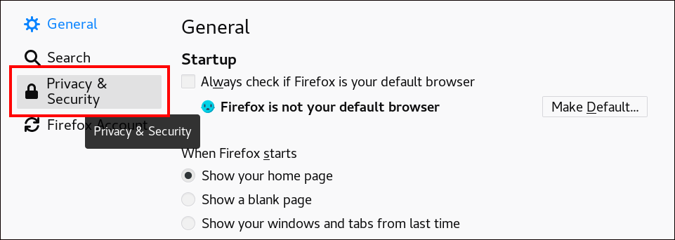 
2. Click View Certificates.
   
   **View Certificates in Privacy and Security**
   
   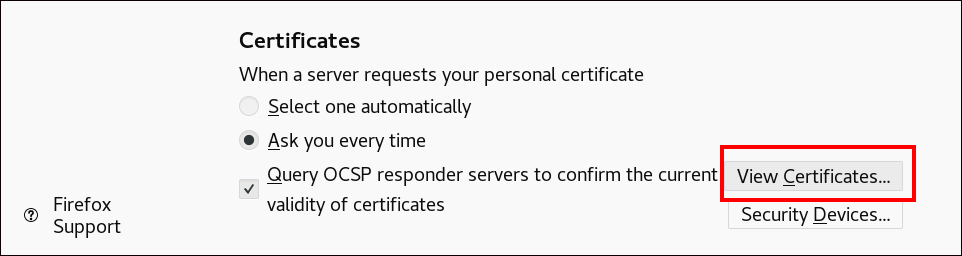 
3. In the `Your Certificates` tab, click Import. Locate and open the certificate of the user in the PKCS12 format, then click OK and OK.
4. Make sure that the Identity Management Certificate Authority is recognized by Firefox as a trusted authority:
   
   1. Save the IdM CA certificate locally:
      
      - Navigate to the IdM web UI by writing the name of your IdM server in the Firefox address bar. Click `Advanced` on the Insecure Connection warning page.
        
        **Insecure Connection**
        
        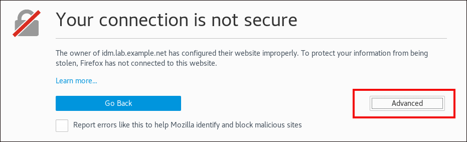 
      - `Add Exception`. Click `View`.
        
        **View the Details of a Certificate**
        
        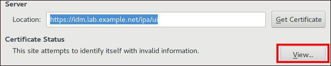 
      - In the `Details` tab, highlight the `Certificate Authority` fields.
        
        **Exporting the CA Certificate**
        
        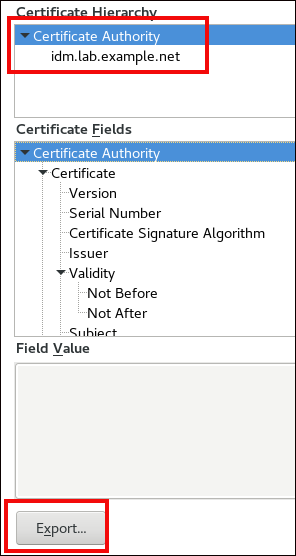 
      - Click Export. Save the CA certificate, for example as the `CertificateAuthority.crt` file, then click Close, and Cancel.
   2. Import the IdM CA certificate to Firefox as a trusted certificate authority certificate:
      
      - Open Firefox, navigate to Preferences and click Privacy & Security.
        
        **Privacy and Security section in Preferences**
        
         
      - Click View Certificates.
        
        **View Certificates in Privacy and Security**
        
         
      - In the `Authorities` tab, click Import. Locate and open the CA certificate that you saved in the previous step in the `CertificateAuthority.crt` file. Trust the certificate to identify websites, then click OK and OK.
5. Continue to [Authenticating to the Identity Management Web UI with a Certificate as an Identity Management User](#authenticating-to-the-identity-management-web-ui-with-a-certificate-as-an-identity-management-user "16.5. Authenticating to the Identity Management Web UI with a Certificate as an Identity Management User").

<h3 id="authenticating-to-the-identity-management-web-ui-with-a-certificate-as-an-identity-management-user">16.5. Authenticating to the Identity Management Web UI with a Certificate as an Identity Management User</h3>

Access the IdM Web UI securely by selecting the certificate login option. The browser presents the imported client certificate to the server, authenticating the user without requiring a password.

**Procedure**

1. In the browser, navigate to the IdM web UI at, for example, `https:`//`server.idm.example.com/ipa/ui`.
2. Click **Login Using Certificate**.
   
   **Login Using Certificate** button in the IdM web UI
   
   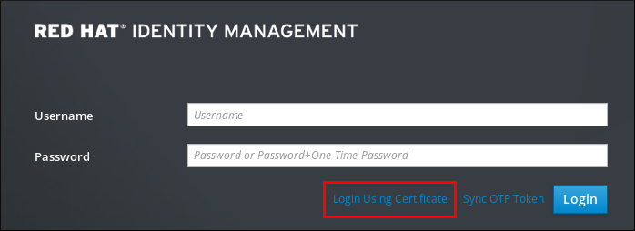 
3. The user’s certificate should already be selected. Uncheck **Remember this decision**, then click **OK**.
   
   You are now authenticated as the user who corresponds to the certificate.

**Additional resources**

- [Configuring Identity Management for smart card authentication](https://docs.redhat.com/en/documentation/red_hat_enterprise_linux/10/html/managing_smart_card_authentication/configuring-identity-management-for-smart-card-authentication)

<h3 id="configuring-an-idm-client-to-enable-authenticating-to-the-cli-using-a-certificate">16.6. Configuring an IdM client to enable authenticating to the CLI using a certificate</h3>

To make certificate authentication work for an IdM user in the Command Line Interface (CLI) of your IdM client, import the IdM user’s certificate and the private key to the IdM client. For details on creating and transferring the user certificate, see [Requesting a new user certificate and exporting it to the client](#requesting-a-new-user-certificate-and-exporting-it-to-the-client "16.2. Requesting a new user certificate and exporting it to the client").

**Procedure**

- Log into the IdM client and have the .p12 file containing the user’s certificate and the private key ready. To obtain and cache the Kerberos ticket granting ticket (TGT), run the `kinit` command with the user’s principal, using the `-X` option with the `X509_username:/path/to/file.p12` attribute to specify where to find the user’s X509 identity information. For example, to obtain the TGT for `idm_user` using the user’s identity information stored in the `~/idm_user.p12` file:
  
  ```
  kinit -X X509_idm_user='PKCS12:~/idm_user.p12' idm_user
  ```
  
  ```plaintext
  $ kinit -X X509_idm_user='PKCS12:~/idm_user.p12' idm_user
  ```
  
  Note
  
  The command also supports the .pem file format: **kinit -X X509\_username='FILE:/path/to/cert.pem,/path/to/key' user\_principal**

<h2 id="using-idm-ca-renewal-server">Chapter 17. Using IdM CA renewal server</h2>

A single Identity Management (IdM) CA renewal server manages the lifecycle of shared system certificates within IdM. This designated node renews critical credentials and replicates them to other CA servers, ensuring consistency and preventing authentication failures across the topology.

<h3 id="explanation-of-idm-ca-renewal-server">17.1. Explanation of IdM CA renewal server</h3>

In an Identity Management (IdM) deployment that uses an embedded certificate authority (CA), the CA renewal server maintains and renews IdM system certificates. It ensures robust IdM deployments.

IdM system certificates include:

- `IdM CA` certificate
- `OCSP` signing certificate
- `IdM CA subsystem` certificates
- `IdM CA audit signing` certificate
- `IdM renewal agent` (RA) certificate
- `KRA` transport and storage certificates

What characterizes system certificates is that their keys are shared by all CA replicas. In contrast, the IdM service certificates (for example, `LDAP`, `HTTP` and `PKINIT` certificates), have different keypairs and subject names on different IdM CA servers.

In IdM topology, by default, the first IdM CA server is the CA renewal server.

Note

In upstream documentation, the IdM CA is called `Dogtag`.

The role of the CA renewal server

The `IdM CA`, `IdM CA subsystem`, and `IdM RA` certificates are crucial for IdM deployment. Each certificate is stored in an NSS database in the `/etc/pki/pki-tomcat/` directory and also as an LDAP database entry. The certificate stored in LDAP must match the certificate stored in the NSS database. If they do not match, authentication failures occur between the IdM framework and IdM CA, and between IdM CA and LDAP.

All IdM CA replicas have tracking requests for every system certificate. If an IdM deployment with integrated CA does not contain a CA renewal server, each IdM CA server requests the renewal of system certificates independently. This results in different CA replicas having various system certificates and authentication failures occurring.

Appointing one CA replica as the renewal server allows the system certificates to be renewed exactly once, when required, and thus prevents authentication failures.

The role of the `certmonger` service on CA replicas

The `certmonger` service running on all IdM CA replicas uses the `dogtag-ipa-ca-renew-agent` renewal helper to keep track of IdM system certificates. The renewal helper program reads the CA renewal server configuration. On each CA replica that is not the CA renewal server, the renewal helper retrieves the latest system certificates from the `ca_renewal` LDAP entries. Due to non-determinism in when exactly `certmonger` renewal attempts occur, the `dogtag-ipa-ca-renew-agent` helper sometimes attempts to update a system certificate before the CA renewal server has actually renewed the certificate. If this happens, the old, soon-to-expire certificate is returned to the `certmonger` service on the CA replica. The `certmonger` service, realizing it is the same certificate that is already stored in its database, keeps attempting to renew the certificate with some delay between individual attempts until it can retrieve the updated certificate from the CA renewal server.

The correct functioning of IdM CA renewal server

An IdM deployment with an embedded CA is an IdM deployment that was installed with an IdM CA - or whose IdM CA server was installed later. An IdM deployment with an embedded CA must at all times have exactly one CA replica configured as the renewal server. The renewal server must be online and fully functional, and must replicate properly with the other servers.

If the current CA renewal server is being deleted using the `ipa server-del`, `ipa-replica-manage del`, `ipa-csreplica-manage del` or `ipa-server-install --uninstall` commands, another CA replica is automatically assigned as the CA renewal server. This policy ensures that the renewal server configuration remains valid.

This policy does not cover the following situations:

- **Offline renewal server**
  
  If the renewal server is offline for an extended duration, it may miss a renewal window. In this situation, all nonrenewal CA servers keep reinstalling the current system certificates until the certificates expire. When this occurs, the IdM deployment is disrupted because even one expired certificate can cause renewal failures for other certificates.
- **Replication problems**
  
  If replication problems exist between the renewal server and other CA replicas, renewal might succeed, but the other CA replicas might not be able to retrieve the updated certificates before they expire.
  
  To prevent this situation, make sure that your replication agreements are working correctly. For details, see [general](https://docs.redhat.com/en/documentation/red_hat_enterprise_linux/7/html/linux_domain_identity_authentication_and_policy_guide/trouble-gen-replication) or [specific](https://docs.redhat.com/en/documentation/red_hat_enterprise_linux/7/html/linux_domain_identity_authentication_and_policy_guide/trouble-replica) replication troubleshooting guidelines in the RHEL 7 *Linux Domain Identity, Authentication, and Policy Guide*.

<h3 id="changing-and-resetting-idm-ca-renewal-server">17.2. Changing and resetting IdM CA renewal server</h3>

When a certificate authority (CA) renewal server is being decommissioned, Identity Management (IdM) automatically selects a new CA renewal server from the list of IdM CA servers. The system administrator cannot influence the selection.

To be able to select the new IdM CA renewal server, the system administrator must perform the replacement manually. Choose the new CA renewal server before starting the process of decommissioning the current renewal server.

If the current CA renewal server configuration is invalid, reset the IdM CA renewal server.

Complete this procedure to change or reset the CA renewal server.

**Prerequisites**

- You have the IdM administrator credentials:
  
  ```
  kinit admin
  ```
  
  ```plaintext
  $ kinit admin
  ```
  
  ```
  Password for admin@IDM.EXAMPLE.COM:
  ```
  
  ```plaintext
  Password for admin@IDM.EXAMPLE.COM:
  ```

**Procedure**

1. Optional: To find out which IdM servers in the deployment have the CA role necessary to be eligible to become the new CA renewal server:
   
   ```
   ipa server-role-find --role 'CA server'
   ```
   
   ```plaintext
   $ ipa server-role-find --role 'CA server'
   ```
   
   ```
   ----------------------
   2 server roles matched
   ----------------------
     Server name: server.idm.example.com
     Role name: CA server
     Role status: enabled
   
     Server name: replica.idm.example.com
     Role name: CA server
     Role status: enabled
   ----------------------------
   Number of entries returned 2
   ----------------------------
   ```
   
   ```plaintext
   ----------------------
   2 server roles matched
   ----------------------
     Server name: server.idm.example.com
     Role name: CA server
     Role status: enabled
   
     Server name: replica.idm.example.com
     Role name: CA server
     Role status: enabled
   ----------------------------
   Number of entries returned 2
   ----------------------------
   ```
   
   There are two CA servers in the deployment.
2. Optional: To find out which CA server is the current CA renewal server, enter:
   
   ```
   ipa config-show | grep 'CA renewal'
   ```
   
   ```plaintext
   $ ipa config-show | grep 'CA renewal'
   ```
   
   ```
     IPA CA renewal master: server.idm.example.com
   ```
   
   ```plaintext
     IPA CA renewal master: server.idm.example.com
   ```
   
   The current renewal server is `server.idm.example.com`.
3. To change the renewal server configuration, use the `ipa config-mod` utility with the `--ca-renewal-master-server` option:
   
   ```
   ipa config-mod --ca-renewal-master-server replica.idm.example.com | grep 'CA renewal'
   ```
   
   ```plaintext
   $ ipa config-mod --ca-renewal-master-server replica.idm.example.com | grep 'CA renewal'
   ```
   
   ```
     IPA CA renewal master: replica.idm.example.com
   ```
   
   ```plaintext
     IPA CA renewal master: replica.idm.example.com
   ```
   
   Important
   
   You can also switch to a new CA renewal server using:
   
   - The `ipa-cacert-manage --renew` command. This command both renews the CA certificate *and* makes the CA server on which you execute the command the new CA renewal server.
   - The `ipa-cert-fix` command. This command recovers the deployment when expired certificates are causing failures. It also makes the CA server on which you execute the command the new CA renewal server.

<h2 id="managing-externally-signed-ca-certificates">Chapter 18. Managing externally-signed CA certificates</h2>

Identity Management (IdM) provides different types of certificate authority (CA) configurations. You can choose to install IdM with an integrated CA or with an external CA. You must specify the type of CA you are using during the installation. However, once installed you can move from an externally-signed CA to a self-signed CA and vice versa. Additionally, while a self-signed CA is automatically renewed, you must ensure that you renew your externally-signed CA certificate. Refer to the relevant sections as required to manage your externally-signed CA certificates.

- Installing IdM with an externally-signed CA:
  
  - [Installing an IdM server with integrated DNS and with an external CA as the root CA.](https://docs.redhat.com/en/documentation/red_hat_enterprise_linux/10/html/installing_identity_management/installing-an-idm-server-with-integrated-dns-with-an-external-ca-as-the-root-ca)
  - [Installing an IdM server without integrated DNS and with an external CA as the root CA.](https://docs.redhat.com/en/documentation/red_hat_enterprise_linux/10/html/installing_identity_management/installing-an-idm-server-without-integrated-dns-with-an-external-ca-as-the-root-ca)
- [Switching from an externally-signed CA to a self-signed CA.](#switching-from-an-externally-signed-to-a-self-signed-ca-in-idm "18.1. Switching from an externally-signed to a self-signed CA in IdM")
- [Switching from a self-signed CA to an externally-signed CA.](#switching-from-a-self-signed-to-an-externally-signed-ca-in-idm "18.2. Switching from a self-signed to an externally-signed CA in IdM")
- [Renewing the externally-signed CA certificate.](#renewing-the-idm-ca-renewal-server-certificate-using-an-external-ca "18.3. Renewing the IdM CA renewal server certificate using an external CA")
- [Updating the external CA public certificate in IdM.](#updating-the-external-ca-public-certificate-in-idm "18.4. Updating the external CA public certificate in IdM")

<h3 id="switching-from-an-externally-signed-to-a-self-signed-ca-in-idm">18.1. Switching from an externally-signed to a self-signed CA in IdM</h3>

You can switch from an externally-signed to a self-signed certificate of the Identity Management (IdM) certificate authority (CA). With a self-signed CA, the renewal of the CA certificate is managed automatically: a system administrator does not need to submit a certificate signing request (CSR) to an external authority.

Switching from an externally-signed to a self-signed CA replaces only the CA certificate. The certificates signed by the previous CA are still valid and still in use. For example, the certificate chain for the `LDAP` certificate remains unchanged even after you have moved to a self-signed CA:

```
external_CA certificate > IdM CA certificate > LDAP certificate
```

```plaintext
external_CA certificate > IdM CA certificate > LDAP certificate
```

**Prerequisites**

- You have `root` access to the IdM CA renewal server and all IdM clients and servers.

**Procedure**

1. On the IdM CA renewal server, renew the CA certificate as self-signed:
   
   ```
   ipa-cacert-manage renew --self-signed
   ```
   
   ```plaintext
   # ipa-cacert-manage renew --self-signed
   ```
   
   ```
   Renewing CA certificate, please wait
   CA certificate successfully renewed
   The ipa-cacert-manage command was successful
   ```
   
   ```plaintext
   Renewing CA certificate, please wait
   CA certificate successfully renewed
   The ipa-cacert-manage command was successful
   ```
2. `SSH` to all the remaining IdM servers and clients as `root`. For example:
   
   ```
   ssh root@idmclient01.idm.example.com
   ```
   
   ```plaintext
   # ssh root@idmclient01.idm.example.com
   ```
3. On the IdM client, update the local IdM certificate databases with the certificates from the server:
   
   ```
   ipa-certupdate
   ```
   
   ```plaintext
   [idmclient01 ~]# ipa-certupdate
   ```
   
   ```
   Systemwide CA database updated.
   Systemwide CA database updated.
   The ipa-certupdate command was successful
   ```
   
   ```plaintext
   Systemwide CA database updated.
   Systemwide CA database updated.
   The ipa-certupdate command was successful
   ```

**Verification**

- To check if your update has been successful and the new CA certificate has been added to the `/etc/ipa/ca.crt` file:
  
  ```
  openssl crl2pkcs7 -nocrl -certfile /etc/ipa/ca.crt | openssl pkcs7 -print_certs -text -noout
  ```
  
  ```plaintext
  [idmclient01 ~]$ openssl crl2pkcs7 -nocrl -certfile /etc/ipa/ca.crt | openssl pkcs7 -print_certs -text -noout
  ```
  
  ```
  [...]
  Certificate:
      Data:
          Version: 3 (0x2)
          Serial Number: 39 (0x27)
          Signature Algorithm: sha256WithRSAEncryption
          Issuer: O=IDM.EXAMPLE.COM, CN=Certificate Authority
          Validity
              Not Before: Jul  1 16:32:45 2019 GMT
              Not After : Jul  1 16:32:45 2039 GMT
          Subject: O=IDM.EXAMPLE.COM, CN=Certificate Authority
  [...]
  ```
  
  ```plaintext
  [...]
  Certificate:
      Data:
          Version: 3 (0x2)
          Serial Number: 39 (0x27)
          Signature Algorithm: sha256WithRSAEncryption
          Issuer: O=IDM.EXAMPLE.COM, CN=Certificate Authority
          Validity
              Not Before: Jul  1 16:32:45 2019 GMT
              Not After : Jul  1 16:32:45 2039 GMT
          Subject: O=IDM.EXAMPLE.COM, CN=Certificate Authority
  [...]
  ```
  
  The output shows that the update has been successful as the new CA certificate is listed with the older CA certificates.

<h3 id="switching-from-a-self-signed-to-an-externally-signed-ca-in-idm">18.2. Switching from a self-signed to an externally-signed CA in IdM</h3>

You can switch from a self-signed CA to an externally-signed CA in IdM. Once you switch to an externally-signed CA in IdM, your IdM CA server becomes a subCA of the external CA. Also, the renewal of the CA certificate is not managed automatically and a system administrator must submit a certificate signing request (CSR) to the external authority.

To switch to an externally-signed CA, a CSR must be signed by the external CA. Follow the steps in [Renewing the IdM CA renewal server certificate using an external CA](#renewing-the-idm-ca-renewal-server-certificate-using-an-external-ca "18.3. Renewing the IdM CA renewal server certificate using an external CA") to switch to a self-signed CA in IdM.

<h3 id="renewing-the-idm-ca-renewal-server-certificate-using-an-external-ca">18.3. Renewing the IdM CA renewal server certificate using an external CA</h3>

Renew the Identity Management (IdM) certificate authority (CA) certificate using an external CA to sign the certificate signing request (CSR). In this configuration, your IdM CA server is a subCA of the external CA. The external CA can, but does not have to, be an Active Directory Certificate Server (AD CS).

If the external certificate authority is AD CS, you can specify the template you want for the IdM CA certificate in the CSR. A certificate template defines the policies and rules that a CA uses when a certificate request is received. Certificate templates in AD correspond to certificate profiles in IdM.

You can define a specific AD CS template by its Object Identifier (OID). OIDs are unique numeric values issued by various issuing authorities to uniquely identify data elements, syntaxes, and other parts of distributed applications.

Alternatively, you can define a specific AD CS template by its name. For example, the name of the default profile used in a CSR submitted by an IdM CA to an AD CS is `subCA`.

To define a profile by specifying its OID or name in the CSR, use the `external-ca-profile` option. For details, see the `ipa-cacert-manage` man page on your system.

Apart from using a ready-made certificate template, you can also create a custom certificate template in the AD CS, and use it in the CSR.

Complete this procedure to renew the certificate of the IdM CA with external signing, regardless of whether current CA certificate is self-signed or externally-signed.

**Prerequisites**

- You have root access to the IdM CA renewal server.

**Procedure**

1. Create a CSR to be submitted to the external CA:
   
   - If the external CA is an AD CS, use the `--external-ca-type=ms-cs` option. If you want a different template than the default `subCA` template, specify it using the `--external-ca-profile` option:
     
     ```
     ipa-cacert-manage renew --external-ca --external-ca-type=ms-cs [--external-ca-profile=PROFILE]
     ```
     
     ```plaintext
     # ipa-cacert-manage renew --external-ca --external-ca-type=ms-cs [--external-ca-profile=PROFILE]
     ```
     
     ```
     Exporting CA certificate signing request, please wait
     The next step is to get /var/lib/ipa/ca.csr signed by your CA and re-run ipa-cacert-manage as:
     ipa-cacert-manage renew --external-cert-file=/path/to/signed_certificate --external-cert-file=/path/to/external_ca_certificate
     The ipa-cacert-manage command was successful
     ```
     
     ```plaintext
     Exporting CA certificate signing request, please wait
     The next step is to get /var/lib/ipa/ca.csr signed by your CA and re-run ipa-cacert-manage as:
     ipa-cacert-manage renew --external-cert-file=/path/to/signed_certificate --external-cert-file=/path/to/external_ca_certificate
     The ipa-cacert-manage command was successful
     ```
   - If the external CA is not an AD CS:
     
     ```
     ipa-cacert-manage renew --external-ca
     ```
     
     ```plaintext
     # ipa-cacert-manage renew --external-ca
     ```
     
     ```
     Exporting CA certificate signing request, please wait
     The next step is to get /var/lib/ipa/ca.csr signed by your CA and re-run ipa-cacert-manage as:
     ipa-cacert-manage renew --external-cert-file=/path/to/signed_certificate --external-cert-file=/path/to/external_ca_certificate
     The ipa-cacert-manage command was successful
     ```
     
     ```plaintext
     Exporting CA certificate signing request, please wait
     The next step is to get /var/lib/ipa/ca.csr signed by your CA and re-run ipa-cacert-manage as:
     ipa-cacert-manage renew --external-cert-file=/path/to/signed_certificate --external-cert-file=/path/to/external_ca_certificate
     The ipa-cacert-manage command was successful
     ```
     
     The output shows that a CSR has been created and is stored in the `/var/lib/ipa/ca.csr` file.
2. Submit the CSR located in `/var/lib/ipa/ca.csr` to the external CA. The process differs depending on the service to be used as the external CA.
3. Retrieve the issued certificate and the CA certificate chain for the issuing CA in a base 64-encoded blob, which is:
   
   - A PEM file if the external CA is not an AD CS.
   - A Base\_64 certificate if the external CA is an AD CS.
     
     The process differs for every certificate service. Usually, a download link on a web page or in the notification email allows the administrator to download all the required certificates.
     
     If the external CA is an AD CS and you have submitted the CSR with a known template through the Microsoft Windows Certification Authority management window, the AD CS issues the certificate immediately and the Save Certificate dialog appears in the AD CS web interface, asking where to save the issued certificate.
4. Run the `ipa-cacert-manage renew` command again, adding all the CA certificate files required to supply a full certificate chain. Specify as many files as you need, using the `--external-cert-file` option multiple times:
   
   ```
   ipa-cacert-manage renew --external-cert-file=/path/to/signed_certificate --external-cert-file=/path/to/external_ca_certificate_1 --external-cert-file=/path/to/external_ca_certificate_2
   ```
   
   ```plaintext
   # ipa-cacert-manage renew --external-cert-file=/path/to/signed_certificate --external-cert-file=/path/to/external_ca_certificate_1 --external-cert-file=/path/to/external_ca_certificate_2
   ```
5. On all the IdM servers and clients, update the local IdM certificate databases with the certificates from the server:
   
   ```
   ipa-certupdate
   ```
   
   ```plaintext
   [client ~]$ ipa-certupdate
   ```
   
   ```
   Systemwide CA database updated.
   Systemwide CA database updated.
   The ipa-certupdate command was successful
   ```
   
   ```plaintext
   Systemwide CA database updated.
   Systemwide CA database updated.
   The ipa-certupdate command was successful
   ```

**Verification**

- To check if your update has been successful and the new CA certificate has been added to the `/etc/ipa/ca.crt` file:
  
  ```
  openssl crl2pkcs7 -nocrl -certfile /etc/ipa/ca.crt | openssl pkcs7 -print_certs -text -noout
  ```
  
  ```plaintext
  [client ~]$ openssl crl2pkcs7 -nocrl -certfile /etc/ipa/ca.crt | openssl pkcs7 -print_certs -text -noout
  ```
  
  ```
  [...]
  Certificate:
      Data:
          Version: 3 (0x2)
          Serial Number: 39 (0x27)
          Signature Algorithm: sha256WithRSAEncryption
          Issuer: O=IDM.EXAMPLE.COM, CN=Certificate Authority
          Validity
              Not Before: Jul  1 16:32:45 2019 GMT
              Not After : Jul  1 16:32:45 2039 GMT
          Subject: O=IDM.EXAMPLE.COM, CN=Certificate Authority
  [...]
  ```
  
  ```plaintext
  [...]
  Certificate:
      Data:
          Version: 3 (0x2)
          Serial Number: 39 (0x27)
          Signature Algorithm: sha256WithRSAEncryption
          Issuer: O=IDM.EXAMPLE.COM, CN=Certificate Authority
          Validity
              Not Before: Jul  1 16:32:45 2019 GMT
              Not After : Jul  1 16:32:45 2039 GMT
          Subject: O=IDM.EXAMPLE.COM, CN=Certificate Authority
  [...]
  ```
  
  The output shows that the update has been successful as the new CA certificate is listed with the older CA certificates.

<h3 id="updating-the-external-ca-public-certificate-in-idm">18.4. Updating the external CA public certificate in IdM</h3>

Updating the external CA public certificate ensures the IdM topology recognizes a renewed root authority. Distributing the new certificate chain across all servers and clients maintains trust and prevents authentication failures throughout the environment.

In this configuration, your IdM CA renewal server is a subCA of the external CA. When the external CA is renewed, for example, if it reached its expiration date, you must update its certificate in your IdM topology.

**Prerequisites**

- Run this in a test environment with multiple servers and clients to ensure the order of operations and timing is correct.
- Ensure that you have the newly renewed external CA public certificate and all the certificates composing its chain in separate `.crt` files.

**Procedure**

1. Install the new external CA certificate and the complete CA certificate chain of the external CA as additional CA certificates to IdM. The system accepts certificate files in PEM, DER, PKCS#7, PKCS#8, raw private keys and PKCS#12 formats.
   
   1. On one of the IdM servers in your topology, add the renewed external CA certificate and certificate chain from the `.crt` file to IdM:
      
      ```
      ipa-cacert-manage install /path/to/ca.crt
      ```
      
      ```plaintext
      # ipa-cacert-manage install /path/to/ca.crt
      ```
      
      The CA certificate is installed into LDAP storage, `cn=certificates,cn=ipa,cn=etc,dc=realm,dc=name`.
   2. Install the rest of the certificate chain as additional CA certificates into IdM. Because the `ipa-cacert-manage install` command reads only the first certificate in a file, you must install the full CA chain one certificate at a time. For example, if the chain includes two certificates, save each one in a separate file and run `ipa-cacert-manage install` individually for each file:
      
      ```
      ipa-cacert-manage install /path/to/intermediate-ca.crt
      ```
      
      ```plaintext
      # ipa-cacert-manage install /path/to/intermediate-ca.crt
      ```
      
      ```
      ipa-cacert-manage install /path/to/root-ca.crt
      ```
      
      ```plaintext
      # ipa-cacert-manage install /path/to/root-ca.crt
      ```
2. Update all other IdM servers in your topology by running `ipa-certupdate` to sync local NSS databases and `/etc/ipa/ca.crt` with LDAP:
   
   ```
   ipa-certupdate
   ```
   
   ```plaintext
   # ipa-certupdate
   ```
3. After updating the IdM servers, update the external CA certificate on all IdM clients.
   
   ```
   ipa-certupdate
   ```
   
   ```plaintext
   # ipa-certupdate
   ```
   
   Retrieves all data from IdM LDAP storage and puts it in the main certificate chain in `/etc/ipa/ca.crt`.

**Verification**

1. To check if your update has been successful and the new external CA certificate has been added to the `/etc/ipa/ca.crt` file:
   
   ```
   openssl crl2pkcs7 -nocrl -certfile /etc/ipa/ca.crt | openssl pkcs7 -print_certs -text -noout
   ```
   
   ```plaintext
   [client ~]$ openssl crl2pkcs7 -nocrl -certfile /etc/ipa/ca.crt | openssl pkcs7 -print_certs -text -noout
   ```
   
   ```
   [...]
   Certificate:
       Data:
           Version: 3 (0x2)
           Serial Number: 39 (0x27)
           Signature Algorithm: sha256WithRSAEncryption
           Issuer: O=IDM.EXAMPLE.COM, CN=Certificate Authority
           Validity
               Not Before: Jul  1 16:32:45 2019 GMT
               Not After : Jul  1 16:32:45 2039 GMT
           Subject: O=IDM.EXAMPLE.COM, CN=Certificate Authority
   [...]
   ```
   
   ```plaintext
   [...]
   Certificate:
       Data:
           Version: 3 (0x2)
           Serial Number: 39 (0x27)
           Signature Algorithm: sha256WithRSAEncryption
           Issuer: O=IDM.EXAMPLE.COM, CN=Certificate Authority
           Validity
               Not Before: Jul  1 16:32:45 2019 GMT
               Not After : Jul  1 16:32:45 2039 GMT
           Subject: O=IDM.EXAMPLE.COM, CN=Certificate Authority
   [...]
   ```
   
   The output shows that the update has been successful as the new CA certificate is listed with the older CA certificates.

<h2 id="renewing-expired-system-certificates-when-idm-is-offline">Chapter 19. Renewing expired system certificates when IdM is offline</h2>

Expired system certificates prevent Identity Management (IdM) services from starting. Administrators use the `ipa-cert-fix` tool to renew these credentials when the system is offline, ensuring the LDAP service is active before initiating the repair.

<h3 id="prerequisites\_6">19.1. Prerequisites</h3>

- Ensure that the LDAP service is running by entering the `ipactl start --ignore-service-failures` command on the host.

<h3 id="renewing-expired-system-certificates-on-a-ca-renewal-server">19.2. Renewing expired system certificates on a CA renewal server</h3>

The `ipa-cert-fix` utility analyzes and renews expired certificates preventing system startup. Create a full system backup before proceeding, as this tool modifies the LDAP database and NSS databases irreversibly.

Important

If you run the `ipa-cert-fix` tool on a CA (Certificate Authority) host that is not the CA renewal server, and the utility renews shared certificates, that host automatically becomes the new CA renewal server in the domain. There must always be only one CA renewal server in the domain to avoid inconsistencies.

**Prerequisites**

- You must be logged in to the server as the administrator. .Procedure
  
  1. Optional: Backup the system. This is heavily recommended, as `ipa-cert-fix` makes irreversible changes to `nssdbs`. Because `ipa-cert-fix` also makes changes to the LDAP, it is recommended to backup the entire cluster as well.
  2. Start the `ipa-cert-fix` tool to analyze the system and list expired certificates that require renewal:
     
     ```
     ipa-cert-fix
     ```
     
     ```plaintext
     # ipa-cert-fix
     ```
     
     ```
     ...
     The following certificates will be renewed:
     
     Dogtag sslserver certificate:
       Subject: CN=ca1.example.com,O=EXAMPLE.COM 201905222205
       Serial:  13
       Expires: 2019-05-12 05:55:47
     ...
     Enter "yes" to proceed:
     ```
     
     ```plaintext
     ...
     The following certificates will be renewed:
     
     Dogtag sslserver certificate:
       Subject: CN=ca1.example.com,O=EXAMPLE.COM 201905222205
       Serial:  13
       Expires: 2019-05-12 05:55:47
     ...
     Enter "yes" to proceed:
     ```
  3. Enter `yes` to start the renewal process:
     
     ```
     Enter "yes" to proceed: true
     ```
     
     ```plaintext
     Enter "yes" to proceed: true
     ```
     
     ```
     Proceeding.
     Renewed Dogtag sslserver certificate:
       Subject: CN=ca1.example.com,O=EXAMPLE.COM 201905222205
       Serial:  268369925
       Expires: 2021-08-14 02:19:33
     ...
     
     Becoming renewal master.
     The ipa-cert-fix command was successful
     ```
     
     ```plaintext
     Proceeding.
     Renewed Dogtag sslserver certificate:
       Subject: CN=ca1.example.com,O=EXAMPLE.COM 201905222205
       Serial:  268369925
       Expires: 2021-08-14 02:19:33
     ...
     
     Becoming renewal master.
     The ipa-cert-fix command was successful
     ```
     
     It can take up to one minute before `ipa-cert-fix` renews all expired certificates.

**Verification**

- Verify that all services are now running:
  
  ```
  ipactl status
  ```
  
  ```plaintext
  # ipactl status
  ```
  
  ```
  Directory Service: RUNNING
  krb5kdc Service: RUNNING
  kadmin Service: RUNNING
  httpd Service: RUNNING
  ipa-custodia Service: RUNNING
  pki-tomcatd Service: RUNNING
  ipa-otpd Service: RUNNING
  ipa: INFO: The ipactl command was successful
  ```
  
  ```plaintext
  Directory Service: RUNNING
  krb5kdc Service: RUNNING
  kadmin Service: RUNNING
  httpd Service: RUNNING
  ipa-custodia Service: RUNNING
  pki-tomcatd Service: RUNNING
  ipa-otpd Service: RUNNING
  ipa: INFO: The ipactl command was successful
  ```

At this point, certificates have been renewed and services are running. The next step is to check other servers in the IdM domain.

**Next steps**

If you need to repair certificates across multiple CA servers:

1. After ensuring that LDAP replication is working across the topology, first run `ipa-cert-fix` on one CA server, according to the above procedure.
2. Before you run `ipa-cert-fix` on another CA server, trigger Certmonger renewals for shared certificates via `getcert-resubmit` (on the other CA server), to avoid unnecessary renewal of shared certificates.

<h3 id="verifying-other-idm-servers-in-the-idm-domain-after-renewal">19.3. Verifying other IdM servers in the IdM domain after renewal</h3>

After restoring the renewal server, force a restart of all other domain replicas. Verify that `certmonger` successfully retrieved the new certificates. If specific replicas remain unreachable, execute `ipa-cert-fix` locally on those hosts.

**Prerequisites**

- You must be logged in to the server as the administrator.

**Procedure**

1. Restart IdM with the `--force` parameter:
   
   ```
   ipactl restart --force
   ```
   
   ```plaintext
   # ipactl restart --force
   ```
   
   With the `--force` parameter, the `ipactl` utility ignores individual service startup failures. For example, if the server is also a CA with expired certificates, the `pki-tomcat` service fails to start. This is expected and ignored because of using the `--force` parameter.
2. After the restart, verify that the `certmonger` service renewed the certificates (certificate status says MONITORING):
   
   ```
   getcert list | egrep '^Request|status:|subject:'
   ```
   
   ```plaintext
   # getcert list | egrep '^Request|status:|subject:'
   ```
   
   ```
   ipactl restart --force
   ```
   
   ```plaintext
   # ipactl restart --force
   ```
   
   ```
   Request ID '20190522120745':
           status: MONITORING
           subject: CN=IPA RA,O=EXAMPLE.COM 201905222205
   Request ID '20190522120834':
           status: MONITORING
           subject: CN=Certificate Authority,O=EXAMPLE.COM 201905222205
   ...
   ```
   
   ```plaintext
   Request ID '20190522120745':
           status: MONITORING
           subject: CN=IPA RA,O=EXAMPLE.COM 201905222205
   Request ID '20190522120834':
           status: MONITORING
           subject: CN=Certificate Authority,O=EXAMPLE.COM 201905222205
   ...
   ```
   
   It can take some time before `certmonger` renews the shared certificates on the replica.
3. If the server is also a CA, the previous command reports `CA_UNREACHABLE` for the certificate the `pki-tomcat` service uses:
   
   ```
   Request ID '20190522120835':
           status: CA_UNREACHABLE
           subject: CN=ca2.example.com,O=EXAMPLE.COM 201905222205
   ...
   ```
   
   ```plaintext
   Request ID '20190522120835':
           status: CA_UNREACHABLE
           subject: CN=ca2.example.com,O=EXAMPLE.COM 201905222205
   ...
   ```
4. To renew this certificate, use the `ipa-cert-fix` utility:
   
   ```
   ipa-cert-fix
   ```
   
   ```plaintext
   # ipa-cert-fix
   ```
   
   ```
   ipactl restart --force
   ```
   
   ```plaintext
   # ipactl restart --force
   ```
   
   ```
   Dogtag sslserver certificate:
     Subject: CN=ca2.example.com,O=EXAMPLE.COM
     Serial:  3
     Expires: 2019-05-11 12:07:11
   
   Enter "yes" to proceed: true
   Proceeding.
   Renewed Dogtag sslserver certificate:
     Subject: CN=ca2.example.com,O=EXAMPLE.COM 201905222205
     Serial:  15
     Expires: 2019-08-14 04:25:05
   
   The ipa-cert-fix command was successful
   ```
   
   ```plaintext
   Dogtag sslserver certificate:
     Subject: CN=ca2.example.com,O=EXAMPLE.COM
     Serial:  3
     Expires: 2019-05-11 12:07:11
   
   Enter "yes" to proceed: true
   Proceeding.
   Renewed Dogtag sslserver certificate:
     Subject: CN=ca2.example.com,O=EXAMPLE.COM 201905222205
     Serial:  15
     Expires: 2019-08-14 04:25:05
   
   The ipa-cert-fix command was successful
   ```

<h2 id="replacing-the-web-server-and-ldap-server-certificates-if-they-have-not-yet-expired-on-an-idm-replica">Chapter 20. Replacing the web server and LDAP server certificates if they have not yet expired on an IdM replica</h2>

As an Identity Management (IdM) system administrator, you can manually replace the certificates used by the web (or `httpd`) and LDAP (or `Directory`) services running on an IdM server. This might be necessary if the certificates are nearing expiration and either the `certmonger` utility is not configured for automatic renewal, or the certificates are signed by an external certificate authority (CA).

The example describes how to install the certificates for the services running on the **server.idm.example.com** IdM server. You obtain the certificates from an external CA.

Note

The `httpd` and LDAP service certificates have different key pairs and subject names on different IdM servers and so you must renew the certificates on each IdM server individually.

**Prerequisites**

- On at least one other IdM replica in the topology with which the IdM server has a replication agreement, the web and LDAP certificates are still valid. This is a prerequisite for the `ipa-server-certinstall` command, which requires a `TLS` connection to communicate with other IdM replicas. If the certificates are invalid, the connection cannot be established, and the command fails. In that case, see [Replacing the web server and LDAP server certificates if they have expired in the whole IdM deployment](#replacing-the-web-server-and-ldap-server-certificates-if-they-have-expired-in-the-whole-idm-deployment "Chapter 21. Replacing the web server and LDAP server certificates if they have expired in the whole IdM deployment").
- You have `root` access to the IdM server.
- You know the `Directory Manager` password.
- If the new `httpd`/LDAP certificate is going to be signed by a different external CA than the old one, you have access to the files storing the CA certificate chain of the external CA.

**Procedure**

1. If the new `httpd`/LDAP certificate is going to be signed by a different CA than the old one, install the new external CA certificate and the whole CA certificate chain of the external CA as additional CA certificates to IdM. The files storing the certificates are accepted in PEM and DER certificate, PKCS#7 certificate chain, PKCS#8 and raw private key and PKCS#12 formats.
   
   1. Install the CA certificate:
      
      ```
      ipa-cacert-manage install /path/to/ca.crt
      ```
      
      ```plaintext
      # ipa-cacert-manage install /path/to/ca.crt
      ```
      
      Important
      
      If the new external CA certificate has the same subject as the old one but is different because it uses a different key, you can use it only if you have met the following conditions:
      
      - The two certificates have identical trust flags.
      - The CAs share the same nickname.
      - The X509 extensions listed in the certificate include the `Authority Key Identifier` (AKI) extension.
   2. Install the rest of the certificate chain as additional CA certificates into IdM. Because the `ipa-cacert-manage install` command reads only the first certificate in a file, you must install the full CA chain one certificate at a time. For example, if the chain includes two certificates, save each one in a separate file and run `ipa-cacert-manage install` individually for each file:
      
      ```
      ipa-cacert-manage install /path/to/intermediate-ca.crt
      ```
      
      ```plaintext
      # ipa-cacert-manage install /path/to/intermediate-ca.crt
      ```
      
      ```
      ipa-cacert-manage install /path/to/root-ca.crt
      ```
      
      ```plaintext
      # ipa-cacert-manage install /path/to/root-ca.crt
      ```
   3. Update the local IdM certificate databases with certificates from the certificate chain:
      
      ```
      ipa-certupdate
      ```
      
      ```plaintext
      # ipa-certupdate
      ```
2. Generate a private key and a certificate signing request (CSR) using the `OpenSSL` utility:
   
   ```
   openssl req -new -newkey rsa:4096 -days 365 -nodes -keyout new.key -out new.csr -addext "subjectAltName = DNS:server.idm.example.com" -subj '/CN=server.idm.example.com,O=IDM.EXAMPLE.COM'
   ```
   
   ```plaintext
   $ openssl req -new -newkey rsa:4096 -days 365 -nodes -keyout new.key -out new.csr -addext "subjectAltName = DNS:server.idm.example.com" -subj '/CN=server.idm.example.com,O=IDM.EXAMPLE.COM'
   ```
   
   Submit the CSR to the external CA. The process differs depending on the service to be used as the external CA. After the CA signs the certificate, import the certificate to the IdM server.
3. On the IdM server, replace the Apache web server’s old private key and certificate with the new key and the newly-signed certificate:
   
   ```
   ipa-server-certinstall -w --pin=password new.key new.crt
   ```
   
   ```plaintext
   # ipa-server-certinstall -w --pin=password new.key new.crt
   ```
   
   In the command above:
   
   - The `-w` option specifies that you are installing a certificate into the web server.
   - The `--pin` option specifies the password protecting the private key.
4. When prompted, enter the `Directory Manager` password.
5. Replace the LDAP server’s old private key and certificate with the new key and the newly-signed certificate:
   
   ```
   ipa-server-certinstall -d --pin=password new.key new.cert
   ```
   
   ```plaintext
   # ipa-server-certinstall -d --pin=password new.key new.cert
   ```
   
   In the command above:
   
   - The `-d` option specifies that you are installing a certificate into the LDAP server.
   - The `--pin` option specifies the password protecting the private key.
6. When prompted, enter the `Directory Manager` password.
7. Restart the `httpd` service:
   
   ```
   systemctl restart httpd.service
   ```
   
   ```plaintext
   # systemctl restart httpd.service
   ```
8. Restart the `Directory` service:
   
   ```
   systemctl restart dirsrv@IDM.EXAMPLE.COM.service
   ```
   
   ```plaintext
   # systemctl restart dirsrv@IDM.EXAMPLE.COM.service
   ```
9. If a subCA has been removed or replaced on the servers, update the clients:
   
   ```
   ipa-certupdate
   ```
   
   ```plaintext
   # ipa-certupdate
   ```

**Additional resources**

- [Converting certificate formats to work with IdM](https://docs.redhat.com/en/documentation/red_hat_enterprise_linux/10/html/managing_certificates_in_idm/converting-certificate-formats-to-work-with-idm)

<h2 id="replacing-the-web-server-and-ldap-server-certificates-if-they-have-expired-in-the-whole-idm-deployment">Chapter 21. Replacing the web server and LDAP server certificates if they have expired in the whole IdM deployment</h2>

Administrators must manually replace expired HTTP and LDAP certificates to restore system functionality. This recovery process involves generating new signing requests, obtaining external signatures, and installing the renewed credentials on every replica within the topology.

In an IdM deployment without an integrated certificate authority (CA), the `certmonger` service does not, by default, track IdM service certificates or provide expiration warnings. If the IdM system administrator does not manually configure certificate tracking or set up notifications, the certificates may expire without notice.

Follow this procedure to manually replace expired certificates for the `httpd` and LDAP services running on the **server.idm.example.com** IdM server with a valid certificate chain.

Note

The `httpd` and LDAP service certificates have different key pairs and subject names on different IdM servers. Therefore, you must renew the certificates on each IdM server individually.

**Prerequisites**

- The `httpd` and LDAP certificates have expired on *all* IdM replicas in the topology. If not, see [Replacing the web server and LDAP server certificates if they have not yet expired on an IdM replica](#replacing-the-web-server-and-ldap-server-certificates-if-they-have-not-yet-expired-on-an-idm-replica "Chapter 20. Replacing the web server and LDAP server certificates if they have not yet expired on an IdM replica").
- You have `root` access to the IdM server and replicas.
- You know the `Directory Manager` password.
- You have created backups of the following directories and files:
  
  - `/etc/dirsrv/slapd-IDM-EXAMPLE-COM/`
  - `/etc/httpd/alias`
  - `/var/lib/certmonger`
  - `/var/lib/ipa/certs/`
- If the new `httpd`/LDAP certificate is going to be signed by a different external CA than the old one, or if the already installed CA certificate is no longer valid, you have access to the files storing the CA certificate chain of the external CA.

**Procedure**

01. Optional: Perform a backup of `/var/lib/ipa/private` and `/var/lib/ipa/passwds`.
02. If you are not using the same certificate authority (CA) to sign the new certificates, or if the already installed CA certificate is no longer valid, update the information about the external CA in your local database with files that contain a valid CA certificate chain of the external CA. The files are accepted in PEM and DER certificate, PKCS#7 certificate chain, PKCS#8 and raw private key and PKCS#12 formats.
    
    1. Install the CA certificate:
       
       ```
       ipa-cacert-manage install /path/to/ca.crt
       ```
       
       ```plaintext
       # ipa-cacert-manage install /path/to/ca.crt
       ```
       
       Important
       
       If the new external CA certificate has the same subject as the old one but is different because it uses a different key, you can use it only if you have met the following conditions:
       
       - The two certificates have identical trust flags.
       - The CAs share the same nickname.
       - The X509 extensions listed in the certificate include the `Authority Key Identifier` (AKI) extension.
    2. Install the rest of the certificate chain as additional CA certificates into IdM. Because the `ipa-cacert-manage install` command reads only the first certificate in a file, you must install the full CA chain one certificate at a time. For example, if the chain includes two certificates, save each one in a separate file and run `ipa-cacert-manage install` individually for each file:
       
       ```
       ipa-cacert-manage install /path/to/intermediate-ca.crt
       ```
       
       ```plaintext
       # ipa-cacert-manage install /path/to/intermediate-ca.crt
       ```
       
       ```
       ipa-cacert-manage install /path/to/root-ca.crt
       ```
       
       ```plaintext
       # ipa-cacert-manage install /path/to/root-ca.crt
       ```
    3. Update the local IdM certificate databases with certificates from the certificate chain:
       
       ```
       ipa-certupdate
       ```
       
       ```plaintext
       # ipa-certupdate
       ```
03. Request the certificates for `httpd` and LDAP:
    
    1. Create a certificate signing request (CSR) for the Apache web server running on your IdM instances to your third party CA using the `OpenSSL` utility.
       
       - The creation of a new private key is optional. If you still have the original private key, you can use the `-in` option with the `openssl req` command to specify the input file name to read the request from:
         
         ```
         openssl req -new -nodes -in /var/lib/ipa/private/httpd.key -out /tmp/http.csr -addext 'subjectAltName = DNS:_server.idm.example.com_, otherName:1.3.6.1.4.1.311.20.2.3;UTF8:HTTP/server.idm.example.com@IDM.EXAMPLE.COM' -subj '/O=IDM.EXAMPLE.COM/CN=server.idm.example.com'
         ```
         
         ```plaintext
         $ openssl req -new -nodes -in /var/lib/ipa/private/httpd.key -out /tmp/http.csr -addext 'subjectAltName = DNS:_server.idm.example.com_, otherName:1.3.6.1.4.1.311.20.2.3;UTF8:HTTP/server.idm.example.com@IDM.EXAMPLE.COM' -subj '/O=IDM.EXAMPLE.COM/CN=server.idm.example.com'
         ```
       - If you want to create a new key:
         
         ```
         openssl req -new -newkey rsa:2048 -nodes -keyout /var/lib/ipa/private/httpd.key -out /tmp/http.csr -addext 'subjectAltName = DNS:server.idm.example.com, otherName:1.3.6.1.4.1.311.20.2.3;UTF8:HTTP/server.idm.example.com@IDM.EXAMPLE.COM' -subj '/O=IDM.EXAMPLE.COM/CN=server.idm.example.com'
         ```
         
         ```plaintext
         $ openssl req -new -newkey rsa:2048 -nodes -keyout /var/lib/ipa/private/httpd.key -out /tmp/http.csr -addext 'subjectAltName = DNS:server.idm.example.com, otherName:1.3.6.1.4.1.311.20.2.3;UTF8:HTTP/server.idm.example.com@IDM.EXAMPLE.COM' -subj '/O=IDM.EXAMPLE.COM/CN=server.idm.example.com'
         ```
    2. Create a certificate signing request (CSR) for the LDAP server running on your IdM instances to your third party CA using the `OpenSSL` utility:
       
       ```
       openssl req -new -newkey rsa:2048 -nodes -keyout ~/ldap.key -out /tmp/ldap.csr -addext 'subjectAltName = DNS:server.idm.example.com, otherName:1.3.6.1.4.1.311.20.2.3;UTF8:ldap/server.idm.example.com@IDM.EXAMPLE.COM' -subj '/O=IDM.EXAMPLE.COM/CN=server.idm.example.com'
       ```
       
       ```plaintext
       $ openssl req -new -newkey rsa:2048 -nodes -keyout ~/ldap.key -out /tmp/ldap.csr -addext 'subjectAltName = DNS:server.idm.example.com, otherName:1.3.6.1.4.1.311.20.2.3;UTF8:ldap/server.idm.example.com@IDM.EXAMPLE.COM' -subj '/O=IDM.EXAMPLE.COM/CN=server.idm.example.com'
       ```
    3. Submit the CSRs, **/tmp/http.csr** and **tmp/ldap.csr**, to the external CA, and obtain a certificate for `httpd` and a certificate for LDAP. The process differs depending on the service to be used as the external CA.
04. Install the certificate for `httpd` :
    
    ```
    cp /path/to/httpd.crt /var/lib/ipa/certs/
    ```
    
    ```plaintext
    # cp /path/to/httpd.crt /var/lib/ipa/certs/
    ```
05. Install the LDAP certificate into an NSS database:
    
    1. Optional: List the available certificates:
       
       ```
       certutil -d /etc/dirsrv/slapd-IDM-EXAMPLE-COM/ -L
       ```
       
       ```plaintext
       # certutil -d /etc/dirsrv/slapd-IDM-EXAMPLE-COM/ -L
       ```
       
       ```
       Certificate Nickname                                         Trust Attributes
                                                                    SSL,S/MIME,JAR/XPI
       
       Server-Cert                                                  u,u,u
       ```
       
       ```plaintext
       Certificate Nickname                                         Trust Attributes
                                                                    SSL,S/MIME,JAR/XPI
       
       Server-Cert                                                  u,u,u
       ```
       
       The default certificate nickname is **Server-Cert**, but it is possible that a different name was applied.
    2. Remove the old invalid certificate from the NSS database (`NSSDB`) by using the certificate nickname from the previous step:
       
       ```
       certutil -D -d /etc/dirsrv/slapd-IDM-EXAMPLE-COM/ -n 'Server-Cert' -f /etc/dirsrv/slapd-IDM-EXAMPLE-COM/pwdfile.txt
       ```
       
       ```plaintext
       # certutil -D -d /etc/dirsrv/slapd-IDM-EXAMPLE-COM/ -n 'Server-Cert' -f /etc/dirsrv/slapd-IDM-EXAMPLE-COM/pwdfile.txt
       ```
    3. Create a PKCS12 file to ease the import process into `NSSDB`:
       
       ```
       openssl pkcs12 -export -in ldap.crt -inkey ldap.key -out ldap.p12 -name Server-Cert
       ```
       
       ```plaintext
       # openssl pkcs12 -export -in ldap.crt -inkey ldap.key -out ldap.p12 -name Server-Cert
       ```
    4. Install the created PKCS#12 file into the `NSSDB`:
       
       ```
       pk12util -i ldap.p12 -d /etc/dirsrv/slapd-IDM-EXAMPLE-COM/ -k /etc/dirsrv/slapd-IDM-EXAMPLE-COM/pwdfile.txt
       ```
       
       ```plaintext
       # pk12util -i ldap.p12 -d /etc/dirsrv/slapd-IDM-EXAMPLE-COM/ -k /etc/dirsrv/slapd-IDM-EXAMPLE-COM/pwdfile.txt
       ```
    5. Check that the new certificate has been successfully imported:
       
       ```
       certutil -L -d /etc/dirsrv/slapd-IDM-EXAMPLE-COM/
       ```
       
       ```plaintext
       # certutil -L -d /etc/dirsrv/slapd-IDM-EXAMPLE-COM/
       ```
06. Restart the `httpd` service:
    
    ```
    systemctl restart httpd.service
    ```
    
    ```plaintext
    # systemctl restart httpd.service
    ```
07. Restart the `Directory` service:
    
    ```
    systemctl restart dirsrv@IDM-EXAMPLE-COM.service
    ```
    
    ```plaintext
    # systemctl restart dirsrv@IDM-EXAMPLE-COM.service
    ```
08. Perform all the previous steps on all your IdM replicas. This is a prerequisite for establishing `TLS` connections between the replicas.
09. Enroll the new certificates to LDAP storage:
    
    1. Replace the Apache web server’s old private key and certificate with the new key and the newly-signed certificate:
       
       ```
       ipa-server-certinstall -w --pin=password /var/lib/ipa/private/httpd.key /var/lib/ipa/certs/httpd.crt
       ```
       
       ```plaintext
       # ipa-server-certinstall -w --pin=password /var/lib/ipa/private/httpd.key /var/lib/ipa/certs/httpd.crt
       ```
       
       In the command above:
       
       - The `-w` option specifies that you are installing a certificate into the web server.
       - The `--pin` option specifies the password protecting the private key.
    2. When prompted, enter the `Directory Manager` password.
    3. Replace the LDAP server’s old private key and certificate with the new key and the newly-signed certificate:
       
       ```
       ipa-server-certinstall -d --pin=password /etc/dirsrv/slapd-IDM-EXAMPLE-COM/ldap.key /path/to/ldap.crt
       ```
       
       ```plaintext
       # ipa-server-certinstall -d --pin=password /etc/dirsrv/slapd-IDM-EXAMPLE-COM/ldap.key /path/to/ldap.crt
       ```
       
       In the command above:
       
       - The `-d` option specifies that you are installing a certificate into the LDAP server.
       - The `--pin` option specifies the password protecting the private key.
    4. When prompted, enter the `Directory Manager` password.
    5. Restart the `httpd` service:
       
       ```
       systemctl restart httpd.service
       ```
       
       ```plaintext
       # systemctl restart httpd.service
       ```
    6. Restart the `Directory` service:
       
       ```
       systemctl restart dirsrv@IDM-EXAMPLE-COM.service
       ```
       
       ```plaintext
       # systemctl restart dirsrv@IDM-EXAMPLE-COM.service
       ```
10. Execute the commands from the previous step on all the other affected replicas.

**Additional resources**

- [Converting certificate formats to work with IdM](https://docs.redhat.com/en/documentation/red_hat_enterprise_linux/10/html/managing_certificates_in_idm/converting-certificate-formats-to-work-with-idm)

<h2 id="recovering-from-expired-system-certificates">Chapter 22. Recovering from expired system certificates</h2>

If Identity Management (IdM) certificates expire, core services such as the Web UI, LDAP, and certificate issuance fail. Commands like `ipa-certupdate` and `ipa-cacert-manage` do not work because the system cannot establish secure connections. The following sections provide procedures for several critical failure scenarios.

Important

Before making any changes, create a full backup of your IdM servers. At a minimum, create a file-level backup of critical data on each server:

```
tar czvf /root/pki-backup_$(hostname -f)_$(date +%F).tar.gz /etc/dirsrv/slapd-* /etc/pki/pki-tomcat/ /var/lib/ipa/ /var/kerberos/krb5kdc/
```

```plaintext
# tar czvf /root/pki-backup_$(hostname -f)_$(date +%F).tar.gz /etc/dirsrv/slapd-* /etc/pki/pki-tomcat/ /var/lib/ipa/ /var/kerberos/krb5kdc/
```

Do not proceed without a reliable backup.

Warning

Use the `ipa-cert-fix` command with extreme caution. `ipa-cert-fix` is a powerful but intrusive tool designed for a specific failure scenario: expired service certificates on the renewal server.

- Do not run `ipa-cert-fix` if the CA certificate itself is expired.
- Do not run `ipa-cert-fix` on a replica server, except if the renewal server is in an unrecoverable state. Open a support ticket if you find yourself in this situation.
- Do not run `ipa-cert-fix` as a general troubleshooting tool.

Misusing this tool can make the situation worse.

<h3 id="recovering-from-expired-service-certificates-on-a-replica">22.1. Recovering from expired service certificates on a replica</h3>

In this failure scenario, the renewal server is healthy, but one or more replicas have failed to renew their certificates and are now offline. The goal is to manually synchronize or re-issue the necessary certificates from the server to restore the replica.

This procedure covers four critical certificates: the `RA Agent` certificate, the `Subsystem` certificate, the `Directory Server (LDAP)` certificate, and the `PKI Tomcat (Web Server)` certificate.

Note

If you are unsure which server is the renewal server, run the following command on any IdM server. The command output is the distinguished name (DN) of the CA renewal server:

```
ldapsearch -Y GSSAPI -b cn=masters,cn=ipa,cn=etc,dc=example,dc=com ipaConfigString=caRenewalMaster dn
```

```plaintext
# ldapsearch -Y GSSAPI -b cn=masters,cn=ipa,cn=etc,dc=example,dc=com ipaConfigString=caRenewalMaster dn
```

If Kerberos is unavailable, use the following command with the Directory Manager password:

```
ldapsearch -x -D 'cn=Directory Manager' -W -b cn=masters,cn=ipa,cn=etc,dc=example,dc=com ipaConfigString=caRenewalMaster dn
```

```plaintext
# ldapsearch -x -D 'cn=Directory Manager' -W -b cn=masters,cn=ipa,cn=etc,dc=example,dc=com ipaConfigString=caRenewalMaster dn
```

**Procedure**

1. Verify that the IdM services are running:
   
   ```
   ipactl status
   ```
   
   ```plaintext
   # ipactl status
   ```
2. Optional. If any of the services are not running, force them to start:
   
   ```
   ipactl start -f
   ```
   
   ```plaintext
   # ipactl start -f
   ```
   
   The `-f` or `--force` flag bypasses some of the startup checks, which is necessary when services cannot communicate due to expired certificates.
3. Compare RA Agent and Subsystem certificates between the renewal server and the failing replica.
   
   On both the healthy renewal server and the failing replica, retrieve the serial numbers of the RA agent and subsystem certificates, and verify that they are identical.
   
   1. RA Agent certificate and its corresponding LDAP entry. The serial number is the second value in the semicolon-separated `description` attribute string, for example `2;SERIAL;…​`:
      
      ```
      openssl x509 -in /var/lib/ipa/ra-agent.pem -noout -serial
      ```
      
      ```plaintext
      # openssl x509 -in /var/lib/ipa/ra-agent.pem -noout -serial
      ```
      
      ```
      ldapsearch -D "cn=directory manager" -W -b "uid=ipara,ou=people,o=ipaca" description
      ```
      
      ```plaintext
      # ldapsearch -D "cn=directory manager" -W -b "uid=ipara,ou=people,o=ipaca" description
      ```
   2. Subsystem certificate and its corresponding LDAP entry. The serial number is the second value in the semicolon-separated `description` attribute string, for example `2;SERIAL;…​`:
      
      ```
      certutil -L -d /etc/pki/pki-tomcat/alias/ -n 'subsystemCert cert-pki-ca' | grep "Serial Number"
      ```
      
      ```plaintext
      # certutil -L -d /etc/pki/pki-tomcat/alias/ -n 'subsystemCert cert-pki-ca' | grep "Serial Number"
      ```
      
      ```
      ldapsearch -D "cn=directory manager" -W -b "uid=pkidbuser,ou=People,o=ipaca" description
      ```
      
      ```plaintext
      # ldapsearch -D "cn=directory manager" -W -b "uid=pkidbuser,ou=People,o=ipaca" description
      ```
      
      If the serial numbers on the replica do not match those on the CA renewal server, proceed with the next steps to synchronize them.
4. Manually copy the healthy certificates to the replica. From the renewal server, copy the `ra-agent.pem` and the subsystem certificate to the failing replica.
   
   1. Copy the RA agent certificate file:
      
      ```
      scp /var/lib/ipa/ra-agent.pem root@failed-replica.idm.example.com:/tmp/
      ```
      
      ```plaintext
      # scp /var/lib/ipa/ra-agent.pem root@failed-replica.idm.example.com:/tmp/
      ```
   2. Export the subsystem certificate:
      
      ```
      certutil -L -d /etc/pki/pki-tomcat/alias -n 'subsystemCert cert-pki-ca' -a > /tmp/subsystem.pem
      ```
      
      ```plaintext
      # certutil -L -d /etc/pki/pki-tomcat/alias -n 'subsystemCert cert-pki-ca' -a > /tmp/subsystem.pem
      ```
   3. Copy the subsystem certificate:
      
      ```
      scp /tmp/subsystem.pem root@failed-replica.idm.example.com:/tmp/
      ```
      
      ```plaintext
      # scp /tmp/subsystem.pem root@failed-replica.idm.example.com:/tmp/
      ```
5. On the failing replica, replace the expired RA agent certificate.
   
   1. Copy the healthy certificate into place:
      
      ```
      cp /tmp/ra-agent.pem /var/lib/ipa/ra-agent.pem
      ```
      
      ```plaintext
      # cp /tmp/ra-agent.pem /var/lib/ipa/ra-agent.pem
      ```
   2. Update the corresponding entry in LDAP to ensure it contains the correct certificate blob and serial number. This step requires the Directory Manager password.
      
      1. Prepare the new RA agent certificate for LDAP by converting it to a single-line blob and storing it in a variable:
         
         ```
         RA_CERT_BLOB=$(sed -rn '/^-----BEGIN CERTIFICATE-----$/{:1;n;/^-----END CERTIFICATE-----$/b2;H;b1};:2;${x;s/\s//g;p}' /tmp/ra-agent.pem)
         ```
         
         ```plaintext
         # RA_CERT_BLOB=$(sed -rn '/^-----BEGIN CERTIFICATE-----$/{:1;n;/^-----END CERTIFICATE-----$/b2;H;b1};:2;${x;s/\s//g;p}' /tmp/ra-agent.pem)
         ```
      2. Extract the serial number from the new certificate and store it in a variable:
         
         ```
         RA_CERT_SERIAL=$(openssl x509 -in /tmp/ra-agent.pem -noout -serial | cut -d'=' -f2)
         ```
         
         ```plaintext
         # RA_CERT_SERIAL=$(openssl x509 -in /tmp/ra-agent.pem -noout -serial | cut -d'=' -f2)
         ```
      3. Ensure the IdM services are running before attempting to modify the LDAP database:
         
         ```
         ipactl start -f
         ```
         
         ```plaintext
         # ipactl start -f
         ```
      4. Update the LDAP entry for the RA agent with the new certificate blob and serial number. You will be prompted for the Directory Manager password:
         
         ```
         ldapmodify -D "cn=Directory Manager" -W -x <<EOF
         ```
         
         ```plaintext
         # ldapmodify -D "cn=Directory Manager" -W -x <<EOF
         ```
         
         ```
         dn: uid=ipara,ou=people,o=ipaca
         changetype: modify
         add: userCertificate
         userCertificate:: ${RA_CERT_BLOB}
         
         replace: description
         description: 2;${RA_CERT_SERIAL};CN=Certificate Authority,O=IDM.EXAMPLE.COM;CN=IPA RA,O=IDM.EXAMPLE.COM
         EOF
         ```
         
         ```plaintext
         dn: uid=ipara,ou=people,o=ipaca
         changetype: modify
         add: userCertificate
         userCertificate:: ${RA_CERT_BLOB}
         
         replace: description
         description: 2;${RA_CERT_SERIAL};CN=Certificate Authority,O=IDM.EXAMPLE.COM;CN=IPA RA,O=IDM.EXAMPLE.COM
         EOF
         ```
         
         Replace `IDM.EXAMPLE.COM` with your IdM realm or use your custom certificate subject base.
6. On the failing replica, replace the expired subsystem certificate.
   
   1. Import the healthy certificate into the NSS database. This requires the NSS database password, which can be found in `/etc/pki/pki-tomcat/password.conf`.
      
      1. Set a variable for the location of the NSS database password file for easier use in the following commands:
         
         ```
         PWDFILE=/etc/pki/pki-tomcat/alias/pwdfile.txt
         ```
         
         ```plaintext
         # PWDFILE=/etc/pki/pki-tomcat/alias/pwdfile.txt
         ```
      2. Remove the old, expired subsystem certificate from the NSS database:
         
         ```
         certutil -D -d /etc/pki/pki-tomcat/alias -n 'subsystemCert cert-pki-ca' -f $PWDFILE
         ```
         
         ```plaintext
         # certutil -D -d /etc/pki/pki-tomcat/alias -n 'subsystemCert cert-pki-ca' -f $PWDFILE
         ```
      3. Add the new, healthy subsystem certificate from the `/tmp/subsystem.pem` file to the NSS database:
         
         ```
         certutil -A -d /etc/pki/pki-tomcat/alias -n 'subsystemCert cert-pki-ca' -t ",," -i /tmp/subsystem.pem -f $PWDFILE
         ```
         
         ```plaintext
         # certutil -A -d /etc/pki/pki-tomcat/alias -n 'subsystemCert cert-pki-ca' -t ",," -i /tmp/subsystem.pem -f $PWDFILE
         ```
   2. Update the corresponding entry in LDAP, similar to the RA agent step:
      
      ```
      SUBSYS_CERT_BLOB=$(cat /tmp/subsystem.pem | sed -rn '/^-----BEGIN CERTIFICATE-----$/{:1;n;/^-----END CERTIFICATE-----$/b2;H;b1};:2;${x;s/\s//g;p}')
      ```
      
      ```plaintext
      # SUBSYS_CERT_BLOB=$(cat /tmp/subsystem.pem | sed -rn '/^-----BEGIN CERTIFICATE-----$/{:1;n;/^-----END CERTIFICATE-----$/b2;H;b1};:2;${x;s/\s//g;p}')
      ```
      
      ```
      SUBSYS_CERT_SERIAL=$(openssl x509 -in /tmp/subsystem.pem -noout -serial | cut -d'=' -f2)
      ```
      
      ```plaintext
      # SUBSYS_CERT_SERIAL=$(openssl x509 -in /tmp/subsystem.pem -noout -serial | cut -d'=' -f2)
      ```
      
      ```
      ldapmodify -D "cn=Directory Manager" -W -x <<EOF
      ```
      
      ```plaintext
      # ldapmodify -D "cn=Directory Manager" -W -x <<EOF
      ```
      
      ```
      dn: uid=pkidbuser,ou=people,o=ipaca
      changetype: modify
      add: userCertificate
      userCertificate:: ${SUBSYS_CERT_BLOB}
      
      replace: description
      description: 2;${SUBSYS_CERT_SERIAL};CN=Certificate Authority,O=IDM.EXAMPLE.COM;CN=CA Subsystem,O=IDM.EXAMPLE.COM
      EOF
      ```
      
      ```plaintext
      dn: uid=pkidbuser,ou=people,o=ipaca
      changetype: modify
      add: userCertificate
      userCertificate:: ${SUBSYS_CERT_BLOB}
      
      replace: description
      description: 2;${SUBSYS_CERT_SERIAL};CN=Certificate Authority,O=IDM.EXAMPLE.COM;CN=CA Subsystem,O=IDM.EXAMPLE.COM
      EOF
      ```
      
      Replace `IDM.EXAMPLE.COM` with your IdM realm or use your custom certificate subject base.
7. Manually issue a temporary certificate for the replica’s LDAP service.
   
   1. On the failing replica, generate a Certificate Signing Request (CSR) from the existing key in the Directory Server’s NSS database:
      
      ```
      DS_INSTANCE=$(grep ldap_uri /etc/ipa/default.conf | sed -n 's|.%2Frun%2F\(slapd-\)\.socket.|\1|p')*
      ```
      
      ```plaintext
      # DS_INSTANCE=$(grep ldap_uri /etc/ipa/default.conf | sed -n 's|.%2Frun%2F\(slapd-\)\.socket.|\1|p')*
      ```
      
      ```
      LDAP_CERT_NICKNAME=$(grep nsSSLPersonalitySSL "/etc/dirsrv/${DS_INSTANCE}/dse.ldif" | awk '{ print $2 }')
      ```
      
      ```plaintext
      # LDAP_CERT_NICKNAME=$(grep nsSSLPersonalitySSL "/etc/dirsrv/${DS_INSTANCE}/dse.ldif" | awk '{ print $2 }')
      ```
      
      ```
      HOSTNAME=$(hostname -f)
      ```
      
      ```plaintext
      # HOSTNAME=$(hostname -f)
      ```
      
      ```
      PWDFILE="/etc/dirsrv/${DS_INSTANCE}/pwdfile.txt"
      ```
      
      ```plaintext
      # PWDFILE="/etc/dirsrv/${DS_INSTANCE}/pwdfile.txt"
      ```
      
      ```
      certutil -R -d "/etc/dirsrv/${DS_INSTANCE}" -k ${LDAP_CERT_NICKNAME} -n ${LDAP_CERT_NICKNAME} -s "CN=${HOSTNAME}" -a -f "${PWDFILE}" -8 "${HOSTNAME}" -o /tmp/ldap.csr
      ```
      
      ```plaintext
      # certutil -R -d "/etc/dirsrv/${DS_INSTANCE}" -k ${LDAP_CERT_NICKNAME} -n ${LDAP_CERT_NICKNAME} -s "CN=${HOSTNAME}" -a -f "${PWDFILE}" -8 "${HOSTNAME}" -o /tmp/ldap.csr
      ```
      
      Note
      
      The command above creates `/tmp/ldap.csr`. Some versions of `certutil` may add extra text to the file. Ensure the file contains only the `-----BEGIN NEW CERTIFICATE REQUEST-----` block and nothing else.
   2. If the certificate is signed by the IdM CA:
      
      1. On the failing replica, copy the CSR to the renewal server:
         
         ```
         scp /tmp/ldap.csr root@renewal-master.idm.example.com:/tmp/
         ```
         
         ```plaintext
         # scp /tmp/ldap.csr root@renewal-master.idm.example.com:/tmp/
         ```
      2. On the renewal server, sign the CSR. Use the `ldap/` principal to ensure the certificate is valid for GSSAPI binds:
         
         ```
         ipa cert-request /tmp/ldap.csr --principal="ldap/$(hostname -f)" --certificate-out=/tmp/ldap.pem
         ```
         
         ```plaintext
         # ipa cert-request /tmp/ldap.csr --principal="ldap/$(hostname -f)" --certificate-out=/tmp/ldap.pem
         ```
      3. On the renewal server, copy the new certificate back to the replica:
         
         ```
         scp /tmp/ldap.pem root@failed-replica.idm.example.com:/tmp/
         ```
         
         ```plaintext
         # scp /tmp/ldap.pem root@failed-replica.idm.example.com:/tmp/
         ```
      4. On the failing replica, import the new certificate into the Directory Server’s NSS database:
         
         ```
         certutil -D -d "/etc/dirsrv/${DS_INSTANCE}" -n ${LDAP_CERT_NICKNAME} -f "${PWDFILE}"
         ```
         
         ```plaintext
         # certutil -D -d "/etc/dirsrv/${DS_INSTANCE}" -n ${LDAP_CERT_NICKNAME} -f "${PWDFILE}"
         ```
         
         ```
         certutil -A -d "/etc/dirsrv/${DS_INSTANCE}" -n ${LDAP_CERT_NICKNAME} -t ",," -i /tmp/ldap.pem -f "${PWDFILE}"
         ```
         
         ```plaintext
         # certutil -A -d "/etc/dirsrv/${DS_INSTANCE}" -n ${LDAP_CERT_NICKNAME} -t ",," -i /tmp/ldap.pem -f "${PWDFILE}"
         ```
   3. If the certificate is signed by an external CA:
      
      1. Take the `/tmp/ldap.csr` file and submit it to your external Certificate Authority for signing.
      2. Once you receive the new certificate file (for example, `new_ldap_cert.pem`), copy it securely to the `/tmp/` directory on the failing replica and rename it to `ldap.pem`.
      3. On the failing replica, import the new certificate into the Directory Server’s NSS database:
         
         ```
         certutil -D -d "/etc/dirsrv/${DS_INSTANCE}" -n ${ LDAP_CERT_NICKNAME} -f "${PWDFILE}"
         ```
         
         ```plaintext
         # certutil -D -d "/etc/dirsrv/${DS_INSTANCE}" -n ${ LDAP_CERT_NICKNAME} -f "${PWDFILE}"
         ```
         
         ```
         certutil -A -d "/etc/dirsrv/${DS_INSTANCE}" -n ${ LDAP_CERT_NICKNAME} -t ",," -i /tmp/ldap.pem -f "${PWDFILE}"
         ```
         
         ```plaintext
         # certutil -A -d "/etc/dirsrv/${DS_INSTANCE}" -n ${ LDAP_CERT_NICKNAME} -t ",," -i /tmp/ldap.pem -f "${PWDFILE}"
         ```
8. Manually issue a temporary certificate for the replica’s PKI Tomcat service.
   
   1. On the affected replica, generate a CSR using the existing key stored in the PKI Tomcat NSS database:
      
      ```
      HOSTNAME=$(hostname -f)
      ```
      
      ```plaintext
      # HOSTNAME=$(hostname -f)
      ```
      
      ```
      PWDFILE="/etc/pki/pki-tomcat/alias/pwdfile.txt"
      ```
      
      ```plaintext
      # PWDFILE="/etc/pki/pki-tomcat/alias/pwdfile.txt"
      ```
      
      ```
      certutil -R -d /etc/pki/pki-tomcat/alias -k 'Server-Cert cert-pki-ca' -n 'Server-Cert cert-pki-ca' -s "CN=${HOSTNAME},O=IDM.EXAMPLE.COM" -a -f "${PWDFILE}" -o /tmp/server-cert.csr
      ```
      
      ```plaintext
      # certutil -R -d /etc/pki/pki-tomcat/alias -k 'Server-Cert cert-pki-ca' -n 'Server-Cert cert-pki-ca' -s "CN=${HOSTNAME},O=IDM.EXAMPLE.COM" -a -f "${PWDFILE}" -o /tmp/server-cert.csr
      ```
      
      Replace `IDM.EXAMPLE.COM` with your IdM realm or use your custom certificate subject base.
   2. On the failing replica, copy the CSR to the renewal server:
      
      ```
      scp /tmp/server-cert.csr root@renewal-master.idm.example.com:/tmp/
      ```
      
      ```plaintext
      # scp /tmp/server-cert.csr root@renewal-master.idm.example.com:/tmp/
      ```
   3. On the renewal server, sign the CSR. Use the `host/` principal for the web server certificate:
      
      ```
      ipa cert-request /tmp/server-cert.csr --principal="host/$(hostname -f)" --certificate-out=/tmp/server-cert.pem
      ```
      
      ```plaintext
      # ipa cert-request /tmp/server-cert.csr --principal="host/$(hostname -f)" --certificate-out=/tmp/server-cert.pem
      ```
   4. On the renewal server, copy the new certificate back to the replica:
      
      ```
      scp /tmp/server-cert.pem root@failed-replica.idm.example.com:/tmp/
      ```
      
      ```plaintext
      # scp /tmp/server-cert.pem root@failed-replica.idm.example.com:/tmp/
      ```
   5. On the failing replica, import the new certificate into the PKI Tomcat NSS database:
      
      ```
      certutil -D -d /etc/pki/pki-tomcat/alias -n 'Server-Cert cert-pki-ca' -f "${PWDFILE}"
      ```
      
      ```plaintext
      # certutil -D -d /etc/pki/pki-tomcat/alias -n 'Server-Cert cert-pki-ca' -f "${PWDFILE}"
      ```
      
      ```
      certutil -A -d /etc/pki/pki-tomcat/alias -n 'Server-Cert cert-pki-ca' -t ",," -i /tmp/server-cert.pem -f "${PWDFILE}"
      ```
      
      ```plaintext
      # certutil -A -d /etc/pki/pki-tomcat/alias -n 'Server-Cert cert-pki-ca' -t ",," -i /tmp/server-cert.pem -f "${PWDFILE}"
      ```
9. Restart services and renew remaining certificates.
   
   1. Restart the IdM services on the replica to use the new certificates:
      
      ```
      ipactl restart
      ```
      
      ```plaintext
      # ipactl restart
      ```
   2. Restart the `certmonger` service to apply the manual changes. Once restarted, it should begin attempting to renew any remaining certificates:
      
      ```
      systemctl restart certmonger
      ```
      
      ```plaintext
      # systemctl restart certmonger
      ```
   3. You can watch the renewal process by periodically running `getcert list | grep -E "Request ID|status|expires"`. Once all certificates are in the `MONITORING` state, the process is complete.
   4. The `certmonger` service should now be able to communicate with the CA. If one or more certificates remain unrenewed after a few minutes, consider renewing them manually:
      
      ```
      getcert list
      ```
      
      ```plaintext
      # getcert list
      ```
      
      ```
      getcert resubmit -i <REQUEST_ID>
      ```
      
      ```plaintext
      # getcert resubmit -i <REQUEST_ID>
      ```

<h3 id="recovering-from-expired-service-certificates-on-the-renewal-server">22.2. Recovering from expired service certificates on the renewal server</h3>

In this scenario, the IdM CA certificate is still valid, but other service certificates (LDAP, HTTPD) have expired on the renewal server itself. The `ipa-cert-fix` utility is specifically designed to address this type of issue.

**Procedure**

1. Stop IdM services on the renewal server:
   
   ```
   ipactl stop
   ```
   
   ```plaintext
   # ipactl stop
   ```
2. Run `ipa-cert-fix` to:
   
   - Inspect tracked certificates.
   - Resets the certificates' expiration dates in LDAP.
   - Allow `certmonger` to issue new certificates.
     
     Type `yes` to continue when prompted:
     
     ```
     ipa-cert-fix
     ```
     
     ```plaintext
     # ipa-cert-fix
     ```
     
     Warning
     
     Do not run the `ipa-cert-fix` command if your CA is expired. In that case, skip this step.
3. Run `ipa-certupdate` to propagate the newly fixed and issued certificates to all system services:
   
   ```
   ipa-certupdate
   ```
   
   ```plaintext
   # ipa-certupdate
   ```
4. Restart IdM and verify:
   
   ```
   ipactl restart
   ```
   
   ```plaintext
   # ipactl restart
   ```

<h3 id="recovering-from-expired-idm-ca-certificate">22.3. Recovering from an expired IdM CA certificate</h3>

This is the most critical failure. If the IdM CA certificate itself expires, no certificates can be validated or issued. The recovery process involves renewing the CA certificate as self-signed to restore system functionality, and then optionally re-signing it with an external CA if that was your original configuration.

**Procedure**

1. On the renewal server, renew the CA certificate as self-signed. This command uses the existing private key to generate a new CA certificate with a renewed validity period:
   
   ```
   ipa-cacert-manage renew --self-signed
   ```
   
   ```plaintext
   # ipa-cacert-manage renew --self-signed
   ```
   
   If your certificate is close to its expiry date and renewing it did not push the expiry date forward, see the [When IPA’s CA certificate is close to expiry date, renewing it doesn’t push forward the expiry date](https://access.redhat.com/solutions/7128558) solution.
2. Fix expired service certificates on the renewal server.
   
   1. Stop the IdM services:
      
      ```
      ipactl stop
      ```
      
      ```plaintext
      # ipactl stop
      ```
   2. Run the `ipa-cert-fix` command to reset the expiration date of expired service certificates in the IdM database:
      
      ```
      ipa-cert-fix
      ```
      
      ```plaintext
      # ipa-cert-fix
      ```
   3. Issue new certificates and apply them to the IdM services:
      
      ```
      ipa-certupdate
      ```
      
      ```plaintext
      # ipa-certupdate
      ```
   4. Restart the IdM services to complete the renewal:
      
      ```
      ipactl start
      ```
      
      ```plaintext
      # ipactl start
      ```
3. If your original setup used an externally-signed CA, you must now get the new CA certificate re-signed by your external authority. If you use a self-signed CA, skip this step.
   
   1. Generate a certificate-signing request (CSR) for the newly renewed CA:
      
      ```
      ipa-cacert-manage renew --external-ca
      ```
      
      ```plaintext
      # ipa-cacert-manage renew --external-ca
      ```
      
      This creates a CSR file at `/var/lib/ipa/ca.csr`.
   2. Submit the CSR file to your external CA and receive the newly signed certificate and the external CA’s chain of trust.
   3. Install the newly signed certificate back into IdM:
      
      ```
      ipa-cacert-manage renew --external-cert-file /path/to/new-ca.pem --external-cert-file /path/to/external-chain.pem
      ```
      
      ```plaintext
      # ipa-cacert-manage renew --external-cert-file /path/to/new-ca.pem --external-cert-file /path/to/external-chain.pem
      ```
4. Propagate the new CA certificate to all IdM servers and clients. Run the `ipa-certupdate` on the renewal server first, then on all other replicas, and finally on all clients:
   
   ```
   ipa-certupdate
   ```
   
   ```plaintext
   # ipa-certupdate
   ```
   
   This step is critical to ensure all systems in the topology trust the new CA certificate.

<h2 id="generating-crl-on-the-idm-ca-server">Chapter 23. Generating CRL on the IdM CA server</h2>

If your IdM deployment uses an embedded certificate authority (CA), you may need to move the generating of the Certificate Revocation List (CRL) from one Identity Management (IdM) server to another. It can be necessary, for example, when you want to migrate the server to another system.

Only configure one server to generate the CRL. The IdM server that performs the CRL publisher role is usually the same server that performs the CA renewal server role, but this is not mandatory. Before you decommission the CRL publisher server, select and configure another server to perform the CRL publisher server role.

<h3 id="stopping-crl-generation-on-an-idm-server">23.1. Stopping CRL generation on an IdM server</h3>

Use the `ipa-crlgen-manage` command to stop generating the Certificate Revocation List (CRL) on the IdM CRL publisher server. You must disable CRL generation on the current server before enabling it on a new server, because only one server should generate the CRL at a time.

**Prerequisites**

- You must be logged in as root.

**Procedure**

1. Check if your server is generating the CRL:
   
   ```
   ipa-crlgen-manage status
   ```
   
   ```plaintext
   [root@server ~]# ipa-crlgen-manage status
   ```
   
   ```
   CRL generation: enabled
   Last CRL update: 2019-10-31 12:00:00
   Last CRL Number: 6
   The ipa-crlgen-manage command was successful
   ```
   
   ```plaintext
   CRL generation: enabled
   Last CRL update: 2019-10-31 12:00:00
   Last CRL Number: 6
   The ipa-crlgen-manage command was successful
   ```
2. Stop generating the CRL on the server:
   
   ```
   ipa-crlgen-manage disable
   ```
   
   ```plaintext
   [root@server ~]# ipa-crlgen-manage disable
   ```
   
   ```
   Stopping pki-tomcatd
   Editing /var/lib/pki/pki-tomcat/conf/ca/CS.cfg
   Starting pki-tomcatd
   Editing /etc/httpd/conf.d/ipa-pki-proxy.conf
   Restarting httpd
   CRL generation disabled on the local host. Please make sure to configure CRL generation on another master with ipa-crlgen-manage enable.
   The ipa-crlgen-manage command was successful
   ```
   
   ```plaintext
   Stopping pki-tomcatd
   Editing /var/lib/pki/pki-tomcat/conf/ca/CS.cfg
   Starting pki-tomcatd
   Editing /etc/httpd/conf.d/ipa-pki-proxy.conf
   Restarting httpd
   CRL generation disabled on the local host. Please make sure to configure CRL generation on another master with ipa-crlgen-manage enable.
   The ipa-crlgen-manage command was successful
   ```
3. Check if the server stopped generating CRL:
   
   ```
   ipa-crlgen-manage status
   ```
   
   ```plaintext
   [root@server ~]# ipa-crlgen-manage status
   ```
   
   The server stopped generating the CRL. The next step is to enable CRL generation on the IdM replica.

<h3 id="starting-crl-generation-on-an-idm-replica-server">23.2. Starting CRL generation on an IdM replica server</h3>

You can start generating the Certificate Revocation List (CRL) on an IdM CA server with the `ipa-crlgen-manage` command.

**Prerequisites**

- The RHEL system must be an IdM Certificate Authority server.
- You must be logged in as root.

**Procedure**

1. Start generating the CRL:
   
   ```
   ipa-crlgen-manage enable
   ```
   
   ```plaintext
   [root@replica1 ~]# ipa-crlgen-manage enable
   ```
   
   ```
   Stopping pki-tomcatd
   Editing /var/lib/pki/pki-tomcat/conf/ca/CS.cfg
   Starting pki-tomcatd
   Editing /etc/httpd/conf.d/ipa-pki-proxy.conf
   Restarting httpd
   Forcing CRL update
   CRL generation enabled on the local host. Please make sure to have only a single CRL generation master.
   The ipa-crlgen-manage command was successful
   ```
   
   ```plaintext
   Stopping pki-tomcatd
   Editing /var/lib/pki/pki-tomcat/conf/ca/CS.cfg
   Starting pki-tomcatd
   Editing /etc/httpd/conf.d/ipa-pki-proxy.conf
   Restarting httpd
   Forcing CRL update
   CRL generation enabled on the local host. Please make sure to have only a single CRL generation master.
   The ipa-crlgen-manage command was successful
   ```
2. Check if the CRL is generated:
   
   ```
   ipa-crlgen-manage status
   ```
   
   ```plaintext
   [root@replica1 ~]# ipa-crlgen-manage status
   ```
   
   ```
   CRL generation: enabled
   Last CRL update: 2019-10-31 12:10:00
   Last CRL Number: 7
   The ipa-crlgen-manage command was successful
   ```
   
   ```plaintext
   CRL generation: enabled
   Last CRL update: 2019-10-31 12:10:00
   Last CRL Number: 7
   The ipa-crlgen-manage command was successful
   ```

<h3 id="changing-the-crl-update-interval">23.3. Changing the CRL update interval</h3>

The Certificate Revocation List (CRL) file is automatically generated by the Identity Management Certificate Authority (Idm CA) every four hours by default. You can change this interval with the following procedure.

**Procedure**

1. Stop the CRL generation server:
   
   ```
   systemctl stop pki-tomcatd@pki-tomcat.service
   ```
   
   ```plaintext
   # systemctl stop pki-tomcatd@pki-tomcat.service
   ```
2. Open the `/var/lib/pki/pki-tomcat/conf/ca/CS.cfg` file, and change the `ca.crl.MasterCRL.autoUpdateInterval` value to the new interval setting. For example, to generate the CRL every 60 minutes:
   
   ```
   ca.crl.MasterCRL.autoUpdateInterval=60
   ```
   
   ```plaintext
   ca.crl.MasterCRL.autoUpdateInterval=60
   ```
   
   Note
   
   If you update the `ca.crl.MasterCRL.autoUpdateInterval` parameter, the change will become effective after the next already scheduled CRL update.
3. Start the CRL generation server:
   
   ```
   systemctl start pki-tomcatd@pki-tomcat.service
   ```
   
   ```plaintext
   # systemctl start pki-tomcatd@pki-tomcat.service
   ```

**Additional resources**

- [Starting CRL generation on an IdM replica server](https://docs.redhat.com/en/documentation/red_hat_enterprise_linux/10/html-single/managing_certificates_in_idm/index#starting-crl-generation-on-idm-replica-server_generating-crl-on-the-idm-ca-server)

<h2 id="decommissioning-a-server-that-performs-the-ca-renewal-server-and-crl-publisher-roles">Chapter 24. Decommissioning a server that performs the CA renewal server and CRL publisher roles</h2>

You might have one server performing both the Certificate Authority (CA) renewal server role and the Certificate Revocation List (CRL) publisher role. If you need to take this server offline or decommission it, select and configure another CA server to perform these roles.

In this example, the host `server.idm.example.com`, which fulfills the CA renewal server and CRL publisher roles, must be decommissioned. This procedure transfers the CA renewal server and CRL publisher roles to the host `replica.idm.example.com` and removes `server.idm.example.com` from the IdM environment.

Note

You do not need to configure the same server to perform both CA renewal server and CRL publisher roles.

**Prerequisites**

- You have the IdM administrator credentials.
- You have the root password for the server you are decommissioning.
- You have at least two CA replicas in your IdM environment.

**Procedure**

01. Obtain the IdM administrator credentials:
    
    ```
    kinit admin
    ```
    
    ```plaintext
    [user@server ~]$ kinit admin
    ```
    
    ```
    Password for admin@IDM.EXAMPLE.COM:
    ```
    
    ```plaintext
    Password for admin@IDM.EXAMPLE.COM:
    ```
02. Optional: If you are not sure which servers perform the CA renewal server and CRL publisher roles:
    
    1. Display the current CA renewal server. You can run the following command from any IdM server:
       
       ```
       ipa config-show | grep 'CA renewal'
       ```
       
       ```plaintext
       [user@server ~]$ ipa config-show | grep 'CA renewal'
       ```
       
       ```
         IPA CA renewal master: server.idm.example.com
       ```
       
       ```plaintext
         IPA CA renewal master: server.idm.example.com
       ```
    2. Test if a host is the current CRL publisher.
       
       ```
       ipa-crlgen-manage status
       ```
       
       ```plaintext
       [user@server ~]$ ipa-crlgen-manage status
       ```
       
       ```
       CRL generation: enabled
       Last CRL update: 2019-10-31 12:00:00
       Last CRL Number: 6
       The ipa-crlgen-manage command was successful
       ```
       
       ```plaintext
       CRL generation: enabled
       Last CRL update: 2019-10-31 12:00:00
       Last CRL Number: 6
       The ipa-crlgen-manage command was successful
       ```
       
       A CA server that does not generate the CRL displays `CRL generation: disabled`.
       
       ```
       ipa-crlgen-manage status
       ```
       
       ```plaintext
       [user@replica ~]$ ipa-crlgen-manage status
       ```
       
       ```
       CRL generation: disabled
       The ipa-crlgen-manage command was successful
       ```
       
       ```plaintext
       CRL generation: disabled
       The ipa-crlgen-manage command was successful
       ```
       
       Continue entering this command on CA servers until you find the CRL publisher server.
    3. Display all other CA servers you can promote to fulfill these roles. This environment has two CA servers.
       
       ```
       ipa server-role-find --role 'CA server'
       ```
       
       ```plaintext
       [user@server ~]$ ipa server-role-find --role 'CA server'
       ```
       
       ```
       ----------------------
       2 server roles matched
       ----------------------
         Server name: server.idm.example.com
         Role name: CA server
         Role status: enabled
         Server name: replica.idm.example.com
         Role name: CA server
         Role status: enabled
       ----------------------------
       Number of entries returned 2
       ----------------------------
       ```
       
       ```plaintext
       ----------------------
       2 server roles matched
       ----------------------
         Server name: server.idm.example.com
         Role name: CA server
         Role status: enabled
         Server name: replica.idm.example.com
         Role name: CA server
         Role status: enabled
       ----------------------------
       Number of entries returned 2
       ----------------------------
       ```
03. Set `replica.idm.example.com` as the CA renewal server.
    
    ```
    ipa config-mod --ca-renewal-master-server replica.idm.example.com
    ```
    
    ```plaintext
    [user@server ~]$ ipa config-mod --ca-renewal-master-server replica.idm.example.com
    ```
04. On `server.idm.example.com`:
    
    1. Disable the certificate updater task:
       
       ```
       pki-server ca-config-set ca.certStatusUpdateInterval 0
       ```
       
       ```plaintext
       [root@server ~]# pki-server ca-config-set ca.certStatusUpdateInterval 0
       ```
    2. Restart IdM services:
       
       ```
       ipactl restart
       ```
       
       ```plaintext
       [root@server ~]# ipactl restart
       ```
05. On `replica.idm.example.com`:
    
    1. Enable the certificate updater task:
       
       ```
       pki-server ca-config-unset ca.certStatusUpdateInterval
       ```
       
       ```plaintext
       [root@replica ~]# pki-server ca-config-unset ca.certStatusUpdateInterval
       ```
    2. Restart IdM services:
       
       ```
       ipactl restart
       ```
       
       ```plaintext
       [root@replica ~]# ipactl restart
       ```
06. On `server.idm.example.com`, stop generating the CRL.
    
    ```
    ipa-crlgen-manage disable
    ```
    
    ```plaintext
    [user@server ~]$ ipa-crlgen-manage disable
    ```
    
    ```
    Stopping pki-tomcatd
    Editing /var/lib/pki/pki-tomcat/conf/ca/CS.cfg
    Starting pki-tomcatd
    Editing /etc/httpd/conf.d/ipa-pki-proxy.conf
    Restarting httpd
    CRL generation disabled on the local host. Please make sure to configure CRL generation on another master with ipa-crlgen-manage enable.
    The ipa-crlgen-manage command was successful
    ```
    
    ```plaintext
    Stopping pki-tomcatd
    Editing /var/lib/pki/pki-tomcat/conf/ca/CS.cfg
    Starting pki-tomcatd
    Editing /etc/httpd/conf.d/ipa-pki-proxy.conf
    Restarting httpd
    CRL generation disabled on the local host. Please make sure to configure CRL generation on another master with ipa-crlgen-manage enable.
    The ipa-crlgen-manage command was successful
    ```
07. On `replica.idm.example.com`, start generating the CRL.
    
    ```
    ipa-crlgen-manage enable
    ```
    
    ```plaintext
    [user@replica ~]$ ipa-crlgen-manage enable
    ```
    
    ```
    Stopping pki-tomcatd
    Editing /var/lib/pki/pki-tomcat/conf/ca/CS.cfg
    Starting pki-tomcatd
    Editing /etc/httpd/conf.d/ipa-pki-proxy.conf
    Restarting httpd
    Forcing CRL update
    CRL generation enabled on the local host. Please make sure to have only a single CRL generation master.
    The ipa-crlgen-manage command was successful
    ```
    
    ```plaintext
    Stopping pki-tomcatd
    Editing /var/lib/pki/pki-tomcat/conf/ca/CS.cfg
    Starting pki-tomcatd
    Editing /etc/httpd/conf.d/ipa-pki-proxy.conf
    Restarting httpd
    Forcing CRL update
    CRL generation enabled on the local host. Please make sure to have only a single CRL generation master.
    The ipa-crlgen-manage command was successful
    ```
08. Stop IdM services on `server.idm.example.com`:
    
    ```
    ipactl stop
    ```
    
    ```plaintext
    [root@server ~]# ipactl stop
    ```
09. On `replica.idm.example.com`, delete `server.idm.example.com` from the IdM environment.
    
    ```
    ipa server-del server.idm.example.com
    ```
    
    ```plaintext
    [user@replica ~]$ ipa server-del server.idm.example.com
    ```
10. On `server.idm.example.com`, use the `ipa-server-install --uninstall` command as the root account:
    
    ```
    ipa-server-install --uninstall
    ...
    Are you sure you want to continue with the uninstall procedure? [no]: yes
    ```
    
    ```plaintext
    [root@server ~]# ipa-server-install --uninstall
    ...
    Are you sure you want to continue with the uninstall procedure? [no]: yes
    ```

**Verification**

- Display the current CA renewal server.
  
  ```
  ipa config-show | grep 'CA renewal'
  ```
  
  ```plaintext
  [user@replica ~]$ ipa config-show | grep 'CA renewal'
  ```
  
  ```
    IPA CA renewal master: replica.idm.example.com
  ```
  
  ```plaintext
    IPA CA renewal master: replica.idm.example.com
  ```
- Confirm that the `replica.idm.example.com` host is generating the CRL.
  
  ```
  ipa-crlgen-manage status
  ```
  
  ```plaintext
  [user@replica ~]$ ipa-crlgen-manage status
  ```
  
  ```
  CRL generation: enabled
  Last CRL update: 2019-10-31 12:10:00
  Last CRL Number: 7
  The ipa-crlgen-manage command was successful
  ```
  
  ```plaintext
  CRL generation: enabled
  Last CRL update: 2019-10-31 12:10:00
  Last CRL Number: 7
  The ipa-crlgen-manage command was successful
  ```

**Additional resources**

- [Changing and resetting IdM CA renewal server](https://docs.redhat.com/en/documentation/red_hat_enterprise_linux/10/html/managing_certificates_in_idm/using-idm-ca-renewal-server#changing-and-resetting-idm-ca-renewal-server)
- [Generating CRL on the IdM CA server](https://docs.redhat.com/en/documentation/red_hat_enterprise_linux/10/html/managing_certificates_in_idm/generating-crl-on-the-idm-ca-server)
- [Uninstalling an IdM replica](https://docs.redhat.com/en/documentation/red_hat_enterprise_linux/10/html/installing_identity_management/uninstalling-an-idm-replica)

<h2 id="obtaining-an-idm-certificate-for-a-service-using-certmonger-assembly">Chapter 25. Obtaining an IdM certificate for a service using certmonger</h2>

Certmonger automates the lifecycle of system and service certificates within Identity Management. This service tracks expiration dates, handles renewal requests, and installs updated credentials to ensure uninterrupted service operations.

<h3 id="certmonger-overview">25.1. Certmonger overview</h3>

When Identity Management (IdM) is installed with an integrated IdM Certificate Authority (CA), it uses the `certmonger` service to track and renew system and service certificates. When the certificate is reaching its expiration date, `certmonger` manages the renewal process by:

- Regenerating a certificate-signing request (CSR) using the options provided in the original request.
- Submitting the CSR to the IdM CA using the IdM API `cert-request` command.
- Receiving the certificate from the IdM CA.
- Executing a pre-save command if specified by the original request.
- Installing the new certificate in the location specified in the renewal request: either in an `NSS` database or in a file.
- Executing a post-save command if specified by the original request. For example, the post-save command can instruct `certmonger` to restart a relevant service, so that the service picks up the new certificate.
  
  Types of certificates `certmonger` tracks
  
  Certificates can be divided into system and service certificates.

Unlike service certificates (for example, for `HTTP`, `LDAP` and `PKINIT`), which have different keypairs and subject names on different servers, IdM system certificates and their keys are shared by all CA replicas. The IdM system certificates include:

- `IdM CA` certificate
- `OCSP` signing certificate
- `IdM CA subsystem` certificates
- `IdM CA audit signing` certificate
- `IdM renewal agent` (RA) certificate
- `KRA` transport and storage certificates

The `certmonger` service tracks the IdM system and service certificates that were requested during the installation of IdM environment with an integrated CA. `Certmonger` also tracks certificates that have been requested manually by the system administrator for other services running on the IdM host. `Certmonger` does not track external CA certificates or user certificates.

Certmonger components

The `certmonger` service consists of two main components:

- The `certmonger daemon`, which is the engine tracking the list of certificates and launching renewal commands
- The `getcert` utility for the command line (CLI), which allows the system administrator to actively send commands to the `certmonger` daemon.

More specifically, the system administrator can use the `getcert` utility to:

- [Request a new certificate](#obtaining-an-idm-certificate-for-a-service-using-certmonger-module "25.2. Obtaining an IdM certificate for a service using certmonger")
- [View the list of certificates that `certmonger` tracks](#viewing-the-details-of-a-certificate-request-tracked-by-certmonger "25.4. Viewing the details of a certificate request tracked by certmonger")
- [Start or stop tracking a certificate](#starting-and-stopping-certificate-tracking "25.5. Starting and stopping certificate tracking")
- [Renew a certificate](#renewing-a-certificate-manually "25.6. Renewing a certificate manually")

<h3 id="obtaining-an-idm-certificate-for-a-service-using-certmonger-module">25.2. Obtaining an IdM certificate for a service using certmonger</h3>

To ensure that communication between browsers and the web service running on your Identity Management (IdM) client is secure and encrypted, use a TLS certificate. Obtain the TLS certificate for your web service from the IdM Certificate Authority (CA).

Follow this procedure to use `certmonger` to obtain an IdM certificate for a service (`HTTP/my_company.idm.example.com`@`IDM.EXAMPLE.COM`) running on an IdM client.

Using `certmonger` to request the certificate automatically means that `certmonger` manages and renews the certificate when it is due for a renewal.

For a visual representation of what happens when `certmonger` requests a service certificate, see [Communication flow for certmonger requesting a service certificate](#communication-flow-for-certmonger-requesting-a-service-certificate "25.3. Communication flow for certmonger requesting a service certificate").

**Prerequisites**

- The web server is enrolled as an IdM client.
- You have root access to the IdM client on which you are running the procedure.
- The service for which you are requesting a certificate does not have to pre-exist in IdM.

**Procedure**

1. On the `my_company.idm.example.com` IdM client on which the `HTTP` service is running, request a certificate for the service corresponding to the `HTTP/my_company.idm.example.com@IDM.EXAMPLE.COM` principal, and specify that
   
   - The certificate is to be stored in the local `/etc/pki/tls/certs/httpd.pem` file
   - The private key is to be stored in the local `/etc/pki/tls/private/httpd.key` file
   - That an extensionRequest for a `SubjectAltName` be added to the signing request with the DNS name of `my_company.idm.example.com`:
     
     ```
     ipa-getcert request -K HTTP/my_company.idm.example.com -k /etc/pki/tls/private/httpd.key -f /etc/pki/tls/certs/httpd.pem -g 2048 -D my_company.idm.example.com -C "systemctl restart httpd"
     ```
     
     ```plaintext
     # ipa-getcert request -K HTTP/my_company.idm.example.com -k /etc/pki/tls/private/httpd.key -f /etc/pki/tls/certs/httpd.pem -g 2048 -D my_company.idm.example.com -C "systemctl restart httpd"
     ```
     
     ```
     New signing request "20190604065735" added.
     ```
     
     ```plaintext
     New signing request "20190604065735" added.
     ```
     
     In the command above:
     
     - The `ipa-getcert request` command specifies that the certificate is to be obtained from the IdM CA. The `ipa-getcert request` command is a shortcut for `getcert request -c IPA`.
     - The `-g` option specifies the size of key to be generated if one is not already in place.
     - The `-D` option specifies the `SubjectAltName` DNS value to be added to the request.
     - The `-C` option instructs `certmonger` to restart the `httpd` service after obtaining the certificate.
     
     <!--THE END-->
     
     - To specify that the certificate be issued with a particular profile, use the `-T` option.
     - To request a certificate using the named issuer from the specified CA, use the `-X ISSUER` option.
2. Optional: To check the status of your request:
   
   ```
   ipa-getcert list -f /etc/pki/tls/certs/httpd.pem
   ```
   
   ```plaintext
   # ipa-getcert list -f /etc/pki/tls/certs/httpd.pem
   ```
   
   ```
   Number of certificates and requests being tracked: 3.
   Request ID '20190604065735':
       status: MONITORING
       stuck: no
       key pair storage: type=FILE,location='/etc/pki/tls/private/httpd.key'
       certificate: type=FILE,location='/etc/pki/tls/certs/httpd.crt'
       CA: IPA
   [...]
   ```
   
   ```plaintext
   Number of certificates and requests being tracked: 3.
   Request ID '20190604065735':
       status: MONITORING
       stuck: no
       key pair storage: type=FILE,location='/etc/pki/tls/private/httpd.key'
       certificate: type=FILE,location='/etc/pki/tls/certs/httpd.crt'
       CA: IPA
   [...]
   ```
   
   The output shows that the request is in the `MONITORING` status, which means that a certificate has been obtained. The locations of the key pair and the certificate are those requested.

<h3 id="communication-flow-for-certmonger-requesting-a-service-certificate">25.3. Communication flow for certmonger requesting a service certificate</h3>

These diagrams show the stages of what happens when `certmonger` requests a service certificate from Identity Management (IdM) certificate authority (CA) server. The sequence consists of these diagrams:

- [Unencrypted communication](#certmonger-for-issuing-renewing-service-certs_certmonger-service-cert-1 "Figure 25.1. Unencrypted communication")
- [Certmonger requesting a service certificate](#certmonger-for-issuing-renewing-service-certs_certmonger-service-cert-2 "Figure 25.2. Certmonger requesting a service certificate")
- [IdM CA issuing the service certificate](#certmonger-for-issuing-renewing-service-certs_certmonger-service-cert-3 "Figure 25.3. IdM CA issuing the service certificate")
- [Certmonger applying the service certificate](#certmonger-for-issuing-renewing-service-certs_certmonger-service-cert-4 "Figure 25.4. Certmonger applying the service certificate")
- [Certmonger requesting a new certificate when the old one is nearing expiration](#certmonger-for-issuing-renewing-service-certs_certmonger-service-cert-5 "Figure 25.5. Certmonger requesting a new certificate when the old one is nearing expiration")

[Unencrypted communication](#certmonger-for-issuing-renewing-service-certs_certmonger-service-cert-1 "Figure 25.1. Unencrypted communication") shows the initial situation: without an HTTPS certificate, the communication between the web server and the browser is unencrypted.

**Figure 25.1. Unencrypted communication**

 

[Certmonger requesting a service certificate](#certmonger-for-issuing-renewing-service-certs_certmonger-service-cert-2 "Figure 25.2. Certmonger requesting a service certificate") shows the system administrator using `certmonger` to manually request an HTTPS certificate for the Apache web server. Note that when requesting a web server certificate, certmonger does not communicate directly with the CA. It proxies through IdM.

**Figure 25.2. Certmonger requesting a service certificate**

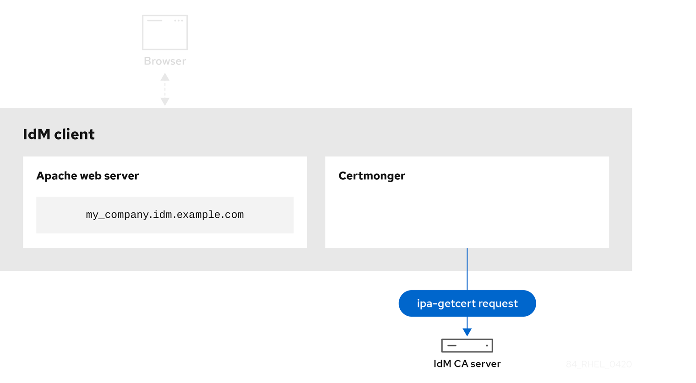 

[IdM CA issuing the service certificate](#certmonger-for-issuing-renewing-service-certs_certmonger-service-cert-3 "Figure 25.3. IdM CA issuing the service certificate") shows an IdM CA issuing an HTTPS certificate for the web server.

**Figure 25.3. IdM CA issuing the service certificate**

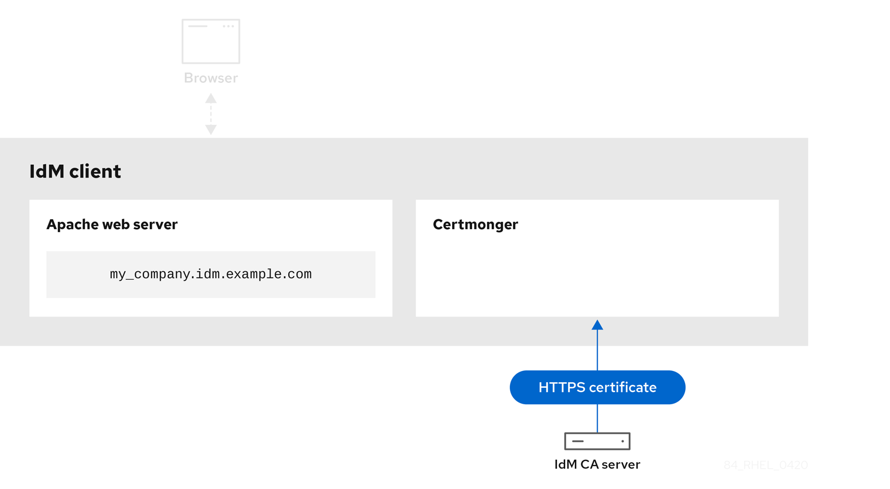 

[Certmonger applying the service certificate](#certmonger-for-issuing-renewing-service-certs_certmonger-service-cert-4 "Figure 25.4. Certmonger applying the service certificate") shows `certmonger` placing the HTTPS certificate in appropriate locations on the IdM client and, if instructed to do so, restarting the `httpd` service. The Apache server subsequently uses the HTTPS certificate to encrypt the traffic between itself and the browser.

**Figure 25.4. Certmonger applying the service certificate**

 

[Certmonger requesting a new certificate when the old one is nearing expiration](#certmonger-for-issuing-renewing-service-certs_certmonger-service-cert-5 "Figure 25.5. Certmonger requesting a new certificate when the old one is nearing expiration") shows `certmonger` automatically requesting a renewal of the service certificate from the IdM CA before the expiration of the certificate. The IdM CA issues a new certificate.

**Figure 25.5. Certmonger requesting a new certificate when the old one is nearing expiration**

 

<h3 id="viewing-the-details-of-a-certificate-request-tracked-by-certmonger">25.4. Viewing the details of a certificate request tracked by certmonger</h3>

The `certmonger` service monitors certificate requests. When a request for a certificate is successfully signed, it results in a certificate. `Certmonger` manages certificate requests including the resulting certificates. Follow this procedure to view the details of a particular certificate request managed by `certmonger`.

**Procedure**

- If you know how to specify the certificate request, list the details of only that particular certificate request. You can, for example, specify:
  
  - The request ID
  - The location of the certificate
  - The certificate nickname
    
    For example, to view the details of the certificate whose request ID is 20190408143846, using the `-v` option to view all the details of errors in case your request for a certificate was unsuccessful:
    
    ```
    getcert list -i 20190408143846 -v
    ```
    
    ```plaintext
    # getcert list -i 20190408143846 -v
    ```
    
    ```
    Number of certificates and requests being tracked: 16.
    Request ID '20190408143846':
    	status: MONITORING
    	stuck: no
    	key pair storage: type=NSSDB,location='/etc/dirsrv/slapd-IDM-EXAMPLE-COM',nickname='Server-Cert',token='NSS Certificate DB',pinfile='/etc/dirsrv/slapd-IDM-EXAMPLE-COM/pwdfile.txt'
    	certificate: type=NSSDB,location='/etc/dirsrv/slapd-IDM-EXAMPLE-COM',nickname='Server-Cert',token='NSS Certificate DB'
    	CA: IPA
    	issuer: CN=Certificate Authority,O=IDM.EXAMPLE.COM
    	subject: CN=server.idm.example.com,O=IDM.EXAMPLE.COM
    	expires: 2021-04-08 16:38:47 CEST
    	dns: server.idm.example.com
    	principal name: ldap/server.idm.example.com@IDM.EXAMPLE.COM
    	key usage: digitalSignature,nonRepudiation,keyEncipherment,dataEncipherment
    	eku: id-kp-serverAuth,id-kp-clientAuth
    	pre-save command:
    	post-save command: /usr/libexec/ipa/certmonger/restart_dirsrv IDM-EXAMPLE-COM
    	track: true
    	auto-renew: true
    ```
    
    ```plaintext
    Number of certificates and requests being tracked: 16.
    Request ID '20190408143846':
    	status: MONITORING
    	stuck: no
    	key pair storage: type=NSSDB,location='/etc/dirsrv/slapd-IDM-EXAMPLE-COM',nickname='Server-Cert',token='NSS Certificate DB',pinfile='/etc/dirsrv/slapd-IDM-EXAMPLE-COM/pwdfile.txt'
    	certificate: type=NSSDB,location='/etc/dirsrv/slapd-IDM-EXAMPLE-COM',nickname='Server-Cert',token='NSS Certificate DB'
    	CA: IPA
    	issuer: CN=Certificate Authority,O=IDM.EXAMPLE.COM
    	subject: CN=server.idm.example.com,O=IDM.EXAMPLE.COM
    	expires: 2021-04-08 16:38:47 CEST
    	dns: server.idm.example.com
    	principal name: ldap/server.idm.example.com@IDM.EXAMPLE.COM
    	key usage: digitalSignature,nonRepudiation,keyEncipherment,dataEncipherment
    	eku: id-kp-serverAuth,id-kp-clientAuth
    	pre-save command:
    	post-save command: /usr/libexec/ipa/certmonger/restart_dirsrv IDM-EXAMPLE-COM
    	track: true
    	auto-renew: true
    ```
  
  The output displays several pieces of information about the certificate, for example:
  
  - the certificate location; in the example above, it is the NSS database in the `/etc/dirsrv/slapd-IDM-EXAMPLE-COM` directory
  - the certificate nickname; in the example above, it is `Server-Cert`
  - the file storing the pin; in the example above, it is `/etc/dirsrv/slapd-IDM-EXAMPLE-COM/pwdfile.txt`
  - the Certificate Authority (CA) that will be used to renew the certificate; in the example above, it is the `IPA` CA
  - the expiration date; in the example above, it is `2021-04-08 16:38:47 CEST`
  - the status of the certificate; in the example above, the `MONITORING` status means that the certificate is valid and it is being tracked
  - the post-save command; in the example above, it is the restart of the `LDAP` service
- If you do not know how to specify the certificate request, list the details of all the certificates that `certmonger` is monitoring or attempting to obtain:
  
  ```
  getcert list
  ```
  
  ```plaintext
  # getcert list
  ```

<h3 id="starting-and-stopping-certificate-tracking">25.5. Starting and stopping certificate tracking</h3>

Use the `getcert stop-tracking` and `getcert start-tracking` commands to monitor certificates. The two commands are provided by the `certmonger` service. Enabling certificate tracking is especially useful if you have imported a certificate issued by the Identity Management (IdM) certificate authority (CA) onto the machine from a different IdM client. Enabling certificate tracking can also be the final step of the following provisioning scenario:

1. On the IdM server, you create a certificate for a system that does not exist yet.
2. You create the new system.
3. You enroll the new system as an IdM client.
4. You import the certificate and the key from the IdM server on to the IdM client.
5. You start tracking the certificate using `certmonger` to ensure that it gets renewed when it is due to expire.

**Procedure**

- To disable the monitoring of a certificate with the Request ID of 20190408143846:
  
  ```
  getcert stop-tracking -i 20190408143846
  ```
  
  ```plaintext
  # getcert stop-tracking -i 20190408143846
  ```
  
  For more options, see the `getcert stop-tracking` man page on your system.
- To enable the monitoring of a certificate stored in the `/tmp/some_cert.crt` file, whose private key is stored in the `/tmp/some_key.key` file:
  
  ```
  getcert start-tracking -c IPA -f /tmp/some_cert.crt -k /tmp/some_key.key
  ```
  
  ```plaintext
  # getcert start-tracking -c IPA -f /tmp/some_cert.crt -k /tmp/some_key.key
  ```
  
  `Certmonger` cannot automatically identify the CA type that issued the certificate. For this reason, add the `-c` option with the `IPA` value to the `getcert start-tracking` command if the certificate was issued by the IdM CA. Omitting to add the `-c` option results in `certmonger` entering the NEED\_CA state.
  
  For more options, see the `getcert start-tracking` man page on your system.
  
  Note
  
  The two commands do not manipulate the certificate. For example, `getcert stop-tracking` does not delete the certificate or remove it from the NSS database or from the filesystem but simply removes the certificate from the list of monitored certificates. Similarly, `getcert start-tracking` only adds a certificate to the list of monitored certificates.

<h3 id="renewing-a-certificate-manually">25.6. Renewing a certificate manually</h3>

When a certificate is near its expiration date, the `certmonger` daemon automatically issues a renewal command using the certificate authority (CA) helper, obtains a renewed certificate and replaces the previous certificate with the new one.

You can also manually renew a certificate in advance by using the `getcert resubmit` command. This way, you can update the information the certificate contains, for example, by adding a Subject Alternative Name (SAN).

Follow this procedure to renew a certificate manually.

**Procedure**

- To renew a certificate with the Request ID of 20190408143846:
  
  ```
  getcert resubmit -i 20190408143846
  ```
  
  ```plaintext
  # getcert resubmit -i 20190408143846
  ```
  
  To obtain the Request ID for a specific certificate, use the `getcert list` command. For details, see the `getcert list` man page on your system.

<h3 id="making-certmonger-resume-tracking-of-idm-certificates-on-a-ca-replica">25.7. Making certmonger resume tracking of IdM certificates on a CA replica</h3>

You can make `certmonger` resume the tracking of Identity Management (IdM) system certificates that are crucial for an IdM deployment with an integrated certificate authority after the tracking of certificates was interrupted. The interruption may have been caused by the IdM host being unenrolled from IdM during the renewal of the system certificates or by replication topology not working properly. The procedure also shows how to make `certmonger` resume the tracking of the IdM service certificates, namely the `HTTP`, `LDAP` and `PKINIT` certificates.

**Prerequisites**

- The host on which you want to resume tracking system certificates is an IdM server that is also an IdM certificate authority (CA) but not the IdM CA renewal server.

**Procedure**

1. Get the PIN for the subsystem CA certificates:
   
   ```
   export NSSDB_PIN=$(sed -n 's/^internal=//p' /var/lib/pki/pki-tomcat/conf/password.conf)
   ```
   
   ```plaintext
   # export NSSDB_PIN=$(sed -n 's/^internal=//p' /var/lib/pki/pki-tomcat/conf/password.conf)
   ```
2. Add tracking for the `Issuing CA`, `Audit`, `OSCP`, `Subsystem` and `Tomcat server` certificates:
   
   ```
   getcert start-tracking -d /etc/pki/pki-tomcat/alias -n "caSigningCert cert-pki-ca" -c 'dogtag-ipa-ca-renew-agent' -P $NSSDB_PIN -B /usr/libexec/ipa/certmonger/stop_pkicad -C '/usr/libexec/ipa/certmonger/renew_ca_cert "caSigningCert cert-pki-ca"' -T caCACert
   ```
   
   ```plaintext
   # getcert start-tracking -d /etc/pki/pki-tomcat/alias -n "caSigningCert cert-pki-ca" -c 'dogtag-ipa-ca-renew-agent' -P $NSSDB_PIN -B /usr/libexec/ipa/certmonger/stop_pkicad -C '/usr/libexec/ipa/certmonger/renew_ca_cert "caSigningCert cert-pki-ca"' -T caCACert
   ```
   
   ```
   getcert start-tracking -d /etc/pki/pki-tomcat/alias -n "auditSigningCert cert-pki-ca" -c 'dogtag-ipa-ca-renew-agent' -P $NSSDB_PIN -B /usr/libexec/ipa/certmonger/stop_pkicad -C '/usr/libexec/ipa/certmonger/renew_ca_cert "auditSigningCert cert-pki-ca"' -T caSignedLogCert
   ```
   
   ```plaintext
   # getcert start-tracking -d /etc/pki/pki-tomcat/alias -n "auditSigningCert cert-pki-ca" -c 'dogtag-ipa-ca-renew-agent' -P $NSSDB_PIN -B /usr/libexec/ipa/certmonger/stop_pkicad -C '/usr/libexec/ipa/certmonger/renew_ca_cert "auditSigningCert cert-pki-ca"' -T caSignedLogCert
   ```
   
   ```
   getcert start-tracking -d /etc/pki/pki-tomcat/alias -n "ocspSigningCert cert-pki-ca" -c 'dogtag-ipa-ca-renew-agent' -P $NSSDB_PIN -B /usr/libexec/ipa/certmonger/stop_pkicad -C '/usr/libexec/ipa/certmonger/renew_ca_cert "ocspSigningCert cert-pki-ca"' -T caOCSPCert
   ```
   
   ```plaintext
   # getcert start-tracking -d /etc/pki/pki-tomcat/alias -n "ocspSigningCert cert-pki-ca" -c 'dogtag-ipa-ca-renew-agent' -P $NSSDB_PIN -B /usr/libexec/ipa/certmonger/stop_pkicad -C '/usr/libexec/ipa/certmonger/renew_ca_cert "ocspSigningCert cert-pki-ca"' -T caOCSPCert
   ```
   
   ```
   getcert start-tracking -d /etc/pki/pki-tomcat/alias -n "subsystemCert cert-pki-ca" -c 'dogtag-ipa-ca-renew-agent' -P $NSSDB_PIN -B /usr/libexec/ipa/certmonger/stop_pkicad -C '/usr/libexec/ipa/certmonger/renew_ca_cert "subsystemCert cert-pki-ca"' -T caSubsystemCert
   ```
   
   ```plaintext
   # getcert start-tracking -d /etc/pki/pki-tomcat/alias -n "subsystemCert cert-pki-ca" -c 'dogtag-ipa-ca-renew-agent' -P $NSSDB_PIN -B /usr/libexec/ipa/certmonger/stop_pkicad -C '/usr/libexec/ipa/certmonger/renew_ca_cert "subsystemCert cert-pki-ca"' -T caSubsystemCert
   ```
   
   ```
   getcert start-tracking -d /etc/pki/pki-tomcat/alias -n "Server-Cert cert-pki-ca" -c 'dogtag-ipa-ca-renew-agent' -P $NSSDB_PIN -B /usr/libexec/ipa/certmonger/stop_pkicad -C '/usr/libexec/ipa/certmonger/renew_ca_cert "Server-Cert cert-pki-ca"' -T caServerCert
   ```
   
   ```plaintext
   # getcert start-tracking -d /etc/pki/pki-tomcat/alias -n "Server-Cert cert-pki-ca" -c 'dogtag-ipa-ca-renew-agent' -P $NSSDB_PIN -B /usr/libexec/ipa/certmonger/stop_pkicad -C '/usr/libexec/ipa/certmonger/renew_ca_cert "Server-Cert cert-pki-ca"' -T caServerCert
   ```
3. Add tracking for the remaining IdM certificates, the `HTTP`, `LDAP`, `IPA renewal agent` and `PKINIT` certificates:
   
   ```
   getcert start-tracking -f /var/lib/ipa/certs/httpd.crt -k /var/lib/ipa/private/httpd.key -p /var/lib/ipa/passwds/idm.example.com-443-RSA -c IPA -C /usr/libexec/ipa/certmonger/restart_httpd -T caIPAserviceCert
   ```
   
   ```plaintext
   # getcert start-tracking -f /var/lib/ipa/certs/httpd.crt -k /var/lib/ipa/private/httpd.key -p /var/lib/ipa/passwds/idm.example.com-443-RSA -c IPA -C /usr/libexec/ipa/certmonger/restart_httpd -T caIPAserviceCert
   ```
   
   ```
   getcert start-tracking -d /etc/dirsrv/slapd-IDM-EXAMPLE-COM -n "Server-Cert" -c IPA -p /etc/dirsrv/slapd-IDM-EXAMPLE-COM/pwdfile.txt -C '/usr/libexec/ipa/certmonger/restart_dirsrv "IDM-EXAMPLE-COM"' -T caIPAserviceCert
   ```
   
   ```plaintext
   # getcert start-tracking -d /etc/dirsrv/slapd-IDM-EXAMPLE-COM -n "Server-Cert" -c IPA -p /etc/dirsrv/slapd-IDM-EXAMPLE-COM/pwdfile.txt -C '/usr/libexec/ipa/certmonger/restart_dirsrv "IDM-EXAMPLE-COM"' -T caIPAserviceCert
   ```
   
   ```
   getcert start-tracking -f /var/lib/ipa/ra-agent.pem -k /var/lib/ipa/ra-agent.key -c dogtag-ipa-ca-renew-agent -B /usr/libexec/ipa/certmonger/renew_ra_cert_pre -C /usr/libexec/ipa/certmonger/renew_ra_cert -T caSubsystemCert
   ```
   
   ```plaintext
   # getcert start-tracking -f /var/lib/ipa/ra-agent.pem -k /var/lib/ipa/ra-agent.key -c dogtag-ipa-ca-renew-agent -B /usr/libexec/ipa/certmonger/renew_ra_cert_pre -C /usr/libexec/ipa/certmonger/renew_ra_cert -T caSubsystemCert
   ```
   
   ```
   getcert start-tracking -f /var/kerberos/krb5kdc/kdc.crt -k /var/kerberos/krb5kdc/kdc.key -c dogtag-ipa-ca-renew-agent -B /usr/libexec/ipa/certmonger/renew_ra_cert_pre -C /usr/libexec/ipa/certmonger/renew_kdc_cert -T KDCs_PKINIT_Certs
   ```
   
   ```plaintext
   # getcert start-tracking -f /var/kerberos/krb5kdc/kdc.crt -k /var/kerberos/krb5kdc/kdc.key -c dogtag-ipa-ca-renew-agent -B /usr/libexec/ipa/certmonger/renew_ra_cert_pre -C /usr/libexec/ipa/certmonger/renew_kdc_cert -T KDCs_PKINIT_Certs
   ```
4. Restart `certmonger`:
   
   ```
   systemctl restart certmonger
   ```
   
   ```plaintext
   # systemctl restart certmonger
   ```
5. Wait for one minute after `certmonger` has started and then check the statuses of the new certificates:
   
   ```
   getcert list
   ```
   
   ```plaintext
   # getcert list
   ```

**Additional resources**

- [How do I manually renew Identity Management (IPA) certificates on RHEL7/RHEL 8 after they have expired?](https://access.redhat.com/solutions/3357261)
- [How do I manually renew Identity Management (IPA) certificates on RHEL7 after they have expired?](https://access.redhat.com/solutions/3357331)

<h3 id="using-scep-with-certmonger">25.8. Using SCEP with certmonger</h3>

The Simple Certificate Enrollment Protocol (SCEP) is a certificate management protocol that you can use across different devices and operating systems. If you are using a SCEP server as an external certificate authority (CA) in your environment, you can use `certmonger` to obtain a certificate for an Identity Management (IdM) client.

<h4 id="scep-overview">25.8.1. SCEP overview</h4>

The Simple Certificate Enrollment Protocol (SCEP) is a certificate management protocol that you can use across different devices and operating systems. You can use a SCEP server as an external certificate authority (CA).

You can configure an Identity Management (IdM) client to request and retrieve a certificate over HTTP directly from the CA SCEP service. This process is secured by a shared secret that is usually valid only for a limited time.

On the client side, SCEP requires you to provide the following components:

- SCEP URL: the URL of the CA SCEP interface.
- SCEP shared secret: a `challengePassword` PIN shared between the CA and the SCEP client, used to obtain the certificate.

The client then retrieves the CA certificate chain over SCEP and sends a certificate signing request to the CA.

When configuring SCEP with `certmonger`, you create a new CA configuration profile that specifies the issued certificate parameters.

<h4 id="requesting-an-idm-ca-signed-certificate-through-scep">25.8.2. Requesting an IdM CA-signed certificate through SCEP</h4>

The following example adds a `SCEP_example` SCEP CA configuration to `certmonger` and requests a new certificate on the `client.idm.example.com` IdM client. `certmonger` supports both the NSS certificate database format and file-based (PEM) formats, such as OpenSSL.

**Prerequisites**

- You know the SCEP URL.
- You have the `challengePassword` PIN shared secret.

**Procedure**

1. Add the CA configuration to `certmonger`:
   
   ```
   [root@client.idm.example.com ~]# getcert add-scep-ca -c SCEP_example -u SCEP_URL
   ```
   
   ```plaintext
   [root@client.idm.example.com ~]# getcert add-scep-ca -c SCEP_example -u SCEP_URL
   ```
   
   - `-c`: Mandatory nickname for the CA configuration. The same value can later be used with other `getcert` commands.
   - `-u`: URL of the server’s SCEP interface.
     
     Important
     
     When using an HTTPS URL, you must also specify the location of the PEM-formatted copy of the SCEP server CA certificate using the `-R` option.
2. Verify that the CA configuration has been successfully added:
   
   ```
   [root@client.idm.example.com ~]# getcert list-cas -c SCEP_example
   ```
   
   ```plaintext
   [root@client.idm.example.com ~]# getcert list-cas -c SCEP_example
   ```
   
   ```
   CA 'SCEP_example':
          is-default: no
          ca-type: EXTERNAL
          helper-location: /usr/libexec/certmonger/scep-submit -u http://SCEP_server_enrollment_interface_URL
          SCEP CA certificate thumbprint (MD5): A67C2D4B 771AC186 FCCA654A 5E55AAF7
          SCEP CA certificate thumbprint (SHA1): FBFF096C 6455E8E9 BD55F4A5 5787C43F 1F512279
   ```
   
   ```plaintext
   CA 'SCEP_example':
          is-default: no
          ca-type: EXTERNAL
          helper-location: /usr/libexec/certmonger/scep-submit -u http://SCEP_server_enrollment_interface_URL
          SCEP CA certificate thumbprint (MD5): A67C2D4B 771AC186 FCCA654A 5E55AAF7
          SCEP CA certificate thumbprint (SHA1): FBFF096C 6455E8E9 BD55F4A5 5787C43F 1F512279
   ```
   
   If the configuration was successfully added, certmonger retrieves the CA chain from the remote CA. The CA chain then appears as thumbprints in the command output. When accessing the server over unencrypted HTTP, manually compare the thumbprints with the ones displayed at the SCEP server to prevent a man-in-the-middle attack.
3. Request a certificate from the CA:
   
   - If you are using NSS:
     
     ```
     [root@client.idm.example.com ~]# getcert request -I Example_Task -c SCEP_example -d /etc/pki/nssdb -n ExampleCert -N cn="client.idm.example.com" -L one-time_PIN -D client.idm.example.com
     ```
     
     ```plaintext
     [root@client.idm.example.com ~]# getcert request -I Example_Task -c SCEP_example -d /etc/pki/nssdb -n ExampleCert -N cn="client.idm.example.com" -L one-time_PIN -D client.idm.example.com
     ```
     
     You can use the options to specify the following parameters of the certificate request:
     
     - `-I`: Optional: Name of the task: the tracking ID for the request. The same value can later be used with the `getcert list` command.
     - `-c`: CA configuration to submit the request to.
     - `-d`: Directory with the NSS database to store the certificate and key.
     - `-n`: Nickname of the certificate, used in the NSS database.
     - `-N`: Subject name in the CSR.
     - `-L`: Time-limited one-time `challengePassword` PIN issued by the CA.
     - `-D`: Subject Alternative Name for the certificate, usually the same as the host name.
   - If you are using OpenSSL:
     
     ```
     [root@client.idm.example.com ~]# getcert request -I Example_Task -c SCEP_example -f /etc/pki/tls/certs/server.crt -k /etc/pki/tls/private/private.key -N cn="client.idm.example.com" -L one-time_PIN -D client.idm.example.com
     ```
     
     ```plaintext
     [root@client.idm.example.com ~]# getcert request -I Example_Task -c SCEP_example -f /etc/pki/tls/certs/server.crt -k /etc/pki/tls/private/private.key -N cn="client.idm.example.com" -L one-time_PIN -D client.idm.example.com
     ```
     
     You can use the options to specify the following parameters of the certificate request:
     
     - `-I`: Optional: Name of the task: the tracking ID for the request. The same value can later be used with the `getcert list` command.
     - `-c`: CA configuration to submit the request to.
     - `-f`: Storage path to the certificate.
     - `-k`: Storage path to the key.
     - `-N`: Subject name in the CSR.
     - `-L`: Time-limited one-time `challengePassword` PIN issued by the CA.
     - `-D`: Subject Alternative Name for the certificate, usually the same as the host name.

**Verification**

1. Verify that a certificate was issued and correctly stored in the local database:
   
   - If you used NSS, enter:
     
     ```
     [root@client.idm.example.com ~]# getcert list -I Example_Task
     ```
     
     ```plaintext
     [root@client.idm.example.com ~]# getcert list -I Example_Task
     ```
     
     ```
            Request ID 'Example_Task':
             status: MONITORING
             stuck: no
             key pair storage: type=NSSDB,location='/etc/pki/nssdb',nickname='ExampleCert',token='NSS Certificate DB'
             certificate: type=NSSDB,location='/etc/pki/nssdb',nickname='ExampleCert',token='NSS Certificate DB'
             signing request thumbprint (MD5): 503A8EDD DE2BE17E 5BAA3A57 D68C9C1B
             signing request thumbprint (SHA1): B411ECE4 D45B883A 75A6F14D 7E3037F1 D53625F4
             CA: IPA
             issuer: CN=Certificate Authority,O=EXAMPLE.COM
             subject: CN=client.idm.example.com,O=EXAMPLE.COM
             expires: 2018-05-06 10:28:06 UTC
             key usage: digitalSignature,keyEncipherment
             eku: iso.org.dod.internet.security.mechanisms.8.2.2
             certificate template/profile: IPSECIntermediateOffline
             pre-save command:
             post-save command:
             track: true
     	auto-renew: true
     ```
     
     ```plaintext
            Request ID 'Example_Task':
             status: MONITORING
             stuck: no
             key pair storage: type=NSSDB,location='/etc/pki/nssdb',nickname='ExampleCert',token='NSS Certificate DB'
             certificate: type=NSSDB,location='/etc/pki/nssdb',nickname='ExampleCert',token='NSS Certificate DB'
             signing request thumbprint (MD5): 503A8EDD DE2BE17E 5BAA3A57 D68C9C1B
             signing request thumbprint (SHA1): B411ECE4 D45B883A 75A6F14D 7E3037F1 D53625F4
             CA: IPA
             issuer: CN=Certificate Authority,O=EXAMPLE.COM
             subject: CN=client.idm.example.com,O=EXAMPLE.COM
             expires: 2018-05-06 10:28:06 UTC
             key usage: digitalSignature,keyEncipherment
             eku: iso.org.dod.internet.security.mechanisms.8.2.2
             certificate template/profile: IPSECIntermediateOffline
             pre-save command:
             post-save command:
             track: true
     	auto-renew: true
     ```
   - If you used OpenSSL, enter:
     
     ```
     [root@client.idm.example.com ~]# getcert list -I Example_Task
     ```
     
     ```plaintext
     [root@client.idm.example.com ~]# getcert list -I Example_Task
     ```
     
     ```
     Request ID 'Example_Task':
            status: MONITORING
            stuck: no
            key pair storage: type=FILE,location='/etc/pki/tls/private/private.key'
            certificate: type=FILE,location='/etc/pki/tls/certs/server.crt'
            CA: IPA
            issuer: CN=Certificate Authority,O=EXAMPLE.COM
            subject: CN=client.idm.example.com,O=EXAMPLE.COM
            expires: 2018-05-06 10:28:06 UTC
            eku: id-kp-serverAuth,id-kp-clientAuth
            pre-save command:
            post-save command:
            track: true
            auto-renew: true
     ```
     
     ```plaintext
     Request ID 'Example_Task':
            status: MONITORING
            stuck: no
            key pair storage: type=FILE,location='/etc/pki/tls/private/private.key'
            certificate: type=FILE,location='/etc/pki/tls/certs/server.crt'
            CA: IPA
            issuer: CN=Certificate Authority,O=EXAMPLE.COM
            subject: CN=client.idm.example.com,O=EXAMPLE.COM
            expires: 2018-05-06 10:28:06 UTC
            eku: id-kp-serverAuth,id-kp-clientAuth
            pre-save command:
            post-save command:
            track: true
            auto-renew: true
     ```
     
     The status **MONITORING** signifies a successful retrieval of the issued certificate. The `getcert-list(1)` man page lists other possible states and their meanings.

<h4 id="automatically-renewing-ad-scep-certificates-with-certmonger">25.8.3. Automatically renewing AD SCEP certificates with certmonger</h4>

When `certmonger` sends a SCEP certificate renewal request, this request is signed using the existing certificate private key. However, renewal requests sent by `certmonger` by default also include the `challengePassword` PIN that was used to originally obtain the certificates.

An Active Directory (AD) Network Device Enrollment Service (NDES) server that works as the SCEP server automatically rejects any requests for renewal that contain the original `challengePassword` PIN. Consequently, the renewal fails.

For renewal with AD to work, you need to configure `certmonger` to send the signed renewal requests without the `challengePassword` PIN. You also need to configure the AD server so that it does not compare the subject name at renewal.

Note

There may be SCEP servers other than AD that also refuse requests containing the `challengePassword`. In those cases, you may also need to change the `certmonger` configuration in this way.

**Prerequisites**

- The RHEL server has to be running RHEL 8.6 or newer.

**Procedure**

1. Open `regedit` on the AD server.
2. In the **HKEY\_LOCAL\_MACHINE\\SOFTWARE\\Microsoft\\Cryptography\\MSCEP** subkey, add a new 32-bit REG\_DWORD entry `DisableRenewalSubjectNameMatch` and set its value to `1`.
3. On the server where `certmonger` is running, open the `/etc/certmonger/certmonger.conf` file and add the following section:
   
   ```
   [scep]
   challenge_password_otp = yes
   ```
   
   ```plaintext
   [scep]
   challenge_password_otp = yes
   ```
4. Restart certmonger:
   
   ```
   systemctl restart certmonger
   ```
   
   ```plaintext
   # systemctl restart certmonger
   ```

<h2 id="deploying-and-managing-the-acme-service-in-idm">Chapter 26. Deploying and managing the ACME service in IdM</h2>

Automated Certificate Management Environment (ACME) is a protocol for automated identifier validation and certificate issuance. Its goal is to improve security by reducing certificate lifetimes and avoiding manual processes in certificate lifecycle management.

Using RHEL Identity Management (IdM), the administrator can easily deploy and manage the ACME service topology-wide from a single system.

<h3 id="the-acme-service-in-idm">26.1. The ACME service in IdM</h3>

Note

IdM only supports ACME with Random Certificate Serial Numbers (RSNv3) enabled.

ACME uses a challenge and response authentication mechanism to prove that a client has control of an identifier. In ACME, an identifier is a proof of ownership used to obtain a certificate by solving a challenge. In Identity Management (IdM), ACME currently supports the following challenges:

- `dns-01` where the client creates DNS records to prove it has control of the identifier
- `http-01` where the client provisions an HTTP resource to prove it has control of the identifier

In IdM, the ACME service uses the PKI ACME responder. The ACME subsystem is automatically deployed on every CA server in the IdM deployment, but it will not service requests until the administrator enables it. The servers are discovered using the name `ipa-ca.DOMAIN`. All IdM CA servers are registered with this DNS name so requests are load balanced via round-robin to them.

ACME is also deployed, but disabled, when the administrator upgrades a server using the `ipa-server-upgrade` command.

ACME runs as a separate service within Apache Tomcat. The ACME configuration files are stored in `/etc/pki/pki-tomcat/acme` and PKI logs ACME information to `/var/log/pki/pki-tomcat/acme/`.

IdM uses the `acmeIPAServerCert` profile when issuing ACME certificates. The validity period of issued certificates is 90 days. For this reason, it is strongly recommended to set ACME to automatically remove expired certificates so that they do not accumulate in the CA, as this could negatively affect performance.

There are different ACME clients available. For use with RHEL, the chosen client must support either of the `dns-01` and `http-01` challenges. Currently, the following clients have been tested and are known to work with ACME in RHEL:

- `certbot` with both the `http-01` and `dns-01` challenges
- `mod_md`, which supports only the `http-01` challenge

**Additional resources**

- [Random serial numbers in IdM](https://docs.redhat.com/en/documentation/red_hat_enterprise_linux/10/html/planning_identity_management/planning-your-ca-services#random-serial-numbers-in-idm)

<h3 id="enabling-the-acme-service-in-idm">26.2. Enabling the ACME service in IdM</h3>

By default, the ACME service is deployed, but disabled. Enabling the ACME service enables it on all IdM CA servers across the entire IdM deployment. This is handled via replication.

In this example, you enable ACME and set it to automatically remove expired certificates on the first day of every month at midnight.

**Prerequisites**

- Servers in the IdM deployment have Random Certificate Serial Numbers (RSNv3) enabled.
- You have root privileges on the IdM server on which you are running the procedure.

**Procedure**

1. Enable ACME across the whole IdM deployment:
   
   ```
   ipa-acme-manage enable
   ```
   
   ```plaintext
   # ipa-acme-manage enable
   ```
   
   ```
   The ipa-acme-manage command was successful
   ```
   
   ```plaintext
   The ipa-acme-manage command was successful
   ```
2. Set ACME to automatically remove expired certificates from the CA:
   
   ```
   ipa-acme-manage pruning --enable --cron "0 0 1 * *"
   ```
   
   ```plaintext
   # ipa-acme-manage pruning --enable --cron "0 0 1 * *"
   ```
   
   Note
   
   Expired certificates are removed after their retention period. By default, this is 30 days after expiry.

**Verification**

- To check if the ACME service is installed and enabled, use the `ipa-acme-manage status` command:
  
  ```
  ipa-acme-manage status
  ```
  
  ```plaintext
  # ipa-acme-manage status
  ```
  
  ```
  ACME is enabled
  The ipa-acme-manage command was successful
  ```
  
  ```plaintext
  ACME is enabled
  The ipa-acme-manage command was successful
  ```

<h3 id="disabling-the-acme-service-in-idm">26.3. Disabling the ACME service in IdM</h3>

Disabling the ACME service disables it across the entire IdM deployment. This is handled via replication.

**Prerequisites**

- Servers in the IdM deployment have Random Certificate Serial Numbers (RSNv3) enabled.
- You have root privileges on the IdM server on which you are running the procedure.

**Procedure**

1. Disable ACME across the whole IdM deployment:
   
   ```
   ipa-acme-manage disable
   ```
   
   ```plaintext
   # ipa-acme-manage disable
   ```
   
   ```
   The ipa-acme-manage command was successful
   ```
   
   ```plaintext
   The ipa-acme-manage command was successful
   ```
2. Optional: Disable automatic removal of expired certificates:
   
   ```
   ipa-acme-manage pruning --disable
   ```
   
   ```plaintext
   # ipa-acme-manage pruning --disable
   ```

**Verification**

- To check if the ACME service is installed, but disabled, use the `ipa-acme-manage status` command:
  
  ```
  ipa-acme-manage status
  ```
  
  ```plaintext
  # ipa-acme-manage status
  ```
  
  ```
  ACME is disabled
  The ipa-acme-manage command was successful
  ```
  
  ```plaintext
  ACME is disabled
  The ipa-acme-manage command was successful
  ```

<h2 id="requesting-certificates-from-a-ca-and-creating-self-signed-certificates-by-using-rhel-system-roles">Chapter 27. Requesting certificates from a CA and creating self-signed certificates by using RHEL system roles</h2>

Many services, such as web servers, use TLS to encrypt connections with clients. By using the `certificate` RHEL system role, you can automate the generation of private keys on managed nodes. Additionally, the role configures the `certmonger` service to request a certificate from a CA.

For testing purposes, you can use the `certificate` role to create self-signed certificates instead of requesting a signed certificate from a CA.

<h3 id="requesting-a-new-certificate-from-an-idm-ca-by-using-the-certificate-rhel-system-role">27.1. Requesting a new certificate from an IdM CA by using the certificate RHEL system role</h3>

By using the `certificate` RHEL system role, you can automate the process of creating a private key and letting the `certmonger` service request a certificate from the Identity Management (IdM) in Red Hat Enterprise Linux certificate authority (CA).

**Prerequisites**

- [You have prepared the control node and the managed nodes](https://docs.redhat.com/en/documentation/red_hat_enterprise_linux/10/html/automating_system_administration_by_using_rhel_system_roles/preparing-a-control-node-and-managed-nodes-to-use-rhel-system-roles).
- You are logged in to the control node as a user who can run playbooks on the managed nodes.
- The account you use to connect to the managed nodes has `sudo` permissions for these nodes.
- The managed node is a member of an IdM domain and the domain uses the IdM-integrated CA.

**Procedure**

1. Create a playbook file, for example, `~/playbook.yml`, with the following content:
   
   ```
   ---
   - name: Create certificates
     hosts: managed-node-01.example.com
     tasks:
       - name: Create a self-signed certificate
         ansible.builtin.include_role:
           name: redhat.rhel_system_roles.certificate
         vars:
           certificate_requests:
             - name: web-server
               ca: ipa
               dns: www.example.com
               principal: HTTP/www.example.com@EXAMPLE.COM
               run_before: systemctl stop httpd.service
               run_after: systemctl start httpd.service
   ```
   
   ```yaml
   ---
   - name: Create certificates
     hosts: managed-node-01.example.com
     tasks:
       - name: Create a self-signed certificate
         ansible.builtin.include_role:
           name: redhat.rhel_system_roles.certificate
         vars:
           certificate_requests:
             - name: web-server
               ca: ipa
               dns: www.example.com
               principal: HTTP/www.example.com@EXAMPLE.COM
               run_before: systemctl stop httpd.service
               run_after: systemctl start httpd.service
   ```
   
   The settings specified in the example playbook include the following:
   
   `name: <path_or_file_name>`
   
   Defines the name or path of the generated private key and certificate file:
   
   - If you set the variable to `web-server`, the role stores the private key in the `/etc/pki/tls/private/web-server.key` and the certificate in the `/etc/pki/tls/certs/web-server.crt` files.
   - If you set the variable to a path, such as `/tmp/web-server`, the role stores the private key in the `/tmp/web-server.key` and the certificate in the `/tmp/web-server.crt` files.
     
     Note that the directory you use must have the `cert_t` SELinux context set. You can use the `selinux` RHEL system role to manage SELinux contexts.
   
   `ca: ipa`
   
   Defines that the role requests the certificate from an IdM CA.
   
   `dns: <hostname_or_list_of_hostnames>`
   
   Sets the hostnames that the Subject Alternative Names (SAN) field in the issued certificate contains. You can use a wildcard (`*`) or specify multiple names in YAML list format.
   
   `principal: <kerberos_principal>`
   
   Optional: Sets the Kerberos principal that should be included in the certificate.
   
   `run_before: <command>`
   
   Optional: Defines a command that `certmonger` should execute before requesting the certificate from the CA.
   
   `run_after: <command>`
   
   Optional: Defines a command that `certmonger` should execute after it received the issued certificate from the CA.
   
   For details about all variables used in the playbook, see the `/usr/share/ansible/roles/rhel-system-roles.certificate/README.md` file on the control node.
2. Validate the playbook syntax:
   
   ```
   ansible-playbook --syntax-check ~/playbook.yml
   ```
   
   ```plaintext
   $ ansible-playbook --syntax-check ~/playbook.yml
   ```
   
   Note that this command only validates the syntax and does not protect against a wrong but valid configuration.
3. Run the playbook:
   
   ```
   ansible-playbook ~/playbook.yml
   ```
   
   ```plaintext
   $ ansible-playbook ~/playbook.yml
   ```

**Verification**

- List the certificates that the `certmonger` service manages:
  
  ```
  ansible managed-node-01.example.com -m command -a 'getcert list'
  ```
  
  ```plaintext
  # ansible managed-node-01.example.com -m command -a 'getcert list'
  ```
  
  ```
  ...
  Number of certificates and requests being tracked: 1.
  Request ID '20240918142211':
          status: MONITORING
          stuck: no
          key pair storage: type=FILE,location='/etc/pki/tls/private/web-server.key'
          certificate: type=FILE,location='/etc/pki/tls/certs/web-server.crt'
          CA: IPA
          issuer: CN=Certificate Authority,O=EXAMPLE.COM
          subject: CN=www.example.com
          issued: 2024-09-18 16:22:11 CEST
          expires: 2025-09-18 16:22:10 CEST
          dns: www.example.com
          key usage: digitalSignature,keyEncipherment
          eku: id-kp-serverAuth,id-kp-clientAuth
          pre-save command: systemctl stop httpd.service
          post-save command: systemctl start httpd.service
          track: yes
          auto-renew: yes
  ```
  
  ```plaintext
  ...
  Number of certificates and requests being tracked: 1.
  Request ID '20240918142211':
          status: MONITORING
          stuck: no
          key pair storage: type=FILE,location='/etc/pki/tls/private/web-server.key'
          certificate: type=FILE,location='/etc/pki/tls/certs/web-server.crt'
          CA: IPA
          issuer: CN=Certificate Authority,O=EXAMPLE.COM
          subject: CN=www.example.com
          issued: 2024-09-18 16:22:11 CEST
          expires: 2025-09-18 16:22:10 CEST
          dns: www.example.com
          key usage: digitalSignature,keyEncipherment
          eku: id-kp-serverAuth,id-kp-clientAuth
          pre-save command: systemctl stop httpd.service
          post-save command: systemctl start httpd.service
          track: yes
          auto-renew: yes
  ```

<h3 id="requesting-a-new-self-signed-certificate-by-using-the-certificate-rhel-system-role">27.2. Requesting a new self-signed certificate by using the certificate RHEL system role</h3>

If you require a TLS certificate for a test environment, you can use a self-signed certificate. By using the `certificate` RHEL system role, you can automate the process of creating a private key and letting the `certmonger` service create a self-signed certificate.

**Prerequisites**

- [You have prepared the control node and the managed nodes](https://docs.redhat.com/en/documentation/red_hat_enterprise_linux/10/html/automating_system_administration_by_using_rhel_system_roles/preparing-a-control-node-and-managed-nodes-to-use-rhel-system-roles).
- You are logged in to the control node as a user who can run playbooks on the managed nodes.
- The account you use to connect to the managed nodes has `sudo` permissions for these nodes.

**Procedure**

1. Create a playbook file, for example, `~/playbook.yml`, with the following content:
   
   ```
   ---
   - name: Create certificates
     hosts: managed-node-01.example.com
     tasks:
       - name: Create a self-signed certificate
         ansible.builtin.include_role:
           name: redhat.rhel_system_roles.certificate
         vars:
           certificate_requests:
             - name: web-server
               ca: self-sign
               dns: test.example.com
   ```
   
   ```yaml
   ---
   - name: Create certificates
     hosts: managed-node-01.example.com
     tasks:
       - name: Create a self-signed certificate
         ansible.builtin.include_role:
           name: redhat.rhel_system_roles.certificate
         vars:
           certificate_requests:
             - name: web-server
               ca: self-sign
               dns: test.example.com
   ```
   
   The settings specified in the example playbook include the following:
   
   `name: <path_or_file_name>`
   
   Defines the name or path of the generated private key and certificate file:
   
   - If you set the variable to `web-server`, the role stores the private key in the `/etc/pki/tls/private/web-server.key` and the certificate in the `/etc/pki/tls/certs/web-server.crt` files.
   - If you set the variable to a path, such as `/tmp/web-server`, the role stores the private key in the `/tmp/web-server.key` and the certificate in the `/tmp/web-server.crt` files.
     
     Note that the directory you use must have the `cert_t` SELinux context set. You can use the `selinux` RHEL system role to manage SELinux contexts.
   
   `ca: self-sign`
   
   Defines that the role created a self-signed certificate.
   
   `dns: <hostname_or_list_of_hostnames>`
   
   Sets the hostnames that the Subject Alternative Names (SAN) field in the issued certificate contains. You can use a wildcard (`*`) or specify multiple names in YAML list format.
   
   For details about all variables used in the playbook, see the `/usr/share/ansible/roles/rhel-system-roles.certificate/README.md` file on the control node.
2. Validate the playbook syntax:
   
   ```
   ansible-playbook --syntax-check ~/playbook.yml
   ```
   
   ```plaintext
   $ ansible-playbook --syntax-check ~/playbook.yml
   ```
   
   Note that this command only validates the syntax and does not protect against a wrong but valid configuration.
3. Run the playbook:
   
   ```
   ansible-playbook ~/playbook.yml
   ```
   
   ```plaintext
   $ ansible-playbook ~/playbook.yml
   ```

**Verification**

- List the certificates that the `certmonger` service manages:
  
  ```
  ansible managed-node-01.example.com -m command -a 'getcert list'
  ```
  
  ```plaintext
  # ansible managed-node-01.example.com -m command -a 'getcert list'
  ```
  
  ```
  ...
  Number of certificates and requests being tracked: 1.
  Request ID '20240918133610':
  	status: MONITORING
  	stuck: no
  	key pair storage: type=FILE,location='/etc/pki/tls/private/web-server.key'
  	certificate: type=FILE,location='/etc/pki/tls/certs/web-server.crt'
  	CA: local
  	issuer: CN=c32b16d7-5b1a4c5a-a953a711-c3ca58fb,CN=Local Signing Authority
  	subject: CN=test.example.com
  	issued: 2024-09-18 15:36:10 CEST
  	expires: 2025-09-18 15:36:09 CEST
  	dns: test.example.com
  	key usage: digitalSignature,keyEncipherment
  	eku: id-kp-serverAuth,id-kp-clientAuth
  	pre-save command:
  	post-save command:
  	track: yes
  	auto-renew: yes
  ```
  
  ```yaml
  ...
  Number of certificates and requests being tracked: 1.
  Request ID '20240918133610':
  	status: MONITORING
  	stuck: no
  	key pair storage: type=FILE,location='/etc/pki/tls/private/web-server.key'
  	certificate: type=FILE,location='/etc/pki/tls/certs/web-server.crt'
  	CA: local
  	issuer: CN=c32b16d7-5b1a4c5a-a953a711-c3ca58fb,CN=Local Signing Authority
  	subject: CN=test.example.com
  	issued: 2024-09-18 15:36:10 CEST
  	expires: 2025-09-18 15:36:09 CEST
  	dns: test.example.com
  	key usage: digitalSignature,keyEncipherment
  	eku: id-kp-serverAuth,id-kp-clientAuth
  	pre-save command:
  	post-save command:
  	track: yes
  	auto-renew: yes
  ```

<h2 id="restricting-an-application-to-trust-only-a-subset-of-certificates">Chapter 28. Restricting an application to trust only a subset of certificates</h2>

If your Identity Management (IdM) installation is configured with the integrated Certificate System (CS) certificate authority (CA), you are able to create lightweight sub-CAs. All sub-CAs you create are subordinated to the primary CA of the certificate system, the **ipa** CA.

A *lightweight sub-CA* in this context means *a sub-CA issuing certificates for a specific purpose*. For example, a lightweight sub-CA enables you to configure a service, such as a virtual private network (VPN) gateway and a web browser, to accept only certificates issued by *sub-CA A*. By configuring other services to accept certificates only issued by *sub-CA B*, you prevent them from accepting certificates issued by *sub-CA A*, the primary CA, that is the `ipa` CA, and any intermediate sub-CA between the two.

If you revoke the intermediate certificate of a sub-CA, [all certificates issued by this sub-CA are automatically considered invalid](https://docs.redhat.com/en/documentation/red_hat_enterprise_linux/10/html-single/managing_certificates_in_idm/index#invalidating-a-specific-group-of-related-certificates-quickly_managing-certificates-in-idm) by correctly configured clients. All the other certificates issued directly by the root CA, **ipa**, or another sub-CA, remain valid.

This section uses the example of the Apache web server to illustrate how to restrict an application to trust only a subset of certificates. Complete this section to restrict the web server running on your IdM client to use a certificate issued by the **webserver-ca** IdM sub-CA, and to require the users to authenticate to the web server using user certificates issued by the **webclient-ca** IdM sub-CA.

The steps you need to take are:

01. [Create an IdM sub-CA](https://docs.redhat.com/en/documentation/red_hat_enterprise_linux/10/html/managing_certificates_in_idm/index#creating-a-lightweight-sub-ca_restricting-an-application-to-trust-a-subset-of-certs)
02. [Download the sub-CA certificate from IdM WebUI](#downloading-the-sub-ca-certificate-from-idm-webui "28.2. Downloading the sub-CA certificate from IdM WebUI")
03. [Create a CA ACL specifying the correct combination of users, services and CAs, and the certificate profile used](https://docs.redhat.com/en/documentation/red_hat_enterprise_linux/10/html/managing_certificates_in_idm/index#creating-a-ca-acl-specifying-the-profile-users-services-and-CAs_restricting-an-application-to-trust-a-subset-of-certs)
04. [Request a certificate for the web service running on an IdM client from the IdM sub-CA](#obtaining-an-idm-certificate-for-a-service-using-certmonger-module "25.2. Obtaining an IdM certificate for a service using certmonger")
05. [Set up a single-instance Apache HTTP Server](#setting-up-a-single-instance-apache-http-server "28.5. Setting up a single-instance Apache HTTP server")
06. [Add TLS encryption to the Apache HTTP Server](https://docs.redhat.com/en/documentation/red_hat_enterprise_linux/10/html/managing_certificates_in_idm/index#adding-tls-encryption-to-an-apache-http-server-configuration_restricting-an-application-to-trust-a-subset-of-certs)
07. [Set the supported TLS protocol versions on an Apache HTTP Server](#setting-the-supported-tls-protocol-versions-on-an-apache-http-server "28.7. Setting the supported TLS protocol versions on an Apache HTTP server")
08. [Set the supported ciphers on the Apache HTTP Server](#setting-the-supported-ciphers-on-an-apache-http-server "28.8. Setting the supported ciphers on an Apache HTTP server")
09. [Configure TLS client certificate authentication on the web server](#configuring-tls-client-certificate-authentication "28.9. Configuring TLS client certificate authentication")
10. [Request a certificate for the user from the IdM sub-CA and export it to the client](#requesting-a-new-user-certificate-from-an-idm-sub-ca-and-exporting-it-to-the-client "28.10. Requesting a new user certificate from an IdM sub-CA and exporting it to the client")
11. [Import the user certificate into the browser and configure the browser to trust the sub-CA certificate](#configuring-a-browser-to-enable-certificate-authentication "16.4. Configuring a browser to enable certificate authentication")

<h3 id="managing-lightweight-sub-cas">28.1. Managing lightweight sub-CAs</h3>

This section describes how to manage lightweight subordinate certificate authorities (sub-CAs). All sub-CAs you create are subordinated to the primary CA of the certificate system, the `ipa` CA. You can also disable and delete sub-CAs.

Note

- If you delete a sub-CA, revocation checking for that sub-CA will no longer work. Only delete a sub-CA when there are no more certificates that were issued by that sub-CA whose `notAfter` expiration time is in the future.
- You should only disable sub-CAs while there are still non-expired certificates that were issued by that sub-CA. If all certificates that were issued by a sub-CA have expired, you can delete that sub-CA.
- You cannot disable or delete the IdM CA.

<h4 id="creating-a-sub-ca-from-the-idm-webui">28.1.1. Creating a sub-CA from the IdM WebUI</h4>

You can use the IdM WebUI to create new sub-CAs named **webserver-ca** and **webclient-ca**.

**Prerequisites**

- You are logged in as the administrator.

**Procedure**

1. In the **Authentication** menu, click **Certificates**.
2. Select **Certificate Authorities** and click **Add**.
3. Enter the name of the **webserver-ca** sub-CA. Enter the Subject DN, for example **CN=WEBSERVER,O=IDM.EXAMPLE.COM**, in the Subject DN field. Note that the Subject DN must be unique in the IdM CA infrastructure.
4. Enter the name of the **webclient-ca** sub-CA. Enter the Subject DN **CN=WEBCLIENT,O=IDM.EXAMPLE.COM** in the Subject DN field.
5. On the command line, run the `ipa-certupdate` command to create a **certmonger** tracking request for the **webserver-ca** and **webclient-ca** sub-CA certificates:
   
   ```
   ipa-certupdate
   ```
   
   ```plaintext
   [root@ipaserver ~]# ipa-certupdate
   ```
   
   Important
   
   Forgetting to run the `ipa-certupdate` command after creating a sub-CA means that if the sub-CA certificate expires, end-entity certificates issued by the sub-CA are considered invalid even if the end-entity certificate has not expired.

**Verification**

- Verify that the signing certificate of the new sub-CA has been added to the IdM database:
  
  ```
  certutil -d /etc/pki/pki-tomcat/alias/ -L
  ```
  
  ```plaintext
  [root@ipaserver ~]# certutil -d /etc/pki/pki-tomcat/alias/ -L
  ```
  
  ```
  Certificate Nickname                      Trust Attributes
                                            SSL,S/MIME,JAR/XPI
  
  caSigningCert cert-pki-ca                 CTu,Cu,Cu
  Server-Cert cert-pki-ca                   u,u,u
  auditSigningCert cert-pki-ca              u,u,Pu
  caSigningCert cert-pki-ca ba83f324-5e50-4114-b109-acca05d6f1dc u,u,u
  ocspSigningCert cert-pki-ca               u,u,u
  subsystemCert cert-pki-ca                 u,u,u
  ```
  
  ```plaintext
  Certificate Nickname                      Trust Attributes
                                            SSL,S/MIME,JAR/XPI
  
  caSigningCert cert-pki-ca                 CTu,Cu,Cu
  Server-Cert cert-pki-ca                   u,u,u
  auditSigningCert cert-pki-ca              u,u,Pu
  caSigningCert cert-pki-ca ba83f324-5e50-4114-b109-acca05d6f1dc u,u,u
  ocspSigningCert cert-pki-ca               u,u,u
  subsystemCert cert-pki-ca                 u,u,u
  ```
  
  Note
  
  The new sub-CA certificate is automatically transferred to all the replicas that have a certificate system instance installed.

<h4 id="deleting-a-sub-ca-from-the-idm-webui">28.1.2. Deleting a sub-CA from the IdM WebUI</h4>

Remove retired authorities through the Web UI to clean up the topology. Administrators must disable the sub-CA in the CLI first to ensure the system handles the revocation chain correctly before permanent deletion.

Note

- If you delete a sub-CA, revocation checking for that sub-CA will no longer work. Only delete a sub-CA when there are no more certificates that were issued by that sub-CA whose `notAfter` expiration time is in the future.
- You should only disable sub-CAs while there are still non-expired certificates that were issued by that sub-CA. If all certificates that were issued by a sub-CA have expired, you can delete that sub-CA.
- You cannot disable or delete the IdM CA.

**Prerequisites**

- You are logged in as the administrator.
- You have disabled the sub-CA in the IdM CLI. See [Disabling a sub-CA from the IdM CLI](#disabling-a-sub-ca-from-the-idm-cli "28.1.4. Disabling a sub-CA from the IdM CLI")

**Procedure**

1. In the IdM WebUI, open the `Authentication` tab, and select the `Certificates` subtab.
2. Select `Certificate Authorities`.
3. Select the sub-CA to remove and click `Delete`.
   
   **Figure 28.1. Deleting a sub-CA in the IdM Web UI**
   
   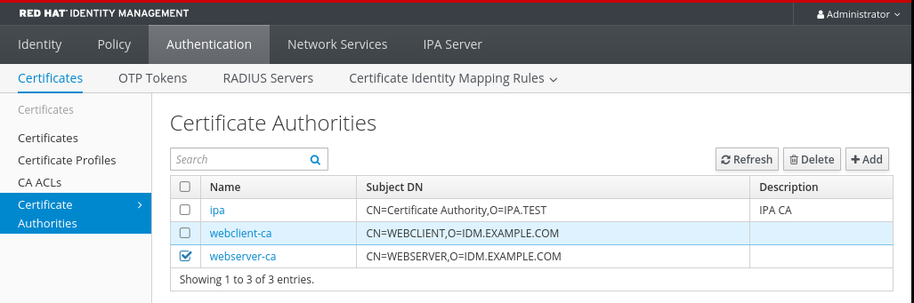 
4. Click `Delete` to confirm.

<h4 id="creating-a-sub-ca-from-the-idm-cli">28.1.3. Creating a sub-CA from the IdM CLI</h4>

You can use the IdM CLI to create new sub-CAs named **webserver-ca** and **webclient-ca**.

**Prerequisites**

- You are logged in as the administrator to an IdM server that is a CA server.

**Procedure**

1. Enter the `ipa ca-add` command, and specify the name of the **webserver-ca** sub-CA and its Subject Distinguished Name (DN):
   
   ```
   ipa ca-add webserver-ca --subject="CN=WEBSERVER,O=IDM.EXAMPLE.COM"
   ```
   
   ```plaintext
   [root@ipaserver ~]# ipa ca-add webserver-ca --subject="CN=WEBSERVER,O=IDM.EXAMPLE.COM"
   ```
   
   ```
   -------------------
   Created CA "webserver-ca"
   -------------------
     Name: webserver-ca
     Authority ID: ba83f324-5e50-4114-b109-acca05d6f1dc
     Subject DN: CN=WEBSERVER,O=IDM.EXAMPLE.COM
     Issuer DN: CN=Certificate Authority,O=IDM.EXAMPLE.COM
   ```
   
   ```plaintext
   -------------------
   Created CA "webserver-ca"
   -------------------
     Name: webserver-ca
     Authority ID: ba83f324-5e50-4114-b109-acca05d6f1dc
     Subject DN: CN=WEBSERVER,O=IDM.EXAMPLE.COM
     Issuer DN: CN=Certificate Authority,O=IDM.EXAMPLE.COM
   ```
   
   Name
   
   Name of the CA.
   
   Authority ID
   
   Automatically created, individual ID for the CA.
   
   Subject DN
   
   Subject Distinguished Name (DN). The Subject DN must be unique in the IdM CA infrastructure.
   
   Issuer DN
   
   Parent CA that issued the sub-CA certificate. All sub-CAs are created as a child of the IdM root CA.
2. Create the **webclient-ca** sub-CA for issuing certificates to web clients:
   
   ```
   ipa ca-add webclient-ca --subject="CN=WEBCLIENT,O=IDM.EXAMPLE.COM"
   -------------------
   Created CA "webclient-ca"
   -------------------
     Name: webclient-ca
     Authority ID: 8a479f3a-0454-4a4d-8ade-fd3b5a54ab2e
     Subject DN: CN=WEBCLIENT,O=IDM.EXAMPLE.COM
     Issuer DN: CN=Certificate Authority,O=IDM.EXAMPLE.COM
   ```
   
   ```plaintext
   [root@ipaserver ~]# ipa ca-add webclient-ca --subject="CN=WEBCLIENT,O=IDM.EXAMPLE.COM"
   -------------------
   Created CA "webclient-ca"
   -------------------
     Name: webclient-ca
     Authority ID: 8a479f3a-0454-4a4d-8ade-fd3b5a54ab2e
     Subject DN: CN=WEBCLIENT,O=IDM.EXAMPLE.COM
     Issuer DN: CN=Certificate Authority,O=IDM.EXAMPLE.COM
   ```
3. Run the **ipa-certupdate** command to create a **certmonger** tracking request for the **webserver-ca** and **webclient-ca** sub-CAs certificates:
   
   ```
   ipa-certupdate
   ```
   
   ```plaintext
   [root@ipaserver ~]# ipa-certupdate
   ```
   
   Important
   
   If you forget to run the **ipa-certupdate** command after creating a sub-CA and the sub-CA certificate expires, end-entity certificates issued by that sub-CA are considered invalid even though the end-entity certificate has not expired.

**Verification**

- Verify that the signing certificate of the new sub-CA has been added to the IdM database:
  
  ```
  certutil -d /etc/pki/pki-tomcat/alias/ -L
  ```
  
  ```plaintext
  [root@ipaserver ~]# certutil -d /etc/pki/pki-tomcat/alias/ -L
  ```
  
  ```
  Certificate Nickname                      Trust Attributes
                                            SSL,S/MIME,JAR/XPI
  
  caSigningCert cert-pki-ca                 CTu,Cu,Cu
  Server-Cert cert-pki-ca                   u,u,u
  auditSigningCert cert-pki-ca              u,u,Pu
  caSigningCert cert-pki-ca ba83f324-5e50-4114-b109-acca05d6f1dc u,u,u
  ocspSigningCert cert-pki-ca               u,u,u
  subsystemCert cert-pki-ca                 u,u,u
  ```
  
  ```plaintext
  Certificate Nickname                      Trust Attributes
                                            SSL,S/MIME,JAR/XPI
  
  caSigningCert cert-pki-ca                 CTu,Cu,Cu
  Server-Cert cert-pki-ca                   u,u,u
  auditSigningCert cert-pki-ca              u,u,Pu
  caSigningCert cert-pki-ca ba83f324-5e50-4114-b109-acca05d6f1dc u,u,u
  ocspSigningCert cert-pki-ca               u,u,u
  subsystemCert cert-pki-ca                 u,u,u
  ```
  
  Note
  
  The new sub-CA certificate is automatically transferred to all the replicas that have a certificate system instance installed.

<h4 id="disabling-a-sub-ca-from-the-idm-cli">28.1.4. Disabling a sub-CA from the IdM CLI</h4>

You can disable a sub-CA from the IdM CLI. If there are still non-expired certificates that were issued by a sub-CA, you should not delete it but you can disable it. If you delete the sub-CA, revocation checking for that sub-CA will no longer work.

**Prerequisites**

- You are logged in as the administrator.

**Procedure**

1. Run the `ipa ca-find` command to determine the name of the sub-CA you are deleting:
   
   ```
   ipa ca-find
   ```
   
   ```plaintext
   [root@ipaserver ~]# ipa ca-find
   ```
   
   ```
   -------------
   3 CAs matched
   -------------
     Name: ipa
     Description: IPA CA
     Authority ID: 5195deaf-3b61-4aab-b608-317aff38497c
     Subject DN: CN=Certificate Authority,O=IPA.TEST
     Issuer DN: CN=Certificate Authority,O=IPA.TEST
   
     Name: webclient-ca
     Authority ID: 605a472c-9c6e-425e-b959-f1955209b092
     Subject DN: CN=WEBCLIENT,O=IDM.EXAMPLE.COM
     Issuer DN: CN=Certificate Authority,O=IPA.TEST
   
    Name: webserver-ca
     Authority ID: 02d537f9-c178-4433-98ea-53aa92126fc3
     Subject DN: CN=WEBSERVER,O=IDM.EXAMPLE.COM
     Issuer DN: CN=Certificate Authority,O=IPA.TEST
   ----------------------------
   Number of entries returned 3
   ----------------------------
   ```
   
   ```plaintext
   -------------
   3 CAs matched
   -------------
     Name: ipa
     Description: IPA CA
     Authority ID: 5195deaf-3b61-4aab-b608-317aff38497c
     Subject DN: CN=Certificate Authority,O=IPA.TEST
     Issuer DN: CN=Certificate Authority,O=IPA.TEST
   
     Name: webclient-ca
     Authority ID: 605a472c-9c6e-425e-b959-f1955209b092
     Subject DN: CN=WEBCLIENT,O=IDM.EXAMPLE.COM
     Issuer DN: CN=Certificate Authority,O=IPA.TEST
   
    Name: webserver-ca
     Authority ID: 02d537f9-c178-4433-98ea-53aa92126fc3
     Subject DN: CN=WEBSERVER,O=IDM.EXAMPLE.COM
     Issuer DN: CN=Certificate Authority,O=IPA.TEST
   ----------------------------
   Number of entries returned 3
   ----------------------------
   ```
2. Run the `ipa ca-disable` command to disable your sub-CA, in this example, the `webserver-ca`:
   
   ```
   ipa ca-disable webserver-ca
   ```
   
   ```plaintext
   # ipa ca-disable webserver-ca
   ```
   
   ```
   --------------------------
   Disabled CA "webserver-ca"
   --------------------------
   ```
   
   ```plaintext
   --------------------------
   Disabled CA "webserver-ca"
   --------------------------
   ```

<h4 id="deleting-a-sub-ca-from-the-idm-cli">28.1.5. Deleting a sub-CA from the IdM CLI</h4>

You can delete lightweight sub-CAs from the IdM CLI.

Note

- If you delete a sub-CA, revocation checking for that sub-CA will no longer work. Only delete a sub-CA when there are no more certificates that were issued by that sub-CA whose `notAfter` expiration time is in the future.
- You should only disable sub-CAs while there are still non-expired certificates that were issued by that sub-CA. If all certificates that were issued by a sub-CA have expired, you can delete that sub-CA.
- You cannot disable or delete the IdM CA.

**Prerequisites**

- You are logged in as the administrator.

**Procedure**

1. To display a list of sub-CAs and CAs, run the `ipa ca-find` command:
   
   ```
   ipa ca-find
   ```
   
   ```plaintext
   # ipa ca-find
   ```
   
   ```
   -------------
   3 CAs matched
   -------------
     Name: ipa
     Description: IPA CA
     Authority ID: 5195deaf-3b61-4aab-b608-317aff38497c
     Subject DN: CN=Certificate Authority,O=IPA.TEST
     Issuer DN: CN=Certificate Authority,O=IPA.TEST
   
     Name: webclient-ca
     Authority ID: 605a472c-9c6e-425e-b959-f1955209b092
     Subject DN: CN=WEBCLIENT,O=IDM.EXAMPLE.COM
     Issuer DN: CN=Certificate Authority,O=IPA.TEST
   
    Name: webserver-ca
     Authority ID: 02d537f9-c178-4433-98ea-53aa92126fc3
     Subject DN: CN=WEBSERVER,O=IDM.EXAMPLE.COM
     Issuer DN: CN=Certificate Authority,O=IPA.TEST
   ----------------------------
   Number of entries returned 3
   ----------------------------
   ```
   
   ```plaintext
   -------------
   3 CAs matched
   -------------
     Name: ipa
     Description: IPA CA
     Authority ID: 5195deaf-3b61-4aab-b608-317aff38497c
     Subject DN: CN=Certificate Authority,O=IPA.TEST
     Issuer DN: CN=Certificate Authority,O=IPA.TEST
   
     Name: webclient-ca
     Authority ID: 605a472c-9c6e-425e-b959-f1955209b092
     Subject DN: CN=WEBCLIENT,O=IDM.EXAMPLE.COM
     Issuer DN: CN=Certificate Authority,O=IPA.TEST
   
    Name: webserver-ca
     Authority ID: 02d537f9-c178-4433-98ea-53aa92126fc3
     Subject DN: CN=WEBSERVER,O=IDM.EXAMPLE.COM
     Issuer DN: CN=Certificate Authority,O=IPA.TEST
   ----------------------------
   Number of entries returned 3
   ----------------------------
   ```
2. Run the `ipa ca-disable` command to disable your sub-CA, in this example, the `webserver-ca`:
   
   ```
   ipa ca-disable webserver-ca
   ```
   
   ```plaintext
   # ipa ca-disable webserver-ca
   ```
   
   ```
   --------------------------
   Disabled CA "webserver-ca"
   --------------------------
   ```
   
   ```plaintext
   --------------------------
   Disabled CA "webserver-ca"
   --------------------------
   ```
3. Delete the sub-CA, in this example, the `webserver-ca`:
   
   ```
   ipa ca-del webserver-ca
   ```
   
   ```plaintext
   # ipa ca-del webserver-ca
   ```
   
   ```
   -------------------------
   Deleted CA "webserver-ca"
   -------------------------
   ```
   
   ```plaintext
   -------------------------
   Deleted CA "webserver-ca"
   -------------------------
   ```

**Verification**

- Run `ipa ca-find` to display the list of CAs and sub-CAs. The `webserver-ca` is no longer on the list.
  
  ```
  ipa ca-find
  ```
  
  ```plaintext
  # ipa ca-find
  ```
  
  ```
  -------------
  2 CAs matched
  -------------
    Name: ipa
    Description: IPA CA
    Authority ID: 5195deaf-3b61-4aab-b608-317aff38497c
    Subject DN: CN=Certificate Authority,O=IPA.TEST
    Issuer DN: CN=Certificate Authority,O=IPA.TEST
  
    Name: webclient-ca
    Authority ID: 605a472c-9c6e-425e-b959-f1955209b092
    Subject DN: CN=WEBCLIENT,O=IDM.EXAMPLE.COM
    Issuer DN: CN=Certificate Authority,O=IPA.TEST
  ----------------------------
  Number of entries returned 2
  ----------------------------
  ```
  
  ```plaintext
  -------------
  2 CAs matched
  -------------
    Name: ipa
    Description: IPA CA
    Authority ID: 5195deaf-3b61-4aab-b608-317aff38497c
    Subject DN: CN=Certificate Authority,O=IPA.TEST
    Issuer DN: CN=Certificate Authority,O=IPA.TEST
  
    Name: webclient-ca
    Authority ID: 605a472c-9c6e-425e-b959-f1955209b092
    Subject DN: CN=WEBCLIENT,O=IDM.EXAMPLE.COM
    Issuer DN: CN=Certificate Authority,O=IPA.TEST
  ----------------------------
  Number of entries returned 2
  ----------------------------
  ```

<h3 id="downloading-the-sub-ca-certificate-from-idm-webui">28.2. Downloading the sub-CA certificate from IdM WebUI</h3>

Retrieve the public signing certificate from the IdM Web UI to establish trust chains. Administrators must install this file on client systems to ensure applications recognize and trust certificates issued by the specific sub-CA.

**Prerequisites**

- You are logged in as the administrator.

**Procedure**

1. In the **Authentication** menu, click **Certificates** &gt; **Certificates**.
   
   **sub-CA certificate in the list of certificates**
   
    
2. Click the serial number of the sub-CA certificate to open the certificate information page.
3. In the certificate information page, click **Actions** &gt; **Download**.
4. In the CLI, move the sub-CA certificate to the `/etc/pki/tls/private/` directory:
   
   ```
   mv path/to/the/downloaded/certificate /etc/pki/tls/private/sub-ca.crt
   ```
   
   ```plaintext
   # mv path/to/the/downloaded/certificate /etc/pki/tls/private/sub-ca.crt
   ```

<h3 id="creating-ca-acls-for-web-server-and-client-authentication">28.3. Creating CA ACLs for web server and client authentication</h3>

Certificate authority access control list (CA ACL) rules define which profiles can be used to issue certificates to which users, services, or hosts. By associating profiles, principals, and groups, CA ACLs permit principals or groups to request certificates using particular profiles.

For example, using CA ACLs, the administrator can restrict the use of a profile intended for employees working from an office located in London only to users that are members of the London office-related group.

<h4 id="viewing-ca-acls-in-idm-cli">28.3.1. Viewing CA ACLs in IdM CLI</h4>

You can view the list of certificate authority access control lists (CA ACLs) available in your IdM deployment and the details of a specific CA ACL.

**Procedure**

1. To view all the CA ACLs in your IdM environment, enter the `ipa caacl-find` command:
   
   ```
   ipa caacl-find
   ```
   
   ```plaintext
   $ ipa caacl-find
   ```
   
   ```
   -----------------
   1 CA ACL matched
   -----------------
     ACL name: hosts_services_caIPAserviceCert
     Enabled: TRUE
   ```
   
   ```plaintext
   -----------------
   1 CA ACL matched
   -----------------
     ACL name: hosts_services_caIPAserviceCert
     Enabled: TRUE
   ```
2. To view the details of a CA ACL, enter the `ipa caacl-show` command, and specify the CA ACL name. For example, to view the details of the **hosts\_services\_caIPAserviceCert** CA ACL, enter:
   
   ```
   ipa caacl-show hosts_services_caIPAserviceCert
   ```
   
   ```plaintext
   $ ipa caacl-show hosts_services_caIPAserviceCert
   ```
   
   ```
     ACL name: hosts_services_caIPAserviceCert
     Enabled: TRUE
     Host category: all
     Service category: all
     CAs: ipa
     Profiles: caIPAserviceCert
     Users: admin
   ```
   
   ```plaintext
     ACL name: hosts_services_caIPAserviceCert
     Enabled: TRUE
     Host category: all
     Service category: all
     CAs: ipa
     Profiles: caIPAserviceCert
     Users: admin
   ```

<h4 id="creating-a-ca-acl-for-web-servers-authenticating-to-web-clients-using-certificates-issued-by-webserver-ca">28.3.2. Creating a CA ACL for web servers authenticating to web clients using certificates issued by webserver-ca</h4>

You can create a CA ACL that requires the system administrator to use the **webserver-ca** sub-CA and the **caIPAserviceCert** profile when requesting a certificate for the **HTTP/my\_company.idm.example.com@IDM.EXAMPLE.COM** service. If the user requests a certificate from a different sub-CA or of a different profile, the request fails. The only exception is when there is another matching CA ACL that is enabled. To view the available CA ACLs, see [Viewing CA ACLs in IdM CLI](#viewing-ca-acls-in-idm-cli "28.3.1. Viewing CA ACLs in IdM CLI").

**Prerequisites**

- The **HTTP/my\_company.idm.example.com@IDM.EXAMPLE.COM** service is part of IdM.
- You are logged in as the administrator.

**Procedure**

1. Create a CA ACL using the `ipa caacl` command, and specify its name:
   
   ```
   ipa caacl-add TLS_web_server_authentication
   ```
   
   ```plaintext
   $ ipa caacl-add TLS_web_server_authentication
   ```
   
   ```
   --------------------------------------------
   Added CA ACL "TLS_web_server_authentication"
   --------------------------------------------
     ACL name: TLS_web_server_authentication
     Enabled: TRUE
   ```
   
   ```plaintext
   --------------------------------------------
   Added CA ACL "TLS_web_server_authentication"
   --------------------------------------------
     ACL name: TLS_web_server_authentication
     Enabled: TRUE
   ```
2. Modify the CA ACL using the `ipa caacl-mod` command to specify the description of the CA ACL:
   
   ```
   ipa caacl-mod TLS_web_server_authentication --desc="CAACL for web servers authenticating to web clients using certificates issued by webserver-ca"
   ```
   
   ```plaintext
   $ ipa caacl-mod TLS_web_server_authentication --desc="CAACL for web servers authenticating to web clients using certificates issued by webserver-ca"
   ```
   
   ```
   -----------------------------------------------
   Modified CA ACL "TLS_web_server_authentication"
   -----------------------------------------------
     ACL name: TLS_web_server_authentication
     Description: CAACL for web servers authenticating to web clients using certificates issued by webserver-ca
     Enabled: TRUE
   ```
   
   ```plaintext
   -----------------------------------------------
   Modified CA ACL "TLS_web_server_authentication"
   -----------------------------------------------
     ACL name: TLS_web_server_authentication
     Description: CAACL for web servers authenticating to web clients using certificates issued by webserver-ca
     Enabled: TRUE
   ```
3. Add the **webserver-ca** sub-CA to the CA ACL:
   
   ```
   ipa caacl-add-ca TLS_web_server_authentication --ca=webserver-ca
   ```
   
   ```plaintext
   $ ipa caacl-add-ca TLS_web_server_authentication --ca=webserver-ca
   ```
   
   ```
     ACL name: TLS_web_server_authentication
     Description: CAACL for web servers authenticating to web clients using certificates issued by webserver-ca
     Enabled: TRUE
     CAs: webserver-ca
   -------------------------
   Number of members added 1
   -------------------------
   ```
   
   ```plaintext
     ACL name: TLS_web_server_authentication
     Description: CAACL for web servers authenticating to web clients using certificates issued by webserver-ca
     Enabled: TRUE
     CAs: webserver-ca
   -------------------------
   Number of members added 1
   -------------------------
   ```
4. Use the `ipa caacl-add-service` to specify the service whose principal will be able to request a certificate:
   
   ```
   ipa caacl-add-service TLS_web_server_authentication --service=HTTP/my_company.idm.example.com@IDM.EXAMPLE.COM
   ```
   
   ```plaintext
   $ ipa caacl-add-service TLS_web_server_authentication --service=HTTP/my_company.idm.example.com@IDM.EXAMPLE.COM
   ```
   
   ```
     ACL name: TLS_web_server_authentication
     Description: CAACL for web servers authenticating to web clients using certificates issued by webserver-ca
     Enabled: TRUE
     CAs: webserver-ca
     Services: HTTP/my_company.idm.example.com@IDM.EXAMPLE.COM
   -------------------------
   Number of members added 1
   -------------------------
   ```
   
   ```plaintext
     ACL name: TLS_web_server_authentication
     Description: CAACL for web servers authenticating to web clients using certificates issued by webserver-ca
     Enabled: TRUE
     CAs: webserver-ca
     Services: HTTP/my_company.idm.example.com@IDM.EXAMPLE.COM
   -------------------------
   Number of members added 1
   -------------------------
   ```
5. Use the `ipa caacl-add-profile` command to specify the certificate profile for the requested certificate:
   
   ```
   ipa caacl-add-profile TLS_web_server_authentication --certprofiles=caIPAserviceCert
   ```
   
   ```plaintext
   $ ipa caacl-add-profile TLS_web_server_authentication --certprofiles=caIPAserviceCert
   ```
   
   ```
     ACL name: TLS_web_server_authentication
     Description: CAACL for web servers authenticating to web clients using certificates issued by webserver-ca
     Enabled: TRUE
     CAs: webserver-ca
     Profiles: caIPAserviceCert
     Services: HTTP/my_company.idm.example.com@IDM.EXAMPLE.COM
   -------------------------
   Number of members added 1
   -------------------------
   ```
   
   ```plaintext
     ACL name: TLS_web_server_authentication
     Description: CAACL for web servers authenticating to web clients using certificates issued by webserver-ca
     Enabled: TRUE
     CAs: webserver-ca
     Profiles: caIPAserviceCert
     Services: HTTP/my_company.idm.example.com@IDM.EXAMPLE.COM
   -------------------------
   Number of members added 1
   -------------------------
   ```
   
   You can use the newly-created CA ACL straight away. It is enabled after its creation by default.
   
   Note
   
   The point of CA ACLs is to specify which CA and profile combinations are allowed for requests coming from particular principals or groups. CA ACLs do not affect certificate validation or trust. They do not affect how the issued certificates will be used.

<h4 id="creating-a-ca-acl-for-user-web-browsers-authenticating-to-web-servers-using-certificates-issued-by-webclient-ca">28.3.3. Creating a CA ACL for user web browsers authenticating to web servers using certificates issued by webclient-ca</h4>

You can create a CA ACL that requires the system administrator to use the **webclient-ca** sub-CA and the **IECUserRoles** profile when requesting a certificate. If the user requests a certificate from a different sub-CA or of a different profile, the request fails. The only exception is when there is another matching CA ACL that is enabled. To view the available CA ACLs, see [Viewing CA ACLs in IdM CLI](#viewing-ca-acls-in-idm-cli "28.3.1. Viewing CA ACLs in IdM CLI").

**Prerequisites**

- You are logged in as the administrator.

**Procedure**

1. Create a CA ACL using the `ipa caacl` command and specify its name:
   
   ```
   ipa caacl-add TLS_web_client_authentication
   ```
   
   ```plaintext
   $ ipa caacl-add TLS_web_client_authentication
   ```
   
   ```
   --------------------------------------------
   Added CA ACL "TLS_web_client_authentication"
   --------------------------------------------
     ACL name: TLS_web_client_authentication
     Enabled: TRUE
   ```
   
   ```plaintext
   --------------------------------------------
   Added CA ACL "TLS_web_client_authentication"
   --------------------------------------------
     ACL name: TLS_web_client_authentication
     Enabled: TRUE
   ```
2. Modify the CA ACL using the `ipa caacl-mod` command to specify the description of the CA ACL:
   
   ```
   ipa caacl-mod TLS_web_client_authentication --desc="CAACL for user web browsers authenticating to web servers using certificates issued by webclient-ca"
   ```
   
   ```plaintext
   $ ipa caacl-mod TLS_web_client_authentication --desc="CAACL for user web browsers authenticating to web servers using certificates issued by webclient-ca"
   ```
   
   ```
   -----------------------------------------------
   Modified CA ACL "TLS_web_client_authentication"
   -----------------------------------------------
     ACL name: TLS_web_client_authentication
     Description: CAACL for user web browsers authenticating to web servers using certificates issued by webclient-ca
     Enabled: TRUE
   ```
   
   ```plaintext
   -----------------------------------------------
   Modified CA ACL "TLS_web_client_authentication"
   -----------------------------------------------
     ACL name: TLS_web_client_authentication
     Description: CAACL for user web browsers authenticating to web servers using certificates issued by webclient-ca
     Enabled: TRUE
   ```
3. Add the **webclient-ca** sub-CA to the CA ACL:
   
   ```
   ipa caacl-add-ca TLS_web_client_authentication --ca=webclient-ca
   ```
   
   ```plaintext
   $ ipa caacl-add-ca TLS_web_client_authentication --ca=webclient-ca
   ```
   
   ```
     ACL name: TLS_web_client_authentication
     Description: CAACL for user web browsers authenticating to web servers using certificates issued by webclient-ca
     Enabled: TRUE
     CAs: webclient-ca
   -------------------------
   Number of members added 1
   -------------------------
   ```
   
   ```plaintext
     ACL name: TLS_web_client_authentication
     Description: CAACL for user web browsers authenticating to web servers using certificates issued by webclient-ca
     Enabled: TRUE
     CAs: webclient-ca
   -------------------------
   Number of members added 1
   -------------------------
   ```
4. Use the `ipa caacl-add-profile` command to specify the certificate profile for the requested certificate:
   
   ```
   ipa caacl-add-profile TLS_web_client_authentication --certprofiles=IECUserRoles
   ```
   
   ```plaintext
   $ ipa caacl-add-profile TLS_web_client_authentication --certprofiles=IECUserRoles
   ```
   
   ```
     ACL name: TLS_web_client_authentication
     Description: CAACL for user web browsers authenticating to web servers using certificates issued by webclient-ca
     Enabled: TRUE
     CAs: webclient-ca
     Profiles: IECUserRoles
   -------------------------
   Number of members added 1
   -------------------------
   ```
   
   ```plaintext
     ACL name: TLS_web_client_authentication
     Description: CAACL for user web browsers authenticating to web servers using certificates issued by webclient-ca
     Enabled: TRUE
     CAs: webclient-ca
     Profiles: IECUserRoles
   -------------------------
   Number of members added 1
   -------------------------
   ```
5. Modify the CA ACL using the `ipa caacl-mod` command to specify that the CA ACL applies to all IdM users:
   
   ```
   ipa caacl-mod TLS_web_client_authentication --usercat=all
   ```
   
   ```plaintext
   $ ipa caacl-mod TLS_web_client_authentication --usercat=all
   ```
   
   ```
   -----------------------------------------------
   Modified CA ACL "TLS_web_client_authentication"
   -----------------------------------------------
     ACL name: TLS_web_client_authentication
     Description: CAACL for user web browsers authenticating to web servers using certificates issued by webclient-ca
     Enabled: TRUE
     User category: all
     CAs: webclient-ca
     Profiles: IECUserRoles
   ```
   
   ```plaintext
   -----------------------------------------------
   Modified CA ACL "TLS_web_client_authentication"
   -----------------------------------------------
     ACL name: TLS_web_client_authentication
     Description: CAACL for user web browsers authenticating to web servers using certificates issued by webclient-ca
     Enabled: TRUE
     User category: all
     CAs: webclient-ca
     Profiles: IECUserRoles
   ```
   
   You can use the newly-created CA ACL straight away. It is enabled after its creation by default.
   
   Note
   
   The point of CA ACLs is to specify which CA and profile combinations are allowed for requests coming from particular principals or groups. CA ACLs do not affect certificate validation or trust. They do not affect how the issued certificates will be used.

<h3 id="obtaining-a-certificate-for-a-service-from-an-idm-sub-ca-using-certmonger">28.4. Obtaining a certificate for a service from an IdM sub-CA using certmonger</h3>

To ensure that communication between browsers and the web service running on your IdM client is secure and encrypted, use a TLS certificate. If you want to restrict web browsers to trust certificates issued by the `webserver-ca` sub-CA but no other IdM sub-CA, obtain the TLS certificate for your web service from the `webserver-ca` sub-CA.

Follow this procedure to use `certmonger` to obtain an IdM certificate for a service (`HTTP/my_company.idm.example.com`@`IDM.EXAMPLE.COM`) running on an IdM client.

Using `certmonger` to request the certificate automatically means that `certmonger` manages and renews the certificate when it is due for a renewal.

For a visual representation of what happens when `certmonger` requests a service certificate, see [Communication flow for certmonger requesting a service certificate](#communication-flow-for-certmonger-requesting-a-service-certificate "25.3. Communication flow for certmonger requesting a service certificate").

**Prerequisites**

- The web server is enrolled as an IdM client.
- You have root access to the IdM client on which you are running the procedure.
- The service for which you are requesting a certificate does not have to pre-exist in IdM.

**Procedure**

1. On the `my_company.idm.example.com` IdM client on which the `HTTP` service is running, request a certificate for the service corresponding to the `HTTP/my_company.idm.example.com@IDM.EXAMPLE.COM` principal, and specify that
   
   - The certificate is to be stored in the local `/etc/pki/tls/certs/httpd.pem` file
   - The private key is to be stored in the local `/etc/pki/tls/private/httpd.key` file
   - The `webserver-ca` sub-CA is to be the issuing certificate authority
   - That an extensionRequest for a `SubjectAltName` be added to the signing request with the DNS name of `my_company.idm.example.com`:
     
     ```
     ipa-getcert request -K HTTP/my_company.idm.example.com -k /etc/pki/tls/private/httpd.key -f /etc/pki/tls/certs/httpd.pem -g 2048 -D my_company.idm.example.com -X webserver-ca -C "systemctl restart httpd"
     ```
     
     ```plaintext
     # ipa-getcert request -K HTTP/my_company.idm.example.com -k /etc/pki/tls/private/httpd.key -f /etc/pki/tls/certs/httpd.pem -g 2048 -D my_company.idm.example.com -X webserver-ca -C "systemctl restart httpd"
     ```
     
     ```
     New signing request "20190604065735" added.
     ```
     
     ```plaintext
     New signing request "20190604065735" added.
     ```
     
     In the command above:
     
     - The `ipa-getcert request` command specifies that the certificate is to be obtained from the IdM CA. The `ipa-getcert request` command is a shortcut for `getcert request -c IPA`.
     - The `-g` option specifies the size of key to be generated if one is not already in place.
     - The `-D` option specifies the `SubjectAltName` DNS value to be added to the request.
     - The `-X` option specifies that the issuer of the certificate must be `webserver-ca`, not `ipa`.
     - The `-C` option instructs `certmonger` to restart the `httpd` service after obtaining the certificate.
     
     <!--THE END-->
     
     - To specify that the certificate be issued with a particular profile, use the `-T` option.
2. Optional: To check the status of your request:
   
   ```
   ipa-getcert list -f /etc/pki/tls/certs/httpd.pem
   ```
   
   ```plaintext
   # ipa-getcert list -f /etc/pki/tls/certs/httpd.pem
   ```
   
   ```
   Number of certificates and requests being tracked: 3.
   Request ID '20190604065735':
       status: MONITORING
       stuck: no
       key pair storage: type=FILE,location='/etc/pki/tls/private/httpd.key'
       certificate: type=FILE,location='/etc/pki/tls/certs/httpd.crt'
       CA: IPA
       issuer: CN=WEBSERVER,O=IDM.EXAMPLE.COM
   
   [...]
   ```
   
   ```plaintext
   Number of certificates and requests being tracked: 3.
   Request ID '20190604065735':
       status: MONITORING
       stuck: no
       key pair storage: type=FILE,location='/etc/pki/tls/private/httpd.key'
       certificate: type=FILE,location='/etc/pki/tls/certs/httpd.crt'
       CA: IPA
       issuer: CN=WEBSERVER,O=IDM.EXAMPLE.COM
   
   [...]
   ```
   
   The output shows that the request is in the `MONITORING` status, which means that a certificate has been obtained. The locations of the key pair and the certificate are those requested.

<h3 id="setting-up-a-single-instance-apache-http-server">28.5. Setting up a single-instance Apache HTTP server</h3>

To distribute static contents through your web server, configure the Apache HTTP Server to distribute these contents.

By default, the Apache HTTP Server provides the same content for all domains associated with the server. If you want to provide different content for different domains, set up name-based virtual hosts. For details, see [Configuring Apache name-based virtual hosts](https://docs.redhat.com/en/documentation/red_hat_enterprise_linux/10/html/deploying_web_servers_and_reverse_proxies/setting-up-the-apache-http-web-server#configuring-apache-name-based-virtual-hosts).

**Prerequisites**

- You have set up firewall rules to enable basic web service connectivity before configuring the Transport Layer Security (TLS) protocol.

**Procedure**

1. Install the `httpd` package:
   
   ```
   dnf install httpd
   ```
   
   ```plaintext
   # dnf install httpd
   ```
2. If you use `firewalld`, open the TCP port `80` in the local firewall:
   
   ```
   firewall-cmd --permanent --add-port=80/tcp
   ```
   
   ```plaintext
   # firewall-cmd --permanent --add-port=80/tcp
   ```
   
   ```
   firewall-cmd --reload
   ```
   
   ```plaintext
   # firewall-cmd --reload
   ```
3. Enable and start the `httpd` service:
   
   ```
   systemctl enable --now httpd
   ```
   
   ```plaintext
   # systemctl enable --now httpd
   ```
4. Optional: Add HTML files to the `/var/www/html/` directory.
   
   Note
   
   When adding content to `/var/www/html/`, files and directories must be readable by the user under which `httpd` runs by default. The content owner can be either the `root` user and `root` user group, or another user or group of the administrator’s choice. If the content owner is the `root` user and `root` user group, the files must be readable by other users. All the files and directories must have the `httpd_sys_content_t` SELinux context, which is applicable by default to all content within the `/var/www` directory.
5. Connect to a web browser at `http://server_IP_or_host_name/`.
   
   If the `/var/www/html/` directory is empty or does not contain an `index.html` or `index.htm` file, Apache displays the `Red Hat Enterprise Linux Test Page`. If `/var/www/html/` contains HTML files with a different name, you can load them by entering the URL to that file, such as `http://server_IP_or_host_name/example.html`.
   
   For details, see the `httpd.service(8)` man page on your system.

<h3 id="adding-tls-encryption-to-an-apache-http-server">28.6. Adding TLS encryption to an Apache HTTP server</h3>

You can secure web traffic by installing `mod_ssl`. Configure the virtual host to use the IdM-issued private key and certificate to enable encrypted HTTPS connections for the domain by using the sub-CA credentials.

**Prerequisites**

- The Apache HTTP Server is installed and running.
- The private key is stored in the `/etc/pki/tls/private/example.com.key` file.
  
  For details about creating a private key and certificate signing request (CSR), and how to request a certificate from a certificate authority (CA), see documentation of your CA.
- The TLS certificate is stored in the `/etc/pki/tls/certs/example.com.crt` file. If you use a different path, follow the corresponding steps of the procedure.
- The CA certificate is stored in the `/etc/pki/tls/certs/ca.crt` file. If you use a different path, follow the corresponding steps of the procedure.
- The clients and the web server resolve the hostname of the server to the IP address of the web server.
- If the server runs Red Hat Enterprise Linux 10 (RHEL) and the Federal Information Processing Standards (FIPS) mode is enabled, clients must either support the `Extended Master Secret` (EMS) extension or use Transport Layer Security (TLS) 1.3. TLS 1.2 connections without EMS fail. For details, see the Red Hat Knowledgebase solution [TLS extension "Extended Master Secret" enforced](https://access.redhat.com/solutions/7018256).

**Procedure**

1. Install the `mod_ssl` package:
   
   ```
   dnf install mod_ssl
   ```
   
   ```plaintext
   # dnf install mod_ssl
   ```
2. Edit the `/etc/httpd/conf.d/ssl.conf` file and add the following settings to the `<VirtualHost _default_:443>` directive:
   
   1. Set the server name:
      
      ```
      ServerName example.com
      ```
      
      ```plaintext
      ServerName example.com
      ```
      
      The server name must match the entry set in the `Common Name` field of the certificate.
   2. Optional: If the certificate includes additional host names in the `Subject Alt Names` (SAN) field, you can configure `mod_ssl` to provide TLS encryption also for these host names. To configure this, add the `ServerAliases` parameter with corresponding names:
      
      ```
      ServerAlias www.example.com server.example.com
      ```
      
      ```plaintext
      ServerAlias www.example.com server.example.com
      ```
   3. Set the paths to the private key, the server certificate, and the CA certificate:
      
      ```
      SSLCertificateKeyFile "/etc/pki/tls/private/example.com.key"
      SSLCertificateFile "/etc/pki/tls/certs/example.com.crt"
      SSLCACertificateFile "/etc/pki/tls/certs/ca.crt"
      ```
      
      ```plaintext
      SSLCertificateKeyFile "/etc/pki/tls/private/example.com.key"
      SSLCertificateFile "/etc/pki/tls/certs/example.com.crt"
      SSLCACertificateFile "/etc/pki/tls/certs/ca.crt"
      ```
3. For security reasons, configure that only the `root` user can access the private key file:
   
   ```
   chown root:root /etc/pki/tls/private/example.com.key
   ```
   
   ```plaintext
   # chown root:root /etc/pki/tls/private/example.com.key
   ```
   
   ```
   chmod 600 /etc/pki/tls/private/example.com.key
   ```
   
   ```plaintext
   # chmod 600 /etc/pki/tls/private/example.com.key
   ```
   
   Warning
   
   If unauthorized users access the private key, revoke the certificate, create a new private key, and request a new certificate. Otherwise, the TLS connection is no longer secure.
   
   - Open a web browser and connect to `https://example.com`.

**Additional resources**

- [Security considerations for TLS in RHEL 10](https://docs.redhat.com/en/documentation/red_hat_enterprise_linux/10/html/securing_networks/planning-and-implementing-tls#security-considerations-for-tls-in-rhel-10)

<h3 id="setting-the-supported-tls-protocol-versions-on-an-apache-http-server">28.7. Setting the supported TLS protocol versions on an Apache HTTP server</h3>

By default, the Apache HTTP Server on RHEL uses the system-wide cryptographic policy that defines safe default values, which are also compatible with recent browsers. For example, the `DEFAULT` policy defines that only the `TLSv1.2` and `TLSv1.3` protocol versions are enabled in Apache HTTP Server.

You can manually configure TLS protocol versions that the Apache HTTP Server supports. You need to enable only specific TLS protocol versions in your environment in these cases:

- If your environment requires that clients can also use the weak `TLS1` (TLSv1.0) or `TLS1.1` protocol.
- If you want to configure that Apache only supports the `TLSv1.2` or `TLSv1.3` protocol.

**Prerequisites**

- You have enabled transport layer security (TLS) encryption on the server.
- If the server runs Red Hat Enterprise Linux 10 (RHEL) and the Federal Information Processing Standards (FIPS) mode is enabled, clients must either support the `Extended Master Secret` (EMS) extension or use Transport Layer Security (TLS) 1.3. TLS 1.2 connections without EMS fail. For details, see the Red Hat Knowledgebase solution [TLS extension "Extended Master Secret" enforced](https://access.redhat.com/solutions/7018256).

**Procedure**

1. Edit the `/etc/httpd/conf/httpd.conf` file and add the `<VirtualHost>` directive for which you want to set the `TLSv1.3` protocol version:
   
   ```
   SSLProtocol -All TLSv1.3
   ```
   
   ```plaintext
   SSLProtocol -All TLSv1.3
   ```
2. Restart the `httpd` service:
   
   ```
   systemctl restart httpd
   ```
   
   ```plaintext
   # systemctl restart httpd
   ```

**Verification**

1. Verify support for `TLSv1.3`:
   
   ```
   openssl s_client -connect example.com:443 -tls1_3
   ```
   
   ```plaintext
   # openssl s_client -connect example.com:443 -tls1_3
   ```
2. Verify support for `TLSv1.2`:
   
   ```
   openssl s_client -connect example.com:443 -tls1_2
   ```
   
   ```plaintext
   # openssl s_client -connect example.com:443 -tls1_2
   ```
   
   If the server does not support the protocol, the command returns an error:
   
   ```
   140111600609088:error:1409442E:SSL routines:ssl3_read_bytes:tlsv1 alert protocol version:ssl/record/rec_layer_s3.c:1543:SSL alert number 70
   ```
   
   ```plaintext
   140111600609088:error:1409442E:SSL routines:ssl3_read_bytes:tlsv1 alert protocol version:ssl/record/rec_layer_s3.c:1543:SSL alert number 70
   ```
3. Optional: Repeat the command for other TLS protocol versions.

<h3 id="setting-the-supported-ciphers-on-an-apache-http-server">28.8. Setting the supported ciphers on an Apache HTTP server</h3>

By default, the Apache HTTP Server uses the system-wide cryptographic policy that defines safe default values, which are also compatible with recent browsers. For the list of ciphers the system-wide cryptographic policy allows, see the `/etc/crypto-policies/back-ends/openssl.config` file.

You can manually configure ciphers that the Apache HTTP Server supports.

**Prerequisites**

- You have enabled Transport Layer Security (TLS) encryption on the server.

**Procedure**

1. Install the `nmap` package:
   
   ```
   dnf install nmap
   ```
   
   ```plaintext
   # dnf install nmap
   ```
2. Edit the `/etc/httpd/conf/httpd.conf` file and add the `SSLCipherSuite` parameter to the `<VirtualHost>` directive for which you want to set the TLS ciphers:
   
   ```
   SSLCipherSuite "EECDH+AESGCM:EDH+AESGCM:AES256+EECDH:AES256+EDH:!SHA1:!SHA256"
   ```
   
   ```plaintext
   SSLCipherSuite "EECDH+AESGCM:EDH+AESGCM:AES256+EECDH:AES256+EDH:!SHA1:!SHA256"
   ```
   
   This example enables only the `EECDH+AESGCM`, `EDH+AESGCM`, `AES256+EECDH`, and `AES256+EDH` ciphers and disables all ciphers that use the `SHA1` and `SHA256` message authentication code (MAC).
3. Restart the `httpd` service:
   
   ```
   systemctl restart httpd
   ```
   
   ```plaintext
   # systemctl restart httpd
   ```

**Verification**

- Display the supported ciphers:
  
  ```
  nmap --script ssl-enum-ciphers -p 443 example.com
  ```
  
  ```plaintext
  # nmap --script ssl-enum-ciphers -p 443 example.com
  ```
  
  ```
  ...
  PORT    STATE SERVICE
  443/tcp open  https
  | ssl-enum-ciphers:
  |   TLSv1.2:
  |     ciphers:
  |       TLS_ECDHE_RSA_WITH_AES_256_GCM_SHA384 (ecdh_x25519) - A
  |       TLS_DHE_RSA_WITH_AES_256_GCM_SHA384 (dh 2048) - A
  |       TLS_ECDHE_RSA_WITH_CHACHA20_POLY1305_SHA256 (ecdh_x25519) - A
  ...
  ```
  
  ```plaintext
  ...
  PORT    STATE SERVICE
  443/tcp open  https
  | ssl-enum-ciphers:
  |   TLSv1.2:
  |     ciphers:
  |       TLS_ECDHE_RSA_WITH_AES_256_GCM_SHA384 (ecdh_x25519) - A
  |       TLS_DHE_RSA_WITH_AES_256_GCM_SHA384 (dh 2048) - A
  |       TLS_ECDHE_RSA_WITH_CHACHA20_POLY1305_SHA256 (ecdh_x25519) - A
  ...
  ```

**Additional resources**

- [Installing the Apache HTTP server manual](https://docs.redhat.com/en/documentation/red_hat_enterprise_linux/10/html/deploying_web_servers_and_reverse_proxies/setting-up-the-apache-http-web-server#installing-the-apache-http-server-manual)
- [Configuring applications to use cryptographic hardware through PKCS #11](https://docs.redhat.com/en/documentation/red_hat_enterprise_linux/10/html/security_hardening/configuring-applications-to-use-cryptographic-hardware-through-pkcs-11#using-hsms-protecting-private-keys-in-apache)

<h3 id="configuring-tls-client-certificate-authentication">28.9. Configuring TLS client certificate authentication</h3>

To allow only authenticated users to access resources on the web server, configure client certificate authentication for the `/var/www/html/Example/` directory.

If the Apache HTTP Server uses the Transport Layer Security (TLS) 1.3 protocol, some clients require additional configuration. For example, in Mozilla Firefox, set the `security.tls.enable_post_handshake_auth` parameter in the `about:config` menu to `true`.

**Prerequisites**

- You have enabled TLS encryption on the server.

**Procedure**

1. Edit the `/etc/httpd/conf/httpd.conf` file to configure client authentication:
   
   ```
   <Directory "/var/www/html/Example/">
     SSLVerifyClient require
   </Directory>
   ```
   
   ```plaintext
   <Directory "/var/www/html/Example/">
     SSLVerifyClient require
   </Directory>
   ```
   
   The `SSLVerifyClient require` setting configures the server to require a client certificate before the client can access the content in the `/var/www/html/Example/` directory.
2. Restart the `httpd` service:
   
   ```
   systemctl restart httpd
   ```
   
   ```plaintext
   # systemctl restart httpd
   ```

**Verification**

1. Access the `https://example.com/Example/` URL without client authentication:
   
   ```
   curl \https://example.com/Example/
   ```
   
   ```plaintext
   $ curl \https://example.com/Example/
   ```
   
   ```
   curl: (56) OpenSSL SSL_read: error:1409445C:SSL routines:ssl3_read_bytes:tlsv13 alert certificate required, errno 0
   ```
   
   ```plaintext
   curl: (56) OpenSSL SSL_read: error:1409445C:SSL routines:ssl3_read_bytes:tlsv13 alert certificate required, errno 0
   ```
   
   The error indicates that the web server requires a client certificate authentication.
2. Access the same URL with client authentication by passing the client private key and certificate, and the CA certificate:
   
   ```
   curl --cacert ca.crt --key client.key --cert client.crt https://example.com/Example/
   ```
   
   ```plaintext
   $ curl --cacert ca.crt --key client.key --cert client.crt https://example.com/Example/
   ```
   
   If the request succeeds, the `curl` utility displays the `index.html` file stored in the `/var/www/html/Example/` directory.

<h3 id="requesting-a-new-user-certificate-from-an-idm-sub-ca-and-exporting-it-to-the-client">28.10. Requesting a new user certificate from an IdM sub-CA and exporting it to the client</h3>

As an Identity Management (IdM) administrator, you can configure a web server running on an IdM client to request users that use web browsers to access the server to authenticate with certificates issued by a specific IdM sub-CA. Follow this procedure to request a user certificate from a specific IdM sub-CA and to export the certificate and the corresponding private key on to the host from which the user wants to access the web server using a web browser. Afterwards, [import the certificate and the private key into the browser](#configuring-a-browser-to-enable-certificate-authentication "16.4. Configuring a browser to enable certificate authentication").

**Procedure**

01. Optional: Create a new directory, for example `~/certdb/`, and make it a temporary certificate database. When asked, create an NSS Certificate DB password to encrypt the keys to the certificate to be generated in a subsequent step:
    
    ```
    mkdir ~/certdb/
    ```
    
    ```plaintext
    # mkdir ~/certdb/
    ```
    
    ```
    certutil -N -d ~/certdb/
    Enter a password which will be used to encrypt your keys.
    The password should be at least 8 characters long,
    and should contain at least one non-alphabetic character.
    
    Enter new password:
    Re-enter password:
    ```
    
    ```plaintext
    # certutil -N -d ~/certdb/
    Enter a password which will be used to encrypt your keys.
    The password should be at least 8 characters long,
    and should contain at least one non-alphabetic character.
    
    Enter new password:
    Re-enter password:
    ```
02. Create the certificate signing request (CSR) and redirect the output to a file. For example, to create a CSR with the name `certificate_request.csr` for a `4096` bit certificate for the `idm_user` user in the `IDM.EXAMPLE.COM` realm, setting the nickname of the certificate private keys to `idm_user` for easy findability, and setting the subject to `CN=idm_user,O=IDM.EXAMPLE.COM`:
    
    ```
    certutil -R -d ~/certdb/ -a -g 4096 -n idm_user -s "CN=idm_user,O=IDM.EXAMPLE.COM" > certificate_request.csr
    ```
    
    ```plaintext
    # certutil -R -d ~/certdb/ -a -g 4096 -n idm_user -s "CN=idm_user,O=IDM.EXAMPLE.COM" > certificate_request.csr
    ```
03. When prompted, enter the same password that you entered when using `certutil` to create the temporary database. Then continue typing randomly until told to stop:
    
    ```
    Enter Password or Pin for "NSS Certificate DB":
    
    A random seed must be generated that will be used in the
    creation of your key.  One of the easiest ways to create a
    random seed is to use the timing of keystrokes on a keyboard.
    
    To begin, type keys on the keyboard until this progress meter
    is full.  DO NOT USE THE AUTOREPEAT FUNCTION ON YOUR KEYBOARD!
    
    
    Continue typing until the progress meter is full:
    ```
    
    ```plaintext
    Enter Password or Pin for "NSS Certificate DB":
    
    A random seed must be generated that will be used in the
    creation of your key.  One of the easiest ways to create a
    random seed is to use the timing of keystrokes on a keyboard.
    
    To begin, type keys on the keyboard until this progress meter
    is full.  DO NOT USE THE AUTOREPEAT FUNCTION ON YOUR KEYBOARD!
    
    
    Continue typing until the progress meter is full:
    ```
04. Submit the certificate request file to the server. Specify the Kerberos principal to associate with the newly-issued certificate, the output file to store the certificate, and optionally the certificate profile. Specify the IdM sub-CA that you want to issue the certificate. For example, to obtain a certificate of the `IECUserRoles` profile, a profile with added user roles extension, for the `idm_user`@`IDM.EXAMPLE.COM` principal from `webclient-ca`, and save the certificate in the `~/idm_user.pem` file:
    
    ```
    ipa cert-request certificate_request.csr --principal=idm_user@IDM.EXAMPLE.COM --profile-id=IECUserRoles --ca=webclient-ca --certificate-out=~/idm_user.pem
    ```
    
    ```plaintext
    # ipa cert-request certificate_request.csr --principal=idm_user@IDM.EXAMPLE.COM --profile-id=IECUserRoles --ca=webclient-ca --certificate-out=~/idm_user.pem
    ```
05. Add the certificate to the NSS database. Use the `-n` option to set the same nickname that you used when creating the CSR previously so that the certificate matches the private key in the NSS database. The `-t` option sets the trust level. For details, see the certutil(1) man page. The `-i` option specifies the input certificate file. For example, to add to the NSS database a certificate with the `idm_user` nickname that is stored in the `~/idm_user.pem` file in the `~/certdb/` database:
    
    ```
    certutil -A -d ~/certdb/ -n idm_user -t "P,," -i ~/idm_user.pem
    ```
    
    ```plaintext
    # certutil -A -d ~/certdb/ -n idm_user -t "P,," -i ~/idm_user.pem
    ```
06. Verify that the key in the NSS database does not show `(orphan)` as its nickname. For example, to verify that the certificate stored in the `~/certdb/` database is not orphaned:
    
    ```
    certutil -K -d ~/certdb/
    ```
    
    ```plaintext
    # certutil -K -d ~/certdb/
    ```
    
    ```
    < 0> rsa      5ad14d41463b87a095b1896cf0068ccc467df395   NSS Certificate DB:idm_user
    ```
    
    ```plaintext
    < 0> rsa      5ad14d41463b87a095b1896cf0068ccc467df395   NSS Certificate DB:idm_user
    ```
07. Use the `pk12util` command to export the certificate from the NSS database to the PKCS12 format. For example, to export the certificate with the `idm_user` nickname from the `/root/certdb` NSS database into the `~/idm_user.p12` file:
    
    ```
    pk12util -d ~/certdb -o ~/idm_user.p12 -n idm_user
    ```
    
    ```plaintext
    # pk12util -d ~/certdb -o ~/idm_user.p12 -n idm_user
    ```
    
    ```
    Enter Password or Pin for "NSS Certificate DB":
    Enter password for PKCS12 file:
    Re-enter password:
    pk12util: PKCS12 EXPORT SUCCESSFUL
    ```
    
    ```plaintext
    Enter Password or Pin for "NSS Certificate DB":
    Enter password for PKCS12 file:
    Re-enter password:
    pk12util: PKCS12 EXPORT SUCCESSFUL
    ```
08. Transfer the certificate to the host on which you want the certificate authentication for `idm_user` to be enabled:
    
    ```
    scp ~/idm_user.p12 idm_user@client.idm.example.com:/home/idm_user/
    ```
    
    ```plaintext
    # scp ~/idm_user.p12 idm_user@client.idm.example.com:/home/idm_user/
    ```
09. On the host to which the certificate has been transferred, make the directory in which the .pkcs12 file is stored inaccessible to the 'other' group for security reasons:
    
    ```
    chmod o-rwx /home/idm_user/
    ```
    
    ```plaintext
    # chmod o-rwx /home/idm_user/
    ```
10. For security reasons, remove the temporary NSS database and the .pkcs12 file from the server:
    
    ```
    rm ~/certdb/
    ```
    
    ```plaintext
    # rm ~/certdb/
    ```
    
    ```
    rm ~/idm_user.p12
    ```
    
    ```plaintext
    # rm ~/idm_user.p12
    ```

<h2 id="invalidating-a-specific-group-of-related-certificates-quickly">Chapter 29. Invalidating a specific group of related certificates quickly</h2>

Isolate certificates by issuing them from dedicated lightweight sub-CAs. Revoking a sub-CA immediately invalidates all downstream credentials if applications verify status by using OCSP. Disabling the sub-CA stops new issuance while preserving keys to sign revocation responses.

As a system administrator, you can invalidate a specific group of related certificates quickly by following these steps:

- Design your applications so that they only trust certificates that were issued by a specific lightweight Identity Management (IdM) sub-CA. Afterwards, you will be able to invalidate all these certificates by only revoking the certificate of the Identity Management (IdM) sub-CA that issued these certificates. For details on how to create and use a lightweight sub-CA in IdM, see [Invalidating a specific group of related certificates quickly](https://docs.redhat.com/en/documentation/red_hat_enterprise_linux/10/html-single/managing_certificates_in_idm/index#restricting-an-application-to-trust-only-a-subset-of-certificates_managing-certificates-in-idm).
- To ensure that all the certificates that have been issued by the to-be-revoked IdM sub-CA are immediately invalid, configure applications that rely on such certificates to use the IdM OCSP responders. For example, to configure the Firefox browser to use OCSP responders, make sure that the `Query OCSP responder servers to confirm the current validity of certificates` checkbox is checked in Firefox Preferences.
  
  In IdM, the certificate revocation list (CRL) is updated every four hours. To invalidate all the certificates issued by an IdM sub-CA, [revoke the IdM sub-CA certificate](https://docs.redhat.com/en/documentation/red_hat_enterprise_linux/10/html-single/managing_certificates_in_idm/index#revoking-certificates-with-the-integrated-IdM-CAs_managing-the-validity-of-certificates-in-idm). In addition, [disable the relevant CA ACLs](#disabling-ca-acls-in-idm-cli "29.1. Disabling CA ACLs in IdM CLI"), and consider [disabling the IdM sub-CA](#disabling-an-idm-sub-ca "29.2. Disabling an IdM sub-CA"). Disabling the sub-CA prevents the sub-CA from issuing new certificates, but allows Online Certificate Status Protocol (OCSP) responses to be produced for previously issued certificates because the sub-CA’s signing keys are retained.

Important

Do not delete the sub-CA if you use OCSP in your environment. Deleting the sub-CA deletes the signing keys of the sub-CA, preventing production of OCSP responses for certificates issued by that sub-CA.

The only scenario when deleting a sub-CA is preferable to disabling it is when you want to create a new sub-CA with the same Subject distinguished name (DN) but a new signing key.

<h3 id="disabling-ca-acls-in-idm-cli">29.1. Disabling CA ACLs in IdM CLI</h3>

When you want to retire an IdM service or a group of IdM services, consider disabling any existing corresponding CA ACLs.

Follow this procedure to disable the [TLS\_web\_server\_authentication](https://docs.redhat.com/en/documentation/red_hat_enterprise_linux/10/html-single/managing_certificates_in_idm/index#creating-a-CA-ACL-for-web-servers-authenticating-to-web-clients-using-certificates-issued-by-webserver-ca_restricting-an-application-to-trust-a-subset-of-certs) CA ACL that restricts the web server running on your IdM client to request a certificate to be issued by the `webserver-ca` IdM sub-CA, and to disable the [TLS\_web\_client\_authentication](https://docs.redhat.com/en/documentation/red_hat_enterprise_linux/10/html-single/managing_certificates_in_idm/index#creating-a-CA-ACL-for-user-web-browsers-authenticating-to-web-servers-using-certificates-issued-by-webclient-ca_restricting-an-application-to-trust-a-subset-of-certs) CA ACL that restricts IdM users to request a user certificate to be issued by the `webclient-ca` IdM sub-CA.

**Procedure**

1. Optional: To view all the CA ACLs in your IdM environment, enter the `ipa caacl-find` command:
   
   ```
   ipa caacl-find
   ```
   
   ```plaintext
   $ ipa caacl-find
   ```
   
   ```
   -----------------
   3 CA ACLs matched
   -----------------
     ACL name: hosts_services_caIPAserviceCert
     Enabled: TRUE
   
     ACL name: TLS_web_server_authentication
     Enabled: TRUE
   
     ACL name: TLS_web_client_authentication
     Enabled: TRUE
   ```
   
   ```plaintext
   -----------------
   3 CA ACLs matched
   -----------------
     ACL name: hosts_services_caIPAserviceCert
     Enabled: TRUE
   
     ACL name: TLS_web_server_authentication
     Enabled: TRUE
   
     ACL name: TLS_web_client_authentication
     Enabled: TRUE
   ```
2. Optional: To view the details of a CA ACL, enter the `ipa caacl-show` command, and specify the CA ACL name:
   
   ```
   ipa caacl-show TLS_web_server_authentication
   ```
   
   ```plaintext
   $ ipa caacl-show TLS_web_server_authentication
   ```
   
   ```
     ACL name: TLS_web_server_authentication
     Description: CAACL for web servers authenticating to web clients using certificates issued by webserver-ca
     Enabled: TRUE
     CAs: webserver-ca
     Profiles: caIPAserviceCert
     Services: HTTP/rhel8server.idm.example.com@IDM.EXAMPLE.COM
   ```
   
   ```plaintext
     ACL name: TLS_web_server_authentication
     Description: CAACL for web servers authenticating to web clients using certificates issued by webserver-ca
     Enabled: TRUE
     CAs: webserver-ca
     Profiles: caIPAserviceCert
     Services: HTTP/rhel8server.idm.example.com@IDM.EXAMPLE.COM
   ```
3. To disable a CA ACL, enter the `ipa caacl-disable` command, and specify the CA ACL name.
   
   - To disable the **TLS\_web\_server\_authentication** CA ACL, enter:
     
     ```
     ipa caacl-disable TLS_web_server_authentication
     ```
     
     ```plaintext
     $ ipa caacl-disable TLS_web_server_authentication
     ```
     
     ```
     -------------------------------------------------
     Disabled CA ACL "TLS_web_server_authentication"
     -------------------------------------------------
     ```
     
     ```plaintext
     -------------------------------------------------
     Disabled CA ACL "TLS_web_server_authentication"
     -------------------------------------------------
     ```
   - To disable the **TLS\_web\_client\_authentication** CA ACL, enter:
     
     ```
     ipa caacl-disable TLS_web_client_authentication
     ```
     
     ```plaintext
     $ ipa caacl-disable TLS_web_client_authentication
     ```
     
     ```
     -------------------------------------------------
     Disabled CA ACL "TLS_web_client_authentication"
     -------------------------------------------------
     ```
     
     ```plaintext
     -------------------------------------------------
     Disabled CA ACL "TLS_web_client_authentication"
     -------------------------------------------------
     ```
   
   The only enabled CA ACL now is the **hosts\_services\_caIPAserviceCert** CA ACL.
   
   Important
   
   Be extremely careful about disabling the `hosts_services_caIPAserviceCert` CA ACL. Disabling `hosts_services_caIPAserviceCert`, without another CA ACL granting IdM servers use of the `ipa` CA with the `caIPAserviceCert` profile means that certificate renewal of the IdM `HTTP` and `LDAP` certificates will fail. The expired IdM `HTTP` and `LDAP` certificates will eventually cause IdM system failure.

<h3 id="disabling-an-idm-sub-ca">29.2. Disabling an IdM sub-CA</h3>

After revoking the CA certificate of an IdM sub-CA to invalidate all the certificates issued by that sub-CA, consider disabling the IdM sub-CA if you no longer need it. You can re-enable the sub-CA at a later time.

Disabling the sub-CA prevents the sub-CA from issuing new certificates, but allows Online Certificate Status Protocol (OCSP) responses to be produced for previously issued certificates because the sub-CA’s signing keys are retained.

**Prerequisites**

- You are logged in as IdM administrator.

**Procedure**

- Enter the `ipa ca-disable` command and specify the name of the sub-CA:
  
  ```
  ipa ca-disable webserver-CA
  ```
  
  ```plaintext
  $ ipa ca-disable webserver-CA
  ```
  
  ```
  --------------------
  Disabled CA "webserver-CA"
  --------------------
  ```
  
  ```plaintext
  --------------------
  Disabled CA "webserver-CA"
  --------------------
  ```

<h2 id="verifying-certificates-by-using-idm-healthcheck">Chapter 30. Verifying certificates by using IdM Healthcheck</h2>

You can identify issues with certificates maintained by the `certmonger` utility on an Identity Management (IdM) server by using the Healthcheck tool.

<h3 id="idm-certificates-healthcheck-tests">30.1. IdM certificates Healthcheck tests</h3>

The Healthcheck tool includes several tests for verifying the status of certificates maintained by `certmonger` in Identity Management (IdM).

For details about certmonger, see [Obtaining an IdM certificate for a service using certmonger](https://docs.redhat.com/en/documentation/red_hat_enterprise_linux/10/html/managing_certificates_in_idm/obtaining-an-idm-certificate-for-a-service-using-certmonger-assembly).

This suite of tests checks certificate expiration, validation, trust, and other configuration. Healthcheck can report multiple errors for the same underlying issue.

You can find these certificate tests under the `ipahealthcheck.ipa.certs` source in the output of the `ipa-healthcheck --list-sources` command.

IPACertmongerExpirationCheck

This test checks expirations in `certmonger`.

If an error is reported, the certificate has expired.

If a warning appears, the certificate expires soon. By default, a warning appears if the test is run 28 days or fewer before certificate expiration.

You can configure the number of days in the `/etc/ipahealthcheck/ipahealthcheck.conf` file. After opening the file, change the `cert_expiration_days` option located in the `default` section.

Note

`Certmonger` loads and maintains its own view of the certificate expiration. This check does not validate the on-disk certificate.

IPACertfileExpirationCheck

This test checks if the certificate file or NSS database have correct access rights configured. This test also checks expiration. Therefore, carefully read the `msg` attribute in the error or warning output. The message specifies the problem.

Note

This test checks the on-disk certificate. If a certificate is missing or unreadable, Healthcheck returns an error.

IPACertNSSTrust

This test analyzes the trust for certificates stored in the NSS databases. For the expected tracked certificates in the NSS databases, Healthcheck compares the trust to an expected value and raises an error on a non-match.

IPANSSChainValidation

This test validates the certificate chain of the NSS certificates. The test executes the `certutil -V -u V -e -d [dbdir] -n` command.

IPAOpenSSLChainValidation

This test validates the certificate chain of the OpenSSL certificates. Specifically, Healthcheck executes the following OpenSSL command:

```
openssl verify -verbose -show_chain -CAfile /etc/ipa/ca.crt [cert file]
```

```plaintext
openssl verify -verbose -show_chain -CAfile /etc/ipa/ca.crt [cert file]
```

IPARAAgent

This test compares the certificate on disk with the equivalent record in LDAP in `uid=ipara,ou=People,o=ipaca`.

IPACertRevocation

This test verifies that certificates that are maintained by `certmonger` have not been revoked.

IPACertmongerCA

This test verifies the `certmonger` Certificate Authority (CA) configuration. IdM cannot issue certificates without a CA.

`Certmonger` maintains a set of CA helpers. A CA named `IPA` issues certificates for hosts or services through IdM, authenticating as a host or user principal.

There are also `dogtag-ipa-ca-renew-agent` and `dogtag-ipa-ca-renew-agent-reuse` that renew the CA subsystem certificates.

<h3 id="screening-certificates-by-using-the-healthcheck-tool">30.2. Screening certificates by using the Healthcheck tool</h3>

You can run a standalone manual test to check certificates on an Identity Management (IdM) server by using the Healthcheck tool.

**Prerequisites**

- You have `root` privileges.

**Procedure**

- To run the certificates test, enter:
  
  ```
  ipa-healthcheck --source=ipahealthcheck.ipa.certs
  ```
  
  ```plaintext
  # ipa-healthcheck --source=ipahealthcheck.ipa.certs
  ```
  
  - The `--source=ipahealthcheck.ipa.certs` option ensures that IdM Healthcheck only performs the `certmonger` certificate tests.
    
    A successful test displays empty brackets:
    
    ```
    []
    ```
    
    ```plaintext
    []
    ```
    
    Failed test shows you the following output:
    
    ```
    {
      "source": "ipahealthcheck.ipa.certs",
      "check": "IPACertfileExpirationCheck",
      "result": "ERROR",
      "kw": {
        "key": 1234,
        "dbdir": "/path/to/nssdb",
        "error": [error],
        "msg": "Unable to open NSS database '/path/to/nssdb': [error]"
      }
    }
    ```
    
    ```plaintext
    {
      "source": "ipahealthcheck.ipa.certs",
      "check": "IPACertfileExpirationCheck",
      "result": "ERROR",
      "kw": {
        "key": 1234,
        "dbdir": "/path/to/nssdb",
        "error": [error],
        "msg": "Unable to open NSS database '/path/to/nssdb': [error]"
      }
    }
    ```
    
    This `IPACertfileExpirationCheck` test failed on opening the NSS database.
  
  Note
  
  Run this suite of Healthcheck tests on all IdM servers when trying to check for issues.

**Additional resources**

- [Healthcheck in IdM](https://docs.redhat.com/en/documentation/red_hat_enterprise_linux/10/html/using_idm_healthcheck_to_monitor_your_idm_environment/installing-and-running-the-idm-healthcheck-tool#healthcheck-in-idm)

<h2 id="verifying-system-certificates-by-using-idm-healthcheck">Chapter 31. Verifying system certificates by using IdM Healthcheck</h2>

You can identify issues with system certificates on an Identity Management (IdM) server by using the Healthcheck tool.

<h3 id="system-certificates-healthcheck-tests">31.1. System certificates Healthcheck tests</h3>

The Healthcheck tool includes several tests for verifying system, or Dogtag, certificates.

You can find all certificate-related tests under the `ipahealthcheck.dogtag.ca` source in the output of the `ipa-healthcheck --list-sources` command.

DogtagCertsConfigCheck

This test compares the CA (Certificate Authority) certificates in its NSS database to the same values stored in `CS.cfg`. If they do not match, the CA fails to start.

Specifically, it checks:

- `auditSigningCert cert-pki-ca` against `ca.audit_signing.cert`
- `ocspSigningCert cert-pki-ca` against `ca.ocsp_signing.cert`
- `caSigningCert cert-pki-ca` against `ca.signing.cert`
- `subsystemCert cert-pki-ca` against `ca.subsystem.cert`
- `Server-Cert cert-pki-ca` against `ca.sslserver.cert`

If Key Recovery Authority (KRA) is installed, it also checks:

- `transportCert cert-pki-kra` against `ca.connector.KRA.transportCert`

DogtagCertsConnectivityCheck

This test verifies connectivity. This test is equivalent to the `ipa cert-show 1` command which checks the following:

- The PKI proxy configuration in Apache
- IdM being able to find a CA
- The RA agent client certificate
- The correctness of CA replies to requests

The test verifies that the `ipa cert-show` command can be executed and that an expected response is returned from the IdM CA - either the certificate itself or a `not found` response.

<h3 id="screening-system-certificates-by-using-healthcheck">31.2. Screening system certificates by using Healthcheck</h3>

You can run a standalone manual test to check system certificates on an Identity Management (IdM) server by using the Healthcheck tool.

**Procedure**

- To run the system certificates test, enter:
  
  ```
  ipa-healthcheck --source=ipahealthcheck.dogtag.ca
  ```
  
  ```plaintext
  # ipa-healthcheck --source=ipahealthcheck.dogtag.ca
  ```
  
  The `--source=ipahealthcheck.dogtag.ca` option ensures that Healthcheck only performs the certificate tests.
  
  An example of a successful test:
  
  ```
  {
    "source: ipahealthcheck.dogtag.ca",
    "check: DogtagCertsConfigCheck",
    "result: SUCCESS",
    "uuid: 9b366200-9ec8-4bd9-bb5e-9a280c803a9c",
    "when: 20191008135826Z",
    "duration: 0.252280",
    "kw:" {
      "key": "Server-Cert cert-pki-ca",
      "configfile":  "/var/lib/pki/pki-tomcat/conf/ca/CS.cfg"
      }
  }
  ```
  
  ```plaintext
  {
    "source: ipahealthcheck.dogtag.ca",
    "check: DogtagCertsConfigCheck",
    "result: SUCCESS",
    "uuid: 9b366200-9ec8-4bd9-bb5e-9a280c803a9c",
    "when: 20191008135826Z",
    "duration: 0.252280",
    "kw:" {
      "key": "Server-Cert cert-pki-ca",
      "configfile":  "/var/lib/pki/pki-tomcat/conf/ca/CS.cfg"
      }
  }
  ```
  
  An example of a failed test:
  
  ```
  {
    "source: ipahealthcheck.dogtag.ca",
    "check: DogtagCertsConfigCheck",
    "result: CRITICAL",
    "uuid: 59d66200-1447-4b3b-be01-89810c803a98",
    "when: 20191008135912Z",
    "duration: 0.002022",
    "kw:" {
      "exception": "NSDB /etc/pki/pki-tomcat/alias not initialized",
      }
  }
  ```
  
  ```plaintext
  {
    "source: ipahealthcheck.dogtag.ca",
    "check: DogtagCertsConfigCheck",
    "result: CRITICAL",
    "uuid: 59d66200-1447-4b3b-be01-89810c803a98",
    "when: 20191008135912Z",
    "duration: 0.002022",
    "kw:" {
      "exception": "NSDB /etc/pki/pki-tomcat/alias not initialized",
      }
  }
  ```
  
  Note
  
  Run the certificate tests on all IdM servers when trying to find an issue.

**Additional resources**

- [Healthcheck in IdM](https://docs.redhat.com/en/documentation/red_hat_enterprise_linux/10/html/using_idm_healthcheck_to_monitor_your_idm_environment/installing-and-running-the-idm-healthcheck-tool#healthcheck-in-idm)

<h2 id="understanding-the-certificates-used-internally-by-idm">Chapter 32. Understanding the certificates used internally by IdM</h2>

You can install an Identity Management (IdM) server with an integrated certificate authority (CA) or without a CA. The certificates necessary to access and administer IdM are managed differently depending on whether your CA is integrated or not:

- Integrated CA: certificates are automatically created and tracked by `certmonger`. `certmonger` automatically renews the certificates, ensuring a continuing validity of your IdM service.
- Without a CA: certificates are requested from a third-party authority. In this case, you need to monitor their expiration and ensure they are renewed to ensure the continuing validity of your IdM service.

<h3 id="about-the-internal-certificates-in-idm">32.1. About the internal certificates in IdM</h3>

Red Hat Enterprise Linux Identity Management (IdM) uses many services accessed by using a network, including an LDAP server and an HTTP server. You access these services by using an SSL/TLS port, which requires a server certificate. You require the HTTP and LDAP server certificates during the installation of the IdM server.

You can obtain certificates in multiple ways depending on how you install and configure IdM:

- With an integrated CA that can be either self-signed or signed by an external CA: IdM issues all the certificates for the users, hosts, and services managed by IdM and you do not need to provide a certificate file.
  
  `certmonger` automatically monitors the expiry dates of the certificates and they are automatically renewed when required.
- With an externally signed CA: the installation is a multiple step process.
  
  - You need to run the installation with the `--external-ca` option to generate a CSR.
  - Submit the CSR to the external CA and retrieve the issued certificate and CA certificate chain as a PEM file or Base64 encoded certificate.
  - Run the IdM server install again, specifying the location and names of the newly-issued CA certificate and CA chain file. Your IdM certificate authority is configured as a subCA of the external CA and this subCA issues the required HTTP and LDAP server certificates.
    
    `certmonger` automatically monitors the expiry dates of the certificates and they are automatically renewed when required.
- Without a CA: requires you to request the following certificates from a third-party authority:
  
  - An LDAP server certificate
  - An Apache server certificate
  - A PKINIT certificate
  - Full CA certificate chain of the CA that issued the LDAP and Apache server certificates
    
    These certificates are not tracked by `certmonger` and an administrator is responsible for renewing them before they reach their expiration date.

**Additional resources**

- [Planning your CA services](https://docs.redhat.com/en/documentation/red_hat_enterprise_linux/10/html/planning_identity_management/planning-your-ca-services)

<h3 id="certificates-internal-to-idm">32.2. Certificates internal to IdM</h3>

Your internal certificates can depend on how you installed IdM and what components were included in that installation. Depending on that installation, you might have the following certificates stored on your system.

**IdM CA certificate**

The IdM CA certificate is used by IdM to sign all other certificates. Note that it is not present in CA-less installations.

caSigningCertDescription

File system location

- `nickname=caSigningCert cert-pki-ca` in `/etc/pki/pki-tomcat/alias` NSS database
- `nickname=REALM.NAME IPA CA` in `/etc/ipa/nssdb/` and `/etc/ipa/ca.crt` (populated from LDAP)

LDAP location

`cn=REALM.NAME IPA CA,cn=certificates,cn=ipa,cn=etc,dc=realm,dc=name and ou=authorities,ou=ca,o=ipaca`

Issuer

Self-signed or signed by an external CA

Subject

`O = REALM.NAME, CN = Certificate Authority`

Note that this is the default value but it can be customized during the IdM server installation.

Additional information

Must have `CA:true` critical constraint and must have `CT,C,C` trust flags in the NSS database.

**External CA certificate**

If you are using an external CA, the chain of external CAs must be available in IdM to validate IdM certificates. For a CA-less installation, the external CA certificate must be present in various locations, including LDAP and in the `/etc/ipa/ca.crt` directory to validate HTTPD and LDAP certificates.

Note

You do not have to manually add the external CA certificate to all the required locations as it is done automatically during the installation. However, if the external CA certificate is updated later, you should follow the steps in [Renewing the IdM CA renewal server certificate using an external CA](https://docs.redhat.com/en/documentation/red_hat_enterprise_linux/10/html/managing_certificates_in_idm/managing-externally-signed-ca-certificates#renewing-the-idm-ca-renewal-server-certificate-using-an-external-ca) to ensure the new certificate is added to every location where it is required.

| External certificate   | Description                                                                                                                                           |
|:-----------------------|:------------------------------------------------------------------------------------------------------------------------------------------------------|
| File system location   | `/etc/pki/pki-tomcat/alias nssdb` and as part of chain in `/etc/ipa/ca.crt` (populated from LDAP)                                                     |
| LDAP location          | `cn=SUBJECT,cn=certificates,cn=ipa,cn=etc,dc=realm,dc=name and ou=authorities,ou=ca,o=ipaca`                                                          |
| Issuer                 | External CA-signed                                                                                                                                    |
| Subject                | External CA subject                                                                                                                                   |
| Additional information | You must have all the certificates in the chain in DER format and you must import them into LDAP. Must have `CT,C,C` trust flags in the NSS database. |

**Subsystem CA certificate**

This certificate is used to authenticate to the LDAP server when writing to the LDAP database. This certificate is not present in CA-less installations.

| subsystemCert          | Description                                                                                                                                                                                            |
|:-----------------------|:-------------------------------------------------------------------------------------------------------------------------------------------------------------------------------------------------------|
| File system location   | `nickname=subsystemCert cert-pki-ca` in `/etc/pki/pki-tomcat/alias nssdb`                                                                                                                              |
| LDAP location          | `uid=pkidbuser,ou=people,o=ipaca`                                                                                                                                                                      |
| Issuer                 | IPA CA                                                                                                                                                                                                 |
| Subject                | `CN=CA Subsystem,O=REALM.NAME`                                                                                                                                                                         |
| Additional information | Be wary of a serial and blob mismatch in LDAP. For example, `2;SERIAL;CN=Certificate Authority,O=REALM.NAME;CN=CA Subsystem,O=REALM.NAME` and `userCertificate` must match the one on the file system. |

**Audit signing certificate**

This certificate is used to sign the audit logs. Note that it is not present in CA-less installations.

| auditSigningCert       | Description                                                                     |
|:-----------------------|:--------------------------------------------------------------------------------|
| File system location   | `nickname=auditSigningCert cert-pki-ca` in `/etc/pki/pki-tomcat/alias nssdb`    |
| LDAP location          | No dedicated LDAP location, shared via `ou=certificateRepository,ou=ca,o=ipaca` |
| Issuer                 | IPA CA                                                                          |
| Subject                | `CN=CA Audit,O=REALM.NAME`                                                      |
| Additional information | Must have `,,P` trust flags in the NSS database.                                |

**OCSP signing certificate**

This certificate is used to provide Online Certificate Status Protocol (OCSP) services. Note that it is not present in CA-less installations.

| ocspSigningCert      | Description                                                                     |
|:---------------------|:--------------------------------------------------------------------------------|
| File system location | `nickname=ocspSigningCert cert-pki-ca` in `/etc/pki/pki-tomcat/alias nssdb`     |
| LDAP location        | No dedicated LDAP location, shared via `ou=certificateRepository,ou=ca,o=ipaca` |
| Issuer               | IPA CA                                                                          |
| Subject              | `CN=OCSP Subsystem,O=REALM.NAME`                                                |

**Tomcat servlet certificate**

This certificate is used when a client contacts the PKI. Note that this server certificate is specific to the host and it is not present in CA-less installations.

| Server-Cert          | Description                                                             |
|:---------------------|:------------------------------------------------------------------------|
| File system location | `Nickname=Server-Cert cert-pki-ca` in `/etc/pki/pki-tomcat/alias nssdb` |
| LDAP location        |                                                                         |
| Issuer               | IPA CA                                                                  |
| Subject              | CN=$HOSTNAME,O=REALM.NAME                                               |

**Registration authority certificate**

Certificate used by `certmonger` as well as by the IdM framework to authenticate to the PKI. For example, if you run `ipa cert-show 1`, HTTPD communicates with the PKI and authenticates with this certificate. Not present in CA-less installations.

| RA agent               | Description                                                                                                                                                                                      |
|:-----------------------|:-------------------------------------------------------------------------------------------------------------------------------------------------------------------------------------------------|
| File system location   | `/var/lib/ipa/ra-agent.pem` (used to be in `/etc/httpd/alias` before RHEL 7.4)                                                                                                                   |
| LDAP location          | `uid=ipara,ou=people,o=ipaca`                                                                                                                                                                    |
| Issuer                 | IPA CA                                                                                                                                                                                           |
| Subject                | `CN=IPA RA,O=REALM.NAME`                                                                                                                                                                         |
| Additional information | Be wary of a serial and blob mismatch in LDAP. For example, `2;SERIAL;CN=Certificate Authority,O=REALM.NAME;CN=IPA RA,O=REALM.NAME` and `userCertificate` must match the one on the file system. |

**HTTPD front end certificate**

Certificate used for the HTTPD frontend to secure connections to the Web UI and API. Must be present.

HTTPDDescription

File system location

`/var/lib/ipa/certs/httpd.crt` (used to be in `/etc/httpd/alias` before RHEL 8)

LDAP location

 

Issuer

IPA CA or external CA in CA-less installations

Subject

`CN=$HOSTNAME,O=REALM.NAME`

The extensions that the certificate must contain

- `Certificate Subject Alt Name` extension with principal name as `otherName = 1.3.6.1.4.1.311.20.2.3;UTF8:HTTP/$HOSTNAME@REALM, DNS name = $HOSTNAME`
- `Authority Key Identifier` with a value containing the `Subject Key Identifier` of the certificate authority that issued the certificate
- `Key Usage extension` with the `Digital Signature`, `Key Encipherment` and `Data Encipherment` usages
- `Extended Key Usage` with the OID of 1.3.6.1.5.5.7.3.1, corresponding to `TLS Web Server Authentication Certificate`

**LDAP TLS and STARTTLS certificate**

Certificate used for LDAP TLS and STARTTLS connections. Must be present.

LDAPDescription

File system location

`nickname=Server-Cert` in `/etc/dirsrv/slapd-DOMAIN` NSS database (can be other nickname, matching `nsSSLPersonalitySSL` in `dse.ldif`)

LDAP location

 

Issuer

IPA CA or external CA in CA-less installations

Subject

`CN=$HOSTNAME,O=REALM.NAME`

The extensions that the certificate must contain

- `Certificate Subject Alt Name` extension with principal name as `otherName = 1.3.6.1.4.1.311.20.2.3;UTF8:ldap/$HOSTNAME@REALM, DNS name = $HOSTNAME`
- `Authority Key Identifier` with a value containing the `Subject Key Identifier` of the certificate authority that issued the certificate
- `Key Usage extension` with the `Digital Signature`, `Key Encipherment` and `Data Encipherment` usages
- `Extended Key Usage` with the OID of 1.3.6.1.5.5.7.3.1, corresponding to `TLS Web Server Authentication Certificate`

**KDC certificate**

Certificate used for PKINIT for the IdM KDC.

| KDC                    | Description                                                                                                                                                             |
|:-----------------------|:------------------------------------------------------------------------------------------------------------------------------------------------------------------------|
| File system location   | `/var/kerberos/krb5kdc/kdc.crt`                                                                                                                                         |
| LDAP location          |                                                                                                                                                                         |
| Issuer                 | IPA CA or external CA in CA-less installations                                                                                                                          |
| Subject                | `CN=$HOSTNAME,O=REALM.NAME`                                                                                                                                             |
| Additional information | Must have extended key usage `id-pkinit-KPkdc (1.3.6.1.5.2.3.5)`, principal name as `otherName = 1.3.6.1.4.1.311.20.2.3;UTF8:krbtgt/REALM@REALM, DNS name = $HOSTNAME`. |

<h3 id="idm-internal-certificate-renewal-process">32.3. IdM internal certificate renewal process</h3>

By default, `certmonger` tracks the internal certificates and triggers the renewal and requests the IdM CA to issue a new certificate.

If you are using an external CA and your internal certificates were issued by this CA, they are not automatically renewed. In this case, you should monitor the expiry dates of your certificates to ensure you renew them before they expire. The renewal process is time consuming and if you do not track the expiry dates carefully, your certificates will expire and some services will no longer be available.

Warning

If your internal Red Hat Enterprise Linux Identity Management (IdM) certificates expire, IdM fails to start.

The IdM CA renewal server renews the shared internal certificates 28 days before their expiration date. `certmonger` triggers this renewal and uploads the new certificate into `cn=<nickname>,cn=ca_renewal,cn=ipa,cn=etc,$BASEDN`. `certmonger` also triggers the renewal process on the other IdM servers but as it is executed on an non-CA renewal server, it does not request a new certificate but downloads the certificate from LDAP. Note that the `Server-Cert cert-pki-ca`, HTTP, LDAP, and PKINIT certificates are specific to each replica, containing the hostname in their subject.

Note

If you manually renew a shared certificate with `getcert` before a certificate expires, the renewal process is not triggered on the other replicas and you must run `getcert` on the other replicas to perform the download of the renewed certificate from LDAP.

<h3 id="understanding-the-certificates-used-internally-by-idm">32.4. Additional resources</h3>

- [Using IdM CA renewal server](https://docs.redhat.com/en/documentation/red_hat_enterprise_linux/10/html/managing_certificates_in_idm/using-idm-ca-renewal-server)
- [Renewing expired system certificates when IdM is offline](https://docs.redhat.com/en/documentation/red_hat_enterprise_linux/10/html/managing_certificates_in_idm/renewing-expired-system-certificates-when-idm-is-offline)
- [Replacing the web server and LDAP server certificates if they have not yet expired on an IdM replica](https://docs.redhat.com/en/documentation/red_hat_enterprise_linux/10/html/managing_certificates_in_idm/replacing-the-web-server-and-ldap-server-certificates-if-they-have-not-yet-expired-on-an-idm-replica)
- [Replacing the web server and LDAP server certificates if they have expired in the whole IdM deployment](https://docs.redhat.com/en/documentation/red_hat_enterprise_linux/10/html/managing_certificates_in_idm/replacing-the-web-server-and-ldap-server-certificates-if-they-have-expired-in-the-whole-idm-deployment)

<h2 id="idm140251035148128">Legal Notice</h2>

Copyright © Red Hat.

Except as otherwise noted below, the text of and illustrations in this documentation are licensed by Red Hat under the Creative Commons Attribution–Share Alike 3.0 Unported license . If you distribute this document or an adaptation of it, you must provide the URL for the original version.

Red Hat, as the licensor of this document, waives the right to enforce, and agrees not to assert, Section 4d of CC-BY-SA to the fullest extent permitted by applicable law.

Red Hat, the Red Hat logo, JBoss, Hibernate, and RHCE are trademarks or registered trademarks of Red Hat, LLC. or its subsidiaries in the United States and other countries.

Linux® is the registered trademark of Linus Torvalds in the United States and other countries.

XFS is a trademark or registered trademark of Hewlett Packard Enterprise Development LP or its subsidiaries in the United States and other countries.

The OpenStack® Word Mark and OpenStack logo are trademarks or registered trademarks of the Linux Foundation, used under license.

All other trademarks are the property of their respective owners.
