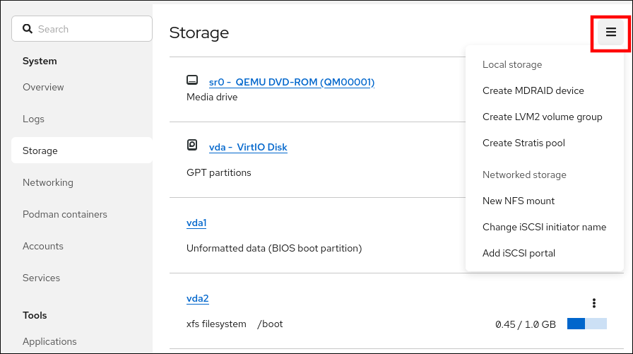
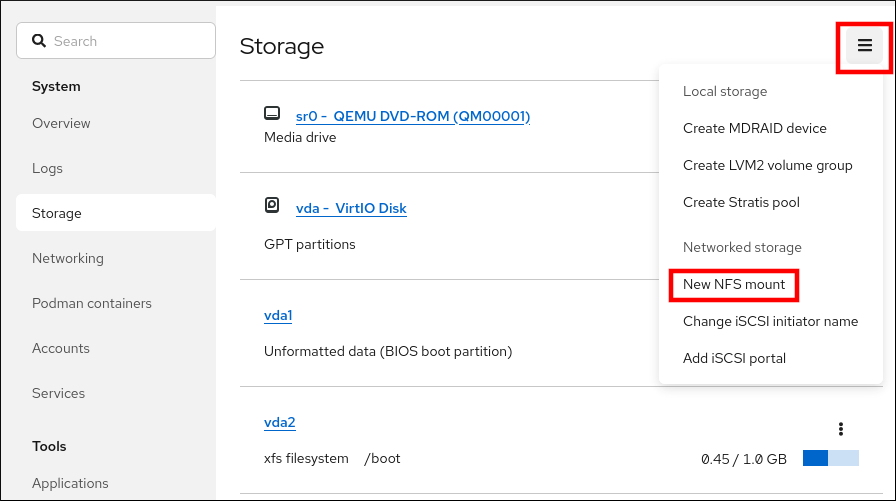
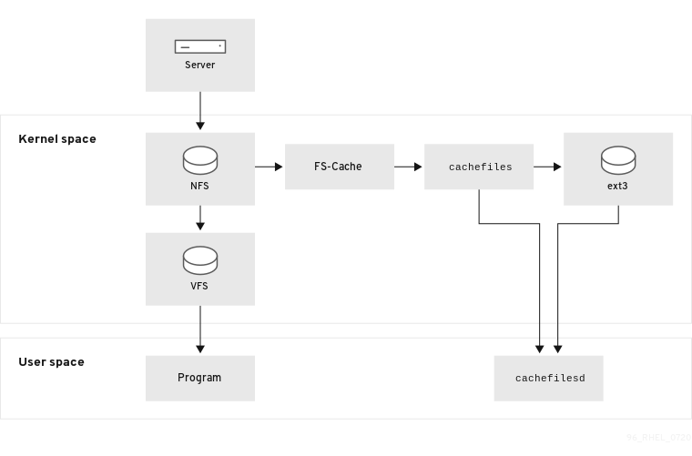

# Managing file systems

* * *

Red Hat Enterprise Linux 10

## Creating, modifying, and administering file systems

Red Hat Customer Content Services

[Legal Notice](#idm140238733955696)

**Abstract**

Red Hat Enterprise Linux supports a variety of file systems. Each type of file system solves different problems and their usage is application specific. Use the information about the key differences and considerations to select and deploy the appropriate file system based on your specific application requirements.

The supported file systems include local on-disk file systems XFS and ext4, and network and client-and-server file systems NFS and SMB. You can perform several operations with a file system such as creating, mounting, backing up, restoring, checking and repairing, as well as limiting the storage space by using quotas.

* * *

<h2 id="overview-of-available-file-systems">Chapter 1. Overview of available file systems</h2>

Choosing the file system that is appropriate for your application is an important decision due to the large number of options available and the trade-offs involved.

The following sections describe the file systems that Red Hat Enterprise Linux 10 includes by default, and recommendations on the most suitable file system for your application.

<h3 id="types-of-file-systems">1.1. Types of file systems</h3>

Red Hat Enterprise Linux 10 supports a variety of file systems (FS). Different types of file systems solve different kinds of problems, and their usage is application specific.

At the most general level, available file systems can be grouped into the following major types:

| Type                            | File system | Attributes and use cases                                                                                                                                                                                                                                                                                                                   |
|:--------------------------------|:------------|:-------------------------------------------------------------------------------------------------------------------------------------------------------------------------------------------------------------------------------------------------------------------------------------------------------------------------------------------|
| Disk or local FS                | XFS         | XFS is the default file system in RHEL. Red Hat recommends deploying XFS as your local file system unless there are specific reasons to do otherwise: for example, compatibility or corner cases around performance.                                                                                                                       |
|                                 | ext4        | ext4 has the benefit of familiarity in Linux, having evolved from the older ext2 and ext3 file systems. In many cases, it rivals XFS on performance. Support limits for ext4 filesystem and file sizes are lower than those on XFS.                                                                                                        |
| Network or client-and-server FS | NFS         | Use NFS to share files between multiple systems on the same network.                                                                                                                                                                                                                                                                       |
|                                 | SMB         | Use SMB for file sharing with Microsoft Windows systems.                                                                                                                                                                                                                                                                                   |
| Volume-managing FS              | Stratis     | Stratis is a volume manager built on a combination of XFS and LVM. The purpose of Stratis is to emulate capabilities offered by volume-managing file systems like Btrfs and ZFS. It is possible to build this stack manually, but Stratis reduces configuration complexity, implements best practices, and consolidates error information. |

Table 1.1. Types of file systems and their use cases

<h3 id="local-file-systems">1.2. Local file systems</h3>

Local file systems are file systems that run on a single, local server and are directly attached to storage.

For example, a local file system is the only choice for internal SATA or SAS disks, and is used when your server has internal hardware RAID controllers with local drives. Local file systems are also the most common file systems used on SAN attached storage when the device exported on the SAN is not shared.

All local file systems are POSIX-compliant and provide support for a well-defined set of system calls, such as read(), write(), and seek().

When considering a file system choice, choose a file system based on how large the file system needs to be, what unique features it must have, and how it performs under your workload.

Available local file systems

- XFS
- ext4

<h3 id="the-xfs-file-system\_overview-of-available-file-systems">1.3. The XFS file system</h3>

XFS is a highly scalable, high-performance, robust, and mature 64-bit journaling file system that supports very large files and file systems on a single host. It is the default file system in Red Hat Enterprise Linux 10. XFS was originally developed in the early 1990s by SGI and has a long history of running on extremely large servers and storage arrays.

The features of XFS include:

Reliability

- Metadata journaling, which ensures file system integrity after a system crash by keeping a record of file system operations that can be replayed when the system is restarted and the file system remounted
- Extensive run-time metadata consistency checking
- Scalable and fast repair utilities
- Quota journaling. This avoids the need for lengthy quota consistency checks after a crash.

Scalability and performance

- Supported file system size up to 1024 TiB
- Ability to support a large number of concurrent operations
- B-tree indexing for scalability of free space management
- Sophisticated metadata read-ahead algorithms
- Optimizations for streaming video workloads

Allocation schemes

- Extent-based allocation
- Stripe-aware allocation policies
- Delayed allocation
- Space pre-allocation
- Dynamically allocated inodes

Other features

- Reflink-based file copies
- Tightly integrated backup and restore utilities
- Online defragmentation
- Online file system growing
- Comprehensive diagnostics capabilities
- Extended attributes (`xattr`). This allows the system to associate several additional name/value pairs per file.
- Project or directory quotas. This allows quota restrictions over a directory tree.
- Subsecond timestamps

Performance characteristics

XFS has a high performance on large systems with enterprise workloads. A large system is one with a relatively high number of CPUs, multiple HBAs, and connections to external disk arrays. XFS also performs well on smaller systems that have a multi-threaded, parallel I/O workload.

XFS performs comparably well on smaller systems, but is more focused on scalability and large data sets.

<h3 id="the-ext4-file-system">1.4. The ext4 file system</h3>

The ext4 file system is the fourth generation of the ext file system family. The ext4 driver can read and write to ext2 and ext3 file systems, but the ext4 file system format is not compatible with ext2 and ext3 drivers.

ext4 adds several new and improved features, such as:

- Supported file system size up to 50 TiB
- Extent-based metadata
- Delayed allocation
- Journal checksumming
- Large storage support

The extent-based metadata and the delayed allocation features provide a more compact and efficient way to track utilized space in a file system. These features improve file system performance and reduce the space consumed by metadata. Delayed allocation allows the file system to postpone selection of the permanent location for newly written user data until the data is flushed to disk. This enables higher performance since it can allow for larger, more contiguous allocations, allowing the file system to make decisions with much better information.

File system repair time using the `fsck` utility in ext4 is much faster than in ext2 and ext3. Some file system repairs have demonstrated up to a six-fold increase in performance.

<h3 id="comparison-of-xfs-and-ext4">1.5. Comparison of XFS and ext4</h3>

XFS is the default file system in RHEL. This section compares the usage and features of XFS and ext4.

Metadata error behavior

In ext4, you can configure the behavior when the file system encounters metadata errors. The default behavior is to simply continue the operation. When XFS encounters an unrecoverable metadata error, it shuts down the file system and returns the `EFSCORRUPTED` error. XFS also supports configurable error handling.

Quotas

In ext4, you can enable quotas when creating the file system or later on an existing file system. You can then configure the quota enforcement using a mount option.

XFS quotas are not a remountable option. You must activate quotas on the initial mount.

Running the `quotacheck` command on an XFS file system has no effect. The first time you turn on quota accounting, XFS checks quotas automatically.

File system resize

XFS has no utility to reduce the size of a file system. You can only increase the size of an XFS file system. In comparison, ext4 supports both extending and reducing the size of a file system; however shrinking is only an offline operation.

Inode numbers

The ext4 file system does not support more than 232 inodes.

XFS supports dynamic inode allocation. The amount of space inodes can consume on an XFS filesystem is calculated as a percentage of the total filesystem space. To prevent the system from running out of inodes, an administrator can tune this percentage after the filesystem has been created, given there is free space left on the file system.

Certain applications cannot properly handle inode numbers larger than 232 on an XFS file system. These applications might cause the failure of 32-bit stat calls with the `EOVERFLOW` return value. Inode number exceed 232 under the following conditions:

- The file system is larger than 1 TiB with 256-byte inodes.
- The file system is larger than 2 TiB with 512-byte inodes.

If your application fails with large inode numbers, mount the XFS file system with the `-o inode32` option to enforce inode numbers below 232. Note that using `inode32` does not affect inodes that are already allocated with 64-bit numbers.

Important

Do *not* use the `inode32` option unless a specific environment requires it. The `inode32` option changes allocation behavior. As a consequence, the `ENOSPC` error might occur if no space is available to allocate inodes in the lower disk blocks.

**Additional resources**

- [Configurable error handling in XFS](#configurable-error-handling-in-xfs "14.1. Configurable error handling in XFS")

<h3 id="choosing-a-local-file-system">1.6. Choosing a local file system</h3>

To choose a file system that meets your application requirements, you must understand the target system on which you will deploy the file system. In general, use XFS unless you have a specific use case for ext4.

XFS

For large-scale deployments, use XFS, particularly when handling large files (hundreds of megabytes) and high I/O concurrency. XFS performs optimally in environments with high bandwidth (greater than 200MB/s) and more than 1000 IOPS. However, it consumes more CPU resources for metadata operations compared to ext4 and does not support file system shrinking.

ext4

For smaller systems or environments with limited I/O bandwidth, ext4 might be a better fit. It performs better in single-threaded, lower I/O workloads and environments with lower throughput requirements. ext4 also supports offline shrinking, which can be beneficial if resizing the file system is a requirement.

Benchmark your application’s performance on your target server and storage system to ensure the selected file system meets your performance and scalability requirements.

| Scenario                                 | Recommended file system |
|:-----------------------------------------|:------------------------|
| No special use case                      | XFS                     |
| Large server                             | XFS                     |
| Large storage devices                    | XFS                     |
| Large files                              | XFS                     |
| Multi-threaded I/O                       | XFS                     |
| Single-threaded I/O                      | XFS, ext4               |
| Limited I/O capability (under 1000 IOPS) | XFS, ext4               |
| Limited bandwidth (under 200MB/s)        | XFS, ext4               |
| CPU-bound workload                       | XFS, ext4               |
| Support for offline shrinking            | XFS, ext4               |

Table 1.2. Summary of suitable use cases for file systems

<h3 id="network-file-systems">1.7. Network file systems</h3>

Network file systems, also referred to as client/server file systems, enable client systems to access files that are stored on a shared server. This makes it possible for multiple users on multiple systems to share files and storage resources.

Such file systems are built from one or more servers that export a set of file systems to one or more clients. The client nodes do not have access to the underlying block storage, but rather interact with the storage using a protocol that allows for better access control.

Available network file systems

- The most common client/server file system for RHEL customers is the NFS file system. RHEL provides both an NFS server component to export a local file system over the network and an NFS client to import these file systems.
- RHEL also includes a CIFS client that supports the popular Microsoft SMB file servers for Windows interoperability. The userspace Samba server provides Windows clients with a Microsoft SMB service from a RHEL server.

<h3 id="shared-storage-file-systems">1.8. Shared storage file systems</h3>

Shared storage file systems, sometimes referred to as cluster file systems, give each server in the cluster direct access to a shared block device over a local storage area network (SAN).

Comparison with network file systems

Like client/server file systems, shared storage file systems work on a set of servers that are all members of a cluster. Unlike NFS, however, no single server provides access to data or metadata to other members: each member of the cluster has direct access to the same storage device (the *shared storage*), and all cluster member nodes access the same set of files.

Concurrency

Cache coherency is key in a clustered file system to ensure data consistency and integrity. There must be a single version of all files in a cluster visible to all nodes within a cluster. The file system must prevent members of the cluster from updating the same storage block at the same time and causing data corruption. In order to do that, shared storage file systems use a cluster wide-locking mechanism to arbitrate access to the storage as a concurrency control mechanism. For example, before creating a new file or writing to a file that is opened on multiple servers, the file system component on the server must obtain the correct lock.

The requirement of cluster file systems is to provide a highly available service like an Apache web server. Any member of the cluster will see a fully coherent view of the data stored in their shared disk file system, and all updates will be arbitrated correctly by the locking mechanisms.

Performance characteristics

Shared disk file systems do not always perform as well as local file systems running on the same system due to the computational cost of the locking overhead. Shared disk file systems perform well with workloads where each node writes almost exclusively to a particular set of files that are not shared with other nodes or where a set of files is shared in an almost exclusively read-only manner across a set of nodes. This results in a minimum of cross-node cache invalidation and can maximize performance.

Setting up a shared disk file system is complex, and tuning an application to perform well on a shared disk file system can be challenging.

<h3 id="choosing-between-network-and-shared-storage-file-systems">1.9. Choosing between network and shared storage file systems</h3>

Choose between network and shared storage file systems based on availability, performance, and maintenance needs. Network file systems suit most situations, while shared storage file systems best serve high-availability, minimal-downtime requirements.

When choosing between network and shared storage file systems, consider the following points:

- NFS-based network file systems are an extremely common and popular choice for environments that provide NFS servers.
- Network file systems can be deployed using very high-performance networking technologies like Infiniband or 10 Gigabit Ethernet. This means that you should not turn to shared storage file systems just to get raw bandwidth to your storage. If the speed of access is of prime importance, then use NFS to export a local file system like XFS.
- Shared storage file systems are not easy to set up or to maintain, so you should deploy them only when you cannot provide your required availability with either local or network file systems.
- A shared storage file system in a clustered environment helps reduce downtime by eliminating the steps needed for unmounting and mounting that need to be done during a typical fail-over scenario involving the relocation of a high-availability service.

Red Hat recommends that you use network file systems unless you have a specific use case for shared storage file systems. Use shared storage file systems primarily for deployments that need to provide high-availability services with minimum downtime and have stringent service-level requirements.

<h3 id="volume-managing-file-systems">1.10. Volume-managing file systems</h3>

Volume-managing file systems integrate the entire storage stack for the purposes of simplicity and in-stack optimization.

Available volume-managing file systems

- Red Hat Enterprise Linux 10 provides the Stratis volume manager. Stratis uses XFS for the file system layer and integrates it with LVM, Device Mapper, and other components.

Stratis was first released in Red Hat Enterprise Linux 8.0. It is conceived to fill the gap created when Red Hat deprecated Btrfs. Stratis 1.0 is an intuitive, command line-based volume manager that can perform significant storage management operations while hiding the complexity from the user:

- Volume management
- Pool creation
- Thin storage pools
- Snapshots
- Automated read cache

Stratis offers powerful features, but currently lacks certain capabilities of other offerings that it might be compared to, such as Btrfs or ZFS. Most notably, it does not support CRCs with self healing.

<h2 id="managing-local-storage-by-using-rhel-system-roles">Chapter 2. Managing local storage by using RHEL system roles</h2>

To manage Logical Volume Manager (LVM) and local file systems (FS) by using Ansible, you can use the `storage` role.

Using the `storage` role enables you to automate administration of file systems on disks and logical volumes on multiple machines.

For more information about RHEL system roles and how to apply them, see [Introduction to RHEL system roles](https://docs.redhat.com/en/documentation/red_hat_enterprise_linux/10/html/automating_system_administration_by_using_rhel_system_roles/introduction-to-rhel-system-roles).

<h3 id="creating-an-xfs-file-system-on-a-block-device-by-using-the-storage-rhel-system-role">2.1. Creating an XFS file system on a block device by using the storage RHEL system role</h3>

You can use the `storage` RHEL system role to automate the creation of an XFS file system on block devices.

Note

The `storage` role can create a file system only on an unpartitioned, whole disk or a logical volume (LV). It cannot create the file system on a partition.

**Prerequisites**

- [You have prepared the control node and the managed nodes](https://docs.redhat.com/en/documentation/red_hat_enterprise_linux/10/html/automating_system_administration_by_using_rhel_system_roles/preparing-a-control-node-and-managed-nodes-to-use-rhel-system-roles).
- You are logged in to the control node as a user who can run playbooks on the managed nodes.
- The account you use to connect to the managed nodes has `sudo` permissions for these nodes.

**Procedure**

1. Create a playbook file, for example, `~/playbook.yml`, with the following content:
   
   ```
   ---
   - name: Manage local storage
     hosts: managed-node-01.example.com
     tasks:
       - name: Create an XFS file system on a block device
         ansible.builtin.include_role:
           name: redhat.rhel_system_roles.storage
         vars:
           storage_volumes:
             - name: barefs
               type: disk
               disks:
                 - sdb
               fs_type: xfs
   ```
   
   ```yaml
   ---
   - name: Manage local storage
     hosts: managed-node-01.example.com
     tasks:
       - name: Create an XFS file system on a block device
         ansible.builtin.include_role:
           name: redhat.rhel_system_roles.storage
         vars:
           storage_volumes:
             - name: barefs
               type: disk
               disks:
                 - sdb
               fs_type: xfs
   ```
   
   The settings specified in the example playbook include the following:
   
   `name: barefs`
   
   The volume name (`barefs` in the example) is currently arbitrary. The `storage` role identifies the volume by the disk device listed under the `disks` attribute.
   
   `fs_type: <file_system>`
   
   You can omit the `fs_type` parameter if you want to use the default file system XFS.
   
   `disks: <list_of_disks_and_volumes>`
   
   A YAML list of disk and LV names.
   
   For details about all variables used in the playbook, see the `/usr/share/ansible/roles/rhel-system-roles.storage/README.md` file on the control node.
2. Validate the playbook syntax:
   
   ```
   ansible-playbook --syntax-check ~/playbook.yml
   ```
   
   ```plaintext
   $ ansible-playbook --syntax-check ~/playbook.yml
   ```
   
   Note that this command only validates the syntax and does not protect against a wrong but valid configuration.
3. Run the playbook:
   
   ```
   ansible-playbook ~/playbook.yml
   ```
   
   ```plaintext
   $ ansible-playbook ~/playbook.yml
   ```

<h3 id="persistently-mounting-a-file-system-by-using-the-storage-rhel-system-role">2.2. Persistently mounting a file system by using the storage RHEL system role</h3>

You can use the `storage` RHEL system role to persistently mount file systems to ensure they remain available across system reboots and are automatically mounted on startup. If the file system on the device you specified in the playbook does not exist, the role creates it.

**Prerequisites**

- [You have prepared the control node and the managed nodes](https://docs.redhat.com/en/documentation/red_hat_enterprise_linux/10/html/automating_system_administration_by_using_rhel_system_roles/preparing-a-control-node-and-managed-nodes-to-use-rhel-system-roles).
- You are logged in to the control node as a user who can run playbooks on the managed nodes.
- The account you use to connect to the managed nodes has `sudo` permissions for these nodes.

**Procedure**

1. Create a playbook file, for example, `~/playbook.yml`, with the following content:
   
   ```
   ---
   - name: Manage local storage
     hosts: managed-node-01.example.com
     tasks:
       - name: Persistently mount a file system
         ansible.builtin.include_role:
           name: redhat.rhel_system_roles.storage
         vars:
           storage_safe_mode: false
   
           storage_volumes:
             - name: barefs
               type: disk
               disks:
                 - sdb
               fs_type: xfs
               mount_point: /mnt/data
               mount_user: somebody
               mount_group: somegroup
               mount_mode: "0755"
   ```
   
   ```yaml
   ---
   - name: Manage local storage
     hosts: managed-node-01.example.com
     tasks:
       - name: Persistently mount a file system
         ansible.builtin.include_role:
           name: redhat.rhel_system_roles.storage
         vars:
           storage_safe_mode: false
   
           storage_volumes:
             - name: barefs
               type: disk
               disks:
                 - sdb
               fs_type: xfs
               mount_point: /mnt/data
               mount_user: somebody
               mount_group: somegroup
               mount_mode: "0755"
   ```
   
   For details about all variables used in the playbook, see the `/usr/share/ansible/roles/rhel-system-roles.storage/README.md` file on the control node.
2. Validate the playbook syntax:
   
   ```
   ansible-playbook --syntax-check ~/playbook.yml
   ```
   
   ```plaintext
   $ ansible-playbook --syntax-check ~/playbook.yml
   ```
   
   Note that this command only validates the syntax and does not protect against a wrong but valid configuration.
3. Run the playbook:
   
   ```
   ansible-playbook ~/playbook.yml
   ```
   
   ```plaintext
   $ ansible-playbook ~/playbook.yml
   ```

<h3 id="creating-or-resizing-a-logical-volume-by-using-the-storage-rhel-system-role">2.3. Creating or resizing a logical volume by using the storage RHEL system role</h3>

You can use the `storage` RHEL system role to create and resize Logical Volume Manager (LVM) logical volumes. The role automatically creates volume groups if they do not exist.

Use the `storage` role to perform the following tasks:

- To create an LVM logical volume in a volume group consisting of many disks
- To resize an existing file system on LVM
- To express an LVM volume size in percentage of the pool’s total size

If the volume group does not exist, the role creates it. If a logical volume exists in the volume group, it is resized if the size does not match what is specified in the playbook.

If you are reducing a logical volume, to prevent data loss you must ensure that the file system on that logical volume is not using the space in the logical volume that is being reduced.

**Prerequisites**

- [You have prepared the control node and the managed nodes](https://docs.redhat.com/en/documentation/red_hat_enterprise_linux/10/html/automating_system_administration_by_using_rhel_system_roles/preparing-a-control-node-and-managed-nodes-to-use-rhel-system-roles).
- You are logged in to the control node as a user who can run playbooks on the managed nodes.
- The account you use to connect to the managed nodes has `sudo` permissions for these nodes.

**Procedure**

1. Create a playbook file, for example, `~/playbook.yml`, with the following content:
   
   ```
   ---
   - name: Manage local storage
     hosts: managed-node-01.example.com
     tasks:
       - name: Create logical volume
         ansible.builtin.include_role:
           name: redhat.rhel_system_roles.storage
         vars:
           storage_safe_mode: false
   
           storage_pools:
             - name: myvg
               disks:
                 - sda
                 - sdb
                 - sdc
               volumes:
                 - name: mylv
                   size: 2G
                   fs_type: ext4
                   mount_point: /mnt/data
   ```
   
   ```yaml
   ---
   - name: Manage local storage
     hosts: managed-node-01.example.com
     tasks:
       - name: Create logical volume
         ansible.builtin.include_role:
           name: redhat.rhel_system_roles.storage
         vars:
           storage_safe_mode: false
   
           storage_pools:
             - name: myvg
               disks:
                 - sda
                 - sdb
                 - sdc
               volumes:
                 - name: mylv
                   size: 2G
                   fs_type: ext4
                   mount_point: /mnt/data
   ```
   
   The settings specified in the example playbook include the following:
   
   `size: <size>`
   
   You must specify the size by using units (for example, GiB) or percentage (for example, 60%).
   
   For details about all variables used in the playbook, see the `/usr/share/ansible/roles/rhel-system-roles.storage/README.md` file on the control node.
2. Validate the playbook syntax:
   
   ```
   ansible-playbook --syntax-check ~/playbook.yml
   ```
   
   ```plaintext
   $ ansible-playbook --syntax-check ~/playbook.yml
   ```
   
   Note that this command only validates the syntax and does not protect against a wrong but valid configuration.
3. Run the playbook:
   
   ```
   ansible-playbook ~/playbook.yml
   ```
   
   ```plaintext
   $ ansible-playbook ~/playbook.yml
   ```

**Verification**

- Verify that specified volume has been created or resized to the requested size:
  
  ```
  ansible managed-node-01.example.com -m command -a 'lvs myvg'
  ```
  
  ```plaintext
  # ansible managed-node-01.example.com -m command -a 'lvs myvg'
  ```

<h3 id="enabling-online-block-discard-by-using-the-storage-rhel-system-role">2.4. Enabling online block discard by using the storage RHEL system role</h3>

You can mount an XFS file system with the online block discard option to automatically discard unused blocks.

**Prerequisites**

- [You have prepared the control node and the managed nodes](https://docs.redhat.com/en/documentation/red_hat_enterprise_linux/10/html/automating_system_administration_by_using_rhel_system_roles/preparing-a-control-node-and-managed-nodes-to-use-rhel-system-roles).
- You are logged in to the control node as a user who can run playbooks on the managed nodes.
- The account you use to connect to the managed nodes has `sudo` permissions for these nodes.

**Procedure**

1. Create a playbook file, for example, `~/playbook.yml`, with the following content:
   
   ```
   ---
   - name: Manage local storage
     hosts: managed-node-01.example.com
     tasks:
       - name: Enable online block discard
         ansible.builtin.include_role:
           name: redhat.rhel_system_roles.storage
         vars:
           storage_volumes:
             - name: barefs
               type: disk
               disks:
                 - /dev/sdb
               fs_type: xfs
               mount_point: /mnt/data
               mount_options: discard
   ```
   
   ```yaml
   ---
   - name: Manage local storage
     hosts: managed-node-01.example.com
     tasks:
       - name: Enable online block discard
         ansible.builtin.include_role:
           name: redhat.rhel_system_roles.storage
         vars:
           storage_volumes:
             - name: barefs
               type: disk
               disks:
                 - /dev/sdb
               fs_type: xfs
               mount_point: /mnt/data
               mount_options: discard
   ```
   
   For details about all variables used in the playbook, see the `/usr/share/ansible/roles/rhel-system-roles.storage/README.md` file on the control node.
2. Validate the playbook syntax:
   
   ```
   ansible-playbook --syntax-check ~/playbook.yml
   ```
   
   ```plaintext
   $ ansible-playbook --syntax-check ~/playbook.yml
   ```
   
   Note that this command only validates the syntax and does not protect against a wrong but valid configuration.
3. Run the playbook:
   
   ```
   ansible-playbook ~/playbook.yml
   ```
   
   ```plaintext
   $ ansible-playbook ~/playbook.yml
   ```

**Verification**

- Verify that online block discard option is enabled:
  
  ```
  ansible managed-node-01.example.com -m command -a 'findmnt /mnt/data'
  ```
  
  ```plaintext
  # ansible managed-node-01.example.com -m command -a 'findmnt /mnt/data'
  ```

<h3 id="creating-and-mounting-a-file-system-by-using-the-storage-rhel-system-role">2.5. Creating and mounting a file system by using the storage RHEL system role</h3>

You can use the `storage` RHEL system role to create and mount file systems that persist across reboots. The role automatically adds entries to `/etc/fstab` to ensure persistent mounting.

**Prerequisites**

- [You have prepared the control node and the managed nodes](https://docs.redhat.com/en/documentation/red_hat_enterprise_linux/10/html/automating_system_administration_by_using_rhel_system_roles/preparing-a-control-node-and-managed-nodes-to-use-rhel-system-roles).
- You are logged in to the control node as a user who can run playbooks on the managed nodes.
- The account you use to connect to the managed nodes has `sudo` permissions for these nodes.

**Procedure**

1. Create a playbook file, for example, `~/playbook.yml`, with the following content:
   
   ```
   ---
   - name: Manage local storage
     hosts: managed-node-01.example.com
     tasks:
       -name: Create and mount a file system
       ansible.builtin.include_role:
           name: redhat.rhel_system_roles.storage
       vars:
         storage_safe_mode: false
   
         storage_volumes:
           - name: barefs
             type: disk
             disks:
               - sdb
             fs_type: ext4
             fs_label: label-name
             mount_point: /mnt/data
   ```
   
   ```yaml
   ---
   - name: Manage local storage
     hosts: managed-node-01.example.com
     tasks:
       -name: Create and mount a file system
       ansible.builtin.include_role:
           name: redhat.rhel_system_roles.storage
       vars:
         storage_safe_mode: false
   
         storage_volumes:
           - name: barefs
             type: disk
             disks:
               - sdb
             fs_type: ext4
             fs_label: label-name
             mount_point: /mnt/data
   ```
   
   The settings specified in the example playbook include the following:
   
   `disks: <list_of_devices>`
   
   A YAML list of device names that the role uses when it creates the volume.
   
   `fs_type: <file_system>`
   
   Specifies the file system the role should set on the volume. You can select `xfs`, `ext3`, `ext4`, `swap`, or `unformatted`.
   
   `label-name: <file_system_label>`
   
   Optional: sets the label of the file system.
   
   `mount_point: <directory>`
   
   Optional: if the volume should be automatically mounted, set the `mount_point` variable to the directory to which the volume should be mounted.
   
   For details about all variables used in the playbook, see the `/usr/share/ansible/roles/rhel-system-roles.storage/README.md` file on the control node.
2. Validate the playbook syntax:
   
   ```
   ansible-playbook --syntax-check ~/playbook.yml
   ```
   
   ```plaintext
   $ ansible-playbook --syntax-check ~/playbook.yml
   ```
   
   Note that this command only validates the syntax and does not protect against a wrong but valid configuration.
3. Run the playbook:
   
   ```
   ansible-playbook ~/playbook.yml
   ```
   
   ```plaintext
   $ ansible-playbook ~/playbook.yml
   ```

<h3 id="configuring-a-raid-volume-by-using-the-storage-rhel-system-role">2.6. Configuring a RAID volume by using the storage RHEL system role</h3>

With the `storage` system role, you can configure a RAID volume on RHEL by using Red Hat Ansible Automation Platform and Ansible-Core. Create an Ansible Playbook with the parameters to configure a RAID volume to suit your requirements.

Warning

Device names might change in certain circumstances, for example, when you add a new disk to a system. Therefore, to prevent data loss, use persistent naming attributes in the playbook. For more information about persistent naming attributes, see [Persistent naming attributes](https://docs.redhat.com/en/documentation/red_hat_enterprise_linux/10/html/managing_storage_devices/persistent-naming-attributes).

**Prerequisites**

- [You have prepared the control node and the managed nodes](https://docs.redhat.com/en/documentation/red_hat_enterprise_linux/10/html/automating_system_administration_by_using_rhel_system_roles/preparing-a-control-node-and-managed-nodes-to-use-rhel-system-roles).
- You are logged in to the control node as a user who can run playbooks on the managed nodes.
- The account you use to connect to the managed nodes has `sudo` permissions for these nodes.

**Procedure**

1. Create a playbook file, for example, `~/playbook.yml`, with the following content:
   
   ```
   ---
   - name: Manage local storage
     hosts: managed-node-01.example.com
     tasks:
       - name: Create a RAID on sdd, sde, sdf, and sdg
         ansible.builtin.include_role:
           name: redhat.rhel_system_roles.storage
         vars:
           storage_safe_mode: false
           storage_volumes:
             - name: data
               type: raid
               disks: [sdd, sde, sdf, sdg]
               raid_level: raid0
               raid_chunk_size: 32 KiB
               mount_point: /mnt/data
               state: present
   ```
   
   ```yaml
   ---
   - name: Manage local storage
     hosts: managed-node-01.example.com
     tasks:
       - name: Create a RAID on sdd, sde, sdf, and sdg
         ansible.builtin.include_role:
           name: redhat.rhel_system_roles.storage
         vars:
           storage_safe_mode: false
           storage_volumes:
             - name: data
               type: raid
               disks: [sdd, sde, sdf, sdg]
               raid_level: raid0
               raid_chunk_size: 32 KiB
               mount_point: /mnt/data
               state: present
   ```
   
   For details about all variables used in the playbook, see the `/usr/share/ansible/roles/rhel-system-roles.storage/README.md` file on the control node.
2. Validate the playbook syntax:
   
   ```
   ansible-playbook --syntax-check ~/playbook.yml
   ```
   
   ```plaintext
   $ ansible-playbook --syntax-check ~/playbook.yml
   ```
   
   Note that this command only validates the syntax and does not protect against a wrong but valid configuration.
3. Run the playbook:
   
   ```
   ansible-playbook ~/playbook.yml
   ```
   
   ```plaintext
   $ ansible-playbook ~/playbook.yml
   ```

**Verification**

- Verify that the array was correctly created:
  
  ```
  ansible managed-node-01.example.com -m command -a 'mdadm --detail /dev/md/data'
  ```
  
  ```plaintext
  # ansible managed-node-01.example.com -m command -a 'mdadm --detail /dev/md/data'
  ```

<h3 id="configuring-an-lvm-volume-group-on-raid-by-using-the-storage-rhel-system-role">2.7. Configuring an LVM volume group on RAID by using the storage RHEL system role</h3>

You can use the `storage` RHEL system role to configure LVM volume groups on RAID arrays.

**Prerequisites**

- [You have prepared the control node and the managed nodes](https://docs.redhat.com/en/documentation/red_hat_enterprise_linux/10/html/automating_system_administration_by_using_rhel_system_roles/preparing-a-control-node-and-managed-nodes-to-use-rhel-system-roles).
- You are logged in to the control node as a user who can run playbooks on the managed nodes.
- The account you use to connect to the managed nodes has `sudo` permissions for these nodes.

**Procedure**

1. Create a playbook file, for example, `~/playbook.yml`, with the following content:
   
   ```
   ---
   - name: Manage local storage
     hosts: managed-node-01.example.com
     tasks:
       - name: Configure LVM pool with RAID
         ansible.builtin.include_role:
           name: redhat.rhel_system_roles.storage
         vars:
           storage_safe_mode: false
           storage_pools:
             - name: my_pool
               type: lvm
               disks: [sdh, sdi]
               raid_level: raid1
               volumes:
                 - name: my_volume
                   size: "1 GiB"
                   mount_point: "/mnt/app/shared"
                   fs_type: xfs
                   state: present
   ```
   
   ```yaml
   ---
   - name: Manage local storage
     hosts: managed-node-01.example.com
     tasks:
       - name: Configure LVM pool with RAID
         ansible.builtin.include_role:
           name: redhat.rhel_system_roles.storage
         vars:
           storage_safe_mode: false
           storage_pools:
             - name: my_pool
               type: lvm
               disks: [sdh, sdi]
               raid_level: raid1
               volumes:
                 - name: my_volume
                   size: "1 GiB"
                   mount_point: "/mnt/app/shared"
                   fs_type: xfs
                   state: present
   ```
   
   For details about all variables used in the playbook, see the `/usr/share/ansible/roles/rhel-system-roles.storage/README.md` file on the control node.
   
   Note
   
   Setting `raid_level` at the `storage_pool` level creates an MD RAID array first, and then builds an LVM volume group on top of it.
2. Validate the playbook syntax:
   
   ```
   ansible-playbook --syntax-check ~/playbook.yml
   ```
   
   ```plaintext
   $ ansible-playbook --syntax-check ~/playbook.yml
   ```
   
   Note that this command only validates the syntax and does not protect against a wrong but valid configuration.
3. Run the playbook:
   
   ```
   ansible-playbook ~/playbook.yml
   ```
   
   ```plaintext
   $ ansible-playbook ~/playbook.yml
   ```

**Verification**

- Verify that your pool is on RAID:
  
  ```
  ansible managed-node-01.example.com -m command -a 'lsblk'
  ```
  
  ```plaintext
  # ansible managed-node-01.example.com -m command -a 'lsblk'
  ```

**Additional resources**

- [Managing RAID](https://docs.redhat.com/en/documentation/red_hat_enterprise_linux/10/html/managing_storage_devices/managing-raid)

<h3 id="configuring-a-stripe-size-for-raid-lvm-volumes-by-using-the-storage-rhel-system-role">2.8. Configuring a stripe size for RAID LVM volumes by using the storage RHEL system role</h3>

You can use the `storage` RHEL system role to configure stripe sizes for RAID LVM volumes.

**Prerequisites**

- [You have prepared the control node and the managed nodes](https://docs.redhat.com/en/documentation/red_hat_enterprise_linux/10/html/automating_system_administration_by_using_rhel_system_roles/preparing-a-control-node-and-managed-nodes-to-use-rhel-system-roles).
- You are logged in to the control node as a user who can run playbooks on the managed nodes.
- The account you use to connect to the managed nodes has `sudo` permissions for these nodes.

**Procedure**

1. Create a playbook file, for example, `~/playbook.yml`, with the following content:
   
   ```
   ---
   - name: Manage local storage
     hosts: managed-node-01.example.com
     tasks:
       - name: Configure stripe size for RAID LVM volumes
         ansible.builtin.include_role:
           name: redhat.rhel_system_roles.storage
         vars:
           storage_safe_mode: false
           storage_pools:
             - name: my_pool
               type: lvm
               disks: [sdh, sdi]
               volumes:
                 - name: my_volume
                   size: "1 GiB"
                   mount_point: "/mnt/app/shared"
                   fs_type: xfs
                   raid_level: raid0
                   raid_stripe_size: "256 KiB"
                   state: present
   ```
   
   ```yaml
   ---
   - name: Manage local storage
     hosts: managed-node-01.example.com
     tasks:
       - name: Configure stripe size for RAID LVM volumes
         ansible.builtin.include_role:
           name: redhat.rhel_system_roles.storage
         vars:
           storage_safe_mode: false
           storage_pools:
             - name: my_pool
               type: lvm
               disks: [sdh, sdi]
               volumes:
                 - name: my_volume
                   size: "1 GiB"
                   mount_point: "/mnt/app/shared"
                   fs_type: xfs
                   raid_level: raid0
                   raid_stripe_size: "256 KiB"
                   state: present
   ```
   
   For details about all variables used in the playbook, see the `/usr/share/ansible/roles/rhel-system-roles.storage/README.md` file on the control node.
   
   Note
   
   Setting `raid_level` at the `volumes` level creates LVM RAID logical volumes.
2. Validate the playbook syntax:
   
   ```
   ansible-playbook --syntax-check ~/playbook.yml
   ```
   
   ```plaintext
   $ ansible-playbook --syntax-check ~/playbook.yml
   ```
   
   Note that this command only validates the syntax and does not protect against a wrong but valid configuration.
3. Run the playbook:
   
   ```
   ansible-playbook ~/playbook.yml
   ```
   
   ```plaintext
   $ ansible-playbook ~/playbook.yml
   ```

**Verification**

- Verify that stripe size is set to the required size:
  
  ```
  ansible managed-node-01.example.com -m command -a 'lvs -o+stripesize /dev/my_pool/my_volume'
  ```
  
  ```plaintext
  # ansible managed-node-01.example.com -m command -a 'lvs -o+stripesize /dev/my_pool/my_volume'
  ```

**Additional resources**

- [Managing RAID](https://docs.redhat.com/en/documentation/red_hat_enterprise_linux/10/html/managing_storage_devices/managing-raid)

<h3 id="configuring-an-lvm-vdo-volume-by-using-the-storage-rhel-system-role">2.9. Configuring an LVM-VDO volume by using the storage RHEL system role</h3>

You can use the `storage` RHEL system role to create a VDO volume on LVM (LVM-VDO) with enabled compression and deduplication.

Note

Because of the `storage` system role use of LVM-VDO, only one volume can be created per pool.

**Prerequisites**

- [You have prepared the control node and the managed nodes](https://docs.redhat.com/en/documentation/red_hat_enterprise_linux/10/html/automating_system_administration_by_using_rhel_system_roles/preparing-a-control-node-and-managed-nodes-to-use-rhel-system-roles).
- You are logged in to the control node as a user who can run playbooks on the managed nodes.
- The account you use to connect to the managed nodes has `sudo` permissions for these nodes.

**Procedure**

1. Create a playbook file, for example, `~/playbook.yml`, with the following content:
   
   ```
   ---
   - name: Manage local storage
     hosts: managed-node-01.example.com
     tasks:
       - name: Create LVM-VDO volume under volume group 'myvg'
         ansible.builtin.include_role:
           name: redhat.rhel_system_roles.storage
         vars:
           storage_pools:
             - name: myvg
               disks:
                 - /dev/sdb
               volumes:
                 - name: mylv1
                   compression: true
                   deduplication: true
                   vdo_pool_size: 10 GiB
                   size: 30 GiB
                   mount_point: /mnt/app/shared
   ```
   
   ```yaml
   ---
   - name: Manage local storage
     hosts: managed-node-01.example.com
     tasks:
       - name: Create LVM-VDO volume under volume group 'myvg'
         ansible.builtin.include_role:
           name: redhat.rhel_system_roles.storage
         vars:
           storage_pools:
             - name: myvg
               disks:
                 - /dev/sdb
               volumes:
                 - name: mylv1
                   compression: true
                   deduplication: true
                   vdo_pool_size: 10 GiB
                   size: 30 GiB
                   mount_point: /mnt/app/shared
   ```
   
   The settings specified in the example playbook include the following:
   
   `vdo_pool_size: <size>`
   
   The actual size that the volume takes on the device. You can specify the size in human-readable format, such as 10 GiB. If you do not specify a unit, it defaults to bytes.
   
   `size: <size>`
   
   The virtual size of VDO volume.
   
   For details about all variables used in the playbook, see the `/usr/share/ansible/roles/rhel-system-roles.storage/README.md` file on the control node.
2. Validate the playbook syntax:
   
   ```
   ansible-playbook --syntax-check ~/playbook.yml
   ```
   
   ```plaintext
   $ ansible-playbook --syntax-check ~/playbook.yml
   ```
   
   Note that this command only validates the syntax and does not protect against a wrong but valid configuration.
3. Run the playbook:
   
   ```
   ansible-playbook ~/playbook.yml
   ```
   
   ```plaintext
   $ ansible-playbook ~/playbook.yml
   ```

**Verification**

- View the current status of compression and deduplication:
  
  ```
  ansible managed-node-01.example.com -m command -a 'lvs -o+vdo_compression,vdo_compression_state,vdo_deduplication,vdo_index_state'
  ```
  
  ```plaintext
  $ ansible managed-node-01.example.com -m command -a 'lvs -o+vdo_compression,vdo_compression_state,vdo_deduplication,vdo_index_state'
  ```
  
  ```
    LV       VG      Attr       LSize   Pool   Origin Data%  Meta%  Move Log Cpy%Sync Convert VDOCompression VDOCompressionState VDODeduplication VDOIndexState
    mylv1   myvg   vwi-a-v---   3.00t vpool0                                                         enabled              online          enabled        online
  ```
  
  ```plaintext
    LV       VG      Attr       LSize   Pool   Origin Data%  Meta%  Move Log Cpy%Sync Convert VDOCompression VDOCompressionState VDODeduplication VDOIndexState
    mylv1   myvg   vwi-a-v---   3.00t vpool0                                                         enabled              online          enabled        online
  ```

<h3 id="creating-a-luks2-encrypted-volume-by-using-the-storage-rhel-system-role">2.10. Creating a LUKS2 encrypted volume by using the storage RHEL system role</h3>

You can use the `storage` role to create and configure a volume encrypted with LUKS by running an Ansible Playbook.

**Prerequisites**

- [You have prepared the control node and the managed nodes](https://docs.redhat.com/en/documentation/red_hat_enterprise_linux/10/html/automating_system_administration_by_using_rhel_system_roles/preparing-a-control-node-and-managed-nodes-to-use-rhel-system-roles).
- You are logged in to the control node as a user who can run playbooks on the managed nodes.
- The account you use to connect to the managed nodes has `sudo` permissions for these nodes.

**Procedure**

1. Store your sensitive variables in an encrypted file:
   
   1. Create the vault:
      
      ```
      ansible-vault create ~/vault.yml
      New Vault password: <vault_password>
      Confirm New Vault password: <vault_password>
      ```
      
      ```plaintext
      $ ansible-vault create ~/vault.yml
      New Vault password: <vault_password>
      Confirm New Vault password: <vault_password>
      ```
   2. After the `ansible-vault create` command opens an editor, enter the sensitive data in the `<key>: <value>` format:
      
      ```
      luks_password: <password>
      ```
      
      ```plaintext
      luks_password: <password>
      ```
   3. Save the changes, and close the editor. Ansible encrypts the data in the vault.
2. Create a playbook file, for example, `~/playbook.yml`, with the following content:
   
   ```
   ---
   - name: Manage local storage
     hosts: managed-node-01.example.com
     vars_files:
       - ~/vault.yml
     tasks:
       - name: Create and configure a volume encrypted with LUKS
         ansible.builtin.include_role:
           name: redhat.rhel_system_roles.storage
         vars:
           storage_volumes:
             - name: barefs
               type: disk
               disks:
                 - sdb
               fs_type: xfs
               fs_label: <label>
               mount_point: /mnt/data
               encryption: true
               encryption_password: "{{ luks_password }}"
               encryption_cipher: <cipher>
               encryption_key_size: <key_size>
               encryption_luks_version: luks2
   ```
   
   ```yaml
   ---
   - name: Manage local storage
     hosts: managed-node-01.example.com
     vars_files:
       - ~/vault.yml
     tasks:
       - name: Create and configure a volume encrypted with LUKS
         ansible.builtin.include_role:
           name: redhat.rhel_system_roles.storage
         vars:
           storage_volumes:
             - name: barefs
               type: disk
               disks:
                 - sdb
               fs_type: xfs
               fs_label: <label>
               mount_point: /mnt/data
               encryption: true
               encryption_password: "{{ luks_password }}"
               encryption_cipher: <cipher>
               encryption_key_size: <key_size>
               encryption_luks_version: luks2
   ```
   
   The settings specified in the example playbook include the following:
   
   `encryption_cipher: <cipher>`
   
   Specifies the LUKS cipher. Possible values are: `twofish-xts-plain64`, `serpent-xts-plain64`, and `aes-xts-plain64` (default).
   
   `encryption_key_size: <key_size>`
   
   Specifies the LUKS key size. The default is `512` bit.
   
   `encryption_luks_version: luks2`
   
   Specifies the LUKS version. The default is `luks2`.
   
   For details about all variables used in the playbook, see the `/usr/share/ansible/roles/rhel-system-roles.storage/README.md` file on the control node.
3. Validate the playbook syntax:
   
   ```
   ansible-playbook --ask-vault-pass --syntax-check ~/playbook.yml
   ```
   
   ```plaintext
   $ ansible-playbook --ask-vault-pass --syntax-check ~/playbook.yml
   ```
   
   Note that this command only validates the syntax and does not protect against a wrong but valid configuration.
4. Run the playbook:
   
   ```
   ansible-playbook --ask-vault-pass ~/playbook.yml
   ```
   
   ```plaintext
   $ ansible-playbook --ask-vault-pass ~/playbook.yml
   ```

**Verification**

- Verify the created LUKS encrypted volume:
  
  ```
  ansible managed-node-01.example.com -m command -a 'cryptsetup luksDump /dev/sdb'
  
  LUKS header information
  Version: 2
  Epoch: 3
  Metadata area: 16384 [bytes]
  Keyslots area: 16744448 [bytes]
  UUID: bdf6463f-6b3f-4e55-a0a6-1a66f0152a46
  Label: (no label)
  Subsystem: (no subsystem)
  Flags: (no flags)
  
  Data segments:
  0: crypt
  offset: 16777216 [bytes]
  length: (whole device)
  cipher: aes-cbc-essiv:sha256
  sector: 512 [bytes]
  
  Keyslots:
  0: luks2
  Key: 256 bits
  Priority: normal
  Cipher: aes-cbc-essiv:sha256
  Cipher key: 256 bits
  ```
  
  ```plaintext
  # ansible managed-node-01.example.com -m command -a 'cryptsetup luksDump /dev/sdb'
  
  LUKS header information
  Version: 2
  Epoch: 3
  Metadata area: 16384 [bytes]
  Keyslots area: 16744448 [bytes]
  UUID: bdf6463f-6b3f-4e55-a0a6-1a66f0152a46
  Label: (no label)
  Subsystem: (no subsystem)
  Flags: (no flags)
  
  Data segments:
  0: crypt
  offset: 16777216 [bytes]
  length: (whole device)
  cipher: aes-cbc-essiv:sha256
  sector: 512 [bytes]
  
  Keyslots:
  0: luks2
  Key: 256 bits
  Priority: normal
  Cipher: aes-cbc-essiv:sha256
  Cipher key: 256 bits
  ```

**Additional resources**

- [Encrypting block devices by using LUKS](https://docs.redhat.com/en/documentation/red_hat_enterprise_linux/10/html/managing_storage_devices/encrypting-block-devices-by-using-luks)
- [Ansible vault](https://docs.redhat.com/en/documentation/red_hat_enterprise_linux/10/html/automating_system_administration_by_using_rhel_system_roles/ansible-vault)

<h3 id="creating-shared-lvm-devices-using-the-storage-rhel-system-role">2.11. Creating shared LVM devices using the storage RHEL system role</h3>

You can use the `storage` RHEL system role to create shared LVM devices if you want your multiple systems to access the same storage at the same time.

This can bring the following notable benefits:

- Resource sharing
- Flexibility in managing storage resources
- Simplification of storage management tasks

**Prerequisites**

- [You have prepared the control node and the managed nodes](https://docs.redhat.com/en/documentation/red_hat_enterprise_linux/10/html/automating_system_administration_by_using_rhel_system_roles/preparing-a-control-node-and-managed-nodes-to-use-rhel-system-roles).
- You are logged in to the control node as a user who can run playbooks on the managed nodes.
- The account you use to connect to the managed nodes has `sudo` permissions for these nodes.
- `lvmlockd` is configured on the managed node. For more information, see [Configuring LVM to share SAN disks among multiple machines](https://docs.redhat.com/en/documentation/red_hat_enterprise_linux/10/html/configuring_and_managing_logical_volumes/configuring-lvm-on-shared-storage#configuring-lvm-on-san-multiple).
- You have a working cluster environment with shared storage and the storage RHEL system role enabled on each node.

**Procedure**

1. Create a playbook file, for example, `~/playbook.yml`, with the following content:
   
   ```
   ---
   - name: Manage local storage
     hosts: managed-node-01.example.com
     become: true
     tasks:
       - name: Create shared LVM device
         ansible.builtin.include_role:
           name: redhat.rhel_system_roles.storage
         vars:
           storage_pools:
             - name: vg1
               disks: /dev/vdb
               type: lvm
               shared: true
               state: present
               volumes:
                 - name: lv1
                   size: 4g
                   mount_point: /opt/test1
                   fs_type: gfs2
           storage_safe_mode: false
           storage_use_partitions: true
   ```
   
   ```yaml
   ---
   - name: Manage local storage
     hosts: managed-node-01.example.com
     become: true
     tasks:
       - name: Create shared LVM device
         ansible.builtin.include_role:
           name: redhat.rhel_system_roles.storage
         vars:
           storage_pools:
             - name: vg1
               disks: /dev/vdb
               type: lvm
               shared: true
               state: present
               volumes:
                 - name: lv1
                   size: 4g
                   mount_point: /opt/test1
                   fs_type: gfs2
           storage_safe_mode: false
           storage_use_partitions: true
   ```
   
   For details about all variables used in the playbook, see the `/usr/share/ansible/roles/rhel-system-roles.storage/README.md` file on the control node.
2. Validate the playbook syntax:
   
   ```
   ansible-playbook --syntax-check ~/playbook.yml
   ```
   
   ```plaintext
   $ ansible-playbook --syntax-check ~/playbook.yml
   ```
   
   Note that this command only validates the syntax and does not protect against a wrong but valid configuration.
3. Run the playbook:
   
   ```
   ansible-playbook ~/playbook.yml
   ```
   
   ```plaintext
   $ ansible-playbook ~/playbook.yml
   ```

<h3 id="resizing-physical-volumes-by-using-the-storage-rhel-system-role">2.12. Resizing physical volumes by using the storage RHEL system role</h3>

With the `storage` system role, you can resize Logical Volume Manager (LVM) physical volumes after resizing the underlying storage or disks from outside of the host. For example, you increased the size of a virtual disk and want to use the extra space in an existing LVM.

**Prerequisites**

- [You have prepared the control node and the managed nodes](https://docs.redhat.com/en/documentation/red_hat_enterprise_linux/10/html/automating_system_administration_by_using_rhel_system_roles/preparing-a-control-node-and-managed-nodes-to-use-rhel-system-roles).
- You are logged in to the control node as a user who can run playbooks on the managed nodes.
- The account you use to connect to the managed nodes has `sudo` permissions for these nodes.
- The size of the underlying block storage has been changed.

**Procedure**

1. Create a playbook file, for example, `~/playbook.yml`, with the following content:
   
   ```
   ---
   - name: Manage local storage
     hosts: managed-node-01.example.com
     tasks:
       - name: Resize LVM PV size
         ansible.builtin.include_role:
           name: redhat.rhel_system_roles.storage
         vars:
           storage_pools:
              - name: myvg
                disks: ["sdf"]
                type: lvm
                grow_to_fill: true
   ```
   
   ```yaml
   ---
   - name: Manage local storage
     hosts: managed-node-01.example.com
     tasks:
       - name: Resize LVM PV size
         ansible.builtin.include_role:
           name: redhat.rhel_system_roles.storage
         vars:
           storage_pools:
              - name: myvg
                disks: ["sdf"]
                type: lvm
                grow_to_fill: true
   ```
   
   The settings specified in the example playbook include the following:
   
   `grow_to_fill`
   
   `true` The role automatically expands the storage volume to use any new capacity on the disk.
   
   `false` The role leaves the storage volume at its current size, even if the underlying disk has grown.
   
   For details about all variables used in the playbook, see the `/usr/share/ansible/roles/rhel-system-roles.storage/README.md` file on the control node.
2. Validate the playbook syntax:
   
   ```
   ansible-playbook --syntax-check ~/playbook.yml
   ```
   
   ```plaintext
   $ ansible-playbook --syntax-check ~/playbook.yml
   ```
   
   Note that this command only validates the syntax and does not protect against a wrong but valid configuration.
3. Run the playbook:
   
   ```
   ansible-playbook ~/playbook.yml
   ```
   
   ```plaintext
   $ ansible-playbook ~/playbook.yml
   ```

**Verification**

1. Verify the `grow_to_fill` setting works as expected. Prepare a test PV and VG:
   
   ```
   pvcreate /dev/sdf
   vgcreate myvg /dev/sdf
   ```
   
   ```plaintext
   # pvcreate /dev/sdf
   # vgcreate myvg /dev/sdf
   ```
2. Check and record the initial physical volume size:
   
   ```
   pvs
   ```
   
   ```plaintext
   # pvs
   ```
3. Edit the playbook to set `grow_to_fill: false` and run the playbook.
4. Check the volume size and verify that it remained unchanged.
5. Edit the playbook to set `grow_to_fill: true` and re-run the playbook.
6. Check the volume size and verify that it has expanded.

<h2 id="managing-partitions-using-the-web-console">Chapter 3. Managing partitions using the web console</h2>

You can manage file systems on RHEL 10 using the web console.

<h3 id="displaying-partitions-formatted-with-file-systems-in-the-web-console">3.1. Displaying partitions formatted with file systems in the web console</h3>

The **Storage** section in the web console displays all available file systems in the **Filesystems** table. In addition to the list of partitions formatted with file systems, you can also use the page for creating a new storage.

**Prerequisites**

- The `cockpit-storaged` package is installed on your system.
- You have installed the RHEL 10 web console.
  
  For instructions, see [Installing and enabling the web console](https://docs.redhat.com/en/documentation/red_hat_enterprise_linux/10/html/managing_systems_in_the_rhel_web_console/getting-started-with-the-rhel-web-console#installing-and-enabling-the-web-console).

**Procedure**

1. Log in to the RHEL 10 web console.
2. Click the **Storage** tab.
   
   In the **Storage** table, you can see all available partitions formatted with file systems, their ID, types, locations, sizes, and how much space is available on each partition.
   
   You can also use the drop-down menu in the upper-right corner to create new local or networked storage.
   
    

<h3 id="creating-partitions-in-the-web-console">3.2. Creating partitions in the web console</h3>

To create a new partition:

- Use an existing partition table
- Create a partition

**Prerequisites**

- The `cockpit-storaged` package is installed on your system.
- You have installed the RHEL 10 web console.
  
  For instructions, see [Installing and enabling the web console](https://docs.redhat.com/en/documentation/red_hat_enterprise_linux/10/html/managing_systems_in_the_rhel_web_console/getting-started-with-the-rhel-web-console#installing-and-enabling-the-web-console).
- An unformatted volume connected to the system is visible in the **Storage** table of the **Storage** tab.

**Procedure**

01. Log in to the RHEL 10 web console.
02. Click the **Storage** tab.
03. In the **Storage** table, click the device which you want to partition to open the page and options for that device.
04. On the device page, click the menu button, ⋮, and select **Create partition table**.
05. In the **Initialize disk** dialog box, select the following:
    
    1. **Partitioning**:
       
       - Compatible with all systems and devices (MBR)
       - Compatible with modern system and hard disks &gt; 2TB (GPT)
       - No partitioning
    2. **Overwrite**:
       
       - Select the **Overwrite existing data with zeros** checkbox if you want the RHEL web console to rewrite the whole disk with zeros. This option is slower because the program has to go through the whole disk, but it is more secure. Use this option if the disk includes any data and you need to overwrite it.
         
         If you do not select the **Overwrite existing data with zeros** checkbox, the RHEL web console rewrites only the disk header. This increases the speed of formatting.
06. Click Initialize.
07. Click the menu button, ⋮, next to the partition table you created. It is named **Free space** by default.
08. Click Create partition.
09. In the **Create partition** dialog box, enter a **Name** for the file system.
10. Add a **Mount point**.
11. In the **Type** drop-down menu, select a file system:
    
    - **XFS** file system supports large logical volumes, switching physical drives online without outage, and growing an existing file system. Leave this file system selected if you do not have a different strong preference.
    - **ext4** file system supports:
      
      - Logical volumes
      - Switching physical drives online without outage
      - Growing a file system
      - Shrinking a file system
    
    Additional option is to enable encryption of partition done by LUKS (Linux Unified Key Setup), which allows you to encrypt the volume with a passphrase.
12. Enter the **Size** of the volume you want to create.
13. Select the **Overwrite existing data with zeros** checkbox if you want the RHEL web console to rewrite the whole disk with zeros. This option is slower because the program has to go through the whole disk, but it is more secure. Use this option if the disk includes any data and you need to overwrite it.
    
    If you do not select the **Overwrite existing data with zeros** checkbox, the RHEL web console rewrites only the disk header. This increases the speed of formatting.
14. If you want to encrypt the volume, select the type of encryption in the **Encryption** drop-down menu.
    
    If you do not want to encrypt the volume, select **No encryption**.
15. In the **At boot** drop-down menu, select when you want to mount the volume.
16. In **Mount options** section:
    
    1. Select the **Mount read only** checkbox if you want the to mount the volume as a read-only logical volume.
    2. Select the **Custom mount options** checkbox and add the mount options if you want to change the default mount option.
17. Create the partition:
    
    - If you want to create and mount the partition, click the Create and mount button.
    - If you want to only create the partition, click the Create only button.
      
      Formatting can take several minutes depending on the volume size and which formatting options are selected.

**Verification**

- To verify that the partition has been successfully added, switch to the **Storage** tab and check the **Storage** table and verify whether the new partition is listed.

<h3 id="deleting-partitions-in-the-web-console">3.3. Deleting partitions in the web console</h3>

You can remove partitions in the web console interface.

**Prerequisites**

- The `cockpit-storaged` package is installed on your system.
- You have installed the RHEL 10 web console.
  
  For instructions, see [Installing and enabling the web console](https://docs.redhat.com/en/documentation/red_hat_enterprise_linux/10/html/managing_systems_in_the_rhel_web_console/getting-started-with-the-rhel-web-console#installing-and-enabling-the-web-console).

**Procedure**

1. Log in to the RHEL 10 web console.
2. Click the **Storage** tab.
3. Click the device from which you want to delete a partition.
4. On the device page and in the **GPT partitions** section, click the menu button, ⋮ next to the partition you want to delete.
5. From the drop-down menu, select Delete.
   
   The RHEL web console terminates all processes that are currently using the partition and unmount the partition before deleting it.

**Verification**

- To verify that the partition has been successfully removed, switch to the **Storage** tab and check the **Storage** table.

<h2 id="mounting-nfs-shares">Chapter 4. Mounting NFS shares</h2>

As a system administrator, you can mount remote NFS shares on your system to access shared data.

<h3 id="services-required-on-an-nfs-client">4.1. Services required on an NFS client</h3>

Principal services used by NFS clients include kernel modules and user-space processes that provide access to NFS file shares, with details on their functions and configuration.

Install the `nfs-utils` package to enable NFS client functionality. Principal services used by the NFS client include the following:

Table 4.1. Services required on an NFS client

Service nameNFS versionDescription

`nfsidmap`

4

A program that services upcalls from the NFSv4 client mapping between NFSv4 names (strings in the form of `<user@domain>`) and local user and group IDs. It provides similar functionality that `rpc.idmapd` provides on behalf of the NFSv4 server. The difference is that while `rpc.idmapd` is a daemon, `nfsidmap` is invoked on-demand via the kernel request-key mechanism. `nfsidmap` uses two configuration files: `/etc/idmapd.conf` and `/etc/request-key.d/id_resolver.conf`. In most cases the defaults are sufficient and it is unnecessary to modify either of these configuration files.

`rpc.statd`

3

A daemon that implements the Network Status Monitor protocol. The two main functions of `rpc.statd`:

- Listen for requests from the local `lockd` process (the kernel daemon that implements the Network Lock Manager protocol) to monitor network peers (in the case of an NFS client, `rpc.statd` is monitoring the NFS server).
- Listen for reboot notifications from remote peers (NFS servers that have rebooted) which it then forwards to `lockd` so it can reclaim any locks it had from those servers.

Use the `[statd]` section in the `/etc/nfs.conf` file to configure `rpc.statd`.

`rpc-statd.service`

3

A `systemd` unit file that starts the `rpc.statd` daemon. Note that it is not necessary to enable or start the service manually, because the `mount.nfs` program will automatically start `rpc-statd.service` (via the `/usr/sbin/start-statd` shell script) the first time it mounts a remote file system using NFSv3. However, if configuring the NFSv3 client to run behind a firewall, it is typically necessary to restart the `rpc-statd.service`.

`sm-notify`

3

A helper program that sends reboot notifications to remote peers that were monitored by `rpc.statd` whenever the local system reboots. In the case of an NFS client, `sm-notify` is sending reboot notifications to NFS servers so that those servers can drop any locks that were held by the client.

`rpc-statd-notify.service`

3

A `systemd` unit that triggers `sm-notify`. It runs automatically at system boot, so it is not necessary to manually enable or start the service.

`rpc.gssd`

3, 4

A daemon that acts on behalf of the kernel to establish a Generic Security Services (GSS) context with a remote peer (typically initiated from the NFS client to the NFS server, but also initiated from the NFS server to the NFS client in the case of NFSv4 callbacks). This process is necessary for securing NFS using Kerberos V5. The `rpc.gssd` program is configured via the `[gssd]` section in the `/etc/nfs.conf` file.

`rpc-gssd.service`

3, 4

A `systemd` unit file that starts the `rpc.gssd` daemon. It is not necessary to manually enable or start this service, because the service automatically starts on system boot if the `/etc/krb5.keytab` file is present on the system.

<h3 id="preparing-an-nfsv3-client-to-run-behind-a-firewall">4.2. Preparing an NFSv3 client to run behind a firewall</h3>

An NFS server notifies clients about file locks and the server status. To establish a connection back to the client, you must open the relevant ports in the firewall on the client.

**Procedure**

1. By default, NFSv3 RPC services use random ports. To enable a firewall configuration, configure fixed port numbers in the `/etc/nfs.conf` file:
   
   1. In the `[lockd]` section, set a fixed port number for the `nlockmgr` RPC service, for example:
      
      ```
      port=5555
      ```
      
      ```plaintext
      port=5555
      ```
      
      With this setting, the service automatically uses this port number for both the UDP and TCP protocol.
   2. In the `[statd]` section, set a fixed port number for the `rpc.statd` service, for example:
      
      ```
      port=6666
      ```
      
      ```plaintext
      port=6666
      ```
      
      With this setting, the service automatically uses this port number for both the UDP and TCP protocol.
2. Open the relevant ports in `firewalld`:
   
   ```
   firewall-cmd --permanent --add-service=rpc-bind
   firewall-cmd --permanent --add-port={5555/tcp,5555/udp,6666/tcp,6666/udp}
   firewall-cmd --reload
   ```
   
   ```plaintext
   # firewall-cmd --permanent --add-service=rpc-bind
   # firewall-cmd --permanent --add-port={5555/tcp,5555/udp,6666/tcp,6666/udp}
   # firewall-cmd --reload
   ```
3. Restart the `rpc-statd` service:
   
   ```
   systemctl restart rpc-statd nfs-server
   ```
   
   ```plaintext
   # systemctl restart rpc-statd nfs-server
   ```

<h3 id="preparing-an-nfsv4-0-client-to-run-behind-a-firewall">4.3. Preparing an NFSv4 client to run behind a firewall</h3>

An NFS server notifies clients about file locks and the server status. To establish a connection back to the client, you must open the relevant ports in the firewall on the client.

Note

NFS v4.1 and later uses the pre-existing client port for callbacks, so the callback port cannot be set separately. For more information, see the [How do I set the NFS4 client callback port to a specific port?](https://access.redhat.com/solutions/2616771) solution.

**Prerequisites**

- The server uses the NFS 4 protocol.

**Procedure**

- Open the relevant ports in `firewalld`:
  
  ```
  firewall-cmd --permanent --add-port=<callback_port>/tcp
  firewall-cmd --reload
  ```
  
  ```plaintext
  # firewall-cmd --permanent --add-port=<callback_port>/tcp
  # firewall-cmd --reload
  ```

<h3 id="manually-mounting-an-nfs-share">4.4. Manually mounting an NFS share</h3>

If you do not require that a NFS share is automatically mounted at boot time, you can manually mount it.

Warning

You can experience conflicts in your NFSv4 `clientid` and their sudden expiration if your NFS clients have the same short hostname. To avoid any possible sudden expiration of your NFSv4 `clientid`, you must use either unique hostnames for NFS clients or configure identifier on each container, depending on what system you are using. For more information, see the Red Hat Knowledgebase solution [NFSv4 clientid was expired suddenly due to use same hostname on several NFS clients](https://access.redhat.com/solutions/6395261).

**Procedure**

- Use the following command to mount an NFS share on a client:
  
  ```
  mount <nfs_server_ip_or_hostname>:/<exported_share> <mount point>
  ```
  
  ```plaintext
  # mount <nfs_server_ip_or_hostname>:/<exported_share> <mount point>
  ```
  
  For example, to mount the `/nfs/projects` share from the `server.example.com` NFS server to `/mnt`, enter:
  
  ```
  mount server.example.com:/nfs/projects/ /mnt/
  ```
  
  ```plaintext
  # mount server.example.com:/nfs/projects/ /mnt/
  ```

**Verification**

- As a user who has permissions to access the NFS share, display the content of the mounted share:
  
  ```
  ls -l /mnt/
  ```
  
  ```plaintext
  $ ls -l /mnt/
  ```

<h3 id="mounting-an-nfs-share-automatically-when-the-system-boots">4.5. Mounting an NFS share automatically when the system boots</h3>

Automatic mounting of an NFS share during system boot ensures that critical services reliant on centralized data, such as `/home` directories hosted on the NFS server, have seamless and uninterrupted access from the moment the system starts up.

For more information, see the `fstab(5)` man page on your system.

**Procedure**

1. Edit the `/etc/fstab` file and add a line for the share that you want to mount:
   
   ```
   <nfs_server_ip_or_hostname>:/<exported_share>     <mount point>    nfs    default   0 0
   ```
   
   ```plaintext
   <nfs_server_ip_or_hostname>:/<exported_share>     <mount point>    nfs    default   0 0
   ```
   
   For example, to mount the `/nfs/projects` share from the `server.example.com` NFS server to `/home`, enter:
   
   ```
   server.example.com:/nfs/projects    	/home        nfs 	defaults    	0 0
   ```
   
   ```plaintext
   server.example.com:/nfs/projects    	/home        nfs 	defaults    	0 0
   ```
2. Mount the share:
   
   ```
   mount /home
   ```
   
   ```plaintext
   # mount /home
   ```

**Verification**

- As a user who has permissions to access the NFS share, display the content of the mounted share:
  
  ```
  ls -l /home/
  ```
  
  ```plaintext
  $ ls -l /home/
  ```

<h3 id="connecting-nfs-mounts-in-the-web-console">4.6. Connecting NFS mounts in the web console</h3>

Connect a remote directory to your file system using NFS.

**Prerequisites**

- You have installed the RHEL 10 web console.
  
  For instructions, see [Installing and enabling the web console](https://docs.redhat.com/en/documentation/red_hat_enterprise_linux/10/html/managing_systems_in_the_rhel_web_console/getting-started-with-the-rhel-web-console#installing-and-enabling-the-web-console).
- The `cockpit-storaged` package is installed on your system.
- NFS server name or the IP address.
- Path to the directory on the remote server.

**Procedure**

1. Log in to the RHEL 10 web console.
2. Click **Storage**.
3. In the **Storage** table, click the menu button.
4. From the drop-down menu, select **New NFS mount**.
   
   
5. In the **New NFS Mount** dialog box, enter the server or IP address of the remote server.
6. In the **Path on Server** field, enter the path to the directory that you want to mount.
7. In the **Local Mount Point** field, enter the path to the directory on your local system where you want to mount the NFS.
8. In the **Mount options** check box list, select how you want to mount the NFS. You can select multiple options depending on your requirements.
   
   - Check the **Mount at boot** box if you want the directory to be reachable even after you restart the local system.
   - Check the **Mount read only** box if you do not want to change the content of the NFS.
   - Check the **Custom mount options** box and add the mount options if you want to change the default mount option.
9. Click Add.

**Verification**

- Open the mounted directory and verify that the content is accessible.

<h3 id="customizing-nfs-mount-options-in-the-web-console">4.7. Customizing NFS mount options in the web console</h3>

Edit an existing NFS mount and add custom mount options.

Custom mount options can help you to troubleshoot the connection or change parameters of the NFS mount such as changing timeout limits or configuring authentication.

**Prerequisites**

- You have installed the RHEL 10 web console.
  
  For instructions, see [Installing and enabling the web console](https://docs.redhat.com/en/documentation/red_hat_enterprise_linux/10/html/managing_systems_in_the_rhel_web_console/getting-started-with-the-rhel-web-console#installing-and-enabling-the-web-console).
- The `cockpit-storaged` package is installed on your system.
- An NFS mount is added to your system.

**Procedure**

1. Log in to the RHEL 10 web console.
2. Click **Storage**.
3. In the **Storage** table, click the NFS mount you want to adjust.
4. If the remote directory is mounted, click **Unmount**.
   
   You must unmount the directory during the custom mount options configuration. Otherwise, the web console does not save the configuration and this causes an error.
5. Click **Edit**.
6. In the **NFS Mount** dialog box, select **Custom mount option**.
7. Enter mount options separated by a comma. For example:
   
   - `nfsvers=4`: The NFS protocol version number
   - `soft`: The type of recovery after an NFS request times out
   - `sec=krb5`: The files on the NFS server can be secured by Kerberos authentication. Both the NFS client and server have to support Kerberos authentication.
   
   For a complete list of the NFS mount options, enter `man nfs` in the command line.
8. Click **Apply**.
9. Click **Mount**.

**Verification**

- Open the mounted directory and verify that the content is accessible.

<h3 id="setting-up-an-nfs-client-with-kerberos-in-a-rhel-identity-management-domain">4.8. Setting up an NFS client with Kerberos in a Red Hat Enterprise Linux Identity Management domain</h3>

If the NFS server uses Kerberos and is enrolled in an Red Hat Enterprise Linux Identity Management (IdM) domain, your client must also be a member of the domain to be able to mount the shares. This enables you to centrally manage users and groups and to use Kerberos for authentication, integrity protection, and traffic encryption.

**Prerequisites**

- The NFS client is [enrolled](https://docs.redhat.com/en/documentation/red_hat_enterprise_linux/10/html/installing_identity_management/installing-an-idm-client) in a Red Hat Enterprise Linux Identity Management (IdM) domain.
- The exported NFS share uses Kerberos.
- `rpc.gssd` services that provide gss security context establishment. For more information, see `rpc.gssd`(8) man page on your system.

**Procedure**

1. Obtain a kerberos ticket as an IdM administrator:
   
   ```
   kinit admin
   ```
   
   ```plaintext
   # kinit admin
   ```
2. Retrieve the host principal, and store it in the `/etc/krb5.keytab` file:
   
   ```
   ipa-getkeytab -s idm_server.idm.example.com -p host/nfs_client.idm.example.com -k /etc/krb5.keytab
   ```
   
   ```plaintext
   # ipa-getkeytab -s idm_server.idm.example.com -p host/nfs_client.idm.example.com -k /etc/krb5.keytab
   ```
   
   IdM automatically created the `host` principal when you joined the host to the IdM domain.
3. Optional: Display the principals in the `/etc/krb5.keytab` file:
   
   ```
   klist -k /etc/krb5.keytab
   Keytab name: FILE:/etc/krb5.keytab
   KVNO Principal
   ---- --------------------------------------------------------------------------
      6 host/nfs_client.idm.example.com@IDM.EXAMPLE.COM
      6 host/nfs_client.idm.example.com@IDM.EXAMPLE.COM
      6 host/nfs_client.idm.example.com@IDM.EXAMPLE.COM
      6 host/nfs_client.idm.example.com@IDM.EXAMPLE.COM
   ```
   
   ```plaintext
   # klist -k /etc/krb5.keytab
   Keytab name: FILE:/etc/krb5.keytab
   KVNO Principal
   ---- --------------------------------------------------------------------------
      6 host/nfs_client.idm.example.com@IDM.EXAMPLE.COM
      6 host/nfs_client.idm.example.com@IDM.EXAMPLE.COM
      6 host/nfs_client.idm.example.com@IDM.EXAMPLE.COM
      6 host/nfs_client.idm.example.com@IDM.EXAMPLE.COM
   ```
4. Use the `ipa-client-automount` utility to configure mapping of IdM IDs:
   
   ```
   ipa-client-automount
   Searching for IPA server...
   IPA server: DNS discovery
   Location: default
   Continue to configure the system with these values? [no]: yes
   Configured /etc/idmapd.conf
   Restarting sssd, waiting for it to become available.
   Started autofs
   ```
   
   ```plaintext
   # ipa-client-automount
   Searching for IPA server...
   IPA server: DNS discovery
   Location: default
   Continue to configure the system with these values? [no]: yes
   Configured /etc/idmapd.conf
   Restarting sssd, waiting for it to become available.
   Started autofs
   ```
5. Mount an exported NFS share, for example:
   
   ```
   mount -o sec=krb5i server.idm.example.com:/nfs/projects/ /mnt/
   ```
   
   ```plaintext
   # mount -o sec=krb5i server.idm.example.com:/nfs/projects/ /mnt/
   ```
   
   The `-o sec` option specifies the Kerberos security method.

**Verification**

1. Log in as an IdM user who has permissions to write on the mounted share.
2. Obtain a Kerberos ticket:
   
   ```
   kinit
   ```
   
   ```plaintext
   $ kinit
   ```
3. Create a file on the share, for example:
   
   ```
   touch /mnt/test.txt
   ```
   
   ```plaintext
   $ touch /mnt/test.txt
   ```
4. List the directory to verify that the file was created:
   
   ```
   ls -l /mnt/test.txt
   -rw-r--r--. 1 admin users 0 Feb 15 11:54 /mnt/test.txt
   ```
   
   ```plaintext
   $ ls -l /mnt/test.txt
   -rw-r--r--. 1 admin users 0 Feb 15 11:54 /mnt/test.txt
   ```

**Additional resources**

- [The AUTH\_GSS authentication method](https://docs.redhat.com/en/documentation/red_hat_enterprise_linux/10/html/configuring_and_using_network_file_services/deploying-an-nfs-server#the-auth-gss-authentication-method)

<h3 id="configuring-gnome-to-store-user-settings-on-home-directories-hosted-on-an-nfs-share">4.9. Configuring GNOME to store user settings on home directories hosted on an NFS share</h3>

If you use GNOME on a system with home directories hosted on an NFS server, you must change the `keyfile` backend of the `dconf` database. Otherwise, `dconf` might not work correctly.

This change affects all users on the host because it changes how `dconf` manages user settings and configurations stored in the home directories.

**Procedure**

1. Add the following line to the beginning of the `/etc/dconf/profile/user` file. If the file does not exist, create it.
   
   ```
   service-db:keyfile/user
   ```
   
   ```plaintext
   service-db:keyfile/user
   ```
   
   With this setting, `dconf` polls the `keyfile` back end to determine whether updates have been made, so settings might not be updated immediately.
2. The changes take effect when the users logs out and in.

<h3 id="configuring-an-nfs-server-with-tls-support">4.10. Configuring an NFS server with TLS support</h3>

Without the `RPCSEC_GSS` protocol, NFS traffic is unencrypted by default. Starting with Red Hat Enterprise Linux 10, it is possible to configure NFS with TLS, allowing NFS traffic to be encrypted by default.

**Prerequisites**

- You have configured an NFSv4 server. For instructions, see [Configuring an NFSv4-only server](https://docs.redhat.com/en/documentation/red_hat_enterprise_linux/10/html/configuring_and_using_network_file_services/deploying-an-nfs-server#configuring-an-nfsv4-only-server).
- You have a Certificate Authority (CA) certificate.
- You have installed the `ktls-utils` package.

**Procedure**

1. Create a private key and a certificate signing request (CSR):
   
   ```
   openssl req -new -newkey rsa:4096 -noenc \
   -keyout /etc/pki/tls/private/server.example.com.key \
   -out /etc/pki/tls/private/server.example.com.csr \
   -subj "/C=US/ST=State/L=City/O=Organization/CN=server.example.com" \
   -addext "subjectAltName=DNS:server.example.com,IP:192.0.2.1"
   ```
   
   ```plaintext
   # openssl req -new -newkey rsa:4096 -noenc \
   -keyout /etc/pki/tls/private/server.example.com.key \
   -out /etc/pki/tls/private/server.example.com.csr \
   -subj "/C=US/ST=State/L=City/O=Organization/CN=server.example.com" \
   -addext "subjectAltName=DNS:server.example.com,IP:192.0.2.1"
   ```
   
   Important
   
   Common Name (CN) and DNS must match the hostname. IP must match IP of the host.
2. Send the `/etc/pki/tls/private/server.example.com.csr` file to a CA and request a server certificate. Store the received CA certificate and the server certificate on the host.
3. Import the CA certificate to the systems’s truststore:
   
   ```
   cp ca.crt /etc/pki/ca-trust/source/anchors
   update-ca-trust
   ```
   
   ```plaintext
   # cp ca.crt /etc/pki/ca-trust/source/anchors
   # update-ca-trust
   ```
4. Move the server certificate to the `/etc/pki/tls/certs/` directory:
   
   ```
   mv server.example.com.crt /etc/pki/tls/certs/
   ```
   
   ```plaintext
   # mv server.example.com.crt /etc/pki/tls/certs/
   ```
5. Ensure the SELinux context is correct on the private key and certificates:
   
   ```
   restorecon -Rv /etc/pki/tls/certs/
   ```
   
   ```plaintext
   # restorecon -Rv /etc/pki/tls/certs/
   ```
6. Add the server certificate and private key to the `[authenticate.server]` section in the `/etc/tlshd.conf` file:
   
   ```
   x509.certificate= /etc/pki/tls/certs/server.example.com.crt
   x509.private_key= /etc/pki/tls/private/server.example.com.key
   ```
   
   ```plaintext
   x509.certificate= /etc/pki/tls/certs/server.example.com.crt
   x509.private_key= /etc/pki/tls/private/server.example.com.key
   ```
   
   Leave the `x509.truststore` parameter unset.
7. Enable and start the `tlshd` service:
   
   ```
   systemctl enable --now tlshd.service
   ```
   
   ```plaintext
   # systemctl enable --now tlshd.service
   ```

**Next steps**

- [Configuring an NFS client with TLS support](#configuring-an-nfs-client-with-tls-support "4.11. Configuring an NFS client with TLS support")
- [Configuring an NFS client with mutual TLS support](#configuring-an-nfs-client-with-mutual-tls-support "4.12. Configuring an NFS client with mutual TLS support")

<h3 id="configuring-an-nfs-client-with-tls-support">4.11. Configuring an NFS client with TLS support</h3>

If the server supports NFS with TLS encryption, you can configure the client accordingly and use the `xprtsec=tls` parameter to mount it with TLS support.

**Prerequisites**

- You have configured the NFS server with TLS encryption. For details, see [Configuring an NFS server with TLS support](#configuring-an-nfs-server-with-tls-support "4.10. Configuring an NFS server with TLS support").
- You have installed the `ktls-utils` package.

**Procedure**

1. Import the Certificate Authority (CA) certificate to the systems’s truststore:
   
   ```
   cp ca.crt /etc/pki/ca-trust/source/anchors
   update-ca-trust
   ```
   
   ```plaintext
   # cp ca.crt /etc/pki/ca-trust/source/anchors
   # update-ca-trust
   ```
2. Enable and start the `tlshd` service:
   
   ```
   systemctl enable --now tlshd.service
   ```
   
   ```plaintext
   # systemctl enable --now tlshd.service
   ```
3. Mount an NFS share by using TLS encryption:
   
   ```
   mount -o xprtsec=tls server.example.com:/nfs/projects/ /mnt/
   ```
   
   ```plaintext
   # mount -o xprtsec=tls server.example.com:/nfs/projects/ /mnt/
   ```

**Verification**

- Verify that the client successfully mounted NFS share with TLS support:
  
  ```
  journalctl -u tlshd
  …
  Apr 01 08:37:56 client.example.com tlshd[10688]: Handshake with server.example.com (192.0.2.1) was successful
  ```
  
  ```plaintext
  # journalctl -u tlshd
  …
  Apr 01 08:37:56 client.example.com tlshd[10688]: Handshake with server.example.com (192.0.2.1) was successful
  ```

<h3 id="configuring-an-nfs-client-with-mutual-tls-support">4.12. Configuring an NFS client with mutual TLS support</h3>

If the server supports NFS with TLS encryption, you can configure the NFS server and client to authenticate each other by using TLS protocol.

**Prerequisites**

- You have configured the NFS server with TLS encryption. For details, see [Configuring an NFS server with TLS support](#configuring-an-nfs-server-with-tls-support "4.10. Configuring an NFS server with TLS support").
- You have installed the `ktls-utils` package.

**Procedure**

1. Create a private key and a certificate signing request (CSR):
   
   ```
   openssl req -new -newkey rsa:4096 -noenc \
   -keyout /etc/pki/tls/private/client.example.com.key \
   -out /etc/pki/tls/private/client.example.com.csr \
   -subj "/C=US/ST=State/L=City/O=Organization/CN=client.example.com" \
   -addext "subjectAltName=DNS:client.example.com,IP:192.0.2.2"
   ```
   
   ```plaintext
   # openssl req -new -newkey rsa:4096 -noenc \
   -keyout /etc/pki/tls/private/client.example.com.key \
   -out /etc/pki/tls/private/client.example.com.csr \
   -subj "/C=US/ST=State/L=City/O=Organization/CN=client.example.com" \
   -addext "subjectAltName=DNS:client.example.com,IP:192.0.2.2"
   ```
   
   Important
   
   Common Name (CN) and DNS must match the hostname. IP must match IP of the host.
2. Send the `/etc/pki/tls/private/client.example.com.csr` file to a Certificate Authority (CA) and request a client certificate. Store the received CA certificate and the client certificate on the host.
3. Import the CA certificate to the systems’s truststore:
   
   ```
   cp ca.crt /etc/pki/ca-trust/source/anchors
   update-ca-trust
   ```
   
   ```plaintext
   # cp ca.crt /etc/pki/ca-trust/source/anchors
   # update-ca-trust
   ```
4. Move the client certificate to the `/etc/pki/tls/certs/` directory:
   
   ```
   mv client.example.com.crt /etc/pki/tls/certs/
   ```
   
   ```plaintext
   # mv client.example.com.crt /etc/pki/tls/certs/
   ```
5. Ensure the SELinux context is correct on the private key and certificates:
   
   ```
   restorecon -Rv /etc/pki/tls/certs/
   ```
   
   ```plaintext
   # restorecon -Rv /etc/pki/tls/certs/
   ```
6. Add the client certificate and private key to the `[authenticate.client]` section in the `/etc/tlshd.conf` file:
   
   ```
   x509.certificate= /etc/pki/tls/certs/client.example.com.crt
   x509.private_key= /etc/pki/tls/private/client.example.com.key
   ```
   
   ```plaintext
   x509.certificate= /etc/pki/tls/certs/client.example.com.crt
   x509.private_key= /etc/pki/tls/private/client.example.com.key
   ```
   
   Leave the `x509.truststore` parameter unset.
7. Enable and start the `tlshd` service:
   
   ```
   systemctl enable --now tlshd.service
   ```
   
   ```plaintext
   # systemctl enable --now tlshd.service
   ```
8. Mount an NFS share by using TLS encryption:
   
   ```
   mount -o xprtsec=mtls server.example.com:/nfs/projects/ /mnt/
   ```
   
   ```plaintext
   # mount -o xprtsec=mtls server.example.com:/nfs/projects/ /mnt/
   ```

**Verification**

- Verify that the client successfully mounted NFS share with TLS support:
  
  ```
  journalctl -u tlshd
  …
  Apr 01 08:37:56 client.example.com tlshd[10688]: Handshake with server.example.com (192.0.2.1) was successful
  ```
  
  ```plaintext
  # journalctl -u tlshd
  …
  Apr 01 08:37:56 client.example.com tlshd[10688]: Handshake with server.example.com (192.0.2.1) was successful
  ```

<h3 id="frequently-used-nfs-mount-options">4.13. Frequently used NFS mount options</h3>

Common NFS mount options configure performance, security, and compatibility when mounting NFS shares via command line, `fstab`, or `autofs`.

The following are the commonly-used options when mounting NFS shares. You can use these options with `mount` commands, in `/etc/fstab` settings, and the `autofs` automapper.

`lookupcache=mode`

Specifies how the kernel should manage its cache of directory entries for a given mount point. Valid arguments for mode are `all`, `none`, or `positive`.

`nfsvers=version`

Specifies which version of the NFS protocol to use, where version is `3`, `4`, `4.0`, `4.1`, or `4.2`. This is useful for hosts that run multiple NFS servers, or to disable retrying a mount with lower versions. If no version is specified, the client tries version `4.2` first, then negotiates down until it finds a version supported by the server.

The option `vers` is identical to `nfsvers`, and is included in this release for compatibility reasons.

`noacl`

Turns off all ACL processing. This can be needed when interfacing with old Red Hat Enterprise Linux versions that are not compatible with the recent ACL technology.

`nolock`

Disables file locking. This setting can be required when you connect to very old NFS servers.

`noexec`

Prevents execution of binaries on mounted file systems. This is useful if the system is mounting a non-Linux file system containing incompatible binaries.

`nosuid`

Disables the `set-user-identifier` and `set-group-identifier` bits. This prevents remote users from gaining higher privileges by running a `setuid` program.

`retrans=num`

The number of times the NFS client retries a request before it attempts further recovery action. If the `retrans` option is not specified, the NFS client tries each UDP request three times and each TCP request twice.

`timeo=num`

The time in tenths of a second the NFS client waits for a response before it retries an NFS request. For NFS over TCP, the default `timeo` value is 600 (60 seconds). The NFS client performs linear backoff: After each retransmission the timeout is increased by `timeo` up to the maximum of 600 seconds.

`port=num`

Specifies the numeric value of the NFS server port. For NFSv3, if num is `0` (the default value), or not specified, then mount queries the `rpcbind` service on the remote host for the port number to use. For NFSv4, if num is `0`, then mount queries the `rpcbind` service, but if it is not specified, the standard NFS port number of TCP 2049 is used instead and the remote `rpcbind` is not checked anymore.

`rsize=num` and `wsize=num`

These options set the maximum number of bytes to be transferred in a single NFS read or write operation.

There is no fixed default value for `rsize` and `wsize`. By default, NFS uses the largest possible value that both the server and the client support. In Red Hat Enterprise Linux 10, the client and server maximum is 1,048,576 bytes. For more information, see the Red Hat Knowledgebase solution [What are the default and maximum values for rsize and wsize with NFS mounts?](https://access.redhat.com/solutions/753853).

`sec=options`

Security options to use for accessing files on the mounted export. The options value is a colon-separated list of one or more security options.

By default, the client attempts to find a security option that both the client and the server support. If the server does not support any of the selected options, the mount operation fails.

Available options:

- `sec=sys` uses local UNIX UIDs and GIDs. These use `AUTH_SYS` to authenticate NFS operations.
- `sec=krb5` uses Kerberos V5 instead of local UNIX UIDs and GIDs to authenticate users.
- `sec=krb5i` uses Kerberos V5 for user authentication and performs integrity checking of NFS operations using secure checksums to prevent data tampering.
- `sec=krb5p` uses Kerberos V5 for user authentication, integrity checking, and encrypts NFS traffic to prevent traffic sniffing. This is the most secure setting, but it also involves the most performance overhead.

For more information, see the `mount(8)` and `nfs(5)` man pages on your system.

<h3 id="enabling-client-side-caching-of-nfs-content">4.14. Enabling client-side caching of NFS content</h3>

FS-Cache is a persistent local cache on the client that file systems can use to take data retrieved from over the network and cache it on the local disk. This helps to minimize network traffic.

<h4 id="how-nfs-caching-works">4.14.1. How NFS caching works</h4>

NFS caching leverages FS-Cache to improve network file system performance, reduce server load, and enable efficient local data retrieval through cache back ends and transparent integration.

The following diagram is a high-level illustration of how FS-Cache works:

 

FS-Cache is designed to be as transparent as possible to the users and administrators of a system. FS-Cache allows a file system on a server to interact directly with a client’s local cache without creating an over-mounted file system. With NFS, a mount option instructs the client to mount the NFS share with FS-cache enabled. The mount point will cause automatic upload for the kernel module `cachefiles`. The `cachefilesd` daemon communicates with the kernel modules to implement the cache.

FS-Cache does not alter the basic operation of a file system that works over the network. It merely provides that file system with a persistent place in which it can cache data. For example, a client can still mount an NFS share whether or not FS-Cache is enabled. In addition, cached NFS can handle files that will not fit into the cache (whether individually or collectively) as files can be partially cached and do not have to be read completely up front. FS-Cache also hides all I/O errors that occur in the cache from the client file system driver.

To provide caching services, FS-Cache needs a cache back end, the `cachefiles` service. FS-Cache requires a mounted block-based file system, that supports block mapping (`bmap`) and extended attributes as its cache back end:

- XFS
- ext3
- ext4

FS-Cache cannot arbitrarily cache any file system, whether through the network or otherwise: the shared file system’s driver must be altered to allow interaction with FS-Cache, data storage or retrieval, and metadata setup and validation. FS-Cache needs *indexing keys* and *coherency data* from the cached file system to support persistence: indexing keys to match file system objects to cache objects, and coherency data to determine whether the cache objects are still valid.

Using FS-Cache is a compromise between various factors. If FS-Cache is being used to cache NFS traffic, it may slow the client down, but can massively reduce the network and server loading by satisfying read requests locally without consuming network bandwidth.

<h4 id="installing-and-configuring-the-cachefilesd-service">4.14.2. Installing and configuring the cachefilesd service</h4>

Red Hat Enterprise Linux provides only the `cachefiles` caching back end. The `cachefilesd` service initiates and manages `cachefiles`. The `/etc/cachefilesd.conf` file controls how `cachefiles` provides caching services.

**Prerequisites**

- The file system mounted under the `/var/cache/fscache/` directory is `ext3`, `ext4`, or `xfs`.
- The file system mounted under `/var/cache/fscache/` uses extended attributes, which is the default if you created the file system on RHEL 8 or later.

**Procedure**

1. Install the `cachefilesd` package:
   
   ```
   dnf install cachefilesd
   ```
   
   ```plaintext
   # dnf install cachefilesd
   ```
2. Enable and start the `cachefilesd` service:
   
   ```
   systemctl enable --now cachefilesd
   ```
   
   ```plaintext
   # systemctl enable --now cachefilesd
   ```

**Verification**

1. Mount an NFS share with the `fsc` option to use the cache:
   
   1. To mount a share temporarily, enter:
      
      ```
      mount -o fsc server.example.com:/nfs/projects/ /mnt/
      ```
      
      ```plaintext
      # mount -o fsc server.example.com:/nfs/projects/ /mnt/
      ```
   2. To mount a share permanently, add the `fsc` option to the entry in the `/etc/fstab` file:
      
      ```
      <nfs_server_ip_or_hostname>:/<exported_share>     <mount point>    nfs fsc 0 0
      ```
      
      ```plaintext
      <nfs_server_ip_or_hostname>:/<exported_share>     <mount point>    nfs fsc 0 0
      ```
2. Display the FS-cache statistics:
   
   ```
   cat /proc/fs/fscache/stats
   ```
   
   ```plaintext
   # cat /proc/fs/fscache/stats
   ```
   
   For more information, see the:
   
   - `/usr/share/doc/cachefilesd/README` file
   - `/usr/share/doc/kernel-doc-<kernel_version>/Documentation/filesystems/caching/fscache.rst` provided by the `kernel-doc` package

<h4 id="sharing-nfs-cache">4.14.3. Sharing NFS cache</h4>

NFS mounts share or isolate cache based on mount options, security, and protocol details. Factors like superblock uniqueness and configuration parameters determine whether caches are accessible across different mounts.

Because the cache is persistent, blocks of data in the cache are indexed on a sequence of four keys:

- Level 1: Server details
- Level 2: Some mount options; security type; FSID; a uniquifier string
- Level 3: File Handle
- Level 4: Page number in file

To avoid coherency management problems between superblocks, all NFS superblocks that require to cache the data have unique level 2 keys. Normally, two NFS mounts with the same source volume and options share a superblock, and therefore share the caching, even if they mount different directories within that volume.

**Example 4.1. NFS cache sharing:**

The following two mounts likely share the superblock as they have the same mount options, especially if because they come from the same partition on the NFS server:

```
mount -o fsc home0:/nfs/projects /projects
mount -o fsc home0:/nfs/home /home/
```

```plaintext
# mount -o fsc home0:/nfs/projects /projects
# mount -o fsc home0:/nfs/home /home/
```

If the mount options are different, they do not share the superblock:

```
mount -o fsc,rsize=8192 home0:/nfs/projects /projects
mount -o fsc,rsize=65536 home0:/nfs/home /home/
```

```plaintext
# mount -o fsc,rsize=8192 home0:/nfs/projects /projects
# mount -o fsc,rsize=65536 home0:/nfs/home /home/
```

Note

The user cannot share caches between superblocks that have different communications or protocol parameters. For example, it is not possible to share caches between NFSv4.0 and NFSv3 or between NFSv4.1 and NFSv4.2 because they force different superblocks. Also setting parameters, such as the read size (`rsize`), prevents cache sharing because, again, it forces a different superblock.

<h4 id="nfs-cache-limitations">4.14.4. NFS cache limitations</h4>

NFS caching increases performance but can introduce consistency challenges.

There are some cache limitations with NFS:

- Opening a file from a shared file system for direct I/O automatically bypasses the cache. This is because this type of access must be direct to the server.
- Opening a file from a shared file system for either direct I/O or writing flushes the cached copy of the file. FS-Cache will not cache the file again until it is no longer opened for direct I/O or writing.
- Furthermore, this release of FS-Cache only caches regular NFS files. FS-Cache will not cache directories, symlinks, device files, FIFOs, and sockets.

<h4 id="how-cache-culling-works">4.14.5. How cache culling works</h4>

Cache culling is the process of removing less-recently accessed cache objects to ensure sufficient free space is maintained on local disks.

The `cachefilesd` service caches remote data on local disk, which may consume available space. To manage this, cache culling periodically discards older, less-used objects from the cache to maintain free space.

The `cachefilesd` service works by caching remote data from shared file systems to free space on the local disk. This could potentially consume all available free space, which could cause problems if the disk also contains the root partition. To control this, `cachefilesd` tries to maintain a certain amount of free space by discarding old objects, such as less-recently accessed objects, from the cache. This behavior is known as cache culling.

Cache culling is done on the basis of the percentage of blocks and the percentage of files available in the underlying file system. There are settings in `/etc/cachefilesd.conf` which control six limits:

brun *N%* (percentage of blocks), frun *N%* (percentage of files)

If the amount of free space and the number of available files in the cache rises above both these limits, then culling is turned off.

bcull *N%* (percentage of blocks), fcull *N%* (percentage of files)

If the amount of available space or the number of files in the cache falls below either of these limits, then culling is started.

bstop *N%* (percentage of blocks), fstop *N%* (percentage of files)

If the amount of available space or the number of available files in the cache falls below either of these limits, then no further allocation of disk space or files is permitted until culling has raised things above these limits again.

The default value of `N` for each setting is as follows:

- `brun/frun`: 10%
- `bcull/fcull`: 7%
- `bstop/fstop`: 3%

When configuring these settings, the following must hold true:

- 0 ≤ `bstop` &lt; `bcull` &lt; `brun` &lt; 100
- 0 ≤ `fstop` &lt; `fcull` &lt; `frun` &lt; 100

These are the percentages of available space and available files and do not appear as 100 minus the percentage displayed by the `df` program.

Important

Culling depends on both b*xxx* and f*xxx* pairs simultaneously; the user cannot treat them separately.

<h2 id="mounting-an-smb-share">Chapter 5. Mounting an SMB Share</h2>

The Server Message Block (SMB) protocol implements an application-layer network protocol used to access resources on a server, such as file shares and shared printers.

Note

In the context of SMB, you can find mentions about the Common Internet File System (CIFS) protocol, which is a dialect of SMB. Both the SMB and CIFS protocol are supported, and the kernel module and utilities involved in mounting SMB and CIFS shares both use the name `cifs`.

The `cifs-utils` package provides utilities to:

- Mount SMB and CIFS shares
- Manage NT LAN Manager (NTLM) credentials in the kernel’s keyring
- Set and display Access Control Lists (ACL) in a security descriptor on SMB and CIFS shares
- Display session ID, encryption/decrytion keys, SMB-specific file and quota information from a mounted SMB share

<h3 id="supported-smb-protocol-versions">5.1. Supported SMB protocol versions</h3>

The Linux `cifs.ko` kernel module supports certain SMB protocol versions. There are some security considerations and feature differences among SMB1, SMB2, SMB3, and newer versions for optimal network file sharing.

The `cifs.ko` kernel module supports the following SMB protocol versions:

- SMB 1
  
  Warning
  
  The SMB1 protocol is deprecated due to known security issues, and is only **safe to use on a private network**. The main reason that SMB1 is still provided as a supported option is that currently it is the only SMB protocol version that supports UNIX extensions. If you do not need to use UNIX extensions on SMB, Red Hat strongly recommends using SMB2 or later.
- SMB 2.0
- SMB 2.1
- SMB 3.0
- SMB 3.1.1

Note

Depending on the protocol version, not all SMB features are implemented.

<h3 id="unix-extensions-support">5.2. UNIX extensions support</h3>

Samba uses the `CAP_UNIX` capability bit in the SMB protocol to provide the UNIX extensions feature. These extensions are also supported by the `cifs.ko` kernel module. However, both Samba and the kernel module support UNIX extensions only in the SMB 1 protocol.

**Prerequisites**

- The `cifs-utils` package is installed.

**Procedure**

1. Set the `server min protocol` parameter in the `[global]` section in the `/etc/samba/smb.conf` file to `NT1`.
2. Mount the share using the SMB 1 protocol by providing the `-o vers=1.0` option to the mount command. For example:
   
   ```
   mount -t cifs -o vers=1.0,username=<user_name> //<server_name>/<share_name> /mnt/
   ```
   
   ```plaintext
   # mount -t cifs -o vers=1.0,username=<user_name> //<server_name>/<share_name> /mnt/
   ```
   
   By default, the kernel module uses SMB 2 or the highest later protocol version supported by the server. Passing the `-o vers=1.0` option to the `mount` command forces that the kernel module uses the SMB 1 protocol that is required for using UNIX extensions.

**Verification**

- Display the options of the mounted share:
  
  ```
  mount
  ...
  //<server_name>/<share_name> on /mnt type cifs (...,unix,...)
  ```
  
  ```plaintext
  # mount
  ...
  //<server_name>/<share_name> on /mnt type cifs (...,unix,...)
  ```
  
  If the `unix` entry is displayed in the list of mount options, UNIX extensions are enabled.

<h3 id="manually-mounting-an-smb-share">5.3. Manually mounting an SMB share</h3>

If you only require an SMB share to be temporarily mounted, you can mount it manually using the `mount` utility.

Note

Manually mounted shares are not mounted automatically again when you reboot the system. To configure that Red Hat Enterprise Linux automatically mounts the share when the system boots, see [Mounting an SMB share automatically when the system boots](#mounting-an-smb-share-automatically-when-the-system-boots "5.4. Mounting an SMB share automatically when the system boots").

**Prerequisites**

- The `cifs-utils` package is installed.

**Procedure**

- Use the `mount` utility with the `-t cifs` parameter to mount an SMB share:
  
  ```
  mount -t cifs -o username=<user_name> //<server_name>/<share_name> /mnt/
  Password for <user_name>@//<server_name>/<share_name>:  password
  ```
  
  ```plaintext
  # mount -t cifs -o username=<user_name> //<server_name>/<share_name> /mnt/
  Password for <user_name>@//<server_name>/<share_name>:  password
  ```
  
  In the `-o` parameter, you can specify options that are used to mount the share. For details, see the `OPTIONS` section in the `mount.cifs(8)` man page and [Frequently used SMB mount options](#frequently-used-smb-mount-options "5.7. Frequently used SMB mount options"). Below is an example for mounting a share using an encrypted SMB 3.0 connection.
  
  To mount the `\\server\example\` share as the `DOMAIN\Administrator` user over an encrypted SMB 3.0 connection into the `/mnt/` directory:
  
  ```
  mount -t cifs -o username=DOMAIN\Administrator,seal,vers=3.0 //server/example /mnt/
  Password for DOMAIN\Administrator@//server_name/share_name:  password
  ```
  
  ```plaintext
  # mount -t cifs -o username=DOMAIN\Administrator,seal,vers=3.0 //server/example /mnt/
  Password for DOMAIN\Administrator@//server_name/share_name:  password
  ```

**Verification**

- List the content of the mounted share:
  
  ```
  ls -l /mnt/
  total 4
  drwxr-xr-x.  2 root root 8748 Dec  4 16:27 test.txt
  drwxr-xr-x. 17 root root 4096 Dec  4 07:43 Demo-Directory
  ```
  
  ```plaintext
  # ls -l /mnt/
  total 4
  drwxr-xr-x.  2 root root 8748 Dec  4 16:27 test.txt
  drwxr-xr-x. 17 root root 4096 Dec  4 07:43 Demo-Directory
  ```

<h3 id="mounting-an-smb-share-automatically-when-the-system-boots">5.4. Mounting an SMB share automatically when the system boots</h3>

If access to a mounted SMB share is permanently required on a server, mount the share automatically at boot time.

**Prerequisites**

- The `cifs-utils` package is installed.

**Procedure**

1. Add an entry for the share to the `/etc/fstab` file. For example:
   
   ```
   //<server_name>/<share_name>  /mnt  cifs  credentials=/root/smb.cred  0 0
   ```
   
   ```plaintext
   //<server_name>/<share_name>  /mnt  cifs  credentials=/root/smb.cred  0 0
   ```
   
   Important
   
   To enable the system to mount a share automatically, you must store the user name, password, and domain name in a credentials file. For details, see [Creating a credentials file to authenticate to an smb share](#creating-a-credentials-file-to-authenticate-to-an-smb-share "5.5. Creating a credentials file to authenticate to an SMB share").
   
   In the fourth field of the row in the `/etc/fstab`, specify mount options, such as the path to the credentials file. For details, see the `OPTIONS` section in the `mount.cifs(8)` man page and [Frequently used SMB mount options](#frequently-used-smb-mount-options "5.7. Frequently used SMB mount options").

**Verification**

- Mount the share by specifying the mount point:
  
  ```
  mount /mnt/
  ```
  
  ```plaintext
  # mount /mnt/
  ```

<h3 id="creating-a-credentials-file-to-authenticate-to-an-smb-share">5.5. Creating a credentials file to authenticate to an SMB share</h3>

In certain situations, such as when mounting a share automatically at boot time, a share should be mounted without entering the user name and password. To implement this, create a credentials file.

**Prerequisites**

- The `cifs-utils` package is installed.

**Procedure**

1. Create a file, such as `/root/smb.cred`, and specify the user name, password, and domain name in that file:
   
   ```
   username=user_name
   password=password
   domain=domain_name
   ```
   
   ```plaintext
   username=user_name
   password=password
   domain=domain_name
   ```
2. Set the permissions to only allow the owner to access the file:
   
   ```
   chown user_name /root/smb.cred
   chmod 600 /root/smb.cred
   ```
   
   ```plaintext
   # chown user_name /root/smb.cred
   # chmod 600 /root/smb.cred
   ```
   
   You can now pass the `credentials=file_name` mount option to the `mount` utility or use it in the `/etc/fstab` file to mount the share without being prompted for the user name and password.

<h3 id="performing-a-multi-user-smb-mount">5.6. Performing a multi-user SMB mount</h3>

The credentials used to mount a share define default access permissions. For example, if you mount a share using the `DOMAIN\example` user, all actions on that share will run as that user, no matter which local user performs them. However, in certain situations, the administrator wants to mount a share automatically when the system boots, but users should perform actions on the share’s content using their own credentials. The `multiuser` mount option lets you configure this scenario.

Important

To use the `multiuser` mount option, you must additionally set the `sec` mount option to a security type that supports providing credentials in a non-interactive way, such as `krb5` or the `ntlmssp` option with a credentials file. For details, see [Accessing a share as a user](#accessing-a-share-as-a-user "5.6.4. Accessing a share as a user").

The `root` user mounts the share using the `multiuser` option and an account that has minimal access to the contents of the share. Regular users can then provide their user name and password to the current session’s kernel keyring using the `cifscreds` utility. If the user accesses the content of the mounted share, the kernel uses the credentials from the kernel keyring instead of the one initially used to mount the share.

Using this feature consists of the following steps:

- [Mount a share with the `multiuser` option](#mounting-a-share-with-the-multiuser-option "5.6.2. Mounting a share with the multiuser option").
- [Optionally, verify if the share was successfully mounted with the `multiuser` option](#verifying-if-an-smb-share-is-mounted-with-the-multiuser-option "5.6.3. Verifying if an SMB share is mounted with the multiuser option").
- [Access the share as a user](#accessing-a-share-as-a-user "5.6.4. Accessing a share as a user").

<h4 id="prerequisites">5.6.1. Prerequisites</h4>

- The `cifs-utils` package is installed.

<h4 id="mounting-a-share-with-the-multiuser-option">5.6.2. Mounting a share with the multiuser option</h4>

Before users can access the share with their own credentials, mount the share as the `root` user using an account with limited permissions.

To mount a share automatically with the `multiuser` option when the system boots, follow the procedure below.

**Procedure**

1. Create the entry for the share in the `/etc/fstab` file. For example:
   
   ```
   //server_name/share_name  /mnt  cifs  multiuser,sec=ntlmssp,credentials=/root/smb.cred  0 0
   ```
   
   ```plaintext
   //server_name/share_name  /mnt  cifs  multiuser,sec=ntlmssp,credentials=/root/smb.cred  0 0
   ```
2. Mount the share:
   
   ```
   mount /mnt/
   ```
   
   ```plaintext
   # mount /mnt/
   ```
   
   If you do not want to mount the share automatically when the system boots, mount it manually by passing `-o multiuser,sec=security_type` to the `mount` command. For details about mounting an SMB share manually, see [Manually mounting an SMB share](#manually-mounting-an-smb-share "5.3. Manually mounting an SMB share").

<h4 id="verifying-if-an-smb-share-is-mounted-with-the-multiuser-option">5.6.3. Verifying if an SMB share is mounted with the multiuser option</h4>

To verify if a share is mounted with the `multiuser` option, display the mount options.

**Procedure**

- Display the mount options:
  
  ```
  mount
  ...
  //server_name/share_name on /mnt type cifs (sec=ntlmssp,multiuser,...)
  ```
  
  ```plaintext
  # mount
  ...
  //server_name/share_name on /mnt type cifs (sec=ntlmssp,multiuser,...)
  ```
  
  If the `multiuser` entry is displayed in the list of mount options, the feature is enabled.

<h4 id="accessing-a-share-as-a-user">5.6.4. Accessing a share as a user</h4>

If an SMB share is mounted with the `multiuser` option, users can provide their credentials for the server to the kernel’s keyring:

```
cifscreds add -u SMB_user_name server_name
Password: password
```

```plaintext
# cifscreds add -u SMB_user_name server_name
Password: password
```

When the user performs operations in the directory that contains the mounted SMB share, the server applies the file system permissions for this user, instead of the one initially used when the share was mounted.

Note

Multiple users can perform operations using their own credentials on the mounted share at the same time.

<h3 id="frequently-used-smb-mount-options">5.7. Frequently used SMB mount options</h3>

Explore frequently used SMB mount options, including configuration details for credential handling, permissions, encryption, security modes, and protocol versions, to optimize secure and efficient SMB share connections in Linux environments.

When you mount an SMB share, the mount options determine:

- How the connection will be established with the server. For example, which SMB protocol version is used when connecting to the server.
- How the share will be mounted into the local file system. For example, if the system overrides the remote file and directory permissions to enable multiple local users to access the content on the server.

To set multiple options in the fourth field of the `/etc/fstab` file or in the `-o` parameter of a mount command, separate them with commas.

The following list gives frequently used mount options:

OptionDescription

credentials=*file\_name*

Sets the path to the credentials file.

dir\_mode=*mode*

Sets the directory mode if the server does not support CIFS UNIX extensions.

file\_mode=*mode*

Sets the file mode if the server does not support CIFS UNIX extensions.

password=*password*

Sets the password used to authenticate to the SMB server. Alternatively, specify a credentials file using the `credentials` option.

seal

Enables encryption support for connections using SMB 3.0 or a later protocol version. Therefore, use `seal` together with the `vers` mount option set to `3.0` or later.

sec=*security\_mode*

Sets the security mode, such as `ntlmsspi`, to enable NTLMv2 password hashing and enabled packet signing. For a list of supported values, see the option’s description in the `mount.cifs(8)` man page on your system.

If the server does not support the `ntlmv2` security mode, use `sec=ntlmssp`, which is the default.

For security reasons, do not use the insecure `ntlm` security mode.

username=*user\_name*

Sets the user name used to authenticate to the SMB server. Alternatively, specify a credentials file using the `credentials` option.

vers=*SMB\_protocol\_version*

Sets the SMB protocol version used for the communication with the server.

For a complete list, see the `OPTIONS` section in the `mount.cifs(8)` man page on your system.

**Additional resources**

- [Mounting a share with the multiuser option](#mounting-a-share-with-the-multiuser-option "5.6.2. Mounting a share with the multiuser option")
- [Creating a credentials file to authenticate to an smb share](#creating-a-credentials-file-to-authenticate-to-an-smb-share "5.5. Creating a credentials file to authenticate to an SMB share")
- [Manually mounting an SMB share](#manually-mounting-an-smb-share "5.3. Manually mounting an SMB share")

<h2 id="overview-of-persistent-naming-attributes">Chapter 6. Overview of persistent naming attributes</h2>

As a system administrator, you need to refer to storage volumes using persistent naming attributes to build storage setups that are reliable over multiple system boots.

<h3 id="disadvantages-of-non-persistent-naming-attributes">6.1. Disadvantages of non-persistent naming attributes</h3>

Red Hat Enterprise Linux provides a number of ways to identify storage devices. It is important to use the correct option to identify each device when used in order to avoid inadvertently accessing the wrong device, particularly when installing to or reformatting drives.

Traditionally, non-persistent names in the form of `/dev/sd(major number)(minor number)` are used on Linux to refer to storage devices. The major and minor number range and associated `sd` names are allocated for each device when it is detected. This means that the association between the major and minor number range and associated `sd` names can change if the order of device detection changes.

Such a change in the ordering might occur in the following situations:

- The parallelization of the system boot process detects storage devices in a different order with each system boot.
- A disk fails to power up or respond to the SCSI controller. This results in it not being detected by the normal device probe. The disk is not accessible to the system and subsequent devices will have their major and minor number range, including the associated `sd` names shifted down. For example, if a disk normally referred to as `sdb` is not detected, a disk that is normally referred to as `sdc` would instead appear as `sdb`.
- A SCSI controller (host bus adapter, or HBA) fails to initialize, causing all disks connected to that HBA to not be detected. Any disks connected to subsequently probed HBAs are assigned different major and minor number ranges, and different associated `sd` names.
- The order of driver initialization changes if different types of HBAs are present in the system. This causes the disks connected to those HBAs to be detected in a different order. This might also occur if HBAs are moved to different PCI slots on the system.
- Disks connected to the system with Fibre Channel, iSCSI, or FCoE adapters might be inaccessible at the time the storage devices are probed, due to a storage array or intervening switch being powered off, for example. This might occur when a system reboots after a power failure, if the storage array takes longer to come online than the system take to boot. Although some Fibre Channel drivers support a mechanism to specify a persistent SCSI target ID to WWPN mapping, this does not cause the major and minor number ranges, and the associated `sd` names to be reserved; it only provides consistent SCSI target ID numbers.

These reasons make it undesirable to use the major and minor number range or the associated `sd` names when referring to devices, such as in the `/etc/fstab` file. There is the possibility that the wrong device will be mounted and data corruption might result.

Occasionally, however, it is still necessary to refer to the `sd` names even when another mechanism is used, such as when errors are reported by a device. This is because the Linux kernel uses `sd` names (and also SCSI host/channel/target/LUN tuples) in kernel messages regarding the device.

<h3 id="file-system-and-device-identifiers">6.2. File system and device identifiers</h3>

File system identifiers are tied to the file system itself, while device identifiers are linked to the physical block device. Understanding the difference is important for proper storage management.

**File system identifiers**

File system identifiers are tied to a particular file system created on a block device. The identifier is also stored as part of the file system. If you copy the file system to a different device, it still carries the same file system identifier. However, if you rewrite the device, such as by formatting it with the `mkfs` utility, the device loses the attribute.

File system identifiers include:

- Unique identifier (UUID)
- Label

**Device identifiers**

Device identifiers are tied to a block device: for example, a disk or a partition. If you rewrite the device, such as by formatting it with the `mkfs` utility, the device keeps the attribute, because it is not stored in the file system.

Device identifiers include:

- World Wide Identifier (WWID)
- Partition UUID
- Serial number

**Recommendations**

- Some file systems, such as logical volumes, span multiple devices. Red Hat recommends accessing these file systems using file system identifiers rather than device identifiers.

<h3 id="device-names-managed-by-the-udev-mechanism-in-devdisk">6.3. Device names managed by the udev mechanism in /dev/disk/</h3>

The `udev` mechanism is used for all types of devices in Linux, and is not limited only for storage devices. It provides different kinds of persistent naming attributes in the `/dev/disk/` directory. In the case of storage devices, Red Hat Enterprise Linux contains `udev` rules that create symbolic links in the `/dev/disk/` directory.

This mechanism enables you to refer to storage devices by:

- Their content
- A unique identifier
- Their serial number.

Although `udev` naming attributes are persistent, in that they do not change on their own across system reboots, some are also configurable.

<h4 id="file-system-identifiers">6.3.1. File system identifiers</h4>

**The UUID attribute in /dev/disk/by-uuid/**

Entries in this directory provide a symbolic name that refers to the storage device by a **unique identifier** (UUID) in the content (that is, the data) stored on the device. For example:

```
/dev/disk/by-uuid/3e6be9de-8139-11d1-9106-a43f08d823a6
```

```plaintext
/dev/disk/by-uuid/3e6be9de-8139-11d1-9106-a43f08d823a6
```

You can use the UUID to refer to the device in the `/etc/fstab` file using the following syntax:

```
UUID=3e6be9de-8139-11d1-9106-a43f08d823a6
```

```plaintext
UUID=3e6be9de-8139-11d1-9106-a43f08d823a6
```

You can configure the UUID attribute when creating a file system, and you can also change it later on.

**The Label attribute in /dev/disk/by-label/**

Entries in this directory provide a symbolic name that refers to the storage device by a **label** in the content (that is, the data) stored on the device. For example:

```
/dev/disk/by-label/Boot
```

```plaintext
/dev/disk/by-label/Boot
```

You can use the label to refer to the device in the `/etc/fstab` file using the following syntax:

```
LABEL=Boot
```

```plaintext
LABEL=Boot
```

You can configure the Label attribute when creating a file system, and you can also change it later on.

<h4 id="device-identifiers">6.3.2. Device identifiers</h4>

**The WWID attribute in /dev/disk/by-id/**

The World Wide Identifier (WWID) is a persistent, **system-independent identifier** that the SCSI Standard requires from all SCSI devices. The WWID identifier is guaranteed to be unique for every storage device, and independent of the path that is used to access the device. The identifier is a property of the device but is not stored in the content (that is, the data) on the devices.

This identifier can be obtained by issuing a SCSI Inquiry to retrieve the Device Identification Vital Product Data (page `0x83`) or Unit Serial Number (page `0x80`).

Red Hat Enterprise Linux automatically maintains the proper mapping from the WWID-based device name to a current `/dev/sd` name on that system. Applications can use the `/dev/disk/by-id/` name to reference the data on the disk, even if the path to the device changes, and even when accessing the device from different systems.

Note

If your are using an NVMe device, you might run into a disk by-id naming change for some vendors, if the serial number of your device has leading whitespace.

**Example of WWID mappings:**

| WWID symlink                                                          | Non-persistent device | Note                                   |
|:----------------------------------------------------------------------|:----------------------|:---------------------------------------|
| `/dev/disk/by-id/scsi-3600508b400105e210000900000490000`              | `/dev/sda`            | A device with a page `0x83` identifier |
| `/dev/disk/by-id/scsi-SSEAGATE_ST373453LW_3HW1RHM6`                   | `/dev/sdb`            | A device with a page `0x80` identifier |
| `/dev/disk/by-id/ata-SAMSUNG_MZNLN256HMHQ-000L7_S2WDNX0J336519-part3` | `/dev/sdc3`           | A disk partition                       |

In addition to these persistent names provided by the system, you can also use `udev` rules to implement persistent names of your own, mapped to the WWID of the storage.

**The Partition UUID attribute in /dev/disk/by-partuuid**

The Partition UUID (PARTUUID) attribute identifies partitions as defined by GPT partition table.

**Example of Partition UUID mappings:**

| PARTUUID symlink                    | Non-persistent device |
|:------------------------------------|:----------------------|
| `/dev/disk/by-partuuid/4cd1448a-01` | `/dev/sda1`           |
| `/dev/disk/by-partuuid/4cd1448a-02` | `/dev/sda2`           |
| `/dev/disk/by-partuuid/4cd1448a-03` | `/dev/sda3`           |

**The Path attribute in /dev/disk/by-path/**

This attribute provides a symbolic name that refers to the storage device by the **hardware path** used to access the device.

The Path attribute fails if any part of the hardware path (for example, the PCI ID, target port, or LUN number) changes. The Path attribute is therefore unreliable. However, the Path attribute may be useful in one of the following scenarios:

- You need to identify a disk that you are planning to replace later.
- You plan to install a storage service on a disk in a specific location.

<h3 id="the-world-wide-identifier-with-dm-multipath">6.4. The World Wide Identifier with DM Multipath</h3>

You can configure Device Mapper (DM) Multipath to map between the World Wide Identifier (WWID) and non-persistent device names.

If there are multiple paths from a system to a device, DM Multipath uses the WWID to detect this. DM Multipath then presents a single "pseudo-device" in the `/dev/mapper/wwid` directory, such as `/dev/mapper/3600508b400105df70000e00000ac0000`.

The command `multipath -l` shows the mapping to the non-persistent identifiers:

- `Host:Channel:Target:LUN`
- `/dev/sd` name
- `major:minor` number

**Example 6.1. WWID mappings in a multipath configuration**

An example output of the `multipath -l` command:

```
3600508b400105df70000e00000ac0000 dm-2 vendor,product
[size=20G][features=1 queue_if_no_path][hwhandler=0][rw]
\_ round-robin 0 [prio=0][active]
 \_ 5:0:1:1 sdc 8:32  [active][undef]
 \_ 6:0:1:1 sdg 8:96  [active][undef]
\_ round-robin 0 [prio=0][enabled]
 \_ 5:0:0:1 sdb 8:16  [active][undef]
 \_ 6:0:0:1 sdf 8:80  [active][undef]
```

```plaintext
3600508b400105df70000e00000ac0000 dm-2 vendor,product
[size=20G][features=1 queue_if_no_path][hwhandler=0][rw]
\_ round-robin 0 [prio=0][active]
 \_ 5:0:1:1 sdc 8:32  [active][undef]
 \_ 6:0:1:1 sdg 8:96  [active][undef]
\_ round-robin 0 [prio=0][enabled]
 \_ 5:0:0:1 sdb 8:16  [active][undef]
 \_ 6:0:0:1 sdf 8:80  [active][undef]
```

DM Multipath automatically maintains the proper mapping of each WWID-based device name to its corresponding `/dev/sd` name on the system. These names are persistent across path changes, and they are consistent when accessing the device from different systems.

When the `user_friendly_names` feature of DM Multipath is used, the WWID is mapped to a name of the form `/dev/mapper/mpathN`. By default, this mapping is maintained in the file `/etc/multipath/bindings`. These `mpathN` names are persistent as long as that file is maintained.

Important

If you use `user_friendly_names`, then additional steps are required to obtain consistent names in a cluster.

<h3 id="limitations-of-the-udev-device-naming-convention">6.5. Limitations of the udev device naming convention</h3>

There are some challenges and constraints involved with the udev device naming convention, including event timing, device accessibility, latency, naming stability, and potential conflicts with external processes in dynamic storage environments.

The following are some limitations of the `udev` naming convention:

- It is possible that the device might not be accessible at the time the query is performed because the `udev` mechanism might rely on the ability to query the storage device when the `udev` rules are processed for a `udev` event. This is more likely to occur with Fibre Channel, iSCSI or FCoE storage devices when the device is not located in the server chassis.
- The kernel might send `udev` events at any time, causing the rules to be processed and possibly causing the `/dev/disk/by-*/` links to be removed if the device is not accessible.
- There might be a delay between when the `udev` event is generated and when it is processed, such as when a large number of devices are detected and the user-space `udevd` service takes some amount of time to process the rules for each one. This might cause a delay between when the kernel detects the device and when the `/dev/disk/by-*/` names are available.
- External programs such as `blkid` invoked by the rules might open the device for a brief period of time, making the device inaccessible for other uses.
- The device names managed by the `udev` mechanism in /dev/disk/ may change between major releases, requiring you to update the links.

<h3 id="listing-persistent-naming-attributes">6.6. Listing persistent naming attributes</h3>

You can find out the persistent naming attributes of non-persistent storage devices.

**Procedure**

- To list the UUID and Label attributes, use the `lsblk` utility:
  
  ```
  lsblk --fs storage-device
  ```
  
  ```plaintext
  $ lsblk --fs storage-device
  ```
  
  For example, view the UUID label of a file system:
  
  ```
  lsblk --fs /dev/sda1
  
  NAME FSTYPE LABEL UUID                                 MOUNTPOINT
  sda1 xfs    Boot  afa5d5e3-9050-48c3-acc1-bb30095f3dc4 /boot
  ```
  
  ```plaintext
  $ lsblk --fs /dev/sda1
  
  NAME FSTYPE LABEL UUID                                 MOUNTPOINT
  sda1 xfs    Boot  afa5d5e3-9050-48c3-acc1-bb30095f3dc4 /boot
  ```
- To list the PARTUUID attribute, use the `lsblk` utility with the `--output +PARTUUID` option:
  
  ```
  lsblk --output +PARTUUID
  ```
  
  ```plaintext
  $ lsblk --output +PARTUUID
  ```
  
  For example, view the PARTUUID attribute of a partition:
  
  ```
  lsblk --output +PARTUUID /dev/sda1
  
  NAME MAJ:MIN RM  SIZE RO TYPE MOUNTPOINT PARTUUID
  sda1   8:1    0  512M  0 part /boot      4cd1448a-01
  ```
  
  ```plaintext
  $ lsblk --output +PARTUUID /dev/sda1
  
  NAME MAJ:MIN RM  SIZE RO TYPE MOUNTPOINT PARTUUID
  sda1   8:1    0  512M  0 part /boot      4cd1448a-01
  ```
- To list the WWID attribute, examine the targets of symbolic links in the `/dev/disk/by-id/` directory.
  
  For example, view the WWID of all storage devices on the system:
  
  ```
  file /dev/disk/by-id/*
  
  /dev/disk/by-id/ata-QEMU_HARDDISK_QM00001
  symbolic link to ../../sda
  /dev/disk/by-id/ata-QEMU_HARDDISK_QM00001-part1
  symbolic link to ../../sda1
  /dev/disk/by-id/ata-QEMU_HARDDISK_QM00001-part2
  symbolic link to ../../sda2
  /dev/disk/by-id/dm-name-rhel_rhel8-root
  symbolic link to ../../dm-0
  /dev/disk/by-id/dm-name-rhel_rhel8-swap
  symbolic link to ../../dm-1
  /dev/disk/by-id/dm-uuid-LVM-QIWtEHtXGobe5bewlIUDivKOz5ofkgFhP0RMFsNyySVihqEl2cWWbR7MjXJolD6g
  symbolic link to ../../dm-1
  /dev/disk/by-id/dm-uuid-LVM-QIWtEHtXGobe5bewlIUDivKOz5ofkgFhXqH2M45hD2H9nAf2qfWSrlRLhzfMyOKd
  symbolic link to ../../dm-0
  /dev/disk/by-id/lvm-pv-uuid-atlr2Y-vuMo-ueoH-CpMG-4JuH-AhEF-wu4QQm
  symbolic link to ../../sda2
  ```
  
  ```plaintext
  $ file /dev/disk/by-id/*
  
  /dev/disk/by-id/ata-QEMU_HARDDISK_QM00001
  symbolic link to ../../sda
  /dev/disk/by-id/ata-QEMU_HARDDISK_QM00001-part1
  symbolic link to ../../sda1
  /dev/disk/by-id/ata-QEMU_HARDDISK_QM00001-part2
  symbolic link to ../../sda2
  /dev/disk/by-id/dm-name-rhel_rhel8-root
  symbolic link to ../../dm-0
  /dev/disk/by-id/dm-name-rhel_rhel8-swap
  symbolic link to ../../dm-1
  /dev/disk/by-id/dm-uuid-LVM-QIWtEHtXGobe5bewlIUDivKOz5ofkgFhP0RMFsNyySVihqEl2cWWbR7MjXJolD6g
  symbolic link to ../../dm-1
  /dev/disk/by-id/dm-uuid-LVM-QIWtEHtXGobe5bewlIUDivKOz5ofkgFhXqH2M45hD2H9nAf2qfWSrlRLhzfMyOKd
  symbolic link to ../../dm-0
  /dev/disk/by-id/lvm-pv-uuid-atlr2Y-vuMo-ueoH-CpMG-4JuH-AhEF-wu4QQm
  symbolic link to ../../sda2
  ```

<h3 id="modifying-persistent-naming-attributes">6.7. Modifying persistent naming attributes</h3>

You can change the UUID or Label persistent naming attribute of a file system.

Note

Changing `udev` attributes happens in the background and might take a long time. The `udevadm settle` command waits until the change is fully registered, which ensures that your next command will be able to use the new attribute correctly.

In the following commands:

- Replace *new-uuid* with the UUID you want to set; for example, `1cdfbc07-1c90-4984-b5ec-f61943f5ea50`. You can generate a UUID using the `uuidgen` command.
- Replace *new-label* with a label; for example, `backup_data`.

**Prerequisites**

- If you are modifying the attributes of an XFS file system, unmount it first.

**Procedure**

- To change the UUID or Label attributes of an **XFS** file system, use the `xfs_admin` utility:
  
  ```
  xfs_admin -U new-uuid -L new-label storage-device
  udevadm settle
  ```
  
  ```plaintext
  # xfs_admin -U new-uuid -L new-label storage-device
  # udevadm settle
  ```
- To change the UUID or Label attributes of an **ext4**, **ext3**, or **ext2** file system, use the `tune2fs` utility:
  
  ```
  tune2fs -U new-uuid -L new-label storage-device
  udevadm settle
  ```
  
  ```plaintext
  # tune2fs -U new-uuid -L new-label storage-device
  # udevadm settle
  ```
- To change the UUID or Label attributes of a swap volume, use the `swaplabel` utility:
  
  ```
  swaplabel --uuid new-uuid --label new-label swap-device
  udevadm settle
  ```
  
  ```plaintext
  # swaplabel --uuid new-uuid --label new-label swap-device
  # udevadm settle
  ```

<h2 id="partition-operations-with-parted">Chapter 7. Partition operations with parted</h2>

`parted` is a program to manipulate disk partitions. It supports multiple partition table formats, including MS-DOS and GPT. It is useful for creating space for new operating systems, reorganizing disk usage, and copying data to new hard disks.

<h3 id="viewing-the-partition-table-with-parted">7.1. Viewing the partition table with parted</h3>

Display the partition table of a block device to see the partition layout and details about individual partitions. You can view the partition table on a block device by using the `parted` utility. For more information, see the `parted(8)` man page on your system.

**Procedure**

1. Start the `parted` utility. For example, the following output lists the device `/dev/sda`:
   
   ```
   parted /dev/sda
   ```
   
   ```plaintext
   # parted /dev/sda
   ```
2. View the partition table:
   
   ```
   (parted) print
   
   Model: ATA SAMSUNG MZNLN256 (scsi)
   Disk /dev/sda: 256GB
   Sector size (logical/physical): 512B/512B
   Partition Table: msdos
   Disk Flags:
   
   Number  Start   End     Size    Type      File system  Flags
    1      1049kB  269MB   268MB   primary   xfs          boot
    2      269MB   34.6GB  34.4GB  primary
    3      34.6GB  45.4GB  10.7GB  primary
    4      45.4GB  256GB   211GB   extended
    5      45.4GB  256GB   211GB   logical
   ```
   
   ```plaintext
   (parted) print
   
   Model: ATA SAMSUNG MZNLN256 (scsi)
   Disk /dev/sda: 256GB
   Sector size (logical/physical): 512B/512B
   Partition Table: msdos
   Disk Flags:
   
   Number  Start   End     Size    Type      File system  Flags
    1      1049kB  269MB   268MB   primary   xfs          boot
    2      269MB   34.6GB  34.4GB  primary
    3      34.6GB  45.4GB  10.7GB  primary
    4      45.4GB  256GB   211GB   extended
    5      45.4GB  256GB   211GB   logical
   ```
3. Optional: Switch to the device you want to examine next:
   
   ```
   (parted) select block-device
   ```
   
   ```plaintext
   (parted) select block-device
   ```
   
   For a detailed description of the print command output, see the following:
   
   `Model: ATA SAMSUNG MZNLN256 (scsi)`
   
   The disk type, manufacturer, model number, and interface.
   
   `Disk /dev/sda: 256GB`
   
   The file path to the block device and the storage capacity.
   
   `Partition Table: msdos`
   
   The disk label type.
   
   `Number`
   
   The partition number. For example, the partition with minor number 1 corresponds to `/dev/sda1`.
   
   `Start` and `End`
   
   The location on the device where the partition starts and ends.
   
   `Type`
   
   Valid types are metadata, free, primary, extended, or logical.
   
   `File system`
   
   The file system type. If the `File system` field of a device shows no value, this means that its file system type is unknown. The `parted` utility cannot recognize the file system on encrypted devices.
   
   `Flags`
   
   Lists the flags set for the partition. The most commonly used flags are `boot`, `root`, `swap`, `hidden`, `raid`, `lvm`, or `lba`. For a complete list of flags, see `parted(8)` man page on your system.

<h3 id="creating-a-partition-table-on-a-disk-with-parted">7.2. Creating a partition table on a disk with parted</h3>

Create a partition table on a disk to define the layout for organizing storage space into separate, manageable sections. This essential setup step enables you to create multiple partitions for different purposes and operating systems.

Warning

Formatting a block device with a partition table deletes all data stored on the device.

**Procedure**

1. Start the interactive `parted` shell:
   
   ```
   parted block-device
   ```
   
   ```plaintext
   # parted block-device
   ```
2. Determine if there already is a partition table on the device:
   
   ```
   (parted) print
   ```
   
   ```plaintext
   (parted) print
   ```
   
   If the device already contains partitions, they will be deleted in the following steps.
3. Create the new partition table:
   
   ```
   (parted) mklabel table-type
   ```
   
   ```plaintext
   (parted) mklabel table-type
   ```
   
   - Replace *table-type* with with the intended partition table type:
     
     - `msdos` for MBR
     - `gpt` for GPT
       
       For example to create a GPT table on the disk, use:
       
       ```
       (parted) mklabel gpt
       ```
       
       ```plaintext
       (parted) mklabel gpt
       ```
       
       The changes start applying after you enter this command.
4. View the partition table to confirm that it is created:
   
   ```
   (parted) print
   ```
   
   ```plaintext
   (parted) print
   ```
5. Exit the `parted` shell:
   
   ```
   (parted) quit
   ```
   
   ```plaintext
   (parted) quit
   ```

<h3 id="creating-a-partition-with-parted">7.3. Creating a partition with parted</h3>

Create new disk partitions to organize storage space efficiently and separate different types of data. This fundamental storage management task allows you to set up dedicated areas for system files, user data, and swap space.

**Prerequisites**

- A partition table on the disk.
- If the partition you want to create is larger than 2 TiB, format the disk with the **GUID Partition Table (GPT)**.

Note

The required partitions are `swap`, `/boot/`, and `/ (root)`.

**Procedure**

1. Start the `parted` utility:
   
   ```
   parted block-device
   ```
   
   ```plaintext
   # parted block-device
   ```
2. View the current partition table to determine if there is enough free space:
   
   ```
   (parted) print
   ```
   
   ```plaintext
   (parted) print
   ```
   
   - Resize the partition in case there is not enough free space.
   - From the partition table, determine:
     
     - The start and end points of the new partition.
     - On MBR, what partition type it should be.
3. Create the new partition:
   
   For MS-DOS:
   
   ```
   (parted) mkpart part-type fs-type start end
   ```
   
   ```plaintext
   (parted) mkpart part-type fs-type start end
   ```
   
   For GPT:
   
   ```
   (parted) mkpart part-name fs-type start end
   ```
   
   ```plaintext
   (parted) mkpart part-name fs-type start end
   ```
   
   - Replace *part-type* with `primary`, `logical`, or `extended`. This applies only to the MBR partition table.
   - Replace *name* with an arbitrary partition name. This is required for GPT partition tables.
   - Replace *fs-type* with `xfs`, `ext2`, `ext3`, `ext4`, `fat16`, `fat32`, `hfs`, `hfs+`, `linux-swap`, `ntfs`, or `reiserfs`. The *fs-type* parameter is optional. Note that the `parted` utility does not create the file system on the partition.
   - Replace *start* and *end* with the sizes that determine the starting and ending points of the partition, counting from the beginning of the disk. You can use size suffixes, such as `512MiB`, `20GiB`, or `1.5TiB`. The default size is in megabytes.
     
     For example, to create a primary partition from 1024 MiB until 2048 MiB on an MBR table, use:
     
     ```
     (parted) mkpart primary 1024MiB 2048MiB
     ```
     
     ```plaintext
     (parted) mkpart primary 1024MiB 2048MiB
     ```
     
     The changes start applying after you enter the command.
4. View the partition table to confirm that the created partition is in the partition table with the correct partition type, file system type, and size:
   
   ```
   (parted) print
   ```
   
   ```plaintext
   (parted) print
   ```
5. Exit the `parted` shell:
   
   ```
   (parted) quit
   ```
   
   ```plaintext
   (parted) quit
   ```
6. Verify that the kernel recognizes the new partition:
   
   ```
   cat /proc/partitions
   ```
   
   ```plaintext
   # cat /proc/partitions
   ```

<h3 id="removing-a-partition-with-parted">7.4. Removing a partition with parted</h3>

Remove unnecessary disk partitions to reclaim storage space for other purposes. This operation helps you reorganize disk layout, eliminate unused partitions, and optimize storage utilization on your system.

**Procedure**

1. Start the interactive `parted` shell:
   
   ```
   parted block-device
   ```
   
   ```plaintext
   # parted block-device
   ```
   
   - Replace *block-device* with the path to the device where you want to remove a partition: for example, `/dev/sda`.
2. View the current partition table to determine the minor number of the partition to remove:
   
   ```
   (parted) print
   ```
   
   ```plaintext
   (parted) print
   ```
3. Remove the partition:
   
   ```
   (parted) rm partition-number
   ```
   
   ```plaintext
   (parted) rm partition-number
   ```
   
   - Replace *partition-number* with the partition number you want to remove.
   
   The changes start applying as soon as you enter this command.
4. Verify that you have removed the partition from the partition table:
   
   ```
   (parted) print
   ```
   
   ```plaintext
   (parted) print
   ```
5. Exit the `parted` shell:
   
   ```
   (parted) quit
   ```
   
   ```plaintext
   (parted) quit
   ```
6. Verify that the kernel registers that the partition is removed:
   
   ```
   cat /proc/partitions
   ```
   
   ```plaintext
   # cat /proc/partitions
   ```
7. Remove the partition from the `/etc/fstab` file, if it is present. Find the line that declares the removed partition, and remove it from the file.
8. Regenerate mount units so that your system registers the new `/etc/fstab` configuration:
   
   ```
   systemctl daemon-reload
   ```
   
   ```plaintext
   # systemctl daemon-reload
   ```
   
   Important
   
   To remove a partition mentioned in `/proc/cmdline` or that is part of an LVM, see [Configuring and managing logical volumes](https://docs.redhat.com/en/documentation/red_hat_enterprise_linux/10/html/configuring_and_managing_logical_volumes/index), and the `dracut(8)` and `grubby (8)` man pages on your system.

<h3 id="resizing-a-partition-with-parted">7.5. Resizing a partition with parted</h3>

Using the `parted` utility, extend a partition to use unused disk space, or shrink a partition to use its capacity for different purposes. For more information, see the `parted(8)` man page on your system.

**Prerequisites**

- Back up the data before shrinking a partition.
- If the partition you want to create is larger than 2 TiB, format the disk with the **GUID Partition Table (GPT)**.
- If you want to shrink the partition, first shrink the file system so that it is not larger than the resized partition.

Note

XFS does not support shrinking.

**Procedure**

1. Start the `parted` utility:
   
   ```
   parted block-device
   ```
   
   ```plaintext
   # parted block-device
   ```
2. View the current partition table:
   
   ```
   (parted) print
   ```
   
   ```plaintext
   (parted) print
   ```
   
   From the partition table, determine:
   
   - The minor number of the partition.
   - The location of the existing partition and its new ending point after resizing.
     
     Important
     
     When resizing a partition, ensure there is enough unallocated space between the end of the partition being resized and either the beginning of the next partition, or the end of the disk if it is the last partition. If there is not sufficient space, `parted` will return an error. However, it is best to verify the available space before attempting to resize to avoid partition overlap.
3. Resize the partition:
   
   ```
   (parted) resizepart 1 2GiB
   ```
   
   ```plaintext
   (parted) resizepart 1 2GiB
   ```
   
   - Replace *1* with the minor number of the partition that you are resizing.
   - Replace *2* with the size that determines the new ending point of the resized partition, counting from the beginning of the disk. You can use size suffixes, such as `512MiB`, `20GiB`, or `1.5TiB`. The default size is in megabytes.
4. View the partition table to confirm that the resized partition is in the partition table with the correct size:
   
   ```
   (parted) print
   ```
   
   ```plaintext
   (parted) print
   ```
5. Exit the `parted` shell:
   
   ```
   (parted) quit
   ```
   
   ```plaintext
   (parted) quit
   ```
6. Verify that the kernel registers the new partition:
   
   ```
   cat /proc/partitions
   ```
   
   ```plaintext
   # cat /proc/partitions
   ```
7. Optional: If you extended the partition, extend the file system on it as well.

<h2 id="strategies-for-repartitioning-a-disk">Chapter 8. Strategies for repartitioning a disk</h2>

Most RHEL systems manage storage space by using LVM. However, manipulating the partition table remains a fundamental and low-level method of managing storage space occurring at the device level. You can use `parted`, `fdisk`, or other graphical tools to perform disk partitioning operations.

There are different approaches to repartitioning a disk. These include:

- Unpartitioned free space is available.
- An unused partition is available.
- Free space in an actively used partition is available.

Note

The following examples provide a general overview of partitioning techniques. They are simplified for clarity and do not reflect the exact partition layout during a typical Red Hat Enterprise Linux installation.

<h3 id="using-unpartitioned-free-space">8.1. Using unpartitioned free space</h3>

Partitions that are already defined and do not span the entire hard disk, leave unallocated space that is not part of any defined partition.

An unused hard disk also falls into this category. The only difference is that *all* the space is not part of any defined partition.

On a new disk, you can create the necessary partitions from the unused space. Most preinstalled operating systems are configured to take up all available space on a disk drive.

<h3 id="using-space-from-an-unused-partition">8.2. Using space from an unused partition</h3>

To use the space allocated to the unused partition, delete the partition and then create the appropriate Linux partition instead. Alternatively, during the installation process, delete the unused partition and manually create new partitions.

<h3 id="using-free-space-from-an-active-partition">8.3. Using free space from an active partition</h3>

Managing this process can be hard if the required free space is on an active partition that’s already in use. Most computers with preinstalled software have a single large partition that holds both the operating system and user data.

Warning

If you attempt to resize or modify an active partition that contains an operating system (OS), there is a risk of losing the or making the OS unbootable. As a result, in some cases, you might need to reinstall the OS. Check whether your system includes a recovery or installation media before proceeding.

To optimise the use of available free space, you can use the methods of destructive or non-destructive repartitioning.

<h4 id="destructive-repartitioning">8.3.1. Destructive repartitioning</h4>

Destructive repartitioning destroys the partition on your hard drive and creates new partitions in its place. Backup any needed data from the original partition as this method deletes the entire contents.

After creating a new partition from your existing operating system, you can:

- Reinstall software.
- Restore your data.

Warning

This method deletes all data previously stored in the original partition.

<h4 id="non-destructive-repartitioning">8.3.2. Non-destructive repartitioning</h4>

Non-destructive repartitioning resizes partitions, without any data loss. This method is reliable, however it takes longer processing time on large drives.

The following is a list of methods, which can help initiate non-destructive repartitioning.

- Reorganize existing data

The storage location of some data cannot be changed which can prevent the resizing of a partition to the required size; ultimately requiring a destructive repartition process. Reorganizing data within an existing partition can help you resize the partitions as needed to create space for additional partitions or maximize the free space available.

To avoid any possible data loss, create a backup before continuing with the data migration process.

- Resize the existing partition

By resizing an already existing partition, you can free up unused space. Depending on your resizing software, the results may vary. In the majority of cases, you can create a new unformatted partition of the same type, as the original partition.

The steps you take after resizing can depend on the software you use. In the following example, the best practice is to delete the new DOS (Disk Operating System) partition, and create a Linux partition instead. Verify what is most suitable for your disk before initiating the resizing process.

Note

Resizing and creating partitions may vary depending on the tool you are using, for example `parted`, GParted. Refer to the documentation of the tool for specific instructions.

- Optional: Create new partitions

Some pieces of resizing software support Linux based systems. In such cases, there is no need to delete the newly created partition after resizing. Creating a new partition afterwards depends on the software you use.

<h2 id="getting-started-with-xfs">Chapter 9. Getting started with XFS</h2>

This is an overview of how to create and maintain XFS file systems.

<h3 id="the-xfs-file-system\_getting-started-with-xfs">9.1. The XFS file system</h3>

XFS is a highly scalable, high-performance, robust, and mature 64-bit journaling file system that supports very large files and file systems on a single host. It is the default file system in Red Hat Enterprise Linux 10. XFS was originally developed in the early 1990s by SGI and has a long history of running on extremely large servers and storage arrays.

The features of XFS include:

Reliability

- Metadata journaling, which ensures file system integrity after a system crash by keeping a record of file system operations that can be replayed when the system is restarted and the file system remounted
- Extensive run-time metadata consistency checking
- Scalable and fast repair utilities
- Quota journaling. This avoids the need for lengthy quota consistency checks after a crash.

Scalability and performance

- Supported file system size up to 1024 TiB
- Ability to support a large number of concurrent operations
- B-tree indexing for scalability of free space management
- Sophisticated metadata read-ahead algorithms
- Optimizations for streaming video workloads

Allocation schemes

- Extent-based allocation
- Stripe-aware allocation policies
- Delayed allocation
- Space pre-allocation
- Dynamically allocated inodes

Other features

- Reflink-based file copies
- Tightly integrated backup and restore utilities
- Online defragmentation
- Online file system growing
- Comprehensive diagnostics capabilities
- Extended attributes (`xattr`). This allows the system to associate several additional name/value pairs per file.
- Project or directory quotas. This allows quota restrictions over a directory tree.
- Subsecond timestamps

Performance characteristics

XFS has a high performance on large systems with enterprise workloads. A large system is one with a relatively high number of CPUs, multiple HBAs, and connections to external disk arrays. XFS also performs well on smaller systems that have a multi-threaded, parallel I/O workload.

XFS performs comparably well on smaller systems, but is more focused on scalability and large data sets.

<h3 id="comparison-of-tools-used-with-ext4-and-xfs\_getting-started-with-xfs">9.2. Comparison of tools used with ext4 and XFS</h3>

Different tools and commands accomplish common file system tasks on ext4 and XFS, including creation, checking, resizing, and backup operations.

This section compares which tools to use to accomplish common tasks on the ext4 and XFS file systems.

| Task                           | ext4              | XFS                                |
|:-------------------------------|:------------------|:-----------------------------------|
| Create a file system           | `mkfs.ext4`       | `mkfs.xfs`                         |
| File system check              | `e2fsck`          | `xfs_repair`                       |
| Resize a file system           | `resize2fs`       | `xfs_growfs`                       |
| Save an image of a file system | `e2image`         | `xfs_metadump` and `xfs_mdrestore` |
| Label or tune a file system    | `tune2fs`         | `xfs_admin`                        |
| Back up a file system          | `tar` and `rsync` | `xfsdump` and `xfsrestore`         |
| Quota management               | `quota`           | `xfs_quota`                        |
| File mapping                   | `filefrag`        | `filefrag`                         |

Note

If you want a complete client-server solution for backups over network, you can use `bacula` backup utility that is available in RHEL 9. For more information about Bacula, see [Bacula backup solution](https://www.bacula.org/documentation/documentation/).

<h2 id="creating-an-xfs-file-system">Chapter 10. Creating an XFS file system</h2>

As a system administrator, you can create an XFS file system on a block device to enable it to store files and directories.

<h3 id="creating-an-xfs-file-system-with-mkfs-xfs">10.1. Creating an XFS file system with mkfs.xfs</h3>

Create an XFS file system to take advantage of high performance, scalability, and advanced features for large-scale storage environments. XFS is particularly effective for applications requiring large files and high throughput.

**Procedure**

1. To create the file system:
   
   - If the device is a regular partition, an LVM volume, an MD volume, a disk, or a similar device, use the following command:
     
     ```
     mkfs.xfs block-device
     ```
     
     ```plaintext
     # mkfs.xfs block-device
     ```
     
     - Replace *block-device* with the path to the block device. For example, `/dev/sdb1`, `/dev/disk/by-uuid/05e99ec8-def1-4a5e-8a9d-5945339ceb2a`, or `/dev/my-volgroup/my-lv`.
     - In general, the default options are optimal for common use.
     - When using `mkfs.xfs` on a block device containing an existing file system, add the `-f` option to overwrite that file system.
   - To create the file system on a hardware RAID device, check if the system correctly detects the stripe geometry of the device:
     
     - If the stripe geometry information is correct, no additional options are needed. Create the file system:
       
       ```
       mkfs.xfs block-device
       ```
       
       ```plaintext
       # mkfs.xfs block-device
       ```
     - If the information is incorrect, specify stripe geometry manually with the `su` and `sw` parameters of the `-d` option. The `su` parameter specifies the RAID chunk size, and the `sw` parameter specifies the number of data disks in the RAID device.
       
       For example:
       
       ```
       mkfs.xfs -d su=64k,sw=4 /dev/sda3
       ```
       
       ```plaintext
       # mkfs.xfs -d su=64k,sw=4 /dev/sda3
       ```
2. Use the following command to wait for the system to register the new device node:
   
   ```
   udevadm settle
   ```
   
   ```plaintext
   # udevadm settle
   ```
   
   For more information, see the `mkfs.xfs(8)` man page on your system.

<h2 id="backing-up-an-xfs-file-system">Chapter 11. Backing up an XFS file system</h2>

As a system administrator, you can use the `xfsdump` to back up an XFS file system into a file or on a tape. This provides a simple backup mechanism.

<h3 id="features-of-xfs-backup">11.1. Features of XFS backup</h3>

This section describes key concepts and features of backing up an XFS file system with the `xfsdump` utility.

You can use the `xfsdump` utility to:

- Perform backups to regular file images.
  
  Only one backup can be written to a regular file.
- Perform backups to tape drives.
  
  The `xfsdump` utility also enables you to write multiple backups to the same tape. A backup can span multiple tapes.
  
  To back up multiple file systems to a single tape device, simply write the backup to a tape that already contains an XFS backup. This appends the new backup to the previous one. By default, `xfsdump` never overwrites existing backups.
- Create incremental backups.
  
  The `xfsdump` utility uses dump levels to determine a base backup to which other backups are relative. Numbers from 0 to 9 refer to increasing dump levels. An incremental backup only backs up files that have changed since the last dump of a lower level:
  
  - To perform a full backup, perform a level 0 dump on the file system.
  - A level 1 dump is the first incremental backup after a full backup. The next incremental backup would be level 2, which only backs up files that have changed since the last level 1 dump; and so on, to a maximum of level 9.
- Exclude files from a backup using size, subtree, or inode flags to filter them.

For more information, see the `xfsdump(8)` man page on your system.

<h3 id="backing-up-an-xfs-file-system-with-xfsdump">11.2. Backing up an XFS file system with xfsdump</h3>

You can use the `xfsdump` utility to back up the content of an XFS file system into a file or a tape.

**Prerequisites**

- An XFS file system that you can back up.
- Another file system or a tape drive where you can store the backup.

**Procedure**

- Use the following command to back up an XFS file system:
  
  ```
  xfsdump -l level [-L label] \ -f backup-destination path-to-xfs-filesystem
  ```
  
  ```plaintext
  # xfsdump -l level [-L label] \ -f backup-destination path-to-xfs-filesystem
  ```
  
  - Replace *level* with the dump level of your backup. Use `0` to perform a full backup or `1` to `9` to perform consequent incremental backups.
  - Replace *backup-destination* with the path where you want to store your backup. The destination can be a regular file, a tape drive, or a remote tape device. For example, `/backup-files/Data.xfsdump` for a file or `/dev/st0` for a tape drive.
  - Replace *path-to-xfs-filesystem* with the mount point of the XFS file system you want to back up. For example, `/mnt/data/`. The file system must be mounted.
  - When backing up multiple file systems and saving them on a single tape device, add a session label to each backup using the `-L label` option so that it is easier to identify them when restoring. Replace *label* with any name for your backup: for example, `backup_data`.
    
    For example, to back up the content of XFS file systems mounted on the `/boot/` and `/data/` directories and save them as files in the `/backup-files/` directory:
    
    ```
    xfsdump -l 0 -f /backup-files/boot.xfsdump /boot
    xfsdump -l 0 -f /backup-files/data.xfsdump /data
    ```
    
    ```plaintext
    # xfsdump -l 0 -f /backup-files/boot.xfsdump /boot
    # xfsdump -l 0 -f /backup-files/data.xfsdump /data
    ```
- To back up multiple file systems on a single tape device, add a session label to each backup using the `-L label` option:
  
  ```
  xfsdump -l 0 -L "backup_boot" -f /dev/st0 /boot
  xfsdump -l 0 -L "backup_data" -f /dev/st0 /data
  ```
  
  ```plaintext
  # xfsdump -l 0 -L "backup_boot" -f /dev/st0 /boot
  # xfsdump -l 0 -L "backup_data" -f /dev/st0 /data
  ```
  
  For more information, see the `xfsdump(8)` man page on your system.

<h2 id="restoring-an-xfs-file-system-from-backup">Chapter 12. Restoring an XFS file system from backup</h2>

As a system administrator, you can use the `xfsrestore` utility to restore XFS backup created with the `xfsdump` utility and stored in a file or on a tape.

<h3 id="features-of-restoring-xfs-from-backup">12.1. Features of restoring XFS from backup</h3>

You can restore XFS file systems from backups using `xfsrestore`. Discover available restore modes, session identification, and methods for selectively recovering files, helping ensure data integrity and flexible recovery solutions.

The `xfsrestore` utility restores file systems from backups produced by `xfsdump`. The `xfsrestore` utility has two modes:

- The **simple** mode enables users to restore an entire file system from a level 0 dump. This is the default mode.
- The **cumulative** mode enables file system restoration from an incremental backup: that is, level 1 to level 9.

A unique *session ID* or *session label* identifies each backup. Restoring a backup from a tape containing multiple backups requires its corresponding session ID or label.

To extract, add, or delete specific files from a backup, enter the `xfsrestore` interactive mode. The interactive mode provides a set of commands to manipulate the backup files.

For more information, see the `xfsrestore(8)` man page on your system.

<h3 id="restoring-an-xfs-file-system-from-backup-with-xfsrestore">12.2. Restoring an XFS file system from backup with xfsrestore</h3>

This procedure describes how to restore the content of an XFS file system from a file or tape backup.

**Prerequisites**

- A file or tape backup of XFS file systems, as described in [Backing up an XFS file system](#backing-up-an-xfs-file-system "Chapter 11. Backing up an XFS file system").
- A storage device where you can restore the backup.

**Procedure**

- The command to restore the backup varies depending on whether you are restoring from a full backup or an incremental one, or are restoring multiple backups from a single tape device:
  
  ```
  xfsrestore [-r] [-S session-id] [-L session-label] [-i] -f backup-location restoration-path
  ```
  
  ```plaintext
  # xfsrestore [-r] [-S session-id] [-L session-label] [-i] -f backup-location restoration-path
  ```
  
  - Replace *backup-location* with the location of the backup. This can be a regular file, a tape drive, or a remote tape device. For example, `/backup-files/Data.xfsdump` for a file or `/dev/st0` for a tape drive.
  - Replace *restoration-path* with the path to the directory where you want to restore the file system. For example, `/mnt/data/`.
  - To restore a file system from an incremental (level 1 to level 9) backup, add the `-r` option.
  - To restore a backup from a tape device that contains multiple backups, specify the backup using the `-S` or `-L` options.
    
    The `-S` option lets you choose a backup by its session ID, while the `-L` option lets you choose by the session label. To obtain the session ID and session labels, use the `xfsrestore -I` command.
    
    Replace *session-id* with the session ID of the backup. For example, `b74a3586-e52e-4a4a-8775-c3334fa8ea2c`. Replace *session-label* with the session label of the backup. For example, `my_backup_session_label`.
  - To use `xfsrestore` interactively, use the `-i` option.
    
    The interactive dialog begins after `xfsrestore` finishes reading the specified device. Available commands in the interactive `xfsrestore` shell include `cd`, `ls`, `add`, `delete`, and `extract`; for a complete list of commands, use the `help` command. Below is an example for restoring multiple XFS file systems:
    
    - To restore the XFS backup files and save their content into directories under `/mnt/`:
      
      ```
      xfsrestore -f /backup-files/boot.xfsdump /mnt/boot/
      xfsrestore -f /backup-files/data.xfsdump /mnt/data/
      ```
      
      ```plaintext
      # xfsrestore -f /backup-files/boot.xfsdump /mnt/boot/
      # xfsrestore -f /backup-files/data.xfsdump /mnt/data/
      ```
    - To restore from a tape device containing multiple backups, specify each backup by its session label or session ID:
      
      ```
      xfsrestore -L "backup_boot" -f /dev/st0 /mnt/boot/
      xfsrestore -S "45e9af35-efd2-4244-87bc-4762e476cbab" \ -f /dev/st0 /mnt/data/
      ```
      
      ```plaintext
      # xfsrestore -L "backup_boot" -f /dev/st0 /mnt/boot/
      # xfsrestore -S "45e9af35-efd2-4244-87bc-4762e476cbab" \ -f /dev/st0 /mnt/data/
      ```

<h3 id="informational-messages-when-restoring-an-xfs-backup-from-a-tape">12.3. Informational messages when restoring an XFS backup from a tape</h3>

When restoring a backup from a tape with backups from multiple file systems, the `xfsrestore` utility might issue messages. The messages inform you whether a match of the requested backup has been found when `xfsrestore` examines each backup on the tape in sequential order.

For example:

```
xfsrestore: preparing drive
xfsrestore: examining media file 0
xfsrestore: inventory session uuid (8590224e-3c93-469c-a311-fc8f23029b2a) does not match the media header's session uuid (7eda9f86-f1e9-4dfd-b1d4-c50467912408)
xfsrestore: examining media file 1
xfsrestore: inventory session uuid (8590224e-3c93-469c-a311-fc8f23029b2a) does not match the media header's session uuid (7eda9f86-f1e9-4dfd-b1d4-c50467912408)
[...]
```

```plaintext
xfsrestore: preparing drive
xfsrestore: examining media file 0
xfsrestore: inventory session uuid (8590224e-3c93-469c-a311-fc8f23029b2a) does not match the media header's session uuid (7eda9f86-f1e9-4dfd-b1d4-c50467912408)
xfsrestore: examining media file 1
xfsrestore: inventory session uuid (8590224e-3c93-469c-a311-fc8f23029b2a) does not match the media header's session uuid (7eda9f86-f1e9-4dfd-b1d4-c50467912408)
[...]
```

The informational messages keep appearing until the matching backup is found.

<h2 id="increasing-the-size-of-an-xfs-file-system">Chapter 13. Increasing the size of an XFS file system</h2>

As a system administrator, you can increase the size of an XFS file system to make a complete use of a larger storage capacity. However, it is not currently possible to decrease the size of XFS file systems.

Important

Increasing a filesystem from a very small size to a significantly larger size creates a high number of allocations groups, potentially leading to performance issues. As a best practice, limit the size increase to a maximum of 10 times the original size.

<h3 id="increasing-the-size-of-an-xfs-file-system-with-xfsgrowfs">13.1. Increasing the size of an XFS file system with xfs\_growfs</h3>

This procedure describes how to grow an XFS file system using the `xfs_growfs` utility.

**Prerequisites**

- Ensure that the underlying block device is of an appropriate size to hold the resized file system later. Use the appropriate resizing methods for the affected block device.
- Mount the XFS file system.

**Procedure**

- While the XFS file system is mounted, use the `xfs_growfs` utility to increase its size:
  
  ```
  xfs_growfs file-system -D new-size
  ```
  
  ```plaintext
  # xfs_growfs file-system -D new-size
  ```
  
  - Replace *file-system* with the mount point of the XFS file system.
  - With the `-D` option, replace *new-size* with the desired new size of the file system specified in the number of file system blocks.
    
    To find out the block size in kB of a given XFS file system, use the `xfs_info` utility:
    
    ```
    xfs_info block-device
    
    ...
    data     =              bsize=4096
    ...
    ```
    
    ```plaintext
    # xfs_info block-device
    
    ...
    data     =              bsize=4096
    ...
    ```
  - Without the `-D` option, `xfs_growfs` grows the file system to the maximum size supported by the underlying device.
    
    For more information, see the `xfs_growfs(8)` man page on your system.

<h2 id="configuring-xfs-error-behavior">Chapter 14. Configuring XFS error behavior</h2>

You can configure how an XFS file system behaves when it encounters different I/O errors.

<h3 id="configurable-error-handling-in-xfs">14.1. Configurable error handling in XFS</h3>

You can configure XFS file system error handling by setting retry limits and timeouts for I/O errors. Control how XFS responds to device errors, no-space conditions, and device loss, enhancing reliability and flexibility during operation and unmounting.

The XFS file system responds in one of the following ways when an error occurs during an I/O operation:

- XFS repeatedly retries the I/O operation until the operation succeeds or XFS reaches a set limit.
  
  The limit is based either on a maximum number of retries or a maximum time for retries.
- XFS considers the error permanent and stops the operation on the file system.

You can configure how XFS reacts to the following error conditions:

`EIO`

Error when reading or writing

`ENOSPC`

No space left on the device

`ENODEV`

Device cannot be found

You can set the maximum number of retries and the maximum time in seconds until XFS considers an error permanent. XFS stops retrying the operation when it reaches either of the limits.

You can also configure XFS so that when unmounting a file system, XFS immediately cancels the retries regardless of any other configuration. This configuration enables the unmount operation to succeed despite persistent errors.

**Default behavior**

The default behavior for each XFS error condition depends on the error context. Some XFS errors such as `ENODEV` are considered to be fatal and unrecoverable, regardless of the retry count. Their default retry limit is 0.

<h3 id="configuration-files-for-specific-and-undefined-xfs-error-conditions">14.2. Configuration files for specific and undefined XFS error conditions</h3>

Configure XFS error handling through files that set retry limits and timeouts for specific error conditions as well as defaults for undefined errors, ensuring robust and controlled filesystem behavior.

The following directories store configuration files that control XFS error behavior for different error conditions:

`/sys/fs/xfs/device/error/metadata/EIO/`

For the `EIO` error condition

`/sys/fs/xfs/device/error/metadata/ENODEV/`

For the `ENODEV` error condition

`/sys/fs/xfs/device/error/metadata/ENOSPC/`

For the `ENOSPC` error condition

`/sys/fs/xfs/device/error/default/`

Common configuration for all other, undefined error conditions

Each directory contains the following configuration files for configuring retry limits:

`max_retries`

Controls the maximum number of times that XFS retries the operation.

`retry_timeout_seconds`

Specifies the time limit in seconds after which XFS stops retrying the operation.

<h3 id="setting-xfs-behavior-for-specific-conditions">14.3. Setting XFS behavior for specific conditions</h3>

This procedure configures how XFS reacts to specific error conditions.

**Procedure**

- Set the maximum number of retries, the retry time limit, or both:
  
  - To set the maximum number of retries, write the desired number to the `max_retries` file:
    
    ```
    echo value > /sys/fs/xfs/device/error/metadata/condition/max_retries
    ```
    
    ```plaintext
    # echo value > /sys/fs/xfs/device/error/metadata/condition/max_retries
    ```
  - To set the time limit, write the desired number of seconds to the `retry_timeout_seconds` file:
    
    ```
    echo value > /sys/fs/xfs/device/error/metadata/condition/retry_timeout_second
    ```
    
    ```plaintext
    # echo value > /sys/fs/xfs/device/error/metadata/condition/retry_timeout_second
    ```
  
  *value* is a number between -1 and the maximum possible value of the C signed integer type. This is 2147483647 on 64-bit Linux.
  
  In both limits, the value `-1` is used for continuous retries and `0` to stop immediately.
  
  *device* is the name of the device, as found in the `/dev/` directory; for example, `sda`.

<h3 id="setting-xfs-behavior-for-undefined-conditions">14.4. Setting XFS behavior for undefined conditions</h3>

This procedure configures how XFS reacts to all undefined error conditions, which share a common configuration.

**Procedure**

- Set the maximum number of retries, the retry time limit, or both:
  
  - To set the maximum number of retries, write the desired number to the `max_retries` file:
    
    ```
    echo value > /sys/fs/xfs/device/error/metadata/default/max_retries
    ```
    
    ```plaintext
    # echo value > /sys/fs/xfs/device/error/metadata/default/max_retries
    ```
  - To set the time limit, write the desired number of seconds to the `retry_timeout_seconds` file:
    
    ```
    echo value > /sys/fs/xfs/device/error/metadata/default/retry_timeout_seconds
    ```
    
    ```plaintext
    # echo value > /sys/fs/xfs/device/error/metadata/default/retry_timeout_seconds
    ```
  
  *value* is a number between -1 and the maximum possible value of the C signed integer type. This is 2147483647 on 64-bit Linux.
  
  In both limits, the value `-1` is used for continuous retries and `0` to stop immediately.
  
  *device* is the name of the device, as found in the `/dev/` directory; for example, `sda`.

<h3 id="setting-the-xfs-unmount-behavior">14.5. Setting the XFS unmount behavior</h3>

This procedure configures how XFS reacts to error conditions when unmounting the file system.

If you set the `fail_at_unmount` option in the file system, it overrides all other error configurations during unmount, and immediately unmounts the file system without retrying the I/O operation. This allows the unmount operation to succeed even in case of persistent errors.

Warning

You cannot change the `fail_at_unmount` value after the unmount process starts, because the unmount process removes the configuration files from the `sysfs` interface for the respective file system. You must configure the unmount behavior before the file system starts unmounting.

**Procedure**

- Enable or disable the `fail_at_unmount` option:
  
  - To cancel retrying all operations when the file system unmounts, enable the option:
    
    ```
    echo 1 > /sys/fs/xfs/device/error/fail_at_unmount
    ```
    
    ```plaintext
    # echo 1 > /sys/fs/xfs/device/error/fail_at_unmount
    ```
  - To respect the `max_retries` and `retry_timeout_seconds` retry limits when the file system unmounts, disable the option:
    
    ```
    echo 0 > /sys/fs/xfs/device/error/fail_at_unmount
    ```
    
    ```plaintext
    # echo 0 > /sys/fs/xfs/device/error/fail_at_unmount
    ```
  
  *device* is the name of the device, as found in the `/dev/` directory; for example, `sda`.

<h2 id="performance-analysis-of-xfs-with-pcp">Chapter 15. Performance analysis of XFS with PCP</h2>

The XFS PMDA ships as part of the `pcp` package and is enabled by default during the installation. It is used to gather performance metric data of XFS file systems in Performance Co-Pilot (PCP).

You can use PCP to analyze XFS file system’s performance.

<h3 id="installing-xfs-pmda-manually">15.1. Installing XFS PMDA manually</h3>

If the XFS PMDA is not listed in the `pcp` configuration output, install the PMDA agent manually.

This procedure describes how to manually install the PMDA agent.

**Prerequisites**

- PCP is installed. For more information, see [Installing and enabling PCP](https://docs.redhat.com/en/documentation/red_hat_enterprise_linux/10/html/monitoring_and_managing_system_status_and_performance/setting-up-pcp#installing-and-enabling-pcp).

**Procedure**

1. Navigate to the xfs directory:
   
   ```
   cd /var/lib/pcp/pmdas/xfs/
   ```
   
   ```plaintext
   # cd /var/lib/pcp/pmdas/xfs/
   ```
2. Install the XFS PMDA manually:
   
   ```
   xfs]# ./Install
   Updating the Performance Metrics Name Space (PMNS) ...
   Terminate PMDA if already installed ...
   Updating the PMCD control file, and notifying PMCD ...
   Check xfs metrics have appeared ... 387 metrics and 387 values
   ```
   
   ```plaintext
   xfs]# ./Install
   Updating the Performance Metrics Name Space (PMNS) ...
   Terminate PMDA if already installed ...
   Updating the PMCD control file, and notifying PMCD ...
   Check xfs metrics have appeared ... 387 metrics and 387 values
   ```

**Verification**

- Verify that the `pmcd` process is running on the host and the XFS PMDA is listed as enabled in the configuration:
  
  ```
  pcp
  
  Performance Co-Pilot configuration on workstation:
  
  platform: Linux workstation 4.18.0-80.el8.x86_64 #1 SMP Wed Mar 13 12:02:46 UTC 2019 x86_64
  hardware: 12 cpus, 2 disks, 1 node, 36023MB RAM
  timezone: CEST-2
  services: pmcd
  pmcd: Version 4.3.0-1, 8 agents
  pmda: root pmcd proc xfs linux mmv kvm jbd2
  ```
  
  ```plaintext
  # pcp
  
  Performance Co-Pilot configuration on workstation:
  
  platform: Linux workstation 4.18.0-80.el8.x86_64 #1 SMP Wed Mar 13 12:02:46 UTC 2019 x86_64
  hardware: 12 cpus, 2 disks, 1 node, 36023MB RAM
  timezone: CEST-2
  services: pmcd
  pmcd: Version 4.3.0-1, 8 agents
  pmda: root pmcd proc xfs linux mmv kvm jbd2
  ```
  
  For more information, see the `pmcd(1)` man page on your system.

**Additional resources**

- [System services and tools distributed with PCP](https://docs.redhat.com/en/documentation/red_hat_enterprise_linux/10/html/monitoring_and_managing_system_status_and_performance/setting-up-pcp#system-services-distributed-with-pcp)

<h3 id="examining-xfs-performance-metrics-with-pminfo">15.2. Examining XFS performance metrics with pminfo</h3>

PCP enables XFS PMDA to allow the reporting of certain XFS metrics per each of the mounted XFS file systems. This makes it easier to pinpoint specific mounted file system issues and evaluate performance.

The `pminfo` command provides per-device XFS metrics for each mounted XFS file system.

This procedure displays a list of all available metrics provided by the XFS PMDA.

**Prerequisites**

- PCP is installed. For more information, see [Installing and enabling PCP](https://docs.redhat.com/en/documentation/red_hat_enterprise_linux/10/html/monitoring_and_managing_system_status_and_performance/setting-up-pcp#installing-and-enabling-pcp).

**Procedure**

- Display the list of all available metrics provided by the XFS PMDA:
  
  ```
  pminfo xfs
  ```
  
  ```plaintext
  # pminfo xfs
  ```
- Display information for the individual metrics. The following examples examine specific XFS `read` and `write` metrics using the `pminfo` tool:
  
  - Display a short description of the `xfs.write_bytes` metric:
    
    ```
    pminfo --oneline xfs.write_bytes
    
    xfs.write_bytes [number of bytes written in XFS file system write operations]
    ```
    
    ```plaintext
    # pminfo --oneline xfs.write_bytes
    
    xfs.write_bytes [number of bytes written in XFS file system write operations]
    ```
  - Display a long description of the `xfs.read_bytes` metric:
    
    ```
    pminfo --helptext xfs.read_bytes
    
    xfs.read_bytes
    Help:
    This is the number of bytes read via read(2) system calls to files in
    XFS file systems. It can be used in conjunction with the read_calls
    count to calculate the average size of the read operations to file in
    XFS file systems.
    ```
    
    ```plaintext
    # pminfo --helptext xfs.read_bytes
    
    xfs.read_bytes
    Help:
    This is the number of bytes read via read(2) system calls to files in
    XFS file systems. It can be used in conjunction with the read_calls
    count to calculate the average size of the read operations to file in
    XFS file systems.
    ```
  - Obtain the current performance value of the `xfs.read_bytes` metric:
    
    ```
    pminfo --fetch xfs.read_bytes
    
    xfs.read_bytes
        value 4891346238
    ```
    
    ```plaintext
    # pminfo --fetch xfs.read_bytes
    
    xfs.read_bytes
        value 4891346238
    ```
  - Obtain per-device XFS metrics with `pminfo`:
    
    ```
    pminfo --fetch --oneline xfs.perdev.read xfs.perdev.write
    
    xfs.perdev.read [number of XFS file system read operations]
    inst [0 or "loop1"] value 0
    inst [0 or "loop2"] value 0
    
    xfs.perdev.write [number of XFS file system write operations]
    inst [0 or "loop1"] value 86
    inst [0 or "loop2"] value 0
    ```
    
    ```plaintext
    # pminfo --fetch --oneline xfs.perdev.read xfs.perdev.write
    
    xfs.perdev.read [number of XFS file system read operations]
    inst [0 or "loop1"] value 0
    inst [0 or "loop2"] value 0
    
    xfs.perdev.write [number of XFS file system write operations]
    inst [0 or "loop1"] value 86
    inst [0 or "loop2"] value 0
    ```
    
    For more information, see the `pminfo(1)` man page on your system.

<h3 id="resetting-xfs-performance-metrics-with-pmstore">15.3. Resetting XFS performance metrics with pmstore</h3>

With PCP, you can modify the values of certain metrics, especially if the metric acts as a control variable, such as the `xfs.control.reset` metric. To modify a metric value, use the `pmstore` tool.

This procedure describes how to reset XFS metrics using the `pmstore` tool.

**Prerequisites**

- PCP is installed. For more information, see [Installing and enabling PCP](https://docs.redhat.com/en/documentation/red_hat_enterprise_linux/10/html/monitoring_and_managing_system_status_and_performance/setting-up-pcp#installing-and-enabling-pcp).

**Procedure**

1. Display the value of a metric:
   
   ```
   pminfo -f xfs.write
   
   xfs.write
       value 325262
   ```
   
   ```plaintext
   $ pminfo -f xfs.write
   
   xfs.write
       value 325262
   ```
2. Reset all the XFS metrics:
   
   ```
   pmstore xfs.control.reset 1
   
   xfs.control.reset old value=0 new value=1
   ```
   
   ```plaintext
   # pmstore xfs.control.reset 1
   
   xfs.control.reset old value=0 new value=1
   ```

**Verification**

- View the information after resetting the metric:
  
  ```
  pminfo --fetch xfs.write
  
  xfs.write
      value 0
  ```
  
  ```plaintext
  $ pminfo --fetch xfs.write
  
  xfs.write
      value 0
  ```
  
  For more information, see the `pmstore(1)` and `pminfo(1)` man pages on your system.

**Additional resources**

- [System services and tools distributed with PCP](https://docs.redhat.com/en/documentation/red_hat_enterprise_linux/10/html/monitoring_and_managing_system_status_and_performance/setting-up-pcp#system-services-and-tools-distributed-with-pcp)

<h3 id="pcp-metric-groups-for-xfs">15.4. PCP metric groups for XFS</h3>

Performance Co-Pilot offers comprehensive metric groups for monitoring XFS file system operations across all devices, including allocation, transactions, and buffer activities.

The following table describes the available PCP metric groups for XFS.

Table 15.1. Metric groups for XFS

Metric Group

Metrics provided

`xfs.*`

General XFS metrics including the read and write operation counts, read and write byte counts. Along with counters for the number of times inodes are flushed, clustered and number of failure to cluster.

`xfs.allocs.*`

`xfs.alloc_btree.*`

Range of metrics regarding the allocation of objects in the file system, these include number of extent and block creations/frees. Allocation tree lookup and compares along with extend record creation and deletion from the btree.

`xfs.block_map.*`

`xfs.bmap_btree.*`

Metrics include the number of block map read/write and block deletions, extent list operations for insertion, deletions and lookups. Also operations counters for compares, lookups, insertions and deletion operations from the blockmap.

`xfs.dir_ops.*`

Counters for directory operations on XFS file systems for creation, entry deletions, count of "getdent" operations.

`xfs.transactions.*`

Counters for the number of meta-data transactions, these include the count for the number of synchronous and asynchronous transactions along with the number of empty transactions.

`xfs.inode_ops.*`

Counters for the number of times that the operating system looked for an XFS inode in the inode cache with different outcomes. These count cache hits, cache misses, and so on.

`xfs.log.*`

`xfs.log_tail.*`

Counters for the number of log buffer writes over XFS file sytems includes the number of blocks written to disk. Metrics also for the number of log flushes and pinning.

`xfs.xstrat.*`

Counts for the number of bytes of file data flushed out by the XFS flush deamon along with counters for number of buffers flushed to contiguous and non-contiguous space on disk.

`xfs.attr.*`

Counts for the number of attribute get, set, remove and list operations over all XFS file systems.

`xfs.quota.*`

Metrics for quota operation over XFS file systems, these include counters for number of quota reclaims, quota cache misses, cache hits and quota data reclaims.

`xfs.buffer.*`

Range of metrics regarding XFS buffer objects. Counters include the number of requested buffer calls, successful buffer locks, waited buffer locks, miss\_locks, miss\_retries and buffer hits when looking up pages.

`xfs.btree.*`

Metrics regarding the operations of the XFS btree.

`xfs.control.reset`

Configuration metrics which are used to reset the metric counters for the XFS stats. Control metrics are toggled by means of the pmstore tool.

<h3 id="per-device-pcp-metric-groups-for-xfs">15.5. Per-device PCP metric groups for XFS</h3>

Performance Co-Pilot provides metric groups for monitoring individual XFS devices, covering operations from allocation to transaction management.

The following table describes the available per-device PCP metric group for XFS.

Table 15.2. Per-device PCP metric groups for XFS

Metric Group

Metrics provided

`xfs.perdev.*`

General XFS metrics including the read and write operation counts, read and write byte counts. Along with counters for the number of times inodes are flushed, clustered and number of failure to cluster.

`xfs.perdev.allocs.*`

`xfs.perdev.alloc_btree.*`

Range of metrics regarding the allocation of objects in the file system, these include number of extent and block creations/frees. Allocation tree lookup and compares along with extend record creation and deletion from the btree.

`xfs.perdev.block_map.*`

`xfs.perdev.bmap_btree.*`

Metrics include the number of block map read/write and block deletions, extent list operations for insertion, deletions and lookups. Also operations counters for compares, lookups, insertions and deletion operations from the blockmap.

`xfs.perdev.dir_ops.*`

Counters for directory operations of XFS file systems for creation, entry deletions, count of "getdent" operations.

`xfs.perdev.transactions.*`

Counters for the number of meta-data transactions, these include the count for the number of synchronous and asynchronous transactions along with the number of empty transactions.

`xfs.perdev.inode_ops.*`

Counters for the number of times that the operating system looked for an XFS inode in the inode cache with different outcomes. These count cache hits, cache misses, and so on.

`xfs.perdev.log.*`

`xfs.perdev.log_tail.*`

Counters for the number of log buffer writes over XFS filesytems includes the number of blocks written to disk. Metrics also for the number of log flushes and pinning.

`xfs.perdev.xstrat.*`

Counts for the number of bytes of file data flushed out by the XFS flush deamon along with counters for number of buffers flushed to contiguous and non-contiguous space on disk.

`xfs.perdev.attr.*`

Counts for the number of attribute get, set, remove and list operations over all XFS file systems.

`xfs.perdev.quota.*`

Metrics for quota operation over XFS file systems, these include counters for number of quota reclaims, quota cache misses, cache hits and quota data reclaims.

`xfs.perdev.buffer.*`

Range of metrics regarding XFS buffer objects. Counters include the number of requested buffer calls, successful buffer locks, waited buffer locks, miss\_locks, miss\_retries and buffer hits when looking up pages.

`xfs.perdev.btree.*`

Metrics regarding the operations of the XFS btree.

<h2 id="checking-and-repairing-a-file-system\_">Chapter 16. Checking and repairing a file system</h2>

RHEL offers file system administration tools known as `fsck` (file system check) to check and repair file systems. System administration tools might run automatically during boot if issues are detected, but they can also be run manually when needed.

Important

File system checkers guarantee only metadata consistency across the file system. They have no awareness of the actual data contained within the file system and are not data recovery tools.

<h3 id="scenarios-that-require-a-file-system-check">16.1. Scenarios that require a file system check</h3>

Identify situations when a file system check is necessary, such as corruption, boot failures, or system errors. Understand appropriate actions and considerations for diagnosing and repairing file system issues using standard check utilities.

The relevant `fsck` tools can be used to check your system if any of the following occurs:

- System fails to boot
- Files on a specific disk become corrupt
- The file system shuts down or changes to read-only due to inconsistencies
- A file on the file system is inaccessible

File system inconsistencies can occur for various reasons, including but not limited to hardware errors, storage administration errors, and software bugs.

Important

File system check tools cannot repair hardware problems. A file system must be fully readable and writable if repair is to operate successfully. If a file system was corrupted due to a hardware error, the file system must first be moved to a good disk, for example with the `dd(8)` utility.

For journaling file systems, all that is normally required at boot time is to replay the journal if required and this is usually a very short operation.

However, if a file system inconsistency or corruption occurs, even for journaling file systems, then the file system checker must be used to repair the file system.

Important

It is possible to disable file system check at boot by setting the sixth field in `/etc/fstab` to `0`. However, Red Hat does not recommend doing so unless you are having issues with `fsck` at boot time, for example with extremely large or remote file systems.

For more information, see the `fstab(5)`, `fsck(8)`, and `dd(8)` man pages on your system.

<h3 id="potential-side-effects-of-running-fsck">16.2. Potential side effects of running fsck</h3>

Generally, running the file system check and repair tool can be expected to automatically repair at least some of the inconsistencies it finds. In some cases, the following issues can arise:

- Severely damaged inodes or directories may be discarded if they cannot be repaired.
- Significant changes to the file system may occur.

To ensure that unexpected or undesirable changes are not permanently made, ensure you follow any precautionary steps outlined in the procedure.

<h3 id="error-handling-mechanisms-in-xfs">16.3. Error-handling mechanisms in XFS</h3>

This section describes how XFS handles various kinds of errors in the file system.

**Unclean unmounts**

Journalling maintains a transactional record of metadata changes that happen on the file system.

In the event of a system crash, power failure, or other unclean unmount, XFS uses the journal (also called log) to recover the file system. The kernel performs journal recovery when mounting the XFS file system.

**Corruption**

In this context, *corruption* means errors on the file system caused by, for example:

- Hardware faults
- Bugs in storage firmware, device drivers, the software stack, or the file system itself
- Problems that cause parts of the file system to be overwritten by something outside of the file system

When XFS detects corruption in the file system or the file-system metadata, it may shut down the file system and report the incident in the system log. Note that if the corruption occurred on the file system hosting the `/var` directory, these logs will not be available after a reboot.

Below is an exaple of system log entry reporting an XFS corruption:

```
dmesg --notime | tail -15

XFS (loop0): Mounting V5 Filesystem
XFS (loop0): Metadata CRC error detected at xfs_agi_read_verify+0xcb/0xf0 [xfs], xfs_agi block 0x2
XFS (loop0): Unmount and run xfs_repair
XFS (loop0): First 128 bytes of corrupted metadata buffer:
00000000027b3b56: 00 00 00 00 00 00 00 00 00 00 00 00 00 00 00 00  ................
000000005f9abc7a: 00 00 00 00 00 00 00 00 00 00 00 00 00 00 00 00  ................
000000005b0aef35: 00 00 00 00 00 00 00 00 00 00 00 00 00 00 00 00  ................
00000000da9d2ded: 00 00 00 00 00 00 00 00 00 00 00 00 00 00 00 00  ................
000000001e265b07: 00 00 00 00 00 00 00 00 00 00 00 00 00 00 00 00  ................
000000006a40df69: 00 00 00 00 00 00 00 00 00 00 00 00 00 00 00 00  ................
000000000b272907: 00 00 00 00 00 00 00 00 00 00 00 00 00 00 00 00  ................
00000000e484aac5: 00 00 00 00 00 00 00 00 00 00 00 00 00 00 00 00  ................
XFS (loop0): metadata I/O error in "xfs_trans_read_buf_map" at daddr 0x2 len 1 error 74
XFS (loop0): xfs_imap_lookup: xfs_ialloc_read_agi() returned error -117, agno 0
XFS (loop0): Failed to read root inode 0x80, error 11
```

```plaintext
# dmesg --notime | tail -15

XFS (loop0): Mounting V5 Filesystem
XFS (loop0): Metadata CRC error detected at xfs_agi_read_verify+0xcb/0xf0 [xfs], xfs_agi block 0x2
XFS (loop0): Unmount and run xfs_repair
XFS (loop0): First 128 bytes of corrupted metadata buffer:
00000000027b3b56: 00 00 00 00 00 00 00 00 00 00 00 00 00 00 00 00  ................
000000005f9abc7a: 00 00 00 00 00 00 00 00 00 00 00 00 00 00 00 00  ................
000000005b0aef35: 00 00 00 00 00 00 00 00 00 00 00 00 00 00 00 00  ................
00000000da9d2ded: 00 00 00 00 00 00 00 00 00 00 00 00 00 00 00 00  ................
000000001e265b07: 00 00 00 00 00 00 00 00 00 00 00 00 00 00 00 00  ................
000000006a40df69: 00 00 00 00 00 00 00 00 00 00 00 00 00 00 00 00  ................
000000000b272907: 00 00 00 00 00 00 00 00 00 00 00 00 00 00 00 00  ................
00000000e484aac5: 00 00 00 00 00 00 00 00 00 00 00 00 00 00 00 00  ................
XFS (loop0): metadata I/O error in "xfs_trans_read_buf_map" at daddr 0x2 len 1 error 74
XFS (loop0): xfs_imap_lookup: xfs_ialloc_read_agi() returned error -117, agno 0
XFS (loop0): Failed to read root inode 0x80, error 11
```

User-space utilities usually report the *Input/output error* message when trying to access a corrupted XFS file system. Mounting an XFS file system with a corrupted log results in a failed mount and the following error message:

```
mount: /mount-point: mount(2) system call failed: Structure needs cleaning.
```

```plaintext
mount: /mount-point: mount(2) system call failed: Structure needs cleaning.
```

You must manually use the `xfs_repair` utility to repair the corruption. For more information see the `xfs_repair(8)` man page on your system.

<h3 id="checking-an-xfs-file-system-with-xfsrepair">16.4. Checking an XFS file system with xfs\_repair</h3>

Perform a read-only check of an XFS file system by using the xfs\_repair utility. Unlike other file system repair utilities, `xfs_repair` does not run at boot time, even when an XFS file system was not cleanly unmounted. In case of an unclean unmount, XFS simply replays the log at mount time, ensuring a consistent file system; `xfs_repair` cannot repair an XFS file system with a dirty log without remounting it first.

Note

Although an `fsck.xfs` binary is present in the `xfsprogs` package, this is present only to satisfy `initscripts` that look for an `fsck.file` system binary at boot time. `fsck.xfs` immediately exits with an exit code of 0.

**Procedure**

1. Replay the log by mounting and unmounting the file system:
   
   ```
   mount file-system
   umount file-system
   ```
   
   ```plaintext
   # mount file-system
   # umount file-system
   ```
   
   Note
   
   If the mount fails with a structure needs cleaning error, the log is corrupted and cannot be replayed. The dry run should discover and report more on-disk corruption as a result.
2. Use the `xfs_repair` utility to perform a dry run to check the file system. Any errors are printed and an indication of the actions that would be taken, without modifying the file system.
   
   ```
   xfs_repair -n block-device
   ```
   
   ```plaintext
   # xfs_repair -n block-device
   ```
3. Mount the file system:
   
   ```
   mount file-system
   ```
   
   ```plaintext
   # mount file-system
   ```
   
   For more information see the `xfs_repair(8)` and `xfs_metadump(8)` man pages on your system.

<h3 id="repairing-an-xfs-file-system-with-xfsrepair">16.5. Repairing an XFS file system with xfs\_repair</h3>

This procedure repairs a corrupted XFS file system using the `xfs_repair` utility.

**Procedure**

1. Create a metadata image prior to repair for diagnostic or testing purposes using the `xfs_metadump` utility. A pre-repair file system metadata image can be useful for support investigations if the corruption is due to a software bug. Patterns of corruption present in the pre-repair image can aid in root-cause analysis.
   
   - Use the `xfs_metadump` debugging tool to copy the metadata from an XFS file system to a file. The resulting `metadump` file can be compressed using standard compression utilities to reduce the file size if large `metadump` files need to be sent to support.
     
     ```
     xfs_metadump block-device metadump-file
     ```
     
     ```plaintext
     # xfs_metadump block-device metadump-file
     ```
2. Replay the log by remounting the file system:
   
   ```
   mount file-system
   umount file-system
   ```
   
   ```plaintext
   # mount file-system
   # umount file-system
   ```
3. Use the `xfs_repair` utility to repair the unmounted file system:
   
   - If the mount succeeded, no additional options are required:
     
     ```
     xfs_repair block-device
     ```
     
     ```plaintext
     # xfs_repair block-device
     ```
   - If the mount failed with the *Structure needs cleaning* error, the log is corrupted and cannot be replayed. Use the `-L` option (*force log zeroing*) to clear the log:
     
     Warning
     
     This command causes all metadata updates in progress at the time of the crash to be lost, which might cause significant file system damage and data loss. This should be used only as a last resort if the log cannot be replayed.
     
     ```
     xfs_repair -L block-device
     ```
     
     ```plaintext
     # xfs_repair -L block-device
     ```
4. Mount the file system:
   
   ```
   mount file-system
   ```
   
   ```plaintext
   # mount file-system
   ```
   
   For more information, see the `xfs_repair(8)` man page on your system.

<h3 id="error-handling-mechanisms-in-ext2-ext3-and-ext4">16.6. Error handling mechanisms in ext2, ext3, and ext4</h3>

The ext2, ext3, and ext4 file systems use e2fsck for checks and repairs. The fsck.ext2, fsck.ext3, and fsck.ext4 binaries are hardlinks to e2fsck and run automatically at boot. Their behavior varies by file system type and its state.

A full file system check and repair is invoked for ext2, which is not a metadata journaling file system, and for ext4 file systems without a journal.

For ext3 and ext4 file systems with metadata journaling, the journal is replayed in userspace and the utility exits. This is the default action because journal replay ensures a consistent file system after a crash.

If these file systems encounter metadata inconsistencies while mounted, they record this fact in the file system superblock. If `e2fsck` finds that a file system is marked with such an error, `e2fsck` performs a full check after replaying the journal (if present).

For more information, see the `fsck(8)` and `e2fsck(8)` man pages on your system.

<h3 id="checking-an-ext2-ext3-or-ext4-file-system-with-e2fsck">16.7. Checking an ext2, ext3, or ext4 file system with e2fsck</h3>

This procedure checks an ext2, ext3, or ext4 file system using the `e2fsck` utility.

**Procedure**

1. Replay the log by remounting the file system:
   
   ```
   mount file-system
   umount file-system
   ```
   
   ```plaintext
   # mount file-system
   # umount file-system
   ```
2. Perform a dry run to check the file system.
   
   ```
   e2fsck -n block-device
   ```
   
   ```plaintext
   # e2fsck -n block-device
   ```
   
   Note
   
   Any errors are printed and an indication of the actions that would be taken, without modifying the file system. Later phases of consistency checking may print extra errors as it discovers inconsistencies which would have been fixed in early phases if it were running in repair mode.
   
   For more information, see the `e2image(8)` and `e2fsck(8)` man pages on your system.

<h3 id="repairing-an-ext2-ext3-or-ext4-file-system-with-e2fsck">16.8. Repairing an ext2, ext3, or ext4 file system with e2fsck</h3>

This procedure repairs a corrupted ext2, ext3, or ext4 file system using the `e2fsck` utility.

**Procedure**

1. Save a file system image for support investigations. A pre-repair file system metadata image can be useful for support investigations if the corruption is due to a software bug. Patterns of corruption present in the pre-repair image can aid in root-cause analysis.
   
   Note
   
   Severely damaged file systems may cause problems with metadata image creation.
   
   - If you are creating the image for testing purposes, use the `-r` option to create a sparse file of the same size as the file system itself. `e2fsck` can then operate directly on the resulting file.
     
     ```
     e2image -r block-device image-file
     ```
     
     ```plaintext
     # e2image -r block-device image-file
     ```
   - If you are creating the image to be archived or provided for diagnostic, use the `-Q` option, which creates a more compact file format suitable for transfer.
     
     ```
     e2image -Q block-device image-file
     ```
     
     ```plaintext
     # e2image -Q block-device image-file
     ```
2. Replay the log by remounting the file system:
   
   ```
   mount file-system
   umount file-system
   ```
   
   ```plaintext
   # mount file-system
   # umount file-system
   ```
3. Automatically repair the file system. If user intervention is required, `e2fsck` indicates the unfixed problem in its output and reflects this status in the exit code.
   
   ```
   e2fsck -p block-device
   ```
   
   ```plaintext
   # e2fsck -p block-device
   ```

<h2 id="mounting-file-systems">Chapter 17. Mounting file systems</h2>

As a system administrator, you can mount file systems on your system to access data on them.

<h3 id="the-linux-mount-mechanism">17.1. The Linux mount mechanism</h3>

On Linux, UNIX, and similar operating systems, file systems on different partitions and removable devices (CDs, DVDs, or USB flash drives for example) can be attached to a certain point (the mount point) in the directory tree, and then detached again. While a file system is mounted on a directory, the original content of the directory is not accessible.

Note that Linux does not prevent you from mounting a file system to a directory with a file system already attached to it.

When mounting, you can identify the device by:

- a universally unique identifier (UUID): for example, `UUID=34795a28-ca6d-4fd8-a347-73671d0c19cb`
- a volume label: for example, `LABEL=home`
- a full path to a non-persistent block device: for example, `/dev/sda3`

When you mount a file system using the `mount` command without all required information, that is without the device name, the target directory, or the file system type, the `mount` utility reads the content of the `/etc/fstab` file to check if the given file system is listed there. The `/etc/fstab` file contains a list of device names and the directories in which the selected file systems are set to be mounted as well as the file system type and mount options. Therefore, when mounting a file system that is specified in `/etc/fstab`, the following command syntax is sufficient:

- Mounting by the mount point:
  
  ```
  mount directory
  ```
  
  ```plaintext
  # mount directory
  ```
- Mounting by the block device:
  
  ```
  mount device
  ```
  
  ```plaintext
  # mount device
  ```

<h3 id="listing-currently-mounted-file-systems">17.2. Listing currently mounted file systems</h3>

List all currently mounted file systems on the command line by using the `findmnt` utility.

**Procedure**

- To list all mounted file systems, use the `findmnt` utility:
  
  ```
  findmnt
  ```
  
  ```plaintext
  $ findmnt
  ```
- To limit the listed file systems only to a certain file system type, add the `--types` option:
  
  ```
  findmnt --types fs-type
  ```
  
  ```plaintext
  $ findmnt --types fs-type
  ```
  
  For example below is an example to list only XFS file systems:
  
  ```
  findmnt --types xfs
  
  TARGET  SOURCE                                                FSTYPE OPTIONS
  /       /dev/mapper/luks-5564ed00-6aac-4406-bfb4-c59bf5de48b5 xfs    rw,relatime
  ├─/boot /dev/sda1                                             xfs    rw,relatime
  └─/home /dev/mapper/luks-9d185660-7537-414d-b727-d92ea036051e xfs    rw,relatime
  ```
  
  ```plaintext
  $ findmnt --types xfs
  
  TARGET  SOURCE                                                FSTYPE OPTIONS
  /       /dev/mapper/luks-5564ed00-6aac-4406-bfb4-c59bf5de48b5 xfs    rw,relatime
  ├─/boot /dev/sda1                                             xfs    rw,relatime
  └─/home /dev/mapper/luks-9d185660-7537-414d-b727-d92ea036051e xfs    rw,relatime
  ```

<h3 id="mounting-a-file-system-with-mount">17.3. Mounting a file system with mount</h3>

Mount a file system by using the `mount` utility.

**Prerequisites**

- Verify that no file system is already mounted on your chosen mount point:
  
  ```
  findmnt mount-point
  ```
  
  ```plaintext
  $ findmnt mount-point
  ```

**Procedure**

1. To attach a certain file system, use the `mount` utility:
   
   ```
   mount device mount-point
   ```
   
   ```plaintext
   # mount device mount-point
   ```
   
   For example, to mount a local XFS file system identified by UUID:
   
   ```
   mount UUID=ea74bbec-536d-490c-b8d9-5b40bbd7545b /mnt/data
   ```
   
   ```plaintext
   # mount UUID=ea74bbec-536d-490c-b8d9-5b40bbd7545b /mnt/data
   ```
2. If `mount` cannot recognize the file system type automatically, specify it using the `--types` option:
   
   ```
   mount --types type device mount-point
   ```
   
   ```plaintext
   # mount --types type device mount-point
   ```
   
   For example, to mount a remote NFS file system:
   
   ```
   mount --types nfs4 host:/remote-export /mnt/nfs
   ```
   
   ```plaintext
   # mount --types nfs4 host:/remote-export /mnt/nfs
   ```

<h3 id="moving-a-mount-point">17.4. Moving a mount point</h3>

Change the mount point of a mounted file system to a different directory by using the `mount` utility.

**Procedure**

1. To change the directory in which a file system is mounted:
   
   ```
   mount --move old-directory new-directory
   ```
   
   ```plaintext
   # mount --move old-directory new-directory
   ```
   
   For example, to move the file system mounted in the `/mnt/userdirs/` directory to the `/home/` mount point:
   
   ```
   mount --move /mnt/userdirs /home
   ```
   
   ```plaintext
   # mount --move /mnt/userdirs /home
   ```
2. Verify that the file system has been moved as expected:
   
   ```
   findmnt
   ls old-directory
   ls new-directory
   ```
   
   ```plaintext
   $ findmnt
   $ ls old-directory
   $ ls new-directory
   ```

<h3 id="unmounting-a-file-system-with-umount">17.5. Unmounting a file system with umount</h3>

Unmount a file system by using the `umount` utility.

**Procedure**

1. Try unmounting the file system using either of the following commands:
   
   - By mount point:
     
     ```
     umount mount-point
     ```
     
     ```plaintext
     # umount mount-point
     ```
   - By device:
     
     ```
     umount device
     ```
     
     ```plaintext
     # umount device
     ```
   
   If the command fails with an error similar to the following, it means that the file system is in use because of a process is using resources on it:
   
   ```
   umount: /run/media/user/FlashDrive: target is busy.
   ```
   
   ```plaintext
   umount: /run/media/user/FlashDrive: target is busy.
   ```
2. If the file system is in use, use the `fuser` utility to determine which processes are accessing it. For example:
   
   ```
   fuser --mount /run/media/user/FlashDrive /run/media/user/FlashDrive: 18351
   ```
   
   ```plaintext
   $ fuser --mount /run/media/user/FlashDrive /run/media/user/FlashDrive: 18351
   ```
   
   Afterwards, stop the processes using the file system and try unmounting it again.

<h3 id="mounting-and-unmounting-file-systems-in-the-web-console">17.6. Mounting and unmounting file systems in the web console</h3>

To be able to use partitions on RHEL systems, you need to mount a file system on the partition as a device.

Note

You also can unmount a file system and the RHEL system will stop using it. Unmounting the file system enables you to delete, remove, or re-format devices.

**Prerequisites**

- The `cockpit-storaged` package is installed on your system.
- You have installed the RHEL 10 web console.
  
  For instructions, see [Installing and enabling the web console](https://docs.redhat.com/en/documentation/red_hat_enterprise_linux/10/html/managing_systems_in_the_rhel_web_console/getting-started-with-the-rhel-web-console#installing-and-enabling-the-web-console).
- If you want to unmount a file system, ensure that the system does not use any file, service, or application stored in the partition.

**Procedure**

1. Log in to the RHEL 10 web console.
2. Click the **Storage** tab.
3. In the **Storage** table, select a volume from which you want to delete the partition.
4. In the **GPT partitions** section, click the menu button, ⋮ next to the partition whose file system you want to mount or unmount.
5. Click Mount or Unmount.

<h3 id="common-mount-options">17.7. Common mount options</h3>

The mount utility supports various options for controlling file system behavior, access permissions, and mounting preferences across different file system types.

The following table lists the most common options of the `mount` utility. You can apply these mount options using the following syntax:

```
mount --options option1,option2,option3 device mount-point
```

```plaintext
# mount --options option1,option2,option3 device mount-point
```

| Option     | Description                                                                                    |
|:-----------|:-----------------------------------------------------------------------------------------------|
| `async`    | Enables asynchronous input and output operations on the file system.                           |
| `auto`     | Enables the file system to be mounted automatically using the `mount -a` command.              |
| `defaults` | Provides an alias for the `async,auto,dev,exec,nouser,rw,suid` options.                        |
| `exec`     | Allows the execution of binary files on the particular file system.                            |
| `loop`     | Mounts an image as a loop device.                                                              |
| `noauto`   | Default behavior disables the automatic mount of the file system using the `mount -a` command. |
| `noexec`   | Disallows the execution of binary files on the particular file system.                         |
| `nouser`   | Disallows an ordinary user (that is, other than root) to mount and unmount the file system.    |
| `remount`  | Remounts the file system in case it is already mounted.                                        |
| `ro`       | Mounts the file system for reading only.                                                       |
| `rw`       | Mounts the file system for both reading and writing.                                           |
| `user`     | Allows an ordinary user (that is, other than root) to mount and unmount the file system.       |

Table 17.1. Common mount options

<h2 id="sharing-a-mount-on-multiple-mount-points">Chapter 18. Sharing a mount on multiple mount points</h2>

As a system administrator, you can duplicate mount points to make the file systems accessible from multiple directories.

<h3 id="types-of-shared-mounts">18.1. Types of shared mounts</h3>

There are multiple types of shared mounts that you can use. The key difference between them lies in how they behave when another file system is mounted under one of the shared mount points. These shared mounts utilize the *shared subtrees* feature to function.

The following mount types are available:

`private`

This type does not receive or forward any propagation events.

When you mount another file system under either the duplicate or the original mount point, it is not reflected in the other.

`shared`

This type creates an exact replica of a given mount point.

When a mount point is marked as a `shared` mount, any mount within the original mount point is reflected in it, and vice versa.

This is the default mount type of the root file system.

`slave`

This type creates a limited duplicate of a given mount point.

When a mount point is marked as a `slave` mount, any mount within the original mount point is reflected in it, but no mount within a `slave` mount is reflected in its original.

`unbindable`

This type prevents the given mount point from being duplicated whatsoever.

**Additional resources**

- [The *Shared subtrees* article on Linux Weekly News](https://lwn.net/Articles/159077/)

<h3 id="creating-a-private-mount-point-duplicate">18.2. Creating a private mount point duplicate</h3>

Duplicate a mount point as a private mount. File systems that you later mount under the duplicate or the original mount point are not reflected in the other.

**Procedure**

1. Create a virtual file system (VFS) node from the original mount point:
   
   ```
   mount --bind original-dir original-dir
   ```
   
   ```plaintext
   # mount --bind original-dir original-dir
   ```
2. Mark the original mount point as private:
   
   ```
   mount --make-private original-dir
   ```
   
   ```plaintext
   # mount --make-private original-dir
   ```
   
   Alternatively, to change the mount type for the selected mount point and all mount points under it, use the `--make-rprivate` option instead of `--make-private`.
3. Create the duplicate:
   
   ```
   mount --bind original-dir duplicate-dir
   ```
   
   ```plaintext
   # mount --bind original-dir duplicate-dir
   ```

**Example 18.1. Duplicating /media into /mnt as a private mount point**

1. Create a VFS node from the `/media` directory:
   
   ```
   mount --bind /media /media
   ```
   
   ```plaintext
   # mount --bind /media /media
   ```
2. Mark the `/media` directory as private:
   
   ```
   mount --make-private /media
   ```
   
   ```plaintext
   # mount --make-private /media
   ```
3. Create its duplicate in `/mnt`:
   
   ```
   mount --bind /media /mnt
   ```
   
   ```plaintext
   # mount --bind /media /mnt
   ```
4. It is now possible to verify that `/media` and `/mnt` share content but none of the mounts within `/media` appear in `/mnt`. For example, if the CD-ROM drive contains non-empty media and the `/media/cdrom/` directory exists, use:
   
   ```
   mount /dev/cdrom /media/cdrom
   ls /media/cdrom
   EFI  GPL  isolinux  LiveOS
   ls /mnt/cdrom
   #
   ```
   
   ```plaintext
   # mount /dev/cdrom /media/cdrom
   # ls /media/cdrom
   EFI  GPL  isolinux  LiveOS
   # ls /mnt/cdrom
   #
   ```
5. It is also possible to verify that file systems mounted in the `/mnt` directory are not reflected in `/media`. For example, if a non-empty USB flash drive that uses the `/dev/sdc1` device is plugged in and the `/mnt/flashdisk/` directory is present, use:
   
   ```
   mount /dev/sdc1 /mnt/flashdisk
   ls /media/flashdisk
   ls /mnt/flashdisk
   en-US  publican.cfg
   ```
   
   ```plaintext
   # mount /dev/sdc1 /mnt/flashdisk
   # ls /media/flashdisk
   # ls /mnt/flashdisk
   en-US  publican.cfg
   ```

<h3 id="creating-a-shared-mount-point-duplicate">18.3. Creating a shared mount point duplicate</h3>

Duplicate a mount point as a shared mount. File systems that you later mount under the original directory or the duplicate are always reflected in the other.

**Procedure**

1. Create a virtual file system (VFS) node from the original mount point:
   
   ```
   mount --bind original-dir original-dir
   ```
   
   ```plaintext
   # mount --bind original-dir original-dir
   ```
2. Mark the original mount point as shared:
   
   ```
   mount --make-shared original-dir
   ```
   
   ```plaintext
   # mount --make-shared original-dir
   ```
   
   Alternatively, to change the mount type for the selected mount point and all mount points under it, use the `--make-rshared` option instead of `--make-shared`.
3. Create the duplicate:
   
   ```
   mount --bind original-dir duplicate-dir
   ```
   
   ```plaintext
   # mount --bind original-dir duplicate-dir
   ```

**Example 18.2. Duplicating /media into /mnt as a shared mount point**

To make the `/media` and `/mnt` directories share the same content:

1. Create a VFS node from the `/media` directory:
   
   ```
   mount --bind /media /media
   ```
   
   ```plaintext
   # mount --bind /media /media
   ```
2. Mark the `/media` directory as shared:
   
   ```
   mount --make-shared /media
   ```
   
   ```plaintext
   # mount --make-shared /media
   ```
3. Create its duplicate in `/mnt`:
   
   ```
   mount --bind /media /mnt
   ```
   
   ```plaintext
   # mount --bind /media /mnt
   ```
4. It is now possible to verify that a mount within `/media` also appears in `/mnt`. For example, if the CD-ROM drive contains non-empty media and the `/media/cdrom/` directory exists, use:
   
   ```
   mount /dev/cdrom /media/cdrom
   ls /media/cdrom
   EFI  GPL  isolinux  LiveOS
   ls /mnt/cdrom
   EFI  GPL  isolinux  LiveOS
   ```
   
   ```plaintext
   # mount /dev/cdrom /media/cdrom
   # ls /media/cdrom
   EFI  GPL  isolinux  LiveOS
   # ls /mnt/cdrom
   EFI  GPL  isolinux  LiveOS
   ```
5. Similarly, it is possible to verify that any file system mounted in the `/mnt` directory is reflected in `/media`. For example, if a non-empty USB flash drive that uses the `/dev/sdc1` device is plugged in and the `/mnt/flashdisk/` directory is present, use:
   
   ```
   mount /dev/sdc1 /mnt/flashdisk
   ls /media/flashdisk
   en-US  publican.cfg
   ls /mnt/flashdisk
   en-US  publican.cfg
   ```
   
   ```plaintext
   # mount /dev/sdc1 /mnt/flashdisk
   # ls /media/flashdisk
   en-US  publican.cfg
   # ls /mnt/flashdisk
   en-US  publican.cfg
   ```

<h3 id="creating-a-slave-mount-point-duplicate">18.4. Creating a slave mount point duplicate</h3>

Duplicate a mount point as a `slave` mount type. File systems that you later mount under the original mount point are reflected in the duplicate but not the other way around.

**Procedure**

1. Create a virtual file system (VFS) node from the original mount point:
   
   ```
   mount --bind original-dir original-dir
   ```
   
   ```plaintext
   # mount --bind original-dir original-dir
   ```
2. Mark the original mount point as shared:
   
   ```
   mount --make-shared original-dir
   ```
   
   ```plaintext
   # mount --make-shared original-dir
   ```
   
   Alternatively, to change the mount type for the selected mount point and all mount points under it, use the `--make-rshared` option instead of `--make-shared`.
3. Create the duplicate and mark it as the `slave` type:
   
   ```
   mount --bind original-dir duplicate-dir
   mount --make-slave duplicate-dir
   ```
   
   ```plaintext
   # mount --bind original-dir duplicate-dir
   # mount --make-slave duplicate-dir
   ```

**Example 18.3. Duplicating /media into /mnt as a slave mount point**

This example shows how to get the content of the `/media` directory to appear in `/mnt` as well, but without any mounts in the `/mnt` directory to be reflected in `/media`.

1. Create a VFS node from the `/media` directory:
   
   ```
   mount --bind /media /media
   ```
   
   ```plaintext
   # mount --bind /media /media
   ```
2. Mark the `/media` directory as shared:
   
   ```
   mount --make-shared /media
   ```
   
   ```plaintext
   # mount --make-shared /media
   ```
3. Create its duplicate in `/mnt` and mark it as `slave`:
   
   ```
   mount --bind /media /mnt
   mount --make-slave /mnt
   ```
   
   ```plaintext
   # mount --bind /media /mnt
   # mount --make-slave /mnt
   ```
4. Verify that a mount within `/media` also appears in `/mnt`. For example, if the CD-ROM drive contains non-empty media and the `/media/cdrom/` directory exists, use:
   
   ```
   mount /dev/cdrom /media/cdrom
   ls /media/cdrom
   EFI  GPL  isolinux  LiveOS
   ls /mnt/cdrom
   EFI  GPL  isolinux  LiveOS
   ```
   
   ```plaintext
   # mount /dev/cdrom /media/cdrom
   # ls /media/cdrom
   EFI  GPL  isolinux  LiveOS
   # ls /mnt/cdrom
   EFI  GPL  isolinux  LiveOS
   ```
5. Also verify that file systems mounted in the `/mnt` directory are not reflected in `/media`. For example, if a non-empty USB flash drive that uses the `/dev/sdc1` device is plugged in and the `/mnt/flashdisk/` directory is present, use:
   
   ```
   mount /dev/sdc1 /mnt/flashdisk
   ls /media/flashdisk
   ls /mnt/flashdisk
   en-US  publican.cfg
   ```
   
   ```plaintext
   # mount /dev/sdc1 /mnt/flashdisk
   # ls /media/flashdisk
   # ls /mnt/flashdisk
   en-US  publican.cfg
   ```

<h3 id="preventing-a-mount-point-from-being-duplicated">18.5. Preventing a mount point from being duplicated</h3>

Mark a mount point as unbindable so that it is not possible to duplicate it in another mount point.

**Procedure**

- To change the type of a mount point to an unbindable mount, use:
  
  ```
  mount --bind mount-point mount-point
  mount --make-unbindable mount-point
  ```
  
  ```plaintext
  # mount --bind mount-point mount-point
  # mount --make-unbindable mount-point
  ```
  
  Alternatively, to change the mount type for the selected mount point and all mount points under it, use the `--make-runbindable` option instead of `--make-unbindable`.
  
  Any subsequent attempt to make a duplicate of this mount fails with the following error:
  
  ```
  mount --bind mount-point duplicate-dir
  
  mount: wrong fs type, bad option, bad superblock on mount-point,
  missing codepage or helper program, or other error
  In some cases useful info is found in syslog - try
  dmesg | tail  or so
  ```
  
  ```plaintext
  # mount --bind mount-point duplicate-dir
  
  mount: wrong fs type, bad option, bad superblock on mount-point,
  missing codepage or helper program, or other error
  In some cases useful info is found in syslog - try
  dmesg | tail  or so
  ```

**Example 18.4. Preventing /media from being duplicated**

- To prevent the `/media` directory from being shared, use:
  
  ```
  mount --bind /media /media
  mount --make-unbindable /media
  ```
  
  ```plaintext
  # mount --bind /media /media
  # mount --make-unbindable /media
  ```

<h2 id="persistently-mounting-file-systems">Chapter 19. Persistently mounting file systems</h2>

As a system administrator, you can persistently mount file systems to configure non-removable storage.

<h3 id="the-etc-fstab-file">19.1. The /etc/fstab file</h3>

Use the `/etc/fstab` configuration file to control persistent mount points of file systems. Each line in the `/etc/fstab` file defines a mount point of a file system.

It includes the following fields separated by white space:

- The block device identified by a persistent attribute or a path in the `/dev` directory.
- The directory where the device will be mounted.
- The file system on the device.
- Mount options for the file system, which includes the `defaults` option to mount the partition at boot time with default options. The mount option field also recognizes the `systemd` mount unit options in the `x-systemd.option` format.
- Backup option for the `dump` utility.
- Check order for the `fsck` utility.

Note

The `systemd-fstab-generator` dynamically converts the entries from the `/etc/fstab` file to the `systemd-mount` units. The `systemd` auto mounts LVM volumes from `/etc/fstab` during manual activation unless the `systemd-mount` unit is masked.

**Example 19.1. The `/boot` file system in `/etc/fstab`**

| Block device                                | Mount point | File system | Options    | Backup | Check |
|:--------------------------------------------|:------------|:------------|:-----------|:-------|:------|
| `UUID=ea74bbec-536d-490c-b8d9-5b40bbd7545b` | `/boot`     | `xfs`       | `defaults` | `0`    | `0`   |

The `systemd` service automatically generates mount units from entries in `/etc/fstab`.

For more information, see the `fstab(5)` and `systemd.mount(5)` man pages on your system.

<h3 id="adding-a-file-system-to--etc-fstab">19.2. Adding a file system to /etc/fstab</h3>

Configure persistent mount point for a file system in the `/etc/fstab` configuration file.

**Procedure**

1. Find out the UUID attribute of the file system:
   
   ```
   lsblk --fs storage-device
   ```
   
   ```plaintext
   $ lsblk --fs storage-device
   ```
   
   For example, view the UUID of a partition:
   
   ```
   lsblk --fs /dev/sda1
   
   NAME FSTYPE LABEL UUID                                 MOUNTPOINT
   sda1 xfs    Boot  ea74bbec-536d-490c-b8d9-5b40bbd7545b /boot
   ```
   
   ```plaintext
   $ lsblk --fs /dev/sda1
   
   NAME FSTYPE LABEL UUID                                 MOUNTPOINT
   sda1 xfs    Boot  ea74bbec-536d-490c-b8d9-5b40bbd7545b /boot
   ```
2. If the mount point directory does not exist, create it:
   
   ```
   mkdir --parents mount-point
   ```
   
   ```plaintext
   # mkdir --parents mount-point
   ```
3. As root, edit the `/etc/fstab` file and add a line for the file system, identified by the UUID.
   
   For example, below is the /boot mount point in /etc/fstab
   
   ```
   UUID=ea74bbec-536d-490c-b8d9-5b40bbd7545b /boot xfs defaults 0 0
   ```
   
   ```plaintext
   UUID=ea74bbec-536d-490c-b8d9-5b40bbd7545b /boot xfs defaults 0 0
   ```
4. Regenerate mount units so that your system registers the new configuration:
   
   ```
   systemctl daemon-reload
   ```
   
   ```plaintext
   # systemctl daemon-reload
   ```
5. Try mounting the file system to verify that the configuration works:
   
   ```
   mount mount-point
   ```
   
   ```plaintext
   # mount mount-point
   ```

**Additional resources**

- [Overview of persistent naming attributes](#device-names-managed-by-the-udev-mechanism-in-devdisk "6.3. Device names managed by the udev mechanism in /dev/disk/")

<h2 id="mounting-file-systems-on-demand">Chapter 20. Mounting file systems on demand</h2>

As a system administrator, you can configure file systems, such as NFS, to mount automatically on demand.

<h3 id="the-autofs-service">20.1. The autofs service</h3>

The `autofs` service can mount and unmount file systems automatically (on-demand), therefore saving system resources. It can be used to mount file systems such as NFS, AFS, SMBFS, CIFS, and local file systems.

One drawback of permanent mounting using the `/etc/fstab` configuration is that, regardless of how infrequently a user accesses the mounted file system, the system must dedicate resources to keep the mounted file system in place. This might affect system performance when, for example, the system is maintaining NFS mounts to many systems at one time.

An alternative to `/etc/fstab` is to use the kernel-based `autofs` service. It consists of:

- A kernel module that implements a file system.
- A user-space service that performs all of the other functions.

For more information, see the `autofs(8)` man page on your system.

<h3 id="the-autofs-configuration-files">20.2. The autofs configuration files</h3>

This section describes the usage and syntax of configuration files used by the `autofs` service.

**The master map file**

The `autofs` service uses `/etc/auto.master` (master map) as its default primary configuration file. This can be changed to use another supported network source and name using the `autofs` configuration in the `/etc/autofs.conf` configuration file in conjunction with the Name Service Switch (NSS) mechanism.

All on-demand mount points must be configured in the master map. Mount point, host name, exported directory, and options can all be specified in a set of files (or other supported network sources) rather than configuring them manually for each host.

The master map file lists mount points controlled by `autofs`, and their corresponding configuration files or network sources known as automount maps. The format of the master map is:

```
mount-point  map-name  options
```

```plaintext
mount-point  map-name  options
```

The variables used in this format are:

*mount-point*

The `autofs` mount point; for example, `/mnt/data`.

*map-file*

The map source file, which contains a list of mount points and the file system location from which those mount points should be mounted.

*options*

If supplied, these apply to all entries in the given map, if they do not themselves have options specified.

**Example 20.1. The /etc/auto.master file**

The following is a sample line from `/etc/auto.master` file:

```
/mnt/data  /etc/auto.data
```

```plaintext
/mnt/data  /etc/auto.data
```

**Map files**

Map files configure the properties of individual on-demand mount points.

The automounter creates the directories if they do not exist. If the directories exist before the automounter was started, the automounter will not remove them when it exits. If a timeout is specified, the directory is automatically unmounted if the directory is not accessed for the timeout period.

The general format of maps is similar to the master map. However, the options field appears between the mount point and the location instead of at the end of the entry as in the master map:

```
mount-point  options  location
```

```plaintext
mount-point  options  location
```

The variables used in this format are:

*mount-point*

This refers to the `autofs` mount point. This can be a single directory name for an indirect mount or the full path of the mount point for direct mounts. Each direct and indirect map entry key (*mount-point*) can be followed by a space separated list of offset directories (subdirectory names each beginning with `/`) making them what is known as a multi-mount entry.

*options*

When supplied, these options are appended to the master map entry options, if any, or used instead of the master map options if the configuration entry `append_options` is set to `no`.

*location*

This refers to the file system location such as a local file system path (preceded with the Sun map format escape character `:` for map names beginning with `/`), an NFS file system or other valid file system location.

**Example 20.2. A map file**

The following is a sample from a map file; for example, `/etc/auto.misc`. To use this map file for mounting under `/misc`, add the following to the master map file `/etc/auto.master`:

```
/misc		/etc/auto.misc
```

```plaintext
/misc		/etc/auto.misc
```

The /etc/auto.misc file contains:

```
payroll  -fstype=nfs4  personnel:/exports/payroll
sales    -fstype=xfs   :/dev/hda4
```

```plaintext
payroll  -fstype=nfs4  personnel:/exports/payroll
sales    -fstype=xfs   :/dev/hda4
```

The first column in the map file indicates the `autofs` mount point: `sales` and `payroll` from the server called `personnel`. The second column indicates the options for the `autofs` mount. The third column indicates the source of the mount.

Following the given configuration, the `autofs` mount points will be `/home/payroll` and `/home/sales`. The `-fstype=` option is often omitted and is not needed if the file system is NFS, including mounts for NFSv4 if the system default is NFSv4 for NFS mounts.

Using the given configuration, if a process requires access to an `autofs` unmounted directory such as `/home/payroll/2006/July.sxc`, the `autofs` service automatically mounts the directory.

**The amd map format**

The `autofs` service recognizes map configuration in the `amd` format as well. This is useful if you want to reuse existing automounter configuration written for the `am-utils` service, which has been removed from Red Hat Enterprise Linux.

However, Red Hat recommends using the simpler `autofs` format described in the previous sections.

For more information, see the: * `autofs(5)`, `autofs.conf(5)`, and `auto.master(5)` man pages on your system * `/usr/share/doc/autofs/README.amd-maps` file

<h3 id="configuring-autofs-mount-points">20.3. Configuring autofs mount points</h3>

Configure on-demand mount points by using the `autofs` service.

**Prerequisites**

- Install the `autofs` package:
  
  ```
  dnf install autofs
  ```
  
  ```plaintext
  # dnf install autofs
  ```
- Start and enable the `autofs` service:
  
  ```
  systemctl enable --now autofs
  ```
  
  ```plaintext
  # systemctl enable --now autofs
  ```

**Procedure**

1. Create a map file for the on-demand mount point, located at `/etc/auto.identifier`. Replace *identifier* with a name that identifies the mount point.
2. In the map file, enter the mount point, options, and location fields as described in [The autofs configuration files](#the-autofs-configuration-files "20.2. The autofs configuration files") section.
3. Register the map file in the master map file, as described in [The autofs configuration files](#the-autofs-configuration-files "20.2. The autofs configuration files") section.
4. Allow the service to re-read the configuration, so it can manage the newly configured `autofs` mount:
   
   ```
   systemctl reload autofs.service
   ```
   
   ```plaintext
   # systemctl reload autofs.service
   ```
5. Try accessing content in the on-demand directory:
   
   ```
   ls automounted-directory
   ```
   
   ```plaintext
   # ls automounted-directory
   ```

<h3 id="configuring-autofs-to-use-ldap-for-storing-and-retrieving-automount-maps">20.4. Configuring autofs to use ldap for storing and retrieving automount maps</h3>

You can configure the `autofs` service to retrieve automount maps stored in an LDAP directory.

**Prerequisites**

- The `autofs` and `openldap` packages are installed.
- A Kerberos-capable service is running for secure authentication.

**Procedure**

1. To configure LDAP access, modify the `/etc/openldap/ldap.conf` file. Ensure that the `BASE` and `URI` options are set to reflect the appropriate server and base for locating automount entries.
2. In the `/etc/autofs.conf` file configure the LDAP schema for automount maps. By default, `autofs` will check the commonly used schemas in the order given in the configuration file:
   
   ```
   #
   # Define the LDAP schema to used for lookups
   #
   # If no schema is set autofs will check each of the schemas
   below in the order given to try and locate an appropriate
   basdn for lookups. If you want to minimize the number of
   # queries to the server set the values here.
   #
   #map_object_class = nisMap
   #entry_object_class = nisObject
   #map_attribute = nisMapName
   #entry_attribute = cn
   #value_attribute = nisMapEntry
   #
   # Other common LDAP naming
   #
   #map_object_class = automountMap
   #entry_object_class = automount
   #map_attribute = ou
   #entry_attribute = cn
   #value_attribute = automountInformation
   #
   #map_object_class = automountMap
   #entry_object_class = automount
   #map_attribute = automountMapName
   #entry_attribute = automountKey
   #value_attribute = automountInformation
   ```
   
   ```plaintext
   #
   # Define the LDAP schema to used for lookups
   #
   # If no schema is set autofs will check each of the schemas
   # below in the order given to try and locate an appropriate
   # basdn for lookups. If you want to minimize the number of
   # queries to the server set the values here.
   #
   #map_object_class = nisMap
   #entry_object_class = nisObject
   #map_attribute = nisMapName
   #entry_attribute = cn
   #value_attribute = nisMapEntry
   #
   # Other common LDAP naming
   #
   #map_object_class = automountMap
   #entry_object_class = automount
   #map_attribute = ou
   #entry_attribute = cn
   #value_attribute = automountInformation
   #
   #map_object_class = automountMap
   #entry_object_class = automount
   #map_attribute = automountMapName
   #entry_attribute = automountKey
   #value_attribute = automountInformation
   ```
   
   Note
   
   You can also set these values explicitly to marginally reduce LDAP queries. You can write the attributes in both lower and upper cases in the `/etc/autofs.conf` file.
3. The most recently established schema for storing automount maps in LDAP is described by the `rfc2307bis` draft. To use this schema, configure it in the `/etc/autofs.conf` file by uncommenting and setting the appropriate value for the `ldap_schema` option. For example, if you are using a non-standard schema or need to override the default behavior, you can specify the relevant schema attributes in the `/etc/autofs.conf` file. The following values correspond to commonly used schema settings such as those from the `rfc2307bis` draft:
   
   ```
   default_map_object_class = automountMap
   default_entry_object_class = automount
   default_map_attribute = automountMapName
   default_entry_attribute = automountKey
   default_value_atrribute = automountInformation
   ```
   
   ```plaintext
   default_map_object_class = automountMap
   default_entry_object_class = automount
   default_map_attribute = automountMapName
   default_entry_attribute = automountKey
   default_value_atrribute = automountInformation
   ```
   
   Note that the autofs automatically detects standard schemas, and specifying these settings is typically only necessary in custom or mixed-schema environments. If used, only one complete set of schema definitions should be active.
4. If you choose to specify a custom schema in the configuration, ensure that only one complete set of schema-related entries is active. Comment out any other to avoid conflicts. In the `rfc2307bis` schema, the `automountKey` attribute replaces the `cn` attribute used in the older `rfc2307` schema. The following is an example of a corresponding LDAP Data Interchange Format (LDIF) configuration:
   
   ```
   auto.master, example.com
   dn: automountMapName=auto.master,dc=example,dc=com
   objectClass: top
   objectClass: automountMap
   automountMapName: auto.master
   
   /home, auto.master, example.com
   dn: automountMapName=auto.master,dc=example,dc=com
   objectClass: automount
   automountKey: /home
   automountInformation: auto.home
   
   auto.home, example.com
   dn: automountMapName=auto.home,dc=example,dc=com
   objectClass: automountMap
   automountMapName: auto.home
   
   foo, auto.home, example.com
   dn: automountKey=foo,automountMapName=auto.home,dc=example,dc=com
   objectClass: automount
   automountKey: foo
   automountInformation: filer.example.com:/export/foo
   
   /, auto.home, example.com
   dn: automountKey=/,automountMapName=auto.home,dc=example,dc=com
   objectClass: automount
   automountKey: /
   automountInformation: filer.example.com:/export/&
   ```
   
   ```plaintext
   # auto.master, example.com
   dn: automountMapName=auto.master,dc=example,dc=com
   objectClass: top
   objectClass: automountMap
   automountMapName: auto.master
   
   # /home, auto.master, example.com
   dn: automountMapName=auto.master,dc=example,dc=com
   objectClass: automount
   automountKey: /home
   automountInformation: auto.home
   
   # auto.home, example.com
   dn: automountMapName=auto.home,dc=example,dc=com
   objectClass: automountMap
   automountMapName: auto.home
   
   # foo, auto.home, example.com
   dn: automountKey=foo,automountMapName=auto.home,dc=example,dc=com
   objectClass: automount
   automountKey: foo
   automountInformation: filer.example.com:/export/foo
   
   # /, auto.home, example.com
   dn: automountKey=/,automountMapName=auto.home,dc=example,dc=com
   objectClass: automount
   automountKey: /
   automountInformation: filer.example.com:/export/&
   ```
5. To allow authentication from an LDAP server, edit the `/etc/autofs_ldap_auth.conf` file:
   
   1. Change `authrequired` to yes.
   2. Set the principal to the Kerberos host principal for the LDAP server, `host/FQDN@REALM`. The principal name is used to connect to the directory as part of GSS client authentication:
      
      ```
      <autofs_ldap_sasl_conf
           usetls="no"
           tlsrequired="no"
           authrequired="yes"
           authtype="GSSAPI"
      clientprinc="host/server.example.com@EXAMPLE.COM"/>
           secret="<ldap password>"/>
      ```
      
      ```plaintext
      <autofs_ldap_sasl_conf
           usetls="no"
           tlsrequired="no"
           authrequired="yes"
           authtype="GSSAPI"
      clientprinc="host/server.example.com@EXAMPLE.COM"/>
           secret="<ldap password>"/>
      ```
      
      For more information about host principal, see [Using canonicalized DNS host names in IdM](https://docs.redhat.com/en/documentation/red_hat_enterprise_linux/10/html/working_with_dns_in_identity_management/using-canonicalized-dns-host-names-in-idm). You can also run `klist -k` to get the exact host principal information.

**Additional resources**

- [The `rfc2307bis` draft](https://tools.ietf.org/html/draft-howard-rfc2307bis)

<h3 id="automounting-nfs-server-user-home-directories-with-autofs-service">20.5. Automounting NFS server user home directories with autofs service</h3>

Configure the **autofs** service to mount user home directories automatically.

**Prerequisites**

- The **autofs** package is installed.
- The **autofs** service is enabled and running.

**Procedure**

1. Define the mount point and the local automount map by editing the `/etc/auto.master` file on the server where you want to mount user home directories, and add:
   
   ```
   /home /etc/auto.home
   ```
   
   ```plaintext
   /home /etc/auto.home
   ```
2. Create the local automount map file `/etc/auto.home` on the server where you need to mount user home directories, and add:
   
   ```
   * -fstype=nfs,rw,sync host.example.com:/home/&
   ```
   
   ```plaintext
   * -fstype=nfs,rw,sync host.example.com:/home/&
   ```
   
   You can skip `fstype` parameter, as it is `nfs` by default. For more information, see `autofs(5)` man page on your system.
3. Reload the `autofs` service:
   
   ```
   systemctl reload autofs
   ```
   
   ```plaintext
   # systemctl reload autofs
   ```

<h3 id="overriding-or-augmenting-autofs-site-configuration-files">20.6. Overriding or augmenting autofs site configuration files</h3>

It is sometimes useful to override site defaults for a specific mount point on a client system.

**Initial conditions:**

For example, consider the following conditions:

- `nsswitch` tells autofs which services to check for maps.
- The map you want to augment or add to is named `auto.home`.
- The `auto.home` map is stored in `ldap` and the `/etc/nsswitch.conf` has the following directive:
  
  ```
  automount: files ldap
  ```
  
  ```plaintext
  automount: files ldap
  ```
- The `/etc/auto.master` map file contains:
  
  ```
  /home /etc/auto.home
  ```
  
  ```plaintext
  /home /etc/auto.home
  ```
- The map /etc/auto.home\` file contains:
  
  ```
  *  fileserver.example.com:/export/home/&
  ```
  
  ```plaintext
  *  fileserver.example.com:/export/home/&
  ```

**Using plus map inclusion:**

To read the centrally managed `auto.home` map through `nsswitch`, remove the the wildcard map entry `* fileserver.example.com:/export/home/&` from the local `/etc/auto.home` file and replace it with `+auto.home`.

Note

Plus map inclusion can only be used in local maps. When `autofs` encounters the `files` source through a plus map inclusion, it skips it if the included map name is identical to the map currently being read. In this case, since both are `auto.home`, `autofs` proceeds to the next source defined in `nsswitch.conf`, which is `ldap`. If a wildcard map entry is present in the map, it does not affect the directory listing, even when browse mode is enabled. This is because `autofs` does not know what the wildcard might match when a lookup is done. As a result, it cannot create mount point directories in advance.

**Overriding or Adding Entries**

To override or add specific entries locally, place them before the `+auto.home` line in `/etc/auto.home`. For example the `/etc/auto.home` file would look like:

```
mydir  someserver:/export/mydir

+auto.home
```

```plaintext
mydir  someserver:/export/mydir

+auto.home
```

Note

To display local entries like mydir when listing /home, enable browse mode by setting browse\_mode = yes in /etc/autofs.conf. Wildcard entries (like \*) do not appear in directory listings unless accessed.

<h3 id="using-systemd-automount-to-mount-a-file-system-on-demand-with--etc-fstab">20.7. Using systemd.automount to mount a file system on-demand with /etc/fstab</h3>

Mount a file system on-demand using the automount systemd units when mount point is defined in `/etc/fstab`. You have to add an automount unit for each mount and enable it.

**Procedure**

1. Add desired fstab entry as documented in [Persistently mounting file systems](#the-etc-fstab-file "19.1. The /etc/fstab file"). For example:
   
   ```
   /dev/disk/by-id/da875760-edb9-4b82-99dc-5f4b1ff2e5f4  /mount/point  xfs  defaults  0 0
   ```
   
   ```plaintext
   /dev/disk/by-id/da875760-edb9-4b82-99dc-5f4b1ff2e5f4  /mount/point  xfs  defaults  0 0
   ```
2. Add `x-systemd.automount` to the options field of entry created in the previous step.
3. Load newly created units so that your system registers the new configuration:
   
   ```
   systemctl daemon-reload
   ```
   
   ```plaintext
   # systemctl daemon-reload
   ```
4. Start the automount unit:
   
   ```
   systemctl start mount-point.automount
   ```
   
   ```plaintext
   # systemctl start mount-point.automount
   ```

**Verification**

1. Check that `mount-point.automount` is running:
   
   ```
   systemctl status mount-point.automount
   ```
   
   ```plaintext
   # systemctl status mount-point.automount
   ```
2. Check that automounted directory has desired content:
   
   ```
   ls /mount/point
   ```
   
   ```plaintext
   # ls /mount/point
   ```

For more information, see [Managing systemd](https://docs.redhat.com/en/documentation/red_hat_enterprise_linux/10/html/using_systemd_unit_files_to_customize_and_optimize_your_system/managing-systemd)

<h3 id="using-systemd-automount-to-mount-a-file-system-on-demand-with-a-mount-unit">20.8. Using systemd.automount to mount a file system on-demand with a mount unit</h3>

Mount a file system on-demand using the automount systemd units when mount point is defined by a mount unit. You have to add an automount unit for each mount and enable it.

**Procedure**

1. Create a mount unit. For example:
   
   ```
   mount-point.mount
   [Mount]
   What=/dev/disk/by-uuid/f5755511-a714-44c1-a123-cfde0e4ac688
   Where=/mount/point
   Type=xfs
   ```
   
   ```plaintext
   mount-point.mount
   [Mount]
   What=/dev/disk/by-uuid/f5755511-a714-44c1-a123-cfde0e4ac688
   Where=/mount/point
   Type=xfs
   ```
2. Create a unit file with the same name as the mount unit, but with extension `.automount`.
3. Open the file and create an `[Automount]` section. Set the `Where=` option to the mount path:
   
   ```
   [Automount]
   Where=/mount/point
   [Install]
   WantedBy=multi-user.target
   ```
   
   ```plaintext
   [Automount]
   Where=/mount/point
   [Install]
   WantedBy=multi-user.target
   ```
4. Load newly created units so that your system registers the new configuration:
   
   ```
   systemctl daemon-reload
   ```
   
   ```plaintext
   # systemctl daemon-reload
   ```
5. Enable and start the automount unit instead:
   
   ```
   systemctl enable --now mount-point.automount
   ```
   
   ```plaintext
   # systemctl enable --now mount-point.automount
   ```

**Verification**

1. Check that `mount-point.automount` is running:
   
   ```
   systemctl status mount-point.automount
   ```
   
   ```plaintext
   # systemctl status mount-point.automount
   ```
2. Check that automounted directory has desired content:
   
   ```
   ls /mount/point
   ```
   
   ```plaintext
   # ls /mount/point
   ```

For more information, see [Managing systemd](https://docs.redhat.com/en/documentation/red_hat_enterprise_linux/10/html/using_systemd_unit_files_to_customize_and_optimize_your_system/managing-systemd)

<h2 id="using-sssd-component-from-idm-to-cache-the-autofs-maps">Chapter 21. Using SSSD component from IdM to cache the autofs maps</h2>

The System Security Services Daemon (SSSD) is a system service to access remote service directories and authentication mechanisms. The data caching is useful in case of the slow network connection.

To configure the SSSD service to cache the autofs map, follow the procedures below in this section.

<h3 id="configuring-sssd-to-cache-autofs-maps">21.1. Configuring SSSD to cache autofs maps</h3>

The SSSD service can be used to cache `autofs` maps stored on an IdM server without having to configure `autofs` to use the IdM server at all.

**Prerequisites**

- The `sssd` package is installed.

**Procedure**

1. Open the SSSD configuration file:
   
   ```
   vim /etc/sssd/sssd.conf
   ```
   
   ```plaintext
   # vim /etc/sssd/sssd.conf
   ```
2. Add the `autofs` service to the list of services handled by SSSD.
   
   ```
   [sssd]
   domains = ldap
   services = nss,pam,autofs
   ```
   
   ```plaintext
   [sssd]
   domains = ldap
   services = nss,pam,autofs
   ```
3. Create a new `[autofs]` section. You can leave this blank, because the default settings for an `autofs` service work with most infrastructures.
   
   ```
   [nss]
   
   [pam]
   
   [sudo]
   
   [autofs]
   
   [ssh]
   
   [pac]
   ```
   
   ```plaintext
   [nss]
   
   [pam]
   
   [sudo]
   
   [autofs]
   
   [ssh]
   
   [pac]
   ```
   
   For more information, see the `sssd.conf` man page on your system.
4. Optional: Set a search base for the `autofs` entries. By default, this is the LDAP search base, but a subtree can be specified in the `ldap_autofs_search_base` parameter.
   
   ```
   [domain/EXAMPLE]
   
   ldap_search_base = "dc=example,dc=com"
   ldap_autofs_search_base = "ou=automount,dc=example,dc=com"
   ```
   
   ```plaintext
   [domain/EXAMPLE]
   
   ldap_search_base = "dc=example,dc=com"
   ldap_autofs_search_base = "ou=automount,dc=example,dc=com"
   ```
5. Restart SSSD service:
   
   ```
   systemctl restart sssd.service
   ```
   
   ```plaintext
   # systemctl restart sssd.service
   ```
6. Check the `/etc/nsswitch.conf` file, so that SSSD is listed as a source for automount configuration:
   
   ```
   automount: sss files
   ```
   
   ```plaintext
   automount: sss files
   ```
7. Restart `autofs` service:
   
   ```
   systemctl restart autofs.service
   ```
   
   ```plaintext
   # systemctl restart autofs.service
   ```
8. Test the configuration by listing a user’s `/home` directory, assuming there is a master map entry for `/home`:
   
   ```
   ls /home/userName
   ```
   
   ```plaintext
   # ls /home/userName
   ```
   
   If this does not mount the remote file system, check the `/var/log/messages` file for errors. If necessary, increase the debug level in the `/etc/sysconfig/autofs` file by setting the `logging` parameter to `debug`.

<h2 id="setting-read-only-permissions-for-the-root-file-system">Chapter 22. Setting read-only permissions for the root file system</h2>

Sometimes, you need to mount the root file system (`/`) with read-only permissions. For example, to enhance security or to ensure data integrity after an unexpected system power-off.

<h3 id="files-and-directories-that-always-retain-write-permissions">22.1. Files and directories that always retain write permissions</h3>

For the system to function properly, some files and directories need to retain write permissions. When the root file system is mounted in read-only mode, these files are mounted in RAM using the `tmpfs` temporary file system.

The default set of such files and directories is read from the `/etc/rwtab` file. Note that the `readonly-root` package is required to have this file present in your system.

```
dirs	/var/cache/man
dirs	/var/gdm
<content truncated>

empty	/tmp
empty	/var/cache/foomatic
<content truncated>

files	/etc/adjtime
files	/etc/ntp.conf
<content truncated>
```

```plaintext
dirs	/var/cache/man
dirs	/var/gdm
<content truncated>

empty	/tmp
empty	/var/cache/foomatic
<content truncated>

files	/etc/adjtime
files	/etc/ntp.conf
<content truncated>
```

Entries in the `/etc/rwtab` file follow this format:

```
copy-method    path
```

```plaintext
copy-method    path
```

In this syntax:

- Replace *copy-method* with one of the keywords specifying how the file or directory is copied to tmpfs.
- Replace *path* with the path to the file or directory.

The `/etc/rwtab` file recognizes the following ways in which a file or directory can be copied to `tmpfs`:

`empty`

An empty path is copied to `tmpfs`. For example:

```
empty /tmp
```

```plaintext
empty /tmp
```

`dirs`

A directory tree is copied to `tmpfs`, empty. For example:

```
dirs /var/run
```

```plaintext
dirs /var/run
```

`files`

A file or a directory tree is copied to `tmpfs` intact. For example:

```
files /etc/resolv.conf
```

```plaintext
files /etc/resolv.conf
```

The same format applies when adding custom paths to `/etc/rwtab.d/`.

<h3 id="configuring-the-root-file-system-to-mount-with-read-only-permissions-on-boot">22.2. Configuring the root file system to mount with read-only permissions on boot</h3>

With this procedure, the root file system is mounted read-only on all following boots.

**Procedure**

1. In the `/etc/sysconfig/readonly-root` file, set the `READONLY` option to `yes` to mount the file systems as read-only:
   
   ```
   READONLY=yes
   ```
   
   ```plaintext
   READONLY=yes
   ```
2. Add the `ro` option in the root entry (`/`) in the `/etc/fstab` file:
   
   ```
   /dev/mapper/luks-c376919e...  /  xfs  x-systemd.device-timeout=0,ro  1  1
   ```
   
   ```plaintext
   /dev/mapper/luks-c376919e...  /  xfs  x-systemd.device-timeout=0,ro  1  1
   ```
3. Enable the `ro` kernel option:
   
   ```
   grubby --update-kernel=ALL --args="ro"
   ```
   
   ```plaintext
   # grubby --update-kernel=ALL --args="ro"
   ```
4. Ensure that the `rw` kernel option is disabled:
   
   ```
   grubby --update-kernel=ALL --remove-args="rw"
   ```
   
   ```plaintext
   # grubby --update-kernel=ALL --remove-args="rw"
   ```
5. If you need to add files and directories to be mounted with write permissions in the `tmpfs` file system, create a text file in the `/etc/rwtab.d/` directory and put the configuration there.
   
   For example, to mount the `/etc/example/file` file with write permissions, add this line to the `/etc/rwtab.d/example` file:
   
   ```
   files /etc/example/file
   ```
   
   ```plaintext
   files /etc/example/file
   ```
   
   Important
   
   Changes made to files and directories in `tmpfs` do not persist across boots.
6. Reboot the system to apply the changes.

**Troubleshooting**

- If you mount the root file system with read-only permissions by mistake, you can remount it with read-and-write permissions again using the following command:
  
  ```
  mount -o remount,rw /
  ```
  
  ```plaintext
  # mount -o remount,rw /
  ```

<h2 id="limiting-storage-space-usage-on-xfs-with-quotas">Chapter 23. Limiting storage space usage on XFS with quotas</h2>

You can restrict the amount of disk space available to users or groups by implementing disk quotas.You can also define a warning level at which system administrators are informed before a user consumes too much disk space or a partition becomes full.

The XFS quota subsystem manages limits on disk space (blocks) and file (inode) usage. XFS quotas control or report on usage of these items on a user, group, or directory or project level. Group and project quotas are only mutually exclusive on older non-default XFS disk formats.

When managing on a per-directory or per-project basis, XFS manages the disk usage of directory hierarchies associated with a specific project.

<h3 id="disk-quotas">23.1. Disk quotas</h3>

Disk quotas are limits that control how much disk space users and groups can consume on a file system. They help prevent any single user from using all available storage space and provide fair resource allocation across multiple users.

In most computing environments, disk space is not infinite. The quota subsystem provides a mechanism to control usage of disk space.

You can configure disk quotas for individual users as well as user groups on the local file systems. This makes it possible to manage the space allocated for user-specific files (such as email) separately from the space allocated to the projects that a user works on. The quota subsystem warns users when they exceed their allotted limit, but allows some extra space for current work (hard limit/soft limit).

If quotas are implemented, you need to check if the quotas are exceeded and make sure the quotas are accurate. If users repeatedly exceed their quotas or consistently reach their soft limits, a system administrator can either help the user determine how to use less disk space or increase the user’s disk quota.

You can set quotas to control:

- The number of consumed disk blocks.
- The number of inodes, which are data structures that contain information about files in UNIX file systems. Because inodes store file-related information, this allows control over the number of files that can be created.

<h3 id="the-xfs\_quota-tool">23.2. The xfs\_quota tool</h3>

You can use the `xfs_quota` tool to manage quotas on XFS file systems. In addition, you can use XFS file systems with limit enforcement turned off as an effective disk usage accounting system.

The XFS quota system differs from other file systems in a number of ways. Most importantly, XFS considers quota information as file system metadata and uses journaling to provide a higher level guarantee of consistency.

For more information, see the `xfs_quota(8)` man page on your system.

<h3 id="file-system-quota-management-in-xfs">23.3. File system quota management in XFS</h3>

The XFS quota subsystem manages limits on disk space (blocks) and file (inode) usage. XFS quotas control or report on usage of these items on a user, group, or directory or project level. Group and project quotas are only mutually exclusive on older non-default XFS disk formats.

When managing on a per-directory or per-project basis, XFS manages the disk usage of directory hierarchies associated with a specific project.

<h3 id="enabling-disk-quotas-for-xfs">23.4. Enabling disk quotas for XFS</h3>

Enable disk quotas for users, groups, and projects on an XFS file system. Once quotas are enabled, the `xfs_quota` tool can be used to set limits and report on disk usage.

**Procedure**

1. Enable quotas for users:
   
   ```
   mount -o uquota /dev/xvdb1 /xfs
   ```
   
   ```plaintext
   # mount -o uquota /dev/xvdb1 /xfs
   ```
   
   Replace `uquota` with `uqnoenforce` to allow usage reporting without enforcing any limits.
2. Enable quotas for groups:
   
   ```
   mount -o gquota /dev/xvdb1 /xfs
   ```
   
   ```plaintext
   # mount -o gquota /dev/xvdb1 /xfs
   ```
   
   Replace `gquota` with `gqnoenforce` to allow usage reporting without enforcing any limits.
3. Enable quotas for projects:
   
   ```
   mount -o pquota /dev/xvdb1 /xfs
   ```
   
   ```plaintext
   # mount -o pquota /dev/xvdb1 /xfs
   ```
   
   Replace `pquota` with `pqnoenforce` to allow usage reporting without enforcing any limits.
4. Alternatively, include the quota mount options in the `/etc/fstab` file. The following example shows entries in the `/etc/fstab` file to enable quotas for users, groups, and projects, respectively, on an XFS file system. These examples also mount the file system with read/write permissions:
   
   ```
   vim /etc/fstab
   /dev/xvdb1    /xfs    xfs    rw,quota       0  0
   /dev/xvdb1    /xfs    xfs    rw,gquota      0  0
   /dev/xvdb1    /xfs    xfs    rw,prjquota    0  0
   ```
   
   ```plaintext
   # vim /etc/fstab
   /dev/xvdb1    /xfs    xfs    rw,quota       0  0
   /dev/xvdb1    /xfs    xfs    rw,gquota      0  0
   /dev/xvdb1    /xfs    xfs    rw,prjquota    0  0
   ```
   
   For more information, see the `xfs(5)` and `xfs_quota(8)` man pages on your system.

<h3 id="reporting-xfs-usage">23.5. Reporting XFS usage</h3>

Use the `xfs_quota` tool to set limits and report on disk usage. By default, `xfs_quota` is run interactively, and in basic mode. Basic mode subcommands simply report usage, and are available to all users.

**Prerequisites**

- Quotas have been enabled for the XFS file system. See [Enabling disk quotas for XFS](#enabling-disk-quotas-for-xfs "23.4. Enabling disk quotas for XFS").

**Procedure**

1. Start the `xfs_quota` shell:
   
   ```
   xfs_quota
   ```
   
   ```plaintext
   # xfs_quota
   ```
2. Show usage and limits for the given user:
   
   ```
   xfs_quota> quota username
   ```
   
   ```plaintext
   xfs_quota> quota username
   ```
3. Show free and used counts for blocks and inodes:
   
   ```
   xfs_quota> df
   ```
   
   ```plaintext
   xfs_quota> df
   ```
4. Run the help command to display the basic commands available with `xfs_quota`.
   
   ```
   xfs_quota> help
   ```
   
   ```plaintext
   xfs_quota> help
   ```
5. Specify `q` to exit `xfs_quota`.
   
   ```
   xfs_quota> q
   ```
   
   ```plaintext
   xfs_quota> q
   ```
   
   For more information, see the `xfs_quota(8)` man page on your system.

<h3 id="modifying-xfs-quota-limits">23.6. Modifying XFS quota limits</h3>

Start the `xfs_quota` tool with the `-x` option to enable expert mode and run the administrator commands, which allow modifications to the quota system. The subcommands of this mode allow actual configuration of limits, and are available only to users with elevated privileges.

**Prerequisites**

- Quotas have been enabled for the XFS file system. See [Enabling disk quotas for XFS](#enabling-disk-quotas-for-xfs "23.4. Enabling disk quotas for XFS").

**Procedure**

1. Start the `xfs_quota` shell with the `-x` option to enable expert mode:
   
   ```
   xfs_quota -x /path
   ```
   
   ```plaintext
   # xfs_quota -x /path
   ```
2. Report quota information for a specific file system:
   
   ```
   xfs_quota> report /path
   ```
   
   ```plaintext
   xfs_quota> report /path
   ```
   
   For example, to display a sample quota report for `/home` (on `/dev/blockdevice`), use the command `report -h /home`. This displays output similar to the following:
   
   ```
   User quota on /home (/dev/blockdevice)
   Blocks
   User ID      Used   Soft   Hard Warn/Grace
   ---------- ---------------------------------
   root            0      0      0  00 [------]
   testuser   103.4G      0      0  00 [------]
   ```
   
   ```plaintext
   User quota on /home (/dev/blockdevice)
   Blocks
   User ID      Used   Soft   Hard Warn/Grace
   ---------- ---------------------------------
   root            0      0      0  00 [------]
   testuser   103.4G      0      0  00 [------]
   ```
3. Modify quota limits:
   
   ```
   xfs_quota> limit isoft=500m ihard=700m user
   ```
   
   ```plaintext
   xfs_quota> limit isoft=500m ihard=700m user
   ```
   
   For example, to set a soft and hard inode count limit of 500 and 700 respectively for user `john`, whose home directory is `/home/john`, use the following command:
   
   ```
   xfs_quota -x -c 'limit isoft=500 ihard=700 john' /home/
   ```
   
   ```plaintext
   # xfs_quota -x -c 'limit isoft=500 ihard=700 john' /home/
   ```
   
   In this case, pass `mount_point` which is the mounted xfs file system.
4. Display the expert commands available with `xfs_quota -x`:
   
   ```
   xfs_quota> help
   ```
   
   ```plaintext
   xfs_quota> help
   ```

**Verification**

- Verify that the quota limits have been modified:
  
  ```
  xfs_quota> report -i -u
  User quota on /home (/dev/loop0)
                                 Inodes
  User ID          Used       Soft       Hard    Warn/ Grace
  ---------- --------------------------------------------------
  root                3          0          0     00 [------]
  testuser            2        500        700     00 [------]
  ```
  
  ```plaintext
  xfs_quota> report -i -u
  User quota on /home (/dev/loop0)
                                 Inodes
  User ID          Used       Soft       Hard    Warn/ Grace
  ---------- --------------------------------------------------
  root                3          0          0     00 [------]
  testuser            2        500        700     00 [------]
  ```
  
  For more information, see the xfs\_quota(8)\` man page on your system.

<h3 id="setting-project-limits-for-xfs">23.7. Setting project limits for XFS</h3>

Configure limits for project-controlled directories.

**Procedure**

1. Add the project-controlled directories to `/etc/projects`. For example, the following adds the `/var/log` path with a unique ID of 11 to `/etc/projects`. Your project ID can be any numerical value mapped to your project.
   
   ```
   echo 11:/var/log >> /etc/projects
   ```
   
   ```plaintext
   # echo 11:/var/log >> /etc/projects
   ```
2. Add project names to `/etc/projid` to map project IDs to project names. For example, the following associates a project called `logfiles` with the project ID of 11 as defined in the previous step.
   
   ```
   echo logfiles:11 >> /etc/projid
   ```
   
   ```plaintext
   # echo logfiles:11 >> /etc/projid
   ```
3. Initialize the project directory. For example, the following initializes the project directory `/var`:
   
   ```
   xfs_quota -x -c 'project -s logfiles' /var
   ```
   
   ```plaintext
   # xfs_quota -x -c 'project -s logfiles' /var
   ```
4. Configure quotas for projects with initialized directories:
   
   ```
   xfs_quota -x -c 'limit -p bhard=1g logfiles' /var
   ```
   
   ```plaintext
   # xfs_quota -x -c 'limit -p bhard=1g logfiles' /var
   ```
   
   For more information, see the `xfs_quota(8)`, `projid(5)`, and `projects(5)` man pages on your system.

<h2 id="limiting-storage-space-usage-on-ext4-with-quotas">Chapter 24. Limiting storage space usage on ext4 with quotas</h2>

You have to enable disk quotas on your system before you can assign them. You can assign disk quotas per user, per group or per project. However, if there is a soft limit set, you can exceed these quotas for a configurable period of time, known as the grace period.

<h3 id="installing-the-quota-tool">24.1. Installing the quota tool</h3>

You must install the `quota` RPM package to implement disk quotas.

**Procedure**

- Install the `quota` package:
  
  ```
  dnf install quota
  ```
  
  ```plaintext
  # dnf install quota
  ```

<h3 id="enabling-quota-feature-on-file-system-creation">24.2. Enabling quota feature on file system creation</h3>

Enable quotas on file system creation.

**Procedure**

1. Enable quotas on file system creation:
   
   ```
   mkfs.ext4 -O quota /dev/sda
   ```
   
   ```plaintext
   # mkfs.ext4 -O quota /dev/sda
   ```
   
   Note
   
   Only user and group quotas are enabled and initialized by default.
2. Change the defaults on file system creation:
   
   ```
   mkfs.ext4 -O quota -E quotatype=usrquota:grpquota:prjquota /dev/sda
   ```
   
   ```plaintext
   # mkfs.ext4 -O quota -E quotatype=usrquota:grpquota:prjquota /dev/sda
   ```
3. Mount the file system:
   
   ```
   mount /dev/sda
   ```
   
   ```plaintext
   # mount /dev/sda
   ```

<h3 id="enabling-quota-feature-on-existing-file-systems">24.3. Enabling quota feature on existing file systems</h3>

Enable the quota feature on existing file system by using the `tune2fs` command.

**Procedure**

1. Unmount the file system:
   
   ```
   umount /dev/sda
   ```
   
   ```plaintext
   # umount /dev/sda
   ```
2. Enable quotas on existing file system:
   
   ```
   tune2fs -O quota /dev/sda
   ```
   
   ```plaintext
   # tune2fs -O quota /dev/sda
   ```
   
   Note
   
   Only user and group quotas are initialized by default.
3. Change the defaults:
   
   ```
   tune2fs -Q usrquota,grpquota,prjquota /dev/sda
   ```
   
   ```plaintext
   # tune2fs -Q usrquota,grpquota,prjquota /dev/sda
   ```
4. Mount the file system:
   
   ```
   mount /dev/sda
   ```
   
   ```plaintext
   # mount /dev/sda
   ```

<h3 id="enabling-quota-enforcement">24.4. Enabling quota enforcement</h3>

The quota accounting is enabled by default after mounting the file system without any additional options, but quota enforcement is not.

**Prerequisites**

- Quota feature is enabled and the default quotas are initialized.

**Procedure**

- Enable quota enforcement by `quotaon` for the user quota:
  
  ```
  mount /dev/sda /mnt
  ```
  
  ```plaintext
  # mount /dev/sda /mnt
  ```
  
  ```
  quotaon /mnt
  ```
  
  ```plaintext
  # quotaon /mnt
  ```
  
  Note
  
  The quota enforcement can be enabled at mount time using `usrquota`, `grpquota`, or `prjquota` mount options.
  
  ```
  mount -o usrquota,grpquota,prjquota /dev/sda /mnt
  ```
  
  ```plaintext
  # mount -o usrquota,grpquota,prjquota /dev/sda /mnt
  ```
- Enable user, group, and project quotas for all file systems:
  
  ```
  quotaon -vaugP
  ```
  
  ```plaintext
  # quotaon -vaugP
  ```
  
  - If neither of the `-u`, `-g`, or `-P` options are specified, only the user quotas are enabled.
  - If only `-g` option is specified, only group quotas are enabled.
  - If only `-P` option is specified, only project quotas are enabled.
- Enable quotas for a specific file system, such as `/home`:
  
  ```
  quotaon -vugP /home
  ```
  
  ```plaintext
  # quotaon -vugP /home
  ```

<h3 id="assigning-quotas-per-user">24.5. Assigning quotas per user</h3>

The disk quotas are assigned to users with the `edquota` command.

Note

The text editor defined by the `EDITOR` environment variable is used by `edquota`. To change the editor, set the `EDITOR` environment variable in your `~/.bash_profile` file to the full path of the editor of your choice.

**Prerequisites**

- User must exist prior to setting the user quota.

**Procedure**

1. Assign the quota for a user:
   
   ```
   edquota username
   ```
   
   ```plaintext
   # edquota username
   ```
   
   Replace *username* with the user to which you want to assign the quotas.
   
   For example, if you enable a quota for the `/dev/sda` partition and execute the command `edquota testuser`, the following is displayed in the default editor configured on the system:
   
   ```
   Disk quotas for user testuser (uid 501):
   Filesystem   blocks   soft   hard   inodes   soft   hard
   /dev/sda      44043      0      0    37418      0      0
   ```
   
   ```plaintext
   Disk quotas for user testuser (uid 501):
   Filesystem   blocks   soft   hard   inodes   soft   hard
   /dev/sda      44043      0      0    37418      0      0
   ```
2. Change the desired limits.
   
   If any of the values are set to 0, limit is not set. Change them in the text editor.
   
   For example, the following shows the soft and hard block limits for the testuser have been set to 50000 and 55000 respectively.
   
   ```
   Disk quotas for user testuser (uid 501):
   Filesystem   blocks   soft   hard   inodes   soft   hard
   /dev/sda      44043  50000  55000    37418      0      0
   ```
   
   ```plaintext
   Disk quotas for user testuser (uid 501):
   Filesystem   blocks   soft   hard   inodes   soft   hard
   /dev/sda      44043  50000  55000    37418      0      0
   ```
   
   - The first column is the name of the file system that has a quota enabled for it.
   - The second column shows how many blocks the user is currently using.
   - The next two columns are used to set soft and hard block limits for the user on the file system.
   - The `inodes` column shows how many inodes the user is currently using.
   - The last two columns are used to set the soft and hard inode limits for the user on the file system.
     
     - The hard block limit is the absolute maximum amount of disk space that a user or group can use. Once this limit is reached, no further disk space can be used.
     - The soft block limit defines the maximum amount of disk space that can be used. However, unlike the hard limit, the soft limit can be exceeded for a certain amount of time. That time is known as the *grace period*. The grace period can be expressed in seconds, minutes, hours, days, weeks, or months.

**Verification**

- Verify that the quota for the user has been set:
  
  ```
  quota -v testuser
  Disk quotas for user testuser:
  Filesystem  blocks  quota  limit  grace  files  quota  limit  grace
  /dev/sda      1000*  1000   1000             0      0      0
  ```
  
  ```plaintext
  # quota -v testuser
  Disk quotas for user testuser:
  Filesystem  blocks  quota  limit  grace  files  quota  limit  grace
  /dev/sda      1000*  1000   1000             0      0      0
  ```

<h3 id="assigning-quotas-per-group">24.6. Assigning quotas per group</h3>

You can assign quotas on a per-group basis.

**Prerequisites**

- Group must exist prior to setting the group quota.

**Procedure**

1. Set a group quota:
   
   ```
   edquota -g groupname
   ```
   
   ```plaintext
   # edquota -g groupname
   ```
   
   For example, to set a group quota for the `devel` group:
   
   ```
   edquota -g devel
   ```
   
   ```plaintext
   # edquota -g devel
   ```
   
   This command displays the existing quota for the group in the text editor:
   
   ```
   Disk quotas for group devel (gid 505):
   Filesystem   blocks  soft  hard  inodes  soft  hard
   /dev/sda     440400     0     0   37418     0     0
   ```
   
   ```plaintext
   Disk quotas for group devel (gid 505):
   Filesystem   blocks  soft  hard  inodes  soft  hard
   /dev/sda     440400     0     0   37418     0     0
   ```
2. Modify the limits and save the file.

**Verification**

- Verify that the group quota is set:
  
  ```
  quota -vg groupname
  ```
  
  ```plaintext
  # quota -vg groupname
  ```

<h3 id="assigning-quotas-per-project">24.7. Assigning quotas per project</h3>

You can assign quotas per project.

**Prerequisites**

- Project quota is enabled on your file system.

**Procedure**

1. Add the project-controlled directories to `/etc/projects`. For example, the following adds the `/var/log` path with a unique ID of 11 to `/etc/projects`. Your project ID can be any numerical value mapped to your project.
   
   ```
   echo 11:/var/log >> /etc/projects
   ```
   
   ```plaintext
   # echo 11:/var/log >> /etc/projects
   ```
2. Add project names to `/etc/projid` to map project IDs to project names. For example, the following associates a project called `Logs` with the project ID of 11 as defined in the previous step.
   
   ```
   echo Logs:11 >> /etc/projid
   ```
   
   ```plaintext
   # echo Logs:11 >> /etc/projid
   ```
3. Set the desired limits:
   
   ```
   edquota -P 11
   ```
   
   ```plaintext
   # edquota -P 11
   ```
   
   Note
   
   You can choose the project either by its project ID (`11` in this case), or by its name (`Logs` in this case).
4. Using `quotaon`, enable quota enforcement:
   
   See [Enabling quota enforcement](#enabling-quota-enforcement "24.4. Enabling quota enforcement").

**Verification**

- Verify that the project quota is set:
  
  ```
  quota -vP 11
  ```
  
  ```plaintext
  # quota -vP 11
  ```
  
  Note
  
  You can verify either by the project ID, or by the project name.
  
  For more information, see the `edquota(8)`, `projid(5)`, and `projects(5)` man pages on your system.

<h3 id="setting-the-grace-period-for-soft-limits">24.8. Setting the grace period for soft limits</h3>

If a given quota has soft limits, you can edit the grace period, which is the amount of time for which a soft limit can be exceeded. You can set the grace period for users, groups, or projects.

**Procedure**

- Edit the grace period:
  
  ```
  edquota -t
  ```
  
  ```plaintext
  # edquota -t
  ```
  
  Important
  
  While other `edquota` commands operate on quotas for a particular user, group, or project, the `-t` option operates on every file system with quotas enabled.

<h3 id="turning-file-system-quotas-off">24.9. Turning file system quotas off</h3>

Use `quotaoff` to turn disk quota enforcement off on the specified file systems. Quota accounting stays enabled after executing this command.

**Procedure**

- To turn all user and group quotas off:
  
  ```
  quotaoff -vaugP
  ```
  
  ```plaintext
  # quotaoff -vaugP
  ```
  
  - If neither of the `-u`, `-g`, or `-P` options are specified, only the user quotas are disabled.
  - If only `-g` option is specified, only group quotas are disabled.
  - If only `-P` option is specified, only project quotas are disabled.
  - The `-v` switch causes verbose status information to display as the command executes.
    
    For more information, see the `quotaoff(8)` man page on your system.

<h3 id="reporting-on-disk-quotas">24.10. Reporting on disk quotas</h3>

Create a disk quota report by using the `repquota` utility.

**Procedure**

1. Run the `repquota` command:
   
   ```
   repquota
   ```
   
   ```plaintext
   # repquota
   ```
   
   For example, the command `repquota /dev/sda` produces this output:
   
   ```
   *** Report for user quotas on device /dev/sda
   Block grace time: 7days; Inode grace time: 7days
   			Block limits			File limits
   User		used	soft	hard	grace	used	soft	hard	grace
   ----------------------------------------------------------------------
   root      --      36       0       0              4     0     0
   kristin   --     540       0       0            125     0     0
   testuser  --  440400  500000  550000          37418     0     0
   ```
   
   ```plaintext
   *** Report for user quotas on device /dev/sda
   Block grace time: 7days; Inode grace time: 7days
   			Block limits			File limits
   User		used	soft	hard	grace	used	soft	hard	grace
   ----------------------------------------------------------------------
   root      --      36       0       0              4     0     0
   kristin   --     540       0       0            125     0     0
   testuser  --  440400  500000  550000          37418     0     0
   ```
2. View the disk usage report for all quota-enabled file systems:
   
   ```
   repquota -augP
   ```
   
   ```plaintext
   # repquota -augP
   ```
   
   The `--` symbol displayed after each user determines whether the block or inode limits have been exceeded. If either soft limit is exceeded, a `+` character appears in place of the corresponding `-` character. The first `-` character represents the block limit, and the second represents the inode limit.
   
   The `grace` columns are normally blank. If a soft limit has been exceeded, the column contains a time specification equal to the amount of time remaining on the grace period. If the grace period has expired, `none` appears in its place.
   
   For more information, see the `repquota(8)` man page for more information.

<h2 id="discarding-unused-blocks">Chapter 25. Discarding unused blocks</h2>

Discard operations improve storage performance and lifespan by informing the storage device which blocks are no longer in use. It allows SSDs to optimize wear leveling and enabling thin-provisioned storage to reclaim space.

**Requirements**

- The block device underlying the file system must support physical discard operations.
  
  Physical discard operations are supported if the value in the `/sys/block/<device>/queue/discard_max_bytes` file is not zero.

<h3 id="types-of-block-discard-operations">25.1. Types of block discard operations</h3>

Block discard operations can be performed by using batch, online, or periodic methods, each with specific use cases and performance recommendations.

The following list describes the various discard operations:

Batch discard

This type of discard is part of the `fstrim` command. It discards all unused blocks in a file system that match criteria specified by the administrator. Red Hat Enterprise Linux 10 supports batch discard on XFS and ext4 formatted devices that support physical discard operations.

Online discard

This type of discard operation is configured at mount time with the discard option, and runs in real time without user intervention. However, it only discards blocks that are transitioning from used to free. Red Hat Enterprise Linux 10 supports online discard on XFS and ext4 formatted devices.

Use batch discard, except when online discard is required to maintain performance, or when batch discard is not feasible for the workload of the system.

Periodic discard

Batch operations that are run regularly by a `systemd` service.

All types are supported by the XFS and ext4 file systems.

**Recommendations**

Use batch or periodic discard.

Use online discard only if:

- the system’s workload is such that batch discard is not feasible, or
- online discard operations are necessary to maintain performance.

<h3 id="performing-batch-block-discard">25.2. Performing batch block discard</h3>

You can perform a batch block discard operation to discard unused blocks on a mounted file system.

**Prerequisites**

- The file system is mounted.
- The block device underlying the file system supports physical discard operations.

**Procedure**

- Use the `fstrim` utility:
  
  - To perform discard only on a selected file system, use:
    
    ```
    fstrim mount-point
    ```
    
    ```plaintext
    # fstrim mount-point
    ```
  - To perform discard on all mounted file systems, use:
    
    ```
    fstrim --all
    ```
    
    ```plaintext
    # fstrim --all
    ```
- If you run the `fstrim` command on:
  
  - a device that does not support discard operations, or
  - a logical device (LVM or MD) composed of multiple devices, where any one of the device does not support discard operations, the following message displays:
    
    ```
    fstrim /mnt/non_discard
    
    fstrim: /mnt/non_discard: the discard operation is not supported
    ```
    
    ```plaintext
    # fstrim /mnt/non_discard
    
    fstrim: /mnt/non_discard: the discard operation is not supported
    ```

<h3 id="enabling-online-block-discard">25.3. Enabling online block discard</h3>

You can perform online block discard operations to automatically discard unused blocks on all supported file systems. For more information, see the `mount(8)` and `fstab(5)` man pages on your system.

**Procedure**

- Enable online discard at mount time:
  
  - When mounting a file system manually, add the `-o discard` mount option:
    
    ```
    mount -o discard device mount-point
    ```
    
    ```plaintext
    # mount -o discard device mount-point
    ```
  - When mounting a file system persistently, add the `discard` option to the mount entry in the `/etc/fstab` file.

<h3 id="enabling-periodic-block-discard">25.4. Enabling periodic block discard</h3>

You can enable a `systemd` timer to regularly discard unused blocks on all supported file systems.

**Procedure**

- Enable and start the `systemd` timer:
  
  ```
  systemctl enable --now fstrim.timer
  Created symlink /etc/systemd/system/timers.target.wants/fstrim.timer → /usr/lib/systemd/system/fstrim.timer.
  ```
  
  ```plaintext
  # systemctl enable --now fstrim.timer
  Created symlink /etc/systemd/system/timers.target.wants/fstrim.timer → /usr/lib/systemd/system/fstrim.timer.
  ```

**Verification**

- Verify the status of the timer:
  
  ```
  systemctl status fstrim.timer
  fstrim.timer - Discard unused blocks once a week
     Loaded: loaded (/usr/lib/systemd/system/fstrim.timer; enabled; vendor preset: disabled)
     Active: active (waiting) since Wed 2023-05-17 13:24:41 CEST; 3min 15s ago
    Trigger: Mon 2023-05-22 01:20:46 CEST; 4 days left
       Docs: man:fstrim
  
  May 17 13:24:41 localhost.localdomain systemd[1]: Started Discard unused blocks once a week.
  ```
  
  ```plaintext
  # systemctl status fstrim.timer
  fstrim.timer - Discard unused blocks once a week
     Loaded: loaded (/usr/lib/systemd/system/fstrim.timer; enabled; vendor preset: disabled)
     Active: active (waiting) since Wed 2023-05-17 13:24:41 CEST; 3min 15s ago
    Trigger: Mon 2023-05-22 01:20:46 CEST; 4 days left
       Docs: man:fstrim
  
  May 17 13:24:41 localhost.localdomain systemd[1]: Started Discard unused blocks once a week.
  ```

<h2 id="factors-affecting-i-o-and-file-system-performance">Chapter 26. Factors affecting I/O and file system performance</h2>

The appropriate settings for storage and file system performance are highly dependent on the storage purpose. I/O and file system performance can be affected by various factors.

Below is a list of factors that can affect I/O and file system performance:

- Data write or read patterns
- Sequential or random
- Buffered or Direct IO
- Data alignment with underlying geometry
- Block size
- File system size
- Journal size and location
- Recording access times
- Ensuring data reliability
- Pre-fetching data
- Pre-allocating disk space
- File fragmentation
- Resource contention

<h3 id="tools-for-monitoring-and-diagnosing-i-o-and-file-system-issues">26.1. Tools for monitoring and diagnosing I/O and file system issues</h3>

Monitor and diagnose I/O and file system issues efficiently using tools that track performance metrics, analyze device load, latency, and trace operations, helping pinpoint bottlenecks and optimize system performance in Red Hat Enterprise Linux 10 environments.

The following tools are available in Red Hat Enterprise Linux 10 for monitoring system performance and diagnosing performance problems related to I/O, file systems, and their configuration:

- `vmstat` tool reports on processes, memory, paging, block I/O, interrupts, and CPU activity across the entire system. It can help administrators determine whether the I/O subsystem is responsible for any performance issues. If analysis with `vmstat` shows that the I/O subsystem is responsible for reduced performance, administrators can use the `iostat` tool to determine the responsible I/O device.
- `iostat` reports on I/O device load in your system. It is provided by the `sysstat` package.
- `blktrace` provides detailed information about how time is spent in the I/O subsystem. The companion utility `blkparse` reads the raw output from `blktrace` and produces a human readable summary of input and output operations recorded by `blktrace`.
- `btt` analyzes `blktrace` output and displays the amount of time that data spends in each area of the I/O stack, making it easier to spot bottlenecks in the I/O subsystem. This utility is provided as part of the `blktrace` package. Some of the important events tracked by the `blktrace` mechanism and analyzed by `btt` are:
  
  - Queuing of the I/O event (`Q`)
  - Dispatch of the I/O to the driver event (`D`)
  - Completion of I/O event (`C`)
- `iowatcher` can use the `blktrace` output to graph I/O over time. It focuses on the Logical Block Address (LBA) of disk I/O, throughput in megabytes per second, the number of seeks per second, and I/O operations per second. This can help to identify when you are hitting the operations-per-second limit of a device.
- BPF Compiler Collection (BCC) is a library, which facilitates the creation of the extended Berkeley Packet Filter (`eBPF`) programs. The `eBPF` programs are triggered on events, such as disk I/O, TCP connections, and process creations. The BCC tools are installed in the `/usr/share/bcc/tools/` directory. The following `bcc-tools` helps to analyze performance:
  
  - `biolatency` summarizes the latency in block device I/O (disk I/O) in histogram. This allows the distribution to be studied, including two modes for device cache hits and for cache misses, and latency outliers.
  - `biosnoop` is a basic block I/O tracing tool for displaying each I/O event along with the issuing process ID, and the I/O latency. Using this tool, you can investigate disk I/O performance issues.
  - `biotop` is used for block i/o operations in the kernel.
  - `filelife` tool traces the `stat()` syscalls.
  - `fileslower` traces slow synchronous file reads and writes.
  - `filetop` displays file reads and writes by process.
  - `ext4slower`, `nfsslower`, and `xfsslower` are tools that show file system operations slower than a certain threshold, which defaults to `10ms`.
- `bpftace` is a tracing language for `eBPF` used for analyzing performance issues. It also provides trace utilities like BCC for system observation, which is useful for investigating I/O performance issues.
- The following `SystemTap` scripts may be useful in diagnosing storage or file system performance problems:
  
  - `disktop.stp`: Checks the status of reading or writing disk every 5 seconds and outputs the top ten entries during that period.
  - `iotime.stp`: Prints the amount of time spent on read and write operations, and the number of bytes read and written.
  - `traceio.stp`: Prints the top ten executable based on cumulative I/O traffic observed, every second.
  - `traceio2.stp`: Prints the executable name and process identifier as reads and writes to the specified device occur.
  - `Inodewatch.stp`: Prints the executable name and process identifier each time a read or write occurs to the specified inode on the specified major or minor device.
  - `inodewatch2.stp`: Prints the executable name, process identifier, and attributes each time the attributes are changed on the specified inode on the specified major or minor device.

For more information, see:

- `vmstat(8)`, `iostat(1)`, `blktrace(8)`, `blkparse(1)`, `btt(1)`, `bpftrace`, and `iowatcher(1)` man pages on your system.

**Additional resources**

- [Analyzing system performance with eBPF](https://docs.redhat.com/en/documentation/red_hat_enterprise_linux/10/html/managing_monitoring_and_updating_the_kernel/analyzing-system-performance-with-ebpf)
- [Analyzing system performance with eBPF](https://docs.redhat.com/en/documentation/red_hat_enterprise_linux/10/html/managing_monitoring_and_updating_the_kernel/analyzing-system-performance-with-ebpf)

<h3 id="available-tuning-options-for-formatting-a-file-system">26.2. Available tuning options for formatting a file system</h3>

Some file system configuration decisions cannot be changed after the device is formatted. These include the size, block size, geometry, and external journals.

The following are the details of the options that are available before formatting a storage device:

`Size`

Create an appropriately-sized file system for your workload. Smaller file systems require less time and memory for file system checks. However, if a file system is too small, its performance suffers from high fragmentation.

`Block size`

The block is the unit of work for the file system. The block size determines how much data can be stored in a single block, and therefore the smallest amount of data that is written or read at one time.

The default block size is appropriate for most use cases. However, your file system performs better and stores data more efficiently if the block size or the size of multiple blocks is the same as or slightly larger than the amount of data that is typically read or written at one time. A small file still uses an entire block. Files can be spread across multiple blocks, but this can create additional runtime overhead.

Additionally, some file systems are limited to a certain number of blocks, which in turn limits the maximum size of the file system. Block size is specified as part of the file system options when formatting a device with the `mkfs` command. The parameter that specifies the block size varies with the file system.

`Geometry`

File system geometry is concerned with the distribution of data across a file system. If your system uses striped storage, like RAID, you can improve performance by aligning data and metadata with the underlying storage geometry when you format the device.

Many devices export recommended geometry, which is then set automatically when the devices are formatted with a particular file system. If your device does not export these recommendations, or you want to change the recommended settings, you must specify geometry manually when you format the device with the `mkfs` command.

The parameters that specify file system geometry vary with the file system.

`External journals`

Journaling file systems document the changes that will be made during a write operation in a journal file prior to the operation being executed. This reduces the likelihood that a storage device will become corrupted in the event of a system crash or power failure, and speeds up the recovery process.

Note

Red Hat does not recommend using the external journals option.

Metadata-intensive workloads involve very frequent updates to the journal. A larger journal uses more memory, but reduces the frequency of write operations. Additionally, you can improve the seek time of a device with a metadata-intensive workload by placing its journal on dedicated storage that is as fast as, or faster than, the primary storage.

Warning

Ensure that external journals are reliable. Losing an external journal device causes file system corruption. External journals must be created at format time, with journal devices being specified at mount time.

<h3 id="available-tuning-options-for-mounting-a-file-system">26.3. Available tuning options for mounting a file system</h3>

You can explore key tuning options for mounting file systems, including `atime`, `noatime`, and read-ahead settings, to select mount options that balance performance and functionality for different workloads.

The following are the options available to most file systems and can be specified as the device is mounted:

`Access Time`

Every time a file is read, its metadata is updated with the time at which access occurred (`atime`). This involves additional write I/O. The `relatime` is the default `atime` setting for most file systems.

However, if updating this metadata is time consuming, and if accurate access time data is not required, you can mount the file system with the `noatime` mount option. This disables updates to metadata when a file is read. It also enables `nodiratime` behavior, which disables updates to metadata when a directory is read.

Note

Disabling `atime` updates by using the `noatime mount` option can break applications that rely on them, for example, backup programs.

`Read-ahead`

`Read-ahead` behavior speeds up file access by pre-fetching data that is likely to be needed soon and loading it into the page cache, where it can be retrieved more quickly than if it were on disk. The higher the read-ahead value, the further ahead the system pre-fetches data.

Red Hat Enterprise Linux attempts to set an appropriate read-ahead value based on what it detects about your file system. However, accurate detection is not always possible. For example, if a storage array presents itself to the system as a single LUN, the system detects the single LUN, and does not set the appropriate read-ahead value for an array.

Workloads that involve heavy streaming of sequential I/O often benefit from high read-ahead values. The storage-related tuned profiles provided with Red Hat Enterprise Linux raise the read-ahead value, as does using LVM striping, but these adjustments are not always sufficient for all workloads.

<h3 id="Discarding-blocks-that-are-unused">26.4. Discarding blocks that are unused</h3>

Regularly discarding blocks that are not in use by the file system is a recommended practice for both solid-state disks and thinly-provisioned storage.

**Additional resources**

- [Types of block discard operations](#types-of-block-discard-operations "25.1. Types of block discard operations")

<h3 id="solid-state-disks-tuning-considerations">26.5. Solid-state disks tuning considerations</h3>

Solid-state disks (SSD) use NAND flash chips rather than rotating magnetic platters to store persistent data. SSD provides a constant access time for data across their full Logical Block Address range, and does not incur measurable seek costs like their rotating counterparts.

They are more expensive per gigabyte of storage space and have a lesser storage density, but they also have lower latency and greater throughput than HDDs.

Performance generally degrades as the used blocks on an SSD approach the capacity of the disk. The degree of degradation varies by vendor, but all devices experience degradation in this circumstance. Enabling discard behavior can help to alleviate this degradation.

The default I/O scheduler and virtual memory options are suitable for use with SSDs. Consider the following factors when configuring settings that can affect SSD performance:

`I/O Scheduler`

Any I/O scheduler is expected to perform well with most SSDs. However, as with any other storage type, Red Hat recommends benchmarking to determine the optimal configuration for a given workload. When using SSDs, Red Hat advises changing the I/O scheduler only for benchmarking particular workloads. For instructions on how to switch between I/O schedulers, see the `/usr/share/doc/kernel-version/Documentation/block/switching-sched.txt` file.

For single queue HBA, the default I/O scheduler is `deadline`. For multiple queue HBA, the default I/O scheduler is `none`.

`Virtual Memory`

Like the I/O scheduler, virtual memory (VM) subsystem requires no special tuning. Given the fast nature of I/O on SSD, try turning down the `vm_dirty_background_ratio` and `vm_dirty_ratio` settings, as increased write-out activity does not usually have a negative impact on the latency of other operations on the disk. However, this tuning can generate more overall I/O, and is therefore not generally recommended without workload-specific testing.

`Swap`

An SSD can also be used as a swap device, and is likely to produce good page-out and page-in performance.

**Additional resources**

- [Types of block discard operations](#types-of-block-discard-operations "25.1. Types of block discard operations")

<h3 id="generic-block-device-tuning-parameters">26.6. Generic block device tuning parameters</h3>

The generic tuning parameters listed here are available in the `/sys/block/sdX/queue/` directory.

The following listed tuning parameters are separate from I/O scheduler tuning, and are applicable to all I/O schedulers:

`add_random`

Some I/O events contribute to the entropy pool for the `/dev/random`. This parameter can be set to `0` if the overhead of these contributions become measurable.

`iostats`

By default, `iostats` is enabled and the default value is `1`. Setting `iostats` value to `0` disables the gathering of I/O statistics for the device, which removes a small amount of overhead with the I/O path. Setting `iostats` to `0` might slightly improve performance for very high performance devices, such as certain NVMe solid-state storage devices. It is recommended to leave `iostats` enabled unless otherwise specified for the given storage model by the vendor.

If you disable `iostats`, the I/O statistics for the device are no longer present within the `/proc/diskstats` file. The content of `/sys/diskstats` file is the source of I/O information for monitoring I/O tools, such as `sar` or `iostats`. Therefore, if you disable the `iostats` parameter for a device, the device is no longer present in the output of I/O monitoring tools.

`max_sectors_kb`

Specifies the maximum size of an I/O request in kilobytes. The default value is `512` KB. The minimum value for this parameter is determined by the logical block size of the storage device. The maximum value for this parameter is determined by the value of the `max_hw_sectors_kb`.

Red Hat recommends `max_sectors_kb` to always be a multiple of the optimal I/O size and the internal erase block size. Use a value of `logical_block_size` for either parameter if they are zero or not specified by the storage device.

`nomerges`

Most workloads benefit from request merging. However, disabling merges can be useful for debugging purposes. By default, the `nomerges` parameter is set to `0`, which enables merging. To disable simple one-hit merging, set `nomerges` to `1`. To disable all types of merging, set `nomerges` to `2`.

`nr_requests`

It is the maximum allowed number of the queued I/O. If the current I/O scheduler is `none`, this number can only be reduced; otherwise the number can be increased or reduced.

`optimal_io_size`

Some storage devices report an optimal I/O size through this parameter. If this value is reported, Red Hat recommends that applications issue I/O aligned to and in multiples of the optimal I/O size wherever possible.

`read_ahead_kb`

Defines the maximum number of kilobytes that the operating system may read ahead during a sequential read operation. As a result, the necessary information is already present within the kernel page cache for the next sequential read, which improves read I/O performance.

Device mappers often benefit from a high `read_ahead_kb` value. `128` KB for each device to be mapped is a good starting point, but increasing the `read_ahead_kb` value up to request queue’s `max_sectors_kb` of the disk might improve performance in application environments where sequential reading of large files takes place.

`rotational`

Some solid-state disks do not correctly advertise their solid-state status, and are mounted as traditional rotational disks. Manually set the `rotational` value to `0` to disable unnecessary seek-reducing logic in the scheduler.

`rq_affinity`

The default value of the `rq_affinity` is `1`. It completes the I/O operations on one CPU core, which is in the same CPU group of the issued CPU core. To perform completions only on the processor that issued the I/O request, set the `rq_affinity` to `2`. To disable the mentioned two abilities, set it to `0`.

`scheduler`

To set the scheduler or scheduler preference order for a particular storage device, edit the `/sys/block/devname/queue/scheduler` file, where *devname* is the name of the device you want to configure.

<h2 id="setting-up-stratis-file-systems">Chapter 27. Setting up Stratis file systems</h2>

Stratis is a local storage-management solution for Red Hat Enterprise Linux. It is focused on simplicity, ease of use, and gives you access to advanced storage features.

Stratis runs as a service to manage pools of physical storage devices, simplifying local storage management with ease of use while helping you set up and manage complex storage configurations.

Stratis can help you with:

- Initial configuration of storage
- Making changes later
- Using advanced storage features

The central concept of Stratis is a storage pool. This pool is created from one or more local disks or partitions, and file systems are created from the pool. The pool enables features such as:

- File system snapshots
- Thin provisioning
- Caching
- Encryption

<h3 id="components-of-a-stratis-file-system">27.1. Components of a Stratis file system</h3>

Stratis consists of three main components that work together to provide advanced storage management: block devices, storage pools, and file systems. These components enable thin provisioning, snapshots, and automatic space management.

Externally, Stratis presents the following file system components on the command line and through the API:

`blockdev`

Block devices, such as disks or disk partitions.

`pool`

Composed of one or more block devices.

A pool has a fixed total size, equal to the size of the block devices.

The pool contains most Stratis layers, such as the non-volatile data cache using the `dm-cache` target.

Stratis creates a `/dev/stratis/my-pool/` directory for each pool. This directory contains links to devices that represent Stratis file systems in the pool.

`filesystem`

Each pool can contain zero or more file systems. A pool containing file systems can store any number of files.

File systems are thinly provisioned and do not have a fixed total size. The actual size of a file system grows with the data stored on it. If the size of the data approaches the virtual size of the file system, Stratis grows the thin volume and the file system automatically.

The file systems are formatted with the XFS file system. Stratis utilizes the XFS file system for its storage, and provisions a Stratis volume.

Note

A Stratis volume will be referred to as a “Stratis filesystem" throughout the rest of the documentation to retain alignment with the command line interface.

Important

Stratis tracks information about file systems that it created which XFS is not aware of, and changes made using XFS do not automatically create updates in Stratis. Users must not reformat or reconfigure XFS file systems that are managed by Stratis.

Stratis creates links to file systems at the `/dev/stratis/my-pool/my-fs` path.

Stratis uses many Device Mapper devices, which appear in `dmsetup` listings and the `/proc/partitions` file. Similarly, the `lsblk` command output reflects the internal workings and layers of Stratis.

<h3 id="block-devices-compatible-with-stratis">27.2. Block devices compatible with Stratis</h3>

Stratis supports various block devices including physical drives, logical volumes, and networked storage. You can build Stratis pools from different storage types while maintaining advanced features like thin provisioning and snapshots.

Storage devices that can be used with Stratis.

**Supported devices**

Stratis pools have been tested to work on these types of block devices:

- LUKS
- LVM logical volumes
- MD RAID
- DM Multipath
- iSCSI
- HDDs and SSDs
- NVMe devices

<h3 id="installing-stratis">27.3. Installing Stratis</h3>

Install the Stratis storage management system to enable advanced storage features such as thin provisioning, file system snapshots, and flexible pool-based storage management on your RHEL system.

**Procedure**

1. Install packages that provide the Stratis service and command-line utilities:
   
   ```
   dnf install stratisd stratis-cli
   ```
   
   ```plaintext
   # dnf install stratisd stratis-cli
   ```
2. To start the `stratisd` service and enable it to launch at boot:
   
   ```
   systemctl enable --now stratisd
   ```
   
   ```plaintext
   # systemctl enable --now stratisd
   ```

**Verification**

- Verify that the `stratisd` service is enabled and is running:
  
  ```
  systemctl status stratisd
  stratisd.service - Stratis daemon
  Loaded: loaded (/usr/lib/systemd/system/stratisd.service; enabled; preset:>
  Active: active (running) since Tue 2025-03-25 14:04:42 CET; 30min ago
  Docs: man:stratisd(8)
  Main PID: 24141 (stratisd)
  Tasks: 22 (limit: 99365)
  Memory: 10.4M
  CPU: 1.436s
  CGroup: /system.slice/stratisd.service
  └─24141 /usr/libexec/stratisd --log-level debug
  ```
  
  ```plaintext
  # systemctl status stratisd
  stratisd.service - Stratis daemon
  Loaded: loaded (/usr/lib/systemd/system/stratisd.service; enabled; preset:>
  Active: active (running) since Tue 2025-03-25 14:04:42 CET; 30min ago
  Docs: man:stratisd(8)
  Main PID: 24141 (stratisd)
  Tasks: 22 (limit: 99365)
  Memory: 10.4M
  CPU: 1.436s
  CGroup: /system.slice/stratisd.service
  └─24141 /usr/libexec/stratisd --log-level debug
  ```

<h3 id="creating-an-unencrypted-stratis-pool">27.4. Creating an unencrypted Stratis pool</h3>

You can create an unencrypted Stratis pool from one or more block devices.

**Prerequisites**

- Stratis is installed and the `stratisd` service is running. For more information, see [Installing Stratis](#installing-stratis "27.3. Installing Stratis").
- The block device on which you are creating a Stratis pool is not in use, unmounted, and is at least 1 GB in space.
- On the IBM Z architecture, the `/dev/dasd*` block devices must be partitioned. Use the partition device for creating the Stratis pool.
  
  For information about partitioning DASD devices, see [Configuring a Linux instance on 64-bit IBM Z](https://docs.redhat.com/en/documentation/red_hat_enterprise_linux/10/html/interactively_installing_rhel_over_the_network/configuring-a-linux-instance-on-64-bit-ibm-z).

Note

You can only encrypt a Stratis pool during creation, and not later.

**Procedure**

1. Erase any file system, partition table, or RAID signatures that exist on each block device that you want to use in the Stratis pool:
   
   ```
   wipefs --all block-device
   ```
   
   ```plaintext
   # wipefs --all block-device
   ```
   
   The `block-device` value is the path to the block device; for example, `/dev/sdb`.
2. Create the new unencrypted Stratis pool on the selected block device:
   
   ```
   stratis pool create my-pool block-device
   ```
   
   ```plaintext
   # stratis pool create my-pool block-device
   ```
   
   The `block-device` value is the path to an empty or wiped block device.
   
   You can also specify multiple block devices on a single line by using the following command:
   
   ```
   stratis pool create my-pool block-device-1 block-device-2
   ```
   
   ```plaintext
   # stratis pool create my-pool block-device-1 block-device-2
   ```

**Verification**

- Verify that the new Stratis pool was created:
  
  ```
  stratis pool list
  ```
  
  ```plaintext
  # stratis pool list
  ```

<h3 id="creating-an-unencrypted-stratis-pool-by-using-the-web-console">27.5. Creating an unencrypted Stratis pool by using the web console</h3>

You can use the web console to create an unencrypted Stratis pool from one or more block devices.

**Prerequisites**

- You have installed the RHEL 10 web console.
  
  For instructions, see [Installing and enabling the web console](https://docs.redhat.com/en/documentation/red_hat_enterprise_linux/10/html/managing_systems_in_the_rhel_web_console/getting-started-with-the-rhel-web-console#installing-and-enabling-the-web-console).
- Stratis is installed and the `stratisd` service is running. For more information, see [Installing Stratis](#installing-stratis "27.3. Installing Stratis").
- The block device on which you are creating a Stratis pool is not in use, unmounted, and is at least 1 GB in space.

Note

You cannot encrypt an unencrypted Stratis pool after it is created.

**Procedure**

1. Log in to the RHEL 10 web console.
2. Click Storage.
3. In the **Storage** table, click the menu button and select **Create Stratis pool**.
4. In the **Name** field, enter a name for the Stratis pool.
5. Select the **Block devices** from which you want to create the Stratis pool.
6. Optional: If you want to specify the maximum size for each file system that is created in the pool, select **Manage filesystem sizes**.
7. Click Create.

**Verification**

- Go to the **Storage** section and verify that you can see the new Stratis pool in the **Devices** table.

<h3 id="creating-an-encrypted-stratis-pool-using-a-key-in-the-kernel-keyring">27.6. Creating an encrypted Stratis pool using a key in the kernel keyring</h3>

To secure your data, you can use the kernel keyring to create an encrypted Stratis pool from one or more block devices.

When you create an encrypted Stratis pool this way, the kernel keyring is used as the primary encryption mechanism. After subsequent system reboots this kernel keyring is used to unlock the encrypted Stratis pool.

When creating an encrypted Stratis pool from one or more block devices, note the following:

- Each block device is encrypted using the `cryptsetup` library and implements the `LUKS2` format.
- Each Stratis pool can either have a unique key or share the same key with other pools. These keys are stored in the kernel keyring.
- The block devices that comprise a Stratis pool must be either all encrypted or all unencrypted. It is not possible to have both encrypted and unencrypted block devices in the same Stratis pool.
- Block devices added to the data cache of an encrypted Stratis pool are automatically encrypted.

**Prerequisites**

- Stratis v2.1.0 or later is installed and the `stratisd` service is running. For more information, see [Installing Stratis](#installing-stratis "27.3. Installing Stratis").
- The block device on which you are creating a Stratis pool is not in use, unmounted, and is at least 1 GB in space.
- On the IBM Z architecture, the `/dev/dasd*` block devices must be partitioned. Use the partition in the Stratis pool.
  
  For information about partitioning DASD devices, see [Configuring a Linux instance on 64-bit IBM Z](https://docs.redhat.com/en/documentation/red_hat_enterprise_linux/10/html/interactively_installing_rhel_over_the_network/configuring-a-linux-instance-on-64-bit-ibm-z).

**Procedure**

1. Erase any file system, partition table, or RAID signatures that exist on each block device that you want to use in the Stratis pool:
   
   ```
   wipefs --all block-device
   ```
   
   ```plaintext
   # wipefs --all block-device
   ```
   
   The `block-device` value is the path to the block device; for example, `/dev/sdb`.
2. If you have not set a key already, run the following command and follow the prompts to create a key set to use for the encryption:
   
   ```
   stratis key set --capture-key key-description
   ```
   
   ```plaintext
   # stratis key set --capture-key key-description
   ```
   
   The `key-description` is a reference to the key that gets created in the kernel keyring. You will be prompted to enter a key value at the command-line. You can also place the key value in a file and use the `--keyfile-path` option instead of the `--capture-key` option.
3. Create the encrypted Stratis pool and specify the key description to use for the encryption:
   
   ```
   stratis pool create --key-desc key-description my-pool block-device
   ```
   
   ```plaintext
   # stratis pool create --key-desc key-description my-pool block-device
   ```
   
   `key-description`
   
   References the key that exists in the kernel keyring, which you created in the previous step.
   
   `my-pool`
   
   Specifies the name of the new Stratis pool.
   
   `block-device`
   
   Specifies the path to an empty or wiped block device.
   
   You can also specify multiple block devices on a single line by using the following command:
   
   ```
   stratis pool create --key-desc key-description my-pool block-device-1 block-device-2
   ```
   
   ```plaintext
   # stratis pool create --key-desc key-description my-pool block-device-1 block-device-2
   ```

**Verification**

- Verify that the new Stratis pool was created:
  
  ```
  stratis pool list
  ```
  
  ```plaintext
  # stratis pool list
  ```

<h3 id="creating-an-encrypted-stratis-pool-using-clevis">27.7. Creating an encrypted Stratis pool using Clevis</h3>

Starting with Stratis 2.4.0, you can create an encrypted pool using the Clevis mechanism by specifying Clevis options at the command line.

**Prerequisites**

- Stratis v2.3.0 or later is installed and the `stratisd` service is running. For more information, see [Installing Stratis](#installing-stratis "27.3. Installing Stratis").
- An encrypted Stratis pool is created. For more information, see [Creating an encrypted Stratis pool using a key in the kernel keyring](#creating-an-encrypted-stratis-pool-using-a-key-in-the-kernel-keyring "27.6. Creating an encrypted Stratis pool using a key in the kernel keyring").
- Your system supports TPM 2.0.

**Procedure**

1. Erase any file system, partition table, or RAID signatures that exist on each block device that you want to use in the Stratis pool:
   
   ```
   wipefs --all block-device
   ```
   
   ```plaintext
   # wipefs --all block-device
   ```
   
   The `block-device` value is the path to the block device; for example, `/dev/sdb`.
2. Create the encrypted Stratis pool and specify the Clevis mechanism to use for the encryption:
   
   ```
   stratis pool create --clevis tpm2 my-pool block-device
   ```
   
   ```plaintext
   # stratis pool create --clevis tpm2 my-pool block-device
   ```
   
   `tpm2`
   
   Specifies the Clevis mechanism to use.
   
   `my-pool`
   
   Specifies the name of the new Stratis pool.
   
   `block-device`
   
   Specifies the path to an empty or wiped block device.
   
   Alternatively, use the Clevis tang server mechanism by using the following command:
   
   ```
   stratis pool create --clevis tang --tang-url my-url --thumbprint thumbprint my-pool block-device
   ```
   
   ```plaintext
   # stratis pool create --clevis tang --tang-url my-url --thumbprint thumbprint my-pool block-device
   ```
   
   `tang`
   
   Specifies the Clevis mechanism to use.
   
   `my-url`
   
   Specifies the URL of the tang server.
   
   `thumbprint`
   
   References the thumbprint of the tang server.
   
   You can also specify multiple block devices on a single line by using the following command:
   
   ```
   stratis pool create --clevis tpm2 my-pool block-device-1 block-device-2
   ```
   
   ```plaintext
   # stratis pool create --clevis tpm2 my-pool block-device-1 block-device-2
   ```

**Verification**

- Verify that the new Stratis pool was created:
  
  ```
  stratis pool list
  ```
  
  ```plaintext
  # stratis pool list
  ```
  
  Note
  
  You can also create an encrypted pool using both Clevis and keyring mechanisms by specifying both Clevis and keyring options at the same time during pool creation.

<h3 id="creating-an-encrypted-stratis-pool-by-using-the-storage-rhel-system-role">27.8. Creating an encrypted Stratis pool by using the storage RHEL system role</h3>

To secure your data, you can create an encrypted Stratis pool with the `storage` RHEL system role. In addition to a passphrase, you can use Clevis and Tang or TPM protection as an encryption method.

Important

You can configure Stratis encryption only on the entire pool.

**Prerequisites**

- [You have prepared the control node and the managed nodes](https://docs.redhat.com/en/documentation/red_hat_enterprise_linux/10/html/automating_system_administration_by_using_rhel_system_roles/preparing-a-control-node-and-managed-nodes-to-use-rhel-system-roles).
- You are logged in to the control node as a user who can run playbooks on the managed nodes.
- The account you use to connect to the managed nodes has `sudo` permissions for these nodes.
- You can connect to the Tang server. For more information, see [Deploying a Tang server with SELinux in enforcing mode](https://docs.redhat.com/en/documentation/red_hat_enterprise_linux/10/html/security_hardening/configuring-automated-unlocking-of-encrypted-volumes-by-using-policy-based-decryption#deploying-a-tang-server-with-selinux-in-enforcing-mode).

**Procedure**

1. Store your sensitive variables in an encrypted file:
   
   1. Create the vault:
      
      ```
      ansible-vault create ~/vault.yml
      New Vault password: <vault_password>
      Confirm New Vault password: <vault_password>
      ```
      
      ```plaintext
      $ ansible-vault create ~/vault.yml
      New Vault password: <vault_password>
      Confirm New Vault password: <vault_password>
      ```
   2. After the `ansible-vault create` command opens an editor, enter the sensitive data in the `<key>: <value>` format:
      
      ```
      luks_password: <password>
      ```
      
      ```plaintext
      luks_password: <password>
      ```
   3. Save the changes, and close the editor. Ansible encrypts the data in the vault.
2. Create a playbook file, for example, `~/playbook.yml`, with the following content:
   
   ```
   ---
   - name: Manage local storage
     hosts: managed-node-01.example.com
     vars_files:
       - ~/vault.yml
     tasks:
       - name: Create a new encrypted Stratis pool with Clevis and Tang
         ansible.builtin.include_role:
           name: redhat.rhel_system_roles.storage
         vars:
           storage_pools:
              - name: mypool
                disks:
                  - sdd
                  - sde
                type: stratis
                encryption: true
                encryption_password: "{{ luks_password }}"
                encryption_clevis_pin: tang
                encryption_tang_url: tang-server.example.com:7500
   ```
   
   ```yaml
   ---
   - name: Manage local storage
     hosts: managed-node-01.example.com
     vars_files:
       - ~/vault.yml
     tasks:
       - name: Create a new encrypted Stratis pool with Clevis and Tang
         ansible.builtin.include_role:
           name: redhat.rhel_system_roles.storage
         vars:
           storage_pools:
              - name: mypool
                disks:
                  - sdd
                  - sde
                type: stratis
                encryption: true
                encryption_password: "{{ luks_password }}"
                encryption_clevis_pin: tang
                encryption_tang_url: tang-server.example.com:7500
   ```
   
   The settings specified in the example playbook include the following:
   
   `encryption_password`
   
   Password or passphrase used to unlock the LUKS volumes.
   
   `encryption_clevis_pin`
   
   Clevis method that you can use to encrypt the created pool. You can use `tang` and `tpm2`.
   
   `encryption_tang_url`
   
   URL of the Tang server.
   
   For details about all variables used in the playbook, see the `/usr/share/ansible/roles/rhel-system-roles.storage/README.md` file on the control node.
3. Validate the playbook syntax:
   
   ```
   ansible-playbook --ask-vault-pass --syntax-check ~/playbook.yml
   ```
   
   ```plaintext
   $ ansible-playbook --ask-vault-pass --syntax-check ~/playbook.yml
   ```
   
   Note that this command only validates the syntax and does not protect against a wrong but valid configuration.
4. Run the playbook:
   
   ```
   ansible-playbook --ask-vault-pass ~/playbook.yml
   ```
   
   ```plaintext
   $ ansible-playbook --ask-vault-pass ~/playbook.yml
   ```

**Verification**

- Verify that the pool was created with Clevis and Tang configured:
  
  ```
  ansible managed-node-01.example.com -m command -a 'sudo stratis report'
  ...
                          "clevis_config": {
                              "thp": "j-G4ddvdbVfxpnUbgxlpbe3KutSKmcHttILAtAkMTNA",
                              "url": "tang-server.example.com:7500"
                          },
                          "clevis_pin": "tang",
                          "in_use": true,
                          "key_description": "blivet-mypool",
  ```
  
  ```plaintext
  $ ansible managed-node-01.example.com -m command -a 'sudo stratis report'
  ...
                          "clevis_config": {
                              "thp": "j-G4ddvdbVfxpnUbgxlpbe3KutSKmcHttILAtAkMTNA",
                              "url": "tang-server.example.com:7500"
                          },
                          "clevis_pin": "tang",
                          "in_use": true,
                          "key_description": "blivet-mypool",
  ```

**Additional resources**

- [Ansible vault](https://docs.redhat.com/en/documentation/red_hat_enterprise_linux/10/html/automating_system_administration_by_using_rhel_system_roles/ansible-vault)

<h3 id="creating-an-encrypted-stratis-pool-by-using-the-web-console">27.9. Creating an encrypted Stratis pool by using the web console</h3>

To secure your data, you can use the web console to create an encrypted Stratis pool from one or more block devices.

When creating an encrypted Stratis pool from one or more block devices, note the following:

- Each block device is encrypted using the cryptsetup library and implements the LUKS2 format.
- Each Stratis pool can either have a unique key or share the same key with other pools. These keys are stored in the kernel keyring.
- The block devices that comprise a Stratis pool must be either all encrypted or all unencrypted. It is not possible to have both encrypted and unencrypted block devices in the same Stratis pool.
- Block devices added to the data tier of an encrypted Stratis pool are automatically encrypted.

**Prerequisites**

- You have installed the RHEL 10 web console.
  
  For instructions, see [Installing and enabling the web console](https://docs.redhat.com/en/documentation/red_hat_enterprise_linux/10/html/managing_systems_in_the_rhel_web_console/getting-started-with-the-rhel-web-console#installing-and-enabling-the-web-console).
- Stratis v2.1.0 or later is installed and the the `stratisd` service is running.
- The block device on which you are creating a Stratis pool is not in use, unmounted, and is at least 1 GB in space.

**Procedure**

1. Log in to the RHEL 10 web console.
2. Click Storage.
3. In the **Storage** table, click the menu button and select **Create Stratis pool**.
4. In the **Name** field, enter a name for the Stratis pool.
5. Select the **Block devices** from which you want to create the Stratis pool.
6. Select the type of encryption, you can use a passphrase, a Tang keyserver, or both:
   
   - Passphrase:
     
     1. Enter a passphrase.
     2. Confirm the passphrase.
   - Tang keyserver:
     
     1. Enter the keyserver address. For more information, see [Deploying a Tang server with SELinux in enforcing mode](https://docs.redhat.com/en/documentation/red_hat_enterprise_linux/10/html/security_hardening/configuring-automated-unlocking-of-encrypted-volumes-by-using-policy-based-decryption#deploying-a-tang-server-with-selinux-in-enforcing-mode).
7. Optional: If you want to specify the maximum size for each file system that is created in pool, select **Manage filesystem sizes**.
8. Click Create.

**Verification**

- Go to the **Storage** section and verify that you can see the new Stratis pool in the **Devices** table.

<h3 id="renaming-a-stratis-pool-by-using-the-web-console">27.10. Renaming a Stratis pool by using the web console</h3>

You can use the web console to rename an existing Stratis pool.

**Prerequisites**

- You have installed the RHEL 10 web console.
  
  For instructions, see [Installing and enabling the web console](https://docs.redhat.com/en/documentation/red_hat_enterprise_linux/10/html/managing_systems_in_the_rhel_web_console/getting-started-with-the-rhel-web-console#installing-and-enabling-the-web-console).
- Stratis is installed and the `stratisd` service is running.
  
  The web console detects and installs Stratis by default. However, for manually installing Stratis, see [Installing Stratis](#installing-stratis "27.3. Installing Stratis").
- A Stratis pool is created.

**Procedure**

1. Log in to the RHEL 10 web console.
2. Click Storage.
3. In the **Storage** table, click the Stratis pool you want to rename.
4. On the **Stratis pool** page, click edit next to the **Name** field.
5. In the **Rename Stratis pool** dialog box, enter a new name.
6. Click Rename.

<h3 id="setting-overprovisioning-mode-in-stratis-file-system">27.11. Setting overprovisioning mode in Stratis file system</h3>

By default, every Stratis pool is overprovisioned meaning the logical file system size can exceed the physically allocated space. Stratis monitors the file system usage, and automatically increases the allocation by using available space when needed. However, if all the available space is already allocated and the pool is full, no additional space can be assigned to the file system.

Note

If the file system runs out of space, users might lose data. For applications where the risk of data loss outweighs the benefits of overprovisioning, this feature can be disabled.

Stratis continuously monitors the pool usage and reports the values using the D-Bus API. Storage administrators must monitor these values and add devices to the pool as needed to prevent it from reaching capacity.

**Prerequisites**

- Stratis is installed. For more information, see [Installing Stratis](#installing-stratis "27.3. Installing Stratis").

**Procedure**

- To set up the pool correctly, you have two possibilities:
  
  - Create a pool from one or more block devices to make the pool fully provisioned at the time of creation:
    
    ```
    stratis pool create --no-overprovision pool-name /dev/sdb
    ```
    
    ```plaintext
    # stratis pool create --no-overprovision pool-name /dev/sdb
    ```
  - By using the `--no-overprovision` option, the pool cannot allocate more logical space than actual available physical space.
    
    1. Set overprovisioning mode in the existing pool:
       
       ```
       stratis pool overprovision pool-name <yes|no>
       ```
       
       ```plaintext
       # stratis pool overprovision pool-name <yes|no>
       ```
       
       If set to "yes", you enable overprovisioning to the pool. This means that the sum of the logical sizes of the Stratis file systems, supported by the pool, can exceed the amount of available data space. If the pool is overprovisioned and the sum of the logical sizes of all the file systems exceeds the space available on the pool, then the system cannot turn off overprovisioning and returns an error.

**Verification**

1. View the full list of Stratis pools:
   
   ```
   stratis pool list
   
   Name       Total Physical                    Properties    UUID                                  Alerts
   pool-name  1.42 TiB / 23.96 MiB / 1.42 TiB  ~Ca,~Cr,~Op    cb7cb4d8-9322-4ac4-a6fd-eb7ae9e1e540
   ```
   
   ```plaintext
   # stratis pool list
   
   Name       Total Physical                    Properties    UUID                                  Alerts
   pool-name  1.42 TiB / 23.96 MiB / 1.42 TiB  ~Ca,~Cr,~Op    cb7cb4d8-9322-4ac4-a6fd-eb7ae9e1e540
   ```
2. Check if there is an indication of the pool overprovisioning mode flag in the `stratis pool list` output. The " ~ " is a math symbol for "NOT", so `~Op` means no-overprovisioning.
3. Optional: Check overprovisioning on a specific pool:
   
   ```
   stratis pool overprovision pool-name yes
   
   stratis pool list
   
   Name          Total Physical                    Properties     UUID                                   Alerts
   pool-name     1.42 TiB / 23.96 MiB / 1.42 TiB   ~Ca,~Cr,~Op    cb7cb4d8-9322-4ac4-a6fd-eb7ae9e1e540
   ```
   
   ```plaintext
   # stratis pool overprovision pool-name yes
   
   # stratis pool list
   
   Name          Total Physical                    Properties     UUID                                   Alerts
   pool-name     1.42 TiB / 23.96 MiB / 1.42 TiB   ~Ca,~Cr,~Op    cb7cb4d8-9322-4ac4-a6fd-eb7ae9e1e540
   ```

<h3 id="binding-a-stratis-pool-to-nbde">27.12. Binding a Stratis pool to NBDE</h3>

Binding an encrypted Stratis pool to Network Bound Disk Encryption (NBDE) requires a Tang server. When a system containing the Stratis pool reboots, it connects with the Tang server to automatically unlock the encrypted pool without you having to provide the kernel keyring description.

Note

Binding a Stratis pool to a supplementary Clevis encryption mechanism does not remove the primary kernel keyring encryption.

**Prerequisites**

- Stratis v2.3.0 or later is installed and the `stratisd` service is running. For more information, see [Installing Stratis](#installing-stratis "27.3. Installing Stratis").
- An encrypted Stratis pool is created, and you have the key description of the key that was used for the encryption. For more information, see [Creating an encrypted Stratis pool using a key in the kernel keyring](#creating-an-encrypted-stratis-pool-using-a-key-in-the-kernel-keyring "27.6. Creating an encrypted Stratis pool using a key in the kernel keyring").
- You can connect to the Tang server. For more information, see [Deploying a Tang server with SELinux in enforcing mode](https://docs.redhat.com/en/documentation/red_hat_enterprise_linux/10/html/security_hardening/configuring-automated-unlocking-of-encrypted-volumes-by-using-policy-based-decryption#deploying-a-tang-server-with-selinux-in-enforcing-mode).

**Procedure**

- Bind an encrypted Stratis pool to NBDE:
  
  ```
  stratis pool bind nbde --trust-url my-pool tang-server
  ```
  
  ```plaintext
  # stratis pool bind nbde --trust-url my-pool tang-server
  ```
  
  `my-pool`
  
  Specifies the name of the encrypted Stratis pool.
  
  `tang-server`
  
  Specifies the IP address or URL of the Tang server.

**Additional resources**

- [Configuring automated unlocking of encrypted volumes using policy-based decryption](https://docs.redhat.com/en/documentation/red_hat_enterprise_linux/10/html/security_hardening/configuring-automated-unlocking-of-encrypted-volumes-by-using-policy-based-decryption)

<h3 id="binding-a-stratis-pool-to-tpm">27.13. Binding a Stratis pool to TPM</h3>

When you bind an encrypted Stratis pool to the Trusted Platform Module (TPM) 2.0, the system containing the pool reboots, and the pool is automatically unlocked without you having to provide the kernel keyring description.

**Prerequisites**

- Stratis v2.3.0 or later is installed and the `stratisd` service is running. For more information, see [Installing Stratis](#installing-stratis "27.3. Installing Stratis").
- An encrypted Stratis pool is created, and you have the key description of the key that was used for the encryption. For more information, see [Creating an encrypted Stratis pool using a key in the kernel keyring](#creating-an-encrypted-stratis-pool-using-a-key-in-the-kernel-keyring "27.6. Creating an encrypted Stratis pool using a key in the kernel keyring").
- Your system supports TPM 2.0.

**Procedure**

- Bind an encrypted Stratis pool to TPM:
  
  ```
  stratis pool bind tpm my-pool
  ```
  
  ```plaintext
  # stratis pool bind tpm my-pool
  ```
  
  `my-pool`
  
  Specifies the name of the encrypted Stratis pool.
  
  `key-description`
  
  References the key that exists in the kernel keyring, which was generated when you created the encrypted Stratis pool.

<h3 id="unlocking-an-encrypted-stratis-pool-with-kernel-keyring">27.14. Unlocking an encrypted Stratis pool with kernel keyring</h3>

After a system reboot, your encrypted Stratis pool or the block devices that comprise it might not be visible. You can unlock the pool using the kernel keyring that was used to encrypt the pool.

**Prerequisites**

- Stratis v2.1.0 is installed and the `stratisd` service is running. For more information, see [Installing Stratis](#installing-stratis "27.3. Installing Stratis").
- An encrypted Stratis pool is created. For more information, see [Creating an encrypted Stratis pool using a key in the kernel keyring](#creating-an-encrypted-stratis-pool-using-a-key-in-the-kernel-keyring "27.6. Creating an encrypted Stratis pool using a key in the kernel keyring").

**Procedure**

1. Re-create the key set using the same key description that was used previously:
   
   ```
   stratis key set --capture-key key-description
   ```
   
   ```plaintext
   # stratis key set --capture-key key-description
   ```
   
   `key-description` references the key that exists in the kernel keyring, which was generated when you created the encrypted Stratis pool.
2. Verify that the Stratis pool is visible:
   
   ```
   stratis pool list
   ```
   
   ```plaintext
   # stratis pool list
   ```

<h3 id="unbinding-a-stratis-pool-from-supplementary-encryption">27.15. Unbinding a Stratis pool from supplementary encryption</h3>

When you unbind an encrypted Stratis pool from a supported supplementary encryption mechanism, the primary kernel keyring encryption remains in place. This is not true for pools that are created with Clevis encryption from the start.

**Prerequisites**

- Stratis v2.3.0 or later is installed on your system. For more information, see [Installing Stratis](#installing-stratis "27.3. Installing Stratis").
- An encrypted Stratis pool is created. For more information, see [Creating an encrypted Stratis pool using a key in the kernel keyring](#creating-an-encrypted-stratis-pool-using-a-key-in-the-kernel-keyring "27.6. Creating an encrypted Stratis pool using a key in the kernel keyring").
- The encrypted Stratis pool is bound to a supported supplementary encryption mechanism.

**Procedure**

- Unbind an encrypted Stratis pool from a supplementary encryption mechanism:
  
  ```
  stratis pool unbind clevis my-pool
  ```
  
  ```plaintext
  # stratis pool unbind clevis my-pool
  ```
  
  `my-pool` specifies the name of the Stratis pool you want to unbind.

**Additional resources**

- [Binding an encrypted Stratis pool to NBDE](#binding-a-stratis-pool-to-nbde "27.12. Binding a Stratis pool to NBDE")
- [Binding an encrypted Stratis pool to TPM](#binding-a-stratis-pool-to-tpm "27.13. Binding a Stratis pool to TPM")

<h3 id="starting-and-stopping-stratis-pool">27.16. Starting and stopping Stratis pool</h3>

You can start and stop Stratis pools. This gives you the option to disassemble or bring down all the objects that were used to construct the pool, such as file systems, cache devices, thin pool, and encrypted devices. Note that if the pool actively uses any device or file system, it might issue a warning and not be able to stop.

The stopped state is recorded in the pool’s metadata. These pools do not start on the following boot, until the pool receives a start command.

**Prerequisites**

- Stratis is installed and the `stratisd` service is running. For more information, see [Installing Stratis](#installing-stratis "27.3. Installing Stratis").
- An unencrypted or an encrypted Stratis pool is created. For more information, see [Creating an unencrypted Stratis pool](#creating-an-unencrypted-stratis-pool "27.4. Creating an unencrypted Stratis pool") or [Creating an encrypted Stratis pool using a key in the kernel keyring](#creating-an-encrypted-stratis-pool-using-a-key-in-the-kernel-keyring "27.6. Creating an encrypted Stratis pool using a key in the kernel keyring").

**Procedure**

- Use the following command to stop the Stratis pool. This tears down the storage stack but leaves all metadata intact:
  
  ```
  stratis pool stop --name pool-name
  ```
  
  ```plaintext
  # stratis pool stop --name pool-name
  ```
- Use the following command to start the Stratis pool. The `--unlock-method` option specifies the method of unlocking the pool if it is encrypted:
  
  ```
  stratis pool start --unlock-method <keyring|clevis> --name pool-name
  ```
  
  ```plaintext
  # stratis pool start --unlock-method <keyring|clevis> --name pool-name
  ```
  
  Note
  
  You can start the pool by using either the pool name or the pool UUID.

**Verification**

- Use the following command to list all active pools on the system:
  
  ```
  stratis pool list
  ```
  
  ```plaintext
  # stratis pool list
  ```
- Use the following command to list all the stopped pools:
  
  ```
  stratis pool list --stopped
  ```
  
  ```plaintext
  # stratis pool list --stopped
  ```
- Use the following command to view detailed information for a stopped pool. If the UUID is specified, the command prints detailed information about the pool corresponding to the UUID:
  
  ```
  stratis pool list --stopped --uuid UUID
  ```
  
  ```plaintext
  # stratis pool list --stopped --uuid UUID
  ```

<h3 id="creating-a-stratis-file-system">27.17. Creating a Stratis file system</h3>

Create a Stratis file system to leverage advanced storage capabilities including thin provisioning, automatic file system growth, and integrated snapshot support within a storage pool.

**Prerequisites**

- Stratis is installed and the `stratisd` service is running. For more information, see [Installing Stratis](#installing-stratis "27.3. Installing Stratis").
- A Stratis pool is created. For more information, see [Creating an unencrypted Stratis pool](#creating-an-unencrypted-stratis-pool "27.4. Creating an unencrypted Stratis pool") or [using a key in the kernel keyring](#creating-an-encrypted-stratis-pool-using-a-key-in-the-kernel-keyring "27.6. Creating an encrypted Stratis pool using a key in the kernel keyring").

**Procedure**

1. Create a Stratis file system on a pool:
   
   ```
   stratis filesystem create --size number-and-unit my-pool my-fs
   ```
   
   ```plaintext
   # stratis filesystem create --size number-and-unit my-pool my-fs
   ```
   
   `number-and-unit`
   
   Specifies the size of a file system. The specification format must follow the standard size specification format for input, that is B, KiB, MiB, GiB, TiB or PiB.
   
   `my-pool`
   
   Specifies the name of the Stratis pool.
   
   `my-fs`
   
   Specifies an arbitrary name for the file system.
   
   For example, create a Stratis file system:
   
   ```
   stratis filesystem create --size 10GiB pool1 filesystem1
   ```
   
   ```plaintext
   # stratis filesystem create --size 10GiB pool1 filesystem1
   ```
2. Set a size limit of a file system:
   
   ```
   stratis filesystem create --size number-and-unit --size-limit number-and-unit my-pool my-fs
   ```
   
   ```plaintext
   # stratis filesystem create --size number-and-unit --size-limit number-and-unit my-pool my-fs
   ```
   
   Note
   
   This option is available starting with Stratis 3.6.0.
   
   You can also remove the size limit later, if needed:
   
   ```
   stratis filesystem unset-size-limit my-pool my-fs
   ```
   
   ```plaintext
   # stratis filesystem unset-size-limit my-pool my-fs
   ```

**Verification**

- List file systems within the pool to check if the Stratis file system is created:
  
  ```
  stratis fs list my-pool
  ```
  
  ```plaintext
  # stratis fs list my-pool
  ```

**Additional resources**

- [Mounting a Stratis file system](#mounting-a-stratis-file-system "27.18. Mounting a Stratis file system")

<h3 id="mounting-a-stratis-file-system">27.18. Mounting a Stratis file system</h3>

Mount an existing Stratis file system to access the content.

**Prerequisites**

- Stratis is installed and the `stratisd` service is running. For more information, see [Installing Stratis](#installing-stratis "27.3. Installing Stratis").
- A Stratis file system is created. For more information, see [Creating a Stratis file system](#creating-a-stratis-file-system "27.17. Creating a Stratis file system").

**Procedure**

- To mount the file system, use the entries that Stratis maintains in the `/dev/stratis/` directory:
  
  ```
  mount /dev/stratis/my-pool/my-fs mount-point
  ```
  
  ```plaintext
  # mount /dev/stratis/my-pool/my-fs mount-point
  ```
  
  The file system is now mounted on the *mount-point* directory and ready to use.
  
  Note
  
  Unmount all file systems belonging to a pool before stopping it. The pool will not stop if any file system is still mounted.

<h3 id="configuring-mounting-a-Stratis-file-system-at-boot">27.19. Configuring mounting a Stratis file system at boot</h3>

You can configure a Stratis filesystem to mount at boot by setting up a mechanism that starts the pool of the file system correctly. Without this, the mount operation fails. Stratis provides two systemd services to support this process.

Note

Stratis does not support managing the root filesystem currently. These instructions apply only to non-root filesystems.

**Prerequisites**

- A Stratis file system, for example *&lt;my-fs&gt;* is created on a Stratis pool, for example *&lt;my-pool&gt;*. For more information, see [Creating a Stratis file system](#creating-a-stratis-file-system "27.17. Creating a Stratis file system").
- A mountpoint directory is created, for example *&lt;mount-point&gt;*.
- The UUID of the filesystem’s pool is determined, for example *&lt;pool-uuid&gt;*.

**Procedure**

- As root, edit the `/etc/fstab` file.
  
  - Add `x-systemd.requires=stratis-fstab-setup@<pool-uuid>.service` to the mount options of the filesystem’s `/etc/fstab` entry:
    
    ```
    /dev/stratis/<my-pool>/<my-fs> <mount-point> xfs defaults,x-systemd.requires=stratis-fstab-setup@<pool-uuid>.service
    ```
    
    ```plaintext
    /dev/stratis/<my-pool>/<my-fs> <mount-point> xfs defaults,x-systemd.requires=stratis-fstab-setup@<pool-uuid>.service
    ```
  - Add `x-systemd.requires=stratis-fstab-setup-with-network@<pool-uuid>.service` and `_netdev` if the pool is encrypted using NBDE (Network Bound Disk Encryption) via Clevis:
    
    ```
    /dev/stratis/<my-pool>/<my-fs> <mount-point> xfs defaults,x-systemd.requires=stratis-fstab-setup-with-network@<pool-uuid>.service,_netdev
    ```
    
    ```plaintext
    /dev/stratis/<my-pool>/<my-fs> <mount-point> xfs defaults,x-systemd.requires=stratis-fstab-setup-with-network@<pool-uuid>.service,_netdev
    ```
    
    Replace:
- *&lt;my-pool&gt;* with the name of the Stratis pool that contains the file system.
- *&lt;my-fs&gt;* with the name of the Stratis file system created within the pool.
- *&lt;mount-point&gt;* with the name of the directory where you want to mount the file system.
- *&lt;pool-uuid&gt;* with the UUID of the file system’s pool.
  
  Important
  
  Mounting a Stratis filesystem from an encrypted Stratis pool on boot can cause the boot process to stop until a password is provided. If the pool is encrypted using any unattended mechanism, for example, NBDE or TPM2, the Stratis pool will be unlocked automatically. If not, the user may need to enter a password in the console to unlock the filesystem’s pool.

<h3 id="creating-and-configuring-a-Stratis-file-system-using-the-web-console">27.20. Creating and configuring a Stratis file system using the web console</h3>

You can use the web console to create a file system on an existing Stratis pool.

**Prerequisites**

- You have installed the RHEL 10 web console.
  
  For instructions, see [Installing and enabling the web console](https://docs.redhat.com/en/documentation/red_hat_enterprise_linux/10/html/managing_systems_in_the_rhel_web_console/getting-started-with-the-rhel-web-console#installing-and-enabling-the-web-console).
- The `stratisd` service is running.
- A Stratis pool is created.

**Procedure**

1. Log in to the RHEL 10 web console.
2. Click Storage.
3. Click the Stratis pool on which you want to create a file system.
4. On the **Stratis pool** page, scroll to the **Stratis filesystems** section and click Create new filesystem.
5. Enter a name for the file system.
6. Enter a mount point for the file system.
7. Select the mount option.
8. In the **At boot** drop-down menu, select when you want to mount your file system.
9. Create the file system:
   
   - If you want to create and mount the file system, click Create and mount.
   - If you want to only create the file system, click Create only.

**Verification**

- The new file system is visible on the **Stratis pool** page under the **Stratis filesystems** tab.

<h2 id="extending-a-stratis-pool-with-additional-block-devices">Chapter 28. Extending a Stratis pool with additional block devices</h2>

You can attach additional block devices to a Stratis pool to provide more storage capacity for Stratis file systems. You can do it manually or by using the web console.

<h3 id="adding-block-devices-to-a-stratis-pool">28.1. Adding block devices to a Stratis pool</h3>

You can add one or more block devices to a Stratis pool.

**Prerequisites**

- Stratis is installed and the `stratisd` service is running. For more information, see [Installing Stratis](#installing-stratis "27.3. Installing Stratis").
- The block device on which you are creating a Stratis pool is not in use, unmounted, and is at least 1 GB in space.

**Procedure**

- To add one or more block devices to the pool, use:
  
  ```
  stratis pool add-data my-pool device-1 device-2 device-n
  ```
  
  ```plaintext
  # stratis pool add-data my-pool device-1 device-2 device-n
  ```

<h3 id="adding-a-block-device-to-a-stratis-pool-by-using-the-web-console">28.2. Adding a block device to a Stratis pool by using the web console</h3>

You can use the web console to add a block device to an existing Stratis pool. You can also add caches as a block device.

**Prerequisites**

- You have installed the RHEL 10 web console.
  
  For instructions, see [Installing and enabling the web console](https://docs.redhat.com/en/documentation/red_hat_enterprise_linux/10/html/managing_systems_in_the_rhel_web_console/getting-started-with-the-rhel-web-console#installing-and-enabling-the-web-console).
- The `stratisd` service is running.
- A Stratis pool is created.
- The block device on which you are creating a Stratis pool is not in use, unmounted, and is at least 1 GB in space.

**Procedure**

1. Log in to the RHEL 10 web console.
2. Click Storage.
3. In the **Storage** table, click the Stratis pool to which you want to add a block device.
4. On the **Stratis pool** page, click Add block devices and select the **Tier** where you want to add a block device as data or cache.
5. If you are adding the block device to a Stratis pool that is encrypted with a passphrase, enter the passphrase.
6. Under **Block devices**, select the devices you want to add to the pool.
7. Click Add.

<h2 id="monitoring-stratis-file-systems">Chapter 29. Monitoring Stratis file systems</h2>

As a Stratis user, you can view information about Stratis file systems on your system to monitor their state and free space.

<h3 id="displaying-information-about-stratis-file-systems">29.1. Displaying information about Stratis file systems</h3>

You can list statistics about your Stratis file systems, such as the total, used, and free size or file systems and block devices belonging to a pool, by using the `stratis` utility.

The size of an XFS file system is the total amount of user data that it can manage. On a thinly provisioned Stratis pool, a Stratis file system can appear to have a size that is larger than the space allocated to it. The XFS file system is sized to match this apparent size, which means it is usually larger than the allocated space. Standard Linux utilities, such as df, report the size of the XFS file system. This value generally overestimates the space required by the XFS file system and hence the space allocated for it by Stratis.

Important

Regularly monitor the usage of your overprovisioned Stratis pools. If a file system usage approaches the allocated space, Stratis automatically increases the allocation using available space in the pool. However, if all the available space is already allocated and the pool is full, no additional space can be assigned causing the file system to run out of space. This may lead to the risk of data loss in the application using the Stratis file system.

**Prerequisites**

- Stratis is installed and the `stratisd` service is running. For more information, See [Installing Stratis](#installing-stratis "27.3. Installing Stratis").

**Procedure**

- To display information about all **block devices** used for Stratis on your system:
  
  ```
  stratis blockdev
  Pool Name   Device Node  Physical Size  Tier	UUID
  my-pool     /dev/sdb     9.10 TiB       Data    ec9fb718-f83c-11ef-861e-7446a09dccfb
  ```
  
  ```plaintext
  # stratis blockdev
  Pool Name   Device Node  Physical Size  Tier	UUID
  my-pool     /dev/sdb     9.10 TiB       Data    ec9fb718-f83c-11ef-861e-7446a09dccfb
  ```
- To display information about all Stratis **pools** on your system:
  
  ```
  stratis pool
  
  Name     Total/Used/Free		            Properties  UUID	                              Alerts
  my-pool  8.00 GiB / 800.99 MiB / 7.22 GiB  -Ca,-Cr,Op   e22772c2-afe9-446c-9be5-2f78f682284e  WS001
  ```
  
  ```plaintext
  # stratis pool
  
  Name     Total/Used/Free		            Properties  UUID	                              Alerts
  my-pool  8.00 GiB / 800.99 MiB / 7.22 GiB  -Ca,-Cr,Op   e22772c2-afe9-446c-9be5-2f78f682284e  WS001
  ```
- To display information about all Stratis **file systems** on your system:
  
  ```
  stratis filesystem
  
  Pool	Filesystem  Total/Used/Free/Limit		          Device		             UUID
  Spool1  sfs1		1 TiB / 546 MiB / 1023.47 GiB / None  /dev/stratis/spool1/sfs1   223265f5-8f17-4cc2-bf12-c3e9e71ff7bf
  ```
  
  ```plaintext
  # stratis filesystem
  
  Pool	Filesystem  Total/Used/Free/Limit		          Device		             UUID
  Spool1  sfs1		1 TiB / 546 MiB / 1023.47 GiB / None  /dev/stratis/spool1/sfs1   223265f5-8f17-4cc2-bf12-c3e9e71ff7bf
  ```
  
  You can also display detailed information about a Stratis file system on your system by specifying the file system name or UUID:
  
  ```
  stratis filesystem list my-pool --name my-fs
  
  UUID: 47255008-9bc7-4bd2-8294-e9d25cd9e7ba
  Name: my-fs
  Pool: my-pool
  Device: /dev/stratis/my-pool/my-fs
  Created: Nov 08 2018 08:03
  Snapshot origin: None
  Sizes:
  	Logical size of thin device: 1 TiB
  	Total used (including XFS metadata): 546 MiB
  	Free: 1023.47 GiB
   Size Limit: None
  ```
  
  ```plaintext
  # stratis filesystem list my-pool --name my-fs
  
  UUID: 47255008-9bc7-4bd2-8294-e9d25cd9e7ba
  Name: my-fs
  Pool: my-pool
  Device: /dev/stratis/my-pool/my-fs
  Created: Nov 08 2018 08:03
  Snapshot origin: None
  Sizes:
  	Logical size of thin device: 1 TiB
  	Total used (including XFS metadata): 546 MiB
  	Free: 1023.47 GiB
   Size Limit: None
  ```

<h3 id="viewing-a-stratis-pool-by-using-the-web-console">29.2. Viewing a Stratis pool by using the web console</h3>

You can use the web console to view an existing Stratis pool and the file systems it contains.

**Prerequisites**

- You have installed the RHEL 10 web console.
  
  For instructions, see [Installing and enabling the web console](https://docs.redhat.com/en/documentation/red_hat_enterprise_linux/10/html/managing_systems_in_the_rhel_web_console/getting-started-with-the-rhel-web-console#installing-and-enabling-the-web-console).
- The `stratisd` service is running.
- You have an existing Stratis pool.

**Procedure**

1. Log in to the RHEL 10 web console.
2. Click Storage.
3. In the **Storage** table, click the Stratis pool you want to view.
   
   The Stratis pool page displays all the information about the pool and the file systems that you created in the pool.

<h2 id="using-snapshots-on-stratis-file-systems">Chapter 30. Using snapshots on Stratis file systems</h2>

You can use snapshots on Stratis file systems to capture file system state at arbitrary times and restore it in the future.

<h3 id="characteristics-of-stratis-snapshots">30.1. Characteristics of Stratis snapshots</h3>

Stratis snapshots are regular file systems created as point-in-time copies of other Stratis file systems. They operate independently of their source file system and can be used for backup, testing, or data recovery purposes.

The current snapshot implementation in Stratis is characterized by the following:

- A snapshot of a file system is another file system.
- A snapshot and its origin are not linked in lifetime. A snapshotted file system can live longer than the file system it was created from.
- A file system does not have to be mounted to create a snapshot from it.
- Each snapshot uses around half a gigabyte of actual backing storage, which is needed for the XFS log.

<h3 id="creating-a-stratis-snapshot">30.2. Creating a Stratis snapshot</h3>

You can create a Stratis file system as a snapshot of an existing Stratis file system.

**Prerequisites**

- Stratis is installed and the `stratisd` service is running. For more information, see [Installing Stratis](#installing-stratis "27.3. Installing Stratis").
- You have created a Stratis file system. For more information, see [Creating a Stratis file system](#creating-a-stratis-file-system "27.17. Creating a Stratis file system").

**Procedure**

- Create a Stratis snapshot:
  
  ```
  stratis fs snapshot my-pool my-fs my-fs-snapshot
  ```
  
  ```plaintext
  # stratis fs snapshot my-pool my-fs my-fs-snapshot
  ```
  
  A snapshot is a first class Stratis file system. You can create multiple Stratis snapshots. These include snapshots of a single origin file system or another snapshot file system. If a file system is a snapshot, then its **origin** field will display the UUID of its origin file system in the detailed file system listing.

<h3 id="accessing-the-content-of-a-stratis-snapshot">30.3. Accessing the content of a Stratis snapshot</h3>

You can mount a snapshot of a Stratis file system to make it accessible for read and write operations.

**Prerequisites**

- Stratis is installed and the `stratisd` service is running. For more information, see [Installing Stratis](#installing-stratis "27.3. Installing Stratis").
- You have created a Stratis snapshot. For more information, see [Creating a Stratis snapshot](#creating-a-stratis-snapshot "30.2. Creating a Stratis snapshot").

**Procedure**

- To access the snapshot, mount it as a regular file system from the `/dev/stratis/my-pool/` directory:
  
  ```
  mount /dev/stratis/my-pool/my-fs-snapshot mount-point
  ```
  
  ```plaintext
  # mount /dev/stratis/my-pool/my-fs-snapshot mount-point
  ```

<h3 id="reverting-a-stratis-file-system-to-a-previous-snapshot">30.4. Reverting a Stratis file system to a previous snapshot</h3>

You can revert the content of a Stratis file system to the state captured in a Stratis snapshot.

**Prerequisites**

- Stratis is installed and the `stratisd` service is running. For more information, see [Installing Stratis](#installing-stratis "27.3. Installing Stratis").
- You have created a Stratis snapshot. For more information, see [Creating a Stratis snapshot](#creating-a-stratis-snapshot "30.2. Creating a Stratis snapshot").

**Procedure**

1. Optional: Back up the current state of the file system to be able to access it later:
   
   ```
   stratis filesystem snapshot my-pool my-fs my-fs-backup
   ```
   
   ```plaintext
   # stratis filesystem snapshot my-pool my-fs my-fs-backup
   ```
2. Schedule a revert of your file system to the previously taken snapshot:
   
   ```
   stratis filesystem schedule-revert my-pool my-fs-snapshot
   ```
   
   ```plaintext
   # stratis filesystem schedule-revert my-pool my-fs-snapshot
   ```
3. Optional: Run the following to check if the revert is scheduled successfully:
   
   ```
   stratis filesystem list my-pool --name my-fs-snapshot
   UUID: b14987eb-b735-4c68-8962-f53f6b644cbc
   Name: my-fs-snapshot
   Pool: my-pool
   
   Device: /dev/stratis/p1/my-fs-snapshot
   
   Created: Mar 18 2025 12:29
   
   Snapshot origin: f5a881b1-299d-4147-8ead-b4a56c623692
   Revert scheduled: Yes
   
   Sizes:
   Logical size of thin device: 1 TiB
   Total used (including XFS metadata): 5.42 GiB
   Free: 1018.58 GiB
   ```
   
   ```plaintext
   # stratis filesystem list my-pool --name my-fs-snapshot
   UUID: b14987eb-b735-4c68-8962-f53f6b644cbc
   Name: my-fs-snapshot
   Pool: my-pool
   
   Device: /dev/stratis/p1/my-fs-snapshot
   
   Created: Mar 18 2025 12:29
   
   Snapshot origin: f5a881b1-299d-4147-8ead-b4a56c623692
   Revert scheduled: Yes
   
   Sizes:
   Logical size of thin device: 1 TiB
   Total used (including XFS metadata): 5.42 GiB
   Free: 1018.58 GiB
   ```
   
   Note
   
   It is not possible to schedule more than one revert operation into the same origin filesystem. Also, if you try to destroy either the origin file system, or the snapshot to which the revert is scheduled, the destroy operation fails.
   
   You can also cancel the revert operation any time before you restart the pool:
   
   ```
   stratis filesystem cancel-revert my-pool my-fs-snapshot
   ```
   
   ```plaintext
   # stratis filesystem cancel-revert my-pool my-fs-snapshot
   ```
   
   You can run the following to check if the cancellation is scheduled successfully:
   
   ```
   stratis filesystem list my-pool --name my-fs-snapshot
   UUID: b14987eb-b735-4c68-8962-f53f6b644cbc
   Name: my-fs-snapshot
   Pool: my-pool
   
   Device: /dev/stratis/p1/my-fs-snapshot
   
   Created: Mar 18 2025 12:29
   
   Snapshot origin: f5a881b1-299d-4147-8ead-b4a56c623692
   Revert scheduled: No
   
   Sizes:
   Logical size of thin device: 1 TiB
   Total used (including XFS metadata): 5.42 GiB
   Free: 1018.58 GiB
   
   Size Limit: None
   ```
   
   ```plaintext
   # stratis filesystem list my-pool --name my-fs-snapshot
   UUID: b14987eb-b735-4c68-8962-f53f6b644cbc
   Name: my-fs-snapshot
   Pool: my-pool
   
   Device: /dev/stratis/p1/my-fs-snapshot
   
   Created: Mar 18 2025 12:29
   
   Snapshot origin: f5a881b1-299d-4147-8ead-b4a56c623692
   Revert scheduled: No
   
   Sizes:
   Logical size of thin device: 1 TiB
   Total used (including XFS metadata): 5.42 GiB
   Free: 1018.58 GiB
   
   Size Limit: None
   ```
   
   If not cancelled, the scheduled revert will proceed when you restart the pool:
   
   ```
   stratis pool stop --name my-pool
   stratis pool start --name my-pool
   ```
   
   ```plaintext
   # stratis pool stop --name my-pool
   # stratis pool start --name my-pool
   ```

**Verification**

1. List the file system belonging to the pool:
   
   ```
   stratis filesystem list my-pool
   ```
   
   ```plaintext
   # stratis filesystem list my-pool
   ```

The `my-fs-snapshot` now does not appear in the list of file systems in the pool as it is reverted to the previously copied `my-fs-snapshot` state. The content of the file system named `my-fs` is now identical to the snapshot `my-fs-snapshot`.

<h3 id="removing-a-stratis-snapshot">30.5. Removing a Stratis snapshot</h3>

You can remove a Stratis snapshot from a pool. Data on the snapshot are lost.

**Prerequisites**

- Stratis is installed and the `stratisd` service is running. For more information,see [Installing Stratis](#installing-stratis "27.3. Installing Stratis").
- You have created a Stratis snapshot. For more information, see [Creating a Stratis snapshot](#creating-a-stratis-snapshot "30.2. Creating a Stratis snapshot").

**Procedure**

1. Unmount the snapshot:
   
   ```
   umount /dev/stratis/my-pool/my-fs-snapshot
   ```
   
   ```plaintext
   # umount /dev/stratis/my-pool/my-fs-snapshot
   ```
2. Destroy the snapshot:
   
   ```
   stratis filesystem destroy my-pool my-fs-snapshot
   ```
   
   ```plaintext
   # stratis filesystem destroy my-pool my-fs-snapshot
   ```

<h2 id="removing-stratis-file-systems">Chapter 31. Removing Stratis file systems</h2>

You can remove an existing Stratis file system or pool. Once a Stratis file system or pool is removed, it cannot be recovered.

<h3 id="removing-a-stratis-file-system">31.1. Removing a Stratis file system</h3>

You can remove an existing Stratis file system. Data stored on it are lost.

**Prerequisites**

- Stratis is installed and the `stratisd` service is running. For more information, see [Installing Stratis](#installing-stratis "27.3. Installing Stratis").
- You have created a Stratis file system. For more information, see [Creating a Stratis file system](#creating-a-stratis-file-system "27.17. Creating a Stratis file system").

**Procedure**

1. Unmount the file system:
   
   ```
   umount /dev/stratis/my-pool/my-fs
   ```
   
   ```plaintext
   # umount /dev/stratis/my-pool/my-fs
   ```
2. Destroy the file system:
   
   ```
   stratis filesystem destroy my-pool my-fs
   ```
   
   ```plaintext
   # stratis filesystem destroy my-pool my-fs
   ```

**Verification**

- Verify that the file system no longer exists:
  
  ```
  stratis filesystem list my-pool
  ```
  
  ```plaintext
  # stratis filesystem list my-pool
  ```

<h3 id="deleting-a-file-system-from-a-stratis-pool-by-using-the-web-console">31.2. Deleting a file system from a Stratis pool by using the web console</h3>

You can use the web console to delete a file system from an existing Stratis pool.

Note

Deleting a Stratis pool file system erases all the data it contains.

**Prerequisites**

- You have installed the RHEL 10 web console.
  
  For instructions, see [Installing and enabling the web console](https://docs.redhat.com/en/documentation/red_hat_enterprise_linux/10/html/managing_systems_in_the_rhel_web_console/getting-started-with-the-rhel-web-console#installing-and-enabling-the-web-console).
- Stratis is installed and the `stratisd` service is running..
  
  The web console detects and installs Stratis by default. However, for manually installing Stratis, see [Installing Stratis](#installing-stratis "27.3. Installing Stratis").
- You have an existing Stratis pool and a file system is created on the Stratis pool.

**Procedure**

1. Log in to the RHEL 10 web console.
2. Click Storage.
3. In the **Storage** table, click the Stratis pool from which you want to delete a file system.
4. On the **Stratis pool** page, scroll to the **Stratis filesystems** section and click the menu button ⋮ for the file system you want to delete.
5. From the drop-down menu, select Delete.
6. In the **Confirm deletion** dialog box, click Delete.

<h3 id="removing-a-stratis-pool">31.3. Removing a Stratis pool</h3>

You can remove an existing Stratis pool. Data stored on it are lost.

**Prerequisites**

- Stratis is installed and the `stratisd` service is running. For more information, see [Installing Stratis](#installing-stratis "27.3. Installing Stratis").
- You have created a Stratis pool:
  
  - To create an unencrypted pool, see [Creating an unencrypted Stratis pool](#creating-an-unencrypted-stratis-pool "27.4. Creating an unencrypted Stratis pool").
  - To create an encrypted pool, see [Creating an encrypted Stratis pool using a key in the kernel keyring](#creating-an-encrypted-stratis-pool-using-a-key-in-the-kernel-keyring "27.6. Creating an encrypted Stratis pool using a key in the kernel keyring").

**Procedure**

1. List file systems on the pool:
   
   ```
   stratis filesystem list my-pool
   ```
   
   ```plaintext
   # stratis filesystem list my-pool
   ```
2. Unmount all file systems on the pool:
   
   ```
   umount /dev/stratis/my-pool/my-fs-1 \
            /dev/stratis/my-pool/my-fs-2 \
            /dev/stratis/my-pool/my-fs-n
   ```
   
   ```plaintext
   # umount /dev/stratis/my-pool/my-fs-1 \
            /dev/stratis/my-pool/my-fs-2 \
            /dev/stratis/my-pool/my-fs-n
   ```
3. Destroy the file systems:
   
   ```
   stratis filesystem destroy my-pool my-fs-1 my-fs-2
   ```
   
   ```plaintext
   # stratis filesystem destroy my-pool my-fs-1 my-fs-2
   ```
4. Destroy the pool:
   
   ```
   stratis pool destroy my-pool
   ```
   
   ```plaintext
   # stratis pool destroy my-pool
   ```

**Verification**

- Verify that the pool no longer exists:
  
  ```
  stratis pool list
  ```
  
  ```plaintext
  # stratis pool list
  ```

<h3 id="deleting-a-stratis-pool-by-using-the-web-console">31.4. Deleting a Stratis pool by using the web console</h3>

You can use the web console to delete an existing Stratis pool.

Note

Deleting a Stratis pool erases all the data it contains.

**Prerequisites**

- You have installed the RHEL 10 web console.
  
  For instructions, see [Installing and enabling the web console](https://docs.redhat.com/en/documentation/red_hat_enterprise_linux/10/html/managing_systems_in_the_rhel_web_console/getting-started-with-the-rhel-web-console#installing-and-enabling-the-web-console).
- The `stratisd` service is running.
- You have an existing Stratis pool.

**Procedure**

1. Log in to the RHEL 10 web console.
2. Click Storage.
3. In the **Storage** table, click the menu button ⋮ for the Stratis pool you want to delete.
4. From the drop-down menu, select Delete pool.
5. In the **Permanently delete pool** dialog box, click Delete.

<h2 id="getting-started-with-an-ext4-file-system">Chapter 32. Getting started with an ext4 file system</h2>

As a system administrator, you can create, mount, resize, back up, and restore ext4 file systems. The ext4 file system is a scalable extension of ext3. In Red Hat Enterprise Linux 10, it supports individual files up to 16 TB and file systems up to 50 TB.

<h3 id="features-of-an-ext4-file-system">32.1. Features of an ext4 file system</h3>

Explore key ext4 file system features, including extents for efficient large file handling, improved file system check times, advanced allocation techniques, metadata integrity, extended attributes, quota journaling, and subsecond timestamps.

Following are details of the features of an ext4 file system:

- Using extents: The ext4 file system uses extents, which improves performance when using large files and reduces metadata overhead for large files.
- Ext4 labels unallocated block groups and inode table sections accordingly, which allows the block groups and table sections to be skipped during a file system check. It leads to a quick file system check, which becomes more beneficial as the file system grows in size.
- Metadata checksum: By default, this feature is enabled in Red Hat Enterprise Linux 10.
- Allocation features of an ext4 file system:
  
  - Persistent pre-allocation
  - Delayed allocation
  - Multi-block allocation
  - Stripe-aware allocation
- Extended attributes (`xattr`): This allows the system to associate several additional name and value pairs per file.
- Quota journaling: This avoids the need for lengthy quota consistency checks after a crash.
  
  Note
  
  The only supported journaling mode in ext4 is `data=ordered` (default).
- Subsecond timestamps - This gives timestamps to the subsecond.

For more information, see the `ext4` man page on your system.

**Additional resources**

- [Is the EXT journaling option "data=writeback" supported in RHEL?](https://access.redhat.com/solutions/424073)

<h3 id="creating-an-ext4-file-system">32.2. Creating an ext4 file system</h3>

As a system administrator, you can create an ext4 file system on a block device using `mkfs.ext4` command.

**Prerequisites**

- A partition on your disk. For information about creating MBR or GPT partitions, see [Creating a partition table on a disk with parted](#creating-a-partition-table-on-a-disk-with-parted "7.2. Creating a partition table on a disk with parted").
- Alternatively, use an LVM or MD volume.

**Procedure**

1. To create an ext4 file system:
   
   - For a regular-partition device, an LVM volume, an MD volume, or a similar device, use the following command:
     
     ```
     mkfs.ext4 /dev/block_device
     ```
     
     ```plaintext
     # mkfs.ext4 /dev/block_device
     ```
     
     Replace /dev/*block\_device* with the path to a block device.
     
     For example, `/dev/sdb1`, `/dev/disk/by-uuid/05e99ec8-def1-4a5e-8a9d-5945339ceb2a`, or `/dev/my-volgroup/my-lv`. In general, the default options are optimal for most usage scenarios.
   - For striped block devices (for example, RAID5 arrays), the stripe geometry can be specified at the time of file system creation. Using proper stripe geometry enhances the performance of an ext4 file system. For example, to create a file system with a 64k stride (that is, 16 x 4096) on a 4k-block file system, use the following command:
     
     ```
     mkfs.ext4 -E stride=16,stripe-width=64 /dev/block_device
     ```
     
     ```plaintext
     # mkfs.ext4 -E stride=16,stripe-width=64 /dev/block_device
     ```
     
     In the given example:
     
     - stride=value: Specifies the RAID chunk size
     - stripe-width=value: Specifies the number of data disks in a RAID device, or the number of stripe units in the stripe.
   
   Note
   
   - To specify a UUID when creating a file system:
     
     ```
     mkfs.ext4 -U UUID /dev/block_device
     ```
     
     ```plaintext
     # mkfs.ext4 -U UUID /dev/block_device
     ```
     
     Replace *UUID* with the UUID you want to set: for example, `7cd65de3-e0be-41d9-b66d-96d749c02da7`.
     
     Replace /dev/*block\_device* with the path to an ext4 file system to have the UUID added to it: for example, `/dev/sda8`.
   - To specify a label when creating a file system:
     
     ```
     mkfs.ext4 -L label-name /dev/block_device
     ```
     
     ```plaintext
     # mkfs.ext4 -L label-name /dev/block_device
     ```
2. To view the created ext4 file system:
   
   ```
   blkid
   ```
   
   ```plaintext
   # blkid
   ```

<h3 id="mounting-an-ext4-file-system">32.3. Mounting an ext4 file system</h3>

As a system administrator, you can mount an ext4 file system using the `mount` utility.

**Prerequisites**

- An ext4 file system. For information about creating an ext4 file system, see [Creating an ext4 file system](#creating-an-ext4-file-system "32.2. Creating an ext4 file system").

**Procedure**

1. To create a mount point to mount the file system:
   
   ```
   mkdir /mount/point
   ```
   
   ```plaintext
   # mkdir /mount/point
   ```
   
   Replace */mount/point* with the directory name where mount point of the partition must be created.
2. To mount an ext4 file system:
   
   - To mount an ext4 file system with no extra options:
     
     ```
     mount /dev/block_device /mount/point
     ```
     
     ```plaintext
     # mount /dev/block_device /mount/point
     ```
   - To mount the file system persistently, see [Persistently mounting file systems](#persistently-mounting-file-systems "Chapter 19. Persistently mounting file systems").
3. To view the mounted file system:
   
   ```
   df -h
   ```
   
   ```plaintext
   # df -h
   ```

<h3 id="resizing-an-ext4-file-system">32.4. Resizing an ext4 file system</h3>

As a system administrator, you can resize an ext4 file system using the `resize2fs` utility. The `resize2fs` utility reads the size in units of file system block size, unless a suffix indicating a specific unit is used.

The following suffixes indicate specific units:

- s (sectors) - `512` byte sectors
- K (kilobytes) - `1,024` bytes
- M (megabytes) - `1,048,576` bytes
- G (gigabytes) - `1,073,741,824` bytes
- T (terabytes) - `1,099,511,627,776` bytes

**Prerequisites**

- An ext4 file system. For information about creating an ext4 file system, see [Creating an ext4 file system](#creating-an-ext4-file-system "32.2. Creating an ext4 file system").
- An underlying block device of an appropriate size to hold the file system after resizing.

**Procedure**

1. To resize an ext4 file system, take the following steps:
   
   - To shrink and grow the size of an unmounted ext4 file system:
     
     ```
     umount /dev/block_device
     e2fsck -f /dev/block_device
     resize2fs /dev/block_device size
     ```
     
     ```plaintext
     # umount /dev/block_device
     # e2fsck -f /dev/block_device
     # resize2fs /dev/block_device size
     ```
     
     Replace */dev/block\_device* with the path to the block device, for example `/dev/sdb1`.
     
     Replace *size* with the required resize value using `s`, `K`, `M`, `G`, and `T` suffixes.
   - An ext4 file system may be grown while mounted using the `resize2fs` command:
     
     ```
     resize2fs /mount/device size
     ```
     
     ```plaintext
     # resize2fs /mount/device size
     ```
     
     Note
     
     The size parameter is optional (and often redundant) when expanding. The `resize2fs` automatically expands to fill the available space of the container, usually a logical volume or partition.
2. To view the resized file system:
   
   ```
   df -h
   ```
   
   ```plaintext
   # df -h
   ```

<h3 id="comparison-of-tools-used-with-ext4-and-xfs\_getting-started-with-an-ext4-file-system">32.5. Comparison of tools used with ext4 and XFS</h3>

Different tools and commands accomplish common file system tasks on ext4 and XFS, including creation, checking, resizing, and backup operations.

This section compares which tools to use to accomplish common tasks on the ext4 and XFS file systems.

| Task                           | ext4              | XFS                                |
|:-------------------------------|:------------------|:-----------------------------------|
| Create a file system           | `mkfs.ext4`       | `mkfs.xfs`                         |
| File system check              | `e2fsck`          | `xfs_repair`                       |
| Resize a file system           | `resize2fs`       | `xfs_growfs`                       |
| Save an image of a file system | `e2image`         | `xfs_metadump` and `xfs_mdrestore` |
| Label or tune a file system    | `tune2fs`         | `xfs_admin`                        |
| Back up a file system          | `tar` and `rsync` | `xfsdump` and `xfsrestore`         |
| Quota management               | `quota`           | `xfs_quota`                        |
| File mapping                   | `filefrag`        | `filefrag`                         |

Note

If you want a complete client-server solution for backups over network, you can use `bacula` backup utility that is available in RHEL 9. For more information about Bacula, see [Bacula backup solution](https://www.bacula.org/documentation/documentation/).

<h2 id="idm140238733955696">Legal Notice</h2>

Copyright © Red Hat.

Except as otherwise noted below, the text of and illustrations in this documentation are licensed by Red Hat under the Creative Commons Attribution–Share Alike 3.0 Unported license . If you distribute this document or an adaptation of it, you must provide the URL for the original version.

Red Hat, as the licensor of this document, waives the right to enforce, and agrees not to assert, Section 4d of CC-BY-SA to the fullest extent permitted by applicable law.

Red Hat, the Red Hat logo, JBoss, Hibernate, and RHCE are trademarks or registered trademarks of Red Hat, LLC. or its subsidiaries in the United States and other countries.

Linux® is the registered trademark of Linus Torvalds in the United States and other countries.

XFS is a trademark or registered trademark of Hewlett Packard Enterprise Development LP or its subsidiaries in the United States and other countries.

The OpenStack® Word Mark and OpenStack logo are trademarks or registered trademarks of the Linux Foundation, used under license.

All other trademarks are the property of their respective owners.
