# Managing IdM users, groups, hosts, and access control rules

* * *

Red Hat Enterprise Linux 10

## Configuring users and hosts, managing them in groups, and controlling access with host-based and role-based access control rules

Red Hat Customer Content Services

[Legal Notice](#idm140146656882192)

**Abstract**

The main feature of Red Hat Identity Management (IdM) is the management of users, groups, hosts, and access control rules, such as host-based access control (HBAC) and role-based access control (RBAC). You can configure them by using the command line, the IdM Web UI, and Ansible Playbooks.

The management tasks include configuring Kerberos policies and security, automating group memberships, and delegating permissions.

* * *

<h2 id="providing-feedback-on-red-hat-documentation">Providing feedback on Red Hat documentation</h2>

We are committed to providing high-quality documentation and value your feedback. To help us improve, you can submit suggestions or report errors through the Red Hat Jira tracking system.

**Procedure**

1. Log in to the [Jira](https://issues.redhat.com/projects/RHELDOCS/issues) website.
   
   If you do not have an account, select the option to create one.
2. Click **Create** in the top navigation bar.
3. Enter a descriptive title in the **Summary** field.
4. Enter your suggestion for improvement in the **Description** field. Include links to the relevant parts of the documentation.
5. Click **Create** at the bottom of the dialogue.

<h2 id="managing-user-accounts-using-the-command-line">Chapter 1. Managing user accounts using the command line</h2>

Manage the complete user lifecycle in Identity Management (IdM) using command-line tools. Create, activate, preserve, delete, and restore user accounts to handle employee onboarding, departures, and returns.

<h3 id="user-life-cycle\_managing-user-accounts-using-the-command-line">1.1. User life cycle</h3>

Identity Management (IdM) user accounts progress through three states: Stage, Active, and Preserved. Understanding this lifecycle helps you provision new accounts, manage departures, and restore users when needed.

- **Stage** users are not allowed to authenticate. This is an initial state. Some of the user account properties required for active users cannot be set, for example, group membership.
- **Active** users are allowed to authenticate. All required user account properties must be set in this state.
- **Preserved** users are former active users that are considered inactive and cannot authenticate to IdM. Preserved users retain most of the account properties they had as active users, but they are not part of any user groups.


You can delete user entries permanently from the IdM database.

Important

Deleted user accounts cannot be restored. When you delete a user account, all the information associated with the account is permanently lost.

A new administrator can only be created by a user with administrator rights, such as the default admin user. If you accidentally delete all administrator accounts, the Directory Manager must create a new administrator manually in the Directory Server.

Warning

Do not delete the `admin` user. As `admin` is a pre-defined user required by IdM, this operation causes problems with certain commands. If you want to define and use an alternative admin user, disable the pre-defined `admin` user with `ipa user-disable admin` after you granted admin permissions to at least one different user.

Warning

Do not add local users to IdM. The Name Service Switch (NSS) always resolves IdM users and groups before resolving local users and groups. This means that, for example, IdM group membership does not work for local users.

<h3 id="adding-users-using-the-command-line">1.2. Adding users using the command line</h3>

Add user accounts to Identity Management (IdM) from the command line to provision access for new employees or prepare stage accounts in advance. You can create active users who can authenticate immediately or stage users who require activation before use.

The following procedure describes adding active users to the IdM server with the `ipa user-add` command.

Similarly, you can create stage user accounts with the `ipa stageuser-add` command.

Warning

IdM automatically assigns a unique user ID (UID) to new user accounts. You can assign a UID manually by using the `--uid=INT` option with the `ipa user-add` command, but the server does not validate whether the UID number is unique. Consequently, multiple user entries might have the same UID number. A similar problem can occur with user private group IDs (GIDs) if you assign a GID to a user account manually by using the `--gidnumber=INT` option. To check if you have multiple user entries with the same ID, enter `ipa user-find --uid=<uid>` or `ipa user-find --gidnumber=<gidnumber>`.

Red Hat recommends you do not have multiple entries with the same UIDs or GIDs. If you have objects with duplicate IDs, security identifiers (SIDs) are not generated correctly. SIDs are crucial for trusts between IdM and Active Directory and for Kerberos authentication to work correctly.

**Prerequisites**

- Administrator privileges for managing IdM or User Administrator role.
- Obtained a Kerberos ticket. For details, see link:[Using kinit to log in to IdM manually](https://docs.redhat.com/en/documentation/red_hat_enterprise_linux/10/html/accessing_identity_management_services/logging-in-to-identity-management-from-the-command-line#using-kinit-to-log-in-to-idm-manually_login-cli-krb).

**Procedure**

1. Open terminal and connect to the IdM server.
2. Add user login, user’s first name, last name and optionally, you can also add their email address.
   
   ```
   ipa user-add user_login --first=first_name --last=last_name --email=email_address
   ```
   
   ```plaintext
   $ ipa user-add user_login --first=first_name --last=last_name --email=email_address
   ```
   
   IdM supports user names that can be described by the following regular expression:
   
   ```
   [a-zA-Z0-9_.][a-zA-Z0-9_.-]{0,252}[a-zA-Z0-9_.$-]?
   ```
   
   ```plaintext
   [a-zA-Z0-9_.][a-zA-Z0-9_.-]{0,252}[a-zA-Z0-9_.$-]?
   ```
   
   Note
   
   User names ending with the trailing dollar sign ($) are supported to enable Samba 3.x machine support.
   
   If you add a user name containing uppercase characters, IdM automatically converts the name to lowercase when saving it. Therefore, IdM always requires to enter user names in lowercase when logging in. Additionally, it is not possible to add user names which differ only in letter casing, such as **user** and **User**.
   
   The default maximum length for user names is 32 characters. To change it, use the `ipa config-mod --maxusername` command. For example, to increase the maximum user name length to 64 characters:
   
   ```
   ipa config-mod --maxusername=64
    Maximum username length: 64
    ...
   ```
   
   ```plaintext
   $ ipa config-mod --maxusername=64
    Maximum username length: 64
    ...
   ```
   
   The `ipa user-add` command includes a lot of parameters. To list them all, use the ipa help command:
   
   ```
   ipa help user-add
   ```
   
   ```plaintext
   $ ipa help user-add
   ```
   
   For details about `ipa help` command, see [What is the IPA help](https://docs.redhat.com/en/documentation/red_hat_enterprise_linux/10/html/accessing_identity_management_services/introduction-to-the-idm-command-line-utilities#what-is-the-ipa-help).

**Verification**

1. List all IdM user accounts:
   
   ```
   ipa user-find
   ```
   
   ```plaintext
   $ ipa user-find
   ```

**Additional resources**

- [Strengthening Kerberos security with PAC information](#strengthening-kerberos-security-with-pac-information "Chapter 13. Strengthening Kerberos security with PAC information")
- [Are user/group collisions supported in Red Hat Enterprise Linux? (Red Hat Knowledgebase)](https://access.redhat.com/solutions/529333)

<h3 id="activating-users-using-the-command-line">1.3. Activating users using the command line</h3>

Activate a stage user account to enable authentication. Use the `ipa stageuser-activate` command to move prepared accounts from stage to active status when the user is ready to begin work.

**Prerequisites**

- Administrator privileges for managing IdM or User Administrator role.
- Obtained a Kerberos ticket. For details, see [Using kinit to log in to IdM manually](https://docs.redhat.com/en/documentation/red_hat_enterprise_linux/10/html/accessing_identity_management_services/logging-in-to-identity-management-from-the-command-line#using-kinit-to-log-in-to-idm-manually_login-cli-krb).

**Procedure**

1. Open terminal and connect to the IdM server.
2. Activate the user account with the following command:
   
   ```
   ipa stageuser-activate user_login
   -------------------------
   Stage user user_login activated
   -------------------------
   ...
   ```
   
   ```plaintext
   $ ipa stageuser-activate user_login
   -------------------------
   Stage user user_login activated
   -------------------------
   ...
   ```

**Verification**

- List all IdM user accounts:
  
  ```
  ipa user-find
  ```
  
  ```plaintext
  $ ipa user-find
  ```

<h3 id="preserving-users-using-the-command-line">1.4. Preserving users using the command line</h3>

Preserve a user account using the Identity Management (IdM) CLI to remove the account from active use while retaining the option to restore it later.

**Prerequisites**

- Administrator privileges for managing IdM or User Administrator role.
- Obtained a Kerberos ticket. For details, see [Using kinit to log in to IdM manually](https://docs.redhat.com/en/documentation/red_hat_enterprise_linux/10/html/accessing_identity_management_services/logging-in-to-identity-management-from-the-command-line#using-kinit-to-log-in-to-idm-manually_login-cli-krb).

**Procedure**

1. Open terminal and connect to the IdM server.
2. Preserve the user account with the following command:
   
   ```
   ipa user-del --preserve user_login
   --------------------
   Deleted user "user_login"
   --------------------
   ```
   
   ```plaintext
   $ ipa user-del --preserve user_login
   --------------------
   Deleted user "user_login"
   --------------------
   ```
   
   Note
   
   Despite the output saying the user account was deleted, it has been preserved.

<h3 id="deleting-users-using-the-command-line">1.5. Deleting users using the command line</h3>

Permanently delete user accounts from Identity Management (IdM) when the account data is no longer needed. You can delete active, stage, or preserved users using the appropriate `ipa` command.

Use the following commands to delete users based on their account state:

- `ipa user-del` - Delete active or preserved users
- `ipa stageuser-del` - Delete stage users

When deleting multiple users, use the `--continue` option to force the command to continue regardless of errors. A summary of the successful and failed operations is printed to the `stdout` standard output stream when the command completes.

```
*ipa user-del --continue user1 user2 user3*
```

```plaintext
$ *ipa user-del --continue user1 user2 user3*
```

If you do not use `--continue`, the command proceeds with deleting users until it encounters an error, after which it stops and exits.

**Prerequisites**

- Administrator privileges for managing IdM or User Administrator role.
- Obtained a Kerberos ticket. For details, see [Using kinit to log in to IdM manually](https://docs.redhat.com/en/documentation/red_hat_enterprise_linux/10/html/accessing_identity_management_services/logging-in-to-identity-management-from-the-command-line#using-kinit-to-log-in-to-idm-manually_login-cli-krb).

**Procedure**

1. Open terminal and connect to the IdM server.
2. Delete the user account with the following command:
   
   ```
   ipa user-del user_login
   --------------------
   Deleted user "user_login"
   --------------------
   ```
   
   ```plaintext
   $ ipa user-del user_login
   --------------------
   Deleted user "user_login"
   --------------------
   ```
   
   The user account has been permanently deleted from IdM.

<h3 id="restoring-users-using-the-command-line">1.6. Restoring users using the command line</h3>

Restore a preserved user account to active or stage status to, for example, re-enable access for returning employees. You can restore preserved users to active or stage status.

Restoring a user account does not restore all of the account’s previous attributes. For example, the user’s password is not restored and must be set again.

**Prerequisites**

- Administrator privileges for managing IdM or User Administrator role.
- Obtained a Kerberos ticket. For details, see [Using kinit to log in to IdM manually](https://docs.redhat.com/en/documentation/red_hat_enterprise_linux/10/html/accessing_identity_management_services/logging-in-to-identity-management-from-the-command-line#using-kinit-to-log-in-to-idm-manually_login-cli-krb).

**Procedure**

1. Open terminal and connect to the IdM server.
2. Activate the user account with the following command:
   
   ```
   ipa user-undel user_login
   ------------------------------
   Undeleted user account "user_login"
   ------------------------------
   ```
   
   ```plaintext
   $ ipa user-undel user_login
   ------------------------------
   Undeleted user account "user_login"
   ------------------------------
   ```
   
   Alternatively, you can restore user accounts as staged:
   
   ```
   ipa user-stage user_login
   ------------------------------
   Staged user account "user_login"
   ------------------------------
   ```
   
   ```plaintext
   $ ipa user-stage user_login
   ------------------------------
   Staged user account "user_login"
   ------------------------------
   ```

**Verification**

- You can verify if the new user account is successfully created by listing all IdM user accounts:
  
  ```
  ipa user-find
  ```
  
  ```plaintext
  $ ipa user-find
  ```
  
  This command lists all user accounts with details.

<h3 id="managing-user-accounts-using-the-command-line">1.7. Additional resources</h3>

- [Introduction to the IdM command-line utilities](https://docs.redhat.com/en/documentation/red_hat_enterprise_linux/10/html/accessing_identity_management_services/introduction-to-the-idm-command-line-utilities) :!context:

<h2 id="managing-user-accounts-using-the-idm-web-ui">Chapter 2. Managing user accounts using the IdM Web UI</h2>

Manage the complete user lifecycle in the Identity Management (IdM) Web UI. Create, activate, disable, enable, preserve, restore, and delete user accounts to handle employee onboarding, temporary leaves, and departures.

<h3 id="user-life-cycle\_managing-user-accounts-using-the-idm-web-ui">2.1. User life cycle</h3>

Identity Management (IdM) user accounts progress through three states: Stage, Active, and Preserved. Understanding this lifecycle helps you provision new accounts, manage departures, and restore users when needed.

- **Stage** users are not allowed to authenticate. This is an initial state. Some of the user account properties required for active users cannot be set, for example, group membership.
- **Active** users are allowed to authenticate. All required user account properties must be set in this state.
- **Preserved** users are former active users that are considered inactive and cannot authenticate to IdM. Preserved users retain most of the account properties they had as active users, but they are not part of any user groups.


You can delete user entries permanently from the IdM database.

Important

Deleted user accounts cannot be restored. When you delete a user account, all the information associated with the account is permanently lost.

A new administrator can only be created by a user with administrator rights, such as the default admin user. If you accidentally delete all administrator accounts, the Directory Manager must create a new administrator manually in the Directory Server.

Warning

Do not delete the `admin` user. As `admin` is a pre-defined user required by IdM, this operation causes problems with certain commands. If you want to define and use an alternative admin user, disable the pre-defined `admin` user with `ipa user-disable admin` after you granted admin permissions to at least one different user.

Warning

Do not add local users to IdM. The Name Service Switch (NSS) always resolves IdM users and groups before resolving local users and groups. This means that, for example, IdM group membership does not work for local users.

<h3 id="adding-users-in-the-web-ui">2.2. Adding users in the Web UI</h3>

Create user accounts in the Identity Management (IdM) Web UI to provision access for new employees. You can create active users who can authenticate immediately or stage users who require activation before use.

**Prerequisites**

- Administrator privileges for managing IdM or `User Administrator` role.

**Procedure**

1. Log in to the IdM Web UI.
   
   For details, see [Accessing the IdM Web UI in a web browser](https://docs.redhat.com/en/documentation/red_hat_enterprise_linux/10/html/accessing_identity_management_services/accessing-the-idm-web-ui-in-a-web-browser).
2. Go to **Users → Stage Users** tab.
   
   Alternatively, you can add the user account in the **Users → Active users**, however, you cannot add user groups to the account.
3. Click the **+ Add** icon.
4. Optional: In the **User login** field, add a login name.
   
   If you leave it empty, the IdM server creates the login name in the following pattern: The first letter of the first name and the surname. The whole login name can have up to 32 characters.
5. Enter **First name** and **Last name** of the new user.
6. Optional: In the GID drop down menu, select groups in which the user should be included.
   
   Note that this option is only available on the **Active Users** dialog box.
7. Optional: In the **Password** and **Verify password** fields, enter your password and confirm it, ensuring they both match.
8. Click the **Add** button.
   
   At this point, you can see the user account in the **Stage Users** or **Active Users** table.
   
   If you click on the user name, you can edit advanced settings, such as adding a phone number, address, or occupation.
   
   Warning
   
   IdM automatically assigns a unique user ID (UID) to new user accounts. You can assign a UID manually, or even modify an already existing UID. However, the server does not validate whether the new UID number is unique. Consequently, multiple user entries might have the same UID number assigned. A similar problem can occur with user private group IDs (GIDs) if you assign GIDs to user accounts manually. You can use the `ipa user-find --uid=<uid>` or `ipa user-find --gidnumber=<gidnumber>` commands on the IdM CLI to check if you have multiple user entries with the same ID.
   
   You should not have multiple entries with the same UIDs or GIDs. If you have objects with duplicate IDs, security identifiers (SIDs) are not generated correctly. SIDs are crucial for trusts between IdM and Active Directory and for Kerberos authentication to work correctly.

**Additional resources**

- [Strengthening Kerberos security with PAC information](#strengthening-kerberos-security-with-pac-information "Chapter 13. Strengthening Kerberos security with PAC information")
- [Are user/group collisions supported in Red Hat Enterprise Linux? (Red Hat Knowledgebase)](https://access.redhat.com/solutions/529333)

<h3 id="activating-stage-users-in-the-idm-web-ui">2.3. Activating stage users in the IdM Web UI</h3>

Activate a stage user account in the Identity Management (IdM) Web UI to enable the user to log in to IdM and be added to groups. This step is required before the user can authenticate.

**Prerequisites**

- Administrator privileges for managing the IdM Web UI or `User Administrator` role.
- At least one staged user account in IdM.

**Procedure**

1. Log in to the IdM Web UI.
   
   For details, see [Accessing the IdM Web UI in a web browser](https://docs.redhat.com/en/documentation/red_hat_enterprise_linux/10/html/accessing_identity_management_services/accessing-the-idm-web-ui-in-a-web-browser).
2. Go to **Users → Stage users** tab.
3. Click the checkbox of the user account you want to activate.
4. Click on the **Activate** button.
5. Click **OK** on the **Confirmation** dialog box.
   
   If the activation is successful, the IdM Web UI displays a green confirmation that the user has been activated and the user account has been moved to **Active users**. The account is active and the user can authenticate to the IdM domain and IdM Web UI. The user is prompted to change their password on the first login.
   
   Additionally, at this stage, you can add the active user account to user groups.

<h3 id="disabling-user-accounts-in-the-web-ui">2.4. Disabling user accounts in the Web UI</h3>

Disable active user accounts temporarily to prevent authentication while preserving group memberships and account data. Disabled accounts remain in the active users list and can be re-enabled later.

Disabled user accounts still exist within Identity Management (IdM) and all of the associated information remains unchanged. Unlike preserved user accounts, disabled user accounts remain in the active state and can be a member of user groups.

Note

After disabling a user account, any existing connections remain valid until the user’s Kerberos TGT and other tickets expire. After the ticket expires, the user will not be able to renew it.

**Prerequisites**

- Administrator privileges for managing the IdM Web UI or User Administrator role.

**Procedure**

1. Log in to the IdM Web UI.
   
   For details, see [Accessing the IdM Web UI in a web browser](https://docs.redhat.com/en/documentation/red_hat_enterprise_linux/10/html/accessing_identity_management_services/accessing-the-idm-web-ui-in-a-web-browser).
2. Go to **Users → Active users** tab.
3. Click the checkbox of the user accounts you want to disable.
4. Click the **Disable** button.
5. Click the **OK** button on the **Confirmation** dialog box.
   
   If the accounts are disabled successfully, you can verify this in the Status column in the **Active users** table.

<h3 id="enabling-user-accounts-in-the-web-ui">2.5. Enabling user accounts in the Web UI</h3>

Re-enable a disabled user account in the Identity Management (IdM) Web UI to restore authentication capabilities.

**Prerequisites**

- Administrator privileges for managing the IdM Web UI or User Administrator role.

**Procedure**

1. Log in to the IdM Web UI.
2. Go to **Users → Active users** tab.
3. Click the checkbox of the user accounts you want to enable.
4. Click the **Enable** button.
5. Click the **OK** button on the **Confirmation** dialog box.
   
   If the change is successful, you can verify this in the Status column in the **Active Users** table.

<h3 id="preserving-active-users-in-the-idm-web-ui">2.6. Preserving active users in the IdM Web UI</h3>

Preserve user accounts in the IdM Web UI to remove them from active use while retaining account data for potential restoration.

Preserve a user account if an employee leaves the company. If you want to disable user accounts for a couple of weeks or months (parental leave, for example), disable the account. For details, see [Disabling user accounts in the Web UI](#disabling-user-accounts-in-the-web-ui "2.4. Disabling user accounts in the Web UI"). The preserved accounts are not active and users cannot use them to access your internal network, however, the account stays in the database with all the data.

You can move the restored accounts back to the active mode.

**Prerequisites**

- Administrator privileges for managing the IdM (Identity Management) Web UI or User Administrator role.

**Procedure**

1. Log in to the IdM Web UI.
   
   For details, see [Accessing the IdM Web UI in a web browser](https://docs.redhat.com/en/documentation/red_hat_enterprise_linux/10/html/accessing_identity_management_services/accessing-the-idm-web-ui-in-a-web-browser).
2. Go to **Users → Active users** tab.
3. Click the checkbox of the user accounts you want to preserve.
4. Click the **Delete** button.
5. On the **Remove users** dialog box, click **preserve**.
6. Click the **Delete** button.
   
   The user account is moved to **Preserved users**.

**Next steps**

- If you need to restore preserved users, see the [Restoring users in the IdM Web UI](#restoring-users-in-the-idm-web-ui "2.7. Restoring users in the IdM Web UI").

<h3 id="restoring-users-in-the-idm-web-ui">2.7. Restoring users in the IdM Web UI</h3>

Restore preserved user accounts in the Identity Management (IdM) Web UI to, for example, re-enable access for returning employees. You can restore preserved users to active or stage status.

**Prerequisites**

- Administrator privileges for managing the IdM Web UI or User Administrator role.

**Procedure**

1. Log in to the IdM Web UI.
   
   For details, see [Accessing the IdM Web UI in a web browser](https://docs.redhat.com/en/documentation/red_hat_enterprise_linux/10/html/accessing_identity_management_services/accessing-the-idm-web-ui-in-a-web-browser).
2. Go to **Users → Preserved users** tab.
3. Click the checkbox at the user accounts you want to restore.
4. Click the **Restore** button.
5. On the **Confirmation** dialog box, click the **OK** button.
   
   The IdM Web UI displays a green confirmation and moves the user accounts to the **Active users** tab.

<h3 id="deleting-users-in-the-idm-web-ui">2.8. Deleting users in the IdM Web UI</h3>

Permanently delete user accounts from Identity Management (IdM) when the account data is no longer needed. This irreversible operation removes the account, group memberships, and passwords from the IdM database.

You can delete:

- Active users — the IdM Web UI offers you with the options:
  
  - Preserving users temporarily. For details, see the [Preserving active users in the IdM Web UI](#preserving-active-users-in-the-idm-web-ui "2.6. Preserving active users in the IdM Web UI").
  - Deleting users permanently.
- Stage users — you can just delete stage users permanently.
- Preserved users — you can delete preserved users permanently.

The following procedure describes deleting active users. Similarly, you can delete user accounts on:

- The **Stage users** tab
- The **Preserved users** tab

**Prerequisites**

- Administrator privileges for managing the IdM Web UI or User Administrator role.

**Procedure**

1. Log in to the IdM Web UI.
   
   For details, see [Accessing the IdM Web UI in a web browser](https://docs.redhat.com/en/documentation/red_hat_enterprise_linux/10/html/accessing_identity_management_services/accessing-the-idm-web-ui-in-a-web-browser).
2. Go to **Users → Active users** tab.
   
   Alternatively, you can delete the user account in the **Users → Stage users** or **Users → Preserved users**.
3. Click the **Delete** icon.
4. On the **Remove users** dialog box, click **delete**.
5. Click the **Delete** button.
   
   The users accounts are permanently deleted from IdM.

<h2 id="managing-user-accounts-using-ansible-playbooks">Chapter 3. Managing user accounts using Ansible playbooks</h2>

Create, modify, and remove Identity Management (IdM) user accounts using Ansible playbooks to automate user lifecycle management across your domain. IdM supports three user account states: **Stage**, **Active**, **Preserved**.

For details about variables and example playbooks in the FreeIPA Ansible collection, see the `/usr/share/ansible/collections/ansible_collections/freeipa/ansible_freeipa/README-user.md` file and the `/usr/share/ansible/collections/ansible_collections/freeipa/ansible_freeipa/playbooks/user` directory on the control node.

<h3 id="ensuring-the-presence-of-an-idm-user-using-an-ansible-playbook">3.1. Ensuring the presence of an IdM user using an Ansible playbook</h3>

Create or verify if an IdM user account exists using an Ansible playbook to automate user provisioning in your domain.

**Prerequisites**

- On the control node:
  
  - You are using Ansible version 2.15 or later.
  - You have installed the [`ansible-freeipa`](https://docs.redhat.com/en/documentation/red_hat_enterprise_linux/10/html/using_ansible_to_install_and_manage_identity_management_in_rhel/installing-an-identity-management-server-using-an-ansible-playbook#installing-the-ansible-freeipa-package) package.
  - The example assumes that in the **~/*MyPlaybooks*/** directory, you have created an [Ansible inventory file](https://docs.redhat.com/en/documentation/red_hat_enterprise_linux/10/html/using_ansible_to_install_and_manage_identity_management_in_rhel/preparing-your-environment-for-managing-idm-using-ansible-playbooks) with the fully-qualified domain name (FQDN) of the IdM server.
  - The example assumes that the **secret.yml** Ansible vault stores your `ipaadmin_password` and that you have access to a file that stores the password protecting the **secret.yml** file.
- The target node, that is the node on which the `freeipa.ansible_freeipa` module is executed, is part of the IdM domain as an IdM client, server or replica.

**Procedure**

1. Create an Ansible playbook file with the data of the user whose presence in IdM you want to ensure. To simplify this step, you can copy and modify the example in the `/usr/share/ansible/collections/ansible_collections/freeipa/ansible_freeipa/playbooks/user/add-user.yml` file. For example, to create user named *idm\_user* and add *Password123* as the user password:
   
   ```
   ---
   - name: Playbook to handle users
     hosts: ipaserver
   
     vars_files:
     - /home/user_name/MyPlaybooks/secret.yml
     tasks:
     - name: Create user idm_user
       freeipa.ansible_freeipa.ipauser:
         ipaadmin_password: "{{ ipaadmin_password }}"
         name: idm_user
         first: Alice
         last: Acme
         uid: 1000111
         gid: 10011
         phone: "+555123457"
         email: idm_user@acme.com
         passwordexpiration: "2023-01-19 23:59:59"
         password: "Password123"
         update_password: on_create
   ```
   
   ```yaml
   ---
   - name: Playbook to handle users
     hosts: ipaserver
   
     vars_files:
     - /home/user_name/MyPlaybooks/secret.yml
     tasks:
     - name: Create user idm_user
       freeipa.ansible_freeipa.ipauser:
         ipaadmin_password: "{{ ipaadmin_password }}"
         name: idm_user
         first: Alice
         last: Acme
         uid: 1000111
         gid: 10011
         phone: "+555123457"
         email: idm_user@acme.com
         passwordexpiration: "2023-01-19 23:59:59"
         password: "Password123"
         update_password: on_create
   ```
   
   You must use the following options to add a user:
   
   - **name**: the login name
   - **first**: the first name string
   - **last**: the last name string
   
   For the full list of available user options, see the `/usr/share/ansible/collections/ansible_collections/freeipa/ansible_freeipa/README-user.md` Markdown file.
   
   Note
   
   If you use the `update_password: on_create` option, Ansible only creates the user password when it creates the user. If the user is already created with a password, Ansible does not generate a new password.
2. Run the playbook:
   
   ```
   ansible-playbook --vault-password-file=password_file -v -i path_to_inventory_directory/inventory.file path_to_playbooks_directory/add-IdM-user.yml
   ```
   
   ```plaintext
   $ ansible-playbook --vault-password-file=password_file -v -i path_to_inventory_directory/inventory.file path_to_playbooks_directory/add-IdM-user.yml
   ```

**Verification**

- You can verify if the new user account exists in IdM by using the `ipa user-show` command:
  
  1. Log into `ipaserver` as admin:
     
     ```
     ssh admin@server.idm.example.com
     Password:
     [admin@server /]$
     ```
     
     ```plaintext
     $ ssh admin@server.idm.example.com
     Password:
     [admin@server /]$
     ```
  2. Request a Kerberos ticket for admin:
     
     ```
     kinit admin
     Password for admin@IDM.EXAMPLE.COM:
     ```
     
     ```plaintext
     $ kinit admin
     Password for admin@IDM.EXAMPLE.COM:
     ```
  3. Request information about *idm\_user*:
     
     ```
     ipa user-show idm_user
       User login: idm_user
       First name: Alice
       Last name: Acme
       ....
     ```
     
     ```plaintext
     $ ipa user-show idm_user
       User login: idm_user
       First name: Alice
       Last name: Acme
       ....
     ```
  
  The user named *idm\_user* is present in IdM.

<h3 id="ensuring-the-presence-of-multiple-idm-users-using-ansible-playbooks">3.2. Ensuring the presence of multiple IdM users using Ansible playbooks</h3>

Create or verify multiple Identity Management (IdM) user accounts in a single Ansible playbook run to efficiently provision users in bulk.

**Prerequisites**

- On the control node:
  
  - You are using Ansible version 2.15 or later.
  - You have installed the [`ansible-freeipa`](https://docs.redhat.com/en/documentation/red_hat_enterprise_linux/10/html/using_ansible_to_install_and_manage_identity_management_in_rhel/installing-an-identity-management-server-using-an-ansible-playbook#installing-the-ansible-freeipa-package) package.
  - The example assumes that in the **~/*MyPlaybooks*/** directory, you have created an [Ansible inventory file](https://docs.redhat.com/en/documentation/red_hat_enterprise_linux/10/html/using_ansible_to_install_and_manage_identity_management_in_rhel/preparing-your-environment-for-managing-idm-using-ansible-playbooks) with the fully-qualified domain name (FQDN) of the IdM server.
  - The example assumes that the **secret.yml** Ansible vault stores your `ipaadmin_password` and that you have access to a file that stores the password protecting the **secret.yml** file.
- The target node, that is the node on which the `freeipa.ansible_freeipa` module is executed, is part of the IdM domain as an IdM client, server or replica.

**Procedure**

1. Create an Ansible playbook file with the data of the users whose presence you want to ensure in IdM. To simplify this step, you can copy and modify the example in the `/usr/share/ansible/collections/ansible_collections/freeipa/ansible_freeipa/playbooks/user/ensure-users-present.yml` file. For example, to create users *idm\_user\_1*, *idm\_user\_2*, and *idm\_user\_3*, and add *Password123* as the password of *idm\_user\_1*:
   
   ```
   ---
   - name: Playbook to handle users
     hosts: ipaserver
   
     vars_files:
     - /home/user_name/MyPlaybooks/secret.yml
     tasks:
     - name: Create user idm_users
       freeipa.ansible_freeipa.ipauser:
         ipaadmin_password: "{{ ipaadmin_password }}"
         users:
         - name: idm_user_1
           first: Alice
           last: Acme
           uid: 10001
           gid: 10011
           phone: "+555123457"
           email: idm_user@acme.com
           passwordexpiration: "2023-01-19 23:59:59"
           password: "Password123"
         - name: idm_user_2
           first: Bob
           last: Acme
           uid: 100011
           gid: 10011
         - name: idm_user_3
           first: Eve
           last: Acme
           uid: 1000111
           gid: 10011
   ```
   
   ```yaml
   ---
   - name: Playbook to handle users
     hosts: ipaserver
   
     vars_files:
     - /home/user_name/MyPlaybooks/secret.yml
     tasks:
     - name: Create user idm_users
       freeipa.ansible_freeipa.ipauser:
         ipaadmin_password: "{{ ipaadmin_password }}"
         users:
         - name: idm_user_1
           first: Alice
           last: Acme
           uid: 10001
           gid: 10011
           phone: "+555123457"
           email: idm_user@acme.com
           passwordexpiration: "2023-01-19 23:59:59"
           password: "Password123"
         - name: idm_user_2
           first: Bob
           last: Acme
           uid: 100011
           gid: 10011
         - name: idm_user_3
           first: Eve
           last: Acme
           uid: 1000111
           gid: 10011
   ```
   
   Note
   
   If you do not specify the **update\_password: on\_create** option, Ansible re-sets the user password every time the playbook is run: if the user has changed the password since the last time the playbook was run, Ansible re-sets password.
2. Run the playbook:
   
   ```
   ansible-playbook --vault-password-file=password_file -v -i path_to_inventory_directory/inventory.file path_to_playbooks_directory/add-users.yml
   ```
   
   ```plaintext
   $ ansible-playbook --vault-password-file=password_file -v -i path_to_inventory_directory/inventory.file path_to_playbooks_directory/add-users.yml
   ```

**Verification**

- You can verify if the user account exists in IdM by using the `ipa user-show` command:
  
  1. Log into `ipaserver` as administrator:
     
     ```
     ssh administrator@server.idm.example.com
     Password:
     [admin@server /]$
     ```
     
     ```plaintext
     $ ssh administrator@server.idm.example.com
     Password:
     [admin@server /]$
     ```
  2. Display information about *idm\_user\_1*:
     
     ```
     ipa user-show idm_user_1
       User login: idm_user_1
       First name: Alice
       Last name: Acme
       Password: True
       ....
     ```
     
     ```plaintext
     $ ipa user-show idm_user_1
       User login: idm_user_1
       First name: Alice
       Last name: Acme
       Password: True
       ....
     ```
  
  The user named *idm\_user\_1* is present in IdM.

<h3 id="ensuring-the-presence-of-multiple-idm-users-from-a-json-file-using-ansible-playbooks">3.3. Ensuring the presence of multiple IdM users from a JSON file using Ansible playbooks</h3>

Import user accounts from a `JSON` file using Ansible to bulk-provision users from external data sources or HR systems.

**Prerequisites**

- On the control node:
  
  - You are using Ansible version 2.15 or later.
  - You have installed the [`ansible-freeipa`](https://docs.redhat.com/en/documentation/red_hat_enterprise_linux/10/html/using_ansible_to_install_and_manage_identity_management_in_rhel/installing-an-identity-management-server-using-an-ansible-playbook#installing-the-ansible-freeipa-package) package.
  - The example assumes that in the **~/*MyPlaybooks*/** directory, you have created an [Ansible inventory file](https://docs.redhat.com/en/documentation/red_hat_enterprise_linux/10/html/using_ansible_to_install_and_manage_identity_management_in_rhel/preparing-your-environment-for-managing-idm-using-ansible-playbooks) with the fully-qualified domain name (FQDN) of the IdM server.
  - The example assumes that the **secret.yml** Ansible vault stores your `ipaadmin_password` and that you have access to a file that stores the password protecting the **secret.yml** file.
- The target node, that is the node on which the `freeipa.ansible_freeipa` module is executed, is part of the IdM domain as an IdM client, server or replica.

**Procedure**

1. Create an Ansible playbook file with the necessary tasks. Reference the `JSON` file with the data of the users whose presence you want to ensure. To simplify this step, you can copy and modify the example in the `/usr/share/ansible/collections/ansible_collections/freeipa/ansible_freeipa/README-user.md` file:
   
   ```
   ---
   - name: Ensure users' presence
     hosts: ipaserver
   
     vars_files:
     - /home/user_name/MyPlaybooks/secret.yml
     tasks:
     - name: Include users_present.json
       include_vars:
         file: users_present.json
   
     - name: Users present
       freeipa.ansible_freeipa.ipauser:
         ipaadmin_password: "{{ ipaadmin_password }}"
         users: "{{ users }}"
   ```
   
   ```plaintext
   ---
   - name: Ensure users' presence
     hosts: ipaserver
   
     vars_files:
     - /home/user_name/MyPlaybooks/secret.yml
     tasks:
     - name: Include users_present.json
       include_vars:
         file: users_present.json
   
     - name: Users present
       freeipa.ansible_freeipa.ipauser:
         ipaadmin_password: "{{ ipaadmin_password }}"
         users: "{{ users }}"
   ```
2. Create the `users.json` file, and add the IdM users into it. To simplify this step, you can copy and modify the example in the `/usr/share/ansible/collections/ansible_collections/freeipa/ansible_freeipa/README-user.md` file. For example, to create users *idm\_user\_1*, *idm\_user\_2*, and *idm\_user\_3*, and add *Password123* as the password of *idm\_user\_1*:
   
   ```
   {
     "users": [
      {
       "name": "idm_user_1",
       "first": "First 1",
       "last": "Last 1",
       "password": "Password123"
      },
      {
       "name": "idm_user_2",
       "first": "First 2",
       "last": "Last 2"
      },
      {
       "name": "idm_user_3",
       "first": "First 3",
       "last": "Last 3"
      }
     ]
   }
   ```
   
   ```yaml
   {
     "users": [
      {
       "name": "idm_user_1",
       "first": "First 1",
       "last": "Last 1",
       "password": "Password123"
      },
      {
       "name": "idm_user_2",
       "first": "First 2",
       "last": "Last 2"
      },
      {
       "name": "idm_user_3",
       "first": "First 3",
       "last": "Last 3"
      }
     ]
   }
   ```
3. Run the Ansible playbook. Specify the playbook file, the file storing the password protecting the **secret.yml** file, and the inventory file:
   
   ```
   ansible-playbook --vault-password-file=password_file -v -i path_to_inventory_directory/inventory.file path_to_playbooks_directory/ensure-users-present-jsonfile.yml
   ```
   
   ```plaintext
   $ ansible-playbook --vault-password-file=password_file -v -i path_to_inventory_directory/inventory.file path_to_playbooks_directory/ensure-users-present-jsonfile.yml
   ```

**Verification**

- You can verify if the user accounts are present in IdM using the `ipa user-show` command:
  
  1. Log into `ipaserver` as administrator:
     
     ```
     ssh administrator@server.idm.example.com
     Password:
     [admin@server /]$
     ```
     
     ```plaintext
     $ ssh administrator@server.idm.example.com
     Password:
     [admin@server /]$
     ```
  2. Display information about *idm\_user\_1*:
     
     ```
     ipa user-show idm_user_1
       User login: idm_user_1
       First name: Alice
       Last name: Acme
       Password: True
       ....
     ```
     
     ```plaintext
     $ ipa user-show idm_user_1
       User login: idm_user_1
       First name: Alice
       Last name: Acme
       Password: True
       ....
     ```
  
  The user named *idm\_user\_1* is present in IdM.

<h3 id="ensuring-the-absence-of-users-using-ansible-playbooks">3.4. Ensuring the absence of users using Ansible playbooks</h3>

Remove IdM user accounts using Ansible to automate user deprovisioning when employees leave or accounts are no longer needed.

**Prerequisites**

- On the control node:
  
  - You are using Ansible version 2.15 or later.
  - You have installed the [`ansible-freeipa`](https://docs.redhat.com/en/documentation/red_hat_enterprise_linux/10/html/using_ansible_to_install_and_manage_identity_management_in_rhel/installing-an-identity-management-server-using-an-ansible-playbook#installing-the-ansible-freeipa-package) package.
  - The example assumes that in the **~/*MyPlaybooks*/** directory, you have created an [Ansible inventory file](https://docs.redhat.com/en/documentation/red_hat_enterprise_linux/10/html/using_ansible_to_install_and_manage_identity_management_in_rhel/preparing-your-environment-for-managing-idm-using-ansible-playbooks) with the fully-qualified domain name (FQDN) of the IdM server.
  - The example assumes that the **secret.yml** Ansible vault stores your `ipaadmin_password` and that you have access to a file that stores the password protecting the **secret.yml** file.
- The target node, that is the node on which the `freeipa.ansible_freeipa` module is executed, is part of the IdM domain as an IdM client, server or replica.

**Procedure**

1. Create an Ansible playbook file with the users whose absence from IdM you want to ensure. To simplify this step, you can copy and modify the example in the `/usr/share/ansible/collections/ansible_collections/freeipa/ansible_freeipa/playbooks/user/ensure-users-present.yml` file. For example, to delete users *idm\_user\_1*, *idm\_user\_2*, and *idm\_user\_3*:
   
   ```
   ---
   - name: Playbook to handle users
     hosts: ipaserver
   
     vars_files:
     - /home/user_name/MyPlaybooks/secret.yml
     tasks:
     - name: Delete users idm_user_1, idm_user_2, idm_user_3
       freeipa.ansible_freeipa.ipauser:
         ipaadmin_password: "{{ ipaadmin_password }}"
         users:
         - name: idm_user_1
         - name: idm_user_2
         - name: idm_user_3
         state: absent
   ```
   
   ```yaml
   ---
   - name: Playbook to handle users
     hosts: ipaserver
   
     vars_files:
     - /home/user_name/MyPlaybooks/secret.yml
     tasks:
     - name: Delete users idm_user_1, idm_user_2, idm_user_3
       freeipa.ansible_freeipa.ipauser:
         ipaadmin_password: "{{ ipaadmin_password }}"
         users:
         - name: idm_user_1
         - name: idm_user_2
         - name: idm_user_3
         state: absent
   ```
2. Run the Ansible playbook. Specify the playbook file, the file storing the password protecting the **secret.yml** file, and the inventory file:
   
   ```
   ansible-playbook --vault-password-file=password_file -v -i path_to_inventory_directory/inventory.file path_to_playbooks_directory/delete-users.yml
   ```
   
   ```plaintext
   $ ansible-playbook --vault-password-file=password_file -v -i path_to_inventory_directory/inventory.file path_to_playbooks_directory/delete-users.yml
   ```

**Verification**

You can verify that the user accounts do not exist in IdM by using the `ipa user-show` command:

1. Log into `ipaserver` as administrator:
   
   ```
   ssh administrator@server.idm.example.com
   Password:
   [admin@server /]$
   ```
   
   ```plaintext
   $ ssh administrator@server.idm.example.com
   Password:
   [admin@server /]$
   ```
2. Request information about *idm\_user\_1*:
   
   ```
   ipa user-show idm_user_1
   ipa: ERROR: idm_user_1: user not found
   ```
   
   ```plaintext
   $ ipa user-show idm_user_1
   ipa: ERROR: idm_user_1: user not found
   ```
   
   The user named *idm\_user\_1* does not exist in IdM.

**Additional resources**

- [User life cycle](https://docs.redhat.com/en/documentation/red_hat_enterprise_linux/10/html/managing_idm_users_groups_hosts_and_access_control_rules/managing-user-accounts-using-the-command-line#user-life-cycle)

<h2 id="modifying-user-and-group-attributes-in-idm">Chapter 4. Modifying user and group attributes in IdM</h2>

Customize the Identity Management (IdM) user and group schema to match your organization’s requirements. Modify LDAP object classes and attributes to control what information can be stored for users and groups.

IdM stores information as LDAP attributes. When you create a user entry, IdM automatically assigns it LDAP object classes that define which attributes are available to that entry. You can modify these object classes and their attributes to customize the schema. For example, you can change attribute formats such as the maximum characters allowed in a user name.

<h3 id="the-default-idm-user-attributes">4.1. The default IdM user attributes</h3>

IdM user entries contain attributes that are set automatically or manually. Understanding which attributes are required, optional, or have default values helps you create user accounts correctly.

| Web UI field            | Command-line option | Required, optional, or default                                                                              |
|:------------------------|:--------------------|:------------------------------------------------------------------------------------------------------------|
| User login              | **username**        | Required                                                                                                    |
| First name              | --first             | Required                                                                                                    |
| Last name               | --last              | Required                                                                                                    |
| Full name               | --cn                | Optional                                                                                                    |
| Display name            | --displayname       | Optional                                                                                                    |
| Initials                | --initials          | Default                                                                                                     |
| Home directory          | --homedir           | Default                                                                                                     |
| GECOS field             | --gecos             | Default                                                                                                     |
| Shell                   | --shell             | Default                                                                                                     |
| Kerberos principal      | --principal         | Default                                                                                                     |
| Email address           | --email             | Optional                                                                                                    |
| Password                | --password          | Optional. Note that the script prompts for a new password, rather than accepting a value with the argument. |
| User ID number          | --uid               | Default                                                                                                     |
| Group ID number         | --gidnumber         | Default                                                                                                     |
| Street address          | --street            | Optional                                                                                                    |
| City                    | --city              | Optional                                                                                                    |
| State/Province          | --state             | Optional                                                                                                    |
| Zip code                | --postalcode        | Optional                                                                                                    |
| Telephone number        | --phone             | Optional                                                                                                    |
| Mobile telephone number | --mobile            | Optional                                                                                                    |
| Pager number            | --pager             | Optional                                                                                                    |
| Fax number              | --fax               | Optional                                                                                                    |
| Organizational unit     | --orgunit           | Optional                                                                                                    |
| Job title               | --title             | Optional                                                                                                    |
| Manager                 | --manager           | Optional                                                                                                    |
| Car license             | --carlicense        | Optional                                                                                                    |
|                         | --noprivate         | Optional                                                                                                    |
| SSH Keys                | --sshpubkey         | Optional                                                                                                    |
| Additional attributes   | --addattr           | Optional                                                                                                    |
| Department Number       | --departmentnumber  | Optional                                                                                                    |
| Employee Number         | --employeenumber    | Optional                                                                                                    |
| Employee Type           | --employeetype      | Optional                                                                                                    |
| Preferred Language      | --preferredlanguage | Optional                                                                                                    |

Table 4.1. Default IdM user attributes

You can also add any attributes available in the following object classes, even if no Web UI or command-line argument for that attribute exists.

| Object classes                                                      | Description                               |
|:--------------------------------------------------------------------|:------------------------------------------|
| ipaobject, ipasshuser                                               | IdM object classes                        |
| person, organizationalperson, inetorgperson, inetuser, posixAccount | Person object classes                     |
| krbprincipalaux, krbticketpolicyaux                                 | Kerberos object classes                   |
| mepOriginEntry                                                      | Managed entries (template) object classes |

Table 4.2. Default IdM user object classes

<h3 id="considerations-in-changing-the-default-user-and-group-schema">4.2. Considerations in changing the default user and group schema</h3>

Review these considerations before creating custom LDAP object classes or attributes for user and group entries. Schema modifications affect all future entries and require careful planning to avoid breaking existing functionality.

When you modify object classes, IdM provides the following validation:

- All of the object classes and their specified attributes must be known to the LDAP server.
- All default attributes that are configured for the entry must be supported by the configured object classes.

The IdM schema validation has limitations and the IdM server does not check that the defined user or group object classes contain all of the required object classes for IdM entries. For example, all IdM entries require the `ipaobject` object class. However, if the user or group schema is changed, the server does not check if this object class is included. If the object class is accidentally deleted and you then try to add a new user, the attempt fails.

All object class changes are atomic, not incremental. You must define the entire list of default object classes every time a change occurs. For example, you may decide to create a custom object class to store employee information such as birthdays and employment start dates. In this scenario, you cannot simply add the custom object class to the list. Instead, you must set the entire list of current default object classes **plus** the new object class. If you do not include the **existing** default object classes when you update the configuration, the current settings are overwritten. This causes serious performance problems.

Note

After you modify the list of default object classes, new user and group entries contain the custom object classes but any old entries are not modified.

**Additional resources**

- [Default IdM user object classes](#tab-default-idm-user-object-classes "Table 4.2. Default IdM user object classes")
- [Default IdM user attributes](#tab_default-idm-user-attributes "Table 4.1. Default IdM user attributes")

<h3 id="modifying-user-object-classes-in-the-idm-web-ui">4.3. Modifying user object classes in the IdM Web UI</h3>

Modify user object classes in the Identity Management (IdM) Web UI to add custom attributes to future user entries. New entries will have different attributes than existing user entries.

**Prerequisites**

- You are logged in as the IdM administrator.

**Procedure**

1. Open the **IPA Server** tab.
2. Select the **Configuration** subtab.
3. Scroll to the **User Options** area.
   
   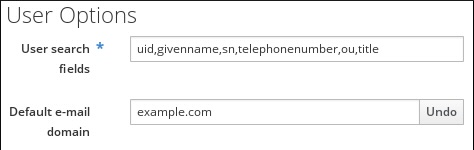
4. Keep all the object classes listed in the [Default IdM user object classes](#tab-default-idm-user-object-classes "Table 4.2. Default IdM user object classes") table.
   
   Important
   
   If any object classes required by IdM are not included, then subsequent attempts to add a user entry will fail with object class violations.
5. At the bottom of the users area, click **Add** for a new field to appear.
   
   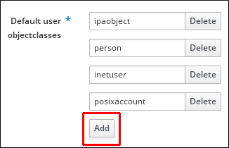
6. Enter the name of the user object class you want to add.
7. Click `Save` at the top of the `Configuration` page.

<h3 id="modifying-user-object-classes-in-the-idm-cli">4.4. Modifying user object classes in the IdM CLI</h3>

Modify user object classes using the Identity Management (IdM) CLI to add custom attributes to future user entries. New entries will have different attributes than existing user entries.

**Prerequisites**

- You have enabled the `brace expansion` feature:
  
  ```
  set -o braceexpand
  ```
  
  ```plaintext
  # set -o braceexpand
  ```
- You are logged in as the IdM administrator.

**Procedure**

- Use the `ipa config-mod` command to modify the current schema. For example, to add `top` and `mailRecipient` object classes to the future user entries:
  
  ```
  ipa config-mod --userobjectclasses={person,organizationalperson,inetorgperson,inetuser,posixaccount,krbprincipalaux,krbticketpolicyaux,ipaobject,ipasshuser,mepOriginEntry,top,mailRecipient}
  ```
  
  ```plaintext
  [bjensen@server ~]$ ipa config-mod --userobjectclasses={person,organizationalperson,inetorgperson,inetuser,posixaccount,krbprincipalaux,krbticketpolicyaux,ipaobject,ipasshuser,mepOriginEntry,top,mailRecipient}
  ```
  
  The command adds all the [ten user object classes that are native to IdM](#tab-default-idm-user-object-classes "Table 4.2. Default IdM user object classes") as well as the two new ones, `top` and `mailRecipient`.
  
  Important
  
  The information passed with the `config-mod` command overwrites the previous values. If any user object classes required by IdM are not included, then subsequent attempts to add a user entry will fail with object class violations.
  
  Alternatively, you can add a user object class by using the `ipa config-mod --addattr ipauserobjectclasses=<user object class>` command. In this way, you do not risk forgetting a native IdM class in the list. For example, to add the `mailRecipient` user object class without overwriting the current configuration, enter `ipa config-mod --addattr ipauserobjectclasses=mailRecipient`. Analogously, to remove only the `mailRecipient` object class, enter `ipa config-mod --delattr ipauserobjectclasses=mailRecipient`.

<h3 id="modifying-group-object-classes-in-the-idm-web-ui">4.5. Modifying group object classes in the IdM Web UI</h3>

Modify group object classes in the IdM Web UI to add custom attributes to future group entries. New groups will have different attributes than existing group entries.

The following group objects are available by default: * top * groupofnames * nestedgroup * ipausergroup * ipaobject

In this example, you learn how to add additional group object classes to the future group entries.

**Prerequisites**

- You are logged in as the IdM administrator.

**Procedure**

1. Open the **IPA Server** tab.
2. Select the **Configuration** subtab.
3. Locate the **Group Options** area.
4. Keep the default IdM group object classes.
   
   Important
   
   If any group object classes required by IdM are not included, then subsequent attempts to add a group entry will fail with object class violations.
5. Click **Add** for a new field to appear.
   
   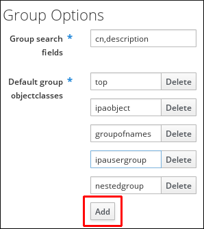
6. Enter the name of the group object class you want to add.
7. Click **Save** at the top of the **Configuration** page.

<h3 id="modifying-group-object-classes-in-the-idm-cli">4.6. Modifying group object classes in the IdM CLI</h3>

Modify group object classes using the Identity Management (IdM) CLI to add custom attributes to future group entries. New groups will have different attributes than existing group entries.

The following group objects are available by default: * top * groupofnames * nestedgroup * ipausergroup * ipaobject

In this example, you add the `ipasshuser` and `employee` group object classes to the future group entries.

**Prerequisites**

- You have enabled the `brace expansion` feature:
  
  ```
  set -o braceexpand
  ```
  
  ```plaintext
  # set -o braceexpand
  ```
- You are logged in as the IdM administrator.

**Procedure**

- Use the `ipa config-mod` command to modify the current schema. For example, to add `ipasshuser` and `employee` group object classes to the future user entries:
  
  ```
  ipa config-mod --groupobjectclasses={top,groupofnames,nestedgroup,ipausergroup,ipaobject,ipasshuser,employeegroup}
  ```
  
  ```plaintext
  [bjensen@server ~]$ ipa config-mod --groupobjectclasses={top,groupofnames,nestedgroup,ipausergroup,ipaobject,ipasshuser,employeegroup}
  ```
  
  The command adds all the default group object classes as well as the two new ones, `ipasshuser` and `employeegroup`.
  
  Important
  
  If any group object classes required by IdM are not included, then subsequent attempts to add a group entry will fail with object class violations.
  
  Note
  
  Instead of the comma-separated list inside curly braces with no spaces allowed that is used in the example above, you can use the `--groupobjectclasses` argument repeatedly.

<h3 id="default-user-and-group-attributes-in-idm">4.7. Default user and group attributes in IdM</h3>

Identity Management (IdM) uses templates with default values when creating new user and group entries. Customize these defaults to match your organization’s requirements for home directories, shells, and naming conventions.

The template for users is more specific than the template for groups. IdM uses default values for several core attributes for IdM user accounts. These defaults can define actual values for user account attributes, such as the home directory location, or they can define the formats of attribute values, such as the user name length. The template also defines the object classes assigned to users.

For groups, the template only defines the assigned object classes.

In the IdM LDAP directory, these default definitions are all contained in a single configuration entry for the IdM server, `cn=ipaconfig,cn=etc,dc=example,dc=com`.

You can modify the configuration of default user parameters in IdM by using the `ipa config-mod` command. The table below summarizes some of the key parameters, the command-line options that you can use with `ipa config-mod` to modify them, and the parameter descriptions.

| Web UI field                     | Command-line option    | Description                                                                                                        |
|:---------------------------------|:-----------------------|:-------------------------------------------------------------------------------------------------------------------|
| Maximum user name length         | `--maxusername`        | Sets the maximum number of characters for user names. Default: 32.                                                 |
| Root for home directories        | `--homedirectory`      | Sets the default directory for user home directories. Default: `/home`.                                            |
| Default shell                    | `--defaultshell`       | Sets the default shell for users. Default: `/bin/sh`.                                                              |
| Default user group               | `--defaultgroup`       | Sets the default group for newly created accounts. Default: `ipausers`.                                            |
| Default e-mail domain            | `--emaildomain`        | Sets the email domain for creating addresses based on user accounts. Default: server domain.                       |
| Search time limit                | `--searchtimelimit`    | Sets the maximum time in seconds for a search before returning results.                                            |
| Search size limit                | `--searchrecordslimit` | Sets the maximum number of records to return in a search.                                                          |
| User search fields               | `--usersearch`         | Defines searchable fields in user entries, impacting server performance if too many attributes are set.            |
| Group search fields              | `--groupsearch`        | Defines searchable fields in group entries.                                                                        |
| Certificate subject base         |                        | Sets the base DN for creating subject DNs for client certificates during setup.                                    |
| Default user object classes      | `--userobjectclasses`  | Defines object classes for creating user accounts. Must provide a complete list as it overwrites the existing one. |
| Default group object classes     | `--groupobjectclasses` | Defines object classes for creating group accounts. Must provide a complete list.                                  |
| Password expiration notification | `--pwdexpnotify`       | Defines the number of days before a password expires for sending a notification.                                   |
| Password plug-in features        |                        | Sets the format of allowable passwords for users.                                                                  |

Table 4.3. Default user parameters

<h3 id="viewing-and-modifying-user-and-group-configuration-in-the-idm-web-ui">4.8. Viewing and modifying user and group configuration in the IdM Web UI</h3>

View and modify default user and group attribute settings in the Identity Management (IdM) Web UI. Changes apply to newly created accounts while existing accounts remain unchanged.

**Prerequisites**

- You are logged in as IdM `admin`.

**Procedure**

1. Open the **IPA Server** tab.
2. Select the **Configuration** subtab.
3. The **User Options** section has multiple fields you can review and edit.
   
   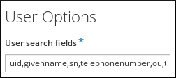
4. For example, to change the default shell for future IdM users from `/bin/sh` to `/bin/bash`, locate the **Default shell** field, and replace `/bin/sh` with `/bin/bash`.
5. In the **Group Options** section, you can only review and edit the **Group search fields** field.
   
   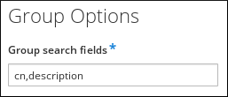
6. Click the **Save** button at the top of the screen.
   
   The newly saved configuration will be applied to future IdM user and group accounts. The current accounts remain unchanged.

<h3 id="viewing-and-modifying-user-and-group-configuration-in-the-idm-cli">4.9. Viewing and modifying user and group configuration in the IdM CLI</h3>

View and modify default user and group attribute settings using the Identity Management (IdM) CLI. Changes apply to newly created accounts while existing accounts remain unchanged.

**Prerequisites**

- You have the IdM `admin` credentials.

**Procedure**

- The `ipa config-show` command displays the most common attribute settings. Use the `--all` option for a complete list:
  
  ```
  ipa config-show --all
  dn: cn=ipaConfig,cn=etc,dc=example,dc=com
  Maximum username length: 32
  Home directory base: /home
  Default shell: /bin/sh
  Default users group: ipausers
  Default e-mail domain: example.com
  Search time limit: 2
  Search size limit: 100
  User search fields: uid,givenname,sn,telephonenumber,ou,title
  Group search fields: cn,description
  Enable migration mode: FALSE
  Certificate Subject base: O=EXAMPLE.COM
  Default group objectclasses: top, groupofnames, nestedgroup, ipausergroup, ipaobject
  Default user objectclasses: top, person, organizationalperson, inetorgperson, inetuser, posixaccount, krbprincipalaux, krbticketpolicyaux, ipaobject, ipasshuser
  Password Expiration Notification (days): 4
  Password plugin features: AllowNThash
  SELinux user map order: guest_u:s0$xguest_u:s0$user_u:s0$staff_u:s0-s0:c0.c1023$unconfined_u:s0-s0:c0.c1023
  Default SELinux user: unconfined_u:s0-s0:c0.c1023
  Default PAC types: MS-PAC, nfs:NONE
  cn: ipaConfig
  objectclass: nsContainer, top, ipaGuiConfig, ipaConfigObject
  ```
  
  ```plaintext
  [bjensen@server ~]$ ipa config-show --all
  dn: cn=ipaConfig,cn=etc,dc=example,dc=com
  Maximum username length: 32
  Home directory base: /home
  Default shell: /bin/sh
  Default users group: ipausers
  Default e-mail domain: example.com
  Search time limit: 2
  Search size limit: 100
  User search fields: uid,givenname,sn,telephonenumber,ou,title
  Group search fields: cn,description
  Enable migration mode: FALSE
  Certificate Subject base: O=EXAMPLE.COM
  Default group objectclasses: top, groupofnames, nestedgroup, ipausergroup, ipaobject
  Default user objectclasses: top, person, organizationalperson, inetorgperson, inetuser, posixaccount, krbprincipalaux, krbticketpolicyaux, ipaobject, ipasshuser
  Password Expiration Notification (days): 4
  Password plugin features: AllowNThash
  SELinux user map order: guest_u:s0$xguest_u:s0$user_u:s0$staff_u:s0-s0:c0.c1023$unconfined_u:s0-s0:c0.c1023
  Default SELinux user: unconfined_u:s0-s0:c0.c1023
  Default PAC types: MS-PAC, nfs:NONE
  cn: ipaConfig
  objectclass: nsContainer, top, ipaGuiConfig, ipaConfigObject
  ```
- Use the `ipa config-mod` command to modify an attribute. For example, to change the default shell for future IdM users from `/bin/sh` to `/bin/bash`, enter:
  
  ```
  ipa config-mod --defaultshell "/bin/bash"
  ```
  
  ```plaintext
  [bjensen@server ~]$ ipa config-mod --defaultshell "/bin/bash"
  ```
  
  For more `ipa config-mod` options, see the [Default user parameters](#tab-default-user-parameters "Table 4.3. Default user parameters") table.
  
  The new configuration will be applied to future IdM user and group accounts. The current accounts remain unchanged.

<h3 id="modifying-user-and-group-attributes-in-idm">4.10. Additional resources</h3>

- [Managing Directory Server attributes and values in DS 13](https://docs.redhat.com/en/documentation/red_hat_directory_server/13/html/management_configuration_and_operations/managing-directory-attributes-and-values)

<h2 id="managing-user-passwords-in-idm">Chapter 5. Managing user passwords in IdM</h2>

Manage Identity Management (IdM) user passwords including changing your own password, resetting other users' passwords, and configuring password-related features. Control password resets, account lockouts, and authentication tracking.

<h3 id="who-can-change-idm-user-passwords-and-how">5.1. Who can change IdM user passwords and how</h3>

Regular users can change only their own passwords and must meet the password policies applicable to the groups of which the user is a member. Administrators can reset any user’s password without meeting policies, but these passwords expire on first login unless configured otherwise.

Administrators and users with password change rights can set initial passwords for new users and reset passwords for existing users. These passwords:

- Do not have to meet the IdM password policies.
- Expire after the first successful login. When this happens, IdM prompts the user to change the expired password immediately. To disable this behavior, see [Enabling password reset in IdM without prompting the user for a password change at the next login](#enabling-password-reset-in-idm-without-prompting-the-user-for-a-password-change-at-the-next-login "5.7. Enabling password reset in IdM without prompting the user for a password change at the next login").

Note that the LDAP Directory Manager (DM) user can change user passwords using LDAP tools. A new password can override any IdM password policies. Passwords set by DM do not expire after the first login.

**Additional resources**

- [Defining IdM password policies](#defining-idm-password-policies "Chapter 6. Defining IdM password policies")

<h3 id="changing-your-user-password-in-the-idm-web-ui">5.2. Changing your user password in the IdM Web UI</h3>

Change your own user password in the Identity Management (IdM) Web UI to maintain account security. The new password must meet the password policies for groups you belong to.

**Prerequisites**

- Your password has not expired.

**Procedure**

1. Log in to the IdM Web UI.
2. In the upper right corner, click the name of the user who is logged into the IdM Web UI.
3. Select **Change password**.
4. Enter the current password.
5. Enter the new password in the **New Password** field.
6. Confirm the new password by entering it in the **Verify Password** field.
7. Click **Reset Password**.
   
   Note
   
   Alternatively, you can go directly to https://*&lt;server.idm.example.com*&gt;/ipa/ui/reset\_password.html, and change your password there.

<h3 id="resetting-another-users-password-in-the-idm-web-ui">5.3. Resetting another user’s password in the IdM Web UI</h3>

Reset another user’s password in the Identity Management (IdM) Web UI when they need a new password or have been locked out.

**Prerequisites**

- You are logged in to the IdM Web UI as an administrative user.

**Procedure**

1. Select **Identity&gt;Users**.
2. Click the name of the user to edit.
3. Click **Actions** and select **Reset password**.
4. Enter the new password in the **New Password** field.
5. Confirm the new password by entering it in the **Verify Password** field.
6. Click **Reset Password**.

<h3 id="resetting-the-directory-manager-user-password">5.4. Resetting the Directory Manager user password</h3>

Reset the Directory Manager password if it is, for example, lost or compromised. This procedure requires `root` access to the Identity Management (IdM) servers and must be performed on every server in your topology.

**Prerequisites**

- You have `root` access to an IdM server.

**Procedure**

1. Generate a new password hash by using the `pwdhash` command. For example:
   
   ```
   pwdhash -D /etc/dirsrv/slapd-IDM-EXAMPLE-COM password
   {PBKDF2_SHA256}AAAgABU0bKhyjY53NcxY33ueoPjOUWtl4iyYN5uW...
   ```
   
   ```plaintext
   # pwdhash -D /etc/dirsrv/slapd-IDM-EXAMPLE-COM password
   {PBKDF2_SHA256}AAAgABU0bKhyjY53NcxY33ueoPjOUWtl4iyYN5uW...
   ```
   
   By specifying the path to the Directory Server configuration, you automatically use the password storage scheme set in the `nsslapd-rootpwstoragescheme` attribute to encrypt the new password.
2. On every IdM server in your topology, execute the following steps:
   
   1. Stop all IdM services installed on the server:
      
      ```
      ipactl stop
      ```
      
      ```plaintext
      # ipactl stop
      ```
   2. Edit the `/etc/dirsrv/IDM-EXAMPLE-COM/dse.ldif` file and set the `nsslapd-rootpw` attribute to the value generated by the `pwdhash` command:
      
      ```
      nsslapd-rootpw: {PBKDF2_SHA256}AAAgABU0bKhyjY53NcxY33ueoPjOUWtl4iyYN5uW...
      ```
      
      ```plaintext
      nsslapd-rootpw: {PBKDF2_SHA256}AAAgABU0bKhyjY53NcxY33ueoPjOUWtl4iyYN5uW...
      ```
   3. Start all IdM services installed on the server:
   
   ```
   ipactl start
   ```
   
   ```plaintext
   # ipactl start
   ```

<h3 id="changing-your-user-password-or-resetting-another-users-password-in-idm-cli">5.5. Changing your user password or resetting another user’s password in IdM CLI</h3>

Change your own password or reset another user’s password using the Identity Management (IdM) CLI. Administrators can reset passwords for any user while regular users can only change their own.

**Prerequisites**

- You have obtained a ticket-granting ticket (TGT) for an IdM user.
- If you are resetting another user’s password, you must have obtained a TGT for an administrative user in IdM.

**Procedure**

- Enter the `ipa user-mod` command with the name of the user and the `--password` option. The command will prompt you for the new password.
  
  ```
  ipa user-mod idm_user --password
  Password:
  Enter Password again to verify:
  --------------------
  Modified user "idm_user"
  --------------------
  ...
  ```
  
  ```plaintext
  $ ipa user-mod idm_user --password
  Password:
  Enter Password again to verify:
  --------------------
  Modified user "idm_user"
  --------------------
  ...
  ```
  
  Note that you can also use the `ipa passwd idm_user` command instead of `ipa user-mod`.

<h3 id="additional-commands-for-changing-user-passwords">5.6. Additional commands for changing user passwords</h3>

Identity Management (IdM) supports multiple methods for changing user passwords, including PAM services, Kerberos, the IdM API, and LDAP. Each method has different requirements and use cases.

| Command      | Description                                                                                                      | Limitations                                                                            |
|:-------------|:-----------------------------------------------------------------------------------------------------------------|:---------------------------------------------------------------------------------------|
| `passwd`     | A user can change their own password using PAM service facilities and the `pam_sss` module to interact with SSSD | The system must be enrolled in IdM and SSSD must be configured.                        |
| `kpasswd`    | A user can change their own password directly via the Kerberos protocol                                          | The user must have a valid Kerberos ticket (TGT); does not require system enrollment.  |
| `ipa passwd` | An administrator or user can change a password through the IdM API                                               | Requires an active Kerberos ticket and the `ipa-client` packages installed.            |
| `ldappasswd` | An administrator or user can change a password directly via LDAP                                                 | Requires LDAP credentials (Bind DN) and direct network access to the Directory Server. |

Table 5.1. Additional commands for changing user passwords

<h3 id="enabling-password-reset-in-idm-without-prompting-the-user-for-a-password-change-at-the-next-login">5.7. Enabling password reset in IdM without prompting the user for a password change at the next login</h3>

Grant specific administrators the ability to reset passwords without forcing users to change them on first login. As an Identity Management (IdM) Directory Manager, you can add administrators to the `passSyncManagersDNs` attribute, which allows them to perform password resets without triggering the mandatory password change requirement and optionally bypass password policy enforcement.

Warning

Bypassing the password policy can be a security threat. Exercise caution when selecting users to whom you grant these additional privileges.

**Prerequisites**

- You know the Directory Manager password.

**Procedure**

1. Enter the `ldapmodify` command to modify LDAP entries. Specify the name of the IdM server and the 389 port and press Enter:
   
   ```
   ldapmodify -x -D "cn=Directory Manager" -W -h server.idm.example.com -p 389
   Enter LDAP Password: <password>
   ```
   
   ```plaintext
   $ ldapmodify -x -D "cn=Directory Manager" -W -h server.idm.example.com -p 389
   Enter LDAP Password: <password>
   ```
2. Enter the Directory Manager password.
3. Enter the distinguished name for the `ipa_pwd_extop` password synchronization entry and press Enter:
   
   ```
   dn: cn=ipa_pwd_extop,cn=plugins,cn=config
   ```
   
   ```plaintext
   dn: cn=ipa_pwd_extop,cn=plugins,cn=config
   ```
4. Specify the `modify` type of change and press Enter:
   
   ```
   changetype: modify
   ```
   
   ```plaintext
   changetype: modify
   ```
5. Specify what type of modification you want LDAP to execute and to which attribute. Press Enter:
   
   ```
   add: passSyncManagersDNs
   ```
   
   ```plaintext
   add: passSyncManagersDNs
   ```
6. Specify the administrative user accounts in the `passSyncManagersDNs` attribute. The attribute is multi-valued. For example, to grant the `admin` user the password resetting powers of Directory Manager:
   
   ```
   passSyncManagersDNs: \
   uid=admin,cn=users,cn=accounts,dc=example,dc=com
   ```
   
   ```plaintext
   passSyncManagersDNs: \
   uid=admin,cn=users,cn=accounts,dc=example,dc=com
   ```
7. Press Enter twice to stop editing the entry.
   
   The `admin` user, listed under `passSyncManagerDNs`, now has the additional privileges. Repeat the steps on every Identity Management (IdM) server in the domain.

<h3 id="checking-if-an-idm-users-account-is-locked">5.8. Checking if an IdM user’s account is locked</h3>

Determine if a user’s account is locked due to failed login attempts by comparing their failed login count against the maximum allowed number of failures.

**Prerequisites**

- You have obtained the ticket-granting ticket (TGT) of an administrative user in IdM.

**Procedure**

1. Display the status of the user account to see the number of failed logins:
   
   ```
   ipa user-status example_user
   -----------------------
   Account disabled: False
   -----------------------
     Server: idm.example.com
     Failed logins: 8
     Last successful authentication: N/A
     Last failed authentication: 20220229080317Z
     Time now: 2022-02-29T08:04:46Z
   ----------------------------
   Number of entries returned 1
   ----------------------------
   ```
   
   ```plaintext
   $ ipa user-status example_user
   -----------------------
   Account disabled: False
   -----------------------
     Server: idm.example.com
     Failed logins: 8
     Last successful authentication: N/A
     Last failed authentication: 20220229080317Z
     Time now: 2022-02-29T08:04:46Z
   ----------------------------
   Number of entries returned 1
   ----------------------------
   ```
2. Display the number of allowed login attempts for a particular user:
   
   ```
   ipa pwpolicy-show --user example_user
     Group: global_policy
     Max lifetime (days): 90
     Min lifetime (hours): 1
     History size: 0
     Character classes: 0
     Min length: 8
     Max failures: 6
     Failure reset interval: 60
     Lockout duration: 600
     Grace login limit: -1
   ```
   
   ```plaintext
   $ ipa pwpolicy-show --user example_user
     Group: global_policy
     Max lifetime (days): 90
     Min lifetime (hours): 1
     History size: 0
     Character classes: 0
     Min length: 8
     Max failures: 6
     Failure reset interval: 60
     Lockout duration: 600
     Grace login limit: -1
   ```
3. Compare the number of failed logins as displayed in the output of the `ipa user-status` command with the **Max failures** number displayed in the output of the `ipa pwpolicy-show` command. If the number of failed logins equals that of maximum allowed login attempts, the user account is locked.

**Additional resources**

- [Unlocking user accounts after password failures in IdM](#unlocking-user-accounts-after-password-failures-in-idm "5.9. Unlocking user accounts after password failures in IdM")

<h3 id="unlocking-user-accounts-after-password-failures-in-idm">5.9. Unlocking user accounts after password failures in IdM</h3>

Unlock a user account that was locked due to too many failed login attempts.

For security reasons, IdM does not display any warning message that the user account has been locked. Instead, the CLI prompt might continue asking the user for a password again and again.

IdM automatically unlocks the user account after a specified amount of time has passed. Alternatively, you can unlock the user account manually with the following procedure.

**Prerequisites**

- You have obtained the ticket-granting ticket of an IdM administrative user.

**Procedure**

- To unlock a user account, use the `ipa user-unlock` command.
  
  ```
  ipa user-unlock idm_user
  -----------------------
  Unlocked account "idm_user"
  -----------------------
  ```
  
  ```plaintext
  $ ipa user-unlock idm_user
  -----------------------
  Unlocked account "idm_user"
  -----------------------
  ```
  
  After this, the user can log in again.

**Additional resources**

- [Checking if an IdM user’s account is locked](#checking-if-an-idm-users-account-is-locked "5.8. Checking if an IdM user’s account is locked")

<h3 id="enabling-the-tracking-of-last-successful-kerberos-authentication-for-users-in-idm">5.10. Enabling the tracking of last successful Kerberos authentication for users in IdM</h3>

Enable tracking of last successful Kerberos authentication timestamps for auditing purposes. This feature is disabled by default for performance reasons.

**Prerequisites**

- You have obtained the ticket-granting ticket (TGT) of an administrative user in IdM.
- You have `root` access to the IdM server on which you are executing the procedure.

**Procedure**

1. Display the currently enabled password plug-in features:
   
   ```
   ipa config-show | grep "Password plugin features"
     Password plugin features: pass:quotes[AllowNThash], pass:quotes[KDC:Disable Last Success]
   ```
   
   ```plaintext
   # ipa config-show | grep "Password plugin features"
     Password plugin features: pass:quotes[AllowNThash], pass:quotes[KDC:Disable Last Success]
   ```
   
   The output shows that the `KDC:Disable Last Success` plug-in is enabled. The plug-in hides the last successful Kerberos authentication attempt from being visible in the ipa user-status output.
2. Add the `--ipaconfigstring=feature` parameter for every feature to the `ipa config-mod` command that is currently enabled, except for `KDC:Disable Last Success`:
   
   ```
   ipa config-mod --ipaconfigstring='AllowNThash'
   ```
   
   ```plaintext
   # ipa config-mod --ipaconfigstring='AllowNThash'
   ```
   
   This command enables only the `AllowNThash` plug-in. To enable multiple features, specify the `--ipaconfigstring=feature` parameter separately for each feature.
3. Restart IdM:
   
   ```
   ipactl restart
   ```
   
   ```plaintext
   # ipactl restart
   ```

<h2 id="defining-idm-password-policies">Chapter 6. Defining IdM password policies</h2>

Learn about Identity Management (IdM) password policies and how to add a new password policy in IdM.

A password policy is a set of rules that passwords must meet. For example, a password policy can define the minimum password length and the maximum password lifetime. All users affected by this policy are required to set a sufficiently long password and change it frequently enough to meet the specified conditions. In this way, password policies help reduce the risk of someone discovering and misusing a user’s password.

<h3 id="password-policies-in-idm">6.1. Password policies in IdM</h3>

Passwords are the most common way for Identity Management (IdM) users to authenticate to the IdM Kerberos domain. Understand how IdM password policies define password requirements and how they are enforced by the Kerberos Key Distribution Center (KDC).

A password policy is a set of rules that passwords must meet. For example, a password policy can define the minimum password length and the maximum password lifetime. All users affected by this policy are required to set a sufficiently long password and change it frequently enough to meet the specified conditions. In this way, password policies help reduce the risk of someone discovering and misusing a user’s password.

Note

The IdM password policy is set in the underlying LDAP directory, but the KDC enforces the password policy.

[Password policy attributes](#tab-password-policy-attributes "Table 6.1. Password Policy Attributes") lists the attributes you can use to define a password policy in IdM.

Table 6.1. Password Policy Attributes

AttributeExplanationExample

Max lifetime

The maximum amount of time in days that a password is valid before a user must reset it. The default value is 90 days.

Note that if the attribute is set to 0, the password never expires.

Max lifetime = 180

User passwords are valid only for 180 days. After that, IdM prompts users to change them.

Min lifetime

The minimum amount of time in hours that must pass between two password change operations.

Min lifetime = 1

After users change their passwords, they must wait at least 1 hour before changing them again.

History size

The number of previous passwords that are stored. A user cannot reuse a password from their password history but can reuse old passwords that are not stored.

History size = 0

In this case, the password history is empty and users can reuse any of their previous passwords.

Character classes

The number of different character classes the user must use in the password. The character classes are:

\* Uppercase characters

\* Lowercase characters

\* Digits

\* Special characters, such as comma (,), period (.), asterisk (\*)

\* Other UTF-8 characters

Using a character three or more times in a row decreases the character class by one. For example:

\* `Secret1` has 3 character classes: uppercase, lowercase, digits

\* `Secret111` has 2 character classes: uppercase, lowercase, digits, and a -1 penalty for using `1` repeatedly

Character classes = 0

The default number of classes required is 0. To configure the number, run the `ipa pwpolicy-mod` command with the `--minclasses` option.

See also the [Important](#english-alphabet "Important") note below this table.

Min length

The minimum number of characters in a password.

If any of the [additional password policy options](additional-password-policy-options-in-idm) are set, then the minimum length of passwords is 6 characters.

Min length = 8

Users cannot use passwords shorter than 8 characters.

Max failures

The maximum number of failed login attempts before IdM locks the user account.

Max failures = 6

IdM locks the user account when the user enters a wrong password 7 times in a row.

Failure reset interval

The amount of time in seconds after which IdM resets the current number of failed login attempts.

Failure reset interval = 60

If the user waits for more than 1 minute after the number of failed login attempts defined in `Max failures`, the user can attempt to log in again without risking a user account lock.

Lockout duration

The amount of time in seconds that the user account is locked after the number of failed login attempts defined in `Max failures`.

Lockout duration = 600

Users with locked accounts are unable to log in for 10 minutes.

Important

Use the English alphabet and common symbols for the character classes requirement if you have a diverse set of hardware that may not have access to international characters and symbols. For more information about character class policies in passwords, see the Red Hat Knowledgebase solution [What characters are valid in a password?](https://access.redhat.com/solutions/3143431).

<h3 id="password-policy-priorities-in-idm">6.2. Password policy priorities in IdM</h3>

Understand how IdM determines which password policy applies when a user belongs to multiple groups with different policies.

Password policies help reduce the risk of someone discovering and misusing a user’s password. The default password policy is the *global password policy*. You can also create additional group password policies. The global policy rules apply to all users without a group password policy. Group password policies apply to all members of the corresponding user group.

Note that only one password policy can be in effect at a time for any user. If a user has multiple password policies assigned, one of them takes precedence based on priority according to the following rules:

- Every group password policy has a priority set. The lower the value, the higher the policy’s priority. The lowest supported value is `0`.
- If multiple password policies are applicable to a user, the policy with the lowest priority value takes precedence. All rules defined in other policies are ignored.
- The password policy with the lowest priority value applies to all password policy attributes, even the attributes that are not defined in the policy.

The global password policy does not have a priority value set. It serves as a fallback policy when no group policy is set for a user. The global policy can never take precedence over a group policy.

Note

The `ipa pwpolicy-show --user=user_name` command shows which policy is currently in effect for a particular user.

<h3 id="adding-a-new-password-policy-in-idm-using-the-webui-or-the-cli">6.3. Adding a new password policy in IdM using the WebUI or the CLI</h3>

Complex password policies help reduce the risk of someone discovering and misusing a user’s password. The default password policy is the *global password policy*. You can also create additional group password policies.

<h4 id="adding-a-new-password-policy-in-the-idm-webui">6.3.1. Adding a new password policy in the IdM WebUI</h4>

Create a group-specific password policy in the Identity Management (IdM) WebUI to enforce different password requirements for different user groups. This allows stronger policies for privileged groups.

**Prerequisites**

- A user group to which the policy applies.
- A priority assigned to the policy

**Procedure**

1. Log in to the IdM Web UI. For details, see [Accessing the IdM Web UI in a web browser](https://docs.redhat.com/en/documentation/red_hat_enterprise_linux/10/html/accessing_identity_management_services/accessing-the-idm-web-ui-in-a-web-browser).
2. Select **Policy&gt;Password Policies**.
3. Click **Add**.
4. Define the user group and priority.
5. Click **Add** to confirm.
   
   To configure the attributes of the new password policy, see [Password policies in IdM](#password-policies-in-idm "6.1. Password policies in IdM").

**Additional resources**

- [Password policy priorities in IdM](#password-policy-priorities-in-idm "6.2. Password policy priorities in IdM")

<h4 id="adding-a-new-password-policy-in-the-idm-cli">6.3.2. Adding a new password policy in the IdM CLI</h4>

Create a group-specific password policy using the Identity Management (IdM) CLI to enforce different password requirements for different user groups. This allows stronger policies for privileged groups.

**Prerequisites**

- A user group to which the policy applies.
- A priority assigned to the policy

**Procedure**

1. Open terminal and connect to the IdM server.
2. Use the `ipa pwpolicy-add` command. Specify the user group and priority:
   
   ```
   ipa pwpolicy-add
   Group: group_name
   Priority: priority_level
   ```
   
   ```plaintext
   $ ipa pwpolicy-add
   Group: group_name
   Priority: priority_level
   ```
3. Optional. Use the `ipa pwpolicy-find` command to verify that the policy has been successfully added:
   
   ```
   ipa pwpolicy-find
   ```
   
   ```plaintext
   $ ipa pwpolicy-find
   ```
   
   To configure the attributes of the new password policy, see [Password policies in IdM](#password-policies-in-idm "6.1. Password policies in IdM").

**Additional resources**

- [Password policy priorities in IdM](#password-policy-priorities-in-idm "6.2. Password policy priorities in IdM")

<h3 id="additional-password-policy-options-in-idm">6.4. Additional password policy options in IdM</h3>

Strengthen password requirements using additional policy options based on the `libpwquality` feature set. These options control character repetition, monotonic sequences, dictionary checks, and username inclusion.

`--maxrepeat`

Specifies the maximum acceptable number of same consecutive characters in the new password.

`--maxsequence`

Specifies the maximum length of monotonic character sequences in the new password. Examples of such a sequence are **12345** or **fedcb**. Most such passwords will not pass the simplicity check.

`--dictcheck`

If nonzero, checks whether the password, with possible modifications, matches a word in a dictionary. Currently `libpwquality` performs the dictionary check using the `cracklib` library.

`--usercheck`

If nonzero, checks whether the password, with possible modifications, contains the user name in some form. It is not performed for user names shorter than 3 characters.

You cannot apply the additional password policy options to existing passwords. If you apply any of the additional options, IdM automatically sets the `--minlength` option, the minimum number of characters in a password, to **6** characters.

Note

In a mixed environment with RHEL 7, RHEL 8, RHEL 9, and RHEL 10 servers, you can enforce the additional password policy settings only on servers running on RHEL 8.4 and later. If a user is logged in to an IdM client and the IdM client is communicating with an IdM server running on RHEL 8.3 or earlier, then the new password policy requirements set by the system administrator will not be applied. To ensure consistent behavior, upgrade or update all servers to RHEL 8.4 and later.

**Additional resources**

- [Applying additional password policies to an IdM group](#applying-additional-password-policy-options-to-an-idm-group "6.5. Applying additional password policy options to an IdM group")

<h3 id="applying-additional-password-policy-options-to-an-idm-group">6.5. Applying additional password policy options to an IdM group</h3>

Apply advanced password quality checks to a user group to enforce stricter password requirements.

The example describes how to strengthen the password policy for the **managers** group by making sure that the new passwords do not contain the users' respective user names and that the passwords contain no more than two identical characters in succession.

**Prerequisites**

- You are logged in as an IdM administrator.
- The **managers** group exists in IdM.
- The **managers** password policy exists in IdM.

**Procedure**

1. Apply the user name check to all new passwords suggested by the users in the **managers** group:
   
   ```
   ipa pwpolicy-mod --usercheck=True managers
   ```
   
   ```plaintext
   $ ipa pwpolicy-mod --usercheck=True managers
   ```
   
   Note
   
   If you do not specify the name of the password policy, the default `global_policy` is modified.
2. Set the maximum number of identical consecutive characters to 2 in the **managers** password policy:
   
   ```
   ipa pwpolicy-mod --maxrepeat=2 managers
   ```
   
   ```plaintext
   $ ipa pwpolicy-mod --maxrepeat=2 managers
   ```
   
   A password now will not be accepted if it contains more than 2 identical consecutive characters. For example, the **eR873mUi111YJQ** combination is unacceptable because it contains three **1**s in succession.

**Verification**

1. Add a test user named **test\_user**:
   
   ```
   ipa user-add test_user
   First name: test
   Last name: user
   ----------------------------
   Added user "test_user"
   ----------------------------
   ```
   
   ```plaintext
   $ ipa user-add test_user
   First name: test
   Last name: user
   ----------------------------
   Added user "test_user"
   ----------------------------
   ```
2. Add the test user to the **managers** group:
   
   1. In the IdM Web UI, click Identity → Groups → User Groups.
   2. Click **managers**.
   3. Click `Add`.
   4. In the **Add users into user group 'managers'** page, check **test\_user**.
   5. Click the `>` arrow to move the user to the `Prospective` column.
   6. Click `Add`.
3. Reset the password for the test user:
   
   1. Go to Identity → Users.
   2. Click **test\_user**.
   3. In the `Actions` menu, click `Reset Password`.
   4. Enter a temporary password for the user.
4. On the command line, try to obtain a Kerberos ticket-granting ticket (TGT) for the **test\_user**:
   
   ```
   kinit test_user
   ```
   
   ```plaintext
   $ kinit test_user
   ```
   
   1. Enter the temporary password.
   2. The system informs you that you must change your password. Enter a password that contains the user name of **test\_user**:
      
      ```
      Password expired. You must change it now.
      Enter new password:
      Enter it again:
      Password change rejected: Password not changed.
      Unspecified password quality failure while trying to change password.
      Please try again.
      ```
      
      ```plaintext
      Password expired. You must change it now.
      Enter new password:
      Enter it again:
      Password change rejected: Password not changed.
      Unspecified password quality failure while trying to change password.
      Please try again.
      ```
      
      Note
      
      Kerberos does not have fine-grained error password policy reporting and, in certain cases, does not provide a clear reason why a password was rejected.
   3. The system informs you that the entered password was rejected. Enter a password that contains three or more identical characters in succession:
      
      ```
      Password change rejected: Password not changed.
      Unspecified password quality failure while trying to change password.
      Please try again.
      
      Enter new password:
      Enter it again:
      ```
      
      ```plaintext
      Password change rejected: Password not changed.
      Unspecified password quality failure while trying to change password.
      Please try again.
      
      Enter new password:
      Enter it again:
      ```
   4. The system informs you that the entered password was rejected. Enter a password that meets the criteria of the **managers** password policy:
      
      ```
      Password change rejected: Password not changed.
      Unspecified password quality failure while trying to change password.
      Please try again.
      
      Enter new password:
      Enter it again:
      ```
      
      ```plaintext
      Password change rejected: Password not changed.
      Unspecified password quality failure while trying to change password.
      Please try again.
      
      Enter new password:
      Enter it again:
      ```
5. View the obtained TGT:
   
   ```
   klist
   Ticket cache: KCM:0:33945
   Default principal: test_user@IDM.EXAMPLE.COM
   
   Valid starting       Expires              Service principal
   07/07/2021 12:44:44  07/08/2021 12:44:44  krbtgt@IDM.EXAMPLE.COM@IDM.EXAMPLE.COM
   ```
   
   ```plaintext
   $ klist
   Ticket cache: KCM:0:33945
   Default principal: test_user@IDM.EXAMPLE.COM
   
   Valid starting       Expires              Service principal
   07/07/2021 12:44:44  07/08/2021 12:44:44  krbtgt@IDM.EXAMPLE.COM@IDM.EXAMPLE.COM
   ```

The **managers** password policy now works correctly for users in the **managers** group.

**Additional resources**

- [Additional password policies in IdM](#additional-password-policy-options-in-idm "6.4. Additional password policy options in IdM")
- [Using an Ansible playbook to apply additional password policy options to an IdM group](https://docs.redhat.com/en/documentation/red_hat_enterprise_linux/10/html/using_ansible_to_install_and_manage_identity_management_in_rhel/defining-idm-password-policies-in-ansible#using-an-ansible-playbook-to-apply-additional-password-policy-options-to-an-idm-group)

<h3 id="defining-idm-password-policies">6.6. Additional resources</h3>

- [Defining IdM password policies using an Ansible playbook](https://docs.redhat.com/en/documentation/red_hat_enterprise_linux/10/html/using_ansible_to_install_and_manage_identity_management_in_rhel/defining-idm-password-policies-in-ansible)

<h2 id="managing-expiring-password-notifications">Chapter 7. Managing expiring password notifications</h2>

Notify Identity Management (IdM) users about expiring passwords using the Expiring Password Notification (EPN) tool. Configure automated daily emails or run on-demand checks to help users change their passwords before they expire.

<h3 id="what-is-the-expiring-password-notification-tool">7.1. What is the Expiring Password Notification tool</h3>

The Expiring Password Notification (EPN) tool identifies Identity Management (IdM) users with expiring passwords and can send automated email notifications, generate reports, or run on a scheduled timer. Use EPN to help users change passwords proactively and avoid account lockouts.

IdM administrators can use EPN to:

- Display a list of affected users in JSON format, which is created when run in dry-run mode.
- Calculate how many emails will be sent for a given day or date range.
- Send password expiration email notifications to users.
- Configure the `ipa-epn.timer` to run the EPN tool daily and send an email to users whose passwords are expiring within the defined future date ranges.
- Customize the email notification to send to users.

Note

If a user account is disabled, no email notifications are sent if the password is going to expire.

<h3 id="installing-the-expiring-password-notification-tool">7.2. Installing the Expiring Password Notification tool</h3>

Install the Expiring Password Notification (EPN) tool on an Identity Management (IdM) replica or client to enable password expiration email notifications.

**Prerequisites**

- Install the EPN tool on either an Identity Management (IdM) replica or an IdM client with a local Postfix SMTP server configured as a smart host.

**Procedure**

- Install the EPN tool:
  
  ```
  dnf install ipa-client-epn
  ```
  
  ```plaintext
  # dnf install ipa-client-epn
  ```

<h3 id="running-the-epn-tool-to-send-emails-to-users-whose-passwords-are-expiring">7.3. Running the EPN tool to send emails to users whose passwords are expiring</h3>

Configure and run the EPN tool to send password expiration email notifications to Identity Management (IdM) users.

To do this, follow one of the following methods:

- Update the `epn.conf` configuration file and [enable the ipa-epn.timer tool](#enabling-the-ipa-epn-timer-to-send-an-email-to-all-users-whose-passwords-are-expiring "7.4. Enabling the ipa-epn.timer to send an email to all users whose passwords are expiring").
- Update the `epn.conf` configuration file and run the EPN tool directly on the command line.

Note

The EPN tool is stateless. If the EPN tool fails to email any of the users whose passwords are expiring on a given day, the EPN tool does not save a list of those users.

**Prerequisites**

- The `ipa-client-epn` package is installed. See [Installing the Expiring Password Notification tool](#installing-the-expiring-password-notification-tool "7.2. Installing the Expiring Password Notification tool").
- Customize the `ipa-epn` email template if required. See [Modifying the Expiring Password Notification email template](#modifying-the-expiring-password-notification-email-template "7.5. Modifying the Expiring Password Notification email template").

**Procedure**

1. Open the `epn.conf` configuration file.
   
   ```
   vi /etc/ipa/epn.conf
   ```
   
   ```plaintext
   # vi /etc/ipa/epn.conf
   ```
2. Update the `notify_ttls` option as required. The default is to notify users whose passwords are expiring in 28, 14, 7, 3, and 1 day(s).
   
   ```
   notify_ttls = 28, 14, 7, 3, 1
   ```
   
   ```plaintext
   notify_ttls = 28, 14, 7, 3, 1
   ```
   
   Note
   
   You must also [activate the `ipa-epn.timer` tool](#enabling-the-ipa-epn-timer-to-send-an-email-to-all-users-whose-passwords-are-expiring "7.4. Enabling the ipa-epn.timer to send an email to all users whose passwords are expiring") to ensure that emails are sent.
3. Configure your SMTP server and port:
   
   ```
   smtp_server = localhost
   smtp_port = 25
   ```
   
   ```plaintext
   smtp_server = localhost
   smtp_port = 25
   ```
4. Specify the email address from which the email expiration notification is sent. Any unsuccessfully delivered emails are returned to this address.
   
   ```
   mail_from = admin-email@example.com
   ```
   
   ```plaintext
   mail_from = admin-email@example.com
   ```
5. Optional: If you want to use an encrypted channel of communication, specify the credentials to be used:
   
   - Specify the path to a single file in PEM format containing the certificate to be used by EPN to authenticate with the SMTP server:
     
     ```
     smtp_client_cert = /etc/pki/tls/certs/client.pem
     ```
     
     ```plaintext
     smtp_client_cert = /etc/pki/tls/certs/client.pem
     ```
     
     Note
     
     EPN is an SMTP client. The purpose of the certificate is client authentication, not secure SMTP delivery.
   - You can specify the path to a file that contains the private key. If not specified, the private key is taken from the certificate file.
     
     ```
     smtp_client_key = /etc/pki/tls/certs/client.key
     ```
     
     ```plaintext
     smtp_client_key = /etc/pki/tls/certs/client.key
     ```
   - If the private key is encrypted, specify the password for decrypting it.
     
     ```
     smtp_client_key_pass = Secret123!
     ```
     
     ```plaintext
     smtp_client_key_pass = Secret123!
     ```
6. Save the `/etc/ipa/epn.conf` file.
7. Run the EPN tool in dry-run mode to generate a list of the users to whom the password expiration email notification would be sent if you run the tool without the `--dry-run` option.
   
   ```
   ipa-epn --dry-run
   [
       {
        "uid": "user5",
        "cn": "user 5",
        "krbpasswordexpiration": "2020-04-17 15:51:53",
        "mail": "['user5@ipa.test']"
       }
   ]
   [
       {
        "uid": "user6",
        "cn": "user 6",
        "krbpasswordexpiration": "2020-12-17 15:51:53",
        "mail": "['user5@ipa.test']"
        }
   ]
   The IPA-EPN command was successful
   ```
   
   ```plaintext
   # ipa-epn --dry-run
   [
       {
        "uid": "user5",
        "cn": "user 5",
        "krbpasswordexpiration": "2020-04-17 15:51:53",
        "mail": "['user5@ipa.test']"
       }
   ]
   [
       {
        "uid": "user6",
        "cn": "user 6",
        "krbpasswordexpiration": "2020-12-17 15:51:53",
        "mail": "['user5@ipa.test']"
        }
   ]
   The IPA-EPN command was successful
   ```
   
   Note
   
   If the list of users returned is very large and you run the tool without the `--dry-run` option, this might cause an issue with your email server.
8. Run the EPN tool without the `--dry-run` option to send expiration emails to the list of all the users returned when you ran the EPN tool in dry-run mode:
   
   ```
   ipa-epn
   [
     {
        "uid": "user5",
        "cn": "user 5",
        "krbpasswordexpiration": "2020-10-01 15:51:53",
        "mail": "['user5@ipa.test']"
     }
   ]
   [
     {
       "uid": "user6",
       "cn": "user 6",
       "krbpasswordexpiration": "2020-12-17 15:51:53",
       "mail": "['user5@ipa.test']"
     }
   ]
   The IPA-EPN command was successful
   ```
   
   ```plaintext
   # ipa-epn
   [
     {
        "uid": "user5",
        "cn": "user 5",
        "krbpasswordexpiration": "2020-10-01 15:51:53",
        "mail": "['user5@ipa.test']"
     }
   ]
   [
     {
       "uid": "user6",
       "cn": "user 6",
       "krbpasswordexpiration": "2020-12-17 15:51:53",
       "mail": "['user5@ipa.test']"
     }
   ]
   The IPA-EPN command was successful
   ```
9. You can add EPN to any monitoring system and invoke it with the `--from-nbdays` and `--to-nbdays` options to determine how many users passwords are going to expire within a specific time frame:
   
   ```
   ipa-epn --from-nbdays 8 --to-nbdays 12
   ```
   
   ```plaintext
   # ipa-epn --from-nbdays 8 --to-nbdays 12
   ```
   
   Note
   
   If you invoke the EPN tool with the `--from-nbdays` and `--to-nbdays` options, it is automatically executed in dry-run mode.

**Verification**

- Run the EPN tool and verify an email notification is sent.

<h3 id="enabling-the-ipa-epn-timer-to-send-an-email-to-all-users-whose-passwords-are-expiring">7.4. Enabling the ipa-epn.timer to send an email to all users whose passwords are expiring</h3>

Enable the `ipa-epn.timer` to automatically run the EPN tool daily and send password expiration notifications.

The `ipa-epn.timer` parses the `epn.conf` file and sends an email to users whose passwords are expiring within the defined future date ranges configured in that file.

**Prerequisites**

- The `ipa-client-epn` package is installed. See [Installing the Expiring Password Notification tool](#installing-the-expiring-password-notification-tool "7.2. Installing the Expiring Password Notification tool")
- Customize the `ipa-epn` email template if required. See [Modifying the Expiring Password Notification email template](#modifying-the-expiring-password-notification-email-template "7.5. Modifying the Expiring Password Notification email template")

**Procedure**

- Start the `ipa-epn.timer`:
  
  ```
  systemctl start ipa-epn.timer
  ```
  
  ```plaintext
  # systemctl start ipa-epn.timer
  ```
  
  Once you start the timer, by default, the EPN tool is run every day at 1 a.m.

<h3 id="modifying-the-expiring-password-notification-email-template">7.5. Modifying the Expiring Password Notification email template</h3>

Customize the EPN email template to change the message content and formatting. You can include user information such as name, ID, and password expiration date.

**Prerequisites**

- The `ipa-client-epn` package is installed.

**Procedure**

1. Open the EPN message template:
   
   ```
   vi /etc/ipa/epn/expire_msg.template
   ```
   
   ```plaintext
   # vi /etc/ipa/epn/expire_msg.template
   ```
2. Update the template text as required.
   
   ```
   Hi {{ fullname }},
   
   Your password will expire on {{ expiration }}.
   
   Please change it as soon as possible.
   ```
   
   ```plaintext
   Hi {{ fullname }},
   
   Your password will expire on {{ expiration }}.
   
   Please change it as soon as possible.
   ```
   
   You can use the following variables in the template.
   
   - User ID: uid
   - Full name: fullname
   - First name: first
   - Last name: last
   - Password expiration date: expiration
3. Save the message template file.

**Verification**

- Run the EPN tool and verify the email notification contains the updated text.

<h2 id="granting-sudo-access-to-an-idm-user-on-an-idm-client">Chapter 8. Granting sudo access to an IdM user on an IdM client</h2>

Configure centralized sudo rules in Identity Management (IdM) to grant users elevated privileges on specific hosts. Manage sudo access using the CLI or Web UI, allow users to run commands as service accounts, and enable GSSAPI authentication for passwordless sudo.

<h3 id="sudo-access-on-an-idm-client">8.1. Sudo access on an IdM client</h3>

System administrators can grant `sudo` access to allow non-root users to execute administrative commands that are normally reserved for the `root` user. Consequently, when users need to perform an administrative command normally reserved for the `root` user, they precede that command with `sudo`. After entering their password, the command is executed as if they were the `root` user. To execute a `sudo` command as another user or group, such as a database service account, you can configure a *RunAs alias* for a `sudo` rule.

If a Red Hat Enterprise Linux (RHEL) host is enrolled as an Identity Management (IdM) client, you can specify `sudo` rules defining which IdM users can perform which commands on the host in the following ways:

- Locally in the `/etc/sudoers` file
- Centrally in IdM

You can create a **central `sudo` rule** for an IdM client using the command line (CLI) and the IdM Web UI.

You can also configure password-less authentication for `sudo` using the Generic Security Service Application Programming Interface (GSSAPI), the native way for UNIX-based operating systems to access and authenticate Kerberos services. You can use the `pam_sss_gss.so` Pluggable Authentication Module (PAM) to invoke GSSAPI authentication via the SSSD service, allowing users to authenticate to the `sudo` command with a valid Kerberos ticket.

**Additional resources**

- [Managing sudo access](https://docs.redhat.com/en/documentation/red_hat_enterprise_linux/10/html/security_hardening/managing-sudo-access)

<h3 id="granting-sudo-access-to-an-idm-user-on-an-idm-client-using-the-cli">8.2. Granting sudo access to an IdM user on an IdM client using the CLI</h3>

Create a `sudo` rule using the Identity Management (IdM) CLI to grant a user permission to run specific commands with elevated privileges on a particular host.

First, add a `sudo` command and then create a `sudo` rule for one or more commands. In the example below, you create the *idm\_user\_reboot* `sudo` rule to grant the *idm\_user* account the permission to run the `/usr/sbin/reboot` command on the *idmclient* machine.

**Prerequisites**

- You are logged in as IdM administrator.
- You have created a user account for **idm\_user** in IdM and unlocked the account by creating a password for the user. For details on adding a new IdM user using the CLI, see [Adding users using the command line](#adding-users-using-the-command-line "1.2. Adding users using the command line").
- No local **idm\_user** account is present on the **idmclient** host. The **idm\_user** user is not listed in the local `/etc/passwd` file.

**Procedure**

1. Retrieve a Kerberos ticket as the IdM `admin`.
   
   ```
   kinit admin
   ```
   
   ```plaintext
   [root@idmclient ~]# kinit admin
   ```
2. Add the `/usr/sbin/reboot` command to the IdM database of `sudo` commands:
   
   ```
   ipa sudocmd-add /usr/sbin/reboot
   -------------------------------------
   Added Sudo Command "/usr/sbin/reboot"
   -------------------------------------
     Sudo Command: /usr/sbin/reboot
   ```
   
   ```plaintext
   [root@idmclient ~]# ipa sudocmd-add /usr/sbin/reboot
   -------------------------------------
   Added Sudo Command "/usr/sbin/reboot"
   -------------------------------------
     Sudo Command: /usr/sbin/reboot
   ```
3. Create a `sudo` rule named **idm\_user\_reboot**:
   
   ```
   ipa sudorule-add idm_user_reboot
   ---------------------------------
   Added Sudo Rule "idm_user_reboot"
   ---------------------------------
     Rule name: idm_user_reboot
     Enabled: TRUE
   ```
   
   ```plaintext
   [root@idmclient ~]# ipa sudorule-add idm_user_reboot
   ---------------------------------
   Added Sudo Rule "idm_user_reboot"
   ---------------------------------
     Rule name: idm_user_reboot
     Enabled: TRUE
   ```
4. Add the `/usr/sbin/reboot` command to the **idm\_user\_reboot** rule:
   
   ```
   ipa sudorule-add-allow-command idm_user_reboot --sudocmds '/usr/sbin/reboot'
     Rule name: idm_user_reboot
     Enabled: TRUE
     Sudo Allow Commands: /usr/sbin/reboot
   -------------------------
   Number of members added 1
   -------------------------
   ```
   
   ```plaintext
   [root@idmclient ~]# ipa sudorule-add-allow-command idm_user_reboot --sudocmds '/usr/sbin/reboot'
     Rule name: idm_user_reboot
     Enabled: TRUE
     Sudo Allow Commands: /usr/sbin/reboot
   -------------------------
   Number of members added 1
   -------------------------
   ```
5. Apply the **idm\_user\_reboot** rule to the IdM **idmclient** host:
   
   ```
   ipa sudorule-add-host idm_user_reboot --hosts idmclient.idm.example.com
   Rule name: idm_user_reboot
   Enabled: TRUE
   Hosts: idmclient.idm.example.com
   Sudo Allow Commands: /usr/sbin/reboot
   -------------------------
   Number of members added 1
   -------------------------
   ```
   
   ```plaintext
   [root@idmclient ~]# ipa sudorule-add-host idm_user_reboot --hosts idmclient.idm.example.com
   Rule name: idm_user_reboot
   Enabled: TRUE
   Hosts: idmclient.idm.example.com
   Sudo Allow Commands: /usr/sbin/reboot
   -------------------------
   Number of members added 1
   -------------------------
   ```
6. Add the **idm\_user** account to the **idm\_user\_reboot** rule:
   
   ```
   ipa sudorule-add-user idm_user_reboot --users idm_user
   Rule name: idm_user_reboot
   Enabled: TRUE
   Users: idm_user
   Hosts: idmclient.idm.example.com
   Sudo Allow Commands: /usr/sbin/reboot
   -------------------------
   Number of members added 1
   -------------------------
   ```
   
   ```plaintext
   [root@idmclient ~]# ipa sudorule-add-user idm_user_reboot --users idm_user
   Rule name: idm_user_reboot
   Enabled: TRUE
   Users: idm_user
   Hosts: idmclient.idm.example.com
   Sudo Allow Commands: /usr/sbin/reboot
   -------------------------
   Number of members added 1
   -------------------------
   ```
7. Optional: Define the validity of the **idm\_user\_reboot** rule:
   
   1. To define the time at which a `sudo` rule starts to be valid, use the `ipa sudorule-mod sudo_rule_name` command with the `--setattr sudonotbefore=DATE` option. The *DATE* value must follow the **yyyymmddHHMMSSZ** format, with seconds specified explicitly. For example, to set the start of the validity of the **idm\_user\_reboot** rule to 31 December 2025 12:34:00, enter:
      
      ```
      ipa sudorule-mod idm_user_reboot --setattr sudonotbefore=20251231123400Z
      ```
      
      ```plaintext
      [root@idmclient ~]# ipa sudorule-mod idm_user_reboot --setattr sudonotbefore=20251231123400Z
      ```
   2. To define the time at which a sudo rule stops being valid, use the `--setattr sudonotafter=DATE` option. For example, to set the end of the **idm\_user\_reboot** rule validity to 31 December 2026 12:34:00, enter:
      
      ```
      ipa sudorule-mod idm_user_reboot --setattr sudonotafter=20261231123400Z
      ```
      
      ```plaintext
      [root@idmclient ~]# ipa sudorule-mod idm_user_reboot --setattr sudonotafter=20261231123400Z
      ```
   
   Note
   
   Propagating the changes from the server to the client can take a few minutes.

**Verification**

1. Log in to the **idmclient** host as the **idm\_user** account.
2. Display which `sudo` rules the **idm\_user** account is allowed to perform.
   
   ```
   sudo -l
   Matching Defaults entries for idm_user on idmclient:
       !visiblepw, always_set_home, match_group_by_gid, always_query_group_plugin,
       env_reset, env_keep="COLORS DISPLAY HOSTNAME HISTSIZE KDEDIR LS_COLORS",
       env_keep+="MAIL PS1 PS2 QTDIR USERNAME LANG LC_ADDRESS LC_CTYPE",
       env_keep+="LC_COLLATE LC_IDENTIFICATION LC_MEASUREMENT LC_MESSAGES",
       env_keep+="LC_MONETARY LC_NAME LC_NUMERIC LC_PAPER LC_TELEPHONE",
       env_keep+="LC_TIME LC_ALL LANGUAGE LINGUAS _XKB_CHARSET XAUTHORITY KRB5CCNAME",
       secure_path=/sbin\:/bin\:/usr/sbin\:/usr/bin
   
   User idm_user may run the following commands on idmclient:
       (root) /usr/sbin/reboot
   ```
   
   ```plaintext
   [idm_user@idmclient ~]$ sudo -l
   Matching Defaults entries for idm_user on idmclient:
       !visiblepw, always_set_home, match_group_by_gid, always_query_group_plugin,
       env_reset, env_keep="COLORS DISPLAY HOSTNAME HISTSIZE KDEDIR LS_COLORS",
       env_keep+="MAIL PS1 PS2 QTDIR USERNAME LANG LC_ADDRESS LC_CTYPE",
       env_keep+="LC_COLLATE LC_IDENTIFICATION LC_MEASUREMENT LC_MESSAGES",
       env_keep+="LC_MONETARY LC_NAME LC_NUMERIC LC_PAPER LC_TELEPHONE",
       env_keep+="LC_TIME LC_ALL LANGUAGE LINGUAS _XKB_CHARSET XAUTHORITY KRB5CCNAME",
       secure_path=/sbin\:/bin\:/usr/sbin\:/usr/bin
   
   User idm_user may run the following commands on idmclient:
       (root) /usr/sbin/reboot
   ```
3. Reboot the machine using `sudo`. Enter the password for **idm\_user** when prompted:
   
   ```
   sudo /usr/sbin/reboot
   [sudo] password for idm_user:
   ```
   
   ```plaintext
   [idm_user@idmclient ~]$ sudo /usr/sbin/reboot
   [sudo] password for idm_user:
   ```

<h3 id="granting-sudo-access-to-an-ad-user-on-an-idm-client-using-the-cli">8.3. Granting sudo access to an AD user on an IdM client using the CLI</h3>

You can use Identity Management (IdM) user groups to set access permissions, host-based access control, `sudo` rules, and other controls on IdM users. IdM user groups grant and restrict access to IdM domain resources.

You can add both Active Directory (AD) *users* and AD *groups* to IdM user groups. To do that:

1. Add the AD users or groups to a *non-POSIX* external IdM group.
2. Add the non-POSIX external IdM group to an IdM *POSIX* group.

You can then manage the privileges of the AD users by managing the privileges of the POSIX group. For example, you can grant `sudo` access for a specific command to an IdM POSIX user group on a specific IdM host.

Note

It is also possible to add AD user groups as members to IdM external groups. This might make it easier to define policies for Windows users, by keeping the user and group management within the single AD realm.

Important

Do **not** use ID overrides of AD users for SUDO rules in IdM. ID overrides of AD users represent only POSIX attributes of AD users, not AD users themselves.

You can add ID overrides as group members. However, you can only use this functionality to manage IdM resources in the IdM API. The possibility to add ID overrides as group members is not extended to POSIX environments and you therefore cannot use it for membership in `sudo` or host-based access control (HBAC) rules.

Follow this procedure to create the **ad\_users\_reboot** `sudo` rule to grant the **administrator@ad-domain.com** AD user the permission to run the `/usr/sbin/reboot` command on the **idmclient** IdM host, which is normally reserved for the `root` user. **administrator@ad-domain.com** is a member of the **ad\_users\_external** non-POSIX group, which is, in turn, a member of the **ad\_users** POSIX group.

**Prerequisites**

- You have obtained the IdM `admin` Kerberos ticket-granting ticket (TGT).
- A cross-forest trust exists between the IdM domain and the **ad-domain.com** AD domain.
- No local **administrator** account is present on the **idmclient** host: the **administrator** user is not listed in the local `/etc/passwd` file.

**Procedure**

1. Create the ***ad\_users*** group that contains the ***ad\_users\_external*** group with the **administrator@ad-domain** member:
   
   1. Optional: Create or select a corresponding group in the AD domain to use to manage AD users in the IdM realm. You can use multiple AD groups and add them to different groups on the IdM side.
   2. Create the ***ad\_users\_external*** group and indicate that it contains members from outside the IdM domain by adding the `--external` option:
      
      ```
      ipa group-add --desc='AD users external map' ad_users_external --external
      -------------------------------
      Added group "ad_users_external"
      -------------------------------
        Group name: ad_users_external
        Description: AD users external map
      ```
      
      ```plaintext
      [root@ipaserver ~]# ipa group-add --desc='AD users external map' ad_users_external --external
      -------------------------------
      Added group "ad_users_external"
      -------------------------------
        Group name: ad_users_external
        Description: AD users external map
      ```
      
      Note
      
      Ensure that the external group that you specify here is an AD security group with a `global` or `universal` group scope as defined in the [Active Directory security groups](https://learn.microsoft.com/en-us/windows-server/identity/ad-ds/manage/understand-security-groups) document. For example, the **Domain users** or **Domain admins** AD security groups cannot be used because their group scope is `domain local`.
   3. Create the **ad\_users** group:
      
      ```
      ipa group-add --desc='AD users' ad_users
      ----------------------
      Added group "ad_users"
      ----------------------
        Group name: ad_users
        Description: AD users
        GID: 129600004
      ```
      
      ```plaintext
      [root@ipaserver ~]# ipa group-add --desc='AD users' ad_users
      ----------------------
      Added group "ad_users"
      ----------------------
        Group name: ad_users
        Description: AD users
        GID: 129600004
      ```
   4. Add the **administrator@ad-domain.com** AD user to **ad\_users\_external** as an external member:
      
      ```
      ipa group-add-member ad_users_external --external "administrator@ad-domain.com"
       [member user]:
       [member group]:
        Group name: ad_users_external
        Description: AD users external map
        External member: S-1-5-21-3655990580-1375374850-1633065477-513
      -------------------------
      Number of members added 1
      -------------------------
      ```
      
      ```plaintext
      [root@ipaserver ~]# ipa group-add-member ad_users_external --external "administrator@ad-domain.com"
       [member user]:
       [member group]:
        Group name: ad_users_external
        Description: AD users external map
        External member: S-1-5-21-3655990580-1375374850-1633065477-513
      -------------------------
      Number of members added 1
      -------------------------
      ```
      
      The AD user must be identified by a fully-qualified name, such as `DOMAIN\user_name` or `user_name@DOMAIN`. The AD identity is then mapped to the AD SID for the user. The same applies to adding AD groups.
   5. Add **ad\_users\_external** to **ad\_users** as a member:
   
   ```
   ipa group-add-member ad_users --groups ad_users_external
     Group name: ad_users
     Description: AD users
     GID: 129600004
     Member groups: ad_users_external
   -------------------------
   Number of members added 1
   -------------------------
   ```
   
   ```plaintext
   [root@ipaserver ~]# ipa group-add-member ad_users --groups ad_users_external
     Group name: ad_users
     Description: AD users
     GID: 129600004
     Member groups: ad_users_external
   -------------------------
   Number of members added 1
   -------------------------
   ```
2. Grant the members of **ad\_users** the permission to run `/usr/sbin/reboot` on the **idmclient** host:
   
   1. Add the `/usr/sbin/reboot` command to the IdM database of `sudo` commands:
      
      ```
      ipa sudocmd-add /usr/sbin/reboot
      -------------------------------------
      Added Sudo Command "/usr/sbin/reboot"
      -------------------------------------
        Sudo Command: /usr/sbin/reboot
      ```
      
      ```plaintext
      [root@idmclient ~]# ipa sudocmd-add /usr/sbin/reboot
      -------------------------------------
      Added Sudo Command "/usr/sbin/reboot"
      -------------------------------------
        Sudo Command: /usr/sbin/reboot
      ```
   2. Create a `sudo` rule named **ad\_users\_reboot**:
      
      ```
      ipa sudorule-add ad_users_reboot
      ---------------------------------
      Added Sudo Rule "ad_users_reboot"
      ---------------------------------
        Rule name: ad_users_reboot
        Enabled: True
      ```
      
      ```plaintext
      [root@idmclient ~]# ipa sudorule-add ad_users_reboot
      ---------------------------------
      Added Sudo Rule "ad_users_reboot"
      ---------------------------------
        Rule name: ad_users_reboot
        Enabled: True
      ```
   3. Add the `/usr/sbin/reboot` command to the **ad\_users\_reboot** rule:
      
      ```
      ipa sudorule-add-allow-command ad_users_reboot --sudocmds '/usr/sbin/reboot'
        Rule name: ad_users_reboot
        Enabled: True
        Sudo Allow Commands: /usr/sbin/reboot
      -------------------------
      Number of members added 1
      -------------------------
      ```
      
      ```plaintext
      [root@idmclient ~]# ipa sudorule-add-allow-command ad_users_reboot --sudocmds '/usr/sbin/reboot'
        Rule name: ad_users_reboot
        Enabled: True
        Sudo Allow Commands: /usr/sbin/reboot
      -------------------------
      Number of members added 1
      -------------------------
      ```
   4. Apply the **ad\_users\_reboot** rule to the IdM **idmclient** host:
      
      ```
      ipa sudorule-add-host ad_users_reboot --hosts idmclient.idm.example.com
      Rule name: ad_users_reboot
      Enabled: True
      Hosts: idmclient.idm.example.com
      Sudo Allow Commands: /usr/sbin/reboot
      -------------------------
      Number of members added 1
      -------------------------
      ```
      
      ```plaintext
      [root@idmclient ~]# ipa sudorule-add-host ad_users_reboot --hosts idmclient.idm.example.com
      Rule name: ad_users_reboot
      Enabled: True
      Hosts: idmclient.idm.example.com
      Sudo Allow Commands: /usr/sbin/reboot
      -------------------------
      Number of members added 1
      -------------------------
      ```
   5. Add the `ad_users` group to the **ad\_users\_reboot** rule:
      
      ```
      ipa sudorule-add-user ad_users_reboot --groups ad_users
      Rule name: ad_users_reboot
      Enabled: TRUE
      User Groups: ad_users
      Hosts: idmclient.idm.example.com
      Sudo Allow Commands: /usr/sbin/reboot
      -------------------------
      Number of members added 1
      -------------------------
      ```
      
      ```plaintext
      [root@idmclient ~]# ipa sudorule-add-user ad_users_reboot --groups ad_users
      Rule name: ad_users_reboot
      Enabled: TRUE
      User Groups: ad_users
      Hosts: idmclient.idm.example.com
      Sudo Allow Commands: /usr/sbin/reboot
      -------------------------
      Number of members added 1
      -------------------------
      ```
   
   Note
   
   Propagating the changes from the server to the client can take a few minutes.

**Verification**

1. Log in to the **idmclient** host as **administrator@ad-domain.com**, an indirect member of the `ad_users` group:
   
   ```
   ssh administrator@ad-domain.com@ipaclient
   Password:
   ```
   
   ```plaintext
   $ ssh administrator@ad-domain.com@ipaclient
   Password:
   ```
2. Optional: Display the `sudo` commands that `administrator@ad-domain.com` is allowed to execute:
   
   ```
   [administrator@ad-domain.com@idmclient ~]$ sudo -l
   Matching Defaults entries for administrator@ad-domain.com on idmclient:
       !visiblepw, always_set_home, match_group_by_gid, always_query_group_plugin,
       env_reset, env_keep="COLORS DISPLAY HOSTNAME HISTSIZE KDEDIR LS_COLORS",
       env_keep+="MAIL PS1 PS2 QTDIR USERNAME LANG LC_ADDRESS LC_CTYPE",
       env_keep+="LC_COLLATE LC_IDENTIFICATION LC_MEASUREMENT LC_MESSAGES",
       env_keep+="LC_MONETARY LC_NAME LC_NUMERIC LC_PAPER LC_TELEPHONE",
       env_keep+="LC_TIME LC_ALL LANGUAGE LINGUAS _XKB_CHARSET XAUTHORITY KRB5CCNAME",
       secure_path=/sbin\:/bin\:/usr/sbin\:/usr/bin
   
   User administrator@ad-domain.com may run the following commands on idmclient:
       (root) /usr/sbin/reboot
   ```
   
   ```plaintext
   [administrator@ad-domain.com@idmclient ~]$ sudo -l
   Matching Defaults entries for administrator@ad-domain.com on idmclient:
       !visiblepw, always_set_home, match_group_by_gid, always_query_group_plugin,
       env_reset, env_keep="COLORS DISPLAY HOSTNAME HISTSIZE KDEDIR LS_COLORS",
       env_keep+="MAIL PS1 PS2 QTDIR USERNAME LANG LC_ADDRESS LC_CTYPE",
       env_keep+="LC_COLLATE LC_IDENTIFICATION LC_MEASUREMENT LC_MESSAGES",
       env_keep+="LC_MONETARY LC_NAME LC_NUMERIC LC_PAPER LC_TELEPHONE",
       env_keep+="LC_TIME LC_ALL LANGUAGE LINGUAS _XKB_CHARSET XAUTHORITY KRB5CCNAME",
       secure_path=/sbin\:/bin\:/usr/sbin\:/usr/bin
   
   User administrator@ad-domain.com may run the following commands on idmclient:
       (root) /usr/sbin/reboot
   ```
3. Reboot the machine using `sudo`. Enter the password for `administrator@ad-domain.com` when prompted:
   
   ```
   [administrator@ad-domain.com@idmclient ~]$ sudo /usr/sbin/reboot
   [sudo] password for administrator@ad-domain.com:
   ```
   
   ```plaintext
   [administrator@ad-domain.com@idmclient ~]$ sudo /usr/sbin/reboot
   [sudo] password for administrator@ad-domain.com:
   ```

**Additional resources**

- [Active Directory users and Identity Management groups](https://docs.redhat.com/en/documentation/red_hat_enterprise_linux/7/html-single/windows_integration_guide/index#trust-win-groups)
- [Include users and groups from a trusted Active Directory domain into SUDO rules](https://freeipa.readthedocs.io/en/latest/designs/adtrust/sudorules-with-ad-objects.html)

<h3 id="granting-sudo-access-to-an-idm-user-on-an-idm-client-using-the-idm-web-ui">8.4. Granting sudo access to an IdM user on an IdM client using the IdM Web UI</h3>

In Identity Management (IdM), you can grant `sudo` access for a specific command to an IdM user account on a specific IdM host. First, add a `sudo` command and then create a `sudo` rule for one or more commands.

Complete this procedure to create the `idmuser01_reboot` sudo rule to grant the `idmuser01` account the permission to run the `/usr/sbin/reboot` command on the `client.idm.example.com` machine, or `client`.

**Prerequisites**

- You are logged in to the IdM Web UI as `admin`.
- You have created a user account for `idmuser01` in IdM and unlocked the account by creating a password for the user. For details on adding a new IdM user using the command line, see [Adding users using the command line](https://docs.redhat.com/en/documentation/red_hat_enterprise_linux/10/html-single/managing_idm_users_groups_hosts_and_access_control_rules/index#adding-users-using-the-command-line).
- No local `idmuser01` account is present on the `client` host. The `idmuser01` user is not listed in the local `/etc/passwd` file.
- The **client.idm.example.com** host exists in IdM.

**Procedure**

1. Add the `/usr/sbin/reboot` command to the IdM database of `sudo` commands:
   
   1. Navigate to **Policy** → **Sudo** → **Sudo Commands**.
   2. Click **Add** in the upper right corner to open the **Add sudo command** dialog box.
   3. Enter the command you want the user to be able to perform using `sudo`: `/usr/sbin/reboot`.
      
       
   4. Click **Add**.
2. Use the new `sudo` command entry to create a sudo rule to allow **idmuser01** to reboot the **client** machine:
   
   1. Navigate to **Policy** → **Sudo** → **Sudo rules**.
   2. Click **Add** in the upper right corner to open the **Add sudo rule** dialog box.
   3. Enter the name of the `sudo` rule: **idmuser01\_reboot**.
   4. Click **Add and Edit**.
   5. Specify the user:
      
      1. In the **Who** section, check the **Specified Users and Groups** radio button.
      2. In the **User category the rule applies to** subsection, click **Add** to open the **Add users into sudo rule "idmuser01\_reboot"** dialog box.
      3. In the **Add users into sudo rule "idmuser01\_reboot"** dialog box in the **Available** column, check the **idmuser01** checkbox, and move it to the **Prospective** column.
      4. Click **Add**.
   6. Specify the host:
      
      1. In the **Access this host** section, check the **Specified Hosts and Groups** radio button.
      2. In the **Host category this rule applies to** subsection, click **Add** to open the **Add hosts into sudo rule "idmuser01\_reboot"** dialog box.
      3. In the **Add hosts into sudo rule "idmuser01\_reboot"** dialog box in the **Available** column, check the **client.idm.example.com** checkbox, and move it to the **Prospective** column.
      4. Click **Add**.
   7. Specify the commands:
      
      1. In the **Command category the rule applies to** subsection of the **Run Commands** section, check the **Specified Commands and Groups** radio button.
      2. In the **Sudo Allow Commands** subsection, click **Add** to open the **Add allow sudo commands into sudo rule "idmuser01\_reboot"** dialog box.
      3. In the **Add allow sudo commands into sudo rule "idmuser01\_reboot"** dialog box in the **Available** column, check the `/usr/sbin/reboot` checkbox, and move it to the **Prospective** column.
      4. Click **Add** to return to the **idm\_sudo\_reboot** page.
      
      **Figure 8.1. Adding IdM sudo rule**
      
       
   8. Click **Save** in the top left corner.
      
      The new rule is enabled by default.
   
   Note
   
   Propagating the changes from the server to the client can take a few minutes.

**Verification**

1. Log in to `client` as `idmuser01`.
2. Reboot the machine using `sudo`. Enter the password for `idmuser01` when prompted:
   
   ```
   sudo /usr/sbin/reboot
   ```
   
   ```plaintext
   $ sudo /usr/sbin/reboot
   ```
   
   ```
   [sudo] password for idmuser01:
   ```
   
   ```plaintext
   [sudo] password for idmuser01:
   ```
   
   If the `sudo` rule is configured correctly, the machine reboots.

<h3 id="creating-a-sudo-rule-on-the-cli-that-runs-a-command-as-a-service-account-on-an-idm-client">8.5. Creating a sudo rule on the CLI that runs a command as a service account on an IdM client</h3>

Create `sudo` rules with *RunAs aliases* using the Identity Management (IdM) CLI to authorize users to execute commands as service accounts. You use the *RunAs* functionality to separate separate administrative privileges from service accounts while maintaining auditability for application administration tasks.

For example, you might have an IdM client that hosts a database application, and you need to run commands as the local service account that corresponds to that application.

Use this example to create a `sudo` rule on the command line called `run_third-party-app_report` to allow the `idm_user` account to run the `/opt/third-party-app/bin/report` command as the `thirdpartyapp` service account on the `idmclient` host.

**Prerequisites**

- You are logged in as IdM administrator.
- You have created a user account for `idm_user` in IdM and unlocked the account by creating a password for the user. For details on adding a new IdM user using the CLI, see [Adding users using the command line](#adding-users-using-the-command-line "1.2. Adding users using the command line").
- No local `idm_user` account is present on the `idmclient` host. The `idm_user` user is not listed in the local `/etc/passwd` file.
- You have a custom application named `third-party-app` installed on the `idmclient` host.
- The `report` command for the `third-party-app` application is installed in the `/opt/third-party-app/bin/report` directory.
- You have created a local service account named `thirdpartyapp` to execute commands for the `third-party-app` application.

**Procedure**

1. Retrieve a Kerberos ticket as the IdM `admin`.
   
   ```
   kinit admin
   ```
   
   ```plaintext
   [root@idmclient ~]# kinit admin
   ```
2. Add the `/opt/third-party-app/bin/report` command to the IdM database of `sudo` commands:
   
   ```
   ipa sudocmd-add /opt/third-party-app/bin/report
   ----------------------------------------------------
   Added Sudo Command "/opt/third-party-app/bin/report"
   ----------------------------------------------------
     Sudo Command: /opt/third-party-app/bin/report
   ```
   
   ```plaintext
   [root@idmclient ~]# ipa sudocmd-add /opt/third-party-app/bin/report
   ----------------------------------------------------
   Added Sudo Command "/opt/third-party-app/bin/report"
   ----------------------------------------------------
     Sudo Command: /opt/third-party-app/bin/report
   ```
3. Create a `sudo` rule named `run_third-party-app_report`:
   
   ```
   ipa sudorule-add run_third-party-app_report
   --------------------------------------------
   Added Sudo Rule "run_third-party-app_report"
   --------------------------------------------
     Rule name: run_third-party-app_report
     Enabled: TRUE
   ```
   
   ```plaintext
   [root@idmclient ~]# ipa sudorule-add run_third-party-app_report
   --------------------------------------------
   Added Sudo Rule "run_third-party-app_report"
   --------------------------------------------
     Rule name: run_third-party-app_report
     Enabled: TRUE
   ```
4. Use the `--users=<user>` option to specify the RunAs user for the `sudorule-add-runasuser` command:
   
   ```
   ipa sudorule-add-runasuser run_third-party-app_report --users=thirdpartyapp
     Rule name: run_third-party-app_report
     Enabled: TRUE
     RunAs External User: thirdpartyapp
   -------------------------
   Number of members added 1
   -------------------------
   ```
   
   ```plaintext
   [root@idmclient ~]# ipa sudorule-add-runasuser run_third-party-app_report --users=thirdpartyapp
     Rule name: run_third-party-app_report
     Enabled: TRUE
     RunAs External User: thirdpartyapp
   -------------------------
   Number of members added 1
   -------------------------
   ```
   
   The user (or group specified with the `--groups=*` option) can be external to IdM, such as a local service account or an Active Directory user. Do not add a `%` prefix for group names.
5. Add the `/opt/third-party-app/bin/report` command to the `run_third-party-app_report` rule:
   
   ```
   ipa sudorule-add-allow-command run_third-party-app_report --sudocmds '/opt/third-party-app/bin/report'
   Rule name: run_third-party-app_report
   Enabled: TRUE
   Sudo Allow Commands: /opt/third-party-app/bin/report
   RunAs External User: thirdpartyapp
   -------------------------
   Number of members added 1
   -------------------------
   ```
   
   ```plaintext
   [root@idmclient ~]# ipa sudorule-add-allow-command run_third-party-app_report --sudocmds '/opt/third-party-app/bin/report'
   Rule name: run_third-party-app_report
   Enabled: TRUE
   Sudo Allow Commands: /opt/third-party-app/bin/report
   RunAs External User: thirdpartyapp
   -------------------------
   Number of members added 1
   -------------------------
   ```
6. Apply the `run_third-party-app_report` rule to the IdM `idmclient` host:
   
   ```
   ipa sudorule-add-host run_third-party-app_report --hosts idmclient.idm.example.com
   Rule name: run_third-party-app_report
   Enabled: TRUE
   Hosts: idmclient.idm.example.com
   Sudo Allow Commands: /opt/third-party-app/bin/report
   RunAs External User: thirdpartyapp
   -------------------------
   Number of members added 1
   -------------------------
   ```
   
   ```plaintext
   [root@idmclient ~]# ipa sudorule-add-host run_third-party-app_report --hosts idmclient.idm.example.com
   Rule name: run_third-party-app_report
   Enabled: TRUE
   Hosts: idmclient.idm.example.com
   Sudo Allow Commands: /opt/third-party-app/bin/report
   RunAs External User: thirdpartyapp
   -------------------------
   Number of members added 1
   -------------------------
   ```
7. Add the `idm_user` account to the `run_third-party-app_report` rule:
   
   ```
   ipa sudorule-add-user run_third-party-app_report --users idm_user
   Rule name: run_third-party-app_report
   Enabled: TRUE
   Users: idm_user
   Hosts: idmclient.idm.example.com
   Sudo Allow Commands: /opt/third-party-app/bin/report
   RunAs External User: thirdpartyapp
   -------------------------
   Number of members added 1
   ```
   
   ```plaintext
   [root@idmclient ~]# ipa sudorule-add-user run_third-party-app_report --users idm_user
   Rule name: run_third-party-app_report
   Enabled: TRUE
   Users: idm_user
   Hosts: idmclient.idm.example.com
   Sudo Allow Commands: /opt/third-party-app/bin/report
   RunAs External User: thirdpartyapp
   -------------------------
   Number of members added 1
   ```
   
   Note
   
   Propagating the changes from the server to the client can take a few minutes.

**Verification**

1. Log in to the `idmclient` host as the `idm_user` account.
2. Test the new sudo rule:
   
   1. Display which `sudo` rules the `idm_user` account is allowed to perform.
      
      ```
      sudo -l
      Matching Defaults entries for idm_user@idm.example.com on idmclient:
          !visiblepw, always_set_home, match_group_by_gid, always_query_group_plugin,
          env_reset, env_keep="COLORS DISPLAY HOSTNAME HISTSIZE KDEDIR LS_COLORS",
          env_keep+="MAIL PS1 PS2 QTDIR USERNAME LANG LC_ADDRESS LC_CTYPE",
          env_keep+="LC_COLLATE LC_IDENTIFICATION LC_MEASUREMENT LC_MESSAGES",
          env_keep+="LC_MONETARY LC_NAME LC_NUMERIC LC_PAPER LC_TELEPHONE",
          env_keep+="LC_TIME LC_ALL LANGUAGE LINGUAS _XKB_CHARSET XAUTHORITY KRB5CCNAME",
          secure_path=/sbin\:/bin\:/usr/sbin\:/usr/bin
      
      User idm_user@idm.example.com may run the following commands on idmclient:
          (thirdpartyapp) /opt/third-party-app/bin/report
      ```
      
      ```plaintext
      [idm_user@idmclient ~]$ sudo -l
      Matching Defaults entries for idm_user@idm.example.com on idmclient:
          !visiblepw, always_set_home, match_group_by_gid, always_query_group_plugin,
          env_reset, env_keep="COLORS DISPLAY HOSTNAME HISTSIZE KDEDIR LS_COLORS",
          env_keep+="MAIL PS1 PS2 QTDIR USERNAME LANG LC_ADDRESS LC_CTYPE",
          env_keep+="LC_COLLATE LC_IDENTIFICATION LC_MEASUREMENT LC_MESSAGES",
          env_keep+="LC_MONETARY LC_NAME LC_NUMERIC LC_PAPER LC_TELEPHONE",
          env_keep+="LC_TIME LC_ALL LANGUAGE LINGUAS _XKB_CHARSET XAUTHORITY KRB5CCNAME",
          secure_path=/sbin\:/bin\:/usr/sbin\:/usr/bin
      
      User idm_user@idm.example.com may run the following commands on idmclient:
          (thirdpartyapp) /opt/third-party-app/bin/report
      ```
   2. Run the `report` command as the `thirdpartyapp` service account.
      
      ```
      sudo -u thirdpartyapp /opt/third-party-app/bin/report
      [sudo] password for idm_user@idm.example.com:
      Executing report...
      Report successful.
      ```
      
      ```plaintext
      [idm_user@idmclient ~]$ sudo -u thirdpartyapp /opt/third-party-app/bin/report
      [sudo] password for idm_user@idm.example.com:
      Executing report...
      Report successful.
      ```

<h3 id="creating-a-sudo-rule-in-the-idm-webui-that-runs-a-command-as-a-service-account-on-an-idm-client">8.6. Creating a sudo rule in the IdM WebUI that runs a command as a service account on an IdM client</h3>

Create `sudo` rules with *RunAs aliases* using the Identity Management (IdM) WebUI to authorize users to execute commands as service accounts. You can use *RunAs* functionality to separate administrative privileges from service accounts while maintaining auditability for application administration tasks.

For example, you might have an IdM client that hosts a database application, and you need to run commands as the local service account that corresponds to that application.

Use this example to create a `sudo` rule in the IdM WebUI called `run_third-party-app_report` to allow the `idm_user` account to run the `/opt/third-party-app/bin/report` command as the `thirdpartyapp` service account on the `idmclient` host.

**Prerequisites**

- You are logged in as IdM administrator.
- You have created a user account for `idm_user` in IdM and unlocked the account by creating a password for the user. For details on adding a new IdM user using the CLI, see [Adding users using the command line](#adding-users-using-the-command-line "1.2. Adding users using the command line").
- No local `idm_user` account is present on the `idmclient` host. The `idm_user` user is not listed in the local `/etc/passwd` file.
- You have a custom application named `third-party-app` installed on the `idmclient` host.
- The `report` command for the `third-party-app` application is installed in the `/opt/third-party-app/bin/report` directory.
- You have created a local service account named `thirdpartyapp` to execute commands for the `third-party-app` application.

**Procedure**

1. Add the `/opt/third-party-app/bin/report` command to the IdM database of `sudo` commands:
   
   1. Navigate to **Policy** → **Sudo** → **Sudo Commands**.
   2. Click **Add** in the upper right corner to open the **Add sudo command** dialog box.
   3. Enter the command: `/opt/third-party-app/bin/report`.
      
      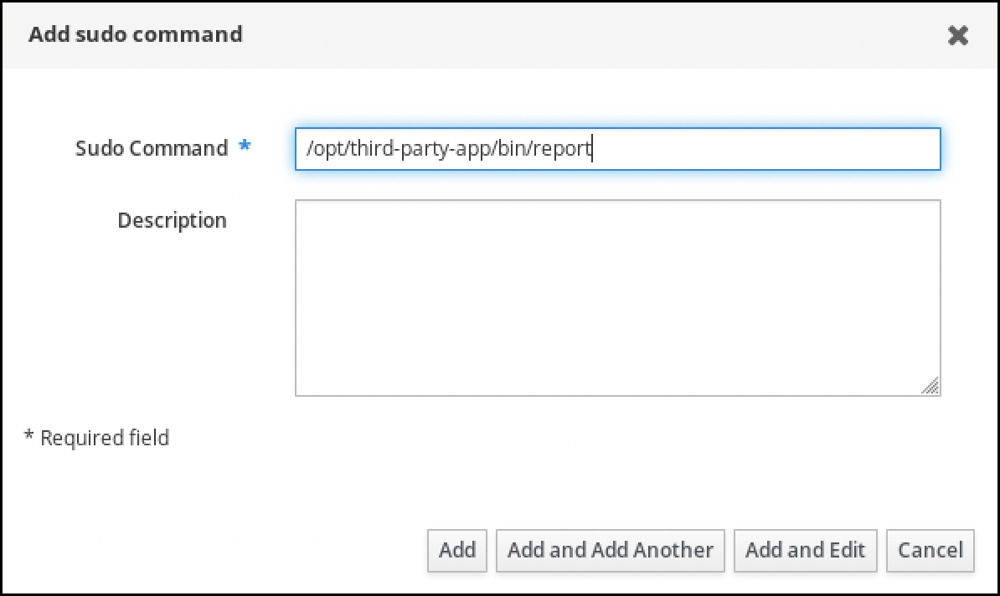 
   4. Click **Add**.
2. Use the new `sudo` command entry to create the new `sudo` rule:
   
   1. Navigate to **Policy** → **Sudo** → **Sudo rules**.
   2. Click **Add** in the upper right corner to open the **Add sudo rule** dialog box.
   3. Enter the name of the `sudo` rule: **run\_third-party-app\_report**.
      
      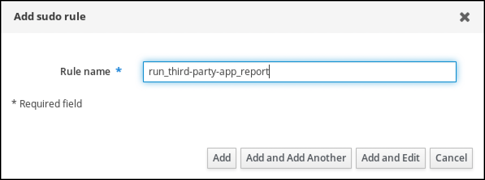 
   4. Click **Add and Edit**.
   5. Specify the user:
      
      1. In the **Who** section, check the **Specified Users and Groups** radio button.
      2. In the **User category the rule applies to** subsection, click **Add** to open the **Add users into sudo rule "run\_third-party-app\_report"** dialog box.
      3. In the **Add users into sudo rule "run\_third-party-app\_report"** dialog box in the **Available** column, check the **idm\_user** checkbox, and move it to the **Prospective** column.
         
         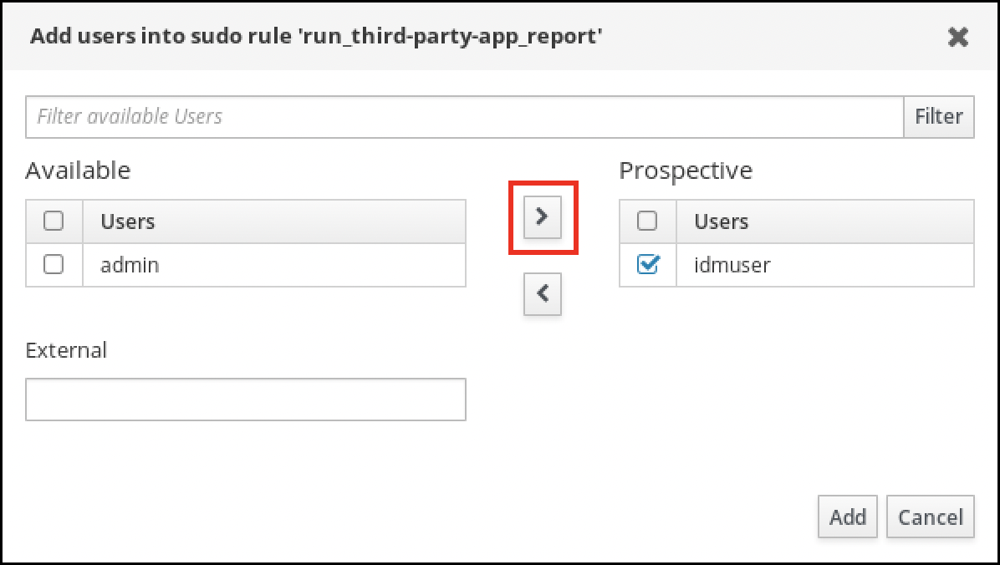 
      4. Click **Add**.
   6. Specify the host:
      
      1. In the **Access this host** section, check the **Specified Hosts and Groups** radio button.
      2. In the **Host category this rule applies to** subsection, click **Add** to open the **Add hosts into sudo rule "run\_third-party-app\_report"** dialog box.
      3. In the **Add hosts into sudo rule "run\_third-party-app\_report"** dialog box in the **Available** column, check the **idmclient.idm.example.com** checkbox, and move it to the **Prospective** column.
         
         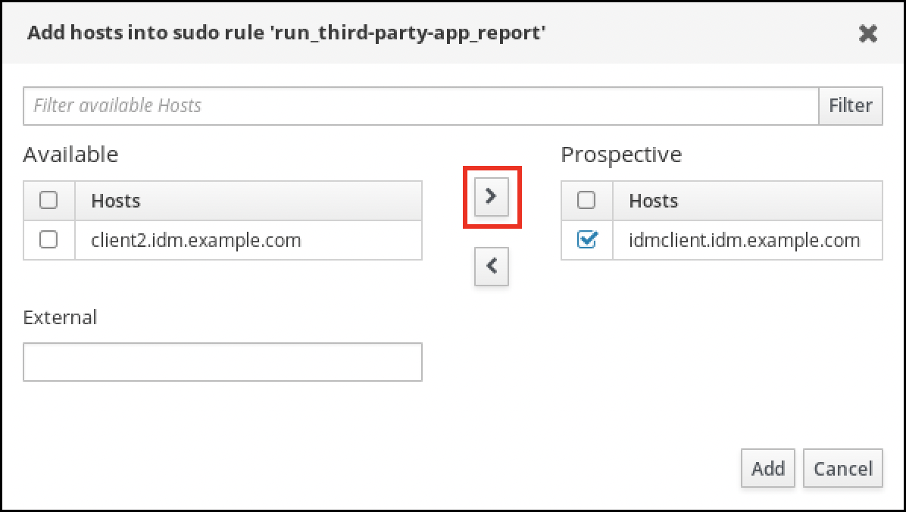 
      4. Click **Add**.
   7. Specify the commands:
      
      1. In the **Command category the rule applies to** subsection of the **Run Commands** section, check the **Specified Commands and Groups** radio button.
      2. In the **Sudo Allow Commands** subsection, click **Add** to open the **Add allow sudo commands into sudo rule "run\_third-party-app\_report"** dialog box.
      3. In the **Add allow sudo commands into sudo rule "run\_third-party-app\_report"** dialog box in the **Available** column, check the `/opt/third-party-app/bin/report` checkbox, and move it to the **Prospective** column.
         
         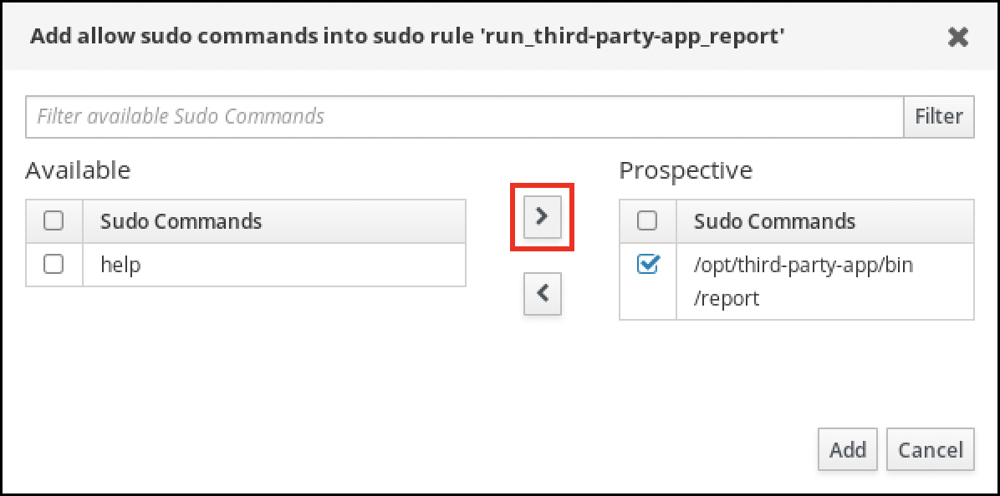 
      4. Click **Add** to return to the **run\_third-party-app\_report** page.
   8. Specify the RunAs user:
      
      1. In the **As Whom** section, check the **Specified Users and Groups** radio button.
      2. In the **RunAs Users** subsection, click **Add** to open the **Add RunAs users into sudo rule "run\_third-party-app\_report"** dialog box.
      3. In the **Add RunAs users into sudo rule "run\_third-party-app\_report"** dialog box, enter the `thirdpartyapp` service account in the **External** box and move it to the **Prospective** column.
         
         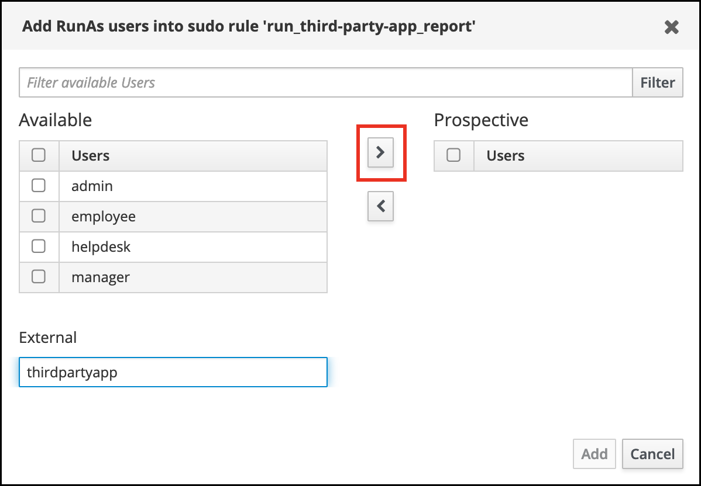 
      4. Click **Add** to return to the **run\_third-party-app\_report** page.
   9. Click **Save** in the top left corner.
      
      The new rule is enabled by default.
      
      **The following image shows the details of a sudo rule created in the IdM Web UI:**
      
      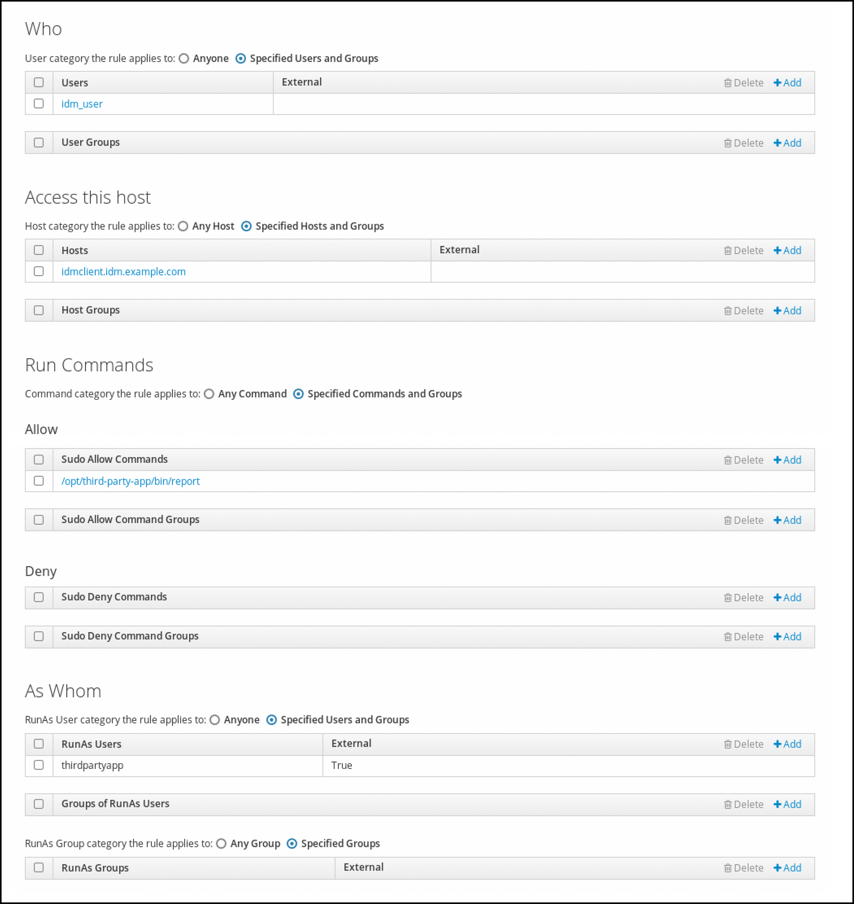 
   
   Note
   
   Propagating the changes from the server to the client can take a few minutes.

**Verification**

1. Log in to the `idmclient` host as the `idm_user` account.
2. Test the new sudo rule:
   
   1. Display which `sudo` rules the `idm_user` account is allowed to perform.
      
      ```
      sudo -l
      Matching Defaults entries for idm_user@idm.example.com on idmclient:
          !visiblepw, always_set_home, match_group_by_gid, always_query_group_plugin,
          env_reset, env_keep="COLORS DISPLAY HOSTNAME HISTSIZE KDEDIR LS_COLORS",
          env_keep+="MAIL PS1 PS2 QTDIR USERNAME LANG LC_ADDRESS LC_CTYPE",
          env_keep+="LC_COLLATE LC_IDENTIFICATION LC_MEASUREMENT LC_MESSAGES",
          env_keep+="LC_MONETARY LC_NAME LC_NUMERIC LC_PAPER LC_TELEPHONE",
          env_keep+="LC_TIME LC_ALL LANGUAGE LINGUAS _XKB_CHARSET XAUTHORITY KRB5CCNAME",
          secure_path=/sbin\:/bin\:/usr/sbin\:/usr/bin
      
      User idm_user@idm.example.com may run the following commands on idmclient:
          (thirdpartyapp) /opt/third-party-app/bin/report
      ```
      
      ```plaintext
      [idm_user@idmclient ~]$ sudo -l
      Matching Defaults entries for idm_user@idm.example.com on idmclient:
          !visiblepw, always_set_home, match_group_by_gid, always_query_group_plugin,
          env_reset, env_keep="COLORS DISPLAY HOSTNAME HISTSIZE KDEDIR LS_COLORS",
          env_keep+="MAIL PS1 PS2 QTDIR USERNAME LANG LC_ADDRESS LC_CTYPE",
          env_keep+="LC_COLLATE LC_IDENTIFICATION LC_MEASUREMENT LC_MESSAGES",
          env_keep+="LC_MONETARY LC_NAME LC_NUMERIC LC_PAPER LC_TELEPHONE",
          env_keep+="LC_TIME LC_ALL LANGUAGE LINGUAS _XKB_CHARSET XAUTHORITY KRB5CCNAME",
          secure_path=/sbin\:/bin\:/usr/sbin\:/usr/bin
      
      User idm_user@idm.example.com may run the following commands on idmclient:
          (thirdpartyapp) /opt/third-party-app/bin/report
      ```
   2. Run the `report` command as the `thirdpartyapp` service account.
      
      ```
      sudo -u thirdpartyapp /opt/third-party-app/bin/report
      [sudo] password for idm_user@idm.example.com:
      Executing report...
      Report successful.
      ```
      
      ```plaintext
      [idm_user@idmclient ~]$ sudo -u thirdpartyapp /opt/third-party-app/bin/report
      [sudo] password for idm_user@idm.example.com:
      Executing report...
      Report successful.
      ```

<h3 id="enabling-gssapi-authentication-for-sudo-on-an-idm-client">8.7. Enabling GSSAPI authentication for sudo on an IdM client</h3>

Enable Generic Security Service Application Program Interface (GSSAPI) authentication on an Identity Management (IdM) client for the `sudo` and `sudo -i` commands via the `pam_sss_gss.so` PAM module. With this configuration, IdM users can authenticate to the `sudo` command with their Kerberos ticket.

**Prerequisites**

- You have created a `sudo` rule for an IdM user that applies to an IdM host. For this example, you have created the `idm_user_reboot` `sudo` rule to grant the `idm_user` account the permission to run the `/usr/sbin/reboot` command on the `idmclient` host.
- You need `root` privileges to modify the `/etc/sssd/sssd.conf` file and PAM files in the `/etc/pam.d/` directory.

**Procedure**

1. Open the `/etc/sssd/sssd.conf` configuration file.
2. Add the following entry to the `[domain/<domain_name>]` section.
   
   ```
   [domain/<domain_name>]
   pam_gssapi_services = sudo, sudo-i
   ```
   
   ```plaintext
   [domain/<domain_name>]
   pam_gssapi_services = sudo, sudo-i
   ```
3. Save and close the `/etc/sssd/sssd.conf` file.
4. Restart the SSSD service to load the configuration changes.
   
   ```
   systemctl restart sssd
   ```
   
   ```plaintext
   [root@idmclient ~]# systemctl restart sssd
   ```
5. Optional: Determine if you have selected the `sssd` `authselect` profile:
   
   ```
   authselect current
   Profile ID: sssd
   ```
   
   ```plaintext
   # authselect current
   Profile ID: sssd
   ```
6. If the `sssd` `authselect` profile is selected, enable GSSAPI authentication:
   
   ```
   authselect enable-feature with-gssapi
   ```
   
   ```plaintext
   # authselect enable-feature with-gssapi
   ```
7. If the `sssd` `authselect` profile is not selected, select it and enable GSSAPI authentication:
   
   ```
   authselect select sssd with-gssapi
   ```
   
   ```plaintext
   # authselect select sssd with-gssapi
   ```

**Verification**

1. Log into the host as the `idm_user` account.
   
   ```
   ssh -l idm_user@idm.example.com localhost
   idm_user@idm.example.com's password:
   ```
   
   ```plaintext
   [root@idm-client ~]# ssh -l idm_user@idm.example.com localhost
   idm_user@idm.example.com's password:
   ```
2. Verify that you have a ticket-granting ticket as the `idm_user` account.
   
   ```
   klist
   Ticket cache: KCM:1366201107
   Default principal: idm_user@IDM.EXAMPLE.COM
   
   Valid starting       Expires              Service principal
   01/08/2021 09:11:48  01/08/2021 19:11:48  krbtgt/IDM.EXAMPLE.COM@IDM.EXAMPLE.COM
   	renew until 01/15/2021 09:11:44
   ```
   
   ```plaintext
   [idmuser@idmclient ~]$ klist
   Ticket cache: KCM:1366201107
   Default principal: idm_user@IDM.EXAMPLE.COM
   
   Valid starting       Expires              Service principal
   01/08/2021 09:11:48  01/08/2021 19:11:48  krbtgt/IDM.EXAMPLE.COM@IDM.EXAMPLE.COM
   	renew until 01/15/2021 09:11:44
   ```
3. Optional: If you do not have Kerberos credentials for the `idm_user` account, delete your current Kerberos credentials and request the correct ones.
   
   ```
   kdestroy -A
   
   kinit idm_user@IDM.EXAMPLE.COM
   Password for idm_user@idm.example.com:
   ```
   
   ```plaintext
   [idm_user@idmclient ~]$ kdestroy -A
   
   [idm_user@idmclient ~]$ kinit idm_user@IDM.EXAMPLE.COM
   Password for idm_user@idm.example.com:
   ```
4. Reboot the machine using `sudo`, without specifying a password.
   
   ```
   sudo /usr/sbin/reboot
   ```
   
   ```plaintext
   [idm_user@idmclient ~]$ sudo /usr/sbin/reboot
   ```

**Additional resources**

- [IdM terminology](https://docs.redhat.com/en/documentation/red_hat_enterprise_linux/10/html/planning_identity_management/overview-of-idm-and-access-control-in-rhel#idm-terminology)
- [Granting sudo access to an IdM user on an IdM client using IdM Web UI](#granting-sudo-access-to-an-idm-user-on-an-idm-client-using-the-idm-web-ui "8.4. Granting sudo access to an IdM user on an IdM client using the IdM Web UI")
- [Granting sudo access to an IdM user on an IdM client using the CLI](#granting-sudo-access-to-an-idm-user-on-an-idm-client-using-the-cli "8.2. Granting sudo access to an IdM user on an IdM client using the CLI")

<h3 id="enabling-gssapi-authentication-and-enforcing-kerberos-authentication-indicators-for-sudo-on-an-idm-client">8.8. Enabling GSSAPI authentication and enforcing Kerberos authentication indicators for sudo on an IdM client</h3>

Enable GSSAPI authentication and enforce authentication indicator requirements for `sudo` on Identity Management (IdM) clients to strengthen privilege escalation security.

You can enable GSSAPI authentication on an Identity Management (IdM) client for PAM-enabled services such as `sudo` and `sudo -i` via the `pam_sss_gss.so` PAM module. Additionally, you can enable only users who have logged in with a smart card to authenticate to those services with their Kerberos ticket.

Note

You can use this procedure as a template to configure GSSAPI authentication with SSSD for other PAM-aware services, and further restrict access to only those users that have a specific authentication indicator attached to their Kerberos ticket.

However, using authentication indicators to restrict access has currently two limitations:

- Only deployments based on MIT Kerberos support authentication indicators. These deployments include, for example, RHEL IdM, FreeIPA in Fedora, and Samba AD DC in Fedora.
- Authentication indicators are removed from Kerberos tickets at the realm boundary.

Therefore, if you, for example, want to restrict `sudo` access by using `pam_gssapi_indicators_map = sudo:pkinit`, you can only apply this restriction to users stored in IdM LDAP. Tickets issued to users stored elsewhere, such as those stored in Active Directory, currently cannot satisfy the `pam_gssapi_indicators_map = sudo:pkinit` condition.

**Prerequisites**

- You have created a `sudo` rule for an IdM user that applies to an IdM host. For this example, you have created the `idm_user_reboot` `sudo` rule to grant the `idm_user` account the permission to run the `/usr/sbin/reboot` command on the `idmclient` host.
- You have configured smart card authentication for the `idmclient` host.
- You need `root` privileges to modify the `/etc/sssd/sssd.conf` file and PAM files in the `/etc/pam.d/` directory.

**Procedure**

1. Open the `/etc/sssd/sssd.conf` configuration file.
2. Add the following entries to the `[domain/<domain_name>]` section.
   
   ```
   [domain/<domain_name>]
   pam_gssapi_services = sudo, sudo-i
   pam_gssapi_indicators_map = sudo:pkinit, sudo-i:pkinit
   ```
   
   ```plaintext
   [domain/<domain_name>]
   pam_gssapi_services = sudo, sudo-i
   pam_gssapi_indicators_map = sudo:pkinit, sudo-i:pkinit
   ```
3. Save and close the `/etc/sssd/sssd.conf` file.
4. Restart the SSSD service to load the configuration changes.
   
   ```
   systemctl restart sssd
   ```
   
   ```plaintext
   [root@idmclient ~]# systemctl restart sssd
   ```
5. Determine if you have selected the `sssd` `authselect` profile:
   
   ```
   authselect current
   Profile ID: sssd
   ```
   
   ```plaintext
   # authselect current
   Profile ID: sssd
   ```
6. Optional: Select the `sssd` `authselect` profile:
   
   ```
   authselect select sssd
   ```
   
   ```plaintext
   # authselect select sssd
   ```
7. Enable GSSAPI authentication:
   
   ```
   authselect enable-feature with-gssapi
   ```
   
   ```plaintext
   # authselect enable-feature with-gssapi
   ```
8. Configure the system to authenticate only users with smart cards:
   
   ```
   authselect with-smartcard-required
   ```
   
   ```plaintext
   # authselect with-smartcard-required
   ```

**Verification**

1. Log into the host as the `idm_user` account and authenticate with a smart card.
   
   ```
   ssh -l idm_user@idm.example.com localhost
   PIN for smart_card
   ```
   
   ```plaintext
   [root@idmclient ~]# ssh -l idm_user@idm.example.com localhost
   PIN for smart_card
   ```
2. Verify that you have a ticket-granting ticket as the smart card user.
   
   ```
   klist
   Ticket cache: KEYRING:persistent:1358900015:krb_cache_TObtNMd
   Default principal: idm_user@IDM.EXAMPLE.COM
   
   Valid starting       Expires              Service principal
   02/15/2021 16:29:48  02/16/2021 02:29:48  krbtgt/IDM.EXAMPLE.COM@IDM.EXAMPLE.COM
   	renew until 02/22/2021 16:29:44
   ```
   
   ```plaintext
   [idm_user@idmclient ~]$ klist
   Ticket cache: KEYRING:persistent:1358900015:krb_cache_TObtNMd
   Default principal: idm_user@IDM.EXAMPLE.COM
   
   Valid starting       Expires              Service principal
   02/15/2021 16:29:48  02/16/2021 02:29:48  krbtgt/IDM.EXAMPLE.COM@IDM.EXAMPLE.COM
   	renew until 02/22/2021 16:29:44
   ```
3. Display which `sudo` rules the `idm_user` account is allowed to perform.
   
   ```
   sudo -l
   Matching Defaults entries for idmuser on idmclient:
       !visiblepw, always_set_home, match_group_by_gid, always_query_group_plugin,
       env_reset, env_keep="COLORS DISPLAY HOSTNAME HISTSIZE KDEDIR LS_COLORS",
       env_keep+="MAIL PS1 PS2 QTDIR USERNAME LANG LC_ADDRESS LC_CTYPE",
       env_keep+="LC_COLLATE LC_IDENTIFICATION LC_MEASUREMENT LC_MESSAGES",
       env_keep+="LC_MONETARY LC_NAME LC_NUMERIC LC_PAPER LC_TELEPHONE",
       env_keep+="LC_TIME LC_ALL LANGUAGE LINGUAS _XKB_CHARSET XAUTHORITY KRB5CCNAME",
       secure_path=/sbin\:/bin\:/usr/sbin\:/usr/bin
   
   User idm_user may run the following commands on idmclient:
       (root) /usr/sbin/reboot
   ```
   
   ```plaintext
   [idm_user@idmclient ~]$ sudo -l
   Matching Defaults entries for idmuser on idmclient:
       !visiblepw, always_set_home, match_group_by_gid, always_query_group_plugin,
       env_reset, env_keep="COLORS DISPLAY HOSTNAME HISTSIZE KDEDIR LS_COLORS",
       env_keep+="MAIL PS1 PS2 QTDIR USERNAME LANG LC_ADDRESS LC_CTYPE",
       env_keep+="LC_COLLATE LC_IDENTIFICATION LC_MEASUREMENT LC_MESSAGES",
       env_keep+="LC_MONETARY LC_NAME LC_NUMERIC LC_PAPER LC_TELEPHONE",
       env_keep+="LC_TIME LC_ALL LANGUAGE LINGUAS _XKB_CHARSET XAUTHORITY KRB5CCNAME",
       secure_path=/sbin\:/bin\:/usr/sbin\:/usr/bin
   
   User idm_user may run the following commands on idmclient:
       (root) /usr/sbin/reboot
   ```
4. Reboot the machine using `sudo`, without specifying a password.
   
   ```
   sudo /usr/sbin/reboot
   ```
   
   ```plaintext
   [idm_user@idmclient ~]$ sudo /usr/sbin/reboot
   ```

**Additional resources**

- [Kerberos authentication indicators](https://docs.redhat.com/en/documentation/red_hat_enterprise_linux/10/html/managing_idm_users_groups_hosts_and_access_control_rules/managing-kerberos-ticket-policies#kerberos-authentication-indicators)
- [SSSD options controlling GSSAPI authentication for PAM services](#sssd-options-controlling-gssapi-authentication-for-pam-services "8.9. SSSD options controlling GSSAPI authentication for PAM services")
- [IdM terminology](https://docs.redhat.com/en/documentation/red_hat_enterprise_linux/10/html/planning_identity_management/overview-of-idm-and-access-control-in-rhel#idm-terminology)
- [Configuring Identity Management for smart card authentication](https://docs.redhat.com/en/documentation/red_hat_enterprise_linux/10/html/managing_smart_card_authentication/configuring-identity-management-for-smart-card-authentication)
- [Kerberos authentication indicators](https://docs.redhat.com/en/documentation/red_hat_enterprise_linux/10/html/managing_idm_users_groups_hosts_and_access_control_rules/managing-kerberos-ticket-policies#kerberos-authentication-indicators)
- [Granting sudo access to an IdM user on an IdM client using IdM Web UI](#granting-sudo-access-to-an-idm-user-on-an-idm-client-using-the-idm-web-ui "8.4. Granting sudo access to an IdM user on an IdM client using the IdM Web UI")
- [Granting sudo access to an IdM user on an IdM client using the CLI](#granting-sudo-access-to-an-idm-user-on-an-idm-client-using-the-cli "8.2. Granting sudo access to an IdM user on an IdM client using the CLI")

<h3 id="sssd-options-controlling-gssapi-authentication-for-pam-services">8.9. SSSD options controlling GSSAPI authentication for PAM services</h3>

Configure GSSAPI authentication for PAM services in Identity Management (IdM) using SSSD options to control which services can use Kerberos tickets and what authentication methods are required.

pam\_gssapi\_services

GSSAPI authentication with SSSD is disabled by default. You can use this option to specify a comma-separated list of PAM services that are allowed to try GSSAPI authentication using the `pam_sss_gss.so` PAM module. To explicitly disable GSSAPI authentication, set this option to `-`.

pam\_gssapi\_indicators\_map

This option only applies to Identity Management (IdM) domains. Use this option to list Kerberos authentication indicators that are required to grant PAM access to a service. Pairs must be in the format `<PAM_service>:_<required_authentication_indicator>_`.

Valid authentication indicators are:

- `otp` for two-factor authentication
- `radius` for RADIUS authentication
- `pkinit` for PKINIT, smart card, or certificate authentication
- `hardened` for hardened passwords

pam\_gssapi\_check\_upn

This option is enabled and set to `true` by default. If this option is enabled, the SSSD service requires that the user name matches the Kerberos credentials. If `false`, the `pam_sss_gss.so` PAM module authenticates every user that is able to obtain the required service ticket.

<h4 id="sssd\_gssapi\_configuration\_examples">8.9.1. SSSD GSSAPI configuration examples</h4>

The following options enable Kerberos authentication for the `sudo` and `sudo-i` services, requires that `sudo` users authenticated with a one-time password, and user names must match the Kerberos principal. Because these settings are in the `[pam]` section, they apply to all domains:

```
[pam]
pam_gssapi_services = sudo, sudo-i
pam_gssapi_indicators_map = sudo:otp
pam_gssapi_check_upn = true
```

```plaintext
[pam]
pam_gssapi_services = sudo, sudo-i
pam_gssapi_indicators_map = sudo:otp
pam_gssapi_check_upn = true
```

You can also set these options in individual `[domain]` sections to overwrite any global values in the `[pam]` section. The following options apply different GSSAPI settings to each domain:

For the `idm.example.com` domain

- Enable GSSAPI authentication for the `sudo` and `sudo -i` services.
- Require certificate or smart card authentication authenticators for the `sudo` command.
- Require one-time password authentication authenticators for the `sudo -i` command.
- Enforce matching user names and Kerberos principals.

For the `ad.example.com` domain

- Enable GSSAPI authentication only for the `sudo` service.
- Do not enforce matching user names and principals.

```
[domain/idm.example.com]
pam_gssapi_services = sudo, sudo-i
pam_gssapi_indicators_map = sudo:pkinit, sudo-i:otp
pam_gssapi_check_upn = true
...

[domain/ad.example.com]
pam_gssapi_services = sudo
pam_gssapi_check_upn = false
...
```

```plaintext
[domain/idm.example.com]
pam_gssapi_services = sudo, sudo-i
pam_gssapi_indicators_map = sudo:pkinit, sudo-i:otp
pam_gssapi_check_upn = true
...

[domain/ad.example.com]
pam_gssapi_services = sudo
pam_gssapi_check_upn = false
...
```

**Additional resources**

- [Kerberos authentication indicators](https://docs.redhat.com/en/documentation/red_hat_enterprise_linux/10/html/managing_idm_users_groups_hosts_and_access_control_rules/managing-kerberos-ticket-policies#kerberos-authentication-indicators)

<h3 id="troubleshooting-gssapi-authentication-for-sudo">8.10. Troubleshooting GSSAPI authentication for sudo</h3>

Troubleshoot Identity Management (IdM) GSSAPI authentication failures for `sudo` to resolve Kerberos credential, realm resolution, and UPN mismatch issues that prevent Kerberos-based `sudo` access.

**Prerequisites**

- You have enabled GSSAPI authentication for the `sudo` service. See [Enabling GSSAPI authentication for sudo on an IdM client](#enabling-gssapi-authentication-for-sudo-on-an-idm-client "8.7. Enabling GSSAPI authentication for sudo on an IdM client").
- You need `root` privileges to modify the `/etc/sssd/sssd.conf` file and PAM files in the `/etc/pam.d/` directory.

**Procedure**

- If you see the following error, the Kerberos service might not able to resolve the correct realm for the service ticket based on the host name:
  
  ```
  Server not found in Kerberos database
  ```
  
  ```plaintext
  Server not found in Kerberos database
  ```
  
  In this situation, add the hostname directly to `[domain_realm]` section in the `/etc/krb5.conf` Kerberos configuration file:
  
  ```
  [idm-user@idm-client ~]$ cat /etc/krb5.conf
  ...
  
  [domain_realm]
   .example.com = EXAMPLE.COM
   example.com = EXAMPLE.COM
   server.example.com = EXAMPLE.COM
  ```
  
  ```plaintext
  [idm-user@idm-client ~]$ cat /etc/krb5.conf
  ...
  
  [domain_realm]
   .example.com = EXAMPLE.COM
   example.com = EXAMPLE.COM
   server.example.com = EXAMPLE.COM
  ```
- If you see the following error, you do not have any Kerberos credentials:
  
  ```
  No Kerberos credentials available
  ```
  
  ```plaintext
  No Kerberos credentials available
  ```
  
  In this situation, retrieve Kerberos credentials with the `kinit` utility or authenticate with SSSD:
  
  ```
  kinit idm-user@IDM.EXAMPLE.COM
  Password for idm-user@idm.example.com:
  ```
  
  ```plaintext
  [idm-user@idm-client ~]$ kinit idm-user@IDM.EXAMPLE.COM
  Password for idm-user@idm.example.com:
  ```
- If you see either of the following errors in the `/var/log/sssd/sssd_pam.log` log file, the Kerberos credentials do not match the username of the user currently logged in:
  
  ```
  User with UPN [<UPN>] was not found.
  
  UPN [<UPN>] does not match target user [<username>].
  ```
  
  ```plaintext
  User with UPN [<UPN>] was not found.
  
  UPN [<UPN>] does not match target user [<username>].
  ```
  
  In this situation, verify that you authenticated with SSSD, or consider disabling the `pam_gssapi_check_upn` option in the `/etc/sssd/sssd.conf` file:
  
  ```
  [idm-user@idm-client ~]$ cat /etc/sssd/sssd.conf
  ...
  
  pam_gssapi_check_upn = false
  ```
  
  ```plaintext
  [idm-user@idm-client ~]$ cat /etc/sssd/sssd.conf
  ...
  
  pam_gssapi_check_upn = false
  ```
- For additional troubleshooting, you can enable debugging output for the `pam_sss_gss.so` PAM module.
  
  - Add the `debug` option at the end of all `pam_sss_gss.so` entries in PAM files, such as `/etc/pam.d/sudo` and `/etc/pam.d/sudo-i`:
    
    ```
    [root@idm-client ~]# cat /etc/pam.d/sudo
    #%PAM-1.0
    auth       sufficient   pam_sss_gss.so   debug
    auth       include      system-auth
    account    include      system-auth
    password   include      system-auth
    session    include      system-auth
    ```
    
    ```plaintext
    [root@idm-client ~]# cat /etc/pam.d/sudo
    #%PAM-1.0
    auth       sufficient   pam_sss_gss.so   debug
    auth       include      system-auth
    account    include      system-auth
    password   include      system-auth
    session    include      system-auth
    ```
    
    ```
    [root@idm-client ~]# cat /etc/pam.d/sudo-i
    #%PAM-1.0
    auth       sufficient   pam_sss_gss.so   debug
    auth       include      sudo
    account    include      sudo
    password   include      sudo
    session    optional     pam_keyinit.so force revoke
    session    include      sudo
    ```
    
    ```plaintext
    [root@idm-client ~]# cat /etc/pam.d/sudo-i
    #%PAM-1.0
    auth       sufficient   pam_sss_gss.so   debug
    auth       include      sudo
    account    include      sudo
    password   include      sudo
    session    optional     pam_keyinit.so force revoke
    session    include      sudo
    ```
  - Try to authenticate with the `pam_sss_gss.so` module and review the console output. In this example, the user did not have any Kerberos credentials.
    
    ```
    sudo ls -l /etc/sssd/sssd.conf
    pam_sss_gss: Initializing GSSAPI authentication with SSSD
    pam_sss_gss: Switching euid from 0 to 1366201107
    pam_sss_gss: Trying to establish security context
    pam_sss_gss: SSSD User name: idm-user@idm.example.com
    pam_sss_gss: User domain: idm.example.com
    pam_sss_gss: User principal:
    pam_sss_gss: Target name: host@idm.example.com
    pam_sss_gss: Using ccache: KCM:
    pam_sss_gss: Acquiring credentials, principal name will be derived
    pam_sss_gss: Unable to read credentials from [KCM:] [maj:0xd0000, min:0x96c73ac3]
    pam_sss_gss: GSSAPI: Unspecified GSS failure.  Minor code may provide more information
    pam_sss_gss: GSSAPI: No credentials cache found
    pam_sss_gss: Switching euid from 1366200907 to 0
    pam_sss_gss: System error [5]: Input/output error
    ```
    
    ```plaintext
    [idm-user@idm-client ~]$ sudo ls -l /etc/sssd/sssd.conf
    pam_sss_gss: Initializing GSSAPI authentication with SSSD
    pam_sss_gss: Switching euid from 0 to 1366201107
    pam_sss_gss: Trying to establish security context
    pam_sss_gss: SSSD User name: idm-user@idm.example.com
    pam_sss_gss: User domain: idm.example.com
    pam_sss_gss: User principal:
    pam_sss_gss: Target name: host@idm.example.com
    pam_sss_gss: Using ccache: KCM:
    pam_sss_gss: Acquiring credentials, principal name will be derived
    pam_sss_gss: Unable to read credentials from [KCM:] [maj:0xd0000, min:0x96c73ac3]
    pam_sss_gss: GSSAPI: Unspecified GSS failure.  Minor code may provide more information
    pam_sss_gss: GSSAPI: No credentials cache found
    pam_sss_gss: Switching euid from 1366200907 to 0
    pam_sss_gss: System error [5]: Input/output error
    ```

<h3 id="granting-sudo-access-to-an-idm-user-on-an-idm-client">8.11. Additional resources</h3>

- [Using an Ansible playbook to ensure sudo access for an IdM user on an IdM client](https://docs.redhat.com/en/documentation/red_hat_enterprise_linux/10/html/using_ansible_to_install_and_manage_identity_management_in_rhel/managing-sudo-access-using-an-ansible-playbook#using-an-ansible-playbook-to-ensure-sudo-access-for-an-idm-user-on-an-idm-client)
- [Managing multiple IdM sudo rules in a single Ansible task](https://docs.redhat.com/en/documentation/red_hat_enterprise_linux/10/html/using_ansible_to_install_and_manage_identity_management_in_rhel/managing-sudo-access-using-an-ansible-playbook#managing-multiple-idm-sudo-rules-in-a-single-ansible-task)

<h2 id="using-ldapmodify-to-manage-idm-users-externally">Chapter 9. Using ldapmodify to manage IdM users externally</h2>

You can use the `ldapmodify` command to manage Identity Management (IdM) user and group entries as an alternative to the `ipa` command-line utilities. The `ldapmodify` command supports both interactive input and LDIF files for bulk operations.

<h3 id="templates-for-managing-idm-user-accounts-externally">9.1. Templates for managing IdM user accounts externally</h3>

Use LDIF templates with `ldapmodify` to manage Identity Management (IdM) user accounts from an external provisioning system, enabling automated user creation, modification, enabling, disabling, and preservation.

Update specific LDAP attributes with the `ldapmodify` utility to manage user accounts and states. Use the provided syntax to perform the following administrative tasks:

- Adding a new stage user
- Modifying a user’s attribute
- Enabling a user
- Disabling a user
- Preserving a user

The templates are formatted in the LDAP Data Interchange Format (LDIF). LDIF is a standard plain text data interchange format for representing LDAP directory content and update requests.

Using the templates, you can configure the LDAP provider of your provisioning system to manage IdM user accounts.

Templates for adding a new stage user

A template for adding a user with **UID and GID assigned automatically**. The distinguished name (DN) of the created entry must start with `uid=user_login`:

```
dn: uid=user_login,cn=staged users,cn=accounts,cn=provisioning,dc=idm,dc=example,dc=com
changetype: add
objectClass: top
objectClass: inetorgperson
uid: user_login
sn: surname
givenName: first_name
cn: full_name
```

```plaintext
dn: uid=user_login,cn=staged users,cn=accounts,cn=provisioning,dc=idm,dc=example,dc=com
changetype: add
objectClass: top
objectClass: inetorgperson
uid: user_login
sn: surname
givenName: first_name
cn: full_name
```

A template for adding a user with **UID and GID assigned statically**:

```
dn: uid=user_login,cn=staged users,cn=accounts,cn=provisioning,dc=idm,dc=example,dc=com
changetype: add
objectClass: top
objectClass: person
objectClass: inetorgperson
objectClass: organizationalperson
objectClass: posixaccount
uid: user_login
uidNumber: UID_number
gidNumber: GID_number
sn: surname
givenName: first_name
cn: full_name
homeDirectory: /home/user_login
```

```plaintext
dn: uid=user_login,cn=staged users,cn=accounts,cn=provisioning,dc=idm,dc=example,dc=com
changetype: add
objectClass: top
objectClass: person
objectClass: inetorgperson
objectClass: organizationalperson
objectClass: posixaccount
uid: user_login
uidNumber: UID_number
gidNumber: GID_number
sn: surname
givenName: first_name
cn: full_name
homeDirectory: /home/user_login
```

You are not required to specify any IdM object classes when adding stage users. IdM adds these classes automatically after the users are activated.

Templates for modifying existing users

- Modifying a user’s attribute:

```
dn: distinguished_name
changetype: modify
replace: attribute_to_modify
attribute_to_modify: new_value
```

```plaintext
dn: distinguished_name
changetype: modify
replace: attribute_to_modify
attribute_to_modify: new_value
```

- Disabling a user:
  
  ```
  dn: distinguished_name
  changetype: modify
  replace: nsAccountLock
  nsAccountLock: TRUE
  ```
  
  ```plaintext
  dn: distinguished_name
  changetype: modify
  replace: nsAccountLock
  nsAccountLock: TRUE
  ```
- Enabling a user:
  
  ```
  dn: distinguished_name
  changetype: modify
  replace: nsAccountLock
  nsAccountLock: FALSE
  ```
  
  ```plaintext
  dn: distinguished_name
  changetype: modify
  replace: nsAccountLock
  nsAccountLock: FALSE
  ```

Updating the `nssAccountLock` attribute has no effect on stage and preserved users. Even though the update operation completes successfully, the attribute value remains `nssAccountLock: TRUE`.

- Preserving a user:
  
  ```
  dn: distinguished_name
  changetype: modrdn
  newrdn: uid=user_login
  deleteoldrdn: 0
  newsuperior: cn=deleted users,cn=accounts,cn=provisioning,dc=idm,dc=example,dc=com
  ```
  
  ```plaintext
  dn: distinguished_name
  changetype: modrdn
  newrdn: uid=user_login
  deleteoldrdn: 0
  newsuperior: cn=deleted users,cn=accounts,cn=provisioning,dc=idm,dc=example,dc=com
  ```

Note

Before modifying a user, obtain the user’s distinguished name (DN) by searching using the user’s login. In the following example, the *user\_allowed\_to\_modify\_user\_entries* user is a user allowed to modify user and group information, for example **activator** or IdM administrator. The password in the example is this user’s password:

```
ldapsearch -LLL -x -D "uid=user_allowed_to_modify_user_entries,cn=users,cn=accounts,dc=idm,dc=example,dc=com" -w "Secret123" -H ldap://server.idm.example.com -b "cn=users,cn=accounts,dc=idm,dc=example,dc=com" uid=test_user
dn: uid=test_user,cn=users,cn=accounts,dc=idm,dc=example,dc=com
memberOf: cn=ipausers,cn=groups,cn=accounts,dc=idm,dc=example,dc=com
```

```plaintext
# ldapsearch -LLL -x -D "uid=user_allowed_to_modify_user_entries,cn=users,cn=accounts,dc=idm,dc=example,dc=com" -w "Secret123" -H ldap://server.idm.example.com -b "cn=users,cn=accounts,dc=idm,dc=example,dc=com" uid=test_user
dn: uid=test_user,cn=users,cn=accounts,dc=idm,dc=example,dc=com
memberOf: cn=ipausers,cn=groups,cn=accounts,dc=idm,dc=example,dc=com
```

**Additional resources**

- [Adding an IdM stage user defined in an LDIF file](#adding-an-idm-stage-user-defined-in-an-ldif-file "11.3. Adding an IdM stage user defined in an LDIF file")
- [Adding an IdM stage user directly from the CLI using ldapmodify](#adding-an-idm-stage-user-directly-from-the-cli-using-ldapmodify "11.4. Adding an IdM stage user directly from the CLI using ldapmodify")
- [Preserving an IdM user with ldapmodify](#preserving-an-idm-user-with-ldapmodify "9.4. Preserving an IdM user with ldapmodify")

<h3 id="templates-for-managing-idm-group-accounts-externally">9.2. Templates for managing IdM group accounts externally</h3>

Use LDAP Data Interchange Format (LDIF) templates with `ldapmodify` to manage Identity Management (IdM) user group accounts from an external provisioning system, enabling automated group creation, member management, and deletion.

Modify specific LDAP attributes using the `ldapmodify` utility to manage group configurations. Use the provided syntax to perform the following administrative tasks:

- Creating a new group
- Deleting an existing group
- Adding a member to a group
- Removing a member from a group

The templates are formatted in LDIF, a standard plain text data interchange format for representing LDAP directory content and update requests.

Using the templates, you can configure the LDAP provider of your provisioning system to manage IdM group accounts.

Creating a new group

```
dn: cn=group_name,cn=groups,cn=accounts,dc=idm,dc=example,dc=com
changetype: add
objectClass: top
objectClass: ipaobject
objectClass: ipausergroup
objectClass: groupofnames
objectClass: nestedgroup
objectClass: posixgroup
uid: group_name
cn: group_name
gidNumber: GID_number
```

```plaintext
dn: cn=group_name,cn=groups,cn=accounts,dc=idm,dc=example,dc=com
changetype: add
objectClass: top
objectClass: ipaobject
objectClass: ipausergroup
objectClass: groupofnames
objectClass: nestedgroup
objectClass: posixgroup
uid: group_name
cn: group_name
gidNumber: GID_number
```

Modifying groups

- **Deleting an existing group**:

```
dn: group_distinguished_name
changetype: delete
```

```plaintext
dn: group_distinguished_name
changetype: delete
```

- **Adding a member to a group**:
  
  ```
  dn: group_distinguished_name
  changetype: modify
  add: member
  member: uid=user_login,cn=users,cn=accounts,dc=idm,dc=example,dc=com
  ```
  
  ```plaintext
  dn: group_distinguished_name
  changetype: modify
  add: member
  member: uid=user_login,cn=users,cn=accounts,dc=idm,dc=example,dc=com
  ```
  
  Do not add stage or preserved users to groups. Even though the update operation completes successfully, the users will not be updated as members of the group. Only active users can belong to groups.
- **Removing a member from a group**:

```
dn: distinguished_name
changetype: modify
delete: member
member: uid=user_login,cn=users,cn=accounts,dc=idm,dc=example,dc=com
```

```plaintext
dn: distinguished_name
changetype: modify
delete: member
member: uid=user_login,cn=users,cn=accounts,dc=idm,dc=example,dc=com
```

Note

Before modifying a group, obtain the group’s distinguished name (DN) by searching using the group’s name.

```
ldapsearch -YGSSAPI -H ldap://<server.idm.example.com> -b "<cn=groups,cn=accounts,dc=idm,dc=example,dc=com>" "cn=<group_name>"
dn: cn=group_name,cn=groups,cn=accounts,dc=idm,dc=example,dc=com
ipaNTSecurityIdentifier: S-1-5-21-1650388524-2605035987-2578146103-11017
cn: testgroup
objectClass: top
objectClass: groupofnames
objectClass: nestedgroup
objectClass: ipausergroup
objectClass: ipaobject
objectClass: posixgroup
objectClass: ipantgroupattrs
ipaUniqueID: 569bf864-9d45-11ea-bea3-525400f6f085
gidNumber: 1997010017
```

```plaintext
# ldapsearch -YGSSAPI -H ldap://<server.idm.example.com> -b "<cn=groups,cn=accounts,dc=idm,dc=example,dc=com>" "cn=<group_name>"
dn: cn=group_name,cn=groups,cn=accounts,dc=idm,dc=example,dc=com
ipaNTSecurityIdentifier: S-1-5-21-1650388524-2605035987-2578146103-11017
cn: testgroup
objectClass: top
objectClass: groupofnames
objectClass: nestedgroup
objectClass: ipausergroup
objectClass: ipaobject
objectClass: posixgroup
objectClass: ipantgroupattrs
ipaUniqueID: 569bf864-9d45-11ea-bea3-525400f6f085
gidNumber: 1997010017
```

<h3 id="using-ldapmodify-command-interactively">9.3. Using ldapmodify command interactively</h3>

Modify LDAP entries in Identity Management (IdM) interactively using `ldapmodify` by entering LDIF statements directly in the terminal or by loading them from a file.

**Procedure**

1. In a command line, enter the LDAP Data Interchange Format (LDIF) statement after the `ldapmodify` command.
   
   For example, to change the telephone number for a `<testuser>`:
   
   ```
   ldapmodify -Y GSSAPI -H ldap://<server.example.com>
   dn: uid=testuser,cn=users,cn=accounts,dc=example,dc=com
   changetype: modify
   replace: telephoneNumber
   telephonenumber: 88888888
   ```
   
   ```plaintext
   # ldapmodify -Y GSSAPI -H ldap://<server.example.com>
   dn: uid=testuser,cn=users,cn=accounts,dc=example,dc=com
   changetype: modify
   replace: telephoneNumber
   telephonenumber: 88888888
   ```
   
   Note that you need to obtain a Kerberos ticket for using `-Y` option.
2. Press `Ctlr+D` to exit the interactive mode.
3. Alternatively, provide an LDIF file after `ldapmodify` command:
   
   The `ldapmodify` command reads modification data from an LDIF file
   
   ```
   ldapmodify -Y GSSAPI -H ldap://<server.example.com> -f ~/example.ldif
   ```
   
   ```plaintext
   # ldapmodify -Y GSSAPI -H ldap://<server.example.com> -f ~/example.ldif
   ```

<h3 id="preserving-an-idm-user-with-ldapmodify">9.4. Preserving an IdM user with ldapmodify</h3>

Deactivate Identity Management (IdM) user accounts using `ldapmodify` to preserve user data when employees leave your organization. Preserved users retain their information for auditing while preventing authentication.

**Prerequisites**

- You can authenticate as an IdM user with a role to preserve users.

**Procedure**

1. Log in as an IdM user with a role to preserve users:
   
   ```
   kinit admin
   ```
   
   ```plaintext
   $ kinit admin
   ```
2. Enter the `ldapmodify` command and specify the Generic Security Services API (GSSAPI) as the Simple Authentication and Security Layer (SASL) mechanism to be used for authentication:
   
   ```
   ldapmodify -Y GSSAPI
   SASL/GSSAPI authentication started
   SASL username: admin@IDM.EXAMPLE.COM
   SASL SSF: 256
   SASL data security layer installed.
   ```
   
   ```plaintext
   # ldapmodify -Y GSSAPI
   SASL/GSSAPI authentication started
   SASL username: admin@IDM.EXAMPLE.COM
   SASL SSF: 256
   SASL data security layer installed.
   ```
3. Enter the `dn` of the user you want to preserve:
   
   ```
   dn: uid=user1,cn=users,cn=accounts,dc=idm,dc=example,dc=com
   ```
   
   ```plaintext
   dn: uid=user1,cn=users,cn=accounts,dc=idm,dc=example,dc=com
   ```
4. Enter **modrdn** as the type of change you want to perform:
   
   ```
   changetype: modrdn
   ```
   
   ```plaintext
   changetype: modrdn
   ```
5. Specify the **newrdn** for the user:
   
   ```
   newrdn: uid=user1
   ```
   
   ```plaintext
   newrdn: uid=user1
   ```
6. Indicate that you want to preserve the user:
   
   ```
   deleteoldrdn: 0
   ```
   
   ```plaintext
   deleteoldrdn: 0
   ```
7. Specify the **new superior DN**:
   
   ```
   newsuperior: cn=deleted users,cn=accounts,cn=provisioning,dc=idm,dc=example,dc=com
   ```
   
   ```plaintext
   newsuperior: cn=deleted users,cn=accounts,cn=provisioning,dc=idm,dc=example,dc=com
   ```
   
   Preserving a user moves the entry to a new location in the directory information tree (DIT). For this reason, you must specify the DN of the new parent entry as the new superior DN.
8. Press `Enter` again to confirm that this is the end of the entry:
   
   ```
   [Enter]
   
   modifying rdn of entry "uid=user1,cn=users,cn=accounts,dc=idm,dc=example,dc=com"
   ```
   
   ```plaintext
   [Enter]
   
   modifying rdn of entry "uid=user1,cn=users,cn=accounts,dc=idm,dc=example,dc=com"
   ```
9. Exit the connection using **Ctrl** + **C**.

**Verification**

- Verify that the user has been preserved by listing all preserved users:
  
  ```
  ipa user-find --preserved=true
  --------------
  1 user matched
  --------------
    User login: user1
    First name: First 1
    Last name: Last 1
    Home directory: /home/user1
    Login shell: /bin/sh
    Principal name: user1@IDM.EXAMPLE.COM
    Principal alias: user1@IDM.EXAMPLE.COM
    Email address: user1@idm.example.com
    UID: 1997010003
    GID: 1997010003
    Account disabled: True
    Preserved user: True
  ----------------------------
  Number of entries returned 1
  ----------------------------
  ```
  
  ```plaintext
  $ ipa user-find --preserved=true
  --------------
  1 user matched
  --------------
    User login: user1
    First name: First 1
    Last name: Last 1
    Home directory: /home/user1
    Login shell: /bin/sh
    Principal name: user1@IDM.EXAMPLE.COM
    Principal alias: user1@IDM.EXAMPLE.COM
    Email address: user1@idm.example.com
    UID: 1997010003
    GID: 1997010003
    Account disabled: True
    Preserved user: True
  ----------------------------
  Number of entries returned 1
  ----------------------------
  ```

<h2 id="searching-idm-entries-using-the-ldapsearch-command">Chapter 10. Searching IdM entries using the ldapsearch command</h2>

Search Identity Management entries using the `ldapsearch` command as an alternative to the `ipa find` command. The `ldapsearch` command provides direct LDAP-level queries with flexible filtering options.

<h3 id="using-the-ldapsearch-command">10.1. Using the ldapsearch command</h3>

Use the `ldapsearch` command to query LDAP directories in Identity Management (IdM), returning specific attributes and entries based on search filters and authentication options.

The `ldapsearch` command has the following format:

```
ldapsearch [-x | -Y mechanism] [options] [search_filter] [list_of_attributes]
```

```plaintext
# ldapsearch [-x | -Y mechanism] [options] [search_filter] [list_of_attributes]
```

- To configure the authentication method, specify the `-x` option to use simple binds or the `-Y` option to set the Simple Authentication and Security Layer (SASL) mechanism. Note that you need to obtain a Kerberos ticket if you are using the `-Y GSSAPI` option.
- The *options* are the `ldapsearch` command options described in a table below.
- The *search\_filter* is an LDAP search filter.
- The *list\_of\_attributes* is a list of the attributes that the search results return.

For example, you want to search all the entries of a base LDAP tree for the user name *user01*:

```
ldapsearch -x -H ldap://ldap.example.com -s sub "(uid=user01)"
```

```plaintext
# ldapsearch -x -H ldap://ldap.example.com -s sub "(uid=user01)"
```

- The `-x` option tells the `ldapsearch` command to authenticate with the simple bind. Note that if you do not provide the Distinguish Name (DN) with the `-D` option, the authentication is anonymous.
- The `-H` option connects you to the *ldap://ldap.example.com*.
- The `-s sub` option tells the `ldapsearch` command to search all the entries, starting from the base DN, for the user with the name *user01*. The *"(uid=user01)"* is a filter.

Note that if you do not provide the starting point for the search with the `-b` option, the command searches in the default tree. It is specified in the BASE parameter of the `etc/openldap/ldap.conf` file.

Table 10.1. The ldapsearch command options

OptionDescription

-b

The starting point for the search. If your search parameters contain an asterisk (\*) or other character, that the command line can interpret into a code, you must wrap the value in single or double quotation marks. For example, `-b cn=user,ou=Product Development,dc=example,dc=com`.

-D

The Distinguished Name (DN) with which you want to authenticate.

-H

An LDAP URL to connect to the server. The `-H` option replaces the `-h` and `-p` options.

-l

The time limit in seconds to wait for a search request to complete.

-s *scope*

The scope of the search. You can choose one of the following for the scope:

- `base` searches only the entry from the `-b` option or defined by the `LDAP_BASEDN` environment variable.
- `one` searches only the children of the entry from the `-b` option.
- `sub` a subtree search from the -b option starting point.

-W

Requests for the password.

-x

Disables the default SASL connection to allow simple binds.

-Y *SASL\_mechanism*

Sets the SASL mechanism for the authentication.

-z *number*

The maximum number of entries in the search result.

Note, you must specify one of the authentication mechanisms with the `-x` or `-Y` option with the `ldapsearch` command.

<h3 id="using-the-ldapsearch-filters">10.2. Using the ldapsearch filters</h3>

Narrow `ldapsearch` results in Identity Management (IdM) using filter operators and boolean expressions to match specific LDAP attributes or combinations of attributes.

For example, you want the search result to contain all the entries with a common names set to *example*:

```
"(cn=example)"
```

```plaintext
"(cn=example)"
```

In this case, the *equal sign (=)* is the operator, and *example* is the value.

| Search type              | Operator          | Description                                                                                                                      |
|:-------------------------|:------------------|:---------------------------------------------------------------------------------------------------------------------------------|
| Equality                 | =                 | Returns the entries with the exact match to the value. For example, *cn=example*.                                                |
| Substring                | *=string* string* | Returns all entries with the substring match. For example, *cn=exa\*l*. The asterisk (\*) indicates zero (0) or more characters. |
| Greater than or equal to | &gt;=             | Returns all entries with attributes that are greater than or equal to the value. For example, *uidNumber &gt;= 5000*.            |
| Less than or equal to    | &lt;=             | Returns all entries with attributes that are less than or equal to the value. For example, *uidNumber &lt;= 5000*.               |
| Presence                 | =*                | Returns all entries with one or more attributes. For example, *cn=\**.                                                           |
| Approximate              | ~=                | Returns all entries with the similar to the value attributes. For example, *l~=san fransico* can return *l=san francisco*.       |

Table 10.2. The ldapsearch filter operators

You can use *boolean* operators to combine multiple filters to the `ldapsearch` command.

| Search type | Operator | Description                                                                                                             |
|:------------|:---------|:------------------------------------------------------------------------------------------------------------------------|
| AND         | &        | Returns all entries where all statements in the filters are true. For example, *(&(filter)(filter)(filter)…​)*.         |
| OR          | \|       | Returns all entries where at least one statement in the filters is true. For example, *(\|(filter)(filter)(filter)…​)*. |
| NOT         | !        | Returns all entries where the statement in the filter is not true. For example, *(!(filter))*.                          |

Table 10.3. The ldapsearch filter boolean operators

<h3 id="searching-idm-entries-using-the-ldapsearch-command">10.3. Additional resources</h3>

- [Searching entries and tuning searches in RHDS](https://docs.redhat.com/en/documentation/red_hat_directory_server/13/html/management_configuration_and_operations/searching-entries-and-tuning-searches)
- [Structure of IPA commands](https://docs.redhat.com/en/documentation/red_hat_enterprise_linux/10/html/accessing_identity_management_services/introduction-to-the-idm-command-line-utilities#structure-of-ipa-commands)

<h2 id="configuring-idm-for-external-provisioning-of-users">Chapter 11. Configuring IdM for external provisioning of users</h2>

As a system administrator, you can configure Identity Management (IdM) to support the provisioning of users by an external solution for managing identities.

Rather than use the `ipa` utility, the administrator of the external provisioning system can access the IdM LDAP using the `ldapmodify` utility. The administrator can add individual stage users [from the CLI using ldapmodify](#adding-an-idm-stage-user-directly-from-the-cli-using-ldapmodify "11.4. Adding an IdM stage user directly from the CLI using ldapmodify") or [using an LDIF file](#adding-an-idm-stage-user-defined-in-an-ldif-file "11.3. Adding an IdM stage user defined in an LDIF file").

The assumption is that you, as an IdM administrator, fully trust your external provisioning system to only add validated users. However, at the same time you do not want to assign the administrators of the external provisioning system the IdM role of `User Administrator` to enable them to add new active users directly.

You can [configure a script](#configuring-automatic-activation-of-idm-stage-user-accounts "11.2. Configuring automatic activation of IdM stage user accounts") to automatically move the staged users created by the external provisioning system to active users automatically.

<h3 id="preparing-idm-accounts-for-automatic-activation-of-stage-user-accounts">11.1. Preparing IdM accounts for automatic activation of stage user accounts</h3>

Configure service accounts with appropriate roles and password policies to enable external provisioning systems to manage Identity Management (IdM) user lifecycle. This automation streamlines user onboarding by allowing external systems to add and activate user accounts programmatically.

In this example, the user account to be used by the external system to add stage users is named **provisionator**. The user account to be used to automatically activate the stage users is named **activator**.

**Prerequisites**

- The host on which you perform the procedure is enrolled into IdM.

**Procedure**

1. Log in as IdM administrator:
   
   ```
   kinit admin
   ```
   
   ```plaintext
   $ kinit admin
   ```
2. Create a user named **provisionator** with the privileges to add stage users.
   
   1. Add the provisionator user account:
      
      ```
      ipa user-add provisionator --first=provisioning --last=account --password
      ```
      
      ```plaintext
      $ ipa user-add provisionator --first=provisioning --last=account --password
      ```
   2. Grant the provisionator user the required privileges.
      
      1. Create a custom role, `System Provisioning`, to manage adding stage users:
         
         ```
         ipa role-add --desc "Responsible for provisioning stage users" "System Provisioning"
         ```
         
         ```plaintext
         $ ipa role-add --desc "Responsible for provisioning stage users" "System Provisioning"
         ```
      2. Add the `Stage User Provisioning` privilege to the role. This privilege provides the ability to add stage users:
         
         ```
         ipa role-add-privilege "System Provisioning" --privileges="Stage User Provisioning"
         ```
         
         ```plaintext
         $ ipa role-add-privilege "System Provisioning" --privileges="Stage User Provisioning"
         ```
      3. Add the provisionator user to the role:
         
         ```
         ipa role-add-member --users=provisionator "System Provisioning"
         ```
         
         ```plaintext
         $ ipa role-add-member --users=provisionator "System Provisioning"
         ```
      4. Verify that the provisionator exists in IdM:
         
         ```
         ipa user-find provisionator --all --raw
         --------------
         1 user matched
         --------------
           dn: uid=provisionator,cn=users,cn=accounts,dc=idm,dc=example,dc=com
           uid: provisionator
           ...
         ```
         
         ```plaintext
         $ ipa user-find provisionator --all --raw
         --------------
         1 user matched
         --------------
           dn: uid=provisionator,cn=users,cn=accounts,dc=idm,dc=example,dc=com
           uid: provisionator
           ...
         ```
3. Create a user, **activator**, with the privileges to manage user accounts.
   
   1. Add the activator user account:
      
      ```
      ipa user-add activator --first=activation --last=account --password
      ```
      
      ```plaintext
      $ ipa user-add activator --first=activation --last=account --password
      ```
   2. Grant the activator user the required privileges by adding the user to the default `User Administrator` role:
      
      ```
      ipa role-add-member --users=activator "User Administrator"
      ```
      
      ```plaintext
      $ ipa role-add-member --users=activator "User Administrator"
      ```
4. Create a user group for application accounts:
   
   ```
   ipa group-add application-accounts
   ```
   
   ```plaintext
   $ ipa group-add application-accounts
   ```
5. Update the password policy for the group. The following policy prevents password expiration and lockout for the account but compensates the potential risks by requiring complex passwords:
   
   ```
   ipa pwpolicy-add application-accounts --maxlife=10000 --minlife=0 --history=0 --minclasses=4 --minlength=8 --priority=1 --maxfail=0 --failinterval=1 --lockouttime=0
   ```
   
   ```plaintext
   $ ipa pwpolicy-add application-accounts --maxlife=10000 --minlife=0 --history=0 --minclasses=4 --minlength=8 --priority=1 --maxfail=0 --failinterval=1 --lockouttime=0
   ```
6. Optional: Verify that the password policy exists in IdM:
   
   ```
   ipa pwpolicy-show application-accounts
     Group: application-accounts
     Max lifetime (days): 10000
     Min lifetime (hours): 0
     History size: 0
   ...
   ```
   
   ```plaintext
   $ ipa pwpolicy-show application-accounts
     Group: application-accounts
     Max lifetime (days): 10000
     Min lifetime (hours): 0
     History size: 0
   ...
   ```
7. Add the provisioning and activation accounts to the group for application accounts:
   
   ```
   ipa group-add-member application-accounts --users={provisionator,activator}
   ```
   
   ```plaintext
   $ ipa group-add-member application-accounts --users={provisionator,activator}
   ```
8. Change the passwords for the user accounts:
   
   ```
   kpasswd provisionator
   kpasswd activator
   ```
   
   ```plaintext
   $ kpasswd provisionator
   $ kpasswd activator
   ```
   
   Changing the passwords is necessary because new IdM users passwords expire immediately.

**Additional resources**

- [Managing user accounts using the command line](#managing-user-accounts-using-the-command-line "Chapter 1. Managing user accounts using the command line")
- [Delegating permissions to user groups to manage users using IdM CLI](#delegating-permissions-to-user-groups-to-manage-users-using-idm-cli "Chapter 28. Delegating permissions to user groups to manage users using IdM CLI")
- [Defining IdM Password Policies](#defining-idm-password-policies "Chapter 6. Defining IdM password policies")

<h3 id="configuring-automatic-activation-of-idm-stage-user-accounts">11.2. Configuring automatic activation of IdM stage user accounts</h3>

Automate the activation of stage user accounts in Identity Management (IdM) by configuring a scheduled script to promote provisioned users to active status. This ensures that new user accounts are automatically activated and available for use shortly after they are created.

Important

It is assumed that the owner of the external provisioning system has already validated the users and that they do not require additional validation on the IdM side before the script adds them to IdM.

It is sufficient to enable the activation process on only one of your IdM servers.

**Prerequisites**

- The **provisionator** and **activator** accounts exist in IdM. For details, see [Preparing IdM accounts for automatic activation of stage user accounts](#preparing-idm-accounts-for-automatic-activation-of-stage-user-accounts "11.1. Preparing IdM accounts for automatic activation of stage user accounts").
- You have root privileges on the IdM server on which you are running the procedure.
- You are logged in as IdM administrator.
- You trust your external provisioning system.

**Procedure**

1. Generate a keytab file for the activation account:
   
   ```
   ipa-getkeytab -s server.idm.example.com -p "activator" -k /etc/krb5.ipa-activation.keytab
   ```
   
   ```plaintext
   # ipa-getkeytab -s server.idm.example.com -p "activator" -k /etc/krb5.ipa-activation.keytab
   ```
   
   If you want to enable the activation process on more than one IdM server, generate the keytab file on one server only. Then copy the keytab file to the other servers.
2. Create a script, `/usr/local/sbin/ipa-activate-all`, with the following contents to activate all users:
   
   ```
   #!/bin/bash
   
   kinit -k -i activator
   
   ipa stageuser-find --all --raw | grep "  uid:" | cut -d ":" -f 2 | while read uid; do ipa stageuser-activate ${uid}; done
   ```
   
   ```plaintext
   #!/bin/bash
   
   kinit -k -i activator
   
   ipa stageuser-find --all --raw | grep "  uid:" | cut -d ":" -f 2 | while read uid; do ipa stageuser-activate ${uid}; done
   ```
3. Edit the permissions and ownership of the `ipa-activate-all` script to make it executable:
   
   ```
   chmod 755 /usr/local/sbin/ipa-activate-all
   chown root:root /usr/local/sbin/ipa-activate-all
   ```
   
   ```plaintext
   # chmod 755 /usr/local/sbin/ipa-activate-all
   # chown root:root /usr/local/sbin/ipa-activate-all
   ```
4. Create a systemd unit file, `/etc/systemd/system/ipa-activate-all.service`, with the following contents:
   
   ```
   [Unit]
   Description=Scan IdM every minute for any stage users that must be activated
   
   [Service]
   Environment=KRB5_CLIENT_KTNAME=/etc/krb5.ipa-activation.keytab
   Environment=KRB5CCNAME=FILE:/tmp/krb5cc_ipa-activate-all
   ExecStart=/usr/local/sbin/ipa-activate-all
   ```
   
   ```plaintext
   [Unit]
   Description=Scan IdM every minute for any stage users that must be activated
   
   [Service]
   Environment=KRB5_CLIENT_KTNAME=/etc/krb5.ipa-activation.keytab
   Environment=KRB5CCNAME=FILE:/tmp/krb5cc_ipa-activate-all
   ExecStart=/usr/local/sbin/ipa-activate-all
   ```
5. Create a systemd timer, `/etc/systemd/system/ipa-activate-all.timer`, with the following contents:
   
   ```
   [Unit]
   Description=Scan IdM every minute for any stage users that must be activated
   
   [Timer]
   OnBootSec=15min
   OnUnitActiveSec=1min
   
   [Install]
   WantedBy=multi-user.target
   ```
   
   ```plaintext
   [Unit]
   Description=Scan IdM every minute for any stage users that must be activated
   
   [Timer]
   OnBootSec=15min
   OnUnitActiveSec=1min
   
   [Install]
   WantedBy=multi-user.target
   ```
6. Reload the new configuration:
   
   ```
   systemctl daemon-reload
   ```
   
   ```plaintext
   # systemctl daemon-reload
   ```
7. Enable `ipa-activate-all.timer`:
   
   ```
   systemctl enable ipa-activate-all.timer
   ```
   
   ```plaintext
   # systemctl enable ipa-activate-all.timer
   ```
8. Start `ipa-activate-all.timer`:
   
   ```
   systemctl start ipa-activate-all.timer
   ```
   
   ```plaintext
   # systemctl start ipa-activate-all.timer
   ```
9. Optional: Verify that the `ipa-activate-all.timer` daemon is running:
   
   ```
   systemctl status ipa-activate-all.timer
      ipa-activate-all.timer - Scan IdM every minute for any stage users that must be activated
      Loaded: loaded (/etc/systemd/system/ipa-activate-all.timer; enabled; vendor preset: disabled)
      Active: active (waiting) since Wed 2020-06-10 16:34:55 CEST; 15s ago
      Trigger: Wed 2020-06-10 16:35:55 CEST; 44s left
   
   Jun 10 16:34:55 server.idm.example.com systemd[1]: Started Scan IdM every minute for any stage users that must be activated.
   ```
   
   ```plaintext
   # systemctl status ipa-activate-all.timer
      ipa-activate-all.timer - Scan IdM every minute for any stage users that must be activated
      Loaded: loaded (/etc/systemd/system/ipa-activate-all.timer; enabled; vendor preset: disabled)
      Active: active (waiting) since Wed 2020-06-10 16:34:55 CEST; 15s ago
      Trigger: Wed 2020-06-10 16:35:55 CEST; 44s left
   
   Jun 10 16:34:55 server.idm.example.com systemd[1]: Started Scan IdM every minute for any stage users that must be activated.
   ```

<h3 id="adding-an-idm-stage-user-defined-in-an-ldif-file">11.3. Adding an IdM stage user defined in an LDIF file</h3>

Add stage users to Identity Management (IdM) by using LDIF files to provision users from external systems. This helps you to automate user provisioning workflows and integration with external identity sources.

While the example below shows adding one single user, multiple users can be added in one file in bulk mode.

**Prerequisites**

- IdM administrator has created the **provisionator** account and a password for it. For details, see [Preparing IdM accounts for automatic activation of stage user accounts](#preparing-idm-accounts-for-automatic-activation-of-stage-user-accounts "11.1. Preparing IdM accounts for automatic activation of stage user accounts").
- You as the external administrator know the password of the **provisionator** account.
- You can SSH to the IdM server from your LDAP server.
- You are able to supply the minimal set of attributes that an IdM stage user must have to allow the correct processing of the user life cycle, namely:
  
  - The `distinguished name` (dn)
  - The `common name` (cn)
  - The `last name` (sn)
  - The `uid`

**Procedure**

1. On the external server, create an LDIF file that contains information about the new user:
   
   ```
   dn: uid=stageidmuser,cn=staged users,cn=accounts,cn=provisioning,dc=idm,dc=example,dc=com
   changetype: add
   objectClass: top
   objectClass: inetorgperson
   uid: stageidmuser
   sn: surname
   givenName: first_name
   cn: full_name
   ```
   
   ```plaintext
   dn: uid=stageidmuser,cn=staged users,cn=accounts,cn=provisioning,dc=idm,dc=example,dc=com
   changetype: add
   objectClass: top
   objectClass: inetorgperson
   uid: stageidmuser
   sn: surname
   givenName: first_name
   cn: full_name
   ```
2. Transfer the LDIF file from the external server to the IdM server:
   
   ```
   scp add-stageidmuser.ldif provisionator@server.idm.example.com:/provisionator/
   Password:
   add-stageidmuser.ldif                                                                                          100%  364   217.6KB/s   00:00
   ```
   
   ```plaintext
   $ scp add-stageidmuser.ldif provisionator@server.idm.example.com:/provisionator/
   Password:
   add-stageidmuser.ldif                                                                                          100%  364   217.6KB/s   00:00
   ```
3. Use the `SSH` protocol to connect to the IdM server as **provisionator**:
   
   ```
   ssh provisionator@server.idm.example.com
   Password:
   ```
   
   ```plaintext
   $ ssh provisionator@server.idm.example.com
   Password:
   ```
4. On the IdM server, obtain the Kerberos ticket-granting ticket (TGT) for the provisionator account:
   
   ```
   kinit provisionator
   ```
   
   ```plaintext
   $ kinit provisionator
   ```
5. Enter the `ldapadd` command with the -f option and the name of the LDIF file. Specify the name of the IdM server and the port number:
   
   ```
   ldapadd -h server.idm.example.com -p 389 -f add-stageidmuser.ldif
   SASL/GSSAPI authentication started
   SASL username: provisionator@IDM.EXAMPLE.COM
   SASL SSF: 256
   SASL data security layer installed.
   adding the entry "uid=stageidmuser,cn=staged users,cn=accounts,cn=provisioning,dc=idm,dc=example,dc=com"
   ```
   
   ```plaintext
   $ ldapadd -h server.idm.example.com -p 389 -f add-stageidmuser.ldif
   SASL/GSSAPI authentication started
   SASL username: provisionator@IDM.EXAMPLE.COM
   SASL SSF: 256
   SASL data security layer installed.
   adding the entry "uid=stageidmuser,cn=staged users,cn=accounts,cn=provisioning,dc=idm,dc=example,dc=com"
   ```

<h3 id="adding-an-idm-stage-user-directly-from-the-cli-using-ldapmodify">11.4. Adding an IdM stage user directly from the CLI using ldapmodify</h3>

Use the `ldapmodify` utility to add stage users directly to Identity Management (IdM) LDAP for automated provisioning workflows. This method is ideal for integrating IdM with external identity management systems and bulk user imports.

**Prerequisites**

- The IdM administrator has created the **provisionator** account and a password for it. For details, see [Preparing IdM accounts for automatic activation of stage user accounts](#preparing-idm-accounts-for-automatic-activation-of-stage-user-accounts "11.1. Preparing IdM accounts for automatic activation of stage user accounts").
- You as the external administrator know the password of the **provisionator** account.
- You can SSH to the IdM server from your LDAP server.
- You are able to supply the minimal set of attributes that an IdM stage user must have to allow the correct processing of the user life cycle, namely:
  
  - The `distinguished name` (dn)
  - The `common name` (cn)
  - The `last name` (sn)
  - The `uid`

**Procedure**

01. Use the `SSH` protocol to connect to the IdM server using your IdM identity and credentials:
    
    ```
    ssh provisionator@server.idm.example.com
    Password:
    ```
    
    ```plaintext
    $ ssh provisionator@server.idm.example.com
    Password:
    ```
02. Obtain the TGT of the **provisionator** account, an IdM user with a role to add new stage users:
    
    ```
    kinit provisionator
    ```
    
    ```plaintext
    $ kinit provisionator
    ```
03. Enter the `ldapmodify` command and specify Generic Security Services API (GSSAPI) as the Simple Authentication and Security Layer (SASL) mechanism to use for authentication. Specify the name of the IdM server and the port:
    
    ```
    ldapmodify -h server.idm.example.com -p 389 -Y GSSAPI
    SASL/GSSAPI authentication started
    SASL username: provisionator@IDM.EXAMPLE.COM
    SASL SSF: 56
    SASL data security layer installed.
    ```
    
    ```plaintext
    # ldapmodify -h server.idm.example.com -p 389 -Y GSSAPI
    SASL/GSSAPI authentication started
    SASL username: provisionator@IDM.EXAMPLE.COM
    SASL SSF: 56
    SASL data security layer installed.
    ```
04. Enter the `dn` of the user you are adding:
    
    ```
    dn: uid=stageuser,cn=staged users,cn=accounts,cn=provisioning,dc=idm,dc=example,dc=com
    ```
    
    ```plaintext
    dn: uid=stageuser,cn=staged users,cn=accounts,cn=provisioning,dc=idm,dc=example,dc=com
    ```
05. Enter **add** as the type of change you are performing:
    
    ```
    changetype: add
    ```
    
    ```plaintext
    changetype: add
    ```
06. Specify the LDAP object class categories required to allow the correct processing of the user life cycle:
    
    ```
    objectClass: top
    objectClass: inetorgperson
    ```
    
    ```plaintext
    objectClass: top
    objectClass: inetorgperson
    ```
    
    You can specify additional object classes.
07. Enter the `uid` of the user:
    
    ```
    uid: stageuser
    ```
    
    ```plaintext
    uid: stageuser
    ```
08. Enter the `cn` of the user:
    
    ```
    cn: Babs Jensen
    ```
    
    ```plaintext
    cn: Babs Jensen
    ```
09. Enter the last name of the user:
    
    ```
    sn: Jensen
    ```
    
    ```plaintext
    sn: Jensen
    ```
10. Press `Enter` again to confirm that this is the end of the entry:
    
    ```
    [Enter]
    
    adding new entry "uid=stageuser,cn=staged users,cn=accounts,cn=provisioning,dc=idm,dc=example,dc=com"
    ```
    
    ```plaintext
    [Enter]
    
    adding new entry "uid=stageuser,cn=staged users,cn=accounts,cn=provisioning,dc=idm,dc=example,dc=com"
    ```
11. Exit the connection using **Ctrl** + **C**.

**Verification**

Verify the contents of the stage entry to make sure your provisioning system added all required POSIX attributes and the stage entry is ready to be activated.

- To display the new stage user’s LDAP attributes, enter the `ipa stageuser-show --all --raw` command:
  
  ```
  ipa stageuser-show stageuser --all --raw
    dn: uid=stageuser,cn=staged users,cn=accounts,cn=provisioning,dc=idm,dc=example,dc=com
    uid: stageuser
    sn: Jensen
    cn: Babs Jensen
    has_password: FALSE
    has_keytab: FALSE
    nsaccountlock: TRUE
    objectClass: top
    objectClass: inetorgperson
    objectClass: organizationalPerson
    objectClass: person
  ```
  
  ```plaintext
  $ ipa stageuser-show stageuser --all --raw
    dn: uid=stageuser,cn=staged users,cn=accounts,cn=provisioning,dc=idm,dc=example,dc=com
    uid: stageuser
    sn: Jensen
    cn: Babs Jensen
    has_password: FALSE
    has_keytab: FALSE
    nsaccountlock: TRUE
    objectClass: top
    objectClass: inetorgperson
    objectClass: organizationalPerson
    objectClass: person
  ```
  
  Note that the user is explicitly disabled by the `nsaccountlock` attribute.

<h3 id="configuring-idm-for-external-provisioning-of-users">11.5. Additional resources</h3>

- [Using ldapmodify to manage IdM users externally](#using-ldapmodify-to-manage-idm-users-externally "Chapter 9. Using ldapmodify to manage IdM users externally")

<h2 id="managing-kerberos-principal-aliases-for-users-hosts-and-services">Chapter 12. Managing Kerberos principal aliases for users, hosts, and services</h2>

Manage Kerberos principal aliases for users, hosts, and services in Identity Management (IdM) to enable authentication with alternative names. Aliases allow users to log in with multiple names, such as a previous username or an email address.

When you create a new user, host, or service, a Kerberos principal in the following format is automatically added:

- *user\_name@REALM*
- host/*host\_name@REALM*
- *service\_name/host\_name@REALM*

Administrators can enable users, hosts, or services to authenticate against Kerberos applications using an alias. This is beneficial in the following scenarios:

- The user name changed and the user wants to log in using both the previous and new user name.
- The user needs to log in using the email address even if the IdM Kerberos realm differs from the email domain.

Note that if you rename a user, the object keeps the aliases and the previous canonical principal name.

<h3 id="adding-a-kerberos-principal-alias">12.1. Adding a Kerberos principal alias</h3>

You can associate alias names with existing Kerberos principals in an Identity Management (IdM) environment. This enhances security and simplifies authentication processes within the IdM domain.

**Procedure**

- To add the alias name `useralias` to the account `user`, enter:
  
  ```
  ipa user-add-principal <user> <useralias>
  --------------------------------
  Added new aliases to user "user"
  --------------------------------
           User login: user
      Principal alias: user@IDM.EXAMPLE.COM, useralias@IDM.EXAMPLE.COM
  ```
  
  ```plaintext
  # ipa user-add-principal <user> <useralias>
  --------------------------------
  Added new aliases to user "user"
  --------------------------------
           User login: user
      Principal alias: user@IDM.EXAMPLE.COM, useralias@IDM.EXAMPLE.COM
  ```
  
  To add an alias to a host or service, use the `ipa host-add-principal` or `ipa service-add-principal` command respectively instead.
  
  If you use an alias name to authenticate, use the `-C` option with the `kinit` command:
  
  ```
  kinit -C <useralias>
  Password for <user>@IDM.EXAMPLE.COM:
  ```
  
  ```plaintext
  # kinit -C <useralias>
  Password for <user>@IDM.EXAMPLE.COM:
  ```

<h3 id="removing-a-kerberos-principal-alias">12.2. Removing a Kerberos principal alias</h3>

Remove principal Kerberos aliases from users, hosts, or services to clean up authentication credentials after organizational changes.

**Procedure**

- To remove the alias `useralias` from the account `user`, enter:
  
  ```
  ipa user-remove-principal <user> <useralias>
  --------------------------------
  Removed aliases from user "user"
  --------------------------------
    User login: user
    Principal alias: user@IDM.EXAMPLE.COM
  ```
  
  ```plaintext
  # ipa user-remove-principal <user> <useralias>
  --------------------------------
  Removed aliases from user "user"
  --------------------------------
    User login: user
    Principal alias: user@IDM.EXAMPLE.COM
  ```
  
  To remove an alias from a host or service, use the `ipa host-remove-principal` or `ipa service-remove-principal` command respectively instead.
  
  Note that you cannot remove the canonical principal name:
  
  ```
  ipa user-show <user>
    User login: user
    ...
    Principal name: user@IDM.EXAMPLE.COM
    ...
  
  ipa user-remove-principal user user
  ipa: ERROR: invalid 'krbprincipalname': at least one value equal to the canonical principal name must be present
  ```
  
  ```plaintext
  # ipa user-show <user>
    User login: user
    ...
    Principal name: user@IDM.EXAMPLE.COM
    ...
  
  # ipa user-remove-principal user user
  ipa: ERROR: invalid 'krbprincipalname': at least one value equal to the canonical principal name must be present
  ```

<h3 id="adding-a-kerberos-enterprise-principal-alias">12.3. Adding a Kerberos enterprise principal alias</h3>

Associate enterprise principal alias names with Kerberos principals in Identity Management (IdM) to provide flexible authentication options across different domains. With this, users can authenticate by using alternative domain suffixes while maintaining a single identity.

```
Enterprise principal aliases can use any domain suffix except for user principal name (UPN) suffixes, NetBIOS names, or domain names of trusted Active Directory forest domains.
```

```plaintext
Enterprise principal aliases can use any domain suffix except for user principal name (UPN) suffixes, NetBIOS names, or domain names of trusted Active Directory forest domains.
```

**Procedure**

- To add the enterprise principal alias `user@example.com` to the `user` account:
  
  ```
  ipa user-add-principal <user> <user\\@example.com>
  --------------------------------
  Added new aliases to user "user"
  --------------------------------
           User login: user
      Principal alias: user@IDM.EXAMPLE.COM, user\@example.com@IDM.EXAMPLE.COM
  ```
  
  ```plaintext
  # ipa user-add-principal <user> <user\\@example.com>
  --------------------------------
  Added new aliases to user "user"
  --------------------------------
           User login: user
      Principal alias: user@IDM.EXAMPLE.COM, user\@example.com@IDM.EXAMPLE.COM
  ```
  
  To add an enterprise alias to a host or service, use the `ipa host-add-principal` or `ipa service-add-principal` command respectively instead.
  
  Note
  
  When adding or removing enterprise principal aliases, escape the @ symbol using two backslashes (\\\\). Otherwise, the shell interprets the @ symbol as part of the Kerberos realm name and leads to the following error:
  
  ```
  ipa: ERROR: The realm for the principal does not match the realm for this IPA server.
  ```
  
  ```plaintext
  ipa: ERROR: The realm for the principal does not match the realm for this IPA server.
  ```
  
  If you use an enterprise principal name to authenticate, use the `-E` option with the `kinit` command:
  
  ```
  kinit -E <user@example.com>
  Password for user\@example.com@IDM.EXAMPLE.COM:
  ```
  
  ```plaintext
  # kinit -E <user@example.com>
  Password for user\@example.com@IDM.EXAMPLE.COM:
  ```

<h3 id="removing-a-kerberos-enterprise-principal-alias">12.4. Removing a Kerberos enterprise principal alias</h3>

Remove enterprise principal aliases from users, hosts, or services to clean up authentication credentials after organizational changes.

**Procedure**

- To remove the enterprise principal alias `user@example.com` from the account `user`, enter:
  
  ```
  ipa user-remove-principal <user> <user\\@example.com>
  --------------------------------
  Removed aliases from user "user"
  --------------------------------
    User login: user
    Principal alias: user@IDM.EXAMPLE.COM
  ```
  
  ```plaintext
  # ipa user-remove-principal <user> <user\\@example.com>
  --------------------------------
  Removed aliases from user "user"
  --------------------------------
    User login: user
    Principal alias: user@IDM.EXAMPLE.COM
  ```
  
  To remove an alias from a host or service, use the `ipa host-remove-principal` or `ipa service-remove-principal` command respectively instead.
  
  Note
  
  When adding or removing enterprise principal aliases, escape the @ symbol using two backslashes (\\\\). Otherwise, the shell interprets the @ symbol as part of the Kerberos realm name and leads to the following error:
  
  ```
  ipa: ERROR: The realm for the principal does not match the realm for this IPA server
  ```
  
  ```plaintext
  ipa: ERROR: The realm for the principal does not match the realm for this IPA server
  ```

<h2 id="strengthening-kerberos-security-with-pac-information">Chapter 13. Strengthening Kerberos security with PAC information</h2>

Strengthen Kerberos security in Identity Management (IdM) by using Privilege Attribute Certificate (PAC) information to include authorization data in Kerberos tickets. You can also enable Security Identifiers (SIDs) for deployments installed before RHEL 8.5.

<h3 id="privilege-attribute-certificate-pac-use-in-idm">13.1. Privilege Attribute Certificate (PAC) use in IdM</h3>

To increase security, Identity Management (IdM) issues Kerberos tickets with Privilege Attribute Certificate (PAC) information by default. A PAC has rich information about a Kerberos principal, including its Security Identifier (SID), group memberships, and home directory information.

SIDs, which Microsoft Active Directory (AD) uses by default, are globally unique identifiers that are never reused. SIDs express multiple namespaces: each domain has a SID, which is a prefix in the SID of each object.

Starting from RHEL 8.5, when you install an IdM server or replica, the installation script generates SIDs for users and groups by default. This allows IdM to work with PAC data. If you installed IdM before RHEL 8.5, and you have not configured a trust with an AD domain, you may not have generated SIDs for your IdM objects. For more information about generating SIDs for your IdM objects, see [Enabling Security Identifiers (SIDs) in IdM](#enabling-security-identifiers-sids-in-idm "13.2. Enabling Security Identifiers (SIDs) in IdM").

By evaluating PAC information in Kerberos tickets, you can control resource access with much greater detail. For example, the Administrator account in one domain has a uniquely different SID than the Administrator account in any other domain. In an IdM environment with a trust to an AD domain, you can set access controls based on globally unique SIDs rather than simple user names or UIDs that might repeat in different locations, such as every Linux `root` account having a UID of 0.

<h3 id="enabling-security-identifiers-sids-in-idm">13.2. Enabling Security Identifiers (SIDs) in IdM</h3>

Enable Security Identifiers (SIDs) for existing Identity Management (IdM) objects to support Kerberos security based on Privilege Access Certificate (PAC) information.

This is required for IdM deployments installed before RHEL 8.5 that have not configured an Active Directory trust. As of RHEL 8.6, Kerberos in IdM requires that your IdM objects have SIDs.

**Prerequisites**

- You installed IdM before RHEL 8.5.
- You have not run the `ipa-sidgen` task, which is part of configuring a trust with an Active Directory domain.
- You can authenticate as the IdM admin account.

**Procedure**

- Enable SID usage and trigger the `SIDgen` task to generate SIDs for existing users and groups. This task might be resource-intensive:
  
  ```
  ipa config-mod --enable-sid --add-sids
  ```
  
  ```plaintext
  [root@server ~]# ipa config-mod --enable-sid --add-sids
  ```

**Verification**

- Verify that the IdM `admin` user account entry has an `ipantsecurityidentifier` attribute with a SID that ends with `-500`, the SID reserved for the domain administrator:
  
  ```
  ipa user-show admin --all | grep ipantsecurityidentifier
    ipantsecurityidentifier: S-1-5-21-2633809701-976279387-419745629-500
  ```
  
  ```plaintext
  [root@server ~]# ipa user-show admin --all | grep ipantsecurityidentifier
    ipantsecurityidentifier: S-1-5-21-2633809701-976279387-419745629-500
  ```

**Additional resources**

- [Privilege Attribute Certificate (PAC) use in IdM](#privilege-attribute-certificate-pac-use-in-idm "13.1. Privilege Attribute Certificate (PAC) use in IdM")
- [How to solve users unable to authenticate to IPA/IDM with PAC issues - S4U2PROXY\_EVIDENCE\_TKT\_WITHOUT\_PAC error (Red Hat Knowledgebase)](https://access.redhat.com/solutions/7052703)
- [Trust controllers and trust agents](https://docs.redhat.com/en/documentation/red_hat_enterprise_linux/10/html/planning_identity_management/planning-a-cross-forest-trust-between-idm-and-ad#trust-controllers-and-trust-agents)
- [Integrate SID configuration into base IPA installers](https://freeipa.readthedocs.io/en/latest/designs/adtrust/sidconfig.html)

<h2 id="managing-kerberos-ticket-policies">Chapter 14. Managing Kerberos ticket policies</h2>

Kerberos ticket policies in Identity Management (IdM) set restrictions on Kerberos ticket access, duration, and renewal. You can configure Kerberos ticket policies for the Key Distribution Center (KDC) running on your IdM server.

<h3 id="the-role-of-the-idm-kdc">14.1. The role of the IdM KDC</h3>

Identity Management (IdM) authentication relies on the Kerberos Key Distribution Center (KDC), the trusted authority that issues and validates tickets for all users, services, and hosts in the IdM network.

Each IdM user, service, and host acts as a Kerberos client and is identified by a unique Kerberos *principal*:

- For users: `identifier@REALM`, such as `admin@EXAMPLE.COM`
- For services: `service/fully-qualified-hostname@REALM`, such as `http/server.example.com@EXAMPLE.COM`
- For hosts: `host/fully-qualified-hostname@REALM`, such as `host/client.example.com@EXAMPLE.COM`

The following image is a simplification of the communication between a Kerberos client, the KDC, and a Kerberized application that the client wants to communicate with.

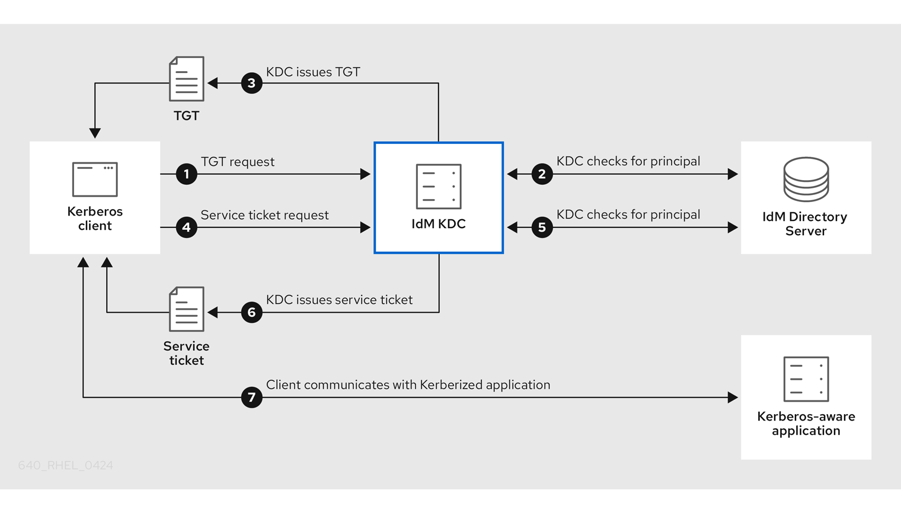 

1. A Kerberos client identifies itself to the KDC by authenticating as a Kerberos principal. For example, an IdM user performs `kinit username` and provides their password.
2. The KDC checks for the principal in its database, authenticates the client, and evaluates [Kerberos ticket policies](#idm-kerberos-ticket-policy-types "14.2. IdM Kerberos ticket policy types") to determine whether to grant the request.
3. The KDC issues the client a ticket-granting ticket (TGT) with a lifecycle and [authentication indicators](#kerberos-authentication-indicators "14.3. Kerberos authentication indicators") according to the appropriate ticket policy.
4. With the TGT, the client requests a *service ticket* from the KDC to communicate with a Kerberized service on a target host.
5. The KDC checks if the client’s TGT is still valid, and evaluates the service ticket request against ticket policies.
6. The KDC issues the client a *service ticket*.
7. With the service ticket, the client can initiate encrypted communication with the service on the target host.

<h3 id="idm-kerberos-ticket-policy-types">14.2. IdM Kerberos ticket policy types</h3>

Learn about Identity Management (IdM) Kerberos ticket policy types to understand how to enforce authentication requirements and control ticket lifecycles across your deployment.

Connection policy

To protect Kerberized services with different levels of security, you can define connection policies to enforce rules based on which pre-authentication mechanism a client used to retrieve a ticket-granting ticket (TGT).

For example, you can require smart card authentication to connect to `client1.example.com`, and require two-factor authentication to access the `testservice` application on `client2.example.com`.

To enforce connection policies, associate *authentication indicators* with services. Only clients that have the required authentication indicators in their service ticket requests are able to access those services. For more information, see [Kerberos authentication indicators](#kerberos-authentication-indicators "14.3. Kerberos authentication indicators").

Ticket lifecycle policy

Each Kerberos ticket has a *lifetime* and a potential *renewal age*: you can renew a ticket before it reaches its maximum lifetime, but not after it exceeds its maximum renewal age.

The default global ticket lifetime is one day (86400 seconds) and the default global maximum renewal age is one week (604800 seconds). To adjust these global values, see [Configuring the global ticket lifecycle policy](#configuring-the-global-ticket-lifecycle-policy "14.5. Configuring the global ticket lifecycle policy").

You can also define your own ticket lifecycle policies:

- To configure different global ticket lifecycle values for each authentication indicator, see [Configuring global ticket policies per authentication indicator](#configuring-global-ticket-policies-per-authentication-indicator "14.6. Configuring global ticket policies per authentication indicator").
- To define ticket lifecycle values for a single user that apply regardless of the authentication method used, see [Configuring the default ticket policy for a user](#configuring-the-default-ticket-policy-for-a-user "14.7. Configuring the default ticket policy for a user").
- To define individual ticket lifecycle values for each authentication indicator that only apply to a single user, see [Configuring individual authentication indicator ticket policies for a user](#configuring-individual-authentication-indicator-ticket-policies-for-a-user "14.8. Configuring individual authentication indicator ticket policies for a user").

<h3 id="kerberos-authentication-indicators">14.3. Kerberos authentication indicators</h3>

Kerberos authentication indicators identify which pre-authentication mechanism a client used to obtain a ticket-granting ticket (TGT). Services can require specific authentication indicators to enforce security policies like smart card or two-factor authentication.

The indicators are:

`otp`

two-factor authentication (password + One-Time Password)

`radius`

RADIUS authentication (commonly for 802.1x authentication)

`pkinit`

PKINIT, smart card, or certificate authentication

`hardened`

hardened passwords (SPAKE or FAST)[\[1\]](#ftn.idm140146668005104)

The KDC then attaches the authentication indicators from the TGT to any service ticket requests that stem from it. The KDC enforces policies such as service access control, maximum ticket lifetime, and maximum renewable age based on the authentication indicators.

Authentication indicators and IdM services

If you associate a service or a host with an authentication indicator, only clients that used the corresponding authentication mechanism to obtain a TGT will be able to access it. The KDC, not the application or service, checks for authentication indicators in service ticket requests, and grants or denies requests based on Kerberos connection policies.

If a service or a host has no authentication indicators assigned to it, it will accept tickets authenticated by any mechanism.

**Additional resources**

- [Enforcing authentication indicators for an IdM service](#enforcing-authentication-indicators-for-an-idm-service "14.4. Enforcing authentication indicators for an IdM service")
- [Enabling GSSAPI authentication and enforcing Kerberos authentication indicators for sudo on an IdM client](enabling-gssapi-authentication-and-enforcing-kerberos-authentication-indicators-for-sudo-on-an-idm-client)

* * *

[\[1\]](#idm140146668005104) A hardened password is protected against brute-force password dictionary attacks by using Single-Party Public-Key Authenticated Key Exchange (SPAKE) pre-authentication and/or Flexible Authentication via Secure Tunneling (FAST) armoring.

<h3 id="enforcing-authentication-indicators-for-an-idm-service">14.4. Enforcing authentication indicators for an IdM service</h3>

Enforce authentication indicators for an Identity Management (IdM) service to require specific pre-authentication methods for access. This ensures that only users who authenticated with stronger methods, such as one-time passwords, can access security-critical services.

Authentication mechanisms in IdM vary in their security strength. For example, obtaining a ticket-granting ticket (TGT) using a one-time password (OTP) combined with a password is more secure than using only a password. By associating authentication indicators with a particular IdM service, you can configure the service so that only users who used specific pre-authentication mechanisms to obtain their initial TGT will be able to access it.

In this way, you can configure different IdM services so that:

- Only users who used a stronger authentication method to obtain their initial TGT, such as a one-time password (OTP), can access services critical to security, such as a VPN.
- Users who used simpler authentication methods to obtain their initial TGT, such as a password, can only access non-critical services, such as local logins.

**Figure 14.1. Example of authenticating using different technologies**

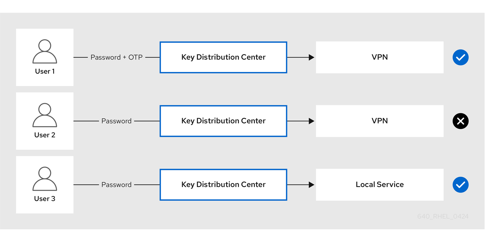 

This procedure describes creating an IdM service and configuring it to require particular Kerberos authentication indicators from incoming service ticket requests.

<h4 id="creating-an-idm-service-entry-and-its-kerberos-keytab">14.4.1. Creating an IdM service entry and its Kerberos keytab</h4>

Create service entries in Identity Management (IdM) to generate Kerberos principals and enable SSL certificate or Kerberos keytab requests. Service entries establish secure identities for applications and automate credential management without using cleartext passwords.

**Prerequisites**

- Your service can store a Kerberos principal, an SSL certificate, or both.

**Procedure**

1. Add an IdM service with the `ipa service-add` command to create a Kerberos principal associated with it. For example, to create the IdM service entry for the `testservice` application that runs on host `client.example.com`:
   
   ```
   ipa service-add testservice/client.example.com
   -------------------------------------------------------------
   Modified service "testservice/client.example.com@EXAMPLE.COM"
   -------------------------------------------------------------
     Principal name: testservice/client.example.com@EXAMPLE.COM
     Principal alias: testservice/client.example.com@EXAMPLE.COM
     Managed by: client.example.com
   ```
   
   ```plaintext
   [root@client ~]# ipa service-add testservice/client.example.com
   -------------------------------------------------------------
   Modified service "testservice/client.example.com@EXAMPLE.COM"
   -------------------------------------------------------------
     Principal name: testservice/client.example.com@EXAMPLE.COM
     Principal alias: testservice/client.example.com@EXAMPLE.COM
     Managed by: client.example.com
   ```
2. Generate and store a Kerberos keytab for the service on the client.
   
   ```
   ipa-getkeytab -k /etc/testservice.keytab -p testservice/client.example.com
   Keytab successfully retrieved and stored in: /etc/testservice.keytab
   ```
   
   ```plaintext
   [root@client ~]# ipa-getkeytab -k /etc/testservice.keytab -p testservice/client.example.com
   Keytab successfully retrieved and stored in: /etc/testservice.keytab
   ```

**Verification**

1. Display information about an IdM service with the `ipa service-show` command.
   
   ```
   ipa service-show testservice/client.example.com
     Principal name: testservice/client.example.com@EXAMPLE.COM
     Principal alias: testservice/client.example.com@EXAMPLE.COM
     Keytab: True
     Managed by: client.example.com
   ```
   
   ```plaintext
   [root@server ~]# ipa service-show testservice/client.example.com
     Principal name: testservice/client.example.com@EXAMPLE.COM
     Principal alias: testservice/client.example.com@EXAMPLE.COM
     Keytab: True
     Managed by: client.example.com
   ```
2. Display the contents of the service’s Kerberos keytab with the `klist` command.
   
   ```
   klist -ekt /etc/testservice.keytab
   Keytab name: FILE:/etc/testservice.keytab
   KVNO Timestamp           Principal
   ---- ------------------- ------------------------------------------------------
      2 04/01/2020 17:52:55 testservice/client.example.com@EXAMPLE.COM (aes256-cts-hmac-sha1-96)
      2 04/01/2020 17:52:55 testservice/client.example.com@EXAMPLE.COM (aes128-cts-hmac-sha1-96)
      2 04/01/2020 17:52:55 testservice/client.example.com@EXAMPLE.COM (camellia128-cts-cmac)
      2 04/01/2020 17:52:55 testservice/client.example.com@EXAMPLE.COM (camellia256-cts-cmac)
   ```
   
   ```plaintext
   [root@server etc]# klist -ekt /etc/testservice.keytab
   Keytab name: FILE:/etc/testservice.keytab
   KVNO Timestamp           Principal
   ---- ------------------- ------------------------------------------------------
      2 04/01/2020 17:52:55 testservice/client.example.com@EXAMPLE.COM (aes256-cts-hmac-sha1-96)
      2 04/01/2020 17:52:55 testservice/client.example.com@EXAMPLE.COM (aes128-cts-hmac-sha1-96)
      2 04/01/2020 17:52:55 testservice/client.example.com@EXAMPLE.COM (camellia128-cts-cmac)
      2 04/01/2020 17:52:55 testservice/client.example.com@EXAMPLE.COM (camellia256-cts-cmac)
   ```

<h4 id="associating-authentication-indicators-with-an-idm-service-using-idm-cli">14.4.2. Associating authentication indicators with an IdM service using IdM CLI</h4>

Require specific authentication methods for accessing services using the Identity Management (IdM) CLI by configuring authentication indicators. With authentication indicators configured, you can enforce stronger authentication like two-factor or smart cards for sensitive services.

For example, you can ensure that only users who used a valid IdM two-factor authentication token with their password when obtaining a Kerberos ticket-granting ticket (TGT) will be able to access that host or service.

Follow this procedure to configure a service to require particular Kerberos authentication indicators from incoming service ticket requests.

When you configure a service, you must specify authentication indicators using the `--auth-ind` argument. Common `--auth-ind` values include:

otp

For two-factor authentication.

radius

For RADIUS authentication.

pkinit

For PKINIT, smart card, or certificate authentication.

hardened

For hardened passwords (SPAKE or FAST).

**Prerequisites**

- You have created an IdM service entry for a service that runs on an IdM host. See [Creating an IdM service entry and its Kerberos keytab](#creating-an-idm-service-entry-and-its-kerberos-keytab "14.4.1. Creating an IdM service entry and its Kerberos keytab").
- You have obtained the ticket-granting ticket of an administrative user in IdM.

Warning

Do **not** assign authentication indicators to internal IdM services. The following IdM services cannot perform the interactive authentication steps required by PKINIT and multi-factor authentication methods:

```
host/server.example.com@EXAMPLE.COM
HTTP/server.example.com@EXAMPLE.COM
ldap/server.example.com@EXAMPLE.COM
DNS/server.example.com@EXAMPLE.COM
cifs/server.example.com@EXAMPLE.COM
```

```plaintext
host/server.example.com@EXAMPLE.COM
HTTP/server.example.com@EXAMPLE.COM
ldap/server.example.com@EXAMPLE.COM
DNS/server.example.com@EXAMPLE.COM
cifs/server.example.com@EXAMPLE.COM
```

**Procedure**

- Use the `ipa service-mod` command to specify one or more required authentication indicators for a service, identified with the `--auth-ind` argument.
  
  For example, to require that a user was authenticated with smart card or OTP authentication to retrieve a service ticket for the `testservice` principal on host `client.example.com`:
  
  ```
  ipa service-mod testservice/client.example.com@EXAMPLE.COM --auth-ind otp --auth-ind pkinit
  -------------------------------------------------------------
  Modified service "testservice/client.example.com@EXAMPLE.COM"
  -------------------------------------------------------------
    Principal name: testservice/client.example.com@EXAMPLE.COM
    Principal alias: testservice/client.example.com@EXAMPLE.COM
    Authentication Indicators: otp, pkinit
    Managed by: client.example.com
  ```
  
  ```plaintext
  [root@server ~]# ipa service-mod testservice/client.example.com@EXAMPLE.COM --auth-ind otp --auth-ind pkinit
  -------------------------------------------------------------
  Modified service "testservice/client.example.com@EXAMPLE.COM"
  -------------------------------------------------------------
    Principal name: testservice/client.example.com@EXAMPLE.COM
    Principal alias: testservice/client.example.com@EXAMPLE.COM
    Authentication Indicators: otp, pkinit
    Managed by: client.example.com
  ```
- To remove all authentication indicators from a service, provide an empty list of indicators:
  
  ```
  ipa service-mod testservice/client.example.com@EXAMPLE.COM --auth-ind ''
  ------------------------------------------------------
  Modified service "testservice/client.example.com@EXAMPLE.COM"
  ------------------------------------------------------
    Principal name: testservice/client.example.com@EXAMPLE.COM
    Principal alias: testservice/client.example.com@EXAMPLE.COM
    Managed by: client.example.com
  ```
  
  ```plaintext
  [root@server ~]# ipa service-mod testservice/client.example.com@EXAMPLE.COM --auth-ind ''
  ------------------------------------------------------
  Modified service "testservice/client.example.com@EXAMPLE.COM"
  ------------------------------------------------------
    Principal name: testservice/client.example.com@EXAMPLE.COM
    Principal alias: testservice/client.example.com@EXAMPLE.COM
    Managed by: client.example.com
  ```

**Verification**

- Display information about an IdM service, including the authentication indicators it requires, with the `ipa service-show` command.
  
  ```
  ipa service-show testservice/client.example.com
    Principal name: testservice/client.example.com@EXAMPLE.COM
    Principal alias: testservice/client.example.com@EXAMPLE.COM
    Authentication Indicators: otp, pkinit
    Keytab: True
    Managed by: client.example.com
  ```
  
  ```plaintext
  [root@server ~]# ipa service-show testservice/client.example.com
    Principal name: testservice/client.example.com@EXAMPLE.COM
    Principal alias: testservice/client.example.com@EXAMPLE.COM
    Authentication Indicators: otp, pkinit
    Keytab: True
    Managed by: client.example.com
  ```

**Additional resources**

- [Retrieving a Kerberos service ticket for an IdM service](#retrieving-a-kerberos-service-ticket-for-an-idm-service "14.4.4. Retrieving a Kerberos service ticket for an IdM service")
- [Enabling GSSAPI authentication and enforcing Kerberos authentication indicators for sudo on an IdM client](https://docs.redhat.com/en/documentation/red_hat_enterprise_linux/10/html/managing_idm_users_groups_hosts_and_access_control_rules/granting-sudo-access-to-an-idm-user-on-an-idm-client#enabling-gssapi-authentication-and-enforcing-kerberos-authentication-indicators-for-sudo-on-an-idm-client)

<h4 id="associating-authentication-indicators-with-an-idm-service-using-idm-web-ui">14.4.3. Associating authentication indicators with an IdM service using IdM Web UI</h4>

Require specific authentication methods for accessing services using the Identity Management (IdM) Web UI by configuring authentication indicators. With authentication indicators configured, you can enforce stronger authentication like two-factor or smart cards for sensitive services.

For example, you can ensure that only users who used a valid IdM two-factor authentication token with their password when obtaining a Kerberos ticket-granting ticket (TGT) will be able to access that host or service.

Follow this procedure to use the IdM Web UI to configure a host or service to require particular Kerberos authentication indicators from incoming ticket requests.

**Prerequisites**

- You have logged in to the IdM Web UI as an administrative user.

**Procedure**

1. Select Identity → Hosts or Identity → Services.
2. Click the name of the required host or service.
3. Under `Authentication indicators`, select the required authentication method.
   
   - For example, selecting `OTP` ensures that only users who used a valid IdM two-factor authentication token with their password when obtaining a Kerberos TGT will be able to access the host or service.
   - If you select both `OTP` and `RADIUS`, then both users that used a valid IdM two-factor authentication token with their password when obtaining a Kerberos TGT **and** users that used the RADIUS server for obtaining their Kerberos TGT will be allowed access.
4. Click Save at the top of the page.

**Additional resources**

- [Retrieving a Kerberos service ticket for an IdM service](#retrieving-a-kerberos-service-ticket-for-an-idm-service "14.4.4. Retrieving a Kerberos service ticket for an IdM service")
- [Enabling GSSAPI authentication and enforcing Kerberos authentication indicators for sudo on an IdM client](enabling-gssapi-authentication-and-enforcing-kerberos-authentication-indicators-for-sudo-on-an-idm-client)

<h4 id="retrieving-a-kerberos-service-ticket-for-an-idm-service">14.4.4. Retrieving a Kerberos service ticket for an IdM service</h4>

Retrieve a Kerberos service ticket for an Identity Management (IdM) service to verify that Kerberos ticket policies, such as required authentication indicators, are enforced correctly for that service.

**Prerequisites**

- If the service you are working with is not an internal IdM service, you have created a corresponding *IdM service* entry for it. See [Creating an IdM service entry and its Kerberos keytab](#creating-an-idm-service-entry-and-its-kerberos-keytab "14.4.1. Creating an IdM service entry and its Kerberos keytab").
- You have a Kerberos ticket-granting ticket (TGT).

**Procedure**

- Use the `kvno` command with the `-S` option to retrieve a service ticket, and specify the name of the IdM service and the fully-qualified domain name of the host that manages it.
  
  ```
  kvno -S testservice client.example.com
  testservice/client.example.com@EXAMPLE.COM: kvno = 1
  ```
  
  ```plaintext
  [root@server ~]# kvno -S testservice client.example.com
  testservice/client.example.com@EXAMPLE.COM: kvno = 1
  ```
  
  Note
  
  If you need to access an IdM service and your current ticket-granting ticket (TGT) does not possess the required Kerberos authentication indicators associated with it, clear your current Kerberos credentials cache with the `kdestroy` command and retrieve a new TGT:
  
  ```
  kdestroy
  ```
  
  ```plaintext
  [root@server ~]# kdestroy
  ```
  
  For example, if you initially retrieved a TGT by authenticating with a password, and you need to access an IdM service that has the `pkinit` authentication indicator associated with it, destroy your current credentials cache and re-authenticate with a smart card. See [Kerberos authentication indicators](#kerberos-authentication-indicators "14.3. Kerberos authentication indicators").

**Verification**

- Use the `klist` command to verify that the service ticket is in the default Kerberos credentials cache.
  
  ```
  klist_
  Ticket cache: KCM:1000
  Default principal: admin@EXAMPLE.COM
  
  Valid starting       Expires              Service principal
  04/01/2020 12:52:42  04/02/2020 12:52:39  krbtgt/EXAMPLE.COM@EXAMPLE.COM
  04/01/2020 12:54:07 04/02/2020 12:52:39 testservice/client.example.com@EXAMPLE.COM
  ```
  
  ```plaintext
  [root@server etc]# klist_
  Ticket cache: KCM:1000
  Default principal: admin@EXAMPLE.COM
  
  Valid starting       Expires              Service principal
  04/01/2020 12:52:42  04/02/2020 12:52:39  krbtgt/EXAMPLE.COM@EXAMPLE.COM
  04/01/2020 12:54:07 04/02/2020 12:52:39 testservice/client.example.com@EXAMPLE.COM
  ```

<h4 id="enforcing-authentication-indicators-for-an-idm-service">14.4.5. Additional resources</h4>

- [Kerberos authentication indicators](#kerberos-authentication-indicators "14.3. Kerberos authentication indicators")

<h3 id="configuring-the-global-ticket-lifecycle-policy">14.5. Configuring the global ticket lifecycle policy</h3>

Adjust the global Kerberos ticket policy in Identity Management (IdM) to set baseline security requirements for all users and services. Global policies help maintain consistent authentication security across your entire environment.

The global ticket policy applies to all service tickets and to users that do not have any per-user ticket policies defined.

While using the `ipa krbtpolicy-mod` command, specify at least one of the following arguments:

- `--maxlife` for the maximum ticket lifetime in seconds
- `--maxrenew` for the maximum renewable age in seconds

**Procedure**

1. To modify the global ticket policy:
   
   ```
   ipa krbtpolicy-mod --maxlife=$((8*60*60)) --maxrenew=$((24*60*60))
     Max life: 28800
     Max renew: 86400
   ```
   
   ```plaintext
   [root@server ~]# ipa krbtpolicy-mod --maxlife=$((8*60*60)) --maxrenew=$((24*60*60))
     Max life: 28800
     Max renew: 86400
   ```
   
   In this example, the maximum lifetime is set to eight hours (8 * 60 minutes * 60 seconds) and the maximum renewal age is set to one day (24 * 60 minutes * 60 seconds).
2. Optional: To reset the global Kerberos ticket policy to the default installation values:
   
   ```
   ipa krbtpolicy-reset
     Max life: 86400
     Max renew: 604800
   ```
   
   ```plaintext
   [root@server ~]# ipa krbtpolicy-reset
     Max life: 86400
     Max renew: 604800
   ```

**Verification**

- Display the global ticket policy:
  
  ```
  ipa krbtpolicy-show
    Max life: 28800
    Max renew: 86640
  ```
  
  ```plaintext
  [root@server ~]# ipa krbtpolicy-show
    Max life: 28800
    Max renew: 86640
  ```

**Additional resources**

- [Configuring the default ticket policy for a user](#configuring-the-default-ticket-policy-for-a-user "14.7. Configuring the default ticket policy for a user")
- [Configuring individual authentication indicator ticket policies for a user](#configuring-individual-authentication-indicator-ticket-policies-for-a-user "14.8. Configuring individual authentication indicator ticket policies for a user")

<h3 id="configuring-global-ticket-policies-per-authentication-indicator">14.6. Configuring global ticket policies per authentication indicator</h3>

Set different Kerberos ticket lifetimes in Identity Management (IdM) based on authentication method to enforce stronger security policies for weaker authentication. With this, IdM can require more frequent re-authentication for password-only logins while permitting longer sessions for two-factor or smart card authentication.

These global settings apply to all users who do not have individual ticket policies configured. Use the `ipa krbtpolicy-mod` command to set maximum lifetime and maximum renewable age values for each authentication indicator.

**Procedure**

- For example, to set the global two-factor ticket lifetime and renewal age values to one week, and the global smart card ticket lifetime and renewal age values to two weeks:
  
  ```
  ipa krbtpolicy-mod --otp-maxlife=604800 --otp-maxrenew=604800 --pkinit-maxlife=172800 --pkinit-maxrenew=172800
  ```
  
  ```plaintext
  [root@server ~]# ipa krbtpolicy-mod --otp-maxlife=604800 --otp-maxrenew=604800 --pkinit-maxlife=172800 --pkinit-maxrenew=172800
  ```

**Verification**

- Display the global ticket policy:
  
  ```
  ipa krbtpolicy-show
    Max life: 86400
    OTP max life: 604800
    PKINIT max life: 172800
    Max renew: 604800
    OTP max renew: 604800
    PKINIT max renew: 172800
  ```
  
  ```plaintext
  [root@server ~]# ipa krbtpolicy-show
    Max life: 86400
    OTP max life: 604800
    PKINIT max life: 172800
    Max renew: 604800
    OTP max renew: 604800
    PKINIT max renew: 172800
  ```
  
  Notice that the OTP and PKINIT values are different from the global default `Max life` and `Max renew` values.

**Additional resources**

- [Authentication indicator options for the `krbtpolicy-mod` command](#authentication-indicator-options-for-the-krbtpolicy-mod-command "14.9. Authentication indicator options for the krbtpolicy-mod command")
- [Configuring the default ticket policy for a user](#configuring-the-default-ticket-policy-for-a-user "14.7. Configuring the default ticket policy for a user")
- [Configuring individual authentication indicator ticket policies for a user](#configuring-individual-authentication-indicator-ticket-policies-for-a-user "14.8. Configuring individual authentication indicator ticket policies for a user")

<h3 id="configuring-the-default-ticket-policy-for-a-user">14.7. Configuring the default ticket policy for a user</h3>

Define custom Kerberos ticket policies for individual users in Identity Management (IdM) to enforce specific security requirements. Per-user policies override global settings and ensure that the maximum ticket lifetime and renewal periods match a user’s specific role or risk level.

Use the `ipa krbtpolicy-mod username` command, and specify at least one of the following arguments:

- `--maxlife` for the maximum ticket lifetime in seconds
- `--maxrenew` for the maximum renewable age in seconds

**Procedure**

1. For example, to set the IdM `admin` user’s maximum ticket lifetime to two days and maximum renewal age to two weeks:
   
   ```
   ipa krbtpolicy-mod admin --maxlife=172800 --maxrenew=1209600
     Max life: 172800
     Max renew: 1209600
   ```
   
   ```plaintext
   [root@server ~]# ipa krbtpolicy-mod admin --maxlife=172800 --maxrenew=1209600
     Max life: 172800
     Max renew: 1209600
   ```
2. Optional: To reset the ticket policy for a user:
   
   ```
   ipa krbtpolicy-reset admin
   ```
   
   ```plaintext
   [root@server ~]# ipa krbtpolicy-reset admin
   ```

**Verification**

- Display the effective Kerberos ticket policy that applies to a user:
  
  ```
  ipa krbtpolicy-show admin
    Max life: 172800
    Max renew: 1209600
  ```
  
  ```plaintext
  [root@server ~]# ipa krbtpolicy-show admin
    Max life: 172800
    Max renew: 1209600
  ```

**Additional resources**

- [Configuring the global ticket lifecycle policy](#configuring-the-global-ticket-lifecycle-policy "14.5. Configuring the global ticket lifecycle policy")
- [Configuring global ticket policies per authentication indicator](#configuring-global-ticket-policies-per-authentication-indicator "14.6. Configuring global ticket policies per authentication indicator")

<h3 id="configuring-individual-authentication-indicator-ticket-policies-for-a-user">14.8. Configuring individual authentication indicator ticket policies for a user</h3>

Configure per-authentication indicator Kerberos ticket policies for users in Identity Management (IdM) to apply different ticket lifetime and renewal rules based on authentication method.

For example, you can configure a policy to allow the IdM `admin` user to renew a ticket for two days if it was obtained with OTP authentication, and a week if it was obtained with smart card authentication.

These per-authentication indicator settings will override the *user’s* default ticket policy, the *global* default ticket policy, and any *global* authentication indicator ticket policy.

Use the `ipa krbtpolicy-mod username` command to set custom maximum lifetime and maximum renewable age values for a user’s Kerberos tickets depending on the [authentication indicators](#kerberos-authentication-indicators "14.3. Kerberos authentication indicators") attached to them.

**Procedure**

1. For example, to allow the IdM `admin` user to renew a Kerberos ticket for two days if it was obtained with One-Time Password authentication, set the `--otp-maxrenew` option:
   
   ```
   ipa krbtpolicy-mod admin --otp-maxrenew=$((2*24*60*60))
     OTP max renew: 172800
   ```
   
   ```plaintext
   [root@server ~]# ipa krbtpolicy-mod admin --otp-maxrenew=$((2*24*60*60))
     OTP max renew: 172800
   ```
2. Optional: To reset the ticket policy for a user:
   
   ```
   ipa krbtpolicy-reset username
   ```
   
   ```plaintext
   [root@server ~]# ipa krbtpolicy-reset username
   ```

**Verification**

- Display the effective Kerberos ticket policy that applies to a user:
  
  ```
  ipa krbtpolicy-show admin
    Max life: 28800
    Max renew: 86640
  ```
  
  ```plaintext
  [root@server ~]# ipa krbtpolicy-show admin
    Max life: 28800
    Max renew: 86640
  ```

**Additional resources**

- [Authentication indicator options for the `krbtpolicy-mod` command](#authentication-indicator-options-for-the-krbtpolicy-mod-command "14.9. Authentication indicator options for the krbtpolicy-mod command")
- [Configuring the default ticket policy for a user](#configuring-the-default-ticket-policy-for-a-user "14.7. Configuring the default ticket policy for a user")
- [Configuring the global ticket lifecycle policy](#configuring-the-global-ticket-lifecycle-policy "14.5. Configuring the global ticket lifecycle policy")
- [Configuring global ticket policies per authentication indicator](#configuring-global-ticket-policies-per-authentication-indicator "14.6. Configuring global ticket policies per authentication indicator")

<h3 id="authentication-indicator-options-for-the-krbtpolicy-mod-command">14.9. Authentication indicator options for the krbtpolicy-mod command</h3>

Configure different Kerberos ticket lifetime policies for each authentication method in Identity Management (IdM) using the `krbtpolicy-mod` command. With this, you can set stricter expiration policies for weaker authentication methods and more permissive policies for stronger ones.

| Authentication indicator | Argument for maximum lifetime | Argument for maximum renewal age |
|:-------------------------|:------------------------------|:---------------------------------|
| `otp`                    | `--otp-maxlife`               | `--otp-maxrenew`                 |
| `radius`                 | `--radius-maxlife`            | `--radius-maxrenew`              |
| `pkinit`                 | `--pkinit-maxlife`            | `--pkinit-maxrenew`              |
| `hardened`               | `--hardened-maxlife`          | `--hardened-maxrenew`            |

Table 14.1. Authentication indicator options for the krbtpolicy-mod command

<h2 id="kerberos-pkinit-authentication-in-idm">Chapter 15. Kerberos PKINIT authentication in IdM</h2>

Use Public Key Cryptography for Initial Authentication in Kerberos (PKINIT) to authenticate to Identity Management (IdM) using certificates instead of passwords. PKINIT provides stronger authentication by using public key cryptography for Kerberos preauthentication.

<h3 id="default-pkinit-configuration">15.1. Default PKINIT configuration</h3>

Understand how the default PKINIT configuration in Identity Management (IdM) varies based on your certificate authority setup. PKINIT configuration determines how servers and clients authenticate using public key cryptography.

| CA configuration                                          | PKINIT configuration                                                                                               |
|:----------------------------------------------------------|:-------------------------------------------------------------------------------------------------------------------|
| Without a CA, no external PKINIT certificate provided     | Local PKINIT: IdM only uses PKINIT for internal purposes on servers.                                               |
| Without a CA, external PKINIT certificate provided to IdM | IdM configures PKINIT by using the external Kerberos key distribution center (KDC) certificate and CA certificate. |
| With an Integrated CA                                     | IdM configures PKINIT by using the certificate signed by the IdM CA.                                               |

Table 15.1. Default PKINIT configuration in IdM

<h3 id="displaying-the-current-pkinit-configuration">15.2. Displaying the current PKINIT configuration</h3>

Display PKINIT configuration settings in Identity Management (IdM) to verify that certificate-based authentication is properly configured. Checking PKINIT status helps troubleshoot authentication issues and validate security policies.

**Procedure**

- To determine the PKINIT status in your domain, use the `ipa pkinit-status` command:
  
  ```
  ipa pkinit-status
    Server name: server1.example.com
    PKINIT status: enabled
    [...output truncated...]
    Server name: server2.example.com
    PKINIT status: disabled
    [...output truncated...]
  ```
  
  ```plaintext
  $ ipa pkinit-status
    Server name: server1.example.com
    PKINIT status: enabled
    [...output truncated...]
    Server name: server2.example.com
    PKINIT status: disabled
    [...output truncated...]
  ```
  
  The command displays the PKINIT configuration status as `enabled` or `disabled`:
  
  - `enabled`: PKINIT is configured using a certificate signed by the integrated IdM CA or an external PKINIT certificate.
  - `disabled`: IdM only uses PKINIT for internal purposes on IdM servers.
- To list the IdM servers with active Kerberos key distribution centers (KDCs) that support PKINIT for IdM clients, use the `ipa config-show` command on any server:
  
  ```
  ipa config-show
    Maximum username length: 32
    Home directory base: /home
    Default shell: /bin/sh
    Default users group: ipausers
    [...output truncated...]
    IPA masters capable of PKINIT: server1.example.com
    [...output truncated...]
  ```
  
  ```plaintext
  $ ipa config-show
    Maximum username length: 32
    Home directory base: /home
    Default shell: /bin/sh
    Default users group: ipausers
    [...output truncated...]
    IPA masters capable of PKINIT: server1.example.com
    [...output truncated...]
  ```

<h3 id="configuring-pkinit-in-idm">15.3. Configuring PKINIT in IdM</h3>

Enable PKINIT on Identity Management (IdM) servers to allow certificate-based Kerberos authentication. PKINIT strengthens security by using public key cryptography for initial authentication instead of passwords alone.

**Prerequisites**

- Ensure that all IdM servers with a certificate authority (CA) installed are running on the same domain level.

**Procedure**

1. Check if PKINIT is enabled on the server:
   
   ```
   kinit admin
   
   Password for admin@IDM.EXAMPLE.COM:
   ipa pkinit-status --server=server.idm.example.com
   1 server matched
   ----------------
   Server name: server.idm.example.com
   PKINIT status:enabled
   ----------------------------
   Number of entries returned 1
   ----------------------------
   ```
   
   ```plaintext
   # kinit admin
   
   Password for admin@IDM.EXAMPLE.COM:
   # ipa pkinit-status --server=server.idm.example.com
   1 server matched
   ----------------
   Server name: server.idm.example.com
   PKINIT status:enabled
   ----------------------------
   Number of entries returned 1
   ----------------------------
   ```
   
   If PKINIT is disabled, you will see the following output:
   
   ```
   ipa pkinit-status --server server.idm.example.com
   -----------------
   0 servers matched
   -----------------
   ----------------------------
   Number of entries returned 0
   ----------------------------
   ```
   
   ```plaintext
   # ipa pkinit-status --server server.idm.example.com
   -----------------
   0 servers matched
   -----------------
   ----------------------------
   Number of entries returned 0
   ----------------------------
   ```
   
   You can also use the command to find all the servers where PKINIT is enabled if you omit the `--server <server_fqdn>` parameter.
2. If you are using IdM without CA:
   
   1. On the IdM server, install the CA certificate that signed the Kerberos key distribution center (KDC) certificate:
      
      ```
      ipa-cacert-manage install -t CT,C,C ca.pem
      ```
      
      ```plaintext
      # ipa-cacert-manage install -t CT,C,C ca.pem
      ```
   2. To update all IPA hosts, repeat the `ipa-certupdate` command on all replicas and clients:
      
      ```
      ipa-certupdate
      ```
      
      ```plaintext
      # ipa-certupdate
      ```
   3. Check if the CA certificate has already been added using the `ipa-cacert-manage list` command. For example:
      
      ```
      ipa-cacert-manage list
      CN=CA,O=Example Organization
      The ipa-cacert-manage command was successful
      ```
      
      ```plaintext
      # ipa-cacert-manage list
      CN=CA,O=Example Organization
      The ipa-cacert-manage command was successful
      ```
   4. Use the `ipa-server-certinstall` utility to install an external KDC certificate. The KDC certificate must meet the following conditions:
      
      - It is issued with the common name `CN=fully_qualified_domain_name,certificate_subject_base`.
      - It includes the Kerberos principal `krbtgt/REALM_NAME@REALM_NAME`.
      - It contains the Object Identifier (OID) for KDC authentication: `1.3.6.1.5.2.3.5.`
        
        ```
        ipa-server-certinstall --kdc kdc.pem kdc.key
        
        systemctl restart krb5kdc.service
        ```
        
        ```plaintext
        # ipa-server-certinstall --kdc kdc.pem kdc.key
        
        # systemctl restart krb5kdc.service
        ```
   5. See your PKINIT status:
      
      ```
      ipa pkinit-status
        Server name: server1.example.com
        PKINIT status: enabled
        [...output truncated...]
        Server name: server2.example.com
        PKINIT status: disabled
        [...output truncated...]
      ```
      
      ```plaintext
      # ipa pkinit-status
        Server name: server1.example.com
        PKINIT status: enabled
        [...output truncated...]
        Server name: server2.example.com
        PKINIT status: disabled
        [...output truncated...]
      ```
3. If you are using IdM with a CA certificate, enable PKINIT as follows:
   
   ```
   ipa-pkinit-manage enable
     Configuring Kerberos KDC (krb5kdc)
     [1/1]: installing X509 Certificate for PKINIT
     Done configuring Kerberos KDC (krb5kdc).
     The ipa-pkinit-manage command was successful
   ```
   
   ```plaintext
   # ipa-pkinit-manage enable
     Configuring Kerberos KDC (krb5kdc)
     [1/1]: installing X509 Certificate for PKINIT
     Done configuring Kerberos KDC (krb5kdc).
     The ipa-pkinit-manage command was successful
   ```
   
   If you are using an IdM CA, the command requests a PKINIT KDC certificate from the CA.

<h3 id="kerberos-pkinit-authentication-in-idm">15.4. Additional resources</h3>

- [PKINIT configuration](https://web.mit.edu/kerberos/krb5-1.13/doc/admin/pkinit.html)

<h2 id="maintaining-idm-kerberos-keytab-files">Chapter 16. Maintaining IdM Kerberos keytab files</h2>

Maintain Identity Management (IdM) Kerberos keytab files to ensure services can authenticate securely with Kerberos.

You can use this information to understand why you should protect these sensitive files, and to troubleshoot communication issues between IdM services.

<h3 id="how-identity-management-uses-kerberos-keytab-files">16.1. How Identity Management uses Kerberos keytab files</h3>

Learn how Identity Management (IdM) uses Kerberos keytab files to enable users, hosts, and services to authenticate to the KDC without human interaction, so you can maintain and troubleshoot service authentication in your IdM deployment.

A Kerberos keytab is a file containing Kerberos principals and their corresponding encryption keys.

Every IdM service on an IdM server has a unique Kerberos principal stored in the Kerberos database. For example, if IdM servers `east.idm.example.com` and `west.idm.example.com` provide DNS services, IdM creates 2 unique DNS Kerberos principals to identify these services, which follow the naming convention `<service>/host.domain.com@REALM.COM`:

- `DNS/east.idm.example.com@IDM.EXAMPLE.COM`
- `DNS/west.idm.example.com@IDM.EXAMPLE.COM`

IdM creates a keytab on the server for each of these services to store a local copy of the Kerberos keys, along with their Key Version Numbers (KVNO). For example, the default keytab file `/etc/krb5.keytab` stores the `host` principal, which represents that machine in the Kerberos realm and is used for login authentication. The KDC generates encryption keys for the different encryption algorithms it supports, such as `aes256-cts-hmac-sha1-96` and `aes128-cts-hmac-sha1-96`.

You can display the contents of a keytab file with the `klist` command:

```
klist -ekt /etc/krb5.keytab
Keytab name: FILE:/etc/krb5.keytab
KVNO Timestamp           Principal
---- ------------------- ------------------------------------------------------
   2 02/24/2022 20:28:09 host/idmserver.idm.example.com@IDM.EXAMPLE.COM (aes256-cts-hmac-sha1-96)
   2 02/24/2022 20:28:09 host/idmserver.idm.example.com@IDM.EXAMPLE.COM (aes128-cts-hmac-sha1-96)
   2 02/24/2022 20:28:09 host/idmserver.idm.example.com@IDM.EXAMPLE.COM (camellia128-cts-cmac)
   2 02/24/2022 20:28:09 host/idmserver.idm.example.com@IDM.EXAMPLE.COM (camellia256-cts-cmac)
```

```plaintext
[root@idmserver ~]# klist -ekt /etc/krb5.keytab
Keytab name: FILE:/etc/krb5.keytab
KVNO Timestamp           Principal
---- ------------------- ------------------------------------------------------
   2 02/24/2022 20:28:09 host/idmserver.idm.example.com@IDM.EXAMPLE.COM (aes256-cts-hmac-sha1-96)
   2 02/24/2022 20:28:09 host/idmserver.idm.example.com@IDM.EXAMPLE.COM (aes128-cts-hmac-sha1-96)
   2 02/24/2022 20:28:09 host/idmserver.idm.example.com@IDM.EXAMPLE.COM (camellia128-cts-cmac)
   2 02/24/2022 20:28:09 host/idmserver.idm.example.com@IDM.EXAMPLE.COM (camellia256-cts-cmac)
```

**Additional resources**

- [Verifying that Kerberos keytab files are in sync with the IdM database](#verifying-that-kerberos-keytab-files-are-in-sync-with-the-idm-database "16.2. Verifying that Kerberos keytab files are in sync with the IdM database")
- [List of IdM Kerberos keytab files and their contents](#list-of-idm-kerberos-keytab-files-and-their-contents "16.3. List of IdM Kerberos keytab files and their contents")

<h3 id="verifying-that-kerberos-keytab-files-are-in-sync-with-the-idm-database">16.2. Verifying that Kerberos keytab files are in sync with the IdM database</h3>

Verify that Kerberos keytab files on an Identity Management (IdM) server are in sync with the IdM database to fix service authentication failures caused by outdated Key Version Numbers (KVNOs).

When you change a Kerberos password, IdM automatically generates a new key and increments its KVNO. If a keytab is not updated accordingly, services that rely on it cannot authenticate to the Kerberos Key Distribution Center (KDC). If an IdM service cannot communicate with another service, a stale keytab is a likely cause.

**Prerequisites**

- You must authenticate as the IdM admin account to retrieve keytab files
- You must authenticate as the `root` account to modify keytab files owned by other users

**Procedure**

1. Display the KVNO of the principals in the keytab you are verifying. In the following example, the `/etc/named.keytab` file has the key for the `DNS/server1.idm.example.com@EXAMPLE.COM` principal with a KVNO of 2.
   
   ```
   klist -ekt /etc/named.keytab
   Keytab name: FILE:/etc/named.keytab
   KVNO Timestamp           Principal
   ---- ------------------- ------------------------------------------------------
      2 11/26/2021 13:51:11 DNS/server1.idm.example.com@EXAMPLE.COM (aes256-cts-hmac-sha1-96)
      2 11/26/2021 13:51:11 DNS/server1.idm.example.com@EXAMPLE.COM (aes128-cts-hmac-sha1-96)
      2 11/26/2021 13:51:11 DNS/server1.idm.example.com@EXAMPLE.COM (camellia128-cts-cmac)
      2 11/26/2021 13:51:11 DNS/server1.idm.example.com@EXAMPLE.COM (camellia256-cts-cmac)
   ```
   
   ```plaintext
   [root@server1 ~]# klist -ekt /etc/named.keytab
   Keytab name: FILE:/etc/named.keytab
   KVNO Timestamp           Principal
   ---- ------------------- ------------------------------------------------------
      2 11/26/2021 13:51:11 DNS/server1.idm.example.com@EXAMPLE.COM (aes256-cts-hmac-sha1-96)
      2 11/26/2021 13:51:11 DNS/server1.idm.example.com@EXAMPLE.COM (aes128-cts-hmac-sha1-96)
      2 11/26/2021 13:51:11 DNS/server1.idm.example.com@EXAMPLE.COM (camellia128-cts-cmac)
      2 11/26/2021 13:51:11 DNS/server1.idm.example.com@EXAMPLE.COM (camellia256-cts-cmac)
   ```
2. Display the KVNO of the principal stored in the IdM database. In this example, the KVNO of the key in the IdM database does not match the KVNO in the keytab.
   
   ```
   kvno DNS/server1.idm.example.com@EXAMPLE.COM
   DNS/server1.idm.example.com@EXAMPLE.COM: kvno = 3
   ```
   
   ```plaintext
   [root@server1 ~]# kvno DNS/server1.idm.example.com@EXAMPLE.COM
   DNS/server1.idm.example.com@EXAMPLE.COM: kvno = 3
   ```
3. Authenticate as the IdM admin account.
   
   ```
   kinit admin
   Password for admin@IDM.EXAMPLE.COM:
   ```
   
   ```plaintext
   [root@server1 ~]# kinit admin
   Password for admin@IDM.EXAMPLE.COM:
   ```
4. Retrieve an updated Kerberos key for the principal and store it in its keytab. Perform this step as the `root` user so you can modify the `/etc/named.keytab` file, which is owned by the `named` user.
   
   ```
   ipa-getkeytab -s server1.idm.example.com -p DNS/server1.idm.example.com -k /etc/named.keytab
   ```
   
   ```plaintext
   [root@server1 ~]# ipa-getkeytab -s server1.idm.example.com -p DNS/server1.idm.example.com -k /etc/named.keytab
   ```

**Verification**

1. Display the updated KVNO of the principal in the keytab.
   
   ```
   klist -ekt /etc/named.keytab
   Keytab name: FILE:/etc/named.keytab
   KVNO Timestamp           Principal
   ---- ------------------- ------------------------------------------------------
      4 08/17/2022 14:42:11 DNS/server1.idm.example.com@EXAMPLE.COM (aes256-cts-hmac-sha1-96)
      4 08/17/2022 14:42:11 DNS/server1.idm.example.com@EXAMPLE.COM (aes128-cts-hmac-sha1-96)
      4 08/17/2022 14:42:11 DNS/server1.idm.example.com@EXAMPLE.COM (camellia128-cts-cmac)
      4 08/17/2022 14:42:11 DNS/server1.idm.example.com@EXAMPLE.COM (camellia256-cts-cmac)
   ```
   
   ```plaintext
   [root@server1 ~]# klist -ekt /etc/named.keytab
   Keytab name: FILE:/etc/named.keytab
   KVNO Timestamp           Principal
   ---- ------------------- ------------------------------------------------------
      4 08/17/2022 14:42:11 DNS/server1.idm.example.com@EXAMPLE.COM (aes256-cts-hmac-sha1-96)
      4 08/17/2022 14:42:11 DNS/server1.idm.example.com@EXAMPLE.COM (aes128-cts-hmac-sha1-96)
      4 08/17/2022 14:42:11 DNS/server1.idm.example.com@EXAMPLE.COM (camellia128-cts-cmac)
      4 08/17/2022 14:42:11 DNS/server1.idm.example.com@EXAMPLE.COM (camellia256-cts-cmac)
   ```
2. Display the KVNO of the principal stored in the IdM database and ensure it matches the KVNO from the keytab.
   
   ```
   kvno DNS/server1.idm.example.com@EXAMPLE.COM
   DNS/server1.idm.example.com@EXAMPLE.COM: kvno = 4
   ```
   
   ```plaintext
   [root@server1 ~]# kvno DNS/server1.idm.example.com@EXAMPLE.COM
   DNS/server1.idm.example.com@EXAMPLE.COM: kvno = 4
   ```

**Additional resources**

- [How Identity Management uses Kerberos keytab files](#how-identity-management-uses-kerberos-keytab-files "16.1. How Identity Management uses Kerberos keytab files")
- [List of IdM Kerberos keytab files and their contents](#list-of-idm-kerberos-keytab-files-and-their-contents "16.3. List of IdM Kerberos keytab files and their contents")

<h3 id="list-of-idm-kerberos-keytab-files-and-their-contents">16.3. List of IdM Kerberos keytab files and their contents</h3>

Reference keytab file locations and their associated principals to understand which services use which authentication credentials in Identity Management (IdM). This information helps troubleshoot authentication issues and verify service configurations.

| Keytab location                             | Contents                                                                                       | Purpose                                                                                               |
|:--------------------------------------------|:-----------------------------------------------------------------------------------------------|:------------------------------------------------------------------------------------------------------|
| `/etc/krb5.keytab`                          | `host` principal                                                                               | Verifying user credentials when logging in, used by NFS if there is no `nfs` principal                |
| `/etc/dirsrv/ds.keytab`                     | `ldap` principal                                                                               | Authenticating users to the IdM database, securely replicating database contents between IdM replicas |
| `/var/lib/ipa/gssproxy/http.keytab`         | `HTTP` principal                                                                               | Authenticating to the Apache server                                                                   |
| `/etc/named.keytab`                         | `DNS` principal                                                                                | Securely updating DNS records                                                                         |
| `/etc/ipa/dnssec/ipa-dnskeysyncd.keytab`    | `ipa-dnskeysyncd` principal                                                                    | Keeping OpenDNSSEC synchronized with LDAP                                                             |
| `/etc/pki/pki-tomcat/dogtag.keytab`         | `dogtag` principal                                                                             | Communicating with the Certificate Authority (CA)                                                     |
| `/etc/samba/samba.keytab`                   | `cifs` and `host` principals                                                                   | Communicating with the Samba service                                                                  |
| `/var/lib/sss/keytabs/ad-domain.com.keytab` | Active Directory (AD) domain controller (DCs) principals in the form `HOSTNAME$@AD-DOMAIN.COM` | Communicating with AD DCs through an IdM-AD Trust                                                     |

Table 16.1. Table

**Additional resources**

- [How Identity Management uses Kerberos keytab files](#how-identity-management-uses-kerberos-keytab-files "16.1. How Identity Management uses Kerberos keytab files")
- [Verifying that Kerberos keytab files are in sync with the IdM database](#verifying-that-kerberos-keytab-files-are-in-sync-with-the-idm-database "16.2. Verifying that Kerberos keytab files are in sync with the IdM database")

<h3 id="viewing-the-encryption-type-of-your-idm-master-key">16.4. Viewing the encryption type of your IdM master key</h3>

View the encryption type of the Identity Management (IdM) master key to determine whether your deployment is compatible with FIPS standards.

The master key is the key the IdM KDC uses to encrypt all other Kerberos principals when storing them at rest. As of RHEL 8.7, the encryption type is `aes256-cts-hmac-sha384-192`. This encryption type is compatible with the default RHEL 9 FIPS cryptographic policy aiming to comply with FIPS 140-3.

The encryption types used on previous RHEL versions are not compatible with RHEL 9 systems that adhere to FIPS 140-3 standards. To make RHEL 9 systems compatible with a RHEL 8 FIPS 140-2 deployment, see the [AD Domain Users unable to login in to the FIPS-compliant environment](https://access.redhat.com/solutions/7003853) KCS solution.

**Prerequisites**

- You have `root` access to any of the RHEL 8 replicas in the IdM deployment.

**Procedure**

- On the replica, view the encryption type on the command line:
  
  ```
  kadmin.local getprinc K/M | grep -E '^Key:'
  Key: vno 1, aes256-cts-hmac-sha1-96
  ```
  
  ```plaintext
  # kadmin.local getprinc K/M | grep -E '^Key:'
  Key: vno 1, aes256-cts-hmac-sha1-96
  ```
  
  The `aes256-cts-hmac-sha1-96` key in the output indicates that the IdM deployment was installed on a server that was running RHEL 8.6 or earlier. The presence of a `aes256-cts-hmac-sha384-192` key in the output would indicate that the IdM deployment was installed on a server that was running RHEL 8.7 or later.

<h2 id="enabling-passkey-authentication-in-idm-environment">Chapter 17. Enabling passkey authentication in IdM environment</h2>

Enable passkey authentication in your Identity Management (IdM) environment to provide passwordless and multi-factor authentication using FIDO2-compatible devices. Passkey authentication strengthens security by requiring a hardware device with PIN or biometric verification.

This authentication method helps comply with regulatory standards by adding an additional security layer through the combination of hardware (passkey device) and software (IdM passkey enablement). This is particularly valuable in environments where data protection is critical.

If your system is connected to a network with the IdM environment, the passkey authentication method issues a Kerberos ticket automatically, which enables single sign-on (SSO) for an IdM user.

You can use passkey to authenticate through the graphical interface to your operating system. If your system allows you to authenticate with passkey and password, you can skip passkey authentication and authenticate with the password by pressing **Space** on your keyboard followed by the **Enter** key. If you use GNOME Desktop Manager (GDM), you can press **Enter** to bypass the passkey authentication.

Note that, currently, the passkey authentication in the IdM environment does not support FIDO2 attestation mechanism, which allows for the identification of the particular passkey device.

The following procedures provide instructions on managing and configuring passkey authentication in an IdM environment.

<h3 id="prerequisites">17.1. Prerequisites</h3>

- You have a passkey device.
- Install the `fido2-tools` package:
  
  ```
  dnf install fido2-tools
  ```
  
  ```plaintext
  # dnf install fido2-tools
  ```
- Set the PIN for the passkey device:
  
  1. Connect the passkey device to the USB port.
  2. List the connected passkey devices:
     
     ```
     fido2-token -L
     ```
     
     ```plaintext
     # fido2-token -L
     ```
  3. Set the PIN for your passkey device by following the command prompts.
     
     ```
     fido2-token -C passkey_device
     ```
     
     ```plaintext
     # fido2-token -C passkey_device
     ```
- You have installed the `sssd-passkey` package.

<h3 id="registering-a-passkey-device">17.2. Registering a passkey device</h3>

Register FIDO2-compatible passkey devices like YubiKey for authentication to Identity Management (IdM). Passkey authentication eliminates password vulnerabilities and provides hardware-backed security for user logins.

**Prerequisites**

- The PIN for the passkey device is set.
- Passkey authentication is enabled for an IdM user:
  
  ```
  ipa user-add user01 --first=user --last=01 --user-auth-type=passkey
  ```
  
  ```plaintext
  # ipa user-add user01 --first=user --last=01 --user-auth-type=passkey
  ```
  
  Use the `ipa user-mod` with the same `--user-auth-type=passkey` parameter for an existing IdM user.
- Access to the physical machine to which the user wants to authenticate.

**Procedure**

1. Insert the passkey device in the USB port.
2. Register the passkey for the IdM user:
   
   ```
   ipa user-add-passkey user01 --register
   ```
   
   ```plaintext
   # ipa user-add-passkey user01 --register
   ```
   
   Follow the application prompts:
   
   1. Enter the PIN for the passkey device.
   2. Touch the device to verify your identity. If you are using a biometric device, ensure to use the same finger with which you registered the device.
      
      Tip
      
      It is good practice for users to configure multiple passkey devices as a backup that allows authentication from multiple locations or devices. To ensure the Kerberos ticket is issued during authentication, do not configure more than 12 passkey devices for a user.

**Verification**

1. Log in to the system with the username you have configured to use passkey authentication. The system prompts you to insert the passkey device:
   
   ```
   Insert your passkey device, then press ENTER.
   ```
   
   ```plaintext
   Insert your passkey device, then press ENTER.
   ```
2. Insert the passkey device into the USB port and enter your PIN when prompted:
   
   ```
   Enter PIN:
   Creating home directory for user01@example.com.
   ```
   
   ```plaintext
   Enter PIN:
   Creating home directory for user01@example.com.
   ```
3. Confirm the Kerberos ticket is issued:
   
   ```
   klist
   Default principal: user01@IPA.EXAMPLE.COM
   ```
   
   ```plaintext
   $ klist
   Default principal: user01@IPA.EXAMPLE.COM
   ```

Note, to skip passkey authentication, enter any character in the prompt or enter an empty PIN if user authentication is enabled. The system redirects you to password based authentication.

Note

If you enter the PIN for your passkey device incorrectly 3 times, disconnect the physical token and reconnect it to the USB port and perform a successful authentication. If you do not complete a power cycle, you will not be able to authenticate even if you enter the PIN correctly.

<h3 id="authentication-policies">17.3. Authentication policies</h3>

Configure authentication policies in Identity Management (IdM) to control which authentication methods are available for online and offline access. This helps you to enforce security requirements and support diverse authentication scenarios.

Authentication with online connection

Uses all online authentication methods that the service provides on the server side. For IdM, AD, or Kerberos services, the default authentication method is Kerberos.

Authentication without online connection

Uses authentication methods that are available for a user. You can tune the authentication method with the `local_auth_policy` option.

Use the `local_auth_policy` option in the `/etc/sssd/sssd.conf` file to configure the available online and offline authentication methods. By default, the authentication is performed only with the methods that the server side of the service supports. You can tune the policy with the following values:

- The `match` value enables the matching of offline and online states. For example, the IdM server supports online passkey authentication and `match` enables offline and online authentications for the passkey method.
- The `only` value offers only offline methods and ignores the online methods.
- The `enable` and `disable` values explicitly define the methods for offline authentication. For example, `enable:passkey` enables only passkey for offline authentication.

The following configuration example allows local users to authenticate locally using smart card authentication:

```
[domain/shadowutils]
id_provider = proxy
proxy_lib_name = files
auth_provider = none
local_auth_policy = only
```

```plaintext
[domain/shadowutils]
id_provider = proxy
proxy_lib_name = files
auth_provider = none
local_auth_policy = only
```

The `local_auth_policy` option applies to the passkey and smart card authentication methods.

<h3 id="retrieving-an-idm-ticket-granting-ticket-as-a-passkey-user">17.4. Retrieving an IdM ticket-granting ticket as a passkey user</h3>

Retrieve a Kerberos ticket-granting ticket (TGT) as a passkey user in Identity Management (IdM) to authenticate securely using your hardware passkey device.

The process uses a Flexible Authentication via Secure Tunneling (FAST) channel to provide a secure connection between the Kerberos client and Kerberos Distribution Center (KDC).

**Prerequisites**

- You registered your passkey device and configured your authentication policies.

**Procedure**

1. Initialize the credentials cache by running the following command:
   
   ```
   kinit -n @IDM.EXAMPLE.COM -c FILE:armor.ccache
   ```
   
   ```plaintext
   [root@client ~]# kinit -n @IDM.EXAMPLE.COM -c FILE:armor.ccache
   ```
   
   Note that this command creates the armor.ccache file that you need to point to whenever you request a new Kerberos ticket.
2. Request a Kerberos ticket by running the command:
   
   ```
   kinit -T FILE:armor.ccache <username>@IDM.EXAMPLE.COM
   Enter your PIN:
   ```
   
   ```plaintext
   [root@client ~]# kinit -T FILE:armor.ccache <username>@IDM.EXAMPLE.COM
   Enter your PIN:
   ```
   
   Note
   
   If you enter the PIN for your passkey device incorrectly 3 times, disconnect the physical token and reconnect it to the USB port and perform a successful authentication. If you do not complete a power cycle, you will not be able to authenticate even if you enter the PIN correctly.

**Verification**

- Display your Kerberos ticket information:
  
  ```
  klist -C
  Ticket cache: KCM:0:58420
  Default principal: <username>@IDM.EXAMPLE.COM
  
  Valid starting     Expires            Service principal
  05/09/22 07:48:23  05/10/22 07:03:07  krbtgt/IDM.EXAMPLE.COM@IDM.EXAMPLE.COM
  config: fast_avail(krbtgt/IDM.EXAMPLE.COM@IDM.EXAMPLE.COM) = yes
  08/17/2022 20:22:45  08/18/2022 20:22:43  krbtgt/IDM.EXAMPLE.COM@IDM.EXAMPLE.COM
  config: pa_type(krbtgt/IDM.EXAMPLE.COM@IDM.EXAMPLE.COM) = 153
  ```
  
  ```plaintext
  [root@client ~]# klist -C
  Ticket cache: KCM:0:58420
  Default principal: <username>@IDM.EXAMPLE.COM
  
  Valid starting     Expires            Service principal
  05/09/22 07:48:23  05/10/22 07:03:07  krbtgt/IDM.EXAMPLE.COM@IDM.EXAMPLE.COM
  config: fast_avail(krbtgt/IDM.EXAMPLE.COM@IDM.EXAMPLE.COM) = yes
  08/17/2022 20:22:45  08/18/2022 20:22:43  krbtgt/IDM.EXAMPLE.COM@IDM.EXAMPLE.COM
  config: pa_type(krbtgt/IDM.EXAMPLE.COM@IDM.EXAMPLE.COM) = 153
  ```
  
  The `pa_type = 153` indicates passkey authentication.

<h2 id="using-the-kdc-proxy-in-idm">Chapter 18. Using the KDC Proxy in IdM</h2>

Some administrators might choose to make the default Kerberos ports inaccessible in their deployment. To allow users, hosts, and services to obtain Kerberos credentials, you can use the `HTTPS` service as a proxy that communicates with Kerberos via the `HTTPS` port 443.

In Identity Management (IdM), the **Kerberos Key Distribution Center Proxy** (KKDCP) provides this functionality.

On an IdM server, KKDCP is enabled by default and available at `https://<server.idm.example.com>/KdcProxy`. On an IdM client, you must change its Kerberos configuration to access the KKDCP.

<h3 id="configuring-an-idm-client-to-use-kkdcp">18.1. Configuring an IdM client to use KKDCP</h3>

Configure Identity Management (IdM) clients to use Kerberos Key Distribution Center Proxy (KKDCP) to access Kerberos services through HTTPS port 443. This enables authentication when standard Kerberos ports are blocked by firewalls or network policies.

**Prerequisites**

- You have `root` access to the IdM client.

**Procedure**

1. Open the `/etc/krb5.conf` file for editing.
2. In the `[realms]` section, enter the URL of the KKDCP for the `kdc`, `admin_server`, and `kpasswd_server` options:
   
   ```
   [realms]
   EXAMPLE.COM = {
     kdc = https://kdc.example.com/KdcProxy
     admin_server = https://kdc.example.com/KdcProxy
     kpasswd_server = https://kdc.example.com/KdcProxy
     default_domain = example.com
   }
   ```
   
   ```plaintext
   [realms]
   EXAMPLE.COM = {
     kdc = https://kdc.example.com/KdcProxy
     admin_server = https://kdc.example.com/KdcProxy
     kpasswd_server = https://kdc.example.com/KdcProxy
     default_domain = example.com
   }
   ```
   
   For redundancy, you can add the parameters `kdc`, `admin_server`, and `kpasswd_server` multiple times to indicate different KKDCP servers.
3. Restart the `sssd` service to make the changes take effect:
   
   ```
   systemctl restart sssd
   ```
   
   ```plaintext
   # systemctl restart sssd
   ```

<h3 id="verifying-that-kkdcp-is-enabled-on-an-idm-server">18.2. Verifying that KKDCP is enabled on an IdM server</h3>

Verify that the Kerberos Key Distribution Center Proxy (KKDCP) is enabled on an Identity Management (IdM) server to confirm that Kerberos clients can authenticate through the HTTPS proxy rather than connecting directly to the KDC.

On an IdM server, KKDCP is automatically enabled each time the Apache web server starts if the attribute and value pair `ipaConfigString=kdcProxyEnabled` exists in the directory. When enabled, the symbolic link `/etc/httpd/conf.d/ipa-kdc-proxy.conf` is created.

You can verify if the KKDCP is enabled on the IdM server, even as an unprivileged user.

**Procedure**

- Check that the symbolic link exists:
  
  ```
  ls -l /etc/httpd/conf.d/ipa-kdc-proxy.conf
  lrwxrwxrwx. 1 root root 36 Jun 21  2020 /etc/httpd/conf.d/ipa-kdc-proxy.conf -> /etc/ipa/kdcproxy/ipa-kdc-proxy.conf
  ```
  
  ```plaintext
  $ ls -l /etc/httpd/conf.d/ipa-kdc-proxy.conf
  lrwxrwxrwx. 1 root root 36 Jun 21  2020 /etc/httpd/conf.d/ipa-kdc-proxy.conf -> /etc/ipa/kdcproxy/ipa-kdc-proxy.conf
  ```
  
  The output confirms that KKDCP is enabled.

<h3 id="disabling-kkdcp-on-an-idm-server">18.3. Disabling KKDCP on an IdM server</h3>

Disable the Kerberos Key Distribution Center Proxy (KKDCP) on Identity Management (IdM) servers to switch to direct KDC connectivity.

**Prerequisites**

- You have `root` access to the IdM server.

**Procedure**

1. Remove the `ipaConfigString=kdcProxyEnabled` attribute and value pair from the directory:
   
   ```
   ipa-ldap-updater /usr/share/ipa/kdcproxy-disable.uldif
   Update complete
   The ipa-ldap-updater command was successful
   ```
   
   ```plaintext
   # ipa-ldap-updater /usr/share/ipa/kdcproxy-disable.uldif
   Update complete
   The ipa-ldap-updater command was successful
   ```
2. Restart the `httpd` service:
   
   ```
   systemctl restart httpd.service
   ```
   
   ```plaintext
   # systemctl restart httpd.service
   ```
   
   KKDCP is now disabled on the current IdM server.

**Verification**

- Verify that the symbolic link does not exist:
  
  ```
  ls -l /etc/httpd/conf.d/ipa-kdc-proxy.conf
  ls: cannot access '/etc/httpd/conf.d/ipa-kdc-proxy.conf': No such file or directory
  ```
  
  ```plaintext
  $ ls -l /etc/httpd/conf.d/ipa-kdc-proxy.conf
  ls: cannot access '/etc/httpd/conf.d/ipa-kdc-proxy.conf': No such file or directory
  ```

<h3 id="re-enabling-kkdcp-on-an-idm-server">18.4. Re-enabling KKDCP on an IdM server</h3>

Restore Kerberos Key Distribution Center Proxy (KKDCP) functionality on an Identity Management (IdM) server to enable clients to obtain Kerberos tickets through HTTPS.

**Prerequisites**

- You have `root` access to the IdM server.

**Procedure**

1. Add the `ipaConfigString=kdcProxyEnabled` attribute and value pair to the directory:
   
   ```
   ipa-ldap-updater /usr/share/ipa/kdcproxy-enable.uldif
   Update complete
   The ipa-ldap-updater command was successful
   ```
   
   ```plaintext
   # ipa-ldap-updater /usr/share/ipa/kdcproxy-enable.uldif
   Update complete
   The ipa-ldap-updater command was successful
   ```
2. Restart the `httpd` service:
   
   ```
   systemctl restart httpd.service
   ```
   
   ```plaintext
   # systemctl restart httpd.service
   ```
   
   KKDCP is now enabled on the current IdM server.

**Verification**

- Verify that the symbolic link exists:
  
  ```
  ls -l /etc/httpd/conf.d/ipa-kdc-proxy.conf
  lrwxrwxrwx. 1 root root 36 Jun 21  2020 /etc/httpd/conf.d/ipa-kdc-proxy.conf -> /etc/ipa/kdcproxy/ipa-kdc-proxy.conf
  ```
  
  ```plaintext
  $ ls -l /etc/httpd/conf.d/ipa-kdc-proxy.conf
  lrwxrwxrwx. 1 root root 36 Jun 21  2020 /etc/httpd/conf.d/ipa-kdc-proxy.conf -> /etc/ipa/kdcproxy/ipa-kdc-proxy.conf
  ```

<h3 id="configuring-the-kkdcp-server-for-static-targets">18.5. Configuring the KKDCP server for static targets</h3>

Configure the Identity Management (IdM) KKDCP server to use TCP when communicating with Active Directory realms. TCP transport improves reliability when connecting to multiple Kerberos servers in AD environments.

**Prerequisites**

- You have `root` access.

**Procedure**

1. Set the `use_dns` parameter in the `[global]` section of the `/etc/ipa/kdcproxy/kdcproxy.conf` file to **false**.
   
   ```
   [global]
   use_dns = false
   ```
   
   ```plaintext
   [global]
   use_dns = false
   ```
2. Put the proxied realm information into the `/etc/ipa/kdcproxy/kdcproxy.conf` file. For example, for the \[AD.*EXAMPLE.COM*] realm with proxy list the realm configuration parameters as follows:
   
   ```
   [AD.EXAMPLE.COM]
   kerberos = kerberos+tcp://1.2.3.4:88 kerberos+tcp://5.6.7.8:88
   kpasswd = kpasswd+tcp://1.2.3.4:464 kpasswd+tcp://5.6.7.8:464
   ```
   
   ```plaintext
   [AD.EXAMPLE.COM]
   kerberos = kerberos+tcp://1.2.3.4:88 kerberos+tcp://5.6.7.8:88
   kpasswd = kpasswd+tcp://1.2.3.4:464 kpasswd+tcp://5.6.7.8:464
   ```
   
   Important
   
   The realm configuration parameters must list multiple servers separated by a space, as opposed to `/etc/krb5.conf` and `kdc.conf`, in which certain options may be specified multiple times.
3. Restart Identity Management (IdM) services:
   
   ```
   ipactl restart
   ```
   
   ```plaintext
   # ipactl restart
   ```

**Additional resources**

- [Configure IPA server as a KDC Proxy for AD Kerberos communication (Red Hat Knowledgebase)](https://access.redhat.com/solutions/3347361)

<h3 id="configuring-the-kkdcp-server-for-dynamic-discovery">18.6. Configuring the KKDCP server for dynamic discovery</h3>

Configure the Identity Management (IdM) KKDCP server to automatically discover Active Directory servers using DNS service records. DNS-based discovery simplifies Active Directory integration and improves failover capabilities.

**Prerequisites**

- You have `root` access.

**Procedure**

1. In the `/etc/ipa/kdcproxy/kdcproxy.conf` file, the `[global]` section, set the `use_dns` parameter to **true**.
   
   ```
   [global]
   configs = mit
   use_dns = true
   ```
   
   ```plaintext
   [global]
   configs = mit
   use_dns = true
   ```
   
   The `configs` parameter allows you to load other configuration modules. In this case, the configuration is read from the MIT `libkrb5` library.
2. Optional: In case you do not want to use DNS service records, add explicit AD servers to the `[realms]` section of the `/etc/krb5.conf` file. If the realm with proxy is, for example, AD.*EXAMPLE.COM*, you add:
   
   ```
   [realms]
   AD.EXAMPLE.COM = {
       kdc = ad-server.ad.example.com
       kpasswd_server = ad-server.ad.example.com
   }
   ```
   
   ```plaintext
   [realms]
   AD.EXAMPLE.COM = {
       kdc = ad-server.ad.example.com
       kpasswd_server = ad-server.ad.example.com
   }
   ```
3. Restart Identity Management (IdM) services:
   
   ```
   ipactl restart
   ```
   
   ```plaintext
   # ipactl restart
   ```

**Additional resources**

- [Configure IPA server as a KDC Proxy for AD Kerberos communication (Red Hat Knowledgebase)](https://access.redhat.com/solutions/3347361)

<h2 id="managing-self-service-rules-in-idm-using-the-cli">Chapter 19. Managing self-service rules in IdM using the CLI</h2>

Manage self-service rules in Identity Management (IdM) using the CLI to control which attributes users can edit on their own entries. Self-service rules reduce administrative overhead by allowing users to manage specific personal data independently.

<h3 id="self-service-access-control-in-idm\_managing-self-service-rules-in-idm-using-the-cli">19.1. Self-service access control in IdM</h3>

Self-service access control rules define which operations an Identity Management (IdM) entity can perform on its IdM Directory Server entry: for example, IdM users have the ability to update their own passwords.

This method of control allows an authenticated IdM entity to edit specific attributes within its LDAP entry, but does not allow `add` or `delete` operations on the entire entry.

Warning

Be careful when working with self-service access control rules: configuring access control rules improperly can inadvertently elevate an entity’s privileges.

<h3 id="creating-self-service-rules-using-the-cli">19.2. Creating self-service rules using the CLI</h3>

Create self-service rules using the Identity Management (IdM) CLI to allow users to manage their own account attributes. Self-service rules reduce administrative burden while allowing users to update specific information.

**Prerequisites**

- Administrator privileges for managing IdM or the **User Administrator** role.
- An active Kerberos ticket. For details, see [Using kinit to log in to IdM manually](https://docs.redhat.com/en/documentation/red_hat_enterprise_linux/10/html/accessing_identity_management_services/logging-in-to-identity-management-from-the-command-line#using-kinit-to-log-in-to-idm-manually_login-cli-krb).

**Procedure**

- To add a self-service rule, use the `ipa selfservice-add` command and specify the following two options:
  
  `--permissions`
  
  sets the **read** and **write** permissions the Access Control Instruction (ACI) grants.
  
  `--attrs`
  
  sets the complete list of attributes to which this ACI grants permission.
  
  For example, to create a self-service rule allowing users to modify their own name details:
  
  ```
  ipa selfservice-add "Users can manage their own name details" --permissions=write --attrs=givenname --attrs=displayname --attrs=title --attrs=initials
  -----------------------------------------------------------
  Added selfservice "Users can manage their own name details"
  -----------------------------------------------------------
      Self-service name: Users can manage their own name details
      Permissions: write
      Attributes: givenname, displayname, title, initials
  ```
  
  ```plaintext
  $ ipa selfservice-add "Users can manage their own name details" --permissions=write --attrs=givenname --attrs=displayname --attrs=title --attrs=initials
  -----------------------------------------------------------
  Added selfservice "Users can manage their own name details"
  -----------------------------------------------------------
      Self-service name: Users can manage their own name details
      Permissions: write
      Attributes: givenname, displayname, title, initials
  ```

<h3 id="editing-self-service-rules-using-the-cli">19.3. Editing self-service rules using the CLI</h3>

Modify self-service rules using the Identity Management (IdM) CLI to adjust which attributes users can manage themselves.

**Prerequisites**

- Administrator privileges for managing IdM or the **User Administrator** role.
- An active Kerberos ticket. For details, see [Using kinit to log in to IdM manually](https://docs.redhat.com/en/documentation/red_hat_enterprise_linux/10/html/accessing_identity_management_services/logging-in-to-identity-management-from-the-command-line#using-kinit-to-log-in-to-idm-manually_login-cli-krb).

**Procedure**

1. Optional: Display existing self-service rules with the `ipa selfservice-find` command.
2. Optional: Display details for the self-service rule you want to modify with the `ipa selfservice-show` command.
3. Use the `ipa selfservice-mod` command to edit a self-service rule.
   
   For example:
   
   ```
   ipa selfservice-mod "Users can manage their own name details" --attrs=givenname --attrs=displayname --attrs=title --attrs=initials --attrs=surname
   --------------------------------------------------------------
   Modified selfservice "Users can manage their own name details"
   --------------------------------------------------------------
   Self-service name: Users can manage their own name details
   Permissions: write
   Attributes: givenname, displayname, title, initials
   ```
   
   ```plaintext
   $ ipa selfservice-mod "Users can manage their own name details" --attrs=givenname --attrs=displayname --attrs=title --attrs=initials --attrs=surname
   --------------------------------------------------------------
   Modified selfservice "Users can manage their own name details"
   --------------------------------------------------------------
   Self-service name: Users can manage their own name details
   Permissions: write
   Attributes: givenname, displayname, title, initials
   ```
   
   Important
   
   Using the `ipa selfservice-mod` command overwrites the previously defined permissions and attributes, so always include the complete list of existing permissions and attributes along with any new ones you want to define.

**Verification**

- Use the `ipa selfservice-show` command to display the self-service rule you edited.
  
  ```
  ipa selfservice-show "Users can manage their own name details"
  --------------------------------------------------------------
  Self-service name: Users can manage their own name details
  Permissions: write
  Attributes: givenname, displayname, title, initials
  ```
  
  ```plaintext
  $ ipa selfservice-show "Users can manage their own name details"
  --------------------------------------------------------------
  Self-service name: Users can manage their own name details
  Permissions: write
  Attributes: givenname, displayname, title, initials
  ```

<h3 id="deleting-self-service-rules-using-the-cli">19.4. Deleting self-service rules using the CLI</h3>

You can delete self-service rules using the Identity Management (IdM) CLI to revoke user permissions for managing their own attributes. Removing unnecessary self-service rules helps maintain appropriate access control.

**Prerequisites**

- Administrator privileges for managing IdM or the **User Administrator** role.
- An active Kerberos ticket. For details, see [Using kinit to log in to IdM manually](https://docs.redhat.com/en/documentation/red_hat_enterprise_linux/10/html/accessing_identity_management_services/logging-in-to-identity-management-from-the-command-line#using-kinit-to-log-in-to-idm-manually_login-cli-krb).

**Procedure**

- Use the `ipa selfservice-del` command to delete a self-service rule.
  
  For example:
  
  ```
  ipa selfservice-del "Users can manage their own name details"
  -----------------------------------------------------------
  Deleted selfservice "Users can manage their own name details"
  -----------------------------------------------------------
  ```
  
  ```plaintext
  $ ipa selfservice-del "Users can manage their own name details"
  -----------------------------------------------------------
  Deleted selfservice "Users can manage their own name details"
  -----------------------------------------------------------
  ```

**Verification**

- Use the `ipa selfservice-find` command to display all self-service rules. The rule you just deleted should be missing.

<h2 id="managing-self-service-rules-using-the-idm-web-ui">Chapter 20. Managing self-service rules using the IdM Web UI</h2>

Manage self-service rules in Identity Management (IdM) using the Web UI to control which attributes users can edit on their own entries. Self-service rules reduce administrative overhead by allowing users to manage specific personal data independently.

<h3 id="self-service-access-control-in-idm\_managing-self-service-rules-using-the-idm-web-ui">20.1. Self-service access control in IdM</h3>

Self-service access control rules define which operations an Identity Management (IdM) entity can perform on its IdM Directory Server entry: for example, IdM users have the ability to update their own passwords.

This method of control allows an authenticated IdM entity to edit specific attributes within its LDAP entry, but does not allow `add` or `delete` operations on the entire entry.

Warning

Be careful when working with self-service access control rules: configuring access control rules improperly can inadvertently elevate an entity’s privileges.

<h3 id="creating-self-service-rules-using-the-idm-web-ui">20.2. Creating self-service rules using the IdM Web UI</h3>

Create self-service rules using the Identity Management (IdM) WebUI to allow users to manage their own account attributes. Self-service rules reduce administrative burden while allowing users to update specific information.

**Prerequisites**

- Administrator privileges for managing IdM or the **User Administrator** role.
- You are logged-in to the IdM Web UI. For details, see [Accessing the IdM Web UI in a web browser](https://docs.redhat.com/en/documentation/red_hat_enterprise_linux/10/html/accessing_identity_management_services/accessing-the-idm-web-ui-in-a-web-browser).

**Procedure**

1. Open the **IPA Server&gt;Role-Based Access Control** menu and select **Self Service Permissions**.
2. Click **Add** at the upper-right of the list of the self-service access rules.
3. On the **Add Self Service Permission** window, enter the name of the new self-service rule in the **Self-service name** field. Spaces are allowed.
4. Select the checkboxes next to the attributes you want users to be able to edit.
5. Optional: If an attribute you want to provide access to is not listed, you can add a listing for it:
   
   1. Click the **Add** button.
   2. On the **Add Custom Attribute** window, enter the attribute name in the **Attribute** text field.
   3. Click the **OK** button to add the attribute.
   4. Verify that the new attribute is selected.
6. Click the **Add** button at the bottom of the form to save the new self-service rule.
   
   Alternatively, you can save and continue editing the self-service rule by clicking the **Add and Edit** button, or save and add further rules by clicking the **Add and Add another** button.

<h3 id="editing-self-service-rules-using-the-idm-web-ui">20.3. Editing self-service rules using the IdM Web UI</h3>

Modify self-service rules using the Identity Management (IdM) WebUI to adjust which attributes users can manage themselves.

**Prerequisites**

- Administrator privileges for managing IdM or the **User Administrator** role.
- You are logged-in to the IdM Web UI. For details, see [Accessing the IdM Web UI in a web browser](https://docs.redhat.com/en/documentation/red_hat_enterprise_linux/10/html/accessing_identity_management_services/accessing-the-idm-web-ui-in-a-web-browser).

**Procedure**

1. Open the **IPA Server&gt;Role-Based Access Control** menu and select **Self Service Permissions**.
2. Click on the name of the self-service rule you want to modify.
3. The edit page only allows you to edit the list of attributes to you want to add or remove to the self-service rule. Select or deselect the appropriate checkboxes.
4. Click the **Save** button to save your changes to the self-service rule.

<h3 id="deleting-self-service-rules-using-the-idm-web-ui">20.4. Deleting self-service rules using the IdM Web UI</h3>

You can delete self-service rules using the Identity Management (IdM) WebUI to revoke user permissions for managing their own attributes. Removing unnecessary self-service rules helps maintain appropriate access control.

**Prerequisites**

- Administrator privileges for managing IdM or the **User Administrator** role.
- You are logged-in to the IdM Web UI. For details, see [Accessing the IdM Web UI in a web browser](https://docs.redhat.com/en/documentation/red_hat_enterprise_linux/10/html/accessing_identity_management_services/accessing-the-idm-web-ui-in-a-web-browser).

**Procedure**

1. Open the **IPA Server&gt;Role-Based Access Control** menu and select **Self Service Permissions**.
2. Select the checkbox next to the rule you want to delete, then click on the **Delete** button on the right of the list.
3. A dialog opens, click on **Delete** to confirm.

<h2 id="using-ansible-playbooks-to-manage-self-service-rules-in-idm">Chapter 21. Using Ansible playbooks to manage self-service rules in IdM</h2>

Define self-service access rules using Ansible to allow Identity Management (IdM) users to modify specific attributes on their own directory entries.

<h3 id="using-ansible-to-ensure-that-a-self-service-rule-is-present">21.1. Using Ansible to ensure that a self-service rule is present</h3>

Create self-service rules in Identity Management (IdM) using Ansible to enable users to modify specific attributes on their own directory entries, such as display name or initials.

In the example below, the new **Users can manage their own name details** rule grants users the ability to change their own `givenname`, `displayname`, `title` and `initials` attributes. This allows them to, for example, change their display name or initials if they want to.

**Prerequisites**

- On the control node:
  
  - You are using Ansible version 2.15 or later.
  - You have installed the [`ansible-freeipa`](https://docs.redhat.com/en/documentation/red_hat_enterprise_linux/10/html/using_ansible_to_install_and_manage_identity_management_in_rhel/installing-an-identity-management-server-using-an-ansible-playbook#installing-the-ansible-freeipa-package) package.
  - The example assumes that in the **~/*MyPlaybooks*/** directory, you have created an [Ansible inventory file](https://docs.redhat.com/en/documentation/red_hat_enterprise_linux/10/html/using_ansible_to_install_and_manage_identity_management_in_rhel/preparing-your-environment-for-managing-idm-using-ansible-playbooks) with the fully-qualified domain name (FQDN) of the IdM server.
  - The example assumes that the **secret.yml** Ansible vault stores your `ipaadmin_password` and that you have access to a file that stores the password protecting the **secret.yml** file.
- The target node, that is the node on which the `freeipa.ansible_freeipa` module is executed, is part of the IdM domain as an IdM client, server or replica.

**Procedure**

1. Navigate to the **~/*MyPlaybooks*/** directory:
   
   ```
   cd ~/MyPlaybooks/
   ```
   
   ```plaintext
   $ cd ~/MyPlaybooks/
   ```
2. Make a copy of the `selfservice-present.yml` file located in the `/usr/share/ansible/collections/ansible_collections/freeipa/ansible_freeipa/playbooks/selfservice/` directory:
   
   ```
   cp /usr/share/ansible/collections/ansible_collections/freeipa/ansible_freeipa/playbooks/selfservice/selfservice-present.yml selfservice-present-copy.yml
   ```
   
   ```plaintext
   $ cp /usr/share/ansible/collections/ansible_collections/freeipa/ansible_freeipa/playbooks/selfservice/selfservice-present.yml selfservice-present-copy.yml
   ```
3. Open the `selfservice-present-copy.yml` Ansible playbook file for editing.
4. Adapt the file by setting the following variables in the `freeipa.ansible_freeipa.ipaselfservice` task section:
   
   - Set the `name` variable to the name of the new self-service rule.
   - Set the `permission` variable to a comma-separated list of permissions to grant: `read` and `write`.
   - Set the `attribute` variable to a list of attributes that users can manage themselves: `givenname`, `displayname`, `title`, and `initials`.
   
   This is the modified Ansible playbook file for the current example:
   
   ```
   ---
   - name: Self-service present
     hosts: ipaserver
   
     vars_files:
     - /home/user_name/MyPlaybooks/secret.yml
     tasks:
     - name: Ensure self-service rule "Users can manage their own name details" is present
       freeipa.ansible_freeipa.ipaselfservice:
         ipaadmin_password: "{{ ipaadmin_password }}"
         name: "Users can manage their own name details"
         permission: read, write
         attribute:
         - givenname
         - displayname
         - title
         - initials
   ```
   
   ```plaintext
   ---
   - name: Self-service present
     hosts: ipaserver
   
     vars_files:
     - /home/user_name/MyPlaybooks/secret.yml
     tasks:
     - name: Ensure self-service rule "Users can manage their own name details" is present
       freeipa.ansible_freeipa.ipaselfservice:
         ipaadmin_password: "{{ ipaadmin_password }}"
         name: "Users can manage their own name details"
         permission: read, write
         attribute:
         - givenname
         - displayname
         - title
         - initials
   ```
5. Save the file.
   
   For details about variables and example playbooks in the FreeIPA Ansible collection, see the `/usr/share/ansible/collections/ansible_collections/freeipa/ansible_freeipa/README-selfservice.md` file and the `/usr/share/ansible/collections/ansible_collections/freeipa/ansible_freeipa/playbooks/selfservice` directory on the control node.
6. Run the Ansible playbook. Specify the playbook file, the file storing the password protecting the **secret.yml** file, and the inventory file:
   
   ```
   ansible-playbook --vault-password-file=password_file -v -i inventory selfservice-present-copy.yml
   ```
   
   ```plaintext
   $ ansible-playbook --vault-password-file=password_file -v -i inventory selfservice-present-copy.yml
   ```

<h3 id="using-ansible-to-ensure-that-a-self-service-rule-is-absent">21.2. Using Ansible to ensure that a self-service rule is absent</h3>

Remove self-service rules from Identity Management (IdM) using Ansible to prevent users from modifying specific attributes on their own directory entries.

In the example below, you make sure the **Users can manage their own name details** self-service rule does not exist in IdM. This ensures that users cannot, for example, change their own display name or initials.

**Prerequisites**

- On the control node:
  
  - You are using Ansible version 2.15 or later.
  - You have installed the [`ansible-freeipa`](https://docs.redhat.com/en/documentation/red_hat_enterprise_linux/10/html/using_ansible_to_install_and_manage_identity_management_in_rhel/installing-an-identity-management-server-using-an-ansible-playbook#installing-the-ansible-freeipa-package) package.
  - The example assumes that in the **~/*MyPlaybooks*/** directory, you have created an [Ansible inventory file](https://docs.redhat.com/en/documentation/red_hat_enterprise_linux/10/html/using_ansible_to_install_and_manage_identity_management_in_rhel/preparing-your-environment-for-managing-idm-using-ansible-playbooks) with the fully-qualified domain name (FQDN) of the IdM server.
  - The example assumes that the **secret.yml** Ansible vault stores your `ipaadmin_password` and that you have access to a file that stores the password protecting the **secret.yml** file.
- The target node, that is the node on which the `freeipa.ansible_freeipa` module is executed, is part of the IdM domain as an IdM client, server or replica.

**Procedure**

1. Navigate to the **~/*MyPlaybooks*/** directory:
   
   ```
   cd ~/MyPlaybooks/
   ```
   
   ```plaintext
   $ cd ~/MyPlaybooks/
   ```
2. Make a copy of the `selfservice-absent.yml` file located in the `/usr/share/ansible/collections/ansible_collections/freeipa/ansible_freeipa/playbooks/selfservice/` directory:
   
   ```
   cp /usr/share/ansible/collections/ansible_collections/freeipa/ansible_freeipa/playbooks/selfservice/selfservice-absent.yml selfservice-absent-copy.yml
   ```
   
   ```plaintext
   $ cp /usr/share/ansible/collections/ansible_collections/freeipa/ansible_freeipa/playbooks/selfservice/selfservice-absent.yml selfservice-absent-copy.yml
   ```
3. Open the `selfservice-absent-copy.yml` Ansible playbook file for editing.
4. Adapt the file by setting the following variables in the `freeipa.ansible_freeipa.ipaselfservice` task section:
   
   - Set the `name` variable to the name of the self-service rule.
   - Set the `state` variable to `absent`.
   
   This is the modified Ansible playbook file for the current example:
   
   ```
   ---
   - name: Self-service absent
     hosts: ipaserver
   
     vars_files:
     - /home/user_name/MyPlaybooks/secret.yml
     tasks:
     - name: Ensure self-service rule "Users can manage their own name details" is absent
       freeipa.ansible_freeipa.ipaselfservice:
         ipaadmin_password: "{{ ipaadmin_password }}"
         name: "Users can manage their own name details"
         state: absent
   ```
   
   ```plaintext
   ---
   - name: Self-service absent
     hosts: ipaserver
   
     vars_files:
     - /home/user_name/MyPlaybooks/secret.yml
     tasks:
     - name: Ensure self-service rule "Users can manage their own name details" is absent
       freeipa.ansible_freeipa.ipaselfservice:
         ipaadmin_password: "{{ ipaadmin_password }}"
         name: "Users can manage their own name details"
         state: absent
   ```
5. Save the file.
   
   For details about variables and example playbooks in the FreeIPA Ansible collection, see the `/usr/share/ansible/collections/ansible_collections/freeipa/ansible_freeipa/README-selfservice.md` file and the `/usr/share/ansible/collections/ansible_collections/freeipa/ansible_freeipa/playbooks/selfservice` directory on the control node.
6. Run the Ansible playbook. Specify the playbook file, the file storing the password protecting the **secret.yml** file, and the inventory file:
   
   ```
   ansible-playbook --vault-password-file=password_file -v -i inventory selfservice-absent-copy.yml
   ```
   
   ```plaintext
   $ ansible-playbook --vault-password-file=password_file -v -i inventory selfservice-absent-copy.yml
   ```

**Additional resources**

- [Self-service access control in IdM](https://docs.redhat.com/en/documentation/red_hat_enterprise_linux/10/html/managing_idm_users_groups_hosts_and_access_control_rules/managing-self-service-rules-in-idm-using-the-cli#self-service-access-control-in-idm)

<h3 id="using-ansible-to-ensure-that-a-self-service-rule-has-specific-attributes">21.3. Using Ansible to ensure that a self-service rule has specific attributes</h3>

Add attributes to existing Identity Management (IdM) self-service rules using Ansible to expand which user entry fields users can modify themselves.

In the example below, you ensure the **Users can manage their own name details** self-service rule also has the `surname` member attribute.

**Prerequisites**

- On the control node:
  
  - You are using Ansible version 2.15 or later.
  - You have installed the [`ansible-freeipa`](https://docs.redhat.com/en/documentation/red_hat_enterprise_linux/10/html/using_ansible_to_install_and_manage_identity_management_in_rhel/installing-an-identity-management-server-using-an-ansible-playbook#installing-the-ansible-freeipa-package) package.
  - The example assumes that in the **~/*MyPlaybooks*/** directory, you have created an [Ansible inventory file](https://docs.redhat.com/en/documentation/red_hat_enterprise_linux/10/html/using_ansible_to_install_and_manage_identity_management_in_rhel/preparing-your-environment-for-managing-idm-using-ansible-playbooks) with the fully-qualified domain name (FQDN) of the IdM server.
- The **Users can manage their own name details** self-service rule exists in IdM.

**Procedure**

1. Navigate to the **~/*MyPlaybooks*/** directory:
   
   ```
   cd ~/MyPlaybooks/
   ```
   
   ```plaintext
   $ cd ~/MyPlaybooks/
   ```
2. Make a copy of the `selfservice-member-present.yml` file located in the `/usr/share/ansible/collections/ansible_collections/freeipa/ansible_freeipa/playbooks/selfservice/` directory:
   
   ```
   cp /usr/share/ansible/collections/ansible_collections/freeipa/ansible_freeipa/playbooks/selfservice/selfservice-member-present.yml selfservice-member-present-copy.yml
   ```
   
   ```plaintext
   $ cp /usr/share/ansible/collections/ansible_collections/freeipa/ansible_freeipa/playbooks/selfservice/selfservice-member-present.yml selfservice-member-present-copy.yml
   ```
3. Open the `selfservice-member-present-copy.yml` Ansible playbook file for editing.
4. Adapt the file by setting the following variables in the `freeipa.ansible_freeipa.ipaselfservice` task section:
   
   - Set the `name` variable to the name of the self-service rule to modify.
   - Set the `attribute` variable to `surname`.
   - Set the `action` variable to `member`.
   
   This is the modified Ansible playbook file for the current example:
   
   ```
   ---
   - name: Self-service member present
     hosts: ipaserver
   
     vars_files:
     - /home/user_name/MyPlaybooks/secret.yml
     tasks:
     - name: Ensure selfservice "Users can manage their own name details" member attribute surname is present
       freeipa.ansible_freeipa.ipaselfservice:
         ipaadmin_password: "{{ ipaadmin_password }}"
         name: "Users can manage their own name details"
         attribute:
         - surname
         action: member
   ```
   
   ```plaintext
   ---
   - name: Self-service member present
     hosts: ipaserver
   
     vars_files:
     - /home/user_name/MyPlaybooks/secret.yml
     tasks:
     - name: Ensure selfservice "Users can manage their own name details" member attribute surname is present
       freeipa.ansible_freeipa.ipaselfservice:
         ipaadmin_password: "{{ ipaadmin_password }}"
         name: "Users can manage their own name details"
         attribute:
         - surname
         action: member
   ```
5. Save the file.
   
   For details about variables and example playbooks in the FreeIPA Ansible collection, see the `/usr/share/ansible/collections/ansible_collections/freeipa/ansible_freeipa/README-selfservice.md` file and the `/usr/share/ansible/collections/ansible_collections/freeipa/ansible_freeipa/playbooks/selfservice` directory on the control node.
6. Run the Ansible playbook. Specify the playbook file, the file storing the password protecting the **secret.yml** file, and the inventory file:
   
   ```
   ansible-playbook --vault-password-file=password_file -v -i inventory selfservice-member-present-copy.yml
   ```
   
   ```plaintext
   $ ansible-playbook --vault-password-file=password_file -v -i inventory selfservice-member-present-copy.yml
   ```

**Additional resources**

- [Self-service access control in IdM](https://docs.redhat.com/en/documentation/red_hat_enterprise_linux/10/html/managing_idm_users_groups_hosts_and_access_control_rules/managing-self-service-rules-in-idm-using-the-cli#self-service-access-control-in-idm)

<h3 id="using-ansible-to-ensure-that-a-self-service-rule-does-not-have-specific-attributes">21.4. Using Ansible to ensure that a self-service rule does not have specific attributes</h3>

Remove attributes from existing Identity Management (IdM) self-service rules using Ansible to restrict which user entry fields users can modify themselves.

In the example below, you ensure the **Users can manage their own name details** self-service rule does not have the `givenname` and `surname` member attributes.

**Prerequisites**

- On the control node:
  
  - You are using Ansible version 2.15 or later.
  - You have installed the [`ansible-freeipa`](https://docs.redhat.com/en/documentation/red_hat_enterprise_linux/10/html/using_ansible_to_install_and_manage_identity_management_in_rhel/installing-an-identity-management-server-using-an-ansible-playbook#installing-the-ansible-freeipa-package) package.
  - The example assumes that in the **~/*MyPlaybooks*/** directory, you have created an [Ansible inventory file](https://docs.redhat.com/en/documentation/red_hat_enterprise_linux/10/html/using_ansible_to_install_and_manage_identity_management_in_rhel/preparing-your-environment-for-managing-idm-using-ansible-playbooks) with the fully-qualified domain name (FQDN) of the IdM server.
  - The example assumes that the **secret.yml** Ansible vault stores your `ipaadmin_password` and that you have access to a file that stores the password protecting the **secret.yml** file.
- The target node, that is the node on which the `freeipa.ansible_freeipa` module is executed, is part of the IdM domain as an IdM client, server or replica.
- The **Users can manage their own name details** self-service rule exists in IdM.

**Procedure**

1. Navigate to the **~/*MyPlaybooks*/** directory:
   
   ```
   cd ~/MyPlaybooks/
   ```
   
   ```plaintext
   $ cd ~/MyPlaybooks/
   ```
2. Make a copy of the `selfservice-member-absent.yml` file located in the `/usr/share/ansible/collections/ansible_collections/freeipa/ansible_freeipa/playbooks/selfservice/` directory:
   
   ```
   cp /usr/share/ansible/collections/ansible_collections/freeipa/ansible_freeipa/playbooks/selfservice/selfservice-member-absent.yml selfservice-member-absent-copy.yml
   ```
   
   ```plaintext
   $ cp /usr/share/ansible/collections/ansible_collections/freeipa/ansible_freeipa/playbooks/selfservice/selfservice-member-absent.yml selfservice-member-absent-copy.yml
   ```
3. Open the `selfservice-member-absent-copy.yml` Ansible playbook file for editing.
4. Adapt the file by setting the following variables in the `freeipa.ansible_freeipa.ipaselfservice` task section:
   
   - Set the `name` variable to the name of the self-service rule you want to modify.
   - Set the `attribute` variable to `givenname` and `surname`.
   - Set the `action` variable to `member`.
   - Set the `state` variable to `absent`.
   
   This is the modified Ansible playbook file for the current example:
   
   ```
   ---
   - name: Self-service member absent
     hosts: ipaserver
   
     vars_files:
     - /home/user_name/MyPlaybooks/secret.yml
     tasks:
     - name: Ensure selfservice "Users can manage their own name details" member attributes givenname and surname are absent
       freeipa.ansible_freeipa.ipaselfservice:
         ipaadmin_password: "{{ ipaadmin_password }}"
         name: "Users can manage their own name details"
         attribute:
         - givenname
         - surname
         action: member
         state: absent
   ```
   
   ```plaintext
   ---
   - name: Self-service member absent
     hosts: ipaserver
   
     vars_files:
     - /home/user_name/MyPlaybooks/secret.yml
     tasks:
     - name: Ensure selfservice "Users can manage their own name details" member attributes givenname and surname are absent
       freeipa.ansible_freeipa.ipaselfservice:
         ipaadmin_password: "{{ ipaadmin_password }}"
         name: "Users can manage their own name details"
         attribute:
         - givenname
         - surname
         action: member
         state: absent
   ```
5. Save the file.
   
   For details about variables and example playbooks in the FreeIPA Ansible collection, see the `/usr/share/ansible/collections/ansible_collections/freeipa/ansible_freeipa/README-selfservice.md` file and the `/usr/share/ansible/collections/ansible_collections/freeipa/ansible_freeipa/playbooks/selfservice` directory on the control node.
6. Run the Ansible playbook. Specify the playbook file, the file storing the password protecting the **secret.yml** file, and the inventory file:
   
   ```
   ansible-playbook --vault-password-file=password_file -v -i inventory selfservice-member-absent-copy.yml
   ```
   
   ```plaintext
   $ ansible-playbook --vault-password-file=password_file -v -i inventory selfservice-member-absent-copy.yml
   ```

**Additional resources**

- [Self-service access control in IdM](https://docs.redhat.com/en/documentation/red_hat_enterprise_linux/10/html/managing_idm_users_groups_hosts_and_access_control_rules/managing-self-service-rules-in-idm-using-the-cli#self-service-access-control-in-idm)

<h2 id="managing-user-groups-in-idm-cli">Chapter 22. Managing user groups in IdM CLI</h2>

Manage user groups in Identity Management (IdM) using the CLI to organize users with common privileges, password policies, and other characteristics. User groups simplify administration by applying policies to multiple users at once.

A user group in Identity Management (IdM) can include:

- IdM users
- other IdM user groups
- external users, which are users that exist outside of IdM

<h3 id="the-different-group-types-in-idm">22.1. The different group types in IdM</h3>

Identity Management (IdM) supports three types of user groups—POSIX, non-POSIX, and external—each suited to different identity store integrations and Linux attribute requirements.

POSIX groups (the default)

POSIX groups support Linux POSIX attributes for their members. Note that groups that interact with Active Directory cannot use POSIX attributes.

POSIX attributes identify users as separate entities. Examples of POSIX attributes relevant to users include `uidNumber`, a user number (UID), and `gidNumber`, a group number (GID).

Non-POSIX groups

Non-POSIX groups do not support POSIX attributes. For example, these groups do not have a GID defined.

All members of this type of group must belong to the IdM domain.

External groups

Use external groups to add group members that exist in an identity store outside of the IdM domain, such as:

- A local system
- An Active Directory domain
- A directory service

External groups do not support POSIX attributes. For example, these groups do not have a GID defined.

| Group name     | Default group members                                                    |
|:---------------|:-------------------------------------------------------------------------|
| `ipausers`     | All IdM users                                                            |
| `admins`       | Users with administrative privileges, including the default `admin` user |
| `editors`      | This is a legacy group that no longer has any special privileges         |
| `trust admins` | Users with privileges to manage the Active Directory trusts              |

Table 22.1. User groups created by default

When you add a user to a user group, the user gains the privileges and policies associated with the group. For example, to grant administrative privileges to a user, add the user to the `admins` group.

Warning

Do not delete the `admins` group. As `admins` is a pre-defined group required by IdM, this operation causes problems with certain commands.

In addition, IdM creates *user private groups* by default whenever a new user is created in IdM. For more information about private groups, see [Adding users without a private group](adding-users-without-a-user-private-group).

<h3 id="direct-and-indirect-group-members">22.2. Direct and indirect group members</h3>

Understand how group membership inheritance works in Identity Management (IdM) with direct and indirect members. Nested group structures simplify policy management by automatically applying group attributes to all member levels.

User group attributes in IdM apply to both direct and indirect members: when group B is a member of group A, all users in group B are considered indirect members of group A.

For example, in the following diagram:

- User 1 and User 2 are *direct members* of group A.
- User 3, User 4, and User 5 are *indirect members* of group A.

**Figure 22.1. Direct and Indirect Group Membership**

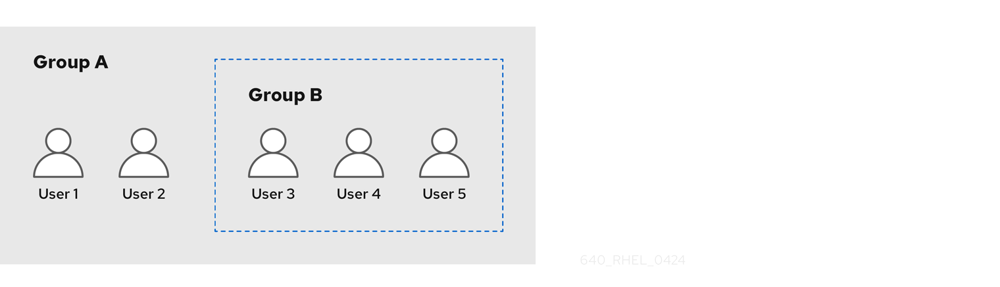 

If you set a password policy for user group A, the policy also applies to all users in user group B.

<h3 id="adding-a-user-group-using-idm-cli">22.3. Adding a user group using IdM CLI</h3>

Create user groups in the Identity Management (IdM) CLI to organize users and manage access control policies collectively. Groups simplify administration by allowing you to assign permissions and roles to multiple users at once.

**Prerequisites**

- You must be logged in as the administrator. For details, see [Using kinit to log in to IdM manually](https://docs.redhat.com/en/documentation/red_hat_enterprise_linux/10/html/accessing_identity_management_services/logging-in-to-identity-management-from-the-command-line#using-kinit-to-log-in-to-idm-manually_login-cli-krb).

**Procedure**

- Add a user group by using the `ipa group-add group_name` command. For example, to create `group_a`:
  
  ```
  ipa group-add group_a
  ---------------------
  Added group "group_a"
  ---------------------
    Group name: group_a
    GID: 1133400009
  ```
  
  ```plaintext
  $ ipa group-add group_a
  ---------------------
  Added group "group_a"
  ---------------------
    Group name: group_a
    GID: 1133400009
  ```
  
  By default, `ipa group-add` adds a POSIX user group. To specify a different group type, add options to `ipa group-add`:
- `--nonposix` to create a non-POSIX group
- `--external` to create an external group
  
  For details on group types, see [The different group types in IdM](#the-different-group-types-in-idm "22.1. The different group types in IdM").
  
  You can specify a custom GID when adding a user group by using the `--gid=custom_GID` option. If you do this, be careful to avoid ID conflicts. If you do not specify a custom GID, IdM automatically assigns a GID from the available ID range.

<h3 id="searching-for-user-groups-using-idm-cli">22.4. Searching for user groups using IdM CLI</h3>

Search for existing user groups in Identity Management (IdM) by using the CLI to identify POSIX, non-POSIX, and external groups in your domain.

**Procedure**

- Display all user groups by using the `ipa group-find` command. To specify a group type, add options to `ipa group-find`:
  
  - Display all POSIX groups using the `ipa group-find --posix` command.
  - Display all non-POSIX groups using the `ipa group-find --nonposix` command.
  - Display all external groups using the `ipa group-find --external` command.

**Additional resources**

- [The different group types in IdM](#the-different-group-types-in-idm "22.1. The different group types in IdM")

<h3 id="deleting-a-user-group-using-idm-cli">22.5. Deleting a user group using IdM CLI</h3>

You can delete user groups using the Identity Management (IdM) CLI. Deleting a group does not delete the group members from IdM.

**Prerequisites**

- You must be logged in as the administrator. For details, see [Using kinit to log in to IdM manually](https://docs.redhat.com/en/documentation/red_hat_enterprise_linux/10/html/accessing_identity_management_services/logging-in-to-identity-management-from-the-command-line#using-kinit-to-log-in-to-idm-manually_login-cli-krb).

**Procedure**

- Delete a user group by using the `ipa group-del group_name` command. For example, to delete group\_a:
  
  ```
  ipa group-del group_a
  --------------------------
  Deleted group "group_a"
  --------------------------
  ```
  
  ```plaintext
  $ ipa group-del group_a
  --------------------------
  Deleted group "group_a"
  --------------------------
  ```

<h3 id="adding-a-member-to-a-user-group-using-idm-cli">22.6. Adding a member to a user group using IdM CLI</h3>

Add users and user groups as members of a user group in the Identity Management (IdM) CLI to organize permissions and access control efficiently. Group membership simplifies user management by applying policies to multiple users simultaneously.

**Prerequisites**

- You must be logged in as the administrator. For details, see [Using kinit to log in to IdM manually](https://docs.redhat.com/en/documentation/red_hat_enterprise_linux/10/html/accessing_identity_management_services/logging-in-to-identity-management-from-the-command-line#using-kinit-to-log-in-to-idm-manually_login-cli-krb).

**Procedure**

- Add a member to a user group by using the `ipa group-add-member` command.
  
  Specify the type of member using these options:
  
  - `--users` adds an IdM user
  - `--external` adds a user that exists outside the IdM domain, in the format of `DOMAIN\user_name` or `user_name@domain`
  - `--groups` adds an IdM user group
  
  For example, to add group\_b as a member of group\_a:
  
  ```
  ipa group-add-member group_a --groups=group_b
  Group name: group_a
  GID: 1133400009
  Member users: user_a
  Member groups: group_b
  Indirect Member users: user_b
  -------------------------
  Number of members added 1
  -------------------------
  ```
  
  ```plaintext
  $ ipa group-add-member group_a --groups=group_b
  Group name: group_a
  GID: 1133400009
  Member users: user_a
  Member groups: group_b
  Indirect Member users: user_b
  -------------------------
  Number of members added 1
  -------------------------
  ```
  
  Members of group\_b are now indirect members of group\_a.
  
  Important
  
  When adding a group as a member of another group, do not create recursive groups. For example, if Group A is a member of Group B, do not add Group B as a member of Group A. Recursive groups can cause unpredictable behavior.
  
  Note
  
  After you add a member to a user group, the update may take some time to spread to all clients in your Identity Management environment. This is because when any given host resolves users, groups and netgroups, the `System Security Services Daemon` (SSSD) first looks into its cache and performs server lookups only for missing or expired records.

<h3 id="adding-users-without-a-user-private-group">22.7. Adding users without a user private group</h3>

You can add Identity Management (IdM) users without creating user private groups (UPGs) to control group ID assignments and membership structures. By default, IdM creates a UPG for each new user, but you can disable this behavior globally or for individual users.

UPGs have the following characteristics:

- The UPG has the same name as the newly created user.
- The user is the only member of the UPG. The UPG cannot contain any other members.
- The GID of the private group matches the UID of the user.

However, it is possible to add users without creating a UPG.

<h4 id="users-without-a-user-private-group">22.7.1. Users without a user private group</h4>

When an existing NIS or system group already uses the GID that Identity Management (IdM) wants to assign to a user private group (UPG), you must explicitly skip UPG creation to avoid GID conflicts.

You can do this in two ways:

- Add a new user without a UPG, without disabling private groups globally. See [Adding a user without a user private group when private groups are globally enabled](#adding-a-user-without-a-user-private-group-when-private-groups-are-globally-enabled "22.7.2. Adding a user without a user private group when private groups are globally enabled").
- Disable UPGs globally for all users, then add a new user. See [Disabling user private groups globally for all users](#disabling-user-private-groups-globally-for-all-users "22.7.3. Disabling user private groups globally for all users") and [Adding a user when user private groups are globally disabled](#adding-a-user-when-user-private-groups-are-globally-disabled "22.7.4. Adding a user when user private groups are globally disabled").

In both cases, IdM will require specifying a GID when adding new users, otherwise the operation will fail. This is because IdM requires a GID for the new user, but the default user group `ipausers` is a non-POSIX group and therefore does not have an associated GID. The GID you specify does not have to correspond to an already existing group.

Note

Specifying the GID does not create a new group. It only sets the GID attribute for the new user, because the attribute is required by IdM.

<h4 id="adding-a-user-without-a-user-private-group-when-private-groups-are-globally-enabled">22.7.2. Adding a user without a user private group when private groups are globally enabled</h4>

Add a user without creating a user private group (UPG) in Identity Management (IdM) by manually specifying a GID. With this, you can share primary groups across multiple users for collaborative file access and permissions management.

**Procedure**

- To prevent IdM from creating a UPG, add the `--noprivate` option to the `ipa user-add` command.
  
  Note that for the command to succeed, you must specify a custom GID. For example, to add a new user with GID 10000:
  
  ```
  ipa user-add jsmith --first=John --last=Smith --noprivate --gid 10000
  ```
  
  ```plaintext
  $ ipa user-add jsmith --first=John --last=Smith --noprivate --gid 10000
  ```

<h4 id="disabling-user-private-groups-globally-for-all-users">22.7.3. Disabling user private groups globally for all users</h4>

You can disable automatic user private group creation in Identity Management (IdM). Global UPG disabling applies only to new users while existing users are not affected.

**Procedure**

1. Obtain administrator privileges:
   
   ```
   kinit admin
   ```
   
   ```plaintext
   $ kinit admin
   ```
2. IdM uses the Directory Server Managed Entries Plug-in to manage UPGs. List the instances of the plug-in:
   
   ```
   ipa-managed-entries --list
   ```
   
   ```plaintext
   $ ipa-managed-entries --list
   ```
3. To ensure IdM does not create UPGs, disable the plug-in instance responsible for managing user private groups:
   
   ```
   ipa-managed-entries -e "UPG Definition" disable
   Disabling Plugin
   ```
   
   ```plaintext
   $ ipa-managed-entries -e "UPG Definition" disable
   Disabling Plugin
   ```
   
   To re-enable the `UPG Definition` instance later, use the `ipa-managed-entries -e "UPG Definition" enable` command.
4. Restart Directory Server to load the new configuration.
   
   ```
   sudo systemctl restart dirsrv.target
   ```
   
   ```plaintext
   $ sudo systemctl restart dirsrv.target
   ```
   
   To add a user after UPGs have been disabled, you need to specify a GID. For more information, see [Adding a user when user private groups are globally disabled](#adding-a-user-when-user-private-groups-are-globally-disabled "22.7.4. Adding a user when user private groups are globally disabled")

**Verification**

- To check if UPGs are globally disabled, use the disable command again:
  
  ```
  ipa-managed-entries -e "UPG Definition" disable
  Plugin already disabled
  ```
  
  ```plaintext
  $ ipa-managed-entries -e "UPG Definition" disable
  Plugin already disabled
  ```

<h4 id="adding-a-user-when-user-private-groups-are-globally-disabled">22.7.4. Adding a user when user private groups are globally disabled</h4>

When user private groups are disabled globally in Identity Management (IdM), assign a GID manually or use an automember rule to add users. This ensures users have proper group membership for file permissions and resource access.

**Prerequisites**

- UPGs must be disabled globally for all users. For more information, see [Disabling user private groups globally for all users](#disabling-user-private-groups-globally-for-all-users "22.7.3. Disabling user private groups globally for all users")

**Procedure**

- To make sure adding a new user succeeds when creating UPGs is disabled, choose one of the following:
  
  - Specify a custom GID when adding a new user. The GID does not have to correspond to an already existing user group.
    
    For example, when adding a user from the command line, add the `--gid` option to the `ipa user-add` command.
  - Use an automember rule to add the user to an existing group with a GID. See [Automating group membership using IdM CLI](#automating-group-membership-using-idm-cli "Chapter 25. Automating group membership using IdM CLI").

<h3 id="adding-users-or-groups-as-member-managers-to-an-idm-user-group-using-the-idm-cli">22.8. Adding users or groups as member managers to an IdM user group using the IdM CLI</h3>

Designate users or user groups as member managers using the Identity Management (IdM) CLI to delegate user group membership management. Member managers can add or remove group members without having full administrative privileges.

**Prerequisites**

- You must be logged in as the administrator. For details, see [Using kinit to log in to IdM manually](https://docs.redhat.com/en/documentation/red_hat_enterprise_linux/10/html/accessing_identity_management_services/logging-in-to-identity-management-from-the-command-line#using-kinit-to-log-in-to-idm-manually_login-cli-krb).
- You must have the name of the user or group you are adding as member managers and the name of the group you want them to manage.

**Procedure**

- Add a user as a member manager to an IdM user group by using the `ipa group-add-member-manager` command.
  
  For example, to add the user `test` as a member manager of `group_a`:
  
  ```
  ipa group-add-member-manager group_a --users=test
  Group name: group_a
  GID: 1133400009
  Membership managed by users: test
  -------------------------
  Number of members added 1
  -------------------------
  ```
  
  ```plaintext
  $ ipa group-add-member-manager group_a --users=test
  Group name: group_a
  GID: 1133400009
  Membership managed by users: test
  -------------------------
  Number of members added 1
  -------------------------
  ```
  
  User `test` can now manage members of `group_a`.
- Add a group as a member manager to an IdM user group by using the `ipa group-add-member-manager` command.
  
  For example, to add the group `group_admins` as a member manager of `group_a`:
  
  ```
  ipa group-add-member-manager group_a --groups=group_admins
  Group name: group_a
  GID: 1133400009
  Membership managed by groups: group_admins
  Membership managed by users: test
  -------------------------
  Number of members added 1
  -------------------------
  ```
  
  ```plaintext
  $ ipa group-add-member-manager group_a --groups=group_admins
  Group name: group_a
  GID: 1133400009
  Membership managed by groups: group_admins
  Membership managed by users: test
  -------------------------
  Number of members added 1
  -------------------------
  ```
  
  Group `group_admins` can now manage members of `group_a`.
  
  Note
  
  After you add a member manager to a user group, the update may take some time to spread to all clients in your Identity Management environment.

**Verification**

- Using the `ipa group-show` command to verify the user and group were added as member managers.
  
  ```
  ipa group-show group_a
  Group name: group_a
  GID: 1133400009
  Membership managed by groups: group_admins
  Membership managed by users: test
  ```
  
  ```plaintext
  $ ipa group-show group_a
  Group name: group_a
  GID: 1133400009
  Membership managed by groups: group_admins
  Membership managed by users: test
  ```

<h3 id="viewing-group-members-using-idm-cli">22.9. Viewing group members using IdM CLI</h3>

View both direct and indirect members of an Identity Management (IdM) user group by using the CLI to understand group membership inheritance across nested groups.

**Procedure**

- To list members of a group, use the `ipa group-show group_name` command. For example:
  
  ```
  ipa group-show group_a
    ...
    Member users: user_a
    Member groups: group_b
    Indirect Member users: user_b
  ```
  
  ```plaintext
  $ ipa group-show group_a
    ...
    Member users: user_a
    Member groups: group_b
    Indirect Member users: user_b
  ```
  
  Note
  
  The list of indirect members does not include external users from trusted Active Directory domains. The Active Directory trust user objects are not visible in the Identity Management interface because they do not exist as LDAP objects within Identity Management.

**Additional resources**

- [Direct and indirect group members](#direct-and-indirect-group-members "22.2. Direct and indirect group members")

<h3 id="removing-a-member-from-a-user-group-using-idm-cli">22.10. Removing a member from a user group using IdM CLI</h3>

Remove users, external users, or nested groups from an Identity Management (IdM) user group by using the CLI to revoke their inherited group privileges.

**Prerequisites**

- You must be logged in as the administrator. For details, see [Using kinit to log in to IdM manually](https://docs.redhat.com/en/documentation/red_hat_enterprise_linux/10/html/accessing_identity_management_services/logging-in-to-identity-management-from-the-command-line#using-kinit-to-log-in-to-idm-manually_login-cli-krb).

**Procedure**

1. Optional: Use the `ipa group-show` command to confirm that the group includes the member you want to remove.
2. Remove a member from a user group by using the `ipa group-remove-member` command.
   
   Specify members to remove using these options:
   
   - `--users` removes an IdM user
   - `--external` removes a user that exists outside the IdM domain, in the format of `DOMAIN\user_name` or `user_name@domain`
   - `--groups` removes an IdM user group
   
   For example, to remove *user1*, *user2*, and *group1* from a group called *group\_name*:
   
   ```
   ipa group-remove-member pass:quotes[group_name] --users=pass:quotes[user1] --users=pass:quotes[user2] --groups=pass:quotes[group1]
   ```
   
   ```plaintext
   $ ipa group-remove-member pass:quotes[group_name] --users=pass:quotes[user1] --users=pass:quotes[user2] --groups=pass:quotes[group1]
   ```

<h3 id="removing-users-or-groups-as-member-managers-from-an-idm-user-group-using-the-idm-cli">22.11. Removing users or groups as member managers from an IdM user group using the IdM CLI</h3>

Remove users or groups as member managers from an Identity Management (IdM) user group by using the CLI to revoke their ability to manage group membership. Member managers can add and remove group members but cannot change the group’s attributes.

**Prerequisites**

- You must be logged in as the administrator. For details, see [Using kinit to log in to IdM manually](https://docs.redhat.com/en/documentation/red_hat_enterprise_linux/10/html/accessing_identity_management_services/logging-in-to-identity-management-from-the-command-line#using-kinit-to-log-in-to-idm-manually_login-cli-krb).
- You must have the name of the existing member manager user or group you are removing and the name of the group they are managing.

**Procedure**

- Remove a user as a member manager of an IdM user group by using the `ipa group-remove-member-manager` command.
  
  For example, to remove the user `test` as a member manager of `group_a`:
  
  ```
  ipa group-remove-member-manager group_a --users=test
  Group name: group_a
  GID: 1133400009
  Membership managed by groups: group_admins
  ---------------------------
  Number of members removed 1
  ---------------------------
  ```
  
  ```plaintext
  $ ipa group-remove-member-manager group_a --users=test
  Group name: group_a
  GID: 1133400009
  Membership managed by groups: group_admins
  ---------------------------
  Number of members removed 1
  ---------------------------
  ```
  
  User `test` can no longer manage members of `group_a`.
- Remove a group as a member manager of an IdM user group by using the `ipa group-remove-member-manager` command.
  
  For example, to remove the group `group_admins` as a member manager of `group_a`:
  
  ```
  ipa group-remove-member-manager group_a --groups=group_admins
  Group name: group_a
  GID: 1133400009
  ---------------------------
  Number of members removed 1
  ---------------------------
  ```
  
  ```plaintext
  $ ipa group-remove-member-manager group_a --groups=group_admins
  Group name: group_a
  GID: 1133400009
  ---------------------------
  Number of members removed 1
  ---------------------------
  ```
  
  Group `group_admins` can no longer manage members of `group_a`.
  
  Note
  
  After you remove a member manager from a user group, the update may take some time to spread to all clients in your Identity Management environment.

**Verification**

- Using the `ipa group-show` command to verify the user and group were removed as member managers.
  
  ```
  ipa group-show group_a
  Group name: group_a
  GID: 1133400009
  ```
  
  ```plaintext
  $ ipa group-show group_a
  Group name: group_a
  GID: 1133400009
  ```

<h3 id="enabling-group-merging-for-local-and-remote-groups-in-idm">22.12. Enabling group merging for local and remote groups in IdM</h3>

Enable group merging in Identity Management (IdM) to combine membership from centrally managed and local groups with matching names. Group merging supports legacy applications that require local group memberships while maintaining centralized management.

Groups are either centrally managed, provided by a domain such as IdM or Active Directory (AD), or they are managed on a local system in the `etc/group` file. In most cases, users rely on a centrally managed store. However, in some cases software still relies on membership in known groups for managing access control.

If you want to manage groups from a domain controller and from the local `etc/group` file, you can enable group merging. You can configure your `nsswitch.conf` file to check both the local files and the remote service. If a group appears in both, the list of member users is combined and returned in a single response. The steps below describe how to enable group merging for a user, *idmuser*.

Note

If you are using the `authselect` utility, you no longer need to manually edit `nssswitch.conf` to enable group merging. It is now integrated into `authselect` profiles, eliminating the need for manual changes.

**Procedure**

1. Add `[SUCCESS=merge]` to the `/etc/nsswitch.conf` file:
   
   ```
   # Allow initgroups to default to the setting for group.
   initgroups: sss [SUCCESS=merge] files
   ```
   
   ```plaintext
   # Allow initgroups to default to the setting for group.
   initgroups: sss [SUCCESS=merge] files
   ```
2. Add the *idmuser* to IdM:
   
   ```
   ipa user-add idmuser
   First name: idm
   Last name: user
   ---------------------
   Added user "idmuser"
   ---------------------
   User login: idmuser
   First name: idm
   Last name: user
   Full name: idm user
   Display name: idm user
   Initials: tu
   Home directory: /home/idmuser
   GECOS: idm user
   Login shell: /bin/sh
   Principal name: idmuser@IPA.TEST
   Principal alias: idmuser@IPA.TEST
   Email address: idmuser@ipa.test
   UID: 19000024
   GID: 19000024
   Password: False
   Member of groups: ipausers
   Kerberos keys available: False
   ```
   
   ```plaintext
   # ipa user-add idmuser
   First name: idm
   Last name: user
   ---------------------
   Added user "idmuser"
   ---------------------
   User login: idmuser
   First name: idm
   Last name: user
   Full name: idm user
   Display name: idm user
   Initials: tu
   Home directory: /home/idmuser
   GECOS: idm user
   Login shell: /bin/sh
   Principal name: idmuser@IPA.TEST
   Principal alias: idmuser@IPA.TEST
   Email address: idmuser@ipa.test
   UID: 19000024
   GID: 19000024
   Password: False
   Member of groups: ipausers
   Kerberos keys available: False
   ```
3. Verify the GID of the local `audio` group.
   
   ```
   getent group audio
   ---------------------
   audio:x:63
   ```
   
   ```plaintext
   $ getent group audio
   ---------------------
   audio:x:63
   ```
4. Add the group `audio` to IdM:
   
   ```
   ipa group-add audio --gid 63
   -------------------
   Added group "audio"
   -------------------
   Group name: audio
   GID: 63
   ```
   
   ```plaintext
   $ ipa group-add audio --gid 63
   -------------------
   Added group "audio"
   -------------------
   Group name: audio
   GID: 63
   ```
   
   Note
   
   The GID you define when adding the `audio` group to IdM must be the same as the GID of the local `audio` group.
5. Add *idmuser* user to the IdM `audio` group:
   
   ```
   ipa group-add-member audio --users=idmuser
   Group name: audio
   GID: 63
   Member users: idmuser
   -------------------------
   Number of members added 1
   -------------------------
   ```
   
   ```plaintext
   $ ipa group-add-member audio --users=idmuser
   Group name: audio
   GID: 63
   Member users: idmuser
   -------------------------
   Number of members added 1
   -------------------------
   ```

**Verification**

1. Log in as the *idmuser*.
2. Verify the *idmuser* has the local group in their session:
   
   ```
   id idmuser
   uid=1867800003(idmuser) gid=1867800003(idmuser) groups=1867800003(idmuser),63(audio),10(wheel)
   ```
   
   ```plaintext
   $ id idmuser
   uid=1867800003(idmuser) gid=1867800003(idmuser) groups=1867800003(idmuser),63(audio),10(wheel)
   ```

<h3 id="managing-user-groups-in-idm-cli">22.13. Additional resources</h3>

- [Using Ansible to give a user ID override access to the local sound card on an IdM client](#using-ansible-to-give-a-user-id-override-access-to-the-local-sound-card-on-an-idm-client "36.12. Using Ansible to give a user ID override access to the local sound card on an IdM client")

<h2 id="managing-user-groups-in-idm-web-ui">Chapter 23. Managing user groups in IdM Web UI</h2>

Manage user groups in Identity Management (IdM) using the Web UI to organize users with common privileges, password policies, and other characteristics. User groups simplify administration by applying policies to multiple users at once.

A user group is a set of users with common privileges, password policies, and other characteristics.

A user group in Identity Management (IdM) can include:

- IdM users
- other IdM user groups
- external users, which are users that exist outside of IdM

For details about the group types in IdM, see [The different group types in IdM](#the-different-group-types-in-idm "22.1. The different group types in IdM") section. For details about direct and indirect group members, see [Direct and indirect group members](#direct-and-indirect-group-members "22.2. Direct and indirect group members") section.

<h3 id="adding-a-user-group-using-idm-web-ui">23.1. Adding a user group using IdM Web UI</h3>

Create user groups in the Identity Management (IdM) Web UI to organize users and manage access control policies collectively. Groups simplify administration by allowing you to assign permissions and roles to multiple users at once.

**Prerequisites**

- You are logged in to the IdM Web UI.

**Procedure**

1. Click **Identity → Groups**, and select **User Groups** in the left sidebar.
2. Click **Add** to start adding the group.
3. Fill out the information about the group. For more information about user group types, see [The different group types in IdM](#the-different-group-types-in-idm "22.1. The different group types in IdM").
   
   You can specify a custom GID for the group. If you do this, be careful to avoid ID conflicts. If you do not specify a custom GID, IdM automatically assigns a GID from the available ID range.
4. Click **Add** to confirm.

<h3 id="deleting-a-user-group-using-idm-web-ui">23.2. Deleting a user group using IdM Web UI</h3>

You can delete user groups using the Identity Management (IdM) WebUI. Deleting a group does not delete the group members from IdM.

**Prerequisites**

- You are logged in to the IdM Web UI.

**Procedure**

1. Click **Identity → Groups** and select **User Groups**.
2. Select the group to delete.
3. Click **Delete**.
4. Click **Delete** to confirm.

<h3 id="adding-a-member-to-a-user-group-using-idm-web-ui">23.3. Adding a member to a user group using IdM Web UI</h3>

Add users and user groups as members of a user group in the Identity Management (IdM) Web UI to organize permissions and access control efficiently. Group membership simplifies user management by applying policies to multiple users simultaneously.

**Prerequisites**

- You are logged in to the IdM Web UI.

**Procedure**

1. Click **Identity → Groups** and select **User Groups** in the left sidebar.
2. Click the name of the group.
3. Select the type of group member you want to add: **Users, User Groups,** or **External**.
4. Click **Add**.
5. Select the checkbox next to one or more members you want to add.
6. Click the right arrow to move the selected members to the group.
7. Click **Add** to confirm.

<h3 id="adding-users-or-groups-as-member-managers-to-an-idm-user-group-using-the-web-ui">23.4. Adding users or groups as member managers to an IdM user group using the Web UI</h3>

Designate users or user groups as member managers using the Identity Management (IdM) Web UI to delegate user group membership management. Member managers can add or remove group members without having full administrative privileges.

**Prerequisites**

- You are logged in to the IdM Web UI.
- You must have the name of the user or group you are adding as member managers and the name of the group you want them to manage.

**Procedure**

1. Click **Identity → Groups** and select **User Groups** in the left sidebar.
2. Click the name of the group.
3. Select the type of group member manager you want to add: **Users** or **User Groups**.
4. Click **Add**.
5. Select the checkbox next to one or more members you want to add.
6. Click the right arrow to move the selected members to the group.
7. Click **Add** to confirm.
   
   Note
   
   After you add a member manager to a user group, the update may take some time to spread to all clients in your Identity Management environment.

**Verification**

- Verify the newly added user or user group has been added to the member manager list of users or user groups:
  
  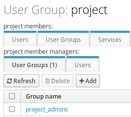 

<h3 id="viewing-group-members-using-idm-web-ui">23.5. Viewing group members using IdM Web UI</h3>

View both direct and indirect members of an Identity Management (IdM) user group in the IdM Web UI to understand group membership inheritance across nested groups.

**Prerequisites**

- You are logged in to the IdM Web UI.

**Procedure**

1. Select **Identity → Groups**.
2. Select **User Groups** in the left sidebar.
3. Click the name of the group you want to view.
4. Switch between **Direct Membership** and **Indirect Membership**.

**Additional resources**

- [Direct and indirect group members](#direct-and-indirect-group-members "22.2. Direct and indirect group members")

<h3 id="removing-a-member-from-a-user-group-using-idm-web-ui">23.6. Removing a member from a user group using IdM Web UI</h3>

Remove users, nested groups, or external members from an Identity Management (IdM) user group in the IdM Web UI to revoke their inherited group privileges.

**Prerequisites**

- You are logged in to the IdM Web UI.

**Procedure**

1. Click **Identity → Groups** and select **User Groups** in the left sidebar.
2. Click the name of the group.
3. Select the type of group member you want to remove: **Users, User Groups**, or **External**.
4. Select the checkbox next to the member you want to remove.
5. Click **Delete**.
6. Click **Delete** to confirm.

<h3 id="removing-users-or-groups-as-member-managers-from-an-idm-user-group-using-the-web-ui">23.7. Removing users or groups as member managers from an IdM user group using the Web UI</h3>

Remove users or groups as member managers from an Identity Management (IdM) user group by using the IdM Web UI to revoke their ability to manage group membership. Member managers can add and remove group members but cannot change the group’s attributes.

**Prerequisites**

- You are logged in to the IdM Web UI.
- You must have the name of the existing member manager user or group you are removing and the name of the group they are managing.

**Procedure**

1. Click **Identity → Groups** and select **User Groups** in the left sidebar.
2. Click the name of the group.
3. Select the type of member manager you want to remove: **Users** or **User Groups**.
4. Select the checkbox next to the member manager you want to remove.
5. Click **Delete**.
6. Click **Delete** to confirm.
   
   Note
   
   After you remove a member manager from a user group, the update may take some time to spread to all clients in your Identity Management environment.

**Verification**

- Verify the user or user group has been removed from the member manager list of users or user groups:
  
  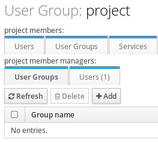 

<h2 id="managing-user-groups-using-ansible-playbooks">Chapter 24. Managing user groups using Ansible playbooks</h2>

Create and manage IdM user groups using Ansible to organize users with common privileges, password policies, and access rights.

A user group in Identity Management (IdM) can include the following:

- IdM users
- other IdM user groups
- external users, that is users that exist outside of IdM

<h3 id="ensuring-the-presence-of-idm-groups-and-group-members-using-ansible-playbooks">24.1. Ensuring the presence of IdM groups and group members using Ansible playbooks</h3>

Create or verify Identity Management (IdM) groups and add members using Ansible to automate group provisioning and membership management.

**Prerequisites**

- You have configured your Ansible control node to meet the following requirements:
  
  - You are using Ansible version 2.15 or later.
  - You have installed the [`ansible-freeipa`](https://docs.redhat.com/en/documentation/red_hat_enterprise_linux/10/html/using_ansible_to_install_and_manage_identity_management_in_rhel/installing-an-identity-management-server-using-an-ansible-playbook#installing-the-ansible-freeipa-package) package.
  - The example assumes that in the **~/*MyPlaybooks*/** directory, you have created an [Ansible inventory file](https://docs.redhat.com/en/documentation/red_hat_enterprise_linux/10/html/using_ansible_to_install_and_manage_identity_management_in_rhel/preparing-your-environment-for-managing-idm-using-ansible-playbooks) with the fully-qualified domain name (FQDN) of the IdM server.
  - The example assumes that the **secret.yml** Ansible vault stores your `ipaadmin_password` and that you have access to a file that stores the password protecting the **secret.yml** file.
- The target node, that is the node on which the `freeipa.ansible_freeipa` module is executed, is part of the IdM domain as an IdM client, server or replica.
- The users you want to reference in your Ansible playbook exist in IdM. For details on ensuring the presence of users using Ansible, see [Managing user accounts using Ansible playbooks](#managing-user-accounts-using-ansible-playbooks "Chapter 3. Managing user accounts using Ansible playbooks").

**Procedure**

1. Create an Ansible playbook file with the necessary user and group information:
   
   ```
   ---
   - name: Playbook to handle groups
     hosts: ipaserver
   
     vars_files:
     - /home/user_name/MyPlaybooks/secret.yml
     tasks:
     - name: Create group ops with gid 1234
       freeipa.ansible_freeipa.ipagroup:
         ipaadmin_password: "{{ ipaadmin_password }}"
         name: ops
         gidnumber: 1234
   
     - name: Create group sysops
       freeipa.ansible_freeipa.ipagroup:
         ipaadmin_password: "{{ ipaadmin_password }}"
         name: sysops
         user:
         - idm_user
   
     - name: Create group appops
       freeipa.ansible_freeipa.ipagroup:
         ipaadmin_password: "{{ ipaadmin_password }}"
         name: appops
   
     - name: Add group members sysops and appops to group ops
       freeipa.ansible_freeipa.ipagroup:
         ipaadmin_password: "{{ ipaadmin_password }}"
         name: ops
         group:
         - sysops
         - appops
   ```
   
   ```plaintext
   ---
   - name: Playbook to handle groups
     hosts: ipaserver
   
     vars_files:
     - /home/user_name/MyPlaybooks/secret.yml
     tasks:
     - name: Create group ops with gid 1234
       freeipa.ansible_freeipa.ipagroup:
         ipaadmin_password: "{{ ipaadmin_password }}"
         name: ops
         gidnumber: 1234
   
     - name: Create group sysops
       freeipa.ansible_freeipa.ipagroup:
         ipaadmin_password: "{{ ipaadmin_password }}"
         name: sysops
         user:
         - idm_user
   
     - name: Create group appops
       freeipa.ansible_freeipa.ipagroup:
         ipaadmin_password: "{{ ipaadmin_password }}"
         name: appops
   
     - name: Add group members sysops and appops to group ops
       freeipa.ansible_freeipa.ipagroup:
         ipaadmin_password: "{{ ipaadmin_password }}"
         name: ops
         group:
         - sysops
         - appops
   ```
   
   For details about all variables used in the playbook, see the `/usr/share/ansible/collections/ansible_collections/freeipa/ansible_freeipa/README-group.md` file on the control node.
2. Run the playbook:
   
   ```
   ansible-playbook --vault-password-file=password_file -v -i path_to_inventory_directory/inventory.file path_to_playbooks_directory/add-group-members.yml
   ```
   
   ```plaintext
   $ ansible-playbook --vault-password-file=password_file -v -i path_to_inventory_directory/inventory.file path_to_playbooks_directory/add-group-members.yml
   ```

**Verification**

You can verify if the **ops** group contains **sysops** and **appops** as direct members and **idm\_user** as an indirect member by using the `ipa group-show` command:

1. Log into `ipaserver` as administrator:
   
   ```
   ssh admin@server.idm.example.com
   Password:
   [admin@server /]$
   ```
   
   ```plaintext
   $ ssh admin@server.idm.example.com
   Password:
   [admin@server /]$
   ```
2. Display information about *ops*:
   
   ```
   ipaserver]$ ipa group-show ops
     Group name: ops
     GID: 1234
     Member groups: sysops, appops
     Indirect Member users: idm_user
   ```
   
   ```plaintext
   ipaserver]$ ipa group-show ops
     Group name: ops
     GID: 1234
     Member groups: sysops, appops
     Indirect Member users: idm_user
   ```
   
   The **appops** and **sysops** groups - the latter including the **idm\_user** user - exist in IdM.

<h3 id="using-ansible-to-add-multiple-idm-groups-in-a-single-task">24.2. Using Ansible to add multiple IdM groups in a single task</h3>

Create multiple Identity Management (IdM} groups in a single Ansible task using the `groups` batch option available in the `ansible-freeipa` `ipagroup` module to streamline group provisioning.

Using the `groups` option, you can also specify multiple group variables that only apply to a particular group. Define this group by the `name` variable, which is the only mandatory variable for the `groups` option.

Complete this procedure to ensure the presence of the **sysops** and the **appops** groups in IdM in a single task. Define the sysops group as a nonposix group and the appops group as an external group.

**Prerequisites**

- On the control node:
  
  - You are using Ansible version 2.15 or later.
  - You have installed the [`ansible-freeipa`](https://docs.redhat.com/en/documentation/red_hat_enterprise_linux/10/html/using_ansible_to_install_and_manage_identity_management_in_rhel/installing-an-identity-management-server-using-an-ansible-playbook#installing-the-ansible-freeipa-package) package.
  - The example assumes that in the **~/*MyPlaybooks*/** directory, you have created an [Ansible inventory file](https://docs.redhat.com/en/documentation/red_hat_enterprise_linux/10/html/using_ansible_to_install_and_manage_identity_management_in_rhel/preparing-your-environment-for-managing-idm-using-ansible-playbooks) with the fully-qualified domain name (FQDN) of the IdM server.
  - The example assumes that the **secret.yml** Ansible vault stores your `ipaadmin_password` and that you have access to a file that stores the password protecting the **secret.yml** file.
- The target node, that is the node on which the `freeipa.ansible_freeipa` module is executed, is part of the IdM domain as an IdM client, server or replica.

**Procedure**

1. Create your Ansible playbook file **add-nonposix-and-external-groups.yml** with the following content:
   
   ```
   ---
   - name: Playbook to add nonposix and external groups
     hosts: ipaserver
     vars_files:
     - /home/user_name/MyPlaybooks/secret.yml
   
     tasks:
     - name: Add nonposix group sysops and external group appops
       freeipa.ansible_freeipa.ipagroup:
         ipaadmin_password: "{{ ipaadmin_password }}"
         groups:
         - name: sysops
           nonposix: true
         - name: appops
           external: true
   ```
   
   ```plaintext
   ---
   - name: Playbook to add nonposix and external groups
     hosts: ipaserver
     vars_files:
     - /home/user_name/MyPlaybooks/secret.yml
   
     tasks:
     - name: Add nonposix group sysops and external group appops
       freeipa.ansible_freeipa.ipagroup:
         ipaadmin_password: "{{ ipaadmin_password }}"
         groups:
         - name: sysops
           nonposix: true
         - name: appops
           external: true
   ```
2. Run the playbook:
   
   ```
   ansible-playbook --vault-password-file=password_file -v -i <path_to_inventory_directory>/hosts <path_to_playbooks_directory>/add-nonposix-and-external-groups.yml
   ```
   
   ```plaintext
   $ ansible-playbook --vault-password-file=password_file -v -i <path_to_inventory_directory>/hosts <path_to_playbooks_directory>/add-nonposix-and-external-groups.yml
   ```

**Additional resources**

- [The group module in `ansible-freeipa` upstream docs](https://github.com/freeipa/ansible-freeipa/blob/master/README-group.md)

<h3 id="using-ansible-to-enable-ad-users-to-administer-idm">24.3. Using Ansible to enable AD users to administer IdM</h3>

Grant Identity Management (IdM) administrative privileges to Active Directory (AD) users by adding their ID overrides to IdM groups, eliminating the need for separate IdM accounts.

In the example below, the user ID override is the override of an AD user that you created in the Default Trust View after you established a trust with AD.

**Prerequisites**

- You know the IdM `admin` password.
- You have [installed a trust with AD](https://docs.redhat.com/en/documentation/red_hat_enterprise_linux/10/html/installing_trust_between_idm_and_ad/index).
- The user ID override of the AD user already exists in IdM. If it does not, create it with the `ipa idoverrideuser-add 'default trust view' ad_user@ad.example.com` command.
- The [group to which you are adding the user ID override already exists in IdM](https://docs.redhat.com/en/documentation/red_hat_enterprise_linux/10/html/using_ansible_to_install_and_manage_identity_management_in_rhel/managing-user-groups-using-ansible-playbooks#ensuring-the-presence-of-idm-groups-and-group-members-using-ansible-playbooks).
- You have configured your Ansible control node to meet the following requirements:
  
  - You are using Ansible version 2.15 or later.
  - You have installed the [`ansible-freeipa`](https://docs.redhat.com/en/documentation/red_hat_enterprise_linux/10/html/using_ansible_to_install_and_manage_identity_management_in_rhel/installing-an-identity-management-server-using-an-ansible-playbook#installing-the-ansible-freeipa-package) package.
  - The example assumes that in the **~/*MyPlaybooks*/** directory, you have created an [Ansible inventory file](https://docs.redhat.com/en/documentation/red_hat_enterprise_linux/10/html/using_ansible_to_install_and_manage_identity_management_in_rhel/preparing-your-environment-for-managing-idm-using-ansible-playbooks) with the fully-qualified domain name (FQDN) of the IdM server.
  - The example assumes that the **secret.yml** Ansible vault stores your `ipaadmin_password` and that you have access to a file that stores the password protecting the **secret.yml** file.
- The target node, that is the node on which the `freeipa.ansible_freeipa` module is executed, is part of the IdM domain as an IdM client, server or replica.

**Procedure**

1. Navigate to your **~/*MyPlaybooks*/** directory:
   
   ```
   cd ~/MyPlaybooks/
   ```
   
   ```plaintext
   $ cd ~/MyPlaybooks/
   ```
2. Create an `add-useridoverride-to-group.yml` playbook with the following content:
   
   ```
   ---
   - name: Playbook to ensure presence of users in a group
     hosts: ipaserver
   
     tasks:
     - name: Ensure the ad_user@ad.example.com user ID override is a member of the admins group:
       freeipa.ansible_freeipa.ipagroup:
         ipaadmin_password: "{{ ipaadmin_password }}"
         name: admins
         idoverrideuser:
         - ad_user@ad.example.com
   ```
   
   ```plaintext
   ---
   - name: Playbook to ensure presence of users in a group
     hosts: ipaserver
   
     tasks:
     - name: Ensure the ad_user@ad.example.com user ID override is a member of the admins group:
       freeipa.ansible_freeipa.ipagroup:
         ipaadmin_password: "{{ ipaadmin_password }}"
         name: admins
         idoverrideuser:
         - ad_user@ad.example.com
   ```
   
   In the example:
   
   - `admins` is the name of the IdM POSIX group to which you are adding the **ad\_user@ad.example.com** ID override. Members of this group have full administrator privileges.
   - **ad\_user@ad.example.com** is the user ID override of an AD administrator. The user is stored in the AD domain with which a trust has been established.
3. Save the file.
   
   For details about variables and example playbooks in the FreeIPA Ansible collection, see the `/usr/share/ansible/collections/ansible_collections/freeipa/ansible_freeipa/README-group.md` file and the `/usr/share/ansible/collections/ansible_collections/freeipa/ansible_freeipa/playbooks/user` directory on the control node.
4. Run the Ansible playbook. Specify the playbook file, the file storing the password protecting the **secret.yml** file, and the inventory file:
   
   ```
   ansible-playbook --vault-password-file=password_file -v -i inventory add-useridoverride-to-group.yml
   ```
   
   ```plaintext
   $ ansible-playbook --vault-password-file=password_file -v -i inventory add-useridoverride-to-group.yml
   ```

**Additional resources**

- [ID overrides for AD users](https://docs.redhat.com/en/documentation/red_hat_enterprise_linux/10/html/managing_idm_users_groups_hosts_and_access_control_rules/enabling-ad-users-to-administer-idm#id-overrides-for-ad-users)
- [Using ID views in Active Directory environments](https://docs.redhat.com/en/documentation/red_hat_enterprise_linux/10/html/managing_idm_users_groups_hosts_and_access_control_rules/using-id-views-for-active-directory-users)
- [Enabling AD users to administer IdM](https://docs.redhat.com/en/documentation/red_hat_enterprise_linux/10/html/managing_idm_users_groups_hosts_and_access_control_rules/enabling-ad-users-to-administer-idm)

<h3 id="ensuring-the-presence-of-member-managers-in-idm-user-groups-using-ansible-playbooks">24.4. Ensuring the presence of member managers in IdM user groups using Ansible playbooks</h3>

Delegate group membership management to specific users or groups, allowing them to add and remove members without full administrative privileges.

**Prerequisites**

- On the control node:
  
  - You are using Ansible version 2.15 or later.
  - You have installed the [`ansible-freeipa`](https://docs.redhat.com/en/documentation/red_hat_enterprise_linux/10/html/using_ansible_to_install_and_manage_identity_management_in_rhel/installing-an-identity-management-server-using-an-ansible-playbook#installing-the-ansible-freeipa-package) package.
  - The example assumes that in the **~/*MyPlaybooks*/** directory, you have created an [Ansible inventory file](https://docs.redhat.com/en/documentation/red_hat_enterprise_linux/10/html/using_ansible_to_install_and_manage_identity_management_in_rhel/preparing-your-environment-for-managing-idm-using-ansible-playbooks) with the fully-qualified domain name (FQDN) of the IdM server.
  - The example assumes that the **secret.yml** Ansible vault stores your `ipaadmin_password` and that you have access to a file that stores the password protecting the **secret.yml** file.
- The target node, that is the node on which the `freeipa.ansible_freeipa` module is executed, is part of the IdM domain as an IdM client, server or replica.
- You must have the name of the user or group you are adding as member managers and the name of the group you want them to manage.

**Procedure**

1. Create an Ansible playbook file with the necessary user and group member management information:
   
   ```
   ---
   - name: Playbook to handle membership management
     hosts: ipaserver
   
     vars_files:
     - /home/user_name/MyPlaybooks/secret.yml
     tasks:
     - name: Ensure user test is present for group_a
       freeipa.ansible_freeipa.ipagroup:
         ipaadmin_password: "{{ ipaadmin_password }}"
         name: group_a
         membermanager_user: test
   
     - name: Ensure group_admins is present for group_a
       freeipa.ansible_freeipa.ipagroup:
         ipaadmin_password: "{{ ipaadmin_password }}"
         name: group_a
         membermanager_group: group_admins
   ```
   
   ```plaintext
   ---
   - name: Playbook to handle membership management
     hosts: ipaserver
   
     vars_files:
     - /home/user_name/MyPlaybooks/secret.yml
     tasks:
     - name: Ensure user test is present for group_a
       freeipa.ansible_freeipa.ipagroup:
         ipaadmin_password: "{{ ipaadmin_password }}"
         name: group_a
         membermanager_user: test
   
     - name: Ensure group_admins is present for group_a
       freeipa.ansible_freeipa.ipagroup:
         ipaadmin_password: "{{ ipaadmin_password }}"
         name: group_a
         membermanager_group: group_admins
   ```
2. Run the playbook:
   
   ```
   ansible-playbook --vault-password-file=password_file -v -i path_to_inventory_directory/inventory.file path_to_playbooks_directory/add-member-managers-user-groups.yml
   ```
   
   ```plaintext
   $ ansible-playbook --vault-password-file=password_file -v -i path_to_inventory_directory/inventory.file path_to_playbooks_directory/add-member-managers-user-groups.yml
   ```

**Verification**

You can verify if the **group\_a** group contains **test** as a member manager and **group\_admins** is a member manager of **group\_a** by using the `ipa group-show` command:

1. Log into `ipaserver` as administrator:
   
   ```
   ssh admin@server.idm.example.com
   Password:
   [admin@server /]$
   ```
   
   ```plaintext
   $ ssh admin@server.idm.example.com
   Password:
   [admin@server /]$
   ```
2. Display information about *managergroup1*:
   
   ```
   ipaserver]$ ipa group-show group_a
     Group name: group_a
     GID: 1133400009
     Membership managed by groups: group_admins
     Membership managed by users: test
   ```
   
   ```plaintext
   ipaserver]$ ipa group-show group_a
     Group name: group_a
     GID: 1133400009
     Membership managed by groups: group_admins
     Membership managed by users: test
   ```

<h3 id="ensuring-the-absence-of-member-managers-in-idm-user-groups-using-ansible-playbooks">24.5. Ensuring the absence of member managers in IdM user groups using Ansible playbooks</h3>

Automate removing member manager privileges from users or groups when restructuring delegation or revoking administrative responsibilities.

**Prerequisites**

- On the control node:
  
  - You are using Ansible version 2.15 or later.
  - You have installed the [`ansible-freeipa`](https://docs.redhat.com/en/documentation/red_hat_enterprise_linux/10/html/using_ansible_to_install_and_manage_identity_management_in_rhel/installing-an-identity-management-server-using-an-ansible-playbook#installing-the-ansible-freeipa-package) package.
  - The example assumes that in the **~/*MyPlaybooks*/** directory, you have created an [Ansible inventory file](https://docs.redhat.com/en/documentation/red_hat_enterprise_linux/10/html/using_ansible_to_install_and_manage_identity_management_in_rhel/preparing-your-environment-for-managing-idm-using-ansible-playbooks) with the fully-qualified domain name (FQDN) of the IdM server.
  - The example assumes that the **secret.yml** Ansible vault stores your `ipaadmin_password`.
- The target node, that is the node on which the `freeipa.ansible_freeipa` module is executed, is part of the IdM domain as an IdM client, server or replica.
- You must have the name of the existing member manager user or group you are removing and the name of the group they are managing.

**Procedure**

1. Create an Ansible playbook file with the necessary user and group member management information:
   
   ```
   ---
   - name: Playbook to handle membership management
     hosts: ipaserver
   
     vars_files:
     - /home/user_name/MyPlaybooks/secret.yml
     tasks:
     - name: Ensure member manager user and group members are absent for group_a
       freeipa.ansible_freeipa.ipagroup:
         ipaadmin_password: "{{ ipaadmin_password }}"
         name: group_a
         membermanager_user: test
         membermanager_group: group_admins
         action: member
         state: absent
   ```
   
   ```plaintext
   ---
   - name: Playbook to handle membership management
     hosts: ipaserver
   
     vars_files:
     - /home/user_name/MyPlaybooks/secret.yml
     tasks:
     - name: Ensure member manager user and group members are absent for group_a
       freeipa.ansible_freeipa.ipagroup:
         ipaadmin_password: "{{ ipaadmin_password }}"
         name: group_a
         membermanager_user: test
         membermanager_group: group_admins
         action: member
         state: absent
   ```
2. Run the playbook:
   
   ```
   ansible-playbook --vault-password-file=password_file -v -i path_to_inventory_directory/inventory.file path_to_playbooks_directory/ensure-member-managers-are-absent.yml
   ```
   
   ```plaintext
   $ ansible-playbook --vault-password-file=password_file -v -i path_to_inventory_directory/inventory.file path_to_playbooks_directory/ensure-member-managers-are-absent.yml
   ```

**Verification**

You can verify if the **group\_a** group does not contain **test** as a member manager and **group\_admins** as a member manager of **group\_a** by using the `ipa group-show` command:

1. Log into `ipaserver` as administrator:
   
   ```
   ssh admin@server.idm.example.com
   Password:
   [admin@server /]$
   ```
   
   ```plaintext
   $ ssh admin@server.idm.example.com
   Password:
   [admin@server /]$
   ```
2. Display information about group\_a:
   
   ```
   ipaserver]$ ipa group-show group_a
     Group name: group_a
     GID: 1133400009
   ```
   
   ```plaintext
   ipaserver]$ ipa group-show group_a
     Group name: group_a
     GID: 1133400009
   ```

<h2 id="automating-group-membership-using-idm-cli">Chapter 25. Automating group membership using IdM CLI</h2>

Automate group membership in Identity Management (IdM) using the CLI to assign users and hosts to groups based on their attributes. Automatic group membership reduces manual administration by sorting entries into groups as they are created.

For example, you can:

- Divide employees' user entries into groups based on the employees' manager, location, or any other attribute.
- Divide hosts based on their class, location, or any other attribute.
- Add all users or all hosts to a single global group.

<h3 id="benefits-of-automatic-group-membership">25.1. Benefits of automatic group membership</h3>

Automatic group membership in Identity Management (IdM) reduces administrative overhead by assigning users and hosts to groups based on defined criteria.

This helps you to:

- **Reduce the overhead of manually managing group memberships**
  
  You no longer have to assign every user and host to groups manually.
- **Improve consistency in user and host management**
  
  Users and hosts are assigned to groups based on strictly defined and automatically evaluated criteria.
- **Simplify the management of group-based settings**
  
  Various settings are defined for groups and then applied to individual group members, for example `sudo` rules, automount, or access control. Adding users and hosts to groups automatically makes managing these settings easier.

<h3 id="automember-rules">25.2. Automember rules</h3>

Automember rules in Identity Management (IdM) define conditions that automatically assign users and hosts to groups based on their attributes. Understanding automember rules helps you simplify group management and ensure consistent group membership policies.

After creating a rule, the administrator adds conditions to it. These specify which users or hosts get included or excluded from the target group:

- **Inclusive conditions**
  
  When a user or host entry meets an inclusive condition, it will be included in the target group.
- **Exclusive conditions**
  
  When a user or host entry meets an exclusive condition, it will not be included in the target group.

The conditions are specified as regular expressions in the Perl-compatible regular expressions (PCRE) format. For more information about PCRE, see the `pcresyntax(3)` man page on your system.

Note

IdM evaluates exclusive conditions before inclusive conditions. In case of a conflict, exclusive conditions take precedence over inclusive conditions.

An automember rule applies to every entry created in the future. These entries will be automatically added to the specified target group. If an entry meets the conditions specified in multiple automember rules, it will be added to all the corresponding groups.

Existing entries are **not** affected by the new rule. If you want to change existing entries, see the following sections:

- [Applying automember rules to existing entries using IdM CLI](#applying-automember-rules-to-existing-entries-using-idm-cli "25.8. Applying automember rules to existing entries using IdM CLI").
- [Applying automember rules to existing entries using IdM Web UI](#applying-automember-rules-to-existing-entries-using-idm-web-ui "26.6. Applying automember rules to existing entries using IdM Web UI").

<h3 id="adding-an-automember-rule-using-idm-cli">25.3. Adding an automember rule using IdM CLI</h3>

Create automember rules in the Identity Management (IdM) CLI to automatically assign new users or hosts to groups based on their attributes. This eliminates manual group assignment and ensures consistent group membership policies.

Existing entries are **not** affected by the new rule. If you want to change existing entries, see [Applying automember rules to existing entries using IdM CLI](#applying-automember-rules-to-existing-entries-using-idm-cli "25.8. Applying automember rules to existing entries using IdM CLI").

**Prerequisites**

- You must be logged in as the administrator. For details, see [Using kinit to log in to IdM manually](https://docs.redhat.com/en/documentation/red_hat_enterprise_linux/10/html/accessing_identity_management_services/logging-in-to-idm-in-the-web-ui-using-a-kerberos-ticket#using-kinit-to-log-in-to-idm-manually_login-web-ui-krb).
- The target group of the new rule must exist in IdM.

**Procedure**

1. Enter the `ipa automember-add` command to add an automember rule.
2. When prompted, specify:
   
   - **Automember rule**. This is the target group name.
   - **Grouping Type**. This specifies whether the rule targets a user group or a host group. To target a user group, enter **group**. To target a host group, enter **hostgroup**.
   
   For example, to add an automember rule for a user group named **user\_group**:
   
   ```
   ipa automember-add
   Automember Rule: user_group
   Grouping Type: group
   --------------------------------
   Added automember rule "user_group"
   --------------------------------
       Automember Rule: user_group
   ```
   
   ```plaintext
   $ ipa automember-add
   Automember Rule: user_group
   Grouping Type: group
   --------------------------------
   Added automember rule "user_group"
   --------------------------------
       Automember Rule: user_group
   ```

**Verification**

- You can display existing automember rules and conditions in IdM using [Viewing existing automember rules using IdM CLI](#viewing-existing-automember-rules-using-idm-cli "25.5. Viewing existing automember rules using IdM CLI").

<h3 id="adding-a-condition-to-an-automember-rule-using-idm-cli">25.4. Adding a condition to an automember rule using IdM CLI</h3>

Add conditions to automember rules in Identity Management (IdM) CLI to automatically assign users or hosts to groups based on their attributes. This simplifies group management and ensures consistent group membership across your environment.

**Prerequisites**

- You must be logged in as the administrator. For details, see [Using kinit to log in to IdM manually](https://docs.redhat.com/en/documentation/red_hat_enterprise_linux/10/html/accessing_identity_management_services/logging-in-to-identity-management-from-the-command-line#using-kinit-to-log-in-to-idm-manually_login-cli-krb).
- The target rule must exist in IdM. For details, see [Adding an automember rule using IdM CLI](#adding-an-automember-rule-using-idm-cli "25.3. Adding an automember rule using IdM CLI").

**Procedure**

1. Define one or more inclusive or exclusive conditions using the `ipa automember-add-condition` command.
2. When prompted, specify:
   
   - **Automember rule**. This is the target rule name. See [Automember rules](#automember-rules "25.2. Automember rules") for details.
   - **Attribute Key**. This specifies the entry attribute to which the filter will apply. For example, **uid** for users.
   - **Grouping Type**. This specifies whether the rule targets a user group or a host group. To target a user group, enter **group**. To target a host group, enter **hostgroup**.
   - **Inclusive regex** and **Exclusive regex**. These specify one or more conditions as regular expressions. If you only want to specify one condition, press **Enter** when prompted for the other.
   
   For example, the following condition targets all users with any value (.\*) in their user login attribute (**uid**).
   
   ```
   ipa automember-add-condition
   Automember Rule: user_group
   Attribute Key: uid
   Grouping Type: group
   [Inclusive Regex]: .*
   [Exclusive Regex]:
   ----------------------------------
   Added condition(s) to "user_group"
   ----------------------------------
     Automember Rule: user_group
     Inclusive Regex: uid=.*
   ----------------------------
   Number of conditions added 1
   ----------------------------
   ```
   
   ```plaintext
   $ ipa automember-add-condition
   Automember Rule: user_group
   Attribute Key: uid
   Grouping Type: group
   [Inclusive Regex]: .*
   [Exclusive Regex]:
   ----------------------------------
   Added condition(s) to "user_group"
   ----------------------------------
     Automember Rule: user_group
     Inclusive Regex: uid=.*
   ----------------------------
   Number of conditions added 1
   ----------------------------
   ```
   
   As another example, you can use an automembership rule to target all Windows users synchronized from Active Directory (AD). To achieve this, create a condition that that targets all users with **ntUser** in their **objectClass** attribute, which is shared by all AD users:
   
   ```
   ipa automember-add-condition
   Automember Rule: ad_users
   Attribute Key: objectclass
   Grouping Type: group
   [Inclusive Regex]: ntUser
   [Exclusive Regex]:
   -------------------------------------
   Added condition(s) to "ad_users"
   -------------------------------------
     Automember Rule: ad_users
     Inclusive Regex: objectclass=ntUser
   ----------------------------
   Number of conditions added 1
   ----------------------------
   ```
   
   ```plaintext
   $ ipa automember-add-condition
   Automember Rule: ad_users
   Attribute Key: objectclass
   Grouping Type: group
   [Inclusive Regex]: ntUser
   [Exclusive Regex]:
   -------------------------------------
   Added condition(s) to "ad_users"
   -------------------------------------
     Automember Rule: ad_users
     Inclusive Regex: objectclass=ntUser
   ----------------------------
   Number of conditions added 1
   ----------------------------
   ```

**Verification**

- You can display existing automember rules and conditions in IdM using [Viewing existing automember rules using IdM CLI](#viewing-existing-automember-rules-using-idm-cli "25.5. Viewing existing automember rules using IdM CLI").

<h3 id="viewing-existing-automember-rules-using-idm-cli">25.5. Viewing existing automember rules using IdM CLI</h3>

View automember rules by using the Identity Management (IdM) CLI to review which users or hosts are automatically added to specific groups.

**Prerequisites**

- You must be logged in as the administrator. For details, see [Using kinit to log in to IdM manually](https://docs.redhat.com/en/documentation/red_hat_enterprise_linux/10/html/accessing_identity_management_services/logging-in-to-identity-management-from-the-command-line#using-kinit-to-log-in-to-idm-manually_login-cli-krb).

**Procedure**

1. Enter the `ipa automember-find` command.
2. When prompted, specify the **Grouping type**:
   
   - To target a user group, enter **group**.
   - To target a host group, enter **hostgroup**.
     
     For example:
   
   ```
   ipa automember-find
   Grouping Type: group
   ---------------
   1 rules matched
   ---------------
     Automember Rule: user_group
     Inclusive Regex: uid=.*
   ----------------------------
   Number of entries returned 1
   ----------------------------
   ```
   
   ```plaintext
   $ ipa automember-find
   Grouping Type: group
   ---------------
   1 rules matched
   ---------------
     Automember Rule: user_group
     Inclusive Regex: uid=.*
   ----------------------------
   Number of entries returned 1
   ----------------------------
   ```

<h3 id="deleting-an-automember-rule-using-idm-cli">25.6. Deleting an automember rule using IdM CLI</h3>

Delete automember rules using the Identity Management (IdM) CLI to stop automatic group membership assignments. Removing obsolete rules ensures users and hosts are grouped according to current organizational requirements.

Deleting an automember rule also deletes all conditions associated with the rule. To remove only specific conditions from a rule, see [Removing a condition from an automember rule using IdM CLI](#removing-a-condition-from-an-automember-rule-using-idm-cli "25.7. Removing a condition from an automember rule using IdM CLI").

**Prerequisites**

- You must be logged in as the administrator. For details, see [Using kinit to log in to IdM manually](https://docs.redhat.com/en/documentation/red_hat_enterprise_linux/10/html/accessing_identity_management_services/logging-in-to-identity-management-from-the-command-line#using-kinit-to-log-in-to-idm-manually_login-cli-krb).

**Procedure**

1. Enter the `ipa automember-del` command.
2. When prompted, specify:
   
   - **Automember rule**. This is the rule you want to delete.
   - **Grouping rule**. This specifies whether the rule you want to delete is for a user group or a host group. Enter **group** or **hostgroup**.

<h3 id="removing-a-condition-from-an-automember-rule-using-idm-cli">25.7. Removing a condition from an automember rule using IdM CLI</h3>

Delete specific conditions from automember rules using the Identity Management (IdM) CLI to refine automatic group membership criteria.

**Prerequisites**

- You must be logged in as the administrator. For details, see [Using kinit to log in to IdM manually](https://docs.redhat.com/en/documentation/red_hat_enterprise_linux/10/html/accessing_identity_management_services/logging-in-to-identity-management-from-the-command-line#using-kinit-to-log-in-to-idm-manually_login-cli-krb).

**Procedure**

1. Enter the `ipa automember-remove-condition` command.
2. When prompted, specify:
   
   - **Automember rule**. This is the name of the rule from which you want to remove a condition.
   - **Attribute Key**. This is the target entry attribute. For example, **uid** for users.
   - **Grouping Type**. This specifies whether the condition you want to delete is for a user group or a host group. Enter **group** or **hostgroup**.
   - **Inclusive regex** and **Exclusive regex**. These specify the conditions you want to remove. If you only want to specify one condition, press **Enter** when prompted for the other.
     
     For example:
   
   ```
   ipa automember-remove-condition
   Automember Rule: user_group
   Attribute Key: uid
   Grouping Type: group
   [Inclusive Regex]: .*
   [Exclusive Regex]:
   -----------------------------------
   Removed condition(s) from "user_group"
   -----------------------------------
     Automember Rule: user_group
   ------------------------------
   Number of conditions removed 1
   ------------------------------
   ```
   
   ```plaintext
   $ ipa automember-remove-condition
   Automember Rule: user_group
   Attribute Key: uid
   Grouping Type: group
   [Inclusive Regex]: .*
   [Exclusive Regex]:
   -----------------------------------
   Removed condition(s) from "user_group"
   -----------------------------------
     Automember Rule: user_group
   ------------------------------
   Number of conditions removed 1
   ------------------------------
   ```

<h3 id="applying-automember-rules-to-existing-entries-using-idm-cli">25.8. Applying automember rules to existing entries using IdM CLI</h3>

Rebuild automatic membership in Identity Management (IdM) to apply automember rules retroactively to existing users and hosts. This ensures all entries are correctly assigned to groups based on current rule definitions.

Automember rules apply automatically to user and host entries created after the rules were added. They are not applied retroactively to entries that existed before the rules were added.

To apply automember rules to previously added entries, you have to manually rebuild automatic membership. Rebuilding automatic membership re-evaluates all existing automember rules and applies them either to all user or hosts entries, or to specific entries.

Rebuilding automatic membership **does not** remove user or host entries from groups, even if the entries no longer match the group’s inclusive conditions. To remove them manually, see [Removing a member from a user group using IdM CLI](#removing-a-member-from-a-user-group-using-idm-cli "22.10. Removing a member from a user group using IdM CLI") or [Removing IdM host group members using the CLI](#removing-idm-host-group-members-using-the-cli "43.6. Removing IdM host group members using the CLI").

**Prerequisites**

- You must be logged in as the administrator. For details, see link: [Using kinit to log in to IdM manually](https://docs.redhat.com/en/documentation/red_hat_enterprise_linux/10/html/accessing_identity_management_services/logging-in-to-identity-management-from-the-command-line#using-kinit-to-log-in-to-idm-manually_login-cli-krb).

**Procedure**

- To rebuild automatic membership, enter the `ipa automember-rebuild` command. Use the following options to specify the entries to target:
  
  - To rebuild automatic membership for all users, use the `--type=group` option:
    
    ```
    ipa automember-rebuild --type=group
    --------------------------------------------------------
    Automember rebuild task finished. Processed (9) entries.
    --------------------------------------------------------
    ```
    
    ```plaintext
    $ ipa automember-rebuild --type=group
    --------------------------------------------------------
    Automember rebuild task finished. Processed (9) entries.
    --------------------------------------------------------
    ```
  - To rebuild automatic membership for all hosts, use the `--type=hostgroup` option.
  - To rebuild automatic membership for a specified user or users, use the `--users=target_user` option:
    
    ```
    ipa automember-rebuild --users=target_user1 --users=target_user2
    --------------------------------------------------------
    Automember rebuild task finished. Processed (2) entries.
    --------------------------------------------------------
    ```
    
    ```plaintext
    $ ipa automember-rebuild --users=target_user1 --users=target_user2
    --------------------------------------------------------
    Automember rebuild task finished. Processed (2) entries.
    --------------------------------------------------------
    ```
  - To rebuild automatic membership for a specified host or hosts, use the `--hosts=client.idm.example.com` option.

<h3 id="configuring-a-default-automember-group-using-idm-cli">25.9. Configuring a default automember group using IdM CLI</h3>

Configure a default automember group using the Identity Management (IdM) CLI to automatically assign users or hosts that don’t match any automember rules to a fallback group. This ensures all entries have at least basic group membership and associated policies.

**Prerequisites**

- You must be logged in as the administrator. For details, see [Using kinit to log in to IdM manually](https://docs.redhat.com/en/documentation/red_hat_enterprise_linux/10/html/accessing_identity_management_services/logging-in-to-identity-management-from-the-command-line#using-kinit-to-log-in-to-idm-manually_login-cli-krb).
- The target group you want to set as default exists in IdM.

**Procedure**

1. Enter the `ipa automember-default-group-set` command to configure a default automember group.
2. When prompted, specify:
   
   - **Default (fallback) Group**, which specifies the target group name.
   - **Grouping Type**, which specifies whether the target is a user group or a host group. To target a user group, enter **group**. To target a host group, enter **hostgroup**.
     
     For example:
     
     ```
     ipa automember-default-group-set
     Default (fallback) Group: default_user_group
     Grouping Type: group
     ---------------------------------------------------
     Set default (fallback) group for automember "default_user_group"
     ---------------------------------------------------
       Default (fallback) Group: cn=default_user_group,cn=groups,cn=accounts,dc=example,dc=com
     ```
     
     ```plaintext
     $ ipa automember-default-group-set
     Default (fallback) Group: default_user_group
     Grouping Type: group
     ---------------------------------------------------
     Set default (fallback) group for automember "default_user_group"
     ---------------------------------------------------
       Default (fallback) Group: cn=default_user_group,cn=groups,cn=accounts,dc=example,dc=com
     ```
   
   Note
   
   To remove the current default automember group, enter the `ipa automember-default-group-remove` command.

**Verification**

- To verify that the group is set correctly, enter the `ipa automember-default-group-show` command. The command displays the current default automember group. For example:
  
  ```
  ipa automember-default-group-show
  Grouping Type: group
    Default (fallback) Group: cn=default_user_group,cn=groups,cn=accounts,dc=example,dc=com
  ```
  
  ```plaintext
  $ ipa automember-default-group-show
  Grouping Type: group
    Default (fallback) Group: cn=default_user_group,cn=groups,cn=accounts,dc=example,dc=com
  ```

<h2 id="automating-group-membership-using-idm-web-ui">Chapter 26. Automating group membership using IdM Web UI</h2>

Automate group membership in Identity Management (IdM) using the Web UI to assign users and hosts to groups based on their attributes. Automatic group membership reduces manual administration by sorting entries into groups as they are created.

For example, you can:

- Divide employees' user entries into groups based on the employees' manager, location, or any other attribute.
- Divide hosts based on their class, location, or any other attribute.
- Add all users or all hosts to a single global group.

For details about benefits of automatic membership, see [Benefits of automatic group membership](#benefits-of-automatic-group-membership "25.1. Benefits of automatic group membership") section.

<h3 id="adding-an-automember-rule-using-idm-web-ui">26.1. Adding an automember rule using IdM Web UI</h3>

Create automember rules in the Identity Management (IdM) Web UI to automatically assign new users or hosts to groups based on their attributes. This eliminates manual group assignment and ensures consistent group membership policies.

Existing entries are **not** affected by the new rule. If you want to change existing entries, see [Applying automember rules to existing entries using IdM Web UI](#applying-automember-rules-to-existing-entries-using-idm-web-ui "26.6. Applying automember rules to existing entries using IdM Web UI").

**Prerequisites**

- You are logged in to the IdM Web UI.
- You must be a member of the `admins` group.
- The target group of the new rule exists in IdM.

**Procedure**

1. Click **Identity → Automember**, and select either **User group rules** or **Host group rules**.
2. Click **Add**.
3. In the **Automember rule** field, select the group to which the rule will apply. This is the target group name.
4. Click **Add** to confirm.
5. Optional: You can add conditions to the new rule using the procedure described in [Adding a condition to an automember rule using IdM Web UI](#adding-a-condition-to-an-automember-rule-using-idm-web-ui "26.2. Adding a condition to an automember rule using IdM Web UI").

<h3 id="adding-a-condition-to-an-automember-rule-using-idm-web-ui">26.2. Adding a condition to an automember rule using IdM Web UI</h3>

Add conditions to automember rules in Identity Management (IdM) Web UI to automatically assign users or hosts to groups based on their attributes. This simplifies group management and ensures consistent group membership across your environment.

**Prerequisites**

- You are logged in to the IdM Web UI.
- You must be a member of the `admins` group.
- The target rule exists in IdM.

**Procedure**

1. Click **Identity → Automember**, and select either **User group rules** or **Host group rules**.
2. Click on the rule to which you want to add a condition.
3. In the **Inclusive** or **Exclusive** sections, click **Add**.
4. In the **Attribute** field, select the required attribute, for example *uid*.
5. In the **Expression** field, define a regular expression.
6. Click **Add**.
   
   For example, the following condition targets all users with any value (.\*) in their user ID (uid) attribute.
   
   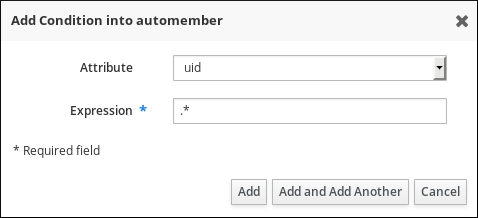 

<h3 id="viewing-existing-automember-rules-and-conditions-using-idm-web-ui">26.3. Viewing existing automember rules and conditions using IdM Web UI</h3>

View automember rules and their conditions by using the Identity Management (IdM) Web UI to review which users or hosts are automatically added to specific groups.

**Prerequisites**

- You are logged in to the IdM Web UI.
- You must be a member of the `admins` group.

**Procedure**

1. Click **Identity → Automember**, and select either **User group rules** or **Host group rules** to view the respective automember rules.
2. Optional: Click on a rule to see the conditions for that rule in the **Inclusive** or **Exclusive** sections.

<h3 id="deleting-an-automember-rule-using-idm-web-ui">26.4. Deleting an automember rule using IdM Web UI</h3>

Delete automember rules using the Identity Management (IdM) WebUI to stop automatic group membership assignments. Removing obsolete rules ensures users and hosts are grouped according to current organizational requirements.

Deleting an automember rule also deletes all conditions associated with the rule. To remove only specific conditions from a rule, see [Removing a condition from an automember rule using IdM Web UI](#removing-a-condition-from-an-automember-rule-using-idm-web-ui "26.5. Removing a condition from an automember rule using IdM Web UI").

**Prerequisites**

- You are logged in to the IdM Web UI.
- You must be a member of the `admins` group.

**Procedure**

1. Click **Identity → Automember**, and select either **User group rules** or **Host group rules** to view the respective automember rules.
2. Select the checkbox next to the rule you want to remove.
3. Click **Delete**.
4. Click **Delete** to confirm.

<h3 id="removing-a-condition-from-an-automember-rule-using-idm-web-ui">26.5. Removing a condition from an automember rule using IdM Web UI</h3>

Delete specific conditions from automember rules using the Identity Management (IdM) WebUI to refine automatic group membership criteria.

**Prerequisites**

- You are logged in to the IdM Web UI.
- You must be a member of the `admins` group.

**Procedure**

1. Click **Identity → Automember**, and select either **User group rules** or **Host group rules** to view the respective automember rules.
2. Click on a rule to see the conditions for that rule in the **Inclusive** or **Exclusive** sections.
3. Select the checkbox next to the conditions you want to remove.
4. Click **Delete**.
5. Click **Delete** to confirm.

<h3 id="applying-automember-rules-to-existing-entries-using-idm-web-ui">26.6. Applying automember rules to existing entries using IdM Web UI</h3>

Rebuild automatic membership in the IdM Web UI to apply automember rules to user and host entries that existed before the rules were created. This is necessary because automember rules only apply automatically to new entries.

When you rebuild automatic membership, IdM re-evaluates all existing automember rules and applies them either to all user or host entries, or to specific entries that you select.

Note that rebuilding automatic membership **does not** remove entries from groups, even if the entries no longer match the group’s inclusive conditions. To remove them manually, see the following sections:

- [Removing a member from a user group using IdM Web UI](#removing-a-member-from-a-user-group-using-idm-web-ui "23.6. Removing a member from a user group using IdM Web UI")
- [Removing host group members in the IdM Web UI](#removing-host-group-members-in-the-idm-web-ui "44.5. Removing host group members in the IdM Web UI")

<h4 id="rebuilding-automatic-membership-for-all-users-or-hosts">26.6.1. Rebuilding automatic membership for all users or hosts</h4>

Recalculate and apply automember rules to all users or hosts to correct group memberships after rule changes. This bulk operation ensures all entries belong to the correct groups based on current automember conditions.

**Prerequisites**

- You are logged in to the IdM Web UI.
- You must be a member of the `admins` group.

**Procedure**

1. Select **Identity** → **Users** or **Hosts**.
2. Click **Actions** → **Rebuild auto membership**.
   
   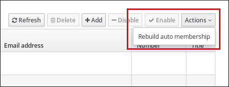 

<h4 id="rebuilding-automatic-membership-for-a-single-user-or-host-only">26.6.2. Rebuilding automatic membership for a single user or host only</h4>

Recalculate and apply automember rules to a specific user or host to correct group memberships after rule changes. This ensures the entry belongs to the correct groups based on current automember conditions.

**Prerequisites**

- You are logged in to the IdM Web UI.
- You must be a member of the `admins` group.

**Procedure**

1. Select **Identity** → **Users** or **Hosts**.
2. Click on the required user or host name.
3. Click **Actions** → **Rebuild auto membership**.
   
   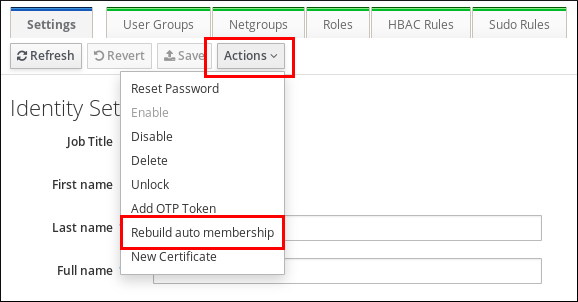 

<h3 id="configuring-a-default-user-group-using-idm-web-ui">26.7. Configuring a default user group using IdM Web UI</h3>

Configure a default user group using the Identity Management (IdM) Web UI to automatically assign users that don’t match any automember rules to a fallback group. This ensures all users have at least basic group membership and associated policies.

**Prerequisites**

- You are logged in to the IdM Web UI.
- You must be a member of the `admins` group.
- The target user group you want to set as default exists in IdM.

**Procedure**

1. Click **Identity → Automember**, and select **User group rules**.
2. In the **Default user group** field, select the group you want to set as the default user group.

<h3 id="configuring-a-default-host-group-using-idm-web-ui">26.8. Configuring a default host group using IdM Web UI</h3>

Configure a default host group using the Identity Management (IdM) Web UI to automatically assign hosts that don’t match any automember rules to a fallback group. This ensures all hosts have at least basic group membership and associated policies.

**Prerequisites**

- You are logged in to the IdM Web UI.
- You must be a member of the `admins` group.
- The target host group you want to set as default exists in IdM.

**Procedure**

1. Click **Identity → Automember**, and select **Host group rules**.
2. In the **Default host group** field, select the group you want to set as the default host group.

<h2 id="using-ansible-to-automate-group-membership-in-idm">Chapter 27. Using Ansible to automate group membership in IdM</h2>

Configure automember rules using Ansible to automatically assign users and hosts to groups based on their attributes, reducing manual administration. For example, you can:

- Divide employees' user entries into groups based on the employees' manager, location, position or any other attribute.
- Divide hosts into groups based on their class, location, or any other attribute.
- Add all users or all hosts to a single global group.

<h3 id="using-ansible-to-ensure-that-an-automember-rule-for-an-idm-user-group-is-present">27.1. Using Ansible to ensure that an automember rule for an IdM user group is present</h3>

Create automember rules for Identity Management (IdM) user groups using Ansible to automate the assignment of new users to groups based on their attributes.

In the example below, you ensure the presence of an `automember` rule for the **testing\_group** user group.

**Prerequisites**

- The **testing\_group** user group exists in IdM.
- You have configured your Ansible control node to meet the following requirements:
  
  - You are using Ansible version 2.15 or later.
  - You have installed the [`ansible-freeipa`](https://docs.redhat.com/en/documentation/red_hat_enterprise_linux/10/html/using_ansible_to_install_and_manage_identity_management_in_rhel/installing-an-identity-management-server-using-an-ansible-playbook#installing-the-ansible-freeipa-package) package.
  - The example assumes that in the **~/*MyPlaybooks*/** directory, you have created an [Ansible inventory file](https://docs.redhat.com/en/documentation/red_hat_enterprise_linux/10/html/using_ansible_to_install_and_manage_identity_management_in_rhel/preparing-your-environment-for-managing-idm-using-ansible-playbooks) with the fully-qualified domain name (FQDN) of the IdM server.
  - The example assumes that the **secret.yml** Ansible vault stores your `ipaadmin_password` and that you have access to a file that stores the password protecting the **secret.yml** file.
- The target node, that is the node on which the `freeipa.ansible_freeipa` module is executed, is part of the IdM domain as an IdM client, server or replica.

**Procedure**

1. Navigate to your **~/*MyPlaybooks*/** directory:
   
   ```
   cd ~/MyPlaybooks/
   ```
   
   ```plaintext
   $ cd ~/MyPlaybooks/
   ```
2. Copy the `automember-group-present.yml` Ansible playbook file located in the `/usr/share/ansible/collections/ansible_collections/freeipa/ansible_freeipa/playbooks/automember/` directory:
   
   ```
   cp /usr/share/ansible/collections/ansible_collections/freeipa/ansible_freeipa/playbooks/automember/automember-group-present.yml automember-group-present-copy.yml
   ```
   
   ```plaintext
   $ cp /usr/share/ansible/collections/ansible_collections/freeipa/ansible_freeipa/playbooks/automember/automember-group-present.yml automember-group-present-copy.yml
   ```
3. Open the `automember-group-present-copy.yml` file for editing.
4. Adapt the file by setting the following variables in the `freeipa.ansible_freeipa.ipaautomember` task section:
   
   - Set the `ipaadmin_password` variable to the password of the IdM `admin`.
   - Set the `name` variable to **testing\_group**.
   - Set the `automember_type` variable to **group**.
   - Ensure that the `state` variable is set to `present`.
   
   This is the modified Ansible playbook file for the current example:
   
   ```
   ---
   - name: Automember group present example
     hosts: ipaserver
     vars_files:
     - /home/user_name/MyPlaybooks/secret.yml
     tasks:
     - name: Ensure group automember rule admins is present
       freeipa.ansible_freeipa.ipaautomember:
         ipaadmin_password: "{{ ipaadmin_password }}"
         name: testing_group
         automember_type: group
         state: present
   ```
   
   ```plaintext
   ---
   - name: Automember group present example
     hosts: ipaserver
     vars_files:
     - /home/user_name/MyPlaybooks/secret.yml
     tasks:
     - name: Ensure group automember rule admins is present
       freeipa.ansible_freeipa.ipaautomember:
         ipaadmin_password: "{{ ipaadmin_password }}"
         name: testing_group
         automember_type: group
         state: present
   ```
5. Save the file.
6. Run the Ansible playbook. Specify the playbook file, the file storing the password protecting the **secret.yml** file, and the inventory file:
   
   ```
   ansible-playbook --vault-password-file=password_file -v -i inventory automember-group-present-copy.yml
   ```
   
   ```plaintext
   $ ansible-playbook --vault-password-file=password_file -v -i inventory automember-group-present-copy.yml
   ```

<h3 id="using-ansible-to-ensure-that-a-specified-condition-is-present-in-an-idm-user-group-automember-rule">27.2. Using Ansible to ensure that a specified condition is present in an IdM user group automember rule</h3>

Add conditions to Identity Management (IdM) user group automember rules using Ansible to define criteria for automatic group membership based on user attributes.

In the example below, you ensure the presence of a UID-related condition in the `automember` rule for the **testing\_group** group. By specifying the **.\*** condition, you ensure that all future IdM users automatically become members of the **testing\_group**.

**Prerequisites**

- The **testing\_group** user group and automember user group rule exist in IdM.
- You have configured your Ansible control node to meet the following requirements:
  
  - You are using Ansible version 2.15 or later.
  - You have installed the [`ansible-freeipa`](https://docs.redhat.com/en/documentation/red_hat_enterprise_linux/10/html/using_ansible_to_install_and_manage_identity_management_in_rhel/installing-an-identity-management-server-using-an-ansible-playbook#installing-the-ansible-freeipa-package) package.
  - The example assumes that in the **~/*MyPlaybooks*/** directory, you have created an [Ansible inventory file](https://docs.redhat.com/en/documentation/red_hat_enterprise_linux/10/html/using_ansible_to_install_and_manage_identity_management_in_rhel/preparing-your-environment-for-managing-idm-using-ansible-playbooks) with the fully-qualified domain name (FQDN) of the IdM server.
  - The example assumes that the **secret.yml** Ansible vault stores your `ipaadmin_password` and that you have access to a file that stores the password protecting the **secret.yml** file.
- The target node, that is the node on which the `freeipa.ansible_freeipa` module is executed, is part of the IdM domain as an IdM client, server or replica.

**Procedure**

1. Navigate to your **~/*MyPlaybooks*/** directory:
   
   ```
   cd ~/MyPlaybooks/
   ```
   
   ```plaintext
   $ cd ~/MyPlaybooks/
   ```
2. Copy the `automember-hostgroup-rule-present.yml` Ansible playbook file located in the `/usr/share/ansible/collections/ansible_collections/freeipa/ansible_freeipa/playbooks/automember/` directory and name it, for example, **automember-usergroup-rule-present.yml**:
   
   ```
   cp /usr/share/ansible/collections/ansible_collections/freeipa/ansible_freeipa/playbooks/automember/automember-hostgroup-rule-present.yml automember-usergroup-rule-present.yml
   ```
   
   ```plaintext
   $ cp /usr/share/ansible/collections/ansible_collections/freeipa/ansible_freeipa/playbooks/automember/automember-hostgroup-rule-present.yml automember-usergroup-rule-present.yml
   ```
3. Open the `automember-usergroup-rule-present.yml` file for editing.
4. Adapt the file by modifying the following parameters:
   
   - Rename the playbook to correspond to your use case, for example: **Automember user group rule member present**.
   - Rename the task to correspond to your use case, for example: **Ensure an automember condition for a user group is present**.
   - Set the following variables in the `freeipa.ansible_freeipa.ipaautomember` task section:
     
     - Set the `ipaadmin_password` variable to the password of the IdM `admin`.
     - Set the `name` variable to **testing\_group**.
     - Set the `automember_type` variable to `group`.
     - Ensure that the `state` variable is set to `present`.
     - Ensure that the `action` variable is set to `member`.
     - Set the `inclusive` `key` variable to `UID`.
     - Set the `inclusive` `expression` variable to **.***
   
   This is the modified Ansible playbook file for the current example:
   
   ```
   ---
   - name: Automember user group rule member present
     hosts: ipaserver
     vars_files:
     - /home/user_name/MyPlaybooks/secret.yml
     tasks:
     - name: Ensure an automember condition for a user group is present
       freeipa.ansible_freeipa.ipaautomember:
         ipaadmin_password: "{{ ipaadmin_password }}"
         name: testing_group
         automember_type: group
         state: present
         action: member
         inclusive:
           - key: UID
             expression: .*
   ```
   
   ```plaintext
   ---
   - name: Automember user group rule member present
     hosts: ipaserver
     vars_files:
     - /home/user_name/MyPlaybooks/secret.yml
     tasks:
     - name: Ensure an automember condition for a user group is present
       freeipa.ansible_freeipa.ipaautomember:
         ipaadmin_password: "{{ ipaadmin_password }}"
         name: testing_group
         automember_type: group
         state: present
         action: member
         inclusive:
           - key: UID
             expression: .*
   ```
5. Save the file.
6. Run the Ansible playbook. Specify the playbook file, the file storing the password protecting the **secret.yml** file, and the inventory file:
   
   ```
   ansible-playbook --vault-password-file=password_file -v -i inventory automember-usergroup-rule-present.yml
   ```
   
   ```plaintext
   $ ansible-playbook --vault-password-file=password_file -v -i inventory automember-usergroup-rule-present.yml
   ```

**Verification**

1. Log in as an IdM administrator.
   
   ```
   kinit admin
   ```
   
   ```plaintext
   $ kinit admin
   ```
2. Add a user, for example:
   
   ```
   ipa user-add user101 --first user --last 101
   -----------------------
   Added user "user101"
   -----------------------
     User login: user101
     First name: user
     Last name: 101
     ...
     Member of groups: ipausers, testing_group
     ...
   ```
   
   ```plaintext
   $ ipa user-add user101 --first user --last 101
   -----------------------
   Added user "user101"
   -----------------------
     User login: user101
     First name: user
     Last name: 101
     ...
     Member of groups: ipausers, testing_group
     ...
   ```

<h3 id="using-ansible-to-ensure-that-a-condition-is-absent-from-an-idm-user-group-automember-rule">27.3. Using Ansible to ensure that a condition is absent from an IdM user group automember rule</h3>

Remove conditions from Identity Management (IdM) user group automember rules using Ansible to prevent specific users from being automatically added to groups.

In the example below, you ensure the absence of a condition in the `automember` rule that specifies that users whose `initials` are **dp** should be included. The automember rule is applied to the **testing\_group** group. By applying the condition, you ensure that no future IdM user whose initials are **dp** becomes a member of the **testing\_group**.

**Prerequisites**

- The **testing\_group** user group and automember user group rule exist in IdM.
- You have configured your Ansible control node to meet the following requirements:
  
  - You are using Ansible version 2.15 or later.
  - You have installed the [`ansible-freeipa`](https://docs.redhat.com/en/documentation/red_hat_enterprise_linux/10/html/using_ansible_to_install_and_manage_identity_management_in_rhel/installing-an-identity-management-server-using-an-ansible-playbook#installing-the-ansible-freeipa-package) package.
  - The example assumes that in the **~/*MyPlaybooks*/** directory, you have created an [Ansible inventory file](https://docs.redhat.com/en/documentation/red_hat_enterprise_linux/10/html/using_ansible_to_install_and_manage_identity_management_in_rhel/preparing-your-environment-for-managing-idm-using-ansible-playbooks) with the fully-qualified domain name (FQDN) of the IdM server.
  - The example assumes that the **secret.yml** Ansible vault stores your `ipaadmin_password` and that you have access to a file that stores the password protecting the **secret.yml** file.
- The target node, that is the node on which the `freeipa.ansible_freeipa` module is executed, is part of the IdM domain as an IdM client, server or replica.

**Procedure**

1. Navigate to your **~/*MyPlaybooks*/** directory:
   
   ```
   cd ~/MyPlaybooks/
   ```
   
   ```plaintext
   $ cd ~/MyPlaybooks/
   ```
2. Copy the `automember-hostgroup-rule-absent.yml` Ansible playbook file located in the `/usr/share/ansible/collections/ansible_collections/freeipa/ansible_freeipa/playbooks/automember/` directory and name it, for example, **automember-usergroup-rule-absent.yml**:
   
   ```
   cp /usr/share/ansible/collections/ansible_collections/freeipa/ansible_freeipa/playbooks/automember/automember-hostgroup-rule-absent.yml automember-usergroup-rule-absent.yml
   ```
   
   ```plaintext
   $ cp /usr/share/ansible/collections/ansible_collections/freeipa/ansible_freeipa/playbooks/automember/automember-hostgroup-rule-absent.yml automember-usergroup-rule-absent.yml
   ```
3. Open the `automember-usergroup-rule-absent.yml` file for editing.
4. Adapt the file by modifying the following parameters:
   
   - Rename the playbook to correspond to your use case, for example: **Automember user group rule member absent**.
   - Rename the task to correspond to your use case, for example: **Ensure an automember condition for a user group is absent**.
   - Set the following variables in the `freeipa.ansible_freeipa.ipaautomember` task section:
     
     - Set the `ipaadmin_password` variable to the password of the IdM `admin`.
     - Set the `name` variable to **testing\_group**.
     - Set the `automember_type` variable to **group**.
     - Ensure that the `state` variable is set to `absent`.
     - Ensure that the `action` variable is set to `member`.
     - Set the `inclusive` `key` variable to `initials`.
     - Set the `inclusive` `expression` variable to **dp**.
   
   This is the modified Ansible playbook file for the current example:
   
   ```
   ---
   - name: Automember user group rule member absent
     hosts: ipaserver
     vars_files:
     - /home/user_name/MyPlaybooks/secret.yml
     tasks:
     - name: Ensure an automember condition for a user group is absent
       freeipa.ansible_freeipa.ipaautomember:
         ipaadmin_password: "{{ ipaadmin_password }}"
         name: testing_group
         automember_type: group
         state: absent
         action: member
         inclusive:
           - key: initials
             expression: dp
   ```
   
   ```plaintext
   ---
   - name: Automember user group rule member absent
     hosts: ipaserver
     vars_files:
     - /home/user_name/MyPlaybooks/secret.yml
     tasks:
     - name: Ensure an automember condition for a user group is absent
       freeipa.ansible_freeipa.ipaautomember:
         ipaadmin_password: "{{ ipaadmin_password }}"
         name: testing_group
         automember_type: group
         state: absent
         action: member
         inclusive:
           - key: initials
             expression: dp
   ```
5. Save the file.
6. Run the Ansible playbook. Specify the playbook file, the file storing the password protecting the **secret.yml** file, and the inventory file:
   
   ```
   ansible-playbook --vault-password-file=password_file -v -i inventory automember-usergroup-rule-absent.yml
   ```
   
   ```plaintext
   $ ansible-playbook --vault-password-file=password_file -v -i inventory automember-usergroup-rule-absent.yml
   ```

**Verification**

1. Log in as an IdM administrator.
   
   ```
   kinit admin
   ```
   
   ```plaintext
   $ kinit admin
   ```
2. View the automember group:
   
   ```
   ipa automember-show --type=group testing_group
    Automember Rule: testing_group
   ```
   
   ```plaintext
   $ ipa automember-show --type=group testing_group
    Automember Rule: testing_group
   ```

The absence of an `Inclusive Regex: initials=dp` entry in the output confirms that the **testing\_group** automember rule does not contain the condition specified.

<h3 id="using-ansible-to-ensure-that-an-automember-rule-for-an-idm-user-group-is-absent">27.4. Using Ansible to ensure that an automember rule for an IdM user group is absent</h3>

Delete automember rules for Identity Management (IdM) user groups using Ansible to disable automatic group assignment based on user attributes.

In the example below, you ensure the absence of an `automember` rule for the **testing\_group** group.

Note

Deleting an automember rule also deletes all conditions associated with the rule. To remove only specific conditions from a rule, see [Using Ansible to ensure that a condition is absent in an IdM user group automember rule](#using-ansible-to-ensure-that-a-condition-is-absent-from-an-idm-user-group-automember-rule "27.3. Using Ansible to ensure that a condition is absent from an IdM user group automember rule").

**Prerequisites**

- On the control node:
  
  - You are using Ansible version 2.15 or later.
  - You have installed the [`ansible-freeipa`](https://docs.redhat.com/en/documentation/red_hat_enterprise_linux/10/html/using_ansible_to_install_and_manage_identity_management_in_rhel/installing-an-identity-management-server-using-an-ansible-playbook#installing-the-ansible-freeipa-package) package.
  - The example assumes that in the **~/*MyPlaybooks*/** directory, you have created an [Ansible inventory file](https://docs.redhat.com/en/documentation/red_hat_enterprise_linux/10/html/using_ansible_to_install_and_manage_identity_management_in_rhel/preparing-your-environment-for-managing-idm-using-ansible-playbooks) with the fully-qualified domain name (FQDN) of the IdM server.
  - The example assumes that the **secret.yml** Ansible vault stores your `ipaadmin_password` and that you have access to a file that stores the password protecting the **secret.yml** file.
- The target node, that is the node on which the `freeipa.ansible_freeipa` module is executed, is part of the IdM domain as an IdM client, server or replica.

**Procedure**

1. Navigate to your **~/*MyPlaybooks*/** directory:
   
   ```
   cd ~/MyPlaybooks/
   ```
   
   ```plaintext
   $ cd ~/MyPlaybooks/
   ```
2. Copy the `automember-group-absent.yml` Ansible playbook file located in the `/usr/share/ansible/collections/ansible_collections/freeipa/ansible_freeipa/playbooks/automember/` directory:
   
   ```
   cp /usr/share/ansible/collections/ansible_collections/freeipa/ansible_freeipa/playbooks/automember/automember-group-absent.yml automember-group-absent-copy.yml
   ```
   
   ```plaintext
   $ cp /usr/share/ansible/collections/ansible_collections/freeipa/ansible_freeipa/playbooks/automember/automember-group-absent.yml automember-group-absent-copy.yml
   ```
3. Open the `automember-group-absent-copy.yml` file for editing.
4. Adapt the file by setting the following variables in the `freeipa.ansible_freeipa.ipaautomember` task section:
   
   - Set the `ipaadmin_password` variable to the password of the IdM `admin`.
   - Set the `name` variable to **testing\_group**.
   - Set the `automember_type` variable to **group**.
   - Ensure that the `state` variable is set to `absent`.
     
     This is the modified Ansible playbook file for the current example:
     
     ```
     ---
     - name: Automember group absent example
       hosts: ipaserver
       vars_files:
       - /home/user_name/MyPlaybooks/secret.yml
       tasks:
       - name: Ensure group automember rule admins is absent
         freeipa.ansible_freeipa.ipaautomember:
           ipaadmin_password: "{{ ipaadmin_password }}"
           name: testing_group
           automember_type: group
           state: absent
     ```
     
     ```plaintext
     ---
     - name: Automember group absent example
       hosts: ipaserver
       vars_files:
       - /home/user_name/MyPlaybooks/secret.yml
       tasks:
       - name: Ensure group automember rule admins is absent
         freeipa.ansible_freeipa.ipaautomember:
           ipaadmin_password: "{{ ipaadmin_password }}"
           name: testing_group
           automember_type: group
           state: absent
     ```
5. Save the file.
   
   For details about variables and example playbooks in the FreeIPA Ansible collection, see the `/usr/share/ansible/collections/ansible_collections/freeipa/ansible_freeipa/README-automember.md` file and the `/usr/share/ansible/collections/ansible_collections/freeipa/ansible_freeipa/playbooks/automember` directory on the control node.
6. Run the Ansible playbook. Specify the playbook file, the file storing the password protecting the **secret.yml** file, and the inventory file:
   
   ```
   ansible-playbook --vault-password-file=password_file -v -i inventory automember-group-absent.yml
   ```
   
   ```plaintext
   $ ansible-playbook --vault-password-file=password_file -v -i inventory automember-group-absent.yml
   ```

<h3 id="using-ansible-to-ensure-that-a-condition-is-present-in-an-idm-host-group-automember-rule">27.5. Using Ansible to ensure that a condition is present in an IdM host group automember rule</h3>

Add conditions to Identity Management (IdM) host group automember rules using Ansible to automatically assign hosts to groups based on their attributes such as FQDN patterns.

In the example, you ensure that hosts with the `FQDN` of **.\*.idm.example.com** are members of the **primary\_dns\_domain\_hosts** host group and hosts whose `FQDN` is **.\*.example.org** are not members of the **primary\_dns\_domain\_hosts** host group.

**Prerequisites**

- The **primary\_dns\_domain\_hosts** host group and automember host group rule exist in IdM.
- You have configured your Ansible control node to meet the following requirements:
  
  - You are using Ansible version 2.15 or later.
  - You have installed the [`ansible-freeipa`](https://docs.redhat.com/en/documentation/red_hat_enterprise_linux/10/html/using_ansible_to_install_and_manage_identity_management_in_rhel/installing-an-identity-management-server-using-an-ansible-playbook#installing-the-ansible-freeipa-package) package.
  - The example assumes that in the **~/*MyPlaybooks*/** directory, you have created an [Ansible inventory file](https://docs.redhat.com/en/documentation/red_hat_enterprise_linux/10/html/using_ansible_to_install_and_manage_identity_management_in_rhel/preparing-your-environment-for-managing-idm-using-ansible-playbooks) with the fully-qualified domain name (FQDN) of the IdM server.
  - The example assumes that the **secret.yml** Ansible vault stores your `ipaadmin_password` and that you have access to a file that stores the password protecting the **secret.yml** file.
- The target node, that is the node on which the `freeipa.ansible_freeipa` module is executed, is part of the IdM domain as an IdM client, server or replica.

**Procedure**

1. Navigate to your **~/*MyPlaybooks*/** directory:
   
   ```
   cd ~/MyPlaybooks/
   ```
   
   ```plaintext
   $ cd ~/MyPlaybooks/
   ```
2. Copy the `automember-hostgroup-rule-present.yml` Ansible playbook file located in the `/usr/share/ansible/collections/ansible_collections/freeipa/ansible_freeipa/playbooks/automember/` directory:
   
   ```
   cp /usr/share/ansible/collections/ansible_collections/freeipa/ansible_freeipa/playbooks/automember/automember-hostgroup-rule-present.yml automember-hostgroup-rule-present-copy.yml
   ```
   
   ```plaintext
   $ cp /usr/share/ansible/collections/ansible_collections/freeipa/ansible_freeipa/playbooks/automember/automember-hostgroup-rule-present.yml automember-hostgroup-rule-present-copy.yml
   ```
3. Open the `automember-hostgroup-rule-present-copy.yml` file for editing.
4. Adapt the file by setting the following variables in the `freeipa.ansible_freeipa.ipaautomember` task section:
   
   - Set the `ipaadmin_password` variable to the password of the IdM `admin`.
   - Set the `name` variable to **primary\_dns\_domain\_hosts**.
   - Set the `automember_type` variable to **hostgroup**.
   - Ensure that the `state` variable is set to `present`.
   - Ensure that the `action` variable is set to `member`.
   - Ensure that the `inclusive` `key` variable is set to `fqdn`.
   - Set the corresponding `inclusive` `expression` variable to **.\*.idm.example.com**.
   - Set the `exclusive` `key` variable to `fqdn`.
   - Set the corresponding `exclusive` `expression` variable to **.\*.example.org**.
   
   This is the modified Ansible playbook file for the current example:
   
   ```
   ---
   - name: Automember user group rule member present
     hosts: ipaserver
     vars_files:
     - /home/user_name/MyPlaybooks/secret.yml
     tasks:
     - name: Ensure an automember condition for a user group is present
       freeipa.ansible_freeipa.ipaautomember:
         ipaadmin_password: "{{ ipaadmin_password }}"
         name: primary_dns_domain_hosts
         automember_type: hostgroup
         state: present
         action: member
         inclusive:
           - key: fqdn
             expression: .*.idm.example.com
         exclusive:
           - key: fqdn
             expression: .*.example.org
   ```
   
   ```plaintext
   ---
   - name: Automember user group rule member present
     hosts: ipaserver
     vars_files:
     - /home/user_name/MyPlaybooks/secret.yml
     tasks:
     - name: Ensure an automember condition for a user group is present
       freeipa.ansible_freeipa.ipaautomember:
         ipaadmin_password: "{{ ipaadmin_password }}"
         name: primary_dns_domain_hosts
         automember_type: hostgroup
         state: present
         action: member
         inclusive:
           - key: fqdn
             expression: .*.idm.example.com
         exclusive:
           - key: fqdn
             expression: .*.example.org
   ```
5. Save the file.
   
   For details about variables and example playbooks in the FreeIPA Ansible collection, see the `/usr/share/ansible/collections/ansible_collections/freeipa/ansible_freeipa/README-automember.md` file and the `/usr/share/ansible/collections/ansible_collections/freeipa/ansible_freeipa/playbooks/automember` directory on the control node.
6. Run the Ansible playbook. Specify the playbook file, the file storing the password protecting the **secret.yml** file, and the inventory file:
   
   ```
   ansible-playbook --vault-password-file=password_file -v -i inventory automember-hostgroup-rule-present-copy.yml
   ```
   
   ```plaintext
   $ ansible-playbook --vault-password-file=password_file -v -i inventory automember-hostgroup-rule-present-copy.yml
   ```

<h2 id="delegating-permissions-to-user-groups-to-manage-users-using-idm-cli">Chapter 28. Delegating permissions to user groups to manage users using IdM CLI</h2>

Delegation is one of the access control methods in Identity Management (IdM), along with self-service rules and role-based access control (RBAC). You can use delegation to assign permissions to one group of users to manage entries for another group of users.

<h3 id="delegation-rules">28.1. Delegation rules</h3>

You can delegate permissions to user groups to manage users by creating **delegation rules** in Identity Management (IdM).

Delegation rules allow a specific user group to perform write (edit) operations on specific attributes for users in another user group. This form of access control rule is limited to editing the values of a subset of attributes you specify in a delegation rule; it does not grant the ability to add or remove whole entries or control over unspecified attributes.

Delegation rules grant permissions to existing user groups in IdM. You can use delegation to, for example, allow the `managers` user group to manage selected attributes of users in the `employees` user group.

<h3 id="creating-a-delegation-rule-using-idm-cli">28.2. Creating a delegation rule using IdM CLI</h3>

Create delegation rules using the Identity Management (IdM) CLI to grant specific user groups permission to manage other users. You can distribute administrative tasks across your organization while maintaining centralized oversight.

**Prerequisites**

- You are logged in as a member of the `admins` group.

**Procedure**

- Enter the `ipa delegation-add` command. Specify the following options:
  
  - `--group`: the group who *is being granted permissions* to the entries of users in the user group.
  - `--membergroup`: the group *whose entries can be edited* by members of the delegation group.
  - `--permissions`: whether users will have the right to view the given attributes (*read*) and add or change the given attributes (*write*). If you do not specify permissions, only the *write* permission will be added.
  - `--attrs`: the attributes which users in the member group are allowed to view or edit.
    
    For example:
  
  ```
  ipa delegation-add "basic manager attributes" --permissions=read --permissions=write --attrs=businesscategory --attrs=departmentnumber --attrs=employeetype --attrs=employeenumber --group=managers --membergroup=employees
  -------------------------------------------
  Added delegation "basic manager attributes"
  -------------------------------------------
    Delegation name: basic manager attributes
    Permissions: read, write
    Attributes: businesscategory, departmentnumber, employeetype, employeenumber
    Member user group: employees
    User group: managers
  ```
  
  ```plaintext
  $ ipa delegation-add "basic manager attributes" --permissions=read --permissions=write --attrs=businesscategory --attrs=departmentnumber --attrs=employeetype --attrs=employeenumber --group=managers --membergroup=employees
  -------------------------------------------
  Added delegation "basic manager attributes"
  -------------------------------------------
    Delegation name: basic manager attributes
    Permissions: read, write
    Attributes: businesscategory, departmentnumber, employeetype, employeenumber
    Member user group: employees
    User group: managers
  ```

<h3 id="viewing-existing-delegation-rules-using-idm-cli">28.3. Viewing existing delegation rules using IdM CLI</h3>

View delegation rules by using the Identity Management (IdM) CLI to review which user groups have permissions to modify attributes of other groups.

**Prerequisites**

- You are logged in as a member of the `admins` group.

**Procedure**

- Enter the `ipa delegation-find` command:
  
  ```
  ipa delegation-find
  --------------------
  1 delegation matched
  --------------------
    Delegation name: basic manager attributes
    Permissions: read, write
    Attributes: businesscategory, departmentnumber, employeenumber, employeetype
    Member user group: employees
    User group: managers
  ----------------------------
  Number of entries returned 1
  ----------------------------
  ```
  
  ```plaintext
  $ ipa delegation-find
  --------------------
  1 delegation matched
  --------------------
    Delegation name: basic manager attributes
    Permissions: read, write
    Attributes: businesscategory, departmentnumber, employeenumber, employeetype
    Member user group: employees
    User group: managers
  ----------------------------
  Number of entries returned 1
  ----------------------------
  ```

<h3 id="modifying-a-delegation-rule-using-idm-cli">28.4. Modifying a delegation rule using IdM CLI</h3>

Update delegation rules using the Identity Management (IdM) CLI to adjust which groups can manage which attributes of a target group.

Important

The `--attrs` option overwrites whatever the previous list of supported attributes was, so always include the complete list of attributes along with any new attributes. This also applies to the `--permissions` option.

**Prerequisites**

- You are logged in as a member of the `admins` group.

**Procedure**

- Enter the `ipa delegation-mod` command with the desired changes. For example, to add the `displayname` attribute to the `basic manager attributes` example rule:
  
  ```
  ipa delegation-mod "basic manager attributes" --attrs=businesscategory --attrs=departmentnumber --attrs=employeetype --attrs=employeenumber --attrs=displayname
  ----------------------------------------------
  Modified delegation "basic manager attributes"
  ----------------------------------------------
    Delegation name: basic manager attributes
    Permissions: read, write
    Attributes: businesscategory, departmentnumber, employeetype, employeenumber, displayname
    Member user group: employees
    User group: managers
  ```
  
  ```plaintext
  $ ipa delegation-mod "basic manager attributes" --attrs=businesscategory --attrs=departmentnumber --attrs=employeetype --attrs=employeenumber --attrs=displayname
  ----------------------------------------------
  Modified delegation "basic manager attributes"
  ----------------------------------------------
    Delegation name: basic manager attributes
    Permissions: read, write
    Attributes: businesscategory, departmentnumber, employeetype, employeenumber, displayname
    Member user group: employees
    User group: managers
  ```

<h3 id="deleting-a-delegation-rule-using-idm-cli">28.5. Deleting a delegation rule using IdM CLI</h3>

Delete delegation rules using the Identity Management (IdM) CLI to revoke user group permissions for managing other users. Removing unnecessary delegation rules helps maintain proper access control.

**Prerequisites**

- You are logged in as a member of the `admins` group.

**Procedure**

- Enter the `ipa delegation-del` command.
- When prompted, enter the name of the delegation rule you want to delete:
  
  ```
  ipa delegation-del
  Delegation name: basic manager attributes
  ---------------------------------------------
  Deleted delegation "basic manager attributes"
  ---------------------------------------------
  ```
  
  ```plaintext
  $ ipa delegation-del
  Delegation name: basic manager attributes
  ---------------------------------------------
  Deleted delegation "basic manager attributes"
  ---------------------------------------------
  ```

<h2 id="delegating-permissions-to-user-groups-to-manage-users-using-idm-webui">Chapter 29. Delegating permissions to user groups to manage users using IdM WebUI</h2>

Delegation is one of the access control methods in Identity Management (IdM), along with self-service rules and role-based access control (RBAC). You can use delegation to assign permissions to one group of users to manage entries for another group of users.

For details about delegation rules general information, see [Delegation rules](#delegation-rules "28.1. Delegation rules") section.

<h3 id="creating-a-delegation-rule-using-idm-webui">29.1. Creating a delegation rule using IdM WebUI</h3>

Create delegation rules using the Identity Management (IdM) WebUI to grant specific user groups permission to manage other users. You can distribute administrative tasks across your organization while maintaining centralized oversight.

**Prerequisites**

- You are logged in to the IdM Web UI as a member of the `admins` group.

**Procedure**

1. From the **IPA Server&gt;Role-Based Access Control** menu, click **Delegations**.
2. Click **Add**.
3. On the **Add delegation** window, do the following:
   
   1. Name the new delegation rule.
   2. Set the permissions by selecting the checkboxes that indicate whether users will have the right to view the given attributes (*read*) and add or change the given attributes (*write*).
   3. From the **User group** drop-down menu, select the group *who is being granted permissions* to view or edit the entries of users in the member group.
   4. On the **Member user group** drop-down menu, select the group *whose entries can be edited* by members of the delegation group.
   5. In the attributes box, select the checkboxes by the attributes to which you want to grant permissions.
   6. Click the **Add** button to save the new delegation rule.

<h3 id="viewing-existing-delegation-rules-using-idm-webui">29.2. Viewing existing delegation rules using IdM WebUI</h3>

View delegation rules by using the Identity Management (IdM) WebUI to review which user groups have permissions to modify attributes of other groups.

**Prerequisites**

- You are logged in to the IdM Web UI as a member of the `admins` group.

**Procedure**

- From the **IPA Server&gt;Role-Based Access Control** menu, click **Delegations**.
  
  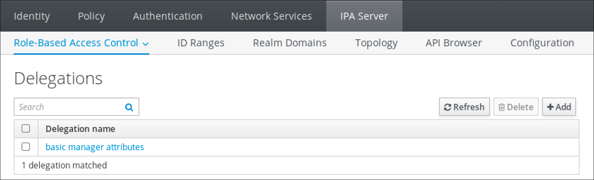 

<h3 id="modifying-a-delegation-rule-using-idm-webui">29.3. Modifying a delegation rule using IdM WebUI</h3>

Update delegation rules using the Identity Management (IdM) WebUI to adjust which groups can manage attributes of other groups.

**Prerequisites**

- You are logged in to the IdM Web UI as a member of the `admins` group.

**Procedure**

1. From the **IPA Server&gt;Role-Based Access Control** menu, click **Delegations**.
2. Click the rule you want to modify.
3. Make the desired changes:
   
   - Change the name of the rule.
   - Change granted permissions by selecting the checkboxes that indicate whether users will have the right to view the given attributes (*read*) and add or change the given attributes (*write*).
   - In the User group drop-down menu, select the group *who is being granted permissions* to view or edit the entries of users in the member group.
   - In the **Member user group** drop-down menu, select the group *whose entries can be edited* by members of the delegation group.
   - In the attributes box, select the checkboxes by the attributes to which you want to grant permissions. To remove permissions to an attribute, uncheck the relevant checkbox.
   - Click the **Save** button to save the changes.

<h3 id="deleting-a-delegation-rule-using-idm-webui">29.4. Deleting a delegation rule using IdM WebUI</h3>

Delete delegation rules using the Identity Management (IdM) WebUI to revoke user group permissions for managing other users. Removing unnecessary delegation rules helps maintain proper access control.

**Prerequisites**

- You are logged in to the IdM Web UI as a member of the `admins` group.

**Procedure**

1. From the **IPA Server&gt;Role-Based Access Control** menu, click **Delegations**.
2. Select the checkbox next to the rule you want to remove.
3. Click **Delete**.
4. Click **Delete** to confirm.

<h2 id="delegating-permissions-to-user-groups-to-manage-users-using-ansible-playbooks">Chapter 30. Delegating permissions to user groups to manage users using Ansible playbooks</h2>

Configure delegation rules using Ansible to grant one user group permission to manage entries for another group, distributing administrative responsibilities.

Delegation is one of the access control methods in Identity Management (IdM), along with self-service rules and role-based access control (RBAC). For general information about delegation rules, see [Delegation rules](https://docs.redhat.com/en/documentation/red_hat_enterprise_linux/10/html/managing_idm_users_groups_hosts_and_access_control_rules/delegating-permissions-to-user-groups-to-manage-users-using-idm-cli#delegation-rules).

<h3 id="using-ansible-to-ensure-that-a-delegation-rule-is-present">30.1. Using Ansible to ensure that a delegation rule is present</h3>

Create delegation rules in Identity Management (IdM) using Ansible to grant one user group permission to manage specific attributes of another group’s members.

In the example, the new **basic manager attributes** delegation rule grants the `managers` group the ability to read and write the following attributes for members of the `employees` group:

- `businesscategory`
- `departmentnumber`
- `employeenumber`
- `employeetype`

**Prerequisites**

- On the control node:
  
  - You are using Ansible version 2.15 or later.
  - You have installed the [`ansible-freeipa`](https://docs.redhat.com/en/documentation/red_hat_enterprise_linux/10/html/using_ansible_to_install_and_manage_identity_management_in_rhel/installing-an-identity-management-server-using-an-ansible-playbook#installing-the-ansible-freeipa-package) package.
  - The example assumes that in the **~/*MyPlaybooks*/** directory, you have created an [Ansible inventory file](https://docs.redhat.com/en/documentation/red_hat_enterprise_linux/10/html/using_ansible_to_install_and_manage_identity_management_in_rhel/preparing-your-environment-for-managing-idm-using-ansible-playbooks) with the fully-qualified domain name (FQDN) of the IdM server.
  - The example assumes that the **secret.yml** Ansible vault stores your `ipaadmin_password` and that you have access to a file that stores the password protecting the **secret.yml** file.
- The target node, that is the node on which the `freeipa.ansible_freeipa` module is executed, is part of the IdM domain as an IdM client, server or replica.

**Procedure**

1. Navigate to the **~/*MyPlaybooks*/** directory:
   
   ```
   cd ~/MyPlaybooks/
   ```
   
   ```plaintext
   $ cd ~/MyPlaybooks/
   ```
2. Make a copy of the `delegation-present.yml` file located in the `/usr/share/ansible/collections/ansible_collections/freeipa/ansible_freeipa/playbooks/delegation/` directory:
   
   ```
   cp /usr/share/ansible/collections/ansible_collections/freeipa/ansible_freeipa/playbooks/delegation/delegation-present.yml delegation-present-copy.yml
   ```
   
   ```plaintext
   $ cp /usr/share/ansible/collections/ansible_collections/freeipa/ansible_freeipa/playbooks/delegation/delegation-present.yml delegation-present-copy.yml
   ```
3. Open the `delegation-present-copy.yml` Ansible playbook file for editing.
4. Adapt the file by setting the following variables in the `freeipa.ansible_freeipa.ipadelegation` task section:
   
   - Set the `name` variable to the name of the new delegation rule.
   - Set the `permission` variable to a comma-separated list of permissions to grant: `read` and `write`.
   - Set the `attribute` variable to a list of attributes the delegated user group can manage: `businesscategory`, `departmentnumber`, `employeenumber`, and `employeetype`.
   - Set the `group` variable to the name of the group that is being given access to view or modify attributes.
   - Set the `membergroup` variable to the name of the group whose attributes can be viewed or modified.
   
   This is the modified Ansible playbook file for the current example:
   
   ```
   ---
   - name: Playbook to manage a delegation rule
     hosts: ipaserver
   
     vars_files:
     - /home/user_name/MyPlaybooks/secret.yml
     tasks:
     - name: Ensure delegation "basic manager attributes" is present
       freeipa.ansible_freeipa.ipadelegation:
         ipaadmin_password: "{{ ipaadmin_password }}"
         name: "basic manager attributes"
         permission: read, write
         attribute:
         - businesscategory
         - departmentnumber
         - employeenumber
         - employeetype
         group: managers
         membergroup: employees
   ```
   
   ```plaintext
   ---
   - name: Playbook to manage a delegation rule
     hosts: ipaserver
   
     vars_files:
     - /home/user_name/MyPlaybooks/secret.yml
     tasks:
     - name: Ensure delegation "basic manager attributes" is present
       freeipa.ansible_freeipa.ipadelegation:
         ipaadmin_password: "{{ ipaadmin_password }}"
         name: "basic manager attributes"
         permission: read, write
         attribute:
         - businesscategory
         - departmentnumber
         - employeenumber
         - employeetype
         group: managers
         membergroup: employees
   ```
5. Save the file.
   
   For details about variables and example playbooks in the FreeIPA Ansible collection, see the `/usr/share/ansible/collections/ansible_collections/freeipa/ansible_freeipa/README-delegation.md` file and the `/usr/share/ansible/collections/ansible_collections/freeipa/ansible_freeipa/playbooks/ipadelegation` directory on the control node.
6. Run the Ansible playbook. Specify the playbook file, the file storing the password protecting the **secret.yml** file, and the inventory file:
   
   ```
   ansible-playbook --vault-password-file=password_file -v -i ~/MyPlaybooks/inventory delegation-present-copy.yml
   ```
   
   ```plaintext
   $ ansible-playbook --vault-password-file=password_file -v -i ~/MyPlaybooks/inventory delegation-present-copy.yml
   ```

**Additional resources**

- [Delegation rules](https://docs.redhat.com/en/documentation/red_hat_enterprise_linux/10/html/managing_idm_users_groups_hosts_and_access_control_rules/delegating-permissions-to-user-groups-to-manage-users-using-idm-cli#delegation-rules)

<h3 id="using-ansible-to-ensure-that-a-delegation-rule-is-absent">30.2. Using Ansible to ensure that a delegation rule is absent</h3>

Remove delegation rules from Identity Management (IdM) using Ansible to revoke a user group’s permission to manage attributes of another group’s members.

The example below describes how to make sure the custom **basic manager attributes** delegation rule does not exist in IdM.

**Prerequisites**

- On the control node:
  
  - You are using Ansible version 2.15 or later.
  - You have installed the [`ansible-freeipa`](https://docs.redhat.com/en/documentation/red_hat_enterprise_linux/10/html/using_ansible_to_install_and_manage_identity_management_in_rhel/installing-an-identity-management-server-using-an-ansible-playbook#installing-the-ansible-freeipa-package) package.
  - The example assumes that in the **~/*MyPlaybooks*/** directory, you have created an [Ansible inventory file](https://docs.redhat.com/en/documentation/red_hat_enterprise_linux/10/html/using_ansible_to_install_and_manage_identity_management_in_rhel/preparing-your-environment-for-managing-idm-using-ansible-playbooks) with the fully-qualified domain name (FQDN) of the IdM server.
  - The example assumes that the **secret.yml** Ansible vault stores your `ipaadmin_password` and that you have access to a file that stores the password protecting the **secret.yml** file.
- The target node, that is the node on which the `freeipa.ansible_freeipa` module is executed, is part of the IdM domain as an IdM client, server or replica.

**Procedure**

1. Navigate to the **~/*MyPlaybooks*/** directory:
   
   ```
   cd ~/MyPlaybooks>/
   ```
   
   ```plaintext
   $ cd ~/MyPlaybooks>/
   ```
2. Make a copy of the `delegation-absent.yml` file located in the `/usr/share/ansible/collections/ansible_collections/freeipa/ansible_freeipa/playbooks/delegation/` directory:
   
   ```
   cp /usr/share/ansible/collections/ansible_collections/freeipa/ansible_freeipa/playbooks/delegation/delegation-present.yml delegation-absent-copy.yml
   ```
   
   ```plaintext
   $ cp /usr/share/ansible/collections/ansible_collections/freeipa/ansible_freeipa/playbooks/delegation/delegation-present.yml delegation-absent-copy.yml
   ```
3. Open the `delegation-absent-copy.yml` Ansible playbook file for editing.
4. Adapt the file by setting the following variables in the `freeipa.ansible_freeipa.ipadelegation` task section:
   
   - Set the `name` variable to the name of the delegation rule.
   - Set the `state` variable to `absent`.
   
   This is the modified Ansible playbook file for the current example:
   
   ```
   ---
   - name: Delegation absent
     hosts: ipaserver
   
     vars_files:
     - /home/user_name/MyPlaybooks/secret.yml
     tasks:
     - name: Ensure delegation "basic manager attributes" is absent
       freeipa.ansible_freeipa.ipadelegation:
         ipaadmin_password: "{{ ipaadmin_password }}"
         name: "basic manager attributes"
         state: absent
   ```
   
   ```plaintext
   ---
   - name: Delegation absent
     hosts: ipaserver
   
     vars_files:
     - /home/user_name/MyPlaybooks/secret.yml
     tasks:
     - name: Ensure delegation "basic manager attributes" is absent
       freeipa.ansible_freeipa.ipadelegation:
         ipaadmin_password: "{{ ipaadmin_password }}"
         name: "basic manager attributes"
         state: absent
   ```
5. Save the file.
   
   For details about variables and example playbooks in the FreeIPA Ansible collection, see the `/usr/share/ansible/collections/ansible_collections/freeipa/ansible_freeipa/README-delegation.md` file and the `/usr/share/ansible/collections/ansible_collections/freeipa/ansible_freeipa/playbooks/ipadelegation` directory on the control node.
6. Run the Ansible playbook. Specify the playbook file, the file storing the password protecting the **secret.yml** file, and the inventory file:
   
   ```
   ansible-playbook --vault-password-file=password_file -v -i ~/MyPlaybooks/inventory delegation-absent-copy.yml
   ```
   
   ```plaintext
   $ ansible-playbook --vault-password-file=password_file -v -i ~/MyPlaybooks/inventory delegation-absent-copy.yml
   ```

**Additional resources**

- [Delegation rules](https://docs.redhat.com/en/documentation/red_hat_enterprise_linux/10/html/managing_idm_users_groups_hosts_and_access_control_rules/delegating-permissions-to-user-groups-to-manage-users-using-idm-cli#delegation-rules)

<h3 id="using-ansible-to-ensure-that-a-delegation-rule-has-specific-attributes">30.3. Using Ansible to ensure that a delegation rule has specific attributes</h3>

Add attributes to existing Identity Management (IdM) delegation rules using Ansible to modify which user entry fields a group can manage for another group’s members.

In the example below, you ensure the **basic manager attributes** delegation rule only has the `departmentnumber` member attribute.

**Prerequisites**

- On the control node:
  
  - You are using Ansible version 2.15 or later.
  - You have installed the [`ansible-freeipa`](https://docs.redhat.com/en/documentation/red_hat_enterprise_linux/10/html/using_ansible_to_install_and_manage_identity_management_in_rhel/installing-an-identity-management-server-using-an-ansible-playbook#installing-the-ansible-freeipa-package) package.
  - The example assumes that in the **~/*MyPlaybooks*/** directory, you have created an [Ansible inventory file](https://docs.redhat.com/en/documentation/red_hat_enterprise_linux/10/html/using_ansible_to_install_and_manage_identity_management_in_rhel/preparing-your-environment-for-managing-idm-using-ansible-playbooks) with the fully-qualified domain name (FQDN) of the IdM server.
  - The example assumes that the **secret.yml** Ansible vault stores your `ipaadmin_password` and that you have access to a file that stores the password protecting the **secret.yml** file.
- The target node, that is the node on which the `freeipa.ansible_freeipa` module is executed, is part of the IdM domain as an IdM client, server or replica.
- The **basic manager attributes** delegation rule exists in IdM.

**Procedure**

1. Navigate to the **~/*MyPlaybooks*/** directory:
   
   ```
   cd ~/MyPlaybooks/
   ```
   
   ```plaintext
   $ cd ~/MyPlaybooks/
   ```
2. Make a copy of the `delegation-member-present.yml` file located in the `/usr/share/ansible/collections/ansible_collections/freeipa/ansible_freeipa/playbooks/delegation/` directory:
   
   ```
   cp /usr/share/ansible/collections/ansible_collections/freeipa/ansible_freeipa/playbooks/delegation/delegation-member-present.yml delegation-member-present-copy.yml
   ```
   
   ```plaintext
   $ cp /usr/share/ansible/collections/ansible_collections/freeipa/ansible_freeipa/playbooks/delegation/delegation-member-present.yml delegation-member-present-copy.yml
   ```
3. Open the `delegation-member-present-copy.yml` Ansible playbook file for editing.
4. Adapt the file by setting the following variables in the `freeipa.ansible_freeipa.ipadelegation` task section:
   
   - Set the `name` variable to the name of the delegation rule to modify.
   - Set the `attribute` variable to `departmentnumber`.
   - Set the `action` variable to `member`.
   
   This is the modified Ansible playbook file for the current example:
   
   ```
   ---
   - name: Delegation member present
     hosts: ipaserver
   
     vars_files:
     - /home/user_name/MyPlaybooks/secret.yml
     tasks:
     - name: Ensure delegation "basic manager attributes" member attribute departmentnumber is present
       freeipa.ansible_freeipa.ipadelegation:
         ipaadmin_password: "{{ ipaadmin_password }}"
         name: "basic manager attributes"
         attribute:
         - departmentnumber
         action: member
   ```
   
   ```plaintext
   ---
   - name: Delegation member present
     hosts: ipaserver
   
     vars_files:
     - /home/user_name/MyPlaybooks/secret.yml
     tasks:
     - name: Ensure delegation "basic manager attributes" member attribute departmentnumber is present
       freeipa.ansible_freeipa.ipadelegation:
         ipaadmin_password: "{{ ipaadmin_password }}"
         name: "basic manager attributes"
         attribute:
         - departmentnumber
         action: member
   ```
5. Save the file.
   
   For details about variables and example playbooks in the FreeIPA Ansible collection, see the `/usr/share/ansible/collections/ansible_collections/freeipa/ansible_freeipa/README-delegation.md` file and the `/usr/share/ansible/collections/ansible_collections/freeipa/ansible_freeipa/playbooks/ipadelegation` directory on the control node.
6. Run the Ansible playbook. Specify the playbook file, the file storing the password protecting the **secret.yml** file, and the inventory file:
   
   ```
   ansible-playbook --vault-password-file=password_file -v -i ~/MyPlaybooks/inventory delegation-member-present-copy.yml
   ```
   
   ```plaintext
   $ ansible-playbook --vault-password-file=password_file -v -i ~/MyPlaybooks/inventory delegation-member-present-copy.yml
   ```

**Additional resources**

- [Delegation rules](https://docs.redhat.com/en/documentation/red_hat_enterprise_linux/10/html/managing_idm_users_groups_hosts_and_access_control_rules/delegating-permissions-to-user-groups-to-manage-users-using-idm-cli#delegation-rules)

<h3 id="using-ansible-to-ensure-that-a-delegation-rule-does-not-have-specific-attributes">30.4. Using Ansible to ensure that a delegation rule does not have specific attributes</h3>

Remove attributes from existing Identity Management (IdM) delegation rules using Ansible to restrict which user entry fields a group can manage for another group’s members, limiting undesired access.

In the example, you ensure the **basic manager attributes** delegation rule does not have the `employeenumber` and `employeetype` member attributes.

**Prerequisites**

- On the control node:
  
  - You are using Ansible version 2.15 or later.
  - You have installed the [`ansible-freeipa`](https://docs.redhat.com/en/documentation/red_hat_enterprise_linux/10/html/using_ansible_to_install_and_manage_identity_management_in_rhel/installing-an-identity-management-server-using-an-ansible-playbook#installing-the-ansible-freeipa-package) package.
  - The example assumes that in the **~/*MyPlaybooks*/** directory, you have created an [Ansible inventory file](https://docs.redhat.com/en/documentation/red_hat_enterprise_linux/10/html/using_ansible_to_install_and_manage_identity_management_in_rhel/preparing-your-environment-for-managing-idm-using-ansible-playbooks) with the fully-qualified domain name (FQDN) of the IdM server.
  - The example assumes that the **secret.yml** Ansible vault stores your `ipaadmin_password` and that you have access to a file that stores the password protecting the **secret.yml** file.
- The target node, that is the node on which the `freeipa.ansible_freeipa` module is executed, is part of the IdM domain as an IdM client, server or replica.
- The **basic manager attributes** delegation rule exists in IdM.

**Procedure**

1. Navigate to the **~/*MyPlaybooks*/** directory:
   
   ```
   cd ~/MyPlaybooks/
   ```
   
   ```plaintext
   $ cd ~/MyPlaybooks/
   ```
2. Make a copy of the `delegation-member-absent.yml` file located in the `/usr/share/ansible/collections/ansible_collections/freeipa/ansible_freeipa/playbooks/delegation/` directory:
   
   ```
   cp /usr/share/ansible/collections/ansible_collections/freeipa/ansible_freeipa/playbooks/delegation/delegation-member-absent.yml delegation-member-absent-copy.yml
   ```
   
   ```plaintext
   $ cp /usr/share/ansible/collections/ansible_collections/freeipa/ansible_freeipa/playbooks/delegation/delegation-member-absent.yml delegation-member-absent-copy.yml
   ```
3. Open the `delegation-member-absent-copy.yml` Ansible playbook file for editing.
4. Adapt the file by setting the following variables in the `freeipa.ansible_freeipa.ipadelegation` task section:
   
   - Set the `name` variable to the name of the delegation rule to modify.
   - Set the `attribute` variable to `employeenumber` and `employeetype`.
   - Set the `action` variable to `member`.
   - Set the `state` variable to `absent`.
   
   This is the modified Ansible playbook file for the current example:
   
   ```
   ---
   - name: Delegation member absent
     hosts: ipaserver
   
     vars_files:
     - /home/user_name/MyPlaybooks/secret.yml
     tasks:
     - name: Ensure delegation "basic manager attributes" member attributes employeenumber and employeetype are absent
       freeipa.ansible_freeipa.ipadelegation:
         ipaadmin_password: "{{ ipaadmin_password }}"
         name: "basic manager attributes"
         attribute:
         - employeenumber
         - employeetype
         action: member
         state: absent
   ```
   
   ```plaintext
   ---
   - name: Delegation member absent
     hosts: ipaserver
   
     vars_files:
     - /home/user_name/MyPlaybooks/secret.yml
     tasks:
     - name: Ensure delegation "basic manager attributes" member attributes employeenumber and employeetype are absent
       freeipa.ansible_freeipa.ipadelegation:
         ipaadmin_password: "{{ ipaadmin_password }}"
         name: "basic manager attributes"
         attribute:
         - employeenumber
         - employeetype
         action: member
         state: absent
   ```
5. Save the file.
   
   For details about variables and example playbooks in the FreeIPA Ansible collection, see the `/usr/share/ansible/collections/ansible_collections/freeipa/ansible_freeipa/README-delegation.md` file and the `/usr/share/ansible/collections/ansible_collections/freeipa/ansible_freeipa/playbooks/ipadelegation` directory on the control node.
6. Run the Ansible playbook. Specify the playbook file, the file storing the password protecting the **secret.yml** file, and the inventory file:
   
   ```
   ansible-playbook --vault-password-file=password_file -v -i ~/MyPlaybooks/inventory delegation-member-absent-copy.yml
   ```
   
   ```plaintext
   $ ansible-playbook --vault-password-file=password_file -v -i ~/MyPlaybooks/inventory delegation-member-absent-copy.yml
   ```

**Additional resources**

- [Delegation rules](https://docs.redhat.com/en/documentation/red_hat_enterprise_linux/10/html/managing_idm_users_groups_hosts_and_access_control_rules/delegating-permissions-to-user-groups-to-manage-users-using-idm-cli#delegation-rules)

<h2 id="managing-role-based-access-controls-in-idm-using-the-cli">Chapter 31. Managing role-based access controls in IdM using the CLI</h2>

Manage role-based access control (RBAC) in Identity Management (IdM) using the CLI to restrict administrative access to authorized users. Define roles with specific permissions and assign them to users to enforce the principle of least privilege.

<h3 id="role-based-access-control-in-idm">31.1. Role-based access control in IdM</h3>

Use role-based access control (RBAC) in Identity Management (IdM) to grant fine-grained administrative authority to users through permissions, privileges, and roles. RBAC provides more granular control than self-service and delegation access methods.

Role-based access control is composed of three parts:

- **Permissions** grant the right to perform a specific task such as adding or deleting users, modifying a group, and enabling read-access.
- **Privileges** combine permissions, for example all the permissions needed to add a new user.
- **Roles** grant a set of privileges to users, user groups, hosts or host groups.

<h4 id="permissions-in-idm">31.1.1. Permissions in IdM</h4>

Understand how IdM permissions define specific operations on LDAP entries as the lowest level unit of role-based access control (RBAC). Comparable to building blocks, permissions can be assigned to as many privileges as needed.

One or more **rights** define what operations are allowed:

- `write`
- `read`
- `search`
- `compare`
- `add`
- `delete`
- `all`

These operations apply to three basic **targets**:

- `subtree`: a domain name (DN); the subtree under this DN
- `target filter`: an LDAP filter
- `target`: DN with possible wildcards to specify entries

Additionally, the following convenience options set the corresponding attribute(s):

- `type`: a type of object (user, group, etc); sets `subtree` and `target filter`
- `memberof`: members of a group; sets a `target filter`
  
  Note
  
  Setting the `memberof` attribute permission is not applied if the target LDAP entry does not contain any reference to group membership.
- `targetgroup`: grants access to modify a specific group (such as granting the rights to manage group membership); sets a `target`

With IdM permissions, you can control which users have access to which objects and even which attributes of these objects. IdM enables you to allow or block individual attributes or change the entire visibility of a specific IdM function, such as users, groups, or sudo, to all anonymous users, all authenticated users, or just a certain group of privileged users.

For example, the flexibility of this approach to permissions is useful for an administrator who wants to limit access of users or groups only to the specific sections these users or groups need to access and to make the other sections completely hidden to them.

Note

A permission cannot contain other permissions.

<h4 id="default-managed-permissions">31.1.2. Default managed permissions</h4>

Understand how IdM managed permissions differ from user-created permissions and how to extend them with included or excluded attributes.

Managed permissions are permissions that come by default with IdM. They behave like other permissions created by the user, with the following differences:

- You cannot delete them or modify their name, location, and target attributes.
- They have three sets of attributes:
  
  - **Default** attributes, the user cannot modify them, as they are managed by IdM
  - **Included** attributes, which are additional attributes added by the user
  - **Excluded** attributes, which are attributes removed by the user

A managed permission applies to all attributes that appear in the default and included attribute sets but not in the excluded set.

Note

While you cannot delete a managed permission, setting its bind type to permission and removing the managed permission from all privileges effectively disables it.

Names of all managed permissions start with `System:`, for example `System: Add Sudo rule` or `System: Modify Services`. Earlier versions of IdM used a different scheme for default permissions. For example, the user could not delete them and was only able to assign them to privileges. Most of these default permissions have been turned into managed permissions, however, the following permissions still use the previous scheme:

- Add Automember Rebuild Membership Task
- Add Configuration Sub-Entries
- Add Replication Agreements
- Certificate Remove Hold
- Get Certificates status from the CA
- Read DNA Range
- Modify DNA Range
- Read PassSync Managers Configuration
- Modify PassSync Managers Configuration
- Read Replication Agreements
- Modify Replication Agreements
- Remove Replication Agreements
- Read LDBM Database Configuration
- Request Certificate
- Request Certificate ignoring CA ACLs
- Request Certificates from a different host
- Retrieve Certificates from the CA
- Revoke Certificate
- Write IPA Configuration

Note

If you attempt to modify a managed permission from the command line, the system does not allow you to change the attributes that you cannot modify, the command fails. If you attempt to modify a managed permission from the Web UI, the attributes that you cannot modify are disabled.

<h4 id="privileges-in-idm">31.1.3. Privileges in IdM</h4>

Understand how IdM privileges combine multiple permissions needed for specific administrative tasks like creating users or managing groups.

While a permission provides the rights to do a single operation, there are certain IdM tasks that require multiple permissions to succeed. Therefore, a privilege combines the different permissions required to perform a specific task.

For example, setting up an account for a new IdM user requires the following permissions:

- Creating a new user entry
- Resetting a user password
- Adding the new user to the default IPA users group

Combining these three low-level tasks into a higher level task in the form of a custom privilege named, for example, **Add User** makes it easier for a system administrator to manage roles. IdM already contains several default privileges. Apart from users and user groups, privileges are also assigned to hosts and host groups, as well as network services. This practice permits a fine-grained control of operations by a set of users on a set of hosts using specific network services.

Note

A privilege may not contain other privileges.

<h4 id="roles-in-idm">31.1.4. Roles in IdM</h4>

Understand how IdM roles group privileges together to define what actions specific users or groups can perform in your domain.

In effect, permissions grant the ability to perform given low-level tasks (such as creating a user entry and adding an entry to a group), privileges combine one or more of these permissions needed for a higher-level task (such as creating a new user in a given group). Roles gather privileges together as needed: for example, a User Administrator role would be able to add, modify, and delete users.

Important

Roles are used to classify permitted actions. They are not used as a tool to implement privilege separation or to protect from privilege escalation.

Note

Roles cannot contain other roles.

<h4 id="predefined-roles-in-identity-management">31.1.5. Predefined roles in Identity Management</h4>

Review the default RBAC roles available in Red Hat Enterprise Linux Identity Management (IdM) to understand which privileges are assigned for common administrative tasks.

IdM provides the following range of pre-defined roles:

| Role                     | Privilege                                                                                                    | Description                                                                                                    |
|:-------------------------|:-------------------------------------------------------------------------------------------------------------|:---------------------------------------------------------------------------------------------------------------|
| Enrollment Administrator | Host Enrollment                                                                                              | Responsible for client, or host, enrollment                                                                    |
| helpdesk                 | Modify Users and Reset passwords, Modify Group membership                                                    | Responsible for performing simple user administration tasks                                                    |
| IT Security Specialist   | Netgroups Administrators, HBAC Administrator, Sudo Administrator                                             | Responsible for managing security policy such as host-based access controls, sudo rules                        |
| IT Specialist            | Host Administrators, Host Group Administrators, Service Administrators, Automount Administrators             | Responsible for managing hosts                                                                                 |
| Security Architect       | Delegation Administrator, Replication Administrators, Write IPA Configuration, Password Policy Administrator | Responsible for managing the Identity Management environment, creating trusts, creating replication agreements |
| User Administrator       | User Administrators, Group Administrators, Stage User Administrators                                         | Responsible for creating users and groups                                                                      |

Table 31.1. Predefined Roles in Identity Management

<h3 id="managing-idm-permissions-in-the-cli">31.2. Managing IdM permissions in the CLI</h3>

Create and configure permissions using the Identity Management (IdM) CLI to define granular access control rules for LDAP operations. Permissions enable you to specify which users can perform specific actions on particular objects and attributes.

**Prerequisites**

- Administrator privileges for managing IdM or the **User Administrator** role.
- An active Kerberos ticket. For details, see [Using kinit to log in to IdM manually](https://docs.redhat.com/en/documentation/red_hat_enterprise_linux/10/html/accessing_identity_management_services/logging-in-to-identity-management-from-the-command-line#using-kinit-to-log-in-to-idm-manually_login-cli-krb).

**Procedure**

1. Create new permission entries with the `ipa permission-add` command. For example, to add a permission named *dns admin*:
   
   ```
   ipa permission-add "dns admin"
   ```
   
   ```plaintext
   $ ipa permission-add "dns admin"
   ```
2. Specify the properties of the permission with the following options:
   
   - `--bindtype` specifies the bind rule type. This option accepts the `all`, `anonymous`, and `permission` arguments. The `permission` bindtype means that only the users who are granted this permission via a role can exercise it.
     
     For example:
     
     ```
     ipa permission-add "dns admin" --bindtype=all
     ```
     
     ```plaintext
     $ ipa permission-add "dns admin" --bindtype=all
     ```
     
     If you do not specify `--bindtype`, then `permission` is the default value.
     
     Note
     
     It is not possible to add permissions with a non-default bind rule type to privileges. You also cannot set a permission that is already present in a privilege to a non-default bind rule type.
   - `--right` lists the rights granted by the permission, it replaces the deprecated `--permissions` option. The available values are `add`, `delete`, `read`, `search`, `compare`, `write`, `all`.
     
     You can set multiple attributes by using multiple `--right` options or with a comma-separated list inside curly braces. For example:
     
     ```
     ipa permission-add "dns admin" --right=read --right=write
     ipa permission-add "dns admin" --right={read,write}
     ```
     
     ```plaintext
     $ ipa permission-add "dns admin" --right=read --right=write
     $ ipa permission-add "dns admin" --right={read,write}
     ```
     
     Note
     
     `add` and `delete` are entry-level operations (for example, deleting a user, adding a group, and so on) while `read`, `search`, `compare` and `write` are more attribute-level: you can write to `userCertificate` but not read `userPassword`.
   - `--attrs` gives the list of attributes over which the permission is granted.
     
     You can set multiple attributes by using multiple `--attrs` options or by listing the options in a comma-separated list inside curly braces. For example:
     
     ```
     ipa permission-add "dns admin" --attrs=description --attrs=automountKey
     ipa permission-add "dns admin" --attrs={description,automountKey}
     ```
     
     ```plaintext
     $ ipa permission-add "dns admin" --attrs=description --attrs=automountKey
     $ ipa permission-add "dns admin" --attrs={description,automountKey}
     ```
     
     The attributes provided with `--attrs` must exist and be allowed attributes for the given object type, otherwise the command fails with schema syntax errors.
   - `--type` defines the entry object type to which the permission applies, such as user, host, or service. Each type has its own set of allowed attributes. For example:
     
     ```
     ipa permission-add "manage service" --right=all --type=service --attrs=krbprincipalkey --attrs=krbprincipalname --attrs=managedby
     ```
     
     ```plaintext
     $ ipa permission-add "manage service" --right=all --type=service --attrs=krbprincipalkey --attrs=krbprincipalname --attrs=managedby
     ```
   - `--subtree` gives a subtree entry; the filter then targets every entry beneath this subtree entry. Provide an existing subtree entry; `--subtree` does not accept wildcards or non-existent domain names (DNs). Include a DN within the directory.
     
     Because IdM uses a simplified, flat directory tree structure, `--subtree` can be used to target some types of entries, like automount locations, which are containers or parent entries for other configuration. For example:
     
     ```
     ipa permission-add "manage automount locations" --subtree="ldap://ldap.example.com:389/cn=automount,dc=example,dc=com" --right=write --attrs=automountmapname --attrs=automountkey --attrs=automountInformation
     ```
     
     ```plaintext
     $ ipa permission-add "manage automount locations" --subtree="ldap://ldap.example.com:389/cn=automount,dc=example,dc=com" --right=write --attrs=automountmapname --attrs=automountkey --attrs=automountInformation
     ```
     
     Note
     
     The `--type` and `--subtree` options are mutually exclusive: you can see the inclusion of filters for `--type` as a simplification of `--subtree`, intending to make life easier for an admin.
   - `--filter` uses an LDAP filter to identify which entries the permission applies to.
     
     IdM automatically checks the validity of the given filter. The filter can be any valid LDAP filter, for example:
     
     ```
     ipa permission-add "manage Windows groups" --filter="(!(objectclass=posixgroup))" --right=write --attrs=description
     ```
     
     ```plaintext
     $ ipa permission-add "manage Windows groups" --filter="(!(objectclass=posixgroup))" --right=write --attrs=description
     ```
   - `--memberof` sets the target filter to members of the given group after checking that the group exists. For example, to let the users with this permission modify the login shell of members of the engineers group:
     
     ```
     ipa permission-add ManageShell --right="write" --type=user --attr=loginshell --memberof=engineers
     ```
     
     ```plaintext
     $ ipa permission-add ManageShell --right="write" --type=user --attr=loginshell --memberof=engineers
     ```
     
     Note
     
     Setting the `memberof` attribute permission is not applied if the target LDAP entry does not contain any reference to group membership.
   - `--targetgroup` sets target to the specified user group after checking that the group exists. For example, to let those with the permission write the member attribute in the engineers group (so they can add or remove members):
     
     ```
     ipa permission-add ManageMembers --right="write" --subtree=cn=groups,cn=accounts,dc=example,dc=test --attr=member --targetgroup=engineers
     ```
     
     ```plaintext
     $ ipa permission-add ManageMembers --right="write" --subtree=cn=groups,cn=accounts,dc=example,dc=test --attr=member --targetgroup=engineers
     ```
   - Optionally, you can specify a target domain name (DN):
     
     - `--target` specifies the DN to apply the permission to. Wildcards are accepted.
     - `--targetto` specifies the DN subtree where an entry can be moved to.
     - `--targetfrom` specifies the DN subtree from where an entry can be moved.

<h3 id="command-options-for-existing-permissions">31.3. Command options for existing permissions</h3>

Manage existing permissions in Identity Management (IdM) using command-line tools to modify access control policies dynamically.

Using these commands, you can view, edit, and delete permissions without recreating roles or privileges:

- To edit existing permissions, use the `ipa permission-mod` command. You can use the same command options as for adding permissions.
- To find existing permissions, use the `ipa permission-find` command. You can use the same command options as for adding permissions.
- To view a specific permission, use the `ipa permission-show` command.
  
  The `--raw` argument shows the raw 389-ds ACI that is generated. For example:
  
  ```
  ipa permission-show <permission> --raw
  ```
  
  ```plaintext
  $ ipa permission-show <permission> --raw
  ```
- The `ipa permission-del` command deletes a permission completely.

<h3 id="managing-idm-privileges-in-the-cli">31.4. Managing IdM privileges in the CLI</h3>

Create and configure privileges using the Identity Management (IdM) CLI to group related permissions for role-based access control. Privileges simplify access management by bundling multiple permissions into reusable components.

**Prerequisites**

- Administrator privileges for managing IdM or the **User Administrator** role.
- An active Kerberos ticket. For details, see [Using kinit to log in to IdM manually](https://docs.redhat.com/en/documentation/red_hat_enterprise_linux/10/html/accessing_identity_management_services/logging-in-to-identity-management-from-the-command-line#using-kinit-to-log-in-to-idm-manually_login-cli-krb).
- Existing permissions. For details about permissions, see [Managing IdM permissions in the CLI](#managing-idm-permissions-in-the-cli "31.2. Managing IdM permissions in the CLI").

**Procedure**

1. Add privilege entries using the `ipa privilege-add` command
   
   For example, to add a privilege named *managing filesystems* with a description:
   
   ```
   ipa privilege-add "managing filesystems" --desc="for filesystems"
   ```
   
   ```plaintext
   $ ipa privilege-add "managing filesystems" --desc="for filesystems"
   ```
2. Assign the required permissions to the privilege group with the `privilege-add-permission` command
   
   For example, to add the permissions named *managing automount* and *managing ftp services* to the *managing filesystems* privilege:
   
   ```
   ipa privilege-add-permission "managing filesystems" --permissions="managing automount" --permissions="managing ftp services"
   ```
   
   ```plaintext
   $ ipa privilege-add-permission "managing filesystems" --permissions="managing automount" --permissions="managing ftp services"
   ```

<h3 id="command-options-for-existing-privileges">31.5. Command options for existing privileges</h3>

Manage existing privileges in Identity Management (IdM) using command-line tools to adjust permission bundles assigned to roles.

Using these commands, you can modify access control policies without recreating roles from scratch:

- To modify existing privileges, use the `ipa privilege-mod` command.
- To find existing privileges, use the `ipa privilege-find` command.
- To view a specific privilege, use the `ipa privilege-show` command.
- The `ipa privilege-remove-permission` command removes one or more permissions from a privilege.
- The `ipa privilege-del` command deletes a privilege completely.

<h3 id="managing-idm-roles-in-the-cli">31.6. Managing IdM roles in the CLI</h3>

Create and configure roles using the Identity Management (IdM) CLI to assign sets of privileges to users, groups, or hosts. Roles enable delegation of administrative tasks by granting specific capabilities without full administrator access.

**Prerequisites**

- Administrator privileges for managing IdM or the **User Administrator** role.
- An active Kerberos ticket. For details, see [Using kinit to log in to IdM manually](https://docs.redhat.com/en/documentation/red_hat_enterprise_linux/10/html/accessing_identity_management_services/logging-in-to-identity-management-from-the-command-line#using-kinit-to-log-in-to-idm-manually_login-cli-krb).
- Existing privileges. For details about privileges, see [Managing IdM privileges in the CLI](#managing-idm-privileges-in-the-cli "31.4. Managing IdM privileges in the CLI").

**Procedure**

1. Add new role entries using the `ipa role-add` command:
   
   ```
   ipa role-add --desc="User Administrator" useradmin
   ------------------------
   Added role "useradmin"
   ------------------------
   Role name: useradmin
   Description: User Administrator
   ```
   
   ```plaintext
   $ ipa role-add --desc="User Administrator" useradmin
   ------------------------
   Added role "useradmin"
   ------------------------
   Role name: useradmin
   Description: User Administrator
   ```
2. Add the required privileges to the role using the `ipa role-add-privilege` command:
   
   ```
   ipa role-add-privilege --privileges="user administrators" useradmin
   Role name: useradmin
   Description: User Administrator
   Privileges: user administrators
   ----------------------------
   Number of privileges added 1
   ----------------------------
   ```
   
   ```plaintext
   $ ipa role-add-privilege --privileges="user administrators" useradmin
   Role name: useradmin
   Description: User Administrator
   Privileges: user administrators
   ----------------------------
   Number of privileges added 1
   ----------------------------
   ```
3. Add the required members to the role using the `ipa role-add-member` command. Allowed member types are: users, groups, hosts and hostgroups. For example, to add the group named *useradmins* to the previously created *useradmin* role:
   
   ```
   ipa role-add-member --groups=useradmins useradmin
   Role name: useradmin
   Description: User Administrator
   Member groups: useradmins
   Privileges: user administrators
   -------------------------
   Number of members added 1
   -------------------------
   ```
   
   ```plaintext
   $ ipa role-add-member --groups=useradmins useradmin
   Role name: useradmin
   Description: User Administrator
   Member groups: useradmins
   Privileges: user administrators
   -------------------------
   Number of members added 1
   -------------------------
   ```

<h3 id="command-options-for-existing-roles">31.7. Command options for existing roles</h3>

Manage existing roles in Identity Management (IdM) using command-line tools to modify user access and administrative capabilities.

Using these commands, you can adjust role membership and privileges without recreating the entire role-based access control structure:

- To modify existing roles, use the `ipa role-mod` command.
- To find existing roles, use the `ipa role-find` command.
- To view a specific role, use the `ipa role-show` command.
- To remove a member from the role, use the `ipa role-remove-member` command.
- The `ipa role-remove-privilege` command removes one or more privileges from a role.
- The `ipa role-del` command deletes a role completely.

<h2 id="managing-role-based-access-controls-using-the-idm-web-ui">Chapter 32. Managing role-based access controls using the IdM Web UI</h2>

Manage role-based access control (RBAC) in Identity Management (IdM) using the Web UI to restrict administrative access to authorized users. Define roles with specific permissions and assign them to users to enforce the principle of least privilege.

For general information about role-based access in IdM, see [Role based access control in IdM](#role-based-access-control-in-idm "31.1. Role-based access control in IdM").

<h3 id="managing-permissions-in-the-idm-web-ui">32.1. Managing permissions in the IdM Web UI</h3>

Create and configure permissions using the Identity Management (IdM) WebUI to define granular access control rules for LDAP operations. Permissions enable you to specify which users can perform specific actions on particular objects and attributes.

**Prerequisites**

- Administrator privileges for managing IdM or the **User Administrator** role.
- You are logged-in to the IdM Web UI. For details, see [Accessing the IdM Web UI in a web browser](https://docs.redhat.com/en/documentation/red_hat_enterprise_linux/10/html/accessing_identity_management_services/accessing-the-idm-web-ui-in-a-web-browser).

**Procedure**

01. To add a new permission, open the **IPA Server&gt;Role-Based Access Control** submenu and select **Permissions**:
02. The list of permissions opens: Click the **Add** button at the top of the list of the permissions:
03. The **Add Permission** form opens. Specify the name of the new permission and define its properties.
04. Select the appropriate bind rule type:
    
    - **permission** is the default permission type, granting access through privileges and roles
    - **all** specifies that the permission applies to all authenticated users
    - **anonymous** specifies that the permission applies to all users, including unauthenticated users
      
      Note
      
      It is not possible to add permissions with a non-default bind rule type to privileges. You also cannot set a permission that is already present in a privilege to a non-default bind rule type.
05. Choose the rights to grant with this permission in **Granted rights**.
06. Define the method to identify the target entries for the permission:
    
    - **Type** specifies an entry type, such as user, host, or service. If you choose a value for the **Type** setting, a list of all possible attributes which will be accessible through this ACI for that entry type appears under **Effective Attributes**. Defining **Type** sets **Subtree** and **Target DN** to one of the predefined values.
    - **Subtree** (required) specifies a subtree entry; every entry beneath this subtree entry is then targeted. Provide an existing subtree entry, as **Subtree** does not accept wildcards or non-existent domain names (DNs). For example: `cn=automount,dc=example,dc=com`
    - **Extra target filter** uses an LDAP filter to identify which entries the permission applies to. The filter can be any valid LDAP filter, for example: `(!(objectclass=posixgroup))`
      
      IdM automatically checks the validity of the given filter. If you enter an invalid filter, IdM warns you about this when you attempt to save the permission.
    - **Target DN** specifies the domain name (DN) and accepts wildcards. For example: `uid=*,cn=users,cn=accounts,dc=com`
    - **Member of group** sets the target filter to members of the given group. After you specify the filter settings and click **Add**, IdM validates the filter. If all the permission settings are correct, IdM will perform the search. If some of the permissions settings are incorrect, IdM will display a message informing you about which setting is set incorrectly.
      
      Note
      
      Setting the `memberof` attribute permission is not applied if the target LDAP entry does not contain any reference to group membership.
07. Add attributes to the permission:
    
    - If you set **Type**, choose the **Effective attributes** from the list of available ACI attributes.
    - If you did not use **Type**, add the attributes manually by writing them into the **Effective attributes** field. Add a single attribute at a time; to add multiple attributes, click **Add** to add another input field.
      
      Important
      
      If you do not set any attributes for the permission, then the permissions includes all attributes by default.
08. Finish adding the permissions with the **Add** buttons at the bottom of the form:
    
    - Click the **Add** button to save the permission and go back to the list of permissions.
    - To save the permission and continue adding additional permissions in the same form, click the **Add and Add another** button.
    - The **Add and Edit** button enables you to save and continue editing the newly created permission.
09. Optional: You can also edit the properties of an existing permission by clicking its name from the list of permissions to display the **Permission settings** page.
10. Optional: If you need to remove an existing permission, select the checkbox next to its name in the list and click the **Delete** button to display The **Remove permissions** dialog. Click **Delete**.
    
    Note
    
    Operations on default managed permissions are restricted: the attributes you cannot modify are disabled in the IdM Web UI and you cannot delete the managed permissions completely.
    
    However, you can effectively disable a managed permission that has a bind type set to permission, by removing the managed permission from all privileges.
    
    For example, the following shows how to configure the permission `write` on the `member` attribute in the `engineers` group (so they can add or remove members):
    
    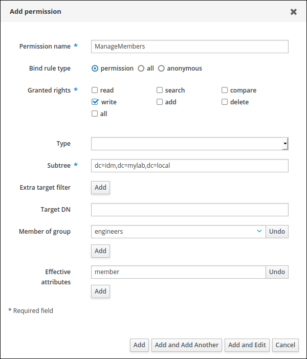

<h3 id="managing-privileges-in-the-idm-webui">32.2. Managing privileges in the IdM WebUI</h3>

Create and configure privileges using the Identity Management (IdM) WebUI to group related permissions for role-based access control. Privileges simplify access management by bundling multiple permissions into reusable components.

**Prerequisites**

- Administrator privileges for managing IdM or the **User Administrator** role.
- You are logged-in to the IdM Web UI. For details, see [Accessing the IdM Web UI in a web browser](https://docs.redhat.com/en/documentation/red_hat_enterprise_linux/10/html/accessing_identity_management_services/accessing-the-idm-web-ui-in-a-web-browser).

**Procedure**

1. To add a new privilege, open the **IPA Server&gt;Role-Based Access Control** submenu and select **Privileges**:
2. The list of privileges opens. Click the **Add** button at the top of the list of privileges.
3. The **Add Privilege** form opens. Enter the name and a description of the privilege.
4. Click the **Add and Edit** button to save the new privilege and continue to the privilege configuration page to add permissions.
5. Click the **Permissions** tab to display a list of permissions included in the selected privilege. Click the **Add** button at the top of the list to add permissions to the privilege:
6. Select the checkbox next to the name of each permission to add, and use the **&gt;** button to move the permissions to the **Prospective** column.
7. Confirm by clicking the **Add** button.
8. Optional: If you need to remove permissions, select the checkbox next to the relevant permissions and click the **Delete** button to display the **Remove privileges from permissions** dialog. Click **Delete**.
9. Optional: If you need to delete an existing privilege, select the checkbox next to its name in the list and click the **Delete** button to open the **Remove privileges** dialog. Click **Delete**.

<h3 id="managing-roles-in-the-idm-web-ui">32.3. Managing roles in the IdM Web UI</h3>

Create and configure roles using the Identity Management (IdM) WebUI to assign sets of privileges to users, groups, or hosts. Roles enable delegation of administrative tasks by granting specific capabilities without full administrator access.

**Prerequisites**

- Administrator privileges for managing IdM or the **User Administrator** role.
- You are logged-in to the IdM Web UI. For details, see [Accessing the IdM Web UI in a web browser](https://docs.redhat.com/en/documentation/red_hat_enterprise_linux/10/html/accessing_identity_management_services/accessing-the-idm-web-ui-in-a-web-browser).

**Procedure**

01. To add a new role, open the **IPA Server&gt;Role-Based Access Control** submenu and select **Roles**:
02. The list of roles opens. Click the **Add** button at the top of the list of roles.
03. The **Add Role** form opens. Enter the role name and a description:
04. Click the **Add and Edit** button to save the new role and continue to the role configuration page to add privileges and users.
05. Add members using the **Users**, **Users Groups**, **Hosts**, **Host Groups** or **Services** tabs, by clicking the **Add** button on top of the relevant list(s).
06. In the window that opens, select the members on the left and use the **&gt;** button to move them to the **Prospective** column.
07. Select the **Privileges** tab and click **Add**.
08. Select the privileges on the left and use the **&gt;** button to move them to the **Prospective** column.
09. Click the **Add** button to save.
10. Optional: If you need to remove privileges or members from a role, select the checkbox next to the name of the entity you want to remove and click the **Delete** button. A dialog opens. Click **Delete**.
11. Optional: If you need to remove an existing role, select the checkbox next to its name in the list and click the **Delete** button to display the **Remove roles** dialog. Click **Delete**.

<h2 id="using-ansible-to-manage-role-based-access-control">Chapter 33. Using Ansible playbooks to manage role-based access control in IdM</h2>

Role-based access control (RBAC) is a policy-neutral access-control mechanism defined around roles and privileges. The components of RBAC in Identity Management (IdM) are roles, privileges and permissions:

- **Permissions** grant the right to perform a specific task such as adding or deleting users, modifying a group, and enabling read-access.
- **Privileges** combine permissions, for example all the permissions needed to add a new user.
- **Roles** grant a set of privileges to users, user groups, hosts or host groups.

Especially in large companies, using RBAC can help create a hierarchical system of administrators with their individual areas of responsibility.

Learn how you can use Ansible playbooks to manage role-based access control in the [Using Ansible playbooks to manage role-based access control in IdM](https://docs.redhat.com/en/documentation/red_hat_enterprise_linux/10/html/using_ansible_to_install_and_manage_identity_management_in_rhel/using-ansible-playbooks-to-manage-role-based-access-control-in-idm) chapter of the *Using Ansible to install and manage Identity Management in RHEL 10* documentation.

<h3 id="using-ansible-to-manage-role-based-access-control">33.1. Additional resources</h3>

- [Preparing your environment for managing IdM using Ansible playbooks](https://docs.redhat.com/en/documentation/red_hat_enterprise_linux/10/html/using_ansible_to_install_and_manage_identity_management_in_rhel/preparing-your-environment-for-managing-idm-using-ansible-playbooks)
- [Permissions in IdM](#permissions-in-idm "31.1.1. Permissions in IdM")
- [Privileges in IdM](#privileges-in-idm "31.1.3. Privileges in IdM")
- [Roles in IdM](#roles-in-idm "31.1.4. Roles in IdM")

<h2 id="using-ansible-to-manage-rbac-privileges">Chapter 34. Using Ansible playbooks to manage RBAC privileges</h2>

Role-based access control (RBAC) is a policy-neutral access-control mechanism defined around roles, privileges, and permissions. Especially in large companies, using RBAC can help create a hierarchical system of administrators with their individual areas of responsibility.

Learn how you can use Ansible playbooks to manage RBAC privileges in Identity Management (IdM) in the [Using Ansible playbooks to manage RBAC privileges](https://docs.redhat.com/en/documentation/red_hat_enterprise_linux/10/html/using_ansible_to_install_and_manage_identity_management_in_rhel/using-ansible-playbooks-to-manage-rbac-privileges) chapter of the *Using Ansible to install and manage Identity Management in RHEL 10* documentation.

<h3 id="using-ansible-to-manage-rbac-privileges">34.1. Additional resources</h3>

- [Preparing your environment for managing IdM using Ansible playbooks](https://docs.redhat.com/en/documentation/red_hat_enterprise_linux/10/html/using_ansible_to_install_and_manage_identity_management_in_rhel/preparing-your-environment-for-managing-idm-using-ansible-playbooks)
- [Permissions in IdM](#permissions-in-idm "31.1.1. Permissions in IdM")
- [Privileges in IdM](#privileges-in-idm "31.1.3. Privileges in IdM")

<h2 id="using-ansible-playbooks-to-manage-rbac-permissions-in-idm">Chapter 35. Using Ansible playbooks to manage RBAC permissions in IdM</h2>

Role-based access control (RBAC) is a policy-neutral access control mechanism defined around roles, privileges, and permissions. Especially in large companies, using RBAC can help create a hierarchical system of administrators with their individual areas of responsibility.

Learn how to manage RBAC permissions in Identity Management (IdM) using Ansible playbooks in the [Using Ansible playbooks to manage RBAC permissions in IdM](https://docs.redhat.com/en/documentation/red_hat_enterprise_linux/10/html/using_ansible_to_install_and_manage_identity_management_in_rhel/using-ansible-playbooks-to-manage-rbac-permissions-in-idm) chapter of the *Using Ansible to install and manage Identity Management in RHEL 10* documentation.

<h3 id="using-ansible-playbooks-to-manage-rbac-permissions-in-idm">35.1. Additional resources</h3>

- [Preparing your environment for managing IdM using Ansible playbooks](https://docs.redhat.com/en/documentation/red_hat_enterprise_linux/10/html/using_ansible_to_install_and_manage_identity_management_in_rhel/preparing-your-environment-for-managing-idm-using-ansible-playbooks)
- [Permissions in IdM](#permissions-in-idm "31.1.1. Permissions in IdM")
- [Privileges in IdM](#privileges-in-idm "31.1.3. Privileges in IdM")

<h2 id="using-an-id-view-to-override-a-user-attribute-value-on-an-idm-client">Chapter 36. Using an ID view to override a user attribute value on an IdM client</h2>

Use ID views to override user attribute values such as login names, home directories, and SSH keys on specific Identity Management (IdM) clients. ID views let administrators customize user attributes per host without changing the centrally stored LDAP data.

For example, you can specify a different home directory for a user on the IdM client that the user most commonly uses, such as `/home/encrypted/username` on one client and `/dropbox/username` on another, without modifying the user’s LDAP entry.

<h3 id="id-views">36.1. ID views</h3>

Customize POSIX attributes for users and groups on specific Identity Management (IdM) clients using ID views to support different environment requirements. ID views enable you to override values like UIDs, home directories, and login names without modifying centrally defined user data.

An ID view in Identity Management (IdM) is an IdM client-side view specifying the following information:

- New values for centrally defined POSIX user or group attributes
- The client host or hosts on which the new values apply.

An ID view contains one or more overrides. An override is a specific replacement of a centrally defined POSIX attribute value.

You can only define an ID view for an IdM client centrally on IdM servers. You cannot configure client-side overrides for an IdM client locally.

For example, you can use ID views to achieve the following goals:

- Define different attribute values for different environments. For example, you can allow the IdM administrator or another IdM user to have different home directories on different IdM clients: you can configure `/home/encrypted/username` to be this user’s home directory on one IdM client and `/dropbox/username` on another client. Using ID views in this situation is convenient as alternatively, for example, changing `fallback_homedir`, `override_homedir` or other home directory variables in the client’s `/etc/sssd/sssd.conf` file would affect all users. See [Adding an ID view to override an IdM user home directory on an IdM client](#adding-an-id-view-to-override-an-idm-user-home-directory-on-an-idm-client "36.7. Adding an ID view to override an IdM user home directory on an IdM client") for an example procedure.
- Replace a previously generated attribute value with a different value, such as overriding a user’s UID. This ability can be useful when you want to achieve a system-wide change that would otherwise be difficult to do on the LDAP side, for example make 1009 the UID of an IdM user. IdM ID ranges, which are used to generate an IdM user UID, never start as low as 1000 or even 10000. If a reason exists for an IdM user to impersonate a local user with UID 1009 on all IdM clients, you can use ID views to override the UID of this IdM user that was generated when the user was created in IdM.

Important

You can only apply ID views to IdM clients, not to IdM servers.

**Additional resources**

- [Using ID views for Active Directory users](https://docs.redhat.com/en/documentation/red_hat_enterprise_linux/10/html/managing_idm_users_groups_hosts_and_access_control_rules/using-id-views-for-active-directory-users)
- [SSSD Client-side View](https://docs.redhat.com/en/documentation/red_hat_enterprise_linux/10/html/configuring_authentication_and_authorization_in_rhel/sssd-client-side-view)

<h3 id="potential-negative-impact-of-id-views-on-sssd-performance">36.2. Potential negative impact of ID views on SSSD performance</h3>

Understand how ID views can reduce System Security Services Daemon (SSSD) performance by preventing certain optimizations during group lookups. This impact becomes most apparent when the SSSD cache is empty or recently cleared.

When you define an ID view, IdM places the desired override value in the IdM server’s SSSD cache. The SSSD running on an IdM client then retrieves the override value from the server cache.

Applying an ID view can have a negative impact on SSSD performance, because certain optimizations and ID views cannot run at the same time. For example, ID views prevent SSSD from optimizing the process of looking up groups on the server:

- With ID views, SSSD must check every member on the returned list of group member names if the group name is overridden.
- Without ID views, SSSD can only collect the user names from the member attribute of the group object.

This negative effect becomes most apparent when the SSSD cache is empty or after you clear the cache, which makes all entries invalid.

<h3 id="attributes-an-id-view-can-override">36.3. Attributes an ID view can override</h3>

ID views in Identity Management (IdM) can override POSIX user and group attributes to customize account properties on specific hosts. This enables per-host customization of login names, UIDs, GIDs, home directories, and other attributes without changing global user definitions.

User and group ID overrides can define new values for the following POSIX attributes:

User attributes

- Login name (`uid`)
- GECOS entry (`gecos`)
- UID number (`uidNumber`)
- GID number (`gidNumber`)
- Login shell (`loginShell`)
- Home directory (`homeDirectory`)
- SSH public keys (`ipaSshPubkey`)
- Certificate (`userCertificate`)

Group attributes

- Group name (`cn`)
- Group GID number (`gidNumber`)

<h3 id="getting-help-for-id-view-commands">36.4. Getting help for ID view commands</h3>

Access built-in help documentation for ID view management commands in the Identity Management (IdM) CLI to understand command syntax and available options. This helps you efficiently manage ID views and overrides.

**Prerequisites**

- You have obtained a Kerberos ticket for an IdM user.

**Procedure**

- To display all commands used to manage ID views and overrides:
  
  ```
  ipa help idviews
  ID Views
  
  Manage ID Views
  
  IPA allows to override certain properties of users and groups[...]
  [...]
  Topic commands:
    idoverridegroup-add          Add a new Group ID override
    idoverridegroup-del          Delete a Group ID override
  [...]
  ```
  
  ```plaintext
  $ ipa help idviews
  ID Views
  
  Manage ID Views
  
  IPA allows to override certain properties of users and groups[...]
  [...]
  Topic commands:
    idoverridegroup-add          Add a new Group ID override
    idoverridegroup-del          Delete a Group ID override
  [...]
  ```
- To display detailed help for a particular command, add the `--help` option to the command:
  
  ```
  ipa idview-add --help
  Usage: ipa [global-options] idview-add NAME [options]
  
  Add a new ID View.
  Options:
    -h, --help      show this help message and exit
    --desc=STR      Description
  [...]
  ```
  
  ```plaintext
  $ ipa idview-add --help
  Usage: ipa [global-options] idview-add NAME [options]
  
  Add a new ID View.
  Options:
    -h, --help      show this help message and exit
    --desc=STR      Description
  [...]
  ```

<h3 id="using-an-id-view-to-override-the-login-name-of-an-idm-user-on-a-specific-host">36.5. Using an ID view to override the login name of an IdM user on a specific host</h3>

Create an ID view in Identity Management (IdM) to override a user’s POSIX attributes, such as their login name, on a specific host without changing the user’s global IdM account.

Create an ID view to map the IdM user `idm_user` to the alias `user_1234` for logins on `client1`. This configuration overrides the default username on the specified host, allowing the user to authenticate with localized credentials.

**Prerequisites**

- You are logged in as IdM administrator.

**Procedure**

1. On the IdM server, create a new ID view. For example, to create an ID view named `example_for_client1`:
   
   ```
   ipa idview-add example_for_client1
   ---------------------------
   Added ID View "example_for_client1"
   ---------------------------
     ID View Name: example_for_client1
   ```
   
   ```plaintext
   $ ipa idview-add example_for_client1
   ---------------------------
   Added ID View "example_for_client1"
   ---------------------------
     ID View Name: example_for_client1
   ```
2. Add a user override to the **example\_for\_client1** ID view. To override the user login:
   
   - Enter the `ipa idoverrideuser-add` command
   - Add the name of the ID view
   - Add the user name, also called the anchor
   - Add the `--login` option:
     
     ```
     ipa idoverrideuser-add example_for_client1 idm_user --login=user_1234
     -----------------------------
     Added User ID override "idm_user"
     -----------------------------
       Anchor to override: idm_user
       User login: user_1234
     ```
     
     ```plaintext
     $ ipa idoverrideuser-add example_for_client1 idm_user --login=user_1234
     -----------------------------
     Added User ID override "idm_user"
     -----------------------------
       Anchor to override: idm_user
       User login: user_1234
     ```
     
     For a list of the available options, run `ipa idoverrideuser-add --help`.
     
     Note
     
     The `ipa idoverrideuser-add --certificate` command replaces all existing certificates for the account in the specified ID view. To append an additional certificate, use the `ipa idoverrideuser-add-cert` command instead:
     
     ```
     ipa idoverrideuser-add-cert example_for_client1 user --certificate="MIIEATCC..."
     ```
     
     ```plaintext
     $ ipa idoverrideuser-add-cert example_for_client1 user --certificate="MIIEATCC..."
     ```
3. Optional: Using the `ipa idoverrideuser-mod` command, you can specify new attribute values for an existing user override.
4. Apply `example_for_client1` to the `client1.idm.example.com` host:
   
   ```
   ipa idview-apply example_for_client1 --hosts=client1.idm.example.com
   -----------------------------
   Applied ID View "example_for_client1"
   -----------------------------
   hosts: client1.idm.example.com
   ---------------------------------------------
   Number of hosts the ID View was applied to: 1
   ---------------------------------------------
   ```
   
   ```plaintext
   $ ipa idview-apply example_for_client1 --hosts=client1.idm.example.com
   -----------------------------
   Applied ID View "example_for_client1"
   -----------------------------
   hosts: client1.idm.example.com
   ---------------------------------------------
   Number of hosts the ID View was applied to: 1
   ---------------------------------------------
   ```
   
   Note
   
   The `ipa idview-apply` command also accepts the `--hostgroups` option. The option applies the ID view to hosts that belong to the specified host group, but does not associate the ID view with the host group itself. Instead, the `--hostgroups` option expands the members of the specified host group and applies the `--hosts` option individually to every one of them.
   
   This means that if a host is added to the host group in the future, the ID view does not apply to the new host.
5. To apply the new configuration to the IdM client system immediately:
   
   1. SSH to the client system as root:
      
      ```
      ssh root@client1
      Password:
      ```
      
      ```plaintext
      $ ssh root@client1
      Password:
      ```
   2. On the IdM client, clear the SSSD cache:
      
      ```
      sss_cache -E
      ```
      
      ```plaintext
      # sss_cache -E
      ```
   3. On the IdM client, restart the SSSD daemon:
   
   ```
   systemctl restart sssd
   ```
   
   ```plaintext
   # systemctl restart sssd
   ```

**Verification**

- If you have the credentials of **user\_1234**, you can use them to log in to the IdM client:
  
  1. SSH to the client system using **user\_1234** as the login name:
     
     ```
     ssh user_1234@client1.idm.example.com
     Password:
     
     Last login: Sun Jun 21 22:34:25 2020 from 192.168.122.229
     $
     ```
     
     ```plaintext
     # ssh user_1234@client1.idm.example.com
     Password:
     
     Last login: Sun Jun 21 22:34:25 2020 from 192.168.122.229
     $
     ```
  2. On the client system, display the working directory:
     
     ```
     pwd
     /home/idm_user/
     ```
     
     ```plaintext
     $ pwd
     /home/idm_user/
     ```
- Alternatively, if you have root credentials on the IdM client, you can use them to check the output of the `id` command for **idm\_user** and **user\_1234**:
  
  ```
  id idm_user
  uid=779800003(user_1234) gid=779800003(idm_user) groups=779800003(idm_user)
  user_1234
  uid=779800003(user_1234) gid=779800003(idm_user) groups=779800003(idm_user)
  ```
  
  ```plaintext
  # id idm_user
  uid=779800003(user_1234) gid=779800003(idm_user) groups=779800003(idm_user)
  # user_1234
  uid=779800003(user_1234) gid=779800003(idm_user) groups=779800003(idm_user)
  ```

<h3 id="modifying-an-idm-id-view">36.6. Modifying an IdM ID view</h3>

Update ID view overrides to change POSIX attribute values like home directories or UIDs for specific users on Identity Management (IdM) clients. This way, you can adjust client-specific user configurations without changing centrally defined user data.

In this example, you modify an ID view to enable the user named **idm\_user** to use the `/home/user_1234/` directory as the user home directory instead of `/home/idm_user/` on the **client1.idm.example.com** IdM client.

**Prerequisites**

- You have root access to the IdM client system.
- You are logged in as a user with the required privileges, for example **admin**.
- You have an ID view configured for **idm\_user** that applies to the IdM client.

**Procedure**

1. On the IdM client, create the directory that you want **idm\_user** to use on **client1.idm.example.com** as the user home directory:
   
   ```
   mkdir /home/user_1234/
   ```
   
   ```plaintext
   # mkdir /home/user_1234/
   ```
2. On the IdM client, change the ownership of the directory:
   
   ```
   chown idm_user:idm_user /home/user_1234/
   ```
   
   ```plaintext
   # chown idm_user:idm_user /home/user_1234/
   ```
3. On the IdM server, display the ID view, including the hosts to which the ID view is currently applied. To display the ID view named `example_for_client1`:
   
   ```
   ipa idview-show example_for_client1 --all
     dn: cn=example_for_client1,cn=views,cn=accounts,dc=idm,dc=example,dc=com
     ID View Name: example_for_client1
     User object override: idm_user
     Hosts the view applies to: client1.idm.example.com
     objectclass: ipaIDView, top, nsContainer
   ```
   
   ```plaintext
   $ ipa idview-show example_for_client1 --all
     dn: cn=example_for_client1,cn=views,cn=accounts,dc=idm,dc=example,dc=com
     ID View Name: example_for_client1
     User object override: idm_user
     Hosts the view applies to: client1.idm.example.com
     objectclass: ipaIDView, top, nsContainer
   ```
   
   The output shows that the ID view currently applies to **client1.idm.example.com**.
4. On the IdM server, modify the user override of the **example\_for\_client1** ID view. To override the user home directory:
   
   - Enter the `ipa idoverrideuser-add` command
   - Add the name of the ID view
   - Add the user name, also called the anchor
   - Add the `--homedir` option:
     
     ```
     ipa idoverrideuser-mod example_for_client1 idm_user --homedir=/home/user_1234
     -----------------------------
     Modified a User ID override "idm_user"
     -----------------------------
       Anchor to override: idm_user
       User login: user_1234
       Home directory: /home/user_1234/
     ```
     
     ```plaintext
     $ ipa idoverrideuser-mod example_for_client1 idm_user --homedir=/home/user_1234
     -----------------------------
     Modified a User ID override "idm_user"
     -----------------------------
       Anchor to override: idm_user
       User login: user_1234
       Home directory: /home/user_1234/
     ```
   
   For a list of the available options, run `ipa idoverrideuser-mod --help`.
5. To apply the new configuration to the **client1.idm.example.com** system immediately:
   
   1. SSH to the IdM client system as root:
      
      ```
      ssh root@client1
      Password:
      ```
      
      ```plaintext
      $ ssh root@client1
      Password:
      ```
   2. On the IdM client, clear the SSSD cache:
      
      ```
      sss_cache -E
      ```
      
      ```plaintext
      # sss_cache -E
      ```
   3. On the IdM client, restart the SSSD daemon:
   
   ```
   systemctl restart sssd
   ```
   
   ```plaintext
   # systemctl restart sssd
   ```

**Verification**

1. `SSH` to the client system as **idm\_user**:
   
   ```
   ssh idm_user@client1.idm.example.com
   Password:
   
   Last login: Sun Jun 21 22:34:25 2020 from 192.168.122.229
   [user_1234@client1 ~]$
   ```
   
   ```plaintext
   # ssh idm_user@client1.idm.example.com
   Password:
   
   Last login: Sun Jun 21 22:34:25 2020 from 192.168.122.229
   [user_1234@client1 ~]$
   ```
2. On the client system, print the working directory:
   
   ```
   pwd
   /home/user_1234/
   ```
   
   ```plaintext
   $ pwd
   /home/user_1234/
   ```

**Additional resources**

- [Defining global attributes for an AD user by modifying the Default Trust View](#defining-global-attributes-for-an-ad-user-by-modifying-the-default-trust-view "37.2. Defining global attributes for an AD user by modifying the Default Trust View")

<h3 id="adding-an-id-view-to-override-an-idm-user-home-directory-on-an-idm-client">36.7. Adding an ID view to override an IdM user home directory on an IdM client</h3>

Create an ID view in Identity Management (IdM) to override POSIX attributes like home directories for specific users on specific clients. With this, you can customize user environments without changing global user settings.

For example, you can create an ID view to override the home directory of an IdM user on an IdM client.

**Prerequisites**

- You have root access to the IdM client system.
- You are logged in as a user with the required privileges, for example **admin**.

**Procedure**

1. On the IdM client, create the directory that you want **idm\_user** to use as the user home directory:
   
   ```
   mkdir /home/user_1234/
   ```
   
   ```plaintext
   # mkdir /home/user_1234/
   ```
2. On the IdM client, change the ownership of the directory:
   
   ```
   chown idm_user:idm_user /home/user_1234/
   ```
   
   ```plaintext
   # chown idm_user:idm_user /home/user_1234/
   ```
3. On the IdM server, create an ID view. For example, to create an ID view named **example\_for\_client1**:
   
   ```
   ipa idview-add example_for_client1
   ---------------------------
   Added ID View "example_for_client1"
   ---------------------------
     ID View Name: example_for_client1
   ```
   
   ```plaintext
   $ ipa idview-add example_for_client1
   ---------------------------
   Added ID View "example_for_client1"
   ---------------------------
     ID View Name: example_for_client1
   ```
4. On the IdM server, add a user override to the **example\_for\_client1** ID view. To override the user home directory:
   
   - Enter the `ipa idoverrideuser-add` command
   - Add the name of the ID view
   - Add the user name, also called the anchor
   - Add the `--homedir` option:
   
   ```
   ipa idoverrideuser-add example_for_client1 idm_user --homedir=/home/user_1234
   -----------------------------
   Added User ID override "idm_user"
   -----------------------------
     Anchor to override: idm_user
     Home directory: /home/user_1234/
   ```
   
   ```plaintext
   $ ipa idoverrideuser-add example_for_client1 idm_user --homedir=/home/user_1234
   -----------------------------
   Added User ID override "idm_user"
   -----------------------------
     Anchor to override: idm_user
     Home directory: /home/user_1234/
   ```
5. On the IdM server, apply `example_for_client1` to the `client1.idm.example.com` host:
   
   ```
   ipa idview-apply example_for_client1 --hosts=client1.idm.example.com
   -----------------------------
   Applied ID View "example_for_client1"
   -----------------------------
   hosts: client1.idm.example.com
   ---------------------------------------------
   Number of hosts the ID View was applied to: 1
   ---------------------------------------------
   ```
   
   ```plaintext
   $ ipa idview-apply example_for_client1 --hosts=client1.idm.example.com
   -----------------------------
   Applied ID View "example_for_client1"
   -----------------------------
   hosts: client1.idm.example.com
   ---------------------------------------------
   Number of hosts the ID View was applied to: 1
   ---------------------------------------------
   ```
   
   Note
   
   The `ipa idview-apply` command also accepts the `--hostgroups` option. The option applies the ID view to hosts that belong to the specified host group, but does not associate the ID view with the host group itself. Instead, the `--hostgroups` option expands the members of the specified host group and applies the `--hosts` option individually to every one of them.
   
   This means that if a host is added to the host group in the future, the ID view does not apply to the new host.
6. To apply the new configuration to the IdM client system immediately:
   
   1. SSH to the IdM client system as root:
      
      ```
      ssh root@client1
      Password:
      ```
      
      ```plaintext
      $ ssh root@client1
      Password:
      ```
   2. On the IdM client, clear the SSSD cache:
      
      ```
      sss_cache -E
      ```
      
      ```plaintext
      # sss_cache -E
      ```
   3. On the IdM client, restart the SSSD daemon:
   
   ```
   systemctl restart sssd
   ```
   
   ```plaintext
   # systemctl restart sssd
   ```

**Verification**

1. `SSH` to the IdM client system as **idm\_user**:
   
   ```
   ssh idm_user@client1.idm.example.com
   Password:
   Activate the web console with: systemctl enable --now cockpit.socket
   
   Last login: Sun Jun 21 22:34:25 2020 from 192.168.122.229
   [idm_user@client1 /]$
   ```
   
   ```plaintext
   # ssh idm_user@client1.idm.example.com
   Password:
   Activate the web console with: systemctl enable --now cockpit.socket
   
   Last login: Sun Jun 21 22:34:25 2020 from 192.168.122.229
   [idm_user@client1 /]$
   ```
2. Print the working directory:
   
   ```
   pwd
   /home/user_1234/
   ```
   
   ```plaintext
   $ pwd
   /home/user_1234/
   ```

**Additional resources**

- [Overriding Default Trust View attributes for an AD user on an IdM client with an ID view](#overriding-default-trust-view-attributes-for-an-ad-user-on-an-idm-client-with-an-id-view "37.3. Overriding Default Trust View attributes for an AD user on an IdM client with an ID view")

<h3 id="applying-an-id-view-to-an-idm-host-group">36.8. Applying an ID view to an IdM host group</h3>

Apply an ID view to all hosts in a host group in Identity Management (IdM) to override POSIX attributes for multiple systems simultaneously. This enables consistent user attribute customization across groups of hosts without modifying global user settings.

The `ipa idview-apply` command accepts the `--hostgroups` option. However, the option acts as a one-time operation that applies the ID view to hosts that currently belong to the specified host group, but does not dynamically associate the ID view with the host group itself. The `--hostgroups` option expands the members of the specified host group and applies the `--hosts` option individually to every one of them.

If you add a new host to the host group later, you must apply the ID view to the new host manually, using the `ipa idview-apply` command with the `--hosts` option.

Similarly, if you remove a host from a host group, the ID view is still assigned to the host after the removal. To unapply the ID view from the removed host, you must run the `ipa idview-unapply id_view_name --hosts=name_of_the_removed_host` command. .Prerequisites

- Ensure that the ID view you want to apply to the host group exists in IdM. For example, to create an ID view to override the GID for an AD user, see [Overriding Default Trust View attributes for an AD user on an IdM client with an ID view](#overriding-default-trust-view-attributes-for-an-ad-user-on-an-idm-client-with-an-id-view "37.3. Overriding Default Trust View attributes for an AD user on an IdM client with an ID view")

**Procedure**

1. Create a host group and add hosts to it:
   
   1. Create a host group. For example, to create a host group named **baltimore**:
      
      ```
      ipa hostgroup-add --desc="Baltimore hosts" baltimore
      ---------------------------
      Added hostgroup "baltimore"
      ---------------------------
      Host-group: baltimore
      Description: Baltimore hosts
      ```
      
      ```plaintext
      [root@server ~]# ipa hostgroup-add --desc="Baltimore hosts" baltimore
      ---------------------------
      Added hostgroup "baltimore"
      ---------------------------
      Host-group: baltimore
      Description: Baltimore hosts
      ```
   2. Add hosts to the host group. For example, to add the **host102** and **host103** to the **baltimore** host group:
      
      ```
      ipa hostgroup-add-member --hosts={host102,host103} baltimore
      Host-group: baltimore
      Description: Baltimore hosts
      Member hosts: host102.idm.example.com, host103.idm.example.com
      -------------------------
      Number of members added 2
      -------------------------
      ```
      
      ```plaintext
      [root@server ~]# ipa hostgroup-add-member --hosts={host102,host103} baltimore
      Host-group: baltimore
      Description: Baltimore hosts
      Member hosts: host102.idm.example.com, host103.idm.example.com
      -------------------------
      Number of members added 2
      -------------------------
      ```
2. Apply an ID view to the hosts in the host group. For example, to apply the **example\_for\_host1** ID view to the **baltimore** host group:
   
   ```
   ipa idview-apply --hostgroups=baltimore
   ID View Name: example_for_host1
   -----------------------------------------
   Applied ID View "example_for_host1"
   -----------------------------------------
     hosts: host102.idm.example.com, host103.idm.example.com
   ---------------------------------------------
   Number of hosts the ID View was applied to: 2
   ---------------------------------------------
   ```
   
   ```plaintext
   [root@server ~]# ipa idview-apply --hostgroups=baltimore
   ID View Name: example_for_host1
   -----------------------------------------
   Applied ID View "example_for_host1"
   -----------------------------------------
     hosts: host102.idm.example.com, host103.idm.example.com
   ---------------------------------------------
   Number of hosts the ID View was applied to: 2
   ---------------------------------------------
   ```
3. Add a new host to the host group and apply the ID view to the new host:
   
   1. Add a new host to the host group. For example, to add the **somehost.idm.example.com** host to the **baltimore** host group:
      
      ```
      ipa hostgroup-add-member --hosts=somehost.idm.example.com baltimore
        Host-group: baltimore
        Description: Baltimore hosts
        Member hosts:  host102.idm.example.com, host103.idm.example.com,somehost.idm.example.com
      -------------------------
      Number of members added 1
      -------------------------
      ```
      
      ```plaintext
      [root@server ~]# ipa hostgroup-add-member --hosts=somehost.idm.example.com baltimore
        Host-group: baltimore
        Description: Baltimore hosts
        Member hosts:  host102.idm.example.com, host103.idm.example.com,somehost.idm.example.com
      -------------------------
      Number of members added 1
      -------------------------
      ```
   2. Optional: Display the ID view information. For example, to display the details about the **example\_for\_host1** ID view:
      
      ```
      ipa idview-show example_for_host1 --all
        dn: cn=example_for_host1,cn=views,cn=accounts,dc=idm,dc=example,dc=com
        ID View Name: example_for_host1
      [...]
        Hosts the view applies to: host102.idm.example.com, host103.idm.example.com
        objectclass: ipaIDView, top, nsContainer
      ```
      
      ```plaintext
      [root@server ~]# ipa idview-show example_for_host1 --all
        dn: cn=example_for_host1,cn=views,cn=accounts,dc=idm,dc=example,dc=com
        ID View Name: example_for_host1
      [...]
        Hosts the view applies to: host102.idm.example.com, host103.idm.example.com
        objectclass: ipaIDView, top, nsContainer
      ```
      
      The output shows that the ID view is not applied to **somehost.idm.example.com**, the newly-added host in the **baltimore** host group.
   3. Apply the ID view to the new host. For example, to apply the **example\_for\_host1** ID view to **somehost.idm.example.com**:
      
      ```
      ipa idview-apply --host=somehost.idm.example.com
      ID View Name: example_for_host1
      -----------------------------------------
      Applied ID View "example_for_host1"
      -----------------------------------------
        hosts: somehost.idm.example.com
      ---------------------------------------------
      Number of hosts the ID View was applied to: 1
      ---------------------------------------------
      ```
      
      ```plaintext
      [root@server ~]# ipa idview-apply --host=somehost.idm.example.com
      ID View Name: example_for_host1
      -----------------------------------------
      Applied ID View "example_for_host1"
      -----------------------------------------
        hosts: somehost.idm.example.com
      ---------------------------------------------
      Number of hosts the ID View was applied to: 1
      ---------------------------------------------
      ```

**Verification**

- Display the ID view information again:
  
  ```
  ipa idview-show example_for_host1 --all
    dn: cn=example_for_host1,cn=views,cn=accounts,dc=idm,dc=example,dc=com
    ID View Name: example_for_host1
  [...]
    Hosts the view applies to: host102.idm.example.com, host103.idm.example.com, somehost.idm.example.com
    objectclass: ipaIDView, top, nsContainer
  ```
  
  ```plaintext
  [root@server ~]# ipa idview-show example_for_host1 --all
    dn: cn=example_for_host1,cn=views,cn=accounts,dc=idm,dc=example,dc=com
    ID View Name: example_for_host1
  [...]
    Hosts the view applies to: host102.idm.example.com, host103.idm.example.com, somehost.idm.example.com
    objectclass: ipaIDView, top, nsContainer
  ```
  
  The output shows that ID view is now applied to **somehost.idm.example.com**, the newly-added host in the **baltimore** host group.

<h3 id="migrating-nis-domains-to-identity-management">36.9. Migrating NIS domains to Identity Management</h3>

Migrate your NIS domain users and groups to Identity Management (IdM), using ID views to preserve existing host-specific UIDs and GIDs so that file and directory permissions remain intact after migration.

**Prerequisites**

- You authenticated yourself as an admin using the `kinit admin` command.

**Procedure**

1. Add users and groups in the IdM domain.
   
   1. Create users using the `ipa user-add` command. For more information, see [Adding users to IdM](#adding-users-using-the-command-line "1.2. Adding users using the command line").
   2. Create groups using the `ipa group-add` command. For more information see: [Adding groups to IdM](#adding-a-user-group-using-idm-cli "22.3. Adding a user group using IdM CLI").
2. Override IDs IdM generated during the user creation:
   
   1. Create a new ID view using `ipa idview-add` command. For more information see: [Getting help for ID view commands](#getting-help-for-id-view-commands "36.4. Getting help for ID view commands").
   2. Add ID overrides for the users and groups to the ID view using `ipa idoverrideuser-add` and `idoverridegroup-add` respectively.
3. Assign the ID view to the specific hosts using `ipa idview-apply` command.
4. Decommission the NIS domains.

**Verification**

1. To check if all users and groups were added to the ID view correctly, use the `ipa idview-show` command.
   
   ```
   ipa idview-show example-view
     ID View Name: example-view
     User object overrides: example-user1
     Group object overrides: example-group
   ```
   
   ```plaintext
   $ ipa idview-show example-view
     ID View Name: example-view
     User object overrides: example-user1
     Group object overrides: example-group
   ```

<h3 id="using-ansible-to-override-the-login-name-and-home-directory-of-an-idm-user-on-a-specific-host">36.10. Using Ansible to override the login name and home directory of an IdM user on a specific host</h3>

Complete this procedure to use the `idoverrideuser` `ansible-freeipa` module to create an ID view for a specific Identity Management (IdM) client that overrides a POSIX attribute value associated with a specific IdM user. The procedure uses the example of an ID view that enables an IdM user named **idm\_user** to log in to an IdM client named **client1.idm.example.com** by using the **user\_1234** login name. Additionally, the ID view modifies the home directory of idm\_user so that after logging in to client1, the user home directory is **/home/user\_1234/**.

**Prerequisites**

- On the control node:
  
  - You are using Ansible version 2.15 or later.
  - You have installed the [`ansible-freeipa`](https://docs.redhat.com/en/documentation/red_hat_enterprise_linux/10/html/using_ansible_to_install_and_manage_identity_management_in_rhel/installing-an-identity-management-server-using-an-ansible-playbook#installing-the-ansible-freeipa-package) package.
  - The example assumes that in the **~/*MyPlaybooks*/** directory, you have created an [Ansible inventory file](https://docs.redhat.com/en/documentation/red_hat_enterprise_linux/10/html/using_ansible_to_install_and_manage_identity_management_in_rhel/preparing-your-environment-for-managing-idm-using-ansible-playbooks) with the fully-qualified domain name (FQDN) of the IdM server.
  - The example assumes that the **secret.yml** Ansible vault stores your `ipaadmin_password` and that you have access to a file that stores the password protecting the **secret.yml** file.
- The target node, that is the node on which the `freeipa.ansible_freeipa` module is executed, is part of the IdM domain as an IdM client, server or replica.

**Procedure**

1. Create your Ansible playbook file **add-idoverrideuser-with-name-and-homedir.yml** with the following content:
   
   ```
   ---
   - name: Playbook to manage idoverrideuser
     hosts: ipaserver
     become: false
     gather_facts: false
     vars_files:
     - /home/user_name/MyPlaybooks/secret.yml
   
     tasks:
     - name: Ensure idview_for_client1 is present
       idview:
         ipaadmin_password: "{{ ipaadmin_password }}"
         name: idview_for_client1
     - name: Ensure idview_for_client1 is applied to client1.idm.example.com
       idview:
         ipaadmin_password: "{{ ipaadmin_password }}"
         name: idview_for_client1
         host: client1.idm.example.com
         action: member
     - name: Ensure idm_user is present in idview_for_client1 with homedir /home/user_1234 and name user_1234
       ipaidoverrideuser:
         ipaadmin_password: "{{ ipaadmin_password }}"
         idview: idview_for_client1
         anchor: idm_user
         name: user_1234
         homedir: /home/user_1234
   ```
   
   ```plaintext
   ---
   - name: Playbook to manage idoverrideuser
     hosts: ipaserver
     become: false
     gather_facts: false
     vars_files:
     - /home/user_name/MyPlaybooks/secret.yml
   
     tasks:
     - name: Ensure idview_for_client1 is present
       idview:
         ipaadmin_password: "{{ ipaadmin_password }}"
         name: idview_for_client1
     - name: Ensure idview_for_client1 is applied to client1.idm.example.com
       idview:
         ipaadmin_password: "{{ ipaadmin_password }}"
         name: idview_for_client1
         host: client1.idm.example.com
         action: member
     - name: Ensure idm_user is present in idview_for_client1 with homedir /home/user_1234 and name user_1234
       ipaidoverrideuser:
         ipaadmin_password: "{{ ipaadmin_password }}"
         idview: idview_for_client1
         anchor: idm_user
         name: user_1234
         homedir: /home/user_1234
   ```
2. Run the playbook. Specify the playbook file, the file storing the password protecting the **secret.yml** file, and the inventory file::
   
   ```
   ansible-playbook --vault-password-file=password_file -v -i <path_to_inventory_directory>/inventory <path_to_playbooks_directory>/add-idoverrideuser-with-name-and-homedir.yml
   ```
   
   ```plaintext
   $ ansible-playbook --vault-password-file=password_file -v -i <path_to_inventory_directory>/inventory <path_to_playbooks_directory>/add-idoverrideuser-with-name-and-homedir.yml
   ```
3. Optional: If you have `root` credentials, you can apply the new configuration to the IdM client system immediately:
   
   1. SSH to the client system as `root`:
      
      ```
      ssh root@client1
      Password:
      ```
      
      ```plaintext
      $ ssh root@client1
      Password:
      ```
   2. On the IdM client, clear the SSSD cache:
      
      ```
      sss_cache -E
      ```
      
      ```plaintext
      # sss_cache -E
      ```
   3. On the IdM client, restart the SSSD daemon:
      
      ```
      systemctl restart sssd
      ```
      
      ```plaintext
      # systemctl restart sssd
      ```

**Verification**

1. `SSH` to IdM client as **idm\_user**:
   
   ```
   ssh idm_user@client1.idm.example.com
   Password:
   
   Last login: Sun Jun 21 22:34:25 2020 from 192.168.122.229
   [user_1234@client1 ~]$
   ```
   
   ```plaintext
   # ssh idm_user@client1.idm.example.com
   Password:
   
   Last login: Sun Jun 21 22:34:25 2020 from 192.168.122.229
   [user_1234@client1 ~]$
   ```
2. Print the working directory:
   
   ```
   pwd
   /home/user_1234/
   ```
   
   ```plaintext
   $ pwd
   /home/user_1234/
   ```

**Additional resources**

- [idoverrideuser](https://github.com/freeipa/ansible-freeipa/blob/master/README-idoverrideuser.md)

<h3 id="using-ansible-to-configure-an-id-view-that-enables-an-ssh-key-login-on-an-idm-client">36.11. Using Ansible to configure an ID view that enables an SSH key login on an IdM client</h3>

Complete this procedure to use the `idoverrideuser` `ansible-freeipa` module to ensure that an IdM user can use a specific SSH key to log in to a specific IdM client. The procedure uses the example of an ID view that enables an IdM user named **idm\_user** to log in to an IdM client named **client1.idm.example.com** with an SSH key.

Note

This ID view can be used to enhance a specific HBAC rule.

**Prerequisites**

- On the control node:
  
  - You are using Ansible version 2.15 or later.
  - You have installed the [`ansible-freeipa`](https://docs.redhat.com/en/documentation/red_hat_enterprise_linux/10/html/using_ansible_to_install_and_manage_identity_management_in_rhel/installing-an-identity-management-server-using-an-ansible-playbook#installing-the-ansible-freeipa-package) package.
  - The example assumes that in the **~/*MyPlaybooks*/** directory, you have created an [Ansible inventory file](https://docs.redhat.com/en/documentation/red_hat_enterprise_linux/10/html/using_ansible_to_install_and_manage_identity_management_in_rhel/preparing-your-environment-for-managing-idm-using-ansible-playbooks) with the fully-qualified domain name (FQDN) of the IdM server.
  - The example assumes that the **secret.yml** Ansible vault stores your `ipaadmin_password` and that you have access to a file that stores the password protecting the **secret.yml** file.
- The target node, that is the node on which the `freeipa.ansible_freeipa` module is executed, is part of the IdM domain as an IdM client, server or replica.'s SSH public key.
- The **idview\_for\_client1** ID view exists.
- The target node, that is the node on which the `freeipa.ansible_freeipa` module is executed, is part of the IdM domain as an IdM client, server or replica.

**Procedure**

1. Create your Ansible playbook file **ensure-idoverrideuser-can-login-with-sshkey.yml** with the following content:
   
   ```
   ---
   - name: Playbook to manage idoverrideuser
     hosts: ipaserver
     become: false
     gather_facts: false
     vars_files:
     - /home/user_name/MyPlaybooks/secret.yml
   
     tasks:
     - name: Ensure test user idm_user is present in idview idview_for_client1 with sshpubkey
       ipaidoverrideuser:
         ipaadmin_password: "{{ ipaadmin_password }}"
         idview: idview_for_client1
         anchor: idm_user
         sshpubkey:
         - ssh-rsa AAAAB3NzaC1yc2EAAADAQABAAABgQCqmVDpEX5gnSjKuv97Ay ...
     - name: Ensure idview_for_client1 is applied to client1.idm.example.com
       ipaidview:
         ipaadmin_password:  "{{ ipaadmin_password }}"
         name: idview_for_client1
         host: client1.idm.example.com
         action: member
   ```
   
   ```plaintext
   ---
   - name: Playbook to manage idoverrideuser
     hosts: ipaserver
     become: false
     gather_facts: false
     vars_files:
     - /home/user_name/MyPlaybooks/secret.yml
   
     tasks:
     - name: Ensure test user idm_user is present in idview idview_for_client1 with sshpubkey
       ipaidoverrideuser:
         ipaadmin_password: "{{ ipaadmin_password }}"
         idview: idview_for_client1
         anchor: idm_user
         sshpubkey:
         - ssh-rsa AAAAB3NzaC1yc2EAAADAQABAAABgQCqmVDpEX5gnSjKuv97Ay ...
     - name: Ensure idview_for_client1 is applied to client1.idm.example.com
       ipaidview:
         ipaadmin_password:  "{{ ipaadmin_password }}"
         name: idview_for_client1
         host: client1.idm.example.com
         action: member
   ```
2. Run the playbook. Specify the playbook file, the file storing the password protecting the **secret.yml** file, and the inventory file:
   
   ```
   ansible-playbook --vault-password-file=password_file -v -i <path_to_inventory_directory>/inventory <path_to_playbooks_directory>/ensure-idoverrideuser-can-login-with-sshkey.yml
   ```
   
   ```plaintext
   $ ansible-playbook --vault-password-file=password_file -v -i <path_to_inventory_directory>/inventory <path_to_playbooks_directory>/ensure-idoverrideuser-can-login-with-sshkey.yml
   ```
3. Optional: If you have `root` credentials, you can apply the new configuration to the IdM client system immediately:
   
   1. SSH to the client system as `root`:
      
      ```
      ssh root@client1
      Password:
      ```
      
      ```plaintext
      $ ssh root@client1
      Password:
      ```
   2. On the IdM client, clear the SSSD cache:
      
      ```
      sss_cache -E
      ```
      
      ```plaintext
      # sss_cache -E
      ```
   3. On the IdM client, restart the SSSD daemon:
      
      ```
      systemctl restart sssd
      ```
      
      ```plaintext
      # systemctl restart sssd
      ```

**Verification**

- Use the public key to `SSH` to the client system:
  
  ```
  ssh -i ~/.ssh/id_rsa.pub idm_user@client1.idm.example.com
  
  Last login: Sun Jun 21 22:34:25 2023 from 192.168.122.229
  [idm_user@client1 ~]$
  ```
  
  ```plaintext
  # ssh -i ~/.ssh/id_rsa.pub idm_user@client1.idm.example.com
  
  Last login: Sun Jun 21 22:34:25 2023 from 192.168.122.229
  [idm_user@client1 ~]$
  ```

The output confirms that you have logged in successfully.

**Additional resources**

- [idoverrideuser](https://github.com/freeipa/ansible-freeipa/blob/master/README-idoverrideuser.md)

<h3 id="using-ansible-to-give-a-user-id-override-access-to-the-local-sound-card-on-an-idm-client">36.12. Using Ansible to give a user ID override access to the local sound card on an IdM client</h3>

You can use the `ansible-freeipa` `group` and `idoverrideuser` modules to make Identity Management (IdM) or Active Directory (AD) users members of the local `audio` group on an IdM client. This grants the IdM or AD users privileged access to the sound card on the host. The procedure uses the example of the `Default Trust View` ID view to which the **aduser@addomain.com** ID override is added in the first playbook task. In the next playbook task, an **audio** group is created in IdM with the GID of 63, which corresponds to the GID of local `audio` groups on RHEL hosts. At the same time, the [aduser@addomain.com](mailto:aduser@addomain.com) ID override is added to the IdM audio group as a member.

**Prerequisites**

- You have `root` access to the IdM client on which you want to perform the first part of the procedure. In the example, this is **client.idm.example.com**.
- You have configured your Ansible control node to meet the following requirements:
  
  - You are using Ansible version 2.15 or later.
  - You have installed the [`ansible-freeipa`](https://docs.redhat.com/en/documentation/red_hat_enterprise_linux/10/html/using_ansible_to_install_and_manage_identity_management_in_rhel/installing-an-identity-management-server-using-an-ansible-playbook#installing-the-ansible-freeipa-package) package.
  - The example assumes that in the **~/*MyPlaybooks*/** directory, you have created an [Ansible inventory file](https://docs.redhat.com/en/documentation/red_hat_enterprise_linux/10/html/using_ansible_to_install_and_manage_identity_management_in_rhel/preparing-your-environment-for-managing-idm-using-ansible-playbooks) with the fully-qualified domain name (FQDN) of the IdM server.
  - The example assumes that the **secret.yml** Ansible vault stores your `ipaadmin_password` and that you have access to a file that stores the password protecting the **secret.yml** file.
- The target node, that is the node on which the `freeipa.ansible_freeipa` module is executed, is part of the IdM domain as an IdM client, server or replica.

**Procedure**

1. On **client.idm.example.com**, add `[SUCCESS=merge]` to the `/etc/nsswitch.conf` file:
   
   ```
   [...]
   # Allow initgroups to default to the setting for group.
   initgroups: sss [SUCCESS=merge] files
   ```
   
   ```plaintext
   [...]
   # Allow initgroups to default to the setting for group.
   initgroups: sss [SUCCESS=merge] files
   ```
2. Identify the GID of the local `audio` group:
   
   ```
   getent group audio
   ---------------------
   audio:x:63
   ```
   
   ```plaintext
   $ getent group audio
   ---------------------
   audio:x:63
   ```
3. On your Ansible control node, create an **add-aduser-to-audio-group.yml** playbook with a task to add the **aduser@addomain.com** user override to the Default Trust View:
   
   ```
   ---
   - name: Playbook to manage idoverrideuser
     hosts: ipaserver
     become: false
   
     tasks:
     - name: Add aduser@addomain.com user to the Default Trust View
       ipaidoverrideuser:
         ipaadmin_password: "{{ ipaadmin_password }}"
         idview: "Default Trust View"
         anchor: aduser@addomain.com
   ```
   
   ```plaintext
   ---
   - name: Playbook to manage idoverrideuser
     hosts: ipaserver
     become: false
   
     tasks:
     - name: Add aduser@addomain.com user to the Default Trust View
       ipaidoverrideuser:
         ipaadmin_password: "{{ ipaadmin_password }}"
         idview: "Default Trust View"
         anchor: aduser@addomain.com
   ```
4. Use another playbook task in the same playbook to add the group **audio** to IdM with the `GID` of 63. Add the aduser idoverrideuser to the group:
   
   ```
     - name: Add the audio group with the aduser member and GID of 63
       ipagroup:
         ipaadmin_password: "{{ ipaadmin_password }}"
         name: audio
         idoverrideuser:
         - aduser@addomain.com
         gidnumber: 63
   ```
   
   ```plaintext
     - name: Add the audio group with the aduser member and GID of 63
       ipagroup:
         ipaadmin_password: "{{ ipaadmin_password }}"
         name: audio
         idoverrideuser:
         - aduser@addomain.com
         gidnumber: 63
   ```
5. Save the file.
6. Run the Ansible playbook. Specify the playbook file, the file storing the password protecting the **secret.yml** file, and the inventory file:
   
   ```
   ansible-playbook --vault-password-file=password_file -v -i inventory add-aduser-to-audio-group.yml
   ```
   
   ```plaintext
   $ ansible-playbook --vault-password-file=password_file -v -i inventory add-aduser-to-audio-group.yml
   ```

**Verification**

1. Log in to the IdM client as the AD user:
   
   ```
   ssh aduser@addomain.com@client.idm.example.com
   ```
   
   ```plaintext
   $ ssh aduser@addomain.com@client.idm.example.com
   ```
2. Verify the group membership of the AD user:
   
   ```
   id aduser@addomain.com
   uid=702801456(aduser@addomain.com) gid=63(audio) groups=63(audio)
   ```
   
   ```plaintext
   $ id aduser@addomain.com
   uid=702801456(aduser@addomain.com) gid=63(audio) groups=63(audio)
   ```

**Additional resources**

- [idoverrideuser](https://github.com/freeipa/ansible-freeipa/blob/master/README-idoverrideuser.md)
- [ipagroup](https://github.com/freeipa/ansible-freeipa/blob/master/README-group.md)
- [Enabling group merging for local and remote groups in IdM](https://docs.redhat.com/en/documentation/red_hat_enterprise_linux/10/html/managing_idm_users_groups_hosts_and_access_control_rules/managing-user-groups-in-idm-cli#enabling-group-merging-for-local-and-remote-groups-in-idm)

<h3 id="using-ansible-to-ensure-an-idm-user-is-present-in-an-id-view-with-a-specific-uid">36.13. Using Ansible to ensure an IdM user is present in an ID view with a specific UID</h3>

If you are working in a lab where you have our own computer but your `/home/` directory is in a shared drive exported by a server, you can have two users:

- One that is system-wide user, stored centrally in Identity Management (IdM).
- One whose account is local, that is stored on the system in question.

If you need to have full access to your files whether you are logged in as an IdM user or as a local user, you can do so by giving both users the same `UID`.

Complete this procedure to use the `ansible-freeipa` `idoverrideuser` module to:

- Apply an ID view to host01 named **idview\_for\_host01**.
- Ensure, in idview\_for\_host01, the presence of a user ID override for idm\_user with the `UID` of **20001**.

**Prerequisites**

- You have configured your Ansible control node to meet the following requirements:
  
  - You are using Ansible version 2.15 or later.
  - You have installed the [`ansible-freeipa`](https://docs.redhat.com/en/documentation/red_hat_enterprise_linux/10/html/using_ansible_to_install_and_manage_identity_management_in_rhel/installing-an-identity-management-server-using-an-ansible-playbook#installing-the-ansible-freeipa-package) package.
  - The example assumes that in the **~/*MyPlaybooks*/** directory, you have created an [Ansible inventory file](https://docs.redhat.com/en/documentation/red_hat_enterprise_linux/10/html/using_ansible_to_install_and_manage_identity_management_in_rhel/preparing-your-environment-for-managing-idm-using-ansible-playbooks) with the fully-qualified domain name (FQDN) of the IdM server.
  - The example assumes that the **secret.yml** Ansible vault stores your `ipaadmin_password` and that you have access to a file that stores the password protecting the **secret.yml** file.
- The target node, that is the node on which the `freeipa.ansible_freeipa` module is executed, is part of the IdM domain as an IdM client, server or replica.

**Procedure**

1. Create an Ansible playbook file named `ensure-idmuser-and-local-user-have-access-to-same-files.yml` with the following content:
   
   ```
   ---
   - name: Ensure both local user and IdM user have access to same files
     hosts: ipaserver
     become: false
     gather_facts: false
   
     tasks:
     - name: Ensure idview_for_host1 is applied to host1.idm.example.com
       ipaidview:
         ipaadmin_password: "{{ ipaadmin_password }}"
         name: idview_for_host01
         host: host1.idm.example.com
     - name: Ensure idmuser is present in idview_for_host01 with the UID of 20001
       ipaidoverrideuser:
         ipaadmin_password: "{{ ipaadmin_password }}"
         idview: idview_for_host01
         anchor: idm_user
         UID: 20001
   ```
   
   ```plaintext
   ---
   - name: Ensure both local user and IdM user have access to same files
     hosts: ipaserver
     become: false
     gather_facts: false
   
     tasks:
     - name: Ensure idview_for_host1 is applied to host1.idm.example.com
       ipaidview:
         ipaadmin_password: "{{ ipaadmin_password }}"
         name: idview_for_host01
         host: host1.idm.example.com
     - name: Ensure idmuser is present in idview_for_host01 with the UID of 20001
       ipaidoverrideuser:
         ipaadmin_password: "{{ ipaadmin_password }}"
         idview: idview_for_host01
         anchor: idm_user
         UID: 20001
   ```
2. Save the file.
3. Run the playbook. Specify the playbook file, the file storing the password protecting the **secret.yml** file, and the inventory file:
   
   ```
   ansible-playbook --vault-password-file=password_file -v -i inventory ensure-idmuser-and-local-user-have-access-to-same-files.yml
   ```
   
   ```plaintext
   $ ansible-playbook --vault-password-file=password_file -v -i inventory ensure-idmuser-and-local-user-have-access-to-same-files.yml
   ```

**Additional resources**

- [idoverrideuser](https://github.com/freeipa/ansible-freeipa/blob/master/README-idoverrideuser.md)

<h3 id="using-ansible-to-ensure-an-idm-user-can-log-in-to-an-idm-client-with-two-certificates">36.14. Using Ansible to ensure an IdM user can log in to an IdM client with two certificates</h3>

If you want an Identity Management (IdM) user that normally logs in to IdM with a password to authenticate to a specific IdM client by using a smart card only, you can create an ID view that requires certification for the user on that client.

Complete this procedure to use the `ansible-freeipa` `idoverrideuser` module to:

- Apply an ID view to host01 named **idview\_for\_host01**.
- Ensure, in idview\_for\_host01, the presence of a user ID override for **idm\_user** with two certificates.

**Prerequisites**

- You have configured your Ansible control node to meet the following requirements:
  
  - You are using Ansible version 2.15 or later.
  - You have installed the [`ansible-freeipa`](https://docs.redhat.com/en/documentation/red_hat_enterprise_linux/10/html/using_ansible_to_install_and_manage_identity_management_in_rhel/installing-an-identity-management-server-using-an-ansible-playbook#installing-the-ansible-freeipa-package) package.
  - The example assumes that in the **~/*MyPlaybooks*/** directory, you have created an [Ansible inventory file](https://docs.redhat.com/en/documentation/red_hat_enterprise_linux/10/html/using_ansible_to_install_and_manage_identity_management_in_rhel/preparing-your-environment-for-managing-idm-using-ansible-playbooks) with the fully-qualified domain name (FQDN) of the IdM server.
  - The example assumes that the **secret.yml** Ansible vault stores your `ipaadmin_password` and that you have access to a file that stores the password protecting the **secret.yml** file.
- The target node, that is the node on which the `freeipa.ansible_freeipa` module is executed, is part of the IdM domain as an IdM client, server or replica.

**Procedure**

1. Create your Ansible playbook file `ensure-idmuser-present-in-idview-with-certificates.yml` with the following content:
   
   ```
   ---
   - name: Ensure both local user and IdM user have access to same files
     hosts: ipaserver
     become: false
     gather_facts: false
   
     tasks:
     - name: Ensure idview_for_host1 is applied to host01.idm.example.com
       ipaidview:
         ipaadmin_password: "{{ ipaadmin_password }}"
         name: idview_for_host01
         host: host01.idm.example.com
   
     - name: Ensure an IdM user is present in ID view with two certificates
       ipaidoverrideuser:
         ipaadmin_password: "{{ ipaadmin_password }}"
         idview: idview_for_host01
         anchor: idm_user
         certificate:
         - "{{ lookup('file', 'cert1.b64', rstrip=False) }}"
         - "{{ lookup('file', 'cert2.b64', rstrip=False) }}"
   ```
   
   ```plaintext
   ---
   - name: Ensure both local user and IdM user have access to same files
     hosts: ipaserver
     become: false
     gather_facts: false
   
     tasks:
     - name: Ensure idview_for_host1 is applied to host01.idm.example.com
       ipaidview:
         ipaadmin_password: "{{ ipaadmin_password }}"
         name: idview_for_host01
         host: host01.idm.example.com
   
     - name: Ensure an IdM user is present in ID view with two certificates
       ipaidoverrideuser:
         ipaadmin_password: "{{ ipaadmin_password }}"
         idview: idview_for_host01
         anchor: idm_user
         certificate:
         - "{{ lookup('file', 'cert1.b64', rstrip=False) }}"
         - "{{ lookup('file', 'cert2.b64', rstrip=False) }}"
   ```
   
   The `rstrip=False` directive causes the white space not to be removed from the end of the looked-up file.
2. Save the file.
3. Run the playbook. Specify the playbook file, the file storing the password protecting the **secret.yml** file, and the inventory file:
   
   ```
   ansible-playbook --vault-password-file=password_file -v -i inventory ensure-idmuser-present-in-idview-with-certificates.yml
   ```
   
   ```plaintext
   $ ansible-playbook --vault-password-file=password_file -v -i inventory ensure-idmuser-present-in-idview-with-certificates.yml
   ```

**Additional resources**

- [idoverrideuser](https://github.com/freeipa/ansible-freeipa/blob/master/README-idoverrideuser.md)

<h3 id="using-ansible-to-give-an-idm-group-access-to-the-sound-card-on-an-idm-client">36.15. Using Ansible to give an IdM group access to the sound card on an IdM client</h3>

You can use the `ansible-freeipa` `idview` and `idoverridegroup` modules to make Identity Management (IdM) or Active Directory (AD) users members of the local `audio` group on an IdM client. This grants the IdM or AD users privileged access to the sound card on the host.

The procedure uses the example of the **idview\_for\_host01** ID view to which the **audio** group ID override is added with the `GID` of **63**, which corresponds to the GID of local `audio` groups on RHEL hosts. The **idview\_for\_host01** ID view is applied to an IdM client named **host01.idm.example.com**.

**Prerequisites**

- You have configured your Ansible control node to meet the following requirements:
  
  - You are using Ansible version 2.15 or later.
  - You have installed the [`ansible-freeipa`](https://docs.redhat.com/en/documentation/red_hat_enterprise_linux/10/html/using_ansible_to_install_and_manage_identity_management_in_rhel/installing-an-identity-management-server-using-an-ansible-playbook#installing-the-ansible-freeipa-package) package.
  - The example assumes that in the **~/*MyPlaybooks*/** directory, you have created an [Ansible inventory file](https://docs.redhat.com/en/documentation/red_hat_enterprise_linux/10/html/using_ansible_to_install_and_manage_identity_management_in_rhel/preparing-your-environment-for-managing-idm-using-ansible-playbooks) with the fully-qualified domain name (FQDN) of the IdM server.
  - The example assumes that the **secret.yml** Ansible vault stores your `ipaadmin_password` and that you have access to a file that stores the password protecting the **secret.yml** file.
- The target node, that is the node on which the `freeipa.ansible_freeipa` module is executed, is part of the IdM domain as an IdM client, server or replica.

**Procedure**

1. Create an Ansible playbook file named `give-idm-group-access-to-sound-card-on-idm-client.yml` with the following content:
   
   ```
   getent group audio
   ---------------------
   audio:x:63
   ```
   
   ```plaintext
   $ getent group audio
   ---------------------
   audio:x:63
   ```
2. On your Ansible control node, create an **give-idm-group-access-to-sound-card-on-idm-client.yml** playbook with the following tasks:
   
   ```
   ---
   - name: Playbook to give IdM group access to sound card on IdM client
     hosts: ipaserver
     become: false
   
     tasks:
     - name: Ensure the audio group exists in IdM
       ipagroup:
         ipaadmin_password: "{{ ipaadmin_password }}"
         name: audio
   
     - name: Ensure idview_for_host01 exists and is applied to host01.idm.example.com
       ipaidview:
         ipaadmin_password:  "{{ ipaadmin_password }}"
         name: idview_for_host01
         host: host01.idm.example.com
   
     - name: Add an override for the IdM audio group with GID 63 to idview_for_host01
       ipaidoverridegroup:
         ipaadmin_password: "{{ ipaadmin_password }}"
         idview: idview_for_host01
         anchor: audio
         GID: 63
   ```
   
   ```plaintext
   ---
   - name: Playbook to give IdM group access to sound card on IdM client
     hosts: ipaserver
     become: false
   
     tasks:
     - name: Ensure the audio group exists in IdM
       ipagroup:
         ipaadmin_password: "{{ ipaadmin_password }}"
         name: audio
   
     - name: Ensure idview_for_host01 exists and is applied to host01.idm.example.com
       ipaidview:
         ipaadmin_password:  "{{ ipaadmin_password }}"
         name: idview_for_host01
         host: host01.idm.example.com
   
     - name: Add an override for the IdM audio group with GID 63 to idview_for_host01
       ipaidoverridegroup:
         ipaadmin_password: "{{ ipaadmin_password }}"
         idview: idview_for_host01
         anchor: audio
         GID: 63
   ```
3. Save the file.
4. Run the Ansible playbook. Specify the playbook file, the file storing the password protecting the **secret.yml** file, and the inventory file:
   
   ```
   ansible-playbook --vault-password-file=password_file -v -i inventory give-idm-group-access-to-sound-card-on-idm-client.yml
   ```
   
   ```plaintext
   $ ansible-playbook --vault-password-file=password_file -v -i inventory give-idm-group-access-to-sound-card-on-idm-client.yml
   ```

**Verification**

1. On an IdM client, obtain IdM administrator’s credentials:
   
   ```
   kinit admin
   Password:
   ```
   
   ```plaintext
   $ kinit admin
   Password:
   ```
2. Create a test IdM user:
   
   ```
   ipa user-add testuser --first test --last user --password
   User login [tuser]:
   Password:
   Enter Password again to verify:
   ------------------
   Added user "tuser"
   ------------------
   ```
   
   ```plaintext
   $ ipa user-add testuser --first test --last user --password
   User login [tuser]:
   Password:
   Enter Password again to verify:
   ------------------
   Added user "tuser"
   ------------------
   ```
3. Add the user to the IdM audio group:
   
   ```
   ipa group-add-member --tuser audio
   ```
   
   ```plaintext
   $ ipa group-add-member --tuser audio
   ```
4. Log in to host01.idm.example.com as tuser:
   
   ```
   ssh tuser@host01.idm.example.com
   ```
   
   ```plaintext
   $ ssh tuser@host01.idm.example.com
   ```
5. Verify the group membership of the user:
   
   ```
   id tuser
   uid=702801456(tuser) gid=63(audio) groups=63(audio)
   ```
   
   ```plaintext
   $ id tuser
   uid=702801456(tuser) gid=63(audio) groups=63(audio)
   ```

**Additional resources**

- [idoverridegroup](https://github.com/freeipa/ansible-freeipa/blob/master/README-idoverridegroup.md)
- [idview](https://github.com/freeipa/ansible-freeipa/blob/master/README-idview.md)
- [ipagroup](https://github.com/freeipa/ansible-freeipa/blob/master/README-group.md)
- [Enabling group merging for local and remote groups in IdM](https://docs.redhat.com/en/documentation/red_hat_enterprise_linux/10/html/managing_idm_users_groups_hosts_and_access_control_rules/managing-user-groups-in-idm-cli#enabling-group-merging-for-local-and-remote-groups-in-idm)

<h2 id="using-id-views-for-active-directory-users">Chapter 37. Using ID views for Active Directory users</h2>

You can use ID views to specify new values for the POSIX attributes of your Active Directory (AD) users in an IdM-AD Trust environment.

By default, IdM applies the **Default Trust View** to all AD users. You can configure additional ID views on individual IdM clients to further adjust which POSIX attributes specific users receive.

<h3 id="how-the-default-trust-view-works">37.1. How the Default Trust View works</h3>

The **Default Trust View** is the default ID view that is always applied to AD users and groups in trust-based setups. It is created automatically when you establish the trust using the `ipa-adtrust-install` command and cannot be deleted.

Note

The Default Trust View only accepts overrides for AD users and groups, not for IdM users and groups.

Using the Default Trust View, you can define custom POSIX attributes for AD users and groups, thus overriding the values defined in AD.

|           | Values in AD | Default Trust View | Result   |
|:----------|:-------------|:-------------------|:---------|
| **Login** | ad\_user     | ad\_user           | ad\_user |
| **UID**   | 111          | 222                | 222      |
| **GID**   | 111          | (no value)         | 111      |

Table 37.1. Applying the Default Trust View

You can also configure additional ID Views to override the Default Trust View on IdM clients. IdM applies the values from the host-specific ID view on top of the Default Trust View:

- If an attribute is defined in the host-specific ID view, IdM applies the value from this ID view.
- If an attribute is not defined in the host-specific ID view, IdM applies the value from the Default Trust View.

|           | Values in AD | Default Trust View | Host-specific ID view | Result   |
|:----------|:-------------|:-------------------|:----------------------|:---------|
| **Login** | ad\_user     | ad\_user           | (no value)            | ad\_user |
| **UID**   | 111          | 222                | 333                   | 333      |
| **GID**   | 111          | (no value)         | 333                   | 333      |

Table 37.2. Applying a host-specific ID view on top of the Default Trust View

Note

You can only apply host-specific ID views to override the Default Trust View on IdM clients. IdM servers and replicas always apply the values from the Default Trust View.

**Additional resources**

- [Using an ID view to override a user attribute value on an IdM client](#using-an-id-view-to-override-a-user-attribute-value-on-an-idm-client "Chapter 36. Using an ID view to override a user attribute value on an IdM client")

<h3 id="defining-global-attributes-for-an-ad-user-by-modifying-the-default-trust-view">37.2. Defining global attributes for an AD user by modifying the Default Trust View</h3>

Modify the Default Trust View in Identity Management (IdM) to override POSIX attributes for Active Directory users across your entire deployment. Global attribute overrides ensure consistent user identity and permissions throughout your environment.

In this example, you set the GID for the AD user `ad_user@ad.example.com` to 732000006.

**Prerequisites**

- You have authenticated as an IdM administrator.
- A group must exist with the GID or you must set the GID in an ID override for a group.

**Procedure**

1. As an IdM administrator, create an ID override for the AD user in the Default Trust View that changes the GID number to 732000006:
   
   ```
   ipa idoverrideuser-add 'Default Trust View' ad_user@ad.example.com --gidnumber=732000006
   ```
   
   ```plaintext
   # ipa idoverrideuser-add 'Default Trust View' ad_user@ad.example.com --gidnumber=732000006
   ```
2. Clear the entry for the `ad_user@ad.example.com` user from the SSSD cache on all IdM servers and clients. This removes stale data and allows the new override value to apply.
   
   ```
   sssctl cache-expire -u ad_user@ad.example.com
   ```
   
   ```plaintext
   # sssctl cache-expire -u ad_user@ad.example.com
   ```

**Verification**

- Retrieve information for the `ad_user@ad.example.com` user to verify the GID reflects the updated value.
  
  ```
  id ad_user@ad.example.com
  uid=702801456(ad_user@ad.example.com) gid=732000006(ad_admins)
  groups=732000006(ad_admins),702800513(domain users@ad.example.com)
  ```
  
  ```plaintext
  # id ad_user@ad.example.com
  uid=702801456(ad_user@ad.example.com) gid=732000006(ad_admins)
  groups=732000006(ad_admins),702800513(domain users@ad.example.com)
  ```

<h3 id="overriding-default-trust-view-attributes-for-an-ad-user-on-an-idm-client-with-an-id-view">37.3. Overriding Default Trust View attributes for an AD user on an IdM client with an ID view</h3>

Apply host-specific ID views to Active Directory (AD) users to override POSIX attributes from the Default Trust View on individual Identity Management (IdM) clients. In this way, you can customize AD user attributes like GIDs or UIDs for specific hosts without affecting the global trust configuration.

For example, you might need to give an AD user a different GID on one particular IdM client. This procedure explains how to set the GID for the `ad_user@ad.example.com` AD user on the `client1.idm.example.com` IdM client to 732001337.

**Prerequisites**

- You have root access to the IdM client system.
- You are logged in as a user with the required privileges, for example the `admin` user.

**Procedure**

1. On the IdM server, create an ID view. For example, to create an ID view named **example\_for\_client1**:
   
   ```
   ipa idview-add example_for_client1
   ---------------------------
   Added ID View "example_for_client1"
   ---------------------------
     ID View Name: example_for_client1
   ```
   
   ```plaintext
   $ ipa idview-add example_for_client1
   ---------------------------
   Added ID View "example_for_client1"
   ---------------------------
     ID View Name: example_for_client1
   ```
2. On the IdM server, sdd a user override to the **example\_for\_client1** ID view. To override the user’s GID:
   
   - Enter the `ipa idoverrideuser-add` command
   - Add the name of the ID view
   - Add the user name, also called the anchor
   - Add the `--gidnumber=` option:
   
   ```
   ipa idoverrideuser-add example_for_client1 ad_user@ad.example.com --gidnumber=732001337
   -----------------------------
   Added User ID override "ad_user@ad.example.com"
   -----------------------------
     Anchor to override: ad_user@ad.example.com
     GID: 732001337
   ```
   
   ```plaintext
   $ ipa idoverrideuser-add example_for_client1 ad_user@ad.example.com --gidnumber=732001337
   -----------------------------
   Added User ID override "ad_user@ad.example.com"
   -----------------------------
     Anchor to override: ad_user@ad.example.com
     GID: 732001337
   ```
3. On the IdM server, apply `example_for_client1` to the `client1.idm.example.com` IdM client:
   
   ```
   ipa idview-apply example_for_client1 --hosts=client1.idm.example.com
   -----------------------------
   Applied ID View "example_for_client1"
   -----------------------------
   hosts: client1.idm.example.com
   ---------------------------------------------
   Number of hosts the ID View was applied to: 1
   ---------------------------------------------
   ```
   
   ```plaintext
   $ ipa idview-apply example_for_client1 --hosts=client1.idm.example.com
   -----------------------------
   Applied ID View "example_for_client1"
   -----------------------------
   hosts: client1.idm.example.com
   ---------------------------------------------
   Number of hosts the ID View was applied to: 1
   ---------------------------------------------
   ```
   
   Note
   
   The `ipa idview-apply` command also accepts the `--hostgroups` option. The option applies the ID view to hosts that belong to the specified host group, but does not associate the ID view with the host group itself. Instead, the `--hostgroups` option expands the members of the specified host group and applies the `--hosts` option individually to every one of them.
   
   This means that if a host is added to the host group in the future, the ID view does not apply to the new host.
4. On the IdM client, clear the entry for the `ad_user@ad.example.com` user from the SSSD cache on the `client1.idm.example.com` IdM client. This removes stale data and allows the new override value to apply.
   
   ```
   sssctl cache-expire -u ad_user@ad.example.com
   ```
   
   ```plaintext
   # sssctl cache-expire -u ad_user@ad.example.com
   ```

**Verification**

1. `SSH` to the client system as **ad\_user@ad.example.com**:
   
   ```
   ssh ad_user@ad.example.com@client1.idm.example.com
   ```
   
   ```plaintext
   # ssh ad_user@ad.example.com@client1.idm.example.com
   ```
2. On the client system, retrieve information for the `ad_user@ad.example.com` user to verify the GID reflects the updated value.
   
   ```
   [ad_user@ad.example.com@client1 ~]$ id ad_user@ad.example.com
   uid=702801456(ad_user@ad.example.com) gid=732001337(admins2)
   groups=732001337(admins2),702800513(domain users@ad.example.com)
   ```
   
   ```plaintext
   [ad_user@ad.example.com@client1 ~]$ id ad_user@ad.example.com
   uid=702801456(ad_user@ad.example.com) gid=732001337(admins2)
   groups=732001337(admins2),702800513(domain users@ad.example.com)
   ```

<h2 id="adjusting-id-ranges-manually">Chapter 38. Adjusting ID ranges manually</h2>

Adjust Identity Management (IdM) ID ranges manually to control how unique user ID (UID) and group ID (GID) numbers are assigned across your deployment.

By default, IdM automatically assigns ID ranges to prevent ID numbers overlapping between replicas, but you can manually set ranges during server installation or define a replica’s DNA ID range when needed.

<h3 id="id-ranges">38.1. ID ranges</h3>

In Identity Management (IdM), ID numbers are divided into *ID ranges*. Keeping separate numeric ranges for individual servers and replicas eliminates the chance that an ID number issued for an entry is already used by another entry on another server or replica.

Note that there are two distinct types of ID ranges:

- The IdM ***ID range***, which is assigned during the installation of the first server. This range cannot be modified after it is created. However, you can create a new IdM ID range in addition to the original one. For more information, see [Automatic ID ranges assignment](#automatic-id-ranges-assignment "38.2. Automatic ID ranges assignment") and [Adding a new IdM ID range](#adding-a-new-idm-id-range "38.4. Adding a new IdM ID range").
- The ***Distributed Numeric Assignment*** (DNA) ID ranges, which can be modified by the user. These have to fit within an existing IdM ID range. For more information, see [Assigning DNA ID ranges manually](#assigning-dna-id-ranges-manually "38.11. Assigning DNA ID ranges manually").
  
  Replicas can also have a **next** DNA ID range assigned. A replica uses its next range when it runs out of IDs in its current range. Next ranges are not assigned automatically when a replica is deleted and you must [assign them manually](#assigning-dna-id-ranges-manually "38.11. Assigning DNA ID ranges manually").

The ranges are updated and shared between the server and replicas by the DNA plug-in, as part of the back end 389 Directory Server instance for the domain.

The DNA range definition is set by two attributes:

- The server’s next available number: the low end of the DNA range
- The range size: the number of ID’s in the DNA range

The initial bottom range is set during the plug-in instance configuration. After that, the plug-in updates the bottom value. Breaking the available numbers into ranges allows the servers to continually assign numbers without overlapping with each other.

<h3 id="automatic-id-ranges-assignment">38.2. Automatic ID ranges assignment</h3>

Identity Management (IdM) automatically assigns ID ranges during installation to ensure unique user and group identifiers across your deployment. Understanding automatic ID range assignment helps you plan capacity and troubleshoot ID conflicts.

IdM ID ranges

By default, a local domain IdM ID range (`ipa-local`) is automatically assigned during the IdM server installation. The `ipa-server-install` command randomly selects and assigns a range of 200,000 IDs from a total of 10,000 possible ranges. Selecting a random range in this way significantly reduces the probability of conflicting IDs in case you decide to merge two separate IdM domains in the future.

Note

Avoid modifying this IdM ID range after it is created. You can manually adjust the Distributed Numeric Assignment (DNA) ID ranges, using the commands described in [Assigning DNA ID ranges manually](#assigning-dna-id-ranges-manually "38.11. Assigning DNA ID ranges manually"). A DNA range matching the IdM ID range is automatically created during installation.

DNA ID ranges

If you have a single IdM server installed, it controls the whole DNA ID range. When you install a new replica and the replica requests its own DNA ID range, the initial ID range for the server splits and is distributed between the server and replica: the replica receives half of the remaining DNA ID range that is available on the initial server. The server and replica then use their respective portions of the original ID range for new user or group entries. Also, if the replica is close to depleting its allocated ID range and fewer than 100 IDs remain, the replica contacts the other available servers to request a new DNA ID range.

Important

When you install a replica, it **does not** immediately receive an ID range. A replica receives an ID range the first time the DNA plug-in is used, for example when you first add a user.

If the initial server stops functioning before the replica requests a DNA ID range from it, the replica is unable to contact the server to request the ID range. Attempting to add a new user on the replica then fails. In such situations, [you can find out what ID range is assigned to the disabled server](#displaying-currently-assigned-dna-id-ranges "38.9. Displaying currently assigned DNA ID ranges"), and [assign an ID range to the replica manually](#assigning-dna-id-ranges-manually "38.11. Assigning DNA ID ranges manually").

<h3 id="assigning-the-idm-id-range-manually-during-server-installation">38.3. Assigning the IdM ID range manually during server installation</h3>

You can set a custom ID range during Identity Management (IdM) server installation. Manual ID range assignment gives you control over the numeric space used for user and group identifiers.

Important

Do not set ID ranges that include UID values of 1000 and lower; these values are reserved for system use. Also, do not set an ID range that would include the 0 value; the SSSD service does not handle the 0 ID value.

**Procedure**

- You can define the IdM ID range manually during server installation by using the following two options with `ipa-server-install`:
  
  - `--idstart` gives the starting value for UID and GID numbers.
  - `--idmax` gives the maximum UID and GID number; by default, the value is the `--idstart` starting value plus 199,999.

**Verification**

- To check if the ID range was assigned correctly, you can display the assigned IdM ID range by using the `ipa idrange-find` command:
  
  ```
  ipa idrange-find
  ---------------
  1 range matched
  ---------------
    Range name: IDM.EXAMPLE.COM_id_range
    First Posix ID of the range: 882200000
    Number of IDs in the range: 200000
    Range type: local domain range
  ----------------------------
  Number of entries returned 1
  ----------------------------
  ```
  
  ```plaintext
  # ipa idrange-find
  ---------------
  1 range matched
  ---------------
    Range name: IDM.EXAMPLE.COM_id_range
    First Posix ID of the range: 882200000
    Number of IDs in the range: 200000
    Range type: local domain range
  ----------------------------
  Number of entries returned 1
  ----------------------------
  ```

<h3 id="adding-a-new-idm-id-range">38.4. Adding a new IdM ID range</h3>

Create a new ID range in Identity Management (IdM) when the original range is depleted to ensure replicas can continue assigning user and group IDs. This prevents ID assignment failures and maintains continuous operation of your IdM deployment.

Important

Adding a new IdM ID range does not create new DNA ID ranges automatically. You must assign new DNA ID ranges to replicas manually as needed. For more information about how to do this, see [assigning DNA ID ranges manually](#assigning-dna-id-ranges-manually "38.11. Assigning DNA ID ranges manually").

**Procedure**

1. To create a new IdM ID range, use the `ipa idrange-add` command. You must specify the new range name, the first ID number of the range, the range size, and the first RID number of the primary and secondary RID range:
   
   ```
   ipa idrange-add IDM.EXAMPLE.COM_new_range --base-id 5000 --range-size 1000 --rid-base 300000 --secondary-rid-base 1300000
   
   ipa: WARNING: Service dirsrv@IDM-EXAMPLE-COM.service requires restart on IPA server <all IPA servers> to apply configuration changes.
   ------------------------------------------
   Added ID range "IDM.EXAMPLE.COM_new_range"
   ------------------------------------------
     Range name: IDM.EXAMPLE.COM_new_range
     First Posix ID of the range: 5000
     Number of IDs in the range: 1000
     First RID of the corresponding RID range: 300000
     First RID of the secondary RID range: 1300000
     Range type: local domain range
   ```
   
   ```plaintext
   # ipa idrange-add IDM.EXAMPLE.COM_new_range --base-id 5000 --range-size 1000 --rid-base 300000 --secondary-rid-base 1300000
   
   ipa: WARNING: Service dirsrv@IDM-EXAMPLE-COM.service requires restart on IPA server <all IPA servers> to apply configuration changes.
   ------------------------------------------
   Added ID range "IDM.EXAMPLE.COM_new_range"
   ------------------------------------------
     Range name: IDM.EXAMPLE.COM_new_range
     First Posix ID of the range: 5000
     Number of IDs in the range: 1000
     First RID of the corresponding RID range: 300000
     First RID of the secondary RID range: 1300000
     Range type: local domain range
   ```
2. Restart the Directory Server service **on all IdM servers** in the deployment:
   
   ```
   systemctl restart dirsrv@IDM-EXAMPLE-COM.service
   ```
   
   ```plaintext
   # systemctl restart dirsrv@IDM-EXAMPLE-COM.service
   ```
   
   This ensures that when you create users with UIDs from the new range, they have security identifiers (SIDs) assigned.
3. Optional: Update the ID range immediately:
   
   1. Clear the System Security Services Daemon (SSSD) cache:
      
      ```
      sss_cache -E
      ```
      
      ```plaintext
      # sss_cache -E
      ```
   2. Restart the SSSD daemon:
      
      ```
      systemctl restart sssd
      ```
      
      ```plaintext
      # systemctl restart sssd
      ```
      
      Note
      
      If you do not clear the SSSD cache and restart the service, SSSD only detects the new ID range when it updates the domain list and other configuration data stored on the IdM server.

**Verification**

- You can check if the new range is set correctly by using the `ipa idrange-find` command:
  
  ```
  ipa idrange-find
  ----------------
  2 ranges matched
  ----------------
    Range name: IDM.EXAMPLE.COM_id_range
    First Posix ID of the range: 882200000
    Number of IDs in the range: 200000
    Range type: local domain range
  
    Range name: IDM.EXAMPLE.COM_new_range
    First Posix ID of the range: 5000
    Number of IDs in the range: 1000
    First RID of the corresponding RID range: 300000
    First RID of the secondary RID range: 1300000
    Range type: local domain range
  ----------------------------
  Number of entries returned 2
  ----------------------------
  ```
  
  ```plaintext
  # ipa idrange-find
  ----------------
  2 ranges matched
  ----------------
    Range name: IDM.EXAMPLE.COM_id_range
    First Posix ID of the range: 882200000
    Number of IDs in the range: 200000
    Range type: local domain range
  
    Range name: IDM.EXAMPLE.COM_new_range
    First Posix ID of the range: 5000
    Number of IDs in the range: 1000
    First RID of the corresponding RID range: 300000
    First RID of the secondary RID range: 1300000
    Range type: local domain range
  ----------------------------
  Number of entries returned 2
  ----------------------------
  ```

<h3 id="the-role-of-security-and-relative-identifiers-in-idm-id-ranges">38.5. The role of security and relative identifiers in IdM ID ranges</h3>

Identity Management (IdM) uses security identifiers (SIDs) and relative identifiers (RIDs) derived from its ID ranges to uniquely identify users and groups, ensuring compatibility with Active Directory and preventing SID conflicts when POSIX UIDs and GIDs overlap.

An IdM ID range is defined by several parameters:

- The range name
- The first POSIX ID of the range
- The range size: the number of IDs in the range
- The first **relative identifier** (RID) of the corresponding **RID range**
- The first RID of the **secondary RID range**

You can view these values by using the `ipa idrange-show` command:

```
ipa idrange-show IDM.EXAMPLE.COM_id_range
  Range name: IDM.EXAMPLE.COM_id_range
  First Posix ID of the range: 196600000
  Number of IDs in the range: 200000
  First RID of the corresponding RID range: 1000
  First RID of the secondary RID range: 1000000
  Range type: local domain range
```

```plaintext
$ ipa idrange-show IDM.EXAMPLE.COM_id_range
  Range name: IDM.EXAMPLE.COM_id_range
  First Posix ID of the range: 196600000
  Number of IDs in the range: 200000
  First RID of the corresponding RID range: 1000
  First RID of the secondary RID range: 1000000
  Range type: local domain range
```

Security identifiers

The data from the ID ranges of the local domain are used by the IdM server internally to assign unique **security identifiers** (SIDs) to IdM users and groups. The SIDs are stored in the user and group objects. A user’s SID consists of the following:

- The domain SID
- The user’s **relative identifier** (RID), which is a four-digit 32-bit value appended to the domain SID

For example, if the domain SID is S-1-5-21-123-456-789 and the RID of a user from this domain is 1008, then the user has the SID of S-1-5-21-123-456-789-1008.

Relative identifiers

The RID itself is computed in the following way:

Subtract the first POSIX ID of the range from the user’s POSIX UID, and add the first RID of the corresponding RID range to the result. For example, if the UID of *idmuser* is 196600008, the first POSIX ID is 196600000, and the first RID is 1000, then *idmuser*'s RID is 1008.

Note

The algorithm computing the user’s RID checks if a given POSIX ID falls into the ID range allocated before it computes a corresponding RID. For example, if the first ID is 196600000 and the range size is 200000, then the POSIX ID of 1600000 is outside of the ID range and the algorithm does not compute a RID for it.

Secondary relative identifiers

In IdM, a POSIX UID can be identical to a POSIX GID. This means that if *idmuser* already exists with the UID of 196600008, you can still create a new *idmgroup* group with the GID of 196600008.

However, a SID can define only one object, a user *or* a group. The SID of S-1-5-21-123-456-789-1008 that has already been created for *idmuser* cannot be shared with *idmgroup*. An alternative SID must be generated for *idmgroup*.

IdM uses a **secondary relative identifier**, or secondary RID, to avoid conflicting SIDs. This secondary RID consists of the following:

- The secondary RID base
- A range size; by default identical with the base range size

In the example above, the secondary RID base is set to 1000000. To compute the RID for the newly created *idmgroup*: subtract the first POSIX ID of the range from the user’s POSIX UID, and add the first RID of the secondary RID range to the result. *idmgroup* is therefore assigned the RID of 1000008. Consequently, the SID of *idmgroup* is S-1-5-21-123-456-789-1000008.

IdM uses the secondary RID to compute a SID only if a user or a group object was previously created with a manually set POSIX ID. Otherwise, automatic assignment prevents assigning the same ID twice.

**Additional resources**

- [Using Ansible to add a new local IdM ID range](#using-ansible-to-add-a-new-local-idm-id-range "38.7. Using Ansible to add a new local IdM ID range")

<h3 id="detecting-and-fixing-id-range-issues-automatically">38.6. Detecting and fixing ID range issues automatically</h3>

Automatically detect and resolve ID range misconfigurations in Identity Management (IdM) to ensure proper SID generation for Kerberos authorization. Fixing range issues prevents authentication failures and maintains secure access to resources.

Kerberos in IdM uses the Privilege Attribute Certificate (PAC) for authorization. For this to function correctly, users and groups must have a Security Identifier (SID) assigned. SIDs can only be generated for entities that are within a valid `ipa-local` ID range.

If users or groups are created outside of a defined `ipa-local` range, or if an existing range is misconfigured, the SID generation task can fail. This can prevent users from authenticating and obtaining Kerberos tickets.

You can use the `ipa-idrange-fix` command-line tool to analyze and repair these inconsistencies. The tool identifies users and groups outside of valid ranges, proposes the creation of new ranges to cover them, and applies the changes upon confirmation.

**Prerequisites**

- You have `root` access to the IdM server where you will run the tool.
  
  Important
  
  Red Hat strongly recommends creating a full backup of the system before you apply any changes suggested by the `ipa-idrange-fix` tool.

**Procedure**

1. Run `ipa-idrange-fix` to analyze the current ID ranges. You can customize this by using various options, such as:
   
   ```
   ipa-idrange-fix --rangegap 300000 --minrange 20 --ridoffset 200000
   ```
   
   ```plaintext
   # ipa-idrange-fix --rangegap 300000 --minrange 20 --ridoffset 200000
   ```
   
   - `--rangegap <value>`: Specifies the maximum gap between IDs to be included in a single proposed range. The default is `200000`.
   - `--minrange <value>`: Sets the minimum number of IDs required to form a valid new range. Any group of IDs smaller than this will be listed as outliers for manual resolution. The default is `10`.
   - `--ridoffset <value>`: Sets an offset for new RID bases to allow for future expansion of existing ranges. The default is `100000`.
     
     Note
     
     By default, the `ipa-idrange-fix` tool ignores users and groups with IDs below 1000, as these are typically reserved for system accounts. To include these entities in the analysis, which is not recommended, use the `--allowunder1000` option.
2. The tool displays proposed changes, such as creating new ID ranges. Review the proposed changes carefully.
   
   Note
   
   `ipa-idrange-fix` does not create new SIDs for users and groups who do not have them. To create missing SIDs, see [Enabling Security Identifiers (SIDs) in IdM](#enabling-security-identifiers-sids-in-idm "13.2. Enabling Security Identifiers (SIDs) in IdM").
3. Enter `yes` to apply the changes.
   
   Important
   
   Do not run `ipa-idrange-fix` with the `--unattended` option unless you are certain you want to automatically apply all proposed changes.

**Verification**

1. Review the log file to see the applied changes:
   
   ```
   cat /var/log/ipa/ipa-idrange-fix.log
   ```
   
   ```plaintext
   # cat /var/log/ipa/ipa-idrange-fix.log
   ```
2. Use the `ipa idrange-find --all` command to verify that the new ID ranges have been created correctly:
   
   ```
   ipa idrange-find --all
   
   ----------------
   2 ranges matched
   ----------------
   dn: cn=IDM.EXAMPLE.COM_id_range,cn=ranges,cn=accounts,dc=example,dc=com
   Range name: IDM.EXAMPLE.COM_id_range
   First Posix ID of the range: 882200000
   Number of IDs in the range: 200000
   First RID of the corresponding RID range: 1000
   First RID of the secondary RID range: 1000000
   Range type: local domain range
   ipaUniqueID: 569bf864-9d45-11ea-bea3-525400f6f085
   objectclass: ipaIdRange, top
   
   dn: cn=IDM.EXAMPLE.COM_new_id_range,cn=ranges,cn=accounts,dc=example,dc=com
   Range name: IDM.EXAMPLE.COM_new_id_range
   First Posix ID of the range: 12000000
   Number of IDs in the range: 200000
   First RID of the corresponding RID range: 10000
   First RID of the secondary RID range: 20000000
   Range type: local domain range
   ipaUniqueID: 7a2b3c4d-e5f6-7890-a1b2-c3d4e5f67890
   objectclass: ipaIdRange, top
   ----------------------------
   Number of entries returned 2
   ----------------------------
   ```
   
   ```plaintext
   # ipa idrange-find --all
   
   ----------------
   2 ranges matched
   ----------------
   dn: cn=IDM.EXAMPLE.COM_id_range,cn=ranges,cn=accounts,dc=example,dc=com
   Range name: IDM.EXAMPLE.COM_id_range
   First Posix ID of the range: 882200000
   Number of IDs in the range: 200000
   First RID of the corresponding RID range: 1000
   First RID of the secondary RID range: 1000000
   Range type: local domain range
   ipaUniqueID: 569bf864-9d45-11ea-bea3-525400f6f085
   objectclass: ipaIdRange, top
   
   dn: cn=IDM.EXAMPLE.COM_new_id_range,cn=ranges,cn=accounts,dc=example,dc=com
   Range name: IDM.EXAMPLE.COM_new_id_range
   First Posix ID of the range: 12000000
   Number of IDs in the range: 200000
   First RID of the corresponding RID range: 10000
   First RID of the secondary RID range: 20000000
   Range type: local domain range
   ipaUniqueID: 7a2b3c4d-e5f6-7890-a1b2-c3d4e5f67890
   objectclass: ipaIdRange, top
   ----------------------------
   Number of entries returned 2
   ----------------------------
   ```

<h3 id="using-ansible-to-add-a-new-local-idm-id-range">38.7. Using Ansible to add a new local IdM ID range</h3>

In some cases, you may want to create a new Identity Management (IdM) ID range in addition to the original one; for example, when a replica has run out of IDs and the original IdM ID range is depleted. The following example describes how to create a new IdM ID range by using an Ansible playbook.

Note

Adding a new IdM ID range does not create new DNA ID ranges automatically. You need to assign new DNA ID ranges manually as needed. For more information about how to do this, see [Assigning DNA ID ranges manually](#assigning-dna-id-ranges-manually "38.11. Assigning DNA ID ranges manually").

**Prerequisites**

- On the control node:
  
  - You are using Ansible version 2.15 or later.
  - You have installed the [`ansible-freeipa`](https://docs.redhat.com/en/documentation/red_hat_enterprise_linux/10/html/using_ansible_to_install_and_manage_identity_management_in_rhel/installing-an-identity-management-server-using-an-ansible-playbook#installing-the-ansible-freeipa-package) package.
  - The example assumes that in the **~/*MyPlaybooks*/** directory, you have created an [Ansible inventory file](https://docs.redhat.com/en/documentation/red_hat_enterprise_linux/10/html/using_ansible_to_install_and_manage_identity_management_in_rhel/preparing-your-environment-for-managing-idm-using-ansible-playbooks) with the fully-qualified domain name (FQDN) of the IdM server.
  - The example assumes that the **secret.yml** Ansible vault stores your `ipaadmin_password` and that you have access to a file that stores the password protecting the **secret.yml** file.
- The target node, that is the node on which the `freeipa.ansible_freeipa` module is executed, is part of the IdM domain as an IdM client, server or replica.

**Procedure**

1. Navigate to your **~/*MyPlaybooks*/** directory:
   
   ```
   cd ~/MyPlaybooks/
   ```
   
   ```plaintext
   $ cd ~/MyPlaybooks/
   ```
2. Create the `idrange-present.yml` playbook with the following content:
   
   ```
   ---
   - name: Playbook to manage idrange
     hosts: ipaserver
     become: no
   
     vars_files:
     - /home/user_name/MyPlaybooks/secret.yml
     tasks:
     - name: Ensure local idrange is present
       ipaidrange:
         ipaadmin_password: "{{ ipaadmin_password }}"
         name: new_id_range
         base_id: 12000000
         range_size: 200000
         rid_base: 1000000
         secondary_rid_base: 200000000
   ```
   
   ```plaintext
   ---
   - name: Playbook to manage idrange
     hosts: ipaserver
     become: no
   
     vars_files:
     - /home/user_name/MyPlaybooks/secret.yml
     tasks:
     - name: Ensure local idrange is present
       ipaidrange:
         ipaadmin_password: "{{ ipaadmin_password }}"
         name: new_id_range
         base_id: 12000000
         range_size: 200000
         rid_base: 1000000
         secondary_rid_base: 200000000
   ```
3. Save the file.
4. Run the Ansible playbook. Specify the playbook file, the file storing the password protecting the **secret.yml** file, and the inventory file:
   
   ```
   ansible-playbook --vault-password-file=password_file -v -i inventory idrange-present.yml
   ```
   
   ```plaintext
   $ ansible-playbook --vault-password-file=password_file -v -i inventory idrange-present.yml
   ```
5. `SSH` to `ipaserver` and restart the Directory Server:
   
   ```
   systemctl restart dirsrv@IDM.EXAMPLE.COM.service
   ```
   
   ```plaintext
   # systemctl restart dirsrv@IDM.EXAMPLE.COM.service
   ```
   
   This ensures that when you create users with UIDs from the new range, they have security identifiers (SIDs) assigned.
6. Optional: Update the ID range immediately:
   
   1. On `ipaserver`, clear the System Security Services Daemon (SSSD) cache:
      
      ```
      sss_cache -E
      ```
      
      ```plaintext
      # sss_cache -E
      ```
   2. On `ipaserver`, restart the SSSD daemon:
      
      ```
      systemctl restart sssd
      ```
      
      ```plaintext
      # systemctl restart sssd
      ```
   
   Note
   
   If you do not clear the SSSD cache and restart the service, SSSD only detects the new ID range when it updates the domain list and other configuration data stored on the IdM server.

**Verification**

- You can check if the new range is set correctly by using the `ipa idrange-find` command:

```
ipa idrange-find
----------------
2 ranges matched
----------------
  Range name: IDM.EXAMPLE.COM_id_range
  First Posix ID of the range: 882200000
  Number of IDs in the range: 200000
  Range type: local domain range

  Range name: IDM.EXAMPLE.COM_new_id_range
  First Posix ID of the range: 12000000
  Number of IDs in the range: 200000
  Range type: local domain range
----------------------------
Number of entries returned 2
----------------------------
```

```plaintext
# ipa idrange-find
----------------
2 ranges matched
----------------
  Range name: IDM.EXAMPLE.COM_id_range
  First Posix ID of the range: 882200000
  Number of IDs in the range: 200000
  Range type: local domain range

  Range name: IDM.EXAMPLE.COM_new_id_range
  First Posix ID of the range: 12000000
  Number of IDs in the range: 200000
  Range type: local domain range
----------------------------
Number of entries returned 2
----------------------------
```

**Additional resources**

- [The role of security and relative identifiers in IdM ID ranges](#the-role-of-security-and-relative-identifiers-in-idm-id-ranges "38.5. The role of security and relative identifiers in IdM ID ranges")

<h3 id="removing-an-id-range-after-removing-a-trust-to-ad">38.8. Removing an ID range after removing a trust to AD</h3>

Manually delete the ID range associated with a removed Active Directory (AD) trust to clean up the Identity Management (IdM) configuration. This action purges unused ID allocations from the system.

Warning

IDs allocated to ID ranges associated with trusted domains might still be used for ownership of files and directories on systems enrolled into IdM.

If you remove the ID range that corresponds to an AD trust that you have removed, you will not be able to resolve the ownership of any files and directories owned by AD users.

**Prerequisites**

- You have removed a trust to an AD environment.

**Procedure**

1. Display all the ID ranges that are currently in use:
   
   ```
   ipa idrange-find
   ```
   
   ```plaintext
   [root@server ~]# ipa idrange-find
   ```
2. Identify the name of the ID range associated with the trust you have removed. The first part of the name of the ID range is the name of the trust, for example `AD.EXAMPLE.COM_id_range`.
3. Remove the range:
   
   ```
   ipa idrange-del AD.EXAMPLE.COM_id_range
   ```
   
   ```plaintext
   [root@server ~]# ipa idrange-del AD.EXAMPLE.COM_id_range
   ```
4. Restart the SSSD service to remove references to the ID range you have removed.
   
   ```
   systemctl restart sssd
   ```
   
   ```plaintext
   [root@server ~]# systemctl restart sssd
   ```

<h3 id="displaying-currently-assigned-dna-id-ranges">38.9. Displaying currently assigned DNA ID ranges</h3>

Display active and next Distributed Numeric Assignment (DNA) ID ranges in Identity Management (IdM) to monitor UID and GID allocation across your topology. Checking DNA ranges helps prevent conflicts and ensures continuous ID assignment.

**Procedure**

- To display which DNA ID ranges are configured for the servers in the topology, use the following commands:
  
  - `ipa-replica-manage dnarange-show` displays the active DNA ID range that is set on all servers or, if you specify a server, only on the specified server, for example:
    
    ```
    ipa-replica-manage dnarange-show
    serverA.example.com: 1001-1500
    serverB.example.com: 1501-2000
    serverC.example.com: No range set
    
    ipa-replica-manage dnarange-show serverA.example.com
    serverA.example.com: 1001-1500
    ```
    
    ```plaintext
    # ipa-replica-manage dnarange-show
    serverA.example.com: 1001-1500
    serverB.example.com: 1501-2000
    serverC.example.com: No range set
    
    # ipa-replica-manage dnarange-show serverA.example.com
    serverA.example.com: 1001-1500
    ```
  - `ipa-replica-manage dnanextrange-show` displays the next DNA ID range currently set on all servers or, if you specify a server, only on the specified server, for example:
    
    ```
    ipa-replica-manage dnanextrange-show
    serverA.example.com: 2001-2500
    serverB.example.com: No on-deck range set
    serverC.example.com: No on-deck range set
    
    ipa-replica-manage dnanextrange-show serverA.example.com
    serverA.example.com: 2001-2500
    ```
    
    ```plaintext
    # ipa-replica-manage dnanextrange-show
    serverA.example.com: 2001-2500
    serverB.example.com: No on-deck range set
    serverC.example.com: No on-deck range set
    
    # ipa-replica-manage dnanextrange-show serverA.example.com
    serverA.example.com: 2001-2500
    ```

<h3 id="manual-id-range-assignment">38.10. Manual ID range assignment</h3>

Manual DNA ID range assignment gives you direct control over ID allocation when automatic distribution between Identity Management (IdM) replicas cannot resolve the situation on its own.

This may be necessary for example when:

- A replica has run out of IDs and the IdM ID range is depleted
  
  A replica has exhausted the DNA ID range that was assigned to it, and requesting additional IDs failed because no more free IDs are available in the IdM range.
  
  To solve this situation, extend the DNA ID range assigned to the replica. You can do this in two ways:
  
  - Shorten the DNA ID range assigned to a different replica, then assign the newly available values to the depleted replica.
  - Create a new IdM ID range, then set a new DNA ID range for the replica within this created IdM range.
    
    For information about how to create a new IdM ID range, see [Adding a new IdM ID range](#adding-a-new-idm-id-range "38.4. Adding a new IdM ID range").
- A replica stopped functioning
  
  A replica’s DNA ID range is not automatically retrieved when the replica stops functioning and must be deleted, which means the DNA ID range previously assigned to the replica becomes unavailable. You want to recover the DNA ID range and make it available for other replicas.
  
  To do this, [find out what the ID range values are](#displaying-currently-assigned-dna-id-ranges "38.9. Displaying currently assigned DNA ID ranges"), before manually assigning that range to a different server. Also, to avoid duplicate UIDs or GIDs, make sure that no ID value from the recovered range was previously assigned to a user or group; you can do this by examining the UIDs and GIDs of existing users and groups.

You can manually assign a DNA ID range to a replica using the commands in [Assigning DNA ID ranges manually](#assigning-dna-id-ranges-manually "38.11. Assigning DNA ID ranges manually").

Note

If you assign a new DNA ID range, the UIDs of the already existing entries on the server or replica stay the same. This does not pose a problem because even if you change the current DNA ID range, IdM keeps a record of what ranges were assigned in the past.

<h3 id="assigning-dna-id-ranges-manually">38.11. Assigning DNA ID ranges manually</h3>

Manually assign Distributed Numeric Assignment (DNA) ID ranges to Identity Management (IdM) replicas to recover ranges from non-functioning replicas or rebalance ID distribution. This ensures all replicas can continue assigning unique user and group IDs without interruption.

When adjusting a DNA ID range manually, make sure that the newly adjusted range is included in the IdM ID range; you can check this using the `ipa idrange-find` command. Otherwise, the command fails.

Important

Be careful not to create overlapping ID ranges. If any of the ID ranges you assign to servers or replicas overlap, it could result in two different servers assigning the same ID value to different entries.

**Prerequisites**

- Optional: If you are recovering a DNA ID range from a non-functioning replica, first find the ID range using the commands described in [Displaying currently assigned DNA ID ranges](#displaying-currently-assigned-dna-id-ranges "38.9. Displaying currently assigned DNA ID ranges").

**Procedure**

- To define the current DNA ID range for a specified server, use `ipa-replica-manage dnarange-set`:
  
  ```
  ipa-replica-manage dnarange-set serverA.example.com 1250-1499
  ```
  
  ```plaintext
  # ipa-replica-manage dnarange-set serverA.example.com 1250-1499
  ```
- To define the next DNA ID range for a specified server, use `ipa-replica-manage dnanextrange-set`:
  
  ```
  ipa-replica-manage dnanextrange-set serverB.example.com 1500-5000
  ```
  
  ```plaintext
  # ipa-replica-manage dnanextrange-set serverB.example.com 1500-5000
  ```

**Verification**

- You can check that the new DNA ranges are set correctly by using the commands described in [Displaying the currently assigned DNA ID ranges](#displaying-currently-assigned-dna-id-ranges "38.9. Displaying currently assigned DNA ID ranges").

<h3 id="enabling-uids-up-to-linux-maximum-limit-for-legacy-systems-compatibility">38.12. Enabling UIDs up to Linux maximum limit for legacy systems compatibility</h3>

Configure User and Group IDs up to the Linux maximum limit of 4,294,967,293 (2^32-1) in rare Identity Management (IdM) deployments where the standard ID range is insufficient.

Warning

In standard deployments, IdM reserves the 2,147,483,648 - 4,294,836,223 range for subordinate IdS (subIDs). Enabling the 2^31 to 2^32-1 UID range requires disabling the subID feature and therefore conflicts with modern Linux capabilities.

**Prerequisites**

- You are running RHEL 10.1 or later.
- You have obtained IdM `admin` credentials.
- You have `root` permissions on an IdM server.

**Procedure**

1. Disable the subordinate ID feature:
   
   ```
   ipa config-mod --addattr ipaconfigstring=SubID:Disable
   ```
   
   ```plaintext
   $ ipa config-mod --addattr ipaconfigstring=SubID:Disable
   ```
2. Remove any existing subordinate ID ranges:
   
   ```
   ipa idrange-del <id_range>
   ```
   
   ```plaintext
   $ ipa idrange-del <id_range>
   ```
3. On the IdM server, ensure the internal DNA plugin configuration is correctly removed:
   
   ```
   ipa-server-upgrade
   ```
   
   ```plaintext
   # ipa-server-upgrade
   ```
4. Add a new local ID range that covers the 2^31 to 2^32-1 space. Ensure that you define RID bases for this new range so that IdM can generate SIDs properly for users and groups. For example:
   
   ```
   ipa idrange-add IDM.EXAMPLE.COM_new_range --base-id 2200000000 --range-size 200000 --rid-base 1000 --secondary-rid-base 2300000000
   ```
   
   ```plaintext
   $ ipa idrange-add IDM.EXAMPLE.COM_new_range --base-id 2200000000 --range-size 200000 --rid-base 1000 --secondary-rid-base 2300000000
   ```
   
   Note
   
   You can only disable the subordinate ID feature if no subordinate IDs have been allocated yet.

<h2 id="managing-subid-ranges-manually">Chapter 39. Managing subID ranges manually</h2>

Manage subordinate ID (subID) ranges manually in Identity Management (IdM) to support containerized environments that require user namespace mapping. SubID ranges define the user and group IDs available for container processes.

<h3 id="generating-subid-ranges-using-idm-cli">39.1. Generating subID ranges using IdM CLI</h3>

Generate and assign subID ranges to Identity Management (IdM) users using the CLI so that each user has a unique, centrally managed block of subordinate UIDs and GIDs.

**Prerequisites**

- The IdM users exist.
- You have obtained an IdM `admin` ticket-granting ticket (TGT). For details, see [Using kinit to log in to IdM manually](https://docs.redhat.com/en/documentation/red_hat_enterprise_linux/10/html/accessing_identity_management_services/logging-in-to-identity-management-from-the-command-line#using-kinit-to-log-in-to-idm-manually_login-cli-krb).
- You have `root` access to the IdM host where you are executing the procedure.

**Procedure**

1. Optional: Check for existing subID ranges:
   
   ```
   ipa subid-find
   ```
   
   ```plaintext
   # ipa subid-find
   ```
2. If a subID range does not exist, select one of the following options:
   
   - Generate and assign a subID range to an IdM user:
     
     ```
     ipa subid-generate --owner=idmuser
     
     Added subordinate id "359dfcef-6b76-4911-bd37-bb5b66b8c418"
     
       Unique ID: 359dfcef-6b76-4911-bd37-bb5b66b8c418
       Description: auto-assigned subid
       Owner: idmuser
       SubUID range start: 2147483648
       SubUID range size: 65536
       SubGID range start: 2147483648
       SubGID range size: 65536
     ```
     
     ```plaintext
     # ipa subid-generate --owner=idmuser
     
     Added subordinate id "359dfcef-6b76-4911-bd37-bb5b66b8c418"
     
       Unique ID: 359dfcef-6b76-4911-bd37-bb5b66b8c418
       Description: auto-assigned subid
       Owner: idmuser
       SubUID range start: 2147483648
       SubUID range size: 65536
       SubGID range start: 2147483648
       SubGID range size: 65536
     ```
   - Generate and assign subID ranges to all IdM users:
     
     ```
     /usr/libexec/ipa/ipa-subids --all-users
     
     Found 2 user(s) without subordinate ids
       Processing user 'user4' (1/2)
       Processing user 'user5' (2/2)
     Updated 2 user(s)
     The ipa-subids command was successful
     ```
     
     ```plaintext
     # /usr/libexec/ipa/ipa-subids --all-users
     
     Found 2 user(s) without subordinate ids
       Processing user 'user4' (1/2)
       Processing user 'user5' (2/2)
     Updated 2 user(s)
     The ipa-subids command was successful
     ```
3. Optional: Assign subID ranges to new IdM users by default:
   
   ```
   ipa config-mod --user-default-subid=True
   ```
   
   ```plaintext
   # ipa config-mod --user-default-subid=True
   ```

**Verification**

- Verify that the user has a subID range assigned:
  
  ```
  ipa subid-find --owner=idmuser
  
  1 subordinate id matched
  
    Unique ID: 359dfcef-6b76-4911-bd37-bb5b66b8c418
    Owner: idmuser
    SubUID range start: 2147483648
    SubUID range size: 65536
    SubGID range start: 2147483648
    SubGID range size: 65536
  
  Number of entries returned 1
  ```
  
  ```plaintext
  # ipa subid-find --owner=idmuser
  
  1 subordinate id matched
  
    Unique ID: 359dfcef-6b76-4911-bd37-bb5b66b8c418
    Owner: idmuser
    SubUID range start: 2147483648
    SubUID range size: 65536
    SubGID range start: 2147483648
    SubGID range size: 65536
  
  Number of entries returned 1
  ```

<h3 id="generating-subid-ranges-using-idm-webui-interface">39.2. Generating subID ranges using IdM WebUI interface</h3>

Generate and assign subID ranges to Identity Management (IdM) users using the WebUI so that each user has a unique, centrally managed block of subordinate UIDs and GIDs.

**Prerequisites**

- The IdM user exists.
- You have obtained an IdM `admin` Kerberos ticket (TGT). See [Logging in to IdM in the Web UI: Using a Kerberos ticket](https://docs.redhat.com/en/documentation/red_hat_enterprise_linux/10/html/accessing_identity_management_services/logging-in-to-idm-in-the-web-ui-using-a-kerberos-ticket) for more details.
- You have `root` access to the IdM host where you are executing the procedure.

**Procedure**

1. In the IdM WebUI interface expand the **Subordinate IDs** tab and choose the **Subordinate IDs** option.
2. When the **Subordinate IDs** interface appears, click the **Add** button in the upper-right corner of the interface. The **Add subid** window appears.
3. In the **Add subid** window choose an owner, that is the user to whom you want to assign a subID range.
4. Click the **Add** button.

**Verification**

- View the table under the **Subordinate IDs** tab. A new record shows in the table. The owner is the user to whom you assigned the subID range.

<h3 id="viewing-subid-information-about-idm-users-by-using-idm-cli">39.3. Viewing subID information about IdM users by using IdM CLI</h3>

Search for and view subID ranges assigned to Identity Management (IdM) users by using the CLI.

**Prerequisites**

- You have configured a subID range on the IdM client. For more information, see [Generating subID ranges using IdM CLI](#generating-subid-ranges-using-idm-cli "39.1. Generating subID ranges using IdM CLI").
- You have obtained an IdM `admin` ticket-granting ticket (TGT). For details, see [Using kinit to log in to IdM manually](https://docs.redhat.com/en/documentation/red_hat_enterprise_linux/10/html/accessing_identity_management_services/logging-in-to-identity-management-from-the-command-line#using-kinit-to-log-in-to-idm-manually_login-cli-krb).

**Procedure**

- To view the details about a subID range:
  
  - If you know the unique ID hash of the Identity Management (IdM) user that is the owner of the range:
    
    ```
    ipa subid-show 359dfcef-6b76-4911-bd37-bb5b66b8c418
    
      Unique ID: 359dfcef-6b76-4911-bd37-bb5b66b8c418
      Owner: idmuser
      SubUID range start: 2147483648
      SubUID range size: 65536
      SubGID range start: 2147483648
      SubGID range size: 65536
    ```
    
    ```plaintext
    $ ipa subid-show 359dfcef-6b76-4911-bd37-bb5b66b8c418
    
      Unique ID: 359dfcef-6b76-4911-bd37-bb5b66b8c418
      Owner: idmuser
      SubUID range start: 2147483648
      SubUID range size: 65536
      SubGID range start: 2147483648
      SubGID range size: 65536
    ```
  - If you know a specific subID from that range:
    
    ```
    ipa subid-match --subuid=2147483670
    
    1 subordinate id matched
    
      Unique ID: 359dfcef-6b76-4911-bd37-bb5b66b8c418
      Owner: uid=idmuser
      SubUID range start: 2147483648
      SubUID range size: 65536
      SubGID range start: 2147483648
      SubGID range size: 65536
    
    Number of entries returned 1
    ```
    
    ```plaintext
    $ ipa subid-match --subuid=2147483670
    
    1 subordinate id matched
    
      Unique ID: 359dfcef-6b76-4911-bd37-bb5b66b8c418
      Owner: uid=idmuser
      SubUID range start: 2147483648
      SubUID range size: 65536
      SubGID range start: 2147483648
      SubGID range size: 65536
    
    Number of entries returned 1
    ```

<h3 id="listing-subid-ranges-using-the-getsubid-command">39.4. Listing subID ranges using the getsubid command</h3>

List subordinate ID ranges for Identity Management (IdM) or local users using the `getsubids` command to verify subID allocation for rootless containers. This helps ensure users have the necessary ID ranges for container operations.

**Prerequisites**

- The **idmuser** user exists in IdM.
- The `shadow-utils-subid` package is installed.
- You can edit the `/etc/nsswitch.conf` file.

**Procedure**

1. Open the `/etc/nsswitch.conf` file and configure the `shadow-utils` utility to use IdM subID ranges by setting the `subid` variable to the `sss` value:
   
   ```
   [...]
   subid: sss
   ```
   
   ```plaintext
   [...]
   subid: sss
   ```
   
   Note
   
   You can provide only one value for the `subid` field. Setting the `subid` field to the `file` value or no value instead of `sss` configures the `shadow-utils` utility to use the subID ranges from the `/etc/subuid` and `/etc/subgid` files.
2. List the subID range for an IdM user:
   
   ```
   getsubids idmuser
   0: idmuser 2147483648 65536
   ```
   
   ```plaintext
   $ getsubids idmuser
   0: idmuser 2147483648 65536
   ```
   
   The first value, 2147483648, indicates the subID range start. The second value, 65536, indicates the size of the range.

<h2 id="managing-hosts-in-idm-cli">Chapter 40. Managing Hosts in IdM CLI</h2>

Manage hosts and host entries in Identity Management (IdM) using the CLI to control host enrollment, authentication, and participation in the IdM domain. Host entries store identity information that enables hosts to interact with IdM services.

<h3 id="hosts-in-idm">40.1. Hosts in IdM</h3>

Manage machines as Identity Management (IdM) hosts to establish trust relationships, enforce access policies, and provision shared services like DNS and Kerberos. Host entries in Identity Management (IdM) LDAP enable centralized machine management across your domain.

IdM manages these identities:

- Users
- Services
- Hosts

A host represents a machine. As an IdM identity, a host has an entry in the IdM LDAP, that is the 389 Directory Server instance of the IdM server.

The host entry in IdM LDAP is used to establish relationships between other hosts and even services within the domain. These relationships are part of *delegating* authorization and control to hosts within the domain. Any host can be used in `host-based access control` (HBAC) rules.

IdM domain establishes a commonality between machines, with common identity information, common policies, and shared services. Any machine that belongs to a domain functions as a client of the domain, which means it uses the services that the domain provides. IdM domain provides three main services specifically for machines:

- DNS
- Kerberos
- Certificate management

Hosts in IdM are closely connected with the services running on them:

- Service entries are associated with a host.
- A host stores both the host and the service Kerberos principals.

<h3 id="host-enrollment">40.2. Host enrollment</h3>

Enroll hosts as Identity Management (IdM) clients to enable them to participate in the IdM domain with Kerberos authentication and centralized identity services.

Enrolling a host consists of:

- Creating a host entry in IdM LDAP: possibly using the [`ipa host-add` command](#options-for-adding-idm-host-entries-from-the-idm-cli "40.7. Options for adding IdM host entries from the IdM CLI") in IdM CLI, or the equivalent [IdM Web UI operation](#adding-host-entries-from-the-web-ui "Chapter 41. Adding host entries from the Web UI").
- Configuring IdM services on the host, for example the System Security Services Daemon (SSSD), Kerberos, and certmonger, and joining the host to the IdM domain.

The two actions can be performed separately or together.

If performed separately, they allow for dividing the two tasks between two users with different levels of privilege. This is useful for bulk deployments.

The `ipa-client-install` command can perform the two actions together. The command creates a host entry in IdM LDAP if that entry does not exist yet, and configures both the Kerberos and SSSD services for the host. The command brings the host within the IdM domain and allows it to identify the IdM server it will connect to. If the host belongs to a DNS zone managed by IdM, `ipa-client-install` adds DNS records for the host too. The command must be run on the client.

<h3 id="user-privileges-required-for-host-enrollment">40.3. User privileges required for host enrollment</h3>

Enrolling a host in Identity Management (IdM) requires specific user privileges depending on whether the host entry already exists and whether a one-time password is used. Understanding these requirements prevents enrollment failures and unauthorized machine additions to the domain.

User privileges for optionally manually creating a host entry in IdM LDAP

The user privilege required for creating a host entry in IdM LDAP using the `ipa host-add` CLI command or the IdM Web UI is `Host Administrators`. The `Host Administrators` privilege can be obtained through the `IT Specialist` role.

User privileges for joining the client to the IdM domain

Hosts are configured as IdM clients during the execution of the `ipa-client-install` command. The level of credentials required for executing the `ipa-client-install` command depends on which of the following enrolling scenarios you find yourself in:

- The host entry in IdM LDAP does not exist. For this scenario, you need a full administrator’s credentials or the `Host Administrators` role. A full administrator is a member of the `admins` group. The `Host Administrators` role provides privileges to add hosts and enroll hosts. For details about this scenario, see [Installing a client using user credentials: interactive installation](https://docs.redhat.com/en/documentation/red_hat_enterprise_linux/10/html/installing_identity_management/installing-an-idm-client#installing-a-client-by-using-user-credentials-interactive-installation).
- The host entry in IdM LDAP exists. For this scenario, you need a limited administrator’s credentials to execute `ipa-client-install` successfully. The limited administrator in this case has the `Enrollment Administrator` role, which provides the `Host Enrollment` privilege. For details, [Installing a client using user credentials: interactive installation](https://docs.redhat.com/en/documentation/red_hat_enterprise_linux/10/html/installing_identity_management/installing-an-idm-client#installing-a-client-by-using-user-credentials-interactive-installation).
- The host entry in IdM LDAP exists, and an OTP has been generated for the host by a full or limited administrator. For this scenario, you can install an IdM client as an ordinary user if you run the `ipa-client-install` command with the `--password` option, supplying the correct OTP. For details, see [Installing a client by using a one-time password: Interactive installation](https://docs.redhat.com/en/documentation/red_hat_enterprise_linux/10/html/installing_identity_management/installing-an-idm-client#installing-a-client-by-using-a-one-time-password-interactive-installation).

After enrollment, IdM hosts authenticate every new session to be able to access IdM resources. Machine authentication is required for the IdM server to trust the machine and to accept IdM connections from the client software installed on that machine. After authenticating the client, the IdM server can respond to its requests.

<h3 id="enrollment-and-authentication-of-idm-hosts-and-users-comparison">40.4. Enrollment and authentication of IdM hosts and users: comparison</h3>

Understand the parallel processes for enrolling and authenticating users and hosts in Identity Management (IdM) to better manage your IdM deployment. Both users and hosts use similar mechanisms including Kerberos tickets and authentication credentials.

- The enrollment stage ([User and host enrollment](#user-host-enrollment "Table 40.1. User and host enrollment")):
  
  - An administrator can create an LDAP entry for both a user and a host before the user or host actually join IdM: for the stage user, the command is `ipa stageuser-add`; for the host, the command is `ipa host-add`.

<!--THE END-->

- A file containing a *key table* or, abbreviated, keytab, a symmetric key resembling to some extent a user password, is created during the execution of the `ipa-client-install` command on the host, resulting in the host joining the IdM realm. Analogically, a user is asked to create a password when they activate their account, therefore joining the IdM realm.
- While the user password is the default authentication method for a user, the keytab is the default authentication method for a host. The keytab is stored in a file on the host.
  
  |                        |                                                    |                                                                         |
  |:-----------------------|:---------------------------------------------------|:------------------------------------------------------------------------|
  | Action                 | User                                               | Host                                                                    |
  | Pre-enrollment         | $ **ipa stageuser-add *user\_name* \[--password]** | $ **ipa host-add *host\_name* \[--random]**                             |
  | Activating the account | $ **ipa stageuser-activate *user\_name***          | $ **ipa-client install \[--password]** (must be run on the host itself) |
  
  Table 40.1. User and host enrollment
  
  - The deployment stage ([User and host session authentication](#user-host-start-session "Table 40.2. User and host session authentication")):
- When a user starts a new session, the user authenticates using a password; similarly, every time it is switched on, the host authenticates by presenting its keytab file. The System Security Services Daemon (SSSD) manages this process in the background.
- If the authentication is successful, the user or host obtains a Kerberos ticket granting ticket (TGT).
- The TGT is then used to obtain specific tickets for specific services.
  
  |                                         |                                                          |                                                          |
  |:----------------------------------------|:---------------------------------------------------------|:---------------------------------------------------------|
  |                                         | User                                                     | Host                                                     |
  | Default means of authentication         | **Password**                                             | **Keytabs**                                              |
  | Starting a session (ordinary user)      | $ **kinit *user\_name***                                 | *\[switch on the host]*                                  |
  | The result of successful authentication | **TGT** to be used to obtain access to specific services | **TGT** to be used to obtain access to specific services |
  
  Table 40.2. User and host session authentication

TGTs and other Kerberos tickets are generated as part of the Kerberos services and policies defined by the server. The initial granting of a Kerberos ticket, the renewing of the Kerberos credentials, and even the destroying of the Kerberos session are all handled automatically by the IdM services.

Alternative authentication options for IdM hosts

Apart from keytabs, IdM supports two other types of machine authentication:

- SSH keys. The SSH public key for the host is created and uploaded to the host entry. From there, the System Security Services Daemon (SSSD) uses IdM as an identity provider and can work in conjunction with OpenSSH and other services to reference the public keys located centrally in IdM.
- Machine certificates. In this case, the machine uses an SSL certificate that is issued by the IdM server’s certificate authority and then stored in IdM’s Directory Server. The certificate is then sent to the machine to present when it authenticates to the server. On the client, certificates are managed by a service called [certmonger](https://docs.redhat.com/en/documentation/red_hat_enterprise_linux/10/html/managing_certificates_in_idm/obtaining-an-idm-certificate-for-a-service-using-certmonger-assembly#certmonger-overview).

<h3 id="host-operations">40.5. Host operations</h3>

Review prerequisites, contexts, and consequences for common host operations including enrollment, disabling, enabling, and re-enrollment. Understanding these operations helps you manage host lifecycle effectively in your Identity Management (IdM) domain.

| Action                  | What are the prerequisites of the action?                                                                                                                                                                                                                             | When does it make sense to run the command?                                                        | How is the action performed by a system administrator? What command(s) does he run?                                                                                                                                                                                                                                                                                                                                                                                                                                                                                                |
|:------------------------|:----------------------------------------------------------------------------------------------------------------------------------------------------------------------------------------------------------------------------------------------------------------------|:---------------------------------------------------------------------------------------------------|:-----------------------------------------------------------------------------------------------------------------------------------------------------------------------------------------------------------------------------------------------------------------------------------------------------------------------------------------------------------------------------------------------------------------------------------------------------------------------------------------------------------------------------------------------------------------------------------|
| `Enrolling a client`    | see [Preparing the system for Identity Management client installation](https://docs.redhat.com/en/documentation/red_hat_enterprise_linux/10/html/installing_identity_management/preparing-the-system-for-idm-server-installation) in *Installing Identity Management* | When you want the host to join the IdM realm.                                                      | Enrolling machines as clients in the IdM domain is a two-part process. A host entry is created for the client (and stored in the 389 Directory Server instance) when the `ipa host-add` command is run, and then a keytab is created to provision the client. Both parts are performed automatically by the `ipa-client-install` command. It is also possible to perform those steps separately; this allows for administrators to prepare machines and IdM in advance of actually configuring the clients. This allows more flexible setup scenarios, including bulk deployments. |
| `Disabling a client`    | The host must have an entry in IdM. The host needs to have an active keytab.                                                                                                                                                                                          | When you want to remove the host from the IdM realm temporarily, perhaps for maintenance purposes. | `ipa host-disable host_name`                                                                                                                                                                                                                                                                                                                                                                                                                                                                                                                                                       |
| `Enabling a client`     | The host must have an entry in IdM.                                                                                                                                                                                                                                   | When you want the temporarily disabled host to become active again.                                | `ipa-getkeytab`                                                                                                                                                                                                                                                                                                                                                                                                                                                                                                                                                                    |
| `Re-enrolling a client` | The host must have en entry in IdM.                                                                                                                                                                                                                                   | When the original host has been lost but you have installed a host with the same host name.        | `ipa-client-install --keytab` or `ipa-client-install --force-join`                                                                                                                                                                                                                                                                                                                                                                                                                                                                                                                 |
| `Un-enrolling a client` | The host must have an entry in IdM.                                                                                                                                                                                                                                   | When you want to remove the host from the IdM realm permanently.                                   | `ipa-client-install --uninstall`                                                                                                                                                                                                                                                                                                                                                                                                                                                                                                                                                   |

Table 40.3. Host operations part 1

| Action                  | On which machine can the administrator run the command(s)?                                                                                                  | What happens when the action is performed? What are the consequences for the host’s functioning in IdM? What limitations are introduced/removed?                                                                                                                                                                                                                                                                                                                                                                        |
|:------------------------|:------------------------------------------------------------------------------------------------------------------------------------------------------------|:------------------------------------------------------------------------------------------------------------------------------------------------------------------------------------------------------------------------------------------------------------------------------------------------------------------------------------------------------------------------------------------------------------------------------------------------------------------------------------------------------------------------|
| `Enrolling a client`    | In the case of a two-step enrollment: `ipa host-add` can be run on any IdM client; the second step of `ipa-client-install` must be run on the client itself | By default this configures SSSD to connect to an IdM server for authentication and authorization. Optionally one can instead configure the Pluggable Authentication Module (PAM) and the Name Switching Service (NSS) to work with an IdM server over Kerberos and LDAP.                                                                                                                                                                                                                                                |
| `Disabling a client`    | Any machine in IdM, even the host itself                                                                                                                    | The host’s Kerberos key and SSL certificate are invalidated, and all services running on the host are disabled.                                                                                                                                                                                                                                                                                                                                                                                                         |
| `Enabling a client`     | Any machine in IdM. If run on the disabled host, LDAP credentials need to be supplied.                                                                      | The host’s Kerberos key and the SSL certificate are made valid again, and all IdM services running on the host are re-enabled.                                                                                                                                                                                                                                                                                                                                                                                          |
| `Re-enrolling a client` | The host to be re-enrolled. LDAP credentials need to be supplied.                                                                                           | A new Kerberos key is generated for the host, replacing the previous one.                                                                                                                                                                                                                                                                                                                                                                                                                                               |
| `Un-enrolling a client` | The host to be un-enrolled.                                                                                                                                 | The command unconfigures IdM and attempts to return the machine to its previous state. Part of this process is to unenroll the host from the IdM server. Unenrollment consists of disabling the principal key on the IdM server. The machine principal in `/etc/krb5.keytab` (`host/<fqdn>@REALM`) is used to authenticate to the IdM server to unenroll itself. If this principal does not exist then unenrollment will fail and an administrator will need to disable the host principal (`ipa host-disable <fqdn>`). |

Table 40.4. Host operations part 2

<h3 id="host-entry-in-idm-ldap">40.6. Host entry in IdM LDAP</h3>

Store comprehensive host information including services, access controls, and system details in Identity Management (IdM) LDAP host entries to centrally manage your infrastructure. Host entries enable policy enforcement and configuration management across your IdM domain.

An LDAP host entry contains all relevant information about the client within IdM:

- Service entries associated with the host
- The host and service principal
- Access control rules
- Machine information, such as its physical location and operating system

Note

Note that the IdM Web UI `Identity` → `Hosts` tab does not show all the information about a particular host stored in the IdM LDAP.

<h4 id="host\_entry\_configuration\_properties">40.6.1. Host entry configuration properties</h4>

A host entry can contain information about the host that is outside its system configuration, such as its physical location, MAC address, keys, and certificates.

This information can be set when the host entry is created if it is created manually. Alternatively, most of this information can be added to the host entry after the host is enrolled in the domain.

| UI Field                      | Command-Line Option           | Description                                                                                                                                                                                                                                             |
|:------------------------------|:------------------------------|:--------------------------------------------------------------------------------------------------------------------------------------------------------------------------------------------------------------------------------------------------------|
| Description                   | `--desc`=*description*        | A description of the host.                                                                                                                                                                                                                              |
| Locality                      | `--locality`=*locality*       | The geographic location of the host.                                                                                                                                                                                                                    |
| Location                      | `--location`=*location*       | The physical location of the host, such as its data center rack.                                                                                                                                                                                        |
| Platform                      | `--platform`=*string*         | The host hardware or architecture.                                                                                                                                                                                                                      |
| Operating system              | `--os`=*string*               | The operating system and version for the host.                                                                                                                                                                                                          |
| MAC address                   | `--macaddress`=*address*      | The MAC address for the host. This is a multi-valued attribute. The MAC address is used by the NIS plug-in to create a NIS `ethers` map for the host.                                                                                                   |
| SSH public keys               | `--sshpubkey`=*string*        | The full SSH public key for the host. This is a multi-valued attribute, so multiple keys can be set.                                                                                                                                                    |
| Principal name (not editable) | `--principalname`=*principal* | The Kerberos principal name for the host. This defaults to the host name during the client installation, unless a different principal is explicitly set in the `-p`. This can be changed using the command-line tools, but cannot be changed in the UI. |
| Set One-Time Password         | `--password`=*string*         | This option sets a password for the host which can be used in bulk enrollment.                                                                                                                                                                          |
| \-                            | `--random`                    | This option generates a random password to be used in bulk enrollment.                                                                                                                                                                                  |
| \-                            | `--certificate`=*string*      | A certificate blob for the host.                                                                                                                                                                                                                        |
| \-                            | `--updatedns`                 | This sets whether the host can dynamically update its DNS entries if its IP address changes.                                                                                                                                                            |

Table 40.5. Host configuration properties

<h3 id="options-for-adding-idm-host-entries-from-the-idm-cli">40.7. Options for adding IdM host entries from the IdM CLI</h3>

Add host entries using the Identity Management (IdM) CLI to register systems in your domain and enable centralized authentication and access control. Host entries are required before systems can be enrolled as IdM clients.

There are a few different scenarios when adding a host to IdM:

- At its most basic, specify only the client host name to add the client to the Kerberos realm and to create an entry in the IdM LDAP server:
  
  ```
  ipa host-add client1.example.com
  ```
  
  ```plaintext
  $ ipa host-add client1.example.com
  ```
- If the IdM server is configured to manage DNS, add the host to the DNS resource records using the `--ip-address` option to create a host entry with static IP address.
  
  ```
  ipa host-add --ip-address=192.168.166.31 client1.example.com
  ```
  
  ```plaintext
  $ ipa host-add --ip-address=192.168.166.31 client1.example.com
  ```
- If the host to be added does not have a static IP address or if the IP address is not known at the time the client is configured, use the `--force` option with the `ipa host-add` command to create a host entry with DHCP.
  
  ```
  ipa host-add --force client1.example.com
  ```
  
  ```plaintext
  $ ipa host-add --force client1.example.com
  ```
  
  For example, laptops may be preconfigured as IdM clients, but they do not have IP addresses at the time they are configured. Using `--force` essentially creates a placeholder entry in the IdM DNS service. When the DNS service dynamically updates its records, the host’s current IP address is detected and its DNS record is updated.

<h3 id="deleting-host-entries-from-idm-cli">40.8. Deleting host entries from IdM CLI</h3>

Delete host entries using the Identity Management (IdM) CLI to remove systems from your domain when they are no longer needed or have been decommissioned. Deleting host entries removes the host’s identity information and, optionally, its associated DNS records.

**Procedure**

- Use the `host-del` command to delete host records. If your IdM domain has integrated DNS, use the `--updatedns` option to remove the associated records of any kind for the host from the DNS:
  
  ```
  ipa host-del --updatedns client1.example.com
  ```
  
  ```plaintext
  $ ipa host-del --updatedns client1.example.com
  ```

<h3 id="disabling-and-re-enabling-host-entries">40.9. Disabling and Re-enabling Host Entries</h3>

Disable or re-enable host entries in Identity Management (IdM) to control whether hosts can actively participate in the Kerberos domain. Disabling a host preserves its configuration for later reactivation.

<h4 id="disabling-hosts">40.9.1. Disabling Hosts</h4>

Disable host entries in Identity Management (IdM) to temporarily prevent access during maintenance without permanently deleting configurations. Disabling hosts preserves all settings and allows quick reactivation when needed.

Domain services, hosts, and users can access an active host. There can be situations when it is necessary to remove an active host temporarily, for maintenance reasons, for example. Deleting the host in such situations is not desired as it removes the host entry and all the associated configuration permanently. Instead, choose the option of disabling the host.

Disabling a host prevents domain users from accessing it without permanently removing it from the domain.

**Procedure**

- Disable a host using the `host-disable` command. Disabling a host kills the host’s current, active keytabs. For example:
  
  ```
  kinit admin
  ipa host-disable client.example.com
  ```
  
  ```plaintext
  $ kinit admin
  $ ipa host-disable client.example.com
  ```
  
  As a result of disabling a host, the host becomes unavailable to all IdM users, hosts and services.
  
  Important
  
  Disabling a host entry not only disables that host. It disables every configured service on that host as well.

<h4 id="re-enabling-hosts">40.9.2. Re-enabling Hosts</h4>

Generate new keytabs for disabled Identity Management (IdM) hosts using `ipa-getkeytab` to restore their domain membership. Re-enabling hosts allows them to authenticate and participate in the IdM domain again without reconfiguring the entire host entry.

When a host is disabled, its Kerberos keytabs are invalidated, removing the host from the IdM domain while leaving its configuration entry intact.

**Procedure**

- To re-enable a host, use the `ipa-getkeytab` command, adding:
  
  - the `-s` option to specify which IdM server to request the keytab from
  - the `-p` option to specify the principal name
  - the `-k` option to specify the file to which to save the keytab.
    
    For example, to request a new host keytab from `server.example.com` for `client.example.com`, and store the keytab in the `/etc/krb5.keytab` file:
    
    ```
     ipa-getkeytab -s server.example.com -p host/client.example.com -k /etc/krb5.keytab -D "cn=directory manager" -w password
    ```
    
    ```plaintext
    $  ipa-getkeytab -s server.example.com -p host/client.example.com -k /etc/krb5.keytab -D "cn=directory manager" -w password
    ```
    
    Note
    
    You can also use the administrator’s credentials, specifying `-D "uid=admin,cn=users,cn=accounts,dc=example,dc=com"`. It is important that the credentials correspond to a user allowed to create the keytab for the host.
  
  If the `ipa-getkeytab` command is run on an active IdM client or server, then it can be run without any LDAP credentials (`-D` and `-w`) if the user has a TGT obtained using, for example, `kinit admin`. To run the command directly on the disabled host, supply LDAP credentials to authenticate to the IdM server.

<h3 id="delegating-access-to-hosts-and-services">40.10. Delegating access to hosts and services</h3>

By delegating access to hosts and services within an Identity Management (IdM) domain, you can retrieve keytabs and certificates for another host or service.

Each host and service has a `managedby` entry that lists what hosts and services can manage it. By default, a host can manage itself and all of its services. You can configure a host to manage other hosts, or services on other hosts within the IdM domain.

Note

When you delegate authority of a host to another host through a `managedby` entry, it does not automatically grant management rights for all services on that host. You must perform each delegation independently.

**Host and service delegation** 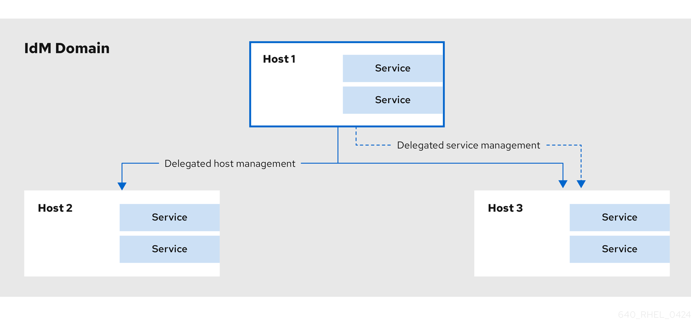

<h4 id="delegating-service-management">40.10.1. Delegating service management</h4>

Delegate permissions for one host to manage services on another host in Identity Management (IdM) to enable automated service credential management. Service delegation supports distributed administration and automation workflows.

When you delegate permissions to a host to manage another host, it does not automatically include permissions to manage its services. You must delegate service management independently.

**Procedure**

1. Delegate the management of a service to a specific host by using the `service-add-host` command:
   
   ```
   ipa service-add-host principal --hosts=<hostname>
   ```
   
   ```plaintext
   ipa service-add-host principal --hosts=<hostname>
   ```
   
   You must specify the service principal using the `principal` argument and the hosts with control using the `--hosts` option.
   
   For example:
   
   ```
   ipa service-add HTTP/web.example.com
   ipa service-add-host HTTP/web.example.com --hosts=client1.example.com
   ```
   
   ```plaintext
   [root@server ~]# ipa service-add HTTP/web.example.com
   [root@server ~]# ipa service-add-host HTTP/web.example.com --hosts=client1.example.com
   ```
2. Once the host is delegated authority, the host principal can be used to manage the service:
   
   ```
   kinit -kt /etc/krb5.keytab host/client1.example.com
   ipa-getkeytab -s server.example.com -k /tmp/test.keytab -p HTTP/web.example.com
   Keytab successfully retrieved and stored in: /tmp/test.keytab
   ```
   
   ```plaintext
   [root@client1 ~]# kinit -kt /etc/krb5.keytab host/client1.example.com
   [root@client1 ~]# ipa-getkeytab -s server.example.com -k /tmp/test.keytab -p HTTP/web.example.com
   Keytab successfully retrieved and stored in: /tmp/test.keytab
   ```
3. To generate a certificate for the delegated service, create a certificate request on the host with the delegated authority:
   
   ```
   kinit -kt /etc/krb5.keytab host/client1.example.com
   openssl req -newkey rsa:2048 -subj '/CN=web.example.com/O=EXAMPLE.COM' -keyout /etc/pki/tls/web.key -out /tmp/web.csr -nodes
   Generating a 2048 bit RSA private key
   .............................................................+++
   ............................................................................................+++
   Writing new private key to '/etc/pki/tls/private/web.key'
   ```
   
   ```plaintext
   [root@client1]# kinit -kt /etc/krb5.keytab host/client1.example.com
   [root@client1]# openssl req -newkey rsa:2048 -subj '/CN=web.example.com/O=EXAMPLE.COM' -keyout /etc/pki/tls/web.key -out /tmp/web.csr -nodes
   Generating a 2048 bit RSA private key
   .............................................................+++
   ............................................................................................+++
   Writing new private key to '/etc/pki/tls/private/web.key'
   ```
4. Use the `cert-request` utility to submit the certificate request and load the certification information:
   
   ```
   ipa cert-request --principal=HTTP/web.example.com web.csr
   Certificate: MIICETCCAXqgA...[snip]
   Subject: CN=web.example.com,O=EXAMPLE.COM
   Issuer: CN=EXAMPLE.COM Certificate Authority
   Not Before: Tue Feb 08 18:51:51 2011 UTC
   Not After: Mon Feb 08 18:51:51 2016 UTC
   Serial number: 1005
   ```
   
   ```plaintext
   [root@client1]# ipa cert-request --principal=HTTP/web.example.com web.csr
   Certificate: MIICETCCAXqgA...[snip]
   Subject: CN=web.example.com,O=EXAMPLE.COM
   Issuer: CN=EXAMPLE.COM Certificate Authority
   Not Before: Tue Feb 08 18:51:51 2011 UTC
   Not After: Mon Feb 08 18:51:51 2016 UTC
   Serial number: 1005
   ```

**Additional resources**

- [Managing certificates for users, hosts, and services using the integrated IdM CA](https://docs.redhat.com/en/documentation/red_hat_enterprise_linux/10/html/managing_certificates_in_idm/managing-certificates-for-users-hosts-and-services-by-using-the-integrated-idm-ca)

<h4 id="delegating-host-management">40.10.2. Delegating host management</h4>

Delegate authority for one host to manage another in Identity Management (IdM) to enable automated keytab retrieval and service management. Host delegation supports automation workflows and reduces manual administrative intervention.

Delegating host management authority creates a `managedby` entry. After the `managedby` entry is created, the managing host can retrieve a keytab for the host it manages.

**Procedure**

1. Log in as the admin user:
   
   ```
   kinit admin
   ```
   
   ```plaintext
   [root@server ~]# kinit admin
   ```
2. Add the `managedby` entry. For example, this delegates authority over *client2* to *client1*:
   
   ```
   ipa host-add-managedby client2.example.com --hosts=client1.example.com
   ```
   
   ```plaintext
   [root@server ~]# ipa host-add-managedby client2.example.com --hosts=client1.example.com
   ```
3. Obtain a ticket as the host *client1*:
   
   ```
   kinit -kt /etc/krb5.keytab host/client1.example.com
   ```
   
   ```plaintext
   [root@client1 ~]# kinit -kt /etc/krb5.keytab host/client1.example.com
   ```
4. Retrieve a keytab for *client2*:
   
   ```
   ipa-getkeytab -s server.example.com -k /tmp/client2.keytab -p host/client2.example.com
   Keytab successfully retrieved and stored in: /tmp/client2.keytab
   ```
   
   ```plaintext
   [root@client1 ~]# ipa-getkeytab -s server.example.com -k /tmp/client2.keytab -p host/client2.example.com
   Keytab successfully retrieved and stored in: /tmp/client2.keytab
   ```

<h4 id="accessing-delegated-services">40.10.3. Accessing delegated services</h4>

When a client has delegated authority, it can obtain a keytab for the principal on the local machine for both services and hosts.

With the `kinit` command, use the `-k` option to load a keytab and the `-t` option to specify the keytab. The principal format is `<principal>/hostname@REALM`. For a service, replace `<principal>` with the service name, for example HTTP. For a host, use `host` as the principal.

**Procedure**

- To access a host:
  
  ```
  kinit -kt /etc/krb5.keytab host/ipa.example.com@EXAMPLE.COM
  ```
  
  ```plaintext
  [root@server ~]# kinit -kt /etc/krb5.keytab host/ipa.example.com@EXAMPLE.COM
  ```
- To access a service:
  
  ```
  kinit -kt /etc/httpd/conf/krb5.keytab HTTP/ipa.example.com@EXAMPLE.COM
  ```
  
  ```plaintext
  [root@server ~]# kinit -kt /etc/httpd/conf/krb5.keytab HTTP/ipa.example.com@EXAMPLE.COM
  ```

<h3 id="managing-hosts-in-idm-cli">40.11. Additional resources</h3>

- [Re-enrolling an IdM client](https://docs.redhat.com/en/documentation/red_hat_enterprise_linux/10/html/installing_identity_management/re-enrolling-an-idm-client)
- [Renaming IdM client systems](https://docs.redhat.com/en/documentation/red_hat_enterprise_linux/10/html/installing_identity_management/renaming-idm-client-systems)

<h2 id="adding-host-entries-from-the-web-ui">Chapter 41. Adding host entries from the Web UI</h2>

Add host entries using the Identity Management (IdM) Web UI to register systems in your domain and enable centralized authentication and access control. Host entries are required before systems can be enrolled as IdM clients.

**Procedure**

1. Open the **Identity** tab, and select the **Hosts** subtab.
2. Click **Add** at the top of the hosts list.
3. Enter the machine name and select the domain from the configured zones in the drop-down list. If the host has already been assigned a static IP address, then include that with the host entry so that the DNS entry is fully created.
   
   The `Class` field has no specific purpose at the moment.
   
   **Add Host Wizard**
   
   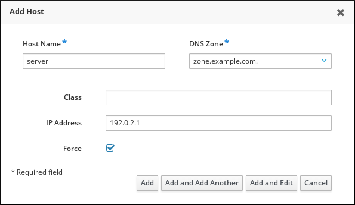 
   
   DNS zones can be created in IdM.
   
   If the IdM server does not manage the DNS server, the zone can be entered manually in the menu area, like a regular text field.
   
   Note
   
   Select the **Force** checkbox if you want to skip checking whether the host is resolvable via DNS.
4. Click the **Add and Edit** button to go directly to the expanded entry page and enter more attribute information. Information about the host hardware and physical location can be included with the host entry.

**Additional resources**

- [Hosts in IdM](#hosts-in-idm "40.1. Hosts in IdM")
- [Host enrollment](#host-enrollment "40.2. Host enrollment")
- [User privileges required for host enrollment](#user-privileges-required-for-host-enrollment "40.3. User privileges required for host enrollment")
- [Enrollment and authentication of IdM hosts and users: comparison](#enrollment-and-authentication-of-idm-hosts-and-users-comparison "40.4. Enrollment and authentication of IdM hosts and users: comparison")
- [Host Operations](#host-operations "40.5. Host operations")
- [Host entry in IdM LDAP](#host-entry-in-idm-ldap "40.6. Host entry in IdM LDAP")

<h2 id="managing-hosts-using-ansible-playbooks">Chapter 42. Managing hosts using Ansible playbooks</h2>

Create and manage IdM host entries using Ansible to register machines in your domain with proper DNS information and credentials.

For details about variables and example playbooks in the FreeIPA Ansible collection, see the `/usr/share/ansible/collections/ansible_collections/freeipa/ansible_freeipa/README-host.md` file on the control node.

<h3 id="ensuring-the-presence-of-an-idm-host-entry-with-fqdn-using-ansible-playbooks">42.1. Ensuring the presence of an IdM host entry with FQDN using Ansible playbooks</h3>

Ensure the presence of an IdM host entry that is only defined by its `fully-qualified domain name` (FQDN) when the host has a dynamic IP address or DNS is managed externally.

Specifying the `FQDN` name of the host is enough if at least one of the following conditions applies:

- The IdM server is not configured to manage DNS.
- The host does not have a static IP address or the IP address is not known at the time the host is configured. Adding a host defined only by an `FQDN` essentially creates a placeholder entry in the IdM DNS service. For example, laptops may be preconfigured as IdM clients, but they do not have IP addresses at the time they are configured. When the DNS service dynamically updates its records, the host’s current IP address is detected and its DNS record is updated.

Note

Without Ansible, host entries are created in IdM using the `ipa host-add` command. The result of adding a host to IdM is the state of the host being present in IdM. Because of the Ansible reliance on idempotence, to add a host to IdM using Ansible, you must create a playbook in which you define the state of the host as present: **state: present**.

**Prerequisites**

- You have configured your Ansible control node to meet the following requirements:
  
  - You are using Ansible version 2.15 or later.
  - You have installed the [`ansible-freeipa`](https://docs.redhat.com/en/documentation/red_hat_enterprise_linux/10/html/using_ansible_to_install_and_manage_identity_management_in_rhel/installing-an-identity-management-server-using-an-ansible-playbook#installing-the-ansible-freeipa-package) package.
  - The example assumes that in the **~/*MyPlaybooks*/** directory, you have created an [Ansible inventory file](https://docs.redhat.com/en/documentation/red_hat_enterprise_linux/10/html/using_ansible_to_install_and_manage_identity_management_in_rhel/preparing-your-environment-for-managing-idm-using-ansible-playbooks) with the fully-qualified domain name (FQDN) of the IdM server.
  - The example assumes that the **secret.yml** Ansible vault stores your `ipaadmin_password` and that you have access to a file that stores the password protecting the **secret.yml** file.
- The target node, that is the node on which the `freeipa.ansible_freeipa` module is executed, is part of the IdM domain as an IdM client, server or replica.

**Procedure**

1. Navigate to the **~/*MyPlaybooks*/** directory:
   
   ```
   cd ~/MyPlaybooks
   ```
   
   ```plaintext
   cd ~/MyPlaybooks
   ```
2. Create an **ensure-host-is-present.yml** Ansible playbook file with the `FQDN` of the host whose presence in IdM you want to ensure. To simplify this step, you can copy and modify the example in the `/usr/share/ansible/collections/ansible_collections/freeipa/ansible_freeipa/playbooks/host/add-host.yml` file:
   
   ```
   ---
   - name: Host present
     hosts: ipaserver
   
     vars_files:
     - /home/user_name/MyPlaybooks/secret.yml
     tasks:
     - name: Host host01.idm.example.com present
       freeipa.ansible_freeipa.ipahost:
         ipaadmin_password: "{{ ipaadmin_password }}"
         name: host01.idm.example.com
         state: present
         force: true
   ```
   
   ```plaintext
   ---
   - name: Host present
     hosts: ipaserver
   
     vars_files:
     - /home/user_name/MyPlaybooks/secret.yml
     tasks:
     - name: Host host01.idm.example.com present
       freeipa.ansible_freeipa.ipahost:
         ipaadmin_password: "{{ ipaadmin_password }}"
         name: host01.idm.example.com
         state: present
         force: true
   ```
3. Run the playbook:
   
   ```
   ansible-playbook --vault-password-file=password_file -v -i inventory ensure-host-is-present.yml
   ```
   
   ```plaintext
   $ ansible-playbook --vault-password-file=password_file -v -i inventory ensure-host-is-present.yml
   ```
   
   Note
   
   The procedure results in a host entry in the IdM LDAP server being created but not in enrolling the host into the IdM Kerberos realm. For that, you must deploy the host as an IdM client. For details, see [Installing an Identity Management client using an Ansible playbook](https://docs.redhat.com/en/documentation/red_hat_enterprise_linux/10/html/installing_identity_management/installing-an-identity-management-client-using-an-ansible-playbook).

**Verification**

1. Log in to your IdM server as `admin`:
   
   ```
   ssh admin@server.idm.example.com
   Password:
   ```
   
   ```plaintext
   $ ssh admin@server.idm.example.com
   Password:
   ```
2. Enter the `ipa host-show` command and specify the name of the host:
   
   ```
   ipa host-show host01.idm.example.com
     Host name: host01.idm.example.com
     Principal name: host/host01.idm.example.com@IDM.EXAMPLE.COM
     Principal alias: host/host01.idm.example.com@IDM.EXAMPLE.COM
     Password: False
     Keytab: False
     Managed by: host01.idm.example.com
   ```
   
   ```plaintext
   $ ipa host-show host01.idm.example.com
     Host name: host01.idm.example.com
     Principal name: host/host01.idm.example.com@IDM.EXAMPLE.COM
     Principal alias: host/host01.idm.example.com@IDM.EXAMPLE.COM
     Password: False
     Keytab: False
     Managed by: host01.idm.example.com
   ```

The output confirms that **host01.idm.example.com** exists in IdM.

<h3 id="ensuring-the-presence-of-an-idm-host-entry-with-dns-information-using-ansible-playbooks">42.2. Ensuring the presence of an IdM host entry with DNS information using Ansible playbooks</h3>

Run the Ansible playbook to add an IdM host entry with its `fully-qualified domain name` (FQDN) and IP address.

**Prerequisites**

- You know the IdM administrator password.
- You have configured your Ansible control node to meet the following requirements:
  
  - You are using Ansible version 2.15 or later.
  - You have installed the [`ansible-freeipa`](https://docs.redhat.com/en/documentation/red_hat_enterprise_linux/10/html/using_ansible_to_install_and_manage_identity_management_in_rhel/installing-an-identity-management-server-using-an-ansible-playbook#installing-the-ansible-freeipa-package) package.
  - The example assumes that in the **~/*MyPlaybooks*/** directory, you have created an [Ansible inventory file](https://docs.redhat.com/en/documentation/red_hat_enterprise_linux/10/html/using_ansible_to_install_and_manage_identity_management_in_rhel/preparing-your-environment-for-managing-idm-using-ansible-playbooks) with the fully-qualified domain name (FQDN) of the IdM server.
  - The example assumes that the **secret.yml** Ansible vault stores your `ipaadmin_password` and that you have access to a file that stores the password protecting the **secret.yml** file.
- The target node, that is the node on which the `freeipa.ansible_freeipa` module is executed, is part of the IdM domain as an IdM client, server or replica.

**Procedure**

1. Navigate to the **~/*MyPlaybooks*/** directory:
   
   ```
   cd ~/MyPlaybooks
   ```
   
   ```plaintext
   cd ~/MyPlaybooks
   ```
2. Create an **ensure-host-is-present.yml** Ansible playbook file with the `fully-qualified domain name` (FQDN) of the host whose presence in IdM you want to ensure. In addition, if the IdM server is configured to manage DNS and you know the IP address of the host, specify a value for the `ip_address` parameter. The IP address is necessary for the host to exist in the DNS resource records. To simplify this step, you can copy and modify the example in the `/usr/share/ansible/collections/ansible_collections/freeipa/ansible_freeipa/playbooks/host/host-present.yml` file. You can also include other, additional information:
   
   ```
   ---
   - name: Host present
     hosts: ipaserver
   
     vars_files:
     - /home/user_name/MyPlaybooks/secret.yml
     tasks:
     - name: Ensure host01.idm.example.com is present
       freeipa.ansible_freeipa.ipahost:
         ipaadmin_password: "{{ ipaadmin_password }}"
         name: host01.idm.example.com
         description: Example host
         ip_address: 192.168.0.123
         locality: Lab
         ns_host_location: Lab
         ns_os_version: CentOS 7
         ns_hardware_platform: Lenovo T61
         mac_address:
         - "08:00:27:E3:B1:2D"
         - "52:54:00:BD:97:1E"
         state: present
   ```
   
   ```plaintext
   ---
   - name: Host present
     hosts: ipaserver
   
     vars_files:
     - /home/user_name/MyPlaybooks/secret.yml
     tasks:
     - name: Ensure host01.idm.example.com is present
       freeipa.ansible_freeipa.ipahost:
         ipaadmin_password: "{{ ipaadmin_password }}"
         name: host01.idm.example.com
         description: Example host
         ip_address: 192.168.0.123
         locality: Lab
         ns_host_location: Lab
         ns_os_version: CentOS 7
         ns_hardware_platform: Lenovo T61
         mac_address:
         - "08:00:27:E3:B1:2D"
         - "52:54:00:BD:97:1E"
         state: present
   ```
3. Run the playbook:
   
   ```
   ansible-playbook --vault-password-file=password_file -v -i inventory ensure-host-is-present.yml
   ```
   
   ```plaintext
   $ ansible-playbook --vault-password-file=password_file -v -i inventory ensure-host-is-present.yml
   ```
   
   Note
   
   The procedure results in a host entry in the IdM LDAP server being created but not in enrolling the host into the IdM Kerberos realm. For that, you must deploy the host as an IdM client. For details, see [Installing an Identity Management client using an Ansible playbook](https://docs.redhat.com/en/documentation/red_hat_enterprise_linux/10/html/installing_identity_management/installing-an-identity-management-client-using-an-ansible-playbook).

**Verification**

1. Log in to your IdM server as admin:
   
   ```
   ssh admin@server.idm.example.com
   Password:
   ```
   
   ```plaintext
   $ ssh admin@server.idm.example.com
   Password:
   ```
2. Enter the `ipa host-show` command and specify the name of the host:
   
   ```
   ipa host-show host01.idm.example.com
     Host name: host01.idm.example.com
     Description: Example host
     Locality: Lab
     Location: Lab
     Platform: Lenovo T61
     Operating system: CentOS 7
     Principal name: host/host01.idm.example.com@IDM.EXAMPLE.COM
     Principal alias: host/host01.idm.example.com@IDM.EXAMPLE.COM
     MAC address: 08:00:27:E3:B1:2D, 52:54:00:BD:97:1E
     Password: False
     Keytab: False
     Managed by: host01.idm.example.com
   ```
   
   ```plaintext
   $ ipa host-show host01.idm.example.com
     Host name: host01.idm.example.com
     Description: Example host
     Locality: Lab
     Location: Lab
     Platform: Lenovo T61
     Operating system: CentOS 7
     Principal name: host/host01.idm.example.com@IDM.EXAMPLE.COM
     Principal alias: host/host01.idm.example.com@IDM.EXAMPLE.COM
     MAC address: 08:00:27:E3:B1:2D, 52:54:00:BD:97:1E
     Password: False
     Keytab: False
     Managed by: host01.idm.example.com
   ```

The output confirms **host01.idm.example.com** exists in IdM.

<h3 id="ensuring-the-presence-of-multiple-idm-host-entries-with-random-passwords-using-ansible-playbooks">42.3. Ensuring the presence of multiple IdM host entries with random passwords using Ansible playbooks</h3>

Create multiple host entries in a single Ansible task and generate random enrollment passwords for each host.

The `freeipa.ansible_freeipa.ipahost` module allows the system administrator to ensure the presence or absence of multiple host entries in IdM using just one Ansible task. In the example below, multiple host entries are only defined by their `fully-qualified domain names` (FQDNs). Running the Ansible playbook generates random passwords for the hosts.

**Prerequisites**

- You have configured your Ansible control node to meet the following requirements:
  
  - You are using Ansible version 2.15 or later.
  - You have installed the [`ansible-freeipa`](https://docs.redhat.com/en/documentation/red_hat_enterprise_linux/10/html/using_ansible_to_install_and_manage_identity_management_in_rhel/installing-an-identity-management-server-using-an-ansible-playbook#installing-the-ansible-freeipa-package) package.
  - The example assumes that in the **~/*MyPlaybooks*/** directory, you have created an [Ansible inventory file](https://docs.redhat.com/en/documentation/red_hat_enterprise_linux/10/html/using_ansible_to_install_and_manage_identity_management_in_rhel/preparing-your-environment-for-managing-idm-using-ansible-playbooks) with the fully-qualified domain name (FQDN) of the IdM server.
  - The example assumes that the **secret.yml** Ansible vault stores your `ipaadmin_password` and that you have access to a file that stores the password protecting the **secret.yml** file.
- The target node, that is the node on which the `freeipa.ansible_freeipa` module is executed, is part of the IdM domain as an IdM client, server or replica.

**Procedure**

1. Navigate to the **~/*MyPlaybooks*/** directory:
   
   ```
   cd ~/MyPlaybooks
   ```
   
   ```plaintext
   cd ~/MyPlaybooks
   ```
2. Create an **ensure-hosts-are-present.yml** Ansible playbook file with the `fully-qualified domain name` (FQDN) of the hosts whose presence in IdM you want to ensure. To make the Ansible playbook generate a random password for each host even when the host already exists in IdM and `update_password` is limited to `on_create`, add the `random: true` and `force: true` options. To simplify this step, you can copy and modify the example from the `/usr/share/ansible/collections/ansible_collections/freeipa/ansible_freeipa/README-host.md` Markdown file:
   
   ```
   ---
   - name: Ensure hosts with random password
     hosts: ipaserver
   
     vars_files:
     - /home/user_name/MyPlaybooks/secret.yml
     tasks:
     - name: Hosts host01.idm.example.com and host02.idm.example.com present with random passwords
       freeipa.ansible_freeipa.ipahost:
         ipaadmin_password: "{{ ipaadmin_password }}"
         hosts:
         - name: host01.idm.example.com
           random: true
           force: true
         - name: host02.idm.example.com
           random: true
           force: true
       register: ipahost
   ```
   
   ```plaintext
   ---
   - name: Ensure hosts with random password
     hosts: ipaserver
   
     vars_files:
     - /home/user_name/MyPlaybooks/secret.yml
     tasks:
     - name: Hosts host01.idm.example.com and host02.idm.example.com present with random passwords
       freeipa.ansible_freeipa.ipahost:
         ipaadmin_password: "{{ ipaadmin_password }}"
         hosts:
         - name: host01.idm.example.com
           random: true
           force: true
         - name: host02.idm.example.com
           random: true
           force: true
       register: ipahost
   ```
3. Run the playbook:
   
   ```
   ansible-playbook --vault-password-file=password_file -v -i inventory ensure-hosts-are-present.yml
   [...]
   TASK [Hosts host01.idm.example.com and host02.idm.example.com present with random passwords]
   changed: [server.idm.example.com] => {"changed": true, "host": {"host01.idm.example.com": {"randompassword": "0HoIRvjUdH0Ycbf6uYdWTxH"}, "host02.idm.example.com": {"randompassword": "5VdLgrf3wvojmACdHC3uA3s"}}}
   ```
   
   ```plaintext
   $ ansible-playbook --vault-password-file=password_file -v -i inventory ensure-hosts-are-present.yml
   [...]
   TASK [Hosts host01.idm.example.com and host02.idm.example.com present with random passwords]
   changed: [server.idm.example.com] => {"changed": true, "host": {"host01.idm.example.com": {"randompassword": "0HoIRvjUdH0Ycbf6uYdWTxH"}, "host02.idm.example.com": {"randompassword": "5VdLgrf3wvojmACdHC3uA3s"}}}
   ```
   
   Note
   
   To deploy the hosts as IdM clients using random, one-time passwords (OTPs), see [Authorization options for IdM client enrollment using an Ansible playbook](https://docs.redhat.com/en/documentation/red_hat_enterprise_linux/10/html/using_ansible_to_install_and_manage_identity_management_in_rhel/installing-an-identity-management-client-using-an-ansible-playbook#authorization-options-for-idm-client-enrollment-using-an-ansible-playbook) or [Installing a client by using a one-time password: Interactive installation](https://docs.redhat.com/en/documentation/red_hat_enterprise_linux/10/html/installing_identity_management/installing-an-idm-client#installing-a-client-by-using-a-one-time-password-interactive-installation).

**Verification**

1. Log in to your IdM server as admin:
   
   ```
   ssh admin@server.idm.example.com
   Password:
   ```
   
   ```plaintext
   $ ssh admin@server.idm.example.com
   Password:
   ```
2. Enter the `ipa host-show` command and specify the name of one of the hosts:
   
   ```
   ipa host-show host01.idm.example.com
     Host name: host01.idm.example.com
     Password: True
     Keytab: False
     Managed by: host01.idm.example.com
   ```
   
   ```plaintext
   $ ipa host-show host01.idm.example.com
     Host name: host01.idm.example.com
     Password: True
     Keytab: False
     Managed by: host01.idm.example.com
   ```

The output confirms **host01.idm.example.com** exists in IdM with a random password.

<h3 id="ensuring-the-presence-of-an-idm-host-entry-with-multiple-ip-addresses-using-ansible-playbooks">42.4. Ensuring the presence of an IdM host entry with multiple IP addresses using Ansible playbooks</h3>

Run the Ansible playbook to create an Identity Management (IdM) host entry with multiple IPv4 and IPv6 addresses when the host has multiple network interfaces.

Note

In contrast to the `ipa host` utility, the Ansible `freeipa.ansible_freeipa.ipahost` module can ensure the presence or absence of several IPv4 and IPv6 addresses for a host. The `ipa host-mod` command cannot handle IP addresses.

**Prerequisites**

- You have configured your Ansible control node to meet the following requirements:
  
  - You are using Ansible version 2.15 or later.
  - You have installed the [`ansible-freeipa`](https://docs.redhat.com/en/documentation/red_hat_enterprise_linux/10/html/using_ansible_to_install_and_manage_identity_management_in_rhel/installing-an-identity-management-server-using-an-ansible-playbook#installing-the-ansible-freeipa-package) package.
  - The example assumes that in the **~/*MyPlaybooks*/** directory, you have created an [Ansible inventory file](https://docs.redhat.com/en/documentation/red_hat_enterprise_linux/10/html/using_ansible_to_install_and_manage_identity_management_in_rhel/preparing-your-environment-for-managing-idm-using-ansible-playbooks) with the fully-qualified domain name (FQDN) of the IdM server.
  - The example assumes that the **secret.yml** Ansible vault stores your `ipaadmin_password` and that you have access to a file that stores the password protecting the **secret.yml** file.
- The target node, that is the node on which the `freeipa.ansible_freeipa` module is executed, is part of the IdM domain as an IdM client, server or replica.

**Procedure**

1. Navigate to the **~/*MyPlaybooks*/** directory:
   
   ```
   cd ~/MyPlaybooks
   ```
   
   ```plaintext
   cd ~/MyPlaybooks
   ```
2. Create an **ensure-host-with-multiple-IP-addreses-is-present.yml** Ansible playbook file. Specify, as the `name` of the `freeipa.ansible_freeipa.ipahost` variable, the `fully-qualified domain name` (FQDN) of the host whose presence in IdM you want to ensure. Specify each of the multiple IPv4 and IPv6 `ip_address` values on a separate line by using the ***ip\_address*** syntax. To simplify this step, you can copy and modify the example in the `/usr/share/ansible/collections/ansible_collections/freeipa/ansible_freeipa/playbooks/host/host-member-ipaddresses-present.yml` file. You can also include additional information:
   
   ```
   ---
   - name: Host member IP addresses present
     hosts: ipaserver
   
     vars_files:
     - /home/user_name/MyPlaybooks/secret.yml
     tasks:
     - name: Ensure host101.example.com IP addresses present
       freeipa.ansible_freeipa.ipahost:
         ipaadmin_password: "{{ ipaadmin_password }}"
         name: host01.idm.example.com
         ip_address:
         - 192.168.0.123
         - fe80::20c:29ff:fe02:a1b3
         - 192.168.0.124
         - fe80::20c:29ff:fe02:a1b4
         force: true
   ```
   
   ```plaintext
   ---
   - name: Host member IP addresses present
     hosts: ipaserver
   
     vars_files:
     - /home/user_name/MyPlaybooks/secret.yml
     tasks:
     - name: Ensure host101.example.com IP addresses present
       freeipa.ansible_freeipa.ipahost:
         ipaadmin_password: "{{ ipaadmin_password }}"
         name: host01.idm.example.com
         ip_address:
         - 192.168.0.123
         - fe80::20c:29ff:fe02:a1b3
         - 192.168.0.124
         - fe80::20c:29ff:fe02:a1b4
         force: true
   ```
3. Run the playbook:
   
   ```
   ansible-playbook --vault-password-file=password_file -v -i inventory ensure-host-with-multiple-IP-addreses-is-present.yml
   ```
   
   ```plaintext
   $ ansible-playbook --vault-password-file=password_file -v -i inventory ensure-host-with-multiple-IP-addreses-is-present.yml
   ```
   
   Note
   
   The procedure creates a host entry in the IdM LDAP server but does not enroll the host into the IdM Kerberos realm. For that, you must deploy the host as an IdM client. For details, see [Installing an Identity Management client using an Ansible playbook](https://docs.redhat.com/en/documentation/red_hat_enterprise_linux/10/html/installing_identity_management/installing-an-identity-management-client-using-an-ansible-playbook).

**Verification**

1. Log in to your IdM server as admin:
   
   ```
   ssh admin@server.idm.example.com
   Password:
   ```
   
   ```plaintext
   $ ssh admin@server.idm.example.com
   Password:
   ```
2. Enter the `ipa host-show` command and specify the name of the host:
   
   ```
   ipa host-show host01.idm.example.com
     Principal name: host/host01.idm.example.com@IDM.EXAMPLE.COM
     Principal alias: host/host01.idm.example.com@IDM.EXAMPLE.COM
     Password: False
     Keytab: False
     Managed by: host01.idm.example.com
   ```
   
   ```plaintext
   $ ipa host-show host01.idm.example.com
     Principal name: host/host01.idm.example.com@IDM.EXAMPLE.COM
     Principal alias: host/host01.idm.example.com@IDM.EXAMPLE.COM
     Password: False
     Keytab: False
     Managed by: host01.idm.example.com
   ```
   
   The output confirms that **host01.idm.example.com** exists in IdM.
3. To verify that the multiple IP addresses of the host exist in the IdM DNS records, enter the `ipa dnsrecord-show` command and specify the following information:
   
   - The name of the IdM domain
   - The name of the host
     
     ```
     ipa dnsrecord-show idm.example.com host01
     [...]
       Record name: host01
       A record: 192.168.0.123, 192.168.0.124
       AAAA record: fe80::20c:29ff:fe02:a1b3, fe80::20c:29ff:fe02:a1b4
     ```
     
     ```plaintext
     $ ipa dnsrecord-show idm.example.com host01
     [...]
       Record name: host01
       A record: 192.168.0.123, 192.168.0.124
       AAAA record: fe80::20c:29ff:fe02:a1b3, fe80::20c:29ff:fe02:a1b4
     ```
   
   The output confirms that all the IPv4 and IPv6 addresses specified in the playbook are correctly associated with the **host01.idm.example.com** host entry.

<h3 id="ensuring-the-absence-of-an-idm-host-entry-using-ansible-playbooks">42.5. Ensuring the absence of an IdM host entry using Ansible playbooks</h3>

Remove an IdM host entry using Ansible when decommissioning systems or cleaning up stale entries from your domain.

Follow this procedure to ensure the absence of host entries in Identity Management (IdM) using Ansible playbooks.

**Prerequisites**

- You have configured your Ansible control node to meet the following requirements:
  
  - You are using Ansible version 2.15 or later.
  - You have installed the [`ansible-freeipa`](https://docs.redhat.com/en/documentation/red_hat_enterprise_linux/10/html/using_ansible_to_install_and_manage_identity_management_in_rhel/installing-an-identity-management-server-using-an-ansible-playbook#installing-the-ansible-freeipa-package) package.
  - The example assumes that in the **~/*MyPlaybooks*/** directory, you have created an [Ansible inventory file](https://docs.redhat.com/en/documentation/red_hat_enterprise_linux/10/html/using_ansible_to_install_and_manage_identity_management_in_rhel/preparing-your-environment-for-managing-idm-using-ansible-playbooks) with the fully-qualified domain name (FQDN) of the IdM server.
  - The example assumes that the **secret.yml** Ansible vault stores your `ipaadmin_password` and that you have access to a file that stores the password protecting the **secret.yml** file.
- The target node, that is the node on which the `freeipa.ansible_freeipa` module is executed, is part of the IdM domain as an IdM client, server or replica.

**Procedure**

1. Create an Ansible playbook file with the `fully-qualified domain name` (FQDN) of the host whose absence from IdM you want to ensure. If your IdM domain has integrated DNS, use the `updatedns: true` option to remove the associated records of any kind for the host from the DNS.
   
   To simplify this step, you can copy and modify the example in the `/usr/share/ansible/collections/ansible_collections/freeipa/ansible_freeipa/playbooks/host/delete-host.yml` file:
   
   ```
   ---
   - name: Host absent
     hosts: ipaserver
   
     vars_files:
     - /home/user_name/MyPlaybooks/secret.yml
     tasks:
     - name: Host host01.idm.example.com absent
       freeipa.ansible_freeipa.ipahost:
         ipaadmin_password: "{{ ipaadmin_password }}"
         name: host01.idm.example.com
         updatedns: true
         state: absent
   ```
   
   ```plaintext
   ---
   - name: Host absent
     hosts: ipaserver
   
     vars_files:
     - /home/user_name/MyPlaybooks/secret.yml
     tasks:
     - name: Host host01.idm.example.com absent
       freeipa.ansible_freeipa.ipahost:
         ipaadmin_password: "{{ ipaadmin_password }}"
         name: host01.idm.example.com
         updatedns: true
         state: absent
   ```
2. Run the playbook:
   
   ```
   ansible-playbook --vault-password-file=password_file -v -i path_to_inventory_directory/inventory.file path_to_playbooks_directory/ensure-host-absent.yml
   ```
   
   ```plaintext
   $ ansible-playbook --vault-password-file=password_file -v -i path_to_inventory_directory/inventory.file path_to_playbooks_directory/ensure-host-absent.yml
   ```
   
   Note
   
   The procedure results in:
   
   - The host not being present in the IdM Kerberos realm.
   - The host entry not being present in the IdM LDAP server.
   
   To remove the specific IdM configuration of system services, such as System Security Services Daemon (SSSD), from the client host itself, you must run the `ipa-client-install --uninstall` command on the client. For details, see [Uninstalling an IdM client](https://docs.redhat.com/en/documentation/red_hat_enterprise_linux/10/html/installing_identity_management/uninstalling-an-idm-client).

**Verification**

1. Log into `ipaserver` as admin:
   
   ```
   ssh admin@server.idm.example.com
   Password:
   [admin@server /]$
   ```
   
   ```plaintext
   $ ssh admin@server.idm.example.com
   Password:
   [admin@server /]$
   ```
2. Display information about *host01.idm.example.com*:
   
   ```
   ipa host-show host01.idm.example.com
   ipa: ERROR: host01.idm.example.com: host not found
   ```
   
   ```plaintext
   $ ipa host-show host01.idm.example.com
   ipa: ERROR: host01.idm.example.com: host not found
   ```

The output confirms that the host does not exist in IdM.

<h2 id="managing-host-groups-using-the-idm-cli">Chapter 43. Managing host groups using the IdM CLI</h2>

Manage host groups and their members in Identity Management (IdM) using the CLI to organize hosts for easier policy management. Host groups simplify the application of access control rules and other policies to multiple hosts.

<h3 id="host-groups-in-idm">43.1. Host groups in IdM</h3>

Understand how IdM host groups centralize control over access policies and other management tasks for sets of hosts with common characteristics. For example, you can define host groups based on company departments, physical locations, or access control requirements.

A host group in IdM can include:

- IdM servers and clients
- Other IdM host groups
  
  Host groups created by default
  
  By default, the IdM server creates the host group `ipaservers` for all IdM server hosts.
  
  Direct and indirect group members
  
  Group attributes in IdM apply to both direct and indirect members: when host group B is a member of host group A, all members of host group B are considered indirect members of host group A.

<h3 id="viewing-idm-host-groups-using-the-cli">43.2. Viewing IdM host groups using the CLI</h3>

View host groups and their details by using the Identity Management (IdM) CLI to understand how hosts are organized and confirm group configurations.

**Prerequisites**

- Administrator privileges for managing IdM or User Administrator role.
- An active Kerberos ticket. For details, see [Using kinit to log in to IdM manually](https://docs.redhat.com/en/documentation/red_hat_enterprise_linux/10/html/accessing_identity_management_services/logging-in-to-identity-management-from-the-command-line#using-kinit-to-log-in-to-idm-manually_login-cli-krb).

**Procedure**

1. Find all host groups using the `ipa hostgroup-find` command.
   
   ```
   ipa hostgroup-find
   -------------------
   1 hostgroup matched
   -------------------
     Host-group: ipaservers
     Description: IPA server hosts
   ----------------------------
   Number of entries returned 1
   ----------------------------
   ```
   
   ```plaintext
   $ ipa hostgroup-find
   -------------------
   1 hostgroup matched
   -------------------
     Host-group: ipaservers
     Description: IPA server hosts
   ----------------------------
   Number of entries returned 1
   ----------------------------
   ```
2. To display all attributes of a host group, add the `--all` option. For example:
   
   ```
   ipa hostgroup-find --all
   -------------------
   1 hostgroup matched
   -------------------
     dn: cn=ipaservers,cn=hostgroups,cn=accounts,dc=idm,dc=local
     Host-group: ipaservers
     Description: IPA server hosts
     Member hosts: xxx.xxx.xxx.xxx
     ipauniqueid: xxxxxxxx-xxxx-xxxx-xxxx-xxxxxxxxxxxx
     objectclass: top, groupOfNames, nestedGroup, ipaobject, ipahostgroup
   ----------------------------
   Number of entries returned 1
   ----------------------------
   ```
   
   ```plaintext
   $ ipa hostgroup-find --all
   -------------------
   1 hostgroup matched
   -------------------
     dn: cn=ipaservers,cn=hostgroups,cn=accounts,dc=idm,dc=local
     Host-group: ipaservers
     Description: IPA server hosts
     Member hosts: xxx.xxx.xxx.xxx
     ipauniqueid: xxxxxxxx-xxxx-xxxx-xxxx-xxxxxxxxxxxx
     objectclass: top, groupOfNames, nestedGroup, ipaobject, ipahostgroup
   ----------------------------
   Number of entries returned 1
   ----------------------------
   ```

<h3 id="creating-idm-host-groups-using-the-cli">43.3. Creating IdM host groups using the CLI</h3>

Create host groups using the Identity Management (IdM) CLI to organize and manage multiple hosts as a single unit. Host groups simplify policy application and administrative tasks across your infrastructure.

**Prerequisites**

- Administrator privileges for managing IdM or User Administrator role.
- An active Kerberos ticket. For details, see [Using kinit to log in to IdM manually](https://docs.redhat.com/en/documentation/red_hat_enterprise_linux/10/html/accessing_identity_management_services/logging-in-to-identity-management-from-the-command-line#using-kinit-to-log-in-to-idm-manually_login-cli-krb).

**Procedure**

- Add a host group using the `ipa hostgroup-add` command.
  
  For example, to create an IdM host group named *group\_name* and give it a description:
  
  ```
  ipa hostgroup-add --desc 'My new host group' group_name
  ---------------------
  Added hostgroup "group_name"
  ---------------------
    Host-group: group_name
    Description: My new host group
  ---------------------
  ```
  
  ```plaintext
  $ ipa hostgroup-add --desc 'My new host group' group_name
  ---------------------
  Added hostgroup "group_name"
  ---------------------
    Host-group: group_name
    Description: My new host group
  ---------------------
  ```

<h3 id="deleting-idm-host-groups-using-the-cli">43.4. Deleting IdM host groups using the CLI</h3>

You can delete host groups using the Identity Management (IdM) CLI. Deleting a host group does not delete the group members from IdM.

**Prerequisites**

- Administrator privileges for managing IdM or User Administrator role.
- An active Kerberos ticket. For details, see [Using kinit to log in to IdM manually](https://docs.redhat.com/en/documentation/red_hat_enterprise_linux/10/html/accessing_identity_management_services/logging-in-to-identity-management-from-the-command-line#using-kinit-to-log-in-to-idm-manually_login-cli-krb).

**Procedure**

- Delete a host group using the `ipa hostgroup-del` command.
  
  For example, to delete the IdM host group named *group\_name*:
  
  ```
  ipa hostgroup-del group_name
  --------------------------
  Deleted hostgroup "group_name"
  --------------------------
  ```
  
  ```plaintext
  $ ipa hostgroup-del group_name
  --------------------------
  Deleted hostgroup "group_name"
  --------------------------
  ```

<h3 id="adding-idm-host-group-members-using-the-cli">43.5. Adding IdM host group members using the CLI</h3>

Add hosts to host groups using the Identity Management (IdM) CLI to apply policies and access controls to multiple systems collectively.

**Prerequisites**

- Administrator privileges for managing IdM or User Administrator role.
- An active Kerberos ticket. For details, see [Using kinit to log in to IdM manually](https://docs.redhat.com/en/documentation/red_hat_enterprise_linux/10/html/accessing_identity_management_services/logging-in-to-identity-management-from-the-command-line#using-kinit-to-log-in-to-idm-manually_login-cli-krb).
- Optional: Use the `ipa hostgroup-find` command to find hosts and host groups.

**Procedure**

- To add a member to a host group, use the `ipa hostgroup-add-member` command and provide the relevant information. You can specify the type of member to add using these options:
  
  - Use the `--hosts` option to add one or more hosts to an IdM host group.
    
    For example, to add the host named *example\_member* to the group named *group\_name*:
    
    ```
    ipa hostgroup-add-member group_name --hosts example_member
    Host-group: group_name
    Description: My host group
    Member hosts: example_member
    -------------------------
    Number of members added 1
    -------------------------
    ```
    
    ```plaintext
    $ ipa hostgroup-add-member group_name --hosts example_member
    Host-group: group_name
    Description: My host group
    Member hosts: example_member
    -------------------------
    Number of members added 1
    -------------------------
    ```
  - Use the `--hostgroups` option to add one or more host groups to an IdM host group.
    
    For example, to add the host group named *nested\_group* to the group named *group\_name*:
    
    ```
    ipa hostgroup-add-member group_name --hostgroups nested_group
    Host-group: group_name
    Description: My host group
    Member host-groups: nested_group
    -------------------------
    Number of members added 1
    -------------------------
    ```
    
    ```plaintext
    $ ipa hostgroup-add-member group_name --hostgroups nested_group
    Host-group: group_name
    Description: My host group
    Member host-groups: nested_group
    -------------------------
    Number of members added 1
    -------------------------
    ```
  - You can add multiple hosts and multiple host groups to an IdM host group in one single command using the following syntax:
    
    ```
    ipa hostgroup-add-member group_name --hosts={host1,host2} --hostgroups={group1,group2}
    ```
    
    ```plaintext
    $ ipa hostgroup-add-member group_name --hosts={host1,host2} --hostgroups={group1,group2}
    ```
  
  Important
  
  When adding a host group as a member of another host group, do not create recursive groups. For example, if Group A is a member of Group B, do not add Group B as a member of Group A. Recursive groups can cause unpredictable behavior.

<h3 id="removing-idm-host-group-members-using-the-cli">43.6. Removing IdM host group members using the CLI</h3>

Remove hosts or nested host groups from an Identity Management (IdM) host group by using the CLI to revoke their membership-based policies and access.

**Prerequisites**

- Administrator privileges for managing IdM or User Administrator role.
- An active Kerberos ticket. For details, see [Using kinit to log in to IdM manually](https://docs.redhat.com/en/documentation/red_hat_enterprise_linux/10/html/accessing_identity_management_services/logging-in-to-identity-management-from-the-command-line#using-kinit-to-log-in-to-idm-manually_login-cli-krb).
- *Optional*. Use the `ipa hostgroup-find` command to confirm that the group includes the member you want to remove.

**Procedure**

- To remove a host group member, use the `ipa hostgroup-remove-member` command and provide the relevant information. You can specify the type of member to remove using these options:
  
  - Use the `--hosts` option to remove one or more hosts from an IdM host group.
    
    For example, to remove the host named *example\_member* from the group named *group\_name*:
    
    ```
    ipa hostgroup-remove-member group_name --hosts example_member
    Host-group: group_name
    Description: My host group
    -------------------------
    Number of members removed 1
    -------------------------
    ```
    
    ```plaintext
    $ ipa hostgroup-remove-member group_name --hosts example_member
    Host-group: group_name
    Description: My host group
    -------------------------
    Number of members removed 1
    -------------------------
    ```
  - Use the `--hostgroups` option to remove one or more host groups from an IdM host group.
    
    For example, to remove the host group named *nested\_group* from the group named *group\_name*:
    
    ```
    ipa hostgroup-remove-member group_name --hostgroups example_member
    Host-group: group_name
    Description: My host group
    -------------------------
    Number of members removed 1
    -------------------------
    ```
    
    ```plaintext
    $ ipa hostgroup-remove-member group_name --hostgroups example_member
    Host-group: group_name
    Description: My host group
    -------------------------
    Number of members removed 1
    -------------------------
    ```
    
    Note
    
    Removing a group does not delete the group members from IdM.
  - You can remove multiple hosts and multiple host groups from an IdM host group in one single command using the following syntax:
    
    ```
    ipa hostgroup-remove-member group_name --hosts={host1,host2} --hostgroups={group1,group2}
    ```
    
    ```plaintext
    $ ipa hostgroup-remove-member group_name --hosts={host1,host2} --hostgroups={group1,group2}
    ```

<h3 id="adding-idm-host-group-member-managers-using-the-cli">43.7. Adding IdM host group member managers using the CLI</h3>

Designate hosts or host groups as member managers using the Identity Management (IdM) CLI to delegate host group membership management. Member managers can add or remove hosts from groups without having full administrative privileges.

**Prerequisites**

- Administrator privileges for managing IdM or User Administrator role.
- An active Kerberos ticket. For details, see [Using kinit to log in to IdM manually](https://docs.redhat.com/en/documentation/red_hat_enterprise_linux/10/html/accessing_identity_management_services/logging-in-to-identity-management-from-the-command-line#using-kinit-to-log-in-to-idm-manually_login-cli-krb).
- You must have the name of the host or host group you are adding as member managers and the name of the host group you want them to manage.

**Procedure**

1. Optional: Use the `ipa hostgroup-find` command to find hosts and host groups.
2. To add a member manager to a host group, use the `ipa hostgroup-add-member-manager`.
   
   For example, to add the user named *example\_member* as a member manager to the group named *group\_name*:
   
   ```
   ipa hostgroup-add-member-manager group_name --user example_member
   Host-group: group_name
   Member hosts: server.idm.example.com
   Member host-groups: project_admins
   Member of netgroups: group_name
   Membership managed by users: example_member
   -------------------------
   Number of members added 1
   -------------------------
   ```
   
   ```plaintext
   $ ipa hostgroup-add-member-manager group_name --user example_member
   Host-group: group_name
   Member hosts: server.idm.example.com
   Member host-groups: project_admins
   Member of netgroups: group_name
   Membership managed by users: example_member
   -------------------------
   Number of members added 1
   -------------------------
   ```
3. Use the `--groups` option to add one or more host groups as a member manager to an IdM host group.
   
   For example, to add the host group named *admin\_group* as a member manager to the group named *group\_name*:
   
   ```
   ipa hostgroup-add-member-manager group_name --groups admin_group
   Host-group: group_name
   Member hosts: server.idm.example.com
   Member host-groups: project_admins
   Member of netgroups: group_name
   Membership managed by groups: admin_group
   Membership managed by users: example_member
   -------------------------
   Number of members added 1
   -------------------------
   ```
   
   ```plaintext
   $ ipa hostgroup-add-member-manager group_name --groups admin_group
   Host-group: group_name
   Member hosts: server.idm.example.com
   Member host-groups: project_admins
   Member of netgroups: group_name
   Membership managed by groups: admin_group
   Membership managed by users: example_member
   -------------------------
   Number of members added 1
   -------------------------
   ```
   
   Note
   
   After you add a member manager to a host group, the update may take some time to spread to all clients in your Identity Management environment.

**Verification**

- Using the `ipa group-show` command to verify the host user and host group were added as member managers.
  
  ```
  ipa hostgroup-show group_name
  Host-group: group_name
  Member hosts: server.idm.example.com
  Member host-groups: project_admins
  Membership managed by groups: admin_group
  Membership managed by users: example_member
  ```
  
  ```plaintext
  $ ipa hostgroup-show group_name
  Host-group: group_name
  Member hosts: server.idm.example.com
  Member host-groups: project_admins
  Membership managed by groups: admin_group
  Membership managed by users: example_member
  ```

<h3 id="removing-idm-host-group-member-managers-using-the-cli">43.8. Removing IdM host group member managers using the CLI</h3>

Remove hosts or host groups as member managers from an Identity Management (IdM) host group by using the CLI to revoke their ability to manage group membership. Member managers can add and remove group members but cannot change the attributes of the host group.

**Prerequisites**

- Administrator privileges for managing IdM or User Administrator role.
- An active Kerberos ticket. For details, see [Using kinit to log in to IdM manually](https://docs.redhat.com/en/documentation/red_hat_enterprise_linux/10/html/accessing_identity_management_services/logging-in-to-identity-management-from-the-command-line#using-kinit-to-log-in-to-idm-manually_login-cli-krb).
- You must have the name of the existing member manager host group you are removing and the name of the host group they are managing.

**Procedure**

1. Optional: Use the `ipa hostgroup-find` command to find hosts and host groups.
2. To remove a member manager from a host group, use the `ipa hostgroup-remove-member-manager` command.
   
   For example, to remove the user named *example\_member* as a member manager from the group named *group\_name*:
   
   ```
   ipa hostgroup-remove-member-manager group_name --user example_member
   Host-group: group_name
   Member hosts: server.idm.example.com
   Member host-groups: project_admins
   Member of netgroups: group_name
   Membership managed by groups: nested_group
   ---------------------------
   Number of members removed 1
   ---------------------------
   ```
   
   ```plaintext
   $ ipa hostgroup-remove-member-manager group_name --user example_member
   Host-group: group_name
   Member hosts: server.idm.example.com
   Member host-groups: project_admins
   Member of netgroups: group_name
   Membership managed by groups: nested_group
   ---------------------------
   Number of members removed 1
   ---------------------------
   ```
3. Use the `--groups` option to remove one or more host groups as a member manager from an IdM host group.
   
   For example, to remove the host group named *nested\_group* as a member manager from the group named *group\_name*:
   
   ```
   ipa hostgroup-remove-member-manager group_name --groups nested_group
   Host-group: group_name
   Member hosts: server.idm.example.com
   Member host-groups: project_admins
   Member of netgroups: group_name
   ---------------------------
   Number of members removed 1
   ---------------------------
   ```
   
   ```plaintext
   $ ipa hostgroup-remove-member-manager group_name --groups nested_group
   Host-group: group_name
   Member hosts: server.idm.example.com
   Member host-groups: project_admins
   Member of netgroups: group_name
   ---------------------------
   Number of members removed 1
   ---------------------------
   ```
   
   Note
   
   After you remove a member manager from a host group, the update may take some time to spread to all clients in your Identity Management environment.

**Verification**

- Use the `ipa group-show` command to verify that the host user and host group were removed as member managers.
  
  ```
  ipa hostgroup-show group_name
  Host-group: group_name
  Member hosts: server.idm.example.com
  Member host-groups: project_admins
  ```
  
  ```plaintext
  $ ipa hostgroup-show group_name
  Host-group: group_name
  Member hosts: server.idm.example.com
  Member host-groups: project_admins
  ```

<h2 id="managing-host-groups-using-the-idm-web-ui">Chapter 44. Managing host groups using the IdM Web UI</h2>

Manage host groups and their members in Identity Management (IdM) using the Web UI to organize hosts for easier policy management. Host groups simplify the application of access control rules and other policies to multiple hosts.

For general information about host groups, see [Section 43.1, “Host groups in IdM”](#host-groups-in-idm "43.1. Host groups in IdM").

<h3 id="viewing-host-groups-in-the-idm-web-ui">44.1. Viewing host groups in the IdM Web UI</h3>

View host groups and their members by using the Identity Management (IdM) Web UI to understand how hosts are organized and which hosts or nested groups belong to each host group.

**Prerequisites**

- Administrator privileges for managing IdM or User Administrator role.
- You are logged-in to the IdM Web UI. For details, see [Accessing the IdM Web UI in a web browser](https://docs.redhat.com/en/documentation/red_hat_enterprise_linux/10/html/accessing_identity_management_services/accessing-the-idm-web-ui-in-a-web-browser).

**Procedure**

1. Click **Identity&gt;Groups**, and select the **Host Groups** tab. The **Host Groups** page lists the existing host groups and their descriptions. You can also search for a specific host group.
2. Click on a group in the list to display the hosts that belong to this group. You can limit results to direct or indirect members.
3. Select the **Host Groups** tab to display the host groups that belong to this group (nested host groups). You can limit results to direct or indirect members.

<h3 id="creating-host-groups-in-the-idm-web-ui">44.2. Creating host groups in the IdM Web UI</h3>

Create host groups using the Identity Management (IdM) WebUI to organize and manage multiple hosts as a single unit. Host groups simplify policy application and administrative tasks across your infrastructure.

**Prerequisites**

- Administrator privileges for managing IdM or User Administrator role.
- You are logged-in to the IdM Web UI. For details, see [Accessing the IdM Web UI in a web browser](https://docs.redhat.com/en/documentation/red_hat_enterprise_linux/10/html/accessing_identity_management_services/accessing-the-idm-web-ui-in-a-web-browser).

**Procedure**

1. Click **Identity → Groups**, and select the **Host Groups** tab.
2. Click **Add**. The **Add host group** dialog appears.
3. Provide the information about the group: name (required) and description (optional).
4. Click **Add** to confirm.

<h3 id="deleting-host-groups-in-the-idm-web-ui">44.3. Deleting host groups in the IdM Web UI</h3>

You can delete host groups using the Identity Management (IdM) WebUI. Deleting a host group does not delete the group members from IdM.

**Prerequisites**

- Administrator privileges for managing IdM or User Administrator role.
- You are logged-in to the IdM Web UI. For details, see [Accessing the IdM Web UI in a web browser](https://docs.redhat.com/en/documentation/red_hat_enterprise_linux/10/html/accessing_identity_management_services/accessing-the-idm-web-ui-in-a-web-browser).

**Procedure**

1. Click **Identity&gt;Groups** and select the **Host Groups** tab.
2. Select the IdM host group to remove, and click **Delete**. A confirmation dialog appears.
3. Click **Delete** to confirm

<h3 id="adding-host-group-members-in-the-idm-web-ui">44.4. Adding host group members in the IdM Web UI</h3>

Add hosts to host groups using the Identity Management (IdM) Web UI to apply policies and access controls to multiple systems collectively. Host groups simplify administration by managing related systems as a single unit.

**Prerequisites**

- Administrator privileges for managing IdM or User Administrator role.
- You are logged-in to the IdM Web UI. For details, see [Accessing the IdM Web UI in a web browser](https://docs.redhat.com/en/documentation/red_hat_enterprise_linux/10/html/accessing_identity_management_services/accessing-the-idm-web-ui-in-a-web-browser).

**Procedure**

1. Click **Identity → Groups** and select the **Host Groups** tab.
2. Click the name of the group to which you want to add members.
3. Click the tab **Hosts** or **Host groups** depending on the type of members you want to add. The corresponding dialog appears.
4. Select the hosts or host groups to add, and click the &gt; arrow button to move them to the **Prospective** column.
5. Click **Add** to confirm.

<h3 id="removing-host-group-members-in-the-idm-web-ui">44.5. Removing host group members in the IdM Web UI</h3>

Remove hosts or nested host groups from an Identity Management (IdM) host group in the IdM Web UI to revoke their membership-based policies and access.

**Prerequisites**

- Administrator privileges for managing IdM or User Administrator role.
- You are logged-in to the IdM Web UI. For details, see [Accessing the IdM Web UI in a web browser](https://docs.redhat.com/en/documentation/red_hat_enterprise_linux/10/html/accessing_identity_management_services/accessing-the-idm-web-ui-in-a-web-browser).

**Procedure**

1. Click **Identity → Groups** and select the **Host Groups** tab.
2. Click the name of the group from which you want to remove members.
3. Click the tab **Hosts** or **Host groups** depending on the type of members you want to remove.
4. Select the checkbox next to the member you want to remove.
5. Click **Delete**. A confirmation dialog appears.
6. Click **Delete** to confirm. The selected members are deleted.

<h3 id="adding-idm-host-group-member-managers-using-the-web-ui">44.6. Adding IdM host group member managers using the Web UI</h3>

Designate users or user groups as member managers using the Identity Management (IdM) Web UI to delegate host group membership management. Member managers can add or remove hosts from groups without having full administrative privileges.

**Prerequisites**

- Administrator privileges for managing IdM or User Administrator role.
- You are logged-in to the IdM Web UI. For details, see [Accessing the IdM Web UI in a web browser](https://docs.redhat.com/en/documentation/red_hat_enterprise_linux/10/html/accessing_identity_management_services/accessing-the-idm-web-ui-in-a-web-browser).
- You must have the name of the host group you are adding as member managers and the name of the host group you want them to manage.

**Procedure**

1. Click **Identity&gt;Groups** and select the **Host Groups** tab.
2. Click the name of the group to which you want to add member managers.
3. Click the member managers tab **User Groups** or **Users** depending on the type of member managers you want to add. The corresponding dialog appears.
4. Click **Add**.
5. Select the users or user groups to add, and click the &gt; arrow button to move them to the **Prospective** column.
6. Click **Add** to confirm.
   
   Note
   
   After you add a member manager to a host group, the update may take some time to spread to all clients in your Identity Management environment.

**Verification**

- On the Host Group dialog, verify the user group or user has been added to the member managers list of groups or users.
  
  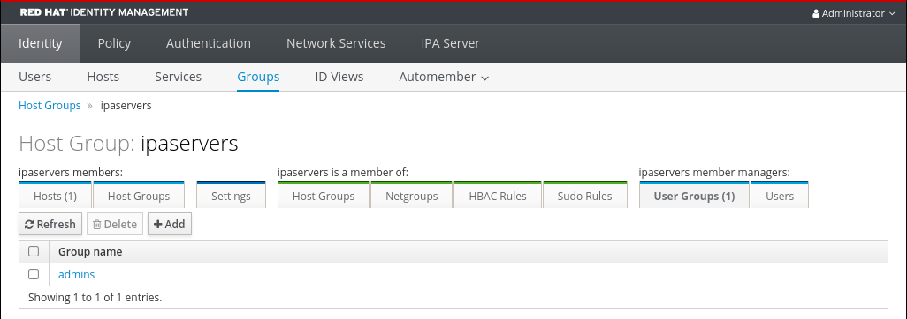 

<h3 id="removing-idm-host-group-member-managers-using-the-web-ui">44.7. Removing IdM host group member managers using the Web UI</h3>

Remove users or user groups as host group member managers in Identity Management (IdM) by using the IdM Web UI to revoke their ability to manage group membership. Member managers can add and remove group members but cannot change the attributes of the host group.

**Prerequisites**

- Administrator privileges for managing IdM or User Administrator role.
- You are logged-in to the IdM Web UI. For details, see [Accessing the IdM Web UI in a web browser](https://docs.redhat.com/en/documentation/red_hat_enterprise_linux/10/html/accessing_identity_management_services/accessing-the-idm-web-ui-in-a-web-browser).
- You must have the name of the existing member manager host group you are removing and the name of the host group they are managing.

**Procedure**

1. Click **Identity&gt;Groups** and select the **Host Groups** tab.
2. Click the name of the group from which you want to remove member managers.
3. Click the member managers tab **User Groups** or **Users** depending on the type of member managers you want to remove. The corresponding dialog appears.
4. Select the user or user groups to remove and click **Delete**.
5. Click **Delete** to confirm.
   
   Note
   
   After you remove a member manager from a host group, the update may take some time to spread to all clients in your Identity Management environment.

**Verification**

- On the Host Group dialog, verify the user group or user has been removed from the member managers list of groups or users.
  
  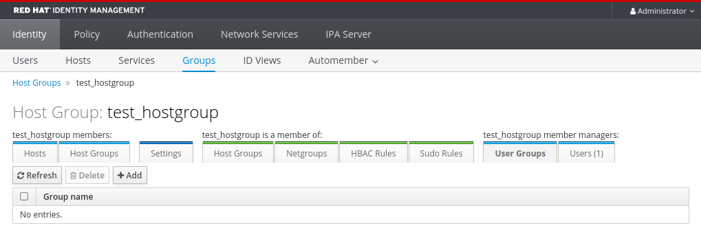 

<h2 id="managing-host-groups-using-ansible-in-managing-users">Chapter 45. Managing host groups by using ansible playbooks</h2>

Learn how to manage [host groups in Identity Management](#host-groups-in-idm "43.1. Host groups in IdM") (IdM) by using Ansible playbooks in the [Managing host groups using Ansible playbooks](https://docs.redhat.com/en/documentation/red_hat_enterprise_linux/10/html/using_ansible_to_install_and_manage_identity_management_in_rhel/managing-host-groups-using-ansible-playbooks) chapter of the *Using Ansible to install and manage Identity Management in RHEL* documentation.

<h2 id="configuring-host-based-access-control-rules">Chapter 46. Configuring host-based access control rules</h2>

Use host-based access control (HBAC) rules to manage which users or user groups can access specified hosts or host groups in your Identity Management (IdM) domain. HBAC rules help you enforce granular access policies by restricting access based on users, hosts, and services.

You can use HBAC rules to achieve the following goals:

- Limit access to a specified system in your domain to members of a specific user group.
- Allow only a specific service to be used to access the systems in your domain.

By default, IdM is configured with a default HBAC rule named `allow_all`, which allows universal access to every host for every user via every relevant service in the entire IdM domain.

You can fine-tune access to different hosts by replacing the default `allow_all` rule with your own set of HBAC rules. For centralized and simplified access control management, you can apply HBAC rules to user groups, host groups, or service groups instead of individual users, hosts, or services.

<h3 id="configuring-hbac-rules-in-an-idm-domain-using-the-webui">46.1. Configuring HBAC rules in an IdM domain using the WebUI</h3>

Configure host-based access control (HBAC) rules in your Identity Management (IdM) domain using the WebUI to control which users can access specific hosts and services. Replace the default `allow_all` rule with custom HBAC rules to enforce granular access policies.

To configure your domain for host-based access control, complete the following steps:

1. Create HBAC rules in the IdM WebUI.
2. Test the new HBAC rules.
3. Disable the default `allow_all` HBAC rule].

Note

Do not disable the `allow_all` rule before creating your custom HBAC rules as if you do so, no users will be able to access any hosts.

<h4 id="creating-hbac-rules-in-the-idm-webui">46.1.1. Creating HBAC rules in the IdM WebUI</h4>

Create host-based access control (HBAC) rules using the Identity Management (IdM) WebUI to define which users can access specific hosts and services. HBAC rules enforce granular access policies and strengthen your security posture.

For example, this procedure shows you how to grant a single user, *sysadmin*, access to all systems in the domain using any service.

Note

IdM stores the primary group of a user as a numerical value of the `gidNumber` attribute instead of a link to an IdM group object. For this reason, an HBAC rule can only reference a user’s supplementary groups and not its primary group.

**Prerequisites**

- User *sysadmin* exists in IdM.

**Procedure**

1. Select **Policy&gt;Host-Based Access Control&gt;HBAC Rules**.
2. Click Add to start adding a new rule.
3. Enter a name for the rule, and click Add and Edit to open the HBAC rule configuration page.
4. In the **Who** area, select **Specified Users and Groups**. Then click Add to add the users or groups.
5. Select the *sysadmin* user from the list of the **Available** users and click &gt; to move to the list of **Prospective** users and click Add.
6. In the **Accessing** area, select **Any Host** to apply the HBAC rule to all hosts.
7. In the **Via Service** area, select **Any Service** to apply the HBAC rule to all services.
   
   Note
   
   Only the most common services and service groups are configured for HBAC rules by default.
   
   - To display the list of services that are currently available, select **Policy&gt;Host-Based Access Control&gt;HBAC Services**.
   - To display the list of service groups that are currently available, select **Policy&gt;Host-Based Access Control&gt;HBAC Service Groups**.
   
   To add more services and service groups, see [Adding HBAC Service Entries for Custom HBAC Services](#adding-hbac-service-entries-for-custom-hbac-services "46.3. Adding HBAC service entries for custom HBAC services") and [Adding HBAC Service Groups](#adding-hbac-service-groups "46.4. Adding HBAC service groups").
8. To save any changes you make on the **HBAC rule** configuration page, click Save at the top of the page.

<h4 id="testing-hbac-rules-in-the-idm-webui">46.1.2. Testing HBAC rules in the IdM WebUI</h4>

Test your Identity Management (IdM) HBAC rule configuration in the IdM WebUI using simulated scenarios to discover misconfigurations and security risks before deploying rules in production.

Important

Always test custom HBAC rules before you start using them in production.

Note that IdM does not test the effect of HBAC rules on trusted Active Directory (AD) users. Because the IdM LDAP directory does not store the AD data, IdM cannot resolve group membership of AD users when simulating HBAC scenarios.

**Procedure**

1. Select **Policy&gt;Host-Based Access Control&gt;HBAC Test**.
2. On the **Who** window, specify the user under whose identity you want to perform the test, and click Next.
3. On the **Accessing** window, specify the host that the user will attempt to access, and click Next.
4. On the **Via Service** window, specify the service that the user will attempt to use, and click Next.
5. On the **Rules** window, select the HBAC rules you want to test, and click Next. If you do not select any rule, all rules are tested.
   
   Select **Include Enabled** to run the test on all rules whose status is **Enabled**. Select **Include Disabled** to run the test on all rules whose status is **Disabled**. To view and change the status of HBAC rules, select **Policy&gt;Host-Based Access Control&gt;HBAC Rules**.
   
   Important
   
   If the test runs on multiple rules, it passes successfully if at least one of the selected rules allows access.
6. On the **Run Test** window, click Run Test.
7. Review the test results:
   
   - If you see **ACCESS DENIED**, the user is not granted access in the test.
   - If you see **ACCESS GRANTED**, the user is able to access the host successfully.
   
   By default, IdM lists all the tested HBAC rules when displaying the test results.
   
   - Select **Matched** to display the rules that allowed successful access.
   - Select **Unmatched** to display the rules that prevented access.

<h4 id="disabling-hbac-rules-in-the-idm-webui">46.1.3. Disabling HBAC rules in the IdM WebUI</h4>

Disable HBAC rules using the Identity Management (IdM) WebUI to temporarily deactivate access policies without permanent deletion. Disabling rules enables testing and troubleshooting while preserving rule configurations.

Note

Disabling HBAC rules is useful when you are configuring custom HBAC rules for the first time. To ensure that your new configuration is not overridden by the default `allow_all` HBAC rule, you must disable `allow_all`.

**Procedure**

1. Select **Policy&gt;Host-Based Access Control&gt;HBAC Rules**.
2. Select the HBAC rule you want to disable.
3. Click Disable.
4. Click OK to confirm you want to disable the selected HBAC rule.

<h3 id="configuring-hbac-rules-in-an-idm-domain-using-the-cli">46.2. Configuring HBAC rules in an IdM domain using the CLI</h3>

Configure host-based access control (HBAC) rules in your Identity Management (IdM) domain using the CLI to control which users can access specific hosts and services. Replace the default `allow_all` rule with custom HBAC rules to enforce granular access policies.

To configure your domain for host-based access control, complete the following steps:

1. Create HBAC rules in the IdM CLI.
2. Test the new HBAC rules.
3. Disable the default `allow_all` HBAC rule.

Note

Do not disable the `allow_all` rule before creating your custom HBAC rules. If you disable it before creating your custom rules, access to all hosts for all users will be denied.

<h4 id="creating-hbac-rules-in-the-idm-cli">46.2.1. Creating HBAC rules in the IdM CLI</h4>

Create host-based access control (HBAC) rules using the Identity Management (IdM) CLI to define which users can access specific hosts and services. HBAC rules enforce granular access policies and strengthen your security posture.

For example, this procedure shows you how to grant a single user, *sysadmin*, access to all systems in the domain using any service.

Note

IdM stores the primary group of a user as a numerical value of the `gidNumber` attribute instead of a link to an IdM group object. For this reason, an HBAC rule can only reference a user’s supplementary groups and not its primary group.

**Prerequisites**

- User *sysadmin* exists in IdM.

**Procedure**

1. Use the `ipa hbacrule-add` command to add the rule.
   
   ```
   ipa hbacrule-add
   Rule name: rule_name
   ---------------------------
   Added HBAC rule "rule_name"
   ---------------------------
     Rule name: rule_name
     Enabled: TRUE
   ```
   
   ```plaintext
   $ ipa hbacrule-add
   Rule name: rule_name
   ---------------------------
   Added HBAC rule "rule_name"
   ---------------------------
     Rule name: rule_name
     Enabled: TRUE
   ```
2. To apply the HBAC rule to the *sysadmin* user only, use the `ipa hbacrule-add-user` command.
   
   ```
   ipa hbacrule-add-user --users=sysadmin
   Rule name: rule_name
     Rule name: rule_name
     Enabled: True
     Users: sysadmin
   -------------------------
   Number of members added 1
   -------------------------
   ```
   
   ```plaintext
   $ ipa hbacrule-add-user --users=sysadmin
   Rule name: rule_name
     Rule name: rule_name
     Enabled: True
     Users: sysadmin
   -------------------------
   Number of members added 1
   -------------------------
   ```
   
   Note
   
   To apply a HBAC rule to all users, use the `ipa hbacrule-mod` command and specify the all user category `--usercat=all`. Note that if the HBAC rule is associated with individual users or groups, `ipa hbacrule-mod --usercat=all` fails. In this situation, remove the users and groups using the `ipa hbacrule-remove-user` command.
3. Specify the target hosts. To apply the HBAC rule to all hosts, use the `ipa hbacrule-mod` command and specify the all host category:
   
   ```
   ipa hbacrule-mod rule_name --hostcat=all
   ------------------------------
   Modified HBAC rule "rule_name"
   ------------------------------
     Rule name: rule_name
     Host category: all
     Enabled: TRUE
     Users: sysadmin
   ```
   
   ```plaintext
   $ ipa hbacrule-mod rule_name --hostcat=all
   ------------------------------
   Modified HBAC rule "rule_name"
   ------------------------------
     Rule name: rule_name
     Host category: all
     Enabled: TRUE
     Users: sysadmin
   ```
   
   Note
   
   If the HBAC rule is associated with individual hosts or groups, `ipa hbacrule-mod --hostcat=all` fails. In this situation, remove the hosts and groups using the `ipa hbacrule-remove-host` command.
4. Specify the target HBAC services. To apply the HBAC rule to all services, use the `ipa hbacrule-mod` command and specify the all service category:
   
   ```
   ipa hbacrule-mod rule_name --servicecat=all
   ------------------------------
   Modified HBAC rule "rule_name"
   ------------------------------
     Rule name: rule_name
     Host category: all
     Service category: all
     Enabled: True
     Users: sysadmin
   ```
   
   ```plaintext
   $ ipa hbacrule-mod rule_name --servicecat=all
   ------------------------------
   Modified HBAC rule "rule_name"
   ------------------------------
     Rule name: rule_name
     Host category: all
     Service category: all
     Enabled: True
     Users: sysadmin
   ```
   
   Note
   
   If the HBAC rule is associated with individual services or groups, `ipa hbacrule-mod --servicecat=all` fails. In this situation, remove the services and groups using the `ipa hbacrule-remove-service` command.

**Verification**

- Verify that the HBAC rule has been added correctly.
  
  1. Use the `ipa hbacrule-find` command to verify that the HBAC rule exists in IdM.
  2. Use the `ipa hbacrule-show` command to verify the properties of the HBAC rule.

**Additional resources**

- [Adding HBAC service entries for custom HBAC services](#adding-hbac-service-entries-for-custom-hbac-services "46.3. Adding HBAC service entries for custom HBAC services")
- [Adding HBAC service groups](#adding-hbac-service-groups "46.4. Adding HBAC service groups")

<h4 id="testing-hbac-rules-in-the-idm-cli">46.2.2. Testing HBAC rules in the IdM CLI</h4>

Test your Identity Management (IdM) HBAC rule configuration in the CLI by using simulated scenarios to discover misconfigurations and security risks before deploying rules in production.

Important

Always test custom HBAC rules before you start using them in production.

Note that IdM does not test the effect of HBAC rules on trusted Active Directory (AD) users. Because the IdM LDAP directory does not store the AD data, IdM cannot resolve group membership of AD users when simulating HBAC scenarios.

**Procedure**

- Use the `ipa hbactest` command to test your HBAC rule. You have the option to test a single HBAC rule or multiple HBAC rules.
  
  - To test a single HBAC rule:
    
    ```
    ipa hbactest --user=sysadmin --host=server.idm.example.com --service=sudo --rules=rule_name
    ---------------------
    Access granted: True
    ---------------------
      Matched rules: rule_name
    ```
    
    ```plaintext
    $ ipa hbactest --user=sysadmin --host=server.idm.example.com --service=sudo --rules=rule_name
    ---------------------
    Access granted: True
    ---------------------
      Matched rules: rule_name
    ```
  - To test multiple HBAC rules:
    
    1. Add a second rule only allowing the *sysadmin* to use `ssh` on all hosts:
       
       ```
       ipa hbacrule-add --hostcat=all rule2_name
       ipa hbacrule-add-user --users sysadmin rule2_name
       ipa hbacrule-add-service --hbacsvcs=sshd rule2_name
         Rule name: rule2_name
         Host category: all
         Enabled: True
         Users: admin
         HBAC Services: sshd
       -------------------------
       Number of members added 1
       -------------------------
       ```
       
       ```plaintext
       $ ipa hbacrule-add --hostcat=all rule2_name
       $ ipa hbacrule-add-user --users sysadmin rule2_name
       $ ipa hbacrule-add-service --hbacsvcs=sshd rule2_name
         Rule name: rule2_name
         Host category: all
         Enabled: True
         Users: admin
         HBAC Services: sshd
       -------------------------
       Number of members added 1
       -------------------------
       ```
    2. Test multiple HBAC rules by running the following command:
       
       ```
       ipa hbactest --user=sysadmin --host=server.idm.example.com --service=sudo --rules=rule_name --rules=rule2_name
       --------------------
       Access granted: True
       --------------------
         Matched rules: rule_name
         Not matched rules: rule2_name
       ```
       
       ```plaintext
       $ ipa hbactest --user=sysadmin --host=server.idm.example.com --service=sudo --rules=rule_name --rules=rule2_name
       --------------------
       Access granted: True
       --------------------
         Matched rules: rule_name
         Not matched rules: rule2_name
       ```
       
       In the output, **Matched rules** list the rules that allowed successful access while **Not matched** rules list the rules that prevented access. Note that if you do not specify the `--rules` option, all rules are applied. Using `--rules` is useful to independently test each rule.

<h4 id="disabling-hbac-rules-in-the-idm-cli">46.2.3. Disabling HBAC rules in the IdM CLI</h4>

Disable HBAC rules using the Identity Management (IdM) CLI to temporarily deactivate access policies without permanent deletion. Disabling rules enables testing and troubleshooting while preserving rule configurations.

Note

Disabling HBAC rules is useful when you are configuring custom HBAC rules for the first time. To ensure that your new configuration is not overridden by the default `allow_all` HBAC rule, you must disable `allow_all`.

**Procedure**

- Use the `ipa hbacrule-disable` command. For example, to disable the `allow_all` rule:
  
  ```
  ipa hbacrule-disable allow_all
  ------------------------------
  Disabled HBAC rule "allow_all"
  ------------------------------
  ```
  
  ```plaintext
  $ ipa hbacrule-disable allow_all
  ------------------------------
  Disabled HBAC rule "allow_all"
  ------------------------------
  ```

<h3 id="adding-hbac-service-entries-for-custom-hbac-services">46.3. Adding HBAC service entries for custom HBAC services</h3>

You can configure any pluggable authentication module (PAM) service as a host-based access control (HBAC) service to define custom services in HBAC rules beyond the default services and service groups.

The PAM service files are located in the `/etc/pam.d/` directory.

Note

Adding a service as an HBAC service is not the same as adding a service to the domain. Adding a service to the domain makes it available to other resources in the domain, but it does not allow you to use the service in HBAC rules.

<h4 id="adding-hbac-service-entries-for-custom-hbac-services-in-the-idm-webui">46.3.1. Adding HBAC service entries for custom HBAC services in the IdM WebUI</h4>

Create custom HBAC service entries in the Identity Management (IdM) Web UI to control access to applications and services not included in the default service list. This enables granular host-based access control for your custom services.

**Procedure**

1. Select **Policy&gt;Host-Based Access Control&gt;HBAC Services**.
2. Click Add to add an HBAC service entry.
3. Enter a name for the service, and click Add.

<h4 id="adding-hbac-service-entries-for-custom-hbac-services-in-the-idm-cli">46.3.2. Adding HBAC service entries for custom HBAC services in the IdM CLI</h4>

Create custom HBAC service entries in the Identity Management (IdM) CLI to control access to applications and services not included in the default service list. This enables granular host-based access control for your custom services.

**Procedure**

- Use the `ipa hbacsvc-add` command. For example, to add an entry for the `tftp` service:
  
  ```
  ipa hbacsvc-add tftp
  -------------------------
  Added HBAC service "tftp"
  -------------------------
    Service name: tftp
  ```
  
  ```plaintext
  $ ipa hbacsvc-add tftp
  -------------------------
  Added HBAC service "tftp"
  -------------------------
    Service name: tftp
  ```

<h3 id="adding-hbac-service-groups">46.4. Adding HBAC service groups</h3>

HBAC service groups can simplify HBAC rules management. For example, instead of adding individual services to an HBAC rule, you can add a whole service group.

<h4 id="adding-hbac-service-groups-in-the-idm-webui">46.4.1. Adding HBAC service groups in the IdM WebUI</h4>

Create HBAC service groups in the Identity Management (IdM) Web UI to manage multiple related services collectively in access control policies. Service groups simplify HBAC rule management by helping you to apply policies to multiple services at once.

**Procedure**

1. Select **Policy&gt;Host-Based Access Control&gt;HBAC Service Groups**.
2. Click Add to add an HBAC service group.
3. Enter a name for the service group, and click Edit.
4. On the service group configuration page, click Add to add an HBAC service as a member of the group.

<h4 id="adding-hbac-service-groups-in-the-idm-cli">46.4.2. Adding HBAC service groups in the IdM CLI</h4>

Create HBAC service groups in the Identity Management (IdM) CLI to manage multiple related services collectively in access control policies. Service groups simplify HBAC rule management by helping you to apply policies to multiple services at once.

**Procedure**

1. Use the `ipa hbacsvcgroup-add` command in your terminal to add an HBAC service group. For example, to add a group named *login*:
   
   ```
   ipa hbacsvcgroup-add
   Service group name: login
   --------------------------------
   Added HBAC service group "login"
   --------------------------------
     Service group name: login
   ```
   
   ```plaintext
   $ ipa hbacsvcgroup-add
   Service group name: login
   --------------------------------
   Added HBAC service group "login"
   --------------------------------
     Service group name: login
   ```
2. Use the `ipa hbacsvcgroup-add-member` command to add an HBAC service as a member of the group. For example, to add the `sshd` service to the *login* group:
   
   ```
   ipa hbacsvcgroup-add-member
   Service group name: login
   [member HBAC service]: sshd
     Service group name: login
     Member HBAC service: sshd
   -------------------------
   Number of members added 1
   -------------------------
   ```
   
   ```plaintext
   $ ipa hbacsvcgroup-add-member
   Service group name: login
   [member HBAC service]: sshd
     Service group name: login
     Member HBAC service: sshd
   -------------------------
   Number of members added 1
   -------------------------
   ```

<h3 id="configuring-host-based-access-control-rules">46.5. Additional resources</h3>

- [Ensuring the presence of host-based access control rules in IdM using Ansible playbooks](https://docs.redhat.com/en/documentation/red_hat_enterprise_linux/10/html/using_ansible_to_install_and_manage_identity_management_in_rhel/ensuring-the-presence-of-host-based-access-control-rules-in-idm-using-ansible-playbooks)

<h2 id="configuring-session-recording-by-using-cli">Chapter 47. Configuring session recording by using the CLI</h2>

Configure user terminal session recordings using the System Security Services Daemon (SSSD) to audit and monitor user activity. Manage and play back recorded sessions using the `tlog` command-line utility.

<h3 id="session-recording-overview-and-components">47.1. Session recording overview and components</h3>

Session recording captures and saves a user’s terminal activity. This provides a detailed, unchangeable record of all commands, output, and error messages, which you can use for auditing, troubleshooting, and investigating a security incident.

SSSD enforces the recording policies you define, and the `tlog` utility handles the actual recording and playback.

Components of the session recording

- **`tlog` utility**
  
  The `tlog` utility provides tools for recording and playing back terminal I/O. `tlog-rec-session` functions as an intermediary login shell and captures all data between the user’s terminal and shell. All `tlog` recordings are in JSON format. You can play back recorded sessions using `tlog-play`. Note that by default, terminal input recording is disabled for security reasons. For detailed configuration options, see the `/etc/tlog/tlog-rec-session.conf` file and the `tlog-rec-session.conf(5)` man page on your system.
- **SSSD**
  
  SSSD provides a set of daemons that manage access to remote directories and authentication mechanisms. When you configure session recording, SSSD overlays the user’s default shell with the `tlog-rec-session` program.

Limitations of session recording

- You can configure session recording for the root user, but the root user has the privileges to disable or bypass the recording process, which makes the session recording unreliable for auditing purposes.
- Terminal sessions in a GNOME graphical session are not recorded. This is because all terminals within a graphical session share a single audit session ID, which prevents `tlog` from distinguishing between them and capturing recordings correctly.
- A logging loop can occur when viewing the journal. When a recorded user views the system journal or `/var/log/messages`, it generates new logs, which are then recorded and displayed, causing a loop of flooded output.
  
  To prevent the logging loop, view the journal in real time and filter out the log entries which create the loop:
  
  ```
  journalctl -f | grep -v 'tlog-rec-session'
  ```
  
  ```plaintext
  journalctl -f | grep -v 'tlog-rec-session'
  ```
  
  You can also configure `tlog` to limit the output. For details, see `tlog-rec-session.conf` man pages.
- You must configure session recording on the target host for remote execution. For example, if you want to record a user’s session when they use `ssh` to connect to a remote system, configure the recording on the remote system they connect to.
- All recordings are lost on reboot if `systemd-journald` service uses its default configuration to store the journal in-memory.

<h3 id="enabling-and-configuring-session-recording-with-sssd-from-the-cli">47.2. Enabling and configuring session recording with SSSD from the CLI</h3>

Enable session recording through SSSD in Identity Management (IdM) to capture terminal activity for specific users or groups. Session recording improves security auditing and helps investigate user activity.

When you configure session recording, you use SSSD to define which users or groups to record by setting the `scope` option to one of the following values:

- `none` to record no sessions
- `some` to record only specified users and groups
- `all` to record all users

**Prerequisites**

- Commands that start with the `#` command prompt require administrative privileges provided by `sudo` or root user access. For information on how to configure `sudo` access, see [Enabling unprivileged users to run certain commands](https://docs.redhat.com/en/documentation/red_hat_enterprise_linux/10/html/security_hardening/managing-sudo-access#enabling-unprivileged-users-to-run-certain-commands).
- You are using SSSD for authentication.

**Procedure**

1. Install the `tlog` package:
   
   ```
   dnf install tlog
   ```
   
   ```plaintext
   # dnf install tlog
   ```
2. Open the `sssd-session-recording.conf` configuration file:
   
   ```
   vi /etc/sssd/conf.d/sssd-session-recording.conf
   ```
   
   ```plaintext
   # vi /etc/sssd/conf.d/sssd-session-recording.conf
   ```
3. Specify the scope of session recording and the users and groups to record. For example:
   
   ```
   [session_recording]
   scope = some
   users = <user_name_1>, <user_name_2>
   groups = <group_name>
   exclude_users = <user_name_to_exclude>
   exclude_groups = <group_name_to_exclude>
   ```
   
   ```plaintext
   [session_recording]
   scope = some
   users = <user_name_1>, <user_name_2>
   groups = <group_name>
   exclude_users = <user_name_to_exclude>
   exclude_groups = <group_name_to_exclude>
   ```
   
   For more details, see the `sssd-session-recording(5)` man page on your system.
4. To enable the SSSD profile, run the following command:
   
   ```
   authselect select sssd with-tlog
   ```
   
   ```plaintext
   # authselect select sssd with-tlog
   ```
5. Restart SSSD to load the configuration changes:
   
   ```
   systemctl restart sssd
   ```
   
   ```plaintext
   # systemctl restart sssd
   ```

**Additional resources**

- [Configuring a system for session recording by using RHEL system roles](https://docs.redhat.com/en/documentation/red_hat_enterprise_linux/10/html/automating_system_administration_by_using_rhel_system_roles/configuring-a-system-for-session-recording-by-using-rhel-system-roles)

<h3 id="playing-back-session-recordings">47.3. Playing back session recordings</h3>

Review terminal session recordings using the `tlog-play` utility or the web console to audit user activities and investigate security incidents. Session recordings help ensure compliance and identify unauthorized access attempts.

The system journal stores session recordings. By default, it saves them in-memory, so you lose recordings on reboot unless you configure persistent storage.

You can play back recordings directly from the system journal by using the `tlog-play` utility. Alternatively, you can install the `cockpit-session-recording` package to manage and play back recordings on the RHEL web console. .Prerequisites * Terminal sessions have been recorded.

**Procedure**

1. Optional: List recorded sessions:
   
   ```
   journalctl COMM=tlog-rec-session
   ```
   
   ```plaintext
   $ journalctl COMM=tlog-rec-session
   ```
2. Play back a specific session:
   
   ```
   tlog-play --reader=journal --journal-id=<recorded_session_id>
   ```
   
   ```plaintext
   # tlog-play --reader=journal --journal-id=<recorded_session_id>
   ```
   
   For more advanced options, such as changing playback speed or fast-forwarding, see the `tlog-play` man page on your system.

**Additional resources**

- [Installing web console add-ons and creating custom pages](https://docs.redhat.com/en/documentation/red_hat_enterprise_linux/10/html/managing_systems_in_the_rhel_web_console/installing-web-console-add-ons-and-creating-custom-pages)

<h2 id="managing-public-ssh-keys-for-users-and-hosts">Chapter 48. Managing public SSH keys for users and hosts</h2>

Manage public SSH keys for users and hosts in Identity Management (IdM) to centralize SSH key distribution and simplify secure access across your domain. Storing SSH keys in IdM ensures consistent authentication without manually distributing key files.

<h3 id="about-the-ssh-key-format">48.1. About the SSH key format</h3>

Identity Management (IdM) supports OpenSSH-style and raw RFC 4253-style SSH key formats, providing flexibility when uploading keys.

Note that IdM automatically converts RFC 4253-style keys into OpenSSH-style keys before saving them into the IdM LDAP server.

The IdM server can identify the type of key, such as an RSA or DSA key, from the uploaded key blob. In a key file such as `~/.ssh/known_hosts`, a key entry is identified by the hostname and IP address of the server, its type, and the key. For example:

```
host.example.com,1.2.3.4 ssh-rsa AAA...ZZZ==
```

```plaintext
host.example.com,1.2.3.4 ssh-rsa AAA...ZZZ==
```

This is different from a user public key entry, which has the elements in the order *type key== comment*:

```
"ssh-rsa ABCD1234...== ipaclient.example.com"
```

```plaintext
"ssh-rsa ABCD1234...== ipaclient.example.com"
```

A key file, such as `id_rsa.pub`, consists of three parts: the key type, the key, and an additional comment or identifier. When uploading a key to IdM, you can upload all three key parts or only the key. If you only upload the key, IdM automatically identifies the key type, such as RSA or DSA, from the uploaded key.

If you use the host public key entry from the `~/.ssh/known_hosts` file, you must reorder it to match the format of a user key, *type key== comment*:

```
ssh-rsa AAA...ZZZ== host.example.com,1.2.3.4
```

```plaintext
ssh-rsa AAA...ZZZ== host.example.com,1.2.3.4
```

IdM can determine the key type automatically from the content of the public key. The comment is optional, to make identifying individual keys easier. The only required element is the public key blob.

IdM uses public keys stored in the following OpenSSH-style files:

- Host public keys are in the `known_hosts` file.
- User public keys are in the `authorized_keys` file.

**Additional resources**

- [RFC 4716](https://www.rfc-editor.org/rfc/rfc4716)
- [RFC 4253](https://www.rfc-editor.org/rfc/rfc4253)

<h3 id="about-idm-and-openssh">48.2. About IdM and OpenSSH</h3>

Identity Management (IdM) integrates with OpenSSH during server and client installation to centralize SSH key management through SSSD. This integration enables IdM to serve as a universal repository for user and host SSH keys.

During an IdM server or client installation, as part of the install script:

- An OpenSSH server and client is configured on the IdM client machine.
- SSSD is configured to store and retrieve user and host SSH keys in cache. This allows IdM to serve as a universal and centralized repository of SSH keys.

If you enable the SSH service during the client installation, an RSA key is created when the SSH service is started for the first time.

Note

When you run the `ipa-client-install` install script to add the machine as an IdM client, the client is created with two SSH keys, RSA and DSA.

As part of the installation, you can configure the following:

- Configure OpenSSH to automatically trust the IdM DNS records where the key fingerprints are stored using the `--ssh-trust-dns` option.
- Disable OpenSSH and prevent the install script from configuring the OpenSSH server using the `--no-sshd` option.
- Prevent the host from creating DNS SSHFP records with its own DNS entries using the `--no-dns-sshfp` option.

If you do not configure the server or client during installation, you can manually configure SSSD later. For information on how to manually configure SSSD, see [Configuring SSSD to Provide a Cache for the OpenSSH Services](https://docs.redhat.com/en/documentation/red_hat_enterprise_linux/7/html/linux_domain_identity_authentication_and_policy_guide/openssh-sssd). Note that caching SSH keys by SSSD requires administrative privileges on the local machines.

<h3 id="generating-ssh-keys">48.3. Generating SSH keys</h3>

Generate SSH key pairs using the `ssh-keygen` utility to enable secure, password-free authentication for users and hosts in Identity Management (IdM). SSH keys provide a more secure alternative to password-based authentication.

**Procedure**

1. To generate an RSA SSH key, run the following command:
   
   ```
   ssh-keygen -t rsa -C user@example.com
   Generating public/private rsa key pair.
   ```
   
   ```plaintext
   $ ssh-keygen -t rsa -C user@example.com
   Generating public/private rsa key pair.
   ```
   
   Note if generating a host key, replace [user@example.com](mailto:user@example.com) with the required hostname, such as `server.example.com,1.2.3.4`.
2. Specify the file where you are saving the key or press enter to accept the displayed default location.
   
   ```
   Enter file in which to save the key (/home/user/.ssh/id_rsa):
   ```
   
   ```plaintext
   Enter file in which to save the key (/home/user/.ssh/id_rsa):
   ```
   
   Note if generating a host key, save the key to a different location than the user’s `~/.ssh/` directory so you do not overwrite any existing keys. for example, `/home/user/.ssh/host_keys`.
3. Specify a passphrase for your private key or press enter to leave the passphrase blank.
   
   ```
   Enter passphrase (empty for no passphrase):
   Enter same passphrase again:
   Your identification has been saved in /home/user/.ssh/id_rsa.
   Your public key has been saved in /home/user/.ssh/id_rsa.pub.
   The key fingerprint is:
   SHA256:ONxjcMX7hJ5zly8F8ID9fpbqcuxQK+ylVLKDMsJPxGA user4@example.com
   The key's randomart image is:
   +---[RSA 3072]----+
   |         ..o     |
   |         .o +    |
   |     E. .  o =   |
   |    ..o=  o . +  |
   |      +oS. = + o.|
   |    . .o .* B =.+|
   |     o + . X.+.= |
   |      + o o.*+. .|
   |       .   o=o . |
   +----[SHA256]-----+
   ```
   
   ```plaintext
   Enter passphrase (empty for no passphrase):
   Enter same passphrase again:
   Your identification has been saved in /home/user/.ssh/id_rsa.
   Your public key has been saved in /home/user/.ssh/id_rsa.pub.
   The key fingerprint is:
   SHA256:ONxjcMX7hJ5zly8F8ID9fpbqcuxQK+ylVLKDMsJPxGA user4@example.com
   The key's randomart image is:
   +---[RSA 3072]----+
   |         ..o     |
   |         .o +    |
   |     E. .  o =   |
   |    ..o=  o . +  |
   |      +oS. = + o.|
   |    . .o .* B =.+|
   |     o + . X.+.= |
   |      + o o.*+. .|
   |       .   o=o . |
   +----[SHA256]-----+
   ```
   
   To upload this SSH key, use the public key string stored in the displayed file.

<h3 id="managing-public-ssh-keys-for-users">48.4. Managing public SSH keys for users</h3>

Upload public SSH keys to Identity Management (IdM) user entries to enable SSH-based authentication without Kerberos credentials.

Users with the corresponding private key can log into IdM machines directly using SSH. If the private SSH key file is not available on a particular machine, Kerberos credentials can still be used for authentication.

<h4 id="uploading-ssh-keys-for-a-user-using-the-idm-web-ui">48.4.1. Uploading SSH keys for a user using the IdM Web UI</h4>

Upload a public SSH key to a user entry in Identity Management (IdM) by using the IdM Web UI to enable SSH login to IdM machines without requiring Kerberos credentials.

**Prerequisites**

- Administrator privileges for managing the IdM Web UI or User Administrator role.

**Procedure**

1. Log into the IdM Web UI.
2. Go to the **Identity&gt;Users** tab.
3. Click the name of the user to edit.
4. In the **Account Settings** section, click the SSH public keys **Add** button.
5. Paste the Base 64-encoded public key string into the **SSH public key** field.
6. Click **Set**.
7. Click **Save** at the top of the IdM Web UI window.

**Verification**

- Under the **Accounts Settings** section, verify the key is listed under **SSH public keys**.

<h4 id="uploading-ssh-keys-for-a-user-using-the-idm-cli">48.4.2. Uploading SSH keys for a user using the IdM CLI</h4>

Upload a public SSH key to a user entry in Identity Management (IdM) by using the CLI to enable SSH login to IdM machines without requiring Kerberos credentials.

**Prerequisites**

- Administrator privileges for managing the IdM CLI or User Administrator role.

**Procedure**

1. Run the `ipa user-mod` command with the `--sshpubkey` option to upload the base64-encoded public key to the user entry.
   
   ```
   ipa user-mod user --sshpubkey="ssh-rsa AAAAB3Nza...SNc5dv== client.example.com"
   ```
   
   ```plaintext
   $ ipa user-mod user --sshpubkey="ssh-rsa AAAAB3Nza...SNc5dv== client.example.com"
   ```
   
   Note in this example you upload the key type, the key, and the hostname identifier to the user entry.
2. To upload multiple keys, use `--sshpubkey` multiple times. For example, to upload two SSH keys:
   
   ```
   --sshpubkey="AAAAB3Nza...SNc5dv==" --sshpubkey="RjlzYQo...ZEt0TAo="
   ```
   
   ```plaintext
   --sshpubkey="AAAAB3Nza...SNc5dv==" --sshpubkey="RjlzYQo...ZEt0TAo="
   ```
3. To use command redirection and point to a file that contains the key instead of pasting the key string manually, use the following command:
   
   ```
   ipa user-mod user --sshpubkey="$(cat ~/.ssh/id_rsa.pub)" --sshpubkey="$(cat ~/.ssh/id_rsa2.pub)"
   ```
   
   ```plaintext
   $ ipa user-mod user --sshpubkey="$(cat ~/.ssh/id_rsa.pub)" --sshpubkey="$(cat ~/.ssh/id_rsa2.pub)"
   ```

**Verification**

- Run the `ipa user-show` command to verify that the SSH public key is associated with the specified user:
  
  ```
  ipa user-show user
  User login: user
    First name: user
    Last name: user
    Home directory: /home/user
    Login shell: /bin/sh
    Principal name: user@IPA.TEST
    Principal alias: user@IPA.TEST
    Email address: user@ipa.test
    UID: 1118800019
    GID: 1118800019
    SSH public key fingerprint: SHA256:qGaqTZM60YPFTngFX0PtNPCKbIuudwf1D2LqmDeOcuA
                                user@IPA.TEST (ssh-rsa)
    Account disabled: False
    Password: False
    Member of groups: ipausers
    Subordinate ids: 3167b7cc-8497-4ff2-ab4b-6fcb3cb1b047
    Kerberos keys available: False
  ```
  
  ```plaintext
  $ ipa user-show user
  User login: user
    First name: user
    Last name: user
    Home directory: /home/user
    Login shell: /bin/sh
    Principal name: user@IPA.TEST
    Principal alias: user@IPA.TEST
    Email address: user@ipa.test
    UID: 1118800019
    GID: 1118800019
    SSH public key fingerprint: SHA256:qGaqTZM60YPFTngFX0PtNPCKbIuudwf1D2LqmDeOcuA
                                user@IPA.TEST (ssh-rsa)
    Account disabled: False
    Password: False
    Member of groups: ipausers
    Subordinate ids: 3167b7cc-8497-4ff2-ab4b-6fcb3cb1b047
    Kerberos keys available: False
  ```

<h4 id="deleting-ssh-keys-for-a-user-using-the-idm-web-ui">48.4.3. Deleting SSH keys for a user using the IdM Web UI</h4>

You can delete SSH public keys from user profiles using the Identity Management (IdM) WebUI. Deleting invalid keys improves security by preventing unauthorized user authentication.

**Prerequisites**

- Administrator privileges for managing the IdM Web UI or User Administrator role.

**Procedure**

1. Log into the IdM Web UI.
2. Go to the **Identity&gt;Users** tab.
3. Click the name of the user to edit.
4. Under the **Account Settings** section, under **SSH public key**, click **Delete** next to the key you want to remove.
5. Click **Save** at the top of the page.

**Verification**

- Under the **Account Settings** section, verify the key is no longer listed under **SSH public keys**.

<h4 id="deleting-ssh-keys-for-a-user-using-the-idm-cli">48.4.4. Deleting SSH keys for a user using the IdM CLI</h4>

You can delete SSH public keys from user profiles using the Identity Management (IdM) CLI. Deleting invalid keys improves security by preventing unauthorized user authentication.

**Prerequisites**

- Administrator privileges for managing the IdM CLI or User Administrator role.

**Procedure**

1. To delete all SSH keys assigned to a user account, add the `--sshpubkey` option to the `ipa user-mod` command without specifying any key:
   
   ```
   ipa user-mod user --sshpubkey=
   ```
   
   ```plaintext
   $ ipa user-mod user --sshpubkey=
   ```
2. To only delete a specific SSH key or keys, use the `--sshpubkey` option to specify the keys you want to keep, omitting the key you are deleting.

**Verification**

- Run the `ipa user-show` command to verify that the SSH public key is no longer associated with the specified user:
  
  ```
  ipa user-show user
  User login: user
    First name: user
    Last name: user
    Home directory: /home/user
    Login shell: /bin/sh
    Principal name: user@IPA.TEST
    Principal alias: user@IPA.TEST
    Email address: user@ipa.test
    UID: 1118800019
    GID: 1118800019
    Account disabled: False
    Password: False
    Member of groups: ipausers
    Subordinate ids: 3167b7cc-8497-4ff2-ab4b-6fcb3cb1b047
    Kerberos keys available: False
  ```
  
  ```plaintext
  $ ipa user-show user
  User login: user
    First name: user
    Last name: user
    Home directory: /home/user
    Login shell: /bin/sh
    Principal name: user@IPA.TEST
    Principal alias: user@IPA.TEST
    Email address: user@ipa.test
    UID: 1118800019
    GID: 1118800019
    Account disabled: False
    Password: False
    Member of groups: ipausers
    Subordinate ids: 3167b7cc-8497-4ff2-ab4b-6fcb3cb1b047
    Kerberos keys available: False
  ```

<h3 id="managing-public-ssh-keys-for-hosts">48.5. Managing public SSH keys for hosts</h3>

Manage public SSH keys for hosts in Identity Management (IdM) to centralize host authentication and simplify SSH access across your domain. Storing host SSH keys in IdM eliminates the need to distribute `known_hosts` files manually.

Traditionally, when a host first authenticates to another machine using OpenSSH, an administrator must manually approve the request. The target machine then stores the host’s public key in its `known_hosts` file and grants automatic access on subsequent connections. By storing host SSH keys centrally in IdM, you avoid managing these files on each machine individually.

<h4 id="uploading-ssh-keys-for-a-host-using-the-idm-web-ui">48.5.1. Uploading SSH keys for a host using the IdM Web UI</h4>

Upload a public SSH key to a host entry in Identity Management (IdM) by using the IdM Web UI so that OpenSSH can authenticate the host without Kerberos credentials.

**Prerequisites**

- Administrator privileges for managing the IdM Web UI or User Administrator role.

**Procedure**

1. You can retrieve the key for your host from a `~/.ssh/known_hosts` file. For example:
   
   ```
   server.example.com,1.2.3.4 ssh-rsa AAAAB3NzaC1yc2EAAAABIwAAAQEApvjBvSFSkTU0WQW4eOweeo0DZZ08F9Ud21xlLy6FOhzwpXFGIyxvXZ52+siHBHbbqGL5+14N7UvElruyslIHx9LYUR/pPKSMXCGyboLy5aTNl5OQ5EHwrhVnFDIKXkvp45945R7SKYCUtRumm0Iw6wq0XD4o+ILeVbV3wmcB1bXs36ZvC/M6riefn9PcJmh6vNCvIsbMY6S+FhkWUTTiOXJjUDYRLlwM273FfWhzHK+SSQXeBp/zIn1gFvJhSZMRi9HZpDoqxLbBB9QIdIw6U4MIjNmKsSI/ASpkFm2GuQ7ZK9KuMItY2AoCuIRmRAdF8iYNHBTXNfFurGogXwRDjQ==
   ```
   
   ```plaintext
   server.example.com,1.2.3.4 ssh-rsa AAAAB3NzaC1yc2EAAAABIwAAAQEApvjBvSFSkTU0WQW4eOweeo0DZZ08F9Ud21xlLy6FOhzwpXFGIyxvXZ52+siHBHbbqGL5+14N7UvElruyslIHx9LYUR/pPKSMXCGyboLy5aTNl5OQ5EHwrhVnFDIKXkvp45945R7SKYCUtRumm0Iw6wq0XD4o+ILeVbV3wmcB1bXs36ZvC/M6riefn9PcJmh6vNCvIsbMY6S+FhkWUTTiOXJjUDYRLlwM273FfWhzHK+SSQXeBp/zIn1gFvJhSZMRi9HZpDoqxLbBB9QIdIw6U4MIjNmKsSI/ASpkFm2GuQ7ZK9KuMItY2AoCuIRmRAdF8iYNHBTXNfFurGogXwRDjQ==
   ```
   
   You can also generate a host key. See [Generating SSH keys](#generating-ssh-keys "48.3. Generating SSH keys").
2. Copy the public key from the key file. The full key entry has the form `host name,IP type key==`. Only the `key==` is required, but you can store the entire entry. To use all elements in the entry, rearrange the entry so it has the order `type key== [host name,IP]`.
   
   ```
   cat /home/user/.ssh/host_keys.pub
   ssh-rsa AAAAB3NzaC1yc2E...tJG1PK2Mq++wQ== server.example.com,1.2.3.4
   ```
   
   ```plaintext
   # cat /home/user/.ssh/host_keys.pub
   ssh-rsa AAAAB3NzaC1yc2E...tJG1PK2Mq++wQ== server.example.com,1.2.3.4
   ```
3. Log into the IdM Web UI.
4. Go to the **Identity&gt;Hosts** tab.
5. Click the name of the host to edit.
6. In the **Host Settings** section, click the SSH public keys **Add** button.
7. Paste the public key for the host into the **SSH public key** field.
8. Click **Set**.
9. Click **Save** at the top of the IdM Web UI window.

**Verification**

- Under the **Hosts Settings** section, verify the key is listed under **SSH public keys**.

<h4 id="uploading-ssh-keys-for-a-host-using-the-idm-cli">48.5.2. Uploading SSH keys for a host using the IdM CLI</h4>

Upload a public SSH key to a host entry in Identity Management (IdM) by using the CLI so that OpenSSH can authenticate the host without Kerberos credentials.

Host SSH keys are added to host entries in IdM when the host is created using `ipa host-add`, or by modifying the entry later using `ipa host-mod`. RSA and DSA host keys are also created automatically by the `ipa-client-install` command, unless the SSH service is explicitly disabled in the installation script.

**Prerequisites**

- Administrator privileges for managing IdM or User Administrator role.

**Procedure**

1. Run the `host-mod` command with the `--sshpubkey` option to upload the base64-encoded public key to the host entry.
   
   Because adding a host key changes the DNS Secure Shell fingerprint (SSHFP) record for the host, use the `--updatedns` option to update the host’s DNS entry. For example:
   
   ```
   ipa host-mod --sshpubkey="ssh-rsa RjlzYQo==" --updatedns host1.example.com
   ```
   
   ```plaintext
   $ ipa host-mod --sshpubkey="ssh-rsa RjlzYQo==" --updatedns host1.example.com
   ```
   
   A real key also usually ends with an equal sign (=) but is longer.
2. To upload more than one key, enter multiple --sshpubkey command-line parameters:
   
   ```
   --sshpubkey="RjlzYQo==" --sshpubkey="ZEt0TAo=="
   ```
   
   ```plaintext
   --sshpubkey="RjlzYQo==" --sshpubkey="ZEt0TAo=="
   ```
   
   Note that a host can have multiple public keys.
3. After uploading the host keys, configure SSSD to use Identity Management as one of its identity domains and set up OpenSSH to use the SSSD tools for managing host keys, covered in [Configuring SSSD to Provide a Cache for the OpenSSH Services](https://docs.redhat.com/en/documentation/red_hat_enterprise_linux/7/html/linux_domain_identity_authentication_and_policy_guide/openssh-sssd).

**Verification**

- Run the `ipa host-show` command to verify that the SSH public key is associated with the specified host:
  
  ```
  ipa host-show client.ipa.test
  ...
  SSH public key fingerprint: SHA256:qGaqTZM60YPFTngFX0PtNPCKbIuudwf1D2LqmDeOcuA
                                client@IPA.TEST (ssh-rsa)
  ...
  ```
  
  ```plaintext
  $ ipa host-show client.ipa.test
  ...
  SSH public key fingerprint: SHA256:qGaqTZM60YPFTngFX0PtNPCKbIuudwf1D2LqmDeOcuA
                                client@IPA.TEST (ssh-rsa)
  ...
  ```

<h4 id="deleting-ssh-keys-for-a-host-using-the-idm-web-ui">48.5.3. Deleting SSH keys for a host using the IdM Web UI</h4>

You can delete SSH public keys from host entries using the Identity Management (IdM) WebUI. Deleting invalid keys improves security by preventing unauthorized host authentication.

**Prerequisites**

- Administrator privileges for managing the IdM Web UI or Host Administrator role.

**Procedure**

1. Log into the IdM Web UI.
2. Go to the **Identity&gt;Hosts** tab.
3. Click the name of the host to edit.
4. Under the **Host Settings** section, click **Delete** next to the SSH public key you want to remove.
5. Click **Save** at the top of the page.

**Verification**

- Under the **Host Settings** section, verify the key is no longer listed under **SSH public keys**.

<h4 id="deleting-ssh-keys-for-a-host-using-the-idm-cli">48.5.4. Deleting SSH keys for a host using the IdM CLI</h4>

You can delete SSH public keys from host entries using the Identity Management (IdM) CLI. Deleting invalid keys improves security by preventing unauthorized host authentication.

**Prerequisites**

- Administrator privileges for managing the IdM CLI or Host Administrator role.

**Procedure**

- To delete all SSH keys assigned to a host account, add the `--sshpubkey` option to the `ipa host-mod` command without specifying any key:
  
  ```
  kinit admin
  ipa host-mod --sshpubkey= --updatedns host1.example.com
  ```
  
  ```plaintext
  $ kinit admin
  $ ipa host-mod --sshpubkey= --updatedns host1.example.com
  ```
  
  Note that it is good practice to use the `--updatedns` option to update the host’s DNS entry.
  
  IdM determines the key type automatically from the key, if the type is not included in the uploaded key.

**Verification**

- Run the `ipa host-show` command to verify that the SSH public key is no longer associated with the specified host:
  
  ```
  ipa host-show client.ipa.test
    Host name: client.ipa.test
    Platform: x86_64
    Operating system: 4.18.0-240.el8.x86_64
    Principal name: host/client.ipa.test@IPA.TEST
    Principal alias: host/client.ipa.test@IPA.TEST
    Password: False
    Member of host-groups: ipaservers
    Roles: helpdesk
    Member of netgroups: test
    Member of Sudo rule: test2
    Member of HBAC rule: test
    Keytab: True
    Managed by: client.ipa.test, server.ipa.test
    Users allowed to retrieve keytab: user1, user2, user3
  ```
  
  ```plaintext
  $ ipa host-show client.ipa.test
    Host name: client.ipa.test
    Platform: x86_64
    Operating system: 4.18.0-240.el8.x86_64
    Principal name: host/client.ipa.test@IPA.TEST
    Principal alias: host/client.ipa.test@IPA.TEST
    Password: False
    Member of host-groups: ipaservers
    Roles: helpdesk
    Member of netgroups: test
    Member of Sudo rule: test2
    Member of HBAC rule: test
    Keytab: True
    Managed by: client.ipa.test, server.ipa.test
    Users allowed to retrieve keytab: user1, user2, user3
  ```

<h2 id="configuring-the-domain-resolution-order-to-resolve-short-ad-user-names">Chapter 49. Configuring the domain resolution order to resolve short AD user names</h2>

Configure IdM servers and clients to resolve short Active Directory (AD) usernames and group names without requiring fully qualified domain names. By default, AD users must specify names in the format `user_name@domain.com`, but domain resolution order settings simplify authentication.

<h3 id="how-domain-resolution-order-works">49.1. How domain resolution order works</h3>

In Identity Management (IdM) environments with an Active Directory (AD) trust, Red Hat recommends that you resolve and authenticate users and groups by specifying their fully qualified names.

For example:

- `<idm_username>@idm.example.com` for IdM users from the `idm.example.com` domain
- `<ad_username>@ad.example.com` for AD users from the `ad.example.com` domain

By default, if you perform user or group lookups using the *short name* format, such as `ad_username`, IdM only searches the IdM domain and fails to find the AD users or groups. To resolve AD users or groups using short names, change the order in which IdM searches multiple domains by setting the `domain resolution order` option.

You can set the domain resolution order centrally in the IdM database or in the SSSD configuration of individual clients. IdM evaluates domain resolution order in the following order of priority:

- The local `/etc/sssd/sssd.conf` configuration.
- The ID view configuration.
- The global IdM configuration.

**Important considerations**

- You must use fully qualified usernames if the SSSD configuration on the host includes the `default_domain_suffix` option and you want to make a request to a domain not specified with this option.
- If you use the `domain resolution order` option and query the `compat` tree, you might receive multiple user IDs (UIDs). If this might affect you, see Pagure bug report [Inconsistent compat user objects for AD users when domain resolution order is set](https://pagure.io/freeipa/issue/7748).

Important

Do not use the `full_name_format` SSSD option on IdM clients or IdM servers. Using a non-default value for this option changes how usernames are displayed and might disrupt lookups in an IdM environment.

**Additional resources**

- [Active Directory Trust for Legacy Linux Clients](https://docs.redhat.com/en/documentation/red_hat_enterprise_linux/7/html/windows_integration_guide/trust-legacy)

<h3 id="setting-the-global-domain-resolution-order-on-an-idm-server">49.2. Setting the global domain resolution order on an IdM server</h3>

Set the global domain resolution order on an Identity Management (IdM) server to control the sequence in which domains are searched when resolving user and group names across all clients in the IdM domain.

Set the domain resolution order to search for users and groups in the following order:

1. Active Directory (AD) root domain `ad.example.com`
2. AD child domain `subdomain1.ad.example.com`
3. IdM domain `idm.example.com`

**Prerequisites**

- You have configured a trust with an AD environment.

**Procedure**

- Use the `ipa config-mod --domain-resolution-order` command to list the domains to be searched in your preferred order. Separate the domains with a colon (`:`).
  
  ```
  ipa config-mod --domain-resolution-order='ad.example.com:subdomain1.ad.example.com:idm.example.com'
  Maximum username length: 32
  Home directory base: /home
  ...
    Domain Resolution Order: ad.example.com:subdomain1.ad.example.com:idm.example.com
  ...
  ```
  
  ```plaintext
  [user@server ~]$ ipa config-mod --domain-resolution-order='ad.example.com:subdomain1.ad.example.com:idm.example.com'
  Maximum username length: 32
  Home directory base: /home
  ...
    Domain Resolution Order: ad.example.com:subdomain1.ad.example.com:idm.example.com
  ...
  ```

**Verification**

- Verify you can retrieve user information for a user from the `ad.example.com` domain using only a short name.
  
  ```
  id <ad_username>
  uid=1916901102(ad_username) gid=1916900513(domain users) groups=1916900513(domain users)
  ```
  
  ```plaintext
  [root@client ~]# id <ad_username>
  uid=1916901102(ad_username) gid=1916900513(domain users) groups=1916900513(domain users)
  ```

<h3 id="setting-the-domain-resolution-order-for-an-id-view-on-an-idm-server">49.3. Setting the domain resolution order for an ID view on an IdM server</h3>

Set the domain resolution order for an Identity Management (IdM) ID view to control which domain is searched first when resolving user and group names on a specific set of hosts.

Create an ID view named `ADsubdomain1_first` for the IdM host `client1.idm.example.com` and define a specific domain resolution order. This configuration prioritizes user and group searches in the following sequence:

1. Active Directory (AD) child domain `subdomain1.ad.example.com`
2. AD root domain `ad.example.com`
3. IdM domain `idm.example.com`

Note

The domain resolution order set in an ID view overrides the global domain resolution order, but it does not override any domain resolution order set locally in the SSSD configuration.

**Prerequisites**

- You have configured a trust with an AD environment.

**Procedure**

1. Create an ID view with the `--domain-resolution-order` option set.
   
   ```
   ipa idview-add ADsubdomain1_first --desc "ID view for resolving AD subdomain1 first on client1.idm.example.com" --domain-resolution-order subdomain1.ad.example.com:ad.example.com:idm.example.com
   ---------------------------------
   Added ID View "ADsubdomain1_first"
   ---------------------------------
   ID View Name: ADsubdomain1_first
   Description: ID view for resolving AD subdomain1 first on client1.idm.example.com
   Domain Resolution Order: subdomain1.ad.example.com:ad.example.com:idm.example.com
   ```
   
   ```plaintext
   [user@server ~]$ ipa idview-add ADsubdomain1_first --desc "ID view for resolving AD subdomain1 first on client1.idm.example.com" --domain-resolution-order subdomain1.ad.example.com:ad.example.com:idm.example.com
   ---------------------------------
   Added ID View "ADsubdomain1_first"
   ---------------------------------
   ID View Name: ADsubdomain1_first
   Description: ID view for resolving AD subdomain1 first on client1.idm.example.com
   Domain Resolution Order: subdomain1.ad.example.com:ad.example.com:idm.example.com
   ```
2. Apply the ID view to IdM hosts.
   
   ```
   ipa idview-apply ADsubdomain1_first --hosts client1.idm.example.com
   -----------------------------------
   Applied ID View "ADsubdomain1_first"
   -----------------------------------
     hosts: client1.idm.example.com
   ---------------------------------------------
   Number of hosts the ID View was applied to: 1
   ---------------------------------------------
   ```
   
   ```plaintext
   [user@server ~]$ ipa idview-apply ADsubdomain1_first --hosts client1.idm.example.com
   -----------------------------------
   Applied ID View "ADsubdomain1_first"
   -----------------------------------
     hosts: client1.idm.example.com
   ---------------------------------------------
   Number of hosts the ID View was applied to: 1
   ---------------------------------------------
   ```

**Verification**

1. Display the details of the ID view.
   
   ```
   ipa idview-show ADsubdomain1_first --show-hosts
     ID View Name: ADsubdomain1_first
     Description: ID view for resolving AD subdomain1 first on client1.idm.example.com
     Hosts the view applies to: client1.idm.example.com
     Domain resolution order: subdomain1.ad.example.com:ad.example.com:idm.example.com
   ```
   
   ```plaintext
   [user@server ~]$ ipa idview-show ADsubdomain1_first --show-hosts
     ID View Name: ADsubdomain1_first
     Description: ID view for resolving AD subdomain1 first on client1.idm.example.com
     Hosts the view applies to: client1.idm.example.com
     Domain resolution order: subdomain1.ad.example.com:ad.example.com:idm.example.com
   ```
2. Verify you can retrieve user information for a user from the `subdomain1.ad.example.com` domain using only a short name.
   
   ```
   id <user_from_subdomain1>
   uid=1916901106(user_from_subdomain1) gid=1916900513(domain users) groups=1916900513(domain users)
   ```
   
   ```plaintext
   [root@client1 ~]# id <user_from_subdomain1>
   uid=1916901106(user_from_subdomain1) gid=1916900513(domain users) groups=1916900513(domain users)
   ```

<h3 id="using-ansible-to-create-an-id-view-with-a-domain-resolution-order">49.4. Using Ansible to create an ID view with a domain resolution order</h3>

You can use the `ansible-freeipa` `idview` module to add, modify, and delete ID views in your Identity Management (IdM) deployment. For example, you can create an ID view with a domain resolution order to enable short name notation.

Short name notation substitutes a full user name from Active Directory (AD), such as **aduser05@ad.example.com**, with a short login, in this case **aduser05**. That means that when using `SSH` to log in to an IdM client, **aduser05** can enter `ssh` aduser05@client.idm.example.com instead of `ssh` aduser05@ad.example.com@client.idm.example.com. The same applies to other commands, such as `id`.

Complete this procedure to use Ansible to:

- Define a string of colon-separated domains used for short name qualification. In the example, the string is **ad.example.com:idm.example.com**.
- Create an ID view that instructs SSSD to first search a user name in the first domain identified in the string. In the example, this is **ad.example.com**.
- Apply the ID view to a specific host. In the example, this is **testhost.idm.example.com**.

Note

You can apply only one ID view to an IdM client. Applying a new ID view automatically removes the previous ID view, if applicable.

**Prerequisites**

- On the control node:
  
  - You are using Ansible version 2.15 or later.
  - You have installed the [`ansible-freeipa`](https://docs.redhat.com/en/documentation/red_hat_enterprise_linux/10/html/using_ansible_to_install_and_manage_identity_management_in_rhel/installing-an-identity-management-server-using-an-ansible-playbook#installing-the-ansible-freeipa-package) package.
  - The example assumes that in the **~/*MyPlaybooks*/** directory, you have created an [Ansible inventory file](https://docs.redhat.com/en/documentation/red_hat_enterprise_linux/10/html/using_ansible_to_install_and_manage_identity_management_in_rhel/preparing-your-environment-for-managing-idm-using-ansible-playbooks) with the fully-qualified domain name (FQDN) of the IdM server.
  - The example assumes that the **secret.yml** Ansible vault stores your `ipaadmin_password` and that you have access to a file that stores the password protecting the **secret.yml** file.
- The target node, that is the node on which the `freeipa.ansible_freeipa` module is executed, is part of the IdM domain as an IdM client, server or replica.

**Procedure**

1. Navigate to your **~/MyPlaybooks/** directory and create an Ansible playbook file **add-id-view-with-domain-resolution-order.yml** with the following content:
   
   ```
   ---
   - name: Playbook to add idview and apply it to an IdM client
     hosts: ipaserver
     vars_files:
     - /home/<user_name>/MyPlaybooks/secret.yml
     become: false
     gather_facts: false
   
     tasks:
     - name: Add idview and apply it to testhost.idm.example.com
       ipaidview:
         ipaadmin_password: "{{ ipaadmin_password }}"
         name: test_idview
         host: testhost.idm.example.com
         domain_resolution_order: "ad.example.com:ipa.example.com"
   ```
   
   ```plaintext
   ---
   - name: Playbook to add idview and apply it to an IdM client
     hosts: ipaserver
     vars_files:
     - /home/<user_name>/MyPlaybooks/secret.yml
     become: false
     gather_facts: false
   
     tasks:
     - name: Add idview and apply it to testhost.idm.example.com
       ipaidview:
         ipaadmin_password: "{{ ipaadmin_password }}"
         name: test_idview
         host: testhost.idm.example.com
         domain_resolution_order: "ad.example.com:ipa.example.com"
   ```
2. Run the playbook. Specify the playbook file, the file storing the password protecting the **secret.yml** file, and the inventory file:
   
   ```
   ansible-playbook --vault-password-file=password_file -v -i inventory add-id-view-with-domain-resolution-order.yml
   ```
   
   ```plaintext
   $ ansible-playbook --vault-password-file=password_file -v -i inventory add-id-view-with-domain-resolution-order.yml
   ```

**Verification**

1. SSH to **testhost.idm.example.com**.
2. Verify you can retrieve user information for a user from the **ad.example.com** domain using only a short name.
   
   ```
   id aduser05
   uid=1916901102(aduser05) gid=1916900513(domain users) groups=1916900513(domain users)
   ```
   
   ```plaintext
   [root@testhost ~]# id aduser05
   uid=1916901102(aduser05) gid=1916900513(domain users) groups=1916900513(domain users)
   ```

**Additional resources**

- [The idview module in `ansible-freeipa` upstream docs](https://github.com/freeipa/ansible-freeipa/blob/master/README-idview.md)

<h3 id="setting-the-domain-resolution-order-in-sssd-on-an-idm-client">49.5. Setting the domain resolution order in SSSD on an IdM client</h3>

Set the domain resolution order in the SSSD configuration on an Identity Management (IdM) client to control which domain is searched first when resolving user and group names on that specific host.

Configure IdM host `client2.idm.example.com` to prioritize user and group lookups by defining a specific domain resolution order. Establishing this sequence ensures the host queries domains in the following order:

1. Active Directory (AD) child domain `subdomain1.ad.example.com`
2. AD root domain `ad.example.com`
3. IdM domain `idm.example.com`

Note

The domain resolution order in the local SSSD configuration overrides any global and ID view domain resolution order.

**Prerequisites**

- You have configured a trust with an AD environment.

**Procedure**

1. Open the `/etc/sssd/sssd.conf` file in a text editor.
2. Set the `domain_resolution_order` option in the `[sssd]` section of the file.
   
   ```
   domain_resolution_order = subdomain1.ad.example.com, ad.example.com, idm.example.com
   ```
   
   ```plaintext
   domain_resolution_order = subdomain1.ad.example.com, ad.example.com, idm.example.com
   ```
3. Save and close the file.
4. Restart the SSSD service to load the new configuration settings.
   
   ```
   systemctl restart sssd
   ```
   
   ```plaintext
   [root@client2 ~]# systemctl restart sssd
   ```

**Verification**

- Verify you can retrieve user information for a user from the `subdomain1.ad.example.com` domain using only a short name.
  
  ```
  id <user_from_subdomain1>
  uid=1916901106(user_from_subdomain1) gid=1916900513(domain users) groups=1916900513(domain users)
  ```
  
  ```plaintext
  [root@client2 ~]# id <user_from_subdomain1>
  uid=1916901106(user_from_subdomain1) gid=1916900513(domain users) groups=1916900513(domain users)
  ```

<h3 id="configuring-the-domain-resolution-order-to-resolve-short-ad-user-names">49.6. Additional resources</h3>

- [Using an ID view to override a user attribute value on an IdM client](https://docs.redhat.com/en/documentation/red_hat_enterprise_linux/10/html/managing_idm_users_groups_hosts_and_access_control_rules/using-an-id-view-to-override-a-user-attribute-value-on-an-idm-client)

<h2 id="enabling-authentication-using-ad-user-principal-names-in-idm">Chapter 50. Enabling authentication using AD User Principal Names in IdM</h2>

Enable Active Directory (AD) users to authenticate to Identity Management (IdM) using their User Principal Names (UPNs). This simplifies authentication in trusted AD forest environments by supporting UPN-based login.

<h3 id="user-principal-names-in-an-ad-forest-trusted-by-idm">50.1. User principal names in an AD forest trusted by IdM</h3>

Active Directory (AD) users in an Identity Management (IdM) trust can use alternative User Principal Names (UPNs) to authenticate — for example, their email address instead of the default Kerberos realm login — by configuring additional UPN suffixes in the AD forest root.

For example, if a company uses the Kerberos realm **AD.EXAMPLE.COM**, the default UPN for a user is `user@ad.example.com`. To allow your users to log in using their email addresses, for example `user@example.com`, you can configure `EXAMPLE.COM` as an alternative UPN in AD. Alternative UPNs (also known as *enterprise UPNs*) are especially convenient if your company has recently experienced a merge and you want to provide your users with a unified logon namespace.

UPN suffixes are only visible for IdM when defined in the AD forest root. As an AD administrator, you can define UPNs with the `Active Directory Domain and Trust` utility or the `PowerShell` command line tool.

Note

To configure UPN suffixes for users, Red Hat recommends to use tools that perform error validation, such as the `Active Directory Domain and Trust` utility.

Red Hat recommends against configuring UPNs through low-level modifications, such as using `ldapmodify` commands to set the `userPrincipalName` attribute for users, because Active Directory does not validate those operations.

After you define a new UPN on the AD side, run the `ipa trust-fetch-domains` command on an IdM server to retrieve the updated UPNs. See [Ensuring that AD UPNs are up-to-date in IdM](#ensuring-that-ad-upns-are-up-to-date-in-idm "50.2. Ensuring that AD UPNs are up-to-date in IdM").

IdM stores the UPN suffixes for a domain in the multi-value attribute `ipaNTAdditionalSuffixes` of the subtree `cn=trusted_domain_name,cn=ad,cn=trusts,dc=idm,dc=example,dc=com`.

**Additional resources**

- [How to script UPN suffix setup in AD forest root](https://docs.microsoft.com/en-us/powershell/module/activedirectory/set-adforest)
- [How to manually modify AD user entries and bypass any UPN suffix validation](https://docs.microsoft.com/en-us/microsoft-365/enterprise/prepare-a-non-routable-domain-for-directory-synchronization)
- [Trust controllers and trust agents](https://docs.redhat.com/en/documentation/red_hat_enterprise_linux/10/html/planning_identity_management/planning-a-cross-forest-trust-between-idm-and-ad#trust-controllers-and-trust-agents)

<h3 id="ensuring-that-ad-upns-are-up-to-date-in-idm">50.2. Ensuring that AD UPNs are up-to-date in IdM</h3>

Refresh trusted Active Directory forest information in Identity Management (IdM) after modifying User Principal Name (UPN) suffixes to ensure IdM recognizes updated authentication credentials. This keeps your trust configuration synchronized with Active Directory changes.

**Prerequisites**

- IdM administrator credentials.

**Procedure**

- Enter the `ipa trust-fetch-domains` command. Note that a seemingly empty output is expected:
  
  ```
  ipa trust-fetch-domains
  Realm-Name: ad.example.com
  -------------------------------
  No new trust domains were found
  -------------------------------
  ----------------------------
  Number of entries returned 0
  ----------------------------
  ```
  
  ```plaintext
  [root@ipaserver ~]# ipa trust-fetch-domains
  Realm-Name: ad.example.com
  -------------------------------
  No new trust domains were found
  -------------------------------
  ----------------------------
  Number of entries returned 0
  ----------------------------
  ```

**Verification**

- Enter the `ipa trust-show` command to verify that the server has fetched the new UPN. Specify the name of the AD realm when prompted:
  
  ```
  ipa trust-show
  Realm-Name: ad.example.com
    Realm-Name: ad.example.com
    Domain NetBIOS name: AD
    Domain Security Identifier: S-1-5-21-796215754-1239681026-23416912
    Trust direction: One-way trust
    Trust type: Active Directory domain
    UPN suffixes: example.com
  ```
  
  ```plaintext
  [root@ipaserver ~]# ipa trust-show
  Realm-Name: ad.example.com
    Realm-Name: ad.example.com
    Domain NetBIOS name: AD
    Domain Security Identifier: S-1-5-21-796215754-1239681026-23416912
    Trust direction: One-way trust
    Trust type: Active Directory domain
    UPN suffixes: example.com
  ```
  
  The output shows that the `example.com` UPN suffix is now part of the `ad.example.com` realm entry.

<h3 id="gathering-troubleshooting-data-for-ad-upn-authentication-issues">50.3. Gathering troubleshooting data for AD UPN authentication issues</h3>

Collect detailed User Principal Name (UPN) configuration logs from Active Directory (AD) and Identity Management (IdM) environments to diagnose authentication failures with alternate UPNs. This data helps identify misconfigurations in trust relationships.

**Prerequisites**

- You must be logged in to an IdM Trust Controller or Trust Agent to retrieve information from an AD domain controller.
- You need `root` permissions to modify the following configuration files, and to restart IdM services.

**Procedure**

1. Open the `/usr/share/ipa/smb.conf.empty` configuration file in a text editor.
2. Add the following contents to the file.
   
   ```
   [global]
   log level = 10
   ```
   
   ```plaintext
   [global]
   log level = 10
   ```
3. Save and close the `/usr/share/ipa/smb.conf.empty` file.
4. Open the `/etc/ipa/server.conf` configuration file in a text editor. If you do not have that file, create one.
5. Add the following contents to the file.
   
   ```
   [global]
   debug = True
   ```
   
   ```plaintext
   [global]
   debug = True
   ```
6. Save and close the `/etc/ipa/server.conf` file.
7. Restart the Apache webserver service to apply the configuration changes:
   
   ```
   systemctl restart httpd
   ```
   
   ```plaintext
   [root@server ~]# systemctl restart httpd
   ```
8. Retrieve trust information from your AD domain:
   
   ```
   ipa trust-fetch-domains <ad.example.com>
   ```
   
   ```plaintext
   [root@server ~]# ipa trust-fetch-domains <ad.example.com>
   ```
9. Review the debugging output and troubleshooting information in the following log files:
   
   - `/var/log/httpd/error_log`
   - `/var/log/samba/log.*`

**Additional resources**

- [Using rpcclient to gather troubleshooting data for AD UPN authentication issues (Red Hat Knowledgebase)](https://access.redhat.com/solutions/5825651)

<h2 id="enabling-ad-users-to-administer-idm">Chapter 51. Enabling AD users to administer IdM</h2>

Grant Active Directory (AD) users administrative privileges in Identity Management (IdM) by using ID overrides. This allows trusted AD users to perform IdM administrative tasks without creating separate IdM accounts.

<h3 id="id-overrides-for-ad-users">51.1. ID overrides for AD users</h3>

ID overrides let Active Directory (AD) users access Identity Management (IdM) resources and self-service features — such as uploading SSH keys — without a separate IdM account, by representing the AD user as a member of an IdM group.

An ID override is a record describing what a specific Active Directory user or group properties should look like within a specific ID view, in this case the **Default Trust View**. With this feature, the IdM LDAP server is able to apply access control rules for the IdM group to the AD user.

AD users can use the self service features of IdM UI, for example to upload their SSH keys, or change their personal data. An AD administrator is able to fully administer IdM without having two different accounts and passwords.

Note

Currently, selected features in IdM may still be unavailable to AD users. For example, setting passwords for IdM users as an AD user from the IdM `admins` group might fail.

Important

Do **not** use ID overrides of AD users for `sudo` rules in IdM. ID overrides of AD users represent only POSIX attributes of AD users, not AD users themselves.

**Additional resources**

- [Using ID views for Active Directory users](#using-id-views-for-active-directory-users "Chapter 37. Using ID views for Active Directory users")

<h3 id="using-id-overrides-to-enable-ad-users-to-administer-idm">51.2. Using ID overrides to enable AD users to administer IdM</h3>

Create an ID override for an Active Directory (AD) user in the Default Trust View of Identity Management (IdM) to grant that AD user the same administrative rights as an IdM user.

**Prerequisites**

- A working IdM environment is set up. For details, see [Installing Identity Management](https://docs.redhat.com/en/documentation/red_hat_enterprise_linux/10/html/installing_identity_management/index).
- A working trust between your IdM environment and AD is set up.
- You are working on an IdM server configured as a trust controller or a trust agent.

**Procedure**

1. As an IdM administrator, create an ID override for an AD user in the **Default Trust View**. For example, to create an ID override for the user `ad_user@ad.example.com`:
   
   ```
   kinit admin
   ipa idoverrideuser-add 'default trust view' ad_user@ad.example.com
   ```
   
   ```plaintext
   # kinit admin
   # ipa idoverrideuser-add 'default trust view' ad_user@ad.example.com
   ```
2. Add the ID override from the **Default Trust View** as a member of an IdM group. This must be a non-POSIX group, as it interacts with Active Directory.
   
   If the group in question is a member of an IdM role, the AD user represented by the ID override gains all permissions granted by the role when using the IdM API, including both the command-line interface and the IdM web UI.
   
   For example, to add the ID override for the `ad_user@ad.example.com` user to the IdM `admins` group:
   
   ```
   ipa group-add-member admins --idoverrideusers=ad_user@ad.example.com
   ```
   
   ```plaintext
   # ipa group-add-member admins --idoverrideusers=ad_user@ad.example.com
   ```
3. Alternatively, you can add the ID override to a role, such as the **User Administrator** role:
   
   ```
   ipa role-add-member 'User Administrator' --idoverrideusers=ad_user@ad.example.com
   ```
   
   ```plaintext
   # ipa role-add-member 'User Administrator' --idoverrideusers=ad_user@ad.example.com
   ```

**Additional resources**

- [Using ID views for Active Directory users](https://docs.redhat.com/en/documentation/red_hat_enterprise_linux/10/html/managing_idm_users_groups_hosts_and_access_control_rules/using-id-views-for-active-directory-users)

<h3 id="verifying-that-an-ad-user-can-perform-correct-commands-in-the-idm-cli">51.3. Verifying that an AD user can perform correct commands in the IdM CLI</h3>

Verify that an Active Directory (AD) user can log in to Identity Management (IdM) by using the CLI and perform operations that match the user’s assigned IdM role.

**Procedure**

1. Destroy the current Kerberos ticket of the IdM administrator:
   
   ```
   kdestroy -A
   ```
   
   ```plaintext
   # kdestroy -A
   ```
   
   Note
   
   The destruction of the Kerberos ticket is required because the GSSAPI implementation in MIT Kerberos chooses credentials from the realm of the target service by preference, which in this case is the IdM realm. This means that if a credentials cache collection, namely the `KCM:`, `KEYRING:`, or `DIR:` type of credentials cache is in use, a previously obtained `admin` or any other IdM principal’s credentials will be used to access the IdM API instead of the AD user’s credentials.
2. Obtain the Kerberos credentials of the AD user for whom an ID override has been created:
   
   ```
   kinit ad_user@AD.EXAMPLE.COM
   Password for ad_user@AD.EXAMPLE.COM:
   ```
   
   ```plaintext
   # kinit ad_user@AD.EXAMPLE.COM
   Password for ad_user@AD.EXAMPLE.COM:
   ```
3. Test that the ID override of the AD user enjoys the same privileges stemming from membership in the IdM group as any IdM user in that group. If the ID override of the AD user has been added to the `admins` group, the AD user can, for example, create groups in IdM:
   
   ```
   ipa group-add some-new-group
   ----------------------------
   Added group "some-new-group"
   ----------------------------
     Group name: some-new-group
     GID: 1997000011
   ```
   
   ```plaintext
   # ipa group-add some-new-group
   ----------------------------
   Added group "some-new-group"
   ----------------------------
     Group name: some-new-group
     GID: 1997000011
   ```

<h3 id="using-ansible-to-enable-an-ad-user-to-administer-idm">51.4. Using Ansible to enable an AD user to administer IdM</h3>

You can use the `ansible-freeipa` `idoverrideuser` and `group` modules to create a user ID override for an Active Directory (AD) user from a trusted AD domain and give that user rights identical to those of an IdM user. The procedure uses the example of the `Default Trust View` ID view to which the **ad\_user@AD.EXAMPLE.COM** ID override is added in the first playbook task. In the next playbook task, the [ad\_user@AD.EXAMPLE.COM](mailto:ad_user@AD.EXAMPLE.COM) ID override is added to the IdM `admins` group as a member. As a result, an AD administrator can administer IdM without having two different accounts and passwords.

**Prerequisites**

- You have configured your Ansible control node to meet the following requirements:
  
  - You are using Ansible version 2.15 or later.
  - You have installed the [`ansible-freeipa`](https://docs.redhat.com/en/documentation/red_hat_enterprise_linux/10/html/using_ansible_to_install_and_manage_identity_management_in_rhel/installing-an-identity-management-server-using-an-ansible-playbook#installing-the-ansible-freeipa-package) package.
  - The example assumes that in the **~/*MyPlaybooks*/** directory, you have created an [Ansible inventory file](https://docs.redhat.com/en/documentation/red_hat_enterprise_linux/10/html/using_ansible_to_install_and_manage_identity_management_in_rhel/preparing-your-environment-for-managing-idm-using-ansible-playbooks) with the fully-qualified domain name (FQDN) of the IdM server.
  - The example assumes that the **secret.yml** Ansible vault stores your `ipaadmin_password` and that you have access to a file that stores the password protecting the **secret.yml** file.
- The `ipaserver` host in the inventory file is configured as a trust controller or a trust agent.
- The target node, that is the node on which the `freeipa.ansible_freeipa` module is executed, is part of the IdM domain as an IdM client, server or replica.

**Procedure**

1. On your Ansible control node, create an **enable-ad-admin-to-administer-idm.yml** playbook with a task to add the **ad\_user@ad.example.com** user override to the Default Trust View:
   
   ```
   ---
   - name: Enable AD administrator to act as a FreeIPA admin
     hosts: ipaserver
     become: false
     gather_facts: false
   
     tasks:
     - name: Ensure idoverride for ad_user@ad.example.com in 'Default Trust View'
       ipaidoverrideuser:
         ipaadmin_password: "{{ ipaadmin_password }}"
         idview: "Default Trust View"
         anchor: ad_user@ad.example.com
   ```
   
   ```plaintext
   ---
   - name: Enable AD administrator to act as a FreeIPA admin
     hosts: ipaserver
     become: false
     gather_facts: false
   
     tasks:
     - name: Ensure idoverride for ad_user@ad.example.com in 'Default Trust View'
       ipaidoverrideuser:
         ipaadmin_password: "{{ ipaadmin_password }}"
         idview: "Default Trust View"
         anchor: ad_user@ad.example.com
   ```
   
   In the example:
   
   - **ad\_user@ad.example.com** is the user ID override of an AD user that is stored in the AD domain with which a trust has been established.
2. Use another playbook task in the same playbook to add the AD administrator user ID override to the `admins` group:
   
   ```
     - name: Add the AD administrator as a member of admins
       ipagroup:
         ipaadmin_password: "{{ ipaadmin_password }}"
         name: admins
         idoverrideuser:
         - ad_user@ad.example.com
   ```
   
   ```plaintext
     - name: Add the AD administrator as a member of admins
       ipagroup:
         ipaadmin_password: "{{ ipaadmin_password }}"
         name: admins
         idoverrideuser:
         - ad_user@ad.example.com
   ```
   
   In the example:
   
   - `admins` is the name of the default IdM POSIX group to which you are adding the **ad\_user@ad.example.com** ID override. Members of this group have full administrator privileges.
3. Save the file.
4. Run the Ansible playbook. Specify the playbook file, the file storing the password protecting the **secret.yml** file, and the inventory file:
   
   ```
   ansible-playbook --vault-password-file=password_file -v -i inventory enable-ad-admin-to-administer-idm.yml
   ```
   
   ```plaintext
   $ ansible-playbook --vault-password-file=password_file -v -i inventory enable-ad-admin-to-administer-idm.yml
   ```

**Verification**

1. Log in to the IdM client as the AD Administrator:
   
   ```
   ssh ad_user@ad.example.com@client.idm.example.com
   ```
   
   ```plaintext
   $ ssh ad_user@ad.example.com@client.idm.example.com
   ```
2. Verify that you have obtained a valid ticket-granting ticket (TGT):
   
   ```
   klist
   Ticket cache: KCM:325600500:99540
   Default principal: ad_user@AD.EXAMPLE.COM
   Valid starting Expires Service principal
   02/04/2024 11:54:16 02/04/2024 21:54:16 krbtgt/AD.EXAMPLE.COM@AD.EXAMPLE.COM
   renew until 02/05/2024 11:54:16
   ```
   
   ```plaintext
   $ klist
   Ticket cache: KCM:325600500:99540
   Default principal: ad_user@AD.EXAMPLE.COM
   Valid starting Expires Service principal
   02/04/2024 11:54:16 02/04/2024 21:54:16 krbtgt/AD.EXAMPLE.COM@AD.EXAMPLE.COM
   renew until 02/05/2024 11:54:16
   ```
3. Verify your `admin` privileges in IdM:
   
   ```
   ipa user-add testuser --first=test --last=user
   ------------------------
   Added user "tuser"
   ------------------------
     User login: tuser
     First name: test
     Last name: user
     Full name: test user
   [...]
   ```
   
   ```plaintext
   $ ipa user-add testuser --first=test --last=user
   ------------------------
   Added user "tuser"
   ------------------------
     User login: tuser
     First name: test
     Last name: user
     Full name: test user
   [...]
   ```

**Additional resources**

- [idoverrideuser](https://github.com/freeipa/ansible-freeipa/blob/master/README-idoverrideuser.md)
- [ipagroup](https://github.com/freeipa/ansible-freeipa/blob/master/README-group.md)
- [Enabling AD users to administer IdM](https://docs.redhat.com/en/documentation/red_hat_enterprise_linux/10/html/managing_idm_users_groups_hosts_and_access_control_rules/enabling-ad-users-to-administer-idm)

<h2 id="using-external-identity-providers-to-authenticate-to-idm">Chapter 52. Using external identity providers to authenticate to IdM</h2>

You can associate users with external identity providers (IdP) that support the OAuth 2 device authorization flow.

When these users authenticate with the SSSD they receive RHEL Identity Management (IdM) single sign-on capabilities with Kerberos tickets after performing authentication and authorization at the external IdP.

Notable features include:

- Adding, modifying, and deleting references to external IdPs with `ipa idp-*` commands.
- Enabling IdP authentication for users with the `ipa user-mod --user-auth-type=idp` command.
  
  What is supported
- Logging in remotely via SSH with the `keyboard-interactive` authentication method enabled, which allows calling Pluggable Authentication Module (PAM) libraries.
- Logging in locally with the console via the `logind` service.
- Retrieving a Kerberos ticket-granting ticket (TGT) with the `kinit` utility.
  
  What is currently not supported
- Logging in to the IdM WebUI directly. To log in to the IdM WebUI, you must first acquire a Kerberos ticket.
- Logging in to Cockpit WebUI directly. To log in to the Cockpit WebUI, you must first acquire a Kerberos ticket.

<h3 id="the-benefits-of-connecting-idm-to-an-external-idp">52.1. The benefits of connecting IdM to an external IdP</h3>

As an administrator, you might want to allow users stored in an external identity source, such as a cloud services provider, to access RHEL systems joined to your Identity Management (IdM) environment. To achieve this, you can delegate the authentication and authorization process of issuing Kerberos tickets for these users to that external entity.

You can use this feature to expand IdM’s capabilities and allow users stored in external identity providers (IdPs) to access Linux systems managed by IdM.

<h3 id="how-idm-incorporates-logins-via-external-idps">52.2. How IdM incorporates logins via external IdPs</h3>

SSSD 2.7.0 contains the `sssd-idp` package, which implements the `idp` Kerberos pre-authentication method. This authentication method follows the OAuth 2.0 Device Authorization Grant flow to delegate authorization decisions to external IdPs:

1. An IdM client user initiates OAuth 2.0 Device Authorization Grant flow, for example, by attempting to retrieve a Kerberos TGT with the `kinit` utility at the command line.
2. A special code and website link are sent from the Authorization Server to the IdM KDC backend.
3. The IdM client displays the link and the code to the user. In this example, the IdM client outputs the link and code on the command line.
4. The user opens the website link in a browser, which can be on another host, a mobile phone, and so on:
   
   1. The user enters the special code.
   2. If necessary, the user logs in to the OAuth 2.0-based IdP.
   3. The user is prompted to authorize the client to access information.
5. The user confirms access at the original device prompt. In this example, the user hits the `Enter` key at the command line.
6. The IdM KDC backend polls the OAuth 2.0 Authorization Server for access to user information.

**Additional resources**

- [Authentication against external Identity Providers](https://freeipa.readthedocs.io/en/latest/workshop/12-external-idp-support.html)
- [RFC 8628: OAuth 2.0 Device Authorization Grant](https://www.rfc-editor.org/rfc/rfc8628)

<h3 id="creating-a-reference-to-an-external-identity-provider">52.3. Creating a reference to an external identity provider</h3>

You can create IdP references in IdM to connect external identity providers (IdPs) to your Identity Management (IdM) environment. You can create a reference called **my-keycloak-idp** to an IdP based on the Keycloak template. For more reference templates, see [Example references to different external IdPs in IdM](#example-references-to-different-external-idps-in-idm "52.4. Example references to different external IdPs in IdM").

**Prerequisites**

- You have registered IdM as an OAuth application to your external IdP, and obtained a client ID.
- You can authenticate as the IdM admin account.

**Procedure**

1. Authenticate as the IdM admin on an IdM server.
   
   ```
   kinit admin
   ```
   
   ```plaintext
   [root@server ~]# kinit admin
   ```
2. Create a reference called `my-keycloak-idp` to an IdP based on the Keycloak template, where the `--base-url` option specifies the URL to the Keycloak server in the format `server-name.$DOMAIN:$PORT/prefix`.
   
   ```
   ipa idp-add my-keycloak-idp \
                    --provider keycloak --organization main \
                    --base-url keycloak.idm.example.com:8443/auth \
                    --client-id id13778
   ------------------------------------------------
   Added Identity Provider reference "my-keycloak-idp"
   ------------------------------------------------
     Identity Provider reference name: my-keycloak-idp
     Authorization URI: https://keycloak.idm.example.com:8443/auth/realms/main/protocol/openid-connect/auth
     Device authorization URI: https://keycloak.idm.example.com:8443/auth/realms/main/protocol/openid-connect/auth/device
     Token URI: https://keycloak.idm.example.com:8443/auth/realms/main/protocol/openid-connect/token
     User info URI: https://keycloak.idm.example.com:8443/auth/realms/main/protocol/openid-connect/userinfo
     Client identifier: ipa_oidc_client
     Scope: openid email
     External IdP user identifier attribute: email
   ```
   
   ```plaintext
   [root@server ~]# ipa idp-add my-keycloak-idp \
                    --provider keycloak --organization main \
                    --base-url keycloak.idm.example.com:8443/auth \
                    --client-id id13778
   ------------------------------------------------
   Added Identity Provider reference "my-keycloak-idp"
   ------------------------------------------------
     Identity Provider reference name: my-keycloak-idp
     Authorization URI: https://keycloak.idm.example.com:8443/auth/realms/main/protocol/openid-connect/auth
     Device authorization URI: https://keycloak.idm.example.com:8443/auth/realms/main/protocol/openid-connect/auth/device
     Token URI: https://keycloak.idm.example.com:8443/auth/realms/main/protocol/openid-connect/token
     User info URI: https://keycloak.idm.example.com:8443/auth/realms/main/protocol/openid-connect/userinfo
     Client identifier: ipa_oidc_client
     Scope: openid email
     External IdP user identifier attribute: email
   ```

**Verification**

- Verify that the output of the `ipa idp-show` command shows the IdP reference you have created.
  
  ```
  ipa idp-show my-keycloak-idp
  ```
  
  ```plaintext
  [root@server ~]# ipa idp-show my-keycloak-idp
  ```

**Additional resources**

- [Example references to different external IdPs in IdM](#example-references-to-different-external-idps-in-idm "52.4. Example references to different external IdPs in IdM")
- [Options for the ipa idp-* commands to manage external identity providers in IdM](#options-for-the-ipa-idp-commands-to-manage-external-identity-providers-in-idm "52.5. Options for the ipa idp-* commands to manage external identity providers in IdM")
- [The --provider option in the ipa idp-* commands](#the-provider-option-in-the-ipa-idp-commands "52.10. The --provider option in the ipa idp-* commands")

<h3 id="example-references-to-different-external-idps-in-idm">52.4. Example references to different external IdPs in IdM</h3>

The following table lists examples of the `ipa idp-add` command for creating references to different IdPs in IdM.

Identity ProviderImportant optionsCommand example

Microsoft Identity Platform, Azure AD

`--provider microsoft`

`--organization`

```
ipa idp-add my-azure-idp \
  --provider microsoft \
  --organization main \
  --client-id <azure_client_id>
```

```plaintext
# ipa idp-add my-azure-idp \
  --provider microsoft \
  --organization main \
  --client-id <azure_client_id>
```

Google

`--provider google`

```
ipa idp-add my-google-idp \
  --provider google \
  --client-id <google_client_id>
```

```plaintext
# ipa idp-add my-google-idp \
  --provider google \
  --client-id <google_client_id>
```

GitHub

`--provider github`

```
ipa idp-add my-github-idp \
  --provider github \
  --client-id <github_client_id>
```

```plaintext
# ipa idp-add my-github-idp \
  --provider github \
  --client-id <github_client_id>
```

Keycloak, Red Hat Single Sign-On

`--provider keycloak`

`--organization`

`--base-url`

```
ipa idp-add my-keycloak-idp \
  --provider keycloak \
  --organization main \
  --base-url keycloak.idm.example.com:8443/auth \
  --client-id <keycloak_client_id>
```

```plaintext
# ipa idp-add my-keycloak-idp \
  --provider keycloak \
  --organization main \
  --base-url keycloak.idm.example.com:8443/auth \
  --client-id <keycloak_client_id>
```

Note

The Quarkus version of Keycloak 17 and later have removed the `/auth/` portion of the URI. If you use the non-Quarkus distribution of Keycloak in your deployment, include `/auth/` in the `--base-url` option.

Okta

`--provider okta`

```
ipa idp-add my-okta-idp \
  --provider okta
  --base-url dev-12345.okta.com \
  --client-id <okta_client_id>
```

```plaintext
# ipa idp-add my-okta-idp \
  --provider okta
  --base-url dev-12345.okta.com \
  --client-id <okta_client_id>
```

**Additional resources**

- [Creating a reference to an external identity provider](#creating-a-reference-to-an-external-identity-provider "52.3. Creating a reference to an external identity provider")
- [Options for the ipa idp-* commands to manage external identity providers in IdM](#options-for-the-ipa-idp-commands-to-manage-external-identity-providers-in-idm "52.5. Options for the ipa idp-* commands to manage external identity providers in IdM")
- [The --provider option in the ipa idp-* commands](#the-provider-option-in-the-ipa-idp-commands "52.10. The --provider option in the ipa idp-* commands")
- [Configure IdM to use Google as external IdP (Red Hat Knowledgebase)](https://access.redhat.com/solutions/7073951)
- [Configure IdM to use Entra ID (Azure AD) as external IdP (Red Hat Knowledgebase)](https://access.redhat.com/solutions/7073948)
- [Configure IdM to use GitHub as external IdP (Red Hat Knowledgebase)](https://access.redhat.com/solutions/7072954)

<h3 id="options-for-the-ipa-idp-commands-to-manage-external-identity-providers-in-idm">52.5. Options for the ipa idp-* commands to manage external identity providers in IdM</h3>

The following examples show how to configure references to external IdPs based on the different IdP templates. Use the following options to specify your settings:

`--provider`

the predefined template for one of the known identity providers

`--client-id`

the OAuth 2.0 client identifier issued by the IdP during application registration. As the application registration procedure is specific to each IdP, refer to their documentation for details. If the external IdP is Red Hat Single Sign-On (SSO), see [Creating an OpenID Connect Client](https://docs.redhat.com/en/documentation/red_hat_single_sign-on/7.6/html-single/server_administration_guide/index#proc-creating-oidc-client_server_administration_guide).

`--base-url`

base URL for IdP templates, required by Keycloak and Okta

`--organization`

Domain or Organization ID from the IdP, required by Microsoft Azure

`--secret`

*(optional)* Use this option if you have configured your external IdP to require a secret from confidential OAuth 2.0 clients. If you use this option when creating an IdP reference, you are prompted for the secret interactively. Protect the client secret as a password.

**Additional resources**

- [Creating a reference to an external identity provider](#creating-a-reference-to-an-external-identity-provider "52.3. Creating a reference to an external identity provider")
- [Example references to different external IdPs in IdM](#example-references-to-different-external-idps-in-idm "52.4. Example references to different external IdPs in IdM")
- [The --provider option in the ipa idp-* commands](#the-provider-option-in-the-ipa-idp-commands "52.10. The --provider option in the ipa idp-* commands")

<h3 id="managing-references-to-external-idps">52.6. Managing references to external IdPs</h3>

After you create a reference to an external identity provider (IdP), you can find, show, modify, and delete that reference. This example shows you how to manage a reference to an external IdP named `keycloak-server1`.

**Prerequisites**

- You can authenticate as the IdM admin account.
- You have created a reference to an external IdP in IdM. See [Creating a reference to an external identity provider](#creating-a-reference-to-an-external-identity-provider "52.3. Creating a reference to an external identity provider").

**Procedure**

1. Authenticate as the IdM admin on an IdM server.
   
   ```
   kinit admin
   ```
   
   ```plaintext
   [root@server ~]# kinit admin
   ```
2. Manage the IdP reference.
   
   - To find an IdP reference whose entry includes the string `keycloak`:
     
     ```
     ipa idp-find keycloak
     ```
     
     ```plaintext
     [root@server ~]# ipa idp-find keycloak
     ```
   - To display an IdP reference named `my-keycloak-idp`:
     
     ```
     ipa idp-show my-keycloak-idp
     ```
     
     ```plaintext
     [root@server ~]# ipa idp-show my-keycloak-idp
     ```
   - To modify an IdP reference, use the `ipa idp-mod` command. For example, to change the secret for an IdP reference named `my-keycloak-idp`, specify the `--secret` option to be prompted for the secret:
     
     ```
     ipa idp-mod my-keycloak-idp --secret
     ```
     
     ```plaintext
     [root@server ~]# ipa idp-mod my-keycloak-idp --secret
     ```
   - To delete an IdP reference named `my-keycloak-idp`:
     
     ```
     ipa idp-del my-keycloak-idp
     ```
     
     ```plaintext
     [root@server ~]# ipa idp-del my-keycloak-idp
     ```

<h3 id="enabling-an-idm-user-to-authenticate-via-an-external-idp">52.7. Enabling an IdM user to authenticate via an external IdP</h3>

To enable an IdM user to authenticate via an external identity provider (IdP), associate the external IdP reference you have previously created with the user account. This example associates the external IdP reference `keycloak-server1` with the user `idm-user-with-external-idp`.

**Prerequisites**

- You have created a reference to an external IdP in IdM. See [Creating a reference to an external identity provider](#creating-a-reference-to-an-external-identity-provider "52.3. Creating a reference to an external identity provider").

**Procedure**

- Modify the IdM user entry to associate an IdP reference with the user account:
  
  ```
  ipa user-mod idm-user-with-external-idp \
                 --idp my-keycloak-idp \
                 --idp-user-id idm-user-with-external-idp@idm.example.com \
                 --user-auth-type=idp
  ---------------------------------
  Modified user "idm-user-with-external-idp"
  ---------------------------------
    User login: idm-user-with-external-idp
    First name: Test
    Last name: User1
    Home directory: /home/idm-user-with-external-idp
    Login shell: /bin/sh
    Principal name: idm-user-with-external-idp@idm.example.com
    Principal alias: idm-user-with-external-idp@idm.example.com
    Email address: idm-user-with-external-idp@idm.example.com
    UID: 35000003
    GID: 35000003
    User authentication types: idp
    External IdP configuration: keycloak
    External IdP user identifier: idm-user-with-external-idp@idm.example.com
    Account disabled: False
    Password: False
    Member of groups: ipausers
    Kerberos keys available: False
  ```
  
  ```plaintext
  [root@server ~]# ipa user-mod idm-user-with-external-idp \
                 --idp my-keycloak-idp \
                 --idp-user-id idm-user-with-external-idp@idm.example.com \
                 --user-auth-type=idp
  ---------------------------------
  Modified user "idm-user-with-external-idp"
  ---------------------------------
    User login: idm-user-with-external-idp
    First name: Test
    Last name: User1
    Home directory: /home/idm-user-with-external-idp
    Login shell: /bin/sh
    Principal name: idm-user-with-external-idp@idm.example.com
    Principal alias: idm-user-with-external-idp@idm.example.com
    Email address: idm-user-with-external-idp@idm.example.com
    UID: 35000003
    GID: 35000003
    User authentication types: idp
    External IdP configuration: keycloak
    External IdP user identifier: idm-user-with-external-idp@idm.example.com
    Account disabled: False
    Password: False
    Member of groups: ipausers
    Kerberos keys available: False
  ```

**Verification**

- Verify that the output of the `ipa user-show` command for that user displays references to the IdP:
  
  ```
  ipa user-show idm-user-with-external-idp
    User login: idm-user-with-external-idp
    First name: Test
    Last name: User1
    Home directory: /home/idm-user-with-external-idp
    Login shell: /bin/sh
    Principal name: idm-user-with-external-idp@idm.example.com
    Principal alias: idm-user-with-external-idp@idm.example.com
    Email address: idm-user-with-external-idp@idm.example.com
    ID: 35000003
    GID: 35000003
    User authentication types: idp
    External IdP configuration: keycloak
    External IdP user identifier: idm-user-with-external-idp@idm.example.com
    Account disabled: False
    Password: False
    Member of groups: ipausers
    Kerberos keys available: False
  ```
  
  ```plaintext
  [root@server ~]# ipa user-show idm-user-with-external-idp
    User login: idm-user-with-external-idp
    First name: Test
    Last name: User1
    Home directory: /home/idm-user-with-external-idp
    Login shell: /bin/sh
    Principal name: idm-user-with-external-idp@idm.example.com
    Principal alias: idm-user-with-external-idp@idm.example.com
    Email address: idm-user-with-external-idp@idm.example.com
    ID: 35000003
    GID: 35000003
    User authentication types: idp
    External IdP configuration: keycloak
    External IdP user identifier: idm-user-with-external-idp@idm.example.com
    Account disabled: False
    Password: False
    Member of groups: ipausers
    Kerberos keys available: False
  ```

<h3 id="retrieving-an-idm-ticket-granting-ticket-as-an-external-idp-user">52.8. Retrieving an IdM ticket-granting ticket as an external IdP user</h3>

If you have delegated authentication for an Identity Management (IdM) user to an external identity provider (IdP), the IdM user can request a Kerberos ticket-granting ticket (TGT) by authenticating to the external IdP.

Complete this procedure to:

1. Retrieve and store an anonymous Kerberos ticket locally.
2. Request the TGT for the **idm-user-with-external-idp** user by using `kinit` with the `-T` option to enable Flexible Authentication via Secure Tunneling (FAST) channel to provide a secure connection between the Kerberos client and Kerberos Distribution Center (KDC).

**Prerequisites**

- You have created a reference to an external IdP in IdM. See [Creating a reference to an external identity provider](#creating-a-reference-to-an-external-identity-provider "52.3. Creating a reference to an external identity provider").
- You have associated an external IdP reference with the user account. See [Enabling an IdM user to authenticate via an external IdP](#enabling-an-idm-user-to-authenticate-via-an-external-idp "52.7. Enabling an IdM user to authenticate via an external IdP").
- The user that you are initially logged in as has write permissions on a directory in the local filesystem.

**Procedure**

1. Use Anonymous PKINIT to obtain a Kerberos ticket and store it in a file named `./fast.ccache`.
   
   ```
   kinit -n -c ./fast.ccache
   ```
   
   ```plaintext
   $ kinit -n -c ./fast.ccache
   ```
2. Optional: View the retrieved ticket:
   
   ```
   klist -c fast.ccache
   Ticket cache: FILE:fast.ccache
   Default principal: WELLKNOWN/ANONYMOUS@WELLKNOWN:ANONYMOUS
   
   Valid starting       Expires              Service principal
   03/03/2024 13:36:37  03/04/2024 13:14:28  krbtgt/IDM.EXAMPLE.COM@IDM.EXAMPLE.COM
   ```
   
   ```plaintext
   $ klist -c fast.ccache
   Ticket cache: FILE:fast.ccache
   Default principal: WELLKNOWN/ANONYMOUS@WELLKNOWN:ANONYMOUS
   
   Valid starting       Expires              Service principal
   03/03/2024 13:36:37  03/04/2024 13:14:28  krbtgt/IDM.EXAMPLE.COM@IDM.EXAMPLE.COM
   ```
3. Begin authenticating as the IdM user, using the `-T` option to enable the FAST communication channel.
   
   ```
   kinit -T ./fast.ccache idm-user-with-external-idp
   Authenticate at https://oauth2.idp.com:8443/auth/realms/master/device?user_code=YHMQ-XKTL and press ENTER.:
   ```
   
   ```plaintext
   [root@client ~]# kinit -T ./fast.ccache idm-user-with-external-idp
   Authenticate at https://oauth2.idp.com:8443/auth/realms/master/device?user_code=YHMQ-XKTL and press ENTER.:
   ```
4. In a browser, authenticate as the user at the website provided in the command output.
5. At the command line, press the `Enter` key to finish the authentication process.

**Verification**

- Display your Kerberos ticket information and confirm that the line `config: pa_type` shows `152` for pre-authentication with an external IdP.
  
  ```
  klist -C
  Ticket cache: KCM:0:58420
  Default principal: idm-user-with-external-idp@IDM.EXAMPLE.COM
  
  Valid starting     Expires            Service principal
  05/09/22 07:48:23  05/10/22 07:03:07  krbtgt/IDM.EXAMPLE.COM@IDM.EXAMPLE.COM
  config: fast_avail(krbtgt/IDM.EXAMPLE.COM@IDM.EXAMPLE.COM) = yes
  08/17/2022 20:22:45  08/18/2022 20:22:43  krbtgt/IDM.EXAMPLE.COM@IDM.EXAMPLE.COM
  config: pa_type(krbtgt/IDM.EXAMPLE.COM@IDM.EXAMPLE.COM) = 152
  ```
  
  ```plaintext
  [root@client ~]# klist -C
  Ticket cache: KCM:0:58420
  Default principal: idm-user-with-external-idp@IDM.EXAMPLE.COM
  
  Valid starting     Expires            Service principal
  05/09/22 07:48:23  05/10/22 07:03:07  krbtgt/IDM.EXAMPLE.COM@IDM.EXAMPLE.COM
  config: fast_avail(krbtgt/IDM.EXAMPLE.COM@IDM.EXAMPLE.COM) = yes
  08/17/2022 20:22:45  08/18/2022 20:22:43  krbtgt/IDM.EXAMPLE.COM@IDM.EXAMPLE.COM
  config: pa_type(krbtgt/IDM.EXAMPLE.COM@IDM.EXAMPLE.COM) = 152
  ```
  
  The `pa_type = 152` indicates external IdP authentication.

<h3 id="logging-in-to-an-idm-client-via-ssh-as-an-external-idp-user">52.9. Logging in to an IdM client via SSH as an external IdP user</h3>

To log in to an IdM client by using SSH as an external identity provider (IdP) user, begin the login process on the command line. When prompted, authenticate at the website associated with the IdP, and finish the process at the Identity Management (IdM) client.

**Prerequisites**

- You have created a reference to an external IdP in IdM. See [Creating a reference to an external identity provider](#creating-a-reference-to-an-external-identity-provider "52.3. Creating a reference to an external identity provider").
- You have associated an external IdP reference with the user account. See [Enabling an IdM user to authenticate via an external IdP](#enabling-an-idm-user-to-authenticate-via-an-external-idp "52.7. Enabling an IdM user to authenticate via an external IdP").

**Procedure**

1. Attempt to log in to the IdM client via SSH.
   
   ```
   ssh idm-user-with-external-idp@client.idm.example.com
   (idm-user-with-external-idp@client.idm.example.com) Authenticate at https://oauth2.idp.com:8443/auth/realms/main/device?user_code=XYFL-ROYR and press ENTER.
   ```
   
   ```plaintext
   [user@client ~]$ ssh idm-user-with-external-idp@client.idm.example.com
   (idm-user-with-external-idp@client.idm.example.com) Authenticate at https://oauth2.idp.com:8443/auth/realms/main/device?user_code=XYFL-ROYR and press ENTER.
   ```
2. In a browser, authenticate as the user at the website provided in the command output.
3. At the command line, press the `Enter` key to finish the authentication process.

**Verification**

- Display your Kerberos ticket information and confirm that the line `config: pa_type` shows `152` for pre-authentication with an external IdP.
  
  ```
  klist -C
  Ticket cache: KCM:0:58420
  Default principal: idm-user-with-external-idp@IDM.EXAMPLE.COM
  
  Valid starting     Expires            Service principal
  05/09/22 07:48:23  05/10/22 07:03:07  krbtgt/IDM.EXAMPLE.COM@IDM.EXAMPLE.COM
  config: fast_avail(krbtgt/IDM.EXAMPLE.COM@IDM.EXAMPLE.COM) = yes
  08/17/2022 20:22:45  08/18/2022 20:22:43  krbtgt/IDM.EXAMPLE.COM@IDM.EXAMPLE.COM
  config: pa_type(krbtgt/IDM.EXAMPLE.COM@IDM.EXAMPLE.COM) = 152
  ```
  
  ```plaintext
  [idm-user-with-external-idp@client ~]$ klist -C
  Ticket cache: KCM:0:58420
  Default principal: idm-user-with-external-idp@IDM.EXAMPLE.COM
  
  Valid starting     Expires            Service principal
  05/09/22 07:48:23  05/10/22 07:03:07  krbtgt/IDM.EXAMPLE.COM@IDM.EXAMPLE.COM
  config: fast_avail(krbtgt/IDM.EXAMPLE.COM@IDM.EXAMPLE.COM) = yes
  08/17/2022 20:22:45  08/18/2022 20:22:43  krbtgt/IDM.EXAMPLE.COM@IDM.EXAMPLE.COM
  config: pa_type(krbtgt/IDM.EXAMPLE.COM@IDM.EXAMPLE.COM) = 152
  ```

<h3 id="the-provider-option-in-the-ipa-idp-commands">52.10. The --provider option in the ipa idp-* commands</h3>

The following identity providers (IdPs) support OAuth 2.0 device authorization grant flow:

- Microsoft Identity Platform, including Azure AD
- Google
- GitHub
- Keycloak, including Red Hat Single Sign-On (SSO)
- Okta

When using the `ipa idp-add` command to create a reference to one of these external IdPs, you can specify the IdP type with the `--provider` option, which expands into additional options as described below:

`--provider=microsoft`

Microsoft Azure IdPs allow parametrization based on the Azure tenant ID, which you can specify with the `--organization` option to the `ipa idp-add` command. If you need support for the live.com IdP, specify the option `--organization common`.

Choosing `--provider=microsoft` expands to use the following options. The value of the `--organization` option replaces the string `${ipaidporg}` in the table.

| Option               | Value                                                                   |
|----------------------|-------------------------------------------------------------------------|
| `--auth-uri=URI`     | `https://login.microsoftonline.com/${ipaidporg}/oauth2/v2.0/authorize`  |
| `--dev-auth-uri=URI` | `https://login.microsoftonline.com/${ipaidporg}/oauth2/v2.0/devicecode` |
| `--token-uri=URI`    | `https://login.microsoftonline.com/${ipaidporg}/oauth2/v2.0/token`      |
| `--userinfo-uri=URI` | `https://graph.microsoft.com/oidc/userinfo`                             |
| `--keys-uri=URI`     | `https://login.microsoftonline.com/common/discovery/v2.0/keys`          |
| `--scope=STR`        | `openid email`                                                          |
| `--idp-user-id=STR`  | `email`                                                                 |

`--provider=google`

Choosing `--provider=google` expands to use the following options:

| Option               | Value                                              |
|----------------------|----------------------------------------------------|
| `--auth-uri=URI`     | `https://accounts.google.com/o/oauth2/auth`        |
| `--dev-auth-uri=URI` | `https://oauth2.googleapis.com/device/code`        |
| `--token-uri=URI`    | `https://oauth2.googleapis.com/token`              |
| `--userinfo-uri=URI` | `https://openidconnect.googleapis.com/v1/userinfo` |
| `--keys-uri=URI`     | `https://www.googleapis.com/oauth2/v3/certs`       |
| `--scope=STR`        | `openid email`                                     |
| `--idp-user-id=STR`  | `email`                                            |

`--provider=github`

Choosing `--provider=github` expands to use the following options:

| Option               | Value                                              |
|----------------------|----------------------------------------------------|
| `--auth-uri=URI`     | `https://github.com/login/oauth/authorize`         |
| `--dev-auth-uri=URI` | `https://github.com/login/device/code`             |
| `--token-uri=URI`    | `https://github.com/login/oauth/access_token`      |
| `--userinfo-uri=URI` | `https://openidconnect.googleapis.com/v1/userinfo` |
| `--keys-uri=URI`     | `https://api.github.com/user`                      |
| `--scope=STR`        | `user`                                             |
| `--idp-user-id=STR`  | `login`                                            |

`--provider=keycloak`

With Keycloak, you can define multiple realms or organizations. Since it is often a part of a custom deployment, both base URL and realm ID are required, and you can specify them with the `--base-url` and `--organization` options to the `ipa idp-add` command:

```
ipa idp-add MySSO --provider keycloak \
    --org main --base-url keycloak.domain.com:8443/auth \
    --client-id <your-client-id>
```

```plaintext
[root@client ~]# ipa idp-add MySSO --provider keycloak \
    --org main --base-url keycloak.domain.com:8443/auth \
    --client-id <your-client-id>
```

Choosing `--provider=keycloak` expands to use the following options. The value you specify in the `--base-url` option replaces the string `${ipaidpbaseurl}` in the table, and the value you specify for the ``--organization `option replaces the string `${ipaidporg}``.

| Option               | Value                                                                              |
|----------------------|------------------------------------------------------------------------------------|
| `--auth-uri=URI`     | `https://${ipaidpbaseurl}/realms/${ipaidporg}/protocol/openid-connect/auth`        |
| `--dev-auth-uri=URI` | `https://${ipaidpbaseurl}/realms/${ipaidporg}/protocol/openid-connect/auth/device` |
| `--token-uri=URI`    | `https://${ipaidpbaseurl}/realms/${ipaidporg}/protocol/openid-connect/token`       |
| `--userinfo-uri=URI` | `https://${ipaidpbaseurl}/realms/${ipaidporg}/protocol/openid-connect/userinfo`    |
| `--scope=STR`        | `openid email`                                                                     |
| `--idp-user-id=STR`  | `email`                                                                            |

`--provider=okta`

After registering a new organization in Okta, a new base URL is associated with it. You can specify this base URL with the `--base-url` option to the `ipa idp-add` command:

```
ipa idp-add MyOkta --provider okta --base-url dev-12345.okta.com --client-id <your-client-id>
```

```plaintext
[root@client ~]# ipa idp-add MyOkta --provider okta --base-url dev-12345.okta.com --client-id <your-client-id>
```

Choosing `--provider=okta` expands to use the following options. The value you specify for the `--base-url` option replaces the string `${ipaidpbaseurl}` in the table.

| Option               | Value                                                 |
|----------------------|-------------------------------------------------------|
| `--auth-uri=URI`     | `https://${ipaidpbaseurl}/oauth2/v1/authorize`        |
| `--dev-auth-uri=URI` | `https://${ipaidpbaseurl}/oauth2/v1/device/authorize` |
| `--token-uri=URI`    | `https://${ipaidpbaseurl}/oauth2/v1/token`            |
| `--userinfo-uri=URI` | `https://${ipaidpbaseurl}/oauth2/v1/userinfo`         |
| `--scope=STR`        | `openid email`                                        |
| `--idp-user-id=STR`  | `email`                                               |

**Additional resources**

- [Pre-populated IdP templates](https://freeipa.readthedocs.io/en/latest/designs/external-idp/idp-api.html#pre-populated-idp-templates)

<h3 id="using-external-identity-providers-to-authenticate-to-idm">52.11. Additional resources</h3>

- [Using Ansible to delegate authentication for IdM users to external identity providers](https://docs.redhat.com/en/documentation/red_hat_enterprise_linux/10/html/using_ansible_to_install_and_manage_identity_management_in_rhel/using-ansible-to-delegate-authentication-for-idm-users-to-external-identity-providers)

<h2 id="using-constrained-delegation-in-idm">Chapter 53. Using constrained delegation in IdM</h2>

Configure constrained delegation using Ansible to enable one service to access other services on your behalf. You grant only limited authority for one service instead of giving full access to all your credentials.

<h3 id="constrained-delegation-in-identity-management">53.1. Constrained delegation in Identity Management</h3>

Understand how constrained delegation allows services to act on behalf of users with limited authority, without requiring full credential delegation.

The Service for User to Proxy (`S4U2proxy`) extension provides a service that obtains a service ticket to another service on behalf of a user. This feature is known as **constrained delegation**. The second service is typically a proxy performing some work on behalf of the first service, under the authorization context of the user. Using constrained delegation eliminates the need for the user to delegate their full ticket-granting ticket (TGT).

Identity Management (IdM) traditionally uses the Kerberos `S4U2proxy` feature to allow the web server framework to obtain an LDAP service ticket on the user’s behalf. The IdM-AD trust system also uses constrained delegation to obtain a `cifs` principal.

You can use the `S4U2proxy` feature to configure a web console client to allow an IdM user that has authenticated with a smart card to achieve the following:

- Run commands with superuser privileges on the RHEL host on which the web console service is running without being asked to authenticate again.
- Access a remote host using `SSH` and access services on the host without being asked to authenticate again.

**Additional resources**

- [S4U2proxy](https://docs.microsoft.com/en-us/openspecs/windows_protocols/ms-sfu/bde93b0e-f3c9-4ddf-9f44-e1453be7af5a)
- [Service constrained delegation](https://www.freeipa.org/page/V4/Service_Constraint_Delegation)

<h3 id="configuring-smart-card-authentication-for-ssh-logins-in-the-web-console">53.2. Configuring smart-card authentication for SSH logins in the web console</h3>

After logging in to a user account on the RHEL web console, you can connect to remote machines by using the SSH protocol. You can use the constrained delegation feature to use SSH without being asked to authenticate again.

In the example procedure, the web console session runs on the `myhost.idm.example.com` host, and you configure the console to access the `remote.idm.example.com` host by using SSH on behalf of the authenticated user.

**Prerequisites**

- You have obtained an IdM `admin` ticket-granting ticket (TGT) on `myhost.idm.example.com`.
- You have `root` access to `remote.idm.example.com`.
- The host that runs the web console is a member of an IdM domain.

**Procedure**

1. In the **Terminal** page, verify that the web console has created a Service for User to Proxy (S4U2proxy) Kerberos ticket in the user session:
   
   ```
   klist
   …
   Valid starting     Expires            Service principal
   05/20/25 09:19:06 05/21/25 09:19:06 HTTP/myhost.idm.example.com@IDM.EXAMPLE.COM
   …
   ```
   
   ```plaintext
   $ klist
   …
   Valid starting     Expires            Service principal
   05/20/25 09:19:06 05/21/25 09:19:06 HTTP/myhost.idm.example.com@IDM.EXAMPLE.COM
   …
   ```
2. Create a list of the target hosts that the delegation rule can access:
   
   1. Create a service delegation target:
      
      ```
      ipa servicedelegationtarget-add cockpit-target
      ```
      
      ```plaintext
      $ ipa servicedelegationtarget-add cockpit-target
      ```
   2. Add the target host to the delegation target:
      
      ```
      ipa servicedelegationtarget-add-member cockpit-target \
        --principals=host/remote.idm.example.com@IDM.EXAMPLE.COM
      ```
      
      ```plaintext
      $ ipa servicedelegationtarget-add-member cockpit-target \
        --principals=host/remote.idm.example.com@IDM.EXAMPLE.COM
      ```
3. Allow `cockpit` sessions to access the target host list by creating a service delegation rule and adding the HTTP service Kerberos principal to it:
   
   1. Create a service delegation rule:
      
      ```
      ipa servicedelegationrule-add cockpit-delegation
      ```
      
      ```plaintext
      $ ipa servicedelegationrule-add cockpit-delegation
      ```
   2. Add the web console client to the delegation rule:
      
      ```
      ipa servicedelegationrule-add-member cockpit-delegation \
        --principals=HTTP/myhost.idm.example.com@IDM.EXAMPLE.COM
      ```
      
      ```plaintext
      $ ipa servicedelegationrule-add-member cockpit-delegation \
        --principals=HTTP/myhost.idm.example.com@IDM.EXAMPLE.COM
      ```
   3. Add the delegation target to the delegation rule:
      
      ```
      ipa servicedelegationrule-add-target cockpit-delegation \
        --servicedelegationtargets=cockpit-target
      ```
      
      ```plaintext
      $ ipa servicedelegationrule-add-target cockpit-delegation \
        --servicedelegationtargets=cockpit-target
      ```
4. Enable Kerberos authentication on the `remote.idm.example.com` host:
   
   1. Connect through SSH to `remote.idm.example.com` as `root`.
   2. Add the `GSSAPIAuthentication yes` line to the `/etc/ssh/sshd_config` file.
5. Restart the `sshd` service on `remote.idm.example.com` so that the changes take effect immediately:
   
   ```
   systemctl try-restart sshd.service
   ```
   
   ```plaintext
   $ systemctl try-restart sshd.service
   ```

**Additional resources**

- [Logging in to the web console with smart cards](https://docs.redhat.com/en/documentation/red_hat_enterprise_linux/10/html/managing_systems_in_the_rhel_web_console/configuring-smart-card-authentication-with-the-web-console-for-centrally-managed-users#logging-in-to-the-web-console-with-smart-cards)
- [Constrained delegation in Identity Management](https://docs.redhat.com/en/documentation/red_hat_enterprise_linux/10/html/using_ansible_to_install_and_manage_identity_management_in_rhel/using-constrained-delegation-in-idm#constrained-delegation-in-identity-management)

<h3 id="using-ansible-to-configure-smart-card-authentication-for-SSH-logins-in-the-web-console">53.3. Using Ansible to configure smart-card authentication for SSH logins in the web console</h3>

After logging in to a user account on the RHEL web console, you can connect to remote machines by using the SSH protocol. You can use the `servicedelegationrule` and `servicedelegationtarget` Ansible modules to configure the web console for the constrained delegation feature, which enables SSH connections without being asked to authenticate again.

In the example procedure, the web console session runs on the `myhost.idm.example.com` host and you configure it to access the `remote.idm.example.com` host by using SSH on behalf of the authenticated user.

**Prerequisites**

- You have obtained an IdM `admin` ticket-granting ticket (TGT) on `myhost.idm.example.com`.
- You have `root` access to `remote.idm.example.com`.
- The host that runs the web console is a member of an IdM domain.
- You have configured your Ansible control node to meet the following requirements:
  
  - You have installed the `ansible-freeipa` package.
  - The example assumes you have created an Ansible inventory file with the fully-qualified domain name (FQDN) of the IdM server in the `~/MyPlaybooks/` directory.
  - The example assumes that the `secret.yml` Ansible vault stores the admin password in the `ipaadmin_password` variable.
    
    See the `/usr/share/doc/ansible-freeipa/playbooks/servicedelegationtarget` and `/usr/share/doc/ansible-freeipa/playbooks/servicedelegationrule` directories for example playbooks and the `README-servicedelegationrule.md` and `README-servicedelegationtarget.md` files in the `/usr/share/doc/ansible-freeipa/` directory for more information.
- The target node, that is the node on which the `ansible-freeipa` module runs, is part of the IdM domain as an IdM client, server, or replica.

**Procedure**

1. Navigate to your `~/MyPlaybooks/` directory:
   
   ```
   cd ~/MyPlaybooks/
   ```
   
   ```plaintext
   $ cd ~/MyPlaybooks/
   ```
2. Store your sensitive variables in an encrypted file:
   
   1. Create the vault:
      
      ```
      ansible-vault create secret.yml
      New Vault password: <vault_password>
      Confirm New Vault password: <vault_password>
      ```
      
      ```plaintext
      $ ansible-vault create secret.yml
      New Vault password: <vault_password>
      Confirm New Vault password: <vault_password>
      ```
   2. After the `ansible-vault create` command opens an editor, enter the sensitive data in the `<key>: <value>` format:
      
      ```
      ipaadmin_password: <admin_password>
      ```
      
      ```plaintext
      ipaadmin_password: <admin_password>
      ```
   3. Save the changes, and close the editor. Ansible encrypts the data in the vault.
3. In the **Terminal** page, verify that the web console has created a Service for User to Proxy (S4U2proxy) Kerberos ticket in the user session:
   
   ```
   klist
   …
   Valid starting     Expires            Service principal
   05/20/25 09:19:06 05/21/25 09:19:06 HTTP/myhost.idm.example.com@IDM.EXAMPLE.COM
   …
   ```
   
   ```plaintext
   $ klist
   …
   Valid starting     Expires            Service principal
   05/20/25 09:19:06 05/21/25 09:19:06 HTTP/myhost.idm.example.com@IDM.EXAMPLE.COM
   …
   ```
4. Create a `web-console-smart-card-ssh.yml` playbook with the following content:
   
   1. Create a task that ensures the presence of a delegation target:
      
      ```
      ---
      - name: Playbook to create a constrained delegation target
        hosts: ipaserver
      
        vars_files:
        - /home/user_name/MyPlaybooks/secret.yml
        tasks:
        - name: Ensure servicedelegationtarget web-console-delegation-target is present
          ipaservicedelegationtarget:
            ipaadmin_password: "{{ ipaadmin_password }}"
            name: web-console-delegation-target
      ```
      
      ```yaml
      ---
      - name: Playbook to create a constrained delegation target
        hosts: ipaserver
      
        vars_files:
        - /home/user_name/MyPlaybooks/secret.yml
        tasks:
        - name: Ensure servicedelegationtarget web-console-delegation-target is present
          ipaservicedelegationtarget:
            ipaadmin_password: "{{ ipaadmin_password }}"
            name: web-console-delegation-target
      ```
   2. Add a task that adds the target host to the delegation target:
      
      ```
        - name: Ensure servicedelegationtarget web-console-delegation-target member principal host/remote.idm.example.com@IDM.EXAMPLE.COM is present
          ipaservicedelegationtarget:
            ipaadmin_password: "{{ ipaadmin_password }}"
            name: web-console-delegation-target
            principal: host/remote.idm.example.com@IDM.EXAMPLE.COM
            action: member
      ```
      
      ```yaml
        - name: Ensure servicedelegationtarget web-console-delegation-target member principal host/remote.idm.example.com@IDM.EXAMPLE.COM is present
          ipaservicedelegationtarget:
            ipaadmin_password: "{{ ipaadmin_password }}"
            name: web-console-delegation-target
            principal: host/remote.idm.example.com@IDM.EXAMPLE.COM
            action: member
      ```
   3. Add a task that ensures the presence of a delegation rule:
      
      ```
        - name: Ensure servicedelegationrule delegation-rule is present
          ipaservicedelegationrule:
            ipaadmin_password: "{{ ipaadmin_password }}"
            name: web-console-delegation-rule
      ```
      
      ```yaml
        - name: Ensure servicedelegationrule delegation-rule is present
          ipaservicedelegationrule:
            ipaadmin_password: "{{ ipaadmin_password }}"
            name: web-console-delegation-rule
      ```
   4. Add a task that ensures that the Kerberos principal of the web console client service is a member of the constrained delegation rule:
      
      ```
        - name: Ensure the Kerberos principal of the web console client service is added to the servicedelegationrule web-console-delegation-rule
          ipaservicedelegationrule:
            ipaadmin_password: "{{ ipaadmin_password }}"
            name: web-console-delegation-rule
            principal: HTTP/myhost.idm.example.com
            action: member
      ```
      
      ```yaml
        - name: Ensure the Kerberos principal of the web console client service is added to the servicedelegationrule web-console-delegation-rule
          ipaservicedelegationrule:
            ipaadmin_password: "{{ ipaadmin_password }}"
            name: web-console-delegation-rule
            principal: HTTP/myhost.idm.example.com
            action: member
      ```
   5. Add a task that ensures that the constrained delegation rule is associated with the web-console-delegation-target delegation target:
      
      ```
        - name: Ensure a constrained delegation rule is associated with a specific delegation target
          ipaservicedelegationrule:
            ipaadmin_password: "{{ ipaadmin_password }}"
            name: web-console-delegation-rule
            target: web-console-delegation-target
            action: member
      ```
      
      ```yaml
        - name: Ensure a constrained delegation rule is associated with a specific delegation target
          ipaservicedelegationrule:
            ipaadmin_password: "{{ ipaadmin_password }}"
            name: web-console-delegation-rule
            target: web-console-delegation-target
            action: member
      ```
   6. Add a task that enable Kerberos authentication on `remote.idm.example.com`:
      
      ```
        - name: Enable Kerberos authentication
          hosts: remote.idm.example.com
          vars:
            sshd_config:
              GSSAPIAuthentication: true
          roles:
            - role: rhel-system-roles.sshd
      ```
      
      ```yaml
        - name: Enable Kerberos authentication
          hosts: remote.idm.example.com
          vars:
            sshd_config:
              GSSAPIAuthentication: true
          roles:
            - role: rhel-system-roles.sshd
      ```
5. Save the file.
6. Run the Ansible playbook. Specify the playbook file, the file storing the password protecting the `secret.yml` file, and the inventory file:
   
   ```
   ansible-playbook --vault-password-file=password_file -v -i inventory web-console-smart-card-ssh.yml
   ```
   
   ```plaintext
   $ ansible-playbook --vault-password-file=password_file -v -i inventory web-console-smart-card-ssh.yml
   ```

**Additional resources**

- [Logging in to the web console with smart cards](https://docs.redhat.com/en/documentation/red_hat_enterprise_linux/10/html/managing_systems_in_the_rhel_web_console/configuring-smart-card-authentication-with-the-web-console-for-centrally-managed-users#logging-in-to-the-web-console-with-smart-cards)
- [Constrained delegation in Identity Management](https://docs.redhat.com/en/documentation/red_hat_enterprise_linux/10/html/using_ansible_to_install_and_manage_identity_management_in_rhel/using-constrained-delegation-in-idm#constrained-delegation-in-identity-management)

<h3 id="configuring-a-web-console-to-allow-a-user-authenticated-with-a-smart-card-to-run-sudo-without-being-asked-to-authenticate-again">53.4. Configuring a web console to allow a user authenticated with a smart card to run sudo without being asked to authenticate again</h3>

Configure constrained delegation in Identity Management (IdM) so that smart card-authenticated web console users can run `sudo` without re-authenticating.

After you have logged in to a user account on the RHEL web console, as an IdM system administrator you might need to run commands with superuser privileges. You can use the [constrained delegation](#constrained-delegation-in-identity-management "53.1. Constrained delegation in Identity Management") feature to run `sudo` on the system without being asked to authenticate again.

In the example below, the web console session runs on the **myhost.idm.example.com** host.

**Prerequisites**

- You have obtained an IdM `admin` ticket-granting ticket (TGT).
- The web console service is present in IdM.
- The **myhost.idm.example.com** host is present in IdM.
- You have enabled `admin` `sudo` access to domain administrators on the IdM server.
- The web console has created an `S4U2Proxy` Kerberos ticket in the user session. To verify that this is the case, log in to the web console as an IdM user, open the `Terminal` page, and enter:
  
  ```
  klist
  Ticket cache: FILE:/run/user/1894000001/cockpit-session-3692.ccache
  Default principal: user@IDM.EXAMPLE.COM
  
  Valid starting     Expires            Service principal
  07/30/21 09:19:06 07/31/21 09:19:06 HTTP/myhost.idm.example.com@IDM.EXAMPLE.COM
  07/30/21 09:19:06  07/31/21 09:19:06  krbtgt/IDM.EXAMPLE.COM@IDM.EXAMPLE.COM
          for client HTTP/myhost.idm.example.com@IDM.EXAMPLE.COM
  ```
  
  ```plaintext
  $ klist
  Ticket cache: FILE:/run/user/1894000001/cockpit-session-3692.ccache
  Default principal: user@IDM.EXAMPLE.COM
  
  Valid starting     Expires            Service principal
  07/30/21 09:19:06 07/31/21 09:19:06 HTTP/myhost.idm.example.com@IDM.EXAMPLE.COM
  07/30/21 09:19:06  07/31/21 09:19:06  krbtgt/IDM.EXAMPLE.COM@IDM.EXAMPLE.COM
          for client HTTP/myhost.idm.example.com@IDM.EXAMPLE.COM
  ```

**Procedure**

1. Create a list of the target hosts that can be accessed by the delegation rule:
   
   1. Create a service delegation target:
      
      ```
      ipa servicedelegationtarget-add cockpit-target
      ```
      
      ```plaintext
      $ ipa servicedelegationtarget-add cockpit-target
      ```
   2. Add the target host to the delegation target:
      
      ```
      ipa servicedelegationtarget-add-member cockpit-target \
        --principals=host/myhost.idm.example.com@IDM.EXAMPLE.COM
      ```
      
      ```plaintext
      $ ipa servicedelegationtarget-add-member cockpit-target \
        --principals=host/myhost.idm.example.com@IDM.EXAMPLE.COM
      ```
2. Allow `cockpit` sessions to access the target host list by creating a service delegation rule and adding the `HTTP` service Kerberos principal to it:
   
   1. Create a service delegation rule:
      
      ```
      ipa servicedelegationrule-add cockpit-delegation
      ```
      
      ```plaintext
      $ ipa servicedelegationrule-add cockpit-delegation
      ```
   2. Add the web console service to the delegation rule:
      
      ```
      ipa servicedelegationrule-add-member cockpit-delegation \
        --principals=HTTP/myhost.idm.example.com@IDM.EXAMPLE.COM
      ```
      
      ```plaintext
      $ ipa servicedelegationrule-add-member cockpit-delegation \
        --principals=HTTP/myhost.idm.example.com@IDM.EXAMPLE.COM
      ```
   3. Add the delegation target to the delegation rule:
      
      ```
      ipa servicedelegationrule-add-target cockpit-delegation \
        --servicedelegationtargets=cockpit-target
      ```
      
      ```plaintext
      $ ipa servicedelegationrule-add-target cockpit-delegation \
        --servicedelegationtargets=cockpit-target
      ```
3. Enable `pam_sss_gss`, the PAM module for authenticating users over the Generic Security Service Application Program Interface (GSSAPI) in cooperation with the System Security Services Daemon (SSSD):
   
   1. Open the `/etc/sssd/sssd.conf` file for editing.
   2. Specify that `pam_sss_gss` can provide authentication for the `sudo` and `sudo -i` commands in IdM your domain:
      
      ```
      [domain/idm.example.com]
      pam_gssapi_services = sudo, sudo-i
      ```
      
      ```plaintext
      [domain/idm.example.com]
      pam_gssapi_services = sudo, sudo-i
      ```
   3. Save and exit the file.
   4. Open the `/etc/pam.d/sudo` file for editing.
   5. Insert the following line to the top of the `#%PAM-1.0` list to allow, but not require, GSSAPI authentication for `sudo` commands:
      
      ```
      auth sufficient pam_sss_gss.so
      ```
      
      ```plaintext
      auth sufficient pam_sss_gss.so
      ```
   6. Save and exit the file.
4. Restart the `SSSD` service so that the above changes take effect immediately:
   
   ```
   systemctl restart sssd
   ```
   
   ```plaintext
   $ systemctl restart sssd
   ```

**Additional resources**

- [Logging in to the web console with smart cards](https://docs.redhat.com/en/documentation/red_hat_enterprise_linux/10/html/managing_smart_card_authentication/configuring-smart-card-authentication-with-the-web-console-for-centrally-managed-users#logging-in-to-the-web-console-with-smart-cards)
- [Constrained delegation in Identity Management](#constrained-delegation-in-identity-management "53.1. Constrained delegation in Identity Management")

<h3 id="using-ansible-to-configure-a-web-console-to-allow-a-user-authenticated-with-a-smart-card-to-run-sudo-without-being-asked-to-authenticate-again">53.5. Using Ansible to configure a web console to allow a user authenticated with a smart card to run sudo without being asked to authenticate again</h3>

Configure constrained delegation in Identity Management (IdM) using Ansible so that smart card-authenticated web console users can run `sudo` without re-authenticating.

After you have logged in to a user account on the RHEL web console, as an Identity Management (IdM) system administrator you might need to run commands with superuser privileges. You can use the [constrained delegation](https://docs.redhat.com/en/documentation/red_hat_enterprise_linux/10/html/using_ansible_to_install_and_manage_identity_management_in_rhel/using-constrained-delegation-in-idm#constrained-delegation-in-identity-management) feature to run `sudo` on the system without being asked to authenticate again.

Follow this procedure to use the `ipaservicedelegationrule` and `ipaservicedelegationtarget` `ansible-freeipa` modules to configure a web console to use constrained delegation. In the example below, the web console session runs on the **myhost.idm.example.com** host.

**Prerequisites**

- You have obtained an IdM `admin` ticket-granting ticket (TGT) by authenticating to the web console session with a smart card..
- The web console service has been enrolled into IdM.
- The **myhost.idm.example.com** host is present in IdM.
- You have [enabled `admin` `sudo` access to domain administrators on the IdM server](https://docs.redhat.com/en/documentation/red_hat_enterprise_linux/10/html/managing_systems_in_the_rhel_web_console/configuring-sso-authentication-for-the-rhel-web-console-in-the-idm-domain).
- The web console has created an `S4U2Proxy` Kerberos ticket in the user session. To verify that this is the case, log in to the web console as an IdM user, open the `Terminal` page, and enter:
  
  ```
  klist
  Ticket cache: FILE:/run/user/1894000001/cockpit-session-3692.ccache
  Default principal: user@IDM.EXAMPLE.COM
  
  Valid starting     Expires            Service principal
  07/30/21 09:19:06 07/31/21 09:19:06 HTTP/myhost.idm.example.com@IDM.EXAMPLE.COM
  07/30/21 09:19:06  07/31/21 09:19:06  krbtgt/IDM.EXAMPLE.COM@IDM.EXAMPLE.COM
          for client HTTP/myhost.idm.example.com@IDM.EXAMPLE.COM
  ```
  
  ```plaintext
  $ klist
  Ticket cache: FILE:/run/user/1894000001/cockpit-session-3692.ccache
  Default principal: user@IDM.EXAMPLE.COM
  
  Valid starting     Expires            Service principal
  07/30/21 09:19:06 07/31/21 09:19:06 HTTP/myhost.idm.example.com@IDM.EXAMPLE.COM
  07/30/21 09:19:06  07/31/21 09:19:06  krbtgt/IDM.EXAMPLE.COM@IDM.EXAMPLE.COM
          for client HTTP/myhost.idm.example.com@IDM.EXAMPLE.COM
  ```
- You have configured your Ansible control node to meet the following requirements:
  
  - You are using Ansible version 2.15 or later.
  - You have installed the [`ansible-freeipa`](https://docs.redhat.com/en/documentation/red_hat_enterprise_linux/10/html/using_ansible_to_install_and_manage_identity_management_in_rhel/installing-an-identity-management-server-using-an-ansible-playbook#installing-the-ansible-freeipa-package) package.
  - The example assumes that in the **~/*MyPlaybooks*/** directory, you have created an [Ansible inventory file](https://docs.redhat.com/en/documentation/red_hat_enterprise_linux/10/html/using_ansible_to_install_and_manage_identity_management_in_rhel/preparing-your-environment-for-managing-idm-using-ansible-playbooks) with the fully-qualified domain name (FQDN) of the IdM server.
  - The example assumes that the **secret.yml** Ansible vault stores your `ipaadmin_password` and that you have access to a file that stores the password protecting the **secret.yml** file.
- The target node, that is the node on which the `freeipa.ansible_freeipa` module is executed, is part of the IdM domain as an IdM client, server or replica.

**Procedure**

1. On your Ansible control node, navigate to your **~/*MyPlaybooks*/** directory:
   
   ```
   cd ~/MyPlaybooks/
   ```
   
   ```plaintext
   $ cd ~/MyPlaybooks/
   ```
2. Create a `web-console-smart-card-sudo.yml` playbook with the following content:
   
   1. Create a task that ensures the presence of a delegation target:
      
      ```
      ---
      - name: Playbook to create a constrained delegation target
        hosts: ipaserver
      
        vars_files:
        - /home/user_name/MyPlaybooks/secret.yml
        tasks:
        - name: Ensure servicedelegationtarget named sudo-web-console-delegation-target is present
          freeipa.ansible_freeipa.ipaservicedelegationtarget:
            ipaadmin_password: "{{ ipaadmin_password }}"
            name: sudo-web-console-delegation-target
      ```
      
      ```plaintext
      ---
      - name: Playbook to create a constrained delegation target
        hosts: ipaserver
      
        vars_files:
        - /home/user_name/MyPlaybooks/secret.yml
        tasks:
        - name: Ensure servicedelegationtarget named sudo-web-console-delegation-target is present
          freeipa.ansible_freeipa.ipaservicedelegationtarget:
            ipaadmin_password: "{{ ipaadmin_password }}"
            name: sudo-web-console-delegation-target
      ```
   2. Add a task that adds the target host to the delegation target:
      
      ```
        - name: Ensure that a member principal named host/myhost.idm.example.com@IDM.EXAMPLE.COM is present in a service delegation target named sudo-web-console-delegation-target
          freeipa.ansible_freeipa.ipaservicedelegationtarget:
            ipaadmin_password: "{{ ipaadmin_password }}"
            name: sudo-web-console-delegation-target
            principal: host/myhost.idm.example.com@IDM.EXAMPLE.COM
            action: member
      ```
      
      ```plaintext
        - name: Ensure that a member principal named host/myhost.idm.example.com@IDM.EXAMPLE.COM is present in a service delegation target named sudo-web-console-delegation-target
          freeipa.ansible_freeipa.ipaservicedelegationtarget:
            ipaadmin_password: "{{ ipaadmin_password }}"
            name: sudo-web-console-delegation-target
            principal: host/myhost.idm.example.com@IDM.EXAMPLE.COM
            action: member
      ```
   3. Add a task that ensures the presence of a delegation rule:
      
      ```
        - name: Ensure servicedelegationrule named sudo-web-console-delegation-rule is present
          freeipa.ansible_freeipa.ipaservicedelegationrule:
            ipaadmin_password: "{{ ipaadmin_password }}"
            name: sudo-web-console-delegation-rule
      ```
      
      ```plaintext
        - name: Ensure servicedelegationrule named sudo-web-console-delegation-rule is present
          freeipa.ansible_freeipa.ipaservicedelegationrule:
            ipaadmin_password: "{{ ipaadmin_password }}"
            name: sudo-web-console-delegation-rule
      ```
   4. Add a task that ensures that the Kerberos principal of the web console service is a member of the constrained delegation rule:
      
      ```
        - name: Ensure the Kerberos principal of the web console service is added to the service delegation rule named sudo-web-console-delegation-rule
          freeipa.ansible_freeipa.ipaservicedelegationrule:
            ipaadmin_password: "{{ ipaadmin_password }}"
            name: sudo-web-console-delegation-rule
            principal: HTTP/myhost.idm.example.com
            action: member
      ```
      
      ```plaintext
        - name: Ensure the Kerberos principal of the web console service is added to the service delegation rule named sudo-web-console-delegation-rule
          freeipa.ansible_freeipa.ipaservicedelegationrule:
            ipaadmin_password: "{{ ipaadmin_password }}"
            name: sudo-web-console-delegation-rule
            principal: HTTP/myhost.idm.example.com
            action: member
      ```
   5. Add a task that ensures that the constrained delegation rule is associated with the sudo-web-console-delegation-target delegation target:
      
      ```
        - name: Ensure a constrained delegation rule is associated with a specific delegation target
          freeipa.ansible_freeipa.ipaservicedelegationrule:
            ipaadmin_password: "{{ ipaadmin_password }}"
            name: sudo-web-console-delegation-rule
            target: sudo-web-console-delegation-target
            action: member
      ```
      
      ```plaintext
        - name: Ensure a constrained delegation rule is associated with a specific delegation target
          freeipa.ansible_freeipa.ipaservicedelegationrule:
            ipaadmin_password: "{{ ipaadmin_password }}"
            name: sudo-web-console-delegation-rule
            target: sudo-web-console-delegation-target
            action: member
      ```
3. Save the file.
   
   For details about variables and example playbooks in the FreeIPA Ansible collection, see the `/usr/share/ansible/collections/ansible_collections/freeipa/ansible_freeipa/README-servicedelegationrule.md` file and the `/usr/share/ansible/collections/ansible_collections/freeipa/ansible_freeipa/playbooks/servicedelegationtarget` directory on the control node.
4. Run the Ansible playbook. Specify the playbook file, the file storing the password protecting the **secret.yml** file, and the inventory file:
   
   ```
   ansible-playbook --vault-password-file=password_file -v -i inventory web-console-smart-card-sudo.yml
   ```
   
   ```plaintext
   $ ansible-playbook --vault-password-file=password_file -v -i inventory web-console-smart-card-sudo.yml
   ```
5. Enable `pam_sss_gss`, the PAM module for authenticating users over the Generic Security Service Application Program Interface (GSSAPI) in cooperation with the System Security Services Daemon (SSSD):
   
   1. Open the `/etc/sssd/sssd.conf` file for editing.
   2. Specify that `pam_sss_gss` can provide authentication for the `sudo` and `sudo -i` commands in IdM your domain:
      
      ```
      [domain/idm.example.com]
      pam_gssapi_services = sudo, sudo-i
      ```
      
      ```plaintext
      [domain/idm.example.com]
      pam_gssapi_services = sudo, sudo-i
      ```
   3. Save and exit the file.
   4. Open the `/etc/pam.d/sudo` file for editing.
   5. Insert the following line to the top of the `#%PAM-1.0` list to allow, but not require, GSSAPI authentication for `sudo` commands:
      
      ```
      auth sufficient pam_sss_gss.so
      ```
      
      ```plaintext
      auth sufficient pam_sss_gss.so
      ```
   6. Save and exit the file.
6. Restart the `SSSD` service so that the above changes take effect immediately:
   
   ```
   systemctl restart sssd
   ```
   
   ```plaintext
   $ systemctl restart sssd
   ```

**Additional resources**

- [Constrained delegation in Identity Management](https://docs.redhat.com/en/documentation/red_hat_enterprise_linux/10/html/using_ansible_to_install_and_manage_identity_management_in_rhel/using-constrained-delegation-in-idm#constrained-delegation-in-identity-management)

<h3 id="using-constrained-delegation-in-idm">53.6. Additional resources</h3>

- [Managing remote systems in the web console](https://docs.redhat.com/en/documentation/red_hat_enterprise_linux/10/html/managing_systems_in_the_rhel_web_console/managing-remote-systems-in-the-web-console)

<h2 id="using-resource-based-constrained-delegation-in-idm">Chapter 54. Using resource-based constrained delegation in IdM</h2>

Use resource-based constrained delegation (RBCD) in Identity Management (IdM) to control service access delegation at the resource level.

Unlike general constrained delegation, RBCD allows the service owner to grant delegation permissions rather than requiring a domain administrator. This is especially useful in IdM and Active Directory (AD) trust environments where delegation must span across forests.

Since 2019, Microsoft AD enforces the use of RBCD when both target and proxy services belong to different forests.

<h3 id="resource-based-constrained-delegation-in-idm">54.1. Resource-based constrained delegation in IdM</h3>

Resource-based constrained delegation (RBCD) in Identity Management (IdM) gives service owners direct control over which services can delegate user credentials to their service, removing the need for domain administrator involvement in each delegation decision.

RBCD versus general constrained delegation

Resource-based constrained delegation (RBCD) differs from general constrained delegation in multiple aspects:

- Granularity: In RBCD, delegation is specified at the resource level.
- Access granting responsibility: in RBCD, access is controlled by the service owner rather than by the Kerberos administrator.

In general constrained delegation, the Service for User to Proxy (`S4U2proxy`) extension obtains a service ticket for another service on behalf of a user. The second service is typically a proxy performing work on behalf of the first service, under the authorization context of the user. Using constrained delegation eliminates the need for the user to delegate their full ticket-granting ticket (TGT).

How IdM uses constrained delegation

Identity Management (IdM) traditionally uses the Kerberos `S4U2proxy` feature to allow the web server framework to obtain an LDAP service ticket on a user’s behalf.

When IdM integrates with Active Directory (AD), the IdM framework also uses constrained delegation to operate on behalf of a user towards various services, including SMB and DCE RPC end-points on both the IdM and AD sides.

How IdM can use RBCD

When an application in an IdM domain operates on behalf of users against a different service, it requires a delegation permission. In general constrained delegation, this requires the domain administrator to explicitly create a rule to allow a first service to delegate user credentials to the next service. Using RBCD, the delegation permission can be created by the owner of the service to which the credentials are delegated.

For IdM-AD integration, when both services are part of the same IdM domain, the RBCD permission can be granted on the IdM side.

Important

Currently, only services in the IdM domain can be configured with RBCD rules. If the target service is part of an AD domain, the permission can only be granted on the AD side. As AD domain controllers cannot resolve IdM service information to create the rule, this is not currently supported.

<h3 id="using-rbcd-to-delegate-access-to-a-service">54.2. Using RBCD to delegate access to a service</h3>

Use resource-based constrained delegation (RBCD) in Identity Management (IdM) to grant one service the ability to act on behalf of a user towards another service, without requiring domain administrator intervention.

Delegate user credentials from the `HTTP/client.example.test` web service to the `nfs/client.example.test` file server on the same host. Since hosts manage their own local services, apply the RBCD rule directly to the `client.example.test` host object.

**Prerequisites**

- You have access to the `/etc/krb5.keytab` file of the `client.example.test` host.
- A `nfs/client.example.test` service keytab exists.
- A keytab `/path/to/web-service.keytab` for `HTTP/client.example.test` exists.

**Procedure**

1. On the `client.example.test` host, obtain a Kerberos ticket:
   
   ```
   kinit -k
   ```
   
   ```plaintext
   # kinit -k
   ```
2. Define the RBCD ACL:
   
   ```
   ipa service-add-delegation nfs/client.example.test HTTP/client.example.test
   
   -------------------------------------------------------
   Added new resource delegation to the service principal "nfs/client.example.test@EXAMPLE.TEST"
   -------------------------------------------------------
     Principal name: nfs/client.example.test@EXAMPLE.TEST
     Delegation principal: HTTP/client.example.test@EXAMPLE.TEST
   ```
   
   ```plaintext
   # ipa service-add-delegation nfs/client.example.test HTTP/client.example.test
   
   -------------------------------------------------------
   Added new resource delegation to the service principal "nfs/client.example.test@EXAMPLE.TEST"
   -------------------------------------------------------
     Principal name: nfs/client.example.test@EXAMPLE.TEST
     Delegation principal: HTTP/client.example.test@EXAMPLE.TEST
   ```

**Verification**

To verify that the delegation is set up correctly, you can simulate a `testuser` user logging in through the `HTTP` service and performing a protocol transition to the `NFS` service.

1. View the NFS service to verify that the delegation rule is present:
   
   ```
   ipa service-show nfs/client.example.test
   
     Principal name: nfs/client.example.test@EXAMPLE.TEST
     Principal alias: nfs/client.example.test@EXAMPLE.TEST
     Delegation principal: HTTP/client.example.test@EXAMPLE.TEST
     Keytab: True
     Managed by: client.example.test
   ```
   
   ```plaintext
   # ipa service-show nfs/client.example.test
   
     Principal name: nfs/client.example.test@EXAMPLE.TEST
     Principal alias: nfs/client.example.test@EXAMPLE.TEST
     Delegation principal: HTTP/client.example.test@EXAMPLE.TEST
     Keytab: True
     Managed by: client.example.test
   ```
2. Obtain a Kerberos ticket for the HTTP service principal:
   
   ```
   kinit -kt http.keytab HTTP/client.example.test
   ```
   
   ```plaintext
   # kinit -kt http.keytab HTTP/client.example.test
   ```
3. Verify that the ticket granting ticket is present:
   
   ```
   klist -f
   Ticket cache: KCM:0:99799
   Default principal: HTTP/client.example.test@EXAMPLE.TEST
   
   Valid starting       Expires              Service principal
   10/13/2023 14:39:23  10/14/2023 14:05:07  krbtgt/EXAMPLE.TEST@EXAMPLE.TEST
   	Flags: FIA
   ```
   
   ```plaintext
   # klist -f
   Ticket cache: KCM:0:99799
   Default principal: HTTP/client.example.test@EXAMPLE.TEST
   
   Valid starting       Expires              Service principal
   10/13/2023 14:39:23  10/14/2023 14:05:07  krbtgt/EXAMPLE.TEST@EXAMPLE.TEST
   	Flags: FIA
   ```
4. Perform a protocol transition on behalf of `testuser`:
   
   ```
   kvno -U testuser -P nfs/client.example.test
   nfs/client.example.test@EXAMPLE.TEST: kvno = 1
   ```
   
   ```plaintext
   # kvno -U testuser -P nfs/client.example.test
   nfs/client.example.test@EXAMPLE.TEST: kvno = 1
   ```
5. Verify that tickets obtained during protocol transition on behalf of `testuser` are present:
   
   ```
   klist -f
   Ticket cache: KCM:0:99799
   Default principal: HTTP/client.example.test@EXAMPLE.TEST
   
   Valid starting       Expires              Service principal
   10/13/2023 14:39:38  10/14/2023 14:05:07  HTTP/client.example.test@EXAMPLE.TEST
   	for client testuser@EXAMPLE.TEST, Flags: FAT
   10/13/2023 14:39:23  10/14/2023 14:05:07  krbtgt/EXAMPLE.TEST@EXAMPLE.TEST
   	Flags: FIA
   10/13/2023 14:39:38  10/14/2023 14:05:07  nfs/client.example.test@EXAMPLE.TEST
   	for client testuser@EXAMPLE.TEST, Flags: FAT
   ```
   
   ```plaintext
   # klist -f
   Ticket cache: KCM:0:99799
   Default principal: HTTP/client.example.test@EXAMPLE.TEST
   
   Valid starting       Expires              Service principal
   10/13/2023 14:39:38  10/14/2023 14:05:07  HTTP/client.example.test@EXAMPLE.TEST
   	for client testuser@EXAMPLE.TEST, Flags: FAT
   10/13/2023 14:39:23  10/14/2023 14:05:07  krbtgt/EXAMPLE.TEST@EXAMPLE.TEST
   	Flags: FIA
   10/13/2023 14:39:38  10/14/2023 14:05:07  nfs/client.example.test@EXAMPLE.TEST
   	for client testuser@EXAMPLE.TEST, Flags: FAT
   ```

<h2 id="idm140146656882192">Legal Notice</h2>

Copyright © Red Hat.

Except as otherwise noted below, the text of and illustrations in this documentation are licensed by Red Hat under the Creative Commons Attribution–Share Alike 3.0 Unported license . If you distribute this document or an adaptation of it, you must provide the URL for the original version.

Red Hat, as the licensor of this document, waives the right to enforce, and agrees not to assert, Section 4d of CC-BY-SA to the fullest extent permitted by applicable law.

Red Hat, the Red Hat logo, JBoss, Hibernate, and RHCE are trademarks or registered trademarks of Red Hat, LLC. or its subsidiaries in the United States and other countries.

Linux® is the registered trademark of Linus Torvalds in the United States and other countries.

XFS is a trademark or registered trademark of Hewlett Packard Enterprise Development LP or its subsidiaries in the United States and other countries.

The OpenStack® Word Mark and OpenStack logo are trademarks or registered trademarks of the Linux Foundation, used under license.

All other trademarks are the property of their respective owners.
