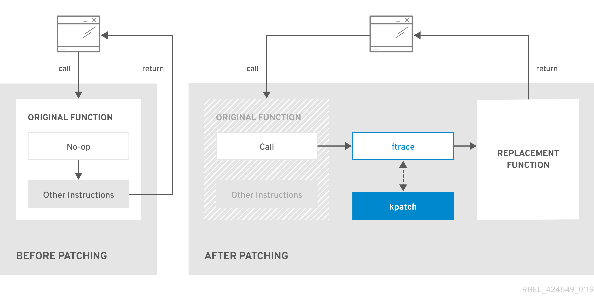
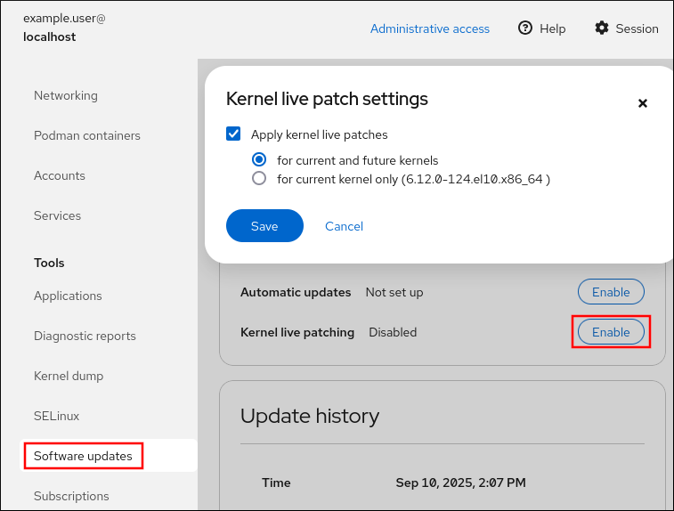

# Managing, monitoring, and updating the kernel

* * *

Red Hat Enterprise Linux 10

## A guide to managing the Linux kernel on Red Hat Enterprise Linux 10

Red Hat Customer Content Services

[Legal Notice](#idm140400679223552)

**Abstract**

As a system administrator, you can configure the Linux kernel to optimize the operating system. Changes to the Linux kernel can improve system performance, security, and stability, as well as your ability to audit the system and troubleshoot problems.

* * *

<h2 id="providing-feedback-on-red-hat-documentation">Providing feedback on Red Hat documentation</h2>

We are committed to providing high-quality documentation and value your feedback. To help us improve, you can submit suggestions or report errors through the Red Hat Jira tracking system.

**Procedure**

1. Log in to the [Jira](https://issues.redhat.com/projects/RHELDOCS/issues) website.
   
   If you do not have an account, select the option to create one.
2. Click **Create** in the top navigation bar.
3. Enter a descriptive title in the **Summary** field.
4. Enter your suggestion for improvement in the **Description** field. Include links to the relevant parts of the documentation.
5. Click **Create** at the bottom of the dialogue.

<h2 id="the-linux-kernel">Chapter 1. The Linux kernel</h2>

The Red Hat kernel RPM package provides the Linux kernel. You must keep the kernel updated to ensure your system has the latest bug fixes, performance enhancements, patches, and hardware compatibility.

<h3 id="what-the-kernel-is">1.1. What the kernel is</h3>

The kernel is a core part of a Linux operating system that manages the system resources and provides an interface between hardware and software applications.

The Red Hat kernel is a custom-built kernel based on the upstream Linux mainline kernel that Red Hat engineers further develop and harden with a focus on stability and compatibility with the latest technologies and hardware.

The Red Hat kernels are packaged in the RPM format to upgrade and verify by the **DNF** package manager.

Warning

Red Hat only supports kernels that are compiled by Red Hat.

<h3 id="rpm-packages">1.2. RPM packages</h3>

An RPM package consists of an archive of files and metadata used to install and erase these files on Red Hat Enterprise Linux (RHEL).

Specifically, the RPM package contains the following parts:

- GPG signature
  
  The GPG signature is used to verify the integrity of the package.
- Header (package metadata)
  
  The RPM package manager uses this metadata to determine package dependencies, where to install files, and other information.
- Payload
  
  The payload is a `cpio` archive that contains files to install to the system.

There are two types of RPM packages. Both types share the file format and tooling, but have different contents and serve different purposes:

- Source RPM (SRPM)
  
  An SRPM contains source code and a `spec` file, which describes how to build the source code into a binary RPM. Optionally, the SRPM can contain patches to source code.
- Binary RPM
  
  A binary RPM contains the binaries built from the sources and patches.

<h3 id="the-linux-kernel-rpm-package-overview">1.3. The Linux kernel RPM package overview</h3>

The `kernel` RPM is a meta package that does not contain any files, but rather ensures that all required subpackages are properly installed.

The following list includes required packages:

`kernel-core`

Provides the binary image of the Linux kernel (`vmlinuz`).

`kernel-modules-core`

Provides the basic kernel modules to ensure core functionality. This includes the modules essential for the proper functioning of the most commonly used hardware.

`kernel-modules`

Provides the remaining kernel modules that are not present in `kernel-modules-core`.

The `kernel-core` and `kernel-modules-core` subpackages together can be used in virtualized and cloud environments to provide a RHEL 10 kernel with a quick boot time and a small disk size footprint. `kernel-modules` subpackage is usually unnecessary for such deployments.

Optional kernel packages are for example:

`kernel-modules-extra`

Provides kernel modules for uncommonly used kernel modules. Loading of the modules in this package is disabled by default.

`kernel-debug`

Provides a kernel with many debugging options enabled for kernel diagnosis, at the expense of reduced performance.

`kernel-tools`

Provides tools for manipulating the Linux kernel and supporting documentation.

`kernel-devel`

Provides the kernel headers and makefiles that are enough to build modules against the `kernel` package.

`kernel-abi-stablelists`

Provides information pertaining to the RHEL kernel ABI, including a list of kernel symbols required by external Linux kernel modules and a `dnf` plugin to aid enforcement.

`kernel-headers`

Includes the C header files that specify the interface between the Linux kernel and user-space libraries and programs. The header files define structures and constants required for building most standard programs.

`kernel-uki-virt`

Contains the Unified Kernel Image (UKI) of the RHEL kernel.

UKI combines the Linux kernel, `initramfs` (initial RAM file system), and the kernel command line into a single signed binary which can be booted directly from the UEFI firmware.

`kernel-uki-virt` contains the required kernel modules to run in virtualized and cloud environments and can be used instead of the `kernel-core` subpackage.

**Additional resources**

- [What are the kernel-core, kernel-modules, and kernel-modules-extras packages?](https://access.redhat.com/articles/3739611)

<h3 id="displaying-contents-of-the-kernel-package">1.4. Displaying contents of a kernel package</h3>

To check if a kernel package provides a specific file, such as a module, query the repository. You can display the file list without downloading or installing the package.

Use the `dnf` utility to query the file list, for example, of the `kernel-core`, `kernel-modules-core`, or `kernel-modules` package. Note that the `kernel` package is a meta package that does not contain any files.

**Procedure**

1. List the available versions of a package:
   
   ```
   dnf repoquery <package_name>
   ```
   
   ```plaintext
   $ dnf repoquery <package_name>
   ```
2. Display the list of files in a package:
   
   ```
   dnf repoquery -l <package_name>
   ```
   
   ```plaintext
   $ dnf repoquery -l <package_name>
   ```

**Additional resources**

- [Packaging and distributing software](https://docs.redhat.com/en/documentation/red_hat_enterprise_linux/10/html/packaging_and_distributing_software)

<h3 id="installing-specific-kernel-versions">1.5. Installing specific kernel versions</h3>

You can install new kernels by using the DNF package manager.

**Procedure**

- To install a specific kernel version, enter the following command:
  
  ```
  dnf install kernel-<version>
  ```
  
  ```plaintext
  # dnf install kernel-<version>
  ```

**Additional resources**

- [Red Hat Enterprise Linux Release Dates](https://access.redhat.com/articles/3078)

<h3 id="updating-the-kernel">1.6. Updating the kernel</h3>

You can update the kernel by using the DNF package manager.

**Procedure**

1. To update the kernel, enter the following command:
   
   ```
   dnf upgrade kernel
   ```
   
   ```plaintext
   # dnf upgrade kernel
   ```
   
   This command updates the kernel along with all dependencies to the latest available version.
2. Reboot your system for the changes to take effect.
   
   See the `dnf(8)` man page on your system for more information.

**Additional resources**

- [Managing software with the DNF tool](https://docs.redhat.com/en/documentation/red_hat_enterprise_linux/10/html/managing_software_with_the_dnf_tool/index)

<h3 id="setting-a-kernel-as-default">1.7. Setting a kernel as default</h3>

To set a specific kernel as the default, use the `grubby` command-line tool and GRUB configuration.

**Procedure**

- Setting the kernel as default by using the `grubby` tool.
  
  - Enter the following command to set the kernel as default using the `grubby` tool:
    
    ```
    grubby --set-default $kernel_path
    ```
    
    ```plaintext
    # grubby --set-default $kernel_path
    ```
- Setting the kernel as default by using the `version` argument.
  
  - List the boot entries using the kernel keyword and then set an intended kernel as default:
    
    ```
    select k in /boot/vmlinuz-*; do grubby --set-default=$k; break; done
    ```
    
    ```plaintext
    # select k in /boot/vmlinuz-*; do grubby --set-default=$k; break; done
    ```
    
    Note
    
    To list the boot entries using the `title` argument, enter `# grubby --info=ALL | grep title`.
- Setting the default kernel for only the next boot.
  
  - Enter the following command to set the default kernel for only the next reboot using the `grub2-reboot` command:
    
    ```
    grub2-reboot <index|title|id>
    ```
    
    ```plaintext
    # grub2-reboot <index|title|id>
    ```
    
    Warning
    
    Set the default kernel for only the next boot with care. Installing new kernel RPMs, self-built kernels, and manually adding the entries to the `/boot/loader/entries/` directory might change the index values.

<h2 id="what-is-kernel-64k">Chapter 2. The 64k page size kernel</h2>

`kernel-64k` is an additional, optional 64-bit ARM architecture kernel package that supports 64k pages. This additional kernel exists alongside the RHEL 10 for ARM kernel, which supports 4k pages.

Optimal system performance directly relates to different memory configuration requirements. These requirements are addressed by the two variants of kernel, each suitable for different workloads. RHEL 10 on 64-bit ARM hardware thus offers two MMU page sizes:

- 4k pages kernel for efficient memory usage in smaller environments,
- `kernel-64k` for workloads with large, contiguous memory working sets.

The 4k pages kernel and `kernel-64k` do not differ in the user experience as the user space is the same. You can choose the variant that addresses your situation the best.

4k pages kernel

Use 4k pages for more efficient memory usage in smaller environments, such as those in Edge and lower-cost, small cloud instances. In these environments, increasing the physical system memory amounts is not practical due to space, power, and cost constraints. Furthermore, not all 64-bit ARM architecture processors support a 64k page size.

The 4k pages kernel supports graphical installation by using Anaconda, system or cloud image-based installations, as well as advanced installations by using Kickstart.

`kernel-64k`

The 64k page size kernel is a useful option for large datasets on ARM platforms. `kernel-64k` is suitable for memory-intensive workloads as it has significant gains in overall system performance, namely in large database, HPC, and high network performance.

You must choose page size on 64-bit ARM architecture systems at the time of installation. You can install `kernel-64k` only by Kickstart by adding the `kernel-64k` package to the package list in the `Kickstart` file.

<h3 id="determining-kernel-page-size-by-system-architecture">2.1. Determining kernel page size by system architecture</h3>

You can determine the kernel page size for different system architectures.

**Procedure**

1. Identify the system architecture:
   
   ```
   uname -r
   ```
   
   ```plaintext
   # uname -r
   ```
   
   ```
   6.12.0-55.9.1.el10_0.x86_64
   ```
   
   ```plaintext
   6.12.0-55.9.1.el10_0.x86_64
   ```
   
   In this output, `x86_64` indicates a 64-bit Intel or AMD architecture.
2. Check the default page size:
   
   ```
   getconf PAGE_SIZE
   ```
   
   ```plaintext
   # getconf PAGE_SIZE
   ```
   
   ```
   4096
   ```
   
   ```plaintext
   4096
   ```
   
   On x86\_64 systems, the output is 4096 B, which means the default page size is 4 KB.
   
   On ppc64le systems, the output is 65536 B, which means the default page size is 64 KB.

<h2 id="managing-kernel-modules">Chapter 3. Managing kernel modules</h2>

Kernel modules extend kernel functionality. Obtain module information and perform administrative tasks such as loading, unloading, and configuring modules at boot time.

<h3 id="introduction-to-kernel-modules">3.1. Introduction to kernel modules</h3>

The Red Hat Enterprise Linux kernel can be extended with kernel modules, which provide optional additional pieces of functionality, without having to reboot the system. On Red Hat Enterprise Linux 10, kernel modules are extra kernel code built into compressed `<replaceable>`.ko.xz\` object files.

Loadable Kernel Modules (LKMs)

LKMs can be dynamically loaded into and unloaded from the running Linux kernel. You can add device drivers or filesystem support without requiring a system reboot or recompiling the entire kernel.

The most common functionality enabled by kernel modules are:

- Device driver which adds support for new hardware
- Support for a file system such as GFS2 or NFS
- System calls

On modern systems, kernel modules are automatically loaded when needed. However, in some cases it is necessary to load or unload modules manually.

Similarly to the kernel, modules accept parameters that customize their behavior.

You can use the kernel tools to perform the following actions on modules:

- Inspect modules that are currently running.
- Inspect modules that are available to load into the kernel.
- Inspect parameters that a module accepts.
- Enable a mechanism to load and unload kernel modules into the running kernel.

<h3 id="kernel-module-dependencies">3.2. Kernel module dependencies</h3>

Certain kernel modules sometimes depend on one or more other kernel modules. The `/lib/modules/<KERNEL_VERSION>/modules.dep` file contains a complete list of kernel module dependencies for the corresponding kernel version.

`depmod`

The dependency file is generated by the `depmod` program, included in the `kmod` package. Many utilities provided by `kmod` consider module dependencies when performing operations. Therefore, **manual** dependency-tracking is rarely necessary.

Warning

The code of kernel modules executes in kernel-space in the unrestricted mode. Be cautious about the modules you are loading.

`weak-modules`

In addition to `depmod`, Red Hat Enterprise Linux provides the `weak-modules` script, which is a part of the `kmod` package. The `weak-modules` script determines the modules that are kABI-compatible with installed kernels. While checking modules kernel compatibility, `weak-modules` processes modules symbol dependencies from higher to lower release of kernel for which they were built. It processes each module independently of the kernel release.

**Additional resources**

- [What is the purpose of weak-modules script shipped with Red Hat Enterprise Linux?](https://access.redhat.com/articles/9749)
- [What is Kernel Application Binary Interface (kABI)? (Red Hat Knowledgebase)](https://access.redhat.com/solutions/444773)

<h3 id="listing-installed-kernels">3.3. Listing installed kernels</h3>

The `grubby --info=ALL` command displays an indexed list of installed kernels on `BLS` installs. With Boot Loader Specification (BLS), you can standardize the way of specifying boot entries. BLS is natively supported by `systemd-boot` and GRUB can also be configured to use BLS.

**Procedure**

- List the installed kernels:
  
  ```
  grubby --info=ALL | grep title
  ```
  
  ```plaintext
  # grubby --info=ALL | grep title
  ```
  
  The list of all installed kernels is displayed:
  
  ```
  title="Red Hat Enterprise Linux (6.12.0-55.9.1.el10_0.x86_64) 10.0"
  title="Red Hat Enterprise Linux (0-rescue-0d772916a9724907a5d1350bcd39ac92) 10.0"
  ```
  
  ```plaintext
  title="Red Hat Enterprise Linux (6.12.0-55.9.1.el10_0.x86_64) 10.0"
  title="Red Hat Enterprise Linux (0-rescue-0d772916a9724907a5d1350bcd39ac92) 10.0"
  ```
  
  This is the list of installed kernels of grubby-8.40-17 from the GRUB menu.

<h3 id="listing-currently-loaded-kernel-modules">3.4. Listing currently loaded kernel modules</h3>

Use the `lsmod` command to list currently loaded kernel modules.

**Prerequisites**

- The `kmod` package is installed.

**Procedure**

- List all currently loaded kernel modules:
  
  ```
  lsmod
  
  Module                  Size  Used by
  fuse                  126976  3
  uinput                 20480  1
  xt_CHECKSUM            16384  1
  ipt_MASQUERADE         16384  1
  xt_conntrack           16384  1
  ipt_REJECT             16384  1
  nft_counter            16384  16
  nf_nat_tftp            16384  0
  nf_conntrack_tftp      16384  1 nf_nat_tftp
  tun                    49152  1
  bridge                192512  0
  stp                    16384  1 bridge
  llc                    16384  2 bridge,stp
  nf_tables_set          32768  5
  nft_fib_inet           16384  1
  …​
  ```
  
  ```plaintext
  $ lsmod
  
  Module                  Size  Used by
  fuse                  126976  3
  uinput                 20480  1
  xt_CHECKSUM            16384  1
  ipt_MASQUERADE         16384  1
  xt_conntrack           16384  1
  ipt_REJECT             16384  1
  nft_counter            16384  16
  nf_nat_tftp            16384  0
  nf_conntrack_tftp      16384  1 nf_nat_tftp
  tun                    49152  1
  bridge                192512  0
  stp                    16384  1 bridge
  llc                    16384  2 bridge,stp
  nf_tables_set          32768  5
  nft_fib_inet           16384  1
  …​
  ```
  
  In this example:
  
  1. The `Module` column provides the **names** of currently loaded modules.
  2. The `Size` column displays the amount of **memory** per module in kilobytes.
  3. The `Used by` column shows the number, and optionally the names of modules that are **dependent** on a particular module.

<h3 id="displaying-information-about-kernel-modules">3.5. Displaying information about kernel modules</h3>

You can use the `modinfo` command to display detailed information about the specified kernel module.

**Prerequisites**

- The `kmod` package is installed.

**Procedure**

- Display information about any kernel module:
  
  ```
  modinfo <KERNEL_MODULE_NAME>
  ```
  
  ```plaintext
  $ modinfo <KERNEL_MODULE_NAME>
  ```
  
  For example:
  
  ```
  modinfo virtio_net
  
  filename:       /lib/modules/6.12.0-55.9.1.el10_0.x86_64/kernel/drivers/net/virtio_net.ko.xz
  license:        GPL
  description:    Virtio network driver
  rhelversion:    9.0
  srcversion:     8809CDDBE7202A1B00B9F1C
  alias:          virtio:d00000001v*
  depends:        net_failover
  retpoline:      Y
  intree:         Y
  name:           virtio_net
  vermagic:       6.12.0-55.9.1.el10_0.x86_64 SMP mod_unload modversions
  …​
  parm:           napi_weight:int
  parm:           csum:bool
  parm:           gso:bool
  parm:           napi_tx:bool
  ```
  
  ```plaintext
  $ modinfo virtio_net
  
  filename:       /lib/modules/6.12.0-55.9.1.el10_0.x86_64/kernel/drivers/net/virtio_net.ko.xz
  license:        GPL
  description:    Virtio network driver
  rhelversion:    9.0
  srcversion:     8809CDDBE7202A1B00B9F1C
  alias:          virtio:d00000001v*
  depends:        net_failover
  retpoline:      Y
  intree:         Y
  name:           virtio_net
  vermagic:       6.12.0-55.9.1.el10_0.x86_64 SMP mod_unload modversions
  …​
  parm:           napi_weight:int
  parm:           csum:bool
  parm:           gso:bool
  parm:           napi_tx:bool
  ```
  
  You can query information about all available modules, regardless of whether they are loaded. The `parm` entries show parameters the user is able to set for the module, and what type of value they expect.
  
  Note
  
  When entering the name of a kernel module, do not append the `.ko.xz` extension to the end of the name. Kernel module names do not have extensions. However, their corresponding files do.

<h3 id="loading-kernel-modules-at-system-runtime">3.6. Loading kernel modules at system runtime</h3>

The optimal way to expand the functionality of the Linux kernel is by loading kernel modules. Use the `modprobe` command to find and load a kernel module into the currently running kernel.

Important

The changes described in this procedure **will not persist** after rebooting the system. For information about how to load kernel modules to **persist** across system reboots, see [Loading kernel modules automatically at system boot time](https://docs.redhat.com/en/documentation/red_hat_enterprise_linux/10/html/managing_monitoring_and_updating_the_kernel/managing-kernel-modules#loading-kernel-modules-automatically-at-system-boot-time).

**Prerequisites**

- You have root permissions on the system.
- The `kmod` package is installed.
- The corresponding kernel module is not loaded. To ensure this, list the [Listing currently loaded kernel modules](https://docs.redhat.com/en/documentation/red_hat_enterprise_linux/10/html/managing_monitoring_and_updating_the_kernel/managing-kernel-modules#listing-currently-loaded-kernel-modules).

**Procedure**

1. Select a kernel module you want to load.
   
   The modules are located in the `/lib/modules/$(uname -r)/kernel/<SUBSYSTEM>/` directory.
2. Load the relevant kernel module:
   
   ```
   modprobe <MODULE_NAME>
   ```
   
   ```plaintext
   # modprobe <MODULE_NAME>
   ```
   
   Note
   
   When entering the name of a kernel module, do not append the `.ko.xz` extension to the end of the name. Kernel module names do not have extensions; their corresponding files do.

**Verification**

- Optionally, verify the relevant module is loaded:
  
  ```
  lsmod | grep <MODULE_NAME>
  ```
  
  ```plaintext
  $ lsmod | grep <MODULE_NAME>
  ```
  
  If the module is loaded correctly, you can display it:
  
  ```
  lsmod | grep serio_raw
  serio_raw              16384  0
  ```
  
  ```plaintext
  $ lsmod | grep serio_raw
  serio_raw              16384  0
  ```
  
  See the `modprobe(8)` man page on your system for more information.

<h3 id="unloading-kernel-modules-at-system-runtime">3.7. Unloading kernel modules at system runtime</h3>

You can use the `modprobe` command to find and unload a kernel module at system runtime from the currently loaded kernel.

Warning

You must not unload the kernel modules that are active in the running system. This can lead to an unstable or non-operational system.

Important

Unloading inactive kernel modules will not disable modules configured for automatic loading at boot. These modules will be automatically loaded again when the system restarts. For information about how to prevent this outcome, see [Preventing kernel modules from being automatically loaded at system boot time](https://docs.redhat.com/en/documentation/red_hat_enterprise_linux/10/html/managing_monitoring_and_updating_the_kernel/managing-kernel-modules#preventing-kernel-modules-from-being-automatically-loaded-at-system-boot-time).

**Prerequisites**

- You have root permissions on the system.
- The `kmod` package is installed.

**Procedure**

1. List all the loaded kernel modules:
   
   ```
   lsmod
   ```
   
   ```plaintext
   # lsmod
   ```
2. Select the kernel module to unload.
   
   If a kernel module has dependencies, unload those before unloading the kernel module. For details on identifying modules with dependencies, see [Listing currently loaded kernel modules](https://docs.redhat.com/en/documentation/red_hat_enterprise_linux/10/html/managing_monitoring_and_updating_the_kernel/index#listing-currently-loaded-kernel-modules) and [Kernel module dependencies](https://docs.redhat.com/en/documentation/red_hat_enterprise_linux/10/html/managing_monitoring_and_updating_the_kernel/index#kernel-module-dependencies).
3. Unload the relevant kernel module:
   
   ```
   modprobe -r <MODULE_NAME>
   ```
   
   ```plaintext
   # modprobe -r <MODULE_NAME>
   ```
   
   When entering the name of a kernel module, do not append the `.ko.xz` extension to the end of the name. Kernel module names do not have extensions; their corresponding files do.

**Verification**

- Optionally, verify the relevant module is unloaded:
  
  ```
  lsmod | grep <MODULE_NAME>
  ```
  
  ```plaintext
  $ lsmod | grep <MODULE_NAME>
  ```
  
  If the module is unloaded successfully, this command does not display any output.
  
  See the `modprobe(8)` man page on your system for more information.

<h3 id="unloading-kernel-modules-at-early-stages-of-the-boot-process">3.8. Unloading kernel modules at early stages of the boot process</h3>

To temporarily block a kernel module from loading early in the boot process, use the boot loader. This is useful when a module causes the system to become unresponsive before you can permanently disable it.

You can edit the relevant boot loader entry to unload the required kernel module before the booting sequence continues.

Important

The changes described in this procedure **do not persist** across system reboots. For information about how to add a kernel module to a denylist, see [Preventing kernel modules from being automatically loaded at system boot time](https://docs.redhat.com/en/documentation/red_hat_enterprise_linux/10/html/managing_monitoring_and_updating_the_kernel/managing-kernel-modules#preventing-kernel-modules-from-being-automatically-loaded-at-system-boot-time).

**Prerequisites**

- You have a loadable kernel module that you want to prevent from loading.

**Procedure**

1. Boot the system into the boot loader.
2. Use the cursor keys to highlight the relevant boot loader entry.
3. Press the `e` key to edit the entry.
4. Use the cursor keys to navigate to the line that starts with **linux**.
5. Append `modprobe.blacklist=module_name` to the end of the line.
   
   The `serio_raw` kernel module illustrates a rogue module to be unloaded early in the boot process.
6. Press `Ctrl`+`X` to boot using the modified configuration.

**Verification**

- After the system boots, verify that the relevant kernel module is not loaded:
  
  ```
  lsmod | grep serio_raw
  ```
  
  ```plaintext
  # lsmod | grep serio_raw
  ```

**Additional resources**

- [Managing kernel modules](https://docs.redhat.com/en/documentation/red_hat_enterprise_linux/10/html/managing_monitoring_and_updating_the_kernel/managing-kernel-modules)

<h3 id="loading-kernel-modules-automatically-at-system-boot-time">3.9. Loading kernel modules automatically at system boot time</h3>

You can configure a kernel module to load automatically during the boot process.

**Prerequisites**

- Root permissions
- The `kmod` package is installed.

**Procedure**

1. Select a kernel module you want to load during the boot process.
   
   The modules are located in the `/lib/modules/$(uname -r)/kernel/<SUBSYSTEM>/` directory.
2. Create a configuration file for the module:
   
   ```
   echo <MODULE_NAME> > /etc/modules-load.d/<MODULE_NAME>.conf
   ```
   
   ```plaintext
   # echo <MODULE_NAME> > /etc/modules-load.d/<MODULE_NAME>.conf
   ```
   
   Note
   
   When entering the name of a kernel module, do not append the `.ko.xz` extension to the end of the name. Kernel module names do not have extensions; their corresponding files do.

**Verification**

1. After reboot, verify the relevant module is loaded:
   
   ```
   lsmod | grep <MODULE_NAME>
   ```
   
   ```plaintext
   $ lsmod | grep <MODULE_NAME>
   ```
   
   Important
   
   The changes described in this procedure **will persist** after rebooting the system.
   
   See the `modules-load.d(5)` man page on your system for more information.

<h3 id="preventing-kernel-modules-from-being-automatically-loaded-at-system-boot-time">3.10. Preventing kernel modules from being automatically loaded at system boot time</h3>

Prevent the system from loading a kernel module automatically during the boot process by listing the module in the `modprobe` configuration file with a corresponding command.

**Prerequisites**

- The commands in this procedure require root privileges. Either use `su -` to switch to the root user or preface the commands with `sudo`.
- The `kmod` package is installed.
- Ensure that your current system configuration does not require a kernel module you plan to deny.

**Procedure**

1. List modules loaded to the currently running kernel by using the `lsmod` command:
   
   ```
   lsmod
   ```
   
   ```plaintext
   $ lsmod
   ```
   
   ```
   Module                  Size  Used by
   tls                   131072  0
   uinput                 20480  1
   snd_seq_dummy          16384  0
   snd_hrtimer            16384  1
   …
   ```
   
   ```plaintext
   Module                  Size  Used by
   tls                   131072  0
   uinput                 20480  1
   snd_seq_dummy          16384  0
   snd_hrtimer            16384  1
   …
   ```
   
   In the output, identify the module you want to prevent from getting loaded.
   
   - Alternatively, identify an unloaded kernel module you want to prevent from potentially loading in the `/lib/modules/<KERNEL-VERSION>/kernel/<SUBSYSTEM>/` directory, for example:
     
     ```
     ls /lib/modules/6.12.0-55.9.1.el10_0.x86_64/kernel/crypto/
     ```
     
     ```plaintext
     $ ls /lib/modules/6.12.0-55.9.1.el10_0.x86_64/kernel/crypto/
     ```
     
     ```
     ansi_cprng.ko.xz        chacha20poly1305.ko.xz  md4.ko.xz               serpent_generic.ko.xz
     anubis.ko.xz            cmac.ko.xz…
     ```
     
     ```plaintext
     ansi_cprng.ko.xz        chacha20poly1305.ko.xz  md4.ko.xz               serpent_generic.ko.xz
     anubis.ko.xz            cmac.ko.xz…
     ```
2. Create a configuration file serving as a denylist:
   
   ```
   touch /etc/modprobe.d/denylist.conf
   ```
   
   ```plaintext
   # touch /etc/modprobe.d/denylist.conf
   ```
3. In a text editor of your choice, combine the names of modules you want to exclude from automatic loading to the kernel with the `blacklist` configuration command, for example:
   
   ```
   # Prevents <KERNEL-MODULE-1> from being loaded
   blacklist <MODULE-NAME-1>
   install <MODULE-NAME-1> /bin/false
   
   # Prevents <KERNEL-MODULE-2> from being loaded
   blacklist <MODULE-NAME-2>
   install <MODULE-NAME-2> /bin/false
   …
   ```
   
   ```plaintext
   # Prevents <KERNEL-MODULE-1> from being loaded
   blacklist <MODULE-NAME-1>
   install <MODULE-NAME-1> /bin/false
   
   # Prevents <KERNEL-MODULE-2> from being loaded
   blacklist <MODULE-NAME-2>
   install <MODULE-NAME-2> /bin/false
   …
   ```
   
   Because the `blacklist` command does not prevent the module from getting loaded as a dependency for another kernel module that is not in a denylist, you must also define the `install` line. In this case, the system runs `/bin/false` instead of installing the module. The lines starting with a hash sign are comments you can use to make the file more readable.
   
   Note
   
   When entering the name of a kernel module, do not append the `.ko.xz` extension to the end of the name. Kernel module names do not have extensions; their corresponding files do.
4. Create a backup copy of the current initial RAM disk image before rebuilding:
   
   ```
   cp /boot/initramfs-$(uname -r).img /boot/initramfs-$(uname -r).bak.$(date +%m-%d-%H%M%S).img
   ```
   
   ```plaintext
   # cp /boot/initramfs-$(uname -r).img /boot/initramfs-$(uname -r).bak.$(date +%m-%d-%H%M%S).img
   ```
   
   - Alternatively, create a backup copy of an initial RAM disk image which corresponds to the kernel version for which you want to prevent kernel modules from automatic loading:
     
     ```
     cp /boot/initramfs-<VERSION>.img /boot/initramfs-<VERSION>.img.bak.$(date +%m-%d-%H%M%S)
     ```
     
     ```plaintext
     # cp /boot/initramfs-<VERSION>.img /boot/initramfs-<VERSION>.img.bak.$(date +%m-%d-%H%M%S)
     ```
5. Generate a new initial RAM disk image to apply the changes:
   
   ```
   dracut -f -v
   ```
   
   ```plaintext
   # dracut -f -v
   ```
   
   - If you build an initial RAM disk image for a different kernel version than your system currently uses, specify both target `initramfs` and kernel version:
     
     ```
     dracut -f -v /boot/initramfs-<TARGET-VERSION>.img <CORRESPONDING-TARGET-KERNEL-VERSION>
     ```
     
     ```plaintext
     # dracut -f -v /boot/initramfs-<TARGET-VERSION>.img <CORRESPONDING-TARGET-KERNEL-VERSION>
     ```
6. Restart the system:
   
   ```
   reboot
   ```
   
   ```plaintext
   $ reboot
   ```
   
   Important
   
   The changes described in this procedure **will take effect and persist** after rebooting the system. If you incorrectly list a key kernel module in the denylist, you can switch the system to an unstable or non-operational state.

**Additional resources**

- [How do I prevent a kernel module from loading automatically? (Red Hat Knowledgebase)](https://access.redhat.com/solutions/41278)

<h3 id="compiling-custom-kernel-modules">3.11. Compiling custom kernel modules</h3>

Build a sample kernel module as requested by various configurations at hardware and software level.

**Prerequisites**

- You installed the `kernel-devel`, `gcc`, and `elfutils-libelf-devel` packages.
  
  ```
  dnf install kernel-devel-$(uname -r) gcc elfutils-libelf-devel
  ```
  
  ```plaintext
  # dnf install kernel-devel-$(uname -r) gcc elfutils-libelf-devel
  ```
- You have root permissions.
- You created the `/root/testmodule/` directory where you compile the custom kernel module.

**Procedure**

1. Create the `/root/testmodule/test.c` file with the following content.
   
   ```
   #include <linux/module.h>
   #include <linux/kernel.h>
   
   int init_module(void)
       { printk("Hello World\n This is a test\n"); return 0; }
   
   void cleanup_module(void)
       { printk("Good Bye World"); }
   
   MODULE_LICENSE("GPL");
   ```
   
   ```plaintext
   #include <linux/module.h>
   #include <linux/kernel.h>
   
   int init_module(void)
       { printk("Hello World\n This is a test\n"); return 0; }
   
   void cleanup_module(void)
       { printk("Good Bye World"); }
   
   MODULE_LICENSE("GPL");
   ```
   
   The `test.c` file is a source file that provides the main functionality to the kernel module. The file has been created in a dedicated `/root/testmodule/` directory for organizational purposes. After the module compilation, the `/root/testmodule/` directory will contain multiple files.
   
   The `test.c` file includes from the system libraries:
   
   - The `linux/kernel.h` header file is necessary for the `printk()` function in the example code.
   - The `linux/module.h` file contains function declarations and macro definitions that are shared across several source files written in C programming language.
2. Follow the `init_module()` and `cleanup_module()` functions to start and end the kernel logging function `printk()`, which prints text.
3. Create the `/root/testmodule/Makefile` file with the following content.
   
   ```
   obj-m := test.o
   ```
   
   ```plaintext
   obj-m := test.o
   ```
   
   The Makefile contains instructions for the compiler to produce an object file named `test.o`. The `obj-m` directive specifies that the resulting `test.ko` file is going to be compiled as a loadable kernel module. Alternatively, the `obj-y` directive can instruct to build `test.ko` as a built-in kernel module.
4. Compile the kernel module:
   
   ```
   make -C /lib/modules/$(uname -r)/build M=/root/testmodule modules
   ```
   
   ```plaintext
   # make -C /lib/modules/$(uname -r)/build M=/root/testmodule modules
   ```
   
   ```
   make: Entering directory '/usr/src/kernels/6.12.0-55.9.1.el10_0.x86_64'
     CC [M]  /root/testmodule/test.o
     MODPOST /root/testmodule/Module.symvers
     CC [M]  /root/testmodule/test.mod.o
     LD [M]  /root/testmodule/test.ko
     BTF [M] /root/testmodule/test.ko
   Skipping BTF generation for /root/testmodule/test.ko due to unavailability of vmlinux
   make: Leaving directory '/usr/src/kernels/6.12.0-55.9.1.el10_0.x86_64'
   ```
   
   ```plaintext
   make: Entering directory '/usr/src/kernels/6.12.0-55.9.1.el10_0.x86_64'
     CC [M]  /root/testmodule/test.o
     MODPOST /root/testmodule/Module.symvers
     CC [M]  /root/testmodule/test.mod.o
     LD [M]  /root/testmodule/test.ko
     BTF [M] /root/testmodule/test.ko
   Skipping BTF generation for /root/testmodule/test.ko due to unavailability of vmlinux
   make: Leaving directory '/usr/src/kernels/6.12.0-55.9.1.el10_0.x86_64'
   ```
   
   The compiler creates an object file (`test.o`) for each source file (`test.c`) as an intermediate step before linking them together into the final kernel module (`test.ko`).
   
   After a successful compilation, `/root/testmodule/` contains additional files that relate to the compiled custom kernel module. The compiled module itself is represented by the `test.ko` file.

**Verification**

1. Optional: check the contents of the `/root/testmodule/` directory:
   
   ```
   ls -l /root/testmodule/
   ```
   
   ```plaintext
   # ls -l /root/testmodule/
   ```
   
   ```
   total 152
   -rw-r--r--. 1 root root    16 Jul 26 08:19 Makefile
   -rw-r--r--. 1 root root    25 Jul 26 08:20 modules.order
   -rw-r--r--. 1 root root     0 Jul 26 08:20 Module.symvers
   -rw-r--r--. 1 root root   224 Jul 26 08:18 test.c
   -rw-r--r--. 1 root root 62176 Jul 26 08:20 test.ko
   -rw-r--r--. 1 root root    25 Jul 26 08:20 test.mod
   -rw-r--r--. 1 root root   849 Jul 26 08:20 test.mod.c
   -rw-r--r--. 1 root root 50936 Jul 26 08:20 test.mod.o
   -rw-r--r--. 1 root root 12912 Jul 26 08:20 test.o
   ```
   
   ```plaintext
   total 152
   -rw-r--r--. 1 root root    16 Jul 26 08:19 Makefile
   -rw-r--r--. 1 root root    25 Jul 26 08:20 modules.order
   -rw-r--r--. 1 root root     0 Jul 26 08:20 Module.symvers
   -rw-r--r--. 1 root root   224 Jul 26 08:18 test.c
   -rw-r--r--. 1 root root 62176 Jul 26 08:20 test.ko
   -rw-r--r--. 1 root root    25 Jul 26 08:20 test.mod
   -rw-r--r--. 1 root root   849 Jul 26 08:20 test.mod.c
   -rw-r--r--. 1 root root 50936 Jul 26 08:20 test.mod.o
   -rw-r--r--. 1 root root 12912 Jul 26 08:20 test.o
   ```
2. Copy the kernel module to the `/lib/modules/$(uname -r)/` directory:
   
   ```
   cp /root/testmodule/test.ko /lib/modules/$(uname -r)/
   ```
   
   ```plaintext
   # cp /root/testmodule/test.ko /lib/modules/$(uname -r)/
   ```
3. Update the modular dependency list:
   
   ```
   depmod -a
   ```
   
   ```plaintext
   # depmod -a
   ```
4. Load the kernel module:
   
   ```
   modprobe -v test
   ```
   
   ```plaintext
   # modprobe -v test
   ```
   
   ```
   insmod /lib/modules/6.12.0-55.9.1.el10_0.x86_64/test.ko
   ```
   
   ```plaintext
   insmod /lib/modules/6.12.0-55.9.1.el10_0.x86_64/test.ko
   ```
5. Verify that the kernel module was successfully loaded:
   
   ```
   lsmod | grep test
   ```
   
   ```plaintext
   # lsmod | grep test
   ```
   
   ```
   test                   16384  0
   ```
   
   ```plaintext
   test                   16384  0
   ```
6. Read the latest messages from the kernel ring buffer:
   
   ```
   dmesg
   ```
   
   ```plaintext
   # dmesg
   ```
   
   ```
   [74422.545004] Hello World
                   This is a test
   ```
   
   ```plaintext
   [74422.545004] Hello World
                   This is a test
   ```

<h2 id="configuring-kernel-command-line-parameters">Chapter 4. Configuring kernel command-line parameters</h2>

Use kernel command-line parameters to change the behavior of certain aspects of the Red Hat Enterprise Linux kernel at boot time. System administrators control which options are set at boot. Note that certain kernel behaviors can only be set at boot time.

Important

Changing the behavior of the system by modifying kernel command-line parameters can have negative effects on your system. Always test changes before deploying them in production. For further guidance, contact Red Hat Support.

<h3 id="understanding-kernel-command-line-parameters">4.1. What are kernel command-line parameters</h3>

With kernel command-line parameters, you can overwrite default values and set specific hardware settings. At boot time, you can configure the Red Hat Enterprise Linux kernel, the initial RAM disk, and user space features.

By default, the kernel command-line parameters for systems by using the GRUB boot loader are defined in the boot entry configuration file for each kernel boot entry.

You can manipulate boot loader configuration files by using the `grubby` utility. With `grubby`, you can perform these actions:

- Change the default boot entry.
- Add or remove arguments from a GRUB menu entry.

<h3 id="what-boot-entries-are">4.2. Understanding boot entries</h3>

Understand boot entries to manage your system’s kernel configurations.

A boot entry is a collection of options stored in a configuration file and tied to a particular kernel version. In practice, you have at least as many boot entries as your system has installed kernels. The boot entry configuration file is located in the `/boot/loader/entries/` directory:

```
d8712ab6d4f14683c5625e87b52b6b6e-6.12.0.el10_0.x86_64.conf
```

```plaintext
d8712ab6d4f14683c5625e87b52b6b6e-6.12.0.el10_0.x86_64.conf
```

The file name consists of a machine ID stored in the `/etc/machine-id` file, and a kernel version.

The boot entry configuration file contains information about the kernel version, the initial ramdisk image, and the kernel command-line parameters. The example contents of a boot entry config can be seen below:

```
title Red Hat Enterprise Linux (6.12.0-0.el10_0.x86_64) 10.0
version 6.12.0-0.el10_0.x86_64
linux /vmlinuz-6.12.0-0.el10_0.x86_64
initrd /initramfs-6.12.0-0.el10_0.x86_64.img
options root=/dev/mapper/rhel_kvm--02--guest08-root ro crashkernel=2G-64G:256M,64G-:512M resume=/dev/mapper/rhel_kvm--02--guest08-swap rd.lvm.lv=rhel_kvm-02-guest08/root rd.lvm.lv=rhel_kvm-02-guest08/swap console=ttyS0,115200
grub_users $grub_users
grub_arg --unrestricted
grub_class kernel
```

```plaintext
title Red Hat Enterprise Linux (6.12.0-0.el10_0.x86_64) 10.0
version 6.12.0-0.el10_0.x86_64
linux /vmlinuz-6.12.0-0.el10_0.x86_64
initrd /initramfs-6.12.0-0.el10_0.x86_64.img
options root=/dev/mapper/rhel_kvm--02--guest08-root ro crashkernel=2G-64G:256M,64G-:512M resume=/dev/mapper/rhel_kvm--02--guest08-swap rd.lvm.lv=rhel_kvm-02-guest08/root rd.lvm.lv=rhel_kvm-02-guest08/swap console=ttyS0,115200
grub_users $grub_users
grub_arg --unrestricted
grub_class kernel
```

<h3 id="changing-kernel-command-line-parameters-for-all-boot-entries">4.3. Changing kernel command-line parameters for all boot entries</h3>

Change kernel command-line parameters for all boot entries on your system.

Important

When installing a newer version of the kernel in Red Hat Enterprise Linux 10 systems, the `grubby` tool passes the kernel command-line arguments from the previous kernel version.

**Prerequisites**

- `grubby` utility is installed on your system.
- `zipl` utility is installed on your IBM Z system.

**Procedure**

- To add a parameter:
  
  ```
  grubby --update-kernel=ALL --args="<NEW_PARAMETER>"
  ```
  
  ```plaintext
  # grubby --update-kernel=ALL --args="<NEW_PARAMETER>"
  ```
  
  For systems that use the GRUB boot loader and, on IBM Z that use the zIPL boot loader, the command adds a new kernel parameter to each `/boot/loader/entries/<ENTRY>.conf` file.
  
  - On IBM Z, update the boot menu:
    
    ```
    zipl
    ```
    
    ```plaintext
    # zipl
    ```
- To remove a parameter:
  
  ```
  grubby --update-kernel=ALL --remove-args="<PARAMETER_TO_REMOVE>"
  ```
  
  ```plaintext
  # grubby --update-kernel=ALL --remove-args="<PARAMETER_TO_REMOVE>"
  ```
  
  - On IBM Z, update the boot menu:
    
    ```
    zipl
    ```
    
    ```plaintext
    # zipl
    ```
    
    Note
    
    There is no need to update boot menu for the systems using the GRUB boot loader.

**Additional resources**

- [What are kernel command-line parameters](#understanding-kernel-command-line-parameters "4.1. What are kernel command-line parameters")

<h3 id="changing-kernel-command-line-parameters-for-a-single-boot-entry">4.4. Changing kernel command-line parameters for a single boot entry</h3>

Make changes in kernel command-line parameters for a single boot entry on your system.

**Prerequisites**

- `grubby` and `zipl` utilities are installed on your system.

**Procedure**

- To add a parameter:
  
  ```
  grubby --update-kernel=/boot/vmlinuz-$(uname -r) --args="<NEW_PARAMETER>"
  ```
  
  ```plaintext
  # grubby --update-kernel=/boot/vmlinuz-$(uname -r) --args="<NEW_PARAMETER>"
  ```
  
  - On IBM Z, update the boot menu:
    
    ```
    grubby --args="<NEW_PARAMETER> --update-kernel=ALL --zipl
    ```
    
    ```plaintext
    # grubby --args="<NEW_PARAMETER> --update-kernel=ALL --zipl
    ```
- To remove a parameter:
  
  ```
  grubby --update-kernel=/boot/vmlinuz-$(uname -r) --remove-args="<PARAMETER_TO_REMOVE>"
  ```
  
  ```plaintext
  # grubby --update-kernel=/boot/vmlinuz-$(uname -r) --remove-args="<PARAMETER_TO_REMOVE>"
  ```
  
  - On IBM Z, update the boot menu:
    
    ```
    grubby --args="<NEW_PARAMETER> --update-kernel=ALL --zipl
    ```
    
    ```plaintext
    # grubby --args="<NEW_PARAMETER> --update-kernel=ALL --zipl
    ```
    
    Important
    
    `grubby` modifies and stores the kernel command-line parameters of an individual kernel boot entry in the `/boot/loader/entries/<ENTRY>.conf` file.

<h3 id="changing-kernel-command-line-parameters-temporarily-at-boot-time">4.5. Changing kernel command-line parameters temporarily at boot time</h3>

Make temporary changes to a Kernel Menu Entry by changing the kernel parameters only during a single boot process. This procedure applies only for a single boot and does not persist after system reboot.

**Procedure**

1. Boot into the GRUB boot menu.
2. Select the kernel you want to start.
3. Press the `e` key to edit the kernel parameters.
4. Find the kernel command line by moving the cursor down.
5. Move the cursor to the end of the line.
6. Edit the kernel parameters as required. For example, to run the system in emergency mode, add the `emergency` parameter at the end of the `linux` line:
   
   ```
   linux   ($root)/vmlinuz-6.12.0-0.el10_0.x86_64 root=/dev/mapper/rhel-root ro crashkernel=2G-64G:256M,64G-:512M resume=/dev/mapper/rhel-swap rd.lvm.lv=rhel/root rd.lvm.lv=rhel/swap rhgb quiet emergency
   ```
   
   ```plaintext
   linux   ($root)/vmlinuz-6.12.0-0.el10_0.x86_64 root=/dev/mapper/rhel-root ro crashkernel=2G-64G:256M,64G-:512M resume=/dev/mapper/rhel-swap rd.lvm.lv=rhel/root rd.lvm.lv=rhel/swap rhgb quiet emergency
   ```
   
   To enable the system messages, remove the `rhgb` and `quiet` parameters.
7. Press `Ctrl`+`x` to boot with the selected kernel and the modified command line parameters.
   
   Important
   
   If you press the `Esc` key to leave command line editing, it will drop all the user made changes.

<h3 id="configuring-grub-2-settings-to-enable-serial-console-connection">4.6. Configuring GRUB settings to enable serial console connection</h3>

To connect to a headless server or embedded system when the network is down, you can configure GRUB 2 to enable a serial console connection. This also provides login access on a different system to avoid security rules.

You need to configure some default GRUB settings to use the serial console connection.

**Prerequisites**

- You have root permissions on the system.

**Procedure**

1. Add the following two lines to the `/etc/default/grub` file:
   
   ```
   GRUB_TERMINAL="serial"
   GRUB_SERIAL_COMMAND="serial --speed=9600 --unit=0 --word=8 --parity=no --stop=1"
   ```
   
   ```plaintext
   GRUB_TERMINAL="serial"
   GRUB_SERIAL_COMMAND="serial --speed=9600 --unit=0 --word=8 --parity=no --stop=1"
   ```
   
   The first line disables the graphical terminal. The `GRUB_TERMINAL` key overrides values of `GRUB_TERMINAL_INPUT` and `GRUB_TERMINAL_OUTPUT` keys.
   
   The second line adjusts the baud rate (`--speed`), parity and other values to fit your environment and hardware. Note that a higher baud rate, for example 115200, is preferable for tasks such as following log files.
2. Update the GRUB configuration file:
   
   ```
   grub2-mkconfig -o /boot/grub2/grub.cfg
   ```
   
   ```plaintext
   # grub2-mkconfig -o /boot/grub2/grub.cfg
   ```
   
   This applies to both, BIOS and UEFI based machines.
3. Reboot the system for the changes to take effect.

<h3 id="changing-boot-entries-with-the-grub-configuration-file">4.7. Changing boot entries with the GRUB configuration file</h3>

To change boot entries for the Linux kernel, you can modify the `/etc/default/grub` configuration file. This file contains the `GRUB_CMDLINE_LINUX` key, which lists the kernel command-line arguments.

For example:

```
GRUB_CMDLINE_LINUX="crashkernel=2G-64G:256M,64G-:512M resume=/dev/mapper/rhel-swap rd.lvm.lv=rhel/root rd.lvm.lv=rhel/swap"
```

```plaintext
GRUB_CMDLINE_LINUX="crashkernel=2G-64G:256M,64G-:512M resume=/dev/mapper/rhel-swap rd.lvm.lv=rhel/root rd.lvm.lv=rhel/swap"
```

To change the boot entries, overwrite Boot Loader Specification (BLS) snippets with the contents of the `GRUB_CMDLINE_LINUX` values.

**Prerequisites**

- A fresh Red Hat Enterprise Linux 10 installation.

**Procedure**

1. Add or remove a kernel parameter for individual kernels in a post installation script with `grubby`:
   
   ```
   grubby --update-kernel <PATH_TO_KERNEL> --args "<NEW_ARGUMENTS>"
   ```
   
   ```plaintext
   # grubby --update-kernel <PATH_TO_KERNEL> --args "<NEW_ARGUMENTS>"
   ```
   
   For example, add the `noapic` parameter to the chosen kernel:
   
   ```
   grubby --update-kernel /boot/vmlinuz-6.12.0-0.el10_0.x86_64 --args "noapic"
   ```
   
   ```plaintext
   # grubby --update-kernel /boot/vmlinuz-6.12.0-0.el10_0.x86_64 --args "noapic"
   ```
   
   The parameter is propagated into the BLS snippets, but not into the `/etc/default/grub` file.
2. Overwrite BLS snippets with the contents of the `GRUB_CMDLINE_LINUX` values present in the `/etc/default/grub` file:
   
   ```
   grub2-mkconfig -o /boot/grub2/grub.cfg --update-bls-cmdline
   ```
   
   ```plaintext
   # grub2-mkconfig -o /boot/grub2/grub.cfg --update-bls-cmdline
   ```
   
   ```
   Generating grub configuration file ...
   Adding boot menu entry for UEFI Firmware Settings ...
   done
   ```
   
   ```plaintext
   Generating grub configuration file ...
   Adding boot menu entry for UEFI Firmware Settings ...
   done
   ```
   
   Note
   
   Other changes, such as changes made to `GRUB_TIMEOUT` key (also included in the `/etc/default/grub` GRUB configuration file) are propagated to the new `grub.cfg` file by executing `grub2-mkconfig` command.

**Verification**

1. Reboot your system.
2. Verify that the parameters are included in the `/proc/cmdline` file.
   
   For example, if you added the `noapic`:
   
   ```
   BOOT_IMAGE=(hd0,gpt2)/vmlinuz-6.12.0-0.el10_0.x86_64 root=/dev/mapper/RHELCSB-Root ro vconsole.keymap=us crashkernel=2G-64G:256M,64G-:512M rd.lvm.lv=RHELCSB/Root rd.luks.uuid=luks-d8a28c4c-96aa-4319-be26-96896272151d rhgb quiet noapic rd.luks.key=d8a28c4c-96aa-4319-be26-96896272151d=/keyfile:UUID=c47d962e-4be8-41d6-8216-8cf7a0d3b911 ipv6.disable=1
   ```
   
   ```plaintext
   BOOT_IMAGE=(hd0,gpt2)/vmlinuz-6.12.0-0.el10_0.x86_64 root=/dev/mapper/RHELCSB-Root ro vconsole.keymap=us crashkernel=2G-64G:256M,64G-:512M rd.lvm.lv=RHELCSB/Root rd.luks.uuid=luks-d8a28c4c-96aa-4319-be26-96896272151d rhgb quiet noapic rd.luks.key=d8a28c4c-96aa-4319-be26-96896272151d=/keyfile:UUID=c47d962e-4be8-41d6-8216-8cf7a0d3b911 ipv6.disable=1
   ```

<h2 id="configuring-kernel-parameters-at-runtime">Chapter 5. Configuring kernel parameters at runtime</h2>

Modify the behavior of the Red Hat Enterprise Linux kernel at runtime by using the `sysctl` command and by modifying configuration files in the `/etc/sysctl.d/` and `/proc/sys/` directories.

Important

Configuring kernel parameters on a production system requires careful planning. Unplanned changes can render the kernel unstable, requiring a system reboot. Verify that you are using valid options before changing any kernel values.

For more information about tuning kernel on IBM DB2, see [Tuning Red Hat Enterprise Linux for IBM DB2](https://access.redhat.com/solutions/3530941).

<h3 id="what-are-kernel-parameters">5.1. What are kernel parameters</h3>

Kernel parameters are tunable values that you can adjust while the system is running. Note that for changes to take effect, you do not need to reboot the system or recompile the kernel.

The difference between kernel parameters and kernel command line parameters is; Kernel parameters can configure the Linux kernel with all the options, while kernel command line parameters are the specific arguments passed to the kernel during boot, allowing runtime configuration without kernel recompilation.

It is possible to address the kernel parameters through:

- The `sysctl` command
- The virtual file system mounted at the `/proc/sys/` directory
- The configuration files in the `/etc/sysctl.d/` directory

Tunables are divided into classes by the kernel subsystem. Red Hat Enterprise Linux has the following tunable classes:

| Tunable class | Subsystem                                           |
|:--------------|:----------------------------------------------------|
| `abi`         | Execution domains and personalities                 |
| `crypto`      | Cryptographic interfaces                            |
| `debug`       | Kernel debugging interfaces                         |
| `dev`         | Device-specific information                         |
| `fs`          | Global and specific file system tunables            |
| `kernel`      | Global kernel tunables                              |
| `net`         | Network tunables                                    |
| `sunrpc`      | Sun Remote Procedure Call (NFS)                     |
| `user`        | User Namespace limits                               |
| `vm`          | Tuning and management of memory, buffers, and cache |

Table 5.1. Table of sysctl classes

<h3 id="configuring-kernel-parameters-temporarily-with-sysctl">5.2. Configuring kernel parameters temporarily with sysctl</h3>

You can use the `sysctl` command to temporarily set kernel parameters at runtime. The command is also useful for listing and filtering tunables.

**Prerequisites**

- You have root permissions on the system.

**Procedure**

1. List all parameters and their values.
   
   ```
   sysctl -a
   ```
   
   ```plaintext
   # sysctl -a
   ```
   
   Note
   
   The `sysctl -a` command displays kernel parameters, which can be adjusted at runtime and at boot time.
2. To configure a parameter temporarily, enter:
   
   ```
   sysctl <TUNABLE_CLASS>.<PARAMETER>=<TARGET_VALUE>
   ```
   
   ```plaintext
   # sysctl <TUNABLE_CLASS>.<PARAMETER>=<TARGET_VALUE>
   ```
   
   This sample changes the parameter value while the system is running. The changes take effect immediately and it does not require system reboot.
   
   Note
   
   The changes return back to default after your system reboots.

**Additional resources**

- [Using configuration files in /etc/sysctl.d/ to adjust kernel parameters](#using-configuration-files-in-etc-sysctl-d-to-adjust-kernel-parameters "5.4. Using configuration files in /etc/sysctl.d/ to adjust kernel parameters")

<h3 id="configuring-kernel-parameters-permanently-with-sysctl">5.3. Configuring kernel parameters permanently with sysctl</h3>

You can use the `sysctl` command to permanently set kernel parameters.

**Prerequisites**

- You have root permissions on the system.

**Procedure**

1. List all parameters:
   
   ```
   sysctl -a
   ```
   
   ```plaintext
   # sysctl -a
   ```
   
   The command displays all kernel parameters that can be configured at runtime.
2. Configure a parameter permanently:
   
   ```
   sysctl -w <TUNABLE_CLASS>.<PARAMETER>=<TARGET_VALUE> >> /etc/sysctl.conf
   ```
   
   ```plaintext
   # sysctl -w <TUNABLE_CLASS>.<PARAMETER>=<TARGET_VALUE> >> /etc/sysctl.conf
   ```
   
   The sample command changes the tunable value and writes it to the `/etc/sysctl.conf` file, which overrides the default values of kernel parameters. The changes take effect immediately and persistently, without a need for restart.
   
   Note
   
   To permanently modify kernel parameters, you can also make manual changes to the configuration files in the `/etc/sysctl.d/` directory.

**Additional resources**

- [Using configuration files in /etc/sysctl.d/ to adjust kernel parameters](#using-configuration-files-in-etc-sysctl-d-to-adjust-kernel-parameters "5.4. Using configuration files in /etc/sysctl.d/ to adjust kernel parameters")

<h3 id="using-configuration-files-in-etc-sysctl-d-to-adjust-kernel-parameters">5.4. Using configuration files in /etc/sysctl.d/ to adjust kernel parameters</h3>

To permanently set kernel parameters, manually modify the configuration files in the `/etc/sysctl.d/` directory.

**Prerequisites**

- You have root permissions on the system.

**Procedure**

1. Create a new configuration file in `/etc/sysctl.d/`:
   
   ```
   vim /etc/sysctl.d/<some_file.conf>
   ```
   
   ```plaintext
   # vim /etc/sysctl.d/<some_file.conf>
   ```
2. Include kernel parameters, one per line:
   
   ```
   <TUNABLE_CLASS>.<PARAMETER>=<TARGET_VALUE>
   <TUNABLE_CLASS>.<PARAMETER>=<TARGET_VALUE>
   ```
   
   ```plaintext
   <TUNABLE_CLASS>.<PARAMETER>=<TARGET_VALUE>
   <TUNABLE_CLASS>.<PARAMETER>=<TARGET_VALUE>
   ```
3. Save the configuration file.
4. Reboot the machine for the changes to take effect.
   
   - Alternatively, apply changes without rebooting:
     
     ```
     sysctl -p /etc/sysctl.d/<some_file.conf>
     ```
     
     ```plaintext
     # sysctl -p /etc/sysctl.d/<some_file.conf>
     ```
     
     With this command, you can read values from the configuration file which you created earlier.
     
     See `sysctl(8)` and `sysctl.d(5)` man pages on your system for more information.

<h3 id="configuring-kernel-parameters-temporarily-through-proc-sys">5.5. Configuring kernel parameters temporarily through /proc/sys/</h3>

To set kernel parameters temporarily, modify the files in the `/proc/sys/` virtual file system directory.

**Prerequisites**

- You have root permissions on the system.

**Procedure**

1. Identify a kernel parameter you want to configure:
   
   ```
   ls -l /proc/sys/<TUNABLE_CLASS>/
   ```
   
   ```plaintext
   # ls -l /proc/sys/<TUNABLE_CLASS>/
   ```
   
   The writable files returned by the command can be used to configure the kernel. The files with read-only permissions provide feedback on the current settings.
2. Assign a target value to the kernel parameter:
   
   ```
   echo <TARGET_VALUE> > /proc/sys/<TUNABLE_CLASS>/<PARAMETER>
   ```
   
   ```plaintext
   # echo <TARGET_VALUE> > /proc/sys/<TUNABLE_CLASS>/<PARAMETER>
   ```
   
   The configuration changes applied by using a command are not permanent and will disappear after system reboot.

**Verification**

1. Verify the value of the newly set kernel parameter:
   
   ```
   cat /proc/sys/<TUNABLE_CLASS>/<PARAMETER>
   ```
   
   ```plaintext
   # cat /proc/sys/<TUNABLE_CLASS>/<PARAMETER>
   ```

<h2 id="configuring-kernel-parameters-permanently-by-using-rhel-system-roles">Chapter 6. Configuring kernel parameters permanently by using RHEL system roles</h2>

You can use the `kernel_settings` RHEL system role to configure kernel parameters on multiple clients at once.

Simultaneous configuration has the following advantages:

- Provides a friendly interface with efficient input setting.
- Keeps all intended kernel parameters in one place.

After you run the `kernel_settings` role from the control machine, the kernel parameters are applied to the managed systems immediately and persist across reboots.

Important

Note that RHEL system roles delivered over RHEL channels are available to RHEL customers as an RPM package in the default AppStream repository. RHEL system roles are also available as a collection to customers with Ansible subscriptions over Ansible Automation Hub.

<h3 id="applying-selected-kernel-parameters-by-using-the-kernelsettings-productshortname-system-role">6.1. Applying selected kernel parameters by using the kernel\_settings RHEL system role</h3>

You can use the `kernel_settings` RHEL system role to remotely configure various kernel parameters across multiple managed operating systems with persistent effects.

For example, by using the `kernel_settings` role, you can configure:

- Transparent hugepages to increase performance by reducing the overhead of managing smaller pages.
- The largest packet sizes are to be transmitted over the network with the loopback interface.
- Limits on files, which can be opened simultaneously.

**Prerequisites**

- [You have prepared the control node and the managed nodes](https://docs.redhat.com/en/documentation/red_hat_enterprise_linux/10/html/automating_system_administration_by_using_rhel_system_roles/preparing-a-control-node-and-managed-nodes-to-use-rhel-system-roles).
- You are logged in to the control node as a user who can run playbooks on the managed nodes.
- The account you use to connect to the managed nodes has `sudo` permissions for these nodes.

**Procedure**

1. Create a playbook file, for example, `~/playbook.yml`, with the following content:
   
   ```
   ---
   - name: Configuring kernel settings
     hosts: managed-node-01.example.com
     tasks:
       - name: Configure hugepages, packet size for loopback device, and limits on simultaneously open files.
         ansible.builtin.include_role:
           name: redhat.rhel_system_roles.kernel_settings
         vars:
           kernel_settings_sysctl:
             - name: fs.file-max
               value: 400000
             - name: kernel.threads-max
               value: 65536
           kernel_settings_sysfs:
             - name: /sys/class/net/lo/mtu
               value: 65000
           kernel_settings_transparent_hugepages: madvise
           kernel_settings_reboot_ok: true
   ```
   
   ```yaml
   ---
   - name: Configuring kernel settings
     hosts: managed-node-01.example.com
     tasks:
       - name: Configure hugepages, packet size for loopback device, and limits on simultaneously open files.
         ansible.builtin.include_role:
           name: redhat.rhel_system_roles.kernel_settings
         vars:
           kernel_settings_sysctl:
             - name: fs.file-max
               value: 400000
             - name: kernel.threads-max
               value: 65536
           kernel_settings_sysfs:
             - name: /sys/class/net/lo/mtu
               value: 65000
           kernel_settings_transparent_hugepages: madvise
           kernel_settings_reboot_ok: true
   ```
   
   The settings specified in the example playbook include the following:
   
   `kernel_settings_sysfs: <list_of_sysctl_settings>`
   
   A YAML list of `sysctl` settings and the values you want to assign to these settings.
   
   `kernel_settings_transparent_hugepages: <value>`
   
   Controls the memory subsystem Transparent Huge Pages (THP) setting. You can disable THP support (`never`), enable it system wide (`always`) or inside `MAD_HUGEPAGE` regions (`madvise`).
   
   `kernel_settings_reboot_ok: <true|false>`
   
   The default is `false`. If set to `true`, the system role will determine if a reboot of the managed host is necessary for the requested changes to take effect and reboot it. If set to `false`, the role will return the variable `kernel_settings_reboot_required` with a value of `true`, indicating that a reboot is required. In this case, a user must reboot the managed node manually.
   
   For details about all variables used in the playbook, see the `/usr/share/ansible/roles/rhel-system-roles.kdump/README.md` file on the control node.
2. Validate the playbook syntax:
   
   ```
   ansible-playbook --syntax-check ~/playbook.yml
   ```
   
   ```plaintext
   $ ansible-playbook --syntax-check ~/playbook.yml
   ```
   
   Note that this command only validates the syntax and does not protect against a wrong but valid configuration.
3. Run the playbook:
   
   ```
   ansible-playbook ~/playbook.yml
   ```
   
   ```plaintext
   $ ansible-playbook ~/playbook.yml
   ```

**Verification**

- Verify the affected kernel parameters:
  
  ```
  ansible managed-node-01.example.com -m command -a 'sysctl fs.file-max kernel.threads-max net.ipv6.conf.lo.mtu'
  ansible managed-node-01.example.com -m command -a 'cat /sys/kernel/mm/transparent_hugepage/enabled'
  ```
  
  ```plaintext
  # ansible managed-node-01.example.com -m command -a 'sysctl fs.file-max kernel.threads-max net.ipv6.conf.lo.mtu'
  # ansible managed-node-01.example.com -m command -a 'cat /sys/kernel/mm/transparent_hugepage/enabled'
  ```

<h2 id="managing-kernel-command-line-parameters-with-uki">Chapter 7. Managing kernel command-line parameters with UKI</h2>

Unified Kernel Image (UKI) combines the kernel, initial RAM disk (initrd), and boot command line into a single executable binary.

<h3 id="understanding-kernel-command-line-parameters-with-uki">7.1. Understanding kernel command-line parameters with UKI</h3>

With UKI, `systemd-boot`, specifically `systemd-stub`, handles the kernel command-line parameters. The UKI delivered by Red Hat includes the basic kernel command-line parameter `console=tty0 console=ttyS0`.

You can add additional kernel command-line parameters by using UKI add-ons. Alternatively, you can generate your own UKI to contain any arguments you require.

Important

Secure Boot revokes improperly signed UKIs and add-ons. These signatures can also alter PCR measurements of TPM which can potentially affect boot sequence.

<h3 id="understanding-boot-entries">7.2. Understanding boot entries</h3>

You manage boot entries directly in UEFI NVRAM. This means they are no longer stored on disk. You can use tools such as `kernel-bootcfg` or `efibootmgr` to alter boot entries directly.

The following is an example of a boot entry:

```
Boot0001* redhat	HD(1,GPT,9192a707-8768-4c9f-bb11-fdd7c7e307e7,0x800,0x100000)/\EFI\redhat\shimx64.efi\EFI\Linux\ffffffffffffffffffffffffffffffff-6.12.0-174.el10.x86_64.efi
```

```plaintext
Boot0001* redhat	HD(1,GPT,9192a707-8768-4c9f-bb11-fdd7c7e307e7,0x800,0x100000)/\EFI\redhat\shimx64.efi\EFI\Linux\ffffffffffffffffffffffffffffffff-6.12.0-174.el10.x86_64.efi
```

<h3 id="acquire-uki-add-ons-to-add-kernel-command-line-parameters">7.3. Acquire UKI add-ons to add kernel command-line parameters</h3>

To add kernel command-line parameters, you can acquire officially signed add-ons delivered by Red Hat in the `kernel-uki-virt-addons` packages. These add-ons are signed by the same certificates as their associated UKIs. The default installation path is `/lib/modules/$(uname -r)/vmlinuz-virt.efi.extra.d/`.

Note

You must copy these add-ons to the appropriate locations for them to take effect.

If you need add-ons other than these or prefer signing them on your own, you can create them with tools such as `systemd-ukify` or `dracut`.

**Procedure**

- Create a new add-on:
  
  ```
  ukify build --cmdline "emergency" --output emergency.unsigned.addon.efi
  ```
  
  ```plaintext
  # ukify build --cmdline "emergency" --output emergency.unsigned.addon.efi
  ```

<h3 id="changing-kernel-command-line-parameters-for-all-boot-entries-with-uki">7.4. Changing kernel command-line parameters for all boot entries</h3>

To change kernel command-line parameters for all boot entries, add the UKI add-ons to the global add-ons directory `/boot/efi/loader/addons/`.

**Prerequisites**

- You have root permissions on the system.
- You have `.addon.efi` file.

**Procedure**

1. Copy the add-on file to the `/boot/efi/loader/addons/` directory:
   
   ```
   cp <my-addon>.addon.efi /boot/efi/loader/addons/
   ```
   
   ```plaintext
   # cp <my-addon>.addon.efi /boot/efi/loader/addons/
   ```
2. Reboot the system:
   
   ```
   reboot
   ```
   
   ```plaintext
   # reboot
   ```

**Verification**

- Verify the new parameter depends on the type of the added add-on. For example, check the kernel command line:
  
  ```
  cat /proc/cmdline
  ```
  
  ```plaintext
  # cat /proc/cmdline
  ```

<h3 id="changing-kernel-command-line-parameters-for-a-single-uki">7.5. Changing kernel command-line parameters for a single UKI</h3>

To change kernel command-line parameters for a single UKI, manage the add-ons on a per-UKI basis. The revocation mechanism applies to UKI and its associated add-ons locally.

By default, UKIs are located at the following path:

`/boot/efi/EFI/Linux/<machine_id>-<kernel_version>.efi`

The effective add-ons designated to this UKI are located at the following path:

`/boot/efi/EFI/Linux/<machine_id>-<kernel_version>.efi.extra.d/`

**Prerequisites**

- You have root permissions on the system.
- You have `.addon.efi` file.

**Procedure**

1. Identify the running kernel version and machine ID:
   
   ```
   uname -r
   cat /etc/machine-id
   ```
   
   ```plaintext
   # uname -r
   # cat /etc/machine-id
   ```
2. Copy the add-on file to the specific directory associated with the UKI:
   
   ```
   cp <my-addon>.addon.efi /boot/efi/EFI/Linux/<machine_id>-<kernel_version>.efi.extra.d/
   ```
   
   ```plaintext
   # cp <my-addon>.addon.efi /boot/efi/EFI/Linux/<machine_id>-<kernel_version>.efi.extra.d/
   ```
3. Reboot the system:
   
   ```
   reboot
   ```
   
   ```plaintext
   # reboot
   ```

**Verification**

- Verify the new parameter depends on the type of the added add-on. For example, check the kernel command line:
  
  ```
  cat /proc/cmdline
  ```
  
  ```plaintext
  # cat /proc/cmdline
  ```

Note

When you update the `kernel-uki-virt` package, the system installs a new UKI version. The update also copies the currently effective add-ons to the directory for the new UKI, provided that the `kernel-uki-virt-addons` package is installed at the same time. This happens automatically, for example, when you run `dnf update`.

<h3 id="creating-uki-to-contain-customized-kernel-command-line-parameters">7.6. Creating UKI to contain customized kernel command-line parameters</h3>

To customize the Linux kernel, initial RAM disk, or initrd, and kernel command-line parameters, you can create your own UKI by using tools such as `systemd-ukify` or `dracut`.

**Procedure**

- For example, to create a custom UKI by using `systemd-ukify`:
  
  ```
  ukify build --initrd /boot/initramfs-$(uname -r).img --linux /lib/modules/$(uname -r)/vmlinuz --uname $(uname -r) --cmdline "console=tty0 console=ttyS0 emergency" --output uki.unsigned.efi
  ```
  
  ```plaintext
  # ukify build --initrd /boot/initramfs-$(uname -r).img --linux /lib/modules/$(uname -r)/vmlinuz --uname $(uname -r) --cmdline "console=tty0 console=ttyS0 emergency" --output uki.unsigned.efi
  ```

<h2 id="configuring-the-grub-2-boot-loader-by-using-rhel-system-roles">Chapter 8. Configuring the GRUB 2 boot loader by using RHEL system roles</h2>

By using the `bootloader` RHEL system role, you can automate the configuration and management tasks related to the GRUB2 boot loader.

This role currently supports configuring the GRUB2 boot loader, which runs on the following CPU architectures:

- AMD and Intel 64-bit architectures (x86-64)
- The 64-bit ARM architecture (ARMv8.0)
- IBM Power Systems, Little Endian (POWER9)

<h3 id="updating-the-existing-boot-loader-entries-by-using-the-bootloader-rhel-system-role">8.1. Updating the existing boot loader entries by using the bootloader RHEL system role</h3>

You can use the `bootloader` RHEL system role to update the existing entries in the GRUB2 boot menu in an automated fashion. This way you can efficiently pass specific kernel command-line parameters that can optimize the performance or behavior of your systems.

For example, if you leverage systems, where detailed boot messages from the kernel and init system are not necessary, use `bootloader` to apply the `quiet` parameter to your existing boot loader entries on your managed nodes to achieve a cleaner, less cluttered, and more user-friendly booting experience.

**Prerequisites**

- [You have prepared the control node and the managed nodes](https://docs.redhat.com/en/documentation/red_hat_enterprise_linux/10/html/automating_system_administration_by_using_rhel_system_roles/preparing-a-control-node-and-managed-nodes-to-use-rhel-system-roles).
- You are logged in to the control node as a user who can run playbooks on the managed nodes.
- The account you use to connect to the managed nodes has `sudo` permissions for these nodes.
- You identified the kernel that corresponds to the boot loader entry you want to update.

**Procedure**

1. Create a playbook file, for example, `~/playbook.yml`, with the following content:
   
   ```
   ---
   - name: Configuration and management of GRUB2 boot loader
     hosts: managed-node-01.example.com
     tasks:
       - name: Update existing boot loader entries
         ansible.builtin.include_role:
           name: redhat.rhel_system_roles.bootloader
         vars:
           bootloader_settings:
             - kernel:
                 path: /boot/vmlinuz-6.12.0-0.el10_0.aarch64
               options:
                 - name: quiet
                   state: present
           bootloader_reboot_ok: true
   ```
   
   ```yaml
   ---
   - name: Configuration and management of GRUB2 boot loader
     hosts: managed-node-01.example.com
     tasks:
       - name: Update existing boot loader entries
         ansible.builtin.include_role:
           name: redhat.rhel_system_roles.bootloader
         vars:
           bootloader_settings:
             - kernel:
                 path: /boot/vmlinuz-6.12.0-0.el10_0.aarch64
               options:
                 - name: quiet
                   state: present
           bootloader_reboot_ok: true
   ```
   
   The settings specified in the example playbook include the following:
   
   `kernel`
   
   Specifies the kernel connected with the boot loader entry that you want to update.
   
   `options`
   
   Specifies the kernel command-line parameters to update for your chosen boot loader entry (kernel).
   
   `bootloader_reboot_ok: true`
   
   The role detects that a reboot is needed for the changes to take effect and performs a restart of the managed node.
   
   For details about all variables used in the playbook, see the `/usr/share/ansible/roles/rhel-system-roles.bootloader/README.md` file on the control node.
2. Validate the playbook syntax:
   
   ```
   ansible-playbook --syntax-check ~/playbook.yml
   ```
   
   ```plaintext
   $ ansible-playbook --syntax-check ~/playbook.yml
   ```
   
   Note that this command only validates the syntax and does not protect against a wrong but valid configuration.
3. Run the playbook:
   
   ```
   ansible-playbook ~/playbook.yml
   ```
   
   ```plaintext
   $ ansible-playbook ~/playbook.yml
   ```

**Verification**

- Check that your specified boot loader entry has updated kernel command-line parameters:
  
  ```
  ansible managed-node-01.example.com -m ansible.builtin.command -a 'grubby --info=ALL'
  managed-node-01.example.com | CHANGED | rc=0 >>
  ...
  index=1
  kernel="/boot/vmlinuz-6.12.0-0.el10_0.aarch64"
  args="ro crashkernel=2G-4G:256M,4G-64G:320M,64G-:576M rd.lvm.lv=rhel/root rd.lvm.lv=rhel/swap $tuned_params quiet"
  root="/dev/mapper/rhel-root"
  initrd="/boot/initramfs-6.12.0-0.el10_0.aarch64.img $tuned_initrd"
  title="Red Hat Enterprise Linux (6.12.0-0.el10_0.aarch64) 10"
  id="2c9ec787230141a9b087f774955795ab-6.12.0-0.el10_0.aarch64"
  ...
  ```
  
  ```plaintext
  # ansible managed-node-01.example.com -m ansible.builtin.command -a 'grubby --info=ALL'
  managed-node-01.example.com | CHANGED | rc=0 >>
  ...
  index=1
  kernel="/boot/vmlinuz-6.12.0-0.el10_0.aarch64"
  args="ro crashkernel=2G-4G:256M,4G-64G:320M,64G-:576M rd.lvm.lv=rhel/root rd.lvm.lv=rhel/swap $tuned_params quiet"
  root="/dev/mapper/rhel-root"
  initrd="/boot/initramfs-6.12.0-0.el10_0.aarch64.img $tuned_initrd"
  title="Red Hat Enterprise Linux (6.12.0-0.el10_0.aarch64) 10"
  id="2c9ec787230141a9b087f774955795ab-6.12.0-0.el10_0.aarch64"
  ...
  ```

<h3 id="securing-the-boot-menu-with-password-by-using-the-bootloader-rhel-system-role">8.2. Securing the boot menu with password by using the bootloader RHEL system role</h3>

You can use the `bootloader` RHEL system role to set a password to the GRUB2 boot menu in an automated fashion. This way you can efficiently prevent unauthorized users from modifying boot parameters, and to have better control over the system boot.

**Prerequisites**

- [You have prepared the control node and the managed nodes](https://docs.redhat.com/en/documentation/red_hat_enterprise_linux/10/html/automating_system_administration_by_using_rhel_system_roles/preparing-a-control-node-and-managed-nodes-to-use-rhel-system-roles).
- You are logged in to the control node as a user who can run playbooks on the managed nodes.
- The account you use to connect to the managed nodes has `sudo` permissions for these nodes.

**Procedure**

1. Store your sensitive variables in an encrypted file:
   
   1. Create the vault:
      
      ```
      ansible-vault create ~/vault.yml
      New Vault password: <vault_password>
      Confirm New Vault password: <vault_password>
      ```
      
      ```plaintext
      $ ansible-vault create ~/vault.yml
      New Vault password: <vault_password>
      Confirm New Vault password: <vault_password>
      ```
   2. After the `ansible-vault create` command opens an editor, enter the sensitive data in the `<key>: <value>` format:
      
      ```
      pwd: <password>
      ```
      
      ```plaintext
      pwd: <password>
      ```
   3. Save the changes, and close the editor. Ansible encrypts the data in the vault.
2. Create a playbook file, for example, `~/playbook.yml`, with the following content:
   
   ```
   ---
   - name: Configuration and management of GRUB2 boot loader
     hosts: managed-node-01.example.com
     vars_files:
       - ~/vault.yml
     tasks:
       - name: Set the bootloader password
         ansible.builtin.include_role:
           name: redhat.rhel_system_roles.bootloader
         vars:
           bootloader_password: "{{ pwd }}"
           bootloader_reboot_ok: true
   ```
   
   ```yaml
   ---
   - name: Configuration and management of GRUB2 boot loader
     hosts: managed-node-01.example.com
     vars_files:
       - ~/vault.yml
     tasks:
       - name: Set the bootloader password
         ansible.builtin.include_role:
           name: redhat.rhel_system_roles.bootloader
         vars:
           bootloader_password: "{{ pwd }}"
           bootloader_reboot_ok: true
   ```
   
   The settings specified in the example playbook include the following:
   
   `bootloader_password: "{{ pwd }}"`
   
   The variable ensures protection of boot parameters with a password.
   
   `bootloader_reboot_ok: true`
   
   The role detects that a reboot is needed for the changes to take effect and performs a restart of the managed node.
   
   Important
   
   Changing the boot loader password is not an idempotent transaction. This means that if you apply the same Ansible playbook again, the result will not be the same, and the state of the managed node will change.
   
   For details about all variables used in the playbook, see the `/usr/share/ansible/roles/rhel-system-roles.bootloader/README.md` file on the control node.
3. Validate the playbook syntax:
   
   ```
   ansible-playbook --syntax-check --ask-vault-pass ~/playbook.yml
   ```
   
   ```plaintext
   $ ansible-playbook --syntax-check --ask-vault-pass ~/playbook.yml
   ```
   
   Note that this command only validates the syntax and does not protect against a wrong but valid configuration.
4. Run the playbook:
   
   ```
   ansible-playbook --ask-vault-pass ~/playbook.yml
   ```
   
   ```plaintext
   $ ansible-playbook --ask-vault-pass ~/playbook.yml
   ```

**Verification**

1. On your managed node during the GRUB2 boot menu screen, press the `e` key for edit.
2. You will be prompted for a username and a password.
   
   `Enter username: root`
   
   The boot loader username is always `root` and you do not need to specify it in your Ansible playbook.
   
   `Enter password: <password>`
   
   The boot loader password corresponds to the `pwd` variable that you defined in the `vault.yml` file.
3. You can view or edit configuration of the particular boot loader entry.

**Additional resources**

- [Ansible vault](https://docs.redhat.com/en/documentation/red_hat_enterprise_linux/10/html/automating_system_administration_by_using_rhel_system_roles/ansible-vault)

<h3 id="setting-a-timeout-for-the-boot-loader-menu-by-using-the-bootloader-rhel-system-role">8.3. Setting a timeout for the boot loader menu by using the bootloader RHEL system role</h3>

You can use the `bootloader` RHEL system role to configure a timeout for the GRUB2 boot loader menu in an automated fashion. This way you can efficiently update a period of time during which you can intervene and select a non-default boot entry for various purposes.

**Prerequisites**

- [You have prepared the control node and the managed nodes](https://docs.redhat.com/en/documentation/red_hat_enterprise_linux/10/html/automating_system_administration_by_using_rhel_system_roles/preparing-a-control-node-and-managed-nodes-to-use-rhel-system-roles).
- You are logged in to the control node as a user who can run playbooks on the managed nodes.
- The account you use to connect to the managed nodes has `sudo` permissions for these nodes.

**Procedure**

1. Create a playbook file, for example, `~/playbook.yml`, with the following content:
   
   ```
   ---
   - name: Configuration and management of GRUB2 boot loader
     hosts: managed-node-01.example.com
     tasks:
       - name: Update the boot loader timeout
         ansible.builtin.include_role:
           name: redhat.rhel_system_roles.bootloader
         vars:
           bootloader_timeout: 10
   ```
   
   ```yaml
   ---
   - name: Configuration and management of GRUB2 boot loader
     hosts: managed-node-01.example.com
     tasks:
       - name: Update the boot loader timeout
         ansible.builtin.include_role:
           name: redhat.rhel_system_roles.bootloader
         vars:
           bootloader_timeout: 10
   ```
   
   The settings specified in the example playbook include the following:
   
   `bootloader_timeout: 10`
   
   Input an integer to control for how long the GRUB2 boot loader menu is displayed before booting the default entry.
   
   For details about all variables used in the playbook, see the `/usr/share/ansible/roles/rhel-system-roles.bootloader/README.md` file on the control node.
2. Validate the playbook syntax:
   
   ```
   ansible-playbook --syntax-check ~/playbook.yml
   ```
   
   ```plaintext
   $ ansible-playbook --syntax-check ~/playbook.yml
   ```
   
   Note that this command only validates the syntax and does not protect against a wrong but valid configuration.
3. Run the playbook:
   
   ```
   ansible-playbook ~/playbook.yml
   ```
   
   ```plaintext
   $ ansible-playbook ~/playbook.yml
   ```

**Verification**

1. Remotely restart your managed node:
   
   ```
   ansible managed-node-01.example.com -m ansible.builtin.reboot
   managed-node-01.example.com | CHANGED => {
       "changed": true,
       "elapsed": 21,
       "rebooted": true
   }
   ```
   
   ```plaintext
   # ansible managed-node-01.example.com -m ansible.builtin.reboot
   managed-node-01.example.com | CHANGED => {
       "changed": true,
       "elapsed": 21,
       "rebooted": true
   }
   ```
2. On the managed node, observe the GRUB2 boot menu screen.
   
   `The highlighted entry will be executed automatically in 10s`
   
   For how long this boot menu is displayed before GRUB2 automatically uses the default entry.
   
   - Alternative: you can remotely query for the "timeout" settings in the `/boot/grub2/grub.cfg` file of your managed node:
     
     ```
     ansible managed-node-01.example.com -m ansible.builtin.command -a "grep 'timeout' /boot/grub2/grub.cfg"
     managed-node-01.example.com | CHANGED | rc=0 >>
     if [ x$feature_timeout_style = xy ] ; then
       set timeout_style=menu
       set timeout=10
     # Fallback normal timeout code in case the timeout_style feature is
       set timeout=10
     if [ x$feature_timeout_style = xy ] ; then
         set timeout_style=menu
         set timeout=10
         set orig_timeout_style=${timeout_style}
         set orig_timeout=${timeout}
           # timeout_style=menu + timeout=0 avoids the countdown code keypress check
           set timeout_style=menu
           set timeout=10
           set timeout_style=hidden
           set timeout=10
     if [ x$feature_timeout_style = xy ]; then
       if [ "${menu_show_once_timeout}" ]; then
         set timeout_style=menu
         set timeout=10
         unset menu_show_once_timeout
         save_env menu_show_once_timeout
     ```
     
     ```plaintext
     # ansible managed-node-01.example.com -m ansible.builtin.command -a "grep 'timeout' /boot/grub2/grub.cfg"
     managed-node-01.example.com | CHANGED | rc=0 >>
     if [ x$feature_timeout_style = xy ] ; then
       set timeout_style=menu
       set timeout=10
     # Fallback normal timeout code in case the timeout_style feature is
       set timeout=10
     if [ x$feature_timeout_style = xy ] ; then
         set timeout_style=menu
         set timeout=10
         set orig_timeout_style=${timeout_style}
         set orig_timeout=${timeout}
           # timeout_style=menu + timeout=0 avoids the countdown code keypress check
           set timeout_style=menu
           set timeout=10
           set timeout_style=hidden
           set timeout=10
     if [ x$feature_timeout_style = xy ]; then
       if [ "${menu_show_once_timeout}" ]; then
         set timeout_style=menu
         set timeout=10
         unset menu_show_once_timeout
         save_env menu_show_once_timeout
     ```

<h3 id="collecting-the-boot-loader-configuration-information-by-using-the-bootloader-rhel-system-role">8.4. Collecting the boot loader configuration information by using the bootloader RHEL system role</h3>

You can use the `bootloader` RHEL system role to gather information about the GRUB2 boot loader entries in an automated fashion. This way you can quickly identify that your systems are set up to boot correctly, all entries point to the right kernels and initial RAM disk images.

As a result, you can for example:

- Prevent boot failures.
- Revert to a known good state when troubleshooting.
- Be sure that security-related kernel command-line parameters are correctly configured.

**Prerequisites**

- [You have prepared the control node and the managed nodes](https://docs.redhat.com/en/documentation/red_hat_enterprise_linux/10/html/automating_system_administration_by_using_rhel_system_roles/preparing-a-control-node-and-managed-nodes-to-use-rhel-system-roles).
- You are logged in to the control node as a user who can run playbooks on the managed nodes.
- The account you use to connect to the managed nodes has `sudo` permissions for these nodes.

**Procedure**

1. Create a playbook file, for example, `~/playbook.yml`, with the following content:
   
   ```
   ---
   - name: Configuration and management of GRUB2 boot loader
     hosts: managed-node-01.example.com
     tasks:
       - name: Gather information about the boot loader configuration
         ansible.builtin.include_role:
           name: redhat.rhel_system_roles.bootloader
         vars:
           bootloader_gather_facts: true
   
       - name: Display the collected boot loader configuration information
         debug:
           var: bootloader_facts
   ```
   
   ```yaml
   ---
   - name: Configuration and management of GRUB2 boot loader
     hosts: managed-node-01.example.com
     tasks:
       - name: Gather information about the boot loader configuration
         ansible.builtin.include_role:
           name: redhat.rhel_system_roles.bootloader
         vars:
           bootloader_gather_facts: true
   
       - name: Display the collected boot loader configuration information
         debug:
           var: bootloader_facts
   ```
   
   For details about all variables used in the playbook, see the `/usr/share/ansible/roles/rhel-system-roles.bootloader/README.md` file on the control node.
2. Validate the playbook syntax:
   
   ```
   ansible-playbook --syntax-check ~/playbook.yml
   ```
   
   ```plaintext
   $ ansible-playbook --syntax-check ~/playbook.yml
   ```
   
   Note that this command only validates the syntax and does not protect against a wrong but valid configuration.
3. Run the playbook:
   
   ```
   ansible-playbook ~/playbook.yml
   ```
   
   ```plaintext
   $ ansible-playbook ~/playbook.yml
   ```

**Verification**

- After you run the preceding playbook on the control node, you will see a similar command-line output as in the following example:
  
  ```
  ...
      "bootloader_facts": [
          {
              "args": "ro crashkernel=1G-4G:256M,4G-64G:320M,64G-:576M rd.lvm.lv=rhel/root rd.lvm.lv=rhel/swap $tuned_params quiet",
              "default": true,
              "id": "2c9ec787230141a9b087f774955795ab-6.12.el10_0.aarch64",
              "index": "1",
              "initrd": "/boot/initramfs-6.12.0.el10_0.aarch64.img $tuned_initrd",
              "kernel": "/boot/vmlinuz-6.12.0-0.el10_0.aarch64",
              "root": "/dev/mapper/rhel-root",
              "title": "Red Hat Enterprise Linux (6.12.0-0.el10_0.aarch64) 10"
          }
      ]
  ...
  ```
  
  ```plaintext
  ...
      "bootloader_facts": [
          {
              "args": "ro crashkernel=1G-4G:256M,4G-64G:320M,64G-:576M rd.lvm.lv=rhel/root rd.lvm.lv=rhel/swap $tuned_params quiet",
              "default": true,
              "id": "2c9ec787230141a9b087f774955795ab-6.12.el10_0.aarch64",
              "index": "1",
              "initrd": "/boot/initramfs-6.12.0.el10_0.aarch64.img $tuned_initrd",
              "kernel": "/boot/vmlinuz-6.12.0-0.el10_0.aarch64",
              "root": "/dev/mapper/rhel-root",
              "title": "Red Hat Enterprise Linux (6.12.0-0.el10_0.aarch64) 10"
          }
      ]
  ...
  ```
  
  The command-line output shows the following notable configuration information about the boot entry:
  
  `args`
  
  Command-line parameters passed to the kernel by the GRUB2 boot loader during the boot process. They configure various settings and behaviors of the kernel, initramfs, and other boot-time components.
  
  `id`
  
  Unique identifier assigned to each boot entry in a boot loader menu. It consists of machine ID and the kernel version.
  
  `root`
  
  The root filesystem for the kernel to mount and use as the primary filesystem during the boot.

<h2 id="applying-patches-with-kernel-live-patching">Chapter 9. Applying patches with kernel live patching</h2>

The Red Hat Enterprise Linux kernel live patching solution patches a running kernel without rebooting or restarting processes. System administrators can immediately apply critical security patches, maintain system uptime, and reduce reboots. Note that not all critical or important CVEs can be addressed through live patching.

Warning

Some incompatibilities exist between kernel live patching and other kernel subcomponents. Read the [Limitations of kpatch](#limitations-of-kpatch "9.1. Limitations of kpatch") carefully before using kernel live patching.

Note

For details about the support cadence of kernel live patching updates, see:

- [Kernel Live Patch Support Cadence Update](https://access.redhat.com/articles/7057149)
- [Kernel Live Patch life cycles](https://access.redhat.com/articles/4499631)

<h3 id="limitations-of-kpatch">9.1. Limitations of kpatch</h3>

Review the limitations of the `kpatch` feature to prevent conflicts. * By using the `kpatch` feature, you can apply simple security and bug fix updates that do not require an immediate system reboot.

- You must not use the `SystemTap` or `kprobe` tool during or after loading a patch. The patch might not take effect until the probes are removed.

<h3 id="support-for-third-party-live-patching">9.2. Support for third-party live patching</h3>

The `kpatch` utility is the only kernel live patching utility supported by Red Hat with the RPM modules provided by Red Hat repositories. Red Hat does not support live patches provided by a third party.

For more information about third-party software support policies, see [As a customer how does Red Hat support me when I use third party components?](https://access.redhat.com/articles/1067)

<h3 id="access-to-kernel-live-patches">9.3. Access to kernel live patches</h3>

A kernel module (`kmod`) implements kernel live patching capability and is provided as an RPM package.

You are provided an access to kernel live patches, which are delivered through the standard channels. However, if you are not subscribed to an extended support offering, you lose access to new patches for the current minor release when the next minor release becomes available. For example, in the standard subscriptions, you are able to live patch RHEL 10.1 kernel until the RHEL 10.2 kernel is released. After the release of RHEL 10.2, live patches for RHEL 10.1 are not available.

The components of kernel live patching are as follows:

Kernel patch module

- The delivery mechanism for kernel live patches.
- A kernel module built specifically for the kernel being patched.
- The patch module contains the code of the required fixes for the kernel.
- Patch modules register with the `livepatch` kernel subsystem and specify the original functions to replace, along with pointers to the replacement functions. Kernel patch modules are delivered as RPMs.
- The naming convention is `kpatch_<kernel version>_<kpatch version>_<kpatch release>`. The "kernel version" part of the name has *dots* replaced with *underscores*.

The `kpatch` utility

A command-line utility for managing patch modules.

The `kpatch` service

A systemd service required by `multiuser.target`. This target loads the kernel patch module at boot time.

The `kpatch-dnf` package

A DNF plugin delivered in the form of an RPM package. This plugin manages automatic subscription to kernel live patches.

<h3 id="the-process-of-live-patching-kernels">9.4. The process of live patching kernels</h3>

The `kpatch` kernel patching solution uses the `livepatch` kernel subsystem to redirect outdated functions to updated ones.

Applying a live kernel patch to a system triggers the following processes:

1. The kernel patch module is copied to the `/var/lib/kpatch/` directory and registered for re-application to the kernel by systemd on next boot.
2. The `kpatch` module loads into the running kernel and the new functions are registered to the `ftrace` mechanism with a pointer to the location in memory of the new code.

When the kernel accesses the patched function, the `ftrace` mechanism redirects it, bypassing the original functions and leading the kernel to the patched version of the function.

**Figure 9.1. How kernel live patching works**

 

<h3 id="applying-patches-with-kernel-live-patching-in-the-web-console">9.5. Applying patches with kernel live patching in the web console</h3>

You can configure the `kpatch` framework, which applies kernel security patches without forcing system restarts, in the RHEL web console.

**Prerequisites**

- You have installed the RHEL 10 web console.
  
  For instructions, see [Installing and enabling the web console](https://docs.redhat.com/en/documentation/red_hat_enterprise_linux/10/html/managing_systems_in_the_rhel_web_console/getting-started-with-the-rhel-web-console#installing-and-enabling-the-web-console).

**Procedure**

1. Log in to the RHEL 10 web console.
2. Click **Software Updates**.
3. Check the status of your kernel patching settings.
   
   1. If the patching is not installed, click Install.
   2. To enable kernel patching, click Enable.
      
      
   3. Select the checkbox for applying kernel patches.
   4. Select whether you want to apply patches for current and future kernels or the current kernel only. If you decide to subscribe to applying patches for future kernels, the system also applies patches for the upcoming kernel releases.
   5. Click Apply.

**Verification**

- Check that the kernel patching is now **Enabled** in the **Settings** table of the **Software updates** section.

<h3 id="subscribing-the-currently-installed-kernels-to-the-live-patching-stream">9.6. Subscribing the currently installed kernels to the live patching stream</h3>

To subscribe installed kernels to the live patching stream, install the specific kernel patch module RPMs. These packages are cumulatively updated.

The following procedure explains how to subscribe to all future cumulative live patching updates for a given kernel. Because live patches are cumulative, you cannot select which individual patches are deployed for a given kernel.

Warning

Red Hat does not support any third party live patches applied to a Red Hat supported system.

**Prerequisites**

- You have root permissions on the system.

**Procedure**

1. Optional: Check your kernel version:
   
   ```
   uname -r
   6.12.0-55.9.1.el10_0.x86_64
   ```
   
   ```plaintext
   # uname -r
   6.12.0-55.9.1.el10_0.x86_64
   ```
2. Search for a live patching package that corresponds to the version of your kernel:
   
   ```
   dnf search $(uname -r)
   ```
   
   ```plaintext
   # dnf search $(uname -r)
   ```
3. Install the live patching package:
   
   ```
   dnf install kpatch
   ```
   
   ```plaintext
   # dnf install kpatch
   ```
   
   This command installs and applies the latest cumulative live patches for that specific kernel only.
   
   If the version of a live patching package is 1-1 or higher, the package will contain a patch module. In that case the kernel will be automatically patched during the installation of the live patching package.
   
   The kernel patch module is also installed into the `/var/lib/kpatch/` directory to be loaded by the systemd system and service manager during the future reboots.
   
   Note
   
   An empty live patching package will be installed when there are no live patches available for a given kernel. An empty live patching package will have a *kpatch\_version-kpatch\_release* of 0-0, for example `kpatch-patch-6_12_0-1-0-0.x86_64.rpm`. The installation of the empty RPM subscribes the system to all future live patches for the given kernel.

**Verification**

- Verify that all installed kernels have been patched:
  
  ```
  kpatch list
  Loaded patch modules:
  kpatch_6_12_0_1_0_1 [enabled]
  
  Installed patch modules:
  kpatch_6_12_0_1_0_1 (6.12.0.el10_0.x86_64)
  …​
  ```
  
  ```plaintext
  # kpatch list
  Loaded patch modules:
  kpatch_6_12_0_1_0_1 [enabled]
  
  Installed patch modules:
  kpatch_6_12_0_1_0_1 (6.12.0.el10_0.x86_64)
  …​
  ```
  
  The output shows that the kernel patch module has been loaded into the kernel that is now patched with the latest fixes from the `kpatch-patch-6_12_0-0.el10_0.x86_64.rpm` package.
  
  See the `kpatch(1)` man page on your system for more information.
  
  Note
  
  Entering the `kpatch list` command does not return an empty live patching package. Use the `rpm -qa | grep kpatch` command instead.
  
  ```
  rpm -qa | grep kpatch
  kpatch-dnf-0.4-3.el10.noarch
  kpatch-0.9.7-2.el10.noarch
  kpatch-patch-6_12_0-0.el10_0.x86_64
  ```
  
  ```plaintext
  # rpm -qa | grep kpatch
  kpatch-dnf-0.4-3.el10.noarch
  kpatch-0.9.7-2.el10.noarch
  kpatch-patch-6_12_0-0.el10_0.x86_64
  ```

<h3 id="automatically-subscribing-any-future-kernel-to-the-live-patching-stream">9.7. Automatically subscribing any future kernel to the live patching stream</h3>

To subscribe your system to fixes delivered by the kernel patch module, also known as kernel live patches, you can use the `kpatch-dnf` DNF plugin. The plugin enables **automatic** subscription for any kernel the system currently uses, and also for kernels **to-be-installed in the future**.

**Prerequisites**

- You have root permissions on the system.

**Procedure**

1. Optional: Check all installed kernels and the kernel you are currently running:
   
   ```
   dnf list installed | grep kernel
   Updating Subscription Management repositories.
   Installed Packages
   ...
   kernel-core.x86_64            6.12.0-55.9.1.el10              @beaker-BaseOS
   kernel-core.x86_64            6.12.0-55.9.1.el10              @@commandline
   ...
   
   uname -r
   6.12.0-55.9.1.el10_0.x86_64
   ```
   
   ```plaintext
   # dnf list installed | grep kernel
   Updating Subscription Management repositories.
   Installed Packages
   ...
   kernel-core.x86_64            6.12.0-55.9.1.el10              @beaker-BaseOS
   kernel-core.x86_64            6.12.0-55.9.1.el10              @@commandline
   ...
   
   # uname -r
   6.12.0-55.9.1.el10_0.x86_64
   ```
2. Install the `kpatch-dnf` plugin:
   
   ```
   dnf install kpatch-dnf
   ```
   
   ```plaintext
   # dnf install kpatch-dnf
   ```
3. Enable automatic subscription to kernel live patches:
   
   ```
   dnf kpatch auto
   Updating Subscription Management repositories.
   Last metadata expiration check: 1:38:21 ago on Fri 17 Sep 2021 07:29:53 AM EDT.
   Dependencies resolved.
   ==================================================
    Package                             Architecture
   ==================================================
   Installing:
    kpatch-patch-6_12_0-1               x86_64
    kpatch-patch-6_12_0-2               x86_64
   
   Transaction Summary
   ===================================================
   Install  2 Packages
   …​
   ```
   
   ```plaintext
   # dnf kpatch auto
   Updating Subscription Management repositories.
   Last metadata expiration check: 1:38:21 ago on Fri 17 Sep 2021 07:29:53 AM EDT.
   Dependencies resolved.
   ==================================================
    Package                             Architecture
   ==================================================
   Installing:
    kpatch-patch-6_12_0-1               x86_64
    kpatch-patch-6_12_0-2               x86_64
   
   Transaction Summary
   ===================================================
   Install  2 Packages
   …​
   ```
   
   This command subscribes all currently installed kernels to receiving kernel live patches. The command also installs and applies the latest cumulative live patches, if any, for all installed kernels.
   
   When you update the kernel, live patches are installed automatically during the new kernel installation process.
   
   The kernel patch module is also installed into the `/var/lib/kpatch/` directory that is loaded by the systemd system and service manager during future reboots.
   
   Note
   
   An empty live patching package will be installed when there are no live patches available for a given kernel. An empty live patching package will have a *kpatch\_version-kpatch\_release* of 0-0, for example `kpatch-patch-6_12_0-1-0-0.el10.x86_64.rpm`.
   
   The installation of the empty RPM subscribes the system to all future live patches for the given kernel.

**Verification**

- Verify that all installed kernels are patched:
  
  ```
  kpatch list
  Loaded patch modules:
  kpatch_6_12_0_2_0_1 [enabled]
  
  Installed patch modules:
  kpatch_6_12_0_1_0_1 (6.12.0-0.el10.x86_64)
  kpatch_6_12_0_2_0_1 (6.12.0-0.el10.x86_64)
  ```
  
  ```plaintext
  # kpatch list
  Loaded patch modules:
  kpatch_6_12_0_2_0_1 [enabled]
  
  Installed patch modules:
  kpatch_6_12_0_1_0_1 (6.12.0-0.el10.x86_64)
  kpatch_6_12_0_2_0_1 (6.12.0-0.el10.x86_64)
  ```
  
  The output shows that both the kernel you are running, and the other installed kernel have been patched with fixes from `kpatch-patch-6_12_0-1-0-1.el10.x86_64.rpm` and `kpatch-patch-6_12_0-2-0-1.el10.x86_64.rpm` packages.
  
  Note
  
  Entering the `kpatch list` command does not return an empty live patching package. Use the `rpm -qa | grep kpatch` command instead.
  
  ```
  rpm -qa | grep kpatch
  kpatch-dnf-0.9.7_0.4-4.el10.noarch
  kpatch-0.9.7-4.el10.noarch
  kpatch-patch-6_12_0_1-0-0.el10_0.x86_64
  ```
  
  ```plaintext
  # rpm -qa | grep kpatch
  kpatch-dnf-0.9.7_0.4-4.el10.noarch
  kpatch-0.9.7-4.el10.noarch
  kpatch-patch-6_12_0_1-0-0.el10_0.x86_64
  ```

<h3 id="disabling-automatic-subscription-to-the-live-patching-stream">9.8. Disabling automatic subscription to the live patching stream</h3>

To disable the automatic installation of `kpatch-patch` packages, you can turn off the automatic subscription feature after subscribing to kernel patch module fixes.

**Prerequisites**

- You have root permissions on the system.

**Procedure**

1. Optional: Check all installed kernels and the kernel you are currently running:
   
   ```
   dnf list installed | grep kernel
   Updating Subscription Management repositories.
   Installed Packages
   ...
   kernel-core.x86_64            6.12.0-0.el10              @beaker-BaseOS
   kernel-core.x86_64            6.12.0-0.el10              @@commandline
   ...
   
   uname -r
   6.12.0-0.el10_0.x86_64
   ```
   
   ```plaintext
   # dnf list installed | grep kernel
   Updating Subscription Management repositories.
   Installed Packages
   ...
   kernel-core.x86_64            6.12.0-0.el10              @beaker-BaseOS
   kernel-core.x86_64            6.12.0-0.el10              @@commandline
   ...
   
   # uname -r
   6.12.0-0.el10_0.x86_64
   ```
2. Disable automatic subscription to kernel live patches:
   
   ```
   dnf kpatch manual
   Updating Subscription Management repositories.
   ```
   
   ```plaintext
   # dnf kpatch manual
   Updating Subscription Management repositories.
   ```
   
   See `kpatch(1)` and `dnf-kpatch(8)` manual pages for more information.

**Verification**

- You can check for the successful outcome:
  
  ```
  yum kpatch status
  ...
  Updating Subscription Management repositories.
  Last metadata expiration check: 0:30:41 ago on Tue Jun 14 15:59:26 2022.
  Kpatch update setting: manual
  ```
  
  ```plaintext
  # yum kpatch status
  ...
  Updating Subscription Management repositories.
  Last metadata expiration check: 0:30:41 ago on Tue Jun 14 15:59:26 2022.
  Kpatch update setting: manual
  ```

<h3 id="updating-kernel-patch-modules">9.9. Updating kernel patch modules</h3>

To update kernel patch modules, use the standard RPM update process. These modules are delivered as RPM packages and are cumulative.

**Prerequisites**

- The system is subscribed to the live patching stream, as described in [Subscribing the currently installed kernels to the live patching stream](#subscribing-the-currently-installed-kernels-to-the-live-patching-stream "9.6. Subscribing the currently installed kernels to the live patching stream").

**Procedure**

- Update to a new cumulative version for the current kernel:
  
  ```
  dnf update kpatch
  ```
  
  ```plaintext
  # dnf update kpatch
  ```
  
  This command automatically installs and applies any updates that are available for the currently running kernel. Including any future released cumulative live patches.
- Alternatively, update all installed kernel patch modules:
  
  ```
  dnf update kpatch
  ```
  
  ```plaintext
  # dnf update kpatch
  ```
  
  Note
  
  When the system reboots into the same kernel, the kernel is automatically live patched again by the `kpatch.service` systemd service.

**Additional resources**

- [Updating software packages](https://docs.redhat.com/en/documentation/red_hat_enterprise_linux/10/html/managing_software_with_the_dnf_tool/updating-rhel-content#updating-packages)

<h3 id="removing-the-live-patching-package">9.10. Removing the live patching package</h3>

To disable the kernel live patching solution, remove the live patching package.

**Prerequisites**

- You have root permissions on the system.
- The live patching package is installed.

**Procedure**

1. Select the live patching package:
   
   ```
   dnf list installed | grep kpatch-patch
   kpatch-patch-6.12.0-0.el10_0.x86_64        0-0.el10        @@commandline
   …​
   ```
   
   ```plaintext
   # dnf list installed | grep kpatch-patch
   kpatch-patch-6.12.0-0.el10_0.x86_64        0-0.el10        @@commandline
   …​
   ```
   
   The example output lists live patching packages that you installed.
2. Remove the live patching package:
   
   ```
   dnf remove kpatch-patch-6.12.0-0.el10_0.x86_64
   ```
   
   ```plaintext
   # dnf remove kpatch-patch-6.12.0-0.el10_0.x86_64
   ```
   
   When a live patching package is removed, the kernel remains patched until the next reboot, but the kernel patch module is removed from disk. On future reboot, the corresponding kernel will no longer be patched.
3. Reboot your system.
4. Verify the live patching package is removed:
   
   ```
   dnf list installed | grep kpatch-patch
   ```
   
   ```plaintext
   # dnf list installed | grep kpatch-patch
   ```
   
   The command displays no output if the package has been successfully removed.

**Verification**

1. Verify the kernel live patching solution is disabled:
   
   ```
   kpatch list
   Loaded patch modules:
   ```
   
   ```plaintext
   # kpatch list
   Loaded patch modules:
   ```
   
   The example output shows that the kernel is not patched and the live patching solution is not active because there are no patch modules that are currently loaded.

Important

Currently, Red Hat does not support reverting live patches without rebooting your system. In case of any issues, contact our support team.

**Additional resources**

- [Removing installed packages](https://docs.redhat.com/en/documentation/red_hat_enterprise_linux/10/html/managing_software_with_the_dnf_tool/removing-rhel-content#removing-installed-packages)

<h3 id="uninstalling-the-kernel-patch-module">9.11. Uninstalling the kernel patch module</h3>

To prevent the kernel live patching solution from applying a kernel patch module on subsequent boots, uninstall it.

**Prerequisites**

- You have root permissions on the system.
- A live patching package is installed.
- A kernel patch module is installed and loaded.

**Procedure**

1. Select a kernel patch module:
   
   ```
   kpatch list
   Loaded patch modules:
   kpatch_6_12_0_1_0_1 [enabled]
   
   Installed patch modules:
   kpatch_6_12_0_1_0_1 (6.12.0.el10_0.x86_64)
   …​
   ```
   
   ```plaintext
   # kpatch list
   Loaded patch modules:
   kpatch_6_12_0_1_0_1 [enabled]
   
   Installed patch modules:
   kpatch_6_12_0_1_0_1 (6.12.0.el10_0.x86_64)
   …​
   ```
2. Uninstall the selected kernel patch module.
   
   ```
   kpatch uninstall kpatch_6_12_0_1_0_1
   uninstalling kpatch_6_12_0_1_0_1 (6.12.0.el10_0.x86_64)
   ```
   
   ```plaintext
   # kpatch uninstall kpatch_6_12_0_1_0_1
   uninstalling kpatch_6_12_0_1_0_1 (6.12.0.el10_0.x86_64)
   ```
   
   - Note that the uninstalled kernel patch module is still loaded:
     
     ```
     kpatch list
     Loaded patch modules:
     kpatch_6_12_0_1_0_1 [enabled]
     
     Installed patch modules:
     <NO_RESULT>
     ```
     
     ```plaintext
     # kpatch list
     Loaded patch modules:
     kpatch_6_12_0_1_0_1 [enabled]
     
     Installed patch modules:
     <NO_RESULT>
     ```
     
     When the selected module is uninstalled, the kernel remains patched until the next reboot, but the kernel patch module is removed from disk.
3. Reboot your system.

**Verification**

1. Verify that the kernel patch module is uninstalled:
   
   ```
   kpatch list
   Loaded patch modules:
   …​
   ```
   
   ```plaintext
   # kpatch list
   Loaded patch modules:
   …​
   ```
   
   This example output shows no loaded or installed kernel patch modules, therefore the kernel is not patched and the kernel live patching solution is not active.

<h3 id="disabling-kpatch-service">9.12. Disabling kpatch.service</h3>

To prevent the kernel live patching solution from applying all kernel patch modules globally on subsequent boots, disable the `kpatch` service.

**Prerequisites**

- You have root permissions on the system.
- A live patching package is installed.
- A kernel patch module is installed and loaded.

**Procedure**

1. Verify `kpatch.service` is enabled.
   
   ```
   systemctl is-enabled kpatch.service
   enabled
   ```
   
   ```plaintext
   # systemctl is-enabled kpatch.service
   enabled
   ```
2. Disable `kpatch.service`:
   
   ```
   systemctl disable kpatch.service
   Removed /etc/systemd/system/multi-user.target.wants/kpatch.service.
   ```
   
   ```plaintext
   # systemctl disable kpatch.service
   Removed /etc/systemd/system/multi-user.target.wants/kpatch.service.
   ```
   
   - Note that the applied kernel patch module is still loaded:
     
     ```
     kpatch list
     Loaded patch modules:
     kpatch_6_12_0_1_0_1 [enabled]
     
     Installed patch modules:
     kpatch_6_12_0_1_0_1 (6.12.0.el10_0.x86_64)
     ```
     
     ```plaintext
     # kpatch list
     Loaded patch modules:
     kpatch_6_12_0_1_0_1 [enabled]
     
     Installed patch modules:
     kpatch_6_12_0_1_0_1 (6.12.0.el10_0.x86_64)
     ```
3. Reboot your system.
4. Optional: Verify the status of `kpatch.service`.
   
   ```
   systemctl status kpatch.service
   ● kpatch.service - "Apply kpatch kernel patches"
      Loaded: loaded (/usr/lib/systemd/system/kpatch.service; disabled; vendor preset: disabled)
      Active: inactive (dead)
   ```
   
   ```plaintext
   # systemctl status kpatch.service
   ● kpatch.service - "Apply kpatch kernel patches"
      Loaded: loaded (/usr/lib/systemd/system/kpatch.service; disabled; vendor preset: disabled)
      Active: inactive (dead)
   ```
   
   The example output testifies that `kpatch.service` is disabled. Thereby, the kernel live patching solution is not active.
5. Verify that the kernel patch module has been unloaded.
   
   ```
   kpatch list
   Loaded patch modules:
   
   Installed patch modules:
   kpatch_6_12_0_1_0_1 (6.12.0.el10_0.x86_64)
   ```
   
   ```plaintext
   # kpatch list
   Loaded patch modules:
   
   Installed patch modules:
   kpatch_6_12_0_1_0_1 (6.12.0.el10_0.x86_64)
   ```
   
   The example output shows that a kernel patch module is still installed but the kernel is not patched.
   
   Important
   
   Currently, Red Hat does not support reverting live patches without rebooting your system. In case of any issues, contact our support team.

**Additional resources**

- [Managing systemd](https://docs.redhat.com/en/documentation/red_hat_enterprise_linux/10/html/using_systemd_unit_files_to_customize_and_optimize_your_system/managing-systemd)

<h2 id="keeping-kernel-panic-parameters-disabled-in-virtualized-environments">Chapter 10. Keeping kernel panic parameters disabled in virtualized environments</h2>

Do not enable the `softlockup_panic` and `nmi_watchdog` kernel parameters when configuring virtual machines in Red Hat Enterprise Linux 10. These parameters can cause spurious soft lockups that result in a kernel panic.

The reasons behind this advice are as follows.

<h3 id="what-is-a-soft-lockup">10.1. What is a soft lockup</h3>

A soft lockup is a situation usually caused by a bug, when a task is executing in kernel space on a CPU without rescheduling. The task also does not allow any other task to execute on that particular CPU. As a result, a warning is displayed to a user through the system console. This problem is also referred to as the soft lockup firing.

**Additional resources**

- [What is a CPU soft lockup?](https://access.redhat.com/articles/371803)

<h3 id="parameters-controlling-kernel-panic">10.2. Parameters controlling kernel panic</h3>

Control system behavior during soft lockups by configuring certain kernel parameters. You can enable detection mechanisms, adjust thresholds, and determine if the kernel panics to manage system stability.

`softlockup_panic`

Controls whether or not the kernel will panic when a soft lockup is detected.

| Type    | Value | Effect                               |
|---------|-------|--------------------------------------|
| Integer | 0     | kernel does not panic on soft lockup |
| Integer | 1     | kernel panics on soft lockup         |

By default, on RHEL 10, this value is 0.

The system needs to detect a hard lockup first to be able to panic. The detection is controlled by the `nmi_watchdog` parameter.

`nmi_watchdog`

Controls whether lockup detection mechanisms (`watchdogs`) are active or not. This parameter is of integer type.

| Value | Effect                   |
|-------|--------------------------|
| 0     | disables lockup detector |
| 1     | enables lockup detector  |

The hard lockup detector monitors each CPU for its ability to respond to interrupts.

`watchdog_thresh`

Controls frequency of watchdog `hrtimer`, NMI events, and soft or hard lockup thresholds.

| Default threshold | Soft lockup threshold |
|-------------------|-----------------------|
| 10 seconds        | 2 * `watchdog_thresh` |

Setting this parameter to zero disables lockup detection altogether.

**Additional resources**

- [Softlockup detector and hardlockup detector](https://www.kernel.org/doc/Documentation/lockup-watchdogs.txt)
- [Kernel sysctl](https://www.kernel.org/doc/Documentation/sysctl/kernel.txt)

<h3 id="spurious-soft-lockups-in-virtualized-environments">10.3. Spurious soft lockups in virtualized environments</h3>

The soft lockup firing on physical hosts usually represents a kernel or a hardware bug. The same phenomenon happening on guest operating systems in virtualized environments might represent a false warning.

Heavy workload on a host or high contention over some specific resource, such as memory, can cause a spurious soft lockup firing because the host might schedule out the guest CPU for a period longer than 20 seconds. When the guest CPU is again scheduled to run on the host, it experiences a *time jump* that triggers the due timers. The timers also include the `hrtimer` watchdog that can report a soft lockup on the guest CPU.

Soft lockup in a virtualized environment can be false. You must not enable the kernel parameters that trigger a system panic when a soft lockup reports to a guest CPU.

Important

To understand soft lockups in guests, it is essential to know that the host schedules the guest as a task, and the guest then schedules its own tasks.

**Additional resources**

- [Virtual machine components and their interaction](https://docs.redhat.com/en/documentation/red_hat_enterprise_linux/10/html/configuring_and_managing_windows_virtual_machines/basic-concepts-of-virtualization-in-rhel#rhel-virtual-machine-components-and-their-interaction)
- [What is a soft lockup](#what-is-a-soft-lockup "10.1. What is a soft lockup")

<h2 id="adjusting-kernel-parameters-for-database-servers">Chapter 11. Adjusting kernel parameters for database servers</h2>

Configure the required kernel parameters to ensure efficient operation of database servers and databases.

<h3 id="introduction-to-database-servers">11.1. Introduction to database servers</h3>

A database server is a service that provides features of a database management system (DBMS). DBMS provides utilities for database administration and interacts with end users, applications, and databases.

Red Hat Enterprise Linux 10 provides the following database management systems:

- **MariaDB 10.11**
- **MySQL 8.4**
- **PostgreSQL 16**
- **Valkey 7.2**

<h3 id="parameters-affecting-performance-of-database-applications">11.2. Parameters affecting performance of database applications</h3>

Review the kernel parameters that affect database application performance, such as `fs.aio-max-nr`, `fs.file-max`, `kernel.shmall` and others. Adjusting these settings helps you manage asynchronous I/O, file handles, and shared memory for optimal database efficiency.

`fs.aio-max-nr`

Defines the maximum number of asynchronous I/O operations the system can handle on the server.

Note

Raising the `fs.aio-max-nr` parameter produces no additional changes beyond increasing the aio limit.

`fs.file-max`

Defines the maximum number of file handles (temporary file names or IDs assigned to open files) the system supports at any instance.

The kernel dynamically allocates file handles whenever a file handle is requested by an application. However, the kernel does not free these file handles when they are released by the application. It recycles these file handles instead. The total number of allocated file handles will increase over time even though the number of currently used file handles might be low.

`kernel.shmall`

Defines the total number of shared memory pages that can be used system-wide. To use the entire main memory, the value of the `kernel.shmall` parameter should be ≤ total main memory size.

`kernel.shmmax`

Defines the maximum size in bytes of a single shared memory segment that a Linux process can allocate in its virtual address space.

`kernel.shmmni`

Defines the maximum number of shared memory segments the database server is able to handle.

`net.ipv4.ip_local_port_range`

The system uses this port range for programs that connect to a database server without specifying a port number.

`net.core.rmem_default`

Defines the default receive socket memory through Transmission Control Protocol (TCP).

`net.core.rmem_max`

Defines the maximum receive socket memory through Transmission Control Protocol (TCP).

`net.core.wmem_default`

Defines the default send socket memory through Transmission Control Protocol (TCP).

`net.core.wmem_max`

Defines the maximum send socket memory through Transmission Control Protocol (TCP).

`vm.dirty_bytes` / `vm.dirty_ratio`

Defines a threshold in bytes / in percentage of dirty-able memory at which a process generating dirty data is started in the `write()` function.

Note

**Either** `vm.dirty_bytes` **or** `vm.dirty_ratio` can be specified at a time.

`vm.dirty_background_bytes` / `vm.dirty_background_ratio`

Defines a threshold in bytes / in percentage of dirty-able memory at which the kernel tries to actively write dirty data to hard-disk.

Note

**Either** `vm.dirty_background_bytes` **or** `vm.dirty_background_ratio` can be specified at a time.

`vm.dirty_writeback_centisecs`

Defines a time interval between periodic wake-ups of the kernel threads responsible for writing dirty data to hard-disk.

This kernel parameters measures in 100th’s of a second.

`vm.dirty_expire_centisecs`

Defines the time of dirty data that becomes old to be written to hard-disk.

This kernel parameters measures in 100th’s of a second.

**Additional resources**

- [Dirty pagecache writeback and vm.dirty parameters](https://access.redhat.com/articles/45002#control-parameters-4)

<h2 id="configuring-huge-pages">Chapter 12. Configuring huge pages</h2>

The system manages physical memory in fixed-size pages. The default 4KiB page size on x86\_64 is suitable for general workloads, but applications with large data sets benefit from huge pages. Configure huge pages in Red Hat Enterprise Linux 10 to improve performance and reduce resource usage.

<h3 id="available-huge-page-features">12.1. Available huge page features</h3>

With Red Hat Enterprise Linux, you can use huge pages for applications that work with big data sets, and improve the performance of such applications.

The following are the huge page methods, which are supported in RHEL:

`HugeTLB pages`

HugeTLB pages are also called static huge pages. There are two ways of reserving HugeTLB pages:

- `At boot time`: It increases the possibility of success because the memory has not yet been significantly fragmented. However, on NUMA machines, the number of pages is automatically split among the NUMA nodes.
  
  For more information about parameters that influence HugeTLB page behavior at boot time, see [Parameters for reserving HugeTLB pages at boot time](#parameters-for-reserving-hugetlb-pages-at-boot-time "12.2. Parameters for reserving HugeTLB pages at boot time") and how to use these parameters to configure HugeTLB pages at boot time, see [Configuring HugeTLB at boot time](#configuring-hugetlb-at-boot-time "12.3. Configuring HugeTLB at boot time").
- `At runtime`: It allows you to reserve the huge pages per NUMA node. If the runtime reservation is done as early as possible in the boot process, the probability of memory fragmentation is lower.

For more information about parameters that influence HugeTLB page behavior at run time, see [Parameters for reserving HugeTLB pages at run time](#parameters-for-reserving-hugetlb-pages-at-run-time "12.4. Parameters for reserving HugeTLB pages at run time") and how to use these parameters to configure HugeTLB pages at run time, see [Configuring HugeTLB at run time](#configuring-hugetlb-at-run-time "12.5. Configuring HugeTLB at run time").

`Transparent HugePages (THP)`

With THP, the kernel automatically assigns huge pages to processes, and therefore there is no need to manually reserve the static huge pages. The following are the two modes of operation in THP:

- `system-wide`: Here, the kernel tries to assign huge pages to a process whenever it is possible to allocate the huge pages and the process is using a large contiguous virtual memory area.
- `per-process`: Here, the kernel only assigns huge pages to the memory areas of individual processes which you can specify using the `madvise`() system call.
  
  Note
  
  The THP feature only supports `2 MB` pages.

For more information about parameters that influence HugeTLB page behavior at boot time, see [Managing transparent hugepages](#managing-transparent-hugepages "12.6. Managing transparent huge pages").

<h3 id="parameters-for-reserving-hugetlb-pages-at-boot-time">12.2. Parameters for reserving HugeTLB pages at boot time</h3>

Influence HugeTLB page behavior at boot time by using certain kernel parameters.

For more information about how to use these parameters to configure HugeTLB pages at boot time, see [Configuring HugeTLB at boot time](#configuring-hugetlb-at-boot-time "12.3. Configuring HugeTLB at boot time").

Table 12.1. Parameters used to configure HugeTLB pages at boot time

ParameterDescriptionDefault value

`hugepages`

Defines the number of persistent huge pages configured in the kernel at boot time.

In a NUMA system, huge pages, that have this parameter defined, are divided equally between nodes.

You can assign huge pages to specific nodes at runtime by changing the value of the nodes in the `/sys/devices/system/node/node_id/hugepages/hugepages-size/nr_hugepages` file.

The default value is `0`.

To update this value at boot, change the value of this parameter in the `/proc/sys/vm/nr_hugepages` file.

`hugepagesz`

Defines the size of persistent huge pages configured in the kernel at boot time.

Valid values are `2 MB` and `1 GB`. The default value is `2 MB`.

`default_hugepagesz`

Defines the default size of persistent huge pages configured in the kernel at boot time.

Valid values are `2 MB` and `1 GB`. The default value is `2 MB`.

<h3 id="configuring-hugetlb-at-boot-time">12.3. Configuring HugeTLB at boot time</h3>

With the Huge Translation Lookaside Buffer (HugeTLB), you can use huge pages by reserving them at boot time. You can minimize the memory fragmentation to ensure that sufficient resources are available for workloads that can benefit from larger memory pages.

<h4 id="configuring-hugetlb-by-using-kernel-command-line-parameters">12.3.1. Configuring HugeTLB by using kernel command line parameters</h4>

To reserve Huge Translation Lookaside Buffer (HugeTLB) pages at the earliest boot stage, you can use kernel command-line parameters. This method ensures the highest chance of successfully reserving the required number and size of huge pages, as memory is allocated during the kernel boot.

Prefer reserving HugeTLB pages by using kernel boot parameters, as this method ensures allocation of larger contiguous memory regions compared to using a systemd unit.

Note

The examples in the procedure demonstrate how to use the command-line options for configuring HugeTLB pages. These examples do not necessarily apply to your system configuration. Review your system requirements and objectives before applying these settings in your environment.

**Prerequisites**

- You must have root privileges on your system.

**Procedure**

- Update the kernel command line to include HugeLTB options.
  
  - To reserve HugeTLB pages of the default size for your architecture, enter:
    
    ```
    grubby --update-kernel=ALL --args="hugepages=10"
    ```
    
    ```plaintext
    # grubby --update-kernel=ALL --args="hugepages=10"
    ```
    
    This command reserves 10 HugeTLB pages of the default pool size. For example, on `x86_64`, the default pool size is `2 MB`. On systems with Non-Uniform Memory Access (NUMA), the allocation is distributed evenly across NUMA nodes. If the system has two NUMA nodes, each node reserves five pages.
  - To reserve different sizes of HugeTLB pages, specify the `hugepagesz` and `hugepages` options in the kernel command line, enter:
    
    ```
    grubby --update-kernel=ALL --args="hugepagesz=2M hugepages=10 hugepagesz=1G hugepages=1"
    ```
    
    ```plaintext
    # grubby --update-kernel=ALL --args="hugepagesz=2M hugepages=10 hugepagesz=1G hugepages=1"
    ```
    
    This command reserves 10 pages of `2 MB` each and 1 page of `1 GB`.
    
    The system reserves the specified number and size of HugeTLB pages at boot time, ensuring that memory is allocated before the operating system begins normal operation.
    
    Important
    
    The order of the options is significant. Each `hugepagesz=` option must be immediately followed by its corresponding `hugepages=` option.

<h4 id="configuring-hugetlb-by-using-systemd-service-unit">12.3.2. Configuring HugeTLB by using systemd service unit</h4>

To configure Huge Translation Lookaside Buffer (HugeTLB) pages during user-space booting, use a systemd service unit. This reserves memory after kernel initialization but before most services start, ensuring applications have access to the required pages.

**Prerequisites**

- You must have root privileges on your system.

**Procedure**

1. Create a new file called `hugetlb-gigantic-pages.service` in the `/usr/lib/systemd/system/` directory and add the following content:
   
   ```
   [Unit]
   Description=HugeTLB Gigantic Pages Reservation
   DefaultDependencies=no
   Before=dev-hugepages.mount
   ConditionPathExists=/sys/devices/system/node
   ConditionKernelCommandLine=hugepagesz=1G
   
   [Service]
   Type=oneshot
   RemainAfterExit=yes
   ExecStart=/usr/lib/systemd/hugetlb-reserve-pages.sh
   
   [Install]
   WantedBy=sysinit.target
   ```
   
   ```bash
   [Unit]
   Description=HugeTLB Gigantic Pages Reservation
   DefaultDependencies=no
   Before=dev-hugepages.mount
   ConditionPathExists=/sys/devices/system/node
   ConditionKernelCommandLine=hugepagesz=1G
   
   [Service]
   Type=oneshot
   RemainAfterExit=yes
   ExecStart=/usr/lib/systemd/hugetlb-reserve-pages.sh
   
   [Install]
   WantedBy=sysinit.target
   ```
2. Create a new file called `hugetlb-reserve-pages.sh` in the `/usr/lib/systemd/` directory and add the following content:
   
   ```
   #!/bin/sh
   
   nodes_path=/sys/devices/system/node/
   if [ ! -d $nodes_path ]; then
       echo "ERROR: $nodes_path does not exist"
       exit 1
   fi
   
   reserve_pages()
   {
       echo $1 > $nodes_path/$2/hugepages/hugepages-1048576kB/nr_hugepages
   }
   
   reserve_pages <number_of_pages> <node>
   ```
   
   ```bash
   #!/bin/sh
   
   nodes_path=/sys/devices/system/node/
   if [ ! -d $nodes_path ]; then
       echo "ERROR: $nodes_path does not exist"
       exit 1
   fi
   
   reserve_pages()
   {
       echo $1 > $nodes_path/$2/hugepages/hugepages-1048576kB/nr_hugepages
   }
   
   reserve_pages <number_of_pages> <node>
   ```
   
   Replace `<number_of_pages>` with the number of 1GB pages you want to reserve, and `<node>` with the node name on which to reserve these pages. For example, to reserve two 1 GB pages on `node0` and one 1GB page on `node1`, replace `<number_of_pages>` with `2` for `node0` and `1` for `node1`.
3. Create an executable script:
   
   ```
   chmod +x /usr/lib/systemd/hugetlb-reserve-pages.sh
   ```
   
   ```plaintext
   # chmod +x /usr/lib/systemd/hugetlb-reserve-pages.sh
   ```
4. Enable early boot reservation:
   
   ```
   systemctl enable hugetlb-gigantic-pages.service
   ```
   
   ```plaintext
   # systemctl enable hugetlb-gigantic-pages.service
   ```
   
   Note
   
   - You can try reserving more 1 GB pages at runtime by writing to the `nr_hugepages` attribute at any time. However, to prevent failures due to memory fragmentation, reserve 1 GB pages early during the boot process.
   - Reserving static huge pages can effectively reduce the amount of memory available to the system, and prevent it from using its full memory capacity. Although a properly sized pool of reserved huge pages can be beneficial to applications that use it, an oversized or unused pool of reserved huge pages will eventually be detrimental to the overall system performance. When setting a reserved huge page pool, ensure that the system can properly use its full memory capacity.

<h3 id="parameters-for-reserving-hugetlb-pages-at-run-time">12.4. Parameters for reserving HugeTLB pages at run time</h3>

Influence HugeTLB page behavior at run time by using certain kernel parameters.

For more information about how to use these parameters to configure HugeTLB pages at run time, see [Configuring HugeTLB at run time](#configuring-hugetlb-at-run-time "12.5. Configuring HugeTLB at run time").

Table 12.2. Parameters used to configure HugeTLB pages at run time

ParameterDescriptionFile name

`nr_hugepages`

Defines the number of huge pages of a specified size assigned to a specified NUMA node.

`/sys/devices/system/node/node_id/hugepages/hugepages-size/nr_hugepages`

`nr_overcommit_hugepages`

Defines the maximum number of additional huge pages that can be created and used by the system through overcommitting memory.

Writing any nonzero value into this file indicates that the system obtains that number of huge pages from the kernel’s normal page pool if the persistent huge page pool is exhausted. As these surplus huge pages become unused, they are then freed and returned to the kernel’s normal page pool.

`/proc/sys/vm/nr_overcommit_hugepages`

<h3 id="configuring-hugetlb-at-run-time">12.5. Configuring HugeTLB at run time</h3>

Configure HugeTLB pages at runtime to improve memory performance for applications that require large memory allocations. Reserve huge pages on specific NUMA nodes with specified sizes.

**Procedure**

1. Display the memory statistics:
   
   ```
   numastat -cm | egrep 'Node|Huge'
   ```
   
   ```plaintext
   # numastat -cm | egrep 'Node|Huge'
   ```
   
   ```
                    Node 0 Node 1 Node 2 Node 3  Total add
   AnonHugePages         0      2      0      8     10
   HugePages_Total       0      0      0      0      0
   HugePages_Free        0      0      0      0      0
   HugePages_Surp        0      0      0      0      0
   ```
   
   ```plaintext
                    Node 0 Node 1 Node 2 Node 3  Total add
   AnonHugePages         0      2      0      8     10
   HugePages_Total       0      0      0      0      0
   HugePages_Free        0      0      0      0      0
   HugePages_Surp        0      0      0      0      0
   ```
2. Add the number of huge pages of a specified size to the node:
   
   ```
   echo 20 > /sys/devices/system/node/node2/hugepages/hugepages-2048kB/nr_hugepages
   ```
   
   ```plaintext
   # echo 20 > /sys/devices/system/node/node2/hugepages/hugepages-2048kB/nr_hugepages
   ```
   
   Replace the following values:
   
   - *20* with the number of huge pages you want to reserve
   - *2048* with the size of the huge pages in KiB
   - *node2* with the NUMA node on which you want to reserve the pages
     
     Note
     
     The directory name format in the path is `hugepages-size_KiB` where *size* is specified in KiB. The actual directory name might appear as `hugepages-2048KiB` or `hugepages-2048kB` depending on your system.

**Verification**

- Ensure that the number of huge pages are added:
  
  ```
  numastat -cm | egrep 'Node|Huge'
  ```
  
  ```plaintext
  # numastat -cm | egrep 'Node|Huge'
  ```
  
  ```
                   Node 0 Node 1 Node 2 Node 3  Total
  AnonHugePages         0      2      0      8     10
  HugePages_Total       0      0     40      0     40
  HugePages_Free        0      0     40      0     40
  HugePages_Surp        0      0      0      0      0
  ```
  
  ```plaintext
                   Node 0 Node 1 Node 2 Node 3  Total
  AnonHugePages         0      2      0      8     10
  HugePages_Total       0      0     40      0     40
  HugePages_Free        0      0     40      0     40
  HugePages_Surp        0      0      0      0      0
  ```
  
  See `numastat(8)` man page for more information.

<h3 id="managing-transparent-hugepages">12.6. Managing transparent huge pages</h3>

Transparent huge pages (THP) are enabled by default in Red Hat Enterprise Linux 10. However, you can enable, disable, or set the transparent huge pages to `madvise` with runtime configuration, TuneD profiles, kernel command line parameters, or systemd unit file.

<h4 id="managing-transparent-hugepages-with-runtime-configuration">12.6.1. Managing transparent huge pages with runtime configuration</h4>

To optimize memory usage, manage transparent huge pages (THP) at runtime. Note that runtime configuration does not persist across reboots.

**Procedure**

1. Check the status of THP:
   
   ```
   cat /sys/kernel/mm/transparent_hugepage/enabled
   ```
   
   ```plaintext
   $ cat /sys/kernel/mm/transparent_hugepage/enabled
   ```
2. Configure THP.
   
   - Enabling THP:
     
     ```
     echo always > /sys/kernel/mm/transparent_hugepage/enabled
     ```
     
     ```plaintext
     $ echo always > /sys/kernel/mm/transparent_hugepage/enabled
     ```
   - Disabling THP:
     
     ```
     echo never > /sys/kernel/mm/transparent_hugepage/enabled
     ```
     
     ```plaintext
     $ echo never > /sys/kernel/mm/transparent_hugepage/enabled
     ```
   - Setting THP to `madvise`:
     
     ```
     echo madvise > /sys/kernel/mm/transparent_hugepage/enabled
     ```
     
     ```plaintext
     $ echo madvise > /sys/kernel/mm/transparent_hugepage/enabled
     ```
     
     To prevent applications from allocating more memory resources than necessary, disable the system-wide transparent huge pages and only enable them for the applications that explicitly request it through the `madvise` system call.
     
     Note
     
     Sometimes, providing low latency to short-lived allocations has higher priority than immediately achieving the best performance with long-lived allocations. In such cases, you can disable direct compaction while leaving THP enabled.
     
     Direct compaction is a synchronous memory compaction during the huge page allocation. Disabling direct compaction provides no guarantee of saving memory, but can decrease the risk of higher latencies during frequent page faults. Also, disabling direct compaction allows synchronous compaction of Virtual Memory Areas (VMAs) highlighted in `madvise` only. Note that if the workload benefits significantly from THP, the performance decreases. Disable direct compaction:
     
     $ echo never &gt; /sys/kernel/mm/transparent\_hugepage/defrag
     
     See the `madvise(2)` man page on your system for more information.

<h4 id="managing-transparent-hugepages-with-tuned-profiles">12.6.2. Managing transparent huge pages with TuneD profiles</h4>

To manage transparent huge pages (THP) persistently, use TuneD profiles. Configure these profiles in the `tuned.conf` file.

**Prerequisites**

- `TuneD` package is installed.
- `TuneD` service is enabled.

**Procedure**

1. Copy the active profile file to the same directory:
   
   ```
   sudo cp -R /usr/lib/tuned/my_profile /usr/lib/tuned/my_copied_profile
   ```
   
   ```plaintext
   $ sudo cp -R /usr/lib/tuned/my_profile /usr/lib/tuned/my_copied_profile
   ```
2. Edit the `tune.conf` file:
   
   ```
   sudo vi /usr/lib/tuned/my_copied_profile/tuned.conf
   ```
   
   ```plaintext
   $ sudo vi /usr/lib/tuned/my_copied_profile/tuned.conf
   ```
   
   - To enable THP, add the line:
     
     ```
     [bootloader]
     
     cmdline = transparent_hugepage=always
     ```
     
     ```plaintext
     [bootloader]
     
     cmdline = transparent_hugepage=always
     ```
   - To disable THP, add the line:
     
     ```
     [bootloader]
     
     cmdline = transparent_hugepage=never
     ```
     
     ```plaintext
     [bootloader]
     
     cmdline = transparent_hugepage=never
     ```
   - To set THP to `madvise`, add the line:
     
     ```
     [bootloader]
     
     cmdline = transparent_hugepage=madvise
     ```
     
     ```plaintext
     [bootloader]
     
     cmdline = transparent_hugepage=madvise
     ```
3. Restart the `TuneD` service:
   
   ```
   sudo systemctl restart tuned
   ```
   
   ```plaintext
   $ sudo systemctl restart tuned
   ```
4. Set the new profile active:
   
   ```
   sudo tuned-adm profile my_copied_profile
   ```
   
   ```plaintext
   $ sudo tuned-adm profile my_copied_profile
   ```

**Verification**

1. Verify that the new profile is active:
   
   ```
   sudo tuned-adm active
   ```
   
   ```plaintext
   $ sudo tuned-adm active
   ```
2. Verify that the required mode of THP is set:
   
   ```
   cat /sys/kernel/mm/transparent_hugepage/enabled
   ```
   
   ```plaintext
   $ cat /sys/kernel/mm/transparent_hugepage/enabled
   ```

<h4 id="managing-transparent-hugepages-with-kernel-command-line-parameters">12.6.3. Managing transparent huge pages with kernel command line parameters</h4>

To manage transparent huge pages (THP) at boot time, modify the kernel parameters. This configuration persists across reboots.

**Prerequisites**

- You have root permissions on the system.

**Procedure**

1. Get the current kernel command line parameters:
   
   ```
   grubby --info=$(grubby --default-kernel)
   ```
   
   ```plaintext
   # grubby --info=$(grubby --default-kernel)
   ```
   
   ```
   kernel="/boot/vmlinuz-6.12.X-XXX.XX.X.el10_0.x86_64"
   args="ro crashkernel=1G-4G:192M,4G-64G:256M,64G-:512M resume=UUID=XXXXXXXX-XXXX-XXXX-XXXX-XXXXXXXXXXXXX console=tty0 console=ttyS0"
   root="UUID=XXXXXXXXX-XXXX-XXXX-XXXX-XXXXXXXXXXXX"
   initrd="/boot/initramfs-6.12.X-XXX.XX.X.el10_0.x86_64.img"
   title="Red Hat Enterprise Linux (6.12.X-XXX.XX.X.el10_0.x86_64) 10.0"
   id="XXXXXXXXXXXXXXXXXXXXXXXXXXXXXX-6.12.X-XXX.XX.X.el10_0.x86_64"
   ```
   
   ```plaintext
   kernel="/boot/vmlinuz-6.12.X-XXX.XX.X.el10_0.x86_64"
   args="ro crashkernel=1G-4G:192M,4G-64G:256M,64G-:512M resume=UUID=XXXXXXXX-XXXX-XXXX-XXXX-XXXXXXXXXXXXX console=tty0 console=ttyS0"
   root="UUID=XXXXXXXXX-XXXX-XXXX-XXXX-XXXXXXXXXXXX"
   initrd="/boot/initramfs-6.12.X-XXX.XX.X.el10_0.x86_64.img"
   title="Red Hat Enterprise Linux (6.12.X-XXX.XX.X.el10_0.x86_64) 10.0"
   id="XXXXXXXXXXXXXXXXXXXXXXXXXXXXXX-6.12.X-XXX.XX.X.el10_0.x86_64"
   ```
2. Configure THP by adding kernel parameters.
   
   - To enable THP:
     
     ```
     grubby --args="transparent_hugepage=always" --update-kernel=DEFAULT
     ```
     
     ```plaintext
     # grubby --args="transparent_hugepage=always" --update-kernel=DEFAULT
     ```
   - To disable THP:
     
     ```
     grubby --args="transparent_hugepage=never" --update-kernel=DEFAULT
     ```
     
     ```plaintext
     # grubby --args="transparent_hugepage=never" --update-kernel=DEFAULT
     ```
   - To set THP to `madvise`:
     
     ```
     grubby --args="transparent_hugepage=madvise" --update-kernel=DEFAULT
     ```
     
     ```plaintext
     # grubby --args="transparent_hugepage=madvise" --update-kernel=DEFAULT
     ```
3. Reboot the system for changes to take effect:
   
   ```
   reboot
   ```
   
   ```plaintext
   # reboot
   ```

**Verification**

- To verify the status of THP, view the following files:
  
  ```
  cat /sys/kernel/mm/transparent_hugepage/enabled
  ```
  
  ```plaintext
  # cat /sys/kernel/mm/transparent_hugepage/enabled
  ```
  
  ```
  always madvise [never]
  ```
  
  ```plaintext
  always madvise [never]
  ```
  
  ```
  grep AnonHugePages: /proc/meminfo
  ```
  
  ```plaintext
  # grep AnonHugePages: /proc/meminfo
  ```
  
  ```
  AnonHugePages:         0 kB
  ```
  
  ```plaintext
  AnonHugePages:         0 kB
  ```
  
  ```
  grep nr_anon_transparent_hugepages /proc/vmstat
  ```
  
  ```plaintext
  # grep nr_anon_transparent_hugepages /proc/vmstat
  ```
  
  ```
  nr_anon_transparent_hugepages 0
  ```
  
  ```plaintext
  nr_anon_transparent_hugepages 0
  ```

<h4 id="managing-transparent-hugepages-with-a-systemd-unit-file">12.6.4. Managing transparent huge pages with a systemd unit file</h4>

To manage transparent huge pages (THP) at system startup, use systemd unit files. Creating a service ensures consistent THP configuration across reboots.

**Prerequisites**

- You have root permissions on the system.

**Procedure**

1. Create new systemd service files for enabling, disabling and setting THP to `madvise`. For example, `/etc/systemd/system/disable-thp.service`.
2. Configure THP by adding the following contents to a new systemd service file.
   
   - To enable THP, add the following content to `<new_thp_file>.service` file:
     
     ```
     [Unit]
     Description=Enable Transparent Hugepages
     After=local-fs.target
     Before=sysinit.target
     
     [Service]
     Type=oneshot
     RemainAfterExit=yes
     ExecStart=/bin/sh -c 'echo always > /sys/kernel/mm/transparent_hugepage/enabled
     
     [Install]
     WantedBy=multi-user.target
     ```
     
     ```plaintext
     [Unit]
     Description=Enable Transparent Hugepages
     After=local-fs.target
     Before=sysinit.target
     
     [Service]
     Type=oneshot
     RemainAfterExit=yes
     ExecStart=/bin/sh -c 'echo always > /sys/kernel/mm/transparent_hugepage/enabled
     
     [Install]
     WantedBy=multi-user.target
     ```
   - To disable THP, add the following content to `<new_thp_file>.service` file:
     
     ```
     [Unit]
     Description=Disable Transparent Hugepages
     After=local-fs.target
     Before=sysinit.target
     
     [Service]
     Type=oneshot
     RemainAfterExit=yes
     ExecStart=/bin/sh -c 'echo never > /sys/kernel/mm/transparent_hugepage/enabled
     
     [Install]
     WantedBy=multi-user.target
     ```
     
     ```plaintext
     [Unit]
     Description=Disable Transparent Hugepages
     After=local-fs.target
     Before=sysinit.target
     
     [Service]
     Type=oneshot
     RemainAfterExit=yes
     ExecStart=/bin/sh -c 'echo never > /sys/kernel/mm/transparent_hugepage/enabled
     
     [Install]
     WantedBy=multi-user.target
     ```
   - To set THP to `madvise`, add the following content to `<new_thp_file>.service` file:
     
     ```
     [Unit]
     Description=Madvise Transparent Hugepages
     After=local-fs.target
     Before=sysinit.target
     
     [Service]
     Type=oneshot
     RemainAfterExit=yes
     ExecStart=/bin/sh -c 'echo madvise > /sys/kernel/mm/transparent_hugepage/enabled
     
     [Install]
     WantedBy=multi-user.target
     ```
     
     ```plaintext
     [Unit]
     Description=Madvise Transparent Hugepages
     After=local-fs.target
     Before=sysinit.target
     
     [Service]
     Type=oneshot
     RemainAfterExit=yes
     ExecStart=/bin/sh -c 'echo madvise > /sys/kernel/mm/transparent_hugepage/enabled
     
     [Install]
     WantedBy=multi-user.target
     ```
3. Enable and start the service:
   
   ```
   systemctl enable <new_thp_file>.service
   ```
   
   ```plaintext
   # systemctl enable <new_thp_file>.service
   ```
   
   ```
   systemctl start <new_thp_file>.service
   ```
   
   ```plaintext
   # systemctl start <new_thp_file>.service
   ```

**Verification**

- To verify the status of THP, view the following files:
  
  ```
  cat /sys/kernel/mm/transparent_hugepage/enabled
  ```
  
  ```plaintext
  $ cat /sys/kernel/mm/transparent_hugepage/enabled
  ```

<h3 id="impact-of-page-size-on-translation-lookaside-buffer-size">12.7. Impact of page size on translation lookaside buffer size</h3>

Reading address mappings from the page table is time-consuming and resource-expensive, so CPUs are built with a cache for recently-used addresses, called the Translation Lookaside Buffer (TLB). However, the default TLB can only cache a certain number of address mappings.

If a requested address mapping is not in the TLB, called a TLB miss, the system still needs to read the page table to determine the physical to virtual address mapping. Because of the relationship between application memory requirements and the size of pages used to cache address mappings, applications with large memory requirements are more likely to suffer performance degradation from TLB misses than applications with minimal memory requirements. It is therefore important to avoid TLB misses wherever possible.

Both HugeTLB and Transparent Huge Page features allow applications to use pages larger than `4 KB`. This allows addresses stored in the TLB to reference more memory, which reduces TLB misses and improves application performance.

<h3 id="configuring-huge-pages">12.8. Additional resources</h3>

- [TuneD profiles distributed with RHEL](https://docs.redhat.com/en/documentation/red_hat_enterprise_linux/10/html/monitoring_and_managing_system_status_and_performance/optimizing-system-performance-with-tuned#tuned-profiles-distributed-with-rhel)
- [TuneD plugins](https://docs.redhat.com/en/documentation/red_hat_enterprise_linux/10/html/monitoring_and_managing_system_status_and_performance/optimizing-system-performance-with-tuned#tuned-plug-ins)

<h2 id="getting-started-with-kernel-logging">Chapter 13. Getting started with kernel logging</h2>

Kernel logging in Red Hat Enterprise Linux uses the `syslog` service to record system, kernel, service, and application events into log files for auditing and troubleshooting.

<h3 id="what-is-the-kernel-ring-buffer">13.1. What is the kernel ring buffer</h3>

The kernel uses a ring buffer to store `printk()` messages, preserving critical information during system startup. This ensures early boot messages are not lost before services such as `syslog` can read and save them to permanent storage.

The ring buffer is a cyclic data structure that has a fixed size, and is hard-coded into the kernel. Users can display data stored in the kernel ring buffer through the `dmesg` command or the `/var/log/boot.log` file. When the ring buffer is full, the new data overwrites the old.

See `syslog(2)` and `dmesg(1)` man pages on your system for more information.

<h3 id="role-of-printk-on-log-levels-and-kernel-logging">13.2. Role of printk on log-levels and kernel logging</h3>

Kernel messages have log-levels that indicate their importance. The [kernel ring buffer](https://docs.redhat.com/en/documentation/red_hat_enterprise_linux/10/html/managing_monitoring_and_updating_the_kernel/getting-started-with-kernel-logging#what-is-the-kernel-ring-buffer) collects all messages. The `kernel.printk` parameter controls which messages from the buffer are printed to the console.

The log-level values break down in this order:

0

Kernel emergency. The system is unusable.

1

Kernel alert. Action must be taken immediately.

2

Condition of the kernel is considered critical.

3

General kernel error condition.

4

General kernel warning condition.

5

Kernel notice of a normal but significant condition.

6

Kernel informational message.

7

Kernel debug-level messages.

By default, `kernel.printk` in RHEL 10 has the following values:

```
sysctl kernel.printk
kernel.printk = 7	4	1	7
```

```plaintext
# sysctl kernel.printk
kernel.printk = 7	4	1	7
```

The four values define the following, in order:

1. Console log-level, defines the lowest priority of messages printed to the console.
2. Default log-level for messages without an explicit log-level attached to them.
3. Sets the lowest possible log-level configuration for the console log-level.
4. Sets default value for the console log-level at boot time.
   
   Each of these values defines a different rule for handling error messages.

Important

The default `7 4 1 7` `printk` value allows for better debugging of kernel activity. However, when coupled with a serial console, this `printk` setting might cause intense I/O bursts that might lead to a RHEL system becoming temporarily unresponsive. To avoid these situations, setting a `printk` value of `4 4 1 7` typically works, but at the expense of losing the extra debugging information.

Also note that certain kernel command line parameters, such as `quiet` or `debug`, change the default `kernel.printk` values.

See the `syslog(2)` man page on your system for more information.

<h2 id="reinstalling-grub">Chapter 14. Reinstalling GRUB</h2>

Reinstall the GRUB boot loader to resolve issues caused by incorrect installation, missing files, or system corruption. Reinstalling GRUB is also necessary when upgrading packages, adding boot information to another drive, or restoring control over installed operating systems.

Note

GRUB restores files only if they are not corrupted.

<h3 id="reinstalling-grub-on-bios-based-machines">14.1. Reinstalling GRUB on BIOS-based machines</h3>

To ensure your BIOS-based system remains functional at startup, reinstall the GRUB boot loader on the system after updating GRUB packages.

Important

This overwrites the existing GRUB to install the new GRUB. Ensure that the system does not cause data corruption or boot crash during the installation.

**Procedure**

1. Install `grub2-pc`:
   
   ```
   grub2-pc
   ```
   
   ```plaintext
   # grub2-pc
   ```
2. Reinstall GRUB on the device where it is installed. For example, if `sda` is your device:
   
   ```
   grub2-install /dev/sda
   ```
   
   ```plaintext
   # grub2-install /dev/sda
   ```
3. Reboot your system for the changes to take effect:
   
   ```
   reboot
   ```
   
   ```plaintext
   # reboot
   ```
   
   See the `grub2-pc(8)` man page on your system for more information.

<h3 id="reinstalling-grub-on-uefi-based-machines">14.2. Reinstalling GRUB on UEFI-based machines</h3>

To resolve boot issues, reinstall the GRUB boot loader on your UEFI-based system.

Important

Ensure that the system does not cause data corruption or boot crash during the installation.

**Procedure**

1. Reinstall the `grub2-efi` and `shim` boot loader files:
   
   ```
   dnf reinstall grub2-efi-x64 shim
   ```
   
   ```plaintext
   # dnf reinstall grub2-efi-x64 shim
   ```
2. Reboot your system for the changes to take effect:
   
   ```
   reboot
   ```
   
   ```plaintext
   # reboot
   ```

<h3 id="reinstalling-grub-on-ibm-power-machines">14.3. Reinstalling GRUB on IBM Power machines</h3>

To maintain system bootability on IBM Power systems, reinstall the GRUB boot loader on the Power PC Reference Platform (PReP) boot partition after updating GRUB packages.

Important

This overwrites the existing GRUB to install the new GRUB. Ensure that the system does not cause data corruption or boot crash during the installation.

**Procedure**

1. List the disk partition that stores GRUB:
   
   ```
   bootlist -m normal -o
   ```
   
   ```plaintext
   # bootlist -m normal -o
   ```
   
   ```
   sda1
   ```
   
   ```plaintext
   sda1
   ```
2. Reinstall GRUB on the disk partition:
   
   ```
   grub2-install partition
   ```
   
   ```plaintext
   # grub2-install partition
   ```
   
   Replace `partition` with the identified GRUB partition, such as `/dev/sda1`.
3. Reboot your system for the changes to take effect:
   
   ```
   reboot
   ```
   
   ```plaintext
   # reboot
   ```
   
   See the `grub-install(1)` man page on your system for more information.

<h3 id="resetting-grub">14.4. Resetting GRUB</h3>

To fix boot failures caused by corrupted files or invalid configurations, reset GRUB. This process removes current settings and reinstalls the boot loader with default values.

Important

The following procedure will remove all the customization made by the user.

**Procedure**

1. Remove the configuration files:
   
   ```
   rm /etc/grub.d/*
   rm /etc/sysconfig/grub
   ```
   
   ```plaintext
   # rm /etc/grub.d/*
   # rm /etc/sysconfig/grub
   ```
2. Reinstall packages.
   
   - On BIOS-based machines:
     
     ```
     dnf reinstall grub2-pc grub2-tools
     ```
     
     ```plaintext
     # dnf reinstall grub2-pc grub2-tools
     ```
   - On UEFI-based machines:
     
     ```
     dnf reinstall grub2-efi shim grub2-tools grub2-common
     ```
     
     ```plaintext
     # dnf reinstall grub2-efi shim grub2-tools grub2-common
     ```
3. Rebuild the `grub.cfg` file for the changes to take effect:
   
   ```
   grub2-mkconfig -o /boot/grub2/grub.cfg
   ```
   
   ```plaintext
   # grub2-mkconfig -o /boot/grub2/grub.cfg
   ```
   
   This applies to both, BIOS and UEFI based systems.
   
   Warning
   
   The path to rebuild `grub.cfg` is same for both BIOS and UEFI based machines. Actual `grub.cfg` is present at BIOS path only. The UEFI path has a stub file that must not be modified or recreated using `grub2-mkconfig` command.
4. Follow [Reinstalling GRUB](https://docs.redhat.com/en/documentation/red_hat_enterprise_linux/10/html/managing_monitoring_and_updating_the_kernel/reinstalling-grub) procedure to restore GRUB on the `/boot/` partition.

<h2 id="installing-kdump">Chapter 15. Installing kdump</h2>

The `kdump` service is installed and activated by default on Red Hat Enterprise Linux installations. You can enable and configure `kdump` during installation with Anaconda or afterward on the command line.

<h3 id="what-is-kdump">15.1. What is kdump</h3>

kdump provides a crash dumping mechanism that generates a `vmcore` file for analysis. By using the `kexec` system call, it boots into a reserved *capture kernel* without a reboot to save the crashed kernel’s memory to a file.

Important

A kernel crash dump can be the only information available if a system failure occur. Therefore, operational kdump is important in mission-critical environments. You must regularly update and test `kexec-tools`, `kdump-utils`, and `makedumpfile` packages in your normal kernel update cycle. This is important when you install new kernel features.

If you have multiple kernels on a machine, you can enable kdump for all installed kernels or for specified kernels only. When you install `kdump`, the system creates a default `/etc/kdump.conf` file. `/etc/kdump.conf` includes the default minimum kdump configuration, which you can edit to customize the kdump configuration.

<h3 id="installing-kdump-anaconda">15.2. Installing kdump using Anaconda</h3>

To configure `kdump` during an interactive installation, use the **Anaconda** installer’s graphical interface. With this feature, you can enable `kdump` and reserve the necessary memory.

**Procedure**

1. On the Anaconda installer, click **KDUMP** and enable `kdump`.
2. In **Kdump Memory Reservation**, select **Manual**\` if you must customize the memory reserve.
3. In **KDUMP &gt; Memory To Be Reserved (MB)**, set the required memory reserve for `kdump`.

<h3 id="installing-kdump-command-line">15.3. Installing kdump on the command line</h3>

To enable `kdump` when it is not installed by default, such as in custom **Kickstart** installations, install the required packages and confirm the installation.

**Prerequisites**

- An active Red Hat Enterprise Linux subscription.
- A repository containing the `kexec-tools`, `kdump-utils`, and `makedumpfile` packages for your system CPU architecture.
- Fulfilled requirements for `kdump` configurations and targets. For details, see [Supported kdump configurations and targets](https://docs.redhat.com/en/documentation/red_hat_enterprise_linux/10/html/managing_monitoring_and_updating_the_kernel/supported-kdump-configurations-and-targets).

**Procedure**

1. Check if `kdump` is installed on your system:
   
   ```
   rpm -q kexec-tools kdump-utils makedumpfile
   ```
   
   ```plaintext
   # rpm -q kexec-tools kdump-utils makedumpfile
   ```
2. If the `kdump` is not installed, install required packages:
   
   ```
   dnf install kexec-tools kdump-utils makedumpfile
   ```
   
   ```plaintext
   # dnf install kexec-tools kdump-utils makedumpfile
   ```

<h2 id="configuring-kdump-on-the-command-line">Chapter 16. Configuring kdump on the command line</h2>

Configure `kdump` memory reservation in the GRUB configuration file. The reserved memory size depends on the `crashkernel=` value and the system’s physical memory size.

<h3 id="estimating-the-kdump-size">16.1. Estimating the kdump size</h3>

To plan and build your `kdump` environment effectively, estimate the space required by the crash dump file.

The `makedumpfile --mem-usage` command estimates the space required by the crash dump file. It generates a memory usage report. The report helps you decide the dump level and the pages that are safe to exclude.

**Procedure**

- Enter the following command to generate a memory usage report:
  
  ```
  makedumpfile --mem-usage /proc/kcore
  
  
  TYPE        PAGES    EXCLUDABLE    DESCRIPTION
  -------------------------------------------------------------
  ZERO          501635      yes        Pages filled with zero
  CACHE         51657       yes        Cache pages
  CACHE_PRIVATE 5442        yes        Cache pages + private
  USER          16301       yes        User process pages
  FREE          77738211    yes        Free pages
  KERN_DATA     1333192     no         Dumpable kernel data
  ```
  
  ```plaintext
  # makedumpfile --mem-usage /proc/kcore
  
  
  TYPE        PAGES    EXCLUDABLE    DESCRIPTION
  -------------------------------------------------------------
  ZERO          501635      yes        Pages filled with zero
  CACHE         51657       yes        Cache pages
  CACHE_PRIVATE 5442        yes        Cache pages + private
  USER          16301       yes        User process pages
  FREE          77738211    yes        Free pages
  KERN_DATA     1333192     no         Dumpable kernel data
  ```
  
  Important
  
  The `makedumpfile --mem-usage` command reports required memory in pages. This means that you must calculate the size of memory in use against the kernel page size.
  
  By default the RHEL kernel uses 4 KB sized pages on AMD64 and Intel 64 CPU architectures, and 64 KB sized pages on IBM POWER architectures.

<h3 id="configuring-kdump-memory-usage">16.2. Configuring kdump memory usage</h3>

Configure the memory reservation for `kdump`. The `kdump-utils` package provides default `crashkernel=` values that you can use as a reference when setting memory manually.

The automatic memory allocation for `kdump` also varies based on the system hardware architecture and available memory size. For example, on AMD64 and Intel 64-bit architectures, the default value for the `crashkernel=` parameter will work only when the available memory is more than 2 GB. The `kdump-utils` utility configures the following default memory reserves on AMD64 and Intel 64-bit architecture:

```
crashkernel=2G-64G:256M,64G-:512M
```

```plaintext
crashkernel=2G-64G:256M,64G-:512M
```

You can also run `kdumpctl estimate` to get an approximate value without triggering a crash. The estimated `crashkernel=` value might not be an exact one but can serve as a reference to set an appropriate `crashkernel=` value.

Note

The `crashkernel=1G-4G:192M,4G-64G:256M,64G:512M` option in the boot command line is no longer supported on RHEL 10 and later releases.

Warning

The commands to test `kdump` configuration will cause the kernel to crash with data loss. Follow the instructions with care. You must not use an active production system to test the kdump configuration.

**Prerequisites**

- You have root permissions on the system.
- You have fulfilled `kdump` requirements for configurations and targets. For details, see [Supported kdump configurations and targets](https://docs.redhat.com/en/documentation/red_hat_enterprise_linux/10/html/managing_monitoring_and_updating_the_kernel/supported-kdump-configurations-and-targets).
- You have installed the `zipl` utility if it is the IBM Z system.

**Procedure**

1. Configure the default value for crash kernel:
   
   ```
   kdumpctl reset-crashkernel --kernel=ALL
   ```
   
   ```plaintext
   # kdumpctl reset-crashkernel --kernel=ALL
   ```
   
   When configuring the `crashkernel=` value, test the configuration by rebooting the system with `kdump` enabled. If the `kdump` kernel fails to boot, increase the memory size gradually to set an acceptable value.
2. To use a custom `crashkernel=` value:
   
   1. Configure the required memory reserve.
      
      ```
      crashkernel=192M
      ```
      
      ```plaintext
      crashkernel=192M
      ```
      
      Optionally, you can set the amount of reserved memory to a variable depending on the total amount of installed memory by using the syntax `crashkernel=<range1>:<size1>,<range2>:<size2>`. For example:
      
      ```
      crashkernel=1G-4G:192M,2G-64G:256M
      ```
      
      ```plaintext
      crashkernel=1G-4G:192M,2G-64G:256M
      ```
      
      The example reserves 192 MB of memory if the total amount of system memory is 1 GB or higher and lower than 4 GB. If the total amount of memory is more than 4 GB, 256 MB is reserved for `kdump`.
   2. Optional: Offset the reserved memory.
      
      Some systems require to reserve memory with a certain fixed offset since `crashkernel` reservation is very early, and it wants to reserve some area for special usage. If the offset is set, the reserved memory begins there. To offset the reserved memory, use the following syntax:
      
      ```
      crashkernel=192M@16M
      ```
      
      ```plaintext
      crashkernel=192M@16M
      ```
      
      The example reserves 192 MB of memory starting at 16 MB (physical address 0x01000000). If you offset to 0 or do not specify a value, `kdump` offsets the reserved memory automatically. You can also offset memory when setting a variable memory reservation by specifying the offset as the last value. For example, `crashkernel=1G-4G:192M,2G-64G:256M@16M`.
   3. Update the boot loader configuration:
      
      ```
      grubby --update-kernel ALL --args "crashkernel=<custom-value>"
      ```
      
      ```plaintext
      # grubby --update-kernel ALL --args "crashkernel=<custom-value>"
      ```
      
      The `<custom-value>` must contain the custom `crashkernel=` value that you have configured for the crash kernel.
3. Reboot for changes to take effect:
   
   ```
   reboot
   ```
   
   ```plaintext
   # reboot
   ```

**Verification**

Cause the kernel to crash by activating the `sysrq` key. The `address-YYYY-MM-DD-HH:MM:SS/vmcore` file is saved to the target location as specified in the `/etc/kdump.conf` file. If you select the default target location, the `vmcore` file is saved in the partition mounted under `/var/crash/`.

1. Activate the `sysrq` key to boot into the `kdump` kernel:
   
   ```
   echo c > /proc/sysrq-trigger
   ```
   
   ```plaintext
   # echo c > /proc/sysrq-trigger
   ```
   
   The command causes kernel to crash and reboots the kernel if required.
2. Display the `/etc/kdump.conf` file and check if the `vmcore` file is saved in the target destination.
   
   See the `grubby(8)` man page on your system for more information.

**Additional resources**

- [How to manually modify the boot parameter in grub before the system boots Red Hat Knowledgebase)](https://access.redhat.com/solutions/32726)

<h3 id="configuring-the-kdump-target">16.3. Configuring the kdump target</h3>

Configure where `kdump` stores crash dump files. Store dumps locally in the file system or send them over a network by using Network File System (NFS) or Secure Shell (SSH). Only one storage option can be configured at a time. The default behavior stores crash dumps in the `/var/crash/` directory of the local file system.

**Prerequisites**

- You have root permissions on the system.
- Fulfilled requirements for `kdump` configurations and targets. For details, see [Supported kdump configurations and targets](https://docs.redhat.com/en/documentation/red_hat_enterprise_linux/10/html/managing_monitoring_and_updating_the_kernel/supported-kdump-configurations-and-targets).

**Procedure**

- To store the crash dump file in `/var/crash/` directory of the local file system, edit the `/etc/kdump.conf` file and specify the path:
  
  ```
  path /var/crash
  ```
  
  ```plaintext
  path /var/crash
  ```
  
  The option `path /var/crash` represents the path to the file system in which `kdump` saves the crash dump file.
  
  Note
  
  - When you specify a dump target in the `/etc/kdump.conf` file, then the path is **relative** to the specified dump target.
  - When you do not specify a dump target in the `/etc/kdump.conf` file, then the path represents the **absolute** path from the root directory.
  
  Depending on the file system mounted in the current system, the dump target and the adjusted dump path are configured automatically.
- To secure the crash dump file and the accompanying files produced by `kdump`, you should set up proper attributes for the target destination directory, such as user permissions and SELinux contexts. Additionally, you can define a script, for example `kdump_post.sh` in the `kdump.conf` file as follows:
  
  ```
  kdump_post <path_to_kdump_post.sh>
  ```
  
  ```plaintext
  kdump_post <path_to_kdump_post.sh>
  ```
  
  The `kdump_post` directive specifies a shell script or a command that executes **after** `kdump` has completed capturing and saving a crash dump to the specified destination. You can use this mechanism to extend the functionality of `kdump` to perform actions including the adjustments in file permissions.
- Displaying and understanding the `kdump` target configuration:
  
  1. Show the effective configuration by filtering out comments and empty lines:
     
     ```
     grep -v '^#' /etc/kdump.conf | grep -v '^$'
     ```
     
     ```bash
     # grep -v '^#' /etc/kdump.conf | grep -v '^$'
     ```
  2. Example output:
     
     ```
     ext4 /dev/mapper/vg00-varcrashvol
     path /var/crash
     core_collector makedumpfile -c --message-level 1 -d 31
     ```
     
     ```plaintext
     ext4 /dev/mapper/vg00-varcrashvol
     path /var/crash
     core_collector makedumpfile -c --message-level 1 -d 31
     ```
     
     The dump target is specified (`ext4 /dev/mapper/vg00-varcrashvol`), and, therefore, it is mounted at `/var/crash`. The `path` option is also set to `/var/crash`. Therefore, the `kdump` saves the `vmcore` file in the `/var/crash/var/crash` directory.
- To change the local directory for saving the crash dump, edit the `/etc/kdump.conf` configuration file as a `root` user:
  
  1. Remove the hash sign (`#`) from the beginning of the `#path /var/crash` line.
  2. Replace the value with the intended directory path. For example:
     
     ```
     path /usr/local/cores
     ```
     
     ```plaintext
     path /usr/local/cores
     ```
     
     Important
     
     In Red Hat Enterprise Linux 10, the directory defined as the `kdump` target using the `path` directive must exist when the `kdump` systemd service starts to avoid failures. The directory is no longer created automatically if it does not exist when the service starts.
- To write the file to a different partition, edit the `/etc/kdump.conf` configuration file:
  
  1. Remove the hash sign (`#`) from the beginning of the `#ext4` line, depending on your choice.
     
     - device name (the `#ext4 /dev/vg/lv_kdump` line)
     - file system label (the `#ext4 LABEL=/boot` line)
     - UUID (the `#ext4 UUID=03138356-5e61-4ab3-b58e-27507ac41937` line)
  2. Change the file system type and the device name, label or UUID, to the required values. The correct syntax for specifying UUID values is both `UUID="correct-uuid"` and `UUID=correct-uuid`. For example:
     
     ```
     ext4 UUID=03138356-5e61-4ab3-b58e-27507ac41937
     ```
     
     ```plaintext
     ext4 UUID=03138356-5e61-4ab3-b58e-27507ac41937
     ```
     
     Important
     
     You must specify storage devices by using a `LABEL=` or `UUID=`. Disk device names such as `/dev/sda3` are not guaranteed to be consistent across reboot.
     
     When you use Direct Access Storage Device (DASD) on IBM Z hardware, ensure the dump devices are correctly specified in `/etc/dasd.conf` before proceeding with `kdump`.
- To write the crash dump directly to a device, edit the `/etc/kdump.conf` configuration file:
  
  1. Remove the hash sign (`#`) from the beginning of the `#raw /dev/vg/lv_kdump` line.
  2. Replace the value with the intended device name. For example:
     
     ```
     raw /dev/sdb1
     ```
     
     ```plaintext
     raw /dev/sdb1
     ```
- To store the crash dump to a remote machine by using the `NFS` protocol:
  
  1. Remove the hash sign (`#`) from the beginning of the `#nfs my.server.com:/export/tmp` line.
  2. Replace the value with a valid hostname and directory path. For example:
     
     ```
     nfs penguin.example.com:/export/cores
     ```
     
     ```plaintext
     nfs penguin.example.com:/export/cores
     ```
  3. Restart the `kdump` service for the changes to take effect:
     
     ```
     sudo systemctl restart kdump.service
     ```
     
     ```plaintext
     $ sudo systemctl restart kdump.service
     ```
     
     Note
     
     While using the NFS directive to specify the NFS target, `kdump.service` automatically attempts to mount the NFS target to check the disk space. There is no need to mount the NFS target in advance. To prevent `kdump.service` from mounting the target, use the `dracut_args --mount` directive in `kdump.conf`. This enables `kdump.service` to call the `dracut` utility with the `--mount` argument to specify the NFS target.
- To store the crash dump to a remote machine by using the SSH protocol:
  
  1. Remove the hash sign (`#`) from the beginning of the `#ssh user@my.server.com` line.
  2. Replace the value with a valid username and hostname.
  3. Include your SSH key in the configuration.
     
     1. Remove the hash sign from the beginning of the `#sshkey /root/.ssh/kdump_id_rsa` line.
     2. Change the value to the location of a key valid on the server you are trying to dump to. For example:
        
        ```
        ssh john@penguin.example.com
        sshkey /root/.ssh/mykey
        ```
        
        ```plaintext
        ssh john@penguin.example.com
        sshkey /root/.ssh/mykey
        ```

**Additional resources**

- [Files produced by kdump after system crash](#files-produced-by-kdump-after-system-crash "16.8. Files produced by kdump after system crash")

<h3 id="configuring-the-kdump-core-collector">16.4. Configuring the kdump core collector</h3>

To configure the `kdump` core collector, use the `makedumpfile` utility. It is the default collector in RHEL and helps reduce crash dump size by compressing data and excluding unnecessary pages.

- Compressing the size of a crash dump file and copying only necessary pages by using various dump levels.
- Excluding unnecessary crash dump pages.
- Filtering the page types to be included in the crash dump.

Note

Crash dump file compression is enabled by default.

If you need to customize the crash dump file compression, follow this procedure.

Syntax

```
core_collector makedumpfile -l --message-level 1 -d 31
```

```plaintext
core_collector makedumpfile -l --message-level 1 -d 31
```

Options

- `-c`, `-l` or `-p`: specify compress dump file format by each page using either, `zlib` for `-c` option, `lzo` for `-l` option, `snappy` for `-p` option or `zstd` for `-z` option.
- `-d` `(dump_level)`: excludes pages so that they are not copied to the dump file.
- `--message-level` : specify the message types. You can restrict outputs printed by specifying `message_level` with this option. For example, specifying 7 as `message_level` prints common messages and error messages. The maximum value of `message_level` is 31.

**Prerequisites**

- You have root permissions on the system.
- Fulfilled requirements for `kdump` configurations and targets. For details, see [Supported kdump configurations and targets](https://docs.redhat.com/en/documentation/red_hat_enterprise_linux/10/html/managing_monitoring_and_updating_the_kernel/supported-kdump-configurations-and-targets).

**Procedure**

1. As a `root`, edit the `/etc/kdump.conf` configuration file and remove the hash sign ("#") from the beginning of the `#core_collector makedumpfile -l --message-level 1 -d 31`.
2. Enter the following command to enable crash dump file compression:
   
   ```
   core_collector makedumpfile -l --message-level 1 -d 31
   ```
   
   ```plaintext
   core_collector makedumpfile -l --message-level 1 -d 31
   ```
   
   The `-l` option sets the compressed file format to LZO. The `-d` option sets the dump level to 31. The `--message-level` option sets the message level to 1. You can also use the `-c`, `-p`, or `-z` options to specify other compression formats.
   
   See `makedumpfile(8)` man page on your system for more information.

<h3 id="LConfiguring-the-kdump-default-failure-responses">16.5. Configuring the kdump default failure responses</h3>

To configure the default failure response for `kdump`, specify an action other than the default reboot. This determines the system behavior when saving the core dump fails.

The additional actions include the following options:

`dump_to_rootfs`

Saves the core dump to the `root` file system.

`reboot`

Reboots the system, losing the core dump in the process.

`halt`

Stops the system, losing the core dump in the process.

`poweroff`

Power the system off, losing the core dump in the process.

`shell`

Runs a shell session from within the `initramfs`, you can record the core dump manually.

`final_action`

Enables additional operations such as `reboot`, `halt`, and `poweroff` after a successful `kdump` or when shell or `dump_to_rootfs` failure action completes. The default is `reboot`.

`failure_action`

Specifies the action to perform when a dump might fail in a kernel crash. The default is `reboot`.

**Prerequisites**

- Root permissions.
- Fulfilled requirements for `kdump` configurations and targets. For details, see [Supported kdump configurations and targets](https://docs.redhat.com/en/documentation/red_hat_enterprise_linux/10/html/managing_monitoring_and_updating_the_kernel/supported-kdump-configurations-and-targets).

**Procedure**

1. As a `root` user, remove the hash sign (`#`) from the beginning of the `#failure_action` line in the `/etc/kdump.conf` configuration file.
2. Replace the value with a required action.
   
   ```
   failure_action poweroff
   ```
   
   ```plaintext
   failure_action poweroff
   ```

**Additional resources**

- [Configuring the kdump target](https://docs.redhat.com/en/documentation/red_hat_enterprise_linux/10/html/managing_monitoring_and_updating_the_kernel/configuring-kdump-on-the-command-line#configuring-the-kdump-target)

<h3 id="configuration-file-for-kdump">16.6. Configuration file for kdump</h3>

The configuration file for `kdump` kernel is `/etc/sysconfig/kdump`. This file controls the `kdump` kernel command line parameters. For most configurations, use the default options.

However, in some scenarios you might need to modify certain parameters to control the `kdump` kernel behavior. For example, modifying the `KDUMP_COMMANDLINE_APPEND` option to append the `kdump` kernel command-line to obtain a detailed debugging output or the `KDUMP_COMMANDLINE_REMOVE` option to remove arguments from the `kdump` command line.

`KDUMP_COMMANDLINE_REMOVE`

This option removes arguments from the current `kdump` command line. It removes parameters that can cause `kdump` errors or `kdump` kernel boot failures. These parameters might have been parsed from the previous `KDUMP_COMMANDLINE` process or inherited from the `/proc/cmdline` file.

When this variable is not configured, it inherits all values from the `/proc/cmdline` file. Configuring this option also provides information that is helpful in debugging an issue.

To remove certain arguments, add them to `KDUMP_COMMANDLINE_REMOVE` as follows:

```
KDUMP_COMMANDLINE_REMOVE="hugepages hugepagesz slub_debug quiet log_buf_len swiotlb"
```

```plaintext
# KDUMP_COMMANDLINE_REMOVE="hugepages hugepagesz slub_debug quiet log_buf_len swiotlb"
```

`KDUMP_COMMANDLINE_APPEND`

This option appends arguments to the current command line. These arguments might have been parsed by the previous `KDUMP_COMMANDLINE_REMOVE` variable.

For the `kdump` kernel, disabling certain modules such as `mce`, `cgroup`, `numa`, `hest_disable` can help prevent kernel errors. These modules can consume a significant part of the kernel memory reserved for `kdump` or cause `kdump` kernel boot failures.

To disable memory cgroups on the `kdump` kernel command line, run the command as follows:

```
KDUMP_COMMANDLINE_APPEND="cgroup_disable=memory"
```

```plaintext
KDUMP_COMMANDLINE_APPEND="cgroup_disable=memory"
```

See `/etc/sysconfig/kdump` file for more information.

<h3 id="testing-the-kdump-configuration">16.7. Testing the kdump configuration</h3>

After configuring `kdump`, manually test a system crash and ensure that the `vmcore` file is generated in the defined `kdump` target. The `vmcore` file is captured from the context of the freshly booted kernel. Therefore, `vmcore` has critical information for debugging a kernel crash.

Warning

Do not test `kdump` on active production systems. The commands to test `kdump` cause the kernel to crash with data loss. Depending on your system architecture, ensure that you schedule significant maintenance time because `kdump` testing might require several reboots with a long boot time.

If the `vmcore` file is not generated during the `kdump` test, identify and fix issues before you run the test again for a successful `kdump` testing.

If you make any manual system modifications, you must test the `kdump` configuration at the end of any system modification. For example, if you make any of the following changes, ensure that you test the `kdump` configuration for an optimal `kdump` performances for:

- Package upgrades.
- Hardware level changes, for example, storage or networking changes.
- Firmware upgrades.
- New installation and application upgrades that include third party modules.
- If you use the hot-plugging mechanism to add more memory on hardware that support this mechanism.
- After you make changes in the `/etc/kdump.conf` or `/etc/sysconfig/kdump` file.

**Prerequisites**

- You have root permissions on the system.
- You have saved all important data. The commands to test `kdump` cause the kernel to crash with loss of data.
- You have scheduled significant machine maintenance time depending on the system architecture.

**Procedure**

1. Enable the `kdump` service:
   
   ```
   kdumpctl restart
   ```
   
   ```plaintext
   # kdumpctl restart
   ```
2. Check the status of the `kdump` service with the `kdumpctl`:
   
   ```
   kdumpctl status
   ```
   
   ```plaintext
   # kdumpctl status
   ```
   
   ```
   kdump:Kdump is operational
   ```
   
   ```plaintext
   kdump:Kdump is operational
   ```
   
   Optionally, if you use the `systemctl` command, the output prints in the systemd journal.
3. Start a kernel crash to test the `kdump` configuration. The `sysrq-trigger` key combination causes the kernel to crash and might reboot the system if required.
   
   ```
   echo c > /proc/sysrq-trigger
   ```
   
   ```plaintext
   # echo c > /proc/sysrq-trigger
   ```
   
   On a kernel reboot, the `address-YYYY-MM-DD-HH:MM:SS/vmcore` file is created at the location you have specified in the `/etc/kdump.conf` file. The default is `/var/crash/`.

**Additional resources**

- [Configuring the kdump target](https://docs.redhat.com/en/documentation/red_hat_enterprise_linux/10/html/managing_monitoring_and_updating_the_kernel/configuring-kdump-on-the-command-line#configuring-the-kdump-target)

<h3 id="files-produced-by-kdump-after-system-crash">16.8. Files produced by kdump after system crash</h3>

After your system crashes, the `kdump` service captures the kernel memory in a dump file (`vmcore`) and it also generates additional diagnostic files to aid in troubleshooting and postmortem analysis.

Files produced by `kdump`:

- `vmcore` - main kernel memory dump file containing system memory at the time of the crash. It includes data according to the configuration of the `core_collector` program specified in `kdump` configuration. By default the kernel data structures, process information, stack traces, and other diagnostic information.
- `vmcore-dmesg.txt` - contents of the kernel ring buffer log (`dmesg`) from the primary kernel that panicked.
- `kexec-dmesg.log` - has kernel and system log messages from the execution of the secondary `kexec` kernel that collects the `vmcore` data.

**Additional resources**

- [What is the kernel ring buffer](https://docs.redhat.com/en/documentation/red_hat_enterprise_linux/10/html/managing_monitoring_and_updating_the_kernel/getting-started-with-kernel-logging#what-is-the-kernel-ring-buffer)

<h3 id="enabling-and-disabling-the-kdump-service">16.9. Enabling and disabling the kdump service</h3>

To manage `kdump` functionality on specific or all installed kernels, you can enable or disable it. Routine testing is required to validate that `kdump` operates correctly.

**Prerequisites**

- You have root permissions on the system.
- You have completed `kdump` requirements for configurations and targets. See [Supported kdump configurations and targets](https://docs.redhat.com/en/documentation/red_hat_enterprise_linux/10/html/managing_monitoring_and_updating_the_kernel/supported-kdump-configurations-and-targets).
- All configurations for installing `kdump` are set up as required.

**Procedure**

1. Enable the `kdump` service for `multi-user.target`:
   
   ```
   systemctl enable kdump.service
   ```
   
   ```plaintext
   # systemctl enable kdump.service
   ```
2. Start the service in the current session:
   
   ```
   systemctl start kdump.service
   ```
   
   ```plaintext
   # systemctl start kdump.service
   ```
3. Stop the `kdump` service:
   
   ```
   systemctl stop kdump.service
   ```
   
   ```plaintext
   # systemctl stop kdump.service
   ```
4. Disable the `kdump` service:
   
   ```
   systemctl disable kdump.service
   ```
   
   ```plaintext
   # systemctl disable kdump.service
   ```
   
   Warning
   
   It is advisable to set `kptr_restrict=1` as default. When `kptr_restrict` is set to (1) as default, the `kdumpctl` service loads the crash kernel regardless of Kernel Address Space Layout (`KASLR`) is enabled.
   
   If `kptr_restrict` is not set to `1` and KASLR is enabled, the contents of `/proc/kore` file are generated as all zeros. The `kdumpctl` service fails to access the `/proc/kcore` file and load the crash kernel. The `kexec-kdump-howto.txt` file displays a warning message to set `kptr_restrict=1`. Verify for the following in the `sysctl.conf` file to ensure that `kdumpctl` service loads the crash kernel:
   
   - Kernel `kptr_restrict=1` in the `sysctl.conf` file.

<h3 id="preventing-kernel-drivers-from-loading-for-kdump">16.10. Preventing kernel drivers from loading for kdump</h3>

To prevent specific kernel drivers from loading in the capture kernel, use the `KDUMP_COMMANDLINE_APPEND=` variable in `/etc/sysconfig/kdump`. This stops the `kdump` initramfs from loading modules, helping to avoid out-of-memory (OOM) errors and other crash kernel failures.

You can append the `KDUMP_COMMANDLINE_APPEND=` variable by using one of the following configuration options:

- `rd.driver.blacklist=<modules>`
- `modprobe.blacklist=<modules>`

**Prerequisites**

- You have root permissions on the system.

**Procedure**

1. Display the list of modules that are loaded to the currently running kernel. Select the kernel module that you intend to block from loading:
   
   ```
   lsmod
   ```
   
   ```plaintext
   $ lsmod
   ```
   
   ```
   Module                  Size  Used by
   fuse                  126976  3
   xt_CHECKSUM            16384  1
   ipt_MASQUERADE         16384  1
   uinput                 20480  1
   xt_conntrack           16384  1
   ```
   
   ```plaintext
   Module                  Size  Used by
   fuse                  126976  3
   xt_CHECKSUM            16384  1
   ipt_MASQUERADE         16384  1
   uinput                 20480  1
   xt_conntrack           16384  1
   ```
2. Update the `KDUMP_COMMANDLINE_APPEND=` variable in the `/etc/sysconfig/kdump` file. For example:
   
   ```
   KDUMP_COMMANDLINE_APPEND="rd.driver.blacklist=hv_vmbus,hv_storvsc,hv_utils,hv_netvsc,hid-hyperv"
   ```
   
   ```plaintext
   KDUMP_COMMANDLINE_APPEND="rd.driver.blacklist=hv_vmbus,hv_storvsc,hv_utils,hv_netvsc,hid-hyperv"
   ```
   
   Also, consider the following example by using the `modprobe.blacklist=<modules>` configuration option:
   
   ```
   KDUMP_COMMANDLINE_APPEND="modprobe.blacklist=emcp modprobe.blacklist=bnx2fc modprobe.blacklist=libfcoe modprobe.blacklist=fcoe"
   ```
   
   ```plaintext
   KDUMP_COMMANDLINE_APPEND="modprobe.blacklist=emcp modprobe.blacklist=bnx2fc modprobe.blacklist=libfcoe modprobe.blacklist=fcoe"
   ```
3. Restart the `kdump` service:
   
   ```
   systemctl restart kdump
   ```
   
   ```plaintext
   # systemctl restart kdump
   ```
   
   See the `dracut.cmdline` man page on your system for more information.

<h3 id="running-kdump-on-systems-with-encrypted-disk">16.11. Running kdump on systems with encrypted disk</h3>

To run `kdump` on systems with LUKS encrypted partitions, ensure sufficient available memory. Insufficient memory causes `cryptsetup` to fail mounting the partition, preventing `vmcore` capture in the second kernel (capture kernel).

The `kdumpctl estimate` command helps you estimate the amount of memory you need for `kdump`. `kdumpctl estimate` prints the `crashkernel` value, which is the most suitable memory size required for `kdump`.

The `crashkernel` value is calculated based on the current kernel size, kernel module, initramfs, and the LUKS encrypted target memory requirement.

If you are using the custom `crashkernel=` option, `kdumpctl estimate` prints the `LUKS required size` value. The value is the memory size required for LUKS encrypted target.

**Procedure**

1. Print the estimate `crashkernel=` value:
   
   ```
   *kdumpctl estimate*
   ```
   
   ```plaintext
   # *kdumpctl estimate*
   ```
   
   ```
   Encrypted kdump target requires extra memory, assuming using the keyslot with minimum memory requirement
      Reserved crashkernel:    256M
      Recommended crashkernel: 652M
   
      Kernel image size:   47M
      Kernel modules size: 8M
      Initramfs size:      20M
      Runtime reservation: 64M
      LUKS required size:  512M
      Large modules: <none>
      WARNING: Current crashkernel size is lower than recommended size 652M.
   ```
   
   ```plaintext
   Encrypted kdump target requires extra memory, assuming using the keyslot with minimum memory requirement
      Reserved crashkernel:    256M
      Recommended crashkernel: 652M
   
      Kernel image size:   47M
      Kernel modules size: 8M
      Initramfs size:      20M
      Runtime reservation: 64M
      LUKS required size:  512M
      Large modules: <none>
      WARNING: Current crashkernel size is lower than recommended size 652M.
   ```
2. Configure the amount of required memory by increasing the `crashkernel=` value.
3. Reboot the system.
   
   Note
   
   If the `kdump` service still fails to save the dump file to the encrypted target, increase the `crashkernel=` value as required.

<h2 id="enabling-kdump">Chapter 17. Enabling kdump</h2>

Enable or disable `kdump` functionality on a specific kernel or all installed kernels in Red Hat Enterprise Linux. Test and validate the `kdump` functionality regularly to ensure it works correctly.

<h3 id="enabling-kdump-for-all-installed-kernels">17.1. Enabling kdump for all installed kernels</h3>

To enable the `kdump` service for all kernels installed on the machine, enable `kdump.service` after the `kdump-utils` package is installed.

**Prerequisites**

- You have root permissions on the system.

**Procedure**

1. Add the `crashkernel=` command-line parameter to all installed kernels:
   
   ```
   grubby --update-kernel=ALL --args="crashkernel=xxM"
   ```
   
   ```plaintext
   # grubby --update-kernel=ALL --args="crashkernel=xxM"
   ```
   
   `xxM` is the required memory in megabytes.
2. In terms of UKI, add the `crashkernel=` command-line parameter to all installed UKIs by copying an add-on associated with the required argument from `/lib/modules/$(uname -r)/vmlinuz-virt.efi.extra.d/` to `/boot/efi/loader/addons/`.
3. Reboot the system:
   
   ```
   reboot
   ```
   
   ```plaintext
   # reboot
   ```
4. Enable the `kdump` service:
   
   ```
   systemctl enable --now kdump.service
   ```
   
   ```plaintext
   # systemctl enable --now kdump.service
   ```

**Verification**

- Check that the `kdump` service is running:
  
  ```
  systemctl status kdump.service
  ```
  
  ```plaintext
  # systemctl status kdump.service
  ```
  
  ```
  kdump.service - Crash recovery kernel arming
       Loaded: loaded (/usr/lib/systemd/system/kdump.service; enabled; vendor preset: disabled)
       Active: active (live)
  ```
  
  ```plaintext
  kdump.service - Crash recovery kernel arming
       Loaded: loaded (/usr/lib/systemd/system/kdump.service; enabled; vendor preset: disabled)
       Active: active (live)
  ```

<h3 id="enabling-kdump-for-a-specific-installed-kernel">17.2. Enabling kdump for a specific installed kernel</h3>

To enable the `kdump` service for a specific installed kernel, configure the `crashkernel` parameter in GRUB for the selected kernel and enable the service to capture crash dumps.

**Prerequisites**

- You have root permissions on the system.

**Procedure**

1. List the kernels installed on the machine:
   
   ```
   ls -a /boot/vmlinuz-*
   ```
   
   ```plaintext
   # ls -a /boot/vmlinuz-*
   ```
   
   ```
   /boot/vmlinuz-0-rescue-2930657cd0dc43c2b75db480e5e5b4a9
   /boot/vmlinuz-6.12.0-55.9.1.el10_0.x86_64
   /boot/vmlinuz-6.12.0-55.9.1.el10_0.x86_64
   ```
   
   ```plaintext
   /boot/vmlinuz-0-rescue-2930657cd0dc43c2b75db480e5e5b4a9
   /boot/vmlinuz-6.12.0-55.9.1.el10_0.x86_64
   /boot/vmlinuz-6.12.0-55.9.1.el10_0.x86_64
   ```
2. Add a specific `kdump` kernel to the system’s Grand Unified Boot Loader (GRUB) configuration:
   
   For example:
   
   ```
   grubby --update-kernel=vmlinuz-6.12.0-55.9.1.el10_0.x86_64 --args="crashkernel=xxM"
   ```
   
   ```plaintext
   # grubby --update-kernel=vmlinuz-6.12.0-55.9.1.el10_0.x86_64 --args="crashkernel=xxM"
   ```
   
   `xxM` is the required memory reserve in megabytes.
3. In terms of UKI, add the `crashkernel=` command-line parameter to a specific UKI by copying an add-on associated with the required argument from `/lib/modules/$(uname -r)/vmlinuz-virt.efi.extra.d/` to `/boot/efi/EFI/Linux/<machine-id>-<kernel-version>.efi.extra.d/`.
4. Enable the `kdump` service:
   
   ```
   systemctl enable --now kdump.service
   ```
   
   ```plaintext
   # systemctl enable --now kdump.service
   ```

**Verification**

- Check that the `kdump` service is running:
  
  ```
  systemctl status kdump.service
  ```
  
  ```plaintext
  # systemctl status kdump.service
  ```
  
  ```
  kdump.service - Crash recovery kernel arming
       Loaded: loaded (/usr/lib/systemd/system/kdump.service; enabled; vendor preset: disabled)
       Active: active (live)
  ```
  
  ```plaintext
  kdump.service - Crash recovery kernel arming
       Loaded: loaded (/usr/lib/systemd/system/kdump.service; enabled; vendor preset: disabled)
       Active: active (live)
  ```

<h3 id="disabling-the-kdump-service">17.3. Disabling the kdump service</h3>

You can stop the `kdump` service and disable the service from starting on your Red Hat Enterprise Linux systems.

**Prerequisites**

- Fulfilled requirements for `kdump` configurations and targets. For details, see [Supported kdump configurations and targets](https://docs.redhat.com/en/documentation/red_hat_enterprise_linux/10/html/managing_monitoring_and_updating_the_kernel/index#supported-kdump-configurations-and-targets_managing-monitoring-and-updating-the-kernel).

**Procedure**

1. To stop the `kdump` service in the current session:
   
   ```
   systemctl stop kdump.service
   ```
   
   ```plaintext
   # systemctl stop kdump.service
   ```
2. To disable the `kdump` service:
   
   ```
   systemctl disable kdump.service
   ```
   
   ```plaintext
   # systemctl disable kdump.service
   ```
   
   Warning
   
   You must set `kptr_restrict=1` as default. When `kptr_restrict` is set to (1) as default, the `kdumpctl` service loads the crash kernel regardless of whether the Kernel Address Space Layout (`KASLR`) is enabled.
   
   If `kptr_restrict` is not set to `1` and `KASLR` is enabled, the contents of `/proc/kore` file are generated as all zeros. The `kdumpctl` service fails to access the `/proc/kcore` file and load the crash kernel. The `kexec-kdump-howto.txt` file displays a warning message, which suggest you to set `kptr_restrict=1`. Verify for the following in the `sysctl.conf` file to ensure that `kdumpctl` service loads the crash kernel:
   
   - Kernel `kptr_restrict=1` in the `sysctl.conf` file.

**Additional resources**

- [Managing systemd](https://docs.redhat.com/en/documentation/red_hat_enterprise_linux/10/html/using_systemd_unit_files_to_customize_and_optimize_your_system/managing-systemd)

<h2 id="supported-kdump-configurations-and-targets">Chapter 18. Supported kdump configurations and targets</h2>

The `kdump` mechanism generates crash dump files when kernel crashes occur, providing critical information for root cause analysis. Identify supported configurations and targets, configure `kdump`, and verify its operation on Red Hat Enterprise Linux systems.

<h3 id="memory-requirements-for-kdump">18.1. Memory requirements for kdump</h3>

For `kdump` to capture a kernel crash dump and save it for further analysis, a part of the system memory should be permanently reserved for the capture kernel. When reserved, this part of the system memory is not available to the main kernel.

The memory requirements vary based on certain system parameters. One of the major factors is the system’s hardware architecture. To identify the exact machine architecture, such as Intel 64 and AMD64, also known as x86\_64, and print it to standard output, use the following command:

```
uname -m
```

```plaintext
$ uname -m
```

With the stated list of minimum memory requirements, you can set the appropriate memory size to automatically reserve a memory for `kdump` on the latest available versions. The memory size depends on the system’s architecture and total available physical memory.

| Architecture                  | Available Memory | Minimum Reserved Memory |
|:------------------------------|:-----------------|:------------------------|
| AMD64 and Intel 64 (`x86_64`) | 2 GB to 64 GB    | 256 MB of RAM           |
|                               | 64 GB and more   | 512 MB of RAM           |
| 64-bit ARM (4k pages)         | 1 GB to 4 GB     | 256 MB of RAM           |
|                               | 4 GB to 64 GB    | 320 MB of RAM           |
|                               | 64 GB and more   | 576 MB of RAM           |
| 64-bit ARM (64k pages)        | 1 GB to 4 GB     | 356 MB of RAM           |
|                               | 4 GB to 64 GB    | 420 MB of RAM           |
|                               | 64 GB and more   | 676 MB of RAM           |
| IBM Power Systems (`ppc64le`) | 2 GB to 4 GB     | 384 MB of RAM           |
|                               | 4 GB to 16 GB    | 512 MB of RAM           |
|                               | 16 GB to 64 GB   | 1 GB of RAM             |
|                               | 64 GB to 128 GB  | 2 GB of RAM             |
|                               | 128 GB and more  | 4 GB of RAM             |
| IBM Z (`s390x`)               | 2 GB to 64 GB    | 256 MB of RAM           |
|                               | 64 GB and more   | 512 MB of RAM           |
|                               |                  |                         |

Table 18.1. Minimum amount of reserved memory required for kdump

On many systems, `kdump` is able to estimate the amount of required memory and reserve it automatically. This behavior is enabled by default, but only works on systems that have more than a certain amount of total available memory, which varies based on the system architecture.

Important

The automatic configuration of reserved memory based on the total amount of memory in the system is a best effort estimation. The actual required memory might vary due to other factors such as I/O devices. Not using enough memory might cause debug kernel unable to boot as a capture kernel in the case of kernel panic. To avoid this problem, increase the crash kernel memory sufficiently.

**Additional resources**

- [Red Hat Enterprise Linux Technology Capabilities and Limits](https://access.redhat.com/articles/rhel-limits)

<h3 id="minimum-threshold-for-automatic-memory-reservation">18.2. Minimum threshold for automatic memory reservation</h3>

The `kdump-utils` utility automatically reserves memory for `kdump` using the `crashkernel` parameter. However, this requires a minimum amount of system memory, which varies by architecture. If your system’s memory is below the threshold, you must configure the reservation manually.

| Architecture                  | Required Memory |
|:------------------------------|:----------------|
| AMD64 and Intel 64 (`x86_64`) | 2 GB            |
| IBM Power Systems (`ppc64le`) | 2 GB            |
| IBM  Z (`s390x`)              | 2 GB            |
| 64-bit ARM                    | 2 GB            |

Table 18.2. Minimum amount of memory required for automatic memory reservation

Note

The `crashkernel=1G-4G:192M,4G-64G:256M,64G:512M` option in the boot command line is no longer supported from RHEL 10.

<h3 id="supported-kdump-targets">18.3. Supported kdump targets</h3>

When a kernel crash occurs, the operating system saves the dump file on the configured or default target location. You can save the dump file either directly to a device, store as a file on a local file system, or send the dump file over a network. With the following list of dump targets, you can know the targets that are currently supported or not supported by `kdump`.

Table 18.3. kdump targets on RHEL 10

Target typeSupported TargetsUnsupported Targets

Physical Storage

- Logical Volume Manager (LVM).
- Thin provisioning volume.
- Fibre Channel (FC) disks such as `qla2xxx`, `lpfc`, `bnx2fc`, and `bfa`.
- An `iSCSI` software-configured logical device on a networked storage server.
- The `mdraid` subsystem as a software `RAID` solution.
- Hardware RAID such as `smartpqi`, `hpsa`, `megaraid`, `mpt3sas`, `aacraid`, and `mpi3mr`.
- `SCSI` and `SATA` disks.
- `iSCSI` and `HBA` offloads.
- Hardware `FCoE` such as `qla2xxx` and `lpfc`.
- Software `FCoE` such as `bnx2fc`. For software `FCoE` to function, additional memory configuration might be required.

<!--THE END-->

- BIOS RAID.
- Software `iSCSI` with `iBFT`. Currently supported transports are `bnx2i`, `cxgb3i`, and `cxgb4i`.
- Software iSCSI with hybrid device driver such as `be2iscsi`.
- Fibre Channel over Ethernet (`FCoE`).
- Legacy IDE.
- `GlusterFS` servers.
- `GFS2` file system.
- Clustered Logical Volume Manager (CLVM).
- High availability LVM volumes (HA-LVM).

Network

- Hardware using kernel modules such as `igb`, `ixgbe`, `ice`, `i40e`, `e1000e`, `igc`, `tg3`, `bnx2x`, `bnxt_en`, `qede`, `cxgb4`, `be2net`, `enic`, `sfc`, `mlx4_en`, `mlx5_core`, `r8169`, `atlantic`, `nfp`, and `nicvf` on 64-bit ARM architecture only.

<!--THE END-->

- Hardware using kernel modules such as `sfc SRIOV`, `cxgb4vf`, and `pch_gbe`.
- IPv6 protocol.
- Wireless connections.
- InfiniBand networks.
- VLAN network over bridge and team.

Hypervisor

- Kernel-based virtual machines (KVM).
- Xen hypervisor in certain configurations only.
- ESXi 6.6, 6.7, 7.0.
- Hyper-V 2012 R2 on RHEL Gen1 UP Guest only and later version.

 

Filesystem

The `ext[234]fs`, `XFS`, `virtiofs`, and NFS file systems.

The `Btrfs` file system.

Firmware

- BIOS-based systems.
- UEFI Secure Boot.

 

**Additional resources**

- [Configuring the kdump target](https://docs.redhat.com/en/documentation/red_hat_enterprise_linux/10/html/managing_monitoring_and_updating_the_kernel/configuring-kdump-on-the-command-line#configuring-the-kdump-target)

<h3 id="supported-kdump-filtering-levels">18.4. Supported kdump filtering levels</h3>

To reduce dump file size, `kdump` uses `makedumpfile` to compress data and exclude unwanted information. See the table for supported filtering levels, such as excluding `hugepages`.

| Option | Description   |
|:-------|:--------------|
| `1`    | Zero pages    |
| `2`    | Cache pages   |
| `4`    | Cache private |
| `8`    | User pages    |
| `16`   | Free pages    |

Table 18.4. Filtering levels for kdump

**Additional resources**

- [Configuring the kdump core collector](https://docs.redhat.com/en/documentation/red_hat_enterprise_linux/10/html/managing_monitoring_and_updating_the_kernel/configuring-kdump-on-the-command-line#configuring-the-kdump-core-collector)

<h3 id="supported-default-failure-responses">18.5. Supported default failure responses</h3>

By default, when `kdump` fails to create a core dump, the operating system reboots. However, you can configure `kdump` to perform a different operation in case it fails to save the core dump to the primary target.

`dump_to_rootfs`

Attempt to save the core dump to the root file system. This option is especially useful in combination with a network target: if the network target is unreachable, this option configures kdump to save the core dump locally. The system is rebooted afterwards.

`reboot`

Reboot the system, losing the core dump in the process.

`halt`

Halt the system, losing the core dump in the process.

`poweroff`

Power off the system, losing the core dump in the process.

`shell`

Run a shell session from within the initramfs, allowing the user to record the core dump manually.

`final_action`

Enable additional operations such as `reboot`, `halt`, and `poweroff` actions after a successful `kdump` or when `shell` or `dump_to_rootfs` failure action completes. The default `final_action` option is `reboot`.

`failure_action`

Specifies the action to perform when a dump might fail in case of a kernel crash. The default `failure_action` option is `reboot`.

**Additional resources**

- [Configuring the kdump default failure responses](https://docs.redhat.com/en/documentation/red_hat_enterprise_linux/10/html/managing_monitoring_and_updating_the_kernel/configuring-kdump-on-the-command-line#LConfiguring-the-kdump-default-failure-responses)

<h3 id="using-final\_action-parameter">18.6. Using final\_action parameter</h3>

To perform operations such as `reboot`, `halt`, or `poweroff` after `kdump` succeeds or fails, use the `final_action` parameter. The default action is `reboot`.

**Procedure**

1. To configure `final_action`, edit the `/etc/kdump.conf` file and add one of the following options:
   
   - `final_action reboot`
   - `final_action halt`
   - `final_action poweroff`
2. Restart the `kdump` service for the changes to take effect.
   
   ```
   kdumpctl restart
   ```
   
   ```plaintext
   # kdumpctl restart
   ```

<h3 id="using-failure\_action-parameter">18.7. Using failure\_action parameter</h3>

To specify the action when a crash dump fails, use the `failure_action` parameter. The default action is `reboot`.

The parameter recognizes the following actions to take:

`reboot`

Reboots the system after a dump failure.

`dump_to_rootfs`

Saves the dump file on a root file system when a non-root dump target is configured.

`halt`

Halts the system.

`poweroff`

Stops the running operations on the system.

`shell`

Starts a shell session inside `initramfs`, from which you can manually perform additional recovery actions.

**Procedure**

1. To configure an action to take if the dump fails, edit the `/etc/kdump.conf` file and specify one of the `failure_action` options:
   
   - `failure_action reboot`
   - `failure_action halt`
   - `failure_action poweroff`
   - `failure_action shell`
   - `failure_action dump_to_rootfs`
2. Restart the `kdump` service for the changes to take effect.
   
   ```
   kdumpctl restart
   ```
   
   ```plaintext
   # kdumpctl restart
   ```

<h2 id="firmware-assisted-dump-mechanisms">Chapter 19. Firmware assisted dump mechanisms</h2>

Firmware assisted dump (`fadump`) is an alternative to `kdump` on IBM POWER systems. It uses onboard firmware to isolate memory regions and prevent accidental overwriting of crash analysis data. The `fadump` utility is optimized for Red Hat Enterprise Linux on IBM POWER systems.

<h3 id="firmware-assisted-dump-on-ibm-powerpc-hardware">19.1. Firmware assisted dump on IBM PowerPC hardware</h3>

The `fadump` utility captures `vmcore` from a fully-reset system by using firmware to preserve memory during a crash. It reuses `kdump` scripts to save the file. Preserved regions include all system memory except boot memory, registers, and hardware page tables.

The `fadump` mechanism offers improved reliability over the traditional dump type, by rebooting the partition and using a new kernel to dump the data from the previous kernel crash. The `fadump` requires an IBM POWER6 processor-based or later version hardware platform.

For further details about the `fadump` mechanism, including PowerPC specific methods of resetting hardware, see the `/usr/share/doc/kdump-utils/fadump-howto.txt` file.

Note

The area of memory that is not preserved, known as boot memory, is the amount of RAM required to successfully boot the kernel after a crash event. By default, the boot memory size is 256MB or 5% of total system RAM, whichever is larger.

Unlike `kexec-initiated` event, the `fadump` mechanism uses the production kernel to recover a crash dump. When booting after a crash, PowerPC hardware makes the device node `/proc/device-tree/rtas/ibm.kernel-dump` available to the `proc` filesystem (`procfs`). The `fadump-aware kdump` scripts, check for the stored `vmcore`, and then complete the system reboot cleanly.

<h3 id="enabling-firmware-assisted-dump-mechanism">19.2. Enabling firmware assisted dump mechanism</h3>

To enhance the crash dumping capabilities of IBM POWER systems, enable the firmware assisted dump (`fadump`) mechanism.

In the Secure Boot environment, the GRUB boot loader allocates a boot memory region, known as the Real Mode Area (RMA). The RMA has a size of 512 MB, divided among the boot components. If a component exceeds its size allocation, `GRUB` fails with an out-of-memory (`OOM`) error.

Warning

Do not enable firmware assisted dump (`fadump`) mechanism in the Secure Boot environment on RHEL 9.1 and earlier versions. The GRUB boot loader fails with the following error:

```
error: ../../grub-core/kern/mm.c:376:out of memory.
Press any key to continue…
```

```plaintext
error: ../../grub-core/kern/mm.c:376:out of memory.
Press any key to continue…
```

The system is recoverable only if you increase the default `initramfs` size due to the `fadump` configuration.

For information about workaround methods to recover the system, see the [System boot ends in GRUB Out of Memory (OOM)](https://www.ibm.com/support/pages/node/6846531) article.

**Prerequisites**

- You have root permissions on the system.

**Procedure**

1. Install the `kexec-tools`, `kdump-utils`, and `makedumpfile` packages.
2. Configure the default value for `crashkernel`:
   
   ```
   kdumpctl reset-crashkernel --fadump=on --kernel=ALL
   ```
   
   ```plaintext
   # kdumpctl reset-crashkernel --fadump=on --kernel=ALL
   ```
3. Optional: Reserve boot memory instead of the default value:
   
   ```
   grubby --update-kernel ALL --args="fadump=on crashkernel=xxM"
   ```
   
   ```plaintext
   # grubby --update-kernel ALL --args="fadump=on crashkernel=xxM"
   ```
   
   `xxM` is the required memory size in megabytes.
   
   Note
   
   When specifying boot configuration options, test the configurations by rebooting the kernel with `kdump` enabled. If the `kdump` kernel fails to boot, increase the `crashkernel` value gradually to set an appropriate value.
4. Reboot for changes to take effect:
   
   ```
   reboot
   ```
   
   ```plaintext
   # reboot
   ```

<h3 id="firmware-assisted-dump-mechanisms-on-ibm-z-hardware">19.3. Firmware assisted dump mechanisms on IBM Z hardware</h3>

Use firmware assisted dump mechanisms, such as `sadump` and `VMDUMP`, to capture the machine state on IBM Z systems. These tools operate during the early boot phase, so you can analyze system failures that occur before the `kdump` service starts.

IBM Z systems support the following firmware assisted dump mechanisms:

- `Stand-alone dump (sadump)`
- `VMDUMP`

The `kdump` infrastructure is supported and used on IBM Z systems. However, using one of the firmware assisted dump (`fadump`) methods for IBM Z has the following benefits:

- The system console initiates and controls the `sadump` mechanism, and stores it on an `IPL` bootable device.
- The `VMDUMP` mechanism is similar to `sadump`. This tool is also initiated from the system console, but retrieves the resulting dump from hardware and copies it to the system for analysis.
- These methods (similarly to other hardware based dump mechanisms) have the ability to capture the state of a machine in the early boot phase, before the `kdump` service starts.
- Although `VMDUMP` contains a mechanism to receive the dump file into a Red Hat Enterprise Linux system, the configuration and control of `VMDUMP` is managed from the IBM Z Hardware console.

**Additional resources**

- [Stand-alone dump](https://www.ibm.com/docs/en/zos/2.3.0?topic=aids-stand-alone-dump)
- [Creating dumps on z/VM with VMDUMP](https://www.ibm.com/docs/en/linux-on-systems?topic=85-zvm-dump-vmdump)

<h3 id="using-sadump-on-fujitsu-primequest-systems">19.4. Using sadump on Fujitsu PRIMEQUEST systems</h3>

To capture a fallback dump when `kdump` fails on Fujitsu PRIMEQUEST systems, use `sadump`. Configure `kdump` using the Management Board (`MMB`) interface, then enable and manually start `sadump`.

**Procedure**

1. Add or edit the following lines in the `/etc/sysctl.conf` file to ensure that `kdump` starts as expected for `sadump`:
   
   ```
   kernel.panic=0
   kernel.unknown_nmi_panic=1
   ```
   
   ```plaintext
   kernel.panic=0
   kernel.unknown_nmi_panic=1
   ```
   
   Warning
   
   In particular, ensure that after `kdump`, the system does not reboot. If the system reboots after `kdump` has failed to save the `vmcore` file, then it is not possible to start the `sadump`.
2. Set the `failure_action` parameter in `/etc/kdump.conf` appropriately as `halt` or `shell`.
   
   ```
   failure_action shell
   ```
   
   ```plaintext
   failure_action shell
   ```
   
   See the FUJITSU Server PRIMEQUEST 2000 Series Installation Manual for more information.

<h2 id="analyzing-a-core-dump">Chapter 20. Analyzing a core dump</h2>

The crash utility analyzes core dumps generated by the kdump, netdump, diskdump, or xendump mechanisms to identify system crash causes. It provides a GDB-like interactive prompt. Alternatively, use the Kernel Oops Analyzer or Kdump Helper tool.

<h3 id="installing-the-crash-utility">20.1. Installing the crash utility</h3>

To analyze a system’s state during runtime or after a kernel crash by examining the `vmcore` dump file, install the `crash` utility. This utility provides an interactive shell for debugging running systems and analyzing crash dumps.

**Procedure**

1. Enable the relevant repositories:
   
   ```
   subscription-manager repos --enable baseos repository
   ```
   
   ```plaintext
   # subscription-manager repos --enable baseos repository
   ```
   
   ```
   subscription-manager repos --enable appstream repository
   ```
   
   ```plaintext
   # subscription-manager repos --enable appstream repository
   ```
   
   ```
   subscription-manager repos --enable rhel-10-for-x86_64-baseos-debug-rpms
   ```
   
   ```plaintext
   # subscription-manager repos --enable rhel-10-for-x86_64-baseos-debug-rpms
   ```
2. Install the `crash` package:
   
   ```
   dnf install crash
   ```
   
   ```plaintext
   # dnf install crash
   ```
3. Install the `kernel-debuginfo` package:
   
   ```
   dnf install kernel-debuginfo
   ```
   
   ```plaintext
   # dnf install kernel-debuginfo
   ```
   
   The package `kernel-debuginfo` corresponds to the running kernel and provides the data necessary for the dump analysis.

<h3 id="running-and-exiting-the-crash-utility">20.2. Running and exiting the crash utility</h3>

To analyze a system crash and troubleshoot kernel-related problems, use the `crash` utility on a `vmcore` dump file. Use this tool to gain insights into the system’s state at the time of the crash and identify the root cause of the issue.

**Prerequisites**

- Identify the currently running kernel (for example `6.12.0-55.9.1.el10_0.x86_64`).

**Procedure**

1. To start the `crash` utility, two necessary parameters need to be passed to the command:
   
   - The debug-info (a decompressed vmlinuz image), for example `/usr/lib/debug/lib/modules/6.12.0-55.9.1.el10_0.x86_64/vmlinux` provided through a specific `kernel-debuginfo` package.
   - The actual vmcore file, for example `/var/crash/127.0.0.1-2021-09-13-14:05:33/vmcore`
     
     The resulting `crash` command then looks:
     
     ```
     crash /usr/lib/debug/lib/modules/6.12.0-55.9.1.el10_0.x86_64/vmlinux /var/crash/127.0.0.1-2021-09-13-14:05:33/vmcore
     ```
     
     ```plaintext
     # crash /usr/lib/debug/lib/modules/6.12.0-55.9.1.el10_0.x86_64/vmlinux /var/crash/127.0.0.1-2021-09-13-14:05:33/vmcore
     ```
     
     Use the same *&lt;kernel&gt;* version that was captured by `kdump`.
2. Running the crash utility.
   
   The following example shows analyzing a core dump created using the 6.12.0-55.9.1.el10\_0.x86\_64 kernel.
   
   ```
   ...
   WARNING: kernel relocated [202MB]: patching 90160 gdb minimal_symbol values
   
         KERNEL: /usr/lib/debug/lib/modules/6.12.0-55.9.1.el10_0.x86_64/vmlinux
       DUMPFILE: /var/crash/127.0.0.1-2021-09-13-14:05:33/vmcore  [PARTIAL DUMP]
           CPUS: 2
           DATE: Mon Sep 13 14:05:16 2021
         UPTIME: 01:03:57
   LOAD AVERAGE: 0.00, 0.00, 0.00
          TASKS: 586
       NODENAME: localhost.localdomain
        RELEASE: 6.12.0-55.9.1.el10_0.x86_64
        VERSION: #1 SMP Wed Aug 29 11:51:55 UTC 2018
        MACHINE: x86_64  (2904 Mhz)
         MEMORY: 2.9 GB
          PANIC: "sysrq: SysRq : Trigger a crash"
            PID: 10635
        COMMAND: "bash"
           TASK: ffff8d6c84271800  [THREAD_INFO: ffff8d6c84271800]
            CPU: 1
          STATE: TASK_RUNNING (SYSRQ)
   
   crash>
   ```
   
   ```plaintext
   ...
   WARNING: kernel relocated [202MB]: patching 90160 gdb minimal_symbol values
   
         KERNEL: /usr/lib/debug/lib/modules/6.12.0-55.9.1.el10_0.x86_64/vmlinux
       DUMPFILE: /var/crash/127.0.0.1-2021-09-13-14:05:33/vmcore  [PARTIAL DUMP]
           CPUS: 2
           DATE: Mon Sep 13 14:05:16 2021
         UPTIME: 01:03:57
   LOAD AVERAGE: 0.00, 0.00, 0.00
          TASKS: 586
       NODENAME: localhost.localdomain
        RELEASE: 6.12.0-55.9.1.el10_0.x86_64
        VERSION: #1 SMP Wed Aug 29 11:51:55 UTC 2018
        MACHINE: x86_64  (2904 Mhz)
         MEMORY: 2.9 GB
          PANIC: "sysrq: SysRq : Trigger a crash"
            PID: 10635
        COMMAND: "bash"
           TASK: ffff8d6c84271800  [THREAD_INFO: ffff8d6c84271800]
            CPU: 1
          STATE: TASK_RUNNING (SYSRQ)
   
   crash>
   ```
3. To exit the interactive prompt and stop the crash utility, type `exit` or `q`.
   
   ```
   crash> exit
   ~]#
   ```
   
   ```plaintext
   crash> exit
   ~]#
   ```
   
   Note
   
   The `crash` command is also used as a powerful tool for debugging a live system. However, you must use it with caution to avoid system-level issues.

**Additional resources**

- [A Guide to Unexpected System Restarts](https://access.redhat.com/articles/206873)

<h3 id="displaying-various-indicators-in-the-crash-utility">20.3. Displaying various indicators in the crash utility</h3>

To display system indicators like the kernel message buffer, backtrace, process status, virtual memory info, and open files, use the `crash` utility.

**Procedure**

- To display the kernel message buffer, type the `log` command at the interactive prompt:
  
  ```
  crash> log
  ... several lines omitted ...
  EIP: 0060:[<c068124f>] EFLAGS: 00010096 CPU: 2
  EIP is at sysrq_handle_crash+0xf/0x20
  EAX: 00000063 EBX: 00000063 ECX: c09e1c8c EDX: 00000000
  ESI: c0a09ca0 EDI: 00000286 EBP: 00000000 ESP: ef4dbf24
   DS: 007b ES: 007b FS: 00d8 GS: 00e0 SS: 0068
  Process bash (pid: 5591, ti=ef4da000 task=f196d560 task.ti=ef4da000)
  Stack:
   c068146b c0960891 c0968653 00000003 00000000 00000002 efade5c0 c06814d0
  <0> fffffffb c068150f b7776000 f2600c40 c0569ec4 ef4dbf9c 00000002 b7776000
  <0> efade5c0 00000002 b7776000 c0569e60 c051de50 ef4dbf9c f196d560 ef4dbfb4
  Call Trace:
   [<c068146b>] ? __handle_sysrq+0xfb/0x160
   [<c06814d0>] ? write_sysrq_trigger+0x0/0x50
   [<c068150f>] ? write_sysrq_trigger+0x3f/0x50
   [<c0569ec4>] ? proc_reg_write+0x64/0xa0
   [<c0569e60>] ? proc_reg_write+0x0/0xa0
   [<c051de50>] ? vfs_write+0xa0/0x190
   [<c051e8d1>] ? sys_write+0x41/0x70
   [<c0409adc>] ? syscall_call+0x7/0xb
  Code: a0 c0 01 0f b6 41 03 19 d2 f7 d2 83 e2 03 83 e0 cf c1 e2 04 09 d0 88 41 03 f3 c3 90 c7 05 c8 1b 9e c0 01 00 00 00 0f ae f8 89 f6 <c6> 05 00 00 00 00 01 c3 89 f6 8d bc 27 00 00 00 00 8d 50 d0 83
  EIP: [<c068124f>] sysrq_handle_crash+0xf/0x20 SS:ESP 0068:ef4dbf24
  CR2: 0000000000000000
  ```
  
  ```plaintext
  crash> log
  ... several lines omitted ...
  EIP: 0060:[<c068124f>] EFLAGS: 00010096 CPU: 2
  EIP is at sysrq_handle_crash+0xf/0x20
  EAX: 00000063 EBX: 00000063 ECX: c09e1c8c EDX: 00000000
  ESI: c0a09ca0 EDI: 00000286 EBP: 00000000 ESP: ef4dbf24
   DS: 007b ES: 007b FS: 00d8 GS: 00e0 SS: 0068
  Process bash (pid: 5591, ti=ef4da000 task=f196d560 task.ti=ef4da000)
  Stack:
   c068146b c0960891 c0968653 00000003 00000000 00000002 efade5c0 c06814d0
  <0> fffffffb c068150f b7776000 f2600c40 c0569ec4 ef4dbf9c 00000002 b7776000
  <0> efade5c0 00000002 b7776000 c0569e60 c051de50 ef4dbf9c f196d560 ef4dbfb4
  Call Trace:
   [<c068146b>] ? __handle_sysrq+0xfb/0x160
   [<c06814d0>] ? write_sysrq_trigger+0x0/0x50
   [<c068150f>] ? write_sysrq_trigger+0x3f/0x50
   [<c0569ec4>] ? proc_reg_write+0x64/0xa0
   [<c0569e60>] ? proc_reg_write+0x0/0xa0
   [<c051de50>] ? vfs_write+0xa0/0x190
   [<c051e8d1>] ? sys_write+0x41/0x70
   [<c0409adc>] ? syscall_call+0x7/0xb
  Code: a0 c0 01 0f b6 41 03 19 d2 f7 d2 83 e2 03 83 e0 cf c1 e2 04 09 d0 88 41 03 f3 c3 90 c7 05 c8 1b 9e c0 01 00 00 00 0f ae f8 89 f6 <c6> 05 00 00 00 00 01 c3 89 f6 8d bc 27 00 00 00 00 8d 50 d0 83
  EIP: [<c068124f>] sysrq_handle_crash+0xf/0x20 SS:ESP 0068:ef4dbf24
  CR2: 0000000000000000
  ```
  
  Type `help log` for more information about the command usage.
  
  Note
  
  The kernel message buffer includes the most essential information about the system crash. It is always dumped first into the `vmcore-dmesg.txt` file. If you fail to obtain the full `vmcore` file, for example, due to insufficient space on the target location, you can obtain the required information from the kernel message buffer. By default, `vmcore-dmesg.txt` is placed in the `/var/crash/` directory.
- To display the kernel stack trace, use the `bt` command:
  
  ```
  crash> bt
  PID: 5591   TASK: f196d560  CPU: 2   COMMAND: "bash"
   #0 [ef4dbdcc] crash_kexec at c0494922
   #1 [ef4dbe20] oops_end at c080e402
   #2 [ef4dbe34] no_context at c043089d
   #3 [ef4dbe58] bad_area at c0430b26
   #4 [ef4dbe6c] do_page_fault at c080fb9b
   #5 [ef4dbee4] error_code (via page_fault) at c080d809
      EAX: 00000063  EBX: 00000063  ECX: c09e1c8c  EDX: 00000000  EBP: 00000000
      DS:  007b      ESI: c0a09ca0  ES:  007b      EDI: 00000286  GS:  00e0
      CS:  0060      EIP: c068124f  ERR: ffffffff  EFLAGS: 00010096
   #6 [ef4dbf18] sysrq_handle_crash at c068124f
   #7 [ef4dbf24] __handle_sysrq at c0681469
   #8 [ef4dbf48] write_sysrq_trigger at c068150a
   #9 [ef4dbf54] proc_reg_write at c0569ec2
  #10 [ef4dbf74] vfs_write at c051de4e
  #11 [ef4dbf94] sys_write at c051e8cc
  #12 [ef4dbfb0] system_call at c0409ad5
      EAX: ffffffda  EBX: 00000001  ECX: b7776000  EDX: 00000002
      DS:  007b      ESI: 00000002  ES:  007b      EDI: b7776000
      SS:  007b      ESP: bfcb2088  EBP: bfcb20b4  GS:  0033
      CS:  0073      EIP: 00edc416  ERR: 00000004  EFLAGS: 00000246
  ```
  
  ```plaintext
  crash> bt
  PID: 5591   TASK: f196d560  CPU: 2   COMMAND: "bash"
   #0 [ef4dbdcc] crash_kexec at c0494922
   #1 [ef4dbe20] oops_end at c080e402
   #2 [ef4dbe34] no_context at c043089d
   #3 [ef4dbe58] bad_area at c0430b26
   #4 [ef4dbe6c] do_page_fault at c080fb9b
   #5 [ef4dbee4] error_code (via page_fault) at c080d809
      EAX: 00000063  EBX: 00000063  ECX: c09e1c8c  EDX: 00000000  EBP: 00000000
      DS:  007b      ESI: c0a09ca0  ES:  007b      EDI: 00000286  GS:  00e0
      CS:  0060      EIP: c068124f  ERR: ffffffff  EFLAGS: 00010096
   #6 [ef4dbf18] sysrq_handle_crash at c068124f
   #7 [ef4dbf24] __handle_sysrq at c0681469
   #8 [ef4dbf48] write_sysrq_trigger at c068150a
   #9 [ef4dbf54] proc_reg_write at c0569ec2
  #10 [ef4dbf74] vfs_write at c051de4e
  #11 [ef4dbf94] sys_write at c051e8cc
  #12 [ef4dbfb0] system_call at c0409ad5
      EAX: ffffffda  EBX: 00000001  ECX: b7776000  EDX: 00000002
      DS:  007b      ESI: 00000002  ES:  007b      EDI: b7776000
      SS:  007b      ESP: bfcb2088  EBP: bfcb20b4  GS:  0033
      CS:  0073      EIP: 00edc416  ERR: 00000004  EFLAGS: 00000246
  ```
  
  Type `bt <pid>` to display the backtrace of a specific process or type `help bt` for more information about `bt` usage.
- To display the status of processes in the system, use the `ps` command:
  
  ```
  crash> ps
     PID    PPID  CPU   TASK    ST  %MEM     VSZ    RSS  COMM
  >     0      0   0  c09dc560  RU   0.0       0      0  [swapper]
  >     0      0   1  f7072030  RU   0.0       0      0  [swapper]
        0      0   2  f70a3a90  RU   0.0       0      0  [swapper]
  >     0      0   3  f70ac560  RU   0.0       0      0  [swapper]
        1      0   1  f705ba90  IN   0.0    2828   1424  init
  ... several lines omitted ...
     5566      1   1  f2592560  IN   0.0   12876    784  auditd
     5567      1   2  ef427560  IN   0.0   12876    784  auditd
     5587   5132   0  f196d030  IN   0.0   11064   3184  sshd
  >  5591   5587   2  f196d560  RU   0.0    5084   1648  bash
  ```
  
  ```plaintext
  crash> ps
     PID    PPID  CPU   TASK    ST  %MEM     VSZ    RSS  COMM
  >     0      0   0  c09dc560  RU   0.0       0      0  [swapper]
  >     0      0   1  f7072030  RU   0.0       0      0  [swapper]
        0      0   2  f70a3a90  RU   0.0       0      0  [swapper]
  >     0      0   3  f70ac560  RU   0.0       0      0  [swapper]
        1      0   1  f705ba90  IN   0.0    2828   1424  init
  ... several lines omitted ...
     5566      1   1  f2592560  IN   0.0   12876    784  auditd
     5567      1   2  ef427560  IN   0.0   12876    784  auditd
     5587   5132   0  f196d030  IN   0.0   11064   3184  sshd
  >  5591   5587   2  f196d560  RU   0.0    5084   1648  bash
  ```
  
  Use `ps <pid>` to display the status of a single specific process. Use *help ps* for more information about `ps` usage.
- To display basic virtual memory information, type the `vm` command at the interactive prompt:
  
  ```
  crash> vm
  PID: 5591   TASK: f196d560  CPU: 2   COMMAND: "bash"
     MM       PGD      RSS    TOTAL_VM
  f19b5900  ef9c6000  1648k    5084k
    VMA       START      END    FLAGS  FILE
  f1bb0310    242000    260000 8000875  /lib/ld-2.12.so
  f26af0b8    260000    261000 8100871  /lib/ld-2.12.so
  efbc275c    261000    262000 8100873  /lib/ld-2.12.so
  efbc2a18    268000    3ed000 8000075  /lib/libc-2.12.so
  efbc23d8    3ed000    3ee000 8000070  /lib/libc-2.12.so
  efbc2888    3ee000    3f0000 8100071  /lib/libc-2.12.so
  efbc2cd4    3f0000    3f1000 8100073  /lib/libc-2.12.so
  efbc243c    3f1000    3f4000 100073
  efbc28ec    3f6000    3f9000 8000075  /lib/libdl-2.12.so
  efbc2568    3f9000    3fa000 8100071  /lib/libdl-2.12.so
  efbc2f2c    3fa000    3fb000 8100073  /lib/libdl-2.12.so
  f26af888    7e6000    7fc000 8000075  /lib/libtinfo.so.5.7
  f26aff2c    7fc000    7ff000 8100073  /lib/libtinfo.so.5.7
  efbc211c    d83000    d8f000 8000075  /lib/libnss_files-2.12.so
  efbc2504    d8f000    d90000 8100071  /lib/libnss_files-2.12.so
  efbc2950    d90000    d91000 8100073  /lib/libnss_files-2.12.so
  f26afe00    edc000    edd000 4040075
  f1bb0a18   8047000   8118000 8001875  /bin/bash
  f1bb01e4   8118000   811d000 8101873  /bin/bash
  f1bb0c70   811d000   8122000 100073
  f26afae0   9fd9000   9ffa000 100073
  ... several lines omitted ...
  ```
  
  ```plaintext
  crash> vm
  PID: 5591   TASK: f196d560  CPU: 2   COMMAND: "bash"
     MM       PGD      RSS    TOTAL_VM
  f19b5900  ef9c6000  1648k    5084k
    VMA       START      END    FLAGS  FILE
  f1bb0310    242000    260000 8000875  /lib/ld-2.12.so
  f26af0b8    260000    261000 8100871  /lib/ld-2.12.so
  efbc275c    261000    262000 8100873  /lib/ld-2.12.so
  efbc2a18    268000    3ed000 8000075  /lib/libc-2.12.so
  efbc23d8    3ed000    3ee000 8000070  /lib/libc-2.12.so
  efbc2888    3ee000    3f0000 8100071  /lib/libc-2.12.so
  efbc2cd4    3f0000    3f1000 8100073  /lib/libc-2.12.so
  efbc243c    3f1000    3f4000 100073
  efbc28ec    3f6000    3f9000 8000075  /lib/libdl-2.12.so
  efbc2568    3f9000    3fa000 8100071  /lib/libdl-2.12.so
  efbc2f2c    3fa000    3fb000 8100073  /lib/libdl-2.12.so
  f26af888    7e6000    7fc000 8000075  /lib/libtinfo.so.5.7
  f26aff2c    7fc000    7ff000 8100073  /lib/libtinfo.so.5.7
  efbc211c    d83000    d8f000 8000075  /lib/libnss_files-2.12.so
  efbc2504    d8f000    d90000 8100071  /lib/libnss_files-2.12.so
  efbc2950    d90000    d91000 8100073  /lib/libnss_files-2.12.so
  f26afe00    edc000    edd000 4040075
  f1bb0a18   8047000   8118000 8001875  /bin/bash
  f1bb01e4   8118000   811d000 8101873  /bin/bash
  f1bb0c70   811d000   8122000 100073
  f26afae0   9fd9000   9ffa000 100073
  ... several lines omitted ...
  ```
  
  Use `vm <pid>` to display information about a single specific process, or use `help vm` for more information about `vm` usage.
- To display information about open files, use the `files` command:
  
  ```
  crash> files
  PID: 5591   TASK: f196d560  CPU: 2   COMMAND: "bash"
  ROOT: /    CWD: /root
   FD    FILE     DENTRY    INODE    TYPE  PATH
    0  f734f640  eedc2c6c  eecd6048  CHR   /pts/0
    1  efade5c0  eee14090  f00431d4  REG   /proc/sysrq-trigger
    2  f734f640  eedc2c6c  eecd6048  CHR   /pts/0
   10  f734f640  eedc2c6c  eecd6048  CHR   /pts/0
  255  f734f640  eedc2c6c  eecd6048  CHR   /pts/0
  ```
  
  ```plaintext
  crash> files
  PID: 5591   TASK: f196d560  CPU: 2   COMMAND: "bash"
  ROOT: /    CWD: /root
   FD    FILE     DENTRY    INODE    TYPE  PATH
    0  f734f640  eedc2c6c  eecd6048  CHR   /pts/0
    1  efade5c0  eee14090  f00431d4  REG   /proc/sysrq-trigger
    2  f734f640  eedc2c6c  eecd6048  CHR   /pts/0
   10  f734f640  eedc2c6c  eecd6048  CHR   /pts/0
  255  f734f640  eedc2c6c  eecd6048  CHR   /pts/0
  ```
  
  Use `files <pid>` to display files opened by only one selected process, or use `help files` for more information about `files` usage.

<h3 id="using-kernel-oops-analyzer">20.4. Using Kernel Oops Analyzer</h3>

To analyze crash dumps, use the Kernel Oops Analyzer. It compares `oops` messages with known issues in the Knowledgebase.

**Prerequisites**

- An `oops` message is secured to feed the Kernel Oops Analyzer.

**Procedure**

1. Access the Kernel Oops Analyzer tool.
2. To diagnose a kernel crash issue, upload a kernel oops log generated in `vmcore`.
   
   - Alternatively, you can diagnose a kernel crash issue by providing a text message or a `vmcore-dmesg.txt` as an input.
3. Click `DETECT` to compare the `oops` message based on information from the `makedumpfile` against known solutions.

**Additional resources**

- [The Kernel Oops Analyzer](https://access.redhat.com/labs/kerneloopsanalyzer/)

<h3 id="the-kdump-helper-tool">20.5. The Kdump Helper tool</h3>

The Kdump Helper tool helps to set up the `kdump` by using the provided information. Kdump Helper generates a configuration script based on your preferences. Initiating and running the script on your server sets up the `kdump` service.

**Additional resources**

- [Kdump Helper](https://access.redhat.com/labs/kdumphelper/wizard)

<h2 id="using-early-kdump-to-capture-boot-time-crashes">Chapter 21. Using early kdump to capture boot time crashes</h2>

Early kdump captures `vmcore` files when crashes occur during early boot phases before system services start. It loads the crash kernel and `initramfs` earlier in memory to preserve troubleshooting information that would otherwise be lost.

<h3 id="enabling-early-kdump">21.1. Enabling early kdump</h3>

The `early kdump` feature sets up the crash kernel and the initial RAM disk image (`initramfs`) to load early enough to capture the `vmcore` information for an early crash. This helps to eliminate the risk of losing information about the early boot kernel crashes.

**Prerequisites**

- An active Red Hat Enterprise Linux subscription.
- A repository containing the `kexec-tools`, `kdump-utils`, and `makedumpfile` packages for your system CPU architecture.
- Fulfilled `kdump` configuration and targets requirements. For more information see, [Supported kdump configurations and targets](https://docs.redhat.com/en/documentation/red_hat_enterprise_linux/10/html/managing_monitoring_and_updating_the_kernel/supported-kdump-configurations-and-targets).

**Procedure**

1. Verify that the `kdump` service is enabled and active:
   
   ```
   systemctl is-enabled kdump.service && systemctl is-active kdump.service
   enabled
   active
   ```
   
   ```plaintext
   # systemctl is-enabled kdump.service && systemctl is-active kdump.service
   enabled
   active
   ```
   
   If `kdump` is not enabled and running, set all required configurations and verify that `kdump` service is enabled.
2. Rebuild the `initramfs` image of the booting kernel with the `early kdump` functionality:
   
   ```
   dracut -f --add earlykdump
   ```
   
   ```plaintext
   # dracut -f --add earlykdump
   ```
3. Add the `rd.earlykdump` kernel command line parameter:
   
   ```
   grubby --update-kernel=/boot/vmlinuz-$(uname -r) --args="rd.earlykdump"
   ```
   
   ```plaintext
   # grubby --update-kernel=/boot/vmlinuz-$(uname -r) --args="rd.earlykdump"
   ```
4. Reboot the system to reflect the changes:
   
   ```
   reboot
   ```
   
   ```plaintext
   # reboot
   ```

**Verification**

- Verify that `rd.earlykdump` is successfully added and `early kdump` feature is enabled:
  
  ```
  cat /proc/cmdline
  ```
  
  ```plaintext
  # cat /proc/cmdline
  ```
  
  ```
  BOOT_IMAGE=(hd0,msdos1)/vmlinuz-6.12.0-55.9.1.el10_0.x86_64 root=/dev/mapper/rhel-root ro crashkernel=2G-64G:256M,64G-:512M resume=/dev/mapper/rhel-swap rd.lvm.lv=rhel/root rd.lvm.lv=rhel/swap rhgb quiet rd.earlykdump
  ```
  
  ```plaintext
  BOOT_IMAGE=(hd0,msdos1)/vmlinuz-6.12.0-55.9.1.el10_0.x86_64 root=/dev/mapper/rhel-root ro crashkernel=2G-64G:256M,64G-:512M resume=/dev/mapper/rhel-swap rd.lvm.lv=rhel/root rd.lvm.lv=rhel/swap rhgb quiet rd.earlykdump
  ```
  
  ```
  journalctl -x | grep early-kdump
  ```
  
  ```plaintext
  # journalctl -x | grep early-kdump
  ```
  
  ```
  Sep 13 15:46:11 redhat dracut-cmdline[304]: early-kdump is enabled.
  Sep 13 15:46:12 redhat dracut-cmdline[304]: kexec: loaded early-kdump kernel
  ```
  
  ```plaintext
  Sep 13 15:46:11 redhat dracut-cmdline[304]: early-kdump is enabled.
  Sep 13 15:46:12 redhat dracut-cmdline[304]: kexec: loaded early-kdump kernel
  ```
  
  See the `/usr/share/doc/kdump-utils/early-kdump-howto.txt` file for more information.

**Additional resources**

- [What is early kdump support and how do I configure it? (Red Hat Knowledgebase)](https://access.redhat.com/solutions/3700611)

<h2 id="signing-a-kernel-and-modules-for-secure-boot">Chapter 22. Signing a kernel and modules for Secure Boot</h2>

Enhance system security by using signed kernels and kernel modules. On UEFI-based systems with Secure Boot enabled, self-sign privately built kernels or modules and import the public key into target systems.

If Secure Boot is enabled, all of the following components have to be signed with a private key and authenticated with the corresponding public key:

- UEFI operating system boot loader
- The Red Hat Enterprise Linux kernel
- All kernel modules

If any of these components are not signed and authenticated, the system cannot finish the booting process.

Red Hat Enterprise Linux includes:

- Signed boot loaders
- Signed kernels
- Signed kernel modules

In addition, the signed first-stage boot loader (shim) and the signed kernel include embedded Red Hat public keys. These signed executable binaries and embedded keys enable Red Hat Enterprise Linux to install, boot, and run with the Microsoft UEFI Secure Boot Certification Authority keys. These keys are provided by the UEFI firmware on systems that support UEFI Secure Boot.

Note

- Not all UEFI-based systems include support for Secure Boot.
- The build system, where you build and sign your kernel module, does not need to have UEFI Secure Boot enabled and does not even need to be a UEFI-based system.

<h3 id="prerequisites">22.1. Prerequisites</h3>

- To be able to sign externally built kernel modules, install the utilities from the following packages:
  
  ```
  dnf install pesign openssl kernel-devel mokutil keyutils
  ```
  
  ```plaintext
  # dnf install pesign openssl kernel-devel mokutil keyutils
  ```
  
  | Utility     | Provided by package | Used on       | Purpose                                                            |
  |:------------|:--------------------|:--------------|:-------------------------------------------------------------------|
  | `efikeygen` | `pesign`            | Build system  | Generates public and private X.509 key pair                        |
  | `openssl`   | `openssl`           | Build system  | Exports the unencrypted private key                                |
  | `sign-file` | `kernel-devel`      | Build system  | Executable file used to sign a kernel module with the private key  |
  | `mokutil`   | `mokutil`           | Target system | Optional utility used to manually enroll the public key            |
  | `keyctl`    | `keyutils`          | Target system | Optional utility used to display public keys in the system keyring |
  
  Table 22.1. Required utilities

<h3 id="what-is-uefi-secure-boot">22.2. What is UEFI Secure Boot</h3>

With the *Unified Extensible Firmware Interface* (UEFI) Secure Boot technology, you can prevent the execution of the kernel-space code that is not signed by a trusted key. The system boot loader is signed with a cryptographic key. The database of public keys in the firmware authorizes the process of signing the key.

You can subsequently verify a signature in the next-stage boot loader and the kernel.

UEFI Secure Boot establishes a chain of trust from the firmware to the signed drivers and kernel modules as follows:

- An UEFI private key signs, and a public key authenticates the `shim` first-stage boot loader. A *certificate authority* (CA) in turn signs the public key. The CA is stored in the firmware database.
- The `shim` file contains the Red Hat public key **Red Hat Secure Boot (CA key 1)** to authenticate the GRUB boot loader and the kernel.
- The kernel in turn contains public keys to authenticate drivers and modules.

Secure Boot is the boot path validation component of the UEFI specification. The specification defines:

- Programming interface for cryptographically protected UEFI variables in non-volatile storage.
- Storing the trusted X.509 root certificates in UEFI variables.
- Validation of UEFI applications such as boot loaders and drivers.
- Procedures to revoke known-bad certificates and application hashes.

UEFI Secure Boot helps in the detection of unauthorized changes but does **not**:

- Prevent installation or removal of second-stage boot loaders.
- Require explicit user confirmation of such changes.
- Stop boot path manipulations. Signatures are verified during booting but not when the boot loader is installed or updated.

If the boot loader or the kernel are not signed by a system trusted key, Secure Boot prevents them from starting.

<h3 id="uefi-secure-boot-support">22.3. UEFI Secure Boot support</h3>

You can install and run Red Hat Enterprise Linux 10 on systems with enabled UEFI Secure Boot if the kernel and all the loaded drivers are signed with a trusted key. Red Hat provides kernels and drivers that are signed and authenticated by the applicable Red Hat keys.

If you want to load externally built kernels or drivers, you must sign them as well.

Restrictions imposed by UEFI Secure Boot

- The system only runs the kernel-mode code after its signature has been properly authenticated.
- GRUB module loading is disabled because there is no infrastructure for signing and verification of GRUB modules. Allowing module loading would run untrusted code within the security perimeter defined by Secure Boot.
- Red Hat provides a signed GRUB binary that has all supported modules on Red Hat Enterprise Linux.

**Additional resources**

- [Restrictions Imposed by UEFI Secure Boot](https://access.redhat.com/articles/1351013)

<h3 id="requirements-for-authenticating-kernel-modules-with-x-509-keys">22.4. Requirements for authenticating kernel modules with X.509 keys</h3>

Review the requirements for authenticating kernel modules with X.509 keys. The kernel validates module signatures against trusted keyrings, such as `.builtin_trusted_keys` and `.platform`, to enforce security policies based on the UEFI Secure Boot configuration.

In Red Hat Enterprise Linux 10, when a kernel module is loaded, the kernel checks the signature of the module against the public X.509 keys from the kernel system keyring (`.builtin_trusted_keys`) and the kernel platform keyring (`.platform`). The `.platform` keyring provides keys from third-party platform providers and custom public keys. The keys from the kernel system `.blacklist` keyring are excluded from verification.

You need to meet certain conditions to load kernel modules on systems with enabled UEFI Secure Boot functionality:

- If UEFI Secure Boot is enabled or if the `module.sig_enforce` kernel parameter has been specified:
  
  - You can only load those signed kernel modules whose signatures were authenticated against keys from the system keyring (`.builtin_trusted_keys`) or the platform keyring (`.platform`).
  - The public key must not be on the system revoked keys keyring (`.blacklist`).
- If UEFI Secure Boot is disabled and the `module.sig_enforce` kernel parameter has not been specified:
  
  - You can load unsigned kernel modules and signed kernel modules without a public key.
- If the system is not UEFI-based or if UEFI Secure Boot is disabled:
  
  - Only the keys embedded in the kernel are loaded onto `.builtin_trusted_keys` and `.platform`.
  - You have no ability to augment that set of keys without rebuilding the kernel.

| Module signed | Public key found and signature valid | UEFI Secure Boot state | `sig_enforce` | Module load | Kernel tainted |
|:--------------|:-------------------------------------|:-----------------------|:--------------|:------------|:---------------|
| Unsigned      | \-                                   | Not enabled            | Not enabled   | Succeeds    | Yes            |
|               |                                      | Not enabled            | Enabled       | Fails       | \-             |
|               |                                      | Enabled                | \-            | Fails       | \-             |
| Signed        | No                                   | Not enabled            | Not enabled   | Succeeds    | Yes            |
|               |                                      | Not enabled            | Enabled       | Fails       | \-             |
|               |                                      | Enabled                | \-            | Fails       | \-             |
| Signed        | Yes                                  | Not enabled            | Not enabled   | Succeeds    | No             |
|               |                                      | Not enabled            | Enabled       | Succeeds    | No             |
|               |                                      | Enabled                | \-            | Succeeds    | No             |

Table 22.2. Kernel module authentication requirements for loading

<h3 id="sources-for-public-keys">22.5. Sources for public keys</h3>

Review the sources of X.509 keys that the kernel loads into system keyrings during boot. The kernel uses these keys, derived from persistent stores like the UEFI database and the Machine Owner Key (MOK) list, to verify the integrity of modules and binaries.

- The system keyring (`.builtin_trusted_keys`)
- The `.platform` keyring
- The system `.blacklist` keyring

| Source of X.509 keys               | User can add keys | UEFI Secure Boot state | Keys loaded during boot |
|:-----------------------------------|:------------------|:-----------------------|:------------------------|
| Embedded in kernel                 | No                | \-                     | `.builtin_trusted_keys` |
| UEFI `db`                          | Limited           | Not enabled            | No                      |
|                                    |                   | Enabled                | `.platform`             |
| Embedded in the `shim` boot loader | No                | Not enabled            | No                      |
|                                    |                   | Enabled                | `.platform`             |
| Machine Owner Key (MOK) list       | Yes               | Not enabled            | No                      |
|                                    |                   | Enabled                | `.platform`             |

Table 22.3. Sources for system keyrings

`.builtin_trusted_keys`

- A keyring that is built on boot.
- Provides trusted public keys.
- `root` privileges are required to view the keys.

`.platform`

- A keyring that is built on boot.
- Provides keys from third-party platform providers and custom public keys.
- `root` privileges are required to view the keys.

`.blacklist`

- A keyring with X.509 keys which have been revoked.
- A module signed by a key from `.blacklist` will fail authentication even if your public key is in `.builtin_trusted_keys`.
- `root` privileges are required to view the keys.

UEFI Secure Boot `db`

- A signature database.
- Stores keys (hashes) of UEFI applications, UEFI drivers, and boot loaders.
- The keys can be loaded on the machine.

UEFI Secure Boot `dbx`

- A revoked signature database.
- Prevents keys from getting loaded.
- The revoked keys from this database are added to the `.blacklist` keyring.

<h3 id="generating-a-public-and-private-key-pair">22.6. Generating a public and private key pair</h3>

To use a custom kernel or modules on a Secure Boot system, generate an X.509 key pair. Sign the kernel or modules with the private key, and enroll the public key in the Machine Owner Key (MOK) list for validation.

**Prerequisites**

- You have root permissions on the system.

**Procedure**

- Create an X.509 public and private key pair.
  
  - If you only want to sign custom kernel *modules*:
    
    ```
    efikeygen --dbdir /etc/pki/pesign \
                --self-sign \
                --module \
                --common-name 'CN=Organization signing key' \
                --nickname 'Custom Secure Boot key'
    ```
    
    ```plaintext
    # efikeygen --dbdir /etc/pki/pesign \
                --self-sign \
                --module \
                --common-name 'CN=Organization signing key' \
                --nickname 'Custom Secure Boot key'
    ```
  - If you want to sign custom *kernel*:
    
    ```
    efikeygen --dbdir /etc/pki/pesign \
                --self-sign \
                --kernel \
                --common-name 'CN=Organization signing key' \
                --nickname 'Custom Secure Boot key'
    ```
    
    ```plaintext
    # efikeygen --dbdir /etc/pki/pesign \
                --self-sign \
                --kernel \
                --common-name 'CN=Organization signing key' \
                --nickname 'Custom Secure Boot key'
    ```
  - When the RHEL system is running FIPS mode:
    
    ```
    efikeygen --dbdir /etc/pki/pesign \
                --self-sign \
                --kernel \
                --common-name 'CN=Organization signing key' \
                --nickname 'Custom Secure Boot key' \
                --token 'NSS FIPS 140-2 Certificate DB'
    ```
    
    ```plaintext
    # efikeygen --dbdir /etc/pki/pesign \
                --self-sign \
                --kernel \
                --common-name 'CN=Organization signing key' \
                --nickname 'Custom Secure Boot key' \
                --token 'NSS FIPS 140-2 Certificate DB'
    ```
    
    Note
    
    In FIPS mode, you must use the `--token` option so that `efikeygen` finds the default "NSS Certificate DB" token in the PKI database.
    
    The public and private keys are now stored in the `/etc/pki/pesign/` directory. See the `openssl(1)` man page on your system for more information.
    
    Important
    
    It is a good security practice to sign the kernel and the kernel modules within the validity period of its signing key. However, the `sign-file` utility does not warn you and the key will be usable in Red Hat Enterprise Linux 10 regardless of the validity dates.

**Additional resources**

- [Creating and managing TLS keys and certificates](https://docs.redhat.com/en/documentation/red_hat_enterprise_linux/10/html/securing_networks/creating-and-managing-tls-keys-and-certificates)
- [Enrolling public key on target system by adding the public key to the MOK list](https://docs.redhat.com/en/documentation/red_hat_enterprise_linux/10/html/managing_monitoring_and_updating_the_kernel/signing-a-kernel-and-modules-for-secure-boot#enrolling-public-key-on-target-system-by-adding-the-public-key-to-the-mok-list)

<h3 id="example-output-of-system-keyrings">22.7. Example output of system keyrings</h3>

You can display information about the keys on the system keyrings using the `keyctl` utility from the `keyutils` package.

Keyrings output

The following is a shortened example output of `.builtin_trusted_keys`, `.platform`, and `.blacklist` keyrings from a Red Hat Enterprise Linux 10 system where UEFI Secure Boot is enabled.

```
keyctl list %:.builtin_trusted_keys
6 keys in keyring:
...asymmetric: Red Hat Enterprise Linux Driver Update Program (key 3): bf57f3e87...
...asymmetric: Red Hat Secure Boot (CA key 1): 4016841644ce3a810408050766e8f8a29...
...asymmetric: Microsoft Corporation UEFI CA 2011: 13adbf4309bd82709c8cd54f316ed...
...asymmetric: Microsoft Windows Production PCA 2011: a92902398e16c49778cd90f99e...
...asymmetric: Red Hat Enterprise Linux kernel signing key: 4249689eefc77e95880b...
...asymmetric: Red Hat Enterprise Linux kpatch signing key: 4d38fd864ebe18c5f0b7...

keyctl list %:.platform
4 keys in keyring:
...asymmetric: VMware, Inc.: 4ad8da0472073...
...asymmetric: Red Hat Secure Boot CA 5: cc6fafe72...
...asymmetric: Microsoft Windows Production PCA 2011: a929f298e1...
...asymmetric: Microsoft Corporation UEFI CA 2011: 13adbf4e0bd82...

keyctl list %:.blacklist
4 keys in keyring:
...blacklist: bin:f5ff83a...
...blacklist: bin:0dfdbec...
...blacklist: bin:38f1d22...
...blacklist: bin:51f831f...
```

```plaintext
# keyctl list %:.builtin_trusted_keys
6 keys in keyring:
...asymmetric: Red Hat Enterprise Linux Driver Update Program (key 3): bf57f3e87...
...asymmetric: Red Hat Secure Boot (CA key 1): 4016841644ce3a810408050766e8f8a29...
...asymmetric: Microsoft Corporation UEFI CA 2011: 13adbf4309bd82709c8cd54f316ed...
...asymmetric: Microsoft Windows Production PCA 2011: a92902398e16c49778cd90f99e...
...asymmetric: Red Hat Enterprise Linux kernel signing key: 4249689eefc77e95880b...
...asymmetric: Red Hat Enterprise Linux kpatch signing key: 4d38fd864ebe18c5f0b7...

# keyctl list %:.platform
4 keys in keyring:
...asymmetric: VMware, Inc.: 4ad8da0472073...
...asymmetric: Red Hat Secure Boot CA 5: cc6fafe72...
...asymmetric: Microsoft Windows Production PCA 2011: a929f298e1...
...asymmetric: Microsoft Corporation UEFI CA 2011: 13adbf4e0bd82...

# keyctl list %:.blacklist
4 keys in keyring:
...blacklist: bin:f5ff83a...
...blacklist: bin:0dfdbec...
...blacklist: bin:38f1d22...
...blacklist: bin:51f831f...
```

The `.builtin_trusted_keys` keyring in the example shows the addition of two keys from the UEFI Secure Boot `db` keys and the `Red Hat Secure Boot (CA key 1)`, which is embedded in the `shim` boot loader.

Kernel console output

The following example shows the kernel console output. The messages identify the keys with an UEFI Secure Boot related source. These include UEFI Secure Boot `db`, embedded `shim`, and MOK list.

```
dmesg | grep -E 'integrity.*cert'
[1.512966] integrity: Loading X.509 certificate: UEFI:db
[1.513027] integrity: Loaded X.509 cert 'Microsoft Windows Production PCA 2011: a929023...
[1.513028] integrity: Loading X.509 certificate: UEFI:db
[1.513057] integrity: Loaded X.509 cert 'Microsoft Corporation UEFI CA 2011: 13adbf4309...
[1.513298] integrity: Loading X.509 certificate: UEFI:MokListRT (MOKvar table)
[1.513549] integrity: Loaded X.509 cert 'Red Hat Secure Boot CA 5: cc6fa5e72868ba494e93...
```

```plaintext
# dmesg | grep -E 'integrity.*cert'
[1.512966] integrity: Loading X.509 certificate: UEFI:db
[1.513027] integrity: Loaded X.509 cert 'Microsoft Windows Production PCA 2011: a929023...
[1.513028] integrity: Loading X.509 certificate: UEFI:db
[1.513057] integrity: Loaded X.509 cert 'Microsoft Corporation UEFI CA 2011: 13adbf4309...
[1.513298] integrity: Loading X.509 certificate: UEFI:MokListRT (MOKvar table)
[1.513549] integrity: Loaded X.509 cert 'Red Hat Secure Boot CA 5: cc6fa5e72868ba494e93...
```

See `keyctl(1)` and `dmesg(1)` man pages on your system for more information.

<h3 id="enrolling-public-key-on-target-system-by-adding-the-public-key-to-the-mok-list">22.8. Enrolling public key on target system by adding the public key to the MOK list</h3>

To access the kernel or kernel modules, you must authenticate your public key and enroll it in the target system’s platform keyring (`.platform`). On UEFI Secure Boot systems, the kernel imports keys from the `db` database while excluding revoked keys from the `dbx` database.

The Machine Owner Key (MOK) facility allows expanding the UEFI Secure Boot key database. When booting RHEL 10 on UEFI-enabled systems with Secure Boot enabled, keys on the MOK list are added to the platform keyring (`.platform`), along with the keys from the Secure Boot database. The list of MOK keys is stored securely and persistently in the same way, but it is a separate facility from the Secure Boot databases.

The MOK facility is supported by `shim`, `MokManager`, `GRUB`, and the `mokutil` utility that enables secure key management and authentication for UEFI-based systems.

Note

To get the authentication service of your kernel module on your systems, consider requesting your system vendor to incorporate your public key into the UEFI Secure Boot key database in their factory firmware image.

**Prerequisites**

- You have generated a public and private key pair and know the validity dates of your public keys. For details, see [Generating a public and private key pair](https://docs.redhat.com/en/documentation/red_hat_enterprise_linux/10/html/managing_monitoring_and_updating_the_kernel/signing-a-kernel-and-modules-for-secure-boot#generating-a-public-and-private-key-pair).

**Procedure**

1. Export your public key to the `sb_cert.cer` file:
   
   ```
   certutil -d /etc/pki/pesign \
              -n 'Custom Secure Boot key' \
              -Lr \
              > sb_cert.cer
   ```
   
   ```plaintext
   # certutil -d /etc/pki/pesign \
              -n 'Custom Secure Boot key' \
              -Lr \
              > sb_cert.cer
   ```
2. Import your public key into the MOK list:
   
   ```
   mokutil --import sb_cert.cer
   ```
   
   ```plaintext
   # mokutil --import sb_cert.cer
   ```
3. Enter a new password for this MOK enrollment request.
4. Reboot the machine.
   
   The `shim` boot loader notices the pending MOK key enrollment request and it launches `MokManager.efi` to enable you to complete the enrollment from the UEFI console.
5. Choose `Enroll MOK`, enter the password you previously associated with this request when prompted, and confirm the enrollment.
   
   Your public key is added to the MOK list, which is persistent.
   
   Once a key is on the MOK list, it will be automatically propagated to the `.platform` keyring on this and subsequent boots when UEFI Secure Boot is enabled.

<h3 id="signing-a-kernel-with-the-private-key">22.9. Signing a kernel with the private key</h3>

To enhance system security on UEFI Secure Boot systems, load a kernel signed with a private key.

**Prerequisites**

- You have generated a public and private key pair and know the validity dates of your public keys. For details, see [Generating a public and private key pair](https://docs.redhat.com/en/documentation/red_hat_enterprise_linux/10/html/managing_monitoring_and_updating_the_kernel/signing-a-kernel-and-modules-for-secure-boot#generating-a-public-and-private-key-pair).
- You have enrolled your public key on the target system. For details, see [Enrolling public key on target system by adding the public key to the MOK list](#enrolling-public-key-on-target-system-by-adding-the-public-key-to-the-mok-list "22.8. Enrolling public key on target system by adding the public key to the MOK list").
- You have a kernel image in the ELF format available for signing.

**Procedure**

- On the x64 architecture:
  
  1. Create a signed image:
     
     ```
     pesign --certificate 'Custom Secure Boot key' \
              --in vmlinuz-version \
              --sign \
              --out vmlinuz-version.signed
     ```
     
     ```plaintext
     # pesign --certificate 'Custom Secure Boot key' \
              --in vmlinuz-version \
              --sign \
              --out vmlinuz-version.signed
     ```
     
     Replace `version` with the version suffix of your `vmlinuz` file, and `Custom Secure Boot key` with the name that you chose earlier.
  2. Optional: Check the signatures:
     
     ```
     pesign --show-signature \
              --in vmlinuz-version.signed
     ```
     
     ```plaintext
     # pesign --show-signature \
              --in vmlinuz-version.signed
     ```
  3. Overwrite the unsigned image with the signed image:
     
     ```
     mv vmlinuz-version.signed vmlinuz-version
     ```
     
     ```plaintext
     # mv vmlinuz-version.signed vmlinuz-version
     ```
- On the 64-bit ARM architecture:
  
  1. Decompress the `vmlinuz` file:
     
     ```
     zcat vmlinuz-version > vmlinux-version
     ```
     
     ```plaintext
     # zcat vmlinuz-version > vmlinux-version
     ```
  2. Create a signed image:
     
     ```
     pesign --certificate 'Custom Secure Boot key' \
              --in vmlinux-version \
              --sign \
              --out vmlinux-version.signed
     ```
     
     ```plaintext
     # pesign --certificate 'Custom Secure Boot key' \
              --in vmlinux-version \
              --sign \
              --out vmlinux-version.signed
     ```
  3. Optional: Check the signatures:
     
     ```
     pesign --show-signature \
              --in vmlinux-version.signed
     ```
     
     ```plaintext
     # pesign --show-signature \
              --in vmlinux-version.signed
     ```
  4. Compress the `vmlinux` file:
     
     ```
     gzip --to-stdout vmlinux-version.signed > vmlinuz-version
     ```
     
     ```plaintext
     # gzip --to-stdout vmlinux-version.signed > vmlinuz-version
     ```
  5. Remove the uncompressed `vmlinux` file:
     
     ```
     rm vmlinux-version*
     ```
     
     ```plaintext
     # rm vmlinux-version*
     ```

<h3 id="signing-a-grub-build-with-the-private-key">22.10. Signing a GRUB build with the private key</h3>

To use a custom GRUB build on a UEFI Secure Boot system, sign it with a private key. This is required for custom builds or if the Microsoft trust anchor is removed.

**Prerequisites**

- You have generated a public and private key pair and know the validity dates of your public keys. For details, see [Generating a public and private key pair](https://docs.redhat.com/en/documentation/red_hat_enterprise_linux/10/html-single/managing_monitoring_and_updating_the_kernel/index#generating-a-public-and-private-key-pair).
- You have enrolled your public key on the target system. For details, see [Enrolling public key on target system by adding the public key to the MOK list](#enrolling-public-key-on-target-system-by-adding-the-public-key-to-the-mok-list "22.8. Enrolling public key on target system by adding the public key to the MOK list").
- You have a GRUB EFI binary available for signing.

**Procedure**

- On the x64 architecture:
  
  1. Create a signed GRUB EFI binary:
     
     ```
     pesign --in /boot/efi/EFI/redhat/grubx64.efi \
              --out /boot/efi/EFI/redhat/grubx64.efi.signed \
              --certificate 'Custom Secure Boot key' \
              --sign
     ```
     
     ```plaintext
     # pesign --in /boot/efi/EFI/redhat/grubx64.efi \
              --out /boot/efi/EFI/redhat/grubx64.efi.signed \
              --certificate 'Custom Secure Boot key' \
              --sign
     ```
     
     Replace `Custom Secure Boot key` with the name that you chose earlier.
  2. Optional: Check the signatures:
     
     ```
     pesign --in /boot/efi/EFI/redhat/grubx64.efi.signed \
              --show-signature
     ```
     
     ```plaintext
     # pesign --in /boot/efi/EFI/redhat/grubx64.efi.signed \
              --show-signature
     ```
  3. Overwrite the unsigned binary with the signed binary:
     
     ```
     mv /boot/efi/EFI/redhat/grubx64.efi.signed \
          /boot/efi/EFI/redhat/grubx64.efi
     ```
     
     ```plaintext
     # mv /boot/efi/EFI/redhat/grubx64.efi.signed \
          /boot/efi/EFI/redhat/grubx64.efi
     ```
     
     Warning
     
     When overwriting the grub binary, your system might fail to boot normally and you might require reinstalling the grub from the system image.
- On the 64-bit ARM architecture:
  
  1. Create a signed GRUB EFI binary:
     
     ```
     pesign --in /boot/efi/EFI/redhat/grubaa64.efi \
              --out /boot/efi/EFI/redhat/grubaa64.efi.signed \
              --certificate 'Custom Secure Boot key' \
              --sign
     ```
     
     ```plaintext
     # pesign --in /boot/efi/EFI/redhat/grubaa64.efi \
              --out /boot/efi/EFI/redhat/grubaa64.efi.signed \
              --certificate 'Custom Secure Boot key' \
              --sign
     ```
     
     Replace `Custom Secure Boot key` with the name that you chose earlier.
  2. Optional: Check the signatures:
     
     ```
     pesign --in /boot/efi/EFI/redhat/grubaa64.efi.signed \
              --show-signature
     ```
     
     ```plaintext
     # pesign --in /boot/efi/EFI/redhat/grubaa64.efi.signed \
              --show-signature
     ```
  3. Overwrite the unsigned binary with the signed binary:
     
     ```
     mv /boot/efi/EFI/redhat/grubaa64.efi.signed \
          /boot/efi/EFI/redhat/grubaa64.efi
     ```
     
     ```plaintext
     # mv /boot/efi/EFI/redhat/grubaa64.efi.signed \
          /boot/efi/EFI/redhat/grubaa64.efi
     ```

<h3 id="signing-kernel-modules-with-the-private-key">22.11. Signing kernel modules with the private key</h3>

To enhance security on UEFI Secure Boot systems, load kernel modules signed with a private key.

Your signed kernel module is also loadable on systems where UEFI Secure Boot is disabled or on a non-UEFI system. As a result, you do not need to provide both, a signed and unsigned version of your kernel module.

**Prerequisites**

- You have generated a public and private key pair and know the validity dates of your public keys. For details, see [Generating a public and private key pair](https://docs.redhat.com/en/documentation/red_hat_enterprise_linux/10/html/managing_monitoring_and_updating_the_kernel/signing-a-kernel-and-modules-for-secure-boot#generating-a-public-and-private-key-pair).
- You have enrolled your public key on the target system. For details, see [Enrolling public key on target system by adding the public key to the MOK list](#enrolling-public-key-on-target-system-by-adding-the-public-key-to-the-mok-list "22.8. Enrolling public key on target system by adding the public key to the MOK list").
- You have a kernel module in ELF image format available for signing.

**Procedure**

1. Export your public key to the `sb_cert.cer` file:
   
   ```
   certutil -d /etc/pki/pesign \
              -n 'Custom Secure Boot key' \
              -Lr \
              > sb_cert.cer
   ```
   
   ```plaintext
   # certutil -d /etc/pki/pesign \
              -n 'Custom Secure Boot key' \
              -Lr \
              > sb_cert.cer
   ```
2. Extract the key from the NSS database as a PKCS #12 file:
   
   ```
   pk12util -o sb_cert.p12 \
              -n 'Custom Secure Boot key' \
              -d /etc/pki/pesign
   ```
   
   ```plaintext
   # pk12util -o sb_cert.p12 \
              -n 'Custom Secure Boot key' \
              -d /etc/pki/pesign
   ```
3. When the previous command prompts, enter a new password that encrypts the private key.
4. Export the unencrypted private key:
   
   ```
   openssl pkcs12 \
            -in sb_cert.p12 \
            -out sb_cert.priv \
            -nocerts \
            -noenc
   ```
   
   ```plaintext
   # openssl pkcs12 \
            -in sb_cert.p12 \
            -out sb_cert.priv \
            -nocerts \
            -noenc
   ```
   
   Important
   
   Keep the unencrypted private key secure.
5. Sign your kernel module. The following command appends the signature directly to the ELF image in your kernel module file:
   
   ```
   /usr/src/kernels/$(uname -r)/scripts/sign-file \
             sha256 \
             sb_cert.priv \
             sb_cert.cer \
             my_module.ko
   ```
   
   ```plaintext
   # /usr/src/kernels/$(uname -r)/scripts/sign-file \
             sha256 \
             sb_cert.priv \
             sb_cert.cer \
             my_module.ko
   ```
   
   Your kernel module is now ready for loading.
   
   Important
   
   In Red Hat Enterprise Linux 10, the validity dates of the key pair matter. The key does not expire, but the kernel module must be signed within the validity period of its signing key. The `sign-file` utility will not warn you of this.
   
   For example, a key that is only valid in 2021 can be used to authenticate a kernel module signed in 2021 with that key. However, users cannot use that key to sign a kernel module in 2022.

**Verification**

1. Display information about the kernel module’s signature:
   
   ```
   modinfo my_module.ko | grep signer
   ```
   
   ```plaintext
   # modinfo my_module.ko | grep signer
   ```
   
   ```
     signer:         Your Name Key
   ```
   
   ```plaintext
     signer:         Your Name Key
   ```
   
   Check that the signature lists your name as entered during generation.
   
   Note
   
   The appended signature is not contained in an ELF image section and is not a formal part of the ELF image. Therefore, utilities such as `readelf` cannot display the signature on your kernel module.
2. Load the module:
   
   ```
   insmod my_module.ko
   ```
   
   ```plaintext
   # insmod my_module.ko
   ```
3. Remove (unload) the module:
   
   ```
   modprobe -r my_module.ko
   ```
   
   ```plaintext
   # modprobe -r my_module.ko
   ```

**Additional resources**

- [Displaying information about kernel modules](#displaying-information-about-kernel-modules "3.5. Displaying information about kernel modules")

<h3 id="loading-signed-kernel-modules">22.12. Loading signed kernel modules</h3>

To load signed kernel modules, ensure your public key is enrolled in the platform keyring and Machine Owner Key (MOK) list, then use the `modprobe` command.

**Prerequisites**

- You have generated the public and private key pair. For details, see [Generating a public and private key pair](https://docs.redhat.com/en/documentation/red_hat_enterprise_linux/10/html/managing_monitoring_and_updating_the_kernel/signing-a-kernel-and-modules-for-secure-boot#generating-a-public-and-private-key-pair).
- You have enrolled the public key into the platform keyring. For details, see [Enrolling public key on target system by adding the public key to the MOK list](https://docs.redhat.com/en/documentation/red_hat_enterprise_linux/10/html/managing_monitoring_and_updating_the_kernel/signing-a-kernel-and-modules-for-secure-boot#enrolling-public-key-on-target-system-by-adding-the-public-key-to-the-mok-list).
- You have signed a kernel module with the private key. For details, see [Signing kernel modules with the private key](#signing-kernel-modules-with-the-private-key "22.11. Signing kernel modules with the private key").
- Install the `kernel-modules-extra` package, which creates the `/lib/modules/$(uname -r)/extra/` directory:
  
  ```
  dnf -y install kernel-modules-extra
  ```
  
  ```plaintext
  # dnf -y install kernel-modules-extra
  ```

**Procedure**

1. Verify that your public keys are on the platform keyring:
   
   ```
   keyctl list %:.platform
   ```
   
   ```plaintext
   # keyctl list %:.platform
   ```
2. Copy the kernel module into the `extra/` directory of the kernel that you want:
   
   ```
   cp my_module.ko /lib/modules/$(uname -r)/extra/
   ```
   
   ```plaintext
   # cp my_module.ko /lib/modules/$(uname -r)/extra/
   ```
3. Update the modular dependency list:
   
   ```
   depmod -a
   ```
   
   ```plaintext
   # depmod -a
   ```
4. Load the kernel module:
   
   ```
   modprobe -v my_module
   ```
   
   ```plaintext
   # modprobe -v my_module
   ```
5. Optional: To load the module on boot, add it to the `/etc/modules-loaded.d/my_module.conf` file:
   
   ```
   echo "my_module" > /etc/modules-load.d/my_module.conf
   ```
   
   ```plaintext
   # echo "my_module" > /etc/modules-load.d/my_module.conf
   ```

**Verification**

- Verify that the module was successfully loaded:
  
  ```
  lsmod | grep my_module
  ```
  
  ```plaintext
  # lsmod | grep my_module
  ```

**Additional resources**

- [Managing kernel modules](https://docs.redhat.com/en/documentation/red_hat_enterprise_linux/10/html/managing_monitoring_and_updating_the_kernel/managing-kernel-modules)

<h2 id="updating-the-secure-boot-revocation-list">Chapter 23. Updating the Secure Boot Revocation List</h2>

Update the UEFI Secure Boot Revocation List to identify software with known security issues and prevent it from compromising the boot process.

<h3 id="the-secure-boot-revocation-list">23.1. The Secure Boot Revocation List</h3>

The UEFI Secure Boot Revocation List, or the Secure Boot Forbidden Signature Database (`dbx`), is a list that identifies software that Secure Boot no longer allows to run.

When a security issue or a stability problem is found in software that interfaces with Secure Boot, such as in the GRUB boot loader, the Revocation List stores its hash signature. Software with such a recognized signature cannot run during boot, and the system boot fails to prevent compromising the system.

For example, a certain version of GRUB might contain a security issue that allows an attacker to bypass the Secure Boot mechanism. When the issue is found, the Revocation List adds hash signatures of all GRUB versions that contain the issue. As a result, only secure GRUB versions can boot on the system.

The Revocation List requires regular updates to recognize newly found issues. When updating the Revocation List, make sure to use a safe update method that does not cause your currently installed system to no longer boot.

<h3 id="applying-an-online-revocation-list-update">23.2. Applying an online Revocation List update</h3>

To prevent known security issues, you can update the Secure Boot Revocation List on your system. This procedure is safe and ensures that the update does not prevent your system from booting.

**Prerequisites**

- Secure Boot is enabled on your system.
- Your system is connected to internet for updates.

**Procedure**

1. Determine the current version of the Revocation List:
   
   ```
   *fwupdmgr get-devices*
   ```
   
   ```plaintext
   # *fwupdmgr get-devices*
   ```
   
   See the `Current version` field under `UEFI dbx`.
2. Enable the LVFS Revocation List repository:
   
   ```
   *fwupdmgr enable-remote lvfs*
   ```
   
   ```plaintext
   # *fwupdmgr enable-remote lvfs*
   ```
3. Refresh the repository metadata:
   
   ```
   *fwupdmgr refresh*
   ```
   
   ```plaintext
   # *fwupdmgr refresh*
   ```
4. Apply the Revocation List update:
   
   - On the command line:
     
     ```
     *fwupdmgr update*
     ```
     
     ```plaintext
     # *fwupdmgr update*
     ```
   - In the graphical interface:
     
     1. Open the **Software** application
     2. Navigate to the **Updates** tab.
     3. Find the **Secure Boot dbx Configuration Update** entry.
     4. Click Update.
5. At the end of the update, `fwupdmgr` or **Software** asks you to reboot the system. Confirm the reboot.

**Verification**

- After the reboot, check the current version of the Revocation List again:
  
  ```
  *fwupdmgr get-devices*
  ```
  
  ```plaintext
  # *fwupdmgr get-devices*
  ```

<h3 id="applying-an-offline-revocation-list-update">23.3. Applying an offline Revocation List update</h3>

To prevent known security issues on a system with no internet connection, you can update the Secure Boot Revocation List from Red Hat Enterprise Linux. This procedure is safe and ensures that the update does not prevent your system from booting.

**Procedure**

1. Identify the current version of the Revocation List:
   
   ```
   *fwupdmgr get-devices*
   ```
   
   ```plaintext
   # *fwupdmgr get-devices*
   ```
   
   See the `Current version` field under `UEFI dbx`.
2. List the updates available from RHEL:
   
   ```
   *ls /usr/share/dbxtool/*
   ```
   
   ```plaintext
   # *ls /usr/share/dbxtool/*
   ```
3. Select the most recent update file for your architecture. The file names use the following format:
   
   ```
   DBXUpdate-date-architecture.cab
   ```
   
   ```plaintext
   DBXUpdate-date-architecture.cab
   ```
4. Install the selected update file:
   
   ```
   fwupdmgr install /usr/share/dbxtool/DBXUpdate-date-architecture.cab
   ```
   
   ```plaintext
   # fwupdmgr install /usr/share/dbxtool/DBXUpdate-date-architecture.cab
   ```
5. At the end of the update, `fwupdmgr` asks you to reboot the system. Confirm the reboot.

**Verification**

- After the reboot, check the current version of the Revocation List again:
  
  ```
  *fwupdmgr get-devices*
  ```
  
  ```plaintext
  # *fwupdmgr get-devices*
  ```

<h2 id="enhancing-security-with-the-kernel-integrity-subsystem">Chapter 24. Enhancing security with the kernel integrity subsystem</h2>

Use components of the kernel integrity subsystem to improve system security. Configure relevant components such as IMA signature-based appraisal and remote attestation.

<h3 id="the-kernel-integrity-subsystem">24.1. The kernel integrity subsystem</h3>

The kernel integrity subsystem protects system integrity by detecting file tampering and enabling remote attestation. It includes the Integrity Measurement Architecture (IMA) and the Extended Verification Module (EVM).

Integrity Measurement Architecture (IMA)

IMA maintains the integrity of file content. It includes three features that you can enable through an IMA policy:

- `IMA-Measurement`: Collect the file content hash or signature and store the measurements in the kernel. If a TPM is available, each measurement extends a TPM PCR, which enables remote attestation with an attestation quote.
- `IMA-Appraisal`: Verify file integrity by comparing the calculated file hash with a known good reference value or by verifying a signature stored in the security.ima attribute. If verification fails, the system denies access.
- `IMA-Audit`: Store the calculated file content hash or signature in the system audit log.

Extended Verification Module (EVM)

The EVM protects file metadata, including extended attributes related to system security such as `security.ima` and `security.selinux`. EVM stores a reference hash or HMAC for these security attributes in `security.evm` and uses it to detect if the file metadata has been changed maliciously.

**Additional resources**

- [Security hardening](https://docs.redhat.com/en/documentation/red_hat_enterprise_linux/10/html/security_hardening)
- [Using SELinux](https://docs.redhat.com/en/documentation/red_hat_enterprise_linux/10/html/using_selinux/index)

<h3 id="enabling-kernels-runtime-integrity-monitoring-through-ima-signature-based-appraisal">24.2. Enabling kernel’s runtime integrity monitoring through IMA-signature based appraisal</h3>

To ensure only authorized package files are executed, enable signature-based IMA appraisal by running the `ima-setup` command with the sample policy. From RHEL 9, all package files are signed per file.

**Procedure**

1. Run `ima-setup` to enable signature-based IMA appraisal:
   
   ```
   ima-setup --policy=/usr/share/ima/policies/01-appraise-executable-and-lib-signatures
   ```
   
   ```plaintext
   # ima-setup --policy=/usr/share/ima/policies/01-appraise-executable-and-lib-signatures
   ```
   
   This command:
   
   - Stores package file signature in `security.ima` for all installed packages.
   - Includes the `dracut` integrity module to load the IMA code signing key to kernel.
   - Copies the policy to `/etc/ima/ima-policy` so systemd loads it at boot time.

**Verification**

- The `ip` command can be successfully executed.
- If `ip` is copied to `/tmp`, by default, it loses its `security.ima` and therefore `ip` command is not executed.
  
  ```
  cp /usr/sbin/ip /tmp
  /tmp/ip
  ```
  
  ```plaintext
  # cp /usr/sbin/ip /tmp
  # /tmp/ip
  ```
  
  ```
  bash: /tmp/ip: Permission denied
  ```
  
  ```plaintext
  bash: /tmp/ip: Permission denied
  ```
  
  ```
  /tmp/ip doesn't have security.ima
  getfattr -m security.ima -d /tmp/ip
  whereas /usr/sbin/ip has
  getfattr -m security.ima /usr/sbin/ip
  file: usr/sbin/ip
  ```
  
  ```plaintext
  # /tmp/ip doesn't have security.ima
  # getfattr -m security.ima -d /tmp/ip
  # whereas /usr/sbin/ip has
  # getfattr -m security.ima /usr/sbin/ip
  # file: usr/sbin/ip
  ```
  
  ```
  security.ima=0sAwIE0zIESQBnMGUCMQCLXZ7ukyDcguLgPYwzXU16dcVrmlHxOta7vm7EUfX07Nf0xnP1MyE//AZaqeNIKBoCMFHNDOuA4uNvS+8OOAy7YEn8oathfsF2wsDSZi+NAoumC6RFqIB912zkRKxraSX8sA==
  ```
  
  ```plaintext
  security.ima=0sAwIE0zIESQBnMGUCMQCLXZ7ukyDcguLgPYwzXU16dcVrmlHxOta7vm7EUfX07Nf0xnP1MyE//AZaqeNIKBoCMFHNDOuA4uNvS+8OOAy7YEn8oathfsF2wsDSZi+NAoumC6RFqIB912zkRKxraSX8sA==
  ```

If the sample policy `01-appraise-executable-and-lib-signatures` does not meet your requirements, you can create and use a custom policy.

<h3 id="enabling-remote-attestation-with-ima-measurement">24.3. Enabling remote attestation with IMA measurement</h3>

To verify system integrity by using remote attestation tools such as `Keylime`, you must enable Integrity Measurement Architecture (IMA) measurement. A signed sample measurement policy is available at `/usr/share/ima/policies/02-keylime-remote-attestation`. Deploy and run the policy that meets your requirements.

**Prerequisites**

- A signed measurement policy is available at `/usr/share/ima/policies/02-keylime-remote-attestation`.

**Procedure**

1. Install the `rpm-plugin-ima` package:
   
   ```
   dnf install rpm-plugin-ima
   ```
   
   ```plaintext
   # dnf install rpm-plugin-ima
   ```
2. Reinstall the `ima-evm-utils` package so that the sample policies have IMA signatures stored in extended attributes:
   
   ```
   dnf reinstall ima-evm-utils
   ```
   
   ```plaintext
   # dnf reinstall ima-evm-utils
   ```
3. Confirm that the IMA signature has been stored:
   
   ```
   evmctl ima_verify -k /etc/keys/ima/redhatimarelease-10.der /usr/share/ima/policies/02-keylime-remote-attestation
   ```
   
   ```plaintext
   # evmctl ima_verify -k /etc/keys/ima/redhatimarelease-10.der /usr/share/ima/policies/02-keylime-remote-attestation
   ```
   
   ```
   keyid d3320449 (from /etc/keys/ima/redhatimarelease-10.der)
   key 1: d3320449 /etc/keys/ima/redhatimarelease-10.der
   /usr/share/ima/policies/02-keylime-remote-attestation: verification is OK
   ```
   
   ```plaintext
   keyid d3320449 (from /etc/keys/ima/redhatimarelease-10.der)
   key 1: d3320449 /etc/keys/ima/redhatimarelease-10.der
   /usr/share/ima/policies/02-keylime-remote-attestation: verification is OK
   ```
4. Copy the signed measurement policy with extended attributes preserved to `/etc/ima/ima-policy` so systemd automatically loads it on boot:
   
   ```
   cp --preserve=xattr /usr/share/ima/policies/02-keylime-remote-attestation /etc/ima/ima-policy
   ```
   
   ```plaintext
   # cp --preserve=xattr /usr/share/ima/policies/02-keylime-remote-attestation /etc/ima/ima-policy
   ```
5. Enable the dracut integrity module so the IMA key loads at boot time:
   
   ```
   cp --preserve=xattr /usr/share/ima/dracut-98-integrity.conf /etc/dracut.conf.d/ima.conf
   ```
   
   ```plaintext
   # cp --preserve=xattr /usr/share/ima/dracut-98-integrity.conf /etc/dracut.conf.d/ima.conf
   ```
6. Regenerate the initramfs to include the `integrity` module:
   
   ```
   dracut -f
   ```
   
   ```plaintext
   # dracut -f
   ```
   
   - On `s390x` systems, additionally run `zipl` to apply the changes for the next IPL (initial program load):
     
     ```
     zipl
     ```
     
     ```plaintext
     # zipl
     ```
7. Reboot to load the IMA key:
   
   ```
   systemctl reboot
   ```
   
   ```plaintext
   # systemctl reboot
   ```
   
   Warning
   
   On systems with Secure Boot enabled, the kernel does not accept unsigned IMA policies. If you load a policy before the IMA code-signing key is available to the kernel, the load fails and the next reboot can hang. Therefore, you must load the policy after the key is available.
   
   If the sample policy does not meet your requirements, see [Loading an IMA policy signed by your custom IMA key](https://docs.redhat.com/en/documentation/red_hat_enterprise_linux/10/html/managing_monitoring_and_updating_the_kernel/extending-customizing-and-troubleshooting-kernel-integrity-subsystem#loading-an-ima-policy-signed-by-your-custom-ima-key).

**Verification**

- Verify that the policy is loaded:
  
  ```
  cat /sys/kernel/security/integrity/ima/policy
  ```
  
  ```plaintext
  # cat /sys/kernel/security/integrity/ima/policy
  ```

**Additional resources**

- [Extending, customizing, and troubleshooting the kernel integrity subsystem](https://docs.redhat.com/en/documentation/red_hat_enterprise_linux/10/html/managing_monitoring_and_updating_the_kernel/extending-customizing-and-troubleshooting-kernel-integrity-subsystem)

<h2 id="extending-customizing-and-troubleshooting-kernel-integrity-subsystem">Chapter 25. Extending, customizing, and troubleshooting kernel integrity subsystem</h2>

Extend, customize, and troubleshoot the kernel integrity subsystem to meet specific security requirements in different operational environments.

<h3 id="generate-good-reference-values-for-ima-appraisal">25.1. Generate good reference values for IMA appraisal</h3>

Before you deploy an Integrity Measurement Architecture (IMA) policy that includes IMA-appraisal rules, ensure that all files governed by these rules have valid reference values stored in the `security.ima` extended attribute. If these reference values are missing, IMA might prevent the system from booting properly or deny access to files.

```
ima-appraise-file </path/to/file>
```

```bash
# ima-appraise-file </path/to/file>
```

<h4 id="adding-ima-signatures-as-good-references-for-immutable-files">25.1.1. Adding IMA signatures as good references for immutable files</h4>

To support integrity verification, you can use IMA signatures as trusted reference values for immutable files. This approach helps ensure that only files with valid signatures are accessed, which strengthens system security and compliance.

**Prerequisites**

- You have created an IMA policy that includes IMA-appraisal rules.

**Procedure**

1. Install the `rpm-plugin-ima`:
   
   ```
   sudo dnf install rpm-plugin-ima -yq
   ```
   
   ```plaintext
   $ sudo dnf install rpm-plugin-ima -yq
   ```
   
   This ensures that package files have IMA signature stored in `security.xattr` automatically during package installation, reinstallation, or upgradation.
2. Reinstall all the packages:
   
   ```
   sudo dnf reinstall "*" -y
   ```
   
   ```plaintext
   $ sudo dnf reinstall "*" -y
   ```
   
   This ensures that the `security.xattr` extended attribute is updated for all packages.
3. Enable the dracut integrity module so the official IMA code-signing key in `/etc/keys/ima` loads automatically on boot:
   
   ```
   sudo dracut -f
   ```
   
   ```plaintext
   $ sudo dracut -f
   ```

**Verification**

- Verify that signature is correctly stored in `security.ima` extended attribute:
  
  ```
  # evmctl ima_verify -k /etc/keys/ima/redhatimarelease-10.der /usr/lib/systemd/systemd
  ```
  
  ```plaintext
  $ # evmctl ima_verify -k /etc/keys/ima/redhatimarelease-10.der /usr/lib/systemd/systemd
  ```
  
  ```
  keyid d3320449 (from /etc/keys/ima/redhatimarelease-10.der)
  key 1: d3320449 /etc/keys/ima/redhatimarelease-10.der
  /usr/lib/systemd/systemd: verification is OK
  ```
  
  ```plaintext
  keyid d3320449 (from /etc/keys/ima/redhatimarelease-10.der)
  key 1: d3320449 /etc/keys/ima/redhatimarelease-10.der
  /usr/lib/systemd/systemd: verification is OK
  ```
  
  ```
  # evmctl ima_verify -k /etc/keys/ima/redhatimarelease-10.der /bin/bash
  ```
  
  ```plaintext
  $ # evmctl ima_verify -k /etc/keys/ima/redhatimarelease-10.der /bin/bash
  ```
  
  ```
  keyid d3320449 (from /etc/keys/ima/redhatimarelease-10.der)
  key 1: d3320449 /etc/keys/ima/redhatimarelease-10.der
  /bin/bash: verification is OK
  ...
  ```
  
  ```plaintext
  keyid d3320449 (from /etc/keys/ima/redhatimarelease-10.der)
  key 1: d3320449 /etc/keys/ima/redhatimarelease-10.der
  /bin/bash: verification is OK
  ...
  ```

<h4 id="generating-good-reference-values-for-mutable-files">25.1.2. Generating good reference values for mutable files</h4>

To maintain integrity for files that might change over time, generate and update reference values as needed. This ensures that the system accurately verifies the authenticity of mutable files and prevent unauthorized modifications.

**Prerequisites**

- You have root privileges on the system.
- You have created an IMA policy that includes IMA-appraisal rules.
- You have generated good reference values for IMA appraisal.
- Secure Boot is disabled.

**Procedure**

1. Optional: Enable your chosen IMA-appraisal policy or skip this step if you only use your custom policy. Take built-in `ima_policy=appraise_tcb` as an example:
   
   ```
   grubby --update-kernel=/boot/vmlinuz-$(uname -r) --args="ima_policy=appraise_tcb"
   ```
   
   ```plaintext
   # grubby --update-kernel=/boot/vmlinuz-$(uname -r) --args="ima_policy=appraise_tcb"
   ```
   
   - Additionally for `s390x` systems:
     
     ```
     zipl
     ```
     
     ```plaintext
     # zipl
     ```
2. Enable IMA-appraisal fix mode by adding the `ima_appraise=fix` kernel command line parameter:
   
   ```
   grubby --update-kernel=/boot/vmlinuz-$(uname -r) --args="ima_appraise=fix"
   ```
   
   ```plaintext
   # grubby --update-kernel=/boot/vmlinuz-$(uname -r) --args="ima_appraise=fix"
   ```
   
   - Additionally for `s390x` systems:
     
     ```
     zipl
     ```
     
     ```plaintext
     # zipl
     ```
3. Reboot the system:
   
   ```
   reboot
   ```
   
   ```plaintext
   # reboot
   ```
4. Optional: Load your custom IMA policy:
   
   ```
   echo <path_to_your_custom_ima_policy> > /sys/kernel/security/ima/policy
   ```
   
   ```plaintext
   # echo <path_to_your_custom_ima_policy> > /sys/kernel/security/ima/policy
   ```
5. Re-label the whole system:
   
   ```
   find / -fstype xfs -type f -uid 0 -exec head -c 0 '{}' \;
   ```
   
   ```plaintext
   # find / -fstype xfs -type f -uid 0 -exec head -c 0 '{}' \;
   ```
6. Turn off IMA-appraisal fix mode by removing the `ima_appraise=fix` kernel command line parameter:
   
   ```
   grubby --update-kernel=/boot/vmlinuz-$(uname -r) --remove-args="ima_appraise=fix"
   ```
   
   ```plaintext
   # grubby --update-kernel=/boot/vmlinuz-$(uname -r) --remove-args="ima_appraise=fix"
   ```
   
   - Additionally for `s390x` systems:
     
     ```
     zipl
     ```
     
     ```plaintext
     # zipl
     ```
7. Enable the secure boot if it is disabled.

**Additional resources**

- [Changing kernel command-line parameters for a single boot entry](https://docs.redhat.com/en/documentation/red_hat_enterprise_linux/10/html/managing_monitoring_and_updating_the_kernel/configuring-kernel-command-line-parameters#changing-kernel-command-line-parameters-for-a-single-boot-entry)

<h3 id="writing-custom-ima-policy">25.2. Writing custom IMA policy</h3>

If the built-in IMA policies that you enable with kernel command line parameters, such as `ima_policy=tcb` or `ima_policy=critical_data`, or the sample policies in `/usr/share/ima/policies/` do not meet your requirements, you can create custom IMA policy rules. When systemd loads a policy from `/etc/ima/ima-policy`, it replaces the built-in IMA policy.

Warning

After you define your IMA policy, generate good reference values if the policy includes IMA-appraisal rules before you deploy it. If your policy does not include IMA-appraisal rules, you can verify the policy by running `echo /PATH-TO-YOUR-DRAFT-IMA-POLICY > /sys/kernel/security/integrity/ima/policy`. This approach helps prevent system boot failures.

See [Generate good reference values for IMA appraisal](#generate-good-reference-values-for-ima-appraisal "25.1. Generate good reference values for IMA appraisal").

**Procedure**

- Review the rule format and an example policy.
  
  An IMA policy rule uses the format `action [condition …​]` to specify an action that is triggered under certain conditions. For example, the sample policy in `/usr/share/ima/policies/01-appraise-executable-and-lib-signatures` includes the following rules:
  
  ```
  # Skip some unsupported filesystems
  # For a list of these filesystems, see
  https://www.kernel.org/doc/Documentation/ABI/testing/ima_policy
  # PROC_SUPER_MAGIC
  dont_appraise fsmagic=0x9fa0
  …
  appraise func=BPRM_CHECK appraise_type=imasig
  ```
  
  ```bash
  # Skip some unsupported filesystems
  # For a list of these filesystems, see
  # https://www.kernel.org/doc/Documentation/ABI/testing/ima_policy
  # PROC_SUPER_MAGIC
  dont_appraise fsmagic=0x9fa0
  …
  appraise func=BPRM_CHECK appraise_type=imasig
  ```
  
  The first rule, `dont_appraise fsmagic=0x9fa0`, instructs IMA to skip appraising files in the `PROC_SUPER_MAGIC` filesystem. The last rule, `appraise func=BPRM_CHECK appraise_type=imasig`, enforces signature verification when a file is executed.

**Additional resources**

- [ABI testing symbols - The Linux Kernel documentation](https://docs.kernel.org/admin-guide/abi-testing.html#abi-sys-kernel-security-ima-policy)

<h3 id="creating-custom-ima-keys-by-using-openssl">25.3. Creating custom IMA keys by using OpenSSL</h3>

To secure your code, use `OpenSSL` to generate a Certificate Signing Request (CSR) for your digital certificates.

The kernel searches the `.ima` keyring for a code signing key to verify an IMA signature. Before you add a code signing key to the `.ima` keyring, you need to ensure that IMA CA key signed this key in the `.builtin_trusted_keys` or `.secondary_trusted_keys` keyrings.

**Prerequisites**

- The custom IMA CA key has the following extensions:
  
  - The basic constraints extension with the CA boolean asserted.
  - The `KeyUsage` extension with the `keyCertSign` bit asserted but **without** the `digitalSignature` asserted.
- The custom IMA code signing key falls under the following criteria:
  
  - The IMA CA key signed this custom IMA code signing key.
  - The custom key includes the `subjectKeyIdentifier` extension.
- UEFI Secure Boot on `x86_64` or `aarch64` systems or PowerVM Secure Boot on `ppc64le` systems is enabled.

**Procedure**

1. To generate a custom IMA CA key pair, run:
   
   ```
   openssl req -new -x509 -utf8 -sha256 -days 3650 -batch -config ima_ca.conf -outform DER -out custom_ima_ca.der -keyout custom_ima_ca.priv
   ```
   
   ```plaintext
   # openssl req -new -x509 -utf8 -sha256 -days 3650 -batch -config ima_ca.conf -outform DER -out custom_ima_ca.der -keyout custom_ima_ca.priv
   ```
2. Optional: To check the content of the `ima_ca.conf` file, run:
   
   ```
   cat ima_ca.conf
   [ req ]
   default_bits = 2048
   distinguished_name = req_distinguished_name
   prompt = no
   string_mask = utf8only
   x509_extensions = ca
   
   [ req_distinguished_name ]
   O = YOUR_ORG
   CN =  YOUR_COMMON_NAME IMA CA
   emailAddress = YOUR_EMAIL
   
   [ ca ]
   basicConstraints=critical,CA:TRUE
   subjectKeyIdentifier=hash
   authorityKeyIdentifier=keyid:always,issuer
   keyUsage=critical,keyCertSign,cRLSign
   ```
   
   ```plaintext
   # cat ima_ca.conf
   [ req ]
   default_bits = 2048
   distinguished_name = req_distinguished_name
   prompt = no
   string_mask = utf8only
   x509_extensions = ca
   
   [ req_distinguished_name ]
   O = YOUR_ORG
   CN =  YOUR_COMMON_NAME IMA CA
   emailAddress = YOUR_EMAIL
   
   [ ca ]
   basicConstraints=critical,CA:TRUE
   subjectKeyIdentifier=hash
   authorityKeyIdentifier=keyid:always,issuer
   keyUsage=critical,keyCertSign,cRLSign
   ```
3. To generate a private key and a certificate signing request (CSR) for the IMA code signing key, run:
   
   ```
   openssl req -new -utf8 -sha256 -days 365 -batch -config ima.conf -out custom_ima.csr -keyout custom_ima.priv
   ```
   
   ```plaintext
   # openssl req -new -utf8 -sha256 -days 365 -batch -config ima.conf -out custom_ima.csr -keyout custom_ima.priv
   ```
4. Optional: To check the content of the `ima.conf` file, run:
   
   ```
   cat ima.conf
   [ req ]
   default_bits = 2048
   distinguished_name = req_distinguished_name
   prompt = no
   string_mask = utf8only
   x509_extensions = code_signing
   
   [ req_distinguished_name ]
   O = YOUR_ORG
   CN = YOUR_COMMON_NAME IMA signing key
   emailAddress = YOUR_EMAIL
   
   [ code_signing ]
   basicConstraints=critical,CA:FALSE
   keyUsage=digitalSignature
   subjectKeyIdentifier=hash
   authorityKeyIdentifier=keyid:always,issuer
   ```
   
   ```plaintext
   # cat ima.conf
   [ req ]
   default_bits = 2048
   distinguished_name = req_distinguished_name
   prompt = no
   string_mask = utf8only
   x509_extensions = code_signing
   
   [ req_distinguished_name ]
   O = YOUR_ORG
   CN = YOUR_COMMON_NAME IMA signing key
   emailAddress = YOUR_EMAIL
   
   [ code_signing ]
   basicConstraints=critical,CA:FALSE
   keyUsage=digitalSignature
   subjectKeyIdentifier=hash
   authorityKeyIdentifier=keyid:always,issuer
   ```
5. Use the IMA CA private key to sign the CSR to create the IMA code signing certificate:
   
   ```
   openssl x509 -req -in custom_ima.csr -days 365 -extfile ima.conf -extensions code_signing -CA custom_ima_ca.der -CAkey custom_ima_ca.priv -CAcreateserial -outform DER -out ima.der
   ```
   
   ```plaintext
   # openssl x509 -req -in custom_ima.csr -days 365 -extfile ima.conf -extensions code_signing -CA custom_ima_ca.der -CAkey custom_ima_ca.priv -CAcreateserial -outform DER -out ima.der
   ```

<h3 id="loading-an-ima-policy-signed-by-your-custom-ima-key">25.4. Loading an IMA policy signed by your custom IMA key</h3>

To maintain your system integrity and meet the security requirements for your organization, you can load an Integrity Measurement Architecture (IMA) policy that is signed with your own custom IMA key. This approach ensures that only trusted, authenticated policies are applied during system startup or runtime.

Note

This procedure applies only to `x86_64` and `aarch64` systems with UEFI Secure Boot enabled, and to `ppc64le` systems running PowerVM Secure Boot.

**Prerequisites**

- You must have root privileges on your system.
- UEFI Secure Boot is enabled for Red Hat Enterprise Linux or the kernel is booted with the `ima_policy=secure_boot` parameter to ensure only signed IMA policy can be loaded.
- The custom IMA CA key has been added to the MOK list. For more information, see [Enrolling public key on target system by adding the public key to the MOK list](https://docs.redhat.com/en/documentation/red_hat_enterprise_linux/10/html/managing_monitoring_and_updating_the_kernel/signing-a-kernel-and-modules-for-secure-boot#enrolling-public-key-on-target-system-by-adding-the-public-key-to-the-mok-list).
- The kernel version is 5.14 or later.
- Good reference values have been generated for the IMA policy. For more information, see [Generate good reference values for IMA appraisal](https://docs.redhat.com/en/documentation/red_hat_enterprise_linux/10/html/managing_monitoring_and_updating_the_kernel/extending-customizing-and-troubleshooting-kernel-integrity-subsystem#generate-good-reference-values-for-ima-appraisal).

**Procedure**

1. Add your custom IMA code signing key to the `.ima` keyring:
   
   ```
   keyctl padd asymmetric <KEY_SUBJECT> %:.ima < <PATH_TO_YOUR_CUSTOM_IMA_KEY>
   ```
   
   ```plaintext
   # keyctl padd asymmetric <KEY_SUBJECT> %:.ima < <PATH_TO_YOUR_CUSTOM_IMA_KEY>
   ```
2. Prepare your IMA policy and sign it with your custom IMA code signing key:
   
   ```
   evmctl ima_sign <PATH_TO_YOUR_CUSTOM_IMA_POLICY> -k <PATH_TO_YOUR_CUSTOM_IMA_KEY>
   ```
   
   ```plaintext
   # evmctl ima_sign <PATH_TO_YOUR_CUSTOM_IMA_POLICY> -k <PATH_TO_YOUR_CUSTOM_IMA_KEY>
   ```
3. Load the signed IMA policy:
   
   ```
   echo <PATH_TO_YOUR_CUSTOM_SIGNED_IMA_POLICY> > /sys/kernel/security/ima/policy
   ```
   
   ```plaintext
   # echo <PATH_TO_YOUR_CUSTOM_SIGNED_IMA_POLICY> > /sys/kernel/security/ima/policy
   ```
4. Verify that the policy loaded successfully:
   
   ```
   *echo $?*
   ```
   
   ```plaintext
   # *echo $?*
   ```
   
   ```
   0
   ```
   
   ```plaintext
   0
   ```
   
   `0`
   
   indicates that the IMA policy was loaded successfully. If the command returns a nonzero value, the IMA policy was not loaded successfully.
   
   Warning
   
   Do not skip this step. If you do, your system might fail to boot and you need to recover your system.
   
   If the IMA policy fails to load, repeat the steps 2 and 3 to fix the issue.
5. Copy the signed IMA policy to `/etc/ima/ima-policy` to enable systemd load it automatically on boot:
   
   ```
   cp --preserve=xattr <PATH_TO_YOUR_CUSTOM_IMA_POLICY> /etc/ima/ima-policy
   ```
   
   ```plaintext
   # cp --preserve=xattr <PATH_TO_YOUR_CUSTOM_IMA_POLICY> /etc/ima/ima-policy
   ```
6. Copy your custom IMA key to the `/etc/keys/ima/` directory:
   
   ```
   cp <PATH_TO_YOUR_CUSTOM_IMA_KEY> /etc/keys/ima/
   ```
   
   ```plaintext
   # cp <PATH_TO_YOUR_CUSTOM_IMA_KEY> /etc/keys/ima/
   ```
7. Copy the `dracut` integrity configuration file:
   
   ```
   *cp --preserve=xattr /usr/share/ima/dracut-98-integrity.conf /etc/dracut.conf.d/98-integrity.conf*
   ```
   
   ```plaintext
   # *cp --preserve=xattr /usr/share/ima/dracut-98-integrity.conf /etc/dracut.conf.d/98-integrity.conf*
   ```
8. Rebuild the initial RAM disk:
   
   ```
   *dracut -f*
   ```
   
   ```plaintext
   # *dracut -f*
   ```
   
   - Additionally for `s390x` systems:
     
     ```
     zipl
     ```
     
     ```plaintext
     # zipl
     ```

**Verification**

- Verify that the IMA policy is loaded successfully:
  
  ```
  cat /sys/kernel/security/ima/policy
  ```
  
  ```plaintext
  # cat /sys/kernel/security/ima/policy
  ```
  
  The output should include the rules from your custom IMA policy.

<h3 id="troubleshooting-systemd-failure-to-load-the-ima-policy">25.5. Troubleshooting systemd failure to load the IMA policy</h3>

When systemd does not load `/etc/ima/ima-policy`, the system hangs with a `systemd[1]: Freezing execution` error message.

The failure can appear as follows:

```
[    5.829882] ima: policy update failed
[    5.830094] ima: signed policy file (specified as an absolute pathname) required
[!!!!!!] Failed to load IMA policy.
…
[    5.859994] systemd[1]: Freezing execution.
```

```plaintext
[    5.829882] ima: policy update failed
[    5.830094] ima: signed policy file (specified as an absolute pathname) required
[!!!!!!] Failed to load IMA policy.
…
[    5.859994] systemd[1]: Freezing execution.
```

There are three methods that you can use to recover your system:

- **Turn off Secure Boot**: Use this method if the error indicates a missing signature on a UEFI system.
- **Booting with `init=/bin/bash`** : Use this method to open a shell and fix the policy file.
- **Booting with `initcall_blacklist=init_ima`** : Use this method to start the system with IMA disabled.

<h4 id="turn-off-secure-boot">25.5.1. Turn off Secure Boot</h4>

If a policy is not signed, the kernel prevents it from loading and logs specific error messages.

```
[    5.661906] ima: policy update failed
[    5.662290] ima: signed policy file (specified as an absolute pathname) required
[    5.662496] systemd[1]: Failed to load the IMA custom policy file /etc/ima/ima-policy1: Permission denied
[    5.662663] ima: policy update failed
[    5.662856] audit: type=1800 audit(1744968172.925:7): pid=1 uid=0 auid=4294967295 ses=4294967295 subj=system_u:system_r:init_t:s0 op=appraise_data cause=IMA-signature-required comm="systemd" name="/etc/ima/ima-policy" dev="vda3" ino=25679834 res=0 errno=0
[    5.663205] audit: type=1802 audit(1744968172.925:8): pid=1 uid=0 auid=4294967295 ses=4294967295 subj=system_u:system_r:init_t:s0 op=policy_update cause=failed comm="systemd" res=0 errno=0
[!!!!!!] Failed to load IMA policy.
```

```bash
[    5.661906] ima: policy update failed
[    5.662290] ima: signed policy file (specified as an absolute pathname) required
[    5.662496] systemd[1]: Failed to load the IMA custom policy file /etc/ima/ima-policy1: Permission denied
[    5.662663] ima: policy update failed
[    5.662856] audit: type=1800 audit(1744968172.925:7): pid=1 uid=0 auid=4294967295 ses=4294967295 subj=system_u:system_r:init_t:s0 op=appraise_data cause=IMA-signature-required comm="systemd" name="/etc/ima/ima-policy" dev="vda3" ino=25679834 res=0 errno=0
[    5.663205] audit: type=1802 audit(1744968172.925:8): pid=1 uid=0 auid=4294967295 ses=4294967295 subj=system_u:system_r:init_t:s0 op=policy_update cause=failed comm="systemd" res=0 errno=0
[!!!!!!] Failed to load IMA policy.
```

As a workaround, you can turn off Secure Boot temporarily and follow [Loading an IMA policy signed by your custom IMA key](https://docs.redhat.com/en/documentation/red_hat_enterprise_linux/10/html/managing_monitoring_and_updating_the_kernel/extending-customizing-and-troubleshooting-kernel-integrity-subsystem#loading-an-ima-policy-signed-by-your-custom-ima-key) to fix the issue.

<h4 id="booting-the-system-with-the-init-bin-bash-kernel-parameter">25.5.2. Booting the system with the init=/bin/bash kernel parameter</h4>

To start the system with the `init=/bin/bash` kernel parameter, add it to the boot loader entry and run the required commands in the recovery shell. You can then correct and verify the IMA policy before rebooting normally.

**Procedure**

1. Modify the boot loader entry and add the `init=/bin/bash` kernel parameter.
   
   ```
   grubby --update-kernel="$(grubby --default-kernel)" --args="init=/bin/bash"
   ```
   
   ```plaintext
   # grubby --update-kernel="$(grubby --default-kernel)" --args="init=/bin/bash"
   ```
2. After you access the shell, remount the system with write permissions:
   
   ```
   mount -o remount,rw /
   ```
   
   ```plaintext
   # mount -o remount,rw /
   ```
3. Rename `/etc/ima/ima-policy` to `/etc/ima/ima-policy.bak`:
   
   ```
   mv /etc/ima/ima-policy /etc/ima/ima-policy.bak
   ```
   
   ```plaintext
   # mv /etc/ima/ima-policy /etc/ima/ima-policy.bak
   ```
4. Enable the `SysRq` magic key:
   
   ```
   echo 1 > /proc/sys/kernel/sysrq
   ```
   
   ```plaintext
   # echo 1 > /proc/sys/kernel/sysrq
   ```
5. Reboot the system:
   
   ```
   printf "s\nb" > /proc/sysrq-trigger
   ```
   
   ```plaintext
   # printf "s\nb" > /proc/sysrq-trigger
   ```
6. Resolve any issues in `/etc/ima/ima-policy.bak` and verify that the policy can be loaded:
   
   ```
   echo /etc/ima/ima-policy.bak >> /sys/kernel/security/integrity/ima/policy
   ```
   
   ```plaintext
   # echo /etc/ima/ima-policy.bak >> /sys/kernel/security/integrity/ima/policy
   ```
7. Rename `/etc/ima/ima-policy.bak` to `/etc/ima/ima-policy`:
   
   ```
   mv /etc/ima/ima-policy.bak /etc/ima/ima-policy
   ```
   
   ```plaintext
   # mv /etc/ima/ima-policy.bak /etc/ima/ima-policy
   ```

<h4 id="booting-the-system-with-the-initcall-blacklist-init-ima-kernel-parameter">25.5.3. Booting the system with the initcall\_blacklist=init\_ima kernel parameter</h4>

To start the system with the `initcall_blacklist=init_ima` kernel parameter when the system hangs with `systemd[1]: Freezing execution`, add the parameter to the boot loader entry and run the required commands. You can then correct and verify the IMA policy before rebooting normally.

**Procedure**

1. Modify the boot loader entry and add the `initcall_blacklist=init_ima` kernel parameter.
   
   ```
   grubby --update-kernel="$(grubby --default-kernel)" --args="initcall_blacklist=init_ima"
   ```
   
   ```plaintext
   # grubby --update-kernel="$(grubby --default-kernel)" --args="initcall_blacklist=init_ima"
   ```
2. Rename `/etc/ima/ima-policy` to `/etc/ima/ima-policy.bak`:
   
   ```
   mv /etc/ima/ima-policy /etc/ima/ima-policy.bak
   ```
   
   ```plaintext
   # mv /etc/ima/ima-policy /etc/ima/ima-policy.bak
   ```
3. Reboot the system:
   
   ```
   systemctl reboot
   ```
   
   ```plaintext
   # systemctl reboot
   ```
4. Resolve any issues in `/etc/ima/ima-policy.bak` and verify that the policy can be loaded:
   
   ```
   echo /etc/ima/ima-policy.bak >> /sys/kernel/security/integrity/ima/policy
   ```
   
   ```plaintext
   # echo /etc/ima/ima-policy.bak >> /sys/kernel/security/integrity/ima/policy
   ```
5. Rename `/etc/ima/ima-policy.bak` to `/etc/ima/ima-policy`:
   
   ```
   mv /etc/ima/ima-policy.bak /etc/ima/ima-policy
   ```
   
   ```plaintext
   # mv /etc/ima/ima-policy.bak /etc/ima/ima-policy
   ```

<h3 id="signing-custom-built-packages">25.6. Signing custom built packages</h3>

To maintain the integrity of your system, it is important to sign custom built packages before deployment. With the `rpm-sign` tool and IMA code signing key, you can sign your custom built packages.

**Prerequisites**

- You have root privileges on your system.
- You have a custom built package that you want to sign.
- You have the IMA code signing key.
- You have the `rpm-sign` tool installed.
- Custom IMA keys are created. See [Creating custom IMA keys by using OpenSSL](https://docs.redhat.com/en/documentation/red_hat_enterprise_linux/10/html/managing_monitoring_and_updating_the_kernel/extending-customizing-and-troubleshooting-kernel-integrity-subsystem#creating-custom-ima-keys-using-openssl).

**Procedure**

1. Use `rpmsign –signfiles` to sign package files:
   
   ```
   rpmsign --define "gpg_name _<GPG_KEY_NAME>" --addsign --signfiles --fskpass --fskpath=<PATH_TO_YOUR_PRIVATE_IMA_CODE_SIGNING_KEY> <PATH_TO_YOUR_RPM>
   ```
   
   ```plaintext
   # rpmsign --define "gpg_name _<GPG_KEY_NAME>" --addsign --signfiles --fskpass --fskpath=<PATH_TO_YOUR_PRIVATE_IMA_CODE_SIGNING_KEY> <PATH_TO_YOUR_RPM>
   ```
   
   `--define "gpg_name _<GPG_KEY_NAME>"`
   
   The GPG key signs the package, and the IMA code signing key signs each file in the package.
   
   `--addsign`
   
   Adds the signature to the package.
   
   `--signfiles`
   
   Signs each file in the package.
   
   `--fskpass`
   
   Avoids repeatedly entering the password for the IMA code signing key.
   
   `--fskpath`
   
   Specifies the path to the IMA code signing key.

**Verification**

- To verify that the package is signed, you can use the following command:
  
  ```
  rpm -q --queryformat "[%{FILENAMES} %{FILESIGNATURES}\n] <PATH_TO_YOUR_RPM>"
  ```
  
  ```plaintext
  # rpm -q --queryformat "[%{FILENAMES} %{FILESIGNATURES}\n] <PATH_TO_YOUR_RPM>"
  ```
  
  ```
  /usr/bin/YOUR_BIN 030204...
  /usr/lib/YOUR_LIB.so 030204...
  ...
  ```
  
  ```plaintext
  /usr/bin/YOUR_BIN 030204...
  /usr/lib/YOUR_LIB.so 030204...
  ...
  ```

**Additional resources**

- [Packaging software](https://docs.redhat.com/en/documentation/red_hat_enterprise_linux/10/html/packaging_and_distributing_software/packaging-software)

<h3 id="selecting-between-ima-and-fapolicyd">25.7. Selecting between IMA and fapolicyd</h3>

IMA and `fapolicyd` are two different tools for enforcing file integrity. IMA is a kernel module that enforces file integrity by verifying the integrity of files at boot time. `fapolicyd` is a daemon that enforces file integrity by verifying the integrity of files at runtime.

The following list can help you determine which tool meets your requirements:

- IMA verifies digital signatures to ensure integrity, while `fapolicyd` currently supports only hash-based verification.
- IMA operates in kernel space, while `fapolicyd` operates in user space.
- `fapolicyd` supports basic integrity verification by checking file size and can also verify reference hash values stored in `security.ima`.
- IMA and `fapolicyd` use different policy syntax. For example, `fapolicyd` supports path-based policies, but IMA does not.

<h2 id="using-systemd-to-manage-resources-used-by-applications">Chapter 26. Using systemd to manage resources used by applications</h2>

Red Hat Enterprise Linux 10 binds `cgroup` hierarchies to the `systemd` unit tree, which moves resource management from the process level to the application level. You can manage system resources by using the `systemctl` command or by modifying `systemd` unit files. The `systemd` system and service manager applies configuration options to process groups by using kernel system calls, `cgroups`, and namespaces.

Note

You can review the full set of configuration options for `systemd` in the following manual pages:

- `systemd.resource-control(5)`
- `systemd.exec(5)`

<h3 id="role-of-systemd-in-resource-management">26.1. Role of systemd in resource management</h3>

The systemd system and service manager provides service management, supervision, and resource management capabilities for system services and applications.

The systemd system and service manager:

- ensures that managed services start at the right time and in the correct order during the boot process.
- ensures that managed services run smoothly to use the underlying hardware platform optimally.
- provides capabilities to define resource management policies.
- provides capabilities to tune various options, which can improve the performance of the service.

Important

In general, it is advisable to you use systemd for controlling the usage of system resources. You must not manually configure the cgroups virtual file system unless it is a special case.

<h3 id="distribution-models-of-system-sources">26.2. Distribution models of system sources</h3>

To control system resource usage, apply distribution models such as weights, limits, and protections. These settings determine how resources like CPU and memory are shared among control groups (cgroups).

Distribution models of system sources include the following options:

Weights

You can distribute the resource by adding up the weights of all sub-groups and giving each sub-group the fraction matching its ratio against the sum.

For example, if you have 10 cgroups, each with weight of value 100, the sum is 1000. Each cgroup receives one tenth of the resource.

Weight is usually used to distribute stateless resources. For example the *CPUWeight=* option is an implementation of this resource distribution model.

Limits

A cgroup can consume up to the configured amount of the resource. The sum of sub-group limits can exceed the limit of the parent cgroup. Therefore it is possible to overcommit resources in this model.

For example the *MemoryMax=* option is an implementation of this resource distribution model.

Protections

You can set up a protected amount of a resource for a cgroup. If the resource usage is below the protection boundary, the kernel will try not to penalize this cgroup in favor of other cgroups that compete for the same resource. An overcommit is also possible.

For example the *MemoryLow=* option is an implementation of this resource distribution model.

Allocations

Exclusive allocations of an absolute amount of a finite resource. An overcommit is not possible. An example of this resource type in Linux is the real-time budget.

unit file option

A setting for resource control configuration.

For example, you can configure CPU resource with options such as *CPUAccounting=*, or *CPUQuota=*. Similarly, you can configure memory or I/O resources with options such as *AllowedMemoryNodes=* and *IOAccounting=*.

<h3 id="allocating-system-resources-using-systemd">26.3. Allocating system resources using systemd</h3>

Allocating system resources by using systemd involves creating and managing systemd services and units. This can be configured to start, stop, or restart at specific times or in response to certain system events. You can either change the value of the unit file option of your service, or use the `systemctl` command.

**Procedure**

- By using the `systemctl` command.
  
  1. Check the assigned values for the service of your choice:
     
     ```
     systemctl show --property <unit file option> <service name>
     ```
     
     ```plaintext
     # systemctl show --property <unit file option> <service name>
     ```
  2. Set the required value of the CPU time allocation policy option:
     
     ```
     systemctl set-property <service name> <unit file option>=<value>
     ```
     
     ```plaintext
     # systemctl set-property <service name> <unit file option>=<value>
     ```
     
     See `systemd.resource-control(5)` and `systemd.exec(5)` man pages for more information.

**Verification**

- Check the newly assigned values for the service of your choice:
  
  ```
  systemctl show --property <unit file option> <service name>
  ```
  
  ```plaintext
  # systemctl show --property <unit file option> <service name>
  ```

<h3 id="overview-of-systemd-hierarchy-for-cgroups">26.4. Overview of systemd hierarchy for cgroups</h3>

Systemd organizes processes in control groups by using `slice`, `scope`, and `service` units. You can modify this hierarchy by creating custom unit files or by using `systemctl`. Systemd automatically mounts controller hierarchies at `/sys/fs/cgroup/`.

For resource control, you can use the following three systemd unit types:

Service

A process or a group of processes, which systemd started according to a unit configuration file.

Services encapsulate the specified processes so that they can be started and stopped as one set. Services are named in the following way:

```
<name>.service
```

```plaintext
<name>.service
```

Scope

A group of externally created processes. Scopes encapsulate processes that are started and stopped by the arbitrary processes through the `fork()` function and then registered by systemd at runtime. For example, user sessions, containers, and virtual machines are treated as scopes. Scopes are named as follows:

```
<name>.scope
```

```plaintext
<name>.scope
```

Slice

A group of hierarchically organized units. Slices organize a hierarchy in which scopes and services are placed.

The actual processes are contained in scopes or in services. Every name of a slice unit corresponds to the path to a location in the hierarchy.

The dash (`-`) character acts as a separator of the path components to a slice from the `-.slice` root slice. In the following example:

```
<parent-name>.slice
```

```plaintext
<parent-name>.slice
```

`parent-name.slice` is a sub-slice of `parent.slice`, which is a sub-slice of the `-.slice` root slice. `parent-name.slice` can have its own sub-slice named `parent-name-name2.slice`, and so on.

The `service`, the `scope`, and the `slice` units directly map to objects in the control group hierarchy. When these units are activated, they map directly to control group paths built from the unit names.

The following is an abbreviated example of a control group hierarchy:

```
Control group /:
-.slice
├─user.slice
│ ├─user-42.slice
│ │ ├─session-c1.scope
│ │ │ ├─ 967 gdm-session-worker [pam/gdm-launch-environment]
│ │ │ ├─1035 /usr/libexec/gdm-x-session gnome-session --autostart /usr/share/gdm/greeter/autostart
│ │ │ ├─1054 /usr/libexec/Xorg vt1 -displayfd 3 -auth /run/user/42/gdm/Xauthority -background none -noreset -keeptty -verbose 3
│ │ │ ├─1212 /usr/libexec/gnome-session-binary --autostart /usr/share/gdm/greeter/autostart
│ │ │ ├─1369 /usr/bin/gnome-shell
│ │ │ ├─1732 ibus-daemon --xim --panel disable
│ │ │ ├─1752 /usr/libexec/ibus-dconf
│ │ │ ├─1762 /usr/libexec/ibus-x11 --kill-daemon
│ │ │ ├─1912 /usr/libexec/gsd-xsettings
│ │ │ ├─1917 /usr/libexec/gsd-a11y-settings
│ │ │ ├─1920 /usr/libexec/gsd-clipboard
…​
├─init.scope
│ └─1 /usr/lib/systemd/systemd --switched-root --system --deserialize 18
└─system.slice
  ├─rngd.service
  │ └─800 /sbin/rngd -f
  ├─systemd-udevd.service
  │ └─659 /usr/lib/systemd/systemd-udevd
  ├─chronyd.service
  │ └─823 /usr/sbin/chronyd
  ├─auditd.service
  │ ├─761 /sbin/auditd
  │ └─763 /usr/sbin/sedispatch
  ├─accounts-daemon.service
  │ └─876 /usr/libexec/accounts-daemon
  ├─example.service
  │ ├─ 929 /bin/bash /home/jdoe/example.sh
  │ └─4902 sleep 1
  …​
```

```plaintext
Control group /:
-.slice
├─user.slice
│ ├─user-42.slice
│ │ ├─session-c1.scope
│ │ │ ├─ 967 gdm-session-worker [pam/gdm-launch-environment]
│ │ │ ├─1035 /usr/libexec/gdm-x-session gnome-session --autostart /usr/share/gdm/greeter/autostart
│ │ │ ├─1054 /usr/libexec/Xorg vt1 -displayfd 3 -auth /run/user/42/gdm/Xauthority -background none -noreset -keeptty -verbose 3
│ │ │ ├─1212 /usr/libexec/gnome-session-binary --autostart /usr/share/gdm/greeter/autostart
│ │ │ ├─1369 /usr/bin/gnome-shell
│ │ │ ├─1732 ibus-daemon --xim --panel disable
│ │ │ ├─1752 /usr/libexec/ibus-dconf
│ │ │ ├─1762 /usr/libexec/ibus-x11 --kill-daemon
│ │ │ ├─1912 /usr/libexec/gsd-xsettings
│ │ │ ├─1917 /usr/libexec/gsd-a11y-settings
│ │ │ ├─1920 /usr/libexec/gsd-clipboard
…​
├─init.scope
│ └─1 /usr/lib/systemd/systemd --switched-root --system --deserialize 18
└─system.slice
  ├─rngd.service
  │ └─800 /sbin/rngd -f
  ├─systemd-udevd.service
  │ └─659 /usr/lib/systemd/systemd-udevd
  ├─chronyd.service
  │ └─823 /usr/sbin/chronyd
  ├─auditd.service
  │ ├─761 /sbin/auditd
  │ └─763 /usr/sbin/sedispatch
  ├─accounts-daemon.service
  │ └─876 /usr/libexec/accounts-daemon
  ├─example.service
  │ ├─ 929 /bin/bash /home/jdoe/example.sh
  │ └─4902 sleep 1
  …​
```

This example shows that services and scopes contain processes and are placed in slices that do not contain processes of their own.

**Additional resources**

- [Managing system services with systemctl](https://docs.redhat.com/en/documentation/red_hat_enterprise_linux/10/html/using_systemd_unit_files_to_customize_and_optimize_your_system/managing-systemd#managing-system-services-with-systemctl)
- [Introducing kernel resource controllers](#introducing-kernel-resource-controllers "27.2. Introducing kernel resource controllers")

<h3 id="listing-systemd-units">26.5. Listing systemd units</h3>

To list systemd units, use the system and service manager commands.

**Procedure**

- List all active units on the system with the `systemctl` utility. The terminal returns an output similar to the following example:
  
  ```
  systemctl
  UNIT                                                LOAD   ACTIVE SUB       DESCRIPTION
  …​
  init.scope                                          loaded active running   System and Service Manager
  session-2.scope                                     loaded active running   Session 2 of user jdoe
  abrt-ccpp.service                                   loaded active exited    Install ABRT coredump hook
  abrt-oops.service                                   loaded active running   ABRT kernel log watcher
  abrt-vmcore.service                                 loaded active exited    Harvest vmcores for ABRT
  abrt-xorg.service                                   loaded active running   ABRT Xorg log watcher
  …​
  -.slice                                             loaded active active    Root Slice
  machine.slice                                       loaded active active    Virtual Machine and Container Slice system-getty.slice                                                                       loaded active active    system-getty.slice
  system-lvm2\x2dpvscan.slice                         loaded active active    system-lvm2\x2dpvscan.slice
  system-sshd\x2dkeygen.slice                         loaded active active    system-sshd\x2dkeygen.slice
  system-systemd\x2dhibernate\x2dresume.slice         loaded active active    system-systemd\x2dhibernate\x2dresume>
  system-user\x2druntime\x2ddir.slice                 loaded active active    system-user\x2druntime\x2ddir.slice
  system.slice                                        loaded active active    System Slice
  user-1000.slice                                     loaded active active    User Slice of UID 1000
  user-42.slice                                       loaded active active    User Slice of UID 42
  user.slice                                          loaded active active    User and Session Slice
  …​
  ```
  
  ```plaintext
  # systemctl
  UNIT                                                LOAD   ACTIVE SUB       DESCRIPTION
  …​
  init.scope                                          loaded active running   System and Service Manager
  session-2.scope                                     loaded active running   Session 2 of user jdoe
  abrt-ccpp.service                                   loaded active exited    Install ABRT coredump hook
  abrt-oops.service                                   loaded active running   ABRT kernel log watcher
  abrt-vmcore.service                                 loaded active exited    Harvest vmcores for ABRT
  abrt-xorg.service                                   loaded active running   ABRT Xorg log watcher
  …​
  -.slice                                             loaded active active    Root Slice
  machine.slice                                       loaded active active    Virtual Machine and Container Slice system-getty.slice                                                                       loaded active active    system-getty.slice
  system-lvm2\x2dpvscan.slice                         loaded active active    system-lvm2\x2dpvscan.slice
  system-sshd\x2dkeygen.slice                         loaded active active    system-sshd\x2dkeygen.slice
  system-systemd\x2dhibernate\x2dresume.slice         loaded active active    system-systemd\x2dhibernate\x2dresume>
  system-user\x2druntime\x2ddir.slice                 loaded active active    system-user\x2druntime\x2ddir.slice
  system.slice                                        loaded active active    System Slice
  user-1000.slice                                     loaded active active    User Slice of UID 1000
  user-42.slice                                       loaded active active    User Slice of UID 42
  user.slice                                          loaded active active    User and Session Slice
  …​
  ```
  
  `UNIT`
  
  A name of a unit that also reflects the unit position in a control group hierarchy. The units relevant for resource control are a *slice*, a *scope*, and a *service*.
  
  `LOAD`
  
  Indicates whether the unit configuration file was properly loaded. If the unit file failed to load, the field provides the state *error* instead of *loaded*. Other unit load states are: *stub*, *merged*, and *masked*.
  
  `ACTIVE`
  
  The high-level unit activation state, which is a generalization of `SUB`.
  
  `SUB`
  
  The low-level unit activation state. The range of possible values depends on the unit type.
  
  `DESCRIPTION`
  
  The description of the unit content and functionality.
- List all active and inactive units:
  
  ```
  systemctl --all
  ```
  
  ```plaintext
  # systemctl --all
  ```
- Limit the amount of information in the output:
  
  ```
  systemctl --type service,masked
  ```
  
  ```plaintext
  # systemctl --type service,masked
  ```
  
  The `--type` option requires a comma-separated list of unit types such as a *service* and a *slice*, or unit load states such as *loaded* and *masked*.
  
  See `systemd.resource-control(5)` and `systemd.exec(5)` man pages on your system for more information.

**Additional resources**

- [Managing system services with systemctl](https://docs.redhat.com/en/documentation/red_hat_enterprise_linux/10/html/using_systemd_unit_files_to_customize_and_optimize_your_system/managing-systemd#managing-system-services-with-systemctl)

<h3 id="viewing-systemd-cgroups-hierarchy">26.6. Viewing systemd cgroups hierarchy</h3>

Display control groups (cgroups) hierarchy and processes running in specific cgroups.

**Procedure**

- Display the whole cgroups hierarchy on your system with the `systemd-cgls` command.
  
  ```
  systemd-cgls
  Control group /:
  -.slice
  ├─user.slice
  │ ├─user-42.slice
  │ │ ├─session-c1.scope
  │ │ │ ├─ 965 gdm-session-worker [pam/gdm-launch-environment]
  │ │ │ ├─1040 /usr/libexec/gdm-x-session gnome-session --autostart /usr/share/gdm/greeter/autostart
  …​
  ├─init.scope
  │ └─1 /usr/lib/systemd/systemd --switched-root --system --deserialize 18
  └─system.slice
    …​
    ├─example.service
    │ ├─6882 /bin/bash /home/jdoe/example.sh
    │ └─6902 sleep 1
    ├─systemd-journald.service
      └─629 /usr/lib/systemd/systemd-journald
    …​
  ```
  
  ```plaintext
  # systemd-cgls
  Control group /:
  -.slice
  ├─user.slice
  │ ├─user-42.slice
  │ │ ├─session-c1.scope
  │ │ │ ├─ 965 gdm-session-worker [pam/gdm-launch-environment]
  │ │ │ ├─1040 /usr/libexec/gdm-x-session gnome-session --autostart /usr/share/gdm/greeter/autostart
  …​
  ├─init.scope
  │ └─1 /usr/lib/systemd/systemd --switched-root --system --deserialize 18
  └─system.slice
    …​
    ├─example.service
    │ ├─6882 /bin/bash /home/jdoe/example.sh
    │ └─6902 sleep 1
    ├─systemd-journald.service
      └─629 /usr/lib/systemd/systemd-journald
    …​
  ```
  
  The example output returns the entire cgroups hierarchy, where the highest level is formed by *slices*.
- Display the cgroups hierarchy filtered by a resource controller with the `systemd-cgls <resource_controller>` command.
  
  ```
  systemd-cgls memory
  Controller memory; Control group /:
  ├─1 /usr/lib/systemd/systemd --switched-root --system --deserialize 18
  ├─user.slice
  │ ├─user-42.slice
  │ │ ├─session-c1.scope
  │ │ │ ├─ 965 gdm-session-worker [pam/gdm-launch-environment]
  …​
  └─system.slice
    |
    …​
    ├─chronyd.service
    │ └─844 /usr/sbin/chronyd
    ├─example.service
    │ ├─8914 /bin/bash /home/jdoe/example.sh
    │ └─8916 sleep 1
    …​
  ```
  
  ```plaintext
  # systemd-cgls memory
  Controller memory; Control group /:
  ├─1 /usr/lib/systemd/systemd --switched-root --system --deserialize 18
  ├─user.slice
  │ ├─user-42.slice
  │ │ ├─session-c1.scope
  │ │ │ ├─ 965 gdm-session-worker [pam/gdm-launch-environment]
  …​
  └─system.slice
    |
    …​
    ├─chronyd.service
    │ └─844 /usr/sbin/chronyd
    ├─example.service
    │ ├─8914 /bin/bash /home/jdoe/example.sh
    │ └─8916 sleep 1
    …​
  ```
  
  The example output lists the services that interact with the selected controller.
- Display detailed information about a certain unit and its part of the cgroups hierarchy with the `systemctl status <system_unit>` command.
  
  ```
  systemctl status example.service
  ● example.service - My example service
     Loaded: loaded (/usr/lib/systemd/system/example.service; enabled; vendor preset: disabled)
     Active: active (running) since Tue 2019-04-16 12:12:39 CEST; 3s ago
   Main PID: 17737 (bash)
      Tasks: 2 (limit: 11522)
     Memory: 496.0K (limit: 1.5M)
     CGroup: /system.slice/example.service
             ├─17737 /bin/bash /home/jdoe/example.sh
             └─17743 sleep 1
  Apr 16 12:12:39 redhat systemd[1]: Started My example service.
  Apr 16 12:12:39 redhat bash[17737]: The current time is Tue Apr 16 12:12:39 CEST 2019
  Apr 16 12:12:40 redhat bash[17737]: The current time is Tue Apr 16 12:12:40 CEST 2019
  ```
  
  ```plaintext
  # systemctl status example.service
  ● example.service - My example service
     Loaded: loaded (/usr/lib/systemd/system/example.service; enabled; vendor preset: disabled)
     Active: active (running) since Tue 2019-04-16 12:12:39 CEST; 3s ago
   Main PID: 17737 (bash)
      Tasks: 2 (limit: 11522)
     Memory: 496.0K (limit: 1.5M)
     CGroup: /system.slice/example.service
             ├─17737 /bin/bash /home/jdoe/example.sh
             └─17743 sleep 1
  Apr 16 12:12:39 redhat systemd[1]: Started My example service.
  Apr 16 12:12:39 redhat bash[17737]: The current time is Tue Apr 16 12:12:39 CEST 2019
  Apr 16 12:12:40 redhat bash[17737]: The current time is Tue Apr 16 12:12:40 CEST 2019
  ```

<h3 id="viewing-cgroups-of-processes">26.7. Viewing cgroups of processes</h3>

Learn which *control group* (cgroup) a process belongs to. Then check the cgroup to find which controllers and controller-specific configurations it uses.

**Procedure**

1. To view which cgroup a process belongs to, run the `# cat proc/<PID>/cgroup` command:
   
   ```
   cat /proc/2467/cgroup
   0::/system.slice/example.service
   ```
   
   ```plaintext
   # cat /proc/2467/cgroup
   0::/system.slice/example.service
   ```
   
   The example output relates to a process of interest. In this case, it is a process identified by `PID 2467`, which belongs to the `example.service` unit. You can check if the process was placed in a correct control group as defined by the systemd unit file specifications.
2. To display what controllers and configuration files the cgroup uses, check the cgroup directory:
   
   ```
   cat /sys/fs/cgroup/system.slice/example.service/cgroup.controllers
   memory pids
   
   ls /sys/fs/cgroup/system.slice/example.service/
   cgroup.controllers
   cgroup.events
   …​
   cpu.pressure
   cpu.stat
   io.pressure
   memory.current
   memory.events
   …​
   pids.current
   pids.events
   pids.max
   ```
   
   ```plaintext
   # cat /sys/fs/cgroup/system.slice/example.service/cgroup.controllers
   memory pids
   
   # ls /sys/fs/cgroup/system.slice/example.service/
   cgroup.controllers
   cgroup.events
   …​
   cpu.pressure
   cpu.stat
   io.pressure
   memory.current
   memory.events
   …​
   pids.current
   pids.events
   pids.max
   ```
   
   The version 1 hierarchy of cgroups uses a per-controller model. Therefore the output from the `/proc/PID/cgroup` file shows, which cgroups under each controller the PID belongs to. You can find the cgroups under the controller directories at `/sys/fs/cgroup/<controller_name>/`.
   
   Refer to the `/usr/share/doc/kernel-doc-<kernel_version>/Documentation/admin-guide/cgroup-v2.rst` file (after installing the `kernel-doc` package) for more information.

**Additional resources**

- [Introducing kernel resource controllers](#introducing-kernel-resource-controllers "27.2. Introducing kernel resource controllers")

<h3 id="monitoring-resource-consumption">26.8. Monitoring resource consumption</h3>

To view a list of running control groups (cgroups) and their real-time resource consumption, use the monitoring tools.

**Procedure**

1. Display a dynamic account of currently running cgroups with the `systemd-cgtop` command:
   
   ```
   systemd-cgtop
   Control Group                            Tasks   %CPU   Memory  Input/s Output/s
   /                                          607   29.8     1.5G        -        -
   /system.slice                              125      -   428.7M        -        -
   /system.slice/ModemManager.service           3      -     8.6M        -        -
   /system.slice/NetworkManager.service         3      -    12.8M        -        -
   /system.slice/accounts-daemon.service        3      -     1.8M        -        -
   /system.slice/boot.mount                     -      -    48.0K        -        -
   /system.slice/chronyd.service                1      -     2.0M        -        -
   /system.slice/cockpit.socket                 -      -     1.3M        -        -
   /system.slice/colord.service                 3      -     3.5M        -        -
   /system.slice/crond.service                  1      -     1.8M        -        -
   /system.slice/cups.service                   1      -     3.1M        -        -
   /system.slice/dev-hugepages.mount            -      -   244.0K        -        -
   /system.slice/dev-mapper-rhel\x2dswap.swap   -      -   912.0K        -        -
   /system.slice/dev-mqueue.mount               -      -    48.0K        -        -
   /system.slice/example.service                2      -     2.0M        -        -
   /system.slice/firewalld.service              2      -    28.8M        -        -
   ...
   ```
   
   ```plaintext
   # systemd-cgtop
   Control Group                            Tasks   %CPU   Memory  Input/s Output/s
   /                                          607   29.8     1.5G        -        -
   /system.slice                              125      -   428.7M        -        -
   /system.slice/ModemManager.service           3      -     8.6M        -        -
   /system.slice/NetworkManager.service         3      -    12.8M        -        -
   /system.slice/accounts-daemon.service        3      -     1.8M        -        -
   /system.slice/boot.mount                     -      -    48.0K        -        -
   /system.slice/chronyd.service                1      -     2.0M        -        -
   /system.slice/cockpit.socket                 -      -     1.3M        -        -
   /system.slice/colord.service                 3      -     3.5M        -        -
   /system.slice/crond.service                  1      -     1.8M        -        -
   /system.slice/cups.service                   1      -     3.1M        -        -
   /system.slice/dev-hugepages.mount            -      -   244.0K        -        -
   /system.slice/dev-mapper-rhel\x2dswap.swap   -      -   912.0K        -        -
   /system.slice/dev-mqueue.mount               -      -    48.0K        -        -
   /system.slice/example.service                2      -     2.0M        -        -
   /system.slice/firewalld.service              2      -    28.8M        -        -
   ...
   ```
   
   The example output displays currently running cgroups ordered by their resource usage (CPU, memory, disk I/O load). The list refreshes every 1 second by default. Therefore, it offers a dynamic insight into the actual resource usage of each control group.
   
   See the `systemd-cgtop(1)` man page on your system for more information.

<h3 id="using-systemd-unit-files-to-set-limits-for-applications">26.9. Using systemd unit files to set limits for applications</h3>

Set resource limits for applications by modifying systemd unit files. Configure memory, CPU, or other resource constraints to control how applications use system resources.

**Prerequisites**

- You have root permissions on the system.

**Procedure**

1. Edit the `/usr/lib/systemd/system/example.service` file to limit the memory usage of a service:
   
   ```
   …​
   [Service]
   MemoryMax=1500K
   …​
   ```
   
   ```plaintext
   …​
   [Service]
   MemoryMax=1500K
   …​
   ```
   
   The configuration limits the maximum memory that the processes in a control group cannot exceed. The `example.service` service is part of such a control group which has imposed limitations. You can use suffixes K, M, G, or T to identify Kilobyte, Megabyte, Gigabyte, or Terabyte as a unit of measurement.
2. Reload all unit configuration files:
   
   ```
   systemctl daemon-reload
   ```
   
   ```plaintext
   # systemctl daemon-reload
   ```
3. Restart the service:
   
   ```
   systemctl restart example.service
   ```
   
   ```plaintext
   # systemctl restart example.service
   ```

**Verification**

1. Check that the changes took effect:
   
   ```
   cat /sys/fs/cgroup/system.slice/example.service/memory.max
   1536000
   ```
   
   ```plaintext
   # cat /sys/fs/cgroup/system.slice/example.service/memory.max
   1536000
   ```
   
   This output shows that the memory consumption was limited at around 1,500 KB.

**Additional resources**

- [Managing system services with systemctl](https://docs.redhat.com/en/documentation/red_hat_enterprise_linux/10/html/using_systemd_unit_files_to_customize_and_optimize_your_system/managing-systemd#managing-system-services-with-systemctl)

<h3 id="using-systemctl-command-to-set-limits-to-applications">26.10. Using systemctl command to set limits to applications</h3>

CPU affinity settings restrict the access of a particular process to some CPUs. Effectively, the CPU scheduler never schedules the process to run on the CPU that is not in the affinity mask of the process.

The default CPU affinity mask applies to all services managed by systemd.

To configure CPU affinity mask for a particular systemd service, systemd provides `CPUAffinity=` both as:

- a unit file option.
- a configuration option in the \[Manager] section of the `/etc/systemd/system.conf` file.

The `CPUAffinity=` unit file option sets a list of CPUs or CPU ranges that are merged and used as the affinity mask. Set the CPU affinity mask for a particular systemd service by using the `CPUAffinity` unit file option.

**Procedure**

1. Check the values of the `CPUAffinity` unit file option in the service of your choice:
   
   ```
   systemctl show --property <CPU affinity configuration option> <service name>
   ```
   
   ```plaintext
   $ systemctl show --property <CPU affinity configuration option> <service name>
   ```
2. As the root user, set the required value of the `CPUAffinity` unit file option for the CPU ranges used as the affinity mask:
   
   ```
   systemctl set-property <service name> CPUAffinity=<value>
   ```
   
   ```plaintext
   # systemctl set-property <service name> CPUAffinity=<value>
   ```
3. Restart the service to apply the changes.
   
   ```
   systemctl restart <service name>
   ```
   
   ```plaintext
   # systemctl restart <service name>
   ```
   
   See `systemd.resource-control(5)`, `systemd.exec(5)`, and `cgroups(7)` man pages on your system for more information.

<h3 id="setting-global-default-cpu-affinity-through-manager-configuration">26.11. Setting global default CPU affinity through manager configuration</h3>

To set a global default CPU affinity, configure the `CPUAffinity` option in `/etc/systemd/system.conf`. This applies to PID 1 and its child processes, but can be overridden per service.

Set the default CPU affinity mask for all systemd services by using the `/etc/systemd/system.conf` file.

**Procedure**

1. Set the CPU numbers for the `CPUAffinity=` option in the `[Manager]` section of the `/etc/systemd/system.conf` file.
2. Save the edited file and reload the systemd service:
   
   ```
   systemctl daemon-reload
   ```
   
   ```plaintext
   # systemctl daemon-reload
   ```
3. Reboot the server to apply the changes.
   
   See the `systemd.resource-control(5)` man page on your system for more information.

<h3 id="configuring-numa-policies-by-using-systemd">26.12. Configuring NUMA policies by using systemd</h3>

To optimize memory access performance for applications on Non-Uniform Memory Access (NUMA) systems, configure NUMA policies for services by using systemd unit files.

Memory close to the CPU has lower latency (local memory) than memory that is local for a different CPU (foreign memory) or is shared between a set of CPUs.

In terms of the Linux kernel, NUMA policy governs where (for example, on which NUMA nodes) the kernel allocates physical memory pages for the process.

systemd provides unit file options `NUMAPolicy` and `NUMAMask` to control memory allocation policies for services.

Important

When you configure a strict NUMA policy, for example `bind`, make sure that you also appropriately set the `CPUAffinity=` unit file option.

**Procedure**

- Set the NUMA memory policy through the `NUMAPolicy` unit file option:
  
  1. Check the values of the `NUMAPolicy` unit file option in the service of your choice:
     
     ```
     systemctl show --property <NUMA policy configuration option> <service name>
     ```
     
     ```plaintext
     $ systemctl show --property <NUMA policy configuration option> <service name>
     ```
  2. As a root, set the required policy type of the `NUMAPolicy` unit file option:
     
     ```
     systemctl set-property <service name> NUMAPolicy=<value>
     ```
     
     ```plaintext
     # systemctl set-property <service name> NUMAPolicy=<value>
     ```
  3. Restart the service to apply the changes:
     
     ```
     systemctl restart <service name>
     ```
     
     ```plaintext
     # systemctl restart <service name>
     ```
- Set a global `NUMAPolicy` setting by using the `[Manager]` configuration option:
  
  1. Search in the `/etc/systemd/system.conf` file for the `NUMAPolicy` option in the `[Manager]` section of the file.
  2. Edit the policy type and save the file.
  3. Reload the systemd configuration:
     
     ```
     systemd daemon-reload
     ```
     
     ```plaintext
     # systemd daemon-reload
     ```
  4. Reboot the server.

**Additional resources**

- [Using systemctl command to set limits to applications](#using-systemctl-command-to-set-limits-to-applications "26.10. Using systemctl command to set limits to applications")

<h3 id="numa-policy-configuration-options-for-systemd">26.13. NUMA policy configuration options for systemd</h3>

Learn about Non-Uniform Memory Access (NUMA) policies for processes, such as `NUMAPolicy` and `NUMAMask`. You can set the policy type and specify node lists to control memory allocation.

Systemd provides the following options to configure the NUMA policy:

`NUMAPolicy`

Controls the NUMA memory policy of the executed processes. You can use these policy types:

- default
- preferred
- bind
- interleave
- local

`NUMAMask`

Controls the NUMA node list that is associated with the selected NUMA policy.

Note that you do not have to specify the `NUMAMask` option for the following policies:

- default
- local
  
  For the preferred policy, the list specifies only a single NUMA node.

See `systemd.resource-control(5)`, `systemd.exec(5)`, and `set_mempolicy(2)` man pages on your system for more information.

<h3 id="creating-transient-control-groups">26.14. Creating transient cgroups using systemd-run command</h3>

To limit resources consumed by a service or scope during its runtime, use transient control groups (cgroups).

**Procedure**

- To create a transient control group, use the `systemd-run` command in the following format:
  
  ```
  systemd-run --unit=<name> --slice=<name>.slice <command>
  ```
  
  ```plaintext
  # systemd-run --unit=<name> --slice=<name>.slice <command>
  ```
  
  This command creates and starts a transient service or a scope unit and runs a custom command in such a unit.
  
  - The `--unit=<name>` option gives a name to the unit. If `--unit` is not specified, the name is generated automatically.
  - The `--slice=<name>.slice` option makes your service or scope unit a member of a specified slice. Replace `<name>.slice` with the name of an existing slice (as shown in the output of `systemctl -t slice`), or create a new slice by passing a unique name. By default, services and scopes are created as members of the `system.slice`.
  - Replace `<command>` with the command you want to enter in the service or the scope unit.
    
    The following message is displayed to confirm that you created and started the service or the scope successfully:
    
    ```
    Running as unit <name>.service
    ```
    
    ```plaintext
    # Running as unit <name>.service
    ```
- *Optional*: Keep the unit running after its processes finished to collect runtime information:
  
  ```
  systemd-run --unit=<name> --slice=<name>.slice --remain-after-exit <command>
  ```
  
  ```plaintext
  # systemd-run --unit=<name> --slice=<name>.slice --remain-after-exit <command>
  ```
  
  The command creates and starts a transient service unit and runs a custom command in the unit. The `--remain-after-exit` option ensures that the service keeps running after its processes have finished.

<h3 id="removing-transient-control-groups">26.15. Removing transient control groups</h3>

To remove transient control groups (cgroups) when they are no longer needed, use the systemd system and service manager.

Transient cgroups are automatically released when all the processes that a service or a scope unit contains finish.

**Procedure**

- To stop the service unit with all its processes, enter:
  
  ```
  systemctl stop <name>.service
  ```
  
  ```plaintext
  # systemctl stop <name>.service
  ```
- To terminate one or more of the unit processes, enter:
  
  ```
  systemctl kill <name>.service --kill-who=PID,…​ --signal=<signal>
  ```
  
  ```plaintext
  # systemctl kill <name>.service --kill-who=PID,…​ --signal=<signal>
  ```
  
  The command uses the `--kill-who` option to select process(es) from the control group you want to terminate. To kill multiple processes at the same time, pass a comma-separated list of PIDs. The `--signal` option determines the type of POSIX signal to be sent to the specified processes. The default signal is *SIGTERM*.

**Additional resources**

- [Introducing control groups](#introducing-control-groups "27.1. Introducing control groups")
- [Introducing kernel resource controllers](#introducing-kernel-resource-controllers "27.2. Introducing kernel resource controllers")
- [Introducing control groups](https://docs.redhat.com/en/documentation/red_hat_enterprise_linux/10/html/managing_monitoring_and_updating_the_kernel/setting-system-resource-limits-for-applications-by-using-control-groups#introducing-control-groups)
- [Managing systemd](https://docs.redhat.com/en/documentation/red_hat_enterprise_linux/10/html/using_systemd_unit_files_to_customize_and_optimize_your_system/managing-systemd)

<h2 id="setting-system-resource-limits-for-applications-by-using-control-groups">Chapter 27. Setting system resource limits for applications by using control groups</h2>

Use control groups (`cgroups`) kernel functionality to control application resource usage. Set limits for system resource allocation, prioritize hardware resources for specific processes, and isolate processes from obtaining hardware resources.

<h3 id="introducing-control-groups">27.1. Introducing control groups</h3>

Using the control groups Linux kernel feature, you can organize processes into hierarchically ordered groups called cgroups. You define the hierarchy by providing structure to the cgroups virtual file system, mounted by default on the `/sys/fs/cgroup/` directory.

The systemd service manager uses cgroups to organize all units and services that it governs. Manually, you can manage the hierarchies of cgroups by creating and removing sub-directories in the `/sys/fs/cgroup/` directory.

The resource controllers in the kernel then modify the behavior of processes in cgroups by limiting, prioritizing or allocating system resources, of those processes. These resources include the following:

- CPU time
- Memory
- Network bandwidth
- Combinations of these resources

The primary use case of cgroups is aggregating system processes and dividing hardware resources among applications and users. This makes it possible to increase the efficiency, stability, and security of your environment.

Control groups version 1

*Control groups version 1* (`cgroups-v1`) provides a separate hierarchy for each resource controller. Resources such as CPU, memory, or I/O has its own control group hierarchy. You can combine different control group hierarchies so that one controller can coordinate with another in managing their individual resources. However, when the two controllers belong to different process hierarchies, the coordination is limited.

The `cgroups-v1` controllers were developed across a large time span, resulting in inconsistent behavior and naming of their control files.

Control groups version 2

*Control groups version 2* (`cgroups-v2`) provides a single control group hierarchy against which all resource controllers are mounted.

The control file behavior and naming is consistent among different controllers.

Important

RHEL 10, by default, mounts and uses `cgroups-v2`.

For more details about `cgroups-v1` and `cgroups-v2`, install the `kernel-doc` RPM package. After installation, the documentation is in the `/usr/share/doc/kernel-doc-<version>/Documentation` directory on the local system. The `cgroups-v1` documentation files are in the `Documentation/admin-guide/cgroup-v1/` directory. This directory has multiple files for different controllers. The `cgroups-v2` documentation is in the `Documentation/admin-guide/cgroup-v2.rst` file.

**Additional resources**

- [Introducing kernel resource controllers](#introducing-kernel-resource-controllers "27.2. Introducing kernel resource controllers")

<h3 id="introducing-kernel-resource-controllers">27.2. Introducing kernel resource controllers</h3>

Kernel resource controllers provide the functionality of control groups. RHEL 10 supports various controllers for *control groups version 1* (`cgroups-v1`) and *control groups version 2* (`cgroups-v2`).

A resource controller, also called a control group subsystem, is a kernel subsystem that represents a single resource, such as CPU time, memory, network bandwidth or disk I/O. The Linux kernel provides a range of resource controllers that are mounted automatically by the systemd service manager.

You can find a list of the currently mounted resource controllers in the `/proc/cgroups` file.

Controllers available for `cgroups-v1`

- `blkio`: Sets limits on input/output access to and from block devices.
- `cpu`: Adjusts the parameters of the default scheduler for a control group’s tasks. The `cpu` controller is mounted together with the `cpuacct` controller on the same mount.
- `cpuacct`: Creates automatic reports on CPU resources used by tasks in a control group. The `cpuacct` controller is mounted together with the `cpu` controller on the same mount.
- `cpuset`:Restricts control group tasks to run only on a specified subset of CPUs and to direct the tasks to use memory only on specified memory nodes.
- `devices`: Controls access to devices for tasks in a control group.
- `freezer`: Suspends or resumes tasks in a control group.
- `memory`: Sets limits on memory use by tasks in a control group and generates automatic reports on memory resources used by those tasks.
- `net_cls`: Tags network packets with a class identifier (`classid`) that enables the Linux traffic controller (the `tc` command) to identify packets that originate from a particular control group task. A subsystem of `net_cls`, the `net_filter` (iptables), can also use this tag to perform actions on such packets.
- `net_filter`: Tags network sockets with a firewall identifier (`fwid`) that allows the Linux firewall to identify packets that originate from a particular control group task (by using the `iptables` command).
- `net_prio`: Sets the priority of network traffic.
- `pids`: Sets limits for multiple processes and their children in a control group.
- `perf_event`: Groups tasks for monitoring by the `perf` performance monitoring and reporting utility.
- `rdma`: Sets limits on Remote Direct Memory Access/InfiniBand specific resources in a control group.
- `hugetlb`: Limits the usage of large size virtual memory pages by tasks in a control group.

Controllers available for `cgroups-v2`

- `io`: Sets limits on input/output access to and from block devices.
- `memory`: Sets limits on memory use by tasks in a control group and generates automatic reports on memory resources used by those tasks.
- `pids`: Sets limits for multiple processes and their children in a control group.
- `rdma`: Sets limits on Remote Direct Memory Access/InfiniBand specific resources in a control group.
- `cpu`: Adjusts the parameters of the default scheduler for a control group’s tasks and creates automatic reports on CPU resources used by tasks in a control group.
- `cpuset`: Restricts control group tasks to run only on a specified subset of CPUs and to direct the tasks to use memory only on specified memory nodes. Supports only the core functionality (`cpus{,.effective}`, `mems{,.effective}`) with a new partition feature.
- `perf_event`: Groups tasks for monitoring by the `perf` performance monitoring and reporting utility. `perf_event` is enabled automatically on the v2 hierarchy.

Important

A resource controller can be used either in a `cgroups-v1` hierarchy or a `cgroups-v2` hierarchy, not simultaneously in both.

<h3 id="introducing-namespaces">27.3. Introducing namespaces</h3>

Namespaces create separate spaces for organizing and identifying software objects. This keeps them from affecting each other. As a result, each software object contains its own set of resources, for example, a mount point, a network device, or a hostname, even though they are sharing the same system.

One of the most common technologies that use namespaces are containers.

Changes to a particular global resource are visible only to processes in that namespace and do not affect the rest of the system or other namespaces.

To inspect which namespaces a process is a member of, you can check the symbolic links in the `/proc/<PID>/ns/` directory.

| Namespace          | Isolates                                  |
|:-------------------|:------------------------------------------|
| **Mount**          | Mount points                              |
| **UTS**            | Hostname and NIS domain name              |
| **IPC**            | SysV IPC, POSIX message queues            |
| **PID**            | Process IDs                               |
| **Network**        | Network devices, stacks, ports, and so on |
| **User**           | User and group IDs                        |
| **Control groups** | Control group root directory              |

Table 27.1. Supported namespaces and resources which they isolate:

See `namespaces(7)` and `cgroup_namespaces(7)` man pages on your system for more information.

<h2 id="using-cgroupfs-to-manually-manage-cgroups">Chapter 28. Using cgroupfs to manually manage cgroups</h2>

Manage `cgroup` hierarchies by creating directories on the `cgroupfs` virtual file system, which is mounted by default on `/sys/fs/cgroup/`. Specify required configurations in dedicated control files.

Note

`cgroups-v1` support is deprecated by `systemd` and therefore, `cgroups-v1` will be removed from future Red Hat Enterprise Linux 10 releases. You must use `cgroups-v2` from future releases of RHEL 10.

Important

You must use `systemd` for controlling the usage of system resources. You must not manually configure the `cgroups` virtual file system unless it is a special case.

<h3 id="creating-cgroups-and-enabling-controllers-in-cgroups-v2-file-system">28.1. Creating cgroups and enabling controllers in cgroups-v2 file system</h3>

To manage control groups (cgroups), create or remove directories in the cgroups virtual file system, usually at `/sys/fs/cgroup/`. To use controller settings, enable them for child cgroups. Create at least two levels of child cgroups to organize files and optimize controller usage.

**Prerequisites**

- You have root permissions on the system.

**Procedure**

1. Create the `/sys/fs/cgroup/Example/` directory:
   
   ```
   mkdir /sys/fs/cgroup/Example/
   ```
   
   ```plaintext
   # mkdir /sys/fs/cgroup/Example/
   ```
   
   The `/sys/fs/cgroup/Example/` directory defines a child group. When you create the `/sys/fs/cgroup/Example/` directory, some `cgroups-v2` interface files are automatically created in the directory. The `/sys/fs/cgroup/Example/` directory contains also controller-specific files for the `memory` and `pids` controllers.
2. Optional: Inspect the newly created child control group:
   
   ```
   ll /sys/fs/cgroup/Example/
   -r—​r—​r--. 1 root root 0 Jun  1 10:33 cgroup.controllers
   -r—​r—​r--. 1 root root 0 Jun  1 10:33 cgroup.events
   -rw-r—​r--. 1 root root 0 Jun  1 10:33 cgroup.freeze
   -rw-r--​r--. 1 root root 0 Jun  1 10:33 cgroup.procs
   …​
   -rw-r—​r--. 1 root root 0 Jun  1 10:33 cgroup.subtree_control
   -r—​r—​r--. 1 root root 0 Jun  1 10:33 memory.events.local
   -rw-r—​r--. 1 root root 0 Jun  1 10:33 memory.high
   -rw-r—​r--. 1 root root 0 Jun  1 10:33 memory.low
   …​
   -r—​r—​r--. 1 root root 0 Jun  1 10:33 pids.current
   -r—​r—​r--. 1 root root 0 Jun  1 10:33 pids.events
   -rw-r—​r--. 1 root root 0 Jun  1 10:33 pids.max
   ```
   
   ```plaintext
   # ll /sys/fs/cgroup/Example/
   -r—​r—​r--. 1 root root 0 Jun  1 10:33 cgroup.controllers
   -r—​r—​r--. 1 root root 0 Jun  1 10:33 cgroup.events
   -rw-r—​r--. 1 root root 0 Jun  1 10:33 cgroup.freeze
   -rw-r--​r--. 1 root root 0 Jun  1 10:33 cgroup.procs
   …​
   -rw-r—​r--. 1 root root 0 Jun  1 10:33 cgroup.subtree_control
   -r—​r—​r--. 1 root root 0 Jun  1 10:33 memory.events.local
   -rw-r—​r--. 1 root root 0 Jun  1 10:33 memory.high
   -rw-r—​r--. 1 root root 0 Jun  1 10:33 memory.low
   …​
   -r—​r—​r--. 1 root root 0 Jun  1 10:33 pids.current
   -r—​r—​r--. 1 root root 0 Jun  1 10:33 pids.events
   -rw-r—​r--. 1 root root 0 Jun  1 10:33 pids.max
   ```
   
   The example output shows general cgroup control interface files such as `cgroup.procs` or `cgroup.controllers`. These files are common to all control groups, regardless of enabled controllers.
   
   The files such as `memory.high` and `pids.max` relate to the `memory` and `pids` controllers, which are in the root control group (`/sys/fs/cgroup/`), and are enabled by default by systemd.
   
   By default, the newly created child group inherits all settings from the parent cgroup. In this case, there are no limits from the root cgroup.
3. Verify that the required controllers are available in the `/sys/fs/cgroup/cgroup.controllers` file:
   
   ```
   cat /sys/fs/cgroup/cgroup.controllers
   cpuset cpu io memory hugetlb pids rdma
   ```
   
   ```plaintext
   # cat /sys/fs/cgroup/cgroup.controllers
   cpuset cpu io memory hugetlb pids rdma
   ```
4. Enable the required controllers. In this example it is `cpu` and `cpuset` controllers:
   
   ```
   echo "+cpu" >> /sys/fs/cgroup/cgroup.subtree_control
   echo "+cpuset" >> /sys/fs/cgroup/cgroup.subtree_control
   ```
   
   ```plaintext
   # echo "+cpu" >> /sys/fs/cgroup/cgroup.subtree_control
   # echo "+cpuset" >> /sys/fs/cgroup/cgroup.subtree_control
   ```
   
   These commands enable the `cpu` and `cpuset` controllers for the immediate child groups of the `/sys/fs/cgroup/` root control group. Including the newly created `Example` control group. A *child group* is where you can specify processes and apply control checks to each of the processes based on your criteria.
   
   Users can read the contents of the `cgroup.subtree_control` file at any level to get an idea of what controllers are available to enable in the immediate child group.
   
   Note
   
   By default, the `/sys/fs/cgroup/cgroup.subtree_control` file in the root control group contains `memory` and `pids` controllers.
5. Enable the required controllers for child cgroups of the `Example` control group:
   
   ```
   echo "+cpu +cpuset" >> /sys/fs/cgroup/Example/cgroup.subtree_control
   ```
   
   ```plaintext
   # echo "+cpu +cpuset" >> /sys/fs/cgroup/Example/cgroup.subtree_control
   ```
   
   This command ensures that the immediate child control group will *only* have controllers relevant to regulate the CPU time distribution - not to `memory` or `pids` controllers.
6. Create the `/sys/fs/cgroup/Example/tasks/` directory:
   
   ```
   mkdir /sys/fs/cgroup/Example/tasks/
   ```
   
   ```plaintext
   # mkdir /sys/fs/cgroup/Example/tasks/
   ```
   
   The `/sys/fs/cgroup/Example/tasks/` directory defines a child group with files that relate purely to `cpu` and `cpuset` controllers. You can now assign processes to this control group and use `cpu` and `cpuset` controller options for your processes.
7. Optional: Inspect the child control group:
   
   ```
   ll /sys/fs/cgroup/Example/tasks
   -r—​r—​r--. 1 root root 0 Jun  1 11:45 cgroup.controllers
   -r—​r—​r--. 1 root root 0 Jun  1 11:45 cgroup.events
   -rw-r—​r--. 1 root root 0 Jun  1 11:45 cgroup.freeze
   -rw-r—​r--. 1 root root 0 Jun  1 11:45 cgroup.max.depth
   -rw-r—​r--. 1 root root 0 Jun  1 11:45 cgroup.max.descendants
   -rw-r—​r--. 1 root root 0 Jun  1 11:45 cgroup.procs
   -r—​r—​r--. 1 root root 0 Jun  1 11:45 cgroup.stat
   -rw-r—​r--. 1 root root 0 Jun  1 11:45 cgroup.subtree_control
   -rw-r—​r--. 1 root root 0 Jun  1 11:45 cgroup.threads
   -rw-r—​r--. 1 root root 0 Jun  1 11:45 cgroup.type
   -rw-r—​r--. 1 root root 0 Jun  1 11:45 cpu.max
   -rw-r—​r--. 1 root root 0 Jun  1 11:45 cpu.pressure
   -rw-r—​r--. 1 root root 0 Jun  1 11:45 cpuset.cpus
   -r—​r—​r--. 1 root root 0 Jun  1 11:45 cpuset.cpus.effective
   -rw-r—​r--. 1 root root 0 Jun  1 11:45 cpuset.cpus.partition
   -rw-r—​r--. 1 root root 0 Jun  1 11:45 cpuset.mems
   -r—​r—​r--. 1 root root 0 Jun  1 11:45 cpuset.mems.effective
   -r—​r—​r--. 1 root root 0 Jun  1 11:45 cpu.stat
   -rw-r—​r--. 1 root root 0 Jun  1 11:45 cpu.weight
   -rw-r—​r--. 1 root root 0 Jun  1 11:45 cpu.weight.nice
   -rw-r—​r--. 1 root root 0 Jun  1 11:45 io.pressure
   -rw-r—​r--. 1 root root 0 Jun  1 11:45 memory.pressure
   ```
   
   ```plaintext
   # ll /sys/fs/cgroup/Example/tasks
   -r—​r—​r--. 1 root root 0 Jun  1 11:45 cgroup.controllers
   -r—​r—​r--. 1 root root 0 Jun  1 11:45 cgroup.events
   -rw-r—​r--. 1 root root 0 Jun  1 11:45 cgroup.freeze
   -rw-r—​r--. 1 root root 0 Jun  1 11:45 cgroup.max.depth
   -rw-r—​r--. 1 root root 0 Jun  1 11:45 cgroup.max.descendants
   -rw-r—​r--. 1 root root 0 Jun  1 11:45 cgroup.procs
   -r—​r—​r--. 1 root root 0 Jun  1 11:45 cgroup.stat
   -rw-r—​r--. 1 root root 0 Jun  1 11:45 cgroup.subtree_control
   -rw-r—​r--. 1 root root 0 Jun  1 11:45 cgroup.threads
   -rw-r—​r--. 1 root root 0 Jun  1 11:45 cgroup.type
   -rw-r—​r--. 1 root root 0 Jun  1 11:45 cpu.max
   -rw-r—​r--. 1 root root 0 Jun  1 11:45 cpu.pressure
   -rw-r—​r--. 1 root root 0 Jun  1 11:45 cpuset.cpus
   -r—​r—​r--. 1 root root 0 Jun  1 11:45 cpuset.cpus.effective
   -rw-r—​r--. 1 root root 0 Jun  1 11:45 cpuset.cpus.partition
   -rw-r—​r--. 1 root root 0 Jun  1 11:45 cpuset.mems
   -r—​r—​r--. 1 root root 0 Jun  1 11:45 cpuset.mems.effective
   -r—​r—​r--. 1 root root 0 Jun  1 11:45 cpu.stat
   -rw-r—​r--. 1 root root 0 Jun  1 11:45 cpu.weight
   -rw-r—​r--. 1 root root 0 Jun  1 11:45 cpu.weight.nice
   -rw-r—​r--. 1 root root 0 Jun  1 11:45 io.pressure
   -rw-r—​r--. 1 root root 0 Jun  1 11:45 memory.pressure
   ```
   
   Important
   
   The `cpu` controller is only activated if the relevant child control group has at least 2 processes which compete for time on a single CPU.

**Verification**

- Optional: confirm that you have created a new cgroup with only the required controllers active:
  
  ```
  cat /sys/fs/cgroup/Example/tasks/cgroup.controllers
  cpuset cpu
  ```
  
  ```plaintext
  # cat /sys/fs/cgroup/Example/tasks/cgroup.controllers
  cpuset cpu
  ```

**Additional resources**

- [Introducing kernel resource controllers](#introducing-kernel-resource-controllers "27.2. Introducing kernel resource controllers")

<h3 id="controlling-distribution-of-cpu-time-for-applications-by-adjusting-cpu-weight">28.2. Controlling distribution of CPU time for applications by adjusting CPU weight</h3>

To regulate the distribution of CPU time to applications, assign weights to the relevant files of the `cpu` controller in the cgroup tree.

**Prerequisites**

- You have root permissions on the system.
- You have applications for which you want to control distribution of CPU time.
- You mounted `cgroups-v2` filesystem.
- You created a two level hierarchy of *child control groups* inside the `/sys/fs/cgroup/` *root control group* as in the following example:
  
  ```
  …​
    ├── Example
    │   ├── g1
    │   ├── g2
    │   └── g3
  …​
  ```
  
  ```plaintext
  …​
    ├── Example
    │   ├── g1
    │   ├── g2
    │   └── g3
  …​
  ```
- You enabled the `cpu` controller in the parent control group and in child control groups similarly as described in [Creating cgroups and enabling controllers in cgroups-v2 file system](#creating-cgroups-and-enabling-controllers-in-cgroups-v2-file-system "28.1. Creating cgroups and enabling controllers in cgroups-v2 file system").

**Procedure**

1. Configure the required CPU weights to achieve resource restrictions within the control groups:
   
   ```
   echo "150" > /sys/fs/cgroup/Example/g1/cpu.weight
   echo "100" > /sys/fs/cgroup/Example/g2/cpu.weight
   echo "50" > /sys/fs/cgroup/Example/g3/cpu.weight
   ```
   
   ```plaintext
   # echo "150" > /sys/fs/cgroup/Example/g1/cpu.weight
   # echo "100" > /sys/fs/cgroup/Example/g2/cpu.weight
   # echo "50" > /sys/fs/cgroup/Example/g3/cpu.weight
   ```
2. Add the applications' PIDs to the `g1`, `g2`, and `g3` child groups:
   
   ```
   echo "33373" > /sys/fs/cgroup/Example/g1/cgroup.procs
   echo "33374" > /sys/fs/cgroup/Example/g2/cgroup.procs
   echo "33377" > /sys/fs/cgroup/Example/g3/cgroup.procs
   ```
   
   ```plaintext
   # echo "33373" > /sys/fs/cgroup/Example/g1/cgroup.procs
   # echo "33374" > /sys/fs/cgroup/Example/g2/cgroup.procs
   # echo "33377" > /sys/fs/cgroup/Example/g3/cgroup.procs
   ```
   
   These commands ensure that the required applications become members of the `Example/g*/` child cgroups and will get their CPU time distributed based on the configuration of those cgroups.
   
   The weights of the children cgroups (`g1`, `g2`, `g3`) that have running processes are summed up at the level of the parent cgroup (`Example`). The CPU resource is then distributed proportionally based on the assigned weights.
   
   As a result, when all processes run at the same time, the kernel allocates to each of them the proportionate CPU time based on the assigned cgroup’s `cpu.weight` file:
   
   | Child cgroup | `cpu.weight` file | CPU time allocation |
   |:-------------|:------------------|:--------------------|
   | g1           | 150               | ~50% (150/300)      |
   | g2           | 100               | ~33% (100/300)      |
   | g3           | 50                | ~16% (50/300)       |
   
   The value of the `cpu.weight` controller file is not a percentage.
   
   If one process stopped running, leaving cgroup `g2` with no running processes, the calculation would omit the cgroup `g2` and only account weights of cgroups `g1` and `g3`:
   
   | Child cgroup | `cpu.weight` file | CPU time allocation |
   |:-------------|:------------------|:--------------------|
   | g1           | 150               | ~75% (150/200)      |
   | g3           | 50                | ~25% (50/200)       |
   
   Important
   
   If a child cgroup has multiple running processes, the CPU time allocated to the cgroup is distributed equally among its member processes.

**Verification**

1. Verify that the applications run in the specified control groups:
   
   ```
   cat /proc/33373/cgroup /proc/33374/cgroup /proc/33377/cgroup
   0::/Example/g1
   0::/Example/g2
   0::/Example/g3
   ```
   
   ```plaintext
   # cat /proc/33373/cgroup /proc/33374/cgroup /proc/33377/cgroup
   0::/Example/g1
   0::/Example/g2
   0::/Example/g3
   ```
   
   The command output shows the processes of the specified applications that run in the `Example/g*/` child cgroups.
2. Inspect the current CPU consumption of the throttled applications:
   
   ```
   top
   top - 05:17:18 up 1 day, 18:25,  1 user,  load average: 3.03, 3.03, 3.00
   Tasks:  95 total,   4 running,  91 sleeping,   0 stopped,   0 zombie
   %Cpu(s): 18.1 us, 81.6 sy,  0.0 ni,  0.0 id,  0.0 wa,  0.3 hi,  0.0 si,  0.0 st
   MiB Mem :   3737.0 total,   3233.7 free,    132.8 used,    370.5 buff/cache
   MiB Swap:   4060.0 total,   4060.0 free,      0.0 used.   3373.1 avail Mem
   
       PID USER      PR  NI    VIRT    RES    SHR S  %CPU  %MEM     TIME+ COMMAND
     33373 root      20   0   18720   1748   1460 R  49.5   0.0 415:05.87 sha1sum
     33374 root      20   0   18720   1756   1464 R  32.9   0.0 412:58.33 sha1sum
     33377 root      20   0   18720   1860   1568 R  16.3   0.0 411:03.12 sha1sum
       760 root      20   0  416620  28540  15296 S   0.3   0.7   0:10.23 tuned
         1 root      20   0  186328  14108   9484 S   0.0   0.4   0:02.00 systemd
         2 root      20   0       0      0      0 S   0.0   0.0   0:00.01 kthread
   ...
   ```
   
   ```plaintext
   # top
   top - 05:17:18 up 1 day, 18:25,  1 user,  load average: 3.03, 3.03, 3.00
   Tasks:  95 total,   4 running,  91 sleeping,   0 stopped,   0 zombie
   %Cpu(s): 18.1 us, 81.6 sy,  0.0 ni,  0.0 id,  0.0 wa,  0.3 hi,  0.0 si,  0.0 st
   MiB Mem :   3737.0 total,   3233.7 free,    132.8 used,    370.5 buff/cache
   MiB Swap:   4060.0 total,   4060.0 free,      0.0 used.   3373.1 avail Mem
   
       PID USER      PR  NI    VIRT    RES    SHR S  %CPU  %MEM     TIME+ COMMAND
     33373 root      20   0   18720   1748   1460 R  49.5   0.0 415:05.87 sha1sum
     33374 root      20   0   18720   1756   1464 R  32.9   0.0 412:58.33 sha1sum
     33377 root      20   0   18720   1860   1568 R  16.3   0.0 411:03.12 sha1sum
       760 root      20   0  416620  28540  15296 S   0.3   0.7   0:10.23 tuned
         1 root      20   0  186328  14108   9484 S   0.0   0.4   0:02.00 systemd
         2 root      20   0       0      0      0 S   0.0   0.0   0:00.01 kthread
   ...
   ```
   
   Note
   
   All processes run on a single CPU for clear illustration. The CPU weight applies the same principles when used on multiple CPUs.
   
   Notice that the CPU resource for the `PID 33373`, `PID 33374`, and `PID 33377` was allocated based on the 150, 100, and 50 weights you assigned to child cgroups. The weights correspond to around 50%, 33%, and 16% allocation of CPU time for each application.

<h2 id="analyzing-system-performance-with-ebpf">Chapter 29. Analyzing system performance with eBPF</h2>

Use the `bpftrace` and BPF Compiler Collection (BCC) library to create tools for analyzing Linux system performance and gathering information that is difficult to obtain through other interfaces.

<h3 id="using-the-bpftrace-package">29.1. Using the bpftrace package</h3>

`bpftrace` is a powerful tracing tool for Red Hat Enterprise Linux systems by using the `eBPF` technology. Dynamically trace and analyze kernel and user-space events without modifying the kernel code.

**Procedure**

1. Install the `bpftrace` package:
   
   ```
   sudo dnf install bpftrace
   ```
   
   ```plaintext
   $ sudo dnf install bpftrace
   ```
2. Run the test:
   
   ```
   sudo bpftrace -e 'tracepoint:raw_syscalls:sys_enter { @ = count(); } interval:s:1 { print(@); clear(@); }'
   ```
   
   ```plaintext
   $ sudo bpftrace -e 'tracepoint:raw_syscalls:sys_enter { @ = count(); } interval:s:1 { print(@); clear(@); }'
   ```
   
   This command displays a high-level overview of system activity by observing the rate of system calls made.
   
   You are now ready to use `bpftrace`. You can explore example scripts located at `/usr/share/bpftrace/tools/`, learn scripts online or create your own scripts to trace events and analyze system behavior.

**Additional resources**

- [bpftrace](https://bpftrace.org)
- [Example one-liners](https://github.com/bpftrace/bpftrace/blob/master/README.md#example-one-liners)
- [Official tools](https://github.com/bpftrace/bpftrace/blob/master/tools/README.md)
- [User tools](https://github.com/bpftrace/user-tools/blob/master/TOOLS.md)

<h3 id="installing-the-bcc-tools-package">29.2. Installing the bcc-tools package</h3>

Install the `bcc-tools` package, which also installs the BPF Compiler Collection (BCC) library as a dependency.

**Procedure**

- Install `bcc-tools`:
  
  ```
  dnf install bcc-tools
  ```
  
  ```plaintext
  # dnf install bcc-tools
  ```
  
  The BCC tools are installed in the `/usr/share/bcc/tools/` directory.

**Verification**

- Inspect the installed tools:
  
  ```
  ls -l /usr/share/bcc/tools/
  ...
  -rwxr-xr-x. 1 root root  4198 Dec 14 17:53 dcsnoop
  -rwxr-xr-x. 1 root root  3931 Dec 14 17:53 dcstat
  -rwxr-xr-x. 1 root root 20040 Dec 14 17:53 deadlock_detector
  -rw-r--r--. 1 root root  7105 Dec 14 17:53 deadlock_detector.c
  drwxr-xr-x. 3 root root  8192 Mar 11 10:28 doc
  -rwxr-xr-x. 1 root root  7588 Dec 14 17:53 execsnoop
  -rwxr-xr-x. 1 root root  6373 Dec 14 17:53 ext4dist
  -rwxr-xr-x. 1 root root 10401 Dec 14 17:53 ext4slower
  ...
  ```
  
  ```plaintext
  # ls -l /usr/share/bcc/tools/
  ...
  -rwxr-xr-x. 1 root root  4198 Dec 14 17:53 dcsnoop
  -rwxr-xr-x. 1 root root  3931 Dec 14 17:53 dcstat
  -rwxr-xr-x. 1 root root 20040 Dec 14 17:53 deadlock_detector
  -rw-r--r--. 1 root root  7105 Dec 14 17:53 deadlock_detector.c
  drwxr-xr-x. 3 root root  8192 Mar 11 10:28 doc
  -rwxr-xr-x. 1 root root  7588 Dec 14 17:53 execsnoop
  -rwxr-xr-x. 1 root root  6373 Dec 14 17:53 ext4dist
  -rwxr-xr-x. 1 root root 10401 Dec 14 17:53 ext4slower
  ...
  ```
  
  The `doc` directory in the listing above contains documentation for each tool.

<h3 id="using-selected-bcc-tools-for-performance-analyses">29.3. Using selected bcc-tools for performance analyses</h3>

Use the pre-created programs from the BPF Compiler Collection (BCC) library to analyze system performance on a per-event basis. You can use the programs in the BCC library as examples to create additional programs.

**Prerequisites**

- You have root permissions on the system.
- [You have installed the bcc-tools package](#installing-the-bcc-tools-package "29.2. Installing the bcc-tools package").

**Procedure**

- Use `execsnoop` to examine the new system processes.
  
  1. Run the `execsnoop` program in one terminal:
     
     ```
     /usr/share/bcc/tools/execsnoop
     ```
     
     ```plaintext
     # /usr/share/bcc/tools/execsnoop
     ```
  2. To create a short-lived process of the `ls` command, in another terminal, enter:
     
     ```
     ls /usr/share/bcc/tools/doc/
     ```
     
     ```plaintext
     $ ls /usr/share/bcc/tools/doc/
     ```
  3. The terminal running `execsnoop` shows the output similar to the following:
     
     ```
     PCOMM	PID    PPID   RET ARGS
     ls   	8382   8287     0 /usr/bin/ls --color=auto /usr/share/bcc/tools/doc/
     ...
     ```
     
     ```plaintext
     PCOMM	PID    PPID   RET ARGS
     ls   	8382   8287     0 /usr/bin/ls --color=auto /usr/share/bcc/tools/doc/
     ...
     ```
     
     The `execsnoop` program prints a line of output for each new process that consume system resources. It even detects processes of programs that run very shortly, such as `ls`, and most monitoring tools would not register them.
     
     The `execsnoop` output displays the following fields:
     
     PCOMM
     
     The process name. (`ls`)
     
     PID
     
     The process ID. (`8382`)
     
     PPID
     
     The parent process ID. (`8287`)
     
     RET
     
     The return value of the `exec()` system call (`0`), which loads program code into new processes.
     
     ARGS
     
     The location of the started program with arguments.
     
     To see more details, examples, and options for `execsnoop`, see `/usr/share/bcc/tools/doc/execsnoop_example.txt` file. For more information about `exec()`, see `exec(3)` manual pages.
- Use `opensnoop` to track what files a command opens.
  
  1. In one terminal, run the `opensnoop` program to print the output for files opened only by the process of the `uname` command:
     
     ```
     /usr/share/bcc/tools/opensnoop -n uname
     ```
     
     ```plaintext
     # /usr/share/bcc/tools/opensnoop -n uname
     ```
  2. In another terminal, enter the command to open certain files:
     
     ```
     uname
     ```
     
     ```plaintext
     $ uname
     ```
  3. The terminal running `opensnoop` shows the output similar to the following:
     
     ```
     PID    COMM 	FD ERR PATH
     8596   uname 	3  0   /etc/ld.so.cache
     8596   uname 	3  0   /lib64/libc.so.6
     8596   uname 	3  0   /usr/lib/locale/locale-archive
     ...
     ```
     
     ```plaintext
     PID    COMM 	FD ERR PATH
     8596   uname 	3  0   /etc/ld.so.cache
     8596   uname 	3  0   /lib64/libc.so.6
     8596   uname 	3  0   /usr/lib/locale/locale-archive
     ...
     ```
     
     The `opensnoop` program watches the `open()` system call across the whole system, and prints a line of output for each file that `uname` tried to open along the way.
     
     The `opensnoop` output displays the following fields:
     
     PID
     
     The process ID. (`8596`)
     
     COMM
     
     The process name. (`uname`)
     
     FD
     
     The file descriptor - a value that `open()` returns to refer to the open file. (`3`)
     
     ERR
     
     Any errors.
     
     PATH
     
     The location of files that `open()` tried to open.
     
     If a command tries to read a non-existent file, then the `FD` column returns `-1` and the `ERR` column prints a value corresponding to the relevant error. As a result, `opensnoop` can help you identify an application that does not behave properly.
     
     To see more details, examples, and options for `opensnoop`, see `/usr/share/bcc/tools/doc/opensnoop_example.txt` file. For more information about `open()`, see `open(2)` manual pages.
- Use the `biotop` to monitor the top processes performing I/O operations on the disk.
  
  1. Run the `biotop` program in one terminal with argument `30` to produce 30 second summary:
     
     ```
     /usr/share/bcc/tools/biotop 30
     ```
     
     ```plaintext
     # /usr/share/bcc/tools/biotop 30
     ```
     
     Note
     
     When no argument provided, the output screen by default refreshes every 1 second.
  2. In another terminal, enter command to read the content from the local hard disk device and write the output to the `/dev/zero` file:
     
     ```
     dd if=/dev/vda of=/dev/zero
     ```
     
     ```plaintext
     # dd if=/dev/vda of=/dev/zero
     ```
     
     This step generates certain I/O traffic to illustrate `biotop`.
  3. The terminal running `biotop` shows the output similar to the following:
     
     ```
     PID    COMM             D MAJ MIN DISK       I/O  Kbytes     AVGms
     9568   dd               R 252 0   vda      16294 14440636.0  3.69
     48     kswapd0          W 252 0   vda       1763 120696.0    1.65
     7571   gnome-shell      R 252 0   vda        834 83612.0     0.33
     1891   gnome-shell      R 252 0   vda       1379 19792.0     0.15
     7515   Xorg             R 252 0   vda        280  9940.0     0.28
     7579   llvmpipe-1       R 252 0   vda        228  6928.0     0.19
     9515   gnome-control-c  R 252 0   vda         62  6444.0     0.43
     8112   gnome-terminal-  R 252 0   vda         67  2572.0     1.54
     7807   gnome-software   R 252 0   vda         31  2336.0     0.73
     9578   awk              R 252 0   vda         17  2228.0     0.66
     7578   llvmpipe-0       R 252 0   vda        156  2204.0     0.07
     9581   pgrep            R 252 0   vda         58  1748.0     0.42
     7531   InputThread      R 252 0   vda         30  1200.0     0.48
     7504   gdbus            R 252 0   vda          3  1164.0     0.30
     1983   llvmpipe-1       R 252 0   vda         39   724.0     0.08
     1982   llvmpipe-0       R 252 0   vda         36   652.0     0.06
     ...
     ```
     
     ```plaintext
     PID    COMM             D MAJ MIN DISK       I/O  Kbytes     AVGms
     9568   dd               R 252 0   vda      16294 14440636.0  3.69
     48     kswapd0          W 252 0   vda       1763 120696.0    1.65
     7571   gnome-shell      R 252 0   vda        834 83612.0     0.33
     1891   gnome-shell      R 252 0   vda       1379 19792.0     0.15
     7515   Xorg             R 252 0   vda        280  9940.0     0.28
     7579   llvmpipe-1       R 252 0   vda        228  6928.0     0.19
     9515   gnome-control-c  R 252 0   vda         62  6444.0     0.43
     8112   gnome-terminal-  R 252 0   vda         67  2572.0     1.54
     7807   gnome-software   R 252 0   vda         31  2336.0     0.73
     9578   awk              R 252 0   vda         17  2228.0     0.66
     7578   llvmpipe-0       R 252 0   vda        156  2204.0     0.07
     9581   pgrep            R 252 0   vda         58  1748.0     0.42
     7531   InputThread      R 252 0   vda         30  1200.0     0.48
     7504   gdbus            R 252 0   vda          3  1164.0     0.30
     1983   llvmpipe-1       R 252 0   vda         39   724.0     0.08
     1982   llvmpipe-0       R 252 0   vda         36   652.0     0.06
     ...
     ```
     
     The `biotop` output displays the following fields:
     
     PID
     
     The process ID. (`9568`)
     
     COMM
     
     The process name. (`dd`)
     
     DISK
     
     The disk performing the read operations. (`vda`)
     
     I/O
     
     The number of read operations performed. (16294)
     
     Kbytes
     
     The amount of Kbytes reached by the read operations. (14,440,636)
     
     AVGms
     
     The average I/O time of read operations. (3.69)
     
     For more details, examples, and options for `biotop`, see the `/usr/share/bcc/tools/doc/biotop_example.txt` file. For more information about `dd`, see `dd(1)` manual pages.
- Use `xfsslower` to expose unexpectedly slow file system operations.
  
  The `xfsslower` measures the time spent by XFS file system in performing read, write, open or sync (`fsync`) operations. The `1` argument ensures that the program shows only the operations that are slower than 1 ms.
  
  1. Run the `xfsslower` program in one terminal:
     
     ```
     /usr/share/bcc/tools/xfsslower 1
     ```
     
     ```plaintext
     # /usr/share/bcc/tools/xfsslower 1
     ```
     
     Note
     
     When no arguments provided, `xfsslower` by default displays operations slower than 10 ms.
  2. In another terminal, enter the command to create a text file in the `vim` editor to start interaction with the XFS file system:
     
     ```
     vim text
     ```
     
     ```plaintext
     $ vim text
     ```
  3. The terminal running `xfsslower` shows something similar upon saving the file from the previous step:
     
     ```
     TIME     COMM           PID    T BYTES   OFF_KB   LAT(ms) FILENAME
     13:07:14 b'bash'        4754   R 256     0           7.11 b'vim'
     13:07:14 b'vim'         4754   R 832     0           4.03 b'libgpm.so.2.1.0'
     13:07:14 b'vim'         4754   R 32      20          1.04 b'libgpm.so.2.1.0'
     13:07:14 b'vim'         4754   R 1982    0           2.30 b'vimrc'
     13:07:14 b'vim'         4754   R 1393    0           2.52 b'getscriptPlugin.vim'
     13:07:45 b'vim'         4754   S 0       0           6.71 b'text'
     13:07:45 b'pool'        2588   R 16      0           5.58 b'text'
     ...
     ```
     
     ```plaintext
     TIME     COMM           PID    T BYTES   OFF_KB   LAT(ms) FILENAME
     13:07:14 b'bash'        4754   R 256     0           7.11 b'vim'
     13:07:14 b'vim'         4754   R 832     0           4.03 b'libgpm.so.2.1.0'
     13:07:14 b'vim'         4754   R 32      20          1.04 b'libgpm.so.2.1.0'
     13:07:14 b'vim'         4754   R 1982    0           2.30 b'vimrc'
     13:07:14 b'vim'         4754   R 1393    0           2.52 b'getscriptPlugin.vim'
     13:07:45 b'vim'         4754   S 0       0           6.71 b'text'
     13:07:45 b'pool'        2588   R 16      0           5.58 b'text'
     ...
     ```
     
     Each line represents an operation in the file system, which took more time than a certain threshold. `xfsslower` detects possible file system problems, which can take form of unexpectedly slow operations.
     
     The `xfsslower` output displays the following fields:
     
     COMM
     
     The process name. (`b’bash'`)
     
     T
     
     The operation type. (`R`)
     
     - **R**ead
     - **W**rite
     - **S**ync
     
     OFF\_KB
     
     The file offset in KB. (0)
     
     FILENAME
     
     The file that is read, written, or synced.
     
     To see more details, examples, and options for `xfsslower`, see `/usr/share/bcc/tools/doc/xfsslower_example.txt` file. For more information about `fsync`, see `fsync(2)` manual pages.

<h2 id="idm140400679223552">Legal Notice</h2>

Copyright © Red Hat.

Except as otherwise noted below, the text of and illustrations in this documentation are licensed by Red Hat under the Creative Commons Attribution–Share Alike 3.0 Unported license . If you distribute this document or an adaptation of it, you must provide the URL for the original version.

Red Hat, as the licensor of this document, waives the right to enforce, and agrees not to assert, Section 4d of CC-BY-SA to the fullest extent permitted by applicable law.

Red Hat, the Red Hat logo, JBoss, Hibernate, and RHCE are trademarks or registered trademarks of Red Hat, LLC. or its subsidiaries in the United States and other countries.

Linux® is the registered trademark of Linus Torvalds in the United States and other countries.

XFS is a trademark or registered trademark of Hewlett Packard Enterprise Development LP or its subsidiaries in the United States and other countries.

The OpenStack® Word Mark and OpenStack logo are trademarks or registered trademarks of the Linux Foundation, used under license.

All other trademarks are the property of their respective owners.
