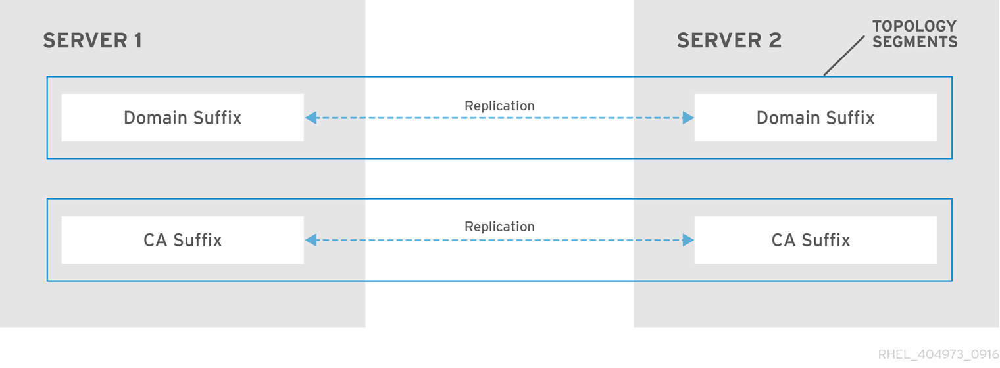
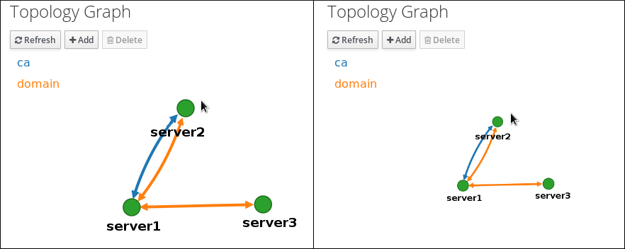
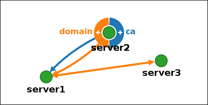
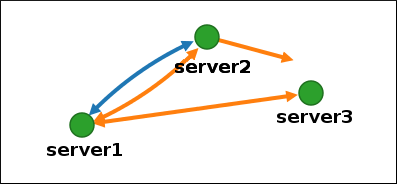
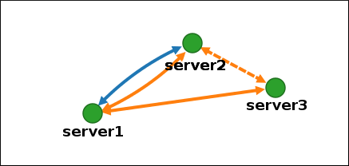
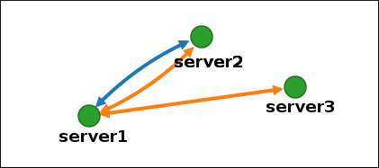
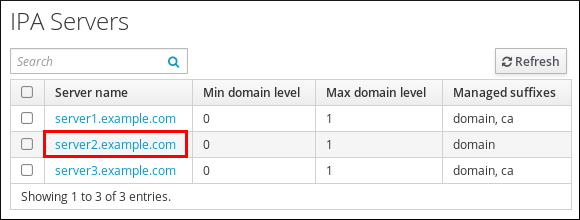
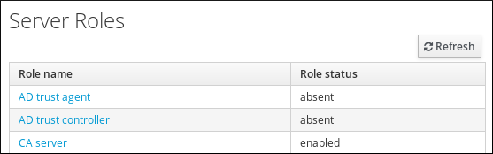

# Managing replication in Identity Management

* * *

Red Hat Enterprise Linux 10

## Preparing and verifying replication environments

Red Hat Customer Content Services

[Legal Notice](#idm139843090311744)

**Abstract**

In a Red Hat Identity Management (IdM) environment, replication enables failover and load-balancing. You can configure, verify, and stop replication between servers using the command-line, the Web UI, and Ansible Playbooks.

* * *

<h2 id="providing-feedback-on-red-hat-documentation">Providing feedback on Red Hat documentation</h2>

We are committed to providing high-quality documentation and value your feedback. To help us improve, you can submit suggestions or report errors through the Red Hat Jira tracking system.

**Procedure**

1. Log in to the [Jira](https://issues.redhat.com/projects/RHELDOCS/issues) website.
   
   If you do not have an account, select the option to create one.
2. Click **Create** in the top navigation bar.
3. Enter a descriptive title in the **Summary** field.
4. Enter your suggestion for improvement in the **Description** field. Include links to the relevant parts of the documentation.
5. Click **Create** at the bottom of the dialogue.

<h2 id="managing-replication-topology">Chapter 1. Managing replication topology</h2>

To ensure continuous service availability and data consistency across your IdM domain, configure replication agreements between servers so that data automatically synchronizes, preventing service interruptions when individual servers fail.

When you create a replica, Identity Management (IdM) creates a replication agreement between the initial server and the replica. The data that is replicated is then stored in topology suffixes and when two replicas have a replication agreement between their suffixes, the suffixes form a topology segment. This chapter describes how to actively manage replication between servers in an IdM domain.

<h3 id="managing-replication-topology">1.1. Additional resources</h3>

- [Planning the replica topology](https://docs.redhat.com/en/documentation/red_hat_enterprise_linux/10/html/planning_identity_management/planning-the-replica-topology)
- [Uninstalling an IdM server](https://docs.redhat.com/en/documentation/red_hat_enterprise_linux/10/html/installing_identity_management/uninstalling-an-idm-server)
- [Failover, load-balancing, and high-availability in IdM](https://docs.redhat.com/en/documentation/red_hat_enterprise_linux/10/html/tuning_performance_in_identity_management/failover-load-balancing-and-high-availability-in-idm)
- [Tuning performance in Identity Management](https://docs.redhat.com/en/documentation/red_hat_enterprise_linux/10/html-single/tuning_performance_in_identity_management/index)

<h3 id="replication-agreements-between-idm-replicas">1.2. Replication agreements between IdM replicas</h3>

Learn how IdM creates bilateral replication agreements between servers to synchronize identity and certificate data, ensuring data redundancy and preventing service disruptions across your domain.

When an administrator creates a replica based on an existing server, Identity Management (IdM) creates a *replication agreement* between the initial server and the replica. The replication agreement ensures that the data and configuration is continuously replicated between the two servers.

IdM uses *multiple read/write replica replication*. In this configuration, all replicas joined in a replication agreement receive and provide updates, and are therefore considered suppliers and consumers. Replication agreements are always bilateral.

**Figure 1.1. Server and replica agreements**

 

IdM uses two types of replication agreements:

- **Domain replication agreements** replicate the identity information.
- **Certificate replication agreements** replicate the certificate information.

Both replication channels are independent. Two servers can have one or both types of replication agreements configured between them. For example, when server A and server B have only domain replication agreement configured, only identity information is replicated between them, not the certificate information.

<h3 id="topology-suffixes">1.3. Topology suffixes</h3>

Learn how IdM organizes replicated data into domain and certificate authority suffixes to enable targeted replication between servers, ensuring efficient data synchronization for different types of directory information.

*Topology suffixes* store the data that is replicated. IdM supports two types of topology suffixes: `domain` and `ca`. Each suffix represents a separate server, a separate replication topology.

When a replication agreement is configured, it joins two topology suffixes of the same type on two different servers.

The `domain` suffix: dc=*example*,dc=*com*

The `domain` suffix contains all domain-related data.

When two replicas have a replication agreement between their `domain` suffixes, they share directory data, such as users, groups, and policies.

The `ca` suffix: o=ipaca

The `ca` suffix contains data for the Certificate System component. It is only present on servers with a certificate authority (CA) installed.

When two replicas have a replication agreement between their `ca` suffixes, they share certificate data.

**Figure 1.2. Topology suffixes**

 

An initial topology replication agreement is set up between two servers by the `ipa-replica-install` script when installing a new replica.

<h3 id="topology-segments">1.4. Topology segments</h3>

Understand how topology segments represent bidirectional replication agreements between two IdM servers, ensuring data flows in both directions to maintain synchronization across your infrastructure.

When two replicas have a replication agreement between their suffixes, the suffixes form a *topology segment*. Each topology segment consists of a *left node* and a *right node*. The nodes represent the servers joined in the replication agreement.

Topology segments in IdM are always bidirectional. Each segment represents two replication agreements: from server A to server B, and from server B to server A. The data is therefore replicated in both directions.

**Figure 1.3. Topology segments**

 

<h3 id="viewing-and-modifying-the-visual-representation-of-the-replication-topology-using-the-webui">1.5. Viewing and modifying the visual representation of the replication topology using the WebUI</h3>

Visualize your replication topology through an interactive graph to identify potential issues like single points of failure and ensure your servers maintain proper connectivity for data redundancy.

Using the Web UI, you can view, manipulate, and transform the representation of the replication topology. The topology graph in the web UI shows the relationships between the servers in the domain. You can move individual topology nodes by using drag-and-drop.

The examples below illustrate different types of topology graphs.

Servers joined in a domain replication agreement are connected by an orange arrow. Servers joined in a CA replication agreement are connected by a blue arrow.

Topology graph example: recommended topology

The recommended topology example below shows one of the possible recommended topologies for four servers: each server is connected to at least two other servers, and more than one server is a CA server.

 

Topology graph example: discouraged topology

In the discouraged topology example below, `server1` is a single point of failure. All the other servers have replication agreements with this server, but not with any of the other servers. Therefore, if `server1` fails, all the other servers will become isolated.

Avoid creating topologies like this.

 

**Prerequisites**

- You are logged in as an IdM administrator.

**Procedure**

1. Select IPA Server → Topology → Topology Graph.
2. Make changes to the topology:
   
   - You can move the topology graph nodes by using drag-and-drop:
     
      
   - You can zoom in and zoom out the topology graph using the mouse wheel:
     
      
   - You can move the canvas of the topology graph by holding the left mouse button:
     
      
3. If you make any changes to the topology that are not immediately reflected in the graph, click Refresh.

<h3 id="viewing-topology-suffixes-using-the-cli">1.6. Viewing topology suffixes using the CLI</h3>

In a replication agreement, topology suffixes store the data that is replicated. Use the CLI to display the topology suffixes in your IdM deployment to ensure proper configuration of domain and certificate data synchronization.

**Procedure**

- Enter the `ipa topologysuffix-find` command to display a list of topology suffixes:
  
  ```
  ipa topologysuffix-find
  ---------------------------
  2 topology suffixes matched
  ---------------------------
    Suffix name: ca
    Managed LDAP suffix DN: o=ipaca
  
    Suffix name: domain
    Managed LDAP suffix DN: dc=example,dc=com
  ----------------------------
  Number of entries returned 2
  ----------------------------
  ```
  
  ```plaintext
  $ ipa topologysuffix-find
  ---------------------------
  2 topology suffixes matched
  ---------------------------
    Suffix name: ca
    Managed LDAP suffix DN: o=ipaca
  
    Suffix name: domain
    Managed LDAP suffix DN: dc=example,dc=com
  ----------------------------
  Number of entries returned 2
  ----------------------------
  ```

**Additional resources**

- [Topology suffixes](https://docs.redhat.com/en/documentation/red_hat_enterprise_linux/10/html-single/installing_identity_management/index#con_topology-suffixes_assembly_explaining-replication-agreements-topology-suffixes-and-topology-segments)

<h3 id="viewing-topology-segments-using-the-cli">1.7. Viewing topology segments using the CLI</h3>

In a replication agreement, when two replicas have a replication agreement between their suffixes, the suffixes form a topology segments. Use the CLI to list topology segments to verify proper connectivity and understand which servers are sharing data, helping you maintain a resilient topology.

**Procedure**

1. Enter the `ipa topologysegment-find` command to show the current topology segments configured for the domain or CA suffixes. For example, for the domain suffix:
   
   ```
   ipa topologysegment-find
   Suffix name: domain
   -----------------
   1 segment matched
   -----------------
     Segment name: server1.example.com-to-server2.example.com
     Left node: server1.example.com
     Right node: server2.example.com
     Connectivity: both
   ----------------------------
   Number of entries returned 1
   ----------------------------
   ```
   
   ```plaintext
   $ ipa topologysegment-find
   Suffix name: domain
   -----------------
   1 segment matched
   -----------------
     Segment name: server1.example.com-to-server2.example.com
     Left node: server1.example.com
     Right node: server2.example.com
     Connectivity: both
   ----------------------------
   Number of entries returned 1
   ----------------------------
   ```
   
   In this example, domain-related data is only replicated between two servers: `server1.example.com` and `server2.example.com`.
2. Optional: To display details for a particular segment only, enter the `ipa topologysegment-show` command:
   
   ```
   ipa topologysegment-show
   Suffix name: domain
   Segment name: server1.example.com-to-server2.example.com
     Segment name: server1.example.com-to-server2.example.com
     Left node: server1.example.com
     Right node: server2.example.com
     Connectivity: both
   ```
   
   ```plaintext
   $ ipa topologysegment-show
   Suffix name: domain
   Segment name: server1.example.com-to-server2.example.com
     Segment name: server1.example.com-to-server2.example.com
     Left node: server1.example.com
     Right node: server2.example.com
     Connectivity: both
   ```

**Additional resources**

- [Topology segments](https://docs.redhat.com/en/documentation/red_hat_enterprise_linux/10/html/installing_identity_management/index#con_topology-segments_assembly_explaining-replication-agreements-topology-suffixes-and-topology-segments)

<h3 id="managing-topology-ui-set-up">1.8. Setting up replication between two servers using the Web UI</h3>

Create replication agreements between specific IdM servers through the web interface to expand your domain topology, ensuring new servers automatically receive existing user and configuration data for consistent service delivery.

Using the Identity Management (IdM) Web UI, you can select two servers and create a new replication agreement between them.

**Prerequisites**

- You are logged in as an IdM administrator.

**Procedure**

1. In the topology graph, hover your mouse over one of the server nodes.
   
   Domain or CA options
   
    
2. Click on the `domain` or the `ca` part of the circle depending on what type of topology segment you want to create.
3. A new arrow representing the new replication agreement appears under your mouse pointer. Move your mouse to the other server node, and click on it.
   
   Creating a new segment
   
    
4. In the `Add topology segment` window, click Add to confirm the properties of the new segment.
   
   The new topology segment between the two servers joins them in a replication agreement. The topology graph now shows the updated replication topology:
   
   New segment created
   
    

<h3 id="managing-topology-ui-stop">1.9. Stopping replication between two servers using the Web UI</h3>

Remove a replication agreement between two servers through the Identity Management (IdM) Web UI when reconfiguring your topology or decommissioning a server. The removal of the replication agreement stops data synchronization.

**Prerequisites**

- You are logged in as an IdM administrator.

**Procedure**

1. Click on an arrow representing the replication agreement you want to remove. This highlights the arrow.
   
   **Topology segment highlighted**
   
    
2. Click Delete.
3. In the `Confirmation` window, click OK.
   
   IdM removes the topology segment between the two servers, which deletes their replication agreement. The topology graph now shows the updated replication topology:
   
   **Topology segment deleted**
   
    

<h3 id="setting-up-replication-between-two-servers-using-the-cli">1.10. Setting up replication between two servers using the CLI</h3>

Create replication agreements between specific IdM servers through the CLI to expand your domain topology, ensuring new servers automatically receive existing user and configuration data for consistent service delivery.

Use the `ipa topologysegment-add` command to create a new replication agreement between two replicas.

**Prerequisites**

- You have the IdM administrator credentials.

**Procedure**

- Create a topology segment for the two servers. When prompted, provide:
  
  - The required topology suffix: `domain` or `ca`
  - The left node and the right node, representing the two servers
  - Optional: A custom name for the segment
    
    For example:
    
    ```
    ipa topologysegment-add
    Suffix name: domain
    Left node: server1.example.com
    Right node: server2.example.com
    Segment name [server1.example.com-to-server2.example.com]: new_segment
    ---------------------------
    Added segment "new_segment"
    ---------------------------
      Segment name: new_segment
      Left node: server1.example.com
      Right node: server2.example.com
      Connectivity: both
    ```
    
    ```plaintext
    $ ipa topologysegment-add
    Suffix name: domain
    Left node: server1.example.com
    Right node: server2.example.com
    Segment name [server1.example.com-to-server2.example.com]: new_segment
    ---------------------------
    Added segment "new_segment"
    ---------------------------
      Segment name: new_segment
      Left node: server1.example.com
      Right node: server2.example.com
      Connectivity: both
    ```
    
    Adding the new segment joins the servers in a replication agreement.

**Verification**

- Verify that the new segment is configured:
  
  ```
  ipa topologysegment-show
  Suffix name: domain
  Segment name: new_segment
    Segment name: new_segment
    Left node: server1.example.com
    Right node: server2.example.com
    Connectivity: both
  ```
  
  ```plaintext
  $ ipa topologysegment-show
  Suffix name: domain
  Segment name: new_segment
    Segment name: new_segment
    Left node: server1.example.com
    Right node: server2.example.com
    Connectivity: both
  ```

<h3 id="managing-topology-stop-cli">1.11. Stopping replication between two servers using the CLI</h3>

Remove a replication agreement between two servers when reconfiguring your topology or decommissioning a server. Stop data synchronization by using the `ipa topology segment-del` command.

**Prerequisites**

- You have the IdM administrator credentials.

**Procedure**

1. Optional: If you do not know the name of the specific replication segment that you want to remove, display all segments available. Use the `ipa topologysegment-find` command. When prompted, provide the required topology suffix: `domain` or `ca`. For example:
   
   ```
   ipa topologysegment-find
   Suffix name: domain
   ------------------
   8 segments matched
   ------------------
     Segment name: new_segment
     Left node: server1.example.com
     Right node: server2.example.com
     Connectivity: both
   
   ...
   
   ----------------------------
   Number of entries returned 8
   ----------------------------
   ```
   
   ```plaintext
   $ ipa topologysegment-find
   Suffix name: domain
   ------------------
   8 segments matched
   ------------------
     Segment name: new_segment
     Left node: server1.example.com
     Right node: server2.example.com
     Connectivity: both
   
   ...
   
   ----------------------------
   Number of entries returned 8
   ----------------------------
   ```
   
   Locate the required segment in the output.
2. Remove the topology segment joining the two servers:
   
   ```
   ipa topologysegment-del
   Suffix name: domain
   Segment name: new_segment
   -----------------------------
   Deleted segment "new_segment"
   -----------------------------
   ```
   
   ```plaintext
   $ ipa topologysegment-del
   Suffix name: domain
   Segment name: new_segment
   -----------------------------
   Deleted segment "new_segment"
   -----------------------------
   ```
   
   Deleting the segment removes the replication agreement.

**Verification**

- Verify that the segment is no longer listed:
  
  ```
  ipa topologysegment-find
  Suffix name: domain
  ------------------
  7 segments matched
  ------------------
    Segment name: server2.example.com-to-server3.example.com
    Left node: server2.example.com
    Right node: server3.example.com
    Connectivity: both
  
  ...
  
  ----------------------------
  Number of entries returned 7
  ----------------------------
  ```
  
  ```plaintext
  $ ipa topologysegment-find
  Suffix name: domain
  ------------------
  7 segments matched
  ------------------
    Segment name: server2.example.com-to-server3.example.com
    Left node: server2.example.com
    Right node: server3.example.com
    Connectivity: both
  
  ...
  
  ----------------------------
  Number of entries returned 7
  ----------------------------
  ```

<h3 id="managing-topology-remove-ui">1.12. Removing server from topology using the Web UI</h3>

Remove a server from the IdM topology through the Identity Management IdM Web UI when decommissioning infrastructure, while ensuring remaining servers maintain replication connectivity. This action does not uninstall the server components from the host.

**Prerequisites**

- You are logged in as an IdM administrator.
- The server you want to remove is **not** the only server connecting other servers with the rest of the topology; this would cause the other servers to become isolated, which is not allowed.
- The server you want to remove is **not** your last CA or DNS server.

Warning

Removing a server is an irreversible action. If you remove a server, the only way to introduce it back into the topology is to install a new replica on the machine.

**Procedure**

1. Select IPA Server → Topology → IPA Servers.
2. Click on the name of the server you want to delete.
   
   **Selecting a server**
   
    
3. Click Delete Server.

**Additional resources**

- [Uninstalling an IdM server](https://docs.redhat.com/en/documentation/red_hat_enterprise_linux/10/html/installing_identity_management/uninstalling-an-idm-server#uninstalling-an-idm-server)

<h3 id="managing-topology-remove-cli">1.13. Removing server from topology using the CLI</h3>

Remove a server from the IdM topology through the Identity Management IdM CLI when decommissioning infrastructure, while ensuring remaining servers maintain replication connectivity. This action does not uninstall the server components from the host.

**Prerequisites**

- You have the IdM administrator credentials.
- The server you want to remove is **not** the only server connecting other servers with the rest of the topology; this would cause the other servers to become isolated, which is not allowed.
- The server you want to remove is **not** your last CA or DNS server.

Important

Removing a server is an irreversible action. If you remove a server, the only way to introduce it back into the topology is to install a new replica on the machine.

**Procedure**

1. On `server2.example.com`, run the `ipa server-del` command to remove `server1.example.com`. The command removes all topology segments pointing to the server:
   
   ```
   ipa server-del
   Server name: server1.example.com
   Removing server1.example.com from replication topology, please wait...
   ----------------------------------------------------------
   Deleted IPA server "server1.example.com"
   ----------------------------------------------------------
   ```
   
   ```plaintext
   [user@server2 ~]$ ipa server-del
   Server name: server1.example.com
   Removing server1.example.com from replication topology, please wait...
   ----------------------------------------------------------
   Deleted IPA server "server1.example.com"
   ----------------------------------------------------------
   ```
2. Optional: On `server1.example.com`, run the `ipa server-install --uninstall` command to uninstall the server components from the machine.
   
   ```
   ipa server-install --uninstall
   ```
   
   ```plaintext
   [root@server1 ~]# ipa server-install --uninstall
   ```

<h3 id="removing-obsolete-ruv-records">1.14. Removing obsolete RUV records</h3>

Clean obsolete replica update vector (RUV) records from remaining servers when a replica was removed without properly deleting its replication agreements, restoring normal replication behavior.

If you remove a server from the IdM topology without properly removing its replication agreements, obsolete replica update vector (RUV) records will remain on one or more remaining servers in the topology. This can happen, for example, due to automation. These servers will then expect to receive updates from the now removed server. In this case, you need to clean the obsolete RUV records from the remaining servers.

**Prerequisites**

- You have the IdM administrator credentials.
- You know which replicas are corrupted or have been improperly removed.

**Procedure**

1. List the details about RUVs using the `ipa-replica-manage list-ruv` command. The command displays the replica IDs:
   
   ```
   ipa-replica-manage list-ruv
   
   server1.example.com:389: 6
   server2.example.com:389: 5
   server3.example.com:389: 4
   server4.example.com:389: 12
   ```
   
   ```plaintext
   $ ipa-replica-manage list-ruv
   
   server1.example.com:389: 6
   server2.example.com:389: 5
   server3.example.com:389: 4
   server4.example.com:389: 12
   ```
   
   Important
   
   The `ipa-replica-manage list-ruv` command lists ALL replicas in the topology, not only the malfunctioning or improperly removed ones.
2. Remove obsolete RUVs associated with a specified replica using the `ipa-replica-manage clean-ruv` command. Repeat the command for every replica ID with obsolete RUVs. For example, if you know `server1.example.com` and `server2.example.com` are the malfunctioning or improperly removed replicas:
   
   ```
   ipa-replica-manage clean-ruv 6
   ipa-replica-manage clean-ruv 5
   ```
   
   ```plaintext
   ipa-replica-manage clean-ruv 6
   ipa-replica-manage clean-ruv 5
   ```
   
   Warning
   
   Proceed with extreme caution when using `ipa-replica-manage clean-ruv`. Running the command against a valid replica ID will corrupt all the data associated with that replica in the replication database.
   
   If this happens, re-initialize the replica from another replica using `$ ipa-replica-manage re-initialize --from server1.example.com`.

**Verification**

1. Run `ipa-replica-manage list-ruv` again. If the command no longer displays any corrupt RUVs, the records have been successfully cleaned.
2. If the command still displays corrupt RUVs, clear them manually using this task:
   
   ```
   dn: cn=clean replica_ID, cn=cleanallruv, cn=tasks, cn=config
   objectclass: extensibleObject
   replica-base-dn: dc=example,dc=com
   replica-id: replica_ID
   replica-force-cleaning: no
   cn: clean replica_ID
   ```
   
   ```plaintext
   dn: cn=clean replica_ID, cn=cleanallruv, cn=tasks, cn=config
   objectclass: extensibleObject
   replica-base-dn: dc=example,dc=com
   replica-id: replica_ID
   replica-force-cleaning: no
   cn: clean replica_ID
   ```

<h3 id="viewing-available-server-roles-in-the-idm-topology-using-the-idm-web-ui">1.15. Viewing available server roles in the IdM topology using the IdM Web UI</h3>

Use the Identity Management (IdM) Web UI to identify which IdM servers perform CA, DNS, or Key Recovery Authority (KRA) *server roles*. Verify that services are properly distributed across your topology.

**Procedure**

- For a complete list of the supported server roles, see IPA Server → Topology → Server Roles.
  
  Note
  
  - Role status `absent` means that no server in the topology is performing the role.
  - Role status `enabled` means that one or more servers in the topology are performing the role.
  
  **Server roles in the web UI**
  
   

<h3 id="viewing-available-server-roles-in-the-idm-topology-using-the-idm-cli">1.16. Viewing available server roles in the IdM topology using the IdM CLI</h3>

Use the Identity Management (IdM) CLI to identify which IdM servers perform CA, DNS, or Key Recovery Authority (KRA) *server roles*. Verify that services are properly distributed across your topology.

**Procedure**

- To display all CA servers in the topology and the current CA renewal server:
  
  ```
  ipa config-show
    ...
    IPA masters: server1.example.com, server2.example.com, server3.example.com
    IPA CA servers: server1.example.com, server2.example.com
    IPA CA renewal master: server1.example.com
  ```
  
  ```plaintext
  $ ipa config-show
    ...
    IPA masters: server1.example.com, server2.example.com, server3.example.com
    IPA CA servers: server1.example.com, server2.example.com
    IPA CA renewal master: server1.example.com
  ```
- Alternatively, to display a list of roles enabled on a particular server, for example *server.example.com*:
  
  ```
  ipa server-show
  Server name: server.example.com
    ...
    Enabled server roles: CA server, DNS server, KRA server
  ```
  
  ```plaintext
  $ ipa server-show
  Server name: server.example.com
    ...
    Enabled server roles: CA server, DNS server, KRA server
  ```
- Alternatively, use the `ipa server-find --servrole` command to search for all servers with a particular server role enabled. For example, to search for all CA servers:
  
  ```
  ipa server-find --servrole "CA server"
  ---------------------
  2 IPA servers matched
  ---------------------
    Server name: server1.example.com
    ...
  
    Server name: server2.example.com
    ...
  ----------------------------
  Number of entries returned 2
  ----------------------------
  ```
  
  ```plaintext
  $ ipa server-find --servrole "CA server"
  ---------------------
  2 IPA servers matched
  ---------------------
    Server name: server1.example.com
    ...
  
    Server name: server2.example.com
    ...
  ----------------------------
  Number of entries returned 2
  ----------------------------
  ```

<h3 id="server-roles-promote-to-ca">1.17. Promoting a replica to a CA renewal server and CRL publisher server</h3>

Transfer the CA renewal server or CRL publisher role to another IdM CA server to redistribute certificate management responsibilities or prepare for server maintenance.

If your IdM deployment uses an embedded certificate authority (CA), one of the Identity Management (IdM) CA servers acts as the CA renewal server, a server that manages the renewal of CA subsystem certificates. One of the IdM CA servers also acts as the IdM CRL publisher server, a server that generates certificate revocation lists.

By default, the CA renewal server and CRL publisher server roles are installed on the first server on which the system administrator installed the CA role using the `ipa-server-install` or `ipa-ca-install` command. You can, however, transfer either of the two roles to any other IdM server on which the CA role is enabled.

**Prerequisites**

- You have the IdM administrator credentials.

**Procedure**

- [Change the current CA renewal server.](https://docs.redhat.com/en/documentation/red_hat_enterprise_linux/10/html/managing_certificates_in_idm/using-idm-ca-renewal-server#changing-and-resetting-idm-ca-renewal-server)
- [Configure a replica to generate CRLs.](https://docs.redhat.com/en/documentation/red_hat_enterprise_linux/10/html/managing_certificates_in_idm/generating-crl-on-the-idm-ca-server#starting-crl-generation-on-an-idm-replica-server)

<h3 id="demoting-or-promoting-hidden-replicas">1.18. Demoting or promoting hidden replicas</h3>

Configure a replica as hidden or visible to control whether clients and other servers can discover it, enabling dedicated backup replicas or maintenance scenarios.

After an Identity Management (IdM) replica has been installed, you can configure whether the replica is hidden or visible.

For details about hidden replicas, see [The hidden replica mode](https://docs.redhat.com/en/documentation/red_hat_enterprise_linux/10/html/planning_identity_management/planning-the-replica-topology#the-hidden-replica-mode).

**Prerequisites**

- Ensure that the replica is not a CA renewal server. If it is, move the service to another replica before making this replica hidden. For details, see [Changing and resetting IdM CA renewal server](https://docs.redhat.com/en/documentation/red_hat_enterprise_linux/10/html/managing_certificates_in_idm/using-idm-ca-renewal-server#changing-and-resetting-idm-ca-renewal-server)

**Procedure**

- To hide a replica:
  
  ```
  ipa server-state replica.idm.example.com --state=hidden
  ```
  
  ```plaintext
  # ipa server-state replica.idm.example.com --state=hidden
  ```
- To make a replica visible again:
  
  ```
  ipa server-state replica.idm.example.com --state=enabled
  ```
  
  ```plaintext
  # ipa server-state replica.idm.example.com --state=enabled
  ```
- To view a list of all the hidden replicas in your topology:
  
  ```
  ipa config-show
  ```
  
  ```plaintext
  # ipa config-show
  ```
  
  If all of your replicas are enabled, the command output does not mention hidden replicas.

<h2 id="using-ansible-to-manage-the-replication-topology-in-idm">Chapter 2. Using Ansible to manage the replication topology in IdM</h2>

Automate the management of IdM server replication using Ansible playbooks to maintain redundant server configurations, enabling quick recovery from server failures and ensuring uninterrupted domain services for your organization.

When you create a replica, Identity Management (IdM) creates a replication agreement between the initial server and the replica. The data that is replicated is then stored in topology suffixes and when two replicas have a replication agreement between their suffixes, the suffixes form a topology segment.

This topic describes how to use Ansible to manage replication between servers in an IdM domain actively, for example:

- How to configure other servers to keep providing services to the domain in case one server fails.
- How to recover the lost server by creating a new replica based on one of the remaining servers.

<h3 id="using-ansible-to-ensure-a-replication-agreement-exists-in-idm">2.1. Using Ansible to ensure a replication agreement exists in IdM</h3>

Automate server-to-server data sharing to maintain redundancy and prevent service disruptions.

Data stored on an Identity Management (IdM) server is replicated based on replication agreements: when two servers have a replication agreement configured, they share their data. Replication agreements are always bilateral: the data is replicated from the first replica to the other one as well as from the other replica to the first one.

Follow this procedure to use an Ansible playbook to ensure that a replication agreement of the `domain` type exists between **server.idm.example.com** and **replica.idm.example.com**.

**Prerequisites**

- Ensure that you understand the recommendations for designing your IdM topology listed in [Guidelines for connecting IdM replicas in a topology](https://docs.redhat.com/en/documentation/red_hat_enterprise_linux/8/html/planning_identity_management/planning-the-replica-topology_planning-identity-management#guidelines-for-connecting-idm-replicas-in-a-topology_planning-the-replica-topology).
- You have configured your Ansible control node to meet the following requirements:
  
  - You are using Ansible version 2.15 or later.
  - You have installed the [`ansible-freeipa`](https://docs.redhat.com/en/documentation/red_hat_enterprise_linux/10/html/using_ansible_to_install_and_manage_identity_management_in_rhel/installing-an-identity-management-server-using-an-ansible-playbook#installing-the-ansible-freeipa-package) package.
  - The example assumes that in the **~/*MyPlaybooks*/** directory, you have created an [Ansible inventory file](https://docs.redhat.com/en/documentation/red_hat_enterprise_linux/10/html/using_ansible_to_install_and_manage_identity_management_in_rhel/preparing-your-environment-for-managing-idm-using-ansible-playbooks) with the fully-qualified domain name (FQDN) of the IdM server.
  - The example assumes that the **secret.yml** Ansible vault stores your `ipaadmin_password` and that you have access to a file that stores the password protecting the **secret.yml** file.
- The target node, that is the node on which the `freeipa.ansible_freeipa` module is executed, is part of the IdM domain as an IdM client, server or replica.

**Procedure**

1. Navigate to your **~/*MyPlaybooks*/** directory:
   
   ```
   cd ~/MyPlaybooks/
   ```
   
   ```plaintext
   $ cd ~/MyPlaybooks/
   ```
2. Copy the `add-topologysegment.yml` Ansible playbook file provided by the `ansible-freeipa` package:
   
   ```
   cp /usr/share/ansible/collections/ansible_collections/freeipa/ansible_freeipa/playbooks/topology/add-topologysegment.yml add-topologysegment-copy.yml
   ```
   
   ```plaintext
   $ cp /usr/share/ansible/collections/ansible_collections/freeipa/ansible_freeipa/playbooks/topology/add-topologysegment.yml add-topologysegment-copy.yml
   ```
3. Open the `add-topologysegment-copy.yml` file for editing.
4. Adapt the file by setting the following variables in the `ipatopologysegment` task section:
   
   - Indicate that the value of the `ipaadmin_password` variable is defined in the **secret.yml** Ansible vault file.
   - Set the `suffix` variable to either `domain` or `ca`, depending on what type of segment you want to add.
   - Set the `left` variable to the name of the IdM server that you want to be the left node of the replication agreement.
   - Set the `right` variable to the name of the IdM server that you want to be the right node of the replication agreement.
   - Ensure that the `state` variable is set to `present`.
   
   This is the modified Ansible playbook file for the current example:
   
   ```
   ---
   - name: Playbook to handle topologysegment
     hosts: ipaserver
   
     vars_files:
     - /home/user_name/MyPlaybooks/secret.yml
     tasks:
     - name: Add topology segment
       ipatopologysegment:
         ipaadmin_password: "{{ ipaadmin_password }}"
         suffix: domain
         left: server.idm.example.com
         right: replica.idm.example.com
         state: present
   ```
   
   ```plaintext
   ---
   - name: Playbook to handle topologysegment
     hosts: ipaserver
   
     vars_files:
     - /home/user_name/MyPlaybooks/secret.yml
     tasks:
     - name: Add topology segment
       ipatopologysegment:
         ipaadmin_password: "{{ ipaadmin_password }}"
         suffix: domain
         left: server.idm.example.com
         right: replica.idm.example.com
         state: present
   ```
5. Save the file.
   
   For details about variables and example playbooks in the FreeIPA Ansible collection, see the `/usr/share/ansible/collections/ansible_collections/freeipa/ansible_freeipa/README-topology.md` file and the `/usr/share/ansible/collections/ansible_collections/freeipa/ansible_freeipa/playbooks/topology` directory on the control node.
6. Run the Ansible playbook. Specify the playbook file, the file storing the password protecting the **secret.yml** file, and the inventory file:
   
   ```
   ansible-playbook --vault-password-file=password_file -v -i inventory add-topologysegment-copy.yml
   ```
   
   ```plaintext
   $ ansible-playbook --vault-password-file=password_file -v -i inventory add-topologysegment-copy.yml
   ```

**Additional resources**

- [Managing replication topology](https://docs.redhat.com/en/documentation/red_hat_enterprise_linux/10/html/installing_identity_management/managing-replication-topology)

<h3 id="using-ansible-to-ensure-replication-agreements-exist-between-multiple-idm-replicas">2.2. Using Ansible to ensure replication agreements exist between multiple IdM replicas</h3>

Automate the verification and establishment of data-sharing connections across your server infrastructure to maintain high availability.

Data stored on an Identity Management (IdM) server is replicated based on replication agreements: when two servers have a replication agreement configured, they share their data. Replication agreements are always bilateral: the data is replicated from the first replica to the other one as well as from the other replica to the first one.

Follow this procedure to ensure replication agreements exist between multiple pairs of replicas in IdM.

**Prerequisites**

- Ensure that you understand the recommendations for designing your IdM topology listed in [Connecting the replicas in a topology](https://docs.redhat.com/en/documentation/red_hat_enterprise_linux/10/html/planning_identity_management/planning-the-replica-topology#guidelines-for-connecting-idm-replicas-in-a-topology).
- You have configured your Ansible control node to meet the following requirements:
  
  - You are using Ansible version 2.15 or later.
  - You have installed the [`ansible-freeipa`](https://docs.redhat.com/en/documentation/red_hat_enterprise_linux/10/html/using_ansible_to_install_and_manage_identity_management_in_rhel/installing-an-identity-management-server-using-an-ansible-playbook#installing-the-ansible-freeipa-package) package.
  - The example assumes that in the **~/*MyPlaybooks*/** directory, you have created an [Ansible inventory file](https://docs.redhat.com/en/documentation/red_hat_enterprise_linux/10/html/using_ansible_to_install_and_manage_identity_management_in_rhel/preparing-your-environment-for-managing-idm-using-ansible-playbooks) with the fully-qualified domain name (FQDN) of the IdM server.
  - The example assumes that the **secret.yml** Ansible vault stores your `ipaadmin_password` and that you have access to a file that stores the password protecting the **secret.yml** file.
- The target node, that is the node on which the `freeipa.ansible_freeipa` module is executed, is part of the IdM domain as an IdM client, server or replica.

**Procedure**

1. Navigate to your **~/*MyPlaybooks*/** directory:
   
   ```
   cd ~/MyPlaybooks/
   ```
   
   ```plaintext
   $ cd ~/MyPlaybooks/
   ```
2. Copy the `add-topologysegments.yml` Ansible playbook file provided by the `ansible-freeipa` package:
   
   ```
   cp /usr/share/ansible/collections/ansible_collections/freeipa/ansible_freeipa/playbooks/topology/add-topologysegments.yml add-topologysegments-copy.yml
   ```
   
   ```plaintext
   $ cp /usr/share/ansible/collections/ansible_collections/freeipa/ansible_freeipa/playbooks/topology/add-topologysegments.yml add-topologysegments-copy.yml
   ```
3. Open the `add-topologysegments-copy.yml` file for editing.
4. Adapt the file by setting the following variables in the `vars` section:
   
   - Indicate that the value of the `ipaadmin_password` variable is defined in the **secret.yml** Ansible vault file.
   - For every topology segment, add a line in the `ipatopology_segments` section and set the following variables:
     
     - Set the `suffix` variable to either `domain` or `ca`, depending on what type of segment you want to add.
     - Set the `left` variable to the name of the IdM server that you want to be the left node of the replication agreement.
     - Set the `right` variable to the name of the IdM server that you want to be the right node of the replication agreement.
5. In the `tasks` section of the `add-topologysegments-copy.yml` file, ensure that the `state` variable is set to `present`.
   
   This is the modified Ansible playbook file for the current example:
   
   ```
   ---
   - name: Add topology segments
     hosts: ipaserver
     gather_facts: false
   
     vars:
       ipaadmin_password: "{{ ipaadmin_password }}"
       ipatopology_segments:
       - {suffix: domain, left: replica1.idm.example.com , right: replica2.idm.example.com }
       - {suffix: domain, left: replica2.idm.example.com , right: replica3.idm.example.com }
       - {suffix: domain, left: replica3.idm.example.com , right: replica4.idm.example.com }
       - {suffix: domain+ca, left: replica4.idm.example.com , right: replica1.idm.example.com }
   
     vars_files:
     - /home/user_name/MyPlaybooks/secret.yml
     tasks:
     - name: Add topology segment
       freeipa.ansible_freeipa.ipatopologysegment:
         ipaadmin_password: "{{ ipaadmin_password }}"
         suffix: "{{ item.suffix }}"
         name: "{{ item.name | default(omit) }}"
         left: "{{ item.left }}"
         right: "{{ item.right }}"
         state: present
       loop: "{{ ipatopology_segments | default([]) }}"
   ```
   
   ```plaintext
   ---
   - name: Add topology segments
     hosts: ipaserver
     gather_facts: false
   
     vars:
       ipaadmin_password: "{{ ipaadmin_password }}"
       ipatopology_segments:
       - {suffix: domain, left: replica1.idm.example.com , right: replica2.idm.example.com }
       - {suffix: domain, left: replica2.idm.example.com , right: replica3.idm.example.com }
       - {suffix: domain, left: replica3.idm.example.com , right: replica4.idm.example.com }
       - {suffix: domain+ca, left: replica4.idm.example.com , right: replica1.idm.example.com }
   
     vars_files:
     - /home/user_name/MyPlaybooks/secret.yml
     tasks:
     - name: Add topology segment
       freeipa.ansible_freeipa.ipatopologysegment:
         ipaadmin_password: "{{ ipaadmin_password }}"
         suffix: "{{ item.suffix }}"
         name: "{{ item.name | default(omit) }}"
         left: "{{ item.left }}"
         right: "{{ item.right }}"
         state: present
       loop: "{{ ipatopology_segments | default([]) }}"
   ```
6. Save the file.
   
   For details about variables and example playbooks in the FreeIPA Ansible collection, see the `/usr/share/ansible/collections/ansible_collections/freeipa/ansible_freeipa/README-topology.md` file and the `/usr/share/ansible/collections/ansible_collections/freeipa/ansible_freeipa/playbooks/topology` directory on the control node.
7. Run the Ansible playbook. Specify the playbook file, the file storing the password protecting the **secret.yml** file, and the inventory file:
   
   ```
   ansible-playbook --vault-password-file=password_file -v -i inventory add-topologysegments-copy.yml
   ```
   
   ```plaintext
   $ ansible-playbook --vault-password-file=password_file -v -i inventory add-topologysegments-copy.yml
   ```

**Additional resources**

- [Explaining Replication Agreements, Topology Suffixes, and Topology Segments](https://docs.redhat.com/en/documentation/red_hat_enterprise_linux/10/html/installing_identity_management/managing-replication-topology)

<h3 id="using-ansible-to-check-if-a-replication-agreement-exists-between-two-replicas">2.3. Using Ansible to check if a replication agreement exists between two replicas</h3>

Verify that replication agreements exist between multiple pairs of replicas in IdM, maintaining high availability. In contrast to [Using Ansible to ensure a replication agreement exists in IdM](#using-ansible-to-ensure-a-replication-agreement-exists-in-idm "2.1. Using Ansible to ensure a replication agreement exists in IdM"), this procedure does not modify the existing configuration.

Data stored on an Identity Management (IdM) server is replicated based on replication agreements: when two servers have a replication agreement configured, they share their data. Replication agreements are always bilateral: the data is replicated from the first replica to the other one as well as from the other replica to the first one.

**Prerequisites**

- Ensure that you understand the recommendations for designing your IdM topology listed in [Connecting the replicas in a topology](https://docs.redhat.com/en/documentation/red_hat_enterprise_linux/10/html/planning_identity_management/planning-the-replica-topology#guidelines-for-connecting-idm-replicas-in-a-topology).
- You have configured your Ansible control node to meet the following requirements:
  
  - You are using Ansible version 2.15 or later.
  - You have installed the [`ansible-freeipa`](https://docs.redhat.com/en/documentation/red_hat_enterprise_linux/10/html/using_ansible_to_install_and_manage_identity_management_in_rhel/installing-an-identity-management-server-using-an-ansible-playbook#installing-the-ansible-freeipa-package) package.
  - The example assumes that in the **~/*MyPlaybooks*/** directory, you have created an [Ansible inventory file](https://docs.redhat.com/en/documentation/red_hat_enterprise_linux/10/html/using_ansible_to_install_and_manage_identity_management_in_rhel/preparing-your-environment-for-managing-idm-using-ansible-playbooks) with the fully-qualified domain name (FQDN) of the IdM server.
  - The example assumes that the **secret.yml** Ansible vault stores your `ipaadmin_password` and that you have access to a file that stores the password protecting the **secret.yml** file.
- The target node, that is the node on which the `freeipa.ansible_freeipa` module is executed, is part of the IdM domain as an IdM client, server or replica.

**Procedure**

1. Navigate to your **~/*MyPlaybooks*/** directory:
   
   ```
   cd ~/MyPlaybooks/
   ```
   
   ```plaintext
   $ cd ~/MyPlaybooks/
   ```
2. Copy the `check-topologysegments.yml` Ansible playbook file provided by the `ansible-freeipa` package:
   
   ```
   cp /usr/share/ansible/collections/ansible_collections/freeipa/ansible_freeipa/playbooks/topology/check-topologysegments.yml check-topologysegments-copy.yml
   ```
   
   ```plaintext
   $ cp /usr/share/ansible/collections/ansible_collections/freeipa/ansible_freeipa/playbooks/topology/check-topologysegments.yml check-topologysegments-copy.yml
   ```
3. Open the `check-topologysegments-copy.yml` file for editing.
4. Adapt the file by setting the following variables in the `vars` section:
   
   - Indicate that the value of the `ipaadmin_password` variable is defined in the **secret.yml** Ansible vault file.
   - For every topology segment, add a line in the `ipatopology_segments` section and set the following variables:
     
     - Set the `suffix` variable to either `domain` or `ca`, depending on the type of segment you are adding.
     - Set the `left` variable to the name of the IdM server that you want to be the left node of the replication agreement.
     - Set the `right` variable to the name of the IdM server that you want to be the right node of the replication agreement.
5. In the `tasks` section of the `check-topologysegments-copy.yml` file, ensure that the `state` variable is set to `present`.
   
   This is the modified Ansible playbook file for the current example:
   
   ```
   ---
   - name: Add topology segments
     hosts: ipaserver
     gather_facts: false
   
     vars:
       ipaadmin_password: "{{ ipaadmin_password }}"
       ipatopology_segments:
       - {suffix: domain, left: replica1.idm.example.com, right: replica2.idm.example.com }
       - {suffix: domain, left: replica2.idm.example.com , right: replica3.idm.example.com }
       - {suffix: domain, left: replica3.idm.example.com , right: replica4.idm.example.com }
       - {suffix: domain+ca, left: replica4.idm.example.com , right: replica1.idm.example.com }
   
     vars_files:
     - /home/user_name/MyPlaybooks/secret.yml
     tasks:
     - name: Check topology segment
       freeipa.ansible_freeipa.ipatopologysegment:
         ipaadmin_password: "{{ ipaadmin_password }}"
         suffix: "{{ item.suffix }}"
         name: "{{ item.name | default(omit) }}"
         left: "{{ item.left }}"
         right: "{{ item.right }}"
         state: checked
       loop: "{{ ipatopology_segments | default([]) }}"
   ```
   
   ```plaintext
   ---
   - name: Add topology segments
     hosts: ipaserver
     gather_facts: false
   
     vars:
       ipaadmin_password: "{{ ipaadmin_password }}"
       ipatopology_segments:
       - {suffix: domain, left: replica1.idm.example.com, right: replica2.idm.example.com }
       - {suffix: domain, left: replica2.idm.example.com , right: replica3.idm.example.com }
       - {suffix: domain, left: replica3.idm.example.com , right: replica4.idm.example.com }
       - {suffix: domain+ca, left: replica4.idm.example.com , right: replica1.idm.example.com }
   
     vars_files:
     - /home/user_name/MyPlaybooks/secret.yml
     tasks:
     - name: Check topology segment
       freeipa.ansible_freeipa.ipatopologysegment:
         ipaadmin_password: "{{ ipaadmin_password }}"
         suffix: "{{ item.suffix }}"
         name: "{{ item.name | default(omit) }}"
         left: "{{ item.left }}"
         right: "{{ item.right }}"
         state: checked
       loop: "{{ ipatopology_segments | default([]) }}"
   ```
6. Save the file.
   
   For details about variables and example playbooks in the FreeIPA Ansible collection, see the `/usr/share/ansible/collections/ansible_collections/freeipa/ansible_freeipa/README-topology.md` file and the `/usr/share/ansible/collections/ansible_collections/freeipa/ansible_freeipa/playbooks/topology` directory on the control node.
7. Run the Ansible playbook. Specify the playbook file, the file storing the password protecting the **secret.yml** file, and the inventory file:
   
   ```
   ansible-playbook --vault-password-file=password_file -v -i inventory check-topologysegments-copy.yml
   ```
   
   ```plaintext
   $ ansible-playbook --vault-password-file=password_file -v -i inventory check-topologysegments-copy.yml
   ```

**Additional resources**

- [Explaining Replication Agreements, Topology Suffixes, and Topology Segments](https://docs.redhat.com/en/documentation/red_hat_enterprise_linux/10/html/installing_identity_management/managing-replication-topology)

<h3 id="using-ansible-to-verify-that-a-topology-suffix-exists-in-idm">2.4. Using Ansible to verify that a topology suffix exists in IdM</h3>

Confirm that required topology suffixes exist in your IdM deployment using Ansible to validate your replication infrastructure before configuring new agreements.

In the context of replication agreements in Identity Management (IdM), topology suffixes store the data that is replicated. IdM supports two types of topology suffixes: `domain` and `ca`. Each suffix represents a separate back end, a separate replication topology. When a replication agreement is configured, it joins two topology suffixes of the same type on two different servers.

The `domain` suffix contains all domain-related data, such as data about users, groups, and policies. The `ca` suffix contains data for the Certificate System component. It is only present on servers with a certificate authority (CA) installed.

The example describes how to ensure that the `domain` suffix exists in IdM.

**Prerequisites**

- You have configured your Ansible control node to meet the following requirements:
  
  - You are using Ansible version 2.15 or later.
  - You have installed the [`ansible-freeipa`](https://docs.redhat.com/en/documentation/red_hat_enterprise_linux/10/html/using_ansible_to_install_and_manage_identity_management_in_rhel/installing-an-identity-management-server-using-an-ansible-playbook#installing-the-ansible-freeipa-package) package.
  - The example assumes that in the **~/*MyPlaybooks*/** directory, you have created an [Ansible inventory file](https://docs.redhat.com/en/documentation/red_hat_enterprise_linux/10/html/using_ansible_to_install_and_manage_identity_management_in_rhel/preparing-your-environment-for-managing-idm-using-ansible-playbooks) with the fully-qualified domain name (FQDN) of the IdM server.
  - The example assumes that the **secret.yml** Ansible vault stores your `ipaadmin_password` and that you have access to a file that stores the password protecting the **secret.yml** file.
- The target node, that is the node on which the `freeipa.ansible_freeipa` module is executed, is part of the IdM domain as an IdM client, server or replica.

**Procedure**

1. Navigate to your **~/*MyPlaybooks*/** directory:
   
   ```
   cd ~/MyPlaybooks/
   ```
   
   ```plaintext
   $ cd ~/MyPlaybooks/
   ```
2. Copy the `verify-topologysuffix.yml` Ansible playbook file provided by the `ansible-freeipa` package:
   
   ```
   cp /usr/share/ansible/collections/ansible_collections/freeipa/ansible_freeipa/playbooks/topology/ verify-topologysuffix.yml verify-topologysuffix-copy.yml
   ```
   
   ```plaintext
   $ cp /usr/share/ansible/collections/ansible_collections/freeipa/ansible_freeipa/playbooks/topology/ verify-topologysuffix.yml verify-topologysuffix-copy.yml
   ```
3. Open the `verify-topologysuffix-copy.yml` Ansible playbook file for editing.
4. Adapt the file by setting the following variables in the `freeipa.ansible_freeipa.ipatopologysuffix` section:
   
   - Indicate that the value of the `ipaadmin_password` variable is defined in the **secret.yml** Ansible vault file.
   - Set the `suffix` variable to `domain`. If you are verifying the presence of the `ca` suffix, set the variable to `ca`.
   - Ensure that the `state` variable is set to `verified`. No other option is possible.
   
   This is the modified Ansible playbook file for the current example:
   
   ```
   ---
   - name: Playbook to handle topologysuffix
     hosts: ipaserver
   
     vars_files:
     - /home/user_name/MyPlaybooks/secret.yml
     tasks:
     - name: Verify topology suffix
       freeipa.ansible_freeipa.ipatopologysuffix:
         ipaadmin_password: "{{ ipaadmin_password }}"
         suffix: domain
         state: verified
   ```
   
   ```plaintext
   ---
   - name: Playbook to handle topologysuffix
     hosts: ipaserver
   
     vars_files:
     - /home/user_name/MyPlaybooks/secret.yml
     tasks:
     - name: Verify topology suffix
       freeipa.ansible_freeipa.ipatopologysuffix:
         ipaadmin_password: "{{ ipaadmin_password }}"
         suffix: domain
         state: verified
   ```
5. Save the file.
   
   For details about variables and example playbooks in the FreeIPA Ansible collection, see the `/usr/share/ansible/collections/ansible_collections/freeipa/ansible_freeipa/README-topology.md` file and the `/usr/share/ansible/collections/ansible_collections/freeipa/ansible_freeipa/playbooks/topology` directory on the control node.
6. Run the Ansible playbook. Specify the playbook file, the file storing the password protecting the **secret.yml** file, and the inventory file:
   
   ```
   ansible-playbook --vault-password-file=password_file -v -i inventory verify-topologysuffix-copy.yml
   ```
   
   ```plaintext
   $ ansible-playbook --vault-password-file=password_file -v -i inventory verify-topologysuffix-copy.yml
   ```

**Additional resources**

- [Explaining Replication Agreements, Topology Suffixes, and Topology Segments](https://docs.redhat.com/en/documentation/red_hat_enterprise_linux/10/html/installing_identity_management/managing-replication-topology)

<h3 id="using-ansible-to-reinitialize-an-idm-replica">2.5. Using Ansible to reinitialize an IdM replica</h3>

Restore corrupted or outdated replica databases to ensure consistent data across your IdM infrastructure.

If a replica has been offline for a long period of time or its database has been corrupted, you can reinitialize it. Reinitialization refreshes the replica with an updated set of data. Reinitialization can, for example, be used if an authoritative restore from backup is required.

Note

In contrast to replication updates, during which replicas only send changed entries to each other, reinitialization refreshes the whole database.

The local host on which you run the command is the reinitialized replica. To specify the replica from which the data is obtained, use the `direction` option.

Follow this procedure to use an Ansible playbook to reinitialize the `domain` data on **replica.idm.example.com** from **server.idm.example.com**.

**Prerequisites**

- You have configured your Ansible control node to meet the following requirements:
  
  - You are using Ansible version 2.15 or later.
  - You have installed the [`ansible-freeipa`](https://docs.redhat.com/en/documentation/red_hat_enterprise_linux/10/html/using_ansible_to_install_and_manage_identity_management_in_rhel/installing-an-identity-management-server-using-an-ansible-playbook#installing-the-ansible-freeipa-package) package.
  - The example assumes that in the **~/*MyPlaybooks*/** directory, you have created an [Ansible inventory file](https://docs.redhat.com/en/documentation/red_hat_enterprise_linux/10/html/using_ansible_to_install_and_manage_identity_management_in_rhel/preparing-your-environment-for-managing-idm-using-ansible-playbooks) with the fully-qualified domain name (FQDN) of the IdM server.
  - The example assumes that the **secret.yml** Ansible vault stores your `ipaadmin_password` and that you have access to a file that stores the password protecting the **secret.yml** file.
- The target node, that is the node on which the `freeipa.ansible_freeipa` module is executed, is part of the IdM domain as an IdM client, server or replica.

**Procedure**

1. Navigate to your **~/*MyPlaybooks*/** directory:
   
   ```
   cd ~/MyPlaybooks/
   ```
   
   ```plaintext
   $ cd ~/MyPlaybooks/
   ```
2. Copy the `reinitialize-topologysegment.yml` Ansible playbook file provided by the `ansible-freeipa` package:
   
   ```
   cp /usr/share/ansible/collections/ansible_collections/freeipa/ansible_freeipa/playbooks/topology/reinitialize-topologysegment.yml reinitialize-topologysegment-copy.yml
   ```
   
   ```plaintext
   $ cp /usr/share/ansible/collections/ansible_collections/freeipa/ansible_freeipa/playbooks/topology/reinitialize-topologysegment.yml reinitialize-topologysegment-copy.yml
   ```
3. Open the `reinitialize-topologysegment-copy.yml` file for editing.
4. Adapt the file by setting the following variables in the `freeipa.ansible_freeipa.ipatopologysegment` section:
   
   - Indicate that the value of the `ipaadmin_password` variable is defined in the **secret.yml** Ansible vault file.
   - Set the `suffix` variable to `domain`. If you are reinitializing the `ca` data, set the variable to `ca`.
   - Set the `left` variable to the left node of the replication agreement.
   - Set the `right` variable to the right node of the replication agreement.
   - Set the `direction` variable to the direction of the reinitializing data. The `left-to-right` direction means that data flows from the left node to the right node.
   - Ensure that the `state` variable is set to `reinitialized`.
     
     This is the modified Ansible playbook file for the current example:
     
     ```
     ---
     - name: Playbook to handle topologysegment
       hosts: ipaserver
     
       vars_files:
       - /home/user_name/MyPlaybooks/secret.yml
       tasks:
       - name: Reinitialize topology segment
         freeipa.ansible_freeipa.ipatopologysegment:
           ipaadmin_password: "{{ ipaadmin_password }}"
           suffix: domain
           left: server.idm.example.com
           right: replica.idm.example.com
           direction: left-to-right
           state: reinitialized
     ```
     
     ```plaintext
     ---
     - name: Playbook to handle topologysegment
       hosts: ipaserver
     
       vars_files:
       - /home/user_name/MyPlaybooks/secret.yml
       tasks:
       - name: Reinitialize topology segment
         freeipa.ansible_freeipa.ipatopologysegment:
           ipaadmin_password: "{{ ipaadmin_password }}"
           suffix: domain
           left: server.idm.example.com
           right: replica.idm.example.com
           direction: left-to-right
           state: reinitialized
     ```
5. Save the file.
   
   For details about variables and example playbooks in the FreeIPA Ansible collection, see the `/usr/share/ansible/collections/ansible_collections/freeipa/ansible_freeipa/README-topology.md` file and the `/usr/share/ansible/collections/ansible_collections/freeipa/ansible_freeipa/playbooks/topology` directory on the control node.
6. Run the Ansible playbook. Specify the playbook file, the file storing the password protecting the **secret.yml** file, and the inventory file:
   
   ```
   ansible-playbook --vault-password-file=password_file -v -i inventory reinitialize-topologysegment-copy.yml
   ```
   
   ```plaintext
   $ ansible-playbook --vault-password-file=password_file -v -i inventory reinitialize-topologysegment-copy.yml
   ```

**Additional resources**

- [Explaining Replication Agreements, Topology Suffixes, and Topology Segments](https://docs.redhat.com/en/documentation/red_hat_enterprise_linux/10/html/installing_identity_management/managing-replication-topology)

<h3 id="using-ansible-to-ensure-a-replication-agreement-is-absent-in-idm">2.6. Using Ansible to ensure a replication agreement is absent in IdM</h3>

Remove unwanted replication agreements between IdM servers using Ansible when restructuring your topology or stopping data synchronization between specific replicas.

Data stored on an Identity Management (IdM) server is replicated based on replication agreements: when two servers have a replication agreement configured, they share their data. Replication agreements are always bilateral: the data is replicated from the first replica to the other one as well as from the other replica to the first one.

The example describes how to ensure a replication agreement of the `domain` type does not exist between the **replica01.idm.example.com** and **replica02.idm.example.com** IdM servers.

**Prerequisites**

- You understand the recommendations for designing your IdM topology listed in [Connecting the replicas in a topology](https://docs.redhat.com/en/documentation/red_hat_enterprise_linux/10/html/planning_identity_management/planning-the-replica-topology#guidelines-for-connecting-idm-replicas-in-a-topology).
- You have configured your Ansible control node to meet the following requirements:
  
  - You are using Ansible version 2.15 or later.
  - You have installed the [`ansible-freeipa`](https://docs.redhat.com/en/documentation/red_hat_enterprise_linux/10/html/using_ansible_to_install_and_manage_identity_management_in_rhel/installing-an-identity-management-server-using-an-ansible-playbook#installing-the-ansible-freeipa-package) package.
  - The example assumes that in the **~/*MyPlaybooks*/** directory, you have created an [Ansible inventory file](https://docs.redhat.com/en/documentation/red_hat_enterprise_linux/10/html/using_ansible_to_install_and_manage_identity_management_in_rhel/preparing-your-environment-for-managing-idm-using-ansible-playbooks) with the fully-qualified domain name (FQDN) of the IdM server.
  - The example assumes that the **secret.yml** Ansible vault stores your `ipaadmin_password` and that you have access to a file that stores the password protecting the **secret.yml** file.
- The target node, that is the node on which the `freeipa.ansible_freeipa` module is executed, is part of the IdM domain as an IdM client, server or replica.

**Procedure**

1. Navigate to your **~/*MyPlaybooks*/** directory:
   
   ```
   cd ~/MyPlaybooks/
   ```
   
   ```plaintext
   $ cd ~/MyPlaybooks/
   ```
2. Copy the `delete-topologysegment.yml` Ansible playbook file provided by the `ansible-freeipa` package:
   
   ```
   cp /usr/share/ansible/collections/ansible_collections/freeipa/ansible_freeipa/playbooks/topology/delete-topologysegment.yml delete-topologysegment-copy.yml
   ```
   
   ```plaintext
   $ cp /usr/share/ansible/collections/ansible_collections/freeipa/ansible_freeipa/playbooks/topology/delete-topologysegment.yml delete-topologysegment-copy.yml
   ```
3. Open the `delete-topologysegment-copy.yml` file for editing.
4. Adapt the file by setting the following variables in the `ipatopologysegment` task section:
   
   - Indicate that the value of the `ipaadmin_password` variable is defined in the **secret.yml** Ansible vault file.
   - Set the `suffix` variable to `domain`. Alternatively, if you are ensuring that the `ca` data are not replicated between the left and right nodes, set the variable to `ca`.
   - Set the `left` variable to the name of the IdM server that is the left node of the replication agreement.
   - Set the `right` variable to the name of the IdM server that is the right node of the replication agreement.
   - Ensure that the `state` variable is set to `absent`.
   
   This is the modified Ansible playbook file for the current example:
   
   ```
   ---
   - name: Playbook to handle topologysegment
     hosts: ipaserver
   
     vars_files:
     - /home/user_name/MyPlaybooks/secret.yml
     tasks:
     - name: Delete topology segment
       ipatopologysegment:
         ipaadmin_password: "{{ ipaadmin_password }}"
         suffix: domain
         left: replica01.idm.example.com
         right: replica02.idm.example.com:
         state: absent
   ```
   
   ```plaintext
   ---
   - name: Playbook to handle topologysegment
     hosts: ipaserver
   
     vars_files:
     - /home/user_name/MyPlaybooks/secret.yml
     tasks:
     - name: Delete topology segment
       ipatopologysegment:
         ipaadmin_password: "{{ ipaadmin_password }}"
         suffix: domain
         left: replica01.idm.example.com
         right: replica02.idm.example.com:
         state: absent
   ```
5. Save the file.
   
   For details about variables and example playbooks in the FreeIPA Ansible collection, see the `/usr/share/ansible/collections/ansible_collections/freeipa/ansible_freeipa/README-topology.md` file and the `/usr/share/ansible/collections/ansible_collections/freeipa/ansible_freeipa/playbooks/topology` directory on the control node.
6. Run the Ansible playbook. Specify the playbook file, the file storing the password protecting the **secret.yml** file, and the inventory file:
   
   ```
   ansible-playbook --vault-password-file=password_file -v -i inventory delete-topologysegment-copy.yml
   ```
   
   ```plaintext
   $ ansible-playbook --vault-password-file=password_file -v -i inventory delete-topologysegment-copy.yml
   ```

**Additional resources**

- [Managing replication topology](https://docs.redhat.com/en/documentation/red_hat_enterprise_linux/10/html/installing_identity_management/managing-replication-topology)

<h3 id="using-ansible-to-manage-the-replication-topology-in-idm">2.7. Additional resources</h3>

- [Planning the replica topology](https://docs.redhat.com/en/documentation/red_hat_enterprise_linux/10/html/planning_identity_management/planning-the-replica-topology)
- [Installing an IdM replica](https://docs.redhat.com/en/documentation/red_hat_enterprise_linux/10/html/installing_identity_management/installing-an-idm-replica)

<h2 id="checking-idm-replication-by-using-healthcheck">Chapter 3. Checking IdM replication by using Healthcheck</h2>

Run Healthcheck tests on your IdM replication topology to identify configuration issues early, preventing data inconsistencies and service disruptions that could affect user authentication and access to domain resources.

You can test Identity Management (IdM) replication by using the Healthcheck tool. For general information about the tool, see [Healthcheck in IdM](https://docs.redhat.com/en/documentation/red_hat_enterprise_linux/10/html/using_idm_healthcheck_to_monitor_your_idm_environment/installing-and-running-the-idm-healthcheck-tool#healthcheck-in-idm).

<h3 id="the-idm-replication-and-topology-healthcheck-tests">3.1. The IdM replication and topology Healthcheck tests</h3>

Use built-in Healthcheck tests to verify your IdM replication topology meets connectivity and agreement requirements, preventing isolated servers and replication conflicts that could compromise data integrity.

The Identity Management (IdM) Healthcheck tool includes tests of the IdM topology configuration. The tests search for replication conflict issues.

You can find the `IPATopologyDomainCheck` and `ReplicationConflictCheck` tests under the `ipahealthcheck.ipa.topology` and `ipahealthcheck.ds.replication` sources of the output of the `ipa-healthcheck --list-sources` command.

IPATopologyDomainCheck

Tests the following configuration:

- No IdM server is disconnected from the topology.
- The IdM servers do not have more than the recommended number of replication agreements.

If the test succeeds, the test returns the configured domains. Otherwise, specific connection errors are reported.

Note

The test runs the `ipa topologysuffix-verify` command for the `domain` suffix. It also runs the command for the `ca` suffix if the IdM Certificate Authority server role is configured on this server.

ReplicationConflictCheck

Searches for entries in LDAP matching `(&(!(objectclass=nstombstone))(nsds5ReplConflict=*))`.

<h3 id="screening-replication-by-using-healthcheck">3.2. Screening replication by using Healthcheck</h3>

Execute focused assessments to identify replication problems before they cause production outages.

You can run a standalone manual test to check the replication and topology configuration of your Identity Management (IdM) server by using the Healthcheck tool.

**Prerequisites**

- You have `root` privileges.

**Procedure**

- To run the replication test, enter:
  
  ```
  ipa-healthcheck --source=ipahealthcheck.ds.replication --source=ipahealthcheck.ipa.topology
  ```
  
  ```plaintext
  # ipa-healthcheck --source=ipahealthcheck.ds.replication --source=ipahealthcheck.ipa.topology
  ```
  
  The `--source=ipahealthcheck.ds.replication` and `--source=ipahealthcheck.ipa.topology` options ensure that IdM Healthcheck only performs the replication conflict and topology tests.
  
  Four different results are possible:
  
  - `SUCCESS` — the test passed successfully.
    
    ```
    {
      "source": "ipahealthcheck.ipa.topology",
      "check": "IPATopologyDomainCheck",
      "result": "SUCCESS",
      "kw": {
        "suffix": "domain"
      }
    }
    ```
    
    ```plaintext
    {
      "source": "ipahealthcheck.ipa.topology",
      "check": "IPATopologyDomainCheck",
      "result": "SUCCESS",
      "kw": {
        "suffix": "domain"
      }
    }
    ```
  - `WARNING` — the test passed but there might be a problem.
  - `ERROR` — the test failed.
    
    ```
    {
      "source": "ipahealthcheck.ipa.topology",
      "check": "IPATopologyDomainCheck",
      "result": "ERROR",
      "uuid": d6ce3332-92da-423d-9818-e79f49ed321f
      "when": 20191007115449Z
      "duration": 0.005943
      "kw": {
        "msg": "topologysuffix-verify domain failed, server2 is not connected (server2_139664377356472 in MainThread)"
      }
    }
    ```
    
    ```plaintext
    {
      "source": "ipahealthcheck.ipa.topology",
      "check": "IPATopologyDomainCheck",
      "result": "ERROR",
      "uuid": d6ce3332-92da-423d-9818-e79f49ed321f
      "when": 20191007115449Z
      "duration": 0.005943
      "kw": {
        "msg": "topologysuffix-verify domain failed, server2 is not connected (server2_139664377356472 in MainThread)"
      }
    }
    ```
  - `CRITICAL` — the test failed and it affects the IdM server functionality.
  
  Note
  
  Run these tests on all IdM servers when trying to check for issues.

**Additional resources**

- [Solving common replication problems](https://docs.redhat.com/en/documentation/red_hat_directory_server/13/html/configuring_and_managing_replication/solving-common-replication-problems)

<h2 id="idm139843090311744">Legal Notice</h2>

Copyright © Red Hat.

Except as otherwise noted below, the text of and illustrations in this documentation are licensed by Red Hat under the Creative Commons Attribution–Share Alike 3.0 Unported license . If you distribute this document or an adaptation of it, you must provide the URL for the original version.

Red Hat, as the licensor of this document, waives the right to enforce, and agrees not to assert, Section 4d of CC-BY-SA to the fullest extent permitted by applicable law.

Red Hat, the Red Hat logo, JBoss, Hibernate, and RHCE are trademarks or registered trademarks of Red Hat, LLC. or its subsidiaries in the United States and other countries.

Linux® is the registered trademark of Linus Torvalds in the United States and other countries.

XFS is a trademark or registered trademark of Hewlett Packard Enterprise Development LP or its subsidiaries in the United States and other countries.

The OpenStack® Word Mark and OpenStack logo are trademarks or registered trademarks of the Linux Foundation, used under license.

All other trademarks are the property of their respective owners.
