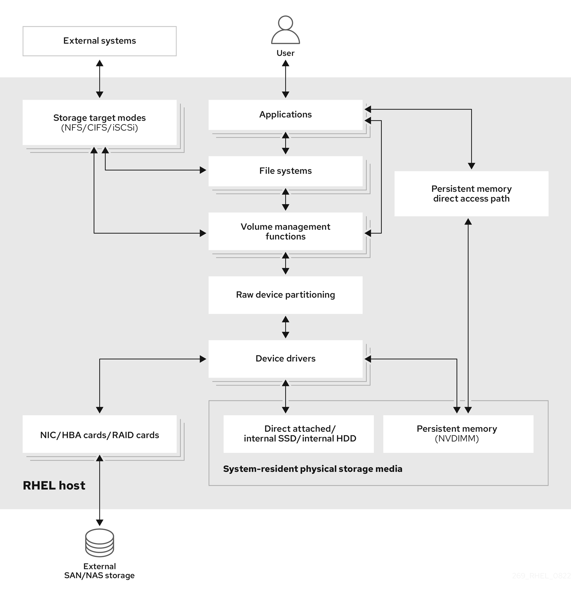
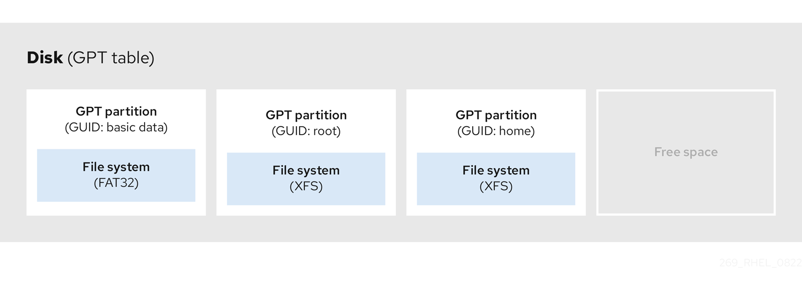
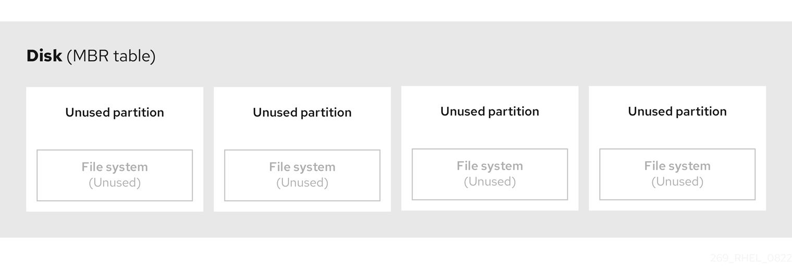
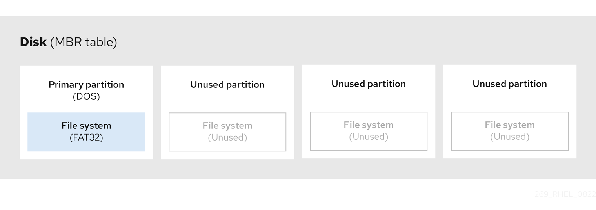
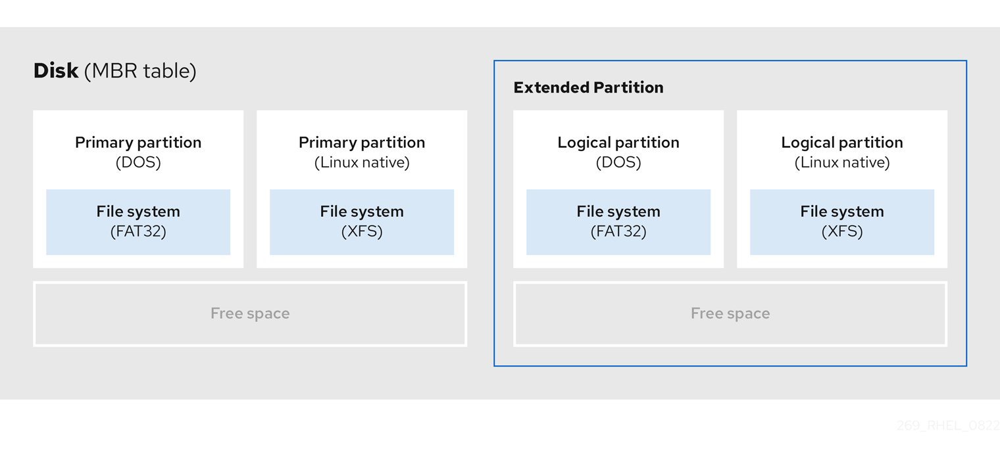

# Managing storage devices

* * *

Red Hat Enterprise Linux 10

## Configuring and managing local and remote storage devices

Red Hat Customer Content Services

[Legal Notice](#idm140404367933840)

**Abstract**

Red Hat Enterprise Linux (RHEL) provides several local and remote storage options. With the available storage options, you can perform the following tasks:

- Create a Redundant Array of Independent Disks (RAID) to store data across multiple drives and avoid data loss.
- Use iSCSI and NVMe over Fabrics to access storage over a network.
- Set up Stratis to manage pools of physical storage devices.

* * *

<h2 id="providing-feedback-on-red-hat-documentation">Providing feedback on Red Hat documentation</h2>

We are committed to providing high-quality documentation and value your feedback. To help us improve, you can submit suggestions or report errors through the Red Hat Jira tracking system.

**Procedure**

1. Log in to the [Jira](https://issues.redhat.com/projects/RHELDOCS/issues) website.
   
   If you do not have an account, select the option to create one.
2. Click **Create** in the top navigation bar.
3. Enter a descriptive title in the **Summary** field.
4. Enter your suggestion for improvement in the **Description** field. Include links to the relevant parts of the documentation.
5. Click **Create** at the bottom of the dialogue.

<h2 id="overview-of-available-storage-options">Chapter 1. Overview of available storage options</h2>

Explore local, remote, and cluster-based storage options available on Red Hat Enterprise Linux. Covers directly attached storage devices and remote storage accessed over LAN, internet, or Fibre Channel networks to understand storage architecture.

Local storage implies that the storage devices are either installed on the system or directly attached to the system.

With remote storage, devices are accessed over LAN, the internet, or using a Fibre Channel network. The following high level Red Hat Enterprise Linux storage diagram describes the different storage options.

**Figure 1.1. High level Red Hat Enterprise Linux storage diagram**

 

<h3 id="local-storage-overview">1.1. Local storage overview</h3>

Local storage refers to storage devices that are installed on or directly attached to your system. This includes disk partitions, logical volumes, and file systems that you can manage without network connectivity.

Red Hat Enterprise Linux 10 offers several local storage options.

Basic disk administration

By using `parted` and `fdisk`, you can create, modify, delete, and view disk partitions. The following are the partitioning layout standards:

GUID Partition Table (GPT)

It uses a globally unique identifier (GUID) and provides a unique disk and partition GUID.

Master Boot Record (MBR)

It is used with BIOS-based computers. You can create primary, extended, and logical partitions.

Storage consumption options

Non-Volatile Dual In-line Memory Modules (NVDIMM) Management

It is a combination of memory and storage. You can enable and manage various types of storage on NVDIMM devices connected to your system.

Block Storage Management

Data is stored in the form of blocks where each block has a unique identifier.

File Storage

Data is stored at file level on the local system. These data can be accessed locally by using XFS (default) or ext4, and over a network by using NFS and SMB.

Logical volumes

Logical Volume Manager (LVM)

It creates logical devices from physical devices. Logical volume (LV) is a combination of the physical volumes (PV) and volume groups (VG).

Virtual Data Optimizer (VDO)

It is used for data reduction by using deduplication, compression, and thin provisioning. Using LV below VDO helps in:

- Extending of VDO volume
- Spanning VDO volume over multiple devices

Local file systems

XFS

The default RHEL file system.

Ext4

A legacy file system.

Stratis

Stratis is a hybrid user-and-kernel local storage management system that supports advanced storage features.

<h3 id="remote-storage-overview">1.2. Remote storage overview</h3>

Remote storage provides access to storage devices over a network connection such as LAN, internet, or Fibre Channel. This allows you to centralize storage resources and share them across multiple systems.

The following are the remote storage options available in RHEL 10:

Storage connectivity options

iSCSI

RHEL 10 uses the targetcli tool to add, remove, view, and monitor iSCSI storage interconnects.

Fibre Channel (FC)

RHEL 10 provides the following native Fibre Channel drivers:

- `lpfc`
- `qla2xxx`
- `zfcp`

Non-volatile Memory Express (NVMe)

An interface that allows a host software utility to communicate with solid state drives. Use the following types of fabric transport to configure NVMe over fabrics:

- NVMe over fabrics using Remote Direct Memory Access (NVMe/RDMA)
- NVMe over fabrics using Fibre Channel (NVMe/FC)
- NVMe over fabrics using TCP (NVMe/TCP)

Device Mapper multipathing (DM Multipath)

Allows you to configure multiple I/O paths between server nodes and storage arrays into a single device. These I/O paths are physical SAN connections that can include separate cables, switches, and controllers.

Network file system

- NFS
- SMB

<h2 id="persistent-naming-attributes">Chapter 2. Persistent naming attributes</h2>

Persistent naming attributes (PNAs) provide stable, predictable device identification based on unique hardware characteristics, ensuring consistent naming across system reboots and hardware changes.

The way you identify and manage storage devices ensures the stability and predictability of the system.

RHEL 10 uses two primary naming schemes for this purpose: traditional device names and persistent naming attributes.

**Traditional device names**

The Linux kernel assigns traditional device names based on the order in which they appear in the system or their enumeration. For example, the first SATA drive is usually labeled as `/dev/sda`, the second as `/dev/sdb`, and so on. While these names are straightforward, they are subject to change when devices are added or removed, the hardware configuration is modified, or the system is rebooted. This can pose challenges for scripting and configuration files. Furthermore, traditional names lack descriptive information about the purpose or characteristics of the device.

**Persistent naming attributes**

Persistent naming attributes (PNAs) are based on unique characteristics of the storage devices, making them more stable and predictable when presented to the system, even across system reboots. One of the key benefits of PNAs is their resilience to changes in hardware configurations, making them ideal for maintaining consistent naming conventions. When using PNAs, you can reference storage devices within scripts, configuration files, and management tools without concerns about unexpected name changes. Additionally, PNAs often include valuable metadata, such as device type or manufacturer information like combination of vendor, model name, and serial number, enhancing their descriptiveness for effective device identification and management. PNAs are eventually used to create device links in `/dev/disk` directory to access individual devices. The way the device link names are constructed and managed is driven by `udev` rules.

The following is a list of directories we can find in `/dev/disk/`:

- Directories with content that remain unique even after system restart:
  
  - **`by-id`** : based on hardware attributes, with the `vendor/model/serial_string` combination.
  - `by-path`\*: Based on physical hardware placement. For devices or disks physically attached to a machine, this is the slot or port where they are connected physically to the host bus on the motherboard. However, for devices or disks attached over a network, this contains the network address specification.
  - **`by-partlabel`** : Based on a label assigned to a device partition. These labels are assigned by the user.
  - **`by-partuuid`** : Based on a unique number in the form of `UUID` that is auto-generated.
  - **`by-uuid`** : Based on a unique number in the form of UUID that is autogenerated.
- Directory with content that remain unique during the current system run, but not after system restart:
  
  - **`by-diskseq`** : `diskseq` is 'disk sequence number' that starts at 1 when the system boots. It assigns this number to a newly attached disk and each one after that gets the next number in sequence. When the system reboots, the counter restarts at 1.
- Directories with content that are used specifically for loop devices:
  
  - **`by-loop-ref`**
  - **`by-loop-inode`**

<h3 id="persistent-attributes-for-identifying-file-systems-and-block-devices">2.1. Persistent attributes for identifying file systems and block devices</h3>

In RHEL 10 storage, persistent naming attributes (PNAs) are mechanisms that provide components for consistent and reliable naming for storage devices across system reboots, hardware changes, or other events.

These attributes are used to identify storage devices consistently, even if the storage devices are added, removed, or reconfigured. PNAs are used to identify both file systems and block devices, but they serve different purposes:

Persistent attributes for identifying file systems

- Universally unique identifier (UUID)
  
  UUIDs are primarily used to uniquely identify file systems on storage devices. Each file system instance has its own UUID assigned automatically, and this identifier remains constant even if the file system is unmounted, remounted, or the device is detached and reattached.
- Label
  
  Labels are user-assigned names for file systems. While they can be used to identify and reference file systems, they are not as standardized as UUIDs. Since a user assigns the file system label, its uniqueness depends on their choice. Labels are often used as alternatives to UUIDs to specify file systems in configuration files.
  
  When you assign a label to a file system, it becomes part of the file system metadata. This label remains associated with the file system even if it is unmounted, remounted, or the device is detached and reattached.

Persistent attributes for identifying block devices

- Universally unique identifier (UUID)
  
  UUIDs can be used to identify storage block devices. When a storage device is formatted, a UUID is often assigned to the device itself. Such UUIDs are usually generated and assigned to virtual block devices layered on top of other block devices, where the real devices are at the bottom level. For example, device-mapper (DM) based devices and their related subsystems, such as Logical Volume Manager (LVM) and crypt, use UUIDs for device identification, such as Logical Volume UUID (LVUUID) and crypt UUID.
  
  Also, multiple-device (MD) based devices have UUIDs assigned. The virtual devices usually also mark the underlying devices with component UUIDs. For example, LVM marks its underlying devices with a Physical Volume UUID (PVUUID) and MD marks its underlying devices with an MD component UUID.
  
  These UUIDs are embedded within the virtual block device metadata and they are used as persistent naming attributes. It allows you to uniquely identify the block device, even if you change the file system that resides on it. UUIDs are also assigned for device partitions.
  
  Such UUIDs can coexist with other device IDs. For example, an sda device at the bottom of the device stack which is identified by its `vendor/model/serial_number` combination or WWID, can also have a PVUUID assigned by LVM. This is then recognized by LVM itself to build up the Volume Group (VG) or Logical Volume (LV) in a layer above it.
- Label or Name Labels or names can be assigned to certain block devices too. This applies to partitions which can have user-assigned labels. Some of the virtual block devices, like device-mapper (DM) based devices and multiple-device (MD) based devices also use names to identify devices.
- World Wide Identifier (WWID)
  
  WWID encompasses a family of identifiers which are globally unique and they are associated with storage block devices or storage components in general. They are commonly used in enterprise-level Storage Area Networks (SANs), like Fibre Channel (FC), to identify a storage node - World Wide Node Name (WWNN) or actual port/connection to a storage device on the node - World Wide Port Name (WWPN). WWIDs ensure consistent communication between servers and SAN storage devices and help manage redundant paths to storage devices.
  
  Other types of devices may use a form of WWIDs too, like NVME devices. These devices do not necessarily need to be accessed over a network or SAN, and they do not have to be enterprise-level devices either.
  
  The WWID format does not follow a single standard. For example, SCSI uses formats such as NAA, T10, and EUI. The NVME uses formats such as EUI-64, NGUUID, and UUID.
- Serial string
  
  The serial string is a unique string identifier assigned to each storage block device by the manufacturer. It can be used to differentiate among storage devices and may be used in combination with other attributes like UUIDs or WWIDs for device management.
  
  Within `udev rules`, and consequently in the `/dev/disk/by-id` content, the 'short serial string' typically represents the actual serial string as reported by the device itself. Whereas, 'serial string' is composed of several components, usually `<bus_type>-<vendor_name>_<model_name>_<short_serial_string>`.
  
  WWIDs and serial strings are preferred for real devices. For virtual devices, UUIDs or names is preferred.

<h3 id="udev-device-naming-rules">2.2. udev device naming rules</h3>

Userspace device manager (`udev`) subsystem allows you to define rules for assigning persistent names to devices. These rules are stored in a file with a `.rules` extension.

There are two primary locations for storing the udev rules:

- `/usr/lib/udev/rules.d/` directory contains default rules that come with an installed package.
- `/etc/udev/rules.d` directory is intended for custom `udev` rules.

Note

If a rule from `/usr/lib/udev/rules.d/` is modified, it will be overwritten by the rules file of the package during an update. Hence, any manual or custom rule should be added in `/etc/udev/rules.d` where it is retained until removed explicitly. Before use, `udev` rules from both directories are merged. If a rule in `/etc/udev/rules.d` has the same name as one in `/usr/lib/udev/rules.d/` the one in the former takes precedence.

The purpose of these rules is to ensure that storage devices are consistently and predictably identified, even across system reboots and configuration changes.

`udev` rules define actions to execute based on incoming events that notify about adding, changing or removing a device. This also helps to collect values for the persistent storage attributes and direct `udev` to create the `/dev` content based on the collected information. The `udev` rules are written in human-readable format using key-value pairs.

In the case of storage devices, `udev` rules control creation of symbolic links in the `/dev/disk/` directory. These symbolic links provide user-friendly aliases for storage devices, making it more convenient to refer to and manage these devices.

You can create custom `udev` rules to specify how devices should be named based on various attributes such as serial numbers, World Wide Name (WWN) identifiers, or other device-specific characteristics. By defining specific naming rules, you have precise control over how devices are identified within the system. To create a specific custom symbolic link in /dev for a device see the `udev(7)` man page on your system.

While `udev` rules are very flexible, it is important to be aware of `udev` limitations:

- Accessibility Timing: Some storage devices might not be accessible at the time of a `udev` query.
- Event-Based Processing: The kernel can send `udev` events at any time, potentially triggering rule processing and link removal if a device is inaccessible.
- Processing Delay: There might be a delay between event generation and processing, especially with numerous devices, causing a lag between kernel detection and link availability.
- Device Accessibility: External programs invoked by `udev` rules, like `blkid`, might briefly open the device, making it temporarily inaccessible for other tasks.
- Link Updates: Device names managed by `udev` in `/dev/disk/` can change between major releases, requiring link updates.

The following table lists the symlinks available in /dev/disk.

| Device type                                                                                        | Nonpersistent Name (Kernel Name) | Persistent Symlink Names                                                                                                                                                                                                                                                                                                                                                                                                                                                                                                                                                                                                                                                                                                                                                    |
|:---------------------------------------------------------------------------------------------------|:---------------------------------|:----------------------------------------------------------------------------------------------------------------------------------------------------------------------------------------------------------------------------------------------------------------------------------------------------------------------------------------------------------------------------------------------------------------------------------------------------------------------------------------------------------------------------------------------------------------------------------------------------------------------------------------------------------------------------------------------------------------------------------------------------------------------------|
| **Real Devices**                                                                                   |                                  |                                                                                                                                                                                                                                                                                                                                                                                                                                                                                                                                                                                                                                                                                                                                                                             |
| nvme (Non-Volatile Memory Express)                                                                 | /dev/nvme*                       | /dev/disk/by-id/nvme-&lt;wwid&gt; /dev/disk/by-id/nvme-&lt;model&gt;\_&lt;serial&gt;\_&lt;nsid&gt;                                                                                                                                                                                                                                                                                                                                                                                                                                                                                                                                                                                                                                                                          |
| scsi (Small Computer System Interface)                                                             | /dev/sd\*, /dev/sr*              | /dev/disk/by-id/scsi-&lt;model&gt;\_&lt;serial&gt; /dev/disk/by-id/wwn-&lt;wwn&gt; /dev/disk/by-id/usb-&lt;vendor&gt;\_&lt;model&gt;\_&lt;serial&gt;-&lt;instance&gt; /dev/disk/by-id/ieee1394-&lt;ieee1394\_id&gt; /dev/disk/by-path/ip-&lt;ip\_address&gt;:&lt;ip\_port&gt;-iscsi-&lt;iqn\_name&gt;-lun-&lt;lun\_number&gt; /dev/disk/by-id/scsi-0&lt;vendor&gt;\_&lt;model&gt;\_&lt;id&gt; /dev/disk/by-id/scsi-1&lt;t10\_vendor\_id&gt; /dev/disk/by-id/scsi-2&lt;eui64\_id&gt; /dev/disk/by-id/scsi-3&lt;naa\_regext\_id&gt; /dev/disk/by-id/scsi-3&lt;naa\_reg\_id&gt; /dev/disk/by-id/scsi-3&lt;naa\_ext\_id&gt; /dev/disk/by-id/scsi-3&lt;naa\_local\_id&gt; /dev/disk/by-id/scsi-8&lt;name&gt; /dev/disk/by-id/scsi-S&lt;vendor&gt;\_&lt;model&gt;\_&lt;serial&gt; |
| ata (Advanced Technology Attachment)/atapi (ATA Packet Interface)                                  | /dev/sd\*, /dev/sr*              | /dev/disk/by-id/ata-&lt;model&gt;\_&lt;serial&gt; /dev/disk/by-id/wwn-&lt;wwn&gt;                                                                                                                                                                                                                                                                                                                                                                                                                                                                                                                                                                                                                                                                                           |
| cciss (Compaq Command Interface for SCSI-3 Support)                                                | /dev/cciss*                      | /dev/disk/by-id/cciss-&lt;model&gt;\_&lt;serial&gt; /dev/cciss/&lt;ccissid&gt;                                                                                                                                                                                                                                                                                                                                                                                                                                                                                                                                                                                                                                                                                              |
| virtio (Virtual Input Output)                                                                      | /dev/vd*                         | /dev/disk/by-id/virtio-&lt;serial&gt;                                                                                                                                                                                                                                                                                                                                                                                                                                                                                                                                                                                                                                                                                                                                       |
| pmem (Persistent Memory)                                                                           | /dev/pmem*                       | /dev/disk/by-id/pmem-&lt;uuid&gt;                                                                                                                                                                                                                                                                                                                                                                                                                                                                                                                                                                                                                                                                                                                                           |
| mmc (MultiMedia Card)                                                                              | /dev/mmcblk*                     | /dev/disk/by-id/mmc-&lt;name&gt;\_&lt;serial&gt;                                                                                                                                                                                                                                                                                                                                                                                                                                                                                                                                                                                                                                                                                                                            |
| memstick (Memory Stick)                                                                            | /dev/msblk*                      | /dev/disk/by-id/memstick-&lt;name&gt;\_&lt;serial&gt;                                                                                                                                                                                                                                                                                                                                                                                                                                                                                                                                                                                                                                                                                                                       |
| **Virtual devices**                                                                                |                                  |                                                                                                                                                                                                                                                                                                                                                                                                                                                                                                                                                                                                                                                                                                                                                                             |
| loop                                                                                               | /dev/loop*                       | /dev/disk/by-loop-inode/&lt;id\_loop\_backing\_device&gt;-&lt;id\_loop\_backing\_inode&gt; /dev/disk/by-loop-ref/&lt;id\_loop\_backing\_filename&gt;                                                                                                                                                                                                                                                                                                                                                                                                                                                                                                                                                                                                                        |
| dm (device-mapper)                                                                                 | /dev/dm-*                        | /dev/mapper/&lt;name&gt; /dev/disk/by-id/dm-name-&lt;name&gt; /dev/disk/by-id/dm-uuid-&lt;uuid&gt; /dev/disk/by-id/wwn-&lt;wwn&gt;                                                                                                                                                                                                                                                                                                                                                                                                                                                                                                                                                                                                                                          |
| md (multiple device)                                                                               | /dev/md*                         | /dev/md/&lt;devname&gt; /dev/disk/by-id/md-name-&lt;name&gt; /dev/disk/by-id/md-uuid-&lt;uuid&gt;                                                                                                                                                                                                                                                                                                                                                                                                                                                                                                                                                                                                                                                                           |
| **Partitions (either on top of a real or a virtual device)**                                       |                                  |                                                                                                                                                                                                                                                                                                                                                                                                                                                                                                                                                                                                                                                                                                                                                                             |
| (any)                                                                                              | (any)                            | /dev/disk/by-partuuid/&lt;uuid&gt; /dev/disk/by-partlabel/&lt;label&gt; /dev/…​/&lt;persistent\_symlink\_name&gt;-part&lt;number&gt;                                                                                                                                                                                                                                                                                                                                                                                                                                                                                                                                                                                                                                        |
| **LVM PVs (Logical Volume Manager Physical Volumes; either on top of a real or a virtual device)** |                                  |                                                                                                                                                                                                                                                                                                                                                                                                                                                                                                                                                                                                                                                                                                                                                                             |
| (any)                                                                                              | (any)                            | /dev/disk/by-id/lvm-pv-uuid-&lt;pvuuid&gt;                                                                                                                                                                                                                                                                                                                                                                                                                                                                                                                                                                                                                                                                                                                                  |

<h4 id="obtaining-the-device-links-value-for-an-existing-device">2.2.1. Obtaining the device links value for an existing device</h4>

You can obtain the value of the device links for an existing device from the current `udev` database.

**Prerequisites**

- The device is present and connected to the system.

**Procedure**

- List all the assigned device symbolic links (`DEVLINKS`) to the base kernel device node (`DEVNAME`) under `/dev` for an existing device:
  
  ```
  udevadm info --name /dev/nvme0n1 --query property --property DEVLINKS --value
  
  /dev/disk/by-path/pci-0000:00:02.0-nvme-1 /dev/disk/by-diskseq/6
  /dev/disk/by-id/nvme-QEMU_NVMe_Ctrl_nvme-1_1
  /dev/disk/by-id/nvme-QEMU_NVMe_Ctrl_nvme-1
  /dev/disk/by-id/nvme-QEMU_NVMe_Ctrl_nvme-1-ns-1
  /dev/disk/by-id/nvme-nvme.8086-6e766d652d31-51454d55204e564d65204374726c-00000001
  ```
  
  ```plaintext
  # udevadm info --name /dev/nvme0n1 --query property --property DEVLINKS --value
  
  /dev/disk/by-path/pci-0000:00:02.0-nvme-1 /dev/disk/by-diskseq/6
  /dev/disk/by-id/nvme-QEMU_NVMe_Ctrl_nvme-1_1
  /dev/disk/by-id/nvme-QEMU_NVMe_Ctrl_nvme-1
  /dev/disk/by-id/nvme-QEMU_NVMe_Ctrl_nvme-1-ns-1
  /dev/disk/by-id/nvme-nvme.8086-6e766d652d31-51454d55204e564d65204374726c-00000001
  ```
  
  Replace *nvme0n1* with your device name.
- You can also obtain the base kernel name that all the devlinks point to by using the following command:
  
  ```
  udevadm info --name /dev/nvme0n1 --query property --property DEVNAME --value /dev/nvme0n1
  ```
  
  ```plaintext
  # udevadm info --name /dev/nvme0n1 --query property --property DEVNAME --value /dev/nvme0n1
  ```
  
  The kernel name and any of its devlinks can be used interchangeably.
- You can use one of the devlinks to get the full list of devlinks by using the following command:
  
  ```
  udevadm info --name /dev/disk/by-id/nvme-nvme.8086-6e766d652d31-51454d55204e564d65204374726c-00000001 --query property --property DEVLINKS --value
  
  /dev/disk/by-id/nvme-QEMU_NVMe_Ctrl_nvme-1
  /dev/disk/by-diskseq/6
  /dev/disk/by-id/nvme-nvme.8086-6e766d652d31-51454d55204e564d65204374726c-00000001
  /dev/disk/by-id/nvme-QEMU_NVMe_Ctrl_nvme-1-ns-1
  /dev/disk/by-id/nvme-QEMU_NVMe_Ctrl_nvme-1_1
  /dev/disk/by-path/pci-0000:00:02.0-nvme-1
  ```
  
  ```plaintext
  # udevadm info --name /dev/disk/by-id/nvme-nvme.8086-6e766d652d31-51454d55204e564d65204374726c-00000001 --query property --property DEVLINKS --value
  
  /dev/disk/by-id/nvme-QEMU_NVMe_Ctrl_nvme-1
  /dev/disk/by-diskseq/6
  /dev/disk/by-id/nvme-nvme.8086-6e766d652d31-51454d55204e564d65204374726c-00000001
  /dev/disk/by-id/nvme-QEMU_NVMe_Ctrl_nvme-1-ns-1
  /dev/disk/by-id/nvme-QEMU_NVMe_Ctrl_nvme-1_1
  /dev/disk/by-path/pci-0000:00:02.0-nvme-1
  ```

<h2 id="disk-partitions">Chapter 3. Disk partitions</h2>

Disk partitioning fundamentals including partition tables, MBR vs GPT comparison, partition types, naming schemes, and mount points. Covers how to divide disks into logical areas for separate management.

To divide a disk into one or more logical areas, use the disk partitioning utility. It enables separate management of each partition.

<h3 id="overview-of-partitions">3.1. Overview of partitions</h3>

Disk partitions divide a physical storage device into separate sections, each of which can be treated as an independent disk by the operating system. This enables better organization, security, and management of your data and system files.

The hard disk stores information about the location and size of each disk partition in the partition table. Using information from the partition table, the operating system treats each partition as a logical disk. Some of the advantages of disk partitioning include:

- Reduce the likelihood of administrative oversights of physical volumes
- Ensure sufficient backup
- Provide efficient disk management

<h3 id="comparison-of-partition-table-types">3.2. Comparison of partition table types</h3>

Partition table types have different properties including maximum partition counts and sizes, with GUID Partition Table and Master Boot Record formats supporting different configurations.

The following table compares the properties of different types of partition tables that you can create on a block device.

Note

This section does not cover the DASD partition table, which is specific to the IBM Z architecture.

| Partition table            | Maximum number of partitions                                                | Maximum partition size                                               |
|:---------------------------|:----------------------------------------------------------------------------|:---------------------------------------------------------------------|
| GUID Partition Table (GPT) | 128                                                                         | 8 ZiB if using 512 b sector drives 64 ZiB if using 4 k sector drives |
| Master Boot Record (MBR)   | 4 primary, or 3 primary and 1 extended partition with 56 logical partitions | 2 TiB if using 512 b sector drives 16 TiB if using 4 k sector drives |

Table 3.1. Partition table types

**Additional resources**

- [Configuring a Linux instance on IBM Z](https://docs.redhat.com/en/documentation/red_hat_enterprise_linux/10/html/interactively_installing_rhel_over_the_network/configuring-a-linux-instance-on-64-bit-ibm-z)
- [What you should know about DASD](https://www.ibm.com/docs/en/linux-on-systems?topic=d-what-you-should-know)

<h3 id="guid-partition-table">3.3. GUID partition table</h3>

The GUID partition table (GPT) is a partitioning scheme based on the Globally Unique Identifier (GUID).

GPT deals with the limitations of the Mater Boot Record (MBR) partition table. The MBR partition table cannot address storage larger than 2 TiB, equal to approximately 2.2 TB. Instead, GPT supports hard disks with larger capacity. The maximum addressable disk size is 8 ZiB, when using 512 b sector drives, and 64 ZiB, when using 4096 b sector drives. In addition, by default, GPT supports creation of up to 128 primary partitions. Extend the maximum amount of primary partitions by allocating more space to the partition table.

Note

A GPT has partition types based on GUIDs. Certain partitions require a specific GUID. For example, the system partition for Extensible Firmware Interface (EFI) boot loaders require GUID `C12A7328-F81F-11D2-BA4B-00A0C93EC93B`.

GPT disks use logical block addressing (LBA) and a partition layout as follows:

- For backward compatibility with MBR disks, the system reserves the first sector (LBA 0) of GPT for MBR data, and applies the name "protective MBR".
- Primary GPT
  
  - The header begins on the second logical block (LBA 1) of the device. The header contains the disk GUID, the location of the primary partition table, the location of the secondary GPT header, and CRC32 checksums of itself, and the primary partition table. It also specifies the number of partition entries on the table.
  - By default, the primary GPT includes 128 partition entries. Each partition has an entry size of 128 bytes, a partition type GUID and a unique partition GUID.
- Secondary GPT
  
  - For recovery, it is useful as a backup table in case the primary partition table is corrupted.
  - The last logical sector of the disk contains the secondary GPT header and recovers GPT information, in case the primary header is corrupted.
  - It contains:
    
    - The disk GUID
    - The location of the secondary partition table and the primary GPT header
    - CRC32 checksums of itself
    - The secondary partition table
    - The number of possible partition entries

**Figure 3.1. Disk with a GUID Partition Table**

 

Important

To successfully install the boot loader on a GPT disk on BIOS systems or UEFI systems running in BIOS compatibility mode, a BIOS boot partition must be present.

**Additional resources**

- [Recommended partitioning scheme](https://docs.redhat.com/en/documentation/red_hat_enterprise_linux/10/html/interactively_installing_rhel_over_the_network/customizing-the-system-in-the-installer#recommended-partitioning-scheme)

<h3 id="mbr-disk-partitions">3.4. MBR disk partitions</h3>

The partition table is stored at the very start of the disk, before any file system or user data.

For a more clear example, the partition table is shown as being separate in the following diagrams.

**Figure 3.2. Disk with MBR partition table**

 

As the previous diagram shows, the partition table is divided into four sections of four unused primary partitions. A primary partition is a partition on a hard disk drive that contains only one logical drive (or section). Each logical drive holds the information necessary to define a single partition, meaning that the partition table can define no more than four primary partitions.

Each partition table entry contains important characteristics of the partition:

- The points on the disk where the partition starts and ends
- The state of the partition, as only one partition can be flagged as `active`
- The type of partition

The starting and ending points define the size and location of the partition on the disk. Some of the operating systems boot loaders use the `active` flag. That means that the operating system in the partition that is marked "active" is booted.

The type is a number that identifies the anticipated usage of a partition. Some operating systems use the partition type to:

- Denote a specific file system type
- Flag the partition as being associated with a particular operating system
- Indicate that the partition contains a bootable operating system

The following diagram shows an example of a drive with a single partition. In this example, the first partition is labeled as `DOS` partition type:

**Figure 3.3. Disk with a single partition**

 

**Additional resources**

- [MBR partition types](#mbr-partition-types "3.6. MBR partition types")

<h3 id="extended-mbr-partitions">3.5. Extended MBR partitions</h3>

To create additional partitions, if needed, set the type to `extended`. An extended partition is similar to a disk drive. It has its own partition table, which points to one or more logical partitions, contained entirely within the extended partition.

The following diagram shows a disk drive with two primary partitions, and one extended partition containing two logical partitions, along with some unpartitioned free space.

**Figure 3.4. Disk with both two primary and an extended MBR partitions**

 

You can have only up to four primary or three primary partitions and one extended partition. There is no fixed limit to the number of logical partitions. As a limit in Linux to access partitions, a single disk drive allows maximum 60 partitions.

<h3 id="mbr-partition-types">3.6. MBR partition types</h3>

Master Boot Record partition types use specific hexadecimal identifiers to designate different file systems and partition purposes on block devices.

The table below shows a list of some of the most commonly used MBR partition types and hexadecimal numbers to represent them.

| MBR partition type   | Value |
|:---------------------|:------|
| Empty                | 00    |
| Extended             | 05    |
| Linux swap           | 82    |
| Linux native         | 83    |
| Linux extended       | 85    |
| Win95 FAT32          | 0b    |
| Win95 FAT32 (LBA)    | 0c    |
| Win95 FAT16 (LBA)    | 0e    |
| Win95 Extended (LBA) | 0f    |

Table 3.2. MBR partition types

<h3 id="partition-types">3.7. Partition types</h3>

Primary partition types and supporting utilities—such as fdisk and parted—define, identify, and manage storage layouts. Partition flags and GUIDs control file system usage, boot options, and device compatibility in Linux environments.

There are multiple ways to manage partition types:

- The `fdisk` utility supports the full range of partition types by specifying hexadecimal codes.
- The `systemd-gpt-auto-generator`, a unit generator utility, uses the partition type to automatically identify and mount devices.
- The `parted` utility maps out the partition type with *flags*. The `parted` utility handles only certain partition types, for example LVM, swap or RAID.
  
  The `parted` utility supports setting the following flags:
  
  - `boot`
  - `root`
  - `swap`
  - `hidden`
  - `raid`
  - `lvm`
  - `lba`
  - `legacy_boot`
  - `irst`
  - `esp`
  - `palo`

On Red Hat Enterprise Linux 10 with `parted` 3.5, you can use the additional flags `chromeos_kernel` and `bls_boot`.

The `parted` utility optionally accepts a file system type argument while creating a partition. Use the value to:

- Set the partition flags on MBR.
- Set the partition UUID type on GPT. For example, the `swap`, `fat`, or `hfs` file system types set different GUIDs. The default value is the Linux Data GUID.

The argument does not modify the file system on the partition. It only differentiates between the supported flags and GUIDs.

The following file system types are supported:

- `xfs`
- `ext2`
- `ext3`
- `ext4`
- `fat16`
- `fat32`
- `hfs`
- `hfs+`
- `linux-swap`
- `ntfs`
- `reiserfs`

**Additional resources**

- [Creating a partition with parted](#creating-a-partition-with-parted "4.3. Creating a partition with parted")

<h3 id="partition-naming-scheme">3.8. Partition naming scheme</h3>

Red Hat Enterprise Linux uses a file-based naming scheme, with file names in the form of `/dev/xxyN`.

Device and partition names consist of the following structure:

`/dev/`

Name of the directory that contains all device files. Hard disks contain partitions, thus the files representing all possible partitions are located in `/dev`.

`xx`

The first two letters of the partition name indicate the type of device that contains the partition.

`y`

This letter indicates the specific device containing the partition. For example, `/dev/sda` for the first hard disk and `/dev/sdb` for the second. You can use more letters in systems with more than 26 drives, for example, `/dev/sdaa1`.

`N`

The final letter indicates the number to represent the partition. The first four (primary or extended) partitions are numbered `1` through `4`. Logical partitions start at `5`. For example, `/dev/sda3` is the third primary or extended partition on the first hard disk, and `/dev/sdb6` is the second logical partition on the second hard disk. Drive partition numbering applies only to MBR partition tables. Note that ***N*** does not always mean partition.

For disks that end with a digit, `p` is added for partitions. For example, the first partition on an NVMe drive `nvme0n1` is `nvme0n1p1`.

Note

Even if Red Hat Enterprise Linux can identify and refer to *all* types of disk partitions, it might not be able to read the file system and therefore access stored data on every partition type. However, in many cases, it is possible to successfully access data on a partition dedicated to another operating system.

<h3 id="mount-points-and-disk-partitions">3.9. Mount points and disk partitions</h3>

In Red Hat Enterprise Linux, each partition forms a part of the storage, necessary to support a single set of files and directories. Mounting a partition makes the storage of that partition available, starting at the specified directory known as a *mount point*.

For example, if partition `/dev/sda5` is mounted on `/usr/`, it means that all files and directories under `/usr/` physically reside on `/dev/sda5`. The file `/usr/share/doc/FAQ/txt/Linux-FAQ` resides on `/dev/sda5`, while the file `/etc/gdm/custom.conf` does not.

Continuing the example, it is also possible that one or more directories below `/usr/` would be mount points for other partitions. For example, `/usr/local/man/whatis` resides on `/dev/sda7`, rather than on `/dev/sda5`, if `/usr/local` includes a mounted `/dev/sda7` partition.

<h2 id="getting-started-with-partitions">Chapter 4. Getting started with partitions</h2>

Disk partitioning divides a disk into multiple logical areas so each can be handled independently. The hard disk keeps location and size data in a partition table. The OS sees each partition as a separate logical disk, allowing read and write operations individually.

For an overview of the advantages and disadvantages to using partitions on block devices, see the Red Hat Knowledgebase solution [What are the advantages and disadvantages to using partitioning on LUNs, either directly or with LVM in between?](https://access.redhat.com/solutions/163853).

<h3 id="creating-a-partition-table-on-a-disk-with-parted">4.1. Creating a partition table on a disk with parted</h3>

Create a partition table on a disk to define the layout for organizing storage space into separate, manageable sections. This essential setup step enables you to create multiple partitions for different purposes and operating systems.

Warning

Formatting a block device with a partition table deletes all data stored on the device.

**Procedure**

1. Start the interactive `parted` shell:
   
   ```
   parted block-device
   ```
   
   ```plaintext
   # parted block-device
   ```
2. Determine if there already is a partition table on the device:
   
   ```
   (parted) print
   ```
   
   ```plaintext
   (parted) print
   ```
   
   If the device already contains partitions, they will be deleted in the following steps.
3. Create the new partition table:
   
   ```
   (parted) mklabel table-type
   ```
   
   ```plaintext
   (parted) mklabel table-type
   ```
   
   - Replace *table-type* with with the intended partition table type:
     
     - `msdos` for MBR
     - `gpt` for GPT
       
       For example to create a GPT table on the disk, use:
       
       ```
       (parted) mklabel gpt
       ```
       
       ```plaintext
       (parted) mklabel gpt
       ```
       
       The changes start applying after you enter this command.
4. View the partition table to confirm that it is created:
   
   ```
   (parted) print
   ```
   
   ```plaintext
   (parted) print
   ```
5. Exit the `parted` shell:
   
   ```
   (parted) quit
   ```
   
   ```plaintext
   (parted) quit
   ```

<h3 id="viewing-the-partition-table-with-parted">4.2. Viewing the partition table with parted</h3>

Display the partition table of a block device to see the partition layout and details about individual partitions. You can view the partition table on a block device by using the `parted` utility. For more information, see the `parted(8)` man page on your system.

**Procedure**

1. Start the `parted` utility. For example, the following output lists the device `/dev/sda`:
   
   ```
   parted /dev/sda
   ```
   
   ```plaintext
   # parted /dev/sda
   ```
2. View the partition table:
   
   ```
   (parted) print
   
   Model: ATA SAMSUNG MZNLN256 (scsi)
   Disk /dev/sda: 256GB
   Sector size (logical/physical): 512B/512B
   Partition Table: msdos
   Disk Flags:
   
   Number  Start   End     Size    Type      File system  Flags
    1      1049kB  269MB   268MB   primary   xfs          boot
    2      269MB   34.6GB  34.4GB  primary
    3      34.6GB  45.4GB  10.7GB  primary
    4      45.4GB  256GB   211GB   extended
    5      45.4GB  256GB   211GB   logical
   ```
   
   ```plaintext
   (parted) print
   
   Model: ATA SAMSUNG MZNLN256 (scsi)
   Disk /dev/sda: 256GB
   Sector size (logical/physical): 512B/512B
   Partition Table: msdos
   Disk Flags:
   
   Number  Start   End     Size    Type      File system  Flags
    1      1049kB  269MB   268MB   primary   xfs          boot
    2      269MB   34.6GB  34.4GB  primary
    3      34.6GB  45.4GB  10.7GB  primary
    4      45.4GB  256GB   211GB   extended
    5      45.4GB  256GB   211GB   logical
   ```
3. Optional: Switch to the device you want to examine next:
   
   ```
   (parted) select block-device
   ```
   
   ```plaintext
   (parted) select block-device
   ```
   
   For a detailed description of the print command output, see the following:
   
   `Model: ATA SAMSUNG MZNLN256 (scsi)`
   
   The disk type, manufacturer, model number, and interface.
   
   `Disk /dev/sda: 256GB`
   
   The file path to the block device and the storage capacity.
   
   `Partition Table: msdos`
   
   The disk label type.
   
   `Number`
   
   The partition number. For example, the partition with minor number 1 corresponds to `/dev/sda1`.
   
   `Start` and `End`
   
   The location on the device where the partition starts and ends.
   
   `Type`
   
   Valid types are metadata, free, primary, extended, or logical.
   
   `File system`
   
   The file system type. If the `File system` field of a device shows no value, this means that its file system type is unknown. The `parted` utility cannot recognize the file system on encrypted devices.
   
   `Flags`
   
   Lists the flags set for the partition. The most commonly used flags are `boot`, `root`, `swap`, `hidden`, `raid`, `lvm`, or `lba`. For a complete list of flags, see `parted(8)` man page on your system.

<h3 id="creating-a-partition-with-parted">4.3. Creating a partition with parted</h3>

Create new disk partitions to organize storage space efficiently and separate different types of data. This fundamental storage management task allows you to set up dedicated areas for system files, user data, and swap space.

**Prerequisites**

- A partition table on the disk.
- If the partition you want to create is larger than 2 TiB, format the disk with the **GUID Partition Table (GPT)**.

Note

The required partitions are `swap`, `/boot/`, and `/ (root)`.

**Procedure**

1. Start the `parted` utility:
   
   ```
   parted block-device
   ```
   
   ```plaintext
   # parted block-device
   ```
2. View the current partition table to determine if there is enough free space:
   
   ```
   (parted) print
   ```
   
   ```plaintext
   (parted) print
   ```
   
   - Resize the partition in case there is not enough free space.
   - From the partition table, determine:
     
     - The start and end points of the new partition.
     - On MBR, what partition type it should be.
3. Create the new partition:
   
   For MS-DOS:
   
   ```
   (parted) mkpart part-type fs-type start end
   ```
   
   ```plaintext
   (parted) mkpart part-type fs-type start end
   ```
   
   For GPT:
   
   ```
   (parted) mkpart part-name fs-type start end
   ```
   
   ```plaintext
   (parted) mkpart part-name fs-type start end
   ```
   
   - Replace *part-type* with `primary`, `logical`, or `extended`. This applies only to the MBR partition table.
   - Replace *name* with an arbitrary partition name. This is required for GPT partition tables.
   - Replace *fs-type* with `xfs`, `ext2`, `ext3`, `ext4`, `fat16`, `fat32`, `hfs`, `hfs+`, `linux-swap`, `ntfs`, or `reiserfs`. The *fs-type* parameter is optional. Note that the `parted` utility does not create the file system on the partition.
   - Replace *start* and *end* with the sizes that determine the starting and ending points of the partition, counting from the beginning of the disk. You can use size suffixes, such as `512MiB`, `20GiB`, or `1.5TiB`. The default size is in megabytes.
     
     For example, to create a primary partition from 1024 MiB until 2048 MiB on an MBR table, use:
     
     ```
     (parted) mkpart primary 1024MiB 2048MiB
     ```
     
     ```plaintext
     (parted) mkpart primary 1024MiB 2048MiB
     ```
     
     The changes start applying after you enter the command.
4. View the partition table to confirm that the created partition is in the partition table with the correct partition type, file system type, and size:
   
   ```
   (parted) print
   ```
   
   ```plaintext
   (parted) print
   ```
5. Exit the `parted` shell:
   
   ```
   (parted) quit
   ```
   
   ```plaintext
   (parted) quit
   ```
6. Verify that the kernel recognizes the new partition:
   
   ```
   cat /proc/partitions
   ```
   
   ```plaintext
   # cat /proc/partitions
   ```

<h3 id="setting-a-partition-type-with-fdisk">4.4. Setting a partition type with fdisk</h3>

You can set a partition type or flag by using the `fdisk` utility.

**Prerequisites**

- A partition on the disk.

**Procedure**

1. Start the interactive `fdisk` shell:
   
   ```
   fdisk block-device
   ```
   
   ```plaintext
   # fdisk block-device
   ```
2. View the current partition table to determine the minor partition number:
   
   ```
   Command (m for help): print
   ```
   
   ```plaintext
   Command (m for help): print
   ```
   
   You can see the current partition type in the `Type` column and its corresponding type ID in the `Id` column.
3. Enter the partition type command and select a partition by using its minor number:
   
   ```
   Command (m for help): type
   Partition number (1-3, default 3): 2
   ```
   
   ```plaintext
   Command (m for help): type
   Partition number (1-3, default 3): 2
   ```
4. Optional: Display the partition types:
   
   - For disks with an MBR partition table:
     
     ```
     Hex code or alias (type L to list all codes): L
     ```
     
     ```plaintext
     Hex code or alias (type L to list all codes): L
     ```
   - For disks with a GPT partition table:
     
     ```
     Partition type or alias (type L to list all): L
     ```
     
     ```plaintext
     Partition type or alias (type L to list all): L
     ```
5. Set the partition type:
   
   - For disks with an MBR partition table:
     
     ```
     Hex code or alias (type L to list all codes): 8e
     ```
     
     ```plaintext
     Hex code or alias (type L to list all codes): 8e
     ```
   - For disks with a GPT partition table:
     
     ```
     Partition type or alias (type L to list all): 44
     ```
     
     ```plaintext
     Partition type or alias (type L to list all): 44
     ```
6. Write your changes and exit the `fdisk` shell:
   
   ```
   Command (m for help): write
   The partition table has been altered.
   Syncing disks.
   ```
   
   ```plaintext
   Command (m for help): write
   The partition table has been altered.
   Syncing disks.
   ```

**Verification**

- Verify your changes:
  
  ```
  fdisk --list block-device
  ```
  
  ```plaintext
  # fdisk --list block-device
  ```

<h3 id="resizing-a-partition-with-parted">4.5. Resizing a partition with parted</h3>

Using the `parted` utility, extend a partition to use unused disk space, or shrink a partition to use its capacity for different purposes. For more information, see the `parted(8)` man page on your system.

**Prerequisites**

- Back up the data before shrinking a partition.
- If the partition you want to create is larger than 2 TiB, format the disk with the **GUID Partition Table (GPT)**.
- If you want to shrink the partition, first shrink the file system so that it is not larger than the resized partition.

Note

XFS does not support shrinking.

**Procedure**

1. Start the `parted` utility:
   
   ```
   parted block-device
   ```
   
   ```plaintext
   # parted block-device
   ```
2. View the current partition table:
   
   ```
   (parted) print
   ```
   
   ```plaintext
   (parted) print
   ```
   
   From the partition table, determine:
   
   - The minor number of the partition.
   - The location of the existing partition and its new ending point after resizing.
     
     Important
     
     When resizing a partition, ensure there is enough unallocated space between the end of the partition being resized and either the beginning of the next partition, or the end of the disk if it is the last partition. If there is not sufficient space, `parted` will return an error. However, it is best to verify the available space before attempting to resize to avoid partition overlap.
3. Resize the partition:
   
   ```
   (parted) resizepart 1 2GiB
   ```
   
   ```plaintext
   (parted) resizepart 1 2GiB
   ```
   
   - Replace *1* with the minor number of the partition that you are resizing.
   - Replace *2* with the size that determines the new ending point of the resized partition, counting from the beginning of the disk. You can use size suffixes, such as `512MiB`, `20GiB`, or `1.5TiB`. The default size is in megabytes.
4. View the partition table to confirm that the resized partition is in the partition table with the correct size:
   
   ```
   (parted) print
   ```
   
   ```plaintext
   (parted) print
   ```
5. Exit the `parted` shell:
   
   ```
   (parted) quit
   ```
   
   ```plaintext
   (parted) quit
   ```
6. Verify that the kernel registers the new partition:
   
   ```
   cat /proc/partitions
   ```
   
   ```plaintext
   # cat /proc/partitions
   ```
7. Optional: If you extended the partition, extend the file system on it as well.

<h3 id="removing-a-partition-with-parted">4.6. Removing a partition with parted</h3>

Remove unnecessary disk partitions to reclaim storage space for other purposes. This operation helps you reorganize disk layout, eliminate unused partitions, and optimize storage utilization on your system.

**Procedure**

1. Start the interactive `parted` shell:
   
   ```
   parted block-device
   ```
   
   ```plaintext
   # parted block-device
   ```
   
   - Replace *block-device* with the path to the device where you want to remove a partition: for example, `/dev/sda`.
2. View the current partition table to determine the minor number of the partition to remove:
   
   ```
   (parted) print
   ```
   
   ```plaintext
   (parted) print
   ```
3. Remove the partition:
   
   ```
   (parted) rm partition-number
   ```
   
   ```plaintext
   (parted) rm partition-number
   ```
   
   - Replace *partition-number* with the partition number you want to remove.
   
   The changes start applying as soon as you enter this command.
4. Verify that you have removed the partition from the partition table:
   
   ```
   (parted) print
   ```
   
   ```plaintext
   (parted) print
   ```
5. Exit the `parted` shell:
   
   ```
   (parted) quit
   ```
   
   ```plaintext
   (parted) quit
   ```
6. Verify that the kernel registers that the partition is removed:
   
   ```
   cat /proc/partitions
   ```
   
   ```plaintext
   # cat /proc/partitions
   ```
7. Remove the partition from the `/etc/fstab` file, if it is present. Find the line that declares the removed partition, and remove it from the file.
8. Regenerate mount units so that your system registers the new `/etc/fstab` configuration:
   
   ```
   systemctl daemon-reload
   ```
   
   ```plaintext
   # systemctl daemon-reload
   ```
   
   Important
   
   To remove a partition mentioned in `/proc/cmdline` or that is part of an LVM, see [Configuring and managing logical volumes](https://docs.redhat.com/en/documentation/red_hat_enterprise_linux/10/html/configuring_and_managing_logical_volumes/index), and the `dracut(8)` and `grubby (8)` man pages on your system.

<h2 id="strategies-for-repartitioning-a-disk">Chapter 5. Strategies for repartitioning a disk</h2>

Most RHEL systems manage storage space by using LVM. However, manipulating the partition table remains a fundamental and low-level method of managing storage space occurring at the device level. You can use `parted`, `fdisk`, or other graphical tools to perform disk partitioning operations.

There are different approaches to repartitioning a disk. These include:

- Unpartitioned free space is available.
- An unused partition is available.
- Free space in an actively used partition is available.

Note

The following examples provide a general overview of partitioning techniques. They are simplified for clarity and do not reflect the exact partition layout during a typical Red Hat Enterprise Linux installation.

<h3 id="using-unpartitioned-free-space">5.1. Using unpartitioned free space</h3>

Partitions that are already defined and do not span the entire hard disk, leave unallocated space that is not part of any defined partition.

An unused hard disk also falls into this category. The only difference is that *all* the space is not part of any defined partition.

On a new disk, you can create the necessary partitions from the unused space. Most preinstalled operating systems are configured to take up all available space on a disk drive.

<h3 id="using-space-from-an-unused-partition">5.2. Using space from an unused partition</h3>

To use the space allocated to the unused partition, delete the partition and then create the appropriate Linux partition instead. Alternatively, during the installation process, delete the unused partition and manually create new partitions.

<h3 id="using-free-space-from-an-active-partition">5.3. Using free space from an active partition</h3>

Managing this process can be hard if the required free space is on an active partition that’s already in use. Most computers with preinstalled software have a single large partition that holds both the operating system and user data.

Warning

If you attempt to resize or modify an active partition that contains an operating system (OS), there is a risk of losing the or making the OS unbootable. As a result, in some cases, you might need to reinstall the OS. Check whether your system includes a recovery or installation media before proceeding.

To optimise the use of available free space, you can use the methods of destructive or non-destructive repartitioning.

<h4 id="destructive-repartitioning">5.3.1. Destructive repartitioning</h4>

Destructive repartitioning destroys the partition on your hard drive and creates new partitions in its place. Backup any needed data from the original partition as this method deletes the entire contents.

After creating a new partition from your existing operating system, you can:

- Reinstall software.
- Restore your data.

Warning

This method deletes all data previously stored in the original partition.

<h4 id="non-destructive-repartitioning">5.3.2. Non-destructive repartitioning</h4>

Non-destructive repartitioning resizes partitions, without any data loss. This method is reliable, however it takes longer processing time on large drives.

The following is a list of methods, which can help initiate non-destructive repartitioning.

- Reorganize existing data

The storage location of some data cannot be changed which can prevent the resizing of a partition to the required size; ultimately requiring a destructive repartition process. Reorganizing data within an existing partition can help you resize the partitions as needed to create space for additional partitions or maximize the free space available.

To avoid any possible data loss, create a backup before continuing with the data migration process.

- Resize the existing partition

By resizing an already existing partition, you can free up unused space. Depending on your resizing software, the results may vary. In the majority of cases, you can create a new unformatted partition of the same type, as the original partition.

The steps you take after resizing can depend on the software you use. In the following example, the best practice is to delete the new DOS (Disk Operating System) partition, and create a Linux partition instead. Verify what is most suitable for your disk before initiating the resizing process.

Note

Resizing and creating partitions may vary depending on the tool you are using, for example `parted`, GParted. Refer to the documentation of the tool for specific instructions.

- Optional: Create new partitions

Some pieces of resizing software support Linux based systems. In such cases, there is no need to delete the newly created partition after resizing. Creating a new partition afterwards depends on the software you use.

<h2 id="configuring-an-iscsi-target">Chapter 6. Configuring an iSCSI target</h2>

Configure iSCSI targets by using `targetcli` to export local storage resources including files, volumes, SCSI devices, and RAM disks. Covers backstore creation, portal setup, LUN configuration, and authentication.

Red Hat Enterprise Linux uses the `targetcli` shell as a command-line interface to perform the following operations:

- Add, remove, view, and monitor iSCSI storage interconnects to utilize iSCSI hardware.
- Export local storage resources that are backed by either files, volumes, local SCSI devices, or by RAM disks to remote systems.

The `targetcli` tool has a tree-based layout including built-in tab completion, auto-complete support, and inline documentation.

<h3 id="installing-targetcli">6.1. Installing targetcli</h3>

Install the `targetcli` tool to add, monitor, and remove iSCSI storage interconnects. .Procedure

1. Install the `targetcli` tool:
   
   ```
   dnf install targetcli
   ```
   
   ```plaintext
   # dnf install targetcli
   ```
2. Start the target service:
   
   ```
   systemctl start target
   ```
   
   ```plaintext
   # systemctl start target
   ```
3. Configure target to start at boot time:
   
   ```
   systemctl enable target
   ```
   
   ```plaintext
   # systemctl enable target
   ```
4. Open port `3260` in the firewall and reload the firewall configuration:
   
   ```
   firewall-cmd --permanent --add-port=3260/tcp
   success
   ```
   
   ```plaintext
   # firewall-cmd --permanent --add-port=3260/tcp
   success
   ```
   
   ```
   firewall-cmd --reload
   success
   ```
   
   ```plaintext
   # firewall-cmd --reload
   success
   ```

**Verification**

- View the `targetcli` layout:
  
  ```
  targetcli
  /> ls
  o- /........................................[...]
    o- backstores.............................[...]
    | o- block.................[Storage Objects: 0]
    | o- fileio................[Storage Objects: 0]
    | o- pscsi.................[Storage Objects: 0]
    | o- ramdisk...............[Storage Objects: 0]
    o- iscsi...........................[Targets: 0]
    o- loopback........................[Targets: 0]
    o- srpt ...........................[Targets: 0]
  ```
  
  ```plaintext
  # targetcli
  /> ls
  o- /........................................[...]
    o- backstores.............................[...]
    | o- block.................[Storage Objects: 0]
    | o- fileio................[Storage Objects: 0]
    | o- pscsi.................[Storage Objects: 0]
    | o- ramdisk...............[Storage Objects: 0]
    o- iscsi...........................[Targets: 0]
    o- loopback........................[Targets: 0]
    o- srpt ...........................[Targets: 0]
  ```

<h3 id="creating-an-iscsi-target">6.2. Creating an iSCSI target</h3>

Set up an iSCSI target to provide network-accessible storage that clients can connect to remotely. This configuration enables you to share storage resources across your network and centralize storage management for multiple systems.

**Prerequisites**

- Installed and running `targetcli`. For more information, see [Installing targetcli](#installing-targetcli "6.1. Installing targetcli").

**Procedure**

1. Navigate to the iSCSI directory. You can also use the `cd` command to navigate to the iSCSI directory.
   
   ```
   /> iscsi/
   ```
   
   ```plaintext
   /> iscsi/
   ```
2. Use one of the following options to create an iSCSI target:
   
   1. Creating an iSCSI target using a default target name:
      
      ```
      /iscsi> create
      
      Created target
      iqn.2003-01.org.linux-iscsi.hostname.x8664:sn.78b473f296ff
      Created TPG1
      ```
      
      ```plaintext
      /iscsi> create
      
      Created target
      iqn.2003-01.org.linux-iscsi.hostname.x8664:sn.78b473f296ff
      Created TPG1
      ```
   2. Creating an iSCSI target using a specific name:
      
      ```
      /iscsi> create iqn.2006-04.com.example:444
      
      Created target iqn.2006-04.com.example:444
      Created TPG1
      ```
      
      ```plaintext
      /iscsi> create iqn.2006-04.com.example:444
      
      Created target iqn.2006-04.com.example:444
      Created TPG1
      ```
      
      Replace *iqn.2006-04.com.example:444* with the specific target name.
3. Verify the newly created target:
   
   ```
   /iscsi> ls
   
   o- iscsi.......................................[1 Target]
       o- iqn.2006-04.com.example:444................[1 TPG]
           o- tpg1...........................[enabled, auth]
              o- acls...............................[0 ACL]
              o- luns...............................[0 LUN]
              o- portals.........................[0 Portal]
   ```
   
   ```plaintext
   /iscsi> ls
   
   o- iscsi.......................................[1 Target]
       o- iqn.2006-04.com.example:444................[1 TPG]
           o- tpg1...........................[enabled, auth]
              o- acls...............................[0 ACL]
              o- luns...............................[0 LUN]
              o- portals.........................[0 Portal]
   ```

<h3 id="iscsi-backstore">6.3. iSCSI Backstore</h3>

An iSCSI backstore enables support for different methods of storing an exported LUN’s data on the local machine. Creating a storage object defines the resources that the backstore uses.

An administrator can choose any of the following backstore devices that Linux-IO (LIO) supports:

`fileio` backstore

Create a `fileio` storage object if you are using regular files on the local file system as disk images.

`block` backstore

Create a `block` storage object if you are using any local block device and logical device.

`pscsi` backstore

Create a `pscsi` storage object if your storage object supports direct pass-through of SCSI commands.

`ramdisk` backstore

Create a `ramdisk` storage object if you want to create a temporary RAM backed device.

**Additional resources**

- [Creating a fileio storage object](#creating-a-fileio-storage-object "6.4. Creating a fileio storage object")
- [Creating a block storage object](#creating-a-block-storage-object "6.5. Creating a block storage object")
- [Creating a pscsi storage object](#creating-a-pscsi-storage-object "6.6. Creating a pscsi storage object")
- [Creating a Memory Copy RAM disk storage object](#creating-a-memory-copy-ram-disk-storage-object "6.7. Creating a Memory Copy RAM disk storage object")

<h3 id="creating-a-fileio-storage-object">6.4. Creating a fileio storage object</h3>

`fileio` storage objects can support either the `write_back` or `write_thru` operations. The `write_back` operation enables the local file system cache. This improves performance but increases the risk of data loss.

It is recommended to use `write_back=false` to disable the `write_back` operation in favor of the `write_thru` operation.

**Prerequisites**

- Installed and running `targetcli`. For more information, see [Installing targetcli](#installing-targetcli "6.1. Installing targetcli").

**Procedure**

1. Navigate to the `fileio/` from the `backstores/` directory:
   
   ```
   /> backstores/fileio
   ```
   
   ```plaintext
   /> backstores/fileio
   ```
2. Create a `fileio` storage object:
   
   ```
   /backstores/fileio> create file1 /tmp/disk1.img 200M write_back=false
   
   Created fileio file1 with size 209715200
   ```
   
   ```plaintext
   /backstores/fileio> create file1 /tmp/disk1.img 200M write_back=false
   
   Created fileio file1 with size 209715200
   ```

**Verification**

- Verify the created `fileio` storage object:
  
  ```
  /backstores/fileio> ls
  ```
  
  ```plaintext
  /backstores/fileio> ls
  ```

<h3 id="creating-a-block-storage-object">6.5. Creating a block storage object</h3>

The block driver allows the use of any block device that appears in the `/sys/block/` directory to be used with Linux-IO (LIO). This includes physical devices, such as HDDs, SSDs, CDs, and DVDs, and logical devices, such as software or hardware RAID volumes, or LVM volumes.

**Prerequisites**

- Installed and running `targetcli`. For more information, see [Installing targetcli](#installing-targetcli "6.1. Installing targetcli").

**Procedure**

1. Navigate to the `block/` from the `backstores/` directory:
   
   ```
   /> backstores/block/
   ```
   
   ```plaintext
   /> backstores/block/
   ```
2. Create a `block` backstore:
   
   ```
   /backstores/block> create name=block_backend dev=/dev/sdb
   
   Created block storage object block_backend using /dev/sdb.
   ```
   
   ```plaintext
   /backstores/block> create name=block_backend dev=/dev/sdb
   
   Created block storage object block_backend using /dev/sdb.
   ```

**Verification**

- Verify the created `block` storage object:
  
  ```
  /backstores/block> ls
  ```
  
  ```plaintext
  /backstores/block> ls
  ```

<h3 id="creating-a-pscsi-storage-object">6.6. Creating a pscsi storage object</h3>

You can configure as a backstore any storage object that supports direct pass-through of SCSI commands without SCSI emulation and with an underlying SCSI device that appears with `lsscsi` in the `/proc/scsi/scsi`, such as a SAS hard drive. SCSI-3 and higher is supported with this subsystem.

Warning

`pscsi` should only be used by advanced users. Advanced SCSI commands such as for Asymmetric Logical Unit Assignment (ALUAs) or Persistent Reservations (for example, those used by VMware ESX, and vSphere) are usually not implemented in the device firmware and can cause malfunctions or crashes. When in doubt, use `block` backstore for production setups instead.

**Prerequisites**

- Installed and running `targetcli`. For more information, see [Installing targetcli](#installing-targetcli "6.1. Installing targetcli").

**Procedure**

1. Navigate to the `pscsi/` from the `backstores/` directory:
   
   ```
   /> backstores/pscsi/
   ```
   
   ```plaintext
   /> backstores/pscsi/
   ```
2. Create a `pscsi` backstore for a physical SCSI device, a TYPE\_ROM device using `/dev/sr0` in this example:
   
   ```
   /backstores/pscsi> create name=pscsi_backend dev=/dev/sr0
   
   Created pscsi storage object pscsi_backend using /dev/sr0
   ```
   
   ```plaintext
   /backstores/pscsi> create name=pscsi_backend dev=/dev/sr0
   
   Created pscsi storage object pscsi_backend using /dev/sr0
   ```

**Verification**

- Verify the created `pscsi` storage object:
  
  ```
  /backstores/pscsi> ls
  ```
  
  ```plaintext
  /backstores/pscsi> ls
  ```

<h3 id="creating-a-memory-copy-ram-disk-storage-object">6.7. Creating a Memory Copy RAM disk storage object</h3>

Memory Copy RAM disks (`ramdisk`) provide RAM disks with full SCSI emulation and separate memory mappings using memory copy for initiators. This provides capability for multi-sessions and is particularly useful for fast and volatile mass storage for production purposes.

**Prerequisites**

- Installed and running `targetcli`. For more information, see [Installing targetcli](#installing-targetcli "6.1. Installing targetcli").

**Procedure**

1. Navigate to the `ramdisk/` from the `backstores/` directory:
   
   ```
   /> backstores/ramdisk/
   ```
   
   ```plaintext
   /> backstores/ramdisk/
   ```
2. Create a 1GB RAM disk backstore:
   
   ```
   /backstores/ramdisk> create name=rd_backend size=1GB
   
   Created ramdisk rd_backend with size 1GB.
   ```
   
   ```plaintext
   /backstores/ramdisk> create name=rd_backend size=1GB
   
   Created ramdisk rd_backend with size 1GB.
   ```

**Verification**

- Verify the created `ramdisk` storage object:
  
  ```
  /backstores/ramdisk> ls
  ```
  
  ```plaintext
  /backstores/ramdisk> ls
  ```

<h3 id="creating-an-iscsi-portal">6.8. Creating an iSCSI portal</h3>

You can create an iSCSI portal. This adds an IP address and a port to the target that keeps the target enabled. For more information, see the `targetcli(8)` man page on your system.

**Prerequisites**

- Installed and running `targetcli`. For more information, see [Installing targetcli](#installing-targetcli "6.1. Installing targetcli").
- An iSCSI target associated with a Target Portal Groups (TPG). For more information, see [Creating an iSCSI target](#creating-an-iscsi-target "6.2. Creating an iSCSI target").

**Procedure**

1. Navigate to the TPG directory:
   
   ```
   /iscsi> iqn.2006-04.com.example:444/tpg1/
   ```
   
   ```plaintext
   /iscsi> iqn.2006-04.com.example:444/tpg1/
   ```
2. Use one of the following options to create an iSCSI portal:
   
   1. Creating a default portal uses the default iSCSI port `3260` and allows the target to listen to all IP addresses on that port:
      
      ```
      /iscsi/iqn.20...mple:444/tpg1> portals/ create
      
      Using default IP port 3260
      Binding to INADDR_Any (0.0.0.0)
      Created network portal 0.0.0.0:3260
      ```
      
      ```plaintext
      /iscsi/iqn.20...mple:444/tpg1> portals/ create
      
      Using default IP port 3260
      Binding to INADDR_Any (0.0.0.0)
      Created network portal 0.0.0.0:3260
      ```
   2. Creating a portal using a specific IP address:
      
      ```
      /iscsi/iqn.20...mple:444/tpg1> portals/ create 192.168.122.137
      
      Using default IP port 3260
      Created network portal 192.168.122.137:3260
      ```
      
      ```plaintext
      /iscsi/iqn.20...mple:444/tpg1> portals/ create 192.168.122.137
      
      Using default IP port 3260
      Created network portal 192.168.122.137:3260
      ```

**Verification**

- Verify the newly created portal:
  
  ```
  /iscsi/iqn.20...mple:444/tpg1> ls
  
  o- tpg.................................. [enabled, auth]
      o- acls ......................................[0 ACL]
      o- luns ......................................[0 LUN]
      o- portals ................................[1 Portal]
         o- 192.168.122.137:3260......................[OK]
  ```
  
  ```plaintext
  /iscsi/iqn.20...mple:444/tpg1> ls
  
  o- tpg.................................. [enabled, auth]
      o- acls ......................................[0 ACL]
      o- luns ......................................[0 LUN]
      o- portals ................................[1 Portal]
         o- 192.168.122.137:3260......................[OK]
  ```

<h3 id="creating-an-iscsi-lun">6.9. Creating an iSCSI LUN</h3>

Logical unit number (LUN) is a physical device that is backed by the iSCSI backstore. Each LUN has a unique number. For more information, see the `targetcli(8)` man page on your system.

**Prerequisites**

- Installed and running `targetcli`. For more information, see [Installing targetcli](#installing-targetcli "6.1. Installing targetcli").
- An iSCSI target associated with a Target Portal Groups (TPG). For more information, see [Creating an iSCSI target](#creating-an-iscsi-target "6.2. Creating an iSCSI target").
- Created storage objects. For more information, see [iSCSI Backstore](#iscsi-backstore "6.3. iSCSI Backstore").

**Procedure**

1. Create LUNs of already created storage objects:
   
   ```
   /iscsi/iqn.20...mple:444/tpg1> luns/ create /backstores/ramdisk/rd_backend
   Created LUN 0.
   
   /iscsi/iqn.20...mple:444/tpg1> luns/ create /backstores/block/block_backend
   Created LUN 1.
   
   /iscsi/iqn.20...mple:444/tpg1> luns/ create /backstores/fileio/file1
   Created LUN 2.
   ```
   
   ```plaintext
   /iscsi/iqn.20...mple:444/tpg1> luns/ create /backstores/ramdisk/rd_backend
   Created LUN 0.
   
   /iscsi/iqn.20...mple:444/tpg1> luns/ create /backstores/block/block_backend
   Created LUN 1.
   
   /iscsi/iqn.20...mple:444/tpg1> luns/ create /backstores/fileio/file1
   Created LUN 2.
   ```
2. Verify the created LUNs:
   
   ```
   /iscsi/iqn.20...mple:444/tpg1> ls
   
   o- tpg.................................. [enabled, auth]
       o- acls ......................................[0 ACL]
       o- luns .....................................[3 LUNs]
       |  o- lun0.........................[ramdisk/ramdisk1]
       |  o- lun1.................[block/block1 (/dev/vdb1)]
       |  o- lun2...................[fileio/file1 (/foo.img)]
       o- portals ................................[1 Portal]
           o- 192.168.122.137:3260......................[OK]
   ```
   
   ```plaintext
   /iscsi/iqn.20...mple:444/tpg1> ls
   
   o- tpg.................................. [enabled, auth]
       o- acls ......................................[0 ACL]
       o- luns .....................................[3 LUNs]
       |  o- lun0.........................[ramdisk/ramdisk1]
       |  o- lun1.................[block/block1 (/dev/vdb1)]
       |  o- lun2...................[fileio/file1 (/foo.img)]
       o- portals ................................[1 Portal]
           o- 192.168.122.137:3260......................[OK]
   ```
   
   Default LUN name starts at `0`.
   
   Important
   
   By default, LUNs are created with read/write permissions. If a new LUN is added after ACLs are created, LUN automatically maps to all available ACLs and can cause a security risk. To create a LUN with read-only permissions, see [Creating a read-only iSCSI LUN](#creating-a-read-only-iscsi-lun "6.10. Creating a read-only iSCSI LUN").
3. Configure ACLs. For more information, see [Creating an iSCSI ACL](#creating-an-iscsi-acl "6.11. Creating an iSCSI ACL").

<h3 id="creating-a-read-only-iscsi-lun">6.10. Creating a read-only iSCSI LUN</h3>

By default, LUNs are created with read/write permissions. You can create a read-only LUN. For more information, see the `targetcli(8)` man page on your system.

**Prerequisites**

- Installed and running `targetcli`. For more information, see [Installing targetcli](#installing-targetcli "6.1. Installing targetcli").
- An iSCSI target associated with a Target Portal Groups (TPG). For more information, see [Creating an iSCSI target](#creating-an-iscsi-target "6.2. Creating an iSCSI target").
- Created storage objects. For more information, see [iSCSI Backstore](#iscsi-backstore "6.3. iSCSI Backstore").

**Procedure**

1. Set read-only permissions:
   
   ```
   /> set global auto_add_mapped_luns=false
   
   Parameter auto_add_mapped_luns is now 'false'.
   ```
   
   ```plaintext
   /> set global auto_add_mapped_luns=false
   
   Parameter auto_add_mapped_luns is now 'false'.
   ```
   
   This prevents the auto mapping of LUNs to existing ACLs allowing the manual mapping of LUNs.
2. Navigate to the *initiator\_iqn\_name* directory:
   
   ```
   /> iscsi/target_iqn_name/tpg1/acls/initiator_iqn_name/
   ```
   
   ```plaintext
   /> iscsi/target_iqn_name/tpg1/acls/initiator_iqn_name/
   ```
3. Create the LUN:
   
   ```
   /iscsi/target_iqn_name/tpg1/acls/initiator_iqn_name> create mapped_lun=next_sequential_LUN_number tpg_lun_or_backstore=backstore write_protect=1
   ```
   
   ```plaintext
   /iscsi/target_iqn_name/tpg1/acls/initiator_iqn_name> create mapped_lun=next_sequential_LUN_number tpg_lun_or_backstore=backstore write_protect=1
   ```
   
   Example:
   
   ```
   /iscsi/target_iqn_name/tpg1/acls/2006-04.com.example:888> create mapped_lun=1 tpg_lun_or_backstore=/backstores/block/block2 write_protect=1
   
   Created LUN 1.
   Created Mapped LUN 1.
   ```
   
   ```plaintext
   /iscsi/target_iqn_name/tpg1/acls/2006-04.com.example:888> create mapped_lun=1 tpg_lun_or_backstore=/backstores/block/block2 write_protect=1
   
   Created LUN 1.
   Created Mapped LUN 1.
   ```
4. Verify the created LUN:
   
   ```
   /iscsi/target_iqn_name/tpg1/acls/2006-04.com.example:888> ls
    o- 2006-04.com.example:888 .. [Mapped LUNs: 2]
    | o- mapped_lun0 .............. [lun0 block/disk1 (rw)]
    | o- mapped_lun1 .............. [lun1 block/disk2 (ro)]
   ```
   
   ```plaintext
   /iscsi/target_iqn_name/tpg1/acls/2006-04.com.example:888> ls
    o- 2006-04.com.example:888 .. [Mapped LUNs: 2]
    | o- mapped_lun0 .............. [lun0 block/disk1 (rw)]
    | o- mapped_lun1 .............. [lun1 block/disk2 (ro)]
   ```
   
   The mapped\_lun1 line now has (`ro`) at the end (unlike mapped\_lun0’s (`rw`)) stating that it is read-only.
5. Configure ACLs. For more information, see [Creating an iSCSI ACL](#creating-an-iscsi-acl "6.11. Creating an iSCSI ACL").

<h3 id="creating-an-iscsi-acl">6.11. Creating an iSCSI ACL</h3>

Create Access Control Lists (ACLs) to define which initiators can access specific storage targets and control permissions for secure iSCSI connections. This essential security measure ensures only authorized clients can access your shared storage resources.

For more information, see the `targetcli(8)` man page on your system.

**Prerequisites**

- Installed and running `targetcli`. For more information, see [Installing targetcli](#installing-targetcli "6.1. Installing targetcli").
- An iSCSI target associated with a Target Portal Groups (TPG). For more information, see [Creating an iSCSI target](#creating-an-iscsi-target "6.2. Creating an iSCSI target").

Both targets and initiators have unique identifying names. You must know the unique name of the initiator to configure ACLs. The `/etc/iscsi/initiatorname.iscsi` file, provided by the `iscsi-initiator-utils` package, contains the iSCSI initiator names.

**Procedure**

1. Optional: To disable auto mapping of LUNs to ACLs, see [Creating a read-only iSCSI LUN](#creating-a-read-only-iscsi-lun "6.10. Creating a read-only iSCSI LUN").
2. Navigate to the `acls` directory:
   
   ```
   /> iscsi/target_iqn_name/tpg_name/acls/
   ```
   
   ```plaintext
   /> iscsi/target_iqn_name/tpg_name/acls/
   ```
3. Use one of the following options to create an ACL:
   
   - Use the *initiator\_iqn\_name* from the `/etc/iscsi/initiatorname.iscsi` file on the initiator:
     
     ```
     iscsi/target_iqn_name/tpg_name/acls> create initiator_iqn_name
     
     Created Node ACL for initiator_iqn_name
     Created mapped LUN 2.
     Created mapped LUN 1.
     Created mapped LUN 0.
     ```
     
     ```plaintext
     iscsi/target_iqn_name/tpg_name/acls> create initiator_iqn_name
     
     Created Node ACL for initiator_iqn_name
     Created mapped LUN 2.
     Created mapped LUN 1.
     Created mapped LUN 0.
     ```
   - Use a *custom\_name* and update the initiator to match it:
     
     ```
     iscsi/target_iqn_name/tpg_name/acls> create custom_name
     
     Created Node ACL for custom_name
     Created mapped LUN 2.
     Created mapped LUN 1.
     Created mapped LUN 0.
     ```
     
     ```plaintext
     iscsi/target_iqn_name/tpg_name/acls> create custom_name
     
     Created Node ACL for custom_name
     Created mapped LUN 2.
     Created mapped LUN 1.
     Created mapped LUN 0.
     ```
     
     For information about updating the initiator name, see [Creating an iSCSI initiator](#creating-an-iscsi-initiator "7.1. Creating an iSCSI initiator").

**Verification**

- Verify the created ACL:
  
  ```
  iscsi/target_iqn_name/tpg_name/acls> ls
  
  o- acls .................................................[1 ACL]
      o- target_iqn_name ....[3 Mapped LUNs, auth]
          o- mapped_lun0 .............[lun0 ramdisk/ramdisk1 (rw)]
          o- mapped_lun1 .................[lun1 block/block1 (rw)]
          o- mapped_lun2 .................[lun2 fileio/file1 (rw)]
  ```
  
  ```plaintext
  iscsi/target_iqn_name/tpg_name/acls> ls
  
  o- acls .................................................[1 ACL]
      o- target_iqn_name ....[3 Mapped LUNs, auth]
          o- mapped_lun0 .............[lun0 ramdisk/ramdisk1 (rw)]
          o- mapped_lun1 .................[lun1 block/block1 (rw)]
          o- mapped_lun2 .................[lun2 fileio/file1 (rw)]
  ```

<h3 id="setting-up-the-challenge-handshake-authentication-protocol-for-the-target">6.12. Setting up the Challenge-Handshake Authentication Protocol for the target</h3>

By using the `Challenge-Handshake Authentication Protocol (CHAP)`, users can protect the target with a password. The initiator must be aware of this password to be able to connect to the target. For more information, see the `targetcli(8)` man page on your system.

**Prerequisites**

- Created iSCSI ACL. For more information, see [Creating an iSCSI ACL](#creating-an-iscsi-acl "6.11. Creating an iSCSI ACL").

**Procedure**

1. Set attribute authentication:
   
   ```
   /iscsi/iqn.20...mple:444/tpg1> set attribute authentication=1
   
   Parameter authentication is now '1'.
   ```
   
   ```plaintext
   /iscsi/iqn.20...mple:444/tpg1> set attribute authentication=1
   
   Parameter authentication is now '1'.
   ```
2. Set `userid` and `password`:
   
   ```
   /tpg1> set auth userid=redhat
   Parameter userid is now 'redhat'.
   
   /iscsi/iqn.20...689dcbb3/tpg1> set auth password=redhat_passwd
   Parameter password is now 'redhat_passwd'.
   ```
   
   ```plaintext
   /tpg1> set auth userid=redhat
   Parameter userid is now 'redhat'.
   
   /iscsi/iqn.20...689dcbb3/tpg1> set auth password=redhat_passwd
   Parameter password is now 'redhat_passwd'.
   ```
3. Navigate to the `acls` directory:
   
   ```
   /> iscsi/target_iqn_name/tpg1/acls/initiator_iqn_name/
   ```
   
   ```plaintext
   /> iscsi/target_iqn_name/tpg1/acls/initiator_iqn_name/
   ```
4. Set attribute authentication:
   
   ```
   /iscsi/iqn.20...:605fcc6a48be> set attribute authentication=1
   Parameter authentication is now '1'.
   ```
   
   ```plaintext
   /iscsi/iqn.20...:605fcc6a48be> set attribute authentication=1
   Parameter authentication is now '1'.
   ```
5. Set `userid` and `password`:
   
   ```
   /iscsi/iqn.20...:605fcc6a48be> set auth userid=redhat
   Parameter userid is now 'redhat'.
   
   /iscsi/iqn.20...:605fcc6a48be> set auth password=redhat_passwd
   Parameter password is now 'redhat_passwd'.
   ```
   
   ```plaintext
   /iscsi/iqn.20...:605fcc6a48be> set auth userid=redhat
   Parameter userid is now 'redhat'.
   
   /iscsi/iqn.20...:605fcc6a48be> set auth password=redhat_passwd
   Parameter password is now 'redhat_passwd'.
   ```

<h3 id="removing-an-iscsi-object-by-using-targetcli-tool">6.13. Removing an iSCSI object by using targetcli tool</h3>

You can remove the iSCSI objects by using the `targetcli` tool. For more information, see the `targetcli(8)` man page on your system.

**Procedure**

1. Log off from the target:
   
   ```
   iscsiadm -m node -T iqn.2006-04.com.example:444 -u
   ```
   
   ```plaintext
   # iscsiadm -m node -T iqn.2006-04.com.example:444 -u
   ```
   
   For more information about how to log in to the target, see [Creating an iSCSI initiator](#creating-an-iscsi-initiator "7.1. Creating an iSCSI initiator").
2. Remove the entire target, including all ACLs, LUNs, and portals:
   
   ```
   /> iscsi/ delete iqn.2006-04.com.example:444
   ```
   
   ```plaintext
   /> iscsi/ delete iqn.2006-04.com.example:444
   ```
   
   Replace *iqn.2006-04.com.example:444* with the target\_iqn\_name.
   
   - To remove an iSCSI backstore:
     
     ```
     /> backstores/backstore-type/ delete block_backend
     ```
     
     ```plaintext
     /> backstores/backstore-type/ delete block_backend
     ```
     
     Replace *backstore-type* with either `fileio`, `block`, `pscsi`, or `ramdisk`.
     
     Replace *block\_backend* with the *backstore-name* you want to delete.
   - To remove parts of an iSCSI target, such as an ACL:
     
     ```
     /> /iscsi/iqn-name/tpg/acls/ delete iqn.2006-04.com.example:444
     ```
     
     ```plaintext
     /> /iscsi/iqn-name/tpg/acls/ delete iqn.2006-04.com.example:444
     ```

**Verification**

- View the changes:
  
  ```
  /> iscsi/ ls
  ```
  
  ```plaintext
  /> iscsi/ ls
  ```

<h2 id="configuring-an-iscsi-initiator">Chapter 7. Configuring an iSCSI initiator</h2>

An iSCSI initiator opens a session to connect to an iSCSI target. The iSCSI service is started on-demand by default after running `iscsiadm`. If root is not on an iSCSI device or no nodes have `node.startup = automatic`, the service will not start until `iscsiadm` triggers `iscsid` or kernel modules.

Run the `systemctl start iscsid` command as root to force the `iscsid` service to run and iSCSI kernel modules to load.

<h3 id="creating-an-iscsi-initiator">7.1. Creating an iSCSI initiator</h3>

Create an iSCSI initiator to connect to the iSCSI target to access the storage devices on the server. For more information, see the `targetcli(8)` and `iscsiadm(8)` man pages on your system.

**Prerequisites**

- You have an iSCSI target’s hostname and IP address:
  
  - If you are connecting to a storage target that the external software created, find the target’s hostname and IP address from the storage administrator.
  - If you are creating an iSCSI target, see [Creating an iSCSI target](#creating-an-iscsi-target "6.2. Creating an iSCSI target").

**Procedure**

1. Install `iscsi-initiator-utils` on client machine:
   
   ```
   dnf install iscsi-initiator-utils
   ```
   
   ```plaintext
   # dnf install iscsi-initiator-utils
   ```
2. Start the `iscsid` service:
   
   ```
   systemctl start iscsid
   ```
   
   ```plaintext
   # systemctl start iscsid
   ```
3. Check the initiator name:
   
   ```
   cat /etc/iscsi/initiatorname.iscsi
   
   InitiatorName=iqn.2006-04.com.example:888
   ```
   
   ```plaintext
   # cat /etc/iscsi/initiatorname.iscsi
   
   InitiatorName=iqn.2006-04.com.example:888
   ```
4. If the ACL was given a custom name in [Creating an iSCI ACL](#creating-an-iscsi-acl "6.11. Creating an iSCSI ACL"), update the initiator name to match the ACL:
   
   1. Open the `/etc/iscsi/initiatorname.iscsi` file and modify the initiator name:
      
      ```
      vi /etc/iscsi/initiatorname.iscsi
      
      InitiatorName=custom-name
      ```
      
      ```plaintext
      # vi /etc/iscsi/initiatorname.iscsi
      
      InitiatorName=custom-name
      ```
   2. Restart the `iscsid` service:
      
      ```
      systemctl restart iscsid
      ```
      
      ```plaintext
      # systemctl restart iscsid
      ```
5. Discover the target and log in to the target with the displayed target IQN:
   
   ```
   iscsiadm -m discovery -t st -p 10.64.24.179
       10.64.24.179:3260,1 iqn.2006-04.com.example:444
   
   iscsiadm -m node -T iqn.2006-04.com.example:444 -l
       Logging in to [iface: default, target: iqn.2006-04.com.example:444, portal: 10.64.24.179,3260] (multiple)
       Login to [iface: default, target: iqn.2006-04.com.example:444, portal: 10.64.24.179,3260] successful.
   ```
   
   ```plaintext
   # iscsiadm -m discovery -t st -p 10.64.24.179
       10.64.24.179:3260,1 iqn.2006-04.com.example:444
   
   # iscsiadm -m node -T iqn.2006-04.com.example:444 -l
       Logging in to [iface: default, target: iqn.2006-04.com.example:444, portal: 10.64.24.179,3260] (multiple)
       Login to [iface: default, target: iqn.2006-04.com.example:444, portal: 10.64.24.179,3260] successful.
   ```
   
   Replace *10.64.24.179* with the target-ip-address.
   
   You can use this procedure for any number of initiators connected to the same target if their respective initiator names are added to the ACL as described in the [Creating an iSCSI ACL](#creating-an-iscsi-acl "6.11. Creating an iSCSI ACL").
6. Find the iSCSI disk name and create a file system on this iSCSI disk:
   
   ```
   grep "Attached SCSI" /var/log/messages
   
   mkfs.ext4 /dev/disk_name
   ```
   
   ```plaintext
   # grep "Attached SCSI" /var/log/messages
   
   # mkfs.ext4 /dev/disk_name
   ```
   
   Replace *disk\_name* with the iSCSI disk name displayed in the `/var/log/messages` file.
7. Mount the file system:
   
   ```
   mkdir /mount/point
   
   mount /dev/disk_name /mount/point
   ```
   
   ```plaintext
   # mkdir /mount/point
   
   # mount /dev/disk_name /mount/point
   ```
   
   Replace */mount/point* with the mount point of the partition.
8. Edit the `/etc/fstab` file to mount the file system automatically when the system boots:
   
   ```
   vi /etc/fstab
   
   /dev/disk_name /mount/point ext4 _netdev 0 0
   ```
   
   ```plaintext
   # vi /etc/fstab
   
   /dev/disk_name /mount/point ext4 _netdev 0 0
   ```
   
   Replace *disk\_name* with the iSCSI disk name and */mount/point* with the mount point of the partition.

<h3 id="setting-up-the-challenge-handshake-authentication-protocol-for-the-initiator">7.2. Setting up the Challenge-Handshake Authentication Protocol for the initiator</h3>

By using the `Challenge-Handshake Authentication Protocol (CHAP)`, users can protect the target with a password. The initiator must be aware of this password to be able to connect to the target. For more information, see the `iscsiadm(8)` man page on your system.

**Prerequisites**

- Created iSCSI initiator. For more information, see [Creating an iSCSI initiator](#creating-an-iscsi-initiator "7.1. Creating an iSCSI initiator").
- Set the `CHAP` for the target. For more information, see [Setting up the Challenge-Handshake Authentication Protocol for the target](#setting-up-the-challenge-handshake-authentication-protocol-for-the-target "6.12. Setting up the Challenge-Handshake Authentication Protocol for the target").

**Procedure**

1. Enable CHAP authentication in the `iscsid.conf` file:
   
   ```
   vi /etc/iscsi/iscsid.conf
   
   node.session.auth.authmethod = CHAP
   ```
   
   ```plaintext
   # vi /etc/iscsi/iscsid.conf
   
   node.session.auth.authmethod = CHAP
   ```
   
   By default, the `node.session.auth.authmethod` is set to `None`
2. Add target `username` and `password` in the `iscsid.conf` file:
   
   ```
   node.session.auth.username = redhat
   node.session.auth.password = redhat_passwd
   ```
   
   ```plaintext
   node.session.auth.username = redhat
   node.session.auth.password = redhat_passwd
   ```
3. Restart the `iscsid` service:
   
   ```
   systemctl restart iscsid
   ```
   
   ```plaintext
   # systemctl restart iscsid
   ```

<h3 id="monitoring-an-iscsi-session-by-using-the-iscsiadm-utility">7.3. Monitoring an iSCSI session by using the iscsiadm utility</h3>

You can monitor the iscsi session by using the `iscsiadm` utility.

By default, an iSCSI service is lazily started and the service starts after running the `iscsiadm` command. If root is not on an iSCSI device or there are no nodes marked with `node.startup = automatic` then the iSCSI service will not start until an `iscsiadm` command is executed that requires `iscsid` or the `iscsi` kernel modules to be started.

Use the `systemctl start iscsid` command as root to force the `iscsid` service to run and iSCSI kernel modules to load.

For more information, see:

- `/usr/share/doc/iscsi-initiator-utils/README` file
- `iscsiadm(8)` man page on your system

**Procedure**

1. Install the `iscsi-initiator-utils` on client machine:
   
   ```
   dnf install iscsi-initiator-utils
   ```
   
   ```plaintext
   # dnf install iscsi-initiator-utils
   ```
2. Find information about the running sessions:
   
   ```
   iscsiadm -m session -P 3
   ```
   
   ```plaintext
   # iscsiadm -m session -P 3
   ```
   
   This command displays the session or device state, session ID (sid), some negotiated parameters, and the SCSI devices accessible through the session.
   
   - For shorter output, for example, to display only the `sid-to-node` mapping, run:
     
     ```
     iscsiadm -m session -P 0
             or
     iscsiadm -m session
     
     tcp [2] 10.15.84.19:3260,2 iqn.1992-08.com.netapp:sn.33615311
     tcp [3] 10.15.85.19:3260,3 iqn.1992-08.com.netapp:sn.33615311
     ```
     
     ```plaintext
     # iscsiadm -m session -P 0
             or
     # iscsiadm -m session
     
     tcp [2] 10.15.84.19:3260,2 iqn.1992-08.com.netapp:sn.33615311
     tcp [3] 10.15.85.19:3260,3 iqn.1992-08.com.netapp:sn.33615311
     ```
     
     These commands print the list of running sessions in the following format: `driver [sid] target_ip:port,target_portal_group_tag proper_target_name`.

<h3 id="dm-multipath-overrides-of-the-device-timeout">7.4. DM Multipath overrides of the device timeout</h3>

The `recovery_tmo` `sysfs` option controls the timeout for a particular iSCSI device.

The following options globally override the `recovery_tmo` values:

- The `replacement_timeout` configuration option globally overrides the `recovery_tmo` value for all iSCSI devices.
- For all iSCSI devices that are managed by DM Multipath, the `fast_io_fail_tmo` option in DM Multipath globally overrides the `recovery_tmo` value.
  
  The `fast_io_fail_tmo` option in DM Multipath also overrides the `fast_io_fail_tmo` option in Fibre Channel devices.

The DM Multipath `fast_io_fail_tmo` option takes precedence over `replacement_timeout`. Every time the `multipathd` service is reloaded, it resets `recovery_tmo` to the value of the `fast_io_fail_tmo` configuration option. Use the DM multipath `fast_io_fail_tmo` configuration option to override `recovery_tmo` in devices managed by DM Multipath.

<h2 id="using-fibre-channel-devices">Chapter 8. Using Fibre Channel devices</h2>

Configure Fibre Channel devices by using native RHEL drivers including `lpfc`, `qla2xxx`, and `zfcp`. Covers LUN rescanning, link loss behavior configuration, and Fibre Channel configuration file management.

<h3 id="re-scanning-fibre-channel-logical-units-after-resizing-a-lun">8.1. Re-scanning Fibre Channel logical units after resizing a LUN</h3>

If you changed the logical unit number (LUN) size on the external storage, use the `echo` command to update the kernel’s view of the size.

**Procedure**

1. Determine which devices are paths for a `multipath` logical unit:
   
   ```
   multipath -ll
   ```
   
   ```plaintext
   # multipath -ll
   ```
2. Re-scan Fibre Channel logical units on a system that uses multipathing:
   
   ```
   echo 1 > /sys/block/<device_ID>/device/rescan
   ```
   
   ```plaintext
   $ echo 1 > /sys/block/<device_ID>/device/rescan
   ```
   
   Replace `<device_ID>` with the ID of your device, for example `sda`.

<h3 id="determining-the-link-loss-behavior-of-device-using-fibre-channel">8.2. Determining the link loss behavior of device using Fibre Channel</h3>

If a driver implements the Transport `dev_loss_tmo` callback, access attempts to a device through a link will be blocked when a transport problem is detected.

**Procedure**

- Determine the state of a remote port:
  
  ```
  cat /sys/class/fc_remote_ports/rport-host:bus:remote-port/port_state
  ```
  
  ```plaintext
  $ cat /sys/class/fc_remote_ports/rport-host:bus:remote-port/port_state
  ```
  
  This command returns one of the following output:
  
  - `Blocked` when the remote port along with devices accessed through it are blocked.
  - `Online` if the remote port is operating normally
    
    If the problem is not resolved within `dev_loss_tmo` seconds, the `rport` and devices will be unblocked. All I/O running on that device along with any new I/O sent to that device will fail.
    
    When a link loss exceeds `dev_loss_tmo`, the `scsi_device` and `sd_N_` devices are removed. Typically, the Fibre Channel class does not alter the device, for example, `/dev/sda` remains `/dev/sda`. This is because the target binding is saved by the Fibre Channel driver and when the target port returns, the SCSI addresses are recreated faithfully. However, this cannot be guaranteed, the device will be restored only if no additional change on in-storage box configuration of LUNs is made.

**Additional resources**

- [Recommended tuning at scsi,multipath and at application layer while configuring Oracle RAC cluster](https://access.redhat.com/solutions/3182081)

<h3 id="fibre-channel-configuration-files">8.3. Fibre Channel configuration files</h3>

Learn about Fibre Channel configuration files, their structure in the `/sys/class/` directory, key variables, and recommendations for adjusting device parameters safely in environments using multipath software.

The following is the list of configuration files in the `/sys/class/` directory that provide the user-space API to Fibre Channel.

The items use the following variables:

`H`

Host number

`B`

Bus number

`T`

Target

`L`

Logical unit (LUNs)

`R`

Remote port number

Important

Consult your hardware vendor before changing any of the values described in this section, if your system is using multipath software.

**Transport configuration in `/sys/class/fc_transport/targetH:B:T/`**

`port_id`

24-bit port ID/address

`node_name`

64-bit node name

`port_name`

64-bit port name

**Remote port configuration in `/sys/class/fc_remote_ports/rport-H:B-R/`**

- `port_id`
- `node_name`
- `port_name`
- `dev_loss_tmo`
  
  Controls when the scsi device gets removed from the system. After `dev_loss_tmo` triggers, the scsi device is removed. In the `multipath.conf` file , you can set `dev_loss_tmo` to `infinity`.
  
  In Red Hat Enterprise Linux 10, if you do not set the `fast_io_fail_tmo` option, `dev_loss_tmo` is capped to `600` seconds. By default, `fast_io_fail_tmo` is set to `5` seconds in Red Hat Enterprise Linux 10 if the `multipathd` service is running; otherwise, it is set to `off`.
- `fast_io_fail_tmo`
  
  Specifies the number of seconds to wait before it marks a link as "bad". Once a link is marked bad, existing running I/O or any new I/O on its corresponding path fails.
  
  If I/O is in a blocked queue, it will not be failed until `dev_loss_tmo` expires and the queue is unblocked.
  
  If `fast_io_fail_tmo` is set to any value except off, `dev_loss_tmo` is uncapped. If `fast_io_fail_tmo` is set to off, no I/O fails until the device is removed from the system. If `fast_io_fail_tmo` is set to a number, I/O fails immediately when the `fast_io_fail_tmo` timeout triggers.

**Host configuration in `/sys/class/fc_host/hostH/`**

- `port_id`
- `node_name`
- `port_name`
- `issue_lip`
  
  Instructs the driver to rediscover remote ports.

<h2 id="overview-of-nvme-over-fabric-devices">Chapter 9. Overview of NVMe over fabric devices</h2>

Non-volatile Memory Express™ (NVMe™) is an interface that allows a host software utility to communicate with solid state drives.

Use the following types of fabric transport to configure NVMe over fabric devices:

NVMe over Remote Direct Memory Access (NVMe/RDMA)

For information about how to configure NVMe™/RDMA, see [Configuring NVMe over fabrics using NVMe/RDMA](#configuring-nvme-over-fabrics-using-nvme-rdma "Chapter 10. Configuring NVMe over fabrics using NVMe/RDMA").

NVMe over Fibre Channel (NVMe/FC)

For information about how to configure NVMe™/FC, see [Configuring NVMe over fabrics using NVMe/FC](#configuring-nvme-over-fabrics-using-nvme-fc "Chapter 11. Configuring NVMe over fabrics using NVMe/FC").

NVMe over TCP (NVMe/TCP)

For information about how to configure NVMe™/TCP, see [Configuring NVMe over fabrics using NVMe/TCP](#configuring-nvme-over-fabrics-using-nvme-tcp "Chapter 12. Configuring NVMe over fabrics using NVMe/TCP").

When using NVMe over fabrics, the solid-state drive does not have to be local to your system; it can be configured remotely through an NVMe over fabrics device.

<h2 id="configuring-nvme-over-fabrics-using-nvme-rdma">Chapter 10. Configuring NVMe over fabrics using NVMe/RDMA</h2>

Configure NVMe over RDMA setup including NVMe controller and initiator configuration. You can set up RDMA controllers by using `configfs` and `nvmetcli`, and configure RDMA hosts for high-speed storage access.

<h3 id="setting-up-an-nvme-rdma-controller-using-configfs">10.1. Setting up an NVMe/RDMA controller using configfs</h3>

You can configure a Non-volatile Memory Express™ (NVMe™) over RDMA (NVMe™/RDMA) controller by using `configfs`. For more information, see the `nvme(1)` man page on your system.

**Prerequisites**

- Verify that you have a block device to assign to the `nvmet` subsystem.

**Procedure**

01. Create the `nvmet-rdma` subsystem:
    
    ```
    modprobe nvmet-rdma
    
    mkdir /sys/kernel/config/nvmet/subsystems/testnqn
    
    cd /sys/kernel/config/nvmet/subsystems/testnqn
    ```
    
    ```plaintext
    # modprobe nvmet-rdma
    
    # mkdir /sys/kernel/config/nvmet/subsystems/testnqn
    
    # cd /sys/kernel/config/nvmet/subsystems/testnqn
    ```
    
    Replace *testnqn* with the subsystem name.
02. Allow any host to connect to this controller:
    
    ```
    echo 1 > attr_allow_any_host
    ```
    
    ```plaintext
    # echo 1 > attr_allow_any_host
    ```
03. Configure a namespace:
    
    ```
    mkdir namespaces/10
    
    cd namespaces/10
    ```
    
    ```plaintext
    # mkdir namespaces/10
    
    # cd namespaces/10
    ```
    
    Replace *10* with the namespace number
04. Set a path to the NVMe device:
    
    ```
    echo -n /dev/nvme0n1 > device_path
    ```
    
    ```plaintext
    # echo -n /dev/nvme0n1 > device_path
    ```
05. Enable the namespace:
    
    ```
    echo 1 > enable
    ```
    
    ```plaintext
    # echo 1 > enable
    ```
06. Create a directory with an NVMe port:
    
    ```
    mkdir /sys/kernel/config/nvmet/ports/1
    
    cd /sys/kernel/config/nvmet/ports/1
    ```
    
    ```plaintext
    # mkdir /sys/kernel/config/nvmet/ports/1
    
    # cd /sys/kernel/config/nvmet/ports/1
    ```
07. Display the IP address of *mlx5\_ib0*:
    
    ```
    ip addr show mlx5_ib0
    
    8: mlx5_ib0: <BROADCAST,MULTICAST,UP,LOWER_UP> mtu 4092 qdisc mq state UP group default qlen 256
        link/infiniband 00:00:06:2f:fe:80:00:00:00:00:00:00:e4:1d:2d:03:00:e7:0f:f6 brd 00:ff:ff:ff:ff:12:40:1b:ff:ff:00:00:00:00:00:00:ff:ff:ff:ff
        inet 172.31.0.202/24 brd 172.31.0.255 scope global noprefixroute mlx5_ib0
           valid_lft forever preferred_lft forever
        inet6 fe80::e61d:2d03:e7:ff6/64 scope link noprefixroute
           valid_lft forever preferred_lft forever
    ```
    
    ```plaintext
    # ip addr show mlx5_ib0
    
    8: mlx5_ib0: <BROADCAST,MULTICAST,UP,LOWER_UP> mtu 4092 qdisc mq state UP group default qlen 256
        link/infiniband 00:00:06:2f:fe:80:00:00:00:00:00:00:e4:1d:2d:03:00:e7:0f:f6 brd 00:ff:ff:ff:ff:12:40:1b:ff:ff:00:00:00:00:00:00:ff:ff:ff:ff
        inet 172.31.0.202/24 brd 172.31.0.255 scope global noprefixroute mlx5_ib0
           valid_lft forever preferred_lft forever
        inet6 fe80::e61d:2d03:e7:ff6/64 scope link noprefixroute
           valid_lft forever preferred_lft forever
    ```
08. Set the transport address for the controller:
    
    ```
    echo -n 172.31.0.202 > addr_traddr
    ```
    
    ```plaintext
    # echo -n 172.31.0.202 > addr_traddr
    ```
09. Set RDMA as the transport type:
    
    ```
    echo rdma > addr_trtype
    
    echo 4420 > addr_trsvcid
    ```
    
    ```plaintext
    # echo rdma > addr_trtype
    
    # echo 4420 > addr_trsvcid
    ```
10. Set the address family for the port:
    
    ```
    echo ipv4 > addr_adrfam
    ```
    
    ```plaintext
    # echo ipv4 > addr_adrfam
    ```
11. Create a soft link:
    
    ```
    ln -s /sys/kernel/config/nvmet/subsystems/testnqn /sys/kernel/config/nvmet/ports/1/subsystems/testnqn
    ```
    
    ```plaintext
    # ln -s /sys/kernel/config/nvmet/subsystems/testnqn /sys/kernel/config/nvmet/ports/1/subsystems/testnqn
    ```

**Verification**

- Verify that the NVMe controller is listening on the given port and ready for connection requests:
  
  ```
  dmesg | grep "enabling port"
  [ 1091.413648] nvmet_rdma: enabling port 1 (172.31.0.202:4420)
  ```
  
  ```plaintext
  # dmesg | grep "enabling port"
  [ 1091.413648] nvmet_rdma: enabling port 1 (172.31.0.202:4420)
  ```

<h3 id="setting-up-the-nvme-rdma-controller-using-nvmetcli">10.2. Setting up the NVMe™/RDMA controller using nvmetcli</h3>

You can configure the Non-volatile Memory Express™ (NVMe™) over RDMA (NVMe™/RDMA) controller by using the `nvmetcli` utility. The `nvmetcli` utility provides a command line and an interactive shell option. For more information, see the `nvmetcli` and `nvme(1)` man pages on your system.

**Prerequisites**

- Verify that you have a block device to assign to the `nvmet` subsystem.
- Run the following `nvmetcli` operations as a root user.

**Procedure**

1. Install the `nvmetcli` package:
   
   ```
   dnf install nvmetcli
   ```
   
   ```plaintext
   # dnf install nvmetcli
   ```
2. Download the `rdma.json` file:
   
   ```
   wget http://git.infradead.org/users/hch/nvmetcli.git/blob_plain/0a6b088db2dc2e5de11e6f23f1e890e4b54fee64:/rdma.json
   ```
   
   ```plaintext
   # wget http://git.infradead.org/users/hch/nvmetcli.git/blob_plain/0a6b088db2dc2e5de11e6f23f1e890e4b54fee64:/rdma.json
   ```
3. Edit the `rdma.json` file and change the `traddr` value to `172.31.0.202`.
4. Setup the controller by loading the NVMe controller configuration file:
   
   ```
   nvmetcli restore rdma.json
   ```
   
   ```plaintext
   # nvmetcli restore rdma.json
   ```
   
   Note
   
   If the NVMe controller configuration file name is not specified, the `nvmetcli` uses the `/etc/nvmet/config.json` file.

**Verification**

- Verify that the NVMe controller is listening on the given port and ready for connection requests:
  
  ```
  dmesg | tail -1
  [ 4797.132647] nvmet_rdma: enabling port 2 (172.31.0.202:4420)
  ```
  
  ```plaintext
  # dmesg | tail -1
  [ 4797.132647] nvmet_rdma: enabling port 2 (172.31.0.202:4420)
  ```
- Optional: Clear the current NVMe controller:
  
  ```
  nvmetcli clear
  ```
  
  ```plaintext
  # nvmetcli clear
  ```

<h3 id="configuring-an-nvme-rdma-host">10.3. Configuring an NVMe/RDMA host</h3>

You can configure a Non-volatile Memory Express™ (NVMe™) over RDMA (NVMe™/RDMA) host by using the NVMe management command-line interface (`nvme-cli`) tool. For more information, see the `nvme(1)` man page on your system.

**Procedure**

1. Install the `nvme-cli` tool:
   
   ```
   dnf install nvme-cli
   ```
   
   ```plaintext
   # dnf install nvme-cli
   ```
2. Load the `nvme-rdma` module if it is not loaded:
   
   ```
   modprobe nvme-rdma
   ```
   
   ```plaintext
   # modprobe nvme-rdma
   ```
3. Discover available subsystems on the NVMe controller:
   
   ```
   nvme discover -t rdma -a 172.31.0.202 -s 4420
   
   Discovery Log Number of Records 2, Generation counter 2
   =====Discovery Log Entry 0======
   trtype: rdma
   adrfam: ipv4
   subtype: current discovery subsystem
   treq: not specified, sq flow control disable supported
   portid: 2
   trsvcid: 4420
   subnqn: nqn.2014-08.org.nvmexpress.discovery
   traddr: 172.31.0.202
   eflags: none
   rdma_prtype: not specified
   rdma_qptype: connected
   rdma_cms: rdma-cm
   rdma_pkey: 0000
   =====Discovery Log Entry 1======
   trtype: rdma
   adrfam: ipv4
   subtype: nvme subsystem
   treq: not specified, sq flow control disable supported
   portid: 2
   trsvcid: 4420
   subnqn: testnqn
   traddr: 172.31.0.202
   eflags: none
   rdma_prtype: not specified
   rdma_qptype: connected
   rdma_cms: rdma-cm
   rdma_pkey: 0000
   ```
   
   ```plaintext
   # nvme discover -t rdma -a 172.31.0.202 -s 4420
   
   Discovery Log Number of Records 2, Generation counter 2
   =====Discovery Log Entry 0======
   trtype: rdma
   adrfam: ipv4
   subtype: current discovery subsystem
   treq: not specified, sq flow control disable supported
   portid: 2
   trsvcid: 4420
   subnqn: nqn.2014-08.org.nvmexpress.discovery
   traddr: 172.31.0.202
   eflags: none
   rdma_prtype: not specified
   rdma_qptype: connected
   rdma_cms: rdma-cm
   rdma_pkey: 0000
   =====Discovery Log Entry 1======
   trtype: rdma
   adrfam: ipv4
   subtype: nvme subsystem
   treq: not specified, sq flow control disable supported
   portid: 2
   trsvcid: 4420
   subnqn: testnqn
   traddr: 172.31.0.202
   eflags: none
   rdma_prtype: not specified
   rdma_qptype: connected
   rdma_cms: rdma-cm
   rdma_pkey: 0000
   ```
4. Connect to the discovered subsystems:
   
   ```
   nvme connect -t rdma -a 172.31.0.202 -s 4420 -n testnqn
   connecting to device: nvme0
   
   lsblk
   NAME                         MAJ:MIN RM   SIZE RO TYPE MOUNTPOINT
   sda                            8:0    0 465.8G  0 disk
   ├─sda1                         8:1    0     1G  0 part /boot
   └─sda2                         8:2    0 464.8G  0 part
     ├─rhel_rdma--virt--03-root 253:0    0    50G  0 lvm  /
     ├─rhel_rdma--virt--03-swap 253:1    0     4G  0 lvm  [SWAP]
     └─rhel_rdma--virt--03-home 253:2    0 410.8G  0 lvm  /home
   nvme0n1
   
   cat /sys/class/nvme/nvme0/transport
   rdma
   ```
   
   ```plaintext
   # nvme connect -t rdma -a 172.31.0.202 -s 4420 -n testnqn
   connecting to device: nvme0
   
   # lsblk
   NAME                         MAJ:MIN RM   SIZE RO TYPE MOUNTPOINT
   sda                            8:0    0 465.8G  0 disk
   ├─sda1                         8:1    0     1G  0 part /boot
   └─sda2                         8:2    0 464.8G  0 part
     ├─rhel_rdma--virt--03-root 253:0    0    50G  0 lvm  /
     ├─rhel_rdma--virt--03-swap 253:1    0     4G  0 lvm  [SWAP]
     └─rhel_rdma--virt--03-home 253:2    0 410.8G  0 lvm  /home
   nvme0n1
   
   # cat /sys/class/nvme/nvme0/transport
   rdma
   ```
   
   Replace *testnqn* with the NVMe subsystem name.
   
   Replace *172.31.0.202* with the controller IP address.
   
   Replace *4420* with the port number.

**Verification**

- List the NVMe devices that are currently connected:
  
  ```
  nvme list
  ```
  
  ```plaintext
  # nvme list
  ```
- Optional: Disconnect from the controller:
  
  ```
  nvme disconnect -n testnqn
  NQN:testnqn disconnected 1 controller(s)
  
  lsblk
  NAME                         MAJ:MIN RM   SIZE RO TYPE MOUNTPOINT
  sda                            8:0    0 465.8G  0 disk
  ├─sda1                         8:1    0     1G  0 part /boot
  └─sda2                         8:2    0 464.8G  0 part
    ├─rhel_rdma--virt--03-root 253:0    0    50G  0 lvm  /
    ├─rhel_rdma--virt--03-swap 253:1    0     4G  0 lvm  [SWAP]
    └─rhel_rdma--virt--03-home 253:2    0 410.8G  0 lvm  /home
  ```
  
  ```plaintext
  # nvme disconnect -n testnqn
  NQN:testnqn disconnected 1 controller(s)
  
  # lsblk
  NAME                         MAJ:MIN RM   SIZE RO TYPE MOUNTPOINT
  sda                            8:0    0 465.8G  0 disk
  ├─sda1                         8:1    0     1G  0 part /boot
  └─sda2                         8:2    0 464.8G  0 part
    ├─rhel_rdma--virt--03-root 253:0    0    50G  0 lvm  /
    ├─rhel_rdma--virt--03-swap 253:1    0     4G  0 lvm  [SWAP]
    └─rhel_rdma--virt--03-home 253:2    0 410.8G  0 lvm  /home
  ```

<h2 id="configuring-nvme-over-fabrics-using-nvme-fc">Chapter 11. Configuring NVMe over fabrics using NVMe/FC</h2>

The Non-volatile Memory Express™ (NVMe™) over Fibre Channel (NVMe™/FC) transport is fully supported in host mode when used with certain Broadcom Emulex and Marvell Qlogic Fibre Channel adapters.

<h3 id="configuring-the-nvme-host-for-broadcom-adapters">11.1. Configuring the NVMe host for Broadcom adapters</h3>

You can configure a Non-volatile Memory Express™ (NVMe™) host with Broadcom adapters by using the NVMe management command-line interface (`nvme-cli`) utility. For more information, see the `nvme(1)` man page on your system.

**Procedure**

1. Install the `nvme-cli` utility:
   
   ```
   dnf install nvme-cli
   ```
   
   ```plaintext
   # dnf install nvme-cli
   ```
   
   This creates the `hostnqn` file in the `/etc/nvme/` directory. The `hostnqn` file identifies the NVMe host.
2. Find the World Wide Node Name (WWNN) and World Wide Port Name (WWPN) identifiers of the local and remote ports:
   
   ```
   cat /sys/class/scsi_host/host*/nvme_info
   
   NVME Host Enabled
   XRI Dist lpfc0 Total 6144 IO 5894 ELS 250
   NVME LPORT lpfc0 WWPN x10000090fae0b5f5 WWNN x20000090fae0b5f5 DID x010f00 ONLINE
   NVME RPORT       WWPN x204700a098cbcac6 WWNN x204600a098cbcac6 DID x01050e TARGET DISCSRVC ONLINE
   
   NVME Statistics
   LS: Xmt 000000000e Cmpl 000000000e Abort 00000000
   LS XMIT: Err 00000000  CMPL: xb 00000000 Err 00000000
   Total FCP Cmpl 00000000000008ea Issue 00000000000008ec OutIO 0000000000000002
       abort 00000000 noxri 00000000 nondlp 00000000 qdepth 00000000 wqerr 00000000 err 00000000
   FCP CMPL: xb 00000000 Err 00000000
   ```
   
   ```plaintext
   # cat /sys/class/scsi_host/host*/nvme_info
   
   NVME Host Enabled
   XRI Dist lpfc0 Total 6144 IO 5894 ELS 250
   NVME LPORT lpfc0 WWPN x10000090fae0b5f5 WWNN x20000090fae0b5f5 DID x010f00 ONLINE
   NVME RPORT       WWPN x204700a098cbcac6 WWNN x204600a098cbcac6 DID x01050e TARGET DISCSRVC ONLINE
   
   NVME Statistics
   LS: Xmt 000000000e Cmpl 000000000e Abort 00000000
   LS XMIT: Err 00000000  CMPL: xb 00000000 Err 00000000
   Total FCP Cmpl 00000000000008ea Issue 00000000000008ec OutIO 0000000000000002
       abort 00000000 noxri 00000000 nondlp 00000000 qdepth 00000000 wqerr 00000000 err 00000000
   FCP CMPL: xb 00000000 Err 00000000
   ```
   
   Using these `host-traddr` and `traddr` values, find the subsystem NVMe Qualified Name (NQN):
   
   ```
   nvme discover --transport fc \
                   --traddr nn-0x204600a098cbcac6:pn-0x204700a098cbcac6 \
                   --host-traddr nn-0x20000090fae0b5f5:pn-0x10000090fae0b5f5
   
   Discovery Log Number of Records 2, Generation counter 49530
   =====Discovery Log Entry 0======
   trtype:  fc
   adrfam:  fibre-channel
   subtype: nvme subsystem
   treq:    not specified
   portid:  0
   trsvcid: none
   subnqn:  nqn.1992-08.com.netapp:sn.e18bfca87d5e11e98c0800a098cbcac6:subsystem.st14_nvme_ss_1_1
   traddr:  nn-0x204600a098cbcac6:pn-0x204700a098cbcac6
   ```
   
   ```plaintext
   # nvme discover --transport fc \
                   --traddr nn-0x204600a098cbcac6:pn-0x204700a098cbcac6 \
                   --host-traddr nn-0x20000090fae0b5f5:pn-0x10000090fae0b5f5
   
   Discovery Log Number of Records 2, Generation counter 49530
   =====Discovery Log Entry 0======
   trtype:  fc
   adrfam:  fibre-channel
   subtype: nvme subsystem
   treq:    not specified
   portid:  0
   trsvcid: none
   subnqn:  nqn.1992-08.com.netapp:sn.e18bfca87d5e11e98c0800a098cbcac6:subsystem.st14_nvme_ss_1_1
   traddr:  nn-0x204600a098cbcac6:pn-0x204700a098cbcac6
   ```
   
   Replace *nn-0x204600a098cbcac6:pn-0x204700a098cbcac6* with the `traddr`.
   
   Replace *nn-0x20000090fae0b5f5:pn-0x10000090fae0b5f5* with the `host-traddr`.
3. Connect to the NVMe controller by using the `nvme-cli`:
   
   ```
   nvme connect --transport fc \
                  --traddr nn-0x204600a098cbcac6:pn-0x204700a098cbcac6 \
                  --host-traddr nn-0x20000090fae0b5f5:pn-0x10000090fae0b5f5 \
                  -n nqn.1992-08.com.netapp:sn.e18bfca87d5e11e98c0800a098cbcac6:subsystem.st14_nvme_ss_1_1 \
                  -k 5
   ```
   
   ```plaintext
   # nvme connect --transport fc \
                  --traddr nn-0x204600a098cbcac6:pn-0x204700a098cbcac6 \
                  --host-traddr nn-0x20000090fae0b5f5:pn-0x10000090fae0b5f5 \
                  -n nqn.1992-08.com.netapp:sn.e18bfca87d5e11e98c0800a098cbcac6:subsystem.st14_nvme_ss_1_1 \
                  -k 5
   ```
   
   Note
   
   If you see the `keep-alive timer (5 seconds) expired!` error when a connection time exceeds the default keep-alive timeout value, increase it using the `-k` option. For example, you can use `-k 7`.
   
   Here,
   
   Replace *nn-0x204600a098cbcac6:pn-0x204700a098cbcac6* with the `traddr`.
   
   Replace *nn-0x20000090fae0b5f5:pn-0x10000090fae0b5f5* with the `host-traddr`.
   
   Replace *nqn.1992-08.com.netapp:sn.e18bfca87d5e11e98c0800a098cbcac6:subsystem.st14\_nvme\_ss\_1\_1* with the `subnqn`.
   
   Replace *5* with the keep-alive timeout value in seconds.

**Verification**

- List the NVMe devices that are currently connected:
  
  ```
  nvme list
  Node             SN                   Model                                    Namespace Usage                      Format           FW Rev
  ---------------- -------------------- ---------------------------------------- --------- -------------------------- ---------------- --------
  /dev/nvme0n1     80BgLFM7xMJbAAAAAAAC NetApp ONTAP Controller                  1         107.37  GB / 107.37  GB      4 KiB +  0 B   FFFFFFFF
  
  
  lsblk |grep nvme
  nvme0n1                     259:0    0   100G  0 disk
  ```
  
  ```plaintext
  # nvme list
  Node             SN                   Model                                    Namespace Usage                      Format           FW Rev
  ---------------- -------------------- ---------------------------------------- --------- -------------------------- ---------------- --------
  /dev/nvme0n1     80BgLFM7xMJbAAAAAAAC NetApp ONTAP Controller                  1         107.37  GB / 107.37  GB      4 KiB +  0 B   FFFFFFFF
  
  
  # lsblk |grep nvme
  nvme0n1                     259:0    0   100G  0 disk
  ```

<h3 id="configuring-the-nvme-host-for-qlogic-adapters">11.2. Configuring the NVMe host for QLogic adapters</h3>

You can configure a Non-volatile Memory Express™ (NVMe™) host with Qlogic adapters by using the NVMe management command-line interface (`nvme-cli`) utility. For more information, see the `nvme(1)` man page on your system.

**Procedure**

1. Install the `nvme-cli` utility:
   
   ```
   dnf install nvme-cli
   ```
   
   ```plaintext
   # dnf install nvme-cli
   ```
   
   This creates the `hostnqn` file in the `/etc/nvme/` directory. The `hostnqn` file identifies the NVMe host.
2. Reload the `qla2xxx` module:
   
   ```
   modprobe -r qla2xxx
   modprobe qla2xxx
   ```
   
   ```plaintext
   # modprobe -r qla2xxx
   # modprobe qla2xxx
   ```
3. Find the World Wide Node Name (WWNN) and World Wide Port Name (WWPN) identifiers of the local and remote ports:
   
   ```
   dmesg |grep traddr
   
   [    6.139862] qla2xxx [0000:04:00.0]-ffff:0: register_localport: host-traddr=nn-0x20000024ff19bb62:pn-0x21000024ff19bb62 on portID:10700
   [    6.241762] qla2xxx [0000:04:00.0]-2102:0: qla_nvme_register_remote: traddr=nn-0x203b00a098cbcac6:pn-0x203d00a098cbcac6 PortID:01050d
   ```
   
   ```plaintext
   # dmesg |grep traddr
   
   [    6.139862] qla2xxx [0000:04:00.0]-ffff:0: register_localport: host-traddr=nn-0x20000024ff19bb62:pn-0x21000024ff19bb62 on portID:10700
   [    6.241762] qla2xxx [0000:04:00.0]-2102:0: qla_nvme_register_remote: traddr=nn-0x203b00a098cbcac6:pn-0x203d00a098cbcac6 PortID:01050d
   ```
   
   Using these `host-traddr` and `traddr` values, find the subsystem NVMe Qualified Name (NQN):
   
   ```
   nvme discover --transport fc \
                   --traddr nn-0x203b00a098cbcac6:pn-0x203d00a098cbcac6 \
                   --host-traddr nn-0x20000024ff19bb62:pn-0x21000024ff19bb62
   
   Discovery Log Number of Records 2, Generation counter 49530
   =====Discovery Log Entry 0======
   trtype:  fc
   adrfam:  fibre-channel
   subtype: nvme subsystem
   treq:    not specified
   portid:  0
   trsvcid: none
   subnqn:  nqn.1992-08.com.netapp:sn.c9ecc9187b1111e98c0800a098cbcac6:subsystem.vs_nvme_multipath_1_subsystem_468
   traddr:  nn-0x203b00a098cbcac6:pn-0x203d00a098cbcac6
   ```
   
   ```plaintext
   # nvme discover --transport fc \
                   --traddr nn-0x203b00a098cbcac6:pn-0x203d00a098cbcac6 \
                   --host-traddr nn-0x20000024ff19bb62:pn-0x21000024ff19bb62
   
   Discovery Log Number of Records 2, Generation counter 49530
   =====Discovery Log Entry 0======
   trtype:  fc
   adrfam:  fibre-channel
   subtype: nvme subsystem
   treq:    not specified
   portid:  0
   trsvcid: none
   subnqn:  nqn.1992-08.com.netapp:sn.c9ecc9187b1111e98c0800a098cbcac6:subsystem.vs_nvme_multipath_1_subsystem_468
   traddr:  nn-0x203b00a098cbcac6:pn-0x203d00a098cbcac6
   ```
   
   Replace *nn-0x203b00a098cbcac6:pn-0x203d00a098cbcac6* with the `traddr`.
   
   Replace *nn-0x20000024ff19bb62:pn-0x21000024ff19bb62* with the `host-traddr`.
4. Connect to the NVMe controller using the `nvme-cli` tool:
   
   ```
   nvme connect --transport fc \
                   --traddr nn-0x203b00a098cbcac6:pn-0x203d00a098cbcac6 \
                   --host-traddr nn-0x20000024ff19bb62:pn-0x21000024ff19bb62 \
                   -n nqn.1992-08.com.netapp:sn.c9ecc9187b1111e98c0800a098cbcac6:subsystem.vs_nvme_multipath_1_subsystem_468\
                  -k 5
   ```
   
   ```plaintext
   # nvme connect --transport fc \
                   --traddr nn-0x203b00a098cbcac6:pn-0x203d00a098cbcac6 \
                   --host-traddr nn-0x20000024ff19bb62:pn-0x21000024ff19bb62 \
                   -n nqn.1992-08.com.netapp:sn.c9ecc9187b1111e98c0800a098cbcac6:subsystem.vs_nvme_multipath_1_subsystem_468\
                  -k 5
   ```
   
   Note
   
   If you see the `keep-alive timer (5 seconds) expired!` error when a connection time exceeds the default keep-alive timeout value, increase it using the `-k` option. For example, you can use `-k 7`.
   
   Here,
   
   Replace *nn-0x203b00a098cbcac6:pn-0x203d00a098cbcac6* with the `traddr`.
   
   Replace *nn-0x20000024ff19bb62:pn-0x21000024ff19bb62* with the `host-traddr`.
   
   Replace *nqn.1992-08.com.netapp:sn.c9ecc9187b1111e98c0800a098cbcac6:subsystem.vs\_nvme\_multipath\_1\_subsystem\_468* with the `subnqn`.
   
   Replace *5* with the keep-live timeout value in seconds.

**Verification**

- List the NVMe devices that are currently connected:
  
  ```
  nvme list
  Node             SN                   Model                                    Namespace Usage                      Format           FW Rev
  ---------------- -------------------- ---------------------------------------- --------- -------------------------- ---------------- --------
  /dev/nvme0n1     80BgLFM7xMJbAAAAAAAC NetApp ONTAP Controller                  1         107.37  GB / 107.37  GB      4 KiB +  0 B   FFFFFFFF
  
  lsblk |grep nvme
  nvme0n1                     259:0    0   100G  0 disk
  ```
  
  ```plaintext
  # nvme list
  Node             SN                   Model                                    Namespace Usage                      Format           FW Rev
  ---------------- -------------------- ---------------------------------------- --------- -------------------------- ---------------- --------
  /dev/nvme0n1     80BgLFM7xMJbAAAAAAAC NetApp ONTAP Controller                  1         107.37  GB / 107.37  GB      4 KiB +  0 B   FFFFFFFF
  
  # lsblk |grep nvme
  nvme0n1                     259:0    0   100G  0 disk
  ```

<h2 id="configuring-nvme-over-fabrics-using-nvme-tcp">Chapter 12. Configuring NVMe over fabrics using NVMe/TCP</h2>

In a Non-volatile Memory Express™ (NVMe™) over TCP (NVMe/TCP) setup, the host mode is fully supported and the controller setup is not supported.

Red Hat does not support the NVMe Target (`nvmet`) functionality. Consult your storage manufacturer’s documentation for instructions about how to configure your NVMe over Fabrics block storage target device.

Note

In Red Hat Enterprise Linux 10, the native NVMe multipathing is enabled by default. Enabling DM multipathing is not supported with NVMe/TCP.

<h3 id="configuring-an-nvme-tcp-host">12.1. Configuring an NVMe/TCP host</h3>

You can configure a Non-volatile Memory Express™ (NVMe™) over TCP (NVMe/TCP) host by using the NVMe management command-line interface (`nvme-cli`) tool. For more information, see the `nvme(1)` man page on your system.

**Procedure**

1. Install the `nvme-cli` tool:
   
   ```
   dnf install nvme-cli
   ```
   
   ```plaintext
   # dnf install nvme-cli
   ```
2. Check the status of the controller:
   
   ```
   nmcli device show ens6
   GENERAL.DEVICE:                         ens6
   GENERAL.TYPE:                           ethernet
   GENERAL.HWADDR:                         52:57:02:12:02:02
   GENERAL.MTU:                            1500
   GENERAL.STATE:                          30 (disconnected)
   GENERAL.CONNECTION:                     --
   GENERAL.CON-PATH:                       --
   WIRED-PROPERTIES.CARRIER:               on
   ```
   
   ```plaintext
   # nmcli device show ens6
   GENERAL.DEVICE:                         ens6
   GENERAL.TYPE:                           ethernet
   GENERAL.HWADDR:                         52:57:02:12:02:02
   GENERAL.MTU:                            1500
   GENERAL.STATE:                          30 (disconnected)
   GENERAL.CONNECTION:                     --
   GENERAL.CON-PATH:                       --
   WIRED-PROPERTIES.CARRIER:               on
   ```
3. Configure the host network for a newly installed Ethernet controller with a static IP address:
   
   ```
   nmcli connection add con-name ens6 ifname ens6 type ethernet ip4 192.168.101.154/24 gw4 192.168.101.1
   ```
   
   ```plaintext
   # nmcli connection add con-name ens6 ifname ens6 type ethernet ip4 192.168.101.154/24 gw4 192.168.101.1
   ```
   
   Here, replace *192.168.101.154* with the host IP address.
   
   ```
   nmcli connection mod ens6 ipv4.method manual
   nmcli connection up ens6
   ```
   
   ```plaintext
   # nmcli connection mod ens6 ipv4.method manual
   # nmcli connection up ens6
   ```
   
   Since a new network is created to connect the NVMe/TCP host to the NVMe/TCP controller, repeat this step on the controller too.

**Verification**

- Verify if the newly created host network works correctly:
  
  ```
  nmcli device show ens6
  GENERAL.DEVICE:                         ens6
  GENERAL.TYPE:                           ethernet
  GENERAL.HWADDR:                         52:57:02:12:02:02
  GENERAL.MTU:                            1500
  GENERAL.STATE:                          100 (connected)
  GENERAL.CONNECTION:                     ens6
  GENERAL.CON-PATH:                       /org/freedesktop/NetworkManager/ActiveConnection/5
  WIRED-PROPERTIES.CARRIER:               on
  IP4.ADDRESS[1]:                         192.168.101.154/24
  IP4.GATEWAY:                            192.168.101.1
  IP4.ROUTE[1]:                           dst = 192.168.101.0/24, nh = 0.0.0.0, mt = 101
  IP4.ROUTE[2]:                           dst = 192.168.1.1/32, nh = 0.0.0.0, mt = 101
  IP4.ROUTE[3]:                           dst = 0.0.0.0/0, nh = 192.168.1.1, mt = 101
  IP6.ADDRESS[1]:                         fe80::27ce:dde1:620:996c/64
  IP6.GATEWAY:                            --
  IP6.ROUTE[1]:                           dst = fe80::/64, nh = ::, mt = 101
  ```
  
  ```plaintext
  # nmcli device show ens6
  GENERAL.DEVICE:                         ens6
  GENERAL.TYPE:                           ethernet
  GENERAL.HWADDR:                         52:57:02:12:02:02
  GENERAL.MTU:                            1500
  GENERAL.STATE:                          100 (connected)
  GENERAL.CONNECTION:                     ens6
  GENERAL.CON-PATH:                       /org/freedesktop/NetworkManager/ActiveConnection/5
  WIRED-PROPERTIES.CARRIER:               on
  IP4.ADDRESS[1]:                         192.168.101.154/24
  IP4.GATEWAY:                            192.168.101.1
  IP4.ROUTE[1]:                           dst = 192.168.101.0/24, nh = 0.0.0.0, mt = 101
  IP4.ROUTE[2]:                           dst = 192.168.1.1/32, nh = 0.0.0.0, mt = 101
  IP4.ROUTE[3]:                           dst = 0.0.0.0/0, nh = 192.168.1.1, mt = 101
  IP6.ADDRESS[1]:                         fe80::27ce:dde1:620:996c/64
  IP6.GATEWAY:                            --
  IP6.ROUTE[1]:                           dst = fe80::/64, nh = ::, mt = 101
  ```

<h3 id="connecting-the-nvme-tcp-host-to-the-nvme-tcp-controller">12.2. Connecting the NVMe/TCP host to the NVMe/TCP controller</h3>

Connect the NVMe™ over TCP (NVMe/TCP) host to the NVMe/TCP controller system to verify that the NVMe/TCP host can now access the namespace. For more information, see `nvme(1)` man page on your system.

Note

The NVMe/TCP controller (`nvmet-tcp`) module is not supported.

**Prerequisites**

- You have configured an NVMe/TCP host. For more information, see [Configuring an NVMe/TCP host](#configuring-an-nvme-tcp-host "12.1. Configuring an NVMe/TCP host").
- You have configured an NVMe/TCP controller by using external storage software and the network is configured on the controller. In this procedure, *192.168.101.55* is the IP address of the NVMe/TCP controller.

**Procedure**

1. Load the `nvme-tcp` module if not already:
   
   ```
   modprobe nvme-tcp
   ```
   
   ```plaintext
   # modprobe nvme-tcp
   ```
2. Discover the available subsystems on the NVMe controller:
   
   ```
   nvme discover --transport=tcp --traddr=192.168.101.55 --trsvcid=8009
   
   Discovery Log Number of Records 2, Generation counter 7
   =====Discovery Log Entry 0======
   trtype:  tcp
   adrfam:  ipv4
   subtype: current discovery subsystem
   treq:	not specified, sq flow control disable supported
   portid:  2
   trsvcid: 8009
   subnqn:  nqn.2014-08.org.nvmexpress.discovery
   traddr:  192.168.101.55
   eflags:  not specified
   sectype: none
   =====Discovery Log Entry 1======
   trtype:  tcp
   adrfam:  ipv4
   subtype: nvme subsystem
   treq:	not specified, sq flow control disable supported
   portid:  2
   trsvcid: 8009
   subnqn:  nqn.2014-08.org.nvmexpress:uuid:0c468c4d-a385-47e0-8299-6e95051277db
   traddr:  192.168.101.55
   eflags:  not specified
   sectype: none
   ```
   
   ```plaintext
   # nvme discover --transport=tcp --traddr=192.168.101.55 --trsvcid=8009
   
   Discovery Log Number of Records 2, Generation counter 7
   =====Discovery Log Entry 0======
   trtype:  tcp
   adrfam:  ipv4
   subtype: current discovery subsystem
   treq:	not specified, sq flow control disable supported
   portid:  2
   trsvcid: 8009
   subnqn:  nqn.2014-08.org.nvmexpress.discovery
   traddr:  192.168.101.55
   eflags:  not specified
   sectype: none
   =====Discovery Log Entry 1======
   trtype:  tcp
   adrfam:  ipv4
   subtype: nvme subsystem
   treq:	not specified, sq flow control disable supported
   portid:  2
   trsvcid: 8009
   subnqn:  nqn.2014-08.org.nvmexpress:uuid:0c468c4d-a385-47e0-8299-6e95051277db
   traddr:  192.168.101.55
   eflags:  not specified
   sectype: none
   ```
   
   Here, *192.168.101.55* is the NVMe/TCP controller IP address.
3. Configure the `/etc/nvme/discovery.conf` file to add the parameters used in the `nvme discover` command:
   
   ```
   echo "--transport=tcp --traddr=192.168.101.55 --trsvcid=8009" >> /etc/nvme/discovery.conf
   ```
   
   ```plaintext
   # echo "--transport=tcp --traddr=192.168.101.55 --trsvcid=8009" >> /etc/nvme/discovery.conf
   ```
4. Connect the NVMe/TCP host to the controller system:
   
   ```
   nvme connect-all
   ```
   
   ```plaintext
   # nvme connect-all
   ```
5. Make the NVMe/TCP connection persistent:
   
   ```
   systemctl enable nvmf-autoconnect.service
   ```
   
   ```plaintext
   # systemctl enable nvmf-autoconnect.service
   ```

**Verification**

- Verify that the NVMe/TCP host can access the namespace:
  
  ```
  nvme list-subsys
  
  nvme-subsys3 - NQN=nqn.2014-08.org.nvmexpress:uuid:0c468c4d-a385-47e0-8299-6e95051277db
  \
   +- nvme3 tcp traddr=192.168.101.55,trsvcid=8009,host_traddr=192.168.101.154 live optimized
  
  nvme list
  Node              	Generic           	SN               	Model                                	Namespace Usage                  	Format       	FW Rev
  --------------------- --------------------- -------------------- ---------------------------------------- --------- -------------------------- ---------------- --------
  /dev/nvme3n1      	/dev/ng3n1        	d93a63d394d043ab4b74 Linux                                    1          21.47  GB /  21.47  GB    512   B +  0 B   5.18.5-2
  ```
  
  ```plaintext
  # nvme list-subsys
  
  nvme-subsys3 - NQN=nqn.2014-08.org.nvmexpress:uuid:0c468c4d-a385-47e0-8299-6e95051277db
  \
   +- nvme3 tcp traddr=192.168.101.55,trsvcid=8009,host_traddr=192.168.101.154 live optimized
  
  # nvme list
  Node              	Generic           	SN               	Model                                	Namespace Usage                  	Format       	FW Rev
  --------------------- --------------------- -------------------- ---------------------------------------- --------- -------------------------- ---------------- --------
  /dev/nvme3n1      	/dev/ng3n1        	d93a63d394d043ab4b74 Linux                                    1          21.47  GB /  21.47  GB    512   B +  0 B   5.18.5-2
  ```

<h3 id="configuring-nvme-host-authentication">12.3. Configuring NVMe host authentication</h3>

To establish an authenticated connection with an NVMe over Fabrics (NVMe-oF) controller, you can configure authentication on a Non-volatile Memory Express (NVMe) host. NVMe authentication uses a shared secret or a pair of secrets, with a challenge-response protocol, for example, NVMe DH-HMAC-CHAP.

Note

NVMe authentication is supported only for the NVMe/TCP transport type. This feature is not available for other transports, such as NVMe over Remote Direct Memory Access (NVMe/RDMA) or NVMe over Fibre Channel (NVMe/FC).

**Prerequisites**

- The `nvme-cli` package is installed.
- You know the Host NVMe Qualified Name (Host NQN) and the [Subsystem NVMe Qualified Name (Subsystem NQN)](#connecting-the-nvme-tcp-host-to-the-nvme-tcp-controller "12.2. Connecting the NVMe/TCP host to the NVMe/TCP controller"), if using bi-directional authentication. To see the default Host NQN for your system, run `nvme show-hostnqnq`.

**Procedure**

1. Generate an authentication secret:
   
   1. For the host:
      
      ```
      hostkey=$(nvme gen-dhchap-key -n ${HOSTNQN})
      ```
      
      ```plaintext
      # hostkey=$(nvme gen-dhchap-key -n ${HOSTNQN})
      ```
   2. For the subsystem:
      
      ```
      ctrlkey=$(nvme gen-dhchap-key -n ${SUBSYSTEM})
      ```
      
      ```plaintext
      # ctrlkey=$(nvme gen-dhchap-key -n ${SUBSYSTEM})
      ```
2. Configure the host for authentication:
   
   ```
   nvme connect -t tcp -n ${SUBSYSTEM} -a ${TRADDR} -s 4420 --dhchap-secret=${hostkey} --dhchap-ctrl-secret=${ctrlkey}
   ```
   
   ```plaintext
   # nvme connect -t tcp -n ${SUBSYSTEM} -a ${TRADDR} -s 4420 --dhchap-secret=${hostkey} --dhchap-ctrl-secret=${ctrlkey}
   ```
   
   This provides the authentication secrets to the `nvme-connect` utility so that it can authenticate and establish a connection to the target.
   
   - Optional: To enable automated logins, set up persistent NVMe fabrics configuration. To do so, add the `--dhchap-secret` and `--dhchap-ctrl-secret` parameters to `/etc/nvme/discovery.conf` or `/etc/nvme/config.json`.

**Verification**

- Verify that the NVMe storage is attached:
  
  ```
  nvme list
  ```
  
  ```plaintext
  # nvme list
  ```
  
  This displays the list of NVMe devices currently attached to the host. Verify that the expected storage is listed, indicating the connection to the storage server is successful.

<h3 id="configuring-an-nvme-tcp-host-using-tls-with-pre-shared-keys">12.4. Configuring an NVMe/TCP host using TLS with Pre-Shared-Keys</h3>

You can configure a Non-volatile Memory Express™ (NVMe™) over TCP (NVMe™/TCP) host while enabling TLS encryption. The NVMe/TLS configuration uses a TLS Pre-Shared Key (PSK).

The NVM Express TCP Transport Specification specifies a PSK Interchange Format for exchanging PSK information between systems. You can use `nvme-cli` or other methods to generate PSKs in this format (for example, create it on a storage target, see your vendor documentation). These configured PSKs are then used by `nvme-cli` to derive retained PSKs, which are inserted into a kernel keyring for use.

Important

NVMe/TCP using TLS is a Technology Preview feature only. Technology Preview features are not supported with Red Hat production service level agreements (SLAs) and might not be functionally complete. Red Hat does not recommend using them in production. These features provide early access to upcoming product features, enabling customers to test functionality and provide feedback during the development process.

For more information about the support scope of Red Hat Technology Preview features, see [Technology Preview Features Support Scope](https://access.redhat.com/support/offerings/techpreview/).

**Prerequisites**

- The `nvme_tcp` kernel module is installed on your system.
- The following packages are installed on your system:
  
  - `nvme-cli`
  - `ktls-utils`
- You have the Subsystem NVMe Qualified Name (Subsystem NQN).
- You have root permissions on the system.

**Procedure**

1. Configure Pre-Shared-Key Keyring.
   
   1. Identify Host NQN:
      
      ```
      HOSTNQN=$(nvme show-hostnqn)
      ```
      
      ```plaintext
      # HOSTNQN=$(nvme show-hostnqn)
      ```
   2. Generate and copy a newly configured PSK:
      
      ```
      PSK=$(nvme gen-tls-key)
      ```
      
      ```plaintext
      # PSK=$(nvme gen-tls-key)
      ```
      
      ```
      echo $PSK
      ```
      
      ```plaintext
      # echo $PSK
      ```
   3. Configure Pre-Shared-Key Keyring:
      
      ```
      nvme check-tls-key --insert --hostnqn=${HOSTNQN} --subsysnqn=${SUBSYSTEM} --keydata=${PSK} --identity=1
      ```
      
      ```plaintext
      # nvme check-tls-key --insert --hostnqn=${HOSTNQN} --subsysnqn=${SUBSYSTEM} --keydata=${PSK} --identity=1
      ```
2. Configure the `tlshd` service.
   
   1. Add the keyring name to the `/etc/tlshd.conf` configuration file:
      
      ```
      ...
      [authenticate]
      keyring=.nvme
      ...
      ```
      
      ```plaintext
      ...
      [authenticate]
      keyring=.nvme
      ...
      ```
   2. Restart the `tlshd` service:
      
      ```
      systemctl restart tlshd
      ```
      
      ```plaintext
      # systemctl restart tlshd
      ```
3. Enable TLS for NVMe fabrics connections:
   
   ```
   nvme discover -t tcp --tls -a ${TRADDR} -s 4420
   ```
   
   ```plaintext
   # nvme discover -t tcp --tls -a ${TRADDR} -s 4420
   ```
   
   ```
   nvme connect -t tcp --tls -a ${TRADDR} -s 4420 -n ${SUBSYSTEM}
   ```
   
   ```plaintext
   # nvme connect -t tcp --tls -a ${TRADDR} -s 4420 -n ${SUBSYSTEM}
   ```

**Verification**

- List the NVMe devices that are currently connected:
  
  ```
  nvme list
  Node              	Generic           	SN               	Model                                	Namespace  Usage                  	Format       	FW Rev
  --------------------- --------------------- -------------------- ---------------------------------------- ---------- -------------------------- ---------------- --------
  /dev/nvme4n1      	/dev/ng4n1        	81JJAJTOpnmUAAAAAAAB NetApp ONTAP Controller              	0x1     	16.17  GB / 161.06  GB  	4 KiB +  0 B   9.16.1
  ```
  
  ```plaintext
  # nvme list
  Node              	Generic           	SN               	Model                                	Namespace  Usage                  	Format       	FW Rev
  --------------------- --------------------- -------------------- ---------------------------------------- ---------- -------------------------- ---------------- --------
  /dev/nvme4n1      	/dev/ng4n1        	81JJAJTOpnmUAAAAAAAB NetApp ONTAP Controller              	0x1     	16.17  GB / 161.06  GB  	4 KiB +  0 B   9.16.1
  ```

<h3 id="configuring-nvme-over-fabrics-using-nvme-tcp">12.5. Additional resources</h3>

- [NVMe Specifications](https://nvmexpress.org/specifications/)

<h2 id="getting-started-with-swap">Chapter 13. Getting started with swap</h2>

Swap space provides temporary storage for inactive processes and data when physical memory is full, helping prevent out‑of‑memory errors. It acts as extra memory, allowing the system to keep running. However, swap can slow performance, so optimize physical memory use first.

<h3 id="overview-of-swap-space">13.1. Overview of swap space</h3>

*Swap space* in Linux is used when physical memory (RAM) is exhausted. When more memory is required and RAM is full, inactive memory pages are moved to swap. Swap helps systems with limited RAM but is no substitute for adding more actual memory.

Swap space is located on hard drives, which have a slower access time than physical memory. Swap space can be a dedicated swap partition (recommended), a swap file, or a combination of swap partitions and swap files.

In years past, the recommended amount of swap space increased linearly with the amount of RAM in the system. However, modern systems often include hundreds of gigabytes of RAM. As a consequence, recommended swap space is considered a function of system memory workload, not system memory.

<h3 id="recommended-system-swap-space">13.2. Recommended system swap space</h3>

The appropriate size of a swap partition ultimately depends on the system memory workload, not system memory alone. However, the following table provides the recommended minimum guidelines for swap partition size based on the amount of RAM in your system, which are typically set automatically during installation.

The swap partition size is set automatically during installation. To allow for hibernation, however, you need to edit the swap space in the custom partitioning stage.

The following guidelines are especially important on systems with low memory, such as 1 GB or less. Failure to allocate sufficient swap space on these systems can cause issues, such as instability or even render the installed system unbootable.

| Amount of RAM in the system | Recommended swap space             | Recommended swap space if allowing for hibernation |
|:----------------------------|:-----------------------------------|:---------------------------------------------------|
| Less than 2 GiB             | 2 times the amount of RAM          | 3 times the amount of RAM                          |
| 2 GiB – 8 GiB               | Equal to the amount of RAM         | 2 times the amount of RAM                          |
| 8 GiB – 64 GiB              | At least 4 GiB                     | 1.5 times the amount of RAM                        |
| More than 64 GiB            | Workload dependent (at least 4GiB) | Hibernation not recommended                        |

Table 13.1. Recommended swap space

Distributing swap space over multiple storage devices improves swap space performance, particularly on systems with fast drives, controllers, and interfaces.

Important

File systems and LVM2 volumes assigned as swap space *should not* be in use when being modified. Any attempts to modify swap fail if a system process or the kernel is using swap space. Use the `free` and `cat /proc/swaps` commands to verify how much and where swap is in use.

Resizing swap space requires temporarily removing it from the system, which is done by disabling the swap volume of the file by using the `swapoff` command. This can be problematic if running applications rely on the additional swap space and might run into low-memory situations.

If you encounter difficulties disabling swap due to high memory pressure or locked pages, alternatively, perform swap resizing from rescue mode. When prompted to mount the file system, select Skip.

**Additional resources**

- [Debug boot options](https://docs.redhat.com/en/documentation/red_hat_enterprise_linux/10/html/interactively_installing_rhel_over_the_network/boot-options-reference#debug-boot-options)

<h3 id="creating-an-lvm2-logical-volume-for-swap">13.3. Creating an LVM2 logical volume for swap</h3>

You can create an LVM2 logical volume for swap. Assuming */dev/VolGroup00/LogVol02* is the swap volume you want to add.

**Prerequisites**

- You have enough disk space.

**Procedure**

1. Create the LVM2 logical volume of size *4 GB*:
   
   ```
   lvcreate -n LogVol02 -L 4G VolGroup00
   ```
   
   ```plaintext
   # lvcreate -n LogVol02 -L 4G VolGroup00
   ```
2. Format the new swap space:
   
   ```
   mkswap /dev/VolGroup00/LogVol02
   ```
   
   ```plaintext
   # mkswap /dev/VolGroup00/LogVol02
   ```
3. Add the following entry to the `/etc/fstab` file:
   
   ```
   /dev/VolGroup00/LogVol02 none swap defaults 0 0
   ```
   
   ```plaintext
   /dev/VolGroup00/LogVol02 none swap defaults 0 0
   ```
4. Regenerate mount units so that your system registers the new configuration:
   
   ```
   systemctl daemon-reload
   ```
   
   ```plaintext
   # systemctl daemon-reload
   ```
5. Activate swap on the logical volume:
   
   ```
   swapon -v /dev/VolGroup00/LogVol02
   ```
   
   ```plaintext
   # swapon -v /dev/VolGroup00/LogVol02
   ```

**Verification**

- To test if the swap logical volume was successfully created and activated, inspect active swap space by using the following command:
  
  ```
  cat /proc/swaps
  Filename               Type        Size         Used        Priority
  /dev/dm-6         partition     4194300            0              -2
  ```
  
  ```plaintext
  # cat /proc/swaps
  Filename               Type        Size         Used        Priority
  /dev/dm-6         partition     4194300            0              -2
  ```
  
  ```
  free -h
                 total        used        free      shared  buff/cache   available
  Mem:            30Gi       1.2Gi        28Gi        12Mi       995Mi        28Gi
  Swap:          4.0Gi          0B       4.0Gi
  ```
  
  ```plaintext
  # free -h
                 total        used        free      shared  buff/cache   available
  Mem:            30Gi       1.2Gi        28Gi        12Mi       995Mi        28Gi
  Swap:          4.0Gi          0B       4.0Gi
  ```

<h3 id="creating-and-managing-a-standard-swap-partition">13.4. Creating and managing a standard swap partition</h3>

Use a standard swap partition for swap space. You can use standard partitioning tools like `fdisk` or `parted` to create a dedicated partition.

**Prerequisites**

- You have enough unallocated disk space on a drive.
- You have the name of the disk device, for example, `/dev/sda`).

**Procedure**

1. Start the partitioning tool for your disk, for example, `/dev/sda`:
   
   ```
   fdisk /dev/sda
   ```
   
   ```plaintext
   $ fdisk /dev/sda
   ```
2. Create a new partition of the desired size and set its type to `Linux swap`:
   
   Note
   
   For `fdisk`, use the 't' command to change the partition type, entering the hex code `82` for Linux swap.
3. Write the changes and exit the utility.
4. Format the new swap partition (assuming the new partition is `/dev/sda4`):
   
   ```
   mkswap /dev/sda4
   ```
   
   ```plaintext
   # mkswap /dev/sda4
   ```
5. Add an entry to the `/etc/fstab` file to enable the swap partition at boot time:
   
   ```
   /dev/sda4 none swap defaults 0 0
   ```
   
   ```plaintext
   # /dev/sda4 none swap defaults 0 0
   ```
6. Regenerate mount units to register the new configuration:
   
   ```
   systemctl daemon-reload
   ```
   
   ```plaintext
   # systemctl daemon-reload
   ```
7. Activate the swap partition immediately:
   
   ```
   swapon -v /dev/sda4
   ```
   
   ```plaintext
   # swapon -v /dev/sda4
   ```

**Verification**

- To confirm the swap partition was created and activated, inspect the active swap space:
  
  ```
  cat /proc/swaps
  free -h
  ```
  
  ```plaintext
  # cat /proc/swaps
  # free -h
  ```

<h3 id="creating-a-swap-file">13.5. Creating a swap file</h3>

Set up a swap file to provide virtual memory that prevents system crashes when physical RAM becomes full. This solution is particularly useful when you need additional swap space without repartitioning disks or modifying existing storage configurations.

**Prerequisites**

- You have enough disk space.

**Procedure**

1. Determine the size of the new swap file in megabytes and multiply by 1024 to determine the number of blocks. For example, the number of 1024-byte sized blocks required for a 64 MB file is 65536.
2. Create an empty file:
   
   ```
   dd if=/dev/zero of=/swapfile bs=1024 count=65536
   ```
   
   ```plaintext
   # dd if=/dev/zero of=/swapfile bs=1024 count=65536
   ```
   
   Replace *65536* with the value equal to the required block size.
   
   Note
   
   On modern filesystems such as ext4 or XFS, `fallocate` is preferable instead of `dd`. This method is faster and avoids unnecessary disk I/O.
3. Set up the swap file with the command:
   
   ```
   mkswap /swapfile
   ```
   
   ```plaintext
   # mkswap /swapfile
   ```
4. Change the security of the swap file so it is not world readable.
   
   ```
   chmod 0600 /swapfile
   ```
   
   ```plaintext
   # chmod 0600 /swapfile
   ```
5. Edit the `/etc/fstab` file with the following entries to enable the swap file at boot time:
   
   ```
   /swapfile none swap defaults 0 0
   ```
   
   ```plaintext
   /swapfile none swap defaults 0 0
   ```
   
   The next time the system boots, it activates the new swap file.
6. Regenerate mount units so that your system registers the new `/etc/fstab` configuration:
   
   ```
   systemctl daemon-reload
   ```
   
   ```plaintext
   # systemctl daemon-reload
   ```
7. Activate the swap file immediately:
   
   ```
   swapon /swapfile
   ```
   
   ```plaintext
   # swapon /swapfile
   ```

**Verification**

- To test if the new swap file was successfully created and activated, inspect active swap space by using the following command:
  
  ```
  cat /proc/swaps
  ```
  
  ```plaintext
  $ cat /proc/swaps
  ```
  
  ```
  free -h
  ```
  
  ```plaintext
  $ free -h
  ```

<h3 id="creating-a-swap-volume-by-using-the-storage-rhel-system-role">13.6. Creating a swap volume by using the storage RHEL system role</h3>

You can use the `storage` RHEL system role to create or modify swap volumes on block devices.

**Prerequisites**

- [You have prepared the control node and the managed nodes](https://docs.redhat.com/en/documentation/red_hat_enterprise_linux/10/html/automating_system_administration_by_using_rhel_system_roles/preparing-a-control-node-and-managed-nodes-to-use-rhel-system-roles).
- You are logged in to the control node as a user who can run playbooks on the managed nodes.
- The account you use to connect to the managed nodes has `sudo` permissions for these nodes.

**Procedure**

1. Create a playbook file, for example, `~/playbook.yml`, with the following content:
   
   ```
   ---
   - name: Create a disk device with swap
     hosts: managed-node-01.example.com
     roles:
       - rhel-system-roles.storage
     vars:
       storage_volumes:
         - name: swap_fs
           type: disk
           disks:
             - /dev/sdb
           size: 15 GiB
           fs_type: swap
   ```
   
   ```yaml
   ---
   - name: Create a disk device with swap
     hosts: managed-node-01.example.com
     roles:
       - rhel-system-roles.storage
     vars:
       storage_volumes:
         - name: swap_fs
           type: disk
           disks:
             - /dev/sdb
           size: 15 GiB
           fs_type: swap
   ```
   
   The volume name (`swap_fs` in the example) is currently arbitrary. The `storage` role identifies the volume by the disk device listed under the `disks:` attribute.
   
   For details about all variables used in the playbook, see the `/usr/share/ansible/roles/rhel-system-roles.storage/README.md` file on the control node.
2. Validate the playbook syntax:
   
   ```
   ansible-playbook --syntax-check ~/playbook.yml
   ```
   
   ```plaintext
   $ ansible-playbook --syntax-check ~/playbook.yml
   ```
   
   Note that this command only validates the syntax and does not protect against a wrong but valid configuration.
3. Run the playbook:
   
   ```
   ansible-playbook ~/playbook.yml
   ```
   
   ```plaintext
   $ ansible-playbook ~/playbook.yml
   ```

<h3 id="extending-swap-on-an-lvm2-logical-volume">13.7. Extending swap on an LVM2 logical volume</h3>

You can extend swap space on an existing LVM2 logical volume. Assuming */dev/VolGroup00/LogVol02* is the volume you want to extend by *2 GB*.

**Prerequisites**

- You have enough disk space.

**Procedure**

1. Disable swapping for the associated logical volume:
   
   ```
   swapoff -v /dev/VolGroup00/LogVol02
   ```
   
   ```plaintext
   # swapoff -v /dev/VolGroup00/LogVol02
   ```
2. Resize the LVM2 logical volume by *2 GB*:
   
   ```
   lvresize -L +2G /dev/VolGroup00/LogVol02
   ```
   
   ```plaintext
   # lvresize -L +2G /dev/VolGroup00/LogVol02
   ```
3. Format the new swap space:
   
   ```
   mkswap /dev/VolGroup00/LogVol02
   ```
   
   ```plaintext
   # mkswap /dev/VolGroup00/LogVol02
   ```
4. Enable the extended logical volume:
   
   ```
   swapon -v /dev/VolGroup00/LogVol02
   ```
   
   ```plaintext
   # swapon -v /dev/VolGroup00/LogVol02
   ```

**Verification**

- To test if the swap logical volume was successfully extended and activated, inspect active swap space:
  
  ```
  cat /proc/swaps
  Filename               Type        Size         Used        Priority
  /dev/dm-6         partition     6291452            0              -2
  ```
  
  ```plaintext
  # cat /proc/swaps
  Filename               Type        Size         Used        Priority
  /dev/dm-6         partition     6291452            0              -2
  ```
  
  ```
  free -h
                 total        used        free      shared  buff/cache   available
  Mem:            30Gi       1.2Gi        28Gi        12Mi       994Mi        28Gi
  Swap:          6.0Gi          0B       6.0Gi
  ```
  
  ```plaintext
  # free -h
                 total        used        free      shared  buff/cache   available
  Mem:            30Gi       1.2Gi        28Gi        12Mi       994Mi        28Gi
  Swap:          6.0Gi          0B       6.0Gi
  ```

<h3 id="reducing-swap-on-an-lvm2-logical-volume">13.8. Reducing swap on an LVM2 logical volume</h3>

You can reduce swap on an LVM2 logical volume. Assuming */dev/VolGroup00/LogVol02* is the volume you want to reduce.

**Procedure**

1. Disable swapping for the associated logical volume:
   
   ```
   swapoff -v /dev/VolGroup00/LogVol02
   ```
   
   ```plaintext
   # swapoff -v /dev/VolGroup00/LogVol02
   ```
2. Clean the swap signature:
   
   ```
   wipefs -a /dev/VolGroup00/LogVol02
   ```
   
   ```plaintext
   # wipefs -a /dev/VolGroup00/LogVol02
   ```
3. Reduce the LVM2 logical volume by 512 MB:
   
   ```
   lvreduce -L -512M /dev/VolGroup00/LogVol02
   ```
   
   ```plaintext
   # lvreduce -L -512M /dev/VolGroup00/LogVol02
   ```
4. Format the new swap space:
   
   ```
   mkswap /dev/VolGroup00/LogVol02
   ```
   
   ```plaintext
   # mkswap /dev/VolGroup00/LogVol02
   ```
5. Activate swap on the logical volume:
   
   ```
   swapon -v /dev/VolGroup00/LogVol02
   ```
   
   ```plaintext
   # swapon -v /dev/VolGroup00/LogVol02
   ```

**Verification**

- To test if the swap logical volume was successfully reduced, inspect active swap space by using the following command:
  
  ```
  cat /proc/swaps
  ```
  
  ```plaintext
  $ cat /proc/swaps
  ```
  
  ```
  free -h
  ```
  
  ```plaintext
  $ free -h
  ```

<h3 id="removing-an-lvm2-logical-volume-for-swap">13.9. Removing an LVM2 logical volume for swap</h3>

You can remove an LVM2 logical volume for swap. Assuming */dev/VolGroup00/LogVol02* is the swap volume you want to remove.

**Procedure**

1. Disable swapping for the associated logical volume:
   
   ```
   swapoff -v /dev/VolGroup00/LogVol02
   ```
   
   ```plaintext
   # swapoff -v /dev/VolGroup00/LogVol02
   ```
2. Remove the LVM2 logical volume:
   
   ```
   lvremove /dev/VolGroup00/LogVol02
   ```
   
   ```plaintext
   # lvremove /dev/VolGroup00/LogVol02
   ```
3. Remove the following associated entry from the `/etc/fstab` file:
   
   ```
   /dev/VolGroup00/LogVol02 none swap defaults 0 0
   ```
   
   ```plaintext
   /dev/VolGroup00/LogVol02 none swap defaults 0 0
   ```
4. Regenerate mount units to register the new configuration:
   
   ```
   systemctl daemon-reload
   ```
   
   ```plaintext
   # systemctl daemon-reload
   ```

**Verification**

- Test if the logical volume was successfully removed, inspect active swap space by using the following command:
  
  ```
  cat /proc/swaps
  ```
  
  ```plaintext
  $ cat /proc/swaps
  ```
  
  ```
  free -h
  ```
  
  ```plaintext
  $ free -h
  ```

<h3 id="removing-a-swap-file">13.10. Removing a swap file</h3>

You can remove a swap file.

**Procedure**

1. Disable the `/swapfile` swap file:
   
   ```
   swapoff -v /swapfile
   ```
   
   ```plaintext
   # swapoff -v /swapfile
   ```
2. Remove its entry from the `/etc/fstab` file accordingly.
3. Regenerate mount units so that your system registers the new configuration:
   
   ```
   systemctl daemon-reload
   ```
   
   ```plaintext
   # systemctl daemon-reload
   ```
4. Remove the actual file:
   
   ```
   rm /swapfile
   ```
   
   ```plaintext
   # rm /swapfile
   ```

<h3 id="adjusting-virtual-memory-tunables">13.11. Adjusting Virtual Memory (VM) Tunables</h3>

Virtual Memory (VM) tunables are kernel parameters that control how the system manages memory, including how aggressively it uses swap space. Adjusting these settings can significantly impact system performance based on the workload.

The `vm.swappiness` parameter controls the kernel’s tendency to move processes out of physical memory and into swap space. The value is a percentage, ranging from 0 to 100:

- **Higher Value (e.g., 60 or 100)**: The kernel will swap processes to disk more aggressively. This can free up physical memory for other uses (like the file system cache), but it may increase I/O operations and latency if swapped processes are frequently needed.
- **Lower Value (e.g., 0 or 10)**: The kernel will try to avoid swapping and keep processes in physical memory for as long as possible. This is generally preferred for desktop systems or servers with fast I/O and large amounts of RAM.

Following other relevant VM tunables can influence swap behavior:

- **vm.dirty\_ratio**: The percentage of system memory that can be filled with "dirty" pages (memory pages that have been modified but not yet written to disk) before the kernel begins actively writing them out.
- **vm.dirty\_background\_ratio**: The percentage of system memory that can be filled with dirty pages before a background kernel process begins writing them out. This is a less aggressive action than `vm.dirty_ratio`.

**Procedure**

1. View the current value:
   
   ```
   cat /proc/sys/vm/swappiness
   ```
   
   ```plaintext
   $ cat /proc/sys/vm/swappiness
   ```
   
   The default value is 60.
2. Set the value temporarily, for example, to 10:
   
   ```
   sysctl vm.swappiness=10
   ```
   
   ```plaintext
   # sysctl vm.swappiness=10
   ```
3. Set the value permanently to persist across reboots by editing the `/etc/sysctl.d/99-sysctl.conf` or a similar configuration file:
   
   ```
   vm.swappiness = 10
   ```
   
   ```plaintext
   vm.swappiness = 10
   ```
4. Apply the changes:
   
   ```
   sysctl -p
   ```
   
   ```plaintext
   # sysctl -p
   ```

<h2 id="configuring-fibre-channel-over-ethernet">Chapter 14. Configuring Fibre Channel over Ethernet</h2>

Fibre Channel over Ethernet (FCoE), defined by IEEE T11 FC‑BB‑5, encapsulates Fibre Channel frames over Ethernet. It enables convergence of LAN and SAN into a unified network, cutting hardware and energy costs while reducing complexity, provided Ethernet is configured for lossless storage traffic.

<h3 id="using-hardware-fcoe-hbas-in-rhel">14.1. Using hardware FCoE HBAs in RHEL</h3>

In RHEL you can use hardware Fibre Channel over Ethernet (FCoE) Host Bus Adapter (HBA), which is supported by `qedf` and `fnic` drivers. If you use such a HBA, you configure the FCoE settings in the setup of the HBA. For more information, see the documentation of the adapter.

After you configure the HBA, the exported Logical Unit Numbers (LUN) from the Storage Area Network (SAN) are automatically available to RHEL as `/dev/sd*` devices. You can use these devices similar to local storage devices.

<h3 id="configuring-fibre-channel-over-ethernet">14.2. Additional resources</h3>

- [Using Fibre Channel devices](#using-fibre-channel-devices "Chapter 8. Using Fibre Channel devices")

<h2 id="managing-tape-devices">Chapter 15. Managing tape devices</h2>

Tape devices store data on magnetic tape, accessed sequentially via a tape drive. You don’t need a file system to write on them. Tape drives may connect via SCSI, FC, USB, SATA, or other interfaces, facilitating data backup and archival.

<h3 id="types-of-tape-devices">15.1. Types of tape devices</h3>

Tape devices are magnetic storage media that read and write data sequentially, making them ideal for backup and archival purposes. They offer cost-effective, stable storage with resilience against data corruption for long-term data retention.

The following is a list of the different types of tape devices:

- `/dev/st0` is a rewinding tape device.
- `/dev/nst0` is a non-rewinding tape device. Use non-rewinding devices for daily backups.

There are several advantages to using tape devices. They are cost efficient and stable. Tape devices are also resilient against data corruption and are suitable for data retention.

<h3 id="installing-tape-drive-management-tool">15.2. Installing tape drive management tool</h3>

Install the `mt-st` package for tape drive operations. Use the `mt` utility to control magnetic tape drive operations, and the `st` utility for SCSI tape driver.

**Procedure**

- Install the `mt-st` package:
  
  ```
  dnf install mt-st
  ```
  
  ```plaintext
  # dnf install mt-st
  ```
  
  For more information, see the `mt(1)` and `st(4)` man pages on your system.

<h3 id="tape-commands">15.3. Tape commands</h3>

The `mt` utility provides magnetic tape control commands for managing tape device operations such as status checking, rewinding, and head positioning.

The following are the common `mt` commands:

| Command                  | Description                                                                                                                                   |
|:-------------------------|:----------------------------------------------------------------------------------------------------------------------------------------------|
| `mt -f /dev/st0 status`  | Displays the status of the tape device.                                                                                                       |
| `mt -f /dev/st0 erase`   | Erases the entire tape.                                                                                                                       |
| `mt -f /dev/nst0 rewind` | Rewinds the tape device.                                                                                                                      |
| `mt -f /dev/nst0 fsf n`  | Switches the tape head to the forward record. Here, *n* is an optional file count. If a file count is specified, tape head skips *n* records. |
| `mt -f /dev/nst0 bsfm n` | Switches the tape head to the previous record.                                                                                                |
| `mt -f /dev/nst0 eod`    | Switches the tape head to the end of the data.                                                                                                |

Table 15.1. mt commands

<h3 id="writing-to-rewinding-tape-devices">15.4. Writing to rewinding tape devices</h3>

A rewind tape device rewinds the tape after every operation. To back up data, you can use the `tar` command. By default, in tape devices the `block size` is 10 KB (`bs=10k`).

You can set the `TAPE` environment variable using the `export TAPE=/dev/st0` attribute. Use the `-f` device option instead, to specify the tape device file. This option is useful when you use more than one tape device.

**Prerequisites**

1. You have installed the `mt-st` package. For more information, see [Installing tape drive management tool](#installing-tape-drive-management-tool "15.2. Installing tape drive management tool").
2. Load the tape drive:
   
   ```
   mt -f /dev/st0 load
   ```
   
   ```plaintext
   # mt -f /dev/st0 load
   ```

**Procedure**

1. Check the tape head:
   
   ```
   mt -f /dev/st0 status
   
   SCSI 2 tape drive:
   File number=-1, block number=-1, partition=0.
   Tape block size 0 bytes. Density code 0x0 (default).
   Soft error count since last status=0
   General status bits on (50000):
    DR_OPEN IM_REP_EN
   ```
   
   ```plaintext
   # mt -f /dev/st0 status
   
   SCSI 2 tape drive:
   File number=-1, block number=-1, partition=0.
   Tape block size 0 bytes. Density code 0x0 (default).
   Soft error count since last status=0
   General status bits on (50000):
    DR_OPEN IM_REP_EN
   ```
   
   Here:
   
   - the current `file number` is -1.
   - the `block number` defines the tape head. By default, it is set to -1.
   - the `block size` 0 indicates that the tape device does not have a fixed block size.
   - the `Soft error count` indicates the number of encountered errors after executing the mt status command.
   - the `General status bits` explains the stats of the tape device.
   - `DR_OPEN` indicates that the door is open and the tape device is empty. `IM_REP_EN` is the immediate report mode.
2. If the tape device is not empty, overwrite it:
   
   ```
   tar -czf /dev/st0 _/source/directory
   ```
   
   ```plaintext
   # tar -czf /dev/st0 _/source/directory
   ```
   
   This command overwrites the data on a tape device with the content of `/source/directory`.
3. Back up the `/source/directory` to the tape device:
   
   ```
   tar -czf /dev/st0 _/source/directory
   tar: Removing leading `/' from member names
   /source/directory
   /source/directory/man_db.conf
   /source/directory/DIR_COLORS
   /source/directory/rsyslog.conf
   [...]
   ```
   
   ```plaintext
   # tar -czf /dev/st0 _/source/directory
   tar: Removing leading `/' from member names
   /source/directory
   /source/directory/man_db.conf
   /source/directory/DIR_COLORS
   /source/directory/rsyslog.conf
   [...]
   ```
4. View the status of the tape device:
   
   ```
   mt -f /dev/st0 status
   ```
   
   ```plaintext
   # mt -f /dev/st0 status
   ```

**Verification**

- View the list of all files on the tape device:
  
  ```
  tar -tzf /dev/st0
  /source/directory/
  /source/directory/man_db.conf
  /source/directory/DIR_COLORS
  /source/directory/rsyslog.conf
  [...]
  ```
  
  ```plaintext
  # tar -tzf /dev/st0
  /source/directory/
  /source/directory/man_db.conf
  /source/directory/DIR_COLORS
  /source/directory/rsyslog.conf
  [...]
  ```

**Additional resources**

- [Tape drive media detected as write protected](https://access.redhat.com/solutions/4630931)
- [How to check if tape drives are detected in the system](https://access.redhat.com/solutions/45955)

<h3 id="writing-to-non-rewinding-tape-devices">15.5. Writing to non-rewinding tape devices</h3>

A non-rewinding tape device leaves the tape in its current status, after completing the execution of a certain command. For example, after a backup, you could append more data to a non-rewinding tape device. You can also use it to avoid any unexpected rewinds.

**Prerequisites**

1. You have installed the `mt-st` package. For more information, see [Installing tape drive management tool](#installing-tape-drive-management-tool "15.2. Installing tape drive management tool").
2. Load the tape drive:
   
   ```
   mt -f /dev/nst0 load
   ```
   
   ```plaintext
   # mt -f /dev/nst0 load
   ```

**Procedure**

1. Check the tape head of the non-rewinding tape device `/dev/nst0`:
   
   ```
   mt -f /dev/nst0 status
   ```
   
   ```plaintext
   # mt -f /dev/nst0 status
   ```
2. Specify the pointer at the head or at the end of the tape:
   
   ```
   mt -f /dev/nst0 rewind
   ```
   
   ```plaintext
   # mt -f /dev/nst0 rewind
   ```
3. Append the data on the tape device:
   
   ```
   mt -f /dev/nst0 eod
   tar -czf /dev/nst0 /source/directory/
   ```
   
   ```plaintext
   # mt -f /dev/nst0 eod
   # tar -czf /dev/nst0 /source/directory/
   ```
4. Back up the `/source/directory/` to the tape device:
   
   ```
   tar -czf /dev/nst0 /source/directory/
   tar: Removing leading `/' from member names
   /source/directory/
   /source/directory/man_db.conf
   /source/directory/DIR_COLORS
   /source/directory/rsyslog.conf
   [...]
   ```
   
   ```plaintext
   # tar -czf /dev/nst0 /source/directory/
   tar: Removing leading `/' from member names
   /source/directory/
   /source/directory/man_db.conf
   /source/directory/DIR_COLORS
   /source/directory/rsyslog.conf
   [...]
   ```
5. View the status of the tape device:
   
   ```
   mt -f /dev/nst0 status
   ```
   
   ```plaintext
   # mt -f /dev/nst0 status
   ```

**Verification**

- View the list of all files on the tape device:
  
  ```
  tar -tzf /dev/nst0
  /source/directory/
  /source/directory/man_db.conf
  /source/directory/DIR_COLORS
  /source/directory/rsyslog.conf
  [...]
  ```
  
  ```plaintext
  # tar -tzf /dev/nst0
  /source/directory/
  /source/directory/man_db.conf
  /source/directory/DIR_COLORS
  /source/directory/rsyslog.conf
  [...]
  ```

**Additional resources**

- [Tape drive media detected as write protected](https://access.redhat.com/solutions/4630931)
- [How to check if tape drives are detected in the system](https://access.redhat.com/solutions/45955)

<h3 id="switching-tape-head-in-tape-devices">15.6. Switching tape head in tape devices</h3>

You can switch the tape head in the tape device by using the `eod` option.

**Prerequisites**

1. You have installed the `mt-st` package. For more information, see [Installing tape drive management tool](#installing-tape-drive-management-tool "15.2. Installing tape drive management tool").
2. Data is written to the tape device. Fore more information, see [Writing to rewinding tape devices](#writing-to-rewinding-tape-devices "15.4. Writing to rewinding tape devices") or [Writing to non-rewinding tape devices](#writing-to-non-rewinding-tape-devices "15.5. Writing to non-rewinding tape devices").

**Procedure**

- To view the current position of the tape pointer:
  
  ```
  mt -f /dev/nst0 tell
  ```
  
  ```plaintext
  # mt -f /dev/nst0 tell
  ```
- To switch the tape head, while appending the data to the tape devices:
  
  ```
  mt -f /dev/nst0 eod
  ```
  
  ```plaintext
  # mt -f /dev/nst0 eod
  ```
- To go to the previous record:
  
  ```
  mt -f /dev/nst0 bsfm 1
  ```
  
  ```plaintext
  # mt -f /dev/nst0 bsfm 1
  ```
- To go to the forward record:
  
  ```
  mt -f /dev/nst0 fsf 1
  ```
  
  ```plaintext
  # mt -f /dev/nst0 fsf 1
  ```

<h3 id="restoring-data-from-tape-devices">15.7. Restoring data from tape devices</h3>

You can restore data from a tape device by using the `tar` command. For more information, see the `mt(1)` and `tar(1)` man pages on your system.

**Prerequisites**

1. You have installed the `mt-st` package. For more information, see [Installing tape drive management tool](#installing-tape-drive-management-tool "15.2. Installing tape drive management tool").
2. Data is written to the tape device. For more information, see [Writing to rewinding tape devices](#writing-to-rewinding-tape-devices "15.4. Writing to rewinding tape devices") or [Writing to non-rewinding tape devices](#writing-to-non-rewinding-tape-devices "15.5. Writing to non-rewinding tape devices").

**Procedure**

- For rewinding tape devices `/dev/st0`:
  
  - Restore the `/source/directory/`:
    
    ```
    tar -xzf /dev/st0 /source/directory/
    ```
    
    ```plaintext
    # tar -xzf /dev/st0 /source/directory/
    ```
- For non-rewinding tape devices `/dev/nst0`:
  
  - Rewind the tape device:
    
    ```
    mt -f /dev/nst0 rewind
    ```
    
    ```plaintext
    # mt -f /dev/nst0 rewind
    ```
  - Restore the `etc` directory:
    
    ```
    tar -xzf /dev/nst0 /source/directory/
    ```
    
    ```plaintext
    # tar -xzf /dev/nst0 /source/directory/
    ```

<h3 id="erasing-data-from-tape-devices">15.8. Erasing data from tape devices</h3>

You can erase data from a tape device by using the `erase` option.

**Prerequisites**

1. You have installed the `mt-st` package. For more information, see [Installing tape drive management tool](#installing-tape-drive-management-tool "15.2. Installing tape drive management tool").
2. Data is written to the tape device. For more information, see [Writing to rewinding tape devices](#writing-to-rewinding-tape-devices "15.4. Writing to rewinding tape devices") or [Writing to non-rewinding tape devices](#writing-to-non-rewinding-tape-devices "15.5. Writing to non-rewinding tape devices").

**Procedure**

1. Erase data from the tape device:
   
   ```
   mt -f /dev/st0 erase
   ```
   
   ```plaintext
   # mt -f /dev/st0 erase
   ```
2. Unload the tape device:
   
   ```
   mt -f /dev/st0 offline
   ```
   
   ```plaintext
   # mt -f /dev/st0 offline
   ```

<h2 id="managing-raid">Chapter 16. Managing RAID</h2>

You can use a Redundant Array of Independent Disks (RAID) to store data across multiple drives. It can help to avoid data loss if a drive has failed.

<h3 id="overview-of-raid">16.1. Overview of RAID</h3>

In a RAID, multiple drives (HDD, SSD, or NVMe) are merged into an array to achieve performance or redundancy beyond what a single expensive drive can offer. This array appears to your system as one logical storage unit.

RAID supports various configurations, including levels 0, 1, 4, 5, 6, 10, and linear. RAID uses techniques such as disk striping (RAID Level 0), disk mirroring (RAID Level 1), and disk striping with parity (RAID Levels 4, 5 and 6) to achieve redundancy, lower latency, increased bandwidth, and maximized ability to recover from hard disk crashes.

RAID distributes data across each device in the array by breaking it down into consistently-sized chunks, commonly 256 KB or 512 KB, although other values are acceptable. It writes these chunks to a hard drive in the RAID array according to the RAID level employed. While reading the data, the process is reversed, giving the illusion that the multiple devices in the array are actually one large drive.

RAID technology is beneficial for those who manage large amounts of data. The following are the primary reasons to deploy RAID:

- It enhances speed
- It increases storage capacity using a single virtual disk
- It minimizes data loss from disk failure
- The RAID layout and level online conversion

<h3 id="raid-types">16.2. RAID types</h3>

RAID can be implemented through firmware, dedicated hardware controllers, or software. Each type offers different benefits in terms of cost, performance, and features, allowing you to choose the best approach for your storage requirements.

The following are the possible types of RAID:

Firmware RAID

Firmware RAID, also known as ATARAID, is a type of software RAID where the RAID sets can be configured using a firmware-based menu. The firmware used by this type of RAID also hooks into the BIOS, allowing you to boot from its RAID sets. Different vendors use different on-disk metadata formats to mark the RAID set members. The Intel Matrix RAID is an example of a firmware RAID system.

Hardware RAID

A hardware-based array manages the RAID subsystem independently from the host. It might present multiple devices per RAID array to the host.

Hardware RAID devices might be internal or external to the system. Internal devices commonly consist of a specialized controller card that handles the RAID tasks transparently to the operating system. External devices commonly connect to the system via SCSI, Fibre Channel, iSCSI, InfiniBand, or other high speed network interconnect and present volumes such as logical units to the system.

RAID controller cards function like a SCSI controller to the operating system and handle all the actual drive communications. You can plug the drives into the RAID controller similar to a normal SCSI controller and then add them to the RAID controller’s configuration. The operating system will not be able to tell the difference.

Software RAID

A software RAID implements the various RAID levels in the kernel block device code. It offers the cheapest possible solution because expensive disk controller cards or hot-swap chassis are not required. With hot-swap chassis, you can remove a hard drive without powering off your system. Software RAID also works with any block storage, which are supported by the Linux kernel, such as SATA, SCSI, and NVMe. With today’s faster CPUs, Software RAID also generally outperforms hardware RAID, unless you use high-end storage devices.

Since the Linux kernel contains a multiple device (MD) driver, the RAID solution becomes completely hardware independent. The performance of a software-based array depends on the server CPU performance and load.

The following are the key features of the Linux software RAID stack:

- Multithreaded design
- Portability of arrays between Linux machines without reconstruction
- Backgrounded array reconstruction using idle system resources
- Hot-swap drive support
- Automatic CPU detection to take advantage of certain CPU features such as streaming Single Instruction Multiple Data (SIMD) support.
- Automatic correction of bad sectors on disks in an array.
- Regular consistency checks of RAID data to ensure the health of the array.
- Proactive monitoring of arrays with email alerts sent to a designated email address on important events.
- Write-intent bitmaps, which drastically increase the speed of resync events by allowing the kernel to know precisely which portions of a disk need to be resynced instead of having to resync the entire array after a system crash.
  
  Note
  
  The resync is a process to synchronize the data over the devices in the existing RAID to achieve redundancy.
- Resync checkpointing so that if you reboot your computer during a resync, at startup the resync resumes where it left off and not starts all over again.
- The ability to change parameters of the array after installation, which is called reshaping. For example, you can grow a 4-disk RAID5 array to a 5-disk RAID5 array when you have a new device to add. This grow operation is done live and does not require you to reinstall on the new array.
- Reshaping supports changing the number of devices, the RAID algorithm or size of the RAID array type, such as RAID4, RAID5, RAID6, or RAID10.
- Takeover supports RAID level conversion, such as RAID0 to RAID6.
- Cluster MD, which is a storage solution for a cluster, provides the redundancy of RAID1 mirroring to the cluster. Currently, only RAID1 is supported.

<h3 id="raid-levels-and-linear-support">16.3. RAID levels and linear support</h3>

RAID and linear storage levels offer various data protection, performance, and capacity options. Compare RAID levels 0, 1, 4, 5, 6, 10, and linear arrays to determine the best configuration for reliable storage in Linux environments.

The following are the supported configurations by RAID, including levels 0, 1, 4, 5, 6, 10, and linear:

Level 0

RAID level 0, often called striping, is a performance-oriented striped data mapping technique. This means the data being written to the array is broken down into stripes and written across the member disks of the array, allowing high I/O performance at low inherent cost but provides no redundancy.

RAID level 0 implementations only stripe the data across the member devices up to the size of the smallest device in the array. This means that if you have multiple devices with slightly different sizes, each device gets treated as though it was the same size as the smallest drive. Therefore, the common storage capacity of a level 0 array is the total capacity of all disks. If the member disks have a different size, then the RAID0 uses all the space of those disks using the available zones.

Level 1

RAID level 1, or mirroring, provides redundancy by writing identical data to each member disk of the array, leaving a mirrored copy on each disk. Mirroring remains popular due to its simplicity and high level of data availability. Level 1 operates with two or more disks, and provides very good data reliability and improves performance for read-intensive applications but at relatively high costs.

RAID level 1 is costly because you write the same information to all of the disks in the array, which provides data reliability, but in a much less space-efficient manner than parity based RAID levels such as level 5. However, this space inefficiency comes with a performance benefit, which is parity-based RAID levels that consume considerably more CPU power in order to generate the parity while RAID level 1 simply writes the same data more than once to the multiple RAID members with very little CPU overhead. As such, RAID level 1 can outperform the parity-based RAID levels on machines where software RAID is employed and CPU resources on the machine are consistently taxed with operations other than RAID activities.

The storage capacity of the level 1 array is equal to the capacity of the smallest mirrored hard disk in a hardware RAID or the smallest mirrored partition in a software RAID. Level 1 redundancy is the highest possible among all RAID types, with the array being able to operate with only a single disk present.

Level 4

Level 4 uses parity concentrated on a single disk drive to protect data. Parity information is calculated based on the content of the rest of the member disks in the array. This information can then be used to reconstruct data when one disk in the array fails. The reconstructed data can then be used to satisfy I/O requests to the failed disk before it is replaced and to repopulate the failed disk after it has been replaced.

Since the dedicated parity disk represents an inherent bottleneck on all write transactions to the RAID array, level 4 is seldom used without accompanying technologies such as write-back caching. Or it is used in specific circumstances where the system administrator is intentionally designing the software RAID device with this bottleneck in mind such as an array that has little to no write transactions once the array is populated with data. RAID level 4 is so rarely used that it is not available as an option in Anaconda. However, it could be created manually by the user if needed.

The storage capacity of hardware RAID level 4 is equal to the capacity of the smallest member partition multiplied by the number of partitions minus one. The performance of a RAID level 4 array is always asymmetrical, which means reads outperform writes. This is because write operations consume extra CPU resources and main memory bandwidth when generating parity, and then also consume extra bus bandwidth when writing the actual data to disks because you are not only writing the data, but also the parity. Read operations need only read the data and not the parity unless the array is in a degraded state. As a result, read operations generate less traffic to the drives and across the buses of the computer for the same amount of data transfer under normal operating conditions.

Level 5

This is the most common type of RAID. By distributing parity across all the member disk drives of an array, RAID level 5 eliminates the write bottleneck inherent in level 4. The only performance bottleneck is the parity calculation process itself. Modern CPUs can calculate parity very fast. However, if you have a large number of disks in a RAID 5 array such that the combined aggregate data transfer speed across all devices is high enough, parity calculation can be a bottleneck.

Level 5 has asymmetrical performance, and reads substantially outperforming writes. The storage capacity of RAID level 5 is calculated the same way as with level 4.

Level 6

This is a common level of RAID when data redundancy and preservation, and not performance, are the paramount concerns, but where the space inefficiency of level 1 is not acceptable. Level 6 uses a complex parity scheme to be able to recover from the loss of any two drives in the array. This complex parity scheme creates a significantly higher CPU burden on software RAID devices and also imposes an increased burden during write transactions. As such, level 6 is considerably more asymmetrical in performance than levels 4 and 5.

The total capacity of a RAID level 6 array is calculated similarly to RAID level 5 and 4, except that you must subtract two devices instead of one from the device count for the extra parity storage space.

Level 10

This RAID level attempts to combine the performance advantages of level 0 with the redundancy of level 1. It also reduces some of the space wasted in level 1 arrays with more than two devices. With level 10, it is possible, for example, to create a 3-drive array configured to store only two copies of each piece of data, which then allows the overall array size to be 1.5 times the size of the smallest devices instead of only equal to the smallest device, similar to a 3-device, level 1 array. This avoids CPU process usage to calculate parity similar to RAID level 6, but it is less space efficient.

The creation of RAID level 10 is not supported during installation. It is possible to create one manually after installation.

Linear RAID

Linear RAID is a grouping of drives to create a larger virtual drive.

In linear RAID, the chunks are allocated sequentially from one member drive, going to the next drive only when the first is completely filled. This grouping provides no performance benefit, as it is unlikely that any I/O operations split between member drives. Linear RAID also offers no redundancy and decreases reliability. If any one member drive fails, the entire array cannot be used and data can be lost. The capacity is the total of all member disks.

<h3 id="supported-raid-conversions">16.4. Supported RAID conversions</h3>

RAID level conversions are supported between different configurations using specific `mdadm` commands, with disk requirements varying by the target RAID type.

You can convert from one RAID level to another. For example, you can convert from RAID10 to RAID5, but there is an intermediate step in between from RAID10 to RAID0, then to RAID5. See the following table for more supported RAID conversions:

RAID conversion levelsConversion stepsNotes

RAID level 0 to RAID level 4

```
mdadm --grow /dev/md0 --level=4 -n3 --add /dev/vdd
```

```plaintext
# mdadm --grow /dev/md0 --level=4 -n3 --add /dev/vdd
```

You need to add a disk to the MD array because it requires at least 3 disks.

RAID level 0 to RAID level 5

```
mdadm --grow /dev/md0 --level=5 -n3 --add /dev/vdd
```

```plaintext
# mdadm --grow /dev/md0 --level=5 -n3 --add /dev/vdd
```

You need to add a disk to the MD array because it requires at least 3 disks.

RAID level 0 to RAID level 10

```
mdadm --grow /dev/md0 --level 10 -n 4 --add /dev/vd[ef]
```

```plaintext
# mdadm --grow /dev/md0 --level 10 -n 4 --add /dev/vd[ef]
```

You need to add two extra disks to the MD array.

RAID level 1 to RAID level 0

```
mdadm --grow /dev/md0 -l0
```

```plaintext
# mdadm --grow /dev/md0 -l0
```

 

RAID level 1 to RAID level 5

```
mdadm --grow /dev/md0 --level=5
```

```plaintext
# mdadm --grow /dev/md0 --level=5
```

You need to add 3 extra disks to the MD array.

RAID level 4 to RAID level 0

```
mdadm --grow /dev/md0 --level=0
```

```plaintext
# mdadm --grow /dev/md0 --level=0
```

 

RAID level 4 to RAID level 5

```
mdadm --grow /dev/md0 --level=5
```

```plaintext
# mdadm --grow /dev/md0 --level=5
```

 

RAID level 5 to RAID level 0

```
mdadm --grow /dev/md0 --level=0
```

```plaintext
# mdadm --grow /dev/md0 --level=0
```

 

RAID level 5 to RAID level 1

```
mdadm -CR /dev/md0 -l5 -n3 /dev/sd[abc] --assume-clean --size 1G


mdadm -D /dev/md0 | grep Level


mdadm -D /dev/md0 | grep "Used Dev Size"


mdadm --grow /dev/md0 --array-size 1048576


mdadm --grow -n 2 /dev/md0 --backup=internal


mdadm --grow -l1 /dev/md0


mdadm -D /dev/md0 | grep Level
```

```plaintext
# mdadm -CR /dev/md0 -l5 -n3 /dev/sd[abc] --assume-clean --size 1G


# mdadm -D /dev/md0 | grep Level


# mdadm -D /dev/md0 | grep "Used Dev Size"


# mdadm --grow /dev/md0 --array-size 1048576


# mdadm --grow -n 2 /dev/md0 --backup=internal


# mdadm --grow -l1 /dev/md0


# mdadm -D /dev/md0 | grep Level
```

The `--size 1G` option means 1 GB per disk, the final RAID5 data size is 2 GB.

Using `--backup=internal` creates a file named "internal" in the current directory.

RAID level 5 to RAID level 4

```
mdadm --grow /dev/md0 --level=4
```

```plaintext
# mdadm --grow /dev/md0 --level=4
```

 

RAID level 5 to RAID level 6

```
mdadm --grow /dev/md0 --level=6 --add /dev/vde
```

```plaintext
# mdadm --grow /dev/md0 --level=6 --add /dev/vde
```

 

RAID level 5 to RAID level 10

```
mdadm --grow /dev/md0 --level=0 # mdadm --grow /dev/md0 --level=10 --add /dev/vde /dev/vdf
```

```plaintext
# mdadm --grow /dev/md0 --level=0 # mdadm --grow /dev/md0 --level=10 --add /dev/vde /dev/vdf
```

Converting RAID level 5 to RAID level 10 is a two step conversion:

1. Convert to RAID level 0.
2. Add two additional disks while converting to RAID10.

One of the RAID5 disks is removed after the conversion to RAID0.

RAID level 6 to RAID level 5

```
mdadm --grow /dev/md0 --level=5
```

```plaintext
# mdadm --grow /dev/md0 --level=5
```

One of the RAID6 disks is in spare status (for hot backup) in the new RAID5 array.

RAID level 10 to RAID level 0

```
mdadm --grow /dev/md0 --level=0
```

```plaintext
# mdadm --grow /dev/md0 --level=0
```

Two of RAID10 disks are removed from the new RAID0 array.

Note

Converting RAID5 to RAID0 and RAID4 is only possible with the `ALGORITHM_PARITY_N` layout.

After converting a RAID level, verify the conversion by using either the `mdadm --detail /dev/md0` or `cat /proc/mdstat` command.

<h3 id="raid-subsystems">16.5. RAID subsystems</h3>

RAID subsystems are the software components that manage RAID arrays on your system. Each subsystem uses different metadata formats and management tools, with mdraid being the preferred software RAID solution for Red Hat Enterprise Linux.

The following subsystems compose RAID:

Hardware RAID Controller Drivers

Hardware RAID controllers have no specific RAID subsystem. Since they use special RAID chipsets, hardware RAID controllers come with their own drivers. With these drivers, the system detects the RAID sets as regular disks.

`mdraid`

The `mdraid` subsystem was designed as a software RAID solution. It is also the preferred solution for software RAID in Red Hat Enterprise Linux. This subsystem uses its own metadata format, which is referred to as native MD metadata.

It also supports other metadata formats, known as external metadata. Red Hat Enterprise Linux 10 uses `mdraid` with external metadata to access Intel Rapid Storage (ISW) or Intel Matrix Storage Manager (IMSM) sets and Storage Networking Industry Association (SNIA) Disk Drive Format (DDF). The `mdraid` subsystem sets are configured and controlled through the `mdadm` utility.

<h3 id="creating-a-software-raid-during-the-installation">16.6. Creating a software RAID during the installation</h3>

Redundant Arrays of Independent Disks (RAID) devices are constructed from multiple storage devices. These devices are arranged to provide increased performance and, in some configurations, greater fault tolerance. A RAID device is created in one step and disks are added or removed as necessary. \\

You can configure one RAID partition for each physical disk in your system. The number of disks available to the installation program determines the levels of RAID device available. For example, if your system has two disks, you cannot create a `RAID 10` device, as it requires a minimum of three separate disks. To optimize your system’s storage performance and reliability, RHEL supports software `RAID 0`, `RAID 1`, `RAID 4`, `RAID 5`, `RAID 6`, and `RAID 10` types with LVM and LVM Thin Provisioning to set up storage on the installed system.

Note

On 64-bit IBM Z, the storage subsystem uses RAID transparently. You do not have to configure software RAID manually.

**Prerequisites**

- You have selected two or more disks for installation before RAID configuration options are visible. Depending on the RAID type you want to create, at least two disks are required.
- You have selected the Custom radio button on the **Installation Destination** window and you have entered the Manual Partitioning window by clicking on the **Done** button.
- You have created a mount point. By configuring a mount point, you can configure the RAID device.

**Procedure**

1. From the left pane of the **Manual Partitioning** window, select the required partition.
2. Click the **Device Type** drop-down menu and select **RAID**.
3. Under the **Device(s)** section, click Modify. The **Configure Mount Point** dialog box opens.
4. Select the disks that you want to include in the RAID device and click Select to close the dialog box.
5. Click the **File System** drop-down menu and select your preferred file system type.
6. Click the **RAID Level** drop-down menu and select your preferred level of RAID.
7. Click Update Settings to save your changes.
8. Click Done to apply the settings to return to the **Installation Summary** window.

**Additional resources**

- [Creating a RAID LV with DM integrity](https://docs.redhat.com/en/documentation/red_hat_enterprise_linux/10/html/configuring_and_managing_logical_volumes/configuring-raid-logical-volumes#creating-a-raid-logical-volume-with-dm-integrity)
- [Managing RAID](#managing-raid "Chapter 16. Managing RAID")

<h3 id="creating-a-software-raid-on-an-installed-system">16.7. Creating a software RAID on an installed system</h3>

You can create a software Redundant Array of Independent Disks (RAID) on an existing system by using the `mdadm` utility.

**Prerequisites**

- The `mdadm` package is installed.
- You have created two or more partitions on your system. For detailed instructions, see [Creating a partition with parted](#creating-a-partition-with-parted "4.3. Creating a partition with parted").

**Procedure**

1. Create a RAID of two block devices, for example */dev/sda1* and */dev/sdc1*:
   
   ```
   mdadm --create /dev/md0 --level=0 --raid-devices=2 /dev/sda1 /dev/sdc1
   mdadm: Defaulting to version 1.2 metadata
   mdadm: array /dev/md0 started.
   ```
   
   ```plaintext
   # mdadm --create /dev/md0 --level=0 --raid-devices=2 /dev/sda1 /dev/sdc1
   mdadm: Defaulting to version 1.2 metadata
   mdadm: array /dev/md0 started.
   ```
   
   The *level\_value* option defines the RAID level.
2. Optional: Check the status of the RAID:
   
   ```
   mdadm --detail /dev/md0
   /dev/md0:
              Version : 1.2
        Creation Time : Thu Oct 13 15:17:39 2022
           Raid Level : raid0
           Array Size : 18649600 (17.79 GiB 19.10 GB)
         Raid Devices : 2
        Total Devices : 2
          Persistence : Superblock is persistent
   
          Update Time : Thu Oct 13 15:17:39 2022
                State : clean
       Active Devices : 2
      Working Devices : 2
       Failed Devices : 0
        Spare Devices : 0
   [...]
   ```
   
   ```plaintext
   # mdadm --detail /dev/md0
   /dev/md0:
              Version : 1.2
        Creation Time : Thu Oct 13 15:17:39 2022
           Raid Level : raid0
           Array Size : 18649600 (17.79 GiB 19.10 GB)
         Raid Devices : 2
        Total Devices : 2
          Persistence : Superblock is persistent
   
          Update Time : Thu Oct 13 15:17:39 2022
                State : clean
       Active Devices : 2
      Working Devices : 2
       Failed Devices : 0
        Spare Devices : 0
   [...]
   ```
3. Optional: Observe the detailed information about each device in the RAID:
   
   ```
   mdadm --examine /dev/sda1 /dev/sdc1
   /dev/sda1:
             Magic : a92b4efc
           Version : 1.2
       Feature Map : 0x1000
        Array UUID : 77ddfb0a:41529b0e:f2c5cde1:1d72ce2c
              Name : 0
     Creation Time : Thu Oct 13 15:17:39 2022
        Raid Level : raid0
      Raid Devices : 2
   [...]
   ```
   
   ```plaintext
   # mdadm --examine /dev/sda1 /dev/sdc1
   /dev/sda1:
             Magic : a92b4efc
           Version : 1.2
       Feature Map : 0x1000
        Array UUID : 77ddfb0a:41529b0e:f2c5cde1:1d72ce2c
              Name : 0
     Creation Time : Thu Oct 13 15:17:39 2022
        Raid Level : raid0
      Raid Devices : 2
   [...]
   ```
4. Create a file system on the RAID drive:
   
   ```
   mkfs -t xfs /dev/md0
   ```
   
   ```plaintext
   # mkfs -t xfs /dev/md0
   ```
   
   Replace *xfs* with the file system that you chose to format the drive with.
5. Create a mount point for RAID drive and mount it:
   
   ```
   mkdir /mnt/raid1
   mount /dev/md0 /mnt/raid1
   ```
   
   ```plaintext
   # mkdir /mnt/raid1
   # mount /dev/md0 /mnt/raid1
   ```
   
   Replace */mnt/raid1* with the mount point.
   
   If you want that RHEL mounts the `md0` RAID device automatically when the system boots, add an entry for your device to the `/etc/fstab file`:
   
   ```
   /dev/md0   /mnt/raid1 xfs  defaults   0 0
   ```
   
   ```plaintext
   /dev/md0   /mnt/raid1 xfs  defaults   0 0
   ```

<h3 id="creating-raid-in-the-web-console">16.8. Creating RAID in the web console</h3>

Configure RAID in the RHEL 10 web console.

**Prerequisites**

- You have installed the RHEL 10 web console.
  
  For instructions, see [Installing and enabling the web console](https://docs.redhat.com/en/documentation/red_hat_enterprise_linux/10/html/managing_systems_in_the_rhel_web_console/getting-started-with-the-rhel-web-console#installing-and-enabling-the-web-console).
- You have installed the `cockpit-storaged` package on your system.
- You have connected physical disks and they are visible by the system.

**Procedure**

1. Log in to the RHEL 10 web console.
2. In the panel, click **Storage**.
3. In the **Storage** table, click the menu button and select **Create MDRAID device**.
4. In the **Create RAID Device** field, enter a name for the new RAID.
5. In the **RAID Level** drop-down list, select a level of RAID you want to use.
6. From the **Chunk Size** drop-down list, select the size from the list of available options. The **Chunk Size** value specifies how large each block is for data writing. For example, if the chunk size is 512 KiB, the system writes the first 512 KiB to the first disk, the second 512 KiB is written to the second disk, and the third chunk is written to the third disk. If you have three disks in your RAID, the fourth 512 KiB is written to the first disk again.
7. Select the disks you want to use for RAID.
8. Click **Create**.

**Verification**

- Go to the **Storage** section and check that you can see the new RAID in the **RAID devices** box.

<h3 id="formatting-raid-in-the-web-console">16.9. Formatting RAID in the web console</h3>

You can format and mount software RAID devices in the RHEL 10 web console.

Formatting can take several minutes depending on the volume size and which formatting options are selected.

**Prerequisites**

- You have installed the RHEL 10 web console.
  
  For instructions, see [Installing and enabling the web console](https://docs.redhat.com/en/documentation/red_hat_enterprise_linux/10/html/managing_systems_in_the_rhel_web_console/getting-started-with-the-rhel-web-console#installing-and-enabling-the-web-console).
- You have installed the `cockpit-storaged` package.
- You have connected physical disks and they are visible by the system.
- You have created RAID.

**Procedure**

01. Log in to the RHEL 10 web console.
02. In the panel, click **Storage**.
03. In the **Storage** table, click the menu button ⋮ for the RAID device that you want to format.
04. From the drop-down menu, select Format.
05. In the **Format** field, enter a name.
06. In the **Mount Point** field, add the mount path.
07. From the **Type** drop-down list, select the type of file system.
08. Optional: Check the **Overwrite existing data with zeros** option, if the disk includes any sensitive data and you want to overwrite them. Otherwise the RHEL web console rewrites only the disk header.
09. In the **Encryption** drop-down menu, select the type of encryption. If you do not want to encrypt the volume, select **No encryption**.
10. In the **At boot** drop-down menu, select when you want to mount the volume.
11. In the **Mount options** section:
    
    1. If you want to mount the volume as a read-only logical volume, select the **Mount read only** checkbox.
    2. If you want to change the default mount option, select the **Custom mount options** checkbox and add the mount options.
12. Format the RAID partition:
    
    - If you want to format and mount the partition, click the Format and mount button.
    - If you want to only format the partition, click the Format only button.

**Verification**

- After the formatting has completed successfully, you can see the details of the formatted logical volume in the **Storage** table on the **Storage** page.

<h3 id="raid-services">16.10. RAID services</h3>

You can automate RAID consistency checks using `systemd` and `mdadm`. Schedule regular scans, detect and repair bad blocks, and log inconsistencies to maintain storage reliability on Linux systems.

The following components work together to perform automated RAID consistency checks on systems by using `mdadm` with systemd:

`config.file`

The `/etc/sysconfig/raid-check` file contains the configuration instructions for the RAID check behavior.

`raid-check.timer`

This is a systemd timer that determines when the `raid-check` service runs. You can configure its schedule as needed.

`raid-check.service`

This is a systemd `raid-check` service that runs when triggered by the `raid-check timer`. It executes the `/usr/sbin/raid-check` script.

`raid-check script`

The `raid-check.service` executes the `raid-check` script. It checks for data mismatch counts and attempts to repair any bad blocks found. If a mismatch is detected, it logs a warning, except for RAID1 and RAID10, where mismatch counts do not work. However, it still performs check operations on RAID and RAID10 to identify and fix bad blocks.

<h3 id="creating-a-partition-table-on-raid-by-using-the-web-console">16.11. Creating a partition table on RAID by using the web console</h3>

Format RAID with the partition table on the new software RAID device created in the RHEL 10 interface.

**Prerequisites**

- You have installed the RHEL 10 web console.
  
  For instructions, see [Installing and enabling the web console](https://docs.redhat.com/en/documentation/red_hat_enterprise_linux/10/html/managing_systems_in_the_rhel_web_console/getting-started-with-the-rhel-web-console#installing-and-enabling-the-web-console).
- You have installed the `cockpit-storaged` package.
- You have connected physical disks and they are visible by the system.
- You have created RAID.

**Procedure**

1. Log in to the RHEL 10 web console.
2. In the panel, click **Storage**.
3. In the **Storage** table, click the RAID device on which you want to create a partition table.
4. Click the menu button ⋮ in the **MDRAID device** section.
5. From the drop-down menu, select Create partition table.
6. In the **Initialize disk** dialog box, select the following:
   
   1. **Partitioning**:
      
      - If the partition should be compatible with all systems and devices, select **MBR**.
      - If the partition should be compatible with modern systems and hard disks must be greater than 2 TB, select **GPT**.
      - If you do not need partitioning, select **No partitioning**.
   2. **Overwrite**:
      
      - Check the **Overwrite existing data with zeros** option if the disk includes any sensitive data and you want to overwrite them. Otherwise the RHEL web console rewrites only the disk header.
7. Click Initialize.

<h3 id="creating-partitions-on-raid-by-using-the-web-console">16.12. Creating partitions on RAID by using the web console</h3>

Create a partition in the existing partition table. You can create more partitions after the partition is created.

**Prerequisites**

- You have installed the RHEL 10 web console.
  
  For instructions, see [Installing and enabling the web console](https://docs.redhat.com/en/documentation/red_hat_enterprise_linux/10/html/managing_systems_in_the_rhel_web_console/getting-started-with-the-rhel-web-console#installing-and-enabling-the-web-console).
- The `cockpit-storaged` package is installed on your system.
- A partition table on RAID is created.

**Procedure**

01. Log in to the RHEL 10 web console.
02. In the panel, click **Storage**.
03. Click the RAID device on which you want to create a partition.
04. On the RAID device page, scroll to the **GPT partitions** section and click the menu button \[⋮].
05. Click Create partition and enter a name for the file system in the **Create partition** field. Do not use spaces in the name.
06. In the **Mount Point** field, enter the mount path.
07. In the **Type** drop-down list, select the type of file system.
08. In the **Size** slider, set the size of the partition.
09. Optional: Select **Overwrite existing data with zeros**, if the disk includes any sensitive data and you want to overwrite them. Otherwise the RHEL web console rewrites only the disk header.
10. In the **Encryption** drop-down menu, select the type of encryption. If you do not want to encrypt the volume, select **No encryption**.
11. In the **At boot** drop-down menu, select when you want to mount the volume.
12. In the **Mount options** section:
    
    1. If you want to mount the volume as a read-only logical volume, select the **Mount read only** checkbox.
    2. If you want to change the default mount option, select the **Custom mount options** checkbox and add the mount options.
13. Create the partition:
    
    - If you want to create and mount the partition, click the Create and mount button.
    - If you want to only create the partition, click the Create only button.
      
      Formatting can take several minutes depending on the volume size and which formatting options are selected.

**Verification**

- You can see the details of the formatted logical volume in the **Storage** table on the main storage page.

<h3 id="creating-a-volume-group-on-top-of-raid-by-using-the-web-console">16.13. Creating a volume group on top of RAID by using the web console</h3>

Build a volume group from software RAID.

**Prerequisites**

- You have installed the RHEL 10 web console.
  
  For instructions, see [Installing and enabling the web console](https://docs.redhat.com/en/documentation/red_hat_enterprise_linux/10/html/managing_systems_in_the_rhel_web_console/getting-started-with-the-rhel-web-console#installing-and-enabling-the-web-console).
- You have installed the `cockpit-storaged` package.
- You have a RAID device that is not formatted and not mounted.

**Procedure**

1. Log in to the RHEL 10 web console.
2. In the panel, click **Storage**.
3. In the **Storage** table, click the menu button \[⋮] and select **Create LVM2 volume group**.
4. In the **Create LVM2 volume group** field, enter a name for the new volume group.
5. From the **Disks** list, select a RAID device.
   
   If you do not see the RAID in the list, unmount the RAID from the system. The RAID device must not be in use by the RHEL 10 system.
6. Click Create.

<h3 id="configuring-a-raid-volume-by-using-the-storage-rhel-system-role">16.14. Configuring a RAID volume by using the storage RHEL system role</h3>

With the `storage` system role, you can configure a RAID volume on RHEL by using Red Hat Ansible Automation Platform and Ansible-Core. Create an Ansible Playbook with the parameters to configure a RAID volume to suit your requirements.

Warning

Device names might change in certain circumstances, for example, when you add a new disk to a system. Therefore, to prevent data loss, use persistent naming attributes in the playbook. For more information about persistent naming attributes, see [Persistent naming attributes](https://docs.redhat.com/en/documentation/red_hat_enterprise_linux/10/html/managing_storage_devices/persistent-naming-attributes).

**Prerequisites**

- [You have prepared the control node and the managed nodes](https://docs.redhat.com/en/documentation/red_hat_enterprise_linux/10/html/automating_system_administration_by_using_rhel_system_roles/preparing-a-control-node-and-managed-nodes-to-use-rhel-system-roles).
- You are logged in to the control node as a user who can run playbooks on the managed nodes.
- The account you use to connect to the managed nodes has `sudo` permissions for these nodes.

**Procedure**

1. Create a playbook file, for example, `~/playbook.yml`, with the following content:
   
   ```
   ---
   - name: Manage local storage
     hosts: managed-node-01.example.com
     tasks:
       - name: Create a RAID on sdd, sde, sdf, and sdg
         ansible.builtin.include_role:
           name: redhat.rhel_system_roles.storage
         vars:
           storage_safe_mode: false
           storage_volumes:
             - name: data
               type: raid
               disks: [sdd, sde, sdf, sdg]
               raid_level: raid0
               raid_chunk_size: 32 KiB
               mount_point: /mnt/data
               state: present
   ```
   
   ```yaml
   ---
   - name: Manage local storage
     hosts: managed-node-01.example.com
     tasks:
       - name: Create a RAID on sdd, sde, sdf, and sdg
         ansible.builtin.include_role:
           name: redhat.rhel_system_roles.storage
         vars:
           storage_safe_mode: false
           storage_volumes:
             - name: data
               type: raid
               disks: [sdd, sde, sdf, sdg]
               raid_level: raid0
               raid_chunk_size: 32 KiB
               mount_point: /mnt/data
               state: present
   ```
   
   For details about all variables used in the playbook, see the `/usr/share/ansible/roles/rhel-system-roles.storage/README.md` file on the control node.
2. Validate the playbook syntax:
   
   ```
   ansible-playbook --syntax-check ~/playbook.yml
   ```
   
   ```plaintext
   $ ansible-playbook --syntax-check ~/playbook.yml
   ```
   
   Note that this command only validates the syntax and does not protect against a wrong but valid configuration.
3. Run the playbook:
   
   ```
   ansible-playbook ~/playbook.yml
   ```
   
   ```plaintext
   $ ansible-playbook ~/playbook.yml
   ```

**Verification**

- Verify that the array was correctly created:
  
  ```
  ansible managed-node-01.example.com -m command -a 'mdadm --detail /dev/md/data'
  ```
  
  ```plaintext
  # ansible managed-node-01.example.com -m command -a 'mdadm --detail /dev/md/data'
  ```

<h3 id="extending-raid">16.15. Extending RAID</h3>

You can extend a RAID by using the `--grow` option of the `mdadm` utility. For more information, see the mdadm(8)\` man page on your system.

**Prerequisites**

- Enough disk space.
- The `parted` package is installed.

**Procedure**

1. Extend RAID partitions. For more information, see [Resizing a partition with parted](#resizing-a-partition-with-parted "4.5. Resizing a partition with parted").
2. Extend RAID to the maximum of the partition capacity:
   
   ```
   mdadm --grow --size=max /dev/md0
   ```
   
   ```plaintext
   # mdadm --grow --size=max /dev/md0
   ```
   
   To set a specific size, write the value of the `--size` parameter in kB, for example `--size=524228`.
3. Increase the size of file system. For example, if the volume uses XFS and is mounted to */mnt/*, enter:
   
   ```
   xfs_growfs /mnt/
   ```
   
   ```plaintext
   # xfs_growfs /mnt/
   ```

**Additional resources**

- [Managing file systems](https://docs.redhat.com/en/documentation/red_hat_enterprise_linux/10/html/managing_file_systems/index)

<h3 id="shrinking-raid">16.16. Shrinking RAID</h3>

You can shrink RAID by using the `--grow` option of the `mdadm` utility. For more information, see the `mdadm(8)` man page on your system.

Important

The XFS file system does not support shrinking.

**Prerequisites**

- The `parted` package is installed.

**Procedure**

1. Shrink the file system. For more information, see [Managing file systems](https://docs.redhat.com/en/documentation/red_hat_enterprise_linux/10/html/managing_file_systems/index).
2. Decrease the RAID to the size, for example to *512 MB*:
   
   ```
   mdadm --grow --size=524228 /dev/md0
   ```
   
   ```plaintext
   # mdadm --grow --size=524228 /dev/md0
   ```
   
   Write the `--size` parameter in kB.
3. Shrink the partition to the size you need.

**Additional resources**

- [Resizing a partition with parted](#resizing-a-partition-with-parted "4.5. Resizing a partition with parted")

<h3 id="converting-a-root-disk-to-raid1-after-installation">16.17. Converting a root disk to RAID1 after installation</h3>

You can convert a non-RAID root disk to a RAID1 mirror after installing Red Hat Enterprise Linux 10.

**Procedure**

1. On the x86 architecture complete the steps in the Red Hat Knowledgebase solution [How to convert single disk EFI boot to software RAID after installation of Red Hat Enterprise Linux 10](https://access.redhat.com/solutions/7055575).
2. On the PowerPC (PPC) architecture complete the steps in the Red Hat Knowledgebase solution [How do I convert my root disk to RAID1 after installation of Red Hat Enterprise Linux 10](https://access.redhat.com/solutions/7131589).

<h3 id="creating-advanced-raid-devices">16.18. Creating advanced RAID devices</h3>

In some cases, you might want to install the operating system on an array that is created before the installation completes. Usually, this means setting up the `/boot` or root file system arrays on a complex RAID device. In such cases, you might need to use array options that are not supported by the Anaconda installer. To work around this, perform the following steps.

Note

The limited Rescue Mode of the installer does not include man pages. Both the `mdadm(8)` and `md(4)` man pages contain useful information for creating custom RAID arrays, and might be needed throughout the workaround.

**Procedure**

1. Insert the install disk.
2. During the initial boot up, select **Rescue Mode** instead of **Install** or **Upgrade**. When the system fully boots into `Rescue mode`, you can see the command line terminal.
3. From this terminal, execute the following commands:
   
   1. Create RAID partitions on the target hard drives by using the `parted` command.
   2. Manually create raid arrays by using the `mdadm` command from those partitions using any and all settings and options available.
4. Optional: After creating arrays, create file systems on the arrays as well.
5. Reboot the computer and select **Install** or **Upgrade** to install. As the Anaconda installer searches the disks in the system, it finds the pre-existing RAID devices.
6. When asked about how to use the disks in the system, select **Custom Layout** and click Next. In the device listing, the pre-existing MD RAID devices are listed.
7. Select a RAID device and click Edit.
8. Configure its mount point and optionally the type of file system it should use if you did not create one earlier, and then click Done. Anaconda installs to this pre-existing RAID device, preserving the custom options you selected when you created it in Rescue Mode.

<h3 id="setting-up-email-notifications-to-monitor-a-raid">16.19. Setting up email notifications to monitor a RAID</h3>

You can set up email alerts to monitor RAID with the `mdadm` tool. Once the `MAILADDR` variable is set to the required email address, the monitoring system sends the alerts to the added email address. For more information, see the `mdadm.conf(5)` man page on your system.

**Prerequisites**

- The `mdadm` package is installed.
- The mail service is set up.

**Procedure**

1. Create the `/etc/mdadm.conf` configuration file for monitoring array by scanning the RAID details:
   
   ```
   mdadm --detail --scan >> /etc/mdadm.conf
   ```
   
   ```plaintext
   # mdadm --detail --scan >> /etc/mdadm.conf
   ```
   
   Note, that `ARRAY` and `MAILADDR` are mandatory variables.
2. Open the `/etc/mdadm.conf` configuration file with a text editor of your choice and add the `MAILADDR` variable with the mail address for the notification. For example, add new line:
   
   ```
   MAILADDR example@example.com
   ```
   
   ```plaintext
   MAILADDR example@example.com
   ```
   
   Here, *example@example.com* is an email address to which you want to receive the alerts from the array monitoring.
3. Save changes in the `/etc/mdadm.conf` file and close it.

<h3 id="replacing-a-failed-disk-in-raid">16.20. Replacing a failed disk in RAID</h3>

You can reconstruct the data from the failed disks by using the remaining disks. RAID level and the total number of disks determines the minimum amount of remaining disks needed for a successful data reconstruction.

In this procedure, the */dev/md0* RAID contains four disks. The */dev/sdd* disk has failed and you need to replace it with the */dev/sdf* disk.

**Prerequisites**

- A spare disk for replacement.
- The `mdadm` package is installed.

**Procedure**

1. Check the failed disk:
   
   1. View the kernel logs:
      
      ```
      journalctl -k -f
      ```
      
      ```plaintext
      # journalctl -k -f
      ```
   2. Search for a message similar to the following:
      
      ```
      md/raid:md0: Disk failure on sdd, disabling device.
      
      md/raid:md0: Operation continuing on 3 devices.
      ```
      
      ```plaintext
      md/raid:md0: Disk failure on sdd, disabling device.
      
      md/raid:md0: Operation continuing on 3 devices.
      ```
   3. Press `Ctrl`+`C` on your keyboard to exit the `journalctl` program.
2. Mark the failed disk as faulty:
   
   ```
   mdadm --manage /dev/md0 --fail /dev/sdd
   ```
   
   ```plaintext
   # mdadm --manage /dev/md0 --fail /dev/sdd
   ```
3. Optional: Check if the failed disk was marked correctly:
   
   ```
   mdadm --detail /dev/md0
   ```
   
   ```plaintext
   # mdadm --detail /dev/md0
   ```
   
   At the end of the output is a list of disks in the */dev/md0* RAID where the disk */dev/sdd* has the **faulty** status:
   
   ```
   Number   Major   Minor   RaidDevice State
      0       8       16        0      active sync   /dev/sdb
      1       8       32        1      active sync   /dev/sdc
      -       0        0        2      removed
      3       8       64        3      active sync   /dev/sde
   
      2       8       48        -      faulty   /dev/sdd
   ```
   
   ```plaintext
   Number   Major   Minor   RaidDevice State
      0       8       16        0      active sync   /dev/sdb
      1       8       32        1      active sync   /dev/sdc
      -       0        0        2      removed
      3       8       64        3      active sync   /dev/sde
   
      2       8       48        -      faulty   /dev/sdd
   ```
4. Remove the failed disk from the RAID:
   
   ```
   mdadm --manage /dev/md0 --remove /dev/sdd
   ```
   
   ```plaintext
   # mdadm --manage /dev/md0 --remove /dev/sdd
   ```
   
   Warning
   
   If your RAID cannot withstand another disk failure, do not remove any disk until the new disk has the **active sync** status. You can monitor the progress using the `watch cat /proc/mdstat` command.
5. Add the new disk to the RAID:
   
   ```
   mdadm --manage /dev/md0 --add /dev/sdf
   ```
   
   ```plaintext
   # mdadm --manage /dev/md0 --add /dev/sdf
   ```
   
   The */dev/md0* RAID now includes the new disk */dev/sdf* and the `mdadm` service will automatically starts copying data to it from other disks.

**Verification**

- Check the details of the array:
  
  ```
  mdadm --detail /dev/md0
  ```
  
  ```plaintext
  # mdadm --detail /dev/md0
  ```
  
  If this command shows a list of disks in the */dev/md0* RAID where the new disk has **spare rebuilding** status at the end of the output, data is still being copied to it from other disks:
  
  ```
  Number   Major   Minor   RaidDevice State
     0       8       16        0      active sync   /dev/sdb
     1       8       32        1      active sync   /dev/sdc
     4       8       80        2      spare rebuilding   /dev/sdf
     3       8       64        3      active sync   /dev/sde
  ```
  
  ```plaintext
  Number   Major   Minor   RaidDevice State
     0       8       16        0      active sync   /dev/sdb
     1       8       32        1      active sync   /dev/sdc
     4       8       80        2      spare rebuilding   /dev/sdf
     3       8       64        3      active sync   /dev/sde
  ```
  
  After data copying is finished, the new disk has an **active sync** status.
- Check the progress of synchronization:
  
  ```
  cat /proc/mdstat
  Personalities : [raid4] [raid5] [raid6]
  md0 : active raid5 sdf[5] sde[4] sdc[1] sdb[0]
        6282240 blocks super 1.2 level 5, 512k chunk, algorithm 2 [4/3] [UU_U]
        [==============>......]  recovery = 72.0% (1509820/2094080) finish=0.0min speed=215688K/sec
  
  unused devices: <none>
  ```
  
  ```plaintext
  # cat /proc/mdstat
  Personalities : [raid4] [raid5] [raid6]
  md0 : active raid5 sdf[5] sde[4] sdc[1] sdb[0]
        6282240 blocks super 1.2 level 5, 512k chunk, algorithm 2 [4/3] [UU_U]
        [==============>......]  recovery = 72.0% (1509820/2094080) finish=0.0min speed=215688K/sec
  
  unused devices: <none>
  ```

<h3 id="repairing-raid-disks">16.21. Repairing RAID disks</h3>

You can repair disks in a RAID array by using the `repair` option.

**Prerequisites**

- The `mdadm` package is installed.

**Procedure**

1. Check the array for the failed disks behavior:
   
   ```
   echo check > /sys/block/md0/md/sync_action
   ```
   
   ```plaintext
   # echo check > /sys/block/md0/md/sync_action
   ```
   
   This checks the array and the `/sys/block/md0/md/sync_action` file shows the sync action.
2. Open the `/sys/block/md0/md/sync_action` file with the text editor of your choice and see if there is any message about disk synchronization failures.
3. View the `/sys/block/md0/md/mismatch_cnt` file. If the `mismatch_cnt` parameter is not `0`, it means that the RAID disks need repair.
4. Repair the disks in the array:
   
   ```
   echo repair > /sys/block/md0/md/sync_action
   ```
   
   ```plaintext
   # echo repair > /sys/block/md0/md/sync_action
   ```
   
   This repairs the disks in the array and writes the result into the `/sys/block/md0/md/sync_action` file.
5. View the synchronization progress:
   
   ```
   cat /sys/block/md0/md/sync_action
   repair
   
   cat /proc/mdstat
   Personalities : [raid0] [raid6] [raid5] [raid4] [raid1]
   md0 : active raid1 sdg[1] dm-3[0]
         511040 blocks super 1.2 [2/2] [UU]
   unused devices: <none>
   ```
   
   ```plaintext
   # cat /sys/block/md0/md/sync_action
   repair
   
   # cat /proc/mdstat
   Personalities : [raid0] [raid6] [raid5] [raid4] [raid1]
   md0 : active raid1 sdg[1] dm-3[0]
         511040 blocks super 1.2 [2/2] [UU]
   unused devices: <none>
   ```

<h2 id="encrypting-block-devices-by-using-luks">Chapter 17. Encrypting block devices by using LUKS</h2>

You can protect data on a block device by using disk encryption. To access decrypted contents, you enter a passphrase or key. This is especially vital for laptops and removable media, guarding contents even if physically removed. LUKS is the default block‑device encryption format in Red Hat Enterprise Linux.

<h3 id="luks-disk-encryption">17.1. LUKS disk encryption</h3>

Linux Unified Key Setup-on-disk-format (LUKS) provides a set of tools that simplifies managing the encrypted devices. With LUKS, you can encrypt block devices and enable multiple user keys to decrypt a master key.

Red Hat Enterprise Linux uses LUKS to perform block device encryption. By default, the option to encrypt the block device is unchecked during the installation. If you select the option to encrypt your disk, the system prompts you for a passphrase every time you boot the computer. This passphrase unlocks the bulk encryption key that decrypts your partition. If you want to modify the default partition table, you can select the partitions that you want to encrypt. This is set in the partition table settings.

**Ciphers**

The default cipher used for LUKS is `aes-xts-plain64`. The default key size for LUKS is 512 bits. The default key size for LUKS with **Anaconda** XTS mode is 512 bits. The following are the available ciphers:

- Advanced Encryption Standard (AES)
- Twofish
- Serpent

**Operations performed by LUKS**

- LUKS encrypts entire block devices and is therefore well-suited for protecting contents of mobile devices such as removable storage media or laptop disk drives.
- The underlying contents of the encrypted block device are arbitrary, which makes it useful for encrypting swap devices. This can also be useful with certain databases that use specially formatted block devices for data storage.
- LUKS uses the existing device mapper kernel subsystem.
- LUKS provides passphrase strengthening, which protects against dictionary attacks.
- LUKS devices contain multiple key slots, which means you can add backup keys or passphrases.

Important

LUKS is not recommended for the following scenarios:

- Disk-encryption solutions such as LUKS protect the data only when your system is off. After the system is on and LUKS has decrypted the disk, the files on that disk are available to anyone who has access to them.
- Scenarios that require multiple users to have distinct access keys to the same device. The LUKS1 format provides eight key slots and LUKS2 provides up to 32 key slots.
- Applications that require file-level encryption.

**Additional resources**

- [LUKS Project Home Page](https://gitlab.com/cryptsetup/cryptsetup/blob/master/README.md)
- [LUKS On-Disk Format Specification](https://gitlab.com/cryptsetup/LUKS2-docs/blob/master/luks2_doc_wip.pdf)
- [FIPS 197: Advanced Encryption Standard (AES)](https://doi.org/10.6028/NIST.FIPS.197-upd1)

<h3 id="luks-versions-in-rhel">17.2. LUKS versions in RHEL</h3>

In Red Hat Enterprise Linux, the default format for LUKS encryption is LUKS2. The old LUKS1 format remains fully supported and it is provided as a format compatible with earlier Red Hat Enterprise Linux releases. LUKS2 re-encryption is considered more robust and safe to use as compared to LUKS1 re-encryption.

The LUKS2 format enables future updates of various parts without a need to modify binary structures. Internally it uses JSON text format for metadata, provides redundancy of metadata, detects metadata corruption, and automatically repairs from a metadata copy.

Important

Do not use LUKS2 in systems that support only LUKS1.

Since Red Hat Enterprise Linux 9.2, you can use the `cryptsetup reencrypt` command for both the LUKS versions to encrypt the disk.

**Online re-encryption**

The LUKS2 format supports re-encrypting encrypted devices while the devices are in use. For example, you do not have to unmount the file system on the device to perform the following tasks:

- Changing the volume key
- Changing the encryption algorithm
  
  When encrypting a non-encrypted device, you must still unmount the file system. You can remount the file system after a short initialization of the encryption.
  
  The LUKS1 format does not support online re-encryption.

**Conversion**

In certain situations, you can convert LUKS1 to LUKS2. The conversion is not possible specifically in the following scenarios:

- A LUKS1 device is marked as being used by a Policy-Based Decryption (PBD) Clevis solution. The `cryptsetup` tool does not convert the device when some `luksmeta` metadata are detected.
- A device is active. The device must be in an inactive state before any conversion is possible.

<h3 id="options-for-data-protection-during-luks2-re-encryption">17.3. Options for data protection during LUKS2 re-encryption</h3>

LUKS2 provides several options that prioritize performance or data protection during the re-encryption process.

It provides the following modes for the `resilience` option, and you can select any of these modes by using the `cryptsetup reencrypt --resilience resilience-mode /dev/<device_ID>` command, where you can replace `<device_ID>` with the ID of your device.

`checksum`

The default mode. It balances data protection and performance.

This mode stores individual checksums of the sectors in the re-encryption area, which the recovery process can detect for the sectors that were re-encrypted by LUKS2. The mode requires that the block device sector write is atomic.

`journal`

The safest mode but also the slowest. Since this mode journals the re-encryption area in the binary area, the LUKS2 writes the data twice.

`none`

The `none` mode prioritizes performance and provides no data protection. It protects the data only against safe process termination, such as the `SIGTERM` signal or the user pressing `Ctrl`+`C` key. Any unexpected system failure or application failure might result in data corruption.

If a LUKS2 re-encryption process terminates unexpectedly by force, LUKS2 can perform the recovery in one of the following ways:

Automatically

By performing any one of the following actions triggers the automatic recovery action during the next LUKS2 device open action:

- Executing the `cryptsetup open` command.
- Attaching the device with the `systemd-cryptsetup` command.

Manually

By using the `cryptsetup repair /dev/<device_ID>` command on the LUKS2 device.

<h3 id="encrypting-existing-data-on-a-block-device-using-luks2">17.4. Encrypting existing data on a block device using LUKS2</h3>

You can encrypt the existing data on a not yet encrypted device by using the LUKS2 format. A new LUKS header is stored in the head of the device.

**Prerequisites**

- The block device has a file system.
- You have backed up your data.
  
  Warning
  
  You might lose your data during the encryption process due to a hardware, kernel, or human failure. Ensure that you have a reliable backup before you start encrypting the data.

**Procedure**

1. Unmount all file systems on the device that you plan to encrypt, for example:
   
   ```
   umount /dev/mapper/vg00-lv00
   ```
   
   ```plaintext
   # umount /dev/mapper/vg00-lv00
   ```
2. Make free space for storing a LUKS header. Use one of the following options that suits your scenario:
   
   - In the case of encrypting a logical volume, you can extend the logical volume without resizing the file system. For example:
     
     ```
     lvextend -L+32M /dev/mapper/vg00-lv00
     ```
     
     ```plaintext
     # lvextend -L+32M /dev/mapper/vg00-lv00
     ```
   - Extend the partition by using partition management tools, such as `parted`.
   - Shrink the file system on the device. You can use the `resize2fs` utility for the ext2, ext3, or ext4 file systems. Note that you cannot shrink the XFS file system.
3. Initialize the encryption:
   
   ```
   cryptsetup reencrypt --encrypt --init-only --reduce-device-size 32M /dev/mapper/vg00-lv00 lv00_encrypted
   
   /dev/mapper/lv00_encrypted is now active and ready for online encryption.
   ```
   
   ```plaintext
   # cryptsetup reencrypt --encrypt --init-only --reduce-device-size 32M /dev/mapper/vg00-lv00 lv00_encrypted
   
   /dev/mapper/lv00_encrypted is now active and ready for online encryption.
   ```
4. Mount the device:
   
   ```
   mount /dev/mapper/lv00_encrypted /mnt/lv00_encrypted
   ```
   
   ```plaintext
   # mount /dev/mapper/lv00_encrypted /mnt/lv00_encrypted
   ```
5. Add an entry for a persistent mapping to the `/etc/crypttab` file:
   
   1. Find the `luksUUID`:
      
      ```
      cryptsetup luksUUID /dev/mapper/vg00-lv00
      
      a52e2cc9-a5be-47b8-a95d-6bdf4f2d9325
      ```
      
      ```plaintext
      # cryptsetup luksUUID /dev/mapper/vg00-lv00
      
      a52e2cc9-a5be-47b8-a95d-6bdf4f2d9325
      ```
   2. Open `/etc/crypttab` in a text editor of your choice and add a device in this file:
      
      ```
      vi /etc/crypttab
      
      lv00_encrypted UUID=a52e2cc9-a5be-47b8-a95d-6bdf4f2d9325 none
      ```
      
      ```plaintext
      $ vi /etc/crypttab
      
      lv00_encrypted UUID=a52e2cc9-a5be-47b8-a95d-6bdf4f2d9325 none
      ```
      
      Replace *a52e2cc9-a5be-47b8-a95d-6bdf4f2d9325* with your device’s `luksUUID`.
   3. Refresh initramfs with `dracut`:
      
      ```
      dracut -f --regenerate-all
      ```
      
      ```plaintext
      $ dracut -f --regenerate-all
      ```
6. Ensure that if an entry for this device exists in the `/etc/fstab` file, it is using the filesystem UUID and not the device name.
7. Resume the online encryption:
   
   ```
   cryptsetup reencrypt --resume-only /dev/mapper/vg00-lv00
   
   Enter passphrase for /dev/mapper/vg00-lv00:
   Auto-detected active dm device 'lv00_encrypted' for data device /dev/mapper/vg00-lv00.
   Finished, time 00:31.130, 10272 MiB written, speed 330.0 MiB/s
   ```
   
   ```plaintext
   # cryptsetup reencrypt --resume-only /dev/mapper/vg00-lv00
   
   Enter passphrase for /dev/mapper/vg00-lv00:
   Auto-detected active dm device 'lv00_encrypted' for data device /dev/mapper/vg00-lv00.
   Finished, time 00:31.130, 10272 MiB written, speed 330.0 MiB/s
   ```

**Verification**

1. Verify if the existing data was encrypted:
   
   ```
   cryptsetup luksDump /dev/mapper/vg00-lv00
   
   LUKS header information
   Version: 2
   Epoch: 4
   Metadata area: 16384 [bytes]
   Keyslots area: 16744448 [bytes]
   UUID: a52e2cc9-a5be-47b8-a95d-6bdf4f2d9325
   Label: (no label)
   Subsystem: (no subsystem)
   Flags: (no flags)
   
   Data segments:
     0: crypt
   	offset: 33554432 [bytes]
   	length: (whole device)
   	cipher: aes-xts-plain64
   [...]
   ```
   
   ```plaintext
   # cryptsetup luksDump /dev/mapper/vg00-lv00
   
   LUKS header information
   Version: 2
   Epoch: 4
   Metadata area: 16384 [bytes]
   Keyslots area: 16744448 [bytes]
   UUID: a52e2cc9-a5be-47b8-a95d-6bdf4f2d9325
   Label: (no label)
   Subsystem: (no subsystem)
   Flags: (no flags)
   
   Data segments:
     0: crypt
   	offset: 33554432 [bytes]
   	length: (whole device)
   	cipher: aes-xts-plain64
   [...]
   ```
2. View the status of the encrypted blank block device:
   
   ```
   cryptsetup status lv00_encrypted
   
   /dev/mapper/lv00_encrypted is active and is in use.
     type:    LUKS2
     cipher:  aes-xts-plain64
     keysize: 512 bits
     key location: keyring
     device:  /dev/mapper/vg00-lv00
   ```
   
   ```plaintext
   # cryptsetup status lv00_encrypted
   
   /dev/mapper/lv00_encrypted is active and is in use.
     type:    LUKS2
     cipher:  aes-xts-plain64
     keysize: 512 bits
     key location: keyring
     device:  /dev/mapper/vg00-lv00
   ```

<h3 id="encrypting-existing-data-on-a-block-device-using-luks2-with-a-detached-header">17.5. Encrypting existing data on a block device using LUKS2 with a detached header</h3>

You can encrypt existing data on a block device without creating free space for storing a LUKS header. The header is stored in a detached location, which also serves as an additional layer of security. The procedure uses the LUKS2 encryption format.

**Prerequisites**

- The block device has a file system.
- Your data is backed up.
  
  Warning
  
  You might lose your data during the encryption process due to a hardware, kernel, or human failure. Ensure that you have a reliable backup before you start encrypting the data.

**Procedure**

1. Unmount all file systems on the device, for example:
   
   ```
   umount /dev/<nvme0n1p1>
   ```
   
   ```plaintext
   # umount /dev/<nvme0n1p1>
   ```
   
   Replace `<nvme0n1p1>` with the device identifier corresponding to the partition you want to unmount.
2. Initialize the encryption:
   
   ```
   cryptsetup reencrypt --encrypt --init-only --header </home/header> /dev/<nvme0n1p1> <nvme_encrypted>
   
   WARNING!
   ========
   Header file does not exist, do you want to create it?
   
   Are you sure? (Type 'yes' in capital letters): YES
   Enter passphrase for </home/header>:
   Verify passphrase:
   /dev/mapper/<nvme_encrypted> is now active and ready for online encryption.
   ```
   
   ```plaintext
   # cryptsetup reencrypt --encrypt --init-only --header </home/header> /dev/<nvme0n1p1> <nvme_encrypted>
   
   WARNING!
   ========
   Header file does not exist, do you want to create it?
   
   Are you sure? (Type 'yes' in capital letters): YES
   Enter passphrase for </home/header>:
   Verify passphrase:
   /dev/mapper/<nvme_encrypted> is now active and ready for online encryption.
   ```
   
   Replace:
   
   - `</home/header>` with a path to the file with a detached LUKS header. The detached LUKS header has to be accessible to unlock the encrypted device later.
   - `<nvme_encrypted>` with the name of the device mapper that is created after encryption.
3. Mount the device:
   
   ```
   mount /dev/mapper/<nvme_encrypted> /mnt/<nvme_encrypted>
   ```
   
   ```plaintext
   # mount /dev/mapper/<nvme_encrypted> /mnt/<nvme_encrypted>
   ```
4. Add an entry for a persistent mapping to the `/etc/crypttab` file:
   
   ```
   <nvme_encrypted> /dev/disk/by-id/<nvme-partition-id> none header=</home/header>
   ```
   
   ```plaintext
   # <nvme_encrypted> /dev/disk/by-id/<nvme-partition-id> none header=</home/header>
   ```
   
   Replace `<nvme-partition-id>` with the identifier of the NVMe partition.
5. Regenerate initramfs with `dracut`:
   
   ```
   dracut -f --regenerate-all -v
   ```
   
   ```plaintext
   # dracut -f --regenerate-all -v
   ```
6. Add an entry for a persistent mounting to the `/etc/fstab` file:
   
   1. Find the file system’s UUID of the active LUKS block device:
      
      ```
      blkid -p /dev/mapper/<nvme_encrypted>
      
      /dev/mapper/<nvme_encrypted>: UUID="37bc2492-d8fa-4969-9d9b-bb64d3685aa9" BLOCK_SIZE="4096" TYPE="xfs" USAGE="filesystem"
      ```
      
      ```plaintext
      $ blkid -p /dev/mapper/<nvme_encrypted>
      
      /dev/mapper/<nvme_encrypted>: UUID="37bc2492-d8fa-4969-9d9b-bb64d3685aa9" BLOCK_SIZE="4096" TYPE="xfs" USAGE="filesystem"
      ```
   2. Open `/etc/fstab` in a text editor and add a device in this file, for example:
      
      ```
      vi /etc/fstab
      
      UUID=<file_system_UUID> /home auto rw,user,auto 0
      ```
      
      ```plaintext
      $ vi /etc/fstab
      
      UUID=<file_system_UUID> /home auto rw,user,auto 0
      ```
      
      Replace `<file_system_UUID>` with your file system’s UUID.
7. Resume the online encryption:
   
   ```
   cryptsetup reencrypt --resume-only --header </home/header> /dev/<nvme0n1p1>
   
   Enter passphrase for /dev/<nvme0n1p1>:
   Auto-detected active dm device '<nvme_encrypted>' for data device /dev/<nvme0n1p1>.
   Finished, time 00m51s,   10 GiB written, speed 198.2 MiB/s
   ```
   
   ```plaintext
   # cryptsetup reencrypt --resume-only --header </home/header> /dev/<nvme0n1p1>
   
   Enter passphrase for /dev/<nvme0n1p1>:
   Auto-detected active dm device '<nvme_encrypted>' for data device /dev/<nvme0n1p1>.
   Finished, time 00m51s,   10 GiB written, speed 198.2 MiB/s
   ```

**Verification**

1. Verify if the existing data on a block device using LUKS2 with a detached header is encrypted:
   
   ```
   cryptsetup luksDump </home/header>
   
   LUKS header information
   Version:       	2
   Epoch:         	88
   Metadata area: 	16384 [bytes]
   Keyslots area: 	16744448 [bytes]
   UUID:          	c4f5d274-f4c0-41e3-ac36-22a917ab0386
   Label:         	(no label)
   Subsystem:     	(no subsystem)
   Flags:       	(no flags)
   
   Data segments:
     0: crypt
   	offset: 0 [bytes]
   	length: (whole device)
   	cipher: aes-xts-plain64
   	sector: 512 [bytes]
   [...]
   ```
   
   ```plaintext
   # cryptsetup luksDump </home/header>
   
   LUKS header information
   Version:       	2
   Epoch:         	88
   Metadata area: 	16384 [bytes]
   Keyslots area: 	16744448 [bytes]
   UUID:          	c4f5d274-f4c0-41e3-ac36-22a917ab0386
   Label:         	(no label)
   Subsystem:     	(no subsystem)
   Flags:       	(no flags)
   
   Data segments:
     0: crypt
   	offset: 0 [bytes]
   	length: (whole device)
   	cipher: aes-xts-plain64
   	sector: 512 [bytes]
   [...]
   ```
2. View the status of the encrypted blank block device:
   
   ```
   cryptsetup status <nvme_encrypted> --header </home/header>
   
   /dev/mapper/<nvme_encrypted> is active and is in use.
     type: LUKS2
     cipher: aes-xts-plain64
     keysize: 512 bits
     key location: keyring
     device: /dev/<nvme0n1p1>
     sector size: 512
     offset: 0 sectors
     size: 10485760 sectors
     mode: read/write
   ```
   
   ```plaintext
   # cryptsetup status <nvme_encrypted> --header </home/header>
   
   /dev/mapper/<nvme_encrypted> is active and is in use.
     type: LUKS2
     cipher: aes-xts-plain64
     keysize: 512 bits
     key location: keyring
     device: /dev/<nvme0n1p1>
     sector size: 512
     offset: 0 sectors
     size: 10485760 sectors
     mode: read/write
   ```

<h3 id="encrypting-a-blank-block-device-using-luks2">17.6. Encrypting a blank block device using LUKS2</h3>

Encrypt a blank block device to create secure storage that protects your data with strong encryption. This process is ideal for new storage devices where you need to ensure data confidentiality from the beginning.

**Prerequisites**

- A blank block device. You can use commands such as `lsblk` to find if there is no real data on that device, for example, a file system.

**Procedure**

1. Setup a partition as an encrypted LUKS partition:
   
   ```
   cryptsetup luksFormat /dev/nvme0n1p1
   
   WARNING!
   ========
   This will overwrite data on /dev/nvme0n1p1 irrevocably.
   Are you sure? (Type 'yes' in capital letters): YES
   Enter passphrase for /dev/nvme0n1p1:
   Verify passphrase:
   ```
   
   ```plaintext
   # cryptsetup luksFormat /dev/nvme0n1p1
   
   WARNING!
   ========
   This will overwrite data on /dev/nvme0n1p1 irrevocably.
   Are you sure? (Type 'yes' in capital letters): YES
   Enter passphrase for /dev/nvme0n1p1:
   Verify passphrase:
   ```
2. Open an encrypted LUKS partition:
   
   ```
   cryptsetup open /dev/nvme0n1p1 nvme0n1p1_encrypted
   
   Enter passphrase for /dev/nvme0n1p1:
   ```
   
   ```plaintext
   # cryptsetup open /dev/nvme0n1p1 nvme0n1p1_encrypted
   
   Enter passphrase for /dev/nvme0n1p1:
   ```
   
   This unlocks the partition and maps it to a new device by using the device mapper. To not overwrite the encrypted data, this command alerts the kernel that the device is an encrypted device and addressed through LUKS by using the `/dev/mapper/device_mapped_name` path.
3. Create a file system to write encrypted data to the partition, which must be accessed through the device mapped name:
   
   ```
   mkfs -t ext4 /dev/mapper/nvme0n1p1_encrypted
   ```
   
   ```plaintext
   # mkfs -t ext4 /dev/mapper/nvme0n1p1_encrypted
   ```
4. Mount the device:
   
   ```
   mount /dev/mapper/nvme0n1p1_encrypted mount-point
   ```
   
   ```plaintext
   # mount /dev/mapper/nvme0n1p1_encrypted mount-point
   ```

**Verification**

1. Verify if the blank block device is encrypted:
   
   ```
   cryptsetup luksDump /dev/nvme0n1p1
   
   LUKS header information
   Version:       	2
   Epoch:         	3
   Metadata area: 	16384 [bytes]
   Keyslots area: 	16744448 [bytes]
   UUID:          	34ce4870-ffdf-467c-9a9e-345a53ed8a25
   Label:         	(no label)
   Subsystem:     	(no subsystem)
   Flags:       	(no flags)
   
   Data segments:
     0: crypt
   	offset: 16777216 [bytes]
   	length: (whole device)
   	cipher: aes-xts-plain64
   	sector: 512 [bytes]
   [...]
   ```
   
   ```plaintext
   # cryptsetup luksDump /dev/nvme0n1p1
   
   LUKS header information
   Version:       	2
   Epoch:         	3
   Metadata area: 	16384 [bytes]
   Keyslots area: 	16744448 [bytes]
   UUID:          	34ce4870-ffdf-467c-9a9e-345a53ed8a25
   Label:         	(no label)
   Subsystem:     	(no subsystem)
   Flags:       	(no flags)
   
   Data segments:
     0: crypt
   	offset: 16777216 [bytes]
   	length: (whole device)
   	cipher: aes-xts-plain64
   	sector: 512 [bytes]
   [...]
   ```
2. View the status of the encrypted blank block device:
   
   ```
   cryptsetup status nvme0n1p1_encrypted
   
   /dev/mapper/nvme0n1p1_encrypted is active and is in use.
     type:    LUKS2
     cipher:  aes-xts-plain64
     keysize: 512 bits
     key location: keyring
     device:  /dev/nvme0n1p1
     sector size:  512
     offset:  32768 sectors
     size:    20938752 sectors
     mode:    read/write
   ```
   
   ```plaintext
   # cryptsetup status nvme0n1p1_encrypted
   
   /dev/mapper/nvme0n1p1_encrypted is active and is in use.
     type:    LUKS2
     cipher:  aes-xts-plain64
     keysize: 512 bits
     key location: keyring
     device:  /dev/nvme0n1p1
     sector size:  512
     offset:  32768 sectors
     size:    20938752 sectors
     mode:    read/write
   ```

<h3 id="configuring-the-luks-passphrase-in-the-web-console">17.7. Configuring the LUKS passphrase in the web console</h3>

If you want to add encryption to an existing logical volume on your system, you can only do so through formatting the volume.

**Prerequisites**

- You have installed the RHEL 10 web console.
  
  For instructions, see [Installing and enabling the web console](https://docs.redhat.com/en/documentation/red_hat_enterprise_linux/10/html/managing_systems_in_the_rhel_web_console/getting-started-with-the-rhel-web-console#installing-and-enabling-the-web-console).
- The `cockpit-storaged` package is installed on your system.
- Available existing logical volume without encryption.

**Procedure**

1. Log in to the RHEL 10 web console.
2. In the panel, click **Storage**.
3. In the **Storage** table, click the menu button ⋮ for the storage device you want to encrypt and click Format.
4. In the **Encryption field**, select the encryption specification, **LUKS1** or **LUKS2**.
5. Set and confirm your new passphrase.
6. Optional: Modify further encryption options.
7. Finalize formatting settings.
8. Click **Format**.

<h3 id="changing-the-luks-passphrase-using-the-command-line">17.8. Changing the LUKS passphrase by using the command line</h3>

Change a LUKS passphrase on an encrypted disk or partition by using the command line. With the `cryptsetup` utility, you can control the encryption process with a variety of configuration options and functions, and integrate it in existing automation workflows.

**Prerequisites**

- You have `root` privileges or permissions to enter administrative commands with `sudo`.

**Procedure**

1. Change the existing passphrase on the LUKS encrypted device:
   
   ```
   cryptsetup luksChangeKey /dev/<device_ID>
   ```
   
   ```plaintext
   # cryptsetup luksChangeKey /dev/<device_ID>
   ```
   
   Replace `<device_ID>` with the device designator, for example, `sda`.
   
   If you have multiple key slots configured, you can specify the slot to work with:
   
   ```
   cryptsetup luksChangeKey /dev/<device_ID> --key-slot <slot_number>
   ```
   
   ```plaintext
   # cryptsetup luksChangeKey /dev/<device_ID> --key-slot <slot_number>
   ```
   
   Replace `<slot_number>` with the number of the key slot you want to modify.
2. Insert the current passphrase and the new passphrase:
   
   ```
   Enter passphrase to be changed:
   Enter new passphrase:
   Verify passphrase:
   ```
   
   ```plaintext
   Enter passphrase to be changed:
   Enter new passphrase:
   Verify passphrase:
   ```
3. Validate the new passphrase:
   
   ```
   cryptsetup --verbose open --test-passphrase /dev/<device_ID>
   ```
   
   ```plaintext
   # cryptsetup --verbose open --test-passphrase /dev/<device_ID>
   ```

**Verification**

1. Verify that the new passphrase can unlock the device:
   
   ```
   Enter passphrase for /dev/<device_ID>:
   Key slot <slot_number> unlocked.
   Command successful.
   ```
   
   ```plaintext
   Enter passphrase for /dev/<device_ID>:
   Key slot <slot_number> unlocked.
   Command successful.
   ```

<h3 id="changing-the-luks-passphrase-in-the-web-console">17.9. Changing the LUKS passphrase in the web console</h3>

Change a LUKS passphrase on an encrypted disk or partition in the web console.

**Prerequisites**

- You have installed the RHEL 10 web console.
  
  For instructions, see [Installing and enabling the web console](https://docs.redhat.com/en/documentation/red_hat_enterprise_linux/10/html/managing_systems_in_the_rhel_web_console/getting-started-with-the-rhel-web-console#installing-and-enabling-the-web-console).
- The `cockpit-storaged` package is installed on your system.

**Procedure**

1. Log in to the RHEL 10 web console.
2. In the panel, click **Storage**.
3. In the **Storage** table, select the disk with encrypted data.
4. On the disk page, scroll to the **Keys** section and click the edit button.
5. In the **Change passphrase** dialog window:
   
   1. Enter your current passphrase.
   2. Enter your new passphrase.
   3. Confirm your new passphrase.
6. Click **Save**.

<h3 id="creating-a-luks2-encrypted-volume-by-using-the-storage-rhel-system-role">17.10. Creating a LUKS2 encrypted volume by using the storage RHEL system role</h3>

You can use the `storage` role to create and configure a volume encrypted with LUKS by running an Ansible Playbook.

**Prerequisites**

- [You have prepared the control node and the managed nodes](https://docs.redhat.com/en/documentation/red_hat_enterprise_linux/10/html/automating_system_administration_by_using_rhel_system_roles/preparing-a-control-node-and-managed-nodes-to-use-rhel-system-roles).
- You are logged in to the control node as a user who can run playbooks on the managed nodes.
- The account you use to connect to the managed nodes has `sudo` permissions for these nodes.

**Procedure**

1. Store your sensitive variables in an encrypted file:
   
   1. Create the vault:
      
      ```
      ansible-vault create ~/vault.yml
      New Vault password: <vault_password>
      Confirm New Vault password: <vault_password>
      ```
      
      ```plaintext
      $ ansible-vault create ~/vault.yml
      New Vault password: <vault_password>
      Confirm New Vault password: <vault_password>
      ```
   2. After the `ansible-vault create` command opens an editor, enter the sensitive data in the `<key>: <value>` format:
      
      ```
      luks_password: <password>
      ```
      
      ```plaintext
      luks_password: <password>
      ```
   3. Save the changes, and close the editor. Ansible encrypts the data in the vault.
2. Create a playbook file, for example, `~/playbook.yml`, with the following content:
   
   ```
   ---
   - name: Manage local storage
     hosts: managed-node-01.example.com
     vars_files:
       - ~/vault.yml
     tasks:
       - name: Create and configure a volume encrypted with LUKS
         ansible.builtin.include_role:
           name: redhat.rhel_system_roles.storage
         vars:
           storage_volumes:
             - name: barefs
               type: disk
               disks:
                 - sdb
               fs_type: xfs
               fs_label: <label>
               mount_point: /mnt/data
               encryption: true
               encryption_password: "{{ luks_password }}"
               encryption_cipher: <cipher>
               encryption_key_size: <key_size>
               encryption_luks_version: luks2
   ```
   
   ```yaml
   ---
   - name: Manage local storage
     hosts: managed-node-01.example.com
     vars_files:
       - ~/vault.yml
     tasks:
       - name: Create and configure a volume encrypted with LUKS
         ansible.builtin.include_role:
           name: redhat.rhel_system_roles.storage
         vars:
           storage_volumes:
             - name: barefs
               type: disk
               disks:
                 - sdb
               fs_type: xfs
               fs_label: <label>
               mount_point: /mnt/data
               encryption: true
               encryption_password: "{{ luks_password }}"
               encryption_cipher: <cipher>
               encryption_key_size: <key_size>
               encryption_luks_version: luks2
   ```
   
   The settings specified in the example playbook include the following:
   
   `encryption_cipher: <cipher>`
   
   Specifies the LUKS cipher. Possible values are: `twofish-xts-plain64`, `serpent-xts-plain64`, and `aes-xts-plain64` (default).
   
   `encryption_key_size: <key_size>`
   
   Specifies the LUKS key size. The default is `512` bit.
   
   `encryption_luks_version: luks2`
   
   Specifies the LUKS version. The default is `luks2`.
   
   For details about all variables used in the playbook, see the `/usr/share/ansible/roles/rhel-system-roles.storage/README.md` file on the control node.
3. Validate the playbook syntax:
   
   ```
   ansible-playbook --ask-vault-pass --syntax-check ~/playbook.yml
   ```
   
   ```plaintext
   $ ansible-playbook --ask-vault-pass --syntax-check ~/playbook.yml
   ```
   
   Note that this command only validates the syntax and does not protect against a wrong but valid configuration.
4. Run the playbook:
   
   ```
   ansible-playbook --ask-vault-pass ~/playbook.yml
   ```
   
   ```plaintext
   $ ansible-playbook --ask-vault-pass ~/playbook.yml
   ```

**Verification**

- Verify the created LUKS encrypted volume:
  
  ```
  ansible managed-node-01.example.com -m command -a 'cryptsetup luksDump /dev/sdb'
  
  LUKS header information
  Version: 2
  Epoch: 3
  Metadata area: 16384 [bytes]
  Keyslots area: 16744448 [bytes]
  UUID: bdf6463f-6b3f-4e55-a0a6-1a66f0152a46
  Label: (no label)
  Subsystem: (no subsystem)
  Flags: (no flags)
  
  Data segments:
  0: crypt
  offset: 16777216 [bytes]
  length: (whole device)
  cipher: aes-cbc-essiv:sha256
  sector: 512 [bytes]
  
  Keyslots:
  0: luks2
  Key: 256 bits
  Priority: normal
  Cipher: aes-cbc-essiv:sha256
  Cipher key: 256 bits
  ```
  
  ```plaintext
  # ansible managed-node-01.example.com -m command -a 'cryptsetup luksDump /dev/sdb'
  
  LUKS header information
  Version: 2
  Epoch: 3
  Metadata area: 16384 [bytes]
  Keyslots area: 16744448 [bytes]
  UUID: bdf6463f-6b3f-4e55-a0a6-1a66f0152a46
  Label: (no label)
  Subsystem: (no subsystem)
  Flags: (no flags)
  
  Data segments:
  0: crypt
  offset: 16777216 [bytes]
  length: (whole device)
  cipher: aes-cbc-essiv:sha256
  sector: 512 [bytes]
  
  Keyslots:
  0: luks2
  Key: 256 bits
  Priority: normal
  Cipher: aes-cbc-essiv:sha256
  Cipher key: 256 bits
  ```

**Additional resources**

- [Encrypting block devices by using LUKS](https://docs.redhat.com/en/documentation/red_hat_enterprise_linux/10/html/managing_storage_devices/encrypting-block-devices-by-using-luks)
- [Ansible vault](https://docs.redhat.com/en/documentation/red_hat_enterprise_linux/10/html/automating_system_administration_by_using_rhel_system_roles/ansible-vault)

<h2 id="using-nvdimm-persistent-memory-storage">Chapter 18. Using NVDIMM persistent memory storage</h2>

You can enable and manage various types of storage on Non-Volatile Dual In-line Memory Modules (NVDIMM) devices connected to your system.

<h3 id="the-nvdimm-persistent-memory-technology">18.1. The NVDIMM persistent memory technology</h3>

Non-Volatile Dual In-line Memory Modules (NVDIMM) persistent memory combines the durability of storage with the speed and low latency of RAM (DRAM). This byte-addressable technology preserves data when power is lost while providing memory-like performance for applications.

The following are the other advantages of using NVDIMM:

- NVDIMM storage is byte-addressable, which means it can be accessed by using the CPU load and store instructions. In addition to the read() and write() system calls, which are required for accessing traditional block-based storage, NVDIMM also supports direct load and a store programming model.
- The performance characteristics of NVDIMM are similar to DRAM with very low access latency, typically in the tens to hundreds of nanoseconds.
- Data stored on NVDIMM is preserved when the power is off, similar to a persistent memory.
- With the direct access (DAX) technology, applications to memory map storage directly are possible without going through the system page cache. This frees up DRAM for other purposes.

NVDIMM is beneficial in use cases such as:

Databases

The reduced storage access latency on NVDIMM improves database performance.

Rapid restart

Rapid restart is also called the warm cache effect. For example, a file server has none of the file contents in memory after starting. As clients connect and read or write data, that data is cached in the page cache. Eventually, the cache contains mostly hot data. After a reboot, the system must start the process again on traditional storage.

With NVDIMM, it is possible for an application to keep the warm cache across reboots if the application is designed properly. In this example, there would be no page cache involved: the application would cache data directly in the persistent memory.

Fast write-cache

File servers often do not acknowledge a client write request until the data is on durable media. Using NVDIMM as a fast write-cache, enables a file server to acknowledge the write request quickly, and results in low latency.

<h3 id="nvdimm-interleaving-and-regions">18.2. NVDIMM interleaving and regions</h3>

Non-Volatile Dual In-line Memory Modules (NVDIMM) devices support grouping into interleaved regions. NVDIMM devices can be grouped into interleave sets in the same way as regular dynamic RAM (DRAM).

An interleave set is similar to a RAID 0 level (stripe) configuration across multiple DIMMs. An Interleave set is also called a region.

Interleaving has the following advantages:

- NVDIMM devices benefit from increased performance when they are configured into interleave sets.
- Interleaving can combine multiple smaller NVDIMM devices into a larger logical device.

NVDIMM interleave sets are configured in the system BIOS or UEFI firmware. Red Hat Enterprise Linux creates one region device for each interleave set.

<h3 id="nvdimm-namespaces">18.3. NVDIMM namespaces</h3>

Non-Volatile Dual In-line Memory Modules (NVDIMM) regions can be divided into one or more namespaces depending on the size of the label area. Using namespaces, you can access the device using different methods, based on the access modes such as `fsdax`, `devdax`, and `raw`.

Some NVDIMM devices do not support multiple namespaces on a region:

- If your ⁠NVDIMM device supports labels, you can subdivide the region into namespaces.
- If your NVDIMM device does not support labels, the region can only contain a single namespace. In that case, Red Hat Enterprise Linux creates a default namespace that covers the entire region.

<h3 id="nvdimm-access-modes">18.4. NVDIMM access modes</h3>

Non-Volatile Dual In-line Memory Module namespaces support different access modes including devdax, fsdax, and raw modes, each with specific capabilities and limitations.

You can configure Non-Volatile Dual In-line Memory Modules (NVDIMM) namespaces to use either of the following modes:

`devdax`, or device direct access (DAX)

With `devdax`, NVDIMM devices support direct access programming as described in the Storage Networking Industry Association (SNIA) Non-Volatile Memory (NVM) Programming Model specification. In this mode, I/O bypasses the storage stack of the kernel. Therefore, no Device Mapper drivers can be used.

Device DAX provides raw access to NVDIMM storage by using a DAX character device node. Data on a `devdax` device can be made durable using CPU cache flushing and fencing instructions. Certain databases and virtual machine hypervisors might benefit from this mode. File systems cannot be created on `devdax` devices.

Devices in this mode are available as `/dev/daxN.M`. After creating the namespace, see the listed `chardev` value.

`fsdax`, or file system direct access (DAX)

With `fsdax`, NVDIMM devices support direct access programming as described in the Storage Networking Industry Association (SNIA) Non-Volatile Memory (NVM) Programming Model specification. In this mode, I/O bypasses the storage stack of the kernel, and many Device Mapper drivers therefore cannot be used.

You can create file systems on file system DAX devices.

Devices in this mode are available as `/dev/pmemN`. After creating the namespace, see the listed `blockdev` value.

`raw`

Presents a memory disk that does not support DAX. In this mode, namespaces have several limitations and should not be used.

Devices in this mode are available as `/dev/pmemN`. After creating the namespace, see the listed `blockdev` value.

<h3 id="installing-ndctl">18.5. Installing ndctl</h3>

You can install the `ndctl` utility to configure and monitor Non-Volatile Dual In-line Memory Modules (NVDIMM) devices.

**Procedure**

- Install the `ndctl` utility:
  
  ```
  dnf install ndctl
  ```
  
  ```plaintext
  # dnf install ndctl
  ```

<h3 id="creating-a-device-dax-namespace-on-an-nvdimm">18.6. Creating a device DAX namespace on an NVDIMM</h3>

Configure the NVDIMM device that is attached to your system, in device DAX mode to support character storage with direct access capabilities.

To do this, consider the following options:

- Reconfiguring an existing namespace to device DAX mode.
- Creating a new device DAX namespace, if there is space available.

<h4 id="nvdimm-in-device-direct-access-mode">18.6.1. NVDIMM in device direct access mode</h4>

Device direct access (device DAX, `devdax`) provides a means for applications to directly access storage, without the involvement of a file system. The benefit of device DAX is that it provides a guaranteed fault granularity, which can be configured using the `--align` option of the `ndctl` utility.

For the Intel 64 and AMD64 architecture, the following fault granularities are supported:

- 4 KiB
- 2 MiB
- 1 GiB

Device DAX nodes support only the following system calls:

- `open()`
- `close()`
- `mmap()`

You can view the supported alignments of your NVDIMM device using the `ndctl list --human --capabilities` command. For example, to view it for the *region0* device, use the `ndctl list --human --capabilities -r region0` command.

Note

The `read()` and `write()` system calls are not supported because the device DAX use case is tied to the SNIA Non-Volatile Memory Programming Model.

<h4 id="reconfiguring-an-existing-nvdimm-namespace-to-device-dax-mode">18.6.2. Reconfiguring an existing NVDIMM namespace to device DAX mode</h4>

You can reconfigure an existing Non-Volatile Dual In-line Memory Modules (NVDIMM) namespace to device DAX mode.

Warning

Reconfiguring a namespace deletes previously stored data on the namespace.

**Prerequisites**

- The `ndctl` utility is installed. For more information, see [Installing ndctl](#installing-ndctl "18.5. Installing ndctl").

**Procedure**

1. List all namespaces on your system:
   
   ```
   ndctl list --namespaces --idle
   
   [
     {
       "dev":"namespace1.0",
       "mode":"raw",
       "size":34359738368,
       "uuid":"ac951312-b312-4e76-9f15-6e00c8f2e6f4"
       "state":"disabled",
       "numa_node":1
     },
     {
       "dev":"namespace0.0",
       "mode":"raw",
       "size":38615912448,
       "uuid":"ff5a0a16-3495-4ce8-b86b-f0e3bd9d1817",
       "state":"disabled",
       "numa_node":0
     }
   ]
   ```
   
   ```plaintext
   # ndctl list --namespaces --idle
   
   [
     {
       "dev":"namespace1.0",
       "mode":"raw",
       "size":34359738368,
       "uuid":"ac951312-b312-4e76-9f15-6e00c8f2e6f4"
       "state":"disabled",
       "numa_node":1
     },
     {
       "dev":"namespace0.0",
       "mode":"raw",
       "size":38615912448,
       "uuid":"ff5a0a16-3495-4ce8-b86b-f0e3bd9d1817",
       "state":"disabled",
       "numa_node":0
     }
   ]
   ```
2. Reconfigure any namespace:
   
   ```
   ndctl create-namespace --force --mode=devdax --reconfig=namespace-ID
   ```
   
   ```plaintext
   # ndctl create-namespace --force --mode=devdax --reconfig=namespace-ID
   ```
   
   For example, the following command reconfigures `namespace0.1` for data storage that supports DAX. It is aligned to a 2-MiB fault granularity to ensure that the operating system faults in 2-MiB pages at a time:

```
# *ndctl create-namespace --force --mode=devdax  --align=2M --reconfig=namespace0.1*
{
  "dev":"namespace0.1",
  "mode":"devdax",
  "map":"dev",
  "size":"35.44 GiB (38.05 GB)",
  "uuid":"426d6a52-df92-43d2-8cc7-046241d6d761",
  "daxregion":{
    "id":0,
    "size":"35.44 GiB (38.05 GB)",
    "align":2097152,
    "devices":[
      {
        "chardev":"dax0.1",
        "size":"35.44 GiB (38.05 GB)",
        "target_node":4,
        "mode":"devdax"
      }
    ]
  },
  "align":2097152
}
```

```plaintext
# *ndctl create-namespace --force --mode=devdax  --align=2M --reconfig=namespace0.1*
{
  "dev":"namespace0.1",
  "mode":"devdax",
  "map":"dev",
  "size":"35.44 GiB (38.05 GB)",
  "uuid":"426d6a52-df92-43d2-8cc7-046241d6d761",
  "daxregion":{
    "id":0,
    "size":"35.44 GiB (38.05 GB)",
    "align":2097152,
    "devices":[
      {
        "chardev":"dax0.1",
        "size":"35.44 GiB (38.05 GB)",
        "target_node":4,
        "mode":"devdax"
      }
    ]
  },
  "align":2097152
}
```

\+ The namespace is now available at the `/dev/dax0.1` path.

**Verification**

- Verify if the existing namespaces on your system is reconfigured:
  
  ```
  ndctl list --namespace namespace0.1
  [
    {
      "dev":"namespace0.1",
      "mode":"devdax",
      "map":"dev",
      "size":38048628736,
      "uuid":"426d6a52-df92-43d2-8cc7-046241d6d761",
      "chardev":"dax0.1",
      "align":2097152
    }
  ]
  ```
  
  ```plaintext
  # ndctl list --namespace namespace0.1
  [
    {
      "dev":"namespace0.1",
      "mode":"devdax",
      "map":"dev",
      "size":38048628736,
      "uuid":"426d6a52-df92-43d2-8cc7-046241d6d761",
      "chardev":"dax0.1",
      "align":2097152
    }
  ]
  ```

<h4 id="creating-a-new-nvdimm-namespace-in-device-dax-mode">18.6.3. Creating a new NVDIMM namespace in device DAX mode</h4>

You can create a new device DAX namespace on a Non-Volatile Dual In-line Memory Modules (NVDIMM) device if there is available space in the region.

**Prerequisites**

- The `ndctl` utility is installed. For more information, see [Installing ndctl](#installing-ndctl "18.5. Installing ndctl").
- The NVDIMM device supports labels to create multiple namespaces in a region. You can check this using the following command:
  
  ```
  ndctl read-labels nmem0 >/dev/null
  read 1 nmem
  ```
  
  ```plaintext
  # ndctl read-labels nmem0 >/dev/null
  read 1 nmem
  ```
  
  This indicates that it read the label of one NVDIMM device. If the value is `0`, it implies that your device does not support labels.

**Procedure**

1. List the `pmem` regions on your system that have available space. In the following example, space is available in the *region1* and *region0* regions:
   
   ```
   ndctl list --regions
   [
     {
       "dev":"region1",
       "size":2156073582592,
       "align":16777216,
       "available_size":2117418876928,
       "max_available_extent":2117418876928,
       "type":"pmem",
       "iset_id":-9102197055295954944,
       "badblock_count":1,
       "persistence_domain":"memory_controller"
     },
     {
       "dev":"region0",
       "size":2156073582592,
       "align":16777216,
       "available_size":2143188680704,
       "max_available_extent":2143188680704,
       "type":"pmem",
       "iset_id":736272362787276936,
       "badblock_count":3,
       "persistence_domain":"memory_controller"
     }
   ]
   ```
   
   ```plaintext
   # ndctl list --regions
   [
     {
       "dev":"region1",
       "size":2156073582592,
       "align":16777216,
       "available_size":2117418876928,
       "max_available_extent":2117418876928,
       "type":"pmem",
       "iset_id":-9102197055295954944,
       "badblock_count":1,
       "persistence_domain":"memory_controller"
     },
     {
       "dev":"region0",
       "size":2156073582592,
       "align":16777216,
       "available_size":2143188680704,
       "max_available_extent":2143188680704,
       "type":"pmem",
       "iset_id":736272362787276936,
       "badblock_count":3,
       "persistence_domain":"memory_controller"
     }
   ]
   ```
2. Allocate one or more namespaces on any of the available regions:
   
   ```
   ndctl create-namespace --mode=devdax --region=regionN --size=namespace-size
   ```
   
   ```plaintext
   # ndctl create-namespace --mode=devdax --region=regionN --size=namespace-size
   ```
   
   For example, the following command creates a 36-GiB device DAX namespace on `region0`. It is aligned to a 2-MiB fault granularity to ensure that the operating system faults in 2-MiB pages at a time:
   
   ```
   ndctl create-namespace --mode=devdax --region=region0 --align=2M --size=36G
   {
     "dev":"namespace0.2",
     "mode":"devdax",
     "map":"dev",
     "size":"35.44 GiB (38.05 GB)",
     "uuid":"89d13f41-be6c-425b-9ec7-1e2a239b5303",
     "daxregion":{
       "id":0,
       "size":"35.44 GiB (38.05 GB)",
       "align":2097152,
       "devices":[
         {
           "chardev":"dax0.2",
           "size":"35.44 GiB (38.05 GB)",
           "target_node":4,
           "mode":"devdax"
         }
       ]
     },
     "align":2097152
   }
   ```
   
   ```plaintext
   # ndctl create-namespace --mode=devdax --region=region0 --align=2M --size=36G
   {
     "dev":"namespace0.2",
     "mode":"devdax",
     "map":"dev",
     "size":"35.44 GiB (38.05 GB)",
     "uuid":"89d13f41-be6c-425b-9ec7-1e2a239b5303",
     "daxregion":{
       "id":0,
       "size":"35.44 GiB (38.05 GB)",
       "align":2097152,
       "devices":[
         {
           "chardev":"dax0.2",
           "size":"35.44 GiB (38.05 GB)",
           "target_node":4,
           "mode":"devdax"
         }
       ]
     },
     "align":2097152
   }
   ```
   
   The namespace is now available as `/dev/dax0.2`.

**Verification**

- Verify if the new namespace is created in device DAX mode:
  
  ```
  ndctl list -RN -n namespace0.2
  {
    "regions":[
      {
        "dev":"region0",
        "size":2156073582592,
        "align":16777216,
        "available_size":2065879269376,
        "max_available_extent":2065879269376,
        "type":"pmem",
        "iset_id":736272362787276936,
        "badblock_count":3,
        "persistence_domain":"memory_controller",
        "namespaces":[
          {
            "dev":"namespace0.2",
            "mode":"devdax",
            "map":"dev",
            "size":38048628736,
            "uuid":"89d13f41-be6c-425b-9ec7-1e2a239b5303",
            "chardev":"dax0.2",
            "align":2097152
          }
        ]
      }
    ]
  }
  ```
  
  ```plaintext
  # ndctl list -RN -n namespace0.2
  {
    "regions":[
      {
        "dev":"region0",
        "size":2156073582592,
        "align":16777216,
        "available_size":2065879269376,
        "max_available_extent":2065879269376,
        "type":"pmem",
        "iset_id":736272362787276936,
        "badblock_count":3,
        "persistence_domain":"memory_controller",
        "namespaces":[
          {
            "dev":"namespace0.2",
            "mode":"devdax",
            "map":"dev",
            "size":38048628736,
            "uuid":"89d13f41-be6c-425b-9ec7-1e2a239b5303",
            "chardev":"dax0.2",
            "align":2097152
          }
        ]
      }
    ]
  }
  ```

<h3 id="creating-a-file-system-dax-namespace-on-an-nvdimm">18.7. Creating a file system DAX namespace on an NVDIMM</h3>

Configure an NVDIMM device that is attached to your system, in file system DAX mode to support a file system with direct access capabilities.

To do this, consider the following options:

- Reconfiguring an existing namespace to file system DAX mode.
- Creating a new file system DAX namespace if there is available space.

<h4 id="nvdimm-in-file-system-direct-access-mode">18.7.1. NVDIMM in file system direct access mode</h4>

When an NVDIMM device is configured in file system direct access (file system DAX, `fsdax`) mode, you can create a file system on top of it. Any application that performs an `mmap()` operation on a file on this file system gets direct access to its storage. This enables the direct access programming model on NVDIMM.

The following new `-o dax` options are now available, and direct access behavior can be controlled through a file attribute if required:

`-o dax=inode`

This is the default option when you do not specify any dax option while mounting a file system. Using this option, you can set an attribute flag on files to control if the dax mode can be activated. If required, you can set this flag on individual files.

You can also set this flag on a directory and any files in that directory will be created with the same flag. You can set this attribute flag by using the `xfs_io -c 'chattr +x'` directory-name command.

`-o dax=never`

With this option, the dax mode will not be enabled even if the dax flag is set to an `inode` mode. This means that the per-inode dax attribute flag is ignored, and files set with this flag will never be direct-access enabled.

`-o dax=always`

This option is equivalent to the old `-o dax` behavior. With this option, you can activate direct access mode for any file on the file system, regardless of the dax attribute flag.

Warning

In further releases, `-o dax` might not be supported and if required, you can use `-o dax=always` instead. In this mode, every file might be in the direct-access mode.

Per-page metadata allocation

This mode requires allocating per-page metadata in the system DRAM or on the NVDIMM device itself. The overhead of this data structure is 64 bytes per each 4-KiB page:

- On small devices, the amount of overhead is small enough to fit in DRAM with no problems. For example, a 16-GiB namespace only requires 256 MiB for page structures. Since NVDIMM devices are usually small and expensive, storing the page tracking data structures in DRAM is preferable.
- On NVDIMM devices that are terabytes in size or larger, the amount of memory required to store the page tracking data structures might exceed the amount of DRAM in the system. One TiB of NVDIMM requires 16 GiB for page structures. As a result, storing the data structures on the NVDIMM itself is preferable in such cases.
  
  You can configure where per-page metadata are stored using the `--map` option when configuring a namespace:
- To allocate in the system RAM, use `--map=mem`.
- To allocate on the NVDIMM, use `--map=dev`.

<h4 id="reconfiguring-an-existing-nvdimm-namespace-to-file-system-dax-mode">18.7.2. Reconfiguring an existing NVDIMM namespace to file system DAX mode</h4>

You can reconfigure an existing Non-Volatile Dual In-line Memory Modules (NVDIMM) namespace to file system DAX mode using `ndctl`. You can also Improve storage performance by enabling DAX, and to safely convert a namespace, understanding that reconfiguration will remove all previously stored data.

Warning

Reconfiguring a namespace deletes previously stored data on the namespace.

**Prerequisites**

- The `ndctl` utility is installed. For more information, see [Installing ndctl](#installing-ndctl "18.5. Installing ndctl").

**Procedure**

1. List all namespaces on your system:
   
   ```
   ndctl list --namespaces --idle
   [
     {
       "dev":"namespace1.0",
       "mode":"raw",
       "size":34359738368,
       "uuid":"ac951312-b312-4e76-9f15-6e00c8f2e6f4"
       "state":"disabled",
       "numa_node":1
     },
     {
       "dev":"namespace0.0",
       "mode":"raw",
       "size":38615912448,
       "uuid":"ff5a0a16-3495-4ce8-b86b-f0e3bd9d1817",
       "state":"disabled",
       "numa_node":0
     }
   ]
   ```
   
   ```plaintext
   # ndctl list --namespaces --idle
   [
     {
       "dev":"namespace1.0",
       "mode":"raw",
       "size":34359738368,
       "uuid":"ac951312-b312-4e76-9f15-6e00c8f2e6f4"
       "state":"disabled",
       "numa_node":1
     },
     {
       "dev":"namespace0.0",
       "mode":"raw",
       "size":38615912448,
       "uuid":"ff5a0a16-3495-4ce8-b86b-f0e3bd9d1817",
       "state":"disabled",
       "numa_node":0
     }
   ]
   ```
2. Reconfigure any namespace:
   
   ```
   ndctl create-namespace --force --mode=fsdax --reconfig=namespace-ID
   ```
   
   ```plaintext
   # ndctl create-namespace --force --mode=fsdax --reconfig=namespace-ID
   ```
   
   For example, to use `namespace0.0` for a file system that supports DAX, use the following command:

```
# *ndctl create-namespace --force --mode=fsdax --reconfig=namespace0.0*
{
  "dev":"namespace0.0",
  "mode":"fsdax",
  "map":"dev",
  "size":"11.81 GiB (12.68 GB)",
  "uuid":"f8153ee3-c52d-4c6e-bc1d-197f5be38483",
  "sector_size":512,
  "align":2097152,
  "blockdev":"pmem0"
}
```

```plaintext
# *ndctl create-namespace --force --mode=fsdax --reconfig=namespace0.0*
{
  "dev":"namespace0.0",
  "mode":"fsdax",
  "map":"dev",
  "size":"11.81 GiB (12.68 GB)",
  "uuid":"f8153ee3-c52d-4c6e-bc1d-197f5be38483",
  "sector_size":512,
  "align":2097152,
  "blockdev":"pmem0"
}
```

\+ The namespace is now available at the `/dev/pmem0` path.

**Verification**

- Verify if the existing namespaces on your system is reconfigured:
  
  ```
  ndctl list --namespace namespace0.0
  [
    {
      "dev":"namespace0.0",
      "mode":"fsdax",
      "map":"dev",
      "size":12681478144,
      "uuid":"f8153ee3-c52d-4c6e-bc1d-197f5be38483",
      "sector_size":512,
      "align":2097152,
      "blockdev":"pmem0"
    }
  ]
  ```
  
  ```plaintext
  # ndctl list --namespace namespace0.0
  [
    {
      "dev":"namespace0.0",
      "mode":"fsdax",
      "map":"dev",
      "size":12681478144,
      "uuid":"f8153ee3-c52d-4c6e-bc1d-197f5be38483",
      "sector_size":512,
      "align":2097152,
      "blockdev":"pmem0"
    }
  ]
  ```

<h4 id="creating-a-new-nvdimm-namespace-in-file-system-dax-mode">18.7.3. Creating a new NVDIMM namespace in file system DAX mode</h4>

You can create a new file system DAX namespace on a Non-Volatile Dual In-line Memory Modules (NVDIMM) device if there is available space in the region.

**Prerequisites**

- The `ndctl` utility is installed. For more information, see [Installing ndctl](#installing-ndctl "18.5. Installing ndctl").
- The NVDIMM device supports labels to create multiple namespaces in a region. You can check this using the following command:
  
  ```
  ndctl read-labels nmem0 >/dev/null
  read 1 nmem
  ```
  
  ```plaintext
  # ndctl read-labels nmem0 >/dev/null
  read 1 nmem
  ```
  
  This indicates that it read the label of one NVDIMM device. If the value is `0`, it implies that your device does not support labels.

**Procedure**

1. List the `pmem` regions on your system that have available space. In the following example, space is available in the *region1* and *region0* regions:
   
   ```
   ndctl list --regions
   [
     {
       "dev":"region1",
       "size":2156073582592,
       "align":16777216,
       "available_size":2117418876928,
       "max_available_extent":2117418876928,
       "type":"pmem",
       "iset_id":-9102197055295954944,
       "badblock_count":1,
       "persistence_domain":"memory_controller"
     },
     {
       "dev":"region0",
       "size":2156073582592,
       "align":16777216,
       "available_size":2143188680704,
       "max_available_extent":2143188680704,
       "type":"pmem",
       "iset_id":736272362787276936,
       "badblock_count":3,
       "persistence_domain":"memory_controller"
     }
   ]
   ```
   
   ```plaintext
   # ndctl list --regions
   [
     {
       "dev":"region1",
       "size":2156073582592,
       "align":16777216,
       "available_size":2117418876928,
       "max_available_extent":2117418876928,
       "type":"pmem",
       "iset_id":-9102197055295954944,
       "badblock_count":1,
       "persistence_domain":"memory_controller"
     },
     {
       "dev":"region0",
       "size":2156073582592,
       "align":16777216,
       "available_size":2143188680704,
       "max_available_extent":2143188680704,
       "type":"pmem",
       "iset_id":736272362787276936,
       "badblock_count":3,
       "persistence_domain":"memory_controller"
     }
   ]
   ```
2. Allocate one or more namespaces on any of the available regions:
   
   ```
   ndctl create-namespace --mode=fsdax --region=regionN --size=namespace-size
   ```
   
   ```plaintext
   # ndctl create-namespace --mode=fsdax --region=regionN --size=namespace-size
   ```
   
   For example, the following command creates a 36-GiB file system DAX namespace on *region0*:
   
   ```
   ndctl create-namespace --mode=fsdax --region=region0 --size=36G
   {
     "dev":"namespace0.3",
     "mode":"fsdax",
     "map":"dev",
     "size":"35.44 GiB (38.05 GB)",
     "uuid":"99e77865-42eb-4b82-9db6-c6bc9b3959c2",
     "sector_size":512,
     "align":2097152,
     "blockdev":"pmem0.3"
   }
   ```
   
   ```plaintext
   # ndctl create-namespace --mode=fsdax --region=region0 --size=36G
   {
     "dev":"namespace0.3",
     "mode":"fsdax",
     "map":"dev",
     "size":"35.44 GiB (38.05 GB)",
     "uuid":"99e77865-42eb-4b82-9db6-c6bc9b3959c2",
     "sector_size":512,
     "align":2097152,
     "blockdev":"pmem0.3"
   }
   ```
   
   The namespace is now available as `/dev/pmem0.3`.

**Verification**

- Verify if the new namespace is created in file system DAX mode:
  
  ```
  ndctl list -RN -n namespace0.3
  {
    "regions":[
      {
        "dev":"region0",
        "size":2156073582592,
        "align":16777216,
        "available_size":2027224563712,
        "max_available_extent":2027224563712,
        "type":"pmem",
        "iset_id":736272362787276936,
        "badblock_count":3,
        "persistence_domain":"memory_controller",
        "namespaces":[
          {
            "dev":"namespace0.3",
            "mode":"fsdax",
            "map":"dev",
            "size":38048628736,
            "uuid":"99e77865-42eb-4b82-9db6-c6bc9b3959c2",
            "sector_size":512,
            "align":2097152,
            "blockdev":"pmem0.3"
          }
        ]
      }
    ]
  }
  ```
  
  ```plaintext
  # ndctl list -RN -n namespace0.3
  {
    "regions":[
      {
        "dev":"region0",
        "size":2156073582592,
        "align":16777216,
        "available_size":2027224563712,
        "max_available_extent":2027224563712,
        "type":"pmem",
        "iset_id":736272362787276936,
        "badblock_count":3,
        "persistence_domain":"memory_controller",
        "namespaces":[
          {
            "dev":"namespace0.3",
            "mode":"fsdax",
            "map":"dev",
            "size":38048628736,
            "uuid":"99e77865-42eb-4b82-9db6-c6bc9b3959c2",
            "sector_size":512,
            "align":2097152,
            "blockdev":"pmem0.3"
          }
        ]
      }
    ]
  }
  ```

<h4 id="creating-a-file-system-on-a-file-system-dax-device">18.7.4. Creating a file system on a file system DAX device</h4>

You can create a file system on a file system DAX device and mount the file system. After creating a file system, applications can use persistent memory and create files in the *mount-point* directory, open the files, and use the `mmap` operation to map the files for direct access.

**Procedure**

1. Optional: Create a partition on the file system DAX device. For more information, see [Creating a partition with parted](#creating-a-partition-with-parted "4.3. Creating a partition with parted").
   
   Note
   
   When creating partitions on an `fsdax` device, partitions must be aligned on page boundaries. On the Intel 64 and AMD64 architecture, at least 4 KiB alignment is required for the start and end of the partition. 2 MiB is the preferred alignment.
   
   By default, the `parted` tool aligns partitions on 1 MiB boundaries. For the first partition, specify 2 MiB as the start of the partition. If the size of the partition is a multiple of 2 MiB, all other partitions are also aligned.
2. Create an XFS or ext4 file system on the partition or the NVDIMM device:
   
   ```
   mkfs.xfs -d su=2m,sw=1 fsdax-partition-or-device
   ```
   
   ```plaintext
   # mkfs.xfs -d su=2m,sw=1 fsdax-partition-or-device
   ```
   
   Note
   
   The dax-capable and reflinked files can now co-exist on the file system. However, for an individual file, dax and reflink are mutually exclusive.
   
   Also, to increase the likelihood of large page mappings, set the stripe unit and stripe width.
3. Mount the file system:
   
   ```
   mount f_sdax-partition-or-device mount-point_
   ```
   
   ```plaintext
   # mount f_sdax-partition-or-device mount-point_
   ```
   
   There is no need to mount a file system with the dax option to enable direct access mode. When you do not specify any dax option while mounting, the file system is in the `dax=inode` mode. Set the dax option on the file before direct access mode is activated.

<h3 id="monitoring-nvdimm-health-using-s-m-a-r-t">18.8. Monitoring NVDIMM health using S.M.A.R.T.</h3>

Some Non-Volatile Dual In-line Memory Modules (NVDIMM) devices support Self-Monitoring, Analysis and Reporting Technology (S.M.A.R.T.) interfaces for retrieving health information. For more information, see the `ndctl-list(1)` man page on your system.

Important

Monitor NVDIMM health regularly to prevent data loss. If S.M.A.R.T. reports problems with the health status of an NVDIMM device, replace it as described in [Detecting and replacing a broken NVDIMM device](#detecting-and-replacing-a-broken-nvdimm-device "18.9. Detecting and replacing a broken NVDIMM device").

**Prerequisites**

- Optional: On some systems, upload the `acpi_ipmi` driver to retrieve health information using the following command:
  
  ```
  modprobe acpi_ipmi
  ```
  
  ```plaintext
  # modprobe acpi_ipmi
  ```

**Procedure**

- Access the health information:
  
  ```
  ndctl list --dimms --health
  [
    {
      "dev":"nmem1",
      "id":"8089-a2-1834-00001f13",
      "handle":17,
      "phys_id":32,
      "security":"disabled",
      "health":{
        "health_state":"ok",
        "temperature_celsius":36.0,
        "controller_temperature_celsius":37.0,
        "spares_percentage":100,
        "alarm_temperature":false,
        "alarm_controller_temperature":false,
        "alarm_spares":false,
        "alarm_enabled_media_temperature":true,
        "temperature_threshold":82.0,
        "alarm_enabled_ctrl_temperature":true,
        "controller_temperature_threshold":98.0,
        "alarm_enabled_spares":true,
        "spares_threshold":50,
        "shutdown_state":"clean",
        "shutdown_count":4
      }
    },
  [...]
  ]
  ```
  
  ```plaintext
  # ndctl list --dimms --health
  [
    {
      "dev":"nmem1",
      "id":"8089-a2-1834-00001f13",
      "handle":17,
      "phys_id":32,
      "security":"disabled",
      "health":{
        "health_state":"ok",
        "temperature_celsius":36.0,
        "controller_temperature_celsius":37.0,
        "spares_percentage":100,
        "alarm_temperature":false,
        "alarm_controller_temperature":false,
        "alarm_spares":false,
        "alarm_enabled_media_temperature":true,
        "temperature_threshold":82.0,
        "alarm_enabled_ctrl_temperature":true,
        "controller_temperature_threshold":98.0,
        "alarm_enabled_spares":true,
        "spares_threshold":50,
        "shutdown_state":"clean",
        "shutdown_count":4
      }
    },
  [...]
  ]
  ```

<h3 id="detecting-and-replacing-a-broken-nvdimm-device">18.9. Detecting and replacing a broken NVDIMM device</h3>

If you find error messages related to Non-Volatile Dual In-line Memory Modules (NVDIMM) reported in your system log or by S.M.A.R.T., it might mean an NVDIMM device is failing.

In that case, it is necessary to:

1. Detect which NVDIMM device is failing
2. Back up data stored on it
3. Physically replace the device

**Procedure**

1. Detect the broken device:
   
   ```
   ndctl list --dimms --regions --health
   {
     "dimms":[
       {
         "dev":"nmem1",
         "id":"8089-a2-1834-00001f13",
         "handle":17,
         "phys_id":32,
         "security":"disabled",
         "health":{
           "health_state":"ok",
           "temperature_celsius":35.0,
           [...]
         }
   [...]
   }
   ```
   
   ```plaintext
   # ndctl list --dimms --regions --health
   {
     "dimms":[
       {
         "dev":"nmem1",
         "id":"8089-a2-1834-00001f13",
         "handle":17,
         "phys_id":32,
         "security":"disabled",
         "health":{
           "health_state":"ok",
           "temperature_celsius":35.0,
           [...]
         }
   [...]
   }
   ```
2. Find the `phys_id` attribute of the broken NVDIMM:
   
   ```
   ndctl list --dimms --human
   ```
   
   ```plaintext
   # ndctl list --dimms --human
   ```
   
   From the previous example, you know that `nmem0` is the broken NVDIMM. Therefore, find the `phys_id` attribute of `nmem0`.
   
   In the following example, the `phys_id` is `0x10`:
   
   ```
   ndctl list --dimms --human
   
   [
     {
       "dev":"nmem1",
       "id":"XXXX-XX-XXXX-XXXXXXXX",
       "handle":"0x120",
       "phys_id":"0x1c"
     },
     {
       "dev":"nmem0",
       "id":"XXXX-XX-XXXX-XXXXXXXX",
       "handle":"0x20",
       "phys_id":"0x10",
       "flag_failed_flush":true,
       "flag_smart_event":true
     }
   ]
   ```
   
   ```plaintext
   # ndctl list --dimms --human
   
   [
     {
       "dev":"nmem1",
       "id":"XXXX-XX-XXXX-XXXXXXXX",
       "handle":"0x120",
       "phys_id":"0x1c"
     },
     {
       "dev":"nmem0",
       "id":"XXXX-XX-XXXX-XXXXXXXX",
       "handle":"0x20",
       "phys_id":"0x10",
       "flag_failed_flush":true,
       "flag_smart_event":true
     }
   ]
   ```
3. Find the memory slot of the broken NVDIMM:
   
   ```
   dmidecode
   ```
   
   ```plaintext
   # dmidecode
   ```
   
   In the output, find the entry where the **Handle** identifier matches the `phys_id` attribute of the broken NVDIMM. The **Locator** field lists the memory slot used by the broken NVDIMM.
   
   In the following example, the `nmem0` device matches the `0x0010` identifier and uses the `DIMM-XXX-YYYY` memory slot:
   
   ```
   dmidecode
   
   ...
   Handle 0x0010, DMI type 17, 40 bytes
   Memory Device
           Array Handle: 0x0004
           Error Information Handle: Not Provided
           Total Width: 72 bits
           Data Width: 64 bits
           Size: 125 GB
           Form Factor: DIMM
           Set: 1
           Locator: DIMM-XXX-YYYY
           Bank Locator: Bank0
           Type: Other
           Type Detail: Non-Volatile Registered (Buffered)
   ...
   ```
   
   ```plaintext
   # dmidecode
   
   ...
   Handle 0x0010, DMI type 17, 40 bytes
   Memory Device
           Array Handle: 0x0004
           Error Information Handle: Not Provided
           Total Width: 72 bits
           Data Width: 64 bits
           Size: 125 GB
           Form Factor: DIMM
           Set: 1
           Locator: DIMM-XXX-YYYY
           Bank Locator: Bank0
           Type: Other
           Type Detail: Non-Volatile Registered (Buffered)
   ...
   ```
4. Back up all data in the namespaces on the NVDIMM. If you do not back up the data before replacing the NVDIMM, the data will be lost when you remove the NVDIMM from your system.
   
   Warning
   
   In some cases, such as when the NVDIMM is completely broken, the backup might fail.
   
   To prevent this, regularly monitor your NVDIMM devices using S.M.A.R.T. as described in [Monitoring NVDIMM health using S.M.A.R.T.](#monitoring-nvdimm-health-using-s-m-a-r-t "18.8. Monitoring NVDIMM health using S.M.A.R.T.") and replace failing NVDIMMs before they break.
5. List the namespaces on the NVDIMM:
   
   ```
   ndctl list --namespaces --dimm=DIMM-ID-number
   ```
   
   ```plaintext
   # ndctl list --namespaces --dimm=DIMM-ID-number
   ```
   
   In the following example, the `nmem0` device contains the `namespace0.0` and `namespace0.2` namespaces, which you need to back up:
   
   ```
   ndctl list --namespaces --dimm=0
   
   [
     {
       "dev":"namespace0.2",
       "mode":"sector",
       "size":67042312192,
       "uuid":"XXXXXXXX-XXXX-XXXX-XXXX-XXXXXXXXXXXX",
       "raw_uuid":"XXXXXXXX-XXXX-XXXX-XXXX-XXXXXXXXXXXX",
       "sector_size":4096,
       "blockdev":"pmem0.2s",
       "numa_node":0
     },
     {
       "dev":"namespace0.0",
       "mode":"sector",
       "size":67042312192,
       "uuid":"XXXXXXXX-XXXX-XXXX-XXXX-XXXXXXXXXXXX",
       "raw_uuid":"XXXXXXXX-XXXX-XXXX-XXXX-XXXXXXXXXXXX",
       "sector_size":4096,
       "blockdev":"pmem0s",
       "numa_node":0
     }
   ]
   ```
   
   ```plaintext
   # ndctl list --namespaces --dimm=0
   
   [
     {
       "dev":"namespace0.2",
       "mode":"sector",
       "size":67042312192,
       "uuid":"XXXXXXXX-XXXX-XXXX-XXXX-XXXXXXXXXXXX",
       "raw_uuid":"XXXXXXXX-XXXX-XXXX-XXXX-XXXXXXXXXXXX",
       "sector_size":4096,
       "blockdev":"pmem0.2s",
       "numa_node":0
     },
     {
       "dev":"namespace0.0",
       "mode":"sector",
       "size":67042312192,
       "uuid":"XXXXXXXX-XXXX-XXXX-XXXX-XXXXXXXXXXXX",
       "raw_uuid":"XXXXXXXX-XXXX-XXXX-XXXX-XXXXXXXXXXXX",
       "sector_size":4096,
       "blockdev":"pmem0s",
       "numa_node":0
     }
   ]
   ```
6. Replace the broken NVDIMM physically.

<h2 id="discarding-unused-blocks">Chapter 19. Discarding unused blocks</h2>

Discard operations improve storage performance and lifespan by informing the storage device which blocks are no longer in use. It allows SSDs to optimize wear leveling and enabling thin-provisioned storage to reclaim space.

**Requirements**

- The block device underlying the file system must support physical discard operations.
  
  Physical discard operations are supported if the value in the `/sys/block/<device>/queue/discard_max_bytes` file is not zero.

<h3 id="types-of-block-discard-operations">19.1. Types of block discard operations</h3>

Block discard operations can be performed by using batch, online, or periodic methods, each with specific use cases and performance recommendations.

The following list describes the various discard operations:

Batch discard

This type of discard is part of the `fstrim` command. It discards all unused blocks in a file system that match criteria specified by the administrator. Red Hat Enterprise Linux 10 supports batch discard on XFS and ext4 formatted devices that support physical discard operations.

Online discard

This type of discard operation is configured at mount time with the discard option, and runs in real time without user intervention. However, it only discards blocks that are transitioning from used to free. Red Hat Enterprise Linux 10 supports online discard on XFS and ext4 formatted devices.

Use batch discard, except when online discard is required to maintain performance, or when batch discard is not feasible for the workload of the system.

Periodic discard

Batch operations that are run regularly by a `systemd` service.

All types are supported by the XFS and ext4 file systems.

**Recommendations**

Use batch or periodic discard.

Use online discard only if:

- the system’s workload is such that batch discard is not feasible, or
- online discard operations are necessary to maintain performance.

<h3 id="performing-batch-block-discard">19.2. Performing batch block discard</h3>

You can perform a batch block discard operation to discard unused blocks on a mounted file system.

**Prerequisites**

- The file system is mounted.
- The block device underlying the file system supports physical discard operations.

**Procedure**

- Use the `fstrim` utility:
  
  - To perform discard only on a selected file system, use:
    
    ```
    fstrim mount-point
    ```
    
    ```plaintext
    # fstrim mount-point
    ```
  - To perform discard on all mounted file systems, use:
    
    ```
    fstrim --all
    ```
    
    ```plaintext
    # fstrim --all
    ```
- If you run the `fstrim` command on:
  
  - a device that does not support discard operations, or
  - a logical device (LVM or MD) composed of multiple devices, where any one of the device does not support discard operations, the following message displays:
    
    ```
    fstrim /mnt/non_discard
    
    fstrim: /mnt/non_discard: the discard operation is not supported
    ```
    
    ```plaintext
    # fstrim /mnt/non_discard
    
    fstrim: /mnt/non_discard: the discard operation is not supported
    ```

<h3 id="enabling-online-block-discard">19.3. Enabling online block discard</h3>

You can perform online block discard operations to automatically discard unused blocks on all supported file systems. For more information, see the `mount(8)` and `fstab(5)` man pages on your system.

**Procedure**

- Enable online discard at mount time:
  
  - When mounting a file system manually, add the `-o discard` mount option:
    
    ```
    mount -o discard device mount-point
    ```
    
    ```plaintext
    # mount -o discard device mount-point
    ```
  - When mounting a file system persistently, add the `discard` option to the mount entry in the `/etc/fstab` file.

<h3 id="enabling-online-block-discard-by-using-the-storage-rhel-system-role">19.4. Enabling online block discard by using the storage RHEL system role</h3>

You can mount an XFS file system with the online block discard option to automatically discard unused blocks.

**Prerequisites**

- [You have prepared the control node and the managed nodes](https://docs.redhat.com/en/documentation/red_hat_enterprise_linux/10/html/automating_system_administration_by_using_rhel_system_roles/preparing-a-control-node-and-managed-nodes-to-use-rhel-system-roles).
- You are logged in to the control node as a user who can run playbooks on the managed nodes.
- The account you use to connect to the managed nodes has `sudo` permissions for these nodes.

**Procedure**

1. Create a playbook file, for example, `~/playbook.yml`, with the following content:
   
   ```
   ---
   - name: Manage local storage
     hosts: managed-node-01.example.com
     tasks:
       - name: Enable online block discard
         ansible.builtin.include_role:
           name: redhat.rhel_system_roles.storage
         vars:
           storage_volumes:
             - name: barefs
               type: disk
               disks:
                 - /dev/sdb
               fs_type: xfs
               mount_point: /mnt/data
               mount_options: discard
   ```
   
   ```yaml
   ---
   - name: Manage local storage
     hosts: managed-node-01.example.com
     tasks:
       - name: Enable online block discard
         ansible.builtin.include_role:
           name: redhat.rhel_system_roles.storage
         vars:
           storage_volumes:
             - name: barefs
               type: disk
               disks:
                 - /dev/sdb
               fs_type: xfs
               mount_point: /mnt/data
               mount_options: discard
   ```
   
   For details about all variables used in the playbook, see the `/usr/share/ansible/roles/rhel-system-roles.storage/README.md` file on the control node.
2. Validate the playbook syntax:
   
   ```
   ansible-playbook --syntax-check ~/playbook.yml
   ```
   
   ```plaintext
   $ ansible-playbook --syntax-check ~/playbook.yml
   ```
   
   Note that this command only validates the syntax and does not protect against a wrong but valid configuration.
3. Run the playbook:
   
   ```
   ansible-playbook ~/playbook.yml
   ```
   
   ```plaintext
   $ ansible-playbook ~/playbook.yml
   ```

**Verification**

- Verify that online block discard option is enabled:
  
  ```
  ansible managed-node-01.example.com -m command -a 'findmnt /mnt/data'
  ```
  
  ```plaintext
  # ansible managed-node-01.example.com -m command -a 'findmnt /mnt/data'
  ```

<h3 id="enabling-periodic-block-discard">19.5. Enabling periodic block discard</h3>

You can enable a `systemd` timer to regularly discard unused blocks on all supported file systems.

**Procedure**

- Enable and start the `systemd` timer:
  
  ```
  systemctl enable --now fstrim.timer
  Created symlink /etc/systemd/system/timers.target.wants/fstrim.timer → /usr/lib/systemd/system/fstrim.timer.
  ```
  
  ```plaintext
  # systemctl enable --now fstrim.timer
  Created symlink /etc/systemd/system/timers.target.wants/fstrim.timer → /usr/lib/systemd/system/fstrim.timer.
  ```

**Verification**

- Verify the status of the timer:
  
  ```
  systemctl status fstrim.timer
  fstrim.timer - Discard unused blocks once a week
     Loaded: loaded (/usr/lib/systemd/system/fstrim.timer; enabled; vendor preset: disabled)
     Active: active (waiting) since Wed 2023-05-17 13:24:41 CEST; 3min 15s ago
    Trigger: Mon 2023-05-22 01:20:46 CEST; 4 days left
       Docs: man:fstrim
  
  May 17 13:24:41 localhost.localdomain systemd[1]: Started Discard unused blocks once a week.
  ```
  
  ```plaintext
  # systemctl status fstrim.timer
  fstrim.timer - Discard unused blocks once a week
     Loaded: loaded (/usr/lib/systemd/system/fstrim.timer; enabled; vendor preset: disabled)
     Active: active (waiting) since Wed 2023-05-17 13:24:41 CEST; 3min 15s ago
    Trigger: Mon 2023-05-22 01:20:46 CEST; 4 days left
       Docs: man:fstrim
  
  May 17 13:24:41 localhost.localdomain systemd[1]: Started Discard unused blocks once a week.
  ```

<h2 id="removing-storage-devices">Chapter 20. Removing storage devices</h2>

You can safely remove a storage device from a running system, which helps prevent system memory overload and data loss.

Do not remove a storage device on a system where:

- Free memory is less than 5% of the total memory in more than 10 samples per 100.
- Swapping is active (non-zero `si` and `so` columns in the `vmstat` command output).

<h3 id="prerequisites">20.1. Prerequisites</h3>

- Before you remove a storage device, ensure that you have enough free system memory due to the increased system memory load during an I/O flush. Use the following commands to view the current memory load and free memory of the system:
  
  ```
  vmstat 1 100
  free
  ```
  
  ```plaintext
  # vmstat 1 100
  # free
  ```

<h3 id="safe-removal-of-storage-devices">20.2. Safe removal of storage devices</h3>

Safely removing a storage device from a running system requires a top-to-bottom approach. Start from the top layer, which typically is an application or a file system, and work towards the bottom layer, which is the physical device.

You can use storage devices in multiple ways, and they can have different virtual configurations on top of physical devices. For example, you can group multiple instances of a device into a multipath device, make it part of a RAID, or you can make it part of an LVM group. Additionally, devices can be accessed via a file system, or they can be accessed directly such as a "raw" device.

While using the top-to-bottom approach, you must ensure that:

- the device that you want to remove is not in use
- all pending I/O to the device is flushed
- the operating system is not referencing the storage device

<h3 id="removing-block-devices-and-associated-metadata">20.3. Removing block devices and associated metadata</h3>

To safely remove a block device from a running system and avoid memory overload or data loss, remove its metadata first. Address each layer, starting with the filesystem down to the disk—to ensure the system remains stable and in a consistent state.

**Prerequisites**

- You have an existing block device stack containing the file system, the logical volume, and the volume group.
- You ensured that no other applications or services are using the device that you want to remove.
- You backed up the data from the device that you want to remove.
- Optional: If you want to remove a multipath device, and you are unable to access its path devices, disable queueing of the multipath device by running the following command:
  
  ```
  multipathd disablequeueing map multipath-device
  ```
  
  ```plaintext
  # multipathd disablequeueing map multipath-device
  ```
  
  This enables the I/O of the device to fail, allowing the applications that are using the device to shut down.

Note

Removing devices with their metadata one layer at a time ensures no stale signatures remain on the disk.

Use specific commands depending on what type of devices you are removing:

- For LVM, run `lvremove`, `vgremove`, and `pvremove`.
- For software RAID, run `mdadm` to remove the array. For more information, see [Managing RAID](https://docs.redhat.com/en/documentation/red_hat_enterprise_linux/10/html/managing_storage_devices/managing-raid).
- For block devices encrypted by using LUKS, there are specific additional steps. The following procedure will not work for the block devices encrypted by using LUKS. For more information, see [Encrypting block devices by using LUKS](https://docs.redhat.com/en/documentation/red_hat_enterprise_linux/10/html/managing_storage_devices/encrypting-block-devices-by-using-luks).

Warning

Rescanning the SCSI bus or performing any other action that changes the state of the operating system, without following the procedure documented here can cause delays due to I/O timeouts, devices to be removed unexpectedly, or data loss.

**Procedure**

1. Unmount the file system:
   
   ```
   umount /mnt/mount-point
   ```
   
   ```plaintext
   # umount /mnt/mount-point
   ```
2. Remove the file system:
   
   ```
   wipefs -a /dev/vg0/myvol
   ```
   
   ```plaintext
   # wipefs -a /dev/vg0/myvol
   ```
   
   If you have added an entry into the `/etc/fstab` file to make a persistent association between the file system and a mount point, edit `/etc/fstab` at this point to remove that entry.
   
   Continue with the following steps, depending on the type of the device you want to remove:
3. Remove the logical volume (LV) that contained the file system:
   
   ```
   lvremove vg0/myvol
   ```
   
   ```plaintext
   # lvremove vg0/myvol
   ```
4. If there are no other logical volumes remaining in the volume group (VG), you can safely remove the VG that contained the device:
   
   ```
   vgremove vg0
   ```
   
   ```plaintext
   # vgremove vg0
   ```
5. Remove the physical volume (PV) metadata from the PV device(s):
   
   ```
   pvremove /dev/sdc1
   ```
   
   ```plaintext
   # pvremove /dev/sdc1
   ```
   
   ```
   wipefs -a /dev/sdc1
   ```
   
   ```plaintext
   # wipefs -a /dev/sdc1
   ```
6. Remove the partitions that contained the PVs:
   
   ```
   parted /dev/sdc rm 1
   ```
   
   ```plaintext
   # parted /dev/sdc rm 1
   ```
7. Remove the partition table if you want to fully wipe the device:
   
   ```
   wipefs -a /dev/sdc
   ```
   
   ```plaintext
   # wipefs -a /dev/sdc
   ```
8. Execute the following steps only if you want to physically remove the device:
   
   - If you are removing a multipath device, execute the following commands:
     
     1. View all the paths to the device:
        
        ```
        multipath -l
        ```
        
        ```plaintext
        # multipath -l
        ```
        
        The output of this command is required in a later step.
     2. Flush the I/O and remove the multipath device:
        
        ```
        multipath -f multipath-device
        ```
        
        ```plaintext
        # multipath -f multipath-device
        ```
   - If the device is not configured as a multipath device, or if the device is configured as a multipath device and you have previously passed I/O to the individual paths, flush any outstanding I/O to all device paths that are used:
     
     ```
     blockdev --flushbufs device
     ```
     
     ```plaintext
     # blockdev --flushbufs device
     ```
     
     This is important for devices accessed directly where the `umount` or `vgreduce` commands do not flush the I/O.
   - If you are removing a SCSI device, execute the following commands:
     
     1. Remove any reference to the path-based name of the device, such as `/dev/sd`, `/dev/disk/by-path`, or the `major:minor` number, in applications, scripts, or utilities on the system. This ensures that different devices added in the future are not mistaken for the current device.
     2. Remove each path to the device from the SCSI subsystem:
        
        ```
        echo 1 > /sys/block/device-name/device/delete
        ```
        
        ```plaintext
        # echo 1 > /sys/block/device-name/device/delete
        ```
        
        Here the `device-name` is retrieved from the output of the `multipath -l` command, if the device was previously used as a multipath device.
9. Remove the physical device from a running system. Note that the I/O to other devices does not stop when you remove this device.

**Verification**

- Verify that the devices you intended to remove are not displaying on the output of `lsblk` command. The following is an example output:
  
  ```
  lsblk
  
  NAME   MAJ:MIN RM  SIZE RO TYPE MOUNTPOINT
  sda      8:0    0    5G  0 disk
  sr0     11:0    1 1024M  0 rom
  vda    252:0    0   10G  0 disk
  |-vda1 252:1    0    1M  0 part
  |-vda2 252:2    0  100M  0 part /boot/efi
  `-vda3 252:3    0  9.9G  0 part /
  ```
  
  ```plaintext
  # lsblk
  
  NAME   MAJ:MIN RM  SIZE RO TYPE MOUNTPOINT
  sda      8:0    0    5G  0 disk
  sr0     11:0    1 1024M  0 rom
  vda    252:0    0   10G  0 disk
  |-vda1 252:1    0    1M  0 part
  |-vda2 252:2    0  100M  0 part /boot/efi
  `-vda3 252:3    0  9.9G  0 part /
  ```

<h2 id="setting-up-stratis-file-systems">Chapter 21. Setting up Stratis file systems</h2>

Stratis is a local storage-management solution for Red Hat Enterprise Linux. It is focused on simplicity, ease of use, and gives you access to advanced storage features.

Stratis runs as a service to manage pools of physical storage devices, simplifying local storage management with ease of use while helping you set up and manage complex storage configurations.

Stratis can help you with:

- Initial configuration of storage
- Making changes later
- Using advanced storage features

The central concept of Stratis is a storage pool. This pool is created from one or more local disks or partitions, and file systems are created from the pool. The pool enables features such as:

- File system snapshots
- Thin provisioning
- Caching
- Encryption

<h3 id="components-of-a-stratis-file-system">21.1. Components of a Stratis file system</h3>

Stratis consists of three main components that work together to provide advanced storage management: block devices, storage pools, and file systems. These components enable thin provisioning, snapshots, and automatic space management.

Externally, Stratis presents the following file system components on the command line and through the API:

`blockdev`

Block devices, such as disks or disk partitions.

`pool`

Composed of one or more block devices.

A pool has a fixed total size, equal to the size of the block devices.

The pool contains most Stratis layers, such as the non-volatile data cache using the `dm-cache` target.

Stratis creates a `/dev/stratis/my-pool/` directory for each pool. This directory contains links to devices that represent Stratis file systems in the pool.

`filesystem`

Each pool can contain zero or more file systems. A pool containing file systems can store any number of files.

File systems are thinly provisioned and do not have a fixed total size. The actual size of a file system grows with the data stored on it. If the size of the data approaches the virtual size of the file system, Stratis grows the thin volume and the file system automatically.

The file systems are formatted with the XFS file system. Stratis utilizes the XFS file system for its storage, and provisions a Stratis volume.

Note

A Stratis volume will be referred to as a “Stratis filesystem" throughout the rest of the documentation to retain alignment with the command line interface.

Important

Stratis tracks information about file systems that it created which XFS is not aware of, and changes made using XFS do not automatically create updates in Stratis. Users must not reformat or reconfigure XFS file systems that are managed by Stratis.

Stratis creates links to file systems at the `/dev/stratis/my-pool/my-fs` path.

Stratis uses many Device Mapper devices, which appear in `dmsetup` listings and the `/proc/partitions` file. Similarly, the `lsblk` command output reflects the internal workings and layers of Stratis.

<h3 id="block-devices-compatible-with-stratis">21.2. Block devices compatible with Stratis</h3>

Stratis supports various block devices including physical drives, logical volumes, and networked storage. You can build Stratis pools from different storage types while maintaining advanced features like thin provisioning and snapshots.

Storage devices that can be used with Stratis.

**Supported devices**

Stratis pools have been tested to work on these types of block devices:

- LUKS
- LVM logical volumes
- MD RAID
- DM Multipath
- iSCSI
- HDDs and SSDs
- NVMe devices

<h3 id="installing-stratis">21.3. Installing Stratis</h3>

Install the Stratis storage management system to enable advanced storage features such as thin provisioning, file system snapshots, and flexible pool-based storage management on your RHEL system.

**Procedure**

1. Install packages that provide the Stratis service and command-line utilities:
   
   ```
   dnf install stratisd stratis-cli
   ```
   
   ```plaintext
   # dnf install stratisd stratis-cli
   ```
2. To start the `stratisd` service and enable it to launch at boot:
   
   ```
   systemctl enable --now stratisd
   ```
   
   ```plaintext
   # systemctl enable --now stratisd
   ```

**Verification**

- Verify that the `stratisd` service is enabled and is running:
  
  ```
  systemctl status stratisd
  stratisd.service - Stratis daemon
  Loaded: loaded (/usr/lib/systemd/system/stratisd.service; enabled; preset:>
  Active: active (running) since Tue 2025-03-25 14:04:42 CET; 30min ago
  Docs: man:stratisd(8)
  Main PID: 24141 (stratisd)
  Tasks: 22 (limit: 99365)
  Memory: 10.4M
  CPU: 1.436s
  CGroup: /system.slice/stratisd.service
  └─24141 /usr/libexec/stratisd --log-level debug
  ```
  
  ```plaintext
  # systemctl status stratisd
  stratisd.service - Stratis daemon
  Loaded: loaded (/usr/lib/systemd/system/stratisd.service; enabled; preset:>
  Active: active (running) since Tue 2025-03-25 14:04:42 CET; 30min ago
  Docs: man:stratisd(8)
  Main PID: 24141 (stratisd)
  Tasks: 22 (limit: 99365)
  Memory: 10.4M
  CPU: 1.436s
  CGroup: /system.slice/stratisd.service
  └─24141 /usr/libexec/stratisd --log-level debug
  ```

<h3 id="creating-an-unencrypted-stratis-pool">21.4. Creating an unencrypted Stratis pool</h3>

You can create an unencrypted Stratis pool from one or more block devices.

**Prerequisites**

- Stratis is installed and the `stratisd` service is running. For more information, see [Installing Stratis](#installing-stratis "21.3. Installing Stratis").
- The block device on which you are creating a Stratis pool is not in use, unmounted, and is at least 1 GB in space.
- On the IBM Z architecture, the `/dev/dasd*` block devices must be partitioned. Use the partition device for creating the Stratis pool.
  
  For information about partitioning DASD devices, see [Configuring a Linux instance on 64-bit IBM Z](https://docs.redhat.com/en/documentation/red_hat_enterprise_linux/10/html/interactively_installing_rhel_over_the_network/configuring-a-linux-instance-on-64-bit-ibm-z).

Note

You can only encrypt a Stratis pool during creation, and not later.

**Procedure**

1. Erase any file system, partition table, or RAID signatures that exist on each block device that you want to use in the Stratis pool:
   
   ```
   wipefs --all block-device
   ```
   
   ```plaintext
   # wipefs --all block-device
   ```
   
   The `block-device` value is the path to the block device; for example, `/dev/sdb`.
2. Create the new unencrypted Stratis pool on the selected block device:
   
   ```
   stratis pool create my-pool block-device
   ```
   
   ```plaintext
   # stratis pool create my-pool block-device
   ```
   
   The `block-device` value is the path to an empty or wiped block device.
   
   You can also specify multiple block devices on a single line by using the following command:
   
   ```
   stratis pool create my-pool block-device-1 block-device-2
   ```
   
   ```plaintext
   # stratis pool create my-pool block-device-1 block-device-2
   ```

**Verification**

- Verify that the new Stratis pool was created:
  
  ```
  stratis pool list
  ```
  
  ```plaintext
  # stratis pool list
  ```

<h3 id="creating-an-unencrypted-stratis-pool-by-using-the-web-console">21.5. Creating an unencrypted Stratis pool by using the web console</h3>

You can use the web console to create an unencrypted Stratis pool from one or more block devices.

**Prerequisites**

- You have installed the RHEL 10 web console.
  
  For instructions, see [Installing and enabling the web console](https://docs.redhat.com/en/documentation/red_hat_enterprise_linux/10/html/managing_systems_in_the_rhel_web_console/getting-started-with-the-rhel-web-console#installing-and-enabling-the-web-console).
- Stratis is installed and the `stratisd` service is running. For more information, see [Installing Stratis](#installing-stratis "21.3. Installing Stratis").
- The block device on which you are creating a Stratis pool is not in use, unmounted, and is at least 1 GB in space.

Note

You cannot encrypt an unencrypted Stratis pool after it is created.

**Procedure**

1. Log in to the RHEL 10 web console.
2. Click Storage.
3. In the **Storage** table, click the menu button and select **Create Stratis pool**.
4. In the **Name** field, enter a name for the Stratis pool.
5. Select the **Block devices** from which you want to create the Stratis pool.
6. Optional: If you want to specify the maximum size for each file system that is created in the pool, select **Manage filesystem sizes**.
7. Click Create.

**Verification**

- Go to the **Storage** section and verify that you can see the new Stratis pool in the **Devices** table.

<h3 id="creating-an-encrypted-stratis-pool-using-a-key-in-the-kernel-keyring">21.6. Creating an encrypted Stratis pool using a key in the kernel keyring</h3>

To secure your data, you can use the kernel keyring to create an encrypted Stratis pool from one or more block devices.

When you create an encrypted Stratis pool this way, the kernel keyring is used as the primary encryption mechanism. After subsequent system reboots this kernel keyring is used to unlock the encrypted Stratis pool.

When creating an encrypted Stratis pool from one or more block devices, note the following:

- Each block device is encrypted using the `cryptsetup` library and implements the `LUKS2` format.
- Each Stratis pool can either have a unique key or share the same key with other pools. These keys are stored in the kernel keyring.
- The block devices that comprise a Stratis pool must be either all encrypted or all unencrypted. It is not possible to have both encrypted and unencrypted block devices in the same Stratis pool.
- Block devices added to the data cache of an encrypted Stratis pool are automatically encrypted.

**Prerequisites**

- Stratis v2.1.0 or later is installed and the `stratisd` service is running. For more information, see [Installing Stratis](#installing-stratis "21.3. Installing Stratis").
- The block device on which you are creating a Stratis pool is not in use, unmounted, and is at least 1 GB in space.
- On the IBM Z architecture, the `/dev/dasd*` block devices must be partitioned. Use the partition in the Stratis pool.
  
  For information about partitioning DASD devices, see [Configuring a Linux instance on 64-bit IBM Z](https://docs.redhat.com/en/documentation/red_hat_enterprise_linux/10/html/interactively_installing_rhel_over_the_network/configuring-a-linux-instance-on-64-bit-ibm-z).

**Procedure**

1. Erase any file system, partition table, or RAID signatures that exist on each block device that you want to use in the Stratis pool:
   
   ```
   wipefs --all block-device
   ```
   
   ```plaintext
   # wipefs --all block-device
   ```
   
   The `block-device` value is the path to the block device; for example, `/dev/sdb`.
2. If you have not set a key already, run the following command and follow the prompts to create a key set to use for the encryption:
   
   ```
   stratis key set --capture-key key-description
   ```
   
   ```plaintext
   # stratis key set --capture-key key-description
   ```
   
   The `key-description` is a reference to the key that gets created in the kernel keyring. You will be prompted to enter a key value at the command-line. You can also place the key value in a file and use the `--keyfile-path` option instead of the `--capture-key` option.
3. Create the encrypted Stratis pool and specify the key description to use for the encryption:
   
   ```
   stratis pool create --key-desc key-description my-pool block-device
   ```
   
   ```plaintext
   # stratis pool create --key-desc key-description my-pool block-device
   ```
   
   `key-description`
   
   References the key that exists in the kernel keyring, which you created in the previous step.
   
   `my-pool`
   
   Specifies the name of the new Stratis pool.
   
   `block-device`
   
   Specifies the path to an empty or wiped block device.
   
   You can also specify multiple block devices on a single line by using the following command:
   
   ```
   stratis pool create --key-desc key-description my-pool block-device-1 block-device-2
   ```
   
   ```plaintext
   # stratis pool create --key-desc key-description my-pool block-device-1 block-device-2
   ```

**Verification**

- Verify that the new Stratis pool was created:
  
  ```
  stratis pool list
  ```
  
  ```plaintext
  # stratis pool list
  ```

<h3 id="creating-an-encrypted-stratis-pool-using-clevis">21.7. Creating an encrypted Stratis pool using Clevis</h3>

Starting with Stratis 2.4.0, you can create an encrypted pool using the Clevis mechanism by specifying Clevis options at the command line.

**Prerequisites**

- Stratis v2.3.0 or later is installed and the `stratisd` service is running. For more information, see [Installing Stratis](#installing-stratis "21.3. Installing Stratis").
- An encrypted Stratis pool is created. For more information, see [Creating an encrypted Stratis pool using a key in the kernel keyring](#creating-an-encrypted-stratis-pool-using-a-key-in-the-kernel-keyring "21.6. Creating an encrypted Stratis pool using a key in the kernel keyring").
- Your system supports TPM 2.0.

**Procedure**

1. Erase any file system, partition table, or RAID signatures that exist on each block device that you want to use in the Stratis pool:
   
   ```
   wipefs --all block-device
   ```
   
   ```plaintext
   # wipefs --all block-device
   ```
   
   The `block-device` value is the path to the block device; for example, `/dev/sdb`.
2. Create the encrypted Stratis pool and specify the Clevis mechanism to use for the encryption:
   
   ```
   stratis pool create --clevis tpm2 my-pool block-device
   ```
   
   ```plaintext
   # stratis pool create --clevis tpm2 my-pool block-device
   ```
   
   `tpm2`
   
   Specifies the Clevis mechanism to use.
   
   `my-pool`
   
   Specifies the name of the new Stratis pool.
   
   `block-device`
   
   Specifies the path to an empty or wiped block device.
   
   Alternatively, use the Clevis tang server mechanism by using the following command:
   
   ```
   stratis pool create --clevis tang --tang-url my-url --thumbprint thumbprint my-pool block-device
   ```
   
   ```plaintext
   # stratis pool create --clevis tang --tang-url my-url --thumbprint thumbprint my-pool block-device
   ```
   
   `tang`
   
   Specifies the Clevis mechanism to use.
   
   `my-url`
   
   Specifies the URL of the tang server.
   
   `thumbprint`
   
   References the thumbprint of the tang server.
   
   You can also specify multiple block devices on a single line by using the following command:
   
   ```
   stratis pool create --clevis tpm2 my-pool block-device-1 block-device-2
   ```
   
   ```plaintext
   # stratis pool create --clevis tpm2 my-pool block-device-1 block-device-2
   ```

**Verification**

- Verify that the new Stratis pool was created:
  
  ```
  stratis pool list
  ```
  
  ```plaintext
  # stratis pool list
  ```
  
  Note
  
  You can also create an encrypted pool using both Clevis and keyring mechanisms by specifying both Clevis and keyring options at the same time during pool creation.

<h3 id="creating-an-encrypted-stratis-pool-by-using-the-storage-rhel-system-role">21.8. Creating an encrypted Stratis pool by using the storage RHEL system role</h3>

To secure your data, you can create an encrypted Stratis pool with the `storage` RHEL system role. In addition to a passphrase, you can use Clevis and Tang or TPM protection as an encryption method.

Important

You can configure Stratis encryption only on the entire pool.

**Prerequisites**

- [You have prepared the control node and the managed nodes](https://docs.redhat.com/en/documentation/red_hat_enterprise_linux/10/html/automating_system_administration_by_using_rhel_system_roles/preparing-a-control-node-and-managed-nodes-to-use-rhel-system-roles).
- You are logged in to the control node as a user who can run playbooks on the managed nodes.
- The account you use to connect to the managed nodes has `sudo` permissions for these nodes.
- You can connect to the Tang server. For more information, see [Deploying a Tang server with SELinux in enforcing mode](https://docs.redhat.com/en/documentation/red_hat_enterprise_linux/10/html/security_hardening/configuring-automated-unlocking-of-encrypted-volumes-by-using-policy-based-decryption#deploying-a-tang-server-with-selinux-in-enforcing-mode).

**Procedure**

1. Store your sensitive variables in an encrypted file:
   
   1. Create the vault:
      
      ```
      ansible-vault create ~/vault.yml
      New Vault password: <vault_password>
      Confirm New Vault password: <vault_password>
      ```
      
      ```plaintext
      $ ansible-vault create ~/vault.yml
      New Vault password: <vault_password>
      Confirm New Vault password: <vault_password>
      ```
   2. After the `ansible-vault create` command opens an editor, enter the sensitive data in the `<key>: <value>` format:
      
      ```
      luks_password: <password>
      ```
      
      ```plaintext
      luks_password: <password>
      ```
   3. Save the changes, and close the editor. Ansible encrypts the data in the vault.
2. Create a playbook file, for example, `~/playbook.yml`, with the following content:
   
   ```
   ---
   - name: Manage local storage
     hosts: managed-node-01.example.com
     vars_files:
       - ~/vault.yml
     tasks:
       - name: Create a new encrypted Stratis pool with Clevis and Tang
         ansible.builtin.include_role:
           name: redhat.rhel_system_roles.storage
         vars:
           storage_pools:
              - name: mypool
                disks:
                  - sdd
                  - sde
                type: stratis
                encryption: true
                encryption_password: "{{ luks_password }}"
                encryption_clevis_pin: tang
                encryption_tang_url: tang-server.example.com:7500
   ```
   
   ```yaml
   ---
   - name: Manage local storage
     hosts: managed-node-01.example.com
     vars_files:
       - ~/vault.yml
     tasks:
       - name: Create a new encrypted Stratis pool with Clevis and Tang
         ansible.builtin.include_role:
           name: redhat.rhel_system_roles.storage
         vars:
           storage_pools:
              - name: mypool
                disks:
                  - sdd
                  - sde
                type: stratis
                encryption: true
                encryption_password: "{{ luks_password }}"
                encryption_clevis_pin: tang
                encryption_tang_url: tang-server.example.com:7500
   ```
   
   The settings specified in the example playbook include the following:
   
   `encryption_password`
   
   Password or passphrase used to unlock the LUKS volumes.
   
   `encryption_clevis_pin`
   
   Clevis method that you can use to encrypt the created pool. You can use `tang` and `tpm2`.
   
   `encryption_tang_url`
   
   URL of the Tang server.
   
   For details about all variables used in the playbook, see the `/usr/share/ansible/roles/rhel-system-roles.storage/README.md` file on the control node.
3. Validate the playbook syntax:
   
   ```
   ansible-playbook --ask-vault-pass --syntax-check ~/playbook.yml
   ```
   
   ```plaintext
   $ ansible-playbook --ask-vault-pass --syntax-check ~/playbook.yml
   ```
   
   Note that this command only validates the syntax and does not protect against a wrong but valid configuration.
4. Run the playbook:
   
   ```
   ansible-playbook --ask-vault-pass ~/playbook.yml
   ```
   
   ```plaintext
   $ ansible-playbook --ask-vault-pass ~/playbook.yml
   ```

**Verification**

- Verify that the pool was created with Clevis and Tang configured:
  
  ```
  ansible managed-node-01.example.com -m command -a 'sudo stratis report'
  ...
                          "clevis_config": {
                              "thp": "j-G4ddvdbVfxpnUbgxlpbe3KutSKmcHttILAtAkMTNA",
                              "url": "tang-server.example.com:7500"
                          },
                          "clevis_pin": "tang",
                          "in_use": true,
                          "key_description": "blivet-mypool",
  ```
  
  ```plaintext
  $ ansible managed-node-01.example.com -m command -a 'sudo stratis report'
  ...
                          "clevis_config": {
                              "thp": "j-G4ddvdbVfxpnUbgxlpbe3KutSKmcHttILAtAkMTNA",
                              "url": "tang-server.example.com:7500"
                          },
                          "clevis_pin": "tang",
                          "in_use": true,
                          "key_description": "blivet-mypool",
  ```

**Additional resources**

- [Ansible vault](https://docs.redhat.com/en/documentation/red_hat_enterprise_linux/10/html/automating_system_administration_by_using_rhel_system_roles/ansible-vault)

<h3 id="creating-an-encrypted-stratis-pool-by-using-the-web-console">21.9. Creating an encrypted Stratis pool by using the web console</h3>

To secure your data, you can use the web console to create an encrypted Stratis pool from one or more block devices.

When creating an encrypted Stratis pool from one or more block devices, note the following:

- Each block device is encrypted using the cryptsetup library and implements the LUKS2 format.
- Each Stratis pool can either have a unique key or share the same key with other pools. These keys are stored in the kernel keyring.
- The block devices that comprise a Stratis pool must be either all encrypted or all unencrypted. It is not possible to have both encrypted and unencrypted block devices in the same Stratis pool.
- Block devices added to the data tier of an encrypted Stratis pool are automatically encrypted.

**Prerequisites**

- You have installed the RHEL 10 web console.
  
  For instructions, see [Installing and enabling the web console](https://docs.redhat.com/en/documentation/red_hat_enterprise_linux/10/html/managing_systems_in_the_rhel_web_console/getting-started-with-the-rhel-web-console#installing-and-enabling-the-web-console).
- Stratis v2.1.0 or later is installed and the the `stratisd` service is running.
- The block device on which you are creating a Stratis pool is not in use, unmounted, and is at least 1 GB in space.

**Procedure**

1. Log in to the RHEL 10 web console.
2. Click Storage.
3. In the **Storage** table, click the menu button and select **Create Stratis pool**.
4. In the **Name** field, enter a name for the Stratis pool.
5. Select the **Block devices** from which you want to create the Stratis pool.
6. Select the type of encryption, you can use a passphrase, a Tang keyserver, or both:
   
   - Passphrase:
     
     1. Enter a passphrase.
     2. Confirm the passphrase.
   - Tang keyserver:
     
     1. Enter the keyserver address. For more information, see [Deploying a Tang server with SELinux in enforcing mode](https://docs.redhat.com/en/documentation/red_hat_enterprise_linux/10/html/security_hardening/configuring-automated-unlocking-of-encrypted-volumes-by-using-policy-based-decryption#deploying-a-tang-server-with-selinux-in-enforcing-mode).
7. Optional: If you want to specify the maximum size for each file system that is created in pool, select **Manage filesystem sizes**.
8. Click Create.

**Verification**

- Go to the **Storage** section and verify that you can see the new Stratis pool in the **Devices** table.

<h3 id="renaming-a-stratis-pool-by-using-the-web-console">21.10. Renaming a Stratis pool by using the web console</h3>

You can use the web console to rename an existing Stratis pool.

**Prerequisites**

- You have installed the RHEL 10 web console.
  
  For instructions, see [Installing and enabling the web console](https://docs.redhat.com/en/documentation/red_hat_enterprise_linux/10/html/managing_systems_in_the_rhel_web_console/getting-started-with-the-rhel-web-console#installing-and-enabling-the-web-console).
- Stratis is installed and the `stratisd` service is running.
  
  The web console detects and installs Stratis by default. However, for manually installing Stratis, see [Installing Stratis](#installing-stratis "21.3. Installing Stratis").
- A Stratis pool is created.

**Procedure**

1. Log in to the RHEL 10 web console.
2. Click Storage.
3. In the **Storage** table, click the Stratis pool you want to rename.
4. On the **Stratis pool** page, click edit next to the **Name** field.
5. In the **Rename Stratis pool** dialog box, enter a new name.
6. Click Rename.

<h3 id="setting-overprovisioning-mode-in-stratis-file-system">21.11. Setting overprovisioning mode in Stratis file system</h3>

By default, every Stratis pool is overprovisioned meaning the logical file system size can exceed the physically allocated space. Stratis monitors the file system usage, and automatically increases the allocation by using available space when needed. However, if all the available space is already allocated and the pool is full, no additional space can be assigned to the file system.

Note

If the file system runs out of space, users might lose data. For applications where the risk of data loss outweighs the benefits of overprovisioning, this feature can be disabled.

Stratis continuously monitors the pool usage and reports the values using the D-Bus API. Storage administrators must monitor these values and add devices to the pool as needed to prevent it from reaching capacity.

**Prerequisites**

- Stratis is installed. For more information, see [Installing Stratis](#installing-stratis "21.3. Installing Stratis").

**Procedure**

- To set up the pool correctly, you have two possibilities:
  
  - Create a pool from one or more block devices to make the pool fully provisioned at the time of creation:
    
    ```
    stratis pool create --no-overprovision pool-name /dev/sdb
    ```
    
    ```plaintext
    # stratis pool create --no-overprovision pool-name /dev/sdb
    ```
  - By using the `--no-overprovision` option, the pool cannot allocate more logical space than actual available physical space.
    
    1. Set overprovisioning mode in the existing pool:
       
       ```
       stratis pool overprovision pool-name <yes|no>
       ```
       
       ```plaintext
       # stratis pool overprovision pool-name <yes|no>
       ```
       
       If set to "yes", you enable overprovisioning to the pool. This means that the sum of the logical sizes of the Stratis file systems, supported by the pool, can exceed the amount of available data space. If the pool is overprovisioned and the sum of the logical sizes of all the file systems exceeds the space available on the pool, then the system cannot turn off overprovisioning and returns an error.

**Verification**

1. View the full list of Stratis pools:
   
   ```
   stratis pool list
   
   Name       Total Physical                    Properties    UUID                                  Alerts
   pool-name  1.42 TiB / 23.96 MiB / 1.42 TiB  ~Ca,~Cr,~Op    cb7cb4d8-9322-4ac4-a6fd-eb7ae9e1e540
   ```
   
   ```plaintext
   # stratis pool list
   
   Name       Total Physical                    Properties    UUID                                  Alerts
   pool-name  1.42 TiB / 23.96 MiB / 1.42 TiB  ~Ca,~Cr,~Op    cb7cb4d8-9322-4ac4-a6fd-eb7ae9e1e540
   ```
2. Check if there is an indication of the pool overprovisioning mode flag in the `stratis pool list` output. The " ~ " is a math symbol for "NOT", so `~Op` means no-overprovisioning.
3. Optional: Check overprovisioning on a specific pool:
   
   ```
   stratis pool overprovision pool-name yes
   
   stratis pool list
   
   Name          Total Physical                    Properties     UUID                                   Alerts
   pool-name     1.42 TiB / 23.96 MiB / 1.42 TiB   ~Ca,~Cr,~Op    cb7cb4d8-9322-4ac4-a6fd-eb7ae9e1e540
   ```
   
   ```plaintext
   # stratis pool overprovision pool-name yes
   
   # stratis pool list
   
   Name          Total Physical                    Properties     UUID                                   Alerts
   pool-name     1.42 TiB / 23.96 MiB / 1.42 TiB   ~Ca,~Cr,~Op    cb7cb4d8-9322-4ac4-a6fd-eb7ae9e1e540
   ```

<h3 id="binding-a-stratis-pool-to-nbde">21.12. Binding a Stratis pool to NBDE</h3>

Binding an encrypted Stratis pool to Network Bound Disk Encryption (NBDE) requires a Tang server. When a system containing the Stratis pool reboots, it connects with the Tang server to automatically unlock the encrypted pool without you having to provide the kernel keyring description.

Note

Binding a Stratis pool to a supplementary Clevis encryption mechanism does not remove the primary kernel keyring encryption.

**Prerequisites**

- Stratis v2.3.0 or later is installed and the `stratisd` service is running. For more information, see [Installing Stratis](#installing-stratis "21.3. Installing Stratis").
- An encrypted Stratis pool is created, and you have the key description of the key that was used for the encryption. For more information, see [Creating an encrypted Stratis pool using a key in the kernel keyring](#creating-an-encrypted-stratis-pool-using-a-key-in-the-kernel-keyring "21.6. Creating an encrypted Stratis pool using a key in the kernel keyring").
- You can connect to the Tang server. For more information, see [Deploying a Tang server with SELinux in enforcing mode](https://docs.redhat.com/en/documentation/red_hat_enterprise_linux/10/html/security_hardening/configuring-automated-unlocking-of-encrypted-volumes-by-using-policy-based-decryption#deploying-a-tang-server-with-selinux-in-enforcing-mode).

**Procedure**

- Bind an encrypted Stratis pool to NBDE:
  
  ```
  stratis pool bind nbde --trust-url my-pool tang-server
  ```
  
  ```plaintext
  # stratis pool bind nbde --trust-url my-pool tang-server
  ```
  
  `my-pool`
  
  Specifies the name of the encrypted Stratis pool.
  
  `tang-server`
  
  Specifies the IP address or URL of the Tang server.

**Additional resources**

- [Configuring automated unlocking of encrypted volumes using policy-based decryption](https://docs.redhat.com/en/documentation/red_hat_enterprise_linux/10/html/security_hardening/configuring-automated-unlocking-of-encrypted-volumes-by-using-policy-based-decryption)

<h3 id="binding-a-stratis-pool-to-tpm">21.13. Binding a Stratis pool to TPM</h3>

When you bind an encrypted Stratis pool to the Trusted Platform Module (TPM) 2.0, the system containing the pool reboots, and the pool is automatically unlocked without you having to provide the kernel keyring description.

**Prerequisites**

- Stratis v2.3.0 or later is installed and the `stratisd` service is running. For more information, see [Installing Stratis](#installing-stratis "21.3. Installing Stratis").
- An encrypted Stratis pool is created, and you have the key description of the key that was used for the encryption. For more information, see [Creating an encrypted Stratis pool using a key in the kernel keyring](#creating-an-encrypted-stratis-pool-using-a-key-in-the-kernel-keyring "21.6. Creating an encrypted Stratis pool using a key in the kernel keyring").
- Your system supports TPM 2.0.

**Procedure**

- Bind an encrypted Stratis pool to TPM:
  
  ```
  stratis pool bind tpm my-pool
  ```
  
  ```plaintext
  # stratis pool bind tpm my-pool
  ```
  
  `my-pool`
  
  Specifies the name of the encrypted Stratis pool.
  
  `key-description`
  
  References the key that exists in the kernel keyring, which was generated when you created the encrypted Stratis pool.

<h3 id="unlocking-an-encrypted-stratis-pool-with-kernel-keyring">21.14. Unlocking an encrypted Stratis pool with kernel keyring</h3>

After a system reboot, your encrypted Stratis pool or the block devices that comprise it might not be visible. You can unlock the pool using the kernel keyring that was used to encrypt the pool.

**Prerequisites**

- Stratis v2.1.0 is installed and the `stratisd` service is running. For more information, see [Installing Stratis](#installing-stratis "21.3. Installing Stratis").
- An encrypted Stratis pool is created. For more information, see [Creating an encrypted Stratis pool using a key in the kernel keyring](#creating-an-encrypted-stratis-pool-using-a-key-in-the-kernel-keyring "21.6. Creating an encrypted Stratis pool using a key in the kernel keyring").

**Procedure**

1. Re-create the key set using the same key description that was used previously:
   
   ```
   stratis key set --capture-key key-description
   ```
   
   ```plaintext
   # stratis key set --capture-key key-description
   ```
   
   `key-description` references the key that exists in the kernel keyring, which was generated when you created the encrypted Stratis pool.
2. Verify that the Stratis pool is visible:
   
   ```
   stratis pool list
   ```
   
   ```plaintext
   # stratis pool list
   ```

<h3 id="unbinding-a-stratis-pool-from-supplementary-encryption">21.15. Unbinding a Stratis pool from supplementary encryption</h3>

When you unbind an encrypted Stratis pool from a supported supplementary encryption mechanism, the primary kernel keyring encryption remains in place. This is not true for pools that are created with Clevis encryption from the start.

**Prerequisites**

- Stratis v2.3.0 or later is installed on your system. For more information, see [Installing Stratis](#installing-stratis "21.3. Installing Stratis").
- An encrypted Stratis pool is created. For more information, see [Creating an encrypted Stratis pool using a key in the kernel keyring](#creating-an-encrypted-stratis-pool-using-a-key-in-the-kernel-keyring "21.6. Creating an encrypted Stratis pool using a key in the kernel keyring").
- The encrypted Stratis pool is bound to a supported supplementary encryption mechanism.

**Procedure**

- Unbind an encrypted Stratis pool from a supplementary encryption mechanism:
  
  ```
  stratis pool unbind clevis my-pool
  ```
  
  ```plaintext
  # stratis pool unbind clevis my-pool
  ```
  
  `my-pool` specifies the name of the Stratis pool you want to unbind.

**Additional resources**

- [Binding an encrypted Stratis pool to NBDE](#binding-a-stratis-pool-to-nbde "21.12. Binding a Stratis pool to NBDE")
- [Binding an encrypted Stratis pool to TPM](#binding-a-stratis-pool-to-tpm "21.13. Binding a Stratis pool to TPM")

<h3 id="starting-and-stopping-stratis-pool">21.16. Starting and stopping Stratis pool</h3>

You can start and stop Stratis pools. This gives you the option to disassemble or bring down all the objects that were used to construct the pool, such as file systems, cache devices, thin pool, and encrypted devices. Note that if the pool actively uses any device or file system, it might issue a warning and not be able to stop.

The stopped state is recorded in the pool’s metadata. These pools do not start on the following boot, until the pool receives a start command.

**Prerequisites**

- Stratis is installed and the `stratisd` service is running. For more information, see [Installing Stratis](#installing-stratis "21.3. Installing Stratis").
- An unencrypted or an encrypted Stratis pool is created. For more information, see [Creating an unencrypted Stratis pool](#creating-an-unencrypted-stratis-pool "21.4. Creating an unencrypted Stratis pool") or [Creating an encrypted Stratis pool using a key in the kernel keyring](#creating-an-encrypted-stratis-pool-using-a-key-in-the-kernel-keyring "21.6. Creating an encrypted Stratis pool using a key in the kernel keyring").

**Procedure**

- Use the following command to stop the Stratis pool. This tears down the storage stack but leaves all metadata intact:
  
  ```
  stratis pool stop --name pool-name
  ```
  
  ```plaintext
  # stratis pool stop --name pool-name
  ```
- Use the following command to start the Stratis pool. The `--unlock-method` option specifies the method of unlocking the pool if it is encrypted:
  
  ```
  stratis pool start --unlock-method <keyring|clevis> --name pool-name
  ```
  
  ```plaintext
  # stratis pool start --unlock-method <keyring|clevis> --name pool-name
  ```
  
  Note
  
  You can start the pool by using either the pool name or the pool UUID.

**Verification**

- Use the following command to list all active pools on the system:
  
  ```
  stratis pool list
  ```
  
  ```plaintext
  # stratis pool list
  ```
- Use the following command to list all the stopped pools:
  
  ```
  stratis pool list --stopped
  ```
  
  ```plaintext
  # stratis pool list --stopped
  ```
- Use the following command to view detailed information for a stopped pool. If the UUID is specified, the command prints detailed information about the pool corresponding to the UUID:
  
  ```
  stratis pool list --stopped --uuid UUID
  ```
  
  ```plaintext
  # stratis pool list --stopped --uuid UUID
  ```

<h3 id="creating-a-stratis-file-system">21.17. Creating a Stratis file system</h3>

Create a Stratis file system to leverage advanced storage capabilities including thin provisioning, automatic file system growth, and integrated snapshot support within a storage pool.

**Prerequisites**

- Stratis is installed and the `stratisd` service is running. For more information, see [Installing Stratis](#installing-stratis "21.3. Installing Stratis").
- A Stratis pool is created. For more information, see [Creating an unencrypted Stratis pool](#creating-an-unencrypted-stratis-pool "21.4. Creating an unencrypted Stratis pool") or [using a key in the kernel keyring](#creating-an-encrypted-stratis-pool-using-a-key-in-the-kernel-keyring "21.6. Creating an encrypted Stratis pool using a key in the kernel keyring").

**Procedure**

1. Create a Stratis file system on a pool:
   
   ```
   stratis filesystem create --size number-and-unit my-pool my-fs
   ```
   
   ```plaintext
   # stratis filesystem create --size number-and-unit my-pool my-fs
   ```
   
   `number-and-unit`
   
   Specifies the size of a file system. The specification format must follow the standard size specification format for input, that is B, KiB, MiB, GiB, TiB or PiB.
   
   `my-pool`
   
   Specifies the name of the Stratis pool.
   
   `my-fs`
   
   Specifies an arbitrary name for the file system.
   
   For example, create a Stratis file system:
   
   ```
   stratis filesystem create --size 10GiB pool1 filesystem1
   ```
   
   ```plaintext
   # stratis filesystem create --size 10GiB pool1 filesystem1
   ```
2. Set a size limit of a file system:
   
   ```
   stratis filesystem create --size number-and-unit --size-limit number-and-unit my-pool my-fs
   ```
   
   ```plaintext
   # stratis filesystem create --size number-and-unit --size-limit number-and-unit my-pool my-fs
   ```
   
   Note
   
   This option is available starting with Stratis 3.6.0.
   
   You can also remove the size limit later, if needed:
   
   ```
   stratis filesystem unset-size-limit my-pool my-fs
   ```
   
   ```plaintext
   # stratis filesystem unset-size-limit my-pool my-fs
   ```

**Verification**

- List file systems within the pool to check if the Stratis file system is created:
  
  ```
  stratis fs list my-pool
  ```
  
  ```plaintext
  # stratis fs list my-pool
  ```

**Additional resources**

- [Mounting a Stratis file system](#mounting-a-stratis-file-system "21.18. Mounting a Stratis file system")

<h3 id="mounting-a-stratis-file-system">21.18. Mounting a Stratis file system</h3>

Mount an existing Stratis file system to access the content.

**Prerequisites**

- Stratis is installed and the `stratisd` service is running. For more information, see [Installing Stratis](#installing-stratis "21.3. Installing Stratis").
- A Stratis file system is created. For more information, see [Creating a Stratis file system](#creating-a-stratis-file-system "21.17. Creating a Stratis file system").

**Procedure**

- To mount the file system, use the entries that Stratis maintains in the `/dev/stratis/` directory:
  
  ```
  mount /dev/stratis/my-pool/my-fs mount-point
  ```
  
  ```plaintext
  # mount /dev/stratis/my-pool/my-fs mount-point
  ```
  
  The file system is now mounted on the *mount-point* directory and ready to use.
  
  Note
  
  Unmount all file systems belonging to a pool before stopping it. The pool will not stop if any file system is still mounted.

<h3 id="configuring-mounting-a-Stratis-file-system-at-boot">21.19. Configuring mounting a Stratis file system at boot</h3>

You can configure a Stratis filesystem to mount at boot by setting up a mechanism that starts the pool of the file system correctly. Without this, the mount operation fails. Stratis provides two systemd services to support this process.

Note

Stratis does not support managing the root filesystem currently. These instructions apply only to non-root filesystems.

**Prerequisites**

- A Stratis file system, for example *&lt;my-fs&gt;* is created on a Stratis pool, for example *&lt;my-pool&gt;*. For more information, see [Creating a Stratis file system](#creating-a-stratis-file-system "21.17. Creating a Stratis file system").
- A mountpoint directory is created, for example *&lt;mount-point&gt;*.
- The UUID of the filesystem’s pool is determined, for example *&lt;pool-uuid&gt;*.

**Procedure**

- As root, edit the `/etc/fstab` file.
  
  - Add `x-systemd.requires=stratis-fstab-setup@<pool-uuid>.service` to the mount options of the filesystem’s `/etc/fstab` entry:
    
    ```
    /dev/stratis/<my-pool>/<my-fs> <mount-point> xfs defaults,x-systemd.requires=stratis-fstab-setup@<pool-uuid>.service
    ```
    
    ```plaintext
    /dev/stratis/<my-pool>/<my-fs> <mount-point> xfs defaults,x-systemd.requires=stratis-fstab-setup@<pool-uuid>.service
    ```
  - Add `x-systemd.requires=stratis-fstab-setup-with-network@<pool-uuid>.service` and `_netdev` if the pool is encrypted using NBDE (Network Bound Disk Encryption) via Clevis:
    
    ```
    /dev/stratis/<my-pool>/<my-fs> <mount-point> xfs defaults,x-systemd.requires=stratis-fstab-setup-with-network@<pool-uuid>.service,_netdev
    ```
    
    ```plaintext
    /dev/stratis/<my-pool>/<my-fs> <mount-point> xfs defaults,x-systemd.requires=stratis-fstab-setup-with-network@<pool-uuid>.service,_netdev
    ```
    
    Replace:
- *&lt;my-pool&gt;* with the name of the Stratis pool that contains the file system.
- *&lt;my-fs&gt;* with the name of the Stratis file system created within the pool.
- *&lt;mount-point&gt;* with the name of the directory where you want to mount the file system.
- *&lt;pool-uuid&gt;* with the UUID of the file system’s pool.
  
  Important
  
  Mounting a Stratis filesystem from an encrypted Stratis pool on boot can cause the boot process to stop until a password is provided. If the pool is encrypted using any unattended mechanism, for example, NBDE or TPM2, the Stratis pool will be unlocked automatically. If not, the user may need to enter a password in the console to unlock the filesystem’s pool.

<h3 id="creating-and-configuring-a-Stratis-file-system-using-the-web-console">21.20. Creating and configuring a Stratis file system using the web console</h3>

You can use the web console to create a file system on an existing Stratis pool.

**Prerequisites**

- You have installed the RHEL 10 web console.
  
  For instructions, see [Installing and enabling the web console](https://docs.redhat.com/en/documentation/red_hat_enterprise_linux/10/html/managing_systems_in_the_rhel_web_console/getting-started-with-the-rhel-web-console#installing-and-enabling-the-web-console).
- The `stratisd` service is running.
- A Stratis pool is created.

**Procedure**

1. Log in to the RHEL 10 web console.
2. Click Storage.
3. Click the Stratis pool on which you want to create a file system.
4. On the **Stratis pool** page, scroll to the **Stratis filesystems** section and click Create new filesystem.
5. Enter a name for the file system.
6. Enter a mount point for the file system.
7. Select the mount option.
8. In the **At boot** drop-down menu, select when you want to mount your file system.
9. Create the file system:
   
   - If you want to create and mount the file system, click Create and mount.
   - If you want to only create the file system, click Create only.

**Verification**

- The new file system is visible on the **Stratis pool** page under the **Stratis filesystems** tab.

<h2 id="extending-a-stratis-pool-with-additional-block-devices">Chapter 22. Extending a Stratis pool with additional block devices</h2>

You can attach additional block devices to a Stratis pool to provide more storage capacity for Stratis file systems. You can do it manually or by using the web console.

<h3 id="adding-block-devices-to-a-stratis-pool">22.1. Adding block devices to a Stratis pool</h3>

You can add one or more block devices to a Stratis pool.

**Prerequisites**

- Stratis is installed and the `stratisd` service is running. For more information, see [Installing Stratis](#installing-stratis "21.3. Installing Stratis").
- The block device on which you are creating a Stratis pool is not in use, unmounted, and is at least 1 GB in space.

**Procedure**

- To add one or more block devices to the pool, use:
  
  ```
  stratis pool add-data my-pool device-1 device-2 device-n
  ```
  
  ```plaintext
  # stratis pool add-data my-pool device-1 device-2 device-n
  ```

<h3 id="adding-a-block-device-to-a-stratis-pool-by-using-the-web-console">22.2. Adding a block device to a Stratis pool by using the web console</h3>

You can use the web console to add a block device to an existing Stratis pool. You can also add caches as a block device.

**Prerequisites**

- You have installed the RHEL 10 web console.
  
  For instructions, see [Installing and enabling the web console](https://docs.redhat.com/en/documentation/red_hat_enterprise_linux/10/html/managing_systems_in_the_rhel_web_console/getting-started-with-the-rhel-web-console#installing-and-enabling-the-web-console).
- The `stratisd` service is running.
- A Stratis pool is created.
- The block device on which you are creating a Stratis pool is not in use, unmounted, and is at least 1 GB in space.

**Procedure**

1. Log in to the RHEL 10 web console.
2. Click Storage.
3. In the **Storage** table, click the Stratis pool to which you want to add a block device.
4. On the **Stratis pool** page, click Add block devices and select the **Tier** where you want to add a block device as data or cache.
5. If you are adding the block device to a Stratis pool that is encrypted with a passphrase, enter the passphrase.
6. Under **Block devices**, select the devices you want to add to the pool.
7. Click Add.

<h2 id="monitoring-stratis-file-systems">Chapter 23. Monitoring Stratis file systems</h2>

As a Stratis user, you can view information about Stratis file systems on your system to monitor their state and free space.

<h3 id="displaying-information-about-stratis-file-systems">23.1. Displaying information about Stratis file systems</h3>

You can list statistics about your Stratis file systems, such as the total, used, and free size or file systems and block devices belonging to a pool, by using the `stratis` utility.

The size of an XFS file system is the total amount of user data that it can manage. On a thinly provisioned Stratis pool, a Stratis file system can appear to have a size that is larger than the space allocated to it. The XFS file system is sized to match this apparent size, which means it is usually larger than the allocated space. Standard Linux utilities, such as df, report the size of the XFS file system. This value generally overestimates the space required by the XFS file system and hence the space allocated for it by Stratis.

Important

Regularly monitor the usage of your overprovisioned Stratis pools. If a file system usage approaches the allocated space, Stratis automatically increases the allocation using available space in the pool. However, if all the available space is already allocated and the pool is full, no additional space can be assigned causing the file system to run out of space. This may lead to the risk of data loss in the application using the Stratis file system.

**Prerequisites**

- Stratis is installed and the `stratisd` service is running. For more information, See [Installing Stratis](#installing-stratis "21.3. Installing Stratis").

**Procedure**

- To display information about all **block devices** used for Stratis on your system:
  
  ```
  stratis blockdev
  Pool Name   Device Node  Physical Size  Tier	UUID
  my-pool     /dev/sdb     9.10 TiB       Data    ec9fb718-f83c-11ef-861e-7446a09dccfb
  ```
  
  ```plaintext
  # stratis blockdev
  Pool Name   Device Node  Physical Size  Tier	UUID
  my-pool     /dev/sdb     9.10 TiB       Data    ec9fb718-f83c-11ef-861e-7446a09dccfb
  ```
- To display information about all Stratis **pools** on your system:
  
  ```
  stratis pool
  
  Name     Total/Used/Free		            Properties  UUID	                              Alerts
  my-pool  8.00 GiB / 800.99 MiB / 7.22 GiB  -Ca,-Cr,Op   e22772c2-afe9-446c-9be5-2f78f682284e  WS001
  ```
  
  ```plaintext
  # stratis pool
  
  Name     Total/Used/Free		            Properties  UUID	                              Alerts
  my-pool  8.00 GiB / 800.99 MiB / 7.22 GiB  -Ca,-Cr,Op   e22772c2-afe9-446c-9be5-2f78f682284e  WS001
  ```
- To display information about all Stratis **file systems** on your system:
  
  ```
  stratis filesystem
  
  Pool	Filesystem  Total/Used/Free/Limit		          Device		             UUID
  Spool1  sfs1		1 TiB / 546 MiB / 1023.47 GiB / None  /dev/stratis/spool1/sfs1   223265f5-8f17-4cc2-bf12-c3e9e71ff7bf
  ```
  
  ```plaintext
  # stratis filesystem
  
  Pool	Filesystem  Total/Used/Free/Limit		          Device		             UUID
  Spool1  sfs1		1 TiB / 546 MiB / 1023.47 GiB / None  /dev/stratis/spool1/sfs1   223265f5-8f17-4cc2-bf12-c3e9e71ff7bf
  ```
  
  You can also display detailed information about a Stratis file system on your system by specifying the file system name or UUID:
  
  ```
  stratis filesystem list my-pool --name my-fs
  
  UUID: 47255008-9bc7-4bd2-8294-e9d25cd9e7ba
  Name: my-fs
  Pool: my-pool
  Device: /dev/stratis/my-pool/my-fs
  Created: Nov 08 2018 08:03
  Snapshot origin: None
  Sizes:
  	Logical size of thin device: 1 TiB
  	Total used (including XFS metadata): 546 MiB
  	Free: 1023.47 GiB
   Size Limit: None
  ```
  
  ```plaintext
  # stratis filesystem list my-pool --name my-fs
  
  UUID: 47255008-9bc7-4bd2-8294-e9d25cd9e7ba
  Name: my-fs
  Pool: my-pool
  Device: /dev/stratis/my-pool/my-fs
  Created: Nov 08 2018 08:03
  Snapshot origin: None
  Sizes:
  	Logical size of thin device: 1 TiB
  	Total used (including XFS metadata): 546 MiB
  	Free: 1023.47 GiB
   Size Limit: None
  ```

<h3 id="viewing-a-stratis-pool-by-using-the-web-console">23.2. Viewing a Stratis pool by using the web console</h3>

You can use the web console to view an existing Stratis pool and the file systems it contains.

**Prerequisites**

- You have installed the RHEL 10 web console.
  
  For instructions, see [Installing and enabling the web console](https://docs.redhat.com/en/documentation/red_hat_enterprise_linux/10/html/managing_systems_in_the_rhel_web_console/getting-started-with-the-rhel-web-console#installing-and-enabling-the-web-console).
- The `stratisd` service is running.
- You have an existing Stratis pool.

**Procedure**

1. Log in to the RHEL 10 web console.
2. Click Storage.
3. In the **Storage** table, click the Stratis pool you want to view.
   
   The Stratis pool page displays all the information about the pool and the file systems that you created in the pool.

<h2 id="using-snapshots-on-stratis-file-systems">Chapter 24. Using snapshots on Stratis file systems</h2>

You can use snapshots on Stratis file systems to capture file system state at arbitrary times and restore it in the future.

<h3 id="characteristics-of-stratis-snapshots">24.1. Characteristics of Stratis snapshots</h3>

Stratis snapshots are regular file systems created as point-in-time copies of other Stratis file systems. They operate independently of their source file system and can be used for backup, testing, or data recovery purposes.

The current snapshot implementation in Stratis is characterized by the following:

- A snapshot of a file system is another file system.
- A snapshot and its origin are not linked in lifetime. A snapshotted file system can live longer than the file system it was created from.
- A file system does not have to be mounted to create a snapshot from it.
- Each snapshot uses around half a gigabyte of actual backing storage, which is needed for the XFS log.

<h3 id="creating-a-stratis-snapshot">24.2. Creating a Stratis snapshot</h3>

You can create a Stratis file system as a snapshot of an existing Stratis file system.

**Prerequisites**

- Stratis is installed and the `stratisd` service is running. For more information, see [Installing Stratis](#installing-stratis "21.3. Installing Stratis").
- You have created a Stratis file system. For more information, see [Creating a Stratis file system](#creating-a-stratis-file-system "21.17. Creating a Stratis file system").

**Procedure**

- Create a Stratis snapshot:
  
  ```
  stratis fs snapshot my-pool my-fs my-fs-snapshot
  ```
  
  ```plaintext
  # stratis fs snapshot my-pool my-fs my-fs-snapshot
  ```
  
  A snapshot is a first class Stratis file system. You can create multiple Stratis snapshots. These include snapshots of a single origin file system or another snapshot file system. If a file system is a snapshot, then its **origin** field will display the UUID of its origin file system in the detailed file system listing.

<h3 id="accessing-the-content-of-a-stratis-snapshot">24.3. Accessing the content of a Stratis snapshot</h3>

You can mount a snapshot of a Stratis file system to make it accessible for read and write operations.

**Prerequisites**

- Stratis is installed and the `stratisd` service is running. For more information, see [Installing Stratis](#installing-stratis "21.3. Installing Stratis").
- You have created a Stratis snapshot. For more information, see [Creating a Stratis snapshot](#creating-a-stratis-snapshot "24.2. Creating a Stratis snapshot").

**Procedure**

- To access the snapshot, mount it as a regular file system from the `/dev/stratis/my-pool/` directory:
  
  ```
  mount /dev/stratis/my-pool/my-fs-snapshot mount-point
  ```
  
  ```plaintext
  # mount /dev/stratis/my-pool/my-fs-snapshot mount-point
  ```

<h3 id="reverting-a-stratis-file-system-to-a-previous-snapshot">24.4. Reverting a Stratis file system to a previous snapshot</h3>

You can revert the content of a Stratis file system to the state captured in a Stratis snapshot.

**Prerequisites**

- Stratis is installed and the `stratisd` service is running. For more information, see [Installing Stratis](#installing-stratis "21.3. Installing Stratis").
- You have created a Stratis snapshot. For more information, see [Creating a Stratis snapshot](#creating-a-stratis-snapshot "24.2. Creating a Stratis snapshot").

**Procedure**

1. Optional: Back up the current state of the file system to be able to access it later:
   
   ```
   stratis filesystem snapshot my-pool my-fs my-fs-backup
   ```
   
   ```plaintext
   # stratis filesystem snapshot my-pool my-fs my-fs-backup
   ```
2. Schedule a revert of your file system to the previously taken snapshot:
   
   ```
   stratis filesystem schedule-revert my-pool my-fs-snapshot
   ```
   
   ```plaintext
   # stratis filesystem schedule-revert my-pool my-fs-snapshot
   ```
3. Optional: Run the following to check if the revert is scheduled successfully:
   
   ```
   stratis filesystem list my-pool --name my-fs-snapshot
   UUID: b14987eb-b735-4c68-8962-f53f6b644cbc
   Name: my-fs-snapshot
   Pool: my-pool
   
   Device: /dev/stratis/p1/my-fs-snapshot
   
   Created: Mar 18 2025 12:29
   
   Snapshot origin: f5a881b1-299d-4147-8ead-b4a56c623692
   Revert scheduled: Yes
   
   Sizes:
   Logical size of thin device: 1 TiB
   Total used (including XFS metadata): 5.42 GiB
   Free: 1018.58 GiB
   ```
   
   ```plaintext
   # stratis filesystem list my-pool --name my-fs-snapshot
   UUID: b14987eb-b735-4c68-8962-f53f6b644cbc
   Name: my-fs-snapshot
   Pool: my-pool
   
   Device: /dev/stratis/p1/my-fs-snapshot
   
   Created: Mar 18 2025 12:29
   
   Snapshot origin: f5a881b1-299d-4147-8ead-b4a56c623692
   Revert scheduled: Yes
   
   Sizes:
   Logical size of thin device: 1 TiB
   Total used (including XFS metadata): 5.42 GiB
   Free: 1018.58 GiB
   ```
   
   Note
   
   It is not possible to schedule more than one revert operation into the same origin filesystem. Also, if you try to destroy either the origin file system, or the snapshot to which the revert is scheduled, the destroy operation fails.
   
   You can also cancel the revert operation any time before you restart the pool:
   
   ```
   stratis filesystem cancel-revert my-pool my-fs-snapshot
   ```
   
   ```plaintext
   # stratis filesystem cancel-revert my-pool my-fs-snapshot
   ```
   
   You can run the following to check if the cancellation is scheduled successfully:
   
   ```
   stratis filesystem list my-pool --name my-fs-snapshot
   UUID: b14987eb-b735-4c68-8962-f53f6b644cbc
   Name: my-fs-snapshot
   Pool: my-pool
   
   Device: /dev/stratis/p1/my-fs-snapshot
   
   Created: Mar 18 2025 12:29
   
   Snapshot origin: f5a881b1-299d-4147-8ead-b4a56c623692
   Revert scheduled: No
   
   Sizes:
   Logical size of thin device: 1 TiB
   Total used (including XFS metadata): 5.42 GiB
   Free: 1018.58 GiB
   
   Size Limit: None
   ```
   
   ```plaintext
   # stratis filesystem list my-pool --name my-fs-snapshot
   UUID: b14987eb-b735-4c68-8962-f53f6b644cbc
   Name: my-fs-snapshot
   Pool: my-pool
   
   Device: /dev/stratis/p1/my-fs-snapshot
   
   Created: Mar 18 2025 12:29
   
   Snapshot origin: f5a881b1-299d-4147-8ead-b4a56c623692
   Revert scheduled: No
   
   Sizes:
   Logical size of thin device: 1 TiB
   Total used (including XFS metadata): 5.42 GiB
   Free: 1018.58 GiB
   
   Size Limit: None
   ```
   
   If not cancelled, the scheduled revert will proceed when you restart the pool:
   
   ```
   stratis pool stop --name my-pool
   stratis pool start --name my-pool
   ```
   
   ```plaintext
   # stratis pool stop --name my-pool
   # stratis pool start --name my-pool
   ```

**Verification**

1. List the file system belonging to the pool:
   
   ```
   stratis filesystem list my-pool
   ```
   
   ```plaintext
   # stratis filesystem list my-pool
   ```

The `my-fs-snapshot` now does not appear in the list of file systems in the pool as it is reverted to the previously copied `my-fs-snapshot` state. The content of the file system named `my-fs` is now identical to the snapshot `my-fs-snapshot`.

<h3 id="removing-a-stratis-snapshot">24.5. Removing a Stratis snapshot</h3>

You can remove a Stratis snapshot from a pool. Data on the snapshot are lost.

**Prerequisites**

- Stratis is installed and the `stratisd` service is running. For more information,see [Installing Stratis](#installing-stratis "21.3. Installing Stratis").
- You have created a Stratis snapshot. For more information, see [Creating a Stratis snapshot](#creating-a-stratis-snapshot "24.2. Creating a Stratis snapshot").

**Procedure**

1. Unmount the snapshot:
   
   ```
   umount /dev/stratis/my-pool/my-fs-snapshot
   ```
   
   ```plaintext
   # umount /dev/stratis/my-pool/my-fs-snapshot
   ```
2. Destroy the snapshot:
   
   ```
   stratis filesystem destroy my-pool my-fs-snapshot
   ```
   
   ```plaintext
   # stratis filesystem destroy my-pool my-fs-snapshot
   ```

<h2 id="removing-stratis-file-systems">Chapter 25. Removing Stratis file systems</h2>

You can remove an existing Stratis file system or pool. Once a Stratis file system or pool is removed, it cannot be recovered.

<h3 id="removing-a-stratis-file-system">25.1. Removing a Stratis file system</h3>

You can remove an existing Stratis file system. Data stored on it are lost.

**Prerequisites**

- Stratis is installed and the `stratisd` service is running. For more information, see [Installing Stratis](#installing-stratis "21.3. Installing Stratis").
- You have created a Stratis file system. For more information, see [Creating a Stratis file system](#creating-a-stratis-file-system "21.17. Creating a Stratis file system").

**Procedure**

1. Unmount the file system:
   
   ```
   umount /dev/stratis/my-pool/my-fs
   ```
   
   ```plaintext
   # umount /dev/stratis/my-pool/my-fs
   ```
2. Destroy the file system:
   
   ```
   stratis filesystem destroy my-pool my-fs
   ```
   
   ```plaintext
   # stratis filesystem destroy my-pool my-fs
   ```

**Verification**

- Verify that the file system no longer exists:
  
  ```
  stratis filesystem list my-pool
  ```
  
  ```plaintext
  # stratis filesystem list my-pool
  ```

<h3 id="deleting-a-file-system-from-a-stratis-pool-by-using-the-web-console">25.2. Deleting a file system from a Stratis pool by using the web console</h3>

You can use the web console to delete a file system from an existing Stratis pool.

Note

Deleting a Stratis pool file system erases all the data it contains.

**Prerequisites**

- You have installed the RHEL 10 web console.
  
  For instructions, see [Installing and enabling the web console](https://docs.redhat.com/en/documentation/red_hat_enterprise_linux/10/html/managing_systems_in_the_rhel_web_console/getting-started-with-the-rhel-web-console#installing-and-enabling-the-web-console).
- Stratis is installed and the `stratisd` service is running..
  
  The web console detects and installs Stratis by default. However, for manually installing Stratis, see [Installing Stratis](#installing-stratis "21.3. Installing Stratis").
- You have an existing Stratis pool and a file system is created on the Stratis pool.

**Procedure**

1. Log in to the RHEL 10 web console.
2. Click Storage.
3. In the **Storage** table, click the Stratis pool from which you want to delete a file system.
4. On the **Stratis pool** page, scroll to the **Stratis filesystems** section and click the menu button ⋮ for the file system you want to delete.
5. From the drop-down menu, select Delete.
6. In the **Confirm deletion** dialog box, click Delete.

<h3 id="removing-a-stratis-pool">25.3. Removing a Stratis pool</h3>

You can remove an existing Stratis pool. Data stored on it are lost.

**Prerequisites**

- Stratis is installed and the `stratisd` service is running. For more information, see [Installing Stratis](#installing-stratis "21.3. Installing Stratis").
- You have created a Stratis pool:
  
  - To create an unencrypted pool, see [Creating an unencrypted Stratis pool](#creating-an-unencrypted-stratis-pool "21.4. Creating an unencrypted Stratis pool").
  - To create an encrypted pool, see [Creating an encrypted Stratis pool using a key in the kernel keyring](#creating-an-encrypted-stratis-pool-using-a-key-in-the-kernel-keyring "21.6. Creating an encrypted Stratis pool using a key in the kernel keyring").

**Procedure**

1. List file systems on the pool:
   
   ```
   stratis filesystem list my-pool
   ```
   
   ```plaintext
   # stratis filesystem list my-pool
   ```
2. Unmount all file systems on the pool:
   
   ```
   umount /dev/stratis/my-pool/my-fs-1 \
            /dev/stratis/my-pool/my-fs-2 \
            /dev/stratis/my-pool/my-fs-n
   ```
   
   ```plaintext
   # umount /dev/stratis/my-pool/my-fs-1 \
            /dev/stratis/my-pool/my-fs-2 \
            /dev/stratis/my-pool/my-fs-n
   ```
3. Destroy the file systems:
   
   ```
   stratis filesystem destroy my-pool my-fs-1 my-fs-2
   ```
   
   ```plaintext
   # stratis filesystem destroy my-pool my-fs-1 my-fs-2
   ```
4. Destroy the pool:
   
   ```
   stratis pool destroy my-pool
   ```
   
   ```plaintext
   # stratis pool destroy my-pool
   ```

**Verification**

- Verify that the pool no longer exists:
  
  ```
  stratis pool list
  ```
  
  ```plaintext
  # stratis pool list
  ```

<h3 id="deleting-a-stratis-pool-by-using-the-web-console">25.4. Deleting a Stratis pool by using the web console</h3>

You can use the web console to delete an existing Stratis pool.

Note

Deleting a Stratis pool erases all the data it contains.

**Prerequisites**

- You have installed the RHEL 10 web console.
  
  For instructions, see [Installing and enabling the web console](https://docs.redhat.com/en/documentation/red_hat_enterprise_linux/10/html/managing_systems_in_the_rhel_web_console/getting-started-with-the-rhel-web-console#installing-and-enabling-the-web-console).
- The `stratisd` service is running.
- You have an existing Stratis pool.

**Procedure**

1. Log in to the RHEL 10 web console.
2. Click Storage.
3. In the **Storage** table, click the menu button ⋮ for the Stratis pool you want to delete.
4. From the drop-down menu, select Delete pool.
5. In the **Permanently delete pool** dialog box, click Delete.

<h2 id="idm140404367933840">Legal Notice</h2>

Copyright © Red Hat.

Except as otherwise noted below, the text of and illustrations in this documentation are licensed by Red Hat under the Creative Commons Attribution–Share Alike 3.0 Unported license . If you distribute this document or an adaptation of it, you must provide the URL for the original version.

Red Hat, as the licensor of this document, waives the right to enforce, and agrees not to assert, Section 4d of CC-BY-SA to the fullest extent permitted by applicable law.

Red Hat, the Red Hat logo, JBoss, Hibernate, and RHCE are trademarks or registered trademarks of Red Hat, LLC. or its subsidiaries in the United States and other countries.

Linux® is the registered trademark of Linus Torvalds in the United States and other countries.

XFS is a trademark or registered trademark of Hewlett Packard Enterprise Development LP or its subsidiaries in the United States and other countries.

The OpenStack® Word Mark and OpenStack logo are trademarks or registered trademarks of the Linux Foundation, used under license.

All other trademarks are the property of their respective owners.
