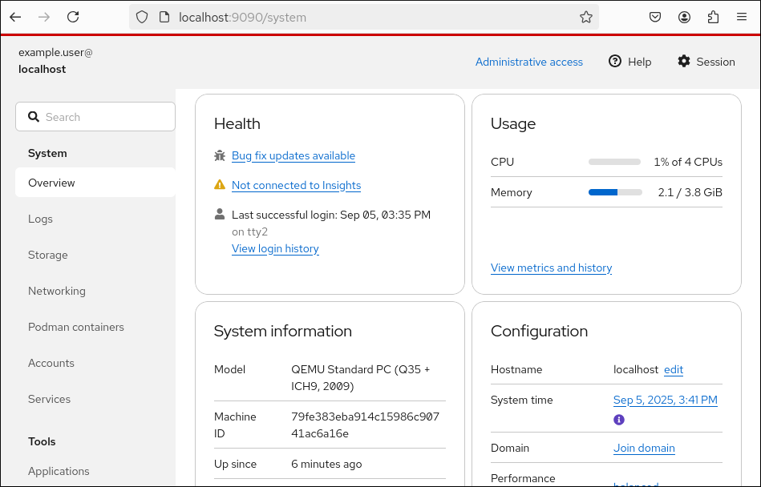
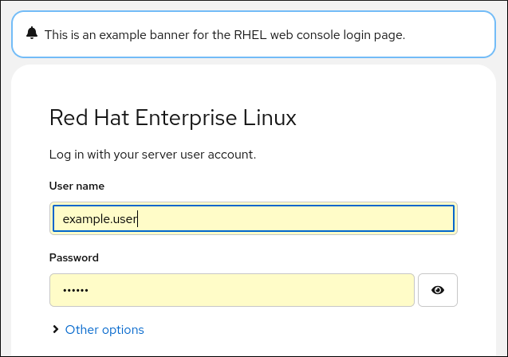
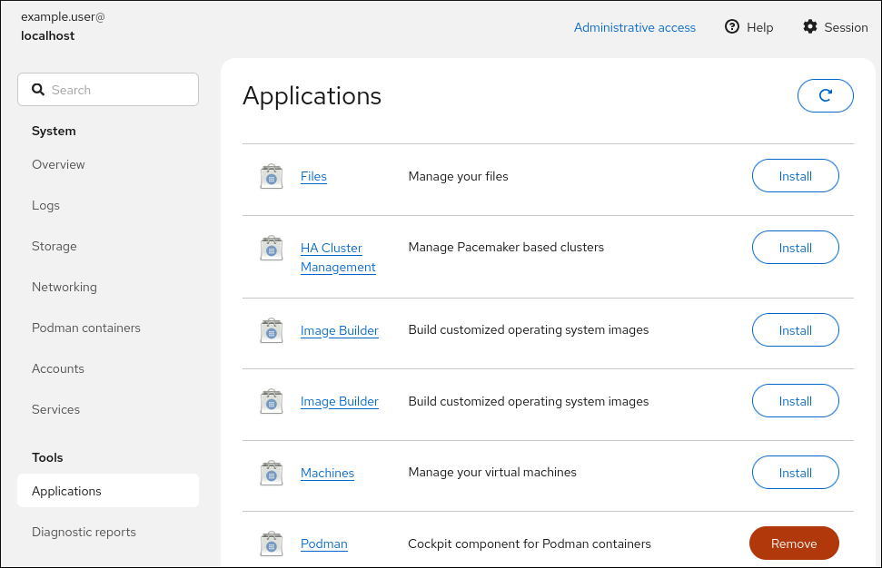
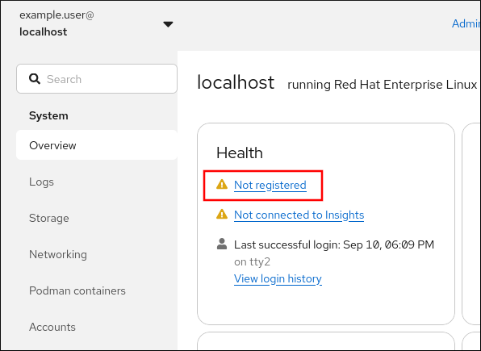
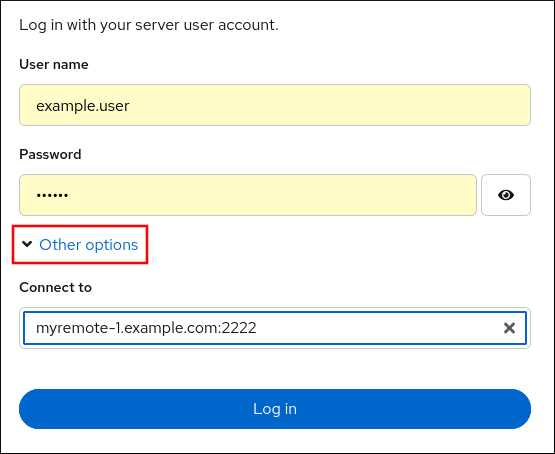
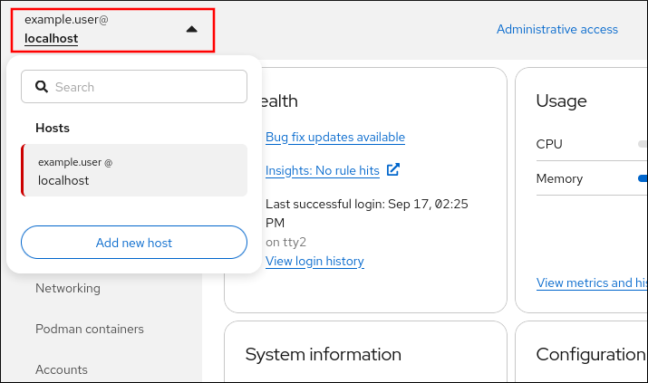

# Managing systems in the RHEL web console

* * *

Red Hat Enterprise Linux 10

## Server management with a graphical web-based interface

Red Hat Customer Content Services

[Legal Notice](#idm140002237664944)

**Abstract**

The RHEL web console is a web-based graphical interface, which is based on the upstream Cockpit project. By using it, you can perform system administration tasks, such as inspecting and controlling systemd services, managing storage, configuring networks, analyzing network issues, and inspecting logs.

* * *

<h2 id="providing-feedback-on-red-hat-documentation">Providing feedback on Red Hat documentation</h2>

We are committed to providing high-quality documentation and value your feedback. To help us improve, you can submit suggestions or report errors through the Red Hat Jira tracking system.

**Procedure**

1. Log in to the [Jira](https://issues.redhat.com/projects/RHELDOCS/issues) website.
   
   If you do not have an account, select the option to create one.
2. Click **Create** in the top navigation bar.
3. Enter a descriptive title in the **Summary** field.
4. Enter your suggestion for improvement in the **Description** field. Include links to the relevant parts of the documentation.
5. Click **Create** at the bottom of the dialogue.

<h2 id="getting-started-with-the-rhel-web-console">Chapter 1. Getting started with the RHEL web console</h2>

Learn how to install, configure, and monitor systems by using the RHEL web console. This graphical interface simplifies common administration tasks, such as managing logs, storage, and remote hosts.

<h3 id="what-is-the-rhel-web-console">1.1. What is the RHEL web console</h3>

The RHEL web console is a web-based graphical interface for managing and monitoring your local system and Linux servers in your network environment.

 

In the RHEL web console, you can perform a wide range of administration tasks, including:

- Managing services
- Managing user accounts
- Managing and monitoring system services
- Configuring network interfaces and firewall
- Reviewing system logs
- Managing virtual machines
- Creating diagnostic reports
- Setting kernel dump configuration
- Configuring SELinux
- Updating software
- Managing system subscriptions

The web console uses the same system tools as the command line. If you change a setting in the terminal, the web console updates instantly. You can switch between the web interface and the terminal at any time.

You can also monitor the logs and performance of systems in the network environment in a graphical form. In addition, you can change the settings directly in the web console or through the terminal.

<h3 id="installing-and-enabling-the-web-console">1.2. Installing and enabling the web console</h3>

To access the RHEL web console, enable the `cockpit.socket` service first. RHEL 10 includes the web console installed by default in many installation variants. If this is not the case on your system, install the `cockpit` package before enabling the `cockpit.socket` service.

**Procedure**

1. If the web console is not installed by default on your installation variant, manually install the `cockpit` package:
   
   ```
   dnf install cockpit
   ```
   
   ```plaintext
   # dnf install cockpit
   ```
2. Enable and start the `cockpit.socket` service, which runs a web server:
   
   ```
   systemctl enable --now cockpit.socket
   ```
   
   ```plaintext
   # systemctl enable --now cockpit.socket
   ```
3. If the web console was not installed by default on your installation variant and you are using a custom firewall profile, add the `cockpit` service to `firewalld` to open port 9090 in the firewall:
   
   ```
   firewall-cmd --add-service=cockpit --permanent
   firewall-cmd --reload
   ```
   
   ```plaintext
   # firewall-cmd --add-service=cockpit --permanent
   # firewall-cmd --reload
   ```

**Verification**

- To verify the previous installation and configuration, [open the web console](#logging-in-to-the-web-console "1.3. Logging in to the web console").

<h3 id="logging-in-to-the-web-console">1.3. Logging in to the web console</h3>

When the `cockpit.socket` service is running and the corresponding firewall port is open, you can log in to the web console in your browser for the first time.

**Prerequisites**

- Use one of the following browsers to open the web console:
  
  - Mozilla Firefox 52 and later
  - Google Chrome 57 and later
  - Microsoft Edge 16 and later
- System user account credentials
  
  The RHEL web console uses a specific pluggable authentication modules (PAM) stack at `/etc/pam.d/cockpit`. The default configuration allows logging in with the user name and password of any local account on the system.
- Port 9090 is open in your firewall.

**Procedure**

1. In your web browser, enter the following address to access the web console:
   
   ```
   https://localhost:9090
   ```
   
   ```plaintext
   https://localhost:9090
   ```
   
   Note
   
   This provides a web-console login on your local machine. If you want to log in to the web console of a remote system, see the [Connecting to the web console from a remote machine](#connecting-to-the-web-console-from-a-remote-machine "1.6. Connecting to the web console from a remote machine") section.
   
   If you use a self-signed certificate, the browser displays a warning. Check the certificate, and accept the security exception to proceed with the login.
   
   The console loads a certificate from the `/etc/cockpit/ws-certs.d` directory and uses the last file with a `.cert` extension in alphabetical order. To avoid having to grant security exceptions, install a certificate signed by a certificate authority (CA).
2. In the login screen, enter your system user name and password.
3. Click **Log In**.
   
   After successful authentication, the RHEL web console interface opens.

<h3 id="administrative-access-in-the-web-console">1.4. Administrative access in the web console</h3>

You can gain administrative access in the RHEL web console to perform privileged tasks, such as managing services, users, and networking, which require elevated permissions.

After you log in for the first time with a regular user account, the web console starts with limited access. When you have limited access, you can view the settings, but you cannot perform actions that require administrative privileges, such as installing packages.

To perform administrative tasks, click **Limited access** in the top panel of the web console page. You must have `sudo` access to the system and provide your user password to gain administrative access. From that point, the web console provides administrative access and preserves this setting across user sessions.

To switch back to limited access, click **Administrative access** in the top panel of the web console page.

Important

The RHEL web console disallows root account logins by default for security reasons. Instead of logging in as root, use administrative access. If your scenario requires logging in as root, see [Connecting to the web console from a remote machine as a root user](#connecting-to-the-web-console-from-a-remote-machine-as-a-root-user "1.7. Connecting to the web console from a remote machine as a root user")

**Additional resources**

- [Managing sudo access](https://docs.redhat.com/en/documentation/red_hat_enterprise_linux/10/html/security_hardening/managing-sudo-access)

<h3 id="disabling-basic-authentication-in-the-web-console">1.5. Disabling basic authentication in the web console</h3>

Disable basic authentication for the RHEL web console to enforce stronger authentication methods, such as Kerberos. You can configure this setting in the `cockpit.conf` file to override default security behavior.

Use the `none` action to disable an authentication scheme and only allow authentication through GSSAPI and forms.

**Prerequisites**

- You have installed the RHEL 10 web console.
  
  For instructions, see [Installing and enabling the web console](#installing-and-enabling-the-web-console "1.2. Installing and enabling the web console").
- You have `root` privileges or permissions to enter administrative commands with `sudo`.

**Procedure**

1. Open or create the `cockpit.conf` file in the `/etc/cockpit/` directory in a text editor of your preference, for example:
   
   ```
   vi cockpit.conf
   ```
   
   ```plaintext
   # vi cockpit.conf
   ```
2. Add the following text:
   
   ```
   [basic]
   action = none
   ```
   
   ```plaintext
   [basic]
   action = none
   ```
3. Save the file.
4. Restart the web console for changes to take effect.
   
   ```
   systemctl try-restart cockpit
   ```
   
   ```plaintext
   # systemctl try-restart cockpit
   ```

<h3 id="connecting-to-the-web-console-from-a-remote-machine">1.6. Connecting to the web console from a remote machine</h3>

You can connect to your web console interface from any client operating system and also from mobile phones or tablets.

**Prerequisites**

- A device with a supported internet browser, such as:
  
  - Mozilla Firefox 52 and later
  - Google Chrome 57 and later
  - Microsoft Edge 16 and later
- The RHEL 10 system you want to access with an installed and accessible web console.
  
  For instructions, see [Installing and enabling the web console](#installing-and-enabling-the-web-console "1.2. Installing and enabling the web console").

**Procedure**

1. Open your web browser.
2. Type the remote server’s address in one of the following formats:
   
   1. With the server’s hostname:
      
      ```
      https://<server.hostname.example.com>:<port-number>
      ```
      
      ```plaintext
      https://<server.hostname.example.com>:<port-number>
      ```
      
      For example:
      
      ```
      https://example.com:9090
      ```
      
      ```plaintext
      https://example.com:9090
      ```
   2. With the server’s IP address:
      
      ```
      https://<server.IP_address>:<port-number>
      ```
      
      ```plaintext
      https://<server.IP_address>:<port-number>
      ```
      
      For example:
      
      ```
      https://192.0.2.2:9090
      ```
      
      ```plaintext
      https://192.0.2.2:9090
      ```
3. After the login interface opens, log in with your RHEL system credentials.

<h3 id="connecting-to-the-web-console-from-a-remote-machine-as-a-root-user">1.7. Connecting to the web console from a remote machine as a root user</h3>

You can connect to the RHEL web console as the `root` user to gain full administrative control of a remote host. Be sure to use SSH keys instead of a password for this privileged connection.

On new installations of RHEL 9.2 or later, the RHEL web console disallows root account logins by default for security reasons. You can allow the `root` login in the `/etc/cockpit/disallowed-users` file.

**Prerequisites**

- You have installed the RHEL 10 web console.
  
  For instructions, see [Installing and enabling the web console](#installing-and-enabling-the-web-console "1.2. Installing and enabling the web console").

**Procedure**

1. Open the `disallowed-users` file in the `/etc/cockpit/` directory in a text editor of your preference, for example:
   
   ```
   vi /etc/cockpit/disallowed-users
   ```
   
   ```plaintext
   # vi /etc/cockpit/disallowed-users
   ```
2. Edit the file and remove the line for the `root` user:
   
   ```
   List of users which are not allowed to login to Cockpit root
   ```
   
   ```plaintext
   # List of users which are not allowed to login to Cockpit root
    
   ```
3. Save the changes and quit the editor.

**Verification**

- Log in to the web console as a `root` user.
  
  For details, see [Logging in to the web console](#logging-in-to-the-web-console "1.3. Logging in to the web console").

<h3 id="logging-in-to-the-web-console-using-a-one-time-password">1.8. Logging in to the web console using a one-time password</h3>

Log in to the RHEL web console by using a one-time password (OTP) to enhance security. You can use this two-factor authentication method in an IdM domain with enabled OTP.

Important

It is possible to log in using a one-time password only if your system is part of an Identity Management (IdM) domain with enabled OTP configuration.

**Prerequisites**

- You have installed the RHEL 10 web console.
  
  For instructions, see [Installing and enabling the web console](#installing-and-enabling-the-web-console "1.2. Installing and enabling the web console").
- An Identity Management server with enabled OTP configuration.
- A configured hardware or software device generating OTP tokens.

**Procedure**

1. Open the RHEL web console in your browser:
   
   - Locally: `https://localhost:9090`
   - Remotely with the server hostname: `https://example.com:9090`
   - Remotely with the server IP address: `https://EXAMPLE.SERVER.IP.ADDR:9090`
     
     If you use a self-signed certificate, the browser issues a warning. Check the certificate and accept the security exception to proceed with the login.
     
     The console loads a certificate from the `/etc/cockpit/ws-certs.d` directory and uses the last file with a `.cert` extension in alphabetical order. To avoid having to grant security exceptions, install a certificate signed by a certificate authority (CA).
2. The Login window opens. In the Login window, enter your system user name and password.
3. Generate a one-time password on your device.
4. Enter the one-time password into a new field that displays in the web console interface after you confirm your password.
5. Click **Log in**.
6. Successful login takes you to the **Overview** page of the web console interface.

<h3 id="adding-a-banner-to-the-login-page">1.9. Adding a banner to the login page</h3>

You can add a custom banner to the RHEL web console login page. This helps to display important security warnings or legal notices to users before they log in to the system.

**Prerequisites**

- You have installed the RHEL 10 web console.
  
  For instructions, see [Installing and enabling the web console](#installing-and-enabling-the-web-console "1.2. Installing and enabling the web console").
- You have `root` privileges or permissions to enter administrative commands with `sudo`.

**Procedure**

1. Open the `/etc/issue.cockpit` file in a text editor of your preference:
   
   ```
   vi /etc/issue.cockpit
   ```
   
   ```plaintext
   # vi /etc/issue.cockpit
   ```
2. Add the content you want to display as the banner to the file, for example:
   
   ```
   This is an example banner for the RHEL web console login page.
   ```
   
   ```plaintext
   This is an example banner for the RHEL web console login page.
   ```
   
   You cannot include any macros in the file, but you can use line breaks and ASCII art.
3. Save the file.
4. Open the `cockpit.conf` file in the `/etc/cockpit/` directory in a text editor of your preference, for example:
   
   ```
   vi /etc/cockpit/cockpit.conf
   ```
   
   ```plaintext
   # vi /etc/cockpit/cockpit.conf
   ```
5. Add the following text to the file:
   
   ```
   [Session]
   Banner=/etc/issue.cockpit
   ```
   
   ```plaintext
   [Session]
   Banner=/etc/issue.cockpit
   ```
6. Save the file.
7. Restart the web console for changes to take effect.
   
   ```
   systemctl try-restart cockpit
   ```
   
   ```plaintext
   # systemctl try-restart cockpit
   ```

**Verification**

- Open the web console login screen again to verify that the banner is now visible:
  
  

<h3 id="configuring-automatic-idle-lock-in-the-web-console">1.10. Configuring automatic idle lock in the web console</h3>

You can enable the automatic idle lock and set the idle timeout for your system through the web console interface. This ensures your screen automatically locks after a period of inactivity, protecting the system from unauthorized access.

**Prerequisites**

- You have installed the RHEL 10 web console.
  
  For instructions, see [Installing and enabling the web console](#installing-and-enabling-the-web-console "1.2. Installing and enabling the web console").
- You have `root` privileges or permissions to enter administrative commands with `sudo`.

**Procedure**

1. Open the `cockpit.conf` file in the `/etc/cockpit/` directory in a text editor of your preference, for example:
   
   ```
   vi /etc/cockpit/cockpit.conf
   ```
   
   ```plaintext
   # vi /etc/cockpit/cockpit.conf
   ```
2. Add the following text to the file:
   
   ```
   [Session]
   IdleTimeout=<X>
   ```
   
   ```plaintext
   [Session]
   IdleTimeout=<X>
   ```
   
   Substitute *&lt;X&gt;* with a number for a time period of your choice in minutes.
3. Save the file.
4. Restart the web console for changes to take effect.
   
   ```
   systemctl try-restart cockpit
   ```
   
   ```plaintext
   # systemctl try-restart cockpit
   ```

**Verification**

- Check if the session logs you out after a set period of time.

<h3 id="changing-the-web-console-listening-port">1.11. Changing the web console listening port</h3>

By default, the RHEL web console communicates through TCP port 9090. You can change the port number by overriding the default socket settings. This adjustment is often necessary to meet specific security or network policies.

**Prerequisites**

- You have installed the RHEL 10 web console.
  
  For instructions, see [Installing and enabling the web console](#installing-and-enabling-the-web-console "1.2. Installing and enabling the web console").
- You have `root` privileges or permissions to enter administrative commands with `sudo`.
- The `firewalld` service is running.

**Procedure**

1. Pick an unoccupied port, for example, *&lt;4488/tcp&gt;*, and instruct SELinux to allow the `cockpit` service to bind to that port:
   
   ```
   semanage port -a -t websm_port_t -p tcp <4488>
   ```
   
   ```plaintext
   # semanage port -a -t websm_port_t -p tcp <4488>
   ```
   
   Note that a port can be used only by one service at a time, and thus an attempt to use an already occupied port implies the `ValueError: Port already defined` error message.
2. Open the new port and close the former one in the firewall:
   
   ```
   firewall-cmd --service cockpit --permanent --add-port=<4488>/tcp
   firewall-cmd --service cockpit --permanent --remove-port=9090/tcp
   ```
   
   ```plaintext
   # firewall-cmd --service cockpit --permanent --add-port=<4488>/tcp
   # firewall-cmd --service cockpit --permanent --remove-port=9090/tcp
   ```
3. Create an override file for the `cockpit.socket` service:
   
   ```
   systemctl edit cockpit.socket
   ```
   
   ```plaintext
   # systemctl edit cockpit.socket
   ```
4. In the following editor screen, which opens an empty `override.conf` file located in the `/etc/systemd/system/cockpit.socket.d/` directory, change the default port for the web console from 9090 to the previously picked number by adding the following lines:
   
   ```
   [Socket]
   ListenStream=
   ListenStream=<4488>
   ```
   
   ```plaintext
   [Socket]
   ListenStream=
   ListenStream=<4488>
   ```
   
   Note that the first `ListenStream=` directive with an empty value is intentional. You can declare multiple `ListenStream` directives in a single socket unit and the empty value in the drop-in file resets the list and disables the default port 9090 from the original unit.
   
   Important
   
   Insert the previous code snippet between the lines starting with `# Anything between here` and `# Lines below this`. Otherwise, the system discards your changes.
5. Save the changes, and exit the editor.
6. Reload the changed configuration:
   
   ```
   systemctl daemon-reload
   ```
   
   ```plaintext
   # systemctl daemon-reload
   ```
7. Check that your configuration is working:
   
   ```
   systemctl show cockpit.socket -p Listen
   Listen=[::]:4488 (Stream)
   ```
   
   ```plaintext
   # systemctl show cockpit.socket -p Listen
   Listen=[::]:4488 (Stream)
   ```
8. Restart `cockpit.socket`:
   
   ```
   systemctl restart cockpit.socket
   ```
   
   ```plaintext
   # systemctl restart cockpit.socket
   ```

**Verification**

- Open your web browser, and access the web console on the updated port, for example:
  
  ```
  https://machine1.example.com:4488
  ```
  
  ```plaintext
  https://machine1.example.com:4488
  ```

<h2 id="installing-and-configuring-web-console-by-using-rhel-system-roles">Chapter 2. Installing and configuring web console by using RHEL system roles</h2>

With the `cockpit` RHEL system role, you can automatically deploy and enable the web console on multiple RHEL systems.

<h3 id="installing-the-web-console-by-using-the-cockpit-rhel-system-role">2.1. Installing the web console by using the cockpit RHEL system role</h3>

You can use the `cockpit` system role to automate installing and enabling the RHEL web console on multiple systems.

You use the `cockpit` system role to:

- Install the RHEL web console.
- Allow the `firewalld` and `selinux` system roles to configure the system for opening new ports.
- Set the web console to use a certificate from the `ipa` trusted certificate authority instead of using a self-signed certificate.

Note

You do not have to call the `firewall` or `certificate` system roles in the playbook to manage the firewall or create the certificate. The `cockpit` system role calls them automatically as needed.

**Prerequisites**

- [You have prepared the control node and the managed nodes](https://docs.redhat.com/en/documentation/red_hat_enterprise_linux/10/html/automating_system_administration_by_using_rhel_system_roles/preparing-a-control-node-and-managed-nodes-to-use-rhel-system-roles).
- You are logged in to the control node as a user who can run playbooks on the managed nodes.
- The account you use to connect to the managed nodes has `sudo` permissions for these nodes.

**Procedure**

1. Create a playbook file, for example, `~/playbook.yml`, with the following content:
   
   ```
   ---
   - name: Manage the RHEL web console
     hosts: managed-node-01.example.com
     tasks:
       - name: Install RHEL web console
         ansible.builtin.include_role:
           name: redhat.rhel_system_roles.cockpit
         vars:
           cockpit_packages: default
           cockpit_port: 9090
           cockpit_manage_selinux: true
           cockpit_manage_firewall: true
           cockpit_certificates:
             - name: /etc/cockpit/ws-certs.d/01-certificate
               dns: ['localhost', 'www.example.com']
               ca: ipa
   ```
   
   ```yaml
   ---
   - name: Manage the RHEL web console
     hosts: managed-node-01.example.com
     tasks:
       - name: Install RHEL web console
         ansible.builtin.include_role:
           name: redhat.rhel_system_roles.cockpit
         vars:
           cockpit_packages: default
           cockpit_port: 9090
           cockpit_manage_selinux: true
           cockpit_manage_firewall: true
           cockpit_certificates:
             - name: /etc/cockpit/ws-certs.d/01-certificate
               dns: ['localhost', 'www.example.com']
               ca: ipa
   ```
   
   The settings specified in the example playbook include the following:
   
   `cockpit_manage_selinux: true`
   
   Allow using the `selinux` system role to configure SELinux for setting up the correct port permissions on the `websm_port_t` SELinux type.
   
   `cockpit_manage_firewall: true`
   
   Allow the `cockpit` system role to use the `firewalld` system role for adding ports.
   
   `cockpit_certificates: <YAML_dictionary>`
   
   By default, the RHEL web console uses a self-signed certificate. Alternatively, you can add the `cockpit_certificates` variable to the playbook and configure the role to request certificates from an IdM certificate authority (CA) or to use an existing certificate and private key that is available on the managed node.
   
   For details about all variables used in the playbook, see the `/usr/share/ansible/roles/rhel-system-roles.cockpit/README.md` file on the control node.
2. Validate the playbook syntax:
   
   ```
   ansible-playbook --syntax-check ~/playbook.yml
   ```
   
   ```plaintext
   $ ansible-playbook --syntax-check ~/playbook.yml
   ```
   
   Note that this command only validates the syntax and does not protect against a wrong but valid configuration.
3. Run the playbook:
   
   ```
   ansible-playbook ~/playbook.yml
   ```
   
   ```plaintext
   $ ansible-playbook ~/playbook.yml
   ```

**Additional resources**

- [Requesting certificates from a CA and creating self-signed certificates by using RHEL system roles](https://docs.redhat.com/en/documentation/red_hat_enterprise_linux/10/html/automating_system_administration_by_using_rhel_system_roles/requesting-certificates-from-a-ca-and-creating-self-signed-certificates-by-using-rhel-system-roles)

<h2 id="installing-web-console-add-ons-and-creating-custom-pages">Chapter 3. Installing web console add-ons and creating custom pages</h2>

Depending on how you want to use your Red Hat Enterprise Linux system, you can add additional **available** applications to the web console or create custom pages based on your use case.

<h3 id="add-ons-for-the-rhel-web-console">3.1. Add-on applications for the RHEL web console</h3>

Install optional add-on applications for the RHEL web console by using either the **Applications page** in the console or the command line. These add-ons provide tools for specific management tasks.

You can install add-on applications by using one of the following methods:

1. In the web console, click **Applications** and use the Install button in the list of available and already-installed applications.
   
    
2. In the terminal, use the `dnf install` command:
   
   ```
   dnf install <add-on>
   ```
   
   ```plaintext
   # dnf install <add-on>
   ```
   
   In the previous command, replace *&lt;add-on&gt;* by a package name from the list of available add-on applications for the RHEL web console.

| Feature name                                                                                                                                                                                                                                                                                                                                                                                                                               | Package name                                          | Usage                                                                                                                                                                                                                                                                                                                                                                                                   |
|:-------------------------------------------------------------------------------------------------------------------------------------------------------------------------------------------------------------------------------------------------------------------------------------------------------------------------------------------------------------------------------------------------------------------------------------------|:------------------------------------------------------|:--------------------------------------------------------------------------------------------------------------------------------------------------------------------------------------------------------------------------------------------------------------------------------------------------------------------------------------------------------------------------------------------------------|
| File manager                                                                                                                                                                                                                                                                                                                                                                                                                               | `cockpit-files`                                       | Managing files and directories in the standard web console interface                                                                                                                                                                                                                                                                                                                                    |
| HA cluster management                                                                                                                                                                                                                                                                                                                                                                                                                      | `cockpit-ha-cluster` [\[a\]](#ftn.idm140002244947472) | The `pcsd` Web UI for configuring Red Hat High Availability clusters                                                                                                                                                                                                                                                                                                                                    |
| Image builder                                                                                                                                                                                                                                                                                                                                                                                                                              | `cockpit-image-builder`                               | Building customized operating system images                                                                                                                                                                                                                                                                                                                                                             |
| Machines                                                                                                                                                                                                                                                                                                                                                                                                                                   | `cockpit-machines`                                    | Managing `libvirt` virtual machines                                                                                                                                                                                                                                                                                                                                                                     |
| PackageKit                                                                                                                                                                                                                                                                                                                                                                                                                                 | `cockpit-packagekit`                                  | Software updates and application installation (usually installed by default)                                                                                                                                                                                                                                                                                                                            |
| PCP                                                                                                                                                                                                                                                                                                                                                                                                                                        | `cockpit-pcp`                                         | Persistent and more fine-grained performance data (installed on-demand from the UI)                                                                                                                                                                                                                                                                                                                     |
| Podman                                                                                                                                                                                                                                                                                                                                                                                                                                     | `cockpit-podman`                                      | [Managing containers](https://docs.redhat.com/en/documentation/red_hat_enterprise_linux/10/html/building_running_and_managing_containers/managing-containers-by-using-the-rhel-web-console) and [managing container images](https://docs.redhat.com/en/documentation/red_hat_enterprise_linux/10/html/building_running_and_managing_containers/managing-container-images-by-using-the-rhel-web-console) |
| Session recording                                                                                                                                                                                                                                                                                                                                                                                                                          | `cockpit-session-recording`                           | Recording and managing user sessions                                                                                                                                                                                                                                                                                                                                                                    |
| Storage                                                                                                                                                                                                                                                                                                                                                                                                                                    | `cockpit-storaged`                                    | Managing storage through `udisks`                                                                                                                                                                                                                                                                                                                                                                       |
| [\[a\]](#idm140002244947472) Additional steps such as enabling the `pcsd` service might be required. See the [Installing cluster software](https://docs.redhat.com/en/documentation/red_hat_enterprise_linux/10/html/configuring_and_managing_high_availability_clusters/creating-high-availability-cluster#installing-cluster-software) section in the Configuring and managing high availability clusters document for more information. |                                                       |                                                                                                                                                                                                                                                                                                                                                                                                         |

<h3 id="creating-new-pages-in-the-web-console">3.2. Creating new pages in the web console</h3>

You can create custom pages in the RHEL web console by adding a package directory containing HTML and JavaScript files. This enables you to integrate customized functions and interfaces into the console.

For detailed information about adding custom pages, see [Creating Plugins for the Cockpit User Interface](https://cockpit-project.org/blog/creating-plugins-for-the-cockpit-user-interface.html) on the [Cockpit Project](https://cockpit-project.org/) website and the [Cockpit Packages](https://cockpit-project.org/guide/latest/packages.html) section in the [Cockpit Project Developer Guide](https://cockpit-project.org/guide/latest/development.html).

<h3 id="overriding-the-manifest-settings-in-the-web-console">3.3. Overriding the manifest settings in the web console</h3>

You can modify the RHEL web console menu structure for all users or a specific user by overriding the default manifest settings. Create an override to adjust the visibility or order of menu items.

In the `cockpit` project, a package name is a directory name. A package contains the `manifest.json` file along with other files. Default settings are present in the `manifest.json` file. You can override the default `cockpit` menu settings by creating a `<package_name>.override.json` file at a specific location for the specified user.

**Prerequisites**

- You have installed the RHEL 10 web console.
  
  For instructions, see [Installing and enabling the web console](#installing-and-enabling-the-web-console "1.2. Installing and enabling the web console").

**Procedure**

1. Override manifest settings in the `<systemd>.override.json` file in a text editor of your choice, for example:
   
   1. To edit for all users, enter:
      
      ```
      vi /etc/cockpit/<systemd>.override.json
      ```
      
      ```plaintext
      # vi /etc/cockpit/<systemd>.override.json
      ```
   2. To edit for a single user, enter:
      
      ```
      vi ~/.config/cockpit/<systemd>.override.json
      ```
      
      ```plaintext
      # vi ~/.config/cockpit/<systemd>.override.json
      ```
2. Edit the required file with the following details:
   
   ```
   {
     "menu": {
     "services": null,
     "logs": {
         "order": -1
     }
    }
   }
   ```
   
   ```plaintext
   {
     "menu": {
     "services": null,
     "logs": {
         "order": -1
     }
    }
   }
   ```
   
   - The `null` value hides the **services** tab
   - The `-1` value moves the **logs** tab to the first place.
3. Restart the `cockpit` service:
   
   ```
   systemctl restart cockpit.service
   ```
   
   ```plaintext
   # systemctl restart cockpit.service
   ```

**Additional resources**

- [Manifest overrides](https://cockpit-project.org/guide/latest/packages.html#package-manifest-override)

<h2 id="managing-subscriptions-in-the-web-console">Chapter 4. Managing subscriptions in the web console</h2>

You can manage your Red Hat product subscriptions in the Red Hat Enterprise Linux 10 web console. This functionality provides a graphical interface for viewing, registering, and managing system subscriptions.

<h3 id="prerequisites">4.1. Prerequisites</h3>

- Your [Red Hat Customer Portal](https://access.redhat.com) or a subscription activation key.

<h3 id="subscription-management-in-the-web-console">4.2. Subscription management in the web console</h3>

You can use the RHEL web console as a graphical interface for Red Hat Subscription Manager on your local system. This helps simplify the process of registering, managing, and viewing attached subscriptions.

The Subscription Manager connects to the [Red Hat Customer Portal](https://access.redhat.com) and verifies available:

- Active subscriptions
- Expired subscriptions
- Renewed subscriptions

If you want to renew the subscription or get a different one on the Red Hat Customer Portal, you do not have to update the Subscription Manager data manually.

The Subscription Manager synchronizes data with the Red Hat Customer Portal automatically.

<h3 id="registering-subscriptions-with-credentials-in-the-web-console">4.3. Registering subscriptions with credentials in the web console</h3>

You can register your RHEL system and attach subscriptions by using your Red Hat Customer Portal credentials directly in the web console.

**Prerequisites**

- A valid user account on the [Red Hat Customer Portal](https://access.redhat.com).
  
  See the [Create a Red Hat Login](https://www.redhat.com/wapps/ugc/register.html) page.
- An active subscription for your RHEL system.

<!--THE END-->

- You have installed the RHEL 10 web console.
  
  For instructions, see [Installing and enabling the web console](#installing-and-enabling-the-web-console "1.2. Installing and enabling the web console").

**Procedure**

1. Log in to the RHEL 10 web console.
2. In the **Health** filed in the **Overview** page, click the **Not registered** warning, or click **Subscriptions** in the main menu to move to page with your subscription information.
   
   
3. In the **Overview** field, click Register.
4. In the **Register system** dialog box, select **Account** to register by using your account credentials.
5. Enter your username.
6. Enter your password.
7. Optional: Enter your organization’s name or ID.
   
   If your account belongs to more than one organization on the Red Hat Customer Portal, you must add the organization name or organization ID. To get the org ID, go to your Red Hat contact point.
   
   - If you do not want to connect your system to Red Hat Lightspeed, clear the **Insights** checkbox.
8. Click Register.

<h3 id="registering-subscriptions-with-activation-keys-in-the-web-console">4.4. Registering subscriptions with activation keys in the web console</h3>

You can register a newly installed Red Hat Enterprise Linux with an activation key in the RHEL web console.

**Prerequisites**

- An activation key of your Red Hat product subscription.

<!--THE END-->

- You have installed the RHEL 10 web console.
  
  For instructions, see [Installing and enabling the web console](#installing-and-enabling-the-web-console "1.2. Installing and enabling the web console").

**Procedure**

1. Log in to the RHEL 10 web console.
2. In the **Health** field on the **Overview** page, click the **Not registered** warning, or click **Subscriptions** in the main menu to move to the page with your subscription information.
   
    .
3. In the **Overview** filed, click Register.
4. In the **Register system** dialog box, select **Activation key** to register using an activation key.
5. Enter your key or keys.
6. Enter your organization’s name or ID.
   
   To get the organization ID, go to your Red Hat contact point.
   
   - If you do not want to connect your system to Red Hat Lightspeed, clear the **Insights** checkbox.
7. Click Register.

<h2 id="managing-remote-systems-in-the-web-console">Chapter 5. Managing remote systems in the web console</h2>

You can connect to remote systems and manage them in the Red Hat Enterprise Linux web console, enabling you to monitor and administer systems across your network from a single central interface.

For security reasons, use the following network setup of remote systems managed by the web console:

- Configure one system as a bastion host. The bastion host is a system with an opened HTTPS port.
- All other systems communicate through SSH.

With the web interface running on the bastion host, you can reach all other systems through the SSH protocol.

<h3 id="connecting-to-a-remote-host-using-ssh-from-the-web-console-login-page">5.1. Connecting to a remote host using SSH from the web console login page</h3>

You can connect to a remote system by using the SSH protocol directly from the login page of the RHEL web console. After you log in remotely, connection traffic is encrypted, and you can manage the remote system in the graphical interface of the web console.

**Prerequisites**

- You have installed the RHEL 10 web console.
  
  For instructions, see [Installing and enabling the web console](#installing-and-enabling-the-web-console "1.2. Installing and enabling the web console").
- The `cockpit-system` package is installed on the remote system.
- The `sshd` service runs on the remote system, and the corresponding port is allowed in the firewall.

**Procedure**

1. Open the web console login page.
2. Specify the username on the remote host in the **User name** field.
3. Click **Other options** to reveal the **Connect to** text field.
4. Specify the remote host you want to connect to using SSH in the **Connect to** text field. If you do not specify any port, the web console attempts to connect to port 22 on the specified remote host.
   
    
5. Click **Log in**.

<h3 id="adding-remote-hosts-to-the-web-console">5.2. Adding remote hosts to the web console</h3>

When logged in to the RHEL web console, you can switch between the local system and multiple remote hosts through the host switcher in the top left corner of the **Overview** page. You can connect to and manage a remote system after you add its credentials to the host switcher.

**Prerequisites**

- You have installed the RHEL 10 web console.
  
  For instructions, see [Installing and enabling the web console](#installing-and-enabling-the-web-console "1.2. Installing and enabling the web console").

**Procedure**

01. In your terminal, open or create the `cockpit.conf` file in the `/etc/cockpit/` directory in a text editor of your preference.
02. Add the following text:
    
    ```
    [WebService]
    AllowMultiHost=yes
    ```
    
    ```plaintext
    [WebService]
    AllowMultiHost=yes
    ```
    
    Warning
    
    The host switcher is deprecated and disabled by default. Due to web technology limitations, this feature cannot be secure. Do not enable the host switcher if you connect to untrusted hosts because all connected systems can make arbitrary changes to the rest of the connected. As a more secure alternative, you can either use the web console login page with the secure limit of one host in a web browser session or the Cockpit Client Flatpak.
03. Save the file.
04. Restart the web console to ensure the changes take effect.
    
    ```
    systemctl try-restart cockpit
    ```
    
    ```plaintext
    # systemctl try-restart cockpit
    ```
05. In the RHEL web console, click `<username>@<hostname>` in the top left corner of the **Overview** page.
    
    
06. In the drop-down menu, click Add new host.
07. In the **Add new host** dialog box, specify the host you want to add.
08. Optional: Add the username for the account you want to connect to.
    
    You can use any user account of the remote system. However, if you use the credentials of a user account without administration privileges, you cannot perform administration tasks.
    
    If you use the same credentials as on your local system, the web console authenticates remote systems automatically every time you log in.
    
    Important
    
    The web console does not save passwords used to log in to remote systems.
09. Optional: Click the **Color** field to change the color of the system.
10. Click Add.

**Verification**

- The new host is listed in the `<username>@<hostname>` drop-down menu.

<h3 id="enabling-ssh-login-for-a-new-host">5.3. Enabling SSH login for a new host</h3>

You can enable secure SSH login for a new remote host that uses key-based authentication in the RHEL web console.

If you already have an SSH key on your system, the web console uses the existing one; otherwise, it can create a key.

**Prerequisites**

- You have installed the RHEL 10 web console.
  
  For instructions, see [Installing and enabling the web console](#installing-and-enabling-the-web-console "1.2. Installing and enabling the web console").
- You considered security risks and enabled the host switcher.
  
  See [Adding remote hosts to the web console](#adding-remote-hosts-to-the-web-console "5.2. Adding remote hosts to the web console") for more information.

**Procedure**

1. Log in to the RHEL 10 web console.
2. In the RHEL web console, click `<username>@<hostname>` in the top left corner of the **Overview** page.
   
    
3. In the drop-down menu, click Add new host.
4. In the **Add new host** dialog box, specify the host you want to add. If you connect to the host for the first time, you must click Trust and add new host in the following dialog box.
5. The password dialog box differs depending on the existence of an SSH key file on the host:
   
   1. If you already have the SSH key for the host, select the **Authorize SSH key** option.
   2. If you do not have the SSH key, select the **Create a new SSH key and authorize it** option. The web console creates the key.
6. Add and confirm a password for the SSH key.
7. Click Log in.

**Verification**

1. Log out.
2. Log back in.
3. Click Log in in the **Not connected to host** screen.
4. Select **SSH key** as your authentication option.
5. Enter your key password.
6. Click Log in.

**Additional resources**

- [Using secure communications between two systems with OpenSSH](https://docs.redhat.com/en/documentation/red_hat_enterprise_linux/10/html/securing_networks/using-secure-communications-between-two-systems-with-openssh)

<h3 id="configuring-smart-card-authentication-for-ssh-logins-in-the-web-console">5.4. Configuring smart-card authentication for SSH logins in the web console</h3>

After logging in to a user account on the RHEL web console, you can connect to remote machines by using the SSH protocol. You can use the constrained delegation feature to use SSH without being asked to authenticate again.

In the example procedure, the web console session runs on the `myhost.idm.example.com` host, and you configure the console to access the `remote.idm.example.com` host by using SSH on behalf of the authenticated user.

**Prerequisites**

- You have obtained an IdM `admin` ticket-granting ticket (TGT) on `myhost.idm.example.com`.
- You have `root` access to `remote.idm.example.com`.
- The host that runs the web console is a member of an IdM domain.

**Procedure**

1. In the **Terminal** page, verify that the web console has created a Service for User to Proxy (S4U2proxy) Kerberos ticket in the user session:
   
   ```
   klist
   …
   Valid starting     Expires            Service principal
   05/20/25 09:19:06 05/21/25 09:19:06 HTTP/myhost.idm.example.com@IDM.EXAMPLE.COM
   …
   ```
   
   ```plaintext
   $ klist
   …
   Valid starting     Expires            Service principal
   05/20/25 09:19:06 05/21/25 09:19:06 HTTP/myhost.idm.example.com@IDM.EXAMPLE.COM
   …
   ```
2. Create a list of the target hosts that the delegation rule can access:
   
   1. Create a service delegation target:
      
      ```
      ipa servicedelegationtarget-add cockpit-target
      ```
      
      ```plaintext
      $ ipa servicedelegationtarget-add cockpit-target
      ```
   2. Add the target host to the delegation target:
      
      ```
      ipa servicedelegationtarget-add-member cockpit-target \
        --principals=host/remote.idm.example.com@IDM.EXAMPLE.COM
      ```
      
      ```plaintext
      $ ipa servicedelegationtarget-add-member cockpit-target \
        --principals=host/remote.idm.example.com@IDM.EXAMPLE.COM
      ```
3. Allow `cockpit` sessions to access the target host list by creating a service delegation rule and adding the HTTP service Kerberos principal to it:
   
   1. Create a service delegation rule:
      
      ```
      ipa servicedelegationrule-add cockpit-delegation
      ```
      
      ```plaintext
      $ ipa servicedelegationrule-add cockpit-delegation
      ```
   2. Add the web console client to the delegation rule:
      
      ```
      ipa servicedelegationrule-add-member cockpit-delegation \
        --principals=HTTP/myhost.idm.example.com@IDM.EXAMPLE.COM
      ```
      
      ```plaintext
      $ ipa servicedelegationrule-add-member cockpit-delegation \
        --principals=HTTP/myhost.idm.example.com@IDM.EXAMPLE.COM
      ```
   3. Add the delegation target to the delegation rule:
      
      ```
      ipa servicedelegationrule-add-target cockpit-delegation \
        --servicedelegationtargets=cockpit-target
      ```
      
      ```plaintext
      $ ipa servicedelegationrule-add-target cockpit-delegation \
        --servicedelegationtargets=cockpit-target
      ```
4. Enable Kerberos authentication on the `remote.idm.example.com` host:
   
   1. Connect through SSH to `remote.idm.example.com` as `root`.
   2. Add the `GSSAPIAuthentication yes` line to the `/etc/ssh/sshd_config` file.
5. Restart the `sshd` service on `remote.idm.example.com` so that the changes take effect immediately:
   
   ```
   systemctl try-restart sshd.service
   ```
   
   ```plaintext
   $ systemctl try-restart sshd.service
   ```

**Additional resources**

- [Logging in to the web console with smart cards](https://docs.redhat.com/en/documentation/red_hat_enterprise_linux/10/html/managing_systems_in_the_rhel_web_console/configuring-smart-card-authentication-with-the-web-console-for-centrally-managed-users#logging-in-to-the-web-console-with-smart-cards)
- [Constrained delegation in Identity Management](https://docs.redhat.com/en/documentation/red_hat_enterprise_linux/10/html/using_ansible_to_install_and_manage_identity_management_in_rhel/using-constrained-delegation-in-idm#constrained-delegation-in-identity-management)

<h3 id="using-ansible-to-configure-smart-card-authentication-for-SSH-logins-in-the-web-console">5.5. Using Ansible to configure smart-card authentication for SSH logins in the web console</h3>

After logging in to a user account on the RHEL web console, you can connect to remote machines by using the SSH protocol. You can use the `servicedelegationrule` and `servicedelegationtarget` Ansible modules to configure the web console for the constrained delegation feature, which enables SSH connections without being asked to authenticate again.

In the example procedure, the web console session runs on the `myhost.idm.example.com` host and you configure it to access the `remote.idm.example.com` host by using SSH on behalf of the authenticated user.

**Prerequisites**

- You have obtained an IdM `admin` ticket-granting ticket (TGT) on `myhost.idm.example.com`.
- You have `root` access to `remote.idm.example.com`.
- The host that runs the web console is a member of an IdM domain.
- You have configured your Ansible control node to meet the following requirements:
  
  - You have installed the `ansible-freeipa` package.
  - The example assumes you have created an Ansible inventory file with the fully-qualified domain name (FQDN) of the IdM server in the `~/MyPlaybooks/` directory.
  - The example assumes that the `secret.yml` Ansible vault stores the admin password in the `ipaadmin_password` variable.
    
    See the `/usr/share/doc/ansible-freeipa/playbooks/servicedelegationtarget` and `/usr/share/doc/ansible-freeipa/playbooks/servicedelegationrule` directories for example playbooks and the `README-servicedelegationrule.md` and `README-servicedelegationtarget.md` files in the `/usr/share/doc/ansible-freeipa/` directory for more information.
- The target node, that is the node on which the `ansible-freeipa` module runs, is part of the IdM domain as an IdM client, server, or replica.

**Procedure**

1. Navigate to your `~/MyPlaybooks/` directory:
   
   ```
   cd ~/MyPlaybooks/
   ```
   
   ```plaintext
   $ cd ~/MyPlaybooks/
   ```
2. Store your sensitive variables in an encrypted file:
   
   1. Create the vault:
      
      ```
      ansible-vault create secret.yml
      New Vault password: <vault_password>
      Confirm New Vault password: <vault_password>
      ```
      
      ```plaintext
      $ ansible-vault create secret.yml
      New Vault password: <vault_password>
      Confirm New Vault password: <vault_password>
      ```
   2. After the `ansible-vault create` command opens an editor, enter the sensitive data in the `<key>: <value>` format:
      
      ```
      ipaadmin_password: <admin_password>
      ```
      
      ```plaintext
      ipaadmin_password: <admin_password>
      ```
   3. Save the changes, and close the editor. Ansible encrypts the data in the vault.
3. In the **Terminal** page, verify that the web console has created a Service for User to Proxy (S4U2proxy) Kerberos ticket in the user session:
   
   ```
   klist
   …
   Valid starting     Expires            Service principal
   05/20/25 09:19:06 05/21/25 09:19:06 HTTP/myhost.idm.example.com@IDM.EXAMPLE.COM
   …
   ```
   
   ```plaintext
   $ klist
   …
   Valid starting     Expires            Service principal
   05/20/25 09:19:06 05/21/25 09:19:06 HTTP/myhost.idm.example.com@IDM.EXAMPLE.COM
   …
   ```
4. Create a `web-console-smart-card-ssh.yml` playbook with the following content:
   
   1. Create a task that ensures the presence of a delegation target:
      
      ```
      ---
      - name: Playbook to create a constrained delegation target
        hosts: ipaserver
      
        vars_files:
        - /home/user_name/MyPlaybooks/secret.yml
        tasks:
        - name: Ensure servicedelegationtarget web-console-delegation-target is present
          ipaservicedelegationtarget:
            ipaadmin_password: "{{ ipaadmin_password }}"
            name: web-console-delegation-target
      ```
      
      ```yaml
      ---
      - name: Playbook to create a constrained delegation target
        hosts: ipaserver
      
        vars_files:
        - /home/user_name/MyPlaybooks/secret.yml
        tasks:
        - name: Ensure servicedelegationtarget web-console-delegation-target is present
          ipaservicedelegationtarget:
            ipaadmin_password: "{{ ipaadmin_password }}"
            name: web-console-delegation-target
      ```
   2. Add a task that adds the target host to the delegation target:
      
      ```
        - name: Ensure servicedelegationtarget web-console-delegation-target member principal host/remote.idm.example.com@IDM.EXAMPLE.COM is present
          ipaservicedelegationtarget:
            ipaadmin_password: "{{ ipaadmin_password }}"
            name: web-console-delegation-target
            principal: host/remote.idm.example.com@IDM.EXAMPLE.COM
            action: member
      ```
      
      ```yaml
        - name: Ensure servicedelegationtarget web-console-delegation-target member principal host/remote.idm.example.com@IDM.EXAMPLE.COM is present
          ipaservicedelegationtarget:
            ipaadmin_password: "{{ ipaadmin_password }}"
            name: web-console-delegation-target
            principal: host/remote.idm.example.com@IDM.EXAMPLE.COM
            action: member
      ```
   3. Add a task that ensures the presence of a delegation rule:
      
      ```
        - name: Ensure servicedelegationrule delegation-rule is present
          ipaservicedelegationrule:
            ipaadmin_password: "{{ ipaadmin_password }}"
            name: web-console-delegation-rule
      ```
      
      ```yaml
        - name: Ensure servicedelegationrule delegation-rule is present
          ipaservicedelegationrule:
            ipaadmin_password: "{{ ipaadmin_password }}"
            name: web-console-delegation-rule
      ```
   4. Add a task that ensures that the Kerberos principal of the web console client service is a member of the constrained delegation rule:
      
      ```
        - name: Ensure the Kerberos principal of the web console client service is added to the servicedelegationrule web-console-delegation-rule
          ipaservicedelegationrule:
            ipaadmin_password: "{{ ipaadmin_password }}"
            name: web-console-delegation-rule
            principal: HTTP/myhost.idm.example.com
            action: member
      ```
      
      ```yaml
        - name: Ensure the Kerberos principal of the web console client service is added to the servicedelegationrule web-console-delegation-rule
          ipaservicedelegationrule:
            ipaadmin_password: "{{ ipaadmin_password }}"
            name: web-console-delegation-rule
            principal: HTTP/myhost.idm.example.com
            action: member
      ```
   5. Add a task that ensures that the constrained delegation rule is associated with the web-console-delegation-target delegation target:
      
      ```
        - name: Ensure a constrained delegation rule is associated with a specific delegation target
          ipaservicedelegationrule:
            ipaadmin_password: "{{ ipaadmin_password }}"
            name: web-console-delegation-rule
            target: web-console-delegation-target
            action: member
      ```
      
      ```yaml
        - name: Ensure a constrained delegation rule is associated with a specific delegation target
          ipaservicedelegationrule:
            ipaadmin_password: "{{ ipaadmin_password }}"
            name: web-console-delegation-rule
            target: web-console-delegation-target
            action: member
      ```
   6. Add a task that enable Kerberos authentication on `remote.idm.example.com`:
      
      ```
        - name: Enable Kerberos authentication
          hosts: remote.idm.example.com
          vars:
            sshd_config:
              GSSAPIAuthentication: true
          roles:
            - role: rhel-system-roles.sshd
      ```
      
      ```yaml
        - name: Enable Kerberos authentication
          hosts: remote.idm.example.com
          vars:
            sshd_config:
              GSSAPIAuthentication: true
          roles:
            - role: rhel-system-roles.sshd
      ```
5. Save the file.
6. Run the Ansible playbook. Specify the playbook file, the file storing the password protecting the `secret.yml` file, and the inventory file:
   
   ```
   ansible-playbook --vault-password-file=password_file -v -i inventory web-console-smart-card-ssh.yml
   ```
   
   ```plaintext
   $ ansible-playbook --vault-password-file=password_file -v -i inventory web-console-smart-card-ssh.yml
   ```

**Additional resources**

- [Logging in to the web console with smart cards](https://docs.redhat.com/en/documentation/red_hat_enterprise_linux/10/html/managing_systems_in_the_rhel_web_console/configuring-smart-card-authentication-with-the-web-console-for-centrally-managed-users#logging-in-to-the-web-console-with-smart-cards)
- [Constrained delegation in Identity Management](https://docs.redhat.com/en/documentation/red_hat_enterprise_linux/10/html/using_ansible_to_install_and_manage_identity_management_in_rhel/using-constrained-delegation-in-idm#constrained-delegation-in-identity-management)

<h2 id="configuring-sso-authentication-for-the-rhel-web-console-in-the-idm-domain">Chapter 6. Configuring SSO authentication for the RHEL web console in the IdM domain</h2>

Configure Single Sign-On (SSO) authentication for the RHEL web console by using Identity Management (IdM). With SSO enabled, IdM users with a Kerberos ticket can access the web console without re-entering credentials.

You can use Single Sign-on (SSO) authentication provided by Identity Management (IdM) in the RHEL web console to leverage the following advantages:

- IdM domain administrators can use the web console to manage local systems.
- Users with a Kerberos ticket in the IdM domain do not have to provide login credentials to access the web console.
- All hosts known to the IdM domain are accessible through SSH from the local instance of the web console.
- Certificate configuration is not necessary. The console’s web server automatically switches to a certificate issued by the IdM certificate authority and accepted by browsers.

Configuring SSO for logging into the web console requires:

1. You must add systems to the IdM domain by using the web console.
2. If you want to use Kerberos for authentication, you must obtain a Kerberos ticket on your systems.
3. Allow administrators on the IdM server to use any command on any host.

<h3 id="joining-a-rhel-system-to-an-idm-domain-using-the-web-console">6.1. Joining a RHEL system to an IdM domain using the web console</h3>

You can join a RHEL system to an IdM domain directly in the RHEL web console. This integrates the system into the centralized identity management environment, enabling IdM users to log in.

**Prerequisites**

- The IdM domain is running and reachable from the client you want to join.
- You have the IdM domain administrator credentials.

<!--THE END-->

- You have installed the RHEL 10 web console.
  
  For instructions, see [Installing and enabling the web console](#installing-and-enabling-the-web-console "1.2. Installing and enabling the web console").

**Procedure**

1. Log in to the RHEL 10 web console.
2. In the **Configuration** field of the **Overview** tab click **Join Domain**.
3. In the **Join a Domain** dialog box, enter the hostname of the IdM server in the **Domain Address** field.
4. In the **Domain administrator name** field, enter the username of the IdM administration account.
5. In the **Domain administrator password**, add a password.
6. Click Join.

**Verification**

1. If the RHEL 10 web console does not display an error, the system joined to the IdM domain and you can see the domain name in the **System** screen.
2. To verify that the user is a member of the domain, click the **Terminal** page and type the `id` command:
   
   ```
   id
   ```
   
   ```plaintext
   $ id
   ```
   
   ```
   euid=548800004(example_user) gid=548800004(example_user) groups=548800004(example_user) context=unconfined_u:unconfined_r:unconfined_t:s0-s0:c0.c1023
   ```
   
   ```plaintext
   euid=548800004(example_user) gid=548800004(example_user) groups=548800004(example_user) context=unconfined_u:unconfined_r:unconfined_t:s0-s0:c0.c1023
   ```

**Additional resources**

- [Planning Identity Management](https://docs.redhat.com/en/documentation/red_hat_enterprise_linux/10/html/planning_identity_management)
- [Installing Identity Management](https://docs.redhat.com/en/documentation/red_hat_enterprise_linux/10/html/installing_identity_management)
- [Managing IdM users, groups, hosts, and access control rules](https://docs.redhat.com/en/documentation/red_hat_enterprise_linux/10/html/managing_idm_users_groups_hosts_and_access_control_rules)

<h3 id="logging-in-to-the-web-console-using-kerberos-authentication">6.2. Logging in to the web console using Kerberos authentication</h3>

You can log in to the RHEL web console by using Kerberos authentication. If you already have a valid Kerberos ticket from your IdM domain, you can access the console without re-entering your password.

Important

With SSO, you usually do not have any administrative privileges in the web console. This only works if you configure passwordless `sudo`. The web console does not prompt for a `sudo` password interactively.

**Prerequisites**

- IdM domain running and reachable in your company environment.
  
  For details, see [Joining a RHEL system to an IdM domain using the web console](#joining-a-rhel-system-to-an-idm-domain-using-the-web-console "6.1. Joining a RHEL system to an IdM domain using the web console").

<!--THE END-->

- You have installed the RHEL 10 web console.
  
  For instructions, see [Installing and enabling the web console](#installing-and-enabling-the-web-console "1.2. Installing and enabling the web console").
- If the system does not use a Kerberos ticket managed by the SSSD client, request the ticket with the `kinit` utility manually.

**Procedure**

- Log in to the RHEL web console by entering the following URL in your web browser:
  
  ```
  https://<dns_name>:9090
  ```
  
  ```plaintext
  https://<dns_name>:9090
  ```

<h2 id="configuring-smart-card-authentication-with-the-web-console-for-centrally-managed-users">Chapter 7. Configuring smart card authentication with the web console for centrally managed users</h2>

Configure smart card authentication for centrally managed users in the RHEL web console. This security measure helps to provide physical access control for administrative and regular users.

You can configure smart card authentication in the RHEL web console for users who are centrally managed by:

- Identity Management
- Active Directory which is connected in the cross-forest trust with Identity Management

<h3 id="prerequisites\_2">7.1. Prerequisites</h3>

- The system for which you want to use the smart card authentication must be a member of an Active Directory or Identity Management domain.
  
  For details about joining the RHEL system into a domain by using the web console, see [Joining a RHEL system to an IdM domain by using the web console](https://docs.redhat.com/en/documentation/red_hat_enterprise_linux/10/html/managing_systems_in_the_rhel_web_console/configuring-sso-authentication-for-the-rhel-web-console-in-the-idm-domain).
- The certificate used for the smart card authentication must be associated with a particular user in Identity Management or Active Directory.
  
  For more details about associating a certificate with the user in Identity Management, see [Adding a certificate to a user entry in the IdM Web UI](https://docs.redhat.com/en/documentation/red_hat_enterprise_linux/10/html/managing_smart_card_authentication/configuring-identity-management-for-smart-card-authentication#adding-a-certificate-to-a-user-entry-in-the-idm-web-ui) or [Adding a certificate to a user entry in the IdM CLI](https://docs.redhat.com/en/documentation/red_hat_enterprise_linux/10/html/managing_smart_card_authentication/configuring-identity-management-for-smart-card-authentication#adding-a-certificate-to-a-user-entry-in-the-idm-cli).

<h3 id="smart-card-authentication-for-centrally-managed-users">7.2. Smart-card authentication for centrally managed users</h3>

Use smart card authentication to provide strong authentication for centrally managed users. This method links the user’s account to a physical credential, enhancing security for systems within the Identity Management domain.

A smart card is a physical device, which can provide personal authentication by using certificates stored on the card. Personal authentication means that you can use smart cards in the same way as user passwords.

You can store user credentials on the smart card in the form of a private key and a certificate. Special software and hardware is used to access them. You insert the smart card into a reader or a USB socket and supply the PIN code for the smart card instead of providing your password.

Identity Management (IdM) supports smart-card authentication with:

- User certificates issued by the Active Directory Certificate Service (ADCS) certificate authority.
  
  For details, see [Configuring certificates issued by ADCS for smart card authentication in IdM](https://docs.redhat.com/en/documentation/red_hat_enterprise_linux/10/html/managing_certificates_in_idm/configuring-certificates-issued-by-adcs-for-smart-card-authentication-in-idm).

Note

If you want to start using smart card authentication, see the hardware requirements: [Smart Card support in RHEL8+](https://access.redhat.com/articles/4253861).

<h3 id="enabling-smart-card-authentication-for-the-web-console">7.3. Enabling smart-card authentication for the web console</h3>

Enable smart card authentication specifically for the RHEL web console. This lets centrally managed users securely log in by using their smart card credentials and the IdM domain policy.

To use smart-card authentication in the web console, enable this authentication method in the `cockpit.conf` file. Additionally, you can disable password authentication in the same file.

**Prerequisites**

- You have installed the RHEL 10 web console.
  
  For instructions, see [Installing and enabling the web console](#installing-and-enabling-the-web-console "1.2. Installing and enabling the web console").

**Procedure**

1. Log in to the RHEL 10 web console.
2. Click **Terminal**.
3. In the `/etc/cockpit/cockpit.conf`, set the `ClientCertAuthentication` to `yes`:
   
   ```
   [WebService]
   ClientCertAuthentication = yes
   ```
   
   ```plaintext
   [WebService]
   ClientCertAuthentication = yes
   ```
4. Optional: Disable password-based authentication in `cockpit.conf` with:
   
   ```
   [Basic]
   action = none
   ```
   
   ```plaintext
   [Basic]
   action = none
   ```
   
   This configuration disables password authentication and you must always use the smart card.
5. Restart the web console to ensure that the `cockpit.service` accepts the change:
   
   ```
   systemctl restart cockpit
   ```
   
   ```plaintext
   # systemctl restart cockpit
   ```

<h3 id="logging-in-to-the-web-console-with-smart-cards">7.4. Logging in to the web console with smart cards</h3>

You can log in to the RHEL web console with your smart card credentials. This uses the configured smart card policy for secure access by centrally managed users.

**Prerequisites**

- A valid certificate stored in your smart card that is associated to a user account created in an Active Directory or Identity Management domain.
- PIN to unlock the smart card.
- The smart card has been put into the reader.

<!--THE END-->

- You have installed the RHEL 10 web console.
  
  For instructions, see [Installing and enabling the web console](#installing-and-enabling-the-web-console "1.2. Installing and enabling the web console").

**Procedure**

1. Log in to the RHEL 10 web console.
   
   The browser asks you to add the PIN protecting the certificate stored on the smart card.
2. In the **Password Required** dialog box, enter PIN and click **OK**.
3. In the **User Identification Request** dialog box, select the certificate stored in the smart card.
4. Select **Remember this decision**.
   
   The system does not open this window next time.
   
   Note
   
   This step does not apply to Google Chrome users.
5. Click **OK**.
   
   You are now connected and the web console displays its content.

<h3 id="enabling-passwordless-sudo-authentication-for-smart-card-users">7.5. Enabling passwordless sudo authentication for smart-card users</h3>

You can enable passwordless `sudo` authentication for smart-card users. This enables users to perform administrative tasks without entering a password, further improving operational efficiency and security.

As an alternative, if you use RHEL Identity Management, you can declare the initial web console certificate as trusted for authentication with `sudo`, SSH, or other services. For that purpose, the web console automatically creates an S4U2Proxy Kerberos ticket in the user session.

In the following example, the web console session runs on `host.example.com` and is trusted to access its own host with `sudo`. Additionally, the example steps add a second trusted host - `remote.example.com`.

**Prerequisites**

- Identity Management is installed.
- Active Directory is connected in the cross-forest trust with Identity Management.
- Your smart card is set up to log in to the web console. See [Configuring smart-card authentication with the web console for centrally managed users](#configuring-smart-card-authentication-with-the-web-console-for-centrally-managed-users "Chapter 7. Configuring smart card authentication with the web console for centrally managed users") for more information.

**Procedure**

1. Set up constraint delegation rules to list which hosts the ticket can access.
   
   - Create the following example delegation:
     
     - Enter the following commands to add a list of target machines a particular rule can access:
       
       ```
       ipa servicedelegationtarget-add cockpit-target
       ```
       
       ```plaintext
       # ipa servicedelegationtarget-add cockpit-target
       ```
       
       ```
       ipa servicedelegationtarget-add-member cockpit-target \ --principals=host/host.example.com@EXAMPLE.COM \ --principals=host/remote.example.com@EXAMPLE.COM
       ```
       
       ```plaintext
       # ipa servicedelegationtarget-add-member cockpit-target \ --principals=host/host.example.com@EXAMPLE.COM \ --principals=host/remote.example.com@EXAMPLE.COM
       ```
     - To enable the web console sessions (HTTP/principal) to access that host list, use the following commands:
       
       ```
       ipa servicedelegationrule-add cockpit-delegation
       ```
       
       ```plaintext
       # ipa servicedelegationrule-add cockpit-delegation
       ```
       
       ```
       ipa servicedelegationrule-add-member cockpit-delegation \ --principals=HTTP/host.example.com@EXAMPLE.COM
       ```
       
       ```plaintext
       # ipa servicedelegationrule-add-member cockpit-delegation \ --principals=HTTP/host.example.com@EXAMPLE.COM
       ```
       
       ```
       ipa servicedelegationrule-add-target cockpit-delegation \ --servicedelegationtargets=cockpit-target
       ```
       
       ```plaintext
       # ipa servicedelegationrule-add-target cockpit-delegation \ --servicedelegationtargets=cockpit-target
       ```
2. Enable GSS authentication in the corresponding services:
   
   1. For `sudo`, enable the `pam_sss_gss` module in the `/etc/sssd/sssd.conf` file:
      
      1. As `root`, add an entry for your domain to the `/etc/sssd/sssd.conf` configuration file.
         
         ```
         [domain/example.com]
         pam_gssapi_services = sudo, sudo-i
         ```
         
         ```plaintext
         [domain/example.com]
         pam_gssapi_services = sudo, sudo-i
         ```
      2. Enable the module in the `/etc/pam.d/sudo` file on the first line.
         
         ```
         auth sufficient pam_sss_gss.so
         ```
         
         ```plaintext
         auth sufficient pam_sss_gss.so
         ```
   2. For SSH, update the `GSSAPIAuthentication` option in the `/etc/ssh/sshd_config` file to `yes`.
      
      Warning
      
      The delegated S4U ticket is not forwarded to remote SSH hosts when connecting to them from the web console. Authenticating to `sudo` on a remote host with your ticket will not work.

**Verification**

1. Log in to the web console using a smart card.
2. Click the **Limited access** button.
3. Authenticate using your smart card.
4. Alternatively: Try to connect to a different host with SSH.

<h3 id="limiting-user-sessions-and-memory-to-prevent-a-dos-attack">7.6. Limiting user sessions and memory to prevent a DoS attack</h3>

Limit user sessions and memory consumption for the web console service by changing the corresponding systemd configuration. This measure helps mitigate the risk of denial-of-service (DoS) attacks on the `cockpit-ws` web server.

A certificate authentication is protected by separating and isolating instances of the `cockpit-ws` web server against attackers who wants to impersonate another user. However, this introduces a potential DoS attack: A remote attacker could create a large number of certificates and send a large number of HTTPS requests to `cockpit-ws` each using a different certificate.

To prevent such DoS attacks, the collective resources of these web server instances are limited. By default, limits on the number of connections and memory usage are set to 200 threads and 75 % as a soft limit or 90 % as a hard limit.

The example procedure demonstrates resource protection by limiting the number of connections and the amount of allocated memory.

**Procedure**

1. In the terminal, open the `system-cockpithttps.slice` configuration file:
   
   ```
   systemctl edit system-cockpithttps.slice
   ```
   
   ```plaintext
   # systemctl edit system-cockpithttps.slice
   ```
2. Limit the `TasksMax` to *100* and `CPUQuota` to *30%*:
   
   ```
   [Slice]
   # change existing value
   TasksMax=100
   # add new restriction
   CPUQuota=30%
   ```
   
   ```plaintext
   [Slice]
   # change existing value
   TasksMax=100
   # add new restriction
   CPUQuota=30%
   ```
3. To apply the changes, restart the system:
   
   ```
   systemctl daemon-reload
   ```
   
   ```plaintext
   # systemctl daemon-reload
   ```
   
   ```
   systemctl stop cockpit
   ```
   
   ```plaintext
   # systemctl stop cockpit
   ```

<h2 id="satellite-host-management-and-monitoring-in-the-web-console">Chapter 8. Satellite host management and monitoring in the web console</h2>

After enabling RHEL web console integration on a Red Hat Satellite Server, you can manage many hosts at scale in the web console.

Red Hat Satellite is a system management solution for deploying, configuring, and maintaining your systems across physical, virtual, and cloud environments. Satellite provides provisioning, remote management and monitoring of multiple Red Hat Enterprise Linux deployments with a centralized tool.

By default, RHEL web console integration is disabled in Red Hat Satellite. To access RHEL web console features for your hosts from within Red Hat Satellite, you must first enable RHEL web console integration on a Red Hat Satellite Server.

To enable the RHEL web console on your Satellite Server, enter the following command as `root`:

```
satellite-installer --enable-foreman-plugin-remote-execution-cockpit --reset-foreman-plugin-remote-execution-cockpit-ensure
```

```plaintext
# satellite-installer --enable-foreman-plugin-remote-execution-cockpit --reset-foreman-plugin-remote-execution-cockpit-ensure
```

**Additional resources**

- [Host management and monitoring by using the RHEL web console in the Managing hosts in Red Hat Satellite guide](https://docs.redhat.com/en/documentation/red_hat_satellite/6.18/html/managing_hosts/host-management-and-monitoring-by-using-cockpit)

<h2 id="idm140002237664944">Legal Notice</h2>

Copyright © Red Hat.

Except as otherwise noted below, the text of and illustrations in this documentation are licensed by Red Hat under the Creative Commons Attribution–Share Alike 3.0 Unported license . If you distribute this document or an adaptation of it, you must provide the URL for the original version.

Red Hat, as the licensor of this document, waives the right to enforce, and agrees not to assert, Section 4d of CC-BY-SA to the fullest extent permitted by applicable law.

Red Hat, the Red Hat logo, JBoss, Hibernate, and RHCE are trademarks or registered trademarks of Red Hat, LLC. or its subsidiaries in the United States and other countries.

Linux® is the registered trademark of Linus Torvalds in the United States and other countries.

XFS is a trademark or registered trademark of Hewlett Packard Enterprise Development LP or its subsidiaries in the United States and other countries.

The OpenStack® Word Mark and OpenStack logo are trademarks or registered trademarks of the Linux Foundation, used under license.

All other trademarks are the property of their respective owners.
