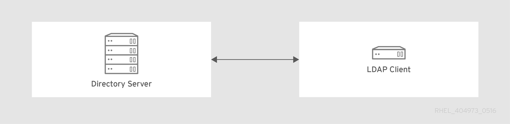
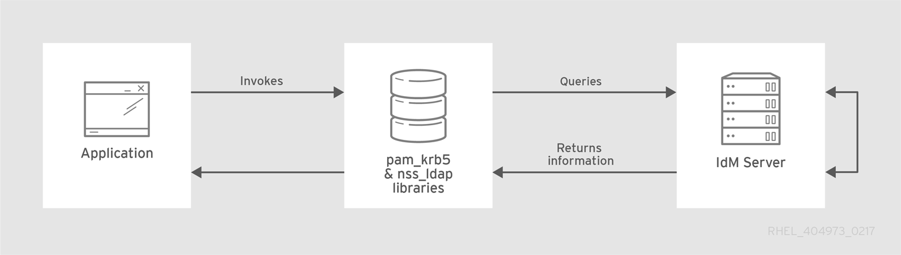

# Migrating to Identity Management on RHEL 10

* * *

Red Hat Enterprise Linux 10

## Upgrading an IdM environment from RHEL 9 to RHEL 10 and migrating external LDAP solutions to IdM

Red Hat Customer Content Services

[Legal Notice](#idm139750911848336)

**Abstract**

Red Hat only supports Identity Management (IdM) on Red Hat Enterprise Linux (RHEL). If you run IdM on RHEL 9 or an LDAP directory, you can migrate these solutions to IdM on RHEL 10.

* * *

<h2 id="providing-feedback-on-red-hat-documentation">Providing feedback on Red Hat documentation</h2>

We appreciate your feedback on our documentation. Let us know how we can improve it.

**Submitting feedback through Jira (account required)**

1. Log in to the [Jira](https://issues.redhat.com/projects/RHELDOCS/issues) website.
2. Click **Create** in the top navigation bar.
3. Enter a descriptive title in the **Summary** field.
4. Enter your suggestion for improvement in the **Description** field. Include links to the relevant parts of the documentation.
5. Click **Create** at the bottom of the dialogue.

<h2 id="identity-management-upgrade-helper-app">Chapter 1. Identity Management Upgrade Helper app</h2>

The Identity Management Upgrade Helper app helps you prepare for upgrading your IdM deployment. You can use the app to create a customized upgrade plan with specific step-by-step instructions for the entire process, from setting up a new replica to decommissioning the old server.

To use this app, see [Identity Management Upgrade Helper](https://access.redhat.com/labs/idmupgradehelper/) on the Red Hat Customer Portal.

<h2 id="migrating-your-idm-environment-from-rhel-9-servers-to-rhel-10-servers">Chapter 2. Migrating your IdM environment from RHEL 9 servers to RHEL 10 servers</h2>

Upgrading an IdM environment from RHEL 9 to RHEL 10 requires adding new RHEL 10 replicas to the existing deployment, transferring CA and CRL roles, and then retiring the RHEL 9 servers. In-place upgrades of IdM servers are not supported.

Migration involves moving all Identity Management (IdM) data and configuration from a Red Hat Enterprise Linux (RHEL) 9 server to a RHEL 10 server.

<h3 id="overview-of-the-idm-migration-procedure">2.1. Overview of the IdM migration procedure</h3>

Understand the main procedure steps, optional procedures for complex deployments, and migration constraints to help you plan your IdM migration from RHEL 9 to RHEL 10.

Important

Migrate all servers in an IdM deployment as quickly as possible. Mixing different IdM versions in the same deployment for extended periods of time can lead to incompatibilities or possibly even unrecoverable data corruption.

Warning

- Performing an in-place upgrade of RHEL 9 IdM servers and IdM server nodes to RHEL 10 is not supported.
- Before migrating your IdM environment to RHEL 10, Red Hat recommends to first run `ipa-healthcheck` to prevent issues.
- For more information about adding a RHEL 10 IdM replica in FIPS mode to a RHEL 9 IdM deployment in FIPS mode, see the [Identity Management](https://docs.redhat.com/en/documentation/red_hat_enterprise_linux/10/html/considerations_in_adopting_rhel_10/index#identity-management) section in *Considerations in adopting RHEL 10*.

<!--THE END-->

- Migrating directly to RHEL 10 from RHEL 8 or earlier versions is not supported. To properly update your IdM data, you must perform incremental migrations.
  
  For example, to migrate a RHEL 8 IdM environment to RHEL 10:
  
  1. Migrate from RHEL 8 servers to RHEL 9 servers. See [Migrating to Identity Management on RHEL 9](https://docs.redhat.com/en/documentation/red_hat_enterprise_linux/9/html/migrating_to_identity_management_on_rhel_9/index).
  2. Migrate from RHEL 9 servers to RHEL 10 servers, as described in this section.

The main migration procedure includes:

1. Configuring a RHEL 10 IdM server and adding it as a replica to your current RHEL 9 IdM environment. For details, see [Installing the RHEL 10 replica](#installing-the-rhel-10-replica "2.7. Installing the RHEL 10 replica").
2. Making the RHEL 10 server the certificate authority (CA) renewal server. For details, see [Assigning the CA renewal server role to the RHEL 10 IdM server](#assigning-the-ca-renewal-server-role-to-the-rhel-10-idm-server "2.8. Assigning the CA renewal server role to the RHEL 10 IdM server").
3. Stopping the generation of the certificate revocation list (CRL) on the RHEL 9 server and redirecting CRL requests to RHEL 10. For details, see [Stopping CRL generation on a RHEL 9 IdM CA server](#stopping-crl-generation-on-an-idm-server "2.9. Stopping CRL generation on an IdM server").
4. Starting the generation of the CRL on the RHEL 10 server. For details, see [Starting CRL generation on the new RHEL 10 IdM CA server](#starting-crl-generation-on-the-new-rhel-10-idm-ca-server "2.10. Starting CRL generation on the new RHEL 10 IdM CA server").
5. Stopping and decommissioning the original RHEL 9 CA renewal server. For details, see [Stopping and decommissioning the RHEL 9 server](#stopping-and-decommissioning-the-rhel-9-server "2.12. Stopping and decommissioning the RHEL 9 server").

**Additional procedures for large or complex deployments**

The following optional procedures are strongly recommended for large, geographically distributed, or mission-critical IdM deployments to ensure topology health and prevent service disruption:

- [Performing an inventory of roles in your IdM topology](#performing-an-inventory-of-roles-in-your-idm-topology "2.4. Performing an inventory of roles in your IdM topology")
- [Recording DNA ID ranges before migration](#recording-dna-id-ranges-before-migration "2.5. Recording DNA ID ranges before migration")
- [Reusing an IdM server hostname safely](#reusing-an-idm-server-hostname-safely "2.6. Reusing an IdM server hostname safely")
- [Updating IdM clients that are pinned to specific servers](#updating-idm-clients-that-are-pinned-to-specific-servers "2.11. Updating IdM clients that are pinned to specific servers")

Before beginning your migration, review the strategy guidance and consider which optional procedures apply to your deployment:

- [Strategies for migrating large and standard IdM deployments](#strategies-for-migrating-large-and-standard-idm-deployments "2.2. Strategies for migrating large and standard IdM deployments")

In the following procedures:

- `rhel10.example.com` is the RHEL 10 system that will become the new CA renewal server.
- `rhel9.example.com` is the original RHEL 9 CA renewal server.
  
  If your IdM deployment does not use an IdM CA, any IdM server running on RHEL 9 can be `rhel9.example.com`.

<h3 id="strategies-for-migrating-large-and-standard-idm-deployments">2.2. Strategies for migrating large and standard IdM deployments</h3>

Learn about the additional inventory and validation steps needed when migrating large or complex Identity Management (IdM) deployments.

While the core migration steps (installing a new replica, establishing it as a CA renewal server, and decommissioning the old server) apply to all deployments, large environments benefit from stricter inventory and validation processes. The following table highlights the recommended additional steps for large or complex topologies compared to a standard single-server or small-cluster migration.

| Step                                 | Standard Migration                 | Large/Complex Migration                                                                                                                                                        |
|:-------------------------------------|:-----------------------------------|:-------------------------------------------------------------------------------------------------------------------------------------------------------------------------------|
| **1. Inventorying Topology**         | Optional.                          | **Strongly Recommended.** Document all server roles and replication agreements to ensure no critical service (CA, DNS, KRA, AD Trust) is lost during replica replacement.      |
| **2. Recording DNA ID Ranges**       | Optional.                          | **Strongly Recommended.** Record assigned ID ranges to prevent exhaustion if a server holding a large range is decommissioned without reassignment.                            |
| **3. Reusing Server Hostname**       | Rarely needed.                     | **Conditional.** If reusing hostnames, wait for replication to fully converge before re-installing. Rapid removal and addition can cause conflicts in high-latency topologies. |
| **4. Installing New Replica**        | Required.                          | Required. Ensure the new replica is installed with the same roles as the one it replaces. Run Healthcheck during verification to catch issues early.                           |
| **5. Assigning CA Renewal Role**     | Required (if using integrated CA). | Required (if using integrated CA). Verify the role assignment replicates before proceeding.                                                                                    |
| **6. Managing CRL Generation**       | Required (if using integrated CA). | Required (if using integrated CA). Stop CRL on old server, redirect requests, start on new server.                                                                             |
| **7. Updating Client Configuration** | Automatic (mostly).                | **Manual updates may be needed.** Clients pinned to specific servers in `ipa.conf` or `sssd.conf` must be updated to point to new replicas.                                    |
| **8. Decommissioning Old Server**    | Required.                          | Required. Verify no unique roles are lost and allow replication to converge.                                                                                                   |

When planning migrations for large deployments, consider the following strategic factors:

- **Maintain Redundancy:** Ensure at least one other server provides critical services (CA, DNS, KRA, AD Trust) before decommissioning a replica.
- **Replication Lag:** In geographically distributed deployments, allow additional time between topology changes for replication to converge. Rapid remove/add cycles can create conflicts that are difficult to resolve across high-latency links.
- **Batching:** For very large topologies, migrate site-by-site, validating health after each wave. Avoid decommissioning all servers in a single site simultaneously.

<h3 id="preparing-for-migrating-idm-from-rhel-9-to-10">2.3. Preparing for migrating IdM from RHEL 9 to 10</h3>

Review all prerequisites for both hosts, including software updates, client enrollment, and server requirements, to ensure a successful and conflict-free transfer of your IdM environment.

Note

If you want to use hardware security modules (HSMs) to store your CA and KRA keys and certificates, you cannot upgrade an existing installation where the keys were not generated on an HSM to an HSM-based install.

**Procedure**

- On `rhel9.example.com`:
  
  1. Upgrade the system to the latest RHEL 9 version.
  2. Update the **ipa-*** packages to their latest version:
     
     ```
     dnf update ipa-*
     ```
     
     ```plaintext
     [root@rhel9 ~]# dnf update ipa-*
     ```
  
  Warning
  
  When upgrading multiple Identity Management (IdM) servers, wait at least 10 minutes between each upgrade.
  
  When two or more servers are upgraded simultaneously or with only short intervals between the upgrades, there is not enough time to replicate the post-upgrade data changes throughout the topology, which can result in conflicting replication events.
- On `rhel10.example.com`:
  
  1. Install the latest version of Red Hat Enterprise Linux on the system. For more information, see [Interactively installing RHEL from installation media](https://docs.redhat.com/en/documentation/red_hat_enterprise_linux/10/html/interactively_installing_rhel_from_installation_media/index).
  2. Ensure the system is an IdM client enrolled into the domain for which `rhel9.example.com` IdM server is authoritative. For more information, see [Installing an IdM client: Basic scenario](https://docs.redhat.com/en/documentation/red_hat_enterprise_linux/10/html/installing_identity_management/index#installing-an-idm-client).
  3. Ensure the system meets the requirements for IdM server installation. See [Preparing the system for IdM server installation](https://docs.redhat.com/en/documentation/red_hat_enterprise_linux/10/html/installing_identity_management/index#preparing-the-system-for-idm-server-installation).
  4. Ensure you know the time server `rhel9.example.com` is synchronized with:
     
     ```
     ntpstat
     synchronised to NTP server (ntp.example.com) at stratum 3
        time correct to within 42 ms
        polling server every 1024 s
     ```
     
     ```plaintext
     [root@rhel9 ~]# ntpstat
     synchronised to NTP server (ntp.example.com) at stratum 3
        time correct to within 42 ms
        polling server every 1024 s
     ```
  5. Ensure the system is authorized for the installation of an IdM replica. See [Authorizing the installation of a replica on an IdM client](https://docs.redhat.com/en/documentation/red_hat_enterprise_linux/10/html-single/installing_identity_management/index#authorizing-the-installation-of-a-replica-on-an-idm-client).
  6. Update the **ipa-*** packages to their latest version:
     
     ```
     dnf update ipa-*
     ```
     
     ```plaintext
     [root@rhel9 ~]# dnf update ipa-*
     ```
     
     Note
     
     For large or geographically distributed deployments, consider completing the following optional but recommended procedures before beginning the migration:
     
     - [Performing an inventory of roles in your IdM topology](#performing-an-inventory-of-roles-in-your-idm-topology "2.4. Performing an inventory of roles in your IdM topology")
     - [Recording DNA ID ranges before migration](#recording-dna-id-ranges-before-migration "2.5. Recording DNA ID ranges before migration")
     
     These steps help ensure service continuity and prevent issues during the migration.

**Additional resources**

- [Planning your CA services](https://docs.redhat.com/en/documentation/red_hat_enterprise_linux/10/html-single/planning_identity_management/index#planning-your-ca-services)
- [Planning your DNS services and host names](https://docs.redhat.com/en/documentation/red_hat_enterprise_linux/10/html-single/planning_identity_management/index#planning-your-dns-services-and-host-names)
- [Planning a cross-forest trust between IdM and AD](https://docs.redhat.com/en/documentation/red_hat_enterprise_linux/10/html-single/planning_identity_management/index#planning-a-cross-forest-trust-between-idm-and-ad)
- [Installing packages required for an IdM server](https://docs.redhat.com/en/documentation/red_hat_enterprise_linux/10/html-single/installing_identity_management/index#installing-packages-required-for-an-idm-server)
- [Upgrading from RHEL 9 to RHEL 10](https://docs.redhat.com/en/documentation/red_hat_enterprise_linux/9/html-single/upgrading_from_rhel_8_to_rhel_9/index)

<h3 id="performing-an-inventory-of-roles-in-your-idm-topology">2.4. Performing an inventory of roles in your IdM topology</h3>

Use this procedure to capture the current IdM server roles and replication layout before you replace replicas. This procedure is optional but strongly recommended, especially for large or complex topologies, to prevent role coverage gaps.

**Prerequisites**

- You are logged in to an IdM server as an administrator.

**Procedure**

1. List the servers in the topology and the roles enabled on each server:
   
   ```
   ipa server-find --all
   ---------------------
   2 IPA servers matched
   ---------------------
     dn: cn=rhel9-1.example.com,cn=masters,cn=ipa,cn=etc,dc=example,dc=com
     Server name: rhel9-1.example.com
     Managed suffixes: domain, ca
     Min domain level: 1
     Max domain level: 1
     Enabled server roles: AD trust agent, AD trust controller, CA server, DNS server, IPA master, KRA server
   
     dn: cn=rhel9-2.example.com,cn=masters,cn=ipa,cn=etc,dc=example,dc=com
     Server name: rhel9-2.example.com
     Managed suffixes: domain, ca
     Min domain level: 1
     Max domain level: 1
     Enabled server roles: AD trust agent, AD trust controller, CA server, IPA master
   ----------------------------
   Number of entries returned 2
   ----------------------------
   ```
   
   ```plaintext
   [root@rhel9 ~]# ipa server-find --all
   ---------------------
   2 IPA servers matched
   ---------------------
     dn: cn=rhel9-1.example.com,cn=masters,cn=ipa,cn=etc,dc=example,dc=com
     Server name: rhel9-1.example.com
     Managed suffixes: domain, ca
     Min domain level: 1
     Max domain level: 1
     Enabled server roles: AD trust agent, AD trust controller, CA server, DNS server, IPA master, KRA server
   
     dn: cn=rhel9-2.example.com,cn=masters,cn=ipa,cn=etc,dc=example,dc=com
     Server name: rhel9-2.example.com
     Managed suffixes: domain, ca
     Min domain level: 1
     Max domain level: 1
     Enabled server roles: AD trust agent, AD trust controller, CA server, IPA master
   ----------------------------
   Number of entries returned 2
   ----------------------------
   ```
2. Verify that the CA renewal master role is assigned to exactly one server:
   
   ```
   ipa config-show | grep "CA renewal master"
   IPA CA renewal master: rhel9-1.example.com
   ```
   
   ```plaintext
   [root@rhel9 ~]# ipa config-show | grep "CA renewal master"
   IPA CA renewal master: rhel9-1.example.com
   ```
3. Verify that the DNSSEC key master role is assigned to exactly one server:
   
   ```
   ipa dnsconfig-show | grep 'DNSSec key master'
   IPA DNSSec key master: rhel9-1.example.com
   ```
   
   ```plaintext
   [root@rhel9 ~]# ipa dnsconfig-show | grep 'DNSSec key master'
   IPA DNSSec key master: rhel9-1.example.com
   ```
4. Record which servers provide other critical roles (such as CA, DNS, KRA, AD trust agent, and AD trust controller). You will reference this list when assigning roles to new replicas or validating redundancy during migration.
5. If your IdM deployment is in a trust with an Active Directory (AD) forest, plan to ensure that during the migration:
   
   1. At least one trust controller remains online at all times.
   2. Whenever possible, each replica also runs the trust agent so that clients can resolve AD users regardless of which server they contact.
6. Review replication agreements and the site layout to confirm that each site keeps redundant connectivity throughout the migration: [Replica topology examples](https://docs.redhat.com/en/documentation/red_hat_enterprise_linux/10/html/planning_identity_management/planning-the-replica-topology#replica-topology-examples).
7. Ensure that the number of replication agreements per server aligns with the long-term guideline of four or fewer links: [Guidelines for connecting IdM replicas in a topology](https://docs.redhat.com/en/documentation/red_hat_enterprise_linux/10/html/planning_identity_management/planning-the-replica-topology#guidelines-for-determining-the-appropriate-number-of-idm-replicas-in-a-topology).
8. Run `ipa-healthcheck` to identify replication issues before you modify the topology:
   
   ```
   ipa-healthcheck --source=ipahealthcheck.ds.replication --source=ipahealthcheck.ipa.topology
   ```
   
   ```plaintext
   [root@rhel9 ~]# ipa-healthcheck --source=ipahealthcheck.ds.replication --source=ipahealthcheck.ipa.topology
   ```

<h3 id="recording-dna-id-ranges-before-migration">2.5. Recording DNA ID ranges before migration</h3>

Document the Distributed Numeric Assignment (DNA) ID ranges that are currently allocated so that you can reassign them after a server is removed during migration. Recording DNA ranges is optional but strongly recommended, especially for large or complex topologies, to prevent blocking user creation.

**Prerequisites**

- You are logged in to an IdM server as an administrator.

**Procedure**

1. On each server that will be decommissioned, display the DNA ID ranges currently allocated:
   
   ```
   ipa-replica-manage dnarange-show
   ```
   
   ```plaintext
   [root@rhel9 ~]# ipa-replica-manage dnarange-show
   ```
2. Display the next DNA range queued for allocation so you know what will be assigned after the current sub-range is consumed:
   
   ```
   ipa-replica-manage dnanextrange-show
   ```
   
   ```plaintext
   [root@rhel9 ~]# ipa-replica-manage dnanextrange-show
   ```
3. Record the collected ranges in your migration notes. You will reference these values when ensuring DNA range coverage on the new replica before decommissioning the old server. Losing a server that owns an unrecorded sub-range can block the creation of new users or groups.

**Additional resources**

- [Displaying the currently assigned DNA ID ranges](https://docs.redhat.com/en/documentation/red_hat_enterprise_linux/10/html/managing_idm_users_groups_hosts_and_access_control_rules/adjusting-id-ranges-manually#displaying-currently-assigned-dna-id-ranges)
- [Assigning DNA ID ranges manually](https://docs.redhat.com/en/documentation/red_hat_enterprise_linux/10/html/managing_idm_users_groups_hosts_and_access_control_rules/adjusting-id-ranges-manually#assigning-dna-id-ranges-manually)

<h3 id="reusing-an-idm-server-hostname-safely">2.6. Reusing an IdM server hostname safely</h3>

Follow this procedure when you need to reuse an existing IdM server hostname for a new replica during migration. Hostname reuse is typically required when:

- DNS or firewall rules are tightly coupled to specific hostnames
- Client configurations explicitly reference the hostname that must be preserved
- Network or security policies require specific server names

This procedure is optional; use it only when hostname reuse is necessary. For large or geographically distributed topologies, extra care is needed to prevent replication conflicts when reusing hostnames.

**Prerequisites**

- You have administrative access to the IdM topology and to the server being replaced.
- DNS records for the hostname can be updated if the IP address changes.

Warning

This procedure describes a specialized workflow for reusing an existing server hostname during migration. Only follow this procedure if you specifically need to preserve a hostname due to DNS, firewall rules, or client configuration requirements.

If you are performing a standard migration with new hostnames, skip this procedure and proceed directly to installing your new replica.

**Procedure**

1. Run IdM Healthcheck on the server you plan to remove and resolve any issues so the topology is in a clean state before you begin: [Using IdM Healthcheck to monitor your IdM environment](https://docs.redhat.com/en/documentation/red_hat_enterprise_linux/10/html-single/using_idm_healthcheck_to_monitor_your_idm_environment/index).
2. Remove the server from the topology on a different replica. For example, to remove `rhel9.example.com`:
   
   ```
   ipa-replica-manage del rhel9.example.com --cleanup
   ```
   
   ```plaintext
   [root@rhel10-replica ~]# ipa-replica-manage del rhel9.example.com --cleanup
   ```
   
   Confirm the command completes successfully and that the removal is replicated to the remaining servers.
3. On the RHEL 9 host you are decommissioning, uninstall the IdM server to clean up services and certificates:
   
   ```
   ipa-server-install --uninstall
   ```
   
   ```plaintext
   [root@rhel9 ~]# ipa-server-install --uninstall
   ```
4. Allow replication to converge across all remaining servers before you reinstall a replica with the same hostname. In high-latency environments, wait for at least one full replication cycle and confirm the host no longer appears in `ipa server-find` output.
5. After replication has fully converged and you have confirmed the old server no longer appears in the topology, proceed to install your new RHEL 10 replica using the reused hostname. See [Installing the RHEL 10 replica](#installing-the-rhel-10-replica "2.7. Installing the RHEL 10 replica").
6. After installation completes, run IdM Healthcheck on the new RHEL 10 replica to verify that no replication conflicts were introduced:
   
   ```
   ipa-healthcheck
   ```
   
   ```plaintext
   [root@rhel9 ~]# ipa-healthcheck
   ```
   
   Pay particular attention to replication-related checks to ensure the hostname reuse did not cause conflicts.

<h3 id="installing-the-rhel-10-replica">2.7. Installing the RHEL 10 replica</h3>

You must install the RHEL 10 IdM server and configure it as a replica within your existing RHEL 9 topology. This begins the migration process by transferring the complete IdM data and duplicating all existing server roles to the new host.

**Procedure**

1. List which server roles are present in your RHEL 9 environment:
   
   ```
   ipa server-role-find --status enabled --server rhel9.example.com
   ----------------------
   3 server roles matched
   ----------------------
     Server name: rhel9.example.com
     Role name: CA server
     Role status: enabled
   
     Server name: rhel9.example.com
     Role name: DNS server
     Role status: enabled
   [... output truncated ...]
   ```
   
   ```plaintext
   [root@rhel9 ~]# ipa server-role-find --status enabled --server rhel9.example.com
   ----------------------
   3 server roles matched
   ----------------------
     Server name: rhel9.example.com
     Role name: CA server
     Role status: enabled
   
     Server name: rhel9.example.com
     Role name: DNS server
     Role status: enabled
   [... output truncated ...]
   ```
2. Optional: If you want to use the same per-server forwarders for `rhel10.example.com` that `rhel9.example.com` is using, view the per-server forwarders for `rhel9.example.com`:
   
   ```
   ipa dnsserver-show rhel9.example.com
   -----------------------------
   1 DNS server matched
   -----------------------------
     Server name: rhel9.example.com
     SOA mname: rhel9.example.com.
     Forwarders: 192.0.2.20
     Forward policy: only
   --------------------------------------------------
   Number of entries returned 1
   --------------------------------------------------
   ```
   
   ```plaintext
   [root@rhel9 ~]# ipa dnsserver-show rhel9.example.com
   -----------------------------
   1 DNS server matched
   -----------------------------
     Server name: rhel9.example.com
     SOA mname: rhel9.example.com.
     Forwarders: 192.0.2.20
     Forward policy: only
   --------------------------------------------------
   Number of entries returned 1
   --------------------------------------------------
   ```

<!--THE END-->

1. Review the replication agreements topology using the steps in either [Viewing replication topology using the WebUI](https://docs.redhat.com/en/documentation/red_hat_enterprise_linux/10/html/managing_replication_in_identity_management/managing-replication-topology#viewing-and-modifying-the-visual-representation-of-the-replication-topology-using-the-webui) or [Viewing topology suffixes using the CLI](https://docs.redhat.com/en/documentation/red_hat_enterprise_linux/10/html/managing_replication_in_identity_management/managing-replication-topology#viewing-topology-suffixes-using-the-cli) and [Viewing topology segments using the CLI](https://docs.redhat.com/en/documentation/red_hat_enterprise_linux/10/html/managing_replication_in_identity_management/managing-replication-topology#viewing-topology-segments-using-the-cli).
2. Install the IdM server software on `rhel10.example.com` to configure it as a replica of the RHEL 9 IdM server, including all the server roles present on `rhel9.example.com`. To install the roles from the example above, use these options with the `ipa-replica-install` command:
   
   - `--setup-ca` to set up the Certificate System component
   - `--setup-dns` and `--forwarder` to configure an integrated DNS server and set a per-server forwarder to take care of DNS queries that go outside the IdM domain
     
     Note
     
     Additionally, if your IdM deployment is in a trust relationship with Active Directory (AD), add the `--setup-adtrust` option to the `ipa-replica-install` command to configure AD trust capability on `rhel10.example.com`.
   - `--ntp-server` to specify an NTP server or `--ntp-pool` to specify a pool of NTP servers
     
     To set up an IdM server with the IP address of 192.0.2.1 that uses a per-server forwarder with the IP address of 192.0.2.20 and synchronizes with the `ntp.example.com` NTP server:
     
     ```
     ipa-replica-install --setup-ca --ip-address 192.0.2.1 --setup-dns --forwarder 192.0.2.20 --ntp-server ntp.example.com
     ```
     
     ```plaintext
     [root@rhel10 ~]# ipa-replica-install --setup-ca --ip-address 192.0.2.1 --setup-dns --forwarder 192.0.2.20 --ntp-server ntp.example.com
     ```
     
     You do not need to specify the RHEL 9 IdM server itself because if DNS is working correctly, `rhel10.example.com` will find it using DNS autodiscovery.
3. Optional: Add an `_ntp._udp` service (SRV) record for your external `NTP` time server to the DNS of the newly-installed IdM server, **rhel10.example.com**. The presence of the SRV record for the time server in IdM DNS ensures that future RHEL 10 replica and client installations are automatically configured to synchronize with the time server used by **rhel10.example.com**. This is because `ipa-client-install` looks for the `_ntp._udp` DNS entry unless `--ntp-server` or `--ntp-pool` options are provided on the install command-line interface (CLI).
4. Create any replication agreements needed to re-create the previous topology using the steps in [Setting up replication between two servers using the Web UI](https://docs.redhat.com/en/documentation/red_hat_enterprise_linux/10/html/managing_replication_in_identity_management/managing-replication-topology#managing-topology-ui-set-up) or [Setting up replication between two servers using the CLI](https://docs.redhat.com/en/documentation/red_hat_enterprise_linux/10/html/managing_replication_in_identity_management/managing-replication-topology#setting-up-replication-between-two-servers-using-the-cli).

**Verification**

1. Verify that the IdM services are running on `rhel10.example.com`:
   
   ```
   ipactl status
   Directory Service: RUNNING
   [... output truncated ...]
   ipa: INFO: The ipactl command was successful
   ```
   
   ```plaintext
   [root@rhel10 ~]# ipactl status
   Directory Service: RUNNING
   [... output truncated ...]
   ipa: INFO: The ipactl command was successful
   ```
2. Run `ipa-healthcheck` to identify any issues with the new replica:
   
   ```
   ipa-healthcheck
   ```
   
   ```plaintext
   [root@rhel10 ~]# ipa-healthcheck
   ```
3. Verify that server roles for `rhel10.example.com` are the same as for `rhel9.example.com`:
   
   ```
   kinit admin
   ipa server-role-find --status enabled --server rhel10.example.com
   ----------------------
   2 server roles matched
   ----------------------
     Server name: rhel10.example.com
     Role name: CA server
     Role status: enabled
   
     Server name: rhel10.example.com
     Role name: DNS server
     Role status: enabled
   ```
   
   ```plaintext
   [root@rhel10 ~]# kinit admin
   [root@rhel10 ~]# ipa server-role-find --status enabled --server rhel10.example.com
   ----------------------
   2 server roles matched
   ----------------------
     Server name: rhel10.example.com
     Role name: CA server
     Role status: enabled
   
     Server name: rhel10.example.com
     Role name: DNS server
     Role status: enabled
   ```
4. Optional: Display details about the replication agreement between `rhel9.example.com` and `rhel10.example.com`:
   
   ```
   ipa-csreplica-manage list --verbose rhel10.example.com
   Directory Manager password:
   
   rhel9.example.com
   last init status: None
   last init ended: 1970-01-01 00:00:00+00:00
   last update status: Error (0) Replica acquired successfully: Incremental update succeeded
   last update ended: 2019-02-13 13:55:13+00:00
   ```
   
   ```plaintext
   [root@rhel10 ~]# ipa-csreplica-manage list --verbose rhel10.example.com
   Directory Manager password:
   
   rhel9.example.com
   last init status: None
   last init ended: 1970-01-01 00:00:00+00:00
   last update status: Error (0) Replica acquired successfully: Incremental update succeeded
   last update ended: 2019-02-13 13:55:13+00:00
   ```
5. Optional: If your IdM deployment is in a trust relationship with AD, verify that it is working:
   
   1. [Verify the Kerberos configuration](https://docs.redhat.com/en/documentation/red_hat_enterprise_linux/10/html-single/installing_trust_between_idm_and_ad/index#verifying-the-kerberos-configuration)
   2. Attempt to resolve an AD user on `rhel10.example.com`:
      
      ```
      id aduser@ad.domain
      ```
      
      ```plaintext
      [root@rhel10 ~]# id aduser@ad.domain
      ```
6. Verify that `rhel10.example.com` is synchronized with the `NTP` server:
   
   ```
   chronyc tracking
   Reference ID    : CB00710F (ntp.example.com)
   Stratum         : 3
   Ref time (UTC)  : Wed Feb 16 09:49:17 2022
   [... output truncated ...]
   ```
   
   ```plaintext
   [root@rhel9 ~]# chronyc tracking
   Reference ID    : CB00710F (ntp.example.com)
   Stratum         : 3
   Ref time (UTC)  : Wed Feb 16 09:49:17 2022
   [... output truncated ...]
   ```

**Additional resources**

- [DNS configuration priorities](https://docs.redhat.com/en/documentation/red_hat_enterprise_linux/10/html-single/working_with_dns_in_identity_management/index#dns-configuration-priorities)
- [Time service requirements for IdM](https://docs.redhat.com/en/documentation/red_hat_enterprise_linux/10/html-single/installing_identity_management/index#time-service-requirements-for-idm)

<h3 id="assigning-the-ca-renewal-server-role-to-the-rhel-10-idm-server">2.8. Assigning the CA renewal server role to the RHEL 10 IdM server</h3>

If your IdM deployment uses an embedded certificate authority (CA), assign the CA renewal server role to the Red Hat Enterprise Linux (RHEL) 10 IdM server to ensure continued certificate management after migration.

**Procedure**

1. On `rhel10.example.com`, configure `rhel10.example.com` as the new CA renewal server:
   
   ```
   ipa config-mod --ca-renewal-master-server rhel10.example.com
     ...
     IPA masters: rhel9.example.com, rhel10.example.com
     IPA CA servers: rhel9.example.com, rhel10.example.com
     IPA CA renewal master: rhel10.example.com
   ```
   
   ```plaintext
   [root@rhel10 ~]# ipa config-mod --ca-renewal-master-server rhel10.example.com
     ...
     IPA masters: rhel9.example.com, rhel10.example.com
     IPA CA servers: rhel9.example.com, rhel10.example.com
     IPA CA renewal master: rhel10.example.com
   ```
   
   The output confirms that the update was successful.
2. On `rhel10.example.com`, enable the certificate updater task:
   
   1. Open the `/etc/pki/pki-tomcat/ca/CS.cfg` configuration file for editing.
   2. Remove the `ca.certStatusUpdateInterval` entry, or set it to the desired interval in seconds. The default value is `600`.
   3. Save and close the `/etc/pki/pki-tomcat/ca/CS.cfg` configuration file.
   4. Restart IdM services:
      
      ```
      ipactl restart
      ```
      
      ```plaintext
      [user@rhel10 ~]$ ipactl restart
      ```
3. On `rhel9.example.com`, disable the certificate updater task:
   
   1. Open the `/etc/pki/pki-tomcat/ca/CS.cfg` configuration file for editing.
   2. Change `ca.certStatusUpdateInterval` to `0`, or add the following entry if it does not exist:
      
      ```
      ca.certStatusUpdateInterval=0
      ```
      
      ```plaintext
      ca.certStatusUpdateInterval=0
      ```
   3. Save and close the `/etc/pki/pki-tomcat/ca/CS.cfg` configuration file.
   4. Restart IdM services:
      
      ```
      ipactl restart
      ```
      
      ```plaintext
      [user@rhel9 ~]$ ipactl restart
      ```

<h3 id="stopping-crl-generation-on-an-idm-server">2.9. Stopping CRL generation on an IdM server</h3>

Use the `ipa-crlgen-manage` command to stop generating the Certificate Revocation List (CRL) on the IdM CRL publisher server. You must disable CRL generation on the current server before enabling it on a new server, because only one server should generate the CRL at a time.

**Prerequisites**

- You must be logged in as root.

**Procedure**

1. Check if your server is generating the CRL:
   
   ```
   ipa-crlgen-manage status
   CRL generation: enabled
   Last CRL update: 2019-10-31 12:00:00
   Last CRL Number: 6
   The ipa-crlgen-manage command was successful
   ```
   
   ```plaintext
   [root@server ~]# ipa-crlgen-manage status
   CRL generation: enabled
   Last CRL update: 2019-10-31 12:00:00
   Last CRL Number: 6
   The ipa-crlgen-manage command was successful
   ```
2. Stop generating the CRL on the server:
   
   ```
   ipa-crlgen-manage disable
   Stopping pki-tomcatd
   Editing /var/lib/pki/pki-tomcat/conf/ca/CS.cfg
   Starting pki-tomcatd
   Editing /etc/httpd/conf.d/ipa-pki-proxy.conf
   Restarting httpd
   CRL generation disabled on the local host. Please make sure to configure CRL generation on another master with ipa-crlgen-manage enable.
   The ipa-crlgen-manage command was successful
   ```
   
   ```plaintext
   [root@server ~]# ipa-crlgen-manage disable
   Stopping pki-tomcatd
   Editing /var/lib/pki/pki-tomcat/conf/ca/CS.cfg
   Starting pki-tomcatd
   Editing /etc/httpd/conf.d/ipa-pki-proxy.conf
   Restarting httpd
   CRL generation disabled on the local host. Please make sure to configure CRL generation on another master with ipa-crlgen-manage enable.
   The ipa-crlgen-manage command was successful
   ```
3. Check if the server stopped generating CRL:
   
   ```
   ipa-crlgen-manage status
   ```
   
   ```plaintext
   [root@server ~]# ipa-crlgen-manage status
   ```
   
   The server stopped generating the CRL. The next step is to enable CRL generation on the IdM replica.

<h3 id="starting-crl-generation-on-the-new-rhel-10-idm-ca-server">2.10. Starting CRL generation on the new RHEL 10 IdM CA server</h3>

If your IdM deployment uses an embedded certificate authority (CA), start Certificate Revocation List (CRL) generation on the new Red Hat Enterprise Linux (RHEL) 10 IdM CA server after stopping it on the old server to maintain certificate revocation services.

**Prerequisites**

- You must be logged in as root on the **rhel10.example.com** machine.

**Procedure**

1. To start generating the CRL on **rhel10.example.com**, use the `ipa-crlgen-manage enable` command:
   
   ```
   ipa-crlgen-manage enable
   Stopping pki-tomcatd
   Editing /var/lib/pki/pki-tomcat/conf/ca/CS.cfg
   Starting pki-tomcatd
   Editing /etc/httpd/conf.d/ipa-pki-proxy.conf
   Restarting httpd
   Forcing CRL update
   CRL generation enabled on the local host. Please make sure to have only a single CRL generation master.
   The ipa-crlgen-manage command was successful
   ```
   
   ```plaintext
   [root@rhel10 ~]# ipa-crlgen-manage enable
   Stopping pki-tomcatd
   Editing /var/lib/pki/pki-tomcat/conf/ca/CS.cfg
   Starting pki-tomcatd
   Editing /etc/httpd/conf.d/ipa-pki-proxy.conf
   Restarting httpd
   Forcing CRL update
   CRL generation enabled on the local host. Please make sure to have only a single CRL generation master.
   The ipa-crlgen-manage command was successful
   ```

**Verification**

- To check if CRL generation is enabled, use the `ipa-crlgen-manage status` command:
  
  ```
  ipa-crlgen-manage status
  CRL generation: enabled
  Last CRL update: 2021-10-31 12:10:00
  Last CRL Number: 7
  The ipa-crlgen-manage command was successful
  ```
  
  ```plaintext
  [root@rhel10 ~]# ipa-crlgen-manage status
  CRL generation: enabled
  Last CRL update: 2021-10-31 12:10:00
  Last CRL Number: 7
  The ipa-crlgen-manage command was successful
  ```

<h3 id="updating-idm-clients-that-are-pinned-to-specific-servers">2.11. Updating IdM clients that are pinned to specific servers</h3>

Use this procedure to update clients that do not rely solely on DNS service discovery after you replace or decommission IdM replicas. Updating pinned clients is optional but strongly recommended for large or complex topologies where static configuration is common.

**Prerequisites**

- You have root access to each client that requires updates.
- Replacement IdM servers are in service and reachable.

**Procedure**

1. Update the system resolvers on affected clients so they point to the current IdM DNS servers. Adjust `/etc/resolv.conf` or your network configuration tooling to remove references to retired servers.
2. If the client uses the fallback enrollment server defined in `/etc/ipa/default.conf`, replace the hostname in both of the following parameters with an active IdM server:
   
   ```
   xmlrpc_uri = https://ipa_new.example.com/ipa/xml
   server = ipa_new.example.com
   ```
   
   ```plaintext
   xmlrpc_uri = https://ipa_new.example.com/ipa/xml
   server = ipa_new.example.com
   ```
3. Review the `ipa_server` parameter in `/etc/sssd/sssd.conf`:
   
   - If it lists specific servers, update the list to include only active replicas or switch to SRV-only discovery by using `srv`.
   - If it references the retired hostname, replace it with the new server names.
4. Restart SSSD to apply the updates:
   
   ```
   systemctl restart sssd
   ```
   
   ```plaintext
   [root@client ~]# systemctl restart sssd
   ```
5. Test authentication and lookups from the client to confirm it can reach the updated servers.

<h3 id="stopping-and-decommissioning-the-rhel-9-server">2.12. Stopping and decommissioning the RHEL 9 server</h3>

After setting up the RHEL 10 replica and transferring all critical Identity Management (IdM) roles, you must safely decommission the RHEL 9 IdM server. This final step ensures that all identity roles and data are cleanly transferred to the RHEL 10 replica before permanently removing the old server from the topology.

**Procedure**

1. Make sure that all data, including the latest changes, have been correctly migrated from `rhel9.example.com` to `rhel10.example.com`. For example:
   
   1. Add a new user on `rhel9.example.com`:
      
      ```
      ipa user-add random_user
      First name: random
      Last name: user
      ```
      
      ```plaintext
      [root@rhel9 ~]# ipa user-add random_user
      First name: random
      Last name: user
      ```
   2. Check that the user has been replicated to `rhel10.example.com`:
      
      ```
      ipa user-find random_user
      --------------
      1 user matched
      --------------
        User login: random_user
        First name: random
        Last name: user
      ```
      
      ```plaintext
      [root@rhel10 ~]# ipa user-find random_user
      --------------
      1 user matched
      --------------
        User login: random_user
        First name: random
        Last name: user
      ```
2. Ensure that a Distributed Numeric Assignment (DNA) ID range is allocated to `rhel10.example.com`. If you recorded DNA ranges earlier (see [Recording DNA ID ranges before migration](#recording-dna-id-ranges-before-migration "2.5. Recording DNA ID ranges before migration")), you can reference those values when reassigning ranges. Use one of the following methods:
   
   - Activate the DNA plug-in on `rhel10.example.com` directly by creating another test user:
     
     ```
     ipa user-add another_random_user
     First name: another
     Last name: random_user
     ```
     
     ```plaintext
     [root@rhel10 ~]# ipa user-add another_random_user
     First name: another
     Last name: random_user
     ```
   - Assign a specific DNA ID range to `rhel10.example.com`:
     
     1. On `rhel9.example.com`, display the IdM ID range:
        
        ```
        ipa idrange-find
        ----------------
        3 ranges matched
        ----------------
          Range name: EXAMPLE.COM_id_range
          First Posix ID of the range: 196600000
          Number of IDs in the range: 200000
          First RID of the corresponding RID range: 1000
          First RID of the secondary RID range: 100000000
          Range type: local domain range
        ```
        
        ```plaintext
        [root@rhel9 ~]# ipa idrange-find
        ----------------
        3 ranges matched
        ----------------
          Range name: EXAMPLE.COM_id_range
          First Posix ID of the range: 196600000
          Number of IDs in the range: 200000
          First RID of the corresponding RID range: 1000
          First RID of the secondary RID range: 100000000
          Range type: local domain range
        ```
     2. On `rhel9.example.com`, display the allocated DNA ID ranges:
        
        ```
        ipa-replica-manage dnarange-show
        rhel9.example.com: 196600026-196799999
        rhel10.example.com: No range set
        ```
        
        ```plaintext
        [root@rhel9 ~]# ipa-replica-manage dnarange-show
        rhel9.example.com: 196600026-196799999
        rhel10.example.com: No range set
        ```
     3. Reduce the DNA ID range allocated to `rhel9.example.com` so that a section becomes available to `rhel10.example.com`:
        
        ```
        ipa-replica-manage dnarange-set rhel9.example.com 196600026-196699999
        ```
        
        ```plaintext
        [root@rhel9 ~]# ipa-replica-manage dnarange-set rhel9.example.com 196600026-196699999
        ```
     4. Assign the remaining part of the IdM ID range to `rhel10.example.com`:
        
        ```
        ipa-replica-manage dnarange-set rhel10.example.com 196700000-196799999
        ```
        
        ```plaintext
        [root@rhel9 ~]# ipa-replica-manage dnarange-set rhel10.example.com 196700000-196799999
        ```
3. Stop all IdM services on `rhel9.example.com` to force domain discovery to the new `rhel10.example.com` server.
   
   ```
   ipactl stop
   Stopping CA Service
   Stopping pki-ca:                                           [  OK  ]
   Stopping HTTP Service
   Stopping httpd:                                            [  OK  ]
   Stopping MEMCACHE Service
   Stopping ipa_memcached:                                    [  OK  ]
   Stopping DNS Service
   Stopping named:                                            [  OK  ]
   Stopping KPASSWD Service
   Stopping Kerberos 5 Admin Server:                          [  OK  ]
   Stopping KDC Service
   Stopping Kerberos 5 KDC:                                   [  OK  ]
   Stopping Directory Service
   Shutting down dirsrv:
       EXAMPLE-COM...                                         [  OK  ]
       PKI-IPA...                                             [  OK  ]
   ```
   
   ```plaintext
   [root@rhel9 ~]# ipactl stop
   Stopping CA Service
   Stopping pki-ca:                                           [  OK  ]
   Stopping HTTP Service
   Stopping httpd:                                            [  OK  ]
   Stopping MEMCACHE Service
   Stopping ipa_memcached:                                    [  OK  ]
   Stopping DNS Service
   Stopping named:                                            [  OK  ]
   Stopping KPASSWD Service
   Stopping Kerberos 5 Admin Server:                          [  OK  ]
   Stopping KDC Service
   Stopping Kerberos 5 KDC:                                   [  OK  ]
   Stopping Directory Service
   Shutting down dirsrv:
       EXAMPLE-COM...                                         [  OK  ]
       PKI-IPA...                                             [  OK  ]
   ```
   
   After this, the `ipa` utility contacts the new server through a remote procedure call (RPC).
4. Remove the RHEL 9 server from the topology by executing the removal commands on the RHEL 10 server. For details, see [Uninstalling an IdM server](https://docs.redhat.com/en/documentation/red_hat_enterprise_linux/10/html-single/installing_identity_management/index#uninstalling-an-idm-server).

<h2 id="rhel-9-to-rhel-10-idm-client-upgrades">Chapter 3. RHEL 9 to RHEL 10 IdM client upgrades</h2>

You can use the `leapp` utility to perform in-place upgrades of IdM clients from RHEL 9 to RHEL 10, and the tool handles all necessary configuration changes automatically. However, in-place upgrades are not supported for IdM servers and IdM server nodes.

<h2 id="migrating-from-one-idm-server-to-another">Chapter 4. Migrating from one IdM server to another</h2>

Use the `ipa-migrate` tool to migrate all Identity Management (IdM) data, including configurations, schema, and database content, from one IdM server to another. This tool is useful for moving a deployment from staging to production or for migrating data between production servers.

<h3 id="idm-to-idm-migration">4.1. IdM to IdM migration</h3>

You can use the `ipa-migrate` admin tool to migrate IdM data between two servers, such as when moving a deployment from staging to production. Run the tool on the new, local IdM server to transfer schema, configuration, and database content from the original, remote IdM server.

Using the tool, you can transfer most of the data from the remote server:

- **Schema**: All LDAP object classes and attributes.
- **Configuration**: Core Directory Server settings (`dse.ldif`), including performance tuning, security settings, plugins, and database settings.
- **Database**: Most subtrees and entries, including users, groups, roles, hosts, services, sudo rules, HBAC rules, and DNS records (optional).

However, for security reasons, some items are excluded:

- Kerberos master key
- Self-signed CA certificates and KRA keys
- The `admin` and Directory Manager passwords
- Data stored in Custodia

You can perform the migration online, using an LDAP connection, or offline, using LDIF files from the remote server. You can also combine the online and offline methods by using a mixed approach. For large databases, a mixed approach is often the most efficient. For example, you can migrate the configuration and schema online and then use an LDIF file for the database migration, which is faster and more stable than transferring thousands of entries over the network.

Before committing to a migration, you can perform a dry run to preview the changes without writing any data to the new server. You can also record the LDAP operations to an LDIF file for detailed inspection or for replaying the migration at a later time.

The `ipa-migrate` tool offers the following migration modes:

- **Production mode**
  
  This mode assumes the remote server is a fully functional, production environment. It migrates all data, including DNA ranges, IDs, and SIDs, as is.
- **Staging mode**
  
  This mode is intended for migrating from a staging environment. It does not migrate DNA ranges and ID attributes like `uidNumber` and `gidNumber`, but regenerates them on the new server.

The migration process automatically converts the remote server’s realm, domain, and suffixes to match the new local server’s configuration. You can choose whether to migrate ID ranges, and you have the option to skip migrating DNS records, configuration, or schema. Using the tool, you can also include non-IdM content stored in the database tree by specifying the subtree in a command-line option.

After a successful migration, you must re-enroll IdM clients to the new deployment, and users must reset their passwords to generate new Kerberos keys.

<h3 id="migrating-an-idm-environment-from-staging-to-production">4.2. Migrating an IdM environment from staging to production</h3>

You can use the `ipa-migrate` tool in staging mode to transfer an IdM environment from a staging server to a production server, regenerating identity numbers for the new environment.

This example uses a mixed migration approach, where the database is migrated offline using an LDIF file for improved performance and stability, while the configuration and schema are migrated online. The migration is performed in `staging-mode` to ensure that identity numbers (UIDs/GIDs) are regenerated for the new production environment.

**Prerequisites**

- You are using RHEL 10.1 or later.
- **On the new production (local) server:**
  
  - You have performed a standard installation of IdM.
  - The IdM domain and realm are set to their final production values.
- **On the staging (remote) server:**
  
  - You have root access to export the user database.
  - You have the Directory Manager password.

**Procedure**

1. On the remote staging server, for example `remote.server.com`, export the `userRoot` database to an LDIF file, such as `userroot.ldif`:
   
   1. Stop the DS instance:
      
      ```
      dsctl slapd-EXAMPLE-COM stop
      ```
      
      ```plaintext
      # dsctl slapd-EXAMPLE-COM stop
      ```
   2. Export the database:
      
      ```
      dsctl slapd-EXAMPLE-COM db2ldif userroot /root/userroot.ldif
      ```
      
      ```plaintext
      # dsctl slapd-EXAMPLE-COM db2ldif userroot /root/userroot.ldif
      ```
   3. Restart the DS instance:
      
      ```
      dsctl slapd-EXAMPLE-COM start
      ```
      
      ```plaintext
      # dsctl slapd-EXAMPLE-COM start
      ```
2. Copy the `userroot.ldif` to the new local production server, for example to `/root/userroot.ldif`.
3. On the local production server, execute a dry run of the migration to validate the process and preview changes without writing any data. Use `stage-mode` to ensure that DNA ranges and ID attributes are reset for the new production environment:
   
   ```
   ipa-migrate stage-mode remote.server.com --db-ldif=/root/userroot.ldif --dryrun
   ```
   
   ```plaintext
   # ipa-migrate stage-mode remote.server.com --db-ldif=/root/userroot.ldif --dryrun
   ```
4. Review the output to confirm that the tool identifies the correct entries for migration.
5. Execute the migration command without the `--dryrun` option. You will be prompted for the Directory Manager password for the remote server:
   
   ```
   ipa-migrate stage-mode remote.server.com --db-ldif=/root/userroot.ldif
   ```
   
   ```plaintext
   # ipa-migrate stage-mode remote.server.com --db-ldif=/root/userroot.ldif
   ```
   
   Note
   
   The migration process includes running the `ipa-server-upgrade` task, which may take a significant amount of time depending on the size of your database.

**Verification**

1. On the new production server, verify that the IdM services are running correctly:
   
   ```
   ipactl status
   ```
   
   ```plaintext
   # ipactl status
   ```
2. Confirm that IdM data, such as users, groups, and sudo rules, has been successfully migrated using **ipa user-find** and **ipa sudorule-find**.

Note

The primary log file for the migration tool is located at `/var/log/ipa-migrate.log`. This file is appended to on each run, preserving the history of multiple migration attempts.

**Next steps**

1. **Re-enroll clients:** All IdM clients that were connected to the old staging server must be re-enrolled into the new production IdM deployment. You can follow the steps in [Re-enrolling na IdM client](https://docs.redhat.com/en/documentation/red_hat_enterprise_linux/10/html/installing_identity_management/re-enrolling-an-idm-client).
2. **Migrate user passwords:** Users must log in to generate new Kerberos keys, as passwords are not migrated directly. Inform your users about the need to reset their passwords upon their first login to the new production environment. See [Managing user passwords in IdM](https://docs.redhat.com/en/documentation/red_hat_enterprise_linux/10/html/managing_idm_users_groups_hosts_and_access_control_rules/managing-user-passwords-in-idm).

**Additional resources**

- [Exporting a Database While the Server is Offline](https://docs.redhat.com/en/documentation/red_hat_directory_server/13/html/management_configuration_and_operations/exporting-and-importing-data#exporting-data-using-the-command-line-while-the-server-is-offline)

<h2 id="migrating-to-idm-on-rhel-10-from-freeipa-on-non-rhel-linux-distributions">Chapter 5. Migrating to IdM on RHEL 10 from FreeIPA on non-RHEL Linux distributions</h2>

To migrate a FreeIPA deployment on a non-RHEL Linux distribution to Identity Management (IdM) on RHEL 10, you must add a new RHEL 10 IdM Certificate Authority (CA) replica to your existing FreeIPA environment, transfer certificate-related roles to it, and then retire the non-RHEL FreeIPA servers.

Warning

Performing an in-place conversion of a non-RHEL FreeIPA server to a RHEL 10 IdM server using the Convert2RHEL tool is not supported.

Important

If your environment has a trust with Active Directory (AD) and uses Public Key Cryptography for Initial Authentication (PKINIT), be aware that RHEL 10 disables SHA-1 by default. Older versions of AD require SHA-1 for PKINIT.

- If you are integrating with an AD environment older than Windows Server 2025, you must set the `LEGACY` cryptographic policy on the RHEL 10 server to allow PKINIT to function:
  
  ```
  update-crypto-policies --set LEGACY
  ```
  
  ```plaintext
  # update-crypto-policies --set LEGACY
  ```
- Windows Server 2025 and later versions support SHA-2, so the `LEGACY` policy is not required.

**Prerequisites**

On the RHEL 10 system:

- The latest version of Red Hat Enterprise Linux is installed on the system. For more information, see [Interactively installing RHEL from installation media](https://docs.redhat.com/en/documentation/red_hat_enterprise_linux/10/html/interactively_installing_rhel_from_installation_media/index).
- Ensure the system is an IdM client enrolled into the domain for which the FreeIPA server is authoritative. For more information, see [Installing an IdM client: Basic scenario](https://docs.redhat.com/en/documentation/red_hat_enterprise_linux/10/html/installing_identity_management/installing-an-idm-client).
- Ensure the system meets the requirements for IdM server installation. See [Preparing the system for IdM server installation](https://docs.redhat.com/en/documentation/red_hat_enterprise_linux/10/html/installing_identity_management/preparing-the-system-for-idm-server-installation).
- Ensure the system is authorized for the installation of an IdM replica. See [Authorizing the installation of a replica on an IdM client](https://docs.redhat.com/en/documentation/red_hat_enterprise_linux/10/html/installing_identity_management/index#authorizing-the-installation-of-a-replica-on-an-idm-client).

On the non-RHEL FreeIPA server:

- Ensure you know the time server that the system is synchronized with:
  
  ```
  ntpstat
  synchronised to NTP server (ntp.example.com) at stratum 3
     time correct to within 42 ms
     polling server every 1024 s
  ```
  
  ```plaintext
  [root@freeipaserver ~]# ntpstat
  synchronised to NTP server (ntp.example.com) at stratum 3
     time correct to within 42 ms
     polling server every 1024 s
  ```
- Update the **ipa-*** packages to their latest version:
  
  ```
  dnf update ipa-*
  ```
  
  ```plaintext
  [root@freeipaserver ~]# dnf update ipa-*
  ```

**Procedure**

1. To perform the migration, follow the same procedure as [Migrating your IdM environment from RHEL 9 servers to RHEL 10 servers](https://docs.redhat.com/en/documentation/red_hat_enterprise_linux/10/html/migrating_to_identity_management_on_rhel_10/migrating-your-idm-environment-from-rhel-9-servers-to-rhel-10-servers), with your non-RHEL FreeIPA CA replica acting as the RHEL 9 server:
   
   1. Configure a RHEL 10 server and add it as an IdM replica to your current FreeIPA environment on the non-RHEL Linux distribution. For details, see [Installing the RHEL 10 Replica](https://docs.redhat.com/en/documentation/red_hat_enterprise_linux/10/html/migrating_to_identity_management_on_rhel_10/migrating-your-idm-environment-from-rhel-9-servers-to-rhel-10-servers#installing-the-rhel-10-replica).
   2. Make the RHEL 10 replica the certificate authority (CA) renewal server. For details, see [Assigning the CA renewal server role to the RHEL 10 IdM server](https://docs.redhat.com/en/documentation/red_hat_enterprise_linux/10/html/migrating_to_identity_management_on_rhel_10/migrating-your-idm-environment-from-rhel-9-servers-to-rhel-10-servers#assigning-the-ca-renewal-server-role-to-the-rhel-10-idm-server).
   3. Stop generating the certificate revocation list (CRL) on the non-RHEL server and redirect CRL requests to the RHEL 10 replica. For details, see [Stopping CRL generation on the RHEL 9 IdM CA server](https://docs.redhat.com/en/documentation/red_hat_enterprise_linux/10/html/migrating_to_identity_management_on_rhel_10/migrating-your-idm-environment-from-rhel-9-servers-to-rhel-10-servers#stopping-crl-generation-on-an-idm-server).
   4. Start generating the CRL on the RHEL 10 server. For details, see [Starting CRL generation on the new RHEL 10 IdM CA server](https://docs.redhat.com/en/documentation/red_hat_enterprise_linux/10/html/migrating_to_identity_management_on_rhel_10/migrating-your-idm-environment-from-rhel-9-servers-to-rhel-10-servers#starting-crl-generation-on-the-new-rhel-10-idm-ca-server).
   5. Stop and decommission the original non-RHEL FreeIPA CA renewal server. For details, see [Stopping and decommissioning the RHEL 9 server](https://docs.redhat.com/en/documentation/red_hat_enterprise_linux/10/html/migrating_to_identity_management_on_rhel_10/migrating-your-idm-environment-from-rhel-9-servers-to-rhel-10-servers#stopping-and-decommissioning-the-rhel-9-server).

**Additional resources**

- [Migrating your IdM environment from RHEL 9 servers to RHEL 10 servers](https://docs.redhat.com/en/documentation/red_hat_enterprise_linux/10/html/migrating_to_identity_management_on_rhel_10/migrating-your-idm-environment-from-rhel-9-servers-to-rhel-10-servers)

<h2 id="migrating-from-an-ldap-directory-to-idm">Chapter 6. Migrating from an LDAP directory to IdM</h2>

IdM provides migration tools to transfer user accounts, passwords, and group memberships from an existing LDAP server while minimizing configuration changes on client systems.

If you previously deployed an LDAP server for identity and authentication lookups, you can migrate the lookup service to Identity Management (IdM). IdM offers a migration tool to help you with the following tasks:

- Transferring user accounts, including passwords and group membership, without losing data.
- Avoiding expensive configuration updates on the clients.

The migration process described here assumes a simple deployment scenario with one namespace in LDAP and one in IdM. For more complex environments, such as those with multiple namespaces or custom schemas, contact the Red Hat support services.

<h3 id="considerations-in-migrating-from-ldap-to-idm">6.1. Considerations in migrating from LDAP to IdM</h3>

Migrating from LDAP to Identity Management (IdM) involves multiple stages. Careful planning of each stage ensures a smooth transition without data loss or service interruption.

The process of moving from an LDAP server to IdM has the following stages:

- Migrating the *clients*. Plan this stage carefully. Determine which services each client in your current infrastructure uses. These may include for example Kerberos or Systems Security Services Daemon (SSSD). Then determine which of these services you can use in the final IdM deployment. See [Planning the client configuration when migrating from LDAP to IdM](#planning-the-client-configuration-when-migrating-from-ldap-to-idm "6.2. Planning the client configuration when migrating from LDAP to IdM") for more information.
- Migrating the *data*.
- Migrating the *passwords*. Plan this stage carefully. IdM requires Kerberos hashes for every user account in addition to passwords. Some of the considerations and migration paths for passwords are covered in [Planning password migration when migrating from LDAP to IdM](#planning-password-migration-when-migrating-from-ldap-to-idm "6.3. Planning password migration when migrating from LDAP to IdM").

You can first migrate the server part and then the clients or first the clients and then the server. For more information about the two types of migration, see [LDAP to IdM migration sequence](#ldap-to-idm-migration-sequence "6.4.8. LDAP to IdM migration sequence").

Important

It is strongly recommended that you set up a test LDAP environment and test the migration process before attempting to migrate the real LDAP environment. When testing the environment, do the following:

1. Create a test user in IdM and compare the output of migrated users to that of the test user. Ensure that the migrated users contain the minimal set of attributes and object classes present on the test user.
2. Compare the output of migrated users, as seen on IdM, to the source users, as seen on the original LDAP server. Ensure that imported attributes are not copied twice and that they have the correct values.

<h3 id="planning-the-client-configuration-when-migrating-from-ldap-to-idm">6.2. Planning the client configuration when migrating from LDAP to IdM</h3>

Identity Management (IdM) supports several client configurations with varying degrees of functionality, flexibility, and security. Decide which configuration is best for each client based on its operating system, functional requirements, and your IT maintenance priorities.

Consider also the client’s functional area: a development machine typically requires a different configuration than production servers or user laptops do.

Important

Most environments have a mixture of different ways in which clients connect to the IdM domain. Administrators must decide which scenario is best for each individual client.

<h4 id="initial-pre-migration-client-configuration">6.2.1. Initial, pre-migration client configuration</h4>

Before deciding on the specifics of the client configuration in Identity Management (IdM), first establish the specifics of your current, pre-migration configuration to determine which services need to be reconfigured.

The initial state for almost all LDAP deployments that are to be migrated is that there is an LDAP service providing identity and authentication services.

**Figure 6.1. Basic LDAP directory and client configuration**

 

Linux and Unix clients use the PAM\_LDAP and NSS\_LDAP libraries to connect directly to the LDAP services. These libraries allow clients to retrieve user information from the LDAP directory as if the data were stored in `/etc/passwd` or `/etc/shadow`. In real life, the infrastructure may be more complex if a client uses LDAP for identity lookups and Kerberos for authentication or other configurations.

An Identity Management (IdM) server differs from an LDAP directory, particularly in schema support and the structure of the directory tree. For more background on those differences, see the **Contrasting IdM with a Standard LDAP Directory** section from the [Introduction to IdM](https://docs.redhat.com/en/documentation/red_hat_enterprise_linux/10/html/planning_identity_management/overview-of-idm-and-access-control-in-rhel#introduction-to-idm).

<h4 id="recommended-configuration-for-rhel-clients">6.2.2. Recommended configuration for RHEL clients</h4>

Use the System Security Services Daemon (SSSD) to connect RHEL clients to IdM for full integration with authentication and identity features, including offline login capability.

Note

The client configuration described is only supported for RHEL 6.1 and later and RHEL 5.7 later, which support the latest versions of SSSD and the `ipa-client` package. Older versions of RHEL can be configured as described in [Alternative supported configuration](#alternative-supported-configuration "6.2.3. Alternative supported configuration").

The System Security Services Daemon (SSSD) in Red Hat Enterprise Linux (RHEL) uses special PAM and NSS libraries, `pam_sss` and `nss_sss`. Using these libraries, SSSD can integrate very closely with Identity Management (IdM) and benefit from its full authentication and identity features. SSSD has a number of useful features, such as caching identity information so that users can log in even if the connection to the central server is lost.

Unlike generic LDAP directory services that use the `pam_ldap` and `nss_ldap` libraries, SSSD establishes relationships between identity and authentication information by defining *domains*. A domain in SSSD defines the following back end functions:

- Authentication
- Identity lookups
- Access
- Password changes

The SSSD domain is then configured to use a *provider* to supply the information for any one, or all, of these functions. The domain configuration always requires an *identity* provider. The other three providers are optional; if an authentication, access, or password provider is not defined, then the identity provider is used for that function.

SSSD can use IdM for all of its back end functions. This is the ideal configuration because it provides the full range of IdM functionality, unlike generic LDAP identity providers or Kerberos authentication. For example, during daily operation, SSSD enforces host-based access control rules and security features in IdM.

**Clients and SSSD with an IdM back end**

\+ image::migr-sssd2.png\[]

The `ipa-client-install` script automatically configures SSSD to use IdM for all its back end services, so that RHEL clients are set up with the recommended configuration by default.

**Additional resources**

- [Understanding SSSD and its benefits](https://docs.redhat.com/en/documentation/red_hat_enterprise_linux/10/html-single/configuring_authentication_and_authorization_in_rhel/index#understanding-sssd-and-its-benefits)

<h4 id="alternative-supported-configuration">6.2.3. Alternative supported configuration</h4>

For systems that cannot use modern SSSD versions, such as older RHEL releases or non-Linux Unix systems, you can configure clients to connect to IdM using LDAP for identity lookups and Kerberos for authentication.

Unix and Linux systems such as Mac, Solaris, HP-UX, AIX, and Scientific Linux support all of the services that Identity Management (IdM) manages but do not use SSSD. Similarly, older Red Hat Enterprise Linux (RHEL) versions, specifically 6.1 and 5.6, support SSSD but have an older version, which does not support IdM as an identity provider.

If it is not possible to use a modern version of SSSD on a system, then clients can be configured in the following way:

- The client connects to the IdM server as if it were an LDAP directory server for identity lookups, by using `nss_ldap`.
- The client connects to the IdM server as if it were a regular Kerberos KDC, by using `pam_krb5`.

For more information about configuring a *RHEL client with an older version of SSSD* to use the IdM server as its identity provider and its Kerberos authentication domain, see the [Configuring identity and authentication providers for SSSD](https://docs.redhat.com/en/documentation/red_hat_enterprise_linux/7/html/system-level_authentication_guide/configuring_domains) section of the RHEL 7 *System-Level Authentication Guide*.

**Figure 6.2. Clients and IdM with LDAP and Kerberos**

 

It is generally best practice to use the most secure configuration possible for a client. This means SSSD or LDAP for identities and Kerberos for authentication. However, for some maintenance situations and IT structures, you may need to resort to the simplest possible scenario: configuring LDAP to provide both identity and authentication by using the `nss_ldap` and `pam_ldap` libraries on the clients.

<h3 id="planning-password-migration-when-migrating-from-ldap-to-idm">6.3. Planning password migration when migrating from LDAP to IdM</h3>

Migrating user passwords from LDAP to IdM requires generating Kerberos hashes, which can be done transparently using SSSD or through a migration web page. Alternatively, you can migrate users without passwords and require password resets.

<h4 id="password-migration-options-when-migrating-from-ldap-to-idm">6.3.1. Password migration options when migrating from LDAP to IdM</h4>

Understand the two password migration options and their trade-offs to help you choose the best approach for your LDAP to IdM migration.

A crucial question to answer before migrating users from LDAP to Identity Management (IdM) is whether to migrate user passwords or not. The following options are available:

Migrating users without passwords

Can be performed more quickly but requires more manual work by administrators and users. In certain situations, this is the only available option: for example, if the [original LDAP environment stored cleartext user passwords](#planning-the-migration-of-cleartext-ldap-passwords "6.3.3. Planning the migration of cleartext LDAP passwords") or if the [passwords do not meet the password policy requirements defined in IdM](#planning-the-migration-of-ldap-passwords-that-do-not-meet-the-idm-requirements "6.3.4. Planning the migration of LDAP passwords that do not meet the IdM requirements").

When migrating user accounts without passwords, you reset all user passwords. The migrated users are assigned a temporary password that they change at the first login. For more information about how to reset passwords, see [Changing and resetting user passwords](https://docs.redhat.com/en/documentation/red_hat_enterprise_linux/7/html-single/linux_domain_identity_authentication_and_policy_guide/index#changing-pwds) in RHEL 7 IdM documentation.

Migrating users with their passwords

Provides a smoother transition but also requires parallel management of LDAP directory and IdM during the migration and transition process. The reason for this is that by default, IdM uses Kerberos for authentication and requires that each user has a Kerberos hash stored in the IdM Directory Server in addition to the standard user password. To generate the hash, the user password needs to be available to the IdM server in clear text. When you create a new user password, the password is available in clear text before it is hashed and stored in IdM. However, when the user is migrated from an LDAP directory, the associated user password is already hashed, so the corresponding Kerberos key cannot be generated.

Important

By default, users cannot authenticate to the IdM domain or access IdM resources until they have Kerberos hashes - even if the user accounts already exist. One workaround is available: using LDAP authentication in IdM instead of Kerberos authentication. With this workaround, Kerberos hashes are not required for users. However, this workaround limits the capabilities of IdM and is not recommended.

The following sections explain how to migrate users and their passwords:

- [Methods for migrating passwords when migrating LDAP to IdM](#methods-for-migrating-passwords-when-migrating-ldap-to-idm "6.3.2. Methods for migrating passwords when migrating LDAP to IdM")
  
  - [Using a web page](#using-the-migration-web-page)
  - [Using SSSD](#using-sssd)
- [Planning the migration of cleartext LDAP passwords](#planning-the-migration-of-cleartext-ldap-passwords "6.3.3. Planning the migration of cleartext LDAP passwords")
- [Planning the migration of LDAP passwords that do not meet the IdM requirements](#planning-the-migration-of-ldap-passwords-that-do-not-meet-the-idm-requirements "6.3.4. Planning the migration of LDAP passwords that do not meet the IdM requirements")

<h4 id="methods-for-migrating-passwords-when-migrating-ldap-to-idm">6.3.2. Methods for migrating passwords when migrating LDAP to IdM</h4>

Identity Management (IdM) provides two methods for migrating LDAP user accounts without forcing the users to change their passwords: a migration web page where users enter their credentials once, or SSSD, which transparently generates Kerberos keys when users log in.

**Method 1: Using the migration web page**

Tell users to enter their LDAP credentials once into a special page in the IdM Web UI, `https://ipaserver.example.com/ipa/migration`. A script running in the background then captures the clear text password and properly updates the user account with the password and an appropriate Kerberos hash.

**Method 2 (recommended): Using SSSD**

Mitigate the user impact of the migration by using the System Security Services Daemon (SSSD) to generate the required user keys. For deployments with a lot of users or where users should not be burdened with password changes, this is the best scenario.

Workflow

1. A user tries to log into a machine with SSSD.
2. SSSD attempts to perform Kerberos authentication against the IdM server.
3. Even though the user exists in the system, the authentication fails with the error *key type is not supported* because the Kerberos hashes do not exist yet.
4. SSSD performs a plain text LDAP bind over a secure connection.
5. IdM intercepts this bind request. If the user has a Kerberos principal but no Kerberos hashes, then the IdM identity provider generates the hashes and stores them in the user entry.
6. If authentication is successful, SSSD disconnects from IdM and tries Kerberos authentication again. This time, the request succeeds because the hash exists in the entry.

With method 2, the entire process is invisible to the users. They log in to a client service without noticing that their password has been moved from LDAP to IdM.

<h4 id="planning-the-migration-of-cleartext-ldap-passwords">6.3.3. Planning the migration of cleartext LDAP passwords</h4>

IdM does not support cleartext passwords, so users with cleartext passwords in LDAP are migrated with expired passwords and must reset them at their next login.

Although in most deployments LDAP passwords are stored encrypted, there may be some users or some environments that use cleartext passwords for user entries.

When users are migrated from the LDAP server to the IdM server, their cleartext passwords are not migrated over. Instead, a Kerberos principal is created for each user, the keytab is set to true, and the password is set as expired. This means that IdM requires the user to reset the password at the next login. For more information, see [Planning the migration of LDAP passwords that do not meet the IdM requirements](#planning-the-migration-of-ldap-passwords-that-do-not-meet-the-idm-requirements "6.3.4. Planning the migration of LDAP passwords that do not meet the IdM requirements").

<h4 id="planning-the-migration-of-ldap-passwords-that-do-not-meet-the-idm-requirements">6.3.4. Planning the migration of LDAP passwords that do not meet the IdM requirements</h4>

If user passwords in the original LDAP directory do not meet the password policies defined in Identity Management (IdM), the passwords become invalid after the migration and users must change them at their first Kerberos authentication attempt.

Password reset is done automatically the first time a user attempts to obtain a Kerberos ticket-granting ticket (TGT) in the IdM domain by entering `kinit`. The user is forced to change his or her password:

```
kinit
Password for migrated_idm_user@IDM.EXAMPLE.COM:
Password expired.  You must change it now.
Enter new password:
Enter it again:
```

```plaintext
[migrated_idm_user@idmclient ~]$ kinit
Password for migrated_idm_user@IDM.EXAMPLE.COM:
Password expired.  You must change it now.
Enter new password:
Enter it again:
```

<h3 id="further-migration-considerations-and-requirements">6.4. Further migration considerations and requirements</h3>

As you plan a migration from an LDAP server to Identity Management (IdM), ensure that your LDAP environment meets the requirements for the IdM migration script, including supported directories, schema compatibility, and IdM system resources for successful migration.

<h4 id="ldap-servers-supported-for-migration">6.4.1. LDAP servers supported for migration</h4>

The migration process from an LDAP server to IdM uses a special script, `ipa migrate-ds`, to perform the migration.

This script has specific requirements regarding the structure of the LDAP directory and LDAP entries. Migration is supported only for LDAPv3-compliant directory services, which include several common directories:

- Sun ONE Directory Server
- Apache Directory Server
- OpenLDAP

Migration from an LDAP server to IdM has been tested with Red Hat Directory Server and OpenLDAP.

Note

Migration using the migration script is *not* supported for Microsoft Active Directory because it is not an LDAPv3-compliant directory. For assistance with migrating from Active Directory, contact Red Hat Professional Services.

<h4 id="ldap-environment-requirements-for-migration">6.4.2. LDAP environment requirements for migration</h4>

For a successful LDAP to Identity Management (IdM) migration, the source LDAP environment must meet specific configuration assumptions.

Many different possible configuration scenarios exist for LDAP servers and for IdM, which affects the smoothness of the migration process. For the example migration procedures, these are the assumptions about the environment:

- A single LDAP directory domain is being migrated to one IdM realm. No consolidation is involved.
- A user password is stored as a hash in the LDAP directory. For a list of supported hashes, see the Password Storage Schemes section in the *Configuration, Command, and File Reference* title available in the Red Hat Directory Server 10 section of [Red Hat Directory Server Documentation](https://access.redhat.com/articles/5705531).
- The LDAP directory instance is both the identity store and the authentication method. Client machines are configured to use the `pam_ldap` or `nss_ldap` library to connect to the LDAP server.
- Entries use only the standard LDAP schema. Entries that contain custom object classes or attributes are not migrated to IdM.
- The `ipa migrate-ds` command only migrates the following accounts:
  
  - Those containing a `gidNumber` attribute. The attribute is required by the `posixAccount` object class.
  - Those containing an `sn` attribute. The attribute is required by the `person` object class.

Note

Generic LDAP supports a deeply nested structure with Organizational Units (OUs). This allows LDAP directories to be structured hierarchically, with multiple levels of OUs, groups, and users. This level of hierarchy is not possible in RHEL IdM, where all users are stored in the `cn=users,cn=accounts,$SUFFIX` flat user container. Therefore, when migrating an LDAP database with a deeply nested structure to RHEL IdM, you have the following choices:

- Perform several migrations for users from different OUs.
- Perform a subtree search to cover multiple OUs.

For more details on these options, see `ipa migrate-ds --help`.

<h4 id="idm-system-requirements-for-migration">6.4.3. IdM system requirements for migration</h4>

The target IdM system must have sufficient hardware resources to handle the migration workload.

With a moderately-sized directory of around 10,000 users and 10 groups, it is necessary to have a powerful enough target IdM system to allow the migration to proceed. The minimum requirements for a migration are:

- 4 cores
- 4GB of RAM
- 30GB of disk space
- A SASL buffer size of 2MB, which is the default for an IdM server
  
  In case of migration errors, increase the buffer size:
  
  ```
  ldapmodify -x -D 'cn=directory manager' -w password -h ipaserver.example.com -p 389
  
  dn: cn=config
  changetype: modify
  replace: nsslapd-sasl-max-buffer-size
  nsslapd-sasl-max-buffer-size: 4194304
  
  modifying entry "cn=config"
  ```
  
  ```plaintext
  [root@ipaserver ~]# ldapmodify -x -D 'cn=directory manager' -w password -h ipaserver.example.com -p 389
  
  dn: cn=config
  changetype: modify
  replace: nsslapd-sasl-max-buffer-size
  nsslapd-sasl-max-buffer-size: 4194304
  
  modifying entry "cn=config"
  ```
  
  Set the `nsslapd-sasl-max-buffer-size` value in bytes.

**Additional resources**

- [IdM server hardware recommendations](https://docs.redhat.com/en/documentation/red_hat_enterprise_linux/10/html-single/installing_identity_management/index#hardware-recommendations)

<h4 id="user-and-group-id-numbers">6.4.4. User and group ID numbers</h4>

When migrating from LDAP to an IdM deployment, ensure that no user ID (UID) and group ID (GID) conflict exists between the deployments.

Before migration, verify that:

- You know your LDAP ID range.
- You know your IdM ID range.
- No overlap exists between UIDs and GIDs on the LDAP server and existing UIDs or GIDs on the RHEL system or IdM deployment.
- The migrated LDAP UIDs and GIDs fit into the IdM ID range.
  
  - If needed, create a new IdM ID range prior to migration.

**Additional resources**

- [Adding a new IdM ID range](https://docs.redhat.com/en/documentation/red_hat_enterprise_linux/10/html-single/managing_idm_users_groups_hosts_and_access_control_rules/index#adding-a-new-idm-id-range)

<h4 id="considerations-about-sudo-rules">6.4.5. Considerations about sudo rules</h4>

Sudo rules stored in LDAP must be manually migrated to Identity Management (IdM).

If you are using `sudo` with LDAP, you must migrate the `sudo` rules stored in LDAP to IdM manually. Red Hat recommends recreating netgroups in IdM as hostgroups, which IdM presents automatically as traditional netgroups for `sudo` configurations that do not use the SSSD `sudo` provider.

<h4 id="ldap-to-idm-migration-tools">6.4.6. LDAP to IdM migration tools</h4>

You can use a command to perform LDAP to IdM migration by properly formatting and importing directory data.

Identity Management (IdM) uses a specific command, `ipa migrate-ds`, to execute the migration process so that LDAP directory data are properly formatted and imported cleanly into the IdM server. When using `ipa migrate-ds`, the remote system user, specified by the `--bind-dn` option, must have read access to the `userPassword` attribute, otherwise passwords will not be migrated.

The IdM server must be configured to run in migration mode, and then the migration script can be used. For details, see [Migrating an LDAP server to IdM](#migrating-an-ldap-server-to-idm "6.6. Migrating an LDAP server to IdM").

<h4 id="improving-ldap-to-idm-migration-performance">6.4.7. Improving LDAP to IdM migration performance</h4>

An LDAP migration is essentially a specialized import operation for the 389 Directory Server (DS) instance within the IdM server. You can improve migration performance by tuning the 389 DS instance, specifically the entry cache size and system process limits.

There are two parameters that directly affect import performance:

- The `nsslapd-cachememsize` attribute, which defines the size allowed for the entry cache. This is a buffer that is automatically set to 80% of the total cache memory size. For large import operations, you can increase this parameter and possibly the memory cache itself. This increase will improve the efficiency of the directory service in handling a large number of entries or entries with large attributes.
  
  For details on how to modify the attribute using the `dsconf` command, see [Adjusting the entry cache size in the IdM Directory Server](https://docs.redhat.com/en/documentation/red_hat_enterprise_linux/10/html/tuning_performance_in_identity_management/adjusting-idm-directory-server-performance#adjusting-the-entry-cache-size-in-the-idm-directory-server).
- The system `ulimit` configuration option sets the maximum number of allowed processes for a system user. Processing a large database can exceed the limit. If this happens, increase the value:
  
  ```
  ulimit -u 4096
  ```
  
  ```plaintext
  [root@server ~]# ulimit -u 4096
  ```

**Additional resources**

- [Adjusting IdM Directory Server performance](https://docs.redhat.com/en/documentation/red_hat_enterprise_linux/10/html/tuning_performance_in_identity_management/adjusting-idm-directory-server-performance)

<h4 id="ldap-to-idm-migration-sequence">6.4.8. LDAP to IdM migration sequence</h4>

You can migrate to IdM using either a client-first approach, where SSSD is deployed before the IdM server, or a server-first approach, where the IdM server and data are migrated first. Each approach has different implications for client configuration.

Important

Both the client-first and server-first migrations provide a general migration procedure, but they may not work in every environment. Set up a test LDAP environment and test the migration process before attempting to migrate the real LDAP environment.

Client-first migration

SSSD is used to change the client configuration while an Identity Management (IdM) server is configured:

1. Deploy SSSD.
2. Reconfigure clients to connect to the current LDAP server and then fail over to IdM.
3. Install the IdM server.
4. Migrate the user data using the IdM `ipa migrate-ds` script. This exports the data from the LDAP directory, formats for the IdM schema, and then imports it into IdM.
5. Take the LDAP server offline and allow clients to fail over to IdM transparently.

Server-first migration

The LDAP to IdM migration comes first:

1. Install the IdM server.
2. Migrate the user data using the IdM `ipa migrate-ds` script. This exports the data from the LDAP directory, formats it for the IdM schema, and then imports it into IdM.
3. Optional: Deploy SSSD.
4. Reconfigure clients to connect to IdM. It is not possible to simply replace the LDAP server. The IdM directory tree - and therefore user entry DNs - is different from the previous directory tree.
   
   While it is required that clients must be reconfigured, clients do not need to be reconfigured immediately. Updated clients can point to the IdM server while other clients point to the old LDAP directory, allowing a reasonable testing and transition phase after the data are migrated.
   
   Note
   
   Do not run both an LDAP directory service and the IdM server for very long in parallel. This introduces the risk of user data becoming inconsistent between the two services.

<h3 id="customizing-the-migration-from-ldap-to-idm">6.5. Customizing the migration from LDAP to IdM</h3>

You can migrate your authentication and authorization services from an LDAP server to Identity Management (IdM) using the `ipa migrate-ds` command. Without additional options, the command takes the LDAP URL of the directory to migrate and exports the data based on common default settings.

You can customize the migration process and how data is identified and exported by using different `ipa migrate-ds` command options. Customize the migration if your LDAP directory tree has a unique structure or if you know you must exclude certain entries or attributes within entries.

<h4 id="examples-of-customizing-the-bind-dn-and-base-dn-during-the-migration-from-ldap-to-idm">6.5.1. Examples of customizing the Bind DN and Base DN during the migration from LDAP to IdM</h4>

When migrating from LDAP to Identity Management (IdM), you can customize the bind DN and base DN settings using `ipa migrate-ds` options to match your source LDAP directory structure.

Use the `ipa migrate-ds` command to migrate from LDAP to IdM. Without additional options, the command takes the LDAP URL of the directory to migrate and exports the data based on common default settings. The following are examples of modifying the default settings:

```
ipa migrate-ds ldap://ldap.example.com:389
```

```plaintext
# ipa migrate-ds ldap://ldap.example.com:389
```

Customizing the Bind DN

By default, the DN "`cn=Directory Manager`" is used to bind to the remote LDAP directory. Use the `--bind-dn` option to specify a custom bind DN:

```
ipa migrate-ds ldap://ldap.example.com:389 --bind-dn=cn=Manager,dc=example,dc=com
```

```plaintext
# ipa migrate-ds ldap://ldap.example.com:389 --bind-dn=cn=Manager,dc=example,dc=com
```

Customizing the naming context

If the LDAP server naming context differs from the one used in IdM, the base DNs for objects are transformed. For example: `uid=user,ou=people,dc=ldap,dc=example,dc=com` is migrated to `uid=user,ou=people,dc=idm,dc=example,dc=com`. Using the `--base-dn` option, you can change the target for container subtrees and thus set the base DN used on the remote LDAP server for the migration:

```
ipa migrate-ds --base-dn="ou=people,dc=example,dc=com" ldap://ldap.example.com:389
```

```plaintext
# ipa migrate-ds --base-dn="ou=people,dc=example,dc=com" ldap://ldap.example.com:389
```

<h4 id="the-migration-of-specific-subtrees">6.5.2. The migration of specific subtrees</h4>

If your LDAP directory uses a non-standard structure for user and group entries, you can specify custom subtree locations.

The default directory structure places person entries in the `ou=People` subtree and group entries in the `ou=Groups` subtree. These subtrees are container entries for those different types of directory data. If you do not use any options with the `migrate-ds` command, then the utility assumes that the given LDAP directory uses the `ou=People` and `ou=Groups` structure.

Many deployments may have an entirely different directory structure or you may only want to export certain parts of the original directory tree. As an administrator, you can use the following options to specify the RDN of a different user or group subtree on the source LDAP server:

- `--user-container`
- `--group-container`

Note

In both cases, the subtree must be a relative distinguished name (RDN) and must be relative to the base DN. For example, you can migrate the `>ou=Employees,dc=example,dc=com` directory tree by using `--user-container=ou=Employees`.

For example:

```
ipa migrate-ds --user-container=ou=employees \
--group-container="ou=employee groups" ldap://ldap.example.com:389
```

```plaintext
[ipaserver ~]# ipa migrate-ds --user-container=ou=employees \
--group-container="ou=employee groups" ldap://ldap.example.com:389
```

Optionally, add the `--scope` option to the `ipa migrate-ds` command to set the scope:

- `onelevel`: Default. Only entries in the specified container are migrated.
- `subtree`: Entries in the specified container and all subcontainers are migrated.
- `base`: Only the specified object itself is migrated.

<h4 id="the-inclusion-and-exclusion-of-entries">6.5.3. The inclusion and exclusion of entries</h4>

The `ipa migrate-ds` command allows you to selectively include or exclude specific users and groups during migration.

By default, the `ipa migrate-ds` script imports every user entry with the `person` object class and every group entry with the `groupOfUniqueNames` or `groupOfNames` object class.

In some migration paths, only specific types of users and groups may need to be exported, or, alternatively, specific users and groups may need to be excluded. You can select which *types* of users and groups to include by setting which object classes to search for when looking for user or group entries.

This option is particularly useful when you use custom object classes for different *user* types. For example, the following command migrates only users with the custom `fullTimeEmployee` object class:

```
ipa migrate-ds --user-objectclass=fullTimeEmployee ldap://ldap.example.com:389
```

```plaintext
[root@ipaserver ~]# ipa migrate-ds --user-objectclass=fullTimeEmployee ldap://ldap.example.com:389
```

Because of the different types of groups, this is also very useful for migrating only certain types of *groups*, such as user groups, while excluding other types of groups, like certificate groups. For example:

```
ipa migrate-ds --group-objectclass=groupOfNames --group-objectclass=groupOfUniqueNames ldap://ldap.example.com:389
```

```plaintext
[root@ipaserver ~]# ipa migrate-ds --group-objectclass=groupOfNames --group-objectclass=groupOfUniqueNames ldap://ldap.example.com:389
```

Specifying user and group entries to migrate based on object class implicitly excludes all other users and groups from migration.

Alternatively, it can be useful to migrate all user and group entries except for just a small handful of entries. You can exclude specific user or group accounts while migrating all others of that type. For example, this excludes only a hobbies group and two users:

```
ipa migrate-ds --exclude-groups="Golfers Group" --exclude-users=idmuser101 --exclude-users=idmuser102 ldap://ldap.example.com:389
```

```plaintext
[root@ipaserver ~]# ipa migrate-ds --exclude-groups="Golfers Group" --exclude-users=idmuser101 --exclude-users=idmuser102 ldap://ldap.example.com:389
```

Exclude statements are applied to users matching the pattern in the `uid` and to groups matching it in the `cn` attribute.

You can migrate a general object class but exclude specific entries of that class. For example, this specifically includes users with the `fullTimeEmployee` object class, yet excludes three managers:

```
ipa migrate-ds --user-objectclass=fullTimeEmployee --exclude-users=jsmith --exclude-users=bjensen --exclude-users=mreynolds ldap://ldap.example.com:389
```

```plaintext
[root@ipaserver ~]# ipa migrate-ds --user-objectclass=fullTimeEmployee --exclude-users=jsmith --exclude-users=bjensen --exclude-users=mreynolds ldap://ldap.example.com:389
```

<h4 id="the-exclusion-of-entry-attributes">6.5.4. The exclusion of entry attributes</h4>

During LDAP to IdM migration, you can exclude specific attributes and object classes from user or group entries.

By default, every attribute and object class for a user or group entry is migrated. In certain scenarios, that may not be realistic, either because of bandwidth and network constraints or because the attribute data are no longer relevant. For example, if users are going to be assigned new user certificates as they join the Identity Management (IdM) domain, then migrating the `userCertificate` attribute would be useless.

You can ignore specific object classes and attributes by using the following options with the `migrate-ds` command:

- `--user-ignore-objectclass`
- `--user-ignore-attribute`
- `--group-ignore-objectclass`
- `--group-ignore-attribute`

For example, to exclude the `userCertificate` attribute and `strongAuthenticationUser` object class for users and the `groupOfCertificates` object class for groups:

```
ipa migrate-ds --user-ignore-attribute=userCertificate --user-ignore-objectclass=strongAuthenticationUser --group-ignore-objectclass=groupOfCertificates ldap://ldap.example.com:389
```

```plaintext
[root@ipaserver ~]# ipa migrate-ds --user-ignore-attribute=userCertificate --user-ignore-objectclass=strongAuthenticationUser --group-ignore-objectclass=groupOfCertificates ldap://ldap.example.com:389
```

Note

Make sure not to ignore any required attributes. Also, when excluding object classes, make sure to exclude any attributes that only that object class supports.

**Additional resources**

- [LDAP environment requirements for migration](https://docs.redhat.com/en/documentation/red_hat_enterprise_linux/10/html-single/migrating_to_identity_management_on_rhel_10/index#ldap-environment-requirements-for-migration)

<h4 id="the-schema-to-use-when-migrating-from-ldap-to-idm-and-the-schema-compat-feature">6.5.5. The schema to use when migrating from LDAP to IdM and the schema compat feature</h4>

Identity Management (IdM) uses the RFC2307bis schema by default, but you can migrate from RFC2307-based LDAP directories if needed.

If the LDAP server used as the source for the migration uses the RFC2307 schema, specify the `--schema` option with the `ipa migrate-ds` command:

```
ipa migrate-ds --schema=RFC2307 ldap://ldap.example.com:389
```

```plaintext
[root@ipaserver ~]# ipa migrate-ds --schema=RFC2307 ldap://ldap.example.com:389
```

Alternatively, IdM has a built-in **schema compat feature** that allows IdM to reformat data for systems that do not support RFC2307bis. The compat plugin is enabled by default, which means that the directory server computes an alternate view of the users and groups and provides this view in the `cn=users,cn=compat,dc=example,dc=com` container entry. It does this by precomputing the contents of its entries at startup-time and refreshing its entries as needed.

It is recommended that this feature is disabled during the migration to reduce system overhead.

<h3 id="migrating-an-ldap-server-to-idm">6.6. Migrating an LDAP server to IdM</h3>

You can use the `ipa migrate-ds` command to migrate authentication and authorization services from an LDAP server to Identity Management (IdM) while preserving user accounts, passwords, and group memberships.

Warning

This is a general migration procedure that may not work in every environment.

It is strongly recommended that you set up a test LDAP environment and test the migration process before attempting to migrate the real LDAP environment. When testing the environment, do the following:

1. Create a test user in IdM and compare the output of migrated users to that of the test user.
2. Compare the output of migrated users, as seen on IdM, to the source users, as seen on the original LDAP server.

For more guidance, see the **Verification** section below.

**Prerequisites**

- You have administrator privileges to the LDAP directory.
- If IdM is already installed, you have administrator privileges to IdM.
- You are logged in as `root` on the RHEL system on which you are executing the procedure below.
- You have read and understood the following chapters:
  
  - [Considerations in migrating from LDAP to IdM](#considerations-in-migrating-from-ldap-to-idm "6.1. Considerations in migrating from LDAP to IdM").
  - [Planning the client configuration when migrating from LDAP to IdM](#planning-the-client-configuration-when-migrating-from-ldap-to-idm "6.2. Planning the client configuration when migrating from LDAP to IdM").
  - [Planning password migration when migrating from LDAP to IdM](#planning-password-migration-when-migrating-from-ldap-to-idm "6.3. Planning password migration when migrating from LDAP to IdM").
  - [Further migration considerations and requirements](#further-migration-considerations-and-requirements "6.4. Further migration considerations and requirements").
  - [Customizing the migration from LDAP to IdM](#customizing-the-migration-from-ldap-to-idm "6.5. Customizing the migration from LDAP to IdM").

**Procedure**

01. If IdM is not yet installed: install the IdM server, including any custom LDAP directory schema, on a different machine from the one on which the existing LDAP directory is installed. For details, see [Installing Identity Management](https://docs.redhat.com/en/documentation/red_hat_enterprise_linux/10/html/installing_identity_management/index).
    
    Note
    
    Custom user or group schemas have limited support in IdM. They can cause problems during the migration because of incompatible object definitions.
02. For performance reasons, disable the compat plug-in:
    
    ```
    ipa-compat-manage disable
    ```
    
    ```plaintext
    # ipa-compat-manage disable
    ```
    
    For more information about the schema compat feature and the benefits of disabling it for the migration, see [The schema to use when migrating from LDAP to IdM and the schema compat feature](#the-schema-to-use-when-migrating-from-ldap-to-idm-and-the-schema-compat-feature "6.5.5. The schema to use when migrating from LDAP to IdM and the schema compat feature").
03. Restart the IdM Directory Server instance:
    
    ```
    systemctl restart dirsrv.target
    ```
    
    ```plaintext
    # systemctl restart dirsrv.target
    ```
04. Configure the IdM server to allow migration:
    
    ```
    ipa config-mod --enable-migration=TRUE
    ```
    
    ```plaintext
    # ipa config-mod --enable-migration=TRUE
    ```
    
    By setting `--enable-migration` to TRUE, you do the following:
    
    - Allow pre-hashed passwords during an LDAP add operation.
    - Configure SSSD to try the password migration sequence if the initial Kerberos authentication fails. For more information, see the Workflow section in [Using SSSD when migrating passwords from LDAP to IdM](#using-sssd).
05. Run the IdM migration script, `ipa migrate-ds`, with the options that are relevant for your use case. For more information, see [Customizing the migration from LDAP to IdM](#customizing-the-migration-from-ldap-to-idm "6.5. Customizing the migration from LDAP to IdM").
    
    ```
    ipa migrate-ds --your-options ldap://ldap.example.com:389
    ```
    
    ```plaintext
    # ipa migrate-ds --your-options ldap://ldap.example.com:389
    ```
    
    Note
    
    If you did not disable the compat plug-in in one of the previous steps, add the `--with-compat` option to `ipa migrate-ds`:
    
    ```
    ipa migrate-ds --your-options --with-compat ldap://ldap.example.com:389
    ```
    
    ```plaintext
    # ipa migrate-ds --your-options --with-compat ldap://ldap.example.com:389
    ```
06. Re-enable the compat plug-in:
    
    ```
    ipa-compat-manage enable
    ```
    
    ```plaintext
    # ipa-compat-manage enable
    ```
07. Restart the IdM Directory Server:
    
    ```
    systemctl restart dirsrv.target
    ```
    
    ```plaintext
    # systemctl restart dirsrv.target
    ```
08. When all users have had their passwords migrated, disable the migration mode:
    
    ```
    ipa config-mod --enable-migration=FALSE
    ```
    
    ```plaintext
    # ipa config-mod --enable-migration=FALSE
    ```
09. Optional: When all of the users have been migrated, reconfigure non-SSSD clients to use Kerberos authentication, that is `pam_krb5`, instead of LDAP authentication, that is `pam_ldap`. For more information, see [Configuring a Kerberos Client](https://access.redhat.com/documentation/en-US/Red_Hat_Enterprise_Linux/7/html/System-Level_Authentication_Guide/Configuring_a_Kerberos_5_Client.html) in the RHEL 7 *System-level Authentication Guide*.
10. Have users generate their hashed Kerberos passwords. Choose one of the methods described in [Planning password migration when migrating from LDAP to IdM](#planning-password-migration-when-migrating-from-ldap-to-idm "6.3. Planning password migration when migrating from LDAP to IdM").
    
    - If you decide on the [SSSD method](#using-sssd):
      
      - Move clients that have SSSD installed from the LDAP directory to the IdM directory, and enroll them as clients with IdM. This downloads the required keys and certificates.
        
        On Red Hat Enterprise Linux clients, this can be done using the `ipa-client-install` command. For example:
        
        ```
        ipa-client-install --enable-dns-update
        ```
        
        ```plaintext
        # ipa-client-install --enable-dns-update
        ```
    - If you decide on the [IdM migration web page](#using-the-migration-web-page) method:
      
      - Instruct users to log into IdM using the migration web page:
        
        ```
        https://ipaserver.example.com/ipa/migration
        ```
        
        ```plaintext
        https://ipaserver.example.com/ipa/migration
        ```
11. To monitor the user migration process, query the existing LDAP directory to see which user accounts have a password but do not yet have a Kerberos principal key.
    
    ```
    ldapsearch -LL -x -D 'cn=Directory Manager' -w secret -b 'cn=users,cn=accounts,dc=example,dc=com' '(&(!(krbprincipalkey=))(userpassword=))' uid
    ```
    
    ```plaintext
    $ ldapsearch -LL -x -D 'cn=Directory Manager' -w secret -b 'cn=users,cn=accounts,dc=example,dc=com' '(&(!(krbprincipalkey=))(userpassword=))' uid
    ```
    
    Note
    
    Include the single quotes around the filter so that it is not interpreted by the shell.
12. When the migration of all clients and users is complete, decommission the LDAP directory.

**Verification**

1. Create a test user in IdM by using the `ipa user-add` command. Compare the output of migrated users to that of the test user. Ensure that the migrated users contain the minimal set of attributes and object classes present on the test user. For example:
   
   ```
   ipa user-show --all testing_user
   dn: uid=testing_user,cn=users,cn=accounts,dc=idm,dc=example,dc=com
   User login: testing_user
   First name: testing
   Last name: user
   Full name: testing user
   Display name: testing user
   Initials: tu
   Home directory: /home/testing_user
   GECOS: testing user
   Login shell: /bin/sh
   Principal name: testing_user@IDM.EXAMPLE.COM
   Principal alias: testing_user@IDM.EXAMPLE.COM
   Email address: testing_user@idm.example.com
   UID: 1689700012
   GID: 1689700012
   Account disabled: False
   Preserved user: False
   Password: False
   Member of groups: ipausers
   Kerberos keys available: False
   ipauniqueid: 843b1ac8-6e38-11ec-8dfe-5254005aad3e
   mepmanagedentry: cn=testing_user,cn=groups,cn=accounts,dc=idm,dc=example,dc=com
   objectclass: top, person, organizationalperson, inetorgperson, inetuser, posixaccount, krbprincipalaux, krbticketpolicyaux, ipaobject,
                ipasshuser, ipaSshGroupOfPubKeys, mepOriginEntry
   ```
   
   ```plaintext
   $ ipa user-show --all testing_user
   dn: uid=testing_user,cn=users,cn=accounts,dc=idm,dc=example,dc=com
   User login: testing_user
   First name: testing
   Last name: user
   Full name: testing user
   Display name: testing user
   Initials: tu
   Home directory: /home/testing_user
   GECOS: testing user
   Login shell: /bin/sh
   Principal name: testing_user@IDM.EXAMPLE.COM
   Principal alias: testing_user@IDM.EXAMPLE.COM
   Email address: testing_user@idm.example.com
   UID: 1689700012
   GID: 1689700012
   Account disabled: False
   Preserved user: False
   Password: False
   Member of groups: ipausers
   Kerberos keys available: False
   ipauniqueid: 843b1ac8-6e38-11ec-8dfe-5254005aad3e
   mepmanagedentry: cn=testing_user,cn=groups,cn=accounts,dc=idm,dc=example,dc=com
   objectclass: top, person, organizationalperson, inetorgperson, inetuser, posixaccount, krbprincipalaux, krbticketpolicyaux, ipaobject,
                ipasshuser, ipaSshGroupOfPubKeys, mepOriginEntry
   ```
2. Compare the output of migrated users, as seen on IdM, to the source users, as seen on the original LDAP server. Ensure that imported attributes are not copied twice and that they have the correct values.

**Additional resources**

- [Migrating from LDAP to IdM over SSL](#migrating-from-ldap-to-idm-over-ssl "6.7. Migrating from LDAP to IdM over SSL")

<h3 id="migrating-from-ldap-to-idm-over-ssl">6.7. Migrating from LDAP to IdM over SSL</h3>

You can use the `ipa migrate-ds` command to migrate authentication and authorization services from an LDAP server to Identity Management (IdM) over an encrypted SSL/TLS connection to protect sensitive information such as user credentials during the transfer.

Warning

This is a general migration procedure that may not work in every environment.

It is strongly recommended that you set up a test LDAP environment and test the migration process before attempting to migrate the real LDAP environment. When testing the environment, do the following:

1. Create a test user in IdM and compare the output of migrated users to that of the test user.
2. Compare the output of migrated users, as seen on IdM, to the source users, as seen on the original LDAP server.

For more guidance, see the **Verification** section below.

**Prerequisites**

- You have administrator privileges to the LDAP directory.
- If IdM is already installed, you have administrator privileges to IdM.
- You are logged in as `root` on the RHEL system on which you are executing the procedure below.
- You have read and understood the following chapters:
  
  - [Considerations in migrating from LDAP to IdM](#considerations-in-migrating-from-ldap-to-idm "6.1. Considerations in migrating from LDAP to IdM").
  - [Planning the client configuration when migrating from LDAP to IdM](#planning-the-client-configuration-when-migrating-from-ldap-to-idm "6.2. Planning the client configuration when migrating from LDAP to IdM").
  - [Planning password migration when migrating from LDAP to IdM](#planning-password-migration-when-migrating-from-ldap-to-idm "6.3. Planning password migration when migrating from LDAP to IdM").
  - [Further migration considerations and requirements](#further-migration-considerations-and-requirements "6.4. Further migration considerations and requirements").
  - [Customizing the migration from LDAP to IdM](#customizing-the-migration-from-ldap-to-idm "6.5. Customizing the migration from LDAP to IdM").

**Procedure**

1. Store the certificate of the CA that issued the remote LDAP server certificate in a file on the future IdM server. For example: `/tmp/remote.crt`.
2. Follow the steps described in [Migrating an LDAP server to IdM](#migrating-an-ldap-server-to-idm "6.6. Migrating an LDAP server to IdM"). However, for an encrypted LDAP connection during the migration, use the `ldaps` protocol in the URL and pass the `--ca-cert-file` option to the `ipa migrate-ds` command. For example:
   
   ```
   ipa migrate-ds --ca-cert-file=/tmp/remote.crt --your-other-options ldaps://ldap.example.com:636
   ```
   
   ```plaintext
   # ipa migrate-ds --ca-cert-file=/tmp/remote.crt --your-other-options ldaps://ldap.example.com:636
   ```

**Verification**

1. Create a test user in IdM by using the `ipa user-add` command. Compare the output of migrated users to that of the test user. Ensure that the migrated users contain the minimal set of attributes and object classes present on the test user. For example:
   
   ```
   ipa user-show --all testing_user
   dn: uid=testing_user,cn=users,cn=accounts,dc=idm,dc=example,dc=com
   User login: testing_user
   First name: testing
   Last name: user
   Full name: testing user
   Display name: testing user
   Initials: tu
   Home directory: /home/testing_user
   GECOS: testing user
   Login shell: /bin/sh
   Principal name: testing_user@IDM.EXAMPLE.COM
   Principal alias: testing_user@IDM.EXAMPLE.COM
   Email address: testing_user@idm.example.com
   UID: 1689700012
   GID: 1689700012
   Account disabled: False
   Preserved user: False
   Password: False
   Member of groups: ipausers
   Kerberos keys available: False
   ipauniqueid: 843b1ac8-6e38-11ec-8dfe-5254005aad3e
   mepmanagedentry: cn=testing_user,cn=groups,cn=accounts,dc=idm,dc=example,dc=com
   objectclass: top, person, organizationalperson, inetorgperson, inetuser, posixaccount, krbprincipalaux, krbticketpolicyaux, ipaobject,
                ipasshuser, ipaSshGroupOfPubKeys, mepOriginEntry
   ```
   
   ```plaintext
   $ ipa user-show --all testing_user
   dn: uid=testing_user,cn=users,cn=accounts,dc=idm,dc=example,dc=com
   User login: testing_user
   First name: testing
   Last name: user
   Full name: testing user
   Display name: testing user
   Initials: tu
   Home directory: /home/testing_user
   GECOS: testing user
   Login shell: /bin/sh
   Principal name: testing_user@IDM.EXAMPLE.COM
   Principal alias: testing_user@IDM.EXAMPLE.COM
   Email address: testing_user@idm.example.com
   UID: 1689700012
   GID: 1689700012
   Account disabled: False
   Preserved user: False
   Password: False
   Member of groups: ipausers
   Kerberos keys available: False
   ipauniqueid: 843b1ac8-6e38-11ec-8dfe-5254005aad3e
   mepmanagedentry: cn=testing_user,cn=groups,cn=accounts,dc=idm,dc=example,dc=com
   objectclass: top, person, organizationalperson, inetorgperson, inetuser, posixaccount, krbprincipalaux, krbticketpolicyaux, ipaobject,
                ipasshuser, ipaSshGroupOfPubKeys, mepOriginEntry
   ```
2. Compare the output of migrated users, as seen on IdM, to the source users, as seen on the original LDAP server. Ensure that imported attributes are not copied twice and that they have the correct values.

<h2 id="idm139750911848336">Legal Notice</h2>

Copyright © Red Hat.

The text of and illustrations in this document are licensed by Red Hat under a Creative Commons Attribution–Share Alike 3.0 Unported license ("CC-BY-SA"). An explanation of CC-BY-SA is available at [http://creativecommons.org/licenses/by-sa/3.0/](http://creativecommons.org/licenses/by-sa/3.0/). In accordance with CC-BY-SA, if you distribute this document or an adaptation of it, you must provide the URL for the original version.

Red Hat, as the licensor of this document, waives the right to enforce, and agrees not to assert, Section 4d of CC-BY-SA to the fullest extent permitted by applicable law.

Red Hat, Red Hat Enterprise Linux, the Shadowman logo, JBoss, OpenShift, Fedora, the Infinity logo, and RHCE are trademarks of Red Hat, Inc., registered in the United States and other countries.

Linux® is the registered trademark of Linus Torvalds in the United States and other countries.

Java® is a registered trademark of Oracle and/or its affiliates.

XFS® is a trademark of Silicon Graphics International Corp. or its subsidiaries in the United States and/or other countries.

MySQL® is a registered trademark of MySQL AB in the United States, the European Union and other countries.

Node.js® is an official trademark of Joyent. Red Hat Software Collections is not formally related to or endorsed by the official Joyent Node.js open source or commercial project.

The OpenStack® Word Mark and OpenStack logo are either registered trademarks/service marks or trademarks/service marks of the OpenStack Foundation, in the United States and other countries and are used with the OpenStack Foundation's permission. We are not affiliated with, endorsed or sponsored by the OpenStack Foundation, or the OpenStack community.

All other trademarks are the property of their respective owners.
