# Monitoring and managing system status and performance

* * *

Red Hat Enterprise Linux 10

## Optimizing system throughput, latency, and power consumption

Red Hat Customer Content Services

[Legal Notice](#idm140555540596224)

**Abstract**

Monitor, analyze, and improve the performance of your RHEL system by using tools such as TuneD for performance optimization, perf for monitoring hardware and software events, and Performance Co-Pilot (PCP) for system performance analysis. Review system activity, log and visualize performance data, and adjust key settings, for example, disk schedulers and power usage, by collecting performance metrics and configuring the system for your specific workload. Improve system efficiency by applying techniques for real-time CPU profiling, analyzing memory allocation, identifying performance bottlenecks, managing power consumption effectively, and detecting issues such as false sharing.

* * *

<h2 id="providing-feedback-on-red-hat-documentation">Providing feedback on Red Hat documentation</h2>

We are committed to providing high-quality documentation and value your feedback. To help us improve, you can submit suggestions or report errors through the Red Hat Jira tracking system.

**Procedure**

1. Log in to the [Jira](https://issues.redhat.com/projects/RHELDOCS/issues) website.
   
   If you do not have an account, select the option to create one.
2. Click **Create** in the top navigation bar.
3. Enter a descriptive title in the **Summary** field.
4. Enter your suggestion for improvement in the **Description** field. Include links to the relevant parts of the documentation.
5. Click **Create** at the bottom of the dialogue.

<h2 id="overview-of-performance-monitoring-options">Chapter 1. Overview of performance monitoring options</h2>

You can use following tools for monitoring and optimizing performance of your Red Hat Enterprise Linux system:

- Performance Co-Pilot (pcp) is a suite of tools for monitoring, visualizing, storing, and analyzing system-level performance measurements. It supports the monitoring and management of real-time data, as well as logging and retrieval of historical data.
- RHEL provides several command-line tools to monitor a system outside runlevel 5. The following are the built-in command-line tools:
  
  - The `procps-ng` package provides following utilities:
    
    - The `top` utility gives a dynamic view of processes in a running system. It displays a variety of information, including a system summary and a list of tasks currently being managed by the Linux kernel.
    - The `ps` utility captures a snapshot of the selected group of active processes. By default, the examined group is limited to processes that are owned by the current user and associated with the command line where the `ps` command is executed.
    - The virtual memory statistics (`vmstat`) utility provides instant reports of processes, memory, paging, block input/output, interrupts, and CPU activity in the system.
  - The `sysstat` package provides the system activity reporter (`sar`) utility, which collects and reports information about system activity for the current day.
- `perf` uses hardware performance counters and kernel trace-points to track the impact of other commands and applications on a system.
- `bcc-tools`, a set of performance analysis utilities, built on top of Berkeley Packet Filter (BPF) Compiler Collection (BCC). It provides over 100 Extended BPF (eBPF) scripts that monitor kernel activities. For more information about each of this tool, see the man page describing how to use it and what functions it performs.
- The `kernel-tools` package provides the `turbostat` utility that reports on processor topology, frequency, idle power-state statistics, temperature, and power usage on the Intel 64 processors.
- The `sysstat` package provides the `iostat` utility that monitors and reports on loading of system I/O device to help administrators make decisions about how to balance I/O load between physical disks.
- The `irqbalance` utility distributes hardware interrupts across processors to improve system performance.
- The `numactl` package provides the `numastat` utility. By default, `numastat` displays per-node Non-Uniform Memory Access (NUMA) hit and miss system statistics from the kernel memory allocator. High `numa_hit` values and low `numa_miss` values indicate optimal performance.
- `numad` is an automatic NUMA affinity management daemon. It monitors NUMA topology and resource usage within a system that dynamically improves NUMA resource allocation, management, and therefore system performance.
- `SystemTap` is a programmable tracing/probing/debugging system for the kernel and userspace, and includes many brief scripts.
- `valgrind` runs uninstrumented userspace programs under supervision, to find memory errors, allocation statistics, concurrency violations.
- The `intel-cmt-cat` package provides the `pqos` utility to monitor and control CPU cache and memory bandwidth on recent Intel processors.

**Additional resources**

- [What exactly is the meaning of the value "await" reported by iostat? (Red Hat Knowledgebase article)](https://access.redhat.com/articles/524353)

<h2 id="optimizing-system-performance-with-tuned">Chapter 2. Optimizing system performance with TuneD</h2>

TuneD is a system tuning service designed to optimize system performance and power consumption by using predefined or custom profiles. It includes predefined profiles suited for different workloads, such as high throughput, low latency, and power saving.

<h3 id="tuned-profiles-distributed-with-rhel">2.1. TuneD profiles distributed with RHEL</h3>

During installation, TuneD automatically selects the most suitable profile based on the system type. For example, the throughput-performance is selected for compute nodes, virtual-guest is selected for virtual machines, and balanced is selected for general systems, ensuring optimal performance to the environment. Profiles are divided mainly into two categories:

- power-saving profiles that reduce power consumption with minimal performance impact, and
- performance-boosting profiles that optimize system resources for improved speed and responsiveness.

Following is the list of notable profiles distributed with RHEL to select based on the system load:

`balanced`

It is the default power-saving profile and is intended to be a compromise between performance and power consumption. It uses auto-scaling and auto-tuning whenever possible.

`powersave`

It is a profile for maximum power saving performance and can throttle the performance to minimize the actual power consumption. It enables USB autosuspend, Wi-Fi power saving, and Aggressive Link Power Management (ALPM) power savings for SATA host adapters, and also schedules multi-core power savings for systems with a low wakeup rate and activates the `ondemand` governor. It enables AC97 audio power saving or, depending on your system, HDA-Intel power savings with a 10 seconds timeout. If your system contains a supported Radeon graphics card with enabled KMS, the profile configures it to automatic power saving. It changes the `energy_performance_preference` attribute to the `powersave` or `power energy` setting. It also changes the `scaling_governor` policy attribute to either the `ondemand` or `powersave` CPU governor.

Note

In some cases, the balanced profile is more efficient than powersave. For tasks such as video transcoding, running at full power completes the job faster, allowing the machine to idle and switch to efficient power-saving modes sooner. Throttling the machine reduces power during the task but extends its duration, potentially increasing overall energy use. Thus, the balanced profile is often a better choice.

`throughput-performance`

A server profile optimized for high throughput that disables power savings mechanisms and enables `sysctl` settings that improve the throughput performance of the disk and network IO.

`accelerator-performance`

A profile that contains the same tuning as the `throughput-performance` profile. Additionally, it locks the CPU to low C states so that the latency is less than 100us. This improves the performance of certain accelerators, such as GPUs.

`latency-performance`

A server profile optimized for low latency and disables power savings mechanisms and enables `sysctl` settings that improve latency. CPU governor is set to performance and the CPU is locked to the low C states (by PM QoS).

`network-latency`

A profile for low latency network tuning. It is based on the `latency-performance` profile. It additionally disables transparent huge pages and NUMA balancing, and tunes several other network-related sysctl parameters.

`hpc-compute`

A profile optimized for high-performance computing. It is based on the `latency-performance` profile.

`network-throughput`

A profile for throughput network tuning. It is based on the `throughput-performance` profile. It additionally increases kernel network buffers.

`virtual-guest`

A profile designed for Red Hat Enterprise Linux virtual machines and VMWare guests based on the `throughput-performance` profile that, among other tasks, decreases virtual memory swappiness and increases disk readahead values. It does not disable disk barriers.

`virtual-host`

A profile designed for virtual hosts based on the `throughput-performance` profile that, among other tasks, decreases virtual memory swappiness, increases disk readahead values, and enables a more aggressive value of dirty pages writeback.

`oracle`

A profile optimized for Oracle database loads based on the `throughput-performance` profile. It additionally disables transparent huge pages and modifies other performance-related kernel parameters. This profile is provided by the tuned-profiles-oracle package.

`desktop`

A profile optimized for desktops, based on the `balanced` profile. It additionally enables scheduler autogroups for better response of interactive applications.

`optimize-serial-console`

A profile that tunes down I/O activity to the serial console by reducing the printk value. This should make the serial console more responsive. This profile is intended to be used as an overlay on other profiles. For example:

```
tuned-adm profile throughput-performance optimize-serial-console
```

```plaintext
# tuned-adm profile throughput-performance optimize-serial-console
```

`mssql`

A profile provided for Microsoft SQL Server. It is based on the `throughput-performance` profile.

`intel-sst`

A profile optimized for systems with user-defined **Intel Speed Select Technology** configurations. This profile is intended to be used as an overlay on other profiles. For example:

```
tuned-adm profile cpu-partitioning intel-sst
```

```plaintext
# tuned-adm profile cpu-partitioning intel-sst
```

`aws`

A profile optimized for AWS EC2 instances. It is based on the `throughput-performance` profile.

For more information about these profiles, see the `tuned-profiles` man page on your system.

<h3 id="real-time-tuned-profiles-distributed-with-rhel">2.2. Real-time TuneD profiles distributed with RHEL</h3>

RHEL ships some profiles specifically for systems running the real-time kernel. Without a special kernel build, they do not configure the system to be real-time. On RHEL, the profiles are available with additional repositories.

`realtime`

Use on bare metal real-time systems. This is provided by the `tuned-profiles-realtime` package, which is available from the RT or NFV repositories.

`realtime-virtual-host`

Use in a virtualization host configured for real-time. This is provided by the `tuned-profiles-nfv-host` package, which is available from the NFV repository.

`realtime-virtual-guest`

Use in a virtualization guest configured for real-time. This is provided by the `tuned-profiles-nfv-guest` package, which is available from the NFV repository.

<h3 id="installing-and-enabling-tuned">2.3. Installing and enabling TuneD</h3>

As a system administrator, you can use the `TuneD` daemon to optimize the performance profile of your system for a variety of use cases. You must install and enable TuneD to start using it.

After installation, the `/usr/lib/tuned/profiles` directory stores distribution-specific profiles. Each profile is stored in its own subdirectory. The profile includes the profile configuration file, named `tuned.conf` and optionally other files, such as helper scripts. Also, to customize a profile, copy the profile directory into `/etc/tuned/profiles`, which stores the files related to the custom profiles. In cases where profiles with the same name exist, the custom profile located in `/etc/tuned/profiles` takes precedence.

**Prerequisites**

- You have administrative privileges.

**Procedure**

1. Install the TuneD package:
   
   ```
   dnf install tuned
   ```
   
   ```plaintext
   # dnf install tuned
   ```
2. Enable and start the TuneD service:
   
   ```
   systemctl enable --now tuned
   ```
   
   ```plaintext
   # systemctl enable --now tuned
   ```
3. Optional: Install TuneD profiles for real-time systems:
   
   For the TuneD profiles for real-time systems enable the `rhel-10` repository.
   
   ```
   subscription-manager repos --enable=rhel-10-for-x86_64-nfv-beta-rpms
   ```
   
   ```plaintext
   # subscription-manager repos --enable=rhel-10-for-x86_64-nfv-beta-rpms
   ```
   
   ```
   dnf install tuned-profiles-realtime tuned-profiles-nfv
   ```
   
   ```plaintext
   # dnf install tuned-profiles-realtime tuned-profiles-nfv
   ```

**Verification**

- Check the activation status of the profile:
  
  ```
  tuned-adm active
  ```
  
  ```plaintext
  $ tuned-adm active
  ```
  
  ```
  Current active profile: throughput-performance
  ```
  
  ```plaintext
  Current active profile: throughput-performance
  ```
- Check if the profile is active and applied:
  
  ```
  tuned-adm verify
  ```
  
  ```plaintext
  $ tuned-adm verify
  ```
  
  ```
  Verification succeeded, current system settings match the preset profile. See tuned log file ('/var/log/tuned/tuned.log') for details.
  ```
  
  ```plaintext
  Verification succeeded, current system settings match the preset profile. See tuned log file ('/var/log/tuned/tuned.log') for details.
  ```

<h3 id="managing-tuned-profiles">2.4. Managing TuneD profiles</h3>

You can manage TuneD profiles in your Red Hat Enterprise Linux system, including listing available profiles, setting a specific profile, and disabling TuneD when necessary. Proper management of profiles optimizes system performance for specific workloads, such as using the cpu-partitioning profile for low-latency applications.

**Prerequisites**

- You have installed and enabled TuneD.
- You have administrative privileges.

**Procedure**

1. List all the available predefined TuneD profiles:
   
   ```
   tuned-adm list
   ```
   
   ```plaintext
   $ tuned-adm list
   ```
2. Optional: To let TuneD recommend the most suitable profile for your system, use the following command:
   
   ```
   tuned-adm recommend
   ```
   
   ```plaintext
   # tuned-adm recommend
   ```
   
   ```
   throughput-performance
   ```
   
   ```plaintext
   throughput-performance
   ```
3. Activate the profile:
   
   ```
   tuned-adm profile selected-profile
   ```
   
   ```plaintext
   # tuned-adm profile selected-profile
   ```
   
   Alternatively, you can activate a combination of multiple profiles:
   
   ```
   tuned-adm profile selected-profile1 selected-profile2
   ```
   
   ```plaintext
   # tuned-adm profile selected-profile1 selected-profile2
   ```
4. View the current active TuneD profile on your system:
   
   ```
   tuned-adm active
   ```
   
   ```plaintext
   # tuned-adm active
   ```
   
   ```
   Current active profile: selected-profile
   ```
   
   ```plaintext
   Current active profile: selected-profile
   ```
5. Disable all tunings temporarily:
   
   ```
   tuned-adm off
   ```
   
   ```plaintext
   # tuned-adm off
   ```
   
   ```
   The tunings are applied again after the TuneD service restarts.
   ```
   
   ```plaintext
   The tunings are applied again after the TuneD service restarts.
   ```
6. Optional: Stop and disable the TuneD service permanently:
   
   ```
   systemctl disable --now tuned
   ```
   
   ```plaintext
   # systemctl disable --now tuned
   ```

<h3 id="profile-inheritance-and-variables-for-profile-customization">2.5. Profile inheritance and variables for profile customization</h3>

TuneD supports profile inheritance, variable usage, and built-in functions to create new or modify existing profiles efficiently.

The pre-installed and custom profiles are available in the following directories:

- Pre-installed profiles: Located in `/usr/lib/tuned/profiles/`
- Custom profiles: Created in `/etc/tuned/profiles/`
  
  Profile Inheritance
  
  TuneD profiles can inherit settings from other profiles by using the include option in the \[main] section. Profile inheritance means a child profile inherits all settings from its parent but can override or add new parameters based on the custom requirements. For example, to create a profile based on the balanced profile, which additionally sets ALPM to the min\_power instead of the medium\_power, which is originally set by the balanced profile, use:
  
  ```
  [main]
  include=balanced
  
  [scsi_host]
  alpm=min_power
  ```
  
  ```plaintext
  [main]
  include=balanced
  
  [scsi_host]
  alpm=min_power
  ```
  
  Variables’ usage while customizing profiles
  
  You can define variables while customizing profiles. Variables help to simplify configurations by reducing repetitive definitions. You can define your own variables by creating the `[variables]` section in a profile and by using:
  
  ```
  [variables]
  variable_name=value
  ```
  
  ```plaintext
  [variables]
  variable_name=value
  ```
  
  To expand the value of a variable in a profile, use:
  
  ```
  ${variable_name}
  ```
  
  ```plaintext
  ${variable_name}
  ```
  
  You can also store the variables in different files and use these variables while customizing profiles by adding the filepath to the variable file. For example, you can add the following lines to configuration file to consider variables from the separate file:
  
  ```
  tuned.conf:
  [variables]
  include=/etc/tuned/my-variables.conf
  
  [bootloader]
  cmdline=isolcpus=${isolated_cores}
  ```
  
  ```plaintext
  tuned.conf:
  [variables]
  include=/etc/tuned/my-variables.conf
  
  [bootloader]
  cmdline=isolcpus=${isolated_cores}
  ```
  
  Where `isolated_cores=1,2` is added in **my-variable.conf** file as follows:
  
  ```
  my-variable.conf:
  isolated_cores=1,2
  ```
  
  ```plaintext
  my-variable.conf:
  isolated_cores=1,2
  ```

<h3 id="built-in-functions-for-profile-customization">2.6. Built-in functions for profile customization</h3>

You can use the built-in functions in TuneD profiles to dynamically expand at runtime when a profile is activated. Use built-in functions with TuneD variables to modify and process values dynamically within a profile. Additionally, you can extend TuneD with custom functions by creating and integrating custom Python functions as plugins.

Syntax to start a built-in function

```
${f:function_name:argument_1:argument_2}
```

```plaintext
${f:function_name:argument_1:argument_2}
```

Also, to retrieve the directory path where the profile and the tuned.conf file are located, use the `PROFILE_DIR` variable, which requires the following syntax:

```
${i:PROFILE_DIR}
```

```plaintext
${i:PROFILE_DIR}
```

Example of isolating CPU cores by using a built-in function

```
[variables]
non_isolated_cores=0,3-5

[bootloader]
cmdline=isolcpus=${f:cpulist_invert:${non_isolated_cores}}
```

```plaintext
[variables]
non_isolated_cores=0,3-5

[bootloader]
cmdline=isolcpus=${f:cpulist_invert:${non_isolated_cores}}
```

In this example, the `${non_isolated_cores}` variable expands to `0,3-5`. The `cpulist_invert` function inverts the CPU list. On a system with 6 CPUs, `0,3-5` inverts to `1,2`, resulting in the kernel booting with the `isolcpus=1,2` option.

| Function name              | Description                                                                                                                                                                                                                                                                                                                                                                                 |
|:---------------------------|:--------------------------------------------------------------------------------------------------------------------------------------------------------------------------------------------------------------------------------------------------------------------------------------------------------------------------------------------------------------------------------------------|
| assertion                  | Compare two arguments. If they do not match, the function logs text from the first argument and aborts profile loading.                                                                                                                                                                                                                                                                     |
| assertion\_non\_equal      | Compare two arguments. If they match, the function logs text from the first argument and aborts profile loading.                                                                                                                                                                                                                                                                            |
| calc\_isolated\_cores      | Calculates and returns isolated cores. The argument specifies how many cores per socket to reserve for housekeeping. If not specified, one core per socket is reserved for housekeeping and the rest are isolated.                                                                                                                                                                          |
| check\_net\_queue\_count   | Checks whether the user has specified a queue count for net devices. If not, it returns the number of housekeeping CPUs.                                                                                                                                                                                                                                                                    |
| cpuinfo\_check             | Checks regular expressions against /proc/cpuinfo. Accepts arguments in the form: REGEX1, STR1, REGEX2, STR2, …​\[, STR\_FALLBACK]. If REGEX1 matches something in /proc/cpuinfo, it expands to STR1; if REGEX2 matches, it expands to STR2. It stops on the first match. If no regular expression matches, it expands to STR\_FALLBACK or an empty string if no fallback is provided.       |
| cpulist2devs               | Converts a CPU list to device strings.                                                                                                                                                                                                                                                                                                                                                      |
| cpulist2hex                | Converts a CPU list to a hexadecimal CPU mask.                                                                                                                                                                                                                                                                                                                                              |
| cpulist2hex\_invert        | Converts a CPU list to a hexadecimal CPU mask and inverts it.                                                                                                                                                                                                                                                                                                                               |
| cpulist\_invert            | Inverts a list of CPUs to make its complement. For example, on a system with 4 CPUs (0-3), the inversion of the list 0,2,3 is 1.                                                                                                                                                                                                                                                            |
| cpulist\_online            | Checks whether the CPUs from the list are online. Returns the list containing only online CPUs.                                                                                                                                                                                                                                                                                             |
| cpulist\_pack              | Packs a CPU list in the form of 1,2,3,5 to 1-3,5.                                                                                                                                                                                                                                                                                                                                           |
| cpulist\_present           | Checks whether the CPUs from the list are present. Returns the list containing only present CPUs.                                                                                                                                                                                                                                                                                           |
| cpulist\_unpack            | Unpacks a CPU list in the form of 1-3,4 to 1,2,3,4.                                                                                                                                                                                                                                                                                                                                         |
| exec                       | Executes a process and returns its output.                                                                                                                                                                                                                                                                                                                                                  |
| hex2cpulist                | Converts a hexadecimal CPU mask to a CPU list.                                                                                                                                                                                                                                                                                                                                              |
| intel\_recommended\_pstate | Checks the processor code name and returns the recommended `intel_pstate` CPUFreq driver mode. "Active" is returned for newer generation processors not in the `PROCESSOR_NAME` list.                                                                                                                                                                                                       |
| iscpu\_check               | Checks regular expressions against the output of `iscpu`. Accepts arguments in the form: REGEX1, STR1, REGEX2, STR2, …​\[, STR\_FALLBACK]. If REGEX1 matches something in the output, it expands to STR1; if REGEX2 matches, it expands to STR2. It stops on the first match. If no regular expression matches, it expands to `STR_FALLBACK` or an empty string if no fallback is provided. |
| package2cpus               | Provides a CPU device list for a package (socket).                                                                                                                                                                                                                                                                                                                                          |
| package2uncores            | Provides an uncore device list for a package (socket).                                                                                                                                                                                                                                                                                                                                      |
| regex\_search\_ternary     | Ternary regular expression operator. Takes arguments in the form: STR1, REGEX, STR2, STR3. If REGEX matches STR1 (`re.search` is used), STR2 is returned; otherwise, STR3 is returned.                                                                                                                                                                                                      |
| log                        | Expands to the concatenation of arguments and logs the result, useful for debugging.                                                                                                                                                                                                                                                                                                        |
| kb2s                       | Converts KB to disk sectors.                                                                                                                                                                                                                                                                                                                                                                |
| s2kb                       | Converts disk sectors to KB.                                                                                                                                                                                                                                                                                                                                                                |
| strip                      | Creates a string from all passed arguments and deletes both leading and trailing white spaces.                                                                                                                                                                                                                                                                                              |
| virt\_check                | Checks whether TuneD is running inside a virtual machine (VM) or on bare metal. Inside a VM, the function returns the first argument. On bare metal, the function returns the second argument, even in case of an error.                                                                                                                                                                    |

Table 2.1. Available built-in functions:

<h3 id="tuned-plug-ins">2.7. TuneD plugins</h3>

TuneD profiles use plugins to monitor or optimize different devices on the system. TuneD uses two types of plugins:

Monitoring plugins

Used for gathering system data such as, CPU load, disk I/O, and network traffic. The output of the monitoring plugins can be used by tuning plugins for dynamic tuning. Monitoring plugins are automatically instantiated whenever their metrics are needed by any of the enabled tuning plugins. The available monitoring plugins are:

`disk`

Gets disk load (number of IO operations) per device and measurement interval.

`net`

Gets network load (number of transferred packets) per network card and measurement interval.

`load`

Gets CPU load per CPU and measurement interval.

Tuning plugins

Each tuning plugin tunes an individual subsystem and takes several parameters that are populated from the TuneD profiles. Each subsystem can have multiple devices, such as multiple CPUs or network cards, handled by individual instances of the tuning plugins. Specific settings for individual devices are also supported. The available tuning plugins are:

`acpi`

Configures the ACPI driver. Use the `platform_profile` option to set the ACPI platform profile `sysfs` attribute. It is a generic `power/performance` preference API for other drivers. Multiple profiles can be specified, separated by `|`. The first available profile is selected.

`audio`

Sets the autosuspend timeout for audio codecs to the value specified by the timeout option. Currently, the `snd_hda_intel` and `snd_ac97_codec` codecs are supported. The value 0 means that autosuspend is disabled. You can also enforce the controller reset by setting the Boolean option reset\_controller to `true`.

`bootloader`

Adds options to the kernel command line. This plugin supports only the GRUB boot loader. Customized non-standard location of the GRUB configuration file can be specified by the `grub2_cfg_file` option. The kernel options are added to the current GRUB configuration and its templates. The system needs to be rebooted for the kernel options to take effect.

`cpu`

Manages CPU governor and power settings by setting the CPU governor to the value specified by the governor option and dynamically changing the Power Management Quality of Service (PM QoS) CPU Direct Memory Access (DMA) latency according to the CPU load.

`disk`

Manages disk settings such as `apm`, `scheduler_quantum`, `readahead`, `readahead_multiply`, `spindown`.

`eeepc_she`

Dynamically sets the front-side bus (FSB) speed according to the CPU load.

`irq`

Handles individual interrupt requests (IRQ) as devices and multiple plugin instances can be defined, each addressing different devices or irqs. The device names used by the plugin are `irq<n>`, where `<n>` is the IRQ number. The special device `DEFAULT` controls values written to `/proc/irq/default_smp_affinity`, which applies to all non-active IRQs.

`irqbalance`

Manages settings for `irqbalance`. The plugin configures CPUs which should be skipped when rebalancing IRQs in `/etc/sysconfig/irqbalance`. It then restarts irqbalance only if it was previously running.

`modules`

Applies custom kernel modules options. It can set parameters to kernel modules and creates `/etc/modprobe.d/tuned.conf` file. The syntax is `module=option1=value1 option2=value2…​` where `module` is the module name and `optionx=valuex` are module options which might be present.

`mounts`

Enables or disables barriers for mounted filesystems.

`net`

Configures Wake-on-LAN and interface speed by using the same syntax as the ethtool utility. Also, dynamically changes the interface speed according to the interface utilization.

`rtentsk`

Avoids inter-processor interruptions caused by enabling or disabling static keys. It has no options. When included, **TuneD** keeps an open socket with timestamping enabled, thus keeping the static key enabled.

`selinux`

Tunes SELinux options. SELinux decisions, such as allowing or denying access, are cached. This cache is known as the Access Vector Cache (AVC). When using these cached decisions, SELinux policy rules need to be checked less, which increases performance. The `avc_cache_threshold` option allows adjusting the maximum number of AVC entries.

`systemd`

Tunes systemd options. The `cpu_affinity` option allows setting CPUAffinity in `/etc/systemd/system.conf`. This configures the CPU affinity for the service manager and the default CPU affinity for all forked off processes. Add a comma-separated list of CPUs with optional CPU ranges specified by the minus sign (`-`).

`scsi_host`

Tunes SCSI host settings (for example, `ALPM`).

`scheduler`

Offers a variety of options for the tuning of scheduling priorities, CPU core isolation, and process, thread, and IRQ affinities.

`script`

Runs external script or binary when loading or unloading a profile.

`service`

Handles various sysvinit, sysv-rc, openrc, and systemd services specified by the plugin options. Supported service handling commands are start, stop, enable, and disable.

`sysctl`

Modifies kernel parameters. Use this plugin only if you want to change system settings that are not covered by other plugins available in TuneD. The syntax is *name=value*, where *name* is the same as the name provided by the `sysctl` utility.

`sysfs`

Sets various `sysfs` settings specified by the plugin options. The syntax is *name=value*, where *name* is the `sysfs` path to use.

`usb`

Adjusts USB autosuspend timeout. The value `0` means that autosuspend is disabled.

`uncore`

Limits the maximum and minimum uncore frequency. The options `max_freq_khz`, `min_freq_khz` correspond to `sysfs` files exposed by Intel uncore frequency driver. Their values can be specified in kHz or as a percentage of their configurable range.

`video`

Sets various powersave levels on video cards. Currently, only the `Radeon` cards are supported. The `powersave` level can be specified by using the `radeon_powersave` option. Supported values are, default, auto, low, mid, high, dynpm, dpm-battery, dpm-balanced, and dpm-perfomance.

`vm`

Enables or disables transparent huge pages. Valid values for the transparent\_hugepages option are: `always, never, madvise`.

**Additional resources**

- [Optimizing CPU Scheduling with the TuneD Scheduler Plugin (Red Hat Knowledgebase)](https://access.redhat.com/articles/7112533)

<h3 id="creating-a-new-tuned-profile">2.8. Creating a new TuneD profile</h3>

You can create a new TuneD profile to customize your requirements for performance optimization.

**Prerequisites**

- The TuneD service is running. See [Installing and Enabling TuneD](#installing-and-enabling-tuned "2.3. Installing and enabling TuneD") for details.

**Procedure**

1. In the `/etc/tuned/profiles` directory, create a new directory named the same as the profile that you want to create:
   
   ```
   mkdir /etc/tuned/profiles/my-profile
   ```
   
   ```plaintext
   # mkdir /etc/tuned/profiles/my-profile
   ```
2. In the new directory, create a file named `tuned.conf`.
3. Edit the file and add a `[main]` section and plug in definitions in it, according to your requirements. For example, see the configuration of the `balanced` profile:
   
   ```
   [main]
   summary=General non-specialized TuneD profile
   
   [cpu]
   governor=conservative
   energy_perf_bias=normal
   
   [audio]
   timeout=10
   
   [video]
   radeon_powersave=dpm-balanced, auto
   
   [scsi_host]
   alpm=medium_power
   ```
   
   ```plaintext
   [main]
   summary=General non-specialized TuneD profile
   
   [cpu]
   governor=conservative
   energy_perf_bias=normal
   
   [audio]
   timeout=10
   
   [video]
   radeon_powersave=dpm-balanced, auto
   
   [scsi_host]
   alpm=medium_power
   ```
4. Activate the profile.
   
   ```
   tuned-adm profile my-profile
   ```
   
   ```plaintext
   # tuned-adm profile my-profile
   ```

**Verification**

- View the profile is active and applied:
  
  ```
  tuned-adm active
  ```
  
  ```plaintext
  $ tuned-adm active
  ```
  
  ```
  Current active profile: my-profile
  ```
  
  ```plaintext
  Current active profile: my-profile
  ```
  
  ```
  tuned-adm verify
  ```
  
  ```plaintext
  $ tuned-adm verify
  ```
  
  ```
  Verification succeeded, current system settings match the preset profile. See tuned log file ('/var/log/tuned/tuned.log') for details.
  ```
  
  ```plaintext
  Verification succeeded, current system settings match the preset profile. See tuned log file ('/var/log/tuned/tuned.log') for details.
  ```

<h3 id="modifying-an-existing-tuned-profile">2.9. Modifying an existing TuneD profile</h3>

You can modify the parameters of an existing profile to suit your custom requirements. A modified child profile can be created based on an existing TuneD profile.

**Prerequisites**

- The TuneD service is running. See [Installing and enabling TuneD](#installing-and-enabling-tuned "2.3. Installing and enabling TuneD") for details.

**Procedure**

1. In the `/etc/tuned/profiles` directory, create a new directory named the same as the profile that you want to create:
   
   ```
   mkdir /etc/tuned/profiles/modified-profile
   ```
   
   ```plaintext
   # mkdir /etc/tuned/profiles/modified-profile
   ```
2. In the new directory, create a file named `tuned.conf`, and set the \[main] section as follows:
   
   ```
   [main]
   include=parent-profile
   ```
   
   ```plaintext
   [main]
   include=parent-profile
   ```
   
   Replace *parent-profile* with the name of the profile you are modifying, for example: `throughput-performance`
3. Include your profile modifications. For example, to lower swappiness in the `throughput-performance` profile, change the value of `vm.swappiness` to `5`, instead of the default `10`, use:
   
   ```
   [main]
   include=throughput-performance
   
   [sysctl]
   vm.swappiness=5
   ```
   
   ```plaintext
   [main]
   include=throughput-performance
   
   [sysctl]
   vm.swappiness=5
   ```
4. Activate the profile.
   
   ```
   tuned-adm profile modified-profile
   ```
   
   ```plaintext
   # tuned-adm profile modified-profile
   ```

**Verification**

- View the profile is active and applied:
  
  ```
  tuned-adm active
  ```
  
  ```plaintext
  $ tuned-adm active
  ```
  
  ```
  Current active profile: modified-profile
  ```
  
  ```plaintext
  Current active profile: modified-profile
  ```
  
  ```
  tuned-adm verify
  ```
  
  ```plaintext
  $ tuned-adm verify
  ```
  
  ```
  Verification succeeded, current system settings match the preset profile. See tuned log file ('/var/log/tuned/tuned.log') for details.
  ```
  
  ```plaintext
  Verification succeeded, current system settings match the preset profile. See tuned log file ('/var/log/tuned/tuned.log') for details.
  ```

<h3 id="enabling-tuned-no-daemon-mode">2.10. Enabling TuneD no-daemon mode</h3>

You can run TuneD in no-daemon mode, which does not require any resident memory. In this mode, TuneD applies the settings and then exits. However, note that this mode disables certain features, including D-Bus and hot-plug support, and rollback functionality for settings.

**Prerequisites**

- You have root privileges or appropriate permissions to modify the system configuration.

**Procedure**

1. Edit the `/etc/tuned/tuned-main.conf` file with the following changes:
   
   ```
   sudo vi /etc/tuned/tuned-main.conf
   ```
   
   ```plaintext
   sudo vi /etc/tuned/tuned-main.conf
   ```
   
   ```
   daemon = 0
   ```
   
   ```plaintext
   daemon = 0
   ```
2. Save and close the file.
3. Restart the tuned service or reapply or switch profile:
   
   ```
   systemctl restart tuned
   ```
   
   ```plaintext
   # systemctl restart tuned
   ```
   
   ```
   tuned-adm profile <tuned_profile>
   ```
   
   ```plaintext
   # tuned-adm profile <tuned_profile>
   ```
4. Verify the tuned status:
   
   ```
   tuned-adm active
   ```
   
   ```plaintext
   # tuned-adm active
   ```
   
   ```
   It seems that tuned daemon is not running, preset profile is not activated.
   Preset profile: <tuned_profile>
   ```
   
   ```plaintext
   It seems that tuned daemon is not running, preset profile is not activated.
   Preset profile: <tuned_profile>
   ```

<h2 id="setting-the-disk-scheduler">Chapter 3. Setting the disk scheduler</h2>

The disk scheduler is responsible for ordering the I/O requests submitted to a storage device. You can configure the scheduler in several different ways:

- Set the scheduler using TuneD, as described in [Setting the disk scheduler using TuneD](#setting-the-disk-scheduler-using-tuned "3.4. Setting the disk scheduler using TuneD").
- Set the scheduler using `udev`, as described in [Setting the disk scheduler using `udev` rules](#setting-the-disk-scheduler-using-udev-rules "3.5. Setting the disk scheduler using udev rules").
- Temporarily change the scheduler on a running system, as described in [Temporarily setting a scheduler for a specific disk](#temporarily-setting-a-scheduler-for-a-specific-disk "3.6. Temporarily setting a scheduler for a specific disk").

Note

In Red Hat Enterprise Linux, block devices support only multi-queue scheduling. This enables the block layer performance to scale well with fast solid-state drives (SSDs) and multi-core systems.

<h3 id="available-disk-schedulers">3.1. Available disk schedulers</h3>

Choosing the appropriate disk scheduler significantly impacts system performance, responsiveness, and the efficiency of I/O operations. Understanding the role and characteristics of each available scheduler enables users to select the most suitable option for their specific workload and hardware. The following multi-queue disk schedulers are supported in Red Hat Enterprise Linux:

`none`

Implements a first-in first-out (FIFO) scheduling algorithm. It merges requests at the generic block layer through a simple last-hit cache.

`mq-deadline`

Attempts to provide a guaranteed latency for requests from the point at which requests reach the scheduler. The mq-deadline scheduler sorts queued I/O requests into a read or write batch and then schedules them for execution in increasing logical block addressing (LBA) order. By default, read batches take precedence over write batches, because applications are more likely to block on read I/O operations. After mq-deadline processes a batch, it checks how long write operations have been starved of processor time and schedules the next read or write batch as appropriate.

This scheduler is suitable for most use cases, but particularly those in which the write operations are mostly asynchronous.

`bfq`

Targets desktop systems and interactive tasks. The `bfq` scheduler ensures that a single application is never using all of the bandwidth. In effect, the storage device is always as responsive as if it was idle. In its default configuration, `bfq` focuses on delivering the lowest latency rather than achieving the maximum throughput.

`bfq` is based on `cfq` code. It does not grant the disk to each process for a fixed time slice but assigns a budget measured in the number of sectors to the process. This scheduler is suitable while copying large files and the system does not become unresponsive in this case.

`kyber`

The scheduler tunes itself to achieve a latency goal by calculating the latencies of every I/O request submitted to the block I/O layer. You can configure the target latencies for read, in the case of cache-misses, and synchronous write requests. This scheduler is suitable for fast devices, for example NVMe, SSD, or other low latency devices.

Default disk scheduler

Block devices use the default disk scheduler unless you specify another scheduler.

Note

For non-volatile Memory Express (NVMe) block devices specifically, the default scheduler is none and Red Hat recommends not changing this.

The kernel selects a default disk scheduler based on the type of device. The automatically selected scheduler is typically the optimal setting. If you require a different scheduler, use `udev` rules or the TuneD application to configure it. Match the selected devices and switch the scheduler only for those devices.

<h3 id="different-disk-schedulers-for-different-use-cases">3.2. Different disk schedulers for different use cases</h3>

Depending on the task that your system performs, use the following disk schedulers as a baseline prior to any analysis and tuning tasks:

| Use case                                                     | Disk scheduler                                                                                   |
|:-------------------------------------------------------------|:-------------------------------------------------------------------------------------------------|
| Traditional HDD with a SCSI interface                        | Use `mq-deadline` or `bfq`.                                                                      |
| High-performance SSD or a CPU-bound system with fast storage | Use `none`, especially when running enterprise applications. Alternatively, use `kyber`.         |
| Desktop or interactive tasks                                 | Use `bfq`.                                                                                       |
| Virtual guest                                                | Use `mq-deadline`. With a host bus adapter (HBA) driver that is multi-queue capable, use `none`. |

<h3 id="determining-the-active-disk-scheduler">3.3. Determining the active disk scheduler</h3>

You can view the disk scheduler that is currently active on a given block device.

**Procedure**

- Read the content of the `/sys/block/device/queue/scheduler` file:
  
  ```
  cat /sys/block/device/queue/scheduler
  ```
  
  ```plaintext
  # cat /sys/block/device/queue/scheduler
  ```
  
  ```
  [mq-deadline] kyber bfq none
  ```
  
  ```plaintext
  [mq-deadline] kyber bfq none
  ```
  
  In the file name, replace *device* with the block device name, for example `sdc`. The active scheduler is listed in square brackets (`[ ]`).

<h3 id="setting-the-disk-scheduler-using-tuned">3.4. Setting the disk scheduler using TuneD</h3>

You can create and enable a TuneD profile that sets a given disk scheduler for selected block devices. The setting persists across system reboots. In the following commands and configuration, replace:

- *device* with the name of the block device, for example `sdf` and
- *selected-scheduler* with the disk scheduler that you want to set for the device, for example *bfq*.

**Prerequisites**

- The TuneD service is installed and enabled. For details, see [Installing and enabling TuneD](#installing-and-enabling-tuned "2.3. Installing and enabling TuneD").

**Procedure**

1. Optional: Select an existing TuneD profile on which your profile will be based. For a list of available profiles, see [TuneD profiles distributed with RHEL](#tuned-profiles-distributed-with-rhel "2.1. TuneD profiles distributed with RHEL").
2. To see which profile is currently active, use:
   
   ```
   tuned-adm active
   ```
   
   ```plaintext
   # tuned-adm active
   ```
3. Create a new directory to hold your TuneD profile:
   
   ```
   mkdir /etc/tuned/<new-profile>
   ```
   
   ```plaintext
   # mkdir /etc/tuned/<new-profile>
   ```
4. Find the system unique identifier of the selected block device:
   
   ```
   udevadm info --query=property --name=/dev/device | grep -E '(WWN|SERIAL)'
   ```
   
   ```plaintext
   # udevadm info --query=property --name=/dev/device | grep -E '(WWN|SERIAL)'
   ```
   
   ```
   ID_WWN=0x5002538d00000000_
   ID_SERIAL=Generic-_SD_MMC_20120501030900000-0:0
   ID_SERIAL_SHORT=20120501030900000
   ```
   
   ```plaintext
   ID_WWN=0x5002538d00000000_
   ID_SERIAL=Generic-_SD_MMC_20120501030900000-0:0
   ID_SERIAL_SHORT=20120501030900000
   ```
   
   Note
   
   The command in this example will return all values identified as a World Wide Name (WWN) or serial number associated with the specified block device. Although it is preferred to use a WWN, the WWN is not always available for a given device and any values returned by the example command are acceptable to use as the device system’s unique ID.
5. Create the `/etc/tuned/my-profile/tuned.conf` configuration file. In the file, set the following options:
   
   1. Optional: Include an existing profile:
      
      ```
      [main]
      include=<existing-profile>
      ```
      
      ```plaintext
      [main]
      include=<existing-profile>
      ```
   2. Set the selected disk scheduler for the device that matches the WWN identifier:
      
      ```
      [disk]
      devices_udev_regex=IDNAME=device system unique id
      elevator=selected-scheduler
      ```
      
      ```plaintext
      [disk]
      devices_udev_regex=IDNAME=device system unique id
      elevator=selected-scheduler
      ```
      
      Here:
      
      - Replace *IDNAME* with the name of the identifier being used (for example, *ID\_WWN*).
      - Replace device system unique id with the value of the chosen identifier (for example, `0x5002538d00000000`). To match multiple devices in the *devices\_udev\_regex* option, enclose the identifiers in parentheses and separate them with vertical bars:
        
        ```
        devices_udev_regex=(ID_WWN=0x5002538d00000000)|(ID_WWN=0x1234567800000000)
        ```
        
        ```plaintext
        devices_udev_regex=(ID_WWN=0x5002538d00000000)|(ID_WWN=0x1234567800000000)
        ```
6. Enable your profile:
   
   ```
   tuned-adm profile <new-profile>
   ```
   
   ```plaintext
   # tuned-adm profile <new-profile>
   ```

**Verification**

1. Verify that the TuneD profile is active and applied:
   
   ```
   tuned-adm active
   ```
   
   ```plaintext
   $ tuned-adm active
   ```
   
   ```
   Current active profile: <profile>
   ```
   
   ```plaintext
   Current active profile: <profile>
   ```
   
   ```
   tuned-adm verify
   ```
   
   ```plaintext
   $ tuned-adm verify
   ```
   
   ```
   Verification succeeded, current system settings match the preset profile.
   See TuneD log file ('/var/log/tuned/tuned.log') for details.
   ```
   
   ```plaintext
   Verification succeeded, current system settings match the preset profile.
   See TuneD log file ('/var/log/tuned/tuned.log') for details.
   ```
2. Read the contents of the `/sys/block/device/queue/scheduler` file:
   
   ```
   cat /sys/block/device/queue/scheduler
   ```
   
   ```plaintext
   $ cat /sys/block/device/queue/scheduler
   ```
   
   ```
   [mq-deadline] kyber bfq none
   ```
   
   ```plaintext
   [mq-deadline] kyber bfq none
   ```
   
   In the file name, replace *device* with the block device name, for example *sdc*. The active scheduler is listed in square brackets (`[]`).

**Additional resources**

- [Modifying an existing TuneD profile](#modifying-an-existing-tuned-profile "2.9. Modifying an existing TuneD profile")

<h3 id="setting-the-disk-scheduler-using-udev-rules">3.5. Setting the disk scheduler using udev rules</h3>

You can set a given disk scheduler for specific block devices by using the `udev` rules. The setting persists across system reboots. In the following commands and configuration, replace:

- *device* with the name of the block device, for example `sdf` and
- *selected-scheduler* with the disk scheduler that you want to set for the device, for example `bfq`.

**Procedure**

1. Find the system unique identifier of the block device:
   
   ```
   $ udevadm info --name=/dev/device | grep -E '(WWN|SERIAL)'
   ```
   
   ```plaintext
   # $ udevadm info --name=/dev/device | grep -E '(WWN|SERIAL)'
   ```
   
   ```
   E: ID_WWN=0x5002538d00000000
   E: ID_SERIAL=Generic-_SD_MMC_20120501030900000-0:0
   E: ID_SERIAL_SHORT=20120501030900000
   ```
   
   ```plaintext
   E: ID_WWN=0x5002538d00000000
   E: ID_SERIAL=Generic-_SD_MMC_20120501030900000-0:0
   E: ID_SERIAL_SHORT=20120501030900000
   ```
   
   Note
   
   The command in this example will return all values identified as a World Wide Name (WWN) or serial number associated with the specified block device. Although it is preferred to use a WWN, the WWN is not always available for a given device and any values returned by the example command are acceptable to use as the device system’s unique ID.
2. To configure the `udev` rule, create the `/etc/udev/rules.d/99-scheduler.rules` file with the following content:
   
   ```
   ACTION=="add|change", SUBSYSTEM=="block", ENV{IDNAME}=="device system unique id", ATTR{queue/scheduler}="selected-scheduler"
   ```
   
   ```plaintext
   ACTION=="add|change", SUBSYSTEM=="block", ENV{IDNAME}=="device system unique id", ATTR{queue/scheduler}="selected-scheduler"
   ```
   
   Here:
   
   - Replace *IDNAME* with the name of the identifier being used (for example, `ID_WWN`).
   - Replace device system unique id with the value of the chosen identifier (for example, `0x5002538d00000000`).
3. Reload `udev` rules:
   
   ```
   udevadm control --reload-rules
   ```
   
   ```plaintext
   # udevadm control --reload-rules
   ```
4. Apply the scheduler configuration:
   
   ```
   udevadm trigger --type=devices --action=change
   ```
   
   ```plaintext
   # udevadm trigger --type=devices --action=change
   ```

**Verification**

- Verify the active scheduler:
  
  ```
  cat /sys/block/device/queue/scheduler
  ```
  
  ```plaintext
  # cat /sys/block/device/queue/scheduler
  ```

<h3 id="temporarily-setting-a-scheduler-for-a-specific-disk">3.6. Temporarily setting a scheduler for a specific disk</h3>

You can set a given disk scheduler for specific block devices. The setting does not persist across system reboots.

**Procedure**

- Write the name of the selected scheduler to the `/sys/block/device/queue/scheduler` file:
  
  ```
  echo selected-scheduler > /sys/block/device/queue/scheduler
  ```
  
  ```plaintext
  # echo selected-scheduler > /sys/block/device/queue/scheduler
  ```
  
  In the file name, replace *device* with the block device name, for example sdc.

**Verification**

- Verify that the scheduler is active on the device.
  
  ```
  cat /sys/block/device/queue/scheduler
  ```
  
  ```plaintext
  # cat /sys/block/device/queue/scheduler
  ```

<h2 id="setting-up-pcp">Chapter 4. Setting up PCP</h2>

Performance Co-Pilot (PCP) is a suite of tools, services, and libraries for monitoring, visualizing, storing, and analyzing system-level performance measurements. You can add performance metrics using Python, Perl, C, and C interfaces. Analysis tools can use the Python, C, C client APIs directly, and rich web applications can explore all available performance data using a JSON interface. You can analyze data patterns by comparing live results with archived data.

Features of PCP

- Light-weight distributed architecture useful during the centralized analysis of complex systems.
- Ability to monitor and manage real-time data.
- Ability to log and retrieve historical data.

PCP has the following components

- The Performance Metric Collector Daemon (pmcd) collects performance data from the installed Performance Metric Domain Agents (PMDA). PMDAs can be individually loaded or unloaded on the system and are controlled by the PMCD on the same host.
- Various client tools, such as `pminfo` or `pmstat`, can retrieve, display, archive, and process this data on the same host or over the network.
- The `pcp` and `pcp-system-tools` packages provide the command-line tools and core functionality.
- The `pcp-gui` package provides the graphical application pmchart.
- The `grafana-pcp` package provides powerful web-based visualisation and alerting with Grafana.

<h3 id="installing-and-enabling-pcp">4.1. Installing and enabling PCP</h3>

Install the required packages and enable the PCP monitoring services to start using it. You can also automate the PCP installation by using the `pcp-zeroconf` package. For more information about installing PCP by using `pcp-zeroconf`, see [Setting up PCP with pcp-zeroconf](#setting-up-pcp-with-pcp-zeroconf "8.1. Setting up PCP with pcp-zeroconf").

**Procedure**

1. Install the pcp package:
   
   ```
   dnf install pcp
   ```
   
   ```plaintext
   # dnf install pcp
   ```
2. Enable and start the pmcd service on the host machine:
   
   ```
   systemctl enable pmcd
   ```
   
   ```plaintext
   # systemctl enable pmcd
   ```
   
   ```
   systemctl start pmcd
   ```
   
   ```plaintext
   # systemctl start pmcd
   ```

**Verification**

- Verify if the PMCD process is running on the host:
  
  ```
  pcp
  ```
  
  ```plaintext
  # pcp
  ```
  
  ```
  Performance Co-Pilot configuration on arm10.local:
  
   platform: Linux arm10.local 6.12.0-55.13.1.el10_0.aarch64 #1 SMP PREEMPT_DYNAMIC Mon May 19 07:29:57 UTC 2025 aarch64
   hardware: 4 cpus, 1 disk, 1 node, 3579MB RAM
   timezone: JST-9
   services: pmcd
       pmcd: Version 6.3.7-1, 12 agents, 6 clients
       pmda: root pmcd proc pmproxy xfs linux nfsclient mmv kvm jbd2
             dm openmetrics
  ```
  
  ```plaintext
  Performance Co-Pilot configuration on arm10.local:
  
   platform: Linux arm10.local 6.12.0-55.13.1.el10_0.aarch64 #1 SMP PREEMPT_DYNAMIC Mon May 19 07:29:57 UTC 2025 aarch64
   hardware: 4 cpus, 1 disk, 1 node, 3579MB RAM
   timezone: JST-9
   services: pmcd
       pmcd: Version 6.3.7-1, 12 agents, 6 clients
       pmda: root pmcd proc pmproxy xfs linux nfsclient mmv kvm jbd2
             dm openmetrics
  ```

**Additional resources**

- [System services and tools distributed with PCP](#system-services-and-tools-distributed-with-pcp "4.3. System services and tools distributed with PCP")

<h3 id="deploying-a-minimal-pcp-setup">4.2. Deploying a minimal PCP configuration</h3>

The minimal PCP configuration collects performance statistics on Red Hat Enterprise Linux. The configuration involves adding the minimum number of packages on a production system needed to gather data for further analysis. You can analyze the resulting `tar.gz` file and the archive of the pmlogger output by using various PCP tools and compare them with other sources of performance information.

**Prerequisites**

- PCP is installed. For more information, see [Installing and enabling PCP](#installing-and-enabling-pcp "4.1. Installing and enabling PCP").

**Procedure**

1. Update the pmlogger configuration:
   
   ```
   pmlogconf -r /var/lib/pcp/config/pmlogger/config.default
   ```
   
   ```plaintext
   # pmlogconf -r /var/lib/pcp/config/pmlogger/config.default
   ```
2. Start the pmcd and pmlogger services:
   
   ```
   systemctl start pmcd.service
   ```
   
   ```plaintext
   # systemctl start pmcd.service
   ```
   
   ```
   systemctl start pmlogger.service
   ```
   
   ```plaintext
   # systemctl start pmlogger.service
   ```
3. Run the required operations to record the performance data.
4. Save the output and save it to a tar.gz file named based on the host name and the current date and time:
   
   ```
   cd /var/log/pcp/pmlogger/
   ```
   
   ```plaintext
   # cd /var/log/pcp/pmlogger/
   ```
   
   ```
   tar -czf $(hostname).$(date +%F-%Hh%M).pcp.tar.gz $(hostname)
   ```
   
   ```plaintext
   # tar -czf $(hostname).$(date +%F-%Hh%M).pcp.tar.gz $(hostname)
   ```
5. Extract this file and analyze the data using PCP tools.

**Additional resources**

- [System services and tools distributed with PCP](#system-services-and-tools-distributed-with-pcp "4.3. System services and tools distributed with PCP")

<h3 id="system-services-and-tools-distributed-with-pcp">4.3. System services and tools distributed with PCP</h3>

The basic package `pcp` includes the system services and basic tools. You can install additional tools that are provided with the `pcp-system-tools`, `pcp-gui`, and `pcp-devel` packages.

**Roles of system services distributed with PCP**

`pmcd`

The Performance Metric Collector Daemon.

`pmie`

The Performance Metrics Inference Engine.

`pmlogger`

The performance metrics logger.

`pmproxy`

The realtime and historical performance metrics proxy, time series query and REST API service.

**Tools distributed with base PCP package**

`pcp`

Displays the current status of a Performance Co-Pilot installation.

`pcp-check`

Activates, or deactivates core and optional components, such as `pmcd`, `pmlogger`, `pmproxy`, and PMDAs.

`pcp-vmstat`

Provides a high-level system performance overview every 5 seconds. Displays information about processes, memory, paging, block IO, traps, and CPU activity.

`pmconfig`

Displays the values of configuration parameters.

`pmdiff`

Compares the average values for every metric in either one or two archives, in a given time window, for changes that are likely to be of interest when searching for performance regressions.

`pmdumplog`

Displays control, metadata, index, and state information from a Performance Co-Pilot archive file.

`pmfind`

Finds PCP services on the network.

`pmie`

An inference engine that periodically evaluates a set of arithmetic, logical, and rule expressions. The metrics are collected either from a live system, or from a Performance Co-Pilot archive file.

`pmieconf`

Displays or sets configurable pmie variables.

`pmiectl`

Manages non-primary instances of pmie.

`pminfo`

Displays information about performance metrics. The metrics are collected either from a live system, or from a Performance Co-Pilot archive file.

`pmlc`

Interactively configures active pmlogger instances.

`pmlogcheck`

Identifies invalid data in a Performance Co-Pilot archive file.

`pmlogconf`

Creates and modifies a pmlogger configuration file.

`pmlogctl`

Manages non-primary instances of pmlogger.

`pmloglabel`

Verifies, modifies, or repairs the label of a Performance Co-Pilot archive file.

`pmlogsummary`

Calculates statistical information about performance metrics stored in a Performance Co-Pilot archive file.

`pmprobe`

Determines the availability of performance metrics.

`pmsocks`

Provides access to a Performance Co-Pilot hosted through a firewall.

`pmstat`

Periodically displays a brief summary of system performance.

`pmstore`

Modifies the values of performance metrics.

`pmseries`

Fast, scalable time series querying, using the facilities of PCP and a distributed key-value data store such as [Valkey](https://valkey.io).

`pmtrace`

Provides a command-line interface to the trace PMDA.

`pmval`

An updating display of the current value of any performance metric.

**Tools distributed with the separately installed pcp-system-tools package**

`pcp-atop`

Shows the system-level occupation of the most critical hardware resources from the performance point of view: CPU, memory, disk, and network.

`pcp-atopsar`

Generates a system-level activity report over a variety of system resource utilization. The report is generated from a raw logfile previously recorded using pmlogger or the -w option of pcp-atop.

`pcp-dmcache`

Displays information about configured Device Mapper Cache targets, such as: device IOPs, cache and metadata device utilization, as well as hit and miss rates and ratios for both reads and writes for each cache device.

`pcp-dstat`

Displays metrics of one system at a time. To display metrics of multiple systems, use --host option.

`pcp-free`

Reports on free and used memory in a system.

`pcp-htop`

Lists all processes running on a system along with their command-line arguments, similar to the `top` command, with vertical and horizontal scrolling and mouse interaction.

`pcp-ipcs`

Displays information about the inter-process communication (IPC) facilities that the calling process has read access for.

`pcp-mpstat`

Reports CPU and interrupt-related statistics.

`pcp-numastat`

Displays NUMA allocation statistics from the kernel memory allocator.

`pcp-pidstat`

Displays information about individual tasks or processes running on the system, such as CPU percentage, memory and stack usage, scheduling, and priority. Reports live data for the local host by default.

`pcp-shping`

Samples and reports on the shell-ping service metrics exported by the pmdashping Performance Metrics Domain Agent (PMDA).

`pcp-ss`

Displays socket statistics collected by the pmdasockets PMDA.

`pcp-tapestat`

Reports I/O statistics for tape devices.

`pcp-uptime`

Displays how long the system has been running, how many users are currently logged on, and the system load averages for the past 1, 5, and 15 minutes.

`pcp-verify`

Inspects various aspects of a Performance Co-Pilot collector installation and reports on whether it is configured correctly for certain modes of operation.

`pcp-iostat`

Reports I/O statistics for SCSI devices (by default) or device-mapper devices (with the -x device-mapper option).

`pmrep`

Reports on selected, easily customizable, performance metrics values.

**Tools distributed with the separately installed pcp-gui package**

`pmchart`

Plots performance metrics values available through the facilities of the PCP.

`pmdumptext`

Outputs the values of performance metrics collected live or from a PCP archive.

**Tools distributed with the separately installed pcp-devel package**

`pmclient`

Displays high-level system performance metrics by using the Performance Metrics Application Programming Interface (PMAPI).

`pmdbg`

Displays available Performance Co-Pilot debug control flags and their values.

`pmerr`

Displays available Performance Co-Pilot error codes and their corresponding error messages.

`pcp-xsos`

Gives a fast summary report for a system by using a single sample taken from either a PCP archive or live metric values from that system.

**Other tools distributed as a separate packages**

`pcp-geolocate`

Discovers collector system geographical labels.

`pcp2openmetrics`

A customizable performance metrics exporter tool from PCP to [Open Metrics](https://openmetrics.io) format. You can select any available performance metric, live or archived, system and application for exporting by using either command line arguments or a configuration file.

<h3 id="pcp-deployment-architectures">4.4. PCP deployment architectures</h3>

PCP supports multiple deployment architectures, based on the scale of the PCP deployment, and offers many options to accomplish advanced configurations. Available scaling deployment configuration variants, determined by sizing factors and configuration options, include the following:

Localhost

Each service runs locally on the monitored machine. Starting a service without any configuration changes results in a default standalone deployment on the localhost. This configuration does not support scaling beyond a single node. However, Valkey can also run in a highly available and scalable clustered mode, where data is shared across multiple hosts. You can also deploy a Valkey cluster in the cloud or use a managed Valkey cluster from a cloud provider.

Decentralized

The only difference between localhost and decentralized configuration is the centralized Valkey service. In this model, the host runs pmlogger service on each monitored host and retrieves metrics from a local pmcd instance. A local pmproxy service then exports the performance metrics to a central Valkey instance.

**Figure 4.1. Decentralized logging**

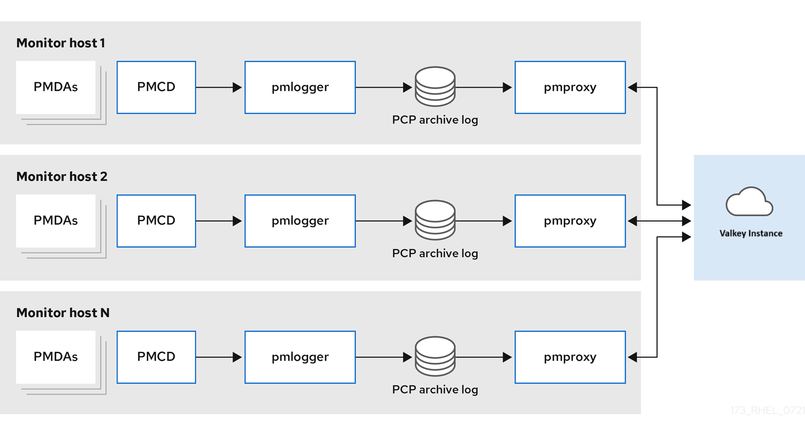 

Centralized logging - pmlogger farm

When the resource usage on the monitored hosts is constrained, another deployment option is a pmlogger farm, which is also known as centralized logging. In this configuration, a single logger host runs multiple pmlogger processes, and each is configured to retrieve performance metrics from a different remote pmcd host. The centralized logger host is also configured to run the pmproxy service, which discovers the resulting PCP archives logs and loads the metric data into a Valkey instance.

**Figure 4.2. Centralized logging - pmlogger farm**

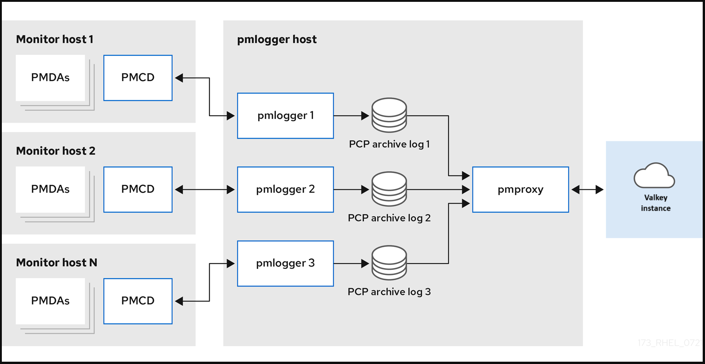 

Federated - multiple pmlogger farms

For large scale deployments, deploy multiple pmlogger farms in a federated fashion. For example, one pmlogger farm per rack or data center. Each pmlogger farm loads the metrics into a central Valkey instance.

**Figure 4.3. Federated - multiple pmlogger farms**

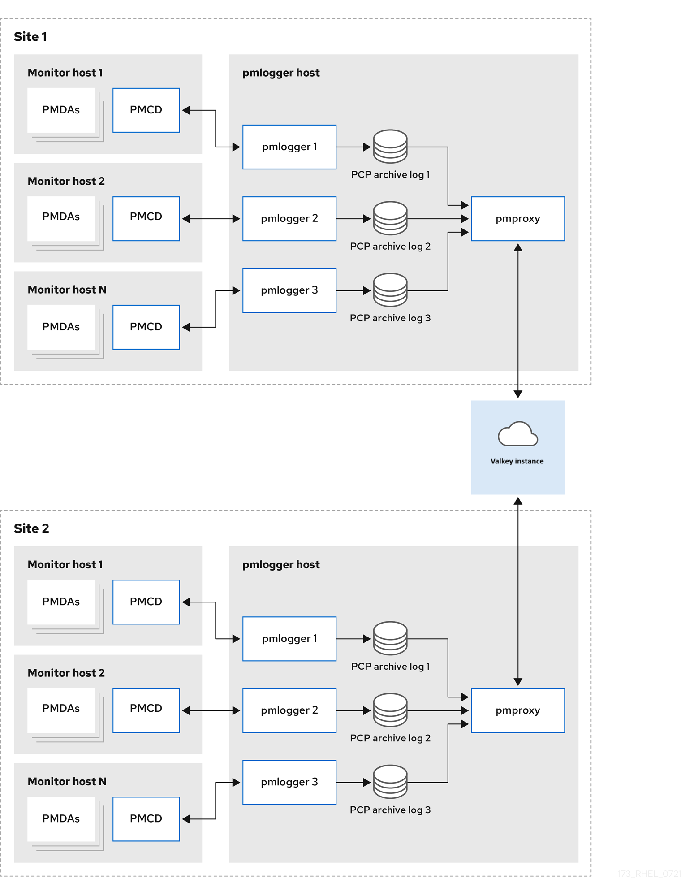 

Note

By default, the deployment configuration for Valkey is standalone, localhost. However, Valkey can optionally perform in a highly-available and highly scalable clustered fashion, where data is shared across multiple hosts. Another viable option is to deploy a Valkey cluster in the cloud, or to use a managed Valkey cluster from a cloud vendor.

<h3 id="factors-affecting-scaling-in-pcp-logging">4.5. Factors affecting scaling in PCP logging</h3>

The key factors influencing Performance Co-Pilot (PCP) logging are hardware resources, logged metrics, logging intervals, and post-upgrade archive management.

Remote system size

The hardware configuration of the remote system-such as the number of CPUs, disks, and network interfaces-directly impacts the volume of data collected by each `pmlogger` instance on the centralized logging host.

Logged metrics

The number and types of logged metrics significantly affect storage requirements. In particular, the `per-process proc.*` metrics require a large amount of disk space, for example, with the standard pcp-zeroconf setup, 10s logging interval, 11 MB without proc metrics but increases to 155 MB with proc metrics enabled - a ten fold difference. Additionally, the number of instances for each metric, for example the number of CPUs, block devices, and network interfaces also impacts storage capacity needs.

Logging interval

The frequency of metric logging determines storage usage. The expected daily PCP archive file sizes for each `pmlogger` instance are recorded in the `pmlogger.log` file. These estimates represent uncompressed data, but since PCP archives typically achieve a compression ratio of 10:1, long-term disk space requirements can be calculated accordingly.

Managing archive updates with pmlogrewrite

After every PCP upgrade, the pmlogrewrite tool updates existing archives if changes are detected in the metric metadata between versions. The time required for this process scales linearly with the number of stored archives.

<h3 id="setting-up-pcp">4.6. Additional resources</h3>

- [System services and tools distributed with PCP](#system-services-and-tools-distributed-with-pcp "4.3. System services and tools distributed with PCP")
- [Index of Performance Co-Pilot (PCP) articles, solutions, tutorials, and white papers from Red Hat Customer Portal](https://access.redhat.com/articles/1145953)

<h2 id="configuring-pmda-openmetrics">Chapter 5. Configuring pmda-openmetrics</h2>

Performance Co-Pilot (PCP) is a flexible and extensible system for monitoring and managing system performance. It includes several built-in agents called Performance Metric Domain Agents (PMDAs) that collect metrics from commonly used applications and services, such as PostgreSQL, Apache HTTPD, and KVM virtual machines.

<h3 id="overview-of-pmda-openmetrics">5.1. Overview of pmda-openmetrics</h3>

You can run custom or less common applications for which no out-of-the-box PMDA exists in the Red Hat repositories. In such scenarios, the `pmda-openmetrics` agent helps to bridge the gap. The `pmda-openmetrics` PMDA exposes performance metrics from arbitrary applications by converting OpenMetrics-style formatted text files into PCP-compatible metrics. OpenMetrics is a widely adopted format used by Prometheus and other monitoring tools, which makes integration easier.

You can run `pmda-openmetrics` to do the following tasks:

- Monitor custom applications that are not covered by existing PMDAs.
- Integrate existing OpenMetrics or `Prometheus-exported` metrics into the PCP framework.
- Create quick models or test metrics for diagnostic or demonstration purposes.

<h3 id="installing-and-configuring-pmda-openmetrics">5.2. Installing and configuring pmda-openmetrics</h3>

You must install and configure `pmda-openmetrics` before you start using it. The following example demonstrates how to expose a single numeric value from a text file as a PCP metric by using `pmda-openmetrics`.

**Prerequisites**

- PCP is installed and `pmcd` is running. For more information, see [Setting up PCP with pcp-zeroconf](#setting-up-pcp-with-pcp-zeroconf "8.1. Setting up PCP with pcp-zeroconf").

**Procedure**

01. Install the `pmda-openmetrics` PMDA.
    
    ```
    dnf -y install pcp-pmda-openmetrics
    ```
    
    ```plaintext
    # dnf -y install pcp-pmda-openmetrics
    ```
    
    ```
    cd /var/lib/pcp/pmdas/openmetrics/
    ```
    
    ```plaintext
    # cd /var/lib/pcp/pmdas/openmetrics/
    ```
    
    ```
    ./Install
    ```
    
    ```plaintext
    # ./Install
    ```
02. Create a sample OpenMetrics file.
    
    ```
    echo 'var1 {var2="var3"} 42' > /tmp/example.txt
    ```
    
    ```plaintext
    # echo 'var1 {var2="var3"} 42' > /tmp/example.txt
    ```
    
    Replace *example*.txt with the file name that you want to use.
03. Verify that the file is created correctly.
    
    ```
    cat /tmp/example.txt
    ```
    
    ```plaintext
    # cat /tmp/example.txt
    ```
04. Register the metric file path with the OpenMetrics agent.
    
    ```
    echo "file:///tmp/example.txt" > /etc/pcp/openmetrics/example.url
    ```
    
    ```plaintext
    # echo "file:///tmp/example.txt" > /etc/pcp/openmetrics/example.url
    ```
05. Verify that the configuration is created correctly.
    
    ```
    cat /etc/pcp/openmetrics/example.url
    ```
    
    ```plaintext
    # cat /etc/pcp/openmetrics/example.url
    ```
06. Configure `systemd-tmpfiles` to create the necessary symlinks.
    
    ```
    echo 'L+ /var/lib/pcp/pmdas/openmetrics/config.d/example.url - - - - ../../../../../../etc/pcp/openmetrics/example.url' \ > /usr/lib/tmpfiles.d/pcp-pmda-openmetrics-cust.conf
    ```
    
    ```plaintext
    # echo 'L+ /var/lib/pcp/pmdas/openmetrics/config.d/example.url - - - - ../../../../../../etc/pcp/openmetrics/example.url' \ > /usr/lib/tmpfiles.d/pcp-pmda-openmetrics-cust.conf
    ```
07. Verify that the symlinks are configured correctly.
    
    ```
    cat /usr/lib/tmpfiles.d/pcp-pmda-openmetrics-cust.conf
    ```
    
    ```plaintext
    # cat /usr/lib/tmpfiles.d/pcp-pmda-openmetrics-cust.conf
    ```
08. Create the symlinks by applying the tmpfiles configuration.
    
    ```
    systemd-tmpfiles --create --remove /usr/lib/tmpfiles.d/pcp-pmda-openmetrics-cust.conf
    ```
    
    ```plaintext
    # systemd-tmpfiles --create --remove /usr/lib/tmpfiles.d/pcp-pmda-openmetrics-cust.conf
    ```
09. Verify that the symlinks are created correctly.
    
    ```
    ls -al /var/lib/pcp/pmdas/openmetrics/config.d/
    ```
    
    ```plaintext
    # ls -al /var/lib/pcp/pmdas/openmetrics/config.d/
    ```
10. Verify that the metric is correctly reported.
    
    ```
    pminfo -f openmetrics.example.var1
    ```
    
    ```plaintext
    # pminfo -f openmetrics.example.var1
    ```
    
    ```
    inst [0 or "0 var2:var3"] value 42
    ```
    
    ```plaintext
    inst [0 or "0 var2:var3"] value 42
    ```

**Verification**

- Run `pcp` and confirm that `openmetrics` is listed.
- Run `systemd-analyze cat-config tmpfiles.d` and confirm that `example.url` appears in the output.
- Use `pminfo` to confirm the presence and value of the metric.

<h2 id="logging-performance-data-with-pmlogger">Chapter 6. Logging performance data with pmlogger</h2>

With the PCP tool you can log the performance metric values and replay them later. You can use this data to perform retrospective performance analysis. Using the pmlogger tool, you can:

- Create the archived logs of selected metrics on the system
- Specify which metrics are recorded on the system and how often

<h3 id="modifying-the-pmlogger-configuration-file-with-pmlogconf">6.1. Modifying the pmlogger configuration file with pmlogconf</h3>

When the `pmlogger` service is running, PCP logs a default set of metrics on the host. Use the `pmlogconf` utility to check the default configuration. If the `pmlogger` configuration file does not exist, `pmlogconf` creates it with a default metric values.

**Prerequisites**

- PCP is installed. For more information, see [Installing and enabling PCP](#installing-and-enabling-pcp "4.1. Installing and enabling PCP").

**Procedure**

1. Create or modify the `pmlogger` configuration file:
   
   ```
   pmlogconf -r /var/lib/pcp/config/pmlogger/config.default
   ```
   
   ```plaintext
   # pmlogconf -r /var/lib/pcp/config/pmlogger/config.default
   ```
2. Follow `pmlogconf` prompts to enable or disable groups of related performance metrics and to control the logging interval for each enabled group. For example,
   
   ```
   pmlogconf -r /var/lib/pcp/config/pmlogger/config.default
   ```
   
   ```plaintext
   # pmlogconf -r /var/lib/pcp/config/pmlogger/config.default
   ```
   
   ```
   Group: per logical block device activity
   Log this group? [y]
   Logging interval? [default]
   ```
   
   ```plaintext
   Group: per logical block device activity
   Log this group? [y]
   Logging interval? [default]
   ```

**Additional resources**

- [System services and tools distributed with PCP](#system-services-and-tools-distributed-with-pcp "4.3. System services and tools distributed with PCP")

<h3 id="configuring-pmlogger-manually">6.2. Configuring pmlogger manually</h3>

You can edit the `pmlogger` configuration file manually to create a tailored logging configuration with specific metrics and given intervals. The default `pmlogger` configuration file is `/var/lib/pcp/config/pmlogger/config.default`. The configuration file specifies which metrics are logged by the primary logging instance.

In manual configuration, you can:

- Record metrics which are not listed in the automatic configuration.
- Choose custom logging frequencies.
- Add **PMDA** with the application metrics.

**Prerequisites**

- PCP is installed. For more information, see [Installing and enabling PCP](#installing-and-enabling-pcp "4.1. Installing and enabling PCP").

**Procedure**

- Open and edit the `/var/lib/pcp/config/pmlogger/config.default` file to add specific metrics:
  
  ```
  # It is safe to make additions from here on ...
  #
  log mandatory on every 5 seconds {
      xfs.write
      xfs.write_bytes
      xfs.read
      xfs.read_bytes
  }
  log mandatory on every 10 seconds {
      xfs.allocs
      xfs.block_map
      xfs.transactions
      xfs.log
  }
  [access]
  disallow * : all;
  allow localhost : enquire;
  ```
  
  ```plaintext
  # It is safe to make additions from here on ...
  #
  log mandatory on every 5 seconds {
      xfs.write
      xfs.write_bytes
      xfs.read
      xfs.read_bytes
  }
  log mandatory on every 10 seconds {
      xfs.allocs
      xfs.block_map
      xfs.transactions
      xfs.log
  }
  [access]
  disallow * : all;
  allow localhost : enquire;
  ```

**Additional resources**

- [System services and tools distributed with PCP](#system-services-and-tools-distributed-with-pcp "4.3. System services and tools distributed with PCP")

<h3 id="enabling-the-pmlogger-service">6.3. Enabling the pmlogger service</h3>

The `pmlogger` service must be started and enabled to log the metric values on the local machine.

**Prerequisites**

- PCP is installed. For more information, see [Installing and enabling PCP](#installing-and-enabling-pcp "4.1. Installing and enabling PCP").

**Procedure**

- Start and enable the `pmlogger` service:
  
  ```
  systemctl start pmlogger
  ```
  
  ```plaintext
  # systemctl start pmlogger
  ```
  
  ```
  systemctl enable pmlogger
  ```
  
  ```plaintext
  # systemctl enable pmlogger
  ```

**Verification**

- Verify that the `pmlogger` service is enabled:
  
  ```
  pcp
  ```
  
  ```plaintext
  # pcp
  ```
  
  ```
   platform: Linux arm10.local 6.12.0-55.13.1.el10_0.aarch64 #1 SMP PREEMPT_DYNAMIC Mon May 19 07:29:57 UTC 2025 aarch64
   hardware: 4 cpus, 1 disk, 1 node, 3579MB RAM
   timezone: JST-9
   services: pmcd
       pmcd: Version 6.3.7-1, 12 agents, 6 clients
       pmda: root pmcd proc pmproxy xfs linux nfsclient mmv kvm jbd2
             dm openmetrics
   pmlogger: primary logger: /var/log/pcp/pmlogger/arm10.local/20250529.15.49
       pmie: primary engine: /var/log/pcp/pmie/arm10.local/pmie.log
  ```
  
  ```plaintext
   platform: Linux arm10.local 6.12.0-55.13.1.el10_0.aarch64 #1 SMP PREEMPT_DYNAMIC Mon May 19 07:29:57 UTC 2025 aarch64
   hardware: 4 cpus, 1 disk, 1 node, 3579MB RAM
   timezone: JST-9
   services: pmcd
       pmcd: Version 6.3.7-1, 12 agents, 6 clients
       pmda: root pmcd proc pmproxy xfs linux nfsclient mmv kvm jbd2
             dm openmetrics
   pmlogger: primary logger: /var/log/pcp/pmlogger/arm10.local/20250529.15.49
       pmie: primary engine: /var/log/pcp/pmie/arm10.local/pmie.log
  ```
  
  For more information, see the `/var/lib/pcp/config/pmlogger/config.default` file.

**Additional resources**

- [System services and tools distributed with PCP](#system-services-and-tools-distributed-with-pcp "4.3. System services and tools distributed with PCP")

<h3 id="setting-up-a-client-system-for-metrics-collection">6.4. Setting up a client system for metrics collection</h3>

You can configure a client system to enable a central server to collect performance metrics from clients running PCP.

**Prerequisites**

- PCP is installed. For more information, see [Installing and enabling PCP](#installing-and-enabling-pcp "4.1. Installing and enabling PCP").

**Procedure**

1. Install the `pcp-system-tools` package:
   
   ```
   dnf install pcp-system-tools
   ```
   
   ```plaintext
   # dnf install pcp-system-tools
   ```
2. Configure an IP address for pmcd:
   
   ```
   echo "-i 192.168.4.62" >>/etc/pcp/pmcd/pmcd.options
   ```
   
   ```plaintext
   # echo "-i 192.168.4.62" >>/etc/pcp/pmcd/pmcd.options
   ```
   
   Replace *192.168.4.62* with the IP address, the client should listen on. By default, `pmcd` is listening on the localhost.
3. Configure the firewall to add the public zone permanently:
   
   ```
   firewall-cmd --permanent --zone=public --add-port=44321/tcp
   ```
   
   ```plaintext
   # firewall-cmd --permanent --zone=public --add-port=44321/tcp
   ```
   
   ```
   success
   ```
   
   ```plaintext
   success
   ```
   
   ```
   firewall-cmd --reload
   ```
   
   ```plaintext
   # firewall-cmd --reload
   ```
   
   ```
   success
   ```
   
   ```plaintext
   success
   ```
4. Set an SELinux boolean:
   
   ```
   setsebool -P pcp_bind_all_unreserved_ports on
   ```
   
   ```plaintext
   # setsebool -P pcp_bind_all_unreserved_ports on
   ```
5. Enable the `pmcd` and `pmlogger` services:
   
   ```
   systemctl enable pmcd pmlogger
   ```
   
   ```plaintext
   # systemctl enable pmcd pmlogger
   ```
   
   ```
   systemctl restart pmcd pmlogger
   ```
   
   ```plaintext
   # systemctl restart pmcd pmlogger
   ```

**Verification**

- Verify that the `pmcd` is correctly listening on the configured IP address:
  
  ```
  ss -tlp | grep 44321
  ```
  
  ```plaintext
  # ss -tlp | grep 44321
  ```
  
  ```
  LISTEN   0   5     127.0.0.1:44321   0.0.0.0:*   users:(("pmcd",pid=151595,fd=6))
  LISTEN   0   5  192.168.4.62:44321   0.0.0.0:*   users:(("pmcd",pid=151595,fd=0))
  LISTEN   0   5         [::1]:44321      [::]:*   users:(("pmcd",pid=151595,fd=7))
  ```
  
  ```plaintext
  LISTEN   0   5     127.0.0.1:44321   0.0.0.0:*   users:(("pmcd",pid=151595,fd=6))
  LISTEN   0   5  192.168.4.62:44321   0.0.0.0:*   users:(("pmcd",pid=151595,fd=0))
  LISTEN   0   5         [::1]:44321      [::]:*   users:(("pmcd",pid=151595,fd=7))
  ```

**Additional resources**

- [System services and tools distributed with PCP](#system-services-and-tools-distributed-with-pcp "4.3. System services and tools distributed with PCP")

<h3 id="setting-up-a-central-server-to-collect-data">6.5. Setting up a central server to collect data</h3>

You can create a central server to collect metrics from clients running PCP.

**Prerequisites**

- PCP is installed. For more information, see [Installing and enabling PCP](#installing-and-enabling-pcp "4.1. Installing and enabling PCP").
- Client is configured for metrics collection. For more information, see [Setting up a client system for metrics collection](#setting-up-a-client-system-for-metrics-collection "6.4. Setting up a client system for metrics collection").

**Procedure**

1. Install the `pcp-system-tools` package:
   
   ```
   dnf install pcp-system-tools
   ```
   
   ```plaintext
   # dnf install pcp-system-tools
   ```
2. Create the `/etc/pcp/pmlogger/control.d/remote` file with the following content:
   
   ```
   # DO NOT REMOVE OR EDIT THE FOLLOWING LINE
   $version=1.1
   192.168.4.13 n n PCP_ARCHIVE_DIR/rhel7u4a -r -T24h10m -c config.rhel7u4a
   192.168.4.14 n n PCP_ARCHIVE_DIR/rhel6u10a -r -T24h10m -c config.rhel6u10a
   192.168.4.62 n n PCP_ARCHIVE_DIR/rhel8u1a -r -T24h10m -c config.rhel8u1a
   ```
   
   ```plaintext
   # DO NOT REMOVE OR EDIT THE FOLLOWING LINE
   $version=1.1
   192.168.4.13 n n PCP_ARCHIVE_DIR/rhel7u4a -r -T24h10m -c config.rhel7u4a
   192.168.4.14 n n PCP_ARCHIVE_DIR/rhel6u10a -r -T24h10m -c config.rhel6u10a
   192.168.4.62 n n PCP_ARCHIVE_DIR/rhel8u1a -r -T24h10m -c config.rhel8u1a
   ```
   
   Replace *192.168.4.13*, *192.168.4.14* and *192.168.4.62* with the client IP addresses.
3. Enable the pmcd and pmlogger services:
   
   ```
   systemctl enable pmcd pmlogger
   ```
   
   ```plaintext
   # systemctl enable pmcd pmlogger
   ```
   
   ```
   systemctl restart pmcd pmlogger
   ```
   
   ```plaintext
   # systemctl restart pmcd pmlogger
   ```

**Verification**

- Verify that you can access the latest archive file from each directory:
  
  ```
  for i in /var/log/pcp/pmlogger/rhel*/*.0; do pmdumplog -L $i; done
  ```
  
  ```plaintext
  # for i in /var/log/pcp/pmlogger/rhel*/*.0; do pmdumplog -L $i; done
  ```
  
  ```
  Log Label (Log Format Version 2)
  Performance metrics from host rhel6u10a.local
    commencing Mon Nov 25 21:55:04.851 2019
    ending     Mon Nov 25 22:06:04.874 2019
  Archive timezone: JST-9
  PID for pmlogger: 24002
  Log Label (Log Format Version 2)
  Performance metrics from host rhel7u4a
    commencing Tue Nov 26 06:49:24.954 2019
    ending     Tue Nov 26 07:06:24.979 2019
  Archive timezone: CET-1
  PID for pmlogger: 10941
  [..]
  ```
  
  ```plaintext
  Log Label (Log Format Version 2)
  Performance metrics from host rhel6u10a.local
    commencing Mon Nov 25 21:55:04.851 2019
    ending     Mon Nov 25 22:06:04.874 2019
  Archive timezone: JST-9
  PID for pmlogger: 24002
  Log Label (Log Format Version 2)
  Performance metrics from host rhel7u4a
    commencing Tue Nov 26 06:49:24.954 2019
    ending     Tue Nov 26 07:06:24.979 2019
  Archive timezone: CET-1
  PID for pmlogger: 10941
  [..]
  ```
  
  The archive files from the `/var/log/pcp/pmlogger/` directory can be used for further analysis and graphing.

**Additional resources**

- [System services and tools distributed with PCP](#system-services-and-tools-distributed-with-pcp "4.3. System services and tools distributed with PCP")

<h3 id="systemd-units-and-pmlogger">6.6. Systemd units and pmlogger</h3>

When you deploy the `pmlogger` service, either as a single host monitoring itself or a `pmlogger` farm with a single host collecting metrics from several remote hosts, there are several associated `systemd` service and timer units that are automatically deployed. These services and timers provide routine checks to ensure that your `pmlogger` instances are running, restart any missing instances, and perform archive management such as file compression. The checking and housekeeping services typically deployed by pmlogger are:

pmlogger\_daily.service

Runs daily, soon after midnight by default, to aggregate, compress, and rotate one or more sets of PCP archives. Also culls archives older than the limit, 2 weeks by default. Triggered by the `pmlogger_daily.timer` unit, which is required by the `pmlogger.service` unit.

pmlogger\_check

Performs half-hourly checks that `pmlogger` instances are running. Restarts any missing instances and performs any required compression tasks. Triggered by the `pmlogger_check.timer` unit, which is required by the `pmlogger.service` unit.

pmlogger\_farm\_check

Checks the status of all configured `pmlogger` instances. Restarts any missing instances. Migrates all non-primary instances to the `pmlogger_farm` service. Triggered by the `pmlogger_farm_check.timer`, which is required by the `pmlogger_farm.service` unit that is itself required by the `pmlogger`.service unit.

These services are managed through a series of positive dependencies, meaning that they are all enabled upon activating the primary pmlogger instance. Note that while `pmlogger_daily.service` is disabled by default, `pmlogger_daily.timer` being active through the dependency with `pmlogger.service` will trigger `pmlogger_daily.service` to run.

`pmlogger_daily` is also integrated with `pmlogrewrite` for automatically rewriting archives before merging. This helps to ensure metadata consistency amid changing production environments and PMDAs. For example, if `pmcd` on one monitored host is updated during the logging interval, the semantics for some metrics on the host might be updated, thus making the new archives incompatible with the previously recorded archives from that host. For more information, see the `pmlogrewrite(1)` man page on your system.

<h3 id="managing-systemd-services-triggered-by-pmlogger">6.7. Managing systemd services triggered by pmlogger</h3>

You can create an automated custom archive management system for data collected by your `pmlogger` instances by using the control files.

Note

The primary `pmlogger` instance must be running on the same host as the `pmcd` it connects to. You do not need to have a primary instance and you might not need it in your configuration if one central host is collecting data on several `pmlogger` instances connected to `pmcd` instances running on a remote host.

**Procedure**

- Do one of the following:
  
  - For the primary pmlogger instance, use `/etc/pcp/pmlogger/control.d/local`
  - For the remote hosts, use `/etc/pcp/pmlogger/control.d/remote`
    
    Replace *remote* with the file name that you want to use.
    
    The file should contain one line for each host to be logged. The default format of the primary logger instance that is automatically created looks similar to:
    
    ```
    === LOGGER CONTROL SPECIFICATIONS ===
    #
    #Host   	 P?  S?    directory   		 args
    local primary logger
    LOCALHOSTNAME    y   n    PCP_ARCHIVE_DIR/LOCALHOSTNAME    -r -T24h10m -c config.default -v 100Mb
    ```
    
    ```plaintext
    # === LOGGER CONTROL SPECIFICATIONS ===
    #
    #Host   	 P?  S?    directory   		 args
    # local primary logger
    LOCALHOSTNAME    y   n    PCP_ARCHIVE_DIR/LOCALHOSTNAME    -r -T24h10m -c config.default -v 100Mb
    ```
    
    Where the fields are:
    
    Host
    
    The name of the host to be logged.
    
    P?
    
    Stands for “Primary?" This field indicates if the host is the primary logger instance, **y**, or not, **n**. There can only be one primary logger across all the files in your configuration and it must be running on the same host as the `pmcd` it connects to.
    
    S?
    
    Stands for “Socks?" This field indicates if this logger instance needs to use the `SOCKS` protocol to connect to `pmcd` through a firewall, **y**, or not, **n**.
    
    directory
    
    All archives associated with this line are created in this directory.
    
    args
    
    Arguments passed to `pmlogger`. The default values for the `args` field are:
    
    -r
    
    Report the archive sizes and growth rate.
    
    T24h10m
    
    Specifies when to end logging for each day. This is typically the time when `pmlogger_daily.service` runs. The default value of `24h10m` indicates that logging should end 24 hours and 10 minutes after it begins, at the latest.
    
    -c config.default
    
    Specifies which configuration file to use. This defines what metrics to record.
    
    -v 100Mb
    
    Specifies the size at which point one data volume is filled and another is created. After it switches to the new archive, the previously recorded one will be compressed by either `pmlogger_daily` or `pmlogger_check`.

<h3 id="replaying-the-pcp-log-archives-with-pmrep">6.8. Replaying the PCP log archives with pmrep</h3>

After recording the metric data, you can replay the PCP log archives. To export the logs to text files and import them into spreadsheets, use PCP utilities such as `pcp2csv`, `pcp2xml`, `pmrep` or `pmlogsummary`. By using the `pmrep` tool, you can:

- View the log files.
- Parse the selected PCP log archive and export the values into an ASCII table.
- Extract the entire archive log or only select metric values from the log by specifying individual metrics on the command line.

**Prerequisites**

- PCP is installed. For more information, see [Installing and enabling PCP](#installing-and-enabling-pcp "4.1. Installing and enabling PCP").
- The `pmlogger` service is enabled. For more information, see [Enabling the pmlogger service](#enabling-the-pmlogger-service "6.3. Enabling the pmlogger service").
- Installed the `pcp-gui` package.
  
  ```
  dnf install pcp-gui
  ```
  
  ```plaintext
  # dnf install pcp-gui
  ```

**Procedure**

- Display the data on the metric:
  
  ```
  pmrep --start @3:00am --archive 20211128 --interval 5seconds --samples 10 --output csv disk.dev.write
  ```
  
  ```plaintext
  $ pmrep --start @3:00am --archive 20211128 --interval 5seconds --samples 10 --output csv disk.dev.write
  ```
  
  ```
  Time,"disk.dev.write-sda","disk.dev.write-sdb"
  2021-11-28 03:00:00,,
  2021-11-28 03:00:05,4.000,5.200
  2021-11-28 03:00:10,1.600,7.600
  2021-11-28 03:00:15,0.800,7.100
  2021-11-28 03:00:20,16.600,8.400
  2021-11-28 03:00:25,21.400,7.200
  2021-11-28 03:00:30,21.200,6.800
  2021-11-28 03:00:35,21.000,27.600
  2021-11-28 03:00:40,12.400,33.800
  2021-11-28 03:00:45,9.800,20.600
  ```
  
  ```plaintext
  Time,"disk.dev.write-sda","disk.dev.write-sdb"
  2021-11-28 03:00:00,,
  2021-11-28 03:00:05,4.000,5.200
  2021-11-28 03:00:10,1.600,7.600
  2021-11-28 03:00:15,0.800,7.100
  2021-11-28 03:00:20,16.600,8.400
  2021-11-28 03:00:25,21.400,7.200
  2021-11-28 03:00:30,21.200,6.800
  2021-11-28 03:00:35,21.000,27.600
  2021-11-28 03:00:40,12.400,33.800
  2021-11-28 03:00:45,9.800,20.600
  ```
  
  The example displays the data on the `disk.dev.write` metric collected in an archive at a 5 second interval in `comma-separated-value` format. Replace *20211128* in this example with a filename containing the `pmlogger` archive you want to display data for.

**Additional resources**

- [System services and tools distributed with PCP](#system-services-and-tools-distributed-with-pcp "4.3. System services and tools distributed with PCP")

<h2 id="monitoring-performance-with-performance-co-pilot">Chapter 7. Monitoring performance with Performance Co-Pilot</h2>

Performance Co-Pilot (PCP) is a suite of tools, services, and libraries for monitoring, visualizing, storing, and analyzing system-level performance measurements. As a system administrator, you can monitor the system’s performance by using PCP in Red Hat Enterprise Linux.

<h3 id="monitoring-postfix-with-pmda-postfix">7.1. Monitoring postfix with pmda-postfix</h3>

You can monitor performance metrics of the postfix mail server with `pmda-postfix`. It helps to check how many emails are received per second.

**Prerequisites**

- PCP is installed. For more information, see [Installing and enabling PCP](#installing-and-enabling-pcp "4.1. Installing and enabling PCP").
- The `pmlogger` service is enabled. For more information, see [Enabling the pmlogger service](#enabling-the-pmlogger-service "6.3. Enabling the pmlogger service").

**Procedure**

1. Install the following packages:
   
   1. Install the `pcp-system-tools`:
      
      ```
      dnf install pcp-system-tools
      ```
      
      ```plaintext
      # dnf install pcp-system-tools
      ```
   2. Install the `pmda-postfix` package to monitor postfix:
      
      ```
      dnf install pcp-pmda-postfix postfix
      ```
      
      ```plaintext
      # dnf install pcp-pmda-postfix postfix
      ```
   3. Install the `logging` daemon:
      
      ```
      dnf install rsyslog
      ```
      
      ```plaintext
      # dnf install rsyslog
      ```
   4. Install the mail client for testing:
      
      ```
      dnf install mutt
      ```
      
      ```plaintext
      # dnf install mutt
      ```
2. Enable the `postfix` and `rsyslog` services:
   
   ```
   systemctl enable postfix rsyslog
   ```
   
   ```plaintext
   # systemctl enable postfix rsyslog
   ```
   
   ```
   systemctl restart postfix rsyslog
   ```
   
   ```plaintext
   # systemctl restart postfix rsyslog
   ```
3. Enable the SELinux boolean, so that `pmda-postfix` can access the required log files:
   
   ```
   setsebool -P pcp_read_generic_logs=on
   ```
   
   ```plaintext
   # setsebool -P pcp_read_generic_logs=on
   ```
4. Install the PMDA:
   
   ```
   cd /var/lib/pcp/pmdas/postfix/
   ```
   
   ```plaintext
   # cd /var/lib/pcp/pmdas/postfix/
   ```
   
   ```
   ./Install
   ```
   
   ```plaintext
   # ./Install
   ```
   
   ```
   Updating the Performance Metrics Name Space (PMNS) ...
   Terminate PMDA if already installed ...
   Updating the PMCD control file, and notifying PMCD ...
   Waiting for pmcd to terminate ...
   Starting pmcd ...
   Check postfix metrics have appeared ... 7 metrics and 58 values
   ```
   
   ```plaintext
   Updating the Performance Metrics Name Space (PMNS) ...
   Terminate PMDA if already installed ...
   Updating the PMCD control file, and notifying PMCD ...
   Waiting for pmcd to terminate ...
   Starting pmcd ...
   Check postfix metrics have appeared ... 7 metrics and 58 values
   ```

**Verification**

- Verify the `pmda-postfix` operation:
  
  ```
  echo testmail | mutt root
  ```
  
  ```plaintext
  echo testmail | mutt root
  ```
- Verify the available metrics:
  
  ```
  pminfo postfix
  ```
  
  ```plaintext
  # pminfo postfix
  ```
  
  ```
  postfix.received
  postfix.sent
  postfix.queues.incoming
  postfix.queues.maildrop
  postfix.queues.hold
  postfix.queues.deferred
  postfix.queues.active
  ```
  
  ```plaintext
  postfix.received
  postfix.sent
  postfix.queues.incoming
  postfix.queues.maildrop
  postfix.queues.hold
  postfix.queues.deferred
  postfix.queues.active
  ```

**Additional resources**

- [System services and tools distributed with PCP](#system-services-and-tools-distributed-with-pcp "4.3. System services and tools distributed with PCP")

<h3 id="visually-tracing-pcp-log-archives-with-the-pcp-charts-application">7.2. Visually tracing PCP log archives with the PCP Charts application</h3>

After recording metric data, you can replay the PCP log archives as graphs. The metrics are sourced from one or more live hosts with alternative options to use metric data from PCP log archives as a source of historical data. To customize the PCP Charts application interface to display the data from the performance metrics, you can use line plot, bar graphs, or utilization graphs.

By using the PCP Charts application, you can:

- Replay the data in the PCP Charts application application and use graphs to visualize the retrospective data alongside live data of the system.
- Plot performance metric values into graphs.
- Display multiple charts simultaneously.

**Prerequisites**

- PCP is installed. For more information, see [Installing and enabling PCP](#installing-and-enabling-pcp "4.1. Installing and enabling PCP").
- Logged performance data with the `pmlogger`. For more information, see [Logging performance data with pmlogger](#logging-performance-data-with-pmlogger "Chapter 6. Logging performance data with pmlogger").
- Installed the `pcp-gui` package.
  
  ```
  dnf install pcp-gui
  ```
  
  ```plaintext
  # dnf install pcp-gui
  ```

**Procedure**

1. Launch the PCP Charts application from the command line:
   
   ```
   pmchart
   ```
   
   ```plaintext
   # pmchart
   ```
   
   The `pmtime` server settings are located at the bottom. With **start** and **pause** buttons you can control:
   
   - The interval in which PCP polls the metric data
   - The date and time for the metrics of historical data
2. Click **File** and then **New Chart** to select metric from both the local machine and remote machines by specifying their host name or address. Advanced configuration options include the ability to manually set the axis values for the chart, and to manually choose the color of the plots.
3. Record the views created in the PCP Charts application:
   
   Following are the options to take images or record the views created in the PCP Charts application:
   
   - Click **File** and then **Export** to save an image of the current view.
   - Click **Record** and then **Start** to start a recording.
   - Click **Record** and then **Stop** to stop the recording. After stopping the recording, the recorded metrics are archived to be viewed later.
4. Optional: In the **PCP Charts** application, the main configuration file, known as the view, stores the metadata associated with one or more charts. This metadata describes all chart aspects, including the metrics used and the chart columns.
5. Optional: Save the custom view configuration by clicking **File** and then **Save View**, and load the view configuration later.
   
   The following example of the PCP Charts application view configuration file describes a stacking chart graph showing the total number of bytes read and written to the given XFS file system `loop1`:
   
   ```
   pmchart
   ```
   
   ```plaintext
   # pmchart
   ```
   
   ```
   version 1
   chart title "Filesystem Throughput /loop1" style stacking antialiasing off
       plot legend Read rate   metric xfs.read_bytes   instance  loop1
       plot legend Write rate  metric xfs.write_bytes  instance  loop1
   ```
   
   ```plaintext
   version 1
   chart title "Filesystem Throughput /loop1" style stacking antialiasing off
       plot legend Read rate   metric xfs.read_bytes   instance  loop1
       plot legend Write rate  metric xfs.write_bytes  instance  loop1
   ```

**Additional resources**

- [System services and tools distributed with PCP](#system-services-and-tools-distributed-with-pcp "4.3. System services and tools distributed with PCP")

<h3 id="collecting-data-from-sql-server-by-using-pcp">7.3. Collecting data from SQL server by using PCP</h3>

The SQL Server agent in PCP helps you monitor and analyze database performance issues. You can collect data for Microsoft SQL Server by using PCP on your system.

**Prerequisites**

- You have installed Microsoft SQL Server for Red Hat Enterprise Linux and established a `trusted` connection to an SQL server.
- You have installed the Microsoft ODBC driver for SQL Server for Red Hat Enterprise Linux.

**Procedure**

1. Install PCP:
   
   ```
   dnf install pcp-zeroconf
   ```
   
   ```plaintext
   # dnf install pcp-zeroconf
   ```
2. Install packages required for the `pyodbc` driver:
   
   ```
   dnf install gcc-c++ python3-devel unixODBC-devel
   ```
   
   ```plaintext
   # dnf install gcc-c++ python3-devel unixODBC-devel
   ```
   
   ```
   dnf install python3-pyodbc
   ```
   
   ```plaintext
   # dnf install python3-pyodbc
   ```
3. Install the `mssql` agent:
   
   1. Install the Microsoft SQL Server domain agent for PCP:
      
      ```
      dnf install pcp-pmda-mssql
      ```
      
      ```plaintext
      # dnf install pcp-pmda-mssql
      ```
   2. Edit the `/etc/pcp/mssql/mssql.conf` file to configure the SQL server account’s username and password for the mssql agent. Ensure that the account you configure has access rights to performance data.
      
      ```
      username: user_name
      password: user_password
      ```
      
      ```plaintext
      username: user_name
      password: user_password
      ```
      
      Replace *user\_name* with the SQL Server account username and *user\_password* with the SQL Server user password for this account.
4. Install the agent:
   
   ```
   cd /var/lib/pcp/pmdas/mssql
   ```
   
   ```plaintext
   # cd /var/lib/pcp/pmdas/mssql
   ```
   
   ```
   ./Install
   ```
   
   ```plaintext
   # ./Install
   ```
   
   ```
   Updating the Performance Metrics Name Space (PMNS) ...
   Terminate PMDA if already installed ...
   Updating the PMCD control file, and notifying PMCD ...
   Check mssql metrics have appeared ... 168 metrics and 598 values
   [...]
   ```
   
   ```plaintext
   Updating the Performance Metrics Name Space (PMNS) ...
   Terminate PMDA if already installed ...
   Updating the PMCD control file, and notifying PMCD ...
   Check mssql metrics have appeared ... 168 metrics and 598 values
   [...]
   ```

**Verification**

- Using the `pcp` command, verify if the SQL Server PMDA (`mssql`) is loaded and running:
  
  ```
  pcp
  ```
  
  ```plaintext
  $ pcp
  ```
  
  ```
  Performance Co-Pilot configuration on rhel.local:
  platform: Linux rhel.local 4.18.0-167.el8.x86_64 #1 SMP Sun Dec 15 01:24:23 UTC 2019 x86_64
   hardware: 2 cpus, 1 disk, 1 node, 2770MB RAM
   timezone: PDT+7
   services: pmcd pmproxy
       pmcd: Version 5.0.2-1, 12 agents, 4 clients
       pmda: root pmcd proc pmproxy xfs linux nfsclient mmv kvm mssql
             jbd2 dm
   pmlogger: primary logger: /var/log/pcp/pmlogger/rhel.local/20200326.16.31
      pmie: primary engine: /var/log/pcp/pmie/rhel.local/pmie.log
  ```
  
  ```plaintext
  Performance Co-Pilot configuration on rhel.local:
  platform: Linux rhel.local 4.18.0-167.el8.x86_64 #1 SMP Sun Dec 15 01:24:23 UTC 2019 x86_64
   hardware: 2 cpus, 1 disk, 1 node, 2770MB RAM
   timezone: PDT+7
   services: pmcd pmproxy
       pmcd: Version 5.0.2-1, 12 agents, 4 clients
       pmda: root pmcd proc pmproxy xfs linux nfsclient mmv kvm mssql
             jbd2 dm
   pmlogger: primary logger: /var/log/pcp/pmlogger/rhel.local/20200326.16.31
      pmie: primary engine: /var/log/pcp/pmie/rhel.local/pmie.log
  ```
- View the complete list of metrics that PCP can collect from the SQL Server:
  
  ```
  pminfo mssql
  ```
  
  ```plaintext
  # pminfo mssql
  ```
- After viewing the list of metrics, you can report the rate of transactions. For example, to report on the overall transaction count per second, over a five second time window:
  
  ```
  pmval -t 1 -T 5 mssql.databases.transactions
  ```
  
  ```plaintext
  # pmval -t 1 -T 5 mssql.databases.transactions
  ```
- View the graphical chart of these metrics on your system by using the pmchart command. For more information, see [Visually tracing PCP log archives with the PCP Charts application](#visually-tracing-pcp-log-archives-with-the-pcp-charts-application "7.2. Visually tracing PCP log archives with the PCP Charts application") and `pcp(1)`, `pminfo(1)`, `pmval(1)`, `pmchart(1)`, and `pmdamssql(1)` man pages on your system.

**Additional resources**

- [Performance Co-Pilot for Microsoft SQL Server with RHEL 8.2 Red Hat Developers Blog post](https://www.redhat.com/en/blog/performance-co-pilot-microsoft-sql-server-rhel-82)

<h2 id="setting-up-graphical-representation-of-pcp-metrics">Chapter 8. Setting up graphical representation of PCP metrics</h2>

Using a combination of `pcp`, `grafana`, `valkey`, `pcp bpftrace`, and `pcp vector` provides graphical representation of the live data or data collected by PCP.

<h3 id="setting-up-pcp-with-pcp-zeroconf">8.1. Setting up PCP with pcp-zeroconf</h3>

You can configure PCP on a system with the `pcp-zeroconf` package. Once the `pcp-zeroconf` package is installed, the system records the default set of metrics into archived files.

**Procedure**

- Install the pcp-zeroconf package:
  
  ```
  dnf install pcp-zeroconf
  ```
  
  ```plaintext
  # dnf install pcp-zeroconf
  ```

**Verification**

- Ensure that the pmlogger service is active, and starts archiving the metrics:
  
  ```
  pcp | grep pmlogger
  ```
  
  ```plaintext
  # pcp | grep pmlogger
  ```
  
  ```
  pmlogger: primary logger: /var/log/pcp/pmlogger/localhost.localdomain/20200401.00.12
  ```
  
  ```plaintext
  pmlogger: primary logger: /var/log/pcp/pmlogger/localhost.localdomain/20200401.00.12
  ```

**Additional resources**

- [Monitoring performance with Performance Co-Pilot](#monitoring-performance-with-performance-co-pilot "Chapter 7. Monitoring performance with Performance Co-Pilot")

<h3 id="setting-up-a-grafana-server">8.2. Setting up a grafana-server</h3>

Grafana generates graphs that are accessible from a browser. The `grafana-server` is a back-end server for the Grafana dashboard. It listens, by default, on all interfaces, and provides web services accessed through the web browser. The `grafana-pcp` plugin interacts with the `pmproxy` daemon in the backend.

**Prerequisites**

- PCP is configured. For more information, see [Setting up PCP with pcp-zeroconf](#setting-up-pcp-with-pcp-zeroconf "8.1. Setting up PCP with pcp-zeroconf").

**Procedure**

1. Install the following packages:
   
   ```
   dnf install grafana grafana-pcp
   ```
   
   ```plaintext
   # dnf install grafana grafana-pcp
   ```
2. Restart and enable `grafana-server`:
   
   ```
   systemctl restart grafana-server
   ```
   
   ```plaintext
   # systemctl restart grafana-server
   ```
   
   ```
   systemctl enable grafana-server
   ```
   
   ```plaintext
   # systemctl enable grafana-server
   ```
3. Open the server’s firewall for network traffic to the Grafana service.
   
   ```
   firewall-cmd --permanent --add-service=grafana
   ```
   
   ```plaintext
   # firewall-cmd --permanent --add-service=grafana
   ```
   
   ```
   success
   ```
   
   ```plaintext
   success
   ```
   
   ```
   firewall-cmd --reload
   ```
   
   ```plaintext
   # firewall-cmd --reload
   ```
   
   ```
   success
   ```
   
   ```plaintext
   success
   ```

**Verification**

- Ensure that the `grafana-server` is listening and responding to requests:
  
  ```
  ss -ntlp | grep 3000
  ```
  
  ```plaintext
  # ss -ntlp | grep 3000
  ```
  
  ```
  LISTEN  0  128  :3000 *:  users:(("grafana-server",pid=19522,fd=7))
  ```
  
  ```plaintext
  LISTEN  0  128  :3000 *:  users:(("grafana-server",pid=19522,fd=7))
  ```
- Ensure that the grafana-pcp plugin is installed:
  
  ```
  grafana-cli plugins ls | grep performancecopilot-pcp-app
  ```
  
  ```plaintext
  # grafana-cli plugins ls | grep performancecopilot-pcp-app
  ```
  
  ```
  performancecopilot-pcp-app @ 5.2.2
  ```
  
  ```plaintext
  performancecopilot-pcp-app @ 5.2.2
  ```

<h3 id="configuring-valkey">8.3. Configuring valkey</h3>

You can use the valkey data source to:

- View data archives
- Query time series using pmseries language
- Analyze data across multiple hosts

**Prerequisites**

- PCP is configured. For more information, see [Setting up PCP with pcp-zeroconf](#setting-up-pcp-with-pcp-zeroconf "8.1. Setting up PCP with pcp-zeroconf").
- The `grafana-server` is configured. For more information, see [Setting up a grafana-server](#setting-up-a-grafana-server "8.2. Setting up a grafana-server").
- Mail transfer agent, for example, `postfix` is installed and configured.

**Procedure**

1. Install the `valkey` package:
   
   ```
   dnf install valkey
   ```
   
   ```plaintext
   # dnf install valkey
   ```
2. Start and enable the `pmproxy` and `valkey` services:
   
   ```
   systemctl start pmproxy valkey
   ```
   
   ```plaintext
   # systemctl start pmproxy valkey
   ```
   
   ```
   systemctl enable pmproxy valkey
   ```
   
   ```plaintext
   # systemctl enable pmproxy valkey
   ```
3. Restart `grafana-server`:
   
   ```
   systemctl restart grafana-server
   ```
   
   ```plaintext
   # systemctl restart grafana-server
   ```

**Verification**

- Ensure that the `pmproxy` and `valkey` are working:
  
  ```
  pmseries disk.dev.read
  ```
  
  ```plaintext
  # pmseries disk.dev.read
  ```
  
  ```
  2eb3e58d8f1e231361fb15cf1aa26fe534b4d9df
  ```
  
  ```plaintext
  2eb3e58d8f1e231361fb15cf1aa26fe534b4d9df
  ```
  
  This command does not return any data if the valkey package is not installed.
  
  For details, see the `pmseries(1)` man page on your system.

<h3 id="accessing-the-grafana-web-ui">8.4. Accessing the Grafana web UI</h3>

You can access the Grafana web interface. Using the Grafana web interface, you can:

- add Valkey, PCP bpftrace, and PCP Vector data sources
- create a dashboard
- view an overview of any useful metrics
- create alerts in Valkey

**Prerequisites**

- PCP is configured. For more information, see [Setting up PCP with pcp-zeroconf](#setting-up-pcp-with-pcp-zeroconf "8.1. Setting up PCP with pcp-zeroconf").
- The `grafana-server` is configured. For more information, see [Setting up a grafana-server](#setting-up-a-grafana-server "8.2. Setting up a grafana-server").

**Procedure**

1. On the client system, open a browser and access the `grafana-server` on port 3000 by using the *http://192.0.2.0:3000* link.
   
   Replace *192.0.2.0* with your machine IP when accessing Grafana web UI from a remote machine, or with *localhost* when accessing the web UI locally.
2. For the first login, enter admin in both the **Email** or **username** and **Password** fields.
3. Grafana prompts to set a **New password** to create a secured account. If you want to set it later, click **Skip**.
4. From the more options icon (☰) on the top left, click **Administration** &gt; **Plugins**.
5. In the **Plugins** tab, type performance co-pilot in the **Search by name or type** text box and then click the **Performance Co-Pilot (PCP)** plugin.
6. In the **Plugins / Performance Co-Pilot** pane, click **Enable**.
7. Click the **Grafana** icon. The **Grafana Home page** is displayed.
   
   **Figure 8.1. Home Dashboard**
   
   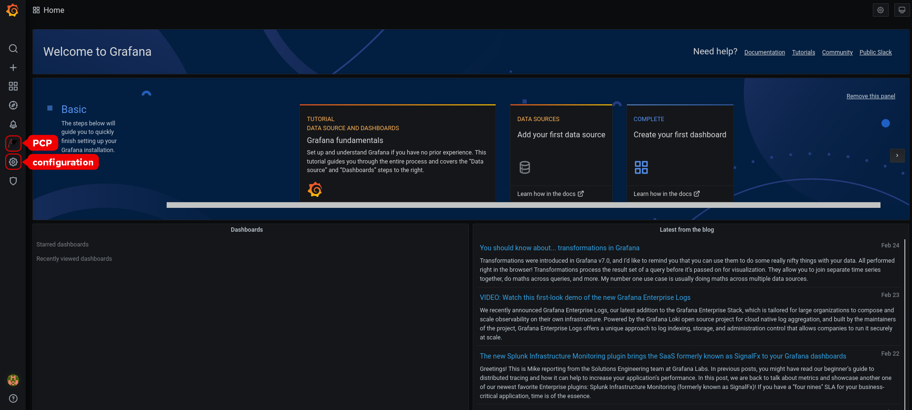 
   
   Note
   
   The top corner of the screen has a **Settings** icon, but it controls the general **Dashboard settings**.
8. In the **Grafana Home** page, click Add your first data source to add Valkey, PCP bpftrace, and PCP Vector data sources.
   
   - To add PCP valkey data source, view default dashboard, create a panel, and an alert rule, see [Creating panels and alerts in PCP valkey data source](#creating-panels-and-alerts-in-pcp-valkey-data-source "8.6. Creating panels and alerts in PCP Valkey data source").
   - To add pcp bpftrace data source and view the default dashboard, see [Viewing the PCP bpftrace System Analysis dashboard](#viewing-the-pcp-bpftrace-system-analysis-dashboard "8.10. Viewing the PCP bpftrace System Analysis dashboard").
   - To add pcp vector data source, view the default dashboard, and to view the vector checklist, see [Viewing the PCP Vector Checklist](#viewing-the-pcp-vector-checklist "8.12. Viewing the PCP Vector Checklist").
9. Optional: From the menu, hover over the **admin** profile icon to change the **Preferences** including **Edit Profile**, **Change Password**, or to **Sign out**.
   
   For more information, see the `grafana-cli` and `grafana-server` man pages on your system.

<h3 id="configuring-secure-connections-for-valkey-and-pcp">8.5. Configuring secure connections for Valkey and PCP</h3>

You can establish secure connections between Performance Co-Pilot (PCP), Grafana, and Valkey. Establishing secure connections between these components helps prevent unauthorized parties from accessing or modifying the data being collected and monitored.

**Prerequisites**

- PCP is installed. For more information, see [Installing and enabling PCP](#installing-and-enabling-pcp "4.1. Installing and enabling PCP").
- The Grafana server is configured. For more information, see [Setting up a grafana-server](#setting-up-a-grafana-server "8.2. Setting up a grafana-server").
- Valkey is installed. For more information, see [Configuring Valkey](#configuring-valkey "8.3. Configuring valkey").
- The private client key is stored in the `/etc/valkey/client.key` file. If you use a different path, modify the path in the corresponding steps of the procedure. For details about creating a private key and certificate signing request (CSR), as well as how to request a certificate from a certificate authority (CA), see your CA’s documentation.
- The TLS client certificate is stored in the `/etc/valkey/client.crt` file. If you use a different path, modify the path in the corresponding steps of the procedure.
- The TLS server key is stored in the `/etc/valkey/valkey.key` file. If you use a different path, modify the path in the corresponding steps of the procedure.
- The TLS server certificate is stored in the `/etc/valkey/valkey.crt` file. If you use a different path, modify the path in the corresponding steps of the procedure.
- The CA certificate is stored in the `/etc/valkey/ca.crt` file. If you use a different path, modify the path in the corresponding steps of the procedure.
- For the `pmproxy` daemon, the private server key is stored in the `/etc/pcp/tls/server.key` file. If you use a different path, modify the path in the corresponding steps of the procedure.

**Procedure**

1. As a root user, open the `/etc/valkey/valkey.conf` file and adjust the TLS/SSL options to reflect the following properties:
   
   ```
   port 0
   tls-port 6379
   tls-cert-file /etc/valkey/valkey.crt
   tls-key-file /etc/valkey/valkey.key
   tls-client-key-file /etc/valkey/client.key
   tls-client-cert-file /etc/valkey/client.crt
   tls-ca-cert-file /etc/valkey/ca.crt
   ```
   
   ```plaintext
   port 0
   tls-port 6379
   tls-cert-file /etc/valkey/valkey.crt
   tls-key-file /etc/valkey/valkey.key
   tls-client-key-file /etc/valkey/client.key
   tls-client-cert-file /etc/valkey/client.crt
   tls-ca-cert-file /etc/valkey/ca.crt
   ```
2. Ensure valkey can access the TLS certificates:
   
   ```
   su valkey -s /bin/bash -c \
   ```
   
   ```plaintext
   # su valkey -s /bin/bash -c \
   ```
   
   ```
     'ls -1 /etc/valkey/ca.crt /etc/valkey/valkey.key /etc/valkey/valkey.crt'
   /etc/valkey/ca.crt
   /etc/valkey/valkey.crt
   /etc/valkey/valkey.key
   ```
   
   ```plaintext
     'ls -1 /etc/valkey/ca.crt /etc/valkey/valkey.key /etc/valkey/valkey.crt'
   /etc/valkey/ca.crt
   /etc/valkey/valkey.crt
   /etc/valkey/valkey.key
   ```
3. Restart the valkey server to apply the configuration changes:
   
   ```
   systemctl restart valkey
   ```
   
   ```plaintext
   # systemctl restart valkey
   ```

**Verification**

- Confirm the TLS configuration works:
  
  ```
  valkey-cli --tls --cert /etc/valkey/client.crt \
      --key /etc/valkey/client.key \
      --cacert /etc/valkey/ca.crt <<< "PING"
  ```
  
  ```plaintext
  # valkey-cli --tls --cert /etc/valkey/client.crt \
      --key /etc/valkey/client.key \
      --cacert /etc/valkey/ca.crt <<< "PING"
  ```
  
  ```
  PONG
  Unsuccessful TLS configuration might result in the following error message:
  Could not negotiate a TLS connection: Invalid CA Certificate File/Directory
  ```
  
  ```plaintext
  PONG
  Unsuccessful TLS configuration might result in the following error message:
  Could not negotiate a TLS connection: Invalid CA Certificate File/Directory
  ```

<h3 id="creating-panels-and-alerts-in-pcp-valkey-data-source">8.6. Creating panels and alerts in PCP Valkey data source</h3>

After adding the PCP Valkey data source, you can view the dashboard with an overview of useful metrics, add a query to visualize the load graph, and create alerts that help you to view the system issues after they occur.

**Prerequisites**

- The Valkey is configured. For more information, see [Configuring Valkey](#configuring-valkey "8.3. Configuring valkey").
- The `grafana-server` is accessible. For more information, see [Accessing the Grafana web UI](#accessing-the-grafana-web-ui "8.4. Accessing the Grafana web UI").

**Procedure**

1. Log into the Grafana web UI.
2. In the **Grafana Home** page, click **Add your first data source**.
3. In the **Add data source** pane, type valkey in the **Filter by name or type** text box and then **click Valkey**.
4. In the **Data Sources / Valkey** pane, perform the following:
   
   1. Add *http://localhost:44322* in the URL field and then click **Save & Test**.
   2. Click **Dashboards** tab &gt; **Import** &gt; **Valkey: Host Overview** to see a dashboard with an overview of any useful metrics.
      
      **Figure 8.2. Valkey: Host Overview**
      
      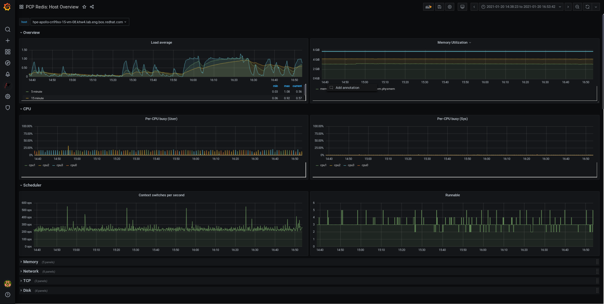 
5. Add a new panel:
   
   1. From the menu, hover over the **Create** icon &gt; **Dashboard** &gt; **Add new panel** icon to add a panel.
   2. In the **Query** tab, select the **Valkey** from the query list instead of the selected **default** option and in the text field of **A**, enter metric, for example, `kernel.all.load` to visualize the kernel load graph.
   3. Optional: Add **Panel title** and **Description**, and update other options from the **Settings**.
   4. Click **Save** to apply changes and save the dashboard. Add **Dashboard name**.
   5. Click **Apply** to apply changes and go back to the dashboard.
      
      **Figure 8.3. Valkey query panel**
      
      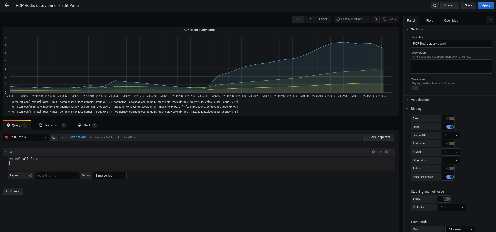 
6. Create an alert rule:
   
   1. In the Valkey query panel, click **Alert** and then click **Create Alert**.
   2. Edit the **Name**, **Evaluate query**, and **For** fields from the **Rule**, and specify the **Conditions** for your alert.
   3. Click **Save** to apply changes and save the dashboard. Click Apply to apply changes and go back to the dashboard.
      
      **Figure 8.4. Creating alerts in the Valkey panel**
      
      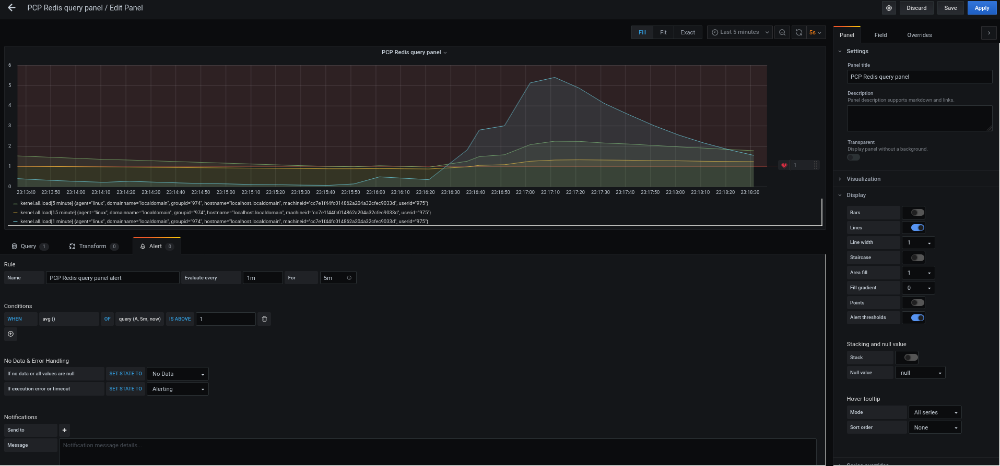 
   4. Optional: In the same panel, scroll down and click **Delete** icon to delete the created rule.
   5. Optional: From the menu, click **Alerting** icon to view the created alert rules with different alert statuses, to edit the alert rule, or to pause the existing rule from the **Alert Rules** tab. To add a notification channel for the created alert rule to receive an alert notification from Grafana, see [Adding notification channels for alerts](#adding-notification-channels-for-alerts "8.7. Adding notification channels for alerts").

<h3 id="adding-notification-channels-for-alerts">8.7. Adding notification channels for alerts</h3>

By adding notification channels, you can receive an alert notification from Grafana whenever the alert rule conditions are met and the system needs further monitoring. You can receive these alerts after selecting any one type from the supported list of notifiers, which includes **DingDing, Discord, Email, Google Hangouts Chat, HipChat, Kafka REST Proxy, LINE, Microsoft Teams, OpsGenie, PagerDuty, Prometheus Alertmanager, Pushover, Sensu, Slack, Telegram, Threema Gateway, VictorOps,** and **webhook**.

**Prerequisites**

- The `grafana-server` is accessible. For more information, see [Accessing the Grafana web UI](#accessing-the-grafana-web-ui "8.4. Accessing the Grafana web UI").
- An alert rule is created. For more information, see [Creating panels and alerts in PCP valkey data source](#creating-panels-and-alerts-in-pcp-valkey-data-source "8.6. Creating panels and alerts in PCP Valkey data source").
- Configured SMTP and added a valid sender’s email address in the `grafana/grafana.ini` file, for example:
  
  ```
  vi /etc/grafana/grafana.ini
  ```
  
  ```plaintext
  # vi /etc/grafana/grafana.ini
  ```
  
  ```
  [smtp]
  enabled = true
  from_address = abc@gmail.com
  ```
  
  ```plaintext
  [smtp]
  enabled = true
  from_address = abc@gmail.com
  ```
  
  Replace *abc@gmail.com* by a valid email address.
- Restarted grafana-server after changing the configurations:
  
  ```
  systemctl restart grafana-server.service
  ```
  
  ```plaintext
  # systemctl restart grafana-server.service
  ```

**Procedure**

1. From the menu, hover over the **Alerting** icon &gt; click **Notification channels** &gt; **Add channel**.
2. In the Add notification channel details pane, perform the following:
   
   1. Enter your name in the **Name** text box.
   2. Select the communication **Type**, for example, **Email** and enter the email address. You can add multiple email addresses using the `;` separator.
   3. Optional: **Configure Optional Email** settings and **Notification** settings.
3. Click **Save**.
4. Select a notification channel in the alert rule:
   
   1. From the menu, hover over the **Alerting** icon and then click **Alert rules**.
   2. From the **Alert Rules** tab, click the created alert rule.
   3. On the **Notifications** tab, select your notification channel name from the **Send to** option, and then add an alert message.
5. Click **Apply**.

**Additional resources**

- [Upstream Grafana documentation for alert notifications](https://grafana.com/docs/grafana/latest/alerting/notifications/)

<h3 id="setting-up-authentication-between-pcp-components">8.8. Setting up authentication between PCP components</h3>

You can configure authentication by using the `scram-sha-256` authentication mechanism, which is supported by PCP through the Simple Authentication Security Layer (SASL) framework.

**Procedure**

1. Install the SASL framework for the `scram-sha-256` authentication mechanism:
   
   ```
   dnf install cyrus-sasl-scram cyrus-sasl-lib
   ```
   
   ```plaintext
   # dnf install cyrus-sasl-scram cyrus-sasl-lib
   ```
2. Specify the supported authentication mechanism and the user database path in the `pmcd.conf` file:
   
   ```
   vi /etc/sasl2/pmcd.conf
   ```
   
   ```plaintext
   # vi /etc/sasl2/pmcd.conf
   ```
   
   ```
   mech_list: scram-sha-256
   sasldb_path: /etc/pcp/passwd.db
   ```
   
   ```plaintext
   mech_list: scram-sha-256
   sasldb_path: /etc/pcp/passwd.db
   ```
3. Create a new user:
   
   ```
   useradd -r metrics
   ```
   
   ```plaintext
   # useradd -r metrics
   ```
   
   Replace *metrics* by your user name.
4. Add the created user in the user database:
   
   ```
   saslpasswd2 -a pmcd metrics
   ```
   
   ```plaintext
   # saslpasswd2 -a pmcd metrics
   ```
   
   ```
   Password:
   Again (for verification):
   ```
   
   ```plaintext
   Password:
   Again (for verification):
   ```
   
   To add the created user, it is required to enter the *metrics* account password.
5. Set the permissions of the user database:
   
   ```
   chown root:pcp /etc/pcp/passwd.db
   ```
   
   ```plaintext
   # chown root:pcp /etc/pcp/passwd.db
   ```
   
   ```
   chmod 640 /etc/pcp/passwd.db
   ```
   
   ```plaintext
   # chmod 640 /etc/pcp/passwd.db
   ```
6. Restart the *pmcd* service:
   
   ```
   systemctl restart pmcd
   ```
   
   ```plaintext
   # systemctl restart pmcd
   ```

**Verification**

- Verify the SASL configuration:
  
  ```
  pminfo -f -h "pcp://127.0.0.1?username=metrics" disk.dev.read
  ```
  
  ```plaintext
  # pminfo -f -h "pcp://127.0.0.1?username=metrics" disk.dev.read
  ```
  
  ```
  Password:
  disk.dev.read
  inst [0 or "sda"] value 19540
  ```
  
  ```plaintext
  Password:
  disk.dev.read
  inst [0 or "sda"] value 19540
  ```

**Additional resources**

- [How can I configure authentication between PCP components, like PMDAs and pmcd in RHEL 8.2? (Red Hat Knowledgebase)](https://access.redhat.com/solutions/5041891)

<h3 id="installing-pcp-bpftrace">8.9. Installing PCP bpftrace</h3>

You can install the `PCP bpftrace` agent to introspect a system and to gather metrics from the kernel and user-space tracepoints. The `bpftrace` agent uses `bpftrace` scripts to gather the metrics. The `bpftrace` scripts use the enhanced Berkeley Packet Filter (eBPF).

**Prerequisites**

- PCP is configured. For more information, see [Setting up PCP with pcp-zeroconf](#setting-up-pcp-with-pcp-zeroconf "8.1. Setting up PCP with pcp-zeroconf").
- The `grafana-server` is configured. For more information, see [Setting up a grafana-server](#setting-up-a-grafana-server "8.2. Setting up a grafana-server").
- The `scram-sha-256` authentication mechanism is configured. For more information, see [Setting up authentication between PCP components](#setting-up-authentication-between-pcp-components "8.8. Setting up authentication between PCP components").

**Procedure**

1. Install the `pcp-pmda-bpftrace` package:
   
   ```
   dnf install pcp-pmda-bpftrace
   ```
   
   ```plaintext
   # dnf install pcp-pmda-bpftrace
   ```
2. Edit the bpftrace.conf file and add the user:
   
   ```
   vi /var/lib/pcp/pmdas/bpftrace/bpftrace.conf
   ```
   
   ```plaintext
   # vi /var/lib/pcp/pmdas/bpftrace/bpftrace.conf
   ```
   
   ```
   [dynamic_scripts]
   enabled = true
   auth_enabled = true
   allowed_users = root,metrics
   ```
   
   ```plaintext
   [dynamic_scripts]
   enabled = true
   auth_enabled = true
   allowed_users = root,metrics
   ```
   
   Replace *metrics* by your user name from [Setting up authentication between PCP components](#setting-up-authentication-between-pcp-components "8.8. Setting up authentication between PCP components").
3. Install `bpftrace` PMDA:
   
   ```
   cd /var/lib/pcp/pmdas/bpftrace/
   ```
   
   ```plaintext
   # cd /var/lib/pcp/pmdas/bpftrace/
   ```
   
   ```
   ./Install
   ```
   
   ```plaintext
   # ./Install
   ```
   
   ```
   Updating the Performance Metrics Name Space (PMNS) ...
   Terminate PMDA if already installed ...
   Updating the PMCD control file, and notifying PMCD …
   Check bpftrace metrics have appeared ... 7 metrics and 6 values
   ```
   
   ```plaintext
   Updating the Performance Metrics Name Space (PMNS) ...
   Terminate PMDA if already installed ...
   Updating the PMCD control file, and notifying PMCD …
   Check bpftrace metrics have appeared ... 7 metrics and 6 values
   ```
   
   The `pmda-bpftrace` is now installed, and can only be used after authenticating your user. For more information, see [Viewing the PCP bpftrace System Analysis dashboard](#viewing-the-pcp-bpftrace-system-analysis-dashboard "8.10. Viewing the PCP bpftrace System Analysis dashboard").

<h3 id="viewing-the-pcp-bpftrace-system-analysis-dashboard">8.10. Viewing the PCP bpftrace System Analysis dashboard</h3>

Using the PCP bpftrace data source, you can access the live data from sources which are not available as normal data from the pmlogger or archives. In the PCP bpftrace data source, you can view the dashboard with an overview of useful metrics.

**Prerequisites**

- The PCP `bpftrace` is installed. For more information, see [Installing PCP bpftrace](#installing-pcp-bpftrace "8.9. Installing PCP bpftrace").
- The `grafana-server` is configured. For more information, see [Setting up a grafana-server](#setting-up-a-grafana-server "8.2. Setting up a grafana-server").

**Procedure**

1. Log into the **Grafana web UI**.
2. In the **Grafana Home** page, click **Add your first data source**.
3. In the **Add data source** pane, type `bpftrace` in the **Filter by name or type** text box and then click **PCP bpftrace**.
4. In the **Data Sources / PCP bpftrace** pane, perform the following:
   
   1. Add *http://localhost:44322* in the URL field.
   2. Toggle the **Basic Auth** option and add the created user credentials in the **User** and **Password** field.
   3. Click **Save & Test**.
      
      **Figure 8.5. Adding PCP bpftrace in the data source**
      
      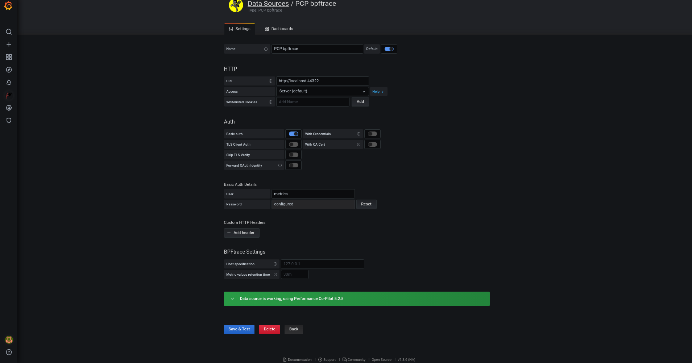 
   4. Click **Dashboards** tab &gt; **Import** &gt; **PCP bpftrace: System Analysis** to see a dashboard with an overview of any useful metrics.
      
      **Figure 8.6. PCP bpftrace: System Analysis**
      
      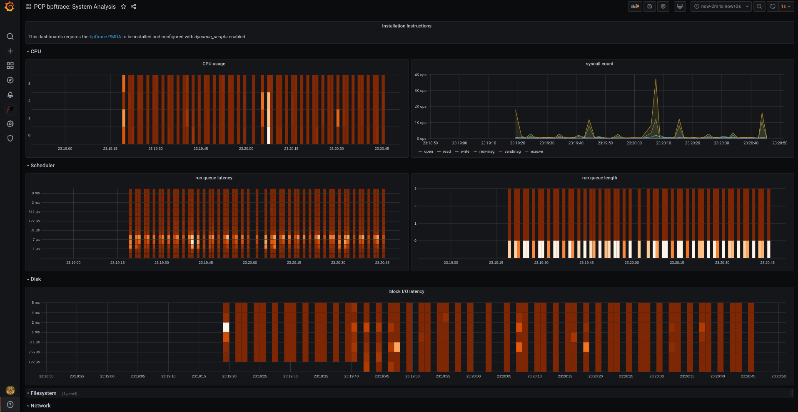 

<h3 id="installing-pcp-vector">8.11. Installing PCP Vector</h3>

You must install pcp vector before you start using it.

**Prerequisites**

- PCP is configured. For more information, see [Setting up PCP with pcp-zeroconf](#setting-up-pcp-with-pcp-zeroconf "8.1. Setting up PCP with pcp-zeroconf").
- The `grafana-server` is configured. For more information, see [Setting up a grafana-server](#setting-up-a-grafana-server "8.2. Setting up a grafana-server").

**Procedure**

- Install the bcc PMDA:
  
  ```
  cd /var/lib/pcp/pmdas/bcc
  ```
  
  ```plaintext
  # cd /var/lib/pcp/pmdas/bcc
  ```
  
  ```
  ./Install
  ```
  
  ```plaintext
  # ./Install
  ```
  
  ```
  [Wed Apr  1 00:27:48] pmdabcc(22341) Info: Initializing, currently in 'notready' state.
  [Wed Apr  1 00:27:48] pmdabcc(22341) Info: Enabled modules:
  [Wed Apr  1 00:27:48] pmdabcc(22341) Info: ['biolatency', 'sysfork',
  [...]
  Updating the Performance Metrics Name Space (PMNS) ...
  Terminate PMDA if already installed ...
  Updating the PMCD control file, and notifying PMCD …
  Check bcc metrics have appeared ... 1 warnings, 1 metrics and 0 values
  ```
  
  ```plaintext
  [Wed Apr  1 00:27:48] pmdabcc(22341) Info: Initializing, currently in 'notready' state.
  [Wed Apr  1 00:27:48] pmdabcc(22341) Info: Enabled modules:
  [Wed Apr  1 00:27:48] pmdabcc(22341) Info: ['biolatency', 'sysfork',
  [...]
  Updating the Performance Metrics Name Space (PMNS) ...
  Terminate PMDA if already installed ...
  Updating the PMCD control file, and notifying PMCD …
  Check bcc metrics have appeared ... 1 warnings, 1 metrics and 0 values
  ```

<h3 id="viewing-the-pcp-vector-checklist">8.12. Viewing the PCP Vector Checklist</h3>

The PCP Vector data source displays live metrics and uses the pcp metrics. It analyzes data for individual hosts. After adding the PCP Vector data source, you can view the dashboard with an overview of useful metrics and view the related troubleshooting or reference links in the checklist.

**Prerequisites**

- The PCP Vector is installed. For more information, see [Installing PCP Vector](#installing-pcp-vector "8.11. Installing PCP Vector").
- The `grafana-server` is accessible. For more information, see [Accessing the Grafana web UI](#accessing-the-grafana-web-ui "8.4. Accessing the Grafana web UI").

**Procedure**

1. Log into the **Grafana web UI**.
2. In the **Grafana Home** page, click **Add your first data source**.
3. In the **Add data source** pane, type vector in the **Filter by name or type** text box and then click **PCP Vector**.
4. In the **Data Sources / PCP Vector** pane, perform the following:
   
   1. Add *http://localhost:44322* in the **URL** field and then click **Save & Test**.
   2. Click **Dashboards** tab &gt; **Import** * **PCP Vector: Host Overview** to see a dashboard with an overview of any useful metrics.
      
      **Figure 8.7. PCP Vector: Host Overview**
      
      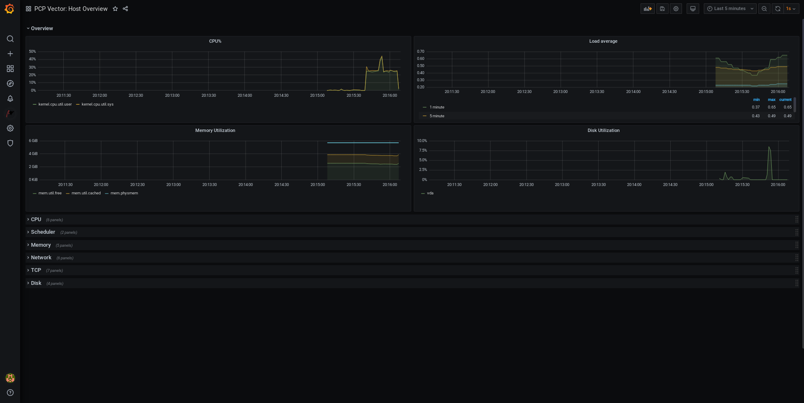 
5. From the menu, hover over the **Performance Co-Pilot** plugin and then click **PCP Vector** Checklist.
   
   In the PCP checklist, click help or warning icon to view the related troubleshooting or reference links.
   
   **Figure 8.8. Performance Co-Pilot / PCP Vector Checklist**
   
   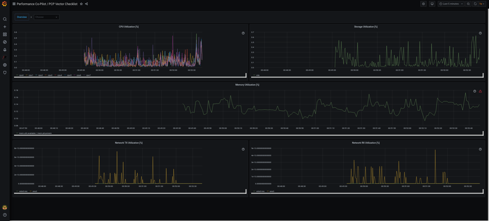 

<h3 id="using-heatmaps-in-grafana">8.13. Using heatmaps in Grafana</h3>

You can use heatmaps in Grafana to view histograms of your data over time, identify trends and patterns in your data, and see how they change over time. Each column within a heatmap represents a single histogram with different colored cells representing the different densities of observation of a given value within that histogram.

**Prerequisites**

- Valkey is configured. For more information see [Configuring Valkey](#configuring-valkey "8.3. Configuring valkey").
- The `grafana-server` is accessible. For more information, see [Accessing the Grafana web UI](#accessing-the-grafana-web-ui "8.4. Accessing the Grafana web UI").
- The PCP valkey data source is configured. For more information see [Creating panels and alerts in PCP Valkey data source](#creating-panels-and-alerts-in-pcp-valkey-data-source "8.6. Creating panels and alerts in PCP Valkey data source").

**Procedure**

1. Hover the cursor over the **Dashboards** tab and click **+ New dashboard**.
2. In the **Add panel** menu, click **Add a new panel**.
3. In the **Query** tab:
   
   1. Select **Valkey** from the query list instead of the selected default option.
   2. In the text field of **A**, enter a metric, for example, `kernel.all.load` to visualize the kernel load graph.
4. Click the visualization dropdown menu, which is set to **Time series** by default, and then click **Heatmap**.
5. Optional: In the **Panel Options** dropdown menu, add a **Panel Title** and **Description**.
6. In the **Heatmap** dropdown menu, under the **Calculate from data** setting, click **Yes**.
   
   **Figure 8.9. Heatmap**
   
   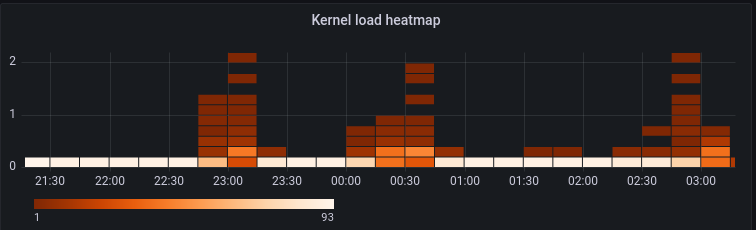 
7. Optional: In the **Colors** dropdown menu, change the **Scheme** from the default **Orange** and select the number of steps (color shades).
8. Optional: In the **Tooltip** dropdown menu, under the **Show histogram (Y Axis)** setting, click the toggle to display a cell’s position within its specific histogram when hovering your cursor over a cell in the heatmap. For example:
   
   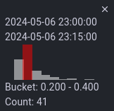

<h3 id="managing-selinux-booleans-for-grafana">8.14. Managing SELinux booleans for Grafana</h3>

The `grafana-selinux` subpackage includes several SELinux booleans that control Grafana’s access to external services. These booleans are off by default. You can turn them `on` or `off` based on your system requirements.

**Prerequisites**

- You have installed `grafana-selinux` subpackage.
- You have root privileges.

**Procedure**

1. View all Grafana-related SELinux booleans:
   
   ```
   semanage boolean -l | grep grafana
   ```
   
   ```plaintext
   # semanage boolean -l | grep grafana
   ```
2. Enable a SELinux boolean:
   
   ```
   setsebool [-P] <boolean_name> on
   ```
   
   ```plaintext
   # setsebool [-P] <boolean_name> on
   ```
   
   - Replace *&lt;boolean\_name&gt;* with the name of the SELinux boolean you want to enable.
   - Use the *-P* option to make the change persistent across system reboots.
3. Optional: Turn off any SELinux option:
   
   ```
   setsebool [-P] <boolean_name> off
   ```
   
   ```plaintext
   # setsebool [-P] <boolean_name> off
   ```

<h3 id="troubleshooting-grafana-issues">8.15. Troubleshooting Grafana issues</h3>

At times, it is necessary to troubleshoot Grafana issues, such as, Grafana does not display any data, the dashboard is black, or similar issues.

**Procedure**

- Verify that the `pmlogger` service is up and running by executing the following command:
  
  ```
  systemctl status pmlogger
  ```
  
  ```plaintext
  $ systemctl status pmlogger
  ```
- Verify if files were created or modified to the disk by executing the following command:
  
  ```
  ls /var/log/pcp/pmlogger/$(hostname)/ -rlt
  ```
  
  ```plaintext
  $ ls /var/log/pcp/pmlogger/$(hostname)/ -rlt
  ```
  
  ```
  total 4024
  -rw-r--r--. 1 pcp pcp   45996 Oct 13  2019 20191013.20.07.meta.xz
  -rw-r--r--. 1 pcp pcp     412 Oct 13  2019 20191013.20.07.index
  -rw-r--r--. 1 pcp pcp   32188 Oct 13  2019 20191013.20.07.0.xz
  -rw-r--r--. 1 pcp pcp   44756 Oct 13  2019 20191013.20.30-00.meta.xz
  [..]
  ```
  
  ```plaintext
  total 4024
  -rw-r--r--. 1 pcp pcp   45996 Oct 13  2019 20191013.20.07.meta.xz
  -rw-r--r--. 1 pcp pcp     412 Oct 13  2019 20191013.20.07.index
  -rw-r--r--. 1 pcp pcp   32188 Oct 13  2019 20191013.20.07.0.xz
  -rw-r--r--. 1 pcp pcp   44756 Oct 13  2019 20191013.20.30-00.meta.xz
  [..]
  ```
- Verify that the `pmproxy` service is running by executing the following command:
  
  ```
  systemctl status pmproxy
  ```
  
  ```plaintext
  $ systemctl status pmproxy
  ```
- Verify that `pmproxy` is running, time series support is enabled, and a connection to valkey is established by viewing the `/var/log/pcp/pmproxy/pmproxy.log` file and ensure that it contains the following text:
  
  ```
  pmproxy(1716) Info: valkey slots, command keys, schema version setup
  Here, 1716 is the PID of pmproxy, which will be different for every invocation of pmproxy.
  Verify if the valkey database contains any keys by executing the following command:
  $ valkey-cli dbsize
  (integer) 34837
  ```
  
  ```plaintext
  pmproxy(1716) Info: valkey slots, command keys, schema version setup
  Here, 1716 is the PID of pmproxy, which will be different for every invocation of pmproxy.
  Verify if the valkey database contains any keys by executing the following command:
  $ valkey-cli dbsize
  (integer) 34837
  ```
- Verify if any PCP metrics are in the valkey database and pmproxy is able to access them by executing the following commands:
  
  ```
  pmseries disk.dev.read
  ```
  
  ```plaintext
  $ pmseries disk.dev.read
  ```
  
  ```
  2eb3e58d8f1e231361fb15cf1aa26fe534b4d9df
  $ pmseries "disk.dev.read[count:10]"
  2eb3e58d8f1e231361fb15cf1aa26fe534b4d9df
      [Mon Jul 26 12:21:10.085468000 2021] 117971 70e83e88d4e1857a3a31605c6d1333755f2dd17c
      [Mon Jul 26 12:21:00.087401000 2021] 117758 70e83e88d4e1857a3a31605c6d1333755f2dd17c
      [Mon Jul 26 12:20:50.085738000 2021] 116688 70e83e88d4e1857a3a31605c6d1333755f2dd17c
  [...]
  $ valkey-cli --scan --pattern "*$(pmseries 'disk.dev.read')"
  pcp:metric.name:series:2eb3e58d8f1e231361fb15cf1aa26fe534b4d9df
  pcp:values:series:2eb3e58d8f1e231361fb15cf1aa26fe534b4d9df
  pcp:desc:series:2eb3e58d8f1e231361fb15cf1aa26fe534b4d9df
  pcp:labelvalue:series:2eb3e58d8f1e231361fb15cf1aa26fe534b4d9df
  pcp:instances:series:2eb3e58d8f1e231361fb15cf1aa26fe534b4d9df
  pcp:labelflags:series:2eb3e58d8f1e231361fb15cf1aa26fe534b4d9df
  ```
  
  ```plaintext
  2eb3e58d8f1e231361fb15cf1aa26fe534b4d9df
  $ pmseries "disk.dev.read[count:10]"
  2eb3e58d8f1e231361fb15cf1aa26fe534b4d9df
      [Mon Jul 26 12:21:10.085468000 2021] 117971 70e83e88d4e1857a3a31605c6d1333755f2dd17c
      [Mon Jul 26 12:21:00.087401000 2021] 117758 70e83e88d4e1857a3a31605c6d1333755f2dd17c
      [Mon Jul 26 12:20:50.085738000 2021] 116688 70e83e88d4e1857a3a31605c6d1333755f2dd17c
  [...]
  $ valkey-cli --scan --pattern "*$(pmseries 'disk.dev.read')"
  pcp:metric.name:series:2eb3e58d8f1e231361fb15cf1aa26fe534b4d9df
  pcp:values:series:2eb3e58d8f1e231361fb15cf1aa26fe534b4d9df
  pcp:desc:series:2eb3e58d8f1e231361fb15cf1aa26fe534b4d9df
  pcp:labelvalue:series:2eb3e58d8f1e231361fb15cf1aa26fe534b4d9df
  pcp:instances:series:2eb3e58d8f1e231361fb15cf1aa26fe534b4d9df
  pcp:labelflags:series:2eb3e58d8f1e231361fb15cf1aa26fe534b4d9df
  ```
- Verify if there are any errors in the Grafana logs by executing the following command:
  
  ```
  journalctl -e -u grafana-server
  ```
  
  ```plaintext
  $ journalctl -e -u grafana-server
  ```
  
  ```
  -- Logs begin at Mon 2021-07-26 11:55:10 IST, end at Mon 2021-07-26 12:30:15 IST. --
  Jul 26 11:55:17 localhost.localdomain systemd[1]: Starting Grafana instance...
  Jul 26 11:55:17 localhost.localdomain grafana-server[1171]: t=2021-07-26T11:55:17+0530 lvl=info msg="Starting Grafana" logger=server version=7.3.6 c>
  Jul 26 11:55:17 localhost.localdomain grafana-server[1171]: t=2021-07-26T11:55:17+0530 lvl=info msg="Config loaded from" logger=settings file=/usr/s>
  Jul 26 11:55:17 localhost.localdomain grafana-server[1171]: t=2021-07-26T11:55:17+0530 lvl=info msg="Config loaded from" logger=settings file=/etc/g>
  [...]
  ```
  
  ```plaintext
  -- Logs begin at Mon 2021-07-26 11:55:10 IST, end at Mon 2021-07-26 12:30:15 IST. --
  Jul 26 11:55:17 localhost.localdomain systemd[1]: Starting Grafana instance...
  Jul 26 11:55:17 localhost.localdomain grafana-server[1171]: t=2021-07-26T11:55:17+0530 lvl=info msg="Starting Grafana" logger=server version=7.3.6 c>
  Jul 26 11:55:17 localhost.localdomain grafana-server[1171]: t=2021-07-26T11:55:17+0530 lvl=info msg="Config loaded from" logger=settings file=/usr/s>
  Jul 26 11:55:17 localhost.localdomain grafana-server[1171]: t=2021-07-26T11:55:17+0530 lvl=info msg="Config loaded from" logger=settings file=/etc/g>
  [...]
  ```

<h2 id="managing-power-consumption-with-powertop">Chapter 9. Managing power consumption with PowerTOP</h2>

Reducing the overall power consumption of computer systems helps to save cost. Effectively optimizing energy consumption of each system component includes studying different tasks that your system performs, and configuring each component to ensure that its performance is correct for that job. Lowering the power consumption of a specific component or of the system as a whole leads to lower heat and performance.

Proper power management results in:

- Heat reduction for servers and computing centers.
- Reduced secondary costs, including cooling, space, cables, generators, and uninterruptible power supplies (UPS).
- Extended battery life for laptops.
- Lower carbon dioxide output.
- Meeting government regulations or legal requirements regarding Green IT, for example, Energy Star.
- Meeting company guidelines for new systems.

<h3 id="power-management-basics">9.1. Power management basics</h3>

Effective power management is built on the following principles:

An idle CPU should only wake up when needed

Since Red Hat Enterprise Linux 6, the kernel runs tickless, which means the previous periodic timer interrupts have been replaced with on-demand interrupts. Therefore, idle CPUs are allowed to remain idle until a new task is queued for processing, and CPUs that have entered lower power states can remain in these states longer. However, benefits from this feature can be offset if your system has applications that create unnecessary timer events. Polling events, such as checks for volume changes or mouse movement, are examples of such events.

Unused hardware and devices should be disabled completely

This is true for devices that have moving parts, for example, hard disks. In addition, some applications may leave an unused but enabled device "open". When this occurs, the kernel assumes that the device is in use, which can prevent the device from going into a power saving state.

Low activity should translate to low wattage

Power efficiency often depends on modern hardware and proper BIOS or UEFI configuration, especially on non-x86 architectures. Ensure that your system is running the latest official firmware, and that power management features are enabled in the BIOS or device configuration settings.

Some features to look for include:

- Collaborative Processor Performance Controls (CPPC) support for ARM64
- PowerNV support for IBM Power Systems
- Cool’n’Quiet
- ACPI (C-state)
- Smart

If your hardware has support for these features and they are enabled in the BIOS, Red Hat Enterprise Linux uses them by default.

Different forms of CPU states and their effects

Modern CPUs together with Advanced Configuration and Power Interface (ACPI) provide different power states. The three different states are:

- Sleep (C-states)
- Frequency and voltage (P-states)
- Heat output (T-states or thermal states)
  
  A CPU running on the lowest sleep state consumes the least amount of energy, but it also takes considerably more time to wake it up from that state when needed. In very rare cases this can lead to the CPU having to wake up immediately every time it just went to sleep. This situation results in an effectively permanently busy CPU and loses some of the potential power saving if another state had been used.

A turned off machine uses the least amount of power

One of the best ways to save power is to turn off systems. For example, your company can develop a corporate culture focused on "green IT" awareness under a guideline to turn off machines during lunch break or when going home. You also might consolidate several physical servers into one bigger server and virtualize them by using the virtualization technology, shipped with Red Hat Enterprise Linux.

**Additional resources**

- [Audit and analysis overview](#audit-and-analysis-overview "9.2. Audit and analysis overview")
- [Tools for auditing](#tools-for-auditing "9.3. Tools for auditing")

<h3 id="audit-and-analysis-overview">9.2. Audit and analysis overview</h3>

The detailed manual audit, analysis, and tuning of a single system is usually the exception because the time and cost spent to do so typically outweighs the benefits gained from these last pieces of system tuning. However, performing these tasks once for a large number of nearly identical systems where you can reuse the same settings for all systems can be very useful. For example, consider the deployment of thousands of desktop systems, or an HPC cluster where the machines are nearly identical.

Another reason for auditing and analysis is to provide a basis for comparison against which you can identify regressions or changes in system behavior in the future. The results of this analysis can be very helpful in cases where hardware, BIOS, or software updates happen regularly and you want to avoid any surprises with regard to power consumption. Generally, a thorough audit and analysis gives you a much better idea of what is really happening on a particular system.

Auditing and analyzing a system with regard to power consumption is relatively hard, even with the most modern systems available. Most systems do not provide the necessary means to measure power use by using software. Exceptions exist though:

- iLO management console of Hewlett Packard server systems has a power management module that you can access through the web.
- IBM provides a similar solution in their BladeCenter power management module.
- On some Dell systems, the IT Assistant offers power monitoring capabilities.

Other vendors are likely to offer similar capabilities for their server platforms, but there is no single solution available that is supported by all vendors.

<h3 id="tools-for-auditing">9.3. Tools for auditing</h3>

Red Hat Enterprise Linux (RHEL) offers tools for system auditing and analysis. Most of them can be used as supplementary sources of information when you want to verify what you have discovered already or when you need more in-depth information about certain parts. Many of these tools are used for performance tuning, including:

PowerTOP

PowerTOP identifies specific components of kernel and user-space applications that frequently wake up the CPU. Intel CPU’s Intel Hardware P-State (HWP) adjusts CPU frequency and voltage to regulate the power efficiency and performance. You can use the `powertop` command as root to start the PowerTOP tool and `powertop --calibrate` to calibrate the power estimation engine.

`diskdevstat` and `netdevstat`

These are SystemTap tools that collect detailed information about the disk and network activity of all applications running on a system. Using the collected statistics by these tools, you can identify applications that waste power with many small I/O operations rather than fewer, larger operations. Using the `dnf install tuned-utils-systemtap kernel-debuginfo` command as root, installs the `diskdevstat` and `netdevstat` tools. To view detailed information about the disk and network activity, use:

```
diskdevstat
```

```plaintext
# diskdevstat
```

```
PID   UID   DEV   WRITE_CNT   WRITE_MIN   WRITE_MAX   WRITE_AVG   READ_CNT   READ_MIN   READ_MAX   READ_AVG   COMMAND

3575  1000  dm-2   59          0.000      0.365        0.006        5         0.000        0.000      0.000      mozStorage #5
3575  1000  dm-2    7          0.000      0.000        0.000        0         0.000        0.000      0.000      localStorage DB
[...]
```

```plaintext
PID   UID   DEV   WRITE_CNT   WRITE_MIN   WRITE_MAX   WRITE_AVG   READ_CNT   READ_MIN   READ_MAX   READ_AVG   COMMAND

3575  1000  dm-2   59          0.000      0.365        0.006        5         0.000        0.000      0.000      mozStorage #5
3575  1000  dm-2    7          0.000      0.000        0.000        0         0.000        0.000      0.000      localStorage DB
[...]
```

```
netdevstat
```

```plaintext
# netdevstat
```

```
PID   UID   DEV       XMIT_CNT   XMIT_MIN   XMIT_MAX   XMIT_AVG   RECV_CNT   RECV_MIN   RECV_MAX   RECV_AVG   COMMAND
3572  991  enp0s31f6    40       0.000      0.882       0.108        0         0.000       0.000       0.000     openvpn
3575  1000 enp0s31f6    27       0.000      1.363       0.160        0         0.000       0.000       0.000     Socket Thread
[...]
```

```plaintext
PID   UID   DEV       XMIT_CNT   XMIT_MIN   XMIT_MAX   XMIT_AVG   RECV_CNT   RECV_MIN   RECV_MAX   RECV_AVG   COMMAND
3572  991  enp0s31f6    40       0.000      0.882       0.108        0         0.000       0.000       0.000     openvpn
3575  1000 enp0s31f6    27       0.000      1.363       0.160        0         0.000       0.000       0.000     Socket Thread
[...]
```

With these commands, you can specify three parameters: `update_interval`, `total_duration`, and `display_histogram`.

TuneD

It is a profile-based system tuning tool that uses the `udev` device manager to monitor connected devices, and enables both static and dynamic tuning of system settings. You can use the `tuned-adm recommend` command to determine which profile Red Hat suggests as the most suitable for a particular product.

Virtual memory statistics (`vmstat`)

A tool provided by the `procps-ng` package that you can use to view the detailed information about processes, memory, paging, block I/O, traps, and CPU activity. You can use the following command to view this information:

```
vmstat
```

```plaintext
$ vmstat
```

```
procs -----------memory---------- ---swap-- -----io---- -system-- ------cpu-----
r  b  swpd  free    buff   cache   si   so  bi   bo   in  cs  us  sy id  wa  st
1  0   0   5805576 380856 4852848   0    0  119  73  814  640  2   2 96   0   0
```

```plaintext
procs -----------memory---------- ---swap-- -----io---- -system-- ------cpu-----
r  b  swpd  free    buff   cache   si   so  bi   bo   in  cs  us  sy id  wa  st
1  0   0   5805576 380856 4852848   0    0  119  73  814  640  2   2 96   0   0
```

View the active and inactive memory by using the `vmstat -a` command.

`iostat`

Provided by the `sysstat` package, this tool is similar to `vmstat`, but only for monitoring I/O on block devices. It provides more verbose output and statistics. You can use the following command to monitor the system I/O:

```
iostat
```

```plaintext
$ iostat
```

```
avg-cpu:  %user   %nice %system %iowait  %steal   %idle
           2.05    0.46    1.55    0.26    0.00   95.67

Device     tps     kB_read/s    kB_wrtn/s    kB_read    kB_wrtn
nvme0n1    53.54     899.48     616.99      3445229     2363196
dm-0       42.84     753.72     238.71      2886921      914296
dm-1        0.03       0.60       0.00         2292           0
dm-2       24.15     143.12     379.80       548193     1454712
```

```plaintext
avg-cpu:  %user   %nice %system %iowait  %steal   %idle
           2.05    0.46    1.55    0.26    0.00   95.67

Device     tps     kB_read/s    kB_wrtn/s    kB_read    kB_wrtn
nvme0n1    53.54     899.48     616.99      3445229     2363196
dm-0       42.84     753.72     238.71      2886921      914296
dm-1        0.03       0.60       0.00         2292           0
dm-2       24.15     143.12     379.80       548193     1454712
```

`blktrace`

Provides detailed information about how time is spent in the I/O subsystem. You can use the following command to view this information in human readable format:

```
blktrace -d /dev/dm-0 -o - | blkparse -i -
```

```plaintext
# blktrace -d /dev/dm-0 -o - | blkparse -i -
```

```
253,0   1    1   0.000000000  17694  Q   W 76423384 + 8 [kworker/u16:1]
253,0   2    1   0.001926913     0   C   W 76423384 + 8 [0]
[...]
```

```plaintext
253,0   1    1   0.000000000  17694  Q   W 76423384 + 8 [kworker/u16:1]
253,0   2    1   0.001926913     0   C   W 76423384 + 8 [0]
[...]
```

The first column, `253,0` is the device major and minor tuple. The second column, `1`, gives information about the CPU, followed by columns for `timestamps` and `PID` of the process issuing the IO process. The sixth column, `Q`, shows the event type, the 7th column, `W` for write operation, the 8th column, `76423384`, is the block number, and the `+ 8` is the number of requested blocks. The last field, `[kworker/u16:1]`, is the process name. By default, the `blktrace` command runs forever until the process is explicitly killed. You can use the `-w` option to specify the run-time duration.

`turbostat`

It is provided by the `kernel-tools` package. It reports on processor topology, frequency, idle power-state statistics, temperature, and power usage on x86-64 processors. You can use the following command to view the summary:

```
turbostat
```

```plaintext
# turbostat
```

```
CPUID(0): GenuineIntel 0x16 CPUID levels; 0x80000008 xlevels; family:model:stepping 0x6:8e:a (6:142:10)
CPUID(1): SSE3 MONITOR SMX EIST TM2 TSC MSR ACPI-TM HT TM
CPUID(6): APERF, TURBO, DTS, PTM, HWP, HWPnotify, HWPwindow, HWPepp, No-HWPpkg, EPB
[...]
```

```plaintext
CPUID(0): GenuineIntel 0x16 CPUID levels; 0x80000008 xlevels; family:model:stepping 0x6:8e:a (6:142:10)
CPUID(1): SSE3 MONITOR SMX EIST TM2 TSC MSR ACPI-TM HT TM
CPUID(6): APERF, TURBO, DTS, PTM, HWP, HWPnotify, HWPwindow, HWPepp, No-HWPpkg, EPB
[...]
```

By default, `turbostat` prints a summary of counter results for the entire screen, followed by counter results every 5 seconds. Specify a different period between counter results with the `-i` option, for example, use turbostat `-i 10` to print results every `10` seconds instead. `turbostat` is also useful for identifying servers that are inefficient in terms of power usage or idle time. It also helps to identify the rate of system management interrupts (SMIs) occurring on the system. It can also be used to verify the effects of power management tuning.

`cpupower`

The `cpupower` package contains a collection of tools to examine and tune power saving related features of processors. You can use the `cpupower` command with the `frequency-info`, `frequency-set`, `idle-info`, `idle-set`, `set`, `info`, and monitor options to display and set processor related values.

For example, to view available `cpufreq` governors, use:

```
cpupower frequency-info --governors
```

```plaintext
$ cpupower frequency-info --governors
```

```
analyzing CPU 0:
  available cpufreq governors: performance powersave
```

```plaintext
analyzing CPU 0:
  available cpufreq governors: performance powersave
```

GNOME Power Manager

It is a daemon that is installed as part of the GNOME desktop environment. GNOME Power Manager notifies you of changes in your system’s power status, for example, a change from battery to AC power. It also reports battery status, and warns you when battery power is low.

`pmda-denki`

`pmda-denki` monitors power consumption. It’s part of the Performance Co-Pilot suite, and helps to monitor consumption over time, and visualize it.

**Additional resources**

- [Take control of your RHEL systems’ power consumption with pmda-denki](https://www.redhat.com/en/blog/take-control-your-rhel-systems-power-consumption)
- [Optimizing system performance with TuneD](#optimizing-system-performance-with-tuned "Chapter 2. Optimizing system performance with TuneD")
- [Optimizing power consumption](#optimizing-power-consumption "9.11. Optimizing power consumption")

<h3 id="the-purpose-of-powertop">9.4. The purpose of PowerTOP</h3>

PowerTOP is a program that diagnoses issues related to power consumption and provides suggestions on how to extend battery lifetime. The PowerTOP tool can provide an estimate of the total power usage of the system and also individual power usage for each process, device, kernel worker, timer, and interrupt handler. The tool can also identify specific components of kernel and user-space applications that frequently wake up the CPU. Red Hat Enterprise Linux uses version 2.x of PowerTOP.

<h3 id="installing-powertop">9.5. Installing PowerTOP</h3>

You can install PowerTop and start using it to diagnose issues related to power consumption.

**Procedure**

- Open the command line and enter:
  
  ```
  dnf install powertop
  ```
  
  ```plaintext
  # dnf install powertop
  ```

<h3 id="starting-powertop">9.6. Starting PowerTOP</h3>

After you install it on your system, you can start using PowerTop to optimize system performance.

**Prerequisites**

- You are running your laptop on battery power.

**Procedure**

- To run PowerTOP, enter:
  
  ```
  powertop
  ```
  
  ```plaintext
  # powertop
  ```

<h3 id="calibrating-powertop">9.7. Calibrating PowerTOP</h3>

You can use the PowerTOP calibration process to improve the accuracy of power consumption measurements on your laptop.

**Procedure**

- On a laptop, you can calibrate the power estimation engine by running the following command:
  
  ```
  powertop --calibrate
  ```
  
  ```plaintext
  # powertop --calibrate
  ```
  
  Let the calibration finish without interacting with the machine during the process. Calibration takes time because the process performs various tests, cycles through brightness levels and switches devices on and off. When the calibration process is completed, PowerTOP starts as normal. Let it run for approximately an hour to collect data.
  
  When enough data is collected, power estimation figures will be displayed in the first column of the output table.

<h3 id="setting-the-measuring-interval">9.8. Setting the measuring interval</h3>

By default, PowerTOP takes measurements in 20 seconds intervals. But, you can change this measuring frequency based on your requirements.

**Procedure**

- To change the measuring frequency, run the `powertop` command with the `--time` option:
  
  ```
  powertop --time=<time_in_seconds>
  ```
  
  ```plaintext
  # powertop --time=<time_in_seconds>
  ```

<h3 id="controlling-cpu-frequency-drivers-and-modes">9.9. Controlling CPU frequency drivers and modes</h3>

While using the Intel P-State driver, PowerTOP only displays values in the `Frequency Stats` tab if the driver is in passive mode. But, even in this case, the values can be incomplete. In total, there are three possible modes of the **Intel P-State** driver:

- Active mode with Hardware P-States (HWP)
- Active mode without HWP
- Passive mode

Switching to the ACPI CPUfreq driver results in complete information being displayed by PowerTOP. However, it is recommended to keep your system on the default settings.

**Procedure**

1. View what driver is loaded and in what mode:
   
   ```
   cat /sys/devices/system/cpu/cpu0/cpufreq/scaling_driver
   ```
   
   ```plaintext
   # cat /sys/devices/system/cpu/cpu0/cpufreq/scaling_driver
   ```
   
   - *intel\_pstate* is returned if the **Intel P-State** driver is loaded and in active mode.
   - *intel\_cpufreq* is returned if the **Intel P-State** driver is loaded and in passive mode.
   - *acpi-cpufreq* is returned if the **ACPI CPUfreq** driver is loaded.
2. While using the **Intel P-State** driver:
   
   1. Add the following argument to the kernel boot command line to force the driver to run in passive mode:
      
      ```
      intel_pstate=passive
      ```
      
      ```plaintext
      intel_pstate=passive
      ```
   2. To disable the **Intel P-State** driver and use the **ACPI CPUfreq** driver, add the following argument to the kernel boot command line:
      
      ```
      intel_pstate=disable
      ```
      
      ```plaintext
      intel_pstate=disable
      ```

<h3 id="generating-an-html-output">9.10. Generating an HTML output</h3>

You can also generate an HTML report apart from the powertop’s output in the command line.

**Procedure**

- Run the `powertop` command with the `--html` option:
  
  ```
  powertop --html=<htmlfile.html>
  ```
  
  ```plaintext
  # powertop --html=<htmlfile.html>
  ```
  
  Replace the *&lt;htmlfile.html&gt;* parameter with the required name for the output file.

<h3 id="optimizing-power-consumption">9.11. Optimizing power consumption</h3>

You can use either the `powertop` service or the `powertop2tuned` utility to optimize power consumption.

<h4 id="optimizing-power-consumption-using-the-powertop-service">9.11.1. Optimizing power consumption using the powertop service</h4>

You can use the `powertop` service to automatically enable all PowerTOP’s suggestions from the **Tunables** tab on the boot.

**Procedure**

- Enable the `powertop` service:
  
  ```
  systemctl enable powertop
  ```
  
  ```plaintext
  # systemctl enable powertop
  ```

<h4 id="the-powertop2tuned-utility">9.11.2. The powertop2tuned utility</h4>

Use the `powertop2tuned` utility to create custom **TuneD** profiles from PowerTOP suggestions. By default, `powertop2tuned` creates profiles in the `/etc/tuned/` directory, and bases the custom profile on the currently selected **TuneD** profile. For safety reasons, all PowerTOP tunings are initially disabled in the new profile. You can enable the tunings by uncommenting them in the `/etc/tuned/profiles/profile_name/tuned.conf` file.

Use the `--enable` or `-e` option to generate a new profile that enables most of the tunings suggested by PowerTOP. Certain potentially problematic tunings, such as the USB `autosuspend`, are disabled by default and need to be uncommented manually.

<h4 id="optimizing-power-consumption-using-the-powertop2tuned-utility">9.11.3. Optimizing power consumption using the powertop2tuned utility</h4>

You can use the `powertop2tuned` utility to generate a custom TuneD profile that helps optimize your system’s power consumption.

**Prerequisites**

- The `powertop2tuned` utility is installed on the system.
  
  ```
  dnf install tuned-utils
  ```
  
  ```plaintext
  # dnf install tuned-utils
  ```

**Procedure**

1. Create a custom profile:
   
   ```
   powertop2tuned <new_profile_name>
   ```
   
   ```plaintext
   # powertop2tuned <new_profile_name>
   ```
2. Activate the new profile:
   
   ```
   tuned-adm profile <new_profile_name>
   ```
   
   ```plaintext
   # tuned-adm profile <new_profile_name>
   ```

<h4 id="comparing-powertop2tuned-and-powertop-service-usage">9.11.4. Comparing powertop2tuned and powertop.service usage</h4>

You can prefer optimizing power consumption with `powertop2tuned` over `powertop.service` for the following reasons:

- The `powertop2tuned` utility represents integration of PowerTOP into TuneD, which enables the benefit of both tools.
- The `powertop2tuned` utility allows for fine-grained control of enabled tuning.
- With `powertop2tuned`, potentially dangerous tuning is not automatically enabled.
- With `powertop2tuned`, rollback is possible without reboot.

<h2 id="getting-started-with-perf">Chapter 10. Getting started with perf</h2>

As a system administrator, you can use the `perf` tool to collect and analyze performance data of your system. The `perf` user-space tool interfaces with the kernel-based subsystem Performance Counters for Linux (PCL). `perf` is a tool that uses the Performance Monitoring Unit (PMU) to measure, record, and monitor a variety of hardware and software events. `perf` also supports `tracepoints`, `kprobes`, and `uprobes`.

<h3 id="installing-perf">10.1. Installing perf</h3>

You must install the `perf` user-space tool to start using the `perf` tool.

**Procedure**

- Install the perf tool:
  
  ```
  dnf install perf
  ```
  
  ```plaintext
  # dnf install perf
  ```

<h3 id="common-perf-commands">10.2. Common perf commands</h3>

You can use the following commonly used `perf` commands to collect and analyze performance data.

perf stat

Provides overall statistics for common performance events, including instructions executed and clock cycles consumed. Options allow for selection of events other than the default measurement events.

perf record

Records performance data into a file, `perf.data`, which can be later analyzed by using the `perf report` command.

perf report

Reads and displays the performance data from the `perf.data` file created by the `perf record` command.

perf list

Lists the events available on a particular machine. These events vary based on performance monitoring hardware and software configuration of the system.

perf top

Performs a similar function to the top utility. It generates and displays a performance counter profile in real time.

perf trace

Performs a similar function to the `strace` tool. It monitors the system calls used by a specified thread or process and all signals received by that application.

perf help

Displays a complete list of the `perf` commands.

<h2 id="profiling-cpu-usage-in-real-time-with-perf-top">Chapter 11. Profiling CPU usage in real time with perf top</h2>

You can use the `perf top` command to measure CPU usage of different functions in real time.

<h3 id="the-purpose-of-perf-top">11.1. The purpose of perf top</h3>

The `perf top` command is used for real-time system profiling and functions similarly to the top utility. However, where the top utility generally shows you how much CPU time a given process or thread is using, `perf top` shows you how much CPU time each specific function uses. In its default state, `perf top` informs you about functions being used across all CPUs in both the user-space and the kernel-space. To use `perf top` you need root access.

<h3 id="profiling-cpu-usage-with-perf-top">11.2. Profiling CPU usage with perf top</h3>

You can use `perf top` to monitor real-time CPU usage and identify functions consuming the most processing time.

**Prerequisites**

- You have the `perf` user space tool installed. For more information, see [Installing perf](#installing-perf "10.1. Installing perf").
- You have root access.

**Procedure**

- Start the perf top monitoring interface:
  
  ```
  perf top
  ```
  
  ```plaintext
  # perf top
  ```
  
  ```
  The monitoring interface looks similar to the following:
  Samples: 8K of event 'cycles', 2000 Hz, Event count (approx.): 4579432780 lost: 0/0 drop: 0/0
  Overhead  Shared Object       Symbol
     2.20%  [kernel]            [k] do_syscall_64
     2.17%  [kernel]            [k] module_get_kallsym
     1.49%  [kernel]            [k] copy_user_enhanced_fast_string
     1.37%  libpthread-2.29.so  [.] pthread_mutex_lock 1.31% [unknown] [.] 0000000000000000 1.07% [kernel] [k] psi_task_change 1.04% [kernel] [k] switch_mm_irqs_off 0.94% [kernel] [k] fget
     0.74%  [kernel]            [k] entry_SYSCALL_64
     0.69%  [kernel]            [k] syscall_return_via_sysret
     0.69%  libxul.so           [.] 0x000000000113f9b0
     0.67%  [kernel]            [k] kallsyms_expand_symbol.constprop.0
     0.65%  firefox             [.] moz_xmalloc
     0.65%  libpthread-2.29.so  [.] __pthread_mutex_unlock_usercnt
     0.60%  firefox             [.] free
     0.60%  libxul.so           [.] 0x000000000241d1cd
     0.60%  [kernel]            [k] do_sys_poll
     0.58%  [kernel]            [k] menu_select
     0.56%  [kernel]            [k] _raw_spin_lock_irqsave
     0.55%  perf                [.] 0x00000000002ae0f3
  ```
  
  ```plaintext
  The monitoring interface looks similar to the following:
  Samples: 8K of event 'cycles', 2000 Hz, Event count (approx.): 4579432780 lost: 0/0 drop: 0/0
  Overhead  Shared Object       Symbol
     2.20%  [kernel]            [k] do_syscall_64
     2.17%  [kernel]            [k] module_get_kallsym
     1.49%  [kernel]            [k] copy_user_enhanced_fast_string
     1.37%  libpthread-2.29.so  [.] pthread_mutex_lock 1.31% [unknown] [.] 0000000000000000 1.07% [kernel] [k] psi_task_change 1.04% [kernel] [k] switch_mm_irqs_off 0.94% [kernel] [k] fget
     0.74%  [kernel]            [k] entry_SYSCALL_64
     0.69%  [kernel]            [k] syscall_return_via_sysret
     0.69%  libxul.so           [.] 0x000000000113f9b0
     0.67%  [kernel]            [k] kallsyms_expand_symbol.constprop.0
     0.65%  firefox             [.] moz_xmalloc
     0.65%  libpthread-2.29.so  [.] __pthread_mutex_unlock_usercnt
     0.60%  firefox             [.] free
     0.60%  libxul.so           [.] 0x000000000241d1cd
     0.60%  [kernel]            [k] do_sys_poll
     0.58%  [kernel]            [k] menu_select
     0.56%  [kernel]            [k] _raw_spin_lock_irqsave
     0.55%  perf                [.] 0x00000000002ae0f3
  ```
  
  In this example, the kernel function `do_syscall_64` is using the most CPU time.

<h3 id="understanding-perf-output-and-symbol-resolution">11.3. Understanding perf output and symbol resolution</h3>

The `perf top` monitoring interface provides a real-time view of CPU usage and function activity. Understanding its output helps identify performance bottlenecks and optimizes system behavior.

Key columns in perf top output

The interface displays several following columns:

Overhead

Shows the percentage of CPU time consumed by a given function. This helps pinpoint the most `resource-intensive` operations.

Shared Object

Indicates the name of the program or library where the function resides.

Symbol

Displays the name of the function or symbol.

- Functions running in kernel space are marked with \[k].
- Functions running in user space are marked with \[.].

Causes of unresolved symbols in perf output

For kernel functions, `perf` uses the information from the `/proc/kallsyms` file to map the samples to their respective function names or symbols. For functions executed in the user space, however, you might see raw function addresses because the binary is stripped.

This information can be included by installing the corresponding debuginfo package or by compiling the application with debugging enabled, such as using the `-g` option in `gcc`. Once the necessary debug information is available, `perf` can accurately map sampled addresses to human-readable function names during reporting.

Note

After making debug information available, it is not necessary to re-run the `perf record` command. Running the `perf report` command again will reflect the resolved symbols.

**Additional resources**

- [Enabling debugging with debugging information](https://docs.redhat.com/en/documentation/red_hat_enterprise_linux/10/html-single/developing_c_and_cpp_applications_in_rhel_10/index#enabling-debugging-with-debugging-information)

<h3 id="enabling-debug-and-source-repositories">11.4. Enabling debug and source repositories</h3>

To access essential debugging data for system components, enable debug and source repositories. RHEL disables these by default to save space. Enable them to install debuginfo packages required for performance measurement and deep system troubleshooting.

**Procedure**

- Enable the source and debug information package channels:
  
  ```
  subscription-manager repos --enable rhel-10-for-$(uname -m)-baseos-debug-rpms
  ```
  
  ```plaintext
  # subscription-manager repos --enable rhel-10-for-$(uname -m)-baseos-debug-rpms
  ```
  
  ```
  subscription-manager repos --enable rhel-10-for-$(uname -m)-baseos-source-rpms
  ```
  
  ```plaintext
  # subscription-manager repos --enable rhel-10-for-$(uname -m)-baseos-source-rpms
  ```
  
  ```
  subscription-manager repos --enable rhel-10-for-$(uname -m)-appstream-debug-rpms
  ```
  
  ```plaintext
  # subscription-manager repos --enable rhel-10-for-$(uname -m)-appstream-debug-rpms
  ```
  
  ```
  subscription-manager repos --enable rhel-10-for-$(uname -m)-appstream-source-rpms
  ```
  
  ```plaintext
  # subscription-manager repos --enable rhel-10-for-$(uname -m)-appstream-source-rpms
  ```
  
  The `$(uname -m)` part is automatically replaced with a matching value for architecture of your system:

|                      |         |
|:---------------------|:--------|
| Architecture name    | Value   |
| 64-bit Intel and AMD | x86\_64 |
| 64-bit ARM           | aarch64 |
| IBM POWER            | ppc64le |
| 64-bit IBM Z         | s390x   |

<h3 id="getting-debuginfo-packages-for-an-application-or-library-using-gdb">11.5. Getting debuginfo packages for an application or library by using GDB</h3>

Debugging information is required to debug code. For code that is installed from a package, the GNU Debugger (GDB) automatically recognizes missing debug information, resolves the package name and provides concrete advice on how to get the package.

**Prerequisites**

- The application or library you want to debug must be installed on the system.
- GDB and the `debuginfo-install` tool must be installed on the system. For details, see [Setting up to debug applications](https://docs.redhat.com/en/documentation/red_hat_enterprise_linux/10/html/developing_c_and_cpp_applications_in_rhel_10/index#setting-up-to-debug-applications).
- Repositories providing `debuginfo` and `debugsource` packages must be configured and enabled on the system. For details, see [Enabling debug and source repositories](https://docs.redhat.com/en/documentation/red_hat_enterprise_linux/10/html/developing_c_and_cpp_applications_in_rhel_10/index#enabling-debug-and-source-repositories).

**Procedure**

1. Start GDB attached to the application or library you want to debug. GDB automatically recognizes missing debugging information and suggests a command to run.
   
   ```
   gdb -q /bin/ls
   ```
   
   ```plaintext
   $ gdb -q /bin/ls
   ```
   
   ```
   Reading symbols from /bin/ls...Reading symbols from .gnu_debugdata for /usr/bin/ls...(no debugging symbols found)...done.
   (no debugging symbols found)...done.
   Missing separate debuginfos, use: dnf debuginfo-install coreutils-9.5-6.el10.x86_64
   (gdb)
   ```
   
   ```plaintext
   Reading symbols from /bin/ls...Reading symbols from .gnu_debugdata for /usr/bin/ls...(no debugging symbols found)...done.
   (no debugging symbols found)...done.
   Missing separate debuginfos, use: dnf debuginfo-install coreutils-9.5-6.el10.x86_64
   (gdb)
   ```
2. To exit GDB, type `q` and confirm with `Enter`.
   
   ```
   (gdb) q
   ```
   
   ```plaintext
   (gdb) q
   ```
3. Run the command suggested by GDB to install the required `debuginfo` packages:
   
   ```
   dnf debuginfo-install coreutils-9.5-6.el10.x86_64
   ```
   
   ```plaintext
   # dnf debuginfo-install coreutils-9.5-6.el10.x86_64
   ```
   
   The dnf package management tool provides a summary of the changes, asks for confirmation and once you confirm, downloads and installs all the necessary files. In case GDB is not able to suggest the `debuginfo` package, follow the procedure described in [Getting `debuginfo` packages for an application or library manually](https://docs.redhat.com/en/documentation/red_hat_enterprise_linux/10/html-single/developing_c_and_cpp_applications_in_rhel_10/index#getting-debuginfo-packages-for-an-application-or-library-manually).

**Additional resources**

- [How can I download or install debuginfo packages for RHEL systems? (Red Hat Knowledgebase)](https://access.redhat.com/solutions/9907)

<h2 id="counting-events-during-process-execution-with-perf-stat">Chapter 12. Counting events during process execution with perf stat</h2>

You can use the `perf stat` command to count hardware and software events during process execution.

<h3 id="the-purpose-of-perf-stat">12.1. The purpose of perf stat</h3>

The `perf stat` command executes a specified command, keeps a running count of hardware and software event occurrences during the command’s execution, and generates statistics of these counts. If you do not specify any events, then `perf stat` counts a set of common hardware and software events.

<h3 id="counting-events-with-perf-stat">12.2. Counting events with perf stat</h3>

You can use `perf stat` to count hardware and software event occurrences during command execution and generate statistics of these counts. By default, `perf stat` operates in per-thread mode.

**Prerequisites**

- You have the `perf` user space tool installed as described in [Installing perf](#installing-perf "10.1. Installing perf").
- You have root access to count both user-space and kernel-space events.

**Procedure**

- Count the events.
  
  - Running the `perf stat` command without root access will only count events occurring in the user space:
    
    ```
    perf stat ls
    ```
    
    ```plaintext
    $ perf stat ls
    ```
    
    ```
    Desktop  Documents  Downloads  Music  Pictures  Public  Templates  Videos
    
     Performance counter stats for 'ls':
    
                  1.28 msec task-clock:u               #    0.165 CPUs utilized
                     0      context-switches:u         #    0.000 M/sec
                     0      cpu-migrations:u           #    0.000 K/sec
                   104      page-faults:u              #    0.081 M/sec
             1,054,302      cycles:u                   #    0.823 GHz
             1,136,989      instructions:u             #    1.08  insn per cycle
               228,531      branches:u                 #  178.447 M/sec
                11,331      branch-misses:u            #    4.96% of all branches
    
        0.007754312 seconds time elapsed
        0.000000000 seconds user
    	0.007717000 seconds sys
    ```
    
    ```plaintext
    Desktop  Documents  Downloads  Music  Pictures  Public  Templates  Videos
    
     Performance counter stats for 'ls':
    
                  1.28 msec task-clock:u               #    0.165 CPUs utilized
                     0      context-switches:u         #    0.000 M/sec
                     0      cpu-migrations:u           #    0.000 K/sec
                   104      page-faults:u              #    0.081 M/sec
             1,054,302      cycles:u                   #    0.823 GHz
             1,136,989      instructions:u             #    1.08  insn per cycle
               228,531      branches:u                 #  178.447 M/sec
                11,331      branch-misses:u            #    4.96% of all branches
    
        0.007754312 seconds time elapsed
        0.000000000 seconds user
    	0.007717000 seconds sys
    ```
    
    In the previous example, `perf stat` runs without root access the event names are followed by `:u`, indicating that these events were counted only in the user-space.
  - To count both user-space and kernel-space events, enter:
    
    ```
    perf stat ls
    ```
    
    ```plaintext
    # perf stat ls
    ```
    
    ```
    Desktop  Documents  Downloads  Music  Pictures  Public  Templates  Videos
     Performance counter stats for 'ls':
    
                  3.09 msec task-clock                #    0.119 CPUs utilized
                    18      context-switches          #    0.006 M/sec
                     3      cpu-migrations            #    0.969 K/sec
                   108      page-faults               #    0.035 M/sec
             6,576,004      cycles                    #    2.125 GHz
             5,694,223      instructions              #    0.87  insn per cycle
             1,092,372      branches                  #  352.960 M/sec
                31,515      branch-misses             #    2.89% of all branches
    
    0.026020043 seconds time elapsed
    0.000000000 seconds user
    0.014061000 seconds sys
    ```
    
    ```plaintext
    Desktop  Documents  Downloads  Music  Pictures  Public  Templates  Videos
     Performance counter stats for 'ls':
    
                  3.09 msec task-clock                #    0.119 CPUs utilized
                    18      context-switches          #    0.006 M/sec
                     3      cpu-migrations            #    0.969 K/sec
                   108      page-faults               #    0.035 M/sec
             6,576,004      cycles                    #    2.125 GHz
             5,694,223      instructions              #    0.87  insn per cycle
             1,092,372      branches                  #  352.960 M/sec
                31,515      branch-misses             #    2.89% of all branches
    
    0.026020043 seconds time elapsed
    0.000000000 seconds user
    0.014061000 seconds sys
    ```
- By default, `perf stat` operates in per-thread mode. To change to CPU-wide event counting, pass the `-a` option to `perf stat`. To count CPU-wide events, you need root access:
  
  ```
  perf stat -a ls
  ```
  
  ```plaintext
  # perf stat -a ls
  ```

<h3 id="interpretation-of-perf-stat-output">12.3. Interpretation of perf stat output</h3>

`perf stat` executes a specified command and counts event occurrences during the commands execution and displays statistics of these counts in three columns:

- The number of occurrences counted for a given event.
- The name of the event that was counted.
- When related metrics are available, a ratio or percentage is displayed after the hash sign (`#`) in the right-most column. For example, when running in default mode, `perf stat` counts both cycles and instructions and, therefore, calculates and displays instructions per cycle in the right-most column. You can see similar behavior with regard to branch misses as a percent of all branches since both events are counted by default.

<h3 id="attaching-perf-stat-to-a-running-process">12.4. Attaching perf stat to a running process</h3>

You can attach `perf stat` to a running process. This instructs `perf stat` to count event occurrences only in the specified processes during the execution of a command.

**Prerequisites**

- You have the `perf` user space tool installed as described in [Installing perf](#installing-perf "10.1. Installing perf").

**Procedure**

- Attach `perf stat` to a running process:
  
  ```
  perf stat -p ID1,ID2 sleep seconds
  ```
  
  ```plaintext
  $ perf stat -p ID1,ID2 sleep seconds
  ```
  
  The previous example counts events in the processes with the IDs of `ID1` and `ID2` for a time period of `seconds` seconds as dictated by using the `sleep` command.

<h2 id="recording-and-analyzing-performance-profiles-with-perf">Chapter 13. Recording and analyzing performance profiles with perf</h2>

Use the `perf` tool to record performance data and analyze it at a later time.

<h3 id="the-purpose-of-perf-record">13.1. The purpose of perf record</h3>

The `perf record` command samples performance data and stores it in a `perf.data` file. You can then read and visualize data with other perf commands. `perf.data` is generated in the current directory and can be accessed at a later time, possibly on a different machine. You can profile the entire system by running `perf record -a`. This records performance data until you press `Ctrl`+`C` or for the duration of a specific command. Similar to that, you can profile a single application/process, either by running `perf record ./your_app` or by attaching to an already running one by using `perf record -p PID`.

<h3 id="recording-a-performance-profile">13.2. Recording a performance profile</h3>

You can use `perf record` to sample and record performance data. The level of data captured depends on the access level:

- Without root access: `perf record` collects data only in the user space.
- With root access: `perf record` collects data in both the user and kernel space.

**Prerequisites**

- You have the `perf` user space tool installed. For more information, see [Installing perf](#installing-perf "10.1. Installing perf").
- You have root access if you want to collect data for user and kernel space.

**Procedure**

- Do one of the following:
  
  - To sample and record the performance data for the user space:
    
    ```
    perf record command
    ```
    
    ```plaintext
    $ perf record command
    ```
  - To sample and record the performance data for kernel space (use root or sudo access):
    
    ```
    perf record command
    ```
    
    ```plaintext
    # perf record command
    ```
    
    Replace *command* with the actual command you want to profile. If you do not specify a command, then `perf record` samples data until you manually stop it by pressing `Ctrl`+`C`.

<h3 id="recording-a-performance-profile-in-per-cpu-mode">13.3. Recording a performance profile in per-CPU mode</h3>

You can use `perf record` in per-CPU mode to sample and record performance data in both user-space and the kernel-space simultaneously across all threads on a monitored CPU. By default, per-CPU mode monitors all online CPUs.

**Prerequisites**

- You have the `perf` user space tool installed. For more information, see [Installing perf](#installing-perf "10.1. Installing perf").

**Procedure**

- Sample and record the performance data:
  
  ```
  perf record -a command
  ```
  
  ```plaintext
  # perf record -a command
  ```
  
  Replace *command* with the command you want to sample data during. If you do not specify a command, then `perf record` samples data until you manually stop it by pressing `Ctrl`+`C`.

<h3 id="capturing-call-graph-data-with-perf-record">13.4. Capturing call graph data with perf record</h3>

You can configure the `perf record` tool so that it records which function calls other functions in the performance profile. This helps to identify a bottleneck if several processes are calling the same function.

**Prerequisites**

- You have the `perf` user space tool installed. For more information, see [Installing perf](#installing-perf "10.1. Installing perf").

**Procedure**

- Sample and record performance data with the `--call-graph` option:
  
  ```
  perf record --call-graph method command
  ```
  
  ```plaintext
  $ perf record --call-graph method command
  ```
  
  - Replace *command* with the command you want to sample data during. If you do not specify a command, then `perf record` samples data until you manually stop it by pressing `Ctrl`+`C`.
  - Replace method with one of the following unwinding methods:
    
    fp
    
    Uses the frame pointer method. Depending on compiler optimization, such as with binaries built with the GCC option `--fomit-frame-pointer`, this may not be able to unwind the stack.
    
    dwarf
    
    Uses DWARF Call Frame Information to unwind the stack.
    
    lbr
    
    Uses the last branch record hardware on Intel processors.

<h3 id="analyzing-perf-data-with-perf-report">13.5. Analyzing perf.data with perf report</h3>

You can use `perf report` to display and analyze data from the `perf.data` file.

**Prerequisites**

- You have the `perf` user space tool installed. For more information, see [Installing perf](#installing-perf "10.1. Installing perf").
- A `perf.data` file is stored in the current directory.
- You have the `root` access, if the `perf.data` file was created with root access.

**Procedure**

- Display the contents of the perf.data file for further analysis:
  
  ```
  perf report
  ```
  
  ```plaintext
  # perf report
  ```
  
  ```
  Samples: 2K of event 'cycles', Event count (approx.): 235462960
  Overhead  Command          Shared Object                     Symbol
     2.36%  kswapd0          [kernel.kallsyms]                 [k] page_vma_mapped_walk
     2.13%  sssd_kcm         libc-2.28.so                      [.] memset_avx2_erms 2.13% perf [kernel.kallsyms] [k] smp_call_function_single 1.53% gnome-shell libc-2.28.so [.] strcmp_avx2
     1.17%  gnome-shell      libglib-2.0.so.0.5600.4           [.] g_hash_table_lookup
     0.93%  Xorg             libc-2.28.so                      [.] memmove_avx_unaligned_erms 0.89% gnome-shell libgobject-2.0.so.0.5600.4 [.] g_object_unref 0.87% kswapd0 [kernel.kallsyms] [k] page_referenced_one 0.86% gnome-shell libc-2.28.so [.] memmove_avx_unaligned_erms
     0.83%  Xorg             [kernel.kallsyms]                 [k] alloc_vmap_area
     0.63%  gnome-shell      libglib-2.0.so.0.5600.4           [.] g_slice_alloc
     0.53%  gnome-shell      libgirepository-1.0.so.1.0.0      [.] g_base_info_unref
     0.53%  gnome-shell      ld-2.28.so                        [.] _dl_find_dso_for_object
     0.49%  kswapd0          [kernel.kallsyms]                 [k] vma_interval_tree_iter_next
  0.48%  gnome-shell      libpthread-2.28.so                [.] pthread_getspecific 0.47% gnome-shell libgirepository-1.0.so.1.0.0 [.] 0x0000000000013b1d 0.45% gnome-shell libglib-2.0.so.0.5600.4 [.] g_slice_free1 0.45% gnome-shell libgobject-2.0.so.0.5600.4 [.] g_type_check_instance_is_fundamentally_a 0.44% gnome-shell libc-2.28.so [.] malloc 0.41% swapper [kernel.kallsyms] [k] apic_timer_interrupt 0.40% gnome-shell ld-2.28.so [.] _dl_lookup_symbol_x 0.39% kswapd0 [kernel.kallsyms] [k] raw_callee_save___pv_queued_spin_unlock
  ```
  
  ```plaintext
  Samples: 2K of event 'cycles', Event count (approx.): 235462960
  Overhead  Command          Shared Object                     Symbol
     2.36%  kswapd0          [kernel.kallsyms]                 [k] page_vma_mapped_walk
     2.13%  sssd_kcm         libc-2.28.so                      [.] memset_avx2_erms 2.13% perf [kernel.kallsyms] [k] smp_call_function_single 1.53% gnome-shell libc-2.28.so [.] strcmp_avx2
     1.17%  gnome-shell      libglib-2.0.so.0.5600.4           [.] g_hash_table_lookup
     0.93%  Xorg             libc-2.28.so                      [.] memmove_avx_unaligned_erms 0.89% gnome-shell libgobject-2.0.so.0.5600.4 [.] g_object_unref 0.87% kswapd0 [kernel.kallsyms] [k] page_referenced_one 0.86% gnome-shell libc-2.28.so [.] memmove_avx_unaligned_erms
     0.83%  Xorg             [kernel.kallsyms]                 [k] alloc_vmap_area
     0.63%  gnome-shell      libglib-2.0.so.0.5600.4           [.] g_slice_alloc
     0.53%  gnome-shell      libgirepository-1.0.so.1.0.0      [.] g_base_info_unref
     0.53%  gnome-shell      ld-2.28.so                        [.] _dl_find_dso_for_object
     0.49%  kswapd0          [kernel.kallsyms]                 [k] vma_interval_tree_iter_next
  0.48%  gnome-shell      libpthread-2.28.so                [.] pthread_getspecific 0.47% gnome-shell libgirepository-1.0.so.1.0.0 [.] 0x0000000000013b1d 0.45% gnome-shell libglib-2.0.so.0.5600.4 [.] g_slice_free1 0.45% gnome-shell libgobject-2.0.so.0.5600.4 [.] g_type_check_instance_is_fundamentally_a 0.44% gnome-shell libc-2.28.so [.] malloc 0.41% swapper [kernel.kallsyms] [k] apic_timer_interrupt 0.40% gnome-shell ld-2.28.so [.] _dl_lookup_symbol_x 0.39% kswapd0 [kernel.kallsyms] [k] raw_callee_save___pv_queued_spin_unlock
  ```
  
  For more information, see the `perf-record(1)` man page on your system.

<h3 id="attaching-perf-record-to-a-running-process">13.6. Attaching perf record to a running process</h3>

You can attach `perf` record to a running process. This instructs `perf` record to only sample and record performance data in the specified processes.

**Prerequisites**

- You have the `perf` user space tool installed. For more information, see [Installing perf](#installing-perf "10.1. Installing perf").

**Procedure**

- Attach `perf record` to a running process:
  
  ```
  perf record -p ID1,ID2 sleep seconds
  ```
  
  ```plaintext
  $ perf record -p ID1,ID2 sleep seconds
  ```
  
  This command samples and records performance data of the processes with the process ID’s `ID1` and `ID2` for a time period of `seconds` seconds as dictated by using the sleep command. You can also configure `perf` to record events in specific threads:
  
  ```
  perf record -t ID1,ID2 sleep seconds
  ```
  
  ```plaintext
  $ perf record -t ID1,ID2 sleep seconds
  ```
  
  Note
  
  When using the `-t` flag and stipulating thread ID’s, `perf` disables inheritance by default. You can enable inheritance by adding the `--inherit` option.

<h3 id="interpretation-of-perf-report-output">13.7. Interpretation of perf report output</h3>

The table displayed by running the `perf report` command sorts the data into the following several columns:

Overhead

Indicates what percentage of overall samples were collected in that particular function.

Command

Tells you which process the samples were collected from.

Shared Object

Displays the name of the ELF image where the samples come from (the name \[kernel.kallsyms] is used when the samples come from the kernel).

Symbol

Displays the function name or symbol. In default mode, the functions are sorted in descending order with those with the highest overhead displayed first.

<h3 id="generating-a-perf-data-file-readable-on-a-different-device">13.8. Generating a perf.data file readable on a different device</h3>

You can use the `perf` tool to record performance data into a `perf.data` file to be analyzed on a different device.

**Prerequisites**

- You have the `perf` user space tool installed. For more information, see [Installing perf](#installing-perf "10.1. Installing perf").
- The kernel `debuginfo` package is installed. For more information, see [Getting debuginfo packages for an application or library using GDB](https://docs.redhat.com/en/documentation/red_hat_enterprise_linux/10/html-single/developing_c_and_cpp_applications_in_rhel_10/index#getting-debuginfo-packages-for-an-application-or-library-using-gdb).

**Procedure**

1. Capture performance data you are interested in investigating further:
   
   ```
   perf record -a --call-graph fp sleep <seconds>
   ```
   
   ```plaintext
   # perf record -a --call-graph fp sleep <seconds>
   ```
   
   This example generates a `perf.data` over the entire system for a period of *seconds* seconds as dictated by the use of the sleep command. It would also capture call graph data using the frame pointer method.
2. Generate an archive file containing debug symbols of the recorded data:
   
   ```
   perf archive
   ```
   
   ```plaintext
   # perf archive
   ```

**Verification**

- Verify that the archive file has been generated in your current active directory:
  
  ```
  ls perf.data*
  ```
  
  ```plaintext
  # ls perf.data*
  ```
  
  The output will display every file in your current directory that begins with `perf.data`. The archive file will be named either: `perf.data.tar.gz` or `perf.data.tar.bz2`.

**Additional resources**

- [Recording and analyzing performance profiles with perf](#recording-and-analyzing-performance-profiles-with-perf "Chapter 13. Recording and analyzing performance profiles with perf")
- [Capturing call graph data with perf record](#capturing-call-graph-data-with-perf-record "13.4. Capturing call graph data with perf record")

<h3 id="analyzing-a-perf-data-file-from-a-different-device">13.9. Analyzing a perf.data file from a different device</h3>

You can use the `perf` tool to analyze a `perf.data` file that was generated on a different device.

**Prerequisites**

- You have the `perf` user space tool installed. For more information, see [Installing perf](#installing-perf "10.1. Installing perf").
- You have `perf.data` and associated archive files generated on a different device.

**Procedure**

1. Copy both the `perf.data` file and the archive file into your current active directory.
2. Extract the archive file into `~/.debug`:
   
   ```
   mkdir -p ~/.debug
   ```
   
   ```plaintext
   # mkdir -p ~/.debug
   ```
   
   ```
   tar xf perf.data.tar.bz2 -C ~/.debug
   ```
   
   ```plaintext
   # tar xf perf.data.tar.bz2 -C ~/.debug
   ```
   
   Note
   
   The archive file might also be named `perf.data.tar.gz`.
3. Open the `perf.data` file for further analysis:
   
   ```
   perf report
   ```
   
   ```plaintext
   # perf report
   ```

**Additional resources**

- [Enabling debugging with debugging information](https://docs.redhat.com/en/documentation/red_hat_enterprise_linux/10/html-single/developing_c_and_cpp_applications_in_rhel_10/index#enabling-debugging-with-debugging-information)
- [Getting debuginfo packages for an application or library using GDB](https://docs.redhat.com/en/documentation/red_hat_enterprise_linux/10/html-single/developing_c_and_cpp_applications_in_rhel_10/index#getting-debuginfo-packages-for-an-application-or-library-using-gdb)
- [How can I download or install debuginfo packages for RHEL systems? (Red Hat Knowledgebase)](https://access.redhat.com/solutions/9907)

<h2 id="investigating-busy-cpus-with-perf">Chapter 14. Investigating busy CPUs with perf</h2>

When investigating performance issues on a system, you can use the `perf` tool to identify and monitor the busiest CPUs in order to focus your efforts.

<h3 id="displaying-cpu-events-counted-with-perf-stat">14.1. Displaying CPU events counted with perf stat</h3>

You can use `perf stat` to display which CPU events were counted on by disabling CPU count aggregation. You must count events in the system-wide mode by using the `-a` flag in order to use this functionality.

**Prerequisites**

- You have the `perf` user space tool installed. For more information, see [Installing perf](#installing-perf "10.1. Installing perf").

**Procedure**

- Count the events with CPU count aggregation disabled:
  
  ```
  perf stat -a -A sleep seconds
  ```
  
  ```plaintext
  # perf stat -a -A sleep seconds
  ```
  
  This command displays the count of a default set of common hardware and software events recorded for a time-period of *seconds* seconds, as dictated by using the sleep command, over each CPU in ascending order, starting with CPU0. As such, it may be useful to specify an event such as cycles:
  
  ```
  perf stat -a -A -e cycles sleep seconds
  ```
  
  ```plaintext
  # perf stat -a -A -e cycles sleep seconds
  ```

<h3 id="displaying-cpu-samples-taken-with-perf-report">14.2. Displaying CPU samples taken with perf report</h3>

The `perf record` command samples performance data and stores it in a `perf.data` file. You can read this file by using the `perf report` command. The `perf record` command also records the CPU on which each sample was taken. To view this information, configure the `perf report` command accordingly.

**Prerequisites**

- You have the `perf` user space tool installed. For more information, see [Installing perf](#installing-perf "10.1. Installing perf").
- There is a `perf.data` file created with perf record in the current directory. If the `perf.data` file was created with root access, you need to run perf report with root access too.

**Procedure**

- Display the contents of the `perf.data` file for further analysis while sorting by CPU:
  
  ```
  perf report --sort cpu
  ```
  
  ```plaintext
  # perf report --sort cpu
  ```
  
  - You can sort by CPU and command to display more detailed information about where CPU time is being spent:
    
    ```
    perf report --sort cpu,comm
    ```
    
    ```plaintext
    # perf report --sort cpu,comm
    ```
    
    This example will list commands from all monitored CPUs by total overhead in descending order of overhead usage and identify the CPU the command was executed.

**Additional resources**

- [Recording and analyzing performance profiles with perf](#recording-and-analyzing-performance-profiles-with-perf "Chapter 13. Recording and analyzing performance profiles with perf")

<h3 id="displaying-specific-cpus-during-profiling-with-perf-top">14.3. Displaying specific CPUs during profiling with perf top</h3>

You can configure `perf top` to display specific CPUs and their relative usage while profiling your system in real time.

**Prerequisites**

- You have the `perf` user space tool installed. For more information, see [Installing perf](#installing-perf "10.1. Installing perf").

**Procedure**

- Start the perf top interface while sorting by CPU:
  
  ```
  perf top --sort cpu
  ```
  
  ```plaintext
  # perf top --sort cpu
  ```
  
  This command lists CPUs and their respective overhead in descending order of overhead usage in real time. You can sort by CPU and command for more detailed information of where CPU time is being spent:
  
  ```
  perf top --sort cpu,comm
  ```
  
  ```plaintext
  # perf top --sort cpu,comm
  ```
  
  This command lists commands by total overhead in descending order of overhead usage and identifies the CPU the command was executed on in real time.

<h3 id="monitoring-specific-cpus-by-using-perf-record-and-perf-report">14.4. Monitoring specific CPUs by using perf record and perf report</h3>

You can use the `perf` tool to sample performance data from specific CPUs and analyze the results to identify CPU-specific behavior or bottlenecks.

**Prerequisites**

- You have the `perf` user space tool installed. For more information, see [Installing perf](#installing-perf "10.1. Installing perf").

**Procedure**

1. Record performance data from specific CPUs:
   
   Use the `-C` option with `perf record` to target specific CPUs. The following examples demonstrate how to specify individual CPUs or a range.
   
   - To sample data from selected CPUs (comma-separated):
     
     ```
     perf record -C 0,1 sleep <seconds>
     ```
     
     ```plaintext
     # perf record -C 0,1 sleep <seconds>
     ```
     
     This command samples and records performance data from CPUs `0` and `1` for the specified number of seconds.
   - To sample data from a range of CPUs:
     
     ```
     perf record -C 0-2 sleep <seconds>
     ```
     
     ```plaintext
     # perf record -C 0-2 sleep <seconds>
     ```
     
     This command samples and records performance data from CPUs `0`, `1`, and `2` over the specified duration.
2. Analyze the recorded performance data:
   
   Use the `perf report` command to read and analyze the `perf.data` file.
   
   ```
   perf report
   ```
   
   ```plaintext
   # perf report
   ```
   
   This command displays the contents of the `perf.data` file.
   
   Note
   
   If you want to see which CPU each sample was recorded on, see Displaying which CPU samples were taken on with perf report.

<h2 id="creating-uprobes-with-perf">Chapter 15. Creating uprobes with perf</h2>

`Uprobes` (user-space probes) are dynamic instrumentation mechanisms that monitor specific points in user-space applications at runtime, without requiring changes to the source code or recompilation.

There are two primary use cases where `uprobes` are useful:

Debugging and performance analysis

`Uprobes` function similarly to watchpoints. You can insert them at specific locations in your application to count how often those code paths are executed. Additionally, they can capture rich context such as call stacks or variable values, making them useful for identifying performance bottlenecks or tracking down bugs.

Event-based data collection

`Uprobes` act as switching events for mechanisms such as circular buffers, helping control when data is recorded or flushed based on execution triggers in user space.

`Uprobes` integrate seamlessly with `perf`, which can both consume existing `uprobes` and create new ones. This flexibility allows for powerful, non-intrusive observability and profiling of user-space behavior alongside kernel-space instrumentation (by using `kprobes`).

<h3 id="creating-uprobes-at-the-function-level-with-perf">15.1. Creating uprobes at the function level with perf</h3>

You can use the `perf` tool to create dynamic tracepoints at arbitrary points in a process or application. These tracepoints can then be used in conjunction with other `perf` tools such as `perf stat` and `perf record` to better understand the process or applications behavior.

**Prerequisites**

- You have the `perf` user space tool installed. For more information, see [Installing perf](#installing-perf "10.1. Installing perf").

**Procedure**

- Create the uprobe in the process or application you are interested in monitoring at a location of interest within the process or application:
  
  ```
  perf probe -x /path/to/executable -a function
  ```
  
  ```plaintext
  # perf probe -x /path/to/executable -a function
  ```
  
  ```
  Added new event:
    probe_executable:function   (on function in /path/to/executable)
  
  You can now use it in all perf tools, such as:
      perf record -e probe_executable:function -aR sleep 1
  ```
  
  ```plaintext
  Added new event:
    probe_executable:function   (on function in /path/to/executable)
  
  You can now use it in all perf tools, such as:
      perf record -e probe_executable:function -aR sleep 1
  ```

**Additional resources**

- [Recording and analyzing performance profiles with perf](#recording-and-analyzing-performance-profiles-with-perf "Chapter 13. Recording and analyzing performance profiles with perf")
- [Counting events during process execution with perf stat](#counting-events-during-process-execution-with-perf-stat "Chapter 12. Counting events during process execution with perf stat")

<h3 id="creating-uprobes-on-lines-within-a-function-with-perf">15.2. Creating uprobes on lines within a function with perf</h3>

You can use the tracepoints conjunction with other `perf` tools such as `perf stat` and `perf record` to better understand the process or applications behavior.

**Prerequisites**

- You have the `perf` user space tool installed. For more information, see [Installing perf](#installing-perf "10.1. Installing perf").
- You have received the debugging symbols for your executable:
  
  ```
  objdump -t ./your_executable | head
  ```
  
  ```plaintext
  # objdump -t ./your_executable | head
  ```
  
  Note
  
  To do this, the `debuginfo` package of the executable must be installed or, if the executable is a locally developed application, the application must be compiled with debugging information, the `-g` option in GCC.

**Procedure**

1. View the function lines where you can place a `uprobe`:
   
   ```
   perf probe -x ./your_executable -L main
   ```
   
   ```plaintext
   $ perf probe -x ./your_executable -L main
   ```
   
   ```
   <main@/home/user/my_executable:0>
                 0  int main(int argc, const char *argv) 1 { int err; const char *cmd; char sbuf[STRERR_BUFSIZE]; / libsubcmd init */
                 7         exec_cmd_init("perf", PREFIX, PERF_EXEC_PATH, EXEC_PATH_ENVIRONMENT);
   8         pager_init(PERF_PAGER_ENVIRONMENT);
   ```
   
   ```plaintext
   <main@/home/user/my_executable:0>
                 0  int main(int argc, const char *argv) 1 { int err; const char *cmd; char sbuf[STRERR_BUFSIZE]; / libsubcmd init */
                 7         exec_cmd_init("perf", PREFIX, PERF_EXEC_PATH, EXEC_PATH_ENVIRONMENT);
   8         pager_init(PERF_PAGER_ENVIRONMENT);
   ```
2. Create the `uprobe` for the function line that you want to monitor:
   
   ```
   perf probe -x ./my_executable main:8
   ```
   
   ```plaintext
   # perf probe -x ./my_executable main:8
   ```
   
   ```
   Added new event:
             probe_my_executable:main_L8   (on main:8 in /home/user/my_executable)
   
   you can now use it in all perf tools, such as:
   
   Perf record -e probe_my_executable:main_L8 -aR sleep 1
   ```
   
   ```plaintext
   Added new event:
             probe_my_executable:main_L8   (on main:8 in /home/user/my_executable)
   
   you can now use it in all perf tools, such as:
   
   Perf record -e probe_my_executable:main_L8 -aR sleep 1
   ```

<h3 id="perf-script-output-of-data-recorded-over-uprobes">15.3. Perf script output of data recorded over uprobes</h3>

A common method to analyze data collected with `uprobes` is to run the perf script command. It which reads the `perf.data` file and displays a detailed trace of the recorded workload.

In the perf script example output

- A `uprobe` is added to the function `isprime()` in a program called `my_prog`
- `a` is a function argument added to the `uprobe`. Alternatively, `a` could be an arbitrary variable visible in the code scope of where you add your `uprobe`:
  
  ```
  perf script
  ```
  
  ```plaintext
  # perf script
  ```
  
  ```
      my_prog  1367 [007] 10802159.906593: probe_my_prog:isprime: (400551) a=2
      my_prog  1367 [007] 10802159.906623: probe_my_prog:isprime: (400551) a=3
      my_prog  1367 [007] 10802159.906625: probe_my_prog:isprime: (400551) a=4
      my_prog  1367 [007] 10802159.906627: probe_my_prog:isprime: (400551) a=5
      my_prog  1367 [007] 10802159.906629: probe_my_prog:isprime: (400551) a=6
      my_prog  1367 [007] 10802159.906631: probe_my_prog:isprime: (400551) a=7
      my_prog  1367 [007] 10802159.906633: probe_my_prog:isprime: (400551) a=13
      my_prog  1367 [007] 10802159.906635: probe_my_prog:isprime: (400551) a=17
      my_prog  1367 [007] 10802159.906637: probe_my_prog:isprime: (400551) a=19
  ```
  
  ```plaintext
      my_prog  1367 [007] 10802159.906593: probe_my_prog:isprime: (400551) a=2
      my_prog  1367 [007] 10802159.906623: probe_my_prog:isprime: (400551) a=3
      my_prog  1367 [007] 10802159.906625: probe_my_prog:isprime: (400551) a=4
      my_prog  1367 [007] 10802159.906627: probe_my_prog:isprime: (400551) a=5
      my_prog  1367 [007] 10802159.906629: probe_my_prog:isprime: (400551) a=6
      my_prog  1367 [007] 10802159.906631: probe_my_prog:isprime: (400551) a=7
      my_prog  1367 [007] 10802159.906633: probe_my_prog:isprime: (400551) a=13
      my_prog  1367 [007] 10802159.906635: probe_my_prog:isprime: (400551) a=17
      my_prog  1367 [007] 10802159.906637: probe_my_prog:isprime: (400551) a=19
  ```

<h2 id="profiling-memory-accesses-with-perf-mem">Chapter 16. Profiling memory accesses with perf mem</h2>

You can use the `perf mem` command to sample memory accesses on your system. The `mem` subcommand of the `perf` tool enables the sampling of memory accesses (loads and stores). The `perf mem` command provides information about memory latency, types of memory accesses, functions causing cache hits and misses, and, by recording the data symbol, the memory locations where these hits and misses occur.

<h3 id="sampling-memory-access-with-perf-mem">16.1. Sampling memory access with perf mem</h3>

You can use the `perf mem` command to sample memory accesses on your system. The command takes the same options as `perf record` and `perf report` as well as some options exclusive to the `mem` sub-command. The recorded data is stored in a `perf.data` file in the current directory for later analysis.

**Prerequisites**

- You have the `perf` user space tool installed. For more information, see [Installing perf](#installing-perf "10.1. Installing perf").

**Procedure**

1. Sample the memory accesses:
   
   ```
   perf mem record -a sleep <seconds>
   ```
   
   ```plaintext
   # perf mem record -a sleep <seconds>
   ```
   
   This command samples memory accesses across all CPUs for a period of `<seconds>` seconds as dictated by the `sleep` command. You can replace the `sleep` command for any command during which you want to sample memory access data. By default, `perf mem` samples both memory loads and stores. You can select only one memory operation by using the `-t` option and specifying either `load` or `store` between `perf mem` and `record`. For loads, information over the memory hierarchy level, TLB memory accesses, bus snoops, and memory locks is captured.
2. Open the `perf.data` file for analysis:
   
   ```
   perf mem report
   ```
   
   ```plaintext
   # perf mem report
   ```
   
   If you have used the example commands, the output is:
   
   ```
   Available samples
   35k cpu/mem-loads,ldlat=30/P
   54k cpu/mem-stores/P
   ```
   
   ```plaintext
   Available samples
   35k cpu/mem-loads,ldlat=30/P
   54k cpu/mem-stores/P
   ```
   
   The `cpu/mem-loads,ldlat=30/P` line denotes data collected over memory loads and the `cpu/mem-stores/P` line denotes data collected over memory stores. Highlight the category of interest and press `Enter` to view the data:
   
   ```
   Samples: 35K of event 'cpu/mem-loads,ldlat=30/P', Event count (approx.): 4067062
   Overhead       Samples  Local Weight  Memory access             Symbol                                                                 Shared Object                 Data Symbol                                                     Data Object                            Snoop         TLB access              Locked
      0.07%            29  98            L1 or L1 hit              [.] 0x000000000000a255                                                 libspeexdsp.so.1.5.0          [.] 0x00007f697a3cd0f0                                          anon                                   None          L1 or L2 hit            No
      0.06%            26  97            L1 or L1 hit              [.] 0x000000000000a255                                                 libspeexdsp.so.1.5.0          [.] 0x00007f697a3cd0f0                                          anon                                   None          L1 or L2 hit            No
      0.06%            25  96            L1 or L1 hit              [.] 0x000000000000a255                                                 libspeexdsp.so.1.5.0          [.] 0x00007f697a3cd0f0                                          anon                                   None          L1 or L2 hit            No
      0.06%             1  2325          Uncached or N/A hit       [k] pci_azx_readl                                                      [kernel.kallsyms]             [k] 0xffffb092c06e9084                                          [kernel.kallsyms]                      None          L1 or L2 hit            No
      0.06%             1  2247          Uncached or N/A hit       [k] pci_azx_readl                                                      [kernel.kallsyms]             [k] 0xffffb092c06e8164                                          [kernel.kallsyms]                      None          L1 or L2 hit            No
      0.05%             1  2166          L1 or L1 hit              [.] 0x00000000038140d6                                                 libxul.so                     [.] 0x00007ffd7b84b4a8                                          [stack]                                None          L1 or L2 hit            No
      0.05%             1  2117          Uncached or N/A hit       [k] check_for_unclaimed_mmio                                           [kernel.kallsyms]             [k] 0xffffb092c1842300                                          [kernel.kallsyms]                      None          L1 or L2 hit            No
      0.05%            22  95            L1 or L1 hit              [.] 0x000000000000a255                                                 libspeexdsp.so.1.5.0          [.] 0x00007f697a3cd0f0                                          anon                                   None          L1 or L2 hit            No
      0.05%             1  1898          L1 or L1 hit              [.] 0x0000000002a30e07                                                 libxul.so                     [.] 0x00007f610422e0e0                                          anon                                   None          L1 or L2 hit            No
      0.05%             1  1878          Uncached or N/A hit       [k] pci_azx_readl                                                      [kernel.kallsyms]             [k] 0xffffb092c06e8164                                          [kernel.kallsyms]                      None          L2 miss                 No
      0.04%            18  94            L1 or L1 hit              [.] 0x000000000000a255                                                 libspeexdsp.so.1.5.0          [.] 0x00007f697a3cd0f0                                          anon                                   None          L1 or L2 hit            No
      0.04%             1  1593          Local RAM or RAM hit      [.] 0x00000000026f907d                                                 libxul.so                     [.] 0x00007f3336d50a80                                          anon                                   Hit           L2 miss                 No
      0.03%             1  1399          L1 or L1 hit              [.] 0x00000000037cb5f1                                                 libxul.so                     [.] 0x00007fbe81ef5d78                                          libxul.so                              None          L1 or L2 hit            No
      0.03%             1  1229          LFB or LFB hit            [.] 0x0000000002962aad                                                 libxul.so                     [.] 0x00007fb6f1be2b28                                          anon                                   None          L2 miss                 No
      0.03%             1  1202          LFB or LFB hit            [.] __pthread_mutex_lock                                               libpthread-2.29.so            [.] 0x00007fb75583ef20                                          anon                                   None          L1 or L2 hit            No
      0.03%             1  1193          Uncached or N/A hit       [k] pci_azx_readl                                                      [kernel.kallsyms]             [k] 0xffffb092c06e9164                                          [kernel.kallsyms]                      None          L2 miss                 No
   0.03%             1  1191          L1 or L1 hit              [k] azx_get_delay_from_lpib                                            [kernel.kallsyms]             [k] 0xffffb092ca7efcf0                                          [kernel.kallsyms]                      None          L1 or L2 hit            No
   ```
   
   ```plaintext
   Samples: 35K of event 'cpu/mem-loads,ldlat=30/P', Event count (approx.): 4067062
   Overhead       Samples  Local Weight  Memory access             Symbol                                                                 Shared Object                 Data Symbol                                                     Data Object                            Snoop         TLB access              Locked
      0.07%            29  98            L1 or L1 hit              [.] 0x000000000000a255                                                 libspeexdsp.so.1.5.0          [.] 0x00007f697a3cd0f0                                          anon                                   None          L1 or L2 hit            No
      0.06%            26  97            L1 or L1 hit              [.] 0x000000000000a255                                                 libspeexdsp.so.1.5.0          [.] 0x00007f697a3cd0f0                                          anon                                   None          L1 or L2 hit            No
      0.06%            25  96            L1 or L1 hit              [.] 0x000000000000a255                                                 libspeexdsp.so.1.5.0          [.] 0x00007f697a3cd0f0                                          anon                                   None          L1 or L2 hit            No
      0.06%             1  2325          Uncached or N/A hit       [k] pci_azx_readl                                                      [kernel.kallsyms]             [k] 0xffffb092c06e9084                                          [kernel.kallsyms]                      None          L1 or L2 hit            No
      0.06%             1  2247          Uncached or N/A hit       [k] pci_azx_readl                                                      [kernel.kallsyms]             [k] 0xffffb092c06e8164                                          [kernel.kallsyms]                      None          L1 or L2 hit            No
      0.05%             1  2166          L1 or L1 hit              [.] 0x00000000038140d6                                                 libxul.so                     [.] 0x00007ffd7b84b4a8                                          [stack]                                None          L1 or L2 hit            No
      0.05%             1  2117          Uncached or N/A hit       [k] check_for_unclaimed_mmio                                           [kernel.kallsyms]             [k] 0xffffb092c1842300                                          [kernel.kallsyms]                      None          L1 or L2 hit            No
      0.05%            22  95            L1 or L1 hit              [.] 0x000000000000a255                                                 libspeexdsp.so.1.5.0          [.] 0x00007f697a3cd0f0                                          anon                                   None          L1 or L2 hit            No
      0.05%             1  1898          L1 or L1 hit              [.] 0x0000000002a30e07                                                 libxul.so                     [.] 0x00007f610422e0e0                                          anon                                   None          L1 or L2 hit            No
      0.05%             1  1878          Uncached or N/A hit       [k] pci_azx_readl                                                      [kernel.kallsyms]             [k] 0xffffb092c06e8164                                          [kernel.kallsyms]                      None          L2 miss                 No
      0.04%            18  94            L1 or L1 hit              [.] 0x000000000000a255                                                 libspeexdsp.so.1.5.0          [.] 0x00007f697a3cd0f0                                          anon                                   None          L1 or L2 hit            No
      0.04%             1  1593          Local RAM or RAM hit      [.] 0x00000000026f907d                                                 libxul.so                     [.] 0x00007f3336d50a80                                          anon                                   Hit           L2 miss                 No
      0.03%             1  1399          L1 or L1 hit              [.] 0x00000000037cb5f1                                                 libxul.so                     [.] 0x00007fbe81ef5d78                                          libxul.so                              None          L1 or L2 hit            No
      0.03%             1  1229          LFB or LFB hit            [.] 0x0000000002962aad                                                 libxul.so                     [.] 0x00007fb6f1be2b28                                          anon                                   None          L2 miss                 No
      0.03%             1  1202          LFB or LFB hit            [.] __pthread_mutex_lock                                               libpthread-2.29.so            [.] 0x00007fb75583ef20                                          anon                                   None          L1 or L2 hit            No
      0.03%             1  1193          Uncached or N/A hit       [k] pci_azx_readl                                                      [kernel.kallsyms]             [k] 0xffffb092c06e9164                                          [kernel.kallsyms]                      None          L2 miss                 No
   0.03%             1  1191          L1 or L1 hit              [k] azx_get_delay_from_lpib                                            [kernel.kallsyms]             [k] 0xffffb092ca7efcf0                                          [kernel.kallsyms]                      None          L1 or L2 hit            No
   ```
3. Optional: Sort your results to investigate different aspects of interest when displaying the data. For example, to sort data over memory loads by type of memory accesses occurring during the sampling period in descending order of overhead they account for:
   
   ```
   perf mem -t load report --sort=mem
   ```
   
   ```plaintext
   # perf mem -t load report --sort=mem
   ```
   
   For example, the output can be:
   
   ```
   Samples: 35K of event 'cpu/mem-loads,ldlat=30/P', Event count (approx.): 40670
   Overhead       Samples  Memory access
     31.53%          9725  LFB or LFB hit
     29.70%         12201  L1 or L1 hit
     23.03%          9725  L3 or L3 hit
     12.91%          2316  Local RAM or RAM hit
      2.37%           743  L2 or L2 hit
      0.34%             9  Uncached or N/A hit
      0.10%            69  I/O or N/A hit
      0.02%           825  L3 miss
   ```
   
   ```plaintext
   Samples: 35K of event 'cpu/mem-loads,ldlat=30/P', Event count (approx.): 40670
   Overhead       Samples  Memory access
     31.53%          9725  LFB or LFB hit
     29.70%         12201  L1 or L1 hit
     23.03%          9725  L3 or L3 hit
     12.91%          2316  Local RAM or RAM hit
      2.37%           743  L2 or L2 hit
      0.34%             9  Uncached or N/A hit
      0.10%            69  I/O or N/A hit
      0.02%           825  L3 miss
   ```

<h3 id="interpretation-of-perf-mem-report-output">16.2. Interpretation of perf mem report output</h3>

When you run the `perf mem report` command without any modifiers sorts the data into several columns:

Overhead

Indicates percentage of overall samples collected in that particular function.

Samples

Displays the number of samples accounted for by that row.

Local Weight

Displays the access latency in processor core cycles.

Memory Access

Displays the type of memory access that occurred.

Symbol

Displays the function name or symbol.

Shared Object

Displays the name of the ELF image where the samples come from (the name `[kernel.kallsyms]` is used when the samples come from the kernel).

Data Symbol

Displays the address of the memory location that row was targeting.

Important

The `Data Symbol` column might display a raw address due to dynamic allocation of memory or stack memory being accessed.

Snoop

Displays bus transactions.

TLB Access

Displays TLB memory accesses.

Locked

Indicates if a function was or was not memory locked. In default mode, the functions are sorted in descending order with those with the highest overhead displayed first.

<h2 id="detecting-false-sharing">Chapter 17. Detecting false sharing</h2>

False sharing occurs when a processor core on a Symmetric Multi Processing (SMP) system modifies data items on the same cache line that is in use by other processors to access other data items that are not being shared between the processors.

The initial modification requires that the other processors using the cache line invalidate their copy and request an updated one despite the processors not needing, or even necessarily having access to, an updated version of the modified data item.

You can use the `perf c2c` command to detect false sharing.

<h3 id="the-purpose-of-perf-c2c">17.1. The purpose of perf c2c</h3>

The `c2c` subcommand of the `perf` tool enables Shared Data Cache-to-Cache (C2C) analysis. You can use the `perf c2c` command to inspect cache-line contention to detect both true and false sharing.

Cache-line contention occurs when a processor core on a Symmetric Multi Processing (SMP) system modifies data items on the same cache line that is in use by other processors. All other processors using this cache-line must then invalidate their copy and request an updated one. This can lead to degraded performance.

The `perf c2c` command provides the following information:

- Cache lines where contention has been detected
- Processes reading and writing the data
- Instructions causing the contention
- The Non-Uniform Memory Access (NUMA) nodes involved in the contention

<h3 id="detecting-cache-line-contention-with-perf-c2c">17.2. Detecting cache-line contention with perf c2c</h3>

You can use the `perf c2c` command to detect cache-line contention in a system. The `perf c2c` command supports the same options as `perf record` as well as some options exclusive to the `c2c` subcommand. The recorded data is stored in a `perf.data` file in the current directory for later analysis.

**Prerequisites**

- You have the `perf` user space tool installed. For more information, see [Installing perf](#installing-perf "10.1. Installing perf").

**Procedure**

- Use `perf c2c` to detect cache-line contention:
  
  ```
  perf c2c record -a sleep <seconds>
  ```
  
  ```plaintext
  # perf c2c record -a sleep <seconds>
  ```
  
  This command samples and records cache-line contention data across all CPU’s for a period of `<seconds>` as dictated by the `sleep` command. You can replace the `sleep` command with any command you want to collect cache-line contention data over.

<h3 id="visualizing-a-perf-data-file-recorded-with-perf-c2c-record">17.3. Visualizing a perf.data file recorded with perf c2c record</h3>

You can visualize the `perf.data` file that is recorded with the `perf c2c` command.

**Prerequisites**

- You have the `perf` user space tool installed. For more information, see [Installing perf](#installing-perf "10.1. Installing perf").
- A `perf.data` file recorded by using the `perf c2c` command is available in the current directory. For more information, see [Detecting cache-line contention with perf c2c](#detecting-cache-line-contention-with-perf-c2c "17.2. Detecting cache-line contention with perf c2c").

**Procedure**

1. Open the `perf.data` file for analysis:
   
   ```
   perf c2c report --stdio
   ```
   
   ```plaintext
   # perf c2c report --stdio
   ```
   
   This command visualizes the `perf.data` file into several graphs within the command line:
   
   ```
   =================================================
              Trace Event Information
   =================================================
    Total records                     :     329219
    Locked Load/Store Operations      :      14654
    Load Operations                   :      69679
    Loads - uncacheable               :          0
    Loads - IO                        :          0
    Loads - Miss                      :       3972
    Loads - no mapping                :          0
    Load Fill Buffer Hit              :      11958
    Load L1D hit                      :      17235
    Load L2D hit                      :         21
    Load LLC hit                      :      14219
    Load Local HITM                   :       3402
    Load Remote HITM                  :      12757
    Load Remote HIT                   :       5295
    Load Local DRAM                   :        976
    Load Remote DRAM                  :       3246
    Load MESI State Exclusive         :       4222
    Load MESI State Shared            :          0
    Load LLC Misses                   :      22274
    LLC Misses to Local DRAM          :        4.4%
    LLC Misses to Remote DRAM         :       14.6%
    LLC Misses to Remote cache (HIT)  :       23.8%
    LLC Misses to Remote cache (HITM) :       57.3%
    Store Operations                  :     259539
    Store - uncacheable               :          0
    Store - no mapping                :         11
    Store L1D Hit                     :     256696
    Store L1D Miss                    :       2832
    No Page Map Rejects               :       2376
    Unable to parse data source       :          1
   
   =================================================
      Global Shared Cache Line Event Information
   =================================================
    Total Shared Cache Lines          :         55
    Load HITs on shared lines         :      55454
    Fill Buffer Hits on shared lines  :      10635
    L1D hits on shared lines          :      16415
    L2D hits on shared lines          :          0
    LLC hits on shared lines          :       8501
    Locked Access on shared lines     :      14351
    Store HITs on shared lines        :     109953
    Store L1D hits on shared lines    :     109449
    Total Merged records              :     126112
   
   =================================================
                    c2c details
   =================================================
    Events                            : cpu/mem-loads,ldlat=30/P
   	                                    : cpu/mem-stores/P
    Cachelines sort on                : Remote HITMs
    Cacheline data grouping          : offset,pid,iaddr
   
   =================================================
   	   Shared Data Cache Line Table
   =================================================
   #
   #                              Total      Rmt  ----- LLC Load Hitm -----  ---- Store Reference ----  --- Load Dram ----      LLC    Total  ----- Core Load Hit -----  -- LLC Load Hit --
   # Index           Cacheline  records     Hitm    Total      Lcl      Rmt    Total    L1Hit   L1Miss       Lcl       Rmt  Ld Miss    Loads       FB       L1       L2       Llc       Rmt
   # .....  ..................  .......  .......  .......  .......  .......  .......  .......  .......  ........  ........  .......  .......  .......  .......  .......  ........  ........
   #
         0            0x602180   149904   77.09%    12103     2269     9834   109504   109036      468       727      2657    13747    40400     5355    16154        0      2875       529
         1            0x602100    12128   22.20%     3951     1119     2832        0        0        0        65       200     3749    12128     5096      108        0      2056       652
         2  0xffff883ffb6a7e80      260    0.09%       15        3       12      161      161        0         1         1       15       99       25       50        0         6         1
         3  0xffffffff81aec000      157    0.07%        9        0        9        1        0        1         0         7       20      156       50       59        0        27         4
         4  0xffffffff81e3f540      179    0.06%        9        1        8      117       97       20         0        10       25       62       11        1        0        24         7
   
   =================================================
         Shared Cache Line Distribution Pareto
   =================================================
   #
   #        ----- HITM -----  -- Store Refs --        Data address                               ---------- cycles ----------       cpu                                     Shared
   #   Num      Rmt      Lcl   L1 Hit  L1 Miss              Offset      Pid        Code address  rmt hitm  lcl hitm      load       cnt               Symbol                Object                  Source:Line  Node{cpu list}
   # .....  .......  .......  .......  .......  ..................  .......  ..................  ........  ........  ........  ........  ...................  ....................  ...........................  ....
   #
     -------------------------------------------------------------
         0     9834     2269   109036      468            0x602180
     -------------------------------------------------------------
             65.51%   55.88%   75.20%    0.00%                 0x0    14604            0x400b4f     27161     26039     26017         9  [.] read_write_func  no_false_sharing.exe  false_sharing_example.c:144   0{0-1,4}  1{24-25,120}  2{48,54}  3{169}
   	   0.41%    0.35%    0.00%    0.00%                 0x0    14604            0x400b56     18088     12601     26671         9  [.] read_write_func  no_false_sharing.exe  false_sharing_example.c:145   0{0-1,4}  1{24-25,120}  2{48,54}  3{169}
   	   0.00%    0.00%   24.80%  100.00%                 0x0    14604            0x400b61         0         0         0         9  [.] read_write_func  no_false_sharing.exe  false_sharing_example.c:145   0{0-1,4}  1{24-25,120}  2{48,54}  3{169}
   	   7.50%    9.92%    0.00%    0.00%                0x20    14604            0x400ba7      2470      1729      1897         2  [.] read_write_func  no_false_sharing.exe  false_sharing_example.c:154   1{122}  2{144}
   	  17.61%   20.89%    0.00%    0.00%                0x28    14604            0x400bc1      2294      1575      1649         2  [.] read_write_func  no_false_sharing.exe  false_sharing_example.c:158   2{53}  3{170}
   	   8.97%   12.96%    0.00%    0.00%                0x30    14604            0x400bdb      2325      1897      1828         2  [.] read_write_func  no_false_sharing.exe  false_sharing_example.c:162   0{96}  3{171}
   
     -------------------------------------------------------------
         1     2832     1119        0        0            0x602100
     -------------------------------------------------------------
   	  29.13%   36.19%    0.00%    0.00%                0x20    14604            0x400bb3      1964      1230      1788         2  [.] read_write_func  no_false_sharing.exe  false_sharing_example.c:155   1{122}  2{144}
   	  43.68%   34.41%    0.00%    0.00%                0x28    14604            0x400bcd      2274      1566      1793         2  [.] read_write_func  no_false_sharing.exe  false_sharing_example.c:159   2{53}  3{170}
   27.19%   29.40%    0.00%    0.00%                0x30    14604            0x400be7      2045      1247      2011         2  [.] read_write_func  no_false_sharing.exe  false_sharing_example.c:163   0{96}  3{171}
   ```
   
   ```plaintext
   =================================================
              Trace Event Information
   =================================================
    Total records                     :     329219
    Locked Load/Store Operations      :      14654
    Load Operations                   :      69679
    Loads - uncacheable               :          0
    Loads - IO                        :          0
    Loads - Miss                      :       3972
    Loads - no mapping                :          0
    Load Fill Buffer Hit              :      11958
    Load L1D hit                      :      17235
    Load L2D hit                      :         21
    Load LLC hit                      :      14219
    Load Local HITM                   :       3402
    Load Remote HITM                  :      12757
    Load Remote HIT                   :       5295
    Load Local DRAM                   :        976
    Load Remote DRAM                  :       3246
    Load MESI State Exclusive         :       4222
    Load MESI State Shared            :          0
    Load LLC Misses                   :      22274
    LLC Misses to Local DRAM          :        4.4%
    LLC Misses to Remote DRAM         :       14.6%
    LLC Misses to Remote cache (HIT)  :       23.8%
    LLC Misses to Remote cache (HITM) :       57.3%
    Store Operations                  :     259539
    Store - uncacheable               :          0
    Store - no mapping                :         11
    Store L1D Hit                     :     256696
    Store L1D Miss                    :       2832
    No Page Map Rejects               :       2376
    Unable to parse data source       :          1
   
   =================================================
      Global Shared Cache Line Event Information
   =================================================
    Total Shared Cache Lines          :         55
    Load HITs on shared lines         :      55454
    Fill Buffer Hits on shared lines  :      10635
    L1D hits on shared lines          :      16415
    L2D hits on shared lines          :          0
    LLC hits on shared lines          :       8501
    Locked Access on shared lines     :      14351
    Store HITs on shared lines        :     109953
    Store L1D hits on shared lines    :     109449
    Total Merged records              :     126112
   
   =================================================
                    c2c details
   =================================================
    Events                            : cpu/mem-loads,ldlat=30/P
   	                                    : cpu/mem-stores/P
    Cachelines sort on                : Remote HITMs
    Cacheline data grouping          : offset,pid,iaddr
   
   =================================================
   	   Shared Data Cache Line Table
   =================================================
   #
   #                              Total      Rmt  ----- LLC Load Hitm -----  ---- Store Reference ----  --- Load Dram ----      LLC    Total  ----- Core Load Hit -----  -- LLC Load Hit --
   # Index           Cacheline  records     Hitm    Total      Lcl      Rmt    Total    L1Hit   L1Miss       Lcl       Rmt  Ld Miss    Loads       FB       L1       L2       Llc       Rmt
   # .....  ..................  .......  .......  .......  .......  .......  .......  .......  .......  ........  ........  .......  .......  .......  .......  .......  ........  ........
   #
         0            0x602180   149904   77.09%    12103     2269     9834   109504   109036      468       727      2657    13747    40400     5355    16154        0      2875       529
         1            0x602100    12128   22.20%     3951     1119     2832        0        0        0        65       200     3749    12128     5096      108        0      2056       652
         2  0xffff883ffb6a7e80      260    0.09%       15        3       12      161      161        0         1         1       15       99       25       50        0         6         1
         3  0xffffffff81aec000      157    0.07%        9        0        9        1        0        1         0         7       20      156       50       59        0        27         4
         4  0xffffffff81e3f540      179    0.06%        9        1        8      117       97       20         0        10       25       62       11        1        0        24         7
   
   =================================================
         Shared Cache Line Distribution Pareto
   =================================================
   #
   #        ----- HITM -----  -- Store Refs --        Data address                               ---------- cycles ----------       cpu                                     Shared
   #   Num      Rmt      Lcl   L1 Hit  L1 Miss              Offset      Pid        Code address  rmt hitm  lcl hitm      load       cnt               Symbol                Object                  Source:Line  Node{cpu list}
   # .....  .......  .......  .......  .......  ..................  .......  ..................  ........  ........  ........  ........  ...................  ....................  ...........................  ....
   #
     -------------------------------------------------------------
         0     9834     2269   109036      468            0x602180
     -------------------------------------------------------------
             65.51%   55.88%   75.20%    0.00%                 0x0    14604            0x400b4f     27161     26039     26017         9  [.] read_write_func  no_false_sharing.exe  false_sharing_example.c:144   0{0-1,4}  1{24-25,120}  2{48,54}  3{169}
   	   0.41%    0.35%    0.00%    0.00%                 0x0    14604            0x400b56     18088     12601     26671         9  [.] read_write_func  no_false_sharing.exe  false_sharing_example.c:145   0{0-1,4}  1{24-25,120}  2{48,54}  3{169}
   	   0.00%    0.00%   24.80%  100.00%                 0x0    14604            0x400b61         0         0         0         9  [.] read_write_func  no_false_sharing.exe  false_sharing_example.c:145   0{0-1,4}  1{24-25,120}  2{48,54}  3{169}
   	   7.50%    9.92%    0.00%    0.00%                0x20    14604            0x400ba7      2470      1729      1897         2  [.] read_write_func  no_false_sharing.exe  false_sharing_example.c:154   1{122}  2{144}
   	  17.61%   20.89%    0.00%    0.00%                0x28    14604            0x400bc1      2294      1575      1649         2  [.] read_write_func  no_false_sharing.exe  false_sharing_example.c:158   2{53}  3{170}
   	   8.97%   12.96%    0.00%    0.00%                0x30    14604            0x400bdb      2325      1897      1828         2  [.] read_write_func  no_false_sharing.exe  false_sharing_example.c:162   0{96}  3{171}
   
     -------------------------------------------------------------
         1     2832     1119        0        0            0x602100
     -------------------------------------------------------------
   	  29.13%   36.19%    0.00%    0.00%                0x20    14604            0x400bb3      1964      1230      1788         2  [.] read_write_func  no_false_sharing.exe  false_sharing_example.c:155   1{122}  2{144}
   	  43.68%   34.41%    0.00%    0.00%                0x28    14604            0x400bcd      2274      1566      1793         2  [.] read_write_func  no_false_sharing.exe  false_sharing_example.c:159   2{53}  3{170}
   27.19%   29.40%    0.00%    0.00%                0x30    14604            0x400be7      2045      1247      2011         2  [.] read_write_func  no_false_sharing.exe  false_sharing_example.c:163   0{96}  3{171}
   ```

<h3 id="interpretation-of-perf-c2c-report-output">17.4. Interpretation of perf c2c report output</h3>

The visualization displayed by running the `perf c2c report --stdio` command sorts the data into several tables:

Trace Events Information

Provides a high level summary of all the load and store samples that are collected by the `perf c2c record` command.

Global Shared Cache Line Event Information

Provides statistics over the shared cache lines.

`c2c` Details

Provides information about what events were sampled and how the `perf c2c report` data is organized within the visualization.

Shared Data Cache Line Table

Provides a one line summary for the hottest cache lines where false sharing is detected and is sorted in descending order by the amount of remote Hitm detected per cache line by default.

Shared Cache Line Distribution Pareto

Provides a variety of information about each cache line experiencing contention:

- The cache lines are numbered in the **NUM** column, starting at `0`.
- The virtual address of each cache line is contained in the **Data address Offset** column and followed subsequently by the offset into the cache line where different accesses occurred.
- The **Pid** column contains the process ID.
- The **Code Address** column contains the instruction pointer code address.
- The columns under the **cycles** label show average load latencies.
- The **cpu cnt** column displays how many different CPUs samples came from. That is, how many different CPUs were waiting for the data indexed at that given location.
- The **Symbol** column displays the function name or symbol.
- The **Shared Object** column displays the name of the ELF image where the samples come from (the name \[kernel.kallsyms] is used when the samples come from the kernel).
- The **Source:Line** column displays the source file and line number.
- The **Node{cpu list}** column displays which specific CPUs samples came from for each node.

<h3 id="detecting-false-sharing-with-perf-c2c">17.5. Detecting false sharing with perf c2c</h3>

You can detect false sharing with the `perf c2c` command.

**Prerequisites**

- You have the `perf` user space tool installed. For more information, see [Installing perf](#installing-perf "10.1. Installing perf").
- A `perf.data` file recorded by using the `perf c2c` command is available in the current directory. For more information, see [Detecting cache-line contention with perf c2c](#detecting-cache-line-contention-with-perf-c2c "17.2. Detecting cache-line contention with perf c2c").

**Procedure**

1. Open the `perf.data` file:
   
   ```
   perf c2c report --stdio
   ```
   
   ```plaintext
   # perf c2c report --stdio
   ```
   
   This opens the `perf.data` file in the command line.
2. In the **Trace Event Information** table, locate the row containing the values for LLC Misses to Remote Cache (HITM):
   
   The percentage in the value column of the **LLC Misses to Remote Cache (HITM)** row represents the percentage of LLC misses that were occurring across NUMA nodes in modified cache-lines and is a key indicator that false sharing has occurred.
   
   ```
   =================================================
               Trace Event Information
   =================================================
     Total records                     :     329219
     Locked Load/Store Operations      :      14654
     Load Operations                   :      69679
     Loads - uncacheable               :          0
     Loads - IO                        :          0
     Loads - Miss                      :       3972
     Loads - no mapping                :          0
     Load Fill Buffer Hit              :      11958
     Load L1D hit                      :      17235
     Load L2D hit                      :         21
     Load LLC hit                      :      14219
     Load Local HITM                   :       3402
     Load Remote HITM                  :      12757
     Load Remote HIT                   :       5295
     Load Local DRAM                   :        976
     Load Remote DRAM                  :       3246
     Load MESI State Exclusive         :       4222
     Load MESI State Shared            :          0
     Load LLC Misses                   :      22274
     LLC Misses to Local DRAM          :        4.4%
     LLC Misses to Remote DRAM         :       14.6%
     LLC Misses to Remote cache (HIT)  :       23.8%
     LLC Misses to Remote cache (HITM) : 57.3%
     Store Operations                  :     259539
     Store - uncacheable               :          0
     Store - no mapping                :         11
     Store L1D Hit                     :     256696
     Store L1D Miss                    :       2832
     No Page Map Rejects               :       2376
     Unable to parse data source       :          1
   ```
   
   ```plaintext
   =================================================
               Trace Event Information
   =================================================
     Total records                     :     329219
     Locked Load/Store Operations      :      14654
     Load Operations                   :      69679
     Loads - uncacheable               :          0
     Loads - IO                        :          0
     Loads - Miss                      :       3972
     Loads - no mapping                :          0
     Load Fill Buffer Hit              :      11958
     Load L1D hit                      :      17235
     Load L2D hit                      :         21
     Load LLC hit                      :      14219
     Load Local HITM                   :       3402
     Load Remote HITM                  :      12757
     Load Remote HIT                   :       5295
     Load Local DRAM                   :        976
     Load Remote DRAM                  :       3246
     Load MESI State Exclusive         :       4222
     Load MESI State Shared            :          0
     Load LLC Misses                   :      22274
     LLC Misses to Local DRAM          :        4.4%
     LLC Misses to Remote DRAM         :       14.6%
     LLC Misses to Remote cache (HIT)  :       23.8%
     LLC Misses to Remote cache (HITM) : 57.3%
     Store Operations                  :     259539
     Store - uncacheable               :          0
     Store - no mapping                :         11
     Store L1D Hit                     :     256696
     Store L1D Miss                    :       2832
     No Page Map Rejects               :       2376
     Unable to parse data source       :          1
   ```
3. Inspect the **Rmt** column of the **LLC Load Hitm** field of the **Shared Data Cache Line Table**:
   
   ```
   =================================================
                Shared Data Cache Line Table
   =================================================
     #
     #                              Total      Rmt  ----- LLC Load Hitm -----  ---- Store Reference ----  --- Load Dram ----      LLC    Total  ----- Core Load Hit -----  -- LLC Load Hit --
     # Index           Cacheline  records     Hitm    Total      Lcl      Rmt    Total    L1Hit   L1Miss       Lcl       Rmt  Ld Miss    Loads       FB       L1       L2       Llc       Rmt
     # .....  ..................  .......  .......  .......  .......  .......  .......  .......  .......  ........  ........  .......  .......  .......  .......  .......  ........  ........
     #
           0            0x602180   149904   77.09%    12103     2269     9834   109504   109036      468       727      2657    13747    40400     5355    16154        0      2875       529
           1            0x602100    12128   22.20%     3951     1119     2832        0        0        0        65       200     3749    12128     5096      108        0      2056       652
           2  0xffff883ffb6a7e80      260    0.09%       15        3       12      161      161        0         1         1       15       99       25       50        0         6         1
           3  0xffffffff81aec000      157    0.07%        9        0        9        1        0        1         0         7       20      156       50       59        0        27         4
           4  0xffffffff81e3f540      179    0.06%        9        1        8      117       97       20         0        10       25       62       11        1        0        24         7
   ```
   
   ```plaintext
   =================================================
                Shared Data Cache Line Table
   =================================================
     #
     #                              Total      Rmt  ----- LLC Load Hitm -----  ---- Store Reference ----  --- Load Dram ----      LLC    Total  ----- Core Load Hit -----  -- LLC Load Hit --
     # Index           Cacheline  records     Hitm    Total      Lcl      Rmt    Total    L1Hit   L1Miss       Lcl       Rmt  Ld Miss    Loads       FB       L1       L2       Llc       Rmt
     # .....  ..................  .......  .......  .......  .......  .......  .......  .......  .......  ........  ........  .......  .......  .......  .......  .......  ........  ........
     #
           0            0x602180   149904   77.09%    12103     2269     9834   109504   109036      468       727      2657    13747    40400     5355    16154        0      2875       529
           1            0x602100    12128   22.20%     3951     1119     2832        0        0        0        65       200     3749    12128     5096      108        0      2056       652
           2  0xffff883ffb6a7e80      260    0.09%       15        3       12      161      161        0         1         1       15       99       25       50        0         6         1
           3  0xffffffff81aec000      157    0.07%        9        0        9        1        0        1         0         7       20      156       50       59        0        27         4
           4  0xffffffff81e3f540      179    0.06%        9        1        8      117       97       20         0        10       25       62       11        1        0        24         7
   ```
   
   The table is sorted in descending order by the amount of remote **Hitm** detected per cache line. A high number in the **Rmt** column of the **LLC Load Hitm** section indicates false sharing and requires further inspection of the cache line on which it occurred to debug the false sharing activity.

<h2 id="getting-started-with-flamegraphs">Chapter 18. Getting started with flamegraphs</h2>

As a system administrator, you can use `flamegraphs` to create visualizations of system performance data recorded with the `perf` tool. As a software developer, you can use `flamegraphs` to create visualizations of application performance data recorded with the `perf` tool. Sampling stack traces is a common technique for profiling CPU performance with the `perf` tool. Unfortunately, the results of profiling stack traces with `perf` can be extremely verbose and labor-intensive to analyze. `flamegraphs` are visualizations created from data recorded with `perf` to make identifying hot code-paths faster and easier.

<h3 id="installing-flamegraphs">18.1. Installing flamegraphs</h3>

You must install the required packages to start using `flamegraphs`.

**Procedure**

- Install the flamegraphs package:
  
  ```
  dnf install js-d3-flame-graph
  ```
  
  ```plaintext
  # dnf install js-d3-flame-graph
  ```

<h3 id="creating-flamegraphs-over-the-entire-system">18.2. Creating flamegraphs over the entire system</h3>

You can visualize performance data recorded over an entire system by using `flamegraphs`.

**Prerequisites**

- `flamegraphs` are installed as described in [Installing flamegraphs](#installing-flamegraphs "18.1. Installing flamegraphs").
- The `perf` tool is installed as described in [Installing perf](#installing-perf "10.1. Installing perf").

**Procedure**

- Record the data and create the visualization.
  
  ```
  perf script flamegraph -a -F 99 sleep 60
  ```
  
  ```plaintext
  # perf script flamegraph -a -F 99 sleep 60
  ```
  
  This command samples and records performance data over the entire system for 60 seconds, as stipulated by use of the `sleep` command, and then constructs the visualization which is stored in the current active directory as `flamegraph.html`. The command samples call-graph data by default and takes the same arguments as the `perf` tool, in this particular case:
  
  -a
  
  Stipulates to record data over the entire system.
  
  -F
  
  To set the sampling frequency per second.

**Verification**

- For analysis, view the generated visualization:
  
  ```
  xdg-open flamegraph.html
  ```
  
  ```plaintext
  # xdg-open flamegraph.html
  ```
  
  This command opens the visualization in the default browser:

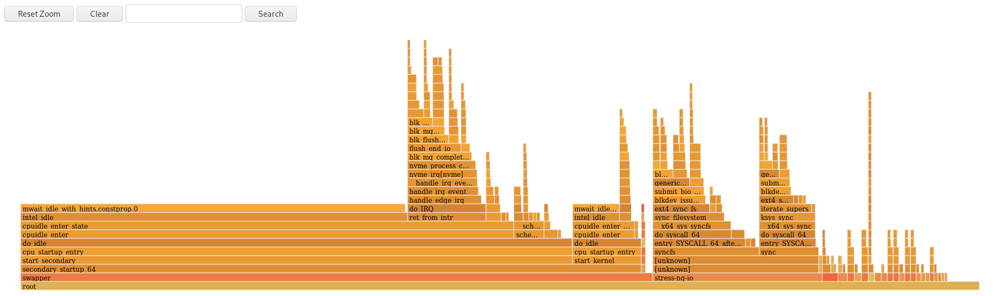 

<h3 id="creating-flamegraphs-over-specific-processes">18.3. Creating flamegraphs over specific processes</h3>

You can use `flamegraphs` to visualize performance data recorded over specific running processes.

**Prerequisites**

- `flamegraphs` are installed as described in [Installing flamegraphs](#installing-flamegraphs "18.1. Installing flamegraphs").
- The `perf` tool is installed as described in [Installing perf](#installing-perf "10.1. Installing perf").

**Procedure**

- Record the data and create the visualization.
  
  ```
  perf script flamegraph -a -F 99 -p ID1,ID2 sleep 60
  ```
  
  ```plaintext
  # perf script flamegraph -a -F 99 -p ID1,ID2 sleep 60
  ```
  
  This command samples and records performance data of the processes with the process ID’s `ID1` and `ID2` for `60` seconds, as stipulated by use of the `sleep` command, and then constructs the visualization which will be stored in the current active directory as `flamegraph.html`. The command samples call-graph data by default and takes the same arguments as the `perf` tool, in this particular case:
  
  -a
  
  Stipulates to record data over the entire system.
  
  -F
  
  To set the sampling frequency per second.
  
  -p
  
  To stipulate specific process ID’s to sample and record data over.

**Verification**

- For analysis, view the generated visualization:
  
  ```
  xdg-open flamegraph.html
  ```
  
  ```plaintext
  # xdg-open flamegraph.html
  ```
  
  This command opens the visualization in the default browser:

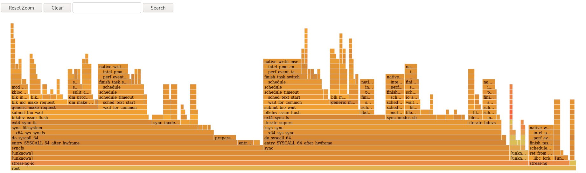 

<h3 id="interpreting-flamegraphs">18.4. Analyzing stack traces and function hotspots in flamegraphs</h3>

Each box in the `flamegraph` represents a different function in the stack. The `y-axis` shows the depth of the stack, with the topmost box in each stack representing the function that was on-CPU and the remaining boxes representing ancestry. The `x-axis` displays the population of the sampled call-graph data.

The children of a stack in a given row are displayed based on the number of samples taken of each respective function in descending order along the `x-axis`; the `x-axis` does not represent the passing of time. The wider an individual box is, the more frequent it was on-CPU or part of an on-CPU ancestry at the time the data was being sampled.

**Procedure**

- To reveal the names of functions which may have not been displayed previously and further investigate the data, click the box within the flamegraph to zoom into the stack at that given location:
  
  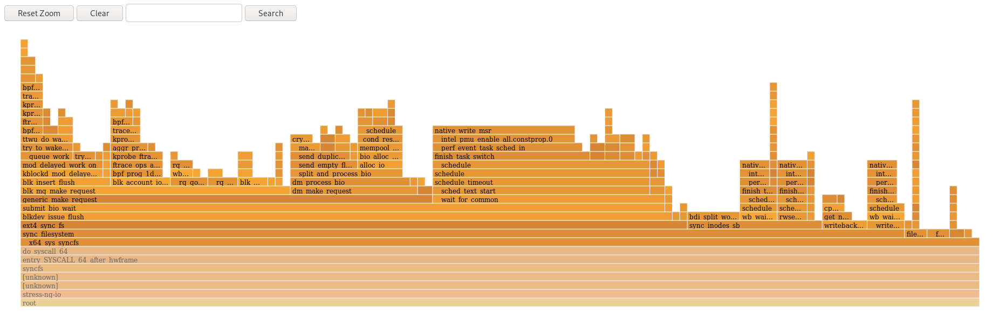 
- To return to the default view of the flamegraph, click **Reset Zoom**.
  
  Important
  
  Boxes representing user-space functions may be labeled as `Unknown` in flamegraphs because the binary of the function is stripped. The `debuginfo` package of the executable must be installed or, if the executable is a locally developed application, the application must be compiled with debugging information. Use the `-g` option in GCC, to display the function names or symbols in such a situation.
  
   

**Additional resources**

- [Enabling debugging with debugging information](https://docs.redhat.com/en/documentation/red_hat_enterprise_linux/10/html-single/developing_c_and_cpp_applications_in_rhel_10/index#enabling-debugging-with-debugging-information)

<h2 id="monitoring-processes-for-performance-bottlenecks-by-using-perf-circular-buffers">Chapter 19. Monitoring processes for performance bottlenecks by using perf circular buffers</h2>

You can create circular buffers that take event-specific snapshots of data with the `perf` tool in order to monitor performance bottlenecks in specific processes or parts of applications running on your system. In such cases, `perf` only writes data to a `perf.data` file for later analysis if a specified event is detected.

<h3 id="circular-buffers-and-event-specific-snapshots-with-perf">19.1. Circular buffers and event-specific snapshots with perf</h3>

When investigating performance issues in a process or application with `perf`, it might not be affordable or appropriate to record data for hours preceding a specific event of interest occurring. In such cases, you can use `perf record` to create custom circular buffers that take snapshots after specific events.

The `--overwrite` option makes `perf record` store all data in an overwritable circular buffer. When the buffer gets full, `perf record` automatically overwrites the oldest records which, therefore, never get written to a `perf.data` file.

Using the `--overwrite` and `--switch-output-event` options together configures a circular buffer that records and dumps data continuously until it detects the `--switch-output-event` trigger event. The trigger event signals to `perf record` that something of interest to the user has occurred and to write the data in the circular buffer to a `perf.data` file. This collects specific data you are interested in while simultaneously reducing the overhead of the running perf process by not writing data you do not want to a `perf.data` file.

<h3 id="collecting-specific-data-to-monitor-for-performance-bottlenecks-using-perf-circular-buffers">19.2. Collecting specific data to monitor for performance bottlenecks by using perf circular buffers</h3>

With the `perf` tool, you can create circular buffers. These are triggered by events you specify to only collect data you are interested in. To create circular buffers that collect event-specific data, use the `--overwrite` and `--switch-output-event` options for `perf`.

**Prerequisites**

- You have the `perf` user space tool installed. For more information, see [Installing perf](#installing-perf "10.1. Installing perf").
- You have placed a `uprobe` in the process or application you are interested in monitoring at a location of interest within the process or application:
  
  ```
  perf probe -x </path/to/executable> -a function
  ```
  
  ```plaintext
  # perf probe -x </path/to/executable> -a function
  ```
  
  ```
  Added new event:
    probe_executable:function   (on function in /path/to/executable)
  
  You can now use it in all perf tools, such as:
  
      perf record -e probe_executable:function -aR sleep 1
  ```
  
  ```plaintext
  Added new event:
    probe_executable:function   (on function in /path/to/executable)
  
  You can now use it in all perf tools, such as:
  
      perf record -e probe_executable:function -aR sleep 1
  ```

**Procedure**

- Create the circular buffer with the `uprobe` as the trigger event:
  
  ```
  perf record --overwrite -e cycles --switch-output-event probe_executable:function ./executable
  ```
  
  ```plaintext
  # perf record --overwrite -e cycles --switch-output-event probe_executable:function ./executable
  ```
  
  ```
  [ perf record: dump data: Woken up 1 times ]
  [ perf record: Dump perf.data.2021021012231959 ]
  [ perf record: dump data: Woken up 1 times ]
  [ perf record: Dump perf.data.2021021012232008 ]
  [ perf record: dump data: Woken up 1 times ]
  [ perf record: Dump perf.data.2021021012232082 ]
  [ perf record: Captured and wrote 5.621 MB perf.data.<timestamp> ]
  ```
  
  ```plaintext
  [ perf record: dump data: Woken up 1 times ]
  [ perf record: Dump perf.data.2021021012231959 ]
  [ perf record: dump data: Woken up 1 times ]
  [ perf record: Dump perf.data.2021021012232008 ]
  [ perf record: dump data: Woken up 1 times ]
  [ perf record: Dump perf.data.2021021012232082 ]
  [ perf record: Captured and wrote 5.621 MB perf.data.<timestamp> ]
  ```
  
  This command initiates the executable and collects cpu cycles, specified after the `-e` option, until `perf` detects the `uprobe`, the trigger event specified after the `--switch-output-event` option. At that point, `perf` takes a snapshot of all the data in the circular buffer and stores it in a unique `perf.data` file identified by timestamp. This example produced a total of 2 snapshots, the last `perf.data` file was forced by pressing `Ctrl`+`C`.

<h2 id="managing-tracepoints-by-using-perf-collector-without-restarting-perf">Chapter 20. Managing tracepoints by using perf collector without restarting perf</h2>

By using the control pipe interface to enable and disable different tracepoints in a running `perf` collector, you can dynamically adjust what data you are collecting without having to stop or restart `perf`. This ensures you do not lose performance data that would have otherwise been recorded during the stopping or restarting process.

<h3 id="adding-tracepoints-to-a-running-perf-collector-without-stopping-or-restarting-perf">20.1. Adding tracepoints to a running perf collector without stopping or restarting perf</h3>

You can add tracepoints to a running `perf` collector by using the control pipe interface. `perf` adjusts the data being recorded without having to stop `perf`, therefore preventing the loss of performance data.

**Prerequisites**

- You have the `perf` user space tool installed. For more information, see [Installing perf](#installing-perf "10.1. Installing perf").

**Procedure**

1. Configure the control pipe interface:
   
   ```
   mkfifo control ack perf.pipe
   ```
   
   ```plaintext
   # mkfifo control ack perf.pipe
   ```
2. Run `perf record` with the control file configuration and events you are interested in enabling:
   
   ```
   perf record --control=fifo:control,ack -D -1 --no-buffering -e 'sched:*' -o - > perf.pipe
   ```
   
   ```plaintext
   # perf record --control=fifo:control,ack -D -1 --no-buffering -e 'sched:*' -o - > perf.pipe
   ```
   
   In this example, declaring `'sched:*'` after the `-e` option starts `perf record` with scheduler events.
3. In a second command line, start the read side of the control pipe:
   
   ```
   cat perf.pipe | perf --no-pager script -i -
   ```
   
   ```plaintext
   # cat perf.pipe | perf --no-pager script -i -
   ```
4. Starting the read side of the control pipe triggers the following message in the first command line:
   
   ```
   Events disabled
   ```
   
   ```plaintext
   Events disabled
   ```
5. In a third command line, enable a tracepoint by using the control file:
   
   ```
   echo 'enable sched:sched_process_fork' > control
   ```
   
   ```plaintext
   # echo 'enable sched:sched_process_fork' > control
   ```
   
   This command triggers `perf` to scan the current event list in the control file for the declared event. If the event is present, the tracepoint is enabled and the following message appears in the first command line:
   
   ```
   event sched:sched_process_fork enabled
   ```
   
   ```plaintext
   event sched:sched_process_fork enabled
   ```
6. Once the tracepoint is enabled, the second command line displays the output from perf detecting the tracepoint:
   
   ```
   bash 33349 [034] 149587.674295: sched:sched_process_fork: comm=bash pid=33349 child_comm=bash child_pid=34056
   ```
   
   ```plaintext
   bash 33349 [034] 149587.674295: sched:sched_process_fork: comm=bash pid=33349 child_comm=bash child_pid=34056
   ```

<h3 id="removing-tracepoints-from-a-running-perf-collector-without-stopping-or-restarting-perf">20.2. Removing tracepoints from a running perf collector without stopping or restarting perf</h3>

You can remove tracepoints from a running `perf` collector by using the control pipe interface. It helps to reduce the scope of data you are collecting without having to stop `perf` and losing performance data.

**Prerequisites**

- You have the `perf` user space tool installed. For more information, see [Installing perf](#installing-perf "10.1. Installing perf").
- You have added tracepoints to a running `perf` collector by using the control pipe interface. For more information, see [Adding tracepoints to a running perf collector without stopping or restarting perf](#adding-tracepoints-to-a-running-perf-collector-without-stopping-or-restarting-perf "20.1. Adding tracepoints to a running perf collector without stopping or restarting perf").

**Procedure**

- Remove the tracepoint:
  
  ```
  echo 'disable sched:sched_process_fork' > control
  ```
  
  ```plaintext
  # echo 'disable sched:sched_process_fork' > control
  ```
  
  This example assumes you have previously loaded scheduler events into the control file and enabled the tracepoint `sched:sched_process_fork`.
  
  This command triggers `perf` to scan the current event list in the control file for the declared event. If the event is present, the tracepoint is disabled and the following message appears in the command line used to configure the control pipe:
  
  ```
  event sched:sched_process_fork disabled
  ```
  
  ```plaintext
  # event sched:sched_process_fork disabled
  ```

<h2 id="optimizing-the-system-performance-using-the-web-console">Chapter 21. Optimizing the system performance in the web console</h2>

You can set a performance profile in the RHEL web console to optimize the performance of the system for a selected task.

<h3 id="performance-tuning-options-in-the-web-console">21.1. Performance tuning options in the web console</h3>

Red Hat Enterprise Linux provides several performance profiles that optimize the system for:

- Systems using the desktop
- Throughput performance
- Latency performance
- Network performance
- Low-power consumption
- Virtual machines

The TuneD service optimizes system options to match the selected profile. In the web console, you can set your system’s performance profile.

**Additional resources**

- [Optimizing system performance with TuneD](#optimizing-system-performance-with-tuned "Chapter 2. Optimizing system performance with TuneD")

<h3 id="setting-a-performance-profile-in-the-web-console">21.2. Setting a performance profile in the web console</h3>

Depending on the task you want to perform, you can use the web console to optimize system performance by setting a suitable performance profile.

**Prerequisites**

- You have installed the RHEL 10 web console.
  
  For instructions, see [Installing and enabling the web console](https://docs.redhat.com/en/documentation/red_hat_enterprise_linux/10/html/managing_systems_in_the_rhel_web_console/getting-started-with-the-rhel-web-console#installing-and-enabling-the-web-console).

**Procedure**

1. Log in to the RHEL 10 web console.
2. Click **Overview**.
3. In the **Configuration** section, click the current performance profile.
   
   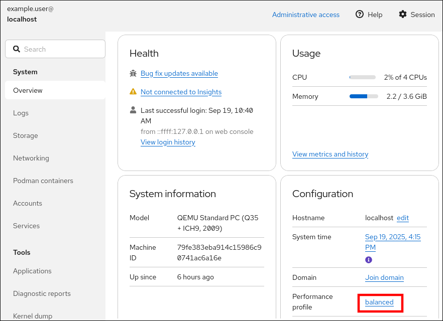
4. In the **Change performance profile** dialog box, set the required profile.
5. Click **Change profile**.

<h3 id="monitoring-performance-on-the-local-system-by-using-the-web-console">21.3. Monitoring performance on the local system by using the web console</h3>

The RHEL web console uses the Utilization Saturation and Errors (USE) Method for troubleshooting. The new performance metrics page has a historical view of your data organized chronologically with the newest data at the top. In the **Metrics and history** page, you can view events, errors, and graphical representation for resource utilization and saturation.

**Prerequisites**

- You have installed the RHEL 10 web console.
  
  For instructions, see [Installing and enabling the web console](https://docs.redhat.com/en/documentation/red_hat_enterprise_linux/10/html/managing_systems_in_the_rhel_web_console/getting-started-with-the-rhel-web-console#installing-and-enabling-the-web-console).
- The `cockpit-pcp` package is installed.
- The Performance Co-Pilot (PCP) services `pmlogger.service` and `pmproxy.service` are enabled and running.

**Procedure**

1. Log in to the RHEL 10 web console.
2. Click **Overview**.
3. In the **Usage** section, click **View metrics and history**.
   
   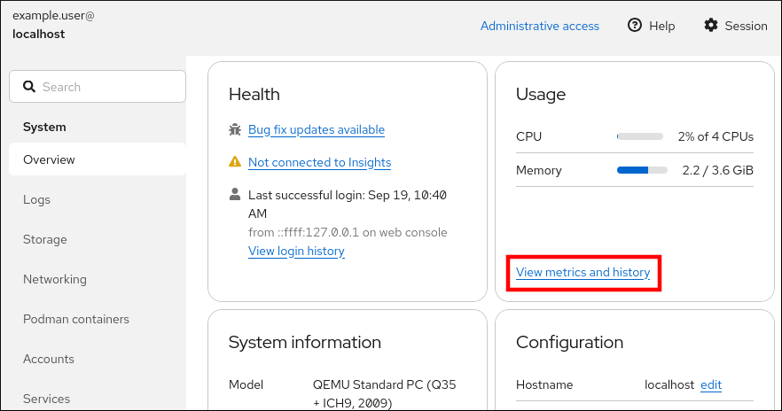 
   
   The **Metrics and history** section opens and displays: **the current system configuration and usage** the performance metrics in a graphical form over a user-specified time interval

<h3 id="monitoring-performance-on-several-systems-by-using-the-web-console-and-grafana">21.4. Monitoring performance on several systems by using the web console and Grafana</h3>

Grafana enables you to collect data from several systems at once and review a graphical representation of their collected Performance Co-Pilot (PCP) metrics. You can configure performance metrics monitoring and export for several systems in the web console interface.

**Prerequisites**

- You have installed the RHEL 10 web console.
  
  For instructions, see [Installing and enabling the web console](https://docs.redhat.com/en/documentation/red_hat_enterprise_linux/10/html/managing_systems_in_the_rhel_web_console/getting-started-with-the-rhel-web-console#installing-and-enabling-the-web-console).
- You have installed the `cockpit-pcp` package.
- The Performance Co-Pilot (PCP) services `pmlogger.service` and `pmproxy.service` are enabled and running.
- You have configured the **Grafana** dashboard. For more information, see [Setting up a grafana-server](https://docs.redhat.com/en/documentation/red_hat_enterprise_linux/10/html/monitoring_and_managing_system_status_and_performance/index#setting-up-a-grafana-server).
- You have installed the `valkey` package.
  
  Alternatively, you can install the package from the web console interface later in the procedure.

**Procedure**

1. Log in to the RHEL 10 web console.
2. In the **Overview** page, click **View metrics and history** in the **Usage** table.
3. Click the **Metrics settings** button.
4. Move the **Export to network** slider to the active position.
   
   If you do not have the `valkey` package installed, the web console prompts you to install it.
5. To open the `pmproxy` service, select a zone from a drop-down list and click the **Add pmproxy** button.
6. Click **Save**.

**Verification**

1. Click **Networking**.
2. In the **Firewall** table, click the **Edit rules and zones** button.
3. Search for `pmproxy` in your selected zone.
   
   Important
   
   Repeat this procedure on all systems you want to monitor for performance.

**Additional resources**

- [Setting up graphical representation of PCP metrics](https://docs.redhat.com/en/documentation/red_hat_enterprise_linux/10/html/monitoring_and_managing_system_status_and_performance/index#setting-up-graphical-representation-of-pcp-metrics)

<h2 id="analyzing-system-performance-with-bpf-compiler-collection">Chapter 22. Analyzing system performance with BPF Compiler Collection</h2>

The BPF Compiler Collection (BCC) analyzes system performance by combining the capabilities of Berkeley Packet Filter (BPF). With BPF, you can safely run the custom programs within the kernel to access system events and data for performance monitoring, tracing, and debugging. BCC simplifies the development and deployment of BPF programs with tools and libraries for users to extract important insights from their systems.

<h3 id="installing-the-bcc-tools-package">22.1. Installing the bcc-tools package</h3>

You can install the `bcc-tools` package to get the BPF Compiler Collection (BCC) library and related tools.

**Procedure**

- Install bcc-tools.
  
  ```
  dnf install bcc-tools
  ```
  
  ```plaintext
  # dnf install bcc-tools
  ```
  
  The BCC tools are installed in the `/usr/share/bcc/tools/` directory.

**Verification**

- Inspect the installed tools.
  
  ```
  ls -l /usr/share/bcc/tools/
  ```
  
  ```plaintext
  # ls -l /usr/share/bcc/tools/
  ```
  
  A list of tools installed appears. The `doc` directory in the listing provides documentation for each tool.

<h3 id="examining-the-system-processes-with-execsnoop">22.2. Examining the system processes with execsnoop</h3>

The `execsnoop` tool from the BCC suite captures and displays new process execution events in real time. It is useful for observing which commands or binaries are being executed on a system, helping with debugging, auditing, and security monitoring.

**Procedure**

1. Run the `execsnoop` program in one command line:
   
   ```
   /usr/share/bcc/tools/execsnoop
   ```
   
   ```plaintext
   # /usr/share/bcc/tools/execsnoop
   ```
2. To create a short-lived process of the `ls` command, in another command line, enter:
   
   ```
   ls /usr/share/bcc/tools/doc/
   ```
   
   ```plaintext
   $ ls /usr/share/bcc/tools/doc/
   ```
   
   The command line running `execsnoop` shows the following output:
   
   ```
   PCOMM	PID    PPID   RET ARGS
   ls   	8382   8287     0 /usr/bin/ls --color=auto /usr/share/bcc/tools/doc/
   ```
   
   ```plaintext
   PCOMM	PID    PPID   RET ARGS
   ls   	8382   8287     0 /usr/bin/ls --color=auto /usr/share/bcc/tools/doc/
   ```
   
   The `execsnoop` program prints a line of output for each new process that consumes system resources. It even detects processes of programs that run very shortly, such as `ls`, and most monitoring tools would not register them. The `execsnoop` output displays the following fields:
   
   PCOMM
   
   The parent process name. (`ls`)
   
   PID
   
   The process ID. (8382)
   
   PPID
   
   The parent process ID. (8287)
   
   RET
   
   The return value of the exec() system call (0), which loads program code into new processes.
   
   ARGS
   
   The location of the started program with arguments.
   
   For more information, see the `/usr/share/bcc/tools/doc/execsnoop_example.txt` file and the `exec(3)` man page on your system.

<h3 id="tracking-files-opened-by-a-command-with-opensnoop">22.3. Tracking files opened by a command with opensnoop</h3>

You can use the `opensnoop` tool from the BCC (BPF Compiler Collection) to monitor and log file access by a specific command in real time. This is useful for debugging, auditing, or understanding the runtime behavior of an application.

**Procedure**

1. In one command line, run the `opensnoop` program to print the output for files opened only by the process of the `uname` command:
   
   ```
   /usr/share/bcc/tools/opensnoop -n uname
   ```
   
   ```plaintext
   # /usr/share/bcc/tools/opensnoop -n uname
   ```
2. In another command line, enter the command to open certain files:
   
   ```
   uname
   ```
   
   ```plaintext
   $ uname
   ```
   
   ```
   The command line running opensnoop shows the output similar to the following:
   PID    COMM 	FD ERR PATH
   8596   uname 	3  0   /etc/ld.so.cache
   8596   uname 	3  0   /lib64/libc.so.6
   8596   uname 	3  0   /usr/lib/locale/locale-archive
   ...
   ```
   
   ```plaintext
   The command line running opensnoop shows the output similar to the following:
   PID    COMM 	FD ERR PATH
   8596   uname 	3  0   /etc/ld.so.cache
   8596   uname 	3  0   /lib64/libc.so.6
   8596   uname 	3  0   /usr/lib/locale/locale-archive
   ...
   ```
   
   The `opensnoop` program watches the `open()` system call across the whole system, and prints a line of output for each file that `uname` tries to open along the way. The `opensnoop` output displays the following fields:
   
   PID
   
   The process ID. (8596)
   
   COMM
   
   The process name. (`uname`)
   
   FD
   
   The file descriptor - a value that open() returns to refer to the open file. (3)
   
   ERR
   
   Any errors.
   
   PATH
   
   The location of files that `open()` tries to open.
   
   If a command tries to read a non-existent file, the FD column returns `-1` and the ERR column prints a value corresponding to the relevant error. By using `opensnoop`, you can identify an application that does not behave properly. For more information, see the `/usr/share/bcc/tools/doc/opensnoop_example.txt` file and `open(2)` man page on your system.

<h3 id="monitoring-the-top-processes-performing-i-o-operations-on-the-disk-with-biotop">22.4. Monitoring the top processes performing I/O operations on the disk with biotop</h3>

The `biotop` tool provides a real-time view of processes generating the most disk I/O activity. It identifies applications that are heavily reading from or writing to the disk, making it a valuable utility for performance monitoring and troubleshooting.

**Procedure**

1. Run the `biotop` program in one command line with 30 as an argument to produce 30 second summary:
   
   ```
   /usr/share/bcc/tools/biotop 30
   ```
   
   ```plaintext
   # /usr/share/bcc/tools/biotop 30
   ```
   
   When you do not provide any argument, the output screen refreshes every 1 second by default.
2. In another command line, enter command to read the content from the local hard disk device and write the output to the `/dev/zero` file:
   
   ```
   dd if=/dev/vda of=/dev/zero
   ```
   
   ```plaintext
   # dd if=/dev/vda of=/dev/zero
   ```
   
   This step generates certain I/O traffic to illustrate `biotop`. The command line running `biotop` shows an output similar to the following:
   
   ```
   PID    COMM             D MAJ MIN DISK       I/O  Kbytes     AVGms
   9568   dd               R 252 0   vda      16294 14440636.0  3.69
   48     kswapd0          W 252 0   vda       1763 120696.0    1.65
   7571   gnome-shell      R 252 0   vda        834 83612.0     0.33
   1891   gnome-shell      R 252 0   vda       1379 19792.0     0.15
   7515   Xorg             R 252 0   vda        280  9940.0     0.28
   7579   llvmpipe-1       R 252 0   vda        228  6928.0     0.19
   9515   gnome-control-c  R 252 0   vda         62  6444.0     0.43
   8112   gnome-terminal-  R 252 0   vda         67  2572.0     1.54
   7807   gnome-software   R 252 0   vda         31  2336.0     0.73
   9578   awk              R 252 0   vda         17  2228.0     0.66
   7578   llvmpipe-0       R 252 0   vda        156  2204.0     0.07
   9581   pgrep            R 252 0   vda         58  1748.0     0.42
   7531   InputThread      R 252 0   vda         30  1200.0     0.48
   7504   gdbus            R 252 0   vda          3  1164.0     0.30
   1983   llvmpipe-1       R 252 0   vda         39   724.0     0.08
   1982   llvmpipe-0       R 252 0   vda         36   652.0     0.06
   ...
   ```
   
   ```plaintext
   PID    COMM             D MAJ MIN DISK       I/O  Kbytes     AVGms
   9568   dd               R 252 0   vda      16294 14440636.0  3.69
   48     kswapd0          W 252 0   vda       1763 120696.0    1.65
   7571   gnome-shell      R 252 0   vda        834 83612.0     0.33
   1891   gnome-shell      R 252 0   vda       1379 19792.0     0.15
   7515   Xorg             R 252 0   vda        280  9940.0     0.28
   7579   llvmpipe-1       R 252 0   vda        228  6928.0     0.19
   9515   gnome-control-c  R 252 0   vda         62  6444.0     0.43
   8112   gnome-terminal-  R 252 0   vda         67  2572.0     1.54
   7807   gnome-software   R 252 0   vda         31  2336.0     0.73
   9578   awk              R 252 0   vda         17  2228.0     0.66
   7578   llvmpipe-0       R 252 0   vda        156  2204.0     0.07
   9581   pgrep            R 252 0   vda         58  1748.0     0.42
   7531   InputThread      R 252 0   vda         30  1200.0     0.48
   7504   gdbus            R 252 0   vda          3  1164.0     0.30
   1983   llvmpipe-1       R 252 0   vda         39   724.0     0.08
   1982   llvmpipe-0       R 252 0   vda         36   652.0     0.06
   ...
   ```
   
   The `biotop` output displays the following fields:
   
   PID
   
   The process ID. (9568)
   
   COMM
   
   The process name. (`dd`)
   
   DISK
   
   The disk performs the read operations. (vda)
   
   I/O
   
   The number of read operations performed. (16294)
   
   Kbytes
   
   The amount of Kbytes reached by the read operations. (14,440,636)
   
   AVGms
   
   The average I/O time of read operations. (3.69)
   
   For more information, see the `/usr/share/bcc/tools/doc/biotop_example.txt` file and the `dd(1)` man page on your system.

<h3 id="exposing-unexpectedly-slow-file-system-operations-with-xfsslower">22.5. Exposing unexpectedly slow file system operations with xfsslower</h3>

The `xfsslower` measures the time spent by the XFS file system in performing read, write, open or sync `(fsync)` operations. The argument `1` ensures that the program shows only the operations that are slower than 1 ms.

**Procedure**

1. Run the `xfsslower` program in one command line:
   
   ```
   /usr/share/bcc/tools/xfsslower 1
   ```
   
   ```plaintext
   # /usr/share/bcc/tools/xfsslower 1
   ```
   
   When you do not provide any arguments, `xfsslower` displays operations slower than 10 ms by default.
2. In another command line, enter the command to create a text file in the vim editor to start interaction with the XFS file system:
   
   ```
   vim text
   ```
   
   ```plaintext
   $ vim text
   ```
   
   ```
   The command line running xfsslower shows something similar upon saving the file from the previous step:
   TIME     COMM           PID    T BYTES   OFF_KB   LAT(ms) FILENAME
   13:07:14 b'bash'        4754   R 256     0           7.11 b'vim'
   13:07:14 b'vim'         4754   R 832     0           4.03 b'libgpm.so.2.1.0'
   13:07:14 b'vim'         4754   R 32      20          1.04 b'libgpm.so.2.1.0'
   13:07:14 b'vim'         4754   R 1982    0           2.30 b'vimrc'
   13:07:14 b'vim'         4754   R 1393    0           2.52 b'getscriptPlugin.vim'
   13:07:45 b'vim'         4754   S 0       0           6.71 b'text'
   13:07:45 b'pool'        2588   R 16      0           5.58 b'text’
   ...
   ```
   
   ```plaintext
   The command line running xfsslower shows something similar upon saving the file from the previous step:
   TIME     COMM           PID    T BYTES   OFF_KB   LAT(ms) FILENAME
   13:07:14 b'bash'        4754   R 256     0           7.11 b'vim'
   13:07:14 b'vim'         4754   R 832     0           4.03 b'libgpm.so.2.1.0'
   13:07:14 b'vim'         4754   R 32      20          1.04 b'libgpm.so.2.1.0'
   13:07:14 b'vim'         4754   R 1982    0           2.30 b'vimrc'
   13:07:14 b'vim'         4754   R 1393    0           2.52 b'getscriptPlugin.vim'
   13:07:45 b'vim'         4754   S 0       0           6.71 b'text'
   13:07:45 b'pool'        2588   R 16      0           5.58 b'text’
   ...
   ```
   
   Each line represents an operation in the file system, which took more time than a certain threshold. `xfsslower` detects possible file system problems, which can take the form of unexpectedly slow operations. The `xfsslower` output displays the following fields:
   
   COMM
   
   The process name. (`b’bash'`)
   
   T
   
   The operation type. (`R`)
   
   - **R**ead
   - **W**rite
   - **O**pen
   - **S**ync
   
   OFF\_KB
   
   The file offset in KB. (0)
   
   FILENAME
   
   The file that is read, written, or synced.
   
   For more information, see the `/usr/share/bcc/tools/doc/xfsslower_example.txt` file and the `fsync(2)` man page on your system.

<h2 id="configuring-an-operating-system-to-optimize-cpu-utilization">Chapter 23. Configuring an operating system to optimize CPU utilization</h2>

You can configure the operating system to optimize CPU utilization across their workloads.

<h3 id="tools-for-monitoring-and-diagnosing-processor-issues">23.1. Tools for monitoring and diagnosing processor issues</h3>

The following are the tools available in Red Hat Enterprise Linux to monitor and diagnose processor-related performance issues:

- `numactl` utility provides a number of options to manage processor and memory affinity. The `numactl` package includes the `libnuma` library, which offers a simple programming interface to the NUMA policy supported by the kernel, and can be used for more fine-grained tuning than the `numactl` application.
- `numad` is an automatic NUMA affinity management daemon. It monitors NUMA topology and resource usage within a system to dynamically improve NUMA resource allocation and management.
- `numastat` tool displays per-NUMA node memory statistics for the operating system and its processes and shows administrators whether the process memory is spread throughout a system or is centralized on specific nodes. This tool is provided by the `numactl` package.
- `pqos` utility is available in the `intel-cmt-cat` package. It monitors CPU cache and memory bandwidth on recent Intel processors. It monitors the following types of information:
  
  - The instructions per cycle (IPC)
  - The count of last level cache MISSES
  - The size in kilobytes that the program executing in a given CPU occupies in the LLC
  - The bandwidth to local memory (MBL)
  - The bandwidth to remote memory (MBR)
- `/proc/interrupts` file displays the following types of information:
  
  - Interrupt request (IRQ) number
  - The number of similar interrupt requests handled by each processor in the system
  - The type of interrupt sent
  - A comma-separated list of devices that respond to the listed interrupt request
- `taskset` tool is provided by the `util-linux` package. It allows administrators to retrieve and set the processor affinity of a running process, or launch a process with a specified processor affinity.
- `turbostat` tool prints counter results at specified intervals to help administrators identify unexpected behavior in servers, such as excessive power usage, failure to enter deep sleep states, or system management interrupts (SMIs) being created unnecessarily.
- `x86_energy_perf_policy` tool allows administrators to define the relative importance of performance and energy efficiency. This information can then be used to influence processors that support this feature when they select options that trade off between performance and energy efficiency.

<h3 id="types-of-system-topology">23.2. Types of system topology</h3>

In modern computing, the idea of a single CPU is a misleading one, as most modern systems have multiple processors. The topology of the system is the way these processors are connected to each other and to other system resources. This can affect system and application performance and the tuning considerations for a system.

The following are the two primary types of topology used in modern computing:

Symmetric Multi-Processor (SMP) topology

SMP topology allows all processors to access memory in the same amount of time. However, because shared and equal memory access inherently forces serialized memory accesses from all the CPUs, SMP system scaling constraints are now generally viewed as unacceptable. For this reason, practically all modern server systems are NUMA machines.

Non-Uniform Memory Access (NUMA) topology

NUMA topology was developed more recently than SMP topology. In a NUMA system, multiple processors are physically grouped on a socket. Each socket has a dedicated area of memory, and the processors on that socket have local access to this memory. Together, the socket, its memory, and the associated processors form what is referred to as a node. Processors on the same node have high-speed access to the node’s memory bank, and slower access to memory banks on other nodes.

As a result, there is a performance penalty when accessing non-local memory. Thus, performance sensitive applications on a system with NUMA topology should access memory that is on the same node as the processor executing the application, and should avoid accessing remote memory wherever possible.

Multi-threaded applications that are sensitive to performance may benefit from being configured to run on a specific NUMA node rather than a specific processor. Whether this is suitable depends on your system and the requirements of your application.

- If multiple application threads access the same cached data, then configuring those threads to run on the same processor may be suitable.
- If multiple threads that access and cache different data run on the same processor, each thread may evict cached data accessed by a previous thread. This means that each thread 'misses' the cache and wastes execution time fetching data from memory and replacing it in the cache. Use the `perf` tool to check for an excessive number of cache misses.

<h3 id="displaying-system-topologies">23.3. Displaying system topologies</h3>

You can understand the topology of a system by using a number of commands.

**Procedure**

- To display an overview of your system topology:
  
  ```
  numactl --hardware
  ```
  
  ```plaintext
  $ numactl --hardware
  ```
  
  ```
  available: 4 nodes (0-3)
  node 0 cpus: 0 4 8 12 16 20 24 28 32 36
  node 0 size: 65415 MB
  node 0 free: 43971 MB
  [...]
  ```
  
  ```plaintext
  available: 4 nodes (0-3)
  node 0 cpus: 0 4 8 12 16 20 24 28 32 36
  node 0 size: 65415 MB
  node 0 free: 43971 MB
  [...]
  ```
- To gather the information about the CPU architecture, such as the number of CPUs, threads, cores, sockets, and NUMA nodes:
  
  ```
  lscpu
  ```
  
  ```plaintext
  $ lscpu
  ```
  
  ```
  Architecture:          x86_64
  CPU op-mode(s):        32-bit, 64-bit
  Byte Order:            Little Endian
  CPU(s):                40
  On-line CPU(s) list:   0-39
  Thread(s) per core:    1
  Core(s) per socket:    10
  Socket(s):             4
  NUMA node(s):          4
  Vendor ID:             GenuineIntel
  CPU family:            6
  Model:                 47
  Model name:            Intel(R) Xeon(R) CPU E7- 4870  @ 2.40GHz
  Stepping:              2
  CPU MHz:               2394.204
  BogoMIPS:              4787.85
  Virtualization:        VT-x
  L1d cache:             32K
  L1i cache:             32K
  L2 cache:              256K
  L3 cache:              30720K
  NUMA node0 CPU(s):     0,4,8,12,16,20,24,28,32,36
  NUMA node1 CPU(s):     2,6,10,14,18,22,26,30,34,38
  NUMA node2 CPU(s):     1,5,9,13,17,21,25,29,33,37
  NUMA node3 CPU(s):     3,7,11,15,19,23,27,31,35,39
  ```
  
  ```plaintext
  Architecture:          x86_64
  CPU op-mode(s):        32-bit, 64-bit
  Byte Order:            Little Endian
  CPU(s):                40
  On-line CPU(s) list:   0-39
  Thread(s) per core:    1
  Core(s) per socket:    10
  Socket(s):             4
  NUMA node(s):          4
  Vendor ID:             GenuineIntel
  CPU family:            6
  Model:                 47
  Model name:            Intel(R) Xeon(R) CPU E7- 4870  @ 2.40GHz
  Stepping:              2
  CPU MHz:               2394.204
  BogoMIPS:              4787.85
  Virtualization:        VT-x
  L1d cache:             32K
  L1i cache:             32K
  L2 cache:              256K
  L3 cache:              30720K
  NUMA node0 CPU(s):     0,4,8,12,16,20,24,28,32,36
  NUMA node1 CPU(s):     2,6,10,14,18,22,26,30,34,38
  NUMA node2 CPU(s):     1,5,9,13,17,21,25,29,33,37
  NUMA node3 CPU(s):     3,7,11,15,19,23,27,31,35,39
  ```
- To view a graphical representation of your system:
  
  ```
  dnf install hwloc-gui
  ```
  
  ```plaintext
  # dnf install hwloc-gui
  ```
  
  ```
  lstopo
  ```
  
  ```plaintext
  # lstopo
  ```
  
  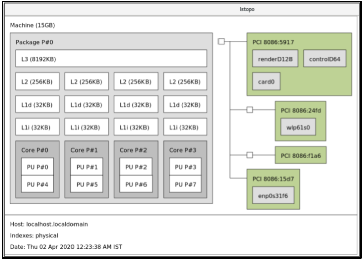 
- To view the detailed textual output:
  
  ```
  dnf install hwloc
  ```
  
  ```plaintext
  # dnf install hwloc
  ```
  
  ```
  lstopo-no-graphics
  ```
  
  ```plaintext
  # lstopo-no-graphics
  ```
  
  ```
  Machine (15GB)
    Package L#0 + L3 L#0 (8192KB)
      L2 L#0 (256KB) + L1d L#0 (32KB) + L1i L#0 (32KB) + Core L#0
          PU L#0 (P#0)
          PU L#1 (P#4)
         HostBridge L#0
      PCI 8086:5917
          GPU L#0 "renderD128"
          GPU L#1 "controlD64"
          GPU L#2 "card0"
      PCIBridge
          PCI 8086:24fd
            Net L#3 "wlp61s0"
      PCIBridge
          PCI 8086:f1a6
      PCI 8086:15d7
  Net L#4 "enp0s31f6"
  ```
  
  ```plaintext
  Machine (15GB)
    Package L#0 + L3 L#0 (8192KB)
      L2 L#0 (256KB) + L1d L#0 (32KB) + L1i L#0 (32KB) + Core L#0
          PU L#0 (P#0)
          PU L#1 (P#4)
         HostBridge L#0
      PCI 8086:5917
          GPU L#0 "renderD128"
          GPU L#1 "controlD64"
          GPU L#2 "card0"
      PCIBridge
          PCI 8086:24fd
            Net L#3 "wlp61s0"
      PCIBridge
          PCI 8086:f1a6
      PCI 8086:15d7
  Net L#4 "enp0s31f6"
  ```

<h3 id="configuring-kernel-tick-time">23.4. Configuring kernel tick time</h3>

By default, RHEL uses a tickless kernel, which does not interrupt idle CPUs to reduce power usage and allow new processors to take advantage of deep sleep states. RHEL also offers a dynamic tickless option, which is useful for latency-sensitive workloads, such as high performance computing or real-time computing. By default, the dynamic tickless option is disabled. You can use the cpu-partitioning TuneD profile to enable the dynamic tickless option for cores specified as `isolated_cores`.

**Procedure**

1. To enable dynamic tickless behavior in certain cores, specify those cores on the kernel command line with the `nohz_full` parameter. For example, on a 16 core system, enable the `nohz_full=1-15` kernel option:
   
   ```
   grubby --update-kernel=ALL --args="nohz_full=1-15"
   ```
   
   ```plaintext
   # grubby --update-kernel=ALL --args="nohz_full=1-15"
   ```
   
   This enables dynamic tickless behavior on cores 1 through 15, moving all timekeeping to the only unspecified core (core 0).
2. When the system boots, manually move the `rcu` threads to the non-latency-sensitive core, in this case core 0:
   
   ```
   for i in pgrep rcu[^c] ; do taskset -pc 0 $i ; done
   ```
   
   ```plaintext
   # for i in pgrep rcu[^c] ; do taskset -pc 0 $i ; done
   ```
3. Optional: Use the `isolcpus` parameter on the kernel command line to isolate certain cores from user-space tasks.
4. Optional: Set the CPU affinity for the kernel’s write-back `bdi-flush` threads to the housekeeping core:
   
   ```
   echo 1 > /sys/bus/workqueue/devices/writeback/cpumask
   ```
   
   ```plaintext
   echo 1 > /sys/bus/workqueue/devices/writeback/cpumask
   ```

**Verification**

- Once the system is rebooted, verify if `dynticks` are enabled:
  
  ```
  journalctl -xe | grep dynticks
  ```
  
  ```plaintext
  # journalctl -xe | grep dynticks
  ```
  
  ```
  Mar 15 18:34:54 rhel-server kernel: NO_HZ: Full dynticks CPUs: 1-15.
  ```
  
  ```plaintext
  Mar 15 18:34:54 rhel-server kernel: NO_HZ: Full dynticks CPUs: 1-15.
  ```
- Verify that the dynamic tickless configuration is working correctly:
  
  ```
  perf stat -C 1 -e irq_vectors:local_timer_entry taskset -c 1 sleep 3
  ```
  
  ```plaintext
  # perf stat -C 1 -e irq_vectors:local_timer_entry taskset -c 1 sleep 3
  ```
  
  This command measures ticks on CPU 1 while telling CPU 1 to sleep for 3 seconds. The default kernel timer configuration shows around 3100 ticks on a regular CPU:
  
  ```
  perf stat -C 0 -e irq_vectors:local_timer_entry taskset -c 0 sleep 3
  ```
  
  ```plaintext
  # perf stat -C 0 -e irq_vectors:local_timer_entry taskset -c 0 sleep 3
  ```
  
  ```
   Performance counter stats for 'CPU(s) 0':
  
               3,107      irq_vectors:local_timer_entry
  
    3.001342790 seconds time elapsed
  ```
  
  ```plaintext
   Performance counter stats for 'CPU(s) 0':
  
               3,107      irq_vectors:local_timer_entry
  
    3.001342790 seconds time elapsed
  ```
  
  With the dynamic tickless kernel configured, you should see around 4 ticks instead:
  
  ```
  perf stat -C 1 -e irq_vectors:local_timer_entry taskset -c 1 sleep 3
  ```
  
  ```plaintext
  # perf stat -C 1 -e irq_vectors:local_timer_entry taskset -c 1 sleep 3
  ```
  
  ```
   Performance counter stats for 'CPU(s) 1':
  
                   4      irq_vectors:local_timer_entry
  
         3.001544078 seconds time elapsed
  ```
  
  ```plaintext
   Performance counter stats for 'CPU(s) 1':
  
                   4      irq_vectors:local_timer_entry
  
         3.001544078 seconds time elapsed
  ```

**Additional resources**

- [All about nohz\_full kernel parameter Red Hat Knowledgebase article (Red Hat Knowledgebase)](https://access.redhat.com/solutions/2273531)
- [How to verify the list of "isolated" and "nohz\_full" CPU information from sysfs? Red Hat Knowledgebase article (Red Hat Knowledgebase)](https://access.redhat.com/solutions/3875421)

<h3 id="overview-of-an-interrupt-request">23.5. Overview of an interrupt request</h3>

An interrupt request (IRQ) is a signal for immediate attention sent from a piece of hardware to a processor. Each device in a system is assigned one or more IRQ numbers, which allow it to send unique interrupts. When interrupts are enabled, a processor that receives an interrupt request immediately pauses execution of the current application thread to address the interrupt request.

Because an interrupt halts normal operation, high interrupt rates can severely degrade system performance. It is possible to reduce the amount of time taken by interrupts by configuring interrupt affinity or by sending a number of lower priority interrupts in a batch (coalescing a number of interrupts).

Interrupt requests have an associated affnity property, `smp_affinity`, which defines the processors that handle the interrupt request. To improve application performance and enable the specified interrupt and application threads to share cache lines, make the following improvements:

- Assign interrupt affinity.
- Process affinity to either the same processor or processors on the same core.

On systems that support interrupt steering, modifying the `smp_affinity` property of an interrupt request sets up the hardware so that the decision to service an interrupt with a particular processor is made at the hardware level with no intervention from the kernel.

<h3 id="balancing-interrupts-manually">23.6. Balancing interrupts manually</h3>

If your BIOS exports its NUMA topology, the `irqbalance` service can automatically serve interrupt requests on the node that is local to the hardware requesting service.

**Procedure**

1. Check which devices correspond to the interrupt requests that you want to configure.
2. Find the hardware specification for your platform. Check if the chipset on your system supports distributing interrupts.
   
   - If the chipset supports distribution, you can configure interrupt delivery as described in the following steps. Additionally, check which algorithm your chipset uses to balance interrupts. Some BIOSes have options to configure interrupt delivery.
   - If the chipset does not support distribution, your chipset always routes all interrupts to a single, static CPU. You cannot configure which CPU is used.
3. Check which Advanced Programmable Interrupt Controller (APIC) mode is in use on your system:
   
   ```
   journalctl --dmesg | grep APIC
   ```
   
   ```plaintext
   $ journalctl --dmesg | grep APIC
   ```
   
   - If your system uses a mode other than flat, you can see a line similar to **Setting APIC routing to physical flat**.
   - If you can see no such message, your system uses `flat` mode.
   - If your system uses `x2apic` mode, you can disable it by adding the `nox2apic` option to the kernel command line in the bootloader configuration.
     
     Only non-physical flat mode (flat) supports distributing interrupts to multiple CPUs. This mode is available only for systems with 8 CPUs or less.
4. Calculate the `smp_affinity` mask. For more information about how to calculate the `smp_affinity` mask, see [Setting the `smp_affinity` mask](#setting-the-smp-affinity-mask "23.7. Setting the smp_affinity mask").

<h3 id="setting-the-smp-affinity-mask">23.7. Setting the smp\_affinity mask</h3>

The `smp_affinity` value is stored as a hexadecimal bit mask representing all processors in the system. Each bit configures a different CPU. The least significant bit is CPU 0. The default value of the mask is `f`, which means that an interrupt request can be handled on any processor in the system. Setting this value to `1` means that only processor `0` can handle the interrupt.

**Procedure**

1. In binary, use the value `1` for CPUs that handle the interrupts. For example, to set CPU `0` and CPU `7` to handle interrupts, use `0000000010000001` as the binary code:
   
   |        |    |    |    |    |    |    |   |   |   |   |   |   |   |   |   |   |
   |:-------|:---|:---|:---|:---|:---|:---|:--|:--|:--|:--|:--|:--|:--|:--|:--|:--|
   | CPU    | 15 | 14 | 13 | 12 | 11 | 10 | 9 | 8 | 7 | 6 | 5 | 4 | 3 | 2 | 1 | 0 |
   | Binary | 0  | 0  | 0  | 0  | 0  | 0  | 0 | 0 | 1 | 0 | 0 | 0 | 0 | 0 | 0 | 1 |
   
   Table 23.1. Binary Bits for CPUs
2. Convert the binary code to hexadecimal:
   
   For example, to convert the binary code using Python:
   
   ```
   >>> hex(int('0000000010000001', 2))
   
   '0x81'
   ```
   
   ```plaintext
   >>> hex(int('0000000010000001', 2))
   
   '0x81'
   ```
   
   On systems with more than 32 processors, you must delimit the `smp_affinity` values for discrete 32 bit groups. For example, if you want only the first 32 processors of a 64 processor system to service an interrupt request, use `0xffffffff,00000000`.
3. The interrupt affinity value for a particular interrupt request is stored in the associated `/proc/irq/irq_number/smp_affinity` file. Set the `smp_affinity` mask in this file:
   
   ```
   echo mask > /proc/irq/irq_number/smp_affinity
   ```
   
   ```plaintext
   # echo mask > /proc/irq/irq_number/smp_affinity
   ```

<h2 id="reviewing-a-system-by-using-the-tuna-interface">Chapter 24. Reviewing a system by using the tuna interface</h2>

The `tuna` tool reduces complexity of performing tuning tasks. You can use `tuna` to adjust scheduler tunables parameters, tune thread priority, IRQ handlers, and isolate CPU cores and sockets. By using `tuna`, you can perform the following operations:

- List the CPUs on a system.
- List the interrupt requests (IRQs), currently running on a system.
- Change policy and priority information about threads.
- Display the current policies and priorities of a system.

<h3 id="installing-the-tuna-tool">24.1. Installing the tuna tool</h3>

The `tuna` tool is designed to be used on a running system. The application-specific measurement tools can start analyzing system performance immediately after making the changes.

**Procedure**

- Install the `tuna` tool:
  
  ```
  dnf install tuna
  ```
  
  ```plaintext
  # dnf install tuna
  ```

**Verification**

- Display the available tuna `CLI` options:
  
  ```
  tuna -h
  ```
  
  ```plaintext
  # tuna -h
  ```
  
  For more information, see the `tuna(8)` man page on your system.

<h3 id="viewing-the-system-status-by-using-the-tuna-tool">24.2. Viewing the system status by using the tuna tool</h3>

You can use the `tuna` command-line interface (CLI) tool to view the system status.

**Prerequisites**

- The `tuna` tool is installed. For details, see [Installing the tuna tool](#installing-the-tuna-tool "24.1. Installing the tuna tool").

**Procedure**

1. View the current policies and priorities:
   
   ```
   tuna show_threads
   ```
   
   ```plaintext
   # tuna show_threads
   ```
   
   ```
   pid   SCHED_ rtpri affinity             cmd
   1      OTHER     0      0,1            init
   2       FIFO    99        0     migration/0
   3      OTHER     0        0     ksoftirqd/0
   4       FIFO    99        0      watchdog/0
   ```
   
   ```plaintext
   pid   SCHED_ rtpri affinity             cmd
   1      OTHER     0      0,1            init
   2       FIFO    99        0     migration/0
   3      OTHER     0        0     ksoftirqd/0
   4       FIFO    99        0      watchdog/0
   ```
2. Alternatively, view a specific thread corresponding to a PID or matching a command name:
   
   ```
   tuna show_threads -t pid_or_cmd_list
   ```
   
   ```plaintext
   # tuna show_threads -t pid_or_cmd_list
   ```
   
   The *pid\_or\_cmd\_list* argument is a list of comma-separated PIDs or command-name patterns.
3. Depending on the scenario, perform one of the following actions:
   
   - To tune CPUs by using the tuna CLI, complete the steps in [Tuning CPUs by using the tuna tool](#tuning-cpus-by-using-the-tuna-tool "24.3. Tuning CPUs by using the tuna tool").
   - To tune the IRQs by using the tuna tool, complete the steps in [Tuning IRQs by using the tuna tool](#tuning-irqs-by-using-the-tuna-tool "24.4. Tuning IRQs by using the tuna tool").
4. Save the changed configuration:
   
   ```
   tuna save filename
   ```
   
   ```plaintext
   # tuna save filename
   ```
   
   This command saves only currently running kernel threads. Processes that are not running are not saved.

<h3 id="tuning-cpus-by-using-the-tuna-tool">24.3. Tuning CPUs by using the tuna tool</h3>

`tuna` commands can manage individual CPUs. By using the `tuna` tool, you can perform the following actions:

Isolate CPUs

All tasks running on the specified CPU move to the next available CPU. Isolating a CPU makes this CPU unavailable by removing it from the affinity mask of all threads.

Include CPUs

Allows tasks to run on the specified CPU.

Restore CPUs

Restores the specified CPU to its previous configuration.

**Prerequisites**

- The `tuna` tool is installed. For more information, see [Installing the tuna tool](#installing-the-tuna-tool "24.1. Installing the tuna tool").

**Procedure**

1. List all currently running processes:
   
   ```
   ps ax | awk 'BEGIN { ORS="," }{ print $1 }'
   ```
   
   ```plaintext
   # ps ax | awk 'BEGIN { ORS="," }{ print $1 }'
   ```
   
   ```
   PID,1,2,3,4,5,6,8,10,11,12,13,14,15,16,17,19
   ```
   
   ```plaintext
   PID,1,2,3,4,5,6,8,10,11,12,13,14,15,16,17,19
   ```
2. Display the thread list in the `tuna` interface:
   
   ```
   tuna show_threads -t 'thread_list from above cmd'
   ```
   
   ```plaintext
   # tuna show_threads -t 'thread_list from above cmd'
   ```
3. Depending on your scenario, use this command to manage CPU affinity of processes with one of the following actions:
   
   ```
   tuna [command] --cpus cpu_list
   ```
   
   ```plaintext
   # tuna [command] --cpus cpu_list
   ```
   
   - The *cpu\_list* argument is a list of comma-separated CPU numbers, for example, `--cpus 0,2`.
   - To add a specific CPU to the current *cpu\_list*, use, for example, `--cpus +0`.
4. Depending on your scenario, perform one of the following actions:
   
   1. To isolate a CPU, enter:
      
      ```
      tuna isolate --cpus cpu_list
      ```
      
      ```plaintext
      # tuna isolate --cpus cpu_list
      ```
   2. To include a CPU, enter:
      
      ```
      tuna include --cpus cpu_list
      ```
      
      ```plaintext
      # tuna include --cpus cpu_list
      ```
5. To use a system with four or more processors, make all `ssh` threads run on CPU `0` and `1` and all `http` threads on CPU `2` and `3`:
   
   ```
   tuna move --cpus 0,1 -t ssh*
   ```
   
   ```plaintext
   # tuna move --cpus 0,1 -t ssh*
   ```
   
   ```
   tuna move --cpus 2,3 -t http\*
   ```
   
   ```plaintext
   # tuna move --cpus 2,3 -t http\*
   ```

**Verification**

- Verify the applied changes by displaying the current configuration:
  
  ```
  tuna show_threads -t ssh*
  ```
  
  ```plaintext
  # tuna show_threads -t ssh*
  ```
  
  ```
  pid   SCHED_  rtpri  affinity   voluntary   nonvoluntary   cmd
  855   OTHER   0      0,1        23           15            sshd
  ```
  
  ```plaintext
  pid   SCHED_  rtpri  affinity   voluntary   nonvoluntary   cmd
  855   OTHER   0      0,1        23           15            sshd
  ```
  
  ```
  tuna show_threads -t http\*
  ```
  
  ```plaintext
  # tuna show_threads -t http\*
  ```
  
  ```
  pid   SCHED_  rtpri  affinity   voluntary   nonvoluntary   cmd
  855   OTHER   0       2,3        23           15           http
  ```
  
  ```plaintext
  pid   SCHED_  rtpri  affinity   voluntary   nonvoluntary   cmd
  855   OTHER   0       2,3        23           15           http
  ```
  
  For more information, see the `/proc/cpuinfo` file and the `tuna(8)` man page on your system.

<h3 id="tuning-irqs-by-using-the-tuna-tool">24.4. Tuning IRQs by using the tuna tool</h3>

The `/proc/interrupts` file records the number of interrupts per IRQ, the type of interrupt, and the name of the device that is located at that IRQ.

**Prerequisites**

- The `tuna` tool is installed. For more information, see [Installing the tuna tool](#installing-the-tuna-tool "24.1. Installing the tuna tool").

**Procedure**

1. View the current IRQs and their affinity:
   
   ```
   tuna show_irqs
   ```
   
   ```plaintext
   # tuna show_irqs
   ```
   
   ```
   users            affinity
   0 timer                   0
   1 i8042                   0
   7 parport0                0
   ```
   
   ```plaintext
   # users            affinity
   0 timer                   0
   1 i8042                   0
   7 parport0                0
   ```
2. Specify the list of IRQs to be affected by a command:
   
   ```
   tuna <command> --irqs irq_list --cpus cpu_list
   ```
   
   ```plaintext
   # tuna <command> --irqs irq_list --cpus cpu_list
   ```
   
   - The *irq\_list* argument is a list of comma-separated IRQ numbers or user-name patterns.
   - Replace `<command>` with, for example, `--spread`.
3. Move an interrupt to a specified CPU:
   
   ```
   tuna show_irqs --irqs <128>
   ```
   
   ```plaintext
   # tuna show_irqs --irqs <128>
   ```
   
   ```
   users            affinity
   128 iwlwifi           0,1,2,3
   ```
   
   ```plaintext
   users            affinity
   128 iwlwifi           0,1,2,3
   ```
   
   ```
   tuna move --irqs 128 --cpus 3
   ```
   
   ```plaintext
   # tuna move --irqs 128 --cpus 3
   ```
   
   - Replace *128* with the *irq\_list* argument and `3` with the *cpu\_list* argument.
   - The *cpu\_list* argument is a list of comma-separated CPU numbers, for example, `--cpus 0,2`. For more information, see [Tuning CPUs by using the tuna tool](#tuning-cpus-by-using-the-tuna-tool "24.3. Tuning CPUs by using the tuna tool").

**Verification**

- Compare the state of the selected IRQs before and after moving any interrupt to a specified CPU:
  
  ```
  tuna show_irqs --irqs 128
  ```
  
  ```plaintext
  # tuna show_irqs --irqs 128
  ```
  
  ```
       users            affinity
   128 iwlwifi                 3
  ```
  
  ```plaintext
       users            affinity
   128 iwlwifi                 3
  ```
  
  For more information, see the `/proc/interrupts` file and the `tuna(8)` man page on your system.

<h2 id="configuring-an-operating-system-to-optimize-memory-access">Chapter 25. Configuring an operating system to optimize memory access</h2>

You can configure the operating system to optimize memory access across workloads with the tools that are included in RHEL.

<h3 id="tools-for-monitoring-and-diagnosing-system-memory-issues">25.1. Tools for monitoring and diagnosing system memory issues</h3>

The following tools are available in Red Hat Enterprise Linux for monitoring system performance and diagnosing performance issues related to system memory:

- The `vmstat` tool, included in the `procps-ng` package, displays reports of a system’s processes, memory, paging, block I/O, traps, disks, and CPU activity. It generates an instant report displaying the average of these events from the time the machine was last turned on, or since the previous report.
- The `valgrind` framework provides instrumentation to user-space binaries. This framework includes a number of tools, which you can use to profile and analyze program performance, such as:
  
  - The `memcheck` tool is the default tool in `valgrind`. It detects and reports a number of memory errors that can be difficult to detect and diagnose, such as:
    
    - Invalid Memory Access
    - Use of undefined or uninitialized values
    - Incorrectly freed heap memory
    - Pointer overlap (Buffer overlap)
    - Memory leaks
      
      Note
      
      `Memcheck` can only report these errors, it cannot prevent them from occurring. However, `memcheck` logs an error message immediately before the error occurs.
  - The `cachegrind` tool simulates how an application interacts with a system’s cache hierarchy and branch predictor. It gathers statistics for the duration of application’s execution and displays a summary to the console.
  - The `massif` tool measures the heap space used by a specified application. It measures both useful space and any additional space allocated for bookkeeping and alignment purposes.
    
    For more information, see the `/usr/share/doc/valgrind-version/valgrind_manual.pdf` file and `vmstat(8)` and `valgrind(1)` man pages on your system.

<h3 id="overview-of-system-memory">25.2. Overview of system memory</h3>

The Linux Kernel is designed to maximize the utilization of resources in system memory (RAM). Due to these design characteristics, and depending on the memory requirements of the workload, part of the system memory is in use within the kernel on behalf of the workload, while a small part of the memory remains free. This free memory is reserved for: special system allocations and other low or high priority system services. The rest of the system memory is dedicated to the workload itself, and divided into the following two categories:

File memory

Pages added in this category represent parts of files in permanent storage. These pages, from the page cache, can be mapped or unmapped in address spaces of an application. You can use applications to map files into their address space using the `mmap` system calls, or to operate on files by using the buffered I/O read or write system calls.

Buffered I/O system calls, as well as applications that map pages directly, can re-use unmapped pages. As a result, the kernel stores these pages in cache, especially when the system is not running any memory intensive tasks, to avoid re-issuing costly I/O operations over the same set of pages.

Anonymous memory

Pages in this category are in use by a dynamically allocated process, or are not related to files in permanent storage. This set of pages back up the in-memory control structures of each task, such as the application stack and heap areas.

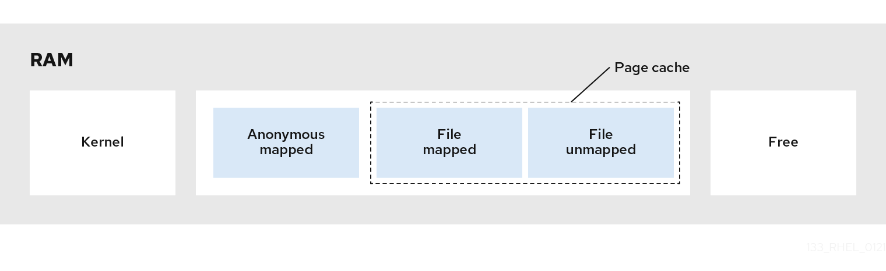 

<h3 id="virtual-memory-parameters">25.3. Virtual memory parameters</h3>

The virtual memory parameters are listed in the `/proc/sys/vm` directory. The following are the available virtual memory parameters:

`vm.dirty_ratio`

A percentage value. When this percentage of total system memory is modified, the system begins writing the modifications to the disk. The default value is 20 percent.

`vm.dirty_background_ratio`

A percentage value. When this percentage of total system memory is modified, the system begins writing the modifications to the disk in the background. The default value is 10 percent.

`vm.overcommit_memory`

Defines the conditions that determine whether a large memory request is accepted or denied. The default value is 0. By default, the kernel checks if a virtual memory allocation request fits into the present amount of memory (total + swap) and rejects only large requests. Otherwise, virtual memory allocations are granted, and can allow memory overcommitment.

Setting the `overcommit_memory` parameter’s value

- When this parameter is set to 1, the kernel performs no memory overcommit handling. This increases the possibility of memory overload, but improves performance for memory-intensive tasks.
- When this parameter is set to 2, the kernel denies requests for memory equal to or larger than the sum of the total available swap space and the percentage of physical RAM specified in `overcommit_ratio`. This setting reduces the risk of overcommitting memory, and use this only for systems with the swap partition larger than their physical memory.

`vm.overcommit_ratio`

Specifies the percentage of physical RAM considered when `overcommit_memory` is set to 2. The default value is 50.

`vm.max_map_count`

Defines the maximum number of memory map areas that a process can use. The default value is 65530. Increase this value if your application needs more memory map areas.

`vm.min_free_kbytes`

Sets the size of the reserved free pages pool. It is also responsible for setting the `min_page`, `low_page`, and `high_page` thresholds that govern the behavior of the page reclaim algorithms in the Linux kernel. It also specifies to keep the minimum number of free kilobytes across the system. This calculates a specific value for each low memory zone, each of which is assigned a number of reserved free pages in proportion to their size.

Setting the `vm.min_free_kbytes` parameter’s value

- Increasing the parameter value effectively reduces the application working set usable memory. Therefore, you can use it for only kernel-driven workloads, where driver buffers need to be allocated in atomic contexts.
- Decreasing the parameter value might render the kernel unable to service system requests, if memory becomes heavily contended in the system.
  
  Warning
  
  Extreme values can be detrimental to the system’s performance. Setting the `vm.min_free_kbytes` to an extremely low value prevents the system from reclaiming memory effectively, which can result in system crashes and failure to service interrupts or other kernel services. However, setting `vm.min_free_kbytes` too high considerably increases system reclaim activity, causing allocation latency due to a false direct reclaim state. This might cause the system to immediately enter an out-of-memory state. The vm.min\_free\_kbytes parameter also sets a page reclaim watermark, called `min_pages`. This watermark is used as a factor when determining the two other memory watermarks, `low_pages`, and `high_pages`, that govern page reclaim algorithms.
- `/proc/PID/oom_adj` In the event, when a system runs out of memory and the `panic_on_oom` parameter is set to 0, the `oom_killer` function kills processes, starting with the process that has the highest `oom_score`, until the system recovers. The `oom_adj` parameter determines the `oom_score` of a process. This parameter is set per process identifier. A value of **-17** disables the `oom_killer` for that process. Other valid values range from **-16** to **15**.
  
  Note
  
  Processes created by an adjusted process inherit the `oom_score` of that process.

`vm.swappiness`

The swappiness value, ranging from 0 to 200, controls the degree to which the system favors reclaiming memory from the anonymous memory pool, or the page cache memory pool.

Setting the swappiness parameter’s value

- Higher values prefer file-mapped driven workloads while swapping out the less actively accessed processes’ anonymous mapped memory of RAM. This is useful for file-servers or streaming applications that depend on data, such as files in the storage to reside on memory, to reduce I/O latency for the service requests.
- Low values prefer anonymous-mapped driven workloads while reclaiming the page cache (file mapped memory). This setting is useful for applications that do not depend heavily on the file system information, and heavily use dynamically allocated and private memory, such as mathematical and number crunching applications, and few hardware virtualization supervisors like QEMU. The default value of the `vm.swappiness` parameter is 60.
  
  Warning
  
  Setting the `vm.swappiness` to 0 aggressively avoids swapping out anonymous memory to a disk, which increases the likelihood of the `oom_killer` function to kill the processes during memory or I/O intensive workloads.

<h3 id="file-system-parameters">25.4. File system parameters</h3>

The file system parameters are listed in the `/proc/sys/fs` directory. The following are the available file system parameters:

`aio-max-nr`

Defines the maximum number of events allowed in all active asynchronous input/output contexts. The default value is 65536, and modifying this value does not pre-allocate or resize any kernel data structures.

`file-max`

Determines the maximum number of file handles for the entire system. On Red Hat Enterprise Linux 10, the default value is `9223372036854775807`.

Note

The default value is set by `systemd` and corresponds to the configurable maximum.

<h3 id="kernel-parameters">25.5. Kernel parameters</h3>

The default values for the kernel parameters are located in the `/proc/sys/kernel/` directory. These are set default values provided by the kernel or values specified by a user by using sysctl. The following kernel parameters configure limits for the msg* and shm* System V IPC (`sysvipc`) system calls:

`msgmax`

Defines the maximum allowed size in bytes of any single message in a message queue. This value must not exceed the size of the queue (`msgmnb`). Use the `sysctl kernel.msgmax` command to determine the current `msgmax` value on your system.

`msgmnb`

Defines the maximum size in bytes of a single message queue. Use the `sysctl msgmnb` command to determine the current `msgmnb` value on your system.

`msgmni`

Defines the maximum number of message queue identifiers, and therefore the maximum number of queues. Use the `sysctl kernel.msgmni` command to determine the current `msgmni` value on your system.

`shmall`

Defines the total amount of shared memory pages that can be used on the system at one time. For example, a page is 4096 bytes on the AMD64 and Intel 64 architecture. Use the `sysctl kernel.shmall` command to determine the current `shmall` value on your system.

`shmmax`

Defines the maximum size in bytes of a single shared memory segment allowed by the kernel. Shared memory segments up to 1Gb are now supported in the kernel. Use the `sysctl kernel.shmmax` command to determine the current `shmmax` value on your system.

`shmmni`

Defines the system-wide maximum number of shared memory segments. The default value is 4096 on all systems.

<h3 id="setting-memory-related-kernel-parameters">25.6. Setting memory-related kernel parameters</h3>

Setting a parameter temporarily is useful for determining the effect the parameter has on a system. You can later set the parameter persistently when you are sure that the parameter value has the expected effect.

**Procedure**

- To temporarily set the memory-related kernel parameters, edit the respective files in the `/proc` file system or the `sysctl` tool. For example, to temporarily set the `vm.overcommit_memory` parameter to `1`:
  
  ```
  echo 1 > /proc/sys/vm/overcommit_memory
  ```
  
  ```plaintext
  # echo 1 > /proc/sys/vm/overcommit_memory
  ```
  
  ```
  sysctl -w vm.overcommit_memory=1
  ```
  
  ```plaintext
  # sysctl -w vm.overcommit_memory=1
  ```
- To persistently set the memory-related kernel parameter, edit the `/etc/sysctl.conf` file and reload the settings. For example, to persistently set the `vm.overcommit_memory` parameter to `1`:
  
  - Add the following content in the `/etc/sysctl.conf` file:
    
    ```
    vm.overcommit_memory=1
    ```
    
    ```plaintext
    vm.overcommit_memory=1
    ```
  - Reload the sysctl settings from the `/etc/sysctl.conf` file:
    
    ```
    sysctl -p
    ```
    
    ```plaintext
    # sysctl -p
    ```

**Additional resources**

- [Tuning Red Hat Enterprise Linux for IBM DB2 (Red Hat Knowledgebase)](https://access.redhat.com/solutions/3530941)

<h2 id="getting-started-with-systemtap">Chapter 26. Getting started with SystemTap</h2>

As a system administrator, you can use SystemTap to identify underlying causes of a bug or performance problem on a running RHEL system. As an application developer, you can use SystemTap to closely monitor and analyze your application’s behavior within the RHEL environment.

<h3 id="the-purpose-of-systemtap">26.1. The purpose of SystemTap</h3>

SystemTap is a tracing and probing tool that you can use to study and monitor the activities of your operating system (particularly, the kernel) in fine detail. SystemTap provides information similar to the output of tools such as `netstat`, `ps`, `top`, and `iostat`. However, SystemTap provides more filtering and analysis options for collected information. In SystemTap scripts, you specify the information that SystemTap gathers.

SystemTap aims to supplement the existing suite of Linux monitoring tools by providing users with an infrastructure to track kernel activity and combining this capability with the following two attributes:

Flexibility

With the SystemTap framework, you can develop simple scripts for investigating and monitoring a wide variety of kernel functions, system calls, and other events that occur in kernel space. With this, SystemTap is not so much a tool as it is a system that you can use to develop your own kernel-specific forensic and monitoring tools.

Ease-of-Use

With SystemTap, you can monitor kernel activity without having to recompile the kernel or reboot the system.

<h3 id="installing-systemtap">26.2. Installing SystemTap</h3>

To begin using SystemTap, install the required packages. To use SystemTap on more than one kernel on a system with multiple kernels, install the corresponding kernel packages for each kernel version.

**Prerequisites**

- You have enabled debug repositories as described in [Enabling debug and source repositories](#enabling-debug-and-source-repositories "11.4. Enabling debug and source repositories").

**Procedure**

1. Install the required SystemTap packages:
   
   ```
   dnf install systemtap
   ```
   
   ```plaintext
   # dnf install systemtap
   ```
2. Install the required kernel packages:
   
   - Using `stap-prep`:
     
     ```
     stap-prep
     ```
     
     ```plaintext
     # stap-prep
     ```
   - If `stap-prep` does not work, install the required kernel packages manually:
     
     ```
     dnf install kernel-debuginfo-$(uname -r) kernel-debuginfo-common-$(uname -m)-$(uname -r) kernel-devel-$(uname -r)
     ```
     
     ```plaintext
     # dnf install kernel-debuginfo-$(uname -r) kernel-debuginfo-common-$(uname -m)-$(uname -r) kernel-devel-$(uname -r)
     ```
     
     `$(uname -m)` is automatically replaced with the hardware platform of your system and `$(uname -r)` is automatically replaced with the version of your running kernel.

**Verification**

- If the kernel to be probed with SystemTap is currently in use, test if your installation was successful:
  
  ```
  stap -v -e 'probe kernel.function("vfs_read") {printf("read performed\n"); exit()}'
  ```
  
  ```plaintext
  # stap -v -e 'probe kernel.function("vfs_read") {printf("read performed\n"); exit()}'
  ```
  
  For a successful SystemTap deployment, you see an output similar to the following:
  
  ```
  Pass 1: parsed user script and 45 library script(s) in 340usr/0sys/358real ms.
  Pass 2: analyzed script: 1 probe(s), 1 function(s), 0 embed(s), 0 global(s) in 290usr/260sys/568real ms.
  Pass 3: translated to C into "/tmp/stapiArgLX/stap_e5886fa50499994e6a87aacdc43cd392_399.c" in 490usr/430sys/938real ms.
  Pass 4: compiled C into "stap_e5886fa50499994e6a87aacdc43cd392_399.ko" in 3310usr/430sys/3714real ms.
  Pass 5: starting run.
  read performed
  Pass 5: run completed in 10usr/40sys/73real ms.
  ```
  
  ```plaintext
  Pass 1: parsed user script and 45 library script(s) in 340usr/0sys/358real ms.
  Pass 2: analyzed script: 1 probe(s), 1 function(s), 0 embed(s), 0 global(s) in 290usr/260sys/568real ms.
  Pass 3: translated to C into "/tmp/stapiArgLX/stap_e5886fa50499994e6a87aacdc43cd392_399.c" in 490usr/430sys/938real ms.
  Pass 4: compiled C into "stap_e5886fa50499994e6a87aacdc43cd392_399.ko" in 3310usr/430sys/3714real ms.
  Pass 5: starting run.
  read performed
  Pass 5: run completed in 10usr/40sys/73real ms.
  ```
  
  where:
- `Pass 5: starting run` indicates that SystemTap successfully created the instrumentation to probe the kernel and runs the instrumentation.
- `read performed` indicates that SystemTap detected the specified event, in this example, a VFS read.
- `Pass 5: run completed in <time> ms` indicates that SystemTap executed a valid handler. It displayed text and closed with no errors.

<h3 id="privileges-to-run-systemtap">26.3. Privileges to run SystemTap</h3>

Running SystemTap scripts requires elevated system privileges, but in some instances non-privileged users might need to run SystemTap instrumentation on their machine.

To allow users to build and run the SystemTap scripts without root access, add users to both of these user groups:

stapdev

Members of this group can use `stap` to run SystemTap scripts, or `staprun` to run SystemTap instrumentation modules. Running `stap` involves compiling SystemTap scripts into kernel modules and loading them into the kernel. This requires elevated privileges to the system, which are granted to `stapdev` members. These privileges also grant effective root access to `stapdev` members. Grant `stapdev` group membership only to users who can be trusted with root access.

stapusr

Members of this group can only use `staprun` to run SystemTap instrumentation modules. In addition, these users can run those modules only from the `/lib/modules/<kernel_version>/systemtap/` directory. This directory must be owned and writable only by the root user.

<h3 id="running-systemtap-scripts">26.4. Running SystemTap scripts</h3>

You can run SystemTap scripts from standard input or from a file. Find sample scripts that are distributed with the installation of SystemTap in [Sample SystemTap scripts](#sample-systemtap-scripts "26.5. Sample SystemTap scripts") or in the `/usr/share/systemtap/examples` directory.

**Prerequisites**

- SystemTap and the required kernel packages are installed as described in [Installing Systemtap](#installing-systemtap "26.2. Installing SystemTap").
- To run SystemTap scripts as a normal user, add the user to the SystemTap groups:
  
  ```
  usermod --append --groups
  stapdev,stapusr <user_name>
  ```
  
  ```plaintext
  # usermod --append --groups
  stapdev,stapusr <user_name>
  ```

**Procedure**

- Run the SystemTap script:
  
  - From standard input:
    
    ```
    stap -e "probe timer.s(1) {exit()}"
    ```
    
    ```plaintext
    # stap -e "probe timer.s(1) {exit()}"
    ```
  - From a file:
    
    ```
    stap <file_name>.stp
    ```
    
    ```plaintext
    # stap <file_name>.stp
    ```

<h3 id="sample-systemtap-scripts">26.5. Sample SystemTap scripts</h3>

You can find sample scripts that are distributed with the installation of SystemTap in the `/usr/share/systemtap/examples` directory. Use the `stap` command to run different SystemTap scripts:

Tracing function calls

You can use the `para-callgraph.stp` SystemTap script to trace function calls and function returns.

```
stap para-callgraph.stp <argument1 argument2>
```

```plaintext
# stap para-callgraph.stp <argument1 argument2>
```

The script takes two command-line arguments:

- The name of the function(s) whose entry/exit you are tracing.
- An optional trigger function, which enables or disables tracing on a per-thread basis.
  
  Tracing in each thread will continue as long as the trigger function has not exited yet.

Monitoring polling applications

You can use the `timeout.stp` SystemTap script to identify and monitor which applications are polling. Knowing this, you can track unnecessary or excessive polling, which helps you to pinpoint areas for improvement in terms of CPU usage and power savings.

```
stap timeout.stp
```

```plaintext
# stap timeout.stp
```

This script tracks how many times each application uses `poll`, `select`, `epoll`, `itimer`, `futex`, `nanosleep`, and `Signal` system calls over time.

Tracking system call volume per process

You can use the `syscalls_by_proc.stp` SystemTap script to see what processes are performing the highest volume of system calls. It displays the top 20 processes.

```
stap syscalls_by_proc.stp
```

```plaintext
# stap syscalls_by_proc.stp
```

Tracing functions called in network socket code

You can use the `socket-trace.stp` SystemTap script to trace functions called from the kernel’s `net/socket.c` file. This helps you to identify how each process interacts with the network at the kernel level in fine detail.

```
stap socket-trace.stp
```

```plaintext
# stap socket-trace.stp
```

Tracking I/O time for each file read or write

You can use the `iotime.stp` SystemTap script to monitor the amount of time it takes for each process to read from or write to any file. This helps you to determine what files are slow to load on a system.

```
stap iotime.stp
```

```plaintext
# stap iotime.stp
```

Tracking IRQ’s and other processes stealing cycles from a task

You can use the `cycle_thief.stp` SystemTap script to track the amount of time a task is running and the amount of time it is not running. This helps you to identify which processes are stealing cycles from a task.

```
stap cycle_thief.stp -x pid
```

```plaintext
# stap cycle_thief.stp -x pid
```

For more information, see the `/usr/share/systemtap/examples` directory.

Note

You can find more examples and information about SystemTap scripts in the `/usr/share/systemtap/examples/index.html` file. Open it in a web browser to see a list of all the available scripts and their descriptions.

<h3 id="systemtap-cross-instrumentation">26.6. SystemTap cross-instrumentation</h3>

Cross-instrumentation of SystemTap is creating SystemTap instrumentation modules from a SystemTap script on one system to be used on another system that does not have SystemTap fully deployed. When you run a SystemTap script, a kernel module is built out of that script. SystemTap then loads the module into the kernel.

Normally, SystemTap scripts can run only on systems where SystemTap is deployed. To run SystemTap on ten systems, SystemTap needs to be deployed on all those systems. In some cases, this might be neither feasible nor practical. For example, corporate policy might prohibit you from installing packages that provide compilers or debug information about specific machines, which will prevent the deployment of SystemTap.

To work around this, use cross-instrumentation. Cross-instrumentation is the process of generating SystemTap instrumentation modules from a SystemTap script on one system to be used on another system. This process offers the following benefits:

- The kernel information packages for various machines can be installed on a single host machine. Kernel packaging bugs may prevent the installation. In such cases, the `kernel-debuginfo` and `kernel-devel` packages for the host system and target system must match. If a bug occurs, report the bug to Red Hat JIRA.
- Each target machine needs only one package to be installed to use the generated SystemTap instrumentation module: `systemtap-runtime`. The host system must be the same architecture and running the same distribution of Linux as the target system in order for the built instrumentation module to work.
  
  Terminology
- *instrumentation module*
  
  The kernel module is built from a SystemTap script; the SystemTap module is built on the host system, and will be loaded on the target kernel of the target system.
- *host system*
  
  The system on which the instrumentation modules (from SystemTap scripts) are compiled, to be loaded on target systems.
- *target system*
  
  The system in which the instrumentation module is being built (from SystemTap scripts).
- *target kernel*
  
  The kernel of the target system. This is the kernel that loads and runs the instrumentation module.

**Additional resources**

- [Red Hat JIRA for reporting the bug](https://docs.redhat.com/en/documentation/red_hat_enterprise_linux/10/html/monitoring_and_managing_system_status_and_performance/providing-feedback-on-red-hat-documentation)

<h3 id="initializing-cross-instrumentation-of-systemtap">26.7. Initializing cross-instrumentation of SystemTap</h3>

Initialize cross-instrumentation of SystemTap to build SystemTap instrumentation modules from a SystemTap script on one system and use these modules on another system that does not have SystemTap fully deployed.

**Prerequisites**

- SystemTap is installed on the host system as described in [Installing Systemtap](#installing-systemtap "26.2. Installing SystemTap").
- The `systemtap-runtime` package is installed on each target system:
  
  ```
  dnf install systemtap-runtime
  ```
  
  ```plaintext
  # dnf install systemtap-runtime
  ```
- Both the host and the target systems are the same architecture.
- Both the host and the target systems are running the same major version of Red Hat Enterprise Linux (such as Red Hat Enterprise Linux 10).
  
  Important
  
  Kernel packaging bugs might prevent multiple `kernel-debuginfo` and `kernel-devel` packages from being installed on one system. In such cases, the minor version for the host and the target systems must match. If a bug occurs, report the bug at [Red Hat JIRA](https://docs.redhat.com/en/documentation/red_hat_enterprise_linux/10/html/monitoring_and_managing_system_status_and_performance/providing-feedback-on-red-hat-documentation).

**Procedure**

1. Determine the kernel running on each target system:
   
   ```
   uname -r
   ```
   
   ```plaintext
   $ uname -r
   ```
2. Repeat this step for each *target* system.
3. On the host system, install the target kernel and related packages for each target system by the method described in [Installing Systemtap](#installing-systemtap "26.2. Installing SystemTap").
4. Build an instrumentation module on the host system, copy this module to and run this module on on the target system either:
   
   1. If an SSH connection can be made to the target system from the host system, use remote implementation:
      
      ```
      stap --remote <target_system> script
      ```
      
      ```plaintext
      # stap --remote <target_system> script
      ```
      
      You must ensure an SSH connection can be made to the target system from the host system for this to be successful.
   2. Manually:
      
      1. Build the instrumentation module on the host system:
         
         ```
         stap -r <kernel_version> script -m <module_name> -p 4
         ```
         
         ```plaintext
         # stap -r <kernel_version> script -m <module_name> -p 4
         ```
         
         Here, `<kernel_version>` is the version of the target kernel determined in step 1, `script` is the script to be converted into an instrumentation module, and `<module_name>` specifies the name of the instrumentation module. The `-p4` option tells SystemTap to not load and run the compiled module.
      2. Once the instrumentation module is compiled, copy it to the target system and load it by using the following command:
         
         ```
         staprun <module_name>.ko
         ```
         
         ```plaintext
         # staprun <module_name>.ko
         ```

<h2 id="tuning-scheduling-policy">Chapter 27. Tuning scheduling policy</h2>

In Red Hat Enterprise Linux, the smallest unit of process execution is called a thread. The system scheduler determines which processor runs a thread, and for how long the thread runs. However, because the scheduler’s primary concern is to keep the system busy, it may not schedule threads optimally for application’sategories of scheduling policies performance.

For example, if an application on a NUMA system is running on Node A when a processor on Node B becomes available. To keep the processor on Node B busy, the scheduler moves one of the application’s threads to Node B. However, the application thread still requires access to memory on Node A. But, this memory will take longer to access because the thread is now running on Node B and Node A memory is no longer local to the thread. Thus, it may take longer for the thread to finish running on Node B than it would have taken to wait for a processor on Node A to become available, and then to run the thread on the original node with local memory access.

<h3 id="categories-of-scheduling-policies">27.1. Categories of scheduling policies</h3>

Performance-sensitive applications often benefit from the designer or administrator determining where threads are run. The Linux scheduler implements a number of scheduling policies that determine where and for how long a thread runs. The following are the two major categories of scheduling policies:

Normal policies

Normal threads are used for tasks of normal priority.

Realtime policies

Real-time policies are used for time-sensitive tasks that must be completed without interruptions. Real-time threads are not subject to time slicing. This means the thread runs until they block, exit, voluntarily yield, or are preempted by a higher priority thread.

The lowest priority realtime thread is scheduled before any thread with a normal policy. For more information, see the `sched(7)`, `sched_setaffinity(2)`, `sched_getaffinity(2)`, `sched_setscheduler(2)`, and `sched_getscheduler(2)` man pages on your system.

**Additional resources**

- [Static priority scheduling with SCHED\_FIFO](#static-priority-scheduling-with-sched-fifo "27.2. Static priority scheduling with SCHED_FIFO")
- [Round robin priority scheduling with SCHED\_RR](#round-robin-priority-scheduling-with-sched-rr "27.3. Round robin priority scheduling with SCHED_RR")

<h3 id="static-priority-scheduling-with-sched-fifo">27.2. Static priority scheduling with SCHED\_FIFO</h3>

The `SCHED_FIFO`, also called static priority scheduling, is a real-time policy that defines a fixed priority for each thread. This policy allows administrators to improve event response time and reduce latency. Avoid using this policy for an extended period of time for time-sensitive tasks. When `SCHED_FIFO` is in use, the scheduler scans the list of all the `SCHED_FIFO` threads in order of priority and schedules the highest priority thread that is ready to run. The priority level of a `SCHED_FIFO` thread can be any integer from 1 to 99, where 99 is treated as the highest priority. Start with a lower number and increase priority only when you identify latency issues.

Warning

Because real-time threads are not subject to time slicing, avoid setting a priority of 99. This keeps your process at the same priority level as migration and watchdog threads; if your thread goes into a computational loop and these threads are blocked, they will not be able to run. Systems with a single processor will eventually hang in this situation.

Administrators can limit `SCHED_FIFO` bandwidth to prevent realtime application programmers from initiating realtime tasks that monopolize the processor. The following are some of the parameters used in this policy:

`/proc/sys/kernel/sched_rt_period_us`

This parameter defines the time period, in microseconds, that is considered to be one hundred percent of the processor bandwidth. The default value is **1000000 μs** or **1 second**.

`/proc/sys/kernel/sched_rt_runtime_us`

This parameter defines the time period, in microseconds, that is devoted to running real-time threads. The default value is **950000 μs** or **0.95 seconds**.

<h3 id="round-robin-priority-scheduling-with-sched-rr">27.3. Round robin priority scheduling with SCHED\_RR</h3>

The `SCHED_RR` is a round-robin variant of the `SCHED_FIFO`. This policy is useful when multiple threads need to run at the same priority level. Like `SCHED_FIFO`, `SCHED_RR` is a realtime policy that defines a fixed priority for each thread. The scheduler scans the list of all `SCHED_RR` threads in order of priority and schedules the highest priority thread that is ready to run. However, unlike `SCHED_FIFO`, threads that have the same priority are scheduled in a round-robin style within a certain time slice. You can set the value of this time slice in milliseconds with the `sched_rr_timeslice_ms` kernel parameter in the `/proc/sys/kernel/sched_rr_timeslice_ms` file. The lowest value is **1 millisecond**.

<h3 id="normal-scheduling-with-sched-other">27.4. Normal scheduling with SCHED\_OTHER</h3>

The `SCHED_OTHER` is the default scheduling policy. This policy uses the Completely Fair Scheduler (CFS) to allow fair processor access to all threads scheduled with this policy. This policy is most useful when there are a large number of threads or when data throughput is a priority, as it allows more efficient scheduling of threads over time. When this policy is in use, the scheduler creates a dynamic priority list based partly on the niceness value of each process thread. Administrators can change the niceness value of a process, but cannot change the scheduler’s dynamic priority list directly.

<h3 id="setting-scheduler-policies">27.5. Setting scheduler policies</h3>

You can check and adjust scheduler policies and priorities by using the `chrt` command line tool. It can start new processes with the expected properties or change the properties of a running process. It can also be used for setting the policy at runtime.

**Procedure**

1. View the process ID (PID) of the active processes:
   
   ```
   ps
   ```
   
   ```plaintext
   # ps
   ```
2. Use the `--pid` or `-p` option with the `ps` command to view the details of the particular PID.
3. Check the scheduling policy, PID, and priority of a particular process:
   
   ```
   chrt -p 468
   ```
   
   ```plaintext
   # chrt -p 468
   ```
   
   ```
   pid 468's current scheduling policy: SCHED_FIFO
   pid 468's current scheduling priority: 85
   ```
   
   ```plaintext
   pid 468's current scheduling policy: SCHED_FIFO
   pid 468's current scheduling priority: 85
   ```
   
   ```
   chrt -p 476
   ```
   
   ```plaintext
   # chrt -p 476
   ```
   
   ```
   pid 476's current scheduling policy: SCHED_OTHER
   pid 476's current scheduling priority: 0
   ```
   
   ```plaintext
   pid 476's current scheduling policy: SCHED_OTHER
   pid 476's current scheduling priority: 0
   ```
4. Set the scheduling policy of a process, for example:
   
   1. To set the process with PID **1000** to `SCHED_FIFO`, with a priority of **50**:
      
      ```
      chrt -f -p 50 1000
      ```
      
      ```plaintext
      # chrt -f -p 50 1000
      ```
   2. To set the process with PID **1000** to `SCHED_OTHER`, with a priority of **0**:
      
      ```
      chrt -o -p 0 1000
      ```
      
      ```plaintext
      # chrt -o -p 0 1000
      ```
   3. To set the process with PID **1000** to `SCHED_RR`, with a priority of **10**:
      
      ```
      chrt -r -p 10 1000
      ```
      
      ```plaintext
      # chrt -r -p 10 1000
      ```
   4. To start a new application with a particular policy and priority, specify the name of the application:
      
      ```
      chrt -f 36 /bin/my-app
      ```
      
      ```plaintext
      # chrt -f 36 /bin/my-app
      ```

**Additional resources**

- [Policy Options for the chrt command](#policy-options-for-the-chrt-command "27.6. Policy options for the chrt command")
- [Changing the priority of services during the boot process](#changing-the-priority-of-services-during-the-boot-process "27.7. Changing the priority of services during the boot process")

<h3 id="policy-options-for-the-chrt-command">27.6. Policy options for the chrt command</h3>

You can view and set the scheduling policy of processes by using the `chrt` command. The following table describes the appropriate policy options, which can be used to set the scheduling policy of a process.

| Short option | Long option | Description                   |
|:-------------|:------------|:------------------------------|
| `-f`         | `--fifo`    | Set schedule to `SCHED_FIFO`  |
| `-o`         | `--other`   | Set schedule to `SCHED_OTHER` |
| `-r`         | `--rr`      | Set schedule to `SCHED_RR`    |

<h3 id="changing-the-priority-of-services-during-the-boot-process">27.7. Changing the priority of services during the boot process</h3>

You can configure real-time priorities for services launched during the boot process by using the `systemd` service. The unit configuration directives are used to change the priority of a service during the boot process. The boot process priority can be changed by using the following directives in the service section:

- `CPUSchedulingPolicy=`: Sets the CPU scheduling policy for executed processes. It is used to set other, fifo, and rr policies.
- `CPUSchedulingPriority=`: Sets the CPU scheduling priority for executed processes. The available priority range depends on the selected CPU scheduling policy. For real-time scheduling policies, an integer between 1 (lowest priority) and 99 (highest priority) can be used.

You can change the priority of a service during the boot process and by using the `mcelog` service.

**Prerequisites**

- You have installed and enabled `tuned`. For more information, see [Installing and enabling TuneD](#installing-and-enabling-tuned "2.3. Installing and enabling TuneD").

**Procedure**

1. View the scheduling priorities of running threads:
   
   ```
   tuna --show_threads
   ```
   
   ```plaintext
   # tuna --show_threads
   ```
   
   ```
       thread       ctxt_switches
       pid SCHED_ rtpri affinity voluntary nonvoluntary             cmd
     1      OTHER     0     0xff      3181          292         systemd
     2      OTHER     0     0xff       254            0        kthreadd
     3      OTHER     0     0xff         2            0          rcu_gp
     4      OTHER     0     0xff         2            0      rcu_par_gp
     6      OTHER     0        0         9            0 kworker/0:0H-kblockd
     7      OTHER     0     0xff      1301            1 kworker/u16:0-events_unbound
     8      OTHER     0     0xff         2            0    mm_percpu_wq
     9      OTHER     0        0       266            0     ksoftirqd/0
   [...]
   ```
   
   ```plaintext
       thread       ctxt_switches
       pid SCHED_ rtpri affinity voluntary nonvoluntary             cmd
     1      OTHER     0     0xff      3181          292         systemd
     2      OTHER     0     0xff       254            0        kthreadd
     3      OTHER     0     0xff         2            0          rcu_gp
     4      OTHER     0     0xff         2            0      rcu_par_gp
     6      OTHER     0        0         9            0 kworker/0:0H-kblockd
     7      OTHER     0     0xff      1301            1 kworker/u16:0-events_unbound
     8      OTHER     0     0xff         2            0    mm_percpu_wq
     9      OTHER     0        0       266            0     ksoftirqd/0
   [...]
   ```
2. Create a supplementary `mcelog` service configuration directory file and insert the policy name and priority in this file:
   
   ```
   cat << EOF > /etc/systemd/system/mcelog.service.d/priority.conf
   ```
   
   ```plaintext
   # cat << EOF > /etc/systemd/system/mcelog.service.d/priority.conf
   ```
   
   ```
   [Service]
   CPUSchedulingPolicy=fifo
   CPUSchedulingPriority=20
   EOF
   ```
   
   ```plaintext
   [Service]
   CPUSchedulingPolicy=fifo
   CPUSchedulingPriority=20
   EOF
   ```
3. Reload the `systemd` scripts configuration:
   
   ```
   systemctl daemon-reload
   ```
   
   ```plaintext
   # systemctl daemon-reload
   ```
4. Restart the `mcelog` service:
   
   ```
   systemctl restart mcelog
   ```
   
   ```plaintext
   # systemctl restart mcelog
   ```

**Verification**

- Display the `mcelog` priority set by `systemd` issue:
  
  ```
  tuna -t mcelog -P
  ```
  
  ```plaintext
  # tuna -t mcelog -P
  ```
  
  ```
  thread       ctxt_switches
  pid SCHED_ rtpri affinity voluntary nonvoluntary             cmd
  826     FIFO    20  0,1,2,3        13            0          mcelog
  ```
  
  ```plaintext
  thread       ctxt_switches
  pid SCHED_ rtpri affinity voluntary nonvoluntary             cmd
  826     FIFO    20  0,1,2,3        13            0          mcelog
  ```

**Additional resources**

- [Description of the priority range](#priority-map "27.8. Priority map")

<h3 id="priority-map">27.8. Priority map</h3>

Priorities are defined in groups, with some groups dedicated to certain kernel functions. For real-time scheduling policies, an integer between `1` (lowest priority) and `99` (highest priority) is used.

The following table describes the priority range, which can be used while setting the scheduling policy of a process.

| Priority | Threads                     | Description                                                                                                                                                     |
|:---------|:----------------------------|:----------------------------------------------------------------------------------------------------------------------------------------------------------------|
| 1        | Low priority kernel threads | This priority is usually reserved for the tasks that need to be just prior to `SCHED_OTHER`.                                                                    |
| 2 - 49   | Available for use           | The range used for typical application priorities.                                                                                                              |
| 50       | Default hard-IRQ value      |                                                                                                                                                                 |
| 51 - 98  | High priority threads       | Use this range for threads that run periodically and must have quick response times. Do not use this range for CPU-bound threads as you will starve interrupts. |
| 99       | Watchdogs and migration     | System threads that must run at the highest priority.                                                                                                           |

Table 27.1. Description of the priority range

<h3 id="tuned-cpu-partitioning-profile">27.9. TuneD cpu-partitioning profile</h3>

For tuning Red Hat Enterprise Linux for latency-sensitive workloads, use the `cpu-partitioning` TuneD profile. In Red Hat Enterprise Linux 9 and later, you can perform low-latency tuning more efficiently by using the cpu-partitioning TuneD profile. This profile is easily customizable according to the requirements for individual low-latency applications. The following figure is an example to demonstrate how to use the cpu-partitioning profile. This example uses the CPU and node layout.

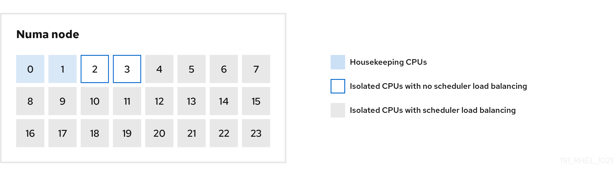 

You can configure the cpu-partitioning profile in the `/etc/tuned/cpu-partitioning-variables.conf` file by using the following configuration options:

Isolated CPUs with load balancing

In the `cpu-partitioning` figure, the blocks numbered from 4 to 23, are the default isolated CPUs. The kernel scheduler’s process load balancing is enabled on these CPUs. It is designed for low-latency processes with multiple threads that need the kernel scheduler load balancing. You can configure the cpu-partitioning profile in the `/etc/tuned/cpu-partitioning-variables.conf` file by using the `isolated_cores=cpu-list` option, which lists CPUs to isolate that will use the kernel scheduler load balancing.

The list of isolated CPUs is comma-separated or you can specify a range using a dash, such as 3-5. This option is mandatory. Any CPU missing from this list is automatically considered a housekeeping CPU.

Isolated CPUs without load balancing

In the cpu-partitioning figure, the blocks numbered 2 and 3, are the isolated CPUs that do not provide any additional kernel scheduler process load balancing.

You can configure the `cpu-partitioning` profile in the `/etc/tuned/cpu-partitioning-variables.conf` file by using the `no_balance_cores=cpu-list` option, which lists CPUs to isolate that will not use the kernel scheduler load balancing.

Specifying the `no_balance_cores` option is optional, however any CPUs in this list must be a subset of the CPUs listed in the `isolated_cores` list. Application threads using these CPUs need to be pinned individually to each CPU.

Housekeeping CPUs

Any CPU not isolated in the `cpu-partitioning-variables.conf` file is automatically considered a housekeeping CPU. On the housekeeping CPUs, all services, daemons, user processes, movable kernel threads, interrupt handlers, and kernel timers are permitted to run.

<h3 id="using-the-tuned-cpu-partitioning-profile-for-low-latency-tuning">27.10. Using the TuneD cpu-partitioning profile for low-latency tuning</h3>

You can tune a system for low-latency by using the TuneD’s cpu-partitioning profile. The application in this case uses:

- One dedicated reader thread that reads data from the network will be pinned to CPU 2.
- A large number of threads that process this network data will be pinned to CPUs 4-23.
- A dedicated writer thread that writes the processed data to the network will be pinned to CPU 3.

**Prerequisites**

- You have installed the `cpu-partitioning` TuneD profile by using the `dnf install tuned-profiles-cpu-partitioning` command as root.

**Procedure**

1. Edit the `/etc/tuned/cpu-partitioning-variables.conf` file with the following changes:
   
   1. Comment the `isolated_cores=${f:calc_isolated_cores:1}` line:
      
      ```
      isolated_cores=${f:calc_isolated_cores:1}
      ```
      
      ```plaintext
      # isolated_cores=${f:calc_isolated_cores:1}
      ```
   2. Add the following information for isolated CPUS:
      
      ```
      # All isolated CPUs:
      isolated_cores=2-23
      # Isolated CPUs without the kernel’s scheduler load balancing:
      no_balance_cores=2,3
      ```
      
      ```plaintext
      # All isolated CPUs:
      isolated_cores=2-23
      # Isolated CPUs without the kernel’s scheduler load balancing:
      no_balance_cores=2,3
      ```
   3. Set the cpu-partitioning TuneD profile:
      
      ```
      tuned-adm profile cpu-partitioning
      ```
      
      ```plaintext
      # tuned-adm profile cpu-partitioning
      ```
2. Reboot the system.
   
   After rebooting, the system is tuned for low-latency, according to the isolation in the cpu-partitioning figure. The application can use taskset to pin the reader and writer threads to CPUs 2 and 3, and the remaining application threads on CPUs 4-23.

**Verification**

- Verify that the isolated CPUs are not reflected in the Cpus\_allowed\_list field:
  
  ```
  cat /proc/self/status | grep Cpu
  ```
  
  ```plaintext
  # cat /proc/self/status | grep Cpu
  ```
  
  ```
  Cpus_allowed:	003
  Cpus_allowed_list:	0-1
  ```
  
  ```plaintext
  Cpus_allowed:	003
  Cpus_allowed_list:	0-1
  ```
- To see affinity of all processes, enter:
  
  ```
  ps -ae -o pid= | xargs -n 1 taskset -cp
  ```
  
  ```plaintext
  # ps -ae -o pid= | xargs -n 1 taskset -cp
  ```
  
  ```
  pid 1's current affinity list: 0,1
  pid 2's current affinity list: 0,1
  pid 3's current affinity list: 0,1
  pid 4's current affinity list: 0-5
  pid 5's current affinity list: 0,1
  pid 6's current affinity list: 0,1
  pid 7's current affinity list: 0,1
  pid 9's current affinity list: 0
  ...
  ```
  
  ```plaintext
  pid 1's current affinity list: 0,1
  pid 2's current affinity list: 0,1
  pid 3's current affinity list: 0,1
  pid 4's current affinity list: 0-5
  pid 5's current affinity list: 0,1
  pid 6's current affinity list: 0,1
  pid 7's current affinity list: 0,1
  pid 9's current affinity list: 0
  ...
  ```
  
  Note
  
  TuneD cannot change the affinity of some processes, mostly kernel processes. In this example, processes with PID 4 and 9 remain unchanged.

<h3 id="customizing-the-cpu-partitioning-tuned-profile">27.11. Customizing the cpu-partitioning TuneD profile</h3>

You can extend the TuneD profile to make additional tuning changes. For example, the `cpu-partitioning` profile sets the CPUs to use `cstate=1`. To use the `cpu-partitioning` profile but to additionally change the CPU `cstate` from `cstate1` to `cstate0`, the following procedure describes a new TuneD profile named `my_profile`, which inherits the `cpu-partitioning` profile and then sets `C state-0`.

**Procedure**

1. Create the `/etc/tuned/my_profile` directory:
   
   ```
   mkdir /etc/tuned/profiles/my_profile
   ```
   
   ```plaintext
   # mkdir /etc/tuned/profiles/my_profile
   ```
2. Create a `tuned.conf` file in this directory, and add the following content:
   
   ```
   vi /etc/tuned/profiles/my_profile/tuned.conf
   ```
   
   ```plaintext
   # vi /etc/tuned/profiles/my_profile/tuned.conf
   ```
   
   ```
   [main]
   summary=Customized tuning on top of cpu-partitioning
   include=cpu-partitioning
   [cpu]
   force_latency=cstate.id:0|1
   ```
   
   ```plaintext
   [main]
   summary=Customized tuning on top of cpu-partitioning
   include=cpu-partitioning
   [cpu]
   force_latency=cstate.id:0|1
   ```
3. Use the new profile.
   
   ```
   tuned-adm profile my_profile
   ```
   
   ```plaintext
   # tuned-adm profile my_profile
   ```
   
   Note
   
   In the shared example, a reboot is not required. However, if the changes in the *my\_profile* profile require a reboot to take effect, then reboot your machine.

<h2 id="profiling-memory-allocation-with-numastat">Chapter 28. Profiling memory allocation with numastat</h2>

The `numastat` tool provides detailed statistics on memory allocations within a system, presenting data for each NUMA node individually. This information is valuable for analyzing system memory performance and evaluating the efficacy of various memory policies.

<h3 id="default-numastat-statistics">28.1. Default numastat statistics</h3>

By default, the `numastat` tool displays statistics over these categories of data for each NUMA node:

`numa_hit`

The number of pages that were successfully allocated to this node.

`numa_miss`

The number of pages that were allocated on this node because of low memory on the intended node. Each `numa_miss` event has a corresponding `numa_foreign` event on another node.

Note

High `numa_hit` values and low `numa_miss` values (relative to each other) indicate optimal performance.

`numa_foreign`

The number of pages initially intended for this node that were allocated to another node instead. Each `numa_foreign` event has a corresponding `numa_miss` event on another node.

`interleave_hit`

The number of interleave policy pages successfully allocated to this node.

`local_node`

The number of pages successfully allocated on this node by a process on this node.

`other_node`

The number of pages allocated on this node by a process on another node.

<h3 id="viewing-memory-allocation-with-numastat">28.2. Viewing memory allocation with numastat</h3>

You can view the memory allocation of the system by using the `numastat` tool.

**Prerequisites**

- You have installed the `numactl` package.
  
  ```
  dnf install numactl
  ```
  
  ```plaintext
  # dnf install numactl
  ```

**Procedure**

- View the memory allocation of your system:
  
  ```
  numastat
  ```
  
  ```plaintext
  $ numastat
  ```
  
  ```
                               node0         node1
  numa_hit                  76557759      92126519
  numa_miss                 30772308      30827638
  numa_foreign              30827638      30772308
  interleave_hit              106507        103832
  local_node                76502227      92086995
  other_node                30827840      30867162
  ```
  
  ```plaintext
                               node0         node1
  numa_hit                  76557759      92126519
  numa_miss                 30772308      30827638
  numa_foreign              30827638      30772308
  interleave_hit              106507        103832
  local_node                76502227      92086995
  other_node                30827840      30867162
  ```

<h2 id="idm140555540596224">Legal Notice</h2>

Copyright © Red Hat.

Except as otherwise noted below, the text of and illustrations in this documentation are licensed by Red Hat under the Creative Commons Attribution–Share Alike 3.0 Unported license . If you distribute this document or an adaptation of it, you must provide the URL for the original version.

Red Hat, as the licensor of this document, waives the right to enforce, and agrees not to assert, Section 4d of CC-BY-SA to the fullest extent permitted by applicable law.

Red Hat, the Red Hat logo, JBoss, Hibernate, and RHCE are trademarks or registered trademarks of Red Hat, LLC. or its subsidiaries in the United States and other countries.

Linux® is the registered trademark of Linus Torvalds in the United States and other countries.

XFS is a trademark or registered trademark of Hewlett Packard Enterprise Development LP or its subsidiaries in the United States and other countries.

The OpenStack® Word Mark and OpenStack logo are trademarks or registered trademarks of the Linux Foundation, used under license.

All other trademarks are the property of their respective owners.
