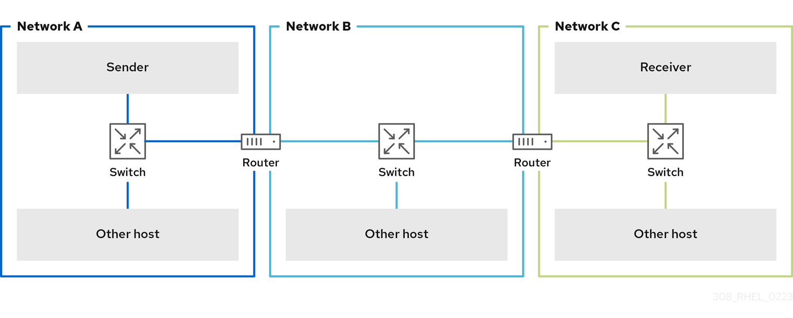
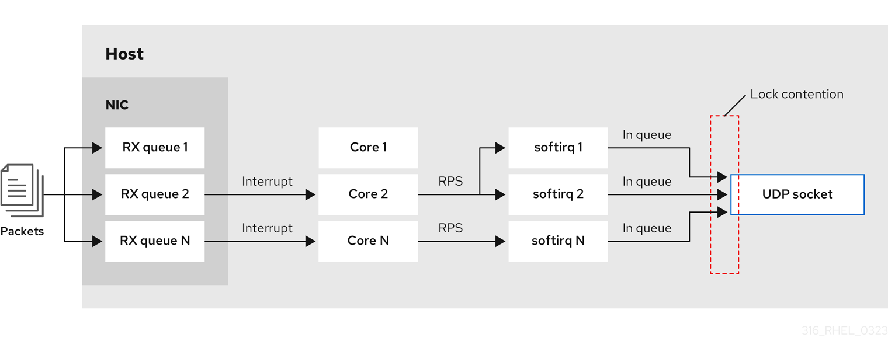

# Network troubleshooting and performance tuning

* * *

Red Hat Enterprise Linux 10

## Debugging and solving networking issues

Red Hat Customer Content Services

[Legal Notice](#idm140339773078512)

**Abstract**

Tuning the network settings is a complex process with many factors to consider. For example, this includes the CPU-to-memory architecture, the amount of CPU cores, and more. Red Hat Enterprise Linux uses default settings that are optimized for most scenarios. However, in certain cases, it can be necessary to tune network settings to increase the throughput or latency or to solve problems, such as packet drops.

* * *

<h2 id="providing-feedback-on-red-hat-documentation">Providing feedback on Red Hat documentation</h2>

We are committed to providing high-quality documentation and value your feedback. To help us improve, you can submit suggestions or report errors through the Red Hat Jira tracking system.

**Procedure**

1. Log in to the [Jira](https://issues.redhat.com/projects/RHELDOCS/issues) website.
   
   If you do not have an account, select the option to create one.
2. Click **Create** in the top navigation bar.
3. Enter a descriptive title in the **Summary** field.
4. Enter your suggestion for improvement in the **Description** field. Include links to the relevant parts of the documentation.
5. Click **Create** at the bottom of the dialogue.

<h2 id="tuning-network-adapter-settings">Chapter 1. Tuning network adapter settings</h2>

In high-speed networks with 40 Gbps and faster, certain default values of network adapter-related kernel settings can be a cause of packet drops and performance degradation. Tuning these settings can prevent such problems.

<h3 id="increasing-the-ring-buffer-size-to-reduce-a-high-packet-drop-rate-by-using-nmcli\_adapter-settings">1.1. Increasing the ring buffer size to reduce a high packet drop rate by using nmcli</h3>

Increase the size of an Ethernet device’s ring buffers if the packet drop rate causes applications to report a loss of data, timeouts, or other issues.

Receive ring buffers are shared between the device driver and network interface controller (NIC). The card assigns a transmit (TX) and receive (RX) ring buffer. As the name implies, the ring buffer is a circular buffer where an overflow overwrites existing data. There are two ways to move data from the NIC to the kernel, hardware interrupts and software interrupts, also called SoftIRQs.

The kernel uses the RX ring buffer to store incoming packets until the device driver can process them. The device driver drains the RX ring, typically by using SoftIRQs, which puts the incoming packets into a kernel data structure called an `sk_buff` or `skb` to begin its journey through the kernel and up to the application that owns the relevant socket.

The kernel uses the TX ring buffer to hold outgoing packets which should be sent to the network. These ring buffers reside at the bottom of the stack and are a crucial point at which packet drop can occur, which in turn will adversely affect network performance.

**Procedure**

1. Display the packet drop statistics of the interface:
   
   ```
   ethtool -S enp1s0
       ...
       rx_queue_0_drops: 97326
       rx_queue_1_drops: 63783
       ...
   ```
   
   ```plaintext
   # ethtool -S enp1s0
       ...
       rx_queue_0_drops: 97326
       rx_queue_1_drops: 63783
       ...
   ```
   
   Note that the output of the command depends on the network card and the driver.
   
   High values in `discard` or `drop` counters indicate that the available buffer fills up faster than the kernel can process the packets. Increasing the ring buffers can help to avoid such loss.
2. Display the maximum ring buffer sizes:
   
   ```
   ethtool -g enp1s0
    Ring parameters for enp1s0:
    Pre-set maximums:
    RX:             4096
    RX Mini:        0
    RX Jumbo:       16320
    TX:             4096
    Current hardware settings:
    RX:             255
    RX Mini:        0
    RX Jumbo:       0
    TX:             255
   ```
   
   ```plaintext
   # ethtool -g enp1s0
    Ring parameters for enp1s0:
    Pre-set maximums:
    RX:             4096
    RX Mini:        0
    RX Jumbo:       16320
    TX:             4096
    Current hardware settings:
    RX:             255
    RX Mini:        0
    RX Jumbo:       0
    TX:             255
   ```
   
   If the values in the `Pre-set maximums` section are higher than in the `Current hardware settings` section, you can change the settings in the next steps.
3. Identify the NetworkManager connection profile that uses the interface:
   
   ```
   nmcli connection show
   NAME                UUID                                  TYPE      DEVICE
   Example-Connection  a5eb6490-cc20-3668-81f8-0314a27f3f75  ethernet  enp1s0
   ```
   
   ```plaintext
   # nmcli connection show
   NAME                UUID                                  TYPE      DEVICE
   Example-Connection  a5eb6490-cc20-3668-81f8-0314a27f3f75  ethernet  enp1s0
   ```
4. Update the connection profile, and increase the ring buffers:
   
   - To increase the RX ring buffer, enter:
     
     ```
     nmcli connection modify Example-Connection ethtool.ring-rx 4096
     ```
     
     ```plaintext
     # nmcli connection modify Example-Connection ethtool.ring-rx 4096
     ```
   - To increase the TX ring buffer, enter:
     
     ```
     nmcli connection modify Example-Connection ethtool.ring-tx 4096
     ```
     
     ```plaintext
     # nmcli connection modify Example-Connection ethtool.ring-tx 4096
     ```
5. Reload the NetworkManager connection:
   
   ```
   nmcli connection up Example-Connection
   ```
   
   ```plaintext
   # nmcli connection up Example-Connection
   ```
   
   Important
   
   Depending on the driver your NIC uses, changing in the ring buffer can shortly interrupt the network connection.

**Additional resources**

- [ifconfig and ip commands report packet drops (Red Hat Knowledgebase)](https://access.redhat.com/solutions/2073223)
- [Should I be concerned about a 0.05% packet drop rate? (Red Hat Knowledgebase)](https://access.redhat.com/solutions/742043)

<h3 id="increasing-the-ring-buffer-size-to-reduce-a-high-packet-drop-rate-by-using-the-network-rhel-system-role\_adapter-settings">1.2. Increasing the ring buffer size to reduce a high packet drop rate by using the network RHEL system role</h3>

Increase the size of an Ethernet device’s ring buffers if the packet drop rate causes applications to report a loss of data, timeouts, or other issues.

Ring buffers are circular buffers where an overflow overwrites existing data. The network card assigns a transmit (TX) and receive (RX) ring buffer. Receive ring buffers are shared between the device driver and the network interface controller (NIC). Data can move from NIC to the kernel through either hardware interrupts or software interrupts, also called SoftIRQs.

The kernel uses the RX ring buffer to store incoming packets until the device driver can process them. The device driver drains the RX ring, typically by using SoftIRQs, which puts the incoming packets into a kernel data structure called an `sk_buff` or `skb` to begin its journey through the kernel and up to the application that owns the relevant socket.

The kernel uses the TX ring buffer to hold outgoing packets which should be sent to the network. These ring buffers reside at the bottom of the stack and are a crucial point at which packet drop can occur, which in turn will adversely affect network performance.

You configure ring buffer settings in the NetworkManager connection profiles. By using Ansible and the `network` RHEL system role, you can automate this process and remotely configure connection profiles on the hosts defined in a playbook.

Warning

You cannot use the `network` RHEL system role to update only specific values in an existing connection profile. The role ensures that a connection profile exactly matches the settings in a playbook. If a connection profile with the same name already exists, the role applies the settings from the playbook and resets all other settings in the profile to their defaults. To prevent resetting values, always specify the whole configuration of the network connection profile in the playbook, including the settings that you do not want to change.

**Prerequisites**

- [You have prepared the control node and the managed nodes](https://docs.redhat.com/en/documentation/red_hat_enterprise_linux/10/html/automating_system_administration_by_using_rhel_system_roles/preparing-a-control-node-and-managed-nodes-to-use-rhel-system-roles).
- You are logged in to the control node as a user who can run playbooks on the managed nodes.
- The account you use to connect to the managed nodes has `sudo` permissions for these nodes.
- You know the maximum ring buffer sizes that the device supports.

**Procedure**

1. Create a playbook file, for example, `~/playbook.yml`, with the following content:
   
   ```
   ---
   - name: Configure the network
     hosts: managed-node-01.example.com
     tasks:
       - name: Ethernet connection profile with dynamic IP address setting and increased ring buffer sizes
         ansible.builtin.include_role:
           name: redhat.rhel_system_roles.network
         vars:
           network_connections:
             - name: enp1s0
               type: ethernet
               autoconnect: yes
               ip:
                 dhcp4: yes
                 auto6: yes
               ethtool:
                 ring:
                   rx: 4096
                   tx: 4096
               state: up
   ```
   
   ```yaml
   ---
   - name: Configure the network
     hosts: managed-node-01.example.com
     tasks:
       - name: Ethernet connection profile with dynamic IP address setting and increased ring buffer sizes
         ansible.builtin.include_role:
           name: redhat.rhel_system_roles.network
         vars:
           network_connections:
             - name: enp1s0
               type: ethernet
               autoconnect: yes
               ip:
                 dhcp4: yes
                 auto6: yes
               ethtool:
                 ring:
                   rx: 4096
                   tx: 4096
               state: up
   ```
   
   The settings specified in the example playbook include the following:
   
   `rx: <value>`
   
   Sets the maximum number of received ring buffer entries.
   
   `tx: <value>`
   
   Sets the maximum number of transmitted ring buffer entries.
   
   For details about all variables used in the playbook, see the `/usr/share/ansible/roles/rhel-system-roles.network/README.md` file on the control node.
2. Validate the playbook syntax:
   
   ```
   ansible-playbook --syntax-check ~/playbook.yml
   ```
   
   ```plaintext
   $ ansible-playbook --syntax-check ~/playbook.yml
   ```
   
   Note that this command only validates the syntax and does not protect against a wrong but valid configuration.
3. Run the playbook:
   
   ```
   ansible-playbook ~/playbook.yml
   ```
   
   ```plaintext
   $ ansible-playbook ~/playbook.yml
   ```

**Verification**

- Display the maximum ring buffer sizes:
  
  ```
  ansible managed-node-01.example.com -m command -a 'ethtool -g enp1s0'
  managed-node-01.example.com | CHANGED | rc=0 >>
  ...
  Current hardware settings:
  RX:             4096
  RX Mini:        0
  RX Jumbo:       0
  TX:             4096
  ```
  
  ```plaintext
  # ansible managed-node-01.example.com -m command -a 'ethtool -g enp1s0'
  managed-node-01.example.com | CHANGED | rc=0 >>
  ...
  Current hardware settings:
  RX:             4096
  RX Mini:        0
  RX Jumbo:       0
  TX:             4096
  ```

<h3 id="tuning-the-network-device-backlog-queue-to-avoid-packet-drops">1.3. Tuning the network device backlog queue to avoid packet drops</h3>

When a network card receives packets and before the kernel protocol stack processes them, the kernel stores these packets in backlog queues. The kernel maintains a separate queue for each CPU core.

If the backlog queue for a core is full, the kernel drops all further incoming packets that the `netif_receive_skb()` kernel function assigns to this queue. If the server contains a 10 Gbps or faster network adapter or multiple 1 Gbps adapters, tune the backlog queue size to avoid this problem.

**Prerequisites**

- A 10 Gbps or faster or multiple 1 Gbps network adapters

**Procedure**

1. Determine whether tuning the backlog queue is needed, display the counters in the `/proc/net/softnet_stat` file:
   
   ```
   awk '{for (i=1; i<=NF; i++) printf strtonum("0x" $i) (i==NF?"\n":" ")}' /proc/net/softnet_stat | column -t
   221951548  0      0  0  0  0  0  0  0  0  0  0  0
   192058677  18862  0  0  0  0  0  0  0  0  0  0  1
   455324886  0      0  0  0  0  0  0  0  0  0  0  2
   ...
   ```
   
   ```plaintext
   # awk '{for (i=1; i<=NF; i++) printf strtonum("0x" $i) (i==NF?"\n":" ")}' /proc/net/softnet_stat | column -t
   221951548  0      0  0  0  0  0  0  0  0  0  0  0
   192058677  18862  0  0  0  0  0  0  0  0  0  0  1
   455324886  0      0  0  0  0  0  0  0  0  0  0  2
   ...
   ```
   
   This `awk` command converts the values in `/proc/net/softnet_stat` from hexadecimal to decimal format and displays them in table format. Each line represents a CPU core starting with core 0.
   
   The relevant columns are:
   
   - First column: The total number of received frames
   - Second column: The number of dropped frames because of a full backlog queue
   - Last column: The CPU core number
2. If the values in the second column of the `/proc/net/softnet_stat` file increment over time, increase the size of the backlog queue:
   
   1. Display the current backlog queue size:
      
      ```
      sysctl net.core.netdev_max_backlog
      net.core.netdev_max_backlog = 1000
      ```
      
      ```plaintext
      # sysctl net.core.netdev_max_backlog
      net.core.netdev_max_backlog = 1000
      ```
   2. Create the `/etc/sysctl.d/10-netdev_max_backlog.conf` file with the following content:
      
      ```
      net.core.netdev_max_backlog = 2000
      ```
      
      ```plaintext
      net.core.netdev_max_backlog = 2000
      ```
      
      Set the `net.core.netdev_max_backlog` parameter to a double of the current value.
   3. Load the settings from the `/etc/sysctl.d/10-netdev_max_backlog.conf` file:
      
      ```
      sysctl -p /etc/sysctl.d/10-netdev_max_backlog.conf
      ```
      
      ```plaintext
      # sysctl -p /etc/sysctl.d/10-netdev_max_backlog.conf
      ```

**Verification**

- Monitor the second column in the `/proc/net/softnet_stat` file:
  
  ```
  awk '{for (i=1; i<=NF; i++) printf strtonum("0x" $i) (i==NF?"\n":" ")}' /proc/net/softnet_stat | column -t
  ```
  
  ```plaintext
  # awk '{for (i=1; i<=NF; i++) printf strtonum("0x" $i) (i==NF?"\n":" ")}' /proc/net/softnet_stat | column -t
  ```
  
  If the values still increase, double the `net.core.netdev_max_backlog` value again. Repeat this process until the packet drop counters no longer increase.

<h3 id="increasing-the-transmit-queue-length-of-a-nic-to-reduce-the-number-of-transmit-errors">1.4. Increasing the transmit queue length of a NIC to reduce the number of transmit errors</h3>

The kernel stores packets in a transmit queue before transmitting them. The default queue length (1000 packets) is often sufficient for 10 Gbps networks. However, in faster networks, or if you encounter an increasing number of transmit errors on an adapter, increase the queue length.

**Procedure**

1. Display the current transmit queue length:
   
   ```
   ip -s link show enp1s0
   2: enp1s0: <BROADCAST,MULTICAST,UP,LOWER_UP> mtu 1500 qdisc fq_codel state UP mode DEFAULT group default qlen 1000
   ...
   ```
   
   ```plaintext
   # ip -s link show enp1s0
   2: enp1s0: <BROADCAST,MULTICAST,UP,LOWER_UP> mtu 1500 qdisc fq_codel state UP mode DEFAULT group default qlen 1000
   ...
   ```
   
   In this example, the transmit queue length (`qlen`) of the `enp1s0` interface is `1000`.
2. Monitor the dropped packets counter of a network interface’s software transmit queue:
   
   ```
   tc -s qdisc show dev enp1s0
   qdisc fq_codel 0: root refcnt 2 limit 10240p flows 1024 quantum 1514 target 5ms interval 100ms memory_limit 32Mb ecn drop_batch 64
    Sent 16889923 bytes 426862765 pkt (dropped 191980, overlimits 0 requeues 2)
   ...
   ```
   
   ```plaintext
   # tc -s qdisc show dev enp1s0
   qdisc fq_codel 0: root refcnt 2 limit 10240p flows 1024 quantum 1514 target 5ms interval 100ms memory_limit 32Mb ecn drop_batch 64
    Sent 16889923 bytes 426862765 pkt (dropped 191980, overlimits 0 requeues 2)
   ...
   ```
3. If you encounter a high or increasing transmit error count, set a higher transmit queue length:
   
   1. Identify the NetworkManager connection profile that uses this interface:
      
      ```
      nmcli connection show
      NAME                UUID                                  TYPE      DEVICE
      Example-Connection  a5eb6490-cc20-3668-81f8-0314a27f3f75  ethernet  enp1s0
      ```
      
      ```plaintext
      # nmcli connection show
      NAME                UUID                                  TYPE      DEVICE
      Example-Connection  a5eb6490-cc20-3668-81f8-0314a27f3f75  ethernet  enp1s0
      ```
   2. Update the connection profile, and increase the transmit queue length:
      
      ```
      nmcli connection modify Example-Connection link.tx-queue-length 2000
      ```
      
      ```plaintext
      # nmcli connection modify Example-Connection link.tx-queue-length 2000
      ```
      
      Set the queue length to double of the current value.
   3. Apply the changes:
      
      ```
      nmcli connection up Example-Connection
      ```
      
      ```plaintext
      # nmcli connection up Example-Connection
      ```

**Verification**

1. Display the transmit queue length:
   
   ```
   ip -s link show enp1s0
   2: enp1s0: <BROADCAST,MULTICAST,UP,LOWER_UP> mtu 1500 qdisc fq_codel state UP mode DEFAULT group default qlen 2000
   ...
   ```
   
   ```plaintext
   # ip -s link show enp1s0
   2: enp1s0: <BROADCAST,MULTICAST,UP,LOWER_UP> mtu 1500 qdisc fq_codel state UP mode DEFAULT group default qlen 2000
   ...
   ```
2. Monitor the dropped packets counter:
   
   ```
   tc -s qdisc show dev enp1s0
   ```
   
   ```plaintext
   # tc -s qdisc show dev enp1s0
   ```
   
   If the `dropped` counter still increases, double the transmit queue length again. Repeat this process until the counter no longer increases.

<h2 id="tuning-irq-balancing">Chapter 2. Tuning IRQ balancing</h2>

On multi-core hosts, you can increase the performance by ensuring that Red Hat Enterprise Linux balances interrupt queues (IRQs) to distribute the interrupts across CPU cores.

<h3 id="interrupts-and-interrupt-handlers">2.1. Interrupts and interrupt handlers</h3>

To troubleshoot performance issues, understand how a computer manages tasks and responds to events. This process relies on interrupts, which signal the CPU to handle an urgent task, and interrupt handlers, which are the specific routines that process those requests.

When a network interface controller (NIC) receives incoming data, it copies the data into kernel buffers by using Direct Memory Access (DMA). The NIC then notifies the kernel about this data by triggering a hard interrupt. These interrupts are processed by interrupt handlers which do minimal work, as they have already interrupted another task and the handlers cannot interrupt themselves. Hard interrupts can be costly in terms of CPU usage, especially if they use kernel locks.

The hard interrupt handler then leaves the majority of packet reception to a software interrupt request (SoftIRQ) process. The kernel can schedule these processes more fairly.

**Example 2.1. Displaying hardware interrupts**

The kernel stores the interrupt counters in the `/proc/interrupts` file. To display the counters for a specific NIC, such as `enp1s0`, enter:

```
grep -E "CPU|enp1s0" /proc/interrupts
         CPU0     CPU1     CPU2    CPU3    CPU4   CPU5
 105:  141606        0        0       0       0      0  IR-PCI-MSI-edge      enp1s0-rx-0
 106:       0   141091        0       0       0      0  IR-PCI-MSI-edge      enp1s0-rx-1
 107:       2        0   163785       0       0      0  IR-PCI-MSI-edge      enp1s0-rx-2
 108:       3        0        0  194370       0      0  IR-PCI-MSI-edge      enp1s0-rx-3
 109:       0        0        0       0       0      0  IR-PCI-MSI-edge      enp1s0-tx
```

```plaintext
# grep -E "CPU|enp1s0" /proc/interrupts
         CPU0     CPU1     CPU2    CPU3    CPU4   CPU5
 105:  141606        0        0       0       0      0  IR-PCI-MSI-edge      enp1s0-rx-0
 106:       0   141091        0       0       0      0  IR-PCI-MSI-edge      enp1s0-rx-1
 107:       2        0   163785       0       0      0  IR-PCI-MSI-edge      enp1s0-rx-2
 108:       3        0        0  194370       0      0  IR-PCI-MSI-edge      enp1s0-rx-3
 109:       0        0        0       0       0      0  IR-PCI-MSI-edge      enp1s0-tx
```

Each queue has an interrupt vector in the first column assigned to it. The kernel initializes these vectors when the system boots or when a user loads the NIC driver module. Each receive (`RX`) and transmit (`TX`) queue is assigned a unique vector that informs the interrupt handler which NIC or queue the interrupt is coming from. The columns represent the number of incoming interrupts for every CPU core.

<h3 id="software-interrupt-requests">2.2. Software interrupt requests</h3>

Software interrupt requests (SoftIRQs) clear the receive ring buffers of network adapters. The kernel schedules SoftIRQ routines to run at a time when other tasks will not be interrupted. On RHEL, processes named `ksoftirqd/cpu-number` run these routines and call driver-specific code functions.

To monitor the SoftIRQ counters for each CPU core, enter:

```
watch -n1 'grep -E "CPU|NET_RX|NET_TX" /proc/softirqs'
                    CPU0       CPU1	  CPU2       CPU3	CPU4	   CPU5       CPU6	 CPU7
      NET_TX:	   49672      52610	 28175      97288      12633	  19843      18746     220689
      NET_RX:         96       1615        789         46         31	   1735       1315     470798
```

```plaintext
# watch -n1 'grep -E "CPU|NET_RX|NET_TX" /proc/softirqs'
                    CPU0       CPU1	  CPU2       CPU3	CPU4	   CPU5       CPU6	 CPU7
      NET_TX:	   49672      52610	 28175      97288      12633	  19843      18746     220689
      NET_RX:         96       1615        789         46         31	   1735       1315     470798
```

The command dynamically updates the output. Press `Ctrl`+`C` to interrupt the output.

<h3 id="napi-polling">2.3. NAPI Polling</h3>

New API (NAPI) is an extension to the device driver packet processing framework to improve the efficiency of incoming network packets.

Hard interrupts are expensive because they usually cause a context switch from the kernel space to the user space and back again, and cannot interrupt themselves. Even with interrupt coalescence, the interrupt handler monopolizes a CPU core completely. With NAPI, the driver can use a polling mode instead of being hard-interrupted by the kernel for every packet that is received.

Under normal operation, the kernel issues an initial hard interrupt, followed by a soft interrupt request (SoftIRQ) handler that polls the network card by using NAPI routines. To prevent SoftIRQs from monopolizing a CPU core, the polling routine has a budget that determines the CPU time the SoftIRQ can consume. On completion of the SoftIRQ poll routine, the kernel exits the routine and schedules it to run again at a later time to repeat the process of receiving packets from the network card.

<h3 id="the-irqbalance-service">2.4. The irqbalance service</h3>

On systems both with and without Non-Uniform Memory Access (NUMA) architecture, the `irqbalance` service balances interrupts effectively across CPU cores, based on system conditions.

The `irqbalance` service runs in the background and monitors the CPU load every 10 seconds. The service moves interrupts to other CPU cores when a CPU’s load is too high. As a result, the system performs well and handles load more efficiently.

If `irqbalance` is not running, usually the CPU core 0 handles most of the interrupts. Even at moderate load, this CPU core can become busy trying to handle the workload of all the hardware in the system. As a consequence, interrupts or interrupt-based work can be missed or delayed. This can result in low network and storage performance, packet loss, and potentially other issues.

Important

Disabling `irqbalance` can negatively impact the network throughput.

On systems with only a single CPU core, the `irqbalance` service provides no benefit and exits on its own.

By default, the `irqbalance` service is enabled and running on Red Hat Enterprise Linux. To re-enable the service if you disabled it, enter:

```
systemctl enable --now irqbalance
```

```plaintext
# systemctl enable --now irqbalance
```

**Additional resources**

- [Do we need irqbalance? (Red Hat Knowledgebase)](https://access.redhat.com/solutions/41535)
- [How should I configure network interface IRQ channels? (Red Hat Knowledgebase)](https://access.redhat.com/solutions/4367191)

<h3 id="increasing-the-time-softirqs-can-run-on-the-cpu">2.5. Increasing the time SoftIRQs can run on the CPU</h3>

If SoftIRQs do not run long enough, the rate of incoming data could exceed the kernel’s capability to drain the buffer fast enough. As a result, the network interface controller (NIC) buffers overflow and packets are lost.

If `softirqd` processes could not retrieve all packets from interfaces in one NAPI polling cycle, it is an indicator that the SoftIRQs do not have enough CPU time. This could be the case on hosts with fast NICs, such as 10 Gbps and faster. If you increase the values of the `net.core.netdev_budget` and `net.core.netdev_budget_usecs` kernel parameters, you can control the time and number of packets `softirqd` can process in a polling cycle.

**Procedure**

1. To determine whether tuning the `net.core.netdev_budget` parameter is needed, display the counters in the `/proc/net/softnet_stat` file:
   
   ```
   awk '{for (i=1; i<=NF; i++) printf strtonum("0x" $i) (i==NF?"\n":" ")}' /proc/net/softnet_stat | column -t
   221951548  0  0      0  0  0  0  0  0  0  0  0  0
   192058677  0  20380  0  0  0  0  0  0  0  0  0  1
   455324886  0  0      0  0  0  0  0  0  0  0  0  2
   ...
   ```
   
   ```plaintext
   # awk '{for (i=1; i<=NF; i++) printf strtonum("0x" $i) (i==NF?"\n":" ")}' /proc/net/softnet_stat | column -t
   221951548  0  0      0  0  0  0  0  0  0  0  0  0
   192058677  0  20380  0  0  0  0  0  0  0  0  0  1
   455324886  0  0      0  0  0  0  0  0  0  0  0  2
   ...
   ```
   
   This `awk` command converts the values in `/proc/net/softnet_stat` from hexadecimal to decimal format and displays them in the table format. Each line represents a CPU core starting with core 0.
   
   The relevant columns are:
   
   - First column: The total number of received frames.
   - Third column: The number times `softirqd` processes that could not retrieve all packets from interfaces in one NAPI polling cycle.
   - Last column: The CPU core number.
2. If the counters in the third column of the `/proc/net/softnet_stat` file increment over time, tune the system:
   
   1. Display the current values of the `net.core.netdev_budget_usecs` and `net.core.netdev_budget` parameters:
      
      ```
      sysctl net.core.netdev_budget_usecs net.core.netdev_budget
      net.core.netdev_budget_usecs = 2000
      net.core.netdev_budget = 300
      ```
      
      ```plaintext
      # sysctl net.core.netdev_budget_usecs net.core.netdev_budget
      net.core.netdev_budget_usecs = 2000
      net.core.netdev_budget = 300
      ```
      
      With these settings, `softirqd` processes have up to 2000 microseconds to process up to 300 messages from the NIC in one polling cycle. Polling ends based on which condition is met first.
   2. Create the `/etc/sysctl.d/10-netdev_budget.conf` file with the following content:
      
      ```
      net.core.netdev_budget = 600
      net.core.netdev_budget_usecs = 4000
      ```
      
      ```plaintext
      net.core.netdev_budget = 600
      net.core.netdev_budget_usecs = 4000
      ```
      
      Set the parameters to a double of their current values.
   3. Load the settings from the `/etc/sysctl.d/10-netdev_budget.conf` file:
      
      ```
      sysctl -p /etc/sysctl.d/10-netdev_budget.conf
      ```
      
      ```plaintext
      # sysctl -p /etc/sysctl.d/10-netdev_budget.conf
      ```

**Verification**

- Monitor the third column in the `/proc/net/softnet_stat` file:
  
  ```
  awk '{for (i=1; i<=NF; i++) printf strtonum("0x" $i) (i==NF?"\n":" ")}' /proc/net/softnet_stat | column -t
  ```
  
  ```plaintext
  # awk '{for (i=1; i<=NF; i++) printf strtonum("0x" $i) (i==NF?"\n":" ")}' /proc/net/softnet_stat | column -t
  ```
  
  If the values still increase, set `net.core.netdev_budget_usecs` and `net.core.netdev_budget` to higher values. Repeat this process until the counters no longer increase.

<h2 id="improving-the-network-latency">Chapter 3. Improving the network latency</h2>

CPU power management features can cause unwanted delays in time-sensitive application processing. You can disable some or all of these power management features to improve the network latency.

For example, if the latency is higher when the server is idle than under heavy load, CPU power management settings could influence the latency.

Important

Disabling CPU power management features can cause a higher power consumption and heat loss.

<h3 id="how-the-cpu-power-states-influence-the-network-latency">3.1. How the CPU power states influence the network latency</h3>

The consumption state (C-states) of CPUs optimize and reduce the power consumption of computers.

The C-states are numbered, starting at C0. In C0, the processor is fully powered and executing. In C1, the processor is fully powered but not executing. The higher the number of the C-state, the more components the CPU turns off.

Whenever a CPU core is idle, the built-in power saving logic steps in and attempts to move the core from the current C-state to a higher one by turning off various processor components. If the CPU core must process data, Red Hat Enterprise Linux (RHEL) sends an interrupt to the processor to wake up the core and set its C-state back to C0.

Moving out of deep C-states back to C0 takes time due to turning power back on to various components of the processor. On multi-core systems, it can also happen that many of the cores are simultaneously idle and, therefore, in deeper C-states. If RHEL tries to wake them up at the same time, the kernel can generate a large number of Inter-Processor Interrupts (IPIs) while all cores return from deep C-states. Due to locking that is required while processing interrupts, the system can then stall for some time while handling all the interrupts. This can result in large delays in the application response to events.

**Example 3.1. Displaying times in C-state per core**

The `Idle Stats` page in the PowerTOP application displays how much time the CPU cores spend in each C-state:

```
           Pkg(HW)  |            Core(HW) |            CPU(OS) 0   CPU(OS) 4
                    |                     | C0 active   2.5%        2.2%
                    |                     | POLL        0.0%    0.0 ms  0.0%    0.1 ms
                    |                     | C1          0.1%    0.2 ms  0.0%    0.1 ms
C2 (pc2)   63.7%    |                     |
C3 (pc3)    0.0%    | C3 (cc3)    0.1%    | C3          0.1%    0.1 ms  0.1%    0.1 ms
C6 (pc6)    0.0%    | C6 (cc6)    8.3%    | C6          5.2%    0.6 ms  6.0%    0.6 ms
C7 (pc7)    0.0%    | C7 (cc7)   76.6%    | C7s         0.0%    0.0 ms  0.0%    0.0 ms
C8 (pc8)    0.0%    |                     | C8          6.3%    0.9 ms  5.8%    0.8 ms
C9 (pc9)    0.0%    |                     | C9          0.4%    3.7 ms  2.2%    2.2 ms
C10 (pc10)  0.0%    |                     |
                    |                     | C10        80.8%    3.7 ms 79.4%    4.4 ms
                    |                     | C1E         0.1%    0.1 ms  0.1%    0.1 ms
...
```

```plaintext
           Pkg(HW)  |            Core(HW) |            CPU(OS) 0   CPU(OS) 4
                    |                     | C0 active   2.5%        2.2%
                    |                     | POLL        0.0%    0.0 ms  0.0%    0.1 ms
                    |                     | C1          0.1%    0.2 ms  0.0%    0.1 ms
C2 (pc2)   63.7%    |                     |
C3 (pc3)    0.0%    | C3 (cc3)    0.1%    | C3          0.1%    0.1 ms  0.1%    0.1 ms
C6 (pc6)    0.0%    | C6 (cc6)    8.3%    | C6          5.2%    0.6 ms  6.0%    0.6 ms
C7 (pc7)    0.0%    | C7 (cc7)   76.6%    | C7s         0.0%    0.0 ms  0.0%    0.0 ms
C8 (pc8)    0.0%    |                     | C8          6.3%    0.9 ms  5.8%    0.8 ms
C9 (pc9)    0.0%    |                     | C9          0.4%    3.7 ms  2.2%    2.2 ms
C10 (pc10)  0.0%    |                     |
                    |                     | C10        80.8%    3.7 ms 79.4%    4.4 ms
                    |                     | C1E         0.1%    0.1 ms  0.1%    0.1 ms
...
```

<h3 id="c-state-settings-in-the-efi-firmware">3.2. C-state settings in the EFI firmware</h3>

In most systems with an EFI firmware, you can enable and disable the individual consumption states (C-states). However, on RHEL, the idle driver determines whether the kernel uses the settings from the firmware.

These drivers are available:

- `intel_idle`: This is the default driver on hosts with an Intel CPU and ignores the C-state settings from the EFI firmware.
- `acpi_idle`: RHEL uses this driver on hosts with CPUs from vendors other than Intel and if `intel_idle` is disabled. By default, the `acpi_idle` driver uses the C-state settings from the EFI firmware.

For further details, see the `/usr/share/doc/kernel-doc-<version>/Documentation/admin-guide/pm/cpuidle.rst` file provided by the `kernel-doc` package.

<h3 id="disabling-c-states-by-using-a-custom-tuned-profile">3.3. Disabling C-states by using a custom TuneD profile</h3>

Using the TuneD service prevents that administrators must hard code a maximum C-state value by using kernel command line parameters.

The TuneD service uses the Power Management Quality of Service (`PMQOS`) interface of the kernel to set consumption states (C-states) locking. The kernel idle driver can communicate with this interface to dynamically limit the C-states.

**Prerequisites**

- The `tuned` package is installed.
- The `tuned` service is enabled and running.

**Procedure**

1. Display the active profile:
   
   ```
   tuned-adm active
   Current active profile: network-latency
   ```
   
   ```plaintext
   # tuned-adm active
   Current active profile: network-latency
   ```
2. Create a directory for the custom TuneD profile:
   
   ```
   mkdir /etc/tuned/network-latency-custom/
   ```
   
   ```plaintext
   # mkdir /etc/tuned/network-latency-custom/
   ```
3. Create the `/etc/tuned/network-latency-custom/tuned.conf` file with the following content:
   
   ```
   [main]
   include=network-latency
   
   [cpu]
   force_latency=cstate.id:1|2
   ```
   
   ```plaintext
   [main]
   include=network-latency
   
   [cpu]
   force_latency=cstate.id:1|2
   ```
   
   This custom profile inherits all settings from the `network-latency` profile. The `force_latency` TuneD parameter specifies the latency in microseconds (µs). If the C-state latency is higher than the specified value, the idle driver in Red Hat Enterprise Linux prevents the CPU from moving to a higher C-state. With `force_latency=cstate.id:1|2`, TuneD first checks if the `/sys/devices/system/cpu/cpu_<number>_/cpuidle/state_<cstate.id>_/` directory exists. In this case, TuneD reads the latency value from the `latency` file in this directory. If the directory does not exist, TuneD uses 2 microseconds as a fallback value.
4. Activate the `network-latency-custom` profile:
   
   ```
   tuned-adm profile network-latency-custom
   ```
   
   ```plaintext
   # tuned-adm profile network-latency-custom
   ```

**Additional resources**

- [Optimizing system performance with TuneD](https://docs.redhat.com/en/documentation/red_hat_enterprise_linux/10/html/monitoring_and_managing_system_status_and_performance/optimizing-system-performance-with-tuned)

<h3 id="disabling-c-states-by-using-a-kernel-command-line-option">3.4. Disabling C-states by using a kernel command line option</h3>

To test whether the latency of applications on a host are being affected by C-states, temporarily disable consumption states (C-state) in a kernel command line option.

The `processor.max_cstate` and `intel_idle.max_cstate` kernel command line parameters configure the maximum C-state CPU cores can use. For example, setting the parameters to `1` ensures that the CPU will never request a C-state below C1.

To not hard code a specific state, consider using a more dynamic solution. See [Disabling C-states by using a custom TuneD profile](#disabling-c-states-by-using-a-custom-tuned-profile "3.3. Disabling C-states by using a custom TuneD profile").

**Prerequisites**

- The `tuned` service is not running or configured to not update C-state settings.

**Procedure**

1. Display the idle driver the system uses:
   
   ```
   cat /sys/devices/system/cpu/cpuidle/current_driver
   intel_idle
   ```
   
   ```plaintext
   # cat /sys/devices/system/cpu/cpuidle/current_driver
   intel_idle
   ```
   
   For details about the driver, see the `/usr/share/doc/kernel-doc-<version>/Documentation/admin-guide/pm/cpuidle.rst` file provided by the `kernel-doc` package.
2. If the host uses the `intel_idle` driver, set the `intel_idle.max_cstate` kernel parameter to define the highest C-state that CPU cores should be able to use:
   
   ```
   grubby --update-kernel=ALL --args="intel_idle.max_cstate=0"
   ```
   
   ```plaintext
   # grubby --update-kernel=ALL --args="intel_idle.max_cstate=0"
   ```
   
   Setting `intel_idle.max_cstate=0` disables the `intel_idle` driver. Consequently, the kernel uses the `acpi_idle` driver that uses the C-state values set in the EFI firmware. For this reason, also set `processor.max_cstate` to override these C-state settings.
3. On every host, independent from the CPU vendor, set the highest C-state that CPU cores should be able to use:
   
   ```
   grubby --update-kernel=ALL --args="processor.max_cstate=0"
   ```
   
   ```plaintext
   # grubby --update-kernel=ALL --args="processor.max_cstate=0"
   ```
   
   Important
   
   If you set `processor.max_cstate=0` in addition to `intel_idle.max_cstate=0`, the `acpi_idle` driver overrides the value of `processor.max_cstate` and sets it to `1`. As a result, with `processor.max_cstate=0 intel_idle.max_cstate=0`, the highest C-state the kernel will use is C1, not C0.
4. Restart the host for the changes to take effect:
   
   ```
   reboot
   ```
   
   ```plaintext
   # reboot
   ```

**Verification**

1. Display the maximum C-state:
   
   ```
   cat /sys/module/processor/parameters/max_cstate
   1
   ```
   
   ```plaintext
   # cat /sys/module/processor/parameters/max_cstate
   1
   ```
2. If the host uses the `intel_idle` driver, display the maximum C-state:
   
   ```
   cat /sys/module/intel_idle/parameters/max_cstate
   0
   ```
   
   ```plaintext
   # cat /sys/module/intel_idle/parameters/max_cstate
   0
   ```

**Additional resources**

- [What are CPU "C-states" and how to disable them if needed? (Red Hat Knowledgebase)](https://access.redhat.com/solutions/202743)

<h2 id="improving-the-throughput-of-large-amounts-of-contiguous-data-streams">Chapter 4. Improving the throughput of large amounts of contiguous data streams</h2>

Improving throughput for large, contiguous data streams is beneficial because it reduces overhead by transmitting more data per packet.

According to the IEEE 802.3 standard, a default Ethernet frame without Virtual Local Area Network (VLAN) tag has a maximum size of 1518 bytes. Each of these frames includes an 18 bytes header, leaving 1500 bytes for payload. Consequently, for every 1500 bytes of data the server transmits over the network, 18 bytes (1.2%) Ethernet frame header are overhead and transmitted as well. Headers from layer 3 and 4 protocols increase the overhead per packet further.

Consider employing jumbo frames to save overhead if hosts on your network often send numerous contiguous data streams, such as backup servers or file servers hosting numerous huge files. Jumbo frames are non-standardized frames that have a larger Maximum Transmission Unit (MTU) than the standard Ethernet payload size of 1500 bytes. For example, if you configure jumbo frames with the maximum allowed MTU of 9000 bytes payload, the overhead of each frame reduces to 0.2%.

Depending on the network and services, it can be beneficial to enable jumbo frames only in specific parts of a network, such as the storage backend of a cluster. This avoids packet fragmentation.

<h3 id="considerations-before-configuring-jumbo-frames">4.1. Considerations before configuring jumbo frames</h3>

Depending on your hardware, applications, and services in your network, jumbo frames can have different impacts. Decide carefully whether enabling jumbo frames provides a benefit in your scenario.

Prerequisites for jumbo frames:

All network devices on the transmission path must support jumbo frames and use the same Maximum Transmission Unit (MTU) size. In the opposite case, you can face the following problems:

- Dropped packets.
- Higher latency due to fragmented packets.
- Increased risk of packet loss caused by fragmentation. For example, if a router fragments a single 9000-bytes frame into six 1500-bytes frames, and any of those 1500-byte frames are lost, the whole frame is lost because it cannot be reassembled.

In the following diagram, all hosts in the three subnets must use the same MTU if a host from network A sends a packet to a host in network C:

 

Benefits of jumbo frames:

- Higher throughput: Each frame contains more user data while the protocol overhead is fixed.
- Lower CPU utilization: Jumbo frames cause fewer interrupts and, therefore, save CPU cycles.

Drawbacks of jumbo frames:

- Higher latency: Larger frames delay packets that follow.
- Increased memory buffer usage: Larger frames can fill buffer queue memory more quickly.

<h3 id="configuring-the-mtu-in-an-existing-networkmanager-connection-profile">4.2. Configuring the MTU in an existing NetworkManager connection profile</h3>

If your network requires a different Maximum Transmission Unit (MTU) than the default, you can configure this setting in the corresponding NetworkManager connection profile.

Jumbo frames are network packets with a payload of between 1500 and 9000 bytes. All devices in the same broadcast domain have to support those frames.

**Prerequisites**

- All devices in the broadcast domain use the same MTU.
- You know the MTU of the network.
- You already configured a connection profile for the network with the divergent MTU.

**Procedure**

1. Optional: Display the current MTU:
   
   ```
   ip link show
   ...
   3: enp1s0: <BROADCAST,MULTICAST,UP,LOWER_UP> mtu 1500 qdisc fq_codel state UP mode DEFAULT group default qlen 1000
       link/ether 52:54:00:74:79:56 brd ff:ff:ff:ff:ff:ff
   ...
   ```
   
   ```plaintext
   # ip link show
   ...
   3: enp1s0: <BROADCAST,MULTICAST,UP,LOWER_UP> mtu 1500 qdisc fq_codel state UP mode DEFAULT group default qlen 1000
       link/ether 52:54:00:74:79:56 brd ff:ff:ff:ff:ff:ff
   ...
   ```
2. Optional: Display the NetworkManager connection profiles:
   
   ```
   nmcli connection show
   NAME     UUID                                  TYPE      DEVICE
   Example  f2f33f29-bb5c-3a07-9069-be72eaec3ecf  ethernet  enp1s0
   ...
   ```
   
   ```plaintext
   # nmcli connection show
   NAME     UUID                                  TYPE      DEVICE
   Example  f2f33f29-bb5c-3a07-9069-be72eaec3ecf  ethernet  enp1s0
   ...
   ```
3. Set the MTU in the profile that manages the connection to the network with the divergent MTU:
   
   ```
   nmcli connection modify Example mtu 9000
   ```
   
   ```plaintext
   # nmcli connection modify Example mtu 9000
   ```
4. Reactivate the connection:
   
   ```
   nmcli connection up Example
   ```
   
   ```plaintext
   # nmcli connection up Example
   ```

**Verification**

1. Display the MTU setting:
   
   ```
   ip link show
   ...
   3: enp1s0: <BROADCAST,MULTICAST,UP,LOWER_UP> mtu 9000 qdisc fq_codel state UP mode DEFAULT group default qlen 1000
       link/ether 52:54:00:74:79:56 brd ff:ff:ff:ff:ff:ff
   ...
   ```
   
   ```plaintext
   # ip link show
   ...
   3: enp1s0: <BROADCAST,MULTICAST,UP,LOWER_UP> mtu 9000 qdisc fq_codel state UP mode DEFAULT group default qlen 1000
       link/ether 52:54:00:74:79:56 brd ff:ff:ff:ff:ff:ff
   ...
   ```
2. Verify that no host on the transmission paths fragments the packets:
   
   - On the receiver side, display the IP reassembly statistics of the kernel:
     
     ```
     nstat -az IpReasm*
     #kernel
     IpReasmTimeout 0 0.0
     IpReasmReqds 0 0.0
     IpReasmOKs 0 0.0
     IpReasmFails 0 0.0
     ```
     
     ```plaintext
     # nstat -az IpReasm*
     #kernel
     IpReasmTimeout 0 0.0
     IpReasmReqds 0 0.0
     IpReasmOKs 0 0.0
     IpReasmFails 0 0.0
     ```
     
     If the counters return `0`, packets were not reassembled.
   - On the sender side, transmit an ICMP request with the prohibit-fragmentation-bit:
     
     ```
     ping -c1 -Mdo -s 8972 destination_host
     ```
     
     ```plaintext
     # ping -c1 -Mdo -s 8972 destination_host
     ```
     
     If the command succeeds, the packet was not fragmented.
     
     Calculate the value for the `-s` packet size option as follows: MTU size - 8 bytes ICMP header - 20 bytes IPv4 header = packet size

<h2 id="tuning-tcp-connections-for-high-throughput">Chapter 5. Tuning TCP connections for high throughput</h2>

Tune TCP-related settings on Red Hat Enterprise Linux to increase the throughput, reduce the latency, or prevent problems, such as packet loss.

<h3 id="testing-the-tcp-throughput-by-using-iperf3">5.1. Testing the TCP throughput by using iperf3</h3>

The `iperf3` utility provides a server and client mode to perform network throughput tests between two hosts.

Note

The throughput of applications depends on many factors, such as the buffer sizes that the application uses. Therefore, the results measured with testing utilities, such as `iperf3`, can be significantly different from those of applications on a server under production workload.

**Prerequisites**

- The `iperf3` package is installed on both the client and server.
- No other services on either host cause network traffic that substantially affects the test result.
- For 40 Gbps and faster connections, the network card supports Accelerated Receive Flow Steering (ARFS) and the feature is enabled on the interface.

**Procedure**

1. Optional: Display the maximum network speed of the network interface controller (NIC) on both the server and client:
   
   ```
   ethtool enp1s0 | grep "Speed"
      Speed: 100000Mb/s
   ```
   
   ```plaintext
   # ethtool enp1s0 | grep "Speed"
      Speed: 100000Mb/s
   ```
2. On the server:
   
   1. Temporarily open the default `iperf3` TCP port 5201 in the `firewalld` service:
      
      ```
      firewall-cmd --add-port=5201/tcp
      ```
      
      ```plaintext
      # firewall-cmd --add-port=5201/tcp
      ```
   2. Start `iperf3` in server mode:
      
      ```
      iperf3 --server
      ```
      
      ```plaintext
      # iperf3 --server
      ```
      
      The service now is waiting for incoming client connections.
3. On the client:
   
   1. Start measuring the throughput:
      
      ```
      iperf3 --time 60 --zerocopy --client 192.0.2.1
      ```
      
      ```plaintext
      # iperf3 --time 60 --zerocopy --client 192.0.2.1
      ```
      
      - `--time <seconds>`: Defines the time in seconds when the client stops the transmission.
        
        Set this parameter to a value that you expect to work and increase it in later measurements. If the client sends packets at a faster rate than the devices on the transmit path or the server can process, packets can be dropped.
      - `--zerocopy`: Enables a zero copy method instead of using the `write()` system call. You require this option only if you want to simulate a zero-copy-capable application or to reach 40 Gbps and more on a single stream.
      - `--client <server>`: Enables the client mode and sets the IP address or name of the server that runs the `iperf3` server.
4. Wait until `iperf3` completes the test. Both the server and the client display statistics every second and a summary at the end. For example, the following is a summary displayed on a client:
   
   ```
   [ ID] Interval         Transfer    Bitrate         Retr
   [  5] 0.00-60.00  sec  101 GBytes   14.4 Gbits/sec   0   sender
   [  5] 0.00-60.04  sec  101 GBytes   14.4 Gbits/sec       receiver
   ```
   
   ```plaintext
   [ ID] Interval         Transfer    Bitrate         Retr
   [  5] 0.00-60.00  sec  101 GBytes   14.4 Gbits/sec   0   sender
   [  5] 0.00-60.04  sec  101 GBytes   14.4 Gbits/sec       receiver
   ```
   
   In this example, the average bitrate was 14.4 Gbps.
5. On the server:
   
   1. Press `Ctrl`+`C` to stop the `iperf3` server.
   2. Close the TCP port 5201 in `firewalld`:
      
      ```
      firewall-cmd --remove-port=5201/tcp
      ```
      
      ```plaintext
      # firewall-cmd --remove-port=5201/tcp
      ```

<h3 id="the-system-wide-tcp-socket-buffer-settings">5.2. The system-wide TCP socket buffer settings</h3>

Socket buffers temporarily store data that the kernel has received or should send.

The following buffers exist:

- The read socket buffer holds packets that the kernel has received but which the application has not read yet.
- The write socket buffer holds packets that an application has written to the buffer but which the kernel has not passed to the IP stack and network driver yet.

If a TCP packet is too large and exceeds the buffer size or packets are sent or received at a too fast rate, the kernel drops any new incoming TCP packet until the data is removed from the buffer. In this case, increasing the socket buffers can prevent packet loss.

Both the `net.ipv4.tcp_rmem` (read) and `net.ipv4.tcp_wmem` (write) socket buffer kernel settings contain three values:

```
net.ipv4.tcp_rmem = 4096  131072  6291456
net.ipv4.tcp_wmem = 4096  16384   4194304
```

```plaintext
net.ipv4.tcp_rmem = 4096  131072  6291456
net.ipv4.tcp_wmem = 4096  16384   4194304
```

The displayed values are in bytes and Red Hat Enterprise Linux uses them in the following way:

- The first value is the minimum buffer size. New sockets cannot have a smaller size.
- The second value is the default buffer size. If an application sets no buffer size, this is the default value.
- The third value is the maximum size of automatically tuned buffers. Using the `setsockopt()` function with the `SO_SNDBUF` socket option in an application disables this maximum buffer size.

Note that the `net.ipv4.tcp_rmem` and `net.ipv4.tcp_wmem` parameters set the socket sizes for both the IPv4 and IPv6 protocols.

<h3 id="increasing-the-system-wide-tcp-socket-buffers">5.3. Increasing the system-wide TCP socket buffers</h3>

The system-wide TCP socket buffers temporarily store data that the kernel has received or should send. Both `net.ipv4.tcp_rmem` (read) and `net.ipv4.tcp_wmem` (write) socket buffer kernel settings contain three settings: A minimum, default, and maximum value.

Important

Setting too large buffer sizes wastes memory. Each socket can be set to the size that the application requests, and the kernel doubles this value. For example, if an application requests a 256 KiB socket buffer size and opens 1 million sockets, the system can use up to 512 GB RAM (512 KiB x 1 million) only for the potential socket buffer space.

Additionally, a too large value for the maximum buffer size can increase the latency.

**Prerequisites**

- You encountered a significant rate of dropped TCP packets.

**Procedure**

1. Determine the latency of the connection. For example, ping from the client to server to measure the average Round Trip Time (RTT):
   
   ```
   ping -c 10 server.example.com
   ...
   --- server.example.com ping statistics ---
   10 packets transmitted, 10 received, 0% packet loss, time 9014ms
   rtt min/avg/max/mdev = 17.208/17.056/19.333/0.616 ms
   ```
   
   ```plaintext
   # ping -c 10 server.example.com
   ...
   --- server.example.com ping statistics ---
   10 packets transmitted, 10 received, 0% packet loss, time 9014ms
   rtt min/avg/max/mdev = 17.208/17.056/19.333/0.616 ms
   ```
   
   In this example, the latency is 17 ms.
2. Use the following formula to calculate the Bandwidth Delay Product (BDP) for the traffic you want to tune:
   
   ```
   connection speed in bytes * latency in seconds = BDP in bytes
   ```
   
   ```plaintext
   connection speed in bytes * latency in seconds = BDP in bytes
   ```
   
   For example, to calculate the BDP for a 10 Gbps connection that has a 17 ms latency:
   
   ```
   (10 * 1000 * 1000 * 1000 / 8) * 0.017 = 21,250,000 bytes
   ```
   
   ```plaintext
   (10 * 1000 * 1000 * 1000 / 8) * 0.017 = 21,250,000 bytes
   ```
3. Create the `/etc/sysctl.d/10-tcp-socket-buffers.conf` file and either set the maximum read or write buffer size, or both, based on your requirements:
   
   ```
   net.ipv4.tcp_rmem = 4096 262144 42500000
   net.ipv4.tcp_wmem = 4096 262144 42500000
   ```
   
   ```plaintext
   net.ipv4.tcp_rmem = 4096 262144 42500000
   net.ipv4.tcp_wmem = 4096 262144 42500000
   ```
   
   Specify the values in bytes. Use the following rule of thumb when you try to identify optimized values for your environment:
   
   - Default buffer size (second value): Increase this value only slightly or set it to `524288` (512 KiB) at most. A too high default buffer size can cause buffer collapsing and, consequently, latency spikes.
   - Maximum buffer size (third value): A value double to triple of the BDP is often sufficient.
4. Load the settings from the `/etc/sysctl.d/10-tcp-socket-buffers.conf` file:
   
   ```
   sysctl -p /etc/sysctl.d/10-tcp-socket-buffers.conf
   ```
   
   ```plaintext
   # sysctl -p /etc/sysctl.d/10-tcp-socket-buffers.conf
   ```
5. If you have changed the second value in the `net.ipv4.tcp_rmem` or `net.ipv4.tcp_wmem` parameter, restart the applications to use the new TCP buffer sizes.
   
   If you have changed only the third value, you do not need to restart the application because auto-tuning applies these settings dynamically.

**Verification**

1. Optional: [Test the TCP throughput by using iperf3](#testing-the-tcp-throughput-by-using-iperf3 "5.1. Testing the TCP throughput by using iperf3").
2. Monitor the packet drop statistics by using the same method that you used when you encountered the packet drops.
   
   If packet drops still occur but at a lower rate, increase the buffer sizes further.

**Additional resources**

- [What are the implications of changing socket buffer sizes? (Red Hat Knowledgebase)](https://access.redhat.com/solutions/85913)

<h3 id="tcp-window-scaling">5.4. TCP Window Scaling</h3>

The TCP Window Scaling feature, which is enabled by default in Red Hat Enterprise Linux, is an extension of the TCP protocol that significantly improves the throughput.

For example, on a 1 Gbps connection with 1.5 ms Round Trip Time (RTT):

- With TCP Window Scaling enabled, approximately 630 Mbps are realistic.
- With TCP Window Scaling disabled, the throughput goes down to 380 Mbps.

One of the features TCP provides is flow control. With flow control, a sender can send as much data as the receiver can receive, but no more. To achieve this, the receiver advertises a `window` value, which is the amount of data a sender can send.

TCP originally supported window sizes up to 64 KiB, but at high Bandwidth Delay Products (BDP), this value becomes a restriction because the sender cannot send more than 64 KiB at a time. High-speed connections can transfer much more than 64 KiB of data at a given time. For example, a 10 Gbps link with 1 ms of latency between systems can have more than 1 MiB of data in transit at a given time. It would be inefficient if a host sends only 64 KiB, then pauses until the other host receives that 64 KiB.

To remove this bottleneck, the TCP Window Scaling extension allows the TCP window value to be arithmetically shifted left to increase the window size beyond 64 KiB. For example, the largest window value of `65535` shifted 7 places to the left, resulting in a window size of almost 8 MiB. This enables transferring much more data at a given time.

TCP Window Scaling is negotiated during the three-way TCP handshake that opens every TCP connection. Both sender and receiver must support TCP Window Scaling for the feature to work. If either or both participants do not advertise window scaling ability in their handshake, the connection reverts to using the original 16-bit TCP window size.

By default, TCP Window Scaling is enabled in Red Hat Enterprise Linux:

```
sysctl net.ipv4.tcp_window_scaling
net.ipv4.tcp_window_scaling = 1
```

```plaintext
# sysctl net.ipv4.tcp_window_scaling
net.ipv4.tcp_window_scaling = 1
```

If TCP Window Scaling is disabled (`0`) on your server, revert the setting in the same way as you set it.

**Additional resources**

- [Configuring kernel parameters at runtime](https://docs.redhat.com/en/documentation/red_hat_enterprise_linux/10/html/managing_monitoring_and_updating_the_kernel/configuring-kernel-parameters-at-runtime)

<h3 id="how-tcp-sack-reduces-the-packet-drop-rate">5.5. How TCP SACK reduces the packet drop rate</h3>

The TCP Selective Acknowledgment (TCP SACK) feature, which is enabled by default in RHEL, is an enhancement of the TCP protocol and increases the efficiency of TCP connections.

In TCP transmissions, the receiver sends an ACK packet to the sender for every packet it receives. For example, a client sends the TCP packets 1-10 to the server but the packets number 5 and 6 get lost. Without TCP SACK, the server drops packets 7-10, and the client must retransmit all packets from the point of loss, which is inefficient. With TCP SACK enabled on both hosts, the client must re-transmit only the lost packets 5 and 6.

Important

Disabling TCP SACK decreases the performance and causes a higher packet drop rate on the receiver side in a TCP connection.

By default, TCP SACK is enabled in RHEL. To verify:

```
sysctl net.ipv4.tcp_sack
1
```

```plaintext
# sysctl net.ipv4.tcp_sack
1
```

If TCP SACK is disabled (`0`) on your server, revert the setting in the same way as you set it.

**Additional resources**

- [Should I be concerned about a 0.05% packet drop rate? (Red Hat Knowledgebase)](https://access.redhat.com/solutions/742043)
- [Configuring kernel parameters at runtime](https://docs.redhat.com/en/documentation/red_hat_enterprise_linux/10/html/managing_monitoring_and_updating_the_kernel/configuring-kernel-parameters-at-runtime)

<h2 id="tuning-udp-connections">Chapter 6. Tuning UDP connections</h2>

Tuning RHEL for UDP throughput requires realistic expectations. Unlike TCP, UDP lacks features, such as flow control and congestion control. This makes it difficult to achieve reliable communication and throughput that is close to the maximum speed of the network interface controller (NIC).

<h3 id="detecting-packet-drops">6.1. Detecting packet drops</h3>

There are multiple levels in the network stack in which the kernel can drop packets. RHEL provides different utilities to display statistics of these levels. Use them to identify potential problems.

Note that you can ignore a very small rate of dropped packets. However, if you encounter a significant rate, consider tuning measures.

Note

The kernel drops network packets if the networking stack cannot handle the incoming traffic.

**Procedure**

- Identify UDP protocol-specific packet drops due to too small socket buffers or slow application processing:
  
  ```
  nstat -az UdpSndbufErrors UdpRcvbufErrors
  #kernel
  UdpSndbufErrors           4    0.0
  UdpRcvbufErrors    45716659    0.0
  ```
  
  ```plaintext
  # nstat -az UdpSndbufErrors UdpRcvbufErrors
  #kernel
  UdpSndbufErrors           4    0.0
  UdpRcvbufErrors    45716659    0.0
  ```
  
  The second column in the output lists the counters.

**Additional resources**

- [RHEL network interface dropping packets (Red Hat Knowledgebase)](https://access.redhat.com/solutions/21301)
- [Should I be concerned about a 0.05% packet drop rate? (Red Hat Knowledgebase)](https://access.redhat.com/solutions/742043)

<h3 id="testing-the-udp-throughput-by-using-iperf3">6.2. Testing the UDP throughput by using iperf3</h3>

The `iperf3` utility provides a server and client mode to perform network throughput tests between two hosts.

Note

The throughput of applications depend on many factors, such as the buffer sizes that the application uses. Therefore, the results measured with testing utilities, such as `iperf3`, can significantly be different from those of applications on a server under production workload.

**Prerequisites**

- The `iperf3` package is installed on both the client and server.
- No other services on both hosts cause network traffic that substantially affects the test result.
- Optional: You increased the maximum UDP socket sizes on both the server and the client. For details, see [Increasing the system-wide UDP socket buffers](#increasing-the-system-wide-udp-socket-buffers "6.5. Increasing the system-wide UDP socket buffers").

**Procedure**

1. Optional: Display the maximum network speed of the network interface controller (NIC) on both the server and client:
   
   ```
   ethtool enp1s0 | grep "Speed"
      Speed: 10000Mb/s
   ```
   
   ```plaintext
   # ethtool enp1s0 | grep "Speed"
      Speed: 10000Mb/s
   ```
2. On the server:
   
   1. Display the maximum UDP socket read buffer size, and note the value:
      
      ```
      sysctl net.core.rmem_max
      net.core.rmem_max = 16777216
      ```
      
      ```plaintext
      # sysctl net.core.rmem_max
      net.core.rmem_max = 16777216
      ```
      
      The displayed value is in bytes.
   2. Temporarily open the default `iperf3` port 5201 in the `firewalld` service:
      
      ```
      firewall-cmd --add-port=5201/tcp --add-port=5201/udp
      ```
      
      ```plaintext
      # firewall-cmd --add-port=5201/tcp --add-port=5201/udp
      ```
      
      Note that, `iperf3` opens only a TCP socket on the server. If a client wants to use UDP, it first connects to this TCP port, and then the server opens a UDP socket on the same port number for performing the UDP traffic throughput test. For this reason, you must open port 5201 for both the TCP and UDP protocol in the local firewall.
   3. Start `iperf3` in server mode:
      
      ```
      iperf3 --server
      ```
      
      ```plaintext
      # iperf3 --server
      ```
      
      The service now waits for incoming client connections.
3. On the client:
   
   1. Display the Maximum Transmission Unit (MTU) of the interface that the client will use for the connection to the server, and note the value:
      
      ```
      ip link show enp1s0
      2: enp1s0: <BROADCAST,MULTICAST,UP,LOWER_UP> mtu 1500 qdisc fq_codel state UP mode DEFAULT group default qlen 1000
      ...
      ```
      
      ```plaintext
      # ip link show enp1s0
      2: enp1s0: <BROADCAST,MULTICAST,UP,LOWER_UP> mtu 1500 qdisc fq_codel state UP mode DEFAULT group default qlen 1000
      ...
      ```
   2. Display the maximum UDP socket write buffer size, and note the value:
      
      ```
      sysctl net.core.wmem_max
      net.core.wmem_max = 16777216
      ```
      
      ```plaintext
      # sysctl net.core.wmem_max
      net.core.wmem_max = 16777216
      ```
      
      The displayed value is in bytes.
   3. Start measuring the throughput:
      
      ```
      iperf3 --udp --time 60 --window 16777216 --length 1472 --bitrate 2G --client 192.0.2.1
      ```
      
      ```plaintext
      # iperf3 --udp --time 60 --window 16777216 --length 1472 --bitrate 2G --client 192.0.2.1
      ```
      
      - `--udp`: Use the UDP protocol for the test.
      - `--time <seconds>`: Defines the time in seconds when the client stops the transmission.
      - `--window <size>`: Sets the UDP socket buffer size. Ideally, the sizes are the same on both the client and server. In case that they are different, set this parameter to the value that is smaller: `net.core.wmem_max` on the client or `net.core.rmem_max` on the server.
      - `--length <size>`: Sets the length of the buffer to read and write. Set this option to the largest unfragmented payload. Calculate the ideal value as follows: MTU - IP header (20 bytes for IPv4 and 40 bytes for IPv6) - 8 bytes UDP header.
      - `--bitrate <rate>`: Limits the bit rate to the specified value in bits per second. You can specify units, such as `2G` for 2 Gbps.
        
        Set this parameter to a value that you expect to work and increase it in later measurements. If the client sends packets at a faster rate than the devices on the transmit path or the server can process them, packets can be dropped.
      - `--client <server>`: Enables the client mode and sets the IP address or name of the server that runs the `iperf3` server.
4. Wait until `iperf3` completes the test. Both the server and the client display statistics every second and a summary at the end. For example, the following is a summary displayed on a client:
   
   ```
   [ ID] Interval       Transfer      Bitrate         Jitter    Lost/Total Datagrams
   [ 5] 0.00-60.00 sec  14.0 GBytes   2.00 Gbits/sec  0.000 ms  0/10190216 (0%) sender
   [ 5] 0.00-60.04 sec  14.0 GBytes   2.00 Gbits/sec  0.002 ms  0/10190216 (0%) receiver
   ```
   
   ```plaintext
   [ ID] Interval       Transfer      Bitrate         Jitter    Lost/Total Datagrams
   [ 5] 0.00-60.00 sec  14.0 GBytes   2.00 Gbits/sec  0.000 ms  0/10190216 (0%) sender
   [ 5] 0.00-60.04 sec  14.0 GBytes   2.00 Gbits/sec  0.002 ms  0/10190216 (0%) receiver
   ```
   
   In this example, the average bit rate was 2 Gbps, and no packets were lost.
5. On the server:
   
   1. Press `Ctrl`+`C` to stop the `iperf3` server.
   2. Close port 5201 in `firewalld`:
      
      ```
      firewall-cmd --remove-port=5201/tcp --remove-port=5201/udp
      ```
      
      ```plaintext
      # firewall-cmd --remove-port=5201/tcp --remove-port=5201/udp
      ```

<h3 id="impact-of-the-mtu-size-on-udp-traffic-throughput">6.3. Impact of the MTU size on UDP traffic throughput</h3>

If your application uses a large UDP message size, using jumbo frames can improve the throughput.

According to the IEEE 802.3 standard, a default Ethernet frame without Virtual Local Area Network (VLAN) tag has a maximum size of 1518 bytes. Each of these frames includes an 18 bytes header, leaving 1500 bytes for payload. Consequently, for every 1500 bytes of data the server transmits over the network, 18 bytes (1.2%) are overhead.

Jumbo frames are non-standardized frames that have a larger Maximum Transmission Unit (MTU) than the standard Ethernet payload size of 1500 bytes. For example, if you configure jumbo frames with the maximum allowed MTU of 9000 bytes payload, the overhead of each frame reduces to 0.2%.

Important

All network devices on the transmission path and the involved broadcast domains must support jumbo frames and use the same MTU. Packet fragmentation and reassembly due to inconsistent MTU settings on the transmission path reduces the network throughput.

Different connection types have certain MTU limitations:

- Ethernet: the MTU is limited to 9000 bytes.
- IP over InfiniBand (IPoIB) in datagram mode: The MTU is limited to 4 bytes less than the InfiniBand MTU.
- In-memory networking commonly supports larger MTUs. For details, see the respective documentation.

<h3 id="impact-of-the-cpu-speed-on-udp-traffic-throughput">6.4. Impact of the CPU speed on UDP traffic throughput</h3>

Due to missing packet aggregation, UDP is less efficient than TCP for bulk transfers. The CPU frequency can limit throughput on high-speed links because Generic Receive Offload (GRO) and UDP Segmentation Offload (USO) are disabled by default.

For example, on a tuned host with a high Maximum Transmission Unit (MTU) and large socket buffers, a 3 GHz CPU can process the traffic of a 10 GBit NIC that sends or receives UDP traffic at full speed. However, you can expect about 1-2 Gbps speed loss for every 100 MHz CPU speed under 3 GHz when you transmit UDP traffic. Also, if a CPU speed of 3 GHz can closely achieve 10 Gbps, the same CPU restricts UDP traffic on a 40 GBit NIC to roughly 20-25 Gbps.

<h3 id="increasing-the-system-wide-udp-socket-buffers">6.5. Increasing the system-wide UDP socket buffers</h3>

Socket buffers temporarily store data that the kernel has received or should send.

The following buffers exist:

- The read socket buffer holds packets that the kernel has received but which the application has not read yet.
- The write socket buffer holds packets that an application has written to the buffer but which the kernel has not passed to the IP stack and network driver yet.

If a UDP packet is too large and exceeds the buffer size or packets are sent or received at a too fast rate, the kernel drops any new incoming UDP packet until the data is removed from the buffer. In this case, increasing the socket buffers can prevent packet loss.

Important

Setting too large buffer sizes wastes memory. Each socket can be set to the size that the application requests, and the kernel doubles this value. For example, if an application requests a 256 KiB socket buffer size and opens 1 million sockets, the system requires 512 GB RAM (512 KiB x 1 million) only for the potential socket buffer space.

**Prerequisites**

- You encountered a significant rate of dropped UDP packets.

**Procedure**

1. Create the `/etc/sysctl.d/10-udp-socket-buffers.conf` file and either set the maximum read or write buffer size, or both, based on your requirements:
   
   ```
   net.core.rmem_max = 16777216
   net.core.wmem_max = 16777216
   ```
   
   ```plaintext
   net.core.rmem_max = 16777216
   net.core.wmem_max = 16777216
   ```
   
   Specify the values in bytes. The values in this example set the maximum size of buffers to 16 MiB. The default values of both parameters are `212992` bytes (208 KiB).
2. Load the settings from the `/etc/sysctl.d/10-udp-socket-buffers.conf` file:
   
   ```
   sysctl -p /etc/sysctl.d/10-udp-socket-buffers.conf
   ```
   
   ```plaintext
   # sysctl -p /etc/sysctl.d/10-udp-socket-buffers.conf
   ```
3. Configure your applications to use the larger socket buffer sizes.
   
   The `net.core.rmem_max` and `net.core.wmem_max` parameters define the maximum buffer size that the `setsockopt()` function in an application can request. Note that, if you configure your application to not use the `setsockopt()` function, the kernel uses the values from the `rmem_default` and `wmem_default` parameters.
   
   For further details, see the documentation of the programming language of your application. If you are not the developer of the application, contact the developer.
4. Restart the applications to use the new UDP buffer sizes.

**Verification**

- Monitor the packet drop statistics by using the same method as you used when you encountered the packet drops.
  
  If packet drops still occur but at a lower rate, increase the buffer sizes further.

**Additional resources**

- [What are the implications of changing socket buffer sizes? (Red Hat Knowledgebase)](https://access.redhat.com/solutions/85913)

<h2 id="identifying-application-read-socket-buffer-bottlenecks">Chapter 7. Identifying application read socket buffer bottlenecks</h2>

If TCP applications do not clear the read socket buffers frequently enough, performance can suffer and packets can be lost. RHEL provides different utilities to identify such problems.

<h3 id="identifying-receive-buffer-collapsing-and-pruning">7.1. Identifying receive buffer collapsing and pruning</h3>

When the data in the receive queue exceeds the receive buffer size, the TCP stack tries to free some space by removing unnecessary metadata from the socket buffer. This step is known as collapsing.

If collapsing fails to free sufficient space for additional traffic, the kernel prunes new data that arrives. This means that the kernel removes the data from the memory and the packet is lost.

To avoid collapsing and pruning operations, monitor whether TCP buffer collapsing and pruning happens on your server and, in this case, tune the TCP buffers.

**Procedure**

1. Use the `nstat` utility to query the `TcpExtTCPRcvCollapsed` and `TcpExtRcvPruned` counters:
   
   ```
   nstat -az TcpExtTCPRcvCollapsed TcpExtRcvPruned
   #kernel
   TcpExtRcvPruned            0         0.0
   TcpExtTCPRcvCollapsed      612859    0.0
   ```
   
   ```plaintext
   # nstat -az TcpExtTCPRcvCollapsed TcpExtRcvPruned
   #kernel
   TcpExtRcvPruned            0         0.0
   TcpExtTCPRcvCollapsed      612859    0.0
   ```
2. Wait some time and re-run the `nstat` command:
   
   ```
   nstat -az TcpExtTCPRcvCollapsed TcpExtRcvPruned
   #kernel
   TcpExtRcvPruned            0         0.0
   TcpExtTCPRcvCollapsed      620358    0.0
   ```
   
   ```plaintext
   # nstat -az TcpExtTCPRcvCollapsed TcpExtRcvPruned
   #kernel
   TcpExtRcvPruned            0         0.0
   TcpExtTCPRcvCollapsed      620358    0.0
   ```
3. If the values of the counters have increased compared to the first run, tuning is required:
   
   - If the application uses the `setsockopt(SO_RCVBUF)` call, consider removing it. With this call, the application only uses the receive buffer size specified in the call and turns off the socket’s ability to auto-tune its size.
   - If the application does not use the `setsockopt(SO_RCVBUF)` call, tune the default and maximum values of the TCP read socket buffer.
4. Display the receive backlog queue (`Recv-Q`):
   
   ```
   ss -nti
   State   Recv-Q   Send-Q   Local Address:Port   Peer Address:Port   Process
   ESTAB   0        0        192.0.2.1:443        192.0.2.125:41574
         :7,7 ... lastrcv:543 ...
   ESTAB   78       0        192.0.2.1:443        192.0.2.56:42612
         :7,7 ... lastrcv:658 ...
   ESTAB   88       0        192.0.2.1:443        192.0.2.97:40313
         :7,7 ... lastrcv:5764 ...
   ...
   ```
   
   ```plaintext
   # ss -nti
   State   Recv-Q   Send-Q   Local Address:Port   Peer Address:Port   Process
   ESTAB   0        0        192.0.2.1:443        192.0.2.125:41574
         :7,7 ... lastrcv:543 ...
   ESTAB   78       0        192.0.2.1:443        192.0.2.56:42612
         :7,7 ... lastrcv:658 ...
   ESTAB   88       0        192.0.2.1:443        192.0.2.97:40313
         :7,7 ... lastrcv:5764 ...
   ...
   ```
5. Run the `ss -nt` command multiple times with a few seconds waiting time between each run.
   
   If the output lists only one case of a high value in the `Recv-Q` column, the application was between two receive operations. However, if the values in `Recv-Q` stays constant while `lastrcv` continually grows, or `Recv-Q` continually increases over time, one of the following problems can be the cause:
   
   - The application does not check its socket buffers often enough. Contact the application vendor for details about how you can solve this problem.
   - The application does not get enough CPU time. To further debug this problem:
     
     1. Display on which CPU cores the application runs:
        
        ```
        ps -eo pid,tid,psr,pcpu,stat,wchan:20,comm
            PID     TID PSR %CPU STAT WCHAN                COMMAND
        ...
          44594   44594   5  0.0 Ss   do_select            httpd
          44595   44595   3  0.0 S    skb_wait_for_more_pa httpd
          44596   44596   5  0.0 Sl   pipe_read            httpd
          44597   44597   5  0.0 Sl   pipe_read            httpd
          44602   44602   5  0.0 Sl   pipe_read            httpd
        ...
        ```
        
        ```plaintext
        # ps -eo pid,tid,psr,pcpu,stat,wchan:20,comm
            PID     TID PSR %CPU STAT WCHAN                COMMAND
        ...
          44594   44594   5  0.0 Ss   do_select            httpd
          44595   44595   3  0.0 S    skb_wait_for_more_pa httpd
          44596   44596   5  0.0 Sl   pipe_read            httpd
          44597   44597   5  0.0 Sl   pipe_read            httpd
          44602   44602   5  0.0 Sl   pipe_read            httpd
        ...
        ```
        
        The `PSR` column displays the CPU cores the process is currently assigned to.
     2. Identify other processes running on the same cores and consider assigning them to other cores.

**Additional resources**

- [Increasing the system-wide TCP socket buffers](#increasing-the-system-wide-tcp-socket-buffers "5.3. Increasing the system-wide TCP socket buffers")

<h2 id="tuning-applications-with-a-large-number-of-incoming-requests">Chapter 8. Tuning applications with a large number of incoming requests</h2>

If you run an application that handles a large number of incoming requests, such as web servers, it can be necessary to tune Red Hat Enterprise Linux to optimize the performance.

<h3 id="tuning-the-tcp-listen-backlog-to-process-a-high-number-of-tcp-connection-attempts">8.1. Tuning the TCP listen backlog to process a high number of TCP connection attempts</h3>

When an application opens a TCP socket in `LISTEN` state, the kernel limits the number of accepted client connections this socket can handle. If clients try to establish more connections than the application can handle, new ones get dropped or the kernel sends SYN cookies.

If the system is under normal workload and too many connections from legitimate clients cause the kernel to send SYN cookies, tune Red Hat Enterprise Linux (RHEL) to avoid them.

**Prerequisites**

- RHEL logs `possible SYN flooding on port <ip_address>:<port_number>` error messages in the Systemd journal.
- The high number of connection attempts are from valid sources and not caused by an attack.

**Procedure**

1. To verify whether tuning is required, display the statistics for the affected port:
   
   ```
   ss -ntl '( sport = :443 )'
   State    Recv-Q   Send-Q   Local Address:Port   Peer Address:Port  Process
   LISTEN   650      500      192.0.2.1:443        0.0.0.0:*
   ```
   
   ```plaintext
   # ss -ntl '( sport = :443 )'
   State    Recv-Q   Send-Q   Local Address:Port   Peer Address:Port  Process
   LISTEN   650      500      192.0.2.1:443        0.0.0.0:*
   ```
   
   If the current number of connections in the backlog (`Recv-Q`) is larger than the socket backlog (`Send-Q`), the listen backlog is still not large enough and tuning is required.
2. Optional: Display the current TCP listen backlog limit:
   
   ```
   sysctl net.core.somaxconn
   net.core.somaxconn = 4096
   ```
   
   ```plaintext
   # sysctl net.core.somaxconn
   net.core.somaxconn = 4096
   ```
3. Create the `/etc/sysctl.d/10-socket-backlog-limit.conf` file, and set a larger listen backlog limit:
   
   ```
   net.core.somaxconn = 8192
   ```
   
   ```plaintext
   net.core.somaxconn = 8192
   ```
   
   Note that applications can request a larger listen backlog than specified in the `net.core.somaxconn` kernel parameter but the kernel limits the application to the number you set in this parameter.
4. Load the setting from the `/etc/sysctl.d/10-socket-backlog-limit.conf` file:
   
   ```
   sysctl -p /etc/sysctl.d/10-socket-backlog-limit.conf
   ```
   
   ```plaintext
   # sysctl -p /etc/sysctl.d/10-socket-backlog-limit.conf
   ```
5. Reconfigure the application to use the new listen backlog limit:
   
   - If the application provides a config option for the limit, update it. For example, the Apache HTTP Server provides the `ListenBacklog` configuration option to set the listen backlog limit for this service.
   - If you cannot configure the limit, recompile the application.
   
   Important
   
   You must always update both the `net.core.somaxconn` kernel setting and the application’s settings.
6. Restart the application.

**Verification**

1. Monitor the Systemd journal for further occurrences of `possible SYN flooding on port <port_number>` error messages.
2. Monitor the current number of connections in the backlog and compare it with the socket backlog:
   
   ```
   ss -ntl '( sport = :443 )'
   State    Recv-Q   Send-Q   Local Address:Port   Peer Address:Port  Process
   LISTEN   0        500      192.0.2.1:443        0.0.0.0:*
   ```
   
   ```plaintext
   # ss -ntl '( sport = :443 )'
   State    Recv-Q   Send-Q   Local Address:Port   Peer Address:Port  Process
   LISTEN   0        500      192.0.2.1:443        0.0.0.0:*
   ```
   
   If the current number of connections in the backlog (`Recv-Q`) is larger than the socket backlog (`Send-Q`), the listen backlog is not large enough and further tuning is required.

**Additional resources**

- [kernel: Possible SYN flooding on port #. Sending cookies](https://access.redhat.com/articles/1391433)
- [Listening TCP server ignores SYN or ACK for new connection handshake (Red Hat Knowledgebase)](https://access.redhat.com/solutions/3193562)

<h2 id="avoiding-listen-queue-lock-contention">Chapter 9. Avoiding listen queue lock contention</h2>

Queue lock contention can cause packet drops and higher CPU usage and, consequently, a higher latency. You can avoid queue lock contention on the receive (RX) and transmit (TX) queue by tuning your application and using transmit packet steering.

<h3 id="avoiding-rx-queue-lock-contention-the-soreuseport-and-soreuseportbpf-socket-options">9.1. Avoiding RX queue lock contention: The SO\_REUSEPORT and SO\_REUSEPORT\_BPF socket options</h3>

Improving the performance of multi-threaded network server applications on multi-core systems can be done by opening the port with the `SO_REUSEPORT` or `SO_REUSEPORT_BPF` socket option. Without these, all threads must share a single socket to receive incoming traffic.

Using a single socket causes:

- Significant contention on the receive buffer, which can cause packet drops and higher CPU usage.
- A significant increase of CPU usage
- Possibly packet drops

 

With the `SO_REUSEPORT` or `SO_REUSEPORT_BPF` socket option, multiple sockets on one host can bind to the same port:

 

For further details, see the `socket(7)` man page and the `/usr/src/debug/kernel-<version>/linux-<version>/tools/testing/selftests/net/reuseport_bpf_cpu.c` file on your system.

Red Hat Enterprise Linux provides a code example of how to use the `SO_REUSEPORT` socket options in the kernel sources. To access the code example:

1. Enable the `rhel-10-for-x86_64-baseos-debug-rpms` repository:
   
   ```
   subscription-manager repos --enable rhel-10-for-x86_64-baseos-debug-rpms
   ```
   
   ```plaintext
   # subscription-manager repos --enable rhel-10-for-x86_64-baseos-debug-rpms
   ```
2. Install the `kernel-debuginfo-common-x86_64` package:
   
   ```
   dnf install kernel-debuginfo-common-x86_64
   ```
   
   ```plaintext
   # dnf install kernel-debuginfo-common-x86_64
   ```
3. The code example is now available in the `/usr/src/debug/kernel-<version>/linux-<version>/tools/testing/selftests/net/reuseport_bpf_cpu.c` file.

<h3 id="avoiding-tx-queue-lock-contention-transmit-packet-steering">9.2. Avoiding TX queue lock contention: Transmit packet steering</h3>

For hosts with a multi-queue network interface controller (NIC), Transmit Packet Steering (XPS) distributes outgoing packet processing across multiple queues. This enables multiple CPUs to handle traffic, preventing transmit queue lock contention and packet drops.

Certain drivers, such as `ixgbe`, `i40e`, and `mlx5` automatically configure XPS. To identify if the driver supports this capability, consult the documentation of your NIC driver. Consult your NIC driver’s documentation to identify if the driver supports this capability. If the driver does not support XPS auto-tuning, you can manually assign CPU cores to the transmit queues.

Note

Red Hat Enterprise Linux does not provide an option to permanently assign transmit queues to CPU cores. Use the commands in a NetworkManager dispatcher script that is executed when the interface is activated. For details, see the Red Hat Knowledgebase solution [How to write a NetworkManager dispatcher script to apply commands on interface start](https://access.redhat.com/solutions/2841131).

For further details about scaling in the Linux networking stack, see the `/usr/share/doc/kernel-doc-<version>/Documentation/networking/scaling.rst` file provided by the `kernel-doc` package.

**Prerequisites**

- The NIC supports multiple queues.
- The `numactl` package is installed.

**Procedure**

1. Display the count of available queues:
   
   ```
   ethtool -l enp1s0
   Channel parameters for enp1s0:
   Pre-set maximums:
   RX:		0
   TX:		0
   Other:		0
   Combined:	4
   Current hardware settings:
   RX:		0
   TX:		0
   Other:		0
   Combined:	1
   ```
   
   ```plaintext
   # ethtool -l enp1s0
   Channel parameters for enp1s0:
   Pre-set maximums:
   RX:		0
   TX:		0
   Other:		0
   Combined:	4
   Current hardware settings:
   RX:		0
   TX:		0
   Other:		0
   Combined:	1
   ```
   
   The `Pre-set maximums` section shows the total number of queues and `Current hardware settings` the number of queues that are currently assigned to the receive, transmit, other, or combined queues.
2. Optional: If you require queues on specific channels, assign them accordingly. For example, to assign the 4 queues to the `Combined` channel, enter:
   
   ```
   ethtool -L enp1s0 combined 4
   ```
   
   ```plaintext
   # ethtool -L enp1s0 combined 4
   ```
3. Display to which Non-Uniform Memory Access (NUMA) node the NIC is assigned:
   
   ```
   cat /sys/class/net/enp1s0/device/numa_node
   0
   ```
   
   ```plaintext
   # cat /sys/class/net/enp1s0/device/numa_node
   0
   ```
   
   If the file is not found or the command returns `-1`, the host is not a NUMA system.
4. If the host is a NUMA system, display which CPUs are assigned to which NUMA node:
   
   ```
   lscpu | grep NUMA
   NUMA node(s):       2
   NUMA node0 CPU(s):  0-3
   NUMA node1 CPU(s):  4-7
   ```
   
   ```plaintext
   # lscpu | grep NUMA
   NUMA node(s):       2
   NUMA node0 CPU(s):  0-3
   NUMA node1 CPU(s):  4-7
   ```
5. In the example above, the NIC has 4 queues and the NIC is assigned to NUMA node 0. This node uses the CPU cores 0-3. Consequently, map each transmit queue to one of the CPU cores from 0-3:
   
   ```
   echo 1 > /sys/class/net/enp1s0/queues/tx-0/xps_cpus
   echo 2 > /sys/class/net/enp1s0/queues/tx-1/xps_cpus
   echo 4 > /sys/class/net/enp1s0/queues/tx-2/xps_cpus
   echo 8 > /sys/class/net/enp1s0/queues/tx-3/xps_cpus
   ```
   
   ```plaintext
   # echo 1 > /sys/class/net/enp1s0/queues/tx-0/xps_cpus
   # echo 2 > /sys/class/net/enp1s0/queues/tx-1/xps_cpus
   # echo 4 > /sys/class/net/enp1s0/queues/tx-2/xps_cpus
   # echo 8 > /sys/class/net/enp1s0/queues/tx-3/xps_cpus
   ```
   
   If the number of CPU cores and transmit (TX) queues is the same, use a 1 to 1 mapping to avoid any kind of contention on the TX queue. Otherwise, if you map multiple CPUs on the same TX queue, transmit operations on different CPUs will cause TX queue lock contention and negatively impact the transmit throughput.
   
   Note that you must pass the bitmap, containing the CPU’s core numbers, to the queues. Use the following command to calculate the bitmap:
   
   ```
   printf %x $((1 << <core_number> ))
   ```
   
   ```plaintext
   # printf %x $((1 << <core_number> ))
   ```

**Verification**

1. Identify the process IDs (PIDs) of services that send traffic:
   
   ```
   pidof <process_name>
   12345 98765
   ```
   
   ```plaintext
   # pidof <process_name>
   12345 98765
   ```
2. Pin the PIDs to cores that use XPS:
   
   ```
   numactl -C 0-3 12345 98765
   ```
   
   ```plaintext
   # numactl -C 0-3 12345 98765
   ```
3. Monitor the `requeues` counter while the process send traffic:
   
   ```
   tc -s qdisc
   qdisc fq_codel 0: dev enp10s0u1 root refcnt 2 limit 10240p flows 1024 quantum 1514 target 5ms interval 100ms memory_limit 32Mb ecn drop_batch 64
    Sent 125728849 bytes 1067587 pkt (dropped 0, overlimits 0 requeues 30)
    backlog 0b 0p requeues 30
    ...
   ```
   
   ```plaintext
   # tc -s qdisc
   qdisc fq_codel 0: dev enp10s0u1 root refcnt 2 limit 10240p flows 1024 quantum 1514 target 5ms interval 100ms memory_limit 32Mb ecn drop_batch 64
    Sent 125728849 bytes 1067587 pkt (dropped 0, overlimits 0 requeues 30)
    backlog 0b 0p requeues 30
    ...
   ```
   
   If the `requeues` counter no longer increases at a significant rate, TX queue lock contention no longer happens.

<h3 id="disabling-the-generic-receive-offload-feature-on-servers-with-high-udp-traffic">9.3. Disabling the Generic Receive Offload feature on servers with high UDP traffic</h3>

Applications that use high-speed UDP bulk transfer should enable and use UDP Generic Receive Offload (GRO) on the UDP socket. However, you can disable GRO to increase the throughput.

Disable GRO if the following conditions apply:

- The application does not support GRO and the feature cannot be added.
- TCP throughput is not relevant.
  
  Warning
  
  Disabling GRO significantly reduces the receive throughput of TCP traffic. Therefore, do not disable GRO on hosts where TCP performance is relevant.

**Prerequisites**

- The host mainly processes UDP traffic.
- The application does not use GRO.
- The host does not use UDP tunnel protocols, such as VXLAN.
- The host does not run virtual machines (VMs) or containers.

**Procedure**

1. Optional: Display the NetworkManager connection profiles:
   
   ```
   nmcli connection show
   NAME     UUID                                  TYPE      DEVICE
   example  f2f33f29-bb5c-3a07-9069-be72eaec3ecf  ethernet  enp1s0
   ```
   
   ```plaintext
   # nmcli connection show
   NAME     UUID                                  TYPE      DEVICE
   example  f2f33f29-bb5c-3a07-9069-be72eaec3ecf  ethernet  enp1s0
   ```
2. Disable GRO support in the connection profile:
   
   ```
   nmcli connection modify example ethtool.feature-gro off
   ```
   
   ```plaintext
   # nmcli connection modify example ethtool.feature-gro off
   ```
3. Reactivate the connection profile:
   
   ```
   nmcli connection up example
   ```
   
   ```plaintext
   # nmcli connection up example
   ```

**Verification**

1. Verify that GRO is disabled:
   
   ```
   ethtool -k enp1s0 | grep generic-receive-offload
   generic-receive-offload: off
   ```
   
   ```plaintext
   # ethtool -k enp1s0 | grep generic-receive-offload
   generic-receive-offload: off
   ```
2. Monitor the throughput on the server. Re-enable GRO in the NetworkManager profile if the setting has negative side effects to other applications on the host.

<h2 id="tuning-the-device-driver-and-nic">Chapter 10. Tuning the device driver and NIC</h2>

In RHEL, kernel modules provide drivers for network interface controllers (NICs). These modules support parameters to tune and optimize the device driver and the NIC.

For example, if the driver supports delaying the generation of receive interrupts, you can reduce the value of the corresponding parameter to avoid running out of receive descriptors.

Note

Not all modules support custom parameters, and the features depend on the hardware, as well as the driver and firmware version.

<h3 id="configuring-custom-nic-driver-parameters">10.1. Configuring custom NIC driver parameters</h3>

Many kernel modules support setting parameters to tune the driver and the network interface controller (NIC). You can customize the settings according to the hardware and the driver.

Important

If you set parameters on a kernel module, RHEL applies these settings to all devices that use this driver.

**Prerequisites**

- A NIC is installed in the host.
- The kernel module that provides the driver for the NIC supports the required tuning feature.
- You are logged in locally or by using a network interface that is different from the one that uses the driver for which you want to change the parameters.

**Procedure**

1. Identify the driver:
   
   ```
   ethtool -i enp0s31f6
   driver: e1000e
   version: ...
   firmware-version: ...
   ...
   ```
   
   ```plaintext
   # ethtool -i enp0s31f6
   driver: e1000e
   version: ...
   firmware-version: ...
   ...
   ```
   
   Note that certain features can require a specific driver and firmware version.
2. Display the available parameters of the kernel module:
   
   ```
   modinfo -p e1000e
   ...
   SmartPowerDownEnable:Enable PHY smart power down (array of int)
   parm:RxIntDelay:Receive Interrupt Delay (array of int)
   ```
   
   ```plaintext
   # modinfo -p e1000e
   ...
   SmartPowerDownEnable:Enable PHY smart power down (array of int)
   parm:RxIntDelay:Receive Interrupt Delay (array of int)
   ```
   
   For further details on the parameters, see the kernel module’s documentation. For modules in RHEL, see the documentation in the `/usr/share/doc/kernel-doc-<version>/Documentation/networking/device_drivers/` directory that is provided by the `kernel-doc` package.
3. Create the `/etc/modprobe.d/nic-parameters.conf` file and specify the parameters for the module:
   
   ```
   options <module_name> <parameter1>=<value> <parameter2>=<value>
   ```
   
   ```plaintext
   options <module_name> <parameter1>=<value> <parameter2>=<value>
   ```
   
   For example, to enable the port power saving mechanism and set the generation of receive interrupts to 4 units, enter:
   
   ```
   options e1000e SmartPowerDownEnable=1 RxIntDelay=4
   ```
   
   ```plaintext
   options e1000e SmartPowerDownEnable=1 RxIntDelay=4
   ```
4. Unload the module:
   
   ```
   modprobe -r e1000e
   ```
   
   ```plaintext
   # modprobe -r e1000e
   ```
   
   Warning
   
   Unloading a module that an active network interface uses immediately terminates the connection and you can lock yourself out of the server.
5. Load the module:
   
   ```
   modprobe e1000e
   ```
   
   ```plaintext
   # modprobe e1000e
   ```
6. Reactivate the network connections:
   
   ```
   nmcli connection up <profile_name>
   ```
   
   ```plaintext
   # nmcli connection up <profile_name>
   ```

**Verification**

1. Display the kernel messages:
   
   ```
   dmesg
   ...
   [35309.225765] e1000e 0000:00:1f.6: Transmit Interrupt Delay set to 16
   [35309.225769] e1000e 0000:00:1f.6: PHY Smart Power Down Enabled
   ...
   ```
   
   ```plaintext
   # dmesg
   ...
   [35309.225765] e1000e 0000:00:1f.6: Transmit Interrupt Delay set to 16
   [35309.225769] e1000e 0000:00:1f.6: PHY Smart Power Down Enabled
   ...
   ```
   
   Note that not all modules log parameter settings to the kernel ring buffer.
2. Certain kernel modules create files for each module parameter in the `/sys/module/<driver>/parameters/` directory. Each of these files contain the current value of this parameter. You can display these files to verify a setting:
   
   ```
   cat /sys/module/<driver_name>/parameters/<parameter_name>
   ```
   
   ```plaintext
   # cat /sys/module/<driver_name>/parameters/<parameter_name>
   ```

<h2 id="configuring-network-adapter-offload-settings">Chapter 11. Configuring network adapter offload settings</h2>

To reduce CPU load, certain network adapters use offloading features which move the network processing load to the network interface controller (NIC).

For example, with Encapsulating Security Payload (ESP) offload, the NIC performs ESP operations to accelerate IPsec connections and reduce CPU load.

By default, most offloading features in Red Hat Enterprise Linux are enabled. Only disable them in the following cases:

- Temporarily disable offload features for troubleshooting purposes.
- Permanently disable offload features when a specific feature negatively impacts your host.

If a performance-related offload feature is not enabled by default in a network driver, you can enable it manually.

<h3 id="temporarily-setting-an-offload-feature">11.1. Temporarily setting an offload feature</h3>

If you expect that an offload feature causes problems or reduces the performance of your host, you can attempt to narrow down the cause by temporarily enabling or disabling it, depending on its current state.

If you temporarily enable or disable an offload feature, it returns to its previous value on the next reboot.

**Prerequisites**

- The network card supports offload features.

**Procedure**

1. Display the interface’s available offload features and their current state:
   
   ```
   ethtool -k enp1s0
   ...
   esp-hw-offload: on
   ntuple-filters: off
   rx-vlan-filter: off [fixed]
   ...
   ```
   
   ```plaintext
   # ethtool -k enp1s0
   ...
   esp-hw-offload: on
   ntuple-filters: off
   rx-vlan-filter: off [fixed]
   ...
   ```
   
   The output depends on the capabilities of the hardware and its driver. Note that you cannot change the state of features that are flagged with `[fixed]`.
2. Temporarily disable an offload feature:
   
   ```
   ethtool -K <interface> <feature> <on|off>
   ```
   
   ```plaintext
   # ethtool -K <interface> <feature> <on|off>
   ```
   
   - For example, to temporarily disable IPsec Encapsulating Security Payload (ESP) offload on the `enp10s0u1` interface, enter:
     
     ```
     ethtool -K enp10s0u1 esp-hw-offload off
     ```
     
     ```plaintext
     # ethtool -K enp10s0u1 esp-hw-offload off
     ```
   - For example, to temporarily enable accelerated Receive Flow Steering (aRFS) filtering on the `enp10s0u1` interface, enter:
     
     ```
     ethtool -K enp10s0u1 ntuple-filters on
     ```
     
     ```plaintext
     # ethtool -K enp10s0u1 ntuple-filters on
     ```

**Verification**

1. Display the states of the offload features:
   
   ```
   ethtool -k enp1s0
   ...
   esp-hw-offload: off
   ntuple-filters: on
   ...
   ```
   
   ```plaintext
   # ethtool -k enp1s0
   ...
   esp-hw-offload: off
   ntuple-filters: on
   ...
   ```
2. Test whether the problem you encountered before changing the offload feature still exists.
   
   - If the problem no longer exists after changing a specific offload feature:
     
     1. Contact [Red Hat Support](https://access.redhat.com/support) and report the problem.
     2. Consider [permanently setting the offload feature](#permanently-setting-an-offload-feature "11.2. Permanently setting an offload feature") until a fix is available.
   - If the problem still exists after disabling a specific offload feature:
     
     1. Reset the setting to its previous state by using the `ethtool -K <interface> <feature> <on|off>` command.
     2. Enable or disable a different offload feature to narrow down the problem.

<h3 id="permanently-setting-an-offload-feature">11.2. Permanently setting an offload feature</h3>

If you have identified a specific offload feature that limits the performance on your host, you can permanently enable or disable it, depending on its current state.

If you permanently enable or disable an offload feature, NetworkManager ensures that the feature still has this state after a reboot.

**Prerequisites**

- You identified a specific offload feature to limit the performance on your host.

**Procedure**

1. Identify the connection profile that uses the network interface on which you want to change the state of the offload feature:
   
   ```
   nmcli connection show
   NAME     UUID                                  TYPE      DEVICE
   Example  a5eb6490-cc20-3668-81f8-0314a27f3f75  ethernet  enp1ss0
   ...
   ```
   
   ```plaintext
   # nmcli connection show
   NAME     UUID                                  TYPE      DEVICE
   Example  a5eb6490-cc20-3668-81f8-0314a27f3f75  ethernet  enp1ss0
   ...
   ```
2. Permanently change the state of the offload feature:
   
   ```
   nmcli connection modify <connection_name> <feature> <on|off>
   ```
   
   ```plaintext
   # nmcli connection modify <connection_name> <feature> <on|off>
   ```
   
   - For example, to permanently disable IPsec Encapsulating Security Payload (ESP) offload in the `Example` connection profile, enter:
     
     ```
     nmcli connection modify Example ethtool.feature-esp-hw-offload off
     ```
     
     ```plaintext
     # nmcli connection modify Example ethtool.feature-esp-hw-offload off
     ```
   - For example, to permanently enable accelerated Receive Flow Steering (aRFS) filtering in the `Example` connection profile, enter:
     
     ```
     nmcli connection modify Example ethtool.feature-ntuple on
     ```
     
     ```plaintext
     # nmcli connection modify Example ethtool.feature-ntuple on
     ```
3. Reactivate the connection profile:
   
   ```
   nmcli connection up Example
   ```
   
   ```plaintext
   # nmcli connection up Example
   ```

**Verification**

- Display the output states of the offload features:
  
  ```
  ethtool -k enp1s0
  ...
  esp-hw-offload: off
  ntuple-filters: on
  ...
  ```
  
  ```plaintext
  # ethtool -k enp1s0
  ...
  esp-hw-offload: off
  ntuple-filters: on
  ...
  ```

<h2 id="tuning-interrupt-coalescence-settings">Chapter 12. Tuning interrupt coalescence settings</h2>

Interrupt coalescence is a mechanism for reducing the number of interrupts generated by a network card. Generally, fewer interrupts can enhance the latency and overall performance of your network.

Tuning the interrupt coalescence settings involves adjusting the parameters that control:

- The number of packets that are combined into a single interrupt.
- The delay before generating an interrupt.

Important

The optimal coalescence settings depend on the specific network conditions and hardware in use. Therefore, it might take several attempts to find the settings that work best for your environment and needs.

<h3 id="optimizing-rhel-for-latency-or-throughput-sensitive-services">12.1. Optimizing RHEL for latency or throughput-sensitive services</h3>

Coalesce tuning aims to minimize interrupts for a given workload. In high-throughput situations, the goal is to use as few interrupts as possible while maintaining a high data rate. In low-latency situations, more interrupts can be used to handle traffic quickly.

You can adjust the settings on your network card to increase or decrease the number of packets that are combined into a single interrupt. As a result, you can achieve improved throughput or latency for your traffic.

**Procedure**

1. Identify the network interface that is experiencing the bottleneck:
   
   ```
   ethtool -S enp1s0
   NIC statistics:
        rx_packets: 1234
        tx_packets: 5678
        rx_bytes: 12345678
        tx_bytes: 87654321
        rx_errors: 0
        tx_errors: 0
        rx_missed: 0
        tx_dropped: 0
        coalesced_pkts: 0
        coalesced_events: 0
        coalesced_aborts: 0
   ```
   
   ```plaintext
   # ethtool -S enp1s0
   NIC statistics:
        rx_packets: 1234
        tx_packets: 5678
        rx_bytes: 12345678
        tx_bytes: 87654321
        rx_errors: 0
        tx_errors: 0
        rx_missed: 0
        tx_dropped: 0
        coalesced_pkts: 0
        coalesced_events: 0
        coalesced_aborts: 0
   ```
   
   Identify the packet counters containing `drop`, `discard`, or `error` in their name. These particular statistics measure the actual packet loss at the network interface controller (NIC) packet buffer, which can be caused by NIC coalescence.
2. Monitor values of packet counters you identified in the previous step.
   
   Compare them to the expected values for your network to determine whether any particular interface experiences a bottleneck. Some common signs of a network bottleneck include, but are not limited to:
   
   - Many errors on a network interface
   - High packet loss
   - Heavy usage of the network interface
     
     Note
     
     Other important factors are for example CPU usage, memory usage, and disk I/O when identifying a network bottleneck.
3. Check the current interrupt coalescence settings:
   
   ```
   ethtool -c enp1s0
   Coalesce parameters for enp1s0:
           Adaptive RX: off
           Adaptive TX: off
           RX usecs: 100
           RX frames: 8
           RX usecs irq: 100
           RX frames irq: 8
           TX usecs: 100
           TX frames: 8
           TX usecs irq: 100
           TX frames irq: 8
   ```
   
   ```plaintext
   # ethtool -c enp1s0
   Coalesce parameters for enp1s0:
           Adaptive RX: off
           Adaptive TX: off
           RX usecs: 100
           RX frames: 8
           RX usecs irq: 100
           RX frames irq: 8
           TX usecs: 100
           TX frames: 8
           TX usecs irq: 100
           TX frames irq: 8
   ```
   
   - The `usecs` values refer to the number of microseconds that the receiver or transmitter waits before generating an interrupt.
   - The `frames` values refer to the number of frames that the receiver or transmitter waits before generating an interrupt.
   - The `irq` values are used to configure the interrupt moderation when the network interface is already handling an interrupt.
     
     Note
     
     Not all network interface cards support reporting and changing all values from the example output.
   - The `Adaptive RX/TX` value represents the adaptive interrupt coalescence mechanism, which adjusts the interrupt coalescence settings dynamically. Based on the packet conditions, the NIC driver auto-calculates coalesce values when `Adaptive RX/TX` are enabled (the algorithm differs for every NIC driver).
4. Modify the coalescence settings as needed. For example:
   
   - While `ethtool.coalesce-adaptive-rx` is disabled, configure `ethtool.coalesce-rx-usecs` to set the delay before generating an interrupt to 100 microseconds for the RX packets:
     
     ```
     nmcli connection modify enp1s0 ethtool.coalesce-rx-usecs 100
     ```
     
     ```plaintext
     # nmcli connection modify enp1s0 ethtool.coalesce-rx-usecs 100
     ```
   - Enable `ethtool.coalesce-adaptive-rx` while `ethtool.coalesce-rx-usecs` is set to its default value:
     
     ```
     nmcli connection modify enp1s0 ethtool.coalesce-adaptive-rx on
     ```
     
     ```plaintext
     # nmcli connection modify enp1s0 ethtool.coalesce-adaptive-rx on
     ```
     
     Modify the Adaptive-RX setting as follows:
     
     - Users concerned with low latency (sub-50us) should not enable `Adaptive-RX`.
     - Users concerned with throughput can probably enable `Adaptive-RX` with no harm. If they do not want to use the adaptive interrupt coalescence mechanism, they can try setting large values such as 100us or 250us to `ethtool.coalesce-rx-usecs`.
     - Users unsure about their needs should not modify this setting until an issue occurs.
5. Re-activate the connection:
   
   ```
   nmcli connection up enp1s0
   ```
   
   ```plaintext
   # nmcli connection up enp1s0
   ```

**Verification**

- Monitor the network performance and check for dropped packets:
  
  ```
  ethtool -S enp1s0
  NIC statistics:
       rx_packets: 1234
       tx_packets: 5678
       rx_bytes: 12345678
       tx_bytes: 87654321
       rx_errors: 0
       tx_errors: 0
       rx_missed: 0
       tx_dropped: 0
       coalesced_pkts: 12
       coalesced_events: 34
       coalesced_aborts: 56
  ...
  ```
  
  ```plaintext
  # ethtool -S enp1s0
  NIC statistics:
       rx_packets: 1234
       tx_packets: 5678
       rx_bytes: 12345678
       tx_bytes: 87654321
       rx_errors: 0
       tx_errors: 0
       rx_missed: 0
       tx_dropped: 0
       coalesced_pkts: 12
       coalesced_events: 34
       coalesced_aborts: 56
  ...
  ```
  
  The value of the `rx_errors`, `rx_dropped`, `tx_errors`, and `tx_dropped` fields should be 0 or close to it (up to few hundreds, depending on the network traffic and system resources). A high value in these fields indicates a network problem. Your counters can have different names. Closely monitor packet counters containing "drop", "discard", or "error" in their name.
  
  The value of the `rx_packets`, `tx_packets`, `rx_bytes`, and `tx_bytes` should increase over time. If the values do not increase, there might be a network problem. The packet counters can have different names, depending on your NIC driver.
  
  Important
  
  The `ethtool` command output can vary depending on the NIC and driver in use.
  
  Users with focus on extremely low latency can use application-level metrics or the kernel packet time-stamping API for their monitoring purposes.

**Additional resources**

- [Initial investigation for any performance issue (Red Hat Knowledgebase)](https://access.redhat.com/articles/1162133)
- [What are the kernel parameters available for network tuning? (Red Hat Knowledgebase)](https://access.redhat.com/solutions/108513)
- [How to make NIC ethtool settings persistent (apply automatically at boot) (Red Hat Knowledgebase)](https://access.redhat.com/solutions/2127401)

<h2 id="benefits-of-tcp-timestamps">Chapter 13. Benefits of TCP Timestamps</h2>

TCP Timestamps are an optional TCP header extension. By default, RHEL enables them and the kernel uses TCP Timestamps to better estimate the round trip time (RTT) in TCP connections. This results in more accurate TCP window and buffer calculations.

Additionally, TCP Timestamps provide an alternative method to determine the age and order of a segment, and protect against wrapped sequence numbers. TCP packet headers record the sequence number in a 32-bit field. On a 10 Gbps connection, the value of this field can wrap after 1.7 seconds. Without TCP Timestamps, the receiver could not determine whether a segment with a wrapped sequence number is a new segment or an old duplicate. With TCP Timestamps, however, the receiver can make the correct choice to receive or discard the segment. Therefore, enabling TCP Timestamps on systems with fast network interfaces is essential.

The `net.ipv4.tcp_timestamps` kernel parameter can have one of the following values:

- `0`: TCP Timestamps are disabled.
- `1`: TCP Timestamps are enabled (default).
- `2`: TCP Timestamps are enabled but without random offsets.
  
  Important
  
  Without random offsets for each connection, it is possible to approximately determine the host’s uptime and fingerprint and use this information in attacks.

By default, TCP Timestamps are enabled in Red Hat Enterprise Linux and use random offsets for each connection instead of only storing the current time:

```
sysctl net.ipv4.tcp_timestamps
net.ipv4.tcp_timestamps = 1
```

```plaintext
# sysctl net.ipv4.tcp_timestamps
net.ipv4.tcp_timestamps = 1
```

If the `net.ipv4.tcp_timestamps` parameter has a different value than the default (`1`), revert the setting in the same way as you set it.

<h2 id="flow-control-for-ethernet-networks">Chapter 14. Flow control for Ethernet networks</h2>

On an Ethernet link, continuous data transmission can fill buffers and cause network congestion. If the sender’s rate exceeds the receiver’s processing capacity, packet loss can occur due to the switch port’s lower data processing capacity.

The flow control mechanism manages data transmission across the Ethernet link where each sender and receiver has different sending and receiving capacities. To avoid packet loss, the Ethernet flow control mechanism temporarily suspends the packet transmission to manage a higher transmission rate from a switch port. Note that switches do not forward pause frames beyond a switch port.

When receive (RX) buffers become full, a receiver sends pause frames to the transmitter. The transmitter then stops data transmission for a short sub-second time frame, while continuing to buffer incoming data during this pause period. This duration provides enough time for the receiver to empty its interface buffers and prevent buffer overflow.

Note

Either end of the Ethernet link can send pause frames to another end. If the receive buffers of a network interface are full, the network interface will send pause frames to the switch port. Similarly, when the receive buffers of a switch port are full, the switch port sends pause frames to the network interface.

By default, most of the network drivers in Red Hat Enterprise Linux have pause frame support enabled. To display the current settings of a network interface, enter:

```
ethtool --show-pause enp1s0
Pause parameters for enp1s0:
...
RX:     on
TX:     on
...
```

```plaintext
# ethtool --show-pause enp1s0
Pause parameters for enp1s0:
...
RX:     on
TX:     on
...
```

Verify with your switch vendor to confirm if your switch supports pause frames.

**Additional resources**

- [What is network link flow control and how does it work in Red Hat Enterprise Linux? (Red Hat Knowledgebase)](https://access.redhat.com/solutions/68817)

<h2 id="configuring-ethtool-settings-in-networkmanager-connection-profiles">Chapter 15. Configuring ethtool settings in NetworkManager connection profiles</h2>

NetworkManager can configure certain network driver and hardware settings persistently. Compared to using the `ethtool` utility to manage these settings, this has the benefit of not losing the settings after a reboot.

You can set the following `ethtool` settings in NetworkManager connection profiles:

Offload features

Network interface controllers can use the TCP offload engine (TOE) to offload processing certain operations to the network controller. This improves the network throughput.

Interrupt coalesce settings

By using interrupt coalescing, the system collects network packets and generates a single interrupt for multiple packets. This increases the amount of data sent to the kernel with one hardware interrupt, which reduces the interrupt load, and maximizes the throughput.

Ring buffers

These buffers store incoming and outgoing network packets. You can increase the ring buffer sizes to reduce a high packet drop rate.

Channel settings

A network interface manages its associated number of channels along with hardware settings and network drivers. All devices associated with a network interface communicate with each other through interrupt requests (IRQ). Each device queue holds pending IRQ and communicates with each other over a data line known as channel. Types of queues are associated with specific channel types. These channel types include:

- `rx` for receiving queues
- `tx` for transmit queues
- `other` for link interrupts or single root input/output virtualization (SR-IOV) coordination
- `combined` for hardware capacity-based multipurpose channels

<h3 id="configuring-an-ethtool-offload-feature-by-using-nmcli">15.1. Configuring an ethtool offload feature by using nmcli</h3>

You can use NetworkManager to enable and disable `ethtool` offload features in a connection profile.

**Procedure**

1. For example, to enable the RX offload feature and disable TX offload in the `enp1s0` connection profile, enter:
   
   ```
   nmcli con modify enp1s0 ethtool.feature-rx on ethtool.feature-tx off
   ```
   
   ```plaintext
   # nmcli con modify enp1s0 ethtool.feature-rx on ethtool.feature-tx off
   ```
   
   This command explicitly enables RX offload and disables TX offload.
   
   For a list of settings you can configure, see the `ethtool setting` section in the `nm-settings-nmcli(5)` man page on your system.
2. To remove the setting of an offload feature that you previously enabled or disabled, set the feature’s parameter to a null value. For example, to remove the configuration for TX offload, enter:
   
   ```
   nmcli con modify enp1s0 ethtool.feature-tx ""
   ```
   
   ```plaintext
   # nmcli con modify enp1s0 ethtool.feature-tx ""
   ```
3. Reactivate the network profile:
   
   ```
   nmcli connection up enp1s0
   ```
   
   ```plaintext
   # nmcli connection up enp1s0
   ```

**Verification**

- Use the `ethtool -k` command to display the current offload features of a network device:
  
  ```
  ethtool -k network_device
  ```
  
  ```plaintext
  # ethtool -k network_device
  ```

<h3 id="configuring-an-ethtool-offload-feature-by-using-the-network-rhel-system-role">15.2. Configuring an ethtool offload feature by using the network RHEL system role</h3>

You can use the `network` RHEL system role to automate configuring TCP offload engine (TOE) to offload processing certain operations to the network controller. TOE improves the network throughput.

Warning

You cannot use the `network` RHEL system role to update only specific values in an existing connection profile. The role ensures that a connection profile exactly matches the settings in a playbook. If a connection profile with the same name already exists, the role applies the settings from the playbook and resets all other settings in the profile to their defaults. To prevent resetting values, always specify the whole configuration of the network connection profile in the playbook, including the settings that you do not want to change.

**Prerequisites**

- [You have prepared the control node and the managed nodes](https://docs.redhat.com/en/documentation/red_hat_enterprise_linux/10/html/automating_system_administration_by_using_rhel_system_roles/preparing-a-control-node-and-managed-nodes-to-use-rhel-system-roles).
- You are logged in to the control node as a user who can run playbooks on the managed nodes.
- The account you use to connect to the managed nodes has `sudo` permissions for these nodes.

**Procedure**

1. Create a playbook file, for example, `~/playbook.yml`, with the following content:
   
   ```
   ---
   - name: Configure the network
     hosts: managed-node-01.example.com
     tasks:
       - name: Ethernet connection profile with dynamic IP address settings and offload features
         ansible.builtin.include_role:
           name: redhat.rhel_system_roles.network
         vars:
           network_connections:
             - name: enp1s0
               type: ethernet
               autoconnect: yes
               ip:
                 dhcp4: yes
                 auto6: yes
               ethtool:
                 features:
                   gro: no
                   gso: yes
                   tx_sctp_segmentation: no
               state: up
   ```
   
   ```yaml
   ---
   - name: Configure the network
     hosts: managed-node-01.example.com
     tasks:
       - name: Ethernet connection profile with dynamic IP address settings and offload features
         ansible.builtin.include_role:
           name: redhat.rhel_system_roles.network
         vars:
           network_connections:
             - name: enp1s0
               type: ethernet
               autoconnect: yes
               ip:
                 dhcp4: yes
                 auto6: yes
               ethtool:
                 features:
                   gro: no
                   gso: yes
                   tx_sctp_segmentation: no
               state: up
   ```
   
   The settings specified in the example playbook include the following:
   
   `gro: no`
   
   Disables Generic receive offload (GRO).
   
   `gso: yes`
   
   Enables Generic segmentation offload (GSO).
   
   `tx_sctp_segmentation: no`
   
   Disables TX stream control transmission protocol (SCTP) segmentation.
   
   For details about all variables used in the playbook, see the `/usr/share/ansible/roles/rhel-system-roles.network/README.md` file on the control node.
2. Validate the playbook syntax:
   
   ```
   ansible-playbook --syntax-check ~/playbook.yml
   ```
   
   ```plaintext
   $ ansible-playbook --syntax-check ~/playbook.yml
   ```
   
   Note that this command only validates the syntax and does not protect against a wrong but valid configuration.
3. Run the playbook:
   
   ```
   ansible-playbook ~/playbook.yml
   ```
   
   ```plaintext
   $ ansible-playbook ~/playbook.yml
   ```

**Verification**

- Query the Ansible facts of the managed node and verify the offload settings:
  
  ```
  ansible managed-node-01.example.com -m ansible.builtin.setup
  ...
          "ansible_enp1s0": {
              "active": true,
              "device": "enp1s0",
  	    "features": {
  	        ...
  		"rx_gro_hw": "off,
  	        ...
  		"tx_gso_list": "on,
  	        ...
  		"tx_sctp_segmentation": "off",
  		...
              }
  ...
  ```
  
  ```plaintext
  # ansible managed-node-01.example.com -m ansible.builtin.setup
  ...
          "ansible_enp1s0": {
              "active": true,
              "device": "enp1s0",
  	    "features": {
  	        ...
  		"rx_gro_hw": "off,
  	        ...
  		"tx_gso_list": "on,
  	        ...
  		"tx_sctp_segmentation": "off",
  		...
              }
  ...
  ```

<h3 id="configuring-an-ethtool-coalesce-setting-by-using-nmcli">15.3. Configuring an ethtool coalesce setting by using nmcli</h3>

You can use NetworkManager to set `ethtool` coalesce settings in connection profiles.

**Procedure**

1. For example, to set the maximum number of received packets to delay to `128` in the `enp1s0` connection profile, enter:
   
   ```
   nmcli connection modify enp1s0 ethtool.coalesce-rx-frames 128
   ```
   
   ```plaintext
   # nmcli connection modify enp1s0 ethtool.coalesce-rx-frames 128
   ```
   
   For a list of settings you can configure, see the `ethtool setting` section in the `nm-settings-nmcli(5)` man page on your system.
2. To remove a coalesce setting, set it to a null value. For example, to remove the `ethtool.coalesce-rx-frames` setting, enter:
   
   ```
   nmcli connection modify enp1s0 ethtool.coalesce-rx-frames ""
   ```
   
   ```plaintext
   # nmcli connection modify enp1s0 ethtool.coalesce-rx-frames ""
   ```
3. To reactivate the network profile:
   
   ```
   nmcli connection up enp1s0
   ```
   
   ```plaintext
   # nmcli connection up enp1s0
   ```

**Verification**

- Use the `ethtool -c` command to display the current offload features of a network device:
  
  ```
  ethtool -c <network_device>
  ```
  
  ```plaintext
  # ethtool -c <network_device>
  ```

<h3 id="configuring-an-ethtool-coalesce-setting-by-using-the-network-rhel-system-role">15.4. Configuring an ethtool coalesce setting by using the network RHEL system role</h3>

Interrupt coalescing collects network packets and generates a single interrupt for multiple packets. This reduces interrupt load and maximizes throughput. You can automate the configuration of these settings in the NetworkManager connection profile by using the `network` RHEL system role.

Warning

You cannot use the `network` RHEL system role to update only specific values in an existing connection profile. The role ensures that a connection profile exactly matches the settings in a playbook. If a connection profile with the same name already exists, the role applies the settings from the playbook and resets all other settings in the profile to their defaults. To prevent resetting values, always specify the whole configuration of the network connection profile in the playbook, including the settings that you do not want to change.

**Prerequisites**

- [You have prepared the control node and the managed nodes](https://docs.redhat.com/en/documentation/red_hat_enterprise_linux/10/html/automating_system_administration_by_using_rhel_system_roles/preparing-a-control-node-and-managed-nodes-to-use-rhel-system-roles).
- You are logged in to the control node as a user who can run playbooks on the managed nodes.
- The account you use to connect to the managed nodes has `sudo` permissions for these nodes.

**Procedure**

1. Create a playbook file, for example, `~/playbook.yml`, with the following content:
   
   ```
   ---
   - name: Configure the network
     hosts: managed-node-01.example.com
     tasks:
       - name: Ethernet connection profile with dynamic IP address settings and coalesce settings
         ansible.builtin.include_role:
           name: redhat.rhel_system_roles.network
         vars:
           network_connections:
             - name: enp1s0
               type: ethernet
               autoconnect: yes
               ip:
                 dhcp4: yes
                 auto6: yes
               ethtool:
                 coalesce:
                   rx_frames: 128
                   tx_frames: 128
               state: up
   ```
   
   ```yaml
   ---
   - name: Configure the network
     hosts: managed-node-01.example.com
     tasks:
       - name: Ethernet connection profile with dynamic IP address settings and coalesce settings
         ansible.builtin.include_role:
           name: redhat.rhel_system_roles.network
         vars:
           network_connections:
             - name: enp1s0
               type: ethernet
               autoconnect: yes
               ip:
                 dhcp4: yes
                 auto6: yes
               ethtool:
                 coalesce:
                   rx_frames: 128
                   tx_frames: 128
               state: up
   ```
   
   The settings specified in the example playbook include the following:
   
   `rx_frames: <value>`
   
   Sets the number of RX frames.
   
   `gso: <value>`
   
   Sets the number of TX frames.
   
   For details about all variables used in the playbook, see the `/usr/share/ansible/roles/rhel-system-roles.network/README.md` file on the control node.
2. Validate the playbook syntax:
   
   ```
   ansible-playbook --syntax-check ~/playbook.yml
   ```
   
   ```plaintext
   $ ansible-playbook --syntax-check ~/playbook.yml
   ```
   
   Note that this command only validates the syntax and does not protect against a wrong but valid configuration.
3. Run the playbook:
   
   ```
   ansible-playbook ~/playbook.yml
   ```
   
   ```plaintext
   $ ansible-playbook ~/playbook.yml
   ```

**Verification**

- Display the current offload features of the network device:
  
  ```
  ansible managed-node-01.example.com -m command -a 'ethtool -c enp1s0'
  managed-node-01.example.com | CHANGED | rc=0 >>
  ...
  rx-frames:	128
  ...
  tx-frames:	128
  ...
  ```
  
  ```plaintext
  # ansible managed-node-01.example.com -m command -a 'ethtool -c enp1s0'
  managed-node-01.example.com | CHANGED | rc=0 >>
  ...
  rx-frames:	128
  ...
  tx-frames:	128
  ...
  ```

<h3 id="increasing-the-ring-buffer-size-to-reduce-a-high-packet-drop-rate-by-using-nmcli\_ethtool-settings">15.5. Increasing the ring buffer size to reduce a high packet drop rate by using nmcli</h3>

Increase the size of an Ethernet device’s ring buffers if the packet drop rate causes applications to report a loss of data, timeouts, or other issues.

Receive ring buffers are shared between the device driver and network interface controller (NIC). The card assigns a transmit (TX) and receive (RX) ring buffer. As the name implies, the ring buffer is a circular buffer where an overflow overwrites existing data. There are two ways to move data from the NIC to the kernel, hardware interrupts and software interrupts, also called SoftIRQs.

The kernel uses the RX ring buffer to store incoming packets until the device driver can process them. The device driver drains the RX ring, typically by using SoftIRQs, which puts the incoming packets into a kernel data structure called an `sk_buff` or `skb` to begin its journey through the kernel and up to the application that owns the relevant socket.

The kernel uses the TX ring buffer to hold outgoing packets which should be sent to the network. These ring buffers reside at the bottom of the stack and are a crucial point at which packet drop can occur, which in turn will adversely affect network performance.

**Procedure**

1. Display the packet drop statistics of the interface:
   
   ```
   ethtool -S enp1s0
       ...
       rx_queue_0_drops: 97326
       rx_queue_1_drops: 63783
       ...
   ```
   
   ```plaintext
   # ethtool -S enp1s0
       ...
       rx_queue_0_drops: 97326
       rx_queue_1_drops: 63783
       ...
   ```
   
   Note that the output of the command depends on the network card and the driver.
   
   High values in `discard` or `drop` counters indicate that the available buffer fills up faster than the kernel can process the packets. Increasing the ring buffers can help to avoid such loss.
2. Display the maximum ring buffer sizes:
   
   ```
   ethtool -g enp1s0
    Ring parameters for enp1s0:
    Pre-set maximums:
    RX:             4096
    RX Mini:        0
    RX Jumbo:       16320
    TX:             4096
    Current hardware settings:
    RX:             255
    RX Mini:        0
    RX Jumbo:       0
    TX:             255
   ```
   
   ```plaintext
   # ethtool -g enp1s0
    Ring parameters for enp1s0:
    Pre-set maximums:
    RX:             4096
    RX Mini:        0
    RX Jumbo:       16320
    TX:             4096
    Current hardware settings:
    RX:             255
    RX Mini:        0
    RX Jumbo:       0
    TX:             255
   ```
   
   If the values in the `Pre-set maximums` section are higher than in the `Current hardware settings` section, you can change the settings in the next steps.
3. Identify the NetworkManager connection profile that uses the interface:
   
   ```
   nmcli connection show
   NAME                UUID                                  TYPE      DEVICE
   Example-Connection  a5eb6490-cc20-3668-81f8-0314a27f3f75  ethernet  enp1s0
   ```
   
   ```plaintext
   # nmcli connection show
   NAME                UUID                                  TYPE      DEVICE
   Example-Connection  a5eb6490-cc20-3668-81f8-0314a27f3f75  ethernet  enp1s0
   ```
4. Update the connection profile, and increase the ring buffers:
   
   - To increase the RX ring buffer, enter:
     
     ```
     nmcli connection modify Example-Connection ethtool.ring-rx 4096
     ```
     
     ```plaintext
     # nmcli connection modify Example-Connection ethtool.ring-rx 4096
     ```
   - To increase the TX ring buffer, enter:
     
     ```
     nmcli connection modify Example-Connection ethtool.ring-tx 4096
     ```
     
     ```plaintext
     # nmcli connection modify Example-Connection ethtool.ring-tx 4096
     ```
5. Reload the NetworkManager connection:
   
   ```
   nmcli connection up Example-Connection
   ```
   
   ```plaintext
   # nmcli connection up Example-Connection
   ```
   
   Important
   
   Depending on the driver your NIC uses, changing in the ring buffer can shortly interrupt the network connection.

**Additional resources**

- [ifconfig and ip commands report packet drops (Red Hat Knowledgebase)](https://access.redhat.com/solutions/2073223)
- [Should I be concerned about a 0.05% packet drop rate? (Red Hat Knowledgebase)](https://access.redhat.com/solutions/742043)

<h3 id="increasing-the-ring-buffer-size-to-reduce-a-high-packet-drop-rate-by-using-the-network-rhel-system-role\_ethtool-settings">15.6. Increasing the ring buffer size to reduce a high packet drop rate by using the network RHEL system role</h3>

Increase the size of an Ethernet device’s ring buffers if the packet drop rate causes applications to report a loss of data, timeouts, or other issues.

Ring buffers are circular buffers where an overflow overwrites existing data. The network card assigns a transmit (TX) and receive (RX) ring buffer. Receive ring buffers are shared between the device driver and the network interface controller (NIC). Data can move from NIC to the kernel through either hardware interrupts or software interrupts, also called SoftIRQs.

The kernel uses the RX ring buffer to store incoming packets until the device driver can process them. The device driver drains the RX ring, typically by using SoftIRQs, which puts the incoming packets into a kernel data structure called an `sk_buff` or `skb` to begin its journey through the kernel and up to the application that owns the relevant socket.

The kernel uses the TX ring buffer to hold outgoing packets which should be sent to the network. These ring buffers reside at the bottom of the stack and are a crucial point at which packet drop can occur, which in turn will adversely affect network performance.

You configure ring buffer settings in the NetworkManager connection profiles. By using Ansible and the `network` RHEL system role, you can automate this process and remotely configure connection profiles on the hosts defined in a playbook.

Warning

You cannot use the `network` RHEL system role to update only specific values in an existing connection profile. The role ensures that a connection profile exactly matches the settings in a playbook. If a connection profile with the same name already exists, the role applies the settings from the playbook and resets all other settings in the profile to their defaults. To prevent resetting values, always specify the whole configuration of the network connection profile in the playbook, including the settings that you do not want to change.

**Prerequisites**

- [You have prepared the control node and the managed nodes](https://docs.redhat.com/en/documentation/red_hat_enterprise_linux/10/html/automating_system_administration_by_using_rhel_system_roles/preparing-a-control-node-and-managed-nodes-to-use-rhel-system-roles).
- You are logged in to the control node as a user who can run playbooks on the managed nodes.
- The account you use to connect to the managed nodes has `sudo` permissions for these nodes.
- You know the maximum ring buffer sizes that the device supports.

**Procedure**

1. Create a playbook file, for example, `~/playbook.yml`, with the following content:
   
   ```
   ---
   - name: Configure the network
     hosts: managed-node-01.example.com
     tasks:
       - name: Ethernet connection profile with dynamic IP address setting and increased ring buffer sizes
         ansible.builtin.include_role:
           name: redhat.rhel_system_roles.network
         vars:
           network_connections:
             - name: enp1s0
               type: ethernet
               autoconnect: yes
               ip:
                 dhcp4: yes
                 auto6: yes
               ethtool:
                 ring:
                   rx: 4096
                   tx: 4096
               state: up
   ```
   
   ```yaml
   ---
   - name: Configure the network
     hosts: managed-node-01.example.com
     tasks:
       - name: Ethernet connection profile with dynamic IP address setting and increased ring buffer sizes
         ansible.builtin.include_role:
           name: redhat.rhel_system_roles.network
         vars:
           network_connections:
             - name: enp1s0
               type: ethernet
               autoconnect: yes
               ip:
                 dhcp4: yes
                 auto6: yes
               ethtool:
                 ring:
                   rx: 4096
                   tx: 4096
               state: up
   ```
   
   The settings specified in the example playbook include the following:
   
   `rx: <value>`
   
   Sets the maximum number of received ring buffer entries.
   
   `tx: <value>`
   
   Sets the maximum number of transmitted ring buffer entries.
   
   For details about all variables used in the playbook, see the `/usr/share/ansible/roles/rhel-system-roles.network/README.md` file on the control node.
2. Validate the playbook syntax:
   
   ```
   ansible-playbook --syntax-check ~/playbook.yml
   ```
   
   ```plaintext
   $ ansible-playbook --syntax-check ~/playbook.yml
   ```
   
   Note that this command only validates the syntax and does not protect against a wrong but valid configuration.
3. Run the playbook:
   
   ```
   ansible-playbook ~/playbook.yml
   ```
   
   ```plaintext
   $ ansible-playbook ~/playbook.yml
   ```

**Verification**

- Display the maximum ring buffer sizes:
  
  ```
  ansible managed-node-01.example.com -m command -a 'ethtool -g enp1s0'
  managed-node-01.example.com | CHANGED | rc=0 >>
  ...
  Current hardware settings:
  RX:             4096
  RX Mini:        0
  RX Jumbo:       0
  TX:             4096
  ```
  
  ```plaintext
  # ansible managed-node-01.example.com -m command -a 'ethtool -g enp1s0'
  managed-node-01.example.com | CHANGED | rc=0 >>
  ...
  Current hardware settings:
  RX:             4096
  RX Mini:        0
  RX Jumbo:       0
  TX:             4096
  ```

<h3 id="configuring-an-ethtool-channels-settings-by-using-nmcli">15.7. Configuring an ethtool channels settings by using nmcli</h3>

The `ethtool` utility handles IRQ based communication with associated devices to manage related channels settings in connection profiles. Use the `nmcli` utility to configure `ethtool` settings in NetworkManager connection profiles.

**Procedure**

1. Display the channels associated with a network device:
   
   ```
   ethtool --show-channels enp1s0
   Channel parameters for enp1s0:
   Pre-set maximums:
   RX:		4
   TX:		3
   Other:	   10
   Combined:  63
   
   Current hardware settings:
   RX:   	 1
   TX:   	 1
   Other:   1
   Combined:  1
   ```
   
   ```plaintext
   # ethtool --show-channels enp1s0
   Channel parameters for enp1s0:
   Pre-set maximums:
   RX:		4
   TX:		3
   Other:	   10
   Combined:  63
   
   Current hardware settings:
   RX:   	 1
   TX:   	 1
   Other:   1
   Combined:  1
   ```
2. Update the channel settings of a network interface:
   
   ```
   nmcli connection modify enp1s0 ethtool.channels-rx 4 ethtool.channels-tx 3 ethtool.channels-other 9 ethtool.channels-combined 50
   ```
   
   ```plaintext
   # nmcli connection modify enp1s0 ethtool.channels-rx 4 ethtool.channels-tx 3 ethtool.channels-other 9 ethtool.channels-combined 50
   ```
3. Reactivate the network profile:
   
   ```
   nmcli connection up enp1s0
   ```
   
   ```plaintext
   # nmcli connection up enp1s0
   ```

**Verification**

- Check the updated channel settings associated with the network device:
  
  ```
  ethtool --show-channels enp1s0
  Channel parameters for enp1s0:
  Pre-set maximums:
  RX:		4
  TX:		3
  Other:	  10
  Combined: 63
  
  Current hardware settings:
  RX:   	 4
  TX:   	 3
  Other:   9
  Combined:  50
  ```
  
  ```plaintext
  # ethtool --show-channels enp1s0
  Channel parameters for enp1s0:
  Pre-set maximums:
  RX:		4
  TX:		3
  Other:	  10
  Combined: 63
  
  Current hardware settings:
  RX:   	 4
  TX:   	 3
  Other:   9
  Combined:  50
  ```

<h2 id="introduction-to-networkmanager-debugging">Chapter 16. Introduction to NetworkManager Debugging</h2>

Increasing the log levels for all or certain domains helps to log more details of the operations that NetworkManager performs. You can use this information to troubleshoot problems.

NetworkManager provides different levels and domains to produce logging information. The `/etc/NetworkManager/NetworkManager.conf` file is the main configuration file for NetworkManager. The logs are stored in the journal.

<h3 id="introduction-to-networkmanager-reapply-method">16.1. Introduction to NetworkManager reapply() method</h3>

NetworkManager uses profiles to manage device connection settings, which can be created, modified, or deleted through the D-Bus API. When a profile is changed, D-Bus clones the settings. To apply these changes, you must reactivate the connection’s settings or use the `reapply()` method.

The `reapply()` method has the following features:

- Updating modified connection settings without deactivation or restart of a network interface.
- Removing pending changes from the modified connection settings. As `NetworkManager` does not revert the manual changes, you can reconfigure the device and revert external or manual parameters.
- Creating different modified connection settings than that of the existing connection settings.

Also, `reapply()` method supports the following attributes:

- `bridge.ageing-time`
- `bridge.forward-delay`
- `bridge.group-address`
- `bridge.group-forward-mask`
- `bridge.hello-time`
- `bridge.max-age`
- `bridge.multicast-hash-max`
- `bridge.multicast-last-member-count`
- `bridge.multicast-last-member-interval`
- `bridge.multicast-membership-interval`
- `bridge.multicast-querier`
- `bridge.multicast-querier-interval`
- `bridge.multicast-query-interval`
- `bridge.multicast-query-response-interval`
- `bridge.multicast-query-use-ifaddr`
- `bridge.multicast-router`
- `bridge.multicast-snooping`
- `bridge.multicast-startup-query-count`
- `bridge.multicast-startup-query-interval`
- `bridge.priority`
- `bridge.stp`
- `bridge.VLAN-filtering`
- `bridge.VLAN-protocol`
- `bridge.VLANs`
- `802-3-ethernet.accept-all-mac-addresses`
- `802-3-ethernet.cloned-mac-address`
- `IPv4.addresses`
- `IPv4.dhcp-client-id`
- `IPv4.dhcp-iaid`
- `IPv4.dhcp-timeout`
- `IPv4.DNS`
- `IPv4.DNS-priority`
- `IPv4.DNS-search`
- `IPv4.gateway`
- `IPv4.ignore-auto-DNS`
- `IPv4.ignore-auto-routes`
- `IPv4.may-fail`
- `IPv4.method`
- `IPv4.never-default`
- `IPv4.route-table`
- `IPv4.routes`
- `IPv4.routing-rules`
- `IPv6.addr-gen-mode`
- `IPv6.addresses`
- `IPv6.dhcp-duid`
- `IPv6.dhcp-iaid`
- `IPv6.dhcp-timeout`
- `IPv6.DNS`
- `IPv6.DNS-priority`
- `IPv6.DNS-search`
- `IPv6.gateway`
- `IPv6.ignore-auto-DNS`
- `IPv6.may-fail`
- `IPv6.method`
- `IPv6.never-default`
- `IPv6.ra-timeout`
- `IPv6.route-metric`
- `IPv6.route-table`
- `IPv6.routes`
- `IPv6.routing-rules`

<h3 id="setting-the-networkmanager-log-level">16.2. Setting the NetworkManager log level</h3>

By default, all the log domains are set to record the `INFO` log level. Disable rate-limiting before collecting debug logs. With rate-limiting, `systemd-journald` drops messages if there are too many of them in a short time. This can occur when the log level is `TRACE`.

This procedure disables rate-limiting and enables recording debug logs for the all (ALL) domains.

**Procedure**

1. To disable rate-limiting, edit the `/etc/systemd/journald.conf` file, uncomment the `RateLimitBurst` parameter in the `[Journal]` section, and set its value as `0`:
   
   ```
   RateLimitBurst=0
   ```
   
   ```plaintext
   RateLimitBurst=0
   ```
2. Restart the `systemd-journald` service.
   
   ```
   systemctl restart systemd-journald
   ```
   
   ```plaintext
   # systemctl restart systemd-journald
   ```
3. Create the `/etc/NetworkManager/conf.d/95-nm-debug.conf` file with the following content:
   
   ```
   [logging]
   domains=ALL:TRACE
   ```
   
   ```plaintext
   [logging]
   domains=ALL:TRACE
   ```
   
   The `domains` parameter can contain multiple comma-separated `domain:level` pairs.
4. Restart the NetworkManager service.
   
   ```
   systemctl restart NetworkManager
   ```
   
   ```plaintext
   # systemctl restart NetworkManager
   ```

**Verification**

- Query the `systemd` journal to display the journal entries of the `NetworkManager` unit:
  
  ```
  journalctl -u NetworkManager
  ...
  Jun 30 15:24:32 server NetworkManager[164187]: <debug> [1656595472.4939] active-connection[0x5565143c80a0]: update activation type from assume to managed
  Jun 30 15:24:32 server NetworkManager[164187]: <trace> [1656595472.4939] device[55b33c3bdb72840c] (enp1s0): sys-iface-state: assume -> managed
  Jun 30 15:24:32 server NetworkManager[164187]: <trace> [1656595472.4939] l3cfg[4281fdf43e356454,ifindex=3]: commit type register (type "update", source "device", existing a369f23014b9ede3) -> a369f23014b9ede3
  Jun 30 15:24:32 server NetworkManager[164187]: <info>  [1656595472.4940] manager: NetworkManager state is now CONNECTED_SITE
  ...
  ```
  
  ```plaintext
  # journalctl -u NetworkManager
  ...
  Jun 30 15:24:32 server NetworkManager[164187]: <debug> [1656595472.4939] active-connection[0x5565143c80a0]: update activation type from assume to managed
  Jun 30 15:24:32 server NetworkManager[164187]: <trace> [1656595472.4939] device[55b33c3bdb72840c] (enp1s0): sys-iface-state: assume -> managed
  Jun 30 15:24:32 server NetworkManager[164187]: <trace> [1656595472.4939] l3cfg[4281fdf43e356454,ifindex=3]: commit type register (type "update", source "device", existing a369f23014b9ede3) -> a369f23014b9ede3
  Jun 30 15:24:32 server NetworkManager[164187]: <info>  [1656595472.4940] manager: NetworkManager state is now CONNECTED_SITE
  ...
  ```

<h3 id="temporarily-setting-log-levels-at-run-time-by-using-nmcli">16.3. Temporarily setting log levels at run time by using nmcli</h3>

You can change the log level at run time by using `nmcli`.

**Procedure**

1. Optional: Display the current logging settings:
   
   ```
   nmcli general logging
     LEVEL  DOMAINS
     INFO   PLATFORM,RFKILL,ETHER,WIFI,BT,MB,DHCP4,DHCP6,PPP,WIFI_SCAN,IP4,IP6,A
   UTOIP4,DNS,VPN,SHARING,SUPPLICANT,AGENTS,SETTINGS,SUSPEND,CORE,DEVICE,OLPC,
   WIMAX,INFINIBAND,FIREWALL,ADSL,BOND,VLAN,BRIDGE,DBUS_PROPS,TEAM,CONCHECK,DC
   B,DISPATCH
   ```
   
   ```plaintext
   # nmcli general logging
     LEVEL  DOMAINS
     INFO   PLATFORM,RFKILL,ETHER,WIFI,BT,MB,DHCP4,DHCP6,PPP,WIFI_SCAN,IP4,IP6,A
   UTOIP4,DNS,VPN,SHARING,SUPPLICANT,AGENTS,SETTINGS,SUSPEND,CORE,DEVICE,OLPC,
   WIMAX,INFINIBAND,FIREWALL,ADSL,BOND,VLAN,BRIDGE,DBUS_PROPS,TEAM,CONCHECK,DC
   B,DISPATCH
   ```
2. To modify the logging level and domains, use the following options:
   
   - To set the log level for all domains to the same `LEVEL`, enter:
     
     ```
     nmcli general logging level LEVEL domains ALL
     ```
     
     ```plaintext
     # nmcli general logging level LEVEL domains ALL
     ```
   - To change the level for specific domains, enter:
     
     ```
     nmcli general logging level LEVEL domains DOMAINS
     ```
     
     ```plaintext
     # nmcli general logging level LEVEL domains DOMAINS
     ```
     
     Note that updating the logging level using this command disables logging for all the other domains.
   - To change the level of specific domains and preserve the level of all other domains, enter:
     
     ```
     nmcli general logging level KEEP domains DOMAIN:LEVEL,DOMAIN:LEVEL
     ```
     
     ```plaintext
     # nmcli general logging level KEEP domains DOMAIN:LEVEL,DOMAIN:LEVEL
     ```

<h3 id="viewing-networkmanager-logs">16.4. Viewing NetworkManager logs</h3>

You can view the NetworkManager logs for troubleshooting.

**Procedure**

- To view the logs, enter:
  
  ```
  journalctl -u NetworkManager -b
  ```
  
  ```plaintext
  # journalctl -u NetworkManager -b
  ```

<h3 id="debugging-levels-and-domains">16.5. Debugging levels and domains</h3>

You can use the `levels` and `domains` parameters to manage the debugging for NetworkManager. The level defines the verbosity level, whereas the domains define the category of the messages to record the logs with given severity (`level`).

| Log levels | Description                                                                           |
|:-----------|:--------------------------------------------------------------------------------------|
| `OFF`      | Does not log any messages about NetworkManager                                        |
| `ERR`      | Logs only critical errors                                                             |
| `WARN`     | Logs warnings that can reflect the operation                                          |
| `INFO`     | Logs various informational messages that are useful for tracking state and operations |
| `DEBUG`    | Enables verbose logging for debugging purposes                                        |
| `TRACE`    | Enables more verbose logging than the `DEBUG` level                                   |

Note that subsequent levels log all messages from earlier levels. For example, setting the log level to `INFO` also logs messages contained in the `ERR` and `WARN` log level.

<h2 id="idm140339773078512">Legal Notice</h2>

Copyright © Red Hat.

Except as otherwise noted below, the text of and illustrations in this documentation are licensed by Red Hat under the Creative Commons Attribution–Share Alike 3.0 Unported license . If you distribute this document or an adaptation of it, you must provide the URL for the original version.

Red Hat, as the licensor of this document, waives the right to enforce, and agrees not to assert, Section 4d of CC-BY-SA to the fullest extent permitted by applicable law.

Red Hat, the Red Hat logo, JBoss, Hibernate, and RHCE are trademarks or registered trademarks of Red Hat, LLC. or its subsidiaries in the United States and other countries.

Linux® is the registered trademark of Linus Torvalds in the United States and other countries.

XFS is a trademark or registered trademark of Hewlett Packard Enterprise Development LP or its subsidiaries in the United States and other countries.

The OpenStack® Word Mark and OpenStack logo are trademarks or registered trademarks of the Linux Foundation, used under license.

All other trademarks are the property of their respective owners.
