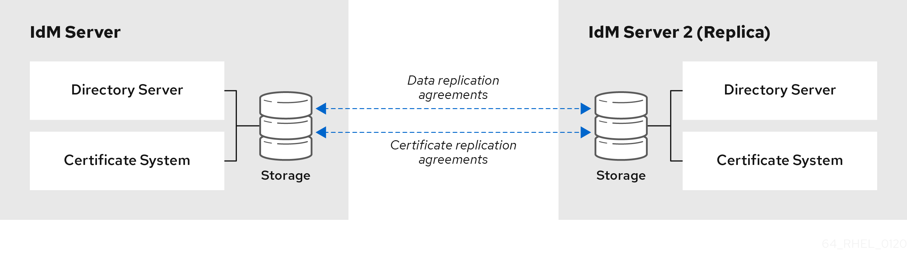
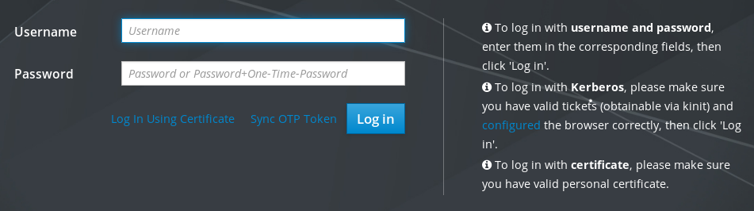
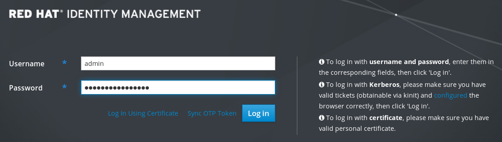

# Planning Identity Management

* * *

Red Hat Enterprise Linux 10

## Planning the infrastructure and service integration of an IdM environment

Red Hat Customer Content Services

[Legal Notice](#idm140639055941584)

**Abstract**

Identity Management (IdM) provides a centralized and unified way to manage identity stores, authentication, and authorization policies.

For a successful integration of IdM in your environment, learn about the components of IdM and plan the installation. For example, plan a replication topology for failover and load-balancing, the integration into Active Directory (AD), the structure of DNS zones and Certificate Authority (CA), as well as backup and recovery scenarios.

* * *

<h2 id="providing-feedback-on-red-hat-documentation">Providing feedback on Red Hat documentation</h2>

We are committed to providing high-quality documentation and value your feedback. To help us improve, you can submit suggestions or report errors through the Red Hat Jira tracking system.

**Procedure**

1. Log in to the [Jira](https://issues.redhat.com/projects/RHELDOCS/issues) website.
   
   If you do not have an account, select the option to create one.
2. Click **Create** in the top navigation bar.
3. Enter a descriptive title in the **Summary** field.
4. Enter your suggestion for improvement in the **Description** field. Include links to the relevant parts of the documentation.
5. Click **Create** at the bottom of the dialogue.

<h2 id="overview-of-idm-and-access-control-in-rhel">Chapter 1. Overview of IdM and access control in RHEL</h2>

Learn how to use Identity Management (IdM) to centralize identity services, enforce security controls, and comply with best practices and security policies. Explore common customer scenarios and solutions for deploying IdM in both Linux and Windows environments.

<h3 id="introduction-to-idm">1.1. Introduction to IdM</h3>

Identity Management (IdM) provides a centralized and unified way to manage identity stores, authentication, policies, and authorization in a Linux-based domain. IdM reduces the administrative overhead of managing different services individually and using different tools on different machines.

IdM is one of the few centralized identity, policy, and authorization software solutions that support:

- Advanced features of Linux operating system environments
- Unifying large groups of Linux machines
- Native integration with Active Directory

IdM creates a Linux-based and Linux-controlled domain:

- IdM builds on existing, native Linux tools and protocols. It has its own processes and configuration, but its underlying technologies are well-established on Linux systems and trusted by Linux administrators.
- IdM servers and clients are Red Hat Enterprise Linux machines. IdM clients can also be other Linux and UNIX distributions if they support standard protocols. A Windows client cannot be a member of the IdM domain but users logged into Windows systems managed by Active Directory (AD) can connect to Linux clients or access services managed by IdM. This is accomplished by establishing cross forest trust between AD and IdM domains.

<h4 id="examples\_of\_benefits\_brought\_by\_idm">1.1.1. Examples of benefits brought by IdM</h4>

**Managing identities and policies on multiple Linux servers**

*Without IdM:* Each server is administered separately. All passwords are saved on the local machines. The IT administrator manages users on every machine, sets authentication and authorization policies separately, and maintains local passwords. However, more often the users rely on other centralized solution, for example direct integration with AD. Systems can be directly integrated with AD using several different solutions:

- Legacy Linux tools (not recommended to use)
- Solution based on Samba winbind (recommended for specific use cases)
- Solution based on a third-party software (usually require a license from another vendor)
- Solution based on SSSD (native Linux and recommended for the majority of use cases)

*With IdM:* The IT administrator can:

- Maintain the identities in one central place: the IdM server
- Apply policies uniformly to multiples of machines at the same time
- Set different access levels for users by using host-based access control, delegation, and other rules
- Centrally manage privilege escalation rules
- Define how home directories are mounted

**Enterprise SSO**

In case of IdM Enterprise, single sign-on (SSO) is implemented leveraging the Kerberos protocol. This protocol is popular in the infrastructure level and enables SSO with services such as SSH, LDAP, NFS, CUPS, or DNS. Web services using different web stacks (Apache, EAP, Django, and others) can also be enabled to use Kerberos for SSO. However, practice shows that using OpenID Connect or SAML based on SSO is more convenient for web applications. To bridge the two layers, it is recommended to deploy an Identity Provider (IdP) solution that would be able to convert Kerberos authentication into a OpenID Connect ticket or SAML assertion. Red Hat SSO technology based on the Keycloak open source project is an example of such an IdP.

*Without IdM:* Users log in to the system and are prompted for a password every single time they access a service or application. These passwords might be different, and the users have to remember which credential to use for which application.

*With IdM:* After users log in to the system, they can access multiple services and applications without being repeatedly asked for their credentials. This helps to:

- Improve usability
- Reduce the security risk of passwords being written down or stored insecurely
- Boost user productivity

**Managing a mixed Linux and Windows environment***Without IdM:* Windows systems are managed in an AD forest, but development, production, and other teams have many Linux systems. The Linux systems are excluded from the AD environment.

*With IdM:* The IT administrator can:

- Manage the Linux systems using native Linux tools
- Integrate the Linux systems into the environments centrally managed by Active Directory, therefore preserving a centralized user store.
- Easily deploy new Linux systems at scale or as needed.
- Quickly react to business needs and make decisions related to management of the Linux infrastructure without dependency on other teams avoiding delays.

<h4 id="contrasting-idm-with-a-standard-ldap-directory">1.1.2. Contrasting IdM with a standard LDAP directory</h4>

A standard LDAP directory, such as Red Hat Directory Server, is a general-purpose directory: it can be customized to fit a broad range of use cases.

- Schema: a flexible schema that can be customized for a vast array of entries, such as users, machines, network entities, physical equipment, or buildings.
- Typically used as: a back-end directory to store data for other applications, such as business applications that provide services on the Internet.

IdM has a specific purpose: managing internal, inside-the-enterprise identities as well as authentication and authorization policies that relate to these identities.

- Schema: a specific schema that defines a particular set of entries relevant to its purpose, such as entries for user or machine identities.
- Typically used as: the identity and authentication server to manage identities within the boundaries of an enterprise or a project.

The underlying directory server technology is the same for both Red Hat Directory Server and IdM. However, IdM is optimized to manage identities inside the enterprise. This limits its general extensibility, but also brings certain benefits: simpler configuration, better automation of resource management, and increased efficiency in managing enterprise identities.

**Additional resources**

- [Identity Management or Red Hat Directory Server - Which One Should I Use?](https://www.redhat.com/en/blog/identity-management-or-red-hat-directory-server-%E2%80%93-which-one-should-i-use)
- [Standard protocols (Red Hat Knowledgebase)](https://access.redhat.com/articles/261973)

<h3 id="common-idm-customer-scenarios-and-their-solutions">1.2. Common IdM customer scenarios and their solutions</h3>

Explore examples of common identity management and access control use cases both in Linux and Windows environments. Understanding these scenarios helps you choose the right identity management approach for your environment.

Scenario 1

**Situation**

You are a Windows administrator in your company.

Apart from Windows systems, you also have several Linux systems to administer.

As you cannot delegate control of any part of your environment to a Linux administrator, you must handle all security controls in Active Directory (AD).

**Solution**

If you want `sudo` rules to be defined centrally in an LDAP server, you must implement a schema extension in the AD domain controller (DC). If you do not have permissions to implement this extension, consider installing Identity Management (IdM) - see Scenario 3 below. As IdM already contains the schema extension, you can [manage `sudo` rules directly in IdM](https://docs.redhat.com/en/documentation/red_hat_enterprise_linux/10/html/managing_idm_users_groups_hosts_and_access_control_rules/granting-sudo-access-to-an-idm-user-on-an-idm-client).

**Further advice if you are expecting to need more Linux skills in the future**

Connect with the Linux community to see how others manage identities: users, hosts, and services.

Research best practices.

Make yourself more familiar with Linux:

- Use the [RHEL web console](https://docs.redhat.com/en/documentation/red_hat_enterprise_linux/10/html/managing_systems_in_the_rhel_web_console/getting-started-with-the-rhel-web-console) when at all possible.
- Use easy commands on the command-line whenever possible.
- Attend a Red Hat System Administration course.

Scenario 2

**Situation**

You are a Linux administrator in your company.

Your Linux users require different levels of access to the company resources.

You need tight, centralized access control of your Linux machines.

**Solution**

Install IdM and migrate your users to it.

**Further advice if you are expecting your company to scale up in the future**

After installing IdM, configure [host-based access control](https://docs.redhat.com/en/documentation/red_hat_enterprise_linux/10/html/using_ansible_to_install_and_manage_identity_management_in_rhel/ensuring-the-presence-of-host-based-access-control-rules-in-idm-using-ansible-playbooks) and [sudo rules](https://docs.redhat.com/en/documentation/red_hat_enterprise_linux/10/html/managing_idm_users_groups_hosts_and_access_control_rules/granting-sudo-access-to-an-idm-user-on-an-idm-client). These are necessary to maintain security best practices of limited access and least privilege.

To meet your security targets, develop a cohesive identity and access management (IAM) strategy that uses protocols to secure both infrastructure and application layers.

Scenario 3

**Situation**

You are a Linux administrator in your company and you must integrate your Linux systems with the company Windows servers. You want to remain the sole maintainer of access control to your Linux systems.

Different users require different levels of access to the Linux systems but they all reside in AD.

**Solution**

As AD controls are not robust enough, you must configure access control to the Linux systems on the Linux side. Install IdM and [establish an IdM-AD trust](https://docs.redhat.com/en/documentation/red_hat_enterprise_linux/10/html/installing_trust_between_idm_and_ad/index).

**Further advice to enhance the security of your environment**

After installing IdM, configure [host-based access control](https://docs.redhat.com/en/documentation/red_hat_enterprise_linux/10/html/using_ansible_to_install_and_manage_identity_management_in_rhel/ensuring-the-presence-of-host-based-access-control-rules-in-idm-using-ansible-playbooks) and [sudo rules](https://docs.redhat.com/en/documentation/red_hat_enterprise_linux/10/html/managing_idm_users_groups_hosts_and_access_control_rules/index#granting-sudo-access-to-an-IdM-user-on-an-IdM-client_managing-users-groups-hosts). These are necessary to maintain security best practices of limited access and least privilege.

To meet your security targets, develop a cohesive Identity and Access Management (IAM) strategy that uses protocols to secure both infrastructure and application layers.

Scenario 4

**Situation**

As a security administrator, you must manage identities and access across all of your environments, including all of your Red Hat products. You must manage all of your identities in one place, and maintain access controls across all of your platforms, clouds and products.

**Solution**

Integrate IdM, [Red Hat Single Sign-On](https://access.redhat.com/products/red-hat-single-sign-on), [Red Hat Satellite](https://access.redhat.com/products/red-hat-satellite), [Red Hat Ansible Automation Platform](https://access.redhat.com/products/red-hat-ansible-automation-platform/) and other Red Hat products.

Scenario 5

**Situation**

As a security and system administrator in a Department of Defense (DoD) or Intelligence Community (IC) environment, you are required to use smart card or RSA authentication. You are required to use PIV certificates or RSA tokens.

**Solution**

1. [Configure certificate mapping in IdM](https://docs.redhat.com/en/documentation/red_hat_enterprise_linux/10/html/managing_smart_card_authentication/certificate-mapping-rules-for-configuring-authentication).
2. Ensure that GSSAPI delegation is enabled if an IdM-AD trust is present.
3. Configure the use of radius configuration in IdM for RSA tokens.
4. Configure IdM servers and IdM clients for [smart card authentication](https://docs.redhat.com/en/documentation/red_hat_enterprise_linux/10/html/managing_smart_card_authentication/configuring-identity-management-for-smart-card-authentication).

**Additional resources**

- [Use Ansible to automate your IdM tasks](https://docs.redhat.com/en/documentation/red_hat_enterprise_linux/10/html/using_ansible_to_install_and_manage_identity_management_in_rhel/index)
- [Installing Identity Management](https://docs.redhat.com/en/documentation/red_hat_enterprise_linux/10/html/installing_identity_management/index)

<h3 id="introduction-to-idm-servers-and-clients">1.3. Introduction to IdM servers and clients</h3>

Understand the roles and functionality of Identity Management (IdM) servers and clients, including how they interact for authentication, identity management, and policy enforcement within a Linux domain to ensure high availability and redundancy.

The IdM domain includes the following types of systems:

IdM clients

IdM clients are Red Hat Enterprise Linux systems enrolled with the servers and configured to use the IdM services on these servers.

Clients interact with the IdM servers to access services provided by them. For example, clients use the Kerberos protocol to perform authentication and acquire tickets for enterprise single sign-on (SSO), use LDAP to get identity and policy information, and use DNS to detect where the servers and services are located and how to connect to them.

IdM servers

IdM servers are Red Hat Enterprise Linux systems that respond to identity, authentication, and authorization requests from IdM clients within an IdM domain. IdM servers are the central repositories for identity and policy information. They can also host any of the optional services used by domain members:

- [Certificate authority](https://docs.redhat.com/en/documentation/red_hat_enterprise_linux/10/html/managing_certificates_in_idm/public-key-certificates-in-identity-management#certificate_authorities_in_idm) (CA): This service is present in most IdM deployments.
- Key Recovery Authority (KRA)
- DNS
- Active Directory (AD) trust controller
- Active Directory (AD) trust agent

IdM servers are also embedded IdM clients. As clients enrolled with themselves, the servers provide the same functionality as other clients.

To provide services for large numbers of clients, as well as for redundancy and availability, IdM allows deployment on multiple IdM servers in a single domain. It is possible to deploy up to 60 servers. This is the maximum number of IdM servers, also called replicas, that is currently supported in the IdM domain.

When creating a replica, IdM clones the configuration of the existing server. A replica shares with the initial server its core configuration, including internal information about users, systems, certificates, and configured policies.

NOTE

A replica and the server it was created from are functionally identical, except for the *CA renewal* and *CRL publisher* roles. Therefore, the term ***server*** and ***replica*** are used interchangeably in RHEL IdM documentation, depending on the context.

However, different IdM servers can provide different services for the client, if so configured. Core components like Kerberos and LDAP are available on every server. Other services like CA, DNS, Trust Controller or Vault are optional. This means that different IdM servers can have distinct roles in the deployment.

If your IdM topology contains an integrated CA, one server has the role of the [Certificate revocation list (CRL) publisher server](https://docs.redhat.com/en/documentation/red_hat_enterprise_linux/10/html/managing_certificates_in_idm/generating-crl-on-the-idm-ca-server) and one server has the role of the [CA renewal server](https://docs.redhat.com/en/documentation/red_hat_enterprise_linux/10/html/managing_certificates_in_idm/using-idm-ca-renewal-server).

By default, the first CA server installed fulfills these two roles, but you can assign these roles to separate servers.

Warning

The *CA renewal server* is critical for your IdM deployment because it is the only system in the domain responsible for tracking CA subsystem certificates and keys.

Note

All IdM servers must be running on the same major and minor version of RHEL. Do not spend more than several days applying z-stream updates or upgrading the IdM servers in your topology. For details about how to apply Z-stream fixes and upgrade your servers, see [Updating IdM packages](https://docs.redhat.com/en/documentation/red_hat_enterprise_linux/10/html/installing_identity_management/update-downgrade-ipa). For details about how to migrate to IdM on RHEL 10, see [Migrating your IdM environment from RHEL 9 servers to RHEL 10 servers](https://docs.redhat.com/en/documentation/red_hat_enterprise_linux/10/html/migrating_to_identity_management_on_rhel_10/migrating-your-idm-environment-from-rhel-9-servers-to-rhel-10-servers).

**Additional resources**

- [Public key certificates in Identity Management](https://docs.redhat.com/en/documentation/red_hat_enterprise_linux/10/html/managing_certificates_in_idm/public-key-certificates-in-identity-management)
- [Performing disaster recovery with Identity Management](https://docs.redhat.com/en/documentation/red_hat_enterprise_linux/10/html/performing_disaster_recovery_with_identity_management/index)
- [Supported versions of RHEL for installing IdM clients](#supported-versions-of-rhel-for-installing-idm-clients "1.4. Supported versions of RHEL for installing IdM clients")

<h3 id="supported-versions-of-rhel-for-installing-idm-clients">1.4. Supported versions of RHEL for installing IdM clients</h3>

Identify the supported Red Hat Enterprise Linux client versions for Identity Management (IdM) when servers run on RHEL 10.

An IdM deployment in which IdM servers are running on the latest minor version of RHEL 10 supports clients that are running on the latest minor versions of:

- RHEL 7
- RHEL 8
- RHEL 9
- RHEL 10

Note

While other client systems, for example Ubuntu, can work with IdM 10 servers, Red Hat does not provide support for these clients.

<h3 id="idm-and-access-control-in-rhel-central-vs-local">1.5. IdM and access control in RHEL: Central vs. local</h3>

In Red Hat Enterprise Linux, you can manage identities and access control policies using centralized IdM tools for a whole domain of systems, or using local tools for a single system.

Managing identities and policies on multiple Red Hat Enterprise Linux servers

With Identity Management IdM, the IT administrator can:

- Maintain the identities and grouping mechanisms in one central place: the IdM server
- Centrally manage different types of credentials such as passwords, PKI certificates, OTP tokens, or SSH keys
- Apply policies uniformly to multiples of machines at the same time
- Manage POSIX and other attributes for external Active Directory users
- Set different access levels for users by using host-based access control, delegation, and other rules
- Centrally manage privilege escalation rules (sudo) and mandatory access control (SELinux user mapping)
- Maintain central PKI infrastructure and secrets store
- Define how home directories are mounted

Without IdM:

- Each server is administered separately
- All passwords are saved on the local machines
- The IT administrator manages users on every machine, sets authentication and authorization policies separately, and maintains local passwords

<h3 id="idm-terminology">1.6. IdM terminology</h3>

Understand the essential terms, concepts, and acronyms related to Identity Management (IdM), including Active Directory integration, Kerberos authentication, certificates, and server architecture.

Active Directory forest

An Active Directory (AD) forest is a set of one or more domain trees which share a common global catalog, directory schema, logical structure, and directory configuration. The forest represents the security boundary within which users, computers, groups, and other objects are accessible. For more information, see the Microsoft document on [Forests](https://docs.microsoft.com/en-us/windows/win32/ad/forests).

Active Directory global catalog

The global catalog is a feature of Active Directory (AD) that allows a domain controller to provide information about any object in the forest, regardless of whether the object is a member of the domain controller’s domain. Domain controllers with the global catalog feature enabled are referred to as global catalog servers. The global catalog provides a searchable catalog of all objects in every domain in a multi-domain Active Directory Domain Services (AD DS).

Active Directory security identifier

A security identifier (SID) is a unique ID number assigned to an object in Active Directory, such as a user, group, or host. It is the functional equivalent of UIDs and GIDs in Linux.

Ansible play

Ansible plays are the building blocks of [Ansible playbooks](https://docs.ansible.com/ansible/latest/user_guide/playbooks_intro.html#playbooks-intro). The goal of a play is to map a group of hosts to some well-defined roles, represented by Ansible tasks.

Ansible playbook

An Ansible playbook is a file that contains one or more Ansible plays. For more information, see the [official Ansible documentation about playbooks](https://docs.ansible.com/ansible/latest/user_guide/playbooks_intro.html#about-playbooks).

Ansible task

Ansible tasks are units of action in Ansible. An Ansible play can contain multiple tasks. The goal of each task is to execute a module, with very specific arguments. An Ansible task is a set of instructions to achieve a state defined, in its broad terms, by a specific Ansible role or module, and fine-tuned by the variables of that role or module. For more information, see the [official Ansible tasks documentation](https://docs.ansible.com/ansible/latest/user_guide/basic_concepts.html#tasks).

Apache web server

The Apache HTTP Server, colloquially called Apache, is a free and open source cross-platform web server application, released under the terms of Apache License 2.0. Apache played a key role in the initial growth of the World Wide Web, and is currently the leading HTTP server. Its process name is `httpd`, which is short for *HTTP daemon*. Red Hat Enterprise Linux Identity Management (IdM) uses the Apache Web Server to display the IdM Web UI, and to coordinate communication between components, such as the Directory Server and the Certificate Authority.

Certificate

A certificate is an electronic document used to identify an individual, a server, a company, or other entity and to associate that identity with a public key. Such as a driver’s license or passport, a certificate provides generally recognized proof of a person’s identity. Public-key cryptography uses certificates to address the problem of impersonation.

Certificate Authorities (CAs) in IdM

An entity that issues digital certificates. In Red Hat Identity Management, the primary CA is `ipa`, the IdM CA. The `ipa` CA certificate is one of the following types:

- Self-signed. In this case, the `ipa` CA is the root CA.
- Externally signed. In this case, the `ipa` CA is subordinated to the external CA.

In IdM, you can also create multiple **sub-CAs**. Sub-CAs are IdM CAs whose certificates are one of the following types:

- Signed by the `ipa` CA.
- Signed by any of the intermediate CAs between itself and `ipa` CA. The certificate of a sub-CA cannot be self-signed.

See also [Planning your CA services](#planning-your-ca-services "Chapter 5. Planning your CA services").

Cross-forest trust

A trust establishes an access relationship between two Kerberos realms, allowing users and services in one domain to access resources in another domain.

With a cross-forest trust between an Active Directory (AD) forest root domain and an IdM domain, users from the AD forest domains can interact with Linux machines and services from the IdM domain. From the perspective of AD, Identity Management represents a separate AD forest with a single AD domain. For more information, see [How the trust between IdM and AD works](https://docs.redhat.com/en/documentation/red_hat_enterprise_linux/10/html/installing_trust_between_idm_and_ad/how-the-trust-between-idm-and-ad-works).

Directory Server

A Directory Server centralizes user identity and application information. It provides an operating system-independent, network-based registry for storing application settings, user profiles, group data, policies, and access control information. Each resource on the network is considered an object by the Directory Server. Information about a particular resource is stored as a collection of attributes associated with that resource or object. Red Hat Directory Server conforms to LDAP standards.

DNS PTR records

DNS pointer (PTR) records resolve an IP address of a host to a domain or host name. PTR records are the opposite of DNS A and AAAA records, which resolve host names to IP addresses. DNS PTR records enable reverse DNS lookups. PTR records are stored on the DNS server.

DNS SRV records

A DNS service (SRV) record defines the hostname, port number, transport protocol, priority and weight of a service available in a domain. You can use SRV records to locate IdM servers and replicas.

Domain Controller (DC)

A domain controller (DC) is a host that responds to security authentication requests within a domain and controls access to resources in that domain. IdM servers work as DCs for the IdM domain. A DC authenticates users, stores user account information and enforces security policy for a domain. When a user logs into a domain, the DC authenticates and validates their credentials and either allows or denies access.

Fully qualified domain name

A fully qualified domain name (FQDN) is a domain name that specifies the exact location of a host within the hierarchy of the Domain Name System (DNS). A device with the hostname `myhost` in the parent domain `example.com` has the FQDN `myhost.example.com`. The FQDN uniquely distinguishes the device from any other hosts called `myhost` in other domains.

If you are installing an IdM client on host `machine1` using DNS autodiscovery and your DNS records are correctly configured, the FQDN of `machine1` is all you need. For more information, see [Host name and DNS requirements for IdM](https://docs.redhat.com/en/documentation/red_hat_enterprise_linux/10/html/installing_identity_management/preparing-the-system-for-idm-server-installation#meeting-dns-host-name-and-dns-requirements-for-idm).

GSSAPI

The Generic Security Service Application Program Interface (GSSAPI, or GSS-API) allows developers to abstract how their applications protect data that is sent to peer applications. Security-service vendors can provide GSSAPI implementations of common procedure calls as libraries with their security software. These libraries present a GSSAPI-compatible interface to application writers who can write their application to use only the vendor-independent GSSAPI. With this flexibility, developers do not have to tailor their security implementations to any particular platform, security mechanism, type of protection, or transport protocol.

Kerberos is the dominant GSSAPI mechanism implementation, which allows Red Hat Enterprise Linux and Microsoft Windows Active Directory Kerberos implementations to be API compatible.

Hidden replica

A hidden replica is an IdM replica that has all services running and available, but its server roles are disabled, and clients cannot discover the replica because it has no SRV records in DNS.

Hidden replicas are primarily designed for services such as backups, bulk importing and exporting, or actions that require shutting down IdM services. Since no clients use a hidden replica, administrators can temporarily shut down the services on this host without affecting any clients. For more information, see [The hidden replica mode](https://docs.redhat.com/en/documentation/red_hat_enterprise_linux/10/html/planning_identity_management/planning-the-replica-topology#the-hidden-replica-mode).

HTTP server

See [Web server](#Web-server).

ID mapping

SSSD can use the SID of an AD user to algorithmically generate POSIX IDs in a process called *ID mapping*. ID mapping creates a map between SIDs in AD and IDs on Linux.

- When SSSD detects a new AD domain, it assigns a range of available IDs to the new domain. Therefore, each AD domain has the same ID range on every SSSD client machine.
- When an AD user logs in to an SSSD client machine for the first time, SSSD creates an entry for the user in the SSSD cache, including a UID based on the user’s SID and the ID range for that domain.
- Because the IDs for an AD user are generated in a consistent way from the same SID, the user has the same UID and GID when logging in to any Red Hat Enterprise Linux system.

ID ranges

An ID range is a range of ID numbers assigned to the IdM topology or a specific replica. You can use ID ranges to specify the valid range of UIDs and GIDs for new users, hosts and groups. ID ranges are used to avoid ID number conflicts. There are two distinct types of ID ranges in IdM:

- *IdM ID range*
  
  Use this ID range to define the UIDs and GIDs for users and groups in the whole IdM topology. Installing the first IdM server creates the IdM ID range. You cannot modify the IdM ID range after creating it. However, you can create an additional IdM ID range, for example when the original one nears depletion.
- *Distributed Numeric Assignment (DNA) ID range*
  
  Use this ID range to define the UIDs and GIDs a replica uses when creating new users. Adding a new user or host entry to an IdM replica for the first time assigns a DNA ID range to that replica. An administrator can modify the DNA ID range, but the new definition must fit within an existing IdM ID range.
  
  Note that the IdM range and the DNA range match, but they are not interconnected. If you change one range, ensure you change the other to match.

For more information, see [ID ranges](https://docs.redhat.com/en/documentation/red_hat_enterprise_linux/10/html/managing_idm_users_groups_hosts_and_access_control_rules/adjusting-id-ranges-manually#id-ranges).

ID views

ID views enable you to specify new values for POSIX user or group attributes, and to define on which client host or hosts the new values will apply. For example, you can use ID views to:

- Define different attribute values for different environments.
- Replace a previously generated attribute value with a different value.

In an IdM-AD trust setup, the `Default Trust View` is an ID view applied to AD users and groups. Using the `Default Trust View`, you can define custom POSIX attributes for AD users and groups, therefore overriding the values defined in AD.

For more information, see [Using an ID view to override a user attribute value on an IdM client](https://docs.redhat.com/en/documentation/red_hat_enterprise_linux/10/html/managing_idm_users_groups_hosts_and_access_control_rules/using-an-id-view-to-override-a-user-attribute-value-on-an-idm-client).

IdM CA server

An IdM server on which the IdM certificate authority (CA) service is installed and running.

Alternative names: **CA server**

IdM deployment

A term that refers to the entirety of your IdM installation. You can describe your IdM deployment by answering the following questions:

- Is your IdM deployment a testing deployment or production deployment?
  
  - How many IdM servers do you have?
- Does your IdM deployment contain [an integrated CA](#planning-your-ca-services "Chapter 5. Planning your CA services")?
  
  - If it does, is the integrated CA self-signed or externally signed?
  - If it does, on which servers is the [CA role](#guidelines-for-distribution-of-ca-services "5.2. Guidelines for distribution of CA services") available? On which servers is the KRA role available?
- Does your IdM deployment contain [an integrated DNS](#planning-your-dns-services-and-host-names "Chapter 4. Planning your DNS services and host names")?
  
  - If it does, on which servers is the DNS role available?
- Is your IdM deployment in a trust agreement with an [AD forest](https://docs.microsoft.com/en-us/windows/win32/ad/forests)?
  
  - If it is, on which servers is the [AD trust controller or AD trust agent](#trust-controllers-and-trust-agents "7.2. Trust controllers and trust agents") role available?

IdM server and replicas

To install the first server in an IdM deployment, you must use the `ipa-server-install` command.

Administrators can then use the `ipa-replica-install` command to install **replicas** in addition to the first server that was installed. By default, installing a replica creates a [replication agreement](#replication-agreements-between-idm-replicas "3.2. Replication agreements between IdM replicas") with the IdM server from which it was created, enabling receiving and sending updates to the rest of IdM.

There is no functional difference between the first server that was installed and a replica. Both are fully functional read/write [IdM servers](#introduction-to-idm-servers-and-clients "1.3. Introduction to IdM servers and clients").

Deprecated names: **master server**

IdM CA renewal server

If your IdM topology contains an integrated certificate authority (CA), one server has the unique role of the [CA renewal server](https://docs.redhat.com/en/documentation/red_hat_enterprise_linux/10/html/managing_certificates_in_idm/using-idm-ca-renewal-server). This server maintains and renews IdM system certificates.

By default, the first CA server you install fulfills this role, but you can configure any CA server to be the CA renewal server. In a deployment without integrated CA, there is no CA renewal server.

Deprecated names: **master CA**

IdM CRL publisher server

If your IdM topology contains an integrated certificate authority (CA), one server has the unique role of the [Certificate revocation list (CRL) publisher server](https://docs.redhat.com/en/documentation/red_hat_enterprise_linux/10/html/managing_certificates_in_idm/generating-crl-on-the-idm-ca-server). This server is responsible for maintaining the CRL. By default, the server that fulfills the **CA renewal server** role also fulfills this role, but you can configure any CA server to be the CRL publisher server. In a deployment without integrated CA, there is no CRL publisher server.

IdM topology

A term that refers to the [structure of your IdM solution](#planning-the-replica-topology "Chapter 3. Planning the replica topology"), especially the replication agreements between and within individual data centers and clusters.

Kerberos authentication indicators

Authentication indicators are attached to Kerberos tickets and represent the initial authentication method used to acquire a ticket:

- `otp` for two-factor authentication (password + One-Time Password)
- `radius` for Remote Authentication Dial-In User Service (RADIUS) authentication (commonly for 802.1x authentication)
- `pkinit` for Public Key Cryptography for Initial Authentication in Kerberos (PKINIT), smart card, or certificate authentication
- `hardened` for passwords hardened against brute-force attempts

For more information, see [Kerberos authentication indicators](https://docs.redhat.com/en/documentation/red_hat_enterprise_linux/10/html/managing_idm_users_groups_hosts_and_access_control_rules/managing-kerberos-ticket-policies#kerberos-authentication-indicators).

Kerberos keytab

While a password is the default authentication method for a user, keytabs are the default authentication method for hosts and services. A Kerberos keytab is a file that contains a list of Kerberos principals and their associated encryption keys, so a service can retrieve its own Kerberos key and verify a user’s identity.

For example, every IdM client has an `/etc/krb5.keytab` file that stores information about the `host` principal, which represents the client machine in the Kerberos realm.

Kerberos principal

Unique Kerberos principals identify each user, service, and host in a Kerberos realm:

| Entity   | Naming convention                        | Example                               |
|----------|------------------------------------------|---------------------------------------|
| Users    | `identifier@REALM`                       | `admin@EXAMPLE.COM`                   |
| Services | `service/fully-qualified-hostname@REALM` | `http/server.example.com@EXAMPLE.COM` |
| Hosts    | `host/fully-qualified-hostname@REALM`    | `host/client.example.com@EXAMPLE.COM` |

Kerberos protocol

Kerberos is a network authentication protocol that provides strong authentication for client and server applications by using secret-key cryptography. IdM and Active Directory use Kerberos for authenticating users, hosts and services.

Kerberos realm

A Kerberos realm encompasses all the principals managed by a Kerberos Key Distribution Center (KDC). In an IdM deployment, the Kerberos realm includes all IdM users, hosts, and services.

Kerberos ticket policies

The Kerberos Key Distribution Center (KDC) enforces ticket access control through connection policies, and manages the duration of Kerberos tickets through ticket lifecycle policies. For example, the default global ticket lifetime is one day, and the default global maximum renewal age is one week.

For more information, see [IdM Kerberos ticket policy types](https://docs.redhat.com/en/documentation/red_hat_enterprise_linux/10/html/managing_idm_users_groups_hosts_and_access_control_rules/managing-kerberos-ticket-policies#idm-kerberos-ticket-policy-types).

Key Distribution Center (KDC)

The Kerberos Key Distribution Center (KDC) is a service that acts as the central, trusted authority that manages Kerberos credential information. The KDC issues Kerberos tickets and ensures the authenticity of data originating from entities within the IdM network.

For more information, see [The role of the IdM KDC](https://docs.redhat.com/en/documentation/red_hat_enterprise_linux/10/html/managing_idm_users_groups_hosts_and_access_control_rules/managing-kerberos-ticket-policies#the-role-of-the-idm-kdc).

LDAP

The Lightweight Directory Access Protocol (LDAP) is an open, vendor-neutral, application protocol for accessing and maintaining distributed directory information services over a network. Part of this specification is a directory information tree (DIT), which represents data in a hierarchical tree-like structure consisting of the Distinguished Names (DNs) of directory service entries. LDAP is a "lightweight" version of the Directory Access Protocol (DAP) described by the ISO X.500 standard for directory services in a network.

Lightweight sub-CA

In IdM, a lightweight sub-CA is a certificate authority (CA) whose certificate is signed by an IdM root CA or one of the CAs that are subordinate to it. A lightweight sub-CA issues certificates only for a specific purpose, for example to secure a VPN or HTTP connection.

For more information, see [Restricting an application to trust only a subset of certificates](https://docs.redhat.com/en/documentation/red_hat_enterprise_linux/10/html/managing_certificates_in_idm/restricting-an-application-to-trust-only-a-subset-of-certificates).

Password policy

A password policy is a set of conditions that the passwords of a particular IdM user group must meet. The conditions can include the following parameters:

- The length of the password
- The number of character classes used
- The maximum lifetime of a password.

For more information, see [What is a password policy](https://docs.redhat.com/en/documentation/red_hat_enterprise_linux/10/html/using_ansible_to_install_and_manage_identity_management_in_rhel/defining-idm-password-policies-in-ansible#what-is-a-password-policy).

POSIX attributes

POSIX attributes are user attributes for maintaining compatibility between operating systems.

In a Red Hat Enterprise Linux Identity Management environment, POSIX attributes for users include:

- `cn`, the user’s name
- `uid`, the account name (login)
- `uidNumber`, a user number (UID)
- `gidNumber`, the primary group number (GID)
- `homeDirectory`, the user’s home directory

In a Red Hat Enterprise Linux Identity Management environment, POSIX attributes for groups include:

- `cn`, the group’s name
- `gidNumber`, the group number (GID)

These attributes identify users and groups as separate entities.

Replication agreement

A replication agreement is an agreement between two IdM servers in the same IdM deployment. The replication agreement ensures that the data and configuration is continuously replicated between the two servers.

IdM uses two types of replication agreements: *domain replication* agreements, which replicate identity information, and *certificate replication* agreements, which replicate certificate information.

For more information, see:

- [Replication agreements](https://docs.redhat.com/en/documentation/red_hat_enterprise_linux/10/html/planning_identity_management/planning-the-replica-topology#replication-agreements-between-idm-replicas)
- [Determining the appropriate number of replicas](https://docs.redhat.com/en/documentation/red_hat_enterprise_linux/10/html/planning_identity_management/planning-the-replica-topology#guidelines-for-determining-the-appropriate-number-of-idm-replicas-in-a-topology)
- [Connecting the replicas in a topology](https://docs.redhat.com/en/documentation/red_hat_enterprise_linux/10/html/planning_identity_management/planning-the-replica-topology#guidelines-for-connecting-idm-replicas-in-a-topology)
- [Replica topology examples](https://docs.redhat.com/en/documentation/red_hat_enterprise_linux/10/html/planning_identity_management/planning-the-replica-topology#replica-topology-examples)

Smart card

A smart card is a removable device or card used to control access to a resource. They can be plastic credit card-sized cards with an embedded integrated circuit (IC) chip, small USB devices such as a Yubikey, or other similar devices. Smart cards can provide authentication by allowing users to connect a smart card to a host computer, and software on that host computer interacts with key material stored on the smart card to authenticate the user.

SSSD

The System Security Services Daemon (SSSD) is a system service that manages user authentication and user authorization on a RHEL host. SSSD optionally keeps a cache of user identities and credentials retrieved from remote providers for offline authentication. For more information, see [Understanding SSSD and its benefits](https://docs.redhat.com/en/documentation/red_hat_enterprise_linux/10/html/configuring_authentication_and_authorization_in_rhel/understanding-sssd-and-its-benefits).

SSSD backend

An SSSD backend, often also called a data provider, is an SSSD child process that manages and creates the SSSD cache. This process communicates with an LDAP server, performs different lookup queries and stores the results in the cache. It also performs online authentication against LDAP or Kerberos and applies access and password policy to the user that is logging in.

Ticket-granting ticket (TGT)

After authenticating to a Kerberos Key Distribution Center (KDC), a user receives a ticket-granting ticket (TGT), which is a temporary set of credentials that can be used to request access tickets to other services, such as websites and email.

Using a TGT to request further access provides the user with a Single Sign-On experience, as the user only needs to authenticate once to access multiple services. TGTs are renewable, and Kerberos ticket policies determine ticket renewal limits and access control.

For more information, see [Managing Kerberos ticket policies](https://docs.redhat.com/en/documentation/red_hat_enterprise_linux/10/html/managing_idm_users_groups_hosts_and_access_control_rules/managing-kerberos-ticket-policies).

Web server

A web server is computer software and underlying hardware that accepts requests for web content, such as pages, images, or applications. A user agent, such as a web browser, requests a specific resource using HTTP, the network protocol used to distribute web content, or its secure variant HTTPS. The web server responds with the content of that resource or an error message. The web server can also accept and store resources sent from the user agent. Red Hat Enterprise Linux Identity Management (IdM) uses the Apache Web Server to display the IdM Web UI, and to coordinate communication between components, such as the Directory Server and the Certificate Authority (CA). See [Apache web server](#Apache-web-server).

**Additional resources**

- [Certificate System 10 Glossary](https://docs.redhat.com/en/documentation/red_hat_certificate_system/10/html/administration_guide/glossary)

<h2 id="failover-load-balancing-and-high-availability-in-idm">Chapter 2. Failover, load-balancing, and high-availability in IdM</h2>

Identity Management (IdM) provides failover mechanisms for IdM clients and load-balancing and high-availability features for IdM servers. Learn how IdM clients and SSSD automatically select available servers, and explore the server-side architecture that provides high availability using multiple replicas.

<h3 id="client-side-failover-capability">2.1. Client-side failover capability</h3>

Client-side failover is the built-in SSSD mechanism on IdM clients that automatically determines and connects to available IdM servers to maintain continuous authentication and access.

The failover mechanism uses DNS SRV records to facilitate the discovery and switching between IdM servers when primary servers become unavailable.

Note

SSSD queries SRV records from the DNS server. By default, SSSD waits for `6` seconds for a reply from the DNS resolver before attempting to query another DNS server. If all DNS servers are unreachable, the domain will continue to operate in offline mode. You can use the `dns_resolver_timeout` option to increase the time the client waits for a reply from the DNS resolver.

The SSSD failover mechanism treats an IdM server, the machine, and its services independently:

Service failure

If the hostname resolution for a server succeeds, SSSD considers the machine online and tries to connect to the required service on that machine. If the connection to the service fails, SSSD considers only that specific service as offline, not the entire machine or other services on it.

Machine failure

If hostname resolution fails, SSSD considers the entire machine as offline, and does not attempt to connect to any services on that machine.

**Primary and backup server switching**

SSSD attempts to connect to primary servers first. When all primary servers are unavailable, SSSD switches to a configured backup server.

While connected to a backup server, SSSD periodically attempts to reconnect to one of the primary servers and connects immediately once a primary server becomes available. The interval between these attempts is controlled by the `failover_primary_timeout` option, which defaults to 31 seconds.

If all IdM servers become unreachable, SSSD switches to offline mode. In this state, SSSD retries connections every 30 seconds until a server becomes available.

<h3 id="idm-server-side-load-balancing-and-high-availability">2.2. IdM server-side load-balancing and high availability</h3>

You can achieve load-balancing and high-availability in IdM by installing multiple IdM replicas, which provide active/active service availability across the IdM domain. This mechanism secures high service availability and inherent load-balancing across the clients.

- If you have a geographically dispersed network, you can shorten the path between IdM clients and the nearest accessible server by configuring multiple IdM replicas per data center.
- Red Hat supports environments with up to 60 replicas.
- The IdM replication mechanism provides active/active service availability: services at all IdM replicas are readily available at the same time.

Note

Red Hat recommends against combining IdM and other load-balancing or high-availability (HA) software.

Many third-party high availability solutions assume active/passive scenarios and cause unnecessary service interruption to IdM availability. Other solutions use virtual IPs or a single hostname per clustered service. All these methods do not typically work well with the type of service availability provided by the IdM solution. They also integrate very poorly with Kerberos, decreasing the overall security and stability of the deployment.

<h3 id="configuring-sssd-client-failover">2.3. Configuring SSSD client failover</h3>

Configure the SSSD service on an IdM client to manage server failover. You can set server connection preferences in two ways: enable automatic DNS SRV record discovery or manually specify a prioritized list of primary and backup servers. This configuration ensures continuous authentication and access to the IdM domain when primary IdM servers go offline.

**Prerequisites**

- You have `root` privileges on the IdM client machine.
- You know the Fully Qualified Domain Names (FQDNs) of your IdM servers.
- If you are using the DNS method, ensure that DNS SRV records for your IdM servers are correctly configured.

**Procedure**

1. Open the `/etc/sssd/sssd.conf` file.
2. Specify the list of servers using one of the following methods:
   
   1. Specify `_srv_` as the first value in the `ipa_server` parameter, followed by a prioritized list of primary server FQDNs. Then, list any backup server FQDNs in the `ipa_backup_server` parameter. For example:
      
      ```
      [domain/<idm_domain_name>]
      id_provider = ipa
      ipa_server = _srv_, <primary_idm_server1>, <primary_idm_server2>
      ipa_backup_server = <backup_idm_server1>, <backup_idm_server2>
      ...
      ```
      
      ```plaintext
      [domain/<idm_domain_name>]
      id_provider = ipa
      ipa_server = _srv_, <primary_idm_server1>, <primary_idm_server2>
      ipa_backup_server = <backup_idm_server1>, <backup_idm_server2>
      ...
      ```
      
      The `_srv_` option is not supported for `ipa_backup_server`.
   2. To bypass DNS lookups for performance reasons, remove the `_srv_` entry from the `ipa_server` parameter and specify which IdM servers the client should connect to, in order of preference:
      
      ```
      [domain/<idm_domain_name>]
      id_provider = ipa
      ipa_server = <primary_idm_server1>, <primary_idm_server2>
      ipa_backup_server = <backup_idm_server1>, <backup_idm_server2>
      ...
      ```
      
      ```plaintext
      [domain/<idm_domain_name>]
      id_provider = ipa
      ipa_server = <primary_idm_server1>, <primary_idm_server2>
      ipa_backup_server = <backup_idm_server1>, <backup_idm_server2>
      ...
      ```

<h3 id="idm-server-configuration-and-failover-parameters">2.4. IdM server configuration and failover parameters</h3>

The SSSD client failover and server resolution behavior are primarily controlled by the `ipa_server` parameter in the `/etc/sssd/sssd.conf` file. You can specify IdM servers by using DNS SRV records for automatic discovery or by manually listing server addresses and tuning timeout parameters for better performance.

**Server configuration options**

The `ipa_server` parameter and the `srv` option define how SSSD on the client resolves and connects to available IdM servers:

- With the `_srv_` option specified, SSSD retrieves a list of IdM servers ordered by preference. If a primary server goes offline, the SSSD service on the IdM client automatically connects to another available IdM server.
- Primary servers are specified in the `ipa_server` parameter. SSSD attempts to connect to primary servers first and switches to backup servers only if no primary servers are available.
- The `_srv_` option is not supported for backup servers.
- Removing the `_srv_` entry and listing servers explicitly, such as `ipa_server = idm_server1.example.com,idm_server2.example.com`, bypasses DNS lookups. This configuration ensures the client connects to the specified IdM servers only, using the listed order of preference.

| Parameter                  | Default value  | Description                                                                                                                                                                                     |
|:---------------------------|:---------------|:------------------------------------------------------------------------------------------------------------------------------------------------------------------------------------------------|
| `failover_primary_timeout` | **31 seconds** | The interval between attempts SSSD makes to reconnect to one of the primary servers while it is connected to a backup server.                                                                   |
| `dns_resolver_timeout`     | **6 seconds**  | The time the client waits for a reply from the DNS resolver before attempting to query another DNS server. If all DNS servers are unreachable, the domain continues to operate in offline mode. |

Table 2.1. Failover and timeout parameters

<h2 id="planning-the-replica-topology">Chapter 3. Planning the replica topology</h2>

Plan your IdM replica topology for high-availability and disaster recovery. Get guidelines on the number of servers, setting up replication agreements, and defining connection strategies to optimize performance and ensure service continuity.

<h3 id="multiple-replica-servers-as-a-solution-for-high-performance-and-disaster-recovery">3.1. Multiple replica servers as a solution for high performance and disaster recovery</h3>

You can achieve continuous functionality and high-availability of Identity Management (IdM) services by creating replicas of the existing IdM servers.

When you create an appropriate number of IdM replicas, you can use load balancing to distribute client requests across multiple servers to optimize performance of IdM services. With IdM, you can place additional servers in geographically dispersed data centers to reflect your enterprise organizational structure. In this way, the path between IdM clients and the nearest accessible server is shortened. In addition, having multiple servers allows spreading the load and scaling for more clients.

Replicating IdM servers is also a common backup mechanism to mitigate or prevent server loss. For example, if one server fails, the remaining servers continue providing services to the domain. You can also recover the lost server by creating a new replica based on one of the remaining servers.

<h3 id="replication-agreements-between-idm-replicas">3.2. Replication agreements between IdM replicas</h3>

Learn how IdM creates bilateral replication agreements between servers to synchronize identity and certificate data, ensuring data redundancy and preventing service disruptions across your domain.

When an administrator creates a replica based on an existing server, Identity Management (IdM) creates a *replication agreement* between the initial server and the replica. The replication agreement ensures that the data and configuration is continuously replicated between the two servers.

IdM uses *multiple read/write replica replication*. In this configuration, all replicas joined in a replication agreement receive and provide updates, and are therefore considered suppliers and consumers. Replication agreements are always bilateral.

**Figure 3.1. Server and replica agreements**

 

IdM uses two types of replication agreements:

- **Domain replication agreements** replicate the identity information.
- **Certificate replication agreements** replicate the certificate information.

Both replication channels are independent. Two servers can have one or both types of replication agreements configured between them. For example, when server A and server B have only domain replication agreement configured, only identity information is replicated between them, not the certificate information.

<h3 id="guidelines-for-determining-the-appropriate-number-of-idm-replicas-in-a-topology">3.3. Guidelines for determining the appropriate number of IdM replicas in a topology</h3>

To ensure optimal performance and service availability, use these guidelines to plan your IdM topology and determine the appropriate number of replicas that meet your organization’s specific requirements.

Set up at least two replicas in each data center

Deploy at least two replicas in each data center to ensure that if one server fails, the replica can take over and handle requests.

Set up a sufficient number of servers to serve your clients

One Identity Management (IdM) server can provide services to 2000 - 3000 clients. This assumes the clients query the servers multiple times a day, but not, for example, every minute. If you expect frequent queries, plan for more servers.

Set up a sufficient number of Certificate Authority (CA) replicas

Only replicas with the CA role installed can replicate certificate data. If you use the IdM CA, ensure your environment has at least two CA replicas with certificate replication agreements between them.

Set up a maximum of 60 replicas in a single IdM domain

Red Hat supports environments with up to 60 replicas.

<h3 id="guidelines-for-connecting-idm-replicas-in-a-topology">3.4. Guidelines for connecting IdM replicas in a topology</h3>

Properly sizing and connecting your IdM replicas in a topology is critical to ensuring your infrastructure maintains high-availability, delivers optimal performance, and achieves data consistency across the entire domain.

Connect each replica to at least two other replicas

This ensures that information is replicated not just between the initial replica and the first server you installed, but between other replicas as well.

Connect a replica to a maximum of four other replicas (not a hard requirement)

A large number of replication agreements per server does not add significant benefits. A receiving replica can only be updated by one other replica at a time and meanwhile, the other replication agreements are idle. More than four replication agreements per replica typically means a waste of resources.

Note

This recommendation applies to both certificate replication and domain replication agreements.

There are two exceptions to the limit of four replication agreements per replica:

- You want failover paths if certain replicas are not online or responding.
- In larger deployments, you want additional direct links between specific nodes.

Configuring a high number of replication agreements can have a negative impact on overall performance: when multiple replication agreements in the topology are sending updates, certain replicas can experience a high contention on the changelog database file between incoming updates and the outgoing updates.

If you decide to use more replication agreements per replica, ensure that you do not experience replication issues and latency. However, note that large distances and high numbers of intermediate nodes can also cause latency problems.

Connect the replicas in a data center with each other

This ensures domain replication within the data center.

Connect each data center to at least two other data centers

This ensures domain replication between data centers.

Connect data centers using at least a pair of replication agreements

If data centers A and B have a replication agreement from A1 to B1, having a replication agreement from A2 to B2 ensures that if one of the servers is down, the replication can continue between the two data centers.

<h3 id="replica-topology-examples">3.5. Replica topology examples</h3>

These examples offer the practical application of the topology guidelines. They illustrate how you can structure your IdM deployment to build a resilient and scalable IdM infrastructure that guarantees high-availability and optimal performance across multiple data centers.

**Figure 3.2. Replica topology with four data centers, each with four servers that are connected with replication agreements**

 

**Figure 3.3. Replica topology with three data centers, each with a different number of servers that are all interconnected through replication agreements**

 

<h3 id="the-hidden-replica-mode">3.6. The hidden replica mode</h3>

A hidden replica is an IdM server with all services running, but it lacks DNS SRV records, so clients cannot detect it for service discovery. You use a hidden replica for critical, high-load operations like backups or mass imports to avoid disrupting client access and performance.

By default, when you set up a replica, the installation program automatically creates service (SRV) resource records for it in DNS. These records enable clients to auto-discover the replica and its services. When installing a replica as hidden, add the `--hidden-replica` parameter to the `ipa-replica-install` command.

Hidden replicas are primarily designed for dedicated services that might disrupt clients. For example, a full backup of IdM requires shutting down all IdM services on the server. As no clients use a hidden replica, administrators can temporarily shut down the services on this host without affecting any clients.

Other use cases include high-load operations on the IdM API or the LDAP server, such as a mass import or extensive queries.

Before backing up a hidden replica, you must install all required server roles used in a cluster, especially the Certificate Authority role if the integrated CA is used. Therefore, restoring a backup from a hidden replica on a new host always results in a regular replica.

**Additional resources**

- [Installing an Identity Management replica](https://docs.redhat.com/en/documentation/red_hat_enterprise_linux/10/html/installing_identity_management/installing-an-idm-replica)
- [Backing up and restoring IdM](https://docs.redhat.com/en/documentation/red_hat_enterprise_linux/10/html/preparing_for_disaster_recovery_with_identity_management/backing-up-and-restoring-idm)
- [Demoting or promoting hidden replicas](https://docs.redhat.com/en/documentation/red_hat_enterprise_linux/10/html/managing_replication_in_identity_management/managing-replication-topology#demoting-or-promoting-hidden-replicas)

<h2 id="planning-your-dns-services-and-host-names">Chapter 4. Planning your DNS services and host names</h2>

Identity Management (IdM) provides different DNS configurations in the IdM server. You must carefully plan your DNS services and host names, as DNS is essential for all IdM server and client communication. Use these guidelines to define your DNS domain and Kerberos realm names, and determine where to install the integrated DNS service.

The following sections provide advice on how to determine which is best for your use case.

<h3 id="dns-services-available-in-an-idm-server">4.1. DNS services available in an IdM server</h3>

Choose between using integrated DNS or external DNS services for your Identity Management (IdM) domain. Learn the benefits and limitations of each configuration to ensure proper name resolution and service discovery.

Table 4.1. Comparing IdM with integrated DNS and without integrated DNS

 With integrated DNSWithout integrated DNS

Overview:

IdM runs its own DNS service for the IdM domain.

IdM uses DNS services provided by an external DNS server.

Limitations:

The integrated DNS server provided by IdM only supports features related to IdM deployment and maintenance. It does not support some of the advanced features of a general-purpose DNS server. Specific limitations are as follows:

- IdM DNS nameserver must be authoritative for its zones.
- The supported record types are A, AAAA, A6, AFSDB, CERT, CNAME, DLV, DNAME, DS, KX, LOC, MX, NAPTR, NS, PTR, SRV, SSHFP, TLSA, TXT, and URI.
- Split DNS, also known as split-view, split-horizon, split-brain DNS, is not supported.
- There are known issues if the DNS nameserver restarts in a multi-core environment. For example, if log rotation causes a nameserver to restart, the nameserver might crash. If you must use a multi-core setup, allow `systemd` to restart the nameserver after a failure occurs.

DNS is not integrated with native IdM tools. For example, IdM does not update the DNS records automatically after a change in the topology.

Works best for:

Basic usage within the IdM deployment.

When the IdM server manages DNS, DNS is tightly integrated with native IdM tools, which enables automating some of the DNS record management tasks.

Environments where advanced DNS features beyond the scope of the IdM DNS are needed.

Environments with a well-established DNS infrastructure where you want to keep using an external DNS server.

Even if an IdM server is used as a primary DNS server, other external DNS servers can still be used as secondary servers. For example, if your environment is already using another DNS server, such as a DNS server integrated with Active Directory (AD), you can delegate only the IdM primary domain to the DNS integrated with IdM. It is not necessary to migrate DNS zones to the IdM DNS.

Note

If you need to issue certificates for IdM clients with an IP address in the Subject Alternative Name (SAN) extension, you must use the IdM integrated DNS service.

<h3 id="guidelines-for-planning-the-dns-domain-name-and-kerberos-realm-name">4.2. Guidelines for planning the DNS domain name and Kerberos realm name</h3>

When you install your first IdM server, you must define the primary DNS domain name and the Kerberos realm name. Use these guidelines to correctly set the names to establish proper compatibility, security, and functionality for your entire IdM domain and any future Active Directory trusts.

Warning

You will not be able to change the IdM primary domain name and Kerberos realm name after the server is already installed. Do not expect to be able to move from a testing environment to a production environment by changing the names, for example from `lab.example.com` to `production.example.com`.

A separate DNS domain for service records

Ensure that the *primary DNS domain* used for IdM is not shared with any other system. This helps avoid conflicts on the DNS level.

Proper DNS domain name delegation

Ensure you have valid delegation in the public DNS tree for the DNS domain. Do not use a domain name that is not delegated to you, not even on a private network.

Multi-label DNS domain

Do not use single-label domain names, for example `.company`. The IdM domain must be composed of one or more subdomains and a top level domain, for example `example.com` or `company.example.com`.

A unique Kerberos realm name

Ensure the realm name is not in conflict with any other existing Kerberos realm name, such as a name used by Active Directory (AD).

Kerberos realm name as an upper-case version of the primary DNS name

Consider setting the realm name to an upper-case (`EXAMPLE.COM`) version of the primary DNS domain name (`example.com`).

Warning

If you do not set the Kerberos realm name to be the upper-case version of the primary DNS name, you will not be able to use AD trusts.

<h4 id="additional\_notes\_on\_planning\_the\_dns\_domain\_name\_and\_kerberos\_realm\_name">4.2.1. Additional notes on planning the DNS domain name and Kerberos realm name</h4>

- One IdM deployment always represents one Kerberos realm.
- You can join IdM clients from multiple distinct DNS domains (`example.com`, `example.net`, `example.org`) to a single Kerberos realm (`EXAMPLE.COM`).
- IdM servers and clients do not need to have host names within the same DNS domain as the IdM realm itself. For example, if the IdM domain is `idm.example.com`, the clients can be in the `clients.example.com` domain, but clear mapping must be configured between the DNS domain and the Kerberos realm.
  
  Note
  
  The standard method to create the mapping is using the **\_kerberos** TXT DNS records. The IdM integrated DNS adds these records automatically.

<h4 id="planning\_dns\_forwarding">4.2.2. Planning DNS forwarding</h4>

- If you want to use only one forwarder for your entire IdM deployment, configure a **global forwarder**.
- If your company is spread over multiple sites in geographically distant regions, global forwarders might be impractical. Configure **per-server forwarders**.
- If your company has an internal DNS network that is not resolvable from the public internet, configure a **forward zone** and **zone forwarders** so that the hosts in the IdM domain can resolve hosts from this other internal DNS network.

<h2 id="planning-your-ca-services">Chapter 5. Planning your CA services</h2>

Identity Management (IdM) in Red Hat Enterprise Linux provides different types of certificate authority (CA) configurations. Use these guidelines and scenarios to help you determine which configuration is best for your use case.

Note

If you want to use hardware security modules (HSMs) to store your CA and KRA keys and certificates, you cannot upgrade an existing installation where the keys were not generated on an HSM to an HSM-based install.

The **Certificate Authority (CA) subject distinguished name (DN)** is the name of the CA. It must be globally unique in the Identity Management (IdM) CA infrastructure and cannot be changed after the installation. In case you need the IdM CA to be externally signed, you might need to consult the administrator of the external CA about the form your IdM CA Subject DN should take.

<h3 id="ca-services-available-in-an-idm-server">5.1. CA Services available in an IdM server</h3>

You can install an Identity Management (IdM) server with an integrated IdM certificate authority (CA) or without a CA. Understanding the differences helps you choose the right deployment model for your environment.

Table 5.1. Comparing IdM with integrated CA and without a CA

 Integrated CAWithout a CA

Overview:

IdM uses its own public key infrastructure (PKI) service with a *CA signing certificate* to create and sign the certificates in the IdM domain.

- If the root CA is the integrated CA, IdM uses a self-signed CA certificate.
- If the root CA is an external CA, the integrated IdM CA is subordinate to the external CA. The CA certificate used by IdM is signed by the external CA, but all certificates for the IdM domain are issued by the integrated Certificate System instance.
- Integrated CA is also able to issue certificates for users, hosts, or services.

The external CA can be a corporate CA or a third-party CA.

IdM does not set up its own CA, but uses signed host certificates from an external CA.

Installing a server without a CA requires you to request the following certificates from a third-party authority:

- An LDAP server certificate
- An Apache server certificate
- A PKINIT certificate
- Full CA certificate chain of the CA that issued the LDAP and Apache server certificates

Limitations:

If the integrated CA is subordinate to an external CA, the certificates issued within the IdM domain are potentially subject to restrictions set by the external CA for various certificate attributes, such as:

- The validity period.
- Constraints on what subject names can appear on certificates issued by the IDM CA or its subordinates.
- Constraints on whether the IDM CA can itself, issue subordinate CA certificates, or how "deep" the chain of subordinate certificates can go.

Managing certificates outside of IdM causes many additional activities, such as :

- Creating, uploading, and renewing certificates is a manual process.
- The `certmonger` service does not track the IPA certificates (LDAP server, Apache server, and PKINIT certificates) and does not notify you when the certificates are about to expire. The administrators must manually set up notifications for externally issued certificates, or set tracking requests for those certificates if they want `certmonger` to track them.

Works best for:

Environments that allow you to create and use your own certificate infrastructure.

Very rare cases when restrictions within the infrastructure do not allow you to install certificate services integrated with the server.

Note

Switching from the self-signed CA to an externally-signed CA, or the other way around, as well as changing which external CA issues the IdM CA certificate, is possible even after the installation. It is also possible to configure an integrated CA even after an installation without a CA. For more details, see [Installing an IdM server: With integrated DNS, without a CA](https://docs.redhat.com/en/documentation/red_hat_enterprise_linux/10/html/installing_identity_management/installing-an-idm-server-with-integrated-dns-without-a-ca).

**Additional resources**

- [Understanding the certificates used internally by IdM](https://docs.redhat.com/en/documentation/red_hat_enterprise_linux/10/html/managing_certificates_in_idm/understanding-the-certificates-used-internally-by-idm)

<h3 id="guidelines-for-distribution-of-ca-services">5.2. Guidelines for distribution of CA services</h3>

Distribute your Certificate Authority (CA) services across multiple servers to prevent the unrecoverable loss of CA configuration. Use these guidelines to determine the exact number of CA servers you need for sufficient capacity and domain resilience.

1. Install the CA services on more than one server in the topology.
   
   Replicas configured without a CA forward all certificate operation requests to the CA servers in your topology.
   
   Warning
   
   If you lose all servers with a CA, you lose all the CA configuration without any chance of recovery. In this case you must configure a new CA and issue and install new certificates.
2. Maintain a sufficient number of CA servers to handle the CA requests in your deployment.

See the following table for further recommendations on appropriate number of CA servers:

| Description of the deployment                                                 | Suggested number of CA servers                                                     |
|:------------------------------------------------------------------------------|:-----------------------------------------------------------------------------------|
| A deployment with a very large number of certificates issued                  | Three or four CA servers                                                           |
| A deployment with bandwidth or availability problems between multiple regions | One CA server per region, with a minimum of three servers total for the deployment |
| All other deployments                                                         | Two CA servers                                                                     |

Table 5.2. Guidelines for setting up appropriate number of CA servers

Important

Four CA servers in the topology are usually enough if the number of concurrent certificate requests is not high. The replication processes between more than four CA servers can increase processor usage and lead to performance degradation.

<h3 id="random-serial-numbers-in-idm">5.3. Random serial numbers in IdM</h3>

Identity Management (IdM) uses Random Serial Numbers version 3 (RSNv3) by default for all new RHEL 10 IdM installations or if another CA in the topology is configured with RSNv3. Since RHEL 10 does not support sequential serial numbers, it is not possible to disable this.

With RSNv3, IdM generates fully random serial numbers for certificates and requests in the PKI. RSNv3 also prevents collisions in case you reinstall IdM. The size of each certificate serial number is up to 40-digit decimal values as RSNv3 uses a 128-bit random value for the serial number. This makes the number effectively random.

Note

Previously, the Dogtag upstream project used range-based serial numbers in order to ensure uniqueness across multiple clones. However, based on this experience, the Dogtag team determined that range-based serial numbers would not fit well into cloud environments with short-lived certificates.

RSNv3 is supported only for new IdM CA installations. By default, you install the first IdM CA when you install the primary IdM server by using the `ipa-server-install` command. However, if you originally installed your IdM environment without a CA, you can add the CA service later by using the `ipa-ca-install` command.

Important

In mixed environments where existing CA servers use sequential numbers, it is recommended to replace the sequential servers as soon as possible. If you cannot migrate the CA servers quickly, it is recommended to disable pruning across the entire environment until you successfully migrate all CA servers.

If enabled, it is required to use RSNv3 on all public-key infrastructure (PKI) services in the deployment, including the CA and the Key Recovery Authority (KRA). A check is performed when the KRA is installed to automatically enable RSNv3 if it is enabled on the underlying CA.

**Additional resources**

- [Random Serial Numbers v3 (RSNv3)](https://freeipa.readthedocs.io/en/latest/designs/random-serial-numbers.html)

<h2 id="planning-integration-with-ad">Chapter 6. Planning integration with AD</h2>

You can integrate your Linux systems with Active Directory (AD) to centralize user management. Use these guidelines to choose between direct AD integration or using IdM for indirect integration based on your environment’s requirements.

<h3 id="direct-integration-of-linux-systems-into-active-directory">6.1. Direct integration of Linux systems into Active Directory</h3>

You can connect RHEL clients directly to an Active Directory (AD) domain using SSSD or Samba Winbind. In direct integration, AD serves as the sole identity provider, which allows AD users to log in directly to your Linux hosts without an intermediate IdM server.

The following types of integration are possible:

Integration with the System Security Services Daemon (SSSD)

SSSD can connect a Linux system with various identity and authentication stores: AD, Identity Management (IdM), or a generic LDAP or Kerberos server.

Notable requirements for integration with SSSD:

- When integrating with AD, SSSD works only within a single AD forest by default. For multi-forest setup, configure manual domain enumeration.
- Remote AD forests must trust the local forest to ensure that the `idmap_ad` plug-in handles remote forest users correctly.

SSSD supports both direct and indirect integration. It also enables switching from one integration approach to the other without significant migration costs.

Integration with Samba Winbind

The Winbind component of the Samba suite emulates a Windows client on a Linux system and communicates with AD servers.

Notable requirements for integration with Samba Winbind:

- Direct integration with Winbind in a multi-forest AD setup requires bidirectional trusts.
- A bidirectional path from the local domain of a Linux system must exist to the domain of a user in a remote AD forest to allow full information about the user from the remote AD domain to be available to the `idmap_ad` plug-in.

<h4 id="recommendations">6.1.1. Recommendations</h4>

- SSSD satisfies most of the use cases for AD integration and provides a robust solution as a generic gateway between a client system and different types of identity and authentication providers - AD, IdM, Kerberos, and LDAP.
- Winbind is recommended for deployment on those AD domain member servers on which you plan to deploy Samba FS.

<h3 id="indirect-integration-of-linux-systems-into-active-directory-by-using-identity-management">6.2. Indirect integration of Linux systems into Active Directory by using Identity Management</h3>

In indirect integration, Linux systems are first connected to a central server which is then connected to Active Directory (AD). Indirect integration enables the administrator to manage Linux systems and policies centrally, while users from AD can transparently access Linux systems and services.

Integration based on cross-forest trust with AD

The Identity Management (IdM) server acts as the central server to control Linux systems. A cross-realm Kerberos trust with AD is established, enabling users from AD to log on to access Linux systems and resources. IdM presents itself to AD as a separate forest and takes advantage of the forest-level trusts supported by AD.

When using a trust:

- AD users can access IdM resources.
- IdM servers and clients can resolve the identities of AD users and groups.
- AD users and groups access IdM under the conditions defined by IdM, such as host-based access control.
- AD users and groups continue being managed on the AD side.

Integration based on synchronization

This approach is based on the WinSync tool. A WinSync replication agreement synchronizes user accounts from AD to IdM.

Warning

WinSync is no longer actively developed in Red Hat Enterprise Linux 8. The preferred solution for indirect integration is cross-forest trust.

The limitations of integration based on synchronization include:

- Groups are not synchronized from IdM to AD.
- Users are duplicated in AD and IdM.
- WinSync supports only a single AD domain.
- Only one domain controller in AD can be used to synchronize data to one instance of IdM.
- User passwords must be synchronized, which requires the PassSync component to be installed on all domain controllers in the AD domain.
- After configuring the synchronization, all AD users must manually change passwords before PassSync can synchronize them.

<h3 id="guidelines-for-deciding-between-direct-and-indirect-integration">6.3. Guidelines for deciding between direct and indirect integration</h3>

You can use these guidelines to choose between direct and indirect integration of Linux systems with Active Directory.

<h4 id="number\_of\_systems\_to\_be\_connected\_to\_activedirectory">6.3.1. Number of systems to be connected to Active Directory</h4>

Connecting less than 30-50 systems (not a hard limit)

If you connect less than 30-50 systems, consider direct integration. Indirect integration might introduce unnecessary overhead.

Connecting more than 30-50 systems (not a hard limit)

If you connect more than 30-50 systems, consider indirect integration with Identity Management. With this approach, you can benefit from the centralized management for Linux systems.

Managing a small number of Linux systems, but expecting the number to grow rapidly

In this scenario, consider indirect integration to avoid having to migrate the environment later.

<h4 id="frequency\_of\_deploying\_new\_systems\_and\_their\_type">6.3.2. Frequency of deploying new systems and their type</h4>

Deploying bare metal systems on an irregular basis

If you deploy new systems rarely and they are usually bare metal systems, consider direct integration. In such cases, direct integration is usually simplest and easiest.

Deploying virtual systems frequently

If you deploy new systems often and they are usually virtual systems provisioned on demand, consider indirect integration. With indirect integration, you can use a central server to manage the new systems dynamically and integrate with orchestration tools, such as Red Hat Satellite.

<h4 id="activedirectory\_is\_the\_required\_authentication\_provider">6.3.3. Active Directory is the required authentication provider</h4>

Do your internal policies state that all users must authenticate against Active Directory?

You can choose either direct or indirect integration. If you use indirect integration with a trust between Identity Management and Active Directory, the users that access Linux systems authenticate against Active Directory. Policies that exist in Active Directory are executed and enforced during authentication.

<h2 id="planning-a-cross-forest-trust-between-idm-and-ad">Chapter 7. Planning a cross-forest trust between IdM and AD</h2>

Active Directory (AD) and Identity Management (IdM) manage a variety of core services, such as Kerberos, LDAP, DNS, and certificate services. A *cross-forest trust* relationship integrates these two environments by enabling all core services to interact.

You can use the following information to plan and design your cross-forest trust deployment.

<h3 id="cross-forest-and-external-trusts-between-idm-and-ad">7.1. Cross-forest and external trusts between IdM and AD</h3>

Understand how cross-forest trusts and external trusts work and determine which is suitable for your use case.

A cross-forest trust between IdM and AD

In a pure Active Directory (AD) environment, a cross-forest trust connects two separate AD forest root domains. When you create a cross-forest trust between AD and IdM, the IdM domain presents itself to AD as a separate forest with a single domain. A trust relationship is then established between the AD forest root domain and the IdM domain. As a result, users from the AD forest can access the resources in the IdM domain.

IdM can establish a trust with one AD forest or multiple unrelated forests.

Note

Two separate Kerberos realms can be connected in a *cross-realm trust*. However, a Kerberos realm only concerns authentication, not other services and protocols involved in identity and authorization operations. Therefore, establishing a Kerberos cross-realm trust is not enough to enable users from one realm to access resources in another realm.

An external trust to an AD domain

An external trust is a trust relationship between IdM and an Active Directory domain. While a forest trust always requires establishing a trust between IdM and the root domain of an Active Directory forest, an external trust can be established from IdM to any domain within a forest.

<h3 id="trust-controllers-and-trust-agents">7.2. Trust controllers and trust agents</h3>

Trust controllers and trust agents are specialized types of Identity Management (IdM) servers that you can use for communication with Active Directory (AD) domains. These servers allow IdM clients to successfully resolve AD users and groups and process Kerberos authentication requests from the trusted AD domain.

IdM provides the following types of IdM servers that support trust to AD:

Trust controllers

IdM servers that can perform identity lookups against AD domain controllers. They also run the Samba suite so they can establish trust with AD. AD domain controllers contact trust controllers when establishing and verifying the trust to AD. AD-enrolled machines communicate with IdM trust controllers for Kerberos authentication requests.

The first trust controller is created when you configure the trust. In environments with multiple domain controllers across different geographic locations, it is beneficial to designate additional RHEL IdM servers as trust controllers in these locations.

Trust controllers run more network-facing services than trust agents, and thus present a greater attack surface for potential intruders.

Trust agents

IdM servers that can resolve identity lookups from RHEL IdM clients against AD domain controllers. Unlike trust controllers, trust agents cannot process Kerberos authentication requests.

In addition to trust agents and controllers, the IdM domain can also include standard IdM servers. However, these servers do not communicate with AD. Therefore, clients that communicate with these standard servers cannot resolve AD users and groups or authenticate and authorize AD users.

By default, IdM servers cannot resolve users and groups from trusted domains. To allow IdM servers to interact with trusted domains, you must explicitly configure them to operate as trust controllers or trust agents.

| Capability                                                                       | Trust agent | Trust controller |
|:---------------------------------------------------------------------------------|:------------|:-----------------|
| Resolve AD users and groups                                                      | Yes         | Yes              |
| Enroll IdM clients that run services accessible by users from trusted AD forests | Yes         | Yes              |
| Add, modify, or remove trust agreements                                          | No          | Yes              |
| Assign the trust agent role to an IdM server                                     | No          | Yes              |

Table 7.1. Comparing the capabilities supported by trust controllers and trust agents

When planning the deployment of trust controllers and trust agents, consider these guidelines:

- Configure at least two trust controllers per IdM deployment.
- Configure at least two trust controllers in each data center.

If you ever want to create additional trust controllers or if an existing trust controller fails, create a new trust controller by promoting a trust agent or a standard server. To do this, use the `ipa-adtrust-install` utility on the IdM server.

Important

You cannot downgrade an existing trust controller to a trust agent.

**Additional resources**

- [Creating a trust agent](https://docs.redhat.com/en/documentation/red_hat_enterprise_linux/10/html/installing_trust_between_idm_and_ad/setting-up-a-trust#creating-a-trust-agent)

<h3 id="one-way-trusts-and-two-way-trusts">7.3. One-way trusts and two-way trusts</h3>

IdM realm and an Active Directory (AD) forest use two types of trust relationships: one-way trust and two-way trust. The trust type determines the direction of identity access flow and whether IdM users can access AD resources or if access is restricted to AD users accessing IdM resources.

In one way trusts, Identity Management (IdM) trusts Active Directory (AD) but AD does not trust IdM. AD users can access resources in the IdM domain but users from IdM cannot access resources within the AD domain. The IdM server connects to AD using a special account, and reads identity information that is then delivered to IdM clients over LDAP.

In two way trusts, IdM users can authenticate to AD, and AD users can authenticate to IdM. AD users can authenticate to and access resources in the IdM domain as in the one way trust case. IdM users can authenticate but cannot access most of the resources in AD. They can only access those Kerberized services in AD forests that do not require any access control check.

To be able to grant access to the AD resources, IdM needs to implement the Global Catalog service. This service does not yet exist in the current version of the IdM server. Because of that, a two-way trust between IdM and AD is nearly functionally equivalent to a one-way trust between IdM and AD.

<h3 id="kerberos-fast-for-trusted-domains">7.4. Kerberos FAST for trusted domains</h3>

Kerberos Flexible Authentication Secure Tunneling (FAST) is also called Kerberos armoring in an Active Directory (AD) environment. Kerberos FAST provides an additional security layer for the Kerberos communication between the clients and the Key Distribution Center (KDC).

In IdM, the KDCs are running on the IdM servers and FAST is enabled by default. The Two-Factor Authentication (2FA) in IdM also requires enabling FAST.

In AD, Kerberos armoring is disabled by default on the AD Domain Controllers (DC). You can enable it on the Domain Controller on the **Tools&gt;Group Policy Management&gt;Default Domain Controller Policy:**

- Right-click **Default Domain Controller Policy** and select **edit**. Navigate to **Computer Configuration&gt;Policies&gt;Administrative Templates&gt;System&gt;KDC** and double-click **KDC support for claims, compound authentication, and Kerberos armoring**.

Once you enable KDC support for claims, the policy setting allows the following options:

- **Not supported**
- **Supported**
- **Always provide claims**
- **Fail unarmored authentication requests**

Kerberos FAST is implemented in the Kerberos client libraries on IdM clients. You can configure IdM clients either to use FAST for all trusted domains which advertise FAST or to not use Kerberos FAST at all. If you enable Kerberos armoring in the trusted AD forest the IdM client uses Kerberos FAST by default. FAST establishes a secure tunneling with the help of a cryptographic key. To protect the connection to the domain controllers of a trusted domain, Kerberos FAST must get a cross-realm Ticket Granting Ticket (TGT) from the trusted domain because those keys are valid only inside the Kerberos realm. Kerberos FAST uses the Kerberos hosts keys of the IdM client to request the cross-realm TGT with the help of the IdM servers. That only works when the AD forest trusts the IdM domain which means a two-way trust is required.

If AD policies require the enforcing of Kerberos FAST use, you need to establish a two-way trust between IdM domain and AD forest. You must plan this before the connection is established because both IdM and AD must have records about direction and the type of trust.

If you already established a one-way trust, run the `ipa trust-add …​ --two-way=true` command to remove the existing trust agreement and create a two-way trust. This requires use of administrative credentials. As IdM attempts to remove the existing trust agreement from the AD side, it requires administrator permissions for AD access. If you establish the original trust by using a shared secret rather than an AD administrative account, it recreates the trust as a two-way and changes trusted domain objects on the IdM side only. Windows administrators must repeat the same procedure by using Windows UI to choose a bi-directional trust and use the same shared secret to recreate the trust.

If using a two-way trust is not possible, you must disable Kerberos FAST on all IdM clients. The users from the trusted AD forest can authenticate with a password or direct smart card. To disable Kerberos FAST, add the following setting to the `sssd.conf` file in the `[domain]` section:

```
krb5_use_fast = never
```

```plaintext
krb5_use_fast = never
```

Note, you do not need to use this option when the authentication is based on ssh-keys, GSSAPI authentication or SSH with smart cards from remote Windows clients. These methods do not use Kerberos FAST because the IdM client does not have to communicate with a DC. Additionally, after disabling FAST on the IdM client, the two-factor authentication IdM feature is also unavailable.

<h3 id="posix-and-id-mapping-id-range-types-for-ad-users">7.5. POSIX and ID mapping ID range types for AD users</h3>

Identity Management (IdM) enforces access control rules based on the POSIX User ID (UID) and Group ID (GID) of a user. In contrast, Active Directory (AD) identifies users by Security Identifiers (SIDs). As an administrator, you can configure AD to store POSIX attributes for your AD users and groups, such as `uidNumber`, `gidNumber`, `unixHomeDirectory`, or `loginShell`.

You configure AD to store POSIX attributes when you are setting up the trust agreement using the `ipa-ad-trust-posix` ID range.

In scenarios when AD does not store POSIX attributes, the System Security Services Daemon (SSSD) can consistently map a unique UID based on a user’s SID in a process called **ID mapping**. You can explicitly choose this behavior by selecting the `ipa-ad-trust` ID range during trust creation.

**Additional resources**

- [Options for automatically mapping private groups for AD users](https://docs.redhat.com/en/documentation/red_hat_enterprise_linux/10/html/planning_identity_management/planning-a-cross-forest-trust-between-idm-and-ad#options-for-automatically-mapping-private-groups-for-ad-users-posix-trusts)
- [Setting up a trust agreement using the command line](https://docs.redhat.com/en/documentation/red_hat_enterprise_linux/10/html/installing_trust_between_idm_and_ad/setting-up-a-trust#setting-up-a-trust-agreement-using-the-command-line)

<h3 id="options-for-automatically-mapping-private-groups-for-ad-users-posix-trusts">7.6. Options for automatically mapping private groups for AD users: POSIX trusts</h3>

Linux systems require unique POSIX attributes (UID and GID) for every user to assign ownership and control access to files and resources. These attributes are directly retrieved from the Active Directory (AD) user’s POSIX attributes, specifically `uidNumber` and `gidNumber`, for users within a POSIX trust.

Each user in a Linux environment has a primary user group. Red Hat Enterprise Linux (RHEL) uses a user private group (UPG) scheme: a UPG has the same name as the user for which it was created and that user is the only member of the UPG.

If you have allocated UIDs for your AD users, but GIDs were not added, you can configure SSSD to automatically map private groups for users based on their UID by adjusting the `auto_private_groups` setting for that ID range.

`auto_private_groups`=false

By default, the `auto_private_groups` option is set to `false` for `ipa-ad-trust-posix` ID ranges used in a POSIX trust. With this configuration, SSSD retrieves the `uidNumber` and `gidNumber` from each AD user entry. When `auto_private_groups` is set to `false`, SSSD assigns the `uidNumber` value to the user’s UID, the `gidNumber` to the user’s GID. A group with that GID must exist in AD, or you will not be able to resolve that user. The following table demonstrates user resolution outcomes based on various AD configurations.

Table 7.2. SSSD behavior when the auto\_private\_groups variable is set to false for a POSIX ID range

User configuration in ADOutput of `id username`

AD user entry has:

- `uidNumber` = 4000
- `gidNumber` is not defined
- No group in AD with `gidNumber` = 4000.

SSSD cannot resolve the user.

AD user entry has:

- `uidNumber` = 4000
- `gidNumber` = 4000
- No group in AD with `gidNumber` = 4000.

SSSD cannot resolve the user.

AD user entry has:

- `uidNumber` = 4000
- `gidNumber` = 4000
- AD has a group with `gidNumber` = 4000.

`# id aduser@AD-DOMAIN.COMuid=4000(aduser@ad-domain.com) gid=4000(adgroup@ad-domain.com) groups=4000(adgroup@ad-domain.com), …​`

If an AD user does not have a primary group configured in AD, or its `gidNumber` does not correspond to an existing group, the IdM server is unable to resolve that user correctly because it cannot look up all the groups the user belongs to. To work around this issue, you can enable automatic private group mapping in SSSD by setting the `auto_private_groups` option to `true` or `hybrid`:

`auto_private_groups = true`

SSSD always maps a private group with the `gidNumber` set to match the `uidNumber` from the AD user entry.

Table 7.3. SSSD behavior when the auto\_private\_groups variable is set to true for a POSIX ID range

User configuration in ADOutput of `id username`

AD user entry has:

- `uidNumber` = 4000
- `gidNumber` is not defined
- AD does not have a group with GID=4000.

`# id aduser@AD-DOMAIN.COMuid=4000(aduser@ad-domain.com) gid=4000(aduser@ad-domain.com) groups=4000(aduser@ad-domain.com), …​`

AD user entry has:

- `uidNumber` = 4000
- `gidNumber` = 5000
- AD does not have a group with `gidNumber` = 5000.

`# id aduser@AD-DOMAIN.COMuid=4000(aduser@ad-domain.com) gid=4000(aduser@ad-domain.com) groups=4000(aduser@ad-domain.com), …​`

AD user entry has:

- `uidNumber` = 4000
- `gidNumber` = 4000
- AD does not have a group with `gidNumber` = 4000.

`# id aduser@AD-DOMAIN.COMuid=4000(aduser@ad-domain.com) gid=4000(aduser@ad-domain.com) groups=4000(aduser@ad-domain.com), …​`

AD user entry has:

- `uidNumber` = 4000
- `gidNumber` = 5000
- AD has a group with `gidNumber` = 5000.

`# id aduser@AD-DOMAIN.COMuid=4000(aduser@ad-domain.com) gid=4000(aduser@ad-domain.com) groups=4000(aduser@ad-domain.com), …​`

`auto_private_groups = hybrid`

If the `uidNumber` value matches `gidNumber`, but there is no group with this `gidNumber`, SSSD maps a private group as the user’s primary user group with a `gidNumber` that matches the `uidNumber`. If the `uidNumber` and `gidNumber` values differ, and there is a group with this `gidNumber`, SSSD uses the value from `gidNumber`.

Table 7.4. SSSD behavior when the auto\_private\_groups variable is set to hybrid for a POSIX ID range

User configuration in ADOutput of `id username`

AD user entry with:

- `uidNumber` = 4000
- `gidNumber` is not defined
- AD does not have a group with `gidNumber` = 4000.

SSSD cannot resolve the user.

AD user entry with:

- `uidNumber` = 4000
- `gidNumber` = 5000
- AD does not have a group with `gidNumber` = 5000.

SSSD cannot resolve the user.

AD user entry with:

- `uidNumber` = 4000
- `gidNumber` = 4000
- AD does not have a group with `gidNumber` = 4000.

`# id aduser@AD-DOMAIN.COMuid=4000(aduser@ad-domain.com) gid=4000(aduser@ad-domain.com) groups=4000(aduser@ad-domain.com), …​`

AD user entry with:

- `uidNumber` = 4000
- `gidNumber` = 5000
- AD has a group with `gidNumber` = 5000.

`# id aduser@AD-DOMAIN.COMuid=4000(aduser@ad-domain.com) gid=5000(aduser@ad-domain.com) groups=5000(adgroup@ad-domain.com), …​`

<h3 id="options-for-automatically-mapping-private-groups-for-ad-users-id-mapping-trusts">7.7. Options for automatically mapping private groups for AD users: ID mapping trusts</h3>

Linux systems require unique POSIX attributes (UID and GID) for every user to assign ownership and control access to files and resources. These attributes must be mapped from the Active Directory (AD) user’s Security Identifier (SID) so that AD users can be correctly resolved and granted access to resources on IdM-managed hosts.

Each user in a Linux environment has a primary user group. Red Hat Enterprise Linux (RHEL) uses a user private group (UPG) scheme: a UPG has the same name as the user for which it was created and that user is the only member of the UPG. If you have allocated UIDs for your AD users, but GIDs were not added, you can configure SSSD to automatically map private groups for users based on their UID by adjusting the `auto_private_groups` setting for that ID range.

By default, the `auto_private_groups` option is set to `true` for `ipa-ad-trust` ID ranges used in an ID mapping trust. With this configuration, SSSD computes the UID and GID for an AD user based on its Security Identifier (SID). SSSD ignores any POSIX attributes in AD, such as `uidNumber`, `gidNumber`, and also ignores the `primaryGroupID`.

`auto_private_groups = true`

SSSD always maps a private group with the GID set to match the UID, which is based on the SID of the AD user.

Table 7.5. SSSD behavior when the auto\_private\_groups variable is set to true for an ID mapping ID range

User configuration in ADOutput of `id username`

AD user entry where:

- SID maps to 7000
- `primaryGroupID` maps to 8000

`# id aduser@AD-DOMAIN.COMuid=7000(aduser@ad-domain.com) gid=7000(aduser@ad-domain.com) groups=7000(aduser@ad-domain.com), 8000(adgroup@ad-domain.com), …​`

`auto_private_groups = false`

If you set the `auto_private_groups` option to `false`, SSSD uses the `primaryGroupID` set in the AD entry as the GID number. The default value for `primaryGroupID` corresponds to the `Domain Users` group in AD.

Table 7.6. SSSD behavior when the auto\_private\_groups variable is set to false for an ID mapping ID range

User configuration in ADOutput of `id username`

AD user entry where:

- SID maps to 7000
- `primaryGroupID` maps to 8000

`# id aduser@AD-DOMAIN.COMuid=7000(aduser@ad-domain.com) gid=8000(adgroup@ad-domain.com) groups=8000(adgroup@ad-domain.com), …​`

<h3 id="non-posix-external-groups-and-sid-mapping">7.8. Non-POSIX external groups and SID mapping</h3>

In a cross-forest trust, Identity Management (IdM) manages groups using LDAP. Active Directory (AD) entries are not synchronized or copied over to IdM, which means that AD users and groups have no LDAP objects in the LDAP server, so they cannot be directly used to express group membership in the IdM LDAP.

For this reason, administrators in IdM must to create non-POSIX external groups, referenced as normal IdM LDAP objects to signify group membership for AD users and groups in IdM.

Security IDs (SIDs) for non-POSIX external groups are processed by SSSD, which maps the SIDs of groups in Active Directory to POSIX groups in IdM. In Active Directory, SIDs are associated with user names. When an AD user name is used to access IdM resources, SSSD uses the user’s SID to build up a full group membership information for the user in the IdM domain.

<h3 id="guidelines-for-setting-up-dns-for-an-idm-ad-trust">7.9. Guidelines for setting up DNS for an IdM-AD trust</h3>

These guidelines can help you configure DNS to establish a cross-forest trust between Identity Management (IdM) and Active Directory (AD). Proper DNS configuration ensures that both domains can communicate and resolve each other’s resources.

Unique primary DNS domains

Ensure both AD and IdM have their own unique primary DNS domains configured. For example:

- `ad.example.com` for AD and `idm.example.com` for IdM
- `example.com` for AD and `idm.example.com` for IdM

The most convenient management solution is an environment where each DNS domain is managed by integrated DNS servers, but you can also use any other standard-compliant DNS server.

IdM and AD DNS Domains

Systems joined to IdM can be distributed over multiple DNS domains. Red Hat recommends that you deploy IdM clients in a DNS zone different to the ones owned by Active Directory. The primary IdM DNS domain must have proper SRV records to support AD trusts.

Note

In some environments with trusts between IdM and Active Directory, you can install an IdM client on a host that is part of the Active Directory DNS domain. The host can then benefit from the Linux-focused features of IdM. This is not a recommended configuration and has some limitations. See [Configuring IdM clients in an Active Directory DNS domain](https://docs.redhat.com/en/documentation/red_hat_enterprise_linux/10/html/installing_trust_between_idm_and_ad/configuring-idm-clients-in-an-active-directory-dns-domain) for more details.

Proper SRV records

Ensure the primary IdM DNS domain has proper SRV records to support AD trusts.

For other DNS domains that are part of the same IdM realm, the SRV records do not have to be configured when the trust to AD is established. The reason is that AD domain controllers do not use SRV records to discover Kerberos key distribution centers (KDCs) but rather base the KDC discovery on name suffix routing information for the trust.

DNS records resolvable from all DNS domains in the trust

Ensure all machines can resolve DNS records from all DNS domains involved in the trust relationship:

- When configuring the IdM DNS, follow the instructions described in [Installing an IdM server with an external CA](https://docs.redhat.com/en/documentation/red_hat_enterprise_linux/10/html/installing_identity_management/installing-an-idm-server-with-integrated-dns-with-an-external-ca-as-the-root-ca).
- If you are using IdM without integrated DNS, follow the instructions described in [Installing an IdM server without integrated DNS](https://docs.redhat.com/en/documentation/red_hat_enterprise_linux/10/html/installing_identity_management/installing-an-idm-server-without-integrated-dns-with-an-integrated-ca-as-the-root-ca).

Kerberos realm names as upper-case versions of primary DNS domain names

Ensure Kerberos realm names are the same as the primary DNS domain names, with all letters uppercase. For example, if the domain names are `ad.example.com` for AD and `idm.example.com` for IdM, the Kerberos realm names must be `AD.EXAMPLE.COM` and `IDM.EXAMPLE.COM`.

<h3 id="guidelines-for-configuring-netbios-names">7.10. Guidelines for configuring NetBIOS names</h3>

NetBIOS names are short, unique identifiers used for legacy naming and compatibility within Windows networks. When configuring a cross-forest trust, NetBIOS names are essential for identifying both the Identity Management (IdM) and Active Directory (AD) domains and their associated services.

The NetBIOS name is usually the far-left component of the domain name. For example:

- In the domain name `linux.example.com`, the NetBIOS name is `linux`.
- In the domain name `example.com`, the NetBIOS name is `example`.
  
  Different NetBIOS names for the Identity Management (IdM) and Active Directory (AD) domains
  
  Ensure the IdM and AD domains have different NetBIOS names.
  
  The NetBIOS name is critical for identifying the AD domain. If the IdM domain is within a subdomain of the AD DNS, the NetBIOS name is also critical for identifying the IdM domain and services.
  
  Character limit for NetBIOS names
  
  The maximum length of a NetBIOS name is 15 characters.

<h3 id="supported-versions-of-windows-server">7.11. Supported versions of Windows Server</h3>

Ensure that your Active Directory (AD) environment meets the requirements for compatibility with Identity Management (IdM).

You can establish a trust relationship with AD forests that use the following forest and domain functional levels:

- Forest functional level range: Windows Server 2012 — Windows Server 2025
- Domain functional level range: Windows Server 2012 — Windows Server 2025

IdM supports establishing a trust with AD domain controllers running the following operating systems:

- Windows Server 2025
- Windows Server 2022
- Windows Server 2019
- Windows Server 2016
- Windows Server 2012 R2
- Windows Server 2012

Important

IdM does not support establishing trust to AD with AD domain controllers running Windows Server 2008 R2 or earlier versions. IdM requires SMB encryption when establishing the trust relationship, which is only supported in Windows Server 2012 or later.

<h3 id="ad-server-discovery-and-affinity">7.12. AD server discovery and affinity</h3>

Server discovery and affinity affects which Active Directory (AD) servers an Identity Management (IdM) client communicates with in a cross-forest trust. Configuring clients to prefer servers in the same geographical location helps prevent time lags and other problems that occur when clients contact servers from a remote data center.

To verify clients communicate with local servers, you must ensure that:

- Clients communicate with local IdM servers over LDAP and over Kerberos
- Clients communicate with local AD servers over Kerberos
- Embedded clients on IdM servers communicate with local AD servers over LDAP and over Kerberos

<h4 id="options\_for\_configuring\_ldap\_and\_kerberos\_on\_the\_idm\_client\_for\_communication\_with\_local\_idm\_servers">7.12.1. Options for configuring LDAP and Kerberos on the IdM client for communication with local IdM servers</h4>

When using IdM with integrated DNS

By default, clients use automatic service lookup based on the DNS records. In this setup, you can also use the *DNS locations* feature to configure DNS-based service discovery.

To override the automatic lookup, you can disable the DNS discovery in one of the following ways:

- During the IdM client installation by providing failover parameters from the command line
- After the client installation by modifying the System Security Services Daemon (SSSD) configuration
  
  When using IdM without integrated DNS
  
  You must explicitly configure clients in one of the following ways:
- During the IdM client installation by providing failover parameters from the command line
- After the client installation by modifying the SSSD configuration

<h4 id="options\_for\_configuring\_kerberos\_on\_the\_idm\_client\_for\_communication\_with\_local\_ad\_servers">7.12.2. Options for configuring Kerberos on the IdM client for communication with local AD servers</h4>

IdM clients are unable to automatically discover which AD servers to communicate with. To specify the AD servers manually, modify the `krb5.conf` file:

- Add the AD realm information
- Explicitly list the AD servers to communicate with

For example:

```
[realms]
AD.EXAMPLE.COM = {
kdc = server1.ad.example.com
kdc = server2.ad.example.com
}
```

```plaintext
[realms]
AD.EXAMPLE.COM = {
kdc = server1.ad.example.com
kdc = server2.ad.example.com
}
```

<h4 id="options\_for\_configuring\_embedded\_clients\_on\_idm\_servers\_for\_communication\_with\_local\_ad\_servers\_over\_kerberos\_and\_ldap">7.12.3. Options for configuring embedded clients on IdM servers for communication with local AD servers over Kerberos and LDAP</h4>

The embedded client on an IdM server works also as a client of the AD server. It can automatically discover and use the appropriate AD site.

When the embedded client performs the discovery, it might first discover an AD server in a remote location. If the attempt to contact the remote server takes too long, the client might stop the operation without establishing the connection. Use the `dns_resolver_timeout` option in the `sssd.conf` file on the client to increase the amount of time for which the client waits for a reply from the DNS resolver. See the *sssd.conf(5)* man page for details.

Once the embedded client has been configured to communicate with the local AD servers, the SSSD remembers the AD site the embedded client belongs to. Thanks to this, SSSD normally sends an LDAP ping directly to a local domain controller to refresh its site information. If the site no longer exists or the client has meanwhile been assigned to a different site, SSSD starts querying for SRV records in the forest and goes through a whole process of autodiscovery.

Using *trusted domain sections* in `sssd.conf`, you can also explicitly override some of the information that is discovered automatically by default.

**Additional resources**

- [Working with DNS in Identity Management](https://docs.redhat.com/en/documentation/red_hat_enterprise_linux/10/html/working_with_dns_in_identity_management/index)

<h3 id="operations-performed-during-indirect-integration-of-idm-to-ad">7.13. Operations performed during indirect integration of IdM to AD</h3>

A cross-forest trust between Identity Management (IdM) and Active Directory (AD) involves bidirectional communication, where both the IdM trust controller and AD domain controllers exchange requests using protocols like DNS, LDAP, SMB, and Kerberos to handle discovery, trust setup, and the subsequent retrieval of identity information.

The following table lists operations and requests performed by an IdM trust controller towards Active Directory AD domain controllers during the creation of an IdM to AD trust.

| Operation                                                                                                                                             | Protocol used               | Purpose                                                                               |
|:------------------------------------------------------------------------------------------------------------------------------------------------------|:----------------------------|:--------------------------------------------------------------------------------------|
| DNS resolution against the AD DNS resolvers configured on an IdM trust controller                                                                     | DNS                         | To discover the IP addresses of AD domain controllers                                 |
| Requests to UDP/UDP6 port 389 on an AD DC                                                                                                             | Connectionless LDAP (CLDAP) | To perform AD DC discovery                                                            |
| Requests to TCP/TCP6 ports 389 and 3268 on an AD DC                                                                                                   | LDAP                        | To query AD user and group information                                                |
| Requests to TCP/TCP6 ports 389 and 3268 on an AD DC                                                                                                   | DCE RPC and SMB             | To set up and support cross-forest trust to AD                                        |
| Requests to TCP/TCP6 ports 135, 139, 445 on an AD DC                                                                                                  | DCE RPC and SMB             | To set up and support cross-forest trust to AD                                        |
| Requests to dynamically opened ports on an AD DC as directed by the Active Directory domain controller, likely in the range of 49152-65535 (TCP/TCP6) | DCE RPC and SMB             | To respond to requests by DCE RPC End-point mapper (port 135 TCP/TCP6)                |
| Requests to ports 88 (TCP/TCP6 and UDP/UDP6), 464 (TCP/TCP6 and UDP/UDP6), and 749 (TCP/TCP6) on an AD DC                                             | Kerberos                    | To obtain a Kerberos ticket; change a Kerberos password; administer Kerberos remotely |

Table 7.7. Operations performed from an IdM trust controller towards AD domain controllers

The following table lists operations and requests performed by AD domain controllers towards IdM trust controllers during the creation of an IdM to AD trust.

| Operation                                                                                                                                              | Protocol used   | Purpose                                                                               |
|:-------------------------------------------------------------------------------------------------------------------------------------------------------|:----------------|:--------------------------------------------------------------------------------------|
| DNS resolution against the IdM DNS resolvers configured on an AD domain controller                                                                     | DNS             | To discover the IP addresses of IdM trust controllers                                 |
| Requests to UDP/UDP6 port 389 on an IdM trust controller                                                                                               | CLDAP           | To perform IdM trust controller discovery                                             |
| Requests to TCP/TCP6 ports 135, 139, 445 on an IdM trust controller                                                                                    | DCE RPC and SMB | To verify the cross-forest trust to AD                                                |
| Requests to dynamically opened ports on an IdM trust controller as directed by the IdM trust controller, likely in the range of 49152-65535 (TCP/TCP6) | DCE RPC and SMB | To respond to requests by DCE RPC End-point mapper (port 135 TCP/TCP6)                |
| Requests to ports 88 (TCP/TCP6 and UDP/UDP6), 464 (TCP/TCP6 and UDP/UDP6), and 749 (TCP/TCP6) on an IdM trust controller                               | Kerberos        | To obtain a Kerberos ticket; change a Kerberos password; administer Kerberos remotely |

Table 7.8. Operations performed from an AD domain controller towards IdM trust controllers

<h2 id="preparing-for-data-loss-with-idm-backups">Chapter 8. Preparing for data loss with IdM backups</h2>

IdM provides the `ipa-backup` utility to backup IdM data, and the `ipa-restore` utility to restore servers and data from those backups. A proactive backup plan ensures that configuration and database archives are available to restore your environment to a functional state.

Note

Run backups as often as necessary on a *hidden replica* with all server roles installed, especially the Certificate Authority (CA) role if the environment uses the integrated IdM CA. See [Installing an IdM hidden replica](https://docs.redhat.com/en/documentation/red_hat_enterprise_linux/10/html/installing_identity_management/installing-an-idm-replica#installing-an-idm-hidden-replica).

<h3 id="idm-backup-types">8.1. IdM backup types</h3>

To select the correct strategy for protecting your IdM data, you must understand the differences between a full-server backup and a data-only backup.

Full-server backup

- **Contains** all server configuration files related to IdM, and LDAP data in LDAP Data Interchange Format (LDIF) files.
- IdM services must be **offline**.
- **Suitable for** rebuilding an IdM deployment from scratch.

Data-only backup

- **Contains** LDAP data in LDIF files and the replication changelog.
- IdM services can be **online or offline**.
- **Suitable for** restoring IdM data to a state in the past.

<h3 id="naming-conventions-for-idm-backup-files">8.2. Naming conventions for IdM backup files</h3>

Understand how IdM automatically names backup files so you can easily locate, archive, and differentiate between full-server and data-only backups. By default, IdM stores backups as `.tar` archives in subdirectories of the `/var/lib/ipa/backup/` directory.

The archives and subdirectories follow these naming conventions:

Full-server backup

An archive named `ipa-full.tar` in a directory named `ipa-full-<YEAR-MM-DD-HH-MM-SS>`, with the time specified in GMT time.

```
ll /var/lib/ipa/backup/ipa-full-2021-01-29-12-11-46
```

```plaintext
[root@server ~]# ll /var/lib/ipa/backup/ipa-full-2021-01-29-12-11-46
```

```
total 3056
-rw-r--r--. 1 root root     158 Jan 29 12:11 header
-rw-r--r--. 1 root root 3121511 Jan 29 12:11 ipa-full.tar
```

```plaintext
total 3056
-rw-r--r--. 1 root root     158 Jan 29 12:11 header
-rw-r--r--. 1 root root 3121511 Jan 29 12:11 ipa-full.tar
```

Data-only backup

An archive named `ipa-data.tar` in a directory named `ipa-data-<YEAR-MM-DD-HH-MM-SS>`, with the time specified in GMT time.

```
ll /var/lib/ipa/backup/ipa-data-2021-01-29-12-14-23
```

```plaintext
[root@server ~]# ll /var/lib/ipa/backup/ipa-data-2021-01-29-12-14-23
```

```
total 1072
-rw-r--r--. 1 root root     158 Jan 29 12:14 header
-rw-r--r--. 1 root root 1090388 Jan 29 12:14 ipa-data.tar
```

```plaintext
total 1072
-rw-r--r--. 1 root root     158 Jan 29 12:14 header
-rw-r--r--. 1 root root 1090388 Jan 29 12:14 ipa-data.tar
```

Note

Uninstalling an IdM server does not automatically remove any backup files.

<h3 id="considerations-when-creating-a-backup">8.3. Considerations when creating a backup</h3>

Before you attempt to create a backup of your IdM deployment, review the prerequisites and important considerations about the `ipa-backup` utility.

The important behaviors and limitations of the `ipa-backup` command include the following:

- By default, the `ipa-backup` utility runs in offline mode, which stops all IdM services. The utility automatically restarts IdM services after the backup is finished.
- A full-server backup must **always** run with IdM services offline, but a data-only backup can be performed with services online.
- By default, the `ipa-backup` utility creates backups on the file system containing the `/var/lib/ipa/backup/` directory. Red Hat recommends creating backups regularly on a file system separate from the production filesystem used by IdM, and archiving the backups to a fixed medium, such as tape or optical storage.

<!--THE END-->

- Consider performing backups on [hidden replicas](https://docs.redhat.com/en/documentation/red_hat_enterprise_linux/10/html/planning_identity_management/planning-the-replica-topology#the-hidden-replica-mode). IdM services can be shut down on hidden replicas without affecting IdM clients.
- The `ipa-backup` utility checks if all of the services used in your IdM cluster, such as a Certificate Authority (CA), Domain Name System (DNS), and Key Recovery Agent (KRA), are installed on the server where you are running the backup. If the server does not have all these services installed, the `ipa-backup` utility exits with a warning, because backups taken on that host would not be sufficient for a full cluster restoration.
  
  For example, if your IdM deployment uses an integrated Certificate Authority (CA), a backup run on a non-CA replica will not capture CA data. Red Hat recommends verifying that the replica where you perform an `ipa-backup` has all of the IdM services used in the cluster installed.
  
  You can bypass the IdM server role check with the `ipa-backup --disable-role-check` command, but the resulting backup will not contain all the data necessary to restore IdM fully.

<h3 id="preparing-for-data-loss-with-idm-backups">8.4. Additional resources</h3>

- [Backing up and restoring IdM](https://docs.redhat.com/en/documentation/red_hat_enterprise_linux/10/html/preparing_for_disaster_recovery_with_identity_management/backing-up-and-restoring-idm)
- [Backing up and restoring IdM servers using Ansible playbooks](https://docs.redhat.com/en/documentation/red_hat_enterprise_linux/10/html/preparing_for_disaster_recovery_with_identity_management/backing-up-and-restoring-idm-servers-using-ansible-playbooks)

<h2 id="idm-integration-with-red-hat-products">Chapter 9. IdM integration with Red Hat products</h2>

Find documentation for other Red Hat products that integrate with IdM. You can configure these products to grant your IdM users access to their services.

- [Ansible Automation Platform](https://docs.redhat.com/en/documentation/red_hat_ansible_automation_platform)
- [OpenShift Container Platform](https://docs.redhat.com/en/documentation/openshift_container_platform)
- [Red Hat OpenStack Platform](https://docs.redhat.com/en/documentation/red_hat_openstack_platform)
- [Red Hat Satellite](https://docs.redhat.com/en/documentation/red_hat_satellite)
- [Red Hat Single Sign-On](https://docs.redhat.com/en/documentation/red_hat_single_sign-on)
- [Red Hat Virtualization](https://docs.redhat.com/en/documentation/red_hat_virtualization)

<h2 id="configuring-single-sign-on-for-the-rhel-productnumber-web-console-in-the-idm-domain">Chapter 10. Configuring Single Sign-On for the RHEL 10 web console in the IdM domain</h2>

You can integrate the RHEL web console with your Identity Management (IdM) domain to set up Single Sign-On (SSO). Grant your IdM users single-login access using their existing Kerberos credentials, which means users authenticate once and do not need to re-enter credentials to access the web console.

<h3 id="prerequisites">10.1. Prerequisites</h3>

- You have installed the RHEL 10 web console.
  
  For instructions, see [Installing and enabling the web console](https://docs.redhat.com/en/documentation/red_hat_enterprise_linux/10/html/managing_systems_in_the_rhel_web_console/getting-started-with-the-rhel-web-console#installing-and-enabling-the-web-console).
- IdM client installed on systems with the RHEL web console.
  
  For details, see [IdM client installation](https://docs.redhat.com/en/documentation/red_hat_enterprise_linux/10/html/installing_identity_management/installing-an-idm-client).

<h3 id="idm-and-rhel-web-console-integration">10.2. IdM and RHEL web console integration</h3>

Integrating the RHEL web console with an Identity Management (IdM) domain leverages Kerberos-based authentication to provide Single Sign-On (SSO) capabilities.

You can use SSO authentication to leverage the following advantages:

- IdM domain administrators can use the RHEL 10 web console to manage local machines.
- Users with a Kerberos ticket in the IdM domain do not need to provide additional login credentials to access the web console.
- All hosts known to the IdM domain are accessible via SSH from the local instance of the RHEL web console.
- The web console server automatically switches to a certificate issued by the IdM certificate authority. This certificate is accepted by browsers and eliminates the need for manual certificate configuration.

Configuring SSO for logging into the RHEL web console requires to:

1. Add machines to the IdM domain using the RHEL 10 web console.
2. If you want to use Kerberos for authentication, you must obtain a Kerberos ticket on your machine.
3. Allow administrators on the IdM server to use any command on any host.

<h3 id="joining-a-rhel-system-to-an-idm-domain-using-the-web-console">10.3. Joining a RHEL system to an IdM domain using the web console</h3>

You can join a RHEL system to an IdM domain directly in the RHEL web console. This integrates the system into the centralized identity management environment, enabling IdM users to log in.

**Prerequisites**

- The IdM domain is running and reachable from the client you want to join.
- You have the IdM domain administrator credentials.

<!--THE END-->

- You have installed the RHEL 10 web console.
  
  For instructions, see [Installing and enabling the web console](https://docs.redhat.com/en/documentation/red_hat_enterprise_linux/10/html/managing_systems_in_the_rhel_web_console/getting-started-with-the-rhel-web-console#installing-and-enabling-the-web-console).

**Procedure**

1. Log in to the RHEL 10 web console.
2. In the **Configuration** field of the **Overview** tab click **Join Domain**.
3. In the **Join a Domain** dialog box, enter the hostname of the IdM server in the **Domain Address** field.
4. In the **Domain administrator name** field, enter the username of the IdM administration account.
5. In the **Domain administrator password**, add a password.
6. Click Join.

**Verification**

1. If the RHEL 10 web console does not display an error, the system joined to the IdM domain and you can see the domain name in the **System** screen.
2. To verify that the user is a member of the domain, click the **Terminal** page and type the `id` command:
   
   ```
   id
   ```
   
   ```plaintext
   $ id
   ```
   
   ```
   euid=548800004(example_user) gid=548800004(example_user) groups=548800004(example_user) context=unconfined_u:unconfined_r:unconfined_t:s0-s0:c0.c1023
   ```
   
   ```plaintext
   euid=548800004(example_user) gid=548800004(example_user) groups=548800004(example_user) context=unconfined_u:unconfined_r:unconfined_t:s0-s0:c0.c1023
   ```

**Additional resources**

- [Planning Identity Management](https://docs.redhat.com/en/documentation/red_hat_enterprise_linux/10/html/planning_identity_management)
- [Installing Identity Management](https://docs.redhat.com/en/documentation/red_hat_enterprise_linux/10/html/installing_identity_management)
- [Managing IdM users, groups, hosts, and access control rules](https://docs.redhat.com/en/documentation/red_hat_enterprise_linux/10/html/managing_idm_users_groups_hosts_and_access_control_rules)

<h3 id="logging-in-to-the-web-console-using-kerberos-authentication">10.4. Logging in to the web console using Kerberos authentication</h3>

You can log in to the RHEL web console by using Kerberos authentication. If you already have a valid Kerberos ticket from your IdM domain, you can access the console without re-entering your password.

Important

With SSO, you usually do not have any administrative privileges in the web console. This only works if you configure passwordless `sudo`. The web console does not prompt for a `sudo` password interactively.

**Prerequisites**

- IdM domain running and reachable in your company environment.
  
  For details, see [Joining a RHEL system to an IdM domain using the web console](#joining-a-rhel-system-to-an-idm-domain-using-the-web-console "10.3. Joining a RHEL system to an IdM domain using the web console").

<!--THE END-->

- You have installed the RHEL 10 web console.
  
  For instructions, see [Installing and enabling the web console](https://docs.redhat.com/en/documentation/red_hat_enterprise_linux/10/html/managing_systems_in_the_rhel_web_console/getting-started-with-the-rhel-web-console#installing-and-enabling-the-web-console).
- If the system does not use a Kerberos ticket managed by the SSSD client, request the ticket with the `kinit` utility manually.

**Procedure**

- Log in to the RHEL web console by entering the following URL in your web browser:
  
  ```
  https://<dns_name>:9090
  ```
  
  ```plaintext
  https://<dns_name>:9090
  ```

<h3 id="enabling-the-rhel-web-console-single-sign-on-with-gssapi-on-idm-servers">10.5. Enabling the RHEL web console Single Sign-on with GSSAPI on IdM servers</h3>

The RHEL web console can use the Generic Security Services Application Program Interface (GSSAPI) authentication. However, the IdM framework already owns an *HTTP*/*&lt;server\_hostname&gt;*@*&lt;realm-name&gt;* Kerberos service and its keytab. Therefore, to implement GSSAPI authentication on Identity Management (IdM) servers, create a symlink `/etc/cockpit/krb5.keytab` to `/var/lib/ipa/gssproxy/http.keytab` and then generate a certificate-key pair.

**Prerequisites**

- You have `root` privileges.

**Procedure**

1. Create a symlink:
   
   ```
   ln -s /var/lib/ipa/gssproxy/http.keytab /etc/cockpit/krb5.keytab
   ```
   
   ```plaintext
   # ln -s /var/lib/ipa/gssproxy/http.keytab /etc/cockpit/krb5.keytab
   ```
2. Set a certificate file Bash variable:
   
   ```
   CERT_FILE=/etc/cockpit/ws-certs.d/50-certmonger.crt
   ```
   
   ```plaintext
   # CERT_FILE=/etc/cockpit/ws-certs.d/50-certmonger.crt
   ```
3. Set a certificate key Bash variable:
   
   ```
   KEY_FILE=/etc/cockpit/ws-certs.d/50-certmonger.key
   ```
   
   ```plaintext
   # KEY_FILE=/etc/cockpit/ws-certs.d/50-certmonger.key
   ```
4. Generate a certificate-key pair:
   
   ```
   ipa-getcert request -f ${CERT_FILE} -k ${KEY_FILE} -D $(hostname --fqdn)
   ```
   
   ```plaintext
   # ipa-getcert request -f ${CERT_FILE} -k ${KEY_FILE} -D $(hostname --fqdn)
   ```

<h3 id="enabling-sudo-access-for-idm-administrators-on-idm-hosts">10.6. Enabling sudo access for IdM administrators on IdM hosts</h3>

To enable administrative tasks through the RHEL web console, grant IdM system administrators appropriate `sudo` privileges.

**Prerequisites**

- You are logged in as an IdM administrator to an IdM host.
- You have `root` privileges on the host.

**Procedure**

- Enable `sudo` access on the host:
  
  ```
  ipa-advise enable-admins-sudo | sh -ex
  ```
  
  ```plaintext
  # ipa-advise enable-admins-sudo | sh -ex
  ```

<h2 id="idm-directory-server-rfc-support">Chapter 11. IdM Directory Server RFC support</h2>

You can verify the Directory Server’s compliance with industry standards by reviewing the supported LDAP-related Requests for Comments (RFCs).

**Additional resources**

- [Directory Server RFC support](https://docs.redhat.com/en/documentation/red_hat_directory_server/13/html/planning_and_designing_directory_server/ds-rfc-support)
- [Planning and designing Directory Server](https://docs.redhat.com/en/documentation/red_hat_directory_server/13/html/planning_and_designing_directory_server/index)

<h2 id="deploying-identity-management-in-a-controlled-environment-a-proof-of-concept">Chapter 12. Deploying Identity Management in a controlled environment: a proof of concept</h2>

Explore basic features and concepts of Identity Management in RHEL (IdM) in a safe, isolated sandbox environment.

Gain hands-on experience with the following:

- Installing a minimal IdM cluster consisting of an IdM server, replica, and client by using Ansible automation.
- Configuring authentication and various access controls through the IdM Web UI, focusing on host-based access control, role-based access control, and `sudo` rules. The IdM Web UI is intuitive and so provides the best starting point for interacting with IdM.
- Performing the same authentication and access control configurations with Ansible, discovering the simplicity, automation, and scalability that Ansible playbooks bring to system management.

Warning

**Deploying Identity Management in a controlled environment: a proof of concept** is designed to help you test and familiarize yourself with various IdM capabilities, preparing you for deployment in a production environment. It is not intended for direct use in production.

<h3 id="installing-rhel-identity-management-in-a-controlled-environment">12.1. Installing RHEL Identity Management in a controlled environment</h3>

Learn how to perform a basic installation of Identity Management (IdM) in RHEL for testing prior to production deployment. You install the software using an Ansible playbook, which ensures convenience and repeatability.

<h4 id="prerequisites\_2">12.1.1. Prerequisites</h4>

- A system running Red Hat Enterprise Linux (RHEL) with 16 GB of RAM or more.
- A RHEL subscription.

**Terminology and assumptions**

- `ansible_user` is the account on the managed nodes that is used to perform the actions defined in the Ansible playbooks. This user has sudo privileges to execute commands that require root access.
- **controller.idm.example.com** is the name of the Ansible control node, that is the host on which the Ansible playbooks are stored and run.
- **server.idm.example.com**, **replica.idm.example.com**, and **client.idm.example.com** are the managed nodes on which Identity Management in RHEL is installed and configured.
- The control node and the managed nodes are running on virtual machines. All these virtual machines are installed on one physical system that runs RHEL.

<h4 id="installing-rhel-on-virtual-machines-for-idm-as-a-proof-of-concept">12.1.2. Installing RHEL on virtual machines for IdM as a proof of concept</h4>

Learn how to install RHEL on your virtual machines so that you can later install an IdM cluster on them using the `ansible-freeipa` RPM collection.

**Prerequisites**

- You have downloaded the latest ISO image of RHEL 8, 9 or 10 from the Red Hat Customer Portal.

**Procedure**

1. Use the ISO image to install a new VM for the **controller** system. For details, see [Interactively installing RHEL from installation media](https://docs.redhat.com/en/documentation/red_hat_enterprise_linux/10/html-single/interactively_installing_rhel_from_installation_media/index). During the installation, pay attention to the following:
   
   1. If you are using the Virtual Machine Manager (VMM) to install your VMs, name the hosts in the **controller**, **server**, **replica**, and **client**, so that you can match the names in the VMM UI to the names of the hosts on the CLI.
   2. Reserve at least 4 GB of RAM on the VMs on which you are installing an IdM server and replica. 1 GB is enough for a client system.
   3. Reserve 30 GB for storage on the IdM server, replica and client.
   4. Select **Install**, not **Test and Install**.
   5. Create a local `ansible_user` user on the **controller** during the installation.
   6. Set an easy-to-remember password for the `ansible_user` user, for example **12345**.
   7. In the **Root password** section, enter an easy-to-remember password, for example **1234**.
   8. Check the `Allow root SSH login with password` check box.
2. After the installation is complete, configure the host name for the **controller** VM:
   
   1. On the **controller** VM CLI, enter `nmtui`.
   2. Using the Down Arrow key, select **Set system hostname**.
   3. In the newly opened window, enter **controller.idm.example.com**.
      
      The host name must be a fully qualified domain name, such as controller.idm.example.com. For more information, see [Meeting DNS host name and DNS requirements for IdM](https://docs.redhat.com/en/documentation/red_hat_enterprise_linux/10/html/installing_identity_management/preparing-the-system-for-idm-server-installation#meeting-dns-host-name-and-dns-requirements-for-idm) in *Installing Identity Management*.
   4. Using the Down and Right Arrow keys, select `OK`.
   5. Confirm the new host name by clicking `OK` again.
   6. In the higher-level interface, select `OK` and `Quit` by using the Down and Right Arrow keys.
   7. \[Optional] To verify the host name, use the `hostname` utility on the system:
      
      ```
      hostname
      ```
      
      ```plaintext
      $ hostname
      ```
      
      ```
      controller.idm.example.com
      ```
      
      ```plaintext
      controller.idm.example.com
      ```
      
      The output of `hostname` must not be `localhost` or `localhost6`.
3. Repeat the previous steps for all the other VMs: **server**, **replica**, and **client**.
4. Configure `ansible_user` with sudo privileges on all VMs:
   
   1. SSH to **controller** as `root`:
      
      ```
      your-physical-system]$ ssh root@controller
      ```
      
      ```plaintext
      your-physical-system]$ ssh root@controller
      ```
   2. Configure passwordless `sudo` for `ansible_user` by creating the `/etc/sudoers.d/ansible_user` file:
      
      ```
      echo "ansible_user ALL=(ALL) NOPASSWD: ALL" | tee /etc/sudoers.d/ansible_user
      ```
      
      ```plaintext
      # echo "ansible_user ALL=(ALL) NOPASSWD: ALL" | tee /etc/sudoers.d/ansible_user
      ```
   3. Repeat on all the managed nodes, **server**, **replica**, and **client**.
   
   Note
   
   Throughout this chapter, when logged in as `ansible_user` on the controller, you will need to use `sudo` before commands that require `root` privileges.
5. Configure reciprocal logins to individual systems using host names instead of IP addresses:
   
   1. On the **controller** CLI, enter:
      
      ```
      ip a
      ```
      
      ```plaintext
      $ ip a
      ```
      
      ```
      1: lo: <LOOPBACK,UP,LOWER_UP> mtu 65536 qdisc noqueue state UNKNOWN group default qlen 1000
          link/loopback 00:00:00:00:00:00 brd 00:00:00:00:00:00
          inet 127.0.0.1/8 scope host lo
             valid_lft forever preferred_lft forever
          inet6 ::1/128 scope host
             valid_lft forever preferred_lft forever
      2: enp1s0: <BROADCAST,MULTICAST,UP,LOWER_UP> mtu 1500 qdisc fq_codel state UP group default qlen 1000
          link/ether 52:54:00:b7:e6:ac brd ff:ff:ff:ff:ff:ff
          inet 192.168.122.86/24 brd 192.168.122.255 scope global dynamic noprefixroute enp1s0
             valid_lft 3106sec preferred_lft 3106sec
          inet6 fe80::5054:ff:feb7:e6ac/64 scope link noprefixroute
             valid_lft forever preferred_lft forever
      ```
      
      ```plaintext
      1: lo: <LOOPBACK,UP,LOWER_UP> mtu 65536 qdisc noqueue state UNKNOWN group default qlen 1000
          link/loopback 00:00:00:00:00:00 brd 00:00:00:00:00:00
          inet 127.0.0.1/8 scope host lo
             valid_lft forever preferred_lft forever
          inet6 ::1/128 scope host
             valid_lft forever preferred_lft forever
      2: enp1s0: <BROADCAST,MULTICAST,UP,LOWER_UP> mtu 1500 qdisc fq_codel state UP group default qlen 1000
          link/ether 52:54:00:b7:e6:ac brd ff:ff:ff:ff:ff:ff
          inet 192.168.122.86/24 brd 192.168.122.255 scope global dynamic noprefixroute enp1s0
             valid_lft 3106sec preferred_lft 3106sec
          inet6 fe80::5054:ff:feb7:e6ac/64 scope link noprefixroute
             valid_lft forever preferred_lft forever
      ```
      
      Note the IP address that starts with 192.168.X.X.
   2. Do the same on all the other virtual hosts.
   3. On **controller**, add the host names and IP addresses of all the virtual systems to `/etc/hosts` file using `sudo`. The file can look as follows:
      
      ```
      127.0.0.1   localhost localhost.localdomain localhost4 localhost4.localdomain4
      ::1         localhost localhost.localdomain localhost6 localhost6.localdomain6
      192.168.122.86 controller.idm.example.com controller
      192.168.122.42 server.idm.example.com server
      192.168.122.103 replica.idm.example.com replica
      192.168.122.200 client.idm.example.com client
      ```
      
      ```plaintext
      127.0.0.1   localhost localhost.localdomain localhost4 localhost4.localdomain4
      ::1         localhost localhost.localdomain localhost6 localhost6.localdomain6
      192.168.122.86 controller.idm.example.com controller
      192.168.122.42 server.idm.example.com server
      192.168.122.103 replica.idm.example.com replica
      192.168.122.200 client.idm.example.com client
      ```
   4. Update the `/etc/hosts` file on your physical system in the same way.
6. Ensure that the operating system on **controller** is up to date:
   
   1. SSH from your local system to the `ansible_user` account on **controller**:
      
      ```
      your-physical-system]$ ssh ansible_user@controller
      ```
      
      ```plaintext
      your-physical-system]$ ssh ansible_user@controller
      ```
   2. Register the controller virtual machine with Red Hat’s subscription management service:
      
      ```
      sudo subscription-manager register --username <your_user_name> --password <your_password>
      ```
      
      ```plaintext
      $ sudo subscription-manager register --username <your_user_name> --password <your_password>
      ```
   3. Ensure that you are using the latest packages:
      
      ```
      sudo yum update
      ```
      
      ```plaintext
      $ sudo yum update
      ```
   4. Repeat the previous steps for all the other VMs.

**Verification**

- Test connectivity between your physical system and one of the virtual systems by using its fully-qualified domain name (`FQDN`) or short name:
  
  ```
  your-physical-system]$ ping controller
  ```
  
  ```plaintext
  your-physical-system]$ ping controller
  ```
  
  ```
  PING controller.idm.example.com (192.168.122.86) 56(84) bytes of data.
  64 bytes from controller.idm.example.com (192.168.122.86): icmp_seq=1 ttl=64 time=0.353 ms
  64 bytes from controller.idm.example.com (192.168.122.86): icmp_seq=2 ttl=64 time=0.398 ms
  64 bytes from controller.idm.example.com (192.168.122.86): icmp_seq=3 ttl=64 time=0.453 ms
  ```
  
  ```plaintext
  PING controller.idm.example.com (192.168.122.86) 56(84) bytes of data.
  64 bytes from controller.idm.example.com (192.168.122.86): icmp_seq=1 ttl=64 time=0.353 ms
  64 bytes from controller.idm.example.com (192.168.122.86): icmp_seq=2 ttl=64 time=0.398 ms
  64 bytes from controller.idm.example.com (192.168.122.86): icmp_seq=3 ttl=64 time=0.453 ms
  ```

<h4 id="preparing-the-control-node-for-installing-idm-using-ansible-playbooks">12.1.3. Preparing the control node for installing IdM using Ansible playbooks</h4>

Learn how to prepare the Ansible control node for installing and configuring IdM on the managed nodes.

**Prerequisites**

- You have [installed RHEL on virtual machines for IdM as a proof of concept](#installing-rhel-on-virtual-machines-for-idm-as-a-proof-of-concept "12.1.2. Installing RHEL on virtual machines for IdM as a proof of concept").

**Procedure**

1. On the controller system, log in as `ansible_user` and create an `SSH` public and private key:
   
   ```
   ssh-keygen
   ```
   
   ```plaintext
   [ansible_user@controller]$ ssh-keygen
   ```
   
   ```
   Generating public/private rsa key pair.
   Enter file in which to save the key (/home/ansible_user/.ssh/id_rsa):
   Enter passphrase (empty for no passphrase): [Enter]
   Enter same passphrase again: [Enter]
   ...
   ```
   
   ```plaintext
   Generating public/private rsa key pair.
   Enter file in which to save the key (/home/ansible_user/.ssh/id_rsa):
   Enter passphrase (empty for no passphrase): [Enter]
   Enter same passphrase again: [Enter]
   ...
   ```
   
   Use the suggested default location for the key file. As this is a PoC environment, leave the passphrase empty.
2. Create the `~/.ansible.cfg` file with the following content:
   
   ```
   [defaults]
   inventory = /home/ansible_user/inventory
   remote_user = ansible_user
   
   [privilege_escalation]
   become = True
   become_method = sudo
   become_user = root
   ```
   
   ```plaintext
   [defaults]
   inventory = /home/ansible_user/inventory
   remote_user = ansible_user
   
   [privilege_escalation]
   become = True
   become_method = sudo
   become_user = root
   ```
   
   Note
   
   Settings in the `~/.ansible.cfg` file have a higher priority and override settings from the global `/etc/ansible/ansible.cfg` file.
   
   With these settings, Ansible performs the following actions:
   
   - Manages hosts in the specified inventory file.
   - Uses the account set in the `remote_user` parameter when it establishes `SSH` connections to managed nodes.
   - Uses `sudo` to escalate privileges to `root` when executing tasks that require elevated permissions. Since `ansible_user` is configured with passwordless sudo (NOPASSWD), Ansible will not prompt for a password.
3. Create an `~/inventory` file in INI or YAML format that lists the host names of managed hosts and the values for the required installation variables:
   
   ```
   [ipaserver]
   server.idm.example.com
   
   [ipaserver:vars]
   ipaserver_domain=idm.example.com
   ipaserver_realm=IDM.EXAMPLE.COM
   ipaserver_setup_dns=True
   ipaserver_auto_forwarders=True
   ipaadmin_password=Secret123
   ipadm_password=Secret123
   
   [ipareplicas]
   replica.idm.example.com
   
   [ipareplicas:vars]
   ipareplica_setup_dns=true
   ipareplica_auto_forwarders=true
   ipaadmin_password=Secret123
   ipareplica_servers=server.idm.example.com
   
   [ipaclients]
   client.idm.example.com
   
   [ipaclients:vars]
   ipaadmin_password=Secret123
   ipaclient_domain=idm.example.com
   ipaclient_configure_dns_resolver=true
   ipaclient_dns_servers=192.168.122.1
   ipaclient_servers=server.idm.example.com
   ```
   
   ```plaintext
   [ipaserver]
   server.idm.example.com
   
   [ipaserver:vars]
   ipaserver_domain=idm.example.com
   ipaserver_realm=IDM.EXAMPLE.COM
   ipaserver_setup_dns=True
   ipaserver_auto_forwarders=True
   ipaadmin_password=Secret123
   ipadm_password=Secret123
   
   [ipareplicas]
   replica.idm.example.com
   
   [ipareplicas:vars]
   ipareplica_setup_dns=true
   ipareplica_auto_forwarders=true
   ipaadmin_password=Secret123
   ipareplica_servers=server.idm.example.com
   
   [ipaclients]
   client.idm.example.com
   
   [ipaclients:vars]
   ipaadmin_password=Secret123
   ipaclient_domain=idm.example.com
   ipaclient_configure_dns_resolver=true
   ipaclient_dns_servers=192.168.122.1
   ipaclient_servers=server.idm.example.com
   ```
4. Create an `install-cluster.yml` file with the following content:
   
   ```
   ---
   - name: Play to configure IPA server
     hosts: ipaserver
     become: true
     roles:
     - role: freeipa.ansible_freeipa.ipaserver
       state: present
   
   - name: Play to configure IPA clients with username/password
     hosts: ipaclients
     become: true
     roles:
     - role: freeipa.ansible_freeipa.ipaclient
       state: present
   
   - name: Play to configure IPA replicas
     hosts: ipareplicas
     serial: 1
     become: true
     roles:
     - role: freeipa.ansible_freeipa.ipareplica
       state: present
   ```
   
   ```plaintext
   ---
   - name: Play to configure IPA server
     hosts: ipaserver
     become: true
     roles:
     - role: freeipa.ansible_freeipa.ipaserver
       state: present
   
   - name: Play to configure IPA clients with username/password
     hosts: ipaclients
     become: true
     roles:
     - role: freeipa.ansible_freeipa.ipaclient
       state: present
   
   - name: Play to configure IPA replicas
     hosts: ipareplicas
     serial: 1
     become: true
     roles:
     - role: freeipa.ansible_freeipa.ipareplica
       state: present
   ```
   
   The playbook contains three plays:
   
   - The first one installs the primary IdM server.
   - The second one installs an IdM client.
   - The third one installs an IdM replica. The `serial: 1` directive instructs Ansible to deploy only one replica at a time against the same IdM server.
5. Using `sudo` privileges, install the `ansible-freeipa` collection:
   
   ```
   sudo dnf install ansible-freeipa
   ```
   
   ```plaintext
   [ansible_user@controller]$ sudo dnf install ansible-freeipa
   ```
   
   ```
   [...]
   Transaction Summary
   ========================================================================================================================================================================
   Install  11 Packages
   Total download size: 9.8 M
   Installed size: 42 M
   Is this ok [y/N]: y
   [...]
   ```
   
   ```plaintext
   [...]
   Transaction Summary
   ========================================================================================================================================================================
   Install  11 Packages
   Total download size: 9.8 M
   Installed size: 42 M
   Is this ok [y/N]: y
   [...]
   ```

<h4 id="preparing-the-managed-nodes-for-installing-idm-using-ansible-playbooks">12.1.4. Preparing the managed nodes for installing IdM using Ansible playbooks</h4>

Learn how to prepare your virtual machines as Ansible managed nodes so that they can be used for the installation of an IdM deployment.

**Prerequisites**

- You have [installed RHEL on virtual machines for IdM as a proof of concept](#installing-rhel-on-virtual-machines-for-idm-as-a-proof-of-concept "12.1.2. Installing RHEL on virtual machines for IdM as a proof of concept").

**Procedure**

1. Install the `ansible_user` user’s `SSH` public key on to the `ansible_user` account on the **server** managed node:
   
   1. Log in to the control node as `ansible_user`, and copy the `SSH` public key to the `ansible_user` account on **server**:
      
      ```
      ssh-copy-id ansible_user@server.idm.example.com
      ```
      
      ```plaintext
      [ansible_user@controller]$ ssh-copy-id ansible_user@server.idm.example.com
      ```
      
      ```
      /usr/bin/ssh-copy-id: INFO: Source of key(s) to be installed: "/home/ansible_user/.ssh/id_rsa.pub"
      The authenticity of host 'server.idm.example.com (192.168.122.42)' can't be established.
      ECDSA key fingerprint is SHA256:9bZ33GJNODK3zbNhybokN/6Mq7hu3vpBXDrCxe7NAvo.
      ```
      
      ```plaintext
      /usr/bin/ssh-copy-id: INFO: Source of key(s) to be installed: "/home/ansible_user/.ssh/id_rsa.pub"
      The authenticity of host 'server.idm.example.com (192.168.122.42)' can't be established.
      ECDSA key fingerprint is SHA256:9bZ33GJNODK3zbNhybokN/6Mq7hu3vpBXDrCxe7NAvo.
      ```
   2. When prompted, connect by entering **yes**:
      
      ```
      Are you sure you want to continue connecting (yes/no/[fingerprint])? yes
      ```
      
      ```plaintext
      Are you sure you want to continue connecting (yes/no/[fingerprint])? yes
      ```
      
      ```
      /usr/bin/ssh-copy-id: INFO: attempting to log in with the new key(s), to filter out any that are already installed
      /usr/bin/ssh-copy-id: INFO: 1 key(s) remain to be installed -- if you are prompted now it is to install the new keys
      ```
      
      ```plaintext
      /usr/bin/ssh-copy-id: INFO: attempting to log in with the new key(s), to filter out any that are already installed
      /usr/bin/ssh-copy-id: INFO: 1 key(s) remain to be installed -- if you are prompted now it is to install the new keys
      ```
   3. When prompted, enter the password of `ansible_user` on **server**:
      
      ```
      ansible_user@server.idm.example.com's password: 12345
      ```
      
      ```plaintext
      ansible_user@server.idm.example.com's password: 12345
      ```
      
      ```
      Number of key(s) added: 1
      Now try logging into the machine, with:   "ssh 'ansible_user@server.idm.example.com'"
      and check to make sure that only the key(s) you wanted were added.
      ```
      
      ```plaintext
      Number of key(s) added: 1
      Now try logging into the machine, with:   "ssh 'ansible_user@server.idm.example.com'"
      and check to make sure that only the key(s) you wanted were added.
      ```
   4. Verify the `SSH` connection by remotely executing a command on **server**:
      
      ```
      ssh ansible_user@server.idm.example.com whoami
      ```
      
      ```plaintext
      [ansible_user@controller]$ ssh ansible_user@server.idm.example.com whoami
      ```
      
      ```
      ansible_user
      ```
      
      ```plaintext
      ansible_user
      ```
2. Repeat on all the other managed nodes, **replica** and **client**.
3. Create a `sudo` configuration for the `ansible_user` on each managed node:
   
   1. On each managed node (**server**, **replica**, and **client**), log in as root (or use sudo if you have another user with sudo access), and create and edit the `/etc/sudoers.d/ansible_user` file by using the visudo command:
      
      ```
      visudo /etc/sudoers.d/ansible_user
      ```
      
      ```plaintext
      # visudo /etc/sudoers.d/ansible_user
      ```
      
      The benefit of using `visudo` over a normal editor is that this utility provides basic checks, such as for parse errors, before installing the file.
   2. Configure a `sudoers` policy in the `/etc/sudoers.d/ansible_user` file:
      
      ```
      ansible_user ALL=(ALL) NOPASSWD: ALL
      ```
      
      ```plaintext
      ansible_user ALL=(ALL) NOPASSWD: ALL
      ```
      
      This grants permissions to the `ansible_user` to run all commands as root (or any other user) on this host without entering the `ansible_user’s` password. Since the Ansible configuration on the controller specifies `become_user = root`, Ansible will use this sudo privilege to escalate to root when executing tasks that require elevated permissions.

**Verification**

1. Verify that you can execute commands from the control node on an all managed nodes:
   
   ```
   ansible all -m ping
   ```
   
   ```plaintext
   [ansible_user@controller]$ ansible all -m ping
   ```
   
   ```
   BECOME password:
   client.idm.example.com | SUCCESS => {
       "ansible_facts": {
           "discovered_interpreter_python": "/usr/bin/python3"
       },
       "changed": false,
       "ping": "pong"
   }
   server.idm.example.com | SUCCESS => {
       "ansible_facts": {
           "discovered_interpreter_python": "/usr/bin/python3"
       },
       "changed": false,
       "ping": "pong"
   }
   replica.idm.example.com | SUCCESS => {
       "ansible_facts": {
           "discovered_interpreter_python": "/usr/bin/python3"
       },
       "changed": false,
       "ping": "pong"
   }
   ```
   
   ```plaintext
   BECOME password:
   client.idm.example.com | SUCCESS => {
       "ansible_facts": {
           "discovered_interpreter_python": "/usr/bin/python3"
       },
       "changed": false,
       "ping": "pong"
   }
   server.idm.example.com | SUCCESS => {
       "ansible_facts": {
           "discovered_interpreter_python": "/usr/bin/python3"
       },
       "changed": false,
       "ping": "pong"
   }
   replica.idm.example.com | SUCCESS => {
       "ansible_facts": {
           "discovered_interpreter_python": "/usr/bin/python3"
       },
       "changed": false,
       "ping": "pong"
   }
   ```
   
   The hard-coded all group dynamically contains all hosts listed in the inventory file.
2. Verify that privilege escalation works correctly. Use the Ansible `command` module with `become` to run the `whoami` utility on all managed nodes:
   
   ```
   ansible all -m command -a whoami --become
   ```
   
   ```plaintext
   [ansible_user@controller]$ ansible all -m command -a whoami --become
   ```
   
   ```
   BECOME password: <password>
   client.idm.example.com | CHANGED | rc=0 >>
   root
   server.idm.example.com | CHANGED | rc=0 >>
   root
   replica.idm.example.com | CHANGED | rc=0 >>
   root
   ```
   
   ```plaintext
   BECOME password: <password>
   client.idm.example.com | CHANGED | rc=0 >>
   root
   server.idm.example.com | CHANGED | rc=0 >>
   root
   replica.idm.example.com | CHANGED | rc=0 >>
   root
   ```
   
   If the command returns `root`, you configured `sudo` on the managed nodes correctly. The `--become` flag tells Ansible to use sudo to escalate privileges.

<h4 id="installing-an-idm-cluster-in-a-virtual-machine">12.1.5. Installing an IdM cluster in a virtual machine</h4>

Learn how to install the IdM primary server, client and replica on your virtual machines by using a single Ansible command on the control node.

**Prerequisites**

- You have [installed RHEL on virtual machines for IdM as a proof of concept](#installing-rhel-on-virtual-machines-for-idm-as-a-proof-of-concept "12.1.2. Installing RHEL on virtual machines for IdM as a proof of concept").
- You have [prepared the control node for installing IdM using Ansible playbooks](#preparing-the-control-node-for-installing-idm-using-ansible-playbooks "12.1.3. Preparing the control node for installing IdM using Ansible playbooks").
- You have [prepared the managed nodes for installing IdM using Ansible playbooks](#preparing-the-managed-nodes-for-installing-idm-using-ansible-playbooks "12.1.4. Preparing the managed nodes for installing IdM using Ansible playbooks").

**Procedure**

- Install the IdM cluster:
  
  ```
  ansible-playbook -i inventory -vv install-cluster.yml
  ```
  
  ```plaintext
  [ansible_user@controller]$ ansible-playbook -i inventory -vv install-cluster.yml
  ```
  
  Important
  
  If you encounter recurring errors when installing the server, client, or replica, it’s best to wipe the host and perform a clean reinstallation rather than attempt to troubleshoot a failed setup.

<h3 id="exploring-rhel-identity-management-in-a-controlled-environment">12.2. Exploring RHEL Identity Management in a controlled environment</h3>

<h4 id="accessing-the-idm-web-ui-in-a-poc-setup">12.2.1. Accessing the IdM Web UI in a PoC setup</h4>

Learn how to log in to the IdM Web UI with a password for the first time.

**Procedure**

1. Type the URL of the IdM server or replica into the browser address bar:
   
   ```
   https://replica.idm.example.com
   ```
   
   ```plaintext
   https://replica.idm.example.com
   ```
   
   This opens the IdM Web UI login screen in your browser.
   
   
2. On the Web UI login screen, enter the `admin` in to the **Login** field. Enter `Secret123` in to the **Password** field.
   
   
3. Click Log in.
   
   After the successful login, you can start configuring the IdM server.

<h4 id="adding-an-idm-user-using-the-idm-web-ui-in-the-poc-setup">12.2.2. Adding an IdM user using the IdM Web UI in the PoC setup</h4>

Learn how to use the IdM Web UI to add an IdM user and set the IdM user password.

**Procedure**

1. Log in to the IdM Web UI as IdM `admin`. For details, see [Accessing the IdM Web UI in a PoC setup](#accessing-the-idm-web-ui-in-a-poc-setup "12.2.1. Accessing the IdM Web UI in a PoC setup").
2. Go to **Users → Active Users** tab.
3. Click the **+ Add** icon.
4. Optional: In the **User login** field, add a login name, for example `idmuser01`.
   
   If you leave it empty, the IdM server creates the login name in the following pattern: The first letter of the first name and the surname. The whole login name can have up to 32 characters.
5. Enter **First name** and **Last name** of the new user, for example `Alice` and `Acme`.
6. Optional: In the **Password** and **Verify password** fields, enter the user password and confirm it, ensuring they both match.
   
   This is an initial, temporary password. The user will be asked to reset the password at the first login.
7. Click the **Add** button.
   
   At this point, you can see the user account in the **Active Users** table.
   
   If you click on the user name, you can edit advanced settings, such as adding a phone number, address, or occupation.

<h4 id="adding-multiple-idm-users-by-using-an-ansible-playbook-in-a-poc-setup">12.2.3. Adding multiple IdM users by using an Ansible playbook in a PoC setup</h4>

Automating user management with Ansible is more efficient than using the Web UI approach described in [Adding an IdM user using an Ansible playbook in a PoC setup](#adding-an-idm-user-using-the-idm-web-ui-in-the-poc-setup "12.2.2. Adding an IdM user using the IdM Web UI in the PoC setup").

Learn how to use a single Ansible playbook to add multiple IdM users. Because of Ansible idempotence, if any of the users already exists in IdM, the script skips them.

**Prerequisites**

- You are logged in to **controller.idm.example.com** as the **ansible\_user** user.

**Procedure**

1. In your **~/MyPlaybooks** directory, create an **add-multiple-users.yml** Ansible playbook file with the data of the users whose presence you want to ensure in IdM, for example:
   
   ```
   ---
   - name: Playbook to handle users
     hosts: ipaserver
   
     tasks:
     - name: Create user idm_users
       freeipa.ansible_freeipa.ipauser:
         ipaadmin_password: Secret123
         users:
         - name: idmuser01
           first: Alice
           last: Acme
           password: "Password123"
         - name: idmuser03
           first: Bob
           last: Acme
           password: "RedHat123&"
   ```
   
   ```yaml
   ---
   - name: Playbook to handle users
     hosts: ipaserver
   
     tasks:
     - name: Create user idm_users
       freeipa.ansible_freeipa.ipauser:
         ipaadmin_password: Secret123
         users:
         - name: idmuser01
           first: Alice
           last: Acme
           password: "Password123"
         - name: idmuser03
           first: Bob
           last: Acme
           password: "RedHat123&"
   ```
   
   You must use the following options to add a user:
   
   - **name**: the login name
   - **first**: the first name string
   - **last**: the last name string
   
   The rest is optional.
   
   You can see the full list of available user options in the `/usr/share/ansible/collections/ansible_collections/freeipa/ansible_freeipa/README-user.md` Markdown file.
2. \[Optional] Clear the SSSD cache to improve the performance of the `ansible-playbook` command:
   
   ```
   sudo sss_cache -E
   ```
   
   ```plaintext
   $ sudo sss_cache -E
   ```
   
   ```
   [sudo] password for ansible_user:
   ```
   
   ```plaintext
   [sudo] password for ansible_user:
   ```
3. Run the playbook:
   
   ```
   ansible-playbook -i inventory add-multiple-users.yml
   ```
   
   ```plaintext
   $ ansible-playbook -i inventory add-multiple-users.yml
   ```

**Next steps**

1. Log into the IdM Web UI as `idmuser01`:
   
   1. Use "Password123", the temporary password configured by the Ansible script above, as idmuser01 password.
   2. Set a new password.
2. Repeat for `idmuser03`.

**Additional resources**

- [Ansible glossary](https://docs.ansible.com/projects/ansible/latest/reference_appendices/glossary.html)

<h4 id="host-based-access-control-rules-in-idm">12.2.4. Host-based access control rules in IdM</h4>

Host-based access control (HBAC) rules define which users or user groups can access which hosts or host groups by using which services or services in a service group. As a system administrator, you can use HBAC rules to achieve the following goals:

- Limit access to a specified system in your domain to members of a specific user group.
- Allow only a specific service to be used to access systems in your domain.

By default, IdM is configured with a default HBAC rule named **allow\_all**, which means universal access to every host for every user via every relevant service in the entire IdM domain.

You can fine-tune access to different hosts by replacing the default **allow\_all** rule with your own set of HBAC rules. For centralized and simplified access control management, you can apply HBAC rules to user groups, host groups, or service groups instead of individual users, hosts, or services.

<h4 id="using-the-idm-web-ui-to-enable-an-idm-user-to-access-an-idm-client-remotely-in-a-poc-setup">12.2.5. Using the IdM Web UI to enable an IdM user to access an IdM client remotely in a PoC setup</h4>

Learn how to use the Identity Management (IdM) Web UI to define a host-based access rule (HBAC) rule to allow a set of RHEL IdM users to access IdM clients using the `SSH` protocol. The example below describes how to:

- Enable the IdM user `idmuser01` to access an IdM client `client.idm.example.com` remotely by using the `SSH` protocol.
- Disable the IdM user `idmuser03` from using the `SSH` protocol to access the IdM client `client.idm.example.com`.

**Prerequisites**

- The **idmuser01** and **idmuser03** users exist in IdM. See [Adding an IdM user using the IdM Web UI in the PoC setup](#adding-an-idm-user-using-the-idm-web-ui-in-the-poc-setup "12.2.2. Adding an IdM user using the IdM Web UI in the PoC setup") for details.
- You are logged in to the IdM Web UI as IdM `admin`.

**Procedure**

1. Create and customize the `allow_remote_access` rule:
   
   1. Navigate to **Policy &gt; Host Based Access Control &gt; HBAC Rules** and then click **Add**. Set `allow_remote_access` as the name of the rule and click **Add and Edit**.
   2. In the **Who** section, verify that **Specified Users and Groups** is selected, and then click **Add**. Select the `idmuser01` user, and then click `>` to move the user to the Prospective column. Click **Add**.
   3. In the **Accessing** section, verify that **Specified Hosts and Groups** is selected, and then click **Add**. Select the `client.idm.example.com` machine and click `>` to move it to the Prospective column. Click **Add**.
   4. In the **Via Service** section, verify that **Specified Services and Groups** is selected, and then click **Add**. Select the `ftp`, `sshd`, and `vsftpd` services from the Available column and click `>` to move them to the Prospective column. Click **Add**.
   5. Return to the HBAC rules list by clicking **HBAC Rules** at the top of the window.
2. For security reasons, modify the `allow_all` rule so that only IdM `admins` have universal access to every host via every relevant service in the entire IdM domain:
   
   1. Navigate to **Policy &gt; Host Based Access Control &gt; HBAC Rules**.
   2. Click the `allow_all` rule.
   3. In the **Who** section, verify that **Specified Users and Groups** is selected, and then click **Add**. Select the `admins` group, and then click `>` to move it to the Prospective column. Click **Add**.

**Verification**

1. Navigate to **Policy &gt; Host Based Access Control &gt; HBAC Test**. Select the parameters of the test according to the following table:
   
   | List        | Select                 |
   |:------------|:-----------------------|
   | WHO         | idmuser03              |
   | ACCESSING   | client.idm.example.com |
   | VIA SERVICE | sshd                   |
   | RULES       | allow\_remote\_access  |
2. On the **Run Test** tab, click **Run Test** to run the simulation. On the right side of the **Run Test** tab, the console shows an **ACCESS DENIED** message because the `idmuser03` user is not a member of the HBAC rule.
3. Now select the test parameters according to the following table:
   
   | List        | Select                 |
   |:------------|:-----------------------|
   | WHO         | idmuser01              |
   | ACCESSING   | client.idm.example.com |
   | VIA SERVICE | sshd                   |
   | RULES       | allow\_remote\_access  |
4. On the **Run Test** tab, click **Run Test** to run the simulation. On the right side of the **Run Test** tab, the console shows an **ACCESS GRANTED** message because the `idmuser01` user is a member of the HBAC rule.
5. Open a terminal and log in to the client machine as the `idmuser03` user. The connection fails because the user is not a member of the rule:
   
   ```
   ssh idmuser03@client
   ```
   
   ```plaintext
   $ ssh idmuser03@client
   ```
   
   ```
   Connection closed by 172.25.250.11 port 22
   ```
   
   ```plaintext
   Connection closed by 172.25.250.11 port 22
   ```
6. Try to log in to the client machine as the `idmuser01` user. The connection is successful because the user is a member of the rule:
   
   ```
   ssh idmuser01@client
   ```
   
   ```plaintext
   $ ssh idmuser01@client
   ```
   
   ```
   ...output omitted...
   [idmuser01@client /]$*
   ```
   
   ```plaintext
   ...output omitted...
   [idmuser01@client /]$*
   ```

<h4 id="using-ansible-to-enable-an-idm-user-to-access-an-idm-client-remotely-in-a-poc-setup">12.2.6. Using Ansible to enable an IdM user to access an IdM client remotely in a PoC setup</h4>

Automating host-based access control configuration with Ansible is more efficient than using the Web UI approach described in [Adding multiple IdM users by using an Ansible playbook in a PoC setup](#adding-multiple-idm-users-by-using-an-ansible-playbook-in-a-poc-setup "12.2.3. Adding multiple IdM users by using an Ansible playbook in a PoC setup").

Learn how to ensure the presence of a host-based access control (HBAC) rule in Identity Management (IdM) using an Ansible playbook. The example below describes how to:

- Enable the IdM user `idmuser01` to access an IdM client `client.idm.example.com` remotely by using the `SSH` protocol.
- Disable the IdM user `idmuser03` from using the `SSH` protocol to access the IdM client `client.idm.example.com`.

**Prerequisites**

- The **idmuser01** and **idmuser03** users exist in IdM. See [Adding an IdM user using the IdM Web UI in the PoC setup](#adding-an-idm-user-using-the-idm-web-ui-in-the-poc-setup "12.2.2. Adding an IdM user using the IdM Web UI in the PoC setup") for details.
- You are logged in to **controller.idm.example.com** as the **ansible\_user** user.

**Procedure**

1. In your **~/MyPlaybooks/** directory, create an `ensure-new-hbacrule-present.yml` Ansible playbook file with the content below that defines the desired HBAC policy:
   
   ```
   ---
   - name: Playbook to handle hbacrules
     hosts: ipaserver
   
     tasks:
     # Ensure idmuser01 can access client.idm.example.com via the sshd service
     - freeipa.ansible_freeipa.ipahbacrule:
         ipaadmin_password: Secret123
         name: allow_remote_access
         user: idmuser01
         host: client.idm.example.com
         hbacsvc:
         - sshd
         state: present
     # Ensure allow_all rule is modified so that only admins are members
     - freeipa.ansible_freeipa.ipahbacrule:
         ipaadmin_password: Secret123
         name: allow_all
         group: admins
         usercat: ""
   ```
   
   ```plaintext
   ---
   - name: Playbook to handle hbacrules
     hosts: ipaserver
   
     tasks:
     # Ensure idmuser01 can access client.idm.example.com via the sshd service
     - freeipa.ansible_freeipa.ipahbacrule:
         ipaadmin_password: Secret123
         name: allow_remote_access
         user: idmuser01
         host: client.idm.example.com
         hbacsvc:
         - sshd
         state: present
     # Ensure allow_all rule is modified so that only admins are members
     - freeipa.ansible_freeipa.ipahbacrule:
         ipaadmin_password: Secret123
         name: allow_all
         group: admins
         usercat: ""
   ```
   
   If an HBAC rule already exists and you are only modifying it, you must set the `action` option to `member`. Otherwise the playbook fails. In the example, the `Ensure allow_all rule is modified so that only admins are members` task modifies the `allow_all` built-in rule, and therefore, requires `action: member`.
   
   Tip
   
   To avoid writing your HBAC-related playbooks from scratch, you can copy and modify the sample playbooks in the `/usr/share/ansible/collections/ansible_collections/freeipa/ansible_freeipa/playbooks/hbacrule/` directory.
   
   These samples correspond to the `freeipa_hbacsvc`, `freeipa_hbacsvcgroup`, and `freeipa_hbacrule` modules, for which you can find README files in the `/usr/share/ansible/collections/ansible_collections/freeipa/ansible_freeipa` directory.
2. Run the playbook:
   
   ```
   ansible-playbook -i inventory ensure-new-hbacrule-present.yml
   ```
   
   ```plaintext
   $ ansible-playbook -i inventory ensure-new-hbacrule-present.yml
   ```

**Verification**

1. Log in to the IdM Web UI as IdM `admin`. In the **Password** field, enter **Secret123**.
2. Navigate to **Policy &gt; Host Based Access Control &gt; HBAC Test**. Select the parameters of the test according to the following table:
   
   | List        | Select                 |
   |:------------|:-----------------------|
   | WHO         | idmuser03              |
   | ACCESSING   | client.idm.example.com |
   | VIA SERVICE | sshd                   |
   | RULES       | allow\_remote\_access  |
3. On the **Run Test** tab, click **Run Test** to run the simulation. On the right side of the **Run Test** tab, the console shows an **ACCESS DENIED** message because the `idmuser03` user is not a member of the HBAC rule.
4. Now select the test parameters according to the following table:
   
   | List        | Select                 |
   |:------------|:-----------------------|
   | WHO         | idmuser01              |
   | ACCESSING   | client.idm.example.com |
   | VIA SERVICE | sshd                   |
   | RULES       | allow\_remote\_access  |
5. On the **Run Test** tab, click **Run Test** to run the simulation. On the right side of the **Run Test** tab, the console shows an **ACCESS GRANTED** message because the `idmuser01` user is a member of the HBAC rule.
6. Open a terminal and log in to the client machine as the `idmuser03` user. The connection fails because the user is not a member of the rule:
   
   ```
   ssh idmuser03@client
   ```
   
   ```plaintext
   $ ssh idmuser03@client
   ```
   
   ```
   (idmuser03@client) Password: RedHat123&
   Connection closed by 172.25.250.11 port 22
   ```
   
   ```plaintext
   (idmuser03@client) Password: RedHat123&
   Connection closed by 172.25.250.11 port 22
   ```
7. Try to log in to the client machine as the `idmuser01` user. The connection is successful because the user is a member of the rule:
   
   ```
   ssh idmuser01@client
   ```
   
   ```plaintext
   $ ssh idmuser01@client
   ```
   
   ```
   (idmuser01@client) Password: Password123
   ...output omitted...
   *
   ```
   
   ```plaintext
   (idmuser01@client) Password: Password123
   ...output omitted...
   [idmuser01@client /]$*
   ```

<h4 id="role-based-access-control-in-rhel-idm">12.2.7. Role-based access control in RHEL IdM</h4>

Learn more about role-based access control (RBAC) in Identity Management (IdM). RBAC is a security feature that restricts access to authorized users. You can define roles with specific permissions and then assign those roles to users.

Role-based access control is composed of three parts:

- **Permissions** grant the right to perform a specific task such as adding or deleting users, modifying a group, and enabling read-access.
- **Privileges** combine permissions, for example all the permissions needed to add a new user.
- **Roles** grant a set of privileges to users, user groups, hosts or host groups.

<h4 id="enabling-an-idm-user-to-manage-idm-groups-and-group-membership-using-the-idm-web-ui-in-the-poc-setup">12.2.8. Enabling an IdM user to manage IdM groups and group membership using the IdM Web UI in the PoC setup</h4>

The built-in `Group Administrators` privilege in RHEL Identity Management (IdM) contains the following permissions:

- Add Groups
- Modify External Group Membership
- Modify Group Membership
- Modify Groups
- Remove Groups

Learn how to use the IdM Web UI to assign a role that grants the `Group Administrator` privilege to the IdM user **idmuser01**. As a result, **idmuser01** can add the **idmuser03** to the built-in `editors` group.

**Prerequisites**

- The **idmuser01** and **idmuser03** IdM users exist. See [Adding multiple IdM users by using an Ansible playbook in a PoC setup](#adding-multiple-idm-users-by-using-an-ansible-playbook-in-a-poc-setup "12.2.3. Adding multiple IdM users by using an Ansible playbook in a PoC setup") for details.

**Procedure**

1. Log in as IdM `admin` to the IdM Web UI.
2. Create the `groupadmin` role:
   
   1. Navigate to **IPA Server &gt; Role-Based Access Control &gt; Roles** and then click **Add**.
   2. In the **Role name** field, enter **groupadmin**. In the **Description** field, enter **Group Administrator**. Click **Add and Edit**.
3. Add the `idmuser01` user to the role:
   
   1. On the **Role: groupadmin** page, ensure that you are on the **Users** tab, and click **Add**.
   2. In the **Add users into role 'groupadmin'** window, check the box next to `idmuser01` and click **&gt;** to move the user from the **Available** to the **Prospective** column.
   3. Click **Add**.
4. Add the `Group Administrators` privilege to the role:
   
   1. On the **Role: groupadmin** page, ensure that you are on the **Privileges** tab, and click **Add**.
   2. In the **Add role 'groupadmin' into privileges** window, check the box next to **Group Administrators** and click **&gt;** to move the user from the **Available** to the **Prospective** column.
   3. Click **Add**.

**Verification**

1. Verify that `idmuser01` is assigned to the `groupadmin` role:
   
   1. In the IdM Web UI, navigate as IdM `admin` to **Identity &gt; Users**.
   2. Click `idmuser01`.
   3. Click **Roles**.
      
      You can see that `groupadmin` is listed among the roles.
2. Verify that `idmuser01` can assign group membership to `idmuser03`:
   
   1. Log in to the IdM Web UI as `idmuser01`.
   2. Navigate to **Identity &gt; Users**.
   3. Click `idmuser03`.
   4. Click **User Groups**.
   5. Click **Add**.
   6. Select the `editors` group and then click `>` to move it to the Prospective column. Click **Add**.
      
      In the user profile, you can now see that `idmuser03` is a member of the `editors` group.

**Additional resources**

- [Role-based access control in IdM](https://docs.redhat.com/en/documentation/red_hat_enterprise_linux/10/html/managing_idm_users_groups_hosts_and_access_control_rules/managing-role-based-access-controls-in-idm-using-the-cli#role-based-access-control-in-idm)

<h4 id="enabling-an-idm-user-to-manage-idm-groups-and-group-membership-using-an-ansible-playbook-in-the-poc-setup">12.2.9. Enabling an IdM user to manage IdM groups and group membership using an Ansible playbook in the PoC setup</h4>

Automating role-based access control configuration with Ansible is more efficient than using the Web UI approach described in [Enabling an IdM user to manage IdM groups and group membership using the IdM Web UI in the PoC setup](#enabling-an-idm-user-to-manage-idm-groups-and-group-membership-using-the-idm-web-ui-in-the-poc-setup "12.2.8. Enabling an IdM user to manage IdM groups and group membership using the IdM Web UI in the PoC setup").

Learn how to use the `role` `ansible-freeipa` module in an Ansible playbook to assign a role that grants the IdM user **idmuser01** the same `Group Administrator` privilege as configured using the Web UI method. As a result, **idmuser01** can add the **idmuser03** to the built-in `editors` group.

**Prerequisites**

- The **idmuser01** and **idmuser03** IdM users exist. See [Adding multiple IdM users by using an Ansible playbook in a PoC setup](#adding-multiple-idm-users-by-using-an-ansible-playbook-in-a-poc-setup "12.2.3. Adding multiple IdM users by using an Ansible playbook in a PoC setup") for details.
- You are logged in to **controller.idm.example.com** as the **ansible\_user** user.

**Procedure**

1. In your **~/MyPlaybooks/** directory, create an **assign-group-administrator-privilege-to-idmuser01.yml** Ansible playbook file with the content below that defines the desired RBAC policy:
   
   ```
   ---
   - name: Make idmuser01 a member of an RBAC role that contains the Group Administrators privilege
     hosts: ipaserver
   
     tasks:
     - name: Create the groupadmin role
       freeipa.ansible_freeipa.iparole:
         ipaadmin_password: Secret123
         name: groupadmin
         user:
         - idmuser01
         privilege:
         - Group Administrators
         state: present
   ```
   
   ```yaml
   ---
   - name: Make idmuser01 a member of an RBAC role that contains the Group Administrators privilege
     hosts: ipaserver
   
     tasks:
     - name: Create the groupadmin role
       freeipa.ansible_freeipa.iparole:
         ipaadmin_password: Secret123
         name: groupadmin
         user:
         - idmuser01
         privilege:
         - Group Administrators
         state: present
   ```
   
   You can see the full list of available options in the `/usr/share/ansible/collections/ansible_collections/freeipa/ansible_freeipa/README-role.md` file.
2. Run the playbook:
   
   ```
   ansible-playbook -i inventory assign-group-administrator-privilege-to-idmuser01.yml
   ```
   
   ```plaintext
   $ ansible-playbook -i inventory assign-group-administrator-privilege-to-idmuser01.yml
   ```

**Verification**

1. Verify that `idmuser01` is assigned to the `groupadmin` role:
   
   1. In the IdM Web UI, navigate as IdM `admin` to **Identity &gt; Users**.
   2. Click `idmuser01`.
   3. Click **Roles**.
      
      You can see that `groupadmin` is listed among the roles.
2. Verify that `idmuser01` can assign group membership to `idmuser03`:
   
   1. Log in to the IdM Web UI as `idmuser01`.
   2. Navigate to **Identity &gt; Users**.
   3. Click `idmuser03`.
   4. Click **User Groups**.
   5. Click **Add**.
   6. Select the `editors` group and then click `>` to move it to the Prospective column. Click **Add**.
      
      In the user profile, you can now see that `idmuser03` is a member of the `editors` group.

<h4 id="sudo-access-on-an-idm-client">12.2.10. Sudo access on an IdM client</h4>

System administrators can grant `sudo` access to allow non-root users to execute administrative commands that are normally reserved for the `root` user. Consequently, when users need to perform an administrative command normally reserved for the `root` user, they precede that command with `sudo`. After entering their password, the command is executed as if they were the `root` user. To execute a `sudo` command as another user or group, such as a database service account, you can configure a *RunAs alias* for a `sudo` rule.

If a Red Hat Enterprise Linux (RHEL) host is enrolled as an Identity Management (IdM) client, you can specify `sudo` rules defining which IdM users can perform which commands on the host in the following ways:

- Locally in the `/etc/sudoers` file
- Centrally in IdM

You can create a **central `sudo` rule** for an IdM client using the command line (CLI) and the IdM Web UI.

You can also configure password-less authentication for `sudo` using the Generic Security Service Application Programming Interface (GSSAPI), the native way for UNIX-based operating systems to access and authenticate Kerberos services. You can use the `pam_sss_gss.so` Pluggable Authentication Module (PAM) to invoke GSSAPI authentication via the SSSD service, allowing users to authenticate to the `sudo` command with a valid Kerberos ticket.

**Additional resources**

- [Managing sudo access](https://docs.redhat.com/en/documentation/red_hat_enterprise_linux/10/html/security_hardening/managing-sudo-access)

<h4 id="granting-sudo-access-to-an-idm-user-on-an-idm-client-using-the-idm-web-ui">12.2.11. Granting sudo access to an IdM user on an IdM client using the IdM Web UI</h4>

In Identity Management (IdM), you can grant `sudo` access for a specific command to an IdM user account on a specific IdM host. First, add a `sudo` command and then create a `sudo` rule for one or more commands.

Complete this procedure to create the `idmuser01_reboot` sudo rule to grant the `idmuser01` account the permission to run the `/usr/sbin/reboot` command on the `client.idm.example.com` machine, or `client`.

**Prerequisites**

- You are logged in to the IdM Web UI as `admin`.
- You have created a user account for `idmuser01` in IdM and unlocked the account by creating a password for the user. For details on adding a new IdM user using the command line, see [Adding users using the command line](https://docs.redhat.com/en/documentation/red_hat_enterprise_linux/10/html-single/managing_idm_users_groups_hosts_and_access_control_rules/index#adding-users-using-the-command-line).
- No local `idmuser01` account is present on the `client` host. The `idmuser01` user is not listed in the local `/etc/passwd` file.
- The **client.idm.example.com** host exists in IdM.

**Procedure**

1. Add the `/usr/sbin/reboot` command to the IdM database of `sudo` commands:
   
   1. Navigate to **Policy** → **Sudo** → **Sudo Commands**.
   2. Click **Add** in the upper right corner to open the **Add sudo command** dialog box.
   3. Enter the command you want the user to be able to perform using `sudo`: `/usr/sbin/reboot`.
      
       
   4. Click **Add**.
2. Use the new `sudo` command entry to create a sudo rule to allow **idmuser01** to reboot the **client** machine:
   
   1. Navigate to **Policy** → **Sudo** → **Sudo rules**.
   2. Click **Add** in the upper right corner to open the **Add sudo rule** dialog box.
   3. Enter the name of the `sudo` rule: **idmuser01\_reboot**.
   4. Click **Add and Edit**.
   5. Specify the user:
      
      1. In the **Who** section, check the **Specified Users and Groups** radio button.
      2. In the **User category the rule applies to** subsection, click **Add** to open the **Add users into sudo rule "idmuser01\_reboot"** dialog box.
      3. In the **Add users into sudo rule "idmuser01\_reboot"** dialog box in the **Available** column, check the **idmuser01** checkbox, and move it to the **Prospective** column.
      4. Click **Add**.
   6. Specify the host:
      
      1. In the **Access this host** section, check the **Specified Hosts and Groups** radio button.
      2. In the **Host category this rule applies to** subsection, click **Add** to open the **Add hosts into sudo rule "idmuser01\_reboot"** dialog box.
      3. In the **Add hosts into sudo rule "idmuser01\_reboot"** dialog box in the **Available** column, check the **client.idm.example.com** checkbox, and move it to the **Prospective** column.
      4. Click **Add**.
   7. Specify the commands:
      
      1. In the **Command category the rule applies to** subsection of the **Run Commands** section, check the **Specified Commands and Groups** radio button.
      2. In the **Sudo Allow Commands** subsection, click **Add** to open the **Add allow sudo commands into sudo rule "idmuser01\_reboot"** dialog box.
      3. In the **Add allow sudo commands into sudo rule "idmuser01\_reboot"** dialog box in the **Available** column, check the `/usr/sbin/reboot` checkbox, and move it to the **Prospective** column.
      4. Click **Add** to return to the **idm\_sudo\_reboot** page.
      
      **Figure 12.1. Adding IdM sudo rule**
      
       
   8. Click **Save** in the top left corner.
      
      The new rule is enabled by default.
   
   Note
   
   Propagating the changes from the server to the client can take a few minutes.

**Verification**

1. Log in to `client` as `idmuser01`.
2. Reboot the machine using `sudo`. Enter the password for `idmuser01` when prompted:
   
   ```
   sudo /usr/sbin/reboot
   ```
   
   ```plaintext
   $ sudo /usr/sbin/reboot
   ```
   
   ```
   [sudo] password for idmuser01:
   ```
   
   ```plaintext
   [sudo] password for idmuser01:
   ```
   
   If the `sudo` rule is configured correctly, the machine reboots.

<h4 id="granting-sudo-access-to-an-idm-user-on-an-idm-client-using-an-ansible-playbook-in-a-poc-setup">12.2.12. Granting sudo access to an IdM user on an IdM client using an Ansible playbook in a PoC setup</h4>

Learn how to use a single Ansible playbook to grant `sudo` access for a specific command to an IdM user account on a specific IdM host.First, add a `sudo` command and then create a `sudo` rule for one or more commands.

Complete this procedure to create the `idmuser01_reboot` sudo rule to grant the `idmuser01` account the permission to run the `/usr/sbin/reboot` command on the `client.idm.example.com` machine, or `client`.

**Prerequisites**

- You are logged in to **controller.idm.example.com** as the **ansible\_user** user.

**Procedure**

1. In your **~/MyPlaybooks** directory, create an **add-sudo-rule.yml** Ansible playbook file with the parameters of the `sudo` rule, for example:
   
   ```
   ---
   - name: Playbook to handle SUDO rules
     hosts: ipaserver
     tasks:
     - name: Add reboot to sudo commands
       freeipa.ansible_freeipa.ipasudocmd:
         ipaadmin_password: Secret123
         name: /usr/sbin/reboot
         state: present
     - name: Create a sudo rule idmuser01_reboot
       freeipa.ansible_freeipa.ipasudorule:
         name: idmuser01_reboot
         ipaadmin_password: Secret123
     - name: Modify the idmuser01_reboot sudo rule by adding reboot command and idmuser01
       freeipa.ansible_freeipa.ipasudorule:
         ipaadmin_password: Secret123
         name: idmuser01_reboot
         allow_sudocmd:
           - /usr/sbin/reboot
         user:
           - idmuser01
         action: member
   ```
   
   ```yaml
   ---
   - name: Playbook to handle SUDO rules
     hosts: ipaserver
     tasks:
     - name: Add reboot to sudo commands
       freeipa.ansible_freeipa.ipasudocmd:
         ipaadmin_password: Secret123
         name: /usr/sbin/reboot
         state: present
     - name: Create a sudo rule idmuser01_reboot
       freeipa.ansible_freeipa.ipasudorule:
         name: idmuser01_reboot
         ipaadmin_password: Secret123
     - name: Modify the idmuser01_reboot sudo rule by adding reboot command and idmuser01
       freeipa.ansible_freeipa.ipasudorule:
         ipaadmin_password: Secret123
         name: idmuser01_reboot
         allow_sudocmd:
           - /usr/sbin/reboot
         user:
           - idmuser01
         action: member
   ```
   
   If a `sudo` rule already exists and you are only modifying it, you must set the `action` option to `member`. Otherwise the playbook fails. In the example, the `Modify the idmuser01_reboot sudo rule by adding reboot command and idmuser01` task modifies the rule that the `Create a sudo rule idmuser01_reboot` task created previously, and therefore, requires `action: member`.
   
   You can see the full list of available options in the `/usr/share/ansible/collections/ansible_collections/freeipa/ansible_freeipa/README-sudocmd.md` and `…​/README-sudorule.md` files.
2. Run the playbook:
   
   ```
   ansible-playbook -i inventory add-sudo-rule.yml
   ```
   
   ```plaintext
   $ ansible-playbook -i inventory add-sudo-rule.yml
   ```

**Verification**

1. Log in to `client` as `idmuser01`.
2. Reboot the machine using `sudo`. Enter the password for `idmuser01` when prompted:
   
   ```
   sudo /usr/sbin/reboot
   ```
   
   ```plaintext
   $ sudo /usr/sbin/reboot
   ```
   
   ```
   [sudo] password for idmuser01:
   ```
   
   ```plaintext
   [sudo] password for idmuser01:
   ```
   
   If the `sudo` rule is configured correctly, the machine reboots.

<h2 id="idm140639055941584">Legal Notice</h2>

Copyright © Red Hat.

Except as otherwise noted below, the text of and illustrations in this documentation are licensed by Red Hat under the Creative Commons Attribution–Share Alike 3.0 Unported license . If you distribute this document or an adaptation of it, you must provide the URL for the original version.

Red Hat, as the licensor of this document, waives the right to enforce, and agrees not to assert, Section 4d of CC-BY-SA to the fullest extent permitted by applicable law.

Red Hat, the Red Hat logo, JBoss, Hibernate, and RHCE are trademarks or registered trademarks of Red Hat, LLC. or its subsidiaries in the United States and other countries.

Linux® is the registered trademark of Linus Torvalds in the United States and other countries.

XFS is a trademark or registered trademark of Hewlett Packard Enterprise Development LP or its subsidiaries in the United States and other countries.

The OpenStack® Word Mark and OpenStack logo are trademarks or registered trademarks of the Linux Foundation, used under license.

All other trademarks are the property of their respective owners.
