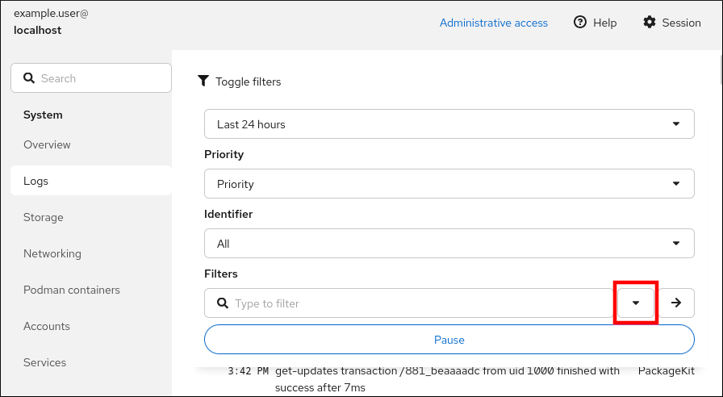
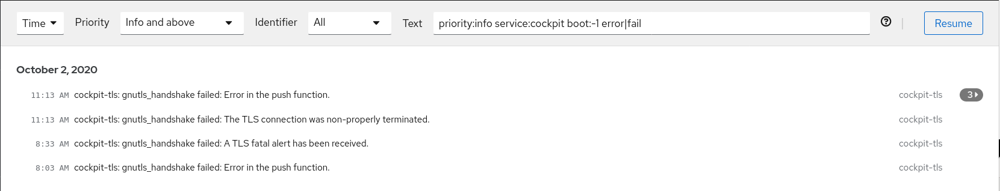
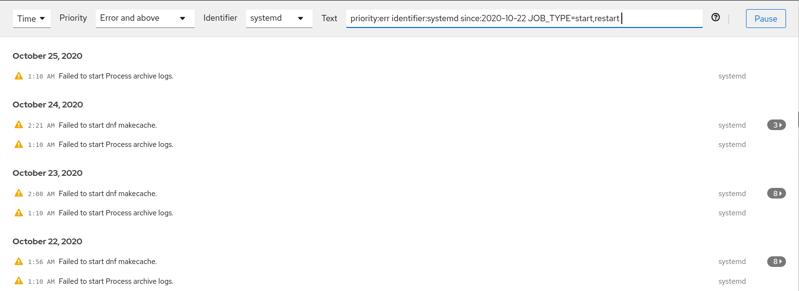
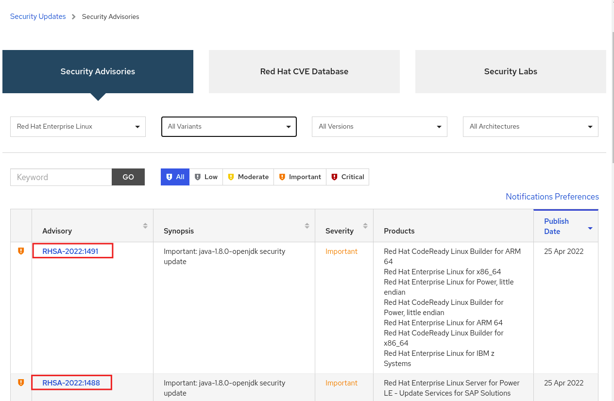

# Risk reduction and recovery operations

* * *

Red Hat Enterprise Linux 10

## Backing up data, log monitoring, and managing security updates

Red Hat Customer Content Services

[Legal Notice](#idm139931739222784)

**Abstract**

Use the Relax-and-Recover (ReaR) disaster recovery tool to minimize the impact of disaster events and have a structured plan to restore systems and data after a failure. Learn how to manage and monitor your security updates for improved system stability, security and performance. Use log files to examine recorded system events to identify, troubleshoot, and avoid issues and monitor system functions.

* * *

<h2 id="providing-feedback-on-red-hat-documentation">Providing feedback on Red Hat documentation</h2>

We are committed to providing high-quality documentation and value your feedback. To help us improve, you can submit suggestions or report errors through the Red Hat Jira tracking system.

**Procedure**

1. Log in to the [Jira](https://issues.redhat.com/projects/RHELDOCS/issues) website.
   
   If you do not have an account, select the option to create one.
2. Click **Create** in the top navigation bar.
3. Enter a descriptive title in the **Summary** field.
4. Enter your suggestion for improvement in the **Description** field. Include links to the relevant parts of the documentation.
5. Click **Create** at the bottom of the dialogue.

<h2 id="recovering-and-restoring-a-system">Chapter 1. Recovering and restoring a system</h2>

Use the Relax-and-Recover (ReaR) utility to restore a system by using an existing backup. This disaster recovery solution helps minimize the impact of failures and supports system migration.

With ReaR, you can:

- Produce a bootable image and restore the system from an existing backup by using the image.
- Replicate the original storage layout.
- Restore user and system files.
- Restore the system to a different hardware.

Additionally, for disaster recovery, you can also integrate certain backup software with ReaR.

<h3 id="setting-up-rear-and-manually-creating-a-backup">1.1. Setting up ReaR and manually creating a backup</h3>

Install the ReaR utility package to create a rescue system, configure settings, and manually generate a system backup. This prepares your system effectively for potential disaster recovery operations.

**Prerequisites**

- Necessary configurations according to the backup restore plan are ready.
  
  Note that you can use the `NETFS` backup method, a fully-integrated and built-in method with ReaR.

**Procedure**

1. Install the ReaR utility:
   
   ```
   dnf install rear
   ```
   
   ```plaintext
   # dnf install rear
   ```
2. Modify the ReaR configuration file in an editor of your choice, for example:
   
   ```
   vi /etc/rear/local.conf
   ```
   
   ```plaintext
   # vi /etc/rear/local.conf
   ```
3. Add the backup setting details to `/etc/rear/local.conf`. For example, in the case of the `NETFS` backup method, add the following lines:
   
   ```
   BACKUP=NETFS
   BACKUP_URL=backup.location
   ```
   
   ```plaintext
   BACKUP=NETFS
   BACKUP_URL=backup.location
   ```
   
   Replace *backup.location* with the URL of your backup location.
4. To configure ReaR to keep the previous backup archive when the new one is created, also add the following line to the configuration file:
   
   ```
   NETFS_KEEP_OLD_BACKUP_COPY=y
   ```
   
   ```plaintext
   NETFS_KEEP_OLD_BACKUP_COPY=y
   ```
5. To make the backups incremental, meaning that only the changed files are backed up on each run, add the following line:
   
   ```
   BACKUP_TYPE=incremental
   ```
   
   ```plaintext
   BACKUP_TYPE=incremental
   ```
6. Create a rescue system:
   
   ```
   rear mkrescue
   ```
   
   ```plaintext
   # rear mkrescue
   ```
7. Create a backup according to the restore plan. For example, in the case of the `NETFS` backup method, enter:
   
   ```
   rear mkbackuponly
   ```
   
   ```plaintext
   # rear mkbackuponly
   ```
   
   Alternatively, you can create the rescue system and the backup in a single step by running the following command:
   
   ```
   rear mkbackup
   ```
   
   ```plaintext
   # rear mkbackup
   ```
   
   This command combines the functionality of the `rear mkrescue` and `rear mkbackuponly` commands.

<h3 id="using-a-rear-rescue-image-on-the-64-bit-ibm-z-architecture">1.2. Using a ReaR rescue image on the 64-bit IBM Z architecture</h3>

Learn how to use the ReaR rescue image on the 64-bit IBM Z architecture. This allows you to quickly recover and restore systems running on this specific hardware platform.

Basic Relax and Recover (ReaR) functionality is available on the 64-bit IBM Z architecture and is fully supported. You can create a ReaR rescue image on IBM Z only in the z/VM environment. Backing up and recovering logical partitions (LPARs) has not been tested.

The only output method currently available is Initial Program Load (IPL). IPL produces a kernel and an initial RAM disk (`initrd`) that can be used with the `zipl` boot loader.

**Prerequisites**

- You installed the `rear` package.

**Procedure**

1. Add the following variables to the `/etc/rear/local.conf` to configure ReaR for producing a rescue image on the 64-bit IBM Z architecture:
   
   1. To configure the `IPL` output method, add `OUTPUT=IPL`.
   2. To configure the backup method and destination, add `BACKUP` and `BACKUP_URL` variables. For example:
      
      ```
      BACKUP=NETFS
      
      BACKUP_URL=nfs://<nfsserver_name>/<share_path>
      ```
      
      ```plaintext
      BACKUP=NETFS
      
      BACKUP_URL=nfs://<nfsserver_name>/<share_path>
      ```
      
      Important
      
      The local backup storage is currently not supported on the 64-bit IBM Z architecture.
   3. Optional: You can also configure the `OUTPUT_URL` variable to save the kernel and `initrd` files. By default, the `OUTPUT_URL` is aligned with `BACKUP_URL`.
2. To perform backup and rescue image creation:
   
   ```
   rear mkbackup
   ```
   
   ```plaintext
   # rear mkbackup
   ```
3. This creates the kernel and `initrd` files at the location specified by the `BACKUP_URL` or `OUTPUT_URL` (if set) variable, and a backup by using the specified backup method.
   
   Warning
   
   The rescue process reformats all the DASDs (Direct Attached Storage Devices) connected to the system. Do not attempt a system recovery if there is any valuable data present on the system storage devices. This also includes the device prepared with the `zipl` boot loader, ReaR kernel, and `initrd` that were used to boot into the rescue environment. Ensure to keep a copy.
4. To recover the system, use the previously created ReaR kernel and `initrd` files, and boot from a Direct Attached Storage Device (DASD) or a Fibre Channel Protocol (FCP)-attached SCSI device prepared with the `zipl` boot loader, kernel, and `initrd`.
5. When the rescue kernel and `initrd` get booted, it starts the ReaR rescue environment. Proceed with system recovery.

**Additional resources**

- [Installing under z/VM](https://docs.redhat.com/en/documentation/red_hat_enterprise_linux/10/html/interactively_installing_rhel_over_the_network/booting-the-installation-media#booting-the-installation-on-ibm-z-to-install-rhel-in-zvm)
- [Using a Prepared DASD](https://docs.redhat.com/en/documentation/red_hat_enterprise_linux/10/html/interactively_installing_rhel_over_the_network/booting-the-installation-media#booting-the-rhel-installation-by-using-a-prepared-dasd)

<h3 id="rear-exclusions">1.3. ReaR exclusions</h3>

The ReaR utility recreates the original system’s storage layout by using the `disklayout.conf` file. Configure exclusions to control which files, directories, or storage components are omitted from the layout and the backup.

During the recovery process, ReaR creates a rescue image on the disks of the recovered system, as described in the `/var/lib/rear/layout/disklayout.conf` layout file. The storage layout includes partitions, volume groups, logical volumes, file systems, and other storage components.

ReaR creates the layout file when creating the rescue image and embeds this file in the image. You can also make the layout file by using the `rear savelayout` command. This enables you to quickly create the layout file and examine it, without creating the entire rescue image.

The layout file describes the entire storage layout of the original system, with certain exceptions: ReaR excludes some storage components from the layout file and from being recreated during recovery. The following configuration variables control the exclusion of storage components from layout:

- `AUTOEXCLUDE_DISKS`
- `AUTOEXCLUDE_MULTIPATH`
- `AUTOEXCLUDE_PATH`
- `EXCLUDE_RECREATE`

Excluding some file systems from the layout file by the configuration variables also excludes their content from the backup. You can also exclude files or a directory tree from the backup without excluding a file system from the layout file by using the `BACKUP_PROG_EXCLUDE` configuration variable.

When all files and directories in a file system are excluded in this way, the file system is recreated during recovery, but it is empty, because the backup does not contain any data to restore into it. This is useful for file systems that contain temporary data and are not required to be preserved, or for data that is backed up by using methods independent of ReaR.

The `BACKUP_PROG_EXCLUDE` variable is an array of glob-style wildcard patterns that are passed to the `tar` or `rsync` commands. Note that the patterns are required to be quoted to prevent their expansion by the shell when it reads the configuration file. The default value of this variable is set in the `/usr/share/rear/conf/default.conf` file. The default value contains, for example, the `/tmp/*` pattern that excludes all the files and directories under the `/tmp` directory, but not the `/tmp` directory itself. See the `glob(3)` man page on your system for the complete reference of the patterns.

If you want to exclude other files and directories, append further patterns with the `+` character to the variable instead of overriding it to preserve the default values. For example, to exclude all files and directories under the directory `/data/temp` in addition to the default values, use:

```
BACKUP_PROG_EXCLUDE+=( '/data/temp/*' )
```

```plaintext
BACKUP_PROG_EXCLUDE+=( '/data/temp/*' )
```

You can view the default values for the configuration variables in the `/usr/share/rear/conf/default.conf` file and can change these values in the local `/etc/rear/local.conf` configuration file.

You can also configure which files are backed up by the internal `NETFS` and `RSYNC` backup methods. By default, files on all mounted local disk-based file systems are backed up by the `rear mkbackup` or `rear mkbackuponly` commands, if the file systems are included in the layout file.

The `rear mkbackup` command lists the backup exclude patterns in the log. You can find the log file in the `/var/log/rear` directory and use it to verify the excluded rules before performing a full system recovery. For example, the log can contain the following entries:

```
2025-04-29 10:17:41.312431050 Making backup (using backup method NETFS)
2025-04-29 10:17:41.314369109 Backup include list (backup-include.txt contents):
2025-04-29 10:17:41.316197323   /
2025-04-29 10:17:41.318052001 Backup exclude list (backup-exclude.txt contents):
2025-04-29 10:17:41.319857125   /tmp/*
2025-04-29 10:17:41.321644442   /dev/shm/*
2025-04-29 10:17:41.323436363   /var/lib/rear/output/*
```

```plaintext
2025-04-29 10:17:41.312431050 Making backup (using backup method NETFS)
2025-04-29 10:17:41.314369109 Backup include list (backup-include.txt contents):
2025-04-29 10:17:41.316197323   /
2025-04-29 10:17:41.318052001 Backup exclude list (backup-exclude.txt contents):
2025-04-29 10:17:41.319857125   /tmp/*
2025-04-29 10:17:41.321644442   /dev/shm/*
2025-04-29 10:17:41.323436363   /var/lib/rear/output/*
```

In the previous output, the backup includes the whole root file system, except for all files and directories under the `/tmp`, `/dev/shm`, and `/var/lib/rear/output` directories.

See the `Layout configuration` chapter in the ReaR user guide installed with the `rear` package in the `/usr/share/doc/rear/relax-and-recover-user-guide.html` file on your system for more information.

<h2 id="troubleshooting-problems-by-using-log-files">Chapter 2. Troubleshooting problems by using log files</h2>

Use log files to troubleshoot and monitor the system. Log files contain messages about the system, kernel, services, and applications, recorded efficiently using the built-in syslog protocol.

<h3 id="services-handling-syslog-messages">2.1. Services that handle syslog messages</h3>

Identify the system services, such as `rsyslogd` and `journald`, that handle syslog messages. These services are crucial for capturing, processing, and storing all security-relevant system events.

The following services handle syslog messages:

The `systemd-journald` daemon

Collects messages from the following sources and forwards them to Rsyslog for further processing:

- Kernel
- Early stages of the boot process
- Standard and error output of daemons as they start and run
- Syslog

The `rsyslog` service

Sorts syslog messages by type and priority and writes them to the files in the `/var/log` directory. The `/var/log` directory persistently stores the log messages.

<h3 id="subdirectories-storing-syslog-messages">2.2. Subdirectories that store syslog messages</h3>

Locate where system logging services store recorded syslog messages. Most log files are kept in the /var/log/ directory, often organized logically into subdirectories based on the application.

The following subdirectories under the `/var/log` directory store syslog messages:

/var/log/messages

all syslog messages except the following

/var/log/secure

security and authentication-related messages and errors

/var/log/maillog

mail server-related messages and errors

/var/log/cron

log files related to periodically executed tasks

/var/log/boot.log

log files related to system startup

<h3 id="commands-for-viewing-logs">2.3. Commands for viewing logs</h3>

You can view and manage log files by using the Journal, which is a component of `systemd`. It addresses problems connected with traditional logging, is closely integrated with the rest of the system, and supports various logging technologies and access management for the log files.

You can use the `journalctl` command to view messages in the system journal, for example:

```
journalctl -b | grep kvm
May 15 11:31:41 localhost.localdomain kernel: kvm-clock: Using msrs 4b564d01 and 4b564d00
May 15 11:31:41 localhost.localdomain kernel: kvm-clock: cpu 0, msr 76401001, primary cpu clock
```

```plaintext
$ journalctl -b | grep kvm
May 15 11:31:41 localhost.localdomain kernel: kvm-clock: Using msrs 4b564d01 and 4b564d00
May 15 11:31:41 localhost.localdomain kernel: kvm-clock: cpu 0, msr 76401001, primary cpu clock
```

<h4 id="viewing\_system\_information">2.3.1. Viewing system information</h4>

`journalctl`

Shows all collected journal entries.

`journalctl FILEPATH`

Shows logs related to a specific file. For example, the `journalctl /dev/sda` command displays logs related to the `/dev/sda` file system.

`journalctl -b`

Shows logs for the current boot.

`journalctl -k -b -1`

Shows kernel logs for the current boot.

<h4 id="viewing\_information\_about\_specific\_services">2.3.2. Viewing information about specific services</h4>

`journalctl -b _SYSTEMD_UNIT=<name.service>`

Filters log to show entries matching the `systemd` service.

`journalctl -b _SYSTEMD_UNIT=<name.service> _PID=<number>`

Combines matches. For example, this command shows logs for `systemd-units` that match `<name.service>` and the PID `<number>`.

`journalctl -b _SYSTEMD_UNIT=<name.service> _PID=<number> + _SYSTEMD_UNIT=<name2.service>`

The plus sign (+) separator combines two expressions in a logical OR. For example, this command shows all messages from the `<name.service>` service process with the `PID` plus all messages from the `<name2.service>` service (from any of its processes).

`journalctl -b _SYSTEMD_UNIT=<name.service> _SYSTEMD_UNIT=<name2.service>`

This command shows all entries matching either expression, referring to the same field. Here, this command shows logs matching a systemd-unit `<name.service>` or a systemd-unit `<name2.service>`.

<h4 id="viewing\_logs\_related\_to\_specific\_boots">2.3.3. Viewing logs related to specific boots</h4>

`journalctl --list-boots`

Shows a tabular list of boot numbers, their IDs, and the timestamps of the first and last message pertaining to the boot. You can use the ID in the next command to view detailed information.

`journalctl --boot=ID _SYSTEMD_UNIT=<name.service>`

Shows information about the specified boot ID.

<h3 id="troubleshooting-problems-by-using-log-files">2.4. Additional resources</h3>

- [Configuring a remote logging solution](#configuring-a-remote-logging-solution "Chapter 5. Configuring a remote logging solution")

<h2 id="reviewing-and-filtering-logs-in-the-web-console">Chapter 3. Reviewing and filtering logs in the web console</h2>

The Red Hat Enterprise Linux web console provides a graphical interface for accessing, reviewing, and filtering logs. You can use the most common functions without memorizing the corresponding commands and options.

<h3 id="reviewing-logs-in-the-web-console">3.1. Reviewing logs in the web console</h3>

You can quickly access and examine system logs by using the RHEL web console’s dedicated **Logs** section. This graphical interface helps centralize log monitoring for various system functions across the host and provides a UI for the `journalctl` utility.

**Prerequisites**

- You have installed the RHEL 10 web console.
  
  For instructions, see [Installing and enabling the web console](https://docs.redhat.com/en/documentation/red_hat_enterprise_linux/10/html/managing_systems_in_the_rhel_web_console/getting-started-with-the-rhel-web-console#installing-and-enabling-the-web-console).

**Procedure**

1. Log in to the RHEL 10 web console.
2. Click **Logs**.
3. Open log entry details by clicking on your selected log entry in the list.

**Next steps**

- After clicking Toggle filters to expand the menu, you can use the Pause button to pause new log entries from appearing. Once you resume new log entries, the web console loads all log entries that are reported after you use the Pause button.
- You can filter the logs by time, priority, or identifier. For more information, see [Reviewing and filtering logs in the web console](#reviewing-and-filtering-logs-in-the-web-console "Chapter 3. Reviewing and filtering logs in the web console").

<h3 id="filtering-logs-in-the-web-console">3.2. Filtering logs in the web console</h3>

You can filter system logs directly in the RHEL web console based on time range, priority, or specific identifiers. This capability helps administrators focus only on critical messages for targeted troubleshooting.

**Prerequisites**

- You have installed the RHEL 10 web console.
  
  For instructions, see [Installing and enabling the web console](https://docs.redhat.com/en/documentation/red_hat_enterprise_linux/10/html/managing_systems_in_the_rhel_web_console/getting-started-with-the-rhel-web-console#installing-and-enabling-the-web-console).

**Procedure**

1. Log in to the RHEL 10 web console.
2. Click **Logs**.
3. Click Toggle filters.
4. To change the default log filtering, use the **Time**, **Priority**, and **Identifier** drop-down menus.
5. Optional: By default, the web console shows the latest log entries. To filter by a specific time range, click the Expand button.
   
   
6. Click the → button (right pointing arrow) to apply your filters.
7. To open a log entry, click the selected log entry.

<h3 id="text-search-options-for-filtering-logs-in-the-web-console">3.3. Text search options for filtering logs in the web console</h3>

Learn the text search syntax and options available in the RHEL web console to filter logs effectively. This enables high precision when searching for specific errors or keywords across extensive system logs.

The text search option functionality provides a wide variety of options for filtering logs. If you decide to filter logs by using the text search, you can use the predefined options that are defined in the three drop-down menus, or you can type the whole search yourself.

Drop-down menus

You can use three drop-down menus to specify the main parameters of your search:

- **Time**: This drop-down menu contains predefined searches for different time ranges of your search.
- **Priority**: This drop-down menu provides options for different priority levels. It corresponds to the `journalctl --priority` option. The default priority value is **Error and above**. It is set every time you do not specify any other priority.
- **Identifier**: In this drop-down menu, you can select an identifier that you want to filter. Corresponds to the `journalctl --identifier` option.

Quantifiers

You can use six quantifiers to specify your search. They are covered in the **Options for filtering logs** table.

Log fields

To search for a specific log field, you can specify the field together with its content.

Free-form text search in log messages

You can filter any text string of your choice in the log messages. The string can also be in the form of a regular expression.

**Example 3.1. Logs filtering based on time**

Filter all log messages identified by 'systemd' that happened since October 22, 2020 midnight and journal field 'JOB\_TYPE' is either 'start' or 'restart.

1. Type `identifier:systemd since:2020-10-22 JOB_TYPE=start,restart` to search field.
2. Check the results.
   
   

**Example 3.2. Logs containing error and fail messages**

Filter all log messages that come from 'cockpit.service' systemd unit that happened in the boot before last and the message body contains either "error" or "fail".

1. Type `service:cockpit boot:-1 error|fail` to the search field.
2. Check the results.
   
   

<h3 id="using-a-text-search-box-to-filter-logs-in-the-web-console">3.4. Using a text search box to filter logs in the web console</h3>

You can filter logs according to different parameters by using the text search box in the web console. The search combines the usage of the filtering drop-down menus, quantifiers, log fields, and free-form string search.

**Prerequisites**

- You have installed the RHEL 10 web console.
  
  For instructions, see [Installing and enabling the web console](https://docs.redhat.com/en/documentation/red_hat_enterprise_linux/10/html/managing_systems_in_the_rhel_web_console/getting-started-with-the-rhel-web-console#installing-and-enabling-the-web-console).

**Procedure**

1. Log in to the RHEL 10 web console.
2. Click **Logs**.
3. Use the drop-down menus to specify the three main quantifiers - time range, priority, and identifier(s) - you want to filter.
   
   The **Priority** quantifier must have a value. If you do not specify a value, it automatically filters the **Error and above** priority. The options you set reflect in the text search box.
4. Specify the log field you want to filter.
   
   You can add several log fields.
5. You can use a free-form string to search for anything else. The search box also accepts regular expressions.

<h3 id="options-for-logs-filtering">3.5. Options for filtering logs</h3>

Review the various options available for filtering system logs in the RHEL web console. Options include time range, priority, identifier, and customized text search fields.

You can use `journalctl` options for filtering logs in the web console. Some of these options are provided as parts of the drop-down menus in the web console interface.

Table 3.1. Options for filtering logs in the RHEL web console

Option nameUsageNotes

`priority`

Filters output by message priorities. Takes a single numeric or textual log level. The log levels are the usual syslog log levels. If a single log level is specified, all messages with this log level or a lower and more important log level are shown.

Covered in the **Priority** drop-down menu.

`identifier`

Shows messages for the specified syslog identifier SYSLOG\_IDENTIFIER. Can be specified multiple times.

Covered in the **Identifier** drop-down menu.

`follow`

Shows only the most recent journal entries, and continuously prints new entries as they are appended to the journal.

Not covered in a drop-down.

`service`

Shows messages for the specified `systemd` unit. Can be specified multiple times.

Is not covered in a drop-down. Corresponds to the `journalctl --unit` parameter.

`boot`

Shows messages from a specific boot.

A positive integer looks up the boots starting from the beginning of the journal, and an equal-or-less-than-zero integer looks up boots starting from the end of the journal. Therefore, 1 means the first boot found in the journal in chronological order, 2 the second, and so on; while -0 is the last boot, -1 the boot before last, and so on.

Covered only as **Current boot** or **Previous boot** in the **Time** drop-down menu. You must specify other options manually.

`since`

Starts showing entries on or newer than the specified date, or on or older than the selected date. Date specifications should be of the format "2012-10-30 18:17:16". If the time part is omitted, "00:00:00" is considered. If only the seconds component is omitted, ":00" is assumed. If the date component is omitted, the current day is assumed. Alternatively, the strings "yesterday", "today", "tomorrow" are understood, which refer to 00:00:00 of the day before the current day, the current day, or the day after the current day. "now" refers to the current time. Finally, relative times might be specified, prefixed with "-" or "+", referring to times before or after the current time.

Not covered in a drop-down.

<h2 id="configuring-the-systemd-journal-by-using-rhel-system-roles">Chapter 4. Configuring the systemd journal by using RHEL system roles</h2>

With the `journald` RHEL system role you can automate the `systemd` journal, and configure persistent logging by using the Red Hat Ansible Automation Platform.

<h3 id="configuring-persistent-logging-by-using-the-journald-rhel-system-role">4.1. Configuring persistent logging by using the journald RHEL system role</h3>

By default, the `systemd` journal stores logs only in a small ring buffer in `/run/log/journal`, which is not persistent. Rebooting the system also removes journal database logs. You can configure persistent logging consistently on multiple systems by using the `journald` RHEL system role.

**Prerequisites**

- [You have prepared the control node and the managed nodes](https://docs.redhat.com/en/documentation/red_hat_enterprise_linux/10/html/automating_system_administration_by_using_rhel_system_roles/preparing-a-control-node-and-managed-nodes-to-use-rhel-system-roles).
- You are logged in to the control node as a user who can run playbooks on the managed nodes.
- The account you use to connect to the managed nodes has `sudo` permissions for these nodes.

**Procedure**

1. Create a playbook file, for example, `~/playbook.yml`, with the following content:
   
   ```
   ---
   - name: Configure journald
     hosts: managed-node-01.example.com
     tasks:
       - name: Configure persistent logging
         ansible.builtin.include_role:
           name: redhat.rhel_system_roles.journald
         vars:
           journald_persistent: true
           journald_max_disk_size: <size>
           journald_per_user: true
           journald_sync_interval: <interval>
   ```
   
   ```yaml
   ---
   - name: Configure journald
     hosts: managed-node-01.example.com
     tasks:
       - name: Configure persistent logging
         ansible.builtin.include_role:
           name: redhat.rhel_system_roles.journald
         vars:
           journald_persistent: true
           journald_max_disk_size: <size>
           journald_per_user: true
           journald_sync_interval: <interval>
   ```
   
   The settings specified in the example playbook include the following:
   
   `journald_persistent: true`
   
   Enables persistent logging.
   
   `journald_max_disk_size: <size>`
   
   Specifies the maximum size of disk space for journal files in MB, for example, `2048`.
   
   `journald_per_user: true`
   
   Configures `journald` to keep log data separate for each user.
   
   `journald_sync_interval: <interval>`
   
   Sets the synchronization interval in minutes, for example, `1`.
   
   For details about all variables used in the playbook, see the `/usr/share/ansible/roles/rhel-system-roles.journald/README.md` file on the control node.
2. Validate the playbook syntax:
   
   ```
   ansible-playbook --syntax-check ~/playbook.yml
   ```
   
   ```plaintext
   $ ansible-playbook --syntax-check ~/playbook.yml
   ```
   
   Note that this command only validates the syntax and does not protect against a wrong but valid configuration.
3. Run the playbook:
   
   ```
   ansible-playbook ~/playbook.yml
   ```
   
   ```plaintext
   $ ansible-playbook ~/playbook.yml
   ```

<h2 id="configuring-a-remote-logging-solution">Chapter 5. Configuring a remote logging solution</h2>

Ensure that logs from various machines in your environment are recorded centrally on a logging server. You can configure the Rsyslog application to forward logs that meet specific criteria from client systems to the server.

<h3 id="the-rsyslog-logging-service">5.1. The Rsyslog logging service</h3>

Understand the function of the Rsyslog logging service and how to define rules in the `/etc/rsyslog.conf` file. Rules classify messages by urgency and topic, determining the action Rsyslog performs.

The Rsyslog application, in combination with the `systemd-journald` service, provides local and remote logging support in Red Hat Enterprise Linux. The `rsyslogd` daemon continuously reads `syslog` messages received by the `systemd-journald` service from the Journal. `rsyslogd` then filters and processes these `syslog` events and records them to `rsyslog` log files or forwards them to other services according to its configuration.

The `rsyslogd` daemon also provides extended filtering, encryption-protected relaying of messages, input and output modules, and support for transport that uses the TCP and UDP protocols.

In `/etc/rsyslog.conf`, which is the main configuration file for `rsyslog`, you can specify the rules according to which `rsyslogd` handles the messages. Generally, you can classify messages by their source and topic (facility) and urgency (priority), and then assign an action that should be performed when a message fits these criteria.

In `/etc/rsyslog.conf`, you can also see a list of log files maintained by `rsyslogd`. Most log files are located in the `/var/log/` directory. Some applications, such as `httpd` and `samba`, store their log files in a subdirectory within `/var/log/`.

For more information, see the `rsyslogd(8)` and `rsyslog.conf(5)` man pages on your system. You can also refer to the comprehensive documentation installed with the `rsyslog-doc` package in the `/usr/share/doc/rsyslog/html/index.html` file.

<h3 id="installing-rsyslog-documentation">5.2. Installing Rsyslog documentation</h3>

Install the `rsyslog-doc` documentation package locally. This provides quick, offline access to the extensive documentation for the Rsyslog application, complementing the online resources.

The Rsyslog application has extensive online documentation that is available at [https://www.rsyslog.com/doc/](https://www.rsyslog.com/doc/), but you can also install the `rsyslog-doc` documentation package on your system.

**Prerequisites**

- You have activated the `AppStream` repository on your system.
- You are authorized to install new packages using `sudo`.

**Procedure**

- Install the `rsyslog-doc` package:
  
  ```
  dnf install rsyslog-doc
  ```
  
  ```plaintext
  # dnf install rsyslog-doc
  ```

**Verification**

- Open the `/usr/share/doc/rsyslog/html/index.html` file in a browser of your choice, for example:
  
  ```
  firefox /usr/share/doc/rsyslog/html/index.html &
  ```
  
  ```plaintext
  $ firefox /usr/share/doc/rsyslog/html/index.html &
  ```

<h3 id="configuring-a-server-for-remote-logging-over-tcp">5.3. Configuring a server for remote logging over TCP</h3>

Configure your Rsyslog server to receive remote logs through the reliable TCP protocol. This setup helps ensure high integrity when transferring logs from client systems over the network.

To use remote logging through TCP, configure both the server and the client. The server collects and analyzes the logs sent by one or more client systems.

With the Rsyslog application, you can maintain a centralized logging system where log messages are forwarded to a server over the network. To avoid message loss when the server is not available, you can configure an action queue for the forwarding action. This way, messages that failed to be sent are stored locally until the server is reachable again. Note that such queues cannot be configured for connections that use the UDP protocol.

The `omfwd` plugin provides forwarding over UDP or TCP. The default protocol is UDP. Because the plugin is built-in, it does not have to be loaded.

By default, `rsyslog` uses TCP on port `514`.

**Prerequisites**

- Rsyslog is installed on the server system.
- You are logged in as `root` on the server.
- The `policycoreutils-python-utils` package is installed for the optional step using the `semanage` command.
- The `firewalld` service is running.

**Procedure**

1. Optional: To use a different port for `rsyslog` traffic, add the `syslogd_port_t` SELinux type to port. For example, enable port `30514`:
   
   ```
   semanage port -a -t syslogd_port_t -p tcp 30514
   ```
   
   ```plaintext
   # semanage port -a -t syslogd_port_t -p tcp 30514
   ```
2. Optional: To use a different port for `rsyslog` traffic, configure `firewalld` to allow incoming `rsyslog` traffic on that port. For example, allow TCP traffic on port `30514`:
   
   ```
   firewall-cmd --zone=<zone_name> --permanent --add-port=30514/tcp
   success
   firewall-cmd --reload
   ```
   
   ```plaintext
   # firewall-cmd --zone=<zone_name> --permanent --add-port=30514/tcp
   success
   # firewall-cmd --reload
   ```
3. Create a new file in the `/etc/rsyslog.d/` directory named, for example, `remotelog.conf`, and insert the following content:
   
   ```
   # Define templates before the rules that use them
   # Per-Host templates for remote systems
   template(name="TmplAuthpriv" type="list") {
       constant(value="/var/log/remote/auth/")
       property(name="hostname")
       constant(value="/")
       property(name="programname" SecurePath="replace")
       constant(value=".log")
       }
   
   template(name="TmplMsg" type="list") {
       constant(value="/var/log/remote/msg/")
       property(name="hostname")
       constant(value="/")
       property(name="programname" SecurePath="replace")
       constant(value=".log")
       }
   
   # Provides TCP syslog reception
   module(load="imtcp")
   
   # Adding this ruleset to process remote messages
   ruleset(name="remote1"){
        authpriv.*   action(type="omfile" DynaFile="TmplAuthpriv")
         *.info;mail.none;authpriv.none;cron.none
   action(type="omfile" DynaFile="TmplMsg")
   }
   
   input(type="imtcp" port="30514" ruleset="remote1")
   ```
   
   ```plaintext
   # Define templates before the rules that use them
   # Per-Host templates for remote systems
   template(name="TmplAuthpriv" type="list") {
       constant(value="/var/log/remote/auth/")
       property(name="hostname")
       constant(value="/")
       property(name="programname" SecurePath="replace")
       constant(value=".log")
       }
   
   template(name="TmplMsg" type="list") {
       constant(value="/var/log/remote/msg/")
       property(name="hostname")
       constant(value="/")
       property(name="programname" SecurePath="replace")
       constant(value=".log")
       }
   
   # Provides TCP syslog reception
   module(load="imtcp")
   
   # Adding this ruleset to process remote messages
   ruleset(name="remote1"){
        authpriv.*   action(type="omfile" DynaFile="TmplAuthpriv")
         *.info;mail.none;authpriv.none;cron.none
   action(type="omfile" DynaFile="TmplMsg")
   }
   
   input(type="imtcp" port="30514" ruleset="remote1")
   ```
4. Save the changes to the `/etc/rsyslog.d/remotelog.conf` file.
5. Test the syntax of the `/etc/rsyslog.conf` file:
   
   ```
   rsyslogd -N 1
   rsyslogd: version 8.1911.0-2.el8, config validation run...
   rsyslogd: End of config validation run. Bye.
   ```
   
   ```plaintext
   # rsyslogd -N 1
   rsyslogd: version 8.1911.0-2.el8, config validation run...
   rsyslogd: End of config validation run. Bye.
   ```
6. Make sure the `rsyslog` service is running and enabled on the logging server:
   
   ```
   systemctl status rsyslog
   ```
   
   ```plaintext
   # systemctl status rsyslog
   ```
7. Restart the `rsyslog` service.
   
   ```
   systemctl restart rsyslog
   ```
   
   ```plaintext
   # systemctl restart rsyslog
   ```
8. Optional: If `rsyslog` is not enabled, ensure the `rsyslog` service starts automatically after reboot:
   
   ```
   systemctl enable rsyslog
   ```
   
   ```plaintext
   # systemctl enable rsyslog
   ```

<h3 id="configuring-remote-logging-to-a-server-over-tcp">5.4. Configuring remote logging to a server over TCP</h3>

You can configure a system for forwarding log messages to a server over the TCP protocol. The `omfwd` plugin provides forwarding over UDP or TCP. The default protocol is UDP. Because the plugin is built in, you do not have to load it.

**Prerequisites**

- The `rsyslog` package is installed on the client systems that should report to the server.
- You have configured the server for remote logging.
- The specified port is permitted in SELinux and open in firewall.
- The system contains the `policycoreutils-python-utils` package, which provides the `semanage` command for adding a non-standard port to the SELinux configuration.

**Procedure**

1. Create a new file in the `/etc/rsyslog.d/` directory named, for example, `10-remotelog.conf`, and insert the following content:
   
   ```
   *.* action(type="omfwd"
         queue.type="linkedlist"
         queue.filename="example_fwd"
         action.resumeRetryCount="-1"
         queue.saveOnShutdown="on"
         target="example.com" port="30514" protocol="tcp"
        )
   ```
   
   ```plaintext
   *.* action(type="omfwd"
         queue.type="linkedlist"
         queue.filename="example_fwd"
         action.resumeRetryCount="-1"
         queue.saveOnShutdown="on"
         target="example.com" port="30514" protocol="tcp"
        )
   ```
   
   Where:
   
   - The `queue.type="linkedlist"` setting enables a LinkedList in-memory queue,
   - The `queue.filename` setting defines a disk storage. The backup files are created with the `example_fwd` prefix in the working directory specified by the preceding global `workDirectory` directive.
   - The `action.resumeRetryCount -1` setting prevents `rsyslog` from dropping messages when retrying to connect if server is not responding,
   - The `queue.saveOnShutdown="on"` setting saves in-memory data if `rsyslog` shuts down.
   - The last line forwards all received messages to the logging server. Port specification is optional.
     
     With this configuration, `rsyslog` sends messages to the server but keeps messages in memory if the remote server is not reachable. A file on disk is created only if `rsyslog` runs out of the configured memory queue space or needs to shut down, which benefits the system performance.
     
     Note
     
     Rsyslog processes configuration files `/etc/rsyslog.d/` in the lexical order.
2. Restart the `rsyslog` service.
   
   ```
   systemctl restart rsyslog
   ```
   
   ```plaintext
   # systemctl restart rsyslog
   ```

**Verification**

To verify that the client system sends messages to the server:

1. On the client system, send a test message:
   
   ```
   logger test
   ```
   
   ```plaintext
   # logger test
   ```
2. On the server system, view the `/var/log/messages` log, for example:
   
   ```
   cat /var/log/remote/msg/hostname/root.log
   Feb 25 03:53:17 hostname root[6064]: test
   ```
   
   ```plaintext
   # cat /var/log/remote/msg/hostname/root.log
   Feb 25 03:53:17 hostname root[6064]: test
   ```
   
   Where *hostname* is the hostname of the client system. Note that the log contains the user name of the user that entered the `logger` command, in this case `root`.

<h3 id="configuring-tls-encrypted-remote-logging">5.5. Configuring TLS-encrypted remote logging</h3>

Encrypt remote logging communication by using TLS to secure the data transfer. Configuring TLS on both the server and the client helps protect sensitive logs from network interception.

By default, Rsyslog sends remote logging messages in plain text. To use encrypted transport through TLS, configure both the server and the client. The server collects and analyzes the logs sent by one or more client systems.

You can use either the `ossl` network stream driver (OpenSSL) or the `gtls` stream driver (GnuTLS).

Note

If you have a separate system with higher security, for example, a system that is not connected to any network or has stricter authorizations, use the separate system as the certifying authority (CA).

You can customize your connection settings with stream drivers on the server side on the `global`, `module`, and `input` levels, and on the client side on the `global` and `action` levels. The more specific configuration overrides the more general configuration. This means, for example, that you can use `ossl` in global settings for most connections and `gtls` on the input and action settings only for specific connections.

**Prerequisites**

- You have `root` access to both the client and server systems.
- The following packages are installed on the server and the client systems:
  
  - The `rsyslog` package.
  - For the `ossl` network stream driver, the `rsyslog-openssl` package.
  - For the `gtls` network stream driver, the `rsyslog-gnutls` package.
  - For generating certificates by using the `certtool` command, the `gnutls-utils` package.
- On your logging server, the following certificates are in the `/etc/pki/ca-trust/source/anchors/` directory, and your system configuration is updated by using the `update-ca-trust` command:
  
  - `ca-cert.pem` - a CA certificate that can verify keys and certificates on logging servers and clients.
  - `server-cert.pem` - a public key of the logging server.
  - `server-key.pem` - a private key of the logging server.
- On your logging clients, the following certificates are in the `/etc/pki/ca-trust/source/anchors/` directory, and your system configuration is updated by using `update-ca-trust`:
  
  - `ca-cert.pem` - a CA certificate that can verify keys and certificates on logging servers and clients.
  - `client-cert.pem` - a public key of a client.
  - `client-key.pem` - a private key of a client.
  - If the server runs RHEL 9.2 or later and FIPS mode is enabled, clients must either support the Extended Master Secret (EMS) extension or use TLS 1.3. TLS 1.2 connections without EMS fail. For more information, see the [TLS extension "Extended Master Secret" enforced](https://access.redhat.com/solutions/7018256) article (Red Hat Knowledgebase).

**Procedure**

1. Configure the server for receiving encrypted logs from your client systems:
   
   1. Create a new file in the `/etc/rsyslog.d/` directory named, for example, `securelogser.conf`.
   2. To encrypt the communication, the configuration file must contain paths to certificate files on your server, a selected authentication method, and a stream driver that supports TLS encryption. Add the following lines to the `/etc/rsyslog.d/securelogser.conf` file:
      
      ```
      # Set certificate files
      global(
        DefaultNetstreamDriverCAFile="/etc/pki/ca-trust/source/anchors/ca-cert.pem"
        DefaultNetstreamDriverCertFile="/etc/pki/ca-trust/source/anchors/server-cert.pem"
        DefaultNetstreamDriverKeyFile="/etc/pki/ca-trust/source/anchors/server-key.pem"
      )
      
      # TCP listener
      module(
        load="imtcp"
        PermittedPeer=["client1.example.com", "client2.example.com"]
        StreamDriver.AuthMode="x509/name"
        StreamDriver.Mode="1"
        StreamDriver.Name="ossl"
      )
      
      # Start up listener at port 514
      input(
        type="imtcp"
        port="514"
      )
      ```
      
      ```plaintext
      # Set certificate files
      global(
        DefaultNetstreamDriverCAFile="/etc/pki/ca-trust/source/anchors/ca-cert.pem"
        DefaultNetstreamDriverCertFile="/etc/pki/ca-trust/source/anchors/server-cert.pem"
        DefaultNetstreamDriverKeyFile="/etc/pki/ca-trust/source/anchors/server-key.pem"
      )
      
      # TCP listener
      module(
        load="imtcp"
        PermittedPeer=["client1.example.com", "client2.example.com"]
        StreamDriver.AuthMode="x509/name"
        StreamDriver.Mode="1"
        StreamDriver.Name="ossl"
      )
      
      # Start up listener at port 514
      input(
        type="imtcp"
        port="514"
      )
      ```
      
      Note
      
      If you prefer the GnuTLS driver, use the `StreamDriver.Name="gtls"` configuration option. See the documentation installed with the `rsyslog-doc` package for more information about less strict authentication modes than `x509/name`.
   3. Optional: To customize the connection configuration, replace the `input` section with the following:
      
      ```
      input(
        type="imtcp"
        Port="50515"
        StreamDriver.Name="<driver>"
        streamdriver.CAFile="/etc/rsyslog.d/<ca1>.pem"
        streamdriver.CertFile="/etc/rsyslog.d/<server1_cert>.pem"
        streamdriver.KeyFile="/etc/rsyslog.d/<server1_key>.pem"
      )
      ```
      
      ```plaintext
      input(
        type="imtcp"
        Port="50515"
        StreamDriver.Name="<driver>"
        streamdriver.CAFile="/etc/rsyslog.d/<ca1>.pem"
        streamdriver.CertFile="/etc/rsyslog.d/<server1_cert>.pem"
        streamdriver.KeyFile="/etc/rsyslog.d/<server1_key>.pem"
      )
      ```
      
      - Replace `<driver>` with `ossl` or `gtls` depending on the driver you want to use.
      - Replace `<ca1>` with the CA certificate, `<server1_cert>` with the certificate, and `<server1_key>` with the key of the customized connection.
   4. Save the changes to the `/etc/rsyslog.d/securelogser.conf` file.
   5. Verify the syntax of the `/etc/rsyslog.conf` file and any files in the `/etc/rsyslog.d/` directory:
      
      ```
      rsyslogd -N 1
      rsyslogd: version 8.1911.0-2.el8, config validation run (level 1)...
      rsyslogd: End of config validation run. Bye.
      ```
      
      ```plaintext
      # rsyslogd -N 1
      rsyslogd: version 8.1911.0-2.el8, config validation run (level 1)...
      rsyslogd: End of config validation run. Bye.
      ```
   6. Make sure the `rsyslog` service is running and enabled on the logging server:
      
      ```
      systemctl status rsyslog
      ```
      
      ```plaintext
      # systemctl status rsyslog
      ```
   7. Restart the `rsyslog` service:
      
      ```
      systemctl restart rsyslog
      ```
      
      ```plaintext
      # systemctl restart rsyslog
      ```
   8. Optional: If Rsyslog is not enabled, ensure the `rsyslog` service starts automatically after reboot:
      
      ```
      systemctl enable rsyslog
      ```
      
      ```plaintext
      # systemctl enable rsyslog
      ```
2. Configure clients for sending encrypted logs to the server:
   
   1. On a client system, create a new file in the `/etc/rsyslog.d/` directory named, for example, `securelogcli.conf`.
   2. Add the following lines to the `/etc/rsyslog.d/securelogcli.conf` file:
      
      ```
      # Set certificate files
      global(
        DefaultNetstreamDriverCAFile="/etc/pki/ca-trust/source/anchors/ca-cert.pem"
        DefaultNetstreamDriverCertFile="/etc/pki/ca-trust/source/anchors/client-cert.pem"
        DefaultNetstreamDriverKeyFile="/etc/pki/ca-trust/source/anchors/client-key.pem"
      )
      
      
      # Set up the action for all messages
      *.* action(
        type="omfwd"
        StreamDriver="ossl"
        StreamDriverMode="1"
        StreamDriverPermittedPeers="server.example.com"
        StreamDriverAuthMode="x509/name"
        target="server.example.com" port="514" protocol="tcp"
      )
      ```
      
      ```plaintext
      # Set certificate files
      global(
        DefaultNetstreamDriverCAFile="/etc/pki/ca-trust/source/anchors/ca-cert.pem"
        DefaultNetstreamDriverCertFile="/etc/pki/ca-trust/source/anchors/client-cert.pem"
        DefaultNetstreamDriverKeyFile="/etc/pki/ca-trust/source/anchors/client-key.pem"
      )
      
      
      # Set up the action for all messages
      *.* action(
        type="omfwd"
        StreamDriver="ossl"
        StreamDriverMode="1"
        StreamDriverPermittedPeers="server.example.com"
        StreamDriverAuthMode="x509/name"
        target="server.example.com" port="514" protocol="tcp"
      )
      ```
      
      Note
      
      If you prefer the GnuTLS driver, use the `StreamDriver.Name="gtls"` configuration option.
   3. Optional: To customize the connection configuration, replace the `action` section with the following:
      
      ```
      local1.* action(
        type="omfwd"
        StreamDriver="<driver>"
        StreamDriverMode="1"
        StreamDriverAuthMode="x509/certvalid"
        streamDriver.CAFile="/etc/rsyslog.d/<ca1>.pem"
        streamDriver.CertFile="/etc/rsyslog.d/<client1_cert>.pem"
        streamDriver.KeyFile="/etc/rsyslog.d/<client1_key>.pem"
        target="server.example.com" port="514" protocol="tcp"
        )
      ```
      
      ```plaintext
      local1.* action(
        type="omfwd"
        StreamDriver="<driver>"
        StreamDriverMode="1"
        StreamDriverAuthMode="x509/certvalid"
        streamDriver.CAFile="/etc/rsyslog.d/<ca1>.pem"
        streamDriver.CertFile="/etc/rsyslog.d/<client1_cert>.pem"
        streamDriver.KeyFile="/etc/rsyslog.d/<client1_key>.pem"
        target="server.example.com" port="514" protocol="tcp"
        )
      ```
      
      - Replace `<driver>` with `ossl` or `gtls` depending on the driver you want to use.
      - Replace `<ca1>` with the CA certificate, `<client1_cert>` with the certificate, and `<client1_key>` with the key of the customized connection.
   4. Save the changes to the `/etc/rsyslog.d/securelogcli.conf` file.
   5. Verify the syntax of the `/etc/rsyslog.conf` file and other files in the `/etc/rsyslog.d/` directory:
      
      ```
      rsyslogd -N 1
      rsyslogd: version 8.1911.0-2.el8, config validation run (level 1)...
      rsyslogd: End of config validation run. Bye.
      ```
      
      ```plaintext
      # rsyslogd -N 1
      rsyslogd: version 8.1911.0-2.el8, config validation run (level 1)...
      rsyslogd: End of config validation run. Bye.
      ```
   6. Make sure the `rsyslog` service is running and enabled on the logging server:
      
      ```
      systemctl status rsyslog
      ```
      
      ```plaintext
      # systemctl status rsyslog
      ```
   7. Restart the `rsyslog` service:
      
      ```
      systemctl restart rsyslog
      ```
      
      ```plaintext
      # systemctl restart rsyslog
      ```
   8. Optional: If Rsyslog is not enabled, ensure the `rsyslog` service starts automatically after reboot:
      
      ```
      systemctl enable rsyslog
      ```
      
      ```plaintext
      # systemctl enable rsyslog
      ```

**Verification**

To verify that the client system sends messages to the server:

1. On the client system, send a test message:
   
   ```
   logger test
   ```
   
   ```plaintext
   # logger test
   ```
2. On the server system, view the `/var/log/messages` log, for example:
   
   ```
   cat /var/log/remote/msg/<hostname>/root.log
   Feb 25 03:53:17 <hostname> root[6064]: test
   ```
   
   ```plaintext
   # cat /var/log/remote/msg/<hostname>/root.log
   Feb 25 03:53:17 <hostname> root[6064]: test
   ```
   
   Where `<hostname>` is the hostname of the client system. Note that the log contains the user name of the user who entered the logger command, in this case, `root`.

**Additional resources**

- [Using the logging system role with TLS](https://docs.redhat.com/en/documentation/red_hat_enterprise_linux/10/html/risk_reduction_and_recovery_operations/configuring-logging-by-using-rhel-system-roles)

<h3 id="configuring-a-server-for-receiving-remote-logging-information-over-udp">5.6. Configuring a server for receiving remote logging information over UDP</h3>

Configure the Rsyslog server to receive remote logs through the high-speed UDP protocol. UDP is suitable when log loss is acceptable, offering faster transmission than TCP.

To use remote logging through UDP, configure both the server and the client. The receiving server collects and analyzes the logs sent by one or more client systems. By default, `rsyslog` uses UDP on port `514` to receive log information from remote systems.

**Prerequisites**

- Rsyslog is installed on the server system.
- You are logged in as `root` on the server.
- The `policycoreutils-python-utils` package is installed for the optional step that uses the `semanage` command.
- The `firewalld` service is running.

**Procedure**

1. Optional: To use a different port for `rsyslog` traffic than the default port `514`:
   
   1. Add the `syslogd_port_t` SELinux type to the SELinux policy configuration, replacing `portno` with the port number you want `rsyslog` to use:
      
      ```
      semanage port -a -t syslogd_port_t -p udp portno
      ```
      
      ```plaintext
      # semanage port -a -t syslogd_port_t -p udp portno
      ```
   2. Configure `firewalld` to allow incoming `rsyslog` traffic, replacing `portno` with the port number and `zone` with the zone you want `rsyslog` to use:
      
      ```
      firewall-cmd --zone=zone --permanent --add-port=portno/udp
      success
      firewall-cmd --reload
      ```
      
      ```plaintext
      # firewall-cmd --zone=zone --permanent --add-port=portno/udp
      success
      # firewall-cmd --reload
      ```
   3. Reload the firewall rules:
      
      ```
      firewall-cmd --reload
      ```
      
      ```plaintext
      # firewall-cmd --reload
      ```
2. Create a new `.conf` file in the `/etc/rsyslog.d/` directory, for example, `remotelogserv.conf`, and insert the following content:
   
   ```
   # Define templates before the rules that use them
   # Per-Host templates for remote systems
   template(name="TmplAuthpriv" type="list") {
       constant(value="/var/log/remote/auth/")
       property(name="hostname")
       constant(value="/")
       property(name="programname" SecurePath="replace")
       constant(value=".log")
       }
   
   template(name="TmplMsg" type="list") {
       constant(value="/var/log/remote/msg/")
       property(name="hostname")
       constant(value="/")
       property(name="programname" SecurePath="replace")
       constant(value=".log")
       }
   
   # Provides UDP syslog reception
   module(load="imudp")
   
   # This ruleset processes remote messages
   ruleset(name="remote1"){
        authpriv.*   action(type="omfile" DynaFile="TmplAuthpriv")
         *.info;mail.none;authpriv.none;cron.none
   action(type="omfile" DynaFile="TmplMsg")
   }
   
   input(type="imudp" port="514" ruleset="remote1")
   ```
   
   ```plaintext
   # Define templates before the rules that use them
   # Per-Host templates for remote systems
   template(name="TmplAuthpriv" type="list") {
       constant(value="/var/log/remote/auth/")
       property(name="hostname")
       constant(value="/")
       property(name="programname" SecurePath="replace")
       constant(value=".log")
       }
   
   template(name="TmplMsg" type="list") {
       constant(value="/var/log/remote/msg/")
       property(name="hostname")
       constant(value="/")
       property(name="programname" SecurePath="replace")
       constant(value=".log")
       }
   
   # Provides UDP syslog reception
   module(load="imudp")
   
   # This ruleset processes remote messages
   ruleset(name="remote1"){
        authpriv.*   action(type="omfile" DynaFile="TmplAuthpriv")
         *.info;mail.none;authpriv.none;cron.none
   action(type="omfile" DynaFile="TmplMsg")
   }
   
   input(type="imudp" port="514" ruleset="remote1")
   ```
   
   Where `514` is the port number `rsyslog` uses by default. You can specify a different port instead.
3. Verify the syntax of the `/etc/rsyslog.conf` file and all `.conf` files in the `/etc/rsyslog.d/` directory:
   
   ```
   rsyslogd -N 1
   rsyslogd: version 8.1911.0-2.el8, config validation run...
   ```
   
   ```plaintext
   # rsyslogd -N 1
   rsyslogd: version 8.1911.0-2.el8, config validation run...
   ```
4. Restart the `rsyslog` service.
   
   ```
   systemctl restart rsyslog
   ```
   
   ```plaintext
   # systemctl restart rsyslog
   ```
5. Optional: If `rsyslog` is not enabled, ensure the `rsyslog` service starts automatically after reboot:
   
   ```
   systemctl enable rsyslog
   ```
   
   ```plaintext
   # systemctl enable rsyslog
   ```

<h3 id="configuring-remote-logging-to-a-server-over-udp">5.7. Configuring remote logging to a server over UDP</h3>

Configure a client system to send its logs to a remote server by using the UDP protocol. UDP is preferred when speed is critical and the occasional loss of a log message is acceptable.

The `omfwd` plugin provides forwarding over UDP or TCP. The default protocol is UDP. Because the plugin is built in, you do not have to load it.

**Prerequisites**

- The `rsyslog` package is installed on the client systems that should report to the server.
- You have configured the server for remote logging as described in [Configuring a server for receiving remote logging information over UDP](#configuring-a-server-for-receiving-remote-logging-information-over-udp "5.6. Configuring a server for receiving remote logging information over UDP").

**Procedure**

1. Create a new `.conf` file in the `/etc/rsyslog.d/` directory, for example, `10-remotelogcli.conf`, and insert the following content:
   
   ```
   *.* action(type="omfwd"
         queue.type="linkedlist"
         queue.filename="example_fwd"
         action.resumeRetryCount="-1"
         queue.saveOnShutdown="on"
         target="example.com" port="portno" protocol="udp"
        )
   ```
   
   ```plaintext
   *.* action(type="omfwd"
         queue.type="linkedlist"
         queue.filename="example_fwd"
         action.resumeRetryCount="-1"
         queue.saveOnShutdown="on"
         target="example.com" port="portno" protocol="udp"
        )
   ```
   
   Where:
   
   - The `queue.type="linkedlist"` setting enables a LinkedList in-memory queue.
   - The `queue.filename` setting defines a disk storage. The backup files are created with the `example_fwd` prefix in the working directory specified by the preceding global `workDirectory` directive.
   - The `action.resumeRetryCount -1` setting prevents `rsyslog` from dropping messages when retrying to connect if the server is not responding.
   - The `enabled queue.saveOnShutdown="on"` setting saves in-memory data if `rsyslog` shuts down.
   - The `portno` value is the port number you want `rsyslog` to use. The default value is `514`.
   - The last line forwards all received messages to the logging server, port specification is optional.
     
     With this configuration, `rsyslog` sends messages to the server but keeps messages in memory if the remote server is not reachable. A file on disk is created only if `rsyslog` runs out of the configured memory queue space or needs to shut down, which benefits the system performance.
   
   Note
   
   Rsyslog processes configuration files `/etc/rsyslog.d/` in the lexical order.
2. Restart the `rsyslog` service.
   
   ```
   systemctl restart rsyslog
   ```
   
   ```plaintext
   # systemctl restart rsyslog
   ```
3. Optional: If `rsyslog` is not enabled, ensure the `rsyslog` service starts automatically after reboot:
   
   ```
   systemctl enable rsyslog
   ```
   
   ```plaintext
   # systemctl enable rsyslog
   ```

**Verification**

To verify that the client system sends messages to the server, follow these steps:

1. On the client system, send a test message:
   
   ```
   logger test
   ```
   
   ```plaintext
   # logger test
   ```
2. On the server system, view the `/var/log/remote/msg/hostname/root.log` log, for example:
   
   ```
   cat /var/log/remote/msg/hostname/root.log
   Feb 25 03:53:17 hostname root[6064]: test
   ```
   
   ```plaintext
   # cat /var/log/remote/msg/hostname/root.log
   Feb 25 03:53:17 hostname root[6064]: test
   ```
   
   Where `hostname` is the hostname of the client system. Note that the log contains the user name of the user that entered the logger command, in this case `root`.

<h3 id="load-balancing-helper-in-rsyslog">5.8. Load balancing helper in Rsyslog</h3>

Configure the load balancing helper in Rsyslog to distribute log traffic across multiple remote logging servers. This improves system resilience and prevents any single server from becoming overwhelmed.

When used in a cluster, you can improve Rsyslog load balancing by modifying the `RebindInterval` setting. This option specifies an interval at which the current connection is broken and is re-established. This setting applies to TCP, UDP, and RELP traffic. The load balancers perceive it as a new connection and forward the messages to another physical target system.

You can use `RebindInterval` in scenarios when a target system changes its IP address. The Rsyslog application caches the IP address when the connection is established. Therefore, the messages are sent to the same server. If the IP address changes, the UDP packets are lost until the Rsyslog service restarts. Re-establishing the connection ensures that the IP is resolved by DNS again.

**Example 5.1. Usage of RebindInterval for TCP, UDP, and RELP traffic**

```
action(type="omfwd" protocol="tcp" RebindInterval="250" target="example.com" port="514" …)

action(type="omfwd" protocol="udp" RebindInterval="250" target="example.com" port="514" …)

action(type="omrelp" RebindInterval="250" target="example.com" port="6514" …)
```

```plaintext
action(type="omfwd" protocol="tcp" RebindInterval="250" target="example.com" port="514" …)

action(type="omfwd" protocol="udp" RebindInterval="250" target="example.com" port="514" …)

action(type="omrelp" RebindInterval="250" target="example.com" port="6514" …)
```

<h3 id="configuring-reliable-remote-logging">5.9. Configuring reliable remote logging</h3>

Configure reliable remote logging with the Reliable Event Logging Protocol (RELP). This helps guarantee that log messages reach the central server, preventing data loss even during network outages.

With RELP, you can send and receive syslog messages over TCP with a much reduced risk of message loss. RELP reliably delivers event messages, making it useful in environments where message loss is not acceptable. To use RELP, configure the `imrelp` input module, which runs on the server and receives the logs, and the `omrelp` output module, which runs on the client and sends logs to the logging server.

**Prerequisites**

- You have installed the `rsyslog`, `librelp`, and `rsyslog-relp` packages on the server and the client systems.
- The specified port is permitted in SELinux and open in the firewall.

**Procedure**

1. Configure the client system for reliable remote logging:
   
   1. On the client system, create a new `.conf` file in the `/etc/rsyslog.d/` directory named, for example, `relpclient.conf`, and insert the following content:
      
      ```
      module(load="omrelp")
      *.* action(type="omrelp" target="_target_IP_" port="_target_port_")
      ```
      
      ```plaintext
      module(load="omrelp")
      *.* action(type="omrelp" target="_target_IP_" port="_target_port_")
      ```
      
      Where:
      
      - `target_IP` is the IP address of the logging server.
      - `target_port` is the port of the logging server.
   2. Save the changes to the `/etc/rsyslog.d/relpclient.conf` file.
   3. Restart the `rsyslog` service.
      
      ```
      systemctl restart rsyslog
      ```
      
      ```plaintext
      # systemctl restart rsyslog
      ```
   4. Optional: If `rsyslog` is not enabled, ensure the `rsyslog` service starts automatically after reboot:
      
      ```
      systemctl enable rsyslog
      ```
      
      ```plaintext
      # systemctl enable rsyslog
      ```
2. Configure the server system for reliable remote logging:
   
   1. On the server system, create a new `.conf` file in the `/etc/rsyslog.d/` directory named, for example, `relpserv.conf`, and insert the following content:
      
      ```
      ruleset(name="relp"){
      *.* action(type="omfile" file="_log_path_")
      }
      
      
      module(load="imrelp")
      input(type="imrelp" port="_target_port_" ruleset="relp")
      ```
      
      ```plaintext
      ruleset(name="relp"){
      *.* action(type="omfile" file="_log_path_")
      }
      
      
      module(load="imrelp")
      input(type="imrelp" port="_target_port_" ruleset="relp")
      ```
      
      Where:
      
      - `log_path` specifies the path for storing messages.
      - `target_port` is the port of the logging server. Use the same value as in the client configuration file.
   2. Save the changes to the `/etc/rsyslog.d/relpserv.conf` file.
   3. Restart the `rsyslog` service.
      
      ```
      systemctl restart rsyslog
      ```
      
      ```plaintext
      # systemctl restart rsyslog
      ```
   4. Optional: If `rsyslog` is not enabled, ensure the `rsyslog` service starts automatically after reboot:
      
      ```
      systemctl enable rsyslog
      ```
      
      ```plaintext
      # systemctl enable rsyslog
      ```

**Verification**

To verify that the client system sends messages to the server:

1. On the client system, send a test message:
   
   ```
   logger test
   ```
   
   ```plaintext
   # logger test
   ```
2. On the server system, view the log at the specified `log_path`, for example:
   
   ```
   cat /var/log/remote/msg/hostname/root.log
   Feb 25 03:53:17 hostname root[6064]: test
   ```
   
   ```plaintext
   # cat /var/log/remote/msg/hostname/root.log
   Feb 25 03:53:17 hostname root[6064]: test
   ```
   
   Where `hostname` is the hostname of the client system. Note that the log contains the user name of the user who entered the logger command, in this case, `root`.

<h3 id="supported-rsyslog-modules">5.10. Supported Rsyslog modules</h3>

Extend Rsyslog functionality by using specific modules that provide additional input, output, or configuration directives that become available after you load the module. These modules customize how the application processes and handles log messages efficiently.

You can list the input and output modules installed on your system by entering the following command:

```
ls /usr/lib64/rsyslog/{i,o}m*
```

```plaintext
# ls /usr/lib64/rsyslog/{i,o}m*
```

You can view the list of all available `rsyslog` modules in the `/usr/share/doc/rsyslog/html/configuration/modules/idx_output.html` file after you install the `rsyslog-doc` package.

<h3 id="configuring-the-netconsole-service-to-log-kernel-messages-to-a-remote-host">5.11. Configuring Netconsole to log kernel messages to a remote host</h3>

Configure the `netconsole` service to forward kernel messages to a remote host. This helps capture critical kernel events, especially when the local system logging functions have failed.

When logging to disk or using a serial console is not possible, you can use the `netconsole` kernel module and the same-named service to log kernel messages over a network to a remote `rsyslog` service.

**Prerequisites**

- A system log service, such as Rsyslog is installed on the remote host.
- The remote system log service is configured to receive incoming log entries from this host.

**Procedure**

1. Install the `netconsole-service` package:
   
   ```
   dnf install netconsole-service
   ```
   
   ```plaintext
   # dnf install netconsole-service
   ```
2. Edit the `/etc/sysconfig/netconsole` file and set the `SYSLOGADDR` parameter to the IP address of the remote host:
   
   ```
   SYSLOGADDR=192.0.2.1
   ```
   
   ```plaintext
   # SYSLOGADDR=192.0.2.1
   ```
3. Enable and start the `netconsole` service:
   
   ```
   systemctl enable --now netconsole
   ```
   
   ```plaintext
   # systemctl enable --now netconsole
   ```

**Verification**

- Display the `/var/log/messages` file on the remote system log server.

<h3 id="configuring-a-remote-logging-solution">5.12. Additional resources</h3>

- [Configuring system logging without journald or with minimized journald usage (Red Hat Knowledgebase)](https://access.redhat.com/articles/4058681)
- [Negative effects of the RHEL default logging setup on performance and their mitigations (Red Hat Knowledgebase)](https://access.redhat.com/articles/4095141)

<h2 id="configuring-logging-by-using-rhel-system-roles">Chapter 6. Configuring logging by using RHEL system roles</h2>

You can use the `logging` RHEL system role to configure your local and remote hosts as logging servers in an automated fashion to collect logs from many client systems.

Logging solutions provide multiple ways of reading logs and multiple logging outputs.

For example, a logging system can receive the following inputs:

- Local files
- `systemd/journal`
- Another logging system over the network

In addition, a logging system can have the following outputs:

- Logs stored in the local files in the `/var/log/` directory
- Logs sent to Elasticsearch engine
- Logs forwarded to another logging system

With the `logging` RHEL system role, you can combine the inputs and outputs to fit your scenario. For example, you can configure a logging solution that stores inputs from `journald` in a local file, whereas inputs read from files are both forwarded to another logging system and stored in the local log files.

<h3 id="filtering-local-log-messages-by-using-the-logging-rhel-system-role">6.1. Filtering local log messages by using the logging RHEL system role</h3>

You can use the property-based filter of the `logging` RHEL system role to filter your local log messages based on various conditions.

You can achieve, for example:

- Log clarity: In a high-traffic environment, logs can grow rapidly. The focus on specific messages, like errors, can help to identify problems faster.
- Optimized system performance: Excessive amount of logs is usually connected with system performance degradation. Selective logging for only the important events can prevent resource depletion, which enables your systems to run more efficiently.
- Enhanced security: Efficient filtering through security messages, like system errors and failed logins, helps to capture only the relevant logs. This is important for detecting breaches and meeting compliance standards.

**Prerequisites**

- [You have prepared the control node and the managed nodes](https://docs.redhat.com/en/documentation/red_hat_enterprise_linux/10/html/automating_system_administration_by_using_rhel_system_roles/preparing-a-control-node-and-managed-nodes-to-use-rhel-system-roles).
- You are logged in to the control node as a user who can run playbooks on the managed nodes.
- The account you use to connect to the managed nodes has `sudo` permissions for these nodes.

**Procedure**

1. Create a playbook file, for example, `~/playbook.yml`, with the following content:
   
   ```
   ---
   - name: Deploy the logging solution
     hosts: managed-node-01.example.com
     tasks:
       - name: Filter logs based on a specific value they contain
         ansible.builtin.include_role:
           name: redhat.rhel_system_roles.logging
         vars:
           logging_inputs:
             - name: files_input
               type: basics
           logging_outputs:
             - name: files_output0
               type: files
               property: msg
               property_op: contains
               property_value: error
               path: /var/log/errors.log
             - name: files_output1
               type: files
               property: msg
               property_op: "!contains"
               property_value: error
               path: /var/log/others.log
           logging_flows:
             - name: flow0
               inputs: [files_input]
               outputs: [files_output0, files_output1]
   ```
   
   ```yaml
   ---
   - name: Deploy the logging solution
     hosts: managed-node-01.example.com
     tasks:
       - name: Filter logs based on a specific value they contain
         ansible.builtin.include_role:
           name: redhat.rhel_system_roles.logging
         vars:
           logging_inputs:
             - name: files_input
               type: basics
           logging_outputs:
             - name: files_output0
               type: files
               property: msg
               property_op: contains
               property_value: error
               path: /var/log/errors.log
             - name: files_output1
               type: files
               property: msg
               property_op: "!contains"
               property_value: error
               path: /var/log/others.log
           logging_flows:
             - name: flow0
               inputs: [files_input]
               outputs: [files_output0, files_output1]
   ```
   
   The settings specified in the example playbook include the following:
   
   `logging_inputs`
   
   Defines a list of logging input dictionaries. The `type: basics` option covers inputs from `systemd` journal or Unix socket.
   
   `logging_outputs`
   
   Defines a list of logging output dictionaries. The `type: files` option supports storing logs in the local files, usually in the `/var/log/` directory. The `property: msg`; `property: contains`; and `property_value: error` options specify that all logs that contain the `error` string are stored in the `/var/log/errors.log` file. The `property: msg`; `property: !contains`; and `property_value: error` options specify that all other logs are put in the `/var/log/others.log` file. You can replace the `error` value with the string by which you want to filter.
   
   `logging_flows`
   
   Defines a list of logging flow dictionaries to specify relationships between `logging_inputs` and `logging_outputs`. The `inputs: [files_input]` option specifies a list of inputs, from which processing of logs starts. The `outputs: [files_output0, files_output1]` option specifies a list of outputs, to which the logs are sent.
   
   For details about all variables used in the playbook and more information about `rsyslog`, see the `/usr/share/ansible/roles/rhel-system-roles.logging/README.md` file and `rsyslog.conf(5)` and `syslog(3)` manual pages on the control node.
2. Validate the playbook syntax:
   
   ```
   ansible-playbook --syntax-check ~/playbook.yml
   ```
   
   ```plaintext
   $ ansible-playbook --syntax-check ~/playbook.yml
   ```
   
   Note that this command only validates the syntax and does not protect against a wrong but valid configuration.
3. Run the playbook:
   
   ```
   ansible-playbook ~/playbook.yml
   ```
   
   ```plaintext
   $ ansible-playbook ~/playbook.yml
   ```

**Verification**

1. On the managed node, test the syntax of the `/etc/rsyslog.conf` file:
   
   ```
   rsyslogd -N 1
   rsyslogd: version 8.1911.0-6.el8, config validation run...
   rsyslogd: End of config validation run. Bye.
   ```
   
   ```plaintext
   # rsyslogd -N 1
   rsyslogd: version 8.1911.0-6.el8, config validation run...
   rsyslogd: End of config validation run. Bye.
   ```
2. On the managed node, verify that the system sends messages that contain the `error` string to the log:
   
   1. Send a test message:
      
      ```
      logger error
      ```
      
      ```plaintext
      # logger error
      ```
   2. View the `/var/log/errors.log` log, for example:
      
      ```
      cat /var/log/errors.log
      Aug  5 13:48:31 hostname root[6778]: error
      ```
      
      ```plaintext
      # cat /var/log/errors.log
      Aug  5 13:48:31 hostname root[6778]: error
      ```
      
      Where `hostname` is the host name of the client system. Note that the log contains the user name of the user that entered the logger command, in this case `root`.

<h3 id="applying-a-remote-logging-solution-by-using-the-logging-rhel-system-role">6.2. Applying a remote logging solution by using the logging RHEL system role</h3>

You can use the `logging` RHEL system role to configure centralized log management across multiple systems. The server receives remote input from the `remote_rsyslog` and `remote_files` configurations, and outputs the logs to local files in directories named by remote host names.

As a result, you can cover use cases where you need for example:

- Centralized log management: Collecting, accessing, and managing log messages of multiple machines from a single storage point simplifies day-to-day monitoring and troubleshooting tasks. Also, this use case reduces the need to log in to individual machines to check the log messages.
- Enhanced security: Storing log messages in one central place increases chances they are in a secure and tamper-proof environment. Such an environment makes it easier to detect and respond to security incidents more effectively and to meet audit requirements.
- Improved efficiency in log analysis: Correlating log messages from multiple systems is important for fast troubleshooting of complex problems that span multiple machines or services. That way you can quickly analyze and cross-reference events from different sources.
- Define the ports in the SELinux policy of the server or client system and open the firewall for those ports. The default SELinux policy includes ports 601, 514, 6514, 10514, and 20514. To use a different port, see [modify the SELinux policy on the client and server systems](https://docs.redhat.com/en/documentation/red_hat_enterprise_linux/10/html/using_selinux/index#customizing-the-selinux-policy-for-the-apache-http-server-in-a-non-standard-configuration).

**Prerequisites**

- [You have prepared the control node and the managed nodes](https://docs.redhat.com/en/documentation/red_hat_enterprise_linux/10/html/automating_system_administration_by_using_rhel_system_roles/preparing-a-control-node-and-managed-nodes-to-use-rhel-system-roles).
- You are logged in to the control node as a user who can run playbooks on the managed nodes.
- The account you use to connect to the managed nodes has `sudo` permissions for these nodes.

**Procedure**

1. Create a playbook file, for example, `~/playbook.yml`, with the following content:
   
   ```
   ---
   - name: Deploy the logging solution
     hosts: managed-node-01.example.com
     tasks:
       - name: Configure the server to receive remote input
         ansible.builtin.include_role:
           name: redhat.rhel_system_roles.logging
         vars:
           logging_inputs:
             - name: remote_udp_input
               type: remote
               udp_ports: [ 601 ]
             - name: remote_tcp_input
               type: remote
               tcp_ports: [ 601 ]
           logging_outputs:
             - name: remote_files_output
               type: remote_files
           logging_flows:
             - name: flow_0
               inputs: [remote_udp_input, remote_tcp_input]
               outputs: [remote_files_output]
   
   - name: Deploy the logging solution
     hosts: managed-node-02.example.com
     tasks:
       - name: Configure the server to output the logs to local files in directories named by remote host names
         ansible.builtin.include_role:
           name: redhat.rhel_system_roles.logging
         vars:
           logging_inputs:
             - name: basic_input
               type: basics
           logging_outputs:
             - name: forward_output0
               type: forwards
               severity: info
               target: <host1.example.com>
               udp_port: 601
             - name: forward_output1
               type: forwards
               facility: mail
               target: <host1.example.com>
               tcp_port: 601
           logging_flows:
             - name: flows0
               inputs: [basic_input]
               outputs: [forward_output0, forward_output1]
   ```
   
   ```yaml
   ---
   - name: Deploy the logging solution
     hosts: managed-node-01.example.com
     tasks:
       - name: Configure the server to receive remote input
         ansible.builtin.include_role:
           name: redhat.rhel_system_roles.logging
         vars:
           logging_inputs:
             - name: remote_udp_input
               type: remote
               udp_ports: [ 601 ]
             - name: remote_tcp_input
               type: remote
               tcp_ports: [ 601 ]
           logging_outputs:
             - name: remote_files_output
               type: remote_files
           logging_flows:
             - name: flow_0
               inputs: [remote_udp_input, remote_tcp_input]
               outputs: [remote_files_output]
   
   - name: Deploy the logging solution
     hosts: managed-node-02.example.com
     tasks:
       - name: Configure the server to output the logs to local files in directories named by remote host names
         ansible.builtin.include_role:
           name: redhat.rhel_system_roles.logging
         vars:
           logging_inputs:
             - name: basic_input
               type: basics
           logging_outputs:
             - name: forward_output0
               type: forwards
               severity: info
               target: <host1.example.com>
               udp_port: 601
             - name: forward_output1
               type: forwards
               facility: mail
               target: <host1.example.com>
               tcp_port: 601
           logging_flows:
             - name: flows0
               inputs: [basic_input]
               outputs: [forward_output0, forward_output1]
   ```
   
   The settings specified in the first play of the example playbook include the following:
   
   `logging_inputs`
   
   Defines a list of logging input dictionaries. The `type: remote` option covers remote inputs from the other logging system over the network. The `udp_ports: [ 601 ]` option defines a list of UDP port numbers to monitor. The `tcp_ports: [ 601 ]` option defines a list of TCP port numbers to monitor. If both `udp_ports` and `tcp_ports` are set, `udp_ports` is used and `tcp_ports` is dropped.
   
   `logging_outputs`
   
   Defines a list of logging output dictionaries. The `type: remote_files` option makes output store logs to the local files per remote host and program name originated the logs.
   
   `logging_flows`
   
   Defines a list of logging flow dictionaries to specify relationships between `logging_inputs` and `logging_outputs`. The `inputs: [remote_udp_input, remote_tcp_input]` option specifies a list of inputs, from which processing of logs starts. The `outputs: [remote_files_output]` option specifies a list of outputs, to which the logs are sent.
   
   The settings specified in the second play of the example playbook include the following:
   
   `logging_inputs`
   
   Defines a list of logging input dictionaries. The `type: basics` option covers inputs from `systemd` journal or Unix socket.
   
   `logging_outputs`
   
   Defines a list of logging output dictionaries. The `type: forwards` option supports sending logs to the remote logging server over the network. The `severity: info` option refers to log messages of informative importance. The `facility: mail` option refers to the type of system program that is generating the log message. The `target: <host1.example.com>` option specifies the hostname of the remote logging server. The `udp_port: 601`/`tcp_port: 601` options define the UDP/TCP ports on which the remote logging server listens.
   
   `logging_flows`
   
   Defines a list of logging flow dictionaries to specify relationships between `logging_inputs` and `logging_outputs`. The `inputs: [basic_input]` option specifies a list of inputs, from which processing of logs starts. The `outputs: [forward_output0, forward_output1]` option specifies a list of outputs, to which the logs are sent.
   
   For details about the role variables and more information about `rsyslog`, see the `/usr/share/ansible/roles/rhel-system-roles.logging/README.md` file and the `rsyslog.conf(5)` and `syslog(3)` manual pages on the control node.
2. Validate the playbook syntax:
   
   ```
   ansible-playbook --syntax-check ~/playbook.yml
   ```
   
   ```plaintext
   $ ansible-playbook --syntax-check ~/playbook.yml
   ```
   
   Note that this command only validates the syntax and does not protect against a wrong but valid configuration.
3. Run the playbook:
   
   ```
   ansible-playbook ~/playbook.yml
   ```
   
   ```plaintext
   $ ansible-playbook ~/playbook.yml
   ```

**Verification**

1. On both the client and the server system, test the syntax of the `/etc/rsyslog.conf` file:
   
   ```
   rsyslogd -N 1
   rsyslogd: version 8.1911.0-6.el8, config validation run (level 1), master config /etc/rsyslog.conf
   rsyslogd: End of config validation run. Bye.
   ```
   
   ```plaintext
   # rsyslogd -N 1
   rsyslogd: version 8.1911.0-6.el8, config validation run (level 1), master config /etc/rsyslog.conf
   rsyslogd: End of config validation run. Bye.
   ```
2. Verify that the client system sends messages to the server:
   
   1. On the client system, send a test message:
      
      ```
      logger test
      ```
      
      ```plaintext
      # logger test
      ```
   2. On the server system, view the `/var/log/<host2.example.com>/messages` log, for example:
      
      ```
      cat /var/log/<host2.example.com>/messages
      Aug  5 13:48:31 <host2.example.com> root[6778]: test
      ```
      
      ```plaintext
      # cat /var/log/<host2.example.com>/messages
      Aug  5 13:48:31 <host2.example.com> root[6778]: test
      ```
      
      Where `<host2.example.com>` is the host name of the client system. Note that the log contains the user name of the user that entered the logger command, in this case `root`.

<h3 id="using-the-logging-rhel-system-role-with-tls">6.3. Using the logging RHEL system role with TLS</h3>

You can use the `logging` RHEL system role to configure a secure transfer of log messages, where one or more clients take logs from the `systemd-journal` service and transfer them to a remote server while using TLS.

Typically, TLS for transferring logs in a remote logging solution is used when sending sensitive data over less trusted or public networks, such as the Internet. Also, by using certificates in TLS you can ensure that the client is forwarding logs to the correct and trusted server. This prevents attacks like "man-in-the-middle".

<h4 id="configuring-client-logging-with-tls">6.3.1. Configuring client logging with TLS</h4>

You can use the `logging` RHEL system role to configure logging on RHEL clients and transfer logs to a remote logging system by using TLS encryption.

The role creates a private key and a certificate. Next, it configures TLS on all hosts in the clients group in the Ansible inventory. The TLS protocol encrypts the message transmission for secure transfer of logs over the network.

Note

You do not have to call the `certificate` RHEL system role in the playbook to create the certificate. The `logging` RHEL system role calls it automatically when the `logging_certificates` variable is set.

In order for the CA to be able to sign the created certificate, the managed nodes must be enrolled in an IdM domain.

**Prerequisites**

- [You have prepared the control node and the managed nodes](https://docs.redhat.com/en/documentation/red_hat_enterprise_linux/10/html/automating_system_administration_by_using_rhel_system_roles/preparing-a-control-node-and-managed-nodes-to-use-rhel-system-roles).
- You are logged in to the control node as a user who can run playbooks on the managed nodes.
- The account you use to connect to the managed nodes has `sudo` permissions for these nodes.
- The managed nodes are enrolled in an IdM domain.
- If the logging server you want to configure on the managed node runs RHEL 9.2 or later and the FIPS mode is enabled, clients must either support the Extended Master Secret (EMS) extension or use TLS 1.3. TLS 1.2 connections without EMS fail. For more information, see the Red Hat Knowledgebase solution [TLS extension "Extended Master Secret" enforced](https://access.redhat.com/solutions/7018256).

**Procedure**

1. Create a playbook file, for example, `~/playbook.yml`, with the following content:
   
   ```
   ---
   - name: Configure remote logging solution by using TLS for secure transfer of logs
     hosts: managed-node-01.example.com
     tasks:
       - name: Deploying files input and forwards output with certs
         ansible.builtin.include_role:
           name: redhat.rhel_system_roles.logging
         vars:
           logging_certificates:
             - name: logging_cert
               dns: ['www.example.com']
               ca: ipa
               principal: "logging/{{ inventory_hostname }}@IDM.EXAMPLE.COM"
           logging_pki_files:
             - ca_cert: /local/path/to/ca_cert.pem
               cert: /local/path/to/logging_cert.pem
               private_key: /local/path/to/logging_cert.pem
           logging_inputs:
             - name: input_name
               type: files
               input_log_path: /var/log/containers/*.log
           logging_outputs:
             - name: output_name
               type: forwards
               target: your_target_host
               tcp_port: 514
               tls: true
               pki_authmode: x509/name
               permitted_server: 'server.example.com'
           logging_flows:
             - name: flow_name
               inputs: [input_name]
               outputs: [output_name]
   ```
   
   ```yaml
   ---
   - name: Configure remote logging solution by using TLS for secure transfer of logs
     hosts: managed-node-01.example.com
     tasks:
       - name: Deploying files input and forwards output with certs
         ansible.builtin.include_role:
           name: redhat.rhel_system_roles.logging
         vars:
           logging_certificates:
             - name: logging_cert
               dns: ['www.example.com']
               ca: ipa
               principal: "logging/{{ inventory_hostname }}@IDM.EXAMPLE.COM"
           logging_pki_files:
             - ca_cert: /local/path/to/ca_cert.pem
               cert: /local/path/to/logging_cert.pem
               private_key: /local/path/to/logging_cert.pem
           logging_inputs:
             - name: input_name
               type: files
               input_log_path: /var/log/containers/*.log
           logging_outputs:
             - name: output_name
               type: forwards
               target: your_target_host
               tcp_port: 514
               tls: true
               pki_authmode: x509/name
               permitted_server: 'server.example.com'
           logging_flows:
             - name: flow_name
               inputs: [input_name]
               outputs: [output_name]
   ```
   
   The settings specified in the example playbook include the following:
   
   `logging_certificates`
   
   The value of this parameter is passed on to `certificate_requests` in the `certificate` RHEL system role and used to create a private key and certificate.
   
   `logging_pki_files`
   
   Using this parameter, you can configure the paths and other settings that logging uses to find the CA, certificate, and key files used for TLS, specified with one or more of the following sub-parameters: `ca_cert`, `ca_cert_src`, `cert`, `cert_src`, `private_key`, `private_key_src`, and `tls`.
   
   Note
   
   If you are using `logging_certificates` to create the files on the managed node, do not use `ca_cert_src`, `cert_src`, and `private_key_src`, which are used to copy files not created by `logging_certificates`.
   
   `ca_cert`
   
   Represents the path to the CA certificate file on the managed node. The default path is `/etc/pki/tls/certs/ca.pem` and the file name is set by the user.
   
   `cert`
   
   Represents the path to the certificate file on the managed node. The default path is `/etc/pki/tls/certs/server-cert.pem` and the file name is set by the user.
   
   `private_key`
   
   Represents the path to the private key file on the managed node. The default path is `/etc/pki/tls/private/server-key.pem` and the file name is set by the user.
   
   `ca_cert_src`
   
   Represents the path to the CA certificate file on the control node which is copied to the target host to the location specified by `ca_cert`. Do not use this if using `logging_certificates`.
   
   `cert_src`
   
   Represents the path to a certificate file on the control node which is copied to the target host to the location specified by `cert`. Do not use this if using `logging_certificates`.
   
   `private_key_src`
   
   Represents the path to a private key file on the control node which is copied to the target host to the location specified by `private_key`. Do not use this if using `logging_certificates`.
   
   `tls`
   
   Setting this parameter to `true` ensures secure transfer of logs over the network. If you do not want a secure wrapper, you can set `tls: false`.
   
   For details about the role variables and more information about `rsyslog`, see the `/usr/share/ansible/roles/rhel-system-roles.logging/README.md` file and the `rsyslog.conf(5)` and `syslog(3)` manual pages on the control node.
2. Validate the playbook syntax:
   
   ```
   ansible-playbook --syntax-check ~/playbook.yml
   ```
   
   ```plaintext
   $ ansible-playbook --syntax-check ~/playbook.yml
   ```
   
   Note that this command only validates the syntax and does not protect against a wrong but valid configuration.
3. Run the playbook:
   
   ```
   ansible-playbook ~/playbook.yml
   ```
   
   ```plaintext
   $ ansible-playbook ~/playbook.yml
   ```

**Additional resources**

- [Requesting certificates from a CA and creating self-signed certificates by using RHEL system roles](https://docs.redhat.com/en/documentation/red_hat_enterprise_linux/10/html/automating_system_administration_by_using_rhel_system_roles/requesting-certificates-from-a-ca-and-creating-self-signed-certificates-by-using-rhel-system-roles)

<h4 id="configuring-server-logging-with-tls">6.3.2. Configuring server logging with TLS</h4>

You can use the `logging` RHEL system role to configure logging on RHEL servers and set them to receive logs from a remote logging system by using TLS encryption.

The role creates a private key and a certificate. Next, it configures TLS on all hosts in the server group in the Ansible inventory.

Note

You do not have to call the `certificate` RHEL system role in the playbook to create the certificate. The `logging` RHEL system role calls it automatically.

In order for the CA to be able to sign the created certificate, the managed nodes must be enrolled in an IdM domain.

**Prerequisites**

- [You have prepared the control node and the managed nodes](https://docs.redhat.com/en/documentation/red_hat_enterprise_linux/10/html/automating_system_administration_by_using_rhel_system_roles/preparing-a-control-node-and-managed-nodes-to-use-rhel-system-roles).
- You are logged in to the control node as a user who can run playbooks on the managed nodes.
- The account you use to connect to the managed nodes has `sudo` permissions for these nodes.
- The managed nodes are enrolled in an IdM domain.
- If the logging server you want to configure on the managed node runs RHEL 9.2 or later and FIPS mode is enabled, clients must either support the Extended Master Secret (EMS) extension or use TLS 1.3. TLS 1.2 connections without EMS fail. For more information, see the Red Hat Knowledgebase solution [TLS extension "Extended Master Secret" enforced](https://access.redhat.com/solutions/7018256).

**Procedure**

1. Create a playbook file, for example, `~/playbook.yml`, with the following content:
   
   ```
   ---
   - name: Configure remote logging solution by using TLS for secure transfer of logs
     hosts: managed-node-01.example.com
     tasks:
       - name: Deploying remote input and remote_files output with certs
         ansible.builtin.include_role:
           name: redhat.rhel_system_roles.logging
         vars:
           logging_certificates:
             - name: logging_cert
               dns: ['www.example.com']
               ca: ipa
               principal: "logging/{{ inventory_hostname }}@IDM.EXAMPLE.COM"
           logging_pki_files:
             - ca_cert: /local/path/to/ca_cert.pem
               cert: /local/path/to/logging_cert.pem
               private_key: /local/path/to/logging_cert.pem
           logging_inputs:
             - name: input_name
               type: remote
               tcp_ports: [514]
               tls: true
               permitted_clients: ['clients.example.com']
           logging_outputs:
             - name: output_name
               type: remote_files
               remote_log_path: /var/log/remote/%FROMHOST%/%PROGRAMNAME:::secpath-replace%.log
               async_writing: true
               client_count: 20
               io_buffer_size: 8192
           logging_flows:
             - name: flow_name
               inputs: [input_name]
               outputs: [output_name]
   ```
   
   ```yaml
   ---
   - name: Configure remote logging solution by using TLS for secure transfer of logs
     hosts: managed-node-01.example.com
     tasks:
       - name: Deploying remote input and remote_files output with certs
         ansible.builtin.include_role:
           name: redhat.rhel_system_roles.logging
         vars:
           logging_certificates:
             - name: logging_cert
               dns: ['www.example.com']
               ca: ipa
               principal: "logging/{{ inventory_hostname }}@IDM.EXAMPLE.COM"
           logging_pki_files:
             - ca_cert: /local/path/to/ca_cert.pem
               cert: /local/path/to/logging_cert.pem
               private_key: /local/path/to/logging_cert.pem
           logging_inputs:
             - name: input_name
               type: remote
               tcp_ports: [514]
               tls: true
               permitted_clients: ['clients.example.com']
           logging_outputs:
             - name: output_name
               type: remote_files
               remote_log_path: /var/log/remote/%FROMHOST%/%PROGRAMNAME:::secpath-replace%.log
               async_writing: true
               client_count: 20
               io_buffer_size: 8192
           logging_flows:
             - name: flow_name
               inputs: [input_name]
               outputs: [output_name]
   ```
   
   The settings specified in the example playbook include the following:
   
   `logging_certificates`
   
   The value of this parameter is passed on to `certificate_requests` in the `certificate` RHEL system role and used to create a private key and certificate.
   
   `logging_pki_files`
   
   Using this parameter, you can configure the paths and other settings that logging uses to find the CA, certificate, and key files used for TLS, specified with one or more of the following sub-parameters: `ca_cert`, `ca_cert_src`, `cert`, `cert_src`, `private_key`, `private_key_src`, and `tls`.
   
   Note
   
   If you are using `logging_certificates` to create the files on the managed node, do not use `ca_cert_src`, `cert_src`, and `private_key_src`, which are used to copy files not created by `logging_certificates`.
   
   `ca_cert`
   
   Represents the path to the CA certificate file on the managed node. The default path is `/etc/pki/tls/certs/ca.pem` and the file name is set by the user.
   
   `cert`
   
   Represents the path to the certificate file on the managed node. The default path is `/etc/pki/tls/certs/server-cert.pem` and the file name is set by the user.
   
   `private_key`
   
   Represents the path to the private key file on the managed node. The default path is `/etc/pki/tls/private/server-key.pem` and the file name is set by the user.
   
   `ca_cert_src`
   
   Represents the path to the CA certificate file on the control node which is copied to the target host to the location specified by `ca_cert`. Do not use this if using `logging_certificates`.
   
   `cert_src`
   
   Represents the path to a certificate file on the control node which is copied to the target host to the location specified by `cert`. Do not use this if using `logging_certificates`.
   
   `private_key_src`
   
   Represents the path to a private key file on the control node which is copied to the target host to the location specified by `private_key`. Do not use this if using `logging_certificates`.
   
   `tls`
   
   Setting this parameter to `true` ensures secure transfer of logs over the network. If you do not want a secure wrapper, you can set `tls: false`.
   
   For details about the role variables and more information about `rsyslog`, see the `/usr/share/ansible/roles/rhel-system-roles.logging/README.md` file and the `rsyslog.conf(5)` and `syslog(3)` manual pages on the control node.
2. Validate the playbook syntax:
   
   ```
   ansible-playbook --syntax-check ~/playbook.yml
   ```
   
   ```plaintext
   $ ansible-playbook --syntax-check ~/playbook.yml
   ```
   
   Note that this command only validates the syntax and does not protect against a wrong but valid configuration.
3. Run the playbook:
   
   ```
   ansible-playbook ~/playbook.yml
   ```
   
   ```plaintext
   $ ansible-playbook ~/playbook.yml
   ```

**Additional resources**

- [Requesting certificates from a CA and creating self-signed certificates by using RHEL system roles](https://docs.redhat.com/en/documentation/red_hat_enterprise_linux/10/html/automating_system_administration_by_using_rhel_system_roles/requesting-certificates-from-a-ca-and-creating-self-signed-certificates-by-using-rhel-system-roles)

<h3 id="using-the-logging-rhel-system-roles-with-relp">6.4. Using the logging RHEL system roles with RELP</h3>

You can use the `logging` RHEL system role to configure Reliable Event Logging Protocol (RELP) between a RELP client and RELP server.

RELP is a networking protocol for data and message logging over the TCP network. It ensures reliable delivery of event messages and you can use it in environments that do not tolerate any message loss.

The RELP sender transfers log entries in the form of commands and the receiver acknowledges them once they are processed. To ensure consistency, RELP stores the transaction number to each transferred command for any kind of message recovery.

<h4 id="configuring-client-logging-with-relp">6.4.1. Configuring client logging with RELP</h4>

You can use the `logging` RHEL system role to configure a transfer of log messages stored locally to the remote logging system with RELP.

The RELP configuration uses Transport Layer Security (TLS) to encrypt the message transmission for secure transfer of logs over the network.

**Prerequisites**

- [You have prepared the control node and the managed nodes](https://docs.redhat.com/en/documentation/red_hat_enterprise_linux/10/html/automating_system_administration_by_using_rhel_system_roles/preparing-a-control-node-and-managed-nodes-to-use-rhel-system-roles).
- You are logged in to the control node as a user who can run playbooks on the managed nodes.
- The account you use to connect to the managed nodes has `sudo` permissions for these nodes.

**Procedure**

1. Create a playbook file, for example, `~/playbook.yml`, with the following content:
   
   ```
   ---
   - name: Configure client-side of the remote logging solution by using RELP
     hosts: managed-node-01.example.com
     tasks:
       - name: Deploy basic input and RELP output
         ansible.builtin.include_role:
           name: redhat.rhel_system_roles.logging
         vars:
           logging_inputs:
             - name: basic_input
               type: basics
           logging_outputs:
             - name: relp_client
               type: relp
               target: logging.server.com
               port: 20514
               tls: true
               ca_cert: /etc/pki/tls/certs/ca.pem
               cert: /etc/pki/tls/certs/client-cert.pem
               private_key: /etc/pki/tls/private/client-key.pem
               pki_authmode: name
               permitted_servers:
                 - '*.server.example.com'
           logging_flows:
             - name: example_flow
               inputs: [basic_input]
               outputs: [relp_client]
   ```
   
   ```yaml
   ---
   - name: Configure client-side of the remote logging solution by using RELP
     hosts: managed-node-01.example.com
     tasks:
       - name: Deploy basic input and RELP output
         ansible.builtin.include_role:
           name: redhat.rhel_system_roles.logging
         vars:
           logging_inputs:
             - name: basic_input
               type: basics
           logging_outputs:
             - name: relp_client
               type: relp
               target: logging.server.com
               port: 20514
               tls: true
               ca_cert: /etc/pki/tls/certs/ca.pem
               cert: /etc/pki/tls/certs/client-cert.pem
               private_key: /etc/pki/tls/private/client-key.pem
               pki_authmode: name
               permitted_servers:
                 - '*.server.example.com'
           logging_flows:
             - name: example_flow
               inputs: [basic_input]
               outputs: [relp_client]
   ```
   
   The settings specified in the example playbook include the following:
   
   `target`
   
   This is a required parameter that specifies the host name where the remote logging system is running.
   
   `port`
   
   Port number the remote logging system is listening.
   
   `tls`
   
   Ensures secure transfer of logs over the network. If you do not want a secure wrapper you can set the `tls` variable to `false`. By default `tls` parameter is set to true while working with RELP and requires key/certificates and triplets {`ca_cert`, `cert`, `private_key`} and/or {`ca_cert_src`, `cert_src`, `private_key_src`}.
   
   - If the {`ca_cert_src`, `cert_src`, `private_key_src`} triplet is set, the default locations `/etc/pki/tls/certs` and `/etc/pki/tls/private` are used as the destination on the managed node to transfer files from control node. In this case, the file names are identical to the original ones in the triplet
   - If the {`ca_cert`, `cert`, `private_key`} triplet is set, files are expected to be on the default path before the logging configuration.
   - If both triplets are set, files are transferred from the local path on the control node to the specific path of the managed node.
   
   `ca_cert`
   
   Represents the path to CA certificate. The default path is `/etc/pki/tls/certs/ca.pem` and the file name is set by the user.
   
   `cert`
   
   Represents the path to certificate. The default path is `/etc/pki/tls/certs/server-cert.pem` and the file name is set by the user.
   
   `private_key`
   
   Represents the path to the private key. The default path is `/etc/pki/tls/private/server-key.pem` and the file name is set by the user.
   
   `ca_cert_src`
   
   Represents local CA certificate file path which is copied to the managed node. If `ca_cert` is specified, it is copied to the location.
   
   `cert_src`
   
   Represents the local certificate file path which is copied to the managed node. If `cert` is specified, it is copied to the location.
   
   `private_key_src`
   
   Represents the local key file path which is copied to the managed node. If `private_key` is specified, it is copied to the location.
   
   `pki_authmode`
   
   Accepts the authentication mode as `name` or `fingerprint`.
   
   `permitted_servers`
   
   List of servers that will be allowed by the logging client to connect and send logs over TLS.
   
   `inputs`
   
   List of logging input dictionary.
   
   `outputs`
   
   List of logging output dictionary.
   
   For details about the role variables and more information about `rsyslog`, see the `/usr/share/ansible/roles/rhel-system-roles.logging/README.md` file and the `rsyslog.conf(5)` and `syslog(3)` manual pages on the control node.
2. Validate the playbook syntax:
   
   ```
   ansible-playbook --syntax-check ~/playbook.yml
   ```
   
   ```plaintext
   $ ansible-playbook --syntax-check ~/playbook.yml
   ```
   
   Note that this command only validates the syntax and does not protect against a wrong but valid configuration.
3. Run the playbook:
   
   ```
   ansible-playbook ~/playbook.yml
   ```
   
   ```plaintext
   $ ansible-playbook ~/playbook.yml
   ```

<h4 id="configuring-server-logging-with-relp">6.4.2. Configuring server logging with RELP</h4>

You can use the `logging` RHEL system role to configure a server for receiving log messages from the remote logging system with RELP.

The RELP configuration uses TLS to encrypt the message transmission for secure transfer of logs over the network.

**Prerequisites**

- [You have prepared the control node and the managed nodes](https://docs.redhat.com/en/documentation/red_hat_enterprise_linux/10/html/automating_system_administration_by_using_rhel_system_roles/preparing-a-control-node-and-managed-nodes-to-use-rhel-system-roles).
- You are logged in to the control node as a user who can run playbooks on the managed nodes.
- The account you use to connect to the managed nodes has `sudo` permissions for these nodes.

**Procedure**

1. Create a playbook file, for example, `~/playbook.yml`, with the following content:
   
   ```
   ---
   - name: Configure server-side of the remote logging solution by using RELP
     hosts: managed-node-01.example.com
     tasks:
       - name: Deploying remote input and remote_files output
         ansible.builtin.include_role:
           name: redhat.rhel_system_roles.logging
         vars:
           logging_inputs:
             - name: relp_server
               type: relp
               port: 20514
               tls: true
               ca_cert: /etc/pki/tls/certs/ca.pem
               cert: /etc/pki/tls/certs/server-cert.pem
               private_key: /etc/pki/tls/private/server-key.pem
               pki_authmode: name
               permitted_clients:
                 - '*client.example.com'
           logging_outputs:
             - name: remote_files_output
               type: remote_files
           logging_flows:
             - name: example_flow
               inputs: [relp_server]
               outputs: [remote_files_output]
   ```
   
   ```yaml
   ---
   - name: Configure server-side of the remote logging solution by using RELP
     hosts: managed-node-01.example.com
     tasks:
       - name: Deploying remote input and remote_files output
         ansible.builtin.include_role:
           name: redhat.rhel_system_roles.logging
         vars:
           logging_inputs:
             - name: relp_server
               type: relp
               port: 20514
               tls: true
               ca_cert: /etc/pki/tls/certs/ca.pem
               cert: /etc/pki/tls/certs/server-cert.pem
               private_key: /etc/pki/tls/private/server-key.pem
               pki_authmode: name
               permitted_clients:
                 - '*client.example.com'
           logging_outputs:
             - name: remote_files_output
               type: remote_files
           logging_flows:
             - name: example_flow
               inputs: [relp_server]
               outputs: [remote_files_output]
   ```
   
   The settings specified in the example playbook include the following:
   
   `port`
   
   Port number the remote logging system is listening.
   
   `tls`
   
   Ensures secure transfer of logs over the network. If you do not want a secure wrapper you can set the `tls` variable to `false`. By default `tls` parameter is set to true while working with RELP and requires key/certificates and triplets {`ca_cert`, `cert`, `private_key`} and/or {`ca_cert_src`, `cert_src`, `private_key_src`}.
   
   - If the {`ca_cert_src`, `cert_src`, `private_key_src`} triplet is set, the default locations `/etc/pki/tls/certs` and `/etc/pki/tls/private` are used as the destination on the managed node to transfer files from control node. In this case, the file names are identical to the original ones in the triplet
   - If the {`ca_cert`, `cert`, `private_key`} triplet is set, files are expected to be on the default path before the logging configuration.
   - If both triplets are set, files are transferred from the local path on the control node to the specific path of the managed node.
   
   `ca_cert`
   
   Represents the path to CA certificate. The default path is `/etc/pki/tls/certs/ca.pem` and the file name is set by the user.
   
   `cert`
   
   Represents the path to the certificate. The default path is `/etc/pki/tls/certs/server-cert.pem` and the file name is set by the user.
   
   `private_key`
   
   Represents the path to the private key. The default path is `/etc/pki/tls/private/server-key.pem` and the file name is set by the user.
   
   `ca_cert_src`
   
   Represents local CA certificate file path which is copied to the managed node. If `ca_cert` is specified, it is copied to the location.
   
   `cert_src`
   
   Represents the local certificate file path which is copied to the managed node. If `cert` is specified, it is copied to the location.
   
   `private_key_src`
   
   Represents the local key file path which is copied to the managed node. If `private_key` is specified, it is copied to the location.
   
   `pki_authmode`
   
   Accepts the authentication mode as `name` or `fingerprint`.
   
   `permitted_clients`
   
   List of clients that will be allowed by the logging server to connect and send logs over TLS.
   
   `inputs`
   
   List of logging input dictionary.
   
   `outputs`
   
   List of logging output dictionary.
   
   For details about the role variables and more information about `rsyslog`, see the `/usr/share/ansible/roles/rhel-system-roles.logging/README.md` file and the `rsyslog.conf(5)` and `syslog(3)` manual pages on the control node.
2. Validate the playbook syntax:
   
   ```
   ansible-playbook --syntax-check ~/playbook.yml
   ```
   
   ```plaintext
   $ ansible-playbook --syntax-check ~/playbook.yml
   ```
   
   Note that this command only validates the syntax and does not protect against a wrong but valid configuration.
3. Run the playbook:
   
   ```
   ansible-playbook ~/playbook.yml
   ```
   
   ```plaintext
   $ ansible-playbook ~/playbook.yml
   ```

<h2 id="auditing-the-system">Chapter 7. Auditing the system</h2>

Audit your system to record security-relevant events, identify potential intrusions, and verify compliance with security policies. The Linux Audit system is central to this security process.

The Audit system does not provide additional security for your system. Instead, it can detect security policy violations on your system. You can further prevent these violations by additional security measures, such as SELinux.

<h3 id="linux-audit">7.1. Linux Audit</h3>

With Linux Audit, you can track security-relevant information about your system. By following preconfigured rules, Audit generates log entries to record as much information as possible about events on your system. This information is crucial to determine the violator of the security policy.

Audit can record, for example, the following information in its log files:

- Date and time, type, and outcome of an event
- Sensitivity labels of subjects and objects
- Association of an event with the identity of the user who triggered the event
- All modifications to Audit configuration and attempts to access Audit log files
- All uses of authentication mechanisms, such as SSH, Kerberos, and others
- Changes to any trusted database, such as `/etc/passwd`
- Attempts to import or export information into or from the system
- Include or exclude events based on user identity, subject and object labels, and other attributes

The use of the Audit system is also a requirement for several security-related certifications. Audit is designed to meet or exceed the requirements of the following certifications or compliance guides:

- Controlled Access Protection Profile (CAPP)
- Labeled Security Protection Profile (LSPP)
- Rule Set Base Access Control (RSBAC)
- National Industrial Security Program Operating Manual (NISPOM)
- Federal Information Security Management Act (FISMA)
- Payment Card Industry - Data Security Standard (PCI-DSS)
- Security Technical Implementation Guides (STIG)

Audit has also been evaluated by National Information Assurance Partnership (NIAP) and Best Security Industries (BSI). You can use Audit for:

Watching file access

Audit can track whether a file or a directory has been accessed, modified, executed, or the file’s attributes have been changed. This is useful, for example, to detect access to important files and have an Audit trail available in case one of these files is corrupted.

Monitoring system calls

Audit can be configured to generate a log entry every time a particular system call is used. This can be used, for example, to track changes to the system time by monitoring the `settimeofday`, `clock_adjtime`, and other time-related system calls.

Recording commands run by a user

Audit can track whether a file has been executed, so rules can be defined to record every execution of a particular command. For example, a rule can be defined for every executable in the `/bin` directory. The resulting log entries can then be searched by user ID to generate an audit trail of executed commands per user.

Recording execution of system path names

Aside from monitoring file access which translates a path to an inode at rule invocation, Audit can now monitor the execution of a path even if it does not exist at rule invocation, or if the file is replaced after rule invocation. This allows rules to continue to work after upgrading a program executable or before it is even installed.

Recording security events

The `pam_faillock` authentication module is capable of recording failed login attempts. Audit can be set up to record failed login attempts as well and provides additional information about the user who attempted to log in.

Searching for events

Audit provides the `ausearch` utility, which can be used to filter the log entries and provide a complete audit trail based on several conditions.

Running summary reports

The `aureport` utility can be used to generate, among other things, daily reports of recorded events. A system administrator can then analyze these reports and investigate suspicious activity further.

Monitoring network access

The `nftables`, `iptables`, and `ebtables` utilities can be configured to trigger Audit events, allowing system administrators to monitor network access.

Note

Audit affects system performance depending on the amount of information collected.

<h3 id="audit-system-architecture">7.2. Audit system architecture</h3>

Understand the components and flow of the Linux Audit system architecture. This includes the kernel’s Audit subsystem, the `auditd` daemon, and the local storage of critical audit records.

The Audit system consists of two main parts: the user-space applications and utilities, and the kernel-side system call processing. The kernel component receives system calls from user-space applications and filters them through one of the following filters: `user`, `task`, `fstype`, or `exit`.

After a system call passes the `exclude` filter, it is sent through one of the aforementioned filters, which, based on the Audit rule configuration, sends it to the Audit daemon for further processing.

The user-space Audit daemon collects information from the kernel and writes entries to a log file. Other Audit user-space utilities interact with the Audit daemon, the kernel Audit component, or the Audit log files:

- The `auditctl` Audit control utility interacts with the kernel Audit component to manage rules and to control many settings and parameters of the event generation process.
- The remaining Audit utilities take the contents of the Audit log files as input and generate output based on the user’s requirements. For example, the `aureport` utility generates a report of all recorded events.

In RHEL 10, the Audit dispatcher daemon (`audisp`) functionality is integrated in the Audit daemon (`auditd`). By default, configuration files for plugins that enable real-time analytical programs to interact with Audit events are located in the `/etc/audit/plugins.d/` directory.

<h3 id="audit-settings-for-a-secure-environment">7.3. Audit settings for a secure environment</h3>

Configure specific audit rules and settings, such as those provided by STIG, to create a secure audit environment. This helps ensure comprehensive logging of security-relevant events.

The default `auditd` configuration should be suitable for most environments. However, if your environment must meet strict security policies, you can change the following settings for the Audit daemon configuration in the `/etc/audit/auditd.conf` file:

`log_file`

The directory that holds the Audit log files (usually `/var/log/audit/`) should reside on a separate mount point. This prevents other processes from consuming space in this directory and provides accurate detection of the remaining space for the Audit daemon.

`max_log_file`

Specifies the maximum size of a single Audit log file, must be set to make full use of the available space on the partition that holds the Audit log files. The `max_log_file` parameter specifies the maximum file size in megabytes. The value given must be numeric.

`max_log_file_action`

Decides what action is taken once the limit set in `max_log_file` is reached, should be set to `keep_logs` to prevent Audit log files from being overwritten.

`space_left`

Specifies the amount of free space left on the disk for which an action that is set in the `space_left_action` parameter is triggered. Must be set to a number that gives the administrator enough time to respond and free up disk space. The `space_left` value depends on the rate at which the Audit log files are generated. If the value of `space_left` is specified as a whole number, it is interpreted as an absolute size in megabytes (MiB). If the value is specified as a number between 1 and 99 followed by a percentage sign (for example, 5%), the Audit daemon calculates the absolute size in megabytes based on the size of the file system containing `log_file`.

`space_left_action`

It is recommended to set the `space_left_action` parameter to `email` or `exec` with an appropriate notification method.

`admin_space_left`

Specifies the absolute minimum amount of free space for which an action that is set in the `admin_space_left_action` parameter is triggered, must be set to a value that leaves enough space to log actions performed by the administrator. The numeric value for this parameter should be lower than the number for `space_left`. You can also append a percent sign (for example, 1%) to the number to have the audit daemon calculate the number based on the disk partition size.

`admin_space_left_action`

Should be set to `single` to put the system into single-user mode and allow the administrator to free up some disk space.

`disk_full_action`

Specifies an action that is triggered when no free space is available on the partition that holds the Audit log files, must be set to `halt` or `single`. This ensures that the system is either shut down or operating in single-user mode when Audit can no longer log events.

`disk_error_action`

Specifies an action that is triggered in case an error is detected on the partition that holds the Audit log files, must be set to `syslog`, `single`, or `halt`, depending on your local security policies regarding the handling of hardware malfunctions.

`flush`

Should be set to `incremental_async`. It works in combination with the `freq` parameter, which determines how many records can be sent to the disk before forcing a hard synchronization with the hard drive. The `freq` parameter should be set to `100`. These parameters assure that Audit event data is synchronized with the log files on the disk while keeping good performance for bursts of activity.

The remaining configuration options should be set according to your local security policy.

<h3 id="starting-and-controlling-auditd">7.4. Starting and controlling auditd</h3>

Learn to start, stop, and control the auditd service, which manages the system audit records. Maintaining this service is crucial for continuous security monitoring and recording important events.

After `auditd` is configured, start the service to collect Audit information and store it in the log files. Use the following command as the root user to start `auditd`:

```
service auditd start
```

```plaintext
# service auditd start
```

To configure `auditd` to start at boot time:

```
systemctl enable auditd
```

```plaintext
# systemctl enable auditd
```

You can temporarily disable `auditd` with the `# auditctl -e 0` command and re-enable it with `# auditctl -e 1`.

You can perform other actions on `auditd` by using the `service auditd <action>` command, where *&lt;action&gt;* can be one of the following:

`stop`

Stops `auditd`.

`restart`

Restarts `auditd`.

`reload` or `force-reload`

Reloads the configuration of `auditd` from the `/etc/audit/auditd.conf` file.

`rotate`

Rotates the log files in the `/var/log/audit/` directory.

`resume`

Resumes logging of Audit events after it has been previously suspended, for example, when there is not enough free space on the disk partition that holds the Audit log files.

`condrestart` or `try-restart`

Restarts `auditd` only if it is already running.

`status`

Displays the running status of `auditd`.

Note

The `service` command is the only way to interact with the `auditd` daemon correctly. You must use the `service` command so that the `auid` value is properly recorded. You can use the `systemctl` command only for two actions: `enable` and `status`.

<h3 id="audit-log-entries">7.5. Audit log entries</h3>

Understand the structure and meaning of individual log entries created by the Audit system. Fields such as `type` and `proctitle` provide crucial data for forensic analysis and troubleshooting.

By default, the Audit system stores log entries in the `/var/log/audit/audit.log` file; if log rotation is enabled, rotated `audit.log` files are stored in the same directory.

Add the following Audit rule to log every attempt to read or modify the `/etc/ssh/sshd_config` file:

```
auditctl -w /etc/ssh/sshd_config -p warx -k sshd_config
```

```plaintext
# auditctl -w /etc/ssh/sshd_config -p warx -k sshd_config
```

If the `auditd` daemon is running, for example, using the following command creates a new event in the Audit log file:

```
cat /etc/ssh/sshd_config
```

```plaintext
$ cat /etc/ssh/sshd_config
```

This event in the `audit.log` file looks as follows:

```
type=SYSCALL msg=audit(1364481363.243:24287): arch=c000003e syscall=2 success=no exit=-13 a0=7fffd19c5592 a1=0 a2=7fffd19c4b50 a3=a items=1 ppid=2686 pid=3538 auid=1000 uid=1000 gid=1000 euid=1000 suid=1000 fsuid=1000 egid=1000 sgid=1000 fsgid=1000 tty=pts0 ses=1 comm="cat" exe="/bin/cat" subj=unconfined_u:unconfined_r:unconfined_t:s0-s0:c0.c1023 key="sshd_config"
type=CWD msg=audit(1364481363.243:24287):  cwd="/home/shadowman"
type=PATH msg=audit(1364481363.243:24287): item=0 name="/etc/ssh/sshd_config" inode=409248 dev=fd:00 mode=0100600 ouid=0 ogid=0 rdev=00:00 obj=system_u:object_r:etc_t:s0  nametype=NORMAL cap_fp=none cap_fi=none cap_fe=0 cap_fver=0
type=PROCTITLE msg=audit(1364481363.243:24287) : proctitle=636174002F6574632F7373682F737368645F636F6E666967
```

```plaintext
type=SYSCALL msg=audit(1364481363.243:24287): arch=c000003e syscall=2 success=no exit=-13 a0=7fffd19c5592 a1=0 a2=7fffd19c4b50 a3=a items=1 ppid=2686 pid=3538 auid=1000 uid=1000 gid=1000 euid=1000 suid=1000 fsuid=1000 egid=1000 sgid=1000 fsgid=1000 tty=pts0 ses=1 comm="cat" exe="/bin/cat" subj=unconfined_u:unconfined_r:unconfined_t:s0-s0:c0.c1023 key="sshd_config"
type=CWD msg=audit(1364481363.243:24287):  cwd="/home/shadowman"
type=PATH msg=audit(1364481363.243:24287): item=0 name="/etc/ssh/sshd_config" inode=409248 dev=fd:00 mode=0100600 ouid=0 ogid=0 rdev=00:00 obj=system_u:object_r:etc_t:s0  nametype=NORMAL cap_fp=none cap_fi=none cap_fe=0 cap_fver=0
type=PROCTITLE msg=audit(1364481363.243:24287) : proctitle=636174002F6574632F7373682F737368645F636F6E666967
```

The previous event consists of four records, which share the same timestamp and serial number. Records always start with the `type=` keyword. Each record consists of several `name=value` pairs separated by a white space or a comma. A detailed analysis of the previous event follows:

**Example 7.1. First Record**

`type=SYSCALL`

The `type` field contains the type of the record. In this example, the `SYSCALL` value specifies that this record was triggered by a system call to the kernel.

`msg=audit(1364481363.243:24287):`

The `msg` field records:

- A timestamp and a unique ID of the record in the form `audit(time_stamp:ID)`. Multiple records can share the same timestamp and ID if they were generated as part of the same Audit event. The timestamp is using the Unix time format - seconds since 00:00:00 UTC on 1 January 1970.
- Various event-specific `name=value` pairs provided by the kernel or user-space applications.

`arch=c000003e`

The `arch` field contains information about the CPU architecture of the system. The value, `c000003e`, is encoded in hexadecimal notation. When searching Audit records with the `ausearch` command, use the `-i` or `--interpret` option to automatically convert hexadecimal values into their human-readable equivalents. The `c000003e` value is interpreted as `x86_64`.

`syscall=2`

The `syscall` field records the type of the system call that was sent to the kernel. The value, `2`, can be matched with its human-readable equivalent in the `/usr/include/asm/unistd_64.h` file. In this case, `2` is the `open` system call. Note that the `ausyscall` utility allows you to convert system call numbers to their human-readable equivalents. Use the `ausyscall --dump` command to display a listing of all system calls along with their numbers. For more information, see the `ausyscall`(8) man page.

`success=no`

The `success` field records whether the system call recorded in that particular event succeeded or failed. In this case, the call did not succeed.

`exit=-13`

The `exit` field contains a value that specifies the exit code returned by the system call. This value varies for a different system call. You can interpret the value to its human-readable equivalent with the following command:

```
ausearch --interpret --exit -13
```

```plaintext
# ausearch --interpret --exit -13
```

Note that the previous example assumes that your Audit log contains an event that failed with exit code `-13`.

`a0=7fffd19c5592`, `a1=0`, `a2=7fffd19c5592`, `a3=a`

The `a0` to `a3` fields record the first four arguments, encoded in hexadecimal notation, of the system call in this event. These arguments depend on the system call that is used; they can be interpreted by the `ausearch` utility.

`items=1`

The `items` field contains the number of PATH auxiliary records that follow the syscall record.

`ppid=2686`

The `ppid` field records the Parent Process ID (PPID). In this case, `2686` was the PPID of the parent process such as `bash`.

`pid=3538`

The `pid` field records the Process ID (PID). In this case, `3538` was the PID of the `cat` process.

`auid=1000`

The `auid` field records the Audit user ID, that is the `loginuid`. This ID is assigned to a user upon login and is inherited by every process even when the user’s identity changes, for example, by switching user accounts with the `su - john` command.

`uid=1000`

The `uid` field records the user ID of the user who started the analyzed process. The user ID can be interpreted into user names with the following command: `ausearch -i --uid UID`.

`gid=1000`

The `gid` field records the group ID of the user who started the analyzed process.

`euid=1000`

The `euid` field records the effective user ID of the user who started the analyzed process.

`suid=1000`

The `suid` field records the set user ID of the user who started the analyzed process.

`fsuid=1000`

The `fsuid` field records the file system user ID of the user who started the analyzed process.

`egid=1000`

The `egid` field records the effective group ID of the user who started the analyzed process.

`sgid=1000`

The `sgid` field records the set group ID of the user who started the analyzed process.

`fsgid=1000`

The `fsgid` field records the file system group ID of the user who started the analyzed process.

`tty=pts0`

The `tty` field records the terminal from which the analyzed process was invoked.

`ses=1`

The `ses` field records the session ID of the session from which the analyzed process was invoked.

`comm="cat"`

The `comm` field records the command-line name of the command that was used to invoke the analyzed process. In this case, the `cat` command was used to trigger this Audit event.

`exe="/bin/cat"`

The `exe` field records the path to the executable that was used to invoke the analyzed process.

`subj=unconfined_u:unconfined_r:unconfined_t:s0-s0:c0.c1023`

The `subj` field records the SELinux context with which the analyzed process was labeled at the time of execution.

`key="sshd_config"`

The `key` field records the administrator-defined string associated with the rule that generated this event in the Audit log.

**Example 7.2. Second Record**

`type=CWD`

In the second record, the `type` field value is `CWD` - current working directory. This type is used to record the working directory from which the process that invoked the system call specified in the first record was executed.

The purpose of this record is to record the current process’s location in case a relative path winds up being captured in the associated PATH record. This way the absolute path can be reconstructed.

`msg=audit(1364481363.243:24287)`

The `msg` field holds the same timestamp and ID value as the value in the first record. The timestamp uses the Unix time format - seconds since 00:00:00 UTC on 1 January 1970.

`cwd="/home/user_name"`

The `cwd` field contains the path to the directory in which the system call was invoked.

**Example 7.3. Third Record**

`type=PATH`

In the third record, the `type` field value is `PATH`. An Audit event contains a `PATH`-type record for every path that is passed to the system call as an argument. In this Audit event, only one path (`/etc/ssh/sshd_config`) was used as an argument.

`msg=audit(1364481363.243:24287):`

The `msg` field holds the same timestamp and ID value as the value in the first and second record.

`item=0`

The `item` field indicates which item, of the total number of items referenced in the `SYSCALL` type record, the current record is. This number is zero-based; a value of `0` means it is the first item.

`name="/etc/ssh/sshd_config"`

The `name` field records the path of the file or directory that was passed to the system call as an argument. In this case, it was the `/etc/ssh/sshd_config` file.

`inode=409248`

The `inode` field contains the inode number associated with the file or directory recorded in this event. The following command displays the file or directory that is associated with the `409248` inode number:

```
find / -inum 409248 -print
/etc/ssh/sshd_config
```

```plaintext
# find / -inum 409248 -print
/etc/ssh/sshd_config
```

`dev=fd:00`

The `dev` field specifies the minor and major ID of the device that contains the file or directory recorded in this event. In this case, the value represents the `/dev/fd/0` device.

`mode=0100600`

The `mode` field records the file or directory permissions, encoded in numerical notation as returned by the `stat` command in the `st_mode` field. See the `stat(2)` man page for more information. In this case, `0100600` can be interpreted as `-rw-------`, meaning that only the root user has read and write permissions to the `/etc/ssh/sshd_config` file.

`ouid=0`

The `ouid` field records the object owner’s user ID.

`ogid=0`

The `ogid` field records the object owner’s group ID.

`rdev=00:00`

The `rdev` field contains a recorded device identifier for special files only. In this case, it is not used as the recorded file is a regular file.

`obj=system_u:object_r:etc_t:s0`

The `obj` field records the SELinux context with which the recorded file or directory was labeled at the time of execution.

`nametype=NORMAL`

The `nametype` field records the intent of each path record’s operation in the context of a given syscall.

`cap_fp=none`

The `cap_fp` field records data related to the setting of a permitted file system-based capability of the file or directory object.

`cap_fi=none`

The `cap_fi` field records data related to the setting of an inherited file system-based capability of the file or directory object.

`cap_fe=0`

The `cap_fe` field records the setting of the effective bit of the file system-based capability of the file or directory object.

`cap_fver=0`

The `cap_fver` field records the version of the file system-based capability of the file or directory object.

**Example 7.4. Fourth Record**

`type=PROCTITLE`

The `type` field contains the type of the record. In this example, the `PROCTITLE` value specifies that this record gives the full command-line that triggered this Audit event, triggered by a system call to the kernel.

`proctitle=636174002F6574632F7373682F737368645F636F6E666967`

The `proctitle` field records the full command-line of the command that was used to invoke the analyzed process. The field is encoded in hexadecimal notation to not allow the user to influence the Audit log parser. The text decodes to the command that triggered this Audit event. When searching Audit records with the `ausearch` command, use the `-i` or `--interpret` option to automatically convert hexadecimal values into their human-readable equivalents. The `636174002F6574632F7373682F737368645F636F6E666967` value is interpreted as `cat /etc/ssh/sshd_config`.

<h3 id="examples-of-audit-rules-defined-with-auditctl">7.6. Examples of Audit rules defined with auditctl</h3>

Define Audit rules by using the `auditctl` utility to control which system events are captured in your logs. These examples demonstrate how to monitor file access, system calls, and executable files.

The Linux Audit system operates on a set of rules that define what is captured in the log files. Audit rules can be set either on the command line by using the `auditctl` utility or in the `/etc/audit/rules.d/` directory.

The `auditctl` command enables you to control the basic functionality of the Audit system and to define rules that decide which Audit events are logged. See the `auditctl(8)` man page on your system for more information.

**Example 7.5. File-system rules**

- To define a rule that logs all write access to, and every attribute change of, the `/etc/passwd` file:
  
  ```
  auditctl -w /etc/passwd -p wa -k passwd_changes
  ```
  
  ```plaintext
  # auditctl -w /etc/passwd -p wa -k passwd_changes
  ```
- To define a rule that logs all write access to, and every attribute change of, all the files in the `/etc/selinux/` directory:
  
  ```
  auditctl -w /etc/selinux/ -p wa -k selinux_changes
  ```
  
  ```plaintext
  # auditctl -w /etc/selinux/ -p wa -k selinux_changes
  ```

**Example 7.6. System-call rules**

- To define a rule that creates a log entry every time the `adjtimex` or `settimeofday` system calls are used by a program, and the system uses the 64-bit architecture:
  
  ```
  auditctl -a always,exit -F arch=b64 -S adjtimex -S settimeofday -k time_change
  ```
  
  ```plaintext
  # auditctl -a always,exit -F arch=b64 -S adjtimex -S settimeofday -k time_change
  ```
- To define a rule that creates a log entry every time a file is deleted or renamed by a system user whose ID is 1000 or larger:
  
  ```
  auditctl -a always,exit -S unlink -S unlinkat -S rename -S renameat -F auid>=1000 -F auid!=4294967295 -k delete
  ```
  
  ```plaintext
  # auditctl -a always,exit -S unlink -S unlinkat -S rename -S renameat -F auid>=1000 -F auid!=4294967295 -k delete
  ```
  
  Note that the `-F auid!=4294967295` option is used to exclude users whose login UID is not set.

**Example 7.7. Executable-file rules**

- To define a rule that logs all execution of the `/bin/id` program, enter the following command:
  
  ```
  auditctl -a always,exit -F exe=/bin/id -F arch=b64 -S execve -k execution_bin_id
  ```
  
  ```plaintext
  # auditctl -a always,exit -F exe=/bin/id -F arch=b64 -S execve -k execution_bin_id
  ```

<h3 id="audit-persistent-rules">7.7. Audit persistent rules</h3>

Create persistent Audit rules by adding them to the `/etc/audit/rules.d/` directory. This helps ensure that your monitoring configuration remains active and effective even after a system reboot.

To define Audit rules that are persistent across reboots, you must either directly include them in the `/etc/audit/rules.d/audit.rules` file or use the `augenrules` program that reads rules located in the `/etc/audit/rules.d/` directory.

Note that the `/etc/audit/audit.rules` file is generated whenever the `auditd` service starts. Files in `/etc/audit/rules.d/` use the same `auditctl` command-line syntax to specify the rules. Empty lines and text following a hash sign (#) are ignored.

Furthermore, you can use the `auditctl` command to read rules from a specified file by using the `-R` option, for example:

```
auditctl -R /usr/share/audit/sample-rules/30-stig.rules
```

```plaintext
# auditctl -R /usr/share/audit/sample-rules/30-stig.rules
```

The `augenrules` script reads rules located in the `/etc/audit/rules.d/` directory and compiles them into an `audit.rules` file. This script processes all files that end with `.rules` in a specific order based on their natural sort order. The files in this directory are organized into groups with the following meanings:

10

Kernel and `auditctl` configuration

20

Rules that could match general rules, but you want a different match

30

Main rules

40

Optional rules

50

Server-specific rules

70

System local rules

90

Finalize (immutable)

Do not use all the rules at once. Plan the policy and copy individual files to `/etc/audit/rules.d/`. For example, to set a system up in the STIG configuration, copy rules `10-base-config`, `30-stig`, `31-privileged`, and `99-finalize`.

Once you have the rules in the `/etc/audit/rules.d/` directory, load them by running the `augenrules` script with the `--load` directive:

```
augenrules --load
/sbin/augenrules: No change
No rules
enabled 1
failure 1
pid 742
rate_limit 0
…
```

```plaintext
# augenrules --load
/sbin/augenrules: No change
No rules
enabled 1
failure 1
pid 742
rate_limit 0
…
```

See the `audit.rules(8)` and `augenrules(8)` man pages on your system for more information.

<h3 id="pre-configured-audit-rules-files-for-compliance-with-standards">7.8. Pre-configured Audit rules files for compliance with standards</h3>

Use pre-configured rule files as a baseline to align your Audit system with standards such as PCI-DSS or STIG. These samples demonstrate how to structure rules to meet specific compliance requirements.

To configure Audit for compliance with a specific certification standard, such as OSPP, PCI DSS, or STIG, you can use the set of pre-configured rules files installed with the `audit` package as a starting point. The sample rules are located in the `/usr/share/audit/sample-rules` directory.

Important

The Audit sample rules in the `sample-rules` directory are not exhaustive nor up to date because security standards are dynamic and subject to change. These rules are provided only to demonstrate how Audit rules can be structured and written. They do not ensure immediate compliance with the latest security standards. To bring your system into compliance with the latest security standards according to specific security guidelines, use the [SCAP-based security compliance tools](https://docs.redhat.com/en/documentation/red_hat_enterprise_linux/10/html/security_hardening/scanning-the-system-for-configuration-compliance#configuration-compliance-tools-in-rhel).

`30-nispom.rules`

Audit rule configuration that meets the requirements specified in the Information System Security chapter of the National Industrial Security Program Operating Manual.

`30-ospp-v42*.rules`

Audit rule configuration that meets the requirements defined in the OSPP (Protection Profile for General Purpose Operating Systems) profile version 4.2.

`30-pci-dss-v31.rules`

Audit rule configuration that meets the requirements set by Payment Card Industry Data Security Standard (PCI DSS) v3.1.

`30-stig.rules`

Audit rule configuration that meets the requirements set by Security Technical Implementation Guides (STIG).

To use these configuration files, copy them to the `/etc/audit/rules.d/` directory and use the `augenrules --load` command, for example:

```
cd /usr/share/audit/sample-rules/
cp 10-base-config.rules 30-stig.rules 31-privileged.rules 99-finalize.rules /etc/audit/rules.d/
augenrules --load
```

```plaintext
# cd /usr/share/audit/sample-rules/
# cp 10-base-config.rules 30-stig.rules 31-privileged.rules 99-finalize.rules /etc/audit/rules.d/
# augenrules --load
```

You can order Audit rules by using a numbering scheme. See the `/usr/share/audit/sample-rules/README-rules` file for more information.

See the `audit.rules(7)` man page on your system for more information.

<h3 id="disabling-augenrules">7.9. Disabling augenrules</h3>

You can turn off the `augenrules` utility, which switches Audit to use rules defined in the `/etc/audit/audit.rules` file. This allows for a more straightforward rule management process in specific environments.

**Procedure**

1. Copy the `/usr/lib/systemd/system/auditd.service` file to the `/etc/systemd/system/` directory:
   
   ```
   cp -f /usr/lib/systemd/system/auditd.service /etc/systemd/system/
   ```
   
   ```plaintext
   # cp -f /usr/lib/systemd/system/auditd.service /etc/systemd/system/
   ```
2. Edit the `/etc/systemd/system/auditd.service` file in a text editor of your choice, for example:
   
   ```
   vi /etc/systemd/system/auditd.service
   ```
   
   ```plaintext
   # vi /etc/systemd/system/auditd.service
   ```
3. Comment out the line containing `augenrules`, and uncomment the line containing the `auditctl -R` command:
   
   ```
   #ExecStartPost=-/sbin/augenrules --load
   ExecStartPost=-/sbin/auditctl -R /etc/audit/audit.rules
   ```
   
   ```plaintext
   #ExecStartPost=-/sbin/augenrules --load
   ExecStartPost=-/sbin/auditctl -R /etc/audit/audit.rules
   ```
4. Reload the `systemd` daemon to fetch changes in the `auditd.service` file:
   
   ```
   systemctl daemon-reload
   ```
   
   ```plaintext
   # systemctl daemon-reload
   ```
5. Restart the `auditd` service:
   
   ```
   service auditd restart
   ```
   
   ```plaintext
   # service auditd restart
   ```

**Additional resources**

- [Auditd service restart overrides changes made to /etc/audit/audit.rules (Red Hat Knowledgebase)](https://access.redhat.com/solutions/1505033)

<h3 id="setting-up-audit-to-monitor-software-updates">7.10. Setting up Audit to monitor software updates</h3>

Configure Audit to monitor software updates and package installations by using specialized rule files. This setup generates events whenever tools such as DNF or RPM modify the system.

You can use the pre-configured rule `44-installers.rules` to configure Audit to monitor the following utilities that install software:

- `dnf` [\[1\]](#ftn.idm139931734912400)
- `yum`
- `pip`
- `npm`
- `cpan`
- `gem`
- `luarocks`

To monitor the RPM utility, install the `rpm-plugin-audit` package. Audit will then generate `SOFTWARE_UPDATE` events when it installs or updates a package. You can list these events by entering `ausearch -m SOFTWARE_UPDATE` on the command line.

Note

Pre-configured rule files cannot be used on systems with the `ppc64le` and `aarch64` architectures.

**Prerequisites**

- The `auditd` service is configured in accordance with [Section 7.3, “Audit settings for a secure environment”](#audit-settings-for-a-secure-environment "7.3. Audit settings for a secure environment").

**Procedure**

1. Copy the pre-configured rule file `44-installers.rules` from the `/usr/share/audit/sample-rules/` directory to the `/etc/audit/rules.d/` directory:
   
   ```
   cp /usr/share/audit/sample-rules/44-installers.rules /etc/audit/rules.d/
   ```
   
   ```plaintext
   # cp /usr/share/audit/sample-rules/44-installers.rules /etc/audit/rules.d/
   ```
2. Load the audit rules:
   
   ```
   augenrules --load
   ```
   
   ```plaintext
   # augenrules --load
   ```

**Verification**

1. List the loaded rules:
   
   ```
   auditctl -l
   -p x-w /usr/bin/dnf-3 -k software-installer
   -p x-w /usr/bin/yum -k software-installer
   -p x-w /usr/bin/pip -k software-installer
   -p x-w /usr/bin/npm -k software-installer
   -p x-w /usr/bin/cpan -k software-installer
   -p x-w /usr/bin/gem -k software-installer
   -p x-w /usr/bin/luarocks -k software-installer
   ```
   
   ```plaintext
   # auditctl -l
   -p x-w /usr/bin/dnf-3 -k software-installer
   -p x-w /usr/bin/yum -k software-installer
   -p x-w /usr/bin/pip -k software-installer
   -p x-w /usr/bin/npm -k software-installer
   -p x-w /usr/bin/cpan -k software-installer
   -p x-w /usr/bin/gem -k software-installer
   -p x-w /usr/bin/luarocks -k software-installer
   ```
2. Perform an installation, for example:
   
   ```
   dnf reinstall -y vim-enhanced
   ```
   
   ```plaintext
   # dnf reinstall -y vim-enhanced
   ```
3. Search the Audit log for recent installation events, for example:
   
   ```
   ausearch -ts recent -k software-installer
   &#8211;&#8211;&#8211;&#8211;
   time->Thu Dec 16 10:33:46 2021
   type=PROCTITLE msg=audit(1639668826.074:298): proctitle=2F7573722F6C6962657865632F706C6174666F726D2D707974686F6E002F7573722F62696E2F646E66007265696E7374616C6C002D790076696D2D656E68616E636564
   type=PATH msg=audit(1639668826.074:298): item=2 name="/lib64/ld-linux-x86-64.so.2" inode=10092 dev=fd:01 mode=0100755 ouid=0 ogid=0 rdev=00:00 obj=system_u:object_r:ld_so_t:s0 nametype=NORMAL cap_fp=0 cap_fi=0 cap_fe=0 cap_fver=0 cap_frootid=0
   type=PATH msg=audit(1639668826.074:298): item=1 name="/usr/libexec/platform-python" inode=4618433 dev=fd:01 mode=0100755 ouid=0 ogid=0 rdev=00:00 obj=system_u:object_r:bin_t:s0 nametype=NORMAL cap_fp=0 cap_fi=0 cap_fe=0 cap_fver=0 cap_frootid=0
   type=PATH msg=audit(1639668826.074:298): item=0 name="/usr/bin/dnf" inode=6886099 dev=fd:01 mode=0100755 ouid=0 ogid=0 rdev=00:00 obj=system_u:object_r:rpm_exec_t:s0 nametype=NORMAL cap_fp=0 cap_fi=0 cap_fe=0 cap_fver=0 cap_frootid=0
   type=CWD msg=audit(1639668826.074:298): cwd="/root"
   type=EXECVE msg=audit(1639668826.074:298): argc=5 a0="/usr/libexec/platform-python" a1="/usr/bin/dnf" a2="reinstall" a3="-y" a4="vim-enhanced"
   type=SYSCALL msg=audit(1639668826.074:298): arch=c000003e syscall=59 success=yes exit=0 a0=55c437f22b20 a1=55c437f2c9d0 a2=55c437f2aeb0 a3=8 items=3 ppid=5256 pid=5375 auid=0 uid=0 gid=0 euid=0 suid=0 fsuid=0 egid=0 sgid=0 fsgid=0 tty=pts0 ses=3 comm="dnf" exe="/usr/libexec/platform-python3.6" subj=unconfined_u:unconfined_r:unconfined_t:s0-s0:c0.c1023 key="software-installer"
   ```
   
   ```plaintext
   # ausearch -ts recent -k software-installer
   &#8211;&#8211;&#8211;&#8211;
   time->Thu Dec 16 10:33:46 2021
   type=PROCTITLE msg=audit(1639668826.074:298): proctitle=2F7573722F6C6962657865632F706C6174666F726D2D707974686F6E002F7573722F62696E2F646E66007265696E7374616C6C002D790076696D2D656E68616E636564
   type=PATH msg=audit(1639668826.074:298): item=2 name="/lib64/ld-linux-x86-64.so.2" inode=10092 dev=fd:01 mode=0100755 ouid=0 ogid=0 rdev=00:00 obj=system_u:object_r:ld_so_t:s0 nametype=NORMAL cap_fp=0 cap_fi=0 cap_fe=0 cap_fver=0 cap_frootid=0
   type=PATH msg=audit(1639668826.074:298): item=1 name="/usr/libexec/platform-python" inode=4618433 dev=fd:01 mode=0100755 ouid=0 ogid=0 rdev=00:00 obj=system_u:object_r:bin_t:s0 nametype=NORMAL cap_fp=0 cap_fi=0 cap_fe=0 cap_fver=0 cap_frootid=0
   type=PATH msg=audit(1639668826.074:298): item=0 name="/usr/bin/dnf" inode=6886099 dev=fd:01 mode=0100755 ouid=0 ogid=0 rdev=00:00 obj=system_u:object_r:rpm_exec_t:s0 nametype=NORMAL cap_fp=0 cap_fi=0 cap_fe=0 cap_fver=0 cap_frootid=0
   type=CWD msg=audit(1639668826.074:298): cwd="/root"
   type=EXECVE msg=audit(1639668826.074:298): argc=5 a0="/usr/libexec/platform-python" a1="/usr/bin/dnf" a2="reinstall" a3="-y" a4="vim-enhanced"
   type=SYSCALL msg=audit(1639668826.074:298): arch=c000003e syscall=59 success=yes exit=0 a0=55c437f22b20 a1=55c437f2c9d0 a2=55c437f2aeb0 a3=8 items=3 ppid=5256 pid=5375 auid=0 uid=0 gid=0 euid=0 suid=0 fsuid=0 egid=0 sgid=0 fsgid=0 tty=pts0 ses=3 comm="dnf" exe="/usr/libexec/platform-python3.6" subj=unconfined_u:unconfined_r:unconfined_t:s0-s0:c0.c1023 key="software-installer"
   ```

* * *

[\[1\]](#idm139931734912400) Because `dnf` is a symlink in RHEL, the path in the `dnf` Audit rule must include the target of the symlink. To receive correct Audit events, modify the `44-installers.rules` file by changing the `path=/usr/bin/dnf` path to `/usr/bin/dnf-3`.

<h3 id="monitoring-user-login-times-with-audit">7.11. Monitoring user login times with Audit</h3>

Use the `ausearch` and `aureport` tools to monitor and display user login times and session activities. This provides a clear overview of when users access the system without requiring custom configuration.

**Prerequisites**

- The `auditd` service is configured in accordance with [Section 7.3, “Audit settings for a secure environment”](#audit-settings-for-a-secure-environment "7.3. Audit settings for a secure environment").

**Procedure**

1. Search the Audit log for the `USER_LOGIN` message type:
   
   ```
   ausearch -m USER_LOGIN -ts '12/02/2020' '18:00:00' -sv no
   time->Mon Nov 22 07:33:22 2021
   type=USER_LOGIN msg=audit(1637584402.416:92): pid=1939 uid=0 auid=4294967295 ses=4294967295 subj=system_u:system_r:sshd_t:s0-s0:c0.c1023 msg='op=login acct="(unknown)" exe="/usr/sbin/sshd" hostname=? addr=10.37.128.108 terminal=ssh res=failed'
   ```
   
   ```plaintext
   # ausearch -m USER_LOGIN -ts '12/02/2020' '18:00:00' -sv no
   time->Mon Nov 22 07:33:22 2021
   type=USER_LOGIN msg=audit(1637584402.416:92): pid=1939 uid=0 auid=4294967295 ses=4294967295 subj=system_u:system_r:sshd_t:s0-s0:c0.c1023 msg='op=login acct="(unknown)" exe="/usr/sbin/sshd" hostname=? addr=10.37.128.108 terminal=ssh res=failed'
   ```
   
   - You can specify the date and time with the `-ts` option. If you do not use this option, `ausearch` provides results from today, and if you omit time, `ausearch` provides results from midnight.
   - You can use the `-sv yes` option to filter out successful login attempts and `-sv no` for unsuccessful login attempts.
2. Pipe the raw output of the `ausearch` command into the `aulast` utility, which displays the output in a format similar to the output of the `last` command. For example:
   
   ```
   ausearch --raw | aulast --stdin
   root     ssh          10.37.128.108    Mon Nov 22 07:33 - 07:33  (00:00)
   root     ssh          10.37.128.108    Mon Nov 22 07:33 - 07:33  (00:00)
   root     ssh          10.22.16.106     Mon Nov 22 07:40 - 07:40  (00:00)
   reboot   system boot  4.18.0-348.6.el8 Mon Nov 22 07:33
   ```
   
   ```plaintext
   # ausearch --raw | aulast --stdin
   root     ssh          10.37.128.108    Mon Nov 22 07:33 - 07:33  (00:00)
   root     ssh          10.37.128.108    Mon Nov 22 07:33 - 07:33  (00:00)
   root     ssh          10.22.16.106     Mon Nov 22 07:40 - 07:40  (00:00)
   reboot   system boot  4.18.0-348.6.el8 Mon Nov 22 07:33
   ```
3. Display the list of login events by using the `aureport` command with the `--login -i` options.
   
   ```
   aureport --login -i
   
   Login Report
   ============================================
   date time auid host term exe success event
   ============================================
   1. 11/16/2021 13:11:30 root 10.40.192.190 ssh /usr/sbin/sshd yes 6920
   2. 11/16/2021 13:11:31 root 10.40.192.190 ssh /usr/sbin/sshd yes 6925
   3. 11/16/2021 13:11:31 root 10.40.192.190 ssh /usr/sbin/sshd yes 6930
   4. 11/16/2021 13:11:31 root 10.40.192.190 ssh /usr/sbin/sshd yes 6935
   5. 11/16/2021 13:11:33 root 10.40.192.190 ssh /usr/sbin/sshd yes 6940
   6. 11/16/2021 13:11:33 root 10.40.192.190 /dev/pts/0 /usr/sbin/sshd yes 6945
   ```
   
   ```plaintext
   # aureport --login -i
   
   Login Report
   ============================================
   # date time auid host term exe success event
   ============================================
   1. 11/16/2021 13:11:30 root 10.40.192.190 ssh /usr/sbin/sshd yes 6920
   2. 11/16/2021 13:11:31 root 10.40.192.190 ssh /usr/sbin/sshd yes 6925
   3. 11/16/2021 13:11:31 root 10.40.192.190 ssh /usr/sbin/sshd yes 6930
   4. 11/16/2021 13:11:31 root 10.40.192.190 ssh /usr/sbin/sshd yes 6935
   5. 11/16/2021 13:11:33 root 10.40.192.190 ssh /usr/sbin/sshd yes 6940
   6. 11/16/2021 13:11:33 root 10.40.192.190 /dev/pts/0 /usr/sbin/sshd yes 6945
   ```

<h3 id="auditing-the-system">7.12. Additional resources</h3>

- [Auditd execution options in a container (Red Hat Knowledgebase)](https://access.redhat.com/articles/4494341)
- [Linux Audit Documentation Project page (Github.com)](https://github.com/linux-audit/audit-documentation/wiki)

<h2 id="managing-and-monitoring-security-updates">Chapter 8. Managing and monitoring security updates</h2>

Learn how to install security updates and display additional details about the updates to keep your Red Hat Enterprise Linux systems secured against newly discovered threats and vulnerabilities.

<h3 id="identifying-security-updates">8.1. Identifying security updates</h3>

Keeping enterprise systems secure from current and future threats requires regular security updates. Red Hat Product Security provides the guidance you need to confidently deploy and maintain enterprise solutions.

<h4 id="what-are-security-advisories">8.1.1. What are security advisories</h4>

Red Hat Security Advisories (RHSA) document the information about security flaws being fixed in Red Hat products and services.

Each RHSA includes the following information:

- Severity
- Type and status
- Affected products
- Summary of fixed issues
- Links to the tickets about the problem. Note that not all tickets are public.
- Common Vulnerabilities and Exposures (CVE) numbers and links with additional details, such as attack complexity.

Red Hat Customer Portal provides a list of Red Hat Security Advisories published by Red Hat. You can display details of a specific advisory by navigating to the advisory’s ID from the list of Red Hat Security Advisories.

**Figure 8.1. List of security advisories**

 

Optionally, you can also filter the results by specific product, variant, version, and architecture. For example, to display only advisories for Red Hat Enterprise Linux 9, you can set the following filters:

- Product: Red Hat Enterprise Linux
- Variant: All Variants
- Version: 9
- Optionally, select a minor version.

**Additional resources**

- [List of Red Hat Security Advisories](https://access.redhat.com/security/security-updates)
- [Anatomy of a Red Hat Security Advisory](https://access.redhat.com/blogs/766093/posts/1975923)

<h4 id="displaying-security-updates-that-are-not-installed-on-a-host">8.1.2. Displaying security updates that are not installed on a host</h4>

Display all security updates that are currently not installed on your host system to identify critical packages that require immediate action or installation.

You can list all available security updates for your system by using the DNF utility.

**Prerequisites**

- A Red Hat subscription is attached to the host.

**Procedure**

- List all available security updates which have not been installed on the host:
  
  ```
  dnf updateinfo list updates security
  …
  RHSA-2019:0997 Important/Sec. platform-python-3.6.8-2.el8_0.x86_64
  RHSA-2019:0997 Important/Sec. python3-libs-3.6.8-2.el8_0.x86_64
  RHSA-2019:0990 Moderate/Sec.  systemd-239-13.el8_0.3.x86_64
  …
  ```
  
  ```plaintext
  # dnf updateinfo list updates security
  …
  RHSA-2019:0997 Important/Sec. platform-python-3.6.8-2.el8_0.x86_64
  RHSA-2019:0997 Important/Sec. python3-libs-3.6.8-2.el8_0.x86_64
  RHSA-2019:0990 Moderate/Sec.  systemd-239-13.el8_0.3.x86_64
  …
  ```

<h4 id="displaying-security-updates-that-are-installed-on-a-host">8.1.3. Displaying security updates that are installed on a host</h4>

Display security updates that are already installed on your host. This helps you verify that required fixes are applied and track your system’s current security posture.

You can list installed security updates for your system by using the DNF utility.

**Procedure**

- List all security updates which are installed on the host:
  
  ```
  dnf updateinfo list security --installed
  …
  RHSA-2019:1234 Important/Sec. libssh2-1.8.0-7.module+el8+2833+c7d6d092
  RHSA-2019:4567 Important/Sec. python3-libs-3.6.7.1.el8.x86_64
  RHSA-2019:8901 Important/Sec. python3-libs-3.6.8-1.el8.x86_64
  …
  ```
  
  ```plaintext
  # dnf updateinfo list security --installed
  …
  RHSA-2019:1234 Important/Sec. libssh2-1.8.0-7.module+el8+2833+c7d6d092
  RHSA-2019:4567 Important/Sec. python3-libs-3.6.7.1.el8.x86_64
  RHSA-2019:8901 Important/Sec. python3-libs-3.6.8-1.el8.x86_64
  …
  ```
  
  If multiple updates of a single package are installed, `dnf` lists all advisories for the package. In the previous example, two security updates for the `python3-libs` package have been installed since the system installation.

<h4 id="displaying-a-specific-advisory-by-using-dnf">8.1.4. Displaying a specific advisory by using DNF</h4>

Use the DNF utility to display detailed information about a specific security advisory. This helps you understand the related bug, its severity, and which packages are included in the fix.

**Prerequisites**

- A Red Hat subscription is attached to the host.
- You know the ID of the security advisory.
- The update provided by the advisory is not installed.

**Procedure**

- Display a specific advisory, for example:
  
  ```
  dnf updateinfo info RHSA-2019:0997
  ====================================================================
    Important: python3 security update
  ====================================================================
    Update ID: RHSA-2019:0997
         Type: security
      Updated: 2019-05-07 05:41:52
         Bugs: 1688543 - CVE-2019-9636 python: Information Disclosure due to urlsplit improper NFKC normalization
         CVEs: CVE-2019-9636
  Description: …
  ```
  
  ```plaintext
  # dnf updateinfo info RHSA-2019:0997
  ====================================================================
    Important: python3 security update
  ====================================================================
    Update ID: RHSA-2019:0997
         Type: security
      Updated: 2019-05-07 05:41:52
         Bugs: 1688543 - CVE-2019-9636 python: Information Disclosure due to urlsplit improper NFKC normalization
         CVEs: CVE-2019-9636
  Description: …
  ```

<h3 id="installing-security-updates">8.2. Installing security updates</h3>

In Red Hat Enterprise Linux, you can install a specific security advisory and all available security updates. You can also configure the system to download and install security updates automatically.

<h4 id="installing-all-available-security-updates">8.2.1. Installing all available security updates</h4>

Install all available Red Hat security updates by using the DNF utility. This helps patch all known vulnerabilities and quickly brings the system into full compliance.

**Prerequisites**

- A Red Hat subscription is attached to the host.

**Procedure**

1. Install security updates by using the DNF utility:
   
   ```
   dnf update --security
   ```
   
   ```plaintext
   # dnf update --security
   ```
   
   Without the `--security` parameter, `dnf update` installs all updates, including bug fixes and enhancements.
2. Confirm and start the installation by pressing `y`:
   
   ```
   …
   Transaction Summary
   ===========================================
   Upgrade  … Packages
   
   Total download size: … M
   Is this ok [y/d/N]: y
   ```
   
   ```plaintext
   …
   Transaction Summary
   ===========================================
   Upgrade  … Packages
   
   Total download size: … M
   Is this ok [y/d/N]: y
   ```
3. Optional: List processes that require a manual restart of the system after installing the updated packages:
   
   ```
   dnf needs-restarting
   1107 : /usr/sbin/rsyslogd -n
   1199 : -bash
   ```
   
   ```plaintext
   # dnf needs-restarting
   1107 : /usr/sbin/rsyslogd -n
   1199 : -bash
   ```
   
   The previous command lists only processes that require a restart, and not services. That is, you cannot restart processes listed by using the `systemctl` command. For example, the `bash` process shown in the output terminates when the user who owns it logs out.

<h4 id="installing-a-security-update-provided-by-a-specific-advisory">8.2.2. Installing a security update provided by a specific advisory</h4>

Install a security update associated with a specific advisory ID by using the DNF utility. This enables targeted patching of critical vulnerabilities without updating all packages.

In certain situations, you should install only specific updates. For example, if a specific service can be updated without scheduling downtime, you can install security updates for that service only and install the remaining updates later.

**Prerequisites**

- A Red Hat subscription is attached to the host.
- You know the ID of the security advisory that you want to update.
  
  For more information, see the [Identifying the security advisory updates](#identifying-security-updates "8.1. Identifying security updates") section.

**Procedure**

1. Install a specific advisory, for example:
   
   ```
   dnf update --advisory=RHSA-2019:0997
   ```
   
   ```plaintext
   # dnf update --advisory=RHSA-2019:0997
   ```
2. Alternatively, update to apply a specific advisory with a minimal version change by using the `dnf upgrade-minimal` command, for example:
   
   ```
   dnf upgrade-minimal --advisory=RHSA-2019:0997
   ```
   
   ```plaintext
   # dnf upgrade-minimal --advisory=RHSA-2019:0997
   ```
3. Confirm and start the installation by pressing `y`:
   
   ```
   …
   Transaction Summary
   ===========================================
   Upgrade  … Packages
   
   Total download size: … M
   Is this ok [y/d/N]: y
   ```
   
   ```plaintext
   …
   Transaction Summary
   ===========================================
   Upgrade  … Packages
   
   Total download size: … M
   Is this ok [y/d/N]: y
   ```
4. Optional: List the processes that require a manual restart of the system after installing the updated packages:
   
   ```
   dnf needs-restarting
   1107 : /usr/sbin/rsyslogd -n
   1199 : -bash
   ```
   
   ```plaintext
   # dnf needs-restarting
   1107 : /usr/sbin/rsyslogd -n
   1199 : -bash
   ```
   
   The previous command lists only processes that require a restart, and not services. That is, you cannot restart processes listed by using the `systemctl` command. For example, the `bash` process shown in the output terminates when the user who owns it logs out.

<h4 id="installing-security-updates-automatically">8.2.3. Installing security updates automatically</h4>

Configure the dnf-automatic tool to download and install security updates automatically. Automating this task helps ensure that your systems remain protected against newly discovered threats without manual intervention.

See the `dnf-automatic(8)` man page on your system for more information.

**Prerequisites**

- A Red Hat subscription is attached to the host.
- The `dnf-automatic` package is installed.

**Procedure**

1. In the `/etc/dnf/automatic.conf` file, in the `[commands]` section, make sure the `upgrade_type` option is set to either `default` or `security`:
   
   ```
   [commands]
   #  What kind of upgrade to perform:
   # default                            = all available upgrades
   # security                           = only the security upgrades
   upgrade_type = security
   ```
   
   ```plaintext
   [commands]
   #  What kind of upgrade to perform:
   # default                            = all available upgrades
   # security                           = only the security upgrades
   upgrade_type = security
   ```
2. Enable and start the systemd timer unit:
   
   ```
   systemctl enable --now dnf-automatic-install.timer
   ```
   
   ```plaintext
   # systemctl enable --now dnf-automatic-install.timer
   ```

**Verification**

1. Verify that the timer is enabled:
   
   ```
   systemctl status dnf-automatic-install.timer
   ```
   
   ```plaintext
   # systemctl status dnf-automatic-install.timer
   ```

<h2 id="idm139931739222784">Legal Notice</h2>

Copyright © Red Hat.

Except as otherwise noted below, the text of and illustrations in this documentation are licensed by Red Hat under the Creative Commons Attribution–Share Alike 3.0 Unported license . If you distribute this document or an adaptation of it, you must provide the URL for the original version.

Red Hat, as the licensor of this document, waives the right to enforce, and agrees not to assert, Section 4d of CC-BY-SA to the fullest extent permitted by applicable law.

Red Hat, the Red Hat logo, JBoss, Hibernate, and RHCE are trademarks or registered trademarks of Red Hat, LLC. or its subsidiaries in the United States and other countries.

Linux® is the registered trademark of Linus Torvalds in the United States and other countries.

XFS is a trademark or registered trademark of Hewlett Packard Enterprise Development LP or its subsidiaries in the United States and other countries.

The OpenStack® Word Mark and OpenStack logo are trademarks or registered trademarks of the Linux Foundation, used under license.

All other trademarks are the property of their respective owners.
