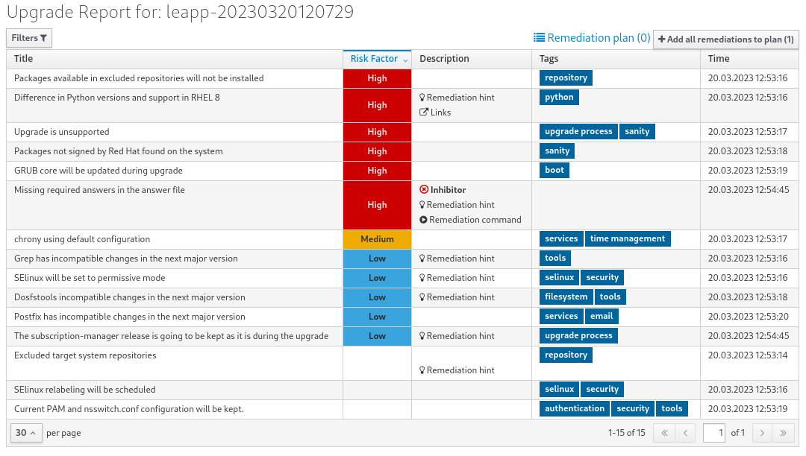
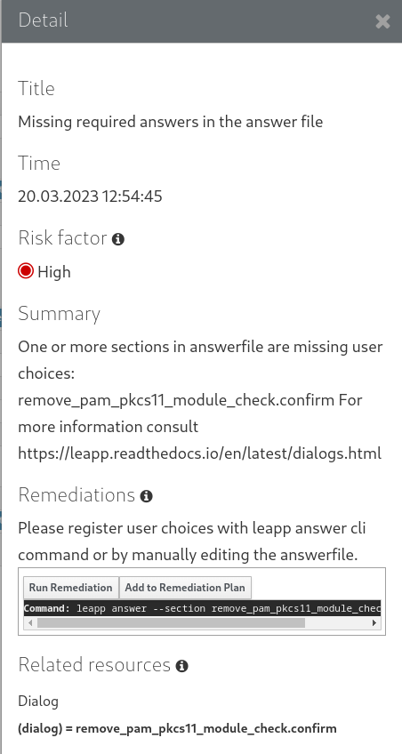

# Upgrading from RHEL 9 to RHEL 10

* * *

Red Hat Enterprise Linux 10

## Instructions for an in-place upgrade from Red Hat Enterprise Linux 9 to Red Hat Enterprise Linux 10

Red Hat Customer Content Services

[Legal Notice](#idm140677085121536)

**Abstract**

The RHEL in-place upgrade uses the Leapp utility to perform an upgrade from Red Hat Enterprise Linux 9 to Red Hat Enterprise Linux 10. During the in-place upgrade, the existing RHEL 9 operating system is replaced by a RHEL 10 version.

* * *

<h2 id="providing-feedback-on-red-hat-documentation">Providing feedback on Red Hat documentation</h2>

We are committed to providing high-quality documentation and value your feedback. To help us improve, you can submit suggestions or report errors through the Red Hat Jira tracking system.

**Procedure**

1. Log in to the [Jira](https://issues.redhat.com/projects/RHELDOCS/issues) website.
   
   If you do not have an account, select the option to create one.
2. Click **Create** in the top navigation bar.
3. Enter a descriptive title in the **Summary** field.
4. Enter your suggestion for improvement in the **Description** field. Include links to the relevant parts of the documentation.
5. Click **Create** at the bottom of the dialogue.

<h2 id="key-migration-terminology">Key migration terminology</h2>

While the following migration terms are commonly used in the software industry, these definitions are specific to Red Hat Enterprise Linux (RHEL).

**Update**

Sometimes called a software patch, an update is an addition to the current version of the application, operating system, or software that you are running. A software update addresses any issues or bugs to provide a better experience of working with the technology. In RHEL, an update relates to a minor release, for example, updating from RHEL 8.1 to 8.2.

**Upgrade**

An upgrade is when you replace the application, operating system, or software that you are currently running with a newer version. Typically, you first back up your data according to instructions from Red Hat. When you upgrade RHEL, you have two options:

- **In-place upgrade:** During an in-place upgrade, you replace the earlier version with the new version without removing the earlier version first. The installed applications and utilities, along with the configurations and preferences, are incorporated into the new version.
- **Clean install:** A clean install removes all traces of the previously installed operating system, system data, configurations, and applications and installs the latest version of the operating system. A clean install is ideal if you do not need any of the previous data or applications on your systems or if you are developing a new project that does not rely on prior builds.

**Operating system conversion**

A conversion is when you convert your operating system from a different Linux distribution to Red Hat Enterprise Linux. Typically, you first back up your data according to instructions from Red Hat.

**Migration**

Typically, a migration indicates a change of platform: software or hardware. Moving from Windows to Linux is a migration. Moving a user from one laptop to another or a company from one server to another is a migration. However, most migrations also involve upgrades, and sometimes the terms are used interchangeably.

- **Migration to RHEL:** Conversion of an existing operating system to RHEL
- **Migration across RHEL:** Upgrade from one version of RHEL to another

<h2 id="supported-upgrade-paths">Chapter 1. Supported upgrade paths</h2>

The in-place upgrade replaces the RHEL 9 operating system on your system with a RHEL 10 version.

Important

You can perform the in-place upgrade only from one major RHEL version to the next consecutive one, for example, RHEL 8 to RHEL 9 or RHEL 9 to RHEL 10. If you want to upgrade a system across multiple versions, such as from RHEL 8 to RHEL 10, you must perform multiple in-place upgrades to reach your target version.

Currently, you can perform an in-place upgrade from the following source RHEL 9 minor versions to the following target RHEL 10 minor versions:

| System configuration | Source OS version | Target OS version |
|:---------------------|:------------------|:------------------|
| RHEL                 | RHEL 9.6 (EUS)    | RHEL 10.0 (EUS)   |
| RHEL                 | RHEL 9.7          | RHEL 10.1         |

Table 1.1. Supported upgrade paths

Important

In-place upgrade paths in this table are guaranteed only for systems that use Red Hat Subscription Manager (RHSM). For Pay-As-You-Go (PAYG) RHEL systems that use Red Hat Update Infrastructure (RHUI), only the latest available upgrade path is supported. Note that this does not impact RHEL systems with SAP HANA installed.

**Additional resources**

- [Supported in-place upgrade paths for Red Hat Enterprise Linux](https://access.redhat.com/articles/4263361)
- [In-place upgrade Support Policy](https://access.redhat.com/support/policy/ipu-support)
- [In-place upgrades over multiple RHEL major versions by using Leapp](https://access.redhat.com/articles/7115868)

<h2 id="planning-an-upgrade-to-rhel-10">Chapter 2. Planning an upgrade to RHEL 10</h2>

In-place upgrades allow you to upgrade to the latest version of RHEL without losing existing configurations and system subscriptions. In general, in-place upgrades are less time-consuming and costly than a fresh install of RHEL. However, not all systems are eligible for an in-place upgrade. Before beginning your upgrade from RHEL 9 to RHEL 10, review system requirements, limitations, and other considerations.

<h3 id="planning-an-upgrade-from-rhel-9-to-rhel-10">2.1. Planning an upgrade from RHEL 9 to RHEL 10</h3>

An in-place upgrade is the recommended and supported method for upgrading your system to the next major version of RHEL.

Consider the following before upgrading to RHEL 10:

- **Applications** - You can migrate applications installed on your system by using the `Leapp` utility. However, in certain cases, you have to create custom actors, which specify actions to be performed by `Leapp` during the upgrade, for example, reconfiguring an application or installing a specific hardware driver. For more information, see [Handling the migration of your custom and third-party applications](https://access.redhat.com/articles/4977891#actors). Note that custom actors are unsupported by Red Hat.
  
  Important
  
  The SHA-1 algorithm has been deprecated in RHEL 9. If your system contains any packages with RSA/SHA-1 signatures, the upgrade is inhibited. Before upgrading, either remove these packages or contact the vendor for packages with RSA/SHA-256 signatures. For more information, see [SHA-1 deprecation in Red Hat Enterprise Linux 9](https://access.redhat.com/articles/6846411).
- **Boot loader** - You cannot switch the boot loader from BIOS to UEFI on RHEL 9 or RHEL 10. If your RHEL 9 system uses BIOS and you want your RHEL 10 system to use UEFI, perform a fresh install of RHEL 9 instead of an in-place upgrade. For more information, see [Is it possible to switch the BIOS boot to UEFI boot on preinstalled Red Hat Enterprise Linux machine?](https://access.redhat.com/solutions/1990803)
- **Customization** - To use custom repositories, see the [Configuring custom repositories](https://access.redhat.com/articles/4977891#repos-config) Knowledgebase article.
- **Downtime** - The upgrade process can take from several minutes to several hours.
- **High Availability** - If you are using the High Availability add-on, follow the [Recommended Practices for Applying Software Updates to a RHEL High Availability or Resilient Storage Cluster](https://access.redhat.com/articles/2059253) Knowledgebase article.
- **Language** - All `Leapp` reports, logs, and other generated documentation are in English, regardless of the language configuration.
- **Operating system** - The operating system is upgradable by the `Leapp` utility under the following conditions:
  
  - The source OS version is installed on a system with one of the following supported architectures:
    
    - 64-bit Intel, AMD, and ARM
      
      Important
      
      For the 64-bit ARM architecture, in-place upgrades are supported only on systems running the `4k` page size kernel. The Leapp utility does not support in-place upgrades if the system is booted with the `64k` page size kernel.
    - IBM POWER (little endian)
    - 64-bit IBM Z
      
      For more information, see [Red Hat certified hardware](https://catalog.redhat.com/hardware).
  - Minimum [hardware requirements](https://access.redhat.com/articles/rhel-limits) for RHEL 10 are met.
  - You have access to up-to-date content for the selected source and target OS versions. See [Preparing a RHEL 9 system for the upgrade](#preparing-a-rhel-9-system-for-the-upgrade "3.1. Preparing a RHEL 9 system for the upgrade") for more information.
- **Public clouds**
  
  - **Pay-As-You-Go**
    
    - **RHUI** - The in-place upgrade is supported for on-demand Pay-As-You-Go (PAYG) instances that use Red Hat Update Infrastructure (RHUI) on Amazon Web Services (AWS) on all supported architectures, and on Microsoft Azure and Google Cloud only on the Intel architecture. For all supported clouds and architectures with PAYG using RHUI but not SAP HANA, only the latest upgrade path is supported.
    - **CDN** - The in-place upgrade is supported for on-demand Pay-As-You-Go (PAYG) instances that use Red Hat Content Delivery Network (CDN).
      
      Note
      
      You can verify that your RHEL cloud instance consumes RHEL content from CDN by confirming that you have the `redhat-cloud-client-configuration-cdn` package installed. If it is not installed, then you are consuming the content from RHUI.
  - **Bring Your Own Subscription** - The in-place upgrade is supported for Bring Your Own Subscription instances on all public clouds that use RHSM for a RHEL subscription.
- **Real Time for Network Functions Virtualization (NFV) in Red Hat OpenStack Platform** - Upgrades on real-time systems are supported.
- **RHEL for Real Time** - Upgrades on real-time systems are supported.
- **SAP HANA** - Upgrades with SAP HANA are currently unsupported.
- **Satellite**
  
  - **Client** - If you manage your hosts through Satellite, you can upgrade multiple hosts simultaneously from RHEL 9 to RHEL 10 using the Satellite web UI. For more information, see [Upgrading Hosts to Next Major Red Hat Enterprise Linux Release](https://docs.redhat.com/en/documentation/red_hat_satellite/6.12/html/managing_hosts/upgrading_hosts_to_next_major_rhel_release_managing-hosts).
  - **Server and Capsule** - You can upgrade Satellite Servers and Capsules starting in Satellite 6.16. For more information, see [Upgrading Satellite or Capsule to RHEL 9 in-place by using Leapp](https://docs.redhat.com/en/documentation/red_hat_satellite/6.16/html-single/upgrading_connected_red_hat_satellite_to_6.16/index#upgrading-satellite-or-capsule-in-place-using-leapp_upgrading-connected).
- **Security** - Evaluate this aspect before the upgrade and take additional steps when the upgrade process completes. Consider especially the following:
  
  - Before the upgrade, define the security standard your system has to comply with and understand the [security changes in RHEL 10](https://docs.redhat.com/en/documentation/red_hat_enterprise_linux/10/html/considerations_in_adopting_rhel_10/security).
  - During the upgrade process, the `Leapp` utility sets SELinux mode to permissive.
  - `Leapp` supports in-place upgrades of RHEL 9.6 and later systems in Federal Information Processing Standard (FIPS) 140 mode to RHEL 10 FIPS-mode-enabled systems. **FIPS mode** stays enabled throughout the complete upgrade process.
  - After the upgrade is finished, re-evaluate and re-apply your security policies. For information about applying and updating security policies, see [Applying security policies](#applying-security-policies "Chapter 8. Applying security policies").
- **Storage and file systems**
  
  - **Backup** - You should always back up your system before upgrading. For example, you can use the [Relax-and-Recover (ReaR) utility](https://access.redhat.com/solutions/2115051), [LVM snapshots](https://docs.redhat.com/en/documentation/red_hat_enterprise_linux/9/html-single/configuring_and_managing_logical_volumes/index), [RAID splitting](https://docs.redhat.com/en/documentation/red_hat_enterprise_linux/9/html/configuring_and_managing_logical_volumes/configuring-raid-logical-volumes_configuring-and-managing-logical-volumes#splitting-and-merging-a-raid-image_configuring-raid-logical-volumes), or a virtual machine snapshot.
    
    Note
    
    File systems formats are intact. As a consequence, file systems have the same limitations as when they were originally created.
  - **Encryption** - Systems with encrypted storage can be upgraded if the storage uses the LUKS2 format configured with the Clevis TPM 2.0 token. For more information, see [Configuring manual enrollment of LUKS-encrypted volumes by using a TPM 2.0 policy](https://docs.redhat.com/en/documentation/red_hat_enterprise_linux/10/html/security_hardening/configuring-automated-unlocking-of-encrypted-volumes-by-using-policy-based-decryption#configuring-manual-enrollment-of-luks-encrypted-volumes-by-using-a-tpm2-policy).

Notable known limitations of the `Leapp` utility include:

- **Known limitations** - Notable known limitations of `Leapp` currently include:
  
  - Network based multipath and network storage that use Ethernet or Infiniband are not supported for the upgrade. This includes SAN using FCoE and booting from SAN using FC. Note that SAN using FC is supported.
  - The in-place upgrade is not supported for systems with Ansible Automation Platform installed. To use a RHEL 9 Ansible Automation Platform installation on RHEL 10, see the Red Hat Knowledgebase solution [How do I migrate my Ansible Automation Platform installation from one environment to another?](https://access.redhat.com/solutions/5994961).
  - Red Hat JBoss Enterprise Application Platform (EAP) is not supported for the upgrade to RHEL 10. You must manually install and configure JBoss EAP on your system after the upgrade.
  - The Stratis filesystem is not supported for the upgrade.

You can use [**Red Hat Lightspeed**](https://console.redhat.com/lightspeed/dashboard) to determine which of the systems you have registered to Red Hat Lightspeed is on a supported upgrade path to RHEL 10. Note that the Advisor recommendation considers only the RHEL 9 minor version and does not perform a pre-upgrade assessment of the system. See also [Advisor-service recommendations overview](https://docs.redhat.com/en/documentation/red_hat_lightspeed/1-latest/html/assessing_rhel_configuration_issues_by_using_the_red_hat_lightspeed_advisor_service/assembly-adv-assess-recommendations).

**Additional resources**

- [What are RHEL in-place upgrades?](https://www.redhat.com/en/blog/what-are-rhel-place-upgrades)
- [The best practices and recommendations for performing RHEL Upgrade using Leapp](https://access.redhat.com/articles/7012979)
- [Leapp upgrade FAQ (Frequently Asked Questions)](https://access.redhat.com/articles/7013172)

<h2 id="preparing-for-the-upgrade">Chapter 3. Preparing for the upgrade</h2>

To prevent issues after the upgrade and to ensure that your system is ready to be upgraded to the next major version of RHEL, complete all necessary preparation steps before upgrading.

You must perform the preparation steps described in [Preparing a RHEL 9 system for the upgrade](#preparing-a-rhel-9-system-for-the-upgrade "3.1. Preparing a RHEL 9 system for the upgrade") on all systems. In addition, on systems that are registered to Satellite Server, you must also perform the preparation steps described in [Preparing a Satellite-registered system for the upgrade](#preparing-a-satellite-registered-system-for-the-upgrade "3.2. Preparing a Satellite-registered system for the upgrade").

<h3 id="preparing-a-rhel-9-system-for-the-upgrade">3.1. Preparing a RHEL 9 system for the upgrade</h3>

Before the in-place upgrade to RHEL 10, you must install upgrade-related files and prepare the system for the upgrade. Skipping these required steps could cause serious issues during the upgrade.

If you do not plan to use Red Hat Subscription Manager (RHSM) during the upgrade process, follow instructions in [Performing an in-place upgrade without Red Hat Subscription Manager](https://access.redhat.com/articles/4977891#upgrade-without-rhsm).

**Prerequisites**

- The system meets conditions listed in [Planning an upgrade](#planning-an-upgrade-to-rhel-10 "Chapter 2. Planning an upgrade to RHEL 10").
- If the system has been previously upgraded from RHEL 8 to RHEL 9, ensure that all required post-upgrade steps have been completed. For more information, see [Performing post-upgrade tasks](https://docs.redhat.com/en/documentation/red_hat_enterprise_linux/9/html-single/upgrading_from_rhel_8_to_rhel_9/index#performing-post-upgrade-tasks-on-the-rhel-9-system_upgrading-from-rhel-8-to-rhel-9) in the Upgrading from RHEL 8 to RHEL 9 guide.
- Optional: You have reviewed the best practices in [The best practices and recommendations for performing RHEL Upgrade using Leapp](https://access.redhat.com/articles/7012979) Knowledgebase article.
- You have ensured that your system has been successfully registered to the Red Hat Content Delivery Network (CDN) or Red Hat Satellite by using RHSM.
- Satellite-registered systems only: You have completed the steps in [Preparing a Satellite system for the upgrade](#preparing-a-satellite-registered-system-for-the-upgrade "3.2. Preparing a Satellite-registered system for the upgrade") to ensure that your system meets the requirements for the upgrade.

**Procedure**

01. Optional: Unmount non-system OS file systems that are not required for the upgrade and comment them out from the `/etc/fstab` file. For example, this includes file systems containing only data files unrelated to the system itself. This can reduce the amount of time needed for the upgrade process and prevent potential issues related to third-party applications that are not migrated properly during the upgrade by custom or third-party actors.
02. If you are upgrading by using RHSM, verify that the system is registered to an account with [Simple Content Access](https://access.redhat.com/articles/simple-content-access) (SCA) enabled:
    
    ```
    subscription-manager status
    +-------------------------------------------+
       System Status Details
    +-------------------------------------------+
    Overall Status: Disabled
    Content Access Mode is set to Simple Content Access. This host has access to content, regardless of subscription status.
    System Purpose Status: Disabled
    ```
    
    ```plaintext
    # subscription-manager status
    +-------------------------------------------+
       System Status Details
    +-------------------------------------------+
    Overall Status: Disabled
    Content Access Mode is set to Simple Content Access. This host has access to content, regardless of subscription status.
    System Purpose Status: Disabled
    ```
03. Ensure you have appropriate repositories enabled. The following command enables the Base and AppStream repositories for the 64-bit Intel and AMD architectures; for other architectures, see [RHEL 9 repositories](#appendix-rhel-9-repositories "Appendix A. RHEL 9 repositories").
    
    ```
    subscription-manager repos --enable rhel-9-for-x86_64-baseos-rpms --enable rhel-9-for-x86_64-appstream-rpms
    ```
    
    ```plaintext
    # subscription-manager repos --enable rhel-9-for-x86_64-baseos-rpms --enable rhel-9-for-x86_64-appstream-rpms
    ```
    
    Note
    
    Optional: Enable the CodeReady Linux Builder (also known as Optional) or Supplementary repositories. For more information about the content of these repositories, see the [Package manifest](https://docs.redhat.com/en/documentation/red_hat_enterprise_linux/10/html/package_manifest).
04. Set the system release version to the source OS version, for example:
    
    ```
    subscription-manager release --set <source_os_version>
    ```
    
    ```plaintext
    # subscription-manager release --set <source_os_version>
    ```
    
    Replace *&lt;source\_os\_version&gt;* with the source OS version, for example `9.6`.
    
    1. If you are upgrading by using Red Hat Update Infrastructure (RHUI) on a public cloud, set the expected system release version manually:
       
       ```
       rhui-set-release --set 9.7
       ```
       
       ```plaintext
       # rhui-set-release --set 9.7
       ```
       
       Important
       
       If the `rhui-set-release` command is not available on your system, you can set the expected system release version by updating the `/etc/dnf/vars/release` file:
       
       ```
       echo "9.7" > /etc/dnf/vars/releasever
       ```
       
       ```plaintext
       # echo "9.7" > /etc/dnf/vars/releasever
       ```
05. If you use the `dnf versionlock` plugin to lock packages to a specific version, clear the lock by running:
    
    ```
    dnf versionlock clear
    ```
    
    ```plaintext
    # dnf versionlock clear
    ```
06. If you are upgrading by using Red Hat Update Infrastructure (RHUI) on a public cloud, enable required RHUI repositories and install required RHUI packages to ensure your system is ready for upgrade:
    
    1. For AWS:
       
       ```
       dnf config-manager --set-enabled rhui-client-config-server-9
       dnf -y install leapp-rhui-aws
       ```
       
       ```plaintext
       # dnf config-manager --set-enabled rhui-client-config-server-9
       # dnf -y install leapp-rhui-aws
       ```
    2. For Microsoft Azure:
       
       ```
       dnf config-manager --set-enabled rhui-microsoft-azure-rhel9
       dnf -y install rhui-azure-rhel8 leapp-rhui-azure
       ```
       
       ```plaintext
       # dnf config-manager --set-enabled rhui-microsoft-azure-rhel9
       # dnf -y install rhui-azure-rhel8 leapp-rhui-azure
       ```
    3. For Google Cloud, follow the [Leapp RHUI packages for Google Cloud](https://access.redhat.com/articles/6981918) Knowledgebase article.
07. Ensure that you have up-to-date `leapp` and `leapp-repository` packages:
    
    1. RHEL 9.6: version `0.19.0` of the `leapp` package and version `0.22.0` of the `leapp-repository` package.
    2. RHEL 9.7: version `0.20.0` of the `leapp` package and version `0.23.0` of the `leapp-repository` package.
       
       The `leapp-repository` package contains the `leapp-upgrade-el9toel10` RPM package.
       
       Note
       
       Disconnected systems only:download the following packages from the [Red Hat Customer Portal](https://access.redhat.com/downloads/content/479/ver=/rhel---9/9.5/x86_64/packages):
       
       - `leapp`
       - `leapp-deps`
       - `python3-leapp`
       - `leapp-upgrade-el9toel10`
       - `leapp-upgrade-el9toel10-deps`
       - `leapp-upgrade-el9toel10-fapolicyd`
         
         - Include only if you installed the `fapolicyd` RPM package on your system.
08. Install the `Leapp` utility:
    
    ```
    dnf install leapp-upgrade
    ```
    
    ```plaintext
    # dnf install leapp-upgrade
    ```
09. Update all packages to the latest RHEL 9 version and reboot:
    
    ```
    dnf update
    reboot
    ```
    
    ```plaintext
    # dnf update
    # reboot
    ```
10. Optional: Review, remediate, and then remove the `rpmnew` and `rpmsave` files.
11. If you use a configuration management system, ensure that it does not interfere with the in-place upgrade process:
    
    - If your configuration management system has a client-server architecture, such as Puppet, Salt, or Chef, disable the system before running the `leapp preupgrade` command. Do not enable the configuration management system until after the upgrade is complete to prevent issues during the upgrade.
    - If your configuration management system has agentless architecture, do not execute the configuration and deployment file. For example, if your system has Ansible, do not execute an Ansible playbook during the upgrade.
      
      Warning
      
      Automation of the pre-upgrade and upgrade process by using a configuration management system is not supported by Red Hat. For more information, see [Using configuration management systems to automate parts of the Leapp pre-upgrade and upgrade process on Red Hat Enterprise Linux](https://access.redhat.com/articles/6313281).
12. If you are upgrading by using an ISO image, verify that the ISO image contains the target OS version, for example, RHEL 10.0, and is saved to a persistent local mount point to ensure that the `Leapp` utility can access the image throughout the upgrade process.

<h3 id="preparing-a-satellite-registered-system-for-the-upgrade">3.2. Preparing a Satellite-registered system for the upgrade</h3>

Before you can perform an in-place upgrade to RHEL 10 of a system that is registered to Satellite, you must prepare your system. Perform these steps are performed on the Satellite Server.

Important

Users on Satellite systems must complete the preparatory steps described both in this procedure and in [Preparing a RHEL 9 system for the upgrade](#preparing-a-rhel-9-system-for-the-upgrade "3.1. Preparing a RHEL 9 system for the upgrade").

**Prerequisites**

- You have administrative privileges for the Satellite Server.
- Satellite is on a version in full or maintenance support. For more information, see [Red Hat Satellite Product Life Cycle](https://access.redhat.com/support/policy/updates/satellite) and [Which RHEL versions and architectures are supported as client systems managed by Red Hat Satellite server?](https://access.redhat.com/solutions/1156723)

**Procedure**

1. Import a subscription manifest with RHEL 9 repositories into Satellite Server. For more information, see the Managing Red Hat Subscriptions chapter in the Managing Content Guide for the particular version of [Red Hat Satellite](https://docs.redhat.com/en/documentation/red_hat_satellite/).
2. Enable and synchronize all required RHEL 9 and RHEL 10 repositories on the Satellite Server with the latest updates for the source and target OS versions. Required repositories must be available in the content view and enabled in the associated activation key.
   
   Note
   
   For RHEL 10 repositories, enable the target OS version, for example, RHEL 10.0, of each repository. If you enable only the RHEL 10 version of the repositories, the in-place upgrade is inhibited.
   
   For example, for the Intel architecture without an Extended Update Support (EUS) subscription, enable at minimum the following repositories:
   
   - Red Hat Enterprise Linux 9 for x86\_64 - AppStream (RPMs)
     
     rhel-9-for-x86\_64-appstream-rpms
     
     x86\_64 *&lt;source\_os\_version&gt;*
   - Red Hat Enterprise Linux 9 for x86\_64 - BaseOS (RPMs)
     
     rhel-9-for-x86\_64-baseos-rpms
     
     x86\_64 *&lt;source\_os\_version&gt;*
   - Red Hat Enterprise Linux 10 for x86\_64 - AppStream (RPMs)
     
     rhel-10-for-x86\_64-appstream-rpms
     
     x86\_64 *&lt;target\_os\_version&gt;*
   - Red Hat Enterprise Linux 10 for x86\_64 - BaseOS (RPMs)
     
     rhel-10-for-x86\_64-baseos-rpms
     
     x86\_64 *&lt;target\_os\_version&gt;*
     
     Replace *&lt;source\_os\_version&gt;* and *&lt;target\_os\_version&gt;* with the source OS version and target OS version respectively, for example, 9.6 and 10.0.
     
     For other architectures, see [RHEL 9 repositories](#appendix-rhel-9-repositories "Appendix A. RHEL 9 repositories") and [RHEL 10 repositories](#appendix-rhel-10-repositories "Appendix B. RHEL 10 repositories").
     
     For more information, see the *Importing Content* chapter in the *Managing Content Guide* for the particular version of [Red Hat Satellite](https://docs.redhat.com/en/documentation/red_hat_satellite/).
3. Attach the content host to a content view containing the required RHEL 9 and RHEL 10 repositories.
   
   For more information, see the *Managing Content Views* chapter in the *Managing Content Guide* for the particular version of [Red Hat Satellite](https://docs.redhat.com/en/documentation/red_hat_satellite/).

**Verification**

1. Verify that the correct RHEL 9 and RHEL 10 repositories have been added to the correct content view on Satellite Server.
   
   1. In the Satellite web UI, navigate to **Content &gt; Lifecycle &gt; Content Views** and click the name of the content view.
   2. Click the **Repositories** tab and verify that the repositories appear as expected.
      
      Note
      
      You can also verify that the repositories have been added to the content view by using the following commands:
      
      ```
      hammer repository list --search 'content_label ~ rhel-9' --content-view <content_view_name> --organization <organization> --lifecycle-environment <lifecycle_environment>
      hammer repository list --search 'content_label ~ rhel-10' --content-view <content_view_name> --organization <organization> --lifecycle-environment <lifecycle_environment>
      ```
      
      ```plaintext
      # hammer repository list --search 'content_label ~ rhel-9' --content-view <content_view_name> --organization <organization> --lifecycle-environment <lifecycle_environment>
      # hammer repository list --search 'content_label ~ rhel-10' --content-view <content_view_name> --organization <organization> --lifecycle-environment <lifecycle_environment>
      ```
      
      Replace *&lt;content\_view\_name&gt;* with the name of the content view, *&lt;organization&gt;* with the organization, and *&lt;lifecycle\_environement*&gt; with the name of the lifecycle environment..
2. Verify that the correct RHEL 10 repositories are enabled in the activation key associated with the content view:
   
   1. In Satellite web UI navigate to **Content &gt; Lifecycle &gt; Activation Keys** and click the name of the activation key.
   2. Click the **Repository Sets** tab and verify that the statuses of the required repositories are `Enabled`.
3. Verify that all expected RHEL 9 repositories are enabled in the host. For example:
   
   ```
   subscription-manager repos --list-enabled | grep "^Repo ID"
   Repo ID:   rhel-9-for-x86_64-baseos-rpms
   Repo ID:   rhel-9-for-x86_64-appstream-rpms
   ```
   
   ```plaintext
   # subscription-manager repos --list-enabled | grep "^Repo ID"
   Repo ID:   rhel-9-for-x86_64-baseos-rpms
   Repo ID:   rhel-9-for-x86_64-appstream-rpms
   ```

<h3 id="configuring-the-upgrade-with-livemode">3.3. Configuring the upgrade from RHEL 9.7 to RHEL 10.1 with LiveMode</h3>

LiveMode is an alternative method of preparing and booting to the upgrade environment when upgrading from RHEL 9.7 to RHEL 10.1 on the 64-bit Intel architecture. LiveMode uses the standard booting process. The standard booting process can prevent or help diagnose certain problems that occur during the upgrade, such as issues related to the storage initialization. Note that LiveMode requires approximately 700 MB of additional disk space to create and store the upgrade environment before the reboot.

Important

LiveMode is a Technology Preview feature only. Technology Preview features are not supported with Red Hat production service level agreements (SLAs) and might not be functionally complete. Red Hat does not recommend using them in production. These features provide early access to upcoming product features, enabling customers to test functionality and provide feedback during the development process.

For more information about the support scope of Red Hat Technology Preview features, see [Technology Preview Features Support Scope](https://access.redhat.com/support/offerings/techpreview/).

When using LiveMode, you can also configure the upgrade experience beyond the default specifications. This can be useful when troubleshooting during the upgrade process or if you want to view the upgrade’s progress by using an SSH connection.

If you are using LiveMode without any modifications to the default settings, you do not need to complete any preparation steps for LiveMode before the upgrade. If you want to change the default specifications, you must create and modify a YAML file.

**Procedure**

1. If you want to modify LiveMode’s default specifications, create a YAML file in the `/etc/leapp/actor_conf.d/` file, for example `livemode.yaml`.
2. Enter the desired LiveMode configuration into the YAML file.
   
   | Configuration field                  | Value type | Default                         | Description                                                                                                                |
   |:-------------------------------------|:-----------|:--------------------------------|:---------------------------------------------------------------------------------------------------------------------------|
   | additional\_packages                 | List\[str] | \[]                             | Additional packages to be installed into the upgrade image.                                                                |
   | autostart\_upgrade\_after\_reboot    | bool       | True                            | If set to `True`, the upgrade starts automatically after the reboot. Otherwise, a manual trigger is required.              |
   | capture\_strace\_info\_into          | str        | ''                              | If set to a non-empty string, `leapp` is executed under `strace` and results are stored within the provided file path.     |
   | dracut\_network                      | str        | ''                              | Dracut network arguments. Required if the \`url\_to\_load\_squashfs\_\`from option is set to a non-empty string.           |
   | setup\_network\_manager              | bool       | False                           | If set to `False`, the Leapp tool enables Network Manager in the upgrade image.                                            |
   | setup\_opensshd\_using\_auth\_keys   | str        | ''                              | If set to a non-empty string, `openssh` daemon is set up within the upgrade image using the provided authorized keys file. |
   | setup\_passwordless\_root            | bool       | False                           | If set to `True`, the root account of the upgrade image has an empty password. Use with caution.                           |
   | squashfs\_image\_path                | str        | /var/lib/leapp/live-upgrade.img | Desired location of the upgrade image of the minimal target system.                                                        |
   | url\_to\_load\_squashfs\_image\_from | str        | ''                              | URL of the desired upgrade image.                                                                                          |
   
   Table 3.1. LiveMode configuration
   
   The following is an example of a `/etc/leapp/actor_conf.d/livemode.yaml` file:
   
   ```
   livemode:
     additional_packages : [ vim ]
     autostart_upgrade_after_reboot : false
     setup_network_manager : true
     setup_opensshd_using_auth_keys : /root/.ssh/authorized_keys
   ```
   
   ```plaintext
   livemode:
     additional_packages : [ vim ]
     autostart_upgrade_after_reboot : false
     setup_network_manager : true
     setup_opensshd_using_auth_keys : /root/.ssh/authorized_keys
   ```
   
   The example file results in the following actions:
   
   - The Leapp utility installs the `vim` package into the upgrade environment.
   - The upgrade does not start automatically after reboot. You must manually restart it. This allows you to manually inspect the system and verify that the upgrade finished as expected and the system is ready for use before starting.
   - The Leapp utility attempts to enable NetworkManager inside the upgrade environment by using the source system’s network profiles.
   - The Leapp utility enables the `opensshd` service. If the system establishes network access successfully, you can use SSH to log in to the upgrade environment by using the root account and interact with the system.

<h2 id="reviewing-the-pre-upgrade-report">Chapter 4. Reviewing the pre-upgrade report</h2>

To assess upgradability of your system, start the pre-upgrade process by using the `leapp preupgrade` command. During this phase, the `Leapp` utility collects data about the system, assesses upgradability, and generates a pre-upgrade report.

<h3 id="about-the-pre-upgrade-report">4.1. About the pre-upgrade report</h3>

The pre-upgrade report summarizes potential problems and suggests recommended solutions. The report also helps you decide whether it is possible or advisable to proceed with the upgrade.

Reviewing a pre-upgrade report can also be useful if you want to perform a fresh installation of a RHEL 9 system instead of the in-place upgrade process.

Always review the entire pre-upgrade report, even when the report finds no inhibitors to the upgrade. The pre-upgrade report contains recommended actions to complete before the upgrade to ensure that the upgraded system functions correctly.

Important

The pre-upgrade assessment does not modify the system configuration, but it does consume non-negligible space in the `/var/lib/leapp` directory. In most cases, the pre-upgrade assessment requires up to 4 GB of space, but the actual size depends on your system configuration. If there is not enough space in the hosted file system, the pre-upgrade report might not show complete results of the analysis. To prevent issues, ensure that your system has enough space in the `/var/lib/leapp` directory or move the directory to a dedicated partition so that space consumption does not affect other parts of the system.

You can assess upgradability in the pre-upgrade phase using either of the following ways:

- Review the pre-upgrade report in the generated `leapp-report.txt` file and manually resolve reported problems using the command line.
- Use the web console to review the report, apply automated remediations where available, and fix remaining problems using the suggested remediation hints.

Note

You can process the pre-upgrade report by using your own custom scripts, for example, to compare results from multiple reports across different environments. For more information, see [Automating your Red Hat Enterprise Linux pre-upgrade report workflow](https://access.redhat.com/articles/5777571).

Important

The pre-upgrade report cannot simulate the entire in-place upgrade process and therefore cannot identify all inhibiting problems with your system. As a result, the Leapp utility might still terminate your in-place upgrade even after you have reviewed and remediated all problems in the report. For example, the pre-upgrade report cannot detect issues related to broken package downloads.

<h3 id="assessing-upgradability-of-rhel-9-to-rhel-10-from-the-command-line">4.2. Assessing upgradability of RHEL 9 to RHEL 10 from the command line</h3>

You can identify potential upgrade problems during the pre-upgrade phase before the upgrade by using the command line.

**Prerequisites**

- You completed the in [Preparing for the upgrade](#preparing-for-the-upgrade "Chapter 3. Preparing for the upgrade") procedure.
- You are logged in as the root user with the unconfined SELinux role.
  
  Note
  
  If you use the `sudo` command, you must use the `-r unconfined_r -t unconfined_t` options when entering each `leapp` command, for example:
  
  ```
  sudo -r unconfined_r -t unconfined_t leapp preupgrade
  ```
  
  ```plaintext
  $ sudo -r unconfined_r -t unconfined_t leapp preupgrade
  ```

**Procedure**

1. On your RHEL 9 system, perform the pre-upgrade phase:
   
   ```
   leapp preupgrade --target <_target_os_version_>
   ```
   
   ```plaintext
   # leapp preupgrade --target <_target_os_version_>
   ```
   
   Replace *target\_os\_version* with the target OS version, for example `10.0`. If no target OS version is defined, `Leapp` uses the default target OS version specified in the table 1.1 in [Supported upgrade paths](#supported-upgrade-paths "Chapter 1. Supported upgrade paths").
   
   - If you are using [custom repositories](https://access.redhat.com/articles/4977891#repos) from the `/etc/yum.repos.d/` directory for the upgrade, enable the selected repositories as follows:
     
     ```
     leapp preupgrade --enablerepo <repository_id1> --enablerepo <repository_id2> ...
     ```
     
     ```plaintext
     # leapp preupgrade --enablerepo <repository_id1> --enablerepo <repository_id2> ...
     ```
     
     Replace *repository\_id* with the repository IDs.
   - If you are [upgrading without RHSM](https://access.redhat.com/articles/4977891#upgrade-without-rhsm) or by using RHUI, add the `--no-rhsm` option.
   - If you have an [Extended Upgrade Support (EUS)](https://access.redhat.com/articles/rhel-eus) or Advanced Update Support (AUS) subscription, add the `--channel <channel>` option. Replace *&lt;channel&gt;* with the channel name, for example, `eus` or `aus`.
   - If you are using RHEL for Real Time or the Real Time for Network Functions Virtualization (NFV) in your Red Hat OpenStack Platform, enable the deployment by using the `--enablerepo` option. For example:
     
     ```
     leapp preupgrade --enablerepo rhel-10-for-x86_64-rt-rpms
     ```
     
     ```plaintext
     # leapp preupgrade --enablerepo rhel-10-for-x86_64-rt-rpms
     ```
     
     For more information, see [Configuring Real-Time Compute](https://docs.redhat.com/en/documentation/red_hat_openstack_platform/14/html/advanced_overcloud_customization/realtime-compute).
2. Examine the report in the `/var/log/leapp/leapp-report.txt` file and manually resolve all the reported problems. Some reported problems contain remediation suggestions. **Inhibitor** problems prevent you from upgrading until you have resolved them.
   
   The report contains the following risk factor levels:
   
   - **High** - Very likely to result in a deteriorated system state.
   - **Medium** - Can impact both the system and applications.
   - **Low** - Should not impact the system but can have an impact on applications.
   - **Info** - Informational with no expected impact to the system or applications.
3. In certain system configurations, the `Leapp` utility generates true or false questions that you must answer manually. If the pre-upgrade report contains a **Missing required answers in the answer file** message, complete the following steps:
   
   1. Open the `/var/log/leapp/answerfile` file and review the true or false questions.
   2. Manually edit the `/var/log/leapp/answerfile` file, uncomment the confirm line of the file by deleting the `#` symbol, and confirm your answer as `True` or `False`. For more information, see the [Troubleshooting tips](#troubleshooting-tips "9.2. Troubleshooting tips").
      
      Note
      
      Alternatively, you can answer the true or false question by running the following command:
      
      ```
      leapp answer --section <question_section>.<field_name>=<answer>
      ```
      
      ```plaintext
      # leapp answer --section <question_section>.<field_name>=<answer>
      ```
4. Repeat the previous steps to rerun the pre-upgrade report to verify that you have resolved all critical issues.

<h3 id="assessing-upgradability-of-rhel-9-to-rhel-10-and-applying-automated-remediations-through-the-web-console">4.3. Assessing upgradability of RHEL 9 to RHEL 10 and applying automated remediations through the web console</h3>

You can identify potential problems in the pre-upgrade phase before the upgrade and apply automated remediations by using the web console. See [Getting started using the RHEL web console for more information about the web console](https://docs.redhat.com/en/documentation/red_hat_enterprise_linux/9/html/managing_systems_using_the_rhel_9_web_console/index).

**Prerequisites**

- You completed the in [Preparing for the upgrade](#preparing-for-the-upgrade "Chapter 3. Preparing for the upgrade") procedure.
- You are logged in as the root user with the unconfined SELinux role.
  
  Note
  
  If you use the `sudo` command, you must use the `-r unconfined_r -t unconfined_t` options when entering each `leapp` command, for example:
  
  ```
  sudo -r unconfined_r -t unconfined_t leapp preupgrade
  ```
  
  ```plaintext
  $ sudo -r unconfined_r -t unconfined_t leapp preupgrade
  ```

**Procedure**

1. Install the `cockpit-leapp` plug-in:
   
   ```
   dnf install cockpit-leapp
   ```
   
   ```plaintext
   # dnf install cockpit-leapp
   ```
2. Log in to the web console as `root` or as a user that has permissions to enter administrative commands with `sudo`.
3. On your RHEL 9 system, perform the pre-upgrade phase either from the command line or from the web console terminal:
   
   ```
   leapp preupgrade --target <target_os_version>
   ```
   
   ```plaintext
   # leapp preupgrade --target <target_os_version>
   ```
   
   Replace *target\_os\_version* with the target OS version, for example `10.0`. If no target OS version is defined, `Leapp` uses the default target OS version specified in the table 1.1 in [Supported upgrade paths](#supported-upgrade-paths "Chapter 1. Supported upgrade paths").
   
   - If you are using [custom repositories](https://access.redhat.com/articles/4977891#repos) from the `/etc/yum.repos.d/` directory for the upgrade, enable the selected repositories as follows:
     
     ```
     leapp preupgrade --enablerepo <repository_id1> --enablerepo <repository_id2> ...
     ```
     
     ```plaintext
     # leapp preupgrade --enablerepo <repository_id1> --enablerepo <repository_id2> ...
     ```
   - If you are [upgrading without RHSM](https://access.redhat.com/node/4977891/#upgrade-without-rhsm) or by using RHUI, add the `--no-rhsm` option.
   - If you have an [Extended Upgrade Support (EUS)](https://access.redhat.com/articles/rhel-eus) or Advanced Update Support (AUS) subscription, add the `--channel <channel>` option. Replace *&lt;channel&gt;* with the channel name, for example, `eus` or\`aus\`.
   - If you are using RHEL for Real Time or the Real Time for Network Functions Virtualization (NFV) in your Red Hat OpenStack Platform, enable the deployment by using the `--enablerepo` option. For example:
     
     ```
     leapp preupgrade --enablerepo rhel-10-for-x86_64-rt-rpms
     ```
     
     ```plaintext
     # leapp preupgrade --enablerepo rhel-10-for-x86_64-rt-rpms
     ```
     
     For more information, see [Configuring Real-Time Compute](https://docs.redhat.com/en/documentation/red_hat_openstack_platform/14/html/advanced_overcloud_customization/realtime-compute).
4. In the web console, select **Upgrade Report** from the navigation menu to review all reported problems. **Inhibitor** problems prevent you from upgrading until you have resolved them. To view a problem in detail, select the row to open the Detail pane.
   
   **Figure 4.1. In-place upgrade report in the web console**
   
    
   
   The report contains the following risk factor levels:
   
   - **High** - Very likely to result in a deteriorated system state.
   - **Medium** - Can impact both the system and applications.
   - **Low** - Should not impact the system but can have an impact on applications.
   - **Info** - Informational with no expected impact to the system or applications.
5. In certain configurations, the `Leapp` utility generates true or false questions that you must answer manually. If the Upgrade Report contains a **Missing required answers in the answer file** row, complete the following steps:
   
   1. Select the **Missing required answers in the answer file** row to open the **Detail** pane. The default answer is stated at the end of the remediation command.
   2. To confirm the default answer, select **Add to Remediation Plan** to start the remediation later or **Run Remediation** to start the remediation immediately.
   3. To select the non-default answer instead, run the `leapp answer` command in the terminal, specifying the question you are responding to and your confirmed answer.
      
      ```
      leapp answer --section <question_section>.<field_name>=<answer>
      ```
      
      ```plaintext
      # leapp answer --section <question_section>.<field_name>=<answer>
      ```
      
      Note
      
      You can also manually edit the `/var/log/leapp/answerfile` file, uncomment the confirm line of the file by deleting the `#` symbol, and confirm your answer as `True` or `False`. For more information, see the [Troubleshooting tips](#troubleshooting-tips "9.2. Troubleshooting tips").
6. Some problems have remediation commands that you can run to automatically resolve the problems. You can run remediation commands individually or all together in the remediation command.
   
   1. To run a single remediation command, open the **Detail** pane for the problem and click **Run Remediation**.
   2. To add a remediation command to the remediation plan, open the **Detail** pane for the problem and click **Add to Remediation Plan**.
      
      **Figure 4.2. Detail pane**
      
       
   3. To run the remediation plan containing all added remediation commands, click the **Remediation plan** link in the top right corner above the report. Click **Execute Remediation Plan** to run all listed commands.
7. After reviewing the report and resolving all reported problems, repeat steps 3-7 to rerun the report to verify that you have resolved all critical issues.

<h2 id="performing-the-upgrade">Chapter 5. Performing the upgrade</h2>

After you have completed the preparatory steps and reviewed and resolved the problems found in the pre-upgrade report, you can perform the in-place upgrade on your system.

<h3 id="performing-the-upgrade-from-rhel-9-to-rhel-10">5.1. Performing the upgrade from RHEL 9.7 to RHEL 10.1</h3>

You can perform the upgrade from RHEL 9 to RHEL 10 by using the `Leapp` utility.

**Prerequisites**

- You completed the [Preparing for the upgrade](#preparing-for-the-upgrade "Chapter 3. Preparing for the upgrade") procedure, including a full system backup.
- You completed the [Reviewing the pre-upgrade report](#reviewing-the-pre-upgrade-report "Chapter 4. Reviewing the pre-upgrade report") procedure and all reported issues resolved.
- You have temporarily disabled antivirus software to prevent the upgrade from failing.

**Procedure**

1. Ensure that you have a full system backup or a virtual machine snapshot. You can use the following backup options:
   
   - Create a full backup of your system by using the Relax-and-Recover (ReaR) utility. For more information, see [Recovering and restoring a system](https://docs.redhat.com/en/documentation/red_hat_enterprise_linux/9/html/configuring_basic_system_settings/assembly_recovering-and-restoring-a-system_configuring-basic-system-settings) and [What is Relax and Recover (ReaR) and how can I use it for disaster recovery?](https://access.redhat.com/solutions/2115051).
   - Create a snapshot of your system by using LV snapshots or RAID splitting. For more information, see [Managing logical volume snapshots](https://docs.redhat.com/en/documentation/red_hat_enterprise_linux/9/html-single/configuring_and_managing_logical_volumes/index#managing-lv-snapshots_advanced-logical-volume-management) or [Splitting off a RAID image as a separate logical volume](https://docs.redhat.com/en/documentation/red_hat_enterprise_linux/9/html-single/configuring_and_managing_logical_volumes/index#splitting-off-a-raid-image-as-a-separate-logical-volume_configuring-raid-logical-volumes). In case of upgrading a virtual machine, you can create a snapshot of the whole VM. You can also manage snapshot and rollback boot entries by using the Boom utility. For more information, see [What is BOOM and how to install it?](https://access.redhat.com/solutions/3750001) and [Managing system upgrades with snapshots](https://docs.redhat.com/en/documentation/red_hat_enterprise_linux/9/html/configuring_and_managing_logical_volumes/managing-system-upgrades-with-snapshots_configuring-and-managing-logical-volumes).
     
     Note
     
     Because LVM snapshots do not create a full backup of your system, you might not be able to recover your system after certain upgrade failures. As a result, it is safer to create a full backup by using the ReaR utility.
2. On your RHEL 9 system, start the upgrade process:
   
   ```
   leapp upgrade --target <_target_os_version_>
   ```
   
   ```plaintext
   # leapp upgrade --target <_target_os_version_>
   ```
   
   Replace *target\_os\_version* with the target OS version, for example `10.0`. If no target OS version is defined, `Leapp` uses the default target OS version specified in the table 1.1 in [Supported upgrade paths](#supported-upgrade-paths "Chapter 1. Supported upgrade paths").
   
   - If you are using [custom repositories](https://access.redhat.com/articles/4977891#repos) from the `/etc/yum.repos.d/` directory for the upgrade, enable the selected repositories as follows:
     
     ```
     leapp upgrade --enablerepo <repository_id1> --enablerepo <repository_id2> ...
     ```
     
     ```plaintext
     # leapp upgrade --enablerepo <repository_id1> --enablerepo <repository_id2> ...
     ```
   - If you are [upgrading without RHSM](https://access.redhat.com/node/4977891/#upgrade-without-rhsm) or by using RHUI, add the `--no-rhsm` option.
   - If you are upgrading by using an ISO image, add the `--no-rhsm` and `--iso <file_path>` options. Replace *&lt;file\_path&gt;* with the file path to the saved ISO image, for example `/home/rhel9.iso`.
   - If you have an [Extended Upgrade Support (EUS)](https://access.redhat.com/articles/rhel-eus) or Advanced Update Support (AUS) subscription, add the `--channel channel` option. Replace *channel* with the value you used with the `leapp preupgrade` command, for example, `eus` or `aus`. Note that you must use the same value with the `--channel` option in both the `leapp preupgrade` and `leapp upgrade` commands.
   - If you are using RHEL for Real Time or the Real Time for Network Functions Virtualization (NFV) in your Red Hat OpenStack Platform, enable the deployment by using the `--enablerepo` option. For example:
     
     ```
     leapp upgrade --enablerepo rhel-10-for-x86_64-rt-rpms
     ```
     
     ```plaintext
     # leapp upgrade --enablerepo rhel-10-for-x86_64-rt-rpms
     ```
     
     For more information, see [Configuring Real-Time Compute](https://docs.redhat.com/en/documentation/red_hat_openstack_platform/14/html/advanced_overcloud_customization/realtime-compute).
   - If you are upgrading with LiveMode, set the `LEAPP_UNSUPPORTED=1` environment variable and use the `--enable-experimental-feature` option with the `livemode` value. For example:
     
     ```
     LEAPP_UNSUPPORTED=1 leapp upgrade --enable-experimental-feature livemode
     ```
     
     ```plaintext
     # LEAPP_UNSUPPORTED=1 leapp upgrade --enable-experimental-feature livemode
     ```
     
     For more information, see [Configuring the upgrade from RHEL 9.7 to RHEL 10.1 with LiveMode](#configuring-the-upgrade-with-livemode "3.3. Configuring the upgrade from RHEL 9.7 to RHEL 10.1 with LiveMode").
     
     Important
     
     LiveMode is a Technology Preview feature only. Technology Preview features are not supported with Red Hat production service level agreements (SLAs) and might not be functionally complete. Red Hat does not recommend using them in production. These features provide early access to upcoming product features, enabling customers to test functionality and provide feedback during the development process.
     
     For more information about the support scope of Red Hat Technology Preview features, see [Technology Preview Features Support Scope](https://access.redhat.com/support/offerings/techpreview/).
3. At the beginning of the upgrade process, `Leapp` repeats the pre-upgrade phase described in [Reviewing the pre-upgrade report](#reviewing-the-pre-upgrade-report "Chapter 4. Reviewing the pre-upgrade report"):
   
   - If the system is upgradable, `Leapp` downloads necessary data and prepares an RPM transaction for the upgrade.
   - If your system does not meet the parameters for a reliable upgrade, `Leapp` terminates the upgrade process and provides a record describing the issue and a recommended solution in the `/var/log/leapp/leapp-report.txt` file. For more information, see [Troubleshooting](#troubleshooting "Chapter 9. Troubleshooting").
4. Manually restart the system:
   
   ```
   reboot
   ```
   
   ```plaintext
   # reboot
   ```
   
   The system boots into a RHEL 10-based initial RAM disk image, initramfs. `Leapp` upgrades all packages and automatically restarts to the RHEL 10 system.
   
   Alternatively, you can run the `leapp upgrade` command with the `--reboot` option and skip this manual step.
   
   If a failure occurs, investigate logs and known issues as described in [Troubleshooting](#troubleshooting "Chapter 9. Troubleshooting").
5. Log in to the RHEL 10 system and verify its state as described in [Verifying the post-upgrade state](#verifying-the-post-upgrade-state "Chapter 6. Verifying the post-upgrade state").
6. Perform all post-upgrade tasks described in the upgrade report and in [Performing post-upgrade tasks](#performing-post-upgrade-tasks-on-the-rhel-10-system "Chapter 7. Performing post-upgrade tasks on the RHEL 10 system").

<h3 id="performing-the-upgrade-from-rhel-9.6-to-rhel-10.0">5.2. Performing the upgrade from RHEL 9.6 to RHEL 10.0</h3>

You can perform the upgrade from RHEL 9 to RHEL 10 by using the `Leapp` utility.

**Prerequisites**

- You completed the [Preparing for the upgrade](#preparing-for-the-upgrade "Chapter 3. Preparing for the upgrade") procedure, including a full system backup.
- You completed the [Reviewing the pre-upgrade report](#reviewing-the-pre-upgrade-report "Chapter 4. Reviewing the pre-upgrade report") procedure and all reported issues resolved.
- You have temporarily disabled antivirus software to prevent the upgrade from failing.

**Procedure**

1. Ensure that you have a full system backup or a virtual machine snapshot. You can use the following backup options:
   
   - Create a full backup of your system by using the Relax-and-Recover (ReaR) utility. For more information, see [Recovering and restoring a system](https://docs.redhat.com/en/documentation/red_hat_enterprise_linux/9/html/configuring_basic_system_settings/assembly_recovering-and-restoring-a-system_configuring-basic-system-settings) and [What is Relax and Recover (ReaR) and how can I use it for disaster recovery?](https://access.redhat.com/solutions/2115051).
   - Create a snapshot of your system by using LV snapshots or RAID splitting. For more information, see [Managing logical volume snapshots](https://docs.redhat.com/en/documentation/red_hat_enterprise_linux/9/html-single/configuring_and_managing_logical_volumes/index#managing-lv-snapshots_advanced-logical-volume-management) or [Splitting off a RAID image as a separate logical volume](https://docs.redhat.com/en/documentation/red_hat_enterprise_linux/9/html-single/configuring_and_managing_logical_volumes/index#splitting-off-a-raid-image-as-a-separate-logical-volume_configuring-raid-logical-volumes). In case of upgrading a virtual machine, you can create a snapshot of the whole VM. You can also manage snapshot and rollback boot entries by using the Boom utility. For more information, see [What is BOOM and how to install it?](https://access.redhat.com/solutions/3750001) and [Managing system upgrades with snapshots](https://docs.redhat.com/en/documentation/red_hat_enterprise_linux/9/html/configuring_and_managing_logical_volumes/managing-system-upgrades-with-snapshots_configuring-and-managing-logical-volumes).
     
     Note
     
     Because LVM snapshots do not create a full backup of your system, you might not be able to recover your system after certain upgrade failures. As a result, it is safer to create a full backup by using the ReaR utility.
2. On your RHEL 9 system, start the upgrade process:
   
   ```
   leapp upgrade --target <_target_os_version_>
   ```
   
   ```plaintext
   # leapp upgrade --target <_target_os_version_>
   ```
   
   Replace *target\_os\_version* with the target OS version, for example `10.0`. If no target OS version is defined, `Leapp` uses the default target OS version specified in the table 1.1 in [Supported upgrade paths](#supported-upgrade-paths "Chapter 1. Supported upgrade paths").
   
   - If you are using [custom repositories](https://access.redhat.com/articles/4977891#repos) from the `/etc/yum.repos.d/` directory for the upgrade, enable the selected repositories as follows:
     
     ```
     leapp upgrade --enablerepo <repository_id1> --enablerepo <repository_id2> ...
     ```
     
     ```plaintext
     # leapp upgrade --enablerepo <repository_id1> --enablerepo <repository_id2> ...
     ```
   - If you are [upgrading without RHSM](https://access.redhat.com/node/4977891/#upgrade-without-rhsm), add the `--no-rhsm` option.
   - If you are upgrading by using an ISO image, add the `--no-rhsm` and `--iso <file_path>` options. Replace *&lt;file\_path&gt;* with the file path to the saved ISO image, for example `/home/rhel9.iso`.
   - If you have an [Extended Upgrade Support (EUS)](https://access.redhat.com/articles/rhel-eus) or Advanced Update Support (AUS) subscription, add the `--channel channel` option. Replace *channel* with the value you used with the `leapp preupgrade` command, for example, `eus` or `aus`. Note that you must use the same value with the `--channel` option in both the `leapp preupgrade` and `leapp upgrade` commands.
   - If you are using RHEL for Real Time or the Real Time for Network Functions Virtualization (NFV) in your Red Hat OpenStack Platform, enable the deployment by using the `--enablerepo` option. For example:
     
     ```
     leapp upgrade --enablerepo rhel-10-for-x86_64-rt-rpms
     ```
     
     ```plaintext
     # leapp upgrade --enablerepo rhel-10-for-x86_64-rt-rpms
     ```
     
     For more information, see [Configuring Real-Time Compute](https://docs.redhat.com/en/documentation/red_hat_openstack_platform/14/html/advanced_overcloud_customization/realtime-compute).
3. At the beginning of the upgrade process, `Leapp` repeats the pre-upgrade phase described in [Reviewing the pre-upgrade report](#reviewing-the-pre-upgrade-report "Chapter 4. Reviewing the pre-upgrade report").
   
   - If the system is upgradable, `Leapp` downloads necessary data and prepares an RPM transaction for the upgrade.
   - If your system does not meet the parameters for a reliable upgrade, `Leapp` terminates the upgrade process and provides a record describing the issue and a recommended solution in the `/var/log/leapp/leapp-report.txt` file. For more information, see [Troubleshooting](#troubleshooting "Chapter 9. Troubleshooting").
4. Manually restart the system:
   
   ```
   reboot
   ```
   
   ```plaintext
   # reboot
   ```
   
   In this phase, the system boots into a RHEL 10-based initial RAM disk image, initramfs. `Leapp` upgrades all packages and automatically restarts to the RHEL 10 system.
   
   Alternatively, you can run the `leapp upgrade` command with the `--reboot` option and skip this manual step.
   
   If a failure occurs, investigate logs and known issues as described in [Troubleshooting](#troubleshooting "Chapter 9. Troubleshooting").
5. Log in to the RHEL 10 system and verify its state as described in [Verifying the post-upgrade state](#verifying-the-post-upgrade-state "Chapter 6. Verifying the post-upgrade state").
6. Perform all post-upgrade tasks described in the upgrade report and in [Performing post-upgrade tasks](#performing-post-upgrade-tasks-on-the-rhel-10-system "Chapter 7. Performing post-upgrade tasks on the RHEL 10 system").

<h2 id="verifying-the-post-upgrade-state">Chapter 6. Verifying the post-upgrade state</h2>

After performing the in-place upgrade to RHEL 10, verify that the system is in the correct state. Doing so allows you to identify and correct any critical errors that could impact your system.

<h3 id="verifying-the-post-upgrade-state-of-the-rhel-10-system">6.1. Verifying the post-upgrade state of the RHEL 10 system</h3>

After the upgrade to RHEL 10 is completed, determine whether the system is in the required state.

**Prerequisites**

- The system has been upgraded following the steps described in [Performing the upgrade](#performing-the-upgrade "Chapter 5. Performing the upgrade") and you have been able to log in to RHEL 10.

**Procedure**

- Verify that the Leapp utility has finished all actions in the upgrade process and the system is ready to be used:
  
  ```
  [ -e "/etc/systemd/system/leapp_resume.service" ] || ps -e | grep -q leapp && echo "Leapp has not finished the execution yet!"
  ```
  
  ```plaintext
  # [ -e "/etc/systemd/system/leapp_resume.service" ] || ps -e | grep -q leapp && echo "Leapp has not finished the execution yet!"
  ```
  
  Important
  
  If you attempt to use the system before the upgrade is complete, serious issues could occur.
- Verify that the current OS version is RHEL 10. For example:
  
  ```
  cat /etc/redhat-release
  Red Hat Enterprise Linux release 10.1 (Coughlan)
  ```
  
  ```plaintext
  # cat /etc/redhat-release
  Red Hat Enterprise Linux release 10.1 (Coughlan)
  ```
- Check the OS kernel version. For example:
  
  ```
  uname -r
  6.12.0-55.2.1.el10_0.x86_64
  ```
  
  ```plaintext
  # uname -r
  6.12.0-55.2.1.el10_0.x86_64
  ```
  
  Note that `.el10` is important and the version should not be earlier than 6.12.0.
- If you are using the Red Hat Subscription Manager:
  
  - Verify that the correct product is installed. For example:
    
    ```
    subscription-manager list --installed
    +-----------------------------------------+
        	  Installed Product Status
    +-----------------------------------------+
    Product Name: Red Hat Enterprise Linux for x86_64
    Product ID:   479
    Version:      10.1
    Arch:         x86_64
    Status:       Subscribed
    ```
    
    ```plaintext
    # subscription-manager list --installed
    +-----------------------------------------+
        	  Installed Product Status
    +-----------------------------------------+
    Product Name: Red Hat Enterprise Linux for x86_64
    Product ID:   479
    Version:      10.1
    Arch:         x86_64
    Status:       Subscribed
    ```
  - Verify that the release version is set to the expected target OS version immediately after the upgrade. For example:
    
    ```
    subscription-manager release
    Release: 10.1
    ```
    
    ```plaintext
    # subscription-manager release
    Release: 10.1
    ```
- Verify that network services are operational, for example, try to connect to a server using SSH.
- Check the post-upgrade status of your applications. In some cases, you might need to perform migration and configuration changes manually. For example, to migrate your databases, follow instructions in [Configuring and using database servers](https://docs.redhat.com/en/documentation/red_hat_enterprise_linux/10/html/configuring_and_using_database_servers/index).

<h2 id="performing-post-upgrade-tasks-on-the-rhel-10-system">Chapter 7. Performing post-upgrade tasks on the RHEL 10 system</h2>

After the in-place upgrade, clean up your RHEL 10 system by removing unneeded packages, disable incompatible repositories, and update the rescue kernel and initial RAM disk.

<h3 id="performing-post-upgrade-tasks">7.1. Performing post-upgrade tasks</h3>

After performing the upgrade to RHEL 10, complete the following recommended major tasks.

**Prerequisites**

\*You completed the [Performing the upgrade](#performing-the-upgrade "Chapter 5. Performing the upgrade") procedure and you have been able to log in to RHEL 10.

- You verified the status of the in-place upgrade as described in [Verifying the post-upgrade state](#verifying-the-post-upgrade-state "Chapter 6. Verifying the post-upgrade state"). This includes verification that the Leapp utility has finished the upgrade process.

**Procedure**

1. Remove any remaining `Leapp` packages from the exclude list in the `/etc/dnf/dnf.conf` configuration file, including the `snactor` package, which is a tool for upgrade extension development. During the in-place upgrade, `Leapp` packages that were installed with the `Leapp` utility are automatically added to the exclude list to prevent critical files from being removed or updated. After the in-place upgrade, these `Leapp` packages must be removed from the exclude list before they can be removed from the system.
   
   - To manually remove packages from the exclude list, edit the `/etc/dnf/dnf.conf` configuration file and remove the desired `Leapp` packages from the exclude list.
   - To remove all packages from the exclude list:
     
     ```
     dnf config-manager --save --setopt exclude=''
     ```
     
     ```plaintext
     # dnf config-manager --save --setopt exclude=''
     ```
2. Remove remaining RHEL 9 packages, including remaining `Leapp` packages.
   
   1. Locate remaining RHEL 9 packages:
      
      ```
      rpm -qa | grep -e '\.el[789]' | grep -vE '^(gpg-pubkey|libmodulemd|katello-ca-consumer)' | sort
      ```
      
      ```plaintext
      # rpm -qa | grep -e '\.el[789]' | grep -vE '^(gpg-pubkey|libmodulemd|katello-ca-consumer)' | sort
      ```
   2. Remove remaining RHEL 9 packages from your RHEL 10 system. To ensure that RPM dependencies are maintained, use the `dnf remove` command.
      
      For example:
      
      ```
      dnf remove $(rpm -qa | grep \.el[789] | grep -vE 'gpg-pubkey|libmodulemd|katello-ca-consumer')
      ```
      
      ```plaintext
      # dnf remove $(rpm -qa | grep \.el[789] | grep -vE 'gpg-pubkey|libmodulemd|katello-ca-consumer')
      ```
      
      Important
      
      This step might also remove third-party packages. Review the transaction before accepting to ensure no packages are unintentionally removed.
   3. Remove remaining `Leapp` dependency packages:
      
      ```
      dnf remove leapp-deps-el10 leapp-repository-deps-el10
      ```
      
      ```plaintext
      # dnf remove leapp-deps-el10 leapp-repository-deps-el10
      ```
3. Optional: Remove all remaining upgrade-related data from the system:
   
   ```
   rm -rf /var/log/leapp /root/tmp_leapp_py3 /var/lib/leapp
   ```
   
   ```plaintext
   # rm -rf /var/log/leapp /root/tmp_leapp_py3 /var/lib/leapp
   ```
   
   Important
   
   Removing this data might limit Red Hat Support’s ability to investigate and troubleshoot post-upgrade problems.
4. Disable DNF repositories whose packages are not RHEL 10-compatible. Repositories managed by RHSM are handled automatically. To disable these repositories:
   
   ```
   dnf config-manager --set-disabled <repository_id>
   ```
   
   ```plaintext
   # dnf config-manager --set-disabled <repository_id>
   ```
   
   Replace *repository\_id* with the repository ID.
5. Replace the old rescue kernel and initial RAM disk with the current kernel and disk:
   
   1. Remove the existing rescue kernel and initial RAM disk:
      
      ```
      rm /boot/vmlinuz-*rescue* /boot/initramfs-*rescue*
      ```
      
      ```plaintext
      # rm /boot/vmlinuz-*rescue* /boot/initramfs-*rescue* 
      ```
   2. Reinstall the rescue kernel and related initial RAM disk:
      
      ```
      /usr/lib/kernel/install.d/51-dracut-rescue.install add "$(uname -r)" /boot "/boot/vmlinuz-$(uname -r)"
      ```
      
      ```plaintext
      # /usr/lib/kernel/install.d/51-dracut-rescue.install add "$(uname -r)" /boot "/boot/vmlinuz-$(uname -r)"
      ```
   3. If your system is on the IBM Z architecture, update the `zipl` boot loader:
      
      ```
      zipl
      ```
      
      ```plaintext
      # zipl
      ```
6. Check existing configuration files:
   
   - Review, remediate, and then remove the `rpmnew`, `rpmsave`, and `leappsave` files. Note that `rpmsave` and `leappsave` are equivalent and can be handled similarly. For more information, see [What are rpmnew & rpmsave files?](https://access.redhat.com/solutions/60263)
   - Remove configuration files for RHEL 9 DNF modules from the `/etc/dnf/modules.d/` directory that are no longer valid. Note that these files have no effect on the system when related DNF modules do not exist.
7. Re-evaluate and re-apply your security policies. Especially, change the SELinux mode to enforcing. For details, see [Applying security policies](#applying-security-policies "Chapter 8. Applying security policies").

**Verification**

1. Verify that the previously removed rescue kernel and rescue initial RAM disk files have been created for the current kernel:
   
   ```
   ls /boot/vmlinuz-*rescue* /boot/initramfs-*rescue*
   lsinitrd /boot/initramfs-*rescue*.img | grep -qm1 "$(uname -r)/kernel/" && echo "OK" || echo "FAIL"
   ```
   
   ```plaintext
   # ls /boot/vmlinuz-*rescue* /boot/initramfs-*rescue* 
   # lsinitrd /boot/initramfs-*rescue*.img | grep -qm1 "$(uname -r)/kernel/" && echo "OK" || echo "FAIL"
   ```
2. Verify the rescue boot entry refers to the existing rescue files. See the `grubby` output:
   
   ```
   grubby --info /boot/vmlinuz-*rescue*
   ```
   
   ```plaintext
   # grubby --info /boot/vmlinuz-*rescue*
   ```
3. Review the `grubby` output and verify that no RHEL 9 boot entries are configured:
   
   ```
   grubby --info ALL
   ```
   
   ```plaintext
   # grubby --info ALL
   ```
4. Verify that no files related to previous RHEL are present in the `/boot/loader/entries` file:
   
   ```
   grep -r ".el9" "/boot/loader/entries/" || echo "Everything seems ok."
   ```
   
   ```plaintext
   # grep -r ".el9" "/boot/loader/entries/" || echo "Everything seems ok."
   ```

<h2 id="applying-security-policies">Chapter 8. Applying security policies</h2>

During the in-place upgrade process, the Leapp utility must switch the SELinux policy to permissive mode. Furthermore, security profiles might contain changes between major releases.

To restore system security, switch SELinux to enforcing mode again. You might also want to remediate the system to be compliant with a specific security profile. Also, some security-related components require pre-update steps for a correct upgrade.

The in-place upgrade process preserves the system-wide cryptographic policy you used in RHEL 9. Custom cryptographic policies are also preserved across the in-place upgrade.

<h3 id="changing-selinux-mode-to-enforcing">8.1. Changing SELinux mode to enforcing</h3>

During the in-place upgrade process, the Leapp utility sets SELinux mode to permissive. After you finish the system upgrade, you must manually change SELinux mode to enforcing.

**Prerequisites**

- The system has been upgraded and you have performed the Verification described in [Verifying the post-upgrade state](#verifying-the-post-upgrade-state "Chapter 6. Verifying the post-upgrade state").

**Procedure**

1. Ensure that there are no SELinux denials, for example, by using the `ausearch` utility:
   
   ```
   ausearch -m AVC,USER_AVC -ts boot
   ```
   
   ```plaintext
   # ausearch -m AVC,USER_AVC -ts boot
   ```
   
   Note that the previous step covers only the most common scenario. To check for all possible SELinux denials, see the [Identifying SELinux denials](https://docs.redhat.com/en/documentation/red_hat_enterprise_linux/10/html/using_selinux/troubleshooting-problems-related-to-selinux#identifying-selinux-denials) section in the Using SELinux title, which provides a complete procedure.
2. Open the `/etc/selinux/config` file in a text editor of your choice, for example:
   
   ```
   vi /etc/selinux/config
   ```
   
   ```plaintext
   # vi /etc/selinux/config
   ```
3. Configure the `SELINUX=enforcing` option:
   
   ```
   # This file controls the state of SELinux on the system.
   # SELINUX= can take one of these three values:
   #       enforcing - SELinux security policy is enforced.
   #       permissive - SELinux prints warnings instead of enforcing.
   #       disabled - No SELinux policy is loaded.
   SELINUX=enforcing
   # SELINUXTYPE= can take one of these two values:
         targeted - Targeted processes are protected,
   #       mls - Multi Level Security protection.
   SELINUXTYPE=targeted
   ```
   
   ```plaintext
   # This file controls the state of SELinux on the system.
   # SELINUX= can take one of these three values:
   #       enforcing - SELinux security policy is enforced.
   #       permissive - SELinux prints warnings instead of enforcing.
   #       disabled - No SELinux policy is loaded.
   SELINUX=enforcing
   # SELINUXTYPE= can take one of these two values:
   #       targeted - Targeted processes are protected,
   #       mls - Multi Level Security protection.
   SELINUXTYPE=targeted
   ```
4. Save the change, and restart the system:
   
   ```
   reboot
   ```
   
   ```plaintext
   # reboot
   ```

**Verification**

1. After the system restarts, confirm that the `getenforce` command returns `Enforcing`:
   
   ```
   getenforce
   Enforcing
   ```
   
   ```plaintext
   $ getenforce
   Enforcing
   ```

**Additional resources**

- [Troubleshooting problems related to SELinux](https://docs.redhat.com/en/documentation/red_hat_enterprise_linux/10/html/using_selinux/troubleshooting-problems-related-to-selinux)
- [Changing SELinux states and modes](https://docs.redhat.com/en/documentation/red_hat_enterprise_linux/10/html/using_selinux/getting-started-with-selinux#selinux-states-and-modes_getting-started-with-selinux)

<h3 id="upgrading-a-system-hardened-to-a-security-baseline">8.2. Upgrading a system hardened to a security baseline</h3>

To get a fully hardened system after a successful upgrade to RHEL 10, you can use automated remediation provided by the OpenSCAP suite.

OpenSCAP remediations align your system with security baselines, such as PCI-DSS, OSPP, or ACSC Essential Eight. The configuration compliance recommendations differ among major versions of RHEL due to the evolution of the security offering.

When upgrading a hardened RHEL 9 system, the Leapp tool does *not* provide direct means to retain the full hardening. Depending on the changes in the component configuration, the system might diverge from the recommendations for RHEL 10 during the upgrade.

Note

You cannot use the same SCAP content for scanning RHEL 9 and RHEL 10. Update the management platforms if the compliance of the system is managed by tools such as Red Hat Satellite or Red Hat Lightspeed.

As an alternative to automated remediations, you can make the changes manually by following an OpenSCAP-generated report. For information about generating a compliance report, see [Scanning the system for configuration compliance](https://docs.redhat.com/en/documentation/red_hat_enterprise_linux/10/html/security_hardening/scanning-the-system-for-configuration-compliance).

Important

Automated remediations support RHEL systems in the default configuration. Because the system configuration has been altered after the upgrade, running automated remediations might not make the system fully compliant with the required security profile. You might need to fix some requirements manually.

The following example procedure hardens your system settings according to the PCI-DSS profile.

**Prerequisites**

- The `scap-security-guide` package is installed on your RHEL 10 system.

**Procedure**

1. Find the appropriate security compliance data stream `.xml` file:
   
   ```
   ls /usr/share/xml/scap/ssg/content/
   …
   ssg-rhel10-ds.xml
   …
   ```
   
   ```plaintext
   $ ls /usr/share/xml/scap/ssg/content/
   …
   ssg-rhel10-ds.xml
   …
   ```
   
   See the [Viewing profiles for configuration compliance](https://docs.redhat.com/en/documentation/red_hat_enterprise_linux/10/html/security_hardening/scanning-the-system-for-configuration-compliance#viewing-profiles-for-configuration-compliance) section for more information.
2. Remediate the system according to the selected profile from the appropriate data stream:
   
   ```
   oscap xccdf eval --profile <profile_ID> --remediate /usr/share/xml/scap/ssg/content/ssg-rhel10-ds.xml
   ```
   
   ```plaintext
   # oscap xccdf eval --profile <profile_ID> --remediate /usr/share/xml/scap/ssg/content/ssg-rhel10-ds.xml
   ```
   
   Replace `<profile_ID>` with the ID of the profile according to which you want to harden your system. For a full list of profiles supported in RHEL 10, see [SCAP Security Guide profiles supported in RHEL 10](https://docs.redhat.com/en/documentation/red_hat_enterprise_linux/10/html/security_hardening/scanning-the-system-for-configuration-compliance#scap-security-guide-profiles-supported-in-rhel-10).
   
   Warning
   
   If not used carefully, running the system evaluation with the `--remediate` option enabled might render the system non-functional. Red Hat does not provide any automated method to revert changes made by security-hardening remediations. Remediations are supported on RHEL systems in the default configuration. If your system has been altered after the installation, running remediation might not make it compliant with the required security profile.
3. Restart your system:
   
   ```
   reboot
   ```
   
   ```plaintext
   # reboot
   ```

**Verification**

1. Verify that the system is compliant with the profile, and save the results in an HTML file:
   
   ```
   oscap xccdf eval --report pcidss_report.html --profile pci-dss /usr/share/xml/scap/ssg/content/ssg-rhel10-ds.xml
   ```
   
   ```plaintext
   $ oscap xccdf eval --report pcidss_report.html --profile pci-dss /usr/share/xml/scap/ssg/content/ssg-rhel10-ds.xml
   ```

**Additional resources**

- [Scanning the system for configuration compliance](https://docs.redhat.com/en/documentation/red_hat_enterprise_linux/10/html/security_hardening/scanning-the-system-for-configuration-compliance)
- [Red Hat Lightspeed Security Policy](https://docs.redhat.com/en/documentation/red_hat_lightspeed/1-latest/html/assessing_and_monitoring_security_vulnerabilities_on_rhel_systems/index)
- [Red Hat Satellite Security Policy](https://docs.redhat.com/en/documentation/red_hat_satellite/6.10/html/administering_red_hat_satellite/chap-administering-security_compliance_management)

<h2 id="troubleshooting">Chapter 9. Troubleshooting</h2>

The in-place upgrade is a complex process, and it is common to encounter issues and roadblocks. Refer to the following troubleshooting resources and tips for help on resolving these issues.

<h3 id="troubleshooting-resources">9.1. Troubleshooting resources</h3>

You can use various troubleshooting resources can help you diagnose and troubleshoot issues you encounter throughout the upgrade process.

**Console output**

By default, only error and critical log level messages are printed to the console output by the `Leapp` utility. To change the log level, use the `--verbose` or `--debug` options with the `leapp upgrade` command.

- In *verbose* mode, `Leapp` prints info, warning, error, and critical messages.
- In *debug* mode, `Leapp` prints debug, info, warning, error, and critical messages.

**Logs**

- The `/var/log/leapp/leapp-upgrade.log` file lists issues found during the initramfs phase.
- The `/var/log/leapp/dnf-debugdata/` directory contains transaction debug data. This directory is present only if the `leapp upgrade` command is executed with the `--debug` option.
- The `/var/log/leapp/answerfile` contains questions required to be answered by `Leapp`.
- The `journalctl` utility provides complete logs.

**Reports**

- The `/var/log/leapp/leapp-report.txt` file lists issues found during the pre-upgrade phase. The report is also available in the web console, see [Assessing upgradability and applying automated remediations through the web console](#assessing-upgradability-of-rhel-9-to-rhel-10-and-applying-automated-remediations-through-the-web-console "4.3. Assessing upgradability of RHEL 9 to RHEL 10 and applying automated remediations through the web console").
- The `/var/log/leapp/leapp-report.json` file lists issues found during the pre-upgrade phase in a machine-readable format, which enables you to process the report using custom scripts. For more information, see [Automating your Red Hat Enterprise Linux pre-upgrade report workflow](https://access.redhat.com/articles/5777571).

<h3 id="troubleshooting-tips">9.2. Troubleshooting tips</h3>

When diagnosing and troubleshooting issues that occur during the in-place upgrade process, make sure to check for these frequently skipped steps and use these helpful resources.

**Pre-upgrade phase**

- Verify that your system meets all conditions listed in [Planning an upgrade](#planning-an-upgrade-to-rhel-10 "Chapter 2. Planning an upgrade to RHEL 10").
- Make sure you have followed all steps described in [Preparing for the upgrade](#preparing-for-the-upgrade "Chapter 3. Preparing for the upgrade"), for example, your system does not use more than one Network Interface Card (NIC) with a name based on the prefix used by the kernel (`eth`).
- Make sure you have answered all questions required by `Leapp` in the `/var/log/leapp/answerfile` file. If any answers are missing, `Leapp` inhibits the upgrade. For example:
  
  - Are there no VDO devices on the system?
- Make sure you have resolved all problems identified in the pre-upgrade report, located at `/var/log/leapp/leapp-report.txt`. To achieve this, you can also use the web console, as described in [Assessing upgradability and applying automated remediations through the web console](#assessing-upgradability-of-rhel-9-to-rhel-10-and-applying-automated-remediations-through-the-web-console "4.3. Assessing upgradability of RHEL 9 to RHEL 10 and applying automated remediations through the web console").

**Example 9.1. Leapp answerfile**

The following is an example of an unedited `/var/log/leapp/answerfile` file that has one unanswered question:

```
[check_vdo]
# Title:              None
# Reason:             Confirmation
# ============================= check_vdo.confirm =============================
# Label:              Are all VDO devices, if any, successfully converted to LVM management?
# Description:        Enter True if no VDO devices are present on the system or all VDO devices on the system have been successfully converted to LVM management. Entering True will circumvent check of failures and undetermined devices. Recognized VDO devices that have not been converted to LVM management can still block the upgrade despite the answer.All VDO devices must be converted to LVM management before upgrading.
# Reason:             To maximize safety all block devices on a system that meet the criteria as possible VDO devices are checked to verify that, if VDOs, they have been converted to LVM management. If the devices are not converted and the upgrade proceeds the data on unconverted VDO devices will be inaccessible. In order to perform checking the 'vdo' package must be installed. If the 'vdo' package is not installed and there are any doubts the 'vdo' package should be installed and the upgrade process re-run to check for unconverted VDO devices. If the check of any device fails for any reason an upgrade inhibiting report is generated. This may be problematic if devices are dynamically removed from the system subsequent to having been identified during device discovery. If it is certain that all VDO devices have been successfully converted to LVM management this dialog may be answered in the affirmative which will circumvent block device checking.
# Type:               bool
# Default:            None
# Available choices: True/False
# Unanswered question. Uncomment the following line with your answer
# confirm =
```

```plaintext
[check_vdo]
# Title:              None
# Reason:             Confirmation
# ============================= check_vdo.confirm =============================
# Label:              Are all VDO devices, if any, successfully converted to LVM management?
# Description:        Enter True if no VDO devices are present on the system or all VDO devices on the system have been successfully converted to LVM management. Entering True will circumvent check of failures and undetermined devices. Recognized VDO devices that have not been converted to LVM management can still block the upgrade despite the answer.All VDO devices must be converted to LVM management before upgrading.
# Reason:             To maximize safety all block devices on a system that meet the criteria as possible VDO devices are checked to verify that, if VDOs, they have been converted to LVM management. If the devices are not converted and the upgrade proceeds the data on unconverted VDO devices will be inaccessible. In order to perform checking the 'vdo' package must be installed. If the 'vdo' package is not installed and there are any doubts the 'vdo' package should be installed and the upgrade process re-run to check for unconverted VDO devices. If the check of any device fails for any reason an upgrade inhibiting report is generated. This may be problematic if devices are dynamically removed from the system subsequent to having been identified during device discovery. If it is certain that all VDO devices have been successfully converted to LVM management this dialog may be answered in the affirmative which will circumvent block device checking.
# Type:               bool
# Default:            None
# Available choices: True/False
# Unanswered question. Uncomment the following line with your answer
# confirm =
```

The `Label` field specifies the question that requires an answer. In this example, the question is **Are all VDO devices, if any, successfully converted to LVM management?**

To answer the question, uncomment the last line and enter an answer of `True` or `False`. In this example, the selected answer is `True`:

```
[check_vdo]
...
# Available choices: True/False
# Unanswered question. Uncomment the following line with your answer
confirm = True
```

```plaintext
[check_vdo]
...
# Available choices: True/False
# Unanswered question. Uncomment the following line with your answer
confirm = True
```

**Download phase**

- If a problem occurs during downloading RPM packages, examine transaction debug data located in the `/var/log/leapp/dnf-debugdata/` directory.
  
  Note
  
  The `/var/log/leapp/dnf-debugdata/` directory is empty or does not exist if no transaction debug data was produced. This might occur when the required repositories are not available.

**Initramfs phase**

- During this phase, potential failures redirect you to the Dracut shell. Check the Journal log:
  
  ```
  journalctl
  ```
  
  ```plaintext
  # journalctl
  ```
  
  Alternatively, restart the system from the Dracut shell using the `reboot` command and check the `/var/log/leapp/leapp-upgrade.log` file.

**Post-upgrade phase**

- If your system seems to be successfully upgraded but booted with the old RHEL 9 kernel, restart the system and check the kernel version of the default entry in GRUB.
- Make sure you have followed the recommended steps in [Verifying the post-upgrade state](#verifying-the-post-upgrade-state "Chapter 6. Verifying the post-upgrade state").
- If your application or a service stops working or behaves incorrectly after you have switched SELinux to enforcing mode, search for denials using the `ausearch`, `journalctl`, or `dmesg` utilities:
  
  ```
  ausearch -m AVC,USER_AVC -ts boot
  journalctl -t setroubleshoot
  dmesg | grep -i -e selinux -e type=1400
  ```
  
  ```plaintext
  # ausearch -m AVC,USER_AVC -ts boot
  # journalctl -t setroubleshoot
  # dmesg | grep -i -e selinux -e type=1400
  ```
  
  The most common problems are caused by incorrect labeling. See [Troubleshooting problems related to SELinux](https://docs.redhat.com/en/documentation/red_hat_enterprise_linux/10/html/using_selinux/troubleshooting-problems-related-to-selinux) for more details.

<h3 id="known-issues-for-the-rhel-9-to-rhel-10-upgrade">9.3. Known issues for the RHEL 9.7 to RHEL 10.1 upgrade</h3>

There are a variety of known issues that you might encounter when upgrading from RHEL 9.7 to RHEL 10.1.

- If your RHEL 9 system uses a device driver that is provided by Red Hat but is not available in RHEL 10, `Leapp` inhibits the upgrade. However, if the RHEL 9 system uses a third-party device driver that `Leapp` does not have data for in the `/etc/leapp/files/device_driver_deprecation_data.json` file, `Leapp` does not detect such a driver and proceeds with the upgrade. Consequently, the system might fail to boot after the upgrade.
- If the name of a third-party package, not signed by Red Hat, installed on your system is the same as the name of a package provided by Red Hat, the in-place upgrade fails. To work around this problem, choose one of the following options prior to upgrading:
  
  1. Remove the third-party package
  2. Replace the third-party package with the package provided by Red Hat
- The in-place upgrade might fail on systems with Software Redundant Array of Independent Disks (RAID). (BZ#[1957192](https://bugzilla.redhat.com/show_bug.cgi?id=1957192))
- During the in-place upgrade, the `Leapp` utility usually preserves the network interface controller (NIC) names between RHEL 9 and RHEL 10. However, on some systems, such as systems with network bonding, the NIC names might need to be updated between RHEL 9 and RHEL 10. On those systems, perform the following steps:
  
  1. Set the `LEAPP_NO_NETWORK_RENAMING=1` environment variable to prevent the Leapp utility from incorrectly preserving the original RHEL 9 NIC names.
  2. Perform the in-place upgrade.
  3. Verify that your network is working correctly. If needed, manually update the network configuration.
     
     (BZ#[1919382](https://bugzilla.redhat.com/show_bug.cgi?id=1919382))
- If any of the mounted file systems that are defined in the `/etc/fstab` file do not have the `shared` propagation flag set, the upgrade might fail. To prevent this issue, remount these file systems to set them as shared:
  
  ```
  mount -o remount --make-shared <mountpoint>
  ```
  
  ```plaintext
  # mount -o remount --make-shared <mountpoint>
  ```
  
  Replace *mountpoint* with the mountpoint of each file system.
  
  For more information, see the Red Hat Knowledgebase solution [Leapp "Can not load RPM file" during the DNF transaction check](https://access.redhat.com/solutions/7052390). ([RHEL-23449](https://issues.redhat.com/browse/RHEL-23449))
- If you use an HTTP proxy, you must configure Red Hat Subscription Manager (RHSM) to use such a proxy, or you must execute the `subscription-manager` command with the `--proxy <hostname>` option. Otherwise, an execution of the `subscription-manager` command fails. If you use the `--proxy` option instead of the configuration change, the upgrade process fails because `Leapp` is unable to detect the proxy. To prevent this problem from occurring, manually edit the `rhsm.conf` file. For more information, see the Red Hat Knowledgebase solution [How to configure HTTP Proxy for Red Hat Subscription Management](https://access.redhat.com/solutions/57669). (BZ#[1689294](https://bugzilla.redhat.com/show_bug.cgi?id=1689294))
- For systems that require a proxy to access RHEL 9 content, you usually need to configure the use of the proxy by DNF in the `/etc/dnf/dnf.conf` configuration file. If the current DNF configuration is not compatible with the DNF version on the target system, specify the valid target configuration in the `/etc/leapp/files/dnf.conf` configuration file. For more information, see the Red Hat Knowledgebase solution [How does Leapp work with a proxy?](https://access.redhat.com/node/7073762)
- The kerberos client might break after the upgrade if it is configured to use the deprecated `/etc/ssl/certs/ca-certificates.crt` file for root certificates. To fix the configuration, use the `/etc/pki/ca-trust/extracted/pem/tls-ca-bundle.pem` file instead. ([RHEL-65265](https://issues.redhat.com/browse/RHEL-65265))
- On IBM Z machines, the upgrade might fail if the system is on multipath LVM SCSI LUNs. ([RHEL-76159](https://issues.redhat.com/browse/RHEL-76159))
- The upgrade might fail if you are upgrading by using Red Hat Update Infrastructure (RHUI) with an ISO image. You can work around this issue by not using the `--iso` option with the upgrade or see the Red Hat Knowledgebase solution [Offline Leapp upgrade using ISO fails with "Failed to synchronize cache for repo 'rhul-microsoft-azure-rhel8', ignoring this repo](https://access.redhat.com/solutions/7031554). ([RHEL-3296](https://issues.redhat.com/browse/RHEL-3296))
- If you are upgrading by using Red Hat Update Infrastructure (RHUI), files in the `/usr/share/leapp-repository/repositories/system_upgrade/common/files/rhui/` directory are incorrectly reported as custom files in the pre-upgrade report. Unless you modified these files manually, you can ignore the warnings about these files in the report and the in-place upgrade will not be affected. ([RHEL-40115](https://issues.redhat.com/browse/RHEL-40115))
- When upgrading systems by using Red Hat Upgrade Infrastructure (RHUI), the upgrade could fail if the RHUI setup of the system differs from defaults implemented in the in-place upgrade solution RHUI systems expected by the `Leapp` utility. To resolve this problem, configure the upgrade process to adjust it for your RHUI setup. For more information, see [Using RHUI to configure an in-place upgrade](https://access.redhat.com/articles/7115872).

<h3 id="known-issues-for-the-rhel-9.6-to-rhel-10.0-upgrade">9.4. Known issues for the RHEL 9.6 to RHEL 10.0 upgrade</h3>

There are a variety of known issues that you might encounter when upgrading from RHEL 9.6 to RHEL 10.1.

- If your RHEL 9 system uses a device driver that is provided by Red Hat but is not available in RHEL 10, `Leapp` inhibits the upgrade. However, if the RHEL 9 system uses a third-party device driver that `Leapp` does not have data for in the `/etc/leapp/files/device_driver_deprecation_data.json` file, `Leapp` does not detect such a driver and proceeds with the upgrade. Consequently, the system might fail to boot after the upgrade.
- If the name of a third-party package, not signed by Red Hat, installed on your system is the same as the name of a package provided by Red Hat, the in-place upgrade fails. To work around this problem, choose one of the following options prior to upgrading:
  
  1. Remove the third-party package
  2. Replace the third-party package with the package provided by Red Hat
- The in-place upgrade might fail on systems with Software Redundant Array of Independent Disks (RAID). (BZ#[1957192](https://bugzilla.redhat.com/show_bug.cgi?id=1957192))
- During the in-place upgrade, the `Leapp` utility usually preserves the network interface controller (NIC) names between RHEL 9 and RHEL 10. However, on some systems, such as systems with network bonding, the NIC names might need to be updated between RHEL 9 and RHEL 10. On those systems, perform the following steps:
  
  1. Set the `LEAPP_NO_NETWORK_RENAMING=1` environment variable to prevent the Leapp utility from incorrectly preserving the original RHEL 9 NIC names.
  2. Perform the in-place upgrade.
  3. Verify that your network is working correctly. If needed, manually update the network configuration.
     
     (BZ#[1919382](https://bugzilla.redhat.com/show_bug.cgi?id=1919382))

<!--THE END-->

- If any of the mounted file systems that are defined in the `/etc/fstab` file do not have the `shared` propagation flag set, the upgrade might fail. To prevent this issue, remount these file systems to set them as shared:
  
  ```
  mount -o remount --make-shared <mountpoint>
  ```
  
  ```plaintext
  # mount -o remount --make-shared <mountpoint>
  ```
  
  Replace *mountpoint* with the mountpoint of each file system.
  
  For more information, see the Red Hat Knowledgebase solution [Leapp "Can not load RPM file" during the DNF transaction check](https://access.redhat.com/solutions/7052390). ([RHEL-23449](https://issues.redhat.com/browse/RHEL-23449))

<!--THE END-->

- If you use an HTTP proxy, Red Hat Subscription Manager must be configured to use such a proxy, or the `subscription-manager` command must be executed with the `--proxy <hostname>` option. Otherwise, an execution of the `subscription-manager` command fails. If you use the `--proxy` option instead of the configuration change, the upgrade process fails because `Leapp` is unable to detect the proxy. To prevent this problem from occurring, manually edit the `rhsm.conf` file. For more information, see the Red Hat Knowledgebase solution [How to configure HTTP Proxy for Red Hat Subscription Management](https://access.redhat.com/solutions/57669). (BZ#[1689294](https://bugzilla.redhat.com/show_bug.cgi?id=1689294))
- For systems that require a proxy to access RHEL 9 content, you usually need to configure the use of the proxy by DNF in the `/etc/dnf/dnf.conf` configuration file. If the current DNF configuration is not compatible with the DNF version on the target system, specify the valid target configuration in the `/etc/leapp/files/dnf.conf` configuration file. For more information, see the Red Hat Knowledgebase solution [How does Leapp work with a proxy?](https://access.redhat.com/node/7073762)

<!--THE END-->

- The kerberos client might break after the upgrade if it is configured to use the deprecated `/etc/ssl/certs/ca-certificates.crt` file for root certificates. To fix the configuration, use the `/etc/pki/ca-trust/extracted/pem/tls-ca-bundle.pem` file instead. ([RHEL-65265](https://issues.redhat.com/browse/RHEL-65265))
- On IBM Z machines, the upgrade might fail if the system is on multipath LVM SCSI LUNs. ([RHEL-76159](https://issues.redhat.com/browse/RHEL-76159))
- If `dracut` is configured to include the deprecated `network-legacy` module, the system does not boot after the upgrade. This issue often occurs on systems that have been in-place upgraded to RHEL 9. To prevent this problem, perform the following actions:
  
  1. Remove the `network-legacy` module from the `dracut` configuration.
  2. Rebuild existing initramfs images.
  3. Reboot the system before you start the upgrade.
     
     For more information see the [leapp upgrade fails to boot after upgrading to RHEL 10.0](https://access.redhat.com/solutions/7127576) Knowledgebase solution.
     
     ([RHEL-102591](https://issues.redhat.com/browse/RHEL-102591))

<h3 id="obtaining-support">9.5. Obtaining support</h3>

To open a support case, select *RHEL 9* as the product, and provide a `sosreport` from your system.

- To generate a `sosreport` on your system, run:

```
sosreport
```

```plaintext
# sosreport
```

Note that you can leave the case ID empty.

For more information about generating a sosreport, see the Red Hat Knowledgebase solution [What is an sosreport and how to create one in Red Hat Enterprise Linux?](https://access.redhat.com/solutions/3592).

For more information about opening and managing a support case on the Customer Portal, see the Red Hat Knowledgebase solution, [How do I open and manage a support case on the Customer Portal?](https://access.redhat.com/articles/38363).

<h2 id="related-information">Chapter 10. Related information</h2>

You can refer to the following instructional materials:

- [Upgrade your Red Hat Enterprise Linux Infrastructure](https://www.redhat.com/en/technologies/linux-platforms/enterprise-linux/upgrade-rhel)
- [Red Hat Enterprise Linux technology capabilities and limits](https://access.redhat.com/articles/rhel-limits)
- [Supported in-place upgrade paths for Red Hat Enterprise Linux](https://access.redhat.com/articles/4263361)
- [In-place upgrade Support Policy](https://access.redhat.com/support/policy/ipu-support)
- [Considerations in adopting RHEL 10](https://docs.redhat.com/en/documentation/red_hat_enterprise_linux/10/html-single/considerations_in_adopting_rhel_10/)
- [Customizing your Red Hat Enterprise Linux in-place upgrade](https://access.redhat.com/articles/4977891)
- [Automating your Red Hat Enterprise Linux pre-upgrade report workflow](https://access.redhat.com/articles/5777571)
- [Using configuration management systems to automate parts of the Leapp pre-upgrade and upgrade process on Red Hat Enterprise Linux](https://access.redhat.com/articles/6313281)
- [Upgrading from RHEL 8 to RHEL 9](https://docs.redhat.com/en/documentation/red_hat_enterprise_linux/9/html-single/upgrading_from_rhel_8_to_rhel_9/)
- [Red Hat Lightspeed Documentation](https://docs.redhat.com/en/documentation/red_hat_lightspeed)
- [Upgrades-related Knowledgebase articles and solutions](https://access.redhat.com/solutions/4120411) (Red Hat Knowledgebase)
- [The best practices and recommendations for performing RHEL Upgrade using Leapp](https://access.redhat.com/articles/7012979)
- [Leapp upgrade FAQ (Frequently Asked Questions)](https://access.redhat.com/articles/7013172)

<h2 id="appendix-rhel-9-repositories">Appendix A. RHEL 9 repositories</h2>

If your system is registered to the Red Hat Content Delivery Network (CDN) using the Red Hat Subscription Manager (RHSM), RHEL 9 repositories are automatically enabled during the in-place upgrade. However, on systems registered to Red Hat Satellite using RHSM, you must manually enable and synchronize both RHEL 9 and RHEL 10 repositories before running the pre-upgrade report.

Note

Make sure to enable the source OS version of each repository, for example 9.6. If you have enabled only the RHEL 9 version of the repositories, the in-place upgrade is inhibited.

If you plan to use Red Hat Satellite during the upgrade, you must enable and synchronize at least the following RHEL 9 repositories before the upgrade using either the Satellite web UI or the `hammer repository-set enable` and `hammer product synchronize` commands:

| Architecture              | Repository | Repository ID                       | Repository name                                                        | Release version                       |
|:--------------------------|:-----------|:------------------------------------|:-----------------------------------------------------------------------|:--------------------------------------|
| 64-bit Intel and AMD      | BaseOS     | `rhel-9-for-x86_64-baseos-rpms`     | Red Hat Enterprise Linux 9 for x86\_64 - BaseOS (RPMs)                 | x86\_64 *&lt;source\_os\_version&gt;* |
|                           | AppStream  | `rhel-9-for-x86_64-appstream-rpms`  | Red Hat Enterprise Linux 9 for x86\_64 - AppStream (RPMs)              | x86\_64 *&lt;source\_os\_version&gt;* |
| 64-bit ARM                | BaseOS     | `rhel-9-for-aarch64-baseos-rpms`    | Red Hat Enterprise Linux 9 for ARM 64 - BaseOS (RPMs)                  | aarch64 *&lt;source\_os\_version&gt;* |
|                           | AppStream  | `rhel-9-for-aarch64-appstream-rpms` | Red Hat Enterprise Linux 9 for ARM 64 - AppStream (RPMs)               | aarch64 *&lt;source\_os\_version&gt;* |
| IBM Power (little endian) | BaseOS     | `rhel-9-for-ppc64le-baseos-rpms`    | Red Hat Enterprise Linux 9 for Power, little endian - BaseOS (RPMs)    | ppc64le *&lt;source\_os\_version&gt;* |
|                           | AppStream  | `rhel-9-for-ppc64le-appstream-rpms` | Red Hat Enterprise Linux 9 for Power, little endian - AppStream (RPMs) | ppc64le *&lt;source\_os\_version&gt;* |
| IBM Z                     | BaseOS     | `rhel-9-for-s390x-baseos-rpms`      | Red Hat Enterprise Linux 9 for IBM z Systems - BaseOS (RPMs)           | s390x *&lt;source\_os\_version&gt;*   |
|                           | AppStream  | `rhel-9-for-s390x-appstream-rpms`   | Red Hat Enterprise Linux 9 for IBM z Systems - AppStream (RPMs)        | s390x *&lt;source\_os\_version&gt;*   |

Table A.1. RHEL 9 repositories

Replace *&lt;source\_os\_version&gt;* with the source OS version, for example `9.6`.

<h2 id="appendix-rhel-10-repositories">Appendix B. RHEL 10 repositories</h2>

If your system is registered to the Red Hat Content Delivery Network (CDN) by using the Red Hat Subscription Manager (RHSM), RHEL 10 repositories are automatically enabled during the in-place upgrade. However, on systems registered to Red Hat Satellite by using RHSM, you must manually enable and synchronize both RHEL 9 and RHEL 10 repositories before running the pre-upgrade report.

Note

Make sure to enable the target OS version of each repository, for example 10.0. If you have enabled only the RHEL 10 version of the repositories, the in-place upgrade is inhibited.

If you plan to use Red Hat Satellite during the upgrade, you must enable and synchronize at least the following RHEL 10 repositories before the upgrade by using either the Satellite web UI or the `hammer repository-set enable` and `hammer product synchronize` commands:

| Architecture              | Repository | Repository ID                        | Repository name                                                         | Release version                       |
|:--------------------------|:-----------|:-------------------------------------|:------------------------------------------------------------------------|:--------------------------------------|
| 64-bit Intel and AMD      | BaseOS     | `rhel-10-for-x86_64-baseos-rpms`     | Red Hat Enterprise Linux 10 for x86\_64 - BaseOS (RPMs)                 | x86\_64 *&lt;target\_os\_version&gt;* |
|                           | AppStream  | `rhel-10-for-x86_64-appstream-rpms`  | Red Hat Enterprise Linux 10 for x86\_64 - AppStream (RPMs)              | x86\_64 *&lt;target\_os\_version&gt;* |
| 64-bit ARM                | BaseOS     | `rhel-10-for-aarch64-baseos-rpms`    | Red Hat Enterprise Linux 10 for ARM 64 - BaseOS (RPMs)                  | aarch64 *&lt;target\_os\_version&gt;* |
|                           | AppStream  | `rhel-10-for-aarch64-appstream-rpms` | Red Hat Enterprise Linux 10 for ARM 64 - AppStream (RPMs)               | aarch64 *&lt;target\_os\_version&gt;* |
| IBM Power (little endian) | BaseOS     | `rhel-10-for-ppc64le-baseos-rpms`    | Red Hat Enterprise Linux 10 for Power, little endian - BaseOS (RPMs)    | ppc64le *&lt;target\_os\_version&gt;* |
|                           | AppStream  | `rhel-10-for-ppc64le-appstream-rpms` | Red Hat Enterprise Linux 10 for Power, little endian - AppStream (RPMs) | ppc64le *&lt;target\_os\_version&gt;* |
| IBM Z                     | BaseOS     | `rhel-10-for-s390x-baseos-rpms`      | Red Hat Enterprise Linux 10 for IBM z Systems - BaseOS (RPMs)           | s390x *&lt;target\_os\_version&gt;*   |
|                           | AppStream  | `rhel-10-for-s390x-appstream-rpms`   | Red Hat Enterprise Linux 10 for IBM z Systems - AppStream (RPMs)        | s390x *&lt;target\_os\_version&gt;*   |

Table B.1. RHEL 10 repositories

Replace *&lt;target\_os\_version&gt;* with the target OS version, for example `10.0`.

<h2 id="idm140677085121536">Legal Notice</h2>

Copyright © Red Hat.

Except as otherwise noted below, the text of and illustrations in this documentation are licensed by Red Hat under the Creative Commons Attribution–Share Alike 3.0 Unported license . If you distribute this document or an adaptation of it, you must provide the URL for the original version.

Red Hat, as the licensor of this document, waives the right to enforce, and agrees not to assert, Section 4d of CC-BY-SA to the fullest extent permitted by applicable law.

Red Hat, the Red Hat logo, JBoss, Hibernate, and RHCE are trademarks or registered trademarks of Red Hat, LLC. or its subsidiaries in the United States and other countries.

Linux® is the registered trademark of Linus Torvalds in the United States and other countries.

XFS is a trademark or registered trademark of Hewlett Packard Enterprise Development LP or its subsidiaries in the United States and other countries.

The OpenStack® Word Mark and OpenStack logo are trademarks or registered trademarks of the Linux Foundation, used under license.

All other trademarks are the property of their respective owners.
