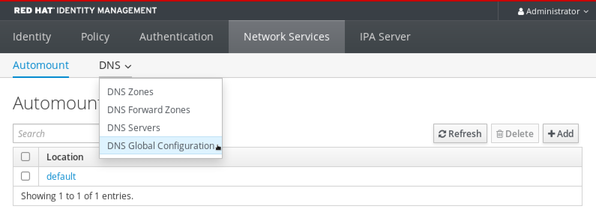
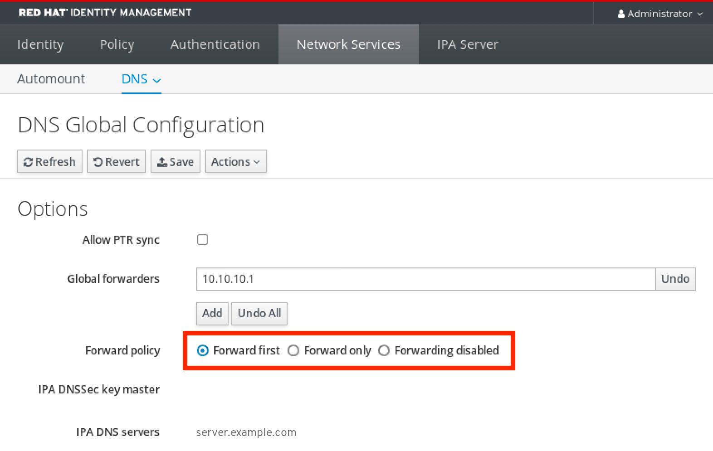
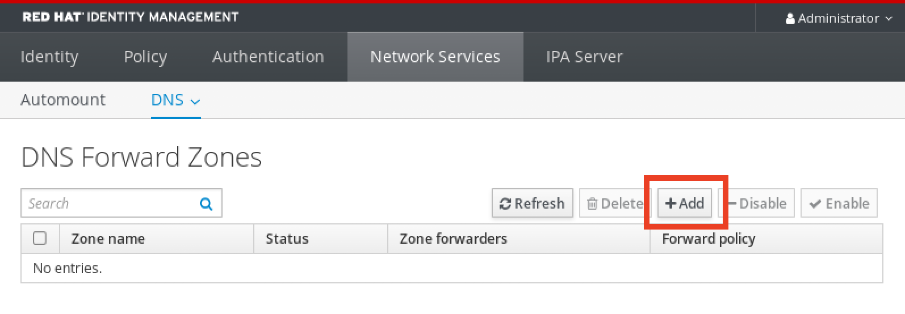
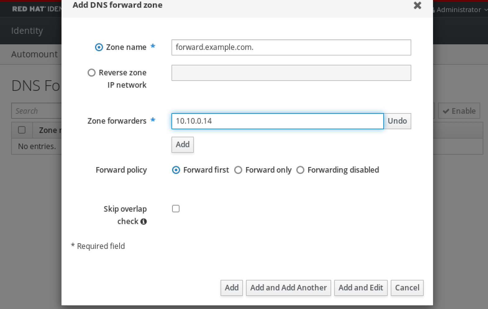
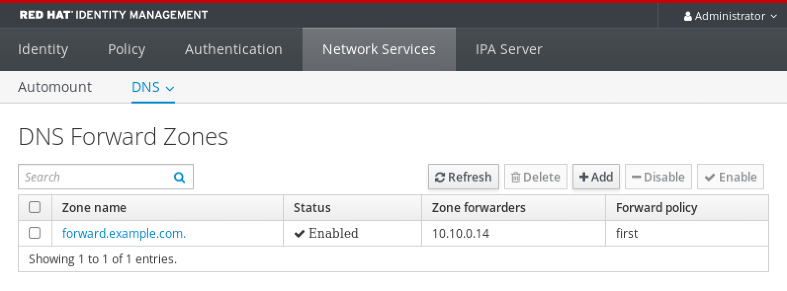
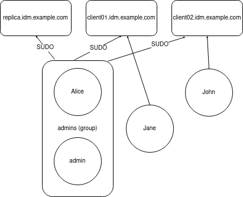

# Using Ansible to install and manage Identity Management in RHEL

* * *

Red Hat Enterprise Linux 10

## Using Ansible playbooks to install, configure and maintain an IdM environment

Red Hat Customer Content Services

[Legal Notice](#idm140568296976928)

**Abstract**

Red Hat provides the ansible-freeipa package to enable administrators to run Red Hat Enterprise Linux Identity Management (IdM) by using Ansible. You can use playbooks to install IdM and manage users, groups, hosts, access control, and configuration settings.

* * *

<h2 id="ansible-terminology">Chapter 1. Ansible terminology</h2>

Review key Ansible concepts and terminology before using playbooks to manage your IdM deployment, ensuring you understand inventory files, roles, and playbook structures.

- The [Basic concepts in Ansible](https://docs.ansible.com/ansible/latest/network/getting_started/basic_concepts.html) section provides an overview of the most commonly used concepts in Ansible.
- The [User guide](https://docs.ansible.com/ansible/latest/user_guide/index.html) outlines the most common situations and questions when starting to use Ansible, such as using the command line; working with an inventory; interacting with data; writing tasks, plays, and playbooks; and executing playbooks.
- [How to build your inventory](https://docs.ansible.com/ansible/latest/user_guide/intro_inventory.html#intro-inventory) offers tips on how to design your inventory. An inventory is a list or a group of lists that Ansible uses to work against multiple managed nodes or hosts in your infrastructure.
- [Intro to playbooks](https://docs.ansible.com/ansible/latest/user_guide/playbooks_intro.html) introduces the concept of an Ansible playbook as a repeatable and re-usable system for managing configurations, deploying machines, and deploying complex applications.
- The [Ansible roles](https://docs.ansible.com/ansible/2.9/user_guide/playbooks_reuse_roles.html) section explains how to automate loading variables, tasks, and handlers based on a known file structure.
- The [Using collections in a playbook](https://docs.ansible.com/ansible/latest/collections_guide/collections_using_playbooks.html) section offers suggestions how to simplify referencing collections in playbooks.
- The [Glossary](https://docs.ansible.com/ansible/latest/reference_appendices/glossary.html) explains terms that are used elsewhere in the Ansible documentation.

<h2 id="installing-an-identity-management-server-using-an-ansible-playbook">Chapter 2. Installing an Identity Management server using an Ansible playbook</h2>

Learn more about how to configure a system as an IdM server by using the `freeipa.ansible_freeipa.ipaserver` Ansible role. Configuring a system as an IdM server establishes an IdM domain and enables the system to offer IdM services to IdM clients.

<h3 id="prerequisites">2.1. Prerequisites</h3>

- You understand the general [Ansible](https://docs.ansible.com/ansible/latest/index.html) and IdM concepts.

<h3 id="ansible-and-its-advantages-for-installing-idm">2.2. Ansible and its advantages for installing IdM</h3>

Understand why using Ansible to deploy Identity Management (IdM) provides benefits over manual installation, including centralized management and repeatable deployments.

Ansible is an automation tool used to configure systems, deploy software, and perform rolling updates. Ansible includes support for IdM, and you can use Ansible roles to automate installation tasks such as the setup of an IdM server, replica, client, or an entire IdM topology.

<h4 id="advantages\_of\_using\_ansible\_to\_install\_idm">2.2.1. Advantages of using Ansible to install IdM</h4>

The following list presents advantages of installing Identity Management using Ansible in contrast to manual installation.

- You do not need to log into the managed node.
- You do not need to configure settings on each host to be deployed individually. Instead, you can have one inventory file to deploy a complete cluster.
- You can reuse an inventory file later for management tasks, for example to add users and hosts. You can reuse an inventory file even for such tasks as are not related to IdM.

**Additional resources**

- [Automating Red Hat Enterprise Linux Identity Management installation](https://www.redhat.com/en/blog/automating-red-hat-identity-management-installation)
- [Planning Identity Management](https://docs.redhat.com/en/documentation/red_hat_enterprise_linux/10/html-single/planning_identity_management/index)
- [Preparing the system for IdM server installation](https://docs.redhat.com/en/documentation/red_hat_enterprise_linux/10/html-single/installing_identity_management/index#preparing-the-system-for-idm-server-installation_installing-identity-management)

<h3 id="installing-the-ansible-freeipa-package">2.3. Installing the ansible-freeipa package</h3>

Install the `ansible-freeipa` package on your control node to access the Ansible roles and modules required for Identity Management (IdM) deployment and management.

Important

In RHEL 10, the `ansible-freeipa` RPM package installs the `freeipa.ansible_freeipa` collection only.

To use the new collection, add the `freeipa.ansible_freeipa` prefix to the names of roles and modules. Use the fully-qualified names to follow Ansible recommendations. For example, to refer to the `ipahbacrule` module, use `freeipa.ansible_freeipa.ipahbacrule`.

**Prerequisites**

- Ensure that the controller is a Red Hat Enterprise Linux system with a valid subscription. If this is not the case, see the official Ansible documentation [Installation guide](https://docs.ansible.com/ansible/latest/installation_guide/intro_installation.html) for alternative installation instructions.
- Ensure that you can reach the managed node over the `SSH` protocol from the controller. Check that the managed node is listed in the `/root/.ssh/known_hosts` file of the controller.

**Procedure**

- On the Ansible controller, install the `ansible-freeipa` package:
  
  ```
  dnf install ansible-freeipa
  ```
  
  ```plaintext
  # dnf install ansible-freeipa
  ```
  
  The roles and modules are installed into the `/usr/share/ansible/collections/ansible_collections/freeipa/ansible_freeipa/roles/` and `/usr/share/ansible/collections/ansible_collections/freeipa/ansible_freeipa/plugins/modules` directories.

<h3 id="ansible-roles-location-in-the-file-system">2.4. Ansible roles location in the file system</h3>

Locate `ansible-freeipa` roles and playbook examples in the file system to use as templates for your IdM deployment and management tasks.

Important

In RHEL 10, the `ansible-freeipa` RPM package installs the `freeipa.ansible_freeipa` collection only.

To use the new collection, add the `freeipa.ansible_freeipa` prefix to the names of roles and modules. Use the fully-qualified names to follow Ansible recommendations. For example, to refer to the `ipahbacrule` module, use `freeipa.ansible_freeipa.ipahbacrule`.

By default, the `ansible-freeipa` roles are installed to the `/usr/share/ansible/collections/ansible_collections/freeipa/ansible_freeipa/roles/` directory. The structure of the `ansible-freeipa` package is as follows:

- The `/usr/share/ansible/collections/ansible_collections/freeipa/ansible_freeipa/roles/` directory stores the `ipaserver`, `ipareplica`, `ipaclient`, `ipasmartcard` and `ipabackup` roles on the Ansible controller. Each role directory stores examples, a basic overview, the license and documentation about the role in a `README.md` Markdown file.
  
  ```
  ls -1 /usr/share/ansible/collections/ansible_collections/freeipa/ansible_freeipa/roles
  ipaclient
  ipareplica
  ipaserver
  ```
  
  ```plaintext
  [root@server]# ls -1 /usr/share/ansible/collections/ansible_collections/freeipa/ansible_freeipa/roles
  ipaclient
  ipareplica
  ipaserver
  ```
- The `/usr/share/ansible/collections/ansible_collections/freeipa/ansible_freeipa/` directory stores the documentation about individual roles and the topology in `README.md` Markdown files. It also stores the `playbooks/` subdirectory.
  
  ```
  ls -1 /usr/share/ansible/collections/ansible_collections/freeipa/ansible_freeipa/
  playbooks
  README-client.md
  README.md
  README-replica.md
  README-server.md
  README-topology.md
  ```
  
  ```plaintext
  [root@server]# ls -1 /usr/share/ansible/collections/ansible_collections/freeipa/ansible_freeipa/
  playbooks
  README-client.md
  README.md
  README-replica.md
  README-server.md
  README-topology.md
  ```
- The `/usr/share/ansible/collections/ansible_collections/freeipa/ansible_freeipa/playbooks/` directory stores the example playbooks:
  
  ```
  ls -1 /usr/share/ansible/collections/ansible_collections/freeipa/ansible_freeipa/playbooks/
  install-client.yml
  install-cluster.yml
  install-replica.yml
  install-server.yml
  uninstall-client.yml
  uninstall-cluster.yml
  uninstall-replica.yml
  uninstall-server.yml
  ```
  
  ```plaintext
  [root@server]# ls -1 /usr/share/ansible/collections/ansible_collections/freeipa/ansible_freeipa/playbooks/
  install-client.yml
  install-cluster.yml
  install-replica.yml
  install-server.yml
  uninstall-client.yml
  uninstall-cluster.yml
  uninstall-replica.yml
  uninstall-server.yml
  ```

<h3 id="setting-the-parameters-for-a-deployment-with-an-integrated-dns-and-an-integrated-ca-as-the-root-ca">2.5. Setting the parameters for a deployment with an integrated DNS and an integrated CA as the root CA</h3>

Configure the inventory file for installing an IdM server with an integrated CA as the root CA in an environment that uses the IdM integrated DNS solution.

Note

The inventory in this procedure uses the `INI` format. You can, alternatively, use the `YAML` or `JSON` formats.

**Procedure**

1. Create a `~/MyPlaybooks/` directory:
   
   ```
   mkdir MyPlaybooks
   ```
   
   ```plaintext
   $ mkdir MyPlaybooks
   ```
2. Create a `~/MyPlaybooks/inventory` file.
3. Open the inventory file for editing. Specify the fully-qualified domain names (`FQDN`) of the host you want to use as an IdM server. Ensure that the `FQDN` meets the following criteria:
   
   - Only alphanumeric characters and hyphens (-) are allowed. For example, underscores are not allowed and can cause DNS failures.
   - The host name must be all lower-case.
4. Specify the IdM domain and realm information.
5. Specify that you want to use integrated DNS by adding the following option:
   
   ```
   ipaserver_setup_dns=true
   ```
   
   ```plaintext
   ipaserver_setup_dns=true
   ```
6. Specify the DNS forwarding settings. Choose one of the following options:
   
   - Use the `ipaserver_auto_forwarders=true` option if you want the installer to use forwarders from the `/etc/resolv.conf` file. Do not use this option if the nameserver specified in the `/etc/resolv.conf` file is the localhost 127.0.0.1 address or if you are on a virtual private network and the DNS servers you are using are normally unreachable from the public internet.
   - Use the `ipaserver_forwarders` option to specify your forwarders manually. The installation process adds the forwarder IP addresses to the `/etc/named.conf` file on the installed IdM server.
   - Use the `ipaserver_no_forwarders=true` option to configure root DNS servers to be used instead.
     
     Note
     
     With no DNS forwarders, your environment is isolated, and names from other DNS domains in your infrastructure are not resolved.
7. Specify the DNS reverse record and zone settings. Choose from the following options:
   
   - Use the `ipaserver_allow_zone_overlap=true` option to allow the creation of a (reverse) zone even if the zone is already resolvable.
   - Use the `ipaserver_reverse_zones` option to specify your reverse zones manually.
   - Use the `ipaserver_no_reverse=true` option if you do not want the installer to create a reverse DNS zone.
     
     Note
     
     Using IdM to manage reverse zones is optional. You can use an external DNS service for this purpose instead.
8. Specify the passwords for `admin` and for the `Directory Manager`. Use the Ansible Vault to store the password, and reference the Vault file from the playbook file. Alternatively and less securely, specify the passwords directly in the inventory file.
9. Optional: Specify a custom `firewalld` zone to be used by the IdM server. If you do not set a custom zone, IdM will add its services to the default `firewalld` zone. The predefined default zone is `public`.
   
   Important
   
   The specified `firewalld` zone must exist and be permanent.
   
   **Example of an inventory file with the required server information (excluding the passwords)**
   
   ```
   [ipaserver]
   server.idm.example.com
   
   [ipaserver:vars]
   ipaserver_domain=idm.example.com
   ipaserver_realm=IDM.EXAMPLE.COM
   ipaserver_setup_dns=true
   ipaserver_auto_forwarders=true
   [...]
   ```
   
   ```plaintext
   [ipaserver]
   server.idm.example.com
   
   [ipaserver:vars]
   ipaserver_domain=idm.example.com
   ipaserver_realm=IDM.EXAMPLE.COM
   ipaserver_setup_dns=true
   ipaserver_auto_forwarders=true
   [...]
   ```
   
   **Example of an inventory file with the required server information (including the passwords)**
   
   ```
   [ipaserver]
   server.idm.example.com
   
   [ipaserver:vars]
   ipaserver_domain=idm.example.com
   ipaserver_realm=IDM.EXAMPLE.COM
   ipaserver_setup_dns=true
   ipaserver_auto_forwarders=true
   ipaadmin_password=MySecretPassword123
   ipadm_password=MySecretPassword234
   
   [...]
   ```
   
   ```plaintext
   [ipaserver]
   server.idm.example.com
   
   [ipaserver:vars]
   ipaserver_domain=idm.example.com
   ipaserver_realm=IDM.EXAMPLE.COM
   ipaserver_setup_dns=true
   ipaserver_auto_forwarders=true
   ipaadmin_password=MySecretPassword123
   ipadm_password=MySecretPassword234
   
   [...]
   ```
   
   **Example of an inventory file with a custom `firewalld` zone**
   
   ```
   [ipaserver]
   server.idm.example.com
   
   [ipaserver:vars]
   ipaserver_domain=idm.example.com
   ipaserver_realm=IDM.EXAMPLE.COM
   ipaserver_setup_dns=true
   ipaserver_auto_forwarders=true
   ipaadmin_password=MySecretPassword123
   ipadm_password=MySecretPassword234
   ipaserver_firewalld_zone=custom zone
   ```
   
   ```plaintext
   [ipaserver]
   server.idm.example.com
   
   [ipaserver:vars]
   ipaserver_domain=idm.example.com
   ipaserver_realm=IDM.EXAMPLE.COM
   ipaserver_setup_dns=true
   ipaserver_auto_forwarders=true
   ipaadmin_password=MySecretPassword123
   ipadm_password=MySecretPassword234
   ipaserver_firewalld_zone=custom zone
   ```
   
   **Example playbook to set up an IdM server using admin and Directory Manager passwords stored in an Ansible Vault file**
   
   ```
   ---
   - name: Playbook to configure IPA server
     hosts: ipaserver
     become: true
     vars_files:
     - playbook_sensitive_data.yml
   
     roles:
     - role: freeipa.ansible_freeipa.ipaserver
       state: present
   ```
   
   ```plaintext
   ---
   - name: Playbook to configure IPA server
     hosts: ipaserver
     become: true
     vars_files:
     - playbook_sensitive_data.yml
   
     roles:
     - role: freeipa.ansible_freeipa.ipaserver
       state: present
   ```
   
   **Example playbook to set up an IdM server using admin and Directory Manager passwords from an inventory file**
   
   ```
   ---
   - name: Playbook to configure IPA server
     hosts: ipaserver
     become: true
   
     roles:
     - role: freeipa.ansible_freeipa.ipaserver
       state: present
   ```
   
   ```plaintext
   ---
   - name: Playbook to configure IPA server
     hosts: ipaserver
     become: true
   
     roles:
     - role: freeipa.ansible_freeipa.ipaserver
       state: present
   ```
   
   For details about all variables used in the playbook, see the `/usr/share/ansible/collections/ansible_collections/freeipa/ansible_freeipa/README-server.md` file on the control node.

<h3 id="setting-the-parameters-for-a-deployment-with-external-dns-and-an-integrated-ca-as-the-root-ca">2.6. Setting the parameters for a deployment with external DNS and an integrated CA as the root CA</h3>

Complete this procedure to configure the inventory file for installing an IdM server with an integrated CA as the root CA in an environment that uses an external DNS solution.

Note

The inventory file in this procedure uses the `INI` format. You can, alternatively, use the `YAML` or `JSON` formats.

**Procedure**

1. Create a `~/MyPlaybooks/` directory:
   
   ```
   mkdir MyPlaybooks
   ```
   
   ```plaintext
   $ mkdir MyPlaybooks
   ```
2. Create a `~/MyPlaybooks/inventory` file.
3. Open the inventory file for editing. Specify the fully-qualified domain names (`FQDN`) of the host you want to use as an IdM server. Ensure that the `FQDN` meets the following criteria:
   
   - Only alphanumeric characters and hyphens (-) are allowed. For example, underscores are not allowed and can cause DNS failures.
   - The host name must be all lower-case.
4. Specify the IdM domain and realm information.
5. Make sure that the `ipaserver_setup_dns` option is set to `no` or that it is absent.
6. Specify the passwords for `admin` and for the `Directory Manager`. Use the Ansible Vault to store the password, and reference the Vault file from the playbook file. Alternatively and less securely, specify the passwords directly in the inventory file.
7. Optional: Specify a custom `firewalld` zone to be used by the IdM server. If you do not set a custom zone, IdM will add its services to the default `firewalld` zone. The predefined default zone is `public`.
   
   Important
   
   The specified `firewalld` zone must exist and be permanent.
   
   **Example of an inventory file with the required server information (excluding the passwords)**
   
   ```
   [ipaserver]
   server.idm.example.com
   
   [ipaserver:vars]
   ipaserver_domain=idm.example.com
   ipaserver_realm=IDM.EXAMPLE.COM
   ipaserver_setup_dns=no
   [...]
   ```
   
   ```plaintext
   [ipaserver]
   server.idm.example.com
   
   [ipaserver:vars]
   ipaserver_domain=idm.example.com
   ipaserver_realm=IDM.EXAMPLE.COM
   ipaserver_setup_dns=no
   [...]
   ```
   
   **Example of an inventory file with the required server information (including the passwords)**
   
   ```
   [ipaserver]
   server.idm.example.com
   
   [ipaserver:vars]
   ipaserver_domain=idm.example.com
   ipaserver_realm=IDM.EXAMPLE.COM
   ipaserver_setup_dns=no
   ipaadmin_password=MySecretPassword123
   ipadm_password=MySecretPassword234
   
   [...]
   ```
   
   ```plaintext
   [ipaserver]
   server.idm.example.com
   
   [ipaserver:vars]
   ipaserver_domain=idm.example.com
   ipaserver_realm=IDM.EXAMPLE.COM
   ipaserver_setup_dns=no
   ipaadmin_password=MySecretPassword123
   ipadm_password=MySecretPassword234
   
   [...]
   ```
   
   **Example of an inventory file with a custom `firewalld` zone**
   
   ```
   [ipaserver]
   server.idm.example.com
   
   [ipaserver:vars]
   ipaserver_domain=idm.example.com
   ipaserver_realm=IDM.EXAMPLE.COM
   ipaserver_setup_dns=no
   ipaadmin_password=MySecretPassword123
   ipadm_password=MySecretPassword234
   ipaserver_firewalld_zone=custom zone
   ```
   
   ```plaintext
   [ipaserver]
   server.idm.example.com
   
   [ipaserver:vars]
   ipaserver_domain=idm.example.com
   ipaserver_realm=IDM.EXAMPLE.COM
   ipaserver_setup_dns=no
   ipaadmin_password=MySecretPassword123
   ipadm_password=MySecretPassword234
   ipaserver_firewalld_zone=custom zone
   ```
   
   **Example playbook to set up an IdM server using admin and Directory Manager passwords stored in an Ansible Vault file**
   
   ```
   ---
   - name: Playbook to configure IPA server
     hosts: ipaserver
     become: true
     vars_files:
     - playbook_sensitive_data.yml
   
     roles:
     - role: freeipa.ansible_freeipa.ipaserver
       state: present
   ```
   
   ```plaintext
   ---
   - name: Playbook to configure IPA server
     hosts: ipaserver
     become: true
     vars_files:
     - playbook_sensitive_data.yml
   
     roles:
     - role: freeipa.ansible_freeipa.ipaserver
       state: present
   ```
   
   **Example playbook to set up an IdM server using admin and Directory Manager passwords from an inventory file**
   
   ```
   ---
   - name: Playbook to configure IPA server
     hosts: ipaserver
     become: true
   
     roles:
     - role: freeipa.ansible_freeipa.ipaserver
       state: present
   ```
   
   ```plaintext
   ---
   - name: Playbook to configure IPA server
     hosts: ipaserver
     become: true
   
     roles:
     - role: freeipa.ansible_freeipa.ipaserver
       state: present
   ```
   
   For details about all variables used in the playbook, see the `/usr/share/ansible/collections/ansible_collections/freeipa/ansible_freeipa/README-server.md` file on the control node.

<h3 id="deploying-an-idm-server-with-an-integrated-ca-as-the-root-ca-using-an-ansible-playbook">2.7. Deploying an IdM server with an integrated CA as the root CA using an Ansible playbook</h3>

Run the Ansible playbook to deploy your first IdM server with an integrated certificate authority (CA), establishing the foundation of your IdM domain.

**Prerequisites**

- The managed node is a Red Hat Enterprise Linux 10 system with a static IP address and a working package manager.
- You have set the parameters that correspond to your scenario by choosing one of the following procedures:
  
  - [Procedure with integrated DNS](#setting-the-parameters-for-a-deployment-with-an-integrated-dns-and-an-integrated-ca-as-the-root-ca "2.5. Setting the parameters for a deployment with an integrated DNS and an integrated CA as the root CA")
  - [Procedure with external DNS](#setting-the-parameters-for-a-deployment-with-external-dns-and-an-integrated-ca-as-the-root-ca "2.6. Setting the parameters for a deployment with external DNS and an integrated CA as the root CA")

**Procedure**

1. Run the Ansible playbook:
   
   ```
   ansible-playbook -i ~/MyPlaybooks/inventory ~/MyPlaybooks/install-server.yml
   ```
   
   ```plaintext
   $ ansible-playbook -i ~/MyPlaybooks/inventory ~/MyPlaybooks/install-server.yml
   ```
2. Choose one of the following options:
   
   - If your IdM deployment uses external DNS: add the DNS resource records contained in the `/tmp/ipa.system.records.UFRPto.db` file to the existing external DNS servers. The process of updating the DNS records varies depending on the particular DNS solution.
     
     ```
     ...
     Restarting the KDC
     Please add records in this file to your DNS system: /tmp/ipa.system.records.UFRBto.db
     Restarting the web server
     ...
     ```
     
     ```plaintext
     ...
     Restarting the KDC
     Please add records in this file to your DNS system: /tmp/ipa.system.records.UFRBto.db
     Restarting the web server
     ...
     ```
   
   Important
   
   The server installation is not complete until you add the DNS records to the existing DNS servers.
   
   - If your IdM deployment uses integrated DNS:
     
     - Add DNS delegation from the parent domain to the IdM DNS domain. For example, if the IdM DNS domain is `idm.example.com`, add a name server (NS) record to the `example.com` parent domain.
       
       Important
       
       Repeat this step each time after an IdM DNS server is installed.
     - Add an `_ntp._udp` service (SRV) record for your time server to your IdM DNS. The presence of the SRV record for the time server of the newly-installed IdM server in IdM DNS ensures that future replica and client installations are automatically configured to synchronize with the time server used by this primary IdM server.

<h3 id="setting-the-parameters-for-a-deployment-with-an-integrated-dns-and-an-external-ca-as-the-root-ca">2.8. Setting the parameters for a deployment with an integrated DNS and an external CA as the root CA</h3>

Configure the inventory file for installing an IdM server with an external CA as the root CA in an environment that uses the IdM integrated DNS solution if your organization requires certificates signed by an existing enterprise CA.

Note

The inventory file in this procedure uses the `INI` format. You can, alternatively, use the `YAML` or `JSON` formats.

**Procedure**

01. Create a `~/MyPlaybooks/` directory:
    
    ```
    mkdir MyPlaybooks
    ```
    
    ```plaintext
    $ mkdir MyPlaybooks
    ```
02. Create a `~/MyPlaybooks/inventory` file.
03. Open the inventory file for editing. Specify the fully-qualified domain names (`FQDN`) of the host you want to use as an IdM server. Ensure that the `FQDN` meets the following criteria:
    
    - Only alphanumeric characters and hyphens (-) are allowed. For example, underscores are not allowed and can cause DNS failures.
    - The host name must be all lower-case.
04. Specify the IdM domain and realm information.
05. Specify that you want to use integrated DNS by adding the following option:
    
    ```
    ipaserver_setup_dns=true
    ```
    
    ```plaintext
    ipaserver_setup_dns=true
    ```
06. Specify the DNS forwarding settings. Choose one of the following options:
    
    - Use the `ipaserver_auto_forwarders=true` option if you want the installation process to use forwarders from the `/etc/resolv.conf` file. This option is not recommended if the nameserver specified in the `/etc/resolv.conf` file is the localhost 127.0.0.1 address or if you are on a virtual private network and the DNS servers you are using are normally unreachable from the public internet.
    - Use the `ipaserver_forwarders` option to specify your forwarders manually. The installation process adds the forwarder IP addresses to the `/etc/named.conf` file on the installed IdM server.
    - Use the `ipaserver_no_forwarders=true` option to configure root DNS servers to be used instead.
      
      Note
      
      With no DNS forwarders, your environment is isolated, and names from other DNS domains in your infrastructure are not resolved.
07. Specify the DNS reverse record and zone settings. Choose from the following options:
    
    - Use the `ipaserver_allow_zone_overlap=true` option to allow the creation of a (reverse) zone even if the zone is already resolvable.
    - Use the `ipaserver_reverse_zones` option to specify your reverse zones manually.
    - Use the `ipaserver_no_reverse=true` option if you do not want the installation process to create a reverse DNS zone.
      
      Note
      
      Using IdM to manage reverse zones is optional. You can use an external DNS service for this purpose instead.
08. Specify the passwords for `admin` and for the `Directory Manager`. Use the Ansible Vault to store the password, and reference the Vault file from the playbook file. Alternatively and less securely, specify the passwords directly in the inventory file.
09. Optional: Specify a custom `firewalld` zone to be used by the IdM server. If you do not set a custom zone, IdM adds its services to the default `firewalld` zone. The predefined default zone is `public`.
    
    Important
    
    The specified `firewalld` zone must exist and be permanent.
    
    **Example of an inventory file with the required server information (excluding the passwords)**
    
    ```
    [ipaserver]
    server.idm.example.com
    
    [ipaserver:vars]
    ipaserver_domain=idm.example.com
    ipaserver_realm=IDM.EXAMPLE.COM
    ipaserver_setup_dns=true
    ipaserver_auto_forwarders=true
    [...]
    ```
    
    ```plaintext
    [ipaserver]
    server.idm.example.com
    
    [ipaserver:vars]
    ipaserver_domain=idm.example.com
    ipaserver_realm=IDM.EXAMPLE.COM
    ipaserver_setup_dns=true
    ipaserver_auto_forwarders=true
    [...]
    ```
    
    **Example of an inventory file with the required server information (including the passwords)**
    
    ```
    [ipaserver]
    server.idm.example.com
    
    [ipaserver:vars]
    ipaserver_domain=idm.example.com
    ipaserver_realm=IDM.EXAMPLE.COM
    ipaserver_setup_dns=true
    ipaserver_auto_forwarders=true
    ipaadmin_password=MySecretPassword123
    ipadm_password=MySecretPassword234
    
    [...]
    ```
    
    ```plaintext
    [ipaserver]
    server.idm.example.com
    
    [ipaserver:vars]
    ipaserver_domain=idm.example.com
    ipaserver_realm=IDM.EXAMPLE.COM
    ipaserver_setup_dns=true
    ipaserver_auto_forwarders=true
    ipaadmin_password=MySecretPassword123
    ipadm_password=MySecretPassword234
    
    [...]
    ```
    
    **Example of an inventory file with a custom `firewalld` zone**
    
    ```
    [ipaserver]
    server.idm.example.com
    
    [ipaserver:vars]
    ipaserver_domain=idm.example.com
    ipaserver_realm=IDM.EXAMPLE.COM
    ipaserver_setup_dns=true
    ipaserver_auto_forwarders=true
    ipaadmin_password=MySecretPassword123
    ipadm_password=MySecretPassword234
    ipaserver_firewalld_zone=custom zone
    
    [...]
    ```
    
    ```plaintext
    [ipaserver]
    server.idm.example.com
    
    [ipaserver:vars]
    ipaserver_domain=idm.example.com
    ipaserver_realm=IDM.EXAMPLE.COM
    ipaserver_setup_dns=true
    ipaserver_auto_forwarders=true
    ipaadmin_password=MySecretPassword123
    ipadm_password=MySecretPassword234
    ipaserver_firewalld_zone=custom zone
    
    [...]
    ```
10. Create a playbook for the first step of the installation. Enter instructions for generating the certificate signing request (CSR) and copying it from the controller to the managed node.
    
    ```
    ---
    - name: Playbook to configure IPA server Step 1
      hosts: ipaserver
      become: true
      vars_files:
      - playbook_sensitive_data.yml
      vars:
        ipaserver_external_ca: true
    
      roles:
      - role: freeipa.ansible_freeipa.ipaserver
        state: present
    
      post_tasks:
      - name: Copy CSR /root/ipa.csr from node to "{{ groups.ipaserver[0] + '-ipa.csr' }}"
        fetch:
          src: /root/ipa.csr
          dest: "{{ groups.ipaserver[0] + '-ipa.csr' }}"
          flat: true
    ```
    
    ```plaintext
    ---
    - name: Playbook to configure IPA server Step 1
      hosts: ipaserver
      become: true
      vars_files:
      - playbook_sensitive_data.yml
      vars:
        ipaserver_external_ca: true
    
      roles:
      - role: freeipa.ansible_freeipa.ipaserver
        state: present
    
      post_tasks:
      - name: Copy CSR /root/ipa.csr from node to "{{ groups.ipaserver[0] + '-ipa.csr' }}"
        fetch:
          src: /root/ipa.csr
          dest: "{{ groups.ipaserver[0] + '-ipa.csr' }}"
          flat: true
    ```
11. Create another playbook for the final step of the installation.
    
    ```
    ---
    - name: Playbook to configure IPA server Step 2
      hosts: ipaserver
      become: true
      vars_files:
      - playbook_sensitive_data.yml
      vars:
        ipaserver_external_cert_files:
          - "/root/servercert20240601.pem"
          - "/root/cacert.pem"
    
      pre_tasks:
      - name: Copy "{{ groups.ipaserver[0] }}-{{ item }}" to "/root/{{ item }}" on node
        ansible.builtin.copy:
          src: "{{ groups.ipaserver[0] }}-{{ item }}"
          dest: "/root/{{ item }}"
          force: true
        with_items:
        - servercert20240601.pem
        - cacert.pem
    
      roles:
      - role: freeipa.ansible_freeipa.ipaserver
        state: present
    ```
    
    ```plaintext
    ---
    - name: Playbook to configure IPA server Step 2
      hosts: ipaserver
      become: true
      vars_files:
      - playbook_sensitive_data.yml
      vars:
        ipaserver_external_cert_files:
          - "/root/servercert20240601.pem"
          - "/root/cacert.pem"
    
      pre_tasks:
      - name: Copy "{{ groups.ipaserver[0] }}-{{ item }}" to "/root/{{ item }}" on node
        ansible.builtin.copy:
          src: "{{ groups.ipaserver[0] }}-{{ item }}"
          dest: "/root/{{ item }}"
          force: true
        with_items:
        - servercert20240601.pem
        - cacert.pem
    
      roles:
      - role: freeipa.ansible_freeipa.ipaserver
        state: present
    ```
    
    For details about all variables used in the playbook, see the `/usr/share/ansible/collections/ansible_collections/freeipa/ansible_freeipa/README-server.md` file on the control node.

<h3 id="setting-the-parameters-for-a-deployment-with-external-dns-and-an-external-ca-as-the-root-ca">2.9. Setting the parameters for a deployment with external DNS and an external CA as the root CA</h3>

Configure the Ansible inventory file for installing an IdM server with external DNS and an external CA as the root CA when integrating with existing DNS and PKI infrastructure.

Note

The inventory file in this procedure uses the `INI` format. You can, alternatively, use the `YAML` or `JSON` formats.

**Procedure**

1. Create a `~/MyPlaybooks/` directory:
   
   ```
   mkdir MyPlaybooks
   ```
   
   ```plaintext
   $ mkdir MyPlaybooks
   ```
2. Create a `~/MyPlaybooks/inventory` file.
3. Open the inventory file for editing. Specify the fully-qualified domain names (`FQDN`) of the host you want to use as an IdM server. Ensure that the `FQDN` meets the following criteria:
   
   - Only alphanumeric characters and hyphens (-) are allowed. For example, underscores are not allowed and can cause DNS failures.
   - The host name must be all lower-case.
4. Specify the IdM domain and realm information.
5. Make sure that the `ipaserver_setup_dns` option is set to `no` or that it is absent.
6. Specify the passwords for `admin` and for the `Directory Manager`. Use the Ansible Vault to store the password, and reference the Vault file from the playbook file. Alternatively and less securely, specify the passwords directly in the inventory file.
7. Optional: Specify a custom `firewalld` zone to be used by the IdM server. If you do not set a custom zone, IdM will add its services to the default `firewalld` zone. The predefined default zone is `public`.
   
   Important
   
   The specified `firewalld` zone must exist and be permanent.
   
   **Example of an inventory file with the required server information (excluding the passwords)**
   
   ```
   [ipaserver]
   server.idm.example.com
   
   [ipaserver:vars]
   ipaserver_domain=idm.example.com
   ipaserver_realm=IDM.EXAMPLE.COM
   ipaserver_setup_dns=no
   [...]
   ```
   
   ```plaintext
   [ipaserver]
   server.idm.example.com
   
   [ipaserver:vars]
   ipaserver_domain=idm.example.com
   ipaserver_realm=IDM.EXAMPLE.COM
   ipaserver_setup_dns=no
   [...]
   ```
   
   **Example of an inventory file with the required server information (including the passwords)**
   
   ```
   [ipaserver]
   server.idm.example.com
   
   [ipaserver:vars]
   ipaserver_domain=idm.example.com
   ipaserver_realm=IDM.EXAMPLE.COM
   ipaserver_setup_dns=no
   ipaadmin_password=MySecretPassword123
   ipadm_password=MySecretPassword234
   
   [...]
   ```
   
   ```plaintext
   [ipaserver]
   server.idm.example.com
   
   [ipaserver:vars]
   ipaserver_domain=idm.example.com
   ipaserver_realm=IDM.EXAMPLE.COM
   ipaserver_setup_dns=no
   ipaadmin_password=MySecretPassword123
   ipadm_password=MySecretPassword234
   
   [...]
   ```
   
   **Example of an inventory file with a custom `firewalld` zone**
   
   ```
   [ipaserver]
   server.idm.example.com
   
   [ipaserver:vars]
   ipaserver_domain=idm.example.com
   ipaserver_realm=IDM.EXAMPLE.COM
   ipaserver_setup_dns=no
   ipaadmin_password=MySecretPassword123
   ipadm_password=MySecretPassword234
   ipaserver_firewalld_zone=custom zone
   
   [...]
   ```
   
   ```plaintext
   [ipaserver]
   server.idm.example.com
   
   [ipaserver:vars]
   ipaserver_domain=idm.example.com
   ipaserver_realm=IDM.EXAMPLE.COM
   ipaserver_setup_dns=no
   ipaadmin_password=MySecretPassword123
   ipadm_password=MySecretPassword234
   ipaserver_firewalld_zone=custom zone
   
   [...]
   ```
8. Create a playbook for the first step of the installation. Enter instructions for generating the certificate signing request (CSR) and copying it from the controller to the managed node.
   
   ```
   ---
   - name: Playbook to configure IPA server Step 1
     hosts: ipaserver
     become: true
     vars_files:
     - playbook_sensitive_data.yml
     vars:
       ipaserver_external_ca: true
   
     roles:
     - role: freeipa.ansible_freeipa.ipaserver
       state: present
   
     post_tasks:
     - name: Copy CSR /root/ipa.csr from node to "{{ groups.ipaserver[0] + '-ipa.csr' }}"
       fetch:
         src: /root/ipa.csr
         dest: "{{ groups.ipaserver[0] + '-ipa.csr' }}"
         flat: true
   ```
   
   ```plaintext
   ---
   - name: Playbook to configure IPA server Step 1
     hosts: ipaserver
     become: true
     vars_files:
     - playbook_sensitive_data.yml
     vars:
       ipaserver_external_ca: true
   
     roles:
     - role: freeipa.ansible_freeipa.ipaserver
       state: present
   
     post_tasks:
     - name: Copy CSR /root/ipa.csr from node to "{{ groups.ipaserver[0] + '-ipa.csr' }}"
       fetch:
         src: /root/ipa.csr
         dest: "{{ groups.ipaserver[0] + '-ipa.csr' }}"
         flat: true
   ```
9. Create another playbook for the final step of the installation.
   
   ```
   ---
   - name: Playbook to configure IPA server Step 2
     hosts: ipaserver
     become: true
     vars_files:
     - playbook_sensitive_data.yml
     vars:
       ipaserver_external_cert_files:
         - "/root/servercert20240601.pem"
         - "/root/cacert.pem"
   
     pre_tasks:
     - name: Copy "{{ groups.ipaserver[0] }}-{{ item }}" to "/root/{{ item }}" on node
       ansible.builtin.copy:
         src: "{{ groups.ipaserver[0] }}-{{ item }}"
         dest: "/root/{{ item }}"
         force: true
       with_items:
       - servercert20240601.pem
       - cacert.pem
   
     roles:
     - role: freeipa.ansible_freeipa.ipaserver
       state: present
   ```
   
   ```plaintext
   ---
   - name: Playbook to configure IPA server Step 2
     hosts: ipaserver
     become: true
     vars_files:
     - playbook_sensitive_data.yml
     vars:
       ipaserver_external_cert_files:
         - "/root/servercert20240601.pem"
         - "/root/cacert.pem"
   
     pre_tasks:
     - name: Copy "{{ groups.ipaserver[0] }}-{{ item }}" to "/root/{{ item }}" on node
       ansible.builtin.copy:
         src: "{{ groups.ipaserver[0] }}-{{ item }}"
         dest: "/root/{{ item }}"
         force: true
       with_items:
       - servercert20240601.pem
       - cacert.pem
   
     roles:
     - role: freeipa.ansible_freeipa.ipaserver
       state: present
   ```
   
   For details about all variables used in the playbook, see the `/usr/share/ansible/collections/ansible_collections/freeipa/ansible_freeipa/README-server.md` file on the control node.

<h3 id="deploying-an-idm-server-with-an-external-ca-as-the-root-ca-using-an-ansible-playbook">2.10. Deploying an IdM server with an external CA as the root CA using an Ansible playbook</h3>

Run the Ansible playbook to deploy an IdM server that chains to an external or your enterprise certificate authority (CA), integrating IdM certificates with an existing PKI hierarchy.

**Prerequisites**

- The managed node is a Red Hat Enterprise Linux 10 system with a static IP address and a working package manager.
- You have set the parameters that correspond to your scenario by choosing one of the following procedures:
  
  - [Procedure with integrated DNS](#setting-the-parameters-for-a-deployment-with-an-integrated-dns-and-an-external-ca-as-the-root-ca "2.8. Setting the parameters for a deployment with an integrated DNS and an external CA as the root CA")
  - [Procedure with external DNS](#setting-the-parameters-for-a-deployment-with-external-dns-and-an-external-ca-as-the-root-ca "2.9. Setting the parameters for a deployment with external DNS and an external CA as the root CA")

**Procedure**

1. Run the Ansible playbook with the instructions for the first step of the installation, for example `install-server-step1.yml`:
   
   ```
   ansible-playbook --vault-password-file=password_file -v -i ~/MyPlaybooks/inventory ~/MyPlaybooks/install-server-step1.yml
   ```
   
   ```plaintext
   $ ansible-playbook --vault-password-file=password_file -v -i ~/MyPlaybooks/inventory ~/MyPlaybooks/install-server-step1.yml
   ```
2. Locate the `ipa.csr` certificate signing request file on the controller and submit it to the external CA.
3. Place the IdM CA certificate signed by the external CA in the controller file system so that the playbook in the next step can find it.
4. Run the Ansible playbook with the instructions for the final step of the installation, for example `install-server-step2.yml`:
   
   ```
   ansible-playbook -v -i ~/MyPlaybooks/inventory ~/MyPlaybooks/install-server-step2.yml
   ```
   
   ```plaintext
   $ ansible-playbook -v -i ~/MyPlaybooks/inventory ~/MyPlaybooks/install-server-step2.yml
   ```
5. Choose one of the following options:
   
   - If your IdM deployment uses external DNS: add the DNS resource records contained in the `/tmp/ipa.system.records.UFRPto.db` file to the existing external DNS servers. The process of updating the DNS records varies depending on the particular DNS solution.
     
     ```
     ...
     Restarting the KDC
     Please add records in this file to your DNS system: /tmp/ipa.system.records.UFRBto.db
     Restarting the web server
     ...
     ```
     
     ```plaintext
     ...
     Restarting the KDC
     Please add records in this file to your DNS system: /tmp/ipa.system.records.UFRBto.db
     Restarting the web server
     ...
     ```
   
   Important
   
   The server installation is not complete until you add the DNS records to the existing DNS servers.
   
   - If your IdM deployment uses integrated DNS:
     
     - Add DNS delegation from the parent domain to the IdM DNS domain. For example, if the IdM DNS domain is `idm.example.com`, add a name server (NS) record to the `example.com` parent domain.
       
       Important
       
       Repeat this step each time after an IdM DNS server is installed.
     - Add an `_ntp._udp` service (SRV) record for your time server to your IdM DNS. The presence of the SRV record for the time server of the newly-installed IdM server in IdM DNS ensures that future replica and client installations are automatically configured to synchronize with the time server used by this primary IdM server.

<h3 id="uninstalling-an-idm-server-using-an-ansible-playbook">2.11. Uninstalling an IdM server using an Ansible playbook</h3>

Remove an IdM server from your topology using Ansible when decommissioning hardware or reducing infrastructure.

Note

In an existing Identity Management (IdM) deployment, **replica** and **server** are interchangeable terms.

In this example:

- IdM configuration is uninstalled from **server123.idm.example.com**.
- **server123.idm.example.com** and the associated host entry are removed from the IdM topology.

**Prerequisites**

- On the control node:
  
  - You are using Ansible version 2.15 or later.
  - You have installed the [`ansible-freeipa`](https://docs.redhat.com/en/documentation/red_hat_enterprise_linux/10/html/using_ansible_to_install_and_manage_identity_management_in_rhel/installing-an-identity-management-server-using-an-ansible-playbook#installing-the-ansible-freeipa-package) package.
  - The example assumes that in the **~/*MyPlaybooks*/** directory, you have created an [Ansible inventory file](https://docs.redhat.com/en/documentation/red_hat_enterprise_linux/10/html/using_ansible_to_install_and_manage_identity_management_in_rhel/preparing-your-environment-for-managing-idm-using-ansible-playbooks) with the fully-qualified domain name (FQDN) of the IdM server.
  - The example assumes that the **secret.yml** Ansible vault stores your `ipaadmin_password` and that you have access to a file that stores the password protecting the **secret.yml** file.
- The target node, that is the node on which the `freeipa.ansible_freeipa` module is executed, is part of the IdM domain as an IdM client, server or replica.
- On the managed node:
  
  - The system is running on RHEL 10.

**Procedure**

1. Create your Ansible playbook file **uninstall-server.yml** with the following content:
   
   ```
   ---
   - name: Playbook to uninstall an IdM replica
     hosts: ipaserver
     become: true
   
     roles:
     - role: freeipa.ansible_freeipa.ipaserver
       ipaserver_remove_from_domain: true
       state: absent
   ```
   
   ```plaintext
   ---
   - name: Playbook to uninstall an IdM replica
     hosts: ipaserver
     become: true
   
     roles:
     - role: freeipa.ansible_freeipa.ipaserver
       ipaserver_remove_from_domain: true
       state: absent
   ```
   
   The `ipaserver_remove_from_domain` option unenrolls the host from the IdM topology.
   
   Note
   
   If the removal of server123.idm.example.com should lead to a disconnected topology, the removal will be aborted. For more information, see [Using an Ansible playbook to uninstall an IdM server even if this leads to a disconnected topology](https://docs.redhat.com/en/documentation/red_hat_enterprise_linux/10/html/using_ansible_to_install_and_manage_identity_management_in_rhel/installing-an-identity-management-server-using-an-ansible-playbook#using-an-ansible-playbook-to-uninstall-an-idm-server-even-if-this-leads-to-a-disconnected-topology).
2. Uninstall the replica:
   
   ```
   ansible-playbook --vault-password-file=password_file -v -i <path_to_inventory_directory>/inventory <path_to_playbooks_directory>/uninstall-server.yml
   ```
   
   ```plaintext
   $ ansible-playbook --vault-password-file=password_file -v -i <path_to_inventory_directory>/inventory <path_to_playbooks_directory>/uninstall-server.yml
   ```
3. Ensure that all name server (NS) DNS records pointing to **server123.idm.example.com** are deleted from your DNS zones. This applies regardless of whether you use integrated DNS managed by IdM or external DNS.

**Additional resources**

- [Using Ansible to manage DNS records in IdM](https://docs.redhat.com/en/documentation/red_hat_enterprise_linux/10/html/working_with_dns_in_identity_management/using-ansible-to-manage-dns-records-in-idm)

<h3 id="using-an-ansible-playbook-to-uninstall-an-idm-server-even-if-this-leads-to-a-disconnected-topology">2.12. Using an Ansible playbook to uninstall an IdM server even if this leads to a disconnected topology</h3>

Force-remove an IdM server using Ansible when normal uninstallation fails due to topology constraints, specifying which domain segment to preserve.

Note

In an existing Identity Management (IdM) deployment, **replica** and **server** are interchangeable terms.

In the example, **server456.idm.example.com** is used to remove the replica and the associated host entry with the FQDN of **server123.idm.example.com** from the topology, leaving certain replicas disconnected from **server456.idm.example.com** and the rest of the topology.

Note

If removing a replica from the topology using only the `remove_server_from_domain` does not result in a disconnected topology, no other options are required. If the result is a disconnected topology, you must specify which part of the domain you want to preserve. In that case, you must do the following:

- Specify the `ipaserver_remove_on_server` value.
- Set `ipaserver_ignore_topology_disconnect` to True.

**Prerequisites**

- On the control node:
  
  - You are using Ansible version 2.15 or later.
  - You have installed the [`ansible-freeipa`](https://docs.redhat.com/en/documentation/red_hat_enterprise_linux/10/html/using_ansible_to_install_and_manage_identity_management_in_rhel/installing-an-identity-management-server-using-an-ansible-playbook#installing-the-ansible-freeipa-package) package.
  - The example assumes that in the **~/*MyPlaybooks*/** directory, you have created an [Ansible inventory file](https://docs.redhat.com/en/documentation/red_hat_enterprise_linux/10/html/using_ansible_to_install_and_manage_identity_management_in_rhel/preparing-your-environment-for-managing-idm-using-ansible-playbooks) with the fully-qualified domain name (FQDN) of the IdM server.
  - The example assumes that the **secret.yml** Ansible vault stores your `ipaadmin_password` and that you have access to a file that stores the password protecting the **secret.yml** file.
- The target node, that is the node on which the `freeipa.ansible_freeipa` module is executed, is part of the IdM domain as an IdM client, server or replica.
- On the managed node:
  
  - The system is running on RHEL 10.

**Procedure**

1. Create your Ansible playbook file **uninstall-server.yml** with the following content:
   
   ```
   ---
   - name: Playbook to uninstall an IdM replica
     hosts: ipaserver
     become: true
   
     roles:
     - role: freeipa.ansible_freeipa.ipaserver
       ipaserver_remove_from_domain: true
       ipaserver_remove_on_server: server456.idm.example.com
       ipaserver_ignore_topology_disconnect: true
       state: absent
   ```
   
   ```plaintext
   ---
   - name: Playbook to uninstall an IdM replica
     hosts: ipaserver
     become: true
   
     roles:
     - role: freeipa.ansible_freeipa.ipaserver
       ipaserver_remove_from_domain: true
       ipaserver_remove_on_server: server456.idm.example.com
       ipaserver_ignore_topology_disconnect: true
       state: absent
   ```
   
   Note
   
   Under normal circumstances, if the removal of server123 does not result in a disconnected topology: if the value for `ipaserver_remove_on_server` is not set, the replica on which server123 is removed is automatically determined using the replication agreements of server123.
2. Uninstall the replica:
   
   ```
   ansible-playbook --vault-password-file=password_file -v -i <path_to_inventory_directory>/hosts <path_to_playbooks_directory>/uninstall-server.yml
   ```
   
   ```plaintext
   $ ansible-playbook --vault-password-file=password_file -v -i <path_to_inventory_directory>/hosts <path_to_playbooks_directory>/uninstall-server.yml
   ```
3. Ensure that all name server (NS) DNS records pointing to **server123.idm.example.com** are deleted from your DNS zones. This applies regardless of whether you use integrated DNS managed by IdM or external DNS.

**Additional resources**

- [Using Ansible to manage DNS records in IdM](https://docs.redhat.com/en/documentation/red_hat_enterprise_linux/10/html/working_with_dns_in_identity_management/using-ansible-to-manage-dns-records-in-idm)

<h3 id="installing-an-identity-management-server-using-an-ansible-playbook">2.13. Additional resources</h3>

- [Planning the replica topology](https://docs.redhat.com/en/documentation/red_hat_enterprise_linux/10/html-single/planning_identity_management/index#planning-the-replica-topology_planning-identity-management)
- [Backing up and restoring IdM servers using Ansible playbooks](https://docs.redhat.com/en/documentation/red_hat_enterprise_linux/10/html-single/planning_identity_management/index#assembly_backing-up-and-restoring-idm-servers-using-ansible-playbooks_planning-identity-management)
- [Inventory basics: formats, hosts, and groups](https://docs.ansible.com/ansible/latest/user_guide/intro_inventory.html#inventory-basics-formats-hosts-and-groups)

<h2 id="installing-an-identity-management-replica-using-an-ansible-playbook">Chapter 3. Installing an Identity Management replica using an Ansible playbook</h2>

Deploy IdM replicas using Ansible to provide redundancy and load balancing, ensuring continued identity services if the primary server or any of the replicas becomes unavailable.

Configuring a system as an IdM replica enrolls it into an IdM domain and enables the system to offer IdM services to IdM clients in the domain. The deployment is managed by the `freeipa.ansible_freeipa.ipaserver` Ansible role. The role can use the autodiscovery mode for identifying the IdM servers, domain and other settings. However, if you deploy multiple replicas in a tier-like model, with different groups of replicas being deployed at different times, you must define specific servers or replicas for each group.

<h3 id="prerequisites\_2">3.1. Prerequisites</h3>

- You have installed the [ansible-freeipa](https://docs.redhat.com/en/documentation/red_hat_enterprise_linux/10/html/using_ansible_to_install_and_manage_identity_management_in_rhel/installing-an-identity-management-server-using-an-ansible-playbook#installing-the-ansible-freeipa-package) package on the Ansible control node.
- You understand the general [Ansible](https://docs.ansible.com/ansible/latest/index.html) and IdM concepts.
- You have [planned the replica topology in your deployment](https://docs.redhat.com/en/documentation/red_hat_enterprise_linux/10/html-single/planning_identity_management/index#planning-the-replica-topology_planning-identity-management).

<h3 id="specifying-the-base-server-and-client-variables-for-installing-the-idm-replica">3.2. Specifying the base, server and client variables for installing the IdM replica</h3>

Configure the inventory file with server and client variables to prepare for IdM replica deployment.

**Prerequisites**

- You have configured your Ansible control node to meet the following requirements:
  
  - You are using Ansible version 2.15 or later.
  - You have installed the [`ansible-freeipa`](#installing-the-ansible-freeipa-package "2.3. Installing the ansible-freeipa package") package on the Ansible controller.

**Procedure**

1. Open the inventory file for editing. Specify the fully-qualified domain names (FQDN) of the hosts to become IdM replicas. The FQDNs must be valid DNS names:
   
   - Only numbers, alphabetic characters, and hyphens (`-`) are allowed. For example, underscores are not allowed and can cause DNS failures.
   - The host name must be all lower-case.
     
     Example of a simple inventory hosts file with only the replicas' FQDN defined
     
     ```
     [ipareplicas]
     replica1.idm.example.com
     replica2.idm.example.com
     replica3.idm.example.com
     [...]
     ```
     
     ```plaintext
     [ipareplicas]
     replica1.idm.example.com
     replica2.idm.example.com
     replica3.idm.example.com
     [...]
     ```
     
     If the IdM server is already deployed and the SRV records are set properly in the IdM DNS zone, the script automatically discovers all the other required values.
2. Optional: Provide additional information in the inventory file based on how you have designed your topology:
   
   Scenario 1
   
   If you want to avoid autodiscovery and have all replicas listed in the `[ipareplicas]` section use a specific IdM server, set the server in the `[ipaservers]` section of the inventory file.
   
   Example inventory hosts file with the FQDN of the IdM server and replicas defined
   
   ```
   [ipaservers]
   server.idm.example.com
   
   [ipareplicas]
   replica1.idm.example.com
   replica2.idm.example.com
   replica3.idm.example.com
   [...]
   ```
   
   ```plaintext
   [ipaservers]
   server.idm.example.com
   
   [ipareplicas]
   replica1.idm.example.com
   replica2.idm.example.com
   replica3.idm.example.com
   [...]
   ```
   
   Scenario 2
   
   Alternatively, if you want to avoid autodiscovery but want to deploy specific replicas with specific servers, set the servers for specific replicas individually in the `ipareplicas` section in the inventory file.
   
   Example inventory file with a specific IdM server defined for a specific replica
   
   ```
   [ipaservers]
   server.idm.example.com
   replica1.idm.example.com
   
   [ipareplicas]
   replica2.idm.example.com
   replica3.idm.example.com ipareplica_servers=replica1.idm.example.com
   ```
   
   ```plaintext
   [ipaservers]
   server.idm.example.com
   replica1.idm.example.com
   
   [ipareplicas]
   replica2.idm.example.com
   replica3.idm.example.com ipareplica_servers=replica1.idm.example.com
   ```
   
   In the example above, `replica3.idm.example.com` uses the already deployed `replica1.idm.example.com` as its replication source.
   
   Scenario 3
   
   If you are deploying several replicas in one batch and time is a concern to you, multitier replica deployment can be useful for you. Define specific groups of replicas in the inventory file, for example `[ipareplicas_tier1]` and `[ipareplicas_tier2]`, and design separate plays for each group in the `install-replica.yml` playbook.
   
   Example inventory file with replica tiers defined
   
   ```
   [ipaservers]
   server.idm.example.com
   
   [ipareplicas_tier1]
   replica1.idm.example.com
   
   [ipareplicas_tier2]
   replica2.idm.example.com \ ipareplica_servers=replica1.idm.example.com,server.idm.example.com
   ```
   
   ```plaintext
   [ipaservers]
   server.idm.example.com
   
   [ipareplicas_tier1]
   replica1.idm.example.com
   
   [ipareplicas_tier2]
   replica2.idm.example.com \ ipareplica_servers=replica1.idm.example.com,server.idm.example.com
   ```
   
   The first entry in `ipareplica_servers` will be used. The second entry will be used as a fallback option. When using multiple tiers for deploying IdM replicas, you must have separate tasks in the playbook to first deploy replicas from tier1 and then replicas from tier2:
   
   Example of a playbook file with different plays for different replica groups
   
   ```
   ---
   - name: Playbook to configure IPA replicas (tier1)
     hosts: ipareplicas_tier1
     become: true
   
     roles:
     - role: freeipa.ansible_freeipa.ipareplica
       state: present
   
   - name: Playbook to configure IPA replicas (tier2)
     hosts: ipareplicas_tier2
     become: true
   
     roles:
     - role: freeipa.ansible_freeipa.ipareplica
       state: present
   ```
   
   ```plaintext
   ---
   - name: Playbook to configure IPA replicas (tier1)
     hosts: ipareplicas_tier1
     become: true
   
     roles:
     - role: freeipa.ansible_freeipa.ipareplica
       state: present
   
   - name: Playbook to configure IPA replicas (tier2)
     hosts: ipareplicas_tier2
     become: true
   
     roles:
     - role: freeipa.ansible_freeipa.ipareplica
       state: present
   ```
3. Optional: Provide additional information regarding `firewalld` and DNS:
   
   Scenario 1
   
   If you want the replica to use a specified `firewalld` zone, for example an internal one, you can specify it in the inventory file. If you do not set a custom zone, IdM will add its services to the default `firewalld` zone. The predefined default zone is `public`.
   
   Important
   
   The specified `firewalld` zone must exist and be permanent.
   
   Example of a simple inventory hosts file with a custom `firewalld` zone
   
   ```
   [ipaservers]
   server.idm.example.com
   
   [ipareplicas]
   replica1.idm.example.com
   replica2.idm.example.com
   replica3.idm.example.com
   [...]
   
   [ipareplicas:vars]
   ipareplica_firewalld_zone=<custom zone>
   ```
   
   ```plaintext
   [ipaservers]
   server.idm.example.com
   
   [ipareplicas]
   replica1.idm.example.com
   replica2.idm.example.com
   replica3.idm.example.com
   [...]
   
   [ipareplicas:vars]
   ipareplica_firewalld_zone=<custom zone>
   ```
   
   Scenario 2
   
   If you want the replica to host the IdM DNS service, add the **ipareplica\_setup\_dns=true** line to the `[ipareplicas:vars]` section. Additionally, specify if you want to use per-server DNS forwarders:
   
   - To configure per-server forwarders, add the `ipareplica_forwarders` variable and a list of strings to the `[ipareplicas:vars]` section, for example: **ipareplica\_forwarders=192.0.2.1,192.0.2.2**
   - To configure no per-server forwarders, add the following line to the `[ipareplicas:vars]` section: **ipareplica\_no\_forwarders=true**.
   - To configure per-server forwarders based on the forwarders listed in the `/etc/resolv.conf` file of the replica, add the `ipareplica_auto_forwarders` variable to the `[ipareplicas:vars]` section.
     
     Example inventory file with instructions to set up DNS and per-server forwarders on the replicas
     
     ```
     [ipaservers]
     server.idm.example.com
     
     [ipareplicas]
     replica1.idm.example.com
     replica2.idm.example.com
     replica3.idm.example.com
     [...]
     
     [ipareplicas:vars]
     ipareplica_setup_dns=true
     ipareplica_forwarders=192.0.2.1,192.0.2.2
     ```
     
     ```plaintext
     [ipaservers]
     server.idm.example.com
     
     [ipareplicas]
     replica1.idm.example.com
     replica2.idm.example.com
     replica3.idm.example.com
     [...]
     
     [ipareplicas:vars]
     ipareplica_setup_dns=true
     ipareplica_forwarders=192.0.2.1,192.0.2.2
     ```
   
   Scenario 3
   
   Specify the DNS resolver using the `ipaclient_configure_dns_resolve` and `ipaclient_dns_servers` options (if available) to simplify cluster deployments. This is especially useful if your IdM deployment is using integrated DNS:
   
   An inventory file snippet specifying a DNS resolver:
   
   ```
   [...]
   [ipaclient:vars]
   ipaclient_configure_dns_resolver=true
   ipaclient_dns_servers=192.168.100.1
   ```
   
   ```plaintext
   [...]
   [ipaclient:vars]
   ipaclient_configure_dns_resolver=true
   ipaclient_dns_servers=192.168.100.1
   ```
   
   Note
   
   The `ipaclient_dns_servers` list must contain only IP addresses. Host names are not allowed.
   
   For details about all variables used in the playbook, see the `/usr/share/ansible/collections/ansible_collections/freeipa/ansible_freeipa/README.md` file on the control node.

<h3 id="specifying-the-credentials-for-installing-the-idm-replica-using-an-ansible-playbook">3.3. Specifying the credentials for installing the IdM replica using an Ansible playbook</h3>

Configure the authentication credentials in your inventory file to authorize the replica enrollment into the IdM domain.

**Prerequisites**

- You have configured your Ansible control node to meet the following requirements:
  
  - You are using Ansible version 2.15 or later.
  - You have installed the [`ansible-freeipa`](https://docs.redhat.com/en/documentation/red_hat_enterprise_linux/10/html/using_ansible_to_install_and_manage_identity_management_in_rhel/installing-an-identity-management-server-using-an-ansible-playbook#installing-the-ansible-freeipa-package) package.
  - The example assumes that in the **~/*MyPlaybooks*/** directory, you have created an [Ansible inventory file](https://docs.redhat.com/en/documentation/red_hat_enterprise_linux/10/html/using_ansible_to_install_and_manage_identity_management_in_rhel/preparing-your-environment-for-managing-idm-using-ansible-playbooks) with the fully-qualified domain name (FQDN) of the IdM server.
  - The example assumes that the **secret.yml** Ansible vault stores your `ipaadmin_password` and that you have access to a file that stores the password protecting the **secret.yml** file.
- The target node, that is the node on which the `freeipa.ansible_freeipa` module is executed, is part of the IdM domain as an IdM client, server or replica.

**Procedure**

- Specify the **password of a user authorized to deploy replicas**, for example the IdM `admin`.
  
  - Use the Ansible Vault to store the password, and reference the Vault file from the playbook file, for example `install-replica.yml`:
    
    **Example playbook file using principal from inventory file and password from an Ansible Vault file:**
    
    ```
    - name: Playbook to configure IPA replicas
      hosts: ipareplicas
      become: true
      vars_files:
      - playbook_sensitive_data.yml
    
      roles:
      - role: freeipa.ansible_freeipa.ipareplica
        state: present
    ```
    
    ```plaintext
    - name: Playbook to configure IPA replicas
      hosts: ipareplicas
      become: true
      vars_files:
      - playbook_sensitive_data.yml
    
      roles:
      - role: freeipa.ansible_freeipa.ipareplica
        state: present
    ```
    
    For details how to use Ansible Vault, see the official [Ansible Vault](https://docs.ansible.com/ansible/latest/user_guide/vault.html) documentation.
  - Less securely, provide the credentials of `admin` directly in the inventory file. Use the `ipaadmin_password` option in the `[ipareplicas:vars]` section of the inventory file. The inventory file and the `install-replica.yml` playbook file can then look as follows:
    
    **Example inventory `hosts.replica` file:**
    
    ```
    [...]
    [ipareplicas:vars]
    ipaadmin_password=Secret123
    ```
    
    ```plaintext
    [...]
    [ipareplicas:vars]
    ipaadmin_password=Secret123
    ```
    
    **Example playbook using principal and password from inventory file:**
    
    ```
    - name: Playbook to configure IPA replicas
      hosts: ipareplicas
      become: true
    
      roles:
      - role: freeipa.ansible_freeipa.ipareplica
        state: present
    ```
    
    ```plaintext
    - name: Playbook to configure IPA replicas
      hosts: ipareplicas
      become: true
    
      roles:
      - role: freeipa.ansible_freeipa.ipareplica
        state: present
    ```
  - Alternatively but also less securely, provide the credentials of another user authorized to deploy a replica directly in the inventory file. To specify a different authorized user, use the `ipaadmin_principal` option for the user name, and the `ipaadmin_password` option for the password. The inventory file and the `install-replica.yml` playbook file can then look as follows:
    
    **Example inventory hosts.replica file:**
    
    ```
    [...]
    [ipareplicas:vars]
    ipaadmin_principal=my_admin
    ipaadmin_password=my_admin_secret123
    ```
    
    ```plaintext
    [...]
    [ipareplicas:vars]
    ipaadmin_principal=my_admin
    ipaadmin_password=my_admin_secret123
    ```
    
    **Example playbook using principal and password from inventory file:**
    
    ```
    - name: Playbook to configure IPA replicas
      hosts: ipareplicas
      become: true
    
      roles:
      - role: freeipa.ansible_freeipa.ipareplica
        state: present
    ```
    
    ```plaintext
    - name: Playbook to configure IPA replicas
      hosts: ipareplicas
      become: true
    
      roles:
      - role: freeipa.ansible_freeipa.ipareplica
        state: present
    ```
    
    Note
    
    During the installation of an IdM replica, checking if the provided Kerberos principal has the required privilege also extends to checking user ID overrides. As a result, you can deploy a replica using the credentials of an AD administrator that is configured to act as an IdM administrator.
  
  For details about all variables used in the playbook, see the `/usr/share/ansible/collections/ansible_collections/freeipa/ansible_freeipa/README.md` file on the control node.

<h3 id="deploying-an-idm-replica-using-an-ansible-playbook">3.4. Deploying an IdM replica using an Ansible playbook</h3>

Run the Ansible playbook to deploy an IdM replica, adding redundancy and improving availability in your IdM domain.

**Prerequisites**

- The managed node is a Red Hat Enterprise Linux 10 system with a static IP address and a working package manager.
- You have configured [the inventory file for installing an IdM replica](#specifying-the-base-server-and-client-variables-for-installing-the-idm-replica "3.2. Specifying the base, server and client variables for installing the IdM replica").
- You have configured [the authorization for installing the IdM replica](#specifying-the-credentials-for-installing-the-idm-replica-using-an-ansible-playbook "3.3. Specifying the credentials for installing the IdM replica using an Ansible playbook").

**Procedure**

- Run the Ansible playbook:
  
  ```
  ansible-playbook -i ~/MyPlaybooks/inventory ~/MyPlaybooks/install-replica.yml
  ```
  
  ```plaintext
  $ ansible-playbook -i ~/MyPlaybooks/inventory ~/MyPlaybooks/install-replica.yml
  ```

**Next steps**

- In large deployments, you can tune specific parameters of IdM replicas for better performance. Consult the [Tuning Performance in Identity Management](https://docs.redhat.com/en/documentation/red_hat_enterprise_linux/10/html-single/tuning_performance_in_identity_management/index) title to find tuning instructions to best suit your scenario.

<h3 id="uninstalling-an-idm-replica-using-an-ansible-playbook">3.5. Uninstalling an IdM replica using an Ansible playbook</h3>

Remove an IdM replica from your deployment using an Ansible playbook to decommission servers that are no longer needed.

In an existing Identity Management (IdM) deployment, **replica** and **server** are interchangeable terms. For information on how to uninstall an IdM server, see [Uninstalling an IdM server using an Ansible playbook](#uninstalling-an-idm-server-using-an-ansible-playbook "2.11. Uninstalling an IdM server using an Ansible playbook") or [Using an Ansible playbook to uninstall an IdM server even if this leads to a disconnected topology](#using-an-ansible-playbook-to-uninstall-an-idm-server-even-if-this-leads-to-a-disconnected-topology "2.12. Using an Ansible playbook to uninstall an IdM server even if this leads to a disconnected topology").

**Additional resources**

- [Introduction to IdM servers and clients](https://docs.redhat.com/en/documentation/red_hat_enterprise_linux/10/html/planning_identity_management/overview-of-idm-and-access-control-in-rhel#introduction-to-idm-servers-and-clients)

<h2 id="installing-an-identity-management-client-using-an-ansible-playbook">Chapter 4. Installing an Identity Management client using an Ansible playbook</h2>

Enroll systems as Identity Management (IdM) clients using Ansible to enable centralized authentication and access to IdM services across multiple hosts simultaneously.

By default, the `freeipa.ansible_freeipa.ipaclient` Ansible role, which mamages the enrollment, uses the autodiscovery mode for identifying the IdM servers, domain and other settings. The role can be modified to have the Ansible playbook use the settings specified, for example in the inventory file.

<h3 id="prerequisites\_3">4.1. Prerequisites</h3>

- You have installed the [ansible-freeipa](https://docs.redhat.com/en/documentation/red_hat_enterprise_linux/10/html/using_ansible_to_install_and_manage_identity_management_in_rhel/installing-an-identity-management-server-using-an-ansible-playbook#installing-the-ansible-freeipa-package) package on the Ansible control node.
- You are using Ansible version 2.15 or later.
- You understand the general [Ansible](https://docs.ansible.com/ansible/latest/index.html) and IdM concepts.

<h3 id="setting-the-parameters-of-the-inventory-file-for-the-autodiscovery-client-installation-mode">4.2. Setting the parameters of the inventory file for the autodiscovery client installation mode</h3>

Configure the inventory file to use DNS autodiscovery when your network has properly configured SRV records for IdM servers.

To install an Identity Management (IdM) client using an Ansible playbook, configure the target host parameters in an inventory file, for example `inventory`:

- The information about the host
- The authorization for the task

The inventory file can be in one of many formats, depending on the inventory plugins you have. The `INI-like` format is one of Ansible’s defaults and is used in the examples below.

Note

To use smart cards with the graphical user interface in RHEL, ensure that you include the `ipaclient_mkhomedir` variable in your Ansible playbook.

**Procedure**

1. Open your `inventory` file for editing.
2. Specify the fully-qualified hostname (FQDN) of the host to become an IdM client. The fully qualified domain name must be a valid DNS name:
   
   - Only numbers, alphabetic characters, and hyphens (`-`) are allowed. For example, underscores are not allowed and can cause DNS failures.
   - The host name must be all lower-case. No capital letters are allowed.
     
     If the SRV records are set properly in the IdM DNS zone, the script automatically discovers all the other required values.
     
     **Example of a simple inventory hosts file with only the client FQDN defined**
     
     ```
     [ipaclients]
     client.idm.example.com
     [...]
     ```
     
     ```plaintext
     [ipaclients]
     client.idm.example.com
     [...]
     ```
3. Specify the credentials for enrolling the client. The following authentication methods are available:
   
   - The **password of a user authorized to enroll clients**. This is the default option.
     
     - Use the Ansible Vault to store the password, and reference the Vault file from the playbook file, for example `install-client.yml`, directly:
       
       **Example playbook file using principal from inventory file and password from an Ansible Vault file**
       
       ```
       - name: Playbook to configure IPA clients with username/password
         hosts: ipaclients
         become: true
         vars_files:
         - playbook_sensitive_data.yml
       
         roles:
         - role: freeipa.ansible_freeipa.ipaclient
           state: present
       ```
       
       ```plaintext
       - name: Playbook to configure IPA clients with username/password
         hosts: ipaclients
         become: true
         vars_files:
         - playbook_sensitive_data.yml
       
         roles:
         - role: freeipa.ansible_freeipa.ipaclient
           state: present
       ```
     - Less securely, provide the credentials of `admin` using the `ipaadmin_password` option in the `[ipaclients:vars]` section of the `inventory/hosts` file. Alternatively, to specify a different authorized user, use the `ipaadmin_principal` option for the user name, and the `ipaadmin_password` option for the password. The `inventory/hosts` inventory file and the `install-client.yml` playbook file can then look as follows:
       
       **Example inventory hosts file**
       
       ```
       [...]
       [ipaclients:vars]
       ipaadmin_principal=my_admin
       ipaadmin_password=Secret123
       ```
       
       ```plaintext
       [...]
       [ipaclients:vars]
       ipaadmin_principal=my_admin
       ipaadmin_password=Secret123
       ```
       
       **Example Playbook using principal and password from inventory file**
       
       ```
       - name: Playbook to unconfigure IPA clients
         hosts: ipaclients
         become: true
       
         roles:
         - role: freeipa.ansible_freeipa.ipaclient
           state: true
       ```
       
       ```plaintext
       - name: Playbook to unconfigure IPA clients
         hosts: ipaclients
         become: true
       
         roles:
         - role: freeipa.ansible_freeipa.ipaclient
           state: true
       ```
   - The **client keytab** from the previous enrollment if it is still available.
     
     This option is available if the system was previously enrolled as an Identity Management client. To use this authentication method, uncomment the `#ipaclient_keytab` option, specifying the path to the file storing the keytab, for example in the `[ipaclient:vars]` section of `inventory/hosts`.
   - A **random, one-time password** (OTP) to be generated during the enrollment. To use this authentication method, use the `ipaclient_use_otp=true` option in your inventory file. For example, you can uncomment the `ipaclient_use_otp=true` option in the `[ipaclients:vars]` section of the `inventory/hosts` file. Note that with OTP you must also specify one of the following options:
     
     - The **password of a user authorized to enroll clients**, for example by providing a value for `ipaadmin_password` in the `[ipaclients:vars]` section of the `inventory/hosts` file.
     - The **admin keytab**, for example by providing a value for `ipaadmin_keytab` in the `[ipaclients:vars]` section of `inventory/hosts`.
4. Optional: Specify the DNS resolver using the `ipaclient_configure_dns_resolve` and `ipaclient_dns_servers` options (if available) to simplify cluster deployments. This is especially useful if your IdM deployment is using integrated DNS:
   
   **An inventory file snippet specifying a DNS resolver:**
   
   ```
   [...]
   [ipaclients:vars]
   ipaadmin_password: "{{ ipaadmin_password }}"
   ipaclient_domain=idm.example.com
   ipaclient_configure_dns_resolver=true
   ipaclient_dns_servers=192.168.100.1
   ```
   
   ```plaintext
   [...]
   [ipaclients:vars]
   ipaadmin_password: "{{ ipaadmin_password }}"
   ipaclient_domain=idm.example.com
   ipaclient_configure_dns_resolver=true
   ipaclient_dns_servers=192.168.100.1
   ```
   
   Note
   
   The `ipaclient_dns_servers` list must contain only IP addresses. Host names are not allowed.
5. You can also specify the `ipaclient_subid: true` option to have subid ranges configured for IdM users on the IdM level.
   
   For details about all variables used in the playbook, see the `/usr/share/ansible/collections/ansible_collections/freeipa/ansible_freeipa/README.md` file on the control node.

**Additional resources**

- [Managing subID ranges manually](https://docs.redhat.com/en/documentation/red_hat_enterprise_linux/10/html/managing_idm_users_groups_hosts_and_access_control_rules/managing-subid-ranges-manually)

<h3 id="setting-the-parameters-of-the-inventory-file-when-autodiscovery-is-not-possible-during-client-installation">4.3. Setting the parameters of the inventory file when autodiscovery is not possible during client installation</h3>

Manually specify the IdM server, domain, and realm in the inventory file when DNS SRV records are unavailable or autodiscovery fails.

To install an Identity Management client using an Ansible playbook, configure the target host parameters in an inventory file, for example `inventory/hosts`:

- The information about the host, the IdM server and the IdM domain or the IdM realm
- The authorization for the task

The inventory file can be in one of many formats, depending on the inventory plugins you have. The `INI-like` format is one of Ansible’s defaults and is used in the examples below.

Note

To use smart cards with the graphical user interface in RHEL, ensure that you include the `ipaclient_mkhomedir` variable in your Ansible playbook.

**Procedure**

1. Specify the fully-qualified hostname (FQDN) of the host to become an IdM client. The fully qualified domain name must be a valid DNS name:
   
   - Only numbers, alphabetic characters, and hyphens (`-`) are allowed. For example, underscores are not allowed and can cause DNS failures.
   - The host name must be all lower-case. No capital letters are allowed.
2. Specify other options in the relevant sections of the `inventory/hosts` file:
   
   - The FQDN of the servers in the `[ipaservers]` section to indicate which IdM server the client will be enrolled with
   - One of the two following options:
     
     - The `ipaclient_domain` option in the `[ipaclients:vars]` section to indicate the DNS domain name of the IdM server the client will be enrolled with
     - The `ipaclient_realm` option in the `[ipaclients:vars]` section to indicate the name of the Kerberos realm controlled by the IdM server
       
       **Example of an inventory hosts file with the client FQDN, the server FQDN and the domain defined**
       
       ```
       [ipaclients]
       client.idm.example.com
       
       [ipaservers]
       server.idm.example.com
       
       [ipaclients:vars]
       ipaclient_domain=idm.example.com
       [...]
       ```
       
       ```plaintext
       [ipaclients]
       client.idm.example.com
       
       [ipaservers]
       server.idm.example.com
       
       [ipaclients:vars]
       ipaclient_domain=idm.example.com
       [...]
       ```
3. Specify the credentials for enrolling the client. The following authentication methods are available:
   
   - The **password of a user authorized to enroll clients**. This is the default option.
     
     - Use the Ansible Vault to store the password, and reference the Vault file from the playbook file, for example `install-client.yml`, directly:
       
       **Example playbook file using principal from inventory file and password from an Ansible Vault file**
       
       ```
       - name: Playbook to configure IPA clients with username/password
         hosts: ipaclients
         become: true
         vars_files:
         - playbook_sensitive_data.yml
       
         roles:
         - role: freeipa.ansible_freeipa.ipaclient
           state: present
       ```
       
       ```plaintext
       - name: Playbook to configure IPA clients with username/password
         hosts: ipaclients
         become: true
         vars_files:
         - playbook_sensitive_data.yml
       
         roles:
         - role: freeipa.ansible_freeipa.ipaclient
           state: present
       ```
   - Less securely, the credentials of `admin` to be provided using the `ipaadmin_password` option in the `[ipaclients:vars]` section of the `inventory/hosts` file. Alternatively, to specify a different authorized user, use the `ipaadmin_principal` option for the user name, and the `ipaadmin_password` option for the password. The `install-client.yml` playbook file can then look as follows:
     
     **Example inventory hosts file**
     
     ```
     [...]
     [ipaclients:vars]
     ipaadmin_principal=my_admin
     ipaadmin_password=Secret123
     ```
     
     ```plaintext
     [...]
     [ipaclients:vars]
     ipaadmin_principal=my_admin
     ipaadmin_password=Secret123
     ```
     
     **Example Playbook using principal and password from inventory file**
     
     ```
     - name: Playbook to unconfigure IPA clients
       hosts: ipaclients
       become: true
     
       roles:
       - role: freeipa.ansible_freeipa.ipaclient
         state: true
     ```
     
     ```plaintext
     - name: Playbook to unconfigure IPA clients
       hosts: ipaclients
       become: true
     
       roles:
       - role: freeipa.ansible_freeipa.ipaclient
         state: true
     ```
   - The **client keytab** from the previous enrollment if it is still available:
     
     This option is available if the system was previously enrolled as an Identity Management client. To use this authentication method, uncomment the `ipaclient_keytab` option, specifying the path to the file storing the keytab, for example in the `[ipaclient:vars]` section of `inventory/hosts`.
   - A **random, one-time password** (OTP) to be generated during the enrollment. To use this authentication method, use the `ipaclient_use_otp=true` option in your inventory file. For example, you can uncomment the `#ipaclient_use_otp=true` option in the `[ipaclients:vars]` section of the `inventory/hosts` file. Note that with OTP you must also specify one of the following options:
     
     - The **password of a user authorized to enroll clients**, for example by providing a value for `ipaadmin_password` in the `[ipaclients:vars]` section of the `inventory/hosts` file.
     - The **admin keytab**, for example by providing a value for `ipaadmin_keytab` in the `[ipaclients:vars]` section of `inventory/hosts`.
4. You can also specify the `ipaclient_subid: true` option to have subid ranges configured for IdM users on the IdM level.
   
   For details about all variables used in the playbook, see the `/usr/share/ansible/collections/ansible_collections/freeipa/ansible_freeipa/README.md` file on the control node.

**Additional resources**

- [Managing subID ranges manually](https://docs.redhat.com/en/documentation/red_hat_enterprise_linux/10/html/managing_idm_users_groups_hosts_and_access_control_rules/managing-subid-ranges-manually)

<h3 id="authorization-options-for-idm-client-enrollment-using-an-ansible-playbook">4.4. Authorization options for IdM client enrollment using an Ansible playbook</h3>

Choose the appropriate authentication method for Identity Management (IdM) client enrollment based on your security requirements and administrative workflow.

You can authorize IdM client enrollment by using any of the following methods:

- A random, one-time password (OTP) + administrator password
- A random, one-time password (OTP) + an admin keytab
- The client keytab from the previous enrollment
- The password of a user authorized to enroll a client (`admin`) stored in an inventory file
- The password of a user authorized to enroll a client (`admin`) stored in an Ansible vault

It is possible to have the OTP generated by an IdM administrator before the IdM client installation. In that case, you do not need any credentials for the installation other than the OTP itself.

The following are sample inventory files for these methods:

Table 4.1. Sample inventory files

Authorization optionInventory file

A random, one-time password (OTP) + administrator password

```
[ipaclients:vars]
ipaadmin_password=Secret123
ipaclient_use_otp=true
```

```plaintext
[ipaclients:vars]
ipaadmin_password=Secret123
ipaclient_use_otp=true
```

A random, one-time password (OTP)

```
[ipaclients:vars]
ipaclient_otp=<W5YpARl=7M.>
```

```plaintext
[ipaclients:vars]
ipaclient_otp=<W5YpARl=7M.>
```

This scenario assumes that the OTP was already generated by an IdM `admin` before the installation.

A random, one-time password (OTP) + an admin keytab

```
[ipaclients:vars]
ipaadmin_keytab=/root/admin.keytab
ipaclient_use_otp=true
```

```plaintext
[ipaclients:vars]
ipaadmin_keytab=/root/admin.keytab
ipaclient_use_otp=true
```

The client keytab from the previous enrollment

```
[ipaclients:vars]
ipaclient_keytab=/root/krb5.keytab
```

```plaintext
[ipaclients:vars]
ipaclient_keytab=/root/krb5.keytab
```

Password of an `admin` user stored in an inventory file

```
[ipaclients:vars]
ipaadmin_password=Secret123
```

```plaintext
[ipaclients:vars]
ipaadmin_password=Secret123
```

Password of an `admin` user stored in an Ansible vault file

```
[ipaclients:vars]
[...]
```

```plaintext
[ipaclients:vars]
[...]
```

If you are using the password of an `admin` user stored in an Ansible vault file, the corresponding playbook file must have an additional `vars_files` directive:

Table 4.2. User password stored in an Ansible vault

Inventory filePlaybook file

```
[ipaclients:vars]
[...]
```

```plaintext
[ipaclients:vars]
[...]
```

```
- name: Playbook to configure IPA clients
  hosts: ipaclients
  become: true
  vars_files:
  - ansible_vault_file.yml

  roles:
  - role: freeipa.ansible_freeipa.ipaclient
    state: present
```

```plaintext
- name: Playbook to configure IPA clients
  hosts: ipaclients
  become: true
  vars_files:
  - ansible_vault_file.yml

  roles:
  - role: freeipa.ansible_freeipa.ipaclient
    state: present
```

In all the other authorization scenarios described above, a basic playbook file could look as follows:

```
- name: Playbook to configure IPA clients
  hosts: ipaclients
  become: true

  roles:
  - role: freeipa.ansible_freeipa.ipaclient
    state: true
```

```plaintext
- name: Playbook to configure IPA clients
  hosts: ipaclients
  become: true

  roles:
  - role: freeipa.ansible_freeipa.ipaclient
    state: true
```

Note

In the two OTP authorization scenarios described above, the requesting of the administrator’s TGT by using the `kinit` command occurs on the first specified or discovered IdM server. Therefore, no additional modification of the Ansible control node is required.

<h3 id="deploying-an-idm-client-using-an-ansible-playbook">4.5. Deploying an IdM client using an Ansible playbook</h3>

Use an Ansible playbook to deploy an IdM client in your IdM environment, enabling it to consume IdM resources.

**Prerequisites**

- The managed node is a Red Hat Enterprise Linux 10 system with a static IP address and a working package manager.
- You have set the parameters of the IdM client deployment to correspond to your deployment scenario:
  
  - [Setting the parameters of the inventory file for the autodiscovery client installation mode](#setting-the-parameters-of-the-inventory-file-for-the-autodiscovery-client-installation-mode "4.2. Setting the parameters of the inventory file for the autodiscovery client installation mode")
  - [Setting the parameters of the inventory file when autodiscovery is not possible during client installation](#setting-the-parameters-of-the-inventory-file-when-autodiscovery-is-not-possible-during-client-installation "4.3. Setting the parameters of the inventory file when autodiscovery is not possible during client installation")

**Procedure**

- Run the Ansible playbook:
  
  ```
  ansible-playbook -v -i ~/MyPlaybooks/inventory ~/MyPlaybooks/install-client.yml
  ```
  
  ```plaintext
  $ ansible-playbook -v -i ~/MyPlaybooks/inventory ~/MyPlaybooks/install-client.yml
  ```

<h3 id="using-the-one-time-password-method-in-ansible-to-install-an-idm-client">4.6. Using the one-time password method in Ansible to install an IdM client</h3>

Use a one-time password to enroll an IdM client when separating administrator privileges between the person who pre-registers hosts and the person who deploys them.

You can generate a one-time password (OTP) for a new host in Identity Management (IdM) and use it to enroll a system into the IdM domain. In the example, you use Ansible to install an IdM client after generating an OTP for it on another IdM host.

This method of installing an IdM client is convenient if two system administrators with different privileges exist in your organisation:

- One that has the credentials of an IdM administrator.
- Another that has the required Ansible credentials, including `root` access to the host to become an IdM client.

The IdM administrator performs the first part of the procedure in which the OTP password is generated. The Ansible administrator performs the remaining part of the procedure in which the OTP is used to install an IdM client.

**Prerequisites**

- You have the IdM `admin` credentials or at least the `Host Enrollment` privilege and a permission to add DNS records in IdM.
- You have configured a user escalation method on the Ansible managed node to allow you to install an IdM client.
- If your Ansible control node is running on RHEL 8.7 or earlier, you must be able to install packages on your Ansible control node.
- You have configured your Ansible control node to meet the following requirements:
  
  - You are using Ansible version 2.15 or later.
  - You have installed the [`ansible-freeipa`](https://docs.redhat.com/en/documentation/red_hat_enterprise_linux/10/html/using_ansible_to_install_and_manage_identity_management_in_rhel/installing-an-identity-management-server-using-an-ansible-playbook#installing-the-ansible-freeipa-package) package.
  - The example assumes that in the **~/*MyPlaybooks*/** directory, you have created an [Ansible inventory file](https://docs.redhat.com/en/documentation/red_hat_enterprise_linux/10/html/using_ansible_to_install_and_manage_identity_management_in_rhel/preparing-your-environment-for-managing-idm-using-ansible-playbooks) with the fully-qualified domain name (FQDN) of the IdM server.
  - The example assumes that the **secret.yml** Ansible vault stores your `ipaadmin_password` and that you have access to a file that stores the password protecting the **secret.yml** file.
- The target node, that is the node on which the `freeipa.ansible_freeipa` module is executed, is part of the IdM domain as an IdM client, server or replica.
- The managed node is a Red Hat Enterprise Linux 10 system with a static IP address and a working package manager.

**Procedure**

1. `SSH` to an IdM host as an IdM user with a role that has the `Host Enrollment` privilege and a permission to add DNS records:
   
   ```
   ssh admin@server.idm.example.com
   ```
   
   ```plaintext
   $ ssh admin@server.idm.example.com
   ```
2. Generate an OTP for the new client:
   
   ```
   ipa host-add client.idm.example.com --ip-address=172.25.250.11 --random
    --------------------------------------------------
    Added host "client.idm.example.com"
    --------------------------------------------------
     Host name: client.idm.example.com
     Random password: W5YpARl=7M.n
     Password: True
     Keytab: False
     Managed by: server.idm.example.com
   ```
   
   ```plaintext
   [admin@server ~]$ ipa host-add client.idm.example.com --ip-address=172.25.250.11 --random
    --------------------------------------------------
    Added host "client.idm.example.com"
    --------------------------------------------------
     Host name: client.idm.example.com
     Random password: W5YpARl=7M.n
     Password: True
     Keytab: False
     Managed by: server.idm.example.com
   ```
   
   The **--ip-address=*&lt;your\_host\_ip\_address&gt;*** option adds the host to IdM DNS with the specified IP address.
3. Exit the IdM host:
   
   ```
   exit
   logout
   Connection to server.idm.example.com closed.
   ```
   
   ```plaintext
   $ exit
   logout
   Connection to server.idm.example.com closed.
   ```
4. On the ansible controller, update the inventory file to include the random password:
   
   ```
   [...]
   [ipaclients]
   client.idm.example.com
   
   [ipaclients:vars]
   ipaclient_domain=idm.example.com
   ipaclient_otp=W5YpARl=7M.n
   [...]
   ```
   
   ```plaintext
   [...]
   [ipaclients]
   client.idm.example.com
   
   [ipaclients:vars]
   ipaclient_domain=idm.example.com
   ipaclient_otp=W5YpARl=7M.n
   [...]
   ```
5. Run the playbook to install the client:
   
   ```
   ansible-playbook -i inventory install-client.yml
   ```
   
   ```plaintext
   $ ansible-playbook -i inventory install-client.yml
   ```

<h3 id="testing-an-ipa-client-after-ansible-installation">4.7. Testing an Identity Management client after Ansible installation</h3>

You can manually verify the functionality of the IdM client even after the `ansible-playbook` command reports success. Running these checks confirms that your client system successfully authenticates IdM users and retrieves identity information from the server.

**Procedure**

- To test that the Identity Management client can obtain information about users defined on the server, check that you are able to resolve a user defined on the server. For example, to check the default `admin` user:
  
  ```
  id admin
  uid=1254400000(admin) gid=1254400000(admins) groups=1254400000(admins)
  ```
  
  ```plaintext
  [user@client1 ~]$ id admin
  uid=1254400000(admin) gid=1254400000(admins) groups=1254400000(admins)
  ```
- To test that authentication works correctly, `su -` as another already existing IdM user:
  
  ```
  su - idm_user
  Last login: Thu Oct 18 18:39:11 CEST 2018 from 192.168.122.1 on pts/0
  ```
  
  ```plaintext
  [user@client1 ~]$ su - idm_user
  Last login: Thu Oct 18 18:39:11 CEST 2018 from 192.168.122.1 on pts/0
  [idm_user@client1 ~]$
  ```

<h3 id="uninstalling-an-idm-client-using-an-ansible-playbook">4.8. Uninstalling an IdM client using an Ansible playbook</h3>

Remove the IdM client configuration from a host using Ansible when decommissioning systems or troubleshooting enrollment issues.

Important

The uninstallation of the client only removes the basic IdM configuration from the host but leaves the configuration files on the host in case you decide to re-install the client. In addition, the uninstallation has the following limitations:

- It does not remove the client host entry from the IdM LDAP server. The uninstallation only unenrolls the host.
- It does not remove any services residing on the client from IdM.
- It does not remove the DNS entries for the client from the IdM server.
- It does not remove the old principals for keytabs other than `/etc/krb5.keytab`.

Note that the uninstallation does remove all certificates that were issued for the host by the IdM CA.

**Prerequisites**

- IdM administrator credentials.
- The managed node is a Red Hat Enterprise Linux 10 system with a static IP address.

**Procedure**

- Run the Ansible playbook with the instructions to uninstall the client, for example `uninstall-client.yml`:
  
  ```
  ansible-playbook -v -i ~/MyPlaybooks/inventory ~/MyPlaybooks/uninstall-client.yml
  ```
  
  ```plaintext
  $ ansible-playbook -v -i ~/MyPlaybooks/inventory ~/MyPlaybooks/uninstall-client.yml
  ```

**Additional resources**

- [Uninstalling an IdM client](https://docs.redhat.com/en/documentation/red_hat_enterprise_linux/10/html/installing_identity_management/uninstalling-an-idm-client)

<h2 id="preparing-your-environment-for-managing-idm-using-ansible-playbooks">Chapter 5. Preparing your environment for managing IdM using Ansible playbooks</h2>

Set up your Ansible control node with proper directory structure, inventory files, and vault configuration to securely manage Identity Management (IdM) using playbooks.

When working with Ansible as a system administrator managing IdM, it is good practice to do the following:

- Keep a subdirectory dedicated to Ansible playbooks in your home directory, for example **~/MyPlaybooks**.
- Copy and adapt sample Ansible playbooks from the `/usr/share/ansible/collections/ansible_collections/freeipa/ansible_freeipa/*` and `/usr/share/doc/rhel-system-roles/*` directories and subdirectories into your **~/MyPlaybooks** directory.
- Include your inventory file in your **~/MyPlaybooks** directory.

Using this practice, you can find all your playbooks in one place.

Note

You can run your `ansible-freeipa` playbooks without invoking `root` privileges on the managed nodes. Exceptions include playbooks that use the `ipaserver`, `ipareplica`, `ipaclient`, `ipasmartcard_server`, `ipasmartcard_client` and `ipabackup` `ansible-freeipa` roles. These roles require privileged access to directories and the `dnf` software package manager.

The playbooks in the Red Hat Enterprise Linux IdM documentation assume the following [security configuration](#preparing-a-control-node-and-managed-nodes-for-managing-idm-using-ansible-playbooks "5.1. Preparing a control node and managed nodes for managing IdM using Ansible playbooks"):

- The IdM `admin` is your remote Ansible user on the managed nodes.
- You store the IdM `admin` password encrypted in an Ansible vault.
- You have placed the password that protects the Ansible vault in a password file.
- You block access to the vault password file to everyone except your local ansible user.
- You regularly remove and re-create the vault password file.

Consider also [alternative security configurations](#different-methods-to-provide-the-credentials-required-for-ansible-freeipa-playbooks "5.2. Different methods to provide the credentials required for ansible-freeipa playbooks").

<h3 id="preparing-a-control-node-and-managed-nodes-for-managing-idm-using-ansible-playbooks">5.1. Preparing a control node and managed nodes for managing IdM using Ansible playbooks</h3>

Set up your Ansible control node with the required directory structure, inventory file, and encrypted vault to securely manage IdM servers.

Create the **~/MyPlaybooks** directory and configure it so that you can use it to store and run Ansible playbooks.

**Prerequisites**

- You have installed an IdM server on your managed nodes, ***server.idm.example.com*** and ***replica.idm.example.com***.
- You have configured DNS and networking so you can log in to the managed nodes, ***server.idm.example.com*** and ***replica.idm.example.com***, directly from the control node.
- You know the IdM `admin` password.

**Procedure**

1. Change into the **~/MyPlaybooks/** directory:
   
   ```
   cd ~/MyPlaybooks
   ```
   
   ```plaintext
   $ cd ~/MyPlaybooks
   ```
2. Create the **~/MyPlaybooks/ansible.cfg** file with the following content:
   
   ```
   [defaults]
   inventory = /home/your_username/MyPlaybooks/inventory
   remote_user = admin
   ```
   
   ```plaintext
   [defaults]
   inventory = /home/your_username/MyPlaybooks/inventory
   remote_user = admin
   ```
3. Create the **~/MyPlaybooks/inventory** file with the following content:
   
   ```
   [eu]
   server.idm.example.com
   
   [us]
   replica.idm.example.com
   
   [ipaserver:children]
   eu
   us
   ```
   
   ```plaintext
   [eu]
   server.idm.example.com
   
   [us]
   replica.idm.example.com
   
   [ipaserver:children]
   eu
   us
   ```
   
   This configuration defines two host groups, **eu** and **us**, for hosts in these locations. Additionally, this configuration defines the **ipaserver** host group, which contains all hosts from the **eu** and **us** groups.
4. Optional: Create an SSH public and private key. To simplify access in your test environment, do not set a password on the private key:
   
   ```
   ssh-keygen
   ```
   
   ```plaintext
   $ ssh-keygen
   ```
5. Copy the SSH public key to the IdM `admin` account on each managed node:
   
   ```
   ssh-copy-id admin@server.idm.example.com
   ssh-copy-id admin@replica.idm.example.com
   ```
   
   ```plaintext
   $ ssh-copy-id admin@server.idm.example.com
   $ ssh-copy-id admin@replica.idm.example.com
   ```
   
   These commands require that you enter the IdM `admin` password.
6. Create a **password\_file** file that contains the vault password:
   
   ```
   redhat
   ```
   
   ```plaintext
   redhat
   ```
7. Change the permissions to modify the file:
   
   ```
   chmod 0600 password_file
   ```
   
   ```plaintext
   $ chmod 0600 password_file
   ```
8. Create a **secret.yml** Ansible vault to store the IdM `admin` password:
   
   1. Configure **password\_file** to store the vault password:
      
      ```
      ansible-vault create --vault-password-file=password_file secret.yml
      ```
      
      ```plaintext
      $ ansible-vault create --vault-password-file=password_file secret.yml
      ```
   2. When prompted, enter the content of the **secret.yml** file:
      
      ```
      ipaadmin_password: Secret123
      ```
      
      ```plaintext
      ipaadmin_password: Secret123
      ```
      
      Note
      
      To use the encrypted `ipaadmin_password` in a playbook, you must use the `vars_file` directive. For example, a simple playbook to delete an IdM user can look as follows:
      
      ```
      ---
      - name: Playbook to handle users
        hosts: ipaserver
      
        vars_files:
        - /home/user_name/MyPlaybooks/secret.yml
      
        tasks:
        - name: Delete user robot
          freeipa.ansible_freeipa.ipauser:
            ipaadmin_password: "{{ ipaadmin_password }}"
            name: robot
            state: absent
      ```
      
      ```plaintext
      ---
      - name: Playbook to handle users
        hosts: ipaserver
      
        vars_files:
        - /home/user_name/MyPlaybooks/secret.yml
      
        tasks:
        - name: Delete user robot
          freeipa.ansible_freeipa.ipauser:
            ipaadmin_password: "{{ ipaadmin_password }}"
            name: robot
            state: absent
      ```
      
      When executing a playbook, instruct Ansible use the vault password to decrypt `ipaadmin_password` by adding the `--vault-password-file=password_file` option. For example:
      
      ```
      ansible-playbook -i inventory --vault-password-file=password_file del-user.yml
      ```
      
      ```plaintext
      ansible-playbook -i inventory --vault-password-file=password_file del-user.yml
      ```
      
      Warning
      
      For security reasons, remove the vault password file at the end of each session, and repeat steps 6-8 at the start of each new session.

**Additional resources**

- [Different methods to provide the credentials required for ansible-freeipa playbooks](#different-methods-to-provide-the-credentials-required-for-ansible-freeipa-playbooks "5.2. Different methods to provide the credentials required for ansible-freeipa playbooks")
- [Installing an Identity Management server using an Ansible playbook](#installing-an-identity-management-server-using-an-ansible-playbook "Chapter 2. Installing an Identity Management server using an Ansible playbook")
- [How to build your inventory](https://docs.ansible.com/ansible/latest/user_guide/intro_inventory.html)

<h3 id="different-methods-to-provide-the-credentials-required-for-ansible-freeipa-playbooks">5.2. Different methods to provide the credentials required for ansible-freeipa playbooks</h3>

Choose the appropriate method for providing IdM credentials required for running playbooks that use `ansible-freeipa` roles and modules, based on your security requirements and automation needs.

**Storing passwords in plain text in a playbook**

Benefits:

- Not being prompted all the time you run the playbook.
- Easy to implement.

Drawbacks:

- Everyone with access to the file can read the password. Setting wrong permissions and sharing the file, for example in an internal or external repository, can compromise security.
- High maintenance work: if the password is changed, it needs to be changed in all playbooks.

**Entering passwords interactively when you execute a playbook**

Benefits:

- No-one can steal the password as it is not stored anywhere.
- You can update the password easily.
- Easy to implement.

Drawbacks:

- If you are using Ansible playbooks in scripts, the requirement to enter the password interactively can be inconvenient.

**Storing passwords in an Ansible vault and the vault password in a file**

Benefits:

- The user password is stored encrypted.
- You can update the user password easily, by creating a new Ansible vault.
- You can update the password file that protects the ansible vault easily, by using the `ansible-vault rekey --new-vault-password-file=NEW_VAULT_PASSWORD_FILE secret.yml` command.
- If you are using Ansible playbooks in scripts, it is convenient not to have to enter the password protecting the Ansible vault interactively.

Drawbacks:

- It is vital that the file that contains the sensitive plain text password be protected through file permissions and other security measures.

**Storing passwords in an Ansible vault and entering the vault password interactively**

Benefits:

- The user password is stored encrypted.
- No-one can steal the vault password as it is not stored anywhere.
- You can update the user password easily, by creating a new Ansible vault.
- You can update the vault password easily too, by using the `ansible-vault rekey file_name` command.

Drawbacks:

- If you are using Ansible playbooks in scripts, the need to enter the vault password interactively can be inconvenient.

**Additional resources**

- [Preparing a control node and managed nodes for managing IdM using Ansible playbooks](#preparing-a-control-node-and-managed-nodes-for-managing-idm-using-ansible-playbooks "5.1. Preparing a control node and managed nodes for managing IdM using Ansible playbooks")
- [What is Zero trust?](https://www.redhat.com/en/topics/security/what-is-zero-trust)
- [Protecting sensitive data with Ansible vault](https://docs.ansible.com/ansible/latest/vault_guide/index.html)

<h3 id="creating-dynamic-inventories-of-idm-servers-using-the-inventory-plugin-in-ansible-freeipa">5.3. Creating dynamic inventories of IdM servers using the inventory plugin in ansible-freeipa</h3>

Use the `ansible-freeipa` `freeipa` inventory plugin to automatically discover and target Identity Management (IdM) servers with specific roles, eliminating the need for static inventory files.

To use the plugin with the `ansible-playbook` command, set the value of the `-i` option to the inventory file that uses the `freeipa` plugin. As a result, the plays in the playbook are executed only against those servers that have the roles specified in the inventory file.

The example below describes how to use the `freeipa` plugin to determine the versions of the `bind` package on the IdM servers in the topology that have the DNS role.

**Procedure**

1. Create a file, for example **inventory.yml**, to generate a dynamic inventory based on your selected IdM server role or roles. For example, to create an inventory of servers that have the IdM DNS server role:
   
   ```
   ---
   plugin: freeipa
   server: server.idm.example.com
   ipaadmin_password: Secret123
   verify: ca.crt
   role: DNS server
   ```
   
   ```plaintext
   ---
   plugin: freeipa
   server: server.idm.example.com
   ipaadmin_password: Secret123
   verify: ca.crt
   role: DNS server
   ```
   
   - `server` defines the fully-qualified domain name of the host to start the scan.
   - `verify` defines the server TLS certificate file for verification.
   - `role` defines all the server roles that a host must have for the host to be returned.
2. Create a playbook, for example **bind-playbook.yml**, that you want to execute against the IdM servers identified by the `freeipa` inventory plugin. For example, to determine the release version of the `bind` package installed on the IdM DNS servers:
   
   ```
   ---
   - name: Check bind version
     hosts: ipaservers
   
     tasks:
       - name: Query bind package version
         package:
           name: bind
           state: present
         register: bind_version
   
       - name: Display bind release info
         debug:
           msg: "Bind release: {{ bind_version.results[0].version }}"
   ```
   
   ```plaintext
   ---
   - name: Check bind version
     hosts: ipaservers
   
     tasks:
       - name: Query bind package version
         package:
           name: bind
           state: present
         register: bind_version
   
       - name: Display bind release info
         debug:
           msg: "Bind release: {{ bind_version.results[0].version }}"
   ```
3. \[Optional] Create a graph representation of the IdM servers identified by the plugin:
   
   ```
   ansible-inventory -i inventory.yml --graph
   @all:
     |--@ungrouped
     |--@ipaservers:
     |  |--replica01.idm.example.com
   ```
   
   ```plaintext
   $ ansible-inventory -i inventory.yml --graph
   @all:
     |--@ungrouped
     |--@ipaservers:
     |  |--replica01.idm.example.com
   ```
4. Run the Ansible playbook. Specify the **inventory.yml** file as inventory:
   
   ```
   ansible-playbook -i inventory.yml bind-playbook.yml
   [...]
   TASK [Display bind release info]
   ok: [10.0.193.174] => {
       "msg": "Bind release: 9.20.3"
   }
   [...]
   ```
   
   ```plaintext
   $ ansible-playbook -i inventory.yml bind-playbook.yml
   [...]
   TASK [Display bind release info]
   ok: [10.0.193.174] => {
       "msg": "Bind release: 9.20.3"
   }
   [...]
   ```

<h3 id="compatibility-between-the-rpm-and-rh-aah-collections">5.4. Compatibility between the RPM and RH AAH collections</h3>

The `freeipa.ansible_freeipa` collection provided by the `ansible-freeipa` RPM package is compatible with the namespace and name of the `redhat.rhel_idm` collection available from Red Hat Ansible Automation Hub (RH AAH).

After installing the RPM package, you can run playbooks that reference roles and modules from the AAH collection. Internally, the namespace and names from the RPM package are used.

For example, the following two playbooks are functionally identical:

```
---
- name: Host playbook
  hosts: ipaserver

  tasks:
  - name: Ensure host is present
    redhat.rhel_idm.ipahost:
      ipaadmin_password: SomeADMINpassword
      name: host01.example.com
      description: Example host
      ip_address: 192.168.0.123
      state: present
```

```plaintext
---
- name: Host playbook
  hosts: ipaserver

  tasks:
  - name: Ensure host is present
    redhat.rhel_idm.ipahost:
      ipaadmin_password: SomeADMINpassword
      name: host01.example.com
      description: Example host
      ip_address: 192.168.0.123
      state: present
```

```
---
- name: Host playbook
  hosts: ipaserver

  tasks:
  - name: Ensure host is present
    freeipa.ansible_freeipa.ipahost:
      ipaadmin_password: SomeADMINpassword
      name: host01.example.com
      description: Example host
      ip_address: 192.168.0.123
      state: present
```

```plaintext
---
- name: Host playbook
  hosts: ipaserver

  tasks:
  - name: Ensure host is present
    freeipa.ansible_freeipa.ipahost:
      ipaadmin_password: SomeADMINpassword
      name: host01.example.com
      description: Example host
      ip_address: 192.168.0.123
      state: present
```

<h2 id="backing-up-and-restoring-idm-servers-using-ansible-playbooks">Chapter 6. Backing up and restoring IdM servers using Ansible playbooks</h2>

Automate IdM server backup and restoration using Ansible to simplify disaster recovery and ensure consistency across your environment.

<h3 id="using-ansible-to-create-a-backup-of-an-idm-server">6.1. Using Ansible to create a backup of an IdM server</h3>

You can use the `ipabackup` role in an Ansible playbook to create a backup of an IdM server and store it on the IdM server.

**Prerequisites**

- You have configured your Ansible control node to meet the following requirements:
  
  - You are using Ansible version 2.15 or later.
  - You have installed the [`ansible-freeipa`](https://docs.redhat.com/en/documentation/red_hat_enterprise_linux/10/html/using_ansible_to_install_and_manage_identity_management_in_rhel/installing-an-identity-management-server-using-an-ansible-playbook#installing-the-ansible-freeipa-package) package.
  - The example assumes that in the **~/*MyPlaybooks*/** directory, you have created an [Ansible inventory file](https://docs.redhat.com/en/documentation/red_hat_enterprise_linux/10/html/using_ansible_to_install_and_manage_identity_management_in_rhel/preparing-your-environment-for-managing-idm-using-ansible-playbooks) with the fully-qualified domain name (FQDN) of the IdM server.
  - The example assumes that the **secret.yml** Ansible vault stores your `ipaadmin_password` and that you have access to a file that stores the password protecting the **secret.yml** file.
- The target node, that is the node on which the `freeipa.ansible_freeipa` module is executed, is part of the IdM domain as an IdM client, server or replica.

**Procedure**

1. Navigate to the `~/MyPlaybooks/` directory:
   
   ```
   cd ~/MyPlaybooks/
   ```
   
   ```plaintext
   $ cd ~/MyPlaybooks/
   ```
2. Make a copy of the `backup-server.yml` file located in the `/usr/share/ansible/collections/ansible_collections/freeipa/ansible_freeipa/playbooks` directory:
   
   ```
   cp /usr/share/ansible/collections/ansible_collections/freeipa/ansible_freeipa/playbooks/backup-server.yml backup-my-server.yml
   ```
   
   ```plaintext
   $ cp /usr/share/ansible/collections/ansible_collections/freeipa/ansible_freeipa/playbooks/backup-server.yml backup-my-server.yml
   ```
3. Open the `backup-my-server.yml` Ansible playbook file for editing.
4. Adapt the file by setting the `hosts` variable to a host group from your inventory file. In this example, set it to the `ipaserver` host group:
   
   ```
   ---
   - name: Playbook to backup IPA server
     hosts: ipaserver
     become: true
   
     roles:
     - role: freeipa.ansible_freeipa.ipabackup
       state: present
   ```
   
   ```plaintext
   ---
   - name: Playbook to backup IPA server
     hosts: ipaserver
     become: true
   
     roles:
     - role: freeipa.ansible_freeipa.ipabackup
       state: present
   ```
5. Save the file.
   
   For details about variables and example playbooks in the FreeIPA Ansible collection, see the `/usr/share/ansible/collections/ansible_collections/freeipa/ansible_freeipa/README.md` file and the `/usr/share/ansible/collections/ansible_collections/freeipa/ansible_freeipa/playbooks/` directory on the control node.
6. Run the Ansible playbook, specifying the inventory file and the playbook file:
   
   ```
   ansible-playbook --vault-password-file=password_file -v -i ~/MyPlaybooks/inventory backup-my-server.yml
   ```
   
   ```plaintext
   $ ansible-playbook --vault-password-file=password_file -v -i ~/MyPlaybooks/inventory backup-my-server.yml
   ```

**Verification**

1. Log into the IdM server that you have backed up.
2. Verify that the backup is in the `/var/lib/ipa/backup` directory.
   
   ```
   ls /var/lib/ipa/backup/
   ipa-full-2021-04-30-13-12-00
   ```
   
   ```plaintext
   [root@server ~]# ls /var/lib/ipa/backup/
   ipa-full-2021-04-30-13-12-00
   ```

<h3 id="using-ansible-to-create-a-backup-of-an-idm-server-on-your-ansible-controller">6.2. Using Ansible to create a backup of an IdM server on your Ansible controller</h3>

You can use the `ipabackup` role in an Ansible playbook to create a backup of an IdM server and automatically transfer it on your Ansible controller.

**Prerequisites**

- You have configured your Ansible control node to meet the following requirements:
  
  - You are using Ansible version 2.15 or later.
  - You have installed the [`ansible-freeipa`](https://docs.redhat.com/en/documentation/red_hat_enterprise_linux/10/html/using_ansible_to_install_and_manage_identity_management_in_rhel/installing-an-identity-management-server-using-an-ansible-playbook#installing-the-ansible-freeipa-package) package.
  - The example assumes that in the **~/*MyPlaybooks*/** directory, you have created an [Ansible inventory file](https://docs.redhat.com/en/documentation/red_hat_enterprise_linux/10/html/using_ansible_to_install_and_manage_identity_management_in_rhel/preparing-your-environment-for-managing-idm-using-ansible-playbooks) with the fully-qualified domain name (FQDN) of the IdM server.
  - The example assumes that the **secret.yml** Ansible vault stores your `ipaadmin_password` and that you have access to a file that stores the password protecting the **secret.yml** file.
- The target node, that is the node on which the `freeipa.ansible_freeipa` module is executed, is part of the IdM domain as an IdM client, server or replica.

**Procedure**

1. To store the backups, create a subdirectory in your home directory on the Ansible controller.
   
   ```
   mkdir ~/ipabackups
   ```
   
   ```plaintext
   $ mkdir ~/ipabackups
   ```
2. Navigate to the `~/MyPlaybooks/` directory:
   
   ```
   cd ~/MyPlaybooks/
   ```
   
   ```plaintext
   $ cd ~/MyPlaybooks/
   ```
3. Make a copy of the `backup-server-to-controller.yml` file located in the `/usr/share/ansible/collections/ansible_collections/freeipa/ansible_freeipa/playbooks` directory:
   
   ```
   cp /usr/share/ansible/collections/ansible_collections/freeipa/ansible_freeipa/playbooks/backup-server-to-controller.yml backup-my-server-to-my-controller.yml
   ```
   
   ```plaintext
   $ cp /usr/share/ansible/collections/ansible_collections/freeipa/ansible_freeipa/playbooks/backup-server-to-controller.yml backup-my-server-to-my-controller.yml
   ```
4. Open the `backup-my-server-to-my-controller.yml` file for editing.
5. Adapt the file by setting the following variables:
   
   1. Set the `hosts` variable to a host group from your inventory file. In this example, set it to the `ipaserver` host group.
   2. Optional: To maintain a copy of the backup on the IdM server, uncomment the following line:
      
      ```
      ipabackup_keep_on_server: true
      ```
      
      ```plaintext
       # ipabackup_keep_on_server: true
      ```
6. By default, backups are stored in the present working directory of the Ansible controller. To specify the backup directory you created in Step 1, add the `ipabackup_controller_path` variable and set it to the `/home/user/ipabackups` directory.
   
   ```
   ---
   - name: Playbook to backup IPA server to controller
     hosts: ipaserver
     become: true
     vars:
       ipabackup_to_controller: true
       # ipabackup_keep_on_server: true
       ipabackup_controller_path: /home/user/ipabackups
   
     roles:
     - role: freeipa.ansible_freeipa.ipabackup
       state: present
   ```
   
   ```plaintext
   ---
   - name: Playbook to backup IPA server to controller
     hosts: ipaserver
     become: true
     vars:
       ipabackup_to_controller: true
       # ipabackup_keep_on_server: true
       ipabackup_controller_path: /home/user/ipabackups
   
     roles:
     - role: freeipa.ansible_freeipa.ipabackup
       state: present
   ```
7. Save the file.
   
   For details about variables and example playbooks in the FreeIPA Ansible collection, see the `/usr/share/ansible/collections/ansible_collections/freeipa/ansible_freeipa/README.md` file and the `/usr/share/ansible/collections/ansible_collections/freeipa/ansible_freeipa/playbooks/` directory on the control node.
8. Run the Ansible playbook, specifying the inventory file and the playbook file:
   
   ```
   ansible-playbook --vault-password-file=password_file -v -i ~/MyPlaybooks/inventory backup-my-server-to-my-controller.yml
   ```
   
   ```plaintext
   $ ansible-playbook --vault-password-file=password_file -v -i ~/MyPlaybooks/inventory backup-my-server-to-my-controller.yml
   ```

**Verification**

- Verify that the backup is in the `/home/user/ipabackups` directory of your Ansible controller:
  
  ```
  ls /home/user/ipabackups
  server.idm.example.com_ipa-full-2021-04-30-13-12-00
  ```
  
  ```plaintext
  [user@controller ~]$ ls /home/user/ipabackups
  server.idm.example.com_ipa-full-2021-04-30-13-12-00
  ```
  
  Your backup file name begins with the host name of the IdM server.

<h3 id="using-ansible-to-copy-a-backup-of-an-idm-server-to-your-ansible-controller">6.3. Using Ansible to copy a backup of an IdM server to your Ansible controller</h3>

You can use an Ansible playbook to copy an existing backup file of an IdM server from the IdM server to your Ansible controller.

**Prerequisites**

- On the control node:
  
  - You are using Ansible version 2.15 or later.
  - You have installed the [`ansible-freeipa`](https://docs.redhat.com/en/documentation/red_hat_enterprise_linux/10/html/using_ansible_to_install_and_manage_identity_management_in_rhel/installing-an-identity-management-server-using-an-ansible-playbook#installing-the-ansible-freeipa-package) package.
  - The example assumes that in the **~/*MyPlaybooks*/** directory, you have created an [Ansible inventory file](https://docs.redhat.com/en/documentation/red_hat_enterprise_linux/10/html/using_ansible_to_install_and_manage_identity_management_in_rhel/preparing-your-environment-for-managing-idm-using-ansible-playbooks) with the fully-qualified domain name (FQDN) of the IdM server.
  - The example assumes that the **secret.yml** Ansible vault stores your `ipaadmin_password` and that you have access to a file that stores the password protecting the **secret.yml** file.
- The target node, that is the node on which the `freeipa.ansible_freeipa` module is executed, is part of the IdM domain as an IdM client, server or replica.

**Procedure**

1. To store the backups, create a subdirectory in your home directory on the Ansible controller.
   
   ```
   mkdir ~/ipabackups
   ```
   
   ```plaintext
   $ mkdir ~/ipabackups
   ```
2. Navigate to the `~/MyPlaybooks/` directory:
   
   ```
   cd ~/MyPlaybooks/
   ```
   
   ```plaintext
   $ cd ~/MyPlaybooks/
   ```
3. Make a copy of the `copy-backup-from-server.yml` file located in the `/usr/share/ansible/collections/ansible_collections/freeipa/ansible_freeipa/playbooks` directory:
   
   ```
   cp /usr/share/ansible/collections/ansible_collections/freeipa/ansible_freeipa/playbooks/copy-backup-from-server.yml copy-backup-from-my-server-to-my-controller.yml
   ```
   
   ```plaintext
   $ cp /usr/share/ansible/collections/ansible_collections/freeipa/ansible_freeipa/playbooks/copy-backup-from-server.yml copy-backup-from-my-server-to-my-controller.yml
   ```
4. Open the `copy-my-backup-from-my-server-to-my-controller.yml` file for editing.
5. Adapt the file by setting the following variables:
   
   1. Set the `hosts` variable to a host group from your inventory file. In this example, set it to the `ipaserver` host group.
   2. Set the `ipabackup_name` variable to the name of the `ipabackup` on your IdM server to copy to your Ansible controller.
   3. By default, backups are stored in the present working directory of the Ansible controller. To specify the directory you created in Step 1, add the `ipabackup_controller_path` variable and set it to the `/home/user/ipabackups` directory.
      
      ```
      ---
      - name: Playbook to copy backup from IPA server
        hosts: ipaserver
        become: true
        vars:
          ipabackup_name: ipa-full-2021-04-30-13-12-00
          ipabackup_to_controller: true
          ipabackup_controller_path: /home/user/ipabackups
      
        roles:
        - role: freeipa.ansible_freeipa.ipabackup
          state: present
      ```
      
      ```plaintext
      ---
      - name: Playbook to copy backup from IPA server
        hosts: ipaserver
        become: true
        vars:
          ipabackup_name: ipa-full-2021-04-30-13-12-00
          ipabackup_to_controller: true
          ipabackup_controller_path: /home/user/ipabackups
      
        roles:
        - role: freeipa.ansible_freeipa.ipabackup
          state: present
      ```
6. Save the file.
   
   For details about variables and example playbooks in the FreeIPA Ansible collection, see the `/usr/share/ansible/collections/ansible_collections/freeipa/ansible_freeipa/README.md` file and the `/usr/share/ansible/collections/ansible_collections/freeipa/ansible_freeipa/playbooks/` directory on the control node.
7. Run the Ansible playbook, specifying the inventory file and the playbook file:
   
   ```
   ansible-playbook --vault-password-file=password_file -v -i ~/MyPlaybooks/inventory copy-backup-from-my-server-to-my-controller.yml
   ```
   
   ```plaintext
   $ ansible-playbook --vault-password-file=password_file -v -i ~/MyPlaybooks/inventory copy-backup-from-my-server-to-my-controller.yml
   ```
   
   Note
   
   To copy **all** IdM backups to your controller, set the `ipabackup_name` variable in the Ansible playbook to `all`:
   
   ```
     vars:
       ipabackup_name: all
       ipabackup_to_controller: true
   ```
   
   ```plaintext
     vars:
       ipabackup_name: all
       ipabackup_to_controller: true
   ```
   
   For an example, see the `copy-all-backups-from-server.yml` Ansible playbook in the `/usr/share/ansible/collections/ansible_collections/freeipa/ansible_freeipa/playbooks` directory.

**Verification**

- Verify your backup is in the `/home/user/ipabackups` directory on your Ansible controller:
  
  ```
  ls /home/user/ipabackups
  server.idm.example.com_ipa-full-2021-04-30-13-12-00
  ```
  
  ```plaintext
  [user@controller ~]$ ls /home/user/ipabackups
  server.idm.example.com_ipa-full-2021-04-30-13-12-00
  ```

<h3 id="using-ansible-to-copy-a-backup-of-an-idm-server-from-your-ansible-controller-to-the-idm-server">6.4. Using Ansible to copy a backup of an IdM server from your Ansible controller to the IdM server</h3>

You can use an Ansible playbook to copy an existing backup file of an IdM server from your Ansible controller to the IdM server.

**Prerequisites**

- You have configured your Ansible control node to meet the following requirements:
  
  - You are using Ansible version 2.15 or later.
  - You have installed the [`ansible-freeipa`](https://docs.redhat.com/en/documentation/red_hat_enterprise_linux/10/html/using_ansible_to_install_and_manage_identity_management_in_rhel/installing-an-identity-management-server-using-an-ansible-playbook#installing-the-ansible-freeipa-package) package.
  - The example assumes that in the **~/*MyPlaybooks*/** directory, you have created an [Ansible inventory file](https://docs.redhat.com/en/documentation/red_hat_enterprise_linux/10/html/using_ansible_to_install_and_manage_identity_management_in_rhel/preparing-your-environment-for-managing-idm-using-ansible-playbooks) with the fully-qualified domain name (FQDN) of the IdM server.
  - The example assumes that the **secret.yml** Ansible vault stores your `ipaadmin_password` and that you have access to a file that stores the password protecting the **secret.yml** file.
- The target node, that is the node on which the `freeipa.ansible_freeipa` module is executed, is part of the IdM domain as an IdM client, server or replica.

**Procedure**

1. Navigate to the `~/MyPlaybooks/` directory:
   
   ```
   cd ~/MyPlaybooks/
   ```
   
   ```plaintext
   $ cd ~/MyPlaybooks/
   ```
2. Make a copy of the `copy-backup-from-controller.yml` file located in the `/usr/share/ansible/collections/ansible_collections/freeipa/ansible_freeipa/playbooks` directory:
   
   ```
   cp /usr/share/ansible/collections/ansible_collections/freeipa/ansible_freeipa/playbooks/copy-backup-from-controller.yml copy-backup-from-my-controller-to-my-server.yml
   ```
   
   ```plaintext
   $ cp /usr/share/ansible/collections/ansible_collections/freeipa/ansible_freeipa/playbooks/copy-backup-from-controller.yml copy-backup-from-my-controller-to-my-server.yml
   ```
3. Open the `copy-my-backup-from-my-controller-to-my-server.yml` file for editing.
4. Adapt the file by setting the following variables:
   
   1. Set the `hosts` variable to a host group from your inventory file. In this example, set it to the `ipaserver` host group.
   2. Set the `ipabackup_name` variable to the name of the `ipabackup` on your Ansible controller to copy to the IdM server.
      
      ```
      ---
      - name: Playbook to copy a backup from controller to the IPA server
        hosts: ipaserver
        become: true
      
        vars:
          ipabackup_name: server.idm.example.com_ipa-full-2021-04-30-13-12-00
          ipabackup_from_controller: true
      
        roles:
        - role: freeipa.ansible_freeipa.ipabackup
          state: copied
      ```
      
      ```plaintext
      ---
      - name: Playbook to copy a backup from controller to the IPA server
        hosts: ipaserver
        become: true
      
        vars:
          ipabackup_name: server.idm.example.com_ipa-full-2021-04-30-13-12-00
          ipabackup_from_controller: true
      
        roles:
        - role: freeipa.ansible_freeipa.ipabackup
          state: copied
      ```
5. Save the file.
   
   For details about variables and example playbooks in the FreeIPA Ansible collection, see the `/usr/share/ansible/collections/ansible_collections/freeipa/ansible_freeipa/README.md` file and the `/usr/share/ansible/collections/ansible_collections/freeipa/ansible_freeipa/playbooks/` directory on the control node.
6. Run the Ansible playbook, specifying the inventory file and the playbook file:
   
   ```
   ansible-playbook --vault-password-file=password_file -v -i ~/MyPlaybooks/inventory copy-backup-from-my-controller-to-my-server.yml
   ```
   
   ```plaintext
   $ ansible-playbook --vault-password-file=password_file -v -i ~/MyPlaybooks/inventory copy-backup-from-my-controller-to-my-server.yml
   ```

<h3 id="using-ansible-to-remove-a-backup-from-an-idm-server">6.5. Using Ansible to remove a backup from an IdM server</h3>

You can use an Ansible playbook to automate the removal of old or unnecessary backup files from an IdM server.

**Prerequisites**

- On the control node:
  
  - You are using Ansible version 2.15 or later.
  - You have installed the [`ansible-freeipa`](https://docs.redhat.com/en/documentation/red_hat_enterprise_linux/10/html/using_ansible_to_install_and_manage_identity_management_in_rhel/installing-an-identity-management-server-using-an-ansible-playbook#installing-the-ansible-freeipa-package) package.
  - The example assumes that in the **~/*MyPlaybooks*/** directory, you have created an [Ansible inventory file](https://docs.redhat.com/en/documentation/red_hat_enterprise_linux/10/html/using_ansible_to_install_and_manage_identity_management_in_rhel/preparing-your-environment-for-managing-idm-using-ansible-playbooks) with the fully-qualified domain name (FQDN) of the IdM server.
  - The example assumes that the **secret.yml** Ansible vault stores your `ipaadmin_password` and that you have access to a file that stores the password protecting the **secret.yml** file.
- The target node, that is the node on which the `freeipa.ansible_freeipa` module is executed, is part of the IdM domain as an IdM client, server or replica.

**Procedure**

1. Navigate to the ~/MyPlaybooks/ directory:
   
   ```
   cd ~/MyPlaybooks/
   ```
   
   ```plaintext
   $ cd ~/MyPlaybooks/
   ```
2. Make a copy of the `remove-backup-from-server.yml` file located in the `/usr/share/ansible/collections/ansible_collections/freeipa/ansible_freeipa/playbooks` directory:
   
   ```
   cp /usr/share/ansible/collections/ansible_collections/freeipa/ansible_freeipa/playbooks/remove-backup-from-server.yml remove-backup-from-my-server.yml
   ```
   
   ```plaintext
   $ cp /usr/share/ansible/collections/ansible_collections/freeipa/ansible_freeipa/playbooks/remove-backup-from-server.yml remove-backup-from-my-server.yml
   ```
3. Open the `remove-backup-from-my-server.yml` file for editing.
4. Adapt the file by setting the following variables:
   
   1. Set the `hosts` variable to a host group from your inventory file. In this example, set it to the `ipaserver` host group.
   2. Set the `ipabackup_name` variable to the name of the `ipabackup` to remove from your IdM server.
      
      ```
      ---
      - name: Playbook to remove backup from IPA server
        hosts: ipaserver
        become: true
      
        vars:
          ipabackup_name: ipa-full-2021-04-30-13-12-00
      
        roles:
        - role: freeipa.ansible_freeipa.ipabackup
          state: absent
      ```
      
      ```plaintext
      ---
      - name: Playbook to remove backup from IPA server
        hosts: ipaserver
        become: true
      
        vars:
          ipabackup_name: ipa-full-2021-04-30-13-12-00
      
        roles:
        - role: freeipa.ansible_freeipa.ipabackup
          state: absent
      ```
5. Save the file.
   
   For details about variables and example playbooks in the FreeIPA Ansible collection, see the `/usr/share/ansible/collections/ansible_collections/freeipa/ansible_freeipa/README.md` file and the `/usr/share/ansible/collections/ansible_collections/freeipa/ansible_freeipa/playbooks/` directory on the control node.
6. Run the Ansible playbook, specifying the inventory file and the playbook file:
   
   ```
   ansible-playbook --vault-password-file=password_file -v -i ~/MyPlaybooks/inventory remove-backup-from-my-server.yml
   ```
   
   ```plaintext
   $ ansible-playbook --vault-password-file=password_file -v -i ~/MyPlaybooks/inventory remove-backup-from-my-server.yml
   ```
   
   Note
   
   To remove **all** IdM backups from the IdM server, set the `ipabackup_name` variable in the Ansible playbook to `all`:
   
   ```
     vars:
       ipabackup_name: all
   ```
   
   ```plaintext
     vars:
       ipabackup_name: all
   ```
   
   For an example, see the `remove-all-backups-from-server.yml` Ansible playbook in the `/usr/share/ansible/collections/ansible_collections/freeipa/ansible_freeipa/playbooks` directory.

<h3 id="using-ansible-to-restore-an-idm-server-from-a-backup-stored-on-the-server">6.6. Using Ansible to restore an IdM server from a backup stored on the server</h3>

You can use an Ansible playbook to restore an IdM server from a backup stored on that host.

**Prerequisites**

- On the control node:
  
  - You are using Ansible version 2.15 or later.
  - You have installed the [`ansible-freeipa`](https://docs.redhat.com/en/documentation/red_hat_enterprise_linux/10/html/using_ansible_to_install_and_manage_identity_management_in_rhel/installing-an-identity-management-server-using-an-ansible-playbook#installing-the-ansible-freeipa-package) package.
  - The example assumes that in the **~/*MyPlaybooks*/** directory, you have created an [Ansible inventory file](https://docs.redhat.com/en/documentation/red_hat_enterprise_linux/10/html/using_ansible_to_install_and_manage_identity_management_in_rhel/preparing-your-environment-for-managing-idm-using-ansible-playbooks) with the fully-qualified domain name (FQDN) of the IdM server.
  - The example assumes that the **secret.yml** Ansible vault stores your `ipaadmin_password` and that you have access to a file that stores the password protecting the **secret.yml** file.
- The target node, that is the node on which the `freeipa.ansible_freeipa` module is executed, is part of the IdM domain as an IdM client, server or replica.
- You know the LDAP Directory Manager password.

**Procedure**

1. Navigate to the `~/MyPlaybooks/` directory:
   
   ```
   cd ~/MyPlaybooks/
   ```
   
   ```plaintext
   $ cd ~/MyPlaybooks/
   ```
2. Make a copy of the `restore-server.yml` file located in the `/usr/share/ansible/collections/ansible_collections/freeipa/ansible_freeipa/playbooks` directory:
   
   ```
   cp /usr/share/ansible/collections/ansible_collections/freeipa/ansible_freeipa/playbooks/restore-server.yml restore-my-server.yml
   ```
   
   ```plaintext
   $ cp /usr/share/ansible/collections/ansible_collections/freeipa/ansible_freeipa/playbooks/restore-server.yml restore-my-server.yml
   ```
3. Open the `restore-my-server.yml` Ansible playbook file for editing.
4. Adapt the file by setting the following variables:
   
   1. Set the `hosts` variable to a host group from your inventory file. In this example, set it to the `ipaserver` host group.
   2. Set the `ipabackup_name` variable to the name of the `ipabackup` to restore.
   3. Set the `ipabackup_password` variable to the LDAP Directory Manager password.
      
      ```
      ---
      - name: Playbook to restore an IPA server
        hosts: ipaserver
        become: true
      
        vars:
          ipabackup_name: ipa-full-2021-04-30-13-12-00
          ipabackup_password: <your_LDAP_DM_password>
      
        roles:
        - role: freeipa.ansible_freeipa.ipabackup
          state: restored
      ```
      
      ```plaintext
      ---
      - name: Playbook to restore an IPA server
        hosts: ipaserver
        become: true
      
        vars:
          ipabackup_name: ipa-full-2021-04-30-13-12-00
          ipabackup_password: <your_LDAP_DM_password>
      
        roles:
        - role: freeipa.ansible_freeipa.ipabackup
          state: restored
      ```
5. Save the file.
   
   For details about variables and example playbooks in the FreeIPA Ansible collection, see the `/usr/share/ansible/collections/ansible_collections/freeipa/ansible_freeipa/README.md` file and the `/usr/share/ansible/collections/ansible_collections/freeipa/ansible_freeipa/playbooks/` directory on the control node.
6. Run the Ansible playbook specifying the inventory file and the playbook file:
   
   ```
   ansible-playbook --vault-password-file=password_file -v -i ~/MyPlaybooks/inventory restore-my-server.yml
   ```
   
   ```plaintext
   $ ansible-playbook --vault-password-file=password_file -v -i ~/MyPlaybooks/inventory restore-my-server.yml
   ```

<h3 id="using-ansible-to-restore-an-idm-server-from-a-backup-stored-on-your-ansible-controller">6.7. Using Ansible to restore an IdM server from a backup stored on your Ansible controller</h3>

You can use an Ansible playbook to restore an IdM server from a backup stored on your Ansible controller.

**Prerequisites**

- On the control node:
  
  - You are using Ansible version 2.15 or later.
  - You have installed the [`ansible-freeipa`](https://docs.redhat.com/en/documentation/red_hat_enterprise_linux/10/html/using_ansible_to_install_and_manage_identity_management_in_rhel/installing-an-identity-management-server-using-an-ansible-playbook#installing-the-ansible-freeipa-package) package.
  - The example assumes that in the **~/*MyPlaybooks*/** directory, you have created an [Ansible inventory file](https://docs.redhat.com/en/documentation/red_hat_enterprise_linux/10/html/using_ansible_to_install_and_manage_identity_management_in_rhel/preparing-your-environment-for-managing-idm-using-ansible-playbooks) with the fully-qualified domain name (FQDN) of the IdM server.
  - The example assumes that the **secret.yml** Ansible vault stores your `ipaadmin_password` and that you have access to a file that stores the password protecting the **secret.yml** file.
- The target node, that is the node on which the `freeipa.ansible_freeipa` module is executed, is part of the IdM domain as an IdM client, server or replica.
- You know the LDAP Directory Manager password.

**Procedure**

1. Navigate to the `~/MyPlaybooks/` directory:
   
   ```
   cd ~/MyPlaybooks/
   ```
   
   ```plaintext
   $ cd ~/MyPlaybooks/
   ```
2. Make a copy of the `restore-server-from-controller.yml` file located in the `/usr/share/ansible/collections/ansible_collections/freeipa/ansible_freeipa/playbooks` directory:
   
   ```
   cp /usr/share/ansible/collections/ansible_collections/freeipa/ansible_freeipa/playbooks/restore-server-from-controller.yml restore-my-server-from-my-controller.yml
   ```
   
   ```plaintext
   $ cp /usr/share/ansible/collections/ansible_collections/freeipa/ansible_freeipa/playbooks/restore-server-from-controller.yml restore-my-server-from-my-controller.yml
   ```
3. Open the `restore-my-server-from-my-controller.yml` file for editing.
4. Adapt the file by setting the following variables:
   
   1. Set the `hosts` variable to a host group from your inventory file. In this example, set it to the `ipaserver` host group.
   2. Set the `ipabackup_name` variable to the name of the `ipabackup` to restore.
   3. Set the `ipabackup_password` variable to the LDAP Directory Manager password.
      
      ```
      ---
      - name: Playbook to restore IPA server from controller
        hosts: ipaserver
        become: true
      
        vars:
          ipabackup_name: server.idm.example.com_ipa-full-2021-04-30-13-12-00
          ipabackup_password: <your_LDAP_DM_password>
          ipabackup_from_controller: true
      
        roles:
        - role: freeipa.ansible_freeipa.ipabackup
          state: restored
      ```
      
      ```plaintext
      ---
      - name: Playbook to restore IPA server from controller
        hosts: ipaserver
        become: true
      
        vars:
          ipabackup_name: server.idm.example.com_ipa-full-2021-04-30-13-12-00
          ipabackup_password: <your_LDAP_DM_password>
          ipabackup_from_controller: true
      
        roles:
        - role: freeipa.ansible_freeipa.ipabackup
          state: restored
      ```
5. Save the file.
   
   For details about variables and example playbooks in the FreeIPA Ansible collection, see the `/usr/share/ansible/collections/ansible_collections/freeipa/ansible_freeipa/README.md` file and the `/usr/share/ansible/collections/ansible_collections/freeipa/ansible_freeipa/playbooks/` directory on the control node.
6. Run the Ansible playbook, specifying the inventory file and the playbook file:
   
   ```
   ansible-playbook --vault-password-file=password_file -v -i ~/MyPlaybooks/inventory restore-my-server-from-my-controller.yml
   ```
   
   ```plaintext
   $ ansible-playbook --vault-password-file=password_file -v -i ~/MyPlaybooks/inventory restore-my-server-from-my-controller.yml
   ```

<h2 id="configuring-global-idm-settings-using-ansible-playbooks">Chapter 7. Configuring global IdM settings using Ansible playbooks</h2>

Retrieve and modify global Identity Management (IdM) configuration parameters using the `freeipa.ansible_freeipa.config` module, including CA renewal server settings and default user shell preferences.

For details about variables and example playbooks in the FreeIPA Ansible collection, see the `/usr/share/ansible/collections/ansible_collections/freeipa/ansible_freeipa/README-config.md` file and the `/usr/share/ansible/collections/ansible_collections/freeipa/ansible_freeipa/playbooks/config` directory on the control node.

<h3 id="retrieving-idm-configuration-using-an-ansible-playbook">7.1. Retrieving IdM configuration using an Ansible playbook</h3>

Query current IdM global settings using Ansible to audit your configuration or gather information for automation decisions.

**Prerequisites**

- On the control node:
  
  - You are using Ansible version 2.15 or later.
  - You have installed the [`ansible-freeipa`](https://docs.redhat.com/en/documentation/red_hat_enterprise_linux/10/html/using_ansible_to_install_and_manage_identity_management_in_rhel/installing-an-identity-management-server-using-an-ansible-playbook#installing-the-ansible-freeipa-package) package.
  - The example assumes that in the **~/*MyPlaybooks*/** directory, you have created an [Ansible inventory file](https://docs.redhat.com/en/documentation/red_hat_enterprise_linux/10/html/using_ansible_to_install_and_manage_identity_management_in_rhel/preparing-your-environment-for-managing-idm-using-ansible-playbooks) with the fully-qualified domain name (FQDN) of the IdM server.
  - The example assumes that the **secret.yml** Ansible vault stores your `ipaadmin_password` and that you have access to a file that stores the password protecting the **secret.yml** file.
- The target node, that is the node on which the `freeipa.ansible_freeipa` module is executed, is part of the IdM domain as an IdM client, server or replica.

**Procedure**

1. \[Optional] View the `/usr/share/ansible/collections/ansible_collections/freeipa/ansible_freeipa/playbooks/config/retrieve-config.yml` Ansible playbook file:
   
   ```
   ---
   - name: Playbook to handle global IdM configuration
     hosts: ipaserver
     become: no
     gather_facts: no
   
     vars_files:
     - /home/user_name/MyPlaybooks/secret.yml
     tasks:
     - name: Query IPA global configuration
       freeipa.ansible_freeipa.ipaconfig:
         ipaadmin_password: "{{ ipaadmin_password }}"
       register: serverconfig
   
     - debug:
         msg: "{{ serverconfig }}"
   ```
   
   ```plaintext
   ---
   - name: Playbook to handle global IdM configuration
     hosts: ipaserver
     become: no
     gather_facts: no
   
     vars_files:
     - /home/user_name/MyPlaybooks/secret.yml
     tasks:
     - name: Query IPA global configuration
       freeipa.ansible_freeipa.ipaconfig:
         ipaadmin_password: "{{ ipaadmin_password }}"
       register: serverconfig
   
     - debug:
         msg: "{{ serverconfig }}"
   ```
2. Run the Ansible playbook. Specify the playbook file, the file storing the password protecting the **secret.yml** file, and the inventory file:
   
   ```
   ansible-playbook --vault-password-file=password_file -v -i path_to_inventory_directory/inventory.file /usr/share/ansible/collections/ansible_collections/freeipa/ansible_freeipa/playbooks/config/retrieve-config.yml
   [...]
   TASK [debug]
   ok: [server.idm.example.com] => {
       "msg": {
           "ansible_facts": {
               "discovered_interpreter_
           },
           "changed": false,
           "config": {
               "ca_renewal_master_server": "server.idm.example.com",
               "configstring": [
                   "AllowNThash",
                   "KDC:Disable Last Success"
               ],
               "defaultgroup": "ipausers",
               "defaultshell": "/bin/bash",
               "emaildomain": "idm.example.com",
               "enable_migration": false,
               "groupsearch": [
                   "cn",
                   "description"
               ],
               "homedirectory": "/home",
               "maxhostname": "64",
               "maxusername": "64",
               "pac_type": [
                   "MS-PAC",
                   "nfs:NONE"
               ],
               "pwdexpnotify": "4",
               "searchrecordslimit": "100",
               "searchtimelimit": "2",
               "selinuxusermapdefault": "unconfined_u:s0-s0:c0.c1023",
               "selinuxusermaporder": [
                   "guest_u:s0$xguest_u:s0$user_
               ],
               "usersearch": [
                   "uid",
                   "givenname",
                   "sn",
                   "telephonenumber",
                   "ou",
                   "title"
               ]
           },
           "failed": false
       }
   }
   ```
   
   ```plaintext
   $ ansible-playbook --vault-password-file=password_file -v -i path_to_inventory_directory/inventory.file /usr/share/ansible/collections/ansible_collections/freeipa/ansible_freeipa/playbooks/config/retrieve-config.yml
   [...]
   TASK [debug]
   ok: [server.idm.example.com] => {
       "msg": {
           "ansible_facts": {
               "discovered_interpreter_
           },
           "changed": false,
           "config": {
               "ca_renewal_master_server": "server.idm.example.com",
               "configstring": [
                   "AllowNThash",
                   "KDC:Disable Last Success"
               ],
               "defaultgroup": "ipausers",
               "defaultshell": "/bin/bash",
               "emaildomain": "idm.example.com",
               "enable_migration": false,
               "groupsearch": [
                   "cn",
                   "description"
               ],
               "homedirectory": "/home",
               "maxhostname": "64",
               "maxusername": "64",
               "pac_type": [
                   "MS-PAC",
                   "nfs:NONE"
               ],
               "pwdexpnotify": "4",
               "searchrecordslimit": "100",
               "searchtimelimit": "2",
               "selinuxusermapdefault": "unconfined_u:s0-s0:c0.c1023",
               "selinuxusermaporder": [
                   "guest_u:s0$xguest_u:s0$user_
               ],
               "usersearch": [
                   "uid",
                   "givenname",
                   "sn",
                   "telephonenumber",
                   "ou",
                   "title"
               ]
           },
           "failed": false
       }
   }
   ```

<h3 id="configuring-the-idm-ca-renewal-server-using-an-ansible-playbook">7.2. Configuring the IdM CA renewal server using an Ansible playbook</h3>

Use Ansible to configure the Identity Management (IdM) CA renewal server, ensuring the correct host handles automatic renewal of CA subsystem certificates.

For more details on the role of the IdM CA renewal server, see [Using IdM CA renewal server](https://docs.redhat.com/en/documentation/red_hat_enterprise_linux/10/html/managing_certificates_in_idm/using-idm-ca-renewal-server).

Use Ansible to designate which IdM server handles certificate renewal.

**Prerequisites**

- On the control node:
  
  - You are using Ansible version 2.15 or later.
  - You have installed the [`ansible-freeipa`](https://docs.redhat.com/en/documentation/red_hat_enterprise_linux/10/html/using_ansible_to_install_and_manage_identity_management_in_rhel/installing-an-identity-management-server-using-an-ansible-playbook#installing-the-ansible-freeipa-package) package.
  - The example assumes that in the **~/*MyPlaybooks*/** directory, you have created an [Ansible inventory file](https://docs.redhat.com/en/documentation/red_hat_enterprise_linux/10/html/using_ansible_to_install_and_manage_identity_management_in_rhel/preparing-your-environment-for-managing-idm-using-ansible-playbooks) with the fully-qualified domain name (FQDN) of the IdM server.
  - The example assumes that the **secret.yml** Ansible vault stores your `ipaadmin_password` and that you have access to a file that stores the password protecting the **secret.yml** file.
- The target node, that is the node on which the `freeipa.ansible_freeipa` module is executed, is part of the IdM domain as an IdM client, server or replica.

**Procedure**

1. Optional: Identify the current IdM CA renewal server:
   
   ```
   ipa config-show | grep 'CA renewal'
     IPA CA renewal master: server.idm.example.com
   ```
   
   ```plaintext
   $ ipa config-show | grep 'CA renewal'
     IPA CA renewal master: server.idm.example.com
   ```
2. Open the `/usr/share/ansible/collections/ansible_collections/freeipa/ansible_freeipa/playbooks/config/set-ca-renewal-master-server.yml` Ansible playbook file for editing:
   
   ```
   ---
   - name: Playbook to handle global DNS configuration
     hosts: ipaserver
     become: no
     gather_facts: no
     vars_files:
     - /home/user_name/MyPlaybooks/secret.yml
   
     tasks:
     - name: set ca_renewal_master_server
       freeipa.ansible_freeipa.ipaconfig:
         ipaadmin_password: "{{ ipaadmin_password }}"
         ca_renewal_master_server: carenewal.idm.example.com
   ```
   
   ```plaintext
   ---
   - name: Playbook to handle global DNS configuration
     hosts: ipaserver
     become: no
     gather_facts: no
     vars_files:
     - /home/user_name/MyPlaybooks/secret.yml
   
     tasks:
     - name: set ca_renewal_master_server
       freeipa.ansible_freeipa.ipaconfig:
         ipaadmin_password: "{{ ipaadmin_password }}"
         ca_renewal_master_server: carenewal.idm.example.com
   ```
3. Set the name of the CA renewal server by using the `ca_renewal_master_server` variable.
4. Save the file.
5. Run the Ansible playbook. Specify the playbook file, the file storing the password protecting the **secret.yml** file, and the inventory file:
   
   ```
   ansible-playbook --vault-password-file=password_file -v -i path_to_inventory_directory/inventory.file /usr/share/ansible/collections/ansible_collections/freeipa/ansible_freeipa/playbooks/config/set-ca-renewal-master-server.yml
   ```
   
   ```plaintext
   $ ansible-playbook --vault-password-file=password_file -v -i path_to_inventory_directory/inventory.file /usr/share/ansible/collections/ansible_collections/freeipa/ansible_freeipa/playbooks/config/set-ca-renewal-master-server.yml
   ```

**Verification**

You can verify that the CA renewal server has been changed:

1. Log into `ipaserver` as IdM administrator:
   
   ```
   ssh admin@server.idm.example.com
   Password:
   [admin@server /]$
   ```
   
   ```plaintext
   $ ssh admin@server.idm.example.com
   Password:
   [admin@server /]$
   ```
2. Request the identity of the IdM CA renewal server:
   
   ```
   ipa config-show | grep ‘CA renewal'
   IPA CA renewal master:  carenewal02.idm.example.com
   ```
   
   ```plaintext
   $ ipa config-show | grep ‘CA renewal'
   IPA CA renewal master:  carenewal02.idm.example.com
   ```
   
   The output shows the **carenewal.idm.example.com** server is the new CA renewal server.

<h3 id="configuring-the-default-shell-for-idm-users-using-an-ansible-playbook">7.3. Configuring the default shell for IdM users using an Ansible playbook</h3>

Set the default login shell for new IdM users to match your organization’s standards or application requirements.

The shell is a program that accepts and interprets commands. Several shells are available in Red Hat Enterprise Linux (RHEL), such as `bash`, `sh`, `ksh`, `zsh`, `fish`, and others. `Bash`, or `/bin/bash`, is a popular shell on most Linux systems, and it is normally the default shell for user accounts on RHEL.

The example below uses an Ansible playbook to configure `sh`, an alternative shell, as the default shell for IdM users.

**Prerequisites**

- On the control node:
  
  - You are using Ansible version 2.15 or later.
  - You have installed the [`ansible-freeipa`](https://docs.redhat.com/en/documentation/red_hat_enterprise_linux/10/html/using_ansible_to_install_and_manage_identity_management_in_rhel/installing-an-identity-management-server-using-an-ansible-playbook#installing-the-ansible-freeipa-package) package.
  - The example assumes that in the **~/*MyPlaybooks*/** directory, you have created an [Ansible inventory file](https://docs.redhat.com/en/documentation/red_hat_enterprise_linux/10/html/using_ansible_to_install_and_manage_identity_management_in_rhel/preparing-your-environment-for-managing-idm-using-ansible-playbooks) with the fully-qualified domain name (FQDN) of the IdM server.
  - The example assumes that the **secret.yml** Ansible vault stores your `ipaadmin_password` and that you have access to a file that stores the password protecting the **secret.yml** file.
- The target node, that is the node on which the `freeipa.ansible_freeipa` module is executed, is part of the IdM domain as an IdM client, server or replica.

**Procedure**

1. Optional: Use the `retrieve-config.yml` Ansible playbook to identify the current shell for IdM users. See [Retrieving IdM configuration using an Ansible playbook](https://docs.redhat.com/en/documentation/red_hat_enterprise_linux/10/html/using_ansible_to_install_and_manage_identity_management_in_rhel/configuring-global-idm-settings-using-ansible-playbooks#retrieving-idm-configuration-using-an-ansible-playbook) for details.
2. Open the `/usr/share/ansible/collections/ansible_collections/freeipa/ansible_freeipa/playbooks/config/ensure-config-options-are-set.yml` Ansible playbook file for editing:
   
   ```
   ---
   - name: Playbook to ensure some config options are set
     hosts: ipaserver
     vars_files:
     - /home/user_name/MyPlaybooks/secret.yml
   
     tasks:
     # Set defaultlogin and maxusername
     - freeipa.ansible_freeipa.ipaconfig:
         ipaadmin_password: "{{ ipaadmin_password }}"
         defaultshell: /bin/bash
         maxusername: 64
   ```
   
   ```plaintext
   ---
   - name: Playbook to ensure some config options are set
     hosts: ipaserver
     vars_files:
     - /home/user_name/MyPlaybooks/secret.yml
   
     tasks:
     # Set defaultlogin and maxusername
     - freeipa.ansible_freeipa.ipaconfig:
         ipaadmin_password: "{{ ipaadmin_password }}"
         defaultshell: /bin/bash
         maxusername: 64
   ```
3. Set the default shell of the IdM users by using the `defaultshell` variable into `/bin/sh`.
4. Save the file.
5. Run the Ansible playbook. Specify the playbook file, the file storing the password protecting the **secret.yml** file, and the inventory file:
   
   ```
   ansible-playbook --vault-password-file=password_file -v -i path_to_inventory_directory/inventory.file /usr/share/ansible/collections/ansible_collections/freeipa/ansible_freeipa/playbooks/config/ensure-config-options-are-set.yml
   ```
   
   ```plaintext
   $ ansible-playbook --vault-password-file=password_file -v -i path_to_inventory_directory/inventory.file /usr/share/ansible/collections/ansible_collections/freeipa/ansible_freeipa/playbooks/config/ensure-config-options-are-set.yml
   ```

**Verification**

You can verify that the default user shell has been changed by starting a new session in IdM:

1. Log into `ipaserver` as IdM administrator:
   
   ```
   ssh admin@server.idm.example.com
   Password:
   [admin@server /]$
   ```
   
   ```plaintext
   $ ssh admin@server.idm.example.com
   Password:
   [admin@server /]$
   ```
2. Display the current shell:
   
   ```
   echo "$SHELL"
   /bin/sh
   ```
   
   ```plaintext
   [admin@server /]$ echo "$SHELL"
   /bin/sh
   ```
   
   The logged-in user is using the `sh` shell.

<h3 id="configuring-a-netbios-name-for-an-idm-domain-by-using-ansible">7.4. Configuring a NetBIOS name for an IdM domain by using Ansible</h3>

The NetBIOS name is used for Microsoft Windows' (SMB) type of sharing and messaging. You can use NetBIOS names to map a drive or connect to a printer. Use an Ansible playbook to configure a NetBIOS name for your Identity Management (IdM) domain.

**Prerequisites**

- You have configured your Ansible control node to meet the following requirements:
  
  - You are using Ansible version 2.15 or later.
  - You have installed the [`ansible-freeipa`](https://docs.redhat.com/en/documentation/red_hat_enterprise_linux/10/html/using_ansible_to_install_and_manage_identity_management_in_rhel/installing-an-identity-management-server-using-an-ansible-playbook#installing-the-ansible-freeipa-package) package.
  - The example assumes that in the **~/*MyPlaybooks*/** directory, you have created an [Ansible inventory file](https://docs.redhat.com/en/documentation/red_hat_enterprise_linux/10/html/using_ansible_to_install_and_manage_identity_management_in_rhel/preparing-your-environment-for-managing-idm-using-ansible-playbooks) with the fully-qualified domain name (FQDN) of the IdM server.
  - The example assumes that the **secret.yml** Ansible vault stores your `ipaadmin_password` and that you have access to a file that stores the password protecting the **secret.yml** file.
- The target node, that is the node on which the `freeipa.ansible_freeipa` module is executed, is part of the IdM domain as an IdM client, server or replica.

**Procedure**

1. Navigate to your **~/*MyPlaybooks*/** directory:
   
   ```
   cd ~/MyPlaybooks/
   ```
   
   ```plaintext
   $ cd ~/MyPlaybooks/
   ```
2. Create a *netbios-domain-name-present.yml* Ansible playbook file.
3. Add the following content to the file:
   
   ```
   ---
   - name: Playbook to change IdM domain netbios name
     hosts: ipaserver
     become: no
     gather_facts: no
   
   
     vars_files:
     - /home/user_name/MyPlaybooks/secret.yml
   
     tasks:
     - name: Set IdM domain netbios name
       freeipa.ansible_freeipa.ipaconfig:
         ipaadmin_password: "{{ ipaadmin_password }}"
         netbios_name: IPADOM
   ```
   
   ```plaintext
   ---
   - name: Playbook to change IdM domain netbios name
     hosts: ipaserver
     become: no
     gather_facts: no
   
   
     vars_files:
     - /home/user_name/MyPlaybooks/secret.yml
   
     tasks:
     - name: Set IdM domain netbios name
       freeipa.ansible_freeipa.ipaconfig:
         ipaadmin_password: "{{ ipaadmin_password }}"
         netbios_name: IPADOM
   ```
4. Save the file.
5. Run the Ansible playbook. Specify the playbook file, the file storing the password protecting the **secret.yml** file, and the inventory file:
   
   ```
   ansible-playbook --vault-password-file=password_file -v -i inventory netbios-domain-name-present.yml
   ```
   
   ```plaintext
   $ ansible-playbook --vault-password-file=password_file -v -i inventory netbios-domain-name-present.yml
   ```
   
   When prompted, provide the vault file password.

**Additional resources**

- [Guidelines for configuring NetBIOS names](https://docs.redhat.com/en/documentation/red_hat_enterprise_linux/10/html/planning_identity_management/planning-a-cross-forest-trust-between-idm-and-ad#guidelines-for-configuring-netbios-names)

<h3 id="ensuring-that-idm-users-and-groups-have-sids-by-using-ansible">7.5. Ensuring that IdM users and groups have SIDs by using Ansible</h3>

Generate security identifiers (SIDs) for IdM users and groups to enable PAC data in Kerberos tickets, which is required for cross-domain trusts.

The Identity Management (IdM) server can assign unique security identifiers (SIDs) to IdM users and groups internally, based on the data from the ID ranges of the local domain. The SIDs are stored in the user and group objects.

The goal of ensuring that IdM users and groups have SIDs is to allow the generation of the Privileged Attribute Certificate (PAC), which is the first step towards IdM-IdM trusts. If IdM users and groups have SIDs, IdM is able to issue Kerberos tickets with PAC data.

Follow this procedure to achieve the following goals:

- Generate SIDs for already existing IdM users and user groups.
- Enable the generation of SIDs for IdM new users and groups.

**Prerequisites**

- You have configured your Ansible control node to meet the following requirements:
  
  - You are using Ansible version 2.15 or later.
  - You have installed the [`ansible-freeipa`](https://docs.redhat.com/en/documentation/red_hat_enterprise_linux/10/html/using_ansible_to_install_and_manage_identity_management_in_rhel/installing-an-identity-management-server-using-an-ansible-playbook#installing-the-ansible-freeipa-package) package.
  - The example assumes that in the **~/*MyPlaybooks*/** directory, you have created an [Ansible inventory file](https://docs.redhat.com/en/documentation/red_hat_enterprise_linux/10/html/using_ansible_to_install_and_manage_identity_management_in_rhel/preparing-your-environment-for-managing-idm-using-ansible-playbooks) with the fully-qualified domain name (FQDN) of the IdM server.
  - The example assumes that the **secret.yml** Ansible vault stores your `ipaadmin_password` and that you have access to a file that stores the password protecting the **secret.yml** file.
- The target node, that is the node on which the `freeipa.ansible_freeipa` module is executed, is part of the IdM domain as an IdM client, server or replica.

**Procedure**

1. Navigate to your **~/*MyPlaybooks*/** directory:
   
   ```
   cd ~/MyPlaybooks/
   ```
   
   ```plaintext
   $ cd ~/MyPlaybooks/
   ```
2. Create a *sids-for-users-and-groups-present.yml* Ansible playbook file.
3. Add the following content to the file:
   
   ```
   ---
   - name: Playbook to ensure SIDs are enabled and users and groups have SIDs
     hosts: ipaserver
     become: no
     gather_facts: no
   
     vars_files:
     - /home/user_name/MyPlaybooks/secret.yml
   
     tasks:
     - name: Enable SID and generate users and groups SIDS
       freeipa.ansible_freeipa.ipaconfig:
         ipaadmin_password: "{{ ipaadmin_password }}"
         enable_sid: true
         add_sids: true
   ```
   
   ```plaintext
   ---
   - name: Playbook to ensure SIDs are enabled and users and groups have SIDs
     hosts: ipaserver
     become: no
     gather_facts: no
   
     vars_files:
     - /home/user_name/MyPlaybooks/secret.yml
   
     tasks:
     - name: Enable SID and generate users and groups SIDS
       freeipa.ansible_freeipa.ipaconfig:
         ipaadmin_password: "{{ ipaadmin_password }}"
         enable_sid: true
         add_sids: true
   ```
   
   The `enable_sid` variable enables SID generation for future IdM users and groups. The `add_sids` variable generates SIDs for existing IdM users and groups.
   
   Note
   
   When using `add_sids: true`, you must also set the `enable_sid` variable to `true`.
4. Save the file.
5. Run the Ansible playbook. Specify the playbook file, the file storing the password protecting the **secret.yml** file, and the inventory file:
   
   ```
   ansible-playbook --vault-password-file=password_file -v -i inventory sids-for-users-and-groups-present.yml
   ```
   
   ```plaintext
   $ ansible-playbook --vault-password-file=password_file -v -i inventory sids-for-users-and-groups-present.yml
   ```
   
   When prompted, provide the vault file password.

**Additional resources**

- [The role of security and relative identifiers in IdM ID ranges](https://docs.redhat.com/en/documentation/red_hat_enterprise_linux/10/html/managing_idm_users_groups_hosts_and_access_control_rules/adjusting-id-ranges-manually)

<h2 id="managing-user-accounts-using-ansible-playbooks">Chapter 8. Managing user accounts using Ansible playbooks</h2>

Create, modify, and remove Identity Management (IdM) user accounts using Ansible playbooks to automate user lifecycle management across your domain. IdM supports three user account states: **Stage**, **Active**, **Preserved**.

For details about variables and example playbooks in the FreeIPA Ansible collection, see the `/usr/share/ansible/collections/ansible_collections/freeipa/ansible_freeipa/README-user.md` file and the `/usr/share/ansible/collections/ansible_collections/freeipa/ansible_freeipa/playbooks/user` directory on the control node.

<h3 id="ensuring-the-presence-of-an-idm-user-using-an-ansible-playbook">8.1. Ensuring the presence of an IdM user using an Ansible playbook</h3>

Create or verify if an IdM user account exists using an Ansible playbook to automate user provisioning in your domain.

**Prerequisites**

- On the control node:
  
  - You are using Ansible version 2.15 or later.
  - You have installed the [`ansible-freeipa`](https://docs.redhat.com/en/documentation/red_hat_enterprise_linux/10/html/using_ansible_to_install_and_manage_identity_management_in_rhel/installing-an-identity-management-server-using-an-ansible-playbook#installing-the-ansible-freeipa-package) package.
  - The example assumes that in the **~/*MyPlaybooks*/** directory, you have created an [Ansible inventory file](https://docs.redhat.com/en/documentation/red_hat_enterprise_linux/10/html/using_ansible_to_install_and_manage_identity_management_in_rhel/preparing-your-environment-for-managing-idm-using-ansible-playbooks) with the fully-qualified domain name (FQDN) of the IdM server.
  - The example assumes that the **secret.yml** Ansible vault stores your `ipaadmin_password` and that you have access to a file that stores the password protecting the **secret.yml** file.
- The target node, that is the node on which the `freeipa.ansible_freeipa` module is executed, is part of the IdM domain as an IdM client, server or replica.

**Procedure**

1. Create an Ansible playbook file with the data of the user whose presence in IdM you want to ensure. To simplify this step, you can copy and modify the example in the `/usr/share/ansible/collections/ansible_collections/freeipa/ansible_freeipa/playbooks/user/add-user.yml` file. For example, to create user named *idm\_user* and add *Password123* as the user password:
   
   ```
   ---
   - name: Playbook to handle users
     hosts: ipaserver
   
     vars_files:
     - /home/user_name/MyPlaybooks/secret.yml
     tasks:
     - name: Create user idm_user
       freeipa.ansible_freeipa.ipauser:
         ipaadmin_password: "{{ ipaadmin_password }}"
         name: idm_user
         first: Alice
         last: Acme
         uid: 1000111
         gid: 10011
         phone: "+555123457"
         email: idm_user@acme.com
         passwordexpiration: "2023-01-19 23:59:59"
         password: "Password123"
         update_password: on_create
   ```
   
   ```yaml
   ---
   - name: Playbook to handle users
     hosts: ipaserver
   
     vars_files:
     - /home/user_name/MyPlaybooks/secret.yml
     tasks:
     - name: Create user idm_user
       freeipa.ansible_freeipa.ipauser:
         ipaadmin_password: "{{ ipaadmin_password }}"
         name: idm_user
         first: Alice
         last: Acme
         uid: 1000111
         gid: 10011
         phone: "+555123457"
         email: idm_user@acme.com
         passwordexpiration: "2023-01-19 23:59:59"
         password: "Password123"
         update_password: on_create
   ```
   
   You must use the following options to add a user:
   
   - **name**: the login name
   - **first**: the first name string
   - **last**: the last name string
   
   For the full list of available user options, see the `/usr/share/ansible/collections/ansible_collections/freeipa/ansible_freeipa/README-user.md` Markdown file.
   
   Note
   
   If you use the `update_password: on_create` option, Ansible only creates the user password when it creates the user. If the user is already created with a password, Ansible does not generate a new password.
2. Run the playbook:
   
   ```
   ansible-playbook --vault-password-file=password_file -v -i path_to_inventory_directory/inventory.file path_to_playbooks_directory/add-IdM-user.yml
   ```
   
   ```plaintext
   $ ansible-playbook --vault-password-file=password_file -v -i path_to_inventory_directory/inventory.file path_to_playbooks_directory/add-IdM-user.yml
   ```

**Verification**

- You can verify if the new user account exists in IdM by using the `ipa user-show` command:
  
  1. Log into `ipaserver` as admin:
     
     ```
     ssh admin@server.idm.example.com
     Password:
     [admin@server /]$
     ```
     
     ```plaintext
     $ ssh admin@server.idm.example.com
     Password:
     [admin@server /]$
     ```
  2. Request a Kerberos ticket for admin:
     
     ```
     kinit admin
     Password for admin@IDM.EXAMPLE.COM:
     ```
     
     ```plaintext
     $ kinit admin
     Password for admin@IDM.EXAMPLE.COM:
     ```
  3. Request information about *idm\_user*:
     
     ```
     ipa user-show idm_user
       User login: idm_user
       First name: Alice
       Last name: Acme
       ....
     ```
     
     ```plaintext
     $ ipa user-show idm_user
       User login: idm_user
       First name: Alice
       Last name: Acme
       ....
     ```
  
  The user named *idm\_user* is present in IdM.

<h3 id="ensuring-the-presence-of-multiple-idm-users-using-ansible-playbooks">8.2. Ensuring the presence of multiple IdM users using Ansible playbooks</h3>

Create or verify multiple Identity Management (IdM) user accounts in a single Ansible playbook run to efficiently provision users in bulk.

**Prerequisites**

- On the control node:
  
  - You are using Ansible version 2.15 or later.
  - You have installed the [`ansible-freeipa`](https://docs.redhat.com/en/documentation/red_hat_enterprise_linux/10/html/using_ansible_to_install_and_manage_identity_management_in_rhel/installing-an-identity-management-server-using-an-ansible-playbook#installing-the-ansible-freeipa-package) package.
  - The example assumes that in the **~/*MyPlaybooks*/** directory, you have created an [Ansible inventory file](https://docs.redhat.com/en/documentation/red_hat_enterprise_linux/10/html/using_ansible_to_install_and_manage_identity_management_in_rhel/preparing-your-environment-for-managing-idm-using-ansible-playbooks) with the fully-qualified domain name (FQDN) of the IdM server.
  - The example assumes that the **secret.yml** Ansible vault stores your `ipaadmin_password` and that you have access to a file that stores the password protecting the **secret.yml** file.
- The target node, that is the node on which the `freeipa.ansible_freeipa` module is executed, is part of the IdM domain as an IdM client, server or replica.

**Procedure**

1. Create an Ansible playbook file with the data of the users whose presence you want to ensure in IdM. To simplify this step, you can copy and modify the example in the `/usr/share/ansible/collections/ansible_collections/freeipa/ansible_freeipa/playbooks/user/ensure-users-present.yml` file. For example, to create users *idm\_user\_1*, *idm\_user\_2*, and *idm\_user\_3*, and add *Password123* as the password of *idm\_user\_1*:
   
   ```
   ---
   - name: Playbook to handle users
     hosts: ipaserver
   
     vars_files:
     - /home/user_name/MyPlaybooks/secret.yml
     tasks:
     - name: Create user idm_users
       freeipa.ansible_freeipa.ipauser:
         ipaadmin_password: "{{ ipaadmin_password }}"
         users:
         - name: idm_user_1
           first: Alice
           last: Acme
           uid: 10001
           gid: 10011
           phone: "+555123457"
           email: idm_user@acme.com
           passwordexpiration: "2023-01-19 23:59:59"
           password: "Password123"
         - name: idm_user_2
           first: Bob
           last: Acme
           uid: 100011
           gid: 10011
         - name: idm_user_3
           first: Eve
           last: Acme
           uid: 1000111
           gid: 10011
   ```
   
   ```yaml
   ---
   - name: Playbook to handle users
     hosts: ipaserver
   
     vars_files:
     - /home/user_name/MyPlaybooks/secret.yml
     tasks:
     - name: Create user idm_users
       freeipa.ansible_freeipa.ipauser:
         ipaadmin_password: "{{ ipaadmin_password }}"
         users:
         - name: idm_user_1
           first: Alice
           last: Acme
           uid: 10001
           gid: 10011
           phone: "+555123457"
           email: idm_user@acme.com
           passwordexpiration: "2023-01-19 23:59:59"
           password: "Password123"
         - name: idm_user_2
           first: Bob
           last: Acme
           uid: 100011
           gid: 10011
         - name: idm_user_3
           first: Eve
           last: Acme
           uid: 1000111
           gid: 10011
   ```
   
   Note
   
   If you do not specify the **update\_password: on\_create** option, Ansible re-sets the user password every time the playbook is run: if the user has changed the password since the last time the playbook was run, Ansible re-sets password.
2. Run the playbook:
   
   ```
   ansible-playbook --vault-password-file=password_file -v -i path_to_inventory_directory/inventory.file path_to_playbooks_directory/add-users.yml
   ```
   
   ```plaintext
   $ ansible-playbook --vault-password-file=password_file -v -i path_to_inventory_directory/inventory.file path_to_playbooks_directory/add-users.yml
   ```

**Verification**

- You can verify if the user account exists in IdM by using the `ipa user-show` command:
  
  1. Log into `ipaserver` as administrator:
     
     ```
     ssh administrator@server.idm.example.com
     Password:
     [admin@server /]$
     ```
     
     ```plaintext
     $ ssh administrator@server.idm.example.com
     Password:
     [admin@server /]$
     ```
  2. Display information about *idm\_user\_1*:
     
     ```
     ipa user-show idm_user_1
       User login: idm_user_1
       First name: Alice
       Last name: Acme
       Password: True
       ....
     ```
     
     ```plaintext
     $ ipa user-show idm_user_1
       User login: idm_user_1
       First name: Alice
       Last name: Acme
       Password: True
       ....
     ```
  
  The user named *idm\_user\_1* is present in IdM.

<h3 id="ensuring-the-presence-of-multiple-idm-users-from-a-json-file-using-ansible-playbooks">8.3. Ensuring the presence of multiple IdM users from a JSON file using Ansible playbooks</h3>

Import user accounts from a `JSON` file using Ansible to bulk-provision users from external data sources or HR systems.

**Prerequisites**

- On the control node:
  
  - You are using Ansible version 2.15 or later.
  - You have installed the [`ansible-freeipa`](https://docs.redhat.com/en/documentation/red_hat_enterprise_linux/10/html/using_ansible_to_install_and_manage_identity_management_in_rhel/installing-an-identity-management-server-using-an-ansible-playbook#installing-the-ansible-freeipa-package) package.
  - The example assumes that in the **~/*MyPlaybooks*/** directory, you have created an [Ansible inventory file](https://docs.redhat.com/en/documentation/red_hat_enterprise_linux/10/html/using_ansible_to_install_and_manage_identity_management_in_rhel/preparing-your-environment-for-managing-idm-using-ansible-playbooks) with the fully-qualified domain name (FQDN) of the IdM server.
  - The example assumes that the **secret.yml** Ansible vault stores your `ipaadmin_password` and that you have access to a file that stores the password protecting the **secret.yml** file.
- The target node, that is the node on which the `freeipa.ansible_freeipa` module is executed, is part of the IdM domain as an IdM client, server or replica.

**Procedure**

1. Create an Ansible playbook file with the necessary tasks. Reference the `JSON` file with the data of the users whose presence you want to ensure. To simplify this step, you can copy and modify the example in the `/usr/share/ansible/collections/ansible_collections/freeipa/ansible_freeipa/README-user.md` file:
   
   ```
   ---
   - name: Ensure users' presence
     hosts: ipaserver
   
     vars_files:
     - /home/user_name/MyPlaybooks/secret.yml
     tasks:
     - name: Include users_present.json
       include_vars:
         file: users_present.json
   
     - name: Users present
       freeipa.ansible_freeipa.ipauser:
         ipaadmin_password: "{{ ipaadmin_password }}"
         users: "{{ users }}"
   ```
   
   ```plaintext
   ---
   - name: Ensure users' presence
     hosts: ipaserver
   
     vars_files:
     - /home/user_name/MyPlaybooks/secret.yml
     tasks:
     - name: Include users_present.json
       include_vars:
         file: users_present.json
   
     - name: Users present
       freeipa.ansible_freeipa.ipauser:
         ipaadmin_password: "{{ ipaadmin_password }}"
         users: "{{ users }}"
   ```
2. Create the `users.json` file, and add the IdM users into it. To simplify this step, you can copy and modify the example in the `/usr/share/ansible/collections/ansible_collections/freeipa/ansible_freeipa/README-user.md` file. For example, to create users *idm\_user\_1*, *idm\_user\_2*, and *idm\_user\_3*, and add *Password123* as the password of *idm\_user\_1*:
   
   ```
   {
     "users": [
      {
       "name": "idm_user_1",
       "first": "First 1",
       "last": "Last 1",
       "password": "Password123"
      },
      {
       "name": "idm_user_2",
       "first": "First 2",
       "last": "Last 2"
      },
      {
       "name": "idm_user_3",
       "first": "First 3",
       "last": "Last 3"
      }
     ]
   }
   ```
   
   ```yaml
   {
     "users": [
      {
       "name": "idm_user_1",
       "first": "First 1",
       "last": "Last 1",
       "password": "Password123"
      },
      {
       "name": "idm_user_2",
       "first": "First 2",
       "last": "Last 2"
      },
      {
       "name": "idm_user_3",
       "first": "First 3",
       "last": "Last 3"
      }
     ]
   }
   ```
3. Run the Ansible playbook. Specify the playbook file, the file storing the password protecting the **secret.yml** file, and the inventory file:
   
   ```
   ansible-playbook --vault-password-file=password_file -v -i path_to_inventory_directory/inventory.file path_to_playbooks_directory/ensure-users-present-jsonfile.yml
   ```
   
   ```plaintext
   $ ansible-playbook --vault-password-file=password_file -v -i path_to_inventory_directory/inventory.file path_to_playbooks_directory/ensure-users-present-jsonfile.yml
   ```

**Verification**

- You can verify if the user accounts are present in IdM using the `ipa user-show` command:
  
  1. Log into `ipaserver` as administrator:
     
     ```
     ssh administrator@server.idm.example.com
     Password:
     [admin@server /]$
     ```
     
     ```plaintext
     $ ssh administrator@server.idm.example.com
     Password:
     [admin@server /]$
     ```
  2. Display information about *idm\_user\_1*:
     
     ```
     ipa user-show idm_user_1
       User login: idm_user_1
       First name: Alice
       Last name: Acme
       Password: True
       ....
     ```
     
     ```plaintext
     $ ipa user-show idm_user_1
       User login: idm_user_1
       First name: Alice
       Last name: Acme
       Password: True
       ....
     ```
  
  The user named *idm\_user\_1* is present in IdM.

<h3 id="ensuring-the-absence-of-users-using-ansible-playbooks">8.4. Ensuring the absence of users using Ansible playbooks</h3>

Remove IdM user accounts using Ansible to automate user deprovisioning when employees leave or accounts are no longer needed.

**Prerequisites**

- On the control node:
  
  - You are using Ansible version 2.15 or later.
  - You have installed the [`ansible-freeipa`](#installing-the-ansible-freeipa-package "2.3. Installing the ansible-freeipa package") package.
  - The example assumes that in the **~/*MyPlaybooks*/** directory, you have created an [Ansible inventory file](#preparing-your-environment-for-managing-idm-using-ansible-playbooks "Chapter 5. Preparing your environment for managing IdM using Ansible playbooks") with the fully-qualified domain name (FQDN) of the IdM server.
  - The example assumes that the **secret.yml** Ansible vault stores your `ipaadmin_password` and that you have access to a file that stores the password protecting the **secret.yml** file.
- The target node, that is the node on which the `freeipa.ansible_freeipa` module is executed, is part of the IdM domain as an IdM client, server or replica.

**Procedure**

1. Create an Ansible playbook file with the users whose absence from IdM you want to ensure. To simplify this step, you can copy and modify the example in the `/usr/share/ansible/collections/ansible_collections/freeipa/ansible_freeipa/playbooks/user/ensure-users-present.yml` file. For example, to delete users *idm\_user\_1*, *idm\_user\_2*, and *idm\_user\_3*:
   
   ```
   ---
   - name: Playbook to handle users
     hosts: ipaserver
   
     vars_files:
     - /home/user_name/MyPlaybooks/secret.yml
     tasks:
     - name: Delete users idm_user_1, idm_user_2, idm_user_3
       freeipa.ansible_freeipa.ipauser:
         ipaadmin_password: "{{ ipaadmin_password }}"
         users:
         - name: idm_user_1
         - name: idm_user_2
         - name: idm_user_3
         state: absent
   ```
   
   ```yaml
   ---
   - name: Playbook to handle users
     hosts: ipaserver
   
     vars_files:
     - /home/user_name/MyPlaybooks/secret.yml
     tasks:
     - name: Delete users idm_user_1, idm_user_2, idm_user_3
       freeipa.ansible_freeipa.ipauser:
         ipaadmin_password: "{{ ipaadmin_password }}"
         users:
         - name: idm_user_1
         - name: idm_user_2
         - name: idm_user_3
         state: absent
   ```
2. Run the Ansible playbook. Specify the playbook file, the file storing the password protecting the **secret.yml** file, and the inventory file:
   
   ```
   ansible-playbook --vault-password-file=password_file -v -i path_to_inventory_directory/inventory.file path_to_playbooks_directory/delete-users.yml
   ```
   
   ```plaintext
   $ ansible-playbook --vault-password-file=password_file -v -i path_to_inventory_directory/inventory.file path_to_playbooks_directory/delete-users.yml
   ```

**Verification**

You can verify that the user accounts do not exist in IdM by using the `ipa user-show` command:

1. Log into `ipaserver` as administrator:
   
   ```
   ssh administrator@server.idm.example.com
   Password:
   [admin@server /]$
   ```
   
   ```plaintext
   $ ssh administrator@server.idm.example.com
   Password:
   [admin@server /]$
   ```
2. Request information about *idm\_user\_1*:
   
   ```
   ipa user-show idm_user_1
   ipa: ERROR: idm_user_1: user not found
   ```
   
   ```plaintext
   $ ipa user-show idm_user_1
   ipa: ERROR: idm_user_1: user not found
   ```
   
   The user named *idm\_user\_1* does not exist in IdM.

**Additional resources**

- [User life cycle](https://docs.redhat.com/en/documentation/red_hat_enterprise_linux/10/html/managing_idm_users_groups_hosts_and_access_control_rules/managing-user-accounts-using-the-command-line#user-life-cycle)

<h2 id="managing-user-groups-using-ansible-playbooks">Chapter 9. Managing user groups using Ansible playbooks</h2>

Create and manage IdM user groups using Ansible to organize users with common privileges, password policies, and access rights.

A user group in Identity Management (IdM) can include the following:

- IdM users
- other IdM user groups
- external users, that is users that exist outside of IdM

<h3 id="ensuring-the-presence-of-idm-groups-and-group-members-using-ansible-playbooks">9.1. Ensuring the presence of IdM groups and group members using Ansible playbooks</h3>

Create or verify Identity Management (IdM) groups and add members using Ansible to automate group provisioning and membership management.

**Prerequisites**

- You have configured your Ansible control node to meet the following requirements:
  
  - You are using Ansible version 2.15 or later.
  - You have installed the [`ansible-freeipa`](https://docs.redhat.com/en/documentation/red_hat_enterprise_linux/10/html/using_ansible_to_install_and_manage_identity_management_in_rhel/installing-an-identity-management-server-using-an-ansible-playbook#installing-the-ansible-freeipa-package) package.
  - The example assumes that in the **~/*MyPlaybooks*/** directory, you have created an [Ansible inventory file](https://docs.redhat.com/en/documentation/red_hat_enterprise_linux/10/html/using_ansible_to_install_and_manage_identity_management_in_rhel/preparing-your-environment-for-managing-idm-using-ansible-playbooks) with the fully-qualified domain name (FQDN) of the IdM server.
  - The example assumes that the **secret.yml** Ansible vault stores your `ipaadmin_password` and that you have access to a file that stores the password protecting the **secret.yml** file.
- The target node, that is the node on which the `freeipa.ansible_freeipa` module is executed, is part of the IdM domain as an IdM client, server or replica.
- The users you want to reference in your Ansible playbook exist in IdM. For details on ensuring the presence of users using Ansible, see [Managing user accounts using Ansible playbooks](#managing-user-accounts-using-ansible-playbooks "Chapter 8. Managing user accounts using Ansible playbooks").

**Procedure**

1. Create an Ansible playbook file with the necessary user and group information:
   
   ```
   ---
   - name: Playbook to handle groups
     hosts: ipaserver
   
     vars_files:
     - /home/user_name/MyPlaybooks/secret.yml
     tasks:
     - name: Create group ops with gid 1234
       freeipa.ansible_freeipa.ipagroup:
         ipaadmin_password: "{{ ipaadmin_password }}"
         name: ops
         gidnumber: 1234
   
     - name: Create group sysops
       freeipa.ansible_freeipa.ipagroup:
         ipaadmin_password: "{{ ipaadmin_password }}"
         name: sysops
         user:
         - idm_user
   
     - name: Create group appops
       freeipa.ansible_freeipa.ipagroup:
         ipaadmin_password: "{{ ipaadmin_password }}"
         name: appops
   
     - name: Add group members sysops and appops to group ops
       freeipa.ansible_freeipa.ipagroup:
         ipaadmin_password: "{{ ipaadmin_password }}"
         name: ops
         group:
         - sysops
         - appops
   ```
   
   ```plaintext
   ---
   - name: Playbook to handle groups
     hosts: ipaserver
   
     vars_files:
     - /home/user_name/MyPlaybooks/secret.yml
     tasks:
     - name: Create group ops with gid 1234
       freeipa.ansible_freeipa.ipagroup:
         ipaadmin_password: "{{ ipaadmin_password }}"
         name: ops
         gidnumber: 1234
   
     - name: Create group sysops
       freeipa.ansible_freeipa.ipagroup:
         ipaadmin_password: "{{ ipaadmin_password }}"
         name: sysops
         user:
         - idm_user
   
     - name: Create group appops
       freeipa.ansible_freeipa.ipagroup:
         ipaadmin_password: "{{ ipaadmin_password }}"
         name: appops
   
     - name: Add group members sysops and appops to group ops
       freeipa.ansible_freeipa.ipagroup:
         ipaadmin_password: "{{ ipaadmin_password }}"
         name: ops
         group:
         - sysops
         - appops
   ```
   
   For details about all variables used in the playbook, see the `/usr/share/ansible/collections/ansible_collections/freeipa/ansible_freeipa/README-group.md` file on the control node.
2. Run the playbook:
   
   ```
   ansible-playbook --vault-password-file=password_file -v -i path_to_inventory_directory/inventory.file path_to_playbooks_directory/add-group-members.yml
   ```
   
   ```plaintext
   $ ansible-playbook --vault-password-file=password_file -v -i path_to_inventory_directory/inventory.file path_to_playbooks_directory/add-group-members.yml
   ```

**Verification**

You can verify if the **ops** group contains **sysops** and **appops** as direct members and **idm\_user** as an indirect member by using the `ipa group-show` command:

1. Log into `ipaserver` as administrator:
   
   ```
   ssh admin@server.idm.example.com
   Password:
   [admin@server /]$
   ```
   
   ```plaintext
   $ ssh admin@server.idm.example.com
   Password:
   [admin@server /]$
   ```
2. Display information about *ops*:
   
   ```
   ipaserver]$ ipa group-show ops
     Group name: ops
     GID: 1234
     Member groups: sysops, appops
     Indirect Member users: idm_user
   ```
   
   ```plaintext
   ipaserver]$ ipa group-show ops
     Group name: ops
     GID: 1234
     Member groups: sysops, appops
     Indirect Member users: idm_user
   ```
   
   The **appops** and **sysops** groups - the latter including the **idm\_user** user - exist in IdM.

<h3 id="using-ansible-to-add-multiple-idm-groups-in-a-single-task">9.2. Using Ansible to add multiple IdM groups in a single task</h3>

Create multiple Identity Management (IdM} groups in a single Ansible task using the `groups` batch option available in the `ansible-freeipa` `ipagroup` module to streamline group provisioning.

Using the `groups` option, you can also specify multiple group variables that only apply to a particular group. Define this group by the `name` variable, which is the only mandatory variable for the `groups` option.

Complete this procedure to ensure the presence of the **sysops** and the **appops** groups in IdM in a single task. Define the sysops group as a nonposix group and the appops group as an external group.

**Prerequisites**

- On the control node:
  
  - You are using Ansible version 2.15 or later.
  - You have installed the [`ansible-freeipa`](https://docs.redhat.com/en/documentation/red_hat_enterprise_linux/10/html/using_ansible_to_install_and_manage_identity_management_in_rhel/installing-an-identity-management-server-using-an-ansible-playbook#installing-the-ansible-freeipa-package) package.
  - The example assumes that in the **~/*MyPlaybooks*/** directory, you have created an [Ansible inventory file](https://docs.redhat.com/en/documentation/red_hat_enterprise_linux/10/html/using_ansible_to_install_and_manage_identity_management_in_rhel/preparing-your-environment-for-managing-idm-using-ansible-playbooks) with the fully-qualified domain name (FQDN) of the IdM server.
  - The example assumes that the **secret.yml** Ansible vault stores your `ipaadmin_password` and that you have access to a file that stores the password protecting the **secret.yml** file.
- The target node, that is the node on which the `freeipa.ansible_freeipa` module is executed, is part of the IdM domain as an IdM client, server or replica.

**Procedure**

1. Create your Ansible playbook file **add-nonposix-and-external-groups.yml** with the following content:
   
   ```
   ---
   - name: Playbook to add nonposix and external groups
     hosts: ipaserver
     vars_files:
     - /home/user_name/MyPlaybooks/secret.yml
   
     tasks:
     - name: Add nonposix group sysops and external group appops
       freeipa.ansible_freeipa.ipagroup:
         ipaadmin_password: "{{ ipaadmin_password }}"
         groups:
         - name: sysops
           nonposix: true
         - name: appops
           external: true
   ```
   
   ```plaintext
   ---
   - name: Playbook to add nonposix and external groups
     hosts: ipaserver
     vars_files:
     - /home/user_name/MyPlaybooks/secret.yml
   
     tasks:
     - name: Add nonposix group sysops and external group appops
       freeipa.ansible_freeipa.ipagroup:
         ipaadmin_password: "{{ ipaadmin_password }}"
         groups:
         - name: sysops
           nonposix: true
         - name: appops
           external: true
   ```
2. Run the playbook:
   
   ```
   ansible-playbook --vault-password-file=password_file -v -i <path_to_inventory_directory>/hosts <path_to_playbooks_directory>/add-nonposix-and-external-groups.yml
   ```
   
   ```plaintext
   $ ansible-playbook --vault-password-file=password_file -v -i <path_to_inventory_directory>/hosts <path_to_playbooks_directory>/add-nonposix-and-external-groups.yml
   ```

**Additional resources**

- [The group module in `ansible-freeipa` upstream docs](https://github.com/freeipa/ansible-freeipa/blob/master/README-group.md)

<h3 id="using-ansible-to-enable-ad-users-to-administer-idm">9.3. Using Ansible to enable AD users to administer IdM</h3>

Grant Identity Management (IdM) administrative privileges to Active Directory (AD) users by adding their ID overrides to IdM groups, eliminating the need for separate IdM accounts.

In the example below, the user ID override is the override of an AD user that you created in the Default Trust View after you established a trust with AD.

**Prerequisites**

- You know the IdM `admin` password.
- You have [installed a trust with AD](https://docs.redhat.com/en/documentation/red_hat_enterprise_linux/10/html/installing_trust_between_idm_and_ad/index).
- The user ID override of the AD user already exists in IdM. If it does not, create it with the `ipa idoverrideuser-add 'default trust view' ad_user@ad.example.com` command.
- The [group to which you are adding the user ID override already exists in IdM](https://docs.redhat.com/en/documentation/red_hat_enterprise_linux/10/html/using_ansible_to_install_and_manage_identity_management_in_rhel/managing-user-groups-using-ansible-playbooks#ensuring-the-presence-of-idm-groups-and-group-members-using-ansible-playbooks).
- You have configured your Ansible control node to meet the following requirements:
  
  - You are using Ansible version 2.15 or later.
  - You have installed the [`ansible-freeipa`](https://docs.redhat.com/en/documentation/red_hat_enterprise_linux/10/html/using_ansible_to_install_and_manage_identity_management_in_rhel/installing-an-identity-management-server-using-an-ansible-playbook#installing-the-ansible-freeipa-package) package.
  - The example assumes that in the **~/*MyPlaybooks*/** directory, you have created an [Ansible inventory file](https://docs.redhat.com/en/documentation/red_hat_enterprise_linux/10/html/using_ansible_to_install_and_manage_identity_management_in_rhel/preparing-your-environment-for-managing-idm-using-ansible-playbooks) with the fully-qualified domain name (FQDN) of the IdM server.
  - The example assumes that the **secret.yml** Ansible vault stores your `ipaadmin_password` and that you have access to a file that stores the password protecting the **secret.yml** file.
- The target node, that is the node on which the `freeipa.ansible_freeipa` module is executed, is part of the IdM domain as an IdM client, server or replica.

**Procedure**

1. Navigate to your **~/*MyPlaybooks*/** directory:
   
   ```
   cd ~/MyPlaybooks/
   ```
   
   ```plaintext
   $ cd ~/MyPlaybooks/
   ```
2. Create an `add-useridoverride-to-group.yml` playbook with the following content:
   
   ```
   ---
   - name: Playbook to ensure presence of users in a group
     hosts: ipaserver
   
     tasks:
     - name: Ensure the ad_user@ad.example.com user ID override is a member of the admins group:
       freeipa.ansible_freeipa.ipagroup:
         ipaadmin_password: "{{ ipaadmin_password }}"
         name: admins
         idoverrideuser:
         - ad_user@ad.example.com
   ```
   
   ```plaintext
   ---
   - name: Playbook to ensure presence of users in a group
     hosts: ipaserver
   
     tasks:
     - name: Ensure the ad_user@ad.example.com user ID override is a member of the admins group:
       freeipa.ansible_freeipa.ipagroup:
         ipaadmin_password: "{{ ipaadmin_password }}"
         name: admins
         idoverrideuser:
         - ad_user@ad.example.com
   ```
   
   In the example:
   
   - `admins` is the name of the IdM POSIX group to which you are adding the **ad\_user@ad.example.com** ID override. Members of this group have full administrator privileges.
   - **ad\_user@ad.example.com** is the user ID override of an AD administrator. The user is stored in the AD domain with which a trust has been established.
3. Save the file.
   
   For details about variables and example playbooks in the FreeIPA Ansible collection, see the `/usr/share/ansible/collections/ansible_collections/freeipa/ansible_freeipa/README-group.md` file and the `/usr/share/ansible/collections/ansible_collections/freeipa/ansible_freeipa/playbooks/user` directory on the control node.
4. Run the Ansible playbook. Specify the playbook file, the file storing the password protecting the **secret.yml** file, and the inventory file:
   
   ```
   ansible-playbook --vault-password-file=password_file -v -i inventory add-useridoverride-to-group.yml
   ```
   
   ```plaintext
   $ ansible-playbook --vault-password-file=password_file -v -i inventory add-useridoverride-to-group.yml
   ```

**Additional resources**

- [ID overrides for AD users](https://docs.redhat.com/en/documentation/red_hat_enterprise_linux/10/html/managing_idm_users_groups_hosts_and_access_control_rules/enabling-ad-users-to-administer-idm#id-overrides-for-ad-users)
- [Using ID views in Active Directory environments](https://docs.redhat.com/en/documentation/red_hat_enterprise_linux/10/html/managing_idm_users_groups_hosts_and_access_control_rules/using-id-views-for-active-directory-users)
- [Enabling AD users to administer IdM](https://docs.redhat.com/en/documentation/red_hat_enterprise_linux/10/html/managing_idm_users_groups_hosts_and_access_control_rules/enabling-ad-users-to-administer-idm)

<h3 id="ensuring-the-presence-of-member-managers-in-idm-user-groups-using-ansible-playbooks">9.4. Ensuring the presence of member managers in IdM user groups using Ansible playbooks</h3>

Delegate group membership management to specific users or groups, allowing them to add and remove members without full administrative privileges.

**Prerequisites**

- On the control node:
  
  - You are using Ansible version 2.15 or later.
  - You have installed the [`ansible-freeipa`](https://docs.redhat.com/en/documentation/red_hat_enterprise_linux/10/html/using_ansible_to_install_and_manage_identity_management_in_rhel/installing-an-identity-management-server-using-an-ansible-playbook#installing-the-ansible-freeipa-package) package.
  - The example assumes that in the **~/*MyPlaybooks*/** directory, you have created an [Ansible inventory file](https://docs.redhat.com/en/documentation/red_hat_enterprise_linux/10/html/using_ansible_to_install_and_manage_identity_management_in_rhel/preparing-your-environment-for-managing-idm-using-ansible-playbooks) with the fully-qualified domain name (FQDN) of the IdM server.
  - The example assumes that the **secret.yml** Ansible vault stores your `ipaadmin_password` and that you have access to a file that stores the password protecting the **secret.yml** file.
- The target node, that is the node on which the `freeipa.ansible_freeipa` module is executed, is part of the IdM domain as an IdM client, server or replica.
- You must have the name of the user or group you are adding as member managers and the name of the group you want them to manage.

**Procedure**

1. Create an Ansible playbook file with the necessary user and group member management information:
   
   ```
   ---
   - name: Playbook to handle membership management
     hosts: ipaserver
   
     vars_files:
     - /home/user_name/MyPlaybooks/secret.yml
     tasks:
     - name: Ensure user test is present for group_a
       freeipa.ansible_freeipa.ipagroup:
         ipaadmin_password: "{{ ipaadmin_password }}"
         name: group_a
         membermanager_user: test
   
     - name: Ensure group_admins is present for group_a
       freeipa.ansible_freeipa.ipagroup:
         ipaadmin_password: "{{ ipaadmin_password }}"
         name: group_a
         membermanager_group: group_admins
   ```
   
   ```plaintext
   ---
   - name: Playbook to handle membership management
     hosts: ipaserver
   
     vars_files:
     - /home/user_name/MyPlaybooks/secret.yml
     tasks:
     - name: Ensure user test is present for group_a
       freeipa.ansible_freeipa.ipagroup:
         ipaadmin_password: "{{ ipaadmin_password }}"
         name: group_a
         membermanager_user: test
   
     - name: Ensure group_admins is present for group_a
       freeipa.ansible_freeipa.ipagroup:
         ipaadmin_password: "{{ ipaadmin_password }}"
         name: group_a
         membermanager_group: group_admins
   ```
2. Run the playbook:
   
   ```
   ansible-playbook --vault-password-file=password_file -v -i path_to_inventory_directory/inventory.file path_to_playbooks_directory/add-member-managers-user-groups.yml
   ```
   
   ```plaintext
   $ ansible-playbook --vault-password-file=password_file -v -i path_to_inventory_directory/inventory.file path_to_playbooks_directory/add-member-managers-user-groups.yml
   ```

**Verification**

You can verify if the **group\_a** group contains **test** as a member manager and **group\_admins** is a member manager of **group\_a** by using the `ipa group-show` command:

1. Log into `ipaserver` as administrator:
   
   ```
   ssh admin@server.idm.example.com
   Password:
   [admin@server /]$
   ```
   
   ```plaintext
   $ ssh admin@server.idm.example.com
   Password:
   [admin@server /]$
   ```
2. Display information about *managergroup1*:
   
   ```
   ipaserver]$ ipa group-show group_a
     Group name: group_a
     GID: 1133400009
     Membership managed by groups: group_admins
     Membership managed by users: test
   ```
   
   ```plaintext
   ipaserver]$ ipa group-show group_a
     Group name: group_a
     GID: 1133400009
     Membership managed by groups: group_admins
     Membership managed by users: test
   ```

<h3 id="ensuring-the-absence-of-member-managers-in-idm-user-groups-using-ansible-playbooks">9.5. Ensuring the absence of member managers in IdM user groups using Ansible playbooks</h3>

Automate removing member manager privileges from users or groups when restructuring delegation or revoking administrative responsibilities.

**Prerequisites**

- On the control node:
  
  - You are using Ansible version 2.15 or later.
  - You have installed the [`ansible-freeipa`](https://docs.redhat.com/en/documentation/red_hat_enterprise_linux/10/html/using_ansible_to_install_and_manage_identity_management_in_rhel/installing-an-identity-management-server-using-an-ansible-playbook#installing-the-ansible-freeipa-package) package.
  - The example assumes that in the **~/*MyPlaybooks*/** directory, you have created an [Ansible inventory file](https://docs.redhat.com/en/documentation/red_hat_enterprise_linux/10/html/using_ansible_to_install_and_manage_identity_management_in_rhel/preparing-your-environment-for-managing-idm-using-ansible-playbooks) with the fully-qualified domain name (FQDN) of the IdM server.
  - The example assumes that the **secret.yml** Ansible vault stores your `ipaadmin_password`.
- The target node, that is the node on which the `freeipa.ansible_freeipa` module is executed, is part of the IdM domain as an IdM client, server or replica.
- You must have the name of the existing member manager user or group you are removing and the name of the group they are managing.

**Procedure**

1. Create an Ansible playbook file with the necessary user and group member management information:
   
   ```
   ---
   - name: Playbook to handle membership management
     hosts: ipaserver
   
     vars_files:
     - /home/user_name/MyPlaybooks/secret.yml
     tasks:
     - name: Ensure member manager user and group members are absent for group_a
       freeipa.ansible_freeipa.ipagroup:
         ipaadmin_password: "{{ ipaadmin_password }}"
         name: group_a
         membermanager_user: test
         membermanager_group: group_admins
         action: member
         state: absent
   ```
   
   ```plaintext
   ---
   - name: Playbook to handle membership management
     hosts: ipaserver
   
     vars_files:
     - /home/user_name/MyPlaybooks/secret.yml
     tasks:
     - name: Ensure member manager user and group members are absent for group_a
       freeipa.ansible_freeipa.ipagroup:
         ipaadmin_password: "{{ ipaadmin_password }}"
         name: group_a
         membermanager_user: test
         membermanager_group: group_admins
         action: member
         state: absent
   ```
2. Run the playbook:
   
   ```
   ansible-playbook --vault-password-file=password_file -v -i path_to_inventory_directory/inventory.file path_to_playbooks_directory/ensure-member-managers-are-absent.yml
   ```
   
   ```plaintext
   $ ansible-playbook --vault-password-file=password_file -v -i path_to_inventory_directory/inventory.file path_to_playbooks_directory/ensure-member-managers-are-absent.yml
   ```

**Verification**

You can verify if the **group\_a** group does not contain **test** as a member manager and **group\_admins** as a member manager of **group\_a** by using the `ipa group-show` command:

1. Log into `ipaserver` as administrator:
   
   ```
   ssh admin@server.idm.example.com
   Password:
   [admin@server /]$
   ```
   
   ```plaintext
   $ ssh admin@server.idm.example.com
   Password:
   [admin@server /]$
   ```
2. Display information about group\_a:
   
   ```
   ipaserver]$ ipa group-show group_a
     Group name: group_a
     GID: 1133400009
   ```
   
   ```plaintext
   ipaserver]$ ipa group-show group_a
     Group name: group_a
     GID: 1133400009
   ```

<h2 id="using-ansible-to-automate-group-membership-in-idm">Chapter 10. Using Ansible to automate group membership in IdM</h2>

Configure automember rules using Ansible to automatically assign users and hosts to groups based on their attributes, reducing manual administration. For example, you can:

- Divide employees' user entries into groups based on the employees' manager, location, position or any other attribute.
- Divide hosts into groups based on their class, location, or any other attribute.
- Add all users or all hosts to a single global group.

<h3 id="using-ansible-to-ensure-that-an-automember-rule-for-an-idm-user-group-is-present">10.1. Using Ansible to ensure that an automember rule for an IdM user group is present</h3>

Create automember rules for Identity Management (IdM) user groups using Ansible to automate the assignment of new users to groups based on their attributes.

In the example below, you ensure the presence of an `automember` rule for the **testing\_group** user group.

**Prerequisites**

- The **testing\_group** user group exists in IdM.
- You have configured your Ansible control node to meet the following requirements:
  
  - You are using Ansible version 2.15 or later.
  - You have installed the [`ansible-freeipa`](https://docs.redhat.com/en/documentation/red_hat_enterprise_linux/10/html/using_ansible_to_install_and_manage_identity_management_in_rhel/installing-an-identity-management-server-using-an-ansible-playbook#installing-the-ansible-freeipa-package) package.
  - The example assumes that in the **~/*MyPlaybooks*/** directory, you have created an [Ansible inventory file](https://docs.redhat.com/en/documentation/red_hat_enterprise_linux/10/html/using_ansible_to_install_and_manage_identity_management_in_rhel/preparing-your-environment-for-managing-idm-using-ansible-playbooks) with the fully-qualified domain name (FQDN) of the IdM server.
  - The example assumes that the **secret.yml** Ansible vault stores your `ipaadmin_password` and that you have access to a file that stores the password protecting the **secret.yml** file.
- The target node, that is the node on which the `freeipa.ansible_freeipa` module is executed, is part of the IdM domain as an IdM client, server or replica.

**Procedure**

1. Navigate to your **~/*MyPlaybooks*/** directory:
   
   ```
   cd ~/MyPlaybooks/
   ```
   
   ```plaintext
   $ cd ~/MyPlaybooks/
   ```
2. Copy the `automember-group-present.yml` Ansible playbook file located in the `/usr/share/ansible/collections/ansible_collections/freeipa/ansible_freeipa/playbooks/automember/` directory:
   
   ```
   cp /usr/share/ansible/collections/ansible_collections/freeipa/ansible_freeipa/playbooks/automember/automember-group-present.yml automember-group-present-copy.yml
   ```
   
   ```plaintext
   $ cp /usr/share/ansible/collections/ansible_collections/freeipa/ansible_freeipa/playbooks/automember/automember-group-present.yml automember-group-present-copy.yml
   ```
3. Open the `automember-group-present-copy.yml` file for editing.
4. Adapt the file by setting the following variables in the `freeipa.ansible_freeipa.ipaautomember` task section:
   
   - Set the `ipaadmin_password` variable to the password of the IdM `admin`.
   - Set the `name` variable to **testing\_group**.
   - Set the `automember_type` variable to **group**.
   - Ensure that the `state` variable is set to `present`.
   
   This is the modified Ansible playbook file for the current example:
   
   ```
   ---
   - name: Automember group present example
     hosts: ipaserver
     vars_files:
     - /home/user_name/MyPlaybooks/secret.yml
     tasks:
     - name: Ensure group automember rule admins is present
       freeipa.ansible_freeipa.ipaautomember:
         ipaadmin_password: "{{ ipaadmin_password }}"
         name: testing_group
         automember_type: group
         state: present
   ```
   
   ```plaintext
   ---
   - name: Automember group present example
     hosts: ipaserver
     vars_files:
     - /home/user_name/MyPlaybooks/secret.yml
     tasks:
     - name: Ensure group automember rule admins is present
       freeipa.ansible_freeipa.ipaautomember:
         ipaadmin_password: "{{ ipaadmin_password }}"
         name: testing_group
         automember_type: group
         state: present
   ```
5. Save the file.
6. Run the Ansible playbook. Specify the playbook file, the file storing the password protecting the **secret.yml** file, and the inventory file:
   
   ```
   ansible-playbook --vault-password-file=password_file -v -i inventory automember-group-present-copy.yml
   ```
   
   ```plaintext
   $ ansible-playbook --vault-password-file=password_file -v -i inventory automember-group-present-copy.yml
   ```

<h3 id="using-ansible-to-ensure-that-a-specified-condition-is-present-in-an-idm-user-group-automember-rule">10.2. Using Ansible to ensure that a specified condition is present in an IdM user group automember rule</h3>

Add conditions to Identity Management (IdM) user group automember rules using Ansible to define criteria for automatic group membership based on user attributes.

In the example below, you ensure the presence of a UID-related condition in the `automember` rule for the **testing\_group** group. By specifying the **.\*** condition, you ensure that all future IdM users automatically become members of the **testing\_group**.

**Prerequisites**

- The **testing\_group** user group and automember user group rule exist in IdM.
- You have configured your Ansible control node to meet the following requirements:
  
  - You are using Ansible version 2.15 or later.
  - You have installed the [`ansible-freeipa`](https://docs.redhat.com/en/documentation/red_hat_enterprise_linux/10/html/using_ansible_to_install_and_manage_identity_management_in_rhel/installing-an-identity-management-server-using-an-ansible-playbook#installing-the-ansible-freeipa-package) package.
  - The example assumes that in the **~/*MyPlaybooks*/** directory, you have created an [Ansible inventory file](https://docs.redhat.com/en/documentation/red_hat_enterprise_linux/10/html/using_ansible_to_install_and_manage_identity_management_in_rhel/preparing-your-environment-for-managing-idm-using-ansible-playbooks) with the fully-qualified domain name (FQDN) of the IdM server.
  - The example assumes that the **secret.yml** Ansible vault stores your `ipaadmin_password` and that you have access to a file that stores the password protecting the **secret.yml** file.
- The target node, that is the node on which the `freeipa.ansible_freeipa` module is executed, is part of the IdM domain as an IdM client, server or replica.

**Procedure**

1. Navigate to your **~/*MyPlaybooks*/** directory:
   
   ```
   cd ~/MyPlaybooks/
   ```
   
   ```plaintext
   $ cd ~/MyPlaybooks/
   ```
2. Copy the `automember-hostgroup-rule-present.yml` Ansible playbook file located in the `/usr/share/ansible/collections/ansible_collections/freeipa/ansible_freeipa/playbooks/automember/` directory and name it, for example, **automember-usergroup-rule-present.yml**:
   
   ```
   cp /usr/share/ansible/collections/ansible_collections/freeipa/ansible_freeipa/playbooks/automember/automember-hostgroup-rule-present.yml automember-usergroup-rule-present.yml
   ```
   
   ```plaintext
   $ cp /usr/share/ansible/collections/ansible_collections/freeipa/ansible_freeipa/playbooks/automember/automember-hostgroup-rule-present.yml automember-usergroup-rule-present.yml
   ```
3. Open the `automember-usergroup-rule-present.yml` file for editing.
4. Adapt the file by modifying the following parameters:
   
   - Rename the playbook to correspond to your use case, for example: **Automember user group rule member present**.
   - Rename the task to correspond to your use case, for example: **Ensure an automember condition for a user group is present**.
   - Set the following variables in the `freeipa.ansible_freeipa.ipaautomember` task section:
     
     - Set the `ipaadmin_password` variable to the password of the IdM `admin`.
     - Set the `name` variable to **testing\_group**.
     - Set the `automember_type` variable to `group`.
     - Ensure that the `state` variable is set to `present`.
     - Ensure that the `action` variable is set to `member`.
     - Set the `inclusive` `key` variable to `UID`.
     - Set the `inclusive` `expression` variable to **.***
   
   This is the modified Ansible playbook file for the current example:
   
   ```
   ---
   - name: Automember user group rule member present
     hosts: ipaserver
     vars_files:
     - /home/user_name/MyPlaybooks/secret.yml
     tasks:
     - name: Ensure an automember condition for a user group is present
       freeipa.ansible_freeipa.ipaautomember:
         ipaadmin_password: "{{ ipaadmin_password }}"
         name: testing_group
         automember_type: group
         state: present
         action: member
         inclusive:
           - key: UID
             expression: .*
   ```
   
   ```plaintext
   ---
   - name: Automember user group rule member present
     hosts: ipaserver
     vars_files:
     - /home/user_name/MyPlaybooks/secret.yml
     tasks:
     - name: Ensure an automember condition for a user group is present
       freeipa.ansible_freeipa.ipaautomember:
         ipaadmin_password: "{{ ipaadmin_password }}"
         name: testing_group
         automember_type: group
         state: present
         action: member
         inclusive:
           - key: UID
             expression: .*
   ```
5. Save the file.
6. Run the Ansible playbook. Specify the playbook file, the file storing the password protecting the **secret.yml** file, and the inventory file:
   
   ```
   ansible-playbook --vault-password-file=password_file -v -i inventory automember-usergroup-rule-present.yml
   ```
   
   ```plaintext
   $ ansible-playbook --vault-password-file=password_file -v -i inventory automember-usergroup-rule-present.yml
   ```

**Verification**

1. Log in as an IdM administrator.
   
   ```
   kinit admin
   ```
   
   ```plaintext
   $ kinit admin
   ```
2. Add a user, for example:
   
   ```
   ipa user-add user101 --first user --last 101
   -----------------------
   Added user "user101"
   -----------------------
     User login: user101
     First name: user
     Last name: 101
     ...
     Member of groups: ipausers, testing_group
     ...
   ```
   
   ```plaintext
   $ ipa user-add user101 --first user --last 101
   -----------------------
   Added user "user101"
   -----------------------
     User login: user101
     First name: user
     Last name: 101
     ...
     Member of groups: ipausers, testing_group
     ...
   ```

<h3 id="using-ansible-to-ensure-that-a-condition-is-absent-from-an-idm-user-group-automember-rule">10.3. Using Ansible to ensure that a condition is absent from an IdM user group automember rule</h3>

Remove conditions from Identity Management (IdM) user group automember rules using Ansible to prevent specific users from being automatically added to groups.

In the example below, you ensure the absence of a condition in the `automember` rule that specifies that users whose `initials` are **dp** should be included. The automember rule is applied to the **testing\_group** group. By applying the condition, you ensure that no future IdM user whose initials are **dp** becomes a member of the **testing\_group**.

**Prerequisites**

- The **testing\_group** user group and automember user group rule exist in IdM.
- You have configured your Ansible control node to meet the following requirements:
  
  - You are using Ansible version 2.15 or later.
  - You have installed the [`ansible-freeipa`](https://docs.redhat.com/en/documentation/red_hat_enterprise_linux/10/html/using_ansible_to_install_and_manage_identity_management_in_rhel/installing-an-identity-management-server-using-an-ansible-playbook#installing-the-ansible-freeipa-package) package.
  - The example assumes that in the **~/*MyPlaybooks*/** directory, you have created an [Ansible inventory file](https://docs.redhat.com/en/documentation/red_hat_enterprise_linux/10/html/using_ansible_to_install_and_manage_identity_management_in_rhel/preparing-your-environment-for-managing-idm-using-ansible-playbooks) with the fully-qualified domain name (FQDN) of the IdM server.
  - The example assumes that the **secret.yml** Ansible vault stores your `ipaadmin_password` and that you have access to a file that stores the password protecting the **secret.yml** file.
- The target node, that is the node on which the `freeipa.ansible_freeipa` module is executed, is part of the IdM domain as an IdM client, server or replica.

**Procedure**

1. Navigate to your **~/*MyPlaybooks*/** directory:
   
   ```
   cd ~/MyPlaybooks/
   ```
   
   ```plaintext
   $ cd ~/MyPlaybooks/
   ```
2. Copy the `automember-hostgroup-rule-absent.yml` Ansible playbook file located in the `/usr/share/ansible/collections/ansible_collections/freeipa/ansible_freeipa/playbooks/automember/` directory and name it, for example, **automember-usergroup-rule-absent.yml**:
   
   ```
   cp /usr/share/ansible/collections/ansible_collections/freeipa/ansible_freeipa/playbooks/automember/automember-hostgroup-rule-absent.yml automember-usergroup-rule-absent.yml
   ```
   
   ```plaintext
   $ cp /usr/share/ansible/collections/ansible_collections/freeipa/ansible_freeipa/playbooks/automember/automember-hostgroup-rule-absent.yml automember-usergroup-rule-absent.yml
   ```
3. Open the `automember-usergroup-rule-absent.yml` file for editing.
4. Adapt the file by modifying the following parameters:
   
   - Rename the playbook to correspond to your use case, for example: **Automember user group rule member absent**.
   - Rename the task to correspond to your use case, for example: **Ensure an automember condition for a user group is absent**.
   - Set the following variables in the `freeipa.ansible_freeipa.ipaautomember` task section:
     
     - Set the `ipaadmin_password` variable to the password of the IdM `admin`.
     - Set the `name` variable to **testing\_group**.
     - Set the `automember_type` variable to **group**.
     - Ensure that the `state` variable is set to `absent`.
     - Ensure that the `action` variable is set to `member`.
     - Set the `inclusive` `key` variable to `initials`.
     - Set the `inclusive` `expression` variable to **dp**.
   
   This is the modified Ansible playbook file for the current example:
   
   ```
   ---
   - name: Automember user group rule member absent
     hosts: ipaserver
     vars_files:
     - /home/user_name/MyPlaybooks/secret.yml
     tasks:
     - name: Ensure an automember condition for a user group is absent
       freeipa.ansible_freeipa.ipaautomember:
         ipaadmin_password: "{{ ipaadmin_password }}"
         name: testing_group
         automember_type: group
         state: absent
         action: member
         inclusive:
           - key: initials
             expression: dp
   ```
   
   ```plaintext
   ---
   - name: Automember user group rule member absent
     hosts: ipaserver
     vars_files:
     - /home/user_name/MyPlaybooks/secret.yml
     tasks:
     - name: Ensure an automember condition for a user group is absent
       freeipa.ansible_freeipa.ipaautomember:
         ipaadmin_password: "{{ ipaadmin_password }}"
         name: testing_group
         automember_type: group
         state: absent
         action: member
         inclusive:
           - key: initials
             expression: dp
   ```
5. Save the file.
6. Run the Ansible playbook. Specify the playbook file, the file storing the password protecting the **secret.yml** file, and the inventory file:
   
   ```
   ansible-playbook --vault-password-file=password_file -v -i inventory automember-usergroup-rule-absent.yml
   ```
   
   ```plaintext
   $ ansible-playbook --vault-password-file=password_file -v -i inventory automember-usergroup-rule-absent.yml
   ```

**Verification**

1. Log in as an IdM administrator.
   
   ```
   kinit admin
   ```
   
   ```plaintext
   $ kinit admin
   ```
2. View the automember group:
   
   ```
   ipa automember-show --type=group testing_group
    Automember Rule: testing_group
   ```
   
   ```plaintext
   $ ipa automember-show --type=group testing_group
    Automember Rule: testing_group
   ```

The absence of an `Inclusive Regex: initials=dp` entry in the output confirms that the **testing\_group** automember rule does not contain the condition specified.

<h3 id="using-ansible-to-ensure-that-an-automember-rule-for-an-idm-user-group-is-absent">10.4. Using Ansible to ensure that an automember rule for an IdM user group is absent</h3>

Delete automember rules for Identity Management (IdM) user groups using Ansible to disable automatic group assignment based on user attributes.

In the example below, you ensure the absence of an `automember` rule for the **testing\_group** group.

Note

Deleting an automember rule also deletes all conditions associated with the rule. To remove only specific conditions from a rule, see [Using Ansible to ensure that a condition is absent in an IdM user group automember rule](#using-ansible-to-ensure-that-a-condition-is-absent-from-an-idm-user-group-automember-rule "10.3. Using Ansible to ensure that a condition is absent from an IdM user group automember rule").

**Prerequisites**

- On the control node:
  
  - You are using Ansible version 2.15 or later.
  - You have installed the [`ansible-freeipa`](https://docs.redhat.com/en/documentation/red_hat_enterprise_linux/10/html/using_ansible_to_install_and_manage_identity_management_in_rhel/installing-an-identity-management-server-using-an-ansible-playbook#installing-the-ansible-freeipa-package) package.
  - The example assumes that in the **~/*MyPlaybooks*/** directory, you have created an [Ansible inventory file](https://docs.redhat.com/en/documentation/red_hat_enterprise_linux/10/html/using_ansible_to_install_and_manage_identity_management_in_rhel/preparing-your-environment-for-managing-idm-using-ansible-playbooks) with the fully-qualified domain name (FQDN) of the IdM server.
  - The example assumes that the **secret.yml** Ansible vault stores your `ipaadmin_password` and that you have access to a file that stores the password protecting the **secret.yml** file.
- The target node, that is the node on which the `freeipa.ansible_freeipa` module is executed, is part of the IdM domain as an IdM client, server or replica.

**Procedure**

1. Navigate to your **~/*MyPlaybooks*/** directory:
   
   ```
   cd ~/MyPlaybooks/
   ```
   
   ```plaintext
   $ cd ~/MyPlaybooks/
   ```
2. Copy the `automember-group-absent.yml` Ansible playbook file located in the `/usr/share/ansible/collections/ansible_collections/freeipa/ansible_freeipa/playbooks/automember/` directory:
   
   ```
   cp /usr/share/ansible/collections/ansible_collections/freeipa/ansible_freeipa/playbooks/automember/automember-group-absent.yml automember-group-absent-copy.yml
   ```
   
   ```plaintext
   $ cp /usr/share/ansible/collections/ansible_collections/freeipa/ansible_freeipa/playbooks/automember/automember-group-absent.yml automember-group-absent-copy.yml
   ```
3. Open the `automember-group-absent-copy.yml` file for editing.
4. Adapt the file by setting the following variables in the `freeipa.ansible_freeipa.ipaautomember` task section:
   
   - Set the `ipaadmin_password` variable to the password of the IdM `admin`.
   - Set the `name` variable to **testing\_group**.
   - Set the `automember_type` variable to **group**.
   - Ensure that the `state` variable is set to `absent`.
     
     This is the modified Ansible playbook file for the current example:
     
     ```
     ---
     - name: Automember group absent example
       hosts: ipaserver
       vars_files:
       - /home/user_name/MyPlaybooks/secret.yml
       tasks:
       - name: Ensure group automember rule admins is absent
         freeipa.ansible_freeipa.ipaautomember:
           ipaadmin_password: "{{ ipaadmin_password }}"
           name: testing_group
           automember_type: group
           state: absent
     ```
     
     ```plaintext
     ---
     - name: Automember group absent example
       hosts: ipaserver
       vars_files:
       - /home/user_name/MyPlaybooks/secret.yml
       tasks:
       - name: Ensure group automember rule admins is absent
         freeipa.ansible_freeipa.ipaautomember:
           ipaadmin_password: "{{ ipaadmin_password }}"
           name: testing_group
           automember_type: group
           state: absent
     ```
5. Save the file.
   
   For details about variables and example playbooks in the FreeIPA Ansible collection, see the `/usr/share/ansible/collections/ansible_collections/freeipa/ansible_freeipa/README-automember.md` file and the `/usr/share/ansible/collections/ansible_collections/freeipa/ansible_freeipa/playbooks/automember` directory on the control node.
6. Run the Ansible playbook. Specify the playbook file, the file storing the password protecting the **secret.yml** file, and the inventory file:
   
   ```
   ansible-playbook --vault-password-file=password_file -v -i inventory automember-group-absent.yml
   ```
   
   ```plaintext
   $ ansible-playbook --vault-password-file=password_file -v -i inventory automember-group-absent.yml
   ```

<h3 id="using-ansible-to-ensure-that-a-condition-is-present-in-an-idm-host-group-automember-rule">10.5. Using Ansible to ensure that a condition is present in an IdM host group automember rule</h3>

Add conditions to Identity Management (IdM) host group automember rules using Ansible to automatically assign hosts to groups based on their attributes such as FQDN patterns.

In the example, you ensure that hosts with the `FQDN` of **.\*.idm.example.com** are members of the **primary\_dns\_domain\_hosts** host group and hosts whose `FQDN` is **.\*.example.org** are not members of the **primary\_dns\_domain\_hosts** host group.

**Prerequisites**

- The **primary\_dns\_domain\_hosts** host group and automember host group rule exist in IdM.
- You have configured your Ansible control node to meet the following requirements:
  
  - You are using Ansible version 2.15 or later.
  - You have installed the [`ansible-freeipa`](https://docs.redhat.com/en/documentation/red_hat_enterprise_linux/10/html/using_ansible_to_install_and_manage_identity_management_in_rhel/installing-an-identity-management-server-using-an-ansible-playbook#installing-the-ansible-freeipa-package) package.
  - The example assumes that in the **~/*MyPlaybooks*/** directory, you have created an [Ansible inventory file](https://docs.redhat.com/en/documentation/red_hat_enterprise_linux/10/html/using_ansible_to_install_and_manage_identity_management_in_rhel/preparing-your-environment-for-managing-idm-using-ansible-playbooks) with the fully-qualified domain name (FQDN) of the IdM server.
  - The example assumes that the **secret.yml** Ansible vault stores your `ipaadmin_password` and that you have access to a file that stores the password protecting the **secret.yml** file.
- The target node, that is the node on which the `freeipa.ansible_freeipa` module is executed, is part of the IdM domain as an IdM client, server or replica.

**Procedure**

1. Navigate to your **~/*MyPlaybooks*/** directory:
   
   ```
   cd ~/MyPlaybooks/
   ```
   
   ```plaintext
   $ cd ~/MyPlaybooks/
   ```
2. Copy the `automember-hostgroup-rule-present.yml` Ansible playbook file located in the `/usr/share/ansible/collections/ansible_collections/freeipa/ansible_freeipa/playbooks/automember/` directory:
   
   ```
   cp /usr/share/ansible/collections/ansible_collections/freeipa/ansible_freeipa/playbooks/automember/automember-hostgroup-rule-present.yml automember-hostgroup-rule-present-copy.yml
   ```
   
   ```plaintext
   $ cp /usr/share/ansible/collections/ansible_collections/freeipa/ansible_freeipa/playbooks/automember/automember-hostgroup-rule-present.yml automember-hostgroup-rule-present-copy.yml
   ```
3. Open the `automember-hostgroup-rule-present-copy.yml` file for editing.
4. Adapt the file by setting the following variables in the `freeipa.ansible_freeipa.ipaautomember` task section:
   
   - Set the `ipaadmin_password` variable to the password of the IdM `admin`.
   - Set the `name` variable to **primary\_dns\_domain\_hosts**.
   - Set the `automember_type` variable to **hostgroup**.
   - Ensure that the `state` variable is set to `present`.
   - Ensure that the `action` variable is set to `member`.
   - Ensure that the `inclusive` `key` variable is set to `fqdn`.
   - Set the corresponding `inclusive` `expression` variable to **.\*.idm.example.com**.
   - Set the `exclusive` `key` variable to `fqdn`.
   - Set the corresponding `exclusive` `expression` variable to **.\*.example.org**.
   
   This is the modified Ansible playbook file for the current example:
   
   ```
   ---
   - name: Automember user group rule member present
     hosts: ipaserver
     vars_files:
     - /home/user_name/MyPlaybooks/secret.yml
     tasks:
     - name: Ensure an automember condition for a user group is present
       freeipa.ansible_freeipa.ipaautomember:
         ipaadmin_password: "{{ ipaadmin_password }}"
         name: primary_dns_domain_hosts
         automember_type: hostgroup
         state: present
         action: member
         inclusive:
           - key: fqdn
             expression: .*.idm.example.com
         exclusive:
           - key: fqdn
             expression: .*.example.org
   ```
   
   ```plaintext
   ---
   - name: Automember user group rule member present
     hosts: ipaserver
     vars_files:
     - /home/user_name/MyPlaybooks/secret.yml
     tasks:
     - name: Ensure an automember condition for a user group is present
       freeipa.ansible_freeipa.ipaautomember:
         ipaadmin_password: "{{ ipaadmin_password }}"
         name: primary_dns_domain_hosts
         automember_type: hostgroup
         state: present
         action: member
         inclusive:
           - key: fqdn
             expression: .*.idm.example.com
         exclusive:
           - key: fqdn
             expression: .*.example.org
   ```
5. Save the file.
   
   For details about variables and example playbooks in the FreeIPA Ansible collection, see the `/usr/share/ansible/collections/ansible_collections/freeipa/ansible_freeipa/README-automember.md` file and the `/usr/share/ansible/collections/ansible_collections/freeipa/ansible_freeipa/playbooks/automember` directory on the control node.
6. Run the Ansible playbook. Specify the playbook file, the file storing the password protecting the **secret.yml** file, and the inventory file:
   
   ```
   ansible-playbook --vault-password-file=password_file -v -i inventory automember-hostgroup-rule-present-copy.yml
   ```
   
   ```plaintext
   $ ansible-playbook --vault-password-file=password_file -v -i inventory automember-hostgroup-rule-present-copy.yml
   ```

<h2 id="using-ansible-playbooks-to-manage-self-service-rules-in-idm">Chapter 11. Using Ansible playbooks to manage self-service rules in IdM</h2>

Define self-service access rules using Ansible to allow Identity Management (IdM) users to modify specific attributes on their own directory entries.

<h3 id="using-ansible-to-ensure-that-a-self-service-rule-is-present">11.1. Using Ansible to ensure that a self-service rule is present</h3>

Create self-service rules in Identity Management (IdM) using Ansible to enable users to modify specific attributes on their own directory entries, such as display name or initials.

In the example below, the new **Users can manage their own name details** rule grants users the ability to change their own `givenname`, `displayname`, `title` and `initials` attributes. This allows them to, for example, change their display name or initials if they want to.

**Prerequisites**

- On the control node:
  
  - You are using Ansible version 2.15 or later.
  - You have installed the [`ansible-freeipa`](https://docs.redhat.com/en/documentation/red_hat_enterprise_linux/10/html/using_ansible_to_install_and_manage_identity_management_in_rhel/installing-an-identity-management-server-using-an-ansible-playbook#installing-the-ansible-freeipa-package) package.
  - The example assumes that in the **~/*MyPlaybooks*/** directory, you have created an [Ansible inventory file](https://docs.redhat.com/en/documentation/red_hat_enterprise_linux/10/html/using_ansible_to_install_and_manage_identity_management_in_rhel/preparing-your-environment-for-managing-idm-using-ansible-playbooks) with the fully-qualified domain name (FQDN) of the IdM server.
  - The example assumes that the **secret.yml** Ansible vault stores your `ipaadmin_password` and that you have access to a file that stores the password protecting the **secret.yml** file.
- The target node, that is the node on which the `freeipa.ansible_freeipa` module is executed, is part of the IdM domain as an IdM client, server or replica.

**Procedure**

1. Navigate to the **~/*MyPlaybooks*/** directory:
   
   ```
   cd ~/MyPlaybooks/
   ```
   
   ```plaintext
   $ cd ~/MyPlaybooks/
   ```
2. Make a copy of the `selfservice-present.yml` file located in the `/usr/share/ansible/collections/ansible_collections/freeipa/ansible_freeipa/playbooks/selfservice/` directory:
   
   ```
   cp /usr/share/ansible/collections/ansible_collections/freeipa/ansible_freeipa/playbooks/selfservice/selfservice-present.yml selfservice-present-copy.yml
   ```
   
   ```plaintext
   $ cp /usr/share/ansible/collections/ansible_collections/freeipa/ansible_freeipa/playbooks/selfservice/selfservice-present.yml selfservice-present-copy.yml
   ```
3. Open the `selfservice-present-copy.yml` Ansible playbook file for editing.
4. Adapt the file by setting the following variables in the `freeipa.ansible_freeipa.ipaselfservice` task section:
   
   - Set the `name` variable to the name of the new self-service rule.
   - Set the `permission` variable to a comma-separated list of permissions to grant: `read` and `write`.
   - Set the `attribute` variable to a list of attributes that users can manage themselves: `givenname`, `displayname`, `title`, and `initials`.
   
   This is the modified Ansible playbook file for the current example:
   
   ```
   ---
   - name: Self-service present
     hosts: ipaserver
   
     vars_files:
     - /home/user_name/MyPlaybooks/secret.yml
     tasks:
     - name: Ensure self-service rule "Users can manage their own name details" is present
       freeipa.ansible_freeipa.ipaselfservice:
         ipaadmin_password: "{{ ipaadmin_password }}"
         name: "Users can manage their own name details"
         permission: read, write
         attribute:
         - givenname
         - displayname
         - title
         - initials
   ```
   
   ```plaintext
   ---
   - name: Self-service present
     hosts: ipaserver
   
     vars_files:
     - /home/user_name/MyPlaybooks/secret.yml
     tasks:
     - name: Ensure self-service rule "Users can manage their own name details" is present
       freeipa.ansible_freeipa.ipaselfservice:
         ipaadmin_password: "{{ ipaadmin_password }}"
         name: "Users can manage their own name details"
         permission: read, write
         attribute:
         - givenname
         - displayname
         - title
         - initials
   ```
5. Save the file.
   
   For details about variables and example playbooks in the FreeIPA Ansible collection, see the `/usr/share/ansible/collections/ansible_collections/freeipa/ansible_freeipa/README-selfservice.md` file and the `/usr/share/ansible/collections/ansible_collections/freeipa/ansible_freeipa/playbooks/selfservice` directory on the control node.
6. Run the Ansible playbook. Specify the playbook file, the file storing the password protecting the **secret.yml** file, and the inventory file:
   
   ```
   ansible-playbook --vault-password-file=password_file -v -i inventory selfservice-present-copy.yml
   ```
   
   ```plaintext
   $ ansible-playbook --vault-password-file=password_file -v -i inventory selfservice-present-copy.yml
   ```

<h3 id="using-ansible-to-ensure-that-a-self-service-rule-is-absent">11.2. Using Ansible to ensure that a self-service rule is absent</h3>

Remove self-service rules from Identity Management (IdM) using Ansible to prevent users from modifying specific attributes on their own directory entries.

In the example below, you make sure the **Users can manage their own name details** self-service rule does not exist in IdM. This ensures that users cannot, for example, change their own display name or initials.

**Prerequisites**

- On the control node:
  
  - You are using Ansible version 2.15 or later.
  - You have installed the [`ansible-freeipa`](https://docs.redhat.com/en/documentation/red_hat_enterprise_linux/10/html/using_ansible_to_install_and_manage_identity_management_in_rhel/installing-an-identity-management-server-using-an-ansible-playbook#installing-the-ansible-freeipa-package) package.
  - The example assumes that in the **~/*MyPlaybooks*/** directory, you have created an [Ansible inventory file](https://docs.redhat.com/en/documentation/red_hat_enterprise_linux/10/html/using_ansible_to_install_and_manage_identity_management_in_rhel/preparing-your-environment-for-managing-idm-using-ansible-playbooks) with the fully-qualified domain name (FQDN) of the IdM server.
  - The example assumes that the **secret.yml** Ansible vault stores your `ipaadmin_password` and that you have access to a file that stores the password protecting the **secret.yml** file.
- The target node, that is the node on which the `freeipa.ansible_freeipa` module is executed, is part of the IdM domain as an IdM client, server or replica.

**Procedure**

1. Navigate to the **~/*MyPlaybooks*/** directory:
   
   ```
   cd ~/MyPlaybooks/
   ```
   
   ```plaintext
   $ cd ~/MyPlaybooks/
   ```
2. Make a copy of the `selfservice-absent.yml` file located in the `/usr/share/ansible/collections/ansible_collections/freeipa/ansible_freeipa/playbooks/selfservice/` directory:
   
   ```
   cp /usr/share/ansible/collections/ansible_collections/freeipa/ansible_freeipa/playbooks/selfservice/selfservice-absent.yml selfservice-absent-copy.yml
   ```
   
   ```plaintext
   $ cp /usr/share/ansible/collections/ansible_collections/freeipa/ansible_freeipa/playbooks/selfservice/selfservice-absent.yml selfservice-absent-copy.yml
   ```
3. Open the `selfservice-absent-copy.yml` Ansible playbook file for editing.
4. Adapt the file by setting the following variables in the `freeipa.ansible_freeipa.ipaselfservice` task section:
   
   - Set the `name` variable to the name of the self-service rule.
   - Set the `state` variable to `absent`.
   
   This is the modified Ansible playbook file for the current example:
   
   ```
   ---
   - name: Self-service absent
     hosts: ipaserver
   
     vars_files:
     - /home/user_name/MyPlaybooks/secret.yml
     tasks:
     - name: Ensure self-service rule "Users can manage their own name details" is absent
       freeipa.ansible_freeipa.ipaselfservice:
         ipaadmin_password: "{{ ipaadmin_password }}"
         name: "Users can manage their own name details"
         state: absent
   ```
   
   ```plaintext
   ---
   - name: Self-service absent
     hosts: ipaserver
   
     vars_files:
     - /home/user_name/MyPlaybooks/secret.yml
     tasks:
     - name: Ensure self-service rule "Users can manage their own name details" is absent
       freeipa.ansible_freeipa.ipaselfservice:
         ipaadmin_password: "{{ ipaadmin_password }}"
         name: "Users can manage their own name details"
         state: absent
   ```
5. Save the file.
   
   For details about variables and example playbooks in the FreeIPA Ansible collection, see the `/usr/share/ansible/collections/ansible_collections/freeipa/ansible_freeipa/README-selfservice.md` file and the `/usr/share/ansible/collections/ansible_collections/freeipa/ansible_freeipa/playbooks/selfservice` directory on the control node.
6. Run the Ansible playbook. Specify the playbook file, the file storing the password protecting the **secret.yml** file, and the inventory file:
   
   ```
   ansible-playbook --vault-password-file=password_file -v -i inventory selfservice-absent-copy.yml
   ```
   
   ```plaintext
   $ ansible-playbook --vault-password-file=password_file -v -i inventory selfservice-absent-copy.yml
   ```

**Additional resources**

- [Self-service access control in IdM](https://docs.redhat.com/en/documentation/red_hat_enterprise_linux/10/html/managing_idm_users_groups_hosts_and_access_control_rules/managing-self-service-rules-in-idm-using-the-cli#self-service-access-control-in-idm)

<h3 id="using-ansible-to-ensure-that-a-self-service-rule-has-specific-attributes">11.3. Using Ansible to ensure that a self-service rule has specific attributes</h3>

Add attributes to existing Identity Management (IdM) self-service rules using Ansible to expand which user entry fields users can modify themselves.

In the example below, you ensure the **Users can manage their own name details** self-service rule also has the `surname` member attribute.

**Prerequisites**

- On the control node:
  
  - You are using Ansible version 2.15 or later.
  - You have installed the [`ansible-freeipa`](https://docs.redhat.com/en/documentation/red_hat_enterprise_linux/10/html/using_ansible_to_install_and_manage_identity_management_in_rhel/installing-an-identity-management-server-using-an-ansible-playbook#installing-the-ansible-freeipa-package) package.
  - The example assumes that in the **~/*MyPlaybooks*/** directory, you have created an [Ansible inventory file](https://docs.redhat.com/en/documentation/red_hat_enterprise_linux/10/html/using_ansible_to_install_and_manage_identity_management_in_rhel/preparing-your-environment-for-managing-idm-using-ansible-playbooks) with the fully-qualified domain name (FQDN) of the IdM server.
- The **Users can manage their own name details** self-service rule exists in IdM.

**Procedure**

1. Navigate to the **~/*MyPlaybooks*/** directory:
   
   ```
   cd ~/MyPlaybooks/
   ```
   
   ```plaintext
   $ cd ~/MyPlaybooks/
   ```
2. Make a copy of the `selfservice-member-present.yml` file located in the `/usr/share/ansible/collections/ansible_collections/freeipa/ansible_freeipa/playbooks/selfservice/` directory:
   
   ```
   cp /usr/share/ansible/collections/ansible_collections/freeipa/ansible_freeipa/playbooks/selfservice/selfservice-member-present.yml selfservice-member-present-copy.yml
   ```
   
   ```plaintext
   $ cp /usr/share/ansible/collections/ansible_collections/freeipa/ansible_freeipa/playbooks/selfservice/selfservice-member-present.yml selfservice-member-present-copy.yml
   ```
3. Open the `selfservice-member-present-copy.yml` Ansible playbook file for editing.
4. Adapt the file by setting the following variables in the `freeipa.ansible_freeipa.ipaselfservice` task section:
   
   - Set the `name` variable to the name of the self-service rule to modify.
   - Set the `attribute` variable to `surname`.
   - Set the `action` variable to `member`.
   
   This is the modified Ansible playbook file for the current example:
   
   ```
   ---
   - name: Self-service member present
     hosts: ipaserver
   
     vars_files:
     - /home/user_name/MyPlaybooks/secret.yml
     tasks:
     - name: Ensure selfservice "Users can manage their own name details" member attribute surname is present
       freeipa.ansible_freeipa.ipaselfservice:
         ipaadmin_password: "{{ ipaadmin_password }}"
         name: "Users can manage their own name details"
         attribute:
         - surname
         action: member
   ```
   
   ```plaintext
   ---
   - name: Self-service member present
     hosts: ipaserver
   
     vars_files:
     - /home/user_name/MyPlaybooks/secret.yml
     tasks:
     - name: Ensure selfservice "Users can manage their own name details" member attribute surname is present
       freeipa.ansible_freeipa.ipaselfservice:
         ipaadmin_password: "{{ ipaadmin_password }}"
         name: "Users can manage their own name details"
         attribute:
         - surname
         action: member
   ```
5. Save the file.
   
   For details about variables and example playbooks in the FreeIPA Ansible collection, see the `/usr/share/ansible/collections/ansible_collections/freeipa/ansible_freeipa/README-selfservice.md` file and the `/usr/share/ansible/collections/ansible_collections/freeipa/ansible_freeipa/playbooks/selfservice` directory on the control node.
6. Run the Ansible playbook. Specify the playbook file, the file storing the password protecting the **secret.yml** file, and the inventory file:
   
   ```
   ansible-playbook --vault-password-file=password_file -v -i inventory selfservice-member-present-copy.yml
   ```
   
   ```plaintext
   $ ansible-playbook --vault-password-file=password_file -v -i inventory selfservice-member-present-copy.yml
   ```

**Additional resources**

- [Self-service access control in IdM](https://docs.redhat.com/en/documentation/red_hat_enterprise_linux/10/html/managing_idm_users_groups_hosts_and_access_control_rules/managing-self-service-rules-in-idm-using-the-cli#self-service-access-control-in-idm)

<h3 id="using-ansible-to-ensure-that-a-self-service-rule-does-not-have-specific-attributes">11.4. Using Ansible to ensure that a self-service rule does not have specific attributes</h3>

Remove attributes from existing Identity Management (IdM) self-service rules using Ansible to restrict which user entry fields users can modify themselves.

In the example below, you ensure the **Users can manage their own name details** self-service rule does not have the `givenname` and `surname` member attributes.

**Prerequisites**

- On the control node:
  
  - You are using Ansible version 2.15 or later.
  - You have installed the [`ansible-freeipa`](https://docs.redhat.com/en/documentation/red_hat_enterprise_linux/10/html/using_ansible_to_install_and_manage_identity_management_in_rhel/installing-an-identity-management-server-using-an-ansible-playbook#installing-the-ansible-freeipa-package) package.
  - The example assumes that in the **~/*MyPlaybooks*/** directory, you have created an [Ansible inventory file](https://docs.redhat.com/en/documentation/red_hat_enterprise_linux/10/html/using_ansible_to_install_and_manage_identity_management_in_rhel/preparing-your-environment-for-managing-idm-using-ansible-playbooks) with the fully-qualified domain name (FQDN) of the IdM server.
  - The example assumes that the **secret.yml** Ansible vault stores your `ipaadmin_password` and that you have access to a file that stores the password protecting the **secret.yml** file.
- The target node, that is the node on which the `freeipa.ansible_freeipa` module is executed, is part of the IdM domain as an IdM client, server or replica.
- The **Users can manage their own name details** self-service rule exists in IdM.

**Procedure**

1. Navigate to the **~/*MyPlaybooks*/** directory:
   
   ```
   cd ~/MyPlaybooks/
   ```
   
   ```plaintext
   $ cd ~/MyPlaybooks/
   ```
2. Make a copy of the `selfservice-member-absent.yml` file located in the `/usr/share/ansible/collections/ansible_collections/freeipa/ansible_freeipa/playbooks/selfservice/` directory:
   
   ```
   cp /usr/share/ansible/collections/ansible_collections/freeipa/ansible_freeipa/playbooks/selfservice/selfservice-member-absent.yml selfservice-member-absent-copy.yml
   ```
   
   ```plaintext
   $ cp /usr/share/ansible/collections/ansible_collections/freeipa/ansible_freeipa/playbooks/selfservice/selfservice-member-absent.yml selfservice-member-absent-copy.yml
   ```
3. Open the `selfservice-member-absent-copy.yml` Ansible playbook file for editing.
4. Adapt the file by setting the following variables in the `freeipa.ansible_freeipa.ipaselfservice` task section:
   
   - Set the `name` variable to the name of the self-service rule you want to modify.
   - Set the `attribute` variable to `givenname` and `surname`.
   - Set the `action` variable to `member`.
   - Set the `state` variable to `absent`.
   
   This is the modified Ansible playbook file for the current example:
   
   ```
   ---
   - name: Self-service member absent
     hosts: ipaserver
   
     vars_files:
     - /home/user_name/MyPlaybooks/secret.yml
     tasks:
     - name: Ensure selfservice "Users can manage their own name details" member attributes givenname and surname are absent
       freeipa.ansible_freeipa.ipaselfservice:
         ipaadmin_password: "{{ ipaadmin_password }}"
         name: "Users can manage their own name details"
         attribute:
         - givenname
         - surname
         action: member
         state: absent
   ```
   
   ```plaintext
   ---
   - name: Self-service member absent
     hosts: ipaserver
   
     vars_files:
     - /home/user_name/MyPlaybooks/secret.yml
     tasks:
     - name: Ensure selfservice "Users can manage their own name details" member attributes givenname and surname are absent
       freeipa.ansible_freeipa.ipaselfservice:
         ipaadmin_password: "{{ ipaadmin_password }}"
         name: "Users can manage their own name details"
         attribute:
         - givenname
         - surname
         action: member
         state: absent
   ```
5. Save the file.
   
   For details about variables and example playbooks in the FreeIPA Ansible collection, see the `/usr/share/ansible/collections/ansible_collections/freeipa/ansible_freeipa/README-selfservice.md` file and the `/usr/share/ansible/collections/ansible_collections/freeipa/ansible_freeipa/playbooks/selfservice` directory on the control node.
6. Run the Ansible playbook. Specify the playbook file, the file storing the password protecting the **secret.yml** file, and the inventory file:
   
   ```
   ansible-playbook --vault-password-file=password_file -v -i inventory selfservice-member-absent-copy.yml
   ```
   
   ```plaintext
   $ ansible-playbook --vault-password-file=password_file -v -i inventory selfservice-member-absent-copy.yml
   ```

**Additional resources**

- [Self-service access control in IdM](https://docs.redhat.com/en/documentation/red_hat_enterprise_linux/10/html/managing_idm_users_groups_hosts_and_access_control_rules/managing-self-service-rules-in-idm-using-the-cli#self-service-access-control-in-idm)

<h2 id="delegating-permissions-to-user-groups-to-manage-users-using-ansible-playbooks">Chapter 12. Delegating permissions to user groups to manage users using Ansible playbooks</h2>

Configure delegation rules using Ansible to grant one user group permission to manage entries for another group, distributing administrative responsibilities.

Delegation is one of the access control methods in Identity Management (IdM), along with self-service rules and role-based access control (RBAC). For general information about delegation rules, see [Delegation rules](https://docs.redhat.com/en/documentation/red_hat_enterprise_linux/10/html/managing_idm_users_groups_hosts_and_access_control_rules/delegating-permissions-to-user-groups-to-manage-users-using-idm-cli#delegation-rules).

<h3 id="using-ansible-to-ensure-that-a-delegation-rule-is-present">12.1. Using Ansible to ensure that a delegation rule is present</h3>

Create delegation rules in Identity Management (IdM) using Ansible to grant one user group permission to manage specific attributes of another group’s members.

In the example, the new **basic manager attributes** delegation rule grants the `managers` group the ability to read and write the following attributes for members of the `employees` group:

- `businesscategory`
- `departmentnumber`
- `employeenumber`
- `employeetype`

**Prerequisites**

- On the control node:
  
  - You are using Ansible version 2.15 or later.
  - You have installed the [`ansible-freeipa`](https://docs.redhat.com/en/documentation/red_hat_enterprise_linux/10/html/using_ansible_to_install_and_manage_identity_management_in_rhel/installing-an-identity-management-server-using-an-ansible-playbook#installing-the-ansible-freeipa-package) package.
  - The example assumes that in the **~/*MyPlaybooks*/** directory, you have created an [Ansible inventory file](https://docs.redhat.com/en/documentation/red_hat_enterprise_linux/10/html/using_ansible_to_install_and_manage_identity_management_in_rhel/preparing-your-environment-for-managing-idm-using-ansible-playbooks) with the fully-qualified domain name (FQDN) of the IdM server.
  - The example assumes that the **secret.yml** Ansible vault stores your `ipaadmin_password` and that you have access to a file that stores the password protecting the **secret.yml** file.
- The target node, that is the node on which the `freeipa.ansible_freeipa` module is executed, is part of the IdM domain as an IdM client, server or replica.

**Procedure**

1. Navigate to the **~/*MyPlaybooks*/** directory:
   
   ```
   cd ~/MyPlaybooks/
   ```
   
   ```plaintext
   $ cd ~/MyPlaybooks/
   ```
2. Make a copy of the `delegation-present.yml` file located in the `/usr/share/ansible/collections/ansible_collections/freeipa/ansible_freeipa/playbooks/delegation/` directory:
   
   ```
   cp /usr/share/ansible/collections/ansible_collections/freeipa/ansible_freeipa/playbooks/delegation/delegation-present.yml delegation-present-copy.yml
   ```
   
   ```plaintext
   $ cp /usr/share/ansible/collections/ansible_collections/freeipa/ansible_freeipa/playbooks/delegation/delegation-present.yml delegation-present-copy.yml
   ```
3. Open the `delegation-present-copy.yml` Ansible playbook file for editing.
4. Adapt the file by setting the following variables in the `freeipa.ansible_freeipa.ipadelegation` task section:
   
   - Set the `name` variable to the name of the new delegation rule.
   - Set the `permission` variable to a comma-separated list of permissions to grant: `read` and `write`.
   - Set the `attribute` variable to a list of attributes the delegated user group can manage: `businesscategory`, `departmentnumber`, `employeenumber`, and `employeetype`.
   - Set the `group` variable to the name of the group that is being given access to view or modify attributes.
   - Set the `membergroup` variable to the name of the group whose attributes can be viewed or modified.
   
   This is the modified Ansible playbook file for the current example:
   
   ```
   ---
   - name: Playbook to manage a delegation rule
     hosts: ipaserver
   
     vars_files:
     - /home/user_name/MyPlaybooks/secret.yml
     tasks:
     - name: Ensure delegation "basic manager attributes" is present
       freeipa.ansible_freeipa.ipadelegation:
         ipaadmin_password: "{{ ipaadmin_password }}"
         name: "basic manager attributes"
         permission: read, write
         attribute:
         - businesscategory
         - departmentnumber
         - employeenumber
         - employeetype
         group: managers
         membergroup: employees
   ```
   
   ```plaintext
   ---
   - name: Playbook to manage a delegation rule
     hosts: ipaserver
   
     vars_files:
     - /home/user_name/MyPlaybooks/secret.yml
     tasks:
     - name: Ensure delegation "basic manager attributes" is present
       freeipa.ansible_freeipa.ipadelegation:
         ipaadmin_password: "{{ ipaadmin_password }}"
         name: "basic manager attributes"
         permission: read, write
         attribute:
         - businesscategory
         - departmentnumber
         - employeenumber
         - employeetype
         group: managers
         membergroup: employees
   ```
5. Save the file.
   
   For details about variables and example playbooks in the FreeIPA Ansible collection, see the `/usr/share/ansible/collections/ansible_collections/freeipa/ansible_freeipa/README-delegation.md` file and the `/usr/share/ansible/collections/ansible_collections/freeipa/ansible_freeipa/playbooks/ipadelegation` directory on the control node.
6. Run the Ansible playbook. Specify the playbook file, the file storing the password protecting the **secret.yml** file, and the inventory file:
   
   ```
   ansible-playbook --vault-password-file=password_file -v -i ~/MyPlaybooks/inventory delegation-present-copy.yml
   ```
   
   ```plaintext
   $ ansible-playbook --vault-password-file=password_file -v -i ~/MyPlaybooks/inventory delegation-present-copy.yml
   ```

**Additional resources**

- [Delegation rules](https://docs.redhat.com/en/documentation/red_hat_enterprise_linux/10/html/managing_idm_users_groups_hosts_and_access_control_rules/delegating-permissions-to-user-groups-to-manage-users-using-idm-cli#delegation-rules)

<h3 id="using-ansible-to-ensure-that-a-delegation-rule-is-absent">12.2. Using Ansible to ensure that a delegation rule is absent</h3>

Remove delegation rules from Identity Management (IdM) using Ansible to revoke a user group’s permission to manage attributes of another group’s members.

The example below describes how to make sure the custom **basic manager attributes** delegation rule does not exist in IdM.

**Prerequisites**

- On the control node:
  
  - You are using Ansible version 2.15 or later.
  - You have installed the [`ansible-freeipa`](https://docs.redhat.com/en/documentation/red_hat_enterprise_linux/10/html/using_ansible_to_install_and_manage_identity_management_in_rhel/installing-an-identity-management-server-using-an-ansible-playbook#installing-the-ansible-freeipa-package) package.
  - The example assumes that in the **~/*MyPlaybooks*/** directory, you have created an [Ansible inventory file](https://docs.redhat.com/en/documentation/red_hat_enterprise_linux/10/html/using_ansible_to_install_and_manage_identity_management_in_rhel/preparing-your-environment-for-managing-idm-using-ansible-playbooks) with the fully-qualified domain name (FQDN) of the IdM server.
  - The example assumes that the **secret.yml** Ansible vault stores your `ipaadmin_password` and that you have access to a file that stores the password protecting the **secret.yml** file.
- The target node, that is the node on which the `freeipa.ansible_freeipa` module is executed, is part of the IdM domain as an IdM client, server or replica.

**Procedure**

1. Navigate to the **~/*MyPlaybooks*/** directory:
   
   ```
   cd ~/MyPlaybooks>/
   ```
   
   ```plaintext
   $ cd ~/MyPlaybooks>/
   ```
2. Make a copy of the `delegation-absent.yml` file located in the `/usr/share/ansible/collections/ansible_collections/freeipa/ansible_freeipa/playbooks/delegation/` directory:
   
   ```
   cp /usr/share/ansible/collections/ansible_collections/freeipa/ansible_freeipa/playbooks/delegation/delegation-present.yml delegation-absent-copy.yml
   ```
   
   ```plaintext
   $ cp /usr/share/ansible/collections/ansible_collections/freeipa/ansible_freeipa/playbooks/delegation/delegation-present.yml delegation-absent-copy.yml
   ```
3. Open the `delegation-absent-copy.yml` Ansible playbook file for editing.
4. Adapt the file by setting the following variables in the `freeipa.ansible_freeipa.ipadelegation` task section:
   
   - Set the `name` variable to the name of the delegation rule.
   - Set the `state` variable to `absent`.
   
   This is the modified Ansible playbook file for the current example:
   
   ```
   ---
   - name: Delegation absent
     hosts: ipaserver
   
     vars_files:
     - /home/user_name/MyPlaybooks/secret.yml
     tasks:
     - name: Ensure delegation "basic manager attributes" is absent
       freeipa.ansible_freeipa.ipadelegation:
         ipaadmin_password: "{{ ipaadmin_password }}"
         name: "basic manager attributes"
         state: absent
   ```
   
   ```plaintext
   ---
   - name: Delegation absent
     hosts: ipaserver
   
     vars_files:
     - /home/user_name/MyPlaybooks/secret.yml
     tasks:
     - name: Ensure delegation "basic manager attributes" is absent
       freeipa.ansible_freeipa.ipadelegation:
         ipaadmin_password: "{{ ipaadmin_password }}"
         name: "basic manager attributes"
         state: absent
   ```
5. Save the file.
   
   For details about variables and example playbooks in the FreeIPA Ansible collection, see the `/usr/share/ansible/collections/ansible_collections/freeipa/ansible_freeipa/README-delegation.md` file and the `/usr/share/ansible/collections/ansible_collections/freeipa/ansible_freeipa/playbooks/ipadelegation` directory on the control node.
6. Run the Ansible playbook. Specify the playbook file, the file storing the password protecting the **secret.yml** file, and the inventory file:
   
   ```
   ansible-playbook --vault-password-file=password_file -v -i ~/MyPlaybooks/inventory delegation-absent-copy.yml
   ```
   
   ```plaintext
   $ ansible-playbook --vault-password-file=password_file -v -i ~/MyPlaybooks/inventory delegation-absent-copy.yml
   ```

**Additional resources**

- [Delegation rules](https://docs.redhat.com/en/documentation/red_hat_enterprise_linux/10/html/managing_idm_users_groups_hosts_and_access_control_rules/delegating-permissions-to-user-groups-to-manage-users-using-idm-cli#delegation-rules)

<h3 id="using-ansible-to-ensure-that-a-delegation-rule-has-specific-attributes">12.3. Using Ansible to ensure that a delegation rule has specific attributes</h3>

Add attributes to existing Identity Management (IdM) delegation rules using Ansible to modify which user entry fields a group can manage for another group’s members.

In the example below, you ensure the **basic manager attributes** delegation rule only has the `departmentnumber` member attribute.

**Prerequisites**

- On the control node:
  
  - You are using Ansible version 2.15 or later.
  - You have installed the [`ansible-freeipa`](https://docs.redhat.com/en/documentation/red_hat_enterprise_linux/10/html/using_ansible_to_install_and_manage_identity_management_in_rhel/installing-an-identity-management-server-using-an-ansible-playbook#installing-the-ansible-freeipa-package) package.
  - The example assumes that in the **~/*MyPlaybooks*/** directory, you have created an [Ansible inventory file](https://docs.redhat.com/en/documentation/red_hat_enterprise_linux/10/html/using_ansible_to_install_and_manage_identity_management_in_rhel/preparing-your-environment-for-managing-idm-using-ansible-playbooks) with the fully-qualified domain name (FQDN) of the IdM server.
  - The example assumes that the **secret.yml** Ansible vault stores your `ipaadmin_password` and that you have access to a file that stores the password protecting the **secret.yml** file.
- The target node, that is the node on which the `freeipa.ansible_freeipa` module is executed, is part of the IdM domain as an IdM client, server or replica.
- The **basic manager attributes** delegation rule exists in IdM.

**Procedure**

1. Navigate to the **~/*MyPlaybooks*/** directory:
   
   ```
   cd ~/MyPlaybooks/
   ```
   
   ```plaintext
   $ cd ~/MyPlaybooks/
   ```
2. Make a copy of the `delegation-member-present.yml` file located in the `/usr/share/ansible/collections/ansible_collections/freeipa/ansible_freeipa/playbooks/delegation/` directory:
   
   ```
   cp /usr/share/ansible/collections/ansible_collections/freeipa/ansible_freeipa/playbooks/delegation/delegation-member-present.yml delegation-member-present-copy.yml
   ```
   
   ```plaintext
   $ cp /usr/share/ansible/collections/ansible_collections/freeipa/ansible_freeipa/playbooks/delegation/delegation-member-present.yml delegation-member-present-copy.yml
   ```
3. Open the `delegation-member-present-copy.yml` Ansible playbook file for editing.
4. Adapt the file by setting the following variables in the `freeipa.ansible_freeipa.ipadelegation` task section:
   
   - Set the `name` variable to the name of the delegation rule to modify.
   - Set the `attribute` variable to `departmentnumber`.
   - Set the `action` variable to `member`.
   
   This is the modified Ansible playbook file for the current example:
   
   ```
   ---
   - name: Delegation member present
     hosts: ipaserver
   
     vars_files:
     - /home/user_name/MyPlaybooks/secret.yml
     tasks:
     - name: Ensure delegation "basic manager attributes" member attribute departmentnumber is present
       freeipa.ansible_freeipa.ipadelegation:
         ipaadmin_password: "{{ ipaadmin_password }}"
         name: "basic manager attributes"
         attribute:
         - departmentnumber
         action: member
   ```
   
   ```plaintext
   ---
   - name: Delegation member present
     hosts: ipaserver
   
     vars_files:
     - /home/user_name/MyPlaybooks/secret.yml
     tasks:
     - name: Ensure delegation "basic manager attributes" member attribute departmentnumber is present
       freeipa.ansible_freeipa.ipadelegation:
         ipaadmin_password: "{{ ipaadmin_password }}"
         name: "basic manager attributes"
         attribute:
         - departmentnumber
         action: member
   ```
5. Save the file.
   
   For details about variables and example playbooks in the FreeIPA Ansible collection, see the `/usr/share/ansible/collections/ansible_collections/freeipa/ansible_freeipa/README-delegation.md` file and the `/usr/share/ansible/collections/ansible_collections/freeipa/ansible_freeipa/playbooks/ipadelegation` directory on the control node.
6. Run the Ansible playbook. Specify the playbook file, the file storing the password protecting the **secret.yml** file, and the inventory file:
   
   ```
   ansible-playbook --vault-password-file=password_file -v -i ~/MyPlaybooks/inventory delegation-member-present-copy.yml
   ```
   
   ```plaintext
   $ ansible-playbook --vault-password-file=password_file -v -i ~/MyPlaybooks/inventory delegation-member-present-copy.yml
   ```

**Additional resources**

- [Delegation rules](https://docs.redhat.com/en/documentation/red_hat_enterprise_linux/10/html/managing_idm_users_groups_hosts_and_access_control_rules/delegating-permissions-to-user-groups-to-manage-users-using-idm-cli#delegation-rules)

<h3 id="using-ansible-to-ensure-that-a-delegation-rule-does-not-have-specific-attributes">12.4. Using Ansible to ensure that a delegation rule does not have specific attributes</h3>

Remove attributes from existing Identity Management (IdM) delegation rules using Ansible to restrict which user entry fields a group can manage for another group’s members, limiting undesired access.

In the example, you ensure the **basic manager attributes** delegation rule does not have the `employeenumber` and `employeetype` member attributes.

**Prerequisites**

- On the control node:
  
  - You are using Ansible version 2.15 or later.
  - You have installed the [`ansible-freeipa`](https://docs.redhat.com/en/documentation/red_hat_enterprise_linux/10/html/using_ansible_to_install_and_manage_identity_management_in_rhel/installing-an-identity-management-server-using-an-ansible-playbook#installing-the-ansible-freeipa-package) package.
  - The example assumes that in the **~/*MyPlaybooks*/** directory, you have created an [Ansible inventory file](https://docs.redhat.com/en/documentation/red_hat_enterprise_linux/10/html/using_ansible_to_install_and_manage_identity_management_in_rhel/preparing-your-environment-for-managing-idm-using-ansible-playbooks) with the fully-qualified domain name (FQDN) of the IdM server.
  - The example assumes that the **secret.yml** Ansible vault stores your `ipaadmin_password` and that you have access to a file that stores the password protecting the **secret.yml** file.
- The target node, that is the node on which the `freeipa.ansible_freeipa` module is executed, is part of the IdM domain as an IdM client, server or replica.
- The **basic manager attributes** delegation rule exists in IdM.

**Procedure**

1. Navigate to the **~/*MyPlaybooks*/** directory:
   
   ```
   cd ~/MyPlaybooks/
   ```
   
   ```plaintext
   $ cd ~/MyPlaybooks/
   ```
2. Make a copy of the `delegation-member-absent.yml` file located in the `/usr/share/ansible/collections/ansible_collections/freeipa/ansible_freeipa/playbooks/delegation/` directory:
   
   ```
   cp /usr/share/ansible/collections/ansible_collections/freeipa/ansible_freeipa/playbooks/delegation/delegation-member-absent.yml delegation-member-absent-copy.yml
   ```
   
   ```plaintext
   $ cp /usr/share/ansible/collections/ansible_collections/freeipa/ansible_freeipa/playbooks/delegation/delegation-member-absent.yml delegation-member-absent-copy.yml
   ```
3. Open the `delegation-member-absent-copy.yml` Ansible playbook file for editing.
4. Adapt the file by setting the following variables in the `freeipa.ansible_freeipa.ipadelegation` task section:
   
   - Set the `name` variable to the name of the delegation rule to modify.
   - Set the `attribute` variable to `employeenumber` and `employeetype`.
   - Set the `action` variable to `member`.
   - Set the `state` variable to `absent`.
   
   This is the modified Ansible playbook file for the current example:
   
   ```
   ---
   - name: Delegation member absent
     hosts: ipaserver
   
     vars_files:
     - /home/user_name/MyPlaybooks/secret.yml
     tasks:
     - name: Ensure delegation "basic manager attributes" member attributes employeenumber and employeetype are absent
       freeipa.ansible_freeipa.ipadelegation:
         ipaadmin_password: "{{ ipaadmin_password }}"
         name: "basic manager attributes"
         attribute:
         - employeenumber
         - employeetype
         action: member
         state: absent
   ```
   
   ```plaintext
   ---
   - name: Delegation member absent
     hosts: ipaserver
   
     vars_files:
     - /home/user_name/MyPlaybooks/secret.yml
     tasks:
     - name: Ensure delegation "basic manager attributes" member attributes employeenumber and employeetype are absent
       freeipa.ansible_freeipa.ipadelegation:
         ipaadmin_password: "{{ ipaadmin_password }}"
         name: "basic manager attributes"
         attribute:
         - employeenumber
         - employeetype
         action: member
         state: absent
   ```
5. Save the file.
   
   For details about variables and example playbooks in the FreeIPA Ansible collection, see the `/usr/share/ansible/collections/ansible_collections/freeipa/ansible_freeipa/README-delegation.md` file and the `/usr/share/ansible/collections/ansible_collections/freeipa/ansible_freeipa/playbooks/ipadelegation` directory on the control node.
6. Run the Ansible playbook. Specify the playbook file, the file storing the password protecting the **secret.yml** file, and the inventory file:
   
   ```
   ansible-playbook --vault-password-file=password_file -v -i ~/MyPlaybooks/inventory delegation-member-absent-copy.yml
   ```
   
   ```plaintext
   $ ansible-playbook --vault-password-file=password_file -v -i ~/MyPlaybooks/inventory delegation-member-absent-copy.yml
   ```

**Additional resources**

- [Delegation rules](https://docs.redhat.com/en/documentation/red_hat_enterprise_linux/10/html/managing_idm_users_groups_hosts_and_access_control_rules/delegating-permissions-to-user-groups-to-manage-users-using-idm-cli#delegation-rules)

<h2 id="using-ansible-playbooks-to-manage-role-based-access-control-in-idm">Chapter 13. Using Ansible playbooks to manage role-based access control in IdM</h2>

Define Role-based access control (RBAC) rules in Identity Management (IdM) using Ansible to create a hierarchical system of administrators with specific areas of responsibility.

RBAC is a policy-neutral access-control mechanism defined around roles, privileges, and permissions:

- **Permissions** grant the right to perform a specific task such as adding or deleting users, modifying a group, and enabling read-access.
- **Privileges** combine permissions, for example all the permissions needed to add a new user.
- **Roles** grant a set of privileges to users, user groups, hosts or host groups.

<h3 id="permissions-in-idm">13.1. Permissions in IdM</h3>

Understand how IdM permissions define specific operations on LDAP entries as the lowest level unit of role-based access control (RBAC). Comparable to building blocks, permissions can be assigned to as many privileges as needed.

One or more **rights** define what operations are allowed:

- `write`
- `read`
- `search`
- `compare`
- `add`
- `delete`
- `all`

These operations apply to three basic **targets**:

- `subtree`: a domain name (DN); the subtree under this DN
- `target filter`: an LDAP filter
- `target`: DN with possible wildcards to specify entries

Additionally, the following convenience options set the corresponding attribute(s):

- `type`: a type of object (user, group, etc); sets `subtree` and `target filter`
- `memberof`: members of a group; sets a `target filter`
  
  Note
  
  Setting the `memberof` attribute permission is not applied if the target LDAP entry does not contain any reference to group membership.
- `targetgroup`: grants access to modify a specific group (such as granting the rights to manage group membership); sets a `target`

With IdM permissions, you can control which users have access to which objects and even which attributes of these objects. IdM enables you to allow or block individual attributes or change the entire visibility of a specific IdM function, such as users, groups, or sudo, to all anonymous users, all authenticated users, or just a certain group of privileged users.

For example, the flexibility of this approach to permissions is useful for an administrator who wants to limit access of users or groups only to the specific sections these users or groups need to access and to make the other sections completely hidden to them.

Note

A permission cannot contain other permissions.

<h3 id="default-managed-permissions">13.2. Default managed permissions</h3>

Understand how IdM managed permissions differ from user-created permissions and how to extend them with included or excluded attributes.

Managed permissions are permissions that come by default with IdM. They behave like other permissions created by the user, with the following differences:

- You cannot delete them or modify their name, location, and target attributes.
- They have three sets of attributes:
  
  - **Default** attributes, the user cannot modify them, as they are managed by IdM
  - **Included** attributes, which are additional attributes added by the user
  - **Excluded** attributes, which are attributes removed by the user

A managed permission applies to all attributes that appear in the default and included attribute sets but not in the excluded set.

Note

While you cannot delete a managed permission, setting its bind type to permission and removing the managed permission from all privileges effectively disables it.

Names of all managed permissions start with `System:`, for example `System: Add Sudo rule` or `System: Modify Services`. Earlier versions of IdM used a different scheme for default permissions. For example, the user could not delete them and was only able to assign them to privileges. Most of these default permissions have been turned into managed permissions, however, the following permissions still use the previous scheme:

- Add Automember Rebuild Membership Task
- Add Configuration Sub-Entries
- Add Replication Agreements
- Certificate Remove Hold
- Get Certificates status from the CA
- Read DNA Range
- Modify DNA Range
- Read PassSync Managers Configuration
- Modify PassSync Managers Configuration
- Read Replication Agreements
- Modify Replication Agreements
- Remove Replication Agreements
- Read LDBM Database Configuration
- Request Certificate
- Request Certificate ignoring CA ACLs
- Request Certificates from a different host
- Retrieve Certificates from the CA
- Revoke Certificate
- Write IPA Configuration

Note

If you attempt to modify a managed permission from the command line, the system does not allow you to change the attributes that you cannot modify, the command fails. If you attempt to modify a managed permission from the Web UI, the attributes that you cannot modify are disabled.

<h3 id="privileges-in-idm">13.3. Privileges in IdM</h3>

Understand how IdM privileges combine multiple permissions needed for specific administrative tasks like creating users or managing groups.

While a permission provides the rights to do a single operation, there are certain IdM tasks that require multiple permissions to succeed. Therefore, a privilege combines the different permissions required to perform a specific task.

For example, setting up an account for a new IdM user requires the following permissions:

- Creating a new user entry
- Resetting a user password
- Adding the new user to the default IPA users group

Combining these three low-level tasks into a higher level task in the form of a custom privilege named, for example, **Add User** makes it easier for a system administrator to manage roles. IdM already contains several default privileges. Apart from users and user groups, privileges are also assigned to hosts and host groups, as well as network services. This practice permits a fine-grained control of operations by a set of users on a set of hosts using specific network services.

Note

A privilege may not contain other privileges.

<h3 id="roles-in-idm">13.4. Roles in IdM</h3>

Understand how IdM roles group privileges together to define what actions specific users or groups can perform in your domain.

In effect, permissions grant the ability to perform given low-level tasks (such as creating a user entry and adding an entry to a group), privileges combine one or more of these permissions needed for a higher-level task (such as creating a new user in a given group). Roles gather privileges together as needed: for example, a User Administrator role would be able to add, modify, and delete users.

Important

Roles are used to classify permitted actions. They are not used as a tool to implement privilege separation or to protect from privilege escalation.

Note

Roles cannot contain other roles.

<h3 id="predefined-roles-in-identity-management">13.5. Predefined roles in Identity Management</h3>

Review the default RBAC roles available in Red Hat Enterprise Linux Identity Management (IdM) to understand which privileges are assigned for common administrative tasks.

IdM provides the following range of pre-defined roles:

| Role                     | Privilege                                                                                                    | Description                                                                                                    |
|:-------------------------|:-------------------------------------------------------------------------------------------------------------|:---------------------------------------------------------------------------------------------------------------|
| Enrollment Administrator | Host Enrollment                                                                                              | Responsible for client, or host, enrollment                                                                    |
| helpdesk                 | Modify Users and Reset passwords, Modify Group membership                                                    | Responsible for performing simple user administration tasks                                                    |
| IT Security Specialist   | Netgroups Administrators, HBAC Administrator, Sudo Administrator                                             | Responsible for managing security policy such as host-based access controls, sudo rules                        |
| IT Specialist            | Host Administrators, Host Group Administrators, Service Administrators, Automount Administrators             | Responsible for managing hosts                                                                                 |
| Security Architect       | Delegation Administrator, Replication Administrators, Write IPA Configuration, Password Policy Administrator | Responsible for managing the Identity Management environment, creating trusts, creating replication agreements |
| User Administrator       | User Administrators, Group Administrators, Stage User Administrators                                         | Responsible for creating users and groups                                                                      |

Table 13.1. Predefined Roles in Identity Management

<h3 id="using-ansible-to-ensure-an-idm-rbac-role-with-privileges-is-present">13.6. Using Ansible to ensure an IdM RBAC role with privileges is present</h3>

Create custom RBAC roles in Identity Management (IdM) using Ansible to define unique combinations of privileges for specific administrative responsibilities.

In the example, the new **user\_and\_host\_administrator** role contains a unique combination of the following privileges that are present in IdM by default:

- `Group Administrators`
- `User Administrators`
- `Stage User Administrators`
- `Group Administrators`

**Prerequisites**

- On the control node:
  
  - You are using Ansible version 2.15 or later.
  - You have installed the [`ansible-freeipa`](https://docs.redhat.com/en/documentation/red_hat_enterprise_linux/10/html/using_ansible_to_install_and_manage_identity_management_in_rhel/installing-an-identity-management-server-using-an-ansible-playbook#installing-the-ansible-freeipa-package) package.
  - The example assumes that in the **~/*MyPlaybooks*/** directory, you have created an [Ansible inventory file](https://docs.redhat.com/en/documentation/red_hat_enterprise_linux/10/html/using_ansible_to_install_and_manage_identity_management_in_rhel/preparing-your-environment-for-managing-idm-using-ansible-playbooks) with the fully-qualified domain name (FQDN) of the IdM server.
  - The example assumes that the **secret.yml** Ansible vault stores your `ipaadmin_password` and that you have access to a file that stores the password protecting the **secret.yml** file.
- The target node, that is the node on which the `freeipa.ansible_freeipa` module is executed, is part of the IdM domain as an IdM client, server or replica.

**Procedure**

1. Navigate to the **~/*&lt;MyPlaybooks&gt;*/** directory:
   
   ```
   cd ~/<MyPlaybooks>/
   ```
   
   ```plaintext
   $ cd ~/<MyPlaybooks>/
   ```
2. Make a copy of the `role-member-user-present.yml` file located in the `/usr/share/ansible/collections/ansible_collections/freeipa/ansible_freeipa/playbooks/role/` directory:
   
   ```
   cp /usr/share/ansible/collections/ansible_collections/freeipa/ansible_freeipa/playbooks/role/role-member-user-present.yml role-member-user-present-copy.yml
   ```
   
   ```plaintext
   $ cp /usr/share/ansible/collections/ansible_collections/freeipa/ansible_freeipa/playbooks/role/role-member-user-present.yml role-member-user-present-copy.yml
   ```
3. Open the `role-member-user-present-copy.yml` Ansible playbook file for editing.
4. Adapt the file by setting the following variables in the `freeipa.ansible_freeipa.iparole` task section:
   
   - Set the `name` variable to the name of the new role.
   - Set the `privilege` list to the names of the IdM privileges that you want to include in the new role.
   - Optionally, set the `user` variable to the name of the user to whom you want to grant the new role.
   - Optionally, set the `group` variable to the name of the group to which you want to grant the new role.
   
   This is the modified Ansible playbook file for the current example:
   
   ```
   ---
   - name: Playbook to manage IPA role with members.
     hosts: ipaserver
     become: true
     gather_facts: no
   
     vars_files:
     - /home/user_name/MyPlaybooks/secret.yml
     tasks:
     - freeipa.ansible_freeipa.iparole:
         ipaadmin_password: "{{ ipaadmin_password }}"
         name: user_and_host_administrator
         user: idm_user01
         group: idm_group01
         privilege:
         - Group Administrators
         - User Administrators
         - Stage User Administrators
         - Group Administrators
   ```
   
   ```plaintext
   ---
   - name: Playbook to manage IPA role with members.
     hosts: ipaserver
     become: true
     gather_facts: no
   
     vars_files:
     - /home/user_name/MyPlaybooks/secret.yml
     tasks:
     - freeipa.ansible_freeipa.iparole:
         ipaadmin_password: "{{ ipaadmin_password }}"
         name: user_and_host_administrator
         user: idm_user01
         group: idm_group01
         privilege:
         - Group Administrators
         - User Administrators
         - Stage User Administrators
         - Group Administrators
   ```
5. Save the file.
   
   For details about variables and example playbooks in the FreeIPA Ansible collection, see the `/usr/share/ansible/collections/ansible_collections/freeipa/ansible_freeipa/README-role.md` file and the `/usr/share/ansible/collections/ansible_collections/freeipa/ansible_freeipa/playbooks/iparole` directory on the control node.
6. Run the Ansible playbook. Specify the playbook file, the file storing the password protecting the **secret.yml** file, and the inventory file:
   
   ```
   ansible-playbook --vault-password-file=password_file -v -i ~/<MyPlaybooks>/inventory role-member-user-present-copy.yml
   ```
   
   ```plaintext
   $ ansible-playbook --vault-password-file=password_file -v -i ~/<MyPlaybooks>/inventory role-member-user-present-copy.yml
   ```

**Additional resources**

- [Encrypting content with Ansible Vault](https://docs.ansible.com/ansible/latest/user_guide/vault.html)
- [Roles in IdM](#roles-in-idm "13.4. Roles in IdM")

<h3 id="using-ansible-to-ensure-an-idm-rbac-role-is-absent">13.7. Using Ansible to ensure an IdM RBAC role is absent</h3>

Remove RBAC roles from Identity Management (IdM) using Ansible to prevent obsolete roles from being accidentally assigned to users or groups.

The example below describes how to ensure the custom **user\_and\_host\_administrator** role does not exist in IdM.

**Prerequisites**

- On the control node:
  
  - You are using Ansible version 2.15 or later.
  - You have installed the [`ansible-freeipa`](https://docs.redhat.com/en/documentation/red_hat_enterprise_linux/10/html/using_ansible_to_install_and_manage_identity_management_in_rhel/installing-an-identity-management-server-using-an-ansible-playbook#installing-the-ansible-freeipa-package) package.
  - The example assumes that in the **~/*MyPlaybooks*/** directory, you have created an [Ansible inventory file](https://docs.redhat.com/en/documentation/red_hat_enterprise_linux/10/html/using_ansible_to_install_and_manage_identity_management_in_rhel/preparing-your-environment-for-managing-idm-using-ansible-playbooks) with the fully-qualified domain name (FQDN) of the IdM server.
  - The example assumes that the **secret.yml** Ansible vault stores your `ipaadmin_password` and that you have access to a file that stores the password protecting the **secret.yml** file.
- The target node, that is the node on which the `freeipa.ansible_freeipa` module is executed, is part of the IdM domain as an IdM client, server or replica.

**Procedure**

1. Navigate to the **~/*&lt;MyPlaybooks&gt;*/** directory:
   
   ```
   cd ~/<MyPlaybooks>/
   ```
   
   ```plaintext
   $ cd ~/<MyPlaybooks>/
   ```
2. Make a copy of the `role-is-absent.yml` file located in the `/usr/share/ansible/collections/ansible_collections/freeipa/ansible_freeipa/playbooks/role/` directory:
   
   ```
   cp /usr/share/ansible/collections/ansible_collections/freeipa/ansible_freeipa/playbooks/role/role-is-absent.yml role-is-absent-copy.yml
   ```
   
   ```plaintext
   $ cp /usr/share/ansible/collections/ansible_collections/freeipa/ansible_freeipa/playbooks/role/role-is-absent.yml role-is-absent-copy.yml
   ```
3. Open the `role-is-absent-copy.yml` Ansible playbook file for editing.
4. Adapt the file by setting the following variables in the `freeipa.ansible_freeipa.iparole` task section:
   
   - Set the `name` variable to the name of the role.
   - Ensure that the `state` variable is set to `absent`.
   
   This is the modified Ansible playbook file for the current example:
   
   ```
   ---
   - name: Playbook to manage IPA role with members.
     hosts: ipaserver
     become: true
     gather_facts: no
   
     vars_files:
     - /home/user_name/MyPlaybooks/secret.yml
     tasks:
     - freeipa.ansible_freeipa.iparole:
         ipaadmin_password: "{{ ipaadmin_password }}"
         name: user_and_host_administrator
         state: absent
   ```
   
   ```plaintext
   ---
   - name: Playbook to manage IPA role with members.
     hosts: ipaserver
     become: true
     gather_facts: no
   
     vars_files:
     - /home/user_name/MyPlaybooks/secret.yml
     tasks:
     - freeipa.ansible_freeipa.iparole:
         ipaadmin_password: "{{ ipaadmin_password }}"
         name: user_and_host_administrator
         state: absent
   ```
5. Save the file.
   
   For details about variables and example playbooks in the FreeIPA Ansible collection, see the `/usr/share/ansible/collections/ansible_collections/freeipa/ansible_freeipa/README-role.md` file and the `/usr/share/ansible/collections/ansible_collections/freeipa/ansible_freeipa/playbooks/iparole` directory on the control node.
6. Run the Ansible playbook. Specify the playbook file, the file storing the password protecting the **secret.yml** file, and the inventory file:
   
   ```
   ansible-playbook --vault-password-file=password_file -v -i ~/<MyPlaybooks>/inventory role-is-absent-copy.yml
   ```
   
   ```plaintext
   $ ansible-playbook --vault-password-file=password_file -v -i ~/<MyPlaybooks>/inventory role-is-absent-copy.yml
   ```

**Additional resources**

- [Encrypting content with Ansible Vault](https://docs.ansible.com/ansible/latest/user_guide/vault.html)
- [Roles in IdM](#roles-in-idm "13.4. Roles in IdM")

<h3 id="using-ansible-to-ensure-that-a-group-of-users-is-assigned-to-an-idm-rbac-role">13.8. Using Ansible to ensure that a group of users is assigned to an IdM RBAC role</h3>

Assign RBAC roles to user groups in Identity Management (IdM) using Ansible to grant a set of administrative privileges to multiple users at once.

**Prerequisites**

The example below describes how to use an Ansible playbook to ensure the built-in IdM RBAC **helpdesk** role is assigned to **junior\_sysadmins**.

- On the control node:
  
  - You are using Ansible version 2.15 or later.
  - You have installed the [`ansible-freeipa`](https://docs.redhat.com/en/documentation/red_hat_enterprise_linux/10/html/using_ansible_to_install_and_manage_identity_management_in_rhel/installing-an-identity-management-server-using-an-ansible-playbook#installing-the-ansible-freeipa-package) package.
  - The example assumes that in the **~/*MyPlaybooks*/** directory, you have created an [Ansible inventory file](https://docs.redhat.com/en/documentation/red_hat_enterprise_linux/10/html/using_ansible_to_install_and_manage_identity_management_in_rhel/preparing-your-environment-for-managing-idm-using-ansible-playbooks) with the fully-qualified domain name (FQDN) of the IdM server.
  - The example assumes that the **secret.yml** Ansible vault stores your `ipaadmin_password` and that you have access to a file that stores the password protecting the **secret.yml** file.
- The target node, that is the node on which the `freeipa.ansible_freeipa` module is executed, is part of the IdM domain as an IdM client, server or replica.

**Procedure**

1. Navigate to the **~/*&lt;MyPlaybooks&gt;*/** directory:
   
   ```
   cd ~/<MyPlaybooks>/
   ```
   
   ```plaintext
   $ cd ~/<MyPlaybooks>/
   ```
2. Make a copy of the `role-member-group-present.yml` file located in the `/usr/share/ansible/collections/ansible_collections/freeipa/ansible_freeipa/playbooks/role/` directory:
   
   ```
   cp /usr/share/ansible/collections/ansible_collections/freeipa/ansible_freeipa/playbooks/role/role-member-group-present.yml role-member-group-present-copy.yml
   ```
   
   ```plaintext
   $ cp /usr/share/ansible/collections/ansible_collections/freeipa/ansible_freeipa/playbooks/role/role-member-group-present.yml role-member-group-present-copy.yml
   ```
3. Open the `role-member-group-present-copy.yml` Ansible playbook file for editing.
4. Adapt the file by setting the following variables in the `freeipa.ansible_freeipa.iparole` task section:
   
   - Set the `name` variable to the name of the role you want to assign.
   - Set the `group` variable to the name of the group.
   - Set the `action` variable to `member`.
   
   This is the modified Ansible playbook file for the current example:
   
   ```
   ---
   - name: Playbook to manage IPA role with members.
     hosts: ipaserver
     become: true
     gather_facts: no
   
     vars_files:
     - /home/user_name/MyPlaybooks/secret.yml
     tasks:
     - freeipa.ansible_freeipa.iparole:
         ipaadmin_password: "{{ ipaadmin_password }}"
         name: helpdesk
         group: junior_sysadmins
         action: member
   ```
   
   ```plaintext
   ---
   - name: Playbook to manage IPA role with members.
     hosts: ipaserver
     become: true
     gather_facts: no
   
     vars_files:
     - /home/user_name/MyPlaybooks/secret.yml
     tasks:
     - freeipa.ansible_freeipa.iparole:
         ipaadmin_password: "{{ ipaadmin_password }}"
         name: helpdesk
         group: junior_sysadmins
         action: member
   ```
5. Save the file.
   
   For details about variables and example playbooks in the FreeIPA Ansible collection, see the `/usr/share/ansible/collections/ansible_collections/freeipa/ansible_freeipa/README-role.md` file and the `/usr/share/ansible/collections/ansible_collections/freeipa/ansible_freeipa/playbooks/iparole` directory on the control node.
6. Run the Ansible playbook. Specify the playbook file, the file storing the password protecting the **secret.yml** file, and the inventory file:
   
   ```
   ansible-playbook --vault-password-file=password_file -v -i ~/<MyPlaybooks>/inventory role-member-group-present-copy.yml
   ```
   
   ```plaintext
   $ ansible-playbook --vault-password-file=password_file -v -i ~/<MyPlaybooks>/inventory role-member-group-present-copy.yml
   ```

**Additional resources**

- [Encrypting content with Ansible Vault](https://docs.ansible.com/ansible/latest/user_guide/vault.html)
- [Roles in IdM](#roles-in-idm "13.4. Roles in IdM")

<h3 id="using-ansible-to-ensure-that-specific-users-are-not-assigned-to-an-idm-rbac-role">13.9. Using Ansible to ensure that specific users are not assigned to an IdM RBAC role</h3>

Remove RBAC role assignments from specific users in Identity Management (IdM) using Ansible to revoke administrative privileges when users change roles or leave the organization.

In the example below, you ensure that the users named **user\_01** and **user\_02** are not assigned to the **helpdesk** role.

**Prerequisites**

- On the control node:
  
  - You are using Ansible version 2.15 or later.
  - You have installed the [`ansible-freeipa`](https://docs.redhat.com/en/documentation/red_hat_enterprise_linux/10/html/using_ansible_to_install_and_manage_identity_management_in_rhel/installing-an-identity-management-server-using-an-ansible-playbook#installing-the-ansible-freeipa-package) package.
  - The example assumes that in the **~/*MyPlaybooks*/** directory, you have created an [Ansible inventory file](https://docs.redhat.com/en/documentation/red_hat_enterprise_linux/10/html/using_ansible_to_install_and_manage_identity_management_in_rhel/preparing-your-environment-for-managing-idm-using-ansible-playbooks) with the fully-qualified domain name (FQDN) of the IdM server.
  - The example assumes that the **secret.yml** Ansible vault stores your `ipaadmin_password` and that you have access to a file that stores the password protecting the **secret.yml** file.
- The target node, that is the node on which the `freeipa.ansible_freeipa` module is executed, is part of the IdM domain as an IdM client, server or replica.

**Procedure**

1. Navigate to the **~/*&lt;MyPlaybooks&gt;*/** directory:
   
   ```
   cd ~/<MyPlaybooks>/
   ```
   
   ```plaintext
   $ cd ~/<MyPlaybooks>/
   ```
2. Make a copy of the `role-member-user-absent.yml` file located in the `/usr/share/ansible/collections/ansible_collections/freeipa/ansible_freeipa/playbooks/role/` directory:
   
   ```
   cp /usr/share/ansible/collections/ansible_collections/freeipa/ansible_freeipa/playbooks/role/role-member-user-absent.yml role-member-user-absent-copy.yml
   ```
   
   ```plaintext
   $ cp /usr/share/ansible/collections/ansible_collections/freeipa/ansible_freeipa/playbooks/role/role-member-user-absent.yml role-member-user-absent-copy.yml
   ```
3. Open the `role-member-user-absent-copy.yml` Ansible playbook file for editing.
4. Adapt the file by setting the following variables in the `freeipa.ansible_freeipa.iparole` task section:
   
   - Set the `name` variable to the name of the role you want to assign.
   - Set the `user` list to the names of the users.
   - Set the `action` variable to `member`.
   - Set the `state` variable to `absent`.
   
   This is the modified Ansible playbook file for the current example:
   
   ```
   ---
   - name: Playbook to manage IPA role with members.
     hosts: ipaserver
     become: true
     gather_facts: no
   
     vars_files:
     - /home/user_name/MyPlaybooks/secret.yml
     tasks:
     - freeipa.ansible_freeipa.iparole:
         ipaadmin_password: "{{ ipaadmin_password }}"
         name: helpdesk
         user
         - user_01
         - user_02
         action: member
         state: absent
   ```
   
   ```plaintext
   ---
   - name: Playbook to manage IPA role with members.
     hosts: ipaserver
     become: true
     gather_facts: no
   
     vars_files:
     - /home/user_name/MyPlaybooks/secret.yml
     tasks:
     - freeipa.ansible_freeipa.iparole:
         ipaadmin_password: "{{ ipaadmin_password }}"
         name: helpdesk
         user
         - user_01
         - user_02
         action: member
         state: absent
   ```
5. Save the file.
   
   For details about variables and example playbooks in the FreeIPA Ansible collection, see the `/usr/share/ansible/collections/ansible_collections/freeipa/ansible_freeipa/README-role.md` file and the `/usr/share/ansible/collections/ansible_collections/freeipa/ansible_freeipa/playbooks/iparole` directory on the control node.
6. Run the Ansible playbook. Specify the playbook file, the file storing the password protecting the **secret.yml** file, and the inventory file:
   
   ```
   ansible-playbook --vault-password-file=password_file -v -i ~/<MyPlaybooks>/inventory role-member-user-absent-copy.yml
   ```
   
   ```plaintext
   $ ansible-playbook --vault-password-file=password_file -v -i ~/<MyPlaybooks>/inventory role-member-user-absent-copy.yml
   ```

**Additional resources**

- [Encrypting content with Ansible Vault](https://docs.ansible.com/ansible/latest/user_guide/vault.html)
- [Roles in IdM](#roles-in-idm "13.4. Roles in IdM")

<h3 id="using-ansible-to-ensure-a-service-is-a-member-of-an-idm-rbac-role">13.10. Using Ansible to ensure a service is a member of an IdM RBAC role</h3>

Grant an RBAC role permission to manage a specific service by adding the service as a role member, enabling delegated service administration.

The example below describes how to ensure that the custom **web\_administrator** role can manage the `HTTP` service that is running on **client01.idm.example.com**.

**Prerequisites**

- On the control node:
  
  - You are using Ansible version 2.15 or later.
  - You have installed the [`ansible-freeipa`](https://docs.redhat.com/en/documentation/red_hat_enterprise_linux/10/html/using_ansible_to_install_and_manage_identity_management_in_rhel/installing-an-identity-management-server-using-an-ansible-playbook#installing-the-ansible-freeipa-package) package.
  - The example assumes that in the **~/*MyPlaybooks*/** directory, you have created an [Ansible inventory file](https://docs.redhat.com/en/documentation/red_hat_enterprise_linux/10/html/using_ansible_to_install_and_manage_identity_management_in_rhel/preparing-your-environment-for-managing-idm-using-ansible-playbooks) with the fully-qualified domain name (FQDN) of the IdM server.
  - The example assumes that the **secret.yml** Ansible vault stores your `ipaadmin_password` and that you have access to a file that stores the password protecting the **secret.yml** file.
- The target node, that is the node on which the `freeipa.ansible_freeipa` module is executed, is part of the IdM domain as an IdM client, server or replica.
- The **web\_administrator** role exists in IdM.
- The **HTTP/client01.idm.example.com@IDM.EXAMPLE.COM** service exists in IdM.

**Procedure**

1. Navigate to the **~/*&lt;MyPlaybooks&gt;*/** directory:
   
   ```
   cd ~/<MyPlaybooks>/
   ```
   
   ```plaintext
   $ cd ~/<MyPlaybooks>/
   ```
2. Make a copy of the `role-member-service-present.yml` file located in the `/usr/share/ansible/collections/ansible_collections/freeipa/ansible_freeipa/playbooks/role/` directory:
   
   ```
   cp /usr/share/ansible/collections/ansible_collections/freeipa/ansible_freeipa/playbooks/role/role-member-service-present-absent.yml role-member-service-present-copy.yml
   ```
   
   ```plaintext
   $ cp /usr/share/ansible/collections/ansible_collections/freeipa/ansible_freeipa/playbooks/role/role-member-service-present-absent.yml role-member-service-present-copy.yml
   ```
3. Open the `role-member-service-present-copy.yml` Ansible playbook file for editing.
4. Adapt the file by setting the following variables in the `freeipa.ansible_freeipa.iparole` task section:
   
   - Set the `name` variable to the name of the role you want to assign.
   - Set the `service` list to the name of the service.
   - Set the `action` variable to `member`.
   
   This is the modified Ansible playbook file for the current example:
   
   ```
   ---
   - name: Playbook to manage IPA role with members.
     hosts: ipaserver
     become: true
     gather_facts: no
   
     vars_files:
     - /home/user_name/MyPlaybooks/secret.yml
     tasks:
     - freeipa.ansible_freeipa.iparole:
         ipaadmin_password: "{{ ipaadmin_password }}"
         name: web_administrator
         service:
         - HTTP/client01.idm.example.com
         action: member
   ```
   
   ```plaintext
   ---
   - name: Playbook to manage IPA role with members.
     hosts: ipaserver
     become: true
     gather_facts: no
   
     vars_files:
     - /home/user_name/MyPlaybooks/secret.yml
     tasks:
     - freeipa.ansible_freeipa.iparole:
         ipaadmin_password: "{{ ipaadmin_password }}"
         name: web_administrator
         service:
         - HTTP/client01.idm.example.com
         action: member
   ```
5. Save the file.
   
   For details about variables and example playbooks in the FreeIPA Ansible collection, see the `/usr/share/ansible/collections/ansible_collections/freeipa/ansible_freeipa/README-role.md` file and the `/usr/share/ansible/collections/ansible_collections/freeipa/ansible_freeipa/playbooks/iparole` directory on the control node.
6. Run the Ansible playbook. Specify the playbook file, the file storing the password protecting the **secret.yml** file, and the inventory file:
   
   ```
   ansible-playbook --vault-password-file=password_file -v -i ~/<MyPlaybooks>/inventory role-member-service-present-copy.yml
   ```
   
   ```plaintext
   $ ansible-playbook --vault-password-file=password_file -v -i ~/<MyPlaybooks>/inventory role-member-service-present-copy.yml
   ```

**Additional resources**

- [Encrypting content with Ansible Vault](https://docs.ansible.com/ansible/latest/user_guide/vault.html)
- [Roles in IdM](#roles-in-idm "13.4. Roles in IdM")

<h3 id="using-ansible-to-ensure-a-host-is-a-member-of-an-idm-rbac-role">13.11. Using Ansible to ensure a host is a member of an IdM RBAC role</h3>

Add a specific host to an RBAC role in Identity Management (IdM) using Ansible to grant the role management permissions over that host.

In the example below, you ensure that the custom **web\_administrator** role can manage the **client01.idm.example.com** IdM host on which the `HTTP` service is running.

**Prerequisites**

- On the control node:
  
  - You are using Ansible version 2.15 or later.
  - You have installed the [`ansible-freeipa`](https://docs.redhat.com/en/documentation/red_hat_enterprise_linux/10/html/using_ansible_to_install_and_manage_identity_management_in_rhel/installing-an-identity-management-server-using-an-ansible-playbook#installing-the-ansible-freeipa-package) package.
  - The example assumes that in the **~/*MyPlaybooks*/** directory, you have created an [Ansible inventory file](https://docs.redhat.com/en/documentation/red_hat_enterprise_linux/10/html/using_ansible_to_install_and_manage_identity_management_in_rhel/preparing-your-environment-for-managing-idm-using-ansible-playbooks) with the fully-qualified domain name (FQDN) of the IdM server.
  - The example assumes that the **secret.yml** Ansible vault stores your `ipaadmin_password` and that you have access to a file that stores the password protecting the **secret.yml** file.
- The target node, that is the node on which the `freeipa.ansible_freeipa` module is executed, is part of the IdM domain as an IdM client, server or replica.
- The **web\_administrator** role exists in IdM.
- The **client01.idm.example.com** host exists in IdM.

**Procedure**

1. Navigate to the **~/*&lt;MyPlaybooks&gt;*/** directory:
   
   ```
   cd ~/<MyPlaybooks>/
   ```
   
   ```plaintext
   $ cd ~/<MyPlaybooks>/
   ```
2. Make a copy of the `role-member-host-present.yml` file located in the `/usr/share/ansible/collections/ansible_collections/freeipa/ansible_freeipa/playbooks/role/` directory:
   
   ```
   cp /usr/share/ansible/collections/ansible_collections/freeipa/ansible_freeipa/playbooks/role/role-member-host-present.yml role-member-host-present-copy.yml
   ```
   
   ```plaintext
   $ cp /usr/share/ansible/collections/ansible_collections/freeipa/ansible_freeipa/playbooks/role/role-member-host-present.yml role-member-host-present-copy.yml
   ```
3. Open the `role-member-host-present-copy.yml` Ansible playbook file for editing.
4. Adapt the file by setting the following variables in the `freeipa.ansible_freeipa.iparole` task section:
   
   - Set the `name` variable to the name of the role you want to assign.
   - Set the `host` list to the name of the host.
   
   This is the modified Ansible playbook file for the current example:
   
   ```
   ---
   - name: Playbook to manage IPA role with members.
     hosts: ipaserver
     become: true
     gather_facts: no
   
     vars_files:
     - /home/user_name/MyPlaybooks/secret.yml
     tasks:
     - freeipa.ansible_freeipa.iparole:
         ipaadmin_password: "{{ ipaadmin_password }}"
         name: web_administrator
         host:
         - client01.idm.example.com
         action: member
   ```
   
   ```plaintext
   ---
   - name: Playbook to manage IPA role with members.
     hosts: ipaserver
     become: true
     gather_facts: no
   
     vars_files:
     - /home/user_name/MyPlaybooks/secret.yml
     tasks:
     - freeipa.ansible_freeipa.iparole:
         ipaadmin_password: "{{ ipaadmin_password }}"
         name: web_administrator
         host:
         - client01.idm.example.com
         action: member
   ```
5. Save the file.
   
   For details about variables and example playbooks in the FreeIPA Ansible collection, see the `/usr/share/ansible/collections/ansible_collections/freeipa/ansible_freeipa/README-role.md` file and the `/usr/share/ansible/collections/ansible_collections/freeipa/ansible_freeipa/playbooks/iparole` directory on the control node.
6. Run the Ansible playbook. Specify the playbook file, the file storing the password protecting the **secret.yml** file, and the inventory file:
   
   ```
   ansible-playbook --vault-password-file=password_file -v -i ~/<MyPlaybooks>/inventory role-member-host-present-copy.yml
   ```
   
   ```plaintext
   $ ansible-playbook --vault-password-file=password_file -v -i ~/<MyPlaybooks>/inventory role-member-host-present-copy.yml
   ```

**Additional resources**

- [Encrypting content with Ansible Vault](https://docs.ansible.com/ansible/latest/user_guide/vault.html)
- [Roles in IdM](#roles-in-idm "13.4. Roles in IdM")

<h3 id="using-ansible-to-ensure-a-host-group-is-a-member-of-an-idm-rbac-role">13.12. Using Ansible to ensure a host group is a member of an IdM RBAC role</h3>

Add a host group to an RBAC role in Identity Management (IdM) using Ansible so that the role can manage all hosts in that group.

In the example below, you ensure that the custom **web\_administrator** role can manage the **web\_servers** group of IdM hosts on which the `HTTP` service is running.

**Prerequisites**

- On the control node:
  
  - You are using Ansible version 2.15 or later.
  - You have installed the [`ansible-freeipa`](https://docs.redhat.com/en/documentation/red_hat_enterprise_linux/10/html/using_ansible_to_install_and_manage_identity_management_in_rhel/installing-an-identity-management-server-using-an-ansible-playbook#installing-the-ansible-freeipa-package) package.
  - The example assumes that in the **~/*MyPlaybooks*/** directory, you have created an [Ansible inventory file](https://docs.redhat.com/en/documentation/red_hat_enterprise_linux/10/html/using_ansible_to_install_and_manage_identity_management_in_rhel/preparing-your-environment-for-managing-idm-using-ansible-playbooks) with the fully-qualified domain name (FQDN) of the IdM server.
  - The example assumes that the **secret.yml** Ansible vault stores your `ipaadmin_password` and that you have access to a file that stores the password protecting the **secret.yml** file.
- The target node, that is the node on which the `freeipa.ansible_freeipa` module is executed, is part of the IdM domain as an IdM client, server or replica.
- The **web\_administrator** role exists in IdM.
- The **web\_servers** host group exists in IdM.

**Procedure**

1. Navigate to the **~/*&lt;MyPlaybooks&gt;*/** directory:
   
   ```
   cd ~/<MyPlaybooks>/
   ```
   
   ```plaintext
   $ cd ~/<MyPlaybooks>/
   ```
2. Make a copy of the `role-member-hostgroup-present.yml` file located in the `/usr/share/ansible/collections/ansible_collections/freeipa/ansible_freeipa/playbooks/role/` directory:
   
   ```
   cp /usr/share/ansible/collections/ansible_collections/freeipa/ansible_freeipa/playbooks/role/role-member-hostgroup-present.yml role-member-hostgroup-present-copy.yml
   ```
   
   ```plaintext
   $ cp /usr/share/ansible/collections/ansible_collections/freeipa/ansible_freeipa/playbooks/role/role-member-hostgroup-present.yml role-member-hostgroup-present-copy.yml
   ```
3. Open the `role-member-hostgroup-present-copy.yml` Ansible playbook file for editing.
4. Adapt the file by setting the following variables in the `freeipa.ansible_freeipa.iparole` task section:
   
   - Set the `name` variable to the name of the role you want to assign.
   - Set the `hostgroup` list to the name of the hostgroup.
   
   This is the modified Ansible playbook file for the current example:
   
   ```
   ---
   - name: Playbook to manage IPA role with members.
     hosts: ipaserver
     become: true
     gather_facts: no
   
     vars_files:
     - /home/user_name/MyPlaybooks/secret.yml
     tasks:
     - freeipa.ansible_freeipa.iparole:
         ipaadmin_password: "{{ ipaadmin_password }}"
         name: web_administrator
         hostgroup:
         - web_servers
         action: member
   ```
   
   ```plaintext
   ---
   - name: Playbook to manage IPA role with members.
     hosts: ipaserver
     become: true
     gather_facts: no
   
     vars_files:
     - /home/user_name/MyPlaybooks/secret.yml
     tasks:
     - freeipa.ansible_freeipa.iparole:
         ipaadmin_password: "{{ ipaadmin_password }}"
         name: web_administrator
         hostgroup:
         - web_servers
         action: member
   ```
5. Save the file.
   
   For details about variables and example playbooks in the FreeIPA Ansible collection, see the `/usr/share/ansible/collections/ansible_collections/freeipa/ansible_freeipa/README-role.md` file and the `/usr/share/ansible/collections/ansible_collections/freeipa/ansible_freeipa/playbooks/iparole` directory on the control node.
6. Run the Ansible playbook. Specify the playbook file, the file storing the password protecting the **secret.yml** file, and the inventory file:
   
   ```
   ansible-playbook --vault-password-file=password_file -v -i ~/<MyPlaybooks>/inventory role-member-hostgroup-present-copy.yml
   ```
   
   ```plaintext
   $ ansible-playbook --vault-password-file=password_file -v -i ~/<MyPlaybooks>/inventory role-member-hostgroup-present-copy.yml
   ```

**Additional resources**

- [Encrypting content with Ansible Vault](https://docs.ansible.com/ansible/latest/user_guide/vault.html)
- [Roles in IdM](#roles-in-idm "13.4. Roles in IdM")

<h2 id="using-ansible-playbooks-to-manage-rbac-privileges">Chapter 14. Using Ansible playbooks to manage RBAC privileges</h2>

Create and modify RBAC privileges using Ansible to group permissions together for assignment to administrative roles.

Role-based access control (RBAC) is a policy-neutral access-control mechanism defined around roles, privileges, and permissions. Especially in large companies, using RBAC can help create a hierarchical system of administrators with their individual areas of responsibility.

<h3 id="prerequisites\_4">14.1. Prerequisites</h3>

- You understand the [concepts and principles of RBAC](#using-ansible-playbooks-to-manage-role-based-access-control-in-idm "Chapter 13. Using Ansible playbooks to manage role-based access control in IdM").

For more information, you can see a relevant `README-privilege.md` file in the `/usr/share/ansible/collections/ansible_collections/freeipa/ansible_freeipa/` directory and sample playbooks in the `/usr/share/ansible/collections/ansible_collections/freeipa/ansible_freeipa/playbooks/ipaprivilege` directory.

<h3 id="using-ansible-to-ensure-a-custom-idm-rbac-privilege-is-present">14.2. Using Ansible to ensure a custom IdM RBAC privilege is present</h3>

Create a custom RBAC privilege in Identity Management (IdM) using Ansible as the first step toward grouping permissions for administrative roles.

To have a fully-functioning custom privilege in Identity Management (IdM) role-based access control (RBAC), you need to proceed in stages:

1. Create a privilege with no permissions attached.
2. Add permissions of your choice to the privilege.

In the example below, you create a privilege named **full\_host\_administration** that is meant to combine all IdM permissions related to host administration.

**Prerequisites**

- On the control node:
  
  - You are using Ansible version 2.15 or later.
  - You have installed the [`ansible-freeipa`](https://docs.redhat.com/en/documentation/red_hat_enterprise_linux/10/html/using_ansible_to_install_and_manage_identity_management_in_rhel/installing-an-identity-management-server-using-an-ansible-playbook#installing-the-ansible-freeipa-package) package.
  - The example assumes that in the **~/*MyPlaybooks*/** directory, you have created an [Ansible inventory file](https://docs.redhat.com/en/documentation/red_hat_enterprise_linux/10/html/using_ansible_to_install_and_manage_identity_management_in_rhel/preparing-your-environment-for-managing-idm-using-ansible-playbooks) with the fully-qualified domain name (FQDN) of the IdM server.
  - The example assumes that the **secret.yml** Ansible vault stores your `ipaadmin_password` and that you have access to a file that stores the password protecting the **secret.yml** file.
- The target node, that is the node on which the `freeipa.ansible_freeipa` module is executed, is part of the IdM domain as an IdM client, server or replica.

**Procedure**

1. Navigate to the **~/*MyPlaybooks*/** directory:
   
   ```
   cd ~/MyPlaybooks/
   ```
   
   ```plaintext
   $ cd ~/MyPlaybooks/
   ```
2. Make a copy of the `privilege-present.yml` file located in the `/usr/share/ansible/collections/ansible_collections/freeipa/ansible_freeipa/playbooks/privilege/` directory:
   
   ```
   cp /usr/share/ansible/collections/ansible_collections/freeipa/ansible_freeipa/playbooks/privilege/privilege-present.yml privilege-present-copy.yml
   ```
   
   ```plaintext
   $ cp /usr/share/ansible/collections/ansible_collections/freeipa/ansible_freeipa/playbooks/privilege/privilege-present.yml privilege-present-copy.yml
   ```
3. Open the `privilege-present-copy.yml` Ansible playbook file for editing.
4. Adapt the file by setting the following variables in the `freeipa.ansible_freeipa.ipaprivilege` task section:
   
   - Set the `name` variable to the name of the new privilege, **full\_host\_administration**.
   - Optionally, describe the privilege using the `description` variable.
   
   This is the modified Ansible playbook file for the current example:
   
   ```
   ---
   - name: Privilege present example
     hosts: ipaserver
   
     vars_files:
     - /home/user_name/MyPlaybooks/secret.yml
     tasks:
     - name: Ensure privilege full_host_administration is present
       freeipa.ansible_freeipa.ipaprivilege:
         ipaadmin_password: "{{ ipaadmin_password }}"
         name: full_host_administration
         description: This privilege combines all IdM permissions related to host administration
   ```
   
   ```plaintext
   ---
   - name: Privilege present example
     hosts: ipaserver
   
     vars_files:
     - /home/user_name/MyPlaybooks/secret.yml
     tasks:
     - name: Ensure privilege full_host_administration is present
       freeipa.ansible_freeipa.ipaprivilege:
         ipaadmin_password: "{{ ipaadmin_password }}"
         name: full_host_administration
         description: This privilege combines all IdM permissions related to host administration
   ```
5. Save the file.
6. Run the Ansible playbook. Specify the playbook file, the file storing the password protecting the **secret.yml** file, and the inventory file:
   
   ```
   ansible-playbook --vault-password-file=password_file -v -i inventory privilege-present-copy.yml
   ```
   
   ```plaintext
   $ ansible-playbook --vault-password-file=password_file -v -i inventory privilege-present-copy.yml
   ```

<h3 id="using-ansible-to-ensure-member-permissions-are-present-in-a-custom-idm-rbac-privilege">14.3. Using Ansible to ensure member permissions are present in a custom IdM RBAC privilege</h3>

Add permissions to an existing custom privilege in Identity Management (IdM) using Ansible to define the complete set of operations the privilege grants.

To have a fully-functioning custom privilege in IdM role-based access control (RBAC), you need to proceed in stages:

1. Create a privilege with no permissions attached.
2. Add permissions of your choice to the privilege.

The following procedure describes how to use an Ansible playbook to add permissions to a privilege created in the previous step. In the example below, you add all IdM permissions related to host administration to a privilege named **full\_host\_administration**. By default, the permissions are distributed between the `Host Enrollment`, `Host Administrators` and `Host Group Administrator` privileges.

**Prerequisites**

- On the control node:
  
  - You are using Ansible version 2.15 or later.
  - You have installed the [`ansible-freeipa`](https://docs.redhat.com/en/documentation/red_hat_enterprise_linux/10/html/using_ansible_to_install_and_manage_identity_management_in_rhel/installing-an-identity-management-server-using-an-ansible-playbook#installing-the-ansible-freeipa-package) package.
  - The example assumes that in the **~/*MyPlaybooks*/** directory, you have created an [Ansible inventory file](https://docs.redhat.com/en/documentation/red_hat_enterprise_linux/10/html/using_ansible_to_install_and_manage_identity_management_in_rhel/preparing-your-environment-for-managing-idm-using-ansible-playbooks) with the fully-qualified domain name (FQDN) of the IdM server.
  - The example assumes that the **secret.yml** Ansible vault stores your `ipaadmin_password` and that you have access to a file that stores the password protecting the **secret.yml** file.
- The target node, that is the node on which the `freeipa.ansible_freeipa` module is executed, is part of the IdM domain as an IdM client, server or replica.
- The ***full\_host\_administration*** privilege exists. For information about how to create a privilege using Ansible, see [Using Ansible to ensure a custom IdM RBAC privilege is present](#using-ansible-to-ensure-a-custom-idm-rbac-privilege-is-present "14.2. Using Ansible to ensure a custom IdM RBAC privilege is present").

**Procedure**

1. Navigate to the **~/*MyPlaybooks*/** directory:
   
   ```
   cd ~/MyPlaybooks/
   ```
   
   ```plaintext
   $ cd ~/MyPlaybooks/
   ```
2. Make a copy of the `privilege-member-present.yml` file located in the `/usr/share/ansible/collections/ansible_collections/freeipa/ansible_freeipa/playbooks/privilege/` directory:
   
   ```
   cp /usr/share/ansible/collections/ansible_collections/freeipa/ansible_freeipa/playbooks/privilege/privilege-member-present.yml privilege-member-present-copy.yml
   ```
   
   ```plaintext
   $ cp /usr/share/ansible/collections/ansible_collections/freeipa/ansible_freeipa/playbooks/privilege/privilege-member-present.yml privilege-member-present-copy.yml
   ```
3. Open the `privilege-member-present-copy.yml` Ansible playbook file for editing.
4. Adapt the file by setting the following variables in the `ipaprivilege` task section:
   
   - Adapt the `name` of the task to correspond to your use case.
   - Indicate that the value of the `ipaadmin_password` variable is defined in the **secret.yml** Ansible vault file.
   - Set the `name` variable to the name of the privilege.
   - Set the `permission` list to the names of the permissions that you want to include in the privilege.
   - Make sure that the `action` variable is set to `member`.
   
   This is the modified Ansible playbook file for the current example:
   
   ```
   ---
   - name: Privilege member present example
     hosts: ipaserver
   
     vars_files:
     - /home/user_name/MyPlaybooks/secret.yml
     tasks:
     - name: Ensure that permissions are present for the "full_host_administration" privilege
       ipaprivilege:
         ipaadmin_password: "{{ ipaadmin_password }}"
         name: full_host_administration
         permission:
         - "System: Add krbPrincipalName to a Host"
         - "System: Enroll a Host"
         - "System: Manage Host Certificates"
         - "System: Manage Host Enrollment Password"
         - "System: Manage Host Keytab"
         - "System: Manage Host Principals"
         - "Retrieve Certificates from the CA"
         - "Revoke Certificate"
         - "System: Add Hosts"
         - "System: Add krbPrincipalName to a Host"
         - "System: Enroll a Host"
         - "System: Manage Host Certificates"
         - "System: Manage Host Enrollment Password"
         - "System: Manage Host Keytab"
         - "System: Manage Host Keytab Permissions"
         - "System: Manage Host Principals"
         - "System: Manage Host SSH Public Keys"
         - "System: Manage Service Keytab"
         - "System: Manage Service Keytab Permissions"
         - "System: Modify Hosts"
         - "System: Remove Hosts"
         - "System: Add Hostgroups"
         - "System: Modify Hostgroup Membership"
         - "System: Modify Hostgroups"
         - "System: Remove Hostgroups"
   ```
   
   ```plaintext
   ---
   - name: Privilege member present example
     hosts: ipaserver
   
     vars_files:
     - /home/user_name/MyPlaybooks/secret.yml
     tasks:
     - name: Ensure that permissions are present for the "full_host_administration" privilege
       ipaprivilege:
         ipaadmin_password: "{{ ipaadmin_password }}"
         name: full_host_administration
         permission:
         - "System: Add krbPrincipalName to a Host"
         - "System: Enroll a Host"
         - "System: Manage Host Certificates"
         - "System: Manage Host Enrollment Password"
         - "System: Manage Host Keytab"
         - "System: Manage Host Principals"
         - "Retrieve Certificates from the CA"
         - "Revoke Certificate"
         - "System: Add Hosts"
         - "System: Add krbPrincipalName to a Host"
         - "System: Enroll a Host"
         - "System: Manage Host Certificates"
         - "System: Manage Host Enrollment Password"
         - "System: Manage Host Keytab"
         - "System: Manage Host Keytab Permissions"
         - "System: Manage Host Principals"
         - "System: Manage Host SSH Public Keys"
         - "System: Manage Service Keytab"
         - "System: Manage Service Keytab Permissions"
         - "System: Modify Hosts"
         - "System: Remove Hosts"
         - "System: Add Hostgroups"
         - "System: Modify Hostgroup Membership"
         - "System: Modify Hostgroups"
         - "System: Remove Hostgroups"
   ```
5. Save the file.
6. Run the Ansible playbook. Specify the playbook file, the file storing the password protecting the **secret.yml** file, and the inventory file:
   
   ```
   ansible-playbook --vault-password-file=password_file -v -i inventory privilege-member-present-copy.yml
   ```
   
   ```plaintext
   $ ansible-playbook --vault-password-file=password_file -v -i inventory privilege-member-present-copy.yml
   ```

<h3 id="using-ansible-to-ensure-an-idm-rbac-privilege-does-not-include-a-permission">14.4. Using Ansible to ensure an IdM RBAC privilege does not include a permission</h3>

Remove a permission from an RBAC privilege in Identity Management (IdM) using Ansible to restrict capabilities granted by that privilege.

As a system administrator of Identity Management (IdM), you can customize the IdM role-based access control.

The following procedure describes how to use an Ansible playbook to remove a permission from a privilege. The example describes how to remove the `Request Certificates ignoring CA ACLs` permission from the default `Certificate Administrators` privilege because, for example, the administrator considers it a security risk.

**Prerequisites**

- On the control node:
  
  - You are using Ansible version 2.15 or later.
  - You have installed the [`ansible-freeipa`](https://docs.redhat.com/en/documentation/red_hat_enterprise_linux/10/html/using_ansible_to_install_and_manage_identity_management_in_rhel/installing-an-identity-management-server-using-an-ansible-playbook#installing-the-ansible-freeipa-package) package.
  - The example assumes that in the **~/*MyPlaybooks*/** directory, you have created an [Ansible inventory file](https://docs.redhat.com/en/documentation/red_hat_enterprise_linux/10/html/using_ansible_to_install_and_manage_identity_management_in_rhel/preparing-your-environment-for-managing-idm-using-ansible-playbooks) with the fully-qualified domain name (FQDN) of the IdM server.
  - The example assumes that the **secret.yml** Ansible vault stores your `ipaadmin_password` and that you have access to a file that stores the password protecting the **secret.yml** file.
- The target node, that is the node on which the `freeipa.ansible_freeipa` module is executed, is part of the IdM domain as an IdM client, server or replica.

**Procedure**

1. Navigate to the **~/*MyPlaybooks*/** directory:
   
   ```
   cd ~/MyPlaybooks/
   ```
   
   ```plaintext
   $ cd ~/MyPlaybooks/
   ```
2. Make a copy of the `privilege-member-present.yml` file located in the `/usr/share/ansible/collections/ansible_collections/freeipa/ansible_freeipa/playbooks/privilege/` directory:
   
   ```
   cp /usr/share/ansible/collections/ansible_collections/freeipa/ansible_freeipa/playbooks/privilege/privilege-member-absent.yml privilege-member-absent-copy.yml
   ```
   
   ```plaintext
   $ cp /usr/share/ansible/collections/ansible_collections/freeipa/ansible_freeipa/playbooks/privilege/privilege-member-absent.yml privilege-member-absent-copy.yml
   ```
3. Open the `privilege-member-absent-copy.yml` Ansible playbook file for editing.
4. Adapt the file by setting the following variables in the `freeipa.ansible_freeipa.ipaprivilege` task section:
   
   - Adapt the `name` of the task to correspond to your use case.
   - Indicate that the value of the `ipaadmin_password` variable is defined in the **secret.yml** Ansible vault file.
   - Set the `name` variable to the name of the privilege.
   - Set the `permission` list to the names of the permissions that you want to remove from the privilege.
   - Make sure that the `action` variable is set to `member`.
   - Make sure that the `state` variable is set to `absent`.
   
   This is the modified Ansible playbook file for the current example:
   
   ```
   ---
   - name: Privilege absent example
     hosts: ipaserver
   
     vars_files:
     - /home/user_name/MyPlaybooks/secret.yml
     tasks:
     - name: Ensure that the "Request Certificate ignoring CA ACLs" permission is absent from the "Certificate Administrators" privilege
       freeipa.ansible_freeipa.ipaprivilege:
         ipaadmin_password: "{{ ipaadmin_password }}"
         name: Certificate Administrators
         permission:
         - "Request Certificate ignoring CA ACLs"
         action: member
         state: absent
   ```
   
   ```plaintext
   ---
   - name: Privilege absent example
     hosts: ipaserver
   
     vars_files:
     - /home/user_name/MyPlaybooks/secret.yml
     tasks:
     - name: Ensure that the "Request Certificate ignoring CA ACLs" permission is absent from the "Certificate Administrators" privilege
       freeipa.ansible_freeipa.ipaprivilege:
         ipaadmin_password: "{{ ipaadmin_password }}"
         name: Certificate Administrators
         permission:
         - "Request Certificate ignoring CA ACLs"
         action: member
         state: absent
   ```
5. Save the file.
6. Run the Ansible playbook. Specify the playbook file, the file storing the password protecting the **secret.yml** file, and the inventory file:
   
   ```
   ansible-playbook --vault-password-file=password_file -v -i inventory privilege-member-absent-copy.yml
   ```
   
   ```plaintext
   $ ansible-playbook --vault-password-file=password_file -v -i inventory privilege-member-absent-copy.yml
   ```

<h3 id="using-ansible-to-rename-a-custom-idm-rbac-privilege">14.5. Using Ansible to rename a custom IdM RBAC privilege</h3>

Rename an RBAC privilege in Identity Management (IdM) using Ansible when the current name no longer accurately describes its permissions.

The following procedure describes how to rename a privilege because, for example, you have removed a few permissions from it. As a result, the name of the privilege is no longer accurate. In the example, the administrator renames a **full\_host\_administration** privilege to **limited\_host\_administration**.

**Prerequisites**

- On the control node:
  
  - You are using Ansible version 2.15 or later.
  - You have installed the [`ansible-freeipa`](https://docs.redhat.com/en/documentation/red_hat_enterprise_linux/10/html/using_ansible_to_install_and_manage_identity_management_in_rhel/installing-an-identity-management-server-using-an-ansible-playbook#installing-the-ansible-freeipa-package) package.
  - The example assumes that in the **~/*MyPlaybooks*/** directory, you have created an [Ansible inventory file](https://docs.redhat.com/en/documentation/red_hat_enterprise_linux/10/html/using_ansible_to_install_and_manage_identity_management_in_rhel/preparing-your-environment-for-managing-idm-using-ansible-playbooks) with the fully-qualified domain name (FQDN) of the IdM server.
  - The example assumes that the **secret.yml** Ansible vault stores your `ipaadmin_password` and that you have access to a file that stores the password protecting the **secret.yml** file.
- The target node, that is the node on which the `freeipa.ansible_freeipa` module is executed, is part of the IdM domain as an IdM client, server or replica.
- The ***full\_host\_administration*** privilege exists. For more information about how to add a privilege, see [Using Ansible to ensure a custom IdM RBAC privilege is present](#using-ansible-to-ensure-a-custom-idm-rbac-privilege-is-present "14.2. Using Ansible to ensure a custom IdM RBAC privilege is present").

**Procedure**

1. Navigate to the **~/*MyPlaybooks*/** directory:
   
   ```
   cd ~/MyPlaybooks/
   ```
   
   ```plaintext
   $ cd ~/MyPlaybooks/
   ```
2. Make a copy of the `privilege-present.yml` file located in the `/usr/share/ansible/collections/ansible_collections/freeipa/ansible_freeipa/playbooks/privilege/` directory:
   
   ```
   cp /usr/share/ansible/collections/ansible_collections/freeipa/ansible_freeipa/playbooks/privilege/privilege-present.yml rename-privilege.yml
   ```
   
   ```plaintext
   $ cp /usr/share/ansible/collections/ansible_collections/freeipa/ansible_freeipa/playbooks/privilege/privilege-present.yml rename-privilege.yml
   ```
3. Open the `rename-privilege.yml` Ansible playbook file for editing.
4. Adapt the file by setting the following variables in the `freeipa.ansible_freeipa.ipaprivilege` task section:
   
   - Set the `name` variable to the current name of the privilege.
   - Add the `rename` variable and set it to the new name of the privilege.
   - Add the `state` variable and set it to `renamed`.
   
   This is the modified Ansible playbook file for the current example:
   
   ```
   ---
   - name: Rename a privilege
     hosts: ipaserver
   
     vars_files:
     - /home/user_name/MyPlaybooks/secret.yml
     tasks:
     - name: Ensure the full_host_administration privilege is renamed to limited_host_administration
       freeipa.ansible_freeipa.ipaprivilege:
         ipaadmin_password: "{{ ipaadmin_password }}"
         name: full_host_administration
         rename: limited_host_administration
         state: renamed
   ```
   
   ```plaintext
   ---
   - name: Rename a privilege
     hosts: ipaserver
   
     vars_files:
     - /home/user_name/MyPlaybooks/secret.yml
     tasks:
     - name: Ensure the full_host_administration privilege is renamed to limited_host_administration
       freeipa.ansible_freeipa.ipaprivilege:
         ipaadmin_password: "{{ ipaadmin_password }}"
         name: full_host_administration
         rename: limited_host_administration
         state: renamed
   ```
5. Save the file.
6. Run the Ansible playbook. Specify the playbook file, the file storing the password protecting the **secret.yml** file, and the inventory file:
   
   ```
   ansible-playbook --vault-password-file=password_file -v -i inventory rename-privilege.yml
   ```
   
   ```plaintext
   $ ansible-playbook --vault-password-file=password_file -v -i inventory rename-privilege.yml
   ```

<h3 id="using-ansible-to-ensure-an-idm-rbac-privilege-is-absent">14.6. Using Ansible to ensure an IdM RBAC privilege is absent</h3>

Delete an RBAC privilege from Identity Management (IdM) using Ansible when reorganizing access controls or removing obsolete privilege groupings.

As a system administrator of Identity Management (IdM), you can customize the IdM role-based access control. The example below describes how to ensure that the `CA administrator` privilege is absent. As a result of the procedure, the `admin` administrator may become the only user capable of managing certificate authorities in IdM.

**Prerequisites**

- On the control node:
  
  - You are using Ansible version 2.15 or later.
  - You have installed the [`ansible-freeipa`](https://docs.redhat.com/en/documentation/red_hat_enterprise_linux/10/html/using_ansible_to_install_and_manage_identity_management_in_rhel/installing-an-identity-management-server-using-an-ansible-playbook#installing-the-ansible-freeipa-package) package.
  - The example assumes that in the **~/*MyPlaybooks*/** directory, you have created an [Ansible inventory file](https://docs.redhat.com/en/documentation/red_hat_enterprise_linux/10/html/using_ansible_to_install_and_manage_identity_management_in_rhel/preparing-your-environment-for-managing-idm-using-ansible-playbooks) with the fully-qualified domain name (FQDN) of the IdM server.
  - The example assumes that the **secret.yml** Ansible vault stores your `ipaadmin_password` and that you have access to a file that stores the password protecting the **secret.yml** file.
- The target node, that is the node on which the `freeipa.ansible_freeipa` module is executed, is part of the IdM domain as an IdM client, server or replica.

**Procedure**

1. Navigate to the **~/*MyPlaybooks*/** directory:
   
   ```
   cd ~/MyPlaybooks/
   ```
   
   ```plaintext
   $ cd ~/MyPlaybooks/
   ```
2. Make a copy of the `privilege-absent.yml` file located in the `/usr/share/ansible/collections/ansible_collections/freeipa/ansible_freeipa/playbooks/privilege/` directory:
   
   ```
   cp /usr/share/ansible/collections/ansible_collections/freeipa/ansible_freeipa/playbooks/privilege/privilege-absent.yml privilege-absent-copy.yml
   ```
   
   ```plaintext
   $ cp /usr/share/ansible/collections/ansible_collections/freeipa/ansible_freeipa/playbooks/privilege/privilege-absent.yml privilege-absent-copy.yml
   ```
3. Open the `privilege-absent-copy.yml` Ansible playbook file for editing.
4. Adapt the file by setting the following variables in the `freeipa.ansible_freeipa.ipaprivilege` task section:
   
   - Set the `name` variable to the name of the privilege you want to remove.
   - Make sure that the `state` variable is set it to `absent`.
   
   This is the modified Ansible playbook file for the current example:
   
   ```
   ---
   - name: Privilege absent example
     hosts: ipaserver
   
     vars_files:
     - /home/user_name/MyPlaybooks/secret.yml
     tasks:
     - name: Ensure privilege "CA administrator" is absent
       freeipa.ansible_freeipa.ipaprivilege:
         ipaadmin_password: "{{ ipaadmin_password }}"
         name: CA administrator
         state: absent
   ```
   
   ```plaintext
   ---
   - name: Privilege absent example
     hosts: ipaserver
   
     vars_files:
     - /home/user_name/MyPlaybooks/secret.yml
     tasks:
     - name: Ensure privilege "CA administrator" is absent
       freeipa.ansible_freeipa.ipaprivilege:
         ipaadmin_password: "{{ ipaadmin_password }}"
         name: CA administrator
         state: absent
   ```
5. Save the file.
6. Run the Ansible playbook. Specify the playbook file, the file storing the password protecting the **secret.yml** file, and the inventory file:
   
   ```
   ansible-playbook --vault-password-file=password_file -v -i inventory privilege-absent-copy.yml
   ```
   
   ```plaintext
   $ ansible-playbook --vault-password-file=password_file -v -i inventory privilege-absent-copy.yml
   ```

<h3 id="using-ansible-playbooks-to-manage-rbac-privileges">14.7. Additional resources</h3>

- [Privileges in IdM](#privileges-in-idm "13.3. Privileges in IdM")
- [Permissions in IdM](#permissions-in-idm "13.1. Permissions in IdM")

<h2 id="using-ansible-playbooks-to-manage-rbac-permissions-in-idm">Chapter 15. Using Ansible playbooks to manage RBAC permissions in IdM</h2>

Define granular RBAC permissions using Ansible to control specific operations like adding users, modifying groups, or enabling read access.

Role-based access control (RBAC) is a policy-neutral access control mechanism defined around roles, privileges, and permissions. Especially in large companies, using RBAC can help create a hierarchical system of administrators with their individual areas of responsibility.

<h3 id="prerequisites\_5">15.1. Prerequisites</h3>

- You understand the [concepts and principles of RBAC](#using-ansible-playbooks-to-manage-role-based-access-control-in-idm "Chapter 13. Using Ansible playbooks to manage role-based access control in IdM").

For more information, you can see a relevant `README-permission.md` file in the `/usr/share/ansible/collections/ansible_collections/freeipa/ansible_freeipa/` directory and sample playbooks in the `/usr/share/ansible/collections/ansible_collections/freeipa/ansible_freeipa/playbooks/ipapermission` directory.

<h3 id="using-ansible-to-ensure-an-rbac-permission-is-present">15.2. Using Ansible to ensure an RBAC permission is present</h3>

Create an RBAC permission in Identity Management (IdM) using Ansible to define specific operations users can perform on directory entries.

As a system administrator of Identity Management (IdM), you can customize the IdM role-based access control (RBAC). You can use an Ansible playbook to ensure a permission is present in IdM so that it can be added to a privilege. In the example below, you ensure the following target state:

- The `MyPermission` permission exists.
- The `MyPermission` permission can only be applied to hosts.
- A user granted a privilege that contains the permission can do all of the following possible operations on an entry:
  
  - Write
  - Read
  - Search
  - Compare
  - Add
  - Delete

**Prerequisites**

- On the control node:
  
  - You are using Ansible version 2.15 or later.
  - You have installed the [`ansible-freeipa`](https://docs.redhat.com/en/documentation/red_hat_enterprise_linux/10/html/using_ansible_to_install_and_manage_identity_management_in_rhel/installing-an-identity-management-server-using-an-ansible-playbook#installing-the-ansible-freeipa-package) package.
  - The example assumes that in the **~/*MyPlaybooks*/** directory, you have created an [Ansible inventory file](https://docs.redhat.com/en/documentation/red_hat_enterprise_linux/10/html/using_ansible_to_install_and_manage_identity_management_in_rhel/preparing-your-environment-for-managing-idm-using-ansible-playbooks) with the fully-qualified domain name (FQDN) of the IdM server.
  - The example assumes that the **secret.yml** Ansible vault stores your `ipaadmin_password` and that you have access to a file that stores the password protecting the **secret.yml** file.
- The target node, that is the node on which the `freeipa.ansible_freeipa` module is executed, is part of the IdM domain as an IdM client, server or replica.

**Procedure**

1. Navigate to the **~/*MyPlaybooks*/** directory:
   
   ```
   cd ~/MyPlaybooks/
   ```
   
   ```plaintext
   $ cd ~/MyPlaybooks/
   ```
2. Make a copy of the `permission-present.yml` file located in the `/usr/share/ansible/collections/ansible_collections/freeipa/ansible_freeipa/playbooks/permission/` directory:
   
   ```
   cp /usr/share/ansible/collections/ansible_collections/freeipa/ansible_freeipa/playbooks/permission/permission-present.yml permission-present-copy.yml
   ```
   
   ```plaintext
   $ cp /usr/share/ansible/collections/ansible_collections/freeipa/ansible_freeipa/playbooks/permission/permission-present.yml permission-present-copy.yml
   ```
3. Open the `permission-present-copy.yml` Ansible playbook file for editing.
4. Adapt the file by setting the following variables in the `freeipa.ansible_freeipa.ipapermission` task section:
   
   - Set the `name` variable to the name of the permission.
   - Set the `object_type` variable to `host`.
   - Set the `right` variable to `all`.
   
   This is the modified Ansible playbook file for the current example:
   
   ```
   ---
   - name: Permission present example
     hosts: ipaserver
   
     vars_files:
     - /home/user_name/MyPlaybooks/secret.yml
     tasks:
     - name: Ensure that the "MyPermission" permission is present
       freeipa.ansible_freeipa.ipapermission:
         ipaadmin_password: "{{ ipaadmin_password }}"
         name: MyPermission
         object_type: host
         right: all
   ```
   
   ```plaintext
   ---
   - name: Permission present example
     hosts: ipaserver
   
     vars_files:
     - /home/user_name/MyPlaybooks/secret.yml
     tasks:
     - name: Ensure that the "MyPermission" permission is present
       freeipa.ansible_freeipa.ipapermission:
         ipaadmin_password: "{{ ipaadmin_password }}"
         name: MyPermission
         object_type: host
         right: all
   ```
5. Save the file.
6. Run the Ansible playbook. Specify the playbook file, the file storing the password protecting the **secret.yml** file, and the inventory file:
   
   ```
   ansible-playbook --vault-password-file=password_file -v -i inventory permission-present-copy.yml
   ```
   
   ```plaintext
   $ ansible-playbook --vault-password-file=password_file -v -i inventory permission-present-copy.yml
   ```

<h3 id="using-ansible-to-ensure-an-rbac-permission-with-an-attribute-is-present">15.3. Using Ansible to ensure an RBAC permission with an attribute is present</h3>

Create an RBAC permission in Identity Management (IdM) using Ansible that defines which operations users can perform on entries, such as read, write, add, and delete, and which specific attributes users with the permission can manage on entries.

As a system administrator of Identity Management (IdM), you can customize the IdM role-based access control (RBAC). You can use an Ansible playbook to ensure a permission is present in IdM so that it can be added to a privilege. In the example below you ensure the following target state:

- The **MyPermission** permission exists.
- The **MyPermission** permission can only be used to add hosts.
- A user granted a privilege that contains the permission can do all of the following possible operations on a host entry:
  
  - Write
  - Read
  - Search
  - Compare
  - Add
  - Delete
- The host entries created by a user that is granted a privilege that contains the **MyPermission** permission can have a `description` value.

Note

The type of attribute that you can specify when creating or modifying a permission is not constrained by the IdM LDAP schema. However, specifying, for example, `attrs: car_licence` if the `object_type` is `host` later results in the `ipa: ERROR: attribute "car-license" not allowed` error message when you try to exercise the permission and add a specific car licence value to a host.

**Prerequisites**

- On the control node:
  
  - You are using Ansible version 2.15 or later.
  - You have installed the [`ansible-freeipa`](https://docs.redhat.com/en/documentation/red_hat_enterprise_linux/10/html/using_ansible_to_install_and_manage_identity_management_in_rhel/installing-an-identity-management-server-using-an-ansible-playbook#installing-the-ansible-freeipa-package) package.
  - The example assumes that in the **~/*MyPlaybooks*/** directory, you have created an [Ansible inventory file](https://docs.redhat.com/en/documentation/red_hat_enterprise_linux/10/html/using_ansible_to_install_and_manage_identity_management_in_rhel/preparing-your-environment-for-managing-idm-using-ansible-playbooks) with the fully-qualified domain name (FQDN) of the IdM server.
  - The example assumes that the **secret.yml** Ansible vault stores your `ipaadmin_password` and that you have access to a file that stores the password protecting the **secret.yml** file.
- The target node, that is the node on which the `freeipa.ansible_freeipa` module is executed, is part of the IdM domain as an IdM client, server or replica.

**Procedure**

1. Navigate to the **~/*MyPlaybooks*/** directory:
   
   ```
   cd ~/MyPlaybooks/
   ```
   
   ```plaintext
   $ cd ~/MyPlaybooks/
   ```
2. Make a copy of the `permission-present.yml` file located in the `/usr/share/ansible/collections/ansible_collections/freeipa/ansible_freeipa/playbooks/permission/` directory:
   
   ```
   cp /usr/share/ansible/collections/ansible_collections/freeipa/ansible_freeipa/playbooks/permission/permission-present.yml permission-present-with-attribute.yml
   ```
   
   ```plaintext
   $ cp /usr/share/ansible/collections/ansible_collections/freeipa/ansible_freeipa/playbooks/permission/permission-present.yml permission-present-with-attribute.yml
   ```
3. Open the `permission-present-with-attribute.yml` Ansible playbook file for editing.
4. Adapt the file by setting the following variables in the `freeipa.ansible_freeipa.ipapermission` task section:
   
   - Set the `name` variable to the name of the permission.
   - Set the `object_type` variable to `host`.
   - Set the `right` variable to `all`.
   - Set the `attrs` variable to `description`.
   
   This is the modified Ansible playbook file for the current example:
   
   ```
   ---
   - name: Permission present example
     hosts: ipaserver
   
     vars_files:
     - /home/user_name/MyPlaybooks/secret.yml
     tasks:
     - name: Ensure that the "MyPermission" permission is present with an attribute
       freeipa.ansible_freeipa.ipapermission:
         ipaadmin_password: "{{ ipaadmin_password }}"
         name: MyPermission
         object_type: host
         right: all
         attrs: description
   ```
   
   ```plaintext
   ---
   - name: Permission present example
     hosts: ipaserver
   
     vars_files:
     - /home/user_name/MyPlaybooks/secret.yml
     tasks:
     - name: Ensure that the "MyPermission" permission is present with an attribute
       freeipa.ansible_freeipa.ipapermission:
         ipaadmin_password: "{{ ipaadmin_password }}"
         name: MyPermission
         object_type: host
         right: all
         attrs: description
   ```
5. Save the file.
6. Run the Ansible playbook. Specify the playbook file, the file storing the password protecting the **secret.yml** file, and the inventory file:
   
   ```
   ansible-playbook --vault-password-file=password_file -v -i inventory permission-present-with-attribute.yml
   ```
   
   ```plaintext
   $ ansible-playbook --vault-password-file=password_file -v -i inventory permission-present-with-attribute.yml
   ```

**Additional resources**

- [User and group schema](https://docs.redhat.com/en/documentation/red_hat_enterprise_linux/7/html/linux_domain_identity_authentication_and_policy_guide/user-schema)

<h3 id="using-ansible-to-ensure-an-rbac-permission-is-absent">15.4. Using Ansible to ensure an RBAC permission is absent</h3>

Delete an RBAC permission from Identity Management (IdM) using Ansible to prevent it from being assigned to any privilege.

**Prerequisites**

- On the control node:
  
  - You are using Ansible version 2.15 or later.
  - You have installed the [`ansible-freeipa`](https://docs.redhat.com/en/documentation/red_hat_enterprise_linux/10/html/using_ansible_to_install_and_manage_identity_management_in_rhel/installing-an-identity-management-server-using-an-ansible-playbook#installing-the-ansible-freeipa-package) package.
  - The example assumes that in the **~/*MyPlaybooks*/** directory, you have created an [Ansible inventory file](https://docs.redhat.com/en/documentation/red_hat_enterprise_linux/10/html/using_ansible_to_install_and_manage_identity_management_in_rhel/preparing-your-environment-for-managing-idm-using-ansible-playbooks) with the fully-qualified domain name (FQDN) of the IdM server.
  - The example assumes that the **secret.yml** Ansible vault stores your `ipaadmin_password` and that you have access to a file that stores the password protecting the **secret.yml** file.
- The target node, that is the node on which the `freeipa.ansible_freeipa` module is executed, is part of the IdM domain as an IdM client, server or replica.

**Procedure**

1. Navigate to the **~/*MyPlaybooks*/** directory:
   
   ```
   cd ~/MyPlaybooks/
   ```
   
   ```plaintext
   $ cd ~/MyPlaybooks/
   ```
2. Make a copy of the `permission-absent.yml` file located in the `/usr/share/ansible/collections/ansible_collections/freeipa/ansible_freeipa/playbooks/permission/` directory:
   
   ```
   cp /usr/share/ansible/collections/ansible_collections/freeipa/ansible_freeipa/playbooks/permission/permission-absent.yml permission-absent-copy.yml
   ```
   
   ```plaintext
   $ cp /usr/share/ansible/collections/ansible_collections/freeipa/ansible_freeipa/playbooks/permission/permission-absent.yml permission-absent-copy.yml
   ```
3. Open the `permission-absent-copy.yml` Ansible playbook file for editing.
4. Set the `name` variable in the `freeipa.ansible_freeipa.ipapermission` task section to the name of the permission.
5. Set the `state` variable to `absent`.
   
   This is the modified Ansible playbook file for the current example:
   
   ```
   ---
   - name: Permission absent example
     hosts: ipaserver
   
     vars_files:
     - /home/user_name/MyPlaybooks/secret.yml
     tasks:
     - name: Ensure that the "MyPermission" permission is absent
       freeipa.ansible_freeipa.ipapermission:
         ipaadmin_password: "{{ ipaadmin_password }}"
         name: MyPermission
         state: absent
   ```
   
   ```plaintext
   ---
   - name: Permission absent example
     hosts: ipaserver
   
     vars_files:
     - /home/user_name/MyPlaybooks/secret.yml
     tasks:
     - name: Ensure that the "MyPermission" permission is absent
       freeipa.ansible_freeipa.ipapermission:
         ipaadmin_password: "{{ ipaadmin_password }}"
         name: MyPermission
         state: absent
   ```
6. Save the file.
7. Run the Ansible playbook. Specify the playbook file, the file storing the password protecting the **secret.yml** file, and the inventory file:
   
   ```
   ansible-playbook --vault-password-file=password_file -v -i inventory permission-absent-copy.yml
   ```
   
   ```plaintext
   $ ansible-playbook --vault-password-file=password_file -v -i inventory permission-absent-copy.yml
   ```

<h3 id="using-ansible-to-ensure-an-attribute-is-a-member-of-an-idm-rbac-permission">15.5. Using Ansible to ensure an attribute is a member of an IdM RBAC permission</h3>

Add attributes to an RBAC permission in Identity Management (IdM) using Ansible to specify which entry attributes users with that permission can manage.

As a system administrator of Identity Management (IdM), you can customize the IdM role-based access control (RBAC).

The following procedure describes how to use an Ansible playbook to ensure that an attribute is a member of an RBAC permission in IdM. As a result, a user with the permission can create entries that have the attribute.

The example describes how to ensure that the host entries created by a user with a privilege that contains the **MyPermission** permission can have `gecos` and `description` values.

Note

The type of attribute that you can specify when creating or modifying a permission is not constrained by the IdM LDAP schema. However, specifying, for example, `attrs: car_licence` if the `object_type` is `host` later results in the `ipa: ERROR: attribute "car-license" not allowed` error message when you try to exercise the permission and add a specific car licence value to a host.

**Prerequisites**

- On the control node:
  
  - You are using Ansible version 2.15 or later.
  - You have installed the [`ansible-freeipa`](https://docs.redhat.com/en/documentation/red_hat_enterprise_linux/10/html/using_ansible_to_install_and_manage_identity_management_in_rhel/installing-an-identity-management-server-using-an-ansible-playbook#installing-the-ansible-freeipa-package) package.
  - The example assumes that in the **~/*MyPlaybooks*/** directory, you have created an [Ansible inventory file](https://docs.redhat.com/en/documentation/red_hat_enterprise_linux/10/html/using_ansible_to_install_and_manage_identity_management_in_rhel/preparing-your-environment-for-managing-idm-using-ansible-playbooks) with the fully-qualified domain name (FQDN) of the IdM server.
  - The example assumes that the **secret.yml** Ansible vault stores your `ipaadmin_password` and that you have access to a file that stores the password protecting the **secret.yml** file.
- The target node, that is the node on which the `freeipa.ansible_freeipa` module is executed, is part of the IdM domain as an IdM client, server or replica.
- The **MyPermission** permission exists.

**Procedure**

1. Navigate to the **~/*MyPlaybooks*/** directory:
   
   ```
   cd ~/MyPlaybooks/
   ```
   
   ```plaintext
   $ cd ~/MyPlaybooks/
   ```
2. Make a copy of the `permission-member-present.yml` file located in the `/usr/share/ansible/collections/ansible_collections/freeipa/ansible_freeipa/playbooks/permission/` directory:
   
   ```
   cp /usr/share/ansible/collections/ansible_collections/freeipa/ansible_freeipa/playbooks/permission/permission-member-present.yml permission-member-present-copy.yml
   ```
   
   ```plaintext
   $ cp /usr/share/ansible/collections/ansible_collections/freeipa/ansible_freeipa/playbooks/permission/permission-member-present.yml permission-member-present-copy.yml
   ```
3. Open the `permission-member-present-copy.yml` Ansible playbook file for editing.
4. Adapt the file by setting the following variables in the `freeipa.ansible_freeipa.ipapermission` task section:
   
   - Set the `name` variable to the name of the permission.
   - Set the `attrs` list to the `description` and `gecos` variables.
   - Make sure the `action` variable is set to `member`.
   
   This is the modified Ansible playbook file for the current example:
   
   ```
   ---
   - name: Permission member present example
     hosts: ipaserver
   
     vars_files:
     - /home/user_name/MyPlaybooks/secret.yml
     tasks:
     - name: Ensure that the "gecos" and "description" attributes are present in "MyPermission"
       freeipa.ansible_freeipa.ipapermission:
         ipaadmin_password: "{{ ipaadmin_password }}"
         name: MyPermission
         attrs:
         - description
         - gecos
         action: member
   ```
   
   ```plaintext
   ---
   - name: Permission member present example
     hosts: ipaserver
   
     vars_files:
     - /home/user_name/MyPlaybooks/secret.yml
     tasks:
     - name: Ensure that the "gecos" and "description" attributes are present in "MyPermission"
       freeipa.ansible_freeipa.ipapermission:
         ipaadmin_password: "{{ ipaadmin_password }}"
         name: MyPermission
         attrs:
         - description
         - gecos
         action: member
   ```
5. Save the file.
6. Run the Ansible playbook. Specify the playbook file, the file storing the password protecting the **secret.yml** file, and the inventory file:
   
   ```
   ansible-playbook --vault-password-file=password_file -v -i inventory permission-member-present-copy.yml
   ```
   
   ```plaintext
   $ ansible-playbook --vault-password-file=password_file -v -i inventory permission-member-present-copy.yml
   ```

<h3 id="using-ansible-to-ensure-an-attribute-is-not-a-member-of-an-idm-rbac-permission">15.6. Using Ansible to ensure an attribute is not a member of an IdM RBAC permission</h3>

Remove an attribute from an RBAC permission in Identity Management (IdM) using Ansible to prevent users with that permission from setting the attribute.

As a system administrator of Identity Management (IdM), you can customize the IdM role-based access control (RBAC).

The following procedure describes how to use an Ansible playbook to ensure that an attribute is not a member of an RBAC permission in IdM. As a result, when a user with the permission creates an entry in IdM LDAP, that entry cannot have a value associated with the attribute.

The example describes how to ensure the following target state:

- The **MyPermission** permission exists.
- The host entries created by a user with a privilege that contains the **MyPermission** permission cannot have the `description` attribute.

**Prerequisites**

- On the control node:
  
  - You are using Ansible version 2.15 or later.
  - You have installed the [`ansible-freeipa`](https://docs.redhat.com/en/documentation/red_hat_enterprise_linux/10/html/using_ansible_to_install_and_manage_identity_management_in_rhel/installing-an-identity-management-server-using-an-ansible-playbook#installing-the-ansible-freeipa-package) package.
  - The example assumes that in the **~/*MyPlaybooks*/** directory, you have created an [Ansible inventory file](https://docs.redhat.com/en/documentation/red_hat_enterprise_linux/10/html/using_ansible_to_install_and_manage_identity_management_in_rhel/preparing-your-environment-for-managing-idm-using-ansible-playbooks) with the fully-qualified domain name (FQDN) of the IdM server.
  - The example assumes that the **secret.yml** Ansible vault stores your `ipaadmin_password` and that you have access to a file that stores the password protecting the **secret.yml** file.
- The target node, that is the node on which the `freeipa.ansible_freeipa` module is executed, is part of the IdM domain as an IdM client, server or replica.
- The **MyPermission** permission exists.

**Procedure**

1. Navigate to the **~/*MyPlaybooks*/** directory:
   
   ```
   cd ~/MyPlaybooks/
   ```
   
   ```plaintext
   $ cd ~/MyPlaybooks/
   ```
2. Make a copy of the `permission-member-absent.yml` file located in the `/usr/share/ansible/collections/ansible_collections/freeipa/ansible_freeipa/playbooks/permission/` directory:
   
   ```
   cp /usr/share/ansible/collections/ansible_collections/freeipa/ansible_freeipa/playbooks/permission/permission-member-absent.yml permission-member-absent-copy.yml
   ```
   
   ```plaintext
   $ cp /usr/share/ansible/collections/ansible_collections/freeipa/ansible_freeipa/playbooks/permission/permission-member-absent.yml permission-member-absent-copy.yml
   ```
3. Open the `permission-member-absent-copy.yml` Ansible playbook file for editing.
4. Adapt the file by setting the following variables in the `freeipa.ansible_freeipa.ipapermission` task section:
   
   - Set the `name` variable to the name of the permission.
   - Set the `attrs` variable to `description`.
   - Set the `action` variable to `member`.
   - Make sure the `state` variable is set to `absent`
   
   This is the modified Ansible playbook file for the current example:
   
   ```
   ---
   - name: Permission absent example
     hosts: ipaserver
   
     vars_files:
     - /home/user_name/MyPlaybooks/secret.yml
     tasks:
     - name: Ensure that an attribute is not a member of "MyPermission"
       freeipa.ansible_freeipa.ipapermission:
         ipaadmin_password: "{{ ipaadmin_password }}"
         name: MyPermission
         attrs: description
         action: member
         state: absent
   ```
   
   ```plaintext
   ---
   - name: Permission absent example
     hosts: ipaserver
   
     vars_files:
     - /home/user_name/MyPlaybooks/secret.yml
     tasks:
     - name: Ensure that an attribute is not a member of "MyPermission"
       freeipa.ansible_freeipa.ipapermission:
         ipaadmin_password: "{{ ipaadmin_password }}"
         name: MyPermission
         attrs: description
         action: member
         state: absent
   ```
5. Save the file.
6. Run the Ansible playbook. Specify the playbook file, the file storing the password protecting the **secret.yml** file, and the inventory file:
   
   ```
   ansible-playbook --vault-password-file=password_file -v -i inventory permission-member-absent-copy.yml
   ```
   
   ```plaintext
   $ ansible-playbook --vault-password-file=password_file -v -i inventory permission-member-absent-copy.yml
   ```

<h3 id="using-ansible-to-rename-an-idm-rbac-permission">15.7. Using Ansible to rename an IdM RBAC permission</h3>

Rename an RBAC permission in Identity Management (IdM) using Ansible to update its name when the current name is no longer accurate.

In the example below, you rename **MyPermission** to **MyNewPermission**.

**Prerequisites**

- On the control node:
  
  - You are using Ansible version 2.15 or later.
  - You have installed the [`ansible-freeipa`](https://docs.redhat.com/en/documentation/red_hat_enterprise_linux/10/html/using_ansible_to_install_and_manage_identity_management_in_rhel/installing-an-identity-management-server-using-an-ansible-playbook#installing-the-ansible-freeipa-package) package.
  - The example assumes that in the **~/*MyPlaybooks*/** directory, you have created an [Ansible inventory file](https://docs.redhat.com/en/documentation/red_hat_enterprise_linux/10/html/using_ansible_to_install_and_manage_identity_management_in_rhel/preparing-your-environment-for-managing-idm-using-ansible-playbooks) with the fully-qualified domain name (FQDN) of the IdM server.
  - The example assumes that the **secret.yml** Ansible vault stores your `ipaadmin_password` and that you have access to a file that stores the password protecting the **secret.yml** file.
- The target node, that is the node on which the `freeipa.ansible_freeipa` module is executed, is part of the IdM domain as an IdM client, server or replica.
- The **MyPermission** exists in IdM.
- The **MyNewPermission** does not exist in IdM.

**Procedure**

1. Navigate to the **~/*MyPlaybooks*/** directory:
   
   ```
   cd ~/MyPlaybooks/
   ```
   
   ```plaintext
   $ cd ~/MyPlaybooks/
   ```
2. Make a copy of the `permission-renamed.yml` file located in the `/usr/share/ansible/collections/ansible_collections/freeipa/ansible_freeipa/playbooks/permission/` directory:
   
   ```
   cp /usr/share/ansible/collections/ansible_collections/freeipa/ansible_freeipa/playbooks/permission/permission-renamed.yml permission-renamed-copy.yml
   ```
   
   ```plaintext
   $ cp /usr/share/ansible/collections/ansible_collections/freeipa/ansible_freeipa/playbooks/permission/permission-renamed.yml permission-renamed-copy.yml
   ```
3. Open the `permission-renamed-copy.yml` Ansible playbook file for editing.
4. Adapt the file by setting the following variables in the `freeipa.ansible_freeipa.ipapermission` task section:
   
   - Adapt the `name` of the task to correspond to your use case.
   - Indicate that the value of the `ipaadmin_password` variable is defined in the **secret.yml** Ansible vault file.
   - Set the `name` variable to the current name of the permission.
   - Set the `rename` variable to the new name of the permission.
   - Set the `state` variable to `renamed`.
   
   This is the modified Ansible playbook file for the current example:
   
   ```
   ---
   - name: Permission present example
     hosts: ipaserver
   
     vars_files:
     - /home/user_name/MyPlaybooks/secret.yml
     tasks:
     - name: Rename the "MyPermission" permission
       freeipa.ansible_freeipa.ipapermission:
         ipaadmin_password: "{{ ipaadmin_password }}"
         name: MyPermission
         rename: MyNewPermission
         state: renamed
   ```
   
   ```plaintext
   ---
   - name: Permission present example
     hosts: ipaserver
   
     vars_files:
     - /home/user_name/MyPlaybooks/secret.yml
     tasks:
     - name: Rename the "MyPermission" permission
       freeipa.ansible_freeipa.ipapermission:
         ipaadmin_password: "{{ ipaadmin_password }}"
         name: MyPermission
         rename: MyNewPermission
         state: renamed
   ```
5. Save the file.
6. Run the Ansible playbook. Specify the playbook file, the file storing the password protecting the **secret.yml** file, and the inventory file:
   
   ```
   ansible-playbook --vault-password-file=password_file -v -i inventory permission-renamed-copy.yml
   ```
   
   ```plaintext
   $ ansible-playbook --vault-password-file=password_file -v -i inventory permission-renamed-copy.yml
   ```

<h3 id="using-ansible-playbooks-to-manage-rbac-permissions-in-idm">15.8. Additional resources</h3>

- [Permissions in IdM](#permissions-in-idm "13.1. Permissions in IdM")
- [Privileges in IdM](#privileges-in-idm "13.3. Privileges in IdM")

<h2 id="using-ansible-to-manage-the-replication-topology-in-idm">Chapter 16. Using Ansible to manage the replication topology in IdM</h2>

Automate the management of IdM server replication using Ansible playbooks to maintain redundant server configurations, enabling quick recovery from server failures and ensuring uninterrupted domain services for your organization.

When you create a replica, Identity Management (IdM) creates a replication agreement between the initial server and the replica. The data that is replicated is then stored in topology suffixes and when two replicas have a replication agreement between their suffixes, the suffixes form a topology segment.

This topic describes how to use Ansible to manage replication between servers in an IdM domain actively, for example:

- How to configure other servers to keep providing services to the domain in case one server fails.
- How to recover the lost server by creating a new replica based on one of the remaining servers.

<h3 id="using-ansible-to-ensure-a-replication-agreement-exists-in-idm">16.1. Using Ansible to ensure a replication agreement exists in IdM</h3>

Automate server-to-server data sharing to maintain redundancy and prevent service disruptions.

Data stored on an Identity Management (IdM) server is replicated based on replication agreements: when two servers have a replication agreement configured, they share their data. Replication agreements are always bilateral: the data is replicated from the first replica to the other one as well as from the other replica to the first one.

Follow this procedure to use an Ansible playbook to ensure that a replication agreement of the `domain` type exists between **server.idm.example.com** and **replica.idm.example.com**.

**Prerequisites**

- Ensure that you understand the recommendations for designing your IdM topology listed in [Guidelines for connecting IdM replicas in a topology](https://docs.redhat.com/en/documentation/red_hat_enterprise_linux/8/html/planning_identity_management/planning-the-replica-topology_planning-identity-management#guidelines-for-connecting-idm-replicas-in-a-topology_planning-the-replica-topology).
- You have configured your Ansible control node to meet the following requirements:
  
  - You are using Ansible version 2.15 or later.
  - You have installed the [`ansible-freeipa`](https://docs.redhat.com/en/documentation/red_hat_enterprise_linux/10/html/using_ansible_to_install_and_manage_identity_management_in_rhel/installing-an-identity-management-server-using-an-ansible-playbook#installing-the-ansible-freeipa-package) package.
  - The example assumes that in the **~/*MyPlaybooks*/** directory, you have created an [Ansible inventory file](https://docs.redhat.com/en/documentation/red_hat_enterprise_linux/10/html/using_ansible_to_install_and_manage_identity_management_in_rhel/preparing-your-environment-for-managing-idm-using-ansible-playbooks) with the fully-qualified domain name (FQDN) of the IdM server.
  - The example assumes that the **secret.yml** Ansible vault stores your `ipaadmin_password` and that you have access to a file that stores the password protecting the **secret.yml** file.
- The target node, that is the node on which the `freeipa.ansible_freeipa` module is executed, is part of the IdM domain as an IdM client, server or replica.

**Procedure**

1. Navigate to your **~/*MyPlaybooks*/** directory:
   
   ```
   cd ~/MyPlaybooks/
   ```
   
   ```plaintext
   $ cd ~/MyPlaybooks/
   ```
2. Copy the `add-topologysegment.yml` Ansible playbook file provided by the `ansible-freeipa` package:
   
   ```
   cp /usr/share/ansible/collections/ansible_collections/freeipa/ansible_freeipa/playbooks/topology/add-topologysegment.yml add-topologysegment-copy.yml
   ```
   
   ```plaintext
   $ cp /usr/share/ansible/collections/ansible_collections/freeipa/ansible_freeipa/playbooks/topology/add-topologysegment.yml add-topologysegment-copy.yml
   ```
3. Open the `add-topologysegment-copy.yml` file for editing.
4. Adapt the file by setting the following variables in the `ipatopologysegment` task section:
   
   - Indicate that the value of the `ipaadmin_password` variable is defined in the **secret.yml** Ansible vault file.
   - Set the `suffix` variable to either `domain` or `ca`, depending on what type of segment you want to add.
   - Set the `left` variable to the name of the IdM server that you want to be the left node of the replication agreement.
   - Set the `right` variable to the name of the IdM server that you want to be the right node of the replication agreement.
   - Ensure that the `state` variable is set to `present`.
   
   This is the modified Ansible playbook file for the current example:
   
   ```
   ---
   - name: Playbook to handle topologysegment
     hosts: ipaserver
   
     vars_files:
     - /home/user_name/MyPlaybooks/secret.yml
     tasks:
     - name: Add topology segment
       ipatopologysegment:
         ipaadmin_password: "{{ ipaadmin_password }}"
         suffix: domain
         left: server.idm.example.com
         right: replica.idm.example.com
         state: present
   ```
   
   ```plaintext
   ---
   - name: Playbook to handle topologysegment
     hosts: ipaserver
   
     vars_files:
     - /home/user_name/MyPlaybooks/secret.yml
     tasks:
     - name: Add topology segment
       ipatopologysegment:
         ipaadmin_password: "{{ ipaadmin_password }}"
         suffix: domain
         left: server.idm.example.com
         right: replica.idm.example.com
         state: present
   ```
5. Save the file.
   
   For details about variables and example playbooks in the FreeIPA Ansible collection, see the `/usr/share/ansible/collections/ansible_collections/freeipa/ansible_freeipa/README-topology.md` file and the `/usr/share/ansible/collections/ansible_collections/freeipa/ansible_freeipa/playbooks/topology` directory on the control node.
6. Run the Ansible playbook. Specify the playbook file, the file storing the password protecting the **secret.yml** file, and the inventory file:
   
   ```
   ansible-playbook --vault-password-file=password_file -v -i inventory add-topologysegment-copy.yml
   ```
   
   ```plaintext
   $ ansible-playbook --vault-password-file=password_file -v -i inventory add-topologysegment-copy.yml
   ```

**Additional resources**

- [Managing replication topology](https://docs.redhat.com/en/documentation/red_hat_enterprise_linux/10/html/installing_identity_management/managing-replication-topology)

<h3 id="using-ansible-to-ensure-replication-agreements-exist-between-multiple-idm-replicas">16.2. Using Ansible to ensure replication agreements exist between multiple IdM replicas</h3>

Automate the verification and establishment of data-sharing connections across your server infrastructure to maintain high availability.

Data stored on an Identity Management (IdM) server is replicated based on replication agreements: when two servers have a replication agreement configured, they share their data. Replication agreements are always bilateral: the data is replicated from the first replica to the other one as well as from the other replica to the first one.

Follow this procedure to ensure replication agreements exist between multiple pairs of replicas in IdM.

**Prerequisites**

- Ensure that you understand the recommendations for designing your IdM topology listed in [Connecting the replicas in a topology](https://docs.redhat.com/en/documentation/red_hat_enterprise_linux/10/html/planning_identity_management/planning-the-replica-topology#guidelines-for-connecting-idm-replicas-in-a-topology).
- You have configured your Ansible control node to meet the following requirements:
  
  - You are using Ansible version 2.15 or later.
  - You have installed the [`ansible-freeipa`](https://docs.redhat.com/en/documentation/red_hat_enterprise_linux/10/html/using_ansible_to_install_and_manage_identity_management_in_rhel/installing-an-identity-management-server-using-an-ansible-playbook#installing-the-ansible-freeipa-package) package.
  - The example assumes that in the **~/*MyPlaybooks*/** directory, you have created an [Ansible inventory file](https://docs.redhat.com/en/documentation/red_hat_enterprise_linux/10/html/using_ansible_to_install_and_manage_identity_management_in_rhel/preparing-your-environment-for-managing-idm-using-ansible-playbooks) with the fully-qualified domain name (FQDN) of the IdM server.
  - The example assumes that the **secret.yml** Ansible vault stores your `ipaadmin_password` and that you have access to a file that stores the password protecting the **secret.yml** file.
- The target node, that is the node on which the `freeipa.ansible_freeipa` module is executed, is part of the IdM domain as an IdM client, server or replica.

**Procedure**

1. Navigate to your **~/*MyPlaybooks*/** directory:
   
   ```
   cd ~/MyPlaybooks/
   ```
   
   ```plaintext
   $ cd ~/MyPlaybooks/
   ```
2. Copy the `add-topologysegments.yml` Ansible playbook file provided by the `ansible-freeipa` package:
   
   ```
   cp /usr/share/ansible/collections/ansible_collections/freeipa/ansible_freeipa/playbooks/topology/add-topologysegments.yml add-topologysegments-copy.yml
   ```
   
   ```plaintext
   $ cp /usr/share/ansible/collections/ansible_collections/freeipa/ansible_freeipa/playbooks/topology/add-topologysegments.yml add-topologysegments-copy.yml
   ```
3. Open the `add-topologysegments-copy.yml` file for editing.
4. Adapt the file by setting the following variables in the `vars` section:
   
   - Indicate that the value of the `ipaadmin_password` variable is defined in the **secret.yml** Ansible vault file.
   - For every topology segment, add a line in the `ipatopology_segments` section and set the following variables:
     
     - Set the `suffix` variable to either `domain` or `ca`, depending on what type of segment you want to add.
     - Set the `left` variable to the name of the IdM server that you want to be the left node of the replication agreement.
     - Set the `right` variable to the name of the IdM server that you want to be the right node of the replication agreement.
5. In the `tasks` section of the `add-topologysegments-copy.yml` file, ensure that the `state` variable is set to `present`.
   
   This is the modified Ansible playbook file for the current example:
   
   ```
   ---
   - name: Add topology segments
     hosts: ipaserver
     gather_facts: false
   
     vars:
       ipaadmin_password: "{{ ipaadmin_password }}"
       ipatopology_segments:
       - {suffix: domain, left: replica1.idm.example.com , right: replica2.idm.example.com }
       - {suffix: domain, left: replica2.idm.example.com , right: replica3.idm.example.com }
       - {suffix: domain, left: replica3.idm.example.com , right: replica4.idm.example.com }
       - {suffix: domain+ca, left: replica4.idm.example.com , right: replica1.idm.example.com }
   
     vars_files:
     - /home/user_name/MyPlaybooks/secret.yml
     tasks:
     - name: Add topology segment
       freeipa.ansible_freeipa.ipatopologysegment:
         ipaadmin_password: "{{ ipaadmin_password }}"
         suffix: "{{ item.suffix }}"
         name: "{{ item.name | default(omit) }}"
         left: "{{ item.left }}"
         right: "{{ item.right }}"
         state: present
       loop: "{{ ipatopology_segments | default([]) }}"
   ```
   
   ```plaintext
   ---
   - name: Add topology segments
     hosts: ipaserver
     gather_facts: false
   
     vars:
       ipaadmin_password: "{{ ipaadmin_password }}"
       ipatopology_segments:
       - {suffix: domain, left: replica1.idm.example.com , right: replica2.idm.example.com }
       - {suffix: domain, left: replica2.idm.example.com , right: replica3.idm.example.com }
       - {suffix: domain, left: replica3.idm.example.com , right: replica4.idm.example.com }
       - {suffix: domain+ca, left: replica4.idm.example.com , right: replica1.idm.example.com }
   
     vars_files:
     - /home/user_name/MyPlaybooks/secret.yml
     tasks:
     - name: Add topology segment
       freeipa.ansible_freeipa.ipatopologysegment:
         ipaadmin_password: "{{ ipaadmin_password }}"
         suffix: "{{ item.suffix }}"
         name: "{{ item.name | default(omit) }}"
         left: "{{ item.left }}"
         right: "{{ item.right }}"
         state: present
       loop: "{{ ipatopology_segments | default([]) }}"
   ```
6. Save the file.
   
   For details about variables and example playbooks in the FreeIPA Ansible collection, see the `/usr/share/ansible/collections/ansible_collections/freeipa/ansible_freeipa/README-topology.md` file and the `/usr/share/ansible/collections/ansible_collections/freeipa/ansible_freeipa/playbooks/topology` directory on the control node.
7. Run the Ansible playbook. Specify the playbook file, the file storing the password protecting the **secret.yml** file, and the inventory file:
   
   ```
   ansible-playbook --vault-password-file=password_file -v -i inventory add-topologysegments-copy.yml
   ```
   
   ```plaintext
   $ ansible-playbook --vault-password-file=password_file -v -i inventory add-topologysegments-copy.yml
   ```

**Additional resources**

- [Explaining Replication Agreements, Topology Suffixes, and Topology Segments](https://docs.redhat.com/en/documentation/red_hat_enterprise_linux/10/html/installing_identity_management/managing-replication-topology)

<h3 id="using-ansible-to-check-if-a-replication-agreement-exists-between-two-replicas">16.3. Using Ansible to check if a replication agreement exists between two replicas</h3>

Verify that replication agreements exist between multiple pairs of replicas in IdM, maintaining high availability. In contrast to [Using Ansible to ensure a replication agreement exists in IdM](#using-ansible-to-ensure-a-replication-agreement-exists-in-idm "16.1. Using Ansible to ensure a replication agreement exists in IdM"), this procedure does not modify the existing configuration.

Data stored on an Identity Management (IdM) server is replicated based on replication agreements: when two servers have a replication agreement configured, they share their data. Replication agreements are always bilateral: the data is replicated from the first replica to the other one as well as from the other replica to the first one.

**Prerequisites**

- Ensure that you understand the recommendations for designing your IdM topology listed in [Connecting the replicas in a topology](https://docs.redhat.com/en/documentation/red_hat_enterprise_linux/10/html/planning_identity_management/planning-the-replica-topology#guidelines-for-connecting-idm-replicas-in-a-topology).
- You have configured your Ansible control node to meet the following requirements:
  
  - You are using Ansible version 2.15 or later.
  - You have installed the [`ansible-freeipa`](https://docs.redhat.com/en/documentation/red_hat_enterprise_linux/10/html/using_ansible_to_install_and_manage_identity_management_in_rhel/installing-an-identity-management-server-using-an-ansible-playbook#installing-the-ansible-freeipa-package) package.
  - The example assumes that in the **~/*MyPlaybooks*/** directory, you have created an [Ansible inventory file](https://docs.redhat.com/en/documentation/red_hat_enterprise_linux/10/html/using_ansible_to_install_and_manage_identity_management_in_rhel/preparing-your-environment-for-managing-idm-using-ansible-playbooks) with the fully-qualified domain name (FQDN) of the IdM server.
  - The example assumes that the **secret.yml** Ansible vault stores your `ipaadmin_password` and that you have access to a file that stores the password protecting the **secret.yml** file.
- The target node, that is the node on which the `freeipa.ansible_freeipa` module is executed, is part of the IdM domain as an IdM client, server or replica.

**Procedure**

1. Navigate to your **~/*MyPlaybooks*/** directory:
   
   ```
   cd ~/MyPlaybooks/
   ```
   
   ```plaintext
   $ cd ~/MyPlaybooks/
   ```
2. Copy the `check-topologysegments.yml` Ansible playbook file provided by the `ansible-freeipa` package:
   
   ```
   cp /usr/share/ansible/collections/ansible_collections/freeipa/ansible_freeipa/playbooks/topology/check-topologysegments.yml check-topologysegments-copy.yml
   ```
   
   ```plaintext
   $ cp /usr/share/ansible/collections/ansible_collections/freeipa/ansible_freeipa/playbooks/topology/check-topologysegments.yml check-topologysegments-copy.yml
   ```
3. Open the `check-topologysegments-copy.yml` file for editing.
4. Adapt the file by setting the following variables in the `vars` section:
   
   - Indicate that the value of the `ipaadmin_password` variable is defined in the **secret.yml** Ansible vault file.
   - For every topology segment, add a line in the `ipatopology_segments` section and set the following variables:
     
     - Set the `suffix` variable to either `domain` or `ca`, depending on the type of segment you are adding.
     - Set the `left` variable to the name of the IdM server that you want to be the left node of the replication agreement.
     - Set the `right` variable to the name of the IdM server that you want to be the right node of the replication agreement.
5. In the `tasks` section of the `check-topologysegments-copy.yml` file, ensure that the `state` variable is set to `present`.
   
   This is the modified Ansible playbook file for the current example:
   
   ```
   ---
   - name: Add topology segments
     hosts: ipaserver
     gather_facts: false
   
     vars:
       ipaadmin_password: "{{ ipaadmin_password }}"
       ipatopology_segments:
       - {suffix: domain, left: replica1.idm.example.com, right: replica2.idm.example.com }
       - {suffix: domain, left: replica2.idm.example.com , right: replica3.idm.example.com }
       - {suffix: domain, left: replica3.idm.example.com , right: replica4.idm.example.com }
       - {suffix: domain+ca, left: replica4.idm.example.com , right: replica1.idm.example.com }
   
     vars_files:
     - /home/user_name/MyPlaybooks/secret.yml
     tasks:
     - name: Check topology segment
       freeipa.ansible_freeipa.ipatopologysegment:
         ipaadmin_password: "{{ ipaadmin_password }}"
         suffix: "{{ item.suffix }}"
         name: "{{ item.name | default(omit) }}"
         left: "{{ item.left }}"
         right: "{{ item.right }}"
         state: checked
       loop: "{{ ipatopology_segments | default([]) }}"
   ```
   
   ```plaintext
   ---
   - name: Add topology segments
     hosts: ipaserver
     gather_facts: false
   
     vars:
       ipaadmin_password: "{{ ipaadmin_password }}"
       ipatopology_segments:
       - {suffix: domain, left: replica1.idm.example.com, right: replica2.idm.example.com }
       - {suffix: domain, left: replica2.idm.example.com , right: replica3.idm.example.com }
       - {suffix: domain, left: replica3.idm.example.com , right: replica4.idm.example.com }
       - {suffix: domain+ca, left: replica4.idm.example.com , right: replica1.idm.example.com }
   
     vars_files:
     - /home/user_name/MyPlaybooks/secret.yml
     tasks:
     - name: Check topology segment
       freeipa.ansible_freeipa.ipatopologysegment:
         ipaadmin_password: "{{ ipaadmin_password }}"
         suffix: "{{ item.suffix }}"
         name: "{{ item.name | default(omit) }}"
         left: "{{ item.left }}"
         right: "{{ item.right }}"
         state: checked
       loop: "{{ ipatopology_segments | default([]) }}"
   ```
6. Save the file.
   
   For details about variables and example playbooks in the FreeIPA Ansible collection, see the `/usr/share/ansible/collections/ansible_collections/freeipa/ansible_freeipa/README-topology.md` file and the `/usr/share/ansible/collections/ansible_collections/freeipa/ansible_freeipa/playbooks/topology` directory on the control node.
7. Run the Ansible playbook. Specify the playbook file, the file storing the password protecting the **secret.yml** file, and the inventory file:
   
   ```
   ansible-playbook --vault-password-file=password_file -v -i inventory check-topologysegments-copy.yml
   ```
   
   ```plaintext
   $ ansible-playbook --vault-password-file=password_file -v -i inventory check-topologysegments-copy.yml
   ```

**Additional resources**

- [Explaining Replication Agreements, Topology Suffixes, and Topology Segments](https://docs.redhat.com/en/documentation/red_hat_enterprise_linux/10/html/installing_identity_management/managing-replication-topology)

<h3 id="using-ansible-to-verify-that-a-topology-suffix-exists-in-idm">16.4. Using Ansible to verify that a topology suffix exists in IdM</h3>

Confirm that required topology suffixes exist in your IdM deployment using Ansible to validate your replication infrastructure before configuring new agreements.

In the context of replication agreements in Identity Management (IdM), topology suffixes store the data that is replicated. IdM supports two types of topology suffixes: `domain` and `ca`. Each suffix represents a separate back end, a separate replication topology. When a replication agreement is configured, it joins two topology suffixes of the same type on two different servers.

The `domain` suffix contains all domain-related data, such as data about users, groups, and policies. The `ca` suffix contains data for the Certificate System component. It is only present on servers with a certificate authority (CA) installed.

The example describes how to ensure that the `domain` suffix exists in IdM.

**Prerequisites**

- You have configured your Ansible control node to meet the following requirements:
  
  - You are using Ansible version 2.15 or later.
  - You have installed the [`ansible-freeipa`](https://docs.redhat.com/en/documentation/red_hat_enterprise_linux/10/html/using_ansible_to_install_and_manage_identity_management_in_rhel/installing-an-identity-management-server-using-an-ansible-playbook#installing-the-ansible-freeipa-package) package.
  - The example assumes that in the **~/*MyPlaybooks*/** directory, you have created an [Ansible inventory file](https://docs.redhat.com/en/documentation/red_hat_enterprise_linux/10/html/using_ansible_to_install_and_manage_identity_management_in_rhel/preparing-your-environment-for-managing-idm-using-ansible-playbooks) with the fully-qualified domain name (FQDN) of the IdM server.
  - The example assumes that the **secret.yml** Ansible vault stores your `ipaadmin_password` and that you have access to a file that stores the password protecting the **secret.yml** file.
- The target node, that is the node on which the `freeipa.ansible_freeipa` module is executed, is part of the IdM domain as an IdM client, server or replica.

**Procedure**

1. Navigate to your **~/*MyPlaybooks*/** directory:
   
   ```
   cd ~/MyPlaybooks/
   ```
   
   ```plaintext
   $ cd ~/MyPlaybooks/
   ```
2. Copy the `verify-topologysuffix.yml` Ansible playbook file provided by the `ansible-freeipa` package:
   
   ```
   cp /usr/share/ansible/collections/ansible_collections/freeipa/ansible_freeipa/playbooks/topology/ verify-topologysuffix.yml verify-topologysuffix-copy.yml
   ```
   
   ```plaintext
   $ cp /usr/share/ansible/collections/ansible_collections/freeipa/ansible_freeipa/playbooks/topology/ verify-topologysuffix.yml verify-topologysuffix-copy.yml
   ```
3. Open the `verify-topologysuffix-copy.yml` Ansible playbook file for editing.
4. Adapt the file by setting the following variables in the `freeipa.ansible_freeipa.ipatopologysuffix` section:
   
   - Indicate that the value of the `ipaadmin_password` variable is defined in the **secret.yml** Ansible vault file.
   - Set the `suffix` variable to `domain`. If you are verifying the presence of the `ca` suffix, set the variable to `ca`.
   - Ensure that the `state` variable is set to `verified`. No other option is possible.
   
   This is the modified Ansible playbook file for the current example:
   
   ```
   ---
   - name: Playbook to handle topologysuffix
     hosts: ipaserver
   
     vars_files:
     - /home/user_name/MyPlaybooks/secret.yml
     tasks:
     - name: Verify topology suffix
       freeipa.ansible_freeipa.ipatopologysuffix:
         ipaadmin_password: "{{ ipaadmin_password }}"
         suffix: domain
         state: verified
   ```
   
   ```plaintext
   ---
   - name: Playbook to handle topologysuffix
     hosts: ipaserver
   
     vars_files:
     - /home/user_name/MyPlaybooks/secret.yml
     tasks:
     - name: Verify topology suffix
       freeipa.ansible_freeipa.ipatopologysuffix:
         ipaadmin_password: "{{ ipaadmin_password }}"
         suffix: domain
         state: verified
   ```
5. Save the file.
   
   For details about variables and example playbooks in the FreeIPA Ansible collection, see the `/usr/share/ansible/collections/ansible_collections/freeipa/ansible_freeipa/README-topology.md` file and the `/usr/share/ansible/collections/ansible_collections/freeipa/ansible_freeipa/playbooks/topology` directory on the control node.
6. Run the Ansible playbook. Specify the playbook file, the file storing the password protecting the **secret.yml** file, and the inventory file:
   
   ```
   ansible-playbook --vault-password-file=password_file -v -i inventory verify-topologysuffix-copy.yml
   ```
   
   ```plaintext
   $ ansible-playbook --vault-password-file=password_file -v -i inventory verify-topologysuffix-copy.yml
   ```

**Additional resources**

- [Explaining Replication Agreements, Topology Suffixes, and Topology Segments](https://docs.redhat.com/en/documentation/red_hat_enterprise_linux/10/html/installing_identity_management/managing-replication-topology)

<h3 id="using-ansible-to-reinitialize-an-idm-replica">16.5. Using Ansible to reinitialize an IdM replica</h3>

Restore corrupted or outdated replica databases to ensure consistent data across your IdM infrastructure.

If a replica has been offline for a long period of time or its database has been corrupted, you can reinitialize it. Reinitialization refreshes the replica with an updated set of data. Reinitialization can, for example, be used if an authoritative restore from backup is required.

Note

In contrast to replication updates, during which replicas only send changed entries to each other, reinitialization refreshes the whole database.

The local host on which you run the command is the reinitialized replica. To specify the replica from which the data is obtained, use the `direction` option.

Follow this procedure to use an Ansible playbook to reinitialize the `domain` data on **replica.idm.example.com** from **server.idm.example.com**.

**Prerequisites**

- You have configured your Ansible control node to meet the following requirements:
  
  - You are using Ansible version 2.15 or later.
  - You have installed the [`ansible-freeipa`](https://docs.redhat.com/en/documentation/red_hat_enterprise_linux/10/html/using_ansible_to_install_and_manage_identity_management_in_rhel/installing-an-identity-management-server-using-an-ansible-playbook#installing-the-ansible-freeipa-package) package.
  - The example assumes that in the **~/*MyPlaybooks*/** directory, you have created an [Ansible inventory file](https://docs.redhat.com/en/documentation/red_hat_enterprise_linux/10/html/using_ansible_to_install_and_manage_identity_management_in_rhel/preparing-your-environment-for-managing-idm-using-ansible-playbooks) with the fully-qualified domain name (FQDN) of the IdM server.
  - The example assumes that the **secret.yml** Ansible vault stores your `ipaadmin_password` and that you have access to a file that stores the password protecting the **secret.yml** file.
- The target node, that is the node on which the `freeipa.ansible_freeipa` module is executed, is part of the IdM domain as an IdM client, server or replica.

**Procedure**

1. Navigate to your **~/*MyPlaybooks*/** directory:
   
   ```
   cd ~/MyPlaybooks/
   ```
   
   ```plaintext
   $ cd ~/MyPlaybooks/
   ```
2. Copy the `reinitialize-topologysegment.yml` Ansible playbook file provided by the `ansible-freeipa` package:
   
   ```
   cp /usr/share/ansible/collections/ansible_collections/freeipa/ansible_freeipa/playbooks/topology/reinitialize-topologysegment.yml reinitialize-topologysegment-copy.yml
   ```
   
   ```plaintext
   $ cp /usr/share/ansible/collections/ansible_collections/freeipa/ansible_freeipa/playbooks/topology/reinitialize-topologysegment.yml reinitialize-topologysegment-copy.yml
   ```
3. Open the `reinitialize-topologysegment-copy.yml` file for editing.
4. Adapt the file by setting the following variables in the `freeipa.ansible_freeipa.ipatopologysegment` section:
   
   - Indicate that the value of the `ipaadmin_password` variable is defined in the **secret.yml** Ansible vault file.
   - Set the `suffix` variable to `domain`. If you are reinitializing the `ca` data, set the variable to `ca`.
   - Set the `left` variable to the left node of the replication agreement.
   - Set the `right` variable to the right node of the replication agreement.
   - Set the `direction` variable to the direction of the reinitializing data. The `left-to-right` direction means that data flows from the left node to the right node.
   - Ensure that the `state` variable is set to `reinitialized`.
     
     This is the modified Ansible playbook file for the current example:
     
     ```
     ---
     - name: Playbook to handle topologysegment
       hosts: ipaserver
     
       vars_files:
       - /home/user_name/MyPlaybooks/secret.yml
       tasks:
       - name: Reinitialize topology segment
         freeipa.ansible_freeipa.ipatopologysegment:
           ipaadmin_password: "{{ ipaadmin_password }}"
           suffix: domain
           left: server.idm.example.com
           right: replica.idm.example.com
           direction: left-to-right
           state: reinitialized
     ```
     
     ```plaintext
     ---
     - name: Playbook to handle topologysegment
       hosts: ipaserver
     
       vars_files:
       - /home/user_name/MyPlaybooks/secret.yml
       tasks:
       - name: Reinitialize topology segment
         freeipa.ansible_freeipa.ipatopologysegment:
           ipaadmin_password: "{{ ipaadmin_password }}"
           suffix: domain
           left: server.idm.example.com
           right: replica.idm.example.com
           direction: left-to-right
           state: reinitialized
     ```
5. Save the file.
   
   For details about variables and example playbooks in the FreeIPA Ansible collection, see the `/usr/share/ansible/collections/ansible_collections/freeipa/ansible_freeipa/README-topology.md` file and the `/usr/share/ansible/collections/ansible_collections/freeipa/ansible_freeipa/playbooks/topology` directory on the control node.
6. Run the Ansible playbook. Specify the playbook file, the file storing the password protecting the **secret.yml** file, and the inventory file:
   
   ```
   ansible-playbook --vault-password-file=password_file -v -i inventory reinitialize-topologysegment-copy.yml
   ```
   
   ```plaintext
   $ ansible-playbook --vault-password-file=password_file -v -i inventory reinitialize-topologysegment-copy.yml
   ```

**Additional resources**

- [Explaining Replication Agreements, Topology Suffixes, and Topology Segments](https://docs.redhat.com/en/documentation/red_hat_enterprise_linux/10/html/installing_identity_management/managing-replication-topology)

<h3 id="using-ansible-to-ensure-a-replication-agreement-is-absent-in-idm">16.6. Using Ansible to ensure a replication agreement is absent in IdM</h3>

Remove unwanted replication agreements between IdM servers using Ansible when restructuring your topology or stopping data synchronization between specific replicas.

Data stored on an Identity Management (IdM) server is replicated based on replication agreements: when two servers have a replication agreement configured, they share their data. Replication agreements are always bilateral: the data is replicated from the first replica to the other one as well as from the other replica to the first one.

The example describes how to ensure a replication agreement of the `domain` type does not exist between the **replica01.idm.example.com** and **replica02.idm.example.com** IdM servers.

**Prerequisites**

- You understand the recommendations for designing your IdM topology listed in [Connecting the replicas in a topology](https://docs.redhat.com/en/documentation/red_hat_enterprise_linux/10/html/planning_identity_management/planning-the-replica-topology#guidelines-for-connecting-idm-replicas-in-a-topology).
- You have configured your Ansible control node to meet the following requirements:
  
  - You are using Ansible version 2.15 or later.
  - You have installed the [`ansible-freeipa`](https://docs.redhat.com/en/documentation/red_hat_enterprise_linux/10/html/using_ansible_to_install_and_manage_identity_management_in_rhel/installing-an-identity-management-server-using-an-ansible-playbook#installing-the-ansible-freeipa-package) package.
  - The example assumes that in the **~/*MyPlaybooks*/** directory, you have created an [Ansible inventory file](https://docs.redhat.com/en/documentation/red_hat_enterprise_linux/10/html/using_ansible_to_install_and_manage_identity_management_in_rhel/preparing-your-environment-for-managing-idm-using-ansible-playbooks) with the fully-qualified domain name (FQDN) of the IdM server.
  - The example assumes that the **secret.yml** Ansible vault stores your `ipaadmin_password` and that you have access to a file that stores the password protecting the **secret.yml** file.
- The target node, that is the node on which the `freeipa.ansible_freeipa` module is executed, is part of the IdM domain as an IdM client, server or replica.

**Procedure**

1. Navigate to your **~/*MyPlaybooks*/** directory:
   
   ```
   cd ~/MyPlaybooks/
   ```
   
   ```plaintext
   $ cd ~/MyPlaybooks/
   ```
2. Copy the `delete-topologysegment.yml` Ansible playbook file provided by the `ansible-freeipa` package:
   
   ```
   cp /usr/share/ansible/collections/ansible_collections/freeipa/ansible_freeipa/playbooks/topology/delete-topologysegment.yml delete-topologysegment-copy.yml
   ```
   
   ```plaintext
   $ cp /usr/share/ansible/collections/ansible_collections/freeipa/ansible_freeipa/playbooks/topology/delete-topologysegment.yml delete-topologysegment-copy.yml
   ```
3. Open the `delete-topologysegment-copy.yml` file for editing.
4. Adapt the file by setting the following variables in the `ipatopologysegment` task section:
   
   - Indicate that the value of the `ipaadmin_password` variable is defined in the **secret.yml** Ansible vault file.
   - Set the `suffix` variable to `domain`. Alternatively, if you are ensuring that the `ca` data are not replicated between the left and right nodes, set the variable to `ca`.
   - Set the `left` variable to the name of the IdM server that is the left node of the replication agreement.
   - Set the `right` variable to the name of the IdM server that is the right node of the replication agreement.
   - Ensure that the `state` variable is set to `absent`.
   
   This is the modified Ansible playbook file for the current example:
   
   ```
   ---
   - name: Playbook to handle topologysegment
     hosts: ipaserver
   
     vars_files:
     - /home/user_name/MyPlaybooks/secret.yml
     tasks:
     - name: Delete topology segment
       ipatopologysegment:
         ipaadmin_password: "{{ ipaadmin_password }}"
         suffix: domain
         left: replica01.idm.example.com
         right: replica02.idm.example.com:
         state: absent
   ```
   
   ```plaintext
   ---
   - name: Playbook to handle topologysegment
     hosts: ipaserver
   
     vars_files:
     - /home/user_name/MyPlaybooks/secret.yml
     tasks:
     - name: Delete topology segment
       ipatopologysegment:
         ipaadmin_password: "{{ ipaadmin_password }}"
         suffix: domain
         left: replica01.idm.example.com
         right: replica02.idm.example.com:
         state: absent
   ```
5. Save the file.
   
   For details about variables and example playbooks in the FreeIPA Ansible collection, see the `/usr/share/ansible/collections/ansible_collections/freeipa/ansible_freeipa/README-topology.md` file and the `/usr/share/ansible/collections/ansible_collections/freeipa/ansible_freeipa/playbooks/topology` directory on the control node.
6. Run the Ansible playbook. Specify the playbook file, the file storing the password protecting the **secret.yml** file, and the inventory file:
   
   ```
   ansible-playbook --vault-password-file=password_file -v -i inventory delete-topologysegment-copy.yml
   ```
   
   ```plaintext
   $ ansible-playbook --vault-password-file=password_file -v -i inventory delete-topologysegment-copy.yml
   ```

**Additional resources**

- [Managing replication topology](https://docs.redhat.com/en/documentation/red_hat_enterprise_linux/10/html/installing_identity_management/managing-replication-topology)

<h3 id="using-ansible-to-manage-the-replication-topology-in-idm">16.7. Additional resources</h3>

- [Planning the replica topology](https://docs.redhat.com/en/documentation/red_hat_enterprise_linux/10/html/planning_identity_management/planning-the-replica-topology)
- [Installing an IdM replica](https://docs.redhat.com/en/documentation/red_hat_enterprise_linux/10/html/installing_identity_management/installing-an-idm-replica)

<h2 id="managing-idm-servers-by-using-ansible">Chapter 17. Managing IdM servers by using Ansible</h2>

Manage Identity Management (IdM) servers in your topology using the `server` module in the `ansible-freeipa` package, including checking server presence, hiding replicas, and assigning DNS locations.

<h3 id="checking-that-an-idm-server-is-present-by-using-ansible">17.1. Checking that an IdM server is present by using Ansible</h3>

Verify that an Identity Management (IdM) server exists in your topology using Ansible to validate infrastructure state before running dependent automation.

Note

The `ipaserver` Ansible module does not install the IdM server.

**Prerequisites**

- On the control node:
  
  - You are using Ansible version 2.15 or later.
  - You have installed the [`ansible-freeipa`](https://docs.redhat.com/en/documentation/red_hat_enterprise_linux/10/html/using_ansible_to_install_and_manage_identity_management_in_rhel/installing-an-identity-management-server-using-an-ansible-playbook#installing-the-ansible-freeipa-package) package.
  - The example assumes that in the **~/*MyPlaybooks*/** directory, you have created an [Ansible inventory file](https://docs.redhat.com/en/documentation/red_hat_enterprise_linux/10/html/using_ansible_to_install_and_manage_identity_management_in_rhel/preparing-your-environment-for-managing-idm-using-ansible-playbooks) with the fully-qualified domain name (FQDN) of the IdM server.
  - The example assumes that the **secret.yml** Ansible vault stores your `ipaadmin_password` and that you have access to a file that stores the password protecting the **secret.yml** file.
- The target node, that is the node on which the `freeipa.ansible_freeipa` module is executed, is part of the IdM domain as an IdM client, server or replica.

**Procedure**

1. Navigate to your **~/*MyPlaybooks*/** directory:
   
   ```
   cd ~/MyPlaybooks/
   ```
   
   ```plaintext
   $ cd ~/MyPlaybooks/
   ```
2. Copy the `server-present.yml` Ansible playbook file located in the `/usr/share/ansible/collections/ansible_collections/freeipa/ansible_freeipa/playbooks/server/` directory:
   
   ```
   cp /usr/share/ansible/collections/ansible_collections/freeipa/ansible_freeipa/playbooks/server/server-present.yml server-present-copy.yml
   ```
   
   ```plaintext
   $ cp /usr/share/ansible/collections/ansible_collections/freeipa/ansible_freeipa/playbooks/server/server-present.yml server-present-copy.yml
   ```
3. Open the `server-present-copy.yml` file for editing.
4. In the `freeipa.ansible_freeipa.ipaserver` task section, set the `name` variable to the `FQDN` of the server. The `FQDN` of the example server is **server123.idm.example.com**.
   
   ```
   ---
   - name: Server present example
     hosts: ipaserver
     vars_files:
     - /home/user_name/MyPlaybooks/secret.yml
     tasks:
     - name: Ensure server server123.idm.example.com is present
       freeipa.ansible_freeipa.ipaserver:
         ipaadmin_password: "{{ ipaadmin_password }}"
         name: server123.idm.example.com
   ```
   
   ```plaintext
   ---
   - name: Server present example
     hosts: ipaserver
     vars_files:
     - /home/user_name/MyPlaybooks/secret.yml
     tasks:
     - name: Ensure server server123.idm.example.com is present
       freeipa.ansible_freeipa.ipaserver:
         ipaadmin_password: "{{ ipaadmin_password }}"
         name: server123.idm.example.com
   ```
5. Save the file.
   
   For details about variables and example playbooks in the FreeIPA Ansible collection, see the `/usr/share/ansible/collections/ansible_collections/freeipa/ansible_freeipa/README-server.md` file and the `/usr/share/ansible/collections/ansible_collections/freeipa/ansible_freeipa/playbooks/server` directory on the control node.
6. Run the Ansible playbook and specify the playbook file and the inventory file:
   
   ```
   ansible-playbook --vault-password-file=password_file -v -i inventory server-present-copy.yml
   ```
   
   ```plaintext
   $ ansible-playbook --vault-password-file=password_file -v -i inventory server-present-copy.yml
   ```

**Additional resources**

- [Installing an Identity Management server using an Ansible playbook](https://docs.redhat.com/en/documentation/red_hat_enterprise_linux/10/html/installing_identity_management/installing-an-identity-management-server-using-an-ansible-playbook)

<h3 id="ensuring-that-an-idm-server-is-absent-from-an-idm-topology-by-using-ansible">17.2. Ensuring that an IdM server is absent from an IdM topology by using Ansible</h3>

Remove an Identity Management (IdM) server and the host on which it is running from the topology using Ansible to decommission infrastructure while maintaining a consistent domain configuration.

In contrast to the `ansible-freeipa` `ipaserver` role, the `ipaserver` module used in this playbook does not uninstall IdM services from the server.

**Prerequisites**

- On the control node:
  
  - You are using Ansible version 2.15 or later.
  - You have installed the [`ansible-freeipa`](https://docs.redhat.com/en/documentation/red_hat_enterprise_linux/10/html/using_ansible_to_install_and_manage_identity_management_in_rhel/installing-an-identity-management-server-using-an-ansible-playbook#installing-the-ansible-freeipa-package) package.
  - The example assumes that in the **~/*MyPlaybooks*/** directory, you have created an [Ansible inventory file](https://docs.redhat.com/en/documentation/red_hat_enterprise_linux/10/html/using_ansible_to_install_and_manage_identity_management_in_rhel/preparing-your-environment-for-managing-idm-using-ansible-playbooks) with the fully-qualified domain name (FQDN) of the IdM server.
  - The example assumes that the **secret.yml** Ansible vault stores your `ipaadmin_password` and that you have access to a file that stores the password protecting the **secret.yml** file.
- The target node, that is the node on which the `freeipa.ansible_freeipa` module is executed, is part of the IdM domain as an IdM client, server or replica.

**Procedure**

1. Navigate to your **~/*MyPlaybooks*/** directory:
   
   ```
   cd ~/MyPlaybooks/
   ```
   
   ```plaintext
   $ cd ~/MyPlaybooks/
   ```
2. Copy the `server-absent.yml` Ansible playbook file located in the `/usr/share/ansible/collections/ansible_collections/freeipa/ansible_freeipa/playbooks/server/` directory:
   
   ```
   cp /usr/share/ansible/collections/ansible_collections/freeipa/ansible_freeipa/playbooks/server/server-absent.yml server-absent-copy.yml
   ```
   
   ```plaintext
   $ cp /usr/share/ansible/collections/ansible_collections/freeipa/ansible_freeipa/playbooks/server/server-absent.yml server-absent-copy.yml
   ```
3. Open the `server-absent-copy.yml` file for editing.
4. Adapt the file by setting the following variables in the `freeipa.ansible_freeipa.ipaserver` task section and save the file:
   
   - Set the `ipaadmin_password` variable to the password of the IdM `admin`.
   - Set the `name` variable to the `FQDN` of the server. The `FQDN` of the example server is **server123.idm.example.com**.
   - Ensure that the `state` variable is set to `absent`.
     
     ```
     ---
     - name: Server absent example
       hosts: ipaserver
       vars_files:
       - /home/user_name/MyPlaybooks/secret.yml
       tasks:
       - name: Ensure server server123.idm.example.com is absent
         freeipa.ansible_freeipa.ipaserver:
           ipaadmin_password: "{{ ipaadmin_password }}"
           name: server123.idm.example.com
           state: absent
     ```
     
     ```plaintext
     ---
     - name: Server absent example
       hosts: ipaserver
       vars_files:
       - /home/user_name/MyPlaybooks/secret.yml
       tasks:
       - name: Ensure server server123.idm.example.com is absent
         freeipa.ansible_freeipa.ipaserver:
           ipaadmin_password: "{{ ipaadmin_password }}"
           name: server123.idm.example.com
           state: absent
     ```
   
   For details about variables and example playbooks in the FreeIPA Ansible collection, see the `/usr/share/ansible/collections/ansible_collections/freeipa/ansible_freeipa/README-server.md` file and the `/usr/share/ansible/collections/ansible_collections/freeipa/ansible_freeipa/playbooks/server` directory on the control node.
5. Run the Ansible playbook and specify the playbook file and the inventory file:
   
   ```
   ansible-playbook --vault-password-file=password_file -v -i inventory server-absent-copy.yml
   ```
   
   ```plaintext
   $ ansible-playbook --vault-password-file=password_file -v -i inventory server-absent-copy.yml
   ```
6. Make sure all name server (NS) DNS records pointing to **server123.idm.example.com** are deleted from your DNS zones. This applies regardless of whether you use integrated DNS managed by IdM or external DNS.

**Additional resources**

- [Uninstalling an IdM server](https://docs.redhat.com/en/documentation/red_hat_enterprise_linux/10/html/installing_identity_management/uninstalling-an-idm-server)

<h3 id="ensuring-the-absence-of-an-idm-server-despite-hosting-a-last-idm-server-role">17.3. Ensuring the absence of an IdM server despite hosting a last IdM server role</h3>

Force remove an Identity Management (IdM) server using Ansible even when it hosts the last instance of a CA, KRA, or DNS service.

Warning

If you remove the last server that serves as a CA, KRA, or DNS server, you disrupt IdM functionality seriously. You can manually check which services are running on which IdM servers with the `ipa service-find` command. The principal name of a CA server is `dogtag/server_name/REALM_NAME`.

In contrast to the `ansible-freeipa` `ipaserver` role, the `ipaserver` module used in this playbook does not uninstall IdM services from the server.

**Prerequisites**

- On the control node:
  
  - You are using Ansible version 2.15 or later.
  - You have installed the [`ansible-freeipa`](https://docs.redhat.com/en/documentation/red_hat_enterprise_linux/10/html/using_ansible_to_install_and_manage_identity_management_in_rhel/installing-an-identity-management-server-using-an-ansible-playbook#installing-the-ansible-freeipa-package) package.
  - The example assumes that in the **~/*MyPlaybooks*/** directory, you have created an [Ansible inventory file](https://docs.redhat.com/en/documentation/red_hat_enterprise_linux/10/html/using_ansible_to_install_and_manage_identity_management_in_rhel/preparing-your-environment-for-managing-idm-using-ansible-playbooks) with the fully-qualified domain name (FQDN) of the IdM server.
  - The example assumes that the **secret.yml** Ansible vault stores your `ipaadmin_password`.
- The target node, that is the node on which the `freeipa.ansible_freeipa` module is executed, is part of the IdM domain as an IdM client, server or replica.
- The `SSH` connection from the control node to the IdM server defined in the inventory file is working correctly.

**Procedure**

1. Navigate to your **~/*MyPlaybooks*/** directory:
   
   ```
   cd ~/MyPlaybooks/
   ```
   
   ```plaintext
   $ cd ~/MyPlaybooks/
   ```
2. Copy the `server-absent-ignore-last-of-role.yml` Ansible playbook file located in the `/usr/share/ansible/collections/ansible_collections/freeipa/ansible_freeipa/server/` directory:
   
   ```
   cp /usr/share/ansible/collections/ansible_collections/freeipa/ansible_freeipa/server/server-absent-ignore-last-of-role.yml server-absent-ignore-last-of-role-copy.yml
   ```
   
   ```plaintext
   $ cp /usr/share/ansible/collections/ansible_collections/freeipa/ansible_freeipa/server/server-absent-ignore-last-of-role.yml server-absent-ignore-last-of-role-copy.yml
   ```
3. Open the `server-absent-ignore-last-of-role-copy.yml` file for editing.
4. Adapt the file by setting the following variables in the `ipaserver` task section and save the file:
   
   - Set the `ipaadmin_password` variable to the password of the IdM `admin`.
   - Set the `name` variable to the `FQDN` of the server. The `FQDN` of the example server is **server123.idm.example.com**.
   - Ensure that the `ignore_last_of_role` variable is set to `true`.
   - Set the `state` variable to `absent`.
     
     ```
     ---
     - name: Server absent with last of role skip example
       hosts: ipaserver
       vars_files:
       - /home/user_name/MyPlaybooks/secret.yml
       tasks:
       - name: Ensure server "server123.idm.example.com" is absent with last of role skip
         freeipa.ansible_freeipa.ipaserver:
           ipaadmin_password: "{{ ipaadmin_password }}"
           name: server123.idm.example.com
           ignore_last_of_role: true
           state: absent
     ```
     
     ```plaintext
     ---
     - name: Server absent with last of role skip example
       hosts: ipaserver
       vars_files:
       - /home/user_name/MyPlaybooks/secret.yml
       tasks:
       - name: Ensure server "server123.idm.example.com" is absent with last of role skip
         freeipa.ansible_freeipa.ipaserver:
           ipaadmin_password: "{{ ipaadmin_password }}"
           name: server123.idm.example.com
           ignore_last_of_role: true
           state: absent
     ```
   
   For details about variables and example playbooks in the FreeIPA Ansible collection, see the `/usr/share/ansible/collections/ansible_collections/freeipa/ansible_freeipa/README-server.md` file and the `/usr/share/ansible/collections/ansible_collections/freeipa/ansible_freeipa/playbooks/server` directory on the control node.
5. Run the Ansible playbook and specify the playbook file and the inventory file:
   
   ```
   ansible-playbook --vault-password-file=password_file -v -i inventory server-absent-ignore-last-of-role-copy.yml
   ```
   
   ```plaintext
   $ ansible-playbook --vault-password-file=password_file -v -i inventory server-absent-ignore-last-of-role-copy.yml
   ```
6. Make sure all name server (NS) DNS records that point to **server123.idm.example.com** are deleted from your DNS zones. This applies regardless of whether you use integrated DNS managed by IdM or external DNS.

**Additional resources**

- [Uninstalling an IdM server](https://docs.redhat.com/en/documentation/red_hat_enterprise_linux/10/html/installing_identity_management/uninstalling-an-idm-server)

<h3 id="ensuring-that-an-idm-server-is-absent-but-not-necessarily-disconnected-from-other-idm-servers">17.4. Ensuring that an IdM server is absent but not necessarily disconnected from other IdM servers</h3>

Remove an Identity Management (IdM) server using Ansible while preserving replication agreements, useful when removing dysfunctional servers you plan to delete.

The playbook also ensures that the IdM server does not exist in IdM, even as a host.

Important

Ignoring a server’s replication agreements when removing it is only recommended when the other servers are dysfunctional servers that you are planning to remove anyway. Removing a server that serves as a central point in the topology can split your topology into two disconnected clusters.

You can remove a dysfunctional server from the topology with the `ipa server-del` command.

Note

If you remove the last server that serves as a certificate authority (CA), key recovery authority (KRA), or DNS server, you seriously disrupt the Identity Management (IdM) functionality. To prevent this problem, the playbook makes sure these services are running on another server in the domain before it uninstalls a server that serves as a CA, KRA, or DNS server.

In contrast to the `ansible-freeipa` `ipaserver` role, the `ipaserver` module used in this playbook does not uninstall IdM services from the server.

**Prerequisites**

- On the control node:
  
  - You are using Ansible version 2.15 or later.
  - You have installed the [`ansible-freeipa`](https://docs.redhat.com/en/documentation/red_hat_enterprise_linux/10/html/using_ansible_to_install_and_manage_identity_management_in_rhel/installing-an-identity-management-server-using-an-ansible-playbook#installing-the-ansible-freeipa-package) package.
  - The example assumes that in the **~/*MyPlaybooks*/** directory, you have created an [Ansible inventory file](https://docs.redhat.com/en/documentation/red_hat_enterprise_linux/10/html/using_ansible_to_install_and_manage_identity_management_in_rhel/preparing-your-environment-for-managing-idm-using-ansible-playbooks) with the fully-qualified domain name (FQDN) of the IdM server.
  - The example assumes that the **secret.yml** Ansible vault stores your `ipaadmin_password`.
- The target node, that is the node on which the `freeipa.ansible_freeipa` module is executed, is part of the IdM domain as an IdM client, server or replica.
  
  - The `SSH` connection from the control node to the IdM server defined in the inventory file is working correctly.

**Procedure**

1. Navigate to your **~/*MyPlaybooks*/** directory:
   
   ```
   cd ~/MyPlaybooks/
   ```
   
   ```plaintext
   $ cd ~/MyPlaybooks/
   ```
2. Copy the `server-absent-ignore_topology_disconnect.yml` Ansible playbook file located in the `/usr/share/ansible/collections/ansible_collections/freeipa/ansible_freeipa/playbooks/server/` directory:
   
   ```
   cp /usr/share/ansible/collections/ansible_collections/freeipa/ansible_freeipa/playbooks/server/server-absent-ignore_topology_disconnect.yml server-absent-ignore_topology_disconnect-copy.yml
   ```
   
   ```plaintext
   $ cp /usr/share/ansible/collections/ansible_collections/freeipa/ansible_freeipa/playbooks/server/server-absent-ignore_topology_disconnect.yml server-absent-ignore_topology_disconnect-copy.yml
   ```
3. Open the `server-absent-ignore_topology_disconnect-copy.yml` file for editing.
4. Adapt the file by setting the following variables in the `ipaserver` task section and save the file:
   
   - Set the `ipaadmin_password` variable to the password of the IdM `admin`.
   - Set the `name` variable to the `FQDN` of the server. The `FQDN` of the example server is **server123.idm.example.com**.
   - Ensure that the `ignore_topology_disconnect` variable is set to `true`.
   - Ensure that the `state` variable is set to `absent`.
     
     ```
     ---
     - name: Server absent with ignoring topology disconnects example
       hosts: ipaserver
       vars_files:
       - /home/user_name/MyPlaybooks/secret.yml
       tasks:
       - name: Ensure server "server123.idm.example.com" with ignoring topology disconnects
         ipaserver:
           ipaadmin_password: "{{ ipaadmin_password }}"
           name: server123.idm.example.com
           ignore_topology_disconnect: true
           state: absent
     ```
     
     ```plaintext
     ---
     - name: Server absent with ignoring topology disconnects example
       hosts: ipaserver
       vars_files:
       - /home/user_name/MyPlaybooks/secret.yml
       tasks:
       - name: Ensure server "server123.idm.example.com" with ignoring topology disconnects
         ipaserver:
           ipaadmin_password: "{{ ipaadmin_password }}"
           name: server123.idm.example.com
           ignore_topology_disconnect: true
           state: absent
     ```
   
   For details about variables and example playbooks in the FreeIPA Ansible collection, see the `/usr/share/ansible/collections/ansible_collections/freeipa/ansible_freeipa/README-server.md` file and the `/usr/share/ansible/collections/ansible_collections/freeipa/ansible_freeipa/playbooks/server` directory on the control node.
5. Run the Ansible playbook and specify the playbook file and the inventory file:
   
   ```
   ansible-playbook --vault-password-file=password_file -v -i inventory server-absent-ignore_topology_disconnect-copy.yml
   ```
   
   ```plaintext
   $ ansible-playbook --vault-password-file=password_file -v -i inventory server-absent-ignore_topology_disconnect-copy.yml
   ```
6. Optional: Make sure all name server (NS) DNS records pointing to **server123.idm.example.com** are deleted from your DNS zones. This applies regardless of whether you use integrated DNS managed by IdM or external DNS.

**Additional resources**

- [Uninstalling an IdM server](https://docs.redhat.com/en/documentation/red_hat_enterprise_linux/10/html/installing_identity_management/uninstalling-an-idm-server)

<h3 id="ensuring-that-an-existing-idm-server-is-hidden-using-an-ansible-playbook">17.5. Ensuring that an existing IdM server is hidden using an Ansible playbook</h3>

Configure an Identity Management (IdM) server as hidden using Ansible to exclude it from client discovery, enabling dedicated backup or maintenance scenarios.

**Prerequisites**

- On the control node:
  
  - You are using Ansible version 2.15 or later.
  - You have installed the [`ansible-freeipa`](https://docs.redhat.com/en/documentation/red_hat_enterprise_linux/10/html/using_ansible_to_install_and_manage_identity_management_in_rhel/installing-an-identity-management-server-using-an-ansible-playbook#installing-the-ansible-freeipa-package) package.
  - The example assumes that in the **~/*MyPlaybooks*/** directory, you have created an [Ansible inventory file](https://docs.redhat.com/en/documentation/red_hat_enterprise_linux/10/html/using_ansible_to_install_and_manage_identity_management_in_rhel/preparing-your-environment-for-managing-idm-using-ansible-playbooks) with the fully-qualified domain name (FQDN) of the IdM server.
  - The example assumes that the **secret.yml** Ansible vault stores your `ipaadmin_password` and that you have access to a file that stores the password protecting the **secret.yml** file.
- The target node, that is the node on which the `freeipa.ansible_freeipa` module is executed, is part of the IdM domain as an IdM client, server or replica.

**Procedure**

1. Navigate to your **~/*MyPlaybooks*/** directory:
   
   ```
   cd ~/MyPlaybooks/
   ```
   
   ```plaintext
   $ cd ~/MyPlaybooks/
   ```
2. Copy the `server-hidden.yml` Ansible playbook file located in the `/usr/share/ansible/collections/ansible_collections/freeipa/ansible_freeipa/playbooks/server/` directory:
   
   ```
   cp /usr/share/ansible/collections/ansible_collections/freeipa/ansible_freeipa/playbooks/server/server-hidden.yml server-hidden-copy.yml
   ```
   
   ```plaintext
   $ cp /usr/share/ansible/collections/ansible_collections/freeipa/ansible_freeipa/playbooks/server/server-hidden.yml server-hidden-copy.yml
   ```
3. Open the `server-hidden-copy.yml` file for editing.
4. Adapt the file by setting the following variables in the `freeipa.ansible_freeipa.ipaserver` task section and save the file:
   
   - Indicate that the value of the `ipaadmin_password` variable is defined in the **secret.yml** Ansible vault file.
   - Set the `name` variable to the `FQDN` of the server. The `FQDN` of the example server is **server123.idm.example.com**.
   - Ensure that the `hidden` variable is set to `True`.
     
     ```
     ---
     - name: Server hidden example
       hosts: ipaserver
       vars_files:
       - /home/user_name/MyPlaybooks/secret.yml
       tasks:
       - name: Ensure server server123.idm.example.com is hidden
         freeipa.ansible_freeipa.ipaserver:
           ipaadmin_password: "{{ ipaadmin_password }}"
           name: server123.idm.example.com
           hidden: True
     ```
     
     ```plaintext
     ---
     - name: Server hidden example
       hosts: ipaserver
       vars_files:
       - /home/user_name/MyPlaybooks/secret.yml
       tasks:
       - name: Ensure server server123.idm.example.com is hidden
         freeipa.ansible_freeipa.ipaserver:
           ipaadmin_password: "{{ ipaadmin_password }}"
           name: server123.idm.example.com
           hidden: True
     ```
   
   For details about variables and example playbooks in the FreeIPA Ansible collection, see the `/usr/share/ansible/collections/ansible_collections/freeipa/ansible_freeipa/README-server.md` file and the `/usr/share/ansible/collections/ansible_collections/freeipa/ansible_freeipa/playbooks/server` directory on the control node.
5. Run the Ansible playbook and specify the playbook file and the inventory file:
   
   ```
   ansible-playbook --vault-password-file=password_file -v -i inventory server-hidden-copy.yml
   ```
   
   ```plaintext
   $ ansible-playbook --vault-password-file=password_file -v -i inventory server-hidden-copy.yml
   ```

**Additional resources**

- [Installing an Identity Management server using an Ansible playbook](https://docs.redhat.com/en/documentation/red_hat_enterprise_linux/10/html/installing_identity_management/installing-an-identity-management-server-using-an-ansible-playbook)
- [The hidden replica mode](https://docs.redhat.com/en/documentation/red_hat_enterprise_linux/10/html/planning_identity_management/planning-the-replica-topology#the-hidden-replica-mode)

<h3 id="ensuring-that-an-existing-idm-server-is-visible-by-using-an-ansible-playbook">17.6. Ensuring that an existing IdM server is visible by using an Ansible playbook</h3>

Make a hidden Identity Management (IdM) server visible again using Ansible so that clients and other servers can discover and use it for authentication.

**Prerequisites**

- On the control node:
  
  - You are using Ansible version 2.15 or later.
  - You have installed the [`ansible-freeipa`](https://docs.redhat.com/en/documentation/red_hat_enterprise_linux/10/html/using_ansible_to_install_and_manage_identity_management_in_rhel/installing-an-identity-management-server-using-an-ansible-playbook#installing-the-ansible-freeipa-package) package.
  - The example assumes that in the **~/*MyPlaybooks*/** directory, you have created an [Ansible inventory file](https://docs.redhat.com/en/documentation/red_hat_enterprise_linux/10/html/using_ansible_to_install_and_manage_identity_management_in_rhel/preparing-your-environment-for-managing-idm-using-ansible-playbooks) with the fully-qualified domain name (FQDN) of the IdM server.
  - The example assumes that the **secret.yml** Ansible vault stores your `ipaadmin_password`.
- The target node, that is the node on which the `freeipa.ansible_freeipa` module is executed, is part of the IdM domain as an IdM client, server or replica.
  
  - The `SSH` connection from the control node to the IdM server defined in the inventory file is working correctly.

**Procedure**

1. Navigate to your **~/*MyPlaybooks*/** directory:
   
   ```
   cd ~/MyPlaybooks/
   ```
   
   ```plaintext
   $ cd ~/MyPlaybooks/
   ```
2. Copy the `server-not-hidden.yml` Ansible playbook file located in the `/usr/share/ansible/collections/ansible_collections/freeipa/ansible_freeipa/playbooks/server/` directory:
   
   ```
   cp /usr/share/ansible/collections/ansible_collections/freeipa/ansible_freeipa/playbooks/server/server-not-hidden.yml server-not-hidden-copy.yml
   ```
   
   ```plaintext
   $ cp /usr/share/ansible/collections/ansible_collections/freeipa/ansible_freeipa/playbooks/server/server-not-hidden.yml server-not-hidden-copy.yml
   ```
3. Open the `server-not-hidden-copy.yml` file for editing.
4. Adapt the file by setting the following variables in the `ipaserver` task section and save the file:
   
   - Set the `ipaadmin_password` variable to the password of the IdM `admin`.
   - Set the `name` variable to the `FQDN` of the server. The `FQDN` of the example server is **server123.idm.example.com**.
   - Ensure that the `hidden` variable is set to `no`.
     
     ```
     ---
     - name: Server not hidden example
       hosts: ipaserver
       vars_files:
       - /home/user_name/MyPlaybooks/secret.yml
       tasks:
       - name: Ensure server server123.idm.example.com is not hidden
         freeipa.ansible_freeipa.ipaserver:
           ipaadmin_password: "{{ ipaadmin_password }}"
           name: server123.idm.example.com
           hidden: no
     ```
     
     ```plaintext
     ---
     - name: Server not hidden example
       hosts: ipaserver
       vars_files:
       - /home/user_name/MyPlaybooks/secret.yml
       tasks:
       - name: Ensure server server123.idm.example.com is not hidden
         freeipa.ansible_freeipa.ipaserver:
           ipaadmin_password: "{{ ipaadmin_password }}"
           name: server123.idm.example.com
           hidden: no
     ```
   
   For details about variables and example playbooks in the FreeIPA Ansible collection, see the `/usr/share/ansible/collections/ansible_collections/freeipa/ansible_freeipa/README-server.md` file and the `/usr/share/ansible/collections/ansible_collections/freeipa/ansible_freeipa/playbooks/server` directory on the control node.
5. Run the Ansible playbook and specify the playbook file and the inventory file:
   
   ```
   ansible-playbook --vault-password-file=password_file -v -i inventory server-not-hidden-copy.yml
   ```
   
   ```plaintext
   $ ansible-playbook --vault-password-file=password_file -v -i inventory server-not-hidden-copy.yml
   ```

**Additional resources**

- [Installing an Identity Management server using an Ansible playbook](https://docs.redhat.com/en/documentation/red_hat_enterprise_linux/10/html/installing_identity_management/installing-an-identity-management-server-using-an-ansible-playbook)
- [The hidden replica mode](https://docs.redhat.com/en/documentation/red_hat_enterprise_linux/10/html/planning_identity_management/planning-the-replica-topology#the-hidden-replica-mode)

<h3 id="ensuring-that-an-existing-idm-server-has-an-idm-dns-location-assigned">17.7. Ensuring that an existing IdM server has an IdM DNS location assigned</h3>

Assign a DNS location to an Identity Management (IdM) server using Ansible so that clients in that location receive SRV records pointing to nearby servers.

Note that the `ipaserver` Ansible module does not install the IdM server.

**Prerequisites**

- You know the IdM `admin` password.
- The IdM DNS location exists. The example location is **germany**.
- You have `root` access to the server. The example server is **server123.idm.example.com**.
- You have configured your Ansible control node to meet the following requirements:
  
  - You are using Ansible version 2.15 or later.
  - You have installed the [`ansible-freeipa`](https://docs.redhat.com/en/documentation/red_hat_enterprise_linux/10/html/using_ansible_to_install_and_manage_identity_management_in_rhel/installing-an-identity-management-server-using-an-ansible-playbook#installing-the-ansible-freeipa-package) package.
  - The example assumes that in the **~/*MyPlaybooks*/** directory, you have created an [Ansible inventory file](https://docs.redhat.com/en/documentation/red_hat_enterprise_linux/10/html/using_ansible_to_install_and_manage_identity_management_in_rhel/preparing-your-environment-for-managing-idm-using-ansible-playbooks) with the fully-qualified domain name (FQDN) of the IdM server.
  - The example assumes that the **secret.yml** Ansible vault stores your `ipaadmin_password`.
- The target node, that is the node on which the `freeipa.ansible_freeipa` module is executed, is part of the IdM domain as an IdM client, server or replica.
  
  - The `SSH` connection from the control node to the IdM server defined in the inventory file is working correctly.

**Procedure**

1. Navigate to your **~/*MyPlaybooks*/** directory:
   
   ```
   cd ~/MyPlaybooks/
   ```
   
   ```plaintext
   $ cd ~/MyPlaybooks/
   ```
2. Copy the `server-location.yml` Ansible playbook file located in the `/usr/share/ansible/collections/ansible_collections/freeipa/ansible_freeipa/playbooks/server/` directory:
   
   ```
   cp /usr/share/ansible/collections/ansible_collections/freeipa/ansible_freeipa/playbooks/server/server-location.yml server-location-copy.yml
   ```
   
   ```plaintext
   $ cp /usr/share/ansible/collections/ansible_collections/freeipa/ansible_freeipa/playbooks/server/server-location.yml server-location-copy.yml
   ```
3. Open the `server-location-copy.yml` file for editing.
4. Adapt the file by setting the following variables in the `ipaserver` task section and save the file:
   
   - Set the `ipaadmin_password` variable to the password of the IdM `admin`.
   - Set the `name` variable to **server123.idm.example.com**.
   - Set the `location` variable to **germany**.
     
     This is the modified Ansible playbook file for the current example:
     
     ```
     ---
     - name: Server enabled example
       hosts: ipaserver
       vars_files:
       - /home/user_name/MyPlaybooks/secret.yml
       tasks:
       - name: Ensure server server123.idm.example.com with location "germany" is present
         ipaserver:
           ipaadmin_password: "{{ ipaadmin_password }}"
           name: server123.idm.example.com
           location: germany
     ```
     
     ```plaintext
     ---
     - name: Server enabled example
       hosts: ipaserver
       vars_files:
       - /home/user_name/MyPlaybooks/secret.yml
       tasks:
       - name: Ensure server server123.idm.example.com with location "germany" is present
         ipaserver:
           ipaadmin_password: "{{ ipaadmin_password }}"
           name: server123.idm.example.com
           location: germany
     ```
   
   For details about variables and example playbooks in the FreeIPA Ansible collection, see the `/usr/share/ansible/collections/ansible_collections/freeipa/ansible_freeipa/README-server.md` file and the `/usr/share/ansible/collections/ansible_collections/freeipa/ansible_freeipa/playbooks/server` directory on the control node.
5. Run the Ansible playbook and specify the playbook file and the inventory file:
   
   ```
   ansible-playbook --vault-password-file=password_file -v -i inventory server-location-copy.yml
   ```
   
   ```plaintext
   $ ansible-playbook --vault-password-file=password_file -v -i inventory server-location-copy.yml
   ```
6. Connect to **server123.idm.example.com** as `root` using `SSH`:
   
   ```
   ssh root@server123.idm.example.com
   ```
   
   ```plaintext
   ssh root@server123.idm.example.com
   ```
7. Restart the `named` service on the server for the updates to take effect immediately:
   
   ```
   [root@server123.idm.example.com ~]# systemctl restart named
   ```
   
   ```plaintext
   [root@server123.idm.example.com ~]# systemctl restart named
   ```

**Additional resources**

- [Installing an Identity Management server using an Ansible playbook](https://docs.redhat.com/en/documentation/red_hat_enterprise_linux/10/html/installing_identity_management/installing-an-identity-management-server-using-an-ansible-playbook)
- [Using Ansible to ensure an IdM location is present](#using-ansible-to-ensure-an-idm-location-is-present "30.4. Using Ansible to ensure an IdM location is present")

<h3 id="ensuring-that-an-existing-idm-server-has-no-idm-dns-location-assigned">17.8. Ensuring that an existing IdM server has no IdM DNS location assigned</h3>

Remove the DNS location assignment from an Identity Management (IdM) server using Ansible, useful for servers that frequently change geographical locations.

**Prerequisites**

- You know the IdM `admin` password.
- You have `root` access to the server. The example server is **server123.idm.example.com**.
- You have configured your Ansible control node to meet the following requirements:
  
  - You are using Ansible version 2.15 or later.
  - You have installed the [`ansible-freeipa`](https://docs.redhat.com/en/documentation/red_hat_enterprise_linux/10/html/using_ansible_to_install_and_manage_identity_management_in_rhel/installing-an-identity-management-server-using-an-ansible-playbook#installing-the-ansible-freeipa-package) package.
  - The example assumes that in the **~/*MyPlaybooks*/** directory, you have created an [Ansible inventory file](https://docs.redhat.com/en/documentation/red_hat_enterprise_linux/10/html/using_ansible_to_install_and_manage_identity_management_in_rhel/preparing-your-environment-for-managing-idm-using-ansible-playbooks) with the fully-qualified domain name (FQDN) of the IdM server.
  - The example assumes that the **secret.yml** Ansible vault stores your `ipaadmin_password`.
- The target node, that is the node on which the `freeipa.ansible_freeipa` module is executed, is part of the IdM domain as an IdM client, server or replica.
  
  - The `SSH` connection from the control node to the IdM server defined in the inventory file is working correctly.

**Procedure**

1. Navigate to your **~/*MyPlaybooks*/** directory:
   
   ```
   cd ~/MyPlaybooks/
   ```
   
   ```plaintext
   $ cd ~/MyPlaybooks/
   ```
2. Copy the `server-no-location.yml` Ansible playbook file located in the `/usr/share/ansible/collections/ansible_collections/freeipa/ansible_freeipa/playbooks/server/` directory:
   
   ```
   cp /usr/share/ansible/collections/ansible_collections/freeipa/ansible_freeipa/playbooks/server/server-no-location.yml server-no-location-copy.yml
   ```
   
   ```plaintext
   $ cp /usr/share/ansible/collections/ansible_collections/freeipa/ansible_freeipa/playbooks/server/server-no-location.yml server-no-location-copy.yml
   ```
3. Open the `server-no-location-copy.yml` file for editing.
4. Adapt the file by setting the following variables in the `ipaserver` task section and save the file:
   
   - Set the `ipaadmin_password` variable to the password of the IdM `admin`.
   - Set the `name` variable to **server123.idm.example.com**.
   - Ensure that the `location` variable is set to **"”**.
     
     ```
     ---
     - name: Server no location example
       hosts: ipaserver
     
       vars_files:
       - /home/user_name/MyPlaybooks/secret.yml
       tasks:
       - name: Ensure server server123.idm.example.com is present with no location
         ipaserver:
           ipaadmin_password: "{{ ipaadmin_password }}"
           name: server123.idm.example.com
           location: ""
     ```
     
     ```plaintext
     ---
     - name: Server no location example
       hosts: ipaserver
     
       vars_files:
       - /home/user_name/MyPlaybooks/secret.yml
       tasks:
       - name: Ensure server server123.idm.example.com is present with no location
         ipaserver:
           ipaadmin_password: "{{ ipaadmin_password }}"
           name: server123.idm.example.com
           location: ""
     ```
   
   For details about variables and example playbooks in the FreeIPA Ansible collection, see the `/usr/share/ansible/collections/ansible_collections/freeipa/ansible_freeipa/README-server.md` file and the `/usr/share/ansible/collections/ansible_collections/freeipa/ansible_freeipa/playbooks/server` directory on the control node.
5. Run the Ansible playbook and specify the playbook file and the inventory file:
   
   ```
   ansible-playbook --vault-password-file=password_file -v -i inventory server-no-location-copy.yml
   ```
   
   ```plaintext
   $ ansible-playbook --vault-password-file=password_file -v -i inventory server-no-location-copy.yml
   ```
6. Connect to **server123.idm.example.com** as `root` using `SSH`:
   
   ```
   ssh root@server123.idm.example.com
   ```
   
   ```plaintext
   ssh root@server123.idm.example.com
   ```
7. Restart the `named` service on the server for the updates to take effect immediately:
   
   ```
   [root@server123.idm.example.com ~]# systemctl restart named
   ```
   
   ```plaintext
   [root@server123.idm.example.com ~]# systemctl restart named
   ```

**Additional resources**

- [Installing an Identity Management server using an Ansible playbook](https://docs.redhat.com/en/documentation/red_hat_enterprise_linux/10/html/installing_identity_management/installing-an-identity-management-server-using-an-ansible-playbook)
- [Using Ansible to manage DNS locations in IdM](#using-ansible-to-manage-dns-locations-in-idm "Chapter 30. Using Ansible to manage DNS locations in IdM")

<h2 id="managing-hosts-using-ansible-playbooks">Chapter 18. Managing hosts using Ansible playbooks</h2>

Create and manage IdM host entries using Ansible to register machines in your domain with proper DNS information and credentials.

For details about variables and example playbooks in the FreeIPA Ansible collection, see the `/usr/share/ansible/collections/ansible_collections/freeipa/ansible_freeipa/README-host.md` file on the control node.

<h3 id="ensuring-the-presence-of-an-idm-host-entry-with-fqdn-using-ansible-playbooks">18.1. Ensuring the presence of an IdM host entry with FQDN using Ansible playbooks</h3>

Ensure the presence of an IdM host entry that is only defined by its `fully-qualified domain name` (FQDN) when the host has a dynamic IP address or DNS is managed externally.

Specifying the `FQDN` name of the host is enough if at least one of the following conditions applies:

- The IdM server is not configured to manage DNS.
- The host does not have a static IP address or the IP address is not known at the time the host is configured. Adding a host defined only by an `FQDN` essentially creates a placeholder entry in the IdM DNS service. For example, laptops may be preconfigured as IdM clients, but they do not have IP addresses at the time they are configured. When the DNS service dynamically updates its records, the host’s current IP address is detected and its DNS record is updated.

Note

Without Ansible, host entries are created in IdM using the `ipa host-add` command. The result of adding a host to IdM is the state of the host being present in IdM. Because of the Ansible reliance on idempotence, to add a host to IdM using Ansible, you must create a playbook in which you define the state of the host as present: **state: present**.

**Prerequisites**

- You have configured your Ansible control node to meet the following requirements:
  
  - You are using Ansible version 2.15 or later.
  - You have installed the [`ansible-freeipa`](https://docs.redhat.com/en/documentation/red_hat_enterprise_linux/10/html/using_ansible_to_install_and_manage_identity_management_in_rhel/installing-an-identity-management-server-using-an-ansible-playbook#installing-the-ansible-freeipa-package) package.
  - The example assumes that in the **~/*MyPlaybooks*/** directory, you have created an [Ansible inventory file](https://docs.redhat.com/en/documentation/red_hat_enterprise_linux/10/html/using_ansible_to_install_and_manage_identity_management_in_rhel/preparing-your-environment-for-managing-idm-using-ansible-playbooks) with the fully-qualified domain name (FQDN) of the IdM server.
  - The example assumes that the **secret.yml** Ansible vault stores your `ipaadmin_password` and that you have access to a file that stores the password protecting the **secret.yml** file.
- The target node, that is the node on which the `freeipa.ansible_freeipa` module is executed, is part of the IdM domain as an IdM client, server or replica.

**Procedure**

1. Navigate to the **~/*MyPlaybooks*/** directory:
   
   ```
   cd ~/MyPlaybooks
   ```
   
   ```plaintext
   cd ~/MyPlaybooks
   ```
2. Create an **ensure-host-is-present.yml** Ansible playbook file with the `FQDN` of the host whose presence in IdM you want to ensure. To simplify this step, you can copy and modify the example in the `/usr/share/ansible/collections/ansible_collections/freeipa/ansible_freeipa/playbooks/host/add-host.yml` file:
   
   ```
   ---
   - name: Host present
     hosts: ipaserver
   
     vars_files:
     - /home/user_name/MyPlaybooks/secret.yml
     tasks:
     - name: Host host01.idm.example.com present
       freeipa.ansible_freeipa.ipahost:
         ipaadmin_password: "{{ ipaadmin_password }}"
         name: host01.idm.example.com
         state: present
         force: true
   ```
   
   ```plaintext
   ---
   - name: Host present
     hosts: ipaserver
   
     vars_files:
     - /home/user_name/MyPlaybooks/secret.yml
     tasks:
     - name: Host host01.idm.example.com present
       freeipa.ansible_freeipa.ipahost:
         ipaadmin_password: "{{ ipaadmin_password }}"
         name: host01.idm.example.com
         state: present
         force: true
   ```
3. Run the playbook:
   
   ```
   ansible-playbook --vault-password-file=password_file -v -i inventory ensure-host-is-present.yml
   ```
   
   ```plaintext
   $ ansible-playbook --vault-password-file=password_file -v -i inventory ensure-host-is-present.yml
   ```
   
   Note
   
   The procedure results in a host entry in the IdM LDAP server being created but not in enrolling the host into the IdM Kerberos realm. For that, you must deploy the host as an IdM client. For details, see [Installing an Identity Management client using an Ansible playbook](https://docs.redhat.com/en/documentation/red_hat_enterprise_linux/10/html/installing_identity_management/installing-an-identity-management-client-using-an-ansible-playbook).

**Verification**

1. Log in to your IdM server as `admin`:
   
   ```
   ssh admin@server.idm.example.com
   Password:
   ```
   
   ```plaintext
   $ ssh admin@server.idm.example.com
   Password:
   ```
2. Enter the `ipa host-show` command and specify the name of the host:
   
   ```
   ipa host-show host01.idm.example.com
     Host name: host01.idm.example.com
     Principal name: host/host01.idm.example.com@IDM.EXAMPLE.COM
     Principal alias: host/host01.idm.example.com@IDM.EXAMPLE.COM
     Password: False
     Keytab: False
     Managed by: host01.idm.example.com
   ```
   
   ```plaintext
   $ ipa host-show host01.idm.example.com
     Host name: host01.idm.example.com
     Principal name: host/host01.idm.example.com@IDM.EXAMPLE.COM
     Principal alias: host/host01.idm.example.com@IDM.EXAMPLE.COM
     Password: False
     Keytab: False
     Managed by: host01.idm.example.com
   ```

The output confirms that **host01.idm.example.com** exists in IdM.

<h3 id="ensuring-the-presence-of-an-idm-host-entry-with-dns-information-using-ansible-playbooks">18.2. Ensuring the presence of an IdM host entry with DNS information using Ansible playbooks</h3>

Run the Ansible playbook to add an IdM host entry with its `fully-qualified domain name` (FQDN) and IP address.

**Prerequisites**

- You know the IdM administrator password.
- You have configured your Ansible control node to meet the following requirements:
  
  - You are using Ansible version 2.15 or later.
  - You have installed the [`ansible-freeipa`](https://docs.redhat.com/en/documentation/red_hat_enterprise_linux/10/html/using_ansible_to_install_and_manage_identity_management_in_rhel/installing-an-identity-management-server-using-an-ansible-playbook#installing-the-ansible-freeipa-package) package.
  - The example assumes that in the **~/*MyPlaybooks*/** directory, you have created an [Ansible inventory file](https://docs.redhat.com/en/documentation/red_hat_enterprise_linux/10/html/using_ansible_to_install_and_manage_identity_management_in_rhel/preparing-your-environment-for-managing-idm-using-ansible-playbooks) with the fully-qualified domain name (FQDN) of the IdM server.
  - The example assumes that the **secret.yml** Ansible vault stores your `ipaadmin_password` and that you have access to a file that stores the password protecting the **secret.yml** file.
- The target node, that is the node on which the `freeipa.ansible_freeipa` module is executed, is part of the IdM domain as an IdM client, server or replica.

**Procedure**

1. Navigate to the **~/*MyPlaybooks*/** directory:
   
   ```
   cd ~/MyPlaybooks
   ```
   
   ```plaintext
   cd ~/MyPlaybooks
   ```
2. Create an **ensure-host-is-present.yml** Ansible playbook file with the `fully-qualified domain name` (FQDN) of the host whose presence in IdM you want to ensure. In addition, if the IdM server is configured to manage DNS and you know the IP address of the host, specify a value for the `ip_address` parameter. The IP address is necessary for the host to exist in the DNS resource records. To simplify this step, you can copy and modify the example in the `/usr/share/ansible/collections/ansible_collections/freeipa/ansible_freeipa/playbooks/host/host-present.yml` file. You can also include other, additional information:
   
   ```
   ---
   - name: Host present
     hosts: ipaserver
   
     vars_files:
     - /home/user_name/MyPlaybooks/secret.yml
     tasks:
     - name: Ensure host01.idm.example.com is present
       freeipa.ansible_freeipa.ipahost:
         ipaadmin_password: "{{ ipaadmin_password }}"
         name: host01.idm.example.com
         description: Example host
         ip_address: 192.168.0.123
         locality: Lab
         ns_host_location: Lab
         ns_os_version: CentOS 7
         ns_hardware_platform: Lenovo T61
         mac_address:
         - "08:00:27:E3:B1:2D"
         - "52:54:00:BD:97:1E"
         state: present
   ```
   
   ```plaintext
   ---
   - name: Host present
     hosts: ipaserver
   
     vars_files:
     - /home/user_name/MyPlaybooks/secret.yml
     tasks:
     - name: Ensure host01.idm.example.com is present
       freeipa.ansible_freeipa.ipahost:
         ipaadmin_password: "{{ ipaadmin_password }}"
         name: host01.idm.example.com
         description: Example host
         ip_address: 192.168.0.123
         locality: Lab
         ns_host_location: Lab
         ns_os_version: CentOS 7
         ns_hardware_platform: Lenovo T61
         mac_address:
         - "08:00:27:E3:B1:2D"
         - "52:54:00:BD:97:1E"
         state: present
   ```
3. Run the playbook:
   
   ```
   ansible-playbook --vault-password-file=password_file -v -i inventory ensure-host-is-present.yml
   ```
   
   ```plaintext
   $ ansible-playbook --vault-password-file=password_file -v -i inventory ensure-host-is-present.yml
   ```
   
   Note
   
   The procedure results in a host entry in the IdM LDAP server being created but not in enrolling the host into the IdM Kerberos realm. For that, you must deploy the host as an IdM client. For details, see [Installing an Identity Management client using an Ansible playbook](https://docs.redhat.com/en/documentation/red_hat_enterprise_linux/10/html/installing_identity_management/installing-an-identity-management-client-using-an-ansible-playbook).

**Verification**

1. Log in to your IdM server as admin:
   
   ```
   ssh admin@server.idm.example.com
   Password:
   ```
   
   ```plaintext
   $ ssh admin@server.idm.example.com
   Password:
   ```
2. Enter the `ipa host-show` command and specify the name of the host:
   
   ```
   ipa host-show host01.idm.example.com
     Host name: host01.idm.example.com
     Description: Example host
     Locality: Lab
     Location: Lab
     Platform: Lenovo T61
     Operating system: CentOS 7
     Principal name: host/host01.idm.example.com@IDM.EXAMPLE.COM
     Principal alias: host/host01.idm.example.com@IDM.EXAMPLE.COM
     MAC address: 08:00:27:E3:B1:2D, 52:54:00:BD:97:1E
     Password: False
     Keytab: False
     Managed by: host01.idm.example.com
   ```
   
   ```plaintext
   $ ipa host-show host01.idm.example.com
     Host name: host01.idm.example.com
     Description: Example host
     Locality: Lab
     Location: Lab
     Platform: Lenovo T61
     Operating system: CentOS 7
     Principal name: host/host01.idm.example.com@IDM.EXAMPLE.COM
     Principal alias: host/host01.idm.example.com@IDM.EXAMPLE.COM
     MAC address: 08:00:27:E3:B1:2D, 52:54:00:BD:97:1E
     Password: False
     Keytab: False
     Managed by: host01.idm.example.com
   ```

The output confirms **host01.idm.example.com** exists in IdM.

<h3 id="ensuring-the-presence-of-multiple-idm-host-entries-with-random-passwords-using-ansible-playbooks">18.3. Ensuring the presence of multiple IdM host entries with random passwords using Ansible playbooks</h3>

Create multiple host entries in a single Ansible task and generate random enrollment passwords for each host.

The `freeipa.ansible_freeipa.ipahost` module allows the system administrator to ensure the presence or absence of multiple host entries in IdM using just one Ansible task. In the example below, multiple host entries are only defined by their `fully-qualified domain names` (FQDNs). Running the Ansible playbook generates random passwords for the hosts.

**Prerequisites**

- You have configured your Ansible control node to meet the following requirements:
  
  - You are using Ansible version 2.15 or later.
  - You have installed the [`ansible-freeipa`](https://docs.redhat.com/en/documentation/red_hat_enterprise_linux/10/html/using_ansible_to_install_and_manage_identity_management_in_rhel/installing-an-identity-management-server-using-an-ansible-playbook#installing-the-ansible-freeipa-package) package.
  - The example assumes that in the **~/*MyPlaybooks*/** directory, you have created an [Ansible inventory file](https://docs.redhat.com/en/documentation/red_hat_enterprise_linux/10/html/using_ansible_to_install_and_manage_identity_management_in_rhel/preparing-your-environment-for-managing-idm-using-ansible-playbooks) with the fully-qualified domain name (FQDN) of the IdM server.
  - The example assumes that the **secret.yml** Ansible vault stores your `ipaadmin_password` and that you have access to a file that stores the password protecting the **secret.yml** file.
- The target node, that is the node on which the `freeipa.ansible_freeipa` module is executed, is part of the IdM domain as an IdM client, server or replica.

**Procedure**

1. Navigate to the **~/*MyPlaybooks*/** directory:
   
   ```
   cd ~/MyPlaybooks
   ```
   
   ```plaintext
   cd ~/MyPlaybooks
   ```
2. Create an **ensure-hosts-are-present.yml** Ansible playbook file with the `fully-qualified domain name` (FQDN) of the hosts whose presence in IdM you want to ensure. To make the Ansible playbook generate a random password for each host even when the host already exists in IdM and `update_password` is limited to `on_create`, add the `random: true` and `force: true` options. To simplify this step, you can copy and modify the example from the `/usr/share/ansible/collections/ansible_collections/freeipa/ansible_freeipa/README-host.md` Markdown file:
   
   ```
   ---
   - name: Ensure hosts with random password
     hosts: ipaserver
   
     vars_files:
     - /home/user_name/MyPlaybooks/secret.yml
     tasks:
     - name: Hosts host01.idm.example.com and host02.idm.example.com present with random passwords
       freeipa.ansible_freeipa.ipahost:
         ipaadmin_password: "{{ ipaadmin_password }}"
         hosts:
         - name: host01.idm.example.com
           random: true
           force: true
         - name: host02.idm.example.com
           random: true
           force: true
       register: ipahost
   ```
   
   ```plaintext
   ---
   - name: Ensure hosts with random password
     hosts: ipaserver
   
     vars_files:
     - /home/user_name/MyPlaybooks/secret.yml
     tasks:
     - name: Hosts host01.idm.example.com and host02.idm.example.com present with random passwords
       freeipa.ansible_freeipa.ipahost:
         ipaadmin_password: "{{ ipaadmin_password }}"
         hosts:
         - name: host01.idm.example.com
           random: true
           force: true
         - name: host02.idm.example.com
           random: true
           force: true
       register: ipahost
   ```
3. Run the playbook:
   
   ```
   ansible-playbook --vault-password-file=password_file -v -i inventory ensure-hosts-are-present.yml
   [...]
   TASK [Hosts host01.idm.example.com and host02.idm.example.com present with random passwords]
   changed: [server.idm.example.com] => {"changed": true, "host": {"host01.idm.example.com": {"randompassword": "0HoIRvjUdH0Ycbf6uYdWTxH"}, "host02.idm.example.com": {"randompassword": "5VdLgrf3wvojmACdHC3uA3s"}}}
   ```
   
   ```plaintext
   $ ansible-playbook --vault-password-file=password_file -v -i inventory ensure-hosts-are-present.yml
   [...]
   TASK [Hosts host01.idm.example.com and host02.idm.example.com present with random passwords]
   changed: [server.idm.example.com] => {"changed": true, "host": {"host01.idm.example.com": {"randompassword": "0HoIRvjUdH0Ycbf6uYdWTxH"}, "host02.idm.example.com": {"randompassword": "5VdLgrf3wvojmACdHC3uA3s"}}}
   ```
   
   Note
   
   To deploy the hosts as IdM clients using random, one-time passwords (OTPs), see [Authorization options for IdM client enrollment using an Ansible playbook](https://docs.redhat.com/en/documentation/red_hat_enterprise_linux/10/html/using_ansible_to_install_and_manage_identity_management_in_rhel/installing-an-identity-management-client-using-an-ansible-playbook#authorization-options-for-idm-client-enrollment-using-an-ansible-playbook) or [Installing a client by using a one-time password: Interactive installation](https://docs.redhat.com/en/documentation/red_hat_enterprise_linux/10/html/installing_identity_management/installing-an-idm-client#installing-a-client-by-using-a-one-time-password-interactive-installation).

**Verification**

1. Log in to your IdM server as admin:
   
   ```
   ssh admin@server.idm.example.com
   Password:
   ```
   
   ```plaintext
   $ ssh admin@server.idm.example.com
   Password:
   ```
2. Enter the `ipa host-show` command and specify the name of one of the hosts:
   
   ```
   ipa host-show host01.idm.example.com
     Host name: host01.idm.example.com
     Password: True
     Keytab: False
     Managed by: host01.idm.example.com
   ```
   
   ```plaintext
   $ ipa host-show host01.idm.example.com
     Host name: host01.idm.example.com
     Password: True
     Keytab: False
     Managed by: host01.idm.example.com
   ```

The output confirms **host01.idm.example.com** exists in IdM with a random password.

<h3 id="ensuring-the-presence-of-an-idm-host-entry-with-multiple-ip-addresses-using-ansible-playbooks">18.4. Ensuring the presence of an IdM host entry with multiple IP addresses using Ansible playbooks</h3>

Run the Ansible playbook to create an Identity Management (IdM) host entry with multiple IPv4 and IPv6 addresses when the host has multiple network interfaces.

Note

In contrast to the `ipa host` utility, the Ansible `freeipa.ansible_freeipa.ipahost` module can ensure the presence or absence of several IPv4 and IPv6 addresses for a host. The `ipa host-mod` command cannot handle IP addresses.

**Prerequisites**

- You have configured your Ansible control node to meet the following requirements:
  
  - You are using Ansible version 2.15 or later.
  - You have installed the [`ansible-freeipa`](https://docs.redhat.com/en/documentation/red_hat_enterprise_linux/10/html/using_ansible_to_install_and_manage_identity_management_in_rhel/installing-an-identity-management-server-using-an-ansible-playbook#installing-the-ansible-freeipa-package) package.
  - The example assumes that in the **~/*MyPlaybooks*/** directory, you have created an [Ansible inventory file](https://docs.redhat.com/en/documentation/red_hat_enterprise_linux/10/html/using_ansible_to_install_and_manage_identity_management_in_rhel/preparing-your-environment-for-managing-idm-using-ansible-playbooks) with the fully-qualified domain name (FQDN) of the IdM server.
  - The example assumes that the **secret.yml** Ansible vault stores your `ipaadmin_password` and that you have access to a file that stores the password protecting the **secret.yml** file.
- The target node, that is the node on which the `freeipa.ansible_freeipa` module is executed, is part of the IdM domain as an IdM client, server or replica.

**Procedure**

1. Navigate to the **~/*MyPlaybooks*/** directory:
   
   ```
   cd ~/MyPlaybooks
   ```
   
   ```plaintext
   cd ~/MyPlaybooks
   ```
2. Create an **ensure-host-with-multiple-IP-addreses-is-present.yml** Ansible playbook file. Specify, as the `name` of the `freeipa.ansible_freeipa.ipahost` variable, the `fully-qualified domain name` (FQDN) of the host whose presence in IdM you want to ensure. Specify each of the multiple IPv4 and IPv6 `ip_address` values on a separate line by using the ***ip\_address*** syntax. To simplify this step, you can copy and modify the example in the `/usr/share/ansible/collections/ansible_collections/freeipa/ansible_freeipa/playbooks/host/host-member-ipaddresses-present.yml` file. You can also include additional information:
   
   ```
   ---
   - name: Host member IP addresses present
     hosts: ipaserver
   
     vars_files:
     - /home/user_name/MyPlaybooks/secret.yml
     tasks:
     - name: Ensure host101.example.com IP addresses present
       freeipa.ansible_freeipa.ipahost:
         ipaadmin_password: "{{ ipaadmin_password }}"
         name: host01.idm.example.com
         ip_address:
         - 192.168.0.123
         - fe80::20c:29ff:fe02:a1b3
         - 192.168.0.124
         - fe80::20c:29ff:fe02:a1b4
         force: true
   ```
   
   ```plaintext
   ---
   - name: Host member IP addresses present
     hosts: ipaserver
   
     vars_files:
     - /home/user_name/MyPlaybooks/secret.yml
     tasks:
     - name: Ensure host101.example.com IP addresses present
       freeipa.ansible_freeipa.ipahost:
         ipaadmin_password: "{{ ipaadmin_password }}"
         name: host01.idm.example.com
         ip_address:
         - 192.168.0.123
         - fe80::20c:29ff:fe02:a1b3
         - 192.168.0.124
         - fe80::20c:29ff:fe02:a1b4
         force: true
   ```
3. Run the playbook:
   
   ```
   ansible-playbook --vault-password-file=password_file -v -i inventory ensure-host-with-multiple-IP-addreses-is-present.yml
   ```
   
   ```plaintext
   $ ansible-playbook --vault-password-file=password_file -v -i inventory ensure-host-with-multiple-IP-addreses-is-present.yml
   ```
   
   Note
   
   The procedure creates a host entry in the IdM LDAP server but does not enroll the host into the IdM Kerberos realm. For that, you must deploy the host as an IdM client. For details, see [Installing an Identity Management client using an Ansible playbook](https://docs.redhat.com/en/documentation/red_hat_enterprise_linux/10/html/installing_identity_management/installing-an-identity-management-client-using-an-ansible-playbook).

**Verification**

1. Log in to your IdM server as admin:
   
   ```
   ssh admin@server.idm.example.com
   Password:
   ```
   
   ```plaintext
   $ ssh admin@server.idm.example.com
   Password:
   ```
2. Enter the `ipa host-show` command and specify the name of the host:
   
   ```
   ipa host-show host01.idm.example.com
     Principal name: host/host01.idm.example.com@IDM.EXAMPLE.COM
     Principal alias: host/host01.idm.example.com@IDM.EXAMPLE.COM
     Password: False
     Keytab: False
     Managed by: host01.idm.example.com
   ```
   
   ```plaintext
   $ ipa host-show host01.idm.example.com
     Principal name: host/host01.idm.example.com@IDM.EXAMPLE.COM
     Principal alias: host/host01.idm.example.com@IDM.EXAMPLE.COM
     Password: False
     Keytab: False
     Managed by: host01.idm.example.com
   ```
   
   The output confirms that **host01.idm.example.com** exists in IdM.
3. To verify that the multiple IP addresses of the host exist in the IdM DNS records, enter the `ipa dnsrecord-show` command and specify the following information:
   
   - The name of the IdM domain
   - The name of the host
     
     ```
     ipa dnsrecord-show idm.example.com host01
     [...]
       Record name: host01
       A record: 192.168.0.123, 192.168.0.124
       AAAA record: fe80::20c:29ff:fe02:a1b3, fe80::20c:29ff:fe02:a1b4
     ```
     
     ```plaintext
     $ ipa dnsrecord-show idm.example.com host01
     [...]
       Record name: host01
       A record: 192.168.0.123, 192.168.0.124
       AAAA record: fe80::20c:29ff:fe02:a1b3, fe80::20c:29ff:fe02:a1b4
     ```
   
   The output confirms that all the IPv4 and IPv6 addresses specified in the playbook are correctly associated with the **host01.idm.example.com** host entry.

<h3 id="ensuring-the-absence-of-an-idm-host-entry-using-ansible-playbooks">18.5. Ensuring the absence of an IdM host entry using Ansible playbooks</h3>

Remove an IdM host entry using Ansible when decommissioning systems or cleaning up stale entries from your domain.

Follow this procedure to ensure the absence of host entries in Identity Management (IdM) using Ansible playbooks.

**Prerequisites**

- You have configured your Ansible control node to meet the following requirements:
  
  - You are using Ansible version 2.15 or later.
  - You have installed the [`ansible-freeipa`](https://docs.redhat.com/en/documentation/red_hat_enterprise_linux/10/html/using_ansible_to_install_and_manage_identity_management_in_rhel/installing-an-identity-management-server-using-an-ansible-playbook#installing-the-ansible-freeipa-package) package.
  - The example assumes that in the **~/*MyPlaybooks*/** directory, you have created an [Ansible inventory file](https://docs.redhat.com/en/documentation/red_hat_enterprise_linux/10/html/using_ansible_to_install_and_manage_identity_management_in_rhel/preparing-your-environment-for-managing-idm-using-ansible-playbooks) with the fully-qualified domain name (FQDN) of the IdM server.
  - The example assumes that the **secret.yml** Ansible vault stores your `ipaadmin_password` and that you have access to a file that stores the password protecting the **secret.yml** file.
- The target node, that is the node on which the `freeipa.ansible_freeipa` module is executed, is part of the IdM domain as an IdM client, server or replica.

**Procedure**

1. Create an Ansible playbook file with the `fully-qualified domain name` (FQDN) of the host whose absence from IdM you want to ensure. If your IdM domain has integrated DNS, use the `updatedns: true` option to remove the associated records of any kind for the host from the DNS.
   
   To simplify this step, you can copy and modify the example in the `/usr/share/ansible/collections/ansible_collections/freeipa/ansible_freeipa/playbooks/host/delete-host.yml` file:
   
   ```
   ---
   - name: Host absent
     hosts: ipaserver
   
     vars_files:
     - /home/user_name/MyPlaybooks/secret.yml
     tasks:
     - name: Host host01.idm.example.com absent
       freeipa.ansible_freeipa.ipahost:
         ipaadmin_password: "{{ ipaadmin_password }}"
         name: host01.idm.example.com
         updatedns: true
         state: absent
   ```
   
   ```plaintext
   ---
   - name: Host absent
     hosts: ipaserver
   
     vars_files:
     - /home/user_name/MyPlaybooks/secret.yml
     tasks:
     - name: Host host01.idm.example.com absent
       freeipa.ansible_freeipa.ipahost:
         ipaadmin_password: "{{ ipaadmin_password }}"
         name: host01.idm.example.com
         updatedns: true
         state: absent
   ```
2. Run the playbook:
   
   ```
   ansible-playbook --vault-password-file=password_file -v -i path_to_inventory_directory/inventory.file path_to_playbooks_directory/ensure-host-absent.yml
   ```
   
   ```plaintext
   $ ansible-playbook --vault-password-file=password_file -v -i path_to_inventory_directory/inventory.file path_to_playbooks_directory/ensure-host-absent.yml
   ```
   
   Note
   
   The procedure results in:
   
   - The host not being present in the IdM Kerberos realm.
   - The host entry not being present in the IdM LDAP server.
   
   To remove the specific IdM configuration of system services, such as System Security Services Daemon (SSSD), from the client host itself, you must run the `ipa-client-install --uninstall` command on the client. For details, see [Uninstalling an IdM client](https://docs.redhat.com/en/documentation/red_hat_enterprise_linux/10/html/installing_identity_management/uninstalling-an-idm-client).

**Verification**

1. Log into `ipaserver` as admin:
   
   ```
   ssh admin@server.idm.example.com
   Password:
   [admin@server /]$
   ```
   
   ```plaintext
   $ ssh admin@server.idm.example.com
   Password:
   [admin@server /]$
   ```
2. Display information about *host01.idm.example.com*:
   
   ```
   ipa host-show host01.idm.example.com
   ipa: ERROR: host01.idm.example.com: host not found
   ```
   
   ```plaintext
   $ ipa host-show host01.idm.example.com
   ipa: ERROR: host01.idm.example.com: host not found
   ```

The output confirms that the host does not exist in IdM.

<h2 id="managing-host-groups-using-ansible-playbooks">Chapter 19. Managing host groups using Ansible playbooks</h2>

Organize IdM hosts into groups using Ansible to simplify the application of access control policies and other configurations.

<h3 id="host-groups-in-idm">19.1. Host groups in IdM</h3>

Understand how IdM host groups centralize control over access policies and other management tasks for sets of hosts with common characteristics. For example, you can define host groups based on company departments, physical locations, or access control requirements.

A host group in IdM can include:

- IdM servers and clients
- Other IdM host groups
  
  Host groups created by default
  
  By default, the IdM server creates the host group `ipaservers` for all IdM server hosts.
  
  Direct and indirect group members
  
  Group attributes in IdM apply to both direct and indirect members: when host group B is a member of host group A, all members of host group B are considered indirect members of host group A.

<h3 id="ensuring-the-presence-of-idm-host-groups-using-ansible-playbooks">19.2. Ensuring the presence of IdM host groups using Ansible playbooks</h3>

Create Identity Management (IdM) host groups using Ansible to organize hosts for simplified access control and policy management.

Note

Without Ansible, host group entries are created in IdM using the `ipa hostgroup-add` command. The result of adding a host group to IdM is the state of the host group being present in IdM. Because of the Ansible reliance on idempotence, to add a host group to IdM using Ansible, you must create a playbook in which you define the state of the host group as present: **state: present**.

**Prerequisites**

- You have configured your Ansible control node to meet the following requirements:
  
  - You are using Ansible version 2.15 or later.
  - You have installed the [`ansible-freeipa`](https://docs.redhat.com/en/documentation/red_hat_enterprise_linux/10/html/using_ansible_to_install_and_manage_identity_management_in_rhel/installing-an-identity-management-server-using-an-ansible-playbook#installing-the-ansible-freeipa-package) package.
  - The example assumes that in the **~/*MyPlaybooks*/** directory, you have created an [Ansible inventory file](https://docs.redhat.com/en/documentation/red_hat_enterprise_linux/10/html/using_ansible_to_install_and_manage_identity_management_in_rhel/preparing-your-environment-for-managing-idm-using-ansible-playbooks) with the fully-qualified domain name (FQDN) of the IdM server.
  - The example assumes that the **secret.yml** Ansible vault stores your `ipaadmin_password` and that you have access to a file that stores the password protecting the **secret.yml** file.
- The target node, that is the node on which the `freeipa.ansible_freeipa` module is executed, is part of the IdM domain as an IdM client, server or replica.

**Procedure**

1. Create an Ansible playbook file with the necessary host group information. To simplify the procedure, you can copy and modify the example in the `/usr/share/ansible/collections/ansible_collections/freeipa/ansible_freeipa/playbooks/user/ensure-hostgroup-is-present.yml` file.
   
   ```
   ---
   - name: Playbook to handle hostgroups
     hosts: ipaserver
   
     vars_files:
     - /home/user_name/MyPlaybooks/secret.yml
     tasks:
     # Ensure host-group databases is present
     - freeipa.ansible_freeipa.ipahostgroup:
         ipaadmin_password: "{{ ipaadmin_password }}"
         name: databases
         state: present
   ```
   
   ```plaintext
   ---
   - name: Playbook to handle hostgroups
     hosts: ipaserver
   
     vars_files:
     - /home/user_name/MyPlaybooks/secret.yml
     tasks:
     # Ensure host-group databases is present
     - freeipa.ansible_freeipa.ipahostgroup:
         ipaadmin_password: "{{ ipaadmin_password }}"
         name: databases
         state: present
   ```
   
   In the playbook, **state: present** signifies a request to add the host group to IdM unless it already exists there.
2. Run the playbook:
   
   ```
   ansible-playbook --vault-password-file=password_file -v -i path_to_inventory_directory/inventory.file path_to_playbooks_directory/ensure-hostgroup-is-present.yml
   ```
   
   ```plaintext
   $ ansible-playbook --vault-password-file=password_file -v -i path_to_inventory_directory/inventory.file path_to_playbooks_directory/ensure-hostgroup-is-present.yml
   ```

**Verification**

1. Log into `ipaserver` as `admin`:
   
   ```
   ssh admin@server.idm.example.com
   Password:
   [admin@server /]$
   ```
   
   ```plaintext
   $ ssh admin@server.idm.example.com
   Password:
   [admin@server /]$
   ```
2. Request a Kerberos ticket for `admin`:
   
   ```
   kinit admin
   Password for admin@IDM.EXAMPLE.COM:
   ```
   
   ```plaintext
   $ kinit admin
   Password for admin@IDM.EXAMPLE.COM:
   ```
3. Display information about the host group whose presence in IdM you wanted to ensure:
   
   ```
   ipa hostgroup-show databases
     Host-group: databases
   ```
   
   ```plaintext
   $ ipa hostgroup-show databases
     Host-group: databases
   ```

The **databases** host group exists in IdM.

<h3 id="ensuring-the-presence-of-hosts-in-idm-host-groups-using-ansible-playbooks">19.3. Ensuring the presence of hosts in IdM host groups using Ansible playbooks</h3>

Add hosts to Identity Management (IdM) host groups using Ansible to organize systems for access control and policy application.

**Prerequisites**

- You have configured your Ansible control node to meet the following requirements:
  
  - You are using Ansible version 2.15 or later.
  - You have installed the [`ansible-freeipa`](https://docs.redhat.com/en/documentation/red_hat_enterprise_linux/10/html/using_ansible_to_install_and_manage_identity_management_in_rhel/installing-an-identity-management-server-using-an-ansible-playbook#installing-the-ansible-freeipa-package) package.
  - The example assumes that in the **~/*MyPlaybooks*/** directory, you have created an [Ansible inventory file](https://docs.redhat.com/en/documentation/red_hat_enterprise_linux/10/html/using_ansible_to_install_and_manage_identity_management_in_rhel/preparing-your-environment-for-managing-idm-using-ansible-playbooks) with the fully-qualified domain name (FQDN) of the IdM server.
  - The example assumes that the **secret.yml** Ansible vault stores your `ipaadmin_password` and that you have access to a file that stores the password protecting the **secret.yml** file.
- The target node, that is the node on which the `freeipa.ansible_freeipa` module is executed, is part of the IdM domain as an IdM client, server or replica.
- The hosts you want to reference in your Ansible playbook exist in IdM. For details, see [Ensuring the presence of an IdM host entry using Ansible playbooks](https://docs.redhat.com/en/documentation/red_hat_enterprise_linux/10/html/using_ansible_to_install_and_manage_identity_management_in_rhel/managing-hosts-using-ansible-playbooks#ensuring-the-presence-of-an-idm-host-entry-with-dns-information-using-ansible-playbooks).
- The host groups you reference from the Ansible playbook file have been added to IdM. For details, see [Ensuring the presence of IdM host groups using Ansible playbooks](https://docs.redhat.com/en/documentation/red_hat_enterprise_linux/10/html/using_ansible_to_install_and_manage_identity_management_in_rhel/managing-host-groups-using-ansible-playbooks#ensuring-the-presence-of-idm-host-groups-using-ansible-playbooks).

**Procedure**

1. Create an Ansible playbook file with the necessary host information:
   
   - Specify the name of the host group using the `name` variable of the `freeipa.ansible_freeipa.ipahostgroup` module.
   - Specify the name of the host with the `host` variable of the `freeipa.ansible_freeipa.ipahostgroup` module.
   
   To simplify the procedure, you can copy and modify the examples in the `/usr/share/ansible/collections/ansible_collections/freeipa/ansible_freeipa/playbooks/hostgroup/ensure-hosts-and-hostgroups-are-present-in-hostgroup.yml` file:
   
   ```
   ---
   - name: Playbook to handle hostgroups
     hosts: ipaserver
   
     vars_files:
     - /home/user_name/MyPlaybooks/secret.yml
     tasks:
     # Ensure host-group databases is present
     - freeipa.ansible_freeipa.ipahostgroup:
         ipaadmin_password: "{{ ipaadmin_password }}"
         name: databases
         host:
         - db.idm.example.com
         action: member
   ```
   
   ```plaintext
   ---
   - name: Playbook to handle hostgroups
     hosts: ipaserver
   
     vars_files:
     - /home/user_name/MyPlaybooks/secret.yml
     tasks:
     # Ensure host-group databases is present
     - freeipa.ansible_freeipa.ipahostgroup:
         ipaadmin_password: "{{ ipaadmin_password }}"
         name: databases
         host:
         - db.idm.example.com
         action: member
   ```
   
   This playbook adds the **db.idm.example.com** host to the **databases** host group. The `action: member` line indicates that when the playbook is run, no attempt is made to add the **databases** group itself. Instead, only an attempt is made to add **db.idm.example.com** to **databases**.
2. Run the playbook:
   
   ```
   ansible-playbook --vault-password-file=password_file -v -i path_to_inventory_directory/inventory.file path_to_playbooks_directory/ensure-hosts-or-hostgroups-are-present-in-hostgroup.yml
   ```
   
   ```plaintext
   $ ansible-playbook --vault-password-file=password_file -v -i path_to_inventory_directory/inventory.file path_to_playbooks_directory/ensure-hosts-or-hostgroups-are-present-in-hostgroup.yml
   ```

**Verification**

1. Log into `ipaserver` as `admin`:
   
   ```
   ssh admin@server.idm.example.com
   Password:
   [admin@server /]$
   ```
   
   ```plaintext
   $ ssh admin@server.idm.example.com
   Password:
   [admin@server /]$
   ```
2. Request a Kerberos ticket for `admin`:
   
   ```
   kinit admin
   Password for admin@IDM.EXAMPLE.COM:
   ```
   
   ```plaintext
   $ kinit admin
   Password for admin@IDM.EXAMPLE.COM:
   ```
3. Display information about a host group to see which hosts are present in it:
   
   ```
   ipa hostgroup-show databases
     Host-group: databases
     Member hosts: db.idm.example.com
   ```
   
   ```plaintext
   $ ipa hostgroup-show databases
     Host-group: databases
     Member hosts: db.idm.example.com
   ```

The **db.idm.example.com** host is present as a member of the **databases** host group.

<h3 id="nesting-idm-host-groups-using-ansible-playbooks">19.4. Nesting IdM host groups using Ansible playbooks</h3>

Nest host groups within parent groups in Identity Management (IdM) using Ansible to organize hosts into logical hierarchies.

**Prerequisites**

- You have configured your Ansible control node to meet the following requirements:
  
  - You are using Ansible version 2.15 or later.
  - You have installed the [`ansible-freeipa`](https://docs.redhat.com/en/documentation/red_hat_enterprise_linux/10/html/using_ansible_to_install_and_manage_identity_management_in_rhel/installing-an-identity-management-server-using-an-ansible-playbook#installing-the-ansible-freeipa-package) package.
  - The example assumes that in the **~/*MyPlaybooks*/** directory, you have created an [Ansible inventory file](https://docs.redhat.com/en/documentation/red_hat_enterprise_linux/10/html/using_ansible_to_install_and_manage_identity_management_in_rhel/preparing-your-environment-for-managing-idm-using-ansible-playbooks) with the fully-qualified domain name (FQDN) of the IdM server.
  - The example assumes that the **secret.yml** Ansible vault stores your `ipaadmin_password` and that you have access to a file that stores the password protecting the **secret.yml** file.
- The target node, that is the node on which the `freeipa.ansible_freeipa` module is executed, is part of the IdM domain as an IdM client, server or replica.
- The host groups you reference from the Ansible playbook file exist in IdM. For details, see [Ensuring the presence of IdM host groups using Ansible playbooks](https://docs.redhat.com/en/documentation/red_hat_enterprise_linux/10/html/using_ansible_to_install_and_manage_identity_management_in_rhel/managing-host-groups-using-ansible-playbooks#ensuring-the-presence-of-idm-host-groups-using-ansible-playbooks).

**Procedure**

1. Create an Ansible playbook file with the necessary host group information:
   
   - To ensure that a nested host group *A* exists in a host group *B*: in the Ansible playbook, specify, among the variables of the `freeipa.ansible_freeipa.ipahostgroup` task, the name of the host group *B* using the `name` variable.
   - Specify the name of the nested hostgroup *A* with the `hostgroup` variable.
   
   To simplify this step, you can copy and modify the examples in the `/usr/share/ansible/collections/ansible_collections/freeipa/ansible_freeipa/playbooks/hostgroup/ensure-hosts-and-hostgroups-are-present-in-hostgroup.yml` file:
   
   ```
   ---
   - name: Playbook to handle hostgroups
     hosts: ipaserver
   
     vars_files:
     - /home/user_name/MyPlaybooks/secret.yml
     tasks:
     # Ensure hosts and hostgroups are present in existing databases hostgroup
     - freeipa.ansible_freeipa.ipahostgroup:
         ipaadmin_password: "{{ ipaadmin_password }}"
         name: databases
         hostgroup:
         - mysql-server
         - oracle-server
         action: member
   ```
   
   ```plaintext
   ---
   - name: Playbook to handle hostgroups
     hosts: ipaserver
   
     vars_files:
     - /home/user_name/MyPlaybooks/secret.yml
     tasks:
     # Ensure hosts and hostgroups are present in existing databases hostgroup
     - freeipa.ansible_freeipa.ipahostgroup:
         ipaadmin_password: "{{ ipaadmin_password }}"
         name: databases
         hostgroup:
         - mysql-server
         - oracle-server
         action: member
   ```
   
   This Ansible playbook ensures the presence of the **myqsl-server** and **oracle-server** host groups in the **databases** host group. The `action: member` line indicates that when the playbook is run, no attempt is made to add the **databases** group itself to IdM.
2. Run the playbook:
   
   ```
   ansible-playbook --vault-password-file=password_file -v -i path_to_inventory_directory/inventory.file path_to_playbooks_directory/ensure-hosts-or-hostgroups-are-present-in-hostgroup.yml
   ```
   
   ```plaintext
   $ ansible-playbook --vault-password-file=password_file -v -i path_to_inventory_directory/inventory.file path_to_playbooks_directory/ensure-hosts-or-hostgroups-are-present-in-hostgroup.yml
   ```

**Verification**

1. Log into `ipaserver` as `admin`:
   
   ```
   ssh admin@server.idm.example.com
   Password:
   [admin@server /]$
   ```
   
   ```plaintext
   $ ssh admin@server.idm.example.com
   Password:
   [admin@server /]$
   ```
2. Request a Kerberos ticket for `admin`:
   
   ```
   kinit admin
   Password for admin@IDM.EXAMPLE.COM:
   ```
   
   ```plaintext
   $ kinit admin
   Password for admin@IDM.EXAMPLE.COM:
   ```
3. Display information about the host group in which nested host groups are present:
   
   ```
   ipa hostgroup-show databases
     Host-group: databases
     Member hosts: db.idm.example.com
     Member host-groups: mysql-server, oracle-server
   ```
   
   ```plaintext
   $ ipa hostgroup-show databases
     Host-group: databases
     Member hosts: db.idm.example.com
     Member host-groups: mysql-server, oracle-server
   ```

The **mysql-server** and **oracle-server** host groups exist in the **databases** host group.

<h3 id="ensuring-the-presence-of-member-managers-in-idm-host-groups-using-ansible-playbooks">19.5. Ensuring the presence of member managers in IdM host groups using Ansible playbooks</h3>

Delegate host group membership management to specific users or groups in Identity Management (IdM), allowing them to add and remove hosts.

**Prerequisites**

- On the control node:
  
  - You are using Ansible version 2.15 or later.
  - You have installed the [`ansible-freeipa`](https://docs.redhat.com/en/documentation/red_hat_enterprise_linux/10/html/using_ansible_to_install_and_manage_identity_management_in_rhel/installing-an-identity-management-server-using-an-ansible-playbook#installing-the-ansible-freeipa-package) package.
  - The example assumes that in the **~/*MyPlaybooks*/** directory, you have created an [Ansible inventory file](https://docs.redhat.com/en/documentation/red_hat_enterprise_linux/10/html/using_ansible_to_install_and_manage_identity_management_in_rhel/preparing-your-environment-for-managing-idm-using-ansible-playbooks) with the fully-qualified domain name (FQDN) of the IdM server.
  - The example assumes that the **secret.yml** Ansible vault stores your `ipaadmin_password` and that you have access to a file that stores the password protecting the **secret.yml** file.
- The target node, that is the node on which the `freeipa.ansible_freeipa` module is executed, is part of the IdM domain as an IdM client, server or replica.
- You must have the name of the host or host group you are adding as member managers and the name of the host group you want them to manage.

**Procedure**

1. Create an Ansible playbook file with the necessary host and host group member management information:
   
   ```
   ---
   
   - name: Playbook to handle host group membership management
     hosts: ipaserver
   
     vars_files:
     - /home/user_name/MyPlaybooks/secret.yml
     tasks:
     - name: Ensure member manager user example_member is present for group_name
         freeipa.ansible_freeipa.ipahostgroup:
           ipaadmin_password: "{{ ipaadmin_password }}"
           name: group_name
           membermanager_user: example_member
   
     - name: Ensure member manager group project_admins is present for group_name
         freeipa.ansible_freeipa.ipahostgroup:
           ipaadmin_password: "{{ ipaadmin_password }}"
           name: group_name
           membermanager_group: project_admins
   ```
   
   ```plaintext
   ---
   
   - name: Playbook to handle host group membership management
     hosts: ipaserver
   
     vars_files:
     - /home/user_name/MyPlaybooks/secret.yml
     tasks:
     - name: Ensure member manager user example_member is present for group_name
         freeipa.ansible_freeipa.ipahostgroup:
           ipaadmin_password: "{{ ipaadmin_password }}"
           name: group_name
           membermanager_user: example_member
   
     - name: Ensure member manager group project_admins is present for group_name
         freeipa.ansible_freeipa.ipahostgroup:
           ipaadmin_password: "{{ ipaadmin_password }}"
           name: group_name
           membermanager_group: project_admins
   ```
2. Run the playbook:
   
   ```
   ansible-playbook --vault-password-file=password_file -v -i path_to_inventory_directory/inventory.file path_to_playbooks_directory/add-member-managers-host-groups.yml
   ```
   
   ```plaintext
   $ ansible-playbook --vault-password-file=password_file -v -i path_to_inventory_directory/inventory.file path_to_playbooks_directory/add-member-managers-host-groups.yml
   ```

**Verification**

You can verify if the **group\_name** group contains **example\_member** and **project\_admins** as member managers by using the `ipa group-show` command:

1. Log into `ipaserver` as administrator:
   
   ```
   ssh admin@server.idm.example.com
   Password:
   [admin@server /]$
   ```
   
   ```plaintext
   $ ssh admin@server.idm.example.com
   Password:
   [admin@server /]$
   ```
2. Display information about *testhostgroup*:
   
   ```
   ipaserver]$ ipa hostgroup-show group_name
     Host-group: group_name
     Member hosts: server.idm.example.com
     Member host-groups: testhostgroup2
     Membership managed by groups: project_admins
     Membership managed by users: example_member
   ```
   
   ```plaintext
   ipaserver]$ ipa hostgroup-show group_name
     Host-group: group_name
     Member hosts: server.idm.example.com
     Member host-groups: testhostgroup2
     Membership managed by groups: project_admins
     Membership managed by users: example_member
   ```

<h3 id="ensuring-the-absence-of-hosts-from-idm-host-groups-using-ansible-playbooks">19.6. Ensuring the absence of hosts from IdM host groups using Ansible playbooks</h3>

Remove hosts from Identity Management (IdM) host groups using Ansible when reorganizing group membership or decommissioning systems.

**Prerequisites**

- You have configured your Ansible control node to meet the following requirements:
  
  - You are using Ansible version 2.15 or later.
  - You have installed the [`ansible-freeipa`](https://docs.redhat.com/en/documentation/red_hat_enterprise_linux/10/html/using_ansible_to_install_and_manage_identity_management_in_rhel/installing-an-identity-management-server-using-an-ansible-playbook#installing-the-ansible-freeipa-package) package.
  - The example assumes that in the **~/*MyPlaybooks*/** directory, you have created an [Ansible inventory file](https://docs.redhat.com/en/documentation/red_hat_enterprise_linux/10/html/using_ansible_to_install_and_manage_identity_management_in_rhel/preparing-your-environment-for-managing-idm-using-ansible-playbooks) with the fully-qualified domain name (FQDN) of the IdM server.
  - The example assumes that the **secret.yml** Ansible vault stores your `ipaadmin_password` and that you have access to a file that stores the password protecting the **secret.yml** file.
- The target node, that is the node on which the `freeipa.ansible_freeipa` module is executed, is part of the IdM domain as an IdM client, server or replica.
- The hosts you want to reference in your Ansible playbook exist in IdM. For details, see [Ensuring the presence of an IdM host entry using Ansible playbooks](https://docs.redhat.com/en/documentation/red_hat_enterprise_linux/10/html/using_ansible_to_install_and_manage_identity_management_in_rhel/managing-hosts-using-ansible-playbooks#ensuring-the-presence-of-an-idm-host-entry-with-dns-information-using-ansible-playbooks).
- The host groups you reference from the Ansible playbook file exist in IdM. For details, see [Ensuring the presence of IdM host groups using Ansible playbooks](https://docs.redhat.com/en/documentation/red_hat_enterprise_linux/10/html/using_ansible_to_install_and_manage_identity_management_in_rhel/managing-host-groups-using-ansible-playbooks#ensuring-the-presence-of-idm-host-groups-using-ansible-playbooks).

**Procedure**

1. Create an Ansible playbook file with the necessary host and host group information:
   
   - Specify the name of the host group using the `name` variable of the `freeipa.ansible_freeipa.ipahostgroup` module.
   - Specify the name of the host whose absence from the host group you want to ensure using the `host` variable of the `freeipa.ansible_freeipa.ipahostgroup` module.
   
   To simplify the procedure, you can copy and modify the examples in the `/usr/share/ansible/collections/ansible_collections/freeipa/ansible_freeipa/playbooks/hostgroup/ensure-hosts-and-hostgroups-are-absent-in-hostgroup.yml` file:
   
   ```
   ---
   - name: Playbook to handle hostgroups
     hosts: ipaserver
   
     vars_files:
     - /home/user_name/MyPlaybooks/secret.yml
     tasks:
     # Ensure host-group databases is absent
     - freeipa.ansible_freeipa.ipahostgroup:
         ipaadmin_password: "{{ ipaadmin_password }}"
         name: databases
         host:
         - db.idm.example.com
         action: member
         state: absent
   ```
   
   ```plaintext
   ---
   - name: Playbook to handle hostgroups
     hosts: ipaserver
   
     vars_files:
     - /home/user_name/MyPlaybooks/secret.yml
     tasks:
     # Ensure host-group databases is absent
     - freeipa.ansible_freeipa.ipahostgroup:
         ipaadmin_password: "{{ ipaadmin_password }}"
         name: databases
         host:
         - db.idm.example.com
         action: member
         state: absent
   ```
   
   This playbook ensures the absence of the **db.idm.example.com** host from the **databases** host group. The **action: member** line indicates that when the playbook is run, no attempt is made to remove the **databases** group itself.
2. Run the playbook:
   
   ```
   ansible-playbook --vault-password-file=password_file -v -i path_to_inventory_directory/inventory.file path_to_playbooks_directory/ensure-hosts-or-hostgroups-are-absent-in-hostgroup.yml
   ```
   
   ```plaintext
   $ ansible-playbook --vault-password-file=password_file -v -i path_to_inventory_directory/inventory.file path_to_playbooks_directory/ensure-hosts-or-hostgroups-are-absent-in-hostgroup.yml
   ```

**Verification**

1. Log into `ipaserver` as `admin`:
   
   ```
   ssh admin@server.idm.example.com
   Password:
   [admin@server /]$
   ```
   
   ```plaintext
   $ ssh admin@server.idm.example.com
   Password:
   [admin@server /]$
   ```
2. Request a Kerberos ticket for `admin`:
   
   ```
   kinit admin
   Password for admin@IDM.EXAMPLE.COM:
   ```
   
   ```plaintext
   $ kinit admin
   Password for admin@IDM.EXAMPLE.COM:
   ```
3. Display information about the host group and the hosts it contains:
   
   ```
   ipa hostgroup-show databases
     Host-group: databases
     Member host-groups: mysql-server, oracle-server
   ```
   
   ```plaintext
   $ ipa hostgroup-show databases
     Host-group: databases
     Member host-groups: mysql-server, oracle-server
   ```

The **db.idm.example.com** host does not exist in the **databases** host group.

<h3 id="ensuring-the-absence-of-nested-host-groups-from-idm-host-groups-using-ansible-playbooks">19.7. Ensuring the absence of nested host groups from IdM host groups using Ansible playbooks</h3>

Remove nested host groups from parent groups in Identity Management (IdM) using Ansible when restructuring your host group hierarchy.

**Prerequisites**

- You have configured your Ansible control node to meet the following requirements:
  
  - You are using Ansible version 2.15 or later.
  - You have installed the [`ansible-freeipa`](https://docs.redhat.com/en/documentation/red_hat_enterprise_linux/10/html/using_ansible_to_install_and_manage_identity_management_in_rhel/installing-an-identity-management-server-using-an-ansible-playbook#installing-the-ansible-freeipa-package) package.
  - The example assumes that in the **~/*MyPlaybooks*/** directory, you have created an [Ansible inventory file](https://docs.redhat.com/en/documentation/red_hat_enterprise_linux/10/html/using_ansible_to_install_and_manage_identity_management_in_rhel/preparing-your-environment-for-managing-idm-using-ansible-playbooks) with the fully-qualified domain name (FQDN) of the IdM server.
  - The example assumes that the **secret.yml** Ansible vault stores your `ipaadmin_password` and that you have access to a file that stores the password protecting the **secret.yml** file.
- The target node, that is the node on which the `freeipa.ansible_freeipa` module is executed, is part of the IdM domain as an IdM client, server or replica.
- The host groups you reference from the Ansible playbook file exist in IdM. For details, see [Ensuring the presence of IdM host groups using Ansible playbooks](https://docs.redhat.com/en/documentation/red_hat_enterprise_linux/10/html/using_ansible_to_install_and_manage_identity_management_in_rhel/managing-host-groups-using-ansible-playbooks#ensuring-the-presence-of-idm-host-groups-using-ansible-playbooks).

**Procedure**

1. Create an Ansible playbook file with the necessary host group information:
   
   - Specify, among the `freeipa.ansible_freeipa.ipahostgroup` variables, the name of the outer host group using the `name` variable.
   - Specify the name of the nested hostgroup with the `hostgroup` variable.
   
   To simplify this step, you can copy and modify the examples in the `/usr/share/ansible/collections/ansible_collections/freeipa/ansible_freeipa/playbooks/hostgroup/ensure-hosts-and-hostgroups-are-absent-in-hostgroup.yml` file:
   
   ```
   ---
   - name: Playbook to handle hostgroups
     hosts: ipaserver
   
     vars_files:
     - /home/user_name/MyPlaybooks/secret.yml
     tasks:
     # Ensure hosts and hostgroups are absent in existing databases hostgroup
     - freeipa.ansible_freeipa.ipahostgroup:
         ipaadmin_password: "{{ ipaadmin_password }}"
         name: databases
         hostgroup:
         - mysql-server
         - oracle-server
         action: member
         state: absent
   ```
   
   ```plaintext
   ---
   - name: Playbook to handle hostgroups
     hosts: ipaserver
   
     vars_files:
     - /home/user_name/MyPlaybooks/secret.yml
     tasks:
     # Ensure hosts and hostgroups are absent in existing databases hostgroup
     - freeipa.ansible_freeipa.ipahostgroup:
         ipaadmin_password: "{{ ipaadmin_password }}"
         name: databases
         hostgroup:
         - mysql-server
         - oracle-server
         action: member
         state: absent
   ```
   
   This playbook makes sure that the **mysql-server** and **oracle-server** host groups are absent from the **databases** host group. The `action: member` line indicates that when the playbook is run, no attempt is made to ensure the **databases** group itself is deleted from IdM.
2. Run the playbook:
   
   ```
   ansible-playbook --vault-password-file=password_file -v -i path_to_inventory_directory/inventory.file path_to_playbooks_directory/ensure-hosts-or-hostgroups-are-absent-in-hostgroup.yml
   ```
   
   ```plaintext
   $ ansible-playbook --vault-password-file=password_file -v -i path_to_inventory_directory/inventory.file path_to_playbooks_directory/ensure-hosts-or-hostgroups-are-absent-in-hostgroup.yml
   ```

**Verification**

1. Log into `ipaserver` as admin:
   
   ```
   ssh admin@server.idm.example.com
   Password:
   [admin@server /]$
   ```
   
   ```plaintext
   $ ssh admin@server.idm.example.com
   Password:
   [admin@server /]$
   ```
2. Request a Kerberos ticket for admin:
   
   ```
   kinit admin
   Password for admin@IDM.EXAMPLE.COM:
   ```
   
   ```plaintext
   $ kinit admin
   Password for admin@IDM.EXAMPLE.COM:
   ```
3. Display information about the host group from which nested host groups should be absent:
   
   ```
   ipa hostgroup-show databases
     Host-group: databases
   ```
   
   ```plaintext
   $ ipa hostgroup-show databases
     Host-group: databases
   ```

The output confirms that the **mysql-server** and **oracle-server** nested host groups are absent from the outer **databases** host group.

<h3 id="ensuring-the-absence-of-idm-host-groups-using-ansible-playbooks">19.8. Ensuring the absence of IdM host groups using Ansible playbooks</h3>

Delete Identity Management (IdM) host groups using Ansible when consolidating groups or removing obsolete groupings from your domain.

Note

Without Ansible, host group entries are removed from IdM using the `ipa hostgroup-del` command. The result of removing a host group from IdM is the state of the host group being absent from IdM. Because of the Ansible reliance on idempotence, to remove a host group from IdM using Ansible, you must create a playbook in which you define the state of the host group as absent: **state: absent**.

**Prerequisites**

- You have configured your Ansible control node to meet the following requirements:
  
  - You are using Ansible version 2.15 or later.
  - You have installed the [`ansible-freeipa`](https://docs.redhat.com/en/documentation/red_hat_enterprise_linux/10/html/using_ansible_to_install_and_manage_identity_management_in_rhel/installing-an-identity-management-server-using-an-ansible-playbook#installing-the-ansible-freeipa-package) package.
  - The example assumes that in the **~/*MyPlaybooks*/** directory, you have created an [Ansible inventory file](https://docs.redhat.com/en/documentation/red_hat_enterprise_linux/10/html/using_ansible_to_install_and_manage_identity_management_in_rhel/preparing-your-environment-for-managing-idm-using-ansible-playbooks) with the fully-qualified domain name (FQDN) of the IdM server.
  - The example assumes that the **secret.yml** Ansible vault stores your `ipaadmin_password` and that you have access to a file that stores the password protecting the **secret.yml** file.
- The target node, that is the node on which the `freeipa.ansible_freeipa` module is executed, is part of the IdM domain as an IdM client, server or replica.

**Procedure**

1. Create an Ansible playbook file with the necessary host group information. To simplify this step, you can copy and modify the example in the `/usr/share/ansible/collections/ansible_collections/freeipa/ansible_freeipa/playbooks/user/ensure-hostgroup-is-absent.yml` file.
   
   ```
   ---
   - name: Playbook to handle hostgroups
     hosts: ipaserver
   
     vars_files:
     - /home/user_name/MyPlaybooks/secret.yml
     tasks:
     - Ensure host-group databases is absent
       freeipa.ansible_freeipa.ipahostgroup:
         ipaadmin_password: "{{ ipaadmin_password }}"
         name: databases
         state: absent
   ```
   
   ```plaintext
   ---
   - name: Playbook to handle hostgroups
     hosts: ipaserver
   
     vars_files:
     - /home/user_name/MyPlaybooks/secret.yml
     tasks:
     - Ensure host-group databases is absent
       freeipa.ansible_freeipa.ipahostgroup:
         ipaadmin_password: "{{ ipaadmin_password }}"
         name: databases
         state: absent
   ```
   
   This playbook ensures the absence of the **databases** host group from IdM. The `state: absent` means a request to delete the host group from IdM unless it is already deleted.
2. Run the playbook:
   
   ```
   ansible-playbook --vault-password-file=password_file -v -i path_to_inventory_directory/inventory.file path_to_playbooks_directory/ensure-hostgroup-is-absent.yml
   ```
   
   ```plaintext
   $ ansible-playbook --vault-password-file=password_file -v -i path_to_inventory_directory/inventory.file path_to_playbooks_directory/ensure-hostgroup-is-absent.yml
   ```

**Verification**

1. Log into `ipaserver` as `admin`:
   
   ```
   ssh admin@server.idm.example.com
   Password:
   [admin@server /]$
   ```
   
   ```plaintext
   $ ssh admin@server.idm.example.com
   Password:
   [admin@server /]$
   ```
2. Request a Kerberos ticket for `admin`:
   
   ```
   kinit admin
   Password for admin@IDM.EXAMPLE.COM:
   ```
   
   ```plaintext
   $ kinit admin
   Password for admin@IDM.EXAMPLE.COM:
   ```
3. Display information about the host group whose absence you ensured:
   
   ```
   ipa hostgroup-show databases
   ipa: ERROR: databases: host group not found
   ```
   
   ```plaintext
   $ ipa hostgroup-show databases
   ipa: ERROR: databases: host group not found
   ```

The **databases** host group does not exist in IdM.

<h3 id="ensuring-the-absence-of-member-managers-from-idm-host-groups-using-ansible-playbooks">19.9. Ensuring the absence of member managers from IdM host groups using Ansible playbooks</h3>

Remove member manager privileges from users or groups for Identity Management (IdM) host groups when revoking delegated management responsibilities.

**Prerequisites**

- On the control node:
  
  - You are using Ansible version 2.15 or later.
  - You have installed the [`ansible-freeipa`](https://docs.redhat.com/en/documentation/red_hat_enterprise_linux/10/html/using_ansible_to_install_and_manage_identity_management_in_rhel/installing-an-identity-management-server-using-an-ansible-playbook#installing-the-ansible-freeipa-package) package.
  - The example assumes that in the **~/*MyPlaybooks*/** directory, you have created an [Ansible inventory file](https://docs.redhat.com/en/documentation/red_hat_enterprise_linux/10/html/using_ansible_to_install_and_manage_identity_management_in_rhel/preparing-your-environment-for-managing-idm-using-ansible-playbooks) with the fully-qualified domain name (FQDN) of the IdM server.
  - The example assumes that the **secret.yml** Ansible vault stores your `ipaadmin_password` and that you have access to a file that stores the password protecting the **secret.yml** file.
- The target node, that is the node on which the `freeipa.ansible_freeipa` module is executed, is part of the IdM domain as an IdM client, server or replica.
- You must have the name of the user or user group you are removing as member managers and the name of the host group they are managing.

**Procedure**

1. Create an Ansible playbook file with the necessary host and host group member management information:
   
   ```
   ---
   
   - name: Playbook to handle host group membership management
     hosts: ipaserver
   
     vars_files:
     - /home/user_name/MyPlaybooks/secret.yml
     tasks:
     - name: Ensure member manager host and host group members are absent for group_name
       freeipa.ansible_freeipa.ipahostgroup:
         ipaadmin_password: "{{ ipaadmin_password }}"
         name: group_name
         membermanager_user: example_member
         membermanager_group: project_admins
         action: member
         state: absent
   ```
   
   ```plaintext
   ---
   
   - name: Playbook to handle host group membership management
     hosts: ipaserver
   
     vars_files:
     - /home/user_name/MyPlaybooks/secret.yml
     tasks:
     - name: Ensure member manager host and host group members are absent for group_name
       freeipa.ansible_freeipa.ipahostgroup:
         ipaadmin_password: "{{ ipaadmin_password }}"
         name: group_name
         membermanager_user: example_member
         membermanager_group: project_admins
         action: member
         state: absent
   ```
2. Run the playbook:
   
   ```
   ansible-playbook --vault-password-file=password_file -v -i path_to_inventory_directory/inventory.file path_to_playbooks_directory/ensure-member-managers-host-groups-are-absent.yml
   ```
   
   ```plaintext
   $ ansible-playbook --vault-password-file=password_file -v -i path_to_inventory_directory/inventory.file path_to_playbooks_directory/ensure-member-managers-host-groups-are-absent.yml
   ```

**Verification**

You can verify if the **group\_name** group does not contain **example\_member** or **project\_admins** as member managers by using the `ipa group-show` command:

1. Log into `ipaserver` as administrator:
   
   ```
   ssh admin@server.idm.example.com
   Password:
   [admin@server /]$
   ```
   
   ```plaintext
   $ ssh admin@server.idm.example.com
   Password:
   [admin@server /]$
   ```
2. Display information about *testhostgroup*:
   
   ```
   ipaserver]$ ipa hostgroup-show group_name
     Host-group: group_name
     Member hosts: server.idm.example.com
     Member host-groups: testhostgroup2
   ```
   
   ```plaintext
   ipaserver]$ ipa hostgroup-show group_name
     Host-group: group_name
     Member hosts: server.idm.example.com
     Member host-groups: testhostgroup2
   ```

<h2 id="defining-idm-password-policies-in-ansible">Chapter 20. Defining IdM password policies using an Ansible playbook</h2>

Configure password policies using Ansible to enforce password complexity, expiration, and history requirements for Identity Management (IdM) user groups.

<h3 id="password-policies-in-idm">20.1. Password policies in IdM</h3>

Passwords are the most common way for Identity Management (IdM) users to authenticate to the IdM Kerberos domain. Understand how IdM password policies define password requirements and how they are enforced by the Kerberos Key Distribution Center (KDC).

A password policy is a set of rules that passwords must meet. For example, a password policy can define the minimum password length and the maximum password lifetime. All users affected by this policy are required to set a sufficiently long password and change it frequently enough to meet the specified conditions. In this way, password policies help reduce the risk of someone discovering and misusing a user’s password.

Note

The IdM password policy is set in the underlying LDAP directory, but the KDC enforces the password policy.

[Password policy attributes](#tab-password-policy-attributes "Table 20.1. Password Policy Attributes") lists the attributes you can use to define a password policy in IdM.

Table 20.1. Password Policy Attributes

AttributeExplanationExample

Max lifetime

The maximum amount of time in days that a password is valid before a user must reset it. The default value is 90 days.

Note that if the attribute is set to 0, the password never expires.

Max lifetime = 180

User passwords are valid only for 180 days. After that, IdM prompts users to change them.

Min lifetime

The minimum amount of time in hours that must pass between two password change operations.

Min lifetime = 1

After users change their passwords, they must wait at least 1 hour before changing them again.

History size

The number of previous passwords that are stored. A user cannot reuse a password from their password history but can reuse old passwords that are not stored.

History size = 0

In this case, the password history is empty and users can reuse any of their previous passwords.

Character classes

The number of different character classes the user must use in the password. The character classes are:

\* Uppercase characters

\* Lowercase characters

\* Digits

\* Special characters, such as comma (,), period (.), asterisk (\*)

\* Other UTF-8 characters

Using a character three or more times in a row decreases the character class by one. For example:

\* `Secret1` has 3 character classes: uppercase, lowercase, digits

\* `Secret111` has 2 character classes: uppercase, lowercase, digits, and a -1 penalty for using `1` repeatedly

Character classes = 0

The default number of classes required is 0. To configure the number, run the `ipa pwpolicy-mod` command with the `--minclasses` option.

See also the [Important](#english-alphabet "Important") note below this table.

Min length

The minimum number of characters in a password.

If any of the [additional password policy options](additional-password-policy-options-in-idm) are set, then the minimum length of passwords is 6 characters.

Min length = 8

Users cannot use passwords shorter than 8 characters.

Max failures

The maximum number of failed login attempts before IdM locks the user account.

Max failures = 6

IdM locks the user account when the user enters a wrong password 7 times in a row.

Failure reset interval

The amount of time in seconds after which IdM resets the current number of failed login attempts.

Failure reset interval = 60

If the user waits for more than 1 minute after the number of failed login attempts defined in `Max failures`, the user can attempt to log in again without risking a user account lock.

Lockout duration

The amount of time in seconds that the user account is locked after the number of failed login attempts defined in `Max failures`.

Lockout duration = 600

Users with locked accounts are unable to log in for 10 minutes.

Important

Use the English alphabet and common symbols for the character classes requirement if you have a diverse set of hardware that may not have access to international characters and symbols. For more information about character class policies in passwords, see the Red Hat Knowledgebase solution [What characters are valid in a password?](https://access.redhat.com/solutions/3143431).

<h3 id="password-policy-priorities-in-idm">20.2. Password policy priorities in IdM</h3>

Understand how IdM determines which password policy applies when a user belongs to multiple groups with different policies.

Password policies help reduce the risk of someone discovering and misusing a user’s password. The default password policy is the *global password policy*. You can also create additional group password policies. The global policy rules apply to all users without a group password policy. Group password policies apply to all members of the corresponding user group.

Note that only one password policy can be in effect at a time for any user. If a user has multiple password policies assigned, one of them takes precedence based on priority according to the following rules:

- Every group password policy has a priority set. The lower the value, the higher the policy’s priority. The lowest supported value is `0`.
- If multiple password policies are applicable to a user, the policy with the lowest priority value takes precedence. All rules defined in other policies are ignored.
- The password policy with the lowest priority value applies to all password policy attributes, even the attributes that are not defined in the policy.

The global password policy does not have a priority value set. It serves as a fallback policy when no group policy is set for a user. The global policy can never take precedence over a group policy.

Note

The `ipa pwpolicy-show --user=user_name` command shows which policy is currently in effect for a particular user.

<h3 id="ensuring-the-presence-of-a-password-policy-in-idm-using-an-ansible-playbook">20.3. Ensuring the presence of a password policy in IdM using an Ansible playbook</h3>

Create or update a password policy for an Identity Management (IdM) group using Ansible to enforce stronger password requirements than the global default.

In the default `global_policy` password policy in IdM, the number of different character classes in the password is set to 0. The history size is also set to 0.

Complete this procedure to enforce a stronger password policy for an IdM group using an Ansible playbook.

Note

You can only define a password policy for an IdM group. You cannot define a password policy for an individual user.

**Prerequisites**

- You have configured your Ansible control node to meet the following requirements:
  
  - You are using Ansible version 2.15 or later.
  - You have installed the [`ansible-freeipa`](https://docs.redhat.com/en/documentation/red_hat_enterprise_linux/10/html/using_ansible_to_install_and_manage_identity_management_in_rhel/installing-an-identity-management-server-using-an-ansible-playbook#installing-the-ansible-freeipa-package) package.
  - The example assumes that in the **~/*MyPlaybooks*/** directory, you have created an [Ansible inventory file](https://docs.redhat.com/en/documentation/red_hat_enterprise_linux/10/html/using_ansible_to_install_and_manage_identity_management_in_rhel/preparing-your-environment-for-managing-idm-using-ansible-playbooks) with the fully-qualified domain name (FQDN) of the IdM server.
  - The example assumes that the **secret.yml** Ansible vault stores your `ipaadmin_password` and that you have access to a file that stores the password protecting the **secret.yml** file.
- The target node, that is the node on which the `freeipa.ansible_freeipa` module is executed, is part of the IdM domain as an IdM client, server or replica.
- The group for which you are ensuring the presence of a password policy exists in IdM.

**Procedure**

1. Create your Ansible playbook file that defines the password policy whose presence you want to ensure. To simplify this step, copy and modify the example in the `/usr/share/ansible/collections/ansible_collections/freeipa/ansible_freeipa/playbooks/pwpolicy/pwpolicy_present.yml` file:
   
   ```
   ---
   - name: Tests
     hosts: ipaserver
   
     vars_files:
     - /home/user_name/MyPlaybooks/secret.yml
     tasks:
     - name: Ensure presence of pwpolicy for group ops
       freeipa.ansible_freeipa.ipapwpolicy:
         ipaadmin_password: "{{ ipaadmin_password }}"
         name: ops
         minlife: 7
         maxlife: 49
         history: 5
         priority: 1
         lockouttime: 300
         minlength: 8
         minclasses: 4
         maxfail: 3
         failinterval: 5
   ```
   
   ```plaintext
   ---
   - name: Tests
     hosts: ipaserver
   
     vars_files:
     - /home/user_name/MyPlaybooks/secret.yml
     tasks:
     - name: Ensure presence of pwpolicy for group ops
       freeipa.ansible_freeipa.ipapwpolicy:
         ipaadmin_password: "{{ ipaadmin_password }}"
         name: ops
         minlife: 7
         maxlife: 49
         history: 5
         priority: 1
         lockouttime: 300
         minlength: 8
         minclasses: 4
         maxfail: 3
         failinterval: 5
   ```
   
   For details on what the individual variables mean, see [Password policy attributes](https://docs.redhat.com/en/documentation/red_hat_enterprise_linux/10/html/managing_idm_users_groups_hosts_and_access_control_rules/defining-idm-password-policies#password-policies-in-idm).
   
   For details about all variables used in the playbook, see the `/usr/share/ansible/collections/ansible_collections/freeipa/ansible_freeipa/README-pwpolicy.md` file on the control node.
2. Run the playbook:
   
   ```
   ansible-playbook --vault-password-file=password_file -v -i path_to_inventory_directory/inventory.file path_to_playbooks_directory_/new_pwpolicy_present.yml
   ```
   
   ```plaintext
   $ ansible-playbook --vault-password-file=password_file -v -i path_to_inventory_directory/inventory.file path_to_playbooks_directory_/new_pwpolicy_present.yml
   ```
   
   You have successfully used an Ansible playbook to ensure that a password policy for the **ops** group is present in IdM.
   
   Important
   
   The priority of the **ops** password policy is set to *1*, whereas the **global\_policy** password policy has no priority set. For this reason, the **ops** policy automatically supersedes **global\_policy** for the **ops** group and is enforced immediately.
   
   **global\_policy** serves as a fallback policy when no group policy is set for a user, and it can never take precedence over a group policy.

**Additional resources**

- [Password policy priorities in IdM](https://docs.redhat.com/en/documentation/red_hat_enterprise_linux/10/html/managing_idm_users_groups_hosts_and_access_control_rules/defining-idm-password-policies#password-policy-priorities-in-idm)

<h3 id="using-an-ansible-playbook-to-apply-additional-password-policy-options-to-an-idm-group">20.4. Using an Ansible playbook to apply additional password policy options to an IdM group</h3>

Apply advanced password policy options like dictionary checks and username restrictions using Ansible to strengthen security for specific Identity Management (IdM) groups.

You can use the `maxrepeat`, `maxsequence`, `dictcheck` and `usercheck` password policy options for this purpose. The example below describes how to set the following requirements for the **managers** group:

- Users' new passwords do not contain the users' respective user names.
- The passwords contain no more than two identical characters in succession.
- Any monotonic character sequences in the passwords are not longer than 3 characters. This means that the system does not accept a password with a sequence such as **1234** or **abcd**.

**Prerequisites**

- You have configured your Ansible control node to meet the following requirements:
  
  - You are using Ansible version 2.15 or later.
  - You have installed the [`ansible-freeipa`](https://docs.redhat.com/en/documentation/red_hat_enterprise_linux/10/html/using_ansible_to_install_and_manage_identity_management_in_rhel/installing-an-identity-management-server-using-an-ansible-playbook#installing-the-ansible-freeipa-package) package.
  - The example assumes that in the **~/*MyPlaybooks*/** directory, you have created an [Ansible inventory file](https://docs.redhat.com/en/documentation/red_hat_enterprise_linux/10/html/using_ansible_to_install_and_manage_identity_management_in_rhel/preparing-your-environment-for-managing-idm-using-ansible-playbooks) with the fully-qualified domain name (FQDN) of the IdM server.
  - The example assumes that the **secret.yml** Ansible vault stores your `ipaadmin_password` and that you have access to a file that stores the password protecting the **secret.yml** file.
- The target node, that is the node on which the `freeipa.ansible_freeipa` module is executed, is part of the IdM domain as an IdM client, server or replica.
- The group for which you are ensuring the presence of a password policy exists in IdM.

**Procedure**

1. Create your Ansible playbook file **manager\_pwpolicy\_present.yml** that defines the password policy whose presence you want to ensure. To simplify this step, copy and modify the following example:
   
   ```
   ---
   - name: Tests
     hosts: ipaserver
   
     vars_files:
     - /home/user_name/MyPlaybooks/secret.yml
     tasks:
     - name: Ensure presence of usercheck and maxrepeat pwpolicy for group managers
       freeipa.ansible_freeipa.ipapwpolicy:
         ipaadmin_password: "{{ ipaadmin_password }}"
         name: managers
         usercheck: True
         maxrepeat: 2
         maxsequence: 3
   ```
   
   ```plaintext
   ---
   - name: Tests
     hosts: ipaserver
   
     vars_files:
     - /home/user_name/MyPlaybooks/secret.yml
     tasks:
     - name: Ensure presence of usercheck and maxrepeat pwpolicy for group managers
       freeipa.ansible_freeipa.ipapwpolicy:
         ipaadmin_password: "{{ ipaadmin_password }}"
         name: managers
         usercheck: True
         maxrepeat: 2
         maxsequence: 3
   ```
   
   For details about variables and example playbooks in the FreeIPA Ansible collection, see the `/usr/share/ansible/collections/ansible_collections/freeipa/ansible_freeipa/README-pwpolicy.md` file and the `/usr/share/ansible/collections/ansible_collections/freeipa/ansible_freeipa/playbooks/pwpolicy` directory on the control node.
2. Run the playbook:
   
   ```
   ansible-playbook --vault-password-file=password_file -v -i path_to_inventory_directory/inventory.file path_to_playbooks_directory_/manager_pwpolicy_present.yml
   ```
   
   ```plaintext
   $ ansible-playbook --vault-password-file=password_file -v -i path_to_inventory_directory/inventory.file path_to_playbooks_directory_/manager_pwpolicy_present.yml
   ```

**Verification**

1. Add a test user named **test\_user**:
   
   ```
   ipa user-add test_user
   First name: test
   Last name: user
   ----------------------------
   Added user "test_user"
   ----------------------------
   ```
   
   ```plaintext
   $ ipa user-add test_user
   First name: test
   Last name: user
   ----------------------------
   Added user "test_user"
   ----------------------------
   ```
2. Add the test user to the **managers** group:
   
   1. In the IdM Web UI, click Identity → Groups → User Groups.
   2. Click **managers**.
   3. Click `Add`.
   4. In the **Add users into user group 'managers'** page, check **test\_user**.
   5. Click the `>` arrow to move the user to the `Prospective` column.
   6. Click `Add`.
3. Reset the password for the test user:
   
   1. Go to Identity → Users.
   2. Click **test\_user**.
   3. In the `Actions` menu, click `Reset Password`.
   4. Enter a temporary password for the user.
4. On the command line, try to obtain a Kerberos ticket-granting ticket (TGT) for the **test\_user**:
   
   ```
   kinit test_user
   ```
   
   ```plaintext
   $ kinit test_user
   ```
   
   1. Enter the temporary password.
   2. The system informs you that you must change your password. Enter a password that contains the user name of **test\_user**:
      
      ```
      Password expired. You must change it now.
      Enter new password:
      Enter it again:
      Password change rejected: Password not changed.
      Unspecified password quality failure while trying to change password.
      Please try again.
      ```
      
      ```plaintext
      Password expired. You must change it now.
      Enter new password:
      Enter it again:
      Password change rejected: Password not changed.
      Unspecified password quality failure while trying to change password.
      Please try again.
      ```
      
      Note
      
      Kerberos does not have fine-grained error password policy reporting and, in certain cases, does not provide a clear reason why a password was rejected.
   3. The system informs you that the entered password was rejected. Enter a password that contains three or more identical characters in succession:
      
      ```
      Password change rejected: Password not changed.
      Unspecified password quality failure while trying to change password.
      Please try again.
      
      Enter new password:
      Enter it again:
      ```
      
      ```plaintext
      Password change rejected: Password not changed.
      Unspecified password quality failure while trying to change password.
      Please try again.
      
      Enter new password:
      Enter it again:
      ```
   4. The system informs you that the entered password was rejected. Enter a password that contains a monotonic character sequence longer than 3 characters. Examples of such sequences include **1234** and **fedc**:
      
      ```
      Password change rejected: Password not changed.
      Unspecified password quality failure while trying to change password.
      Please try again.
      
      Enter new password:
      Enter it again:
      ```
      
      ```plaintext
      Password change rejected: Password not changed.
      Unspecified password quality failure while trying to change password.
      Please try again.
      
      Enter new password:
      Enter it again:
      ```
   5. The system informs you that the entered password was rejected. Enter a password that meets the criteria of the **managers** password policy:
      
      ```
      Password change rejected: Password not changed.
      Unspecified password quality failure while trying to change password.
      Please try again.
      
      Enter new password:
      Enter it again:
      ```
      
      ```plaintext
      Password change rejected: Password not changed.
      Unspecified password quality failure while trying to change password.
      Please try again.
      
      Enter new password:
      Enter it again:
      ```
5. Verify that you have obtained a TGT, which is only possible after having entered a valid password:
   
   ```
   klist
   Ticket cache: KCM:0:33945
   Default principal: test_user@IDM.EXAMPLE.COM
   
   Valid starting       Expires              Service principal
   07/07/2021 12:44:44  07/08/2021 12:44:44  krbtgt@IDM.EXAMPLE.COM@IDM.EXAMPLE.COM
   ```
   
   ```plaintext
   $ klist
   Ticket cache: KCM:0:33945
   Default principal: test_user@IDM.EXAMPLE.COM
   
   Valid starting       Expires              Service principal
   07/07/2021 12:44:44  07/08/2021 12:44:44  krbtgt@IDM.EXAMPLE.COM@IDM.EXAMPLE.COM
   ```

**Additional resources**

- [Additional password policy options in IdM](https://docs.redhat.com/en/documentation/red_hat_enterprise_linux/10/html/managing_idm_users_groups_hosts_and_access_control_rules/defining-idm-password-policies#additional-password-policy-options-in-idm)

<h2 id="managing-sudo-access-using-an-ansible-playbook">Chapter 21. Managing sudo access using an Ansible playbook</h2>

Define `sudo` rules using Ansible to control which Identity Management (IdM) users can run privileged commands on specific hosts in your domain.

<h3 id="using-an-ansible-playbook-to-ensure-sudo-access-for-an-idm-user-on-an-idm-client">21.1. Using an Ansible playbook to ensure sudo access for an IdM user on an IdM client</h3>

Use Ansible to ensure that `sudo` access to a specific command is granted to an Identity Management (IdM) user account on a specific IdM host.

Use the example below to create or update a `sudo` rule named **idm\_user\_reboot**. The rule grants **idm\_user** the permission to run the `/usr/sbin/reboot` command on the **idmclient** machine.

**Prerequisites**

- You have configured your Ansible control node to meet the following requirements:
  
  - You are using Ansible version 2.15 or later.
  - You have installed the [`ansible-freeipa`](https://docs.redhat.com/en/documentation/red_hat_enterprise_linux/10/html/using_ansible_to_install_and_manage_identity_management_in_rhel/installing-an-identity-management-server-using-an-ansible-playbook#installing-the-ansible-freeipa-package) package.
  - The example assumes that in the **~/*MyPlaybooks*/** directory, you have created an [Ansible inventory file](https://docs.redhat.com/en/documentation/red_hat_enterprise_linux/10/html/using_ansible_to_install_and_manage_identity_management_in_rhel/preparing-your-environment-for-managing-idm-using-ansible-playbooks) with the fully-qualified domain name (FQDN) of the IdM server.
  - The example assumes that the **secret.yml** Ansible vault stores your `ipaadmin_password` and that you have access to a file that stores the password protecting the **secret.yml** file.
- The target node, that is the node on which the `freeipa.ansible_freeipa` module is executed, is part of the IdM domain as an IdM client, server or replica.
- You have ensured the presence of a user account for **idm\_user** in IdM and unlocked the account by creating a password for the user. For details on adding a new IdM user using the command line, see [Adding users using the command line](https://docs.redhat.com/en/documentation/red_hat_enterprise_linux/10/html/managing_idm_users_groups_hosts_and_access_control_rules/managing-user-accounts-using-the-command-line#adding-users-using-the-command-line).
- No local **idm\_user** account exists on **idmclient**. The **idm\_user** user is not listed in the `/etc/passwd` file on **idmclient**.

**Procedure**

1. Add one or more `sudo` commands:
   
   1. Create an `ensure-reboot-sudocmd-is-present.yml` Ansible playbook that ensures the presence of the `/usr/sbin/reboot` command in the IdM database of `sudo` commands. To simplify this step, you can copy and modify the example in the `/usr/share/ansible/collections/ansible_collections/freeipa/ansible_freeipa/playbooks/sudocmd/ensure-sudocmd-is-present.yml` file:
      
      ```
      ---
      - name: Playbook to manage sudo command
        hosts: ipaserver
      
        vars_files:
        - /home/user_name/MyPlaybooks/secret.yml
        tasks:
        # Ensure sudo command is present
        - freeipa.ansible_freeipa.ipasudocmd:
            ipaadmin_password: "{{ ipaadmin_password }}"
            name: /usr/sbin/reboot
            state: present
      ```
      
      ```plaintext
      ---
      - name: Playbook to manage sudo command
        hosts: ipaserver
      
        vars_files:
        - /home/user_name/MyPlaybooks/secret.yml
        tasks:
        # Ensure sudo command is present
        - freeipa.ansible_freeipa.ipasudocmd:
            ipaadmin_password: "{{ ipaadmin_password }}"
            name: /usr/sbin/reboot
            state: present
      ```
   2. Run the playbook:
      
      ```
      ansible-playbook --vault-password-file=password_file -v -i path_to_inventory_directory/inventory.file path_to_playbooks_directory/ensure-reboot-sudocmd-is-present.yml
      ```
      
      ```plaintext
      $ ansible-playbook --vault-password-file=password_file -v -i path_to_inventory_directory/inventory.file path_to_playbooks_directory/ensure-reboot-sudocmd-is-present.yml
      ```
2. Create a `sudo` rule that references the commands:
   
   1. Create an `ensure-sudorule-for-idmuser-on-idmclient-is-present.yml` Ansible playbook that uses the `sudo` command entry to ensure the presence of a sudo rule. The sudo rule allows **idm\_user** to reboot the **idmclient** machine. To simplify this step, you can copy and modify the example in the `/usr/share/ansible/collections/ansible_collections/freeipa/ansible_freeipa/playbooks/sudorule/ensure-sudorule-is-present.yml` file:
      
      ```
      ---
      - name: Tests
        hosts: ipaserver
      
        vars_files:
        - /home/user_name/MyPlaybooks/secret.yml
        tasks:
        # Ensure a sudorule is present granting idm_user the permission to run /usr/sbin/reboot on idmclient
        - freeipa.ansible_freeipa.ipasudorule:
            ipaadmin_password: "{{ ipaadmin_password }}"
            name: idm_user_reboot
            description: A test sudo rule.
            allow_sudocmd: /usr/sbin/reboot
            host: idmclient.idm.example.com
            user: idm_user
            state: present
      ```
      
      ```plaintext
      ---
      - name: Tests
        hosts: ipaserver
      
        vars_files:
        - /home/user_name/MyPlaybooks/secret.yml
        tasks:
        # Ensure a sudorule is present granting idm_user the permission to run /usr/sbin/reboot on idmclient
        - freeipa.ansible_freeipa.ipasudorule:
            ipaadmin_password: "{{ ipaadmin_password }}"
            name: idm_user_reboot
            description: A test sudo rule.
            allow_sudocmd: /usr/sbin/reboot
            host: idmclient.idm.example.com
            user: idm_user
            state: present
      ```
   2. Run the playbook:
      
      ```
      ansible-playbook -v -i path_to_inventory_directory/inventory.file path_to_playbooks_directory/ensure-sudorule-for-idmuser-on-idmclient-is-present.yml
      ```
      
      ```plaintext
      $ ansible-playbook -v -i path_to_inventory_directory/inventory.file path_to_playbooks_directory/ensure-sudorule-for-idmuser-on-idmclient-is-present.yml
      ```
   
   For details about all variables used in the playbook, see the `/usr/share/ansible/collections/ansible_collections/freeipa/ansible_freeipa/README-sudocmd.md` file on the control node.

**Verification**

Test that the `sudo` rule whose presence you have ensured on the IdM server works on **idmclient** by verifying that **idm\_user** can reboot **idmclient** using `sudo`. Note that it can take a few minutes for the changes made on the server to take effect on the client.

1. Log in to **idmclient** as **idm\_user**.
2. Reboot the machine using `sudo`. Enter the password for **idm\_user** when prompted:
   
   ```
   sudo /usr/sbin/reboot
   [sudo] password for idm_user:
   ```
   
   ```plaintext
   $ sudo /usr/sbin/reboot
   [sudo] password for idm_user:
   ```

If `sudo` is configured correctly, the machine reboots.

<h3 id="managing-multiple-idm-sudo-rules-in-a-single-ansible-task">21.2. Managing multiple IdM sudo rules in a single Ansible task</h3>

Define multiple Identity Management (IdM) `sudo` rules in a single Ansible task using the `sudorules` batch option to simplify playbook structure and improve execution efficiency.

Using the `services` option available in the `freeipa.ansible_freeipa.ipasudorule` collection module, you can also specify multiple service variables that only apply to a particular service. Define this service by the `name` variable, which is the only mandatory variable for the `services` option.

Complete this procedure to ensure the presence of the **HTTP/client01.idm.example.com@IDM.EXAMPLE.COM** and the **ftp/client02.idm.example.com@IDM.EXAMPLE.COM** services in IdM with a single task.

**Prerequisites**

- On the control node:
  
  - You are using Ansible version 2.15 or later.
  - You have installed the [`ansible-freeipa`](#installing-the-ansible-freeipa-package "2.3. Installing the ansible-freeipa package") package.
  - The example assumes that in the **~/*MyPlaybooks*/** directory, you have created an [Ansible inventory file](#preparing-your-environment-for-managing-idm-using-ansible-playbooks "Chapter 5. Preparing your environment for managing IdM using Ansible playbooks") with the fully-qualified domain name (FQDN) of the IdM server.
  - The example assumes that the **secret.yml** Ansible vault stores your `ipaadmin_password` and that you have access to a file that stores the password protecting the **secret.yml** file.
- The target node, that is the node on which the `freeipa.ansible_freeipa` module is executed, is part of the IdM domain as an IdM client, server or replica.

The example further assumes the following:

- The **user01** and **user02** users exist in IdM.
- The **usergroup01** user group exists in IdM.
- The **hostgroup01** and **hostgroup02** host groups exist in IdM.

**Procedure**

1. Navigate to the **~/*MyPlaybooks*/** directory:
   
   ```
   cd ~/MyPlaybooks/
   ```
   
   ```plaintext
   $ cd ~/MyPlaybooks/
   ```
2. Create an **ensure-presence-of-multiple-sudorules-in-a-task.yml** file with the following content:
   
   ```
   ---
   - name: Playbook to handle sudorules
     hosts: ipaserver
     become: true
   
     tasks:
     # Ensure sudo command name: /usr/sbin/dmidecode is present
     - freeipa.ansible_freeipa.ipasudocmd:
         ipaadmin_password: "{{ ipaadmin_password }}"
         name: /usr/sbin/dmidecode
   
     # Ensure sudo command /usr/sbin/reboot is present
     - freeipa.ansible_freeipa.ipasudocmd:
         ipaadmin_password: "{{ ipaadmin_password }}"
         name: /usr/sbin/reboot
   
     # Ensure sudo command /usr/bin/yum is present
     - freeipa.ansible_freeipa.ipasudocmd:
         ipaadmin_password: "{{ ipaadmin_password }}"
         name: /usr/bin/yum
   
     # Ensure a sudo command group is present
     - freeipa.ansible_freeipa.ipasudocmdgroup:
         ipaadmin_password: "{{ ipaadmin_password }}"
         name: sudogroup01
         sudocmd:
         - /usr/sbin/dmidecode
         - /usr/sbin/reboot
   
     - name: Ensure multiple sudo rules are present using batch mode
       freeipa.ansible_freeipa.ipasudorule:
         ipaadmin_password: "{{ ipaadmin_password }}"
         sudorules:
           - name: testrule01
             user:
               - user01
               - user02
             group:
               - usergroup01
             allow_sudocmd:
               - /usr/bin/yum
             allow_sudocmdgroup:
               - sudogroup01
           - name: testrule02
             hostgroup:
               - hostgroup01
               - hostgroup02
   ```
   
   ```plaintext
   ---
   - name: Playbook to handle sudorules
     hosts: ipaserver
     become: true
   
     tasks:
     # Ensure sudo command name: /usr/sbin/dmidecode is present
     - freeipa.ansible_freeipa.ipasudocmd:
         ipaadmin_password: "{{ ipaadmin_password }}"
         name: /usr/sbin/dmidecode
   
     # Ensure sudo command /usr/sbin/reboot is present
     - freeipa.ansible_freeipa.ipasudocmd:
         ipaadmin_password: "{{ ipaadmin_password }}"
         name: /usr/sbin/reboot
   
     # Ensure sudo command /usr/bin/yum is present
     - freeipa.ansible_freeipa.ipasudocmd:
         ipaadmin_password: "{{ ipaadmin_password }}"
         name: /usr/bin/yum
   
     # Ensure a sudo command group is present
     - freeipa.ansible_freeipa.ipasudocmdgroup:
         ipaadmin_password: "{{ ipaadmin_password }}"
         name: sudogroup01
         sudocmd:
         - /usr/sbin/dmidecode
         - /usr/sbin/reboot
   
     - name: Ensure multiple sudo rules are present using batch mode
       freeipa.ansible_freeipa.ipasudorule:
         ipaadmin_password: "{{ ipaadmin_password }}"
         sudorules:
           - name: testrule01
             user:
               - user01
               - user02
             group:
               - usergroup01
             allow_sudocmd:
               - /usr/bin/yum
             allow_sudocmdgroup:
               - sudogroup01
           - name: testrule02
             hostgroup:
               - hostgroup01
               - hostgroup02
   ```
   
   NOTE
   
   Using the `sudorules` option, you can specify multiple `sudo` rule variables that only apply to a particular `sudo` rule. This `sudo` rule is defined by the `name` variable, which is the only mandatory variable for the `sudorules` option. In the example, the `user`, `group`, `allow_sudocmd`, and `allow_sudocmdgroup` variables are applied to the **testrule01** `sudo` rule.
3. Save the file.
4. Run the Ansible playbook. Specify the playbook file, the file storing the password protecting the **secret.yml** file, and the inventory file:
   
   ```
   ansible-playbook --vault-password-file=password_file -v -i inventory ensure-presence-of-multiple-sudorules-in-a-task.yml
   ```
   
   ```plaintext
   $ ansible-playbook --vault-password-file=password_file -v -i inventory ensure-presence-of-multiple-sudorules-in-a-task.yml
   ```

<h2 id="ensuring-the-presence-of-host-based-access-control-rules-in-idm-using-ansible-playbooks">Chapter 22. Ensuring the presence of host-based access control rules in IdM using Ansible playbooks</h2>

Configure HBAC rules using Ansible to control which users can access specific Identity Management (IdM) hosts and services based on their group memberships.

<h3 id="host-based-access-control-rules-in-idm">22.1. Host-based access control rules in IdM</h3>

Host-based access control (HBAC) rules define which users or user groups can access which hosts or host groups by using which services or services in a service group. As a system administrator, you can use HBAC rules to achieve the following goals:

- Limit access to a specified system in your domain to members of a specific user group.
- Allow only a specific service to be used to access systems in your domain.

By default, IdM is configured with a default HBAC rule named **allow\_all**, which means universal access to every host for every user via every relevant service in the entire IdM domain.

You can fine-tune access to different hosts by replacing the default **allow\_all** rule with your own set of HBAC rules. For centralized and simplified access control management, you can apply HBAC rules to user groups, host groups, or service groups instead of individual users, hosts, or services.

<h3 id="ensuring-the-presence-of-an-hbac-rule-in-idm-using-an-ansible-playbook">22.2. Ensuring the presence of an HBAC rule in IdM using an Ansible playbook</h3>

Create an HBAC rule using Ansible to control which users can access specific hosts through designated services in your Identity Management (IdM) domain.

**Prerequisites**

- You have configured your Ansible control node to meet the following requirements:
  
  - You are using Ansible version 2.15 or later.
  - You have installed the [`ansible-freeipa`](https://docs.redhat.com/en/documentation/red_hat_enterprise_linux/10/html/using_ansible_to_install_and_manage_identity_management_in_rhel/installing-an-identity-management-server-using-an-ansible-playbook#installing-the-ansible-freeipa-package) package.
  - The example assumes that in the **~/*MyPlaybooks*/** directory, you have created an [Ansible inventory file](https://docs.redhat.com/en/documentation/red_hat_enterprise_linux/10/html/using_ansible_to_install_and_manage_identity_management_in_rhel/preparing-your-environment-for-managing-idm-using-ansible-playbooks) with the fully-qualified domain name (FQDN) of the IdM server.
  - The example assumes that the **secret.yml** Ansible vault stores your `ipaadmin_password` and that you have access to a file that stores the password protecting the **secret.yml** file.
- The target node, that is the node on which the `freeipa.ansible_freeipa` module is executed, is part of the IdM domain as an IdM client, server or replica.
- The users and user groups you want to use for your HBAC rule exist in IdM. See [Managing user accounts using Ansible playbooks](#managing-user-accounts-using-ansible-playbooks "Chapter 8. Managing user accounts using Ansible playbooks") and [Ensuring the presence of IdM groups and group members using Ansible playbooks](#ensuring-the-presence-of-idm-groups-and-group-members-using-ansible-playbooks "9.1. Ensuring the presence of IdM groups and group members using Ansible playbooks") for details.
- The hosts and host groups to which you want to apply your HBAC rule exist in IdM. See [Managing hosts using Ansible playbooks](#managing-hosts-using-ansible-playbooks "Chapter 18. Managing hosts using Ansible playbooks") and [Managing host groups using Ansible playbooks](#managing-host-groups-using-ansible-playbooks "Chapter 19. Managing host groups using Ansible playbooks") for details.

**Procedure**

1. Create your Ansible playbook file that defines the HBAC policy whose presence you want to ensure. To simplify this step, you can copy and modify the example in the `/usr/share/ansible/collections/ansible_collections/freeipa/ansible_freeipa/playbooks/hbacrule/ensure-hbacrule-allhosts-present.yml` file:
   
   ```
   ---
   - name: Playbook to handle hbacrules
     hosts: ipaserver
   
     vars_files:
     - /home/user_name/MyPlaybooks/secret.yml
     tasks:
     # Ensure idm_user can access client.idm.example.com via the sshd service
     - freeipa.ansible_freeipa.ipahbacrule:
         ipaadmin_password: "{{ ipaadmin_password }}"
         name: login
         user: idm_user
         host: client.idm.example.com
         hbacsvc:
         - sshd
         state: present
   ```
   
   ```plaintext
   ---
   - name: Playbook to handle hbacrules
     hosts: ipaserver
   
     vars_files:
     - /home/user_name/MyPlaybooks/secret.yml
     tasks:
     # Ensure idm_user can access client.idm.example.com via the sshd service
     - freeipa.ansible_freeipa.ipahbacrule:
         ipaadmin_password: "{{ ipaadmin_password }}"
         name: login
         user: idm_user
         host: client.idm.example.com
         hbacsvc:
         - sshd
         state: present
   ```
   
   For details about all variables used in the playbook, see the `/usr/share/ansible/collections/ansible_collections/freeipa/ansible_freeipa/README-hbacsvc.md` file on the control node.
2. Run the playbook:
   
   ```
   ansible-playbook --vault-password-file=password_file -v -i path_to_inventory_directory/inventory.file path_to_playbooks_directory/ensure-new-hbacrule-present.yml
   ```
   
   ```plaintext
   $ ansible-playbook --vault-password-file=password_file -v -i path_to_inventory_directory/inventory.file path_to_playbooks_directory/ensure-new-hbacrule-present.yml
   ```

**Verification**

1. Log in to the IdM Web UI as administrator.
2. Navigate to **Policy** → **Host-Based-Access-Control** → **HBAC Test**.
3. In the **Who** tab, select idm\_user.
4. In the **Accessing** tab, select **client.idm.example.com**.
5. In the **Via service** tab, select **sshd**.
6. In the **Rules** tab, select **login**.
7. In the **Run test** tab, click the **Run test** button. If you see ACCESS GRANTED, the HBAC rule is implemented successfully.

<h2 id="managing-idm-certificates-using-ansible">Chapter 23. Managing IdM certificates using Ansible</h2>

Use the `ansible-freeipa` `ipacert` module to request, revoke, and retrieve SSL certificates for Identity Management (IdM) users, hosts and services. You can also restore a certificate that has been put on hold.

<h3 id="using-ansible-to-request-ssl-certificates-for-idm-hosts-services-and-users">23.1. Using Ansible to request SSL certificates for IdM hosts, services and users</h3>

Automate SSL certificate requests using Ansible to establish encrypted, trusted connections between IdM entities and enable certificate-based authentication.

The example below uses the `ansible-freeipa` `freeipa.ansible_freeipa.ipacert` module to request a SSL certificate for an HTTP server from an IdM certificate authority (CA).

**Prerequisites**

- On the control node:
  
  - You are using Ansible version 2.15 or later.
  - You have installed the [`ansible-freeipa`](https://docs.redhat.com/en/documentation/red_hat_enterprise_linux/10/html/using_ansible_to_install_and_manage_identity_management_in_rhel/installing-an-identity-management-server-using-an-ansible-playbook#installing-the-ansible-freeipa-package) package.
  - The example assumes that in the **~/*MyPlaybooks*/** directory, you have created an [Ansible inventory file](https://docs.redhat.com/en/documentation/red_hat_enterprise_linux/10/html/using_ansible_to_install_and_manage_identity_management_in_rhel/preparing-your-environment-for-managing-idm-using-ansible-playbooks) with the fully-qualified domain name (FQDN) of the IdM server.
  - The example assumes that the **secret.yml** Ansible vault stores your `ipaadmin_password` and that you have access to a file that stores the password protecting the **secret.yml** file.
- The target node, that is the node on which the `freeipa.ansible_freeipa` module is executed, is part of the IdM domain as an IdM client, server or replica.
- Your IdM deployment has an integrated CA.

**Procedure**

1. Generate a certificate-signing request (CSR) for your user, host or service. For example, to use the `openssl` utility to generate a CSR for the `HTTP` service running on client.idm.example.com, enter:
   
   ```
   openssl req -new -newkey rsa:2048 -days 365 -nodes -keyout new.key \
   -out new.csr -subj '/CN=client.idm.example.com,O=IDM.EXAMPLE.COM'
   ```
   
   ```plaintext
   # openssl req -new -newkey rsa:2048 -days 365 -nodes -keyout new.key \
   -out new.csr -subj '/CN=client.idm.example.com,O=IDM.EXAMPLE.COM'
   ```
   
   As a result, the CSR is stored in **new.csr**.
2. Create your Ansible playbook file **request-certificate.yml** with the following content:
   
   ```
   ---
   - name: Playbook to request a certificate
     hosts: ipaserver
   
     vars_files:
     - /home/user_name/MyPlaybooks/secret.yml
   
     tasks:
     - name: Request a certificate for a web server
       freeipa.ansible_freeipa.ipacert:
         ipaadmin_password: "{{ ipaadmin_password }}"
         state: requested
         csr: |
           -----BEGIN CERTIFICATE REQUEST-----
           MIGYMEwCAQAwGTEXMBUGA1UEAwwOZnJlZWlwYSBydWxlcyEwKjAFBgMrZXADIQBs
           HlqIr4b/XNK+K8QLJKIzfvuNK0buBhLz3LAzY7QDEqAAMAUGAytlcANBAF4oSCbA
           5aIPukCidnZJdr491G4LBE+URecYXsPknwYb+V+ONnf5ycZHyaFv+jkUBFGFeDgU
           SYaXm/gF8cDYjQI=
           -----END CERTIFICATE REQUEST-----
         principal: HTTP/client.idm.example.com
       register: cert
   ```
   
   ```plaintext
   ---
   - name: Playbook to request a certificate
     hosts: ipaserver
   
     vars_files:
     - /home/user_name/MyPlaybooks/secret.yml
   
     tasks:
     - name: Request a certificate for a web server
       freeipa.ansible_freeipa.ipacert:
         ipaadmin_password: "{{ ipaadmin_password }}"
         state: requested
         csr: |
           -----BEGIN CERTIFICATE REQUEST-----
           MIGYMEwCAQAwGTEXMBUGA1UEAwwOZnJlZWlwYSBydWxlcyEwKjAFBgMrZXADIQBs
           HlqIr4b/XNK+K8QLJKIzfvuNK0buBhLz3LAzY7QDEqAAMAUGAytlcANBAF4oSCbA
           5aIPukCidnZJdr491G4LBE+URecYXsPknwYb+V+ONnf5ycZHyaFv+jkUBFGFeDgU
           SYaXm/gF8cDYjQI=
           -----END CERTIFICATE REQUEST-----
         principal: HTTP/client.idm.example.com
       register: cert
   ```
   
   Replace the certificate request with the CSR from **new.csr**.
3. Request the certificate:
   
   ```
   ansible-playbook --vault-password-file=password_file -v -i <path_to_inventory_directory>/hosts <path_to_playbooks_directory>/request-certificate.yml
   ```
   
   ```plaintext
   $ ansible-playbook --vault-password-file=password_file -v -i <path_to_inventory_directory>/hosts <path_to_playbooks_directory>/request-certificate.yml
   ```

**Additional resources**

- [The cert module in `ansible-freeipa` upstream docs](https://github.com/freeipa/ansible-freeipa/blob/master/README-cert.md)

<h3 id="using-ansible-to-revoke-ssl-certificates-for-idm-hosts-services-and-users">23.2. Using Ansible to revoke SSL certificates for IdM hosts, services and users</h3>

You can use the `ansible-freeipa` `freeipa.ansible_freeipa.ipacert` module to revoke SSL certificates used by Identity Management (IdM) users, hosts and services to authenticate to IdM.

Use the example below to revoke a certificate for an HTTP server. The reason for revoking the certificate is "keyCompromise".

**Prerequisites**

- On the control node:
  
  - You are using Ansible version 2.15 or later.
  - You have installed the [`ansible-freeipa`](https://docs.redhat.com/en/documentation/red_hat_enterprise_linux/10/html/using_ansible_to_install_and_manage_identity_management_in_rhel/installing-an-identity-management-server-using-an-ansible-playbook#installing-the-ansible-freeipa-package) package.
  - The example assumes that in the **~/*MyPlaybooks*/** directory, you have created an [Ansible inventory file](https://docs.redhat.com/en/documentation/red_hat_enterprise_linux/10/html/using_ansible_to_install_and_manage_identity_management_in_rhel/preparing-your-environment-for-managing-idm-using-ansible-playbooks) with the fully-qualified domain name (FQDN) of the IdM server.
  - The example assumes that the **secret.yml** Ansible vault stores your `ipaadmin_password` and that you have access to a file that stores the password protecting the **secret.yml** file.
- The target node, that is the node on which the `freeipa.ansible_freeipa` module is executed, is part of the IdM domain as an IdM client, server or replica.
- You have obtained the serial number of the certificate, for example by entering the `openssl x509 -noout -text -in <path_to_certificate>` command. In this example, the serial number of the certificate is 123456789.
- Your IdM deployment has an integrated CA.

**Procedure**

1. Create your Ansible playbook file **revoke-certificate.yml** with the following content:
   
   ```
   ---
   - name: Playbook to revoke a certificate
     hosts: ipaserver
   
     vars_files:
     - /home/user_name/MyPlaybooks/secret.yml
   
     tasks:
     - name: Revoke a certificate for a web server
       freeipa.ansible_freeipa.ipacert:
         ipaadmin_password: "{{ ipaadmin_password }}"
         serial_number: 123456789
         revocation_reason: "keyCompromise"
         state: revoked
   ```
   
   ```plaintext
   ---
   - name: Playbook to revoke a certificate
     hosts: ipaserver
   
     vars_files:
     - /home/user_name/MyPlaybooks/secret.yml
   
     tasks:
     - name: Revoke a certificate for a web server
       freeipa.ansible_freeipa.ipacert:
         ipaadmin_password: "{{ ipaadmin_password }}"
         serial_number: 123456789
         revocation_reason: "keyCompromise"
         state: revoked
   ```
2. Revoke the certificate:
   
   ```
   ansible-playbook --vault-password-file=password_file -v -i <path_to_inventory_directory>/hosts <path_to_playbooks_directory>/revoke-certificate.yml
   ```
   
   ```plaintext
   $ ansible-playbook --vault-password-file=password_file -v -i <path_to_inventory_directory>/hosts <path_to_playbooks_directory>/revoke-certificate.yml
   ```

**Additional resources**

- [The cert module in `ansible-freeipa` upstream docs](https://github.com/freeipa/ansible-freeipa/blob/master/README-cert.md)
- [Reason Code](https://datatracker.ietf.org/doc/html/rfc5280#section-5.3.1)

<h3 id="using-ansible-to-restore-ssl-certificates-for-idm-users-hosts-and-services">23.3. Using Ansible to restore SSL certificates for IdM users, hosts, and services</h3>

Release a certificate from hold using an Ansible playbook when you recover a private key and confirm it was not compromised during the hold period.

You can use the `ansible-freeipa ipacert` module to restore a revoked SSL certificate previously used by an Identity Management (IdM) user, host or a service to authenticate to IdM. The example below describes how to release a certificate for an HTTP service from hold.

Note

You can only restore a certificate that was put on hold. You may have put it on hold because, for example, you were not sure if the private key had been lost. However, now you have recovered the key and as you are certain that no-one has accessed it in the meantime, you want to reinstate the certificate.

**Prerequisites**

- You have configured your Ansible control node to meet the following requirements:
  
  - You are using Ansible version 2.15 or later.
  - You have installed the [`ansible-freeipa`](https://docs.redhat.com/en/documentation/red_hat_enterprise_linux/10/html/using_ansible_to_install_and_manage_identity_management_in_rhel/installing-an-identity-management-server-using-an-ansible-playbook#installing-the-ansible-freeipa-package) package.
  - The example assumes that in the **~/*MyPlaybooks*/** directory, you have created an [Ansible inventory file](https://docs.redhat.com/en/documentation/red_hat_enterprise_linux/10/html/using_ansible_to_install_and_manage_identity_management_in_rhel/preparing-your-environment-for-managing-idm-using-ansible-playbooks) with the fully-qualified domain name (FQDN) of the IdM server.
  - The example assumes that the **secret.yml** Ansible vault stores your `ipaadmin_password` and that you have access to a file that stores the password protecting the **secret.yml** file.
- Your IdM deployment has an integrated CA.
- You have obtained the serial number of the certificate, for example by entering the `openssl x509 -noout -text -in path/to/certificate` command. In this example, the certificate serial number is **123456789**.

**Procedure**

1. Create your Ansible playbook file **restore-certificate.yml** with the following content:
   
   ```
   ---
   - name: Playbook to restore a certificate
     hosts: ipaserver
     vars_files:
     - /home/user_name/MyPlaybooks/secret.yml
   
     tasks:
     - name: Restore a certificate for a web service
       ipacert:
         ipaadmin_password: "{{ ipaadmin_password }}"
         serial_number: 123456789
         state: released
   ```
   
   ```plaintext
   ---
   - name: Playbook to restore a certificate
     hosts: ipaserver
     vars_files:
     - /home/user_name/MyPlaybooks/secret.yml
   
     tasks:
     - name: Restore a certificate for a web service
       ipacert:
         ipaadmin_password: "{{ ipaadmin_password }}"
         serial_number: 123456789
         state: released
   ```
2. Run the playbook:
   
   ```
   ansible-playbook --vault-password-file=password_file -v -i <path_to_inventory_directory>/hosts <path_to_playbooks_directory>/restore-certificate.yml
   ```
   
   ```plaintext
   $ ansible-playbook --vault-password-file=password_file -v -i <path_to_inventory_directory>/hosts <path_to_playbooks_directory>/restore-certificate.yml
   ```

**Additional resources**

- [The cert module in `ansible-freeipa` upstream docs](https://github.com/freeipa/ansible-freeipa/blob/master/README-cert.md)

<h3 id="using-ansible-to-retrieve-ssl-certificates-for-idm-users-hosts-and-services">23.4. Using Ansible to retrieve SSL certificates for IdM users, hosts, and services</h3>

Retrieve an existing SSL certificate from Identity Management (IdM) using Ansible and store it locally on the managed node for use by users, hosts, or services.

**Prerequisites**

- On the control node:
  
  - You are using Ansible version 2.15 or later.
  - You have installed the [`ansible-freeipa`](https://docs.redhat.com/en/documentation/red_hat_enterprise_linux/10/html/using_ansible_to_install_and_manage_identity_management_in_rhel/installing-an-identity-management-server-using-an-ansible-playbook#installing-the-ansible-freeipa-package) package.
  - The example assumes that in the **~/*MyPlaybooks*/** directory, you have created an [Ansible inventory file](https://docs.redhat.com/en/documentation/red_hat_enterprise_linux/10/html/using_ansible_to_install_and_manage_identity_management_in_rhel/preparing-your-environment-for-managing-idm-using-ansible-playbooks) with the fully-qualified domain name (FQDN) of the IdM server.
  - The example assumes that the **secret.yml** Ansible vault stores your `ipaadmin_password` and that you have access to a file that stores the password protecting the **secret.yml** file.
- The target node, that is the node on which the `freeipa.ansible_freeipa` module is executed, is part of the IdM domain as an IdM client, server or replica.
- You have obtained the serial number of the certificate, for example by entering the `openssl x509 -noout -text -in <path_to_certificate>` command. In this example, the serial number of the certificate is 123456789, and the file in which you store the retrieved certificate is **cert.pem**.

**Procedure**

1. Create your Ansible playbook file **retrieve-certificate.yml** with the following content:
   
   ```
   ---
   - name: Playbook to retrieve a certificate and store it locally on the managed node
     hosts: ipaserver
   
     vars_files:
     - /home/user_name/MyPlaybooks/secret.yml
   
     tasks:
     - name: Retrieve a certificate and save it to file 'cert.pem'
       freeipa.ansible_freeipa.ipacert:
         ipaadmin_password: "{{ ipaadmin_password }}"
         serial_number: 123456789
         certificate_out: cert.pem
         state: retrieved
   ```
   
   ```plaintext
   ---
   - name: Playbook to retrieve a certificate and store it locally on the managed node
     hosts: ipaserver
   
     vars_files:
     - /home/user_name/MyPlaybooks/secret.yml
   
     tasks:
     - name: Retrieve a certificate and save it to file 'cert.pem'
       freeipa.ansible_freeipa.ipacert:
         ipaadmin_password: "{{ ipaadmin_password }}"
         serial_number: 123456789
         certificate_out: cert.pem
         state: retrieved
   ```
2. Retrieve the certificate:
   
   ```
   ansible-playbook --vault-password-file=password_file -v -i <path_to_inventory_directory>/hosts <path_to_playbooks_directory>/retrieve-certificate.yml
   ```
   
   ```plaintext
   $ ansible-playbook --vault-password-file=password_file -v -i <path_to_inventory_directory>/hosts <path_to_playbooks_directory>/retrieve-certificate.yml
   ```

**Additional resources**

- [The cert module in `ansible-freeipa` upstream docs](https://github.com/freeipa/ansible-freeipa/blob/master/README-cert.md)

<h2 id="vaults-in-idm">Chapter 24. Vaults in IdM</h2>

Understand Identity Management (IdM) vault concepts including vault types, ownership, and access control to securely store and share sensitive data like passwords and keys.

<h3 id="vaults-and-their-benefits">24.1. Vaults and their benefits</h3>

Understand how IdM vaults provide secure storage for sensitive data like passwords and keys, enabling controlled sharing among authorized users and services.

You can use an Identity Management (IdM) vault to keep all your sensitive data stored securely but conveniently in one place.

A vault is a secure location in IdM for storing, retrieving, sharing, and recovering a secret. A secret is security-sensitive data, usually authentication credentials, that only a limited group of people or entities can access. For example, secrets include:

- Passwords
- PINs
- Private SSH keys

A vault is comparable to a password manager. Just like a password manager, a vault typically requires a user to generate and remember one primary password to unlock and access any information stored in the vault. However, a user can also decide to have a standard vault. A standard vault does not require the user to enter any password to access the secrets stored in the vault.

Note

The purpose of vaults in IdM is to store authentication credentials that allow you to authenticate to external, non-IdM-related services.

IdM vaults are characterized by the following:

- Vaults are only accessible to the vault owner and those IdM users that the vault owner selects to be the vault members. In addition, the IdM administrator has access to all vaults.
- If a user does not have sufficient privileges to create a vault, an IdM administrator can create the vault and set the user as its owner.
- Users and services can access the secrets stored in a vault from any machine enrolled in the IdM domain.
- One vault can only contain one secret, for example, one file. However, the file itself can contain multiple secrets such as passwords, keytabs or certificates.

Note

Vault is only available from the IdM command line (CLI), not from the IdM Web UI.

<h3 id="vault-owners-members-and-administrators">24.2. Vault owners, members, and administrators</h3>

Understand the different vault user types in IdM and their respective privileges for managing and accessing vault secrets.

Identity Management (IdM) distinguishes the following vault user types:

Vault owner

A vault owner is a user or service with basic management privileges on the vault. For example, a vault owner can modify the properties of the vault or add new vault members.

Each vault must have at least one owner. A vault can also have multiple owners.

Vault member

A vault member is a user or service that can access a vault created by another user or service.

Vault administrator

Vault administrators have unrestricted access to all vaults and are allowed to perform all vault operations. In the context of IdM role-based access control (RBAC), a vault administrator is any IdM user with the `Vault Administrators` privilege.

Note

[Symmetric and asymmetric vaults](#standard-symmetric-and-asymmetric-vaults "24.3. Standard, symmetric, and asymmetric vaults") are protected with a password or key. Special access control rules apply for an administrator to:

- Access secrets in symmetric and asymmetric vaults.
- Change or reset the vault password or key.

Vault User

The vault user represents the user in whose container the vault is located. The `Vault user` information is displayed in the output of specific commands, such as `ipa vault-show`:

```
ipa vault-show my_vault
  Vault name: my_vault
  Type: standard
  Owner users: user
  Vault user: user
```

```plaintext
$ ipa vault-show my_vault
  Vault name: my_vault
  Type: standard
  Owner users: user
  Vault user: user
```

For details on vault containers and user vaults, see [Vault containers](#vault-containers "24.5. Vault containers").

**Additional resources**

- [Standard, symmetric and asymmetric vaults](#standard-symmetric-and-asymmetric-vaults "24.3. Standard, symmetric, and asymmetric vaults")
- [Using Ansible playbooks to manage role-based access control in IdM](https://docs.redhat.com/en/documentation/red_hat_enterprise_linux/10/html-single/managing_idm_users_groups_hosts_and_access_control_rules/index#using-ansible-playbooks-to-manage-role-based-access-control-in-idm_managing-users-groups-hosts)

<h3 id="standard-symmetric-and-asymmetric-vaults">24.3. Standard, symmetric, and asymmetric vaults</h3>

Choose the appropriate vault type based on your security requirements, from standard vaults with no encryption to asymmetric vaults using public-key cryptography.

Based on the level of security and access control, IdM classifies vaults into the following types:

Standard vaults

Vault owners and vault members can archive and retrieve the secret inside a vault without having to use a password or key.

Symmetric vaults

Secrets in the vault are protected with a symmetric key. Vault owners and members can archive and retrieve the secrets, but they must provide the vault password.

Asymmetric vaults

Secrets in the vault are protected with asymmetric keys. Users archive the secret by using a public key and retrieve it by using a private key. Vault owners can both archive and retrieve secrets. Vault members can only archive secrets.

<h3 id="user-service-and-shared-vaults">24.4. User, service, and shared vaults</h3>

Choose the appropriate vault ownership type based on whether secrets are for individual users, services, or need to be shared across multiple entities.

| Type              | Description                                   | Owner                                         | Note                                                                                                                                                                                       |
|:------------------|:----------------------------------------------|:----------------------------------------------|:-------------------------------------------------------------------------------------------------------------------------------------------------------------------------------------------|
| **User vault**    | A private vault for a user                    | A single user                                 | Any user can own one or more user vaults if allowed by IdM administrator                                                                                                                   |
| **Service vault** | A private vault for a service                 | A single service                              | Any service can own one or more user vaults if allowed by IdM administrator                                                                                                                |
| **Shared vault**  | A vault shared by multiple users and services | The vault administrator who created the vault | Users and services can own one or more user vaults if allowed by IdM administrator. The vault administrators other than the one that created the vault also have full access to the vault. |

Table 24.1. IdM vaults based on ownership

<h3 id="vault-containers">24.5. Vault containers</h3>

Understand the default vault container structure in IdM, which organizes vaults by user, service, or shared ownership.

A vault container is a collection of vaults. The [table below](#tab-default-vault-containers-in-idm "Table 24.2. Default vault containers in IdM") lists the default vault containers that Identity Management (IdM) provides.

| Type              | Description                                 | Purpose                                                        |
|:------------------|:--------------------------------------------|:---------------------------------------------------------------|
| User container    | A private container for a user              | Stores user vaults for a particular user                       |
| Service container | A private container for a service           | Stores service vaults for a particular service                 |
| Shared container  | A container for multiple users and services | Stores vaults that can be shared by multiple users or services |

Table 24.2. Default vault containers in IdM

IdM creates user and service containers for each user or service automatically when the first private vault for the user or service is created. After the user or service is deleted, IdM removes the container and its contents.

<h3 id="basic-idm-vault-commands">24.6. Basic IdM vault commands</h3>

Use the `ipa vault-*` commands to create, access, and manage IdM vaults and the secrets they contain from the command line.

Note

Before running any `ipa vault-*` command, install the Key Recovery Authority (KRA) certificate system component on one or more of the servers in your IdM domain. For details, see [Installing the Key Recovery Authority in IdM](#installing-the-key-recovery-authority-in-idm "24.7. Installing the Key Recovery Authority in IdM").

Table 24.3. Basic IdM vault commands with explanations

CommandPurpose

`ipa help vault`

Displays conceptual information about IdM vaults and sample vault commands.

`ipa vault-add --help`, `ipa vault-find --help`

Adding the `--help` option to a specific `ipa vault-*` command displays the options and detailed help available for that command.

`ipa vault-show user_vault --user idm_user`

When accessing a user vault as a vault member, you must specify the vault owner. If you do not specify the vault owner, IdM informs you that it did not find the vault:

```
ipa vault-show user_vault
ipa: ERROR: user_vault: vault not found
```

```plaintext
[admin@server ~]$ ipa vault-show user_vault
ipa: ERROR: user_vault: vault not found
```

`ipa vault-show shared_vault --shared`

When accessing a shared vault, you must specify that the vault you want to access is a shared vault. Otherwise, IdM informs you it did not find the vault:

```
ipa vault-show shared_vault
ipa: ERROR: shared_vault: vault not found
```

```plaintext
[admin@server ~]$ ipa vault-show shared_vault
ipa: ERROR: shared_vault: vault not found
```

<h3 id="installing-the-key-recovery-authority-in-idm">24.7. Installing the Key Recovery Authority in IdM</h3>

Install the Key Recovery Authority (KRA) Certificate System (CS) component on your Identity Management (IdM) server to enable the vault functionality for secure secret storage across your domain.

**Prerequisites**

- You are logged in as `root` on the IdM server.
- An IdM certificate authority is installed on the IdM server.
- You have the `Directory Manager` credentials.

**Procedure**

- Install the KRA:
  
  ```
  ipa-kra-install
  ```
  
  ```plaintext
  # ipa-kra-install
  ```
  
  Note
  
  To make the vault service highly available and resilient, install the KRA on two IdM servers or more. Maintaining multiple KRA servers prevents data loss.
  
  Important
  
  You can install the first KRA of an IdM cluster on a hidden replica. However, installing additional KRAs requires temporarily activating the hidden replica before you install the KRA clone on a non-hidden replica. Then you can hide the originally hidden replica again.

**Additional resources**

- [Demoting or promoting hidden replicas](https://docs.redhat.com/en/documentation/red_hat_enterprise_linux/10/html/installing_identity_management/managing-replication-topology#demoting-or-promoting-hidden-replicas)
- [Installing an IdM hidden replica](https://docs.redhat.com/en/documentation/red_hat_enterprise_linux/10/html/installing_identity_management/installing-an-idm-replica#installing-an-idm-hidden-replica)

<h2 id="using-ansible-to-manage-idm-user-vaults-storing-and-retrieving-secrets">Chapter 25. Using Ansible to manage IdM user vaults: storing and retrieving secrets</h2>

Create user vaults and securely store or retrieve secrets using Ansible, enabling users to manage sensitive data from different IdM clients.

For more information about using Ansible to manage IdM vaults and user secrets and about playbook variables, see the README-vault.md Markdown file available in the `/usr/share/ansible/collections/ansible_collections/freeipa/ansible_freeipa/` directory and the sample playbooks available in the `/usr/share/ansible/collections/ansible_collections/freeipa/ansible_freeipa/playbooks/vault/` directory.

<h3 id="prerequisites\_6">25.1. Prerequisites</h3>

- The Key Recovery Authority (KRA) Certificate System component has been installed on one or more of the servers in your IdM domain. For details, see [Installing the Key Recovery Authority in IdM](#installing-the-key-recovery-authority-in-idm "24.7. Installing the Key Recovery Authority in IdM").

<h3 id="ensuring-the-presence-of-a-standard-user-vault-in-idm-using-ansible">25.2. Ensuring the presence of a standard user vault in IdM using Ansible</h3>

Use an Ansible playbook to create a vault container with one or more private vaults to securely store sensitive information, allowing the vault owner to access stored secrets from any IdM client without additional authentication.

In the example below, the **idm\_user** user creates a vault of the standard type named **my\_vault**. The standard vault type ensures that **idm\_user** will not be required to authenticate when accessing the file. **idm\_user** will be able to retrieve the file from any IdM client to which the user is logged in.

**Prerequisites**

- On the control node:
  
  - You are using Ansible version 2.15 or later.
  - You have installed the [`ansible-freeipa`](https://docs.redhat.com/en/documentation/red_hat_enterprise_linux/10/html/using_ansible_to_install_and_manage_identity_management_in_rhel/installing-an-identity-management-server-using-an-ansible-playbook#installing-the-ansible-freeipa-package) package.
  - The example assumes that in the **~/*MyPlaybooks*/** directory, you have created an [Ansible inventory file](https://docs.redhat.com/en/documentation/red_hat_enterprise_linux/10/html/using_ansible_to_install_and_manage_identity_management_in_rhel/preparing-your-environment-for-managing-idm-using-ansible-playbooks) with the fully-qualified domain name (FQDN) of the IdM server.
- The target node, that is the node on which the `freeipa.ansible_freeipa` module is executed, is part of the IdM domain as an IdM client, server or replica.
- You know the password of **idm\_user**.

**Procedure**

1. Navigate to the ~/*MyPlaybooks*/ directory:
   
   ```
   cd ~/MyPlaybooks/
   ```
   
   ```plaintext
   $ cd ~/MyPlaybooks/
   ```
2. Make a copy of the **ensure-standard-vault-is-present.yml** Ansible playbook file from the relevant collections directory. For example:
   
   ```
   cp /usr/share/ansible/collections/ansible_collections/freeipa/ansible_freeipa/playbooks/vault/ensure-standard-vault-is-present.yml ensure-standard-vault-is-present-copy.yml
   ```
   
   ```plaintext
   $ cp /usr/share/ansible/collections/ansible_collections/freeipa/ansible_freeipa/playbooks/vault/ensure-standard-vault-is-present.yml ensure-standard-vault-is-present-copy.yml
   ```
3. Open the **ensure-standard-vault-is-present-copy.yml** file for editing.
4. Adapt the file by setting the following variables in the `freeipa.ansible_freeipa.ipavault` task section:
   
   - Set the `ipaadmin_principal` variable to **idm\_user**.
   - Set the `ipaadmin_password` variable to the password of **idm\_user**.
   - Set the `user` variable to **idm\_user**.
   - Set the `name` variable to **my\_vault**.
   - Set the `vault_type` variable to **standard**.
     
     This the modified Ansible playbook file for the current example:
   
   ```
   ---
   - name: Tests
     hosts: ipaserver
     gather_facts: false
   
     tasks:
     - freeipa.ansible_freeipa.ipavault:
         ipaadmin_principal: idm_user
         ipaadmin_password: idm_user_password
         user: idm_user
         name: my_vault
         vault_type: standard
   ```
   
   ```plaintext
   ---
   - name: Tests
     hosts: ipaserver
     gather_facts: false
   
     tasks:
     - freeipa.ansible_freeipa.ipavault:
         ipaadmin_principal: idm_user
         ipaadmin_password: idm_user_password
         user: idm_user
         name: my_vault
         vault_type: standard
   ```
5. Save the file.
6. Run the playbook:
   
   ```
   ansible-playbook -v -i inventory ensure-standard-vault-is-present-copy.yml
   ```
   
   ```plaintext
   $ ansible-playbook -v -i inventory ensure-standard-vault-is-present-copy.yml
   ```

<h3 id="archiving-a-secret-in-a-standard-user-vault-in-idm-using-ansible">25.3. Archiving a secret in a standard user vault in IdM using Ansible</h3>

Use an Ansible playbook to store sensitive information in a personal vault. In the example used, the **idm\_user** user archives a file with sensitive information named **password.txt** in a vault named **my\_vault**.

**Prerequisites**

- On the control node:
  
  - You are using Ansible version 2.15 or later.
  - You have installed the [`ansible-freeipa`](https://docs.redhat.com/en/documentation/red_hat_enterprise_linux/10/html/using_ansible_to_install_and_manage_identity_management_in_rhel/installing-an-identity-management-server-using-an-ansible-playbook#installing-the-ansible-freeipa-package) package.
  - The example assumes that in the **~/*MyPlaybooks*/** directory, you have created an [Ansible inventory file](https://docs.redhat.com/en/documentation/red_hat_enterprise_linux/10/html/using_ansible_to_install_and_manage_identity_management_in_rhel/preparing-your-environment-for-managing-idm-using-ansible-playbooks) with the fully-qualified domain name (FQDN) of the IdM server.
- The target node, that is the node on which the `freeipa.ansible_freeipa` module is executed, is part of the IdM domain as an IdM client, server or replica.
- You know the password of **idm\_user**.
- **idm\_user** is the owner, or at least a member user of **my\_vault**.
- You have access to **password.txt**, the secret that you want to archive in **my\_vault**.

**Procedure**

1. Navigate to the ~/*MyPlaybooks*/ directory:
   
   ```
   cd ~/MyPlaybooks/
   ```
   
   ```plaintext
   $ cd ~/MyPlaybooks/
   ```
2. Make a copy of the **data-archive-in-symmetric-vault.yml** Ansible playbook file from the relevant collections directory. For example:
   
   ```
   cp /usr/share/ansible/collections/ansible_collections/freeipa/ansible_freeipa/playbooks/vault/data-archive-in-symmetric-vault.yml data-archive-in-standard-vault-copy.yml
   ```
   
   ```plaintext
   $ cp /usr/share/ansible/collections/ansible_collections/freeipa/ansible_freeipa/playbooks/vault/data-archive-in-symmetric-vault.yml data-archive-in-standard-vault-copy.yml
   ```
3. Open the **data-archive-in-standard-vault-copy.yml** file for editing.
4. Adapt the file by setting the following variables in the `freeipa.ansible_freeipa.ipavault` task section:
   
   - Set the `ipaadmin_principal` variable to **idm\_user**.
   - Set the `ipaadmin_password` variable to the password of **idm\_user**.
   - Set the `user` variable to **idm\_user**.
   - Set the `name` variable to **my\_vault**.
   - Set the `in` variable to the full path to the file with sensitive information.
   - Set the `action` variable to **member**.
     
     This the modified Ansible playbook file for the current example:
   
   ```
   ---
   - name: Tests
     hosts: ipaserver
     gather_facts: false
   
     tasks:
     - freeipa.ansible_freeipa.ipavault:
         ipaadmin_principal: idm_user
         ipaadmin_password: idm_user_password
         user: idm_user
         name: my_vault
         in: /usr/share/ansible/collections/ansible_collections/freeipa/ansible_freeipa/playbooks/vault/password.txt
         action: member
   ```
   
   ```plaintext
   ---
   - name: Tests
     hosts: ipaserver
     gather_facts: false
   
     tasks:
     - freeipa.ansible_freeipa.ipavault:
         ipaadmin_principal: idm_user
         ipaadmin_password: idm_user_password
         user: idm_user
         name: my_vault
         in: /usr/share/ansible/collections/ansible_collections/freeipa/ansible_freeipa/playbooks/vault/password.txt
         action: member
   ```
5. Save the file.
6. Run the playbook:
   
   ```
   ansible-playbook -v -i inventory data-archive-in-standard-vault-copy.yml
   ```
   
   ```plaintext
   $ ansible-playbook -v -i inventory data-archive-in-standard-vault-copy.yml
   ```

<h3 id="retrieving-a-secret-from-a-standard-user-vault-in-idm-using-ansible">25.4. Retrieving a secret from a standard user vault in IdM using Ansible</h3>

Retrieve a secret from your personal vault using Ansible and access stored sensitive data on any IdM client where Ansible is installed.

In the example below, the **idm\_user** user retrieves a file with sensitive data from a vault of the standard type named **my\_vault** onto an IdM client named **host01**. **idm\_user** does not have to authenticate when accessing the file. **idm\_user** can use Ansible to retrieve the file from any IdM client on which Ansible is installed.

**Prerequisites**

- You have configured your Ansible control node to meet the following requirements:
  
  - You are using Ansible version 2.15 or later.
  - You have installed the [`ansible-freeipa`](https://docs.redhat.com/en/documentation/red_hat_enterprise_linux/10/html/using_ansible_to_install_and_manage_identity_management_in_rhel/installing-an-identity-management-server-using-an-ansible-playbook#installing-the-ansible-freeipa-package) package.
  - The example assumes that in the **~/*MyPlaybooks*/** directory, you have created an [Ansible inventory file](https://docs.redhat.com/en/documentation/red_hat_enterprise_linux/10/html/using_ansible_to_install_and_manage_identity_management_in_rhel/preparing-your-environment-for-managing-idm-using-ansible-playbooks) with the fully-qualified domain name (FQDN) of the IdM server.
- The target node, that is the node on which the `freeipa.ansible_freeipa` module is executed, is part of the IdM domain as an IdM client, server or replica.
- You know the password of **idm\_user**.
- **idm\_user** is the owner of **my\_vault**.
- **idm\_user** has stored a secret in **my\_vault**.
- Ansible can write into the directory on the IdM host into which you want to retrieve the secret.
- **idm\_user** can read from the directory on the IdM host into which you want to retrieve the secret.

**Procedure**

1. Navigate to the ~/*MyPlaybooks*/ directory:
   
   ```
   cd ~/MyPlaybooks/
   ```
   
   ```plaintext
   $ cd ~/MyPlaybooks/
   ```
2. Open your inventory file and mention, in a clearly defined section, the IdM client onto which you want to retrieve the secret. For example, to instruct Ansible to retrieve the secret onto **host01.idm.example.com**, enter:
   
   ```
   [ipahost]
   host01.idm.example.com
   ```
   
   ```plaintext
   [ipahost]
   host01.idm.example.com
   ```
3. Make a copy of the **retrive-data-symmetric-vault.yml** Ansible playbook file from the relevant collections directory. Replace "symmetric" with "standard". For example:
   
   ```
   cp /usr/share/ansible/collections/ansible_collections/freeipa/ansible_freeipa/playbooks/vault/retrive-data-symmetric-vault.yml retrieve-data-standard-vault.yml-copy.yml
   ```
   
   ```plaintext
   $ cp /usr/share/ansible/collections/ansible_collections/freeipa/ansible_freeipa/playbooks/vault/retrive-data-symmetric-vault.yml retrieve-data-standard-vault.yml-copy.yml
   ```
4. Open the **retrieve-data-standard-vault.yml-copy.yml** file for editing.
5. Adapt the file by setting the `hosts` variable to **ipahost**.
6. Adapt the file by setting the following variables in the `freeipa.ansible_freeipa.ipavault` task section:
   
   - Set the `ipaadmin_principal` variable to **idm\_user**.
   - Set the `ipaadmin_password` variable to the password of **idm\_user**.
   - Set the `user` variable to **idm\_user**.
   - Set the `name` variable to **my\_vault**.
   - Set the `out` variable to the full path of the file into which you want to export the secret.
   - Set the `state` variable to **retrieved**.
     
     This the modified Ansible playbook file for the current example:
   
   ```
   ---
   - name: Tests
     hosts: ipahost
     gather_facts: false
   
     tasks:
     - freeipa.ansible_freeipa.ipavault:
         ipaadmin_principal: idm_user
         ipaadmin_password: idm_user_password
         user: idm_user
         name: my_vault
         out: /tmp/password_exported.txt
         state: retrieved
   ```
   
   ```plaintext
   ---
   - name: Tests
     hosts: ipahost
     gather_facts: false
   
     tasks:
     - freeipa.ansible_freeipa.ipavault:
         ipaadmin_principal: idm_user
         ipaadmin_password: idm_user_password
         user: idm_user
         name: my_vault
         out: /tmp/password_exported.txt
         state: retrieved
   ```
7. Save the file.
8. Run the playbook:
   
   ```
   ansible-playbook -v -i inventory retrieve-data-standard-vault.yml-copy.yml
   ```
   
   ```plaintext
   $ ansible-playbook -v -i inventory retrieve-data-standard-vault.yml-copy.yml
   ```

**Verification**

1. `SSH` to **host01** as **user01**:
   
   ```
   ssh user01@host01.idm.example.com
   ```
   
   ```plaintext
   $ ssh user01@host01.idm.example.com
   ```
2. View the file specified by the `out` variable in the Ansible playbook file:
   
   ```
   vim /tmp/password_exported.txt
   ```
   
   ```plaintext
   $ vim /tmp/password_exported.txt
   ```

You can now see the exported secret.

<h2 id="using-ansible-to-manage-idm-service-vaults-storing-and-retrieving-secrets">Chapter 26. Using Ansible to manage IdM service vaults: storing and retrieving secrets</h2>

Store service secrets in asymmetric vaults using Ansible to securely distribute credentials to service instances while maintaining administrator control.

An Identity Management (IdM) administrator can use the `ansible-freeipa` `vault` module to securely store a service secret in a centralized location. The [vault](https://docs.redhat.com/en/documentation/red_hat_enterprise_linux/10/html/using_ansible_to_install_and_manage_identity_management_in_rhel/vaults-in-idm) used in the example is asymmetric, which means that to use it, the administrator needs to perform the following steps:

1. Generate a private key using, for example, the `openssl` utility.
2. Generate a public key based on the private key.

The service secret is encrypted with the public key when an administrator archives it into the vault. Afterwards, a service instance hosted on a specific machine in the domain retrieves the secret using the private key. Only the service and the administrator are allowed to access the secret.

If the secret is compromised, the administrator can replace it in the service vault and then redistribute it to those individual service instances that have not been compromised.

For details about variables and example playbooks in the FreeIPA Ansible collection, see the `/usr/share/ansible/collections/ansible_collections/freeipa/ansible_freeipa/README-vault.md` file and the `/usr/share/ansible/collections/ansible_collections/freeipa/ansible_freeipa/playbooks/vault/` directory on the control node.

<h3 id="prerequisites\_7">26.1. Prerequisites</h3>

- The Key Recovery Authority (KRA) Certificate System component has been installed on one or more of the servers in your IdM domain. For details, see [Installing the Key Recovery Authority in IdM](#installing-the-key-recovery-authority-in-idm "24.7. Installing the Key Recovery Authority in IdM").

In the following procedures:

- **admin** is the administrator who manages the service password.
- **private-key-to-an-externally-signed-certificate.pem** is the file containing the service secret, in this case a private key to an externally signed certificate. Do not confuse this private key with the private key used to retrieve the secret from the vault.
- **secret\_vault** is the vault created to store the service secret.
- **HTTP/webserver1.idm.example.com** is the service that is the owner of the vault.
- **HTTP/webserver2.idm.example.com** and **HTTP/webserver3.idm.example.com** are the vault member services.
- **service-public.pem** is the service public key used to encrypt the password stored in **password\_vault**.
- **service-private.pem** is the service private key used to decrypt the password stored in **secret\_vault**.

<h3 id="ensuring-the-presence-of-an-asymmetric-service-vault-in-idm-using-ansible">26.2. Ensuring the presence of an asymmetric service vault in IdM using Ansible</h3>

Use an Ansible playbook to create a service vault container with one or more private vaults to securely store sensitive information, requiring private key authentication.

In the example below, the administrator creates an asymmetric vault named **secret\_vault**. This ensures that the vault members have to authenticate using a private key to retrieve the secret in the vault. The vault members will be able to retrieve the file from any IdM client.

**Prerequisites**

- You have configured your Ansible control node to meet the following requirements:
  
  - You are using Ansible version 2.15 or later.
  - You have installed the [`ansible-freeipa`](https://docs.redhat.com/en/documentation/red_hat_enterprise_linux/10/html/using_ansible_to_install_and_manage_identity_management_in_rhel/installing-an-identity-management-server-using-an-ansible-playbook#installing-the-ansible-freeipa-package) package.
  - The example assumes that in the **~/*MyPlaybooks*/** directory, you have created an [Ansible inventory file](https://docs.redhat.com/en/documentation/red_hat_enterprise_linux/10/html/using_ansible_to_install_and_manage_identity_management_in_rhel/preparing-your-environment-for-managing-idm-using-ansible-playbooks) with the fully-qualified domain name (FQDN) of the IdM server.
  - The example assumes that the **secret.yml** Ansible vault stores your `ipaadmin_password` and that you have access to a file that stores the password protecting the **secret.yml** file.
- The target node, that is the node on which the `freeipa.ansible_freeipa` module is executed, is part of the IdM domain as an IdM client, server or replica.

**Procedure**

1. Navigate to the ~/*MyPlaybooks*/ directory:
   
   ```
   cd ~/MyPlaybooks/
   ```
   
   ```plaintext
   $ cd ~/MyPlaybooks/
   ```
2. Obtain the public key of the service instance. For example, using the `openssl` utility:
   
   1. Generate the `service-private.pem` private key.
      
      ```
      openssl genrsa -out service-private.pem 2048
      Generating RSA private key, 2048 bit long modulus
      .+++
      ...........................................+++
      e is 65537 (0x10001)
      ```
      
      ```plaintext
      $ openssl genrsa -out service-private.pem 2048
      Generating RSA private key, 2048 bit long modulus
      .+++
      ...........................................+++
      e is 65537 (0x10001)
      ```
   2. Generate the `service-public.pem` public key based on the private key.
      
      ```
      openssl rsa -in service-private.pem -out service-public.pem -pubout
      writing RSA key
      ```
      
      ```plaintext
      $ openssl rsa -in service-private.pem -out service-public.pem -pubout
      writing RSA key
      ```
3. Make a copy of the **ensure-asymmetric-vault-is-present.yml** Ansible playbook file from the relevant collections directory. For example:
   
   ```
   cp /usr/share/ansible/collections/ansible_collections/freeipa/ansible_freeipa/playbooks/vault/ensure-asymmetric-vault-is-present.yml ensure-asymmetric-service-vault-is-present-copy.yml
   ```
   
   ```plaintext
   $ cp /usr/share/ansible/collections/ansible_collections/freeipa/ansible_freeipa/playbooks/vault/ensure-asymmetric-vault-is-present.yml ensure-asymmetric-service-vault-is-present-copy.yml
   ```
4. Open the **ensure-asymmetric-vault-is-present-copy.yml** file for editing.
5. Add a task that copies the **service-public.pem** public key from the Ansible controller to the **server.idm.example.com** server.
6. Modify the rest of the file by setting the following variables in the `freeipa.ansible_freeipa.ipavault` task section:
   
   - Indicate that the value of the `ipaadmin_password` variable is defined in the **secret.yml** Ansible vault file.
   - Define the name of the vault using the `name` variable, for example **secret\_vault**.
   - Set the `vault_type` variable to **asymmetric**.
   - Set the `service` variable to the principal of the service that owns the vault, for example **HTTP/webserver1.idm.example.com**.
   - Set the `public_key_file` to the location of your public key.
     
     This is the modified Ansible playbook file for the current example:
   
   ```
   ---
   - name: Tests
     hosts: ipaserver
     gather_facts: false
     vars_files:
     - /home/user_name/MyPlaybooks/secret.yml
     tasks:
     - name: Copy public key to ipaserver.
       copy:
         src: /path/to/service-public.pem
         dest: /usr/share/ansible/collections/ansible_collections/freeipa/ansible_freeipa/playbooks/vault/service-public.pem
         mode: 0600
     - name: Add data to vault, from a LOCAL file.
       freeipa.ansible_freeipa.ipavault:
         ipaadmin_password: "{{ ipaadmin_password }}"
         name: secret_vault
         vault_type: asymmetric
         service: HTTP/webserver1.idm.example.com
         public_key_file: /usr/share/ansible/collections/ansible_collections/freeipa/ansible_freeipa/playbooks/vault/service-public.pem
   ```
   
   ```plaintext
   ---
   - name: Tests
     hosts: ipaserver
     gather_facts: false
     vars_files:
     - /home/user_name/MyPlaybooks/secret.yml
     tasks:
     - name: Copy public key to ipaserver.
       copy:
         src: /path/to/service-public.pem
         dest: /usr/share/ansible/collections/ansible_collections/freeipa/ansible_freeipa/playbooks/vault/service-public.pem
         mode: 0600
     - name: Add data to vault, from a LOCAL file.
       freeipa.ansible_freeipa.ipavault:
         ipaadmin_password: "{{ ipaadmin_password }}"
         name: secret_vault
         vault_type: asymmetric
         service: HTTP/webserver1.idm.example.com
         public_key_file: /usr/share/ansible/collections/ansible_collections/freeipa/ansible_freeipa/playbooks/vault/service-public.pem
   ```
7. Save the file.
8. Run the playbook:
   
   ```
   ansible-playbook --vault-password-file=password_file -v -i inventory.file ensure-asymmetric-service-vault-is-present-copy.yml
   ```
   
   ```plaintext
   $ ansible-playbook --vault-password-file=password_file -v -i inventory.file ensure-asymmetric-service-vault-is-present-copy.yml
   ```

<h3 id="adding-member-services-to-an-asymmetric-vault-using-ansible">26.3. Adding member services to an asymmetric vault using Ansible</h3>

Use an Ansible playbook to add member services to a service vault so that they can all retrieve the secret stored in the vault.

In the example below, you add the **HTTP/webserver2.idm.example.com** and **HTTP/webserver3.idm.example.com** service principals to **secret\_vault** owned by **HTTP/webserver1.idm.example.com**, granting them access to retrieve the stored secret.

**Prerequisites**

- You have configured your Ansible control node to meet the following requirements:
  
  - You are using Ansible version 2.15 or later.
  - You have installed the [`ansible-freeipa`](https://docs.redhat.com/en/documentation/red_hat_enterprise_linux/10/html/using_ansible_to_install_and_manage_identity_management_in_rhel/installing-an-identity-management-server-using-an-ansible-playbook#installing-the-ansible-freeipa-package) package.
  - The example assumes that in the **~/*MyPlaybooks*/** directory, you have created an [Ansible inventory file](https://docs.redhat.com/en/documentation/red_hat_enterprise_linux/10/html/using_ansible_to_install_and_manage_identity_management_in_rhel/preparing-your-environment-for-managing-idm-using-ansible-playbooks) with the fully-qualified domain name (FQDN) of the IdM server.
  - The example assumes that the **secret.yml** Ansible vault stores your `ipaadmin_password` and that you have access to a file that stores the password protecting the **secret.yml** file.
- The target node, that is the node on which the `freeipa.ansible_freeipa` module is executed, is part of the IdM domain as an IdM client, server or replica.
- You have [created an asymmetric vault](https://docs.redhat.com/en/documentation/red_hat_enterprise_linux/10/html/using_ansible_to_install_and_manage_identity_management_in_rhel/using-ansible-to-manage-idm-service-vaults-storing-and-retrieving-secrets#ensuring-the-presence-of-an-asymmetric-service-vault-in-idm-using-ansible) to store the service secret.

**Procedure**

1. Navigate to the ~/*MyPlaybooks*/ directory:
   
   ```
   cd ~/MyPlaybooks/
   ```
   
   ```plaintext
   $ cd ~/MyPlaybooks/
   ```
2. Make a copy of the **data-archive-in-asymmetric-vault.yml** Ansible playbook file. For example:
   
   ```
   cp /usr/share/ansible/collections/ansible_collections/freeipa/ansible_freeipa/playbooks/vault/data-archive-in-asymmetric-vault.yml add-services-to-an-asymmetric-vault.yml
   ```
   
   ```plaintext
   $ cp /usr/share/ansible/collections/ansible_collections/freeipa/ansible_freeipa/playbooks/vault/data-archive-in-asymmetric-vault.yml add-services-to-an-asymmetric-vault.yml
   ```
3. Open the **data-archive-in-asymmetric-vault-copy.yml** file for editing.
4. Modify the file by setting the following variables in the `freeipa.ansible_freeipa.ipavault` task section:
   
   - Indicate that the value of the `ipaadmin_password` variable is defined in the **secret.yml** Ansible vault file.
   - Set the `name` variable to the name of the vault, for example **secret\_vault**.
   - Set the `service` variable to the service owner of the vault, for example **HTTP/webserver1.idm.example.com**.
   - Define the services that you want to have access to the vault secret using the `services` variable.
   - Set the `action` variable to `member`.
     
     This the modified Ansible playbook file for the current example:
   
   ```
   ---
   - name: Tests
     hosts: ipaserver
     gather_facts: false
   
     vars_files:
     - /home/user_name/MyPlaybooks/secret.yml
     tasks:
     - freeipa.ansible_freeipa.ipavault:
         ipaadmin_password: "{{ ipaadmin_password }}"
         name: secret_vault
         service: HTTP/webserver1.idm.example.com
         services:
         - HTTP/webserver2.idm.example.com
         - HTTP/webserver3.idm.example.com
         action: member
   ```
   
   ```plaintext
   ---
   - name: Tests
     hosts: ipaserver
     gather_facts: false
   
     vars_files:
     - /home/user_name/MyPlaybooks/secret.yml
     tasks:
     - freeipa.ansible_freeipa.ipavault:
         ipaadmin_password: "{{ ipaadmin_password }}"
         name: secret_vault
         service: HTTP/webserver1.idm.example.com
         services:
         - HTTP/webserver2.idm.example.com
         - HTTP/webserver3.idm.example.com
         action: member
   ```
5. Save the file.
6. Run the playbook:
   
   ```
   ansible-playbook --vault-password-file=password_file -v -i inventory.file add-services-to-an-asymmetric-vault.yml
   ```
   
   ```plaintext
   $ ansible-playbook --vault-password-file=password_file -v -i inventory.file add-services-to-an-asymmetric-vault.yml
   ```

<h3 id="storing-an-idm-service-secret-in-an-asymmetric-vault-using-ansible">26.4. Storing an IdM service secret in an asymmetric vault using Ansible</h3>

Archive a service secret in an asymmetric vault named **secret\_vault** using Ansible, encrypting it with the public key for secure storage.

Afterward:

- The service can retrieve the secret from the vault.
- Retrieval requires authentication with the corresponding private key.
- The service may run on any IdM client.

**Prerequisites**

- You have configured your Ansible control node to meet the following requirements:
  
  - You are using Ansible version 2.15 or later.
  - You have installed the [`ansible-freeipa`](https://docs.redhat.com/en/documentation/red_hat_enterprise_linux/10/html/using_ansible_to_install_and_manage_identity_management_in_rhel/installing-an-identity-management-server-using-an-ansible-playbook#installing-the-ansible-freeipa-package) package.
  - The example assumes that in the **~/*MyPlaybooks*/** directory, you have created an [Ansible inventory file](https://docs.redhat.com/en/documentation/red_hat_enterprise_linux/10/html/using_ansible_to_install_and_manage_identity_management_in_rhel/preparing-your-environment-for-managing-idm-using-ansible-playbooks) with the fully-qualified domain name (FQDN) of the IdM server.
  - The example assumes that the **secret.yml** Ansible vault stores your `ipaadmin_password` and that you have access to a file that stores the password protecting the **secret.yml** file.
- The target node, that is the node on which the `freeipa.ansible_freeipa` module is executed, is part of the IdM domain as an IdM client, server or replica.
- You have [created an asymmetric vault](https://docs.redhat.com/en/documentation/red_hat_enterprise_linux/10/html/working_with_vaults_in_identity_management/using-ansible-to-manage-idm-service-vaults-storing-and-retrieving-secrets#ensuring-the-presence-of-an-asymmetric-service-vault-in-idm-using-ansible) to store the service secret.
- The secret is stored locally on the Ansible controller, for example in the **~/*MyPlaybooks*/private-key-to-an-externally-signed-certificate.pem** file.

**Procedure**

1. Navigate to the ~/*MyPlaybooks*/ directory:
   
   ```
   cd ~/MyPlaybooks/
   ```
   
   ```plaintext
   $ cd ~/MyPlaybooks/
   ```
2. Make a copy of the **data-archive-in-asymmetric-vault.yml** Ansible playbook file. For example:
   
   ```
   cp /usr/share/ansible/collections/ansible_collections/freeipa/ansible_freeipa/playbooks/vault/data-archive-in-asymmetric-vault.yml data-archive-in-asymmetric-vault-copy.yml
   ```
   
   ```plaintext
   $ cp /usr/share/ansible/collections/ansible_collections/freeipa/ansible_freeipa/playbooks/vault/data-archive-in-asymmetric-vault.yml data-archive-in-asymmetric-vault-copy.yml
   ```
3. Open the **data-archive-in-asymmetric-vault-copy.yml** file for editing.
4. Modify the file by setting the following variables in the `freeipa.ansible_freeipa.ipavault` task section:
   
   - Indicate that the value of the `ipaadmin_password` variable is defined in the **secret.yml** Ansible vault file.
   - Set the `name` variable to the name of the vault, for example **secret\_vault**.
   - Set the `service` variable to the service owner of the vault, for example **HTTP/webserver1.idm.example.com**.
   - Set the `in` variable to **"{{ lookup('file', 'private-key-to-an-externally-signed-certificate.pem') | b64encode }}"**. This ensures that Ansible retrieves the file with the private key from the working directory on the Ansible controller rather than from the IdM server.
   - Set the `action` variable to `member`.
     
     This the modified Ansible playbook file for the current example:
   
   ```
   ---
   - name: Tests
     hosts: ipaserver
     gather_facts: false
   
     vars_files:
     - /home/user_name/MyPlaybooks/secret.yml
     tasks:
     - freeipa.ansible_freeipa.ipavault:
         ipaadmin_password: "{{ ipaadmin_password }}"
         name: secret_vault
         service: HTTP/webserver1.idm.example.com
         in: "{{ lookup('file', 'private-key-to-an-externally-signed-certificate.pem') | b64encode }}"
         action: member
   ```
   
   ```plaintext
   ---
   - name: Tests
     hosts: ipaserver
     gather_facts: false
   
     vars_files:
     - /home/user_name/MyPlaybooks/secret.yml
     tasks:
     - freeipa.ansible_freeipa.ipavault:
         ipaadmin_password: "{{ ipaadmin_password }}"
         name: secret_vault
         service: HTTP/webserver1.idm.example.com
         in: "{{ lookup('file', 'private-key-to-an-externally-signed-certificate.pem') | b64encode }}"
         action: member
   ```
5. Save the file.
6. Run the playbook:
   
   ```
   ansible-playbook --vault-password-file=password_file -v -i inventory.file data-archive-in-asymmetric-vault-copy.yml
   ```
   
   ```plaintext
   $ ansible-playbook --vault-password-file=password_file -v -i inventory.file data-archive-in-asymmetric-vault-copy.yml
   ```

<h3 id="retrieving-a-service-secret-for-an-idm-service-using-ansible">26.5. Retrieving a service secret for an IdM service using Ansible</h3>

Retrieve a secret from **secret\_vault** using Ansible and distribute it to service instances listed in your inventory file.

Use the Ansible playbook below to retrieve a secret from a service vault on behalf of the service. Specifically, running the playbook retrieves a `PEM` file with the secret from an asymmetric vault named **secret\_vault**, and stores it in the specified location on all the hosts listed in the Ansible inventory file as `ipaservers`.

The services authenticate to IdM using keytabs, and they authenticate to the vault using a private key. You can retrieve the file on behalf of the service from any IdM client on which `ansible-freeipa` is installed.

**Prerequisites**

- You have configured your Ansible control node to meet the following requirements:
  
  - You are using Ansible version 2.15 or later.
  - You have installed the [`ansible-freeipa`](https://docs.redhat.com/en/documentation/red_hat_enterprise_linux/10/html/using_ansible_to_install_and_manage_identity_management_in_rhel/installing-an-identity-management-server-using-an-ansible-playbook#installing-the-ansible-freeipa-package) package.
  - The example assumes that in the **~/*MyPlaybooks*/** directory, you have created an [Ansible inventory file](https://docs.redhat.com/en/documentation/red_hat_enterprise_linux/10/html/using_ansible_to_install_and_manage_identity_management_in_rhel/preparing-your-environment-for-managing-idm-using-ansible-playbooks) with the fully-qualified domain name (FQDN) of the IdM server.
  - The example assumes that the **secret.yml** Ansible vault stores your `ipaadmin_password` and that you have access to a file that stores the password protecting the **secret.yml** file.
- The target node, that is the node on which the `freeipa.ansible_freeipa` module is executed, is part of the IdM domain as an IdM client, server or replica.
- You have [created an asymmetric vault](https://docs.redhat.com/en/documentation/red_hat_enterprise_linux/10/html/working_with_vaults_in_identity_management/using-ansible-to-manage-idm-service-vaults-storing-and-retrieving-secrets#ensuring-the-presence-of-an-asymmetric-service-vault-in-idm-using-ansible) to store the service secret.
- You have [archived the secret in the vault](https://docs.redhat.com/en/documentation/red_hat_enterprise_linux/10/html/working_with_vaults_in_identity_management/using-ansible-to-manage-idm-service-vaults-storing-and-retrieving-secrets#storing-an-idm-service-secret-in-an-asymmetric-vault-using-ansible).
- You have stored the private key used to retrieve the service vault secret in the location specified by the `private_key_file` variable on the Ansible controller.

**Procedure**

1. Navigate to the ~/*MyPlaybooks*/ directory:
   
   ```
   cd ~/MyPlaybooks/
   ```
   
   ```plaintext
   $ cd ~/MyPlaybooks/
   ```
2. Open your inventory file.
   
   - Define the hosts onto which you want to retrieve the secret in the `webservers` section. For example, to instruct Ansible to retrieve the secret to **webserver1.idm.example.com**, **webserver2.idm.example.com**, and **webserver3.idm.example.com**, enter:
   
   ```
   [ipaserver]
   server.idm.example.com
   
   [webservers]
   webserver1.idm.example.com
   webserver2.idm.example.com
   webserver3.idm.example.com
   ```
   
   ```plaintext
   [ipaserver]
   server.idm.example.com
   
   [webservers]
   webserver1.idm.example.com
   webserver2.idm.example.com
   webserver3.idm.example.com
   ```
3. Make a copy of the **retrieve-data-asymmetric-vault.yml** Ansible playbook file from the relevant collections directory. For example:
   
   ```
   cp /usr/share/ansible/collections/ansible_collections/freeipa/ansible_freeipa/playbooks/vault/retrieve-data-asymmetric-vault.yml retrieve-data-asymmetric-vault-copy.yml
   ```
   
   ```plaintext
   $ cp /usr/share/ansible/collections/ansible_collections/freeipa/ansible_freeipa/playbooks/vault/retrieve-data-asymmetric-vault.yml retrieve-data-asymmetric-vault-copy.yml
   ```
4. Open the **retrieve-data-asymmetric-vault-copy.yml** file for editing.
5. Modify the file by setting the following variables in the `freeipa.ansible_freeipa.ipavault` task section:
   
   - Indicate that the value of the `ipaadmin_password` variable is defined in the **secret.yml** Ansible vault file.
   - Set the `name` variable to the name of the vault, for example **secret\_vault**.
   - Set the `service` variable to the service owner of the vault, for example **HTTP/webserver1.idm.example.com**.
   - Set the `private_key_file` variable to the location of the private key used to retrieve the service vault secret.
   - Set the `out` variable to the location on the IdM server where you want to retrieve the **private-key-to-an-externally-signed-certificate.pem** secret, for example the current working directory.
   - Set the `action` variable to `member`.
     
     This the modified Ansible playbook file for the current example:
   
   ```
   ---
   - name: Retrieve data from vault
     hosts: ipaserver
     become: no
     gather_facts: false
   
     vars_files:
     - /home/user_name/MyPlaybooks/secret.yml
     tasks:
     - name: Retrieve data from the service vault
       freeipa.ansible_freeipa.ipavault:
         ipaadmin_password: "{{ ipaadmin_password }}"
         name: secret_vault
         service: HTTP/webserver1.idm.example.com
         vault_type: asymmetric
         private_key: "{{ lookup('file', 'service-private.pem') | b64encode }}"
         out: private-key-to-an-externally-signed-certificate.pem
         state: retrieved
   ```
   
   ```plaintext
   ---
   - name: Retrieve data from vault
     hosts: ipaserver
     become: no
     gather_facts: false
   
     vars_files:
     - /home/user_name/MyPlaybooks/secret.yml
     tasks:
     - name: Retrieve data from the service vault
       freeipa.ansible_freeipa.ipavault:
         ipaadmin_password: "{{ ipaadmin_password }}"
         name: secret_vault
         service: HTTP/webserver1.idm.example.com
         vault_type: asymmetric
         private_key: "{{ lookup('file', 'service-private.pem') | b64encode }}"
         out: private-key-to-an-externally-signed-certificate.pem
         state: retrieved
   ```
6. Add a section to the playbook that retrieves the data file from the IdM server to the Ansible controller:
   
   ```
   ---
   - name: Retrieve data from vault
     hosts: ipaserver
     become: no
     gather_facts: false
     tasks:
   [...]
     - name: Retrieve data file
       fetch:
         src: private-key-to-an-externally-signed-certificate.pem
         dest: ./
         flat: true
         mode: 0600
   ```
   
   ```plaintext
   ---
   - name: Retrieve data from vault
     hosts: ipaserver
     become: no
     gather_facts: false
     tasks:
   [...]
     - name: Retrieve data file
       fetch:
         src: private-key-to-an-externally-signed-certificate.pem
         dest: ./
         flat: true
         mode: 0600
   ```
7. Add a section to the playbook that transfers the retrieved **private-key-to-an-externally-signed-certificate.pem** file from the Ansible controller on to the webservers listed in the `webservers` section of the inventory file:
   
   ```
   ---
   - name: Send data file to webservers
     become: no
     gather_facts: no
     hosts: webservers
     tasks:
     - name: Send data to webservers
       copy:
         src: private-key-to-an-externally-signed-certificate.pem
         dest: /etc/pki/tls/private/httpd.key
         mode: 0444
   ```
   
   ```plaintext
   ---
   - name: Send data file to webservers
     become: no
     gather_facts: no
     hosts: webservers
     tasks:
     - name: Send data to webservers
       copy:
         src: private-key-to-an-externally-signed-certificate.pem
         dest: /etc/pki/tls/private/httpd.key
         mode: 0444
   ```
8. Save the file.
9. Run the playbook:
   
   ```
   ansible-playbook --vault-password-file=password_file -v -i inventory.file retrieve-data-asymmetric-vault-copy.yml
   ```
   
   ```plaintext
   $ ansible-playbook --vault-password-file=password_file -v -i inventory.file retrieve-data-asymmetric-vault-copy.yml
   ```

<h3 id="changing-an-idm-service-vault-secret-when-compromised-using-ansible">26.6. Changing an IdM service vault secret when compromised using Ansible</h3>

Reuse an Ansible playbook to replace a compromised secret in a service vault and redistribute it to unaffected service instances, excluding compromised hosts.

The scenario in the following example assumes that on **webserver3.idm.example.com**, the retrieved secret has been compromised, but not the key to the asymmetric vault storing the secret. In the example, the administrator reuses the Ansible playbooks used when [storing a secret in an asymmetric vault](https://docs.redhat.com/en/documentation/red_hat_enterprise_linux/10/html/using_ansible_to_install_and_manage_identity_management_in_rhel/using-ansible-to-manage-idm-service-vaults-storing-and-retrieving-secrets#storing-an-idm-service-secret-in-an-asymmetric-vault-using-ansible) and [retrieving a secret from the asymmetric vault onto IdM hosts](https://docs.redhat.com/en/documentation/red_hat_enterprise_linux/10/html/using_ansible_to_install_and_manage_identity_management_in_rhel/using-ansible-to-manage-idm-service-vaults-storing-and-retrieving-secrets#retrieving-a-service-secret-for-an-idm-service-using-ansible). At the start of the procedure, the IdM administrator stores a new `PEM` file with a new secret in the asymmetric vault, adapts the inventory file so as not to retrieve the new secret on to the compromised web server, **webserver3.idm.example.com**, and then re-runs the two procedures.

**Prerequisites**

- You have configured your Ansible control node to meet the following requirements:
  
  - You are using Ansible version 2.15 or later.
  - You have installed the [`ansible-freeipa`](https://docs.redhat.com/en/documentation/red_hat_enterprise_linux/10/html/using_ansible_to_install_and_manage_identity_management_in_rhel/installing-an-identity-management-server-using-an-ansible-playbook#installing-the-ansible-freeipa-package) package.
  - The example assumes that in the **~/*MyPlaybooks*/** directory, you have created an [Ansible inventory file](https://docs.redhat.com/en/documentation/red_hat_enterprise_linux/10/html/using_ansible_to_install_and_manage_identity_management_in_rhel/preparing-your-environment-for-managing-idm-using-ansible-playbooks) with the fully-qualified domain name (FQDN) of the IdM server.
  - The example assumes that the **secret.yml** Ansible vault stores your `ipaadmin_password` and that you have access to a file that stores the password protecting the **secret.yml** file.
- The target node, that is the node on which the `freeipa.ansible_freeipa` module is executed, is part of the IdM domain as an IdM client, server or replica.
- You have [created an asymmetric vault](https://docs.redhat.com/en/documentation/red_hat_enterprise_linux/10/html/using_ansible_to_install_and_manage_identity_management_in_rhel/using-ansible-to-manage-idm-service-vaults-storing-and-retrieving-secrets#ensuring-the-presence-of-an-asymmetric-service-vault-in-idm-using-ansible) to store the service secret.
- You have generated a new `httpd` key for the web services running on IdM hosts to replace the compromised old key.
- The new `httpd` key is stored locally on the Ansible controller, for example in the **/usr/share/ansible/collections/ansible\_collections/freeipa/ansible\_freeipa/playbooks/vault/private-key-to-an-externally-signed-certificate.pem** file.

**Procedure**

01. Navigate to the ~/*MyPlaybooks*/ directory:
    
    ```
    cd ~/MyPlaybooks/
    ```
    
    ```plaintext
    $ cd ~/MyPlaybooks/
    ```
02. Open your inventory file and make sure that the hosts onto which you want to retrieve the secret are defined correctly in the `webservers` section. For example, to instruct Ansible to retrieve the secret to **webserver1.idm.example.com** and **webserver2.idm.example.com**, enter:
    
    ```
    [ipaserver]
    server.idm.example.com
    
    [webservers]
    webserver1.idm.example.com
    webserver2.idm.example.com
    ```
    
    ```plaintext
    [ipaserver]
    server.idm.example.com
    
    [webservers]
    webserver1.idm.example.com
    webserver2.idm.example.com
    ```
    
    Important
    
    Make sure that the list does not contain the compromised webserver, in the current example **webserver3.idm.example.com**.
03. Make a copy of the **data-archive-in-asymmetric-vault.yml** Ansible playbook file from the relevant collections directory. For example:
    
    ```
    cp /usr/share/ansible/collections/ansible_collections/freeipa/ansible_freeipa/playbooks/vault/data-archive-in-asymmetric-vault.yml data-archive-in-asymmetric-vault-copy.yml
    ```
    
    ```plaintext
    $ cp /usr/share/ansible/collections/ansible_collections/freeipa/ansible_freeipa/playbooks/vault/data-archive-in-asymmetric-vault.yml data-archive-in-asymmetric-vault-copy.yml
    ```
04. Open the **data-archive-in-asymmetric-vault-copy.yml** file for editing.
05. Modify the file by setting the following variables in the `freeipa.ansible_freeipa.ipavault` task section:
    
    - Indicate that the value of the `ipaadmin_password` variable is defined in the **secret.yml** Ansible vault file.
    - Set the `name` variable to the name of the vault, for example **secret\_vault**.
    - Set the `service` variable to the service owner of the vault, for example **HTTP/webserver.idm.example.com**.
    - Set the `in` variable to **"{{ lookup('file', 'new-private-key-to-an-externally-signed-certificate.pem') | b64encode }}"**. This ensures that Ansible retrieves the file with the private key from the working directory on the Ansible controller rather than from the IdM server.
    - Set the `action` variable to `member`.
      
      This the modified Ansible playbook file for the current example:
    
    ```
    ---
    - name: Tests
      hosts: ipaserver
      gather_facts: false
    
      vars_files:
      - /home/user_name/MyPlaybooks/secret.yml
      tasks:
      - freeipa.ansible_freeipa.ipavault:
          ipaadmin_password: "{{ ipaadmin_password }}"
          name: secret_vault
          service: HTTP/webserver.idm.example.com
          in: "{{ lookup('file', 'new-private-key-to-an-externally-signed-certificate.pem') | b64encode }}"
          action: member
    ```
    
    ```plaintext
    ---
    - name: Tests
      hosts: ipaserver
      gather_facts: false
    
      vars_files:
      - /home/user_name/MyPlaybooks/secret.yml
      tasks:
      - freeipa.ansible_freeipa.ipavault:
          ipaadmin_password: "{{ ipaadmin_password }}"
          name: secret_vault
          service: HTTP/webserver.idm.example.com
          in: "{{ lookup('file', 'new-private-key-to-an-externally-signed-certificate.pem') | b64encode }}"
          action: member
    ```
06. Save the file.
07. Run the playbook:
    
    ```
    ansible-playbook --vault-password-file=password_file -v -i inventory.file data-archive-in-asymmetric-vault-copy.yml
    ```
    
    ```plaintext
    $ ansible-playbook --vault-password-file=password_file -v -i inventory.file data-archive-in-asymmetric-vault-copy.yml
    ```
08. Open the **retrieve-data-asymmetric-vault-copy.yml** file for editing.
09. Modify the file by setting the following variables in the `freeipa.ansible_freeipa.ipavault` task section:
    
    - Indicate that the value of the `ipaadmin_password` variable is defined in the **secret.yml** Ansible vault file.
    - Set the `name` variable to the name of the vault, for example **secret\_vault**.
    - Set the `service` variable to the service owner of the vault, for example **HTTP/webserver1.idm.example.com**.
    - Set the `private_key_file` variable to the location of the private key used to retrieve the service vault secret.
    - Set the `out` variable to the location on the IdM server where you want to retrieve the **new-private-key-to-an-externally-signed-certificate.pem** secret, for example the current working directory.
    - Set the `action` variable to `member`.
      
      This the modified Ansible playbook file for the current example:
    
    ```
    ---
    - name: Retrieve data from vault
      hosts: ipaserver
      become: no
      gather_facts: false
    
      vars_files:
      - /home/user_name/MyPlaybooks/secret.yml
      tasks:
      - name: Retrieve data from the service vault
        freeipa.ansible_freeipa.ipavault:
          ipaadmin_password: "{{ ipaadmin_password }}"
          name: secret_vault
          service: HTTP/webserver1.idm.example.com
          vault_type: asymmetric
          private_key: "{{ lookup('file', 'service-private.pem') | b64encode }}"
          out: new-private-key-to-an-externally-signed-certificate.pem
          state: retrieved
    ```
    
    ```plaintext
    ---
    - name: Retrieve data from vault
      hosts: ipaserver
      become: no
      gather_facts: false
    
      vars_files:
      - /home/user_name/MyPlaybooks/secret.yml
      tasks:
      - name: Retrieve data from the service vault
        freeipa.ansible_freeipa.ipavault:
          ipaadmin_password: "{{ ipaadmin_password }}"
          name: secret_vault
          service: HTTP/webserver1.idm.example.com
          vault_type: asymmetric
          private_key: "{{ lookup('file', 'service-private.pem') | b64encode }}"
          out: new-private-key-to-an-externally-signed-certificate.pem
          state: retrieved
    ```
10. Add a section to the playbook that retrieves the data file from the IdM server to the Ansible controller:
    
    ```
    ---
    - name: Retrieve data from vault
      hosts: ipaserver
      become: true
      gather_facts: false
      tasks:
    [...]
      - name: Retrieve data file
        fetch:
          src: new-private-key-to-an-externally-signed-certificate.pem
          dest: ./
          flat: true
          mode: 0600
    ```
    
    ```plaintext
    ---
    - name: Retrieve data from vault
      hosts: ipaserver
      become: true
      gather_facts: false
      tasks:
    [...]
      - name: Retrieve data file
        fetch:
          src: new-private-key-to-an-externally-signed-certificate.pem
          dest: ./
          flat: true
          mode: 0600
    ```
11. Add a section to the playbook that transfers the retrieved **new-private-key-to-an-externally-signed-certificate.pem** file from the Ansible controller on to the webservers listed in the `webservers` section of the inventory file:
    
    ```
    ---
    - name: Send data file to webservers
      become: true
      gather_facts: no
      hosts: webservers
      tasks:
      - name: Send data to webservers
        copy:
          src: new-private-key-to-an-externally-signed-certificate.pem
          dest: /etc/pki/tls/private/httpd.key
          mode: 0444
    ```
    
    ```plaintext
    ---
    - name: Send data file to webservers
      become: true
      gather_facts: no
      hosts: webservers
      tasks:
      - name: Send data to webservers
        copy:
          src: new-private-key-to-an-externally-signed-certificate.pem
          dest: /etc/pki/tls/private/httpd.key
          mode: 0444
    ```
12. Save the file.
13. Run the playbook:
    
    ```
    ansible-playbook --vault-password-file=password_file -v -i inventory.file retrieve-data-asymmetric-vault-copy.yml
    ```
    
    ```plaintext
    $ ansible-playbook --vault-password-file=password_file -v -i inventory.file retrieve-data-asymmetric-vault-copy.yml
    ```

<h2 id="ensuring-the-presence-and-absence-of-services-in-idm-using-ansible">Chapter 27. Ensuring the presence and absence of services in IdM using Ansible</h2>

Register and manage non-native services in Identity Management (IdM) using the `freeipa.ansible_freeipa.service` Ansible module, including certificate attachment and keytab management for service principals.

For details about variables and example playbooks in the FreeIPA Ansible collection, see the `/usr/share/ansible/collections/ansible_collections/freeipa/ansible_freeipa/README-service.md` file on the control node.

<h3 id="ensuring-the-presence-of-an-http-service-in-idm-using-an-ansible-playbook">27.1. Ensuring the presence of an HTTP service in IdM using an Ansible playbook</h3>

Register an HTTP service in IdM to enable Kerberos authentication and certificate management for web applications on IdM clients.

**Prerequisites**

- On the control node:
  
  - You are using Ansible version 2.15 or later.
  - You have installed the [`ansible-freeipa`](https://docs.redhat.com/en/documentation/red_hat_enterprise_linux/10/html/using_ansible_to_install_and_manage_identity_management_in_rhel/installing-an-identity-management-server-using-an-ansible-playbook#installing-the-ansible-freeipa-package) package.
  - The example assumes that in the **~/*MyPlaybooks*/** directory, you have created an [Ansible inventory file](https://docs.redhat.com/en/documentation/red_hat_enterprise_linux/10/html/using_ansible_to_install_and_manage_identity_management_in_rhel/preparing-your-environment-for-managing-idm-using-ansible-playbooks) with the fully-qualified domain name (FQDN) of the IdM server.
  - The example assumes that the **secret.yml** Ansible vault stores your `ipaadmin_password` and that you have access to a file that stores the password protecting the **secret.yml** file.
- The target node, that is the node on which the `freeipa.ansible_freeipa` module is executed, is part of the IdM domain as an IdM client, server or replica.
- The system to host the HTTP service is an IdM client.

**Procedure**

1. Navigate to the ~/*MyPlaybooks*/ directory:
   
   ```
   cd ~/MyPlaybooks/
   ```
   
   ```plaintext
   $ cd ~/MyPlaybooks/
   ```
2. Make a copy of the **service-is-present.yml** Ansible playbook file from the relevant collections directory. For example:
   
   ```
   cp /usr/share/ansible/collections/ansible_collections/freeipa/ansible_freeipa/playbooks/service/service-is-present.yml service-is-present-copy.yml
   ```
   
   ```plaintext
   $ cp /usr/share/ansible/collections/ansible_collections/freeipa/ansible_freeipa/playbooks/service/service-is-present.yml service-is-present-copy.yml
   ```
3. Open the `service-is-present-copy.yml` Ansible playbook file for editing:
   
   ```
   ---
   - name: Playbook to manage IPA service.
     hosts: ipaserver
     gather_facts: false
   
     vars_files:
     - /home/user_name/MyPlaybooks/secret.yml
     tasks:
     # Ensure service is present
     - freeipa.ansible_freeipa.ipaservice:
         ipaadmin_password: "{{ ipaadmin_password }}"
         name: HTTP/client.idm.example.com
   ```
   
   ```plaintext
   ---
   - name: Playbook to manage IPA service.
     hosts: ipaserver
     gather_facts: false
   
     vars_files:
     - /home/user_name/MyPlaybooks/secret.yml
     tasks:
     # Ensure service is present
     - freeipa.ansible_freeipa.ipaservice:
         ipaadmin_password: "{{ ipaadmin_password }}"
         name: HTTP/client.idm.example.com
   ```
4. Change the name of your IdM client on which the HTTP service is running, as defined by the `name` variable of the `freeipa.ansible_freeipa.ipaservice` task.
5. Save and exit the file.
6. Run the Ansible playbook. Specify the playbook file, the file storing the password protecting the **secret.yml** file, and the inventory file:
   
   ```
   ansible-playbook --vault-password-file=password_file -v -i inventory.file service-is-present-copy.yml
   ```
   
   ```plaintext
   $ ansible-playbook --vault-password-file=password_file -v -i inventory.file service-is-present-copy.yml
   ```

**Verification**

1. Log into the IdM Web UI as IdM administrator.
2. Navigate to `Identity` → `Services`.

If **HTTP/client.idm.example.com@IDM.EXAMPLE.COM** is listed in the **Services** list, the Ansible playbook has been successfully added to IdM.

**Additional resources**

- [Adding TLS encryption to an Apache HTTP Server](https://docs.redhat.com/en/documentation/red_hat_enterprise_linux/10/html/managing_certificates_in_idm/restricting-an-application-to-trust-only-a-subset-of-certificates#adding-tls-encryption-to-an-apache-http-server)
- [Obtaining an IdM certificate for a service using certmonger](https://docs.redhat.com/en/documentation/red_hat_enterprise_linux/10/html/managing_certificates_in_idm/obtaining-an-idm-certificate-for-a-service-using-certmonger-assembly)

<h3 id="ensuring-the-presence-of-multiple-services-in-idm-on-an-idm-client-using-a-single-ansible-task">27.2. Ensuring the presence of multiple services in IdM on an IdM client using a single Ansible task</h3>

Register multiple services in Identity Management (IdM) using a single Ansible task with the `services` batch option for efficient service provisioning.

You can use the `ansible-freeipa` `freeipa.ansible_freeipa.ipaservice` module to add, modify, and delete multiple IdM services with a single Ansible task. Using the `services` option, you can also specify multiple service variables that only apply to a particular service. Define this service by the `name` variable, which is the only mandatory variable for the `services` option.

In the example below, you ensure the presence of the **HTTP/client01.idm.example.com@IDM.EXAMPLE.COM** and the **ftp/client02.idm.example.com@IDM.EXAMPLE.COM** services in IdM with a single task.

**Prerequisites**

- On the control node:
  
  - You are using Ansible version 2.15 or later.
  - You have installed the [`ansible-freeipa`](https://docs.redhat.com/en/documentation/red_hat_enterprise_linux/10/html/using_ansible_to_install_and_manage_identity_management_in_rhel/installing-an-identity-management-server-using-an-ansible-playbook#installing-the-ansible-freeipa-package) package.
  - The example assumes that in the **~/*MyPlaybooks*/** directory, you have created an [Ansible inventory file](https://docs.redhat.com/en/documentation/red_hat_enterprise_linux/10/html/using_ansible_to_install_and_manage_identity_management_in_rhel/preparing-your-environment-for-managing-idm-using-ansible-playbooks) with the fully-qualified domain name (FQDN) of the IdM server.
  - The example assumes that the **secret.yml** Ansible vault stores your `ipaadmin_password` and that you have access to a file that stores the password protecting the **secret.yml** file.
- The target node, that is the node on which the `freeipa.ansible_freeipa` module is executed, is part of the IdM domain as an IdM client, server or replica.

**Procedure**

1. Create your Ansible playbook file **add-http-and-ftp-services.yml** with the following content:
   
   ```
   ---
   - name: Playbook to add multiple services in a single task
     hosts: ipaserver
     vars_files:
     - /home/user_name/MyPlaybooks/secret.yml
   
     tasks:
     - name: Add HTTP and ftp services
       freeipa.ansible_freeipa.ipaservice:
         ipaadmin_password: "{{ ipaadmin_password }}"
         services:
         - name:  HTTP/client01.idm.example.com@IDM.EXAMPLE.COM
         - name: ftp/client02.idm.example.com@IDM.EXAMPLE.COM
   ```
   
   ```plaintext
   ---
   - name: Playbook to add multiple services in a single task
     hosts: ipaserver
     vars_files:
     - /home/user_name/MyPlaybooks/secret.yml
   
     tasks:
     - name: Add HTTP and ftp services
       freeipa.ansible_freeipa.ipaservice:
         ipaadmin_password: "{{ ipaadmin_password }}"
         services:
         - name:  HTTP/client01.idm.example.com@IDM.EXAMPLE.COM
         - name: ftp/client02.idm.example.com@IDM.EXAMPLE.COM
   ```
2. Run the playbook:
   
   ```
   ansible-playbook --vault-password-file=password_file -v -i inventory add-http-and-ftp-services.yml
   ```
   
   ```plaintext
   $ ansible-playbook --vault-password-file=password_file -v -i inventory add-http-and-ftp-services.yml
   ```

**Additional resources**

- [The service module in `ansible-freeipa` upstream docs](https://github.com/freeipa/ansible-freeipa/blob/master/README-service.md)

<h3 id="ensuring-the-presence-of-an-http-service-in-idm-on-a-non-idm-client-using-an-ansible-playbook">27.3. Ensuring the presence of an HTTP service in IdM on a non-IdM client using an Ansible playbook</h3>

Register an HTTP service for a host that is not an IdM client, automatically creating the host entry in IdM.

**Prerequisites**

- On the control node:
  
  - You are using Ansible version 2.15 or later.
  - You have installed the [`ansible-freeipa`](https://docs.redhat.com/en/documentation/red_hat_enterprise_linux/10/html/using_ansible_to_install_and_manage_identity_management_in_rhel/installing-an-identity-management-server-using-an-ansible-playbook#installing-the-ansible-freeipa-package) package.
  - The example assumes that in the **~/*MyPlaybooks*/** directory, you have created an [Ansible inventory file](https://docs.redhat.com/en/documentation/red_hat_enterprise_linux/10/html/using_ansible_to_install_and_manage_identity_management_in_rhel/preparing-your-environment-for-managing-idm-using-ansible-playbooks) with the fully-qualified domain name (FQDN) of the IdM server.
  - The example assumes that the **secret.yml** Ansible vault stores your `ipaadmin_password` and that you have access to a file that stores the password protecting the **secret.yml** file.
- The target node, that is the node on which the `freeipa.ansible_freeipa` module is executed, is part of the IdM domain as an IdM client, server or replica.
- You have [installed an HTTP service](https://docs.redhat.com/en/documentation/red_hat_enterprise_linux/10/html/managing_certificates_in_idm/restricting-an-application-to-trust-only-a-subset-of-certificates#setting-up-a-single-instance-apache-http-server) on your host.
- The host on which you have set up HTTP is not an IdM client. Otherwise, follow the steps in [enrolled the HTTP service into IdM.](https://docs.redhat.com/en/documentation/red_hat_enterprise_linux/10/html/using_ansible_to_install_and_manage_identity_management_in_rhel/ensuring-the-presence-and-absence-of-services-in-idm-using-ansible#ensuring-the-presence-of-an-http-service-in-idm-using-an-ansible-playbook)
- The DNS A record - or the AAAA record if IPv6 is used - for the host is available.
- If the FIPS mode is enabled on the server, clients must either support the Extended Master Secret (EMS) extension or use TLS 1.3. TLS 1.2 connections without EMS fail. For more information, see the Red Hat Knowledgebase solution [TLS extension "Extended Master Secret" enforced](https://access.redhat.com/solutions/7018256).

**Procedure**

1. Navigate to the ~/*MyPlaybooks*/ directory:
   
   ```
   cd ~/MyPlaybooks/
   ```
   
   ```plaintext
   $ cd ~/MyPlaybooks/
   ```
2. Make a copy of the **service-is-present-without-host-check.yml** Ansible playbook file from the relevant collections directory. For example:
   
   ```
   cp /usr/share/ansible/collections/ansible_collections/freeipa/ansible_freeipa/playbooks/service/service-is-present-without-host-check.yml service-is-present-without-host-check-copy.yml
   ```
   
   ```plaintext
   $ cp /usr/share/ansible/collections/ansible_collections/freeipa/ansible_freeipa/playbooks/service/service-is-present-without-host-check.yml service-is-present-without-host-check-copy.yml
   ```
3. Open the copied file, `service-is-present-without-host-check-copy.yml`, for editing. Locate the `ipaadmin_password` and `name` variables in the `freeipa.ansible_freeipa.ipaservice` task:
   
   ```
   ---
   - name: Playbook to manage IPA service.
     hosts: ipaserver
     gather_facts: false
   
     vars_files:
     - /home/user_name/MyPlaybooks/secret.yml
     tasks:
     # Ensure service is present
     - freeipa.ansible_freeipa.ipaservice:
         ipaadmin_password: "{{ ipaadmin_password }}"
         name: HTTP/www2.example.com
         skip_host_check: true
   ```
   
   ```plaintext
   ---
   - name: Playbook to manage IPA service.
     hosts: ipaserver
     gather_facts: false
   
     vars_files:
     - /home/user_name/MyPlaybooks/secret.yml
     tasks:
     # Ensure service is present
     - freeipa.ansible_freeipa.ipaservice:
         ipaadmin_password: "{{ ipaadmin_password }}"
         name: HTTP/www2.example.com
         skip_host_check: true
   ```
4. Adapt the file:
   
   - Indicate that the value of the `ipaadmin_password` variable is defined in the **secret.yml** Ansible vault file.
   - Set the `name` variable to the name of the host on which the HTTP service is running.
5. Save and exit the file.
6. Run the Ansible playbook. Specify the playbook file, the file storing the password protecting the **secret.yml** file, and the inventory file:
   
   ```
   ansible-playbook --vault-password-file=password_file -v -i inventory service-is-present-without-host-check-copy.yml
   ```
   
   ```plaintext
   $ ansible-playbook --vault-password-file=password_file -v -i inventory service-is-present-without-host-check-copy.yml
   ```

**Verification**

1. Log into the IdM Web UI as IdM administrator.
2. Navigate to `Identity` → `Services`.

You can now see **HTTP/client.idm.example.com@IDM.EXAMPLE.COM** listed in the **Services** list.

**Additional resources**

- [Adding TLS encryption to an Apache HTTP Server](https://docs.redhat.com/en/documentation/red_hat_enterprise_linux/10/html/managing_certificates_in_idm/restricting-an-application-to-trust-only-a-subset-of-certificates#adding-tls-encryption-to-an-apache-http-server)

<h3 id="ensuring-the-presence-of-an-http-service-on-an-idm-client-without-dns-using-an-ansible-playbook">27.4. Ensuring the presence of an HTTP service on an IdM client without DNS using an Ansible playbook</h3>

Register an HTTP service for a host that lacks DNS records, bypassing the default DNS verification during service creation.

In the example below, the IdM host has no DNS A entry available - or no DNS AAAA entry if IPv6 is used instead of IPv4.

**Prerequisites**

- On the control node:
  
  - You are using Ansible version 2.15 or later.
  - You have installed the [`ansible-freeipa`](https://docs.redhat.com/en/documentation/red_hat_enterprise_linux/10/html/using_ansible_to_install_and_manage_identity_management_in_rhel/installing-an-identity-management-server-using-an-ansible-playbook#installing-the-ansible-freeipa-package) package.
  - The example assumes that in the **~/*MyPlaybooks*/** directory, you have created an [Ansible inventory file](https://docs.redhat.com/en/documentation/red_hat_enterprise_linux/10/html/using_ansible_to_install_and_manage_identity_management_in_rhel/preparing-your-environment-for-managing-idm-using-ansible-playbooks) with the fully-qualified domain name (FQDN) of the IdM server.
  - The example assumes that the **secret.yml** Ansible vault stores your `ipaadmin_password` and that you have access to a file that stores the password protecting the **secret.yml** file.
- The target node, that is the node on which the `freeipa.ansible_freeipa` module is executed, is part of the IdM domain as an IdM client, server or replica.
- The system to host the HTTP service is enrolled in IdM.
- The DNS A or DNS AAAA record for the host may not exist. Otherwise, if the DNS record for the host does exist, follow the procedure in [Ensuring the presence of an HTTP service in IdM using an Ansible playbook.](https://docs.redhat.com/en/documentation/red_hat_enterprise_linux/10/html/using_ansible_to_install_and_manage_identity_management_in_rhel/ensuring-the-presence-and-absence-of-services-in-idm-using-ansible#ensuring-the-presence-of-an-http-service-in-idm-using-an-ansible-playbook)

**Procedure**

1. Navigate to the ~/*MyPlaybooks*/ directory:
   
   ```
   cd ~/MyPlaybooks/
   ```
   
   ```plaintext
   $ cd ~/MyPlaybooks/
   ```
2. Make a copy of the **service-is-present-with-host-force.yml** Ansible playbook file from the relevant collections directory. For example:
   
   ```
   cp /usr/share/ansible/collections/ansible_collections/freeipa/ansible_freeipa/playbooks/service/service-is-present-with-host-force.yml service-is-present-with-host-force-copy.yml
   ```
   
   ```plaintext
   $ cp /usr/share/ansible/collections/ansible_collections/freeipa/ansible_freeipa/playbooks/service/service-is-present-with-host-force.yml service-is-present-with-host-force-copy.yml
   ```
3. Open the copied file, `service-is-present-with-host-force-copy.yml`, for editing. Locate the `ipaadmin_password` and `name` variables in the `freeipa.ansible_freeipa.ipaservice` task:
   
   ```
   ---
   - name: Playbook to manage IPA service.
     hosts: ipaserver
     gather_facts: false
   
     vars_files:
     - /home/user_name/MyPlaybooks/secret.yml
     tasks:
     # Ensure service is present
     - freeipa.ansible_freeipa.ipaservice:
         ipaadmin_password: "{{ ipaadmin_password }}"
         name: HTTP/ihavenodns.info
         force: true
   ```
   
   ```plaintext
   ---
   - name: Playbook to manage IPA service.
     hosts: ipaserver
     gather_facts: false
   
     vars_files:
     - /home/user_name/MyPlaybooks/secret.yml
     tasks:
     # Ensure service is present
     - freeipa.ansible_freeipa.ipaservice:
         ipaadmin_password: "{{ ipaadmin_password }}"
         name: HTTP/ihavenodns.info
         force: true
   ```
4. Adapt the file:
   
   - Indicate that the value of the `ipaadmin_password` variable is defined in the **secret.yml** Ansible vault file.
   - Set the `name` variable to the name of the host on which the HTTP service is running.
5. Save and exit the file.
6. Run the Ansible playbook. Specify the playbook file, the file storing the password protecting the **secret.yml** file, and the inventory file:
   
   ```
   ansible-playbook --vault-password-file=password_file -v -i inventory service-is-present-with-host-force-copy.yml
   ```
   
   ```plaintext
   $ ansible-playbook --vault-password-file=password_file -v -i inventory service-is-present-with-host-force-copy.yml
   ```

**Verification**

1. Log into the IdM Web UI as IdM administrator.
2. Navigate to `Identity` → `Services`.

You can now see **HTTP/client.idm.example.com@IDM.EXAMPLE.COM** listed in the **Services** list.

**Additional resources**

- [adding TLS encryption to an Apache HTTP Server](https://docs.redhat.com/en/documentation/red_hat_enterprise_linux/10/html/managing_certificates_in_idm/restricting-an-application-to-trust-only-a-subset-of-certificates#adding-tls-encryption-to-an-apache-http-server)

<h3 id="ensuring-the-presence-of-an-externally-signed-certificate-in-an-idm-service-entry-using-an-ansible-playbook">27.5. Ensuring the presence of an externally signed certificate in an IdM service entry using an Ansible playbook</h3>

Attach an externally signed certificate to an IdM service when your organization requires certificates from a trusted third-party CA.

The example below uses the `ansible-freeipa` `service` module to ensure that a certificate issued by an external certificate authority (CA) is attached to the IdM entry of the HTTP service. Having the certificate of an HTTP service signed by an external CA rather than the IdM CA is particularly useful if your IdM CA uses a self-signed certificate.

**Prerequisites**

- On the control node:
  
  - You are using Ansible version 2.15 or later.
  - You have installed the [`ansible-freeipa`](https://docs.redhat.com/en/documentation/red_hat_enterprise_linux/10/html/using_ansible_to_install_and_manage_identity_management_in_rhel/installing-an-identity-management-server-using-an-ansible-playbook#installing-the-ansible-freeipa-package) package.
  - The example assumes that in the **~/*MyPlaybooks*/** directory, you have created an [Ansible inventory file](https://docs.redhat.com/en/documentation/red_hat_enterprise_linux/10/html/using_ansible_to_install_and_manage_identity_management_in_rhel/preparing-your-environment-for-managing-idm-using-ansible-playbooks) with the fully-qualified domain name (FQDN) of the IdM server.
  - The example assumes that the **secret.yml** Ansible vault stores your `ipaadmin_password` and that you have access to a file that stores the password protecting the **secret.yml** file.
- The target node, that is the node on which the `freeipa.ansible_freeipa` module is executed, is part of the IdM domain as an IdM client, server or replica.
- You have [installed an HTTP service](https://docs.redhat.com/en/documentation/red_hat_enterprise_linux/10/html/managing_certificates_in_idm/restricting-an-application-to-trust-only-a-subset-of-certificates#setting-up-a-single-instance-apache-http-server) on your host.
- You have [enrolled the HTTP service into IdM.](https://docs.redhat.com/en/documentation/red_hat_enterprise_linux/10/html/using_ansible_to_install_and_manage_identity_management_in_rhel/ensuring-the-presence-and-absence-of-services-in-idm-using-ansible#ensuring-the-presence-of-an-http-service-in-idm-using-an-ansible-playbook)
- You have an externally signed certificate whose Subject corresponds to the principal of the HTTP service.

**Procedure**

1. Navigate to the ~/*MyPlaybooks*/ directory:
   
   ```
   cd ~/MyPlaybooks/
   ```
   
   ```plaintext
   $ cd ~/MyPlaybooks/
   ```
2. Make a copy of the **service-member-certificate-present.yml** Ansible playbook file from the relevant collections directory. For example:
   
   ```
   cp /usr/share/ansible/collections/ansible_collections/freeipa/ansible_freeipa/playbooks/service/service-member-certificate-present.yml service-member-certificate-present-copy.yml
   ```
   
   ```plaintext
   $ cp /usr/share/ansible/collections/ansible_collections/freeipa/ansible_freeipa/playbooks/service/service-member-certificate-present.yml service-member-certificate-present-copy.yml
   ```
3. Optional: If the certificate is in the Privacy Enhanced Mail (PEM) format, convert the certificate to the Distinguished Encoding Rules (DER) format for easier handling through the command line (CLI):
   
   ```
   openssl x509 -outform der -in cert1.pem -out cert1.der
   ```
   
   ```plaintext
   $ openssl x509 -outform der -in cert1.pem -out cert1.der
   ```
4. Decode the `DER` file to standard output using the `base64` command. Use the `-w0` option to disable wrapping:
   
   ```
   base64 cert1.der -w0
   MIIC/zCCAeegAwIBAgIUV74O+4kXeg21o4vxfRRtyJm...
   ```
   
   ```plaintext
   $ base64 cert1.der -w0
   MIIC/zCCAeegAwIBAgIUV74O+4kXeg21o4vxfRRtyJm...
   ```
5. Copy the certificate from the standard output to the clipboard.
6. Open the `service-member-certificate-present-copy.yml` file for editing and view its contents:
   
   ```
   ---
   - name: Service certificate present.
     hosts: ipaserver
     gather_facts: false
   
     vars_files:
     - /home/user_name/MyPlaybooks/secret.yml
     tasks:
     # Ensure service certificate is present
     - freeipa.ansible_freeipa.ipaservice:
         ipaadmin_password: "{{ ipaadmin_password }}"
         name: HTTP/client.idm.example.com
         certificate: |
           - MIICBjCCAW8CFHnm32VcXaUDGfEGdDL/...
         [...]
         action: member
         state: present
   ```
   
   ```plaintext
   ---
   - name: Service certificate present.
     hosts: ipaserver
     gather_facts: false
   
     vars_files:
     - /home/user_name/MyPlaybooks/secret.yml
     tasks:
     # Ensure service certificate is present
     - freeipa.ansible_freeipa.ipaservice:
         ipaadmin_password: "{{ ipaadmin_password }}"
         name: HTTP/client.idm.example.com
         certificate: |
           - MIICBjCCAW8CFHnm32VcXaUDGfEGdDL/...
         [...]
         action: member
         state: present
   ```
7. Adapt the file:
   
   - Replace the certificate, defined using the `certificate` variable, with the certificate you copied from the CLI. Note that if you use the `certificate:` variable with the "|" pipe character as indicated, you can enter the certificate THIS WAY rather than having it to enter it in a single line. This makes reading the certificate easier.
   - Change the IdM administrator password, defined by the `ipaadmin_password` variable.
   - Change the name of your IdM client on which the HTTP service is running, defined by the `name` variable.
   - Change any other relevant variables.
8. Save and exit the file.
9. Run the Ansible playbook. Specify the playbook file, the file storing the password protecting the **secret.yml** file, and the inventory file:
   
   ```
   ansible-playbook --vault-password-file=password_file -v -i inventory service-member-certificate-present-copy.yml
   ```
   
   ```plaintext
   $ ansible-playbook --vault-password-file=password_file -v -i inventory service-member-certificate-present-copy.yml
   ```

**Verification**

1. Log into the IdM Web UI as IdM administrator.
2. Navigate to `Identity` → `Services`.
3. Click the name of the service with the newly added certificate, for example **HTTP/client.idm.example.com**.

In the `Service Certificate` section on the right, you can now see the newly added certificate.

<h3 id="using-an-ansible-playbook-to-allow-idm-users-groups-hosts-or-host-groups-to-create-a-keytab-of-a-service">27.6. Using an Ansible playbook to allow IdM users, groups, hosts, or host groups to create a keytab of a service</h3>

Delegate keytab creation permissions to specific users or hosts, enabling them to manage service authentication without full administrative access.

A keytab is a file containing pairs of Kerberos principals and encrypted keys. Keytab files are commonly used to allow scripts to automatically authenticate using Kerberos, without requiring human interaction or access to password stored in a plain-text file. The script is then able to use the acquired credentials to access files stored on a remote system.

As an Identity Management (IdM) administrator, you can allow other users to retrieve or even create a keytab for a service running in IdM. This delegation provides a more fine-grained system administration.

In the example below, you allow the **user01** IdM user to create a keytab for the HTTP service running on an IdM client named **client.idm.example.com**.

**Prerequisites**

- On the control node:
  
  - You are using Ansible version 2.15 or later.
  - You have installed the [`ansible-freeipa`](https://docs.redhat.com/en/documentation/red_hat_enterprise_linux/10/html/using_ansible_to_install_and_manage_identity_management_in_rhel/installing-an-identity-management-server-using-an-ansible-playbook#installing-the-ansible-freeipa-package) package.
  - The example assumes that in the **~/*MyPlaybooks*/** directory, you have created an [Ansible inventory file](https://docs.redhat.com/en/documentation/red_hat_enterprise_linux/10/html/using_ansible_to_install_and_manage_identity_management_in_rhel/preparing-your-environment-for-managing-idm-using-ansible-playbooks) with the fully-qualified domain name (FQDN) of the IdM server.
  - The example assumes that the **secret.yml** Ansible vault stores your `ipaadmin_password` and that you have access to a file that stores the password protecting the **secret.yml** file.
- The target node, that is the node on which the `freeipa.ansible_freeipa` module is executed, is part of the IdM domain as an IdM client, server or replica.
- You have [enrolled the HTTP service into IdM.](https://docs.redhat.com/en/documentation/red_hat_enterprise_linux/10/html/using_ansible_to_install_and_manage_identity_management_in_rhel/ensuring-the-presence-and-absence-of-services-in-idm-using-ansible#ensuring-the-presence-of-an-http-service-in-idm-using-an-ansible-playbook)
- The system to host the HTTP service is an IdM client.
- The IdM users and user groups that you want to allow to create the keytab exist in IdM.
- The IdM hosts and host groups that you want to allow to create the keytab exist in IdM.

**Procedure**

1. Navigate to the ~/*MyPlaybooks*/ directory:
   
   ```
   cd ~/MyPlaybooks/
   ```
   
   ```plaintext
   $ cd ~/MyPlaybooks/
   ```
2. Make a copy of the **service-member-allow\_create\_keytab-present.yml** Ansible playbook file from the relevant collections directory. For example:
   
   ```
   cp /usr/share/ansible/collections/ansible_collections/freeipa/ansible_freeipa/playbooks/service/service-member-allow_create_keytab-present.yml service-member-allow_create_keytab-present-copy.yml
   ```
   
   ```plaintext
   $ cp /usr/share/ansible/collections/ansible_collections/freeipa/ansible_freeipa/playbooks/service/service-member-allow_create_keytab-present.yml service-member-allow_create_keytab-present-copy.yml
   ```
3. Open the `service-member-allow_create_keytab-present-copy.yml` Ansible playbook file for editing.
4. Adapt the file by changing the following:
   
   - The name of your IdM client on which the HTTP service is running. In the current example, it is **HTTP/client.idm.example.com**
   - The names of IdM users that are listed in the `allow_create_keytab_user:` section. In the current example, it is **user01**.
   - The names of IdM user groups that are listed in the `allow_create_keytab_group:` section.
   - The names of IdM hosts that are listed in the `allow_create_keytab_host:` section.
   - The names of IdM host groups that are listed in the `allow_create_keytab_hostgroup:` section.
   - The name of the task specified by the `name` variable in the `tasks` section.
     
     After being adapted for the current example, the copied file looks like this:
   
   ```
   ---
   - name: Service member allow_create_keytab present
     hosts: ipaserver
   
     vars_files:
     - /home/user_name/MyPlaybooks/secret.yml
     tasks:
     - name: Service HTTP/client.idm.example.com members allow_create_keytab present for user01
       freeipa.ansible_freeipa.ipaservice:
         ipaadmin_password: "{{ ipaadmin_password }}"
         name: HTTP/client.idm.example.com
         allow_create_keytab_user:
         - user01
         action: member
   ```
   
   ```plaintext
   ---
   - name: Service member allow_create_keytab present
     hosts: ipaserver
   
     vars_files:
     - /home/user_name/MyPlaybooks/secret.yml
     tasks:
     - name: Service HTTP/client.idm.example.com members allow_create_keytab present for user01
       freeipa.ansible_freeipa.ipaservice:
         ipaadmin_password: "{{ ipaadmin_password }}"
         name: HTTP/client.idm.example.com
         allow_create_keytab_user:
         - user01
         action: member
   ```
5. Save the file.
6. Run the Ansible playbook. Specify the playbook file, the file storing the password protecting the **secret.yml** file, and the inventory file:
   
   ```
   ansible-playbook --vault-password-file=password_file -v -i inventory service-member-allow_create_keytab-present-copy.yml
   ```
   
   ```plaintext
   $ ansible-playbook --vault-password-file=password_file -v -i inventory service-member-allow_create_keytab-present-copy.yml
   ```

**Verification**

1. SSH to an IdM server as an IdM user that has the privilege to create a keytab for the particular HTTP service:
   
   ```
   ssh user01@server.idm.example.com
   Password:
   ```
   
   ```plaintext
   $ ssh user01@server.idm.example.com
   Password:
   ```
2. Use the `ipa-getkeytab` command to generate the new keytab for the HTTP service:
   
   ```
   ipa-getkeytab -s server.idm.example.com -p HTTP/client.idm.example.com -k /etc/httpd/conf/krb5.keytab
   ```
   
   ```plaintext
   $ ipa-getkeytab -s server.idm.example.com -p HTTP/client.idm.example.com -k /etc/httpd/conf/krb5.keytab
   ```
   
   The `-s` option specifies a Key Distribution Center (KDC) server to generate the keytab.
   
   The `-p` option specifies the principal whose keytab you want to create.
   
   The `-k` option specifies the keytab file to append the new key to. The file will be created if it does not exist.

If the command does not result in an error, you have successfully created a keytab of **HTTP/client.idm.example.com** as **user01**.

<h3 id="using-an-ansible-playbook-to-allow-idm-users-groups-hosts-or-host-groups-to-retrieve-a-keytab-of-a-service">27.7. Using an Ansible playbook to allow IdM users, groups, hosts, or host groups to retrieve a keytab of a service</h3>

Grant keytab retrieval permissions to specific users or hosts, allowing them to obtain service credentials for automation scripts.

A keytab is a file containing pairs of Kerberos principals and encrypted keys. Keytab files are commonly used to allow scripts to automatically authenticate using Kerberos, without requiring human interaction or access to a password stored in a plain-text file. The script is then able to use the acquired credentials to access files stored on a remote system.

In the example below, you as IdM administrator allow the **user01** IdM user to retrieve the keytab of the HTTP service running on **client.idm.example.com**.

**Prerequisites**

- On the control node:
  
  - You are using Ansible version 2.15 or later.
  - You have installed the [`ansible-freeipa`](https://docs.redhat.com/en/documentation/red_hat_enterprise_linux/10/html/using_ansible_to_install_and_manage_identity_management_in_rhel/installing-an-identity-management-server-using-an-ansible-playbook#installing-the-ansible-freeipa-package) package.
  - The example assumes that in the **~/*MyPlaybooks*/** directory, you have created an [Ansible inventory file](https://docs.redhat.com/en/documentation/red_hat_enterprise_linux/10/html/using_ansible_to_install_and_manage_identity_management_in_rhel/preparing-your-environment-for-managing-idm-using-ansible-playbooks) with the fully-qualified domain name (FQDN) of the IdM server.
  - The example assumes that the **secret.yml** Ansible vault stores your `ipaadmin_password` and that you have access to a file that stores the password protecting the **secret.yml** file.
- The target node, that is the node on which the `freeipa.ansible_freeipa` module is executed, is part of the IdM domain as an IdM client, server or replica.
- You have [enrolled the HTTP service into IdM.](https://docs.redhat.com/en/documentation/red_hat_enterprise_linux/10/html/using_ansible_to_install_and_manage_identity_management_in_rhel/ensuring-the-presence-and-absence-of-services-in-idm-using-ansible#ensuring-the-presence-of-an-http-service-in-idm-using-an-ansible-playbook)
- The IdM users and user groups that you want to allow to retrieve the keytab exist in IdM.

**Procedure**

1. Navigate to the ~/*MyPlaybooks*/ directory:
   
   ```
   cd ~/MyPlaybooks/
   ```
   
   ```plaintext
   $ cd ~/MyPlaybooks/
   ```
2. Make a copy of the **service-member-allow\_retrieve\_keytab-present.yml** Ansible playbook file from the relevant collections directory. For example:
   
   ```
   cp /usr/share/ansible/collections/ansible_collections/freeipa/ansible_freeipa/playbooks/service/service-member-allow_retrieve_keytab-present.yml service-member-allow_retrieve_keytab-present-copy.yml
   ```
   
   ```plaintext
   $ cp /usr/share/ansible/collections/ansible_collections/freeipa/ansible_freeipa/playbooks/service/service-member-allow_retrieve_keytab-present.yml service-member-allow_retrieve_keytab-present-copy.yml
   ```
3. Open the copied file, `service-member-allow_retrieve_keytab-present-copy.yml`, for editing:
4. Adapt the file:
   
   - Indicate that the value of the `ipaadmin_password` variable is defined in the **secret.yml** Ansible vault file.
   - Set the `name` variable of the `freeipa.ansible_freeipa.ipaservice` task to the principal of the HTTP service. In the current example, it is **HTTP/client.idm.example.com**
   - Specify the names of IdM users in the `allow_retrieve_keytab_group:` section. In the current example, it is **user01**.
   - Specify the names of IdM user groups in the `allow_retrieve_keytab_group:` section.
   - Specify the names of IdM hosts in the `allow_retrieve_keytab_group:` section.
   - Specify the names of IdM host groups in the `allow_retrieve_keytab_group:` section.
   - Specify the name of the task using the `name` variable in the `tasks` section.
     
     After being adapted for the current example, the copied file looks like this:
   
   ```
   ---
   - name: Service member allow_retrieve_keytab present
     hosts: ipaserver
   
     vars_files:
     - /home/user_name/MyPlaybooks/secret.yml
     tasks:
     - name: Service HTTP/client.idm.example.com members allow_retrieve_keytab present for user01
       freeipa.ansible_freeipa.ipaservice:
         ipaadmin_password: "{{ ipaadmin_password }}"
         name: HTTP/client.idm.example.com
         allow_retrieve_keytab_user:
         - user01
         action: member
   ```
   
   ```plaintext
   ---
   - name: Service member allow_retrieve_keytab present
     hosts: ipaserver
   
     vars_files:
     - /home/user_name/MyPlaybooks/secret.yml
     tasks:
     - name: Service HTTP/client.idm.example.com members allow_retrieve_keytab present for user01
       freeipa.ansible_freeipa.ipaservice:
         ipaadmin_password: "{{ ipaadmin_password }}"
         name: HTTP/client.idm.example.com
         allow_retrieve_keytab_user:
         - user01
         action: member
   ```
5. Save the file.
6. Run the Ansible playbook. Specify the playbook file, the file storing the password protecting the **secret.yml** file, and the inventory file:
   
   ```
   ansible-playbook --vault-password-file=password_file -v -i inventory service-member-allow_retrieve_keytab-present-copy.yml
   ```
   
   ```plaintext
   $ ansible-playbook --vault-password-file=password_file -v -i inventory service-member-allow_retrieve_keytab-present-copy.yml
   ```

**Verification**

1. SSH to an IdM server as an IdM user with the privilege to retrieve a keytab for the HTTP service:
   
   ```
   ssh user01@server.idm.example.com
   Password:
   ```
   
   ```plaintext
   $ ssh user01@server.idm.example.com
   Password:
   ```
2. Use the `ipa-getkeytab` command with the `-r` option to retrieve the keytab:
   
   ```
   ipa-getkeytab -r -s server.idm.example.com -p HTTP/client.idm.example.com -k /etc/httpd/conf/krb5.keytab
   ```
   
   ```plaintext
   $ ipa-getkeytab -r -s server.idm.example.com -p HTTP/client.idm.example.com -k /etc/httpd/conf/krb5.keytab
   ```
   
   The `-s` option specifies a Key Distribution Center (KDC) server from which you want to retrieve the keytab.
   
   The `-p` option specifies the principal whose keytab you want to retrieve.
   
   The `-k` option specifies the keytab file to which you want to append the retrieved key. The file will be created if it does not exist.

If the command does not result in an error, you have successfully retrieved a keytab of **HTTP/client.idm.example.com** as **user01**.

<h3 id="ensuring-the-presence-of-a-kerberos-principal-alias-of-a-service-using-an-ansible-playbook">27.8. Ensuring the presence of a Kerberos principal alias of a service using an Ansible playbook</h3>

Add a principal alias to a service so clients can authenticate using an alternative name, such as a company domain name.

In some scenarios, it is beneficial for IdM administrator to enable IdM users, hosts, or services to authenticate against Kerberos applications using a Kerberos principal alias. These scenarios include:

- The user name changed, but the user should be able to log into the system using both the previous and new user names.
- The user needs to log in using the email address even if the IdM Kerberos realm differs from the email domain.

Follow this procedure to create the principal alias of **HTTP/mycompany.idm.example.com** for the HTTP service running on **client.idm.example.com**.

**Prerequisites**

- On the control node:
  
  - You are using Ansible version 2.15 or later.
  - You have installed the [`ansible-freeipa`](https://docs.redhat.com/en/documentation/red_hat_enterprise_linux/10/html/using_ansible_to_install_and_manage_identity_management_in_rhel/installing-an-identity-management-server-using-an-ansible-playbook#installing-the-ansible-freeipa-package) package.
  - The example assumes that in the **~/*MyPlaybooks*/** directory, you have created an [Ansible inventory file](https://docs.redhat.com/en/documentation/red_hat_enterprise_linux/10/html/using_ansible_to_install_and_manage_identity_management_in_rhel/preparing-your-environment-for-managing-idm-using-ansible-playbooks) with the fully-qualified domain name (FQDN) of the IdM server.
  - The example assumes that the **secret.yml** Ansible vault stores your `ipaadmin_password` and that you have access to a file that stores the password protecting the **secret.yml** file.
- The target node, that is the node on which the `freeipa.ansible_freeipa` module is executed, is part of the IdM domain as an IdM client, server or replica.
- You have [set up an HTTP service](https://docs.redhat.com/en/documentation/red_hat_enterprise_linux/10/html/managing_certificates_in_idm/restricting-an-application-to-trust-only-a-subset-of-certificates#setting-up-a-single-instance-apache-http-server) on your host.
- You have [enrolled the HTTP service into IdM.](https://docs.redhat.com/en/documentation/red_hat_enterprise_linux/10/html/using_ansible_to_install_and_manage_identity_management_in_rhel/ensuring-the-presence-and-absence-of-services-in-idm-using-ansible#ensuring-the-presence-of-an-http-service-in-idm-using-an-ansible-playbook)
- The host on which you have set up HTTP is an IdM client.

**Procedure**

1. Navigate to the ~/*MyPlaybooks*/ directory:
   
   ```
   cd ~/MyPlaybooks/
   ```
   
   ```plaintext
   $ cd ~/MyPlaybooks/
   ```
2. Make a copy of the **service-member-principal-present.yml** Ansible playbook file from the relevant collections directory. For example:
   
   ```
   cp /usr/share/ansible/collections/ansible_collections/freeipa/ansible_freeipa/playbooks/service/service-member-principal-present.yml service-member-principal-present-copy.yml
   ```
   
   ```plaintext
   $ cp /usr/share/ansible/collections/ansible_collections/freeipa/ansible_freeipa/playbooks/service/service-member-principal-present.yml service-member-principal-present-copy.yml
   ```
3. Open the `service-member-principal-present-copy.yml` Ansible playbook file for editing.
4. Adapt the file by changing the following:
   
   - The name of the service specified by the `name` variable. This is the canonical principal name of the service. In the current example, it is **HTTP/client.idm.example.com**.
   - The Kerberos principal alias specified by the `principal` variable. This is the alias you want to add to the service defined by the `name` variable. In the current example, it is **host/mycompany.idm.example.com**.
   - The name of the task specified by the `name` variable in the `tasks` section.
     
     After being adapted for the current example, the copied file looks like this:
   
   ```
   ---
   - name: Service member principal present
     hosts: ipaserver
   
     vars_files:
     - /home/user_name/MyPlaybooks/secret.yml
     tasks:
     - name: Service HTTP/client.idm.example.com member principals host/mycompany.idm.exmaple.com present
       freeipa.ansible_freeipa.ipaservice:
         ipaadmin_password: "{{ ipaadmin_password }}"
         name: HTTP/client.idm.example.com
         principal:
           - host/mycompany.idm.example.com
         action: member
   ```
   
   ```plaintext
   ---
   - name: Service member principal present
     hosts: ipaserver
   
     vars_files:
     - /home/user_name/MyPlaybooks/secret.yml
     tasks:
     - name: Service HTTP/client.idm.example.com member principals host/mycompany.idm.exmaple.com present
       freeipa.ansible_freeipa.ipaservice:
         ipaadmin_password: "{{ ipaadmin_password }}"
         name: HTTP/client.idm.example.com
         principal:
           - host/mycompany.idm.example.com
         action: member
   ```
5. Save the file.
6. Run the Ansible playbook. Specify the playbook file, the file storing the password protecting the **secret.yml** file, and the inventory file:
   
   ```
   ansible-playbook --vault-password-file=password_file -v -i inventory service-member-principal-present-copy.yml
   ```
   
   ```plaintext
   $ ansible-playbook --vault-password-file=password_file -v -i inventory service-member-principal-present-copy.yml
   ```
   
   If running the playbook results in 0 unreachable and 0 failed tasks, you have successfully created the **host/mycompany.idm.example.com** Kerberos principal for the **HTTP/client.idm.example.com** service.

**Additional resources**

- [Managing Kerberos principal aliases for users, hosts, and services](https://docs.redhat.com/en/documentation/red_hat_enterprise_linux/7/html/linux_domain_identity_authentication_and_policy_guide/managing-kerberos-aliases)

<h3 id="ensuring-the-absence-of-an-http-service-in-idm-using-an-ansible-playbook">27.9. Ensuring the absence of an HTTP service in IdM using an Ansible playbook</h3>

Use Ansible to remove an HTTP service entry from IdM when decommissioning a web server or cleaning up unused service principals.

The example below ensures the absence of an HTTP server named **HTTP/client.idm.example.com** in IdM.

**Prerequisites**

- On the control node:
  
  - You are using Ansible version 2.15 or later.
  - You have installed the [`ansible-freeipa`](https://docs.redhat.com/en/documentation/red_hat_enterprise_linux/10/html/using_ansible_to_install_and_manage_identity_management_in_rhel/installing-an-identity-management-server-using-an-ansible-playbook#installing-the-ansible-freeipa-package) package.
  - The example assumes that in the **~/*MyPlaybooks*/** directory, you have created an [Ansible inventory file](https://docs.redhat.com/en/documentation/red_hat_enterprise_linux/10/html/using_ansible_to_install_and_manage_identity_management_in_rhel/preparing-your-environment-for-managing-idm-using-ansible-playbooks) with the fully-qualified domain name (FQDN) of the IdM server.
  - The example assumes that the **secret.yml** Ansible vault stores your `ipaadmin_password` and that you have access to a file that stores the password protecting the **secret.yml** file.
- The target node, that is the node on which the `freeipa.ansible_freeipa` module is executed, is part of the IdM domain as an IdM client, server or replica.

**Procedure**

1. Navigate to the ~/*MyPlaybooks*/ directory:
   
   ```
   cd ~/MyPlaybooks/
   ```
   
   ```plaintext
   $ cd ~/MyPlaybooks/
   ```
2. Make a copy of the **service-is-absent.yml** Ansible playbook file from the relevant collections directory. For example:
   
   ```
   cp /usr/share/ansible/collections/ansible_collections/freeipa/ansible_freeipa/playbooks/service/service-is-absent.yml service-is-absent-copy.yml
   ```
   
   ```plaintext
   $ cp /usr/share/ansible/collections/ansible_collections/freeipa/ansible_freeipa/playbooks/service/service-is-absent.yml service-is-absent-copy.yml
   ```
3. Open the `service-is-absent-copy.yml` Ansible playbook file for editing.
4. Adapt the file:
   
   - Indicate that the value of the `ipaadmin_password` variable is defined in the **secret.yml** Ansible vault file.
   - Set the Kerberos principal of the HTTP service, as defined by the `name` variable of the `freeipa.ansible_freeipa.ipaservice` task.
     
     After being adapted for the current example, the copied file looks like this:
   
   ```
   ---
   - name: Playbook to manage IPA service.
     hosts: ipaserver
     gather_facts: false
   
     vars_files:
     - /home/user_name/MyPlaybooks/secret.yml
     tasks:
     # Ensure service is absent
     - freeipa.ansible_freeipa.ipaservice:
         ipaadmin_password: "{{ ipaadmin_password }}"
         name: HTTP/client.idm.example.com
         state: absent
   ```
   
   ```plaintext
   ---
   - name: Playbook to manage IPA service.
     hosts: ipaserver
     gather_facts: false
   
     vars_files:
     - /home/user_name/MyPlaybooks/secret.yml
     tasks:
     # Ensure service is absent
     - freeipa.ansible_freeipa.ipaservice:
         ipaadmin_password: "{{ ipaadmin_password }}"
         name: HTTP/client.idm.example.com
         state: absent
   ```
5. Save and exit the file.
6. Run the Ansible playbook. Specify the playbook file, the file storing the password protecting the **secret.yml** file, and the inventory file:
   
   ```
   ansible-playbook --vault-password-file=password_file -v -i inventory service-is-absent-copy.yml
   ```
   
   ```plaintext
   $ ansible-playbook --vault-password-file=password_file -v -i inventory service-is-absent-copy.yml
   ```

**Verification**

1. Log into the IdM Web UI as IdM administrator.
2. Navigate to `Identity` → `Services`.

If you cannot see the **HTTP/client.idm.example.com@IDM.EXAMPLE.COM** service in the **Services** list, you have successfully ensured its absence in IdM.

<h2 id="managing-global-dns-configuration-in-idm-using-ansible-playbooks">Chapter 28. Managing global DNS configuration in IdM using Ansible playbooks</h2>

Configure global DNS settings using the `freeipa.ansible_freeipa.dnsconfig` Ansible module, including forwarders and forwarding policies that apply to all Identity Management (IdM) DNS servers.

The `dnsconfig` module supports the following variables:

- The global forwarders, specifically their IP addresses and the port used for communication.
- The global forwarding policy: only, first, or none. For more details on these types of DNS forward policies, see [DNS forward policies in IdM](#dns-forward-policies-in-idm "28.6. DNS forward policies in IdM").
- The synchronization of forward lookup and reverse lookup zones.
  
  NOTE
  
  Global configuration has lower priority than the configuration for a specific IdM DNS zone.

<h3 id="prerequisites\_8">28.1. Prerequisites</h3>

- DNS service is installed on the IdM server. For more information about how to install an IdM server with integrated DNS, see one of the following links:
  
  - [Installing an IdM server: With integrated DNS, with an integrated CA as the root CA](https://docs.redhat.com/en/documentation/red_hat_enterprise_linux/10/html/installing_identity_management/installing-an-idm-server-with-integrated-dns-with-an-integrated-ca-as-the-root-ca).
  - [Installing an IdM server: With integrated DNS, with an external CA as the root CA](https://docs.redhat.com/en/documentation/red_hat_enterprise_linux/10/html/installing_identity_management/installing-an-idm-server-with-integrated-dns-with-an-external-ca-as-the-root-ca).
  - [Installing an IdM server: With integrated DNS, without a CA](https://docs.redhat.com/en/documentation/red_hat_enterprise_linux/10/html/installing_identity_management/installing-an-idm-server-with-integrated-dns-without-a-ca).

<h3 id="how-idm-ensures-that-global-forwarders-from-etc-resolv-conf-are-not-removed-by-networkmanager">28.2. How IdM ensures that global forwarders from /etc/resolv.conf are not removed by NetworkManager</h3>

Understand how Identity Management (IdM) configures NetworkManager to preserve DNS settings in `/etc/resolv.conf` on DHCP networks.

Installing IdM with integrated DNS configures the `/etc/resolv.conf` file to point to the `127.0.0.1` localhost address:

```
# Generated by NetworkManager
search idm.example.com
nameserver 127.0.0.1
```

```plaintext
# Generated by NetworkManager
search idm.example.com
nameserver 127.0.0.1
```

In certain environments, such as networks that use `Dynamic Host Configuration Protocol` (DHCP), the `NetworkManager` service may revert changes to the `/etc/resolv.conf` file. To make the DNS configuration persistent, the IdM DNS installation process also configures the `NetworkManager` service in the following way:

1. The DNS installation script creates an `/etc/NetworkManager/conf.d/zzz-ipa.conf` `NetworkManager` configuration file to control the search order and DNS server list:
   
   ```
   auto-generated by IPA installer
   [main]
   dns=default
   
   [global-dns]
   searches=$DOMAIN
   
   [global-dns-domain-*]
   servers=127.0.0.1
   ```
   
   ```plaintext
   # auto-generated by IPA installer
   [main]
   dns=default
   
   [global-dns]
   searches=$DOMAIN
   
   [global-dns-domain-*]
   servers=127.0.0.1
   ```
2. The `NetworkManager` service is reloaded, which always creates the `/etc/resolv.conf` file with the settings from the last file in the `/etc/NetworkManager/conf.d/` directory. This is in this case the `zzz-ipa.conf` file.

Important

Do not modify the `/etc/resolv.conf` file manually.

<h3 id="ensuring-the-presence-of-a-dns-global-forwarder-in-idm-using-ansible">28.3. Ensuring the presence of a DNS global forwarder in IdM using Ansible</h3>

Add a global DNS forwarder to Identity Management (IdM) using Ansible to resolve queries for domains outside your IdM DNS zones.

In the example below, the IdM administrator ensures the presence of a DNS global forwarder with an Internet Protocol (IP) v4 address of `7.7.9.9` and IP v6 address of `2001:db8::1:0` on port `53`.

**Prerequisites**

- You have configured your Ansible control node to meet the following requirements:
  
  - You are using Ansible version 2.15 or later.
  - You have installed the [`ansible-freeipa`](https://docs.redhat.com/en/documentation/red_hat_enterprise_linux/10/html/using_ansible_to_install_and_manage_identity_management_in_rhel/installing-an-identity-management-server-using-an-ansible-playbook#installing-the-ansible-freeipa-package) package.
  - The example assumes that in the **~/*MyPlaybooks*/** directory, you have created an [Ansible inventory file](https://docs.redhat.com/en/documentation/red_hat_enterprise_linux/10/html/using_ansible_to_install_and_manage_identity_management_in_rhel/preparing-your-environment-for-managing-idm-using-ansible-playbooks) with the fully-qualified domain name (FQDN) of the IdM server.
  - The example assumes that the **secret.yml** Ansible vault stores your `ipaadmin_password` and that you have access to a file that stores the password protecting the **secret.yml** file.
- The target node, that is the node on which the `freeipa.ansible_freeipa` module is executed, is part of the IdM domain as an IdM client, server or replica.

**Procedure**

1. Navigate to the ~/*MyPlaybooks*/ directory:
   
   ```
   cd ~/MyPlaybooks/
   ```
   
   ```plaintext
   $ cd ~/MyPlaybooks/
   ```
2. Make a copy of the **forwarders-absent.yml** Ansible playbook file from the relevant collections directory and rename it. For example:
   
   ```
   cp /usr/share/ansible/collections/ansible_collections/freeipa/ansible_freeipa/playbooks/dnsconfig/forwarders-absent.yml ensure-presence-of-a-global-forwarder.yml
   ```
   
   ```plaintext
   $ cp /usr/share/ansible/collections/ansible_collections/freeipa/ansible_freeipa/playbooks/dnsconfig/forwarders-absent.yml ensure-presence-of-a-global-forwarder.yml
   ```
3. Open the `ensure-presence-of-a-global-forwarder.yml` file for editing.
4. Adapt the file by setting the following variables:
   
   1. Change the `name` variable for the playbook to `Playbook to ensure the presence of a global forwarder in IdM DNS`.
   2. In the `tasks` section, change the `name` of the task to `Ensure the presence of a DNS global forwarder to 7.7.9.9 and 2001:db8::1:0 on port 53`.
   3. In the `forwarders` section of the `freeipa.ansible_freeipa.ipadnsconfig` portion:
      
      1. Change the first `ip_address` value to the IPv4 address of the global forwarder: `7.7.9.9`.
      2. Change the second `ip_address` value to the IPv6 address of the global forwarder: `2001:db8::1:0`.
      3. Verify the `port` value is set to `53`.
   4. Change the `state` to `present`.
      
      This the modified Ansible playbook file for the current example:
   
   ```
   ---
   - name: Playbook to ensure the presence of a global forwarder in IdM DNS
     hosts: ipaserver
   
     vars_files:
     - /home/user_name/MyPlaybooks/secret.yml
     tasks:
     - name: Ensure the presence of a DNS global forwarder to 7.7.9.9 and 2001:db8::1:0 on port 53
       freeipa.ansible_freeipa.ipadnsconfig:
         forwarders:
           - ip_address: 7.7.9.9
           - ip_address: 2001:db8::1:0
             port: 53
         state: present
   ```
   
   ```plaintext
   ---
   - name: Playbook to ensure the presence of a global forwarder in IdM DNS
     hosts: ipaserver
   
     vars_files:
     - /home/user_name/MyPlaybooks/secret.yml
     tasks:
     - name: Ensure the presence of a DNS global forwarder to 7.7.9.9 and 2001:db8::1:0 on port 53
       freeipa.ansible_freeipa.ipadnsconfig:
         forwarders:
           - ip_address: 7.7.9.9
           - ip_address: 2001:db8::1:0
             port: 53
         state: present
   ```
5. Save the file.
   
   For details about all variables used in the playbook, see the `/usr/share/ansible/collections/ansible_collections/freeipa/ansible_freeipa/README-dnsconfig.md` file on the control node.
6. Run the playbook:
   
   ```
   ansible-playbook --vault-password-file=password_file -v -i inventory.file ensure-presence-of-a-global-forwarder.yml
   ```
   
   ```plaintext
   $ ansible-playbook --vault-password-file=password_file -v -i inventory.file ensure-presence-of-a-global-forwarder.yml
   ```

<h3 id="ensuring-the-absence-of-a-dns-global-forwarder-in-idm-using-ansible">28.4. Ensuring the absence of a DNS global forwarder in IdM using Ansible</h3>

Remove a global DNS forwarder from Identity Management (IdM) using Ansible when decommissioning external DNS servers or changing your forwarding configuration.

In the example procedure below, the IdM administrator ensures the absence of a DNS global forwarder with an Internet Protocol (IP) v4 address of `8.8.6.6` and IP v6 address of `2001:4860:4860::8800` on port `53`.

**Prerequisites**

- You have configured your Ansible control node to meet the following requirements:
  
  - You are using Ansible version 2.15 or later.
  - You have installed the [`ansible-freeipa`](https://docs.redhat.com/en/documentation/red_hat_enterprise_linux/10/html/using_ansible_to_install_and_manage_identity_management_in_rhel/installing-an-identity-management-server-using-an-ansible-playbook#installing-the-ansible-freeipa-package) package.
  - The example assumes that in the **~/*MyPlaybooks*/** directory, you have created an [Ansible inventory file](https://docs.redhat.com/en/documentation/red_hat_enterprise_linux/10/html/using_ansible_to_install_and_manage_identity_management_in_rhel/preparing-your-environment-for-managing-idm-using-ansible-playbooks) with the fully-qualified domain name (FQDN) of the IdM server.
  - The example assumes that the **secret.yml** Ansible vault stores your `ipaadmin_password` and that you have access to a file that stores the password protecting the **secret.yml** file.
- The target node, that is the node on which the `freeipa.ansible_freeipa` module is executed, is part of the IdM domain as an IdM client, server or replica.

**Procedure**

1. Navigate to the ~/*MyPlaybooks*/ directory:
   
   ```
   cd ~/MyPlaybooks/
   ```
   
   ```plaintext
   $ cd ~/MyPlaybooks/
   ```
2. Make a copy of the **forwarders-absent.yml** Ansible playbook file from the relevant collections directory and rename it. For example:
   
   ```
   cp /usr/share/ansible/collections/ansible_collections/freeipa/ansible_freeipa/playbooks/dnsconfig/forwarders-absent.yml ensure-absence-of-a-global-forwarder.yml
   ```
   
   ```plaintext
   $ cp /usr/share/ansible/collections/ansible_collections/freeipa/ansible_freeipa/playbooks/dnsconfig/forwarders-absent.yml ensure-absence-of-a-global-forwarder.yml
   ```
3. Open the `ensure-absence-of-a-global-forwarder.yml` file for editing.
4. Adapt the file by setting the following variables:
   
   1. Change the `name` variable for the playbook to `Playbook to ensure the absence of a global forwarder in IdM DNS`.
   2. In the `tasks` section, change the `name` of the task to `Ensure the absence of a DNS global forwarder to 8.8.6.6 and 2001:4860:4860::8800 on port 53`.
   3. In the `forwarders` section of the `freeipa.ansible_freeipa.ipadnsconfig` portion:
      
      1. Change the first `ip_address` value to the IPv4 address of the global forwarder: `8.8.6.6`.
      2. Change the second `ip_address` value to the IPv6 address of the global forwarder: `2001:4860:4860::8800`.
      3. Verify the `port` value is set to `53`.
   4. Set the `action` variable to `member`.
   5. Verify the `state` is set to `absent`.
   
   This the modified Ansible playbook file for the current example:
   
   ```
   ---
   - name: Playbook to ensure the absence of a global forwarder in IdM DNS
     hosts: ipaserver
   
     vars_files:
     - /home/user_name/MyPlaybooks/secret.yml
     tasks:
     - name: Ensure the absence of a DNS global forwarder to 8.8.6.6 and 2001:4860:4860::8800 on port 53
       freeipa.ansible_freeipa.ipadnsconfig:
         forwarders:
           - ip_address: 8.8.6.6
           - ip_address: 2001:4860:4860::8800
             port: 53
         action: member
         state: absent
   ```
   
   ```plaintext
   ---
   - name: Playbook to ensure the absence of a global forwarder in IdM DNS
     hosts: ipaserver
   
     vars_files:
     - /home/user_name/MyPlaybooks/secret.yml
     tasks:
     - name: Ensure the absence of a DNS global forwarder to 8.8.6.6 and 2001:4860:4860::8800 on port 53
       freeipa.ansible_freeipa.ipadnsconfig:
         forwarders:
           - ip_address: 8.8.6.6
           - ip_address: 2001:4860:4860::8800
             port: 53
         action: member
         state: absent
   ```
   
   Important
   
   If you only use the `state: absent` option in your playbook without also using `action: member`, the playbook fails.
5. Save the file.
   
   For details about all variables used in the playbook, see the `/usr/share/ansible/collections/ansible_collections/freeipa/ansible_freeipa/README-dnsconfig.md` file on the control node.
6. Run the playbook:
   
   ```
   ansible-playbook --vault-password-file=password_file -v -i inventory.file ensure-absence-of-a-global-forwarder.yml
   ```
   
   ```plaintext
   $ ansible-playbook --vault-password-file=password_file -v -i inventory.file ensure-absence-of-a-global-forwarder.yml
   ```

**Additional resources**

- [The `action: member` option in freeipa.ansible\_freeipa.ipadnsconfig ansible-freeipa modules](https://docs.redhat.com/en/documentation/red_hat_enterprise_linux/10/html/using_ansible_to_install_and_manage_identity_management_in_rhel/managing-global-dns-configuration-in-idm-using-ansible-playbooks#the-action-member-option-in-ipadnsconfig-ansible-freeipa-modules)

<h3 id="the-action-member-option-in-ipadnsconfig-ansible-freeipa-modules">28.5. The action: member option in ipadnsconfig ansible-freeipa modules</h3>

Review examples showing when `action: member` is needed with the `ipadnsconfig` module for managing global forwarders in Identity Management (IdM) using Ansible.

Excluding global forwarders in IdM by using the `ansible-freeipa` `ipadnsconfig` module requires using the `action: member` option in addition to the `state: absent` option. If you only use `state: absent` in your playbook without also using `action: member`, the playbook fails. Consequently, to remove all global forwarders, you must specify all of them individually in the playbook. In contrast, the `state: present` option does not require `action: member`.

The [following table](#tab_ipadnsconfig-management-of-global-forwarders "Table 28.1. ipadnsconfig management of global forwarders") provides configuration examples for both adding and removing DNS global forwarders that demonstrate the correct use of the action: member option. The table shows, in each line:

- The global forwarders configured before executing a playbook
- An excerpt from the playbook
- The global forwarders configured after executing the playbook

Table 28.1. ipadnsconfig management of global forwarders

Forwarders beforePlaybook excerptForwarders after

8.8.6.6

```
[...]
tasks:
- name: Ensure the presence of DNS global forwarder 8.8.6.7
  ipadnsconfig:
    forwarders:
      - ip_address: 8.8.6.7
    state: present
```

```plaintext
[...]
tasks:
- name: Ensure the presence of DNS global forwarder 8.8.6.7
  ipadnsconfig:
    forwarders:
      - ip_address: 8.8.6.7
    state: present
```

8.8.6.7

8.8.6.6

```
[...]
tasks:
- name: Ensure the presence of DNS global forwarder 8.8.6.7
  ipadnsconfig:
    forwarders:
      - ip_address: 8.8.6.7
    action: member
    state: present
```

```plaintext
[...]
tasks:
- name: Ensure the presence of DNS global forwarder 8.8.6.7
  ipadnsconfig:
    forwarders:
      - ip_address: 8.8.6.7
    action: member
    state: present
```

8.8.6.6, 8.8.6.7

8.8.6.6, 8.8.6.7

```
[...]
tasks:
- name: Ensure the absence of DNS global forwarder 8.8.6.7
  ipadnsconfig:
    forwarders:
      - ip_address: 8.8.6.7
    state: absent
```

```plaintext
[...]
tasks:
- name: Ensure the absence of DNS global forwarder 8.8.6.7
  ipadnsconfig:
    forwarders:
      - ip_address: 8.8.6.7
    state: absent
```

Trying to execute the playbook results in an error. The original configuration - 8.8.6.6, 8.8.6.7 - is left unchanged.

8.8.6.6, 8.8.6.7

```
[...]
tasks:
- name: Ensure the absence of DNS global forwarder 8.8.6.7
  ipadnsconfig:
    forwarders:
      - ip_address: 8.8.6.7
    action: member
    state: absent
```

```plaintext
[...]
tasks:
- name: Ensure the absence of DNS global forwarder 8.8.6.7
  ipadnsconfig:
    forwarders:
      - ip_address: 8.8.6.7
    action: member
    state: absent
```

8.8.6.6

<h3 id="dns-forward-policies-in-idm">28.6. DNS forward policies in IdM</h3>

Understand the DNS forward policy types in Identity Management (IdM) and how they determine whether queries are forwarded, resolved locally, or treated as non‑existent.

IdM supports the `first` and `only` standard BIND forward policies, as well as the `none` IdM-specific forward policy.

Forward first *(default)*

The IdM BIND service forwards DNS queries to the configured forwarder. If a query fails because of a server error or timeout, BIND falls back to the recursive resolution using servers on the Internet. The `forward first` policy is the default policy, and it is suitable for optimizing DNS traffic.

Forward only

The IdM BIND service forwards DNS queries to the configured forwarder. If a query fails because of a server error or timeout, BIND returns an error to the client. The `forward only` policy is recommended for environments with split DNS configuration.

None *(forwarding disabled)*

DNS queries are not forwarded with the `none` forwarding policy. Disabling forwarding is only useful as a zone-specific override for global forwarding configuration. This option is the IdM equivalent of specifying an empty list of forwarders in BIND configuration.

Note

You cannot use forwarding to combine data in IdM with data from other DNS servers. You can only forward queries for specific subzones of the primary zone in IdM DNS.

By default, the BIND service does not forward queries to another server if the queried DNS name belongs to a zone for which the IdM server is authoritative. In such a situation, if the queried DNS name cannot be found in the IdM database, the `NXDOMAIN` answer is returned. Forwarding is not used.

**Example 28.1. Example Scenario**

The IdM server is authoritative for the **test.example.** DNS zone. BIND is configured to forward queries to the DNS server with the **192.0.2.254** IP address.

When a client sends a query for the **nonexistent.test.example.** DNS name, BIND detects that the IdM server is authoritative for the **test.example.** zone and does not forward the query to the **192.0.2.254.** server. As a result, the DNS client receives the `NXDomain` error message, informing the user that the queried domain does not exist.

<h3 id="using-an-ansible-playbook-to-ensure-that-the-forward-first-policy-is-set-in-idm-dns-global-configuration">28.7. Using an Ansible playbook to ensure that the forward first policy is set in IdM DNS global configuration</h3>

Set the global DNS forwarding policy to **forward first** in Identity Management (IdM) using Ansible, which tries forwarders first then falls back to recursive resolution.

The forward first policy is the default policy. It is suitable for traffic optimization. If a query fails because of a server error or timeout, BIND falls back to the recursive resolution using servers on the Internet.

**Prerequisites**

- You have configured your Ansible control node to meet the following requirements:
  
  - You are using Ansible version 2.15 or later.
  - You have installed the [`ansible-freeipa`](https://docs.redhat.com/en/documentation/red_hat_enterprise_linux/10/html/using_ansible_to_install_and_manage_identity_management_in_rhel/installing-an-identity-management-server-using-an-ansible-playbook#installing-the-ansible-freeipa-package) package.
  - The example assumes that in the **~/*MyPlaybooks*/** directory, you have created an [Ansible inventory file](https://docs.redhat.com/en/documentation/red_hat_enterprise_linux/10/html/using_ansible_to_install_and_manage_identity_management_in_rhel/preparing-your-environment-for-managing-idm-using-ansible-playbooks) with the fully-qualified domain name (FQDN) of the IdM server.
  - The example assumes that the **secret.yml** Ansible vault stores your `ipaadmin_password` and that you have access to a file that stores the password protecting the **secret.yml** file.
- The target node, that is the node on which the `freeipa.ansible_freeipa` module is executed, is part of the IdM domain as an IdM client, server or replica.
- Your IdM environment contains an integrated DNS server.

**Procedure**

1. Navigate to the ~/*MyPlaybooks*/ directory:
   
   ```
   cd ~/MyPlaybooks/
   ```
   
   ```plaintext
   $ cd ~/MyPlaybooks/
   ```
2. Make a copy of the **set-configuration.yml** Ansible playbook file from the relevant collections directory and rename it. For example:
   
   ```
   cp /usr/share/ansible/collections/ansible_collections/freeipa/ansible_freeipa/playbooks/dnsconfig/set-configuration.yml set-forward-policy-to-first.yml
   ```
   
   ```plaintext
   $ cp /usr/share/ansible/collections/ansible_collections/freeipa/ansible_freeipa/playbooks/dnsconfig/set-configuration.yml set-forward-policy-to-first.yml
   ```
3. Open the **set-forward-policy-to-first.yml** file for editing.
4. Adapt the file by setting the following variables in the `freeipa.ansible_freeipa.ipadnsconfig` task section:
   
   - Indicate that the value of the `ipaadmin_password` variable is defined in the **secret.yml** Ansible vault file.
   - Set the `forward_policy` variable to **first**.
     
     Delete all the other lines of the original playbook that are irrelevant. This is the modified Ansible playbook file for the current example:
   
   ```
   ---
   - name: Playbook to set global forwarding policy to first
     hosts: ipaserver
     become: true
   
     tasks:
     - name: Set global forwarding policy to first.
       freeipa.ansible_freeipa.ipadnsconfig:
         ipaadmin_password: "{{ ipaadmin_password }}"
         forward_policy: first
   ```
   
   ```plaintext
   ---
   - name: Playbook to set global forwarding policy to first
     hosts: ipaserver
     become: true
   
     tasks:
     - name: Set global forwarding policy to first.
       freeipa.ansible_freeipa.ipadnsconfig:
         ipaadmin_password: "{{ ipaadmin_password }}"
         forward_policy: first
   ```
5. Save the file.
   
   For details about variables and example playbooks in the FreeIPA Ansible collection, see the `/usr/share/ansible/collections/ansible_collections/freeipa/ansible_freeipa/README-dnsconfig.md` file and the `/usr/share/ansible/collections/ansible_collections/freeipa/ansible_freeipa/playbooks/dnsconfig` directory on the control node.
6. Run the playbook:
   
   ```
   ansible-playbook --vault-password-file=password_file -v -i inventory.file set-forward-policy-to-first.yml
   ```
   
   ```plaintext
   $ ansible-playbook --vault-password-file=password_file -v -i inventory.file set-forward-policy-to-first.yml
   ```

**Additional resources**

- [DNS forward policies in IdM](#dns-forward-policies-in-idm "28.6. DNS forward policies in IdM")

<h3 id="using-an-ansible-playbook-to-ensure-that-global-forwarders-are-disabled-in-idm-dns">28.8. Using an Ansible playbook to ensure that global forwarders are disabled in IdM DNS</h3>

Disable global DNS forwarding in Identity Management (IdM) using Ansible to force the server to use recursive resolution instead.

Disabling forwarding is only useful as a zone-specific override for global forwarding configuration. This option is the IdM equivalent of specifying an empty list of forwarders in BIND configuration.

**Prerequisites**

- You have configured your Ansible control node to meet the following requirements:
  
  - You are using Ansible version 2.15 or later.
  - You have installed the [`ansible-freeipa`](https://docs.redhat.com/en/documentation/red_hat_enterprise_linux/10/html/using_ansible_to_install_and_manage_identity_management_in_rhel/installing-an-identity-management-server-using-an-ansible-playbook#installing-the-ansible-freeipa-package) package.
  - The example assumes that in the **~/*MyPlaybooks*/** directory, you have created an [Ansible inventory file](https://docs.redhat.com/en/documentation/red_hat_enterprise_linux/10/html/using_ansible_to_install_and_manage_identity_management_in_rhel/preparing-your-environment-for-managing-idm-using-ansible-playbooks) with the fully-qualified domain name (FQDN) of the IdM server.
  - The example assumes that the **secret.yml** Ansible vault stores your `ipaadmin_password` and that you have access to a file that stores the password protecting the **secret.yml** file.
- The target node, that is the node on which the `freeipa.ansible_freeipa` module is executed, is part of the IdM domain as an IdM client, server or replica.
- Your IdM environment contains an integrated DNS server.

**Procedure**

1. Navigate to the ~/*MyPlaybooks*/ directory:
   
   ```
   cd ~/MyPlaybooks/
   ```
   
   ```plaintext
   $ cd ~/MyPlaybooks/
   ```
2. Make a copy of the **disable-global-forwarders.yml** Ansible playbook file from the relevant collections directory. For example:
   
   ```
   cp /usr/share/ansible/collections/ansible_collections/freeipa/ansible_freeipa/playbooks/dnsconfig/disable-global-forwarders.yml disable-global-forwarders-copy.yml
   ```
   
   ```plaintext
   $ cp /usr/share/ansible/collections/ansible_collections/freeipa/ansible_freeipa/playbooks/dnsconfig/disable-global-forwarders.yml disable-global-forwarders-copy.yml
   ```
3. Open the **disable-global-forwarders-copy.yml** file for editing.
4. Adapt the file by setting the following variables in the `freeipa.ansible_freeipa.ipadnsconfig` task section:
   
   - Indicate that the value of the `ipaadmin_password` variable is defined in the **secret.yml** Ansible vault file.
   - Set the `forward_policy` variable to **none**.
     
     This is the modified Ansible playbook file for the current example:
   
   ```
   ---
   - name: Playbook to disable global DNS forwarders
     hosts: ipaserver
     become: true
   
     tasks:
     - name: Disable global forwarders.
       freeipa.ansible_freeipa.ipadnsconfig:
         ipaadmin_password: "{{ ipaadmin_password }}"
         forward_policy: none
   ```
   
   ```plaintext
   ---
   - name: Playbook to disable global DNS forwarders
     hosts: ipaserver
     become: true
   
     tasks:
     - name: Disable global forwarders.
       freeipa.ansible_freeipa.ipadnsconfig:
         ipaadmin_password: "{{ ipaadmin_password }}"
         forward_policy: none
   ```
5. Save the file.
   
   For details about variables and example playbooks in the FreeIPA Ansible collection, see the `/usr/share/ansible/collections/ansible_collections/freeipa/ansible_freeipa/README-dnsconfig.md` file and the `/usr/share/ansible/collections/ansible_collections/freeipa/ansible_freeipa/playbooks/dnsconfig` directory on the control node.
6. Run the playbook:
   
   ```
   ansible-playbook --vault-password-file=password_file -v -i inventory disable-global-forwarders-copy.yml
   ```
   
   ```plaintext
   $ ansible-playbook --vault-password-file=password_file -v -i inventory disable-global-forwarders-copy.yml
   ```

**Additional resources**

- [DNS forward policies in IdM](#dns-forward-policies-in-idm "28.6. DNS forward policies in IdM")

<h3 id="using-an-ansible-playbook-to-ensure-that-synchronization-of-forward-and-reverse-lookup-zones-is-disabled-in-idm-dns">28.9. Using an Ansible playbook to ensure that synchronization of forward and reverse lookup zones is disabled in IdM DNS</h3>

Disable automatic synchronization between forward and reverse DNS zones in Identity Management (IdM) using Ansible for independent zone management.

**Prerequisites**

- You have configured your Ansible control node to meet the following requirements:
  
  - You are using Ansible version 2.15 or later.
  - You have installed the [`ansible-freeipa`](https://docs.redhat.com/en/documentation/red_hat_enterprise_linux/10/html/using_ansible_to_install_and_manage_identity_management_in_rhel/installing-an-identity-management-server-using-an-ansible-playbook#installing-the-ansible-freeipa-package) package.
  - The example assumes that in the **~/*MyPlaybooks*/** directory, you have created an [Ansible inventory file](https://docs.redhat.com/en/documentation/red_hat_enterprise_linux/10/html/using_ansible_to_install_and_manage_identity_management_in_rhel/preparing-your-environment-for-managing-idm-using-ansible-playbooks) with the fully-qualified domain name (FQDN) of the IdM server.
  - The example assumes that the **secret.yml** Ansible vault stores your `ipaadmin_password` and that you have access to a file that stores the password protecting the **secret.yml** file.
- The target node, that is the node on which the `freeipa.ansible_freeipa` module is executed, is part of the IdM domain as an IdM client, server or replica.
- Your IdM environment contains an integrated DNS server.

**Procedure**

1. Navigate to the ~/*MyPlaybooks*/ directory:
   
   ```
   cd ~/MyPlaybooks/
   ```
   
   ```plaintext
   $ cd ~/MyPlaybooks/
   ```
2. Make a copy of the **disallow-reverse-sync.yml** Ansible playbook file from the relevant collections directory. For example:
   
   ```
   cp /usr/share/ansible/collections/ansible_collections/freeipa/ansible_freeipa/playbooks/dnsconfig/disallow-reverse-sync.yml disallow-reverse-sync-copy.yml
   ```
   
   ```plaintext
   $ cp /usr/share/ansible/collections/ansible_collections/freeipa/ansible_freeipa/playbooks/dnsconfig/disallow-reverse-sync.yml disallow-reverse-sync-copy.yml
   ```
3. Open the **disallow-reverse-sync-copy.yml** file for editing.
4. Adapt the file by setting the following variables in the `freeipa.ansible_freeipa.ipadnsconfig` task section:
   
   - Indicate that the value of the `ipaadmin_password` variable is defined in the **secret.yml** Ansible vault file.
   - Set the `allow_sync_ptr` variable to **no**.
     
     This is the modified Ansible playbook file for the current example:
   
   ```
   ---
   - name: Playbook to disallow reverse record synchronization
     hosts: ipaserver
     become: true
   
     tasks:
     - name: Disallow reverse record synchronization.
       freeipa.ansible_freeipa.ipadnsconfig:
         ipaadmin_password: "{{ ipaadmin_password }}"
         allow_sync_ptr: no
   ```
   
   ```plaintext
   ---
   - name: Playbook to disallow reverse record synchronization
     hosts: ipaserver
     become: true
   
     tasks:
     - name: Disallow reverse record synchronization.
       freeipa.ansible_freeipa.ipadnsconfig:
         ipaadmin_password: "{{ ipaadmin_password }}"
         allow_sync_ptr: no
   ```
5. Save the file.
   
   For details about variables and example playbooks in the FreeIPA Ansible collection, see the `/usr/share/ansible/collections/ansible_collections/freeipa/ansible_freeipa/README-dnsconfig.md` file and the `/usr/share/ansible/collections/ansible_collections/freeipa/ansible_freeipa/playbooks/dnsconfig` directory on the control node.
6. Run the playbook:
   
   ```
   ansible-playbook --vault-password-file=password_file -v -i inventory.file disallow-reverse-sync-copy.yml
   ```
   
   ```plaintext
   $ ansible-playbook --vault-password-file=password_file -v -i inventory.file disallow-reverse-sync-copy.yml
   ```

<h2 id="using-ansible-playbooks-to-manage-idm-dns-zones">Chapter 29. Using Ansible playbooks to manage IdM DNS zones</h2>

Create and configure primary DNS zones in Identity Management (IdM) using Ansible to manage authoritative DNS data for your domain.

<h3 id="prerequisites\_9">29.1. Prerequisites</h3>

- DNS service is installed on the IdM server. For more information about how to use Ansible to install an IdM server with integrated DNS, see [Installing an Identity Management server using an Ansible playbook](https://docs.redhat.com/en/documentation/red_hat_enterprise_linux/10/html/installing_identity_management/installing-an-identity-management-server-using-an-ansible-playbook).

<h3 id="supported-dns-zone-types">29.2. Supported DNS zone types</h3>

Understand the difference between primary zones for authoritative DNS data and forward zones for delegating queries to external servers.

Note

This guide uses the BIND terminology for zone types which is different from the terminology used for Microsoft Windows DNS. Primary zones in BIND serve the same purpose as *forward lookup zones* and *reverse lookup zones* in Microsoft Windows DNS. Forward zones in BIND serve the same purpose as *conditional forwarders* in Microsoft Windows DNS.

Identity Management (IdM) supports two types of DNS zones: *primary* and *forward* zones.

Primary DNS zones

Primary DNS zones contain authoritative DNS data and can accept dynamic DNS updates. This behavior is equivalent to the `type master` setting in standard BIND configuration. You can manage primary zones using the `ipa dnszone-*` commands.

In compliance with standard DNS rules, every primary zone must contain `start of authority` (SOA) and `nameserver` (NS) records. IdM generates these records automatically when the DNS zone is created, but you must copy the NS records manually to the parent zone to create proper delegation.

In accordance with standard BIND behavior, queries for names for which the server is not authoritative are forwarded to other DNS servers. These DNS servers, so called forwarders, may or may not be authoritative for the query.

For example, in a scenario when the IdM server contains the `test.example.` primary zone. This zone contains an NS delegation record for the `sub.test.example.` name. In addition, the `test.example.` zone is configured with the `192.0.2.254` forwarder IP address for the `sub.text.example` subzone.

A client querying the name `nonexistent.test.example.` receives the `NXDomain` answer, and no forwarding occurs because the IdM server is authoritative for this name.

On the other hand, querying for the `host1.sub.test.example.` name is forwarded to the configured forwarder `192.0.2.254` because the IdM server is not authoritative for this name.

Forward DNS zones

From the perspective of IdM, forward DNS zones do not contain any authoritative data. In fact, a forward "zone" usually only contains two pieces of information:

- A domain name
- The IP address of a DNS server associated with the domain
  
  All queries for names belonging to the domain defined are forwarded to the specified IP address. This behavior is equivalent to the `type forward` setting in standard BIND configuration. You can manage forward zones using the `ipa dnsforwardzone-*` commands.
  
  Forward DNS zones are especially useful in the context of IdM-Active Directory (AD) trusts. If the IdM DNS server is authoritative for the **idm.example.com** zone and the AD DNS server is authoritative for the **ad.example.com** zone, then **ad.example.com** is a DNS forward zone for the **idm.example.com** primary zone. That means that when a query comes from an IdM client for the IP address of **somehost.ad.example.com**, the query is forwarded to an AD domain controller specified in the **ad.example.com** IdM DNS forward zone.

<h3 id="configuration-attributes-of-primary-idm-dns-zones-when-using-ansible">29.3. Configuration attributes of primary IdM DNS zones when using Ansible</h3>

Review the DNS zone attributes available in the Ansible `ipadnszone` module and tune them for optimal DNS performance.

Identity Management (IdM) creates a new zone with certain default configuration, such as the refresh periods, transfer settings, or cache settings. Below, you can find the attributes of the default zone configuration that you can modify using Ansible.

Along with setting the actual information for the zone, the settings define how the DNS server handles the *start of authority* (SOA) record entries and how it updates its records from the DNS name server.

Table 29.1. IdM DNS zone attributes

Attributeansible-freeipa variableDescription

Authoritative name server

`name_server`

Sets the domain name of the primary DNS name server, also known as SOA MNAME.

By default, each IdM server advertises itself in the SOA MNAME field. Consequently, the value stored in LDAP using `--name-server` is ignored.

Administrator e-mail address

`admin_email`

Sets the email address to use for the zone administrator. This defaults to the root account on the host.

SOA serial

`serial`

Sets a serial number in the SOA record. Note that IdM sets the version number automatically and users are not expected to modify it.

SOA refresh

`refresh`

Sets the interval, in seconds, for a secondary DNS server to wait before requesting updates from the primary DNS server.

SOA retry

`retry`

Sets the time, in seconds, to wait before retrying a failed refresh operation.

SOA expire

`expire`

Sets the time, in seconds, that a secondary DNS server will try to perform a refresh update before ending the operation attempt.

SOA minimum

`minimum`

Sets the time to live (TTL) value in seconds for negative caching according to [RFC 2308](http://tools.ietf.org/html/rfc2308).

SOA time to live

`ttl`

Sets TTL in seconds for records at zone apex. In zone `example.com`, for example, all records (A, NS, or SOA) under name `example.com` are configured, but no other domain names, like `test.example.com`, are affected.

Default time to live

`default_ttl`

Sets the default time to live (TTL) value in seconds for negative caching for all values in a zone that never had an individual TTL value set before.

BIND update policy

`update_policy`

Sets the permissions allowed to clients in the DNS zone.

Dynamic update

`dynamic_update`=TRUE|FALSE

Enables dynamic updates to DNS records for clients.

Note that if this is set to false, IdM client machines will not be able to add or update their IP address.

Allow transfer

`allow_transfer`=*string*

Gives a list of IP addresses or network names which are allowed to transfer the given zone, separated by semicolons (;).

Zone transfers are disabled by default. The default `allow_transfer` value is `none`.

Allow query

`allow_query`

Gives a list of IP addresses or network names which are allowed to issue DNS queries, separated by semicolons (;).

Allow PTR sync

`allow_sync_ptr`=1|0

Sets whether A or AAAA records (forward records) for the zone will be automatically synchronized with the PTR (reverse) records.

Zone forwarders

`forwarder`=*IP\_address*

Specifies a forwarder specifically configured for the DNS zone. This is separate from any global forwarders used in the IdM domain.

To specify multiple forwarders, use the option multiple times.

Forward policy

`forward_policy`=none|only|first

Specifies the forward policy. For information about the supported policies, see [DNS forward policies in IdM](#dns-forward-policies-in-idm "28.6. DNS forward policies in IdM").

For details about all variables used in the playbook, see the `/usr/share/ansible/collections/ansible_collections/freeipa/ansible_freeipa/README-dnszone.md` file on the control node.

<h3 id="using-ansible-to-create-a-primary-zone-in-idm-dns">29.4. Using Ansible to create a primary zone in IdM DNS</h3>

Create a primary DNS zone in IdM to host authoritative DNS records for a domain managed by your IdM servers.

**Prerequisites**

- You have configured your Ansible control node to meet the following requirements:
  
  - You are using Ansible version 2.15 or later.
  - You have installed the [`ansible-freeipa`](https://docs.redhat.com/en/documentation/red_hat_enterprise_linux/10/html/using_ansible_to_install_and_manage_identity_management_in_rhel/installing-an-identity-management-server-using-an-ansible-playbook#installing-the-ansible-freeipa-package) package.
  - The example assumes that in the **~/*MyPlaybooks*/** directory, you have created an [Ansible inventory file](https://docs.redhat.com/en/documentation/red_hat_enterprise_linux/10/html/using_ansible_to_install_and_manage_identity_management_in_rhel/preparing-your-environment-for-managing-idm-using-ansible-playbooks) with the fully-qualified domain name (FQDN) of the IdM server.
  - The example assumes that the **secret.yml** Ansible vault stores your `ipaadmin_password` and that you have access to a file that stores the password protecting the **secret.yml** file.
- The target node, that is the node on which the `freeipa.ansible_freeipa` module is executed, is part of the IdM domain as an IdM client, server or replica.
- You know the IdM administrator password.

**Procedure**

1. Navigate to the `/usr/share/ansible/collections/ansible_collections/freeipa/ansible_freeipa/playbooks/dnszone` directory:
   
   ```
   cd /usr/share/ansible/collections/ansible_collections/freeipa/ansible_freeipa/playbooks/dnszone
   ```
   
   ```plaintext
   $ cd /usr/share/ansible/collections/ansible_collections/freeipa/ansible_freeipa/playbooks/dnszone
   ```
2. Open your inventory file and ensure that the IdM server that you want to configure is listed in the `[ipaserver]` section. For example, to instruct Ansible to configure **server.idm.example.com**, enter:
   
   ```
   [ipaserver]
   server.idm.example.com
   ```
   
   ```plaintext
   [ipaserver]
   server.idm.example.com
   ```
3. Make a copy of the **dnszone-present.yml** Ansible playbook file. For example:
   
   ```
   cp dnszone-present.yml dnszone-present-copy.yml
   ```
   
   ```plaintext
   $ cp dnszone-present.yml dnszone-present-copy.yml
   ```
4. Open the **dnszone-present-copy.yml** file for editing.
5. Adapt the file by setting the following variables in the `ipadnszone` task section:
   
   - Set the `ipaadmin_password` variable to your IdM administrator password.
   - Set the `zone_name` variable to **zone.idm.example.com**.
     
     This is the modified Ansible playbook file for the current example:
   
   ```
   ---
   - name: Ensure dnszone present
     hosts: ipaserver
     become: true
   
     tasks:
     - name: Ensure zone is present.
       ipadnszone:
         ipaadmin_password: "{{ ipaadmin_password }}"
         zone_name: zone.idm.example.com
         state: present
   ```
   
   ```plaintext
   ---
   - name: Ensure dnszone present
     hosts: ipaserver
     become: true
   
     tasks:
     - name: Ensure zone is present.
       ipadnszone:
         ipaadmin_password: "{{ ipaadmin_password }}"
         zone_name: zone.idm.example.com
         state: present
   ```
6. Save the file.
   
   For details about variables and example playbooks in the FreeIPA Ansible collection, see the `/usr/share/ansible/collections/ansible_collections/freeipa/ansible_freeipa/README-dnszone.md` file and the `/usr/share/ansible/collections/ansible_collections/freeipa/ansible_freeipa/playbooks/dnszone` directory on the control node.
7. Run the playbook:
   
   ```
   ansible-playbook --vault-password-file=password_file -v -i inventory.file dnszone-present-copy.yml
   ```
   
   ```plaintext
   $ ansible-playbook --vault-password-file=password_file -v -i inventory.file dnszone-present-copy.yml
   ```

**Additional resources**

- [Supported DNS zone types](https://docs.redhat.com/en/documentation/red_hat_enterprise_linux/10/html/working_with_dns_in_identity_management/using-ansible-playbooks-to-manage-idm-dns-zones#supported-dns-zone-types)

<h3 id="using-an-ansible-playbook-to-ensure-the-presence-of-a-primary-dns-zone-in-idm-with-multiple-variables">29.5. Using an Ansible playbook to ensure the presence of a primary DNS zone in IdM with multiple variables</h3>

Create a DNS zone with custom settings such as administrator email, refresh intervals, and TTL values to meet your organization’s DNS requirements.

In the example below, you as an IdM administrator ensure the presence of the **zone.idm.example.com** DNS zone.

**Prerequisites**

- You have configured your Ansible control node to meet the following requirements:
  
  - You are using Ansible version 2.15 or later.
  - You have installed the [`ansible-freeipa`](https://docs.redhat.com/en/documentation/red_hat_enterprise_linux/10/html/using_ansible_to_install_and_manage_identity_management_in_rhel/installing-an-identity-management-server-using-an-ansible-playbook#installing-the-ansible-freeipa-package) package.
  - The example assumes that in the **~/*MyPlaybooks*/** directory, you have created an [Ansible inventory file](https://docs.redhat.com/en/documentation/red_hat_enterprise_linux/10/html/using_ansible_to_install_and_manage_identity_management_in_rhel/preparing-your-environment-for-managing-idm-using-ansible-playbooks) with the fully-qualified domain name (FQDN) of the IdM server.
  - The example assumes that the **secret.yml** Ansible vault stores your `ipaadmin_password` and that you have access to a file that stores the password protecting the **secret.yml** file.
- The target node, that is the node on which the `freeipa.ansible_freeipa` module is executed, is part of the IdM domain as an IdM client, server or replica.

**Procedure**

1. Navigate to the `/usr/share/ansible/collections/ansible_collections/freeipa/ansible_freeipa/playbooks/dnszone` directory:
   
   ```
   cd /usr/share/ansible/collections/ansible_collections/freeipa/ansible_freeipa/playbooks/dnszone
   ```
   
   ```plaintext
   $ cd /usr/share/ansible/collections/ansible_collections/freeipa/ansible_freeipa/playbooks/dnszone
   ```
2. Make a copy of the **dnszone-all-params.yml** Ansible playbook file. For example:
   
   ```
   cp dnszone-all-params.yml dnszone-all-params-copy.yml
   ```
   
   ```plaintext
   $ cp dnszone-all-params.yml dnszone-all-params-copy.yml
   ```
3. Open the **dnszone-all-params-copy.yml** file for editing.
4. Adapt the file by setting the following variables in the `freeipa.ansible_freeipa.ipadnszone` task section:
   
   - Indicate that the value of the `ipaadmin_password` variable is defined in the **secret.yml** Ansible vault file.
   - Set the `zone_name` variable to **zone.idm.example.com**.
   - Set the `allow_sync_ptr` variable to true if you want to allow the synchronization of forward and reverse records, that is the synchronization of A and AAAA records with PTR records.
   - Set the `dynamic_update` variable to true to enable IdM client machines to add or update their IP addresses.
   - Set the `dnssec` variable to true to allow inline DNSSEC signing of records in the zone.
   - Set the `allow_transfer` variable to the IP addresses of secondary name servers in the zone.
   - Set the `allow_query` variable to the IP addresses or networks that are allowed to issue queries.
   - Set the `forwarders` variable to the IP addresses of global forwarders.
   - Set the `serial` variable to the SOA record serial number.
   - Define the `refresh`, `retry`, `expire`, `minimum`, `ttl`, and `default_ttl` values for DNS records in the zone.
   - Define the NSEC3PARAM record for the zone using the `nsec3param_rec` variable.
   - Set the `skip_overlap_check` variable to true to force DNS creation even if it overlaps with an existing zone.
   - Set the `skip_nameserver_check` to true to force DNS zone creation even if the nameserver is not resolvable.
     
     This is the modified Ansible playbook file for the current example:
   
   ```
   ---
   - name: Ensure dnszone present
     hosts: ipaserver
     become: true
   
     tasks:
     - name: Ensure zone is present.
       freeipa.ansible_freeipa.ipadnszone:
         ipaadmin_password: "{{ ipaadmin_password }}"
         zone_name: zone.idm.example.com
         allow_sync_ptr: true
         dynamic_update: true
         dnssec: true
         allow_transfer:
           - 1.1.1.1
           - 2.2.2.2
         allow_query:
           - 1.1.1.1
           - 2.2.2.2
         forwarders:
           - ip_address: 8.8.8.8
           - ip_address: 8.8.4.4
             port: 52
         serial: 1234
         refresh: 3600
         retry: 900
         expire: 1209600
         minimum: 3600
         ttl: 60
         default_ttl: 90
         name_server: server.idm.example.com.
         admin_email: admin.admin@idm.example.com
         nsec3param_rec: "1 7 100 0123456789abcdef"
         skip_overlap_check: true
         skip_nameserver_check: true
         state: present
   ```
   
   ```plaintext
   ---
   - name: Ensure dnszone present
     hosts: ipaserver
     become: true
   
     tasks:
     - name: Ensure zone is present.
       freeipa.ansible_freeipa.ipadnszone:
         ipaadmin_password: "{{ ipaadmin_password }}"
         zone_name: zone.idm.example.com
         allow_sync_ptr: true
         dynamic_update: true
         dnssec: true
         allow_transfer:
           - 1.1.1.1
           - 2.2.2.2
         allow_query:
           - 1.1.1.1
           - 2.2.2.2
         forwarders:
           - ip_address: 8.8.8.8
           - ip_address: 8.8.4.4
             port: 52
         serial: 1234
         refresh: 3600
         retry: 900
         expire: 1209600
         minimum: 3600
         ttl: 60
         default_ttl: 90
         name_server: server.idm.example.com.
         admin_email: admin.admin@idm.example.com
         nsec3param_rec: "1 7 100 0123456789abcdef"
         skip_overlap_check: true
         skip_nameserver_check: true
         state: present
   ```
5. Save the file.
   
   For details about variables and example playbooks in the FreeIPA Ansible collection, see the `/usr/share/ansible/collections/ansible_collections/freeipa/ansible_freeipa/README-dnszone.md` file and the `/usr/share/ansible/collections/ansible_collections/freeipa/ansible_freeipa/playbooks/dnszone` directory on the control node.
6. Run the playbook:
   
   ```
   ansible-playbook --vault-password-file=password_file -v -i inventory.file dnszone-all-params-copy.yml
   ```
   
   ```plaintext
   $ ansible-playbook --vault-password-file=password_file -v -i inventory.file dnszone-all-params-copy.yml
   ```

**Additional resources**

- [Supported DNS zone types](https://docs.redhat.com/en/documentation/red_hat_enterprise_linux/10/html/working_with_dns_in_identity_management/using-ansible-playbooks-to-manage-idm-dns-zones#supported-dns-zone-types)
- [Configuration attributes of primary IdM DNS zones when using Ansible](#configuration-attributes-of-primary-idm-dns-zones-when-using-ansible "29.3. Configuration attributes of primary IdM DNS zones when using Ansible")

<h3 id="using-an-ansible-playbook-to-ensure-the-presence-of-a-zone-for-reverse-dns-lookup-when-an-ip-address-is-given">29.6. Using an Ansible playbook to ensure the presence of a zone for reverse DNS lookup when an IP address is given</h3>

Use Ansible to create a reverse DNS zone to enable PTR record lookups for IP-to-hostname resolution.

In the example below, an IdM administrator ensures the presence of a reverse DNS lookup zone using the IP address and prefix length of an IdM host.

Providing the prefix length of the IP address of your DNS server using the `name_from_ip` variable allows you to control the zone name. If you do not state the prefix length, the system queries DNS servers for zones and, based on the `name_from_ip` value of **192.168.1.2**, the query can return any of the following DNS zones:

- **1.168.192.in-addr.arpa.**
- **168.192.in-addr.arpa.**
- **192.in-addr.arpa.**

Because the zone returned by the query might not be what you expect, `name_from_ip` can only be used with the `state` option set to **present** to prevent accidental removals of zones.

**Prerequisites**

- You have configured your Ansible control node to meet the following requirements:
  
  - You are using Ansible version 2.15 or later.
  - You have installed the [`ansible-freeipa`](https://docs.redhat.com/en/documentation/red_hat_enterprise_linux/10/html/using_ansible_to_install_and_manage_identity_management_in_rhel/installing-an-identity-management-server-using-an-ansible-playbook#installing-the-ansible-freeipa-package) package.
  - The example assumes that in the **~/*MyPlaybooks*/** directory, you have created an [Ansible inventory file](https://docs.redhat.com/en/documentation/red_hat_enterprise_linux/10/html/using_ansible_to_install_and_manage_identity_management_in_rhel/preparing-your-environment-for-managing-idm-using-ansible-playbooks) with the fully-qualified domain name (FQDN) of the IdM server.
  - The example assumes that the **secret.yml** Ansible vault stores your `ipaadmin_password` and that you have access to a file that stores the password protecting the **secret.yml** file.
- The target node, that is the node on which the `freeipa.ansible_freeipa` module is executed, is part of the IdM domain as an IdM client, server or replica.

**Procedure**

1. Navigate to the `/usr/share/ansible/collections/ansible_collections/freeipa/ansible_freeipa/playbooks/dnszone` directory:
   
   ```
   cd /usr/share/ansible/collections/ansible_collections/freeipa/ansible_freeipa/playbooks/dnszone
   ```
   
   ```plaintext
   $ cd /usr/share/ansible/collections/ansible_collections/freeipa/ansible_freeipa/playbooks/dnszone
   ```
2. Make a copy of the **dnszone-reverse-from-ip.yml** Ansible playbook file. For example:
   
   ```
   cp dnszone-reverse-from-ip.yml dnszone-reverse-from-ip-copy.yml
   ```
   
   ```plaintext
   $ cp dnszone-reverse-from-ip.yml dnszone-reverse-from-ip-copy.yml
   ```
3. Open the **dnszone-reverse-from-ip-copy.yml** file for editing.
4. Adapt the file by setting the following variables in the `freeipa.ansible_freeipa.ipadnszone` task section:
   
   - Indicate that the value of the `ipaadmin_password` variable is defined in the **secret.yml** Ansible vault file.
   - Set the `name_from_ip` variable to the IP of your IdM nameserver, and provide its prefix length.
     
     This is the modified Ansible playbook file for the current example:
     
     ```
     ---
     - name: Ensure dnszone present
       hosts: ipaserver
       become: true
     
       tasks:
       - name: Ensure zone for reverse DNS lookup is present.
         freeipa.ansible_freeipa.ipadnszone:
           ipaadmin_password: "{{ ipaadmin_password }}"
           name_from_ip: 192.168.1.2/24
           state: present
         register: result
       - name: Display inferred zone name.
         debug:
           msg: "Zone name: {{ result.dnszone.name }}"
     ```
     
     ```plaintext
     ---
     - name: Ensure dnszone present
       hosts: ipaserver
       become: true
     
       tasks:
       - name: Ensure zone for reverse DNS lookup is present.
         freeipa.ansible_freeipa.ipadnszone:
           ipaadmin_password: "{{ ipaadmin_password }}"
           name_from_ip: 192.168.1.2/24
           state: present
         register: result
       - name: Display inferred zone name.
         debug:
           msg: "Zone name: {{ result.dnszone.name }}"
     ```
   
   The playbook creates a zone for reverse DNS lookup from the **192.168.1.2** IP address and its prefix length of 24. Next, the playbook displays the resulting zone name.
5. Save the file.
   
   For details about variables and example playbooks in the FreeIPA Ansible collection, see the `/usr/share/ansible/collections/ansible_collections/freeipa/ansible_freeipa/README-dnszone.md` file and the `/usr/share/ansible/collections/ansible_collections/freeipa/ansible_freeipa/playbooks/dnszone` directory on the control node.
6. Run the playbook:
   
   ```
   ansible-playbook --vault-password-file=password_file -v -i inventory.file dnszone-reverse-from-ip-copy.yml
   ```
   
   ```plaintext
   $ ansible-playbook --vault-password-file=password_file -v -i inventory.file dnszone-reverse-from-ip-copy.yml
   ```

**Additional resources**

- [Supported DNS zone types](https://docs.redhat.com/en/documentation/red_hat_enterprise_linux/10/html/working_with_dns_in_identity_management/using-ansible-playbooks-to-manage-idm-dns-zones#supported-dns-zone-types)

<h2 id="using-ansible-to-manage-dns-locations-in-idm">Chapter 30. Using Ansible to manage DNS locations in IdM</h2>

Define DNS locations using Ansible to enable clients to discover and use geographically nearby Identity Management (IdM) servers for faster responses.

For details about variables and example playbooks in the FreeIPA Ansible collection, see the `/usr/share/ansible/collections/ansible_collections/freeipa/ansible_freeipa/README-location.md` file and the `/usr/share/ansible/collections/ansible_collections/freeipa/ansible_freeipa/playbooks/location` directory on the control node.

<h3 id="dns-based-service-discovery">30.1. DNS-based service discovery</h3>

Understand how clients use DNS to automatically locate nearby IdM servers, reducing network latency and eliminating manual server configuration.

DNS-based service discovery is a process in which a client uses the DNS protocol to locate servers in a network that offer a specific service, such as `LDAP` or `Kerberos`. One typical type of operation is to allow clients to locate authentication servers within the closest network infrastructure, because they provide a higher throughput and lower network latency, lowering overall costs.

The major advantages of service discovery are:

- No need for clients to be explicitly configured with names of nearby servers.
- DNS servers are used as central providers of policy. Clients using the same DNS server have access to the same policy about service providers and their preferred order.

In an Identity Management (IdM) domain, DNS service records (SRV records) exist for `LDAP`, `Kerberos`, and other services. For example, the following command queries the DNS server for hosts providing a TCP-based `Kerberos` service in an IdM DNS domain:

**Example 30.1. DNS location independent results**

```
dig -t SRV +short _kerberos._tcp.idm.example.com
0 100 88 idmserver-01.idm.example.com.
0 100 88 idmserver-02.idm.example.com.
```

```plaintext
$ dig -t SRV +short _kerberos._tcp.idm.example.com
0 100 88 idmserver-01.idm.example.com.
0 100 88 idmserver-02.idm.example.com.
```

The output contains the following information:

- `0` (priority): Priority of the target host. A lower value is preferred.
- `100` (weight). Specifies a relative weight for entries with the same priority. For further information, see [RFC 2782, section 3](https://tools.ietf.org/html/rfc2782#page-3).
- `88` (port number): Port number of the service.
- Canonical name of the host providing the service.

In the example, the two host names returned have the same priority and weight. In this case, the client uses a random entry from the result list.

When the client is, instead, configured to query a DNS server that is configured in a DNS location, the output differs. For IdM servers that are assigned to a location, tailored values are returned. In the example below, the client is configured to query a DNS server in the location `germany`:

**Example 30.2. DNS location-based results**

```
dig -t SRV +short _kerberos._tcp.idm.example.com
_kerberos._tcp.germany._locations.idm.example.com.
0 100 88 idmserver-01.idm.example.com.
50 100 88 idmserver-02.idm.example.com.
```

```plaintext
$ dig -t SRV +short _kerberos._tcp.idm.example.com
_kerberos._tcp.germany._locations.idm.example.com.
0 100 88 idmserver-01.idm.example.com.
50 100 88 idmserver-02.idm.example.com.
```

The IdM DNS server automatically returns a DNS alias (CNAME) pointing to a DNS location specific SRV record which prefers local servers. This CNAME record is shown in the first line of the output. In the example, the host **idmserver-01.idm.example.com** has the lowest priority value and is therefore preferred. The **idmserver-02.idm.example.com** has a higher priority and thus is used only as backup for cases when the preferred host is unavailable.

<h3 id="deployment-considerations-for-dns-locations">30.2. Deployment considerations for DNS locations</h3>

Plan your DNS location deployment to ensure clients receive location-specific SRV records and connect to nearby IdM servers.

Identity Management (IdM) can generate location-specific service (SRV) records when using the integrated DNS. Because each IdM DNS server generates location-specific SRV records, you have to install at least one IdM DNS server in each DNS location.

The client’s affinity to a DNS location is only defined by the DNS records received by the client. For this reason, you can combine IdM DNS servers with non-IdM DNS consumer servers and recursors if the clients doing DNS service discovery resolve location-specific records from IdM DNS servers.

In the majority of deployments with mixed IdM and non-IdM DNS services, DNS recursors select the closest IdM DNS server automatically by using round-trip time metrics. Typically, this ensures that clients using non-IdM DNS servers are getting records for the nearest DNS location and thus use the optimal set of IdM servers.

<h3 id="dns-time-to-live-ttl">30.3. DNS time to live (TTL)</h3>

Review how you can use the DNS TTL value to control how long clients cache records, which is especially important for roaming clients that move between locations.

Clients can cache DNS resource records for an amount of time that is set in the zone’s configuration. Because of this caching, a client might not be able to receive the changes until the time to live (TTL) value expires. The default TTL value in Identity Management (IdM) is `1 day`.

If your client computers roam between sites, you should adapt the TTL value for your IdM DNS zone. Set the value to a lower value than the time clients need to roam between sites. This ensures that cached DNS entries on the client expire before they reconnect to another site and thus query the DNS server to refresh location-specific SRV records.

**Additional resources**

- [Configuration attributes of primary IdM DNS zones when using Ansible](#configuration-attributes-of-primary-idm-dns-zones-when-using-ansible "29.3. Configuration attributes of primary IdM DNS zones when using Ansible")

<h3 id="using-ansible-to-ensure-an-idm-location-is-present">30.4. Using Ansible to ensure an IdM location is present</h3>

Create a DNS location in Identity Management (IdM) using Ansible so that clients can discover and use nearby servers for faster authentication.

As a system administrator of Identity Management (IdM), you can configure IdM DNS locations to allow clients to locate authentication servers within the closest network infrastructure.

The example below describes how to ensure that the **germany** DNS location is present in IdM. As a result, you can assign particular IdM servers to this location so that local IdM clients can use them to reduce server response time.

**Prerequisites**

- On the control node:
  
  - You are using Ansible version 2.15 or later.
  - You have installed the [`ansible-freeipa`](https://docs.redhat.com/en/documentation/red_hat_enterprise_linux/10/html/using_ansible_to_install_and_manage_identity_management_in_rhel/installing-an-identity-management-server-using-an-ansible-playbook#installing-the-ansible-freeipa-package) package.
  - The example assumes that in the **~/*MyPlaybooks*/** directory, you have created an [Ansible inventory file](https://docs.redhat.com/en/documentation/red_hat_enterprise_linux/10/html/using_ansible_to_install_and_manage_identity_management_in_rhel/preparing-your-environment-for-managing-idm-using-ansible-playbooks) with the fully-qualified domain name (FQDN) of the IdM server.
  - The example assumes that the **secret.yml** Ansible vault stores your `ipaadmin_password` and that you have access to a file that stores the password protecting the **secret.yml** file.
- The target node, that is the node on which the `freeipa.ansible_freeipa` module is executed, is part of the IdM domain as an IdM client, server or replica.
- You understand the [deployment considerations for DNS locations](https://docs.redhat.com/en/documentation/red_hat_enterprise_linux/10/html/working_with_dns_in_identity_management/using-ansible-to-manage-dns-locations-in-idm#deployment-considerations-for-dns-locations).

**Procedure**

1. Navigate to the **~/*MyPlaybooks*/** directory:
   
   ```
   cd ~/MyPlaybooks/
   ```
   
   ```plaintext
   $ cd ~/MyPlaybooks/
   ```
2. Make a copy of the `location-present.yml` file located in the `/usr/share/ansible/collections/ansible_collections/freeipa/ansible_freeipa/playbooks/location/` directory:
   
   ```
   cp /usr/share/ansible/collections/ansible_collections/freeipa/ansible_freeipa/playbooks/location/location-present.yml location-present-copy.yml
   ```
   
   ```plaintext
   $ cp /usr/share/ansible/collections/ansible_collections/freeipa/ansible_freeipa/playbooks/location/location-present.yml location-present-copy.yml
   ```
3. Open the `location-present-copy.yml` Ansible playbook file for editing.
4. Adapt the file by setting the following variables in the `freeipa.ansible_freeipa.ipalocation` task section:
   
   - Adapt the `name` of the task to correspond to your use case.
   - Indicate that the value of the `ipaadmin_password` variable is defined in the **secret.yml** Ansible vault file.
   - Set the `name` variable to the name of the location.
   
   This is the modified Ansible playbook file for the current example:
   
   ```
   ---
   - name: location present example
     hosts: ipaserver
   
     vars_files:
     - /home/user_name/MyPlaybooks/secret.yml
     tasks:
     - name: Ensure that the "germany" location is present
       freeipa.ansible_freeipa.ipalocation:
         ipaadmin_password: "{{ ipaadmin_password }}"
         name: germany
   ```
   
   ```plaintext
   ---
   - name: location present example
     hosts: ipaserver
   
     vars_files:
     - /home/user_name/MyPlaybooks/secret.yml
     tasks:
     - name: Ensure that the "germany" location is present
       freeipa.ansible_freeipa.ipalocation:
         ipaadmin_password: "{{ ipaadmin_password }}"
         name: germany
   ```
5. Save the file.
   
   For details about variables and example playbooks in the FreeIPA Ansible collection, see the `/usr/share/ansible/collections/ansible_collections/freeipa/ansible_freeipa/README-location.md` file and the `/usr/share/ansible/collections/ansible_collections/freeipa/ansible_freeipa/playbooks/location` directory on the control node.
6. Run the Ansible playbook. Specify the playbook file, the file storing the password protecting the **secret.yml** file, and the inventory file:
   
   ```
   ansible-playbook --vault-password-file=password_file -v -i inventory location-present-copy.yml
   ```
   
   ```plaintext
   $ ansible-playbook --vault-password-file=password_file -v -i inventory location-present-copy.yml
   ```

**Additional resources**

- [Assigning an IdM server to a DNS location using the IdM Web UI](https://docs.redhat.com/en/documentation/red_hat_enterprise_linux/10/html/working_with_dns_in_identity_management/managing-dns-locations-in-idm#assigning-an-idm-server-to-a-dns-location-using-the-idm-web-ui)
- [Assigning an IdM server to a DNS location using the IdM CLI](https://docs.redhat.com/en/documentation/red_hat_enterprise_linux/10/html/working_with_dns_in_identity_management/managing-dns-locations-in-idm#assigning-an-idm-server-to-a-dns-location-using-the-idm-cli)

<h3 id="using-ansible-to-ensure-an-idm-location-is-absent">30.5. Using Ansible to ensure an IdM location is absent</h3>

Remove a DNS location from Identity Management (IdM) using Ansible when decommissioning a geographic site or restructuring your topology.

As a system administrator of Identity Management (IdM), you can configure IdM DNS locations to allow clients to locate authentication servers within the closest network infrastructure.

The following procedure describes how to use an Ansible playbook to ensure that a DNS location is absent in IdM. The example describes how to ensure that the **germany** DNS location is absent in IdM. As a result, you cannot assign particular IdM servers to this location and local IdM clients cannot use them.

**Prerequisites**

- No IdM server is assigned to the **germany** DNS location.
- You have configured your Ansible control node to meet the following requirements:
  
  - You are using Ansible version 2.15 or later.
  - You have installed the [`ansible-freeipa`](https://docs.redhat.com/en/documentation/red_hat_enterprise_linux/10/html/using_ansible_to_install_and_manage_identity_management_in_rhel/installing-an-identity-management-server-using-an-ansible-playbook#installing-the-ansible-freeipa-package) package.
  - The example assumes that in the **~/*MyPlaybooks*/** directory, you have created an [Ansible inventory file](https://docs.redhat.com/en/documentation/red_hat_enterprise_linux/10/html/using_ansible_to_install_and_manage_identity_management_in_rhel/preparing-your-environment-for-managing-idm-using-ansible-playbooks) with the fully-qualified domain name (FQDN) of the IdM server.
  - The example assumes that the **secret.yml** Ansible vault stores your `ipaadmin_password` and that you have access to a file that stores the password protecting the **secret.yml** file.
- The target node, that is the node on which the `freeipa.ansible_freeipa` module is executed, is part of the IdM domain as an IdM client, server or replica.
- The example assumes that you have [created and configured](https://docs.redhat.com/en/documentation/red_hat_enterprise_linux/10/html-single/using_ansible_to_install_and_manage_identity_management_in_rhel/index#preparing-your-environment-for-managing-idm-using-ansible-playbooks) the **~/*MyPlaybooks*/** directory as a central location to store copies of sample playbooks.

**Procedure**

1. Navigate to the **~/*MyPlaybooks*/** directory:
   
   ```
   cd ~/MyPlaybooks/
   ```
   
   ```plaintext
   $ cd ~/MyPlaybooks/
   ```
2. Make a copy of the `location-absent.yml` file located in the `/usr/share/ansible/collections/ansible_collections/freeipa/ansible_freeipa/playbooks/location/` directory:
   
   ```
   cp /usr/share/ansible/collections/ansible_collections/freeipa/ansible_freeipa/playbooks/location/location-absent.yml location-absent-copy.yml
   ```
   
   ```plaintext
   $ cp /usr/share/ansible/collections/ansible_collections/freeipa/ansible_freeipa/playbooks/location/location-absent.yml location-absent-copy.yml
   ```
3. Open the `location-absent-copy.yml` Ansible playbook file for editing.
4. Adapt the file by setting the following variables in the `freeipa.ansible_freeipa.ipalocation` task section:
   
   - Adapt the `name` of the task to correspond to your use case.
   - Indicate that the value of the `ipaadmin_password` variable is defined in the **secret.yml** Ansible vault file.
   - Set the `name` variable to the name of the DNS location.
   - Make sure that the `state` variable is set to `absent`.
   
   This is the modified Ansible playbook file for the current example:
   
   ```
   ---
   - name: location absent example
     hosts: ipaserver
   
     vars_files:
     - /home/user_name/MyPlaybooks/secret.yml
     tasks:
     - name: Ensure that the "germany" location is absent
       freeipa.ansible_freeipa.ipalocation:
         ipaadmin_password: "{{ ipaadmin_password }}"
         name: germany
         state: absent
   ```
   
   ```plaintext
   ---
   - name: location absent example
     hosts: ipaserver
   
     vars_files:
     - /home/user_name/MyPlaybooks/secret.yml
     tasks:
     - name: Ensure that the "germany" location is absent
       freeipa.ansible_freeipa.ipalocation:
         ipaadmin_password: "{{ ipaadmin_password }}"
         name: germany
         state: absent
   ```
5. Save the file.
   
   For details about variables and example playbooks in the FreeIPA Ansible collection, see the `/usr/share/ansible/collections/ansible_collections/freeipa/ansible_freeipa/README-location.md` file and the `/usr/share/ansible/collections/ansible_collections/freeipa/ansible_freeipa/playbooks/location` directory on the control node.
6. Run the Ansible playbook. Specify the playbook file, the file storing the password protecting the **secret.yml** file, and the inventory file:
   
   ```
   ansible-playbook --vault-password-file=password_file -v -i inventory location-absent-copy.yml
   ```
   
   ```plaintext
   $ ansible-playbook --vault-password-file=password_file -v -i inventory location-absent-copy.yml
   ```

<h2 id="managing-dns-forwarding-in-idm">Chapter 31. Managing DNS forwarding in IdM</h2>

Configure global forwarders and DNS forward zones using the web UI, CLI, or Ansible to resolve names outside your Identity Management (IdM) domain.

<h3 id="the-two-roles-of-an-idm-dns-server">31.1. The two roles of an IdM DNS server</h3>

Understand how an Identity Management (IdM) DNS server functions as both an authoritative and recursive DNS server, and how forwarding works.

DNS forwarding affects how a DNS service answers DNS queries. By default, the Berkeley Internet Name Domain (BIND) service integrated with IdM acts as both an *authoritative* and a *recursive* DNS server:

Authoritative DNS server

When a DNS client queries a name belonging to a DNS zone for which the IdM server is authoritative, BIND replies with data contained in the configured zone. Authoritative data always takes precedence over any other data.

Recursive DNS server

When a DNS client queries a name for which the IdM server is not authoritative, BIND attempts to resolve the query using other DNS servers. If forwarders are not defined, BIND asks the root servers on the Internet and uses a recursive resolution algorithm to answer the DNS query.

In some cases, it is not desirable to let BIND contact other DNS servers directly and perform the recursion based on data available on the Internet. You can configure BIND to use another DNS server, a *forwarder*, to resolve the query.

When you configure BIND to use a forwarder, queries and answers are forwarded back and forth between the IdM server and the forwarder, and the IdM server acts as the DNS cache for non-authoritative data.

<h3 id="adding-a-global-forwarder-in-the-idm-web-ui">31.2. Adding a global forwarder in the IdM Web UI</h3>

Configure a global DNS forwarder through the web interface to resolve queries for domains outside your Identity Management (IdM) DNS zones.

**Prerequisites**

- You are logged in to the IdM WebUI as IdM administrator.
- You know the Internet Protocol (IP) address of the DNS server to forward queries to.

**Procedure**

1. In the IdM Web UI, select `Network Services` → `DNS Global Configuration` → `DNS`.
   
    
2. In the `DNS Global Configuration` section, click `Add`.
   
    
3. Specify the IP address of the DNS server that will receive forwarded DNS queries.
   
    
4. Select the `Forward policy`.
   
    
5. Click `Save` at the top of the window.

**Verification**

1. Select `Network Services` → `DNS Global Configuration` → `DNS`.
   
    
2. Verify that the global forwarder, with the forward policy you specified, is present and enabled in the IdM Web UI.
   
    

<h3 id="adding-a-global-forwarder-in-the-cli">31.3. Adding a global forwarder in the CLI</h3>

Configure a global DNS forwarder from the command line to resolve queries for domains outside your Identity Management (IdM) DNS zones.

**Prerequisites**

- You are logged in as IdM administrator.
- You know the Internet Protocol (IP) address of the DNS server to forward queries to.

**Procedure**

- Use the `ipa dnsconfig-mod` command to add a new global forwarder. Specify the IP address of the DNS forwarder with the `--forwarder` option.
  
  ```
  ipa dnsconfig-mod --forwarder=10.10.0.1
  ```
  
  ```plaintext
  [user@server ~]$ ipa dnsconfig-mod --forwarder=10.10.0.1
  ```
  
  ```
  Server will check DNS forwarder(s).
  This may take some time, please wait ...
    Global forwarders: 10.10.0.1
    IPA DNS servers: server.example.com
  ```
  
  ```plaintext
  Server will check DNS forwarder(s).
  This may take some time, please wait ...
    Global forwarders: 10.10.0.1
    IPA DNS servers: server.example.com
  ```

**Verification**

- Use the `dnsconfig-show` command to display global forwarders.
  
  ```
  ipa dnsconfig-show
  ```
  
  ```plaintext
  [user@server ~]$ ipa dnsconfig-show
  ```
  
  ```
    Global forwarders: 10.10.0.1
    IPA DNS servers: server.example.com
  ```
  
  ```plaintext
    Global forwarders: 10.10.0.1
    IPA DNS servers: server.example.com
  ```

<h3 id="adding-a-dns-forward-zone-in-the-idm-web-ui">31.4. Adding a DNS Forward Zone in the IdM Web UI</h3>

Create a DNS forward zone through the Identity Management (IdM) web interface (Web UI) to forward queries for a specific domain to designated external DNS servers.

Important

Do not use forward zones unless absolutely required. Forward zones are not a standard solution, and using them can lead to unexpected and problematic behavior. If you must use forward zones, limit their use to overriding a global forwarding configuration.

When creating a new DNS zone, Red Hat recommends to always use standard DNS delegation using nameserver (NS) records and to avoid forward zones. In most cases, using a global forwarder is sufficient, and forward zones are not necessary.

**Prerequisites**

- You are logged in to the IdM WebUI as IdM administrator.
- You know the Internet Protocol (IP) address of the DNS server to forward queries to.

**Procedure**

1. In the IdM Web UI, select `Network Services` → `DNS Forward Zones` → `DNS`.
   
    
2. In the `DNS Forward Zones` section, click `Add`.
   
    
3. In the `Add DNS forward zone` window, specify the forward zone name.
   
    
4. Click the `Add` button and specify the IP address of a DNS server to receive the forwarding request. You can specify multiple forwarders per forward zone.
   
    
5. Select the `Forward policy`.
   
    
6. Click `Add` at the bottom of the window to add the new forward zone.

**Verification**

1. In the IdM Web UI, select `Network Services` → `DNS Forward Zones` → `DNS`.
   
    
2. Verify that the forward zone you created, with the forwarders and forward policy you specified, is present and enabled in the IdM Web UI.
   
    

<h3 id="adding-a-dns-forward-zone-in-the-cli">31.5. Adding a DNS Forward Zone in the CLI</h3>

Create a DNS forward zone from the command line (CLI) to forward queries for a specific domain to designated external DNS servers.

Important

Do not use forward zones unless absolutely required. Forward zones are not a standard solution, and using them can lead to unexpected and problematic behavior. If you must use forward zones, limit their use to overriding a global forwarding configuration.

When creating a new DNS zone, Red Hat recommends to always use standard DNS delegation using nameserver (NS) records and to avoid forward zones. In most cases, using a global forwarder is sufficient, and forward zones are not necessary.

**Prerequisites**

- You are logged in as IdM administrator.
- You know the Internet Protocol (IP) address of the DNS server to forward queries to.

**Procedure**

- Use the `dnsforwardzone-add` command to add a new forward zone. Specify at least one forwarder with the `--forwarder` option if the forward policy is not `none`, and specify the forward policy with the `--forward-policy` option.
  
  ```
  ipa dnsforwardzone-add forward.example.com. --forwarder=10.10.0.14 --forwarder=10.10.1.15 --forward-policy=first
  ```
  
  ```plaintext
  [user@server ~]$ ipa dnsforwardzone-add forward.example.com. --forwarder=10.10.0.14 --forwarder=10.10.1.15 --forward-policy=first
  ```
  
  ```
  Zone name: forward.example.com.
  Zone forwarders: 10.10.0.14, 10.10.1.15
  Forward policy: first
  ```
  
  ```plaintext
  Zone name: forward.example.com.
  Zone forwarders: 10.10.0.14, 10.10.1.15
  Forward policy: first
  ```

**Verification**

- Use the `dnsforwardzone-show` command to display the DNS forward zone you just created.
  
  ```
  ipa dnsforwardzone-show forward.example.com.
  ```
  
  ```plaintext
  [user@server ~]$ ipa dnsforwardzone-show forward.example.com.
  ```
  
  ```
  Zone name: forward.example.com.
  Zone forwarders: 10.10.0.14, 10.10.1.15
  Forward policy: first
  ```
  
  ```plaintext
  Zone name: forward.example.com.
  Zone forwarders: 10.10.0.14, 10.10.1.15
  Forward policy: first
  ```

<h3 id="establishing-a-dns-global-forwarder-in-idm-using-ansible">31.6. Establishing a DNS Global Forwarder in IdM using Ansible</h3>

Configure the initial global DNS forwarder in Identity Management (IdM) using Ansible to enable resolution of external domain names.

In the example procedure below, the IdM administrator creates a DNS global forwarder to a DNS server with an Internet Protocol (IP) v4 address of `8.8.6.6` and IPv6 address of `2001:4860:4860::8800` on port `53`.

**Prerequisites**

- You have configured your Ansible control node to meet the following requirements:
  
  - You are using Ansible version 2.15 or later.
  - You have installed the [`ansible-freeipa`](https://docs.redhat.com/en/documentation/red_hat_enterprise_linux/10/html/using_ansible_to_install_and_manage_identity_management_in_rhel/installing-an-identity-management-server-using-an-ansible-playbook#installing-the-ansible-freeipa-package) package.
  - The example assumes that in the **~/*MyPlaybooks*/** directory, you have created an [Ansible inventory file](https://docs.redhat.com/en/documentation/red_hat_enterprise_linux/10/html/using_ansible_to_install_and_manage_identity_management_in_rhel/preparing-your-environment-for-managing-idm-using-ansible-playbooks) with the fully-qualified domain name (FQDN) of the IdM server.
  - The example assumes that the **secret.yml** Ansible vault stores your `ipaadmin_password` and that you have access to a file that stores the password protecting the **secret.yml** file.
- The target node, that is the node on which the `freeipa.ansible_freeipa` module is executed, is part of the IdM domain as an IdM client, server or replica.

**Procedure**

1. Navigate to the `/usr/share/ansible/collections/ansible_collections/freeipa/ansible_freeipa/playbooks/dnsconfig` directory:
   
   ```
   cd /usr/share/ansible/collections/ansible_collections/freeipa/ansible_freeipa/playbooks/dnsconfig
   ```
   
   ```plaintext
   $ cd /usr/share/ansible/collections/ansible_collections/freeipa/ansible_freeipa/playbooks/dnsconfig
   ```
2. Make a copy of the `set-configuration.yml` Ansible playbook file. For example:
   
   ```
   cp set-configuration.yml establish-global-forwarder.yml
   ```
   
   ```plaintext
   $ cp set-configuration.yml establish-global-forwarder.yml
   ```
3. Open the `establish-global-forwarder.yml` file for editing.
4. Adapt the file by setting the following variables:
   
   1. Change the `name` variable for the playbook to `Playbook to establish a global forwarder in IdM DNS`.
   2. In the `tasks` section, change the `name` of the task to `Create a DNS global forwarder to 8.8.6.6 and 2001:4860:4860::8800`.
   3. In the `forwarders` section of the `freeipa.ansible_freeipa.ipadnsconfig` portion:
      
      1. Change the first `ip_address` value to the IPv4 address of the global forwarder: `8.8.6.6`.
      2. Change the second `ip_address` value to the IPv6 address of the global forwarder: `2001:4860:4860::8800`.
      3. Verify the `port` value is set to `53`.
   4. Change the `forward_policy` to `first`.
      
      This the modified Ansible playbook file for the current example:
   
   ```
   ---
   - name: Playbook to establish a global forwarder in IdM DNS
     hosts: ipaserver
   
     vars_files:
     - /home/user_name/MyPlaybooks/secret.yml
     tasks:
     - name: Create a DNS global forwarder to 8.8.6.6 and 2001:4860:4860::8800
       freeipa.ansible_freeipa.ipadnsconfig:
         forwarders:
           - ip_address: 8.8.6.6
           - ip_address: 2001:4860:4860::8800
             port: 53
         forward_policy: first
         allow_sync_ptr: true
   ```
   
   ```plaintext
   ---
   - name: Playbook to establish a global forwarder in IdM DNS
     hosts: ipaserver
   
     vars_files:
     - /home/user_name/MyPlaybooks/secret.yml
     tasks:
     - name: Create a DNS global forwarder to 8.8.6.6 and 2001:4860:4860::8800
       freeipa.ansible_freeipa.ipadnsconfig:
         forwarders:
           - ip_address: 8.8.6.6
           - ip_address: 2001:4860:4860::8800
             port: 53
         forward_policy: first
         allow_sync_ptr: true
   ```
5. Save the file.
   
   For details about all variables used in the playbook, see the `/usr/share/ansible/collections/ansible_collections/freeipa/ansible_freeipa/README-dnsconfig.md` file on the control node.
6. Run the playbook:
   
   ```
   ansible-playbook --vault-password-file=password_file -v -i inventory.file establish-global-forwarder.yml
   ```
   
   ```plaintext
   $ ansible-playbook --vault-password-file=password_file -v -i inventory.file establish-global-forwarder.yml
   ```

<h3 id="ensuring-dns-global-forwarders-are-disabled-in-idm-using-ansible">31.7. Ensuring DNS Global Forwarders are disabled in IdM using Ansible</h3>

Disable global DNS forwarders using Ansible by setting the forward policy to `none`, forcing Identity Management (IdM) to use recursive resolution instead.

**Prerequisites**

- You have configured your Ansible control node to meet the following requirements:
  
  - You are using Ansible version 2.15 or later.
  - You have installed the [`ansible-freeipa`](https://docs.redhat.com/en/documentation/red_hat_enterprise_linux/10/html/using_ansible_to_install_and_manage_identity_management_in_rhel/installing-an-identity-management-server-using-an-ansible-playbook#installing-the-ansible-freeipa-package) package.
  - The example assumes that in the **~/*MyPlaybooks*/** directory, you have created an [Ansible inventory file](https://docs.redhat.com/en/documentation/red_hat_enterprise_linux/10/html/using_ansible_to_install_and_manage_identity_management_in_rhel/preparing-your-environment-for-managing-idm-using-ansible-playbooks) with the fully-qualified domain name (FQDN) of the IdM server.
  - The example assumes that the **secret.yml** Ansible vault stores your `ipaadmin_password` and that you have access to a file that stores the password protecting the **secret.yml** file.
- The target node, that is the node on which the `freeipa.ansible_freeipa` module is executed, is part of the IdM domain as an IdM client, server or replica.

**Procedure**

1. Navigate to the `/usr/share/ansible/collections/ansible_collections/freeipa/ansible_freeipa/playbooks/dnsconfig` directory:
   
   ```
   cd /usr/share/ansible/collections/ansible_collections/freeipa/ansible_freeipa/playbooks/dnsconfig
   ```
   
   ```plaintext
   $ cd /usr/share/ansible/collections/ansible_collections/freeipa/ansible_freeipa/playbooks/dnsconfig
   ```
2. Verify the contents of the `disable-global-forwarders.yml` Ansible playbook file which is already configured to disable all DNS global forwarders. For example:
   
   ```
   cat disable-global-forwarders.yml
   ```
   
   ```plaintext
   $ cat disable-global-forwarders.yml
   ```
   
   ```
   ---
   - name: Playbook to disable global DNS forwarders
     hosts: ipaserver
   
     vars_files:
     - /home/user_name/MyPlaybooks/secret.yml
     tasks:
     - name: Disable global forwarders.
       freeipa.ansible_freeipa.ipadnsconfig:
         forward_policy: none
   ```
   
   ```plaintext
   ---
   - name: Playbook to disable global DNS forwarders
     hosts: ipaserver
   
     vars_files:
     - /home/user_name/MyPlaybooks/secret.yml
     tasks:
     - name: Disable global forwarders.
       freeipa.ansible_freeipa.ipadnsconfig:
         forward_policy: none
   ```
   
   For details about all variables used in the playbook, see the `/usr/share/ansible/collections/ansible_collections/freeipa/ansible_freeipa/README-dnsconfig.md` file on the control node.
3. Run the playbook:
   
   ```
   ansible-playbook --vault-password-file=password_file -v -i inventory.file disable-global-forwarders.yml
   ```
   
   ```plaintext
   $ ansible-playbook --vault-password-file=password_file -v -i inventory.file disable-global-forwarders.yml
   ```

<h3 id="ensuring-the-presence-of-a-dns-forward-zone-in-idm-using-ansible">31.8. Ensuring the presence of a DNS Forward Zone in IdM using Ansible</h3>

Create a DNS forward zone in Identity Management (IdM) using Ansible to direct queries for a specific domain to designated external DNS servers.

In the example procedure below, the IdM administrator ensures that a DNS forward zone for `example.com` is configured to forward queries to `8.8.8.8`.

**Prerequisites**

- You have configured your Ansible control node to meet the following requirements:
  
  - You are using Ansible version 2.15 or later.
  - You have installed the [`ansible-freeipa`](https://docs.redhat.com/en/documentation/red_hat_enterprise_linux/10/html/using_ansible_to_install_and_manage_identity_management_in_rhel/installing-an-identity-management-server-using-an-ansible-playbook#installing-the-ansible-freeipa-package) package.
  - The example assumes that in the **~/*MyPlaybooks*/** directory, you have created an [Ansible inventory file](https://docs.redhat.com/en/documentation/red_hat_enterprise_linux/10/html/using_ansible_to_install_and_manage_identity_management_in_rhel/preparing-your-environment-for-managing-idm-using-ansible-playbooks) with the fully-qualified domain name (FQDN) of the IdM server.
  - The example assumes that the **secret.yml** Ansible vault stores your `ipaadmin_password` and that you have access to a file that stores the password protecting the **secret.yml** file.
- The target node, that is the node on which the `freeipa.ansible_freeipa` module is executed, is part of the IdM domain as an IdM client, server or replica.

**Procedure**

1. Navigate to the `/usr/share/ansible/collections/ansible_collections/freeipa/ansible_freeipa/playbooks/dnsconfig` directory:
   
   ```
   cd /usr/share/ansible/collections/ansible_collections/freeipa/ansible_freeipa/playbooks/dnsconfig
   ```
   
   ```plaintext
   $ cd /usr/share/ansible/collections/ansible_collections/freeipa/ansible_freeipa/playbooks/dnsconfig
   ```
2. Make a copy of the `forwarders-absent.yml` Ansible playbook file. For example:
   
   ```
   cp forwarders-absent.yml ensure-presence-forwardzone.yml
   ```
   
   ```plaintext
   $ cp forwarders-absent.yml ensure-presence-forwardzone.yml
   ```
3. Open the `ensure-presence-forwardzone.yml` file for editing.
4. Adapt the file by setting the following variables:
   
   1. Change the `name` variable for the playbook to `Playbook to ensure the presence of a dnsforwardzone in IdM DNS`.
   2. In the `tasks` section, change the `name` of the task to `Ensure presence of a dnsforwardzone for example.com to 8.8.8.8`.
   3. In the `tasks` section, change the `freeipa.ansible_freeipa.ipadnsconfig` heading to `freeipa.ansible_freeipa.ipadnsforwardzone`.
   4. In the `freeipa.ansible_freeipa.ipadnsforwardzone` section:
      
      1. Indicate that the value of the `ipaadmin_password` variable is defined in the **secret.yml** Ansible vault file.
      2. Add the `name` variable and set it to `example.com`.
      3. In the `forwarders` section:
         
         1. Remove the `ip_address` and `port` lines.
         2. Add the IP address of the DNS server to receive forwarded requests by specifying it after a dash:
            
            ```
            - 8.8.8.8
            ```
            
            ```plaintext
            - 8.8.8.8
            ```
      4. Add the `forwardpolicy` variable and set it to `first`.
      5. Add the `skip_overlap_check` variable and set it to `true`.
      6. Change the `state` variable to `present`.
      
      This the modified Ansible playbook file for the current example:
   
   ```
   ---
   - name: Playbook to ensure the presence of a dnsforwardzone in IdM DNS
     hosts: ipaserver
   
     vars_files:
     - /home/user_name/MyPlaybooks/secret.yml
     tasks:
     - name: Ensure the presence of a dnsforwardzone for example.com to 8.8.8.8
     freeipa.ansible_freeipa.ipadnsforwardzone:
         ipaadmin_password: "{{ ipaadmin_password }}"
         name: example.com
         forwarders:
             - 8.8.8.8
         forwardpolicy: first
         skip_overlap_check: true
         state: present
   ```
   
   ```plaintext
   ---
   - name: Playbook to ensure the presence of a dnsforwardzone in IdM DNS
     hosts: ipaserver
   
     vars_files:
     - /home/user_name/MyPlaybooks/secret.yml
     tasks:
     - name: Ensure the presence of a dnsforwardzone for example.com to 8.8.8.8
     freeipa.ansible_freeipa.ipadnsforwardzone:
         ipaadmin_password: "{{ ipaadmin_password }}"
         name: example.com
         forwarders:
             - 8.8.8.8
         forwardpolicy: first
         skip_overlap_check: true
         state: present
   ```
5. Save the file.
   
   For details about all variables used in the playbook, see the `/usr/share/ansible/collections/ansible_collections/freeipa/ansible_freeipa/README-dnsforwardzone.md` file on the control node.
6. Run the playbook:
   
   ```
   ansible-playbook --vault-password-file=password_file -v -i inventory ensure-presence-forwardzone.yml
   ```
   
   ```plaintext
   $ ansible-playbook --vault-password-file=password_file -v -i inventory ensure-presence-forwardzone.yml
   ```

<h3 id="ensuring-a-dns-forward-zone-has-multiple-forwarders-in-idm-using-ansible">31.9. Ensuring a DNS Forward Zone has multiple forwarders in IdM using Ansible</h3>

Configure multiple forwarders for a DNS forward zone using Ansible to provide redundancy when resolving queries for external domains.

In the example below, you ensure the DNS forward zone for `example.com` is forwarding to `8.8.8.8` and `4.4.4.4`.

**Prerequisites**

- You have configured your Ansible control node to meet the following requirements:
  
  - You are using Ansible version 2.15 or later.
  - You have installed the [`ansible-freeipa`](https://docs.redhat.com/en/documentation/red_hat_enterprise_linux/10/html/using_ansible_to_install_and_manage_identity_management_in_rhel/installing-an-identity-management-server-using-an-ansible-playbook#installing-the-ansible-freeipa-package) package.
  - The example assumes that in the **~/*MyPlaybooks*/** directory, you have created an [Ansible inventory file](https://docs.redhat.com/en/documentation/red_hat_enterprise_linux/10/html/using_ansible_to_install_and_manage_identity_management_in_rhel/preparing-your-environment-for-managing-idm-using-ansible-playbooks) with the fully-qualified domain name (FQDN) of the IdM server.
  - The example assumes that the **secret.yml** Ansible vault stores your `ipaadmin_password` and that you have access to a file that stores the password protecting the **secret.yml** file.
- The target node, that is the node on which the `freeipa.ansible_freeipa` module is executed, is part of the IdM domain as an IdM client, server or replica.

**Procedure**

1. Navigate to the `/usr/share/ansible/collections/ansible_collections/freeipa/ansible_freeipa/playbooks/dnsconfig` directory:
   
   ```
   cd /usr/share/ansible/collections/ansible_collections/freeipa/ansible_freeipa/playbooks/dnsconfig
   ```
   
   ```plaintext
   $ cd /usr/share/ansible/collections/ansible_collections/freeipa/ansible_freeipa/playbooks/dnsconfig
   ```
2. Make a copy of the `forwarders-absent.yml` Ansible playbook file. For example:
   
   ```
   cp forwarders-absent.yml ensure-presence-multiple-forwarders.yml
   ```
   
   ```plaintext
   $ cp forwarders-absent.yml ensure-presence-multiple-forwarders.yml
   ```
3. Open the `ensure-presence-multiple-forwarders.yml` file for editing.
4. Adapt the file by setting the following variables:
   
   1. Change the `name` variable for the playbook to `Playbook to ensure the presence of multiple forwarders in a dnsforwardzone in IdM DNS`.
   2. In the `tasks` section, change the `name` of the task to `Ensure presence of 8.8.8.8 and 4.4.4.4 forwarders in dnsforwardzone for example.com`.
   3. In the `tasks` section, change the `freeipa.ansible_freeipa.ipadnsconfig` heading to `freeipa.ansible_freeipa.ipadnsforwardzone`.
   4. In the `freeipa.ansible_freeipa.ipadnsforwardzone` section:
      
      1. Indicate that the value of the `ipaadmin_password` variable is defined in the **secret.yml** Ansible vault file.
      2. Add the `name` variable and set it to `example.com`.
      3. In the `forwarders` section:
         
         1. Remove the `ip_address` and `port` lines.
         2. Add the IP address of the DNS servers you want to ensure are present, preceded by a dash:
            
            ```
            - 8.8.8.8
            - 4.4.4.4
            ```
            
            ```plaintext
            - 8.8.8.8
            - 4.4.4.4
            ```
      4. Change the state variable to present.
      
      This the modified Ansible playbook file for the current example:
   
   ```
   ---
   - name: name: Playbook to ensure the presence of multiple forwarders in a dnsforwardzone in IdM DNS
     hosts: ipaserver
   
     vars_files:
     - /home/user_name/MyPlaybooks/secret.yml
     tasks:
     - name: Ensure presence of 8.8.8.8 and 4.4.4.4 forwarders in dnsforwardzone for example.com
     freeipa.ansible_freeipa.ipadnsforwardzone:
         ipaadmin_password: "{{ ipaadmin_password }}"
        name: example.com
         forwarders:
             - 8.8.8.8
             - 4.4.4.4
         state: present
   ```
   
   ```plaintext
   ---
   - name: name: Playbook to ensure the presence of multiple forwarders in a dnsforwardzone in IdM DNS
     hosts: ipaserver
   
     vars_files:
     - /home/user_name/MyPlaybooks/secret.yml
     tasks:
     - name: Ensure presence of 8.8.8.8 and 4.4.4.4 forwarders in dnsforwardzone for example.com
     freeipa.ansible_freeipa.ipadnsforwardzone:
         ipaadmin_password: "{{ ipaadmin_password }}"
        name: example.com
         forwarders:
             - 8.8.8.8
             - 4.4.4.4
         state: present
   ```
5. Save the file.
   
   For details about all variables used in the playbook, see the `/usr/share/ansible/collections/ansible_collections/freeipa/ansible_freeipa/README-dnsforwardzone.md` file on the control node.
6. Run the playbook:
   
   ```
   ansible-playbook --vault-password-file=password_file -v -i inventory.file ensure-presence-multiple-forwarders.yml
   ```
   
   ```plaintext
   $ ansible-playbook --vault-password-file=password_file -v -i inventory.file ensure-presence-multiple-forwarders.yml
   ```

<h3 id="ensuring-a-dns-forward-zone-is-disabled-in-idm-using-ansible">31.10. Ensuring a DNS Forward Zone is disabled in IdM using Ansible</h3>

Disable a DNS forward zone using Ansible to stop forwarding queries for a specific domain without deleting the zone configuration.

In the example below, you ensure the DNS forward zone for `example.com` is disabled.

**Prerequisites**

- You have configured your Ansible control node to meet the following requirements:
  
  - You are using Ansible version 2.15 or later.
  - You have installed the [`ansible-freeipa`](https://docs.redhat.com/en/documentation/red_hat_enterprise_linux/10/html/using_ansible_to_install_and_manage_identity_management_in_rhel/installing-an-identity-management-server-using-an-ansible-playbook#installing-the-ansible-freeipa-package) package.
  - The example assumes that in the **~/*MyPlaybooks*/** directory, you have created an [Ansible inventory file](https://docs.redhat.com/en/documentation/red_hat_enterprise_linux/10/html/using_ansible_to_install_and_manage_identity_management_in_rhel/preparing-your-environment-for-managing-idm-using-ansible-playbooks) with the fully-qualified domain name (FQDN) of the IdM server.
  - The example assumes that the **secret.yml** Ansible vault stores your `ipaadmin_password` and that you have access to a file that stores the password protecting the **secret.yml** file.
- The target node, that is the node on which the `freeipa.ansible_freeipa` module is executed, is part of the IdM domain as an IdM client, server or replica.

**Procedure**

1. Navigate to the `/usr/share/ansible/collections/ansible_collections/freeipa/ansible_freeipa/playbooks/dnsconfig` directory:
   
   ```
   cd /usr/share/ansible/collections/ansible_collections/freeipa/ansible_freeipa/playbooks/dnsconfig
   ```
   
   ```plaintext
   $ cd /usr/share/ansible/collections/ansible_collections/freeipa/ansible_freeipa/playbooks/dnsconfig
   ```
2. Make a copy of the `forwarders-absent.yml` Ansible playbook file. For example:
   
   ```
   cp forwarders-absent.yml ensure-disabled-forwardzone.yml
   ```
   
   ```plaintext
   $ cp forwarders-absent.yml ensure-disabled-forwardzone.yml
   ```
3. Open the `ensure-disabled-forwardzone.yml` file for editing.
4. Adapt the file by setting the following variables:
   
   1. Change the `name` variable for the playbook to `Playbook to ensure a dnsforwardzone is disabled in IdM DNS`.
   2. In the `tasks` section, change the `name` of the task to `Ensure a dnsforwardzone for example.com is disabled`.
   3. In the `tasks` section, change the `freeipa.ansible_freeipa.ipadnsconfig` heading to `freeipa.ansible_freeipa.ipadnsforwardzone`.
   4. In the `freeipa.ansible_freeipa.ipadnsforwardzone` section:
      
      1. Indicate that the value of the `ipaadmin_password` variable is defined in the **secret.yml** Ansible vault file.
      2. Add the `name` variable and set it to `example.com`.
      3. Remove the entire `forwarders` section.
      4. Change the `state` variable to `disabled`.
      
      This the modified Ansible playbook file for the current example:
   
   ```
   ---
   - name: Playbook to ensure a dnsforwardzone is disabled in IdM DNS
     hosts: ipaserver
   
     vars_files:
     - /home/user_name/MyPlaybooks/secret.yml
     tasks:
     - name: Ensure a dnsforwardzone for example.com is disabled
     freeipa.ansible_freeipa.ipadnsforwardzone:
         ipaadmin_password: "{{ ipaadmin_password }}"
         name: example.com
         state: disabled
   ```
   
   ```plaintext
   ---
   - name: Playbook to ensure a dnsforwardzone is disabled in IdM DNS
     hosts: ipaserver
   
     vars_files:
     - /home/user_name/MyPlaybooks/secret.yml
     tasks:
     - name: Ensure a dnsforwardzone for example.com is disabled
     freeipa.ansible_freeipa.ipadnsforwardzone:
         ipaadmin_password: "{{ ipaadmin_password }}"
         name: example.com
         state: disabled
   ```
5. Save the file.
   
   For details about all variables used in the playbook, see the `/usr/share/ansible/collections/ansible_collections/freeipa/ansible_freeipa/README-dnsforwardzone.md` file on the control node.
6. Run the playbook:
   
   ```
   ansible-playbook --vault-password-file=password_file -v -i inventory.file ensure-disabled-forwardzone.yml
   ```
   
   ```plaintext
   $ ansible-playbook --vault-password-file=password_file -v -i inventory.file ensure-disabled-forwardzone.yml
   ```

<h3 id="ensuring-the-absence-of-a-dns-forward-zone-in-idm-using-ansible">31.11. Ensuring the absence of a DNS Forward Zone in IdM using Ansible</h3>

Remove a DNS forward zone from Identity Management (IdM) using Ansible when you no longer need to forward queries for a specific domain.

In the example procedure below, the IdM administrator ensures the absence of a DNS forward zone for `example.com`.

**Prerequisites**

- You have configured your Ansible control node to meet the following requirements:
  
  - You are using Ansible version 2.15 or later.
  - You have installed the [`ansible-freeipa`](https://docs.redhat.com/en/documentation/red_hat_enterprise_linux/10/html/using_ansible_to_install_and_manage_identity_management_in_rhel/installing-an-identity-management-server-using-an-ansible-playbook#installing-the-ansible-freeipa-package) package.
  - The example assumes that in the **~/*MyPlaybooks*/** directory, you have created an [Ansible inventory file](https://docs.redhat.com/en/documentation/red_hat_enterprise_linux/10/html/using_ansible_to_install_and_manage_identity_management_in_rhel/preparing-your-environment-for-managing-idm-using-ansible-playbooks) with the fully-qualified domain name (FQDN) of the IdM server.
  - The example assumes that the **secret.yml** Ansible vault stores your `ipaadmin_password` and that you have access to a file that stores the password protecting the **secret.yml** file.
- The target node, that is the node on which the `freeipa.ansible_freeipa` module is executed, is part of the IdM domain as an IdM client, server or replica.

**Procedure**

1. Navigate to the `/usr/share/ansible/collections/ansible_collections/freeipa/ansible_freeipa/playbooks/dnsconfig` directory:
   
   ```
   cd /usr/share/ansible/collections/ansible_collections/freeipa/ansible_freeipa/playbooks/dnsconfig
   ```
   
   ```plaintext
   $ cd /usr/share/ansible/collections/ansible_collections/freeipa/ansible_freeipa/playbooks/dnsconfig
   ```
2. Make a copy of the `forwarders-absent.yml` Ansible playbook file. For example:
   
   ```
   cp forwarders-absent.yml ensure-absence-forwardzone.yml
   ```
   
   ```plaintext
   $ cp forwarders-absent.yml ensure-absence-forwardzone.yml
   ```
3. Open the `ensure-absence-forwardzone.yml` file for editing.
4. Adapt the file by setting the following variables:
   
   1. Change the `name` variable for the playbook to `Playbook to ensure the absence of a dnsforwardzone in IdM DNS`.
   2. In the `tasks` section, change the `name` of the task to `Ensure the absence of a dnsforwardzone for example.com`.
   3. In the `tasks` section, change the `freeipa.ansible_freeipa.ipadnsconfig` heading to `freeipa.ansible_freeipa.ipadnsforwardzone`.
   4. In the `freeipa.ansible_freeipa.ipadnsforwardzone` section:
      
      1. Indicate that the value of the `ipaadmin_password` variable is defined in the **secret.yml** Ansible vault file.
      2. Add the `name` variable and set it to `example.com`.
      3. Remove the entire `forwarders` section.
      4. Leave the `state` variable as `absent`.
      
      This the modified Ansible playbook file for the current example:
   
   ```
   ---
   - name: Playbook to ensure the absence of a dnsforwardzone in IdM DNS
     hosts: ipaserver
   
     vars_files:
     - /home/user_name/MyPlaybooks/secret.yml
     tasks:
     - name: Ensure the absence of a dnsforwardzone for example.com
       freeipa.ansible_freeipa.ipadnsforwardzone:
          ipaadmin_password: "{{ ipaadmin_password }}"
          name: example.com
          state: absent
   ```
   
   ```plaintext
   ---
   - name: Playbook to ensure the absence of a dnsforwardzone in IdM DNS
     hosts: ipaserver
   
     vars_files:
     - /home/user_name/MyPlaybooks/secret.yml
     tasks:
     - name: Ensure the absence of a dnsforwardzone for example.com
       freeipa.ansible_freeipa.ipadnsforwardzone:
          ipaadmin_password: "{{ ipaadmin_password }}"
          name: example.com
          state: absent
   ```
5. Save the file.
   
   For details about all variables used in the playbook, see the `/usr/share/ansible/collections/ansible_collections/freeipa/ansible_freeipa/README-dnsforwardzone.md` file on the control node.
6. Run the playbook:
   
   ```
   ansible-playbook --vault-password-file=password_file -v -i inventory.file ensure-absence-forwardzone.yml
   ```
   
   ```plaintext
   $ ansible-playbook --vault-password-file=password_file -v -i inventory.file ensure-absence-forwardzone.yml
   ```

<h2 id="using-ansible-to-manage-dns-records-in-idm">Chapter 32. Using Ansible to manage DNS records in IdM</h2>

Add, modify, and delete DNS records in Identity Management (IdM) zones using Ansible to automate DNS management across your infrastructure.

<h3 id="dns-records-in-idm">32.1. DNS records in IdM</h3>

Understand the DNS record types supported by IdM, including A, AAAA, SRV, and PTR records commonly used for host resolution and service discovery.

Identity Management (IdM) supports many different DNS record types. The following four are used most frequently:

A

This is a basic map for a host name and an IPv4 address. The record name of an A record is a host name, such as `www`. The `IP Address` value of an A record is an IPv4 address, such as `192.0.2.1`.

For more information about A records, see [RFC 1035](http://tools.ietf.org/html/rfc1035).

AAAA

This is a basic map for a host name and an IPv6 address. The record name of an AAAA record is a host name, such as `www`. The `IP Address` value is an IPv6 address, such as `2001:DB8::1111`.

For more information about AAAA records, see [RFC 3596](http://tools.ietf.org/html/rfc3596).

SRV

*Service (SRV) resource records* map service names to the DNS name of the server that is providing that particular service. For example, this record type can map a service like an LDAP directory to the server which manages it.

The record name of an SRV record has the format `_service._protocol`, such as `_ldap._tcp`. The configuration options for SRV records include priority, weight, port number, and host name for the target service.

For more information about SRV records, see [RFC 2782](http://tools.ietf.org/html/rfc2782).

PTR

A pointer record (PTR) adds a reverse DNS record, which maps an IP address to a domain name.

Note

All reverse DNS lookups for IPv4 addresses use reverse entries that are defined in the `in-addr.arpa.` domain. The reverse address, in human-readable form, is the exact reverse of the regular IP address, with the `in-addr.arpa.` domain appended to it. For example, for the network address `192.0.2.0/24`, the reverse zone is `2.0.192.in-addr.arpa`.

The record name of a PTR must be in the standard format specified in [RFC 1035](http://tools.ietf.org/html/rfc1035#section-3.5), extended in [RFC 2317](http://tools.ietf.org/html/rfc2317), and [RFC 3596](https://tools.ietf.org/html/rfc3596#section-2.5). The host name value must be a canonical host name of the host for which you want to create the record.

Note

Reverse zones can also be configured for IPv6 addresses, with zones in the `.ip6.arpa.` domain. For more information about IPv6 reverse zones, see [RFC 3596](http://www.ietf.org/rfc/rfc3596.txt).

When adding DNS resource records, note that many of the records require different data. For example, a CNAME record requires a host name, while an A record requires an IP address. In the IdM Web UI, the fields in the form for adding a new record are updated automatically to reflect what data is required for the currently selected type of record.

<h3 id="common-ipa-dnsrecord-options">32.2. Common ipa dnsrecord-* options</h3>

Review the command-line options available for managing A, AAAA, SRV, and PTR records in IdM DNS zones.

In `Bash`, you can define multiple entries by listing the values in a comma-separated list inside curly braces, such as `--⁠option={val1,val2,val3}`.

| *Option*         | *Description*                                                       |
|:-----------------|:--------------------------------------------------------------------|
| `--ttl`=*number* | Sets the time to live for the record.                               |
| `--structured`   | Parses the raw DNS records and returns them in a structured format. |

Table 32.1. General Record Options

| *Option*                                                                                                   | *Description*                                                                                                                                                                                                                                                                                     | *Examples*                                                                                       |
|:-----------------------------------------------------------------------------------------------------------|:--------------------------------------------------------------------------------------------------------------------------------------------------------------------------------------------------------------------------------------------------------------------------------------------------|:-------------------------------------------------------------------------------------------------|
| `--a-rec`=*ARECORD*                                                                                        | Passes a single A record or a list of A records.                                                                                                                                                                                                                                                  | `ipa dnsrecord-add idm.example.com host1 --a-rec=192.168.122.123`                                |
|                                                                                                            | Can create a wildcard A record with a given IP address.                                                                                                                                                                                                                                           | `ipa dnsrecord-add idm.example.com "*" --a-rec=192.168.122.123` [\[a\]](#ftn.idm140568299624880) |
| `--a-ip-address`=*string*                                                                                  | Gives the IP address for the record. When creating a record, the option to specify the `A` record value is `--a-rec`. However, when modifying an `A` record, the `--a-rec` option is used to specify the current value for the `A` record. The new value is set with the `--a-ip-address` option. | `ipa dnsrecord-mod idm.example.com --a-rec 192.168.122.123 --a-ip-address 192.168.122.124`       |
| [\[a\]](#idm140568299624880) The example creates a wildcard `A` record with the IP address of 192.0.2.123. |                                                                                                                                                                                                                                                                                                   |                                                                                                  |

Table 32.2. "A" record options

| *Option*                     | *Description*                                                                                                                                                                                                                                                                                             | *Example*                                                                                                |
|:-----------------------------|:----------------------------------------------------------------------------------------------------------------------------------------------------------------------------------------------------------------------------------------------------------------------------------------------------------|:---------------------------------------------------------------------------------------------------------|
| `--aaaa-rec`=*AAAARECORD*    | Passes a single AAAA (IPv6) record or a list of AAAA records.                                                                                                                                                                                                                                             | `ipa dnsrecord-add idm.example.com www --aaaa-rec 2001:db8::1231:5675`                                   |
| `--aaaa-ip-address`=*string* | Gives the IPv6 address for the record. When creating a record, the option to specify the `A` record value is `--aaaa-rec`. However, when modifying an `A` record, the `--aaaa-rec` option is used to specify the current value for the `A` record. The new value is set with the `--a-ip-address` option. | `ipa dnsrecord-mod idm.example.com --aaaa-rec 2001:db8::1231:5675 --aaaa-ip-address 2001:db8::1231:5676` |

Table 32.3. "AAAA" record options

| *Option*                  | *Description*                                                                                                                                                                                                                                                                                                                                                                                                                                                                                                                                                                                                                  | *Example*                                                                                                                        |
|:--------------------------|:-------------------------------------------------------------------------------------------------------------------------------------------------------------------------------------------------------------------------------------------------------------------------------------------------------------------------------------------------------------------------------------------------------------------------------------------------------------------------------------------------------------------------------------------------------------------------------------------------------------------------------|:---------------------------------------------------------------------------------------------------------------------------------|
| `--ptr-rec`=*PTRRECORD*   | Passes a single PTR record or a list of PTR records. When adding the reverse DNS record, the zone name used with the `ipa dnsrecord-add` command is reversed, compared to the usage for adding other DNS records. Typically, the host IP address is the last octet of the IP address in a given network. The first example on the right adds a PTR record for **server4.idm.example.com** with IPv4 address **192.168.122.4.** The second example adds a reverse DNS entry to the **0.0.0.0.0.0.0.0.8.b.d.0.1.0.0.2.ip6.arpa.** IPv6 reverse zone for the host **server2.example.com** with the IP address **2001:DB8::1111**. | `ipa dnsrecord-add 122.168.192.in-addr.arpa 4 --ptr-rec server4.idm.example.com.`                                                |
|                           |                                                                                                                                                                                                                                                                                                                                                                                                                                                                                                                                                                                                                                | `$ ipa dnsrecord-add 0.0.0.0.0.0.0.0.8.b.d.0.1.0.0.2.ip6.arpa. 1.1.1.0.0.0.0.0.0.0.0.0.0.0.0 --ptr-rec server2.idm.example.com.` |
| `--ptr-hostname`=*string* | Gives the host name for the record.                                                                                                                                                                                                                                                                                                                                                                                                                                                                                                                                                                                            |                                                                                                                                  |

Table 32.4. "PTR" record options

| *Option*                  | *Description*                                                                                                                                                                                                                                                                                                                                                                                            | *Example*                                                                                                              |
|:--------------------------|:---------------------------------------------------------------------------------------------------------------------------------------------------------------------------------------------------------------------------------------------------------------------------------------------------------------------------------------------------------------------------------------------------------|:-----------------------------------------------------------------------------------------------------------------------|
| `--srv-rec`=*SRVRECORD*   | Passes a single SRV record or a list of SRV records. In the examples on the right, **\_ldap.\_tcp** defines the service type and the connection protocol for the SRV record. The `--srv-rec` option defines the priority, weight, port, and target values. The weight values of 51 and 49 in the examples add up to 100 and represent the probability, in percentages, that a particular record is used. | `# ipa dnsrecord-add idm.example.com _ldap._tcp --srv-rec="0 51 389 server1.idm.example.com."`                         |
|                           |                                                                                                                                                                                                                                                                                                                                                                                                          | `# ipa dnsrecord-add server.idm.example.com _ldap._tcp --srv-rec="1 49 389 server2.idm.example.com."`                  |
| `--srv-priority`=*number* | Sets the priority of the record. There can be multiple SRV records for a service type. The priority (0 - 65535) sets the rank of the record; the lower the number, the higher the priority. A service has to use the record with the highest priority first.                                                                                                                                             | `# ipa dnsrecord-mod server.idm.example.com _ldap._tcp --srv-rec="1 49 389 server2.idm.example.com." --srv-priority=0` |
| `--srv-weight`=*number*   | Sets the weight of the record. This helps determine the order of SRV records with the same priority. The set weights should add up to 100, representing the probability (in percentages) that a particular record is used.                                                                                                                                                                               | `# ipa dnsrecord-mod server.idm.example.com _ldap._tcp --srv-rec="0 49 389 server2.idm.example.com." --srv-weight=60`  |
| `--srv-port`=*number*     | Gives the port for the service on the target host.                                                                                                                                                                                                                                                                                                                                                       | `# ipa dnsrecord-mod server.idm.example.com _ldap._tcp --srv-rec="0 60 389 server2.idm.example.com." --srv-port=636`   |
| `--srv-target`=*string*   | Gives the domain name of the target host. This can be a single period (.) if the service is not available in the domain.                                                                                                                                                                                                                                                                                 |                                                                                                                        |

Table 32.5. "SRV" Record Options

<h3 id="ensuring-the-presence-of-a-and-aaaa-dns-records-in-idm-using-ansible">32.3. Ensuring the presence of A and AAAA DNS records in IdM using Ansible</h3>

Create A and AAAA records to map hostnames to IPv4 and IPv6 addresses, enabling name resolution for hosts in your IdM domain.

The example below ensures the presence of A and AAAA records for **host1** in the **idm.example.com** DNS zone.

**Prerequisites**

- You have configured your Ansible control node to meet the following requirements:
  
  - You are using Ansible version 2.15 or later.
  - You have installed the [`ansible-freeipa`](https://docs.redhat.com/en/documentation/red_hat_enterprise_linux/10/html/using_ansible_to_install_and_manage_identity_management_in_rhel/installing-an-identity-management-server-using-an-ansible-playbook#installing-the-ansible-freeipa-package) package.
  - The example assumes that in the **~/*MyPlaybooks*/** directory, you have created an [Ansible inventory file](https://docs.redhat.com/en/documentation/red_hat_enterprise_linux/10/html/using_ansible_to_install_and_manage_identity_management_in_rhel/preparing-your-environment-for-managing-idm-using-ansible-playbooks) with the fully-qualified domain name (FQDN) of the IdM server.
  - The example assumes that the **secret.yml** Ansible vault stores your `ipaadmin_password` and that you have access to a file that stores the password protecting the **secret.yml** file.
- The target node, that is the node on which the `freeipa.ansible_freeipa` module is executed, is part of the IdM domain as an IdM client, server or replica.
- The **idm.example.com** zone exists and is managed by IdM DNS. For more information about adding a primary DNS zone in IdM DNS, see [Using Ansible playbooks to manage IdM DNS zones](https://docs.redhat.com/en/documentation/red_hat_enterprise_linux/10/html/working_with_dns_in_identity_management/using-ansible-playbooks-to-manage-idm-dns-zones).

**Procedure**

1. Navigate to the `/usr/share/ansible/collections/ansible_collections/freeipa/ansible_freeipa/playbooks/dnsrecord` directory:
   
   ```
   cd /usr/share/ansible/collections/ansible_collections/freeipa/ansible_freeipa/playbooks/dnsrecord
   ```
   
   ```plaintext
   $ cd /usr/share/ansible/collections/ansible_collections/freeipa/ansible_freeipa/playbooks/dnsrecord
   ```
2. Make a copy of the **ensure-A-and-AAAA-records-are-present.yml** Ansible playbook file. For example:
   
   ```
   cp ensure-A-and-AAAA-records-are-present.yml ensure-A-and-AAAA-records-are-present-copy.yml
   ```
   
   ```plaintext
   $ cp ensure-A-and-AAAA-records-are-present.yml ensure-A-and-AAAA-records-are-present-copy.yml
   ```
3. Open the **ensure-A-and-AAAA-records-are-present-copy.yml** file for editing.
4. Adapt the file by setting the following variables in the `freeipa.ansible_freeipa.ipadnsrecord` task section:
   
   - Indicate that the value of the `ipaadmin_password` variable is defined in the **secret.yml** Ansible vault file.
   - Set the `zone_name` variable to **idm.example.com**.
   - In the `records` variable, set the `name` variable to **host1**, and the `a_ip_address` variable to **192.168.122.123**.
   - In the `records` variable, set the `name` variable to **host1**, and the `aaaa_ip_address` variable to **::1**.
     
     This is the modified Ansible playbook file for the current example:
   
   ```
   ---
   - name: Ensure A and AAAA records are present
     hosts: ipaserver
     become: true
     gather_facts: false
   
     tasks:
     # Ensure A and AAAA records are present
     - name: Ensure that 'host1' has A and AAAA records.
       freeipa.ansible_freeipa.ipadnsrecord:
         ipaadmin_password: "{{ ipaadmin_password }}"
         zone_name: idm.example.com
         records:
         - name: host1
           a_ip_address: 192.168.122.123
         - name: host1
           aaaa_ip_address: ::1
   ```
   
   ```plaintext
   ---
   - name: Ensure A and AAAA records are present
     hosts: ipaserver
     become: true
     gather_facts: false
   
     tasks:
     # Ensure A and AAAA records are present
     - name: Ensure that 'host1' has A and AAAA records.
       freeipa.ansible_freeipa.ipadnsrecord:
         ipaadmin_password: "{{ ipaadmin_password }}"
         zone_name: idm.example.com
         records:
         - name: host1
           a_ip_address: 192.168.122.123
         - name: host1
           aaaa_ip_address: ::1
   ```
5. Save the file.
   
   For details about variables and example playbooks in the FreeIPA Ansible collection, see the `/usr/share/ansible/collections/ansible_collections/freeipa/ansible_freeipa/README-dnsrecord.md` file and the `/usr/share/ansible/collections/ansible_collections/freeipa/ansible_freeipa/playbooks/dnsrecord` directory on the control node.
6. Run the playbook:
   
   ```
   ansible-playbook --vault-password-file=password_file -v -i inventory.file ensure-A-and-AAAA-records-are-present-copy.yml
   ```
   
   ```plaintext
   $ ansible-playbook --vault-password-file=password_file -v -i inventory.file ensure-A-and-AAAA-records-are-present-copy.yml
   ```

**Additional resources**

- [Using Ansible to manage DNS records in IdM](https://docs.redhat.com/en/documentation/red_hat_enterprise_linux/10/html/working_with_dns_in_identity_management/using-ansible-to-manage-dns-records-in-idm#dns-records-in-idm)

<h3 id="ensuring-the-presence-of-a-and-ptr-dns-records-in-idm-using-ansible">32.4. Ensuring the presence of A and PTR DNS records in IdM using Ansible</h3>

Create matching A and PTR records to enable both forward and reverse DNS lookups for a host in a single Ansible task.

The example below ensures the presence of A and PTR records for **host1** with an IP address of **192.168.122.45** in the **idm.example.com** zone.

**Prerequisites**

- You have configured your Ansible control node to meet the following requirements:
  
  - You are using Ansible version 2.15 or later.
  - You have installed the [`ansible-freeipa`](https://docs.redhat.com/en/documentation/red_hat_enterprise_linux/10/html/using_ansible_to_install_and_manage_identity_management_in_rhel/installing-an-identity-management-server-using-an-ansible-playbook#installing-the-ansible-freeipa-package) package.
  - The example assumes that in the **~/*MyPlaybooks*/** directory, you have created an [Ansible inventory file](https://docs.redhat.com/en/documentation/red_hat_enterprise_linux/10/html/using_ansible_to_install_and_manage_identity_management_in_rhel/preparing-your-environment-for-managing-idm-using-ansible-playbooks) with the fully-qualified domain name (FQDN) of the IdM server.
  - The example assumes that the **secret.yml** Ansible vault stores your `ipaadmin_password` and that you have access to a file that stores the password protecting the **secret.yml** file.
- The target node, that is the node on which the `freeipa.ansible_freeipa` module is executed, is part of the IdM domain as an IdM client, server or replica.
- The **idm.example.com** DNS zone exists and is managed by IdM DNS. For more information about adding a primary DNS zone in IdM DNS, see [Using Ansible playbooks to manage IdM DNS zones](https://docs.redhat.com/en/documentation/red_hat_enterprise_linux/10/html/working_with_dns_in_identity_management/using-ansible-playbooks-to-manage-idm-dns-zones).

**Procedure**

1. Navigate to the `/usr/share/ansible/collections/ansible_collections/freeipa/ansible_freeipa/playbooks/dnsrecord` directory:
   
   ```
   cd /usr/share/ansible/collections/ansible_collections/freeipa/ansible_freeipa/playbooks/dnsrecord
   ```
   
   ```plaintext
   $ cd /usr/share/ansible/collections/ansible_collections/freeipa/ansible_freeipa/playbooks/dnsrecord
   ```
2. Make a copy of the **ensure-dnsrecord-with-reverse-is-present.yml** Ansible playbook file. For example:
   
   ```
   cp ensure-dnsrecord-with-reverse-is-present.yml ensure-dnsrecord-with-reverse-is-present-copy.yml
   ```
   
   ```plaintext
   $ cp ensure-dnsrecord-with-reverse-is-present.yml ensure-dnsrecord-with-reverse-is-present-copy.yml
   ```
3. Open the **ensure-dnsrecord-with-reverse-is-present-copy.yml** file for editing.
4. Adapt the file by setting the following variables in the `freeipa.ansible_freeipa.ipadnsrecord` task section:
   
   - Indicate that the value of the `ipaadmin_password` variable is defined in the **secret.yml** Ansible vault file.
   - Set the `name` variable to **host1**.
   - Set the `zone_name` variable to **idm.example.com**.
   - Set the `ip_address` variable to **192.168.122.45**.
   - Set the `create_reverse` variable to **true**.
     
     This is the modified Ansible playbook file for the current example:
   
   ```
   ---
   - name: Ensure DNS Record is present.
     hosts: ipaserver
     become: true
     gather_facts: false
   
     tasks:
     # Ensure that dns record is present
     - freeipa.ansible_freeipa.ipadnsrecord:
         ipaadmin_password: "{{ ipaadmin_password }}"
         name: host1
         zone_name: idm.example.com
         ip_address: 192.168.122.45
         create_reverse: true
         state: present
   ```
   
   ```plaintext
   ---
   - name: Ensure DNS Record is present.
     hosts: ipaserver
     become: true
     gather_facts: false
   
     tasks:
     # Ensure that dns record is present
     - freeipa.ansible_freeipa.ipadnsrecord:
         ipaadmin_password: "{{ ipaadmin_password }}"
         name: host1
         zone_name: idm.example.com
         ip_address: 192.168.122.45
         create_reverse: true
         state: present
   ```
5. Save the file.
   
   For details about variables and example playbooks in the FreeIPA Ansible collection, see the `/usr/share/ansible/collections/ansible_collections/freeipa/ansible_freeipa/README-dnsrecord.md` file and the `/usr/share/ansible/collections/ansible_collections/freeipa/ansible_freeipa/playbooks/dnsrecord` directory on the control node.
6. Run the playbook:
   
   ```
   ansible-playbook --vault-password-file=password_file -v -i inventory.file ensure-dnsrecord-with-reverse-is-present-copy.yml
   ```
   
   ```plaintext
   $ ansible-playbook --vault-password-file=password_file -v -i inventory.file ensure-dnsrecord-with-reverse-is-present-copy.yml
   ```

**Additional resources**

- [DNS records in IdM](https://docs.redhat.com/en/documentation/red_hat_enterprise_linux/10/html/working_with_dns_in_identity_management/using-ansible-to-manage-dns-records-in-idm#dns-records-in-idm)

<h3 id="ensuring-the-presence-of-multiple-dns-records-in-idm-using-ansible">32.5. Ensuring the presence of multiple DNS records in IdM using Ansible</h3>

Add multiple IP addresses to a single DNS record for hosts with multiple network interfaces or for load-balancing purposes.

Follow this procedure to use an Ansible playbook to ensure that multiple values are associated with a particular IdM DNS record. In the example used in the procedure below, an IdM administrator ensures the presence of multiple A records for **host1** in the **idm.example.com** DNS zone.

**Prerequisites**

- You have configured your Ansible control node to meet the following requirements:
  
  - You are using Ansible version 2.15 or later.
  - You have installed the [`ansible-freeipa`](https://docs.redhat.com/en/documentation/red_hat_enterprise_linux/10/html/using_ansible_to_install_and_manage_identity_management_in_rhel/installing-an-identity-management-server-using-an-ansible-playbook#installing-the-ansible-freeipa-package) package.
  - The example assumes that in the **~/*MyPlaybooks*/** directory, you have created an [Ansible inventory file](https://docs.redhat.com/en/documentation/red_hat_enterprise_linux/10/html/using_ansible_to_install_and_manage_identity_management_in_rhel/preparing-your-environment-for-managing-idm-using-ansible-playbooks) with the fully-qualified domain name (FQDN) of the IdM server.
  - The example assumes that the **secret.yml** Ansible vault stores your `ipaadmin_password` and that you have access to a file that stores the password protecting the **secret.yml** file.
- The target node, that is the node on which the `freeipa.ansible_freeipa` module is executed, is part of the IdM domain as an IdM client, server or replica.
- The **idm.example.com** zone exists and is managed by IdM DNS. For more information about adding a primary DNS zone in IdM DNS, see [Using Ansible playbooks to manage IdM DNS zones](https://docs.redhat.com/en/documentation/red_hat_enterprise_linux/10/html/using_ansible_to_install_and_manage_identity_management_in_rhel/using-ansible-playbooks-to-manage-idm-dns-zones).

**Procedure**

1. Navigate to the **~/*MyPlaybooks*/** directory:
   
   ```
   cd ~/MyPlaybooks/
   ```
   
   ```plaintext
   $ cd ~/MyPlaybooks/
   ```
2. Make a copy of the **ensure-presence-multiple-records.yml** Ansible playbook file. For example:
   
   ```
   cp /usr/share/ansible/collections/ansible_collections/freeipa/ansible_freeipa/playbooks/dnsrecord/ensure-presence-multiple-records.yml ensure-presence-multiple-records-copy.yml
   ```
   
   ```plaintext
   $ cp /usr/share/ansible/collections/ansible_collections/freeipa/ansible_freeipa/playbooks/dnsrecord/ensure-presence-multiple-records.yml ensure-presence-multiple-records-copy.yml
   ```
3. Open the **ensure-presence-multiple-records-copy.yml** file for editing.
4. Adapt the file by setting the following variables in the `freeipa.ansible_freeipa.ipadnsrecord` task section:
   
   - Indicate that the value of the `ipaadmin_password` variable is defined in the **secret.yml** Ansible vault file.
   - In the `records` section, set the `name` variable to **host1**.
   - In the `records` section, set the `zone_name` variable to **idm.example.com**.
   - In the `records` section, set the `a_rec` variable to **192.168.122.112** and to **192.168.122.122**.
   - Define a second record in the `records` section:
     
     - Set the `name` variable to **host1**.
     - Set the `zone_name` variable to **idm.example.com**.
     - Set the `aaaa_rec` variable to **::1**.
     
     This is the modified Ansible playbook file for the current example:
   
   ```
   ---
   - name: Test multiple DNS Records are present.
     hosts: ipaserver
     become: true
     gather_facts: false
   
     tasks:
     # Ensure that multiple dns records are present
     - freeipa.ansible_freeipa.ipadnsrecord:
         ipaadmin_password: "{{ ipaadmin_password }}"
         records:
           - name: host1
             zone_name: idm.example.com
             a_rec: 192.168.122.112
             a_rec: 192.168.122.122
           - name: host1
             zone_name: idm.example.com
             aaaa_rec: ::1
   ```
   
   ```plaintext
   ---
   - name: Test multiple DNS Records are present.
     hosts: ipaserver
     become: true
     gather_facts: false
   
     tasks:
     # Ensure that multiple dns records are present
     - freeipa.ansible_freeipa.ipadnsrecord:
         ipaadmin_password: "{{ ipaadmin_password }}"
         records:
           - name: host1
             zone_name: idm.example.com
             a_rec: 192.168.122.112
             a_rec: 192.168.122.122
           - name: host1
             zone_name: idm.example.com
             aaaa_rec: ::1
   ```
5. Save the file.
   
   For details about variables and example playbooks in the FreeIPA Ansible collection, see the `/usr/share/ansible/collections/ansible_collections/freeipa/ansible_freeipa/README-dnsrecord.md` file and the `/usr/share/ansible/collections/ansible_collections/freeipa/ansible_freeipa/playbooks/dnsrecord` directory on the control node.
6. Run the playbook:
   
   ```
   ansible-playbook --vault-password-file=password_file -v -i inventory ensure-presence-multiple-records-copy.yml
   ```
   
   ```plaintext
   $ ansible-playbook --vault-password-file=password_file -v -i inventory ensure-presence-multiple-records-copy.yml
   ```

**Additional resources**

- [DNS records in IdM](https://docs.redhat.com/en/documentation/red_hat_enterprise_linux/10/html/working_with_dns_in_identity_management/using-ansible-to-manage-dns-records-in-idm#dns-records-in-idm)

<h3 id="ensuring-the-presence-of-multiple-cname-records-in-idm-using-ansible">32.6. Ensuring the presence of multiple CNAME records in IdM using Ansible</h3>

Create CNAME alias records to provide multiple names for the same host, useful when a server hosts multiple services.

A Canonical Name record (CNAME record) is a type of resource record in the Domain Name System (DNS) that maps one domain name, an alias, to another name, the canonical name.

You may find CNAME records useful when running multiple services from a single IP address: for example, an FTP service and a web service, each running on a different port.

In the example below, **host03** is both an HTTP server and an FTP server. You ensure the presence of the **www** and **ftp** CNAME records for the **host03** A record in the **idm.example.com** zone.

**Prerequisites**

- You have configured your Ansible control node to meet the following requirements:
  
  - You are using Ansible version 2.15 or later.
  - You have installed the [`ansible-freeipa`](https://docs.redhat.com/en/documentation/red_hat_enterprise_linux/10/html/using_ansible_to_install_and_manage_identity_management_in_rhel/installing-an-identity-management-server-using-an-ansible-playbook#installing-the-ansible-freeipa-package) package.
  - The example assumes that in the **~/*MyPlaybooks*/** directory, you have created an [Ansible inventory file](https://docs.redhat.com/en/documentation/red_hat_enterprise_linux/10/html/using_ansible_to_install_and_manage_identity_management_in_rhel/preparing-your-environment-for-managing-idm-using-ansible-playbooks) with the fully-qualified domain name (FQDN) of the IdM server.
  - The example assumes that the **secret.yml** Ansible vault stores your `ipaadmin_password` and that you have access to a file that stores the password protecting the **secret.yml** file.
- The target node, that is the node on which the `freeipa.ansible_freeipa` module is executed, is part of the IdM domain as an IdM client, server or replica.
- The **idm.example.com** zone exists and is managed by IdM DNS. For more information about adding a primary DNS zone in IdM DNS, see [Using Ansible playbooks to manage IdM DNS zones](https://docs.redhat.com/en/documentation/red_hat_enterprise_linux/10/html/using_ansible_to_install_and_manage_identity_management_in_rhel/using-ansible-playbooks-to-manage-idm-dns-zones).
- The **host03** A record exists in the **idm.example.com** zone.

**Procedure**

1. Navigate to the `/usr/share/ansible/collections/ansible_collections/freeipa/ansible_freeipa/playbooks/dnsrecord` directory:
   
   ```
   cd /usr/share/ansible/collections/ansible_collections/freeipa/ansible_freeipa/playbooks/dnsrecord
   ```
   
   ```plaintext
   $ cd /usr/share/ansible/collections/ansible_collections/freeipa/ansible_freeipa/playbooks/dnsrecord
   ```
2. Make a copy of the **ensure-CNAME-record-is-present.yml** Ansible playbook file. For example:
   
   ```
   cp ensure-CNAME-record-is-present.yml ensure-CNAME-record-is-present-copy.yml
   ```
   
   ```plaintext
   $ cp ensure-CNAME-record-is-present.yml ensure-CNAME-record-is-present-copy.yml
   ```
3. Open the **ensure-CNAME-record-is-present-copy.yml** file for editing.
4. Adapt the file by setting the following variables in the `freeipa.ansible_freeipa.ipadnsrecord` task section:
   
   - Optional: Adapt the description provided by the `name` of the play.
   - Indicate that the value of the `ipaadmin_password` variable is defined in the **secret.yml** Ansible vault file.
   - Set the `zone_name` variable to **idm.example.com**.
   - In the `records` variable section, set the following variables and values:
     
     - Set the `name` variable to **www**.
     - Set the `cname_hostname` variable to **host03**.
     - Set the `name` variable to **ftp**.
     - Set the `cname_hostname` variable to **host03**.
     
     This is the modified Ansible playbook file for the current example:
   
   ```
   ---
   - name: Ensure that 'www.idm.example.com' and 'ftp.idm.example.com' CNAME records point to 'host03.idm.example.com'.
     hosts: ipaserver
     become: true
     gather_facts: false
   
     tasks:
     - freeipa.ansible_freeipa.ipadnsrecord:
         ipaadmin_password: "{{ ipaadmin_password }}"
         zone_name: idm.example.com
         records:
         - name: www
           cname_hostname: host03
         - name: ftp
           cname_hostname: host03
   ```
   
   ```plaintext
   ---
   - name: Ensure that 'www.idm.example.com' and 'ftp.idm.example.com' CNAME records point to 'host03.idm.example.com'.
     hosts: ipaserver
     become: true
     gather_facts: false
   
     tasks:
     - freeipa.ansible_freeipa.ipadnsrecord:
         ipaadmin_password: "{{ ipaadmin_password }}"
         zone_name: idm.example.com
         records:
         - name: www
           cname_hostname: host03
         - name: ftp
           cname_hostname: host03
   ```
5. Save the file.
   
   For details about variables and example playbooks in the FreeIPA Ansible collection, see the `/usr/share/ansible/collections/ansible_collections/freeipa/ansible_freeipa/README-dnsrecord.md` file and the `/usr/share/ansible/collections/ansible_collections/freeipa/ansible_freeipa/playbooks/dnsrecord` directory on the control node.
6. Run the playbook:
   
   ```
   ansible-playbook --vault-password-file=password_file -v -i inventory.file ensure-CNAME-record-is-present.yml
   ```
   
   ```plaintext
   $ ansible-playbook --vault-password-file=password_file -v -i inventory.file ensure-CNAME-record-is-present.yml
   ```

<h3 id="ensuring-the-presence-of-an-srv-record-in-idm-using-ansible">32.7. Ensuring the presence of an SRV record in IdM using Ansible</h3>

Create SRV records to advertise service locations, enabling clients to discover services by querying DNS for hostname, port, and priority.

A DNS service (SRV) record defines the hostname, port number, transport protocol, priority and weight of a service available in a domain. In Identity Management (IdM), you can use SRV records to locate IdM servers and replicas.

The example below ensures the presence of the **\_kerberos.\_udp.idm.example.com** SRV record with the value of **10 50 88 idm.example.com**. This sets the following values:

- It sets the priority of the service to 10.
- It sets the weight of the service to 50.
- It sets the port to be used by the service to 88.

**Prerequisites**

- You have configured your Ansible control node to meet the following requirements:
  
  - You are using Ansible version 2.15 or later.
  - You have installed the [`ansible-freeipa`](https://docs.redhat.com/en/documentation/red_hat_enterprise_linux/10/html/using_ansible_to_install_and_manage_identity_management_in_rhel/installing-an-identity-management-server-using-an-ansible-playbook#installing-the-ansible-freeipa-package) package.
  - The example assumes that in the **~/*MyPlaybooks*/** directory, you have created an [Ansible inventory file](https://docs.redhat.com/en/documentation/red_hat_enterprise_linux/10/html/using_ansible_to_install_and_manage_identity_management_in_rhel/preparing-your-environment-for-managing-idm-using-ansible-playbooks) with the fully-qualified domain name (FQDN) of the IdM server.
  - The example assumes that the **secret.yml** Ansible vault stores your `ipaadmin_password` and that you have access to a file that stores the password protecting the **secret.yml** file.
- The target node, that is the node on which the `freeipa.ansible_freeipa` module is executed, is part of the IdM domain as an IdM client, server or replica.
- The **idm.example.com** zone exists and is managed by IdM DNS. For more information about adding a primary DNS zone in IdM DNS, see [Using Ansible playbooks to manage IdM DNS zones](https://docs.redhat.com/en/documentation/red_hat_enterprise_linux/10/html/using_ansible_to_install_and_manage_identity_management_in_rhel/using-ansible-playbooks-to-manage-idm-dns-zones).

**Procedure**

1. Navigate to the `/usr/share/ansible/collections/ansible_collections/freeipa/ansible_freeipa/playbooks/dnsrecord` directory:
   
   ```
   cd /usr/share/ansible/collections/ansible_collections/freeipa/ansible_freeipa/playbooks/dnsrecord
   ```
   
   ```plaintext
   $ cd /usr/share/ansible/collections/ansible_collections/freeipa/ansible_freeipa/playbooks/dnsrecord
   ```
2. Make a copy of the **ensure-SRV-record-is-present.yml** Ansible playbook file. For example:
   
   ```
   cp ensure-SRV-record-is-present.yml ensure-SRV-record-is-present-copy.yml
   ```
   
   ```plaintext
   $ cp ensure-SRV-record-is-present.yml ensure-SRV-record-is-present-copy.yml
   ```
3. Open the **ensure-SRV-record-is-present-copy.yml** file for editing.
4. Adapt the file by setting the following variables in the `freeipa.ansible_freeipa.ipadnsrecord` task section:
   
   - Indicate that the value of the `ipaadmin_password` variable is defined in the **secret.yml** Ansible vault file.
   - Set the `name` variable to **\_kerberos.\_udp.idm.example.com**.
   - Set the `srv_rec` variable to **'10 50 88 idm.example.com'**.
   - Set the `zone_name` variable to **idm.example.com**.
     
     This the modified Ansible playbook file for the current example:
   
   ```
   ---
   - name: Test multiple DNS Records are present.
     hosts: ipaserver
     become: true
     gather_facts: false
   
     tasks:
     # Ensure a SRV record is present
     - freeipa.ansible_freeipa.ipadnsrecord:
         ipaadmin_password: "{{ ipaadmin_password }}"
         name: _kerberos._udp.idm.example.com
         srv_rec: '10 50 88 idm.example.com'
         zone_name: idm.example.com
         state: present
   ```
   
   ```plaintext
   ---
   - name: Test multiple DNS Records are present.
     hosts: ipaserver
     become: true
     gather_facts: false
   
     tasks:
     # Ensure a SRV record is present
     - freeipa.ansible_freeipa.ipadnsrecord:
         ipaadmin_password: "{{ ipaadmin_password }}"
         name: _kerberos._udp.idm.example.com
         srv_rec: '10 50 88 idm.example.com'
         zone_name: idm.example.com
         state: present
   ```
5. Save the file.
   
   For details about variables and example playbooks in the FreeIPA Ansible collection, see the `/usr/share/ansible/collections/ansible_collections/freeipa/ansible_freeipa/README-dnsrecord.md` file and the `/usr/share/ansible/collections/ansible_collections/freeipa/ansible_freeipa/playbooks/dnsrecord` directory on the control node.
6. Run the playbook:
   
   ```
   ansible-playbook --vault-password-file=password_file -v -i inventory.file ensure-SRV-record-is-present.yml
   ```
   
   ```plaintext
   $ ansible-playbook --vault-password-file=password_file -v -i inventory.file ensure-SRV-record-is-present.yml
   ```

**Additional resources**

- [DNS records in IdM](https://docs.redhat.com/en/documentation/red_hat_enterprise_linux/10/html/working_with_dns_in_identity_management/using-ansible-to-manage-dns-records-in-idm#dns-records-in-idm)

<h2 id="using-ansible-to-automount-nfs-shares-for-idm-users">Chapter 33. Using Ansible to automount NFS shares for IdM users</h2>

Configure automount maps and locations using Ansible so IdM users can automatically access NFS shares when logging into IdM clients.

Automount is a way to manage, organize, and access directories across multiple systems. Automount automatically mounts a directory whenever access to it is requested. This works well within an Identity Management (IdM) domain as it allows you to share directories on clients within the domain easily.

The example in this chapter uses the following scenario:

- **nfs-server.idm.example.com** is the fully-qualified domain name (FQDN) of a Network File System (NFS) server.
- **nfs-server.idm.example.com** is an IdM client located in the **raleigh** automount location.
- The NFS server exports the **/exports/project** directory as read-write.
- Any IdM user belonging to the **developers** group can access the contents of the exported directory as **/devel/project/** on any IdM client that is located in the same **raleigh** automount location as the NFS server.
- **idm-client.idm.example.com** is an IdM client located in the **raleigh** automount location.

Important

If you want to use a Samba server instead of an NFS server to provide the shares for IdM clients, see the Red Hat Knowledgebase solution [How do I configure kerberized CIFS mounts with Autofs in an IPA environment?](https://access.redhat.com/solutions/6596071).

<h3 id="autofs-and-automount-in-idm">33.1. Autofs and automount in IdM</h3>

The `autofs` service automates the mounting of directories, as needed, by directing the `automount` daemon to mount directories when they are accessed. In addition, after a period of inactivity, `autofs` directs `automount` to unmount auto-mounted directories. Unlike static mounting, on-demand mounting saves system resources.

Automount maps

On a system that utilizes `autofs`, the `automount` configuration is stored in several different files. The primary `automount` configuration file is `/etc/auto.master`, which contains the master mapping of `automount` mount points, and their associated resources, on a system. This mapping is known as *automount maps*.

The `/etc/auto.master` configuration file contains the *master map*. It can contain references to other maps. These maps can either be direct or indirect. Direct maps use absolute path names for their mount points, while indirect maps use relative path names.

Automount configuration in IdM

While `automount` typically retrieves its map data from the local `/etc/auto.master` and associated files, it can also retrieve map data from other sources. One common source is an LDAP server. In the context of Identity Management (IdM), this is a 389 Directory Server.

If a system that uses `autofs` is a client in an IdM domain, the `automount` configuration is not stored in local configuration files. Instead, the `autofs` configuration, such as maps, locations, and keys, is stored as LDAP entries in the IdM directory. For example, for the `idm.example.com` IdM domain, the default *master map* is stored as follows:

```
dn:
automountmapname=auto.master,cn=default,cn=automount,dc=idm,dc=example,dc=com
objectClass: automountMap
objectClass: top
automountMapName: auto.master
```

```plaintext
dn:
automountmapname=auto.master,cn=default,cn=automount,dc=idm,dc=example,dc=com
objectClass: automountMap
objectClass: top
automountMapName: auto.master
```

**Additional resources**

- [Mounting file systems on demand](https://docs.redhat.com/en/documentation/red_hat_enterprise_linux/10/html/managing_file_systems/mounting-file-systems-on-demand)

<h3 id="setting-up-an-nfs-server-with-kerberos-in-a-rhel-identity-management-domain">33.2. Setting up an NFS server with Kerberos in an Identity Management domain</h3>

If you use Red Hat Enterprise Linux Identity Management (IdM), you can join your NFS server to the IdM domain. This enables you to centrally manage users and groups and to use Kerberos for authentication, integrity protection, and traffic encryption.

**Prerequisites**

- The NFS server is [enrolled](https://docs.redhat.com/en/documentation/red_hat_enterprise_linux/10/html/installing_identity_management/installing-an-idm-client) in a Red Hat Enterprise Linux Identity Management (IdM) domain.
- The NFS server is running and configured.

**Procedure**

1. Obtain a kerberos ticket as an IdM administrator:
   
   ```
   kinit admin
   ```
   
   ```plaintext
   # kinit admin
   ```
2. Create a `nfs/<FQDN>` service principal:
   
   ```
   ipa service-add nfs/nfs_server.idm.example.com
   ```
   
   ```plaintext
   # ipa service-add nfs/nfs_server.idm.example.com
   ```
3. Retrieve the `nfs` service principal from IdM, and store it in the `/etc/krb5.keytab` file:
   
   ```
   ipa-getkeytab -s idm_server.idm.example.com -p nfs/nfs_server.idm.example.com -k /etc/krb5.keytab
   ```
   
   ```plaintext
   # ipa-getkeytab -s idm_server.idm.example.com -p nfs/nfs_server.idm.example.com -k /etc/krb5.keytab
   ```
4. Optional: Display the principals in the `/etc/krb5.keytab` file:
   
   ```
   klist -k /etc/krb5.keytab
   Keytab name: FILE:/etc/krb5.keytab
   KVNO Principal
   ---- --------------------------------------------------------------------------
      1 nfs/nfs_server.idm.example.com@IDM.EXAMPLE.COM
      1 nfs/nfs_server.idm.example.com@IDM.EXAMPLE.COM
      1 nfs/nfs_server.idm.example.com@IDM.EXAMPLE.COM
      1 nfs/nfs_server.idm.example.com@IDM.EXAMPLE.COM
      7 host/nfs_server.idm.example.com@IDM.EXAMPLE.COM
      7 host/nfs_server.idm.example.com@IDM.EXAMPLE.COM
      7 host/nfs_server.idm.example.com@IDM.EXAMPLE.COM
      7 host/nfs_server.idm.example.com@IDM.EXAMPLE.COM
   ```
   
   ```plaintext
   # klist -k /etc/krb5.keytab
   Keytab name: FILE:/etc/krb5.keytab
   KVNO Principal
   ---- --------------------------------------------------------------------------
      1 nfs/nfs_server.idm.example.com@IDM.EXAMPLE.COM
      1 nfs/nfs_server.idm.example.com@IDM.EXAMPLE.COM
      1 nfs/nfs_server.idm.example.com@IDM.EXAMPLE.COM
      1 nfs/nfs_server.idm.example.com@IDM.EXAMPLE.COM
      7 host/nfs_server.idm.example.com@IDM.EXAMPLE.COM
      7 host/nfs_server.idm.example.com@IDM.EXAMPLE.COM
      7 host/nfs_server.idm.example.com@IDM.EXAMPLE.COM
      7 host/nfs_server.idm.example.com@IDM.EXAMPLE.COM
   ```
   
   By default, the IdM client adds the host principal to the `/etc/krb5.keytab` file when you join the host to the IdM domain. If the host principal is missing, use the `ipa-getkeytab -s idm_server.idm.example.com -p host/nfs_server.idm.example.com -k /etc/krb5.keytab` command to add it.
5. Use the `ipa-client-automount` utility to configure mapping of IdM IDs.
   
   1. If the client is not in the IdM DNS domain, either use the `--domain` option to specify the primary DNS domain of the IdM deployment or the `--server` option to specify the IdM server to connect to:
      
      ```
      ipa-client-automount --domain idm.example.com
      ```
      
      ```plaintext
      # ipa-client-automount --domain idm.example.com
      ```
      
      The `--domain` option triggers DNS discovery to determine the IdM servers to use.
   2. If the client is already in the IdM DNS domain, run the command without the `--domain` option:
      
      ```
      ipa-client-automount
      Searching for IPA server...
      IPA server: DNS discovery
      Location: default
      Continue to configure the system with these values? [no]: yes
      Configured /etc/idmapd.conf
      Restarting sssd, waiting for it to become available.
      Started autofs
      ```
      
      ```plaintext
      # ipa-client-automount
      Searching for IPA server...
      IPA server: DNS discovery
      Location: default
      Continue to configure the system with these values? [no]: yes
      Configured /etc/idmapd.conf
      Restarting sssd, waiting for it to become available.
      Started autofs
      ```
6. Update your `/etc/exports` file, and add the Kerberos security method to the client options. For example:
   
   ```
   /nfs/projects/      	192.0.2.0/24(rw,sec=krb5i)
   ```
   
   ```plaintext
   /nfs/projects/      	192.0.2.0/24(rw,sec=krb5i)
   ```
   
   If you want that your clients can select from multiple security methods, specify them separated by colons:
   
   ```
   /nfs/projects/      	192.0.2.0/24(rw,sec=krb5:krb5i:krb5p)
   ```
   
   ```plaintext
   /nfs/projects/      	192.0.2.0/24(rw,sec=krb5:krb5i:krb5p)
   ```
7. Reload the exported file systems:
   
   ```
   exportfs -r
   ```
   
   ```plaintext
   # exportfs -r
   ```

<h3 id="configuring-automount-locations-maps-and-keys-in-idm-by-using-ansible">33.3. Configuring automount locations, maps, and keys in IdM by using Ansible</h3>

As an Identity Management (IdM) system administrator, you can configure automount locations and maps in IdM so that IdM users in the specified locations can access shares exported by an NFS server by navigating to specific mount points on their hosts. Both the exported NFS server directory and the mount points are specified in the maps. In LDAP terms, a location is a container for such map entries.

The example describes how to use Ansible to configure the **raleigh** location and a map that mounts the **nfs-server.idm.example.com:/exports/project** share on the **/devel/project** mount point on the IdM client as a read-write directory.

**Prerequisites**

- On the control node:
  
  - You are using Ansible version 2.15 or later.
  - You have installed the [`ansible-freeipa`](https://docs.redhat.com/en/documentation/red_hat_enterprise_linux/10/html/using_ansible_to_install_and_manage_identity_management_in_rhel/installing-an-identity-management-server-using-an-ansible-playbook#installing-the-ansible-freeipa-package) package.
  - The example assumes that in the **~/*MyPlaybooks*/** directory, you have created an [Ansible inventory file](https://docs.redhat.com/en/documentation/red_hat_enterprise_linux/10/html/using_ansible_to_install_and_manage_identity_management_in_rhel/preparing-your-environment-for-managing-idm-using-ansible-playbooks) with the fully-qualified domain name (FQDN) of the IdM server.
  - The example assumes that the **secret.yml** Ansible vault stores your `ipaadmin_password` and that you have access to a file that stores the password protecting the **secret.yml** file.
- The target node, that is the node on which the `freeipa.ansible_freeipa` module is executed, is part of the IdM domain as an IdM client, server or replica.

**Procedure**

1. On your Ansible control node, navigate to your **~/*MyPlaybooks*/** directory:
   
   ```
   cd ~/MyPlaybooks/
   ```
   
   ```plaintext
   $ cd ~/MyPlaybooks/
   ```
2. Copy the `automount-location-present.yml` Ansible playbook file located in the `/usr/share/ansible/collections/ansible_collections/freeipa/ansible_freeipa/playbooks/automount/` directory:
   
   ```
   cp /usr/share/ansible/collections/ansible_collections/freeipa/ansible_freeipa/playbooks/automount/automount-location-present.yml automount-location-map-and-key-present.yml
   ```
   
   ```plaintext
   $ cp /usr/share/ansible/collections/ansible_collections/freeipa/ansible_freeipa/playbooks/automount/automount-location-present.yml automount-location-map-and-key-present.yml
   ```
3. Open the `automount-location-map-and-key-present.yml` file for editing.
4. Adapt the file by setting the following variables in the `freeipa.ansible_freeipa.ipaautomountlocation` task section:
   
   - Indicate that the value of the `ipaadmin_password` variable is defined in the **secret.yml** Ansible vault file.
   - Set the `name` variable to **raleigh**.
   - Ensure that the `state` variable is set to `present`.
     
     This is the modified Ansible playbook file for the current example:
   
   ```
   ---
   - name: Automount location present example
     hosts: ipaserver
     vars_files:
     - /home/user_name/MyPlaybooks/secret.yml
     tasks:
     - name: Ensure automount location is present
       freeipa.ansible_freeipa.ipaautomountlocation:
         ipaadmin_password: "{{ ipaadmin_password }}"
         name: raleigh
         state: present
   ```
   
   ```plaintext
   ---
   - name: Automount location present example
     hosts: ipaserver
     vars_files:
     - /home/user_name/MyPlaybooks/secret.yml
     tasks:
     - name: Ensure automount location is present
       freeipa.ansible_freeipa.ipaautomountlocation:
         ipaadmin_password: "{{ ipaadmin_password }}"
         name: raleigh
         state: present
   ```
5. Continue editing the `automount-location-map-and-key-present.yml` file:
   
   1. In the `tasks` section, add a task to ensure the presence of an automount map:
      
      ```
      [...]
        vars_files:
        - /home/user_name/MyPlaybooks/secret.yml
        tasks:
      [...]
        - name: ensure map named auto.devel in location raleigh is created
          freeipa.ansible_freeipa.ipaautomountmap:
            ipaadmin_password: "{{ ipaadmin_password }}"
            name: auto.devel
            location: raleigh
            state: present
      ```
      
      ```plaintext
      [...]
        vars_files:
        - /home/user_name/MyPlaybooks/secret.yml
        tasks:
      [...]
        - name: ensure map named auto.devel in location raleigh is created
          freeipa.ansible_freeipa.ipaautomountmap:
            ipaadmin_password: "{{ ipaadmin_password }}"
            name: auto.devel
            location: raleigh
            state: present
      ```
   2. Add another task to add the mount point and NFS server information to the map:
      
      ```
      [...]
        vars_files:
        - /home/user_name/MyPlaybooks/secret.yml
        tasks:
      [...]
        - name: ensure automount key /devel/project is present
          freeipa.ansible_freeipa.ipaautomountkey:
            ipaadmin_password: "{{ ipaadmin_password }}"
            location: raleigh
            mapname: auto.devel
            key: /devel/project
            info: nfs-server.idm.example.com:/exports/project
            state: present
      ```
      
      ```plaintext
      [...]
        vars_files:
        - /home/user_name/MyPlaybooks/secret.yml
        tasks:
      [...]
        - name: ensure automount key /devel/project is present
          freeipa.ansible_freeipa.ipaautomountkey:
            ipaadmin_password: "{{ ipaadmin_password }}"
            location: raleigh
            mapname: auto.devel
            key: /devel/project
            info: nfs-server.idm.example.com:/exports/project
            state: present
      ```
   3. Add another task to ensure **auto.devel** is connected to **auto.master**:
      
      ```
      [...]
        vars_files:
        - /home/user_name/MyPlaybooks/secret.yml
        tasks:
      [...]
      - name: Ensure auto.devel is connected in auto.master:
        freeipa.ansible_freeipa.ipaautomountkey:
          ipaadmin_password: "{{ ipaadmin_password }}"
          location: raleigh
          mapname: auto.map
          key: /devel
          info: auto.devel
          state: present
      ```
      
      ```plaintext
      [...]
        vars_files:
        - /home/user_name/MyPlaybooks/secret.yml
        tasks:
      [...]
      - name: Ensure auto.devel is connected in auto.master:
        freeipa.ansible_freeipa.ipaautomountkey:
          ipaadmin_password: "{{ ipaadmin_password }}"
          location: raleigh
          mapname: auto.map
          key: /devel
          info: auto.devel
          state: present
      ```
6. Save the file.
7. Run the Ansible playbook and specify the playbook and inventory files:
   
   ```
   ansible-playbook --vault-password-file=password_file -v -i inventory automount-location-map-and-key-present.yml
   ```
   
   ```plaintext
   $ ansible-playbook --vault-password-file=password_file -v -i inventory automount-location-map-and-key-present.yml
   ```

<h3 id="using-ansible-to-add-idm-users-to-a-group-that-owns-nfs-shares">33.4. Using Ansible to add IdM users to a group that owns NFS shares</h3>

As an Identity Management (IdM) system administrator, you can use Ansible to create a group of users that is able to access NFS shares, and add IdM users to this group.

This example describes how to use an Ansible playbook to ensure that the **idm\_user** account belongs to the **developers** group, so that **idm\_user** can access the **/exports/project** NFS share.

**Prerequisites**

- You have `root` access to the **nfs-server.idm.example.com** NFS server, which is an IdM client located in the **raleigh** automount location.
- On the control node:
  
  - You are using Ansible version 2.15 or later.
  - You have installed the [`ansible-freeipa`](https://docs.redhat.com/en/documentation/red_hat_enterprise_linux/10/html/using_ansible_to_install_and_manage_identity_management_in_rhel/installing-an-identity-management-server-using-an-ansible-playbook#installing-the-ansible-freeipa-package) package.
  - The example assumes that in the **~/*MyPlaybooks*/** directory, you have created an [Ansible inventory file](https://docs.redhat.com/en/documentation/red_hat_enterprise_linux/10/html/using_ansible_to_install_and_manage_identity_management_in_rhel/preparing-your-environment-for-managing-idm-using-ansible-playbooks) with the fully-qualified domain name (FQDN) of the IdM server.
  - The example assumes that the **secret.yml** Ansible vault stores your `ipaadmin_password` and that you have access to a file that stores the password protecting the **secret.yml** file.
- The target node, that is the node on which the `freeipa.ansible_freeipa` module is executed, is part of the IdM domain as an IdM client, server or replica.

**Procedure**

1. On your Ansible control node, navigate to the **~/*MyPlaybooks*/** directory:
   
   ```
   cd ~/MyPlaybooks/
   ```
   
   ```plaintext
   $ cd ~/MyPlaybooks/
   ```
2. Open the `automount-location-map-and-key-present.yml` file for editing.
3. In the `tasks` section, add a task to ensure that the IdM **developers** group exists and **idm\_user** is added to this group:
   
   ```
   [...]
     vars_files:
     - /home/user_name/MyPlaybooks/secret.yml
     tasks:
   [...]
     - ipagroup:
        ipaadmin_password: "{{ ipaadmin_password }}"
         name: developers
         user:
         - idm_user
         state: present
   ```
   
   ```plaintext
   [...]
     vars_files:
     - /home/user_name/MyPlaybooks/secret.yml
     tasks:
   [...]
     - ipagroup:
        ipaadmin_password: "{{ ipaadmin_password }}"
         name: developers
         user:
         - idm_user
         state: present
   ```
4. Save the file.
5. Run the Ansible playbook and specify the playbook and inventory files:
   
   ```
   ansible-playbook --vault-password-file=password_file -v -i inventory automount-location-map-and-key-present.yml
   ```
   
   ```plaintext
   $ ansible-playbook --vault-password-file=password_file -v -i inventory automount-location-map-and-key-present.yml
   ```
6. On the NFS server, change the group ownership of the **/exports/project** directory to **developers** so that every IdM user in the group can access the directory:
   
   ```
   chgrp developers /exports/project
   ```
   
   ```plaintext
   # chgrp developers /exports/project
   ```

<h3 id="configuring-automount-on-an-idm-client">33.5. Configuring automount on an IdM client</h3>

As an Identity Management (IdM) system administrator, you can configure automount services on an IdM client so that NFS shares configured for a location to which the client has been added are accessible to an IdM user automatically when the user logs in to the client. The example describes how to configure an IdM client to use automount services that are available in the **raleigh** location.

**Prerequisites**

- You have `root` access to the IdM client.
- You are logged in as IdM administrator.
- The automount location exists. The example location is **raleigh**.

**Procedure**

1. On the IdM client, enter the `ipa-client-automount` command and specify the location. Use the `-U` option to run the script unattended.
   
   1. If the client is not in the IdM DNS domain, either use the `--domain` option to specify the primary DNS domain of the IdM deployment or the `--server` option to specify the IdM server to connect to:
      
      ```
      ipa-client-automount --domain idm.example.com --location raleigh -U
      ```
      
      ```plaintext
      # ipa-client-automount --domain idm.example.com --location raleigh -U
      ```
      
      With the `--domain` option, DNS discovery will attempt to determine the IdM server(s) to use.
   2. If the client is already in the IdM DNS domain, run the command without the `--domain` option:
      
      ```
      ipa-client-automount --location raleigh -U
      ```
      
      ```plaintext
      # ipa-client-automount --location raleigh -U
      ```
2. Stop the autofs service, clear the SSSD cache, and start the autofs service to load the new configuration settings:
   
   ```
   systemctl stop autofs ; sss_cache -E ; systemctl start autofs
   ```
   
   ```plaintext
   # systemctl stop autofs ; sss_cache -E ; systemctl start autofs
   ```

<h3 id="verifying-that-an-idm-user-can-access-nfs-shares-on-an-idm-client\_ansible-automount">33.6. Verifying that an IdM user can access NFS shares on an IdM client</h3>

As an Identity Management (IdM) system administrator, you can test if an IdM user that is a member of a specific group can access NFS shares when logged in to a specific IdM client.

In the example, the following scenario is tested:

- An IdM user named **idm\_user** belonging to the **developers** group can read and write the contents of the files in the **/devel/project** directory automounted on **idm-client.idm.example.com**, an IdM client located in the **raleigh** automount location.

**Prerequisites**

- You have [set up an NFS server with Kerberos on an IdM host](#setting-up-an-nfs-server-with-kerberos-in-a-rhel-identity-management-domain "33.2. Setting up an NFS server with Kerberos in an Identity Management domain").
- You have [configured automount locations, maps, and mount points in IdM](#configuring-automount-locations-maps-and-keys-in-idm-by-using-ansible "33.3. Configuring automount locations, maps, and keys in IdM by using Ansible") in which you configured how IdM users can access the NFS share.
- You have [used Ansible to add IdM users to the developers group that owns the NFS shares](#using-ansible-to-add-idm-users-to-a-group-that-owns-nfs-shares "33.4. Using Ansible to add IdM users to a group that owns NFS shares").
- You have [configured automount on the IdM client](#configuring-automount-on-an-idm-client "33.5. Configuring automount on an IdM client").

**Procedure**

1. Verify that the IdM user can access the `read-write` directory:
   
   1. Connect to the IdM client as the IdM user:
      
      ```
      ssh idm_user@idm-client.idm.example.com
      Password:
      ```
      
      ```plaintext
      $ ssh idm_user@idm-client.idm.example.com
      Password:
      ```
   2. Obtain the ticket-granting ticket (TGT) for the IdM user:
      
      ```
      kinit idm_user
      ```
      
      ```plaintext
      $ kinit idm_user
      ```
   3. Optional: View the group membership of the IdM user:
      
      ```
      ipa user-show idm_user
        User login: idm_user
        [...]
        Member of groups: developers, ipausers
      ```
      
      ```plaintext
      $ ipa user-show idm_user
        User login: idm_user
        [...]
        Member of groups: developers, ipausers
      ```
   4. Navigate to the **/devel/project** directory:
      
      ```
      cd /devel/project
      ```
      
      ```plaintext
      $ cd /devel/project
      ```
   5. List the directory contents:
      
      ```
      ls
      rw_file
      ```
      
      ```plaintext
      $ ls
      rw_file
      ```
   6. Add a line to the file in the directory to test the `write` permission:
      
      ```
      echo "idm_user can write into the file" > rw_file
      ```
      
      ```plaintext
      $ echo "idm_user can write into the file" > rw_file
      ```
   7. Optional: View the updated contents of the file:
      
      ```
      cat rw_file
      this is a read-write file
      idm_user can write into the file
      ```
      
      ```plaintext
      $ cat rw_file
      this is a read-write file
      idm_user can write into the file
      ```
   
   The output confirms that **idm\_user** can write into the file.

<h2 id="using-ansible-to-integrate-idm-with-nis-domains-and-netgroups">Chapter 34. Using Ansible to integrate IdM with NIS domains and netgroups</h2>

Manage NIS netgroups in IdM using Ansible to support legacy applications that rely on NIS-style user and host groupings.

<h3 id="nis-and-its-benefits">34.1. NIS and its benefits</h3>

Understand the Network Information Service (NIS) and why integrating it with Identity Management (IdM) enhances security for legacy UNIX environments.

In UNIX environments, the network information service (NIS) is a common way to centrally manage identities and authentication. NIS, which was originally named **Yellow Pages** (YP), centrally manages authentication and identity information such as:

- Users and passwords
- Host names and IP addresses
- POSIX groups

For modern network infrastructures, NIS is considered too insecure because, for example, it neither provides host authentication, nor is data sent encrypted over the network. To work around the problems, NIS is often integrated with other protocols to enhance security.

If you use Identity Management (IdM), you can use the NIS server plug-in to connect clients that cannot be fully migrated to IdM. IdM integrates netgroups and other NIS data into the IdM domain. Additionally, you can easily migrate user and host identities from a NIS domain to IdM.

Netgroups can be used everywhere that NIS groups are expected.

**Additional resources**

- [NIS in IdM](#nis-in-idm "34.2. NIS in IdM")
- [NIS netgroups in IdM](#nis-netgroups-in-idm "34.3. NIS netgroups in IdM")
- [Migrating from NIS to Identity Management](https://docs.redhat.com/en/documentation/red_hat_enterprise_linux/10/html/using_external_red_hat_utilities_with_identity_management/migrating-from-nis-to-identity-management)

<h3 id="nis-in-idm">34.2. NIS in IdM</h3>

Learn how Identity Management (IdM) integrates NIS objects into its LDAP directory, enabling legacy NIS clients to access identity data securely.

NIS objects are integrated and stored in the Directory Server back end in compliance with [RFC 2307](http://tools.ietf.org/html/rfc2307). IdM creates NIS objects in the LDAP directory and clients retrieve them through, for example, System Security Services Daemon (SSSD) or `nss_ldap` using an encrypted LDAP connection.

IdM manages netgroups, accounts, groups, hosts, and other data. IdM uses a NIS listener to map passwords, groups, and netgroups to IdM entries.

For NIS support, IdM uses the following plug-ins provided in the **slapi-nis** package:

NIS Server Plug-in

The NIS Server plug-in enables the IdM-integrated LDAP server to act as a NIS server for clients. In this role, Directory Server dynamically generates and updates NIS maps according to the configuration. Using the plug-in, IdM serves clients using the NIS protocol as an NIS server.

Schema Compatibility Plug-in

The Schema Compatibility plug-in enables the Directory Server back end to provide an alternate view of entries stored in part of the directory information tree (DIT). This includes adding, dropping, or renaming attribute values, and optionally retrieving values for attributes from multiple entries in the tree.

For further details, see the `/usr/share/doc/slapi-nis-version/sch-getting-started.txt` file.

<h3 id="nis-netgroups-in-idm">34.3. NIS netgroups in IdM</h3>

Understand NIS netgroups in Identity Management (IdM), which support nested groups and host grouping through host-user-domain triples.

NIS entities can be stored in netgroups. Compared to UNIX groups, netgroups provide support for:

- Nested groups (groups as members of other groups).
- Grouping hosts.

A netgroup defines a set of the following information: host, user, and domain. This set is called a **triple**. These three fields can contain:

- A value.
- A dash (`-`), which specifies "no valid value".
- No value. An empty field specifies a wildcard.

```
(host.example.com,,nisdomain.example.com)
(-,user,nisdomain.example.com)
```

```plaintext
(host.example.com,,nisdomain.example.com)
(-,user,nisdomain.example.com)
```

When a client requests a NIS netgroup, IdM translates the LDAP entry :

- To a traditional NIS map and sends it to the client over the NIS protocol by using the NIS plug-in.
- To an LDAP format that is compliant with [RFC 2307](https://www.ietf.org/rfc/rfc2307.txt) or RFC 2307bis.

<h3 id="using-ansible-to-ensure-that-a-netgroup-is-present">34.4. Using Ansible to ensure that a netgroup is present</h3>

Create a netgroup in Identity Management (IdM) using Ansible to define groups of users and hosts for NIS-based applications.

The example below describes how to ensure that the **TestNetgroup1** group is present.

**Prerequisites**

- You have configured your Ansible control node to meet the following requirements:
  
  - You are using Ansible version 2.15 or later.
  - You have installed the [`ansible-freeipa`](https://docs.redhat.com/en/documentation/red_hat_enterprise_linux/10/html/using_ansible_to_install_and_manage_identity_management_in_rhel/installing-an-identity-management-server-using-an-ansible-playbook#installing-the-ansible-freeipa-package) package.
  - The example assumes that in the **~/*MyPlaybooks*/** directory, you have created an [Ansible inventory file](https://docs.redhat.com/en/documentation/red_hat_enterprise_linux/10/html/using_ansible_to_install_and_manage_identity_management_in_rhel/preparing-your-environment-for-managing-idm-using-ansible-playbooks) with the fully-qualified domain name (FQDN) of the IdM server.
  - The example assumes that the **secret.yml** Ansible vault stores your `ipaadmin_password` and that you have access to a file that stores the password protecting the **secret.yml** file.
- The target node, that is the node on which the `freeipa.ansible_freeipa` module is executed, is part of the IdM domain as an IdM client, server or replica.

**Procedure**

1. Create your Ansible playbook file **netgroup-present.yml** with the following content:
   
   ```
   ---
   - name: Playbook to manage IPA netgroup.
     hosts: ipaserver
     become: no
   
     vars_files:
     - /home/user_name/MyPlaybooks/secret.yml
     tasks:
     - name: Ensure netgroup members are present
       freeipa.ansible_freeipa.ipanetgroup:
         ipaadmin_password: "{{ ipaadmin_password }}"
         name: TestNetgroup1
   ```
   
   ```plaintext
   ---
   - name: Playbook to manage IPA netgroup.
     hosts: ipaserver
     become: no
   
     vars_files:
     - /home/user_name/MyPlaybooks/secret.yml
     tasks:
     - name: Ensure netgroup members are present
       freeipa.ansible_freeipa.ipanetgroup:
         ipaadmin_password: "{{ ipaadmin_password }}"
         name: TestNetgroup1
   ```
   
   For details about variables and example playbooks in the FreeIPA Ansible collection, see the `/usr/share/ansible/collections/ansible_collections/freeipa/ansible_freeipa/README-netgroup.md` file and the `/usr/share/ansible/collections/ansible_collections/freeipa/ansible_freeipa/playbooks/netgroup` directory on the control node.
2. Run the playbook:
   
   ```
   ansible-playbook --vault-password-file=password_file -v -i path_to_inventory_directory/inventory.file path_to_playbooks_directory_/netgroup-present.yml
   ```
   
   ```plaintext
   $ ansible-playbook --vault-password-file=password_file -v -i path_to_inventory_directory/inventory.file path_to_playbooks_directory_/netgroup-present.yml
   ```

**Additional resources**

- [NIS in IdM](#nis-in-idm "34.2. NIS in IdM")

<h3 id="using-ansible-to-ensure-that-members-are-present-in-a-netgroup">34.5. Using Ansible to ensure that members are present in a netgroup</h3>

Add users, groups, hosts, and nested netgroups to a netgroup in Identity Management (IdM) using Ansible to define membership.

In the example, below you ensure that the **TestNetgroup1** group has the following members:

- The **user1** and **user2** IdM users
- The **group1** IdM group
- The **admins** netgroup
- An **idmclient1** host that is an IdM client

**Prerequisites**

- You have configured your Ansible control node to meet the following requirements:
  
  - You are using Ansible version 2.15 or later.
  - You have installed the [`ansible-freeipa`](https://docs.redhat.com/en/documentation/red_hat_enterprise_linux/10/html/using_ansible_to_install_and_manage_identity_management_in_rhel/installing-an-identity-management-server-using-an-ansible-playbook#installing-the-ansible-freeipa-package) package.
  - The example assumes that in the **~/*MyPlaybooks*/** directory, you have created an [Ansible inventory file](https://docs.redhat.com/en/documentation/red_hat_enterprise_linux/10/html/using_ansible_to_install_and_manage_identity_management_in_rhel/preparing-your-environment-for-managing-idm-using-ansible-playbooks) with the fully-qualified domain name (FQDN) of the IdM server.
  - The example assumes that the **secret.yml** Ansible vault stores your `ipaadmin_password` and that you have access to a file that stores the password protecting the **secret.yml** file.
- The target node, that is the node on which the `freeipa.ansible_freeipa` module is executed, is part of the IdM domain as an IdM client, server or replica.
- The **TestNetgroup1** IdM netgroup exists.
- The **user1** and **user2** IdM users exist.
- The **group1** IdM group exists.
- The **admins** IdM netgroup exists.

**Procedure**

1. Create your Ansible playbook file **IdM-members-present-in-a-netgroup.yml** with the following content:
   
   ```
   ---
   - name: Playbook to manage IPA netgroup.
     hosts: ipaserver
     become: no
   
     vars_files:
     - /home/user_name/MyPlaybooks/secret.yml
     tasks:
     - name: Ensure netgroup members are present
       freeipa.ansible_freeipa.ipanetgroup:
         ipaadmin_password: "{{ ipaadmin_password }}"
         name: TestNetgroup1
         user: user1,user2
         group: group1
         host: idmclient1
         netgroup: admins
         action: member
   ```
   
   ```plaintext
   ---
   - name: Playbook to manage IPA netgroup.
     hosts: ipaserver
     become: no
   
     vars_files:
     - /home/user_name/MyPlaybooks/secret.yml
     tasks:
     - name: Ensure netgroup members are present
       freeipa.ansible_freeipa.ipanetgroup:
         ipaadmin_password: "{{ ipaadmin_password }}"
         name: TestNetgroup1
         user: user1,user2
         group: group1
         host: idmclient1
         netgroup: admins
         action: member
   ```
   
   For details about variables and example playbooks in the FreeIPA Ansible collection, see the `/usr/share/ansible/collections/ansible_collections/freeipa/ansible_freeipa/README-netgroup.md` file and the `/usr/share/ansible/collections/ansible_collections/freeipa/ansible_freeipa/playbooks/netgroup` directory on the control node.
2. Run the playbook:
   
   ```
   ansible-playbook --vault-password-file=password_file -v -i path_to_inventory_directory/inventory.file path_to_playbooks_directory_/IdM-members-present-in-a-netgroup.yml
   ```
   
   ```plaintext
   $ ansible-playbook --vault-password-file=password_file -v -i path_to_inventory_directory/inventory.file path_to_playbooks_directory_/IdM-members-present-in-a-netgroup.yml
   ```

**Additional resources**

- [NIS in IdM](#nis-in-idm "34.2. NIS in IdM")

<h3 id="using-ansible-to-ensure-that-a-member-is-absent-from-a-netgroup">34.6. Using Ansible to ensure that a member is absent from a netgroup</h3>

Remove a user from a netgroup in Identity Management (IdM) using Ansible to revoke their membership and associated access rights.

In the example below, you ensure that the **TestNetgroup1** group does not have the **user1** IdM user among its members.

**Prerequisites**

- You have configured your Ansible control node to meet the following requirements:
  
  - You are using Ansible version 2.15 or later.
  - You have installed the [`ansible-freeipa`](https://docs.redhat.com/en/documentation/red_hat_enterprise_linux/10/html/using_ansible_to_install_and_manage_identity_management_in_rhel/installing-an-identity-management-server-using-an-ansible-playbook#installing-the-ansible-freeipa-package) package.
  - The example assumes that in the **~/*MyPlaybooks*/** directory, you have created an [Ansible inventory file](https://docs.redhat.com/en/documentation/red_hat_enterprise_linux/10/html/using_ansible_to_install_and_manage_identity_management_in_rhel/preparing-your-environment-for-managing-idm-using-ansible-playbooks) with the fully-qualified domain name (FQDN) of the IdM server.
  - The example assumes that the **secret.yml** Ansible vault stores your `ipaadmin_password` and that you have access to a file that stores the password protecting the **secret.yml** file.
- The target node, that is the node on which the `freeipa.ansible_freeipa` module is executed, is part of the IdM domain as an IdM client, server or replica.
- The **TestNetgroup1** netgroup exists.

**Procedure**

1. Create your Ansible playbook file **IdM-member-absent-from-a-netgroup.yml** with the following content:
   
   ```
   ---
   - name: Playbook to manage IPA netgroup.
     hosts: ipaserver
     become: no
   
     vars_files:
     - /home/user_name/MyPlaybooks/secret.yml
     tasks:
     - name: Ensure netgroup user, "user1", is absent
       freeipa.ansible_freeipa.ipanetgroup:
         ipaadmin_password: "{{ ipaadmin_password }}"
         name: TestNetgroup1
         user: "user1"
         action: member
         state: absent
   ```
   
   ```plaintext
   ---
   - name: Playbook to manage IPA netgroup.
     hosts: ipaserver
     become: no
   
     vars_files:
     - /home/user_name/MyPlaybooks/secret.yml
     tasks:
     - name: Ensure netgroup user, "user1", is absent
       freeipa.ansible_freeipa.ipanetgroup:
         ipaadmin_password: "{{ ipaadmin_password }}"
         name: TestNetgroup1
         user: "user1"
         action: member
         state: absent
   ```
   
   For details about variables and example playbooks in the FreeIPA Ansible collection, see the `/usr/share/ansible/collections/ansible_collections/freeipa/ansible_freeipa/README-netgroup.md` file and the `/usr/share/ansible/collections/ansible_collections/freeipa/ansible_freeipa/playbooks/netgroup` directory on the control node.
2. Run the playbook:
   
   ```
   ansible-playbook --vault-password-file=password_file -v -i path_to_inventory_directory/inventory.file path_to_playbooks_directory_/IdM-member-absent-from-a-netgroup.yml
   ```
   
   ```plaintext
   $ ansible-playbook --vault-password-file=password_file -v -i path_to_inventory_directory/inventory.file path_to_playbooks_directory_/IdM-member-absent-from-a-netgroup.yml
   ```

**Additional resources**

- [NIS in IdM](#nis-in-idm "34.2. NIS in IdM")

<h3 id="using-ansible-to-ensure-that-a-netgroup-is-absent">34.7. Using Ansible to ensure that a netgroup is absent</h3>

Delete a netgroup from Identity Management (IdM) using Ansible when it is no longer needed in your domain.

In the example below, you ensure that the **TestNetgroup1** group does not exist in your IdM domain.

**Prerequisites**

- You have configured your Ansible control node to meet the following requirements:
  
  - You are using Ansible version 2.15 or later.
  - You have installed the [`ansible-freeipa`](https://docs.redhat.com/en/documentation/red_hat_enterprise_linux/10/html/using_ansible_to_install_and_manage_identity_management_in_rhel/installing-an-identity-management-server-using-an-ansible-playbook#installing-the-ansible-freeipa-package) package.
  - The example assumes that in the **~/*MyPlaybooks*/** directory, you have created an [Ansible inventory file](https://docs.redhat.com/en/documentation/red_hat_enterprise_linux/10/html/using_ansible_to_install_and_manage_identity_management_in_rhel/preparing-your-environment-for-managing-idm-using-ansible-playbooks) with the fully-qualified domain name (FQDN) of the IdM server.
  - The example assumes that the **secret.yml** Ansible vault stores your `ipaadmin_password` and that you have access to a file that stores the password protecting the **secret.yml** file.
- The target node, that is the node on which the `freeipa.ansible_freeipa` module is executed, is part of the IdM domain as an IdM client, server or replica.

**Procedure**

1. Create your Ansible playbook file **netgroup-absent.yml** with the following content:
   
   ```
   ---
   - name: Playbook to manage IPA netgroup.
     hosts: ipaserver
     become: no
   
     vars_files:
     - /home/user_name/MyPlaybooks/secret.yml
     tasks:
     - name: Ensure netgroup my_netgroup1 is absent
       freeipa.ansible_freeipa.ipanetgroup:
         ipaadmin_password: "{{ ipaadmin_password }}"
         name: my_netgroup1
         state: absent
   ```
   
   ```plaintext
   ---
   - name: Playbook to manage IPA netgroup.
     hosts: ipaserver
     become: no
   
     vars_files:
     - /home/user_name/MyPlaybooks/secret.yml
     tasks:
     - name: Ensure netgroup my_netgroup1 is absent
       freeipa.ansible_freeipa.ipanetgroup:
         ipaadmin_password: "{{ ipaadmin_password }}"
         name: my_netgroup1
         state: absent
   ```
   
   For details about variables and example playbooks in the FreeIPA Ansible collection, see the `/usr/share/ansible/collections/ansible_collections/freeipa/ansible_freeipa/README-netgroup.md` file and the `/usr/share/ansible/collections/ansible_collections/freeipa/ansible_freeipa/playbooks/netgroup` directory on the control node.
2. Run the playbook:
   
   ```
   ansible-playbook --vault-password-file=password_file -v -i path_to_inventory_directory/inventory.file path_to_playbooks_directory_/netgroup-absent.yml
   ```
   
   ```plaintext
   $ ansible-playbook --vault-password-file=password_file -v -i path_to_inventory_directory/inventory.file path_to_playbooks_directory_/netgroup-absent.yml
   ```

**Additional resources**

- [NIS in IdM](#nis-in-idm "34.2. NIS in IdM")

<h2 id="using-ansible-to-configure-hbac-and-sudo-rules-in-idm">Chapter 35. Using Ansible to configure HBAC and sudo rules in IdM</h2>

Configure host-based access control (HBAC) and sudo rules in Identity Management (IdM) to restrict which users can access specific hosts and run privileged commands, enforcing security policies across your IdM environment.

Specifically, use HBAC to define policies that restrict access to hosts based on the following:

- The user attempting to log in and this user’s groups
- The host that a user is trying to access and the host groups to which that host belongs
- The service that is being used to access a host

Configure `sudo` rules to allow a user to run programs as another user, with different privileges, for example `root` privileges. In IdM, you can manage sudo rules centrally. You can define `sudo` rules based on user groups, host groups and command groups, as well as individual users, hosts and commands.

Complete this procedure to ensure the presence of the following HBAC and `sudo` rules for IdM users:

- **jane** can only access host **client01.idm.example.com**.
- **john** can only access host **client02.idm.example.com**.
- Members of the `admins` group, which includes the default `admin` user as well as the regular **alice** user, can access any IdM host.
- Members of the `admins` group can run `sudo` with the following commands on any IdM host:
  
  - `/usr/sbin/reboot`
  - `/usr/bin/less`
  - `/usr/sbin/setenforce`

The following diagram represents the desired configuration described above:

**Figure 35.1. IdM HBAC and SUDO rules diagram**

 

NOTE

The procedure illustrates the use of an action group that simplifies the use of modules with `module_defaults`. You can set default values to be applied to all modules of the collection used in a playbook by using the `action_group` named `freeipa.ansible_freeipa.modules`. In the example, the IdM administrator password is defined in this way.

**Prerequisites**

- On the control node:
  
  - You are using Ansible version 2.15 or later.
  - You have installed the [`ansible-freeipa`](https://docs.redhat.com/en/documentation/red_hat_enterprise_linux/10/html/using_ansible_to_install_and_manage_identity_management_in_rhel/installing-an-identity-management-server-using-an-ansible-playbook#installing-the-ansible-freeipa-package) package.
  - The example assumes that in the **~/*MyPlaybooks*/** directory, you have created an [Ansible inventory file](https://docs.redhat.com/en/documentation/red_hat_enterprise_linux/10/html/using_ansible_to_install_and_manage_identity_management_in_rhel/preparing-your-environment-for-managing-idm-using-ansible-playbooks) with the fully-qualified domain name (FQDN) of the IdM server.
  - The example assumes that the **secret.yml** Ansible vault stores your `ipaadmin_password` and that you have access to a file that stores the password protecting the **secret.yml** file.
- The target node, that is the node on which the `freeipa.ansible_freeipa` module is executed, is part of the IdM domain as an IdM client, server or replica.
- The users **jane**, **john** and **alice** exist in IdM. Passwords are configured for these accounts.

**Procedure**

1. Create your Ansible playbook file **add-hbac-and-sudo-rules-to-idm.yml** with the following content:
   
   ```
   ---
   - name: Playbook to manage IPA HBAC and SUDO rules
     hosts: ipaserver
     become: false
     gather_facts: false
   
     vars_files:
     - /home/<user_name>/MyPlaybooks/secret.yml
   
     module_defaults:
       group/freeipa.ansible_freeipa.modules:
         ipaadmin_password: "{{ ipaadmin_password }}"
   
     tasks:
     - name: HBAC Rule for Jane - can log in to client01
       freeipa.ansible_freeipa.ipahbacrule: # Creates the rule
         name: Jane_rule
         hbacsvc:
         - sshd
         - login
         host: # Host name
         - client01.idm.example.com
         user:
         - jane
   
     - name: HBAC Rule for John - can log in to client02
       freeipa.ansible_freeipa.ipahbacrule: # Creates the rule
         name: john_rule
         hbacsvc:
         - sshd
         - login
         host: # Host name
         - client02.idm.example.com
         user:
         - john
   
     - name: Add user member alice to group admins
       freeipa.ansible_freeipa.ipagroup:
         name: admins
         action: member
         user:
         - alice
   
     - name: HBAC Rule for IdM administrators
       freeipa.ansible_freeipa.ipahbacrule: # Rule to allow admins full access
         name: admin_access # Rule name
         servicecat: all # All services
         hostcat: all # All hosts
         group: # User group
         - admins
   
       - name: Add reboot command to SUDO
         freeipa.ansible_freeipa.ipasudocmd:
           name: /usr/sbin/reboot
           state: present
       - name: Add less command to SUDO
         freeipa.ansible_freeipa.ipasudocmd:
           name: /usr/bin/less
           state: present
       - name: Add setenforce command to SUDO
         freeipa.ansible_freeipa.ipasudocmd:
           name: /usr/sbin/setenforce
           state: present
   
     - name: Create a SUDO command group
       freeipa.ansible_freeipa.ipasudocmdgroup:
         name: cmd_grp_1
         description: "Group of important commands"
         sudocmd:
         - /usr/sbin/setenforce
         - /usr/bin/less
         - /usr/sbin/reboot
         action: sudocmdgroup
         state: present
   
     - name: Create a SUDO rule with a SUDO command group
       freeipa.ansible_freeipa.ipasudorule:
         name: sudo_rule_1
         allow_sudocmdgroup:
         - cmd_grp_1
         group: admins
         state: present
   
     - name: Disable allow_all HBAC Rule
       freeipa.ansible_freeipa.ipahbacrule: # Rule to allow admins full access
         name: allow_all # Rule name
         state: disabled # Disables rule to allow everyone the ability to login
   ```
   
   ```plaintext
   ---
   - name: Playbook to manage IPA HBAC and SUDO rules
     hosts: ipaserver
     become: false
     gather_facts: false
   
     vars_files:
     - /home/<user_name>/MyPlaybooks/secret.yml
   
     module_defaults:
       group/freeipa.ansible_freeipa.modules:
         ipaadmin_password: "{{ ipaadmin_password }}"
   
     tasks:
     - name: HBAC Rule for Jane - can log in to client01
       freeipa.ansible_freeipa.ipahbacrule: # Creates the rule
         name: Jane_rule
         hbacsvc:
         - sshd
         - login
         host: # Host name
         - client01.idm.example.com
         user:
         - jane
   
     - name: HBAC Rule for John - can log in to client02
       freeipa.ansible_freeipa.ipahbacrule: # Creates the rule
         name: john_rule
         hbacsvc:
         - sshd
         - login
         host: # Host name
         - client02.idm.example.com
         user:
         - john
   
     - name: Add user member alice to group admins
       freeipa.ansible_freeipa.ipagroup:
         name: admins
         action: member
         user:
         - alice
   
     - name: HBAC Rule for IdM administrators
       freeipa.ansible_freeipa.ipahbacrule: # Rule to allow admins full access
         name: admin_access # Rule name
         servicecat: all # All services
         hostcat: all # All hosts
         group: # User group
         - admins
   
       - name: Add reboot command to SUDO
         freeipa.ansible_freeipa.ipasudocmd:
           name: /usr/sbin/reboot
           state: present
       - name: Add less command to SUDO
         freeipa.ansible_freeipa.ipasudocmd:
           name: /usr/bin/less
           state: present
       - name: Add setenforce command to SUDO
         freeipa.ansible_freeipa.ipasudocmd:
           name: /usr/sbin/setenforce
           state: present
   
     - name: Create a SUDO command group
       freeipa.ansible_freeipa.ipasudocmdgroup:
         name: cmd_grp_1
         description: "Group of important commands"
         sudocmd:
         - /usr/sbin/setenforce
         - /usr/bin/less
         - /usr/sbin/reboot
         action: sudocmdgroup
         state: present
   
     - name: Create a SUDO rule with a SUDO command group
       freeipa.ansible_freeipa.ipasudorule:
         name: sudo_rule_1
         allow_sudocmdgroup:
         - cmd_grp_1
         group: admins
         state: present
   
     - name: Disable allow_all HBAC Rule
       freeipa.ansible_freeipa.ipahbacrule: # Rule to allow admins full access
         name: allow_all # Rule name
         state: disabled # Disables rule to allow everyone the ability to login
   ```
2. Run the playbook:
   
   ```
   ansible-playbook --vault-password-file=password_file -i inventory add-hbac-and-sudo-rules-to-idm.yml
   ```
   
   ```plaintext
   $ ansible-playbook --vault-password-file=password_file -i inventory add-hbac-and-sudo-rules-to-idm.yml
   ```

**Verification**

1. Connect to client01 as the jane user:
   
   ```
   ssh jane@client01
   Password:
   
   Last login: Fri Aug 11 15:32:18 2023 from 192.168.122.1
   [jane@client01 ~]$
   ```
   
   ```plaintext
   ~]$ ssh jane@client01
   Password:
   
   Last login: Fri Aug 11 15:32:18 2023 from 192.168.122.1
   [jane@client01 ~]$
   ```
   
   The output verifies that jane has logged in to client01.
2. Try to connect to client02 as the jane user:
   
   ```
   ssh jane@client02
   Password:
   Connection closed by 192.168.122.47 port 22
   ```
   
   ```plaintext
   ~]$ ssh jane@client02
   Password:
   Connection closed by 192.168.122.47 port 22
   ```
   
   The output verifies that jane cannot log in to client02.
3. Connect to client02 as the alice user:
   
   ```
   ssh alice@client02
   Password:
   
   Last login: Fri Aug 10 16:13:43 2023 from 192.168.122.1
   ```
   
   ```plaintext
   ~]$ ssh alice@client02
   Password:
   
   Last login: Fri Aug 10 16:13:43 2023 from 192.168.122.1
   ```
   
   The output verifies that alice has logged in to client02.
4. Try to view the contents of the `/etc/sssd/sssd.conf` file using `less` without invoking the superuser privileges:
   
   ```
   less /etc/sssd/sssd.conf
   /etc/sssd/sssd.conf: Permission denied
   ```
   
   ```plaintext
   [alice@client02 ~]$ less /etc/sssd/sssd.conf
   /etc/sssd/sssd.conf: Permission denied
   ```
   
   The attempt fails as the file is not readable by anyone except the owner of the file, which is `root`.
5. Invoke the `root` privileges to view the contents of the `/etc/sssd/sssd.conf` file using `less`:
   
   ```
   sudo less /etc/sssd/sssd.conf
   [sudo] password for alice:
   
   [domain/idm.example.com]
   
   id_provider = ipa
   ipa_server_mode = True
   [...]
   ```
   
   ```plaintext
   [alice@client02 ~]$ sudo less /etc/sssd/sssd.conf
   [sudo] password for alice:
   
   [domain/idm.example.com]
   
   id_provider = ipa
   ipa_server_mode = True
   [...]
   ```
   
   The output verifies that alice can execute the `less` command on the `/etc/sssd/sssd.conf` file.

**Additional resources**

- [Host-based access control rules in IdM](https://docs.redhat.com/en/documentation/red_hat_enterprise_linux/10/html/using_ansible_to_install_and_manage_identity_management_in_rhel/ensuring-the-presence-of-host-based-access-control-rules-in-idm-using-ansible-playbooks#host-based-access-control-rules-in-idm)
- [Sudo access on an IdM client](https://docs.redhat.com/en/documentation/red_hat_enterprise_linux/10/html/managing_idm_users_groups_hosts_and_access_control_rules/granting-sudo-access-to-an-idm-user-on-an-idm-client#sudo-access-on-an-idm-client)

<h2 id="using-ansible-to-delegate-authentication-for-idm-users-to-external-identity-providers">Chapter 36. Using Ansible to delegate authentication for IdM users to external identity providers</h2>

Configure external identity provider references using Ansible to enable IdM users to authenticate through OAuth 2-compatible providers while receiving Kerberos tickets.

You can use the `idp` `ansible-freeipa` module to associate users with external identity providers (IdP) that support the OAuth 2 device authorization flow. If an IdP reference and an associated IdP user ID exist, you can use them to enable IdP authentication for an IdM user with the `user` `ansible-freeipa` module. Afterward, these users receive RHEL Identity Management (IdM) single sign-on capabilities with Kerberos tickets after performing authentication and authorization at the external IdP.

<h3 id="the-benefits-of-connecting-idm-to-an-external-idp">36.1. The benefits of connecting IdM to an external IdP</h3>

As an administrator, you might want to allow users stored in an external identity source, such as a cloud services provider, to access RHEL systems joined to your Identity Management (IdM) environment. To achieve this, you can delegate the authentication and authorization process of issuing Kerberos tickets for these users to that external entity.

You can use this feature to expand IdM’s capabilities and allow users stored in external identity providers (IdPs) to access Linux systems managed by IdM.

<h3 id="how-idm-incorporates-logins-via-external-idps">36.2. How IdM incorporates logins via external IdPs</h3>

SSSD 2.7.0 contains the `sssd-idp` package, which implements the `idp` Kerberos pre-authentication method. This authentication method follows the OAuth 2.0 Device Authorization Grant flow to delegate authorization decisions to external IdPs:

1. An IdM client user initiates OAuth 2.0 Device Authorization Grant flow, for example, by attempting to retrieve a Kerberos TGT with the `kinit` utility at the command line.
2. A special code and website link are sent from the Authorization Server to the IdM KDC backend.
3. The IdM client displays the link and the code to the user. In this example, the IdM client outputs the link and code on the command line.
4. The user opens the website link in a browser, which can be on another host, a mobile phone, and so on:
   
   1. The user enters the special code.
   2. If necessary, the user logs in to the OAuth 2.0-based IdP.
   3. The user is prompted to authorize the client to access information.
5. The user confirms access at the original device prompt. In this example, the user hits the `Enter` key at the command line.
6. The IdM KDC backend polls the OAuth 2.0 Authorization Server for access to user information.

**Additional resources**

- [Authentication against external Identity Providers](https://freeipa.readthedocs.io/en/latest/workshop/12-external-idp-support.html)
- [RFC 8628: OAuth 2.0 Device Authorization Grant](https://www.rfc-editor.org/rfc/rfc8628)

<h3 id="using-ansible-to-create-a-reference-to-an-external-identity-provider">36.3. Using Ansible to create a reference to an external identity provider</h3>

Configure an external identity provider (IdP) reference in Identity Management (IdM) using Ansible to enable OAuth 2.0 authentication delegation.

In the example below, you use the `idp` `ansible-freeipa` module to configure a reference to the **github** external IdP.

**Prerequisites**

- You have registered IdM as an OAuth application to your external IdP, and generated a client ID and client secret on the device that an IdM user will be using to authenticate to IdM. The example assumes that:
  
  - **my\_github\_account\_name** is the github user whose account the IdM user will be using to authenticate to IdM.
  - The `client ID` is **2efe1acffe9e8ab869f4**.
  - The `client secret` is **656a5228abc5f9545c85fa626aecbf69312d398c**.
- Your IdM servers are using SSSD 2.7.0 or later.
- You have configured your Ansible control node to meet the following requirements:
  
  - You are using Ansible version 2.15 or later.
  - You have installed the [`ansible-freeipa`](https://docs.redhat.com/en/documentation/red_hat_enterprise_linux/10/html/using_ansible_to_install_and_manage_identity_management_in_rhel/installing-an-identity-management-server-using-an-ansible-playbook#installing-the-ansible-freeipa-package) package.
  - The example assumes that in the **~/*MyPlaybooks*/** directory, you have created an [Ansible inventory file](https://docs.redhat.com/en/documentation/red_hat_enterprise_linux/10/html/using_ansible_to_install_and_manage_identity_management_in_rhel/preparing-your-environment-for-managing-idm-using-ansible-playbooks) with the fully-qualified domain name (FQDN) of the IdM server.
  - The example assumes that the **secret.yml** Ansible vault stores your `ipaadmin_password` and that you have access to a file that stores the password protecting the **secret.yml** file.
- The target node, that is the node on which the `freeipa.ansible_freeipa` module is executed, is part of the IdM domain as an IdM client, server or replica.

**Procedure**

1. On your Ansible control node, create an **configure-external-idp-reference.yml** playbook:
   
   ```
   ---
   - name: Configure external IdP
     hosts: ipaserver
     become: false
     gather_facts: false
   
     tasks:
     - name: Ensure a reference to github external provider is available
       freeipa.ansible_freeipa.ipaidp:
         ipaadmin_password: "{{ ipaadmin_password }}"
         name: github_idp
         provider: github
         client_ID: 2efe1acffe9e8ab869f4
         secret: 656a5228abc5f9545c85fa626aecbf69312d398c
         idp_user_id: my_github_account_name
   ```
   
   ```plaintext
   ---
   - name: Configure external IdP
     hosts: ipaserver
     become: false
     gather_facts: false
   
     tasks:
     - name: Ensure a reference to github external provider is available
       freeipa.ansible_freeipa.ipaidp:
         ipaadmin_password: "{{ ipaadmin_password }}"
         name: github_idp
         provider: github
         client_ID: 2efe1acffe9e8ab869f4
         secret: 656a5228abc5f9545c85fa626aecbf69312d398c
         idp_user_id: my_github_account_name
   ```
2. Save the file.
3. Run the Ansible playbook. Specify the playbook file, the file storing the password protecting the **secret.yml** file, and the inventory file:
   
   ```
   ansible-playbook --vault-password-file=password_file -v -i inventory configure-external-idp-reference.yml
   ```
   
   ```plaintext
   $ ansible-playbook --vault-password-file=password_file -v -i inventory configure-external-idp-reference.yml
   ```

**Verification**

- On an IdM client, verify that the output of the `ipa idp-show` command shows the IdP reference you have created.
  
  ```
  ipa idp-show github_idp
  ```
  
  ```plaintext
  [idmuser@idmclient ~]$ ipa idp-show github_idp
  ```

**Next steps**

- [Using Ansible to enable an IdM user to authenticate via an external IdP](#using-ansible-to-enable-an-idm-user-to-authenticate-via-an-external-idp "36.4. Using Ansible to enable an IdM user to authenticate via an external IdP")

**Additional resources**

- [idp](https://github.com/freeipa/ansible-freeipa/blob/master/README-idp.md)

<h3 id="using-ansible-to-enable-an-idm-user-to-authenticate-via-an-external-idp">36.4. Using Ansible to enable an IdM user to authenticate via an external IdP</h3>

Associate an external identity provider reference with an Identity Management (IdM) user using Ansible, enabling them to authenticate through OAuth 2.0.

In the example below, you use Ansible to associate an external IdP reference named **github\_idp** with the IdM user named **idm-user-with-external-idp**. As a result of the procedure, the user is able to use the **my\_github\_account\_name** github identity to authenticate as **idm-user-with-external-idp** to IdM.

**Prerequisites**

- Your IdM client and IdM servers are using SSSD 2.7.0 or later.
- You have created a reference to an external IdP in IdM. See [Using Ansible to create a reference to an external identity provider](#using-ansible-to-create-a-reference-to-an-external-identity-provider "36.3. Using Ansible to create a reference to an external identity provider").
- You have configured your Ansible control node to meet the following requirements:
  
  - You are using Ansible version 2.15 or later.
  - You have installed the [`ansible-freeipa`](https://docs.redhat.com/en/documentation/red_hat_enterprise_linux/10/html/using_ansible_to_install_and_manage_identity_management_in_rhel/installing-an-identity-management-server-using-an-ansible-playbook#installing-the-ansible-freeipa-package) package.
  - The example assumes that in the **~/*MyPlaybooks*/** directory, you have created an [Ansible inventory file](https://docs.redhat.com/en/documentation/red_hat_enterprise_linux/10/html/using_ansible_to_install_and_manage_identity_management_in_rhel/preparing-your-environment-for-managing-idm-using-ansible-playbooks) with the fully-qualified domain name (FQDN) of the IdM server.
  - The example assumes that the **secret.yml** Ansible vault stores your `ipaadmin_password` and that you have access to a file that stores the password protecting the **secret.yml** file.
- The target node, that is the node on which the `freeipa.ansible_freeipa` module is executed, is part of the IdM domain as an IdM client, server or replica.

**Procedure**

1. On your Ansible control node, create an **enable-user-to-authenticate-via-external-idp.yml** playbook:
   
   ```
   ---
   - name: Ensure an IdM user uses an external IdP to authenticate to IdM
     hosts: ipaserver
     become: false
     gather_facts: false
   
     tasks:
     - name: Retrieve Github user ID
       ansible.builtin.uri:
         url: "https://api.github.com/users/my_github_account_name"
         method: GET
         headers:
           Accept: "application/vnd.github.v3+json"
       register: user_data
   
     - name: Ensure IdM user exists with an external IdP authentication
       freeipa.ansible_freeipa.ipauser:
         ipaadmin_password: "{{ ipaadmin_password }}"
         name: idm-user-with-external-idp
         first: Example
         last: User
         userauthtype: idp
         idp: github_idp
         idp_user_id: my_github_account_name
   ```
   
   ```plaintext
   ---
   - name: Ensure an IdM user uses an external IdP to authenticate to IdM
     hosts: ipaserver
     become: false
     gather_facts: false
   
     tasks:
     - name: Retrieve Github user ID
       ansible.builtin.uri:
         url: "https://api.github.com/users/my_github_account_name"
         method: GET
         headers:
           Accept: "application/vnd.github.v3+json"
       register: user_data
   
     - name: Ensure IdM user exists with an external IdP authentication
       freeipa.ansible_freeipa.ipauser:
         ipaadmin_password: "{{ ipaadmin_password }}"
         name: idm-user-with-external-idp
         first: Example
         last: User
         userauthtype: idp
         idp: github_idp
         idp_user_id: my_github_account_name
   ```
2. Save the file.
3. Run the Ansible playbook. Specify the playbook file, the file storing the password protecting the **secret.yml** file, and the inventory file:
   
   ```
   ansible-playbook --vault-password-file=password_file -v -i inventory enable-user-to-authenticate-via-external-idp.yml
   ```
   
   ```plaintext
   $ ansible-playbook --vault-password-file=password_file -v -i inventory enable-user-to-authenticate-via-external-idp.yml
   ```

**Verification**

- Log in to an IdM client and verify that the output of the `ipa user-show` command for the **idm-user-with-external-idp** user displays references to the IdP:
  
  ```
  ipa user-show idm-user-with-external-idp
  User login: idm-user-with-external-idp
  First name: Example
  Last name: User
  Home directory: /home/idm-user-with-external-idp
  Login shell: /bin/sh
  Principal name: idm-user-with-external-idp@idm.example.com
  Principal alias: idm-user-with-external-idp@idm.example.com
  Email address: idm-user-with-external-idp@idm.example.com
  ID: 35000003
  GID: 35000003
  User authentication types: idp
  External IdP configuration: github
  External IdP user identifier: idm-user-with-external-idp@idm.example.com
  Account disabled: False
  Password: False
  Member of groups: ipausers
  Kerberos keys available: False
  ```
  
  ```plaintext
  $ ipa user-show idm-user-with-external-idp
  User login: idm-user-with-external-idp
  First name: Example
  Last name: User
  Home directory: /home/idm-user-with-external-idp
  Login shell: /bin/sh
  Principal name: idm-user-with-external-idp@idm.example.com
  Principal alias: idm-user-with-external-idp@idm.example.com
  Email address: idm-user-with-external-idp@idm.example.com
  ID: 35000003
  GID: 35000003
  User authentication types: idp
  External IdP configuration: github
  External IdP user identifier: idm-user-with-external-idp@idm.example.com
  Account disabled: False
  Password: False
  Member of groups: ipausers
  Kerberos keys available: False
  ```

**Additional resources**

- [idp](https://github.com/freeipa/ansible-freeipa/blob/master/README-idp.md)

<h3 id="retrieving-an-idm-ticket-granting-ticket-as-an-external-idp-user">36.5. Retrieving an IdM ticket-granting ticket as an external IdP user</h3>

If you have delegated authentication for an Identity Management (IdM) user to an external identity provider (IdP), the IdM user can request a Kerberos ticket-granting ticket (TGT) by authenticating to the external IdP.

Complete this procedure to:

1. Retrieve and store an anonymous Kerberos ticket locally.
2. Request the TGT for the **idm-user-with-external-idp** user by using `kinit` with the `-T` option to enable Flexible Authentication via Secure Tunneling (FAST) channel to provide a secure connection between the Kerberos client and Kerberos Distribution Center (KDC).

**Prerequisites**

- You have created a reference to an external IdP in IdM. See [Using Ansible to create a reference to an external identity provider](#using-ansible-to-create-a-reference-to-an-external-identity-provider "36.3. Using Ansible to create a reference to an external identity provider").
- You have associated an external IdP reference with the user account. See [Using Ansible to enable an IdM user to authenticate via an external IdP](#using-ansible-to-enable-an-idm-user-to-authenticate-via-an-external-idp "36.4. Using Ansible to enable an IdM user to authenticate via an external IdP").
- The user that you are initially logged in as has write permissions on a directory in the local filesystem.

**Procedure**

1. Use Anonymous PKINIT to obtain a Kerberos ticket and store it in a file named `./fast.ccache`.
   
   ```
   kinit -n -c ./fast.ccache
   ```
   
   ```plaintext
   $ kinit -n -c ./fast.ccache
   ```
2. Optional: View the retrieved ticket:
   
   ```
   klist -c fast.ccache
   Ticket cache: FILE:fast.ccache
   Default principal: WELLKNOWN/ANONYMOUS@WELLKNOWN:ANONYMOUS
   
   Valid starting       Expires              Service principal
   03/03/2024 13:36:37  03/04/2024 13:14:28  krbtgt/IDM.EXAMPLE.COM@IDM.EXAMPLE.COM
   ```
   
   ```plaintext
   $ klist -c fast.ccache
   Ticket cache: FILE:fast.ccache
   Default principal: WELLKNOWN/ANONYMOUS@WELLKNOWN:ANONYMOUS
   
   Valid starting       Expires              Service principal
   03/03/2024 13:36:37  03/04/2024 13:14:28  krbtgt/IDM.EXAMPLE.COM@IDM.EXAMPLE.COM
   ```
3. Begin authenticating as the IdM user, using the `-T` option to enable the FAST communication channel.
   
   ```
   kinit -T ./fast.ccache idm-user-with-external-idp
   Authenticate at https://oauth2.idp.com:8443/auth/realms/master/device?user_code=YHMQ-XKTL and press ENTER.:
   ```
   
   ```plaintext
   [root@client ~]# kinit -T ./fast.ccache idm-user-with-external-idp
   Authenticate at https://oauth2.idp.com:8443/auth/realms/master/device?user_code=YHMQ-XKTL and press ENTER.:
   ```
4. In a browser, authenticate as the user at the website provided in the command output.
5. At the command line, press the `Enter` key to finish the authentication process.

**Verification**

- Display your Kerberos ticket information and confirm that the line `config: pa_type` shows `152` for pre-authentication with an external IdP.
  
  ```
  klist -C
  Ticket cache: KCM:0:58420
  Default principal: idm-user-with-external-idp@IDM.EXAMPLE.COM
  
  Valid starting     Expires            Service principal
  05/09/22 07:48:23  05/10/22 07:03:07  krbtgt/IDM.EXAMPLE.COM@IDM.EXAMPLE.COM
  config: fast_avail(krbtgt/IDM.EXAMPLE.COM@IDM.EXAMPLE.COM) = yes
  08/17/2022 20:22:45  08/18/2022 20:22:43  krbtgt/IDM.EXAMPLE.COM@IDM.EXAMPLE.COM
  config: pa_type(krbtgt/IDM.EXAMPLE.COM@IDM.EXAMPLE.COM) = 152
  ```
  
  ```plaintext
  [root@client ~]# klist -C
  Ticket cache: KCM:0:58420
  Default principal: idm-user-with-external-idp@IDM.EXAMPLE.COM
  
  Valid starting     Expires            Service principal
  05/09/22 07:48:23  05/10/22 07:03:07  krbtgt/IDM.EXAMPLE.COM@IDM.EXAMPLE.COM
  config: fast_avail(krbtgt/IDM.EXAMPLE.COM@IDM.EXAMPLE.COM) = yes
  08/17/2022 20:22:45  08/18/2022 20:22:43  krbtgt/IDM.EXAMPLE.COM@IDM.EXAMPLE.COM
  config: pa_type(krbtgt/IDM.EXAMPLE.COM@IDM.EXAMPLE.COM) = 152
  ```
  
  The `pa_type = 152` indicates external IdP authentication.

<h3 id="logging-in-to-an-idm-client-via-ssh-as-an-external-idp-user">36.6. Logging in to an IdM client via SSH as an external IdP user</h3>

To log in to an IdM client by using SSH as an external identity provider (IdP) user, begin the login process on the command line. When prompted, authenticate at the website associated with the IdP, and finish the process at the Identity Management (IdM) client.

**Prerequisites**

- You have created a reference to an external IdP in IdM. See [Using Ansible to create a reference to an external identity provider](#using-ansible-to-create-a-reference-to-an-external-identity-provider "36.3. Using Ansible to create a reference to an external identity provider").
- You have associated an external IdP reference with the user account. See [Using Ansible to enable an IdM user to authenticate via an external IdP](#using-ansible-to-enable-an-idm-user-to-authenticate-via-an-external-idp "36.4. Using Ansible to enable an IdM user to authenticate via an external IdP").

**Procedure**

1. Attempt to log in to the IdM client via SSH.
   
   ```
   ssh idm-user-with-external-idp@client.idm.example.com
   (idm-user-with-external-idp@client.idm.example.com) Authenticate at https://oauth2.idp.com:8443/auth/realms/main/device?user_code=XYFL-ROYR and press ENTER.
   ```
   
   ```plaintext
   [user@client ~]$ ssh idm-user-with-external-idp@client.idm.example.com
   (idm-user-with-external-idp@client.idm.example.com) Authenticate at https://oauth2.idp.com:8443/auth/realms/main/device?user_code=XYFL-ROYR and press ENTER.
   ```
2. In a browser, authenticate as the user at the website provided in the command output.
3. At the command line, press the `Enter` key to finish the authentication process.

**Verification**

- Display your Kerberos ticket information and confirm that the line `config: pa_type` shows `152` for pre-authentication with an external IdP.
  
  ```
  klist -C
  Ticket cache: KCM:0:58420
  Default principal: idm-user-with-external-idp@IDM.EXAMPLE.COM
  
  Valid starting     Expires            Service principal
  05/09/22 07:48:23  05/10/22 07:03:07  krbtgt/IDM.EXAMPLE.COM@IDM.EXAMPLE.COM
  config: fast_avail(krbtgt/IDM.EXAMPLE.COM@IDM.EXAMPLE.COM) = yes
  08/17/2022 20:22:45  08/18/2022 20:22:43  krbtgt/IDM.EXAMPLE.COM@IDM.EXAMPLE.COM
  config: pa_type(krbtgt/IDM.EXAMPLE.COM@IDM.EXAMPLE.COM) = 152
  ```
  
  ```plaintext
  [idm-user-with-external-idp@client ~]$ klist -C
  Ticket cache: KCM:0:58420
  Default principal: idm-user-with-external-idp@IDM.EXAMPLE.COM
  
  Valid starting     Expires            Service principal
  05/09/22 07:48:23  05/10/22 07:03:07  krbtgt/IDM.EXAMPLE.COM@IDM.EXAMPLE.COM
  config: fast_avail(krbtgt/IDM.EXAMPLE.COM@IDM.EXAMPLE.COM) = yes
  08/17/2022 20:22:45  08/18/2022 20:22:43  krbtgt/IDM.EXAMPLE.COM@IDM.EXAMPLE.COM
  config: pa_type(krbtgt/IDM.EXAMPLE.COM@IDM.EXAMPLE.COM) = 152
  ```

<h3 id="the-provider-option-in-the-ipaidp-ansible-module">36.7. The provider option in the ipaidp Ansible module</h3>

Review the supported external identity providers (IdPs) and their configuration templates for the `ipaidp` Ansible module.

The following IdPs support OAuth 2.0 device authorization grant flow:

- Microsoft Identity Platform, including Azure AD
- Google
- GitHub
- Keycloak, including Red Hat Single Sign-On (SSO)
- Okta

When using the `ipaidp` `ansible-freeipa` module to create a reference to one of these external IdPs, you can specify the IdP type with the `provider` option in your `ansible-freeipa` playbook task, which expands into additional options as described below:

`provider: microsoft`

Microsoft Azure IdPs allow parametrization based on the Azure tenant ID, which you can specify with the `organization` option. If you need support for the live.com IdP, specify the option `organization common`.

Choosing `provider: microsoft` expands to use the following options. The value of the `organization` option replaces the string `${ipaidporg}` in the table.

| Option              | Value                                                                   |
|---------------------|-------------------------------------------------------------------------|
| `auth_uri: URI`     | `https://login.microsoftonline.com/${ipaidporg}/oauth2/v2.0/authorize`  |
| `dev_auth_uri: URI` | `https://login.microsoftonline.com/${ipaidporg}/oauth2/v2.0/devicecode` |
| `token_uri: URI`    | `https://login.microsoftonline.com/${ipaidporg}/oauth2/v2.0/token`      |
| `userinfo_uri: URI` | `https://graph.microsoft.com/oidc/userinfo`                             |
| `keys_uri: URI`     | `https://login.microsoftonline.com/common/discovery/v2.0/keys`          |
| `scope: STR`        | `openid email`                                                          |
| `idp_user_id: STR`  | `email`                                                                 |

`provider: google`

Choosing `provider: google` expands to use the following options:

| Option              | Value                                              |
|---------------------|----------------------------------------------------|
| `auth_uri: URI`     | `https://accounts.google.com/o/oauth2/auth`        |
| `dev_auth_uri: URI` | `https://oauth2.googleapis.com/device/code`        |
| `token_uri: URI`    | `https://oauth2.googleapis.com/token`              |
| `userinfo_uri: URI` | `https://openidconnect.googleapis.com/v1/userinfo` |
| `keys_uri: URI`     | `https://www.googleapis.com/oauth2/v3/certs`       |
| `scope: STR`        | `openid email`                                     |
| `idp_user_id: STR`  | `email`                                            |

`provider: github`

Choosing `provider: github` expands to use the following options:

| Option              | Value                                              |
|---------------------|----------------------------------------------------|
| `auth_uri: URI`     | `https://github.com/login/oauth/authorize`         |
| `dev_auth_uri: URI` | `https://github.com/login/device/code`             |
| `token_uri: URI`    | `https://github.com/login/oauth/access_token`      |
| `userinfo_uri: URI` | `https://openidconnect.googleapis.com/v1/userinfo` |
| `keys_uri: URI`     | `https://api.github.com/user`                      |
| `scope: STR`        | `user`                                             |
| `idp_user_id: STR`  | `login`                                            |

`provider: keycloak`

With Keycloak, you can define multiple realms or organizations. Since it is often a part of a custom deployment, both base URL and realm ID are required, and you can specify them with the `base_url` and `organization` options in your `ipaidp` playbook task:

```
---
- name: Playbook to manage IPA idp
  hosts: ipaserver
  become: false

  tasks:
  - name: Ensure keycloak idp my-keycloak-idp is present using provider
    freeipa.ansible_freeipa.ipaidp:
      ipaadmin_password: "{{ ipaadmin_password }}"
      name: my-keycloak-idp
      provider: keycloak
      organization: main
      base_url: keycloak.domain.com:8443/auth
      client_id: my-keycloak-client-id
```

```plaintext
---
- name: Playbook to manage IPA idp
  hosts: ipaserver
  become: false

  tasks:
  - name: Ensure keycloak idp my-keycloak-idp is present using provider
    freeipa.ansible_freeipa.ipaidp:
      ipaadmin_password: "{{ ipaadmin_password }}"
      name: my-keycloak-idp
      provider: keycloak
      organization: main
      base_url: keycloak.domain.com:8443/auth
      client_id: my-keycloak-client-id
```

Choosing `provider: keycloak` expands to use the following options. The value you specify in the `base_url` option replaces the string `${ipaidpbaseurl}` in the table, and the value you specify for the ``organization `option replaces the string `${ipaidporg}``.

| Option              | Value                                                                              |
|---------------------|------------------------------------------------------------------------------------|
| `auth_uri: URI`     | `https://${ipaidpbaseurl}/realms/${ipaidporg}/protocol/openid-connect/auth`        |
| `dev_auth_uri: URI` | `https://${ipaidpbaseurl}/realms/${ipaidporg}/protocol/openid-connect/auth/device` |
| `token_uri: URI`    | `https://${ipaidpbaseurl}/realms/${ipaidporg}/protocol/openid-connect/token`       |
| `userinfo_uri: URI` | `https://${ipaidpbaseurl}/realms/${ipaidporg}/protocol/openid-connect/userinfo`    |
| `scope: STR`        | `openid email`                                                                     |
| `idp_user_id: STR`  | `email`                                                                            |

`provider: okta`

After registering a new organization in Okta, a new base URL is associated with it. You can specify this base URL with the `base_url` option in the `ipaidp` playbook task:

```
---
- name: Playbook to manage IPA idp
  hosts: ipaserver
  become: false

  tasks:
  - name: Ensure okta idp my-okta-idp is present using provider
    freeipa.ansible_freeipa.ipaidp:
      ipaadmin_password: "{{ ipaadmin_password }}"
      name: my-okta-idp
      provider: okta
      base_url: dev-12345.okta.com
      client_id: my-okta-client-id
```

```plaintext
---
- name: Playbook to manage IPA idp
  hosts: ipaserver
  become: false

  tasks:
  - name: Ensure okta idp my-okta-idp is present using provider
    freeipa.ansible_freeipa.ipaidp:
      ipaadmin_password: "{{ ipaadmin_password }}"
      name: my-okta-idp
      provider: okta
      base_url: dev-12345.okta.com
      client_id: my-okta-client-id
```

Choosing `provider: okta` expands to use the following options. The value you specify for the `base_url` option replaces the string `${ipaidpbaseurl}` in the table.

| Option              | Value                                                 |
|---------------------|-------------------------------------------------------|
| `auth_uri: URI`     | `https://${ipaidpbaseurl}/oauth2/v1/authorize`        |
| `dev_auth_uri: URI` | `https://${ipaidpbaseurl}/oauth2/v1/device/authorize` |
| `token_uri: URI`    | `https://${ipaidpbaseurl}/oauth2/v1/token`            |
| `userinfo_uri: URI` | `https://${ipaidpbaseurl}/oauth2/v1/userinfo`         |
| `scope: STR`        | `openid email`                                        |
| `idp_user_id: STR`  | `email`                                               |

**Additional resources**

- [Pre-populated IdP templates](https://freeipa.readthedocs.io/en/latest/designs/external-idp/idp-api.html#pre-populated-idp-templates)

<h2 id="using-constrained-delegation-in-idm">Chapter 37. Using constrained delegation in IdM</h2>

Configure constrained delegation using Ansible to enable one service to access other services on your behalf. You grant only limited authority for one service instead of giving full access to all your credentials.

<h3 id="constrained-delegation-in-identity-management">37.1. Constrained delegation in Identity Management</h3>

Understand how constrained delegation allows services to act on behalf of users with limited authority, without requiring full credential delegation.

The Service for User to Proxy (`S4U2proxy`) extension provides a service that obtains a service ticket to another service on behalf of a user. This feature is known as **constrained delegation**. The second service is typically a proxy performing some work on behalf of the first service, under the authorization context of the user. Using constrained delegation eliminates the need for the user to delegate their full ticket-granting ticket (TGT).

Identity Management (IdM) traditionally uses the Kerberos `S4U2proxy` feature to allow the web server framework to obtain an LDAP service ticket on the user’s behalf. The IdM-AD trust system also uses constrained delegation to obtain a `cifs` principal.

You can use the `S4U2proxy` feature to configure a web console client to allow an IdM user that has authenticated with a smart card to achieve the following:

- Run commands with superuser privileges on the RHEL host on which the web console service is running without being asked to authenticate again.
- Access a remote host using `SSH` and access services on the host without being asked to authenticate again.

**Additional resources**

- [S4U2proxy](https://docs.microsoft.com/en-us/openspecs/windows_protocols/ms-sfu/bde93b0e-f3c9-4ddf-9f44-e1453be7af5a)
- [Service constrained delegation](https://www.freeipa.org/page/V4/Service_Constraint_Delegation)

<h3 id="using-ansible-to-configure-smart-card-authentication-for-SSH-logins-in-the-web-console">37.2. Using Ansible to configure smart-card authentication for SSH logins in the web console</h3>

After logging in to a user account on the RHEL web console, you can connect to remote machines by using the SSH protocol. You can use the `servicedelegationrule` and `servicedelegationtarget` Ansible modules to configure the web console for the constrained delegation feature, which enables SSH connections without being asked to authenticate again.

In the example procedure, the web console session runs on the `myhost.idm.example.com` host and you configure it to access the `remote.idm.example.com` host by using SSH on behalf of the authenticated user.

**Prerequisites**

- You have obtained an IdM `admin` ticket-granting ticket (TGT) on `myhost.idm.example.com`.
- You have `root` access to `remote.idm.example.com`.
- The host that runs the web console is a member of an IdM domain.
- You have configured your Ansible control node to meet the following requirements:
  
  - You have installed the `ansible-freeipa` package.
  - The example assumes you have created an Ansible inventory file with the fully-qualified domain name (FQDN) of the IdM server in the `~/MyPlaybooks/` directory.
  - The example assumes that the `secret.yml` Ansible vault stores the admin password in the `ipaadmin_password` variable.
    
    See the `/usr/share/doc/ansible-freeipa/playbooks/servicedelegationtarget` and `/usr/share/doc/ansible-freeipa/playbooks/servicedelegationrule` directories for example playbooks and the `README-servicedelegationrule.md` and `README-servicedelegationtarget.md` files in the `/usr/share/doc/ansible-freeipa/` directory for more information.
- The target node, that is the node on which the `ansible-freeipa` module runs, is part of the IdM domain as an IdM client, server, or replica.

**Procedure**

1. Navigate to your `~/MyPlaybooks/` directory:
   
   ```
   cd ~/MyPlaybooks/
   ```
   
   ```plaintext
   $ cd ~/MyPlaybooks/
   ```
2. Store your sensitive variables in an encrypted file:
   
   1. Create the vault:
      
      ```
      ansible-vault create secret.yml
      New Vault password: <vault_password>
      Confirm New Vault password: <vault_password>
      ```
      
      ```plaintext
      $ ansible-vault create secret.yml
      New Vault password: <vault_password>
      Confirm New Vault password: <vault_password>
      ```
   2. After the `ansible-vault create` command opens an editor, enter the sensitive data in the `<key>: <value>` format:
      
      ```
      ipaadmin_password: <admin_password>
      ```
      
      ```plaintext
      ipaadmin_password: <admin_password>
      ```
   3. Save the changes, and close the editor. Ansible encrypts the data in the vault.
3. In the **Terminal** page, verify that the web console has created a Service for User to Proxy (S4U2proxy) Kerberos ticket in the user session:
   
   ```
   klist
   …
   Valid starting     Expires            Service principal
   05/20/25 09:19:06 05/21/25 09:19:06 HTTP/myhost.idm.example.com@IDM.EXAMPLE.COM
   …
   ```
   
   ```plaintext
   $ klist
   …
   Valid starting     Expires            Service principal
   05/20/25 09:19:06 05/21/25 09:19:06 HTTP/myhost.idm.example.com@IDM.EXAMPLE.COM
   …
   ```
4. Create a `web-console-smart-card-ssh.yml` playbook with the following content:
   
   1. Create a task that ensures the presence of a delegation target:
      
      ```
      ---
      - name: Playbook to create a constrained delegation target
        hosts: ipaserver
      
        vars_files:
        - /home/user_name/MyPlaybooks/secret.yml
        tasks:
        - name: Ensure servicedelegationtarget web-console-delegation-target is present
          ipaservicedelegationtarget:
            ipaadmin_password: "{{ ipaadmin_password }}"
            name: web-console-delegation-target
      ```
      
      ```yaml
      ---
      - name: Playbook to create a constrained delegation target
        hosts: ipaserver
      
        vars_files:
        - /home/user_name/MyPlaybooks/secret.yml
        tasks:
        - name: Ensure servicedelegationtarget web-console-delegation-target is present
          ipaservicedelegationtarget:
            ipaadmin_password: "{{ ipaadmin_password }}"
            name: web-console-delegation-target
      ```
   2. Add a task that adds the target host to the delegation target:
      
      ```
        - name: Ensure servicedelegationtarget web-console-delegation-target member principal host/remote.idm.example.com@IDM.EXAMPLE.COM is present
          ipaservicedelegationtarget:
            ipaadmin_password: "{{ ipaadmin_password }}"
            name: web-console-delegation-target
            principal: host/remote.idm.example.com@IDM.EXAMPLE.COM
            action: member
      ```
      
      ```yaml
        - name: Ensure servicedelegationtarget web-console-delegation-target member principal host/remote.idm.example.com@IDM.EXAMPLE.COM is present
          ipaservicedelegationtarget:
            ipaadmin_password: "{{ ipaadmin_password }}"
            name: web-console-delegation-target
            principal: host/remote.idm.example.com@IDM.EXAMPLE.COM
            action: member
      ```
   3. Add a task that ensures the presence of a delegation rule:
      
      ```
        - name: Ensure servicedelegationrule delegation-rule is present
          ipaservicedelegationrule:
            ipaadmin_password: "{{ ipaadmin_password }}"
            name: web-console-delegation-rule
      ```
      
      ```yaml
        - name: Ensure servicedelegationrule delegation-rule is present
          ipaservicedelegationrule:
            ipaadmin_password: "{{ ipaadmin_password }}"
            name: web-console-delegation-rule
      ```
   4. Add a task that ensures that the Kerberos principal of the web console client service is a member of the constrained delegation rule:
      
      ```
        - name: Ensure the Kerberos principal of the web console client service is added to the servicedelegationrule web-console-delegation-rule
          ipaservicedelegationrule:
            ipaadmin_password: "{{ ipaadmin_password }}"
            name: web-console-delegation-rule
            principal: HTTP/myhost.idm.example.com
            action: member
      ```
      
      ```yaml
        - name: Ensure the Kerberos principal of the web console client service is added to the servicedelegationrule web-console-delegation-rule
          ipaservicedelegationrule:
            ipaadmin_password: "{{ ipaadmin_password }}"
            name: web-console-delegation-rule
            principal: HTTP/myhost.idm.example.com
            action: member
      ```
   5. Add a task that ensures that the constrained delegation rule is associated with the web-console-delegation-target delegation target:
      
      ```
        - name: Ensure a constrained delegation rule is associated with a specific delegation target
          ipaservicedelegationrule:
            ipaadmin_password: "{{ ipaadmin_password }}"
            name: web-console-delegation-rule
            target: web-console-delegation-target
            action: member
      ```
      
      ```yaml
        - name: Ensure a constrained delegation rule is associated with a specific delegation target
          ipaservicedelegationrule:
            ipaadmin_password: "{{ ipaadmin_password }}"
            name: web-console-delegation-rule
            target: web-console-delegation-target
            action: member
      ```
   6. Add a task that enable Kerberos authentication on `remote.idm.example.com`:
      
      ```
        - name: Enable Kerberos authentication
          hosts: remote.idm.example.com
          vars:
            sshd_config:
              GSSAPIAuthentication: true
          roles:
            - role: rhel-system-roles.sshd
      ```
      
      ```yaml
        - name: Enable Kerberos authentication
          hosts: remote.idm.example.com
          vars:
            sshd_config:
              GSSAPIAuthentication: true
          roles:
            - role: rhel-system-roles.sshd
      ```
5. Save the file.
6. Run the Ansible playbook. Specify the playbook file, the file storing the password protecting the `secret.yml` file, and the inventory file:
   
   ```
   ansible-playbook --vault-password-file=password_file -v -i inventory web-console-smart-card-ssh.yml
   ```
   
   ```plaintext
   $ ansible-playbook --vault-password-file=password_file -v -i inventory web-console-smart-card-ssh.yml
   ```

**Additional resources**

- [Logging in to the web console with smart cards](https://docs.redhat.com/en/documentation/red_hat_enterprise_linux/10/html/managing_systems_in_the_rhel_web_console/configuring-smart-card-authentication-with-the-web-console-for-centrally-managed-users#logging-in-to-the-web-console-with-smart-cards)
- [Constrained delegation in Identity Management](https://docs.redhat.com/en/documentation/red_hat_enterprise_linux/10/html/using_ansible_to_install_and_manage_identity_management_in_rhel/using-constrained-delegation-in-idm#constrained-delegation-in-identity-management)

<h3 id="using-ansible-to-configure-a-web-console-to-allow-a-user-authenticated-with-a-smart-card-to-run-sudo-without-being-asked-to-authenticate-again">37.3. Using Ansible to configure a web console to allow a user authenticated with a smart card to run sudo without being asked to authenticate again</h3>

Configure constrained delegation in Identity Management (IdM) using Ansible so that smart card-authenticated web console users can run `sudo` without re-authenticating.

After you have logged in to a user account on the RHEL web console, as an Identity Management (IdM) system administrator you might need to run commands with superuser privileges. You can use the [constrained delegation](https://docs.redhat.com/en/documentation/red_hat_enterprise_linux/10/html/using_ansible_to_install_and_manage_identity_management_in_rhel/using-constrained-delegation-in-idm#constrained-delegation-in-identity-management) feature to run `sudo` on the system without being asked to authenticate again.

Follow this procedure to use the `ipaservicedelegationrule` and `ipaservicedelegationtarget` `ansible-freeipa` modules to configure a web console to use constrained delegation. In the example below, the web console session runs on the **myhost.idm.example.com** host.

**Prerequisites**

- You have obtained an IdM `admin` ticket-granting ticket (TGT) by authenticating to the web console session with a smart card..
- The web console service has been enrolled into IdM.
- The **myhost.idm.example.com** host is present in IdM.
- You have [enabled `admin` `sudo` access to domain administrators on the IdM server](https://docs.redhat.com/en/documentation/red_hat_enterprise_linux/10/html/managing_systems_in_the_rhel_web_console/configuring-sso-authentication-for-the-rhel-web-console-in-the-idm-domain).
- The web console has created an `S4U2Proxy` Kerberos ticket in the user session. To verify that this is the case, log in to the web console as an IdM user, open the `Terminal` page, and enter:
  
  ```
  klist
  Ticket cache: FILE:/run/user/1894000001/cockpit-session-3692.ccache
  Default principal: user@IDM.EXAMPLE.COM
  
  Valid starting     Expires            Service principal
  07/30/21 09:19:06 07/31/21 09:19:06 HTTP/myhost.idm.example.com@IDM.EXAMPLE.COM
  07/30/21 09:19:06  07/31/21 09:19:06  krbtgt/IDM.EXAMPLE.COM@IDM.EXAMPLE.COM
          for client HTTP/myhost.idm.example.com@IDM.EXAMPLE.COM
  ```
  
  ```plaintext
  $ klist
  Ticket cache: FILE:/run/user/1894000001/cockpit-session-3692.ccache
  Default principal: user@IDM.EXAMPLE.COM
  
  Valid starting     Expires            Service principal
  07/30/21 09:19:06 07/31/21 09:19:06 HTTP/myhost.idm.example.com@IDM.EXAMPLE.COM
  07/30/21 09:19:06  07/31/21 09:19:06  krbtgt/IDM.EXAMPLE.COM@IDM.EXAMPLE.COM
          for client HTTP/myhost.idm.example.com@IDM.EXAMPLE.COM
  ```
- You have configured your Ansible control node to meet the following requirements:
  
  - You are using Ansible version 2.15 or later.
  - You have installed the [`ansible-freeipa`](https://docs.redhat.com/en/documentation/red_hat_enterprise_linux/10/html/using_ansible_to_install_and_manage_identity_management_in_rhel/installing-an-identity-management-server-using-an-ansible-playbook#installing-the-ansible-freeipa-package) package.
  - The example assumes that in the **~/*MyPlaybooks*/** directory, you have created an [Ansible inventory file](https://docs.redhat.com/en/documentation/red_hat_enterprise_linux/10/html/using_ansible_to_install_and_manage_identity_management_in_rhel/preparing-your-environment-for-managing-idm-using-ansible-playbooks) with the fully-qualified domain name (FQDN) of the IdM server.
  - The example assumes that the **secret.yml** Ansible vault stores your `ipaadmin_password` and that you have access to a file that stores the password protecting the **secret.yml** file.
- The target node, that is the node on which the `freeipa.ansible_freeipa` module is executed, is part of the IdM domain as an IdM client, server or replica.

**Procedure**

1. On your Ansible control node, navigate to your **~/*MyPlaybooks*/** directory:
   
   ```
   cd ~/MyPlaybooks/
   ```
   
   ```plaintext
   $ cd ~/MyPlaybooks/
   ```
2. Create a `web-console-smart-card-sudo.yml` playbook with the following content:
   
   1. Create a task that ensures the presence of a delegation target:
      
      ```
      ---
      - name: Playbook to create a constrained delegation target
        hosts: ipaserver
      
        vars_files:
        - /home/user_name/MyPlaybooks/secret.yml
        tasks:
        - name: Ensure servicedelegationtarget named sudo-web-console-delegation-target is present
          freeipa.ansible_freeipa.ipaservicedelegationtarget:
            ipaadmin_password: "{{ ipaadmin_password }}"
            name: sudo-web-console-delegation-target
      ```
      
      ```plaintext
      ---
      - name: Playbook to create a constrained delegation target
        hosts: ipaserver
      
        vars_files:
        - /home/user_name/MyPlaybooks/secret.yml
        tasks:
        - name: Ensure servicedelegationtarget named sudo-web-console-delegation-target is present
          freeipa.ansible_freeipa.ipaservicedelegationtarget:
            ipaadmin_password: "{{ ipaadmin_password }}"
            name: sudo-web-console-delegation-target
      ```
   2. Add a task that adds the target host to the delegation target:
      
      ```
        - name: Ensure that a member principal named host/myhost.idm.example.com@IDM.EXAMPLE.COM is present in a service delegation target named sudo-web-console-delegation-target
          freeipa.ansible_freeipa.ipaservicedelegationtarget:
            ipaadmin_password: "{{ ipaadmin_password }}"
            name: sudo-web-console-delegation-target
            principal: host/myhost.idm.example.com@IDM.EXAMPLE.COM
            action: member
      ```
      
      ```plaintext
        - name: Ensure that a member principal named host/myhost.idm.example.com@IDM.EXAMPLE.COM is present in a service delegation target named sudo-web-console-delegation-target
          freeipa.ansible_freeipa.ipaservicedelegationtarget:
            ipaadmin_password: "{{ ipaadmin_password }}"
            name: sudo-web-console-delegation-target
            principal: host/myhost.idm.example.com@IDM.EXAMPLE.COM
            action: member
      ```
   3. Add a task that ensures the presence of a delegation rule:
      
      ```
        - name: Ensure servicedelegationrule named sudo-web-console-delegation-rule is present
          freeipa.ansible_freeipa.ipaservicedelegationrule:
            ipaadmin_password: "{{ ipaadmin_password }}"
            name: sudo-web-console-delegation-rule
      ```
      
      ```plaintext
        - name: Ensure servicedelegationrule named sudo-web-console-delegation-rule is present
          freeipa.ansible_freeipa.ipaservicedelegationrule:
            ipaadmin_password: "{{ ipaadmin_password }}"
            name: sudo-web-console-delegation-rule
      ```
   4. Add a task that ensures that the Kerberos principal of the web console service is a member of the constrained delegation rule:
      
      ```
        - name: Ensure the Kerberos principal of the web console service is added to the service delegation rule named sudo-web-console-delegation-rule
          freeipa.ansible_freeipa.ipaservicedelegationrule:
            ipaadmin_password: "{{ ipaadmin_password }}"
            name: sudo-web-console-delegation-rule
            principal: HTTP/myhost.idm.example.com
            action: member
      ```
      
      ```plaintext
        - name: Ensure the Kerberos principal of the web console service is added to the service delegation rule named sudo-web-console-delegation-rule
          freeipa.ansible_freeipa.ipaservicedelegationrule:
            ipaadmin_password: "{{ ipaadmin_password }}"
            name: sudo-web-console-delegation-rule
            principal: HTTP/myhost.idm.example.com
            action: member
      ```
   5. Add a task that ensures that the constrained delegation rule is associated with the sudo-web-console-delegation-target delegation target:
      
      ```
        - name: Ensure a constrained delegation rule is associated with a specific delegation target
          freeipa.ansible_freeipa.ipaservicedelegationrule:
            ipaadmin_password: "{{ ipaadmin_password }}"
            name: sudo-web-console-delegation-rule
            target: sudo-web-console-delegation-target
            action: member
      ```
      
      ```plaintext
        - name: Ensure a constrained delegation rule is associated with a specific delegation target
          freeipa.ansible_freeipa.ipaservicedelegationrule:
            ipaadmin_password: "{{ ipaadmin_password }}"
            name: sudo-web-console-delegation-rule
            target: sudo-web-console-delegation-target
            action: member
      ```
3. Save the file.
   
   For details about variables and example playbooks in the FreeIPA Ansible collection, see the `/usr/share/ansible/collections/ansible_collections/freeipa/ansible_freeipa/README-servicedelegationrule.md` file and the `/usr/share/ansible/collections/ansible_collections/freeipa/ansible_freeipa/playbooks/servicedelegationtarget` directory on the control node.
4. Run the Ansible playbook. Specify the playbook file, the file storing the password protecting the **secret.yml** file, and the inventory file:
   
   ```
   ansible-playbook --vault-password-file=password_file -v -i inventory web-console-smart-card-sudo.yml
   ```
   
   ```plaintext
   $ ansible-playbook --vault-password-file=password_file -v -i inventory web-console-smart-card-sudo.yml
   ```
5. Enable `pam_sss_gss`, the PAM module for authenticating users over the Generic Security Service Application Program Interface (GSSAPI) in cooperation with the System Security Services Daemon (SSSD):
   
   1. Open the `/etc/sssd/sssd.conf` file for editing.
   2. Specify that `pam_sss_gss` can provide authentication for the `sudo` and `sudo -i` commands in IdM your domain:
      
      ```
      [domain/idm.example.com]
      pam_gssapi_services = sudo, sudo-i
      ```
      
      ```plaintext
      [domain/idm.example.com]
      pam_gssapi_services = sudo, sudo-i
      ```
   3. Save and exit the file.
   4. Open the `/etc/pam.d/sudo` file for editing.
   5. Insert the following line to the top of the `#%PAM-1.0` list to allow, but not require, GSSAPI authentication for `sudo` commands:
      
      ```
      auth sufficient pam_sss_gss.so
      ```
      
      ```plaintext
      auth sufficient pam_sss_gss.so
      ```
   6. Save and exit the file.
6. Restart the `SSSD` service so that the above changes take effect immediately:
   
   ```
   systemctl restart sssd
   ```
   
   ```plaintext
   $ systemctl restart sssd
   ```

**Additional resources**

- [Constrained delegation in Identity Management](https://docs.redhat.com/en/documentation/red_hat_enterprise_linux/10/html/using_ansible_to_install_and_manage_identity_management_in_rhel/using-constrained-delegation-in-idm#constrained-delegation-in-identity-management)

<h3 id="using-constrained-delegation-in-idm">37.4. Additional resources</h3>

- [Managing remote systems in the web console](https://docs.redhat.com/en/documentation/red_hat_enterprise_linux/10/html/managing_systems_in_the_rhel_web_console/managing-remote-systems-in-the-web-console)

<h2 id="system-roles-that-provide-identity-management-features">Chapter 38. System roles that provide identity management features</h2>

Explore RHEL system roles from the `rhel-system-roles` package that complement `ansible-freeipa` for tasks like certificate management and Active Directory integration.

You can install the following `rhel-system-roles` on systems with a `Red Hat Enterprise Linux Server` subscription attached:

[The `certificate` system role](https://docs.redhat.com/en/documentation/red_hat_enterprise_linux/10/html/automating_system_administration_by_using_rhel_system_roles/requesting-certificates-from-a-ca-and-creating-self-signed-certificates-by-using-rhel-system-roles), [The `ad_integration` role](https://docs.redhat.com/en/documentation/red_hat_enterprise_linux/10/html/automating_system_administration_by_using_rhel_system_roles/joining-rhel-systems-to-an-active-directory-by-using-rhel-system-roles)

If your organization uses Microsoft Active Directory (AD) to centrally manage users, groups, and other resources, you can join your Red Hat Enterprise Linux (RHEL) host to this AD. AD users can then log into RHEL and you can make services on the RHEL host available for authenticated AD users. By using the `ad_integration` RHEL system role, you can automate the integration of Red Hat Enterprise Linux system into an Active Directory (AD) domain.

Note

The `ad_integration` role is for deployments using direct AD integration without an Identity Management (IdM) in Red Hat Enterprise Linux environment. For IdM environments, use the `ansible-freeipa` roles.

<h2 id="idm140568296976928">Legal Notice</h2>

Copyright © Red Hat.

Except as otherwise noted below, the text of and illustrations in this documentation are licensed by Red Hat under the Creative Commons Attribution–Share Alike 3.0 Unported license . If you distribute this document or an adaptation of it, you must provide the URL for the original version.

Red Hat, as the licensor of this document, waives the right to enforce, and agrees not to assert, Section 4d of CC-BY-SA to the fullest extent permitted by applicable law.

Red Hat, the Red Hat logo, JBoss, Hibernate, and RHCE are trademarks or registered trademarks of Red Hat, LLC. or its subsidiaries in the United States and other countries.

Linux® is the registered trademark of Linus Torvalds in the United States and other countries.

XFS is a trademark or registered trademark of Hewlett Packard Enterprise Development LP or its subsidiaries in the United States and other countries.

The OpenStack® Word Mark and OpenStack logo are trademarks or registered trademarks of the Linux Foundation, used under license.

All other trademarks are the property of their respective owners.
