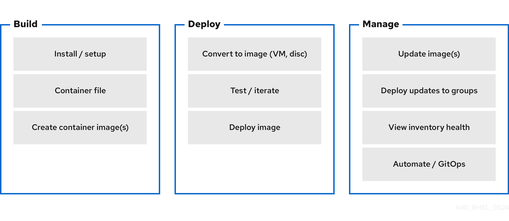
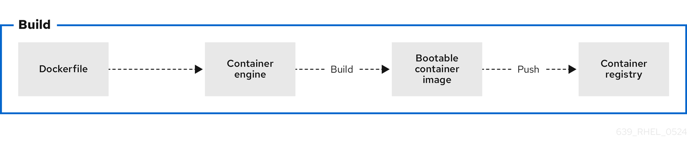
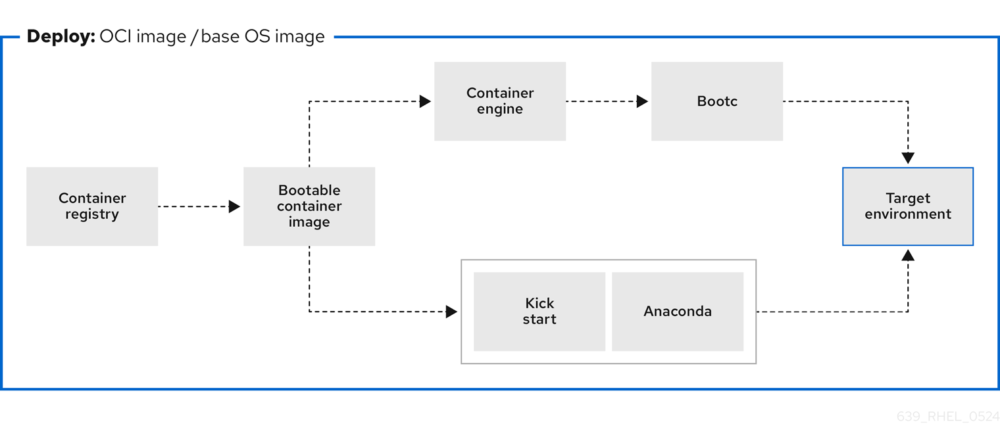
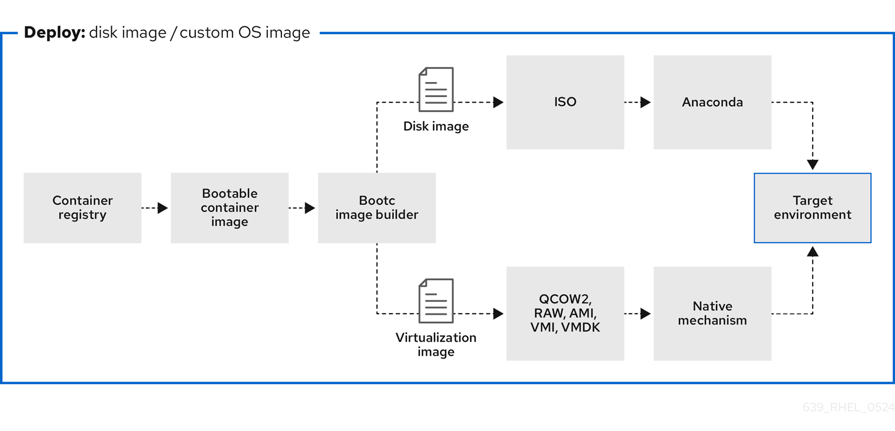

# Using image mode for RHEL to build, deploy, and manage operating systems

* * *

Red Hat Enterprise Linux 10

## Using RHEL bootc images on Red Hat Enterprise Linux 10

Red Hat Customer Content Services

[Legal Notice](#idm140016422836544)

**Abstract**

By using RHEL bootc images, you can build, deploy, and manage the operating system as a container. With image mode for RHEL, you can manage your application as well as the underlying OS in a single container-native workflow.

* * *

<h2 id="providing-feedback-on-red-hat-documentation">Providing feedback on Red Hat documentation</h2>

We are committed to providing high-quality documentation and value your feedback. To help us improve, you can submit suggestions or report errors through the Red Hat Jira tracking system.

**Procedure**

1. Log in to the [Jira](https://issues.redhat.com/projects/RHELDOCS/issues) website.
   
   If you do not have an account, select the option to create one.
2. Click **Create** in the top navigation bar.
3. Enter a descriptive title in the **Summary** field.
4. Enter your suggestion for improvement in the **Description** field. Include links to the relevant parts of the documentation.
5. Click **Create** at the bottom of the dialogue.

<h2 id="introducing-image-mode-for-rhel">Chapter 1. Introducing image mode for RHEL</h2>

Use image mode for RHEL to build, test, and deploy operating systems by using the same tools and techniques as application containers. Image mode for RHEL is available by using the `registry.redhat.io/rhel10/rhel-bootc` bootc image. The RHEL bootc images differ from the existing application Universal Base Images (UBI) in that they contain additional components necessary to boot that were traditionally excluded, such as, kernel, initrd, boot loader, firmware, among others.

Note

The `rhel-bootc` and user-created containers based on `rhel-bootc` container image are subject to the [Red Hat Enterprise Linux end user license agreement (EULA)](https://www.redhat.com/en/about/eulas). You are not allowed to publicly redistribute these images.

<h3 id="overview-of-image-mode-for-rhel">1.1. Overview of image mode for RHEL</h3>

RHEL Image mode is a deployment method that uses container technology to manage the operating system as an Open Container Initiative (OCI) container image.

**Figure 1.1. Building, deploying, and managing operating system by using image mode for RHEL**

 

Red Hat provides bootc image for the following computer architectures:

- AMD and Intel 64-bit architectures (x86-64-v2)
- The 64-bit ARM architecture (ARMv8.0-A)
- IBM Power Systems 64-bit Little Endian architecture (ppc64le)
- IBM Z 64-bit architecture (s390x)

Warning

Anaconda may not work correctly on s390x and ppc64le architectures. For more information, see the [Release Notes](https://docs.redhat.com/en/documentation/red_hat_enterprise_linux/10/html/10.0_release_notes/index).

The benefits of image mode for RHEL occur across the lifecycle of a system. The following list contains some of the most important advantages:

Container images are easier to understand and use than other image formats and are fast to build

Containerfiles, also known as Dockerfiles, provide a straightforward approach to defining the content and build instructions for an image. Container images are often significantly faster to build and iterate on compared to other image creation tools.

Consolidate process, infrastructure, and release artifacts

As you distribute applications as containers, you can use the same infrastructure and processes to manage the underlying operating system.

Immutable updates

Just as containerized applications are updated in an immutable way, with image mode for RHEL, the operating system is also. You can boot into updates and roll back when needed in the same way that you use `rpm-ostree` systems.

Portability across hybrid cloud environments

You can use bootc images across physical, virtualized, cloud, and edge environments.

Although containers provide the foundation to build, transport, and run images, it is important to understand that after you deploy these bootc images, either by using an installation mechanism, or you convert them to a disk image, the system does not run as a container.

- Bootc supports the following container image formats and disk image formats:

| Image type             | Target environment                                                                                                                                  |
|:-----------------------|:----------------------------------------------------------------------------------------------------------------------------------------------------|
| `OCI container format` | Physical, virtualized, cloud, and edge environments.                                                                                                |
| `ami`                  | Amazon Machine Image.                                                                                                                               |
| `qcow2` (default)      | QEMU (targeted for environments such as Red Hat OpenStack, Red Hat OpenStack services for OpenShift, and OpenShift Virtualization), Libvirt (RHEL). |
| `vmdk`                 | VMDK for vSphere.                                                                                                                                   |
| `anaconda-iso`         | An unattended Anaconda installer that installs to the first disk found.                                                                             |
| `raw`                  | Unformatted raw disk. Also supported in QEMU and Libvirt                                                                                            |
| `vhd`                  | VHD for Virtual PC, among others.                                                                                                                   |
| `gce`                  | Google Compute Engine (GCE) environment.                                                                                                            |

Table 1.1. bootc supported image types

Containers help streamline the lifecycle of a RHEL system by offering the following possibilities:

Building container images

You can configure your operating system at a build time by modifying the Containerfile. Image mode for RHEL is available by using the `registry.redhat.io/rhel10/rhel-bootc` container image. You can use Podman, OpenShift Container Platform, or other standard container build tools to manage your containers and container images. You can automate the build process by using CI/CD pipelines.

Versioning, mirroring, and testing container images

You can version, mirror, introspect, and sign your derived bootc image by using any container tools such as Podman or OpenShift Container Platform.

Deploying container images to the target environment

You have several options on how to deploy your image:

- **Anaconda**: is the installation program used by RHEL. You can deploy all image types to the target environment by using Anaconda and Kickstart to automate the installation process.
- **`bootc-image-builder`** : is a containerized tool that converts the container image to different types of disk images, and optionally uploads them to an image registry or object storage.
- **`bootc`** : is a tool responsible for fetching container images from a container registry and installing them to a system, updating the operating system, or switching from an existing ostree-based system. The RHEL bootc image contains the `bootc` utility by default and works with all image types. It is intended to supersede `rpm-ostree`.

Updating your operating system

The system supports in-place transactional updates with rollback after deployment. Automatic updates are on by default. A systemd service unit and systemd timer unit files check the container registry for updates and apply them to the system. As the updates are transactional, a reboot is required. For environments that require more sophisticated or scheduled rollouts, disable auto updates and use the `bootc` utility to update your operating system.

RHEL has two deployment modes. Both provide the same stability, reliability, and performance during deployment. See their differences:

1. **Package mode**: the operating system uses RPM packages and is updated by using the `dnf` package manager. The root filesystem is mutable. However, the operating system cannot be managed as a containerized application.
2. **Image mode**: a container-native approach to build, deploy, and manage RHEL. The same RPM packages are delivered as a base image and updates are deployed as a container image. The root filesystem is immutable by default, except for `/etc` and `/var`, with most content coming from the container image.

You can choose to use either the **Image mode** or the **Package mode** deployment to build, test, and share your operating system. **Image mode** additionally enables you to manage your operating system in the same way as any other containerized application.

**Additional resources**

- [Introducing image mode for RHEL and bootc in Podman Desktop](https://developers.redhat.com/articles/2024/05/07/image-mode-rhel-bootable-containers)
- [Image mode for Red Hat Enterprise Linux quick start: AI inference](https://developers.redhat.com/articles/2024/05/07/image-mode-rhel-quick-start-ai-inference)
- [Getting Started with Podman AI Lab](https://developers.redhat.com/articles/2024/04/24/getting-started-podman-ai-lab)
- [Automatically installing RHEL](https://docs.redhat.com/en/documentation/red_hat_enterprise_linux/10/html/automatically_installing_rhel)
- [Composing, installing, and managing RHEL for Edge images](https://docs.redhat.com/en/documentation/red_hat_enterprise_linux/10/html/composing_installing_and_managing_rhel_for_edge_images)

<h2 id="building-and-testing-rhel-bootc-images">Chapter 2. Building and testing RHEL bootc images</h2>

You can build, test, and deploy RHEL bootc images by using the same tools and techniques as application containers, such as Podman, Containerfiles, and OpenShift Container Platform. You can converge on a single container-native workflow to manage everything from your applications to the underlying operating system.

<h3 id="building-and-configuring-bootc-based-images-from-a-containerfile">2.1. Building and configuring bootc-based images from a Containerfile</h3>

You can use a Containerfile to build and customize your own bootc-based image with the tools, configurations, and applications you need. While most standard instructions work, some are ignored when the image is installed on a system.

**Figure 2.1. Building an image by using instructions from a Containerfile, testing the container, pushing an image to a registry, and sharing it with others**

 

A general `Containerfile` structure is the following:

```
FROM registry.redhat.io/rhel10/rhel-bootc:latest

RUN dnf -y install [software] [dependencies] && dnf clean all

ADD [application]
ADD [configuration files]

RUN [config scripts]
```

```plaintext
FROM registry.redhat.io/rhel10/rhel-bootc:latest

RUN dnf -y install [software] [dependencies] && dnf clean all

ADD [application]
ADD [configuration files]

RUN [config scripts]
```

The available commands that are usable inside a `Containerfile` and a `Dockerfile` are equivalent.

However, the following commands in a `Containerfile` are ignored when the `rhel-10-bootc` image is installed to a system:

- `ENTRYPOINT` and `CMD` (OCI: `Entrypoint/Cmd`): you can set `CMD /sbin/init` instead.
- `ENV` (OCI: `Env`): change the `systemd` configuration to configure the global system environment.
- `EXPOSE` (OCI: `exposedPorts`): it is independent of how the system firewall and network function at runtime.
- `USER` (OCI: `User`): configure individual services inside the RHEL bootc to run as unprivileged users instead.

The `rhel-10-bootc` container image reuses the OCI image format.

- The `rhel-10-bootc` container image ignores the container config section (`Config`) when it is installed to a system.
- The `rhel-10-bootc` container image does not ignore the container config section (`Config`) when you run this image by using container runtimes such as `podman` or `docker`.

<h3 id="building-reproducible-container-images-with-container-tools">2.2. Building reproducible container images with container tools</h3>

Red Hat Enterprise Linux supports reproducible container builds using Podman and Buildah, reducing image changes with consistent inputs over time. This feature decreases data pulled from registries when updating images, which is crucial for supply chain security, reliable software deployment, and effective debugging.

Using reproducible builds for RHEL containers reduces registry storage, creates smaller update payloads, and enables faster downloads by ensuring image layers remain consistent. Previously, challenges with tarball creation and escalating container image sizes led to increased storage burdens and unnecessary layer pulls, even when underlying data remained unchanged, hindering faster updates in environments like rhel-bootc and RHEL AI.

<h3 id="building-a-container-image">2.3. Building a container image</h3>

To build an image by using instructions from a `Containerfile`, use the `podman build` command.

**Prerequisites**

- The `container-tools` meta-package is installed.

**Procedure**

1. Create a `Containerfile`:
   
   ```
   FROM registry.redhat.io/rhel10/rhel-bootc:latest
   RUN dnf -y install cloud-init && \
       ln -s ../cloud-init.target /usr/lib/systemd/system/default.target.wants && \
       dnf clean all
   ```
   
   ```bash
   FROM registry.redhat.io/rhel10/rhel-bootc:latest
   RUN dnf -y install cloud-init && \
       ln -s ../cloud-init.target /usr/lib/systemd/system/default.target.wants && \
       dnf clean all
   ```
   
   This `Containerfile` example adds the `cloud-init` tool, so it automatically fetches SSH keys and can run scripts from the infrastructure and also gather configuration and secrets from the instance metadata. For example, you can use this container image for pre-generated AWS or KVM guest systems.
2. Build the `<image>` image by using `Containerfile` in the current directory:
   
   ```
   podman build -t quay.io/<namespace>/<image>:<tag> .
   ```
   
   ```plaintext
   $ podman build -t quay.io/<namespace>/<image>:<tag> .
   ```

**Verification**

- List all images:
  
  ```
  podman images
  REPOSITORY                                  TAG      IMAGE ID       CREATED              SIZE
  localhost/<image>                           latest   b28cd00741b3   About a minute ago   2.1 GB
  ```
  
  ```plaintext
  $ podman images
  REPOSITORY                                  TAG      IMAGE ID       CREATED              SIZE
  localhost/<image>                           latest   b28cd00741b3   About a minute ago   2.1 GB
  ```

**Additional resources**

- [Working with container registries](https://docs.redhat.com/en/documentation/red_hat_enterprise_linux/10/html/building_running_and_managing_containers/working-with-container-registries)
- [Building an image from a Containerfile with Buildah](https://docs.redhat.com/en/documentation/red_hat_enterprise_linux/10/html/building_running_and_managing_containers/running-skopeo-buildah-and-podman-in-a-container#running-buildah-in-a-container)
- [Building a container](https://docs.redhat.com/en/documentation/red_hat_enterprise_linux/10/html/building_running_and_managing_containers/working-with-containers#building-a-container)

<h3 id="running-a-container-image">2.4. Running a container image</h3>

To run and test your container, use the `podman run` command.

**Prerequisites**

- The `container-tools` meta-package is installed.

**Procedure**

- Run the container by using the `podman run` command with the appropriate options. For example, to run the container named `mybootc` based on the `quay.io/<namespace>/<image>:<tag>` container image:
  
  ```
  podman run -it --rm --name mybootc quay.io/<namespace>/<image>:<tag> /bin/bash
  ```
  
  ```plaintext
  $ podman run -it --rm --name mybootc quay.io/<namespace>/<image>:<tag> /bin/bash
  ```
  
  - The `-i` option creates an interactive session. Without the `-i` option, the shell opens and then exits.
  - The `-t` option opens a terminal session. Without the `-t` option, the shell stays open, but you cannot type anything to the shell.
  - The `--rm` option removes the `quay.io/<namespace>/<image>:<tag>` container image after the container exits.

**Verification**

- List all running containers:
  
  ```
  podman ps
  CONTAINER ID  IMAGE                                    COMMAND          CREATED        STATUS            PORTS   NAMES
  7ccd6001166e  quay.io/<namespace>/<image>:<tag>  /sbin/init  6 seconds ago  Up 5 seconds ago          mybootc
  ```
  
  ```plaintext
  $ podman ps
  CONTAINER ID  IMAGE                                    COMMAND          CREATED        STATUS            PORTS   NAMES
  7ccd6001166e  quay.io/<namespace>/<image>:<tag>  /sbin/init  6 seconds ago  Up 5 seconds ago          mybootc
  ```

**Additional resources**

- [Podman run command](https://docs.redhat.com/en/documentation/red_hat_enterprise_linux/10/html/building_running_and_managing_containers/working-with-containers#podman-run-command)

<h3 id="overriding-the-version-of-bootc-images">2.5. Overriding the version of bootc images</h3>

Red Hat Enterprise Linux (RHEL) base images, Universal Base Images (UBI), and `rhel-bootc` use version numbers that track only the major operating system version. To define a specific version number for a derived image, you can override this value by adding the `version` label to your Containerfile.

**Prerequisites**

- The `container-tools` meta-package is installed.

**Procedure**

1. Create a Containerfile:
   
   ```
   FROM registry.redhat.io/rhel10/rhel-bootc:latest
   # In this example, the custom operating system has its own
   # version scheme.
   # The operating system major version is copied
   # and a sub-version of it is added, which represents a point-in-time
   # snapshot of the base OS content.
   # This just changes the output of bootc status. A deeper level
   # of customization is available by also changing the contents of /usr/lib/os-release.
   # Define the custom version and release metadata
   LABEL org.opencontainers.image.version=”10.1.1”
   ```
   
   ```plaintext
   FROM registry.redhat.io/rhel10/rhel-bootc:latest
   # In this example, the custom operating system has its own
   # version scheme.
   # The operating system major version is copied
   # and a sub-version of it is added, which represents a point-in-time
   # snapshot of the base OS content.
   # This just changes the output of bootc status. A deeper level
   # of customization is available by also changing the contents of /usr/lib/os-release.
   # Define the custom version and release metadata
   LABEL org.opencontainers.image.version=”10.1.1”
   ```
2. Build the `<image>` image by using `Containerfile` from the current directory:
   
   ```
   podman build -t quay.io/<namespace>/<image>:<tag> .
   ```
   
   ```plaintext
   $ podman build -t quay.io/<namespace>/<image>:<tag> .
   ```

**Verification**

- Verify that the override was applied:
  
  ```
  podman inspect <image-name> --format '{{index .Labels "org.opencontainers.image.version"}}'
  ```
  
  ```plaintext
  $ podman inspect <image-name> --format '{{index .Labels "org.opencontainers.image.version"}}'
  ```

<h3 id="benefits-of-custom-bootable-images-with-multi-stage-builds">2.6. Benefits of custom bootable images with multi-stage builds</h3>

The deployment image must include only the application and its required runtime, without adding any build tools or unnecessary libraries. To achieve this, use a two-stage `Containerfile`: one stage for building the artifacts and another for hosting the application.

With multi-stage builds, you use multiple `FROM` instructions in your `Containerfile`. Each `FROM` instruction can use a different base and starts a new stage of the build. You can selectively copy artifacts from one stage to another and exclude everything you do not need in the final image.

**Multi-stage builds offer several advantages:**

Smaller image size

By separating the build environment from the runtime environment, only the necessary files and dependencies are included in the final image, significantly reducing its size.

Improved security

Since build tools and unnecessary libraries are excluded from the final image, the attack surface is reduced, leading to a more secure container.

Optimized performance

A smaller image size means faster download, deployment, and startup times, improving the overall efficiency of the containerized application.

Simplified maintenance

With the build and runtime environments separated, the final image is cleaner and easier to maintain, containing only what is needed to run the application.

Cleaner builds

Multi-stage builds help avoid clutter from intermediate files, which could accumulate during the build process, ensuring that only essential artifacts make it into the final image.

Resource efficiency

The ability to build in one stage and discard unnecessary parts minimizes the use of storage and bandwidth during deployment.

Better layer caching

With clearly defined stages, Podman can efficiently cache the results of previous stages, potentially speeding up future builds.

The following `Containerfile` consists of two stages. The first stage is typically named `builder` and it compiles a golang binary. The second stage copies the binary from the first stage. The default working directory for the go-toolset builder is `opt/ap-root/src`.

```
FROM registry.access.redhat.com/ubi10/go-toolset:latest as builder
RUN echo 'package main; import "fmt"; func main() { fmt.Println("hello world") }' > helloworld.go
RUN go build helloworld.go

FROM registry.redhat.io/rhel10/rhel-bootc:latest
COPY --from=builder /opt/app-root/src/helloworld /
CMD ["/helloworld"]
```

```plaintext
FROM registry.access.redhat.com/ubi10/go-toolset:latest as builder
RUN echo 'package main; import "fmt"; func main() { fmt.Println("hello world") }' > helloworld.go
RUN go build helloworld.go

FROM registry.redhat.io/rhel10/rhel-bootc:latest
COPY --from=builder /opt/app-root/src/helloworld /
CMD ["/helloworld"]
```

As a result, the final container image includes the `helloworld` binary but no data from the previous stage.

You can also use multi-stage builds to perform the following scenarios:

Stopping at a specific build stage

When you build your image, you can stop at a specified build stage. For example:

```
podman build --target build -t hello .
```

```plaintext
$ podman build --target build -t hello .
```

For example, you can use this approach to debugging a specific build stage.

Using an external image as a stage

You can use the `COPY --from` instruction to copy from a separate image either using the local image name, a tag available locally or on a container registry, or a tag ID. For example:

```
COPY --from=<image> <source_path> <destination_path>
```

```plaintext
COPY --from=<image> <source_path> <destination_path>
```

Using a previous stage as a new stage

You can continue where a previous stage ended by using the `FROM` instruction. From example:

```
FROM ubi10 AS stage1
[...]

FROM stage1 AS stage2
[...]

FROM ubi10 AS final-stage
[...]
```

```plaintext
FROM ubi10 AS stage1
[...]

FROM stage1 AS stage2
[...]

FROM ubi10 AS final-stage
[...]
```

**Additional resources**

- [How to build multi-architecture container images](https://developers.redhat.com/articles/2023/11/03/how-build-multi-architecture-container-images)

<h3 id="pushing-a-container-image-to-the-registry">2.7. Pushing a container image to the registry</h3>

To push an image to your own registry, or a third party registry, and share it with others, use the `podman push` command. The following procedure uses the Red Hat Quay registry as an example.

**Prerequisites**

- The `container-tools` meta-package is installed.
- An image is built and available on the local system.
- You have created the Red Hat Quay registry. For more information, see [Proof of Concept - Deploying Red Hat Quay](https://docs.redhat.com/en/documentation/red_hat_quay/3.10/html/proof_of_concept_-_deploying_red_hat_quay/index).

**Procedure**

- Push the `quay.io/<namespace>/<image>:<tag>` container image from your local storage to the registry:
  
  ```
  podman push quay.io/<namespace>/<image>:<tag>
  ```
  
  ```plaintext
  $ podman push quay.io/<namespace>/<image>:<tag>
  ```
  
  For more information, see the `podman-tag(1)` and `podman-push(1)` man pages on your system.

<h2 id="building-and-managing-logically-bound-images">Chapter 3. Building and managing logically bound images</h2>

Logically bound images give you support for container images that are bound to the lifecycle of the base bootc image. This helps combine different operational processes for applications and operating systems, and the container application images are referenced from the base image as image files or an equivalent. Consequently, you can manage multiple container images for system installations.

You can use containers for lifecycle-bound workloads, such as security agents and monitoring tools. You can also upgrade such workloads by using the `bootc upgrade` command.

<h3 id="introduction-to-logically-bound-images">3.1. Introduction to logically bound images</h3>

By using logically bound images, you can associate container application images to a base bootc system image. By default, application containers as executed by, for example, `podman` have a lifecycle independent of host upgrades; they can be added or removed at any time, and are typically fetched on demand after booting if the container image is not present.

Logically bound images offer a key benefit that the application containers bound in this way have a lifecycle tied to the host upgrade and are available **before** the host reboots into the new operating system. The container images bound in this way will be present as long as a bootc container references them.

The following are examples for lifecycle bound workloads which are usually not updated outside of the host:

- Logging, for example, journald→remote log forwarder container
- Monitoring, for example, Prometheus node\_exporter
- Configuration management agents
- Security agents

For these types of workloads it is often important that the container start from a very early stage in the boot process before e.g. networking might be available. Logically bound images enable you to start containers (often via systemd) with the the same reliability of using `ExecStart=` of a binary in the base bootc image.

The term *logically bound* can also be contrasted with another model of physically bound images, where application container content is physically stored in the bootc container image. A key advantage for logically bound over physically bound is that tou can update the bootc system without re-downloading application container images which are not changed.

When using logically bound images, you must manage multiple container images for the system to install the logically bound images. This is an advantage and also a disadvantage. For example, for a disconnected or offline installation, you must mirror all the containers, not just one. The application images are only referenced from the base image as `.image` files or an equivalent.

Logically bound images installation

When you run `bootc install`, logically bound images must be present in the default `/var/lib/containers` container store. The images will be copied into the target system and present directly at boot, alongside the bootc base image.

Logically bound images lifecycle

Logically bound images are referenced by the bootable container and have guaranteed availability when the bootc based server starts. The image is always upgraded by using `bootc upgrade` and is available as `read-only` to other processes, such as Podman.

Logically bound images management on upgrades, rollbacks, and garbage collection

- During upgrades, the logically bound images are managed exclusively by bootc.
- During rollbacks, the logically bound images corresponding to rollback deployments are retained.
- bootc performs garbage collection of unused bound images.

<h3 id="creating-logically-bound-images">3.2. Creating logically bound images</h3>

To create logically bound images, link application container images to the lifecycle of a base bootc image. This approach allows you to manage applications and the operating system as a cohesive unit, facilitating updates and ensuring consistency. You can create logically bound images by using a Podman Quadlet `.image` or `.container` files.

**Prerequisites**

- The `container-tools` meta-package is installed.

**Procedure**

1. Select the image that you want to logically bound.
2. Create a `Containerfile`:
   
   ```
   cat Containerfile
   FROM quay.io/<namespace>/<image>:latest
   COPY ./<app_1>.image /usr/share/containers/systemd/<app_1>.image
   COPY ./<app_2>.container /usr/share/containers/systemd/<app_2>.container
   
   RUN ln -s /usr/share/containers/systemd/<app_1>.image \
   	/usr/lib/bootc/bound-images.d/<app_1>.image && \
       ln -s /usr/share/containers/systemd/<app_2>.container \
       	/usr/lib/bootc/bound-images.d/<app_2>.container
   ```
   
   ```plaintext
   $ cat Containerfile
   FROM quay.io/<namespace>/<image>:latest
   COPY ./<app_1>.image /usr/share/containers/systemd/<app_1>.image
   COPY ./<app_2>.container /usr/share/containers/systemd/<app_2>.container
   
   RUN ln -s /usr/share/containers/systemd/<app_1>.image \
   	/usr/lib/bootc/bound-images.d/<app_1>.image && \
       ln -s /usr/share/containers/systemd/<app_2>.container \
       	/usr/lib/bootc/bound-images.d/<app_2>.container
   ```
3. In the `.container` definition, use:
   
   ```
   GlobalArgs=--storage-opt=additionalimagestore=/usr/lib/bootc/storage
   ```
   
   ```plaintext
   GlobalArgs=--storage-opt=additionalimagestore=/usr/lib/bootc/storage
   ```
   
   In the `Containerfile` example, the image is selected to be logically bound by creating a symlink in the `/usr/lib/bootc/bound-images.d` directory pointing to either an `.image` or a `.container` file.
4. Run the `bootc upgrade` command.
   
   ```
   bootc upgrade
   ```
   
   ```plaintext
   $ bootc upgrade
   ```
   
   The bootc upgrade performs the following overall steps:
   
   1. Fetches the new base image from the image repository. See [Configuring container pull secrets](https://docs.redhat.com/en/documentation/red_hat_enterprise_linux/10/html/using_image_mode_for_rhel_to_build_deploy_and_manage_operating_systems/appendix-managing-users-groups-ssh-keys-and-secrets-in-image-mode-for-rhel#configuring-container-pull-secrets).
   2. Reads the new base image root file system to discover logically bound images.
   3. Automatically pulls any discovered logically bound images defined in the new bootc image into the bootc-owned `/usr/lib/bootc/storage` image storage.
5. Make the bound images become available to container runtimes such as Podman. For that, you must explicitly configure bound images to point to the bootc storage as an "additional image store". For example:
   
   ```
   podman --storage-opt=additionalimagestore=/usr/lib/bootc/storage run <image>
   ```
   
   ```plaintext
   podman --storage-opt=additionalimagestore=/usr/lib/bootc/storage run <image>
   ```
   
   Important
   
   Do not attempt to globally enable the `/usr/lib/bootc/storage` image storage in `/etc/containers/storage.conf`. Only use the bootc storage for logically bound images.
   
   The `bootc image store` is owned by `bootc`. The logically bound images will be garbage collected when they are no longer referenced by a file in the `/usr/lib/bootc/bound-images.d` directory.

<h2 id="creating-bootc-compatible-base-disk-images-by-using-bootc-image-builder">Chapter 4. Creating bootc-compatible base disk images by using bootc-image-builder</h2>

The `bootc-image-builder` is a containerized tool to create disk images from bootc images. You can use the images that you build to deploy disk images in different environments, such as the edge, server, and cloud.

<h3 id="introducing-image-mode-for-rhel-for-bootc-image-builder">4.1. Introducing image mode for RHEL for bootc-image-builder</h3>

By using the `bootc-image-builder` tool, you can convert bootc images into disk images for a variety of different platforms and formats. Converting bootc images into disk images is equivalent to installing a bootc image. After you deploy these disk images to the target environment, you can update them directly from the container registry.

You can build your base images by using one of the following methods:

- Use a local RHEL system, install the Podman tool, and build your image locally. Then, you can push the images to your private registry.
- Use a CI/CD pipeline: Create a CI/CD pipeline that uses a RHEL-based system to build images and push them to your private registry.

The `bootc-image-builder` tool supports generating the following image types:

- Disk image formats, such as ISO, that are suitable for disconnected installations.
- Virtual disk image formats, such as:
  
  - QEMU copy-on-write (QCOW2)
  - Amazon Machine Image (AMI)
  - Unformatted raw disk (Raw)
  - Virtual Machine Image (VMI)

`bootc-image-builder` uses the local container storage by default. The tool cannot pull container images from remote registries itself. To build disk images, you must make the base bootc container image available in the system’s local container registry to mount the system’s container storage into the bootc-image-builder container so it can use containers from the system storage.

Deploying from a container image is beneficial when you run VMs or servers because you can achieve the same installation result. That consistency extends across multiple different image types and platforms when you build them from the same container image. Consequently, you can minimize the effort in maintaining operating system images across platforms. You can also update systems that you deploy from these disk images by using the `bootc` tool, instead of re-creating and uploading new disk images with `bootc-image-builder`.

Although you can deploy a `rhel-9-bootc` image directly, you can also create your own customized images that are derived from this bootc image. The `bootc-image-builder` tool takes the `rhel-9-bootc` OCI container image as an input.

Note

Generic base container images do not include any default passwords or SSH keys. Also, the disk images that you create by using the `bootc-image-builder` tool do not contain the tools that are available in common disk images, such as `cloud-init`. These disk images are transformed container images only.

**Additional resources**

- [Red Hat products that use cloud-init](https://docs.redhat.com/en/documentation/red_hat_enterprise_linux/10/html/configuring_and_managing_cloud-init_for_rhel/index)

<h3 id="installing-bootc-image-builder">4.2. Installing bootc-image-builder</h3>

To install the `bootc-image-builder`, use the Red Hat Container Registry. The `bootc-image-builder` is intended to be used as a container and it is not available as an RPM package in RHEL.

**Prerequisites**

- The `container-tools` meta-package is installed. The meta-package contains all container tools, such as Podman, Buildah, and Skopeo.
- You are authenticated to `registry.redhat.io`. For details, see [Red Hat Container Registry Authentication](https://access.redhat.com/RegistryAuthentication).

**Procedure**

1. Login to authenticate to `registry.redhat.io`:
   
   ```
   sudo podman login registry.redhat.io
   ```
   
   ```plaintext
   $ sudo podman login registry.redhat.io
   ```
2. Install the `bootc-image-builder` tool:
   
   ```
   sudo podman pull registry.redhat.io/rhel10/bootc-image-builder
   ```
   
   ```plaintext
   $ sudo podman pull registry.redhat.io/rhel10/bootc-image-builder
   ```

**Verification**

- List all images pulled to your local system:
  
  ```
  sudo podman images
  REPOSITORY                                    TAG         IMAGE ID      CREATED       SIZE
  registry.redhat.io/rhel10/bootc-image-builder  latest      b361f3e845ea  24 hours ago  676 MB
  ```
  
  ```plaintext
  $ sudo podman images
  REPOSITORY                                    TAG         IMAGE ID      CREATED       SIZE
  registry.redhat.io/rhel10/bootc-image-builder  latest      b361f3e845ea  24 hours ago  676 MB
  ```

**Additional resources**

- [Red Hat Container Registry Authentication](https://access.redhat.com/RegistryAuthentication)
- [Pulling images from registries](https://docs.redhat.com/en/documentation/red_hat_enterprise_linux/10/html/building_running_and_managing_containers/index#pulling-images-from-registries)

<h3 id="supported-image-customizations-for-a-configuration-file">4.3. Supported image customizations for a configuration file</h3>

You can use a build configuration file in the `TOML` or `JSON` format to add customizations for your resulting disk image. The container directory maps the config file to `/config.toml`. The customizations object defines the image modifications.

Additionally, you can embed a build configuration file, either as `config.json` or `config.toml` in the `/usr/lib/bootc-image-builder` directory. The system uses these default customizations unless explicitly overridden. For the `JSON` format, you can also pass the configuration by using `stdin` when you use the `--config` argument.

User customization

Add a user to your disk image, and optionally set an SSH key. All fields for this section are optional except for the `name`.

TOMLJSON

```
[[customizations.user]]
name = "user"
password = "password"
key = "ssh-rsa AAA ... user@email.com"
groups = ["wheel"]
```

```plaintext
[[customizations.user]]
name = "user"
password = "password"
key = "ssh-rsa AAA ... user@email.com"
groups = ["wheel"]
```

```
{
  "customizations": {
    "user": [
      {
        "name": "user",
        "password": "password",
        "key": "ssh-rsa AAA ... user@email.com",
        "groups": [
          "wheel",
          "admins"
        ]
      }
    ]
  }
}
```

```plaintext
{
  "customizations": {
    "user": [
      {
        "name": "user",
        "password": "password",
        "key": "ssh-rsa AAA ... user@email.com",
        "groups": [
          "wheel",
          "admins"
        ]
      }
    ]
  }
}
```

Kernel configuration

You can customize the kernel boot parameters in the configuration file.

TOMLJSON

```
[customizations.kernel]
name = "kernel-debug"
append = "nosmt=force"
```

```plaintext
[customizations.kernel]
name = "kernel-debug"
append = "nosmt=force"
```

```
{
  "customizations": {
    "kernel": {
      "append": "mitigations=auto,nosmt"
    }
  }
}
```

```plaintext
{
  "customizations": {
    "kernel": {
      "append": "mitigations=auto,nosmt"
    }
  }
}
```

File systems configuration

You can use the file system section of the customizations to set the minimum size of the base partitions, such as `/` and `/boot`, and to create extra partitions with mount points under `/var`.

TOMLJSON

```
[[customizations.filesystem]]
mountpoint = "/"
minsize = "10 GiB"

[[customizations.filesystem]]
mountpoint = "/var/data"
minsize = "20 GiB"
```

```plaintext
[[customizations.filesystem]]
mountpoint = "/"
minsize = "10 GiB"

[[customizations.filesystem]]
mountpoint = "/var/data"
minsize = "20 GiB"
```

```
{
  "customizations": {
    "filesystem": [
      {
        "mountpoint": "/",
        "minsize": "10 GiB"
      },
      {
        "mountpoint": "/var/data",
        "minsize": "20 GiB"
      }
    ]
  }
}
```

```plaintext
{
  "customizations": {
    "filesystem": [
      {
        "mountpoint": "/",
        "minsize": "10 GiB"
      },
      {
        "mountpoint": "/var/data",
        "minsize": "20 GiB"
      }
    ]
  }
}
```

File system type interaction with rootfs

The root file system type (`--rootfs`) argument overrides the default value from the source container. It also sets the file system types for all additional mount points for the `ext4`, `xfs`, and `btrfs` types.

For supported mount points and sizes, the following restrictions and rules apply, unless the `rootfs` is `btrfs`:

- You can specify `/` to set the minimum size of the root file system. The final size of the file system, mounted at `/sysroot` on a booted system, equals the value you specify in this configuration or 2x the size of the base container, whichever is larger.
- You can specify `/boot` to set the minimum size of the boot partition. You can also specify subdirectories of `/var`, but you cannot specify symlinks in `/var`. For example, `/var/home` and `/var/run` are symlinks and cannot be file systems on their own.
- `/var` itself cannot be a mount point. The `rootfs` option defines the file system type for the root file system.
- Currently, there is no support for creating `btrfs` subvolumes during build time. Therefore, if the `rootfs` is `btrfs`, no custom mount points are supported under `/var`. You can only configure `/` and `/boot`.

Anaconda ISO (installer) configuration options

Create a Kickstart file that contains the installation commands of your choice. Then, add a Kickstart file to your ISO build to create a fully customized and automated installation medium.

Note

The following combined customizations are not supported: `[customizations.user]` and `[customizations.installer.kickstart]`. When you add a Kickstart, use a configuration file in the `TOML` format, because multi-line strings are prone to error.

TOMLJSON

```
[customizations.installer.kickstart]
contents = """
text --non-interactive
zerombr
clearpart --all --initlabel --disklabel=gpt
autopart --noswap --type=lvm
network --bootproto=dhcp --device=link --activate --onboot=on
"""
```

```plaintext
[customizations.installer.kickstart]
contents = """
text --non-interactive
zerombr
clearpart --all --initlabel --disklabel=gpt
autopart --noswap --type=lvm
network --bootproto=dhcp --device=link --activate --onboot=on
"""
```

```
{
  "customizations": {
    "installer": {
      "kickstart": {
        "contents": "text --non-interactive\nzerombr\nclearpart --all --initlabel --disklabel=gpt\nautopart --noswap --type=lvm\nnetwork --bootproto=dhcp --device=link --activate --onboot=on"
      }
    }
  }
}
```

```plaintext
{
  "customizations": {
    "installer": {
      "kickstart": {
        "contents": "text --non-interactive\nzerombr\nclearpart --all --initlabel --disklabel=gpt\nautopart --noswap --type=lvm\nnetwork --bootproto=dhcp --device=link --activate --onboot=on"
      }
    }
  }
}
```

Warning

The `bootc-image-builder` does not add additional Kickstart commands besides the container image, which the system adds automatically to the container image. See [Creating Kickstart files](https://docs.redhat.com/en/documentation/red_hat_enterprise_linux/10/html/automatically_installing_rhel/creating-kickstart-files) for more information.

<h3 id="creating-qcow2-images-by-using-bootc-image-builder">4.4. Creating QEMU disk images by using bootc-image-builder</h3>

Build a RHEL bootc image into a QEMU (QCOW2) image for the architecture. The RHEL base image does not include a default user. You can optionally inject a user configuration by using the `--config` option to run the bootc-image-builder container. Alternatively, you can configure the base image with `cloud-init` to inject users and SSH keys on first boot. See [Users and groups configuration - Injecting users and SSH keys by using cloud-init](https://docs.redhat.com/en/documentation/red_hat_enterprise_linux/10/html/using_image_mode_for_rhel_to_build_deploy_and_manage_operating_systems/appendix-managing-users-groups-ssh-keys-and-secrets-in-image-mode-for-rhel#users-and-groups-configuration).

**Prerequisites**

- You have Podman installed on your host machine.
- You have root access to run the `bootc-image-builder` tool, and run the containers in `--privileged` mode, to build the images.
- You have the base bootc container image available in the systems root container registry.

**Procedure**

1. Optional: Create a `config.toml` to configure user access, for example:
   
   ```
   [[customizations.user]]
   name = "user"
   password = "pass"
   key = "ssh-rsa AAA ... user@email.com"
   groups = ["wheel"]
   ```
   
   ```plaintext
   [[customizations.user]]
   name = "user"
   password = "pass"
   key = "ssh-rsa AAA ... user@email.com"
   groups = ["wheel"]
   ```
2. Before running the container, initialize the `output` folder. Use the `-p` argument to ensure that the command does not fail if the directory already exists:
   
   ```
   mkdir -p ./output
   ```
   
   ```plaintext
   $ mkdir -p ./output
   ```
3. Run `bootc-image-builder`. Optionally, if you want to use user access configuration, pass the `config.toml` as an argument.
   
   1. The following example creates a public QEMU disk image (QCOW2). To build a public image, you must have a container image that is available in a remote, publicly accessible registry, for example, `registry.redhat.io/rhel10/bootc-image-builder:latest`. The image is available to download and use without special credentials.
      
      ```
      podman run \
          --rm \
          --privileged \
          --pull=newer \
          --security-opt label=type:unconfined_t \
          -v ./config.toml:/config.toml:ro \
          -v ./output:/output \
          registry.redhat.io/rhel10/bootc-image-builder:latest \
          --type qcow2 \
          --config /config.toml \
        quay.io/<namespace>/<image>:<tag>
      ```
      
      ```plaintext
      $ podman run \
          --rm \
          --privileged \
          --pull=newer \
          --security-opt label=type:unconfined_t \
          -v ./config.toml:/config.toml:ro \
          -v ./output:/output \
          registry.redhat.io/rhel10/bootc-image-builder:latest \
          --type qcow2 \
          --config /config.toml \
        quay.io/<namespace>/<image>:<tag>
      ```
   2. This example creates a private QEMU disk image (QCOW2) from a local container. To build a private image, you must have a container image on your local machine, which is not available on a public registry. The local image could be an image you built yourself using a Containerfile, an image you pulled from a private, access-controlled registry that required a login, or an image you loaded from a tar file. The bootc-image-builder finds and uses the source image from your local Podman `/var/lib/containers/storage` storage, which is mounted into the builder container.
      
      ```
      sudo podman run \
          --rm \
          -it \
          --privileged \
          --pull=newer \
          --security-opt label=type:unconfined_t \
          -v ./config.toml:/config.toml:ro \
          -v ./output:/output \
          -v /var/lib/containers/storage:/var/lib/containers/storage \
          registry.redhat.io/rhel10/bootc-image-builder:latest \
          --type qcow2 \
          --config /config.toml \
          quay.io/<namespace>/<image>:<tag>
      ```
      
      ```plaintext
      $ sudo podman run \
          --rm \
          -it \
          --privileged \
          --pull=newer \
          --security-opt label=type:unconfined_t \
          -v ./config.toml:/config.toml:ro \
          -v ./output:/output \
          -v /var/lib/containers/storage:/var/lib/containers/storage \
          registry.redhat.io/rhel10/bootc-image-builder:latest \
          --type qcow2 \
          --config /config.toml \
          quay.io/<namespace>/<image>:<tag>
      ```
      
      You can find the `.qcow2` image in the output folder.

**Next steps**

- You can deploy your image. See [Deploying a container image using KVM with a QCOW2 disk image](https://docs.redhat.com/en/documentation/red_hat_enterprise_linux/10/html/using_image_mode_for_rhel_to_build_deploy_and_manage_operating_systems/deploying-the-rhel-bootc-images#deploying-a-container-image-by-using-kvm-with-a-qcow2-disk-image).
- You can make updates to the image and push the changes to a registry. See [Managing RHEL bootc images](https://docs.redhat.com/en/documentation/red_hat_enterprise_linux/10/html/using_image_mode_for_rhel_to_build_deploy_and_manage_operating_systems/managing-rhel-bootc-images).

**Additional resources**

- [Build and run a bootable container image](https://developers.redhat.com/learn/rhel/build-and-run-bootable-container-image-image-mode-rhel-and-podman-desktop)

<h3 id="creating-vmdk-images-by-using-bootc-image-builder">4.5. Creating VMDK images by using bootc-image-builder</h3>

Create a Virtual Machine Disk (VMDK) from a bootc image and use it within VMware’s virtualization platforms, such as vSphere, or use it in Oracle VirtualBox.

**Prerequisites**

- You have Podman installed on your host machine.
- You have authenticated to the Red Hat Registry by using the `podman login registry.redhat.io`.
- You have pulled the `rhel10/bootc-image-builder` container image.

**Procedure**

1. Create a `Containerfile` with the following content:
   
   ```
   FROM registry.redhat.io/rhel10/rhel-bootc:latest
   RUN dnf -y install cloud-init open-vm-tools && \
   ln -s ../cloud-init.target /usr/lib/systemd/system/default.target.wants && \
   rm -rf /var/{cache,log} /var/lib/{dnf,rhsm} && \
   systemctl enable vmtoolsd.service
   ```
   
   ```plaintext
   FROM registry.redhat.io/rhel10/rhel-bootc:latest
   RUN dnf -y install cloud-init open-vm-tools && \
   ln -s ../cloud-init.target /usr/lib/systemd/system/default.target.wants && \
   rm -rf /var/{cache,log} /var/lib/{dnf,rhsm} && \
   systemctl enable vmtoolsd.service
   ```
2. Build the bootc image:
   
   ```
   podman build . -t localhost/rhel-bootc-vmdk
   ```
   
   ```plaintext
   # podman build . -t localhost/rhel-bootc-vmdk
   ```
3. Before running the container, initialize the `output` folder. Use the `-p` argument to ensure that the command does not fail if the directory already exists:
   
   ```
   mkdir -p ./output
   ```
   
   ```plaintext
   $ mkdir -p ./output
   ```
4. Create a VMDK file from the previously created bootc image. The image must be accessible from a registry, such as `registry.redhat.io/rhel10/bootc-image-builder:latest`.
   
   ```
   podman run \
       --rm \
       --privileged \
       -v /var/lib/containers/storage:/var/lib/containers/storage \
       -v ./output:/output \
       --security-opt label=type:unconfined_t \
       --pull newer \
       registry.redhat.io/rhel10/bootc-image-builder:latest \
       --type vmdk \
       --config /config.toml \
       localhost/rhel-bootc-vmdk:latest
   ```
   
   ```plaintext
   # podman run \
       --rm \
       --privileged \
       -v /var/lib/containers/storage:/var/lib/containers/storage \
       -v ./output:/output \
       --security-opt label=type:unconfined_t \
       --pull newer \
       registry.redhat.io/rhel10/bootc-image-builder:latest \
       --type vmdk \
       --config /config.toml \
       localhost/rhel-bootc-vmdk:latest
   ```
   
   A VMDK disk file for the bootc image is stored in the `output/vmdk` directory.

**Next steps**

- You can deploy your image.
- You can make updates to the image and push the changes to a registry. See [Managing RHEL bootc images](https://docs.redhat.com/en/documentation/red_hat_enterprise_linux/10/html/using_image_mode_for_rhel_to_build_deploy_and_manage_operating_systems/index#managing-rhel-bootc-images).

**Additional resources**

- [Build and run a bootable container image](https://developers.redhat.com/learn/rhel/build-and-run-bootable-container-image-image-mode-rhel-and-podman-desktop)

<h3 id="creating-gce-images-by-using-bootc-image-builder">4.6. Creating GCE images by using bootc-image-builder</h3>

Build a RHEL bootc image into a GCE image for the architecture on which you are running the commands.

The RHEL base image does not include a default user. Optionally, you can inject a user configuration by using the `--config` option to run the `bootc-image-builder` container. Alternatively, you can configure the base image with `cloud-init` to inject users and SSH keys on first boot. See [Users and groups configuration - Injecting users and SSH keys by using cloud-init](https://docs.redhat.com/en/documentation/red_hat_enterprise_linux/10/html/using_image_mode_for_rhel_to_build_deploy_and_manage_operating_systems/index#injecting-secrets-in-image-mode-for-rhel).

**Prerequisites**

- You have Podman installed on your host machine.
- You have root access to run the `bootc-image-builder` tool, and run the containers in `--privileged` mode, to build the images.

**Procedure**

1. Optional: Create a `config.toml` to configure user access, for example:
   
   ```
   [[customizations.user]]
   name = "user"
   password = "pass"
   key = "ssh-rsa AAA ... user@email.com"
   groups = ["wheel"]
   ```
   
   ```plaintext
   [[customizations.user]]
   name = "user"
   password = "pass"
   key = "ssh-rsa AAA ... user@email.com"
   groups = ["wheel"]
   ```
2. Before running the container, initialize the `output` folder. Use the `-p` argument to ensure that the command does not fail if the directory already exists:
   
   ```
   mkdir -p ./output
   ```
   
   ```plaintext
   $ mkdir -p ./output
   ```
3. Run `bootc-image-builder`. Optionally, if you want to use user access configuration, pass the `config.toml` as an argument. The image must be accessible from a registry, such as `registry.redhat.io/rhel10/bootc-image-builder:latest`.
   
   1. The following is an example of creating a `gce` image:
      
      ```
      podman run \
          --rm \
          --privileged \
          --pull=newer \
          --security-opt label=type:unconfined_t \
          -v ./config.toml:/config.toml:ro \
          -v ./output:/output \
          -v /var/lib/containers/storage:/var/lib/containers/storage \
          registry.redhat.io/rhel10/bootc-image-builder:latest \
          --type gce \
          --config /config.toml \
        quay.io/<namespace>/<image>:<tag>
      ```
      
      ```plaintext
      $ podman run \
          --rm \
          --privileged \
          --pull=newer \
          --security-opt label=type:unconfined_t \
          -v ./config.toml:/config.toml:ro \
          -v ./output:/output \
          -v /var/lib/containers/storage:/var/lib/containers/storage \
          registry.redhat.io/rhel10/bootc-image-builder:latest \
          --type gce \
          --config /config.toml \
        quay.io/<namespace>/<image>:<tag>
      ```
      
      You can find the `gce` image in the output folder.

**Next steps**

- You can make updates to the image and push the changes to a registry. See [Managing RHEL bootc images](https://docs.redhat.com/en/documentation/red_hat_enterprise_linux/10/html/using_image_mode_for_rhel_to_build_deploy_and_manage_operating_systems/index#managing-file-systems-in-image-mode-for-rhel).

**Additional resources**

- [Build and run a bootable container image](https://developers.redhat.com/learn/rhel/build-and-run-bootable-container-image-image-mode-rhel-and-podman-desktop)

<h3 id="creating-ami-images-by-using-bootc-image-builder-and-uploading-them-to-aws">4.7. Creating AMI images by using bootc-image-builder and uploading them to AWS</h3>

Create an Amazon Machine Image (AMI) from a bootc image and use it to launch an Amazon Web Services (AWS) Amazon Elastic Compute Cloud (EC2) instance.

**Prerequisites**

- You have Podman installed on your host machine.
- You have an existing `AWS S3` bucket within your AWS account.
- You have root access to run the `bootc-image-builder` tool, and run the containers in `--privileged` mode, to build the images.
- You have the `vmimport` service role configured on your account to import an AMI into your AWS account.

**Procedure**

1. Create a disk image from the bootc image.
   
   - Configure the user details in the Containerfile. Make sure that you assign it with sudo access.
   - Build a customized operating system image with the configured user from the Containerfile. It creates a default user with passwordless sudo access.
2. Optional: Configure the machine image with `cloud-init`. See [Users and groups configuration - Injecting users and SSH keys by using cloud-init](https://docs.redhat.com/en/documentation/red_hat_enterprise_linux/10/html/using_image_mode_for_rhel_to_build_deploy_and_manage_operating_systems/index#managing-file-systems-in-image-mode-for-rhel). The following is an example:
   
   ```
   FROM registry.redhat.io/rhel10/rhel-bootc:latest
   
   RUN dnf -y install cloud-init && \
       ln -s ../cloud-init.target /usr/lib/systemd/system/default.target.wants && \
       rm -rf /var/{cache,log} /var/lib/{dnf,rhsm}
   ```
   
   ```plaintext
   FROM registry.redhat.io/rhel10/rhel-bootc:latest
   
   RUN dnf -y install cloud-init && \
       ln -s ../cloud-init.target /usr/lib/systemd/system/default.target.wants && \
       rm -rf /var/{cache,log} /var/lib/{dnf,rhsm}
   ```
   
   Note
   
   You can also use `cloud-init` to add users and additional configuration by using instance metadata.
3. Build the bootc image. For example, to deploy the image to an `x86_64` AWS machine, use the following commands:
   
   ```
   podman build -t quay.io/<namespace>/<image>:<tag> .
   podman push quay.io/<namespace>/<image>:<tag> .
   ```
   
   ```plaintext
   $ podman build -t quay.io/<namespace>/<image>:<tag> .
   $ podman push quay.io/<namespace>/<image>:<tag> .
   ```
4. Before running the container, initialize the `output` folder. Use the `-p` argument to ensure that the command does not fail if the directory already exists:
   
   ```
   mkdir -p ./output
   ```
   
   ```plaintext
   $ mkdir -p ./output
   ```
5. Use the `bootc-image-builder` tool to create a public AMI image from the bootc container image. The image must be accessible from a registry, such as `registry.redhat.io/rhel10/bootc-image-builder:latest`.
   
   ```
   podman run \
     --rm \
     --privileged \
     --pull=newer \
     -v $HOME/.aws:/root/.aws:ro \
     -v /var/lib/containers/storage:/var/lib/containers/storage \
     --env AWS_PROFILE=default \
     registry.redhat.io/rhel10/bootc-image-builder:latest \
     --type ami \
     --config /config.toml \
     --aws-ami-name rhel-bootc-x86 \
     --aws-bucket rhel-bootc-bucket \
     --aws-region us-east-1 \
   quay.io/<namespace>/<image>:<tag>
   ```
   
   ```plaintext
   $ podman run \
     --rm \
     --privileged \
     --pull=newer \
     -v $HOME/.aws:/root/.aws:ro \
     -v /var/lib/containers/storage:/var/lib/containers/storage \
     --env AWS_PROFILE=default \
     registry.redhat.io/rhel10/bootc-image-builder:latest \
     --type ami \
     --config /config.toml \
     --aws-ami-name rhel-bootc-x86 \
     --aws-bucket rhel-bootc-bucket \
     --aws-region us-east-1 \
   quay.io/<namespace>/<image>:<tag>
   ```
   
   Note
   
   The following flags must be specified all together. If you do not specify any flag, the AMI is exported to your output directory.
   
   - `--aws-ami-name` - The name of the AMI image in AWS
   - `--aws-bucket` - The target S3 bucket name for intermediate storage when you are creating the AMI
   - `--aws-region` - The target region for AWS uploads
     
     The `bootc-image-builder` tool builds an AMI image and uploads it to your `AWS S3 bucket` by using your AWS credentials to push and register an AMI image after building it.

**Next steps**

- You can deploy your image. See [Deploying a container image to AWS with an AMI disk image](https://docs.redhat.com/en/documentation/red_hat_enterprise_linux/10/html/using_image_mode_for_rhel_to_build_deploy_and_manage_operating_systems/index#deploying-the-rhel-bootc-images).
- You can make updates to the image and push the changes to a registry. See [Managing RHEL bootc images](https://docs.redhat.com/en/documentation/red_hat_enterprise_linux/10/html/using_image_mode_for_rhel_to_build_deploy_and_manage_operating_systems/index#managing-file-systems-in-image-mode-for-rhel).
  
  If you have any issues configuring the requirements for your AWS image, see the following documentation
- [AWS IAM account manager](https://aws.amazon.com/iam/)
- [Using high-level (s3) commands with the AWS CLI](https://docs.aws.amazon.com/cli/latest/userguide/cli-services-s3-commands.html).
- [S3 buckets](https://aws.amazon.com/s3/).
- [Regions and Zones](https://docs.aws.amazon.com/AWSEC2/latest/UserGuide/using-regions-availability-zones.html#concepts-regions).
- [Launching a customized RHEL image on AWS](https://docs.redhat.com/en/documentation/red_hat_lightspeed/1-latest/html/deploying_and_managing_rhel_systems_in_hybrid_clouds/launching-customized-rhel-images-to-the-cloud-platforms-with-the-public-cloud-provider-tools_host-management-services#launching-images-on-aws-web-console_launching-customized-rhel-images-to-the-cloud-platforms-with-the-public-cloud-provider-tools).

For more details on users, groups, SSH keys, and secrets, see [Managing users, groups, SSH keys, and secrets in image mode for RHEL](https://docs.redhat.com/en/documentation/red_hat_enterprise_linux/10/html/using_image_mode_for_rhel_to_build_deploy_and_manage_operating_systems/appendix-managing-users-groups-ssh-keys-and-secrets-in-image-mode-for-rhel#users-and-groups-configuration).

**Additional resources**

- [AWS CLI documentation](https://docs.aws.amazon.com/cli/latest/userguide/cli-configure-envvars.html)
- [Build and run a bootable container image](https://developers.redhat.com/learn/rhel/build-and-run-bootable-container-image-image-mode-rhel-and-podman-desktop)

<h3 id="creating-raw-disk-images-by-using-bootc-image-builder">4.8. Creating raw disk images by using bootc-image-builder</h3>

You can convert a bootc image to a raw image with an MBR or GPT partition table by using `bootc-image-builder`.

The RHEL base image does not include a default user, so optionally, you can inject a user configuration by using the `--config` option to run the `bootc-image-builder` container. Alternatively, you can configure the base image with `cloud-init` to inject users and SSH keys on first boot. See [Users and groups configuration - Injecting users and SSH keys by using cloud-init](https://docs.redhat.com/en/documentation/red_hat_enterprise_linux/10/html/using_image_mode_for_rhel_to_build_deploy_and_manage_operating_systems/index#users-and-groups-configuration_managing-users-groups-ssh-key-and-secrets-in-image-mode-for-rhel).

**Prerequisites**

- You have Podman installed on your host machine.
- You have root access to run the `bootc-image-builder` tool, and run the containers in `--privileged` mode, to build the images.
- You have pulled your target container image in the container storage.

**Procedure**

1. Optional: Create a `config.toml` to configure user access, for example:
   
   ```
   [[customizations.user]]
   name = "user"
   password = "pass"
   key = "ssh-rsa AAA ... user@email.com"
   groups = ["wheel"]
   ```
   
   ```plaintext
   [[customizations.user]]
   name = "user"
   password = "pass"
   key = "ssh-rsa AAA ... user@email.com"
   groups = ["wheel"]
   ```
2. Before running the container, initialize the `output` folder. Use the `-p` argument to ensure that the command does not fail if the directory already exists:
   
   ```
   mkdir -p ./output
   ```
   
   ```plaintext
   $ mkdir -p ./output
   ```
3. Run `bootc-image-builder`. If you want to use user access configuration, pass the `config.toml` as an argument. The image must be accessible from a registry, such as `registry.redhat.io/rhel10/bootc-image-builder:latest`.
   
   ```
   podman run \
       --rm \
       --privileged \
       --pull=newer \
       --security-opt label=type:unconfined_t \
       -v /var/lib/containers/storage:/var/lib/containers/storage \
       -v ./config.toml:/config.toml \
       -v ./output:/output \
       registry.redhat.io/rhel10/bootc-image-builder:latest \
       --type raw \
       --config /config.toml \
     quay.io/<namespace>/<image>:<tag>
   ```
   
   ```plaintext
   $ podman run \
       --rm \
       --privileged \
       --pull=newer \
       --security-opt label=type:unconfined_t \
       -v /var/lib/containers/storage:/var/lib/containers/storage \
       -v ./config.toml:/config.toml \
       -v ./output:/output \
       registry.redhat.io/rhel10/bootc-image-builder:latest \
       --type raw \
       --config /config.toml \
     quay.io/<namespace>/<image>:<tag>
   ```
   
   You can find the `.raw` image in the output folder.

**Next steps**

- You can deploy your image. See [Deploying a container image by using KVM with a QCOW2 disk image](https://docs.redhat.com/en/documentation/red_hat_enterprise_linux/10/html/using_image_mode_for_rhel_to_build_deploy_and_manage_operating_systems/index#deploying-a-container-image-using-kvm-qemu-with-a-qcow2-disk-image_deploying-the-rhel-bootc-images).
- You can make updates to the image and push the changes to a registry. See [Managing RHEL bootc images](https://docs.redhat.com/en/documentation/red_hat_enterprise_linux/10/html/using_image_mode_for_rhel_to_build_deploy_and_manage_operating_systems/index#managing-rhel-bootc-images).

**Additional resources**

- [Build and run a bootable container image](https://developers.redhat.com/learn/rhel/build-and-run-bootable-container-image-image-mode-rhel-and-podman-desktop)

<h3 id="creating-iso-images-by-using-bootc-image-builder">4.9. Creating ISO images by using bootc-image-builder</h3>

You can use `bootc-image-builder` to create an ISO image from which you can perform an offline deployment of a bootable container.

**Prerequisites**

- You have Podman installed on your host machine.
- Your host system is subscribed or you have injected repository configuration by using bind mounts to ensure the image build process can fetch RPMs.
- You have root access to run the `bootc-image-builder` tool, and run the containers in `--privileged` mode, to build the images.

**Procedure**

1. Optional: Create a `config.toml` to which overrides the default embedded Kickstart which performs an automatic installation.
   
   ```
   [customizations.installer.kickstart]
   contents = """
   text --non-interactive
   zerombr
   clearpart --all --initlabel --disklabel=gpt
   autopart --noswap --type=lvm
   network --bootproto=dhcp --device=link --activate --onboot=on
   """
   ```
   
   ```plaintext
   [customizations.installer.kickstart]
   contents = """
   text --non-interactive
   zerombr
   clearpart --all --initlabel --disklabel=gpt
   autopart --noswap --type=lvm
   network --bootproto=dhcp --device=link --activate --onboot=on
   """
   ```
2. Before running the container, initialize the `output` folder. Use the `-p` argument to ensure that the command does not fail if the directory already exists:
   
   ```
   mkdir -p ./output
   ```
   
   ```plaintext
   $ mkdir -p ./output
   ```
3. Run `bootc-image-builder` to create a public ISO image. If you do not want to add any configuration, omit the `-v ./config.toml:/config.toml` argument. The image must be accessible from a registry, such as `registry.redhat.io/rhel10/bootc-image-builder:latest`.
   
   ```
   podman run \
       --rm \
       --privileged \
       --pull=newer \
       --security-opt label=type:unconfined_t \
       -v /var/lib/containers/storage:/var/lib/containers/storage \
       -v ./config.toml:/config.toml:ro \
       -v ./output:/output \
       registry.redhat.io/rhel10/bootc-image-builder:latest \
       --type iso \
       --config /config.toml \
     quay.io/<namespace>/<image>:<tag>
   ```
   
   ```plaintext
   $ podman run \
       --rm \
       --privileged \
       --pull=newer \
       --security-opt label=type:unconfined_t \
       -v /var/lib/containers/storage:/var/lib/containers/storage \
       -v ./config.toml:/config.toml:ro \
       -v ./output:/output \
       registry.redhat.io/rhel10/bootc-image-builder:latest \
       --type iso \
       --config /config.toml \
     quay.io/<namespace>/<image>:<tag>
   ```
   
   You can find the `.iso` image in the output folder.

**Next steps**

- You can use the ISO image on unattended installation methods, such as USB sticks or Install-on-boot. The installable boot ISO contains a configured Kickstart file. See [Deploying a container image by using Anaconda and Kickstart](https://docs.redhat.com/en/documentation/red_hat_enterprise_linux/10/html/using_image_mode_for_rhel_to_build_deploy_and_manage_operating_systems/index#deploying-a-container-image-by-using-anaconda-and-kickstart).
  
  Warning
  
  Booting the ISO on a machine with an existing operating system or data can be destructive, because the Kickstart is configured to automatically reformat the first disk on the system.
- You can make updates to the image and push the changes to a registry. See [Managing RHEL bootable images](https://docs.redhat.com/en/documentation/red_hat_enterprise_linux/10/html/using_image_mode_for_rhel_to_build_deploy_and_manage_operating_systems/index#managing-file-systems-in-image-mode-for-rhel).

**Additional resources**

- [Build and run a bootable container image](https://developers.redhat.com/learn/rhel/build-and-run-bootable-container-image-image-mode-rhel-and-podman-desktop)

<h3 id="using-bootc-image-builder-to-build-iso-images-with-a-kickstart-file">4.10. Using bootc-image-builder to build ISO images with a Kickstart file</h3>

You can use a Kickstart file to configure various parts of the RHEL installation process, such as setting up users, customizing partitioning, and adding an SSH key. You can include the Kickstart file in an ISO build to configure any part of the installation process, except the deployment of the base image. For ISOs with bootc container base images, you can use a Kickstart file to configure all installation settings except the `ostreecontainer` command.

For example, you can use a Kickstart to perform either a partial installation, a full installation, or even omit the user creation. Use `bootc-image-builder` to build an ISO image that contains the custom Kickstart to configure your installation process.

**Prerequisites**

- You have Podman installed on your host machine.
- You have root access to run the `bootc-image-builder` tool, and run the containers in `--privileged` mode, to build the images.

**Procedure**

1. Create your Kickstart file. The following Kickstart file is an example of a fully unattended Kickstart file configuration that contains user creation, and partition instructions.
   
   ```
   [customizations.installer.kickstart]
   contents = """
   lang en_GB.UTF-8
   keyboard uk
   timezone CET
   
   user --name <user> --password <password> --plaintext --groups <groups>
   sshkey --username <user> ssh-<type> <public key>
   rootpw --lock
   
   zerombr
   clearpart --all --initlabel
   autopart --type=plain
   reboot --eject
   """
   ```
   
   ```plaintext
   [customizations.installer.kickstart]
   contents = """
   lang en_GB.UTF-8
   keyboard uk
   timezone CET
   
   user --name <user> --password <password> --plaintext --groups <groups>
   sshkey --username <user> ssh-<type> <public key>
   rootpw --lock
   
   zerombr
   clearpart --all --initlabel
   autopart --type=plain
   reboot --eject
   """
   ```
2. Save the Kickstart configuration in the `toml` format to inject the Kickstart content. For example, `config.toml`.
3. Run `bootc-image-builder`, and include the Kickstart file configuration that you want to add to the ISO build. The `bootc-image-builder` automatically adds the `ostreecontainer` command that installs the container image.
   
   ```
   sudo podman run \
       --rm \
       -it \
       --privileged \
       --pull=newer \
       --security-opt label=type:unconfined_t \
       -v /var/lib/containers/storage:/var/lib/containers/storage \
       -v ./config.toml:/config.toml \
       -v ./output:/output \
       registry.redhat.io/rhel10/bootc-image-builder:latest \
       --type iso \
       --config /config.toml \
     quay.io/<namespace>/<image>:<tag>
   ```
   
   ```plaintext
   $ sudo podman run \
       --rm \
       -it \
       --privileged \
       --pull=newer \
       --security-opt label=type:unconfined_t \
       -v /var/lib/containers/storage:/var/lib/containers/storage \
       -v ./config.toml:/config.toml \
       -v ./output:/output \
       registry.redhat.io/rhel10/bootc-image-builder:latest \
       --type iso \
       --config /config.toml \
     quay.io/<namespace>/<image>:<tag>
   ```
   
   You can find the `.iso` image in the output folder.

**Next steps**

- You can use the ISO image on unattended installation methods, such as USB sticks or Install-on-boot. The installable boot ISO contains a configured Kickstart file. See [Deploying a container image by using Anaconda and Kickstart](https://docs.redhat.com/en/documentation/red_hat_enterprise_linux/10/html/using_image_mode_for_rhel_to_build_deploy_and_manage_operating_systems/index#deploying-a-container-image-by-using-anaconda-and-kickstart).
  
  Warning
  
  Booting the ISO on a machine with an existing operating system or data can be destructive, because the Kickstart is configured to automatically reformat the first disk on the system.
- You can make updates to the image and push the changes to a registry. See [Managing RHEL bootable images](https://docs.redhat.com/en/documentation/red_hat_enterprise_linux/10/html/using_image_mode_for_rhel_to_build_deploy_and_manage_operating_systems/index#managing-file-systems-in-image-mode-for-rhel).

<h3 id="building-disk-images-of-image-mode-rhel-with-advanced-partitioning">4.11. Building disk images of image-mode RHEL with advanced partitioning</h3>

You can create image-mode disk images with advanced partitioning by `bootc-image-builder`. The image-mode disk images you create for RHEL image mode include custom mount points, custom mount options, LVM-based partitions, and LVM-based swap volumes.

With that, you can, for example, change the size of the ``/`and the `/boot`` directories by using a `config.toml` file. When installing the RHEL image mode on bare metal, you can benefit from all partitioning features available in the Anaconda installer.

**Prerequisites**

- You have Podman installed on your host machine.
- You have `virt-install` installed on your host machine.
- You have root access to run the `bootc-image-builder` tool, and run the containers in `--privileged` mode, to build the images.

**Procedure**

1. Create a `config.toml` file to configure custom mount options, for example:
   
   ```
   [[customizations.filesystem]]
   mountpoint = "/"
   minsize = "10 GiB"
   
   [[customizations.filesystem]]
   mountpoint = "/var/data"
   minsize = "20 GiB"
   ```
   
   ```plaintext
   [[customizations.filesystem]]
   mountpoint = "/"
   minsize = "10 GiB"
   
   [[customizations.filesystem]]
   mountpoint = "/var/data"
   minsize = "20 GiB"
   ```
2. Run `bootc-image-builder`, passing the `config.toml` as an argument.
   
   Note
   
   If you do not have the container storage mount, your image must be public.
   
   The following is an example of creating a public image:
   
   ```
   sudo podman run \
       --rm \
       -it \
       --privileged \
       --pull=newer \
       --security-opt label=type:unconfined_t \
       -v ./config.toml:/config.toml \
       -v ./output:/output \
       registry.redhat.io/rhel10/bootc-image-builder:latest \
       --type <image_type> \
       --config config.toml \
     quay.io/<namespace>/<image>:<tag>
   ```
   
   ```plaintext
   $ sudo podman run \
       --rm \
       -it \
       --privileged \
       --pull=newer \
       --security-opt label=type:unconfined_t \
       -v ./config.toml:/config.toml \
       -v ./output:/output \
       registry.redhat.io/rhel10/bootc-image-builder:latest \
       --type <image_type> \
       --config config.toml \
     quay.io/<namespace>/<image>:<tag>
   ```

**Next steps**

- Deploy the disk image with advanced partitioning layout. See [Deploying your customized images](https://docs.redhat.com/en/documentation/red_hat_lightspeed/1-latest/html/deploying_and_managing_rhel_systems_in_hybrid_clouds/index#deploying-your-customized-images_host-management-services).

**Additional resources**

- [Creating an LVM2 logical volume for swap](https://docs.redhat.com/en/documentation/red_hat_enterprise_linux/10/html/managing_storage_devices/index#creating-an-lvm2-logical-volume-for-swap)

<h2 id="best-practices-for-running-containers-using-local-sources">Chapter 5. Best practices for running containers by using local sources</h2>

You can access content hosted in an internal registry that requires a custom Transport Layer Security (TLS) root certificate, when running RHEL bootc images. To install content to a container using only local resources, you can either use the bind mounts option, which overrides the container’s store with the host’s, or use the derived image option, which creates a new container image with your custom certificates by building it with a `Containerfile`.

You can use the same techniques to run a `bootc-image-builder` container or a `bootc` container when appropriate.

<h3 id="importing-custom-certificate-to-a-container-by-using-bind-mounts">5.1. Importing custom certificate to a container by using bind mounts</h3>

Use bound mounts to override the container’s store with the host’s.

**Procedure**

- Run a bootc-image-builder and use a bind mount, for example `-v /etc/pki:/etc/pki`, to override the container’s store with the host’s:
  
  ```
  podman run \
    --rm \
    -it \
    --privileged \
    --pull=newer \
    --security-opt label=type:unconfined_t \
    -v ./output:/output \
    -v /etc/pki:/etc/pki \
    registry.redhat.io/rhel10/bootc-image-builder:latest \
    --type iso \
    --config /config.toml \
    quay.io/<namespace>/<image>:<tag>
  ```
  
  ```plaintext
  # podman run \
    --rm \
    -it \
    --privileged \
    --pull=newer \
    --security-opt label=type:unconfined_t \
    -v ./output:/output \
    -v /etc/pki:/etc/pki \
    registry.redhat.io/rhel10/bootc-image-builder:latest \
    --type iso \
    --config /config.toml \
    quay.io/<namespace>/<image>:<tag>
  ```

**Verification**

- The disk image build process should now be able to access internal certificates.

<h3 id="importing-custom-certificates-to-a-container-by-using-containerfile">5.2. Importing custom certificates to an image by using a Containerfile</h3>

Include instructions to install custom certificate roots with a `Containerfile`.

**Procedure**

1. Create a `Containerfile`:
   
   ```
   FROM <internal_repository>/<image>
   # Add certificate to the input set of anchors
   COPY additional-certificate-root.pem /etc/pki/ca-trust/source/anchors
   RUN update-ca-trust
   ```
   
   ```plaintext
   FROM <internal_repository>/<image>
   # Add certificate to the input set of anchors
   COPY additional-certificate-root.pem /etc/pki/ca-trust/source/anchors
   RUN update-ca-trust
   ```
2. Build the custom image:
   
   ```
   podman build -t <your_image> .
   ```
   
   ```plaintext
   # podman build -t <your_image> .
   ```
3. Run the `<your_image>`:
   
   ```
   podman run -it --rm <your_image>
   ```
   
   ```plaintext
   # podman run -it --rm <your_image>
   ```

**Verification**

- Verify your certificate is in the generated merged store:
  
  ```
  cat etc/pki/ca-trust/extracted/pem/tls-ca-bundle.pem
  ...
  ```
  
  ```plaintext
  # cat etc/pki/ca-trust/extracted/pem/tls-ca-bundle.pem
  ...
  ```

<h2 id="deploying-the-rhel-bootc-images">Chapter 6. Deploying RHEL bootc images</h2>

You can deploy RHEL bootc images by various methods, depending on your target environment, installation method, and automation requirements.

<h3 id="available-methods-for-deploying-rhel-bootc-images">6.1. Available methods for deploying RHEL bootc images</h3>

Identify the supported installation paths for Red Hat Enterprise Linux bootc images to determine the optimal strategy for your infrastructure. Selecting the appropriate deployment method ensures you can successfully provision containerized operating systems across physical, virtual, or cloud environments.

You can choose the installation method that best fits your infrastructure and deployment requirements.

- `Anaconda` - You can use RHEL installer and Kickstart to install the layered image directly to bare metal or virtual machines by using Anaconda with Kickstart automation. This does not required a customized ISO image.
  
  - Anaconda installation - Suitable for bare metal, virtual machines, and cloud instances deployment.
  - PXE - You can use existing Anaconda PXE boot environments with modified Kickstart configurations.
- `bootc-image-builder` - You can use `bootc-image-builder` to convert container images to a bootc image, or create pre-configured disk images, and deploy them to a bare metal or to a cloud environment. The following bootc image types are available:
  
  - ISO: Unattended installation method, by using a USB drive or `Install-on-boot`.
  - QCOW2 (QEMU copy-on-write, virtual disk)
  - Raw (`.dmg`)
  - AMI (Amazon Cloud)
- `bootc install` - You can use `bootc install` to install a bootc image onto a target system. The `bootc install` handles tasks such as partitioning, setting up the boot loader, and extracting the content of the image to make it bootable.

The installation method happens only one time. After you deploy your image, any future updates will apply directly from the container registry as the updates are published.

**Figure 6.1. Deploying a bootc image by using a basic build installer `bootc install`, or deploying a container image by using Anaconda and Kickstart**

 

**Figure 6.2. Using `bootc-image-builder` to create disk images from bootc images and deploying disk images in different environments, such as the edge, servers, and clouds, by using Anaconda, `bootc-image-builder`, or `bootc install`**

 

<h3 id="deploying-a-container-image-by-using-anaconda-and-kickstart">6.2. Deploying a container image from the network by using Anaconda and Kickstart</h3>

You can use Anaconda and Kickstart to deploy an ISO image to install your container image on bare-metal servers or virtual machines. The Kickstart configuration differs from traditional RHEL installations because it uses `ostreecontainer` instead of the `%packages` section.

**Prerequisites**

- You have downloaded a RHEL 10 Boot ISO for your architecture from Red Hat.

**Procedure**

1. Create an `ostreecontainer` Kickstart file to fetch the image from the network. For example:
   
   ```
   # Basic setup
   text
   network --bootproto=dhcp --device=link --activate
   # Basic partitioning
   clearpart --all --initlabel --disklabel=gpt
   reqpart --add-boot
   part / --grow --fstype xfs
   
   # Reference the container image to install - The kickstart
   # has no %packages section. A container image is being installed.
   ostreecontainer --url quay.io/<namespace>/<image>:<tag> . bootc-image-builder:latest
   
   firewall --disabled
   services --enabled=sshd
   
   # Only inject a SSH key for root
   rootpw --iscrypted locked
   sshkey --username root "<your-key>"
   reboot
   ```
   
   ```plaintext
   # Basic setup
   text
   network --bootproto=dhcp --device=link --activate
   # Basic partitioning
   clearpart --all --initlabel --disklabel=gpt
   reqpart --add-boot
   part / --grow --fstype xfs
   
   # Reference the container image to install - The kickstart
   # has no %packages section. A container image is being installed.
   ostreecontainer --url quay.io/<namespace>/<image>:<tag> . bootc-image-builder:latest
   
   firewall --disabled
   services --enabled=sshd
   
   # Only inject a SSH key for root
   rootpw --iscrypted locked
   sshkey --username root "<your-key>"
   reboot
   ```
2. Boot a system by using the RHEL 10 Boot ISO installation media.
   
   1. Append the Kickstart file with the following to the kernel argument:
      
      ```
      inst.ks=http://<path_to_your_kickstart>
      ```
      
      ```plaintext
      inst.ks=http://<path_to_your_kickstart>
      ```
3. Press **CTRL+X** to boot the system.

**Next steps**

- After you deploy your container image, you can push an updated version of this container image to the registry to deliver operating system updates to your running systems. See [Managing RHEL bootc images](https://docs.redhat.com/en/documentation/red_hat_enterprise_linux/10/html/using_image_mode_for_rhel_to_build_deploy_and_manage_operating_systems/index#managing-file-systems-in-image-mode-for-rhel).

**Additional resources**

- [ostreecontainer](https://pykickstart.readthedocs.io/en/latest/kickstart-docs.html#ostreecontainer)
- [bootc upgrade fails when using local `rpm-ostree` modifications](https://access.redhat.com/solutions/7069539)

<h3 id="deploying-an-iso-bootc-image-over-pxe-boot">6.3. Deploying an ISO bootc image over PXE boot</h3>

You can use a network installation to deploy a RHEL ISO image over an existing Anaconda PXE boot environment to run your ISO bootc image.

**Prerequisites**

- You have downloaded a RHEL 10 Boot ISO for your architecture from Red Hat. See [Downloading RHEL boot images](https://access.redhat.com/downloads/content/rhel).
- You have configured the server for the PXE boot. Choose one of the following options:
  
  - For HTTP clients, see [Configuring the DHCPv4 server for HTTP and PXE boot](https://docs.redhat.com/en/documentation/red_hat_enterprise_linux/10/html/interactively_installing_rhel_over_the_network/preparing-network-based-repositories#creating-an-installation-source-using-http-or-https).
  - For UEFI-based clients, see [Configuring a TFTP server for UEFI-based clients](https://docs.redhat.com/en/documentation/red_hat_enterprise_linux/10/html/interactively_installing_rhel_over_the_network/preparing-a-uefi-http-installation-source).
  - For BIOS-based clients, see [Configuring a TFTP server for BIOS-based clients](https://docs.redhat.com/en/documentation/red_hat_enterprise_linux/10/html/interactively_installing_rhel_over_the_network/preparing-a-pxe-installation-source#configuring-a-tftp-server-for-bios-based-clients).
- You have a client, also known as the system to which you are installing your ISO image.

**Procedure**

1. Export the RHEL installation ISO image to the HTTP server. The PXE boot server is now ready to serve PXE clients.
2. Boot the client and start the installation.
3. Select PXE Boot when prompted to specify a boot source. If the boot options are not displayed, press the Enter key on your keyboard or wait until the boot window opens.
4. From the Red Hat Enterprise Linux boot window, select the boot option that you want, and press Enter.
5. Start the network installation.

**Next steps**

- You can push an updated version of this container image to the registry to deliver operating system updates to your running systems. See [Managing RHEL bootc images](https://docs.redhat.com/en/documentation/red_hat_enterprise_linux/10/html/using_image_mode_for_rhel_to_build_deploy_and_manage_operating_systems/index#managing-file-systems-in-image-mode-for-rhel).

**Additional resources**

- [Preparing to install from the network using PXE](https://docs.redhat.com/en/documentation/red_hat_enterprise_linux/10/html/interactively_installing_rhel_over_the_network/index#network-install-overview_PXE-installation)
- [Booting the installation from a network by using PXE](https://docs.redhat.com/en/documentation/red_hat_enterprise_linux/10/html/interactively_installing_rhel_over_the_network/index#booting-the-installation-from-a-network-using-pxe)

<h3 id="deploying-a-container-image-by-using-kvm-with-a-qcow2-disk-image">6.4. Deploying a container image by using KVM with a QEMU disk image</h3>

After you use the `bootc-image-builder` tool to convert a bootable RHEL container image into a QEMU disk image (QCOW2) from a RHEL bootc image, you can use a virtualization software to boot the disk image to a virtual machine.

**Prerequisites**

- You created a QEMU disk image (QCOW2) by using `bootc-image-builder`. For instructions, see [Creating QCOW2 images by using bootc-image-builder](https://docs.redhat.com/en/documentation/red_hat_enterprise_linux/10/html/using_image_mode_for_rhel_to_build_deploy_and_manage_operating_systems/creating-bootc-compatible-base-disk-images-by-using-bootc-image-builder#creating-qcow2-images-by-using-bootc-image-builder).

**Procedure**

- By using `libvirt`, create a virtual machine (VM) with the disk image that you previously created from the container image. For more details, see [Creating virtual machines by using the command line](https://docs.redhat.com/en/documentation/red_hat_enterprise_linux/10/html/configuring_and_managing_linux_virtual_machines/index).
  
  - The following example uses `virt-install` to create a VM. Replace `<qcow2/disk.qcow2>` with the path to your QEMU disk image (QCOW2) file:
    
    ```
    sudo virt-install \
      --name bootc \
      --memory 4096 \
      --vcpus 2 \
      --disk <qcow2/disk.qcow2> \
      --import
    ```
    
    ```plaintext
    $ sudo virt-install \
      --name bootc \
      --memory 4096 \
      --vcpus 2 \
      --disk <qcow2/disk.qcow2> \
      --import
    ```

**Verification**

- Connect to the VM in which you are running the container image. See [Configuring bridges on a network bond to connect virtual machines with the network](https://docs.redhat.com/en/documentation/red_hat_enterprise_linux/10/html/configuring_and_managing_linux_virtual_machines/configuring-virtual-machine-network-connections#configuring-bridges-on-a-network-bond-to-connect-virtual-machines-with-the-network) for more details.

**Next steps**

- You can push an updated version of this container image to the registry to deliver operating system updates to your running systems. See [Managing RHEL bootc images](https://docs.redhat.com/en/documentation/red_hat_enterprise_linux/10/html/using_image_mode_for_rhel_to_build_deploy_and_manage_operating_systems/managing-rhel-bootc-images).

**Additional resources**

- [Configuring and managing Linux virtual machines](https://docs.redhat.com/en/documentation/red_hat_enterprise_linux/10/html/configuring_and_managing_linux_virtual_machines/index)

<h3 id="deploying-a-container-image-and-creating-a-rhel-virtual-machine-in-vsphere">6.5. Deploying a container image and creating a RHEL virtual machine in vSphere</h3>

After creating a Virtual Machine Disk (VMDK) from a RHEL bootc image by using the `bootc-image-builder` tool, you can deploy it to VMware vSphere by using the vSphere GUI client. The deployment creates a VM which can be customized further before booting.

**Prerequisites**

- You created a container image. See [Creating QCOW2 images by using bootc-image-builder](https://docs.redhat.com/en/documentation/red_hat_enterprise_linux/10/html/using_image_mode_for_rhel_to_build_deploy_and_manage_operating_systems/creating-bootc-compatible-base-disk-images-by-using-bootc-image-builder#creating-qcow2-images-by-using-bootc-image-builder).
- You pushed the container image to an accessible repository.
- You configured the govc VMware CLI tool client. To use the govc VMware CLI tool client, you must set the following values in the environment:
  
  - GOVC\_URL
  - GOVC\_DATACENTER
  - GOVC\_FOLDER
  - GOVC\_DATASTORE
  - GOVC\_RESOURCE\_POOL
  - GOVC\_NETWORK

**Procedure**

1. Create a `metadata.yaml` file and add the following information to this file:
   
   ```
   instance-id: cloud-vm
   local-hostname: vmname
   ```
   
   ```plaintext
   instance-id: cloud-vm
   local-hostname: vmname
   ```
2. Create a `userdata.yam` file and add the following information to the file:
   
   ```
   #cloud-config
   users:
   - name: admin
     sudo: "ALL=(ALL) NOPASSWD:ALL"
     ssh_authorized_keys:
     - ssh-rsa AAA...fhHQ== your.email@example.com
   ```
   
   ```plaintext
   #cloud-config
   users:
   - name: admin
     sudo: "ALL=(ALL) NOPASSWD:ALL"
     ssh_authorized_keys:
     - ssh-rsa AAA...fhHQ== your.email@example.com
   ```
   
   `ssh_authorized_keys` is your SSH public key. You can find your SSH public key in `~/.ssh/id_rsa.pub`.
3. Export the `metadata.yaml` and `userdata.yaml` files to the environment, compressed with `gzip`, encoded in `base64` as follows. You will use these files in further steps.
   
   ```
   export METADATA=$(gzip -c9 <metadata.yaml | { base64 -w0 2>/dev/null || base64; }) \
   USERDATA=$(gzip -c9 <userdata.yaml | { base64 -w0 2>/dev/null || base64; })
   ```
   
   ```plaintext
   export METADATA=$(gzip -c9 <metadata.yaml | { base64 -w0 2>/dev/null || base64; }) \
   USERDATA=$(gzip -c9 <userdata.yaml | { base64 -w0 2>/dev/null || base64; })
   ```
4. Launch the image on vSphere with the `metadata.yaml` and `userdata.yaml` files:
   
   1. Import the `.vmdk` image in to vSphere:
      
      ```
      govc import.vmdk ./composer-api.vmdk <foldername>
      ```
      
      ```plaintext
      $ govc import.vmdk ./composer-api.vmdk <foldername>
      ```
   2. Create the VM in vSphere without powering it on:
      
      ```
      govc vm.create \
      -net.adapter=vmxnet3 \
      -m=4096 -c=2 -g=rhel8_64Guest \
      -firmware=bios -disk="foldername/composer-api.vmdk” \
      -disk.controller=ide -on=false \
      vmname
      ```
      
      ```plaintext
      govc vm.create \
      -net.adapter=vmxnet3 \
      -m=4096 -c=2 -g=rhel8_64Guest \
      -firmware=bios -disk="foldername/composer-api.vmdk” \
      -disk.controller=ide -on=false \
      vmname
      ```
   3. Change the VM to add ExtraConfig variables, the cloud-init config:
      
      ```
      govc vm.change -vm vmname \
      -e guestinfo.metadata="${METADATA}" \
      -e guestinfo.metadata.encoding="gzip+base64" \
      -e guestinfo.userdata="${USERDATA}" \
      -e guestinfo.userdata.encoding="gzip+base64"
      .. Power-on the VM:
      govc vm.power -on vmname
      ```
      
      ```plaintext
      govc vm.change -vm vmname \
      -e guestinfo.metadata="${METADATA}" \
      -e guestinfo.metadata.encoding="gzip+base64" \
      -e guestinfo.userdata="${USERDATA}" \
      -e guestinfo.userdata.encoding="gzip+base64"
      .. Power-on the VM:
      govc vm.power -on vmname
      ```
   4. Retrieve the VM IP address:
      
      ```
      HOST=$(govc vm.ip vmname)
      ```
      
      ```plaintext
      HOST=$(govc vm.ip vmname)
      ```

**Verification**

- Connect to the VM in which you are running the container image. See Connecting to virtual machines for more details.
  
  1. Use SSH to log in to the VM, using the user-data specified in `cloud-init` file configuration:
     
     ```
     ssh admin@HOST
     ```
     
     ```plaintext
     $ ssh admin@HOST
     ```

**Next steps**

- You can push an updated version of this container image to the registry to deliver operating system updates to your running systems. See [Managing RHEL bootc images](https://docs.redhat.com/en/documentation/red_hat_enterprise_linux/10/html/using_image_mode_for_rhel_to_build_deploy_and_manage_operating_systems/managing-rhel-bootc-images).

**Additional resources**

- [Configuring and managing Linux virtual machines](https://docs.redhat.com/en/documentation/red_hat_enterprise_linux/10/html/configuring_and_managing_linux_virtual_machines/index)

<h3 id="deploying-a-container-image-to-aws-with-an-ami-disk-image">6.6. Deploying a container image to AWS by using an AMI disk image</h3>

After using the `bootc-image-builder` tool to create an AMI from a bootc image, and uploading it to a AWS s3 bucket, you can deploy a container image to AWS by using the AMI disk image.

**Prerequisites**

- You created an Amazon Machine Image (AMI) from a bootc image. See [Creating AMI images by using bootc-image-builder and uploading them to AWS](https://docs.redhat.com/en/documentation/red_hat_enterprise_linux/10/html/using_image_mode_for_rhel_to_build_deploy_and_manage_operating_systems/creating-bootc-compatible-base-disk-images-by-using-bootc-image-builder#creating-ami-images-by-using-bootc-image-builder-and-uploading-them-to-aws).
- `cloud-init` is available in the Containerfile that you previously created so that you can create a layered image for your use case.

**Procedure**

01. In a browser, access [Service→EC2](https://us-east-2.console.aws.amazon.com/ec2/v2/home?region=us-east-2#Images:sort=name) and log in.
02. On the AWS console dashboard menu, choose the correct region. The image must have the **Available** status, to indicate that it was correctly uploaded.
03. On the AWS dashboard, select your image and click Launch.
04. In the new window that opens, choose an instance type according to the resources you need to start your image. Click Review and Launch.
05. Review your instance details. You can edit each section if you need to make any changes. Click Launch.
06. Before you start the instance, select a public key to access it. You can either use the key pair you already have or you can create a new key pair.
07. Click Launch Instance to start your instance. You can check the status of the instance, which displays as **Initializing**.
    
    After the instance status is **Running**, the Connect button becomes available.
08. Click Connect. A window appears with instructions on how to connect by using SSH.
09. Run the following command to set the permissions of your private key file so that only you can read it. See [Connect to your Linux instance](https://docs.aws.amazon.com/AWSEC2/latest/UserGuide/connect-to-linux-instance.html).
    
    ```
    chmod 400 <your-instance-name.pem>
    ```
    
    ```plaintext
    $ chmod 400 <your-instance-name.pem>
    ```
10. Connect to your instance by using its Public DNS:
    
    ```
    ssh -i <your-instance-name.pem>ec2-user@<your-instance-IP-address>
    ```
    
    ```plaintext
    $ ssh -i <your-instance-name.pem>ec2-user@<your-instance-IP-address>
    ```
    
    Note
    
    Your instance continues to run unless you stop it.

**Verification**

After launching your image, you can:

- Try to connect to http://*&lt;your\_instance\_ip\_address&gt;* in a browser.
- Check if you are able to perform any action while connected to your instance by using SSH.

**Next steps**

- You can push an updated version of this container image to the registry to deliver operating system updates to your running systems.

**Additional resources**

- [Managing RHEL bootc images](https://docs.redhat.com/en/documentation/red_hat_enterprise_linux/10/html/using_image_mode_for_rhel_to_build_deploy_and_manage_operating_systems/managing-rhel-bootc-images)
- [Creating and automatically uploading images to the AWS Cloud AMI](https://docs.redhat.com/en/documentation/red_hat_enterprise_linux/10/html/composing_a_customized_rhel_system_image/preparing-and-uploading-ami-images-to-aws#creating-and-automatically-uploading-images-to-the-aws-cloud-ami)
- [Amazon Machine Images (AMI)](https://github.com/osbuild/bootc-image-builder?tab=readme-ov-file#amazon-machine-images-amis)

<h3 id="deploying-a-custom-iso-container-image">6.7. Deploying a custom ISO container image in disconnected environments</h3>

By using `bootc-image-builder` to convert a bootc image to an ISO image, you create a system similar to the RHEL ISOs available for download, except that your container image content is embedded in the ISO disk image. You do not need to have access to the network during installation. You can install the ISO disk image that you created from `bootc-image-builder` to a bare metal system.

**Prerequisites**

- You have created a customized container image.

**Procedure**

1. Create a custom installer ISO disk image with `bootc-image-builder`. See [Creating ISO images by using bootc-image-builder](https://docs.redhat.com/en/documentation/red_hat_enterprise_linux/10/html/using_image_mode_for_rhel_to_build_deploy_and_manage_operating_systems/creating-bootc-compatible-base-disk-images-by-using-bootc-image-builder#creating-iso-images-by-using-bootc-image-builder).
2. Copy the ISO disk image to a USB flash drive.
3. Perform a bare-metal installation by using the content in the USB stick into a disconnected environment.

**Next steps**

- After you deploy your container image, you can push an updated version of this container image to the registry to deliver operating system updates to your running systems. See [Managing RHEL bootc images](https://docs.redhat.com/en/documentation/red_hat_enterprise_linux/10/html/using_image_mode_for_rhel_to_build_deploy_and_manage_operating_systems/managing-rhel-bootc-images).

<h3 id="building-configuring-and-launching-disk-images-with-bootc-image-builder">6.8. Injecting configuration into the resulting disk images with bootc-image-builder</h3>

You can inject configuration into a customized image by using a `build config`, that is, a `.toml` or a `.json` file with customizations for the resulting image. The `build config` file is mapped into the container directory to `/config.toml`. The customizations are specified under a customizations object. The following example shows how to add a user to the resulting disk image:

**Procedure**

1. Create a `./config.toml`. The following example shows how to add a user to the disk image.
   
   ```
   [[customizations.user]]
   name = "user"
   password = "pass"
   key = "ssh-rsa AAA ... user@email.com"
   groups = ["wheel"]
   ```
   
   ```plaintext
   [[customizations.user]]
   name = "user"
   password = "pass"
   key = "ssh-rsa AAA ... user@email.com"
   groups = ["wheel"]
   ```
   
   - `name` - Mandatory. Name of the user.
   - `password` - Not mandatory. Nonencrypted password.
   - `key` - Not mandatory. Public SSH key contents.
   - `groups` - Not mandatory. An array of groups to add the user into.
2. Run `bootc-image-builder` and pass the following arguments, including the `./config.toml`:
   
   ```
   sudo podman run \
       --rm \
       -it \
       --privileged \
       --pull=newer \
       --security-opt label=type:unconfined_t \
       -v ./config.toml:/config.toml \
       -v ./output:/output \
       registry.redhat.io/rhel10/bootc-image-builder:latest \
       --type qcow2 \
       --config config.toml \
       quay.io/<namespace>/<image>:<tag>
   ```
   
   ```plaintext
   $ sudo podman run \
       --rm \
       -it \
       --privileged \
       --pull=newer \
       --security-opt label=type:unconfined_t \
       -v ./config.toml:/config.toml \
       -v ./output:/output \
       registry.redhat.io/rhel10/bootc-image-builder:latest \
       --type qcow2 \
       --config config.toml \
       quay.io/<namespace>/<image>:<tag>
   ```
3. Launch a VM, for example, by using `virt-install`:
   
   ```
   sudo virt-install \
     --name bootc \
     --memory 4096 \
     --vcpus 2 \
     --disk qcow2/disk.qcow2 \
     --import \
     --os-variant rhel10
   ```
   
   ```plaintext
   $ sudo virt-install \
     --name bootc \
     --memory 4096 \
     --vcpus 2 \
     --disk qcow2/disk.qcow2 \
     --import \
     --os-variant rhel10
   ```

**Verification**

- Access the system with SSH:
  
  ```
  ssh -i /<path_to_private_ssh-key> <user1>_@_<ip-address>
  ```
  
  ```plaintext
  # ssh -i /<path_to_private_ssh-key> <user1>_@_<ip-address>
  ```

<h3 id="advanced-installation-with-to-filesystem">6.9. Advanced installation with to-filesystem and to-disk</h3>

The `bootc install` command contains two subcommands: `bootc install to-disk` and `bootc install to-filesystem`.

- The `bootc-install-to-filesystem` performs installation to the target filesystem.
- The `bootc install to-disk` subcommand consists of a set of opinionated lower-level tools that you can also call independently. The command consists of the following tools:
  
  - `mkfs.$fs /dev/disk`
  - `mount /dev/disk /mnt`
  - `bootc install to-filesystem --karg=root=UUID=<uuid of /mnt> --imgref $self /mnt`

<h3 id="deploying-a-container-image-by-using-bootc">6.10. Deploying a container image to bare metal by using bootc install</h3>

You can perform a bare-metal installation to a device by using a RHEL ISO image. Bootc contains a basic build installer and it is available by using the following methods: `bootc install to-disk` or `bootc install to-filesystem`.

- `bootc install to-disk`: By using this method, you do not need to perform any additional steps to deploy the container image, because the container images include a basic installer.
- `bootc install to-filesystem`: By using this method, you can configure a target device and root filesystem by using a tool of your choice, for example, LVM.

**Prerequisites**

- You have downloaded a RHEL 10 Boot ISO from Red Hat for your architecture. See [Downloading RHEL boot images](https://access.redhat.com/downloads/content/rhel).
- You have created a configuration file.

**Procedure**

- Inject a configuration into the running ISO image.
  
  - By using `bootc install to-disk`:
    
    ```
    podman run \
    --rm --privileged \
    --pid=host
    -v /dev:/dev \
    -v /var/lib/containers:/var/lib/containers \
    --security-opt label=type:unconfined_t
    <image>
    bootc install to-disk <path-to-disk>
    ```
    
    ```plaintext
    $ podman run \
    --rm --privileged \
    --pid=host
    -v /dev:/dev \
    -v /var/lib/containers:/var/lib/containers \
    --security-opt label=type:unconfined_t
    <image>
    bootc install to-disk <path-to-disk>
    ```
  - By using `bootc install to-filesystem`:
    
    ```
    podman run \
    --rm --privileged \
    --pid=host
    -v /:/target \
    -v /dev:/dev \
    -v /var/lib/containers:/var/lib/containers \
    --security-opt label=type:unconfined_t
    <image>
    bootc install to-filesystem <path-to-disk>
    ```
    
    ```plaintext
    $ podman run \
    --rm --privileged \
    --pid=host
    -v /:/target \
    -v /dev:/dev \
    -v /var/lib/containers:/var/lib/containers \
    --security-opt label=type:unconfined_t
    <image>
    bootc install to-filesystem <path-to-disk>
    ```

**Next steps**

- After you deploy your container image to a bare-metal environment, you can push an updated version of this container image to the registry to deliver operating system updates to your running systems. See [Managing RHEL bootable images](https://docs.redhat.com/en/documentation/red_hat_enterprise_linux/10/html/using_image_mode_for_rhel_to_build_deploy_and_manage_operating_systems/index#managing-file-systems-in-image-mode-for-rhel).

<h3 id="deploying-a-container-image-by-using-a-single-command">6.11. Deploying a container image by using a single command</h3>

Deploy a container image to a RHEL cloud instance by using the `system-reinstall-bootc` command. With a single command, you can deploy a bootc image to a new RHEL instance, such as RHEL 10 on AWS, and requires you to select or create an SSH key during instance launch for secure access.

The `system-reinstall-bootc` command provides an interactive CLI that wraps the `bootc install to-existing root` command and can perform two actions: 

- Pull the supplied image to set up SSH keys or access the system.
- Run the `bootc install to-existing-root` command with all the bind mounts and SSH keys configured.

**Prerequisites**

- A Red Hat Account or Access to Red Hat RPMs.
- A package-based RHEL (9.6 / 10.0 or greater) virtual system running in an AWS environment.
- Ability and permissions to SSH into the package system and make "destructive changes".

**Procedure**

1. After the instance starts, connect to it by using SSH using the key you selected when creating the instance:
   
   ```
   ssh -i <ssh-key-file> <cloud-user@ip>
   ```
   
   ```plaintext
   $ ssh -i <ssh-key-file> <cloud-user@ip>
   ```
2. Make sure that the `system-reinstall-bootc` subpackage is installed:
   
   ```
   rpm -q system-reinstall-bootc
   ```
   
   ```plaintext
   # rpm -q system-reinstall-bootc
   ```
   
   If not, install the `system-reinstall-bootc` subpackage:
   
   ```
   dnf -y install system-reinstall-bootc
   ```
   
   ```plaintext
   # dnf -y install system-reinstall-bootc
   ```
3. Convert the system to use a bootc image:
   
   ```
   system-reinstall-bootc <image>
   ```
   
   ```plaintext
   # system-reinstall-bootc <image>
   ```
   
   - You can use the container image from the [Red Hat Ecosystem Catalog](https://catalog.redhat.com/search?gs&q=bootc) or the customized bootc image built from a Containerfile.
4. Select users to import to the bootc image by pressing the "a" key.
5. Confirm your selection twice and wait until the image is downloaded.
6. Reboot the system:
   
   ```
   reboot
   ```
   
   ```plaintext
   # reboot
   ```
7. Remove the stored SSH host key for the given `<ip>` from your `/.ssh/known_hosts` file:
   
   ```
   ssh-keygen -R <ip>
   ```
   
   ```plaintext
   # ssh-keygen -R <ip>
   ```
   
   The bootc system is now using a new public SSH host key. When attempting to connect to the same IP address with a different key than what is stored locally, SSH will raise a warning or refuse the connection due to a host key mismatch. Since this change is expected, the existing host key entry can be safely removed from the `~/.ssh/known_hosts` file using the following command.
8. Connect to the bootc system:
   
   ```
   ssh -i <ssh-key-file> root@<ip>
   ```
   
   ```plaintext
   # ssh -i <ssh-key-file> root@<ip>
   ```

**Verification**

- Confirm that the system OS has changed:
  
  ```
  bootc status
  ```
  
  ```plaintext
  # bootc status
  ```

<h3 id="accessing-private-bootc-container-registries">6.12. Accessing private bootc container registries</h3>

You can use private container registries on your bootc deployments. The bootc images use pull secrets, enabling you to use private images to manage your system provisioning.

<h4 id="enabling-bootc-to-access-private-registries">6.12.1. Enabling bootc to access private registries</h4>

The `bootc` has no way to disable TLS verification when accessing a registry. You can globally disable TLS verification when accessing a private registry by using the `/etc/containers/registries.conf.d` configuration.

**Prerequisites**

- Access to a private registry.

**Procedure**

- Disable the TLS verification:
  
  ```
  /etc/containers/registries.conf.d/local-registry.conf
  [[registry]]
  location="localhost:5000"
  insecure=true
  ```
  
  ```plaintext
  # /etc/containers/registries.conf.d/local-registry.conf
  [[registry]]
  location="localhost:5000"
  insecure=true
  ```

**Verification**

- Check if you disabled TLS verification.

**Next steps**

- Configure bootc to access private registries.

<h4 id="configuring-bootc-to-access-private-registries">6.12.2. Configuring bootc to access private registries</h4>

To pull container images from private registries, you must provide valid authentication credentials to the `bootc` workflow. By symlinking the `bootc` and Podman credential paths to a common persistent file embedded in your container image, you can maintain a single source of truth for pull secrets across your environment.

**Prerequisites**

- `Bootc` enables private access to registries.

**Procedure**

1. Create the `/usr/lib/container-auth.json` registry authentication file and add the following content:
   
   ```
   # Make /run/containers/0/auth.json (a transient runtime file)
   a symlink to our /usr/lib/container-auth.json (a persistent file)
   # which is also symlinked from /etc/ostree/auth.json.
   d /run/containers/0 0755 root root -
   L /run/user/0/containers/auth.json - - - - ../../../../usr/lib/container-auth.json
   ```
   
   ```plaintext
   # Make /run/containers/0/auth.json (a transient runtime file)
   # a symlink to our /usr/lib/container-auth.json (a persistent file)
   # which is also symlinked from /etc/ostree/auth.json.
   d /run/containers/0 0755 root root -
   L /run/user/0/containers/auth.json - - - - ../../../../usr/lib/container-auth.json
   ```
2. In the same directory, create a Containerfile. For example:
   
   ```
   # This example expects a secret named "creds" to contain
   # the registry pull secret.  To build, use e.g.
   # podman build --secret id=creds,src=$HOME/.docker/config.json ...
   FROM quay.io/<namespace>/<image>:_<tag>_
   # Use a single pull secret for bootc and podman by symlinking both locations
   # to a common persistent file embedded in the container image.
   # We just make up /usr/lib/container-auth.json
   COPY containers-auth.conf /usr/lib/tmpfiles.d/link-podman-credentials.conf
   RUN --mount=type=secret,id=creds,required=true cp /run/secrets/creds /usr/lib/container-auth.json && \
       chmod 0600 /usr/lib/container-auth.json && \
       ln -sr /usr/lib/container-auth.json /etc/ostree/auth.json
   ```
   
   ```plaintext
   # This example expects a secret named "creds" to contain
   # the registry pull secret.  To build, use e.g.
   # podman build --secret id=creds,src=$HOME/.docker/config.json ...
   FROM quay.io/<namespace>/<image>:_<tag>_
   # Use a single pull secret for bootc and podman by symlinking both locations
   # to a common persistent file embedded in the container image.
   # We just make up /usr/lib/container-auth.json
   COPY containers-auth.conf /usr/lib/tmpfiles.d/link-podman-credentials.conf
   RUN --mount=type=secret,id=creds,required=true cp /run/secrets/creds /usr/lib/container-auth.json && \
       chmod 0600 /usr/lib/container-auth.json && \
       ln -sr /usr/lib/container-auth.json /etc/ostree/auth.json
   ```
3. Place the `container-auth.json` file at `/etc/ostree/auth.json` to configure the private registry authentication.

<h4 id="configuring-private-bootc-container-registries-with-an-anaconda-script">6.12.3. Configuring private bootc container registries with an Anaconda script</h4>

You can use an Anaconda `%pre` script to configure a pull secret by creating an /etc/ostree/auth.json registry authentication file.

In addition to registry configuration, private registries require authentication. To use a private repository when deploying a fleet of bootc instances, follow the steps:

**Prerequisites**

- `Bootc` enables private access to registries.

**Procedure**

1. Create the `auth.json` registry authentication file.
   
   ```
   %pre
   mkdir -p /etc/ostree
   cat > /etc/ostree/auth.json << 'EOF'
   {
           "auths": {
                   "quay.io": {
                           "auth": "<your secret here>"
                   }
           }
   }
   EOF
   %end
   ```
   
   ```plaintext
   %pre
   mkdir -p /etc/ostree
   cat > /etc/ostree/auth.json << 'EOF'
   {
           "auths": {
                   "quay.io": {
                           "auth": "<your secret here>"
                   }
           }
   }
   EOF
   %end
   ```
2. Place the `auth.json` file at `/etc/ostree/auth.json` to configure the private registry authentication.

<h4 id="accessing-private-registries-with-pull-secrets-on-anaconda-installations">6.12.4. Accessing private registries with pull secrets on Anaconda installations</h4>

The default Anaconda installation ISO might also need a duplicate copy of a "bootstrap" configuration to access the targeted registry when fetching over the network.

You can use the Anaconda `%pre` command to perform arbitrary changes to the installation environment before it fetches the target bootc container image.

**Prerequisites**

- Bootc enables private access to registries.

**Procedure**

1. Configure the pull secret. The following is an example:
   
   ```
   %pre
   mkdir -p /etc/ostree
   cat > /etc/ostree/auth.json << 'EOF'
   {
           "auths": {
                   "quay.io": {
                           "auth": "<your secret here>"
                   }
           }
   }
   EOF
   %end
   ```
   
   ```plaintext
   %pre
   mkdir -p /etc/ostree
   cat > /etc/ostree/auth.json << 'EOF'
   {
           "auths": {
                   "quay.io": {
                           "auth": "<your secret here>"
                   }
           }
   }
   EOF
   %end
   ```
2. Disable TLS for an insecure registry:
   
   ```
   %pre
   mkdir -p /etc/containers/registries.conf.d/
   cat > /etc/containers/registries.conf.d/local-registry.conf << 'EOF'
   [[registry]]
   location="[IP_Address]:5000"
   insecure=true
   EOF
   %end
   ```
   
   ```plaintext
   %pre
   mkdir -p /etc/containers/registries.conf.d/
   cat > /etc/containers/registries.conf.d/local-registry.conf << 'EOF'
   [[registry]]
   location="[IP_Address]:5000"
   insecure=true
   EOF
   %end
   ```

<h4 id="anaconda-access-to-private-bootc-container-registries">6.12.5. Anaconda access to private bootc container registries</h4>

When performing a network-based installation by using a default Anaconda ISO, the installation environment itself might not be able to access the target bootc container registry if it is private or insecure.

The Anaconda installer runs first, then it fetches the bootc container image to install. If this image is on a private registry, requiring authentication or an insecure registry, requiring TLS to be disabled, the Anaconda installer fails because it does not have a bootstrap configuration by default.

To solve this, you must inject a duplicate copy of the necessary configuration into the installation environment before it attempts to pull the image.

You can solve this issue by following one of the following solutions:

- Use Anaconda `%pre` scripts to configure a pull secret.
- Use Anaconda `%pre` scripts to disable TLS for an insecure registry.

<h3 id="deploying-an-image-mode-update-in-offline-and-air-gapped-environments">6.13. Deploying an image mode update in offline and air-gapped environments</h3>

With image mode for Red Hat Enterprise Linux, you can deploy updates to RHEL systems in offline and air-gapped environments by using external storage to transfer container images.

To deploy an image mode update onto a host machine, you need a network connection to access a registry and get updates. However, when your operational environment requires specific architectural factors, such as hardware specifications, stringent security mandates, location-based network limitations, or scheduled updates when remote access is unavailable, you can perform system updates fully offline and air-gapped.

Note

Offline updates can be time-consuming when you use them on many devices and might require on-site capability to deploy the updates.

**Prerequisites**

- A running RHEL system containing the updates that you want to make to the system.
- A running RHEL system with Red Hat Enterprise Linux 10 deployed on the target hardware.
- The `container-tools` meta-package is installed. The `meta-package` contains all container tools, such as Podman, Buildah, and Skopeo.
- Access to a registry or a locally stored container.
- An external storage device for the container requires an update.

**Procedure**

01. Verify which storage devices are already connected to your system.
    
    ```
    lsblk
    NAME          MAJ:MIN     SIZE   RO TYPE  MOUNTPOINTS
    zram0           251:0       8G    0 disk  [SWAP]
    nvme0n1         259:0   476.9G    0 disk
    ├─nvme0n1p1    259:1     600M    0 part  /boot/efi
    ├─nvme0n1p2    259:2       1G    0 part  /boot
    └─nvme0n1p3    259:3   475.4G    0 part
    ```
    
    ```plaintext
    $ lsblk
    NAME          MAJ:MIN     SIZE   RO TYPE  MOUNTPOINTS
    zram0           251:0       8G    0 disk  [SWAP]
    nvme0n1         259:0   476.9G    0 disk
    ├─nvme0n1p1    259:1     600M    0 part  /boot/efi
    ├─nvme0n1p2    259:2       1G    0 part  /boot
    └─nvme0n1p3    259:3   475.4G    0 part
    ```
02. Connect your external storage and run the same command. Compare the two outputs to find the name of your external storage device on your system.
    
    ```
    lsblk
    NAME        MAJ:MIN   SIZE   RO TYPE  MOUNTPOINTS
    sda             8:0   28.9G    0 disk
    └─sda1         8:1   28.9G    0 part
    zram0         251:0      8G    0 disk  [SWAP]
    nvme0n1       259:0  476.9G    0 disk
    ├─nvme0n1p1  259:1    600M    0 part  /boot/efi
    ├─nvme0n1p2  259:2      1G    0 part  /boot
    └─nvme0n1p3  259:3  475.4G    0 part
    ```
    
    ```plaintext
    $ lsblk
    NAME        MAJ:MIN   SIZE   RO TYPE  MOUNTPOINTS
    sda             8:0   28.9G    0 disk
    └─sda1         8:1   28.9G    0 part
    zram0         251:0      8G    0 disk  [SWAP]
    nvme0n1       259:0  476.9G    0 disk
    ├─nvme0n1p1  259:1    600M    0 part  /boot/efi
    ├─nvme0n1p2  259:2      1G    0 part  /boot
    └─nvme0n1p3  259:3  475.4G    0 part
    ```
    
    In this case, the USB drive whose name is `sda` has an `sda1` partition.
    
    The `MOUNTPOINTS` column lists the mount points of the partitions on your external storage. If your system automatically mounts external storage, then valid mount points already exist. However, if there are no mount points, you must mount it yourself before you can store anything on the device.
03. Create an empty directory, or use an existing one, to mount your partition:
    
    ```
    sudo mkdir /mnt/usb/
    ```
    
    ```plaintext
    $ sudo mkdir /mnt/usb/
    ```
    
    1. Mount your device partition.
       
       ```
       sudo mount /dev/sda1 /mnt/usb
       ```
       
       ```plaintext
       $ sudo mount /dev/sda1 /mnt/usb
       ```
    2. Optional: Verify if the partition was correctly created:
       
       ```
       lsblk
       NAME         MAJ:MIN    SIZE   RO TYPE  MOUNTPOINTS
       sda              8:0   28.9G    0 disk
       └─sda1          8:1   28.9G    0 part  /mnt/usb
       [...]
       ```
       
       ```plaintext
       $ lsblk
       NAME         MAJ:MIN    SIZE   RO TYPE  MOUNTPOINTS
       sda              8:0   28.9G    0 disk
       └─sda1          8:1   28.9G    0 part  /mnt/usb
       [...]
       ```
       
       Your external storage device is ready for copying files onto it.
04. Copy the container stored locally to your mounted device by using the `skopeo` command, and adapting the paths and names of the container for your own environment:
    
    - For local storage:
      
      ```
      sudo skopeo copy --preserve-digests --all \
        containers-storage:localhost/rhel-container:latest \
        oci://mnt/usb/
      ```
      
      ```plaintext
      $ sudo skopeo copy --preserve-digests --all \
        containers-storage:localhost/rhel-container:latest \
        oci://mnt/usb/
      ```
    - For a container stored on a remote registry:
      
      ```
      sudo skopeo copy --preserve-digests --all \
        docker://quay.io/example:latest \
        oci://mnt/usb/
      ```
      
      ```plaintext
      $ sudo skopeo copy --preserve-digests --all \
        docker://quay.io/example:latest \
        oci://mnt/usb/
      ```
      
      Note
      
      Depending on the size of the container, these commands might take a few minutes to complete.
05. Unmount and eject the external storage:
    
    ```
    sudo umount /dev/sda1
    sudo eject /dev/sda1
    ```
    
    ```plaintext
    $ sudo umount /dev/sda1
    $ sudo eject /dev/sda1
    ```
06. Apply the update to the container on the offline system.
07. Plug the external storage device into your offline system. If the storage device does not mount automatically, use the `mkdir` and `mount` commands to locate the external storage and mount it.
08. Copy the container from the external device over to the offline system’s local container registry. Copy the container to the offline machine’s local container storage:
    
    ```
    skopeo copy --preserve-digests --all \
      oci://mnt/usb \
      containers-storage:rhel-update:latest
    ```
    
    ```plaintext
    $ skopeo copy --preserve-digests --all \
      oci://mnt/usb \
      containers-storage:rhel-update:latest
    ```
    
    In this case, the mount point of the external storage is the path to the `OCI` section, while the `containers-storage` section varies depending on the name and tag you want the container to have.
09. Use Podman to verify that your container is now local:
    
    ```
    podman images
    REPOSITORY			        TAG     IMAGE ID  CREATED  SIZE
    example.io/library/rhel-update   latest  cdb6d...  1 min    1.48 GB
    ```
    
    ```plaintext
    $ podman images
    REPOSITORY			        TAG     IMAGE ID  CREATED  SIZE
    example.io/library/rhel-update   latest  cdb6d...  1 min    1.48 GB
    ```
10. Deploy the update to the container on the offline system by using `bootc`:
    
    ```
    bootc switch --transport containers-storage \
    example.io/library/rhel-update:latest
    ```
    
    ```plaintext
    $ bootc switch --transport containers-storage \
    example.io/library/rhel-update:latest
    ```
    
    1. If you cannot copy your container to local storage, use the `oci transport` flag and the path to your storage device instead:
       
       ```
       bootc switch --transport oci /mnt/usb
       ```
       
       ```plaintext
       $ bootc switch --transport oci /mnt/usb
       ```
       
       With the `--transport` flag in the `bootc switch` command, you can specify an alternative source for the container.
       
       By default, `bootc` attempts to pull from a registry because the `bootc-image-builder` uses a registry to build the original image. When using `bootc upgrade`, you cannot specify where an update is located. By using the `bootc switch` and specifying that you are using local container storage, you cannot only remove the requirement of a remote registry, but also deploy updates by using this local container in the future.
       
       You can now successfully use the `bootc upgrade`, provided that your local container and the update share the same location. If you want to switch to updates on a remote repository in the future, you must use `bootc switch` again.

**Verification**

1. Ensure that the update was properly deployed:
   
   ```
   bootc status
   Staged image: containers-storage:example.io/library/rhel-update:latest
     Digest: sha256: 05b1dfa791...
     Version: 10.0 (2025-07-07 18:33:19.380715153 UTC)
   Booted Image: localhost/rhel-intel:base
     Digest: sha256: 7d6f312e09...
     Version: 10.0 (2025-06-23 15:58:12.228704562 UTC)
   ```
   
   ```plaintext
   $ bootc status
   Staged image: containers-storage:example.io/library/rhel-update:latest
     Digest: sha256: 05b1dfa791...
     Version: 10.0 (2025-07-07 18:33:19.380715153 UTC)
   Booted Image: localhost/rhel-intel:base
     Digest: sha256: 7d6f312e09...
     Version: 10.0 (2025-06-23 15:58:12.228704562 UTC)
   ```
   
   The output shows your current booted image, along with any changes staged to happen. The container you used earlier is visible, but the staged changes do not happen until the next reboot. The output also confirms that updates will be pulled from your container storage.
2. Reboot the system:
   
   ```
   bootc status
   Booted image: containers-storage:example.io/library/rhel-update:latest
   	Digest: sha256: 05b1dfa791...
   	Version: 10.0 (2025-07-07 18:33:19.380715153 UTC)
   Rollback image: localhost/rhel-intel:base
   	Digest: sha256: 7d6f312e09...
   	Version: 10.0 (2025-06-23 15:58:12.228704562 UTC)
   ```
   
   ```plaintext
   $ bootc status
   Booted image: containers-storage:example.io/library/rhel-update:latest
   	Digest: sha256: 05b1dfa791...
   	Version: 10.0 (2025-07-07 18:33:19.380715153 UTC)
   Rollback image: localhost/rhel-intel:base
   	Digest: sha256: 7d6f312e09...
   	Version: 10.0 (2025-06-23 15:58:12.228704562 UTC)
   ```
   
   You can verify that you have booted into the correct image:
   
   - The booted image is your updated image.
   - The rollback image is your previous image. You have successfully performed an offline image mode update.

**Additional resources**

- [Image mode for Red Hat Enterprise Linux: A quick start guide](https://www.redhat.com/en/blog/image-mode-red-hat-enterprise-linux-quick-start-guide)
- [How to manage Linux container registries](https://www.redhat.com/en/blog/manage-container-registries)

<h2 id="generating-a-custom-minimal-base-image">Chapter 7. Creating bootc images from scratch</h2>

To create a bootc image from scratch, use an existing bootc base image as a build environment. This process takes user RPM packages as input. You must therefore rebuild the image if the RPM packages change. By creating bootc images from scratch, you can have control over the underlying image content and adjust your system environment to your requirements. Building a minimal image allows you to reduce the system footprint and attack surface by including only the packages essential for your specific workload.

If you want to perform kernel management, you do not need to create a bootc image from scratch. See [Managing kernel arguments in bootc systems](https://docs.redhat.com/en/documentation/red_hat_enterprise_linux/10/html/using_image_mode_for_rhel_to_build_deploy_and_manage_operating_systems/managing-kernel-arguments-in-bootc-systems).

<h3 id="using-pinned-content-to-build-images">7.1. Using pinned content to build images</h3>

To maintain reproducible builds, you can use repository snapshot tools to pin a base image to specific package versions. This ensures that `rpm-md` or `yum` repositories remain consistent with the lockfiles of your project.

With the `bootc image from scratch` feature, you can configure and override package information in source RPM repositories, while referencing mirrored, pinned, or snapshotted repository content. Consequently, you gain control over package versions and their dependencies.

**Prerequisites**

- A standard bootc base image.

**Procedure**

- The following example creates a bootc image from scratch with pinned content:
  
  ```
  # Begin with a standard bootc base image that serves as a "builder" for our custom image.
  FROM registry.redhat.io/rhel10/rhel-bootc:latest as builder
  # Configure and override source RPM repositories, if necessary. The following step is required when referencing specific content views or target mirrored/snapshotted/pinned versions of content.
  RUN rm -rvf /etc/yum.repos.d; mkdir -p /etc/yum.repos.d/
  COPY mypinnedcontent.repo /etc/yum.repos.d/
  # The file must be copied to the /etc/yum.repos.d/ directory.
  # The mypinnedcontent.repo is your standard repository that ensures that your container will always be built with the exact same versions of software, preventing unexpected bugs or security issues from new updates.
  # Build the root file system using the specified repositories and non-RPM content from the "builder" base image.
  # If no repositories are defined, the default build will be used. You can modify the scope of packages in the base image by changing the manifest between the "standard" and "minimal" sets.
  # Add additional repositories to apply customizations to the image. However, referencing a custom manifest in this step is not currently supported without forking the code.
  RUN /usr/libexec/bootc-base-imagectl build-rootfs --manifest=standard /target-rootfs
  # Create a new, empty image from scratch.
  FROM scratch
  # Copy the root file system built in the previous step into this image.
  COPY --from=builder /target-rootfs/ /
  # Apply customizations to the image. This syntax uses "heredocs" https://www.docker.com/blog/introduction-to-heredocs-in-dockerfiles/ to pass multi-line arguments in a more readable format.
  RUN <<EORUN
  # Set pipefail to display failures within the heredoc and avoid false-positive successful builds.
  set -xeuo pipefail
  # Install necessary packages, run scripts, etc.
  dnf -y install NetworkManager emacs
  # Remove leftover build artifacts from installing packages in the final built image.
  dnf clean all
  rm /var/{log,cache,lib}/* -rf
  EORUN
  # Define required labels for this bootc image to be recognized as such.
  LABEL containers.bootc 1
  LABEL ostree.bootable 1
  # Optional labels that only apply when running this image as a container. These keep the default entry point running under systemd.
  STOPSIGNAL SIGRTMIN+3
  CMD ["/sbin/init"]
  # Run the bootc linter to avoid encountering certain bugs and maintain content quality. Place this command last in your Containerfile.
  RUN bootc container lint
  ```
  
  ```plaintext
  # Begin with a standard bootc base image that serves as a "builder" for our custom image.
  FROM registry.redhat.io/rhel10/rhel-bootc:latest as builder
  # Configure and override source RPM repositories, if necessary. The following step is required when referencing specific content views or target mirrored/snapshotted/pinned versions of content.
  RUN rm -rvf /etc/yum.repos.d; mkdir -p /etc/yum.repos.d/
  COPY mypinnedcontent.repo /etc/yum.repos.d/
  # The file must be copied to the /etc/yum.repos.d/ directory.
  # The mypinnedcontent.repo is your standard repository that ensures that your container will always be built with the exact same versions of software, preventing unexpected bugs or security issues from new updates.
  # Build the root file system using the specified repositories and non-RPM content from the "builder" base image.
  # If no repositories are defined, the default build will be used. You can modify the scope of packages in the base image by changing the manifest between the "standard" and "minimal" sets.
  # Add additional repositories to apply customizations to the image. However, referencing a custom manifest in this step is not currently supported without forking the code.
  RUN /usr/libexec/bootc-base-imagectl build-rootfs --manifest=standard /target-rootfs
  # Create a new, empty image from scratch.
  FROM scratch
  # Copy the root file system built in the previous step into this image.
  COPY --from=builder /target-rootfs/ /
  # Apply customizations to the image. This syntax uses "heredocs" https://www.docker.com/blog/introduction-to-heredocs-in-dockerfiles/ to pass multi-line arguments in a more readable format.
  RUN <<EORUN
  # Set pipefail to display failures within the heredoc and avoid false-positive successful builds.
  set -xeuo pipefail
  # Install necessary packages, run scripts, etc.
  dnf -y install NetworkManager emacs
  # Remove leftover build artifacts from installing packages in the final built image.
  dnf clean all
  rm /var/{log,cache,lib}/* -rf
  EORUN
  # Define required labels for this bootc image to be recognized as such.
  LABEL containers.bootc 1
  LABEL ostree.bootable 1
  # Optional labels that only apply when running this image as a container. These keep the default entry point running under systemd.
  STOPSIGNAL SIGRTMIN+3
  CMD ["/sbin/init"]
  # Run the bootc linter to avoid encountering certain bugs and maintain content quality. Place this command last in your Containerfile.
  RUN bootc container lint
  ```

**Verification**

1. Save and build your image.
   
   ```
   podman build -t quay.io/<namespace>/<image>:<tag> . --cap-add=all --security-opt=label=type:container_runtime_t --device /dev/fuse
   ```
   
   ```plaintext
   $ podman build -t quay.io/<namespace>/<image>:<tag> . --cap-add=all --security-opt=label=type:container_runtime_t --device /dev/fuse
   ```
2. Build &lt;\_image\_&gt; image by using the `Containerfile` in the current directory:
   
   ```
   podman build -t quay.io/<namespace>/<image>:<tag> .
   ```
   
   ```plaintext
   $ podman build -t quay.io/<namespace>/<image>:<tag> .
   ```

<h3 id="building-up-from-minimal">7.2. Building a base image up from minimal</h3>

For advanced image customization, you can generate a minimal bootc image derived from the standard base operating system image. This lightweight image contains only the bootc tool, the kernel, and the DNF package manager.

The minimal bootc image is designed to serve as a foundational layer for subsequent multi-stage builds, enabling you to control the final image content.

Note

This minimal image is currently not shipped pre-built in the registry and must be generated locally.

**Prerequisites**

- A standard bootc base image.

**Procedure**

- The following example creates a custom minimal base image:
  
  ```
  # Begin with a standard bootc base image that is reused as a "builder" for the custom image.
  FROM registry.redhat.io/rhel10/rhel-bootc:latest as builder
  # Configure and override source RPM repositories, if necessary. This step is not required when building up from minimal unless referencing specific content views or target mirrored/snapshotted/pinned versions of content.
  # Add additional repositories to apply customizations to the image. However, referencing a custom manifest in this step is not currently supported without forking the code.
  # Build the root file system by using the specified repositories and non-RPM content from the "builder" base image.
  # If no repositories are defined, the default build will be used. You can modify the scope of packages in the base image by changing the manifest between the "standard" and "minimal" sets.
  RUN /usr/libexec/bootc-base-imagectl build-rootfs --manifest=minimal /target-rootfs
  # Create a new, empty image from scratch.
  FROM scratch
  # Copy the root file system built in the previous step into this image.
  COPY --from=builder /target-rootfs/ /
  # Apply customizations to the image. This syntax uses "heredocs" https://www.docker.com/blog/introduction-to-heredocs-in-dockerfiles/ to pass multi-line arguments in a more readable format.
  RUN <<EORUN
  # Set pipefail to display failures within the heredoc and avoid false-positive successful builds.
  set -xeuo pipefail
  # Install required packages for our custom bootc image.
  # Note that using a minimal manifest means we need to add critical components specific to our use case and environment.
  dnf -y install NetworkManager openssh-server
  # Remove package caches
  dnf clean all
  # Clean up all logs and caches
  rm /var/{log,cache,lib}/* -rf
  # Run the bootc linter to perform build-time verification. Keep this as the last command in your build instructions.
  bootc container lint
  # Close the shell command.
  EORUN
  # Define required labels for this bootc image to be recognized as such.
  LABEL containers.bootc 1
  LABEL ostree.bootable 1
  # Optional labels that only apply when running this image as a container. These keep the default entry point running under systemd.
  STOPSIGNAL SIGRTMIN+3
  CMD ["/sbin/init"]
  ```
  
  ```plaintext
  # Begin with a standard bootc base image that is reused as a "builder" for the custom image.
  FROM registry.redhat.io/rhel10/rhel-bootc:latest as builder
  # Configure and override source RPM repositories, if necessary. This step is not required when building up from minimal unless referencing specific content views or target mirrored/snapshotted/pinned versions of content.
  # Add additional repositories to apply customizations to the image. However, referencing a custom manifest in this step is not currently supported without forking the code.
  # Build the root file system by using the specified repositories and non-RPM content from the "builder" base image.
  # If no repositories are defined, the default build will be used. You can modify the scope of packages in the base image by changing the manifest between the "standard" and "minimal" sets.
  RUN /usr/libexec/bootc-base-imagectl build-rootfs --manifest=minimal /target-rootfs
  # Create a new, empty image from scratch.
  FROM scratch
  # Copy the root file system built in the previous step into this image.
  COPY --from=builder /target-rootfs/ /
  # Apply customizations to the image. This syntax uses "heredocs" https://www.docker.com/blog/introduction-to-heredocs-in-dockerfiles/ to pass multi-line arguments in a more readable format.
  RUN <<EORUN
  # Set pipefail to display failures within the heredoc and avoid false-positive successful builds.
  set -xeuo pipefail
  # Install required packages for our custom bootc image.
  # Note that using a minimal manifest means we need to add critical components specific to our use case and environment.
  dnf -y install NetworkManager openssh-server
  # Remove package caches
  dnf clean all
  # Clean up all logs and caches
  rm /var/{log,cache,lib}/* -rf
  # Run the bootc linter to perform build-time verification. Keep this as the last command in your build instructions.
  bootc container lint
  # Close the shell command.
  EORUN
  # Define required labels for this bootc image to be recognized as such.
  LABEL containers.bootc 1
  LABEL ostree.bootable 1
  # Optional labels that only apply when running this image as a container. These keep the default entry point running under systemd.
  STOPSIGNAL SIGRTMIN+3
  CMD ["/sbin/init"]
  ```

<h3 id="building-required-privileges">7.3. Building required privileges</h3>

Generating a root filesystem from scratch requires the inner build process to use some nested containerization (such as mount namespacing) that are not enabled by default by many container build tools.

**Prerequisites**

- In this example using `podman`, the `container-tools` meta-package is installed.

**Procedure**

- Generate a new root file system, providing these arguments at a minimum to `podman build`:
  
  ```
  --cap-add=all --security-opt=label=type:container_runtime_t --device /dev/fuse
  ```
  
  ```plaintext
  --cap-add=all --security-opt=label=type:container_runtime_t --device /dev/fuse
  ```

<h3 id="generating-your-custom-minimal-base-image">7.4. Generating your bootc images from scratch</h3>

Create bootc images from scratch from a custom RHEL bootc default base container image to get a small root content set.

**Prerequisites**

- The `container-tools` metapackage is installed.

**Procedure**

- Create a `Containerfile`. The following is an example:
  
  ```
  # The following example reuses the default base image as a "builder" image. Optionally,  you can use the commented instructions to configure or override the RPM repositories in /etc/yum.repos.d to, for example, refer to pinned versions
  FROM registry.redhat.io/rhel10/rhel-bootc:latest as builder
  # RUN rm -rf /etc/yum.repos.d/*
  # COPY mycustom.repo /etc/yum.repos.d
  RUN dnf repolist && /usr/libexec/bootc-base-imagectl build-rootfs --manifest=minimal /target-rootfs
  # Create a new, empty image from scratch.
  FROM scratch
  # Copy the root file system built in the previous step into this image.
  COPY --from=builder /target-rootfs/ /
  # You can make arbitrary changes such as copying the systemd units and other tweaks from the baseconfig container image. This example uses the heredocs syntax, to improve and make it easy to add complex instructions, and install critical components
  RUN <<EORUN
  set -xeuo pipefail
  # Install networking support and SSH which are not in minimal
  dnf -y install NetworkManager openssh-server
  dnf clean all
  rm /var/{log,cache,lib}/* -rf
  bootc container lint
  EORUN
  # This label is required
  LABEL containers.bootc 1
  LABEL ostree.bootable 1
  # These labels are optional but useful if you want to keep the default of running under systemd when run as a container image.
  STOPSIGNAL SIGRTMIN+3
  CMD ["/sbin/init"]
  ```
  
  ```plaintext
  # The following example reuses the default base image as a "builder" image. Optionally,  you can use the commented instructions to configure or override the RPM repositories in /etc/yum.repos.d to, for example, refer to pinned versions
  FROM registry.redhat.io/rhel10/rhel-bootc:latest as builder
  # RUN rm -rf /etc/yum.repos.d/*
  # COPY mycustom.repo /etc/yum.repos.d
  RUN dnf repolist && /usr/libexec/bootc-base-imagectl build-rootfs --manifest=minimal /target-rootfs
  # Create a new, empty image from scratch.
  FROM scratch
  # Copy the root file system built in the previous step into this image.
  COPY --from=builder /target-rootfs/ /
  # You can make arbitrary changes such as copying the systemd units and other tweaks from the baseconfig container image. This example uses the heredocs syntax, to improve and make it easy to add complex instructions, and install critical components
  RUN <<EORUN
  set -xeuo pipefail
  # Install networking support and SSH which are not in minimal
  dnf -y install NetworkManager openssh-server
  dnf clean all
  rm /var/{log,cache,lib}/* -rf
  bootc container lint
  EORUN
  # This label is required
  LABEL containers.bootc 1
  LABEL ostree.bootable 1
  # These labels are optional but useful if you want to keep the default of running under systemd when run as a container image.
  STOPSIGNAL SIGRTMIN+3
  CMD ["/sbin/init"]
  ```

**Next steps**

- After creating your `Containerfile`, you get an image with a single tar file large layer. Every change, such as pushing to the registry, pulling for clients, results in copying the single large tar file, and increases the container image size. You can optimize the container image that you created for a smaller version.

<h3 id="optimizing-container-images-to-a-smaller-version">7.5. Optimizing container images to a smaller version</h3>

Use the `bootc-base-imagectl rechunk` subcommand to optimize an input container imagery, splitting its file system into content-addressed reproducible layers, with precomputed SELinux labeling. This enables better network efficiency for both pushes and pulls by maximizing layer reuse (deduplication) and minimizing data transfer across image builds.

**Prerequisites**

- You have a previously-built base image.

**Procedure**

- Run the following command to rechunk your base image.
  
  ```
  sudo podman run --rm --privileged -v /var/lib/containers:/var/lib/containers \
        registry.redhat.io/rhel10/rhel-bootc:latest \
        /usr/libexec/bootc-base-imagectl rechunk \
            quay.io/exampleos/rhel-bootc:single \
            quay.io/exampleos/rhel-bootc:chunked
  ```
  
  ```plaintext
  $ sudo podman run --rm --privileged -v /var/lib/containers:/var/lib/containers \
        registry.redhat.io/rhel10/rhel-bootc:latest \
        /usr/libexec/bootc-base-imagectl rechunk \
            quay.io/exampleos/rhel-bootc:single \
            quay.io/exampleos/rhel-bootc:chunked
  ```
  
  The `rechunk` operation works on an image produced by the default mode of creating new images `FROM <rhel-bootc>`, but is especially useful in combination with the scratch builds that output only a single large `tar` layer. Without `rechunk` every change to the input, for example a kernel update, will result in a new layer including the entire contents of the bootc image. This new layer must then be pushed, stored by registries, and pulled by clients.
  
  The `bootc-base-imagectl` is shipped as part of the bootc images and is intended to be run inside a container, but requires mapping the host containers-storage into the container to execute.

<h2 id="enabling-the-fips-mode-while-building-a-bootc-image">Chapter 8. Enabling FIPS mode in a bootc image build</h2>

The Federal Information Processing Standard (FIPS) 140 defines requirements for cryptographic modules. To fulfill these requirements, you must enable FIPS mode. You can enable FIPS mode during the bootc container image build.

<h3 id="enabling-the-fips-mode-to-perform-an-anaconda-installation">8.1. Creating a bootable disk image for a FIPS-enabled system</h3>

You can create a disk image and enable FIPS mode when performing an Anaconda installation. You must add the `fips=1` kernel argument when booting the disk image.

**Prerequisites**

- You have Podman installed on your host machine.
- You have `virt-install` installed on your host machine.
- You have root access to run the `bootc-image-builder` tool, and run the containers in `--privileged` mode, to build the images.

**Procedure**

1. Create a `01-fips.toml` to configure FIPS enablement, for example:
   
   ```
   # Enable FIPS
   kargs = ["fips=1"]
   ```
   
   ```plaintext
   # Enable FIPS
   kargs = ["fips=1"]
   ```
2. Create a Containerfile with the following instructions to enable the `fips=1` kernel argument and adjust the cryptographic policies:
   
   ```
   FROM registry.redhat.io/rhel10/rhel-bootc:latest
   # Enable fips=1 kernel argument: https://bootc-dev.github.io/bootc/building/kernel-arguments.html
   COPY 01-fips.toml /usr/lib/bootc/kargs.d/
   # Install and enable the FIPS crypto policy
   RUN dnf install -y crypto-policies-scripts && update-crypto-policies --no-reload --set FIPS
   ```
   
   ```plaintext
   FROM registry.redhat.io/rhel10/rhel-bootc:latest
   # Enable fips=1 kernel argument: https://bootc-dev.github.io/bootc/building/kernel-arguments.html
   COPY 01-fips.toml /usr/lib/bootc/kargs.d/
   # Install and enable the FIPS crypto policy
   RUN dnf install -y crypto-policies-scripts && update-crypto-policies --no-reload --set FIPS
   ```
3. Before running the container, initialize the `output` folder. Use the `-p` argument to ensure that the command does not fail if the directory already exists:
   
   ```
   mkdir -p ./output
   ```
   
   ```plaintext
   $ mkdir -p ./output
   ```
4. Create your bootc `<image>` compatible base disk image by using `Containerfile` in the current directory:
   
   ```
   sudo podman run \
       --rm \
       -it \
       --privileged \
       --pull=newer \
       --security-opt label=type:unconfined_t \
       -v ./config.toml:/config.toml:ro \
       -v ./output:/output \
       -v /var/lib/containers/storage:/var/lib/containers/storage \
       registry.redhat.io/rhel10/bootc-image-builder:latest \
       --type iso \
       quay.io/<namespace>/<image>:<tag>
   ```
   
   ```plaintext
   $ sudo podman run \
       --rm \
       -it \
       --privileged \
       --pull=newer \
       --security-opt label=type:unconfined_t \
       -v ./config.toml:/config.toml:ro \
       -v ./output:/output \
       -v /var/lib/containers/storage:/var/lib/containers/storage \
       registry.redhat.io/rhel10/bootc-image-builder:latest \
       --type iso \
       quay.io/<namespace>/<image>:<tag>
   ```
5. Enable FIPS mode during the system installation:
   
   1. When booting the RHEL Anaconda installer, on the installation screen, press the TAB key and add the `fips=1` kernel argument.
      
      After the installation, the system starts in FIPS mode automatically.

**Verification**

- After login in to the system, check that FIPS mode is enabled:
  
  ```
  cat /proc/sys/crypto/fips_enabled
  1
  $ update-crypto-policies --show
  FIPS
  ```
  
  ```plaintext
  $ cat /proc/sys/crypto/fips_enabled
  1
  $ update-crypto-policies --show
  FIPS
  ```

**Additional resources**

- [Installing the system with FIPS mode enabled](https://docs.redhat.com/en/documentation/red_hat_enterprise_linux/10/html/security_hardening/switching-rhel-to-fips-mode#installing-the-system-with-fips-mode-enabled)

<h2 id="security-hardening-and-compliance-of-bootable-images">Chapter 9. Security hardening and compliance of bootable images</h2>

Image mode for RHEL provides security-compliance features and supports workloads that require compliant configuration. However, the process of hardening systems and verifying compliance status is different from in package mode.

The key part of using Image mode for RHEL is creating a bootable container image. The deployed system mirrors the image. Therefore, the built image must contain all packages and configuration settings that are required by the security policy.

Important

When a bootable image is run as a container, some of the hardening configuration is not in effect. To get a system that is fully configured in accordance with the security profile, you must boot the image in a bare metal or virtual machine instead of running as a container. Main differences of a container deployment include the following:

- Systemd services that are required by security profiles do not run on containers because systemd is not running in the container. Therefore, the container cannot comply with the related policy requirements.
- Other services cannot run in containers, although they are configured correctly. This means that `oscap` reports them as correctly configured, even if they are not running.
- Configurations defined by the compliance profile are not enforcing. Requests from other packages or installation prescripts can change the compliance state. Always check the compliance of the installed product and alter your Containerfile to fit your requirements.

<h3 id="building-hardened-bootable-images">9.1. Building hardened bootable images</h3>

You can build hardened bootable images more easily by including the `oscap-im` tool in the `Containerfile` that you use to build your bootable container image.

Although `oscap-im` can consume any SCAP content, the SCAP source data streams shipped in `scap-security-guide` are specifically adjusted and tested to be compatible with bootable containers.

**Prerequisites**

- The `container-tools` meta-package is installed.
- You know the ID of the profile within the baseline with which the system should comply. To find the ID, see the [Viewing profiles for configuration compliance](https://docs.redhat.com/en/documentation/red_hat_enterprise_linux/10/html/security_hardening/scanning-the-system-for-configuration-compliance#viewing-profiles-for-configuration-compliance) section.

**Procedure**

1. Create a `Containerfile`:
   
   ```
   FROM registry.redhat.io/rhel10/rhel-bootc:latest
   
   # Install OpenSCAP scanner and security content to the image
   RUN dnf install -y openscap-utils scap-security-guide && dnf clean all
   
   # Run scan and hardening
   RUN oscap-im --profile <profile_ID> /usr/share/xml/scap/ssg/content/ssg-rhel10-ds.xml
   
   # Because certain profiles prevent ssh root logins, add a separate sudo user with a password
   # Alternatively, you can add users with Kickstart, cloud-init, or other methods
   RUN useradd -G wheel -p "<password_hash>" <admin_user>
   ```
   
   ```plaintext
   FROM registry.redhat.io/rhel10/rhel-bootc:latest
   
   # Install OpenSCAP scanner and security content to the image
   RUN dnf install -y openscap-utils scap-security-guide && dnf clean all
   
   # Run scan and hardening
   RUN oscap-im --profile <profile_ID> /usr/share/xml/scap/ssg/content/ssg-rhel10-ds.xml
   
   # Because certain profiles prevent ssh root logins, add a separate sudo user with a password
   # Alternatively, you can add users with Kickstart, cloud-init, or other methods
   RUN useradd -G wheel -p "<password_hash>" <admin_user>
   ```
   
   Replace `<admin_user>` with the user name and `<password_hash>` with the hash of the selected password.
   
   This `Containerfile` performs the following tasks:
   
   - Installs the `openscap-utils` package that provides the `oscap-im` tool and the `scap-security-guide` package that provides the data streams with the Security Content Automation Protocol (SCAP) content.
   - Adds a user with `sudoer` privileges for profiles that prevent SSH root logins.
   - Scans and remediates the image for compliance with the selected profile.
2. Build the image by using the `Containerfile` in the current directory:
   
   ```
   podman build -t quay.io/<namespace>/<image>:<tag> .
   ```
   
   ```plaintext
   $ podman build -t quay.io/<namespace>/<image>:<tag> .
   ```

**Verification**

- List all images:
  
  ```
  podman images
  REPOSITORY                                  TAG      IMAGE ID       CREATED              SIZE
  quay.io/<namespace>/<image>                 <tag>   b28cd00741b3   About a minute ago   2.1 GB
  ```
  
  ```plaintext
  $ podman images
  REPOSITORY                                  TAG      IMAGE ID       CREATED              SIZE
  quay.io/<namespace>/<image>                 <tag>   b28cd00741b3   About a minute ago   2.1 GB
  ```

**Next steps**

- You can deploy hardened bootable images by using any of the normal bootable image deployment methods. For more information, see [Deploying the RHEL bootc images](https://docs.redhat.com/en/documentation/red_hat_enterprise_linux/10/html/using_image_mode_for_rhel_to_build_deploy_and_manage_operating_systems/deploying-the-rhel-bootc-images).
  
  The deployment method, however, can affect the compliance state of the target system.
- You can verify the compliance of a running system in Image Mode RHEL by using the `oscap` tool with the same syntax and usage as in package mode RHEL. For more information, see [Configuration compliance scanning](https://docs.redhat.com/en/documentation/red_hat_enterprise_linux/10/html/security_hardening/scanning-the-system-for-configuration-compliance#configuration-compliance-scanning).

<h3 id="customizing-hardened-bootable-images">9.2. Customizing hardened bootable images</h3>

You can apply a customized profile to a bootable image by using the `oscap-im` tool. You can customize a security profile by changing parameters in certain rules, for example, minimum password length, removing rules that you cover in a different way, and selecting additional rules, to implement internal policies. You cannot define new rules by customizing a profile.

**Prerequisites**

- The `container-tools` meta-package is installed.
- You have a customization file for your profile. For more information, see [Customizing a security profile with autotailor](https://docs.redhat.com/en/documentation/red_hat_enterprise_linux/10/html/security_hardening/scanning-the-system-for-configuration-compliance#customizing-a-security-profile-with-autotailor).

**Procedure**

1. Create a `Containerfile`:
   
   ```
   FROM registry.redhat.io/rhel10/rhel-bootc:latest
   
   # Copy a tailoring file into the Containerfile
   COPY tailoring.xml /usr/share/
   
   # Install OpenSCAP scanner and security content to the image
   RUN dnf install -y openscap-utils scap-security-guide && dnf clean all
   
   
   # Add sudo user 'admin' with password 'admin123'.
   # The user can be used with profiles that prevent
   # ssh root logins.
   RUN useradd -G wheel -p "\$6\$Ga6Zn
   IlytrWpuCzO\$q0LqT1USHpahzUafQM9jyHCY9BiE5/ahXLNWUMiVQnFGblu0WWGZ1e6icTaCGO4GNgZNtspp1Let/qpM7FMVB0" admin
   
   # Run scan and hardening including the tailoring file
   RUN oscap-im --tailoring-file /usr/share/tailoring.xml --profile stig_customized /usr/share/xml/scap/ssg/content/ssg-rhel10-ds.xml
   ```
   
   ```plaintext
   FROM registry.redhat.io/rhel10/rhel-bootc:latest
   
   # Copy a tailoring file into the Containerfile
   COPY tailoring.xml /usr/share/
   
   # Install OpenSCAP scanner and security content to the image
   RUN dnf install -y openscap-utils scap-security-guide && dnf clean all
   
   
   # Add sudo user 'admin' with password 'admin123'.
   # The user can be used with profiles that prevent
   # ssh root logins.
   RUN useradd -G wheel -p "\$6\$Ga6Zn
   IlytrWpuCzO\$q0LqT1USHpahzUafQM9jyHCY9BiE5/ahXLNWUMiVQnFGblu0WWGZ1e6icTaCGO4GNgZNtspp1Let/qpM7FMVB0" admin
   
   # Run scan and hardening including the tailoring file
   RUN oscap-im --tailoring-file /usr/share/tailoring.xml --profile stig_customized /usr/share/xml/scap/ssg/content/ssg-rhel10-ds.xml
   ```
   
   This `Containerfile` performs the following tasks:
   
   - Injects the tailoring file to your image.
   - Installs the `openscap-utils` package that provides the `oscap-im` tool and the `scap-security-guide` package that provides the data streams with the Security Content Automation Protocol (SCAP) content.
   - Adds a user with `sudoer` privileges for profiles that prevent SSH root logins.
   - Scans and remediates the image for compliance with the selected profile.
2. Build the image by using the `Containerfile` in the current directory:
   
   ```
   podman build -t quay.io/<namespace>/<image>:<tag> .
   ```
   
   ```plaintext
   $ podman build -t quay.io/<namespace>/<image>:<tag> .
   ```

**Verification**

- List all images:
  
  ```
  podman images
  REPOSITORY                                  TAG      IMAGE ID       CREATED              SIZE
  quay.io/<namespace>/<image>                 <tag>   b28cd00741b3   About a minute ago   2.1 GB
  ```
  
  ```plaintext
  $ podman images
  REPOSITORY                                  TAG      IMAGE ID       CREATED              SIZE
  quay.io/<namespace>/<image>                 <tag>   b28cd00741b3   About a minute ago   2.1 GB
  ```

**Next steps**

- You can deploy hardened bootable images by using any of the normal bootable image deployment methods. For more information, see [Deploying the RHEL bootc images](https://docs.redhat.com/en/documentation/red_hat_enterprise_linux/10/html/using_image_mode_for_rhel_to_build_deploy_and_manage_operating_systems/deploying-the-rhel-bootc-images).
  
  The deployment method, however, can affect the compliance state of the target system.
  
  Note
  
  Some customizations performed during the deployment, in blueprint for `bootc-image-builder` or in Kickstart for Anaconda, can interfere with the configuration present in the container image. Do not use customizations that conflict with the security policy requirements.
- You can verify the compliance of a running system in Image Mode RHEL by using the `oscap` tool with the same syntax and usage as in package mode RHEL. For more information, see [Configuration compliance scanning](https://docs.redhat.com/en/documentation/red_hat_enterprise_linux/10/html/security_hardening/scanning-the-system-for-configuration-compliance#configuration-compliance-scanning).

<h2 id="creating-root-level-directories-and-symlinks-at-runtime-with-image-mode-for-rhel">Chapter 10. Creating root level directories and symlinks at runtime with image mode for RHEL</h2>

As a privileged user, you can create dynamic, top-level mountpoints at runtime while the filesystem remains read-only by default by using the `transient-ro` option. This is useful for applications that require bind-mount host paths that might be platform-specific or dynamic.

This feature addresses the following use cases:

- Applications that require specific, absolute host paths for bind-mounts.
- Platforms that require specific mountpoints, for example, `/users`.
- Requirement to create dynamic mountpoints after deployment, but before an application starts.
- A security requirement to keep the root filesystem read-only for all regular processes.

<h3 id="how-the-transient-ro-true-option-works">10.1. How the transient-ro=true option works</h3>

When you enable the `transient-ro=true` option in the image, it changes the boot process of the system.

The following workflow describes the boot process changes:

- `transient-ro=true` mounts the `overlayfs` upper directory in `read-only` mode by default.
  
  - With this, a privileged process, such as `root` or a `systemd` service, can remount the root filesystem as `read-write`, but only within a new, private mount namespace.
- Within the private namespace, the process can perform changes, such as creating new top-level directories to serve as mountpoints.
- The mountpoints persist for the current boot, but do not persist through reboots or upgrades.
- All other regular processes on the system continue to see the original, unmodified, `read-only` root filesystem.

For security reasons, only privileged users (root) can create these mountpoints:

- The mountpoints are transient and do not persist across reboots.
- The filesystem remains `read-only` for non-privileged processes.

Important

Due to a limitation in `util-linux`, you must set the `LIBMOUNT_FORCE_MOUNT2=always` environment variable when performing mount operations with the `transient-ro` option, because this variable affects the mount namespace functionality required by `transient-ro`.

<h3 id="creating-dynamic-mountpoints-with-transient-ro">10.2. Creating dynamic mountpoints with transient-ro</h3>

As a `root` user, you can use the bootc `root.transient-ro` feature to build a transient overlay on top of the root file system that is `read-only` by default, create dynamic top-level mountpoints, and remount the filesystem as `read-write` when needed.

When using the `root.transient-ro` feature, to ensure applications can properly access host directories and create necessary mountpoints on `read-only` filesystems, several considerations apply, such as the following:

- Applications need to bind-mount host directories that match the host’s absolute paths.
- Platform-specific mountpoints are required, such as `/Users` on macOS.
- Creation of dynamic mount points after deployment but before application startup.
- The filesystem remains `read-only` for regular processes.

**Prerequisites**

- The `container-tools` meta-package is installed. The meta-package contains all container tools, such as Podman, Buildah, and Skopeo.

**Procedure**

1. Create a `transient-root-example.service` service to create the directory with `read` an `write` permissions. In the following example, `/etc/afs` exists.
   
   ```
   [Unit]
   Description=Transient Root Example - Dynamic Mount Point Creation
   After=local-fs.target
   ConditionPathExists=/etc/afs
   DefaultDependencies=no
   
   [Service]
   Type=oneshot
   RemainAfterExit=yes
   MountFlags=slave
   # LIBMOUNT_FORCE_MOUNT2=always is required for mount command compatibility
   # See: https://github.com/util-linux/util-linux/issues/3171
   Environment=LIBMOUNT_FORCE_MOUNT2=always
   ExecStart=/usr/bin/bash -c "echo 'Transient root example: Detected /etc/afs, remounting root as read-write'; mount -o remount,rw /; mkdir -p /afs; echo 'Created /afs directory for AFS mount point'"
   
   [Install]
   WantedBy=multi-user.target
   ```
   
   ```plaintext
   [Unit]
   Description=Transient Root Example - Dynamic Mount Point Creation
   After=local-fs.target
   ConditionPathExists=/etc/afs
   DefaultDependencies=no
   
   [Service]
   Type=oneshot
   RemainAfterExit=yes
   MountFlags=slave
   # LIBMOUNT_FORCE_MOUNT2=always is required for mount command compatibility
   # See: https://github.com/util-linux/util-linux/issues/3171
   Environment=LIBMOUNT_FORCE_MOUNT2=always
   ExecStart=/usr/bin/bash -c "echo 'Transient root example: Detected /etc/afs, remounting root as read-write'; mount -o remount,rw /; mkdir -p /afs; echo 'Created /afs directory for AFS mount point'"
   
   [Install]
   WantedBy=multi-user.target
   ```
2. Add the following configuration to the ContainerFile:
   
   ```
   # Copy the systemd service unit that demonstrates dynamic mount point creation
   # The service will:
   1. Check for existence of /etc/afs (ConditionPathExists)
   2. Use MountFlags=slave for proper mount propagation
   3. Set LIBMOUNT_FORCE_MOUNT2=always for mount command compatibility
   4. Remount root as read-write and create /afs directory when triggered
   COPY transient-root-example.service /usr/lib/systemd/system/
   
   # Enable the service to start automatically on boot
   RUN systemctl enable transient-root-example.service
   ```
   
   ```plaintext
   # Copy the systemd service unit that demonstrates dynamic mount point creation
   # The service will:
   # 1. Check for existence of /etc/afs (ConditionPathExists)
   # 2. Use MountFlags=slave for proper mount propagation
   # 3. Set LIBMOUNT_FORCE_MOUNT2=always for mount command compatibility
   # 4. Remount root as read-write and create /afs directory when triggered
   COPY transient-root-example.service /usr/lib/systemd/system/
   
   # Enable the service to start automatically on boot
   RUN systemctl enable transient-root-example.service
   ```
3. Enable the `transient-ro` option. During the container build process, create the following configuration to the `/usr/lib/ostree/prepare-root.conf` file inside the image to enable the feature:
   
   ```
   RUN echo -e '[root]\ntransient=true' >> /usr/lib/ostree/prepare-root.conf && \
       set -x; kver=$(cd /usr/lib/modules && echo *); dracut -vf /usr/lib/modules/$kver/initramfs.img $kver
   ```
   
   ```plaintext
   RUN echo -e '[root]\ntransient=true' >> /usr/lib/ostree/prepare-root.conf && \
       set -x; kver=$(cd /usr/lib/modules && echo *); dracut -vf /usr/lib/modules/$kver/initramfs.img $kver
   ```
   
   Note
   
   When making changes to the file system configuration, you must regenerate the initramfs image.
4. Build the bootc image with the transient root file system:
   
   ```
   podman build --cap-add SYS_ADMIN -t transient-root-ro:test .
   ```
   
   ```plaintext
   $ podman build --cap-add SYS_ADMIN -t transient-root-ro:test .
   ```
   
   This adds the `SYS_ADMIN` capability that `bootc` might require for `ostree` operations during the build.

**Verification**

1. Verify that `transient-ro = true` configuration file was correctly set in the built image:
   
   ```
   podman run --rm transient-root-ro:test cat /usr/lib/ostree/prepare-root.conf
   ```
   
   ```plaintext
   $ podman run --rm transient-root-ro:test cat /usr/lib/ostree/prepare-root.conf
   ```
   
   You should see an output similar to the following:
   
   ```
   [root]
   transient-ro = true
   ```
   
   ```plaintext
   [root]
   transient-ro = true
   ```
2. On the running system, verify the runtime functionality:
   
   1. Boot the image.
   2. Create the `/etc/afs` test directory.
      
      ```
      sudo mkdir -p /etc/afs
      ```
      
      ```plaintext
      $ sudo mkdir -p /etc/afs
      ```
   3. Restart the service to trigger dynamic mount point creation:
      
      ```
      systemctl restart transient-root-example.service
      ```
      
      ```plaintext
      $ systemctl restart transient-root-example.service
      ```
      
      The service remounts root as `read-write` and creates the `/afs` directory.
3. To test the functionality without a `systemd` service, create a test directory as root on the running system:
   
   ```
   sudo export LIBMOUNT_FORCE_MOUNT2=always
   sudo unshare -m -- /bin/sh -c 'mount -o remount,rw / && mkdir /transient-test'
   ```
   
   ```plaintext
   $ sudo export LIBMOUNT_FORCE_MOUNT2=always
   $ sudo unshare -m -- /bin/sh -c 'mount -o remount,rw / && mkdir /transient-test'
   ```
4. Verify if the directory was created:
   
   ```
   sudo ls -d /transient-test /transient-test
   ```
   
   ```plaintext
   $ sudo ls -d /transient-test /transient-test
   ```
5. Verify the `read-only` status for other processes by attempting to write to the root filesystem:
   
   ```
   touch /another-test-file
   touch: cannot touch '/another-test-file': Read-only file system
   ```
   
   ```plaintext
   $ touch /another-test-file
   touch: cannot touch '/another-test-file': Read-only file system
   ```

<h2 id="managing-rhel-bootc-images">Chapter 11. Managing RHEL bootc images</h2>

After installing and deploying RHEL bootc images, you can perform management operations on your container images, such as changing or updating the systems. The system supports in-place transactional updates with rollback after deployment. This kind of management, also known as Day 2 management baseline, consists of transactionally fetching new operating system updates from a container registry and booting the system into them, while supporting manual, or automated rollbacks in case of failures.

See [Day 2 operations support](https://www.redhat.com/en/blog/how-does-red-hat-support-day-2-operations) for more details.

Note

The `rhel-bootc` images are rebuilt whenever their underlying inputs, such as RPM packages, are updated. These rebuilds occur at least monthly, or more frequently if critical updates are released. As a user, you maintain full control over when to push the update images. A newly published base image does not trigger automatic rebuilds or redeployments of your custom images. You configure the update cadence and only push changes as required.

<h3 id="switching-the-container-image-reference">11.1. Switching the container image reference</h3>

You can change the container image reference used for upgrades by using the `bootc switch` command. For example, you can switch from the stage to the production tag. To manually switch an existing `ostree-based` container image reference, use the `bootc switch` command.

**Prerequisites**

- A booted system using `bootc`.

**Procedure**

- Run the following command:
  
  ```
  sudo bootc switch [--apply] quay.io/<namespace>/<image>:<tag>
  ```
  
  ```plaintext
  $ sudo bootc switch [--apply] quay.io/<namespace>/<image>:<tag>
  ```
  
  Optionally, you can use the `--apply` option when you want to automatically take actions, such as rebooting if the system has changed.
  
  Note
  
  The `bootc switch` command has the same effect as `bootc upgrade`. The only difference is the container image reference is changed. This enables preserving the existing states in `/etc` and `/var`, for example, host SSH keys and home directories.

<h3 id="adding-modules-to-the-bootc-image-initramfs">11.2. Adding or changing content in the bootc image initramfs</h3>

The `rhel10/rhel-bootc` image uses the `dracut` infrastructure to build an initial RAM disk (`initrd`) during the image build time. A default `initrd` is built and included in the `/usr/lib/modules/<kernel_version>/initramfs.img` location inside the container image. You can use a drop-in configuration file to extend the `dracut` configuration, and place it in a file in the ``/usr/lib/dracut/dracut.conf.d/ directory. This re-creates `initrd`` with the modules you want to add.

**Prerequisites**

- A booted system using bootc.

**Procedure**

- Re-create the `initrd` as part of a container build:
  
  ```
  FROM <baseimage>
  COPY <custom_modules_list>.conf /usr/lib/dracut/dracut.conf.d
  RUN set -x; kver=$(cd /usr/lib/modules && echo *); dracut -vf /usr/lib/modules/$kver/initramfs.img $kver
  ```
  
  ```plaintext
  FROM <baseimage>
  COPY <custom_modules_list>.conf /usr/lib/dracut/dracut.conf.d
  RUN set -x; kver=$(cd /usr/lib/modules && echo *); dracut -vf /usr/lib/modules/$kver/initramfs.img $kver
  ```
  
  Note
  
  By default the `dracut` command attempts to pull the running kernel version, which causes an error. Explicitly pass to dracut the kernel version of the target to avoid errors.

<h3 id="performing-manual-updates-from-an-installed-operating-system">11.3. Performing manual updates from an installed operating system</h3>

With image mode for RHEL, you can perform any other management task, such as changing or updating the system, by pushing the changes to the container registry.

When using image mode for RHEL, you can choose to perform manual updates for your systems. If you have automatic updates enabled, you must turn them off to perform a manual update. To do so, use one of the following options:

- Running the `bootc upgrade` command
- Modifying the `systemd` timer file

<h4 id="turning-off-automatic-updates">11.3.1. Turning off automatic updates</h4>

To perform manual updates you must turn off automatic updates. You can do this by disabling the timer of the container build, by using one of the following options described in the procedure.

**Prerequisites**

- A booted system using bootc.

**Procedure**

- Disable the timer of a container build.
  
  - By running the `systemctl mask` command:
    
    ```
    systemctl mask bootc-fetch-apply-updates.timer
    ```
    
    ```plaintext
    $ systemctl mask bootc-fetch-apply-updates.timer
    ```
  - By modifying the `systemd` timer file. Use `systemd` "drop-ins" to override the timer. In the following example, updates are scheduled for once a week.
    
    1. Create an `updates.conf` file with the following content:
       
       ```
       [Timer]
       # Clear previous timers
       OnBootSec= OnBootSec=1w OnUnitInactiveSec=1w
       ```
       
       ```plaintext
       [Timer]
       # Clear previous timers
       OnBootSec= OnBootSec=1w OnUnitInactiveSec=1w
       ```
    2. Add you file to the directory that you created:
       
       ```
       mkdir -p /usr/lib/systemd/system/bootc-fetch-apply-updates.timer.d
       cp updates.conf /usr/lib/systemd/system/bootc-fetch-apply-updates.timer.d
       ```
       
       ```plaintext
       $ mkdir -p /usr/lib/systemd/system/bootc-fetch-apply-updates.timer.d
       $ cp updates.conf /usr/lib/systemd/system/bootc-fetch-apply-updates.timer.d
       ```

<h4 id="manually-updating-an-installed-operating-system">11.3.2. Manually updating an installed operating system</h4>

To manually fetch updates from a registry and boot the system into the new updates, use `bootc upgrade`. This command fetches the transactional in-place updates from the installed operating system to the container image registry. The command queries the registry and queues an updated container image for the next boot. It stages the changes to the base image, but does not change the running system by default.

**Prerequisites**

- A booted system using bootc.

**Procedure**

- Run the following command:
  
  ```
  bootc upgrade [--apply]
  ```
  
  ```plaintext
  $ bootc upgrade [--apply]
  ```
  
  The `apply` argument is optional and you can use it when you want to automatically take actions, such as rebooting if the system has changed.
  
  Note
  
  The `bootc upgrade` command is an alias for `bootc update`. Both commands have the same effect.
  
  For more information, see the `bootc-upgrade` man page on your system.

<h3 id="performing-rollbacks-from-a-updated-operating-system">11.4. Performing rollbacks from an updated operating system</h3>

You can roll back to a previous boot entry to revert changes in the system by using the `bootc rollback` command. This command changes the boot loader entry ordering by making the deployment under `rollback` queued for the next boot. The current deployment then becomes the rollback. Any staged changes, such as a queued upgrade that was not applied, are discarded.

After a rollback completes, the system reboots and the update timer run within 1 to 3 hours which automatically update and reboot your system to the image you just rolled back from.

Warning

If you perform a rollback, the system will automatically update again unless you turn off auto-updates. See [Turning off automatic updates](https://docs.redhat.com/en/documentation/red_hat_enterprise_linux/10/html/using_image_mode_for_rhel_to_build_deploy_and_manage_operating_systems/managing-rhel-bootc-images#turning-off-automatic-updates).

When performing a rollback, for example, by using the `bootc rollback` command, changes made to files in the `/etc` directory do not carry over to the rolled-back deployment. Instead, the files in the `/etc` directory revert to the state they were in during the previous deployment.

The `bootc rollback` command reorders existing deployments but does not create new ones. The `/etc` directory is merged when new deployments are created.

To preserve a modified `/etc` file for use after a rollback, copy it to a directory under `/var`, such as `/var/home/<user>` for a specific `<user>`, or under `/var/root/`, for the root user. These directories are unaffected by rollbacks, as they store user content.

When returning to the original state, either through a temporary rollback or another bootc rollback, the `/etc` directory reverts to its state from the original deployment.

Alternatively, if the issue you are rolling back does not involve configuration files in the `/etc` directory and you want to revert to an older deployment, use the `bootc switch` command. This command performs the necessary `/etc` merge and deploy the previous version of the software.

**Prerequisites**

- You performed an update to the system.

**Procedure**

- Run the following command:
  
  ```
  bootc rollback [-h|--help] [-V|--version]
  ```
  
  ```plaintext
  $ bootc rollback [-h|--help] [-V|--version]
  ```
  
  Note
  
  The `bootc rollback` command has the same effect as `bootc upgrade`. The only difference is the container image being tracked. This enables preserving the existing states in /etc and /var, for example, host SSH keys and home directories.

**Verification**

- Use `systemd journal` to check the logged message for the detected rollback invocation.
  
  ```
  journalctl -b
  ```
  
  ```plaintext
  $ journalctl -b
  ```
  
  You can see a log similar to:
  
  ```
  MESSAGE_ID=26f3b1eb24464d12aa5e7b544a6b5468
  ```
  
  ```plaintext
  MESSAGE_ID=26f3b1eb24464d12aa5e7b544a6b5468
  ```
  
  For more information, see the `bootc-rollback(8)` man page on your system.

<h3 id="deploying-updates-to-system-groups">11.5. Deploying updates to system groups</h3>

You can change the configuration of your operating system by modifying the Containerfile. The update will be applied after you build and push your container image to the registry, and reboot the operating system.

You can also change the container image source by using the `bootc switch` command. The content in the container registry determines the specific configuration of the RHEL Image Mode operating system. See [Switching the container image reference](https://docs.redhat.com/en/documentation/red_hat_enterprise_linux/10/html/using_image_mode_for_rhel_to_build_deploy_and_manage_operating_systems/managing-rhel-bootc-images#switching-the-container-image-reference).

Usually, when deploying updates to system groups, you can use a central management service to provide a client to be installed on each system which connects to the central service. Often, the management service requires the client to perform a one time registration. The following is an example on how to deploy updates to system groups. You can modify, by injecting the credentials for the management service into the image, to create a persistent `systemd` service, if required.

Note

For clarity reasons, the Containerfile in the example is not optimized. For example, a better optimization to avoid creating multiple layers in the image is by invoking `RUN` a single time.

You can install a client into a image mode for RHEL image and run it at startup to register the system.

**Prerequisites**

- The management-client handles future connections to the server, by using a `cron` job or a separate `systemd` service.

**Procedure**

- Create a management service with the following characteristics. It determines when to upgrade the system.
  
  ```
  FROM registry.redhat.io/rhel10/rhel-bootc:latest
  # Management services determine when to upgrade the system.
  # Disable bootc-fetch-apply-updates.timer if it is included in the base image.
  RUN systemctl disable bootc-fetch-apply-updates.timer
  
  # Install the client from dnf, or some other method that applies for your client
  RUN dnf install management-client -y && dnf clean all
  
  # Inject the credentials for the management service into the image
  ARG activation_key=
  
  # The existence of .run_next_boot acts as a flag to determine if the
  # registration is required to run when booting
  RUN touch /etc/management-client/.run_next_boot
  
  COPY <<"EOT" /usr/lib/systemd/system/management-client.service
  [Unit]
  Description=Run management client at boot
  After=network-online.target
  ConditionPathExists=/etc/management-client/.run_client_next_boot
  
  [Service]
  Type=oneshot
  EnvironmentFile=/etc/management-client/.credentials
  ExecStart=/usr/bin/management-client register --activation-key ${CLIENT_ACTIVATION_KEY}
  ExecStartPre=/bin/rm -f /etc/management-client/.run_next_boot
  ExecStop=/bin/rm -f /etc/management-client/.credentials
  
  [Install]
  WantedBy=multi-user.target
  EOT
  
  # Link the service to run at startup
  RUN ln -s /usr/lib/systemd/system/management-client.service /usr/lib/systemd/system/multi-user.target.wants/management-client.service
  
  # Store the credentials in a file to be used by the systemd service
  RUN echo -e "CLIENT_ACTIVATION_KEY=${activation_key}" > /etc/management-client/.credentials
  
  # Set the flag to enable the service to run one time
  # The systemd service will remove this file after the registration completes the first time
  RUN touch /etc/management-client/.run_next_boot
  ```
  
  ```plaintext
  FROM registry.redhat.io/rhel10/rhel-bootc:latest
  # Management services determine when to upgrade the system.
  # Disable bootc-fetch-apply-updates.timer if it is included in the base image.
  RUN systemctl disable bootc-fetch-apply-updates.timer
  
  # Install the client from dnf, or some other method that applies for your client
  RUN dnf install management-client -y && dnf clean all
  
  # Inject the credentials for the management service into the image
  ARG activation_key=
  
  # The existence of .run_next_boot acts as a flag to determine if the
  # registration is required to run when booting
  RUN touch /etc/management-client/.run_next_boot
  
  COPY <<"EOT" /usr/lib/systemd/system/management-client.service
  [Unit]
  Description=Run management client at boot
  After=network-online.target
  ConditionPathExists=/etc/management-client/.run_client_next_boot
  
  [Service]
  Type=oneshot
  EnvironmentFile=/etc/management-client/.credentials
  ExecStart=/usr/bin/management-client register --activation-key ${CLIENT_ACTIVATION_KEY}
  ExecStartPre=/bin/rm -f /etc/management-client/.run_next_boot
  ExecStop=/bin/rm -f /etc/management-client/.credentials
  
  [Install]
  WantedBy=multi-user.target
  EOT
  
  # Link the service to run at startup
  RUN ln -s /usr/lib/systemd/system/management-client.service /usr/lib/systemd/system/multi-user.target.wants/management-client.service
  
  # Store the credentials in a file to be used by the systemd service
  RUN echo -e "CLIENT_ACTIVATION_KEY=${activation_key}" > /etc/management-client/.credentials
  
  # Set the flag to enable the service to run one time
  # The systemd service will remove this file after the registration completes the first time
  RUN touch /etc/management-client/.run_next_boot
  ```
  
  1. Disable `bootc-fetch-apply-updates.timer` if it is included in the base image.
  2. Install the client by using `dnf`, or some other method that applies for your client.
  3. Inject the credentials for the management service into the image.

<h3 id="checking-inventory-health">11.6. Checking inventory health</h3>

You can manually check the system health of the container images and events that are running inside the container.

**Prerequisites**

- You pushed the container image to an accessible repository.
- The `container-tools` meta-package is installed.

**Procedure**

- Display the health check status of a container.
  
  - By using the `podman inspect`: or `podman ps` commands.
    
    ```
    podman inspect --format='{{json .State.Health.Status}}' <container>
    healthy
    ```
    
    ```plaintext
    $ podman inspect --format='{{json .State.Health.Status}}' <container>
    healthy
    ```
  - By using the `podman ps` commands.
    
    ```
    podman healthcheck run <container>
    healthy
    ```
    
    ```plaintext
    $ podman healthcheck run <container>
    healthy
    ```
- Monitor and print events that occur in Podman by using the `podman events` command. Each event includes a timestamp, a type, a status, a name, if applicable, and an image, if applicable.
  
  ```
  now=$(date --iso-8601=seconds)
  podman events --since=now --stream=false
  healthy
  ```
  
  ```plaintext
  $ now=$(date --iso-8601=seconds)
  $ podman events --since=now --stream=false
  healthy
  ```

**Additional resources**

- [Monitoring containers](https://docs.redhat.com/en/documentation/red_hat_enterprise_linux/10/html/building_running_and_managing_containers/monitoring-containers)

<h3 id="automation-and-gitops">11.7. Automation and GitOps</h3>

You can use CI/CD (Continuous Integration and Continuous Delivery) pipelines to automate the building process of your RHEL bootc images. By using a CI/CD , an event can trigger an update, such as updating an application.

You can use automation tools that track these updates and trigger the CI/CD pipelines, such as GitHub Actions, and GitLab CI. The pipeline keeps the systems up to date by using the transactional background operating system updates.

For more details on resources to create image mode for RHEL instances, check the specific implementations available to create image mode for RHEL instances:[RHEL Image Mode CI/CD](https://gitlab.com/redhat/cop/rhel/rhel-image-mode-cicd).

<h2 id="managing-kernel-arguments-in-bootc-systems">Chapter 12. Managing kernel arguments in bootc systems</h2>

You can use `bootc` to configure kernel arguments. By default, `bootc` uses the boot loader configuration files stored in `/boot/loader/entries`. This directory defines arguments provided to the Linux kernel. The set of kernel arguments is machine-specific state, but you can also manage the kernel arguments by using container updates. The boot loader menu entries are shared between multiple operating systems, and boot loaders are installed on one device.

Note

Currently, the boot loader entries are written by an OSTree backend.

<h3 id="how-to-add-support-to-inject-kernel-arguments-with-bootc">12.1. Adding support to inject kernel arguments by using bootc</h3>

The `bootc` tool uses generic operating system kernels. You can add support to inject kernel arguments by adding a custom configuration, in the TOML format, in `/usr/lib/bootc/kargs.d`.

**Prerequisites**

- You created a container image.

**Procedure**

- Add support to inject kernels, for example:
  
  ```
  /usr/lib/bootc/kargs.d/10-example.toml
  kargs = ["mitigations=auto,nosmt"]
  ```
  
  ```plaintext
  # /usr/lib/bootc/kargs.d/10-example.toml
  kargs = ["mitigations=auto,nosmt"]
  ```
- Optional: You can also make these kernel arguments architecture-specific by using the `match-architectures` key. For example:

```
/usr/lib/bootc/kargs.d/00-console.toml
kargs = ["console=ttyS0,115200n8"]
match-architectures = ["x86_64"]
```

```plaintext
# /usr/lib/bootc/kargs.d/00-console.toml
kargs = ["console=ttyS0,115200n8"]
match-architectures = ["x86_64"]
```

<h3 id="how-to-modify-kernel-arguments-by-using-bootc-install-configs">12.2. Modifying kernel arguments by using bootc install configurations</h3>

You can use the `bootc install` command with the `--karg` option to inject kernel arguments during installation time in the following ways:

- Adding kernel arguments into the container image.
- Adding kernel arguments by using the `bootc install --karg` command.

Use the kernel arguments on Day 2 operations, by adding the arguments and applying them on a switch, upgrade, or edit.

**Prerequisites**

- You created a container image.

**Procedure**

1. Create files within `/usr/lib/bootc/kargs.d` with kernel arguments.
   
   ```
   sudo tee /usr/lib/bootc/kargs.d/console.kargs << EOF
   console=tty0 console=ttyS0,115200n8
   EOF
   ```
   
   ```plaintext
   $ sudo tee /usr/lib/bootc/kargs.d/console.kargs << EOF
   console=tty0 console=ttyS0,115200n8
   EOF
   ```
2. Fetch the container image to get the OSTree commit.
   
   ```
   podman pull quay.io/<your_org>/<your_bootc_image>:latest
   ```
   
   ```plaintext
   $ podman pull quay.io/<your_org>/<your_bootc_image>:latest
   ```
3. Use the OSTree commit to return the file tree.
   
   ```
   bootc install to-filesystem --karg=root=<UUID>=<uuid of /mnt> --imgref $self /mnt
   ```
   
   ```plaintext
   # bootc install to-filesystem --karg=root=<UUID>=<uuid of /mnt> --imgref $self /mnt
   ```
4. Navigate to the `/usr/lib/bootc/kargs.d` kernel arguments directory.
   
   ```
   cd /usr/lib/bootc/kargs.d
   ```
   
   ```plaintext
   cd /usr/lib/bootc/kargs.d
   ```
5. Read each file within the kernel arguments directory.
   
   ```
   find /usr/lib/bootc/kargs.d -name ".kargs" -exec cat {} \;*
   ```
   
   ```plaintext
   $ find /usr/lib/bootc/kargs.d -name ".kargs" -exec cat {} \;*
   ```
6. Push the contents of each `kargs` file into a file containing all the needed `kargs`.
   
   ```
   CONSOLIDATED_KARGS="/tmp/all-kargs.txt"
   ```
   
   ```plaintext
   $ CONSOLIDATED_KARGS="/tmp/all-kargs.txt"
   ```
7. Pass the `kargs` to the `stage()` function.
   
   ```
   bootc kargs --append="$KARGS_STRING"
   ```
   
   ```plaintext
   $ bootc kargs --append="$KARGS_STRING"
   ```
8. Apply the kernel arguments to switch, upgrade, or edit during operations.
   
   ```
   bootc switch --transport=registry quay.io/<your_org>/<your_bootc_image>:latest
   ```
   
   ```plaintext
   $ bootc switch --transport=registry quay.io/<your_org>/<your_bootc_image>:latest
   ```

<h3 id="how-to-inject-kernel-arguments-in-the-containerfile">12.3. Injecting kernel arguments in the Containerfile</h3>

To add kernel arguments into a container image, use a Containerfile.

**Prerequisites**

- You created a container image.

**Procedure**

- Inject kernel arguments:
  
  ```
  FROM registry.redhat.io/rhel10/rhel-bootc:latest
  
  RUN mkdir -p /usr/lib/bootc/kargs.d
  RUN cat <<EOF >> /usr/lib/bootc/kargs.d/console.toml
  kargs = ["console=ttyS0,115200n8"]
  match-architectures = ["x86_64"]
  EOF
  
  RUN cat <<EOF >> /usr/lib/bootc/kargs.d/01-mitigations.toml
  kargs = ["mitigations=on", "systemd.unified_cgroup_hierarchy=0"]
  match-architectures = ["x86_64", "aarch64"]
  EOF
  ```
  
  ```plaintext
  FROM registry.redhat.io/rhel10/rhel-bootc:latest
  
  RUN mkdir -p /usr/lib/bootc/kargs.d
  RUN cat <<EOF >> /usr/lib/bootc/kargs.d/console.toml
  kargs = ["console=ttyS0,115200n8"]
  match-architectures = ["x86_64"]
  EOF
  
  RUN cat <<EOF >> /usr/lib/bootc/kargs.d/01-mitigations.toml
  kargs = ["mitigations=on", "systemd.unified_cgroup_hierarchy=0"]
  match-architectures = ["x86_64", "aarch64"]
  EOF
  ```

<h3 id="how-to-inject-kernel-arguments-at-installation-time">12.4. Injecting kernel arguments at installation time</h3>

You can use `boot install` with the `--karg` to inject kernel arguments during installation time. As a result, the kernel arguments become the machine-local state, that is, they became the persistent configuration unique to that specific machine.

**Prerequisites**

- You created a container image.

**Procedure**

- Inject kernel arguments:
  
  ```
  bootc install to-filesystem --karg=root=<UUID>=<uuid of /mnt> --imgref $self /mnt
  ```
  
  ```plaintext
  # bootc install to-filesystem --karg=root=<UUID>=<uuid of /mnt> --imgref $self /mnt
  ```

<h3 id="how-to-add-install-time-kernel-arguments-with-bootc-image-builder">12.5. Adding install-time kernel arguments by using bootc-image-builder</h3>

The `bootc-image-builder` tool supports the `customizations.kernel.append` during the installation time.

**Prerequisites**

- You created a container image.

**Procedure**

- Add kernel arguments with `bootc-image-builder` by using the following customization:
  
  ```
  {
    "customizations": {
      "kernel": {
        "append": "mitigations=auto,nosmt"
      }
    }
  }
  ```
  
  ```plaintext
  {
    "customizations": {
      "kernel": {
        "append": "mitigations=auto,nosmt"
      }
    }
  }
  ```

<h3 id="about-changing-kernel-arguments-post-install-with-kargs-d">12.6. How kernel arguments change after the installation with kargs.d</h3>

The changes that you make to `kargs.d` files and include in a container build are applied after the installation, and the difference between the set of kernel arguments is applied to the current boot loader configuration. This preserves any machine-local kernel arguments.

You can use any tool to edit the `/boot/loader/entries` files, which are in a standardized format. The `/boot` file has read-only access to limit the set of tools that can write to this filesystem.

<h3 id="how-to-edit-kernel-arguments-in-bootc-systems">12.7. Editing kernel arguments in bootc systems</h3>

To perform machine local changes, you also can edit kernel arguments on a bootc system or an `rpm-ostree` system, by using the `rpm-ostree kargs` command. The changes are made through the `user/lib/bootc/kargs.d` path, which also handles `Day 2` changes, besides the first boot changes.

**Prerequisites**

- You created a container image.

**Procedure**

- Append a kernel argument, for example:
  
  ```
  rpm-ostree kargs --append debug
  Staging deployment... done
  Freed: 40.1 MB (pkgcache branches: 0)
  Changes queued for next boot. Run "systemctl reboot" to start a reboot
  ```
  
  ```plaintext
  # rpm-ostree kargs --append debug
  Staging deployment... done
  Freed: 40.1 MB (pkgcache branches: 0)
  Changes queued for next boot. Run "systemctl reboot" to start a reboot
  ```
- Check the help for more information:
  
  ```
  rpm-ostree kargs --help
  ```
  
  ```plaintext
  # rpm-ostree kargs --help
  ```
  
  The following are the options that you can use to add, modify or remove kernel arguments.
  
  `rpm-ostree kargs`
  
  --append=KEY=VALUE
  
  Appends a kernel argument. It is useful with, for example, `console=` that can be used multiple times. You can use an empty value for an argument.
  
  --replace=KEY=VALUE=NEWVALUE
  
  Replaces an existing kernel argument. You can replace an argument with `KEY=VALUE` only if one value already exists for that argument.
  
  --delete=KEY=VALUE
  
  Deletes a specific kernel key-value pair argument or an entire argument with a single key-value pair.
  
  --append-if-missing=KEY=VALUE
  
  Appends a kernel argument. Does nothing if the key is already present.
  
  --delete-if-present=KEY=VALUE
  
  Deletes a specific kernel key-value pair argument. Does nothing if the key is missing.
  
  --editor
  
  Uses an editor to modify the kernel arguments.

<h3 id="integrating-third-party-drivers-in-image-mode-for-rhel">12.8. Integrating third-party drivers in image mode for RHEL</h3>

To ensure that drivers persist across updates, include your third-party kernel modules directly in the container build process. This way, networking and security drivers remain available across image updates, upgrades, and reboots.

To use filesystem, networking, or security modules not included in the default RHEL kernel, you can use the image mode for the RHEL workflow. Unlike the traditional package mode, where drivers are installed on a live system by using `dnf`, image mode treats the filesystem as immutable.

To include your custom drivers, you can use a multi-stage build. Use the `rhel-bootc` image as your builder stage to install your third-party kernel modules and compile your source code. This guarantees the driver is compatible with the kernel in the resulting bootable image.

**Prerequisites**

- You wrapped your `.ko` file in an RPM to handle dependency mapping by automatically using `depmod` during the container build.

**Procedure**

1. On your build host, compile your driver and build the RPM package.
   
   1. Verify the spec and build the package:
      
      ```
      cat SPECS/hello.spec
      ```
      
      ```plaintext
      $ cat SPECS/hello.spec
      ```
   2. Build the driver RPM:
      
      ```
      rpmbuild -ba SPECS/hello.spec
      ```
      
      ```plaintext
      $ rpmbuild -ba SPECS/hello.spec
      ```
2. Create the `Containerfile` to append the driver into the operating system image. Use the `rhel-bootc` base image. The following is an example:
   
   ```
   # Copy the pre-built RPM into the build context
   COPY rpms/hello-<version>-<release>.el10.<arch>.rpm /tmp/
   ```
   
   ```plaintext
   # Copy the pre-built RPM into the build context
   COPY rpms/hello-<version>-<release>.el10.<arch>.rpm /tmp/
   ```
   
   Alternatively, you can fetch it from a network location.
   
   ```
   # Install the RPM.
   # The %post scripts in the RPM triggers 'depmod' automatically inside the image.
   RUN dnf install -y /tmp/hello-<version>-<release>.el10.<arch>.rpm && \
      	dnf clean all && \
       	rm /tmp/hello-<version>-<release>.el10.<arch>.rpm
   ```
   
   ```plaintext
   # Install the RPM.
   # The %post scripts in the RPM triggers 'depmod' automatically inside the image.
   RUN dnf install -y /tmp/hello-<version>-<release>.el10.<arch>.rpm && \
      	dnf clean all && \
       	rm /tmp/hello-<version>-<release>.el10.<arch>.rpm
   ```
3. Build and run your container image. See [Building a container](https://docs.redhat.com/en/documentation/red_hat_enterprise_linux/10/html/using_image_mode_for_rhel_to_build_deploy_and_manage_operating_systems/building-and-testing-rhel-bootc-images#building-a-container-image).

**Verification**

1. Reboot the system:
   
   ```
   sudo reboot
   ```
   
   ```plaintext
   $ sudo reboot
   ```
2. Confirm the kernel module is available on the system:
   
   ```
   sudo uname -r
   <kernel_version>
   
   sudo ls -l /lib/modules/<kernel_version>/extra/
   total 12
   -rwxr-xr-x. 1 root root 8512 Jan  1  1970 hello.ko
   ```
   
   ```plaintext
   $ sudo uname -r
   <kernel_version>
   
   $ sudo ls -l /lib/modules/<kernel_version>/extra/
   total 12
   -rwxr-xr-x. 1 root root 8512 Jan  1  1970 hello.ko
   ```
3. Ensure that the module dependencies are calculated before the image is finalized, otherwise `modprobe` might fail on the first boot.
   
   ```
   sudo depmod -a <kernel-version>
   ```
   
   ```plaintext
   $ sudo depmod -a <kernel-version>
   ```
4. Confirm that you can load the module:
   
   ```
   sudo modprobe /lib/modules/<kernel_version>/extra/hello.ko
   sudo lsmod | grep hello
      hello        12288  0
   sudo rmmod hello
   sudo dmesg
    ..snip..
   [   84.738633] hello: loading out-of-tree module taints kernel.
   [   84.738684] hello: module verification failed: signature and/or required key missing -tainting kernel.
   [   84.740548] Hello, world!
   [  138.206978] Goodbye!
   ```
   
   ```plaintext
   $ sudo modprobe /lib/modules/<kernel_version>/extra/hello.ko
   $ sudo lsmod | grep hello
      hello        12288  0
   $ sudo rmmod hello
   $ sudo dmesg
    ..snip..
   [   84.738633] hello: loading out-of-tree module taints kernel.
   [   84.738684] hello: module verification failed: signature and/or required key missing -tainting kernel.
   [   84.740548] Hello, world!
   [  138.206978] Goodbye!
   ```

<h2 id="managing-file-systems-in-image-mode-for-rhel">Chapter 13. Managing file systems in image mode for RHEL</h2>

Image mode uses OSTree as the back end, and enables composefs for storage by default. As a result, you can install third-party content in derived container images that write into `/opt` for example, because the `/opt` and `/usr` local paths are plain directories, and not symbolic links into `/var`.

Warning

When you install third-party content to `/opt`, the third-party components might also attempt to write to subdirectories within `/opt` during runtime, what can create potential conflicts.

<h3 id="physical-and-logical-root-with-sysroot">13.1. Overview of physical and logical root with /sysroot</h3>

When a bootc system is fully booted, it is similar to an environment created by `chroot`, that is, the operating system changes the apparent root directory for the current running process and its children. The physical host root filesystem is mounted at `/sysroot`. The `chroot` filesystem is called a deployment root.

The remaining filesystem paths are part of a deployment root which is used as a final target for the system boot. The system uses the `ostree=kernel` argument to find the deployment root.

`/usr`

It is preferred to keep all operating system content in `/usr`, but not strictly required. Directories such as `/bin` will work as symbolic links to `/usr/bin`. This layout creates a separation of operating system and host specific resources.

Note

When `composefs` is enabled, `/usr` is not different from `/`. Both directories are part of the same immutable image, so you do not need to perform a full `UsrMove` with a bootc system.

`/usr/local`

With bootc systems, you can create custom container images as the default entrypoint. Because of that, the base images configure `/usr/local` to be a regular directory, that is, the default directory.

The default filesystem layout has both `/opt` and `/usr/local` as regular directories, that is, they writable at build time and immutable at runtime. This differs from RHEL CoreOS, for example, which makes these symlinks into `/var`.

`/etc`

The `/etc` directory contains mutable persistent state by default, but it supports enabling the `etc.transient config` option. When the directory is in mutable persistent state, it performs a 3-way merge across upgrades:

- Uses the new default `/etc` as a base
- Applies the diff between current and previous `/etc` to the new `/etc` directory
- Retains locally modified files that are different from the default `/usr/etc` of the same deployment in `/etc`.

The `ostree-finalize-staged.service` executes these tasks during shutdown time, before creating the new boot loader entry.

This happens because many components of a Linux system ship default configuration files in the `/etc` directory. Even if the default package does not ship it, by default the software only checks for config files in `/etc`. package-based update systems with no distinct versions of `/etc` are populated only during the installation time, and will not be changed at any point after installation. This causes the `/etc` system state to be influenced by the initial image version and can lead to problems to apply a change, for example, to `/etc/sudoers.conf`, and requires external intervention. For more details about file configuration, see [Building and testing RHEL bootc images](https://docs.redhat.com/en/documentation/red_hat_enterprise_linux/10/html/using_image_mode_for_rhel_to_build_deploy_and_manage_operating_systems/building-and-testing-rhel-bootc-images).

`/var`

For example, there is only one `/var` directory. By default, the files and data placed in the `/var` directory are persistent until explicitly deleted, and available across different sessions and system restarts. You can turn the `/var` partition or its subdirectories into a mount point, such as a temporary file system (TMPFS) or a network mount point. If you do not make a distinct partition for `/var`, the system performs a bind mount, and creates a single, shared and persistent `/ostree/deploy/$stateroot/var` in the `/var` directory, so that both directories share the same data across deployments.

By default, the content in `/var` acts as a volume, that is, the content from the container image is copied during the initial installation time, and is not updated thereafter.

The `/var` and the `/etc` directories are different. You can use `/etc` for relatively small configuration files, and the expected configuration files are often bound to the operating system binaries in `/usr`. The `/var` directory has arbitrarily large data, for example, system logs, databases, and by default, do not roll back if the operating system state is rolled back.

For example, making an update such as `dnf downgrade postgresql` should not affect the physical database in `/var/lib/postgres`. Similarly, making a `bootc update` or `bootc rollback` do not affect this application data.

Having `/var` separate also makes it work cleanly to stage new operating system updates before applying them, that is, updates are downloaded and ready, but only take effect on reboot. The same applies for Docker volume, as it decouples the application code from its data.

You can use this case if you want applications to have a pre-created directory structure, for example, `/var/lib/postgresql`. Use `systemd tmpfiles.d` for this. You can also use `StateDirectory=<directory>` in units.

Other directories

There is no support to ship content in `/run`, `/proc` or other API Filesystems in container images. Apart from that, other top level directories such as `/usr`, and `/opt`, are lifecycled with the container image.

`/opt`

Because `bootc` uses `composefs`, the `/opt` directory is read-only, alongside other top level directories such as `/usr`.

When a software needs to write to its own directory in `/opt/exampleapp`, a common pattern is to use a symbolic link to redirect to, for example, `/var` for operations such as log files:

```
RUN rmdir /opt/exampleapp/logs && ln -sr /var/log/exampleapp /opt/exampleapp/logs
```

```plaintext
RUN rmdir /opt/exampleapp/logs && ln -sr /var/log/exampleapp /opt/exampleapp/logs
```

Optionally, you can configure the systemd unit to launch the service to do these mounts dynamically. For example:

```
BindPaths=/var/log/exampleapp:/opt/exampleapp/logs
```

```plaintext
BindPaths=/var/log/exampleapp:/opt/exampleapp/logs
```

Enabling transient root

To enable a software to transiently (until the next reboot) write to all top-level directories, including `/usr` and `/opt`, with symlinks to `/var` for content that should persist, you can enable transient root. To enable a fully transient writable `rootfs` by default, set the following option in `/usr/lib/ostree/prepare-root.conf`.

```
[root]
transient = true
```

```plaintext
[root]
transient = true
```

This enables a software to transiently write to `/opt`, with symlinks to `/var` for content that must persist.

**Additional resources**

- [Enabling transient root](https://bootc-dev.github.io/bootc/filesystem.html?highlight=prepare-root.conf#enabling-transient-root)

<h3 id="version-selection-and-bootup">13.2. Version selection and bootup</h3>

Image mode for RHEL uses GRUB by default, with exception to IBM Z® architectures. Each version of image mode for RHEL currently available on a system has a menu entry.

The menu entry references an OSTree deployment, which consists of a Linux kernel, an `initramfs` and a hash linking to an OSTree commit, which you can pass by using the `ostree=kernel` argument.

During bootup, OSTree reads the kernel argument to determine which deployment to use as the root filesystem. Each update or change to the system, such as package installation, addition of kernel arguments, creates a new deployment.

This enables rolling back to a previous deployment if the update causes problems.

<h2 id="performing-soft-reboots-to-RHEL-bootc-images">Chapter 14. Performing soft reboots to RHEL bootc images</h2>

By using a `systemd` soft-reboot, you can restart a device from within the operating system, without re-initializing the boot loader and kernel. Unlike a hard reboot, it only cycles the userspace. This enables for fast cycling of services and applications without the time consuming task of a full hard reboot.

<h3 id="overview-of-performing-soft-reboots-to-rhel-bootc-images">14.1. Overview of performing soft reboots to RHEL bootc images</h3>

A soft reboot primarily resolves common software-related problems with minimal risk. It is a standard troubleshooting step for issues such as:

- Minor software glitches: A soft reboot resolves temporary errors that cause applications to freeze, crash, or misbehave.
- Performance issues: Over time, open applications and background processes consume resources and slow down a system. A soft reboot clears these processes and refreshes the RAM, which can improve performance.
- Network problems: For issues such as connectivity drops, a restart refreshes the network settings of the system.
- Completing updates: Some system updates require a reboot to be finalized properly.

In a RHEL environment with `systemd`, a soft reboot restarts the userspace while leaving the kernel and hardware running, which offers a significant benefits over a traditional, full reboot:

- Reduced downtime: A soft reboot significantly reduces downtime because it skips the time-consuming boot process involving the BIOS/UEFI, boot loader, kernel, and initial ramdisk (`initrd`) . The system can quickly become responsive again, which is important for critical servers where minimizing downtime is essential.
- Improved operational efficiency: For software and configuration changes that do not involve the kernel, you can use soft reboot to apply updates without a full system restart. This is particularly useful for containerized or image-based systems where a new root filesystem snapshot can activate instantly.

When invoked, the `systemd-soft-reboot.service` system service performs the following actions:

- Sends a `SIGTERM` signal to any processes left running, without waiting for the processes to exit.
- Continues with a `SIGKILL` signal to terminate any process immediately.
- If the `/run/nextroot/` directory exists, which can be a regular directory, a directory mount point, or a symlink to either, it switches the file system root to it.
- Re-runs the service manager from the root file system, which might have been updated, and enqueues a new boot transaction as in a normal reboot.
- `Soft-reboot.target` pulls in this service and performs a userspace-only reboot operation.

<h3 id="soft-reboot-behavior-in-package-and-image-mode">14.2. Soft reboot behavior in package and image mode</h3>

A system running in image mode performs a soft reboot in the same way as a package mode system that reboots only userspace. The difference is that you must build the updates to these packages and services first on the container image. The examples demonstrate how the packages and service updates are applied and restarted.

Soft reboot behavior in the package mode

In a package-based system, for example, a RHEL system that uses `dnf`, the soft reboot process involves shutting down and restarting `systemd` units to load new libraries and binaries. You can apply updates with minimal downtime. When you apply updates by using `dnf` in RHEL, `systemd` manages the behavior of the system during a soft reboot. The key units and expected behaviors:

- Service restarts: A soft reboot triggers `systemd` to terminate and restart all running services. For updated packages that provide a service, for example, a web server or database, the service reloads the new binaries upon restarting, effectively applying the patch.
- Unit dependencies: `systemd` shuts down and starts units based on their defined dependencies and ordering. A soft reboot ensures these relationships are maintained, minimizing the chance of an improper shutdown sequence.
- Processes and libraries: For updated shared libraries such as `glibc` or `openssl`, a running process continues to use the older, mapped library until it restarts. A soft reboot ensures that all processes terminate and subsequently restart, causing them to link against the new version of the library.
- Minimal downtime: A soft reboot is significantly faster than a hard reboot, because it does not reinitialize the kernel and hardware. It is effective for applying most userspace updates with minimal service interruption.
- Command-line tools: The `dnf-plugins-core` package includes the `needs-restarting` tool. After running a `dnf update`, you can run `dnf needs-restarting` to check if a soft reboot or specific service restart is required to apply the changes.

Userspace patching addresses security vulnerabilities and bugs in user-facing applications and shared libraries. When you apply patches, a soft reboot or process restart is required to load the new code. For example:

- `OpenSSL`: Use case: Critical OpenSSL vulnerability discovered.

Problem: Applications that use OpenSSL, such as web servers, databases, and SSH daemons, remain exposed without a restart, continuing to use the vulnerable shared library.

Soft reboot solution: After performing a `dnf update openssl`, a soft reboot terminates dependent processes. `Systemd` then restarts these services, automatically loading the new, patched `libssl.so` and `libcrypto.so` libraries, securing the system without a full machine reboot.

- `Glibc`: Use case: A bug or security flaw is found in the `GNU C` Library (glibc).

Problem: Glibc is a foundational userspace component that nearly every program on the system depends on. A vulnerability in glibc impacts the entire system. Simply restarting one or two services is not enough, as many other processes will still be vulnerable.

Soft reboot solution: A dnf update glibc followed by a soft reboot is the most reliable way to ensure that all processes restart and re-link to the new glibc. This avoids the longer downtime of a full system reboot while guaranteeing the update is applied everywhere.

- `dbus-broker`:

Use case: Updating the `dbus-broker` daemon for security or performance.

Problem: Dbus-broker is a critical system service. While updates are usually resilient, the sensitivity of the protocol requires restarting the broker and related services.

Soft reboot solution: A soft reboot properly restarts `dbus-broker` and all dependent services and applications, with `systemd` ensuring a clean shutdown and re-initialization.

Soft reboot behaviour in image mode for RHEL

In RHEL image mode (bootc), `systemd` performs a userspace-only restart for a soft reboot, which is a significantly faster process than a full hardware reboot. `Systemd-soft-reboot.service` makes the soft reboot process in bootc images mode possible as it orchestrates a sequence that resets the userspace while leaving the kernel and underlying hardware running.

In an image-based system, you can manage updates in two ways:

- Staged updates: The system fetches these updates from a container registry and installs them to an alternate, inactive partition or filesystem. It continues to run on the old version until it initiates a reboot. When a soft reboot occurs, the system switches to the newly staged, updated root filesystem. The transition is atomic, meaning the entire userspace is replaced at once. The system boots into the new, updated OS image, and if issues appear, it retains the ability to roll back to the previous image on a subsequent boot.
- Unstaged updates: Dynamic, in-place updates to the running userspace, such as configuration changes or restarting a single service. They do not involve creating and booting from a new, complete OS image. A soft reboot reloads the current userspace from the same root file system. It does not pull or switch to a new, updated OS image. You can use it to reset the current software state without touching the kernel, which is useful for applying non-image-level changes or resolving userspace issues.

The `systemd` soft reboot mechanism is different from a `kexec` reboot. The `kexec` and `kernel switching` features are not available in the `systemd` soft reboot, as it only restarts the userspace, leaving the kernel untouched. This ensures continuity and avoids the potential complexities and inconsistencies that can arise from changing kernels without a hardware reset. An updated OS image that includes a new kernel version requires a traditional, full reboot.

<h3 id="initiating-a-soft-reboot">14.3. Initiating a soft reboot</h3>

Initiate a soft reboot on Red Hat Enterprise Linux to apply system updates without performing a full hardware restart. This method minimizes downtime by reloading the operating system components while skipping the firmware initialization process.

You can detect and prepare the system for a soft reboot when the system administrator runs `bootc upgrade`, `bootc switch`, or `bootc rollback` by using one of the two options:

- `--soft-reboot=auto`: It automatically prepares the system if soft-reboot is possible and will not error out if the system is not capable of soft-reboot.
- `--soft-reboot=required`: Automatically prepares the system if soft reboot is possible, but it errors out if the system is not capable of a soft reboot.

These options enable you to manage when the limited downtime is required by stopping an `--apply` operation or informing you not to call reboot as bootc has not exited cleanly.

**Prerequisites**

- You have information about the current status of the system.

**Procedure**

1. Perform an update, switch, or rollback operation by using the `bootc` tool to stage the new container image. Otherwise, the soft re-executes the current userspace.
   
   ```
   sudo bootc update --soft-reboot=required --apply
   ```
   
   ```plaintext
   $ sudo bootc update --soft-reboot=required --apply
   ```
2. Initiate a soft reboot, for example, while running bootc switch:
   
   ```
   sudo bootc switch --soft-reboot=required --apply quay.io/test_rh/soft-reboot:1
   ```
   
   ```plaintext
   $ sudo bootc switch --soft-reboot=required --apply quay.io/test_rh/soft-reboot:1
   ```

**Verification**

- Verify the soft reboot is completed:
  
  ```
  systemctl show --value --property SoftRebootsCount
  1
  ```
  
  ```plaintext
  $ systemctl show --value --property SoftRebootsCount
  1
  ```
- Check the new `soft reboot:yes` flag:
  
  ```
  sudo bootc status --verbose
  ```
  
  ```plaintext
  $ sudo bootc status --verbose
  ```

<h3 id="known-limitations-of-soft-reboots">14.4. Known limitations of soft reboots</h3>

A soft reboot running in image mode has specific limitations because it is designed to update the userspace while leaving the kernel untouched.

The known limitations are:

- Kernel and hardware remain unchanged: Any changes to the kernel, hardware drivers, or low-level kernel parameters are not applied during a soft reboot. For these updates to take effect, a full system reboot is necessary. Also , kernel settings, for example, those configured by using `sysctl`, are not reset during a soft reboot. The system continues to use the same settings from before the reboot.
- Firmware initialization: During a soft reboot, the operating system (OS) skips the firmware initialization. This is because the OS retains control and directly restarts the kernel using a system call, instead of fully relinquishing control to the hardware. The `kexec system call` manages this process.
- User responsibility for kernel module alignment with userspace changes: Even in image mode for RHEL, the user remains responsible for rebuilding and aligning custom kernel modules with userspace changes and a soft reboot does not bypass this. In fact, a soft reboot specifically keeps the running kernel, which can introduce compatibility issues if the userspace has been updated to expect a different kernel version or set of modules.

<h2 id="appendix-managing-users-groups-ssh-keys-and-secrets-in-image-mode-for-rhel">Chapter 15. Managing users, groups, SSH keys, and secrets in image mode for RHEL</h2>

Image mode for RHEL (bootc) treats the operating system as a container image, which requires a different approach to manage users, groups, SSH keys, and secrets than traditional RHEL installations.

<h3 id="users-and-groups-configuration">15.1. Users and groups configuration</h3>

Configure users and groups in your Red Hat Enterprise Linux `bootc` image to establish system access controls and administrative permissions. Defining these settings during the image build ensures consistent authentication policies across all deployments derived from that image.

Users and groups configuration for generic base images

Usually, the distribution base images do not have any configuration. Do not encrypt passwords and SSH keys with publicly-available private keys in generic images because of security risks.

Injecting SSH keys through `systemd` credentials

You can use `systemd` to inject a root password or SSH `authorized_keys` file in some environments. For example, use System Management BIOS (SMBIOS) to inject SSH keys system firmware. You can configure this in local virtualization environments, such as `qemu`.

Injecting users and SSH keys by using `cloud-init`

Many Infrastructure as a service (IaaS) and virtualization systems use metadata servers that are commonly processed by software such as `cloud-init` or `ignition`. See [AWS instance metadata](https://docs.aws.amazon.com/AWSEC2/latest/UserGuide/ec2-instance-metadata.html). The base image you are using might include `cloud-init` or Ignition, or you can install it in your own derived images. In this model, the SSH configuration is managed outside of the bootc image.

Adding users and credentials by using container or unit custom logic

Systems such as `cloud-init` are not privileged. You can inject any logic you want to manage credentials in the way you want to launch a container image, for example, by using a `systemd` unit. To manage the credentials, you can use a custom network-hosted source, for example, [FreeIPA](https://www.freeipa.org/page/Main_Page).

Adding users and credentials statically in the container build

In package-oriented systems, you can use the derived build to inject users and credentials by using the following command:

```
RUN useradd someuser
```

```plaintext
RUN useradd someuser
```

You can find issues in the default `shadow-utils` implementation of `useradd`: Users and groups IDs are allocated dynamically, and this can cause drift.

User and group home directories and `/var` directory

For systems configured with persistent `/home → /var/home`, any changes to `/var` made in the container image after initial installation will not be applied on subsequent updates.

For example, if you inject `/var/home/someuser/.ssh/authorized_keys` into a container build, existing systems do not get the updated `authorized_keys` file.

Using DynamicUser=yes for `systemd` units

Use the `systemd` `DynamicUser=yes` option where possible for system users.

This is significantly better than the pattern of allocating users or groups at package install time, because it avoids potential UID or GID drift.

Using `nss-altfiles`

The `nss-altfiles` splits system users into `/usr/lib/passwd` and `/usr/lib/group`, aligning with the way the OSTree project handles the 3 way merge for `/etc` as it relates to `/etc/passwd`. Currently, if the `/etc/passwd` file is modified in any way on the local system, then subsequent changes to `/etc/passwd` in the container image are not applied.

Base images built by `rpm-ostree` have `nss-altfiles` enabled by default.

Also, base images have a system users pre-allocated and managed by the NSS file to avoid UID or GID drift.

In a derived container build, you can also append users to `/usr/lib/passwd`, for example. Use `sysusers.d` or `DynamicUser=yes`.

Using `systemd`-sysusers

Use `systemd`-sysusers, for example, in your derived build. For more information, see the `systemd` [-sysusers](https://www.freedesktop.org/software/systemd/man/latest/systemd-sysusers.html) documentation.

```
COPY mycustom-user.conf /usr/lib/sysusers.d
```

```plaintext
COPY mycustom-user.conf /usr/lib/sysusers.d
```

The `sysusers` tool makes changes to the traditional `/etc/passwd` file as necessary during boot time. If `/etc` is persistent, this can avoid `UID` or `GID` drift. It means that the `UID` or `GID` allocation depends on how a specific machine was upgraded over time.

Machine-local state for users

The filesystem layout depends on the base image.

By default, the user data is stored in both `/etc`, `/etc/passwd`, `/etc/shadow` and `groups`, and `/home`, depending on the base image. However, the generic base images have to both be machine-local persistent state. In this model `/home` is a symlink to `/var/home/user`.

Injecting users and SSH keys at system provisioning time

For base images where `/etc` and `/var` are configured to persist by default, you can inject users by using installers such as Anaconda or Kickstart.

Typically, generic installers are designed for one time bootstrap. Then, the configuration becomes a mutable machine-local state that you can change in Day 2 operations, by using some other mechanism.

You can use the Anaconda installer to set the initial password. However, changing this initial password requires a different in-system tool, such as `passwd`.

These flows work equivalently in a `bootc-compatible` system, to support users directly installing generic base images, without requiring changes to the different in-system tool.

Transient home directories

Many operating system deployments minimize persistent, mutable, and executable state. This can damage user home directories.

The `/home` directory can be set as `tmpfs`, to ensure that user data is cleared across reboots. This approach works especially well when combined with a transient `/etc` directory.

To set up the user’s home directory to, for example, inject SSH `authorized_keys` or other files, use the `systemd` `tmpfiles.d` snippets:

```
f~ /home/user/.ssh/authorized_keys 600 user user - <base64 encoded data>
```

```plaintext
f~ /home/user/.ssh/authorized_keys 600 user user - <base64 encoded data>
```

SSH is embedded in the image as: `/usr/lib/tmpfiles.d/<username-keys.conf`. Another example is a service embedded in the image that can fetch keys from the network and write them. This is the pattern used by `cloud-init`.

UID and GID drift

The `/etc/passwd` and similar files are a mapping between names and numeric identifiers. When the mapping is dynamic and mixed with "stateless" container image builds, it can cause issues. Each container image build might result in the UID changing due to RPM installation ordering or other reasons. This can be a problem if that user maintains a persistent state. To handle such cases, convert it to use `sysusers.d` or use `DynamicUser=yes`.

<h3 id="injecting-secrets-in-image-mode-for-rhel">15.2. Injecting secrets in image mode for RHEL</h3>

To authenticate container registries and secure system services in image mode for RHEL, you can inject secrets by using methods such as build-time embedding, cloud metadata, or systemd credentials. These approaches ensure that tools such as bootc and Podman can securely access protected images and updates. By selecting the method that fits your environment, you can establish a secure bootstrap process for your host systems.

**Prerequisites**

- Create `containers-auth.conf` file:
  
  ```
  # Make /run/containers/0/auth.json (a transient runtime file)
  a symlink to our /usr/lib/container-auth.json (a persistent file)
  # which is also symlinked from /etc/ostree/auth.json.
  d /run/containers/0 0755 root root -
  L /run/user/0/containers/auth.json - - - - ../../../../usr/lib/container-auth.json
  ```
  
  ```plaintext
  # Make /run/containers/0/auth.json (a transient runtime file)
  # a symlink to our /usr/lib/container-auth.json (a persistent file)
  # which is also symlinked from /etc/ostree/auth.json.
  d /run/containers/0 0755 root root -
  L /run/user/0/containers/auth.json - - - - ../../../../usr/lib/container-auth.json
  ```

**Procedure**

1. For `bootc` to fetch updates from a registry that requires authentication, you must include a pull secret in a file. In the following example, the `creds` secret contains the registry pull secret.
   
   ```
   FROM quay.io/<namespace>/<image>:<tag>
   COPY containers-auth.conf /usr/lib/tmpfiles.d/link-podman-credentials.conf
   RUN --mount=type=secret,id=creds,required=true cp /run/secrets/creds /usr/lib/container-auth.json && \
     chmod 0600 /usr/lib/container-auth.json && \
     ln -sr /usr/lib/container-auth.json /etc/ostree/auth.json
   ```
   
   ```plaintext
   FROM quay.io/<namespace>/<image>:<tag>
   COPY containers-auth.conf /usr/lib/tmpfiles.d/link-podman-credentials.conf
   RUN --mount=type=secret,id=creds,required=true cp /run/secrets/creds /usr/lib/container-auth.json && \
     chmod 0600 /usr/lib/container-auth.json && \
     ln -sr /usr/lib/container-auth.json /etc/ostree/auth.json
   ```
2. Build an image by using `podman build` command:
   
   ```
   podman build --secret id=creds,src=$HOME/.docker/config.json
   ```
   
   ```plaintext
   $ podman build --secret id=creds,src=$HOME/.docker/config.json
   ```
   
   Use a single pull secret for `bootc` and Podman by using a symlink to both locations to a common persistent file embedded in the container image, for example `/usr/lib/container-auth.json`.
   
   Injecting secrets by embedding them in a container build
   
   You can include secrets in the container image if the registry server is suitably protected. In some cases, embedding only bootstrap secrets into the container image is a viable pattern, especially alongside a mechanism for having a machine authenticate to a cluster. In this pattern, a provisioning tool, whether run as part of the host system or a container image, uses the bootstrap secret to inject or update other secrets, such as SSH keys, certificates, among others.
   
   Injecting secrets by using cloud metadata
   
   Most production Infrastructure as a Service (IaaS) systems support a metadata server or equivalent which can securely host secrets, particularly bootstrap secrets. Your container image can include tools such as `cloud-init` or `ignition` to fetch these secrets.
   
   Injecting secrets by embedding them in disk images
   
   You can embed `bootstrap secrets` only in disk images. For example, when you generate a cloud disk image from an input container image, such as AMI or OpenStack, the disk image can contain secrets that are effectively machine-local state. Rotating them requires an additional management tool or refreshing the disk images.
   
   Injecting secrets by using bare-metal installers
   
   Installer tools usually support injecting configuration through secrets.
   
   Injecting secrets through `systemd` credentials
   
   The `systemd` project has a credential concept for securely acquiring and passing credential data to systems and services, which applies in some deployment methodologies. See the [systemd credentials](https://systemd.io/CREDENTIALS/) documentation for more details.

**Additional resources**

- [Example bootc images](https://github.com/redhat-cop/rhel-bootc-examples)

<h3 id="injecting-pull-secrets-for-registries-and-disabling-tls">15.3. Injecting pull secrets for registries and disabling TLS</h3>

To make it possible for containerized environments to pull images from private or insecure registries, you can configure container images, pull secrets, and disable TLS for a registry within a system.

You can include container pull secrets and other configuration to access a registry inside the base image. However, when installing by using Anaconda, the installation environment might need a duplicate copy of "bootstrap" configuration to access the targeted registry when fetching over the network.

To perform arbitrary changes to the installation environment before the target bootc container image is fetched, you can use the Anaconda `%pre` command.

**Procedure**

1. Configure a pull secret:
   
   ```
   %pre
   mkdir -p /etc/ostree
   cat > /etc/ostree/auth.json << 'EOF'
   {
           "auths": {
                   "quay.io": {
                           "auth": "<your secret here>"
                   }
           }
   }
   EOF
   %end
   ```
   
   ```plaintext
   %pre
   mkdir -p /etc/ostree
   cat > /etc/ostree/auth.json << 'EOF'
   {
           "auths": {
                   "quay.io": {
                           "auth": "<your secret here>"
                   }
           }
   }
   EOF
   %end
   ```
   
   With this configuration, the system pulls images from `quay.io` by using the provided authentication credentials, which are stored in `/etc/ostree/auth.json`.
2. Disable TLS for an insecure registry:
   
   ```
   %pre
   mkdir -p /etc/containers/registries.conf.d/
   cat > /etc/containers/registries.conf.d/local-registry.conf << 'EOF'
   
   [[registry]]
   location="[IP_Address]:5000"
   insecure=true
   EOF
   %end
   ```
   
   ```plaintext
   %pre
   mkdir -p /etc/containers/registries.conf.d/
   cat > /etc/containers/registries.conf.d/local-registry.conf << 'EOF'
   
   [[registry]]
   location="[IP_Address]:5000"
   insecure=true
   EOF
   %end
   ```
   
   With this configuration, the system pulls container images from a registry that is not secured with TLS. You can use it in development or internal networks.
   
   You can also use `%pre` to:
   
   - Fetch data from the network by using binaries included in the installation environment, such as `curl`.
   - Inject trusted certificate authorities into the installation environment `/etc/pki/ca-trust/source/anchors` by using the `update-ca-trust` command.
     
     You can configure insecure registries similarly by modifying the `/etc/containers` directory. See the `containers-auth.json(5)` for more detailed information about the format and configurations of the `auth.json` file.

**Additional resources**

- [Working with container registries](https://docs.redhat.com/en/documentation/red_hat_enterprise_linux/10/html/building_running_and_managing_containers/working-with-container-images)

<h3 id="configuring-container-pull-secrets">15.4. Configuring container pull secrets</h3>

To fetch container images, you must configure a host system with a pull secret, which includes the host updates. You can configure the container pull secrets to an image that is already built. If you use an external installer such as Anaconda for bare metal, or `bootc-image-builder`, you must configure the systems with any applicable pull secrets. The host bootc updates write the configuration to the `/etc/ostree/auth.json` file, which is shared with `rpm-ostree`.

**Procedure**

1. Create a symbolic link between `bootc` and Podman to use a single pull secret. By creating the symbolic link, you ensure that both locations are present to a common persistent file embedded in the container image.
   
   ```
   FROM quay.io/<namespace>/<image>:<tag>
   COPY containers-auth.conf /usr/lib/tmpfiles.d/link-podman-credentials.conf
   RUN --mount=type=secret,id=creds,required=true cp /run/secrets/creds /usr/lib/container-auth.json && \
     chmod 0600 /usr/lib/container-auth.json && \
     ln -sr /usr/lib/container-auth.json /etc/ostree/auth.json
   ```
   
   ```plaintext
   FROM quay.io/<namespace>/<image>:<tag>
   COPY containers-auth.conf /usr/lib/tmpfiles.d/link-podman-credentials.conf
   RUN --mount=type=secret,id=creds,required=true cp /run/secrets/creds /usr/lib/container-auth.json && \
     chmod 0600 /usr/lib/container-auth.json && \
     ln -sr /usr/lib/container-auth.json /etc/ostree/auth.json
   ```
2. Create the `containers-auth.conf` file.
   
   ```
   # Make /run/containers/0/auth.json (a transient runtime file)
   a symlink to our /usr/lib/container-auth.json (a persistent file)
   # which is also symlinked from /etc/ostree/auth.json.
   d /run/containers/0 0755 root root -
   L /run/user/0/containers/auth.json - - - - ../../../../usr/lib/container-auth.json
   ```
   
   ```plaintext
   # Make /run/containers/0/auth.json (a transient runtime file)
   # a symlink to our /usr/lib/container-auth.json (a persistent file)
   # which is also symlinked from /etc/ostree/auth.json.
   d /run/containers/0 0755 root root -
   L /run/user/0/containers/auth.json - - - - ../../../../usr/lib/container-auth.json
   ```
3. Build an image by using the `podman build` command:
   
   ```
   podman build --secret id=creds,src=$HOME/.docker/config.json
   ```
   
   ```plaintext
   $ podman build --secret id=creds,src=$HOME/.docker/config.json
   ```
   
   When you run the containerfile, the following actions happen:
   
   - The Containerfile makes `containers-auth.conf` a transient runtime file.
   - It creates a symbolic link to the `containers-auth.conf`.
   - It also creates a persistent file, which is also symbolic linked from `/etc/ostree/auth.json`.
     
     Podman does not have system-wide credentials. Podman accepts the `containers-auth` locations that are underneath the following directories:
   - `/run`: The content of this directory vanishes on reboot, which is not required.
   - `/root`: Part of root home directory, which is local mutable state by default.
     
     To unify `bootc` and Podman credentials, use a single default global pull secret for both `bootc` and Podman. The following container build is an example to unify the `bootc` and the Podman credentials. The example expects a secret named `creds` to contain the registry pull secret to build.

**Additional resources**

- [Injecting secrets in image mode for RHEL](https://docs.redhat.com/en/documentation/red_hat_enterprise_linux/10/html/using_image_mode_for_rhel_to_build_deploy_and_manage_operating_systems/index#injecting-secrets-to-a-image-mode-for-rhel_managing-users-groups-ssh-key-and-secrets-in-image-mode-for-rhel)

<h2 id="appendix-system-configuration">Chapter 16. System configuration</h2>

Image mode for RHEL uses a container-native approach to build, deploy, and manage the operating system. Image mode packages the operating system and its configuration as container images based on the `registry.redhat.io/rhel10/rhel-bootc` image, which contain the OS and its configuration as immutable container layers.

<h3 id="transient-runtime-reconfiguration">16.1. Transient runtime reconfiguration</h3>

You can perform a dynamic reconfiguration in the base image configuration. For example, you can run the `firewall-cmd --permanent` command to achieve persistent changes across a reboot.

Warning

The `/etc` directory is persistent by default. If you perform changes made by using tools, for example `firewall-cmd --permanent`, the contents of the `/etc` on the system can differ from the one described in the container image.

In the default configuration, first make the changes in the base image, then queue the changes without restarting running systems, and then simultaneously write to apply the changes to existing systems only in memory.

You can configure the `/etc` directory to be transient by using bind mounts. In this case, the `etc` directory is a part of the machine’s local root filesystem. For example, if you inject static IP addresses by using Anaconda Kickstart, they persist across upgrades.

A 3-way merge is applied across upgrades and each "deployment" has its own copy of `/etc`.

The `/run` directory

The `/run` directory is an API filesystem that is defined to be deleted when the system is restarted. Use the `/run` directory for transient files.

Dynamic reconfiguration models

In the Pull model, you can include code directly embedded in your base image or a privileged container that contacts the remote network server for configuration, and subsequently launch additional container images, by using the Podman API.

In the Push model, some workloads are implemented by tools such as Ansible.

systemd

You can use systemd units for dynamic transient reconfiguration by writing to `/run/systemd` directory. For example, the `systemctl edit --runtime myservice.service` dynamically changes the configuration of the `myservice.service` unit, without persisting the changes.

NetworkManager

Use a `/run/NetworkManager/conf.d` directory for applying temporary network configuration. Use the `nmcli connection modify --temporary` command to write changes only in memory. Without the `--temporary` option, the command writes persistent changes.

Podman

Use the `podman run --rm` command to automatically remove the container when it exits. Without the `--rm` option, the `podman run` command creates a container that persists across system reboots.

<h3 id="using-dnf">16.2. Using DNF with image mode for RHEL</h3>

The `rhel10/rhel-bootc` container image includes the `dnf` package manager. You can use dnf for several use cases:

Using `dnf` as a part of a container build

You can use the `RUN dnf install` directive in the Containerfile.

Using `dnf` at runtime

Warning

The functionality depends on the `dnf` version. You might get an error: `error: can’t create transaction lock on /usr/share/rpm/.rpm.lock (Read-only file system)`.

You can use the `bootc-usr-overlay` command to create a writable overlay filesystem for `/usr` directory. The `dnf install` writes to this overlay. You can use this feature for installing debugging tools. Note that changes will be lost on reboot.

Configuring storage

The supported storage technologies are the following:

- `xfs`/`ext4`
- Logical volume management (LVM)
- Linux Unified Key Setup (LUKS)

You can add other storage packages to the host system.

- **Storage with `bootc-image-builder`** You can use the bootc-image-builder tool to create a disk image. The available configuration for partitioning and layout is relatively fixed. The default filesystem type is derived from the container image’s bootc install configuration.
- **Storage with bootc install** You can use the `bootc install to-disk` command for flat storage configurations and `bootc install to-filesytem` command for more advanced installations. For more information see [Advanced installation with `to-filesystem`](https://docs.redhat.com/en/documentation/red_hat_enterprise_linux/10-beta/html/using_image_mode_for_rhel_to_build_deploy_and_manage_operating_systems/deploying-the-rhel-bootc-images#advanced-installation-with-to-filesystem).

<h3 id="network-configuration">16.3. Network configuration</h3>

The default images include the `NetworkManager` dynamic network control and configuration system, and bootc attempts to connect by using DHCP on every interface with a cable plugged in. You can apply a temporary network configuration, by setting up the `/run/NetworkManager/conf.d` directory.

However, if you need to use static addressing or more complex networking such as VLANs, bonds, bridges, teams, among others, you can use different ways. Regardless of the way you choose to configure networking, it results as a configuration for NetworkManager, which takes the form of `NetworkManager` keyfiles.

Host Network Configuration options

Complex networking configuration often also requires per-machine state. You can generate machine-specific container images that have, for example, static IP addressing included. You can also include code to generate network configuration from inside the image by inspecting the MAC address of the host.

Network configuration options available

The following are the available options for configuring static IP, and how the configuration should be done:

- By using a Containerfile: Create a container image with static IP or include code to generate network configuration from inside the image based on MAC address.
  
  - Use the configuration specified in [Device List Format](https://networkmanager.dev/docs/api/1.32.10/NetworkManager.conf.html#device-spec) to match the MAC address or other addresses.
  - To configure a network, you can use the `nmcli connection add` similarly to what you do to a booted system. However, during build time, you must use the command combined with an explicit `--offline` argument. See [Configuring an Ethernet connection by using nmcli](https://docs.redhat.com/en/documentation/red_hat_enterprise_linux/10/html/configuring_and_managing_networking/configuring-an-ethernet-connection#configuring-an-ethernet-connection-by-using-nmcli) for more details.
  - Ensure to add the following command before the `nmcli` command in the ContainerFile:
    
    ```
    RUN nmcli --offline connection add
    ```
    
    ```plaintext
    RUN nmcli --offline connection add
    ```
- By using Anaconda: You can use an Anaconda Kickstart to configure networking, including Wi-Fi, for bare-metal installations. The configuration is stored by default in the `/etc/NetworkManager/system-connections/` file, and is inherently per-machine state.
- By using kernel arguments: Add kernel parameters on first boot to define networking configuration. On the first boot of a machine, enter kernel arguments that define networking configuration. The kernel arguments are mostly defined in the `dracut.cmdline` man page. You can apply these kernel arguments on first boot by using different methods. When using `bootc install`, you can also set per-machine kernel arguments by using `--karg`.
- By using NetworkManager key files: `nmcli` or `nm-initrd-generator`

Generating NetworkManager keyfiles by using `nmcli`

The `nmcli` NetworkManager command line tool provides an offline mode that does not communicate with the NetworkManager daemon and just writes the keyfile content to standard output.

- Run the `nmcli` tool for each connection profile you want to create:
  
  ```
  nmcli --offline connection add \
          type ethernet ifname enp1s0 \
          ipv4.method manual ipv4.addresses 192.0.0.1/24 \
          ipv6.method disabled
  
  [connection]
  id=ethernet-enp1s0
  uuid=ff242096-f803-425f-9a77-4c3ec92686bd
  type=ethernet
  interface-name=enp1s0
  
  [ethernet]
  
  [ipv4]
  address1=192.0.0.1/24
  method=manual
  
  [ipv6]
  addr-gen-mode=default
  method=disabled
  [proxy]
  ```
  
  ```plaintext
  $ nmcli --offline connection add \
          type ethernet ifname enp1s0 \
          ipv4.method manual ipv4.addresses 192.0.0.1/24 \
          ipv6.method disabled
  
  [connection]
  id=ethernet-enp1s0
  uuid=ff242096-f803-425f-9a77-4c3ec92686bd
  type=ethernet
  interface-name=enp1s0
  
  [ethernet]
  
  [ipv4]
  address1=192.0.0.1/24
  method=manual
  
  [ipv6]
  addr-gen-mode=default
  method=disabled
  [proxy]
  ```

See the settings man page for a list of the properties that can be specified by using `nmcli`. Bash autocompletion is available.

Generating NetworkManager Keyfiles by `using nm-initrd-generator`

NetworkManager contains the `nm-initrd-generator` tool, that can generate keyfiles from `dracut` kernel argument syntax. You can use the tool to either convert from kernel arguments to keyfiles or to just quickly generate some keyfiles giving a small amount of input and then modify some more detailed settings.

- Generate keyfiles for a bond by using `nm-initrd-generator`:
  
  ```
  podman run --rm -ti quay.io/<namespace>/<image>:<tag> /usr/libexec/nm-initrd-generator -s -- "ip=bond0:dhcp" "bond=bond0:ens2,ens3:mode=active-backup,miimon=100" "nameserver=8.8.8.8"
  
  * Connection 'bond0' *
  
  [connection]
  id=bond0
  uuid=643c17b5-b364-4137-b273-33f450a45476
  type=bond
  interface-name=bond0
  multi-connect=1
  permissions=
  
  [ethernet]
  mac-address-blacklist=
  
  [bond]
  miimon=100
  mode=active-backup
  
  [ipv4]
  dns=8.8.8.8;
  dns-search=
  may-fail=false
  method=auto
  
  [ipv6]
  addr-gen-mode=eui64
  dns-search=
  method=auto
  
  [proxy]
  
  * Connection 'ens3' *
  
  [connection]
  id=ens3
  uuid=b42cc917-fd87-47df-9ac2-34622ecddd8c
  type=ethernet
  interface-name=ens3
  master=643c17b5-b364-4137-b273-33f450a45476
  multi-connect=1
  permissions=
  slave-type=bond
  
  [ethernet]
  mac-address-blacklist=
  
  * Connection 'ens2' *
  
  [connection]
  id=ens2
  uuid=e111bb4e-3ee3-4612-afc2-1d2dfff97671
  type=ethernet
  interface-name=ens2
  master=643c17b5-b364-4137-b273-33f450a45476
  multi-connect=1
  permissions=
  slave-type=bond
  
  [ethernet]
  mac-address-blacklist=
  ```
  
  ```plaintext
  $ podman run --rm -ti quay.io/<namespace>/<image>:<tag> /usr/libexec/nm-initrd-generator -s -- "ip=bond0:dhcp" "bond=bond0:ens2,ens3:mode=active-backup,miimon=100" "nameserver=8.8.8.8"
  
  * Connection 'bond0' *
  
  [connection]
  id=bond0
  uuid=643c17b5-b364-4137-b273-33f450a45476
  type=bond
  interface-name=bond0
  multi-connect=1
  permissions=
  
  [ethernet]
  mac-address-blacklist=
  
  [bond]
  miimon=100
  mode=active-backup
  
  [ipv4]
  dns=8.8.8.8;
  dns-search=
  may-fail=false
  method=auto
  
  [ipv6]
  addr-gen-mode=eui64
  dns-search=
  method=auto
  
  [proxy]
  
  * Connection 'ens3' *
  
  [connection]
  id=ens3
  uuid=b42cc917-fd87-47df-9ac2-34622ecddd8c
  type=ethernet
  interface-name=ens3
  master=643c17b5-b364-4137-b273-33f450a45476
  multi-connect=1
  permissions=
  slave-type=bond
  
  [ethernet]
  mac-address-blacklist=
  
  * Connection 'ens2' *
  
  [connection]
  id=ens2
  uuid=e111bb4e-3ee3-4612-afc2-1d2dfff97671
  type=ethernet
  interface-name=ens2
  master=643c17b5-b364-4137-b273-33f450a45476
  multi-connect=1
  permissions=
  slave-type=bond
  
  [ethernet]
  mac-address-blacklist=
  ```

The command generates three keyfiles for each interface: `bond0`, `ens3`, and `ens2`. You can use the generated output, add more settings or modify existing settings, and then commit the files into a container image.

Configuring a static IP

- You can use the following `dracut` kernel arguments:

Template:

```
ip=${ip}::${gateway}:${netmask}:${hostname}:${interface}:none:${nameserver}
```

```plaintext
ip=${ip}::${gateway}:${netmask}:${hostname}:${interface}:none:${nameserver}
```

Example:

```
ip=10.10.10.10::10.10.10.1:255.255.255.0:myhostname:ens2:none:8.8.8.8
```

```plaintext
ip=10.10.10.10::10.10.10.1:255.255.255.0:myhostname:ens2:none:8.8.8.8
```

Writing configuration embedded in container images

Store the NetworkManager configuration embedded in container images in `/usr/lib/NetworkManager/system-connections/` because this form is part of the immutable image state. You can also write configuration to `/etc/NetworkManager/system-connections/` as part of the container image. The default OSTree 3-way merge, that is, using the old default configuration, the active `/etc` system, and the new default configuration, applies with any machine-specific configuration.

The keyfiles must have the `600` root-only access permissions, otherwise `NetworkManager` ignores them.

Disabling automatic configuration of Ethernet devices

By default, `NetworkManager` attempts to autoconfigure by using the DHCP or SLAAC addresses on every interface with a cable plugged in. In some network environments this might not be desirable. For that, it is possible to change the NetworkManager behavior by adding a configuration file, such as `/usr/lib/NetworkManager/conf.d/noauto.conf`.

- Disable the `NetworkManager` autoconfiguration of Ethernet devices
  
  ```
  [main]
  # Do not do automatic (DHCP or SLAAC) configuration on ethernet devices
  # with no other matching connections.
  no-auto-default=*
  ```
  
  ```plaintext
  [main]
  # Do not do automatic (DHCP or SLAAC) configuration on ethernet devices
  # with no other matching connections.
  no-auto-default=*
  ```

<h3 id="setting-a-hostname">16.4. Setting a hostname in image mode for RHEL</h3>

To set a custom hostname for your system, modify the `/etc/hostname` file. You can set the hostname by using Anaconda, or with a privileged container.

Once you boot a system, you can verify the hostname by using the `hostnamectl` command.

<h3 id="proxied-internet-access">16.5. Setting up proxied internet access in image Mode for RHEL</h3>

If you are deploying to an environment that requires internet access by using a proxy, you need to configure services so that they can access resources as intended.

To do this, define a single file with required environment variables in your configuration, and reference this by using `systemd` drop-in unit files for all such services.

**Procedure**

- Defining common proxy environment variables. This common file has to be subsequently referenced explicitly by each service that requires internet access.
  
  ```
  /etc/example-proxy.env
  https_proxy="http://example.com:8080"
  all_proxy="http://example.com:8080"
  http_proxy="http://example.com:8080"
  HTTP_PROXY="http://example.com:8080"
  HTTPS_PROXY="http://example.com:8080"
  no_proxy="*.example.com,127.0.0.1,0.0.0.0,localhost"
  ```
  
  ```plaintext
  # /etc/example-proxy.env
  https_proxy="http://example.com:8080"
  all_proxy="http://example.com:8080"
  http_proxy="http://example.com:8080"
  HTTP_PROXY="http://example.com:8080"
  HTTPS_PROXY="http://example.com:8080"
  no_proxy="*.example.com,127.0.0.1,0.0.0.0,localhost"
  ```
- Defining drop-in units for core services. The `bootc` and `podman` tools commonly need proxy configuration and the `bootc` does not always run as a `systemd` unit.
  
  ```
  /usr/lib/systemd/system/bootc-fetch-apply-updates.service.d/99-proxy.conf
  [Service]
  EnvironmentFile=/etc/example-proxy.env
  ```
  
  ```plaintext
  # /usr/lib/systemd/system/bootc-fetch-apply-updates.service.d/99-proxy.conf
  [Service]
  EnvironmentFile=/etc/example-proxy.env
  ```
- Defining proxy use for podman `systemd` units
  
  Using the Podman `systemd` configuration, similarly add `EnvironmentFile=/etc/example-proxy.env`. You can set the configuration for proxy and environment settings of `podman` and containers in the `/etc/containers/containers.conf` configuration file as a root user or in the `$HOME/.config/containers/containers.conf` configuration file as a non-root user.

<h2 id="appendix-getting-the-source-code-of-container-images">Chapter 17. Getting the source code of bootc container images</h2>

You can find the source code for bootc images in the [Red Hat Ecosystem Catalog](https://catalog.redhat.com/search).

To access the source code of bootc container images:

1. Access the [Red Hat Ecosystem Catalog](https://catalog.redhat.com/search) and search for `rhel-bootc`.
2. In the **Get this image** tab, click **Get the source** and follow the instructions.
3. After you extract the content, the input RPM package list and other content resources are available in the `extra_src_dir` directory.
   
   The .tar files are snapshots of the input git repository, and contain YAML files with the package lists.

<h2 id="appendix-contributing-to-the-upstream-projects">Chapter 18. Contributing to the bootc upstream projects</h2>

You can contribute to the following upstream bootc projects:

- The upstream git repository is in [CentOS Stream](https://gitlab.com/redhat/centos-stream/containers/bootc).
- The CentOS Stream sources primarily track the [Fedora upstream project](https://docs.fedoraproject.org/en-US/bootc).

<h2 id="idm140016422836544">Legal Notice</h2>

Copyright © Red Hat.

Except as otherwise noted below, the text of and illustrations in this documentation are licensed by Red Hat under the Creative Commons Attribution–Share Alike 3.0 Unported license . If you distribute this document or an adaptation of it, you must provide the URL for the original version.

Red Hat, as the licensor of this document, waives the right to enforce, and agrees not to assert, Section 4d of CC-BY-SA to the fullest extent permitted by applicable law.

Red Hat, the Red Hat logo, JBoss, Hibernate, and RHCE are trademarks or registered trademarks of Red Hat, LLC. or its subsidiaries in the United States and other countries.

Linux® is the registered trademark of Linus Torvalds in the United States and other countries.

XFS is a trademark or registered trademark of Hewlett Packard Enterprise Development LP or its subsidiaries in the United States and other countries.

The OpenStack® Word Mark and OpenStack logo are trademarks or registered trademarks of the Linux Foundation, used under license.

All other trademarks are the property of their respective owners.
