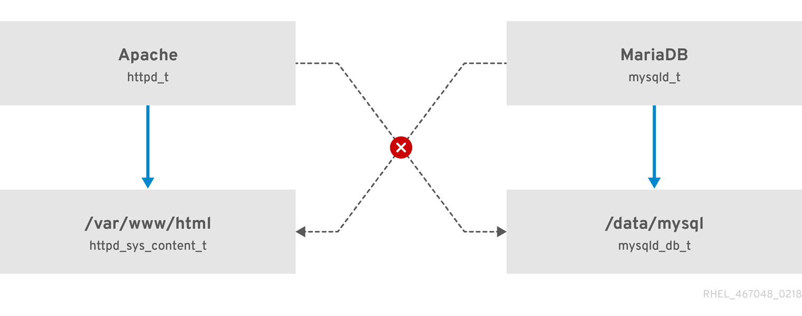
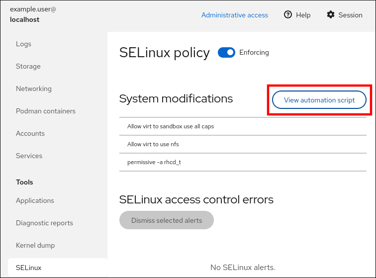

# Using SELinux

* * *

Red Hat Enterprise Linux 10

## Prevent users and processes from performing unauthorized interactions with files and devices by using Security-Enhanced Linux (SELinux)

Red Hat Customer Content Services

[Legal Notice](#idm140145702650720)

**Abstract**

By configuring SELinux, you can enhance your system’s security. SELinux is an implementation of Mandatory Access Control (MAC), and provides an additional layer of security. The SELinux policy defines how users and processes can interact with the files on the system. You can control which users can perform which actions by mapping them to specific SELinux confined users.

* * *

<h2 id="providing-feedback-on-red-hat-documentation">Providing feedback on Red Hat documentation</h2>

We are committed to providing high-quality documentation and value your feedback. To help us improve, you can submit suggestions or report errors through the Red Hat Jira tracking system.

**Procedure**

1. Log in to the [Jira](https://issues.redhat.com/projects/RHELDOCS/issues) website.
   
   If you do not have an account, select the option to create one.
2. Click **Create** in the top navigation bar.
3. Enter a descriptive title in the **Summary** field.
4. Enter your suggestion for improvement in the **Description** field. Include links to the relevant parts of the documentation.
5. Click **Create** at the bottom of the dialogue.

<h2 id="getting-started-with-selinux">Chapter 1. Getting started with SELinux</h2>

Enhance your system’s security by understanding the core concepts of Security Enhanced Linux (SELinux). Learn about SELinux architecture, packages, and operation modes to effectively manage your system policies.

<h3 id="introduction-to-selinux">1.1. Introduction to SELinux</h3>

Security Enhanced Linux (SELinux) is an implementation of Mandatory Access Control (MAC) that strengthens system security. By enforcing granular policies that restrict how processes interact with files and network resources, SELinux mitigates the impact of compromised applications and prevents unauthorized access.

Standard Discretionary Access Control (DAC) bases access policies on user, group, and other permissions. This model prevents system administrators from creating fine-grained security policies, such as restricting specific applications to only view log files while allowing other applications to append data to the log files.

SELinux adds an additional layer of protection by enforcing Mandatory Access Control (MAC) policies that answer the question: *May &lt;subject&gt; do &lt;action&gt; to &lt;object&gt;?*, for example: *May a web server access files in users' home directories?* Every process and system resource has a special security label called an *SELinux context*. An SELinux context, sometimes referred to as an *SELinux label*, is an identifier that abstracts system-level details to focus on the security properties of the entity. This identifier provides a consistent way to reference objects in the SELinux policy and removes ambiguity found in other identification methods. For example, a file can have multiple valid path names on a system that uses bind mounts.

The SELinux policy uses the contexts in rules that define how processes interact with system resources. By default, the policy denies all interaction unless a rule explicitly grants access.

For more information, refer to `selinux(8)` man page and man pages listed by the `man -k selinux` command when the `selinux-policy-doc` package is installed on your system.

Note

SELinux policy rules are checked after DAC rules. If DAC rules deny access, SELinux policy rules are not evaluated, and no SELinux denial is logged.

SELinux contexts have four fields: user, role, type, and security level. The type field is the most important for the SELinux policy, as the most common policy rule that defines allowed interactions between processes and system resources is based on SELinux types rather than the full SELinux context. SELinux types end with `_t`. For example, the type context for the web server is `httpd_t`. Files and directories in `/var/www/html/` use the `httpd_sys_content_t` type, while files and directories in `/tmp` and `/var/tmp/` use `tmp_t`. The type for web server ports is `http_port_t`.

There is a policy rule that permits Apache (the web server process running as `httpd_t`) to access files and directories with a context normally found in `/var/www/html/` and other web server directories (`httpd_sys_content_t`). There is no allow rule in the policy for files normally found in `/tmp` and `/var/tmp/`, so access is not permitted. With SELinux, even if Apache is compromised, and a malicious script gains access, it is still not able to access the `/tmp` directory.

**Figure 1.1. An example how can SELinux help to run Apache and MariaDB in a secure way.**

 

As the previous scheme shows, SELinux allows the Apache process running as `httpd_t` to access the `/var/www/html/` directory but denies access to `/data/mysql/` because no allow rule exists for the `httpd_t` and `mysqld_db_t` type contexts. Conversely, the MariaDB process running as `mysqld_t` accesses `/data/mysql/` but is denied access to `/var/www/html/`, which is labeled as `httpd_sys_content_t`.

**Additional resources**

- [The SELinux Coloring Book](https://people.redhat.com/duffy/selinux/selinux-coloring-book_A4-Stapled.pdf)

<h3 id="benefits-of-running-selinux">1.2. Benefits of running SELinux</h3>

Mitigate privilege escalation attacks and enforce data confidentiality by using Security Enhanced Linux (SELinux). By restricting how processes interact with files and system resources, you can implement fine-grained access control that limits the impact of compromised applications.

Running SELinux provides the following security benefits:

- All processes and files are labeled. SELinux policy rules define how processes interact with files, as well as how processes interact with each other. Access is only allowed if an SELinux policy rule specifically allows it.
- SELinux provides fine-grained access control. Stepping beyond traditional UNIX permissions that are controlled at user discretion and based on Linux user and group IDs, SELinux access decisions are based on all available information, such as an SELinux user, role, type, and, optionally, a security level.
- SELinux policy is administratively-defined and enforced system-wide.
- SELinux can mitigate privilege escalation attacks. Processes run in domains, and are therefore separated from each other. SELinux policy rules define how processes access files and other processes. If a process is compromised, the attacker only has access to the normal functions of that process, and to files the process has been configured to have access to. For example, if the Apache HTTP Server is compromised, an attacker cannot use that process to read files in user home directories, unless a specific SELinux policy rule was added or configured to allow such access.
- SELinux can enforce data confidentiality and integrity, and can protect processes from untrusted inputs.

SELinux is designed to enhance existing security solutions, not replace antivirus software, secure passwords, firewalls, or other security systems. Even when running SELinux, it is important to continue to follow good security practices, such as keeping software up-to-date, using hard-to-guess passwords, and firewalls.

<h3 id="selinux-examples">1.3. SELinux examples</h3>

Understand the security benefits of Security Enhanced Linux (SELinux) through practical scenarios. By reviewing real-world examples of process isolation and user confinement, you can see how SELinux mitigates privilege escalation, configuration errors, and common vulnerabilities.

SELinux enhances system security in several ways, for example:

- **The default action is deny.** If an SELinux policy rule does not exist to allow access, such as for a process opening a file, SELinux denies access.
- **Confined users restrict privileges.** You can map Linux users to confined SELinux users to apply security rules. For example, mapping a Linux user to `user_u` prevents the user from running set user ID (setuid) applications, such as `sudo` and `su`.
- **SELinux *domains* increase process and data separation.** Use domains to define which processes can access specific files and directories. For example, an attacker who compromises a Samba server cannot use it to access files used by other processes, such as MariaDB databases.
- **SELinux mitigates configuration errors.** Attackers can exploit Domain Name System (DNS) zone transfers to inject false information. If you run Berkeley Internet Name Domain (BIND) as a DNS server on RHEL and do not limit zone transfers, the default SELinux policy prevents the `named` daemon and other processes from using zone transfers to update zone files [\[1\]](#ftn.idm140145711859296).
- **SELinux mitigates path traversal attacks.** Attackers can exploit Apache web server vulnerabilities to access the file system using special elements, such as `../`. If you run SELinux in enforcing mode, the policy prevents the `httpd` process from accessing unauthorized files.
- **SELinux prevents exploits of kernel NULL pointer dereferences on non-SMAP platforms.** Attackers can exploit a vulnerability in the `mmap` function to place arbitrary code on a null page (CVE-2019-9213). If you run SELinux in enforcing mode, the policy prevents this form of attack.
- **SELinux prevents \*PTRACE\_TRACEME** exploits.* You can use the `deny_ptrace` boolean to protect your systems from the **PTRACE\_TRACEME** vulnerability (CVE-2019-13272). This prevents attackers from gaining root privileges.
- **SELinux prevents NFS misconfigurations.** You can use the `nfs_export_all_rw` and `nfs_export_all_ro` booleans to prevent Network File System (NFS) misconfigurations, such as accidentally sharing `/home` directories.

**Additional resources**

- [SELinux as a security pillar of an operating system - Real-world benefits and examples](https://access.redhat.com/articles/6964380)
- [SELinux hardening with Ansible](https://access.redhat.com/articles/7047896)
- [Ansible playbooks for SELinux hardening](https://github.com/fedora-selinux/selinux-playbooks)

* * *

[\[1\]](#idm140145711859296) Text files that include DNS information, such as hostname to IP address mappings.

<h3 id="selinux-architecture-and-packages">1.4. SELinux architecture and packages</h3>

Understand how the SELinux kernel subsystem enforces security policies, and how the `systemd` daemon strengthens access control to protect system services. Identify the packages required to install and maintain SELinux to ensure you have the necessary utilities for administration.

SELinux is a Linux Security Module (LSM) built into the Linux kernel. It enforces security policies, which you manage, to control access. SELinux intercepts access requests and checks them against the loaded policy. If the policy permits the request, SELinux allows the action. Otherwise, SELinux blocks the action and reports an error.

SELinux caches decisions, such as allowing or denying access, in the Access Vector Cache (AVC). This cache improves performance by reducing policy rule checks. SELinux policy rules apply only if Discretionary Access Control (DAC) rules allow access first. SELinux logs audit messages to `/var/log/audit/audit.log` using the `type=AVC` identifier.

In RHEL 10, the `systemd` daemon manages system services; `systemd` starts and stops all services, and users and processes communicate with `systemd` by using the `systemctl` utility. The `systemd` daemon checks the SELinux policy and verifies the labels of the calling process and the unit file to authorize access. This approach strengthens access control to critical system capabilities, such as starting and stopping system services.

The `systemd` daemon also acts as an SELinux Access Manager. It retrieves the label of the process running `systemctl` or sending a `D-Bus` message. The daemon then looks up the label of the unit file that the process wanted to configure. Finally, `systemd` queries the kernel to determine if the policy allows the specific access between the process label and the unit file label. This confinement restricts compromised applications. Policy writers can also use these controls to confine administrators.

If the SELinux policy denies `D-Bus` communication between two processes, the system logs a `USER_AVC` denial message and the communication times out. `D-Bus` communication is bidirectional.

Important

To avoid incorrect SELinux labeling and subsequent problems, ensure that you start services by using a `systemctl start` command.

RHEL 10 provides the following packages for working with SELinux:

- policies: `selinux-policy-targeted`, `selinux-policy-mls`
- tools: `policycoreutils`, `policycoreutils-gui`, `libselinux-utils`, `policycoreutils-python-utils`, `setools-console`, `checkpolicy`

<h3 id="selinux-states-and-modes">1.5. SELinux states and modes</h3>

Understand the differences between enforcing, permissive, and disabled modes to effectively manage system security. You can use these states to enforce policies or troubleshoot access denials without disrupting system operations.

SELinux can run in one of three modes: enforcing, permissive, or disabled.

- Enforcing mode is the default, and recommended, mode of operation; in enforcing mode SELinux operates normally, enforcing the loaded security policy on the entire system.
- In permissive mode, the system acts as if SELinux is enforcing the loaded security policy, including labeling objects and emitting access denial entries in the logs, but it does not actually deny any operations. While not recommended for production systems, permissive mode can be helpful for SELinux policy development and debugging.
- Disabled mode is strongly discouraged; not only does the system avoid enforcing the SELinux policy, it also avoids labeling any persistent objects such as files, making it difficult to enable SELinux in the future.

Use the `setenforce` utility to change between enforcing and permissive mode. Changes made with `setenforce` do not persist across reboots. To change to enforcing mode, enter the `setenforce 1` command as the Linux root user. To change to permissive mode, enter the `setenforce 0` command. Use the `getenforce` utility to view the current SELinux mode:

```
getenforce
Enforcing
```

```plaintext
# getenforce
Enforcing
```

```
setenforce 0
getenforce
Permissive
```

```plaintext
# setenforce 0
# getenforce
Permissive
```

```
setenforce 1
getenforce
Enforcing
```

```plaintext
# setenforce 1
# getenforce
Enforcing
```

In Red Hat Enterprise Linux, you can set individual domains to permissive mode while the system runs in enforcing mode. For example, to make the *httpd\_t* domain permissive:

```
semanage permissive -a httpd_t
```

```plaintext
# semanage permissive -a httpd_t
```

Note that permissive domains are a powerful tool that can compromise security of your system. Red Hat recommends to use permissive domains with caution, for example, when debugging a specific scenario.

<h2 id="changing-selinux-states-and-modes">Chapter 2. Changing SELinux states and modes</h2>

Configure SELinux to run in enforcing, permissive, or disabled mode to control how the system enforces security policies. You can apply these states permanently or at boot time to troubleshoot access denials and ensure file systems are correctly labeled when enabling SELinux.

When enabled, SELinux can run in one of two modes: enforcing or permissive. By default, SELinux is enabled and runs in enforcing mode. Disabling SELinux or setting it to permissive mode prevents SELinux from protecting the system. Changing SELinux status by using the `setenforce` command is temporary and reverts after restart. To permanently change SELinux status, you must change SELinux configuration files or kernel parameters.

<h3 id="permanent-changes-in-selinux-states-and-modes">2.1. Permanent changes in SELinux states and modes</h3>

SELinux modes determine how the system enforces security policies and logs access violations. Configuring the correct mode maintains system security and prevents boot failures caused by file system relabeling when enabling SELinux from a disabled state.

SELinux operates in an enabled or disabled state. When enabled, SELinux runs in enforcing or permissive mode. For more information about these modes, see [SELinux states and modes](#selinux-states-and-modes "1.5. SELinux states and modes").

The `getenforce` command reports the current mode as `Enforcing`, `Permissive`, or `Disabled`.

The `sestatus` command reports the SELinux status and information about the loaded SELinux policy:

```
sestatus
SELinux status:                 enabled
SELinuxfs mount:                /sys/fs/selinux
SELinux root directory:         /etc/selinux
Loaded policy name:             targeted
Current mode:                   enforcing
Mode from config file:          enforcing
Policy MLS status:              enabled
Policy deny_unknown status:     allowed
Memory protection checking:     actual (secure)
Max kernel policy version:      31
```

```plaintext
$ sestatus
SELinux status:                 enabled
SELinuxfs mount:                /sys/fs/selinux
SELinux root directory:         /etc/selinux
Loaded policy name:             targeted
Current mode:                   enforcing
Mode from config file:          enforcing
Policy MLS status:              enabled
Policy deny_unknown status:     allowed
Memory protection checking:     actual (secure)
Max kernel policy version:      31
```

Warning

When systems run SELinux in permissive mode, users and processes might label various file-system objects incorrectly. File-system objects created while SELinux is disabled are not labeled at all. This behavior causes problems when changing to enforcing mode because SELinux relies on correct labels of file-system objects.

To prevent incorrectly labeled and unlabeled files from causing problems, SELinux automatically relabels file systems when changing from the disabled state to permissive or enforcing mode. Use the `fixfiles -F onboot` command as root to create the `/.autorelabel` file containing the `-F` option to ensure that files are relabeled upon next reboot.

Before rebooting the system for relabeling, make sure the system will boot in permissive mode, for example by using the `enforcing=0` kernel option. This prevents the system from failing to boot in case the system contains unlabeled files required by `systemd` before launching the `selinux-autorelabel` service. For more information, see [RHBZ#2021835](https://bugzilla.redhat.com/show_bug.cgi?id=2021835).

<h3 id="changing-selinux-to-permissive-mode">2.2. Changing SELinux to permissive mode</h3>

Configure SELinux to run in permissive mode to troubleshoot denial messages and debug security policies. In this mode, the system logs Access Vector Cache (AVC) events but does not enforce the active policy, so you can analyze impacts without blocking system operations. SELinux logs each denial only once.

**Prerequisites**

- The `selinux-policy-targeted`, `libselinux-utils`, and `policycoreutils` packages are installed on your system.
- The `selinux=0` or `enforcing=0` kernel parameters are not used.

**Procedure**

1. Open the `/etc/selinux/config` file in a text editor and configure the `SELINUX=permissive` option:
   
   ```
   # This file controls the state of SELinux on the system.
   # SELINUX= can take one of these three values:
   #       enforcing - SELinux security policy is enforced.
   #       permissive - SELinux prints warnings instead of enforcing.
   #       disabled - No SELinux policy is loaded.
   SELINUX=permissive
   # SELINUXTYPE= can take one of these two values:
         targeted - Targeted processes are protected,
   #       mls - Multi Level Security protection.
   SELINUXTYPE=targeted
   ```
   
   ```plaintext
   # This file controls the state of SELinux on the system.
   # SELINUX= can take one of these three values:
   #       enforcing - SELinux security policy is enforced.
   #       permissive - SELinux prints warnings instead of enforcing.
   #       disabled - No SELinux policy is loaded.
   SELINUX=permissive
   # SELINUXTYPE= can take one of these two values:
   #       targeted - Targeted processes are protected,
   #       mls - Multi Level Security protection.
   SELINUXTYPE=targeted
   ```
2. Restart the system:
   
   ```
   reboot
   ```
   
   ```plaintext
   # reboot
   ```

**Verification**

1. After the system restarts, confirm that the `getenforce` command returns `Permissive`:
   
   ```
   getenforce
   Permissive
   ```
   
   ```plaintext
   $ getenforce
   Permissive
   ```

<h3 id="changing-selinux-to-enforcing-mode">2.3. Changing SELinux to enforcing mode</h3>

Configure SELinux to run in enforcing mode to protect your system by denying unauthorized access. In this mode, the system enforces the loaded security policy and blocks policy violations. If you are enabling SELinux from a disabled state, the system automatically relabels files on the next boot.

When you install the system with SELinux, RHEL enables enforcing mode by default.

**Prerequisites**

- The `selinux-policy-targeted`, `libselinux-utils`, and `policycoreutils` packages are installed on your system.
- The `selinux=0` or `enforcing=0` kernel parameters are not used.

**Procedure**

1. Open the `/etc/selinux/config` file in a text editor and configure the `SELINUX=enforcing` option:
   
   ```
   # This file controls the state of SELinux on the system.
   # SELINUX= can take one of these three values:
   #       enforcing - SELinux security policy is enforced.
   #       permissive - SELinux prints warnings instead of enforcing.
   #       disabled - No SELinux policy is loaded.
   SELINUX=enforcing
   # SELINUXTYPE= can take one of these two values:
         targeted - Targeted processes are protected,
   #       mls - Multi Level Security protection.
   SELINUXTYPE=targeted
   ```
   
   ```plaintext
   # This file controls the state of SELinux on the system.
   # SELINUX= can take one of these three values:
   #       enforcing - SELinux security policy is enforced.
   #       permissive - SELinux prints warnings instead of enforcing.
   #       disabled - No SELinux policy is loaded.
   SELINUX=enforcing
   # SELINUXTYPE= can take one of these two values:
   #       targeted - Targeted processes are protected,
   #       mls - Multi Level Security protection.
   SELINUXTYPE=targeted
   ```
2. Save the change, and restart the system:
   
   ```
   reboot
   ```
   
   ```plaintext
   # reboot
   ```
   
   On the next boot, SELinux relabels all the files and directories within the system and adds SELinux context for files and directories that were created when SELinux was disabled.

**Verification**

1. After the system restarts, confirm that the `getenforce` command returns `Enforcing`:
   
   ```
   getenforce
   Enforcing
   ```
   
   ```plaintext
   $ getenforce
   Enforcing
   ```

**Troubleshooting**

After changing to enforcing mode, SELinux may deny some actions because of incorrect or missing SELinux policy rules.

- To view what actions SELinux denies, enter the following command as root:
  
  ```
  ausearch -m AVC,USER_AVC,SELINUX_ERR,USER_SELINUX_ERR -ts today
  ```
  
  ```plaintext
  # ausearch -m AVC,USER_AVC,SELINUX_ERR,USER_SELINUX_ERR -ts today
  ```
- Alternatively, with the `setroubleshoot-server` package installed, enter:
  
  ```
  grep "SELinux is preventing" /var/log/messages
  ```
  
  ```plaintext
  # grep "SELinux is preventing" /var/log/messages
  ```
- If SELinux is active and the Audit daemon (`auditd`) is not running on your system, then search for certain SELinux messages in the output of the `dmesg` command:
  
  ```
  dmesg | grep -i -e type=1300 -e type=1400
  ```
  
  ```plaintext
  # dmesg | grep -i -e type=1300 -e type=1400
  ```

See [Troubleshooting problems related to SELinux](#troubleshooting-problems-related-to-selinux "Chapter 5. Troubleshooting problems related to SELinux") for more information.

<h3 id="enabling-selinux-on-systems-that-previously-had-it-disabled">2.4. Enabling SELinux on systems that previously had it disabled</h3>

Enable SELinux on systems that previously had it disabled to restore security protections and enforce mandatory access control. You must first run the system in permissive mode and relabel the file system to prevent boot failures caused by missing or incorrect security labels.

File-system objects created while SELinux is disabled do not have security labels. This lack of labels causes failures when changing directly to enforcing mode because the system relies on correct contexts to make access decisions.

Warning

Before rebooting the system for relabeling, make sure the system will boot in permissive mode, for example by using the `enforcing=0` kernel option. This prevents the system from failing to boot in case the system contains unlabeled files required by `systemd` before launching the `selinux-autorelabel` service. For more information, see [RHBZ#2021835](https://bugzilla.redhat.com/show_bug.cgi?id=2021835).

**Procedure**

1. Enable SELinux in permissive mode. For more information, see [Changing SELinux to permissive mode](#changing-selinux-to-permissive-mode "2.2. Changing SELinux to permissive mode").
2. Restart your system:
   
   ```
   reboot
   ```
   
   ```plaintext
   # reboot
   ```
3. Check for SELinux denial messages. For more information, see [Identifying SELinux denials](#identifying-selinux-denials "5.1. Identifying SELinux denials").
4. Ensure that files are relabeled upon the next reboot:
   
   ```
   fixfiles -F onboot
   ```
   
   ```plaintext
   # fixfiles -F onboot
   ```
   
   This creates the `/.autorelabel` file containing the `-F` option.
   
   Warning
   
   Always switch to permissive mode before entering the `fixfiles -F onboot` command.
   
   By default, `autorelabel` uses as many threads in parallel as the system has available CPU cores. To use only a single thread during automatic relabeling, use the `fixfiles -T 1 onboot` command.
5. If there are no denials, switch to enforcing mode. For more information, see [Changing SELinux modes at boot time](#changing-selinux-modes-at-boot-time "2.6. SELinux kernel boot parameters").

**Verification**

1. After the system restarts, confirm that the `getenforce` command returns `Enforcing`:
   
   ```
   getenforce
   Enforcing
   ```
   
   ```plaintext
   $ getenforce
   Enforcing
   ```

**Next steps**

To run custom applications with SELinux in enforcing mode, choose one of the following scenarios:

- Run your application in the `unconfined_service_t` domain.
- Write a new policy for your application. See the [Writing a custom SELinux policy](#writing-a-custom-selinux-policy "Chapter 8. Writing a custom SELinux policy") section for more information.

**Additional resources**

- [SELinux states and modes](#selinux-states-and-modes "1.5. SELinux states and modes")

<h3 id="disabling-selinux">2.5. Disabling SELinux</h3>

Disable SELinux by configuring the kernel command line to completely deactivate the security infrastructure. Use this mode only when necessary, because it stops the system from labeling files and makes re-enabling SELinux difficult.

When you disable SELinux, your system does not load the security policy or log Access Vector Cache (AVC) messages. Therefore, all [benefits of running SELinux](#benefits-of-running-selinux "1.2. Benefits of running SELinux") are lost.

Warning

Do not disable SELinux except in specific scenarios, such as performance-sensitive systems where weakened security is acceptable.

If you must debug your system in a production environment, temporarily use permissive mode instead of permanently disabling SELinux. See [Changing to permissive mode](#changing-selinux-to-permissive-mode "2.2. Changing SELinux to permissive mode") for more information about permissive mode.

**Prerequisites**

- The `grubby` package is installed:
  
  ```
  rpm -q grubby
  grubby-<version>
  ```
  
  ```plaintext
  $ rpm -q grubby
  grubby-<version>
  ```

**Procedure**

1. Configure your boot loader to add `selinux=0` to the kernel command line:
   
   ```
   sudo grubby --update-kernel ALL --args selinux=0
   ```
   
   ```plaintext
   $ sudo grubby --update-kernel ALL --args selinux=0
   ```
2. Restart your system:
   
   ```
   reboot
   ```
   
   ```plaintext
   $ reboot
   ```

**Verification**

- After the reboot, confirm that the `getenforce` command returns `Disabled`:
  
  ```
  getenforce
  Disabled
  ```
  
  ```plaintext
  $ getenforce
  Disabled
  ```

<h3 id="changing-selinux-modes-at-boot-time">2.6. SELinux kernel boot parameters</h3>

Kernel boot parameters control the SELinux mode and system initialization at boot time. You can use these parameters to override the default security configuration during system startup.

`enforcing=0`

Setting this parameter causes the system to start in permissive mode, which is useful when troubleshooting issues. Using permissive mode might be the only option to detect a problem if your file system is corrupted. Moreover, in permissive mode, the system creates labels correctly. The AVC messages generated in this mode can be different than in enforcing mode.

In permissive mode, the system reports only the first denial from a series of the same denials. However, in enforcing mode, you might get a denial related to reading a directory, and an application stops. In permissive mode, you get the same AVC message, but the application continues reading files in the directory and you get an AVC for each denial.

`selinux=0`

This parameter causes the kernel to not load any part of the SELinux infrastructure. The init scripts detect that the system booted with the `selinux=0` parameter and touch the `/.autorelabel` file. This causes the system to automatically relabel the next time you boot with SELinux enabled.

Important

Do not use the `selinux=0` parameter in a production environment. To debug your system, temporarily use permissive mode instead of disabling SELinux.

`autorelabel=1`

This parameter forces the system to relabel similarly to the following commands:

```
touch /.autorelabel
reboot
```

```plaintext
# touch /.autorelabel
# reboot
```

If a file system contains a large amount of mislabeled objects, start the system in permissive mode to ensure the autorelabel process succeeds.

For additional SELinux kernel boot parameters, such as `checkreqprot`, see the `/usr/share/doc/kernel-doc-<KERNEL_VER>/Documentation/admin-guide/kernel-parameters.txt` file installed with the `kernel-doc` package. Replace the `<KERNEL_VER>` string with the version number of the installed kernel, for example:

\+

```
dnf install kernel-doc
less /usr/share/doc/kernel-doc-6.12.0-55.9.1/Documentation/admin-guide/kernel-parameters.txt
```

```plaintext
# dnf install kernel-doc
$ less /usr/share/doc/kernel-doc-6.12.0-55.9.1/Documentation/admin-guide/kernel-parameters.txt
```

<h2 id="managing-confined-and-unconfined-users">Chapter 3. Managing confined and unconfined users</h2>

Control what actions Linux users and their processes can perform by mapping them to specific SELinux users defined in the policy. This method helps enforce granular security restrictions based on the assigned SELinux profile.

Each Linux user is mapped to an SELinux user according to the rules in the SELinux policy. Administrators can modify these rules by using the `semanage login` utility or by assigning Linux users directly to specific SELinux users. Therefore, a Linux user has the restrictions of the SELinux user to which it is assigned. When a Linux user that is assigned to an SELinux user launches a process, this process inherits the SELinux user’s restrictions, unless other rules specify a different role or type. See the `unconfined_selinux(8)`, `user_selinux(8)`, `staff_selinux(8)`, and `sysadm_selinux(8)` man pages installed with the `selinux-policy-doc` package on your system for more information.

<h3 id="confined-and-unconfined-users-in-selinux">3.1. Confined and unconfined users in SELinux</h3>

By default, all Linux users in Red Hat Enterprise Linux, including users with administrative privileges, are mapped to the unconfined SELinux user `unconfined_u`. You can improve the security of the system by assigning users to SELinux confined users.

The security context for a Linux user consists of the SELinux user, the SELinux role, and the SELinux type. For example:

```
user_u:user_r:user_t
```

```plaintext
user_u:user_r:user_t
```

Where:

`user_u`

Is the SELinux user.

`user_r`

Is the SELinux role.

`user_t`

Is the SELinux type.

After a Linux user logs in, its SELinux user cannot change. However, its type and role can change, for example, during transitions.

To see the SELinux user mapping on your system, use the `semanage login -l` command as root:

```
semanage login -l
Login Name           SELinux User         MLS/MCS Range        Service

__default__          unconfined_u         s0-s0:c0.c1023       *
root                 unconfined_u         s0-s0:c0.c1023       *
```

```plaintext
# semanage login -l
Login Name           SELinux User         MLS/MCS Range        Service

__default__          unconfined_u         s0-s0:c0.c1023       *
root                 unconfined_u         s0-s0:c0.c1023       *
```

In Red Hat Enterprise Linux, Linux users are mapped to the SELinux `__default__` login by default, which is mapped to the SELinux `unconfined_u` user. The following line defines the default mapping:

```
__default__          unconfined_u         s0-s0:c0.c1023       *
```

```plaintext
__default__          unconfined_u         s0-s0:c0.c1023       *
```

Confined users are restricted by SELinux rules explicitly defined in the current SELinux policy. Unconfined users are subject to only minimal restrictions by SELinux.

Confined and unconfined Linux users are subject to executable and writable memory checks, and are also restricted by MCS or MLS.

To list the available SELinux users, enter the following command:

```
seinfo -u
Users: 8
   guest_u
   root
   staff_u
   sysadm_u
   system_u
   unconfined_u
   user_u
   xguest_u
```

```plaintext
$ seinfo -u
Users: 8
   guest_u
   root
   staff_u
   sysadm_u
   system_u
   unconfined_u
   user_u
   xguest_u
```

Note that the `seinfo` command is provided by the `setools-console` package, which is not installed by default.

If an unconfined Linux user executes an application that SELinux policy defines as one that can transition from the `unconfined_t` domain to its own confined domain, the unconfined Linux user is still subject to the restrictions of that confined domain. The security benefit of this is that, even though a Linux user is running unconfined, the application remains confined. Therefore, the exploitation of a flaw in the application can be limited by the policy.

Similarly, we can apply these checks to confined users. Each confined user is restricted by a confined user domain. The SELinux policy can also define a transition from a confined user domain to its own target confined domain. In such a case, confined users are subject to the restrictions of that target confined domain. The main point is that special privileges are associated with the confined users according to their role.

<h3 id="roles-and-access-rights-of-selinux-users">3.2. Roles and access rights of SELinux users</h3>

Manage the permissions and access rights of SELinux users by adjusting policy booleans and mapping Linux users to appropriate roles. This process help ensures that users in RHEL have the correct authorizations for their specific tasks.

The SELinux policy maps each Linux user to an SELinux user. This allows Linux users to inherit the restrictions of SELinux users. You can customize the permissions for confined users in your SELinux policy according to specific needs by adjusting booleans in the policy. You can determine the current state of these booleans by using the `semanage boolean -l` command. To list all SELinux users, their SELinux roles, and levels and ranges for MLS and MCS, use the `semanage user -l` command as `root`.

| User           | Default role   | Additional roles |
|:---------------|:---------------|:-----------------|
| `unconfined_u` | `unconfined_r` | `system_r`       |
| `guest_u`      | `guest_r`      |                  |
| `xguest_u`     | `xguest_r`     |                  |
| `user_u`       | `user_r`       |                  |
| `staff_u`      | `staff_r`      | `sysadm_r`       |
|                |                | `unconfined_r`   |
|                |                | `system_r`       |
| `sysadm_u`     | `sysadm_r`     |                  |
| `root`         | `staff_r`      | `sysadm_r`       |
|                |                | `unconfined_r`   |
|                |                | `system_r`       |
| `system_u`     | `system_r`     |                  |

Table 3.1. Roles of SELinux users

Note that `system_u` is a special user identity for system processes and objects, and `system_r` is the associated role. Administrators must never associate this `system_u` user and the `system_r` role to a Linux user. Also, `unconfined_u` and `root` are unconfined users. For these reasons, the roles associated to these SELinux users are not included in the following table *Types and access rights of SELinux roles*.

Each SELinux role corresponds to an SELinux type and provides specific access rights.

| Role           | Type           | Log in using X Window System                     | `su` and `sudo` | Execute in home directory and `/tmp` (default) | Networking                                     |
|:---------------|:---------------|:-------------------------------------------------|:----------------|:-----------------------------------------------|:-----------------------------------------------|
| `unconfined_r` | `unconfined_t` | yes                                              | yes             | yes                                            | yes                                            |
| `guest_r`      | `guest_t`      | no                                               | no              | yes                                            | no                                             |
| `xguest_r`     | `xguest_t`     | yes                                              | no              | yes                                            | web browsers only (Mozilla Firefox, GNOME Web) |
| `user_r`       | `user_t`       | yes                                              | no              | yes                                            | yes                                            |
| `staff_r`      | `staff_t`      | yes                                              | only `sudo`     | yes                                            | yes                                            |
| `auditadm_r`   | `auditadm_t`   |                                                  | yes             | yes                                            | yes                                            |
| `dbadm_r`      | `dbadm_r`      |                                                  | yes             | yes                                            | yes                                            |
| `logadm_r`     | `logadm_t`     |                                                  | yes             | yes                                            | yes                                            |
| `webadm_r`     | `webadm_r`     |                                                  | yes             | yes                                            | yes                                            |
| `secadm_r`     | `secadm_t`     |                                                  | yes             | yes                                            | yes                                            |
| `sysadm_r`     | `sysadm_t`     | only when the `xdm_sysadm_login` boolean is `on` | yes             | yes                                            | yes                                            |

Table 3.2. Types and access rights of SELinux roles

For more detailed descriptions of the non-administrator roles, see [Confined non-administrator roles in SELinux](#confined-non-administrator-roles-in-selinux "3.3. Confined non-administrator roles in SELinux").

For more detailed descriptions of the administrator roles, see [Confined administrator roles in SELinux](#confined-administrator-roles-in-selinux "3.4. Confined administrator roles in SELinux").

To list all available roles, enter the `seinfo -r` command:

```
seinfo -r
Roles: 14
   auditadm_r
   dbadm_r
   guest_r
   logadm_r
   nx_server_r
   object_r
   secadm_r
   staff_r
   sysadm_r
   system_r
   unconfined_r
   user_r
   webadm_r
   xguest_r
```

```plaintext
$ seinfo -r
Roles: 14
   auditadm_r
   dbadm_r
   guest_r
   logadm_r
   nx_server_r
   object_r
   secadm_r
   staff_r
   sysadm_r
   system_r
   unconfined_r
   user_r
   webadm_r
   xguest_r
```

Note that the `seinfo` command is provided by the `setools-console` package, which is not installed by default. See the `seinfo(1)`, `semanage-login(8)`, and `xguest_selinux(8)` man pages installed with the `selinux-policy-doc` package on your system for more information.

**Additional resources**

- [How to modify SELinux settings with booleans (Red Hat Sysadmin)](https://www.redhat.com/sysadmin/change-selinux-settings-boolean)

<h3 id="confined-non-administrator-roles-in-selinux">3.3. Confined non-administrator roles in SELinux</h3>

Confined non-administrator roles grant specific privileges and permissions for specific tasks to the Linux users assigned to them. By assigning separate confined non-administrator roles, you can assign specific privileges to individual users. This is useful when multiple users have a different level of authorizations.

You can also customize the permissions of SELinux roles by changing the related SELinux booleans on your system. To see the SELinux booleans and their current state, use the `semanage boolean -l` command as root. You can get more detailed descriptions if you install the `selinux-policy-devel` package.

```
semanage boolean -l
SELinux boolean                State  Default Description
…
xguest_connect_network         (on   ,   on)  Allow xguest users to configure Network Manager and connect to apache ports
xguest_exec_content            (on   ,   on)  Allow xguest to exec content
…
```

```plaintext
# semanage boolean -l
SELinux boolean                State  Default Description
…
xguest_connect_network         (on   ,   on)  Allow xguest users to configure Network Manager and connect to apache ports
xguest_exec_content            (on   ,   on)  Allow xguest to exec content
…
```

Linux users in the `user_t`, `guest_t`, and `xguest_t` domains can only run set user ID (`setuid`) applications if SELinux policy permits it (for example, `passwd`). These users cannot run the `setuid` applications `su` and `sudo`, and therefore cannot use these applications to become root.

By default, Linux users in the `staff_t`, `user_t`, `guest_t`, and `xguest_t` domains can execute applications in their home directories and `/tmp`. Applications inherit the permissions of the user that executed them.

To prevent `guest_t`, and `xguest_t` users from executing applications in directories in which they have write access, set the `guest_exec_content` and `xguest_exec_content` booleans to `off`.

SELinux has the following confined non-administrator roles, each with specific privileges and limitations:

`guest_r`

Has very limited permissions. Users assigned to this role cannot access the network, but can execute files in the `/tmp` and `/home` directories.

Related boolean:

```
SELinux boolean                State  Default Description
guest_exec_content             (on   ,   on)  Allow guest to exec content
```

```plaintext
SELinux boolean                State  Default Description
guest_exec_content             (on   ,   on)  Allow guest to exec content
```

`xguest_r`

Has limited permissions. Users assigned to this role can log in to X Window, access web pages by using network browsers, and access media. They can also execute files in the `/tmp` and `/home` directories.

Related booleans:

```
SELinux boolean                State  Default Description
xguest_connect_network         (on   ,   on)  Allow xguest users to configure Network Manager and connect to apache ports
xguest_exec_content            (on   ,   on)  Allow xguest to exec content
xguest_mount_media             (on   ,   on)  Allow xguest users to mount removable media
xguest_use_bluetooth           (on   ,   on)  Allow xguest to use blue tooth devices
```

```plaintext
SELinux boolean                State  Default Description
xguest_connect_network         (on   ,   on)  Allow xguest users to configure Network Manager and connect to apache ports
xguest_exec_content            (on   ,   on)  Allow xguest to exec content
xguest_mount_media             (on   ,   on)  Allow xguest users to mount removable media
xguest_use_bluetooth           (on   ,   on)  Allow xguest to use blue tooth devices
```

`user_r`

Has non-privileged access with full user permissions. Users assigned to this role can perform most actions that do not require administrative privileges.

Related booleans:

```
SELinux boolean                State  Default Description
unprivuser_use_svirt           (off  ,  off)  Allow unprivileged user to create and transition to svirt domains.
```

```plaintext
SELinux boolean                State  Default Description
unprivuser_use_svirt           (off  ,  off)  Allow unprivileged user to create and transition to svirt domains.
```

`staff_r`

Has permissions similar to `user_r` and additional privileges. In particular, users assigned to this role are allowed to run `sudo` to execute administrative commands that are normally reserved for the `root` user. This changes roles and the effective user ID (EUID) but does not change the SELinux user.

Related booleans:

```
SELinux boolean                State  Default Description
staff_exec_content             (on   ,   on)  Allow staff to exec content
staff_use_svirt                (on   ,   on)  allow staff user to create and transition to svirt domains.
```

```plaintext
SELinux boolean                State  Default Description
staff_exec_content             (on   ,   on)  Allow staff to exec content
staff_use_svirt                (on   ,   on)  allow staff user to create and transition to svirt domains.
```

For additional information about each role and the associated types, see the `guest_selinux(8)`, `xguest_selinux(8)`, `user_selinux(8)`, and `staff_selinux(8)` man pages installed with the `selinux-policy-doc` package on your system.

If you want map a Linux user to `staff_u` and configure `sudo`, see the [Confining an administrator by using sudo and the sysadm\_r role](#confining-an-administrator-by-using-sudo-and-the-sysadmr-role "3.9. Confining an administrator by using sudo and the sysadm_r role") section.

<h3 id="confined-administrator-roles-in-selinux">3.4. Confined administrator roles in SELinux</h3>

Confined administrator roles grant specific sets of privileges and permissions for performing specific tasks to the Linux users assigned to them. By assigning separate confined administrator roles, you can divide the privileges over various domains of system administration to individual users. This is useful in scenarios with multiple administrators, each with a separate domain.

You can assign these roles to SELinux users by using the `semanage user` command.

SELinux has the following confined administrator roles:

`auditadm_r`

The audit administrator role allows managing processes related to the Audit subsystem.

Related boolean:

```
SELinux boolean                State  Default Description
auditadm_exec_content          (on   ,   on)  Allow auditadm to exec content
```

```plaintext
SELinux boolean                State  Default Description
auditadm_exec_content          (on   ,   on)  Allow auditadm to exec content
```

`dbadm_r`

The database administrator role allows managing MariaDB and PostgreSQL databases.

Related booleans:

```
SELinux boolean                State  Default Description
dbadm_exec_content             (on   ,   on)  Allow dbadm to exec content
dbadm_manage_user_files        (off  ,  off)  Determine whether dbadm can manage generic user files.
dbadm_read_user_files          (off  ,  off)  Determine whether dbadm can read generic user files.
```

```plaintext
SELinux boolean                State  Default Description
dbadm_exec_content             (on   ,   on)  Allow dbadm to exec content
dbadm_manage_user_files        (off  ,  off)  Determine whether dbadm can manage generic user files.
dbadm_read_user_files          (off  ,  off)  Determine whether dbadm can read generic user files.
```

`logadm_r`

The log administrator role allows managing logs, specifically, SELinux types related to the Rsyslog logging service and the Audit subsystem.

Related boolean:

```
SELinux boolean                State  Default Description
logadm_exec_content            (on   ,   on)  Allow logadm to exec content
```

```plaintext
SELinux boolean                State  Default Description
logadm_exec_content            (on   ,   on)  Allow logadm to exec content
```

`webadm_r`

The web administrator allows managing the Apache HTTP Server.

Related booleans:

```
SELinux boolean                State  Default Description
webadm_manage_user_files       (off  ,  off)  Determine whether webadm can manage generic user files.
webadm_read_user_files         (off  ,  off)  Determine whether webadm can read generic user files.
```

```plaintext
SELinux boolean                State  Default Description
webadm_manage_user_files       (off  ,  off)  Determine whether webadm can manage generic user files.
webadm_read_user_files         (off  ,  off)  Determine whether webadm can read generic user files.
```

`secadm_r`

The security administrator role allows managing the SELinux database.

Related booleans:

```
SELinux boolean                State  Default Description
secadm_exec_content            (on   ,   on)  Allow secadm to exec content
```

```plaintext
SELinux boolean                State  Default Description
secadm_exec_content            (on   ,   on)  Allow secadm to exec content
```

`sysadm_r`

The system administrator role allows doing everything of the previously listed roles and has additional privileges. In non-default configurations, security administration can be separated from system administration by disabling the `sysadm_secadm` module in the SELinux policy. For detailed instructions, see [Separating system administration from security administration in MLS](#separating-system-administration-from-security-administration-in-mls "6.8. Separating system administration from security administration in MLS").

The `sysadm_u` user cannot log in directly using SSH. To enable SSH logins for `sysadm_u`, set the `ssh_sysadm_login` boolean to `on`:

```
setsebool -P ssh_sysadm_login on
```

```plaintext
# setsebool -P ssh_sysadm_login on
```

Related booleans:

```
SELinux boolean                State  Default Description
ssh_sysadm_login               (on   ,   on)  Allow ssh logins as sysadm_r:sysadm_t
sysadm_exec_content            (on   ,   on)  Allow sysadm to exec content
xdm_sysadm_login               (on   ,   on)  Allow the graphical login program to login directly as sysadm_r:sysadm_t
```

```plaintext
SELinux boolean                State  Default Description
ssh_sysadm_login               (on   ,   on)  Allow ssh logins as sysadm_r:sysadm_t
sysadm_exec_content            (on   ,   on)  Allow sysadm to exec content
xdm_sysadm_login               (on   ,   on)  Allow the graphical login program to login directly as sysadm_r:sysadm_t
```

For additional information about each role, and the associated types, see the relevant man pages installed with the `selinux-policy-doc` package on your system: `auditadm_selinux(8)`, `dbadm_selinux (8)`, `logadm_selinux(8)`, `webadm_selinux(8)`, `secadm_selinux(8)`, and `sysadm_selinux(8)`.

**Additional resources**

- [Confining an administrator by mapping to sysadm\_u](#confining-an-administrator-by-mapping-to-sysadm_u "3.8. Confining an administrator by mapping to sysadm_u")

<h3 id="adding-a-new-user-automatically-mapped-to-the-selinux-unconfined\_u-user">3.5. Adding a new user automatically mapped to the SELinux unconfined\_u user</h3>

Create a new Linux user in RHEL 10 that is automatically mapped to the default SELinux `unconfined_u` user. This process helps you quickly add users who do not require strict SELinux confinement for their tasks.

**Prerequisites**

- The `root` user is running unconfined, as it does by default in Red Hat Enterprise Linux.

**Procedure**

1. Enter the following command to create a new Linux user named `<example_user>`:
   
   ```
   useradd <example_user>
   ```
   
   ```plaintext
   # useradd <example_user>
   ```
2. To assign a password to the Linux `<example_user>` user:
   
   ```
   passwd <example_user>
   Changing password for user <example_user>.
   New password:
   Retype new password:
   passwd: all authentication tokens updated successfully.
   ```
   
   ```plaintext
   # passwd <example_user>
   Changing password for user <example_user>.
   New password:
   Retype new password:
   passwd: all authentication tokens updated successfully.
   ```
3. Log out of your current session.
4. Log in as the Linux `<example_user>` user. When you log in, the `pam_selinux` PAM module automatically maps the Linux user to an SELinux user (in this case, `unconfined_u`), and sets up the resulting SELinux context. The Linux user’s shell is then launched with this context.

**Verification**

1. When logged in as the `<example_user>` user, check the context of a Linux user:
   
   ```
   id -Z
   unconfined_u:unconfined_r:unconfined_t:s0-s0:c0.c1023
   ```
   
   ```plaintext
   $ id -Z
   unconfined_u:unconfined_r:unconfined_t:s0-s0:c0.c1023
   ```

<h3 id="adding-a-new-user-as-an-selinux-confined-user">3.6. Adding a new user as an SELinux-confined user</h3>

You can add a new SELinux-confined user to the system with the same command used to create the user account. Mapping users to a confined user, such as `staff_u`, helps ensure the system is protected from potential security breaches.

**Prerequisites**

- The `root` user is running unconfined, as it does by default in Red Hat Enterprise Linux.

**Procedure**

1. Enter the following command to create a new Linux user named `<example_user>` and map it to the SELinux `staff_u` user:
   
   ```
   useradd -Z staff_u <example_user>
   ```
   
   ```plaintext
   # useradd -Z staff_u <example_user>
   ```
2. To assign a password to the Linux `<example_user>` user:
   
   ```
   passwd <example_user>
   Changing password for user <example_user>.
   New password:
   Retype new password:
   passwd: all authentication tokens updated successfully.
   ```
   
   ```plaintext
   # passwd <example_user>
   Changing password for user <example_user>.
   New password:
   Retype new password:
   passwd: all authentication tokens updated successfully.
   ```
3. Log out of your current session.
4. Log in as the Linux `<example_user>` user. The user’s shell launches with the `staff_u` context.

**Verification**

1. When logged in as the `<example_user>` user, check the context of a Linux user:
   
   ```
   id -Z
   uid=1000(<example_user>) gid=1000(<example_user>) groups=1000(<example_user>) context=staff_u:staff_r:staff_t:s0-s0:c0.c1023
   ```
   
   ```plaintext
   $ id -Z
   uid=1000(<example_user>) gid=1000(<example_user>) groups=1000(<example_user>) context=staff_u:staff_r:staff_t:s0-s0:c0.c1023
   ```

<h3 id="confining-regular-users-in-selinux">3.7. Confining regular users in SELinux</h3>

Increase system security by mapping all regular RHEL 10 users to the confined `user_u` SELinux profile. This configuration helps ensure that user accounts have limited privileges and cannot perform unauthorized tasks.

By default, all Linux users in Red Hat Enterprise Linux, including users with administrative privileges, are mapped to the unconfined SELinux user `unconfined_u`. You can improve the security of the system by assigning users to SELinux confined users. This is also useful to conform with the [V-71971 Security Technical Implementation Guide](https://rhel7stig.readthedocs.io/en/latest/medium.html#v-71971-the-operating-system-must-prevent-non-privileged-users-from-executing-privileged-functions-to-include-disabling-circumventing-or-altering-implemented-security-safeguards-countermeasures-rhel-07-020020).

**Procedure**

1. Display the list of SELinux login records. The list displays the mappings of Linux users to SELinux users:
   
   ```
   semanage login -l
   
   Login Name    SELinux User  MLS/MCS Range   Service
   
   __default__   unconfined_u  s0-s0:c0.c1023       *
   root          unconfined_u  s0-s0:c0.c1023       *
   ```
   
   ```plaintext
   # semanage login -l
   
   Login Name    SELinux User  MLS/MCS Range   Service
   
   __default__   unconfined_u  s0-s0:c0.c1023       *
   root          unconfined_u  s0-s0:c0.c1023       *
   ```
2. Map the `__default__` user, which represents all users without an explicit mapping, to the `user_u` SELinux user:
   
   ```
   semanage login -m -s user_u -r s0 __default__
   ```
   
   ```plaintext
   # semanage login -m -s user_u -r s0 __default__
   ```

**Verification**

1. Check that the `__default__` user is mapped to the `user_u` SELinux user:
   
   ```
   semanage login -l
   
   Login Name    SELinux User   MLS/MCS Range    Service
   
   __default__   user_u         s0               *
   root          unconfined_u   s0-s0:c0.c1023   *
   ```
   
   ```plaintext
   # semanage login -l
   
   Login Name    SELinux User   MLS/MCS Range    Service
   
   __default__   user_u         s0               *
   root          unconfined_u   s0-s0:c0.c1023   *
   ```
2. Verify that the processes of a new user run in the `user_u:user_r:user_t:s0` SELinux context.
   
   1. Create a new user:
      
      ```
      adduser <example_user>
      ```
      
      ```plaintext
      # adduser <example_user>
      ```
   2. Define a password for `<example_user>`:
      
      ```
      passwd <example_user>
      ```
      
      ```plaintext
      # passwd <example_user>
      ```
   3. Log out as `root` and log in as the new user.
   4. Show the security context for the user’s ID:
      
      ```
      [<example_user>@localhost ~]$ id -Z
      user_u:user_r:user_t:s0
      ```
      
      ```plaintext
      [<example_user>@localhost ~]$ id -Z
      user_u:user_r:user_t:s0
      ```
   5. Show the security context of the user’s current processes:
      
      ```
      [<example_user>@localhost ~]$ ps axZ
      LABEL                           PID TTY      STAT   TIME COMMAND
      -                                 1 ?        Ss     0:05 /usr/lib/systemd/systemd --switched-root --system --deserialize 18
      -                              3729 ?        S      0:00 (sd-pam)
      user_u:user_r:user_t:s0        3907 ?        Ss     0:00 /usr/lib/systemd/systemd --user
      -                              3911 ?        S      0:00 (sd-pam)
      user_u:user_r:user_t:s0        3918 ?        S      0:00 sshd: <example_user>@pts/0
      user_u:user_r:user_t:s0        3922 pts/0    Ss     0:00 -bash
      user_u:user_r:user_dbusd_t:s0  3969 ?        Ssl    0:00 /usr/bin/dbus-daemon --session --address=systemd: --nofork --nopidfile --systemd-activation --syslog-only
      user_u:user_r:user_t:s0        3971 pts/0    R+     0:00 ps axZ
      ```
      
      ```plaintext
      [<example_user>@localhost ~]$ ps axZ
      LABEL                           PID TTY      STAT   TIME COMMAND
      -                                 1 ?        Ss     0:05 /usr/lib/systemd/systemd --switched-root --system --deserialize 18
      -                              3729 ?        S      0:00 (sd-pam)
      user_u:user_r:user_t:s0        3907 ?        Ss     0:00 /usr/lib/systemd/systemd --user
      -                              3911 ?        S      0:00 (sd-pam)
      user_u:user_r:user_t:s0        3918 ?        S      0:00 sshd: <example_user>@pts/0
      user_u:user_r:user_t:s0        3922 pts/0    Ss     0:00 -bash
      user_u:user_r:user_dbusd_t:s0  3969 ?        Ssl    0:00 /usr/bin/dbus-daemon --session --address=systemd: --nofork --nopidfile --systemd-activation --syslog-only
      user_u:user_r:user_t:s0        3971 pts/0    R+     0:00 ps axZ
      ```

<h3 id="confining-an-administrator-by-mapping-to-sysadm\_u">3.8. Confining an administrator by mapping to sysadm\_u</h3>

You can confine a user with administrative privileges by mapping the user directly to the `sysadm_u` SELinux user. When the user logs in, the session runs in the `sysadm_u:sysadm_r:sysadm_t` SELinux context. This minimizes the potential impact if an administrative account is compromised.

By default, all Linux users in Red Hat Enterprise Linux, including users with administrative privileges, are mapped to the unconfined SELinux user `unconfined_u`. You can improve the security of the system by assigning users to SELinux confined users. This is useful to conform with the [V-71971 Security Technical Implementation Guide](https://rhel7stig.readthedocs.io/en/latest/medium.html#v-71971-the-operating-system-must-prevent-non-privileged-users-from-executing-privileged-functions-to-include-disabling-circumventing-or-altering-implemented-security-safeguards-countermeasures-rhel-07-020020).

**Prerequisites**

- The `root` user runs unconfined. This is the Red Hat Enterprise Linux default.

**Procedure**

1. Optional: To allow `sysadm_u` users to connect to the system by using SSH:
   
   ```
   setsebool -P ssh_sysadm_login on
   ```
   
   ```plaintext
   # setsebool -P ssh_sysadm_login on
   ```
2. Map a new or existing user to the `sysadm_u` SELinux user:
   
   - To map a new user, add a new user to the `wheel` user group and map the user to the `sysadm_u` SELinux user:
     
     ```
     adduser -G wheel -Z sysadm_u <example_user>
     ```
     
     ```plaintext
     # adduser -G wheel -Z sysadm_u <example_user>
     ```
   - To map an existing user, add the user to the `wheel` user group and map the user to the `sysadm_u` SELinux user:
     
     ```
     usermod -G wheel -Z sysadm_u <example_user>
     ```
     
     ```plaintext
     # usermod -G wheel -Z sysadm_u <example_user>
     ```
3. Restore the context of the user’s home directory:
   
   ```
   restorecon -R -F -v /home/<example_user>
   ```
   
   ```plaintext
   # restorecon -R -F -v /home/<example_user>
   ```

**Verification**

1. Check that `<example_user>` is mapped to the `sysadm_u` SELinux user:
   
   ```
   semanage login -l | grep <example_user>
   <example_user>     sysadm_u    s0-s0:c0.c1023   *
   ```
   
   ```plaintext
   # semanage login -l | grep <example_user>
   <example_user>     sysadm_u    s0-s0:c0.c1023   *
   ```
2. Log in as `<example_user>`, for example, by using SSH, and show the user’s security context:
   
   ```
   [<example_user>@localhost ~]$ id -Z
   sysadm_u:sysadm_r:sysadm_t:s0-s0:c0.c1023
   ```
   
   ```plaintext
   [<example_user>@localhost ~]$ id -Z
   sysadm_u:sysadm_r:sysadm_t:s0-s0:c0.c1023
   ```
3. Switch to the `root` user:
   
   ```
   sudo -i
   [sudo] password for <example_user>:
   ```
   
   ```plaintext
   $ sudo -i
   [sudo] password for <example_user>:
   ```
4. Verify that the security context remains unchanged:
   
   ```
   id -Z
   sysadm_u:sysadm_r:sysadm_t:s0-s0:c0.c1023
   ```
   
   ```plaintext
   # id -Z
   sysadm_u:sysadm_r:sysadm_t:s0-s0:c0.c1023
   ```
5. Try an administrative task, for example, restarting the `sshd` service:
   
   ```
   systemctl restart sshd
   ```
   
   ```plaintext
   # systemctl restart sshd
   ```
   
   If there is no output, the command finished successfully.
   
   If the command does not finish successfully, it prints the following message:
   
   ```
   Failed to restart sshd.service: Access denied
   See system logs and 'systemctl status sshd.service' for details.
   ```
   
   ```plaintext
   Failed to restart sshd.service: Access denied
   See system logs and 'systemctl status sshd.service' for details.
   ```

<h3 id="confining-an-administrator-by-using-sudo-and-the-sysadmr-role">3.9. Confining an administrator by using sudo and the sysadm\_r role</h3>

You can map a specific user with administrative privileges to the `staff_u` SELinux user, and configure `sudo` so that the user can gain the `sysadm_r` SELinux administrator role. In this role, the user can perform administrative tasks without SELinux denials.

When the user logs in, the session runs in the `staff_u:staff_r:staff_t` SELinux context, but when the user enters a command by using `sudo`, the session changes to the `staff_u:sysadm_r:sysadm_t` context.

By default, all Linux users in Red Hat Enterprise Linux, including users with administrative privileges, are mapped to the unconfined SELinux user `unconfined_u`. You can improve the security of the system by assigning users to SELinux confined users. This is useful to conform with the [V-71971 Security Technical Implementation Guide](https://rhel7stig.readthedocs.io/en/latest/medium.html#v-71971-the-operating-system-must-prevent-non-privileged-users-from-executing-privileged-functions-to-include-disabling-circumventing-or-altering-implemented-security-safeguards-countermeasures-rhel-07-020020).

**Prerequisites**

- The `root` user runs unconfined. This is the Red Hat Enterprise Linux default.

**Procedure**

1. Map a new or existing user to the `staff_u` SELinux user:
   
   1. To map a new user, add a new user to the `wheel` user group and map the user to the `staff_u` SELinux user:
      
      ```
      adduser -G wheel -Z staff_u <example_user>
      ```
      
      ```plaintext
      # adduser -G wheel -Z staff_u <example_user>
      ```
   2. To map an existing user, add the user to the `wheel` user group and map the user to the `staff_u` SELinux user:
      
      ```
      usermod -G wheel -Z staff_u <example_user>
      ```
      
      ```plaintext
      # usermod -G wheel -Z staff_u <example_user>
      ```
2. Restore the context of the user’s home directory:
   
   ```
   restorecon -R -F -v /home/<example_user>
   ```
   
   ```plaintext
   # restorecon -R -F -v /home/<example_user>
   ```
3. To allow `<example_user>` to gain the SELinux administrator role, create a new file in the `/etc/sudoers.d/` directory, for example:
   
   ```
   visudo -f /etc/sudoers.d/<example_user>
   ```
   
   ```plaintext
   # visudo -f /etc/sudoers.d/<example_user>
   ```
4. Add the following line to the new file:
   
   ```
   <example_user> ALL=(ALL) TYPE=sysadm_t ROLE=sysadm_r ALL
   ```
   
   ```plaintext
   <example_user> ALL=(ALL) TYPE=sysadm_t ROLE=sysadm_r ALL
   ```

**Verification**

1. Check that `<example_user>` is mapped to the `staff_u` SELinux user:
   
   ```
   semanage login -l | grep <example_user>
   <example_user>     staff_u    s0-s0:c0.c1023   *
   ```
   
   ```plaintext
   # semanage login -l | grep <example_user>
   <example_user>     staff_u    s0-s0:c0.c1023   *
   ```
2. Log in as `<example_user>`, for example, by using SSH, and switch to the `root` user:
   
   ```
   [<example_user>@localhost ~]$ sudo -i
   [sudo] password for <example_user>:
   ```
   
   ```plaintext
   [<example_user>@localhost ~]$ sudo -i
   [sudo] password for <example_user>:
   ```
3. Show the `root` security context:
   
   ```
   id -Z
   staff_u:sysadm_r:sysadm_t:s0-s0:c0.c1023
   ```
   
   ```plaintext
   # id -Z
   staff_u:sysadm_r:sysadm_t:s0-s0:c0.c1023
   ```
4. Try an administrative task, for example, restarting the `sshd` service:
   
   ```
   systemctl restart sshd
   ```
   
   ```plaintext
   # systemctl restart sshd
   ```
   
   If there is no output, the command finished successfully.
   
   If the command does not finish successfully, it prints the following message:
   
   ```
   Failed to restart sshd.service: Access denied
   See system logs and 'systemctl status sshd.service' for details.
   ```
   
   ```plaintext
   Failed to restart sshd.service: Access denied
   See system logs and 'systemctl status sshd.service' for details.
   ```

<h3 id="managing-confined-and-unconfined-users">3.10. Additional resources</h3>

- [How to set up a system with SELinux confined users (Red Hat Knowledgebase)](https://access.redhat.com/articles/3263671)
- [How to modify SELinux settings with booleans (Red Hat Sysadmin)](https://www.redhat.com/sysadmin/change-selinux-settings-boolean)

<h2 id="configuring-selinux-for-applications-and-services-with-non-standard-configurations">Chapter 4. Configuring SELinux for applications and services with non-standard configurations</h2>

Learn how to adjust the SELinux targeted policy when configuring applications to use non-standard ports or directories. This prevents SELinux denials and helps ensure services run correctly in enforcing mode.

When SELinux is in enforcing mode, the default policy is the targeted policy. You learn how to set up and configure the SELinux policy for various services after you change configuration defaults, such as ports, database locations, or file-system permissions for processes. Such changes require changing SELinux types for non-standard ports, identifying and fixing incorrect labels for changes to default directories, and adjusting the policy by using SELinux booleans.

<h3 id="customizing-the-selinux-policy-for-the-apache-http-server-in-a-non-standard-configuration">4.1. Customizing the SELinux policy for the Apache HTTP server in a non-standard configuration</h3>

Adjust the SELinux policy when configuring the Apache HTTP server to use non-standard ports or directories. This prevents access denials and helps ensure the web server operates securely in enforcing mode.

**Prerequisites**

- The `httpd` package is installed and the Apache HTTP server is configured to listen on TCP port 3131 and to use the `/var/test_www/` directory instead of the default `/var/www/` directory.
- The `policycoreutils-python-utils` and `setroubleshoot-server` packages are installed on your system.

**Procedure**

1. Start the `httpd` service and check the status:
   
   ```
   systemctl start httpd
   systemctl status httpd
   …
   httpd[14523]: (13)Permission denied: AH00072: make_sock: could not bind to address [::]:3131
   …
   systemd[1]: Failed to start The Apache HTTP Server.
   …
   ```
   
   ```plaintext
   # systemctl start httpd
   # systemctl status httpd
   …
   httpd[14523]: (13)Permission denied: AH00072: make_sock: could not bind to address [::]:3131
   …
   systemd[1]: Failed to start The Apache HTTP Server.
   …
   ```
2. The SELinux policy assumes that `httpd` runs on port 80:
   
   ```
   semanage port -l | grep http
   http_cache_port_t              tcp      8080, 8118, 8123, 10001-10010
   http_cache_port_t              udp      3130
   http_port_t                    tcp      80, 81, 443, 488, 8008, 8009, 8443, 9000
   pegasus_http_port_t            tcp      5988
   pegasus_https_port_t           tcp      5989
   ```
   
   ```plaintext
   # semanage port -l | grep http
   http_cache_port_t              tcp      8080, 8118, 8123, 10001-10010
   http_cache_port_t              udp      3130
   http_port_t                    tcp      80, 81, 443, 488, 8008, 8009, 8443, 9000
   pegasus_http_port_t            tcp      5988
   pegasus_https_port_t           tcp      5989
   ```
3. Change the SELinux type of port 3131 to match port 80:
   
   ```
   semanage port -a -t http_port_t -p tcp 3131
   ```
   
   ```plaintext
   # semanage port -a -t http_port_t -p tcp 3131
   ```
4. Start `httpd` again:
   
   ```
   systemctl start httpd
   ```
   
   ```plaintext
   # systemctl start httpd
   ```
5. However, the content remains inaccessible:
   
   ```
   wget localhost:3131/index.html
   …
   HTTP request sent, awaiting response... 403 Forbidden
   …
   ```
   
   ```plaintext
   # wget localhost:3131/index.html
   …
   HTTP request sent, awaiting response... 403 Forbidden
   …
   ```
   
   Find the reason with the `sealert` tool:
   
   ```
   sealert -l "*"
   …
   SELinux is preventing httpd from getattr access on the file /var/test_www/html/index.html.
   …
   ```
   
   ```plaintext
   # sealert -l "*"
   …
   SELinux is preventing httpd from getattr access on the file /var/test_www/html/index.html.
   …
   ```
6. Compare SELinux types for the standard and the new path using the `matchpathcon` tool:
   
   ```
   matchpathcon /var/www/html /var/test_www/html
   /var/www/html       system_u:object_r:httpd_sys_content_t:s0
   /var/test_www/html  system_u:object_r:var_t:s0
   ```
   
   ```plaintext
   # matchpathcon /var/www/html /var/test_www/html
   /var/www/html       system_u:object_r:httpd_sys_content_t:s0
   /var/test_www/html  system_u:object_r:var_t:s0
   ```
7. Change the SELinux type of the new `/var/test_www/html/` content directory to the type of the default `/var/www/html` directory:
   
   ```
   semanage fcontext -a -e /var/www /var/test_www
   ```
   
   ```plaintext
   # semanage fcontext -a -e /var/www /var/test_www
   ```
8. Relabel the `/var` directory recursively:
   
   ```
   restorecon -Rv /var/
   …
   Relabeled /var/test_www/html from unconfined_u:object_r:var_t:s0 to unconfined_u:object_r:httpd_sys_content_t:s0
   Relabeled /var/test_www/html/index.html from unconfined_u:object_r:var_t:s0 to unconfined_u:object_r:httpd_sys_content_t:s0
   ```
   
   ```plaintext
   # restorecon -Rv /var/
   …
   Relabeled /var/test_www/html from unconfined_u:object_r:var_t:s0 to unconfined_u:object_r:httpd_sys_content_t:s0
   Relabeled /var/test_www/html/index.html from unconfined_u:object_r:var_t:s0 to unconfined_u:object_r:httpd_sys_content_t:s0
   ```

**Verification**

1. Check that the `httpd` service is running:
   
   ```
   systemctl status httpd
   …
   Active: active (running)
   …
   systemd[1]: Started The Apache HTTP Server.
   httpd[14888]: Server configured, listening on: port 3131
   ...
   ```
   
   ```plaintext
   # systemctl status httpd
   …
   Active: active (running)
   …
   systemd[1]: Started The Apache HTTP Server.
   httpd[14888]: Server configured, listening on: port 3131
   ...
   ```
2. Verify that the content provided by the Apache HTTP server is accessible:
   
   ```
   wget localhost:3131/index.html
   …
   HTTP request sent, awaiting response... 200 OK
   Length: 0 [text/html]
   Saving to: 'index.html'
   …
   ```
   
   ```plaintext
   # wget localhost:3131/index.html
   …
   HTTP request sent, awaiting response... 200 OK
   Length: 0 [text/html]
   Saving to: 'index.html'
   …
   ```

<h3 id="adjusting-the-policy-for-sharing-nfs-and-cifs-volumes-by-using-selinux-booleans">4.2. Adjusting the policy for sharing NFS and CIFS volumes by using SELinux booleans</h3>

Modify the SELinux policy at runtime by using booleans to allow services to access NFS and CIFS volumes. This feature enables quick policy adjustments without reloading or recompiling the entire policy.

With SELinux booleans, you can change parts of the policy at runtime, even without any knowledge of SELinux policy writing. This enables changes, such as allowing services access to NFS volumes, without reloading or recompiling SELinux policy.

The example procedure demonstrates listing SELinux booleans and configuring them to achieve the required changes in the policy.

NFS mounts on the client side are labeled with a default context defined by a policy for NFS volumes. In RHEL, this default context uses the `nfs_t` type. Also, Samba shares mounted on the client side are labeled with a default context defined by the policy. This default context uses the `cifs_t` type. You can enable or disable booleans to control which services are allowed to access the `nfs_t` and `cifs_t` types.

See the `semanage-boolean(8)`, `sepolicy-booleans(8)`, `getsebool(8)`, `setsebool(8)`, `booleans(5)`, and `booleans(8)` man pages on your system for details about the commands used.

**Prerequisites**

- Optionally, install the `selinux-policy-devel` package to obtain clearer and more detailed descriptions of SELinux booleans in the output of the `semanage boolean -l` command.

**Procedure**

1. Identify SELinux booleans relevant for NFS, CIFS, and Apache:
   
   ```
   semanage boolean -l | grep 'nfs\|cifs' | grep httpd
   httpd_use_cifs                 (off  ,  off)  Allow httpd to access cifs file systems
   httpd_use_nfs                  (off  ,  off)  Allow httpd to access nfs file systems
   ```
   
   ```plaintext
   # semanage boolean -l | grep 'nfs\|cifs' | grep httpd
   httpd_use_cifs                 (off  ,  off)  Allow httpd to access cifs file systems
   httpd_use_nfs                  (off  ,  off)  Allow httpd to access nfs file systems
   ```
2. List the current state of the booleans:
   
   ```
   getsebool -a | grep 'nfs\|cifs' | grep httpd
   httpd_use_cifs --> off
   httpd_use_nfs --> off
   ```
   
   ```plaintext
   $ getsebool -a | grep 'nfs\|cifs' | grep httpd
   httpd_use_cifs --> off
   httpd_use_nfs --> off
   ```
3. Enable the identified booleans:
   
   ```
   setsebool httpd_use_nfs on
   setsebool httpd_use_cifs on
   ```
   
   ```plaintext
   # setsebool httpd_use_nfs on
   # setsebool httpd_use_cifs on
   ```
   
   Note
   
   Use `setsebool` with the `-P` option to make the changes persistent across restarts. A `setsebool -P` command requires a rebuild of the entire policy, and it might take some time depending on your configuration.

**Verification**

1. Check that the booleans are `on`:
   
   ```
   getsebool -a | grep 'nfs\|cifs' | grep httpd
   httpd_use_cifs --> on
   httpd_use_nfs --> on
   ```
   
   ```plaintext
   $ getsebool -a | grep 'nfs\|cifs' | grep httpd
   httpd_use_cifs --> on
   httpd_use_nfs --> on
   ```

<h3 id="finding-the-correct-selinux-type-for-managing-access-to-non-standard-directories">4.3. Finding the correct SELinux type for managing access to non-standard directories</h3>

Find the correct SELinux type to manage access to directories not covered by the default policy. This involves searching for appropriate booleans or matching types, or defining a local policy module if necessary.

If you need to set access-control rules that the default SELinux policy does not cover, start by searching for a boolean that matches your use case. If you cannot find a suitable boolean, you can use a matching SELinux type or even create a local policy module.

See the `sesearch(1)`, `semanage-fcontext(8)`, `semanage-boolean(8)`, and `getsebool(8)` man pages on your system for details and more examples related to the commands used.

**Prerequisites**

- The `selinux-policy-doc` and `setools-console` packages are installed on your system.

**Procedure**

1. List all SELinux-related topics and limit the results to a component you want to configure. For example:
   
   ```
   man -k selinux | grep samba
   samba_net_selinux (8) - Security Enhanced Linux Policy for the samba_net processes
   samba_selinux (8)    - Security Enhanced Linux Policy for the smbd processes
   …
   ```
   
   ```plaintext
   # man -k selinux | grep samba
   samba_net_selinux (8) - Security Enhanced Linux Policy for the samba_net processes
   samba_selinux (8)    - Security Enhanced Linux Policy for the smbd processes
   …
   ```
   
   In the man page that corresponds to your scenario, find the related SELinux booleans, port types, and file types.
   
   Note that the `man -k selinux` or `apropos selinux` commands are available only after you install the `selinux-policy-doc` package.
2. Optional: You can display the default mapping of processes on default locations by using the `semanage fcontext -l` command, for example:
   
   ```
   semanage fcontext -l | grep samba
   …
   /var/cache/samba(/.*)?                             all files          system_u:object_r:samba_var_t:s0
   …
   /var/spool/samba(/.*)?                             all files          system_u:object_r:samba_spool_t:s0
   …
   ```
   
   ```plaintext
   # semanage fcontext -l | grep samba
   …
   /var/cache/samba(/.*)?                             all files          system_u:object_r:samba_var_t:s0
   …
   /var/spool/samba(/.*)?                             all files          system_u:object_r:samba_spool_t:s0
   …
   ```
3. Use the `sesearch` command to display rules in the default SELinux policy. You can find the type and boolean to use by listing the corresponding rule, for example:
   
   ```
   sesearch -A | grep samba | grep httpd
   …
   allow httpd_t cifs_t:dir { getattr open search }; [ use_samba_home_dirs && httpd_enable_homedirs ]:True
   …
   ```
   
   ```plaintext
   $ sesearch -A | grep samba | grep httpd
   …
   allow httpd_t cifs_t:dir { getattr open search }; [ use_samba_home_dirs && httpd_enable_homedirs ]:True
   …
   ```
4. An SELinux boolean might be the most straightforward solution for your configuration problem. You can display all available booleans and their values by using the `getsebool -a` command, for example:
   
   ```
   getsebool -a | grep homedirs
   git_cgi_enable_homedirs --> off
   git_system_enable_homedirs --> off
   httpd_enable_homedirs --> off
   mock_enable_homedirs --> off
   mpd_enable_homedirs --> off
   openvpn_enable_homedirs --> on
   ssh_chroot_rw_homedirs --> off
   ```
   
   ```plaintext
   $ getsebool -a | grep homedirs
   git_cgi_enable_homedirs --> off
   git_system_enable_homedirs --> off
   httpd_enable_homedirs --> off
   mock_enable_homedirs --> off
   mpd_enable_homedirs --> off
   openvpn_enable_homedirs --> on
   ssh_chroot_rw_homedirs --> off
   ```
5. You can verify that the selected boolean does exactly what you want by using the `sesearch` command, for example:
   
   ```
   sesearch -A | grep httpd_enable_homedirs
   …
   allow httpd_suexec_t autofs_t:dir { getattr open search }; [ use_nfs_home_dirs && httpd_enable_homedirs ]:True
   allow httpd_suexec_t autofs_t:dir { getattr open search }; [ use_samba_home_dirs && httpd_enable_homedirs ]:True
   …
   ```
   
   ```plaintext
   $ sesearch -A | grep httpd_enable_homedirs
   …
   allow httpd_suexec_t autofs_t:dir { getattr open search }; [ use_nfs_home_dirs && httpd_enable_homedirs ]:True
   allow httpd_suexec_t autofs_t:dir { getattr open search }; [ use_samba_home_dirs && httpd_enable_homedirs ]:True
   …
   ```
6. If no boolean matches your scenario, find an SELinux type that suits your case. You can find a type for your files by querying a corresponding rule from the default policy by using `sesearch`, for example:
   
   ```
   sesearch -A -s httpd_t -c file -p read
   …
   allow httpd_t httpd_t:file { append getattr ioctl lock open read write };
   allow httpd_t httpd_tmp_t:file { append create getattr ioctl link lock map open read rename setattr unlink write };
   …
   ```
   
   ```plaintext
   $ sesearch -A -s httpd_t -c file -p read
   …
   allow httpd_t httpd_t:file { append getattr ioctl lock open read write };
   allow httpd_t httpd_tmp_t:file { append create getattr ioctl link lock map open read rename setattr unlink write };
   …
   ```
7. If none of the previous solutions cover your scenario, you can add a custom rule to the SELinux policy. See the [Creating a local SELinux policy module](#creating-a-local-selinux-policy-module "5.4. Creating a local SELinux policy module") section for more information.

<h3 id="managing-access-to-non-standard-shared-directories-for-unprivileged-selinux-users">4.4. Managing access to non-standard shared directories for unprivileged SELinux users</h3>

Configure access to a non-standard shared directory for the unprivileged SELinux user `user_u`. This process restricts access by finding and mapping the appropriate SELinux file type to the directory.

The `user_u` user has the default role `user_r` and the default domain `user_t`. See the `seinfo(1)`, `semanage-fcontext(8)`, and `user_selinux(8)` man pages on your system for more information about the related commands and the generic unprivileged SELinux user `user_u`.

**Prerequisites**

- The `selinux-policy-doc` and `setools-console` packages are installed on your system.

**Procedure**

1. Open the `user_selinux(8)` man page in your terminal:
   
   ```
   man user_selinux
   ```
   
   ```plaintext
   $ man user_selinux
   ```
   
   In the `MANAGED FILES` section, find an attribute or a type that corresponds with your scenario. For example, the `user_home_type` attribute.
2. Optional: To list all types assigned to an attribute, use the `seinfo` command with the `-x` and `-a` options, for example:
   
   ```
   seinfo -x -a user_home_type
   
   Type Attributes: 1
      attribute user_home_type;
   …
   	chrome_sandbox_home_t
   	config_home_t
   	cvs_home_t
   	data_home_t
   	dbus_home_t
   	fetchmail_home_t
   	gconf_home_t
   	git_user_content_t
   …
   ```
   
   ```plaintext
   $ seinfo -x -a user_home_type
   
   Type Attributes: 1
      attribute user_home_type;
   …
   	chrome_sandbox_home_t
   	config_home_t
   	cvs_home_t
   	data_home_t
   	dbus_home_t
   	fetchmail_home_t
   	gconf_home_t
   	git_user_content_t
   …
   ```
3. After you identify a candidate for the corresponding type, the `data_home_t` type in this example, check its SELinux mapping:
   
   ```
   semanage fcontext -l | grep data_home_t
   …
   /root/\.local/share(/.*)?                          all files          system_u:object_r:data_home_t:s0
   …
   ```
   
   ```plaintext
   $ semanage fcontext -l | grep data_home_t
   …
   /root/\.local/share(/.*)?                          all files          system_u:object_r:data_home_t:s0
   …
   ```
4. Map the corresponding type to a directory that you want to make accessible for `user_u`, for example, `/shared-data`:
   
   ```
   semanage fcontext -a -t data_home_t '/shared-data(/.*)?'
   ```
   
   ```plaintext
   $ semanage fcontext -a -t data_home_t '/shared-data(/.*)?'
   ```

**Verification**

1. Check the mapping of the directory you configured:
   
   ```
   semanage fcontext -l | grep "shared-data"
   /shared-data(/.*)?                             	all files      	system_u:object_r:data_home_t:s0
   ```
   
   ```plaintext
   # semanage fcontext -l | grep "shared-data"
   /shared-data(/.*)?                             	all files      	system_u:object_r:data_home_t:s0
   ```
2. Log in as a Linux user mapped to the `user_u` SELinux user, and verify you can access the directory.

**Additional resources**

- [Managing confined and unconfined users](#managing-confined-and-unconfined-users "Chapter 3. Managing confined and unconfined users")

<h2 id="troubleshooting-problems-related-to-selinux">Chapter 5. Troubleshooting problems related to SELinux</h2>

If you plan to enable SELinux on systems where it has been previously disabled, or if you run a service in a non-standard configuration, you might need to troubleshoot situations that could be blocked by SELinux. Note that in most cases, SELinux denials are signs of misconfiguration.

<h3 id="identifying-selinux-denials">5.1. Identifying SELinux denials</h3>

Identify problems related to SELinux by searching Audit logs for Access Vector Cache (AVC) denial messages. Checking the AVC logs helps quickly determine if SELinux is blocking your intended operation.

When your scenario is blocked by SELinux, the `/var/log/audit/audit.log` file is the first place to check for more information about a denial. To query Audit logs, use the `ausearch` tool.

Follow only the necessary steps from this procedure; in most cases, you need to perform just step 1.

**Procedure**

1. Because the SELinux decisions, such as allowing or disallowing access, are cached and this cache is known as AVC, use the `AVC` and `USER_AVC` values for the message type parameter, for example:
   
   ```
   ausearch -m AVC,USER_AVC,SELINUX_ERR,USER_SELINUX_ERR -ts recent
   ```
   
   ```plaintext
   # ausearch -m AVC,USER_AVC,SELINUX_ERR,USER_SELINUX_ERR -ts recent
   ```
   
   If there are no matches, check if the Audit daemon is running. If it does not, repeat the denied scenario after you start `auditd` and check the Audit log again.
2. In case `auditd` is running, but there are no matches in the output of `ausearch`, check messages provided by the `systemd` Journal:
   
   ```
   journalctl -t setroubleshoot
   ```
   
   ```plaintext
   # journalctl -t setroubleshoot
   ```
3. If SELinux is active and the Audit daemon is not running on your system, then search for certain SELinux messages in the output of the `dmesg` command:
   
   ```
   dmesg | grep -i -e type=1300 -e type=1400
   ```
   
   ```plaintext
   # dmesg | grep -i -e type=1300 -e type=1400
   ```
4. Even after the previous three checks, it is still possible that you have not found anything. In this case, AVC denials can be silenced because of `dontaudit` rules.
   
   To temporarily disable `dontaudit` rules, allowing all denials to be logged:
   
   ```
   semodule -DB
   ```
   
   ```plaintext
   # semodule -DB
   ```
   
   After re-running your denied scenario and finding denial messages by using the previous steps, the following command enables `dontaudit` rules in the policy again:
   
   ```
   semodule -B
   ```
   
   ```plaintext
   # semodule -B
   ```
5. If you apply all four previous steps, and the problem still remains unidentified, consider if SELinux really blocks your scenario:
   
   - Switch to permissive mode:
     
     ```
     setenforce 0
     getenforce
     Permissive
     ```
     
     ```plaintext
     # setenforce 0
     $ getenforce
     Permissive
     ```
   - Repeat your scenario.
   
   If the problem persists, something other than SELinux is blocking your scenario.

<h3 id="analyzing-selinux-denial-messages">5.2. Analyzing SELinux denial messages</h3>

Analyze SELinux denial messages to understand the root cause before applying a fix. After [identifying](#identifying-selinux-denials "5.1. Identifying SELinux denials") that SELinux is blocking your scenario, this crucial step helps confirm that the issue is truly policy-related and not a different misconfiguration.

**Prerequisites**

- The `policycoreutils-python-utils` and `setroubleshoot-server` packages are installed on your system.

**Procedure**

1. List more details about a logged denial using the `sealert` command, for example:
   
   ```
   sealert -l "*"
   SELinux is preventing /usr/bin/passwd from write access on the file
   /root/test.
   
   *****  Plugin leaks (86.2 confidence) suggests *****************************
   
   If you want to ignore passwd trying to write access the test file,
   because you believe it should not need this access.
   Then you should report this as a bug.
   You can generate a local policy module to dontaudit this access.
   Do
   ausearch -x /usr/bin/passwd --raw | audit2allow -D -M my-passwd
   semodule -X 300 -i my-passwd.pp
   
   *****  Plugin catchall (14.7 confidence) suggests **************************
   …
   Raw Audit Messages
   type=AVC msg=audit(1553609555.619:127): avc:  denied  { write } for
   pid=4097 comm="passwd" path="/root/test" dev="dm-0" ino=17142697
   scontext=unconfined_u:unconfined_r:passwd_t:s0-s0:c0.c1023
   tcontext=unconfined_u:object_r:admin_home_t:s0 tclass=file permissive=0
   …
   Hash: passwd,passwd_t,admin_home_t,file,write
   ```
   
   ```plaintext
   $ sealert -l "*"
   SELinux is preventing /usr/bin/passwd from write access on the file
   /root/test.
   
   *****  Plugin leaks (86.2 confidence) suggests *****************************
   
   If you want to ignore passwd trying to write access the test file,
   because you believe it should not need this access.
   Then you should report this as a bug.
   You can generate a local policy module to dontaudit this access.
   Do
   # ausearch -x /usr/bin/passwd --raw | audit2allow -D -M my-passwd
   # semodule -X 300 -i my-passwd.pp
   
   *****  Plugin catchall (14.7 confidence) suggests **************************
   …
   Raw Audit Messages
   type=AVC msg=audit(1553609555.619:127): avc:  denied  { write } for
   pid=4097 comm="passwd" path="/root/test" dev="dm-0" ino=17142697
   scontext=unconfined_u:unconfined_r:passwd_t:s0-s0:c0.c1023
   tcontext=unconfined_u:object_r:admin_home_t:s0 tclass=file permissive=0
   …
   Hash: passwd,passwd_t,admin_home_t,file,write
   ```
2. If the output obtained in the previous step does not contain clear suggestions:
   
   - Enable full-path auditing to see full paths to accessed objects and to make additional Linux Audit event fields visible:
     
     ```
     auditctl -w /etc/shadow -p w -k shadow-write
     ```
     
     ```plaintext
     # auditctl -w /etc/shadow -p w -k shadow-write
     ```
   - Clear the `setroubleshoot` cache:
     
     ```
     rm -f /var/lib/setroubleshoot/setroubleshoot.xml
     ```
     
     ```plaintext
     # rm -f /var/lib/setroubleshoot/setroubleshoot.xml
     ```
   - Reproduce the problem.
   - Repeat step 1.
     
     After you finish the process, disable full-path auditing:
     
     ```
     auditctl -W /etc/shadow -p w -k shadow-write
     ```
     
     ```plaintext
     # auditctl -W /etc/shadow -p w -k shadow-write
     ```
3. If `sealert` returns only `catchall` suggestions or suggests adding a new rule by using the `audit2allow` command, match your problem with examples listed and explained in [SELinux denials in the Audit log](#selinux-denials-in-the-audit-log "5.5. SELinux denials in the Audit log").

<h3 id="fixing-analyzed-selinux-denials">5.3. Fixes of analyzed SELinux denials</h3>

Fix SELinux policy problems, prioritizing labeling issues and configuration adjustments suggested by the `sealert` command. Avoid immediately generating local policy modules unless other troubleshooting steps fail.

In most cases, suggestions provided by `sealert` provide the correct guidance about how to fix problems related to the SELinux policy. See [Analyzing SELinux denial messages](#analyzing-selinux-denial-messages "5.2. Analyzing SELinux denial messages") for information on how to use `sealert` to analyze SELinux denials.

Be careful when the tool suggests using the `audit2allow` command for configuration changes. You should not use `audit2allow` to generate a local policy module as your first option when you see an SELinux denial. Troubleshooting should start with checking whether the problem is in the labeling. The second most common case is that you changed a process configuration, and you forgot to tell SELinux about it.

Labeling problems

A common cause of labeling problems is when a non-standard directory is used for a service. For example, instead of using `/var/www/html/` for a website, an administrator might want to use `/srv/myweb/`. On Red Hat Enterprise Linux, the `/srv` directory is labeled with the `var_t` type. Files and directories created in `/srv` inherit this type. Also, newly-created objects in top-level directories, such as `/myserver`, can be labeled with the `default_t` type. SELinux prevents the Apache HTTP Server (`httpd`) from accessing both of these types. To allow access, SELinux must know that the files in `/srv/myweb/` are to be accessible by `httpd`:

```
semanage fcontext -a -t httpd_sys_content_t "/srv/myweb(/.*)?"
```

```plaintext
# semanage fcontext -a -t httpd_sys_content_t "/srv/myweb(/.*)?"
```

This `semanage` command adds the context for the `/srv/myweb/` directory and all files and directories under it to the SELinux file-context configuration. The `semanage` utility does not change the context. As root, use the `restorecon` utility to apply the changes:

```
restorecon -R -v /srv/myweb
```

```plaintext
# restorecon -R -v /srv/myweb
```

Incorrect context

The `matchpathcon` command checks the context of a file path and compares it to the default label for that path. The following example demonstrates the use of `matchpathcon` on a directory that contains incorrectly labeled files:

```
matchpathcon -V /var/www/html/*
/var/www/html/index.html has context unconfined_u:object_r:user_home_t:s0, should be system_u:object_r:httpd_sys_content_t:s0
/var/www/html/page1.html has context unconfined_u:object_r:user_home_t:s0, should be system_u:object_r:httpd_sys_content_t:s0
```

```plaintext
$ matchpathcon -V /var/www/html/*
/var/www/html/index.html has context unconfined_u:object_r:user_home_t:s0, should be system_u:object_r:httpd_sys_content_t:s0
/var/www/html/page1.html has context unconfined_u:object_r:user_home_t:s0, should be system_u:object_r:httpd_sys_content_t:s0
```

In this example, the `index.html` and `page1.html` files are labeled with the `user_home_t` type. This type is used for files in user home directories. Using the `mv` command to move files from your home directory might result in files being labeled with the `user_home_t` type. This type should not exist outside of home directories. Use the `restorecon` utility to restore such files to their correct type:

```
restorecon -v /var/www/html/index.html
restorecon reset /var/www/html/index.html context unconfined_u:object_r:user_home_t:s0->system_u:object_r:httpd_sys_content_t:s0
```

```plaintext
# restorecon -v /var/www/html/index.html
restorecon reset /var/www/html/index.html context unconfined_u:object_r:user_home_t:s0->system_u:object_r:httpd_sys_content_t:s0
```

To restore the context for all files under a directory, use the `-R` option:

```
restorecon -R -v /var/www/html/
restorecon reset /var/www/html/page1.html context unconfined_u:object_r:samba_share_t:s0->system_u:object_r:httpd_sys_content_t:s0
restorecon reset /var/www/html/index.html context unconfined_u:object_r:samba_share_t:s0->system_u:object_r:httpd_sys_content_t:s0
```

```plaintext
# restorecon -R -v /var/www/html/
restorecon reset /var/www/html/page1.html context unconfined_u:object_r:samba_share_t:s0->system_u:object_r:httpd_sys_content_t:s0
restorecon reset /var/www/html/index.html context unconfined_u:object_r:samba_share_t:s0->system_u:object_r:httpd_sys_content_t:s0
```

Confined applications configured in non-standard ways

You can run services in various ways. To account for that, you must specify how you run your services. You can achieve this through SELinux booleans that enable changing parts of the SELinux policy at runtime. This enables changes, such as allowing services access to NFS volumes, without reloading or recompiling SELinux policy. Also, running services on non-default port numbers requires policy configuration to be updated using the `semanage` command.

For example, to allow the Apache HTTP Server to communicate with MariaDB, enable the `httpd_can_network_connect_db` boolean:

```
setsebool -P httpd_can_network_connect_db on
```

```plaintext
# setsebool -P httpd_can_network_connect_db on
```

Note that the `-P` option makes the setting persistent across system restarts.

If SELinux denies access for a particular service, use the `getsebool` and `grep` utilities to see if any booleans are available to allow access. For example, use the `getsebool -a | grep ftp` command to search for FTP related booleans:

```
getsebool -a | grep ftp
ftpd_anon_write --> off
ftpd_full_access --> off
ftpd_use_cifs --> off
ftpd_use_nfs --> off

ftpd_connect_db --> off
httpd_enable_ftp_server --> off
tftp_anon_write --> off
```

```plaintext
$ getsebool -a | grep ftp
ftpd_anon_write --> off
ftpd_full_access --> off
ftpd_use_cifs --> off
ftpd_use_nfs --> off

ftpd_connect_db --> off
httpd_enable_ftp_server --> off
tftp_anon_write --> off
```

To get a list of booleans and to discover if they are enabled or disabled, use the `getsebool -a` command. To get a list of booleans, including their meaning and states, install the `selinux-policy-devel` package and use the `semanage boolean -l` command as root.

Port numbers

Depending on policy configuration, services can only be allowed to run on certain port numbers. Attempting to change the port a service runs on without changing policy might result in the service failing to start. For example, run the `semanage port -l | grep http` command as root to list `http` related ports:

```
semanage port -l | grep http
http_cache_port_t              tcp      3128, 8080, 8118
http_cache_port_t              udp      3130
http_port_t                    tcp      80, 443, 488, 8008, 8009, 8443
pegasus_http_port_t            tcp      5988
pegasus_https_port_t           tcp      5989
```

```plaintext
# semanage port -l | grep http
http_cache_port_t              tcp      3128, 8080, 8118
http_cache_port_t              udp      3130
http_port_t                    tcp      80, 443, 488, 8008, 8009, 8443
pegasus_http_port_t            tcp      5988
pegasus_https_port_t           tcp      5989
```

The `http_port_t` port type defines the ports Apache HTTP Server can listen on, which in this case, are TCP ports 80, 443, 488, 8008, 8009, and 8443. If an administrator configures `httpd.conf` so that `httpd` listens on port 9876 (`Listen 9876`), but policy is not updated to reflect this, the following command fails:

```
systemctl start httpd.service
Job for httpd.service failed. See 'systemctl status httpd.service' and 'journalctl -xn' for details.

systemctl status httpd.service
httpd.service - The Apache HTTP Server
   Loaded: loaded (/usr/lib/systemd/system/httpd.service; disabled)
   Active: failed (Result: exit-code) since Thu 2013-08-15 09:57:05 CEST; 59s ago
  Process: 16874 ExecStop=/usr/sbin/httpd $OPTIONS -k graceful-stop (code=exited, status=0/SUCCESS)
  Process: 16870 ExecStart=/usr/sbin/httpd $OPTIONS -DFOREGROUND (code=exited, status=1/FAILURE)
```

```plaintext
# systemctl start httpd.service
Job for httpd.service failed. See 'systemctl status httpd.service' and 'journalctl -xn' for details.

# systemctl status httpd.service
httpd.service - The Apache HTTP Server
   Loaded: loaded (/usr/lib/systemd/system/httpd.service; disabled)
   Active: failed (Result: exit-code) since Thu 2013-08-15 09:57:05 CEST; 59s ago
  Process: 16874 ExecStop=/usr/sbin/httpd $OPTIONS -k graceful-stop (code=exited, status=0/SUCCESS)
  Process: 16870 ExecStart=/usr/sbin/httpd $OPTIONS -DFOREGROUND (code=exited, status=1/FAILURE)
```

An SELinux denial message similar to the following is logged to `/var/log/audit/audit.log`:

```
type=AVC msg=audit(1225948455.061:294): avc:  denied  { name_bind } for  pid=4997 comm="httpd" src=9876 scontext=unconfined_u:system_r:httpd_t:s0 tcontext=system_u:object_r:port_t:s0 tclass=tcp_socket
```

```plaintext
type=AVC msg=audit(1225948455.061:294): avc:  denied  { name_bind } for  pid=4997 comm="httpd" src=9876 scontext=unconfined_u:system_r:httpd_t:s0 tcontext=system_u:object_r:port_t:s0 tclass=tcp_socket
```

To allow `httpd` to listen on a port that is not listed for the `http_port_t` port type, use the `semanage port` command to assign a different label to the port:

```
semanage port -a -t http_port_t -p tcp 9876
```

```plaintext
# semanage port -a -t http_port_t -p tcp 9876
```

The `-a` option adds a new record; the `-t` option defines a type; and the `-p` option defines a protocol. The last argument is the port number to add.

Corner cases, evolving or broken applications, and compromised systems

Applications can contain bugs that cause SELinux to deny access. Also, SELinux rules must evolve. The SELinux policy might lack a rule for an application running in a specific way, potentially causing it to deny access even though the application is working as expected. For example, if a new version of PostgreSQL is released, it might perform actions the current policy does not account for, resulting in denied access even though it should be allowed.

For these situations, after access is denied, use the `audit2allow` utility to create a custom policy module to allow access. You can report missing rules in the SELinux policy by filing a support case on the [**Red Hat Customer Portal**](https://access.redhat.com/support/cases/). Mention the `selinux-policy` component and include the output of the `audit2allow -w -a` and `audit2allow -a` commands in the case.

If an application asks for major security privileges, it could be a signal that the application is compromised. Use intrusion detection tools to inspect such suspicious behavior.

The [**Solution Engine**](https://access.redhat.com/solution-engine/) on the [Red Hat Customer Portal](https://access.redhat.com/) can also provide guidance in the form of an article containing a possible solution for the same or very similar problem you have. Select the relevant product and version and use SELinux-related keywords, such as *selinux* or *avc*, together with the name of your blocked service or application, for example: `selinux samba`.

<h3 id="creating-a-local-selinux-policy-module">5.4. Creating a local SELinux policy module</h3>

Create and add specific local SELinux policy modules to fix problems related to known issues or implement specific Red Hat solutions. Use extreme caution and only apply rules provided directly by Red Hat.

Adding specific SELinux policy modules to an active SELinux policy can fix certain problems with the SELinux policy. You can use this procedure to fix a specific Known Issue described in [Red Hat release notes](https://docs.redhat.com/en/documentation/red_hat_enterprise_linux/10) or to implement a particular [Red Hat Solution](https://access.redhat.com/solutions).

Warning

Use only rules provided by Red Hat. Red Hat does not support creating SELinux policy modules with custom rules because this falls outside of the [Production Support Scope of Coverage](https://access.redhat.com/support/offerings/production/soc/). If you are not an expert, contact your Red Hat sales representative and request consulting services.

**Prerequisites**

- The `setools-console` and `audit` packages for verification.

**Procedure**

1. Open a new `.cil` file with a text editor, for example:
   
   ```
   vi <local_module>.cil
   ```
   
   ```plaintext
   # vi <local_module>.cil
   ```
   
   To keep your local modules better organized, use the `local_` prefix in the names of local SELinux policy modules.
2. Insert the custom rules from a Known Issue or a Red Hat Solution.
   
   Important
   
   Do not write your own rules. Use only the rules provided in a specific Known Issue or Red Hat Solution.
   
   - For example, to resolve [SELinux denies cups-lpd read access to cups.sock in RHEL](https://access.redhat.com/solutions/5729251), insert the following rule:
     
     ```
     (allow cupsd_lpd_t cupsd_var_run_t (sock_file (read)))
     ```
     
     ```plaintext
     (allow cupsd_lpd_t cupsd_var_run_t (sock_file (read)))
     ```
     
     The example solution is fixed permanently for {ProductShortName} in [RHBA-2021:4420](https://access.redhat.com/errata/RHBA-2021:4420). Therefore, the parts of this procedure specific to this solution do not affect updated {ProductShortName} 8 and 9 systems, and are included only as examples of syntax.
     
     You can use either of the two SELinux rule syntaxes, Common Intermediate Language (CIL) and m4. For example, `(allow cupsd_lpd_t cupsd_var_run_t (sock_file (read)))` in CIL is equivalent to the following in m4:
     
     ```
     module local_cupslpd-read-cupssock 1.0;
     
     require {
         type cupsd_var_run_t;
         type cupsd_lpd_t;
         class sock_file read;
     }
     
     #============= cupsd_lpd_t ==============
     allow cupsd_lpd_t cupsd_var_run_t:sock_file read;
     ```
     
     ```plaintext
     module local_cupslpd-read-cupssock 1.0;
     
     require {
         type cupsd_var_run_t;
         type cupsd_lpd_t;
         class sock_file read;
     }
     
     #============= cupsd_lpd_t ==============
     allow cupsd_lpd_t cupsd_var_run_t:sock_file read;
     ```
3. Save and close the file.
4. Install the policy module:
   
   ```
   semodule -i <local_module>.cil
   ```
   
   ```plaintext
   # semodule -i <local_module>.cil
   ```
   
   If you want to remove a local policy module you created by using `semodule -i`, refer to the module name without the `.cil` suffix. To remove a local policy module, use `semodule -r <local_module>`.
5. Restart any services related to the rules:
   
   ```
   systemctl restart <service_name>
   ```
   
   ```plaintext
   # systemctl restart <service_name>
   ```

**Verification**

1. List the local modules installed in your SELinux policy:
   
   ```
   semodule -lfull | grep "local_"
   400 local_module  cil
   ```
   
   ```plaintext
   # semodule -lfull | grep "local_"
   400 local_module  cil
   ```
   
   Because local modules have priority `400`, you can filter them from the list also by using that value, for example, by using the `semodule -lfull | grep -v ^100` command.
2. Search the SELinux policy for the relevant allow rules:
   
   ```
   sesearch -A --source=<SOURCENAME> --target=<TARGETNAME> --class=<CLASSNAME> --perm=<P1>,<P2>
   ```
   
   ```plaintext
   # sesearch -A --source=<SOURCENAME> --target=<TARGETNAME> --class=<CLASSNAME> --perm=<P1>,<P2>
   ```
   
   Where `<SOURCENAME>` is the source SELinux type, `<TARGETNAME>` is the target SELinux type, `<CLASSNAME>` is the security class or object class name, and `<P1>` and `<P2>` are the specific permissions of the rule.
   
   For example, to resolve [SELinux denies cups-lpd read access to cups.sock in RHEL](https://access.redhat.com/solutions/5729251):
   
   ```
   sesearch -A --source=cupsd_lpd_t --target=cupsd_var_run_t --class=sock_file --perm=read
   allow cupsd_lpd_t cupsd_var_run_t:sock_file { append getattr open read write };
   ```
   
   ```plaintext
   # sesearch -A --source=cupsd_lpd_t --target=cupsd_var_run_t --class=sock_file --perm=read
   allow cupsd_lpd_t cupsd_var_run_t:sock_file { append getattr open read write };
   ```
   
   The last line should now include the `read` operation.
3. Verify that the relevant service runs confined by SELinux:
   
   1. Identify the process related to the relevant service:
      
      ```
      systemctl status <service_name>
      ```
      
      ```plaintext
      $ systemctl status <service_name>
      ```
   2. Check the SELinux context of the process listed in the output of the previous command:
      
      ```
      ps -efZ | grep <process_name>
      ```
      
      ```plaintext
      $ ps -efZ | grep <process_name>
      ```
4. Verify that the service does not cause any SELinux denials:
   
   ```
   ausearch -m AVC -i -ts recent
   <no matches>
   ```
   
   ```plaintext
   # ausearch -m AVC -i -ts recent
   <no matches>
   ```
   
   The `-i` option interprets the numeric values into human-readable text.

**Additional resources**

- [How to create a custom SELinux policy module wisely (Red Hat Knowledgebase)](https://access.redhat.com/articles/5494701)

<h3 id="selinux-denials-in-the-audit-log">5.5. SELinux denials in the Audit log</h3>

Interpret SELinux denial messages recorded by the Linux Audit system in the `/var/log/audit/audit.log` file. Understanding fields such as source context and target context is essential for resolving policy errors.

The Linux Audit system stores log entries in the `/var/log/audit/audit.log` file by default. To list only SELinux-related records, use the `ausearch` command with the message type parameter set to `AVC` and `AVC_USER` at a minimum, for example:

```
ausearch -m AVC,USER_AVC,SELINUX_ERR,USER_SELINUX_ERR
```

```plaintext
# ausearch -m AVC,USER_AVC,SELINUX_ERR,USER_SELINUX_ERR
```

An SELinux denial entry in the Audit log file can look as follows:

```
type=AVC msg=audit(1395177286.929:1638): avc:  denied  { read } for  pid=6591 comm="httpd" name="webpages" dev="0:37" ino=2112 scontext=system_u:system_r:httpd_t:s0 tcontext=system_u:object_r:nfs_t:s0 tclass=dir
```

```plaintext
type=AVC msg=audit(1395177286.929:1638): avc:  denied  { read } for  pid=6591 comm="httpd" name="webpages" dev="0:37" ino=2112 scontext=system_u:system_r:httpd_t:s0 tcontext=system_u:object_r:nfs_t:s0 tclass=dir
```

The most important parts of this entry are:

- `avc: denied` - the action performed by SELinux and recorded in Access Vector Cache (AVC)
- `{ read }` - the denied action
- `pid=6591` - the process identifier of the subject that tried to perform the denied action
- `comm="httpd"` - the name of the command that was used to call the analyzed process
- `httpd_t` - the SELinux type of the process
- `nfs_t` - the SELinux type of the object affected by the process action
- `tclass=dir` - the target object class

The previous log entry can be translated to:

*SELinux denied the `httpd` process with PID 6591 and the `httpd_t` type to read from a directory with the `nfs_t` type.*

The following SELinux denial message occurs when the Apache HTTP Server attempts to access a directory labeled with a type for the Samba suite:

```
type=AVC msg=audit(1226874073.147:96): avc:  denied  { getattr } for  pid=2465 comm="httpd" path="/var/www/html/file1" dev=dm-0 ino=284133 scontext=unconfined_u:system_r:httpd_t:s0 tcontext=unconfined_u:object_r:samba_share_t:s0 tclass=file
```

```plaintext
type=AVC msg=audit(1226874073.147:96): avc:  denied  { getattr } for  pid=2465 comm="httpd" path="/var/www/html/file1" dev=dm-0 ino=284133 scontext=unconfined_u:system_r:httpd_t:s0 tcontext=unconfined_u:object_r:samba_share_t:s0 tclass=file
```

- `{ getattr }` - the `getattr` entry indicates the source process was trying to read the target file’s status information. This occurs before reading files. SELinux denies this action because the process accesses the file and it does not have an appropriate label. Commonly seen permissions include `getattr`, `read`, and `write`.
- `path="/var/www/html/file1"` - the path to the object (target) the process attempted to access.
- `scontext="unconfined_u:system_r:httpd_t:s0"` - the SELinux context of the process (source) that attempted the denied action. In this case, it is the SELinux context of the Apache HTTP Server, which is running with the `httpd_t` type.
- `tcontext="unconfined_u:object_r:samba_share_t:s0"` - the SELinux context of the object (target) the process attempted to access. In this case, it is the SELinux context of `file1`.

This SELinux denial can be translated to:

*SELinux denied the `httpd` process with PID 2465 to access the `/var/www/html/file1` file with the `samba_share_t` type, which is not accessible to processes running in the `httpd_t` domain unless configured otherwise.*

<h3 id="troubleshooting-problems-related-to-selinux">5.6. Additional resources</h3>

- [Basic SELinux Troubleshooting in CLI (Red Hat Knowledgebase)](https://access.redhat.com/articles/2191331)
- [What is SELinux trying to tell me? The 4 key causes of SELinux errors (Fedora People)](https://fedorapeople.org/~dwalsh/SELinux/Presentations/selinux_four_things.pdf)

<h2 id="using-multi-level-security-mls">Chapter 6. Using Multi-Level Security (MLS)</h2>

Use Multi-Level Security (MLS) and Multi-Category Security (MCS) features in SELinux to refine access control. With MLS and MCS, you can restrict access based on data sensitivity and organizational categories.

The MLS policy uses *levels* of clearance as initially designed by the US defense community. MLS meets a very narrow set of security requirements based on information management in rigidly controlled environments such as the military.

Using MLS is complex and does not map well to typical use cases.

<h3 id="multi-level-security-mls">6.1. Multi-Level Security (MLS)</h3>

Multi-Level Security (MLS) confines users and processes based on data sensitivity levels by using the Bell-La Padula Model. This configuration prevents unauthorized access to highly sensitive information by enforcing the "no read up, no write down" principle.

The Multi-Level Security (MLS) technology classifies data in a hierarchical classification by using information security levels, for example:

- \[lowest] Unclassified
- \[low] Confidential
- \[high] Secret
- \[highest] Top secret

By default, the MLS SELinux policy uses 16 sensitivity levels:

- `s0` is the least sensitive.
- `s15` is the most sensitive.

MLS uses specific terminology to address sensitivity levels:

- Users and processes are called **subjects**, whose sensitivity level is called **clearance**.
- Files, devices, and other passive components of the system are called **objects**, whose sensitivity level is called **classification**.

To implement MLS, SELinux uses the **Bell-La Padula Model** (BLP) model. This model specifies how information can flow within the system based on labels attached to each subject and object.

The basic principle of BLP is "**No read up, no write down.**" This means that users can only read files at their own sensitivity level and lower, and data can flow only from lower levels to higher levels, and never the reverse.

The MLS SELinux policy, which is the implementation of MLS on RHEL, applies a modified principle called **Bell-La Padula with write equality**. This means that users can read files at their own sensitivity level and lower, but can write only at exactly their own level. This prevents, for example, low-clearance users from writing content into top-secret files.

For example, by default, a user with clearance level `s2`:

- Can read files with sensitivity levels `s0`, `s1`, and `s2`.
- Cannot read files with sensitivity level `s3` and higher.
- Can modify files with sensitivity level of exactly `s2`.
- Cannot modify files with sensitivity level other than `s2`.

Note

Security administrators can adjust this behavior by modifying the system’s SELinux policy. For example, they can allow users to modify files at lower levels, which increases the file’s sensitivity level to the user’s clearance level.

In practice, users are typically assigned to a range of clearance levels, for example `s1-s2`. A user can read files with sensitivity levels lower than the user’s maximum level, and write to any files within that range.

For example, by default, a user with a clearance range `s1-s2`:

- Can read files with sensitivity levels `s0` and `s1`.
- Cannot read files with sensitivity level `s2` and higher.
- Can modify files with sensitivity level `s1`.
- Cannot modify files with sensitivity level other than `s1`.
- Can change own clearance level to `s2`.

The security context for a non-privileged user in an MLS environment is, for example:

```
user_u:user_r:user_t:s1
```

```plaintext
user_u:user_r:user_t:s1
```

Where:

`user_u`

Is the SELinux user.

`user_r`

Is the SELinux role.

`user_t`

Is the SELinux type.

`s1`

Is the range of MLS sensitivity levels.

The system always combines MLS access rules with conventional file access permissions. For example, if a user with a security level of "Secret" uses Discretionary Access Control (DAC) to block access to a file by other users, even "Top Secret" users cannot access that file. A high security clearance does not automatically permit a user to browse the entire file system.

Users with top-level clearances do not automatically acquire administrative rights on multi-level systems. While they might have access to all sensitive information about the system, this is different from having administrative rights.

In addition, administrative rights do not provide access to sensitive information. For example, even when someone logs in as `root`, they still cannot read top-secret information.

You can further adjust access within an MLS system by using categories. With Multi-Category Security (MCS), you can define categories such as projects or departments, and users will only be allowed to access files in the categories to which they are assigned. For additional information, see [Using Multi-Category Security (MCS) for data confidentiality](#using-multi-category-security-mcs-for-data-confidentiality "Chapter 7. Using Multi-Category Security (MCS) for data confidentiality").

<h3 id="selinux-roles-in-mls">6.2. SELinux roles in MLS</h3>

Understand how SELinux policy maps Linux users to restricted SELinux users in MLS mode. Note that the MLS policy removes the default unconfined module, limiting privileges even for the root user.

The SELinux policy maps each Linux user to an SELinux user. This allows Linux users to inherit the restrictions of SELinux users.

Important

The MLS policy does not contain the `unconfined` module, including unconfined users, types, and roles. As a result, users that would be unconfined, including `root`, cannot access every object and perform every action they could in the targeted policy.

You can customize the permissions for confined users in your SELinux policy according to specific needs by adjusting the booleans in policy. You can determine the current state of these booleans by using the `semanage boolean -l` command. To list all SELinux users, their SELinux roles, and MLS/MCS levels and ranges, use the `semanage user -l` command as `root`.

| User       | Default role | Additional roles |
|:-----------|:-------------|:-----------------|
| `guest_u`  | `guest_r`    |                  |
| `xguest_u` | `xguest_r`   |                  |
| `user_u`   | `user_r`     |                  |
| `staff_u`  | `staff_r`    | `auditadm_r`     |
|            |              | `secadm_r`       |
|            |              | `sysadm_r`       |
|            |              | `staff_r`        |
| `sysadm_u` | `sysadm_r`   |                  |
| `root`     | `staff_r`    | `auditadm_r`     |
|            |              | `secadm_r`       |
|            |              | `sysadm_r`       |
|            |              | `system_r`       |
| `system_u` | `system_r`   |                  |

Table 6.1. Roles of SELinux users in MLS

Note that `system_u` is a special user identity for system processes and objects, and `system_r` is the associated role. Administrators must never associate this `system_u` user and the `system_r` role to a Linux user. Also, `unconfined_u` and `root` are unconfined users. For these reasons, the roles associated to these SELinux users are not included in the following table Types and access of SELinux roles.

Each SELinux role corresponds to an SELinux type and provides specific access rights.

| Role         | Type         | Login using X Window System                      | `su` and `sudo` | Execute in home directory and `/tmp` (default) | Networking                                     |
|:-------------|:-------------|:-------------------------------------------------|:----------------|:-----------------------------------------------|:-----------------------------------------------|
| `guest_r`    | `guest_t`    | no                                               | no              | yes                                            | no                                             |
| `xguest_r`   | `xguest_t`   | yes                                              | no              | yes                                            | web browsers only (Mozilla Firefox, GNOME Web) |
| `user_r`     | `user_t`     | yes                                              | no              | yes                                            | yes                                            |
| `staff_r`    | `staff_t`    | yes                                              | only `sudo`     | yes                                            | yes                                            |
| `auditadm_r` | `auditadm_t` |                                                  | yes             | yes                                            | yes                                            |
| `secadm_r`   | `secadm_t`   |                                                  | yes             | yes                                            | yes                                            |
| `sysadm_r`   | `sysadm_t`   | only when the `xdm_sysadm_login` boolean is `on` | yes             | yes                                            | yes                                            |

Table 6.2. Types and access of SELinux roles in MLS

- By default, the `sysadm_r` role has the rights of the `secadm_r` role, which means a user with the `sysadm_r` role can manage the security policy. If this does not correspond to your use case, you can separate the two roles by disabling the `sysadm_secadm` module in the policy. For additional information, see [Separating system administration from security administration in MLS](#separating-system-administration-from-security-administration-in-mls "6.8. Separating system administration from security administration in MLS").
- You can use non-login roles `dbadm_r`, `logadm_r`, and `webadm_r` for a subset of administrative tasks. By default, these roles are not associated with any SELinux user.

<h3 id="switching-the-selinux-policy-to-mls">6.3. Switching the SELinux policy to MLS</h3>

Switch the SELinux policy from targeted mode to Multi-Level Security (MLS) mode. Ensure you switch to permissive mode first to relabel files, preventing potential boot failures.

Important

Do not use the MLS policy on a system that is running the X Window System. Furthermore, when you relabel the file system with MLS labels, the system might prevent confined domains from accessing, which prevents your system from starting correctly. Therefore, ensure that you switch SELinux to permissive mode before you relabel the files. On most systems, you see many SELinux denials after switching to MLS, and many of them are not trivial to fix.

**Procedure**

1. Install the `selinux-policy-mls` package:
   
   ```
   dnf install selinux-policy-mls
   ```
   
   ```plaintext
   # dnf install selinux-policy-mls
   ```
2. Open the `/etc/selinux/config` file in a text editor of your choice, for example:
   
   ```
   vi /etc/selinux/config
   ```
   
   ```plaintext
   # vi /etc/selinux/config
   ```
3. Change SELinux mode from enforcing to permissive and switch from the targeted policy to MLS:
   
   ```
   SELINUX=permissive
   SELINUXTYPE=mls
   ```
   
   ```plaintext
   SELINUX=permissive
   SELINUXTYPE=mls
   ```
   
   Save the changes, and quit the editor.
4. Before you enable the MLS policy, you must relabel each file on the file system with an MLS label:
   
   ```
   fixfiles -F onboot
   System relabels on next boot
   ```
   
   ```plaintext
   # fixfiles -F onboot
   System relabels on next boot
   ```
5. Restart the system:
   
   ```
   reboot
   ```
   
   ```plaintext
   # reboot
   ```
6. Check for SELinux denials:
   
   ```
   ausearch -m AVC,USER_AVC,SELINUX_ERR,USER_SELINUX_ERR -ts recent -i
   ```
   
   ```plaintext
   # ausearch -m AVC,USER_AVC,SELINUX_ERR,USER_SELINUX_ERR -ts recent -i
   ```
   
   Because the previous command does not cover all scenarios, see [Troubleshooting problems related to SELinux](https://docs.redhat.com/en/documentation/red_hat_enterprise_linux/10/html/using_selinux/troubleshooting-problems-related-to-selinux) for guidance on identifying, analyzing, and fixing SELinux denials.
7. After you ensure that there are no problems related to SELinux on your system, switch SELinux back to enforcing mode by changing the corresponding option in `/etc/selinux/config`:
   
   ```
   SELINUX=enforcing
   ```
   
   ```plaintext
   SELINUX=enforcing
   ```
8. Restart the system:
   
   ```
   reboot
   ```
   
   ```plaintext
   # reboot
   ```
   
   Important
   
   If your system does not start or you are not able to log in after you switch to MLS, add the `enforcing=0` parameter to your kernel command line. See [Changing SELinux modes at boot time](https://docs.redhat.com/en/documentation/red_hat_enterprise_linux/10/html/using_selinux/changing-selinux-states-and-modes#changing-selinux-modes-at-boot-time) for more information.
   
   Also note that in MLS, SSH logins as the `root` user mapped to the `sysadm_r` SELinux role differ from logging in as `root` in `staff_r`. Before you start your system in MLS for the first time, consider allowing SSH logins as `sysadm_r` by setting the `ssh_sysadm_login` SELinux boolean to `1`. To enable `ssh_sysadm_login` later, already in MLS, you must log in as `root` in `staff_r`, switch to `root` in `sysadm_r` by using the `newrole -r sysadm_r` command, and then set the boolean to `1`.

**Verification**

1. Verify that SELinux runs in enforcing mode:
   
   ```
   getenforce
   Enforcing
   ```
   
   ```plaintext
   # getenforce
   Enforcing
   ```
2. Check that the status of SELinux returns the `mls` value:
   
   ```
   sestatus | grep mls
   Loaded policy name:             mls
   ```
   
   ```plaintext
   # sestatus | grep mls
   Loaded policy name:             mls
   ```

<h3 id="establishing-user-clearance-in-mls">6.4. Establishing user clearance in MLS</h3>

Assign specific security clearance levels to confined SELinux users after enabling MLS. This controls their access, preventing them from reading higher-level objects or writing to files at different sensitivity levels.

By default, a user with a given security clearance:

- Cannot read objects that have a higher sensitivity level.
- Cannot write to objects at a different sensitivity level.

**Prerequisites**

- The SELinux policy is set to `mls`.
- The SELinux mode is set to `enforcing`.
- The `policycoreutils-python-utils` package is installed.
- A user assigned to an SELinux confined user:
  
  - For a non-privileged user, assigned to `user_u` (*example\_user* in the following procedure).
  - For a privileged user, assigned to `staff_u` (*staff* in the following procedure) .

Important

Make sure that the users have been created when the MLS policy was active. Users created in other SELinux policies cannot be used in MLS.

**Procedure**

1. Optional: To prevent adding errors to your SELinux policy, switch to the `permissive` SELinux mode, which facilitates troubleshooting:
   
   ```
   setenforce 0
   ```
   
   ```plaintext
   # setenforce 0
   ```
   
   Note that **in permissive mode, SELinux does not enforce the active policy** but only logs Access Vector Cache (AVC) messages, which can be then used for troubleshooting and debugging.
2. Define a clearance range for the `staff_u` SELinux user. For example, this command sets the clearance range from `s1` to `s15` with `s1` being the default clearance level:
   
   ```
   semanage user -m -L s1 -r s1-s15 staff_u
   ```
   
   ```plaintext
   # semanage user -m -L s1 -r s1-s15 staff_u
   ```
3. Generate SELinux file context configuration entries for user home directories:
   
   ```
   genhomedircon
   ```
   
   ```plaintext
   # genhomedircon
   ```
4. Restore file security contexts to default:
   
   ```
   restorecon -R -F -v /home/
   Relabeled /home/staff from staff_u:object_r:user_home_dir_t:s0 to staff_u:object_r:user_home_dir_t:s1
   Relabeled /home/staff/.bash_logout from staff_u:object_r:user_home_t:s0 to staff_u:object_r:user_home_t:s1
   Relabeled /home/staff/.bash_profile from staff_u:object_r:user_home_t:s0 to staff_u:object_r:user_home_t:s1
   Relabeled /home/staff/.bashrc from staff_u:object_r:user_home_t:s0 to staff_u:object_r:user_home_t:s1
   ```
   
   ```plaintext
   # restorecon -R -F -v /home/
   Relabeled /home/staff from staff_u:object_r:user_home_dir_t:s0 to staff_u:object_r:user_home_dir_t:s1
   Relabeled /home/staff/.bash_logout from staff_u:object_r:user_home_t:s0 to staff_u:object_r:user_home_t:s1
   Relabeled /home/staff/.bash_profile from staff_u:object_r:user_home_t:s0 to staff_u:object_r:user_home_t:s1
   Relabeled /home/staff/.bashrc from staff_u:object_r:user_home_t:s0 to staff_u:object_r:user_home_t:s1
   ```
5. Assign a clearance level to the user:
   
   ```
   semanage login -m -r s1 example_user
   ```
   
   ```plaintext
   # semanage login -m -r s1 example_user
   ```
   
   Where `s1` is the clearance level assigned to the user.
6. Relabel the user’s home directory to the user’s clearance level:
   
   ```
   chcon -R -l s1 /home/example_user
   ```
   
   ```plaintext
   # chcon -R -l s1 /home/example_user
   ```
7. Optional: If you previously switched to the `permissive` SELinux mode, and after you verify that everything works as expected, switch back to the `enforcing` SELinux mode:
   
   ```
   setenforce 1
   ```
   
   ```plaintext
   # setenforce 1
   ```

**Verification**

1. Verify that the user is mapped to the correct SELinux user and has the correct clearance level assigned:
   
   ```
   semanage login -l
   Login Name      SELinux User         MLS/MCS Range        Service
   __default__     user_u               s0-s0                *
   example_user    user_u               s1                   *
   …
   ```
   
   ```plaintext
   # semanage login -l
   Login Name      SELinux User         MLS/MCS Range        Service
   __default__     user_u               s0-s0                *
   example_user    user_u               s1                   *
   …
   ```
2. Log in as the user within MLS.
3. Verify that the user’s security level works correctly:
   
   Warning
   
   The files you use for verification should not contain any sensitive information in case the configuration is incorrect and the user actually can access the files without authorization.
   
   1. Verify that the user cannot read a file with a higher-level sensitivity.
   2. Verify that the user can write to a file with the same sensitivity.
   3. Verify that the user can read a file with a lower-level sensitivity.

**Additional resources**

- [Switching the SELinux policy to MLS](#switching-the-selinux-policy-to-mls "6.3. Switching the SELinux policy to MLS")
- [Adding a new user as an SELinux-confined user](#adding-a-new-user-as-an-selinux-confined-user "3.6. Adding a new user as an SELinux-confined user")
- [Permanent changes in SELinux states and modes](#changing-selinux-states-and-modes "Chapter 2. Changing SELinux states and modes")
- [Troubleshooting problems related to SELinux](#troubleshooting-problems-related-to-selinux "Chapter 5. Troubleshooting problems related to SELinux")
- [Basic SELinux Troubleshooting in CLI (Red Hat Knowledgebase)](https://access.redhat.com/articles/2191331)

<h3 id="changing-a-users-clearance-level-within-the-defined-security-range-in-mls">6.5. Changing a user’s clearance level within the defined security range in MLS</h3>

Change your current clearance level in MLS within the predefined range assigned by the administrator. With this capability, you can modify lower-sensitivity files without unintentionally elevating their classification level to your highest security clearance.

As a user in Multi-Level Security (MLS), you can never exceed the upper limit of your range or reduce your level below the lower limit of your range. This allows you, for example, to modify lower-sensitivity files without increasing their sensitivity level to your highest clearance level.

For example, as a user assigned to range `s1-s3`:

- You can switch to levels `s1`, `s2`, and `s3`.
- You can switch to ranges `s1-s2`, and `s2-s3`.
- You cannot switch to ranges `s0-s3` or `s1-s4`.

Switching to a different level opens a new shell with the different clearance. This means you cannot return to your original clearance level in the same way as decreasing it. However, you can always return to the previous shell by entering `exit`.

**Prerequisites**

- The SELinux policy is set to `mls`.
- SELinux mode is set to `enforcing`.
- You can log in as a user assigned to a range of MLS clearance levels.

**Procedure**

1. Log in as the user from a secure terminal.
   
   Secure terminals are defined in the `/etc/selinux/mls/contexts/securetty_types` file. By default, the console is a secure terminal, but SSH is not.
2. Check the current user’s security context:
   
   ```
   id -Z
   user_u:user_r:user_t:s0-s2
   ```
   
   ```plaintext
   $ id -Z
   user_u:user_r:user_t:s0-s2
   ```
   
   In this example, the user is assigned to the `user_u` SELinux user, `user_r` role, `user_t` type, and the MLS security range `s0-s2`.
3. Check the current user’s security context:
   
   ```
   id -Z
   user_u:user_r:user_t:s1-s2
   ```
   
   ```plaintext
   $ id -Z
   user_u:user_r:user_t:s1-s2
   ```
4. Switch to a different security clearance range within the user’s clearance range:
   
   ```
   newrole -l s1
   ```
   
   ```plaintext
   $ newrole -l s1
   ```
   
   You can switch to any range whose maximum is lower or equal to your assigned range. Entering a single-level range changes the lower limit of the assigned range. For example, entering `newrole -l s1` as a user with a `s0-s2` range is equivalent to entering `newrole -l s1-s2`.

**Verification**

1. Display the current user’s security context:
   
   ```
   id -Z
   user_u:user_r:user_t:s1-s2
   ```
   
   ```plaintext
   $ id -Z
   user_u:user_r:user_t:s1-s2
   ```
2. Return to the previous shell with the original range by terminating the current shell:
   
   ```
   exit
   ```
   
   ```plaintext
   $ exit
   ```

**Additional resources**

- [Establishing user clearance in MLS](#establishing-user-clearance-in-mls "6.4. Establishing user clearance in MLS")

<h3 id="increasing-file-sensitivity-levels-in-mls">6.6. Increasing file sensitivity levels in MLS</h3>

Allow MLS users to increase file sensitivity levels by adding a local SELinux policy module. When a user modifies a file, its sensitivity level is automatically raised to the lowest value of the user’s current security range.

By default, Multi-Level Security (MLS) users cannot increase file sensitivity levels. However, the security administrator (`secadm_r`) can change this default behavior to allow users to increase the sensitivity of files by adding the local module `mlsfilewrite` to the system’s SELinux policy. Then, users assigned to the SELinux type defined in the policy module can increase file classification levels by modifying the file. Any time a user modifies a file, the file’s sensitivity level increases to the lower value of the user’s current security range.

The security administrator, when logged in as a user assigned to the `secadm_r` role, can change the security levels of files by using the `chcon -l s0 /path/to/file` command. For more information, see [Changing file sensitivity in MLS](#changing-file-sensitivity-in-mls "6.7. Changing file sensitivity in MLS").

**Prerequisites**

- The SELinux policy is set to `mls`.
- SELinux mode is set to `enforcing`.
- The `policycoreutils-python-utils` package is installed.
- The `mlsfilewrite` local module is installed in the SELinux MLS policy.
- You are logged in as a user in MLS which is:
  
  - Assigned to a defined security range. This example shows a user with a security range `s0-s2`.
  - Assigned to the same SELinux type defined in the `mlsfilewrite` module. This example requires the `(typeattributeset mlsfilewrite (user_t))` module.

**Procedure**

1. Optional: Display the security context of the current user:
   
   ```
   id -Z
   user_u:user_r:user_t:s0-s2
   ```
   
   ```plaintext
   $ id -Z
   user_u:user_r:user_t:s0-s2
   ```
2. Change the lower level of the user’s MLS clearance range to the level which you want to assign to the file:
   
   ```
   newrole -l s1-s2
   ```
   
   ```plaintext
   $ newrole -l s1-s2
   ```
3. Optional: Display the security context of the current user:
   
   ```
   id -Z
   user_u:user_r:user_t:s1-s2
   ```
   
   ```plaintext
   $ id -Z
   user_u:user_r:user_t:s1-s2
   ```
4. Optional: Display the security context of the file:
   
   ```
   ls -Z /path/to/file
   user_u:object_r:user_home_t:s0 /path/to/file
   ```
   
   ```plaintext
   $ ls -Z /path/to/file
   user_u:object_r:user_home_t:s0 /path/to/file
   ```
5. Change the file’s sensitivity level to the lower level of the user’s clearance range by modifying the file:
   
   ```
   touch /path/to/file
   ```
   
   ```plaintext
   $ touch /path/to/file
   ```
   
   Important
   
   The classification level reverts to the default value if the `restorecon` command is used on the system.
6. Optional: Exit the shell to return to the user’s previous security range:
   
   ```
   exit
   ```
   
   ```plaintext
   $ exit
   ```

**Verification**

- Display the security context of the file:
  
  ```
  ls -Z /path/to/file
  user_u:object_r:user_home_t:s1 /path/to/file
  ```
  
  ```plaintext
  $ ls -Z /path/to/file
  user_u:object_r:user_home_t:s1 /path/to/file
  ```

**Additional resources**

- [Allowing MLS users to edit files on lower levels](#allowing-mls-users-to-edit-files-on-lower-levels "6.10. Allowing MLS users to edit files on lower levels")

<h3 id="changing-file-sensitivity-in-mls">6.7. Changing file sensitivity in MLS</h3>

Manually increase a file’s MLS classification level as an administrator. This action allows the file to be processed at a higher sensitivity level, helping protect data from lower-clearance users.

In the MLS SELinux policy, users can only modify files at their own sensitivity level. This is intended to prevent any highly sensitive information to be exposed to users at lower clearance levels, and also prevent low-clearance users creating high-sensitivity documents. Administrators, however, can manually increase a file’s classification, for example for the file to be processed at the higher level.

**Prerequisites**

- SELinux policy is set to `mls`.
- SELinux mode is set to enforcing.
- You have security administration rights, which means that you are assigned to either:
  
  - The `secadm_r` role.
  - If the `sysadm_secadm` module is enabled, to the `sysadm_r` role. The `sysadm_secadm` module is enabled by default.
- The `policycoreutils-python-utils` package is installed.
- A user assigned to any clearance level. For additional information, see [Establishing user clearance levels in MLS](#establishing-user-clearance-in-mls "6.4. Establishing user clearance in MLS") .
  
  In this example, `User1` has clearance level `s1`.
- A file with a classification level assigned and to which you have access.
  
  In this example, `/path/to/file` has classification level `s1`.

**Procedure**

1. Check the file’s classification level:
   
   ```
   ls -lZ /path/to/file
   -rw-r-----. 1 User1 User1 user_u:object_r:user_home_t:s1 0 12. Feb 10:43 /path/to/file
   ```
   
   ```plaintext
   # ls -lZ /path/to/file
   -rw-r-----. 1 User1 User1 user_u:object_r:user_home_t:s1 0 12. Feb 10:43 /path/to/file
   ```
2. Change the file’s default classification level:
   
   ```
   semanage fcontext -a -r s2 /path/to/file
   ```
   
   ```plaintext
   # semanage fcontext -a -r s2 /path/to/file
   ```
3. Force the relabeling of the file’s SELinux context:
   
   ```
   restorecon -F -v /path/to/file
   Relabeled /path/to/file from user_u:object_r:user_home_t:s1 to user_u:object_r:user_home_t:s2
   ```
   
   ```plaintext
   # restorecon -F -v /path/to/file
   Relabeled /path/to/file from user_u:object_r:user_home_t:s1 to user_u:object_r:user_home_t:s2
   ```

**Verification**

1. Check the file’s classification level:
   
   ```
   ls -lZ /path/to/file
   -rw-r-----. 1 User1 User1 user_u:object_r:user_home_t:s2 0 12. Feb 10:53 /path/to/file
   ```
   
   ```plaintext
   # ls -lZ /path/to/file
   -rw-r-----. 1 User1 User1 user_u:object_r:user_home_t:s2 0 12. Feb 10:53 /path/to/file
   ```
2. Optional: Verify that the lower-clearance user cannot read the file:
   
   ```
   cat /path/to/file
   cat: file: Permission denied
   ```
   
   ```plaintext
   $ cat /path/to/file
   cat: file: Permission denied
   ```

**Additional resources**

- [Establishing user clearance levels in MLS](#establishing-user-clearance-in-mls "6.4. Establishing user clearance in MLS")

<h3 id="separating-system-administration-from-security-administration-in-mls">6.8. Separating system administration from security administration in MLS</h3>

Separate system administration from security administration by disabling the `sysadm_secadm` module in MLS. This helps establish stricter control over security authorizations by assigning the `secadm_r` role explicitly to a designated security administrator user.

By default, the `sysadm_r` role has the rights of the `secadm_r` role, which means a user with the `sysadm_r` role can manage the security policy.

**Prerequisites**

- The SELinux policy is set to `mls`.
- The SELinux mode is set to `enforcing`.
- The `policycoreutils-python-utils` package is installed.
- A Linux user which will be assigned to the `secadm_r` role:
  
  - The user is assigned to the `staff_u` SELinux user
  - A password for this user has been defined.
  
  Warning
  
  Make sure you can log in as the user which will be assigned to the `secadm` role. If not, you can prevent any future modifications of the system’s SELinux policy.

**Procedure**

1. Create a new `sudoers` file in the `/etc/sudoers.d` directory for the user:
   
   ```
   visudo -f /etc/sudoers.d/<sec_adm_user>
   ```
   
   ```plaintext
   # visudo -f /etc/sudoers.d/<sec_adm_user>
   ```
   
   To keep the `sudoers` files organized, replace `<sec_adm_user>` with the Linux user which will be assigned to the `secadm` role.
2. Add the following content into the `/etc/sudoers.d/<sec_adm_user>` file:
   
   ```
   <sec_adm_user> ALL=(ALL) TYPE=secadm_t ROLE=secadm_r ALL
   ```
   
   ```plaintext
   <sec_adm_user> ALL=(ALL) TYPE=secadm_t ROLE=secadm_r ALL
   ```
   
   This line authorizes `<sec_adm_user>` on all hosts to perform all commands, and maps the user to the `secadm` SELinux type and role by default.
3. Log in as the *&lt;sec\_adm\_user&gt;* user.
   
   To make sure that the SELinux context (which consists of SELinux user, role, and type) is changed, **log in using `ssh`, the console, or `xdm`** . Other ways, such as `su` and `sudo`, cannot change the entire SELinux context.
4. Verify the user’s security context:
   
   ```
   id
   uid=1000(<sec_adm_user>) gid=1000(<sec_adm_user>) groups=1000(<sec_adm_user>) context=staff_u:staff_r:staff_t:s0-s15:c0.c1023
   ```
   
   ```plaintext
   $ id
   uid=1000(<sec_adm_user>) gid=1000(<sec_adm_user>) groups=1000(<sec_adm_user>) context=staff_u:staff_r:staff_t:s0-s15:c0.c1023
   ```
5. Run the interactive shell for the root user:
   
   ```
   sudo -i
   [sudo] password for <sec_adm_user>:
   ```
   
   ```plaintext
   $ sudo -i
   [sudo] password for <sec_adm_user>:
   ```
6. Verify the current user’s security context:
   
   ```
   id
   uid=0(root) gid=0(root) groups=0(root) context=staff_u:secadm_r:secadm_t:s0-s15:c0.c1023
   ```
   
   ```plaintext
   # id
   uid=0(root) gid=0(root) groups=0(root) context=staff_u:secadm_r:secadm_t:s0-s15:c0.c1023
   ```
7. Disable the `sysadm_secadm` module from the policy:
   
   ```
   semodule -d sysadm_secadm
   ```
   
   ```plaintext
   # semodule -d sysadm_secadm
   ```
   
   Important
   
   Use the `semodule -d` command instead of removing the system policy module by using the `semodule -r` command. The `semodule -r` command deletes the module from your system’s storage, which means it cannot be loaded again without reinstalling the `selinux-policy-mls` package.

**Verification**

1. As the user assigned to the `secadm` role, and in the interactive shell for the root user, verify that you can access the security policy data:
   
   ```
   seinfo -xt secadm_t
   
   Types: 1
      type secadm_t, can_relabelto_shadow_passwords, (…) userdomain;
   ```
   
   ```plaintext
   # seinfo -xt secadm_t
   
   Types: 1
      type secadm_t, can_relabelto_shadow_passwords, (…) userdomain;
   ```
2. Log out from the root shell:
   
   ```
   logout
   ```
   
   ```plaintext
   # logout
   ```
3. Log out from the `<sec_adm_user>` user:
   
   ```
   logout
   Connection to localhost closed.
   ```
   
   ```plaintext
   $ logout
   Connection to localhost closed.
   ```
4. Display the current security context:
   
   ```
   id
   uid=0(root) gid=0(root) groups=0(root) context=root:sysadm_r:sysadm_t:s0-s15:c0.c1023
   ```
   
   ```plaintext
   # id
   uid=0(root) gid=0(root) groups=0(root) context=root:sysadm_r:sysadm_t:s0-s15:c0.c1023
   ```
5. Attempt to enable the `sysadm_secadm` module. The command should fail:
   
   ```
   semodule -e sysadm_secadm
   SELinux:  Could not load policy file /etc/selinux/mls/policy/policy.31:  Permission denied
   /sbin/load_policy:  Can't load policy:  Permission denied
   libsemanage.semanage_reload_policy: load_policy returned error code 2. (No such file or directory).
   SELinux:  Could not load policy file /etc/selinux/mls/policy/policy.31:  Permission denied
   /sbin/load_policy:  Can't load policy:  Permission denied
   libsemanage.semanage_reload_policy: load_policy returned error code 2. (No such file or directory).
   semodule:  Failed!
   ```
   
   ```plaintext
   # semodule -e sysadm_secadm
   SELinux:  Could not load policy file /etc/selinux/mls/policy/policy.31:  Permission denied
   /sbin/load_policy:  Can't load policy:  Permission denied
   libsemanage.semanage_reload_policy: load_policy returned error code 2. (No such file or directory).
   SELinux:  Could not load policy file /etc/selinux/mls/policy/policy.31:  Permission denied
   /sbin/load_policy:  Can't load policy:  Permission denied
   libsemanage.semanage_reload_policy: load_policy returned error code 2. (No such file or directory).
   semodule:  Failed!
   ```
6. Attempt to display the details about the `sysadm_t` SELinux type. The command should fail:
   
   ```
   seinfo -xt sysadm_t
   [Errno 13] Permission denied: '/sys/fs/selinux/policy'
   ```
   
   ```plaintext
   # seinfo -xt sysadm_t
   [Errno 13] Permission denied: '/sys/fs/selinux/policy'
   ```

<h3 id="defining-a-secure-terminal-in-mls">6.9. Defining a secure terminal in MLS</h3>

Allow logins from specific terminals considered insecure under the MLS policy by adding their types to the `/etc/selinux/mls/contexts/securetty_types` file. This is necessary when MLS prevents users from logging in through common terminal types.

The SELinux policy checks the type of the terminal from which a user is connected, and allows running of certain SELinux applications, for example `newrole`, only from secure terminals. Attempting this from an insecure terminal produces an error: `Error: you are not allowed to change levels on a non secure terminal;`.

The `/etc/selinux/mls/contexts/securetty_types` file defines secure terminals for the Multi-Level Security (MLS) policy.

Default contents of the file:

```
console_device_t
sysadm_tty_device_t
user_tty_device_t
staff_tty_device_t
auditadm_tty_device_t
secureadm_tty_device_t
```

```plaintext
console_device_t
sysadm_tty_device_t
user_tty_device_t
staff_tty_device_t
auditadm_tty_device_t
secureadm_tty_device_t
```

Warning

Adding terminal types to the list of secure terminals can expose your system to security risks.

**Prerequisites**

- SELinux policy is set to `mls`.
- You are connected from an already secure terminal, or SELinux is in permissive mode.
- You have security administration rights, which means that you are assigned to either:
  
  - The `secadm_r` role.
  - If the `sysadm_secadm` module is enabled, to the `sysadm_r` role. The `sysadm_secadm` module is enabled by default.
- The `policycoreutils-python-utils` package is installed.

**Procedure**

1. Determine the current terminal type:
   
   ```
   ls -Z `tty`
   root:object_r:user_devpts_t:s0 /dev/pts/0
   ```
   
   ```plaintext
   # ls -Z `tty`
   root:object_r:user_devpts_t:s0 /dev/pts/0
   ```
   
   In this example output, `user_devpts_t` is the current terminal type.
2. Add the relevant SELinux type on a new line in the `/etc/selinux/mls/contexts/securetty_types` file.
3. Optional: Switch SELinux to enforcing mode:
   
   ```
   setenforce 1
   ```
   
   ```plaintext
   # setenforce 1
   ```

**Verification**

- Log in from the previously insecure terminal you have added to the `/etc/selinux/mls/contexts/securetty_types` file.

<h3 id="allowing-mls-users-to-edit-files-on-lower-levels">6.10. Allowing MLS users to edit files on lower levels</h3>

By default, MLS users cannot write to files with a sensitivity level below the lower limit of the clearance range. If you want to allow users to edit files on lower levels, you can do so by creating a local SELinux module.

However, writing to a file increases its sensitivity level to the lower value of the user’s current range.

**Prerequisites**

- The SELinux policy is set to `mls`.
- The SELinux mode is set to `enforcing`.
- The `policycoreutils-python-utils` package is installed.
- The `setools-console` and `audit` packages for verification.

**Procedure**

1. Optional: Switch to permissive mode for easier troubleshooting.
   
   ```
   setenforce 0
   ```
   
   ```plaintext
   # setenforce 0
   ```
2. Open a new `.cil` file with a text editor, for example `~/local_mlsfilewrite.cil`, and insert the following custom rule:
   
   ```
   (typeattributeset mlsfilewrite (_staff_t_))
   ```
   
   ```plaintext
   (typeattributeset mlsfilewrite (_staff_t_))
   ```
   
   You can replace `staff_t` with a different SELinux type. By specifying SELinux type here, you can control which SELinux roles can edit lower-level files.
   
   To keep your local modules better organized, use the `local_` prefix in the names of local SELinux policy modules.
3. Install the policy module:
   
   ```
   semodule -i ~/local_mlsfilewrite.cil
   ```
   
   ```plaintext
   # semodule -i ~/local_mlsfilewrite.cil
   ```
   
   Note
   
   To remove the local policy module, use `semodule -r ~/local_mlsfilewrite`. Note that you must refer to the module name without the `.cil` suffix.
4. Optional: If you previously switched back to permissive mode, return to enforcing mode:
   
   ```
   setenforce 1
   ```
   
   ```plaintext
   # setenforce 1
   ```

**Verification**

1. Find the local module in the list of installed SELinux modules:
   
   ```
   semodule -lfull | grep "local_mls"
   400 local_mlsfilewrite  cil
   ```
   
   ```plaintext
   # semodule -lfull | grep "local_mls"
   400 local_mlsfilewrite  cil
   ```
   
   Because local modules have priority `400`, you can list them also by using the `semodule -lfull | grep -v ^100` command.
2. Log in as a user assigned to the type defined in the custom rule, for example, `staff_t`.
3. Attempt to write to a file with a lower sensitivity level. This increases the file’s classification level to the user’s clearance level.
   
   Important
   
   The files you use for verification should not contain any sensitive information in case the configuration is incorrect and the user actually can access the files without authorization.

<h2 id="using-multi-category-security-mcs-for-data-confidentiality">Chapter 7. Using Multi-Category Security (MCS) for data confidentiality</h2>

You can use MCS to enhance the data confidentiality of your system by categorizing data, and then granting certain processes and users access to specific categories.

<h3 id="multi-category-security-mcs">7.1. Multi-Category Security (MCS)</h3>

Use Multi-Category Security (MCS) to constrain access to subjects and objects based on category identifiers, such as project or departmental labels. MCS helps ensure effective separation and confidentiality between different domains.

Multi-Category Security (MCS) is an access control mechanism that uses categories assigned to processes and files. Files can then be accessed only by processes that are assigned to the same categories. The purpose of MCS is to maintain data confidentiality on your system.

MCS categories are defined by the values `c0` to `c1023`, but you can also define a text label for each category or combination of categories, such as "Personnel", "ProjectX", or "ProjectX.Personnel". The MCS Translation service (`mcstrans`) then replaces the category values with the appropriate labels in system inputs and outputs, so that users can use these labels instead of the category values.

When users are assigned to categories, they can label any of their files with any of the categories to which they have been assigned.

MCS works on a simple principle: to access a file, a user must be assigned to all of the categories that have been assigned to the file. The MCS check is applied after normal Linux Discretionary Access Control (DAC) and SELinux Type Enforcement (TE) rules, so it can only further restrict existing security configuration.

<h4 id="mcs\_within\_multi\_level\_security\_mls">7.1.1. MCS within Multi-Level Security (MLS)</h4>

You can use MCS on its own as a non-hierarchical system, or you can use it in combination with Multi-Level Security (MLS) as a non-hierarchical layer within a hierarchical system.

An example of MCS within MLS could be a secretive research organization, where files are classified as shown in the following table:

|                    |               |           |           |           |
|:-------------------|:-------------:|-----------|-----------|-----------|
| **Security level** | **Category**  |           |           |           |
|                    | Not specified | Project X | Project Y | Project Z |
| Unclassified       | `s0`          | `s0:c0`   | `s0:c1`   | `s0:c2`   |
| Confidential       | `s1`          | `s1:c0`   | `s1:c1`   | `s1:c2`   |
| Secret             | `s2`          | `s2:c0`   | `s2:c1`   | `s2:c2`   |
| Top secret         | `s3`          | `s3:c0`   | `s3:c1`   | `s3:c2`   |

Table 7.1. Example of combinations of security levels and categories

Note

A user with a range `s0:c0.1023` would be able to access all files assigned to all categories on level `s0`, unless the access is prohibited by other security mechanisms, such as DAC or type enforcement policy rules.

The resulting security context of a file or process is a combination of:

- SELinux user
- SELinux role
- SELinux type
- MLS sensitivity level
- MCS category

For example, a non-privileged user with access to sensitivity level 1 and category 2 in an MLS/MCS environment could have the following SELinux context:

```
user_u:user_r:user_t:s1:c2
```

```plaintext
user_u:user_r:user_t:s1:c2
```

**Additional resources**

- [Using Multi-Level Security (MLS)](#using-multi-level-security-mls "Chapter 6. Using Multi-Level Security (MLS)")

<h3 id="configuring-multi-category-security-for-data-confidentiality">7.2. Configuring Multi-Category Security for data confidentiality</h3>

Configure Multi-Category Security (MCS) for users to help ensure data confidentiality in targeted and MLS policies. This involves creating a local SELinux module that constrains the user domain by MCS rules.

By default, Multi-Category Security (MCS) is active in the `targeted` and `mls` SELinux policies but is not configured for users. In the `targeted` policy, MCS is configured only for:

- OpenShift
- virt
- sandbox
- network labeling
- containers (`container-selinux`)

You can configure MCS to categorize users by creating a local SELinux module with a rule that constrains the `user_t` SELinux type by MCS rules in addition to type enforcement.

Warning

Changing the categories of certain files might render some services non-operational. If you are not an expert, contact your Red Hat sales representative and request consulting services.

**Prerequisites**

- SELinux mode is set to \`enforcing.
- The SELinux policy is set to `targeted` or `mls`.
- The `policycoreutils-python-utils` and `setools-console` packages are installed.

**Procedure**

1. Create a new file named, for example, `local_mcs_user.cil`:
   
   ```
   touch local_mcs_user.cil
   ```
   
   ```plaintext
   # touch local_mcs_user.cil
   ```
2. In a text editor, insert the following rule:
   
   ```
   (typeattributeset mcs_constrained_type (user_t))
   ```
   
   ```plaintext
   (typeattributeset mcs_constrained_type (user_t))
   ```
3. Install the policy module:
   
   ```
   semodule -i local_mcs_user.cil
   ```
   
   ```plaintext
   # semodule -i local_mcs_user.cil
   ```

**Verification**

- For each user domain, display additional details for all the components:
  
  ```
  seinfo -xt user_t
  
  Types: 1
  type user_t, application_domain_type, nsswitch_domain, corenet_unlabeled_type, domain, kernel_system_state_reader, mcs_constrained_type, netlabel_peer_type, privfd, process_user_target, scsi_generic_read, scsi_generic_write, syslog_client_type, pcmcia_typeattr_1, user_usertype, login_userdomain, userdomain, unpriv_userdomain, userdom_home_reader_type, userdom_filetrans_type, xdmhomewriter, x_userdomain, x_domain, dridomain, xdrawable_type, xcolormap_type;
  ```
  
  ```plaintext
  # seinfo -xt user_t
  
  Types: 1
  type user_t, application_domain_type, nsswitch_domain, corenet_unlabeled_type, domain, kernel_system_state_reader, mcs_constrained_type, netlabel_peer_type, privfd, process_user_target, scsi_generic_read, scsi_generic_write, syslog_client_type, pcmcia_typeattr_1, user_usertype, login_userdomain, userdomain, unpriv_userdomain, userdom_home_reader_type, userdom_filetrans_type, xdmhomewriter, x_userdomain, x_domain, dridomain, xdrawable_type, xcolormap_type;
  ```

**Next step**

- For more information about MCS in the context of containers, see the blog posts [How SELinux separates containers using Multi-Level Security](https://www.redhat.com/en/blog/how-selinux-separates-containers-using-multi-level-security) and [Why you should be using Multi-Category Security for your Linux containers](https://www.redhat.com/en/blog/why-you-should-be-using-multi-category-security-your-linux-containers).

**Additional resources**

- [Creating a local SELinux policy module](https://docs.redhat.com/en/documentation/red_hat_enterprise_linux/10/html/using_selinux/troubleshooting-problems-related-to-selinux#creating-a-local-selinux-policy-module)

<h3 id="defining-category-labels-in-mcs">7.3. Defining category labels in MCS</h3>

Define human-readable labels for MCS categories or MLS level combinations by editing the `setrans.conf` file. Defining these labels makes it easier for users to manage and use categories, although MCS functionality remains the same regardless.

By editing `setrans.conf`, you can manage and maintain labels for MCS categories, or combinations of MCS categories with MLS levels. In this file, SELinux maintains a mapping between internal sensitivity and category levels and their human-readable labels. See the `setrans.conf(5)` man page on your system.

Note

Category labels only make it easier for users to use the categories. MCS works the same whether you define labels or not.

**Prerequisites**

- The SELinux mode is set to `enforcing`.
- The SELinux policy is set to `targeted` or `mls`.
- The `policycoreutils-python-utils` and `mcstrans` packages are installed.

**Procedure**

1. Modify existing categories or create new categories by editing the `/etc/selinux/<selinux_policy>/setrans.conf` file in a text editor. Replace `<selinux_policy>` with `targeted` or `mls` depending on the SELinux policy you use. For example:
   
   ```
   vi /etc/selinux/targeted/setrans.conf
   ```
   
   ```plaintext
   # vi /etc/selinux/targeted/setrans.conf
   ```
2. In the `setrans.conf` file for your policy, define the combinations of categories required by your scenario using the syntax `s_<security_level>_:c_<category_number>_=<category_name>`, for example:
   
   ```
   s0:c0=Marketing
   s0:c1=Finance
   s0:c2=Payroll
   s0:c3=Personnel
   ```
   
   ```plaintext
   s0:c0=Marketing
   s0:c1=Finance
   s0:c2=Payroll
   s0:c3=Personnel
   ```
   
   - You can use category numbers from `c0` to `c1023`.
   - In the `targeted` policy, use the `s0` security level.
   - In the `mls` policy, you can label each combination of sensitivity levels and categories.
3. Optional: In the `setrans.conf` file, you can also label the MLS sensitivity levels.
4. Save and exit the file.
5. To make the changes effective, restart the MCS translation service:
   
   ```
   systemctl restart mcstrans
   ```
   
   ```plaintext
   # systemctl restart mcstrans
   ```

**Verification**

- Display the current categories:
  
  ```
  chcat -L
  ```
  
  ```plaintext
  # chcat -L
  ```
  
  The example above produces the following output:
  
  ```
  s0:c0                          Marketing
  s0:c1                          Finance
  s0:c2                          Payroll
  s0:c3                          Personnel
  s0
  s0-s0:c0.c1023                 SystemLow-SystemHigh
  s0:c0.c1023                    SystemHigh
  ```
  
  ```plaintext
  s0:c0                          Marketing
  s0:c1                          Finance
  s0:c2                          Payroll
  s0:c3                          Personnel
  s0
  s0-s0:c0.c1023                 SystemLow-SystemHigh
  s0:c0.c1023                    SystemHigh
  ```

<h3 id="assigning-categories-to-users-in-mcs">7.4. Assigning categories to users in MCS</h3>

You can define user authorizations by assigning categories to Linux users. A user with assigned categories can access and modify files that have a subset of the user’s categories. Users can also assign files they own to categories they have been assigned to.

A Linux user cannot be assigned to a category that is outside of the security range defined for the relevant SELinux user.

Note

Category access is assigned during login. Consequently, users do not have access to newly assigned categories until they log in again. Similarly, if you revoke a user’s access to a category, this is effective only after the user logs in again.

**Prerequisites**

- The SELinux mode is set to `enforcing`.
- The SELinux policy is set to `targeted` or `mls`.
- The `policycoreutils-python-utils` package is installed.
- Linux users are assigned to SELinux confined users:
  
  - Non-privileged users are assigned to `user_u`.
  - Privileged users are assigned to `staff_u`.

**Procedure**

1. Define the security range for the SELinux user.
   
   ```
   semanage user -m -rs0:c0,c1-s0:c0.c9 <user_u>
   ```
   
   ```plaintext
   # semanage user -m -rs0:c0,c1-s0:c0.c9 <user_u>
   ```
   
   Use category numbers `c0` to `c1023` or category labels as defined in the `setrans.conf` file. For additional information, see [Defining category labels in MCS](#defining-category-labels-in-mcs "7.3. Defining category labels in MCS") .
2. Assign MCS categories to a Linux user. You can specify only a range within the range defined to the relevant SELinux user:
   
   ```
   semanage login -m -rs0:c1 <Linux.user1>
   ```
   
   ```plaintext
   # semanage login -m -rs0:c1 <Linux.user1>
   ```
   
   You can add or remove categories from Linux users by using the `chcat` command. The following example adds `<category1>` and removes `<category2>` from `<Linux.user1>` and `<Linux.user2>`:
   
   ```
   chcat -l -- +<category1>,-<category2> <Linux.user1>,<Linux.user2>
   ```
   
   ```plaintext
   # chcat -l -- +<category1>,-<category2> <Linux.user1>,<Linux.user2>
   ```
   
   You must specify `--` on the command line before using the `-<category>` syntax. Otherwise, the `chcat` command misinterprets the category removal as a command option. See the `chcat(8)` man page on your system for more information.

**Verification**

- List the categories assigned to Linux users:
  
  ```
  chcat -L -l <Linux.user1>,<Linux.user2>
  <Linux.user1>: <category1>,<category2>
  <Linux.user2>: <category1>,<category2>
  ```
  
  ```plaintext
  # chcat -L -l <Linux.user1>,<Linux.user2>
  <Linux.user1>: <category1>,<category2>
  <Linux.user2>: <category1>,<category2>
  ```

<h3 id="assigning-categories-to-files-in-mcs">7.5. Assigning categories to files in MCS</h3>

Assign Multi-Category Security (MCS) categories to files so that access is restricted only to users assigned to those specific categories. This helps enhance confidentiality by limiting data visibility across different organizational domains.

You need administrative privileges to assign categories to users. Users can then assign categories to files. To modify the categories of a file, users must have access rights to that file. Users can only assign a file to a category that is assigned to them.

Note

The system combines category access rules with conventional file access permissions. For example, if a user with a category of `bigfoot` uses Discretionary Access Control (DAC) to block access to a file by other users, other `bigfoot` users cannot access that file. A user assigned to all available categories still might not be able to access the entire file system.

**Prerequisites**

- The SELinux mode is set to `enforcing`.
- The SELinux policy is set to `targeted` or `mls`.
- The `policycoreutils-python-utils` package is installed.
- Access and permissions to a Linux user that is:
  
  - Assigned to an SELinux user.
  - Assigned to the category to which you want to assign the file. For additional information, see [Assigning categories to users in MCS](#assigning-categories-to-users-in-mcs "7.4. Assigning categories to users in MCS").
- Access and permissions to the file you want to add to the category.
- For verification purposes: Access and permissions to a Linux user not assigned to this category

**Procedure**

- Add categories to a file:
  
  ```
  chcat -- +<category1>,+<category2> <path/to/file1>
  ```
  
  ```plaintext
  $ chcat -- +<category1>,+<category2> <path/to/file1>
  ```
  
  Use category numbers `c0` to `c1023` or category labels as defined in the `setrans.conf` file. For additional information, see [Defining category labels in MCS](#defining-category-labels-in-mcs "7.3. Defining category labels in MCS").
  
  You can remove categories from a file by using the same syntax:
  
  ```
  chcat -- -<category1>,-<category2> <path/to/file1>
  ```
  
  ```plaintext
  $ chcat -- -<category1>,-<category2> <path/to/file1>
  ```
  
  Note
  
  When removing a category, you must specify `--` on the command line before using the `-<category>` syntax. Otherwise, the `chcat` command misinterprets the category removal as a command option.

**Verification**

1. Display the security context of the file to verify that it has the correct categories:
   
   ```
   ls -lZ <path/to/file>
   -rw-r--r--  <LinuxUser1> <Group1> root:object_r:user_home_t:_<sensitivity>_:_<category>_ <path/to/file>
   ```
   
   ```plaintext
   $ ls -lZ <path/to/file>
   -rw-r--r--  <LinuxUser1> <Group1> root:object_r:user_home_t:_<sensitivity>_:_<category>_ <path/to/file>
   ```
   
   The specific security context of the file might differ.
2. Optional: Attempt to access the file when logged in as a Linux user not assigned to the same category as the file:
   
   ```
   cat <path/to/file>
   cat: <path/to/file>: Permission Denied
   ```
   
   ```plaintext
   $ cat <path/to/file>
   cat: <path/to/file>: Permission Denied
   ```

<h2 id="writing-a-custom-selinux-policy">Chapter 8. Writing a custom SELinux policy</h2>

Write and use a custom SELinux policy to confine your applications and increase the security of your host system. The custom policy defines precise access rules tailored to your application requirements.

<h3 id="custom-selinux-policies-and-related-tools">8.1. Custom SELinux policies and related tools</h3>

A custom SELinux security policy contains rules that govern interactions between processes and system resources. The kernel enforces this policy by denying all access requests not explicitly allowed by the defined rules.

An SELinux security policy is a collection of SELinux rules. A policy is a core component of SELinux and is loaded into the kernel by SELinux user-space tools. The kernel enforces the use of an SELinux policy to evaluate access requests on the system. By default, SELinux denies all requests except those that match the rules specified in the loaded policy.

Each SELinux policy rule describes an interaction between a process and a system resource:

```
ALLOW apache_process apache_log:FILE READ;
```

```plaintext
ALLOW apache_process apache_log:FILE READ;
```

You can read this example rule as: *The **Apache** process can **read** its **logging file**.* In this rule, `apache_process` and `apache_log` are **labels**. An SELinux security policy assigns labels to processes and defines relations to system resources. This way, a policy maps operating-system entities to the SELinux layer.

SELinux labels are stored as extended attributes of file systems, such as `ext2`. You can list them using the `getfattr` utility or a `ls -Z` command, for example:

```
ls -Z /etc/passwd
system_u:object_r:passwd_file_t:s0 /etc/passwd
```

```plaintext
$ ls -Z /etc/passwd
system_u:object_r:passwd_file_t:s0 /etc/passwd
```

Where `system_u` is an SELinux user, `object_r` is an example of the SELinux role, and `passwd_file_t` is an SELinux domain.

The default SELinux policy provided by the `selinux-policy` packages contains rules for applications and daemons that are parts of Red Hat Enterprise Linux and are provided by packages in its repositories. Applications not described in this distribution policy are not confined by SELinux. To change this, you have to modify the policy by using a policy module, which contains additional definitions and rules.

In Red Hat Enterprise Linux, you can query the installed SELinux policy and generate new policy modules by using the `sepolicy` tool. Scripts that `sepolicy` generates together with the policy modules always contain a command by using the `restorecon` utility. This utility is a basic tool for fixing labeling problems in a selected part of a file system.

See the `sepolicy(8)` and `getfattr(1)` man pages on your system for more information.

**Additional resources**

- [Quick start to write a custom SELinux policy (Red Hat Knowledgebase)](https://access.redhat.com/articles/6999267)

<h3 id="creating-and-enforcing-an-selinux-policy-for-a-custom-application">8.2. Creating and enforcing an SELinux policy for a custom application</h3>

You can create and enforce a tailored SELinux policy to confine custom applications and increase the security of host systems and users' data.

Because each application has specific requirements, modify this example procedure for creating an SELinux policy that confines a simple daemon according to your use case. See the `sepolgen(8)`, `ausearch(8)`, `audit2allow(1)`, `audit2why(1)`, `sealert(8)`, and `restorecon(8)` man pages on your system for details about commands used in the procedure.

**Prerequisites**

- The `selinux-policy-devel` package and its dependencies are installed on your system.

**Procedure**

01. For this example procedure, prepare a simple daemon that opens the `/var/log/messages` file for writing:
    
    1. Create a new file, and open it in a text editor of your choice, for example:
       
       ```
       vi mydaemon.c
       ```
       
       ```plaintext
       $ vi mydaemon.c
       ```
    2. Insert the following code:
       
       ```
       #include <unistd.h>
       #include <stdio.h>
       
       FILE *f;
       
       int main(void)
       {
       while(1) {
       f = fopen("/var/log/messages","w");
               sleep(5);
               fclose(f);
           }
       }
       ```
       
       ```plaintext
       #include <unistd.h>
       #include <stdio.h>
       
       FILE *f;
       
       int main(void)
       {
       while(1) {
       f = fopen("/var/log/messages","w");
               sleep(5);
               fclose(f);
           }
       }
       ```
    3. Compile the file:
       
       ```
       gcc -o mydaemon mydaemon.c
       ```
       
       ```plaintext
       $ gcc -o mydaemon mydaemon.c
       ```
    4. Create a `systemd` unit file for your daemon:
       
       ```
       vi mydaemon.service
       [Unit]
       Description=Simple testing daemon
       
       [Service]
       Type=simple
       ExecStart=/usr/local/bin/mydaemon
       
       [Install]
       WantedBy=multi-user.target
       ```
       
       ```plaintext
       $ vi mydaemon.service
       [Unit]
       Description=Simple testing daemon
       
       [Service]
       Type=simple
       ExecStart=/usr/local/bin/mydaemon
       
       [Install]
       WantedBy=multi-user.target
       ```
    5. Install and start the daemon:
       
       ```
       cp mydaemon /usr/local/bin/
       cp mydaemon.service /usr/lib/systemd/system
       systemctl start mydaemon
       systemctl status mydaemon
       ● mydaemon.service - Simple testing daemon
          Loaded: loaded (/usr/lib/systemd/system/mydaemon.service; disabled; vendor preset: disabled)
          Active: active (running) since Sat 2020-05-23 16:56:01 CEST; 19s ago
        Main PID: 4117 (mydaemon)
           Tasks: 1
          Memory: 148.0K
          CGroup: /system.slice/mydaemon.service
                  └─4117 /usr/local/bin/mydaemon
       
       May 23 16:56:01 localhost.localdomain systemd[1]: Started Simple testing daemon.
       ```
       
       ```plaintext
       # cp mydaemon /usr/local/bin/
       # cp mydaemon.service /usr/lib/systemd/system
       # systemctl start mydaemon
       # systemctl status mydaemon
       ● mydaemon.service - Simple testing daemon
          Loaded: loaded (/usr/lib/systemd/system/mydaemon.service; disabled; vendor preset: disabled)
          Active: active (running) since Sat 2020-05-23 16:56:01 CEST; 19s ago
        Main PID: 4117 (mydaemon)
           Tasks: 1
          Memory: 148.0K
          CGroup: /system.slice/mydaemon.service
                  └─4117 /usr/local/bin/mydaemon
       
       May 23 16:56:01 localhost.localdomain systemd[1]: Started Simple testing daemon.
       ```
    6. Check that the new daemon is not confined by SELinux:
       
       ```
       ps -efZ | grep mydaemon
       system_u:system_r:unconfined_service_t:s0 root 4117    1  0 16:56 ?        00:00:00 /usr/local/bin/mydaemon
       ```
       
       ```plaintext
       $ ps -efZ | grep mydaemon
       system_u:system_r:unconfined_service_t:s0 root 4117    1  0 16:56 ?        00:00:00 /usr/local/bin/mydaemon
       ```
02. Generate a custom policy for the daemon:
    
    ```
    sepolicy generate --init /usr/local/bin/mydaemon
    Created the following files:
    /home/example.user/mysepol/mydaemon.te # Type Enforcement file
    /home/example.user/mysepol/mydaemon.if # Interface file
    /home/example.user/mysepol/mydaemon.fc # File Contexts file
    /home/example.user/mysepol/mydaemon_selinux.spec # Spec file
    /home/example.user/mysepol/mydaemon.sh # Setup Script
    ```
    
    ```plaintext
    $ sepolicy generate --init /usr/local/bin/mydaemon
    Created the following files:
    /home/example.user/mysepol/mydaemon.te # Type Enforcement file
    /home/example.user/mysepol/mydaemon.if # Interface file
    /home/example.user/mysepol/mydaemon.fc # File Contexts file
    /home/example.user/mysepol/mydaemon_selinux.spec # Spec file
    /home/example.user/mysepol/mydaemon.sh # Setup Script
    ```
03. Rebuild the system policy with the new policy module using the setup script created by the previous command:
    
    ```
    ./mydaemon.sh
    Building and Loading Policy
    + make -f /usr/share/selinux/devel/Makefile mydaemon.pp
    Compiling targeted mydaemon module
    Creating targeted mydaemon.pp policy package
    rm tmp/mydaemon.mod.fc tmp/mydaemon.mod
    + /usr/sbin/semodule -i mydaemon.pp
    ...
    ```
    
    ```plaintext
    # ./mydaemon.sh
    Building and Loading Policy
    + make -f /usr/share/selinux/devel/Makefile mydaemon.pp
    Compiling targeted mydaemon module
    Creating targeted mydaemon.pp policy package
    rm tmp/mydaemon.mod.fc tmp/mydaemon.mod
    + /usr/sbin/semodule -i mydaemon.pp
    ...
    ```
    
    Note that the setup script relabels the corresponding part of the file system by using the `restorecon` command:
    
    ```
    restorecon -v /usr/local/bin/mydaemon /usr/lib/systemd/system
    ```
    
    ```plaintext
    restorecon -v /usr/local/bin/mydaemon /usr/lib/systemd/system
    ```
04. Restart the daemon, and check that it now runs confined by SELinux:
    
    ```
    systemctl restart mydaemon
    ps -efZ | grep mydaemon
    system_u:system_r:mydaemon_t:s0 root        8150       1  0 17:18 ?        00:00:00 /usr/local/bin/mydaemon
    ```
    
    ```plaintext
    # systemctl restart mydaemon
    $ ps -efZ | grep mydaemon
    system_u:system_r:mydaemon_t:s0 root        8150       1  0 17:18 ?        00:00:00 /usr/local/bin/mydaemon
    ```
05. Because the daemon is now confined by SELinux, SELinux also prevents it from accessing `/var/log/messages`. Display the corresponding denial message:
    
    ```
    ausearch -m AVC -ts recent
    ...
    type=AVC msg=audit(1590247112.719:5935): avc:  denied  { open } for  pid=8150 comm="mydaemon" path="/var/log/messages" dev="dm-0" ino=2430831 scontext=system_u:system_r:mydaemon_t:s0 tcontext=unconfined_u:object_r:var_log_t:s0 tclass=file permissive=1
    ...
    ```
    
    ```plaintext
    # ausearch -m AVC -ts recent
    ...
    type=AVC msg=audit(1590247112.719:5935): avc:  denied  { open } for  pid=8150 comm="mydaemon" path="/var/log/messages" dev="dm-0" ino=2430831 scontext=system_u:system_r:mydaemon_t:s0 tcontext=unconfined_u:object_r:var_log_t:s0 tclass=file permissive=1
    ...
    ```
06. You can get additional information also using the `sealert` tool:
    
    ```
    sealert -l "*"
    SELinux is preventing mydaemon from open access on the file /var/log/messages.
    
    *****  Plugin catchall (100. confidence) suggests   **************************
    
    If you believe that mydaemon should be allowed open access on the messages file by default.
    Then you should report this as a bug.
    You can generate a local policy module to allow this access.
    Do allow this access for now by executing:
    ausearch -c 'mydaemon' --raw | audit2allow -M my-mydaemon
    semodule -X 300 -i my-mydaemon.pp
    
    Additional Information:
    Source Context                system_u:system_r:mydaemon_t:s0
    Target Context                unconfined_u:object_r:var_log_t:s0
    Target Objects                /var/log/messages [ file ]
    Source                        mydaemon
    …
    ```
    
    ```plaintext
    $ sealert -l "*"
    SELinux is preventing mydaemon from open access on the file /var/log/messages.
    
    *****  Plugin catchall (100. confidence) suggests   **************************
    
    If you believe that mydaemon should be allowed open access on the messages file by default.
    Then you should report this as a bug.
    You can generate a local policy module to allow this access.
    Do allow this access for now by executing:
    # ausearch -c 'mydaemon' --raw | audit2allow -M my-mydaemon
    # semodule -X 300 -i my-mydaemon.pp
    
    Additional Information:
    Source Context                system_u:system_r:mydaemon_t:s0
    Target Context                unconfined_u:object_r:var_log_t:s0
    Target Objects                /var/log/messages [ file ]
    Source                        mydaemon
    …
    ```
07. Use the `audit2allow` tool to suggest changes:
    
    ```
    ausearch -m AVC -ts recent | audit2allow -R
    
    require {
    	type mydaemon_t;
    }
    
    #============= mydaemon_t ==============
    logging_write_generic_logs(mydaemon_t)
    ```
    
    ```plaintext
    $ ausearch -m AVC -ts recent | audit2allow -R
    
    require {
    	type mydaemon_t;
    }
    
    #============= mydaemon_t ==============
    logging_write_generic_logs(mydaemon_t)
    ```
08. Because rules suggested by `audit2allow` can be incorrect for certain cases, use only a part of its output to find the corresponding policy interface. Inspect the `logging_write_generic_logs(mydaemon_t)` macro with the `macro-expander` tool, to see all allow rules the macro provides:
    
    ```
    macro-expander "logging_write_generic_logs(mydaemon_t)"
    allow mydaemon_t var_t:dir { getattr search open };
    allow mydaemon_t var_log_t:dir { getattr search open read lock ioctl };
    allow mydaemon_t var_log_t:dir { getattr search open };
    allow mydaemon_t var_log_t:file { open { getattr write append lock ioctl } };
    allow mydaemon_t var_log_t:dir { getattr search open };
    allow mydaemon_t var_log_t:lnk_file { getattr read };
    ```
    
    ```plaintext
    $ macro-expander "logging_write_generic_logs(mydaemon_t)"
    allow mydaemon_t var_t:dir { getattr search open };
    allow mydaemon_t var_log_t:dir { getattr search open read lock ioctl };
    allow mydaemon_t var_log_t:dir { getattr search open };
    allow mydaemon_t var_log_t:file { open { getattr write append lock ioctl } };
    allow mydaemon_t var_log_t:dir { getattr search open };
    allow mydaemon_t var_log_t:lnk_file { getattr read };
    ```
09. In this case, you can use the suggested interface, because it only provides read and write access to log files and their parent directories. Add the corresponding rule to your type enforcement file:
    
    ```
    echo "logging_write_generic_logs(mydaemon_t)" >> mydaemon.te
    ```
    
    ```plaintext
    $ echo "logging_write_generic_logs(mydaemon_t)" >> mydaemon.te
    ```
    
    Alternatively, you can add this rule instead of using the interface:
    
    ```
    echo "allow mydaemon_t var_log_t:file { open write getattr };" >> mydaemon.te
    ```
    
    ```plaintext
    $ echo "allow mydaemon_t var_log_t:file { open write getattr };" >> mydaemon.te
    ```
10. Reinstall the policy:
    
    ```
    ./mydaemon.sh
    Building and Loading Policy
    + make -f /usr/share/selinux/devel/Makefile mydaemon.pp
    Compiling targeted mydaemon module
    Creating targeted mydaemon.pp policy package
    rm tmp/mydaemon.mod.fc tmp/mydaemon.mod
    + /usr/sbin/semodule -i mydaemon.pp
    ...
    ```
    
    ```plaintext
    # ./mydaemon.sh
    Building and Loading Policy
    + make -f /usr/share/selinux/devel/Makefile mydaemon.pp
    Compiling targeted mydaemon module
    Creating targeted mydaemon.pp policy package
    rm tmp/mydaemon.mod.fc tmp/mydaemon.mod
    + /usr/sbin/semodule -i mydaemon.pp
    ...
    ```

**Verification**

1. Check that your application runs confined by SELinux, for example:
   
   ```
   ps -efZ | grep mydaemon
   system_u:system_r:mydaemon_t:s0 root        8150       1  0 17:18 ?        00:00:00 /usr/local/bin/mydaemon
   ```
   
   ```plaintext
   $ ps -efZ | grep mydaemon
   system_u:system_r:mydaemon_t:s0 root        8150       1  0 17:18 ?        00:00:00 /usr/local/bin/mydaemon
   ```
2. Verify that your custom application does not cause any SELinux denials:
   
   ```
   ausearch -m AVC -ts recent
   <no matches>
   ```
   
   ```plaintext
   # ausearch -m AVC -ts recent
   <no matches>
   ```

**Additional resources**

- [Quick start to write a custom SELinux policy (Red Hat Knowledgebase)](https://access.redhat.com/articles/6999267)

<h3 id="writing-a-custom-selinux-policy">8.3. Additional resources</h3>

- [SELinux Policy Workshop (Red Hat | Public Sector)](http://redhatgov.io/workshops/selinux_policy/)

<h2 id="creating-selinux-policies-for-containers">Chapter 9. Creating SELinux policies for containers</h2>

Generate tailored SELinux policies for containers by using the udica tool. These policies enhance container security by providing precise control over how containers access host system resources, such as storage and network devices.

With udica, you can harden your container deployments against security violations and simplify achieving and maintaining regulatory compliance.

<h3 id="introduction-to-the-udica-selinux-policy-generator">9.1. Introduction to the udica SELinux policy generator</h3>

You can use the udica utility to create new SELinux policies for custom containers. You can use this tool to create a policy based on an inspection of the container JSON file, which contains Linux-capabilities, mount-points, and ports definitions.

The tool consequently combines rules generated from inspection results with rules inherited from a specified SELinux Common Intermediate Language (CIL) block.

The process of generating SELinux policy for a container by using udica has three main parts:

1. Parsing the container spec file in JSON format
2. Finding suitable allow rules based on the results of the first part
3. Generating final SELinux policy

During the parsing phase, udica looks for Linux capabilities, network ports, and mount points.

Based on the results, udica detects which Linux capabilities are required by the container and creates an SELinux rule allowing all these capabilities. If the container binds to a specific port, udica uses SELinux user-space libraries to get the correct SELinux label of a port that is used by the inspected container.

Afterward, udica detects which directories are mounted to the container file-system namespace from the host.

The CIL block inheritance feature enables udica to create templates of SELinux *allow rules* focusing on a specific action, for example:

- *allow accessing home directories*
- *allow accessing log files*
- *allow accessing communication with X server*.

These templates are called blocks, and the final SELinux policy is created by merging the blocks.

**Additional resources**

- [Generate SELinux policies for containers with udica (Red Hat Blog)](https://www.redhat.com/en/blog/generate-selinux-policies-containers-with-udica)

<h3 id="creating-and-using-an-selinux-policy-for-a-custom-container">9.2. Creating and using an SELinux policy for a custom container</h3>

Create and use an SELinux policy module generated by udica to confine the container’s access to the host system. This policy limits the container to only the necessary resources, minimizing the potential impact of a container compromise.

**Prerequisites**

- The `podman` tool for managing containers is installed. If it is not, use the `dnf install podman` command.
- A custom Linux container - *ubi8* in this example.

**Procedure**

1. Install the `udica` package:
   
   ```
   dnf install -y udica
   ```
   
   ```plaintext
   # dnf install -y udica
   ```
   
   Alternatively, install the `container-tools` module, which provides a set of container software packages, including `udica`:
   
   ```
   dnf module install -y container-tools
   ```
   
   ```plaintext
   # dnf module install -y container-tools
   ```
2. Start the *ubi8* container that mounts the `/home` directory with read-only permissions and the `/var/spool` directory with permissions to read and write. The container exposes the port *21*.
   
   ```
   podman run --env container=podman -v /home:/home:ro -v /var/spool:/var/spool:rw -p 21:21 -it ubi8 bash
   ```
   
   ```plaintext
   # podman run --env container=podman -v /home:/home:ro -v /var/spool:/var/spool:rw -p 21:21 -it ubi8 bash
   ```
   
   Note that now the container runs with the `container_t` SELinux type. This type is a generic domain for all containers in the SELinux policy and it might be either too strict or too loose for your scenario.
3. Open a new terminal, and enter the `podman ps` command to obtain the ID of the container:
   
   ```
   podman ps
   CONTAINER ID   IMAGE                                   COMMAND   CREATED          STATUS              PORTS   NAMES
   37a3635afb8f   registry.access.redhat.com/ubi8:latest  bash      15 minutes ago   Up 15 minutes ago           heuristic_lewin
   ```
   
   ```plaintext
   # podman ps
   CONTAINER ID   IMAGE                                   COMMAND   CREATED          STATUS              PORTS   NAMES
   37a3635afb8f   registry.access.redhat.com/ubi8:latest  bash      15 minutes ago   Up 15 minutes ago           heuristic_lewin
   ```
4. Create a container JSON file, and use `udica` for creating a policy module based on the information in the JSON file:
   
   ```
   podman inspect 37a3635afb8f > container.json
   udica -j container.json my_container
   Policy my_container with container id 37a3635afb8f created!
   …
   ```
   
   ```plaintext
   # podman inspect 37a3635afb8f > container.json
   # udica -j container.json my_container
   Policy my_container with container id 37a3635afb8f created!
   …
   ```
   
   Alternatively:
   
   ```
   podman inspect 37a3635afb8f | udica my_container
   Policy my_container with container id 37a3635afb8f created!
   
   Please load these modules using:
   semodule -i my_container.cil /usr/share/udica/templates/{base_container.cil,net_container.cil,home_container.cil}
   
   Restart the container with: "--security-opt label=type:my_container.process" parameter
   ```
   
   ```plaintext
   # podman inspect 37a3635afb8f | udica my_container
   Policy my_container with container id 37a3635afb8f created!
   
   Please load these modules using:
   # semodule -i my_container.cil /usr/share/udica/templates/{base_container.cil,net_container.cil,home_container.cil}
   
   Restart the container with: "--security-opt label=type:my_container.process" parameter
   ```
5. As suggested by the output of `udica` in the previous step, load the policy module:
   
   ```
   semodule -i my_container.cil /usr/share/udica/templates/{base_container.cil,net_container.cil,home_container.cil}
   ```
   
   ```plaintext
   # semodule -i my_container.cil /usr/share/udica/templates/{base_container.cil,net_container.cil,home_container.cil}
   ```
6. Stop the container and start it again with the `--security-opt label=type:my_container.process` option:
   
   ```
   podman stop 37a3635afb8f
   podman run --security-opt label=type:my_container.process -v /home:/home:ro -v /var/spool:/var/spool:rw -p 21:21 -it ubi8 bash
   ```
   
   ```plaintext
   # podman stop 37a3635afb8f
   # podman run --security-opt label=type:my_container.process -v /home:/home:ro -v /var/spool:/var/spool:rw -p 21:21 -it ubi8 bash
   ```

**Verification**

1. Check that the container runs with the `my_container.process` type:
   
   ```
   ps -efZ | grep my_container.process
   unconfined_u:system_r:container_runtime_t:s0-s0:c0.c1023 root 2275 434  1 13:49 pts/1 00:00:00 podman run --security-opt label=type:my_container.process -v /home:/home:ro -v /var/spool:/var/spool:rw -p 21:21 -it ubi8 bash
   system_u:system_r:my_container.process:s0:c270,c963 root 2317 2305  0 13:49 pts/0 00:00:00 bash
   ```
   
   ```plaintext
   # ps -efZ | grep my_container.process
   unconfined_u:system_r:container_runtime_t:s0-s0:c0.c1023 root 2275 434  1 13:49 pts/1 00:00:00 podman run --security-opt label=type:my_container.process -v /home:/home:ro -v /var/spool:/var/spool:rw -p 21:21 -it ubi8 bash
   system_u:system_r:my_container.process:s0:c270,c963 root 2317 2305  0 13:49 pts/0 00:00:00 bash
   ```
2. Verify that SELinux now allows access the `/home` and `/var/spool` mount points:
   
   ```
   cd /home
   ls
   username
   cd /var/spool/
   touch test
   ```
   
   ```plaintext
   [root@37a3635afb8f /]# cd /home
   [root@37a3635afb8f home]# ls
   username
   [root@37a3635afb8f ~]# cd /var/spool/
   [root@37a3635afb8f spool]# touch test
   [root@37a3635afb8f spool]#
   ```
3. Check that SELinux allows binding only to the port 21:
   
   ```
   dnf install nmap-ncat
   nc -lvp 21
   …
   Ncat: Listening on :::21
   Ncat: Listening on 0.0.0.0:21
   ^C
   nc -lvp 80
   …
   Ncat: bind to :::80: Permission denied. QUITTING.
   ```
   
   ```plaintext
   [root@37a3635afb8f /]# dnf install nmap-ncat
   [root@37a3635afb8f /]# nc -lvp 21
   …
   Ncat: Listening on :::21
   Ncat: Listening on 0.0.0.0:21
   ^C
   [root@37a3635afb8f /]# nc -lvp 80
   …
   Ncat: bind to :::80: Permission denied. QUITTING.
   ```

**Additional resources**

- [udica - Generate SELinux policies for containers (Github.com)](https://github.com/containers/udica#creating-selinux-policy-for-container)
- [Building, running, and managing containers](https://docs.redhat.com/en/documentation/red_hat_enterprise_linux/10/html/building_running_and_managing_containers/index)

<h2 id="deploying-the-same-selinux-configuration-on-multiple-systems">Chapter 10. Deploying the same SELinux configuration on multiple systems</h2>

Deploy your tested and verified SELinux configuration efficiently across multiple systems. Automating deployment helps ensure consistent security policies across your infrastructure.

You can deploy your verified SELinux configuration on multiple systems by using one of the following methods:

- Using RHEL system roles and Ansible
- Using the RHEL web console
- Using `semanage` export and import commands in your scripts

<h3 id="configuring-selinux-by-using-rhel-system-roles">10.1. Configuring SELinux by using RHEL system roles</h3>

You can remotely configure and manage SELinux permissions by using the `selinux` RHEL system role.

For example, use the `selinux` role for the following tasks:

- Cleaning local policy modifications related to SELinux booleans, file contexts, ports, and logins.
- Setting SELinux policy booleans, file contexts, ports, and logins.
- Restoring file contexts on specified files or directories.
- Managing SELinux modules.

<h4 id="restoring-the-selinux-context-on-directories-by-using-the-selinux-rhel-system-role">10.1.1. Restoring the SELinux context on directories by using the selinux RHEL system role</h4>

To remotely reset the SELinux context on directories, you can use the `selinux` RHEL system role. With an incorrect SELinux context, applications can fail to access the files.

**Prerequisites**

- [You have prepared the control node and the managed nodes](https://docs.redhat.com/en/documentation/red_hat_enterprise_linux/10/html/automating_system_administration_by_using_rhel_system_roles/preparing-a-control-node-and-managed-nodes-to-use-rhel-system-roles).
- You are logged in to the control node as a user who can run playbooks on the managed nodes.
- The account you use to connect to the managed nodes has `sudo` permissions for these nodes.

**Procedure**

1. Create a playbook file, for example, `~/playbook.yml`, with the following content:
   
   ```
   ---
   - name: Managing SELinux
     hosts: managed-node-01.example.com
     tasks:
       - name: Restore SELinux context
         ansible.builtin.include_role:
           name: redhat.rhel_system_roles.selinux
         vars:
           selinux_restore_dirs:
             - /var/www/
             - /etc/
   ```
   
   ```yaml
   ---
   - name: Managing SELinux
     hosts: managed-node-01.example.com
     tasks:
       - name: Restore SELinux context
         ansible.builtin.include_role:
           name: redhat.rhel_system_roles.selinux
         vars:
           selinux_restore_dirs:
             - /var/www/
             - /etc/
   ```
   
   The settings specified in the example playbook include the following:
   
   `selinux_restore_dirs: <list>`
   
   Defines the list of directories on which the role should reset the SELinux context.
   
   For details about all variables used in the playbook, see the `/usr/share/ansible/roles/rhel-system-roles.selinux/README.md` file on the control node.
2. Validate the playbook syntax:
   
   ```
   ansible-playbook --syntax-check ~/playbook.yml
   ```
   
   ```plaintext
   $ ansible-playbook --syntax-check ~/playbook.yml
   ```
   
   Note that this command only validates the syntax and does not protect against a wrong but valid configuration.
3. Run the playbook:
   
   ```
   ansible-playbook ~/playbook.yml
   ```
   
   ```plaintext
   $ ansible-playbook ~/playbook.yml
   ```

**Verification**

- Display the SELinux context for files or directories for which you have reset the context. For example, to display the context on the `/var/www/` directory, enter:
  
  ```
  ansible rhel10.example.com -m command -a 'ls -ldZ /var/www/'
  drwxr-xr-x. 4 root root system_u:object_r:httpd_sys_content_t:s0 33 Feb 28 13:20 /var/www/
  ```
  
  ```plaintext
  # ansible rhel10.example.com -m command -a 'ls -ldZ /var/www/'
  drwxr-xr-x. 4 root root system_u:object_r:httpd_sys_content_t:s0 33 Feb 28 13:20 /var/www/
  ```

<h4 id="managing-selinux-network-port-labels-by-using-the-selinux-rhel-system-role">10.1.2. Managing SELinux network port labels by using the selinux RHEL system role</h4>

If you want to run a service on a non-standard port, you must set the corresponding SELinux type label on this port to prevent SELinux denying permission to the service. By using the `selinux` RHEL system role, you can automate this task and remotely assign a type label on ports.

**Prerequisites**

- [You have prepared the control node and the managed nodes](https://docs.redhat.com/en/documentation/red_hat_enterprise_linux/10/html/automating_system_administration_by_using_rhel_system_roles/preparing-a-control-node-and-managed-nodes-to-use-rhel-system-roles).
- You are logged in to the control node as a user who can run playbooks on the managed nodes.
- The account you use to connect to the managed nodes has `sudo` permissions for these nodes.

**Procedure**

1. Create a playbook file, for example, `~/playbook.yml`, with the following content:
   
   ```
   ---
   - name: Managing SELinux
     hosts: managed-node-01.example.com
     tasks:
       - name: Set http_port_t label on network port
         ansible.builtin.include_role:
           name: redhat.rhel_system_roles.selinux
         vars:
           selinux_ports:
             - ports: <port_number>
               proto: tcp
               setype: http_port_t
               state: present
   ```
   
   ```yaml
   ---
   - name: Managing SELinux
     hosts: managed-node-01.example.com
     tasks:
       - name: Set http_port_t label on network port
         ansible.builtin.include_role:
           name: redhat.rhel_system_roles.selinux
         vars:
           selinux_ports:
             - ports: <port_number>
               proto: tcp
               setype: http_port_t
               state: present
   ```
   
   The settings specified in the example playbook include the following:
   
   `ports: <port_number>`
   
   Defines the port numbers to which you want to assign the SELinux label. Separate multiple values by comma.
   
   `setype: <type_label>`
   
   Defines the SELinux type label.
   
   For details about all variables used in the playbook, see the `/usr/share/ansible/roles/rhel-system-roles.selinux/README.md` file on the control node.
2. Validate the playbook syntax:
   
   ```
   ansible-playbook --syntax-check ~/playbook.yml
   ```
   
   ```plaintext
   $ ansible-playbook --syntax-check ~/playbook.yml
   ```
   
   Note that this command only validates the syntax and does not protect against a wrong but valid configuration.
3. Run the playbook:
   
   ```
   ansible-playbook ~/playbook.yml
   ```
   
   ```plaintext
   $ ansible-playbook ~/playbook.yml
   ```

**Verification**

- Display the port numbers that have the `http_port_t` label assigned:
  
  ```
  ansible managed-node-01.example.com -m shell -a 'semanage port --list | grep http_port_t'
  http_port_t      tcp     80, 81, 443, <port_number>, 488, 8008, 8009, 8443, 9000
  ```
  
  ```plaintext
  # ansible managed-node-01.example.com -m shell -a 'semanage port --list | grep http_port_t'
  http_port_t      tcp     80, 81, 443, <port_number>, 488, 8008, 8009, 8443, 9000
  ```

<h4 id="deploying-an-selinux-module-by-using-the-selinux-rhel-system-role">10.1.3. Deploying an SELinux module by using the selinux RHEL system role</h4>

If the default SELinux policies do not meet your requirements, you can create custom modules to allow your application to access the required resources. By using the `selinux` RHEL system role, you can automate this process and remotely deploy SELinux modules.

**Prerequisites**

- [You have prepared the control node and the managed nodes](https://docs.redhat.com/en/documentation/red_hat_enterprise_linux/10/html/automating_system_administration_by_using_rhel_system_roles/preparing-a-control-node-and-managed-nodes-to-use-rhel-system-roles).
- You are logged in to the control node as a user who can run playbooks on the managed nodes.
- The account you use to connect to the managed nodes has `sudo` permissions for these nodes.
- The SELinux module you want to deploy is stored in the same directory as the playbook.
- The SELinux module is available in the Common Intermediate Language (CIL) or policy package (PP) format.
  
  If you are using a PP module, ensure that `policydb` version on the managed nodes is the same or later than the version used to build the PP module.

**Procedure**

1. Create a playbook file, for example, `~/playbook.yml`, with the following content:
   
   ```
   ---
   - name: Managing SELinux
     hosts: managed-node-01.example.com
     tasks:
       - name: Deploying a SELinux module
         ansible.builtin.include_role:
           name: redhat.rhel_system_roles.selinux
         vars:
           selinux_modules:
             - path: <module_file>
   	    priority: <value>
               state: enabled
   ```
   
   ```yaml
   ---
   - name: Managing SELinux
     hosts: managed-node-01.example.com
     tasks:
       - name: Deploying a SELinux module
         ansible.builtin.include_role:
           name: redhat.rhel_system_roles.selinux
         vars:
           selinux_modules:
             - path: <module_file>
   	    priority: <value>
               state: enabled
   ```
   
   The settings specified in the example playbook include the following:
   
   `path: <module_file>`
   
   Sets the path to the module file on the control node.
   
   `priority: <value>`
   
   Sets the SELinux module priority. `400` is the default.
   
   `state: <value>`
   
   Defines the state of the module:
   
   - `enabled`: Install or enable the module.
   - `disabled`: Disable a module.
   - `absent`: Remove a module.
   
   For details about all variables used in the playbook, see the `/usr/share/ansible/roles/rhel-system-roles.selinux/README.md` file on the control node.
2. Validate the playbook syntax:
   
   ```
   ansible-playbook --syntax-check ~/playbook.yml
   ```
   
   ```plaintext
   $ ansible-playbook --syntax-check ~/playbook.yml
   ```
   
   Note that this command only validates the syntax and does not protect against a wrong but valid configuration.
3. Run the playbook:
   
   ```
   ansible-playbook ~/playbook.yml
   ```
   
   ```plaintext
   $ ansible-playbook ~/playbook.yml
   ```

**Verification**

- Remotely display the list of SELinux modules and filter for the one you used in the playbook:
  
  ```
  ansible managed-node-01.example.com -m shell -a 'semodule -l | grep <module>'
  ```
  
  ```plaintext
  # ansible managed-node-01.example.com -m shell -a 'semodule -l | grep <module>'
  ```
  
  If the module is listed, it is installed and enabled.

<h3 id="creating-an-selinux-configuration-ansible-playbook-in-the-web-console">10.2. Creating an SELinux configuration Ansible Playbook in the web console</h3>

Generate an Ansible Playbook directly from the RHEL web console that captures your current SELinux configuration settings. You can copy this script and apply it to multiple systems to quickly deploy a consistent setup.

**Prerequisites**

- You have installed the RHEL 10 web console.
  
  For instructions, see [Installing and enabling the web console](https://docs.redhat.com/en/documentation/red_hat_enterprise_linux/10/html/managing_systems_in_the_rhel_web_console/getting-started-with-the-rhel-web-console#installing-and-enabling-the-web-console).

**Procedure**

1. Log in to the RHEL 10 web console.
2. Click **SELinux**.
3. Click View the automation script.
   
    
   
   A window with the generated script opens. You can navigate between a shell script and an Ansible Playbook generation options tab.
4. Click the Copy to clipboard button to select the script or playbook and apply it.
   
   As a result, you have an automation script that you can apply to more machines. See the `ansible-playbook(1)` man page on your system for more information.

<h3 id="transferring-selinux-settings-to-another-system-with-semanage">10.3. Transferring SELinux settings to another system with semanage</h3>

Transfer verified, custom SELinux configuration settings between RHEL 10 systems by using the `semanage export` and `semanage import` commands. This is a reliable way to replicate security setups.

**Prerequisites**

- The `policycoreutils-python-utils` package is installed on your system.

**Procedure**

1. Export your verified SELinux settings:
   
   ```
   semanage export -f ./<my-selinux-settings.mod>
   ```
   
   ```plaintext
   # semanage export -f ./<my-selinux-settings.mod>
   ```
2. Copy the file with the settings to the new system:
   
   ```
   scp ./<my-selinux-settings.mod> <new-system-hostname>:
   ```
   
   ```plaintext
   # scp ./<my-selinux-settings.mod> <new-system-hostname>:
   ```
3. Log in on the new system:
   
   ```
   ssh root@<new-system-hostname>
   ```
   
   ```plaintext
   $ ssh root@<new-system-hostname>
   ```
4. Import the settings on the new system:
   
   ```
   <new-system-hostname># semanage import -f ./<my-selinux-settings.mod>
   ```
   
   ```plaintext
   <new-system-hostname># semanage import -f ./<my-selinux-settings.mod>
   ```

<h2 id="configuring-polyinstantiated-directories">Chapter 11. Configuring polyinstantiated directories</h2>

Configure polyinstantiated directories for `/tmp`, `/var/tmp`, and home directories to protect against race-condition attacks and information leaks. This setup creates separate, isolated mounts for each user, preventing exploitation of shared temporary storage.

By default, all programs, services, and users use the `/tmp`, `/var/tmp`, and home directories for temporary storage. This makes these directories vulnerable to race-condition attacks and information leaks based on file names. You can make `/tmp/`, `/var/tmp/`, and the home directory instantiated so that they are no longer shared between all users, and each user’s `/tmp-inst` and `/var/tmp/tmp-inst` is separately mounted to the `/tmp` and `/var/tmp` directory. See the `/usr/share/doc/pam-docs/txts/README.pam_namespace` file installed with the `pam-docs` package for more information.

**Procedure**

1. Enable polyinstantiation in SELinux:
   
   ```
   setsebool -P allow_polyinstantiation 1
   ```
   
   ```plaintext
   # setsebool -P allow_polyinstantiation 1
   ```
   
   You can verify that polyinstantiation is enabled in SELinux by entering the `getsebool allow_polyinstantiation` command.
2. Create the directory structure for data persistence over reboot with the necessary permissions:
   
   ```
   mkdir /tmp-inst /var/tmp/tmp-inst --mode 000
   ```
   
   ```plaintext
   # mkdir /tmp-inst /var/tmp/tmp-inst --mode 000
   ```
3. Restore the entire security context including the SELinux user part:
   
   ```
   restorecon -Fv /tmp-inst /var/tmp/tmp-inst
   Relabeled /tmp-inst from unconfined_u:object_r:default_t:s0 to system_u:object_r:tmp_t:s0
   Relabeled /var/tmp/tmp-inst from unconfined_u:object_r:tmp_t:s0 to system_u:object_r:tmp_t:s0
   ```
   
   ```plaintext
   # restorecon -Fv /tmp-inst /var/tmp/tmp-inst
   Relabeled /tmp-inst from unconfined_u:object_r:default_t:s0 to system_u:object_r:tmp_t:s0
   Relabeled /var/tmp/tmp-inst from unconfined_u:object_r:tmp_t:s0 to system_u:object_r:tmp_t:s0
   ```
4. If your system uses the `fapolicyd` application control framework, allow `fapolicyd` to monitor file access events on the underlying file system when they are bind mounted by enabling the `allow_filesystem_mark` option in the `/etc/fapolicyd/fapolicyd.conf` configuration file.
   
   ```
   allow_filesystem_mark = 1
   ```
   
   ```plaintext
   allow_filesystem_mark = 1
   ```
5. Enable instantiation of the `/tmp`, `/var/tmp/`, and users' home directories:
   
   Important
   
   Use `/etc/security/namespace.conf` instead of a separate file in the `/etc/security/namespace.d/` directory because the `pam_namespace_helper` program does not read additional files in `/etc/security/namespace.d`.
   
   1. On a system with multi-level security (MLS), uncomment the last three lines in the `/etc/security/namespace.conf` file:
      
      ```
      /tmp     /tmp-inst/   		   level 	 root,adm
      /var/tmp /var/tmp/tmp-inst/    level 	 root,adm
      $HOME    $HOME/$USER.inst/     level
      ```
      
      ```plaintext
      /tmp     /tmp-inst/   		   level 	 root,adm
      /var/tmp /var/tmp/tmp-inst/    level 	 root,adm
      $HOME    $HOME/$USER.inst/     level
      ```
   2. On a system without multi-level security (MLS), add the following lines in the `/etc/security/namespace.conf` file:
      
      ```
      /tmp     /tmp-inst/            user 	 root,adm
      /var/tmp /var/tmp/tmp-inst/    user 	 root,adm
      $HOME    $HOME/$USER.inst/     user
      ```
      
      ```plaintext
      /tmp     /tmp-inst/            user 	 root,adm
      /var/tmp /var/tmp/tmp-inst/    user 	 root,adm
      $HOME    $HOME/$USER.inst/     user
      ```
6. Verify that the `pam_namespace.so` module is configured for the session:
   
   ```
   grep namespace /etc/pam.d/login
   session    required     pam_namespace.so
   ```
   
   ```plaintext
   $ grep namespace /etc/pam.d/login
   session    required     pam_namespace.so
   ```
7. Optional: Enable cloud users to access the system with SSH keys:
   
   1. Install the `openssh-keycat` package.
   2. Create a file in the `/etc/ssh/sshd_config.d/` directory with the following content:
      
      ```
      AuthorizedKeysCommand /usr/libexec/openssh/ssh-keycat
      AuthorizedKeysCommandRunAs root
      ```
      
      ```plaintext
      AuthorizedKeysCommand /usr/libexec/openssh/ssh-keycat
      AuthorizedKeysCommandRunAs root
      ```
   3. Verify that public key authentication is enabled by checking that the `PubkeyAuthentication` variable in `sshd_config` is set to `yes`. By default, `PubkeyAuthentication` is set to yes, even though the line in `sshd_config` is commented out.
      
      ```
      grep -r PubkeyAuthentication /etc/ssh/
      /etc/ssh/sshd_config:#PubkeyAuthentication yes
      ```
      
      ```plaintext
      $ grep -r PubkeyAuthentication /etc/ssh/
      /etc/ssh/sshd_config:#PubkeyAuthentication yes
      ```
8. Add the `session required pam_namespace.so unmnt_remnt` entry into the module for each service for which polyinstantiation should apply, after the `session include system-auth` line. For example, in `/etc/pam.d/su`, `/etc/pam.d/sudo`, `/etc/pam.d/ssh`, and `/etc/pam.d/sshd`:
   
   ```
   …
   session        include        system-auth
   session        required    pam_namespace.so unmnt_remnt
   …
   ```
   
   ```plaintext
   …
   session        include        system-auth
   session        required    pam_namespace.so unmnt_remnt
   …
   ```

**Verification**

1. Log in as a non-root user. Users that were logged in before polyinstantiation was configured must log out and log in before the changes take effect for them.
2. Check that the `/tmp/` directory is mounted under `/tmp-inst/`:
   
   ```
   findmnt --mountpoint /tmp/
   TARGET SOURCE                 	FSTYPE OPTIONS
   /tmp   /dev/vda1[/tmp-inst/<user>] xfs	rw,relatime,seclabel,attr2,inode64,logbufs=8,logbsize=32k,noquota
   ```
   
   ```plaintext
   $ findmnt --mountpoint /tmp/
   TARGET SOURCE                 	FSTYPE OPTIONS
   /tmp   /dev/vda1[/tmp-inst/<user>] xfs	rw,relatime,seclabel,attr2,inode64,logbufs=8,logbsize=32k,noquota
   ```
   
   The `SOURCE` output differs based on your environment. * On virtual systems, it shows `/dev/vda_<number>_`. * On bare-metal systems, it shows `/dev/sda_<number>_` or `/dev/nvme*`

<h2 id="idm140145702650720">Legal Notice</h2>

Copyright © Red Hat.

Except as otherwise noted below, the text of and illustrations in this documentation are licensed by Red Hat under the Creative Commons Attribution–Share Alike 3.0 Unported license . If you distribute this document or an adaptation of it, you must provide the URL for the original version.

Red Hat, as the licensor of this document, waives the right to enforce, and agrees not to assert, Section 4d of CC-BY-SA to the fullest extent permitted by applicable law.

Red Hat, the Red Hat logo, JBoss, Hibernate, and RHCE are trademarks or registered trademarks of Red Hat, LLC. or its subsidiaries in the United States and other countries.

Linux® is the registered trademark of Linus Torvalds in the United States and other countries.

XFS is a trademark or registered trademark of Hewlett Packard Enterprise Development LP or its subsidiaries in the United States and other countries.

The OpenStack® Word Mark and OpenStack logo are trademarks or registered trademarks of the Linux Foundation, used under license.

All other trademarks are the property of their respective owners.
