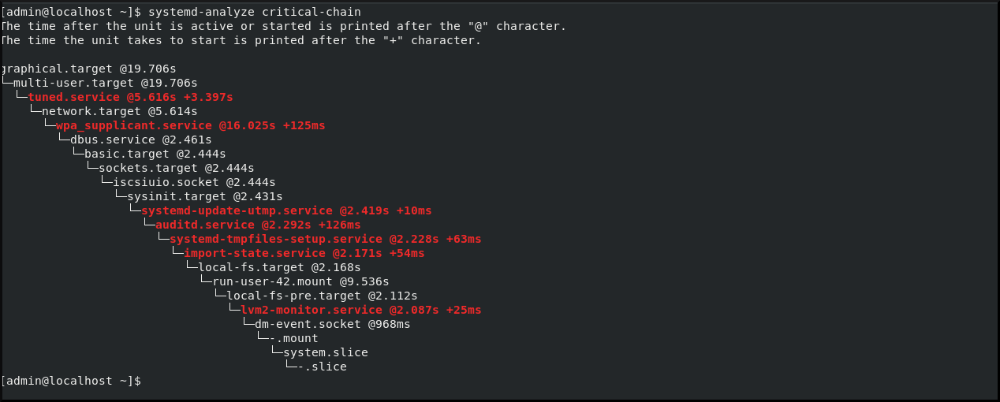

# Using systemd unit files to customize and optimize your system

* * *

Red Hat Enterprise Linux 10

## Optimize system performance and extend configuration with systemd

Red Hat Customer Content Services

[Legal Notice](#idm139971250473648)

**Abstract**

Modify the systemd unit files and extend the default configuration, examine the system boot performance and optimize systemd to shorten the boot time.

* * *

<h2 id="providing-feedback-on-red-hat-documentation">Providing feedback on Red Hat documentation</h2>

We are committed to providing high-quality documentation and value your feedback. To help us improve, you can submit suggestions or report errors through the Red Hat Jira tracking system.

**Procedure**

1. Log in to the [Jira](https://issues.redhat.com/projects/RHELDOCS/issues) website.
   
   If you do not have an account, select the option to create one.
2. Click **Create** in the top navigation bar.
3. Enter a descriptive title in the **Summary** field.
4. Enter your suggestion for improvement in the **Description** field. Include links to the relevant parts of the documentation.
5. Click **Create** at the bottom of the dialogue.

<h2 id="working-with-systemd-unit-files">Chapter 1. Working with systemd unit files</h2>

To perform tasks for managing your system resources, you can configure the `systemd` unit files to create custom unit files, modify existing unit files, and work with instantiated units.

<h3 id="introduction-to-unit-files">1.1. Introduction to unit files</h3>

To manage units and their resources, you can use unit files. Several `systemctl` commands work with unit files in the background. A unit file is the `.service` or `.target` file on your hard drive that has configuration directives to describe the unit and define its properties.

The basic object that systemd manages is a `systemd` unit, a representation of system resources and services. A `systemd` unit consists of a name, type and a configuration file that defines and manages a particular task. You can use unit files to configure system behavior. Examples of various `systemd` unit types are as follows:

- **Service** : Controls and manages individual system services.
- **Target** : Represents a group of units that define system states.
- **Device** : Manages hardware devices and their availability.
- **Mount** : Handles file system mounting.
- **Timer** : Schedules tasks to run at specific intervals.

You can edit or create unit files manually. Three main directories contain unit files on the system:

- `/usr/lib/systemd/system/` - `systemd` unit files distributed with installed RPM packages.
- `/run/systemd/system/` - `systemd` unit files created at run time.
- `/etc/systemd/system/` - `systemd` unit files created by using the `systemctl enable` command and unit files added for extending a service.

The `/etc/systemd/system/` directory is reserved for unit files created or customized by a system administrator.

Unit file naming convention is as follows:

```
<unit_name>.<type_extension>
```

```plaintext
<unit_name>.<type_extension>
```

In this example, *&lt;unit\_name&gt;* stands for the name of the unit and *&lt;type\_extension&gt;* identifies the unit type. For example, you can find `sshd.service` and `sshd.socket` units present on your system.

For additional configurations, you can use systemd drop-in files.

- Create the `sshd.service.d/` directory and edit the `custom.conf` file.
  
  ```
  mkdir -p /etc/systemd/system/sshd.service.d
  ```
  
  ```plaintext
  # mkdir -p /etc/systemd/system/sshd.service.d
  ```
- Create a drop-in file:
  
  ```
  touch /etc/systemd/system/sshd.service.d/custom.conf
  ```
  
  ```plaintext
  # touch /etc/systemd/system/sshd.service.d/custom.conf
  ```
- Edit the service with the `custom.conf` drop-in file:
  
  ```
  systemctl edit sshd.service
  ```
  
  ```plaintext
  # systemctl edit sshd.service
  ```
  
  The `systemctl edit` command opens the `sshd.service` unit file in the default text editor.
- You can add additional directives to the file. For example, to add a custom configuration option to `sshd.service`, add the following line to the file:
  
  ```
  [Service]
  ExecStart=
  ExecStart=/usr/sbin/sshd -D -f /etc/ssh/sshd_config.custom
  ```
  
  ```plaintext
  [Service]
  ExecStart=
  ExecStart=/usr/sbin/sshd -D -f /etc/ssh/sshd_config.custom
  ```
  
  For details on configuration directories, see [Modifying existing unit files](#modifying-existing-unit-files "1.12. Modifying existing unit files").

The system uses systemd to manage the `sshd.service` dependencies through the directories `/etc/systemd/system/sshd.service.wants/` and `/etc/systemd/system/sshd.service.requires/`. These directories are for symlinks to other services that the SSH daemon needs or wants to start. While systemd does not create these directories directly, you can use the `systemctl enable <service>` command to automatically add the necessary links. `systemd` creates the symbolic links automatically either during installation according to the `[Install]` section options or at runtime based on the `[Unit]` section options from the unit file.

With unit specifiers, you can set many unit file options. These are wildcard strings that are dynamically replaced with unit parameters when the unit file is loaded. This enables creation of unit files that serve as templates for generating instantiated units. See [Working with instantiated units](#working-with-instantiated-units "1.17. Working with instantiated units").

<h3 id="systemd-unit-files-locations">1.2. Systemd unit files locations</h3>

You can find the unit configuration files in the mentioned directories.

| Directory                  | Description                                                                                                                                                                                    |
|:---------------------------|:-----------------------------------------------------------------------------------------------------------------------------------------------------------------------------------------------|
| `/usr/lib/systemd/system/` | `systemd` unit files distributed with installed RPM packages.                                                                                                                                  |
| `/run/systemd/system/`     | `systemd` unit files created at run time. This directory takes precedence over the directory with installed service unit files.                                                                |
| `/etc/systemd/system/`     | `systemd` unit files created by using the `systemctl enable` command and unit files added for extending a service. This directory takes precedence over the directory with runtime unit files. |

Table 1.1. systemd unit files locations

The default configuration of `systemd` is defined during the compilation and you can find the configuration in the `/etc/systemd/system.conf` file. By editing this file, you can modify the default configuration by overriding values for `systemd` units globally.

For example, to override the default value of the timeout limit, which is set to 90 seconds, use the `DefaultTimeoutStartSec` parameter to input the required value in seconds:

```
DefaultTimeoutStartSec=_required value_
```

```plaintext
DefaultTimeoutStartSec=_required value_
```

<h3 id="unit-file-structure">1.3. Unit file structure</h3>

Unit files consist of three main sections that define unit behavior, type-specific directives, and installation information. Understanding this structure helps you to create and change systemd units effectively.

The `[Unit]` section

Generic options that are not dependent on the type of the unit. These options have a unit description, specify the unit’s behavior, and set dependencies to other units. For details, see [Important \[Unit\] section options](#important-unit-section-options "1.4. Important [Unit] section options").

The `[Unit type]` section

Type-specific directives, which are grouped under a section named after the unit type. For example, service unit files contain the `[Service]` section. For details, see [Important \[Service\] section options](#important-service-section-options "1.5. Important [Service] section options").

The `[Install]` section

Information about unit installation used by `systemctl enable` and `disable` commands. For details, see [Important \[Install\] section options](#important-install-section-options "1.6. Important [Install] section options").

<h3 id="important-unit-section-options">1.4. Important \[Unit] section options</h3>

The \[Unit] section has generic options that are not dependent on the type of the unit. These options have a unit description, specify the unit’s behavior, and set dependencies to other units.

Table 1.2. Important \[Unit] section options

Option [\[a\]](#ftn.idm139971258608064)Description

`Description`

A meaningful description of the unit. This text is displayed for example in the output of the `systemctl status` command.

`Documentation`

Provides a list of URIs referencing documentation for the unit.

`After`[\[b\]](#ftn.idm139971258400896)

Defines the order in which units are started. The unit starts only after the units specified in `After` are active. Unlike `Requires`, `After` does not explicitly activate the specified units. The `Before` option has the opposite functionality to `After`.

`Requires`

Configures dependencies on other units. The units listed in `Requires` are activated together with the unit. If any of the required units fail to start, the unit is not activated.

`Wants`

Configures weaker dependencies than `Requires`. If any of the listed units does not start successfully, it has no impact on the unit activation. This is the suggested way to establish custom unit dependencies.

`Conflicts`

Configures negative dependencies, an opposite to `Requires`.

[\[a\]](#idm139971258608064) For a complete list of options configurable in the \[Unit] section, see the `systemd.unit(5)` manual page.

[\[b\]](#idm139971258400896) In most cases, it is sufficient to set only the ordering dependencies with `After` and `Before` unit file options. If you also set a requirement dependency with `Wants` (suggested) or `Requires`, the ordering dependency still needs to be specified. That is because ordering and requirement dependencies work independently from each other.

<h3 id="important-service-section-options">1.5. Important \[Service] section options</h3>

To manage configuration parameters that define how the service operates and interacts with the system, use the `[Service]` section. Each systemd service unit has a `[Service]` section that includes directives for this unit type.

Table 1.3. Important \[Service] section options

Option [\[a\]](#ftn.idm139971259255632)Description

`Type`

Configures the unit process startup type that affects the functionality of `ExecStart` and related options. One of:

- `simple`: The default value. The process started with `ExecStart` is the main process of the service.
- `forking` : The process started with `ExecStart` spawns a child process that becomes the main process of the service. The parent process exits when the startup is complete.
- `oneshot` : This type is similar to `simple`, but the process exits before starting consequent units.
- `dbus` : This type is similar to `simple`, but consequent units start only after the main process gains a D-Bus name.
- `notify` : This type is similar to `simple`, but consequent units start only after the main process sends a notification message by using the `sd_notify()` function.
- `idle` : similar to `simple`, the system delays the actual execution of the service binary until all jobs finish, which avoids mixing the status output with terminal output of services.

`ExecStart`

Specifies commands or scripts to run when the unit starts. `ExecStartPre` and `ExecStartPost` specify custom commands to run before and after `ExecStart`. `Type=oneshot` specifies multiple custom commands that the system then runs sequentially.

`ExecStop`

Specifies commands or scripts to run when the unit stops.

`ExecReload`

Specifies commands or scripts to run when the unit reloads.

`Restart`

When you enable this option, the service restarts after its process exits, with the exception of a clean stop by the `systemctl` command.

`RemainAfterExit`

If you set this to True, the service remains active even when all its processes exit. Default is False. This option is especially useful if you configure `Type=oneshot`.

[\[a\]](#idm139971259255632) For a complete list of options configurable in the `[Service]` section, see the `systemd.service(5)` man page.

<h3 id="important-install-section-options">1.6. Important \[Install] section options</h3>

The \[Install] section has information about unit installation used by `systemctl enable` and `disable` commands.

| Option [\[a\]](#ftn.idm139971257824192)                                                                                                    | Description                                                                                                                                                                                                               |
|:-------------------------------------------------------------------------------------------------------------------------------------------|:--------------------------------------------------------------------------------------------------------------------------------------------------------------------------------------------------------------------------|
| `Alias`                                                                                                                                    | Provides a space-separated list of additional names for the unit. Most `systemctl` commands, excluding `systemctl enable`, can use aliases instead of the actual unit name.                                               |
| `RequiredBy`                                                                                                                               | A list of units that depend on the unit. When this unit is enabled, the units listed in `RequiredBy` gain a `Require` dependency on the unit.                                                                             |
| `WantedBy`                                                                                                                                 | A list of units that weakly depend on the unit. When this unit is enabled, the units listed in `WantedBy` gain a `Want` dependency on the unit.                                                                           |
| `Also`                                                                                                                                     | Specifies a list of units to be installed or uninstalled along with the unit.                                                                                                                                             |
| `DefaultInstance`                                                                                                                          | Limited to instantiated units, this option specifies the default instance for which the unit is enabled. See [Working with instantiated units](#working-with-instantiated-units "1.17. Working with instantiated units"). |
| [\[a\]](#idm139971257824192) For a complete list of options configurable in the \[Install] section, see the `systemd.unit(5)` manual page. |                                                                                                                                                                                                                           |

Table 1.4. Important \[Install] section options

<h3 id="creating-custom-unit-files">1.7. Creating custom unit files</h3>

To modify properties of an existing unit or create a new unit from scratch, you need to create custom unit files.

There are several use cases for creating unit files from scratch: you could run a custom daemon or create a second instance of some existing service as in [Creating a custom unit file by using the second instance of the sshd service](#creating-a-custom-unit-file-by-using-the-second-instance-of-the-sshd-service "1.8. Creating a custom unit file by using the second instance of the sshd service")

However, to modify or extend the properties of an existing unit, use the instructions from [Modifying existing unit files](#modifying-existing-unit-files "1.12. Modifying existing unit files").

**Prerequisites**

- To create a custom service, prepare the executable file with the service. The file can contain a custom-created script, or an executable delivered by a software provider.
- To manage custom services, prepare a PID file to hold a constant PID for the main process of the custom service. You can also include environment files to store shell variables for the service. Make sure the source script is executable (by executing the `chmod a+x`) and is not interactive.
- You have administrative privileges.

**Procedure**

1. Create a unit file in the `/etc/systemd/system/` directory:
   
   ```
   touch /etc/systemd/system/<name>.service
   ```
   
   ```plaintext
   # touch /etc/systemd/system/<name>.service
   ```
2. Apply the read-only permission to the unit file:
   
   ```
   chmod 664 /etc/systemd/system/<name>.service
   ```
   
   ```plaintext
   # chmod 664 /etc/systemd/system/<name>.service
   ```
   
   Replace *&lt;name&gt;* with a name of the service you want to create.
3. Open the created `<name>.service` file, and add the service configuration options. You can use various options depending on the type of service you need to create, see [Unit file structure](#unit-file-structure "1.3. Unit file structure").
   
   The following is an example unit configuration for a network-related service:
   
   ```
   [Unit]
   Description=<service_description>
   After=network.target
   
   [Service]
   ExecStart=<path_to_executable>
   Type=forking
   PIDFile=<path_to_pidfile>
   
   [Install]
   WantedBy=default.target
   ```
   
   ```plaintext
   [Unit]
   Description=<service_description>
   After=network.target
   
   [Service]
   ExecStart=<path_to_executable>
   Type=forking
   PIDFile=<path_to_pidfile>
   
   [Install]
   WantedBy=default.target
   ```
   
   - *&lt;service\_description&gt;* is an informative description that is displayed in journal log files and in the output of the `systemctl status` command.
   - The `After` setting ensures that the service is started only after the network is running. Add a space-separated list of other relevant services or targets.
   - *path\_to\_executable* stands for the path to the actual service executable.
   - `Type=forking` is used for daemons that make the fork system call. The main process of the service is created with the PID specified in *path\_to\_pidfile*. Find other startup types in [Important \[Service\] section options](#important-service-section-options "1.5. Important [Service] section options").
   - `WantedBy` states the target or targets that the service should be started under. Think of these targets as a replacement of the older concept of runlevels.
4. Notify `systemd` that a new `<name>.service` file exists:
   
   ```
   systemctl daemon-reload
   
   systemctl start <name>.service
   ```
   
   ```plaintext
   # systemctl daemon-reload
   
   # systemctl start <name>.service
   ```
   
   Important
   
   Always run the `systemctl daemon-reload` command after creating new unit files or modifying existing unit files. Otherwise, the `systemctl start` or `systemctl enable` commands could fail due to a mismatch between states of `systemd` and actual service unit files on disk. On systems with a large number of units, this can take a long time as the state of each unit is serialized and subsequently deserialized during the reload.

<h3 id="creating-a-custom-unit-file-by-using-the-second-instance-of-the-sshd-service">1.8. Creating a custom unit file by using the second instance of the sshd service</h3>

To configure and run multiple instances of a service, you can create copies of the original service configuration files. Then, modify certain parameters to avoid conflicts with the primary instance of the service.

**Prerequisites**

- You have administrative privileges.
- You have installed the `sshd` service.

**Procedure**

1. Create a copy of the `sshd_config` file that the second daemon will use:
   
   ```
   cp /etc/ssh/sshd_config /etc/ssh/sshd-second_config
   ```
   
   ```plaintext
   # cp /etc/ssh/sshd_config /etc/ssh/sshd-second_config
   ```
2. Edit the `sshd-second_config` file created in the last step to assign a different port number and PID file to the second daemon:
   
   ```
   Port 22220
   PidFile /var/run/sshd-second.pid
   ```
   
   ```plaintext
   Port 22220
   PidFile /var/run/sshd-second.pid
   ```
   
   See the `sshd_config (5)` man page for `Port` and `PidFile` options. Make sure the requested port is not in use by any other service. The PID file does not have to exist before running the service, it is generated automatically on service start.
3. Create a copy of the `systemd` unit file for the `sshd` service:
   
   ```
   cp /usr/lib/systemd/system/sshd.service /etc/systemd/system/sshd-second.service
   ```
   
   ```plaintext
   # cp /usr/lib/systemd/system/sshd.service /etc/systemd/system/sshd-second.service
   ```
4. Edit the created `sshd-second.service` file:
   
   1. Modify the `Description` option:
      
      ```
      vi /etc/systemd/system/sshd-second.service
      ```
      
      ```plaintext
      # vi /etc/systemd/system/sshd-second.service
      ```
      
      ```
      Description=OpenSSH server second instance daemon
      ```
      
      ```plaintext
      Description=OpenSSH server second instance daemon
      ```
   2. Add `sshd.service` to services specified in the `After` option, so that the second instance starts only after the first one has already started:
      
      ```
      After=syslog.target network.target auditd.service sshd.service
      ```
      
      ```plaintext
      After=syslog.target network.target auditd.service sshd.service
      ```
   3. Remove the `ExecStartPre=/usr/sbin/sshd-keygen` line, the first instance of `sshd` includes key generation.
   4. Add the `-f /etc/ssh/sshd-second_config` parameter to the `sshd` command, so that the alternative configuration file is used:
      
      ```
      ExecStart=/usr/sbin/sshd -D -f /etc/ssh/sshd-second_config $OPTIONS
      ```
      
      ```plaintext
      ExecStart=/usr/sbin/sshd -D -f /etc/ssh/sshd-second_config $OPTIONS
      ```
   5. After the modifications, the `sshd-second.service` unit file contains the following settings:
      
      ```
      [Unit]
      Description=OpenSSH server second instance daemon
      After=syslog.target network.target auditd.service sshd.service
      
      [Service]
      EnvironmentFile=/etc/sysconfig/sshd
      ExecStart=/usr/sbin/sshd -D -f /etc/ssh/sshd-second_config $OPTIONS
      ExecReload=/bin/kill -HUP $MAINPID
      KillMode=process
      Restart=on-failure
      RestartSec=42s
      
      [Install]
      WantedBy=multi-user.target
      ```
      
      ```plaintext
      [Unit]
      Description=OpenSSH server second instance daemon
      After=syslog.target network.target auditd.service sshd.service
      
      [Service]
      EnvironmentFile=/etc/sysconfig/sshd
      ExecStart=/usr/sbin/sshd -D -f /etc/ssh/sshd-second_config $OPTIONS
      ExecReload=/bin/kill -HUP $MAINPID
      KillMode=process
      Restart=on-failure
      RestartSec=42s
      
      [Install]
      WantedBy=multi-user.target
      ```
5. If using SELinux, add the port for the second instance of `sshd` to SSH ports, otherwise the second instance of `sshd` will be rejected to bind to the port:
   
   ```
   semanage port -a -t ssh_port_t -p tcp 22220
   ```
   
   ```plaintext
   # semanage port -a -t ssh_port_t -p tcp 22220
   ```
6. Enable `sshd-second.service` to start automatically on boot:
   
   ```
   systemctl enable --now sshd-second.service
   ```
   
   ```plaintext
   # systemctl enable --now sshd-second.service
   ```

**Verification**

1. Verify if the `sshd-second.service` is running by using the `systemctl status` command.
   
   ```
   systemctl status sshd-second.service
   ```
   
   ```plaintext
   # systemctl status sshd-second.service
   ```
2. Verify if the port is enabled by connecting to the second instance of `sshd`:
   
   ```
   ssh -p 22220 user@server
   ```
   
   ```plaintext
   $ ssh -p 22220 user@server
   ```
   
   Make sure you configure the firewall to allow connections to the second instance of `sshd`.

<h3 id="finding-the-systemd-service-descriptions-and-dependencies">1.9. Finding the systemd service descriptions and dependencies</h3>

To discover the service descriptions and dependencies, you can use the `systemctl show <example_service_name>` command. You can also list the dependencies by using the `systemctl list-dependencies <example_service_name>` command.

To find the description of the service, you can use the line starting with **#description**. Use this description together with the service name in the `Description` option in the `[Unit]` section of the unit file. The header might contain similar data on the **#Short-Description** and **#Description** lines.

To find the dependencies of the service, you can use the Linux standard base (LSB) header. It might contain several directives that form dependencies between services.

```
grep -i "Required-Start\|Required-Stop\|Default-Start\|Default-Stop" /etc/init.d/<example_service_name>
```

```plaintext
# grep -i "Required-Start\|Required-Stop\|Default-Start\|Default-Stop" /etc/init.d/<example_service_name>
```

Most of them are translatable to systemd unit options, see the following table:

| LSB Option                    | Equivalent Unit File | Description                                                                                                                                                                                                                                                                                                                                              |
|:------------------------------|:---------------------|:---------------------------------------------------------------------------------------------------------------------------------------------------------------------------------------------------------------------------------------------------------------------------------------------------------------------------------------------------------|
| `Required-Stop`,`Should-Stop` | `Conflicts`          | Include negative dependencies.                                                                                                                                                                                                                                                                                                                           |
| `Provides`                    | `-`                  | Specifies the boot facility name of the service, that can be referenced in other init scripts (with the "$" prefix). This is no longer needed as unit files refer to other units by their file names.                                                                                                                                                    |
| `Required-Start`              | `After`, `Before`    | Includes boot facility names of required services. This is translated as an ordering dependency, boot facility names are replaced with unit file names of corresponding services or targets they belong to. For example, in case of `myservice`, the Required-Start dependency on **$network** was translated to the After dependency on network.target. |
| `Should-Start`                | `After`, `Before`    | Includes weaker dependencies than Required-Start. Failed Should-Start dependencies do not affect the service startup.                                                                                                                                                                                                                                    |

Table 1.5. Dependency options from the LSB header

<h3 id="finding-default-targets-of-the-service">1.10. Finding default targets of the service</h3>

To decide the default systemd targets in which a service should start, check for lines such as **#chkconfig** or **#Default-Start** in the service script or Linux Standard Base (LSB) header.

The runlevels correspond to default systemd targets. In systemd, runlevels 2, 3, and 5 map to multi-user.target and graphical.target, while runlevel 4 maps to a custom or user defined target. Specify these targets in the `WantedBy` option in the `[Install]` section of your unit file to control when the service starts by default. Because graphical.target depends on multi-user.target, you can also specify only graphical.target for services meant to run in a graphical environment. Also, examine **#Default-Stop** to identify targets to stop the service by default. The other two values specified on the **#chkconfig** line represent startup and shutdown priorities of the init script. These values are interpreted by systemd if it loads the init script, but there is no unit file equivalent.

<h3 id="finding-files-used-by-the-service">1.11. Finding files used by the service</h3>

You need to review the init script or systemd unit file to find files used by a service. Look for references of configuration files, environment files, PID files, and executables in the init script or systemd unit file.

- In traditional init scripts, check for lines that load function libraries, source configuration files, or specify environment and PID files (often mentioned as `#config` and `#pidfile` in the header).
- In systemd unit files, check options such as `EnvironmentFile=` for environment configurations and `PIDFile=` for PID files. The `ExecStart=`, `ExecStartPre=`, and other related directives show executables or scripts the service calls.
- Additionally, review paths and filenames mentioned in these scripts and directives to identify all files that the service uses during its operation.

The init script header does not include the path to the executable program and other dependent files required by the service. In previous versions of Red Hat Enterprise Linux, init scripts used a Bash case statement to define the behavior of the service on default actions, such as **start**, **stop**, or **restart**, and custom-defined actions. The following excerpt from the `example_service` init script shows the block of code executed at service start.

```
conf_check() {
    [ -x /usr/sbin/myservice ] || exit 5
    [ -d /etc/myservice ] || exit 6
    [ -d /var/spool/myservice ] || exit 5
}

make_aliasesdb() {
	if [ "$(/usr/sbin/postconf -h alias_database)" == "hash:/etc/aliases" ]
	then
		# /etc/aliases.db might be used by other MTA, make sure nothing
		# has touched it since our last newaliases call
		[ /etc/aliases -nt /etc/aliases.db ] ||
			[ "$ALIASESDB_STAMP" -nt /etc/aliases.db ] ||
			[ "$ALIASESDB_STAMP" -ot /etc/aliases.db ] || return
		/usr/bin/newaliases
		touch -r /etc/aliases.db "$ALIASESDB_STAMP"
	else
		/usr/bin/newaliases
	fi
}

start() {
	[ "$EUID" != "0" ] && exit 4
	# Check that networking is up.
	[ ${NETWORKING} = "no" ] && exit 1
	conf_check
	# Start daemons.
	echo -n $"Starting myservice: "
	make_aliasesdb >/dev/null 2>&1
	[ -x $CHROOT_UPDATE ] && $CHROOT_UPDATE
	/usr/sbin/myservice start 2>/dev/null 1>&2 && success || failure $"$prog start"
	RETVAL=$?
	[ $RETVAL -eq 0 ] && touch $lockfile
        echo
	return $RETVAL
}
```

```bash
conf_check() {
    [ -x /usr/sbin/myservice ] || exit 5
    [ -d /etc/myservice ] || exit 6
    [ -d /var/spool/myservice ] || exit 5
}

make_aliasesdb() {
	if [ "$(/usr/sbin/postconf -h alias_database)" == "hash:/etc/aliases" ]
	then
		# /etc/aliases.db might be used by other MTA, make sure nothing
		# has touched it since our last newaliases call
		[ /etc/aliases -nt /etc/aliases.db ] ||
			[ "$ALIASESDB_STAMP" -nt /etc/aliases.db ] ||
			[ "$ALIASESDB_STAMP" -ot /etc/aliases.db ] || return
		/usr/bin/newaliases
		touch -r /etc/aliases.db "$ALIASESDB_STAMP"
	else
		/usr/bin/newaliases
	fi
}

start() {
	[ "$EUID" != "0" ] && exit 4
	# Check that networking is up.
	[ ${NETWORKING} = "no" ] && exit 1
	conf_check
	# Start daemons.
	echo -n $"Starting myservice: "
	make_aliasesdb >/dev/null 2>&1
	[ -x $CHROOT_UPDATE ] && $CHROOT_UPDATE
	/usr/sbin/myservice start 2>/dev/null 1>&2 && success || failure $"$prog start"
	RETVAL=$?
	[ $RETVAL -eq 0 ] && touch $lockfile
        echo
	return $RETVAL
}
```

The extensibility of the init script allowed specifying two custom functions, `conf_check()` and `make_aliasesdb()` are called from the `start()` function block. Several external files and directories are mentioned: the `/usr/sbin/myservice` main executable program, the `/etc/myservice/` and `/var/spool/myservice/` configuration directories, and the `/usr/sbin/postconf/` directory.

The `systemd` unit file supports only the predefined actions, but enables executing custom executables with `ExecStart`, `ExecStartPre`, `ExecStartPost`, `ExecStop`, and `ExecReload` options. The `/usr/sbin/myservice` together with supporting scripts are executed on service start.

Converting complex init scripts requires understanding the purpose of every statement in the script. Some of the statements are specific to the operating system version, therefore you do not need to convert them. However, some adjustments required for the new environment, both in the unit file and in the executable program and supporting files.

<h3 id="modifying-existing-unit-files">1.12. Modifying existing unit files</h3>

To customize and optimize services for your specific needs without creating a new configuration from scratch, you can modify an existing unit file. If you want to modify existing unit files, proceed to the `/etc/systemd/system/` directory.

Do not modify the unit files in the `/usr/lib/systemd/system/` directory.

**Prerequisites**

- You have administrative privileges.

**Procedure**

- Create a directory for supplementary configuration files at `/etc/systemd/system/<unit>.d/`. You can extend the default configuration with additional functionality, while still referring to the original unit file. Changes to the default unit introduced with a package upgrade are therefore applied automatically. For details, see [Extending the default unit configuration](#extending-the-default-unit-configuration "1.13. Extending the default unit configuration").
- Create a copy of the original unit file from `/usr/lib/systemd/system/` directory in the `/etc/systemd/system/` directory and make changes there. The copy overrides the original file, therefore changes introduced with the package update are not applied. This method is useful for making significant unit changes that should persist regardless of package updates. For details, see [Overriding the default unit configuration](overriding-the-default-unit-configuration.xml).
  
  1. To return to the default configuration of the unit, delete custom-created configuration files and the `/etc/systemd/system/<unit>.d/` drop-in directory.
  2. Apply changes to unit files:
     
     ```
     systemctl daemon-reload
     ```
     
     ```plaintext
     # systemctl daemon-reload
     ```
     
     The `daemon-reload` option reloads all unit files and recreates the entire dependency tree, which is needed to immediately apply any change to a unit file.
  3. If the modified unit file belongs to a running service, restart the service:
     
     ```
     systemctl restart <name>.service
     ```
     
     ```plaintext
     # systemctl restart <name>.service
     ```
     
     Important
     
     To modify a service properties, such as dependencies or timeouts, that is handled by a SysV initscript, do not modify the initscript. Instead, create a `systemd` drop-in configuration file for the service as described in: [Extending the default unit configuration](#extending-the-default-unit-configuration "1.13. Extending the default unit configuration") and [Overriding the default unit configuration](#overriding-the-default-unit-configuration "1.14. Overriding the default unit configuration").
     
     To manage the service in the same way as a normal systemd service, create a new directory `/etc/systemd/system/network.service.d/` and a systemd drop-in file `/etc/systemd/system/network.service.d/<example_config.conf>`. Then, put the modified values into the drop-in file.
     
     The `systemd` service identifies the `network` service as `network.service`, so the created directory must be named as `network.service.d`.

<h3 id="extending-the-default-unit-configuration">1.13. Extending the default unit configuration</h3>

To extend the default unit file with additional systemd configuration options, you can create a configuration directory in the `/etc/systemd/system/` directory.

**Prerequisites**

- You have administrative privileges.

**Procedure**

1. Create a configuration directory in `/etc/systemd/system/`:
   
   ```
   mkdir /etc/systemd/system/<name>.service.d/
   ```
   
   ```plaintext
   # mkdir /etc/systemd/system/<name>.service.d/
   ```
   
   Replace *&lt;name&gt;* with the name of the service you want to extend. The syntax applies to all unit types.
2. Create a configuration file with the **.conf** suffix:
   
   ```
   touch /etc/systemd/system/name.service.d/<config_name>.conf
   ```
   
   ```plaintext
   # touch /etc/systemd/system/name.service.d/<config_name>.conf
   ```
   
   Replace *&lt;config\_name&gt;* with the name of the configuration file. This file adheres to the normal unit file structure and you have to specify all directives in the appropriate sections, see [Unit file structure](#unit-file-structure "1.3. Unit file structure").
   
   For example, to add a custom dependency, create a configuration file with the following content:
   
   ```
   [Unit]
   Requires=<new_dependency>
   After=<new_dependency>
   ```
   
   ```plaintext
   [Unit]
   Requires=<new_dependency>
   After=<new_dependency>
   ```
   
   The *&lt;new\_dependency&gt;* stands for the unit to be marked as a dependency. Another example is a configuration file that restarts the service after its main process exited, with a delay of 30 seconds:
   
   ```
   [Service]
   Restart=always
   RestartSec=30
   ```
   
   ```plaintext
   [Service]
   Restart=always
   RestartSec=30
   ```
   
   Create small configuration files focused only on one task. Such files can be easily moved or linked to configuration directories of other services.
3. Apply changes to the unit:
   
   ```
   systemctl daemon-reload
   ```
   
   ```plaintext
   # systemctl daemon-reload
   ```
   
   ```
   systemctl restart <name>.service
   ```
   
   ```plaintext
   # systemctl restart <name>.service
   ```
4. To automatically execute a custom shell script when starting the Apache service, modify the `httpd.service` unit.
   
   1. Create a directory and a custom configuration file:
      
      ```
      mkdir /etc/systemd/system/httpd.service.d/
      ```
      
      ```plaintext
      # mkdir /etc/systemd/system/httpd.service.d/
      ```
      
      ```
      touch /etc/systemd/system/httpd.service.d/custom_script.conf
      ```
      
      ```plaintext
      # touch /etc/systemd/system/httpd.service.d/custom_script.conf
      ```
   2. Specify the script you want to execute after the main service process by inserting the following text to the `custom_script.conf` file:
      
      ```
      [Service]
      ExecStartPost=/usr/local/bin/custom.sh
      ```
      
      ```plaintext
      [Service]
      ExecStartPost=/usr/local/bin/custom.sh
      ```
   3. Apply the unit changes::
      
      ```
      systemctl daemon-reload
      ```
      
      ```plaintext
      # systemctl daemon-reload
      ```
      
      ```
      systemctl restart httpd.service
      ```
      
      ```plaintext
      # systemctl restart httpd.service
      ```
      
      Note
      
      The configuration files from the `/etc/systemd/system/` configuration directories take precedence over unit files in `/usr/lib/systemd/system/`. Therefore, if the configuration files contain an option that can be specified only once, such as `Description` or `ExecStart`, the default value of this option is overridden. Note that in the output of the `systemd-delta` command, described in [Monitoring overridden units](#monitoring-overridden-units "1.16. Monitoring overridden units"), such units are always marked as `[EXTENDED]`, even though in sum, certain options are actually overridden.

<h3 id="overriding-the-default-unit-configuration">1.14. Overriding the default unit configuration</h3>

To make persistent changes to the unit file configuration after updating the package that provides the unit file, you can override the default unit configuration.

**Prerequisites**

- You have administrative privileges.

**Procedure**

1. Copy the unit file to the `/etc/systemd/system/` directory:
   
   ```
   cp /usr/lib/systemd/system/<name>.service /etc/systemd/system/<name>.service
   ```
   
   ```plaintext
   # cp /usr/lib/systemd/system/<name>.service /etc/systemd/system/<name>.service
   ```
   
   Replace *&lt;name&gt;* with the name of the service you want to override.
2. Open the copied file and make changes.
3. Apply unit changes:
   
   ```
   systemctl daemon-reload
   ```
   
   ```plaintext
   # systemctl daemon-reload
   ```
4. Restart the service:
   
   ```
   systemctl restart <name>.service
   ```
   
   ```plaintext
   # systemctl restart <name>.service
   ```

<h3 id="changing-the-timeout-limit">1.15. Changing the timeout limit</h3>

To prevent a malfunctioning service from freezing the system, you can specify a timeout value per service. Otherwise, the default value for timeout is 90 seconds for normal services and 300 seconds for SysV-compatible services.

**Prerequisites**

- You have administrative privileges.

**Procedure**

1. Edit the `httpd` unit file:
   
   ```
   systemctl edit httpd
   ```
   
   ```plaintext
   # systemctl edit httpd
   ```
2. Specify the `TimeoutStartSec` value in the `[Service]` section:
   
   ```
   ...
   [Service]
   ...
   PrivateTmp=true
   TimeoutStartSec=10
   
   [Install]
   WantedBy=multi-user.target
   ...
   ```
   
   ```plaintext
   ...
   [Service]
   ...
   PrivateTmp=true
   TimeoutStartSec=10
   
   [Install]
   WantedBy=multi-user.target
   ...
   ```
3. Reload the `systemd` daemon:
   
   ```
   systemctl daemon-reload
   ```
   
   ```plaintext
   # systemctl daemon-reload
   ```

**Verification**

- Verify the new timeout value:
  
  ```
  systemctl show httpd -p TimeoutStartUSec
  ```
  
  ```plaintext
  # systemctl show httpd -p TimeoutStartUSec
  ```
  
  Note
  
  To change the timeout limit globally, input the `DefaultTimeoutStartSec` in the `/etc/systemd/system.conf` file.

<h3 id="monitoring-overridden-units">1.16. Monitoring overridden units</h3>

To monitor overridden or modified unit files, you can use the `systemd-delta` command.

**Prerequisites**

- You have administrative privileges.

**Procedure**

- Display an overview of overridden or modified unit files:
  
  ```
  systemd-delta
  ```
  
  ```plaintext
  # systemd-delta
  ```
  
  ```
  [EQUIVALENT] /etc/systemd/system/default.target → /usr/lib/systemd/system/default.target
  [OVERRIDDEN] /etc/systemd/system/autofs.service → /usr/lib/systemd/system/autofs.service
  
  --- /usr/lib/systemd/system/autofs.service      2014-10-16 21:30:39.000000000 -0400
  +++ /etc/systemd/system/autofs.service  2014-11-21 10:00:58.513568275 -0500
  @@ -8,7 +8,8 @@
   EnvironmentFile=-/etc/sysconfig/autofs
   ExecStart=/usr/sbin/automount $OPTIONS --pid-file /run/autofs.pid
   ExecReload=/usr/bin/kill -HUP $MAINPID
  -TimeoutSec=180
  +TimeoutSec=240
  +Restart=Always
  
   [Install]
   WantedBy=multi-user.target
  
  [MASKED]     /etc/systemd/system/cups.service → /usr/lib/systemd/system/cups.service
  [EXTENDED]   /usr/lib/systemd/system/sssd.service → /etc/systemd/system/sssd.service.d/journal.conf
  
  4 overridden configuration files found.
  ```
  
  ```plaintext
  [EQUIVALENT] /etc/systemd/system/default.target → /usr/lib/systemd/system/default.target
  [OVERRIDDEN] /etc/systemd/system/autofs.service → /usr/lib/systemd/system/autofs.service
  
  --- /usr/lib/systemd/system/autofs.service      2014-10-16 21:30:39.000000000 -0400
  +++ /etc/systemd/system/autofs.service  2014-11-21 10:00:58.513568275 -0500
  @@ -8,7 +8,8 @@
   EnvironmentFile=-/etc/sysconfig/autofs
   ExecStart=/usr/sbin/automount $OPTIONS --pid-file /run/autofs.pid
   ExecReload=/usr/bin/kill -HUP $MAINPID
  -TimeoutSec=180
  +TimeoutSec=240
  +Restart=Always
  
   [Install]
   WantedBy=multi-user.target
  
  [MASKED]     /etc/systemd/system/cups.service → /usr/lib/systemd/system/cups.service
  [EXTENDED]   /usr/lib/systemd/system/sssd.service → /etc/systemd/system/sssd.service.d/journal.conf
  
  4 overridden configuration files found.
  ```

<h3 id="working-with-instantiated-units">1.17. Working with instantiated units</h3>

To manage multiple instances of a service, you can use a single template configuration. You can define a generic template, denoted by `@`, for a unit and generate multiple instances of that unit with specific parameters at runtime. By using `Requires` or `Wants` options or the `systemctl start` command, you can start instantiated units from another unit file.

```
<template_name>@<instance_name>.service
```

```plaintext
<template_name>@<instance_name>.service
```

The *&lt;template\_name&gt;* stands for the name of the template configuration file. Replace *&lt;instance\_name&gt;* with the name for the unit instance. Several instances can point to the same template file with configuration options common for all instances of the unit. Template unit name has the form of:

```
<unit_name>@.service
```

```plaintext
<unit_name>@.service
```

For example, the following `Wants` setting in a unit file:

```
Wants=getty@ttyA.service getty@ttyB.service
```

```plaintext
Wants=getty@ttyA.service getty@ttyB.service
```

With this command, systemd searches for given service units. If no such units are found, the part between `@` and the type suffix is ignored and systemd searches for the `getty@.service` file, reads the configuration from it, and starts the services.

For example, the `getty@.service` template has the following directives:

```
[Unit]
Description=Getty on %I
...
[Service]
ExecStart=-/sbin/agetty --noclear %I $TERM
...
```

```plaintext
[Unit]
Description=Getty on %I
...
[Service]
ExecStart=-/sbin/agetty --noclear %I $TERM
...
```

When the `getty@ttyA.service` and `getty@ttyB.service` are instantiated from the above template, `Description=Getty on %I` is resolved as **Getty on ttyA** and **Getty on ttyB**.

<h3 id="important-unit-specifiers">1.18. Important unit specifiers</h3>

You can use the wildcard characters, called **unit specifiers**, in any unit configuration file. Unit specifiers substitute certain unit parameters and are interpreted at runtime.

| Unit Specifier | Meaning           | Description                                                                                                                                                                    |
|:---------------|:------------------|:-------------------------------------------------------------------------------------------------------------------------------------------------------------------------------|
| `%n`           | Full unit name    | Stands for the full unit name including the type suffix. `%N` has the same meaning but also replaces the forbidden characters with ASCII codes.                                |
| `%p`           | Prefix name       | Stands for a unit name with type suffix removed. For instantiated units %p stands for the part of the unit name before the "@" character.                                      |
| `%i`           | Instance name     | Is the part of the instantiated unit name between the "@" character and the type suffix. `%I` has the same meaning but also replaces the forbidden characters for ASCII codes. |
| `%H`           | Hostname          | Stands for the hostname of the running system at the point in time the unit configuration is loaded.                                                                           |
| `%t`           | Runtime directory | Represents the runtime directory, which is either `/run` for the `root` user, or the value of the XDG\_RUNTIME\_DIR variable for unprivileged users.                           |

Table 1.6. Important unit specifiers

For a complete list of unit specifiers, see the `systemd.unit(5)` man page on your system.

**Additional resources**

- [How to set limits for services in RHEL and systemd (Red Hat Knowledgebase)](https://access.redhat.com/solutions/1257953)
- [How to write a service unit file which enforces that particular services have to be started (Red Hat Knowledgebase)](https://access.redhat.com/solutions/3120581)
- [How to decide what dependencies a systemd service unit definition should have (Red Hat Knowledgebase)](https://access.redhat.com/solutions/3116611)

<h2 id="managing-system-services-with-systemctl">Chapter 2. Managing system services with systemctl</h2>

To administer system level services, use the `systemctl` utility. You can interact with systemd by enabling control of services and units. With `systemctl`, you can manage states of system services, list available services, and display status of system services.

<h3 id="listing-system-services">2.1. Listing system services</h3>

To optimize system performance, you can use the `systemctl` command to list and review system services. System services handle background processes, manage hardware, and supports core system functionality.

**Prerequisites**

- You have administrative privileges.

**Procedure**

- List all currently loaded service units:
  
  ```
  systemctl list-units --type service
  ```
  
  ```plaintext
  $ systemctl list-units --type service
  ```
  
  ```
  UNIT                     LOAD   ACTIVE SUB     DESCRIPTION
  abrt-ccpp.service        loaded active exited  Install ABRT coredump hook
  abrt-oops.service        loaded active running ABRT kernel log watcher
  abrtd.service            loaded active running ABRT Automated Bug Reporting Tool
  ...
  systemd-vconsole-setup.service loaded active exited  Setup Virtual Console
  tog-pegasus.service            loaded active running OpenPegasus CIM Server
  
  LOAD   = Reflects whether the unit definition was properly loaded.
  ACTIVE = The high-level unit activation state, or a generalization of SUB.
  SUB    = The low-level unit activation state, values depend on unit type.
  
  46 loaded units listed. Pass --all to see loaded but inactive units, too.
  To show all installed unit files use 'systemctl list-unit-files'
  ```
  
  ```plaintext
  UNIT                     LOAD   ACTIVE SUB     DESCRIPTION
  abrt-ccpp.service        loaded active exited  Install ABRT coredump hook
  abrt-oops.service        loaded active running ABRT kernel log watcher
  abrtd.service            loaded active running ABRT Automated Bug Reporting Tool
  ...
  systemd-vconsole-setup.service loaded active exited  Setup Virtual Console
  tog-pegasus.service            loaded active running OpenPegasus CIM Server
  
  LOAD   = Reflects whether the unit definition was properly loaded.
  ACTIVE = The high-level unit activation state, or a generalization of SUB.
  SUB    = The low-level unit activation state, values depend on unit type.
  
  46 loaded units listed. Pass --all to see loaded but inactive units, too.
  To show all installed unit files use 'systemctl list-unit-files'
  ```
  
  By default, the `systemctl list-units` command displays only active units. For each service unit file, the command provides an overview of the following parameters:
  
  `UNIT`
  
  The full name of the service unit
  
  `LOAD`
  
  The load state of the configuration file
  
  `ACTIVE` or `SUB`
  
  The current high-level and low-level unit file activation state
  
  `DESCRIPTION`
  
  A short description of the unit’s purpose and functionality
- List all loaded units regardless of their state:
  
  ```
  systemctl list-units --type service --all
  ```
  
  ```plaintext
  $ systemctl list-units --type service --all
  ```
- List the status, for example `enabled` or `disabled`, of all available service units:
  
  ```
  systemctl list-unit-files --type service
  ```
  
  ```plaintext
  $ systemctl list-unit-files --type service
  ```
  
  ```
  UNIT FILE                               STATE
  abrt-ccpp.service                       enabled
  abrt-oops.service                       enabled
  abrtd.service                           enabled
  ...
  wpa_supplicant.service                  disabled
  ypbind.service                          disabled
  
  208 unit files listed.
  ```
  
  ```plaintext
  UNIT FILE                               STATE
  abrt-ccpp.service                       enabled
  abrt-oops.service                       enabled
  abrtd.service                           enabled
  ...
  wpa_supplicant.service                  disabled
  ypbind.service                          disabled
  
  208 unit files listed.
  ```
  
  For each service unit, this command displays:
  
  - `UNIT FILE`: The full name of the service unit
  - `STATE`: The information whether the service unit is enabled or disabled to start automatically during boot

<h3 id="displaying-system-service-status">2.2. Displaying system service status</h3>

To inspect any service unit to get detailed information and verify the state of the service, use the `systemctl` command. Status information includes whether the service unit is running, enabled to start during boot, or masked.

You can also view services that are scheduled to start after or before a particular service unit. See the following table for the available service unit information.

| Field      | Description                                                                                                                                            |
|:-----------|:-------------------------------------------------------------------------------------------------------------------------------------------------------|
| `Loaded`   | Information whether the service unit has been loaded, the absolute path to the unit file, and a note whether the unit is enabled to start during boot. |
| `Active`   | Information whether the service unit is running followed by a timestamp.                                                                               |
| `Main PID` | The process ID and the name of the corresponding system service.                                                                                       |
| `Status`   | Additional information about the corresponding system service.                                                                                         |
| `Process`  | Additional information about related processes.                                                                                                        |
| `CGroup`   | Additional information about related control groups (`cgroups`).                                                                                       |

Table 2.1. Available service unit information

You can use the following commands to display system service status:

- Display detailed information about a service unit that corresponds to a system service:
  
  ```
  systemctl status <name>.service
  ```
  
  ```plaintext
  $ systemctl status <name>.service
  ```
  
  Replace *&lt;name&gt;* with the name of the service unit you want to inspect, for example, `gdm`.
  
  This command displays the following information:
  
  - The name of the selected service unit followed by a short description
  - The execution of the service unit, if the unit is executed by the `root` user
  - The most recent log entries
  - Detailed information about the service unit
- Verify that a particular service unit is running:
  
  ```
  systemctl is-active <name>.service
  ```
  
  ```plaintext
  $ systemctl is-active <name>.service
  ```
- Decide whether a particular service unit is enabled to start during boot time:
  
  ```
  systemctl is-enabled <name>.service
  ```
  
  ```plaintext
  $ systemctl is-enabled <name>.service
  ```
  
  Both `systemctl is-active` and `systemctl is-enabled` commands return an exit status of `0` if the specified service unit is running or enabled.
- Check which services systemd scheduled to start before the specified service unit:
  
  ```
  systemctl list-dependencies --after <name>.service
  ```
  
  ```plaintext
  # systemctl list-dependencies --after <name>.service
  ```
  
  For example, to view the list of services ordered to start before `gdm`, enter:
  
  ```
  systemctl list-dependencies --after gdm.service
  ```
  
  ```plaintext
  # systemctl list-dependencies --after gdm.service
  ```
  
  ```
  `gdm.service
  ├─dbus.socket
  ├─getty@tty1.service
  ├─livesys.service
  ├─plymouth-quit.service
  ├─system.slice
  ├─systemd-journald.socket
  ├─systemd-user-sessions.service
  └─basic.target
  ...
  ```
  
  ```plaintext
  `gdm.service
  ├─dbus.socket
  ├─getty@tty1.service
  ├─livesys.service
  ├─plymouth-quit.service
  ├─system.slice
  ├─systemd-journald.socket
  ├─systemd-user-sessions.service
  └─basic.target
  ...
  ```
- Check what services systemd orders to start after the specified service unit:
  
  ```
  systemctl list-dependencies --before <name>.service
  ```
  
  ```plaintext
  # systemctl list-dependencies --before <name>.service
  ```
  
  For example, to view the list of services systemd orders to start after `gdm`, enter:
  
  ```
  systemctl list-dependencies --before gdm.service
  ```
  
  ```plaintext
  # systemctl list-dependencies --before gdm.service
  ```
  
  ```
  gdm.service
  ├─dracut-shutdown.service
  ├─graphical.target
  │ ├─systemd-readahead-done.service
  │ ├─systemd-readahead-done.timer
  │ └─systemd-update-utmp-runlevel.service
  └─shutdown.target
    ├─systemd-reboot.service
    └─final.target
      └─systemd-reboot.service
  ...
  ```
  
  ```plaintext
  gdm.service
  ├─dracut-shutdown.service
  ├─graphical.target
  │ ├─systemd-readahead-done.service
  │ ├─systemd-readahead-done.timer
  │ └─systemd-update-utmp-runlevel.service
  └─shutdown.target
    ├─systemd-reboot.service
    └─final.target
      └─systemd-reboot.service
  ...
  ```

<h3 id="starting-and-stopping-a-systemd-unit">2.3. Starting and stopping a systemd unit</h3>

To start or stop a system service in the current session, you can use the `systemctl` command.

**Prerequisites**

- You have administrative privileges.

**Procedure**

- To start or stop a system service:
  
  ```
  systemctl <action> <systemd_unit>
  ```
  
  ```plaintext
  # systemctl <action> <systemd_unit>
  ```
  
  Replace *&lt;action&gt;* with the action you want to perform to enable or disable the service, for example, `start` or `stop`, and replace *&lt;systemd\_unit&gt;* with the service unit name, for example, `httpd`.
  
  Note
  
  Starting a particular service might require starting one or more other services (**positive dependency**) or stopping one or more services (**negative dependency**). In systemd, positive and negative dependencies between services exist.
  
  When you try to start a new service, systemd resolves all dependencies automatically, without explicit notification to the user. This means that if you are already running a service, and you try to start another service with a negative dependency, the first service is automatically stopped.
  
  For example, if you are running the `httpd` service (Apache web server) and then try to start the NGINX service, systemd will automatically stop httpd first. This is because both services are web servers that cannot run simultaneously on the same port (usually port 80 or 443).

<h3 id="restarting-and-reload-a-system-service">2.4. Restarting and reloading a system service</h3>

To restart or reload a system service in the current session, use the `systemctl` command. You can use this command to stop the selected service unit and start it again, restart if service is already running, or reload the service without interrupting its execution.

**Prerequisites**

- You have administrative privileges.

**Procedure**

- Restart a system service:
  
  ```
  systemctl restart <name>.service
  ```
  
  ```plaintext
  # systemctl restart <name>.service
  ```
  
  Replace `<name>` with the name of the service unit you want to restart (for example, `httpd`).
- Restart a service unit only if the corresponding service is already running:
  
  ```
  systemctl try-restart <name>.service
  ```
  
  ```plaintext
  # systemctl try-restart <name>.service
  ```
- Reload the configuration without interrupting service execution:
  
  ```
  systemctl reload <name>.service
  ```
  
  ```plaintext
  # systemctl reload <name>.service
  ```
  
  Certain services do not support reload operations. If you use `systemctl reload-or-restart` or `systemctl reload-or-try-restart`, systemd automatically restarts the service if a reload is not possible. Note that a restart of a service might interrupt connections to this service.
  
  For details, see `systemctl(1)` man page on your system.

<h3 id="enabling-a-system-service-to-start-at-boot">2.5. Enabling a system service to start at boot</h3>

To enable a service to start automatically at boot, you can use the `systemctl` command. These changes apply with the next reboot.

**Prerequisites**

- You have administrative privileges.

**Procedure**

- Check if the unit is masked:
  
  ```
  systemctl status <systemd_unit>
  ```
  
  ```plaintext
  # systemctl status <systemd_unit>
  ```
- If the unit is masked, unmask it first:
  
  ```
  systemctl unmask <systemd_unit>
  ```
  
  ```plaintext
  # systemctl unmask <systemd_unit>
  ```
- Enable a service to start at boot time:
  
  ```
  systemctl enable --now <systemd_unit>
  ```
  
  ```plaintext
  # systemctl enable --now <systemd_unit>
  ```
  
  Replace `<systemd_unit>` with the name of the service unit you want to enable, for example, `httpd`.

<h3 id="disabling-a-system-service-to-start-at-boot">2.6. Disabling a system service to start at boot</h3>

To reduce boot time of your system, you need to either disable or mask the services that start automatically at boot time.

If you disable a service, it will not start at boot, but you can start it manually.

To prevent a service unit from starting automatically or manually, you can mask the service. Masking is a way of disabling a service that makes the service permanently unusable until it is unmasked again.

**Prerequisites**

- You have administrative privileges.

**Procedure**

- Disable a service to start at boot:
  
  ```
  systemctl disable <name>.service
  ```
  
  ```plaintext
  # systemctl disable <name>.service
  ```
  
  Replace `<name>` with the name of the service unit you want to disable (for example, `bluetooth`). Optionally, pass the `--now` command to also stop the service if it is currently running.
- To prevent the unit from being accidentally started by an administrator or as a dependency of other units, mask the service:
  
  ```
  systemctl mask <name>.service
  ```
  
  ```plaintext
  # systemctl mask <name>.service
  ```
  
  For details, see the `systemctl(1)` man page on your system.

<h2 id="booting-into-a-target-system-state">Chapter 3. Booting into a target system state</h2>

To set a permanent boot environment or enter a recovery mode, use `systemd` targets to have full control over your system functionality. The `systemd` init system is a set of systemd unit types such as systemd.target, multi-user.target, shutdown.target.

<h3 id="target-unit-files">3.1. Target unit files</h3>

To group various `systemd` units through a chain of dependencies during boot process of a system, you need to use targets in `systemd`. Targets in `systemd` are groups of related units to act as synchronization points during the start of your system.

Target unit files end with the `.target` file extension. It represents the `systemd` targets. For example, the `multi-user.target` unit starts other essential system services such as NetworkManager (`NetworkManager.service`) or D-Bus (`dbus.service`) and activates another target unit named `basic.target`.

You can set the following `systemd` targets as default or current targets:

| Target              | Purpose                                                             |
|:--------------------|:--------------------------------------------------------------------|
| `rescue.target`     | unit target that pulls in the base system and spawns a rescue shell |
| `multi-user.target` | unit target for setting up a multi-user system                      |
| `graphical.target`  | unit target for setting up a graphical login screen                 |
| `emergency.target`  | unit target that starts an emergency shell on the main console      |

Table 3.1. Common systemd targets

For more information, see `systemd.special(7)` and `systemd.target(5)` man pages on your system

<h3 id="changing-the-default-target-to-boot-into">3.2. Changing the default target for booting a system</h3>

To change the default target, you need to modify the current `default.target` symbolic link to point to the new target unit. When you set a new default target unit, the current target remains unchanged until the next reboot.

During the boot process, the system initializes the `systemd` target to which default.target points. Then, systemd resolves this link and boots into the defined target. The selected default target unit is present in the `/etc/systemd/system/default.target` file. Each target has a certain level of functionality and groups other units. Additionally, target units act as synchronization points during boot. The `systemd` target types include graphical.target, multi-user target, and so on.

**Prerequisites**

- You have administrative privileges.

**Procedure**

1. Display the current default target unit `systemd` uses to start the system:
   
   ```
   systemctl get-default
   ```
   
   ```plaintext
   # systemctl get-default
   ```
   
   ```
   graphical.target
   ```
   
   ```plaintext
   graphical.target
   ```
2. List the currently loaded targets:
   
   ```
   systemctl list-units --type target
   ```
   
   ```plaintext
   # systemctl list-units --type target
   ```
3. Configure the system to use a different target unit by default:
   
   ```
   systemctl set-default <name>.target
   ```
   
   ```plaintext
   # systemctl set-default <name>.target
   ```
   
   Replace `<name>` with the name of the target unit you want to use by default.
   
   ```
   systemctl set-default multi-user.target
   ```
   
   ```plaintext
   # systemctl set-default multi-user.target
   ```
   
   ```
   Removed /etc/systemd/system/default.target
   Created symlink /etc/systemd/system/default.target -> /usr/lib/systemd/system/multi-user.target
   ```
   
   ```plaintext
   Removed /etc/systemd/system/default.target
   Created symlink /etc/systemd/system/default.target -> /usr/lib/systemd/system/multi-user.target
   ```
4. Optional: To immediately switch to the new default target unit:
   
   ```
   systemctl isolate default.target
   ```
   
   ```plaintext
   # systemctl isolate default.target
   ```

**Verification**

1. Verify the default target unit:
   
   ```
   systemctl get-default
   multi-user.target
   ```
   
   ```plaintext
   # systemctl get-default
   multi-user.target
   ```
2. Reboot the system.

<h3 id="changing-the-current-target">3.3. Temporarily changing the current target</h3>

To troubleshoot or recover the system, you can temporarily change the current target without rebooting the system. To switch to a different target, use the `systemctl isolate` command.

By selecting or changing these targets, you define and control selective services and units starting during the boot process. Also, you can view the current default, switch targets, or access the emergency shell prompt as needed

**Prerequisites**

- You have administrative privileges.

**Procedure**

1. Display the list of targets you can select:
   
   ```
   systemctl list-units --type target
   ```
   
   ```plaintext
   $ systemctl list-units --type target
   ```
2. Change to a different target unit in the current session:
   
   ```
   systemctl isolate <name>.target
   ```
   
   ```plaintext
   # systemctl isolate <name>.target
   ```
   
   Replace *&lt;name&gt;* with the name of the target unit you want to use in the current session.
   
   ```
   systemctl isolate multi-user.target
   ```
   
   ```plaintext
   # systemctl isolate multi-user.target
   ```
   
   This command starts the target unit named `multi-user` and all dependent units, and immediately stops all other units that are not part of the new target. As this is a temporary operation, the system will boot again into the default target when you reboot the host. You can only isolate targets that have the `AllowIsolate=yes` option set in the unit files.
   
   For details, see the `systemctl(1)` man page on your system.

<h3 id="booting-to-rescue-mode">3.4. Booting to rescue mode</h3>

To troubleshoot or repair the system, you can boot into the rescue mode to enter a single-user environment. This happens when the system fails to reach a later target and the existing booting process fails.

In the rescue mode, apart from not activating network interfaces, the system tries to mount all local file systems and start required system services.

**Prerequisites**

- You have administrative privileges.

**Procedure**

- Enter the rescue mode:
  
  ```
  systemctl rescue
  ```
  
  ```plaintext
  # systemctl rescue
  ```
  
  ```
  Broadcast message from root@localhost on pts/0 (Fri 2023-03-24 18:23:15 CEST):
  The system is going down to rescue mode NOW!
  ```
  
  ```plaintext
  Broadcast message from root@localhost on pts/0 (Fri 2023-03-24 18:23:15 CEST):
  The system is going down to rescue mode NOW!
  ```
  
  Note
  
  This command is similar to `systemctl isolate rescue.target`, but it also sends an informative message to all users currently logged in the system.
  
  To prevent `systemd` from sending a message, enter:
  
  ```
  systemctl --no-wall rescue
  ```
  
  ```plaintext
  # systemctl --no-wall rescue
  ```

**Troubleshooting**

If you cannot boot the system in the rescue mode, you need to boot in the emergency mode to enter in a minimal environment. In the emergency mode, the system mounts the root file system only for reading and initiates essential services. Additionally, the system neither mounts any other local filesystems nor activates network interfaces.

<h3 id="troubleshooting-the-boot-process">3.5. Troubleshooting the boot process</h3>

To enter in the most minimal environment for troubleshooting the boot process, you can select a non-default target at boot time. Choose the emergency mode to enter in the most minimal environment. Changing the target at boot time affects only a single boot event.

**Prerequisites**

- You have administrative privileges.

**Procedure**

1. Reboot the system, and interrupt the boot loader menu countdown by pressing any key except the `Enter` key to initiate a normal boot.
2. Select the kernel entry that you want to start.
3. Press the `e` key to edit the current entry.
4. Navigate to the end of the line that starts with `linux` and press `Ctrl`+`E` to jump to the end of this line.
5. To select a different boot target, append the `systemd.unit=` parameter to the end of the line that starts with `linux`:
   
   ```
   linux ... systemd.unit=<name>.target
   ```
   
   ```plaintext
   linux ... systemd.unit=<name>.target
   ```
   
   Replace `<name>` with the name of the target unit you want to use. For example, `systemd.unit=emergency.target`
6. Press `Ctrl`+`X` to boot with these settings.

<h2 id="shutting-down-suspending-and-hibernating-the-system">Chapter 4. Shutting down, suspending, and hibernating the system</h2>

To administer and manage data and settings on a system, use the `systemd` power management options. It includes tasks such as managing power consumption, performing proper system shutdowns to protect your data, and restarting the system to apply changes and updates.

<h3 id="scheduling-a-system-shutdown">4.1. Scheduling a system shutdown</h3>

To perform maintenance tasks and apply updates to applications, you can schedule a delayed shutdown by using the `shutdown` command. It is important to schedule a shutdown for system maintenance tasks to avoid data loss and unexpected system failures.

**Prerequisites**

- You have administrative privileges.

**Procedure**

- Shut down the system and power off the machine at a certain time:
  
  ```
  shutdown --poweroff hh:mm
  ```
  
  ```plaintext
  # shutdown --poweroff hh:mm
  ```
  
  Where `hh:mm` is the time in the 24-hour time notation. To prevent new logins, the system creates the `/run/nologin` file 5 minutes before the shutdown.
  
  When you specify time of the `shutdown` command, you can notify users logged in to the system of the planned shutdown by specifying an optional *wall message*. For example:
  
  ```
  shutdown --poweroff 13:59 "Attention. The system will shut down at 13:59"
  ```
  
  ```plaintext
  # shutdown --poweroff 13:59 "Attention. The system will shut down at 13:59"
  ```
- Shut down and halt the system after a delay, without powering off the machine:
  
  ```
  shutdown --halt +m
  ```
  
  ```plaintext
  # shutdown --halt +m
  ```
  
  Where `+m` is the delay time in minutes. You can use the `now` keyword as an alias for `+0`.
- Cancel a pending shutdown:
  
  ```
  shutdown -c
  ```
  
  ```plaintext
  # shutdown -c
  ```
  
  For details, see `shutdown(8)` man page on your system.

<h3 id="shutting-down-the-system-using-the-systemctl-command">4.2. Shutting down the system using the systemctl command</h3>

To administer and manage data and settings on a system, use the `systemd` power management options. You can shut down the system and power off the machine or shut down and halt the system without powering off the machine by using the `systemctl` command.

**Prerequisites**

- You have administrative privileges.

**Procedure**

- Shut down the system and power off the machine:
  
  ```
  systemctl poweroff
  ```
  
  ```plaintext
  # systemctl poweroff
  ```
  
  - Use the `--when` option with the `systemctl poweroff` command to specify time:
    
    ```
    systemctl poweroff --when="+15min"
    ```
    
    ```plaintext
    # systemctl poweroff --when="+15min"
    ```
    
    Note
    
    By default, running either of these commands causes `systemd` to send an informative message to all users that are currently logged into the system.
    
    To prevent `systemd` from sending this message, run the selected command with the `--no-wall` command line option.

<h3 id="restarting-the-system">4.3. Restarting the system</h3>

To apply pending changes and updates, you can restart the system by using the `systemctl` command. When you restart the system, `systemd` stops all running programs and services, the system shuts down, and then starts again immediately.

**Prerequisites**

- You have administrative privileges.

**Procedure**

- Restart the system:
  
  ```
  systemctl reboot
  ```
  
  ```plaintext
  # systemctl reboot
  ```
  
  Note
  
  By default, running this command causes `systemd` to send an informative message to all users that are currently logged into the system.
  
  To prevent `systemd` from sending this message, run this command with the `--no-wall` option.

<h3 id="optimizing-power-consumption-by-suspending-and-hibernating-the-system">4.4. Optimizing power consumption by suspending and hibernating the system</h3>

To save the current system state and reduce power consumption, you can suspend, hibernate, suspend-then-hibernate, or hybrid sleep the system by using the `systemctl` command.

- To suspend the system, run:
  
  ```
  systemctl suspend
  ```
  
  ```plaintext
  # systemctl suspend
  ```
  
  Suspending saves the system state in RAM and powers off most devices, except the RAM module. When you turn the machine back on, the system restores its state from RAM without rebooting. Restoring from suspend mode is significantly faster than from hibernation because this operation saves the state in RAM, not on disk. However, the suspended system state is vulnerable to power outages.
- To hibernate the system, enter:
  
  ```
  systemctl hibernate
  ```
  
  ```plaintext
  # systemctl hibernate
  ```
  
  Hibernating saves the system state on the hard disk drive and powers off the machine. When you turn the machine back on, the system restores its state from the saved data without rebooting. Restoring from hibernation is significantly slower than from suspend mode because this operation saves state on disk, not in RAM. However, the machine does not have to keep electrical power to the RAM module.
- To hibernate and suspend the system, enter:
  
  ```
  systemctl hybrid-sleep
  ```
  
  ```plaintext
  # systemctl hybrid-sleep
  ```
  
  Hybrid sleep combines hibernation and suspend. The system saves the current state to disk and enters a low-power state, allowing faster resume. If there is power loss during the sleep operation, the system recovers the state from the saved disk image, similar to hibernation.
- To suspend and then hibernate the system, run:
  
  ```
  systemctl suspend-then-hibernate
  ```
  
  ```plaintext
  # systemctl suspend-then-hibernate
  ```
  
  This mode first suspends the system, saving the state to RAM in low-power mode. If the system remains suspended for a duration you define in `HibernateDelaySec`, it then hibernates. Hibernation saves the state to the hard disk and powers off the system completely. This mode conserves battery power while enabling quick resume. It also protects your data during power failures.

<h3 id="changing-the-behavior-of-the-power-button-when-pressing-the-button-and-gnome-is-not-running">4.5. Changing the behavior of the power button when GNOME is not running</h3>

To prevent the system from shutting down when you press the power button, you need to modify settings for the non-graphical `systemd` target. Select the option according to requirement.

**Prerequisites**

- You have administrative privileges.

**Procedure**

1. Edit the `/etc/systemd/logind.conf` configuration file to set the `HandlePowerKey` variable.
2. To reboot the system when you press the power button, set the `reboot` value:
   
   ```
   HandlePowerKey=reboot
   ```
   
   ```plaintext
   HandlePowerKey=reboot
   ```
   
   Use one of the following options:
   
   - `poweroff`: Shut down the computer.
   - `reboot`: Reboot the system.
   - `halt`: Initiate a system halt.
   - `kexec`: Initiate a `kexec` reboot.
   - `suspend`: Suspend the system.
   - `hibernate`: Initiate system hibernation.
   - `ignore`: Do nothing.
3. Restart the `systemd-logind` service to apply the changes:
   
   ```
   systemctl reload systemd-logind
   ```
   
   ```plaintext
   # systemctl reload systemd-logind
   ```

<h3 id="changing-the-behavior-of-the-power-button-when-pressing-the-button-and-gnome-is-running">4.6. Changing the behavior of the power button in GNOME</h3>

To prevent the system from suspending when you press the power button, modify settings for the GNOME login screen and user session. You can select one of the options: physically on a system or virtually from a remote console.

**Prerequisites**

- You have administrative privileges.

**Procedure**

1. Create a local database for system-wide settings in the `/etc/dconf/db/local.d/01-power` file:
   
   ```
   [org/gnome/settings-daemon/plugins/power]
   power-button-action=<value>
   ```
   
   ```plaintext
   [org/gnome/settings-daemon/plugins/power]
   power-button-action=<value>
   ```
   
   Replace `<value>` with one of the following power button actions:
   
   - `nothing`: Does nothing.
   - `suspend`: Suspends the system.
   - `hibernate`: Hibernates the system.
   - `interactive`: Shows a pop-up query asking the user what to do.
     
     In the interactive mode, when you press the power button, the system automatically powers off after 60 seconds. You can select a different behavior from the pop-up query.
2. Optional: To override existing settings and prevent other users from changing it, edit configuration in the `/etc/dconf/db/local.d/locks/01-power` file:
   
   ```
   /org/gnome/settings-daemon/plugins/power/power-button-action
   ```
   
   ```plaintext
   /org/gnome/settings-daemon/plugins/power/power-button-action
   ```
3. Update the system databases:
   
   ```
   dconf update
   ```
   
   ```plaintext
   # dconf update
   ```
4. Log out and log in again for the system-wide settings to take effect.

**Verification**

- Press the power button and check if the system performs the action you configured.

<h2 id="optimizing-systemd-to-shorten-the-boot-time">Chapter 5. Optimizing systemd to shorten the boot time</h2>

You can optimize system performance by managing services associated with systemd. Review services that systemd starts during boot time and evaluate them according to your requirements. Disabling certain services that start at boot can shorten the boot time.

<h3 id="examining-system-boot-performance">5.1. Examining system boot performance</h3>

You can tune the `systemd` service by using the `systemd-analyze` command to shorten boot time and examine boot performance.

**Procedure**

- List all enabled services to determine `systemd` to tune the boot time:
  
  ```
  systemctl list-unit-files --state=enabled
  ```
  
  ```plaintext
  $ systemctl list-unit-files --state=enabled
  ```
- Analyze the information about the time that the last successful boot took:
  
  ```
  systemd-analyze
  ```
  
  ```plaintext
  $ systemd-analyze
  ```
- Analyze the unit initialization time of each `systemd` unit:
  
  ```
  systemd-analyze blame
  ```
  
  ```plaintext
  $ systemd-analyze blame
  ```
  
  The output lists the units in descending order according to the time they took to initialize during the last successful boot.
- Identify critical units that took the longest time to initialize at the last successful boot:
  
  ```
  systemd-analyze critical-chain
  ```
  
  ```plaintext
  $ systemd-analyze critical-chain
  ```

**Verification**

- The output with red color text indicates the units that can critically slow down the boot.
  
   
  
  For details, see `systemd(1)`, `systemctl(1)`, and `systemd-analyze (1)` man pages on your system.

<h3 id="a-guide-to-selecting-services-that-can-be-safely-disabled">5.2. A guide to disable selective services</h3>

To reduce boot time of your system, you need to selectively disable only the non-essential services that start automatically at boot time.

- List enabled services:
  
  ```
  systemctl list-unit-files --state=enabled
  ```
  
  ```plaintext
  $ systemctl list-unit-files --state=enabled
  ```
- Disable a service:
  
  ```
  systemctl disable <service_name>
  ```
  
  ```plaintext
  # systemctl disable <service_name>
  ```

Some services are not critical yet required for normal functioning of Red Hat Enterprise Linux (RHEL). Except these services, you can disable other services that are enabled by default with a minimal installation of RHEL.

Table 5.1. Services enabled by default on a minimal installation of RHEL

Service nameDetails

`auditd.service`

Disable `auditd.service` only if you do not need audit messages from the kernel. Be aware that if you disable `auditd.service`, the `/var/log/audit/audit.log` file is not produced. As a result, you cannot retroactively review some commonly-reviewed actions or events, such as user logins, service starts or password changes. Also note that `auditd` has two parts: a kernel part, and a service itself. By using the `systemctl disable auditd` command, you only disable the service, but not the kernel part. To disable system auditing in its entirety, set `audit=0` on kernel command line.

`crond.service`

Be aware that no items from `crontab` will run if you disable crond.service.

`dbus-org.fedoraproject.FirewallD1.service`

A symlink to `firewalld.service`

`dbus-org.freedesktop.NetworkManager.service`

A symlink to `NetworkManager.service`

`dbus-org.freedesktop.nm-dispatcher.service`

A symlink to `NetworkManager-dispatcher.service`

`firewalld.service`

Disable `firewalld.service` only if you do not need a firewall.

`import-state.service`

Disable `import-state.service` only if you do not need to boot from a network storage.

`irqbalance.service`

Disable `irqbalance.service` only if you have just one CPU. Do not disable `irqbalance.service` on systems with multiple CPUs.

`kdump.service`

Disable `kdump.service` only if you do not need reports from kernel crashes.

`loadmodules.service`

This service is not started unless the `/etc/rc.modules` or `/etc/sysconfig/modules` directory exists, which means that it is not started on a minimal RHEL installation.

`lvm2-monitor.service`

Disable `lvm2-monitor.service` only if you do not use Logical Volume Manager (LVM).

`NetworkManager-dispatcher.service`

Disable `NetworkManager-dispatcher.service` only if you do not need notifications on network configuration changes (for example in static networks).

`NetworkManager-wait-online.service`

Disable `NetworkManager-wait-online.service` only if you do not need working network connection immediately after boot. When this service is enabled, the system will not complete the boot process until the network connection is established, which can significantly prolong boot time.

After enabling this service, the system does not finish the boot before the network connection is working. This setting prolongs the boot time significantly.

`NetworkManager.service`

Disable `NetworkManager.service` only if you do not need connection to a network.

`nis-domainname.service`

Disable `nis-domainname.service` only if you do not use Network Information Service (NIS).

`rngd.service`

Disable `rngd.service` only if you do not need much entropy on your system, or you do not have any sort of hardware generator. Note that the service is necessary in environments that require many good entropy, such as systems used for generation of X.509 certificates (for example the FreeIPA server).

`rsyslog.service`

Disable `rsyslog.service` only if you do not need persistent logs, or you set `systemd-journald` to persistent mode.

`selinux-autorelabel-mark.service`

Disable `selinux-autorelabel-mark.service` only if you do not use SELinux.

`sshd.service`

Disable `sshd.service` only if you do not need remote logins by OpenSSH server.

`sssd.service`

Disable `sssd.service` only if there are no users who log in the system over the network (for example by using LDAP or Kerberos). Disable all `sssd-*` units if you disable `sssd.service`.

`syslog.service`

An alias for `rsyslog.service`

`tuned.service`

Disable `tuned.service` only if you do not need to use performance tuning.

`lvm2-lvmpolld.socket`

Disable `lvm2-lvmpolld.socket` only if you do not use Logical Volume Manager (LVM).

`dnf-makecache.timer`

Disable `dnf-makecache.timer` only if you do not need your package metadata to be updated automatically.

`unbound-anchor.timer`

Disable `unbound-anchor.timer` only if you do not need daily updates of the root trust anchor for DNS Security Extensions (DNSSEC). The Unbound resolver and resolver library for DNSSEC validation uses this root trust anchor.

To find details about a service, use one of the following commands:

```
systemctl cat <service_name>
```

```plaintext
$ systemctl cat <service_name>
```

```
systemctl help <service_name>
```

```plaintext
$ systemctl help <service_name>
```

The `systemctl cat` command displays the contents of a service’s main unit file, typically located at `/usr/lib/systemd/system/<service>`, along with any override files. Overrides include custom unit files in `/etc/systemd/system/<service>` or drop-in configuration files in corresponding `unit.type.d` directories. For details, see the `systemd.unit(5)` man page or use `systemctl help <service>` to view the manual for a specific service.

<h2 id="idm139971250473648">Legal Notice</h2>

Copyright © Red Hat.

Except as otherwise noted below, the text of and illustrations in this documentation are licensed by Red Hat under the Creative Commons Attribution–Share Alike 3.0 Unported license . If you distribute this document or an adaptation of it, you must provide the URL for the original version.

Red Hat, as the licensor of this document, waives the right to enforce, and agrees not to assert, Section 4d of CC-BY-SA to the fullest extent permitted by applicable law.

Red Hat, the Red Hat logo, JBoss, Hibernate, and RHCE are trademarks or registered trademarks of Red Hat, LLC. or its subsidiaries in the United States and other countries.

Linux® is the registered trademark of Linus Torvalds in the United States and other countries.

XFS is a trademark or registered trademark of Hewlett Packard Enterprise Development LP or its subsidiaries in the United States and other countries.

The OpenStack® Word Mark and OpenStack logo are trademarks or registered trademarks of the Linux Foundation, used under license.

All other trademarks are the property of their respective owners.
