# Using the GNOME desktop environment

* * *

Red Hat Enterprise Linux 10

## Use and customize the desktop environment provided with RHEL 10.

Red Hat Customer Content Services

[Legal Notice](#idm140470963635344)

**Abstract**

Learn how to perform user tasks in the GNOME desktop environment in RHEL 10. For administrative tasks, see [Administering RHEL by using the GNOME desktop environment](https://docs.redhat.com/en/documentation/red_hat_enterprise_linux/10/html/administering_rhel_by_using_the_gnome_desktop_environment/index)

* * *

<h2 id="providing-feedback-on-red-hat-documentation">Providing feedback on Red Hat documentation</h2>

We are committed to providing high-quality documentation and value your feedback. To help us improve, you can submit suggestions or report errors through the Red Hat Jira tracking system.

**Procedure**

1. Log in to the [Jira](https://issues.redhat.com/projects/RHELDOCS/issues) website.
   
   If you do not have an account, select the option to create one.
2. Click **Create** in the top navigation bar.
3. Enter a descriptive title in the **Summary** field.
4. Enter your suggestion for improvement in the **Description** field. Include links to the relevant parts of the documentation.
5. Click **Create** at the bottom of the dialogue.

<h2 id="overview-of-gnome-interfaces">Chapter 1. Overview of GNOME interfaces</h2>

You can switch between several user interfaces in GNOME.

Important

To work correctly, GNOME requires your system to support **3D acceleration**. This includes bare-metal systems as well as hypervisor solutions such as **VMWare**.

If GNOME does not start or performs poorly on your VMWare virtual machine (VM), see [Why does the GUI fail to start on my VMware virtual machine?](https://access.redhat.com/solutions/5493281) (Red Hat Knowledgebase).

<h3 id="gnome-interfaces-and-display-protocols">1.1. GNOME interfaces and display protocols</h3>

You can use one of the following GNOME user interfaces in RHEL 10 - GNOME Standard, which is the default option in RHEL 10, or GNOME Classic.

Both interfaces are provided by **GNOME Shell**, which is a **Wayland** display server. Applications communicate with GNOME shell by using the **Wayland** protocol. The combination of GNOME Shell and Wayland can be referred to as **GNOME Shell on Wayland**.

<h4 id="input\_devices">1.1.1. Input devices</h4>

RHEL 10 uses a unified input stack, `libinput`, which manages all common device types, such as mice, touchpads, touchscreens, tablets, trackballs and pointing sticks.

**GNOME Shell on Wayland** uses `libinput` directly for all devices, and no switchable driver support is available.

**Additional resources**

- [GNOME interfaces and display protocol](https://docs.redhat.com/en/documentation/red_hat_enterprise_linux/10/html/using_the_gnome_desktop_environment/overview-of-gnome-interfaces#gnome-interfaces-and-display-protocols)

<h3 id="gnome-standard">1.2. GNOME Standard</h3>

The GNOME Standard user interface includes several major components - top bar, Settings menu, activities overview, and the calendar popover.

Top bar

The horizontal bar at the top of the screen provides access to some of the basic functions of GNOME Standard, such as the **Activities Overview**, clock and calendar, system status icons, and the **settings menu**.

Settings menu

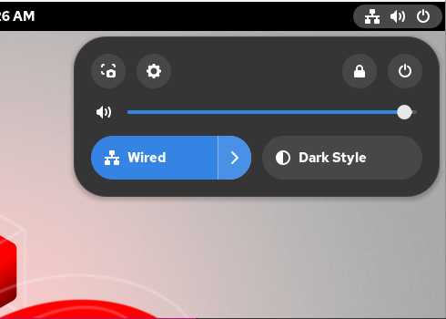

Located in the upper-right corner, it provides the following functionalities:

- Opening the GNOME screenshot and screen recording tool
- Opening the Settings app
- Controlling the sound volume
- Accessing your network connections
- Turning off the computer, locking the computer, and switching user

Activities Overview

Includes windows and applications views that let you run applications and windows and switch between them.

The **search entry** at the top allows for searching various items available on the desktop, including applications, documents, files, and configuration tools.

The horizontal bar on the bottom contains a list of favorite and running applications. You can add or remove applications from the default list of favorites.

Calendar popover

You can open it by clicking the date and time in the top bar. It includes recent notifications, a calendar, a calendar events list, world clocks, and weather.

**Figure 1.1. The GNOME Standard desktop**

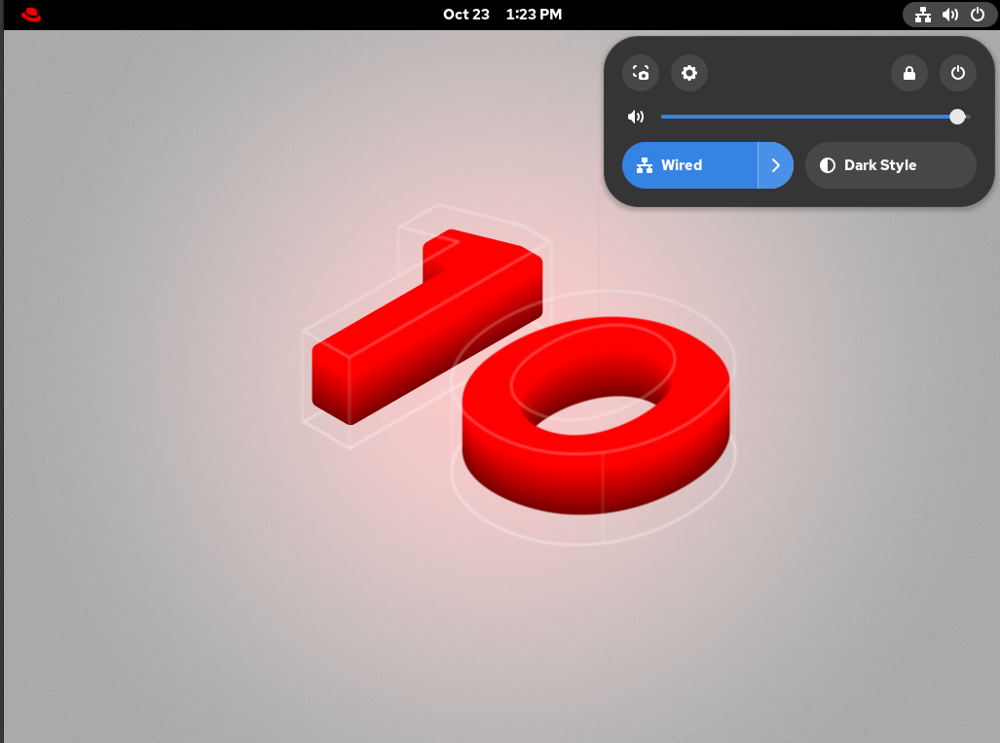 

<h3 id="gnome-classic">1.3. GNOME Classic</h3>

GNOME Classic is a mode suitable for users who prefer a more traditional desktop experience that is similar to the GNOME 2 environment used with RHEL 6. It is based on GNOME 3 technologies but includes multiple features similar to GNOME 2.

The GNOME Classic user interface consists of these major components:

Applications and Places

The **Apps** menu is displayed at the upper-left corner of the screen. It gives you access to applications organized into categories.

The **Places** menu is displayed next to the **Apps** menu in the top bar. It gives you quick access to important folders, for example, Downloads or Pictures.

Taskbar

Displayed at the bottom of the screen. The taskbar includes a list of open windows and a workspace indicator. In the workspace indicator, you can see the current workspace and move between available workspaces.

Four available workspaces

In GNOME Classic, the number of available workspaces is set to four by default.

Minimize and maximize buttons

Window title bars in GNOME Classic feature the minimize and maximize buttons.

A traditional `Super`+`Tab` window switcher

In GNOME Classic, windows in the `Super`+`Tab` window switcher are not grouped by application.

System menu

Located in the upper-right corner. Just as in the GNOME Standard session, you can perform the following actions with it:

- Opening the GNOME Screenshot and GNOME Screen Recording apps
- Opening the Settings app
- Controlling the sound volume
- Accessing your network connections
- Turning off the computer, locking the computer, and switching the user

**Figure 1.2. The GNOME Classic desktop**

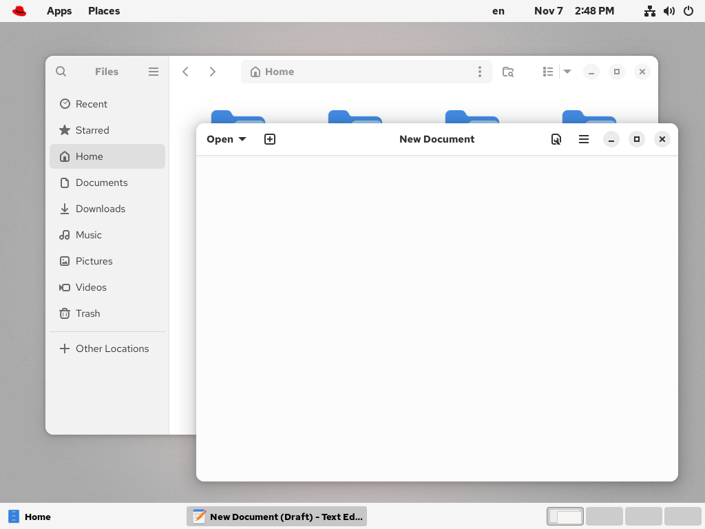 

<h3 id="selecting-a-gnome-interface">1.4. Selecting a GNOME interface</h3>

The default desktop interface for RHEL 10 is the standard GNOME desktop. However, you can also switch from standard GNOME to GNOME Classic.

The change of GNOME interface is persistent across user logouts, and also when powering off or rebooting the computer.

**Procedure**

1. On the login screen, select a user, then click the gear button in the lower-right corner of the screen.
   
   Note
   
   You cannot access this option from the lock screen. The login screen, also called GNOME Display Manager (GDM), appears when you first start RHEL or when you log out of your current session.
   
   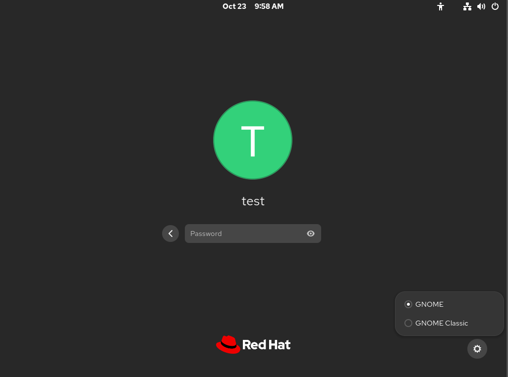
2. From the drop-down menu that appears, select the option that you prefer.

<h2 id="registering-the-system-for-updates-by-using-gnome">Chapter 2. Registering the system for updates by using GNOME</h2>

You must register your system to get software updates for your system. This section explains how you can register your system by using GNOME.

<h3 id="prerequisites">2.1. Prerequisites</h3>

- A valid account with Red Hat Customer Portal.
  
  See the [Create a Red Hat Login](https://www.redhat.com/wapps/ugc/register.html) page for new user registration.
- Activation Key or keys, if you are registering the system with activation key
- A registration server, if you are registering system using the registration server

<h3 id="registering-a-system-by-using-an-activation-key-on-gnome">2.2. Registering a system by using an activation key on GNOME</h3>

Follow the steps in this procedure to register your system with an activation key. You can get the activation key from your organization administrator.

**Prerequisites**

- Activation key or keys.
  
  See the [Activation Keys](https://access.redhat.com/management/activation_keys) page for creating new activation keys.

**Procedure**

1. Open the **system menu**, which is accessible from the upper-right screen corner, and click **Settings**.
   
   
2. Go to About → Subscription.
3. If you are not using the Red Hat server:
   
   1. In the **Registration Server** section, select **Custom Address**.
   2. Enter the server address in the **URL** field.
4. In the **Registration Type** section, select **Activation Keys**.
5. Under **Registration Details**:
   
   - Enter your activation keys in the **Activation Keys** field.
     
     Separate your keys by a comma (`,`).
   - Enter the name or ID of your organization in the **Organization** field.
6. Click Register.

<h3 id="unregistering-the-system-by-using-gnome">2.3. Unregistering the system by using GNOME</h3>

Follow the steps in this procedure to unregister your system. After unregistering, your system no longer receives software updates.

**Procedure**

1. Open the **system menu**, which is accessible from the upper-right screen corner, and click **Settings**.
   
   
2. Go to About → Subscription.
   
   The **Registration Details** screen is displayed.
3. Click Unregister.
   
   A warning is displayed about the impact of unregistering the system.
4. Click Unregister.

<h3 id="registering-the-system-for-updates-by-using-gnome">2.4. Additional resources</h3>

- [Registering RHEL 10 using the installer GUI](https://docs.redhat.com/en/documentation/red_hat_enterprise_linux/10/html/interactively_installing_rhel_from_installation_media/registering-your-rhel-system#registering-your-rhel-system)
- [Creating Red Hat Customer Portal Activation Keys](https://access.redhat.com/solutions/3341191)
- [Creating and managing activation keys](https://docs.redhat.com/en/documentation/subscription_central/1-latest/html/getting_started_with_activation_keys_on_the_hybrid_cloud_console/assembly-creating-managing-activation-keys)
- [Registering Systems with Activation keys](https://access.redhat.com/solutions/3341191)

<h2 id="launching-applications-in-gnome">Chapter 3. Launching applications in GNOME</h2>

You can launch installed applications by using several different methods in the GNOME desktop environment.

<h3 id="launching-an-application-in-the-standard-gnome-session">3.1. Launching an application in the standard GNOME session</h3>

In the GNOME desktop environment, you can launch graphical applications that have been installed on your system.

**Prerequisites**

- You are using the standard GNOME session.

**Procedure**

1. Open the **Activities Overview** screen by using either of the following ways:
   
   - Click the **Red Hat logo** in the top panel.
   - Press the `Super` key, which is usually labeled with the Windows logo, `⌘`, or `🔍`.
2. Find the application by using either of the following ways:
   
   - Click the **Show Apps** icon in the bottom horizontal bar.
     
     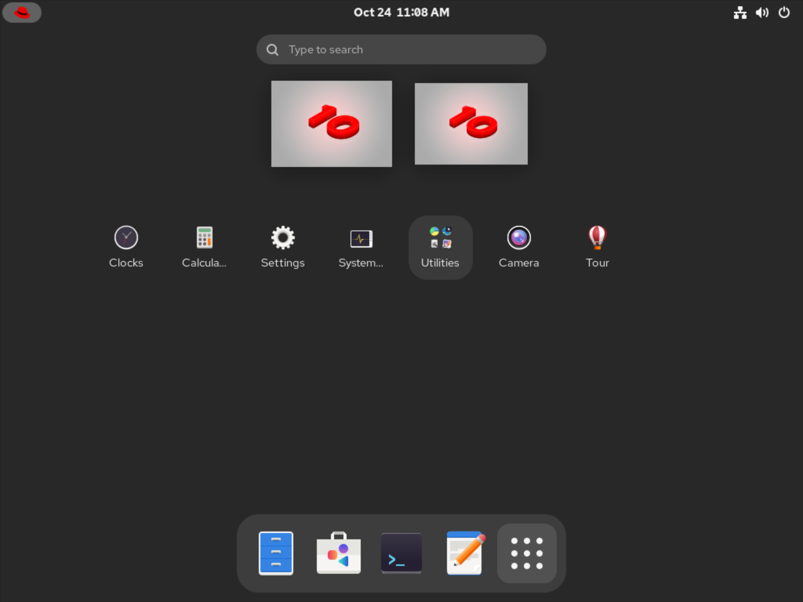 
   - Type the name of the required application in the search text field.
3. Click the application in the displayed list.

<h3 id="launching-an-application-in-gnome-classic">3.2. Launching an application in GNOME Classic</h3>

In the GNOME desktop environment, you can launch graphical applications that have been installed on your system.

**Prerequisites**

- You are using the GNOME Classic session.

**Procedure**

1. Open the **Apps** menu in the top panel.
2. Choose the required application from the available categories, which can include:
   
   - Favorites
   - Accessories
   - Graphics
   - Internet
   - Office
   - Sound & Video
   - System Tools
   - Utilities

<h3 id="launching-an-application-in-gnome-by-using-a-command">3.3. Launching an application in GNOME by using a command</h3>

You can launch a graphical application in GNOME by entering a command.

**Prerequisites**

- You know the command that starts the application.

**Procedure**

1. Open a command prompt by using either of the following ways:
   
   - Open a terminal.
   - Press the `Alt`+`F2` shortcut to open the **Run a Command** screen.
     
     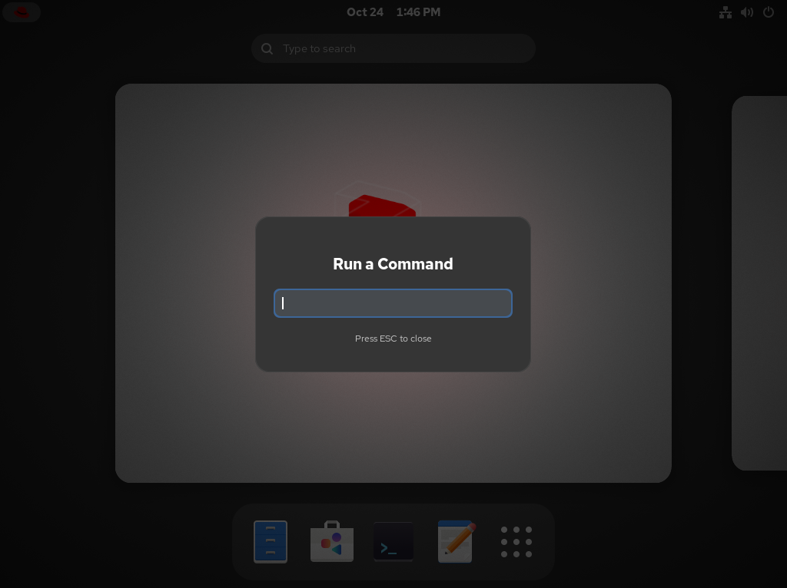 
2. Type the application command in the command prompt.
3. Confirm the command by pressing `Enter`.

<h2 id="configuring-applications-to-start-automatically-on-login">Chapter 4. Configuring applications to start automatically on login</h2>

In the GNOME desktop environment, you can configure applications to launch automatically after you log in to your GNOME desktop session.

**Prerequisites**

- The application is installed on the system.

**Procedure**

1. Find the `.desktop` file for the application, for example, in `/usr/share/applications`.
2. Copy the `.desktop` file to the `~/.config/autostart` directory. If the directory does not exist, create it.
   
   Note
   
   You can stop an application from launching automatically by deleting the application’s `.desktop` file from the `~/.config/autostart` directory.

**Verification**

- Log out and log back in. Verify that the application starts.

<h2 id="searching-for-files-in-gnome">Chapter 5. Searching for files in GNOME</h2>

As a user in the GNOME environment, you can search for files by using the **Files** application.

<h3 id="performing-a-basic-file-search">5.1. Performing a basic file search</h3>

You can search for files in your home directory and all folders inside of it based on a file name.

**Procedure**

1. Open the **Files** application.
2. Press the **Search** button.
3. In the text field, type the file name or a part of the file name that you are searching for.
   
   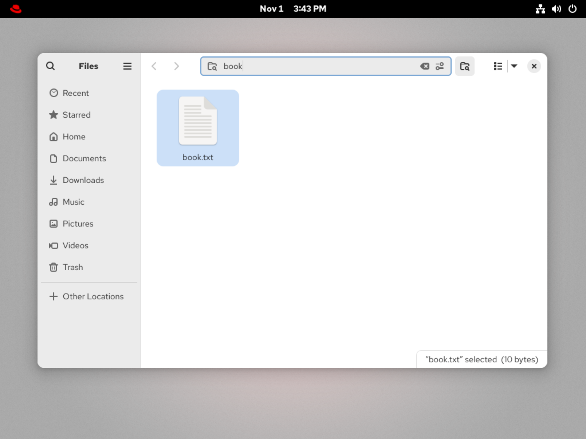 
4. The window now lists all files in your home directory that match the file name.

<h3 id="performing-an-advanced-file-search">5.2. Performing an advanced file search</h3>

You can search for files in a specific location, based on a file name, a time of access, a time of modification, or a file type.

**Procedure**

01. Open the **Files** application.
02. Navigate to the folder where you want to search for a file.
    
    The search recursively descends into all folders contained in this location.
03. Press the **Search** button.
04. Optional: Type the file name or a part of the file name that you are searching for in the text field.
    
    If you do not provide a file name, the search lists all files that match the other criteria, regardless of their file names.
    
     
05. Click the **Filter search results** button next to the text field.
    
    In this menu, you can select other search criteria.
    
    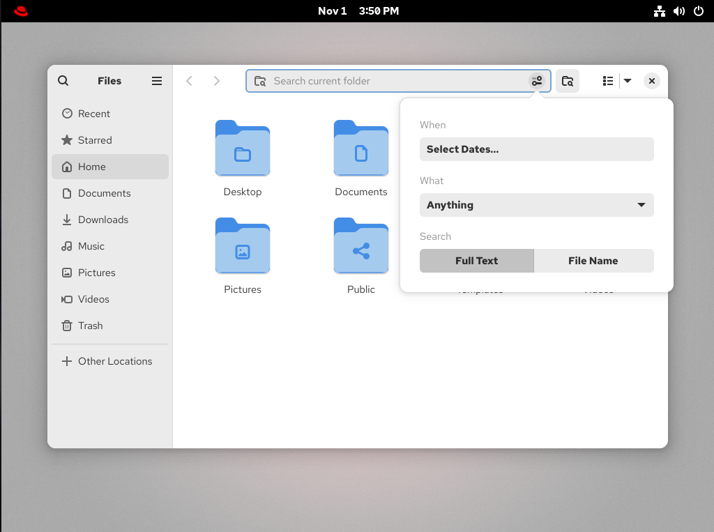 
06. To specify the access or modification time, click Select dates next to the **When** label. Enter a date or select a time point from the list.
    
    Below the time list, you can switch between **Last modified** and **Last used**.
07. To specify the file type, click Anything next to the **What** label. Select a file type from the list.
08. To switch between a search based on file content or file names, use the Full Text and File Name buttons.
    
    Note
    
    The full-text search only works in indexed locations. You can configure the indexed locations in the **Search** section of the **Settings** application.
09. Click the triangle button next to the text field to hide the menu.
10. The window now lists all files in the specified directory that match your search criteria.

<h2 id="bookmarking-files-and-locations">Chapter 6. Bookmarking files and locations</h2>

In GNOME, applications and dialogs that manage files list bookmarks in the left side bar. You can add, remove, and edit the bookmarks.

<h3 id="adding-a-bookmark">6.1. Adding a bookmark</h3>

You can save a reference to a folder by bookmarking it in the **Files** application.

**Prerequisites**

- Locate the folder in the **Files** application.

**Procedure**

- Add the folder to bookmarks by using either of the following methods:
  
  - Dragging:
    
    1. Drag the folder to the left side bar.
    2. Drop it over the **New bookmark** item.
  - Keyboard shortcut:
    
    1. Open the folder.
    2. Press `Ctrl`+`D`.
  - Menu:
    
    1. Open the folder.
    2. In the navigation bar at the top of the window, click the name of the folder.
       
       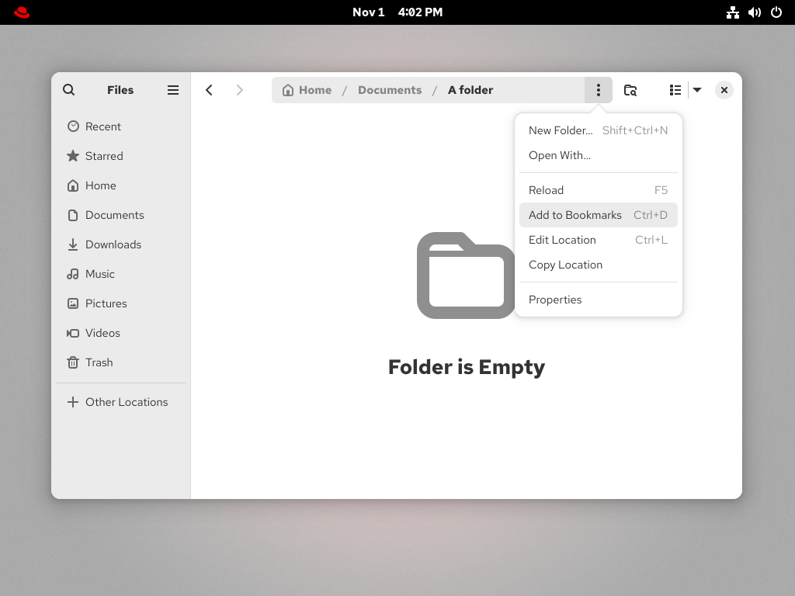 
    3. Select **Add to Bookmarks**.

**Verification**

- Check that the bookmark now appears in the side bar.

<h3 id="removing-a-bookmark">6.2. Removing a bookmark</h3>

You can delete an existing bookmark in the **Files** application.

**Procedure**

1. Right-click the bookmark in the side bar.
2. Select **Remove** from the menu.
   
   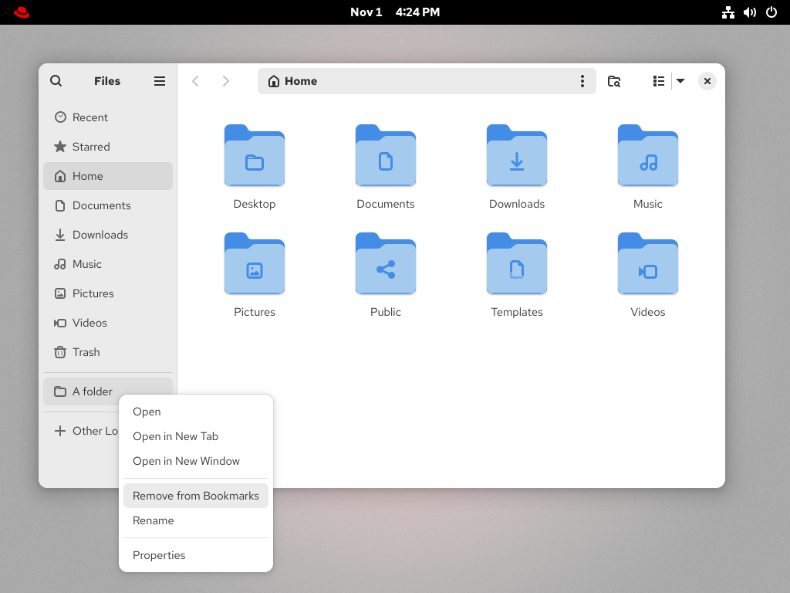 

**Verification**

- Check that the bookmark no longer appears in the side bar.

<h3 id="renaming-a-bookmark">6.3. Renaming a bookmark</h3>

You can rename a bookmark to distinguish it from other bookmarks. If you have bookmarks to several folders that all share the same name, you can tell the bookmarks apart if you rename them.

Renaming the bookmark does not rename the folder.

**Procedure**

1. Right-click the bookmark in the side bar.
2. Select **Rename**.
   
   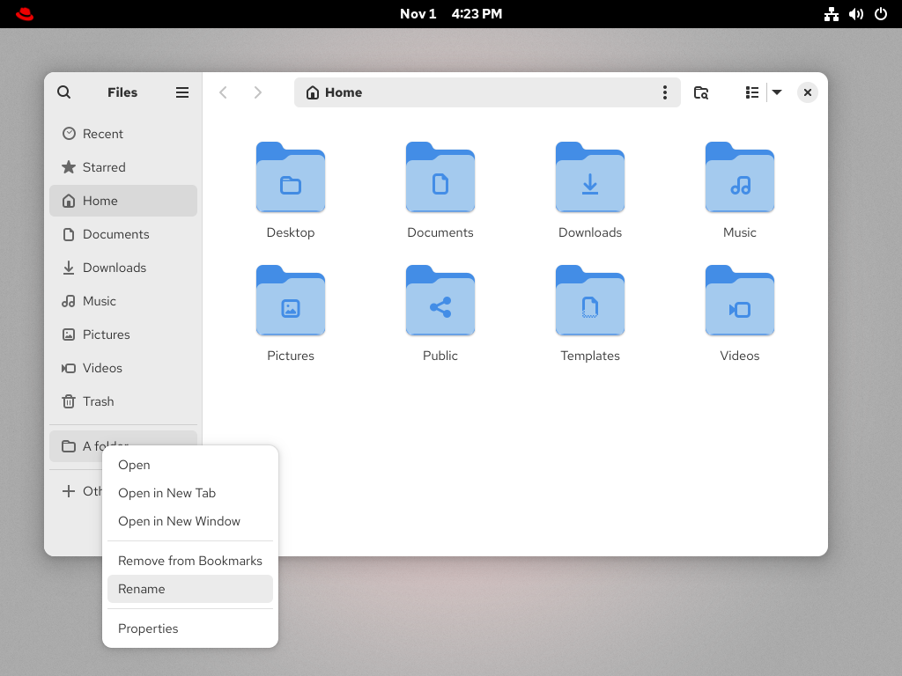 
3. In the **Name** field, enter the new name for the bookmark.
4. Click Rename.

**Verification**

- Check that the side bar lists the bookmark under the new name.

<h3 id="adding-a-bookmark-for-all-users">6.4. Adding a bookmark for all users</h3>

As a system administrator, you can set a bookmark for several users at once so that file shares are easily accessible to all the users.

**Procedure**

1. In the home directory of each existing user, edit the `~user/.config/gtk-3.0/bookmarks` file.
2. In the file, add a Uniform Resource Identifiers (URI) line that identifies the bookmark.
   
   For example, the following lines add bookmarks to the `/usr/share/doc/` directory and to the GNOME FTP network share:
   
   ```
   file:///usr/share/doc/
   ftp://ftp.gnome.org/
   ```
   
   ```plaintext
   file:///usr/share/doc/
   ftp://ftp.gnome.org/
   ```
3. Optional: To also add the bookmarks for every newly created user on the system:
   
   1. Create the `/etc/skel/.config/gtk-3.0/bookmarks` file.
   2. Enter the bookmark URI lines in the file.

<h2 id="recording-your-screen-with-gnome">Chapter 7. Recording your screen in GNOME</h2>

You can record your desktop or specific application activities with GNOME Screen Recording, which is a built-in feature in the GNOME desktop environment. The recordings are saved as video files in the WebM format.

**Procedure**

1. Open GNOME Screen Recording in one of the following ways:
   
   - Pressing `PrtScr` and clicking the Record Screen button with the camera icon.
   - Typing `Take a screenshot` from the **Activities Overview** screen and clicking the Record Screen button with the camera icon.
   - Pressing the `Ctrl`+`Alt`+`Shift`+`R` keyboard shortcut.
2. Select whether to record the entire screen or an area by using the Area Selection or Screen Selection button.
3. If you want your pointer to be visible in the recording, click the Show pointer button with the cursor icon.
4. Start the recording by pressing the round Capture button or pressing `Space`.
   
   After the recording begins, a red indicator appears in the upper-right corner of the screen. It shows the time of the recording.
5. To stop the recording, press the red indicator in the upper-right corner of the screen.
   
   The indicator disappears, signaling the end of the recording.

**Result**

- The recorded video files are saved in the `~/Videos/Screencasts` directory.
- The file names of recorded videos start with `Screencast from` and include the date and time of the recording.

<h2 id="customizing-the-desktop-environment">Chapter 8. Customizing the desktop environment</h2>

Customize the GNOME desktop environment in Red Hat Enterprise Linux 10 to personalize your individual workflow and visual preferences with an adaptable user interface.

<h3 id="changing-the-language-by-using-desktop-gui">8.1. Changing the language by using desktop GUI</h3>

You can change the system language by using the desktop GUI.

**Prerequisites**

- Required language packages are installed on your system.

**Procedure**

1. Open the **Settings** application from the system menu by clicking on its icon.
   
    
2. In **Settings**, click **Region & Language** from the left vertical bar.
3. Click **Language**.
   
   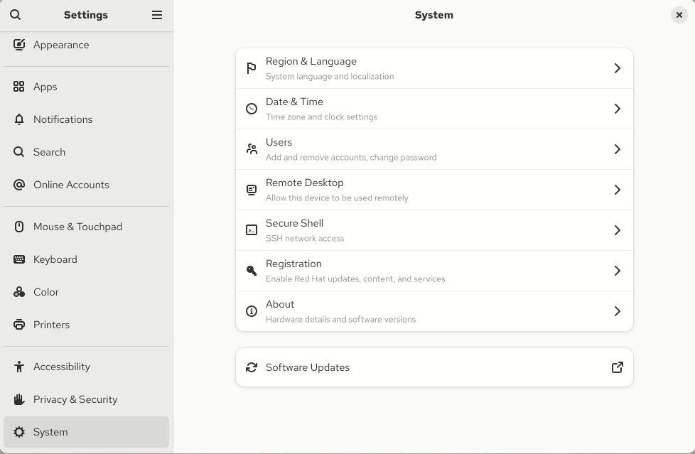 
4. Select the required region and language from the menu.
   
   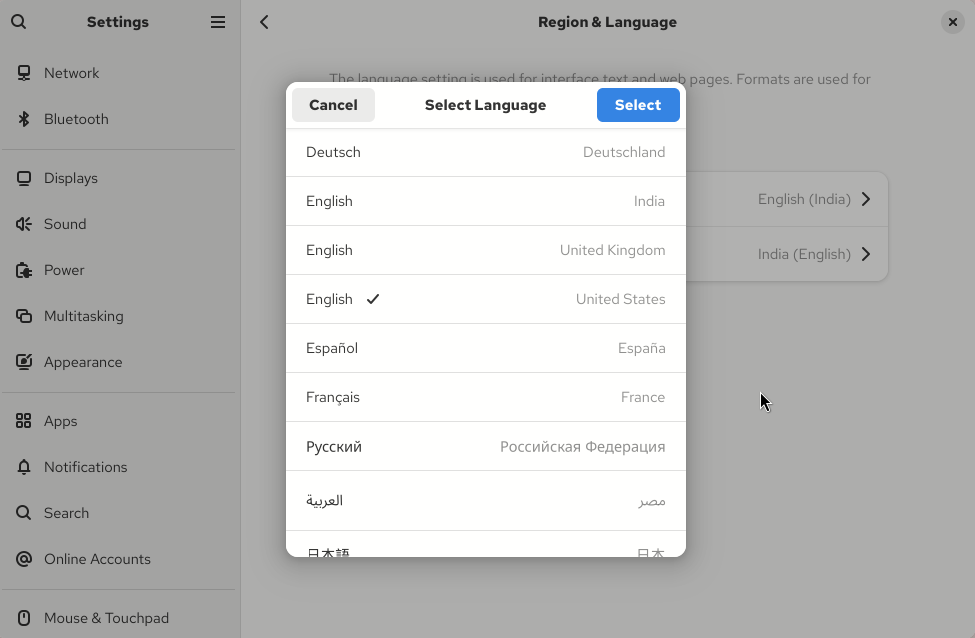 
5. Click **Select**.
6. Click **Log Out…​** for changes to take effect.
   
   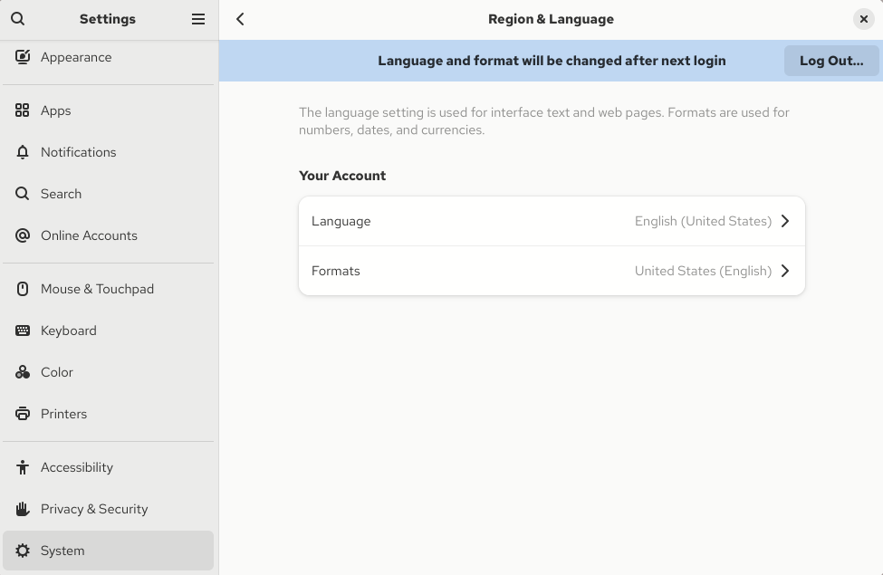
   
   Note
   
   Some applications do not support certain languages. The text of an application that cannot be translated into the selected language remains in US English.

**Additional resources**

- [Launching applications in GNOME](https://docs.redhat.com/en/documentation/red_hat_enterprise_linux/10/html-single/using_the_gnome_desktop_environment/index#launching-applications-in-gnome)

<h3 id="enabling-chinese-japanese-or-korean-text-input">8.2. Enabling Chinese, Japanese, or Korean text input</h3>

If you write with Chinese, Japanese, or Korean characters, you can configure RHEL to input text in your language.

<h4 id="input-methods">8.2.1. Input methods</h4>

Certain scripts, such as Chinese, Japanese, or Korean, require keyboard input to go through an Input Method Engine (IME) to enter native text.

An input method is a set of conversion rules between the text input and the selected script. An IME is a software that performs the input conversion specified by the input method.

To input text in these scripts, you must set up an IME. If you installed the system in your native language and selected your language at the **GNOME Initial Setup** screen, the input method for your language is enabled by default.

The following input method engines (IMEs) are available on RHEL from the listed packages:

| Languages | Scripts                   | IME name           | Package          |
|:----------|:--------------------------|:-------------------|:-----------------|
| Chinese   | Simplified Chinese        | Intelligent Pinyin | `ibus-libpinyin` |
| Chinese   | Traditional Chinese       | New Zhuyin         | `ibus-libzhuyin` |
| Japanese  | Kanji, Hiragana, Katakana | Anthy              | `ibus-anthy`     |
| Korean    | Hangul                    | Hangul             | `ibus-hangul`    |
| Other     | Various                   | M17N               | `ibus-m17n`      |

Table 8.1. Available input method engines

<h4 id="switching-the-input-method-in-gnome">8.2.2. Switching the input method in GNOME</h4>

Before you can switch to a different script, for example, Chinese, Japanese, or Korean scripts, you must configure the input method.

**Prerequisites**

- The input method packages are installed. You can install all available input packages by entering the `dnf install @input-methods` command.

**Procedure**

1. Click the settings (⚙️) button on the right to display a settings menu.
   
   
2. Select the **Keyboard** section.
3. In the **Input Sources** list, review the currently enabled input methods.
   
   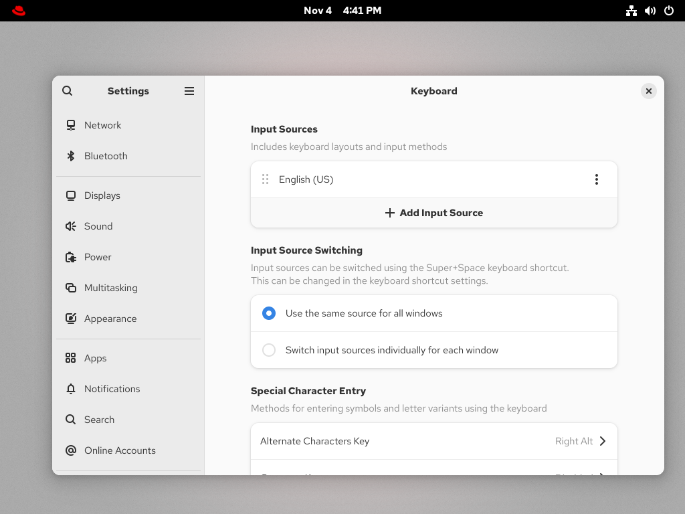 
4. If your input method is missing, click the **Add Input Source** button under the **Input Sources** list and select your language.
   
   Note
   
   If you cannot find your language in the menu, expand the selection by clicking **More** (⋮) at the end of the list.
   
   1. Select the input method that you want to use. A gear icon marks all input methods to distinguish them from simple keyboard layouts.
      
      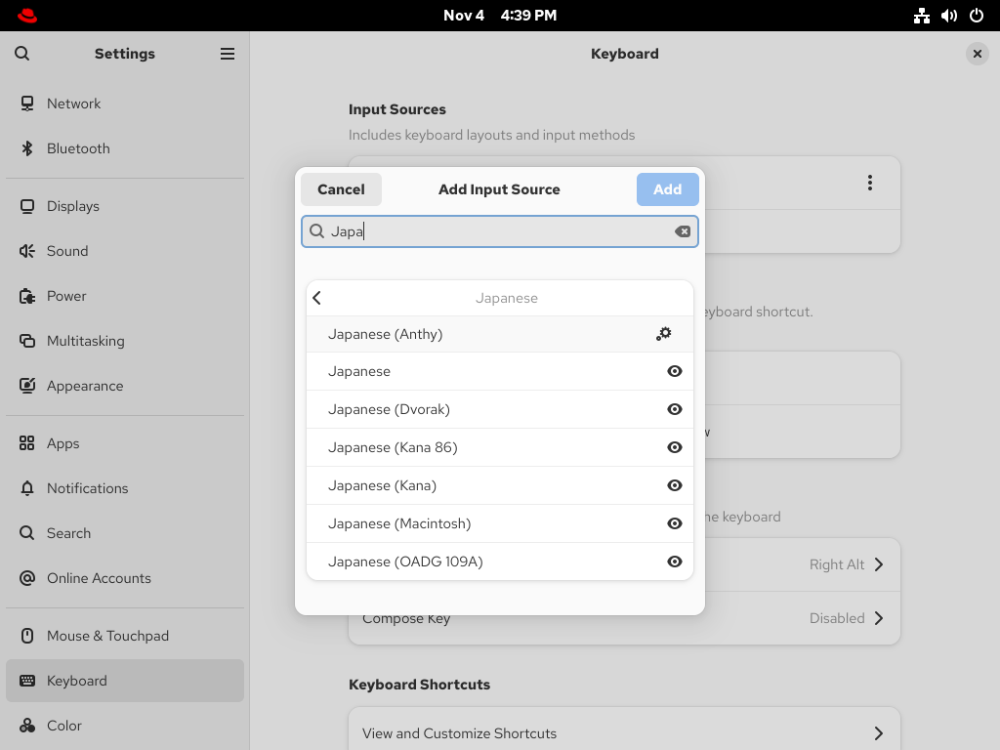 
   2. Confirm your selection by clicking Add.
5. Switch the active input method in one of the following ways:
   
   - Click the input method indicator on the right side of the top panel and select your input method.
     
     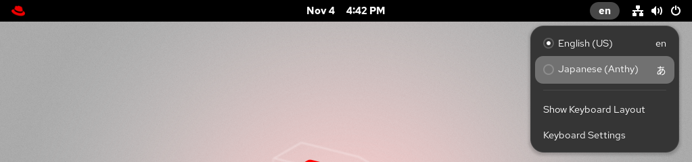 
   - Switch between the enabled input methods by using the `Super`+`Space` keyboard shortcut.

**Verification**

1. Open a text editor.
2. Type text in your language.
3. Verify that the text appears in your native script.

<h4 id="enabling-chinese-japanese-or-korean-text-input">8.2.3. Additional resources</h4>

- [Installing a font for the Chinese standard GB 18030 character set](https://access.redhat.com/solutions/7059631)

<h3 id="enabling-desktop-icons">8.3. Enabling desktop icons</h3>

You can enable the desktop icons functionality and move files to the desktop.

<h4 id="desktop-icons">8.3.1. Desktop icons</h4>

Desktop icons are provided by the **Desktop icons** GNOME Shell extension, which is available from the `gnome-shell-extension-desktop-icons` package.

- Desktop icons in GNOME Classic: The GNOME Classic environment includes the `gnome-shell-extension-desktop-icons` package by default. Desktop icons are always on, and you cannot turn them off.
- Desktop icons in GNOME Standard: In GNOME Standard, desktop icons are disabled by default.
  
  To enable desktop icons in the GNOME Standard environment, you must install the `gnome-shell-extension-desktop-icons` package.

<h4 id="enabling-desktop-icons-in-gnome-standard">8.3.2. Enabling desktop icons in GNOME Standard</h4>

Enable the desktop icons functionality in the GNOME Standard environment.

**Prerequisites**

- The **Extensions** application is installed on the system:
  
  ```
  dnf install gnome-shell-extension-desktop-icons
  ```
  
  ```plaintext
  # dnf install gnome-shell-extension-desktop-icons
  ```

**Procedure**

1. Open the **Extensions** application.
2. Enable the **Desktop Icons** extension.
   
   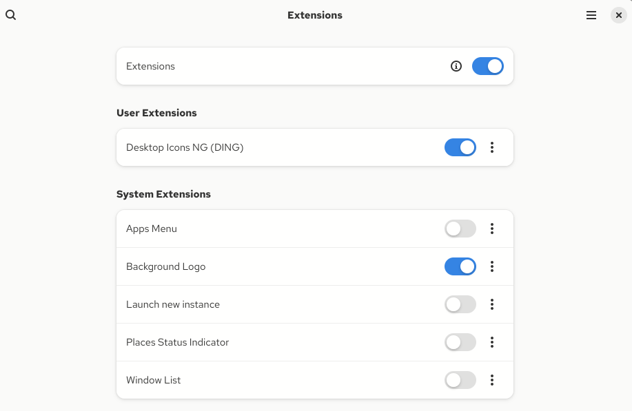 

<h4 id="creating-a-desktop-icon-for-a-file">8.3.3. Creating a desktop icon for a file</h4>

Creating a desktop icon for a file provides a quick and convenient shortcut to access that file directly from your desktop. Instead of navigating through folders, you can open the file directly, saving you time and streamlining your workflow.

**Prerequisites**

- The **Desktop icons** extension is enabled.

**Procedure**

- Move the selected file into the `~/Desktop/` directory.
  
  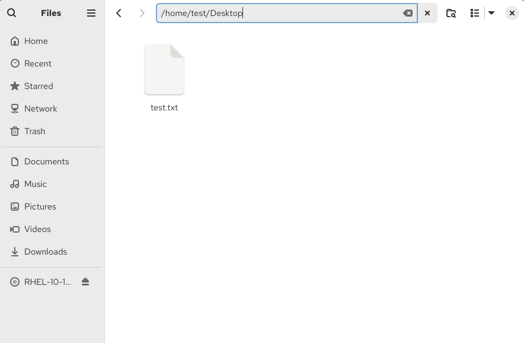 

**Verification**

- Verify the icon for the file is displayed on the desktop.

<h3 id="using-special-characters-in-gnome">8.4. Using special characters in GNOME</h3>

In GNOME, you can use the compose key to type special characters from different languages and symbol sets, including those not available on your keyboard. You can enter and view special characters from different languages and symbol sets, making it easy to work with diverse character sets in GNOME.

To input these special characters, you can define one of the existing keys on your keyboard as a compose key. Once enabled, the compose key allows you to type special characters and symbols by pressing multiple keys in a specific sequence.

<h4 id="enabling-the-compose-key-for-an-individual-user">8.4.1. Enabling the compose key for an individual user</h4>

You can enable the compose key from the Settings menu while logged in as the user.

**Procedure**

1. Click on the **Activities** button in the upper-left corner of the screen.
2. Type **Settings** and click on the **Settings** icon to open the Settings application.
3. In the Settings window, click on **Keyboard** in the left sidebar.
4. Scroll down and select the **Compose Key** option.
5. Toggle the slider to enable the **Compose Key**.
6. Select the key you want to use as the compose key.
7. Once you have selected the compose key, close the Settings window.
   
   The compose key is now enabled, and you can use it to input special characters and symbols by pressing the compose key, followed by the corresponding sequence of keys.
   
   To see available multi-key sequences for composing special characters, use:
   
   ```
   grep "<Multi_key>" /usr/share/X11/locale/en_US.UTF-8/Compose
   ```
   
   ```plaintext
   $ grep "<Multi_key>" /usr/share/X11/locale/en_US.UTF-8/Compose
   ```

**Verification**

- Press the compose key, then type the sequence of keys for the special character you want to input. For example, to type `©`, press the `compose key`, then press `o` and `c`.

<h4 id="enabling-the-compose-key-for-another-user">8.4.2. Enabling the compose key for another user</h4>

Enable the compose key for another user with the `gsettings` utility.

**Prerequisites**

- Administrative access.

**Procedure**

1. Allow all clients to connect to the X server:
   
   ```
   xhost +
   ```
   
   ```plaintext
   # xhost +
   ```
2. Run the following command to set the compose key:
   
   ```
   su - <username> -c "gsettings set org.gnome.desktop.input-sources xkb-options \"['compose:<compose_key>']\""
   ```
   
   ```plaintext
   # su - <username> -c "gsettings set org.gnome.desktop.input-sources xkb-options \"['compose:<compose_key>']\""
   ```
   
   Replace `<username>` with the username of the user for whom you want to enable the compose key. Replace `<compose_key>` with the key you want to use as the compose key. You can use the `ralt` option to select the right `Alt` key as the compose key.
   
   To see other compose key options that you can use to set up a compose key on your keyboard, use:
   
   ```
   grep compose /usr/share/X11/xkb/rules/evdev.lst
   ```
   
   ```plaintext
   $ grep compose /usr/share/X11/xkb/rules/evdev.lst
   ```
3. Resets the access control:
   
   ```
   xhost -
   ```
   
   ```plaintext
   # xhost -
   ```

**Verification**

- To check the compose key settings for another user, use:
  
  ```
  su - <username> -c "gsettings get org.gnome.desktop.input-sources xkb-options"
  ```
  
  ```plaintext
  # su - <username> -c "gsettings get org.gnome.desktop.input-sources xkb-options"
  ```
  
  Replace `<username>` with the username of the user for whom you want to check the compose key setting.

<h4 id="enabling-the-compose-key-for-all-users">8.4.3. Enabling the compose key for all users</h4>

You can enable the compose key for all users by creating a `dconf` configuration file.

**Prerequisites**

- Administrative access.

**Procedure**

1. Create the `/etc/dconf/db/local.d/00-compose-key` configuration file with the following content:
   
   ```
   [org/gnome/desktop/input-sources]
   xkb-options=['compose:<compose_key>']
   ```
   
   ```plaintext
   [org/gnome/desktop/input-sources]
   xkb-options=['compose:<compose_key>']
   ```
   
   Replace `<compose_key>` with the key you want to use as the compose key. You can use the `ralt` option to select the right `Alt` key as the compose key.
   
   To see other compose key options that you can use to set up a compose key on your keyboard, use:
   
   ```
   grep compose /usr/share/X11/xkb/rules/evdev.lst
   ```
   
   ```plaintext
   $ grep compose /usr/share/X11/xkb/rules/evdev.lst
   ```
2. Update the `dconf` database with the new configuration:
   
   ```
   dconf update
   ```
   
   ```plaintext
   # dconf update
   ```
3. Restart your system or log out and log back in to your GNOME session for the changes to take effect.
   
   The compose key is now enabled for all users on the system and they can use it to input special characters and symbols by pressing the compose key, followed by the corresponding sequence of keys.

**Verification**

- Press the compose key, then type the sequence of keys for the special character you want to input. For example, to type `©`, press the `compose key`, then press `o` and `c`.

<h4 id="compose-key-sequences-for-special-characters">8.4.4. Compose key sequences for special characters</h4>

The table showcases compose key sequences used to input special characters with diacritics or accents in GNOME. Each row displays a compose key sequence alongside its corresponding result

| Compose key sequence       | Result                                    |
|:---------------------------|:------------------------------------------|
| `Compose`+`'`+`letter`     | Letter with acute accent (é, á, ñ)        |
| `Compose`+`` ` ``+`letter` | Letter with grave accent (è, ù, ò)        |
| `Compose`+`"`+`letter`     | Letter with umlaut or diaeresis (ë, ö, ü) |
| `Compose`+`-`+`letter`     | Letter with macron (ā, ē, ō)              |
| `Compose`+`/`+`letter`     | Letter with stroke or diacritic (ø, ł, ǿ) |
| `Compose`+`=`+`letter`     | Letter with double acute accent (ő, ű, ȁ) |
| `Compose`+`.`+`letter`     | Letter with dot above (ȧ, ċ, ḋ)           |
| `Compose`+`,`+`letter`     | Letter with cedilla (ç, ş, ņ)             |
| `Compose`+`^`+`letter`     | Letter with circumflex accent (â, ê, î)   |
| `Compose`+`~`+`letter`     | Letter with tilde accent (ã, ñ, õ)        |

Table 8.2. Compose key sequences for special characters

<h2 id="enabling-accessibility-for-visually-impaired-users">Chapter 9. Enabling accessibility for visually impaired users</h2>

As a system administrator, you can configure the desktop environment to support users with a visual impairment.

<h3 id="components-that-provide-accessibility-features">9.1. Components that provide accessibility features</h3>

On the RHEL 10 desktop, the **Orca** screen reader ensures accessibility for users with a visual impairment. **Orca** is included in the default RHEL installation.

**Orca** reads information from the screen and communicates it to you using the following components:

Speech Dispatcher

**Orca** uses **Speech Dispatcher** to communicate with the speech synthesizer. **Speech Dispatcher** supports various speech synthesis backends, ensures that messages from other applications do not to interrupt the messages from Orca, and provides other functionality.

Speech synthesizer

Provides a speech output. The default speech synthesizer is **eSpeak-NG**.

Braille display

Provides a tactile output. The **BRLTTY** service enables this functionality.

**Additional resources**

- [Orca help page](https://help.gnome.org/users/orca/stable/)

<h3 id="enabling-the-accessibility-menu">9.2. Enabling the Accessibility menu</h3>

You can enable the **Accessibility menu** icon in the top panel, which provides a menu with several accessibility options.

**Procedure**

1. Open the **Settings** application.
2. Select **Accessibility**.
3. Enable the **Always Show Accessibility Menu** item.
   
   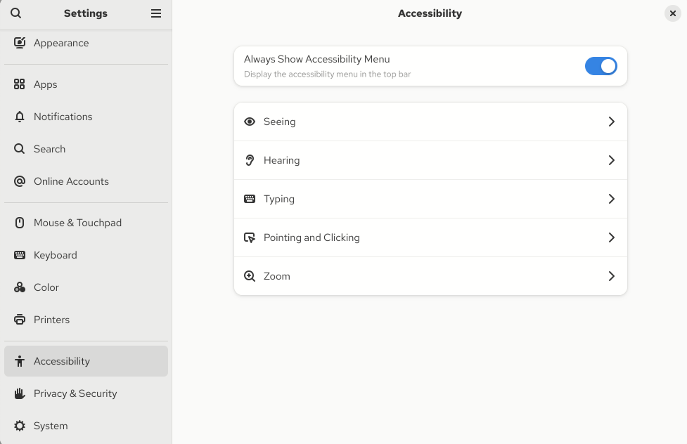

**Verification**

- Check that the **Accessibility menu** icon is displayed on the top bar even when all options from this menu are switched off.
  
  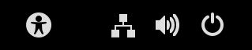

<h3 id="enabling-the-screen-reader">9.3. Enabling the screen reader</h3>

You can enable the **Orca** screen reader in your desktop environment. The screen reader then reads the text displayed on the screen to improve accessibility.

**Procedure**

- Enable the screen reader using either of the following ways:
  
  - Press the `Super`+`Alt`+`S` keyboard shortcut.
  - If the top panel shows the **Universal Access** menu, select **Screen Reader** in the menu.

**Verification**

1. Open an application with text content.
2. Check that the screen reader reads the text in the application.

<h3 id="enabling-a-braille-display-device">9.4. Enabling a Braille display device</h3>

The Braille display is a device that uses the `brltty` service to provide tactile output for visually impaired users.

In order for the Braille display to work correctly, perform the following procedures.

<h4 id="supported-types-of-braille-display-device">9.4.1. Supported types of Braille display device</h4>

The following types of Braille display devices are supported on RHEL 10.

| Braille device type | Syntax of the type  | Note                                           |
|:--------------------|:--------------------|:-----------------------------------------------|
| Serial device       | `serial:path`       | Relative paths are at `/dev`.                  |
| USB device          | `[serial-number]`   | The brackets (`[]`) here indicate optionality. |
| Bluetooth device    | `bluetooth:address` |                                                |

Table 9.1. Braille display device types and the corresponding syntax

<h4 id="enabling-the-brltty-service">9.4.2. Enabling the brltty service</h4>

To enable the Braille display, enable the `brltty` service to start automatically on boot. By default, `brltty` is disabled.

**Prerequisites**

- Ensure that the `brltty` package is installed:
  
  ```
  dnf install brltty
  ```
  
  ```plaintext
  # dnf install brltty
  ```
- Optionally, you can install speech synthesis support for `brltty`:
  
  ```
  dnf install brltty-espeak-ng
  ```
  
  ```plaintext
  # dnf install brltty-espeak-ng
  ```

**Procedure**

- Enable the `brltty` service to start on boot:
  
  ```
  systemctl enable --now brltty
  ```
  
  ```plaintext
  # systemctl enable --now brltty
  ```

**Verification**

1. Reboot the system.
2. Check that the `brltty` service is running:
   
   ```
   systemctl status brltty
   ● brltty.service - Braille display driver for Linux/Unix
      Loaded: loaded (/usr/lib/systemd/system/brltty.service; enabled; vendor pres>
      Active: active (running) since Tue 2019-09-10 14:13:02 CEST; 39s ago
     Process: 905 ExecStart=/usr/bin/brltty (code=exited, status=0/SUCCESS)
    Main PID: 914 (brltty)
       Tasks: 3 (limit: 11360)
      Memory: 4.6M
      CGroup: /system.slice/brltty.service
              └─914 /usr/bin/brltty
   ```
   
   ```plaintext
   # systemctl status brltty
   ● brltty.service - Braille display driver for Linux/Unix
      Loaded: loaded (/usr/lib/systemd/system/brltty.service; enabled; vendor pres>
      Active: active (running) since Tue 2019-09-10 14:13:02 CEST; 39s ago
     Process: 905 ExecStart=/usr/bin/brltty (code=exited, status=0/SUCCESS)
    Main PID: 914 (brltty)
       Tasks: 3 (limit: 11360)
      Memory: 4.6M
      CGroup: /system.slice/brltty.service
              └─914 /usr/bin/brltty
   ```

<h4 id="authorizing-users-of-a-braille-display-device">9.4.3. Authorizing users of a Braille display device</h4>

To use a Braille display device, you must set the users who are authorized to use the Braille display device.

**Procedure**

1. In the `/etc/brltty.conf` file, ensure that `keyfile` is set to `/etc/brlapi.key`:
   
   ```
   api-parameters Auth=keyfile:/etc/brlapi.key
   ```
   
   ```plaintext
   api-parameters Auth=keyfile:/etc/brlapi.key
   ```
   
   This is the default value. Your organization might have overridden it.
2. Authorize the selected users by adding them to the `brlapi` group:
   
   ```
   usermod --append -G brlapi user-name
   ```
   
   ```plaintext
   # usermod --append -G brlapi user-name
   ```

<h4 id="setting-the-driver-for-a-braille-display-device">9.4.4. Setting the driver for a Braille display device</h4>

The `brltty` service automatically chooses a driver for your Braille display device. If the automatic detection fails or takes too long, you can set the driver manually.

**Prerequisites**

- The automatic driver detection has failed or takes too long.

**Procedure**

1. Open the `/etc/brltty.conf` configuration file.
2. Find the `braille-driver` directive, which specifies the driver for your Braille display device.
3. Specify the identification code of the required driver in the `braille-driver` directive.
   
   Choose the identification code of required driver from the list provided in `/etc/brltty.conf`. For example, to use the XWindow driver:
   
   ```
   # XWindow
   braille-driver	xw
   ```
   
   ```plaintext
   # XWindow
   braille-driver	xw
   ```
   
   To set multiple drivers, list them separated by commas. Automatic detection then chooses from the listed drivers.

<h4 id="connecting-a-braille-display-device">9.4.5. Connecting a Braille display device</h4>

The `brltty` service automatically connects to your Braille display device. If the automatic detection fails, you can set the connection method manually.

**Prerequisites**

- The Braille display device is physically connected to your system.
- The automatic connection has failed.

**Procedure**

1. If the device is connected by a serial-to-USB adapter, find the actual device name in the kernel messages on the device plug:
   
   ```
   journalctl --dmesg | fgrep ttyUSB
   ```
   
   ```plaintext
   # journalctl --dmesg | fgrep ttyUSB
   ```
2. Open the `/etc/brltty.conf` configuration file.
3. Find the `braille-device` directive.
4. In the `braille-device` directive, specify the connection.
   
   You can also set multiple devices, separated by commas, and each of them will be probed in turn.

<!--THE END-->

- Example settings for the first serial device

```
braille-device	serial:ttyS0
```

```plaintext
braille-device	serial:ttyS0
```

- Example settings for the first USB device matching Braille driver

```
braille-device	usb:
```

```plaintext
braille-device	usb:
```

- Example settings for a specific USB device by serial number

```
braille-device	usb:nnnnn
```

```plaintext
braille-device	usb:nnnnn
```

- Example settings for a serial-to-USB adapter

Use the device name that you found earlier in the kernel messages:

```
braille-device	serial:ttyUSB0
```

```plaintext
braille-device	serial:ttyUSB0
```

Note

Setting `braille-device` to `usb:` does not work for a serial-to-USB adapter.

- Example settings for a specific Bluetooth device by address

```
braille-device	bluetooth:xx:xx:xx:xx:xx:xx
```

```plaintext
braille-device	bluetooth:xx:xx:xx:xx:xx:xx
```

<h4 id="setting-the-text-table">9.4.6. Setting the text table</h4>

The `brltty` service automatically selects a text table based on your system language. If your system language does not match the language of a document that you want to read, you can set the text table manually.

**Procedure**

1. Edit the `/etc/brltty.conf` file.
2. Identify the code of your selected text table.
   
   You can find all available text tables in the `/etc/brltty/Text/` directory. The code is the file name of the text table without its file suffix.
3. Specify the code of the selected text table in the `text-table` directive.
   
   For example, to use the text table for American English:
   
   ```
   text-table	en_US	 # English (United States)
   ```
   
   ```plaintext
   text-table	en_US	 # English (United States)
   ```

<h4 id="setting-the-contraction-table">9.4.7. Setting the contraction table</h4>

You can select table to encode the abbreviations with a Braille display device. Relative paths to particular contraction tables are stored within the `/etc/brltty/Contraction/` directory.

Warning

If no table is specified, the `brltty` service does not use a contraction table.

**Procedure**

- Choose a contraction table from the list in the `/etc/brltty.conf` file.
  
  For example, to use the contraction table for American English, grade 2:
  
  ```
  contraction-table	en-us-g2	 # English (US, grade 2)
  ```
  
  ```plaintext
  contraction-table	en-us-g2	 # English (US, grade 2)
  ```

<h2 id="browsing-files-on-a-network-share">Chapter 10. Browsing files on a network share</h2>

You can connect to a network share provided by a server and browse the files on the server like local files. You can download or upload files by using the file browser.

<h3 id="gvfs-uri-format-for-network-shares">10.1. GVFS URI format for network shares</h3>

GNOME uses the GVFS URI format to refer to network shares and files on them.

When you connect to a network share from GNOME, you provide the address to the network share in the following format:

```
<protocol>://<user_name>@<domain_name>:<port>/<folder>/<file>
```

```plaintext
<protocol>://<user_name>@<domain_name>:<port>/<folder>/<file>
```

Where:

- `<protocol>` specifies the connection type, such as `ssh` for the SSH protocol.
- `<user_name>` specifies the user name. Some protocols do not require user names.
- `<domain.name>` is the address of the server, such as `server.example.com`.
- `<port>` specifies the port number. Some connections do not require specifying a port number.

**GVFS URI examples for common network share protocols**

- `ssh://user@server.example.com/path`
- `smb://server/share`
- `dav://example.server.com/path`
- `ftp://ftp.example.com/path`

**Additional resources**

- [The GVFS system](https://docs.redhat.com/en/documentation/red_hat_enterprise_linux/10/html-single/administering_rhel_by_using_the_gnome_desktop_environment/index#the-gvfs-system)
- [The format of the GVFS URI string](https://docs.redhat.com/en/documentation/red_hat_enterprise_linux/10/html-single/administering_rhel_by_using_the_gnome_desktop_environment/index#the-format-of-the-gvfs-uri-string)

<h3 id="mounting-a-storage-volume-in-gnome">10.2. Mounting a storage volume in GNOME</h3>

You can manually mount a local storage volume or a network share in the **Files** application.

**Procedure**

1. Open the **Files** application.
2. Click **Other Locations** in the side bar.
   
   The window lists all connected storage volumes and all network shares that are publicly available on your local area network.
   
   If you can see the volume or network share in this list, mount it by clicking the item.
   
   If you want to connect to a different network share, use the following steps.
3. Enter the GVFS URI string to the network share in the **Enter server address** field.
4. Press Connect.
5. If the dialog asks you for login credentials, enter your name and password into the relevant fields.
6. When the mounting process finishes, you can browse the files on the volume or network share.

<h3 id="unmounting-a-storage-volume-in-gnome">10.3. Unmounting a storage volume in GNOME</h3>

You can unmount a storage volume, a network share, or another resource in the **Files** application.

Warning

Always unmount a storage volume before removing the drive from the computer. Removing a drive might corrupt the data on the volumes that are still mounted.

**Procedure**

1. Open the **Files** application.
2. In the side bar, click the **Unmount** (⏏) icon next to the chosen mount.
3. Wait until the mount disappears from the side bar or a notification about the safe removal appears.

<h3 id="browsing-files-on-a-network-share">10.4. Additional resources</h3>

- [Managing storage volumes in GNOME](https://docs.redhat.com/en/documentation/red_hat_enterprise_linux/10/html-single/administering_rhel_by_using_the_gnome_desktop_environment/index#managing-storage-volumes-in-gnome)
- [Configuring GNOME to store user settings on home directories hosted on an NFS share](https://docs.redhat.com/en/documentation/red_hat_enterprise_linux/10/html-single/administering_rhel_by_using_the_gnome_desktop_environment/index#configuring-gnome-to-store-user-settings-on-home-directories-hosted-on-an-nfs-share)
- [Mounting an SMB Share](https://docs.redhat.com/en/documentation/red_hat_enterprise_linux/10/html-single/managing_file_systems/index#mounting-an-smb-share)

<h2 id="configuring-file-associations">Chapter 11. Configuring file associations</h2>

You can configure RHEL to open or access files with different formats.

In GNOME, MIME (Multipurpose Internet Mail Extension) types help to identify the format of a file and applications to use to open these files.

<h3 id="multipurpose-internet-mail-extension-types">11.1. Multipurpose Internet Mail Extension types</h3>

Multipurpose Internet Mail Extension (MIME) types are a two-part identifiers for file and content formats.

The GNOME desktop uses MIME types to:

- Determine which application should open a specific file format by default
- Register other applications that can open files of a specific format
- Set a string describing the type of a file, for example, in a file properties dialog of the files application
- Set an icon representing a specific file format, for example, in a file properties dialog of the files application

MIME type names follow a given format:

```
media-type/subtype-identifier
```

```plaintext
media-type/subtype-identifier
```

Note

In the `image/jpeg` MIME type name, `image` is a media type and `jpeg` is the subtype identifier.

GNOME follows Multipurpose Internet Mail Extension (MIME) info specification from the [Freedesktop.org](http://www.freedesktop.org/wiki/Specifications/shared-mime-info-spec/) project to determine the following information:

- The machine-wide and user-specific location to store all the MIME type specification files
- How to register a MIME type so that the desktop environment knows which application you can use to open a specific file format
- How users can change which applications should open with what file formats

<h4 id="mime\_database">11.1.1. MIME database</h4>

The MIME database is a collection of all the MIME type specification files that GNOME uses to store information about known MIME types.

The most important part of the MIME database from the system administrator’s point of view is the `/usr/share/mime/packages/` directory, where the MIME type-related files specifying information about known MIME types are stored. One example of such a file is `/usr/share/mime/packages/freedesktop.org.xml`, specifying information about the standard MIME types available on the system, by default. The shared-mime-info package provides this file.

**Additional resources**

- [Freedesktop website](http://www.freedesktop.org/wiki/Specifications/shared-mime-info-spec/)

<h3 id="adding-a-custom-mime-type-for-all-users">11.2. Adding a custom MIME type for all users</h3>

You can add a custom MIME type for all the users on the system and register a default application for that MIME type.

**Procedure**

1. Create the `/usr/share/mime/packages/application-x-newtype.xml` file with following content:
   
   ```
   <?xml version="1.0" encoding="UTF-8"?>
   
   <mime-info xmlns="http://www.freedesktop.org/standards/shared-mime-info">
     <mime-type type="application/x-newtype">
       <comment>new mime type</comment>
       <glob pattern="*.xyz"/>
     </mime-type>
   </mime-info>
   ```
   
   ```plaintext
   <?xml version="1.0" encoding="UTF-8"?>
   
   <mime-info xmlns="http://www.freedesktop.org/standards/shared-mime-info">
     <mime-type type="application/x-newtype">
       <comment>new mime type</comment>
       <glob pattern="*.xyz"/>
     </mime-type>
   </mime-info>
   ```
   
   The sample `application-x-newtype.xml` file here defines a new MIME type `application/x-newtype` and assigns file names with the `.xyz` extension to that MIME type.
2. Create a new `.desktop` file named, for example, `myapplication1.desktop` in the `/usr/share/applications/` with following content:
   
   ```
   [Desktop Entry]
   Type=Application
   MimeType=application/x-newtype
   Name=My Application 1
   Exec=myapplication1 field_code
   ```
   
   ```plaintext
   [Desktop Entry]
   Type=Application
   MimeType=application/x-newtype
   Name=My Application 1
   Exec=myapplication1 field_code
   ```
   
   The sample `myapplication1.desktop` file here associates the `application/x-newtype` MIME type with an application named `My Application 1`. It is run by a command `myapplication1`.
   
   Based on how `myapplication1` gets started, select one relevant field code from [Desktop Entry Specification](https://specifications.freedesktop.org/desktop-entry-spec/desktop-entry-spec-latest.html#exec-variables). For example, for an application capable of opening multiple files, use:
   
   ```
   Exec=myapplication1 %F
   ```
   
   ```plaintext
   Exec=myapplication1 %F
   ```
3. As a root user, update the MIME database for your changes to take effect.
   
   ```
   update-mime-database /usr/share/mime
   ```
   
   ```plaintext
   # update-mime-database /usr/share/mime
   ```
4. As a root user, update the application database.
   
   ```
   update-desktop-database /usr/share/applications
   ```
   
   ```plaintext
   # update-desktop-database /usr/share/applications
   ```

**Verification**

1. To verify that you have successfully associated `*.xyz` files with the `application/x-newtype` MIME type, first create an empty file, for example test.xyz and execute the following commands:
   
   ```
   touch test.xyz
   
   gvfs-info test.xyz | grep "standard::content-type"
     standard::content-type: application/x-newtype
   ```
   
   ```plaintext
   $ touch test.xyz
   
   $ gvfs-info test.xyz | grep "standard::content-type"
     standard::content-type: application/x-newtype
   ```
2. To verify `myapplication1.desktop` is correctly set as the default registered application for the `application/x-newtype` MIME type, execute following command:
   
   ```
   gio mime --query application/x-newtype
   Default application for 'application/x-newtype': myapplication1.desktop
   Registered applications:
   	myapplication1.desktop
   Recommended applications:
   	myapplication1.desktop
   ```
   
   ```plaintext
   $ gio mime --query application/x-newtype
   Default application for 'application/x-newtype': myapplication1.desktop
   Registered applications:
   	myapplication1.desktop
   Recommended applications:
   	myapplication1.desktop
   ```

<h3 id="adding-a-custom-mime-type-for-individual-users">11.3. Adding a custom MIME type for individual users</h3>

You can add a custom MIME type for individual user on the system and register a default application for that MIME type.

**Procedure**

1. Create the `~/.local/share/mime/packages/application-x-newtype.xml` file with following content:
   
   ```
   <?xml version="1.0" encoding="UTF-8"?>
   <mime-info xmlns="http://www.freedesktop.org/standards/shared-mime-info">
     <mime-type type="application/x-newtype">
       <comment>new mime type</comment>
       <glob pattern="*.xyz"/>
     </mime-type>
   </mime-info>
   ```
   
   ```plaintext
   <?xml version="1.0" encoding="UTF-8"?>
   <mime-info xmlns="http://www.freedesktop.org/standards/shared-mime-info">
     <mime-type type="application/x-newtype">
       <comment>new mime type</comment>
       <glob pattern="*.xyz"/>
     </mime-type>
   </mime-info>
   ```
   
   The sample `application-x-newtype.xml` file here defines a new MIME type `application/x-newtype` and assigns file names with the `.xyz` extension to that MIME type.
2. Create a new .desktop file named, for example, `myapplication1.desktop`, and place it in the `~/.local/share/applications/` directory with following content:
   
   ```
   [Desktop Entry]
   Type=Application
   MimeType=application/x-newtype
   Name=My Application 1
   Exec=myapplication1 field_code
   ```
   
   ```plaintext
   [Desktop Entry]
   Type=Application
   MimeType=application/x-newtype
   Name=My Application 1
   Exec=myapplication1 field_code
   ```
   
   The sample `myapplication1.desktop` file above associates the `application/x-newtype` MIME type with an application named My Application 1. It is run by a command `myapplication1`.
   
   Based on how `myapplication1` gets started, choose one respective field code from [Desktop Entry Specification](https://specifications.freedesktop.org/desktop-entry-spec/desktop-entry-spec-latest.html#exec-variables). For example, for an application capable of opening multiple files, use:
   
   ```
   Exec=myapplication1 %F
   ```
   
   ```plaintext
   Exec=myapplication1 %F
   ```
3. Update the MIME database for your changes to take effect:
   
   ```
   update-mime-database ~/.local/share/mime
   ```
   
   ```plaintext
   $ update-mime-database ~/.local/share/mime
   ```
4. Update the application database:
   
   ```
   update-desktop-database ~/.local/share/applications
   ```
   
   ```plaintext
   $ update-desktop-database ~/.local/share/applications
   ```

**Verification**

1. To verify that you have successfully associated `*.xyz` files with the `application/x-newtype` MIME type, first create an empty file, for example, test.xyz and execute the following commands:
   
   ```
   touch test.xyz
   
   gvfs-info test.xyz | grep "standard::content-type"
     standard::content-type: application/x-newtype
   ```
   
   ```plaintext
   $ touch test.xyz
   
   $ gvfs-info test.xyz | grep "standard::content-type"
     standard::content-type: application/x-newtype
   ```
2. To verify that `myapplication1.desktop` is correctly set as the default registered application for the `application/x-newtype` MIME type, execute following command:
   
   ```
   gio mime --query application/x-newtype
   Default application for 'application/x-newtype': myapplication1.desktop
   Registered applications:
   	myapplication1.desktop
   Recommended applications:
   	myapplication1.desktop
   ```
   
   ```plaintext
   $ gio mime --query application/x-newtype
   Default application for 'application/x-newtype': myapplication1.desktop
   Registered applications:
   	myapplication1.desktop
   Recommended applications:
   	myapplication1.desktop
   ```

<h3 id="options-to-override-default-mime-types">11.4. Options to override default MIME types</h3>

By default, the package-installed `/usr/share/applications/mimeapps.list` and `/usr/share/applications/gnome-mimeapps.list` files specify the application registered to open specific MIME types.

System administrators can create the `/etc/xdg/mimeapps.list` or `/etc/xdg/gnome-mimeapps.list` file with a list of MIME types they want to override with the default registered application.

Local users can create the `~/.local/share/applications/mimeapps.list` or `~/.local/share/applications/gnome-mimeapps.list` file with a list of MIME types for which they want to override the default registered application.

Configurations are applied in the following order:

1. `/usr/share/applications/`
2. `/etc/xdg/`
3. `~/.local/share/application/`

Within a particular location, the configurations are applied in the following order:

1. mimeapps.list
2. gnome-mimeapps.list

<h3 id="overriding-default-registered-application-for-all-the-users">11.5. Overriding default registered application for all the users</h3>

As a system administrator, you can update the configuration of packages based on your requirements.

System administrator’s configuration takes precedence over default package configuration. Within each, the desktop-specific configuration takes precedence over the configuration that does not specify the desktop environment.

**Procedure**

1. Consult the `/usr/share/applications/mimeapps.list` file to determine the MIME types for which you want to change the default registered application. For example, the following sample of the `mimeapps.list` file specifies the default registered application for the `text/html` and `application/xhtml+xml` MIME types:
   
   ```
   [Default Applications]
   text/html=firefox.desktop
   application/xhtml+xml=firefox.desktop
   ```
   
   ```plaintext
   [Default Applications]
   text/html=firefox.desktop
   application/xhtml+xml=firefox.desktop
   ```
   
   This example above specifies default application (Mozilla Firefox) by specifying its corresponding `.desktop` file (`firefox.desktop`). You can find `.desktop` files for other applications in the `/usr/share/applications/` directory.
2. Create the `/etc/xdg/mimeapps.list` file and specify the MIME types and their corresponding default registered applications in this file.
   
   ```
   [Default Applications]
   text/html=myapplication1.desktop
   application/xhtml+xml=myapplication2.desktop
   ```
   
   ```plaintext
   [Default Applications]
   text/html=myapplication1.desktop
   application/xhtml+xml=myapplication2.desktop
   ```
   
   This example above sets the default registered application for the `text/html` MIME type to `myapplication1.desktop` and `application/xhtml+xml` MIME type to `myapplication2.desktop`.

**Verification**

- For these settings to function correctly, ensure that both the `myapplication1.desktop` and `myapplication2.desktop` files are placed in the `/usr/share/applications/` directory.
- Verify that the default registered application is set correctly:
  
  ```
  gio mime text/html
  Default application for 'text/html': myapplication1.desktop
  Registered applications:
  	myapplication1.desktop
  	firefox.desktop
  Recommended applications:
  	myapplication1.desktop
  	firefox.desktop
  ```
  
  ```plaintext
  $ gio mime text/html
  Default application for 'text/html': myapplication1.desktop
  Registered applications:
  	myapplication1.desktop
  	firefox.desktop
  Recommended applications:
  	myapplication1.desktop
  	firefox.desktop
  ```

<h3 id="overriding-default-registered-application-for-individual-users">11.6. Overriding default registered application for individual users</h3>

Individual users can update the configuration based on their requirements.

This configuration takes precedence over the system administrator’s configuration, which takes precedence over the package configuration. Within each, the desktop-specific configuration takes precedence over the configuration that does not specify the desktop environment.

**Procedure**

1. Consult the `/usr/share/applications/mimeapps.list` file to determine the MIME types for which you want to change the default registered application. For example, the following sample of the `mimeapps.list` file specifies the default registered application for the `text/html` and `application/xhtml+xml` MIME types:
   
   ```
   [Default Applications]
   text/html=firefox.desktop
   application/xhtml+xml=firefox.desktop
   ```
   
   ```plaintext
   [Default Applications]
   text/html=firefox.desktop
   application/xhtml+xml=firefox.desktop
   ```
   
   This example above specifies default application (Mozilla Firefox) by specifying its corresponding `.desktop` file (`firefox.desktop`). You can find `.desktop` files for other applications in the `/usr/share/applications/` directory.
2. Create the `~/.local/share/applications/mimeapps.list` file and specify the MIME types and their corresponding default registered applications in this file.
   
   ```
   [Default Applications]
   text/html=myapplication1.desktop
   application/xhtml+xml=myapplication2.desktop
   ```
   
   ```plaintext
   [Default Applications]
   text/html=myapplication1.desktop
   application/xhtml+xml=myapplication2.desktop
   ```
   
   This example above sets the default registered application for the `text/html` MIME type to `myapplication1.desktop` and `application/xhtml+xml` MIME type to `myapplication2.desktop`.

**Verification**

- For these settings to function correctly, ensure that both the `myapplication1.desktop` and `myapplication2.desktop` files are placed in the `/usr/share/applications/` directory.
- Execute the `gio mime query` command to verify that the default registered application is set correctly.
  
  ```
  gio mime text/html
  Default application for 'text/html': myapplication1.desktop
  Registered applications:
  	myapplication1.desktop
  	firefox.desktop
  Recommended applications:
  	myapplication1.desktop
  	firefox.desktop
  ```
  
  ```plaintext
  $ gio mime text/html
  Default application for 'text/html': myapplication1.desktop
  Registered applications:
  	myapplication1.desktop
  	firefox.desktop
  Recommended applications:
  	myapplication1.desktop
  	firefox.desktop
  ```

<h2 id="idm140470963635344">Legal Notice</h2>

Copyright © Red Hat.

Except as otherwise noted below, the text of and illustrations in this documentation are licensed by Red Hat under the Creative Commons Attribution–Share Alike 3.0 Unported license . If you distribute this document or an adaptation of it, you must provide the URL for the original version.

Red Hat, as the licensor of this document, waives the right to enforce, and agrees not to assert, Section 4d of CC-BY-SA to the fullest extent permitted by applicable law.

Red Hat, the Red Hat logo, JBoss, Hibernate, and RHCE are trademarks or registered trademarks of Red Hat, LLC. or its subsidiaries in the United States and other countries.

Linux® is the registered trademark of Linus Torvalds in the United States and other countries.

XFS is a trademark or registered trademark of Hewlett Packard Enterprise Development LP or its subsidiaries in the United States and other countries.

The OpenStack® Word Mark and OpenStack logo are trademarks or registered trademarks of the Linux Foundation, used under license.

All other trademarks are the property of their respective owners.
