# Working with DNS in Identity Management

* * *

Red Hat Enterprise Linux 10

## Managing the DNS service integrated in RHEL IdM

Red Hat Customer Content Services

[Legal Notice](#idm140652046677168)

**Abstract**

DNS is an important component in an Identity Management (IdM) domain. For example, clients use DNS to locate services and identify servers in the same site. You can manage records, zones, locations, and forwarding in the DNS server that is integrated in IdM by using the command line, the IdM Web UI, and Ansible playbooks.

* * *

<h2 id="providing-feedback-on-red-hat-documentation">Providing feedback on Red Hat documentation</h2>

We are committed to providing high-quality documentation and value your feedback. To help us improve, you can submit suggestions or report errors through the Red Hat Jira tracking system.

**Procedure**

1. Log in to the [Jira](https://issues.redhat.com/projects/RHELDOCS/issues) website.
   
   If you do not have an account, select the option to create one.
2. Click **Create** in the top navigation bar.
3. Enter a descriptive title in the **Summary** field.
4. Enter your suggestion for improvement in the **Description** field. Include links to the relevant parts of the documentation.
5. Click **Create** at the bottom of the dialogue.

<h2 id="managing-global-dns-configuration-in-idm-using-ansible-playbooks">Chapter 1. Managing global DNS configuration in IdM using Ansible playbooks</h2>

Configure global DNS settings using the `freeipa.ansible_freeipa.dnsconfig` Ansible module, including forwarders and forwarding policies that apply to all Identity Management (IdM) DNS servers.

The `dnsconfig` module supports the following variables:

- The global forwarders, specifically their IP addresses and the port used for communication.
- The global forwarding policy: only, first, or none. For more details on these types of DNS forward policies, see [DNS forward policies in IdM](#dns-forward-policies-in-idm "1.6. DNS forward policies in IdM").
- The synchronization of forward lookup and reverse lookup zones.
  
  NOTE
  
  Global configuration has lower priority than the configuration for a specific IdM DNS zone.

<h3 id="prerequisites">1.1. Prerequisites</h3>

- DNS service is installed on the IdM server. For more information about how to install an IdM server with integrated DNS, see one of the following links:
  
  - [Installing an IdM server: With integrated DNS, with an integrated CA as the root CA](https://docs.redhat.com/en/documentation/red_hat_enterprise_linux/10/html/installing_identity_management/installing-an-idm-server-with-integrated-dns-with-an-integrated-ca-as-the-root-ca).
  - [Installing an IdM server: With integrated DNS, with an external CA as the root CA](https://docs.redhat.com/en/documentation/red_hat_enterprise_linux/10/html/installing_identity_management/installing-an-idm-server-with-integrated-dns-with-an-external-ca-as-the-root-ca).
  - [Installing an IdM server: With integrated DNS, without a CA](https://docs.redhat.com/en/documentation/red_hat_enterprise_linux/10/html/installing_identity_management/installing-an-idm-server-with-integrated-dns-without-a-ca).

<h3 id="how-idm-ensures-that-global-forwarders-from-etc-resolv-conf-are-not-removed-by-networkmanager">1.2. How IdM ensures that global forwarders from /etc/resolv.conf are not removed by NetworkManager</h3>

Understand how Identity Management (IdM) configures NetworkManager to preserve DNS settings in `/etc/resolv.conf` on DHCP networks.

Installing IdM with integrated DNS configures the `/etc/resolv.conf` file to point to the `127.0.0.1` localhost address:

```
# Generated by NetworkManager
search idm.example.com
nameserver 127.0.0.1
```

```plaintext
# Generated by NetworkManager
search idm.example.com
nameserver 127.0.0.1
```

In certain environments, such as networks that use `Dynamic Host Configuration Protocol` (DHCP), the `NetworkManager` service may revert changes to the `/etc/resolv.conf` file. To make the DNS configuration persistent, the IdM DNS installation process also configures the `NetworkManager` service in the following way:

1. The DNS installation script creates an `/etc/NetworkManager/conf.d/zzz-ipa.conf` `NetworkManager` configuration file to control the search order and DNS server list:
   
   ```
   auto-generated by IPA installer
   [main]
   dns=default
   
   [global-dns]
   searches=$DOMAIN
   
   [global-dns-domain-*]
   servers=127.0.0.1
   ```
   
   ```plaintext
   # auto-generated by IPA installer
   [main]
   dns=default
   
   [global-dns]
   searches=$DOMAIN
   
   [global-dns-domain-*]
   servers=127.0.0.1
   ```
2. The `NetworkManager` service is reloaded, which always creates the `/etc/resolv.conf` file with the settings from the last file in the `/etc/NetworkManager/conf.d/` directory. This is in this case the `zzz-ipa.conf` file.

Important

Do not modify the `/etc/resolv.conf` file manually.

<h3 id="ensuring-the-presence-of-a-dns-global-forwarder-in-idm-using-ansible">1.3. Ensuring the presence of a DNS global forwarder in IdM using Ansible</h3>

Add a global DNS forwarder to Identity Management (IdM) using Ansible to resolve queries for domains outside your IdM DNS zones.

In the example below, the IdM administrator ensures the presence of a DNS global forwarder with an Internet Protocol (IP) v4 address of `7.7.9.9` and IP v6 address of `2001:db8::1:0` on port `53`.

**Prerequisites**

- You have configured your Ansible control node to meet the following requirements:
  
  - You are using Ansible version 2.15 or later.
  - You have installed the [`ansible-freeipa`](https://docs.redhat.com/en/documentation/red_hat_enterprise_linux/10/html/using_ansible_to_install_and_manage_identity_management_in_rhel/installing-an-identity-management-server-using-an-ansible-playbook#installing-the-ansible-freeipa-package) package.
  - The example assumes that in the **~/*MyPlaybooks*/** directory, you have created an [Ansible inventory file](https://docs.redhat.com/en/documentation/red_hat_enterprise_linux/10/html/using_ansible_to_install_and_manage_identity_management_in_rhel/preparing-your-environment-for-managing-idm-using-ansible-playbooks) with the fully-qualified domain name (FQDN) of the IdM server.
  - The example assumes that the **secret.yml** Ansible vault stores your `ipaadmin_password` and that you have access to a file that stores the password protecting the **secret.yml** file.
- The target node, that is the node on which the `freeipa.ansible_freeipa` module is executed, is part of the IdM domain as an IdM client, server or replica.

**Procedure**

1. Navigate to the ~/*MyPlaybooks*/ directory:
   
   ```
   cd ~/MyPlaybooks/
   ```
   
   ```plaintext
   $ cd ~/MyPlaybooks/
   ```
2. Make a copy of the **forwarders-absent.yml** Ansible playbook file from the relevant collections directory and rename it. For example:
   
   ```
   cp /usr/share/ansible/collections/ansible_collections/freeipa/ansible_freeipa/playbooks/dnsconfig/forwarders-absent.yml ensure-presence-of-a-global-forwarder.yml
   ```
   
   ```plaintext
   $ cp /usr/share/ansible/collections/ansible_collections/freeipa/ansible_freeipa/playbooks/dnsconfig/forwarders-absent.yml ensure-presence-of-a-global-forwarder.yml
   ```
3. Open the `ensure-presence-of-a-global-forwarder.yml` file for editing.
4. Adapt the file by setting the following variables:
   
   1. Change the `name` variable for the playbook to `Playbook to ensure the presence of a global forwarder in IdM DNS`.
   2. In the `tasks` section, change the `name` of the task to `Ensure the presence of a DNS global forwarder to 7.7.9.9 and 2001:db8::1:0 on port 53`.
   3. In the `forwarders` section of the `freeipa.ansible_freeipa.ipadnsconfig` portion:
      
      1. Change the first `ip_address` value to the IPv4 address of the global forwarder: `7.7.9.9`.
      2. Change the second `ip_address` value to the IPv6 address of the global forwarder: `2001:db8::1:0`.
      3. Verify the `port` value is set to `53`.
   4. Change the `state` to `present`.
      
      This the modified Ansible playbook file for the current example:
   
   ```
   ---
   - name: Playbook to ensure the presence of a global forwarder in IdM DNS
     hosts: ipaserver
   
     vars_files:
     - /home/user_name/MyPlaybooks/secret.yml
     tasks:
     - name: Ensure the presence of a DNS global forwarder to 7.7.9.9 and 2001:db8::1:0 on port 53
       freeipa.ansible_freeipa.ipadnsconfig:
         forwarders:
           - ip_address: 7.7.9.9
           - ip_address: 2001:db8::1:0
             port: 53
         state: present
   ```
   
   ```plaintext
   ---
   - name: Playbook to ensure the presence of a global forwarder in IdM DNS
     hosts: ipaserver
   
     vars_files:
     - /home/user_name/MyPlaybooks/secret.yml
     tasks:
     - name: Ensure the presence of a DNS global forwarder to 7.7.9.9 and 2001:db8::1:0 on port 53
       freeipa.ansible_freeipa.ipadnsconfig:
         forwarders:
           - ip_address: 7.7.9.9
           - ip_address: 2001:db8::1:0
             port: 53
         state: present
   ```
5. Save the file.
   
   For details about all variables used in the playbook, see the `/usr/share/ansible/collections/ansible_collections/freeipa/ansible_freeipa/README-dnsconfig.md` file on the control node.
6. Run the playbook:
   
   ```
   ansible-playbook --vault-password-file=password_file -v -i inventory.file ensure-presence-of-a-global-forwarder.yml
   ```
   
   ```plaintext
   $ ansible-playbook --vault-password-file=password_file -v -i inventory.file ensure-presence-of-a-global-forwarder.yml
   ```

<h3 id="ensuring-the-absence-of-a-dns-global-forwarder-in-idm-using-ansible">1.4. Ensuring the absence of a DNS global forwarder in IdM using Ansible</h3>

Remove a global DNS forwarder from Identity Management (IdM) using Ansible when decommissioning external DNS servers or changing your forwarding configuration.

In the example procedure below, the IdM administrator ensures the absence of a DNS global forwarder with an Internet Protocol (IP) v4 address of `8.8.6.6` and IP v6 address of `2001:4860:4860::8800` on port `53`.

**Prerequisites**

- You have configured your Ansible control node to meet the following requirements:
  
  - You are using Ansible version 2.15 or later.
  - You have installed the [`ansible-freeipa`](https://docs.redhat.com/en/documentation/red_hat_enterprise_linux/10/html/using_ansible_to_install_and_manage_identity_management_in_rhel/installing-an-identity-management-server-using-an-ansible-playbook#installing-the-ansible-freeipa-package) package.
  - The example assumes that in the **~/*MyPlaybooks*/** directory, you have created an [Ansible inventory file](https://docs.redhat.com/en/documentation/red_hat_enterprise_linux/10/html/using_ansible_to_install_and_manage_identity_management_in_rhel/preparing-your-environment-for-managing-idm-using-ansible-playbooks) with the fully-qualified domain name (FQDN) of the IdM server.
  - The example assumes that the **secret.yml** Ansible vault stores your `ipaadmin_password` and that you have access to a file that stores the password protecting the **secret.yml** file.
- The target node, that is the node on which the `freeipa.ansible_freeipa` module is executed, is part of the IdM domain as an IdM client, server or replica.

**Procedure**

1. Navigate to the ~/*MyPlaybooks*/ directory:
   
   ```
   cd ~/MyPlaybooks/
   ```
   
   ```plaintext
   $ cd ~/MyPlaybooks/
   ```
2. Make a copy of the **forwarders-absent.yml** Ansible playbook file from the relevant collections directory and rename it. For example:
   
   ```
   cp /usr/share/ansible/collections/ansible_collections/freeipa/ansible_freeipa/playbooks/dnsconfig/forwarders-absent.yml ensure-absence-of-a-global-forwarder.yml
   ```
   
   ```plaintext
   $ cp /usr/share/ansible/collections/ansible_collections/freeipa/ansible_freeipa/playbooks/dnsconfig/forwarders-absent.yml ensure-absence-of-a-global-forwarder.yml
   ```
3. Open the `ensure-absence-of-a-global-forwarder.yml` file for editing.
4. Adapt the file by setting the following variables:
   
   1. Change the `name` variable for the playbook to `Playbook to ensure the absence of a global forwarder in IdM DNS`.
   2. In the `tasks` section, change the `name` of the task to `Ensure the absence of a DNS global forwarder to 8.8.6.6 and 2001:4860:4860::8800 on port 53`.
   3. In the `forwarders` section of the `freeipa.ansible_freeipa.ipadnsconfig` portion:
      
      1. Change the first `ip_address` value to the IPv4 address of the global forwarder: `8.8.6.6`.
      2. Change the second `ip_address` value to the IPv6 address of the global forwarder: `2001:4860:4860::8800`.
      3. Verify the `port` value is set to `53`.
   4. Set the `action` variable to `member`.
   5. Verify the `state` is set to `absent`.
   
   This the modified Ansible playbook file for the current example:
   
   ```
   ---
   - name: Playbook to ensure the absence of a global forwarder in IdM DNS
     hosts: ipaserver
   
     vars_files:
     - /home/user_name/MyPlaybooks/secret.yml
     tasks:
     - name: Ensure the absence of a DNS global forwarder to 8.8.6.6 and 2001:4860:4860::8800 on port 53
       freeipa.ansible_freeipa.ipadnsconfig:
         forwarders:
           - ip_address: 8.8.6.6
           - ip_address: 2001:4860:4860::8800
             port: 53
         action: member
         state: absent
   ```
   
   ```plaintext
   ---
   - name: Playbook to ensure the absence of a global forwarder in IdM DNS
     hosts: ipaserver
   
     vars_files:
     - /home/user_name/MyPlaybooks/secret.yml
     tasks:
     - name: Ensure the absence of a DNS global forwarder to 8.8.6.6 and 2001:4860:4860::8800 on port 53
       freeipa.ansible_freeipa.ipadnsconfig:
         forwarders:
           - ip_address: 8.8.6.6
           - ip_address: 2001:4860:4860::8800
             port: 53
         action: member
         state: absent
   ```
   
   Important
   
   If you only use the `state: absent` option in your playbook without also using `action: member`, the playbook fails.
5. Save the file.
   
   For details about all variables used in the playbook, see the `/usr/share/ansible/collections/ansible_collections/freeipa/ansible_freeipa/README-dnsconfig.md` file on the control node.
6. Run the playbook:
   
   ```
   ansible-playbook --vault-password-file=password_file -v -i inventory.file ensure-absence-of-a-global-forwarder.yml
   ```
   
   ```plaintext
   $ ansible-playbook --vault-password-file=password_file -v -i inventory.file ensure-absence-of-a-global-forwarder.yml
   ```

**Additional resources**

- [The `action: member` option in freeipa.ansible\_freeipa.ipadnsconfig ansible-freeipa modules](https://docs.redhat.com/en/documentation/red_hat_enterprise_linux/10/html/using_ansible_to_install_and_manage_identity_management_in_rhel/managing-global-dns-configuration-in-idm-using-ansible-playbooks#the-action-member-option-in-ipadnsconfig-ansible-freeipa-modules)

<h3 id="the-action-member-option-in-ipadnsconfig-ansible-freeipa-modules">1.5. The action: member option in ipadnsconfig ansible-freeipa modules</h3>

Review examples showing when `action: member` is needed with the `ipadnsconfig` module for managing global forwarders in Identity Management (IdM) using Ansible.

Excluding global forwarders in IdM by using the `ansible-freeipa` `ipadnsconfig` module requires using the `action: member` option in addition to the `state: absent` option. If you only use `state: absent` in your playbook without also using `action: member`, the playbook fails. Consequently, to remove all global forwarders, you must specify all of them individually in the playbook. In contrast, the `state: present` option does not require `action: member`.

The [following table](#tab_ipadnsconfig-management-of-global-forwarders "Table 1.1. ipadnsconfig management of global forwarders") provides configuration examples for both adding and removing DNS global forwarders that demonstrate the correct use of the action: member option. The table shows, in each line:

- The global forwarders configured before executing a playbook
- An excerpt from the playbook
- The global forwarders configured after executing the playbook

Table 1.1. ipadnsconfig management of global forwarders

Forwarders beforePlaybook excerptForwarders after

8.8.6.6

```
[...]
tasks:
- name: Ensure the presence of DNS global forwarder 8.8.6.7
  ipadnsconfig:
    forwarders:
      - ip_address: 8.8.6.7
    state: present
```

```plaintext
[...]
tasks:
- name: Ensure the presence of DNS global forwarder 8.8.6.7
  ipadnsconfig:
    forwarders:
      - ip_address: 8.8.6.7
    state: present
```

8.8.6.7

8.8.6.6

```
[...]
tasks:
- name: Ensure the presence of DNS global forwarder 8.8.6.7
  ipadnsconfig:
    forwarders:
      - ip_address: 8.8.6.7
    action: member
    state: present
```

```plaintext
[...]
tasks:
- name: Ensure the presence of DNS global forwarder 8.8.6.7
  ipadnsconfig:
    forwarders:
      - ip_address: 8.8.6.7
    action: member
    state: present
```

8.8.6.6, 8.8.6.7

8.8.6.6, 8.8.6.7

```
[...]
tasks:
- name: Ensure the absence of DNS global forwarder 8.8.6.7
  ipadnsconfig:
    forwarders:
      - ip_address: 8.8.6.7
    state: absent
```

```plaintext
[...]
tasks:
- name: Ensure the absence of DNS global forwarder 8.8.6.7
  ipadnsconfig:
    forwarders:
      - ip_address: 8.8.6.7
    state: absent
```

Trying to execute the playbook results in an error. The original configuration - 8.8.6.6, 8.8.6.7 - is left unchanged.

8.8.6.6, 8.8.6.7

```
[...]
tasks:
- name: Ensure the absence of DNS global forwarder 8.8.6.7
  ipadnsconfig:
    forwarders:
      - ip_address: 8.8.6.7
    action: member
    state: absent
```

```plaintext
[...]
tasks:
- name: Ensure the absence of DNS global forwarder 8.8.6.7
  ipadnsconfig:
    forwarders:
      - ip_address: 8.8.6.7
    action: member
    state: absent
```

8.8.6.6

<h3 id="dns-forward-policies-in-idm">1.6. DNS forward policies in IdM</h3>

Understand the DNS forward policy types in Identity Management (IdM) and how they determine whether queries are forwarded, resolved locally, or treated as non‑existent.

IdM supports the `first` and `only` standard BIND forward policies, as well as the `none` IdM-specific forward policy.

Forward first *(default)*

The IdM BIND service forwards DNS queries to the configured forwarder. If a query fails because of a server error or timeout, BIND falls back to the recursive resolution using servers on the Internet. The `forward first` policy is the default policy, and it is suitable for optimizing DNS traffic.

Forward only

The IdM BIND service forwards DNS queries to the configured forwarder. If a query fails because of a server error or timeout, BIND returns an error to the client. The `forward only` policy is recommended for environments with split DNS configuration.

None *(forwarding disabled)*

DNS queries are not forwarded with the `none` forwarding policy. Disabling forwarding is only useful as a zone-specific override for global forwarding configuration. This option is the IdM equivalent of specifying an empty list of forwarders in BIND configuration.

Note

You cannot use forwarding to combine data in IdM with data from other DNS servers. You can only forward queries for specific subzones of the primary zone in IdM DNS.

By default, the BIND service does not forward queries to another server if the queried DNS name belongs to a zone for which the IdM server is authoritative. In such a situation, if the queried DNS name cannot be found in the IdM database, the `NXDOMAIN` answer is returned. Forwarding is not used.

**Example 1.1. Example Scenario**

The IdM server is authoritative for the **test.example.** DNS zone. BIND is configured to forward queries to the DNS server with the **192.0.2.254** IP address.

When a client sends a query for the **nonexistent.test.example.** DNS name, BIND detects that the IdM server is authoritative for the **test.example.** zone and does not forward the query to the **192.0.2.254.** server. As a result, the DNS client receives the `NXDomain` error message, informing the user that the queried domain does not exist.

<h3 id="using-an-ansible-playbook-to-ensure-that-the-forward-first-policy-is-set-in-idm-dns-global-configuration">1.7. Using an Ansible playbook to ensure that the forward first policy is set in IdM DNS global configuration</h3>

Set the global DNS forwarding policy to **forward first** in Identity Management (IdM) using Ansible, which tries forwarders first then falls back to recursive resolution.

The forward first policy is the default policy. It is suitable for traffic optimization. If a query fails because of a server error or timeout, BIND falls back to the recursive resolution using servers on the Internet.

**Prerequisites**

- You have configured your Ansible control node to meet the following requirements:
  
  - You are using Ansible version 2.15 or later.
  - You have installed the [`ansible-freeipa`](https://docs.redhat.com/en/documentation/red_hat_enterprise_linux/10/html/using_ansible_to_install_and_manage_identity_management_in_rhel/installing-an-identity-management-server-using-an-ansible-playbook#installing-the-ansible-freeipa-package) package.
  - The example assumes that in the **~/*MyPlaybooks*/** directory, you have created an [Ansible inventory file](https://docs.redhat.com/en/documentation/red_hat_enterprise_linux/10/html/using_ansible_to_install_and_manage_identity_management_in_rhel/preparing-your-environment-for-managing-idm-using-ansible-playbooks) with the fully-qualified domain name (FQDN) of the IdM server.
  - The example assumes that the **secret.yml** Ansible vault stores your `ipaadmin_password` and that you have access to a file that stores the password protecting the **secret.yml** file.
- The target node, that is the node on which the `freeipa.ansible_freeipa` module is executed, is part of the IdM domain as an IdM client, server or replica.
- Your IdM environment contains an integrated DNS server.

**Procedure**

1. Navigate to the ~/*MyPlaybooks*/ directory:
   
   ```
   cd ~/MyPlaybooks/
   ```
   
   ```plaintext
   $ cd ~/MyPlaybooks/
   ```
2. Make a copy of the **set-configuration.yml** Ansible playbook file from the relevant collections directory and rename it. For example:
   
   ```
   cp /usr/share/ansible/collections/ansible_collections/freeipa/ansible_freeipa/playbooks/dnsconfig/set-configuration.yml set-forward-policy-to-first.yml
   ```
   
   ```plaintext
   $ cp /usr/share/ansible/collections/ansible_collections/freeipa/ansible_freeipa/playbooks/dnsconfig/set-configuration.yml set-forward-policy-to-first.yml
   ```
3. Open the **set-forward-policy-to-first.yml** file for editing.
4. Adapt the file by setting the following variables in the `freeipa.ansible_freeipa.ipadnsconfig` task section:
   
   - Indicate that the value of the `ipaadmin_password` variable is defined in the **secret.yml** Ansible vault file.
   - Set the `forward_policy` variable to **first**.
     
     Delete all the other lines of the original playbook that are irrelevant. This is the modified Ansible playbook file for the current example:
   
   ```
   ---
   - name: Playbook to set global forwarding policy to first
     hosts: ipaserver
     become: true
   
     tasks:
     - name: Set global forwarding policy to first.
       freeipa.ansible_freeipa.ipadnsconfig:
         ipaadmin_password: "{{ ipaadmin_password }}"
         forward_policy: first
   ```
   
   ```plaintext
   ---
   - name: Playbook to set global forwarding policy to first
     hosts: ipaserver
     become: true
   
     tasks:
     - name: Set global forwarding policy to first.
       freeipa.ansible_freeipa.ipadnsconfig:
         ipaadmin_password: "{{ ipaadmin_password }}"
         forward_policy: first
   ```
5. Save the file.
   
   For details about variables and example playbooks in the FreeIPA Ansible collection, see the `/usr/share/ansible/collections/ansible_collections/freeipa/ansible_freeipa/README-dnsconfig.md` file and the `/usr/share/ansible/collections/ansible_collections/freeipa/ansible_freeipa/playbooks/dnsconfig` directory on the control node.
6. Run the playbook:
   
   ```
   ansible-playbook --vault-password-file=password_file -v -i inventory.file set-forward-policy-to-first.yml
   ```
   
   ```plaintext
   $ ansible-playbook --vault-password-file=password_file -v -i inventory.file set-forward-policy-to-first.yml
   ```

**Additional resources**

- [DNS forward policies in IdM](#dns-forward-policies-in-idm "1.6. DNS forward policies in IdM")

<h3 id="using-an-ansible-playbook-to-ensure-that-global-forwarders-are-disabled-in-idm-dns">1.8. Using an Ansible playbook to ensure that global forwarders are disabled in IdM DNS</h3>

Disable global DNS forwarding in Identity Management (IdM) using Ansible to force the server to use recursive resolution instead.

Disabling forwarding is only useful as a zone-specific override for global forwarding configuration. This option is the IdM equivalent of specifying an empty list of forwarders in BIND configuration.

**Prerequisites**

- You have configured your Ansible control node to meet the following requirements:
  
  - You are using Ansible version 2.15 or later.
  - You have installed the [`ansible-freeipa`](https://docs.redhat.com/en/documentation/red_hat_enterprise_linux/10/html/using_ansible_to_install_and_manage_identity_management_in_rhel/installing-an-identity-management-server-using-an-ansible-playbook#installing-the-ansible-freeipa-package) package.
  - The example assumes that in the **~/*MyPlaybooks*/** directory, you have created an [Ansible inventory file](https://docs.redhat.com/en/documentation/red_hat_enterprise_linux/10/html/using_ansible_to_install_and_manage_identity_management_in_rhel/preparing-your-environment-for-managing-idm-using-ansible-playbooks) with the fully-qualified domain name (FQDN) of the IdM server.
  - The example assumes that the **secret.yml** Ansible vault stores your `ipaadmin_password` and that you have access to a file that stores the password protecting the **secret.yml** file.
- The target node, that is the node on which the `freeipa.ansible_freeipa` module is executed, is part of the IdM domain as an IdM client, server or replica.
- Your IdM environment contains an integrated DNS server.

**Procedure**

1. Navigate to the ~/*MyPlaybooks*/ directory:
   
   ```
   cd ~/MyPlaybooks/
   ```
   
   ```plaintext
   $ cd ~/MyPlaybooks/
   ```
2. Make a copy of the **disable-global-forwarders.yml** Ansible playbook file from the relevant collections directory. For example:
   
   ```
   cp /usr/share/ansible/collections/ansible_collections/freeipa/ansible_freeipa/playbooks/dnsconfig/disable-global-forwarders.yml disable-global-forwarders-copy.yml
   ```
   
   ```plaintext
   $ cp /usr/share/ansible/collections/ansible_collections/freeipa/ansible_freeipa/playbooks/dnsconfig/disable-global-forwarders.yml disable-global-forwarders-copy.yml
   ```
3. Open the **disable-global-forwarders-copy.yml** file for editing.
4. Adapt the file by setting the following variables in the `freeipa.ansible_freeipa.ipadnsconfig` task section:
   
   - Indicate that the value of the `ipaadmin_password` variable is defined in the **secret.yml** Ansible vault file.
   - Set the `forward_policy` variable to **none**.
     
     This is the modified Ansible playbook file for the current example:
   
   ```
   ---
   - name: Playbook to disable global DNS forwarders
     hosts: ipaserver
     become: true
   
     tasks:
     - name: Disable global forwarders.
       freeipa.ansible_freeipa.ipadnsconfig:
         ipaadmin_password: "{{ ipaadmin_password }}"
         forward_policy: none
   ```
   
   ```plaintext
   ---
   - name: Playbook to disable global DNS forwarders
     hosts: ipaserver
     become: true
   
     tasks:
     - name: Disable global forwarders.
       freeipa.ansible_freeipa.ipadnsconfig:
         ipaadmin_password: "{{ ipaadmin_password }}"
         forward_policy: none
   ```
5. Save the file.
   
   For details about variables and example playbooks in the FreeIPA Ansible collection, see the `/usr/share/ansible/collections/ansible_collections/freeipa/ansible_freeipa/README-dnsconfig.md` file and the `/usr/share/ansible/collections/ansible_collections/freeipa/ansible_freeipa/playbooks/dnsconfig` directory on the control node.
6. Run the playbook:
   
   ```
   ansible-playbook --vault-password-file=password_file -v -i inventory disable-global-forwarders-copy.yml
   ```
   
   ```plaintext
   $ ansible-playbook --vault-password-file=password_file -v -i inventory disable-global-forwarders-copy.yml
   ```

**Additional resources**

- [DNS forward policies in IdM](#dns-forward-policies-in-idm "1.6. DNS forward policies in IdM")

<h3 id="using-an-ansible-playbook-to-ensure-that-synchronization-of-forward-and-reverse-lookup-zones-is-disabled-in-idm-dns">1.9. Using an Ansible playbook to ensure that synchronization of forward and reverse lookup zones is disabled in IdM DNS</h3>

Disable automatic synchronization between forward and reverse DNS zones in Identity Management (IdM) using Ansible for independent zone management.

**Prerequisites**

- You have configured your Ansible control node to meet the following requirements:
  
  - You are using Ansible version 2.15 or later.
  - You have installed the [`ansible-freeipa`](https://docs.redhat.com/en/documentation/red_hat_enterprise_linux/10/html/using_ansible_to_install_and_manage_identity_management_in_rhel/installing-an-identity-management-server-using-an-ansible-playbook#installing-the-ansible-freeipa-package) package.
  - The example assumes that in the **~/*MyPlaybooks*/** directory, you have created an [Ansible inventory file](https://docs.redhat.com/en/documentation/red_hat_enterprise_linux/10/html/using_ansible_to_install_and_manage_identity_management_in_rhel/preparing-your-environment-for-managing-idm-using-ansible-playbooks) with the fully-qualified domain name (FQDN) of the IdM server.
  - The example assumes that the **secret.yml** Ansible vault stores your `ipaadmin_password` and that you have access to a file that stores the password protecting the **secret.yml** file.
- The target node, that is the node on which the `freeipa.ansible_freeipa` module is executed, is part of the IdM domain as an IdM client, server or replica.
- Your IdM environment contains an integrated DNS server.

**Procedure**

1. Navigate to the ~/*MyPlaybooks*/ directory:
   
   ```
   cd ~/MyPlaybooks/
   ```
   
   ```plaintext
   $ cd ~/MyPlaybooks/
   ```
2. Make a copy of the **disallow-reverse-sync.yml** Ansible playbook file from the relevant collections directory. For example:
   
   ```
   cp /usr/share/ansible/collections/ansible_collections/freeipa/ansible_freeipa/playbooks/dnsconfig/disallow-reverse-sync.yml disallow-reverse-sync-copy.yml
   ```
   
   ```plaintext
   $ cp /usr/share/ansible/collections/ansible_collections/freeipa/ansible_freeipa/playbooks/dnsconfig/disallow-reverse-sync.yml disallow-reverse-sync-copy.yml
   ```
3. Open the **disallow-reverse-sync-copy.yml** file for editing.
4. Adapt the file by setting the following variables in the `freeipa.ansible_freeipa.ipadnsconfig` task section:
   
   - Indicate that the value of the `ipaadmin_password` variable is defined in the **secret.yml** Ansible vault file.
   - Set the `allow_sync_ptr` variable to **no**.
     
     This is the modified Ansible playbook file for the current example:
   
   ```
   ---
   - name: Playbook to disallow reverse record synchronization
     hosts: ipaserver
     become: true
   
     tasks:
     - name: Disallow reverse record synchronization.
       freeipa.ansible_freeipa.ipadnsconfig:
         ipaadmin_password: "{{ ipaadmin_password }}"
         allow_sync_ptr: no
   ```
   
   ```plaintext
   ---
   - name: Playbook to disallow reverse record synchronization
     hosts: ipaserver
     become: true
   
     tasks:
     - name: Disallow reverse record synchronization.
       freeipa.ansible_freeipa.ipadnsconfig:
         ipaadmin_password: "{{ ipaadmin_password }}"
         allow_sync_ptr: no
   ```
5. Save the file.
   
   For details about variables and example playbooks in the FreeIPA Ansible collection, see the `/usr/share/ansible/collections/ansible_collections/freeipa/ansible_freeipa/README-dnsconfig.md` file and the `/usr/share/ansible/collections/ansible_collections/freeipa/ansible_freeipa/playbooks/dnsconfig` directory on the control node.
6. Run the playbook:
   
   ```
   ansible-playbook --vault-password-file=password_file -v -i inventory.file disallow-reverse-sync-copy.yml
   ```
   
   ```plaintext
   $ ansible-playbook --vault-password-file=password_file -v -i inventory.file disallow-reverse-sync-copy.yml
   ```

<h2 id="managing-dns-zones-in-idm">Chapter 2. Managing DNS zones in IdM</h2>

Manage Identity Management (IdM) DNS zones to control how the network resolves names. You can add, remove, and configure primary zones to maintain a healthy DNS infrastructure.

<h3 id="prerequisites\_2">2.1. Prerequisites</h3>

- DNS service is installed on the IdM server. For more information about how to install an IdM server with integrated DNS, see one of the following links:
  
  - [Installing an IdM server: With integrated DNS, with an integrated CA as the root CA](https://docs.redhat.com/en/documentation/red_hat_enterprise_linux/10/html/installing_identity_management/installing-an-idm-server-with-integrated-dns-with-an-integrated-ca-as-the-root-ca).
  - [Installing an IdM server: With integrated DNS, with an external CA as the root CA](https://docs.redhat.com/en/documentation/red_hat_enterprise_linux/10/html/installing_identity_management/installing-an-idm-server-with-integrated-dns-with-an-external-ca-as-the-root-ca).
  - [Installing an IdM server: With integrated DNS, without a CA](https://docs.redhat.com/en/documentation/red_hat_enterprise_linux/10/html/installing_identity_management/installing-an-idm-server-with-integrated-dns-without-a-ca).
- You understand [which DNS zone types are supported in IdM](#supported-dns-zone-types "3.2. Supported DNS zone types").

<h3 id="adding-a-primary-dns-zone-in-idm-web-ui">2.2. Adding a primary DNS zone in IdM Web UI</h3>

Create a new primary DNS zone using the Identity Management (IdM) Web UI. This graphical interface provides an intuitive way to name and initialize subdomains within the IdM environment.

**Prerequisites**

- You are logged in as IdM administrator.

**Procedure**

1. In the IdM Web UI, click `Network Services` → `DNS` → `DNS Zones`.
   
   **Managing IdM DNS primary zones**
   
   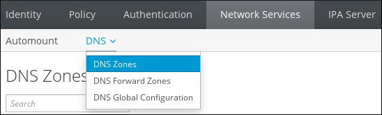 
2. Click Add at the top of the list of all zones.
3. Provide the zone name.
   
   **Entering an new IdM primary zone**
   
   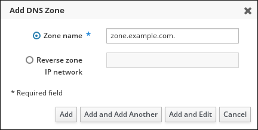 
4. Click Add.

<h3 id="adding-a-primary-dns-zone-in-idm-cli">2.3. Adding a primary DNS zone in IdM CLI</h3>

Add new subdomains to the DNS domain by executing the `ipa dnszone-add` command. This command allows for direct input of the zone name or provides interactive prompts for missing details.

**Prerequisites**

- You are logged in as IdM administrator.

**Procedure**

- The `ipa dnszone-add` command adds a new zone to the DNS domain. Adding a new zone requires you to specify the name of the new subdomain. You can pass the subdomain name directly with the command:
  
  ```
  ipa dnszone-add newzone.idm.example.com
  ```
  
  ```plaintext
  $ ipa dnszone-add newzone.idm.example.com
  ```
  
  If you do not pass the name to `ipa dnszone-add`, the script prompts for it automatically.

<h3 id="removing-a-primary-dns-zone-in-idm-web-ui">2.4. Removing a primary DNS zone in IdM Web UI</h3>

Delete unnecessary DNS zones through the Network Services section of the IdM Web UI. Removing a zone permanently deletes its associated records from the Identity Management database.

**Prerequisites**

- You are logged in as IdM administrator.

**Procedure**

1. In the IdM Web UI, click `Network Services` → `DNS` → `DNS Zones`.
2. Select the check box by the zone name and click Delete.
   
   Removing a primary DNS Zone
   
   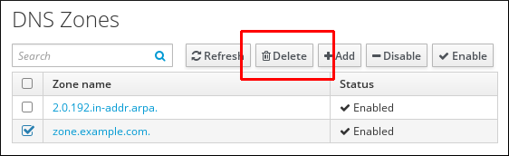 
3. In the **Remove DNS zones** dialog window, confirm that you want to delete the selected zone.

<h3 id="removing-a-primary-dns-zone-in-idm-cli">2.5. Removing a primary DNS zone in IdM CLI</h3>

Remove a primary DNS zone by using the `ipa dnszone-del` command. Specifying the target zone name instantly deletes the entry and its configuration from the IdM server.

**Prerequisites**

- You are logged in as IdM administrator.

**Procedure**

- To remove a primary DNS zone, enter the `ipa dnszone-del` command, followed by the name of the zone you want to remove. For example:
  
  ```
  ipa dnszone-del idm.example.com
  ```
  
  ```plaintext
  $ ipa dnszone-del idm.example.com
  ```

<h3 id="dns-configuration-priorities">2.6. DNS configuration priorities</h3>

IdM applies DNS settings based on a specific hierarchy. Zone-specific settings take the highest priority, followed by per-server and global configurations, while manual entries in `/etc/named.conf` carry the lowest weight.

Zone-specific configuration

The level of configuration specific for a particular zone defined in IdM has the highest priority. You can manage zone-specific configuration by using the `ipa dnszone-*` and `ipa dnsforwardzone-*` commands.

Per-server configuration

You are asked to define per-server forwarders during the installation of an IdM server. You can manage per-server forwarders by using the `ipa dnsserver-*` commands. If you do not want to set a per-server forwarder when installing a replica, you can use the `--no-forwarder` option.

Global DNS configuration

If no zone-specific configuration is defined, IdM uses global DNS configuration stored in LDAP. You can manage global DNS configuration using the `ipa dnsconfig-*` commands. Settings defined in global DNS configuration are applied to all IdM DNS servers.

Configuration in `/etc/named.conf`

Configuration defined in the `/etc/named.conf` file on each IdM DNS server has the lowest priority. It is specific for each server and must be edited manually.

The `/etc/named.conf` file is usually only used to specify DNS forwarding to a local DNS cache. Other options are managed using the commands for zone-specific and global DNS configuration mentioned above.

You can configure DNS options on multiple levels at the same time. In such cases, configuration with the highest priority takes precedence over configuration defined at lower levels.

**Additional resources**

- [Per Server Config in LDAP](https://docs.pagure.org/bind-dyndb-ldap/Design/PerServerConfigInLDAP.html)

<h3 id="configuration-attributes-of-primary-idm-dns-zones">2.7. Configuration attributes of primary IdM DNS zones</h3>

Identity Management (IdM) initializes zones with default settings for refresh periods, transfers, and caching. You can modify these attributes to control SOA record behavior and update frequency via the CLI or Web UI.

In [IdM DNS zone attributes](#tab_idm-dns-zone-attributes "Table 2.1. IdM DNS zone attributes"), you can find the attributes of the default zone configuration that you can modify using one of the following options:

- The `dnszone-mod` command on the command line (CLI). For more information, see [Editing the configuration of a primary DNS zone in IdM CLI](https://docs.redhat.com/en/documentation/red_hat_enterprise_linux/10/html/working_with_dns_in_identity_management/managing-dns-zones-in-idm#editing-the-configuration-of-a-primary-dns-zone-in-idm-cli).
- The IdM Web UI. For more information, see [Editing the configuration of a primary DNS zone in IdM Web UI](https://docs.redhat.com/en/documentation/red_hat_enterprise_linux/10/html/working_with_dns_in_identity_management/managing-dns-zones-in-idm#editing-the-configuration-of-a-primary-dns-zone-in-idm-web-ui).

Along with setting the actual information for the zone, the settings define how the DNS server handles the *start of authority* (SOA) record entries and how it updates its records from the DNS name server.

Table 2.1. IdM DNS zone attributes

AttributeCommand-Line OptionDescription

Authoritative name server

`--name-server`

Sets the domain name of the primary DNS name server, also known as SOA MNAME.

By default, each IdM server advertises itself in the SOA MNAME field. Consequently, the value stored in LDAP using `--name-server` is ignored.

Administrator e-mail address

`--admin-email`

Sets the email address to use for the zone administrator. This defaults to the root account on the host.

SOA serial

`--serial`

Sets a serial number in the SOA record. Note that IdM sets the version number automatically and users are not expected to modify it.

SOA refresh

`--refresh`

Sets the interval, in seconds, for a secondary DNS server to wait before requesting updates from the primary DNS server.

SOA retry

`--retry`

Sets the time, in seconds, to wait before retrying a failed refresh operation.

SOA expire

`--expire`

Sets the time, in seconds, that a secondary DNS server will try to perform a refresh update before ending the operation attempt.

SOA minimum

`--minimum`

Sets the time to live (TTL) value in seconds for negative caching according to [RFC 2308](http://tools.ietf.org/html/rfc2308).

SOA time to live

`--ttl`

Sets TTL in seconds for records at zone apex. In zone `example.com`, for example, all records (A, NS, or SOA) under name `example.com` are configured, but no other domain names, like `test.example.com`, are affected.

Default time to live

`--default-ttl`

Sets the default time to live (TTL) value in seconds for negative caching for all values in a zone that never had an individual TTL value set before.

BIND update policy

`--update-policy`

Sets the permissions allowed to clients in the DNS zone.

Dynamic update

`--dynamic-update`=TRUE|FALSE

Enables dynamic updates to DNS records for clients.

Note that if this is set to false, IdM client machines will not be able to add or update their IP address.

Allow transfer

`--allow-transfer`=*string*

Gives a list of IP addresses or network names which are allowed to transfer the given zone, separated by semicolons (;).

Zone transfers are disabled by default. The default `--allow-transfer` value is `none`.

Allow query

`--allow-query`

Gives a list of IP addresses or network names which are allowed to issue DNS queries, separated by semicolons (;).

Allow PTR sync

`--allow-sync-ptr`=1|0

Sets whether A or AAAA records (forward records) for the zone will be automatically synchronized with the PTR (reverse) records.

Zone forwarders

`--forwarder`=*IP\_address*

Specifies a forwarder specifically configured for the DNS zone. This is separate from any global forwarders used in the IdM domain.

To specify multiple forwarders, use the option multiple times.

Forward policy

`--forward-policy`=none|only|first

Specifies the forward policy. For information about the supported policies, see [DNS forward policies in IdM](#dns-forward-policies-in-idm "1.6. DNS forward policies in IdM").

<h3 id="editing-the-configuration-of-a-primary-dns-zone-in-idm-web-ui">2.8. Editing the configuration of a primary DNS zone in IdM Web UI</h3>

Modify zone configuration attributes such as TTL and refresh intervals through the **Settings** tab in the IdM Web UI. Changes to most attributes take effect immediately across the IdM environment.

**Prerequisites**

- You are logged in as IdM administrator.

**Procedure**

1. In the IdM Web UI, click `Network Services` → `DNS` → `DNS Zones`.
   
   **DNS primary zones management**
   
    
2. In the `DNS Zones` section, click on the zone name in the list of all zones to open the DNS zone page.
   
   **Editing a primary zone**
   
   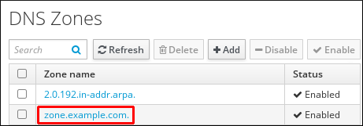 
3. Click `Settings`.
   
   **The Settings tab in the primary zone edit page**
   
   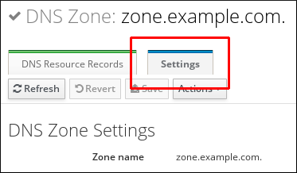 
4. Change the zone configuration as required.
   
   For information about the available settings, see [IdM DNS zone attributes](#tab_idm-dns-zone-attributes "Table 2.1. IdM DNS zone attributes").
5. Click Save to confirm the new configuration.
   
   Note
   
   If you are changing the default time to live (TTL) of a zone, restart the `named` service on all IdM DNS servers to make the changes take effect. All other settings are automatically activated immediately.

<h3 id="editing-the-configuration-of-a-primary-dns-zone-in-idm-cli">2.9. Editing the configuration of a primary DNS zone in IdM CLI</h3>

Update existing DNS zone settings with the `ipa dnszone-mod` command. This tool overwrites current values or adds new ones for specific attributes like retry intervals and update policies.

**Prerequisites**

- You are logged in as IdM administrator.

**Procedure**

- To modify an existing primary DNS zone, use the `ipa dnszone-mod` command. For example, to set the time to wait before retrying a failed refresh operation to 1800 seconds:
  
  ```
  ipa dnszone-mod --retry 1800
  ```
  
  ```plaintext
  $ ipa dnszone-mod --retry 1800
  ```
  
  For more information about the available settings and their corresponding CLI options, see [IdM DNS zone attributes](#tab_idm-dns-zone-attributes "Table 2.1. IdM DNS zone attributes").
  
  If a specific setting does not have a value in the DNS zone entry you are modifying, the `ipa dnszone-mod` command adds the value. If the setting does not have a value, the command overwrites the current value with the specified value.
  
  Note
  
  If you are changing the default time to live (TTL) of a zone, restart the `named` service on all IdM DNS servers to make the changes take effect. All other settings are automatically activated immediately.

<h3 id="zone-transfers-in-idm">2.10. Zone transfers in IdM</h3>

Zone transfers copy resource records between name servers to ensure data consistency. Identity Management (IdM) supports the AXFR and IXFR standards to distribute authoritative data to servers outside the primary zone.

In an Identity Management (IdM) deployment that has integrated DNS, you can use *zone transfers* to copy all resource records from one name server to another. Name servers maintain authoritative data for their zones. If you make changes to the zone on a DNS server that is authoritative for *zone A* DNS zone, you must distribute the changes among the other name servers in the IdM DNS domain that are outside *zone A*.

Important

The IdM-integrated DNS can be written to by different servers simultaneously. The Start of Authority (SOA) serial numbers in IdM zones are not synchronized among the individual IdM DNS servers. For this reason, configure your DNS servers outside the to-be-transferred zone to only use one specific DNS server inside the to-be-transferred zone. This prevents zone transfer failures caused by non-synchronized SOA serial numbers.

IdM supports zone transfers according to the [RFC 5936](https://tools.ietf.org/html/rfc5936) (AXFR) and [RFC 1995](https://tools.ietf.org/html/rfc1995) (IXFR) standards.

**Additional resources**

- [Enabling zone transfers in IdM Web UI](#enabling-zone-transfers-in-idm-web-ui "2.11. Enabling zone transfers in IdM Web UI")
- [Enabling zone transfers in IdM CLI](#enabling-zone-transfers-in-idm-cli "2.12. Enabling zone transfers in IdM CLI")

<h3 id="enabling-zone-transfers-in-idm-web-ui">2.11. Enabling zone transfers in IdM Web UI</h3>

Authorize specific name servers to receive zone records by updating the **Allow Transfer** settings in the IdM Web UI. This creates a secure list of IP addresses permitted to request full zone data.

**Prerequisites**

- You are logged in as IdM administrator.

**Procedure**

1. In the IdM Web UI, click `Network Services` → `DNS` → `DNS Zones`.
2. Click `Settings`.
3. Under `Allow transfer`, specify the name servers to which you want to transfer the zone records.
   
   **Figure 2.1. Enabling zone transfers**
   
   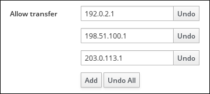 
4. Click Save at the top of the DNS zone page to confirm the new configuration.

<h3 id="enabling-zone-transfers-in-idm-cli">2.12. Enabling zone transfers in IdM CLI</h3>

Use the `ipa dnszone-mod` command with the `--allow-transfer` option to enable data distribution. This defines which external name servers can synchronize with the BIND service on the IdM host.

**Prerequisites**

- You are logged in as IdM administrator.
- You have root access to the secondary DNS servers.

**Procedure**

- To enable zone transfers in the `BIND` service, enter the `ipa dnszone-mod` command, and specify the list of name servers that are outside the to-be-transferred zone to which the zone records will be transferred using the `--allow-transfer` option. For example:
  
  ```
  ipa dnszone-mod --allow-transfer=192.0.2.1;198.51.100.1;203.0.113.1 idm.example.com
  ```
  
  ```plaintext
  $ ipa dnszone-mod --allow-transfer=192.0.2.1;198.51.100.1;203.0.113.1 idm.example.com
  ```

**Verification**

1. SSH to one of the DNS servers to which zone transfer has been enabled:
   
   ```
   ssh 192.0.2.1
   ```
   
   ```plaintext
   $ ssh 192.0.2.1
   ```
2. Transfer the IdM DNS zone using a tool such as the `dig` utility:
   
   ```
   dig @ipa-server zone_name AXFR
   ```
   
   ```plaintext
   # dig @ipa-server zone_name AXFR
   ```

If the command returns no error, you have successfully enabled zone transfer for *zone\_name*.

<h3 id="managing-dns-zones-in-idm">2.13. Additional resources</h3>

- [Using Ansible playbooks to manage IdM DNS zones](https://docs.redhat.com/en/documentation/red_hat_enterprise_linux/8/html-single/configuring_and_managing_identity_management/index#using-ansible-playbooks-to-manage-idm-dns-zones_configuring-and-managing-idm)

<h2 id="using-ansible-playbooks-to-manage-idm-dns-zones">Chapter 3. Using Ansible playbooks to manage IdM DNS zones</h2>

Create and configure primary DNS zones in Identity Management (IdM) using Ansible to manage authoritative DNS data for your domain.

<h3 id="prerequisites\_3">3.1. Prerequisites</h3>

- DNS service is installed on the IdM server. For more information about how to use Ansible to install an IdM server with integrated DNS, see [Installing an Identity Management server using an Ansible playbook](https://docs.redhat.com/en/documentation/red_hat_enterprise_linux/10/html/installing_identity_management/installing-an-identity-management-server-using-an-ansible-playbook).

<h3 id="supported-dns-zone-types">3.2. Supported DNS zone types</h3>

Understand the difference between primary zones for authoritative DNS data and forward zones for delegating queries to external servers.

Note

This guide uses the BIND terminology for zone types which is different from the terminology used for Microsoft Windows DNS. Primary zones in BIND serve the same purpose as *forward lookup zones* and *reverse lookup zones* in Microsoft Windows DNS. Forward zones in BIND serve the same purpose as *conditional forwarders* in Microsoft Windows DNS.

Identity Management (IdM) supports two types of DNS zones: *primary* and *forward* zones.

Primary DNS zones

Primary DNS zones contain authoritative DNS data and can accept dynamic DNS updates. This behavior is equivalent to the `type master` setting in standard BIND configuration. You can manage primary zones using the `ipa dnszone-*` commands.

In compliance with standard DNS rules, every primary zone must contain `start of authority` (SOA) and `nameserver` (NS) records. IdM generates these records automatically when the DNS zone is created, but you must copy the NS records manually to the parent zone to create proper delegation.

In accordance with standard BIND behavior, queries for names for which the server is not authoritative are forwarded to other DNS servers. These DNS servers, so called forwarders, may or may not be authoritative for the query.

For example, in a scenario when the IdM server contains the `test.example.` primary zone. This zone contains an NS delegation record for the `sub.test.example.` name. In addition, the `test.example.` zone is configured with the `192.0.2.254` forwarder IP address for the `sub.text.example` subzone.

A client querying the name `nonexistent.test.example.` receives the `NXDomain` answer, and no forwarding occurs because the IdM server is authoritative for this name.

On the other hand, querying for the `host1.sub.test.example.` name is forwarded to the configured forwarder `192.0.2.254` because the IdM server is not authoritative for this name.

Forward DNS zones

From the perspective of IdM, forward DNS zones do not contain any authoritative data. In fact, a forward "zone" usually only contains two pieces of information:

- A domain name
- The IP address of a DNS server associated with the domain
  
  All queries for names belonging to the domain defined are forwarded to the specified IP address. This behavior is equivalent to the `type forward` setting in standard BIND configuration. You can manage forward zones using the `ipa dnsforwardzone-*` commands.
  
  Forward DNS zones are especially useful in the context of IdM-Active Directory (AD) trusts. If the IdM DNS server is authoritative for the **idm.example.com** zone and the AD DNS server is authoritative for the **ad.example.com** zone, then **ad.example.com** is a DNS forward zone for the **idm.example.com** primary zone. That means that when a query comes from an IdM client for the IP address of **somehost.ad.example.com**, the query is forwarded to an AD domain controller specified in the **ad.example.com** IdM DNS forward zone.

<h3 id="configuration-attributes-of-primary-idm-dns-zones-when-using-ansible">3.3. Configuration attributes of primary IdM DNS zones when using Ansible</h3>

Review the DNS zone attributes available in the Ansible `ipadnszone` module and tune them for optimal DNS performance.

Identity Management (IdM) creates a new zone with certain default configuration, such as the refresh periods, transfer settings, or cache settings. Below, you can find the attributes of the default zone configuration that you can modify using Ansible.

Along with setting the actual information for the zone, the settings define how the DNS server handles the *start of authority* (SOA) record entries and how it updates its records from the DNS name server.

Table 3.1. IdM DNS zone attributes

Attributeansible-freeipa variableDescription

Authoritative name server

`name_server`

Sets the domain name of the primary DNS name server, also known as SOA MNAME.

By default, each IdM server advertises itself in the SOA MNAME field. Consequently, the value stored in LDAP using `--name-server` is ignored.

Administrator e-mail address

`admin_email`

Sets the email address to use for the zone administrator. This defaults to the root account on the host.

SOA serial

`serial`

Sets a serial number in the SOA record. Note that IdM sets the version number automatically and users are not expected to modify it.

SOA refresh

`refresh`

Sets the interval, in seconds, for a secondary DNS server to wait before requesting updates from the primary DNS server.

SOA retry

`retry`

Sets the time, in seconds, to wait before retrying a failed refresh operation.

SOA expire

`expire`

Sets the time, in seconds, that a secondary DNS server will try to perform a refresh update before ending the operation attempt.

SOA minimum

`minimum`

Sets the time to live (TTL) value in seconds for negative caching according to [RFC 2308](http://tools.ietf.org/html/rfc2308).

SOA time to live

`ttl`

Sets TTL in seconds for records at zone apex. In zone `example.com`, for example, all records (A, NS, or SOA) under name `example.com` are configured, but no other domain names, like `test.example.com`, are affected.

Default time to live

`default_ttl`

Sets the default time to live (TTL) value in seconds for negative caching for all values in a zone that never had an individual TTL value set before.

BIND update policy

`update_policy`

Sets the permissions allowed to clients in the DNS zone.

Dynamic update

`dynamic_update`=TRUE|FALSE

Enables dynamic updates to DNS records for clients.

Note that if this is set to false, IdM client machines will not be able to add or update their IP address.

Allow transfer

`allow_transfer`=*string*

Gives a list of IP addresses or network names which are allowed to transfer the given zone, separated by semicolons (;).

Zone transfers are disabled by default. The default `allow_transfer` value is `none`.

Allow query

`allow_query`

Gives a list of IP addresses or network names which are allowed to issue DNS queries, separated by semicolons (;).

Allow PTR sync

`allow_sync_ptr`=1|0

Sets whether A or AAAA records (forward records) for the zone will be automatically synchronized with the PTR (reverse) records.

Zone forwarders

`forwarder`=*IP\_address*

Specifies a forwarder specifically configured for the DNS zone. This is separate from any global forwarders used in the IdM domain.

To specify multiple forwarders, use the option multiple times.

Forward policy

`forward_policy`=none|only|first

Specifies the forward policy. For information about the supported policies, see [DNS forward policies in IdM](#dns-forward-policies-in-idm "1.6. DNS forward policies in IdM").

For details about all variables used in the playbook, see the `/usr/share/ansible/collections/ansible_collections/freeipa/ansible_freeipa/README-dnszone.md` file on the control node.

<h3 id="using-ansible-to-create-a-primary-zone-in-idm-dns">3.4. Using Ansible to create a primary zone in IdM DNS</h3>

Create a primary DNS zone in IdM to host authoritative DNS records for a domain managed by your IdM servers.

**Prerequisites**

- You have configured your Ansible control node to meet the following requirements:
  
  - You are using Ansible version 2.15 or later.
  - You have installed the [`ansible-freeipa`](https://docs.redhat.com/en/documentation/red_hat_enterprise_linux/10/html/using_ansible_to_install_and_manage_identity_management_in_rhel/installing-an-identity-management-server-using-an-ansible-playbook#installing-the-ansible-freeipa-package) package.
  - The example assumes that in the **~/*MyPlaybooks*/** directory, you have created an [Ansible inventory file](https://docs.redhat.com/en/documentation/red_hat_enterprise_linux/10/html/using_ansible_to_install_and_manage_identity_management_in_rhel/preparing-your-environment-for-managing-idm-using-ansible-playbooks) with the fully-qualified domain name (FQDN) of the IdM server.
  - The example assumes that the **secret.yml** Ansible vault stores your `ipaadmin_password` and that you have access to a file that stores the password protecting the **secret.yml** file.
- The target node, that is the node on which the `freeipa.ansible_freeipa` module is executed, is part of the IdM domain as an IdM client, server or replica.
- You know the IdM administrator password.

**Procedure**

1. Navigate to the `/usr/share/ansible/collections/ansible_collections/freeipa/ansible_freeipa/playbooks/dnszone` directory:
   
   ```
   cd /usr/share/ansible/collections/ansible_collections/freeipa/ansible_freeipa/playbooks/dnszone
   ```
   
   ```plaintext
   $ cd /usr/share/ansible/collections/ansible_collections/freeipa/ansible_freeipa/playbooks/dnszone
   ```
2. Open your inventory file and ensure that the IdM server that you want to configure is listed in the `[ipaserver]` section. For example, to instruct Ansible to configure **server.idm.example.com**, enter:
   
   ```
   [ipaserver]
   server.idm.example.com
   ```
   
   ```plaintext
   [ipaserver]
   server.idm.example.com
   ```
3. Make a copy of the **dnszone-present.yml** Ansible playbook file. For example:
   
   ```
   cp dnszone-present.yml dnszone-present-copy.yml
   ```
   
   ```plaintext
   $ cp dnszone-present.yml dnszone-present-copy.yml
   ```
4. Open the **dnszone-present-copy.yml** file for editing.
5. Adapt the file by setting the following variables in the `ipadnszone` task section:
   
   - Set the `ipaadmin_password` variable to your IdM administrator password.
   - Set the `zone_name` variable to **zone.idm.example.com**.
     
     This is the modified Ansible playbook file for the current example:
   
   ```
   ---
   - name: Ensure dnszone present
     hosts: ipaserver
     become: true
   
     tasks:
     - name: Ensure zone is present.
       ipadnszone:
         ipaadmin_password: "{{ ipaadmin_password }}"
         zone_name: zone.idm.example.com
         state: present
   ```
   
   ```plaintext
   ---
   - name: Ensure dnszone present
     hosts: ipaserver
     become: true
   
     tasks:
     - name: Ensure zone is present.
       ipadnszone:
         ipaadmin_password: "{{ ipaadmin_password }}"
         zone_name: zone.idm.example.com
         state: present
   ```
6. Save the file.
   
   For details about variables and example playbooks in the FreeIPA Ansible collection, see the `/usr/share/ansible/collections/ansible_collections/freeipa/ansible_freeipa/README-dnszone.md` file and the `/usr/share/ansible/collections/ansible_collections/freeipa/ansible_freeipa/playbooks/dnszone` directory on the control node.
7. Run the playbook:
   
   ```
   ansible-playbook --vault-password-file=password_file -v -i inventory.file dnszone-present-copy.yml
   ```
   
   ```plaintext
   $ ansible-playbook --vault-password-file=password_file -v -i inventory.file dnszone-present-copy.yml
   ```

**Additional resources**

- [Supported DNS zone types](https://docs.redhat.com/en/documentation/red_hat_enterprise_linux/10/html/working_with_dns_in_identity_management/using-ansible-playbooks-to-manage-idm-dns-zones#supported-dns-zone-types)

<h3 id="using-an-ansible-playbook-to-ensure-the-presence-of-a-primary-dns-zone-in-idm-with-multiple-variables">3.5. Using an Ansible playbook to ensure the presence of a primary DNS zone in IdM with multiple variables</h3>

Create a DNS zone with custom settings such as administrator email, refresh intervals, and TTL values to meet your organization’s DNS requirements.

In the example below, you as an IdM administrator ensure the presence of the **zone.idm.example.com** DNS zone.

**Prerequisites**

- You have configured your Ansible control node to meet the following requirements:
  
  - You are using Ansible version 2.15 or later.
  - You have installed the [`ansible-freeipa`](https://docs.redhat.com/en/documentation/red_hat_enterprise_linux/10/html/using_ansible_to_install_and_manage_identity_management_in_rhel/installing-an-identity-management-server-using-an-ansible-playbook#installing-the-ansible-freeipa-package) package.
  - The example assumes that in the **~/*MyPlaybooks*/** directory, you have created an [Ansible inventory file](https://docs.redhat.com/en/documentation/red_hat_enterprise_linux/10/html/using_ansible_to_install_and_manage_identity_management_in_rhel/preparing-your-environment-for-managing-idm-using-ansible-playbooks) with the fully-qualified domain name (FQDN) of the IdM server.
  - The example assumes that the **secret.yml** Ansible vault stores your `ipaadmin_password` and that you have access to a file that stores the password protecting the **secret.yml** file.
- The target node, that is the node on which the `freeipa.ansible_freeipa` module is executed, is part of the IdM domain as an IdM client, server or replica.

**Procedure**

1. Navigate to the `/usr/share/ansible/collections/ansible_collections/freeipa/ansible_freeipa/playbooks/dnszone` directory:
   
   ```
   cd /usr/share/ansible/collections/ansible_collections/freeipa/ansible_freeipa/playbooks/dnszone
   ```
   
   ```plaintext
   $ cd /usr/share/ansible/collections/ansible_collections/freeipa/ansible_freeipa/playbooks/dnszone
   ```
2. Make a copy of the **dnszone-all-params.yml** Ansible playbook file. For example:
   
   ```
   cp dnszone-all-params.yml dnszone-all-params-copy.yml
   ```
   
   ```plaintext
   $ cp dnszone-all-params.yml dnszone-all-params-copy.yml
   ```
3. Open the **dnszone-all-params-copy.yml** file for editing.
4. Adapt the file by setting the following variables in the `freeipa.ansible_freeipa.ipadnszone` task section:
   
   - Indicate that the value of the `ipaadmin_password` variable is defined in the **secret.yml** Ansible vault file.
   - Set the `zone_name` variable to **zone.idm.example.com**.
   - Set the `allow_sync_ptr` variable to true if you want to allow the synchronization of forward and reverse records, that is the synchronization of A and AAAA records with PTR records.
   - Set the `dynamic_update` variable to true to enable IdM client machines to add or update their IP addresses.
   - Set the `dnssec` variable to true to allow inline DNSSEC signing of records in the zone.
   - Set the `allow_transfer` variable to the IP addresses of secondary name servers in the zone.
   - Set the `allow_query` variable to the IP addresses or networks that are allowed to issue queries.
   - Set the `forwarders` variable to the IP addresses of global forwarders.
   - Set the `serial` variable to the SOA record serial number.
   - Define the `refresh`, `retry`, `expire`, `minimum`, `ttl`, and `default_ttl` values for DNS records in the zone.
   - Define the NSEC3PARAM record for the zone using the `nsec3param_rec` variable.
   - Set the `skip_overlap_check` variable to true to force DNS creation even if it overlaps with an existing zone.
   - Set the `skip_nameserver_check` to true to force DNS zone creation even if the nameserver is not resolvable.
     
     This is the modified Ansible playbook file for the current example:
   
   ```
   ---
   - name: Ensure dnszone present
     hosts: ipaserver
     become: true
   
     tasks:
     - name: Ensure zone is present.
       freeipa.ansible_freeipa.ipadnszone:
         ipaadmin_password: "{{ ipaadmin_password }}"
         zone_name: zone.idm.example.com
         allow_sync_ptr: true
         dynamic_update: true
         dnssec: true
         allow_transfer:
           - 1.1.1.1
           - 2.2.2.2
         allow_query:
           - 1.1.1.1
           - 2.2.2.2
         forwarders:
           - ip_address: 8.8.8.8
           - ip_address: 8.8.4.4
             port: 52
         serial: 1234
         refresh: 3600
         retry: 900
         expire: 1209600
         minimum: 3600
         ttl: 60
         default_ttl: 90
         name_server: server.idm.example.com.
         admin_email: admin.admin@idm.example.com
         nsec3param_rec: "1 7 100 0123456789abcdef"
         skip_overlap_check: true
         skip_nameserver_check: true
         state: present
   ```
   
   ```plaintext
   ---
   - name: Ensure dnszone present
     hosts: ipaserver
     become: true
   
     tasks:
     - name: Ensure zone is present.
       freeipa.ansible_freeipa.ipadnszone:
         ipaadmin_password: "{{ ipaadmin_password }}"
         zone_name: zone.idm.example.com
         allow_sync_ptr: true
         dynamic_update: true
         dnssec: true
         allow_transfer:
           - 1.1.1.1
           - 2.2.2.2
         allow_query:
           - 1.1.1.1
           - 2.2.2.2
         forwarders:
           - ip_address: 8.8.8.8
           - ip_address: 8.8.4.4
             port: 52
         serial: 1234
         refresh: 3600
         retry: 900
         expire: 1209600
         minimum: 3600
         ttl: 60
         default_ttl: 90
         name_server: server.idm.example.com.
         admin_email: admin.admin@idm.example.com
         nsec3param_rec: "1 7 100 0123456789abcdef"
         skip_overlap_check: true
         skip_nameserver_check: true
         state: present
   ```
5. Save the file.
   
   For details about variables and example playbooks in the FreeIPA Ansible collection, see the `/usr/share/ansible/collections/ansible_collections/freeipa/ansible_freeipa/README-dnszone.md` file and the `/usr/share/ansible/collections/ansible_collections/freeipa/ansible_freeipa/playbooks/dnszone` directory on the control node.
6. Run the playbook:
   
   ```
   ansible-playbook --vault-password-file=password_file -v -i inventory.file dnszone-all-params-copy.yml
   ```
   
   ```plaintext
   $ ansible-playbook --vault-password-file=password_file -v -i inventory.file dnszone-all-params-copy.yml
   ```

**Additional resources**

- [Supported DNS zone types](https://docs.redhat.com/en/documentation/red_hat_enterprise_linux/10/html/working_with_dns_in_identity_management/using-ansible-playbooks-to-manage-idm-dns-zones#supported-dns-zone-types)
- [Configuration attributes of primary IdM DNS zones when using Ansible](#configuration-attributes-of-primary-idm-dns-zones-when-using-ansible "3.3. Configuration attributes of primary IdM DNS zones when using Ansible")

<h3 id="using-an-ansible-playbook-to-ensure-the-presence-of-a-zone-for-reverse-dns-lookup-when-an-ip-address-is-given">3.6. Using an Ansible playbook to ensure the presence of a zone for reverse DNS lookup when an IP address is given</h3>

Use Ansible to create a reverse DNS zone to enable PTR record lookups for IP-to-hostname resolution.

In the example below, an IdM administrator ensures the presence of a reverse DNS lookup zone using the IP address and prefix length of an IdM host.

Providing the prefix length of the IP address of your DNS server using the `name_from_ip` variable allows you to control the zone name. If you do not state the prefix length, the system queries DNS servers for zones and, based on the `name_from_ip` value of **192.168.1.2**, the query can return any of the following DNS zones:

- **1.168.192.in-addr.arpa.**
- **168.192.in-addr.arpa.**
- **192.in-addr.arpa.**

Because the zone returned by the query might not be what you expect, `name_from_ip` can only be used with the `state` option set to **present** to prevent accidental removals of zones.

**Prerequisites**

- You have configured your Ansible control node to meet the following requirements:
  
  - You are using Ansible version 2.15 or later.
  - You have installed the [`ansible-freeipa`](https://docs.redhat.com/en/documentation/red_hat_enterprise_linux/10/html/using_ansible_to_install_and_manage_identity_management_in_rhel/installing-an-identity-management-server-using-an-ansible-playbook#installing-the-ansible-freeipa-package) package.
  - The example assumes that in the **~/*MyPlaybooks*/** directory, you have created an [Ansible inventory file](https://docs.redhat.com/en/documentation/red_hat_enterprise_linux/10/html/using_ansible_to_install_and_manage_identity_management_in_rhel/preparing-your-environment-for-managing-idm-using-ansible-playbooks) with the fully-qualified domain name (FQDN) of the IdM server.
  - The example assumes that the **secret.yml** Ansible vault stores your `ipaadmin_password` and that you have access to a file that stores the password protecting the **secret.yml** file.
- The target node, that is the node on which the `freeipa.ansible_freeipa` module is executed, is part of the IdM domain as an IdM client, server or replica.

**Procedure**

1. Navigate to the `/usr/share/ansible/collections/ansible_collections/freeipa/ansible_freeipa/playbooks/dnszone` directory:
   
   ```
   cd /usr/share/ansible/collections/ansible_collections/freeipa/ansible_freeipa/playbooks/dnszone
   ```
   
   ```plaintext
   $ cd /usr/share/ansible/collections/ansible_collections/freeipa/ansible_freeipa/playbooks/dnszone
   ```
2. Make a copy of the **dnszone-reverse-from-ip.yml** Ansible playbook file. For example:
   
   ```
   cp dnszone-reverse-from-ip.yml dnszone-reverse-from-ip-copy.yml
   ```
   
   ```plaintext
   $ cp dnszone-reverse-from-ip.yml dnszone-reverse-from-ip-copy.yml
   ```
3. Open the **dnszone-reverse-from-ip-copy.yml** file for editing.
4. Adapt the file by setting the following variables in the `freeipa.ansible_freeipa.ipadnszone` task section:
   
   - Indicate that the value of the `ipaadmin_password` variable is defined in the **secret.yml** Ansible vault file.
   - Set the `name_from_ip` variable to the IP of your IdM nameserver, and provide its prefix length.
     
     This is the modified Ansible playbook file for the current example:
     
     ```
     ---
     - name: Ensure dnszone present
       hosts: ipaserver
       become: true
     
       tasks:
       - name: Ensure zone for reverse DNS lookup is present.
         freeipa.ansible_freeipa.ipadnszone:
           ipaadmin_password: "{{ ipaadmin_password }}"
           name_from_ip: 192.168.1.2/24
           state: present
         register: result
       - name: Display inferred zone name.
         debug:
           msg: "Zone name: {{ result.dnszone.name }}"
     ```
     
     ```plaintext
     ---
     - name: Ensure dnszone present
       hosts: ipaserver
       become: true
     
       tasks:
       - name: Ensure zone for reverse DNS lookup is present.
         freeipa.ansible_freeipa.ipadnszone:
           ipaadmin_password: "{{ ipaadmin_password }}"
           name_from_ip: 192.168.1.2/24
           state: present
         register: result
       - name: Display inferred zone name.
         debug:
           msg: "Zone name: {{ result.dnszone.name }}"
     ```
   
   The playbook creates a zone for reverse DNS lookup from the **192.168.1.2** IP address and its prefix length of 24. Next, the playbook displays the resulting zone name.
5. Save the file.
   
   For details about variables and example playbooks in the FreeIPA Ansible collection, see the `/usr/share/ansible/collections/ansible_collections/freeipa/ansible_freeipa/README-dnszone.md` file and the `/usr/share/ansible/collections/ansible_collections/freeipa/ansible_freeipa/playbooks/dnszone` directory on the control node.
6. Run the playbook:
   
   ```
   ansible-playbook --vault-password-file=password_file -v -i inventory.file dnszone-reverse-from-ip-copy.yml
   ```
   
   ```plaintext
   $ ansible-playbook --vault-password-file=password_file -v -i inventory.file dnszone-reverse-from-ip-copy.yml
   ```

**Additional resources**

- [Supported DNS zone types](https://docs.redhat.com/en/documentation/red_hat_enterprise_linux/10/html/working_with_dns_in_identity_management/using-ansible-playbooks-to-manage-idm-dns-zones#supported-dns-zone-types)

<h2 id="managing-dns-locations-in-idm">Chapter 4. Managing DNS locations in IdM</h2>

Manage Identity Management (IdM) DNS locations to optimize traffic and reduce latency between clients and servers. Configuring these locations ensures that clients discover and prioritize the nearest available services.

<h3 id="prerequisites\_4">4.1. Prerequisites</h3>

- You understand the concept of [DNS-based service discovery](#dns-based-service-discovery "5.1. DNS-based service discovery") in IdM.
- You understand [deployment considerations for DNS locations](#deployment-considerations-for-dns-locations "5.2. Deployment considerations for DNS locations") in IdM.
- You understand the concept of [DNS time-to-live (TTL)](#dns-time-to-live-ttl "5.3. DNS time to live (TTL)").

<h3 id="creating-dns-locations-using-the-idm-web-ui">4.2. Creating DNS locations using the IdM Web UI</h3>

Define new DNS locations through the IdM Web UI to group servers by physical or logical site. This organization helps the environment to direct client requests to local infrastructure, improving response times.

**Prerequisites**

- Your IdM deployment has integrated DNS.
- You have a permission to create DNS locations in IdM. For example, you are logged in as IdM admin.

**Procedure**

1. Open the `IPA Server` tab.
2. Select `Topology` subtab.
3. Click `IPA Locations` in the navigation bar.
4. Click Add at the top of the locations list.
5. Fill in the location name.
6. Click the Add button to save the location.
7. Optional: Repeat the steps to add further locations.

**Additional resources**

- [Assigning an IdM server to a DNS location using the IdM Web UI](#assigning-an-idm-server-to-a-dns-location-using-the-idm-web-ui "4.4. Assigning an IdM server to a DNS location using the IdM Web UI")
- [Using Ansible to ensure an IdM location is present](#using-ansible-to-ensure-an-idm-location-is-present "5.4. Using Ansible to ensure an IdM location is present")

<h3 id="creating-dns-locations-using-the-idm-cli">4.3. Creating DNS locations using the IdM CLI</h3>

Add DNS locations via the command line with the `ipa location-add` command. This tool quickly registers new geographic or network-based sites within the Identity Management (IdM) database for future server assignment.

**Prerequisites**

- Your IdM deployment has integrated DNS.
- You have a permission to create DNS locations in IdM. For example, you are logged in as IdM admin.

**Procedure**

1. For example, to create a new location `germany`, enter:
   
   ```
   ipa location-add germany
   ```
   
   ```plaintext
   $ ipa location-add germany
   ```
   
   ```
   ----------------------------
   Added IPA location "germany"
   ----------------------------
     Location name: germany
   ```
   
   ```plaintext
   ----------------------------
   Added IPA location "germany"
   ----------------------------
     Location name: germany
   ```
2. Optional: Repeat the step to add further locations.

**Additional resources**

- [Assigning an IdM Server to a DNS Location using the IdM CLI](#assigning-an-idm-server-to-a-dns-location-using-the-idm-cli "4.5. Assigning an IdM server to a DNS location using the IdM CLI")
- [Using Ansible to ensure an IdM location is present](#using-ansible-to-ensure-an-idm-location-is-present "5.4. Using Ansible to ensure an IdM location is present")

<h3 id="assigning-an-idm-server-to-a-dns-location-using-the-idm-web-ui">4.4. Assigning an IdM server to a DNS location using the IdM Web UI</h3>

Associate specific Identity Management (IdM) servers with defined locations using the **Topology** tab in the IdM Web UI. Setting a service weight during this process further refines how clients distribute their connection attempts.

**Prerequisites**

- Your IdM deployment has integrated DNS.
- You are logged in as a user with a permission to assign a server to a DNS location, for example the IdM admin user.
- You have `root` access to the host that you want to assign a DNS location to.
- You have [created the IdM DNS locations](#creating-dns-locations-using-the-idm-cli "4.3. Creating DNS locations using the IdM CLI") to which you want to assign servers.

**Procedure**

1. Open the `IPA Server` tab.
2. Select the `Topology` subtab.
3. Click `IPA Servers` in the navigation.
4. Click on the IdM server name.
5. Select a DNS location, and optionally set a service weight:
   
   **Assigning a server to a DNS location**
   
   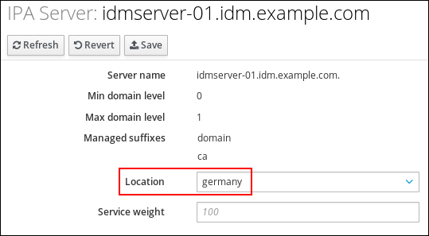 
6. Click Save.
7. On the command line (CLI) of the host you assigned in the previous steps the DNS location to, restart the `named` service:
   
   ```
   systemctl restart named
   ```
   
   ```plaintext
   [root@idmserver-01 ~]# systemctl restart named
   ```
8. Optional: Repeat the steps to assign DNS locations to further IdM servers.

**Additional resources**

- [Configuring an IdM client to use IdM servers in the same location](#configuring-an-idm-client-to-use-idm-servers-in-the-same-location "4.6. Configuring an IdM client to use IdM servers in the same location")

<h3 id="assigning-an-idm-server-to-a-dns-location-using-the-idm-cli">4.5. Assigning an IdM server to a DNS location using the IdM CLI</h3>

Use the `ipa server-mod` command to link a server to a specific DNS location. Restarting the named service afterward activates the new routing logic, ensuring the server advertises itself to the correct local clients.

**Prerequisites**

- Your IdM deployment has integrated DNS.
- You are logged in as a user with a permission to assign a server to a DNS location, for example the IdM admin user.
- You have `root` access to the host that you want to assign a DNS location to.
- You have [created the IdM DNS locations](#creating-dns-locations-using-the-idm-web-ui "4.2. Creating DNS locations using the IdM Web UI") to which you want to assign servers.

**Procedure**

1. Optional: List all configured DNS locations:
   
   ```
   ipa location-find
   ```
   
   ```plaintext
   [root@server ~]# ipa location-find
   ```
   
   ```
   -----------------------
   2 IPA locations matched
   -----------------------
   Location name: australia
   Location name: germany
   -----------------------------
   Number of entries returned: 2
   -----------------------------
   ```
   
   ```plaintext
   -----------------------
   2 IPA locations matched
   -----------------------
   Location name: australia
   Location name: germany
   -----------------------------
   Number of entries returned: 2
   -----------------------------
   ```
2. Assign the server to the DNS location. For example, to assign the location `germany` to the server **idmserver-01.idm.example.com**, run:
   
   ```
   ipa server-mod idmserver-01.idm.example.com --location=germany
   ```
   
   ```plaintext
   # ipa server-mod idmserver-01.idm.example.com --location=germany
   ```
   
   ```
   [...]
   --------------------------------------------------
   Modified IPA server "idmserver-01.idm.example.com"
   --------------------------------------------------
   Servername: idmserver-01.idm.example.com
   Min domain level: 0
   Max domain level: 1
   Location: germany
   Enabled server roles: DNS server, NTP server
   ```
   
   ```plaintext
   [...]
   --------------------------------------------------
   Modified IPA server "idmserver-01.idm.example.com"
   --------------------------------------------------
   Servername: idmserver-01.idm.example.com
   Min domain level: 0
   Max domain level: 1
   Location: germany
   Enabled server roles: DNS server, NTP server
   ```
3. Restart the `named` service on the host you assigned in the previous steps the DNS location to:
   
   ```
   systemctl restart named
   ```
   
   ```plaintext
   # systemctl restart named
   ```
4. Optional: Repeat the steps to assign DNS locations to further IdM servers.

**Additional resources**

- [Configuring an IdM client to use IdM servers in the same location](#configuring-an-idm-client-to-use-idm-servers-in-the-same-location "4.6. Configuring an IdM client to use IdM servers in the same location")

<h3 id="configuring-an-idm-client-to-use-idm-servers-in-the-same-location">4.6. Configuring an IdM client to use IdM servers in the same location</h3>

Point clients to a local DNS server via DHCP or manual network configuration. When the client’s primary DNS server resides in its assigned Identity Management (IdM) location, the client prioritizes local IdM services for all authentication and lookup tasks.

IdM servers are assigned to DNS locations as described in [Assigning an IdM server to a DNS location using the IdM Web UI](#assigning-an-idm-server-to-a-dns-location-using-the-idm-web-ui "4.4. Assigning an IdM server to a DNS location using the IdM Web UI"). Now you can configure the clients to use a DNS server that is in the same location as the IdM servers:

- If a `DHCP` server assigns the DNS server IP addresses to the clients, configure the `DHCP` service. For further details about assigning a DNS server in your `DHCP` service, see the `DHCP` service documentation.
- If your clients do not receive the DNS server IP addresses from a `DHCP` server, manually set the IPs in the client’s network configuration. For further details about configuring the network on Red Hat Enterprise Linux, see the [Configuring Network Connection Settings](https://docs.redhat.com/en/documentation/red_hat_enterprise_linux/7/html/networking_guide/ch-configuring_network_connection_settings) section in the *Red Hat Enterprise Linux Networking Guide*.

Note

If you configure the client to use a DNS server that is assigned to a different location, the client contacts IdM servers in both locations.

**Example 4.1. Different name server entries depending on the location of the client**

The following example shows different name server entries in the `/etc/resolv.conf` file for clients in different locations:

Clients in Prague:

```
nameserver 10.10.0.1
nameserver 10.10.0.2
```

```plaintext
nameserver 10.10.0.1
nameserver 10.10.0.2
```

Clients in Paris:

```
nameserver 10.50.0.1
nameserver 10.50.0.3
```

```plaintext
nameserver 10.50.0.1
nameserver 10.50.0.3
```

Clients in Oslo:

```
nameserver 10.30.0.1
```

```plaintext
nameserver 10.30.0.1
```

Clients in Berlin:

```
nameserver 10.30.0.1
```

```plaintext
nameserver 10.30.0.1
```

If each of the DNS servers is assigned to a location in IdM, the clients use the IdM servers in their location.

<h3 id="managing-dns-locations-in-idm">4.7. Additional resources</h3>

- [Using Ansible to manage DNS locations in IdM](#using-ansible-to-manage-dns-locations-in-idm "Chapter 5. Using Ansible to manage DNS locations in IdM")

<h2 id="using-ansible-to-manage-dns-locations-in-idm">Chapter 5. Using Ansible to manage DNS locations in IdM</h2>

Define DNS locations using Ansible to enable clients to discover and use geographically nearby Identity Management (IdM) servers for faster responses.

For details about variables and example playbooks in the FreeIPA Ansible collection, see the `/usr/share/ansible/collections/ansible_collections/freeipa/ansible_freeipa/README-location.md` file and the `/usr/share/ansible/collections/ansible_collections/freeipa/ansible_freeipa/playbooks/location` directory on the control node.

<h3 id="dns-based-service-discovery">5.1. DNS-based service discovery</h3>

Understand how clients use DNS to automatically locate nearby IdM servers, reducing network latency and eliminating manual server configuration.

DNS-based service discovery is a process in which a client uses the DNS protocol to locate servers in a network that offer a specific service, such as `LDAP` or `Kerberos`. One typical type of operation is to allow clients to locate authentication servers within the closest network infrastructure, because they provide a higher throughput and lower network latency, lowering overall costs.

The major advantages of service discovery are:

- No need for clients to be explicitly configured with names of nearby servers.
- DNS servers are used as central providers of policy. Clients using the same DNS server have access to the same policy about service providers and their preferred order.

In an Identity Management (IdM) domain, DNS service records (SRV records) exist for `LDAP`, `Kerberos`, and other services. For example, the following command queries the DNS server for hosts providing a TCP-based `Kerberos` service in an IdM DNS domain:

**Example 5.1. DNS location independent results**

```
dig -t SRV +short _kerberos._tcp.idm.example.com
0 100 88 idmserver-01.idm.example.com.
0 100 88 idmserver-02.idm.example.com.
```

```plaintext
$ dig -t SRV +short _kerberos._tcp.idm.example.com
0 100 88 idmserver-01.idm.example.com.
0 100 88 idmserver-02.idm.example.com.
```

The output contains the following information:

- `0` (priority): Priority of the target host. A lower value is preferred.
- `100` (weight). Specifies a relative weight for entries with the same priority. For further information, see [RFC 2782, section 3](https://tools.ietf.org/html/rfc2782#page-3).
- `88` (port number): Port number of the service.
- Canonical name of the host providing the service.

In the example, the two host names returned have the same priority and weight. In this case, the client uses a random entry from the result list.

When the client is, instead, configured to query a DNS server that is configured in a DNS location, the output differs. For IdM servers that are assigned to a location, tailored values are returned. In the example below, the client is configured to query a DNS server in the location `germany`:

**Example 5.2. DNS location-based results**

```
dig -t SRV +short _kerberos._tcp.idm.example.com
_kerberos._tcp.germany._locations.idm.example.com.
0 100 88 idmserver-01.idm.example.com.
50 100 88 idmserver-02.idm.example.com.
```

```plaintext
$ dig -t SRV +short _kerberos._tcp.idm.example.com
_kerberos._tcp.germany._locations.idm.example.com.
0 100 88 idmserver-01.idm.example.com.
50 100 88 idmserver-02.idm.example.com.
```

The IdM DNS server automatically returns a DNS alias (CNAME) pointing to a DNS location specific SRV record which prefers local servers. This CNAME record is shown in the first line of the output. In the example, the host **idmserver-01.idm.example.com** has the lowest priority value and is therefore preferred. The **idmserver-02.idm.example.com** has a higher priority and thus is used only as backup for cases when the preferred host is unavailable.

<h3 id="deployment-considerations-for-dns-locations">5.2. Deployment considerations for DNS locations</h3>

Plan your DNS location deployment to ensure clients receive location-specific SRV records and connect to nearby IdM servers.

Identity Management (IdM) can generate location-specific service (SRV) records when using the integrated DNS. Because each IdM DNS server generates location-specific SRV records, you have to install at least one IdM DNS server in each DNS location.

The client’s affinity to a DNS location is only defined by the DNS records received by the client. For this reason, you can combine IdM DNS servers with non-IdM DNS consumer servers and recursors if the clients doing DNS service discovery resolve location-specific records from IdM DNS servers.

In the majority of deployments with mixed IdM and non-IdM DNS services, DNS recursors select the closest IdM DNS server automatically by using round-trip time metrics. Typically, this ensures that clients using non-IdM DNS servers are getting records for the nearest DNS location and thus use the optimal set of IdM servers.

<h3 id="dns-time-to-live-ttl">5.3. DNS time to live (TTL)</h3>

Review how you can use the DNS TTL value to control how long clients cache records, which is especially important for roaming clients that move between locations.

Clients can cache DNS resource records for an amount of time that is set in the zone’s configuration. Because of this caching, a client might not be able to receive the changes until the time to live (TTL) value expires. The default TTL value in Identity Management (IdM) is `1 day`.

If your client computers roam between sites, you should adapt the TTL value for your IdM DNS zone. Set the value to a lower value than the time clients need to roam between sites. This ensures that cached DNS entries on the client expire before they reconnect to another site and thus query the DNS server to refresh location-specific SRV records.

**Additional resources**

- [Configuration attributes of primary IdM DNS zones when using Ansible](#configuration-attributes-of-primary-idm-dns-zones-when-using-ansible "3.3. Configuration attributes of primary IdM DNS zones when using Ansible")

<h3 id="using-ansible-to-ensure-an-idm-location-is-present">5.4. Using Ansible to ensure an IdM location is present</h3>

Create a DNS location in Identity Management (IdM) using Ansible so that clients can discover and use nearby servers for faster authentication.

As a system administrator of Identity Management (IdM), you can configure IdM DNS locations to allow clients to locate authentication servers within the closest network infrastructure.

The example below describes how to ensure that the **germany** DNS location is present in IdM. As a result, you can assign particular IdM servers to this location so that local IdM clients can use them to reduce server response time.

**Prerequisites**

- On the control node:
  
  - You are using Ansible version 2.15 or later.
  - You have installed the [`ansible-freeipa`](https://docs.redhat.com/en/documentation/red_hat_enterprise_linux/10/html/using_ansible_to_install_and_manage_identity_management_in_rhel/installing-an-identity-management-server-using-an-ansible-playbook#installing-the-ansible-freeipa-package) package.
  - The example assumes that in the **~/*MyPlaybooks*/** directory, you have created an [Ansible inventory file](https://docs.redhat.com/en/documentation/red_hat_enterprise_linux/10/html/using_ansible_to_install_and_manage_identity_management_in_rhel/preparing-your-environment-for-managing-idm-using-ansible-playbooks) with the fully-qualified domain name (FQDN) of the IdM server.
  - The example assumes that the **secret.yml** Ansible vault stores your `ipaadmin_password` and that you have access to a file that stores the password protecting the **secret.yml** file.
- The target node, that is the node on which the `freeipa.ansible_freeipa` module is executed, is part of the IdM domain as an IdM client, server or replica.
- You understand the [deployment considerations for DNS locations](https://docs.redhat.com/en/documentation/red_hat_enterprise_linux/10/html/working_with_dns_in_identity_management/using-ansible-to-manage-dns-locations-in-idm#deployment-considerations-for-dns-locations).

**Procedure**

1. Navigate to the **~/*MyPlaybooks*/** directory:
   
   ```
   cd ~/MyPlaybooks/
   ```
   
   ```plaintext
   $ cd ~/MyPlaybooks/
   ```
2. Make a copy of the `location-present.yml` file located in the `/usr/share/ansible/collections/ansible_collections/freeipa/ansible_freeipa/playbooks/location/` directory:
   
   ```
   cp /usr/share/ansible/collections/ansible_collections/freeipa/ansible_freeipa/playbooks/location/location-present.yml location-present-copy.yml
   ```
   
   ```plaintext
   $ cp /usr/share/ansible/collections/ansible_collections/freeipa/ansible_freeipa/playbooks/location/location-present.yml location-present-copy.yml
   ```
3. Open the `location-present-copy.yml` Ansible playbook file for editing.
4. Adapt the file by setting the following variables in the `freeipa.ansible_freeipa.ipalocation` task section:
   
   - Adapt the `name` of the task to correspond to your use case.
   - Indicate that the value of the `ipaadmin_password` variable is defined in the **secret.yml** Ansible vault file.
   - Set the `name` variable to the name of the location.
   
   This is the modified Ansible playbook file for the current example:
   
   ```
   ---
   - name: location present example
     hosts: ipaserver
   
     vars_files:
     - /home/user_name/MyPlaybooks/secret.yml
     tasks:
     - name: Ensure that the "germany" location is present
       freeipa.ansible_freeipa.ipalocation:
         ipaadmin_password: "{{ ipaadmin_password }}"
         name: germany
   ```
   
   ```plaintext
   ---
   - name: location present example
     hosts: ipaserver
   
     vars_files:
     - /home/user_name/MyPlaybooks/secret.yml
     tasks:
     - name: Ensure that the "germany" location is present
       freeipa.ansible_freeipa.ipalocation:
         ipaadmin_password: "{{ ipaadmin_password }}"
         name: germany
   ```
5. Save the file.
   
   For details about variables and example playbooks in the FreeIPA Ansible collection, see the `/usr/share/ansible/collections/ansible_collections/freeipa/ansible_freeipa/README-location.md` file and the `/usr/share/ansible/collections/ansible_collections/freeipa/ansible_freeipa/playbooks/location` directory on the control node.
6. Run the Ansible playbook. Specify the playbook file, the file storing the password protecting the **secret.yml** file, and the inventory file:
   
   ```
   ansible-playbook --vault-password-file=password_file -v -i inventory location-present-copy.yml
   ```
   
   ```plaintext
   $ ansible-playbook --vault-password-file=password_file -v -i inventory location-present-copy.yml
   ```

**Additional resources**

- [Assigning an IdM server to a DNS location using the IdM Web UI](https://docs.redhat.com/en/documentation/red_hat_enterprise_linux/10/html/working_with_dns_in_identity_management/managing-dns-locations-in-idm#assigning-an-idm-server-to-a-dns-location-using-the-idm-web-ui)
- [Assigning an IdM server to a DNS location using the IdM CLI](https://docs.redhat.com/en/documentation/red_hat_enterprise_linux/10/html/working_with_dns_in_identity_management/managing-dns-locations-in-idm#assigning-an-idm-server-to-a-dns-location-using-the-idm-cli)

<h3 id="using-ansible-to-ensure-an-idm-location-is-absent">5.5. Using Ansible to ensure an IdM location is absent</h3>

Remove a DNS location from Identity Management (IdM) using Ansible when decommissioning a geographic site or restructuring your topology.

As a system administrator of Identity Management (IdM), you can configure IdM DNS locations to allow clients to locate authentication servers within the closest network infrastructure.

The following procedure describes how to use an Ansible playbook to ensure that a DNS location is absent in IdM. The example describes how to ensure that the **germany** DNS location is absent in IdM. As a result, you cannot assign particular IdM servers to this location and local IdM clients cannot use them.

**Prerequisites**

- No IdM server is assigned to the **germany** DNS location.
- You have configured your Ansible control node to meet the following requirements:
  
  - You are using Ansible version 2.15 or later.
  - You have installed the [`ansible-freeipa`](https://docs.redhat.com/en/documentation/red_hat_enterprise_linux/10/html/using_ansible_to_install_and_manage_identity_management_in_rhel/installing-an-identity-management-server-using-an-ansible-playbook#installing-the-ansible-freeipa-package) package.
  - The example assumes that in the **~/*MyPlaybooks*/** directory, you have created an [Ansible inventory file](https://docs.redhat.com/en/documentation/red_hat_enterprise_linux/10/html/using_ansible_to_install_and_manage_identity_management_in_rhel/preparing-your-environment-for-managing-idm-using-ansible-playbooks) with the fully-qualified domain name (FQDN) of the IdM server.
  - The example assumes that the **secret.yml** Ansible vault stores your `ipaadmin_password` and that you have access to a file that stores the password protecting the **secret.yml** file.
- The target node, that is the node on which the `freeipa.ansible_freeipa` module is executed, is part of the IdM domain as an IdM client, server or replica.
- The example assumes that you have [created and configured](https://docs.redhat.com/en/documentation/red_hat_enterprise_linux/10/html-single/using_ansible_to_install_and_manage_identity_management_in_rhel/index#preparing-your-environment-for-managing-idm-using-ansible-playbooks) the **~/*MyPlaybooks*/** directory as a central location to store copies of sample playbooks.

**Procedure**

1. Navigate to the **~/*MyPlaybooks*/** directory:
   
   ```
   cd ~/MyPlaybooks/
   ```
   
   ```plaintext
   $ cd ~/MyPlaybooks/
   ```
2. Make a copy of the `location-absent.yml` file located in the `/usr/share/ansible/collections/ansible_collections/freeipa/ansible_freeipa/playbooks/location/` directory:
   
   ```
   cp /usr/share/ansible/collections/ansible_collections/freeipa/ansible_freeipa/playbooks/location/location-absent.yml location-absent-copy.yml
   ```
   
   ```plaintext
   $ cp /usr/share/ansible/collections/ansible_collections/freeipa/ansible_freeipa/playbooks/location/location-absent.yml location-absent-copy.yml
   ```
3. Open the `location-absent-copy.yml` Ansible playbook file for editing.
4. Adapt the file by setting the following variables in the `freeipa.ansible_freeipa.ipalocation` task section:
   
   - Adapt the `name` of the task to correspond to your use case.
   - Indicate that the value of the `ipaadmin_password` variable is defined in the **secret.yml** Ansible vault file.
   - Set the `name` variable to the name of the DNS location.
   - Make sure that the `state` variable is set to `absent`.
   
   This is the modified Ansible playbook file for the current example:
   
   ```
   ---
   - name: location absent example
     hosts: ipaserver
   
     vars_files:
     - /home/user_name/MyPlaybooks/secret.yml
     tasks:
     - name: Ensure that the "germany" location is absent
       freeipa.ansible_freeipa.ipalocation:
         ipaadmin_password: "{{ ipaadmin_password }}"
         name: germany
         state: absent
   ```
   
   ```plaintext
   ---
   - name: location absent example
     hosts: ipaserver
   
     vars_files:
     - /home/user_name/MyPlaybooks/secret.yml
     tasks:
     - name: Ensure that the "germany" location is absent
       freeipa.ansible_freeipa.ipalocation:
         ipaadmin_password: "{{ ipaadmin_password }}"
         name: germany
         state: absent
   ```
5. Save the file.
   
   For details about variables and example playbooks in the FreeIPA Ansible collection, see the `/usr/share/ansible/collections/ansible_collections/freeipa/ansible_freeipa/README-location.md` file and the `/usr/share/ansible/collections/ansible_collections/freeipa/ansible_freeipa/playbooks/location` directory on the control node.
6. Run the Ansible playbook. Specify the playbook file, the file storing the password protecting the **secret.yml** file, and the inventory file:
   
   ```
   ansible-playbook --vault-password-file=password_file -v -i inventory location-absent-copy.yml
   ```
   
   ```plaintext
   $ ansible-playbook --vault-password-file=password_file -v -i inventory location-absent-copy.yml
   ```

<h2 id="managing-dns-forwarding-in-idm">Chapter 6. Managing DNS forwarding in IdM</h2>

Configure global forwarders and DNS forward zones using the web UI, CLI, or Ansible to resolve names outside your Identity Management (IdM) domain.

<h3 id="the-two-roles-of-an-idm-dns-server">6.1. The two roles of an IdM DNS server</h3>

Understand how an Identity Management (IdM) DNS server functions as both an authoritative and recursive DNS server, and how forwarding works.

DNS forwarding affects how a DNS service answers DNS queries. By default, the Berkeley Internet Name Domain (BIND) service integrated with IdM acts as both an *authoritative* and a *recursive* DNS server:

Authoritative DNS server

When a DNS client queries a name belonging to a DNS zone for which the IdM server is authoritative, BIND replies with data contained in the configured zone. Authoritative data always takes precedence over any other data.

Recursive DNS server

When a DNS client queries a name for which the IdM server is not authoritative, BIND attempts to resolve the query using other DNS servers. If forwarders are not defined, BIND asks the root servers on the Internet and uses a recursive resolution algorithm to answer the DNS query.

In some cases, it is not desirable to let BIND contact other DNS servers directly and perform the recursion based on data available on the Internet. You can configure BIND to use another DNS server, a *forwarder*, to resolve the query.

When you configure BIND to use a forwarder, queries and answers are forwarded back and forth between the IdM server and the forwarder, and the IdM server acts as the DNS cache for non-authoritative data.

<h3 id="adding-a-global-forwarder-in-the-idm-web-ui">6.2. Adding a global forwarder in the IdM Web UI</h3>

Configure a global DNS forwarder through the web interface to resolve queries for domains outside your Identity Management (IdM) DNS zones.

**Prerequisites**

- You are logged in to the IdM WebUI as IdM administrator.
- You know the Internet Protocol (IP) address of the DNS server to forward queries to.

**Procedure**

1. In the IdM Web UI, select `Network Services` → `DNS Global Configuration` → `DNS`.
   
    
2. In the `DNS Global Configuration` section, click `Add`.
   
   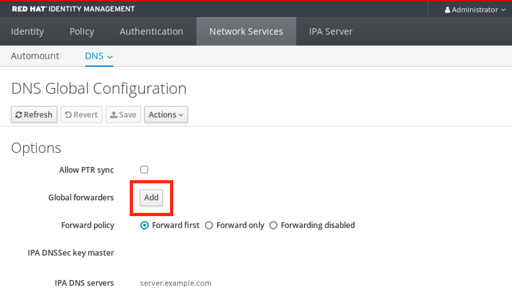 
3. Specify the IP address of the DNS server that will receive forwarded DNS queries.
   
   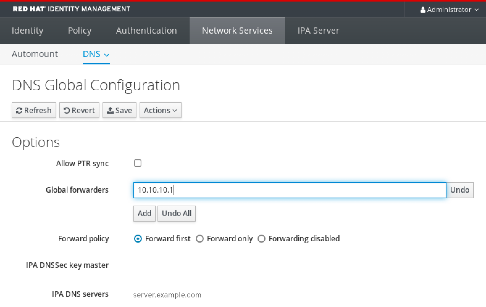 
4. Select the `Forward policy`.
   
    
5. Click `Save` at the top of the window.

**Verification**

1. Select `Network Services` → `DNS Global Configuration` → `DNS`.
   
    
2. Verify that the global forwarder, with the forward policy you specified, is present and enabled in the IdM Web UI.
   
   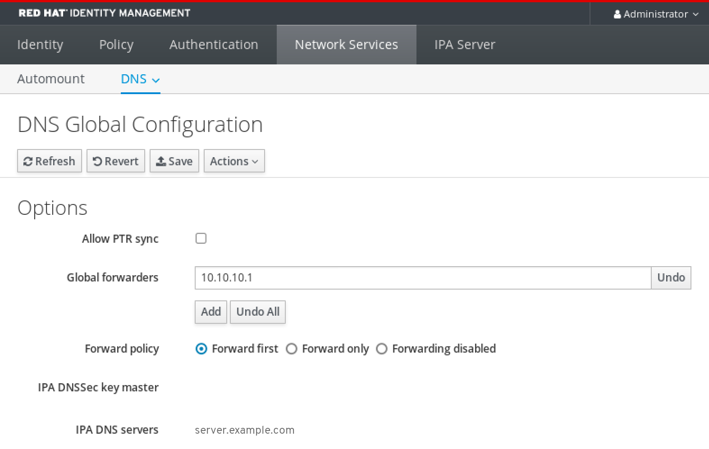 

<h3 id="adding-a-global-forwarder-in-the-cli">6.3. Adding a global forwarder in the CLI</h3>

Configure a global DNS forwarder from the command line to resolve queries for domains outside your Identity Management (IdM) DNS zones.

**Prerequisites**

- You are logged in as IdM administrator.
- You know the Internet Protocol (IP) address of the DNS server to forward queries to.

**Procedure**

- Use the `ipa dnsconfig-mod` command to add a new global forwarder. Specify the IP address of the DNS forwarder with the `--forwarder` option.
  
  ```
  ipa dnsconfig-mod --forwarder=10.10.0.1
  ```
  
  ```plaintext
  [user@server ~]$ ipa dnsconfig-mod --forwarder=10.10.0.1
  ```
  
  ```
  Server will check DNS forwarder(s).
  This may take some time, please wait ...
    Global forwarders: 10.10.0.1
    IPA DNS servers: server.example.com
  ```
  
  ```plaintext
  Server will check DNS forwarder(s).
  This may take some time, please wait ...
    Global forwarders: 10.10.0.1
    IPA DNS servers: server.example.com
  ```

**Verification**

- Use the `dnsconfig-show` command to display global forwarders.
  
  ```
  ipa dnsconfig-show
  ```
  
  ```plaintext
  [user@server ~]$ ipa dnsconfig-show
  ```
  
  ```
    Global forwarders: 10.10.0.1
    IPA DNS servers: server.example.com
  ```
  
  ```plaintext
    Global forwarders: 10.10.0.1
    IPA DNS servers: server.example.com
  ```

<h3 id="adding-a-dns-forward-zone-in-the-idm-web-ui">6.4. Adding a DNS Forward Zone in the IdM Web UI</h3>

Create a DNS forward zone through the Identity Management (IdM) web interface (Web UI) to forward queries for a specific domain to designated external DNS servers.

Important

Do not use forward zones unless absolutely required. Forward zones are not a standard solution, and using them can lead to unexpected and problematic behavior. If you must use forward zones, limit their use to overriding a global forwarding configuration.

When creating a new DNS zone, Red Hat recommends to always use standard DNS delegation using nameserver (NS) records and to avoid forward zones. In most cases, using a global forwarder is sufficient, and forward zones are not necessary.

**Prerequisites**

- You are logged in to the IdM WebUI as IdM administrator.
- You know the Internet Protocol (IP) address of the DNS server to forward queries to.

**Procedure**

1. In the IdM Web UI, select `Network Services` → `DNS Forward Zones` → `DNS`.
   
   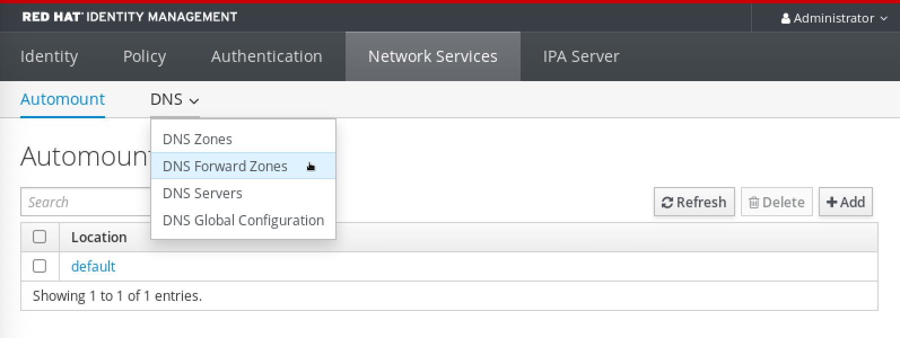 
2. In the `DNS Forward Zones` section, click `Add`.
   
    
3. In the `Add DNS forward zone` window, specify the forward zone name.
   
   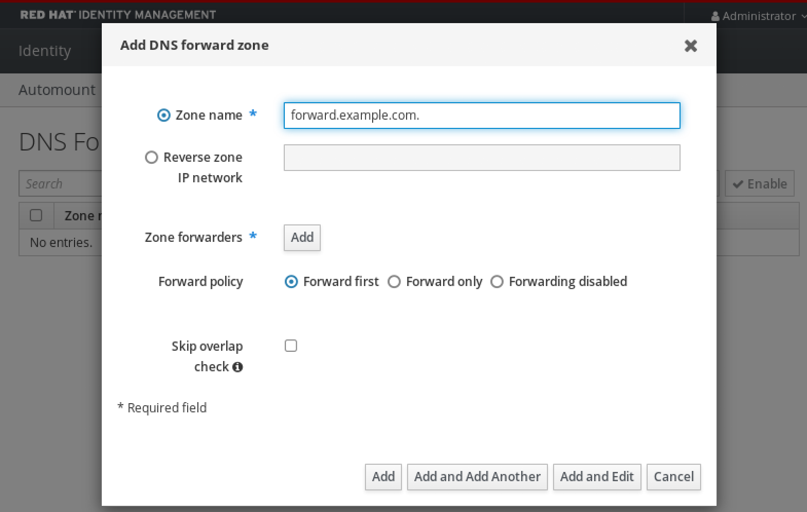 
4. Click the `Add` button and specify the IP address of a DNS server to receive the forwarding request. You can specify multiple forwarders per forward zone.
   
    
5. Select the `Forward policy`.
   
   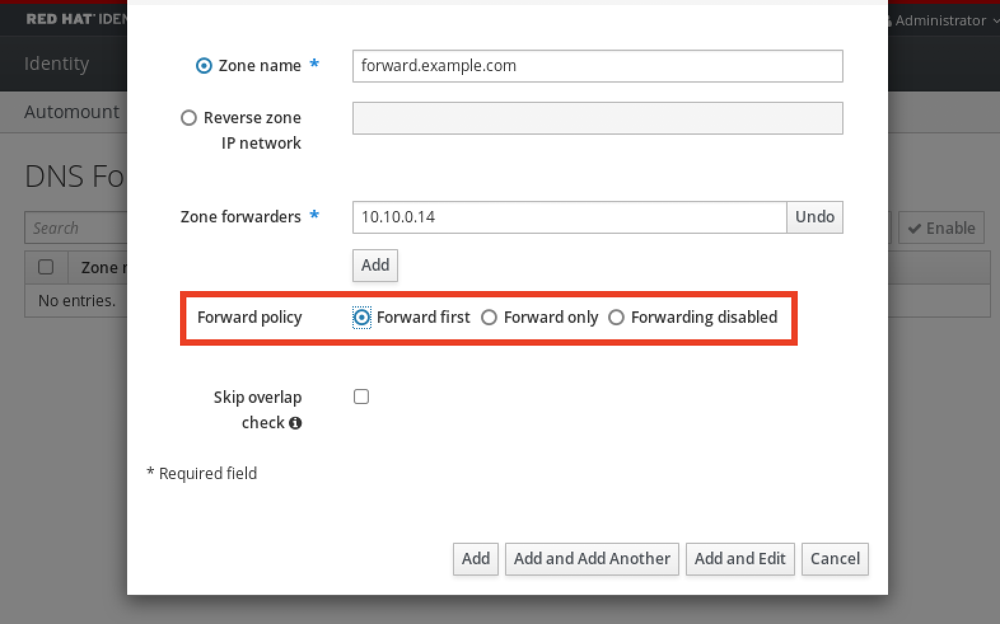 
6. Click `Add` at the bottom of the window to add the new forward zone.

**Verification**

1. In the IdM Web UI, select `Network Services` → `DNS Forward Zones` → `DNS`.
   
    
2. Verify that the forward zone you created, with the forwarders and forward policy you specified, is present and enabled in the IdM Web UI.
   
    

<h3 id="adding-a-dns-forward-zone-in-the-cli">6.5. Adding a DNS Forward Zone in the CLI</h3>

Create a DNS forward zone from the command line (CLI) to forward queries for a specific domain to designated external DNS servers.

Important

Do not use forward zones unless absolutely required. Forward zones are not a standard solution, and using them can lead to unexpected and problematic behavior. If you must use forward zones, limit their use to overriding a global forwarding configuration.

When creating a new DNS zone, Red Hat recommends to always use standard DNS delegation using nameserver (NS) records and to avoid forward zones. In most cases, using a global forwarder is sufficient, and forward zones are not necessary.

**Prerequisites**

- You are logged in as IdM administrator.
- You know the Internet Protocol (IP) address of the DNS server to forward queries to.

**Procedure**

- Use the `dnsforwardzone-add` command to add a new forward zone. Specify at least one forwarder with the `--forwarder` option if the forward policy is not `none`, and specify the forward policy with the `--forward-policy` option.
  
  ```
  ipa dnsforwardzone-add forward.example.com. --forwarder=10.10.0.14 --forwarder=10.10.1.15 --forward-policy=first
  ```
  
  ```plaintext
  [user@server ~]$ ipa dnsforwardzone-add forward.example.com. --forwarder=10.10.0.14 --forwarder=10.10.1.15 --forward-policy=first
  ```
  
  ```
  Zone name: forward.example.com.
  Zone forwarders: 10.10.0.14, 10.10.1.15
  Forward policy: first
  ```
  
  ```plaintext
  Zone name: forward.example.com.
  Zone forwarders: 10.10.0.14, 10.10.1.15
  Forward policy: first
  ```

**Verification**

- Use the `dnsforwardzone-show` command to display the DNS forward zone you just created.
  
  ```
  ipa dnsforwardzone-show forward.example.com.
  ```
  
  ```plaintext
  [user@server ~]$ ipa dnsforwardzone-show forward.example.com.
  ```
  
  ```
  Zone name: forward.example.com.
  Zone forwarders: 10.10.0.14, 10.10.1.15
  Forward policy: first
  ```
  
  ```plaintext
  Zone name: forward.example.com.
  Zone forwarders: 10.10.0.14, 10.10.1.15
  Forward policy: first
  ```

<h3 id="establishing-a-dns-global-forwarder-in-idm-using-ansible">6.6. Establishing a DNS Global Forwarder in IdM using Ansible</h3>

Configure the initial global DNS forwarder in Identity Management (IdM) using Ansible to enable resolution of external domain names.

In the example procedure below, the IdM administrator creates a DNS global forwarder to a DNS server with an Internet Protocol (IP) v4 address of `8.8.6.6` and IPv6 address of `2001:4860:4860::8800` on port `53`.

**Prerequisites**

- You have configured your Ansible control node to meet the following requirements:
  
  - You are using Ansible version 2.15 or later.
  - You have installed the [`ansible-freeipa`](https://docs.redhat.com/en/documentation/red_hat_enterprise_linux/10/html/using_ansible_to_install_and_manage_identity_management_in_rhel/installing-an-identity-management-server-using-an-ansible-playbook#installing-the-ansible-freeipa-package) package.
  - The example assumes that in the **~/*MyPlaybooks*/** directory, you have created an [Ansible inventory file](https://docs.redhat.com/en/documentation/red_hat_enterprise_linux/10/html/using_ansible_to_install_and_manage_identity_management_in_rhel/preparing-your-environment-for-managing-idm-using-ansible-playbooks) with the fully-qualified domain name (FQDN) of the IdM server.
  - The example assumes that the **secret.yml** Ansible vault stores your `ipaadmin_password` and that you have access to a file that stores the password protecting the **secret.yml** file.
- The target node, that is the node on which the `freeipa.ansible_freeipa` module is executed, is part of the IdM domain as an IdM client, server or replica.

**Procedure**

1. Navigate to the `/usr/share/ansible/collections/ansible_collections/freeipa/ansible_freeipa/playbooks/dnsconfig` directory:
   
   ```
   cd /usr/share/ansible/collections/ansible_collections/freeipa/ansible_freeipa/playbooks/dnsconfig
   ```
   
   ```plaintext
   $ cd /usr/share/ansible/collections/ansible_collections/freeipa/ansible_freeipa/playbooks/dnsconfig
   ```
2. Make a copy of the `set-configuration.yml` Ansible playbook file. For example:
   
   ```
   cp set-configuration.yml establish-global-forwarder.yml
   ```
   
   ```plaintext
   $ cp set-configuration.yml establish-global-forwarder.yml
   ```
3. Open the `establish-global-forwarder.yml` file for editing.
4. Adapt the file by setting the following variables:
   
   1. Change the `name` variable for the playbook to `Playbook to establish a global forwarder in IdM DNS`.
   2. In the `tasks` section, change the `name` of the task to `Create a DNS global forwarder to 8.8.6.6 and 2001:4860:4860::8800`.
   3. In the `forwarders` section of the `freeipa.ansible_freeipa.ipadnsconfig` portion:
      
      1. Change the first `ip_address` value to the IPv4 address of the global forwarder: `8.8.6.6`.
      2. Change the second `ip_address` value to the IPv6 address of the global forwarder: `2001:4860:4860::8800`.
      3. Verify the `port` value is set to `53`.
   4. Change the `forward_policy` to `first`.
      
      This the modified Ansible playbook file for the current example:
   
   ```
   ---
   - name: Playbook to establish a global forwarder in IdM DNS
     hosts: ipaserver
   
     vars_files:
     - /home/user_name/MyPlaybooks/secret.yml
     tasks:
     - name: Create a DNS global forwarder to 8.8.6.6 and 2001:4860:4860::8800
       freeipa.ansible_freeipa.ipadnsconfig:
         forwarders:
           - ip_address: 8.8.6.6
           - ip_address: 2001:4860:4860::8800
             port: 53
         forward_policy: first
         allow_sync_ptr: true
   ```
   
   ```plaintext
   ---
   - name: Playbook to establish a global forwarder in IdM DNS
     hosts: ipaserver
   
     vars_files:
     - /home/user_name/MyPlaybooks/secret.yml
     tasks:
     - name: Create a DNS global forwarder to 8.8.6.6 and 2001:4860:4860::8800
       freeipa.ansible_freeipa.ipadnsconfig:
         forwarders:
           - ip_address: 8.8.6.6
           - ip_address: 2001:4860:4860::8800
             port: 53
         forward_policy: first
         allow_sync_ptr: true
   ```
5. Save the file.
   
   For details about all variables used in the playbook, see the `/usr/share/ansible/collections/ansible_collections/freeipa/ansible_freeipa/README-dnsconfig.md` file on the control node.
6. Run the playbook:
   
   ```
   ansible-playbook --vault-password-file=password_file -v -i inventory.file establish-global-forwarder.yml
   ```
   
   ```plaintext
   $ ansible-playbook --vault-password-file=password_file -v -i inventory.file establish-global-forwarder.yml
   ```

<h3 id="ensuring-dns-global-forwarders-are-disabled-in-idm-using-ansible">6.7. Ensuring DNS Global Forwarders are disabled in IdM using Ansible</h3>

Disable global DNS forwarders using Ansible by setting the forward policy to `none`, forcing Identity Management (IdM) to use recursive resolution instead.

**Prerequisites**

- You have configured your Ansible control node to meet the following requirements:
  
  - You are using Ansible version 2.15 or later.
  - You have installed the [`ansible-freeipa`](https://docs.redhat.com/en/documentation/red_hat_enterprise_linux/10/html/using_ansible_to_install_and_manage_identity_management_in_rhel/installing-an-identity-management-server-using-an-ansible-playbook#installing-the-ansible-freeipa-package) package.
  - The example assumes that in the **~/*MyPlaybooks*/** directory, you have created an [Ansible inventory file](https://docs.redhat.com/en/documentation/red_hat_enterprise_linux/10/html/using_ansible_to_install_and_manage_identity_management_in_rhel/preparing-your-environment-for-managing-idm-using-ansible-playbooks) with the fully-qualified domain name (FQDN) of the IdM server.
  - The example assumes that the **secret.yml** Ansible vault stores your `ipaadmin_password` and that you have access to a file that stores the password protecting the **secret.yml** file.
- The target node, that is the node on which the `freeipa.ansible_freeipa` module is executed, is part of the IdM domain as an IdM client, server or replica.

**Procedure**

1. Navigate to the `/usr/share/ansible/collections/ansible_collections/freeipa/ansible_freeipa/playbooks/dnsconfig` directory:
   
   ```
   cd /usr/share/ansible/collections/ansible_collections/freeipa/ansible_freeipa/playbooks/dnsconfig
   ```
   
   ```plaintext
   $ cd /usr/share/ansible/collections/ansible_collections/freeipa/ansible_freeipa/playbooks/dnsconfig
   ```
2. Verify the contents of the `disable-global-forwarders.yml` Ansible playbook file which is already configured to disable all DNS global forwarders. For example:
   
   ```
   cat disable-global-forwarders.yml
   ```
   
   ```plaintext
   $ cat disable-global-forwarders.yml
   ```
   
   ```
   ---
   - name: Playbook to disable global DNS forwarders
     hosts: ipaserver
   
     vars_files:
     - /home/user_name/MyPlaybooks/secret.yml
     tasks:
     - name: Disable global forwarders.
       freeipa.ansible_freeipa.ipadnsconfig:
         forward_policy: none
   ```
   
   ```plaintext
   ---
   - name: Playbook to disable global DNS forwarders
     hosts: ipaserver
   
     vars_files:
     - /home/user_name/MyPlaybooks/secret.yml
     tasks:
     - name: Disable global forwarders.
       freeipa.ansible_freeipa.ipadnsconfig:
         forward_policy: none
   ```
   
   For details about all variables used in the playbook, see the `/usr/share/ansible/collections/ansible_collections/freeipa/ansible_freeipa/README-dnsconfig.md` file on the control node.
3. Run the playbook:
   
   ```
   ansible-playbook --vault-password-file=password_file -v -i inventory.file disable-global-forwarders.yml
   ```
   
   ```plaintext
   $ ansible-playbook --vault-password-file=password_file -v -i inventory.file disable-global-forwarders.yml
   ```

<h3 id="ensuring-the-presence-of-a-dns-forward-zone-in-idm-using-ansible">6.8. Ensuring the presence of a DNS Forward Zone in IdM using Ansible</h3>

Create a DNS forward zone in Identity Management (IdM) using Ansible to direct queries for a specific domain to designated external DNS servers.

In the example procedure below, the IdM administrator ensures that a DNS forward zone for `example.com` is configured to forward queries to `8.8.8.8`.

**Prerequisites**

- You have configured your Ansible control node to meet the following requirements:
  
  - You are using Ansible version 2.15 or later.
  - You have installed the [`ansible-freeipa`](https://docs.redhat.com/en/documentation/red_hat_enterprise_linux/10/html/using_ansible_to_install_and_manage_identity_management_in_rhel/installing-an-identity-management-server-using-an-ansible-playbook#installing-the-ansible-freeipa-package) package.
  - The example assumes that in the **~/*MyPlaybooks*/** directory, you have created an [Ansible inventory file](https://docs.redhat.com/en/documentation/red_hat_enterprise_linux/10/html/using_ansible_to_install_and_manage_identity_management_in_rhel/preparing-your-environment-for-managing-idm-using-ansible-playbooks) with the fully-qualified domain name (FQDN) of the IdM server.
  - The example assumes that the **secret.yml** Ansible vault stores your `ipaadmin_password` and that you have access to a file that stores the password protecting the **secret.yml** file.
- The target node, that is the node on which the `freeipa.ansible_freeipa` module is executed, is part of the IdM domain as an IdM client, server or replica.

**Procedure**

1. Navigate to the `/usr/share/ansible/collections/ansible_collections/freeipa/ansible_freeipa/playbooks/dnsconfig` directory:
   
   ```
   cd /usr/share/ansible/collections/ansible_collections/freeipa/ansible_freeipa/playbooks/dnsconfig
   ```
   
   ```plaintext
   $ cd /usr/share/ansible/collections/ansible_collections/freeipa/ansible_freeipa/playbooks/dnsconfig
   ```
2. Make a copy of the `forwarders-absent.yml` Ansible playbook file. For example:
   
   ```
   cp forwarders-absent.yml ensure-presence-forwardzone.yml
   ```
   
   ```plaintext
   $ cp forwarders-absent.yml ensure-presence-forwardzone.yml
   ```
3. Open the `ensure-presence-forwardzone.yml` file for editing.
4. Adapt the file by setting the following variables:
   
   1. Change the `name` variable for the playbook to `Playbook to ensure the presence of a dnsforwardzone in IdM DNS`.
   2. In the `tasks` section, change the `name` of the task to `Ensure presence of a dnsforwardzone for example.com to 8.8.8.8`.
   3. In the `tasks` section, change the `freeipa.ansible_freeipa.ipadnsconfig` heading to `freeipa.ansible_freeipa.ipadnsforwardzone`.
   4. In the `freeipa.ansible_freeipa.ipadnsforwardzone` section:
      
      1. Indicate that the value of the `ipaadmin_password` variable is defined in the **secret.yml** Ansible vault file.
      2. Add the `name` variable and set it to `example.com`.
      3. In the `forwarders` section:
         
         1. Remove the `ip_address` and `port` lines.
         2. Add the IP address of the DNS server to receive forwarded requests by specifying it after a dash:
            
            ```
            - 8.8.8.8
            ```
            
            ```plaintext
            - 8.8.8.8
            ```
      4. Add the `forwardpolicy` variable and set it to `first`.
      5. Add the `skip_overlap_check` variable and set it to `true`.
      6. Change the `state` variable to `present`.
      
      This the modified Ansible playbook file for the current example:
   
   ```
   ---
   - name: Playbook to ensure the presence of a dnsforwardzone in IdM DNS
     hosts: ipaserver
   
     vars_files:
     - /home/user_name/MyPlaybooks/secret.yml
     tasks:
     - name: Ensure the presence of a dnsforwardzone for example.com to 8.8.8.8
     freeipa.ansible_freeipa.ipadnsforwardzone:
         ipaadmin_password: "{{ ipaadmin_password }}"
         name: example.com
         forwarders:
             - 8.8.8.8
         forwardpolicy: first
         skip_overlap_check: true
         state: present
   ```
   
   ```plaintext
   ---
   - name: Playbook to ensure the presence of a dnsforwardzone in IdM DNS
     hosts: ipaserver
   
     vars_files:
     - /home/user_name/MyPlaybooks/secret.yml
     tasks:
     - name: Ensure the presence of a dnsforwardzone for example.com to 8.8.8.8
     freeipa.ansible_freeipa.ipadnsforwardzone:
         ipaadmin_password: "{{ ipaadmin_password }}"
         name: example.com
         forwarders:
             - 8.8.8.8
         forwardpolicy: first
         skip_overlap_check: true
         state: present
   ```
5. Save the file.
   
   For details about all variables used in the playbook, see the `/usr/share/ansible/collections/ansible_collections/freeipa/ansible_freeipa/README-dnsforwardzone.md` file on the control node.
6. Run the playbook:
   
   ```
   ansible-playbook --vault-password-file=password_file -v -i inventory ensure-presence-forwardzone.yml
   ```
   
   ```plaintext
   $ ansible-playbook --vault-password-file=password_file -v -i inventory ensure-presence-forwardzone.yml
   ```

<h3 id="ensuring-a-dns-forward-zone-has-multiple-forwarders-in-idm-using-ansible">6.9. Ensuring a DNS Forward Zone has multiple forwarders in IdM using Ansible</h3>

Configure multiple forwarders for a DNS forward zone using Ansible to provide redundancy when resolving queries for external domains.

In the example below, you ensure the DNS forward zone for `example.com` is forwarding to `8.8.8.8` and `4.4.4.4`.

**Prerequisites**

- You have configured your Ansible control node to meet the following requirements:
  
  - You are using Ansible version 2.15 or later.
  - You have installed the [`ansible-freeipa`](https://docs.redhat.com/en/documentation/red_hat_enterprise_linux/10/html/using_ansible_to_install_and_manage_identity_management_in_rhel/installing-an-identity-management-server-using-an-ansible-playbook#installing-the-ansible-freeipa-package) package.
  - The example assumes that in the **~/*MyPlaybooks*/** directory, you have created an [Ansible inventory file](https://docs.redhat.com/en/documentation/red_hat_enterprise_linux/10/html/using_ansible_to_install_and_manage_identity_management_in_rhel/preparing-your-environment-for-managing-idm-using-ansible-playbooks) with the fully-qualified domain name (FQDN) of the IdM server.
  - The example assumes that the **secret.yml** Ansible vault stores your `ipaadmin_password` and that you have access to a file that stores the password protecting the **secret.yml** file.
- The target node, that is the node on which the `freeipa.ansible_freeipa` module is executed, is part of the IdM domain as an IdM client, server or replica.

**Procedure**

1. Navigate to the `/usr/share/ansible/collections/ansible_collections/freeipa/ansible_freeipa/playbooks/dnsconfig` directory:
   
   ```
   cd /usr/share/ansible/collections/ansible_collections/freeipa/ansible_freeipa/playbooks/dnsconfig
   ```
   
   ```plaintext
   $ cd /usr/share/ansible/collections/ansible_collections/freeipa/ansible_freeipa/playbooks/dnsconfig
   ```
2. Make a copy of the `forwarders-absent.yml` Ansible playbook file. For example:
   
   ```
   cp forwarders-absent.yml ensure-presence-multiple-forwarders.yml
   ```
   
   ```plaintext
   $ cp forwarders-absent.yml ensure-presence-multiple-forwarders.yml
   ```
3. Open the `ensure-presence-multiple-forwarders.yml` file for editing.
4. Adapt the file by setting the following variables:
   
   1. Change the `name` variable for the playbook to `Playbook to ensure the presence of multiple forwarders in a dnsforwardzone in IdM DNS`.
   2. In the `tasks` section, change the `name` of the task to `Ensure presence of 8.8.8.8 and 4.4.4.4 forwarders in dnsforwardzone for example.com`.
   3. In the `tasks` section, change the `freeipa.ansible_freeipa.ipadnsconfig` heading to `freeipa.ansible_freeipa.ipadnsforwardzone`.
   4. In the `freeipa.ansible_freeipa.ipadnsforwardzone` section:
      
      1. Indicate that the value of the `ipaadmin_password` variable is defined in the **secret.yml** Ansible vault file.
      2. Add the `name` variable and set it to `example.com`.
      3. In the `forwarders` section:
         
         1. Remove the `ip_address` and `port` lines.
         2. Add the IP address of the DNS servers you want to ensure are present, preceded by a dash:
            
            ```
            - 8.8.8.8
            - 4.4.4.4
            ```
            
            ```plaintext
            - 8.8.8.8
            - 4.4.4.4
            ```
      4. Change the state variable to present.
      
      This the modified Ansible playbook file for the current example:
   
   ```
   ---
   - name: name: Playbook to ensure the presence of multiple forwarders in a dnsforwardzone in IdM DNS
     hosts: ipaserver
   
     vars_files:
     - /home/user_name/MyPlaybooks/secret.yml
     tasks:
     - name: Ensure presence of 8.8.8.8 and 4.4.4.4 forwarders in dnsforwardzone for example.com
     freeipa.ansible_freeipa.ipadnsforwardzone:
         ipaadmin_password: "{{ ipaadmin_password }}"
        name: example.com
         forwarders:
             - 8.8.8.8
             - 4.4.4.4
         state: present
   ```
   
   ```plaintext
   ---
   - name: name: Playbook to ensure the presence of multiple forwarders in a dnsforwardzone in IdM DNS
     hosts: ipaserver
   
     vars_files:
     - /home/user_name/MyPlaybooks/secret.yml
     tasks:
     - name: Ensure presence of 8.8.8.8 and 4.4.4.4 forwarders in dnsforwardzone for example.com
     freeipa.ansible_freeipa.ipadnsforwardzone:
         ipaadmin_password: "{{ ipaadmin_password }}"
        name: example.com
         forwarders:
             - 8.8.8.8
             - 4.4.4.4
         state: present
   ```
5. Save the file.
   
   For details about all variables used in the playbook, see the `/usr/share/ansible/collections/ansible_collections/freeipa/ansible_freeipa/README-dnsforwardzone.md` file on the control node.
6. Run the playbook:
   
   ```
   ansible-playbook --vault-password-file=password_file -v -i inventory.file ensure-presence-multiple-forwarders.yml
   ```
   
   ```plaintext
   $ ansible-playbook --vault-password-file=password_file -v -i inventory.file ensure-presence-multiple-forwarders.yml
   ```

<h3 id="ensuring-a-dns-forward-zone-is-disabled-in-idm-using-ansible">6.10. Ensuring a DNS Forward Zone is disabled in IdM using Ansible</h3>

Disable a DNS forward zone using Ansible to stop forwarding queries for a specific domain without deleting the zone configuration.

In the example below, you ensure the DNS forward zone for `example.com` is disabled.

**Prerequisites**

- You have configured your Ansible control node to meet the following requirements:
  
  - You are using Ansible version 2.15 or later.
  - You have installed the [`ansible-freeipa`](https://docs.redhat.com/en/documentation/red_hat_enterprise_linux/10/html/using_ansible_to_install_and_manage_identity_management_in_rhel/installing-an-identity-management-server-using-an-ansible-playbook#installing-the-ansible-freeipa-package) package.
  - The example assumes that in the **~/*MyPlaybooks*/** directory, you have created an [Ansible inventory file](https://docs.redhat.com/en/documentation/red_hat_enterprise_linux/10/html/using_ansible_to_install_and_manage_identity_management_in_rhel/preparing-your-environment-for-managing-idm-using-ansible-playbooks) with the fully-qualified domain name (FQDN) of the IdM server.
  - The example assumes that the **secret.yml** Ansible vault stores your `ipaadmin_password` and that you have access to a file that stores the password protecting the **secret.yml** file.
- The target node, that is the node on which the `freeipa.ansible_freeipa` module is executed, is part of the IdM domain as an IdM client, server or replica.

**Procedure**

1. Navigate to the `/usr/share/ansible/collections/ansible_collections/freeipa/ansible_freeipa/playbooks/dnsconfig` directory:
   
   ```
   cd /usr/share/ansible/collections/ansible_collections/freeipa/ansible_freeipa/playbooks/dnsconfig
   ```
   
   ```plaintext
   $ cd /usr/share/ansible/collections/ansible_collections/freeipa/ansible_freeipa/playbooks/dnsconfig
   ```
2. Make a copy of the `forwarders-absent.yml` Ansible playbook file. For example:
   
   ```
   cp forwarders-absent.yml ensure-disabled-forwardzone.yml
   ```
   
   ```plaintext
   $ cp forwarders-absent.yml ensure-disabled-forwardzone.yml
   ```
3. Open the `ensure-disabled-forwardzone.yml` file for editing.
4. Adapt the file by setting the following variables:
   
   1. Change the `name` variable for the playbook to `Playbook to ensure a dnsforwardzone is disabled in IdM DNS`.
   2. In the `tasks` section, change the `name` of the task to `Ensure a dnsforwardzone for example.com is disabled`.
   3. In the `tasks` section, change the `freeipa.ansible_freeipa.ipadnsconfig` heading to `freeipa.ansible_freeipa.ipadnsforwardzone`.
   4. In the `freeipa.ansible_freeipa.ipadnsforwardzone` section:
      
      1. Indicate that the value of the `ipaadmin_password` variable is defined in the **secret.yml** Ansible vault file.
      2. Add the `name` variable and set it to `example.com`.
      3. Remove the entire `forwarders` section.
      4. Change the `state` variable to `disabled`.
      
      This the modified Ansible playbook file for the current example:
   
   ```
   ---
   - name: Playbook to ensure a dnsforwardzone is disabled in IdM DNS
     hosts: ipaserver
   
     vars_files:
     - /home/user_name/MyPlaybooks/secret.yml
     tasks:
     - name: Ensure a dnsforwardzone for example.com is disabled
     freeipa.ansible_freeipa.ipadnsforwardzone:
         ipaadmin_password: "{{ ipaadmin_password }}"
         name: example.com
         state: disabled
   ```
   
   ```plaintext
   ---
   - name: Playbook to ensure a dnsforwardzone is disabled in IdM DNS
     hosts: ipaserver
   
     vars_files:
     - /home/user_name/MyPlaybooks/secret.yml
     tasks:
     - name: Ensure a dnsforwardzone for example.com is disabled
     freeipa.ansible_freeipa.ipadnsforwardzone:
         ipaadmin_password: "{{ ipaadmin_password }}"
         name: example.com
         state: disabled
   ```
5. Save the file.
   
   For details about all variables used in the playbook, see the `/usr/share/ansible/collections/ansible_collections/freeipa/ansible_freeipa/README-dnsforwardzone.md` file on the control node.
6. Run the playbook:
   
   ```
   ansible-playbook --vault-password-file=password_file -v -i inventory.file ensure-disabled-forwardzone.yml
   ```
   
   ```plaintext
   $ ansible-playbook --vault-password-file=password_file -v -i inventory.file ensure-disabled-forwardzone.yml
   ```

<h3 id="ensuring-the-absence-of-a-dns-forward-zone-in-idm-using-ansible">6.11. Ensuring the absence of a DNS Forward Zone in IdM using Ansible</h3>

Remove a DNS forward zone from Identity Management (IdM) using Ansible when you no longer need to forward queries for a specific domain.

In the example procedure below, the IdM administrator ensures the absence of a DNS forward zone for `example.com`.

**Prerequisites**

- You have configured your Ansible control node to meet the following requirements:
  
  - You are using Ansible version 2.15 or later.
  - You have installed the [`ansible-freeipa`](https://docs.redhat.com/en/documentation/red_hat_enterprise_linux/10/html/using_ansible_to_install_and_manage_identity_management_in_rhel/installing-an-identity-management-server-using-an-ansible-playbook#installing-the-ansible-freeipa-package) package.
  - The example assumes that in the **~/*MyPlaybooks*/** directory, you have created an [Ansible inventory file](https://docs.redhat.com/en/documentation/red_hat_enterprise_linux/10/html/using_ansible_to_install_and_manage_identity_management_in_rhel/preparing-your-environment-for-managing-idm-using-ansible-playbooks) with the fully-qualified domain name (FQDN) of the IdM server.
  - The example assumes that the **secret.yml** Ansible vault stores your `ipaadmin_password` and that you have access to a file that stores the password protecting the **secret.yml** file.
- The target node, that is the node on which the `freeipa.ansible_freeipa` module is executed, is part of the IdM domain as an IdM client, server or replica.

**Procedure**

1. Navigate to the `/usr/share/ansible/collections/ansible_collections/freeipa/ansible_freeipa/playbooks/dnsconfig` directory:
   
   ```
   cd /usr/share/ansible/collections/ansible_collections/freeipa/ansible_freeipa/playbooks/dnsconfig
   ```
   
   ```plaintext
   $ cd /usr/share/ansible/collections/ansible_collections/freeipa/ansible_freeipa/playbooks/dnsconfig
   ```
2. Make a copy of the `forwarders-absent.yml` Ansible playbook file. For example:
   
   ```
   cp forwarders-absent.yml ensure-absence-forwardzone.yml
   ```
   
   ```plaintext
   $ cp forwarders-absent.yml ensure-absence-forwardzone.yml
   ```
3. Open the `ensure-absence-forwardzone.yml` file for editing.
4. Adapt the file by setting the following variables:
   
   1. Change the `name` variable for the playbook to `Playbook to ensure the absence of a dnsforwardzone in IdM DNS`.
   2. In the `tasks` section, change the `name` of the task to `Ensure the absence of a dnsforwardzone for example.com`.
   3. In the `tasks` section, change the `freeipa.ansible_freeipa.ipadnsconfig` heading to `freeipa.ansible_freeipa.ipadnsforwardzone`.
   4. In the `freeipa.ansible_freeipa.ipadnsforwardzone` section:
      
      1. Indicate that the value of the `ipaadmin_password` variable is defined in the **secret.yml** Ansible vault file.
      2. Add the `name` variable and set it to `example.com`.
      3. Remove the entire `forwarders` section.
      4. Leave the `state` variable as `absent`.
      
      This the modified Ansible playbook file for the current example:
   
   ```
   ---
   - name: Playbook to ensure the absence of a dnsforwardzone in IdM DNS
     hosts: ipaserver
   
     vars_files:
     - /home/user_name/MyPlaybooks/secret.yml
     tasks:
     - name: Ensure the absence of a dnsforwardzone for example.com
       freeipa.ansible_freeipa.ipadnsforwardzone:
          ipaadmin_password: "{{ ipaadmin_password }}"
          name: example.com
          state: absent
   ```
   
   ```plaintext
   ---
   - name: Playbook to ensure the absence of a dnsforwardzone in IdM DNS
     hosts: ipaserver
   
     vars_files:
     - /home/user_name/MyPlaybooks/secret.yml
     tasks:
     - name: Ensure the absence of a dnsforwardzone for example.com
       freeipa.ansible_freeipa.ipadnsforwardzone:
          ipaadmin_password: "{{ ipaadmin_password }}"
          name: example.com
          state: absent
   ```
5. Save the file.
   
   For details about all variables used in the playbook, see the `/usr/share/ansible/collections/ansible_collections/freeipa/ansible_freeipa/README-dnsforwardzone.md` file on the control node.
6. Run the playbook:
   
   ```
   ansible-playbook --vault-password-file=password_file -v -i inventory.file ensure-absence-forwardzone.yml
   ```
   
   ```plaintext
   $ ansible-playbook --vault-password-file=password_file -v -i inventory.file ensure-absence-forwardzone.yml
   ```

<h2 id="managing-dns-records-in-idm">Chapter 7. Managing DNS records in IdM</h2>

Maintain the accuracy of your network’s name resolution by managing DNS records within Identity Management (IdM). You can add, update, and remove various record types to reflect changes in the infrastructure and ensure seamless service discovery.

<h3 id="prerequisites\_5">7.1. Prerequisites</h3>

- Your IdM deployment contains an integrated DNS server. For information how to install IdM with integrated DNS, see one of the following links:
  
  - [Installing an IdM server: With integrated DNS, with an integrated CA as the root CA](https://docs.redhat.com/en/documentation/red_hat_enterprise_linux/10/html-single/installing_identity_management/index#installing-an-idm-server-with-integrated-dns-with-an-integrated-ca-as-the-root-ca_installing-identity-management).
  - [Installing an IdM server: With integrated DNS, with an external CA as the root CA](https://docs.redhat.com/en/documentation/red_hat_enterprise_linux/10/html-single/installing_identity_management/index#installing-an-ipa-server-with-external-ca_installing-identity-management).
- You understand what [types of DNS records exist in IdM](#dns-records-in-idm "8.1. DNS records in IdM").
- You understand what [options are available when adding, modifying and deleting the most common DNS resource record types in IdM](#common-ipa-dnsrecord-options "8.2. Common ipa dnsrecord-* options").

<h3 id="adding-dns-resource-records-in-the-idm-web-ui">7.2. Adding DNS resource records in the IdM Web UI</h3>

Expand your DNS zone by adding new resource records through the IdM Web UI. This graphical interface simplifies the process of defining host addresses, service locations, and other critical network data.

**Prerequisites**

- The DNS zone to which you want to add a DNS record exists and is managed by IdM. For more information about creating a DNS zone in IdM DNS, see [Managing DNS zones in IdM](#managing-dns-zones-in-idm "Chapter 2. Managing DNS zones in IdM").
- You are logged in as IdM administrator.

**Procedure**

1. In the IdM Web UI, click `Network Services` → `DNS` → `DNS Zones`.
2. Click the DNS zone to which you want to add a DNS record.
3. In the `DNS Resource Records` section, click Add to add a new record.
   
   **Adding a New DNS Resource Record**
   
   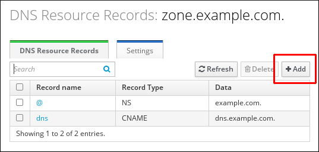 
4. Select the type of record to create and fill out the other fields as required.
   
   **Defining a New DNS Resource Record**
   
   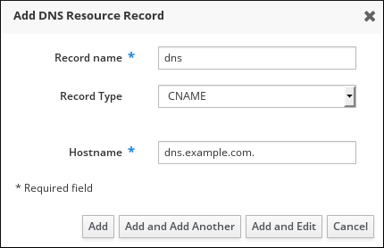 
5. Click Add to confirm the new record.

<h3 id="adding-dns-resource-records-from-the-idm-cli">7.3. Adding DNS resource records from the IdM CLI</h3>

Use the `ipa dnsrecord-add` command to insert new entries into a specific DNS zone via the command line. This method provides you with the precise control over record parameters and supports automation for bulk updates.

**Prerequisites**

- The DNS zone to which you want to add a DNS records exists. For more information about creating a DNS zone in IdM DNS, see [Managing DNS zones in IdM](#managing-dns-zones-in-idm "Chapter 2. Managing DNS zones in IdM").
- You are logged in as IdM administrator.

**Procedure**

1. To add a DNS resource record, use the `ipa dnsrecord-add` command. The command follows this syntax:
   
   ```
   ipa dnsrecord-add zone_name record_name --record_type_option=data
   ```
   
   ```plaintext
   $ ipa dnsrecord-add zone_name record_name --record_type_option=data
   ```
   
   In the command above:
   
   - The *zone\_name* is the name of the DNS zone to which the record is being added.
   - The *record\_name* is an identifier for the new DNS resource record.
   
   For example, to add an A type DNS record of **host1** to the **idm.example.com** zone, enter:
   
   ```
   ipa dnsrecord-add idm.example.com host1 --a-rec=192.168.122.123
   ```
   
   ```plaintext
   $ ipa dnsrecord-add idm.example.com host1 --a-rec=192.168.122.123
   ```

<h3 id="deleting-dns-records-in-the-idm-web-ui">7.4. Deleting DNS records in the IdM Web UI</h3>

Remove specific record types from an existing resource entry by using the IdM Web UI. This focused deletion maintains the overall resource identifier while stripping away individual data points that are no longer valid.

**Prerequisites**

- You are logged in as IdM administrator.

**Procedure**

1. In the IdM Web UI, click `Network Services` → `DNS` → `DNS Zones`.
2. Click the zone from which you want to delete a DNS record, for example **example.com.**.
3. In the `DNS Resource Records` section, click the name of the resource record.
   
   **Selecting a DNS Resource Record**
   
   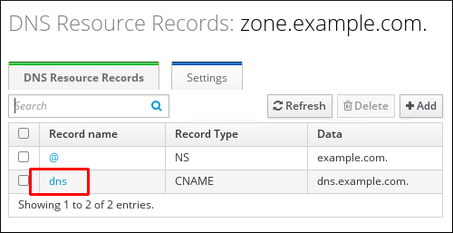 
4. Select the check box by the name of the record type to delete.
5. Click `Delete`.
   
   **Deleting a DNS Resource Record**
   
   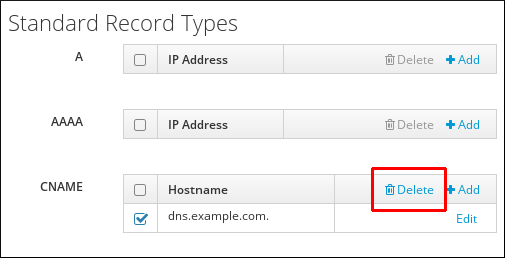 
   
   The selected record type is now deleted. The other configuration of the resource record is left intact.

**Additional resources**

- [Deleting an entire DNS record in the IdM Web UI](#deleting-an-entire-dns-record-in-the-idm-web-ui "7.5. Deleting an entire DNS record in the IdM Web UI")

<h3 id="deleting-an-entire-dns-record-in-the-idm-web-ui">7.5. Deleting an entire DNS record in the IdM Web UI</h3>

Purge all data associated with a specific resource by deleting the entire record entry in the IdM Web UI. This action removes the host or service identifier and all its related record types from the DNS zone in one step.

**Prerequisites**

- You are logged in as IdM administrator.

**Procedure**

1. In the IdM Web UI, click `Network Services` → `DNS` → `DNS Zones`.
2. Click the zone from which you want to delete a DNS record, for example **zone.example.com.**.
3. In the `DNS Resource Records` section, select the check box of the resource record to delete.
4. Click Delete.
   
   **Deleting an Entire Resource Record**
   
   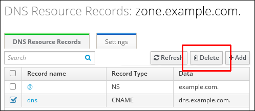 
   
   The entire resource record is now deleted.

<h3 id="deleting-dns-records-in-the-idm-cli">7.6. Deleting DNS records in the IdM CLI</h3>

Execute the `ipa dnsrecord-del` command to remove specific records or use the `--del-all` option to wipe all entries associated with a name. This command provides an efficient way to clean up stale DNS data directly from the IdM CLI.

**Prerequisites**

- You are logged in as IdM administrator.

**Procedure**

- To remove records from a zone, use the `ipa dnsrecord-del` command and add the `--recordType-rec` option together with the record value. For example, to remove an A type record:
  
  ```
  ipa dnsrecord-del example.com www --a-rec 192.0.2.1
  ```
  
  ```plaintext
  $ ipa dnsrecord-del example.com www --a-rec 192.0.2.1
  ```
  
  If you run `ipa dnsrecord-del` without any options, the command prompts for information about the record to delete. Note that passing the `--del-all` option with the command removes all associated records for the zone.

<h3 id="managing-dns-records-in-idm">7.7. Additional resources</h3>

- [Using Ansible to manage DNS records in IdM](#using-ansible-to-manage-dns-records-in-idm "Chapter 8. Using Ansible to manage DNS records in IdM")

<h2 id="using-ansible-to-manage-dns-records-in-idm">Chapter 8. Using Ansible to manage DNS records in IdM</h2>

Add, modify, and delete DNS records in Identity Management (IdM) zones using Ansible to automate DNS management across your infrastructure.

<h3 id="dns-records-in-idm">8.1. DNS records in IdM</h3>

Understand the DNS record types supported by IdM, including A, AAAA, SRV, and PTR records commonly used for host resolution and service discovery.

Identity Management (IdM) supports many different DNS record types. The following four are used most frequently:

A

This is a basic map for a host name and an IPv4 address. The record name of an A record is a host name, such as `www`. The `IP Address` value of an A record is an IPv4 address, such as `192.0.2.1`.

For more information about A records, see [RFC 1035](http://tools.ietf.org/html/rfc1035).

AAAA

This is a basic map for a host name and an IPv6 address. The record name of an AAAA record is a host name, such as `www`. The `IP Address` value is an IPv6 address, such as `2001:DB8::1111`.

For more information about AAAA records, see [RFC 3596](http://tools.ietf.org/html/rfc3596).

SRV

*Service (SRV) resource records* map service names to the DNS name of the server that is providing that particular service. For example, this record type can map a service like an LDAP directory to the server which manages it.

The record name of an SRV record has the format `_service._protocol`, such as `_ldap._tcp`. The configuration options for SRV records include priority, weight, port number, and host name for the target service.

For more information about SRV records, see [RFC 2782](http://tools.ietf.org/html/rfc2782).

PTR

A pointer record (PTR) adds a reverse DNS record, which maps an IP address to a domain name.

Note

All reverse DNS lookups for IPv4 addresses use reverse entries that are defined in the `in-addr.arpa.` domain. The reverse address, in human-readable form, is the exact reverse of the regular IP address, with the `in-addr.arpa.` domain appended to it. For example, for the network address `192.0.2.0/24`, the reverse zone is `2.0.192.in-addr.arpa`.

The record name of a PTR must be in the standard format specified in [RFC 1035](http://tools.ietf.org/html/rfc1035#section-3.5), extended in [RFC 2317](http://tools.ietf.org/html/rfc2317), and [RFC 3596](https://tools.ietf.org/html/rfc3596#section-2.5). The host name value must be a canonical host name of the host for which you want to create the record.

Note

Reverse zones can also be configured for IPv6 addresses, with zones in the `.ip6.arpa.` domain. For more information about IPv6 reverse zones, see [RFC 3596](http://www.ietf.org/rfc/rfc3596.txt).

When adding DNS resource records, note that many of the records require different data. For example, a CNAME record requires a host name, while an A record requires an IP address. In the IdM Web UI, the fields in the form for adding a new record are updated automatically to reflect what data is required for the currently selected type of record.

<h3 id="common-ipa-dnsrecord-options">8.2. Common ipa dnsrecord-* options</h3>

Review the command-line options available for managing A, AAAA, SRV, and PTR records in IdM DNS zones.

In `Bash`, you can define multiple entries by listing the values in a comma-separated list inside curly braces, such as `--⁠option={val1,val2,val3}`.

| *Option*         | *Description*                                                       |
|:-----------------|:--------------------------------------------------------------------|
| `--ttl`=*number* | Sets the time to live for the record.                               |
| `--structured`   | Parses the raw DNS records and returns them in a structured format. |

Table 8.1. General Record Options

| *Option*                                                                                                   | *Description*                                                                                                                                                                                                                                                                                     | *Examples*                                                                                       |
|:-----------------------------------------------------------------------------------------------------------|:--------------------------------------------------------------------------------------------------------------------------------------------------------------------------------------------------------------------------------------------------------------------------------------------------|:-------------------------------------------------------------------------------------------------|
| `--a-rec`=*ARECORD*                                                                                        | Passes a single A record or a list of A records.                                                                                                                                                                                                                                                  | `ipa dnsrecord-add idm.example.com host1 --a-rec=192.168.122.123`                                |
|                                                                                                            | Can create a wildcard A record with a given IP address.                                                                                                                                                                                                                                           | `ipa dnsrecord-add idm.example.com "*" --a-rec=192.168.122.123` [\[a\]](#ftn.idm140652046968912) |
| `--a-ip-address`=*string*                                                                                  | Gives the IP address for the record. When creating a record, the option to specify the `A` record value is `--a-rec`. However, when modifying an `A` record, the `--a-rec` option is used to specify the current value for the `A` record. The new value is set with the `--a-ip-address` option. | `ipa dnsrecord-mod idm.example.com --a-rec 192.168.122.123 --a-ip-address 192.168.122.124`       |
| [\[a\]](#idm140652046968912) The example creates a wildcard `A` record with the IP address of 192.0.2.123. |                                                                                                                                                                                                                                                                                                   |                                                                                                  |

Table 8.2. "A" record options

| *Option*                     | *Description*                                                                                                                                                                                                                                                                                             | *Example*                                                                                                |
|:-----------------------------|:----------------------------------------------------------------------------------------------------------------------------------------------------------------------------------------------------------------------------------------------------------------------------------------------------------|:---------------------------------------------------------------------------------------------------------|
| `--aaaa-rec`=*AAAARECORD*    | Passes a single AAAA (IPv6) record or a list of AAAA records.                                                                                                                                                                                                                                             | `ipa dnsrecord-add idm.example.com www --aaaa-rec 2001:db8::1231:5675`                                   |
| `--aaaa-ip-address`=*string* | Gives the IPv6 address for the record. When creating a record, the option to specify the `A` record value is `--aaaa-rec`. However, when modifying an `A` record, the `--aaaa-rec` option is used to specify the current value for the `A` record. The new value is set with the `--a-ip-address` option. | `ipa dnsrecord-mod idm.example.com --aaaa-rec 2001:db8::1231:5675 --aaaa-ip-address 2001:db8::1231:5676` |

Table 8.3. "AAAA" record options

| *Option*                  | *Description*                                                                                                                                                                                                                                                                                                                                                                                                                                                                                                                                                                                                                  | *Example*                                                                                                                        |
|:--------------------------|:-------------------------------------------------------------------------------------------------------------------------------------------------------------------------------------------------------------------------------------------------------------------------------------------------------------------------------------------------------------------------------------------------------------------------------------------------------------------------------------------------------------------------------------------------------------------------------------------------------------------------------|:---------------------------------------------------------------------------------------------------------------------------------|
| `--ptr-rec`=*PTRRECORD*   | Passes a single PTR record or a list of PTR records. When adding the reverse DNS record, the zone name used with the `ipa dnsrecord-add` command is reversed, compared to the usage for adding other DNS records. Typically, the host IP address is the last octet of the IP address in a given network. The first example on the right adds a PTR record for **server4.idm.example.com** with IPv4 address **192.168.122.4.** The second example adds a reverse DNS entry to the **0.0.0.0.0.0.0.0.8.b.d.0.1.0.0.2.ip6.arpa.** IPv6 reverse zone for the host **server2.example.com** with the IP address **2001:DB8::1111**. | `ipa dnsrecord-add 122.168.192.in-addr.arpa 4 --ptr-rec server4.idm.example.com.`                                                |
|                           |                                                                                                                                                                                                                                                                                                                                                                                                                                                                                                                                                                                                                                | `$ ipa dnsrecord-add 0.0.0.0.0.0.0.0.8.b.d.0.1.0.0.2.ip6.arpa. 1.1.1.0.0.0.0.0.0.0.0.0.0.0.0 --ptr-rec server2.idm.example.com.` |
| `--ptr-hostname`=*string* | Gives the host name for the record.                                                                                                                                                                                                                                                                                                                                                                                                                                                                                                                                                                                            |                                                                                                                                  |

Table 8.4. "PTR" record options

| *Option*                  | *Description*                                                                                                                                                                                                                                                                                                                                                                                            | *Example*                                                                                                              |
|:--------------------------|:---------------------------------------------------------------------------------------------------------------------------------------------------------------------------------------------------------------------------------------------------------------------------------------------------------------------------------------------------------------------------------------------------------|:-----------------------------------------------------------------------------------------------------------------------|
| `--srv-rec`=*SRVRECORD*   | Passes a single SRV record or a list of SRV records. In the examples on the right, **\_ldap.\_tcp** defines the service type and the connection protocol for the SRV record. The `--srv-rec` option defines the priority, weight, port, and target values. The weight values of 51 and 49 in the examples add up to 100 and represent the probability, in percentages, that a particular record is used. | `# ipa dnsrecord-add idm.example.com _ldap._tcp --srv-rec="0 51 389 server1.idm.example.com."`                         |
|                           |                                                                                                                                                                                                                                                                                                                                                                                                          | `# ipa dnsrecord-add server.idm.example.com _ldap._tcp --srv-rec="1 49 389 server2.idm.example.com."`                  |
| `--srv-priority`=*number* | Sets the priority of the record. There can be multiple SRV records for a service type. The priority (0 - 65535) sets the rank of the record; the lower the number, the higher the priority. A service has to use the record with the highest priority first.                                                                                                                                             | `# ipa dnsrecord-mod server.idm.example.com _ldap._tcp --srv-rec="1 49 389 server2.idm.example.com." --srv-priority=0` |
| `--srv-weight`=*number*   | Sets the weight of the record. This helps determine the order of SRV records with the same priority. The set weights should add up to 100, representing the probability (in percentages) that a particular record is used.                                                                                                                                                                               | `# ipa dnsrecord-mod server.idm.example.com _ldap._tcp --srv-rec="0 49 389 server2.idm.example.com." --srv-weight=60`  |
| `--srv-port`=*number*     | Gives the port for the service on the target host.                                                                                                                                                                                                                                                                                                                                                       | `# ipa dnsrecord-mod server.idm.example.com _ldap._tcp --srv-rec="0 60 389 server2.idm.example.com." --srv-port=636`   |
| `--srv-target`=*string*   | Gives the domain name of the target host. This can be a single period (.) if the service is not available in the domain.                                                                                                                                                                                                                                                                                 |                                                                                                                        |

Table 8.5. "SRV" Record Options

<h3 id="ensuring-the-presence-of-a-and-aaaa-dns-records-in-idm-using-ansible">8.3. Ensuring the presence of A and AAAA DNS records in IdM using Ansible</h3>

Create A and AAAA records to map hostnames to IPv4 and IPv6 addresses, enabling name resolution for hosts in your IdM domain.

The example below ensures the presence of A and AAAA records for **host1** in the **idm.example.com** DNS zone.

**Prerequisites**

- You have configured your Ansible control node to meet the following requirements:
  
  - You are using Ansible version 2.15 or later.
  - You have installed the [`ansible-freeipa`](https://docs.redhat.com/en/documentation/red_hat_enterprise_linux/10/html/using_ansible_to_install_and_manage_identity_management_in_rhel/installing-an-identity-management-server-using-an-ansible-playbook#installing-the-ansible-freeipa-package) package.
  - The example assumes that in the **~/*MyPlaybooks*/** directory, you have created an [Ansible inventory file](https://docs.redhat.com/en/documentation/red_hat_enterprise_linux/10/html/using_ansible_to_install_and_manage_identity_management_in_rhel/preparing-your-environment-for-managing-idm-using-ansible-playbooks) with the fully-qualified domain name (FQDN) of the IdM server.
  - The example assumes that the **secret.yml** Ansible vault stores your `ipaadmin_password` and that you have access to a file that stores the password protecting the **secret.yml** file.
- The target node, that is the node on which the `freeipa.ansible_freeipa` module is executed, is part of the IdM domain as an IdM client, server or replica.
- The **idm.example.com** zone exists and is managed by IdM DNS. For more information about adding a primary DNS zone in IdM DNS, see [Using Ansible playbooks to manage IdM DNS zones](https://docs.redhat.com/en/documentation/red_hat_enterprise_linux/10/html/working_with_dns_in_identity_management/using-ansible-playbooks-to-manage-idm-dns-zones).

**Procedure**

1. Navigate to the `/usr/share/ansible/collections/ansible_collections/freeipa/ansible_freeipa/playbooks/dnsrecord` directory:
   
   ```
   cd /usr/share/ansible/collections/ansible_collections/freeipa/ansible_freeipa/playbooks/dnsrecord
   ```
   
   ```plaintext
   $ cd /usr/share/ansible/collections/ansible_collections/freeipa/ansible_freeipa/playbooks/dnsrecord
   ```
2. Make a copy of the **ensure-A-and-AAAA-records-are-present.yml** Ansible playbook file. For example:
   
   ```
   cp ensure-A-and-AAAA-records-are-present.yml ensure-A-and-AAAA-records-are-present-copy.yml
   ```
   
   ```plaintext
   $ cp ensure-A-and-AAAA-records-are-present.yml ensure-A-and-AAAA-records-are-present-copy.yml
   ```
3. Open the **ensure-A-and-AAAA-records-are-present-copy.yml** file for editing.
4. Adapt the file by setting the following variables in the `freeipa.ansible_freeipa.ipadnsrecord` task section:
   
   - Indicate that the value of the `ipaadmin_password` variable is defined in the **secret.yml** Ansible vault file.
   - Set the `zone_name` variable to **idm.example.com**.
   - In the `records` variable, set the `name` variable to **host1**, and the `a_ip_address` variable to **192.168.122.123**.
   - In the `records` variable, set the `name` variable to **host1**, and the `aaaa_ip_address` variable to **::1**.
     
     This is the modified Ansible playbook file for the current example:
   
   ```
   ---
   - name: Ensure A and AAAA records are present
     hosts: ipaserver
     become: true
     gather_facts: false
   
     tasks:
     # Ensure A and AAAA records are present
     - name: Ensure that 'host1' has A and AAAA records.
       freeipa.ansible_freeipa.ipadnsrecord:
         ipaadmin_password: "{{ ipaadmin_password }}"
         zone_name: idm.example.com
         records:
         - name: host1
           a_ip_address: 192.168.122.123
         - name: host1
           aaaa_ip_address: ::1
   ```
   
   ```plaintext
   ---
   - name: Ensure A and AAAA records are present
     hosts: ipaserver
     become: true
     gather_facts: false
   
     tasks:
     # Ensure A and AAAA records are present
     - name: Ensure that 'host1' has A and AAAA records.
       freeipa.ansible_freeipa.ipadnsrecord:
         ipaadmin_password: "{{ ipaadmin_password }}"
         zone_name: idm.example.com
         records:
         - name: host1
           a_ip_address: 192.168.122.123
         - name: host1
           aaaa_ip_address: ::1
   ```
5. Save the file.
   
   For details about variables and example playbooks in the FreeIPA Ansible collection, see the `/usr/share/ansible/collections/ansible_collections/freeipa/ansible_freeipa/README-dnsrecord.md` file and the `/usr/share/ansible/collections/ansible_collections/freeipa/ansible_freeipa/playbooks/dnsrecord` directory on the control node.
6. Run the playbook:
   
   ```
   ansible-playbook --vault-password-file=password_file -v -i inventory.file ensure-A-and-AAAA-records-are-present-copy.yml
   ```
   
   ```plaintext
   $ ansible-playbook --vault-password-file=password_file -v -i inventory.file ensure-A-and-AAAA-records-are-present-copy.yml
   ```

**Additional resources**

- [Using Ansible to manage DNS records in IdM](https://docs.redhat.com/en/documentation/red_hat_enterprise_linux/10/html/working_with_dns_in_identity_management/using-ansible-to-manage-dns-records-in-idm#dns-records-in-idm)

<h3 id="ensuring-the-presence-of-a-and-ptr-dns-records-in-idm-using-ansible">8.4. Ensuring the presence of A and PTR DNS records in IdM using Ansible</h3>

Create matching A and PTR records to enable both forward and reverse DNS lookups for a host in a single Ansible task.

The example below ensures the presence of A and PTR records for **host1** with an IP address of **192.168.122.45** in the **idm.example.com** zone.

**Prerequisites**

- You have configured your Ansible control node to meet the following requirements:
  
  - You are using Ansible version 2.15 or later.
  - You have installed the [`ansible-freeipa`](https://docs.redhat.com/en/documentation/red_hat_enterprise_linux/10/html/using_ansible_to_install_and_manage_identity_management_in_rhel/installing-an-identity-management-server-using-an-ansible-playbook#installing-the-ansible-freeipa-package) package.
  - The example assumes that in the **~/*MyPlaybooks*/** directory, you have created an [Ansible inventory file](https://docs.redhat.com/en/documentation/red_hat_enterprise_linux/10/html/using_ansible_to_install_and_manage_identity_management_in_rhel/preparing-your-environment-for-managing-idm-using-ansible-playbooks) with the fully-qualified domain name (FQDN) of the IdM server.
  - The example assumes that the **secret.yml** Ansible vault stores your `ipaadmin_password` and that you have access to a file that stores the password protecting the **secret.yml** file.
- The target node, that is the node on which the `freeipa.ansible_freeipa` module is executed, is part of the IdM domain as an IdM client, server or replica.
- The **idm.example.com** DNS zone exists and is managed by IdM DNS. For more information about adding a primary DNS zone in IdM DNS, see [Using Ansible playbooks to manage IdM DNS zones](https://docs.redhat.com/en/documentation/red_hat_enterprise_linux/10/html/working_with_dns_in_identity_management/using-ansible-playbooks-to-manage-idm-dns-zones).

**Procedure**

1. Navigate to the `/usr/share/ansible/collections/ansible_collections/freeipa/ansible_freeipa/playbooks/dnsrecord` directory:
   
   ```
   cd /usr/share/ansible/collections/ansible_collections/freeipa/ansible_freeipa/playbooks/dnsrecord
   ```
   
   ```plaintext
   $ cd /usr/share/ansible/collections/ansible_collections/freeipa/ansible_freeipa/playbooks/dnsrecord
   ```
2. Make a copy of the **ensure-dnsrecord-with-reverse-is-present.yml** Ansible playbook file. For example:
   
   ```
   cp ensure-dnsrecord-with-reverse-is-present.yml ensure-dnsrecord-with-reverse-is-present-copy.yml
   ```
   
   ```plaintext
   $ cp ensure-dnsrecord-with-reverse-is-present.yml ensure-dnsrecord-with-reverse-is-present-copy.yml
   ```
3. Open the **ensure-dnsrecord-with-reverse-is-present-copy.yml** file for editing.
4. Adapt the file by setting the following variables in the `freeipa.ansible_freeipa.ipadnsrecord` task section:
   
   - Indicate that the value of the `ipaadmin_password` variable is defined in the **secret.yml** Ansible vault file.
   - Set the `name` variable to **host1**.
   - Set the `zone_name` variable to **idm.example.com**.
   - Set the `ip_address` variable to **192.168.122.45**.
   - Set the `create_reverse` variable to **true**.
     
     This is the modified Ansible playbook file for the current example:
   
   ```
   ---
   - name: Ensure DNS Record is present.
     hosts: ipaserver
     become: true
     gather_facts: false
   
     tasks:
     # Ensure that dns record is present
     - freeipa.ansible_freeipa.ipadnsrecord:
         ipaadmin_password: "{{ ipaadmin_password }}"
         name: host1
         zone_name: idm.example.com
         ip_address: 192.168.122.45
         create_reverse: true
         state: present
   ```
   
   ```plaintext
   ---
   - name: Ensure DNS Record is present.
     hosts: ipaserver
     become: true
     gather_facts: false
   
     tasks:
     # Ensure that dns record is present
     - freeipa.ansible_freeipa.ipadnsrecord:
         ipaadmin_password: "{{ ipaadmin_password }}"
         name: host1
         zone_name: idm.example.com
         ip_address: 192.168.122.45
         create_reverse: true
         state: present
   ```
5. Save the file.
   
   For details about variables and example playbooks in the FreeIPA Ansible collection, see the `/usr/share/ansible/collections/ansible_collections/freeipa/ansible_freeipa/README-dnsrecord.md` file and the `/usr/share/ansible/collections/ansible_collections/freeipa/ansible_freeipa/playbooks/dnsrecord` directory on the control node.
6. Run the playbook:
   
   ```
   ansible-playbook --vault-password-file=password_file -v -i inventory.file ensure-dnsrecord-with-reverse-is-present-copy.yml
   ```
   
   ```plaintext
   $ ansible-playbook --vault-password-file=password_file -v -i inventory.file ensure-dnsrecord-with-reverse-is-present-copy.yml
   ```

**Additional resources**

- [DNS records in IdM](https://docs.redhat.com/en/documentation/red_hat_enterprise_linux/10/html/working_with_dns_in_identity_management/using-ansible-to-manage-dns-records-in-idm#dns-records-in-idm)

<h3 id="ensuring-the-presence-of-multiple-dns-records-in-idm-using-ansible">8.5. Ensuring the presence of multiple DNS records in IdM using Ansible</h3>

Add multiple IP addresses to a single DNS record for hosts with multiple network interfaces or for load-balancing purposes.

Follow this procedure to use an Ansible playbook to ensure that multiple values are associated with a particular IdM DNS record. In the example used in the procedure below, an IdM administrator ensures the presence of multiple A records for **host1** in the **idm.example.com** DNS zone.

**Prerequisites**

- You have configured your Ansible control node to meet the following requirements:
  
  - You are using Ansible version 2.15 or later.
  - You have installed the [`ansible-freeipa`](https://docs.redhat.com/en/documentation/red_hat_enterprise_linux/10/html/using_ansible_to_install_and_manage_identity_management_in_rhel/installing-an-identity-management-server-using-an-ansible-playbook#installing-the-ansible-freeipa-package) package.
  - The example assumes that in the **~/*MyPlaybooks*/** directory, you have created an [Ansible inventory file](https://docs.redhat.com/en/documentation/red_hat_enterprise_linux/10/html/using_ansible_to_install_and_manage_identity_management_in_rhel/preparing-your-environment-for-managing-idm-using-ansible-playbooks) with the fully-qualified domain name (FQDN) of the IdM server.
  - The example assumes that the **secret.yml** Ansible vault stores your `ipaadmin_password` and that you have access to a file that stores the password protecting the **secret.yml** file.
- The target node, that is the node on which the `freeipa.ansible_freeipa` module is executed, is part of the IdM domain as an IdM client, server or replica.
- The **idm.example.com** zone exists and is managed by IdM DNS. For more information about adding a primary DNS zone in IdM DNS, see [Using Ansible playbooks to manage IdM DNS zones](https://docs.redhat.com/en/documentation/red_hat_enterprise_linux/10/html/using_ansible_to_install_and_manage_identity_management_in_rhel/using-ansible-playbooks-to-manage-idm-dns-zones).

**Procedure**

1. Navigate to the **~/*MyPlaybooks*/** directory:
   
   ```
   cd ~/MyPlaybooks/
   ```
   
   ```plaintext
   $ cd ~/MyPlaybooks/
   ```
2. Make a copy of the **ensure-presence-multiple-records.yml** Ansible playbook file. For example:
   
   ```
   cp /usr/share/ansible/collections/ansible_collections/freeipa/ansible_freeipa/playbooks/dnsrecord/ensure-presence-multiple-records.yml ensure-presence-multiple-records-copy.yml
   ```
   
   ```plaintext
   $ cp /usr/share/ansible/collections/ansible_collections/freeipa/ansible_freeipa/playbooks/dnsrecord/ensure-presence-multiple-records.yml ensure-presence-multiple-records-copy.yml
   ```
3. Open the **ensure-presence-multiple-records-copy.yml** file for editing.
4. Adapt the file by setting the following variables in the `freeipa.ansible_freeipa.ipadnsrecord` task section:
   
   - Indicate that the value of the `ipaadmin_password` variable is defined in the **secret.yml** Ansible vault file.
   - In the `records` section, set the `name` variable to **host1**.
   - In the `records` section, set the `zone_name` variable to **idm.example.com**.
   - In the `records` section, set the `a_rec` variable to **192.168.122.112** and to **192.168.122.122**.
   - Define a second record in the `records` section:
     
     - Set the `name` variable to **host1**.
     - Set the `zone_name` variable to **idm.example.com**.
     - Set the `aaaa_rec` variable to **::1**.
     
     This is the modified Ansible playbook file for the current example:
   
   ```
   ---
   - name: Test multiple DNS Records are present.
     hosts: ipaserver
     become: true
     gather_facts: false
   
     tasks:
     # Ensure that multiple dns records are present
     - freeipa.ansible_freeipa.ipadnsrecord:
         ipaadmin_password: "{{ ipaadmin_password }}"
         records:
           - name: host1
             zone_name: idm.example.com
             a_rec: 192.168.122.112
             a_rec: 192.168.122.122
           - name: host1
             zone_name: idm.example.com
             aaaa_rec: ::1
   ```
   
   ```plaintext
   ---
   - name: Test multiple DNS Records are present.
     hosts: ipaserver
     become: true
     gather_facts: false
   
     tasks:
     # Ensure that multiple dns records are present
     - freeipa.ansible_freeipa.ipadnsrecord:
         ipaadmin_password: "{{ ipaadmin_password }}"
         records:
           - name: host1
             zone_name: idm.example.com
             a_rec: 192.168.122.112
             a_rec: 192.168.122.122
           - name: host1
             zone_name: idm.example.com
             aaaa_rec: ::1
   ```
5. Save the file.
   
   For details about variables and example playbooks in the FreeIPA Ansible collection, see the `/usr/share/ansible/collections/ansible_collections/freeipa/ansible_freeipa/README-dnsrecord.md` file and the `/usr/share/ansible/collections/ansible_collections/freeipa/ansible_freeipa/playbooks/dnsrecord` directory on the control node.
6. Run the playbook:
   
   ```
   ansible-playbook --vault-password-file=password_file -v -i inventory ensure-presence-multiple-records-copy.yml
   ```
   
   ```plaintext
   $ ansible-playbook --vault-password-file=password_file -v -i inventory ensure-presence-multiple-records-copy.yml
   ```

**Additional resources**

- [DNS records in IdM](https://docs.redhat.com/en/documentation/red_hat_enterprise_linux/10/html/working_with_dns_in_identity_management/using-ansible-to-manage-dns-records-in-idm#dns-records-in-idm)

<h3 id="ensuring-the-presence-of-multiple-cname-records-in-idm-using-ansible">8.6. Ensuring the presence of multiple CNAME records in IdM using Ansible</h3>

Create CNAME alias records to provide multiple names for the same host, useful when a server hosts multiple services.

A Canonical Name record (CNAME record) is a type of resource record in the Domain Name System (DNS) that maps one domain name, an alias, to another name, the canonical name.

You may find CNAME records useful when running multiple services from a single IP address: for example, an FTP service and a web service, each running on a different port.

In the example below, **host03** is both an HTTP server and an FTP server. You ensure the presence of the **www** and **ftp** CNAME records for the **host03** A record in the **idm.example.com** zone.

**Prerequisites**

- You have configured your Ansible control node to meet the following requirements:
  
  - You are using Ansible version 2.15 or later.
  - You have installed the [`ansible-freeipa`](https://docs.redhat.com/en/documentation/red_hat_enterprise_linux/10/html/using_ansible_to_install_and_manage_identity_management_in_rhel/installing-an-identity-management-server-using-an-ansible-playbook#installing-the-ansible-freeipa-package) package.
  - The example assumes that in the **~/*MyPlaybooks*/** directory, you have created an [Ansible inventory file](https://docs.redhat.com/en/documentation/red_hat_enterprise_linux/10/html/using_ansible_to_install_and_manage_identity_management_in_rhel/preparing-your-environment-for-managing-idm-using-ansible-playbooks) with the fully-qualified domain name (FQDN) of the IdM server.
  - The example assumes that the **secret.yml** Ansible vault stores your `ipaadmin_password` and that you have access to a file that stores the password protecting the **secret.yml** file.
- The target node, that is the node on which the `freeipa.ansible_freeipa` module is executed, is part of the IdM domain as an IdM client, server or replica.
- The **idm.example.com** zone exists and is managed by IdM DNS. For more information about adding a primary DNS zone in IdM DNS, see [Using Ansible playbooks to manage IdM DNS zones](https://docs.redhat.com/en/documentation/red_hat_enterprise_linux/10/html/using_ansible_to_install_and_manage_identity_management_in_rhel/using-ansible-playbooks-to-manage-idm-dns-zones).
- The **host03** A record exists in the **idm.example.com** zone.

**Procedure**

1. Navigate to the `/usr/share/ansible/collections/ansible_collections/freeipa/ansible_freeipa/playbooks/dnsrecord` directory:
   
   ```
   cd /usr/share/ansible/collections/ansible_collections/freeipa/ansible_freeipa/playbooks/dnsrecord
   ```
   
   ```plaintext
   $ cd /usr/share/ansible/collections/ansible_collections/freeipa/ansible_freeipa/playbooks/dnsrecord
   ```
2. Make a copy of the **ensure-CNAME-record-is-present.yml** Ansible playbook file. For example:
   
   ```
   cp ensure-CNAME-record-is-present.yml ensure-CNAME-record-is-present-copy.yml
   ```
   
   ```plaintext
   $ cp ensure-CNAME-record-is-present.yml ensure-CNAME-record-is-present-copy.yml
   ```
3. Open the **ensure-CNAME-record-is-present-copy.yml** file for editing.
4. Adapt the file by setting the following variables in the `freeipa.ansible_freeipa.ipadnsrecord` task section:
   
   - Optional: Adapt the description provided by the `name` of the play.
   - Indicate that the value of the `ipaadmin_password` variable is defined in the **secret.yml** Ansible vault file.
   - Set the `zone_name` variable to **idm.example.com**.
   - In the `records` variable section, set the following variables and values:
     
     - Set the `name` variable to **www**.
     - Set the `cname_hostname` variable to **host03**.
     - Set the `name` variable to **ftp**.
     - Set the `cname_hostname` variable to **host03**.
     
     This is the modified Ansible playbook file for the current example:
   
   ```
   ---
   - name: Ensure that 'www.idm.example.com' and 'ftp.idm.example.com' CNAME records point to 'host03.idm.example.com'.
     hosts: ipaserver
     become: true
     gather_facts: false
   
     tasks:
     - freeipa.ansible_freeipa.ipadnsrecord:
         ipaadmin_password: "{{ ipaadmin_password }}"
         zone_name: idm.example.com
         records:
         - name: www
           cname_hostname: host03
         - name: ftp
           cname_hostname: host03
   ```
   
   ```plaintext
   ---
   - name: Ensure that 'www.idm.example.com' and 'ftp.idm.example.com' CNAME records point to 'host03.idm.example.com'.
     hosts: ipaserver
     become: true
     gather_facts: false
   
     tasks:
     - freeipa.ansible_freeipa.ipadnsrecord:
         ipaadmin_password: "{{ ipaadmin_password }}"
         zone_name: idm.example.com
         records:
         - name: www
           cname_hostname: host03
         - name: ftp
           cname_hostname: host03
   ```
5. Save the file.
   
   For details about variables and example playbooks in the FreeIPA Ansible collection, see the `/usr/share/ansible/collections/ansible_collections/freeipa/ansible_freeipa/README-dnsrecord.md` file and the `/usr/share/ansible/collections/ansible_collections/freeipa/ansible_freeipa/playbooks/dnsrecord` directory on the control node.
6. Run the playbook:
   
   ```
   ansible-playbook --vault-password-file=password_file -v -i inventory.file ensure-CNAME-record-is-present.yml
   ```
   
   ```plaintext
   $ ansible-playbook --vault-password-file=password_file -v -i inventory.file ensure-CNAME-record-is-present.yml
   ```

<h3 id="ensuring-the-presence-of-an-srv-record-in-idm-using-ansible">8.7. Ensuring the presence of an SRV record in IdM using Ansible</h3>

Create SRV records to advertise service locations, enabling clients to discover services by querying DNS for hostname, port, and priority.

A DNS service (SRV) record defines the hostname, port number, transport protocol, priority and weight of a service available in a domain. In Identity Management (IdM), you can use SRV records to locate IdM servers and replicas.

The example below ensures the presence of the **\_kerberos.\_udp.idm.example.com** SRV record with the value of **10 50 88 idm.example.com**. This sets the following values:

- It sets the priority of the service to 10.
- It sets the weight of the service to 50.
- It sets the port to be used by the service to 88.

**Prerequisites**

- You have configured your Ansible control node to meet the following requirements:
  
  - You are using Ansible version 2.15 or later.
  - You have installed the [`ansible-freeipa`](https://docs.redhat.com/en/documentation/red_hat_enterprise_linux/10/html/using_ansible_to_install_and_manage_identity_management_in_rhel/installing-an-identity-management-server-using-an-ansible-playbook#installing-the-ansible-freeipa-package) package.
  - The example assumes that in the **~/*MyPlaybooks*/** directory, you have created an [Ansible inventory file](https://docs.redhat.com/en/documentation/red_hat_enterprise_linux/10/html/using_ansible_to_install_and_manage_identity_management_in_rhel/preparing-your-environment-for-managing-idm-using-ansible-playbooks) with the fully-qualified domain name (FQDN) of the IdM server.
  - The example assumes that the **secret.yml** Ansible vault stores your `ipaadmin_password` and that you have access to a file that stores the password protecting the **secret.yml** file.
- The target node, that is the node on which the `freeipa.ansible_freeipa` module is executed, is part of the IdM domain as an IdM client, server or replica.
- The **idm.example.com** zone exists and is managed by IdM DNS. For more information about adding a primary DNS zone in IdM DNS, see [Using Ansible playbooks to manage IdM DNS zones](https://docs.redhat.com/en/documentation/red_hat_enterprise_linux/10/html/using_ansible_to_install_and_manage_identity_management_in_rhel/using-ansible-playbooks-to-manage-idm-dns-zones).

**Procedure**

1. Navigate to the `/usr/share/ansible/collections/ansible_collections/freeipa/ansible_freeipa/playbooks/dnsrecord` directory:
   
   ```
   cd /usr/share/ansible/collections/ansible_collections/freeipa/ansible_freeipa/playbooks/dnsrecord
   ```
   
   ```plaintext
   $ cd /usr/share/ansible/collections/ansible_collections/freeipa/ansible_freeipa/playbooks/dnsrecord
   ```
2. Make a copy of the **ensure-SRV-record-is-present.yml** Ansible playbook file. For example:
   
   ```
   cp ensure-SRV-record-is-present.yml ensure-SRV-record-is-present-copy.yml
   ```
   
   ```plaintext
   $ cp ensure-SRV-record-is-present.yml ensure-SRV-record-is-present-copy.yml
   ```
3. Open the **ensure-SRV-record-is-present-copy.yml** file for editing.
4. Adapt the file by setting the following variables in the `freeipa.ansible_freeipa.ipadnsrecord` task section:
   
   - Indicate that the value of the `ipaadmin_password` variable is defined in the **secret.yml** Ansible vault file.
   - Set the `name` variable to **\_kerberos.\_udp.idm.example.com**.
   - Set the `srv_rec` variable to **'10 50 88 idm.example.com'**.
   - Set the `zone_name` variable to **idm.example.com**.
     
     This the modified Ansible playbook file for the current example:
   
   ```
   ---
   - name: Test multiple DNS Records are present.
     hosts: ipaserver
     become: true
     gather_facts: false
   
     tasks:
     # Ensure a SRV record is present
     - freeipa.ansible_freeipa.ipadnsrecord:
         ipaadmin_password: "{{ ipaadmin_password }}"
         name: _kerberos._udp.idm.example.com
         srv_rec: '10 50 88 idm.example.com'
         zone_name: idm.example.com
         state: present
   ```
   
   ```plaintext
   ---
   - name: Test multiple DNS Records are present.
     hosts: ipaserver
     become: true
     gather_facts: false
   
     tasks:
     # Ensure a SRV record is present
     - freeipa.ansible_freeipa.ipadnsrecord:
         ipaadmin_password: "{{ ipaadmin_password }}"
         name: _kerberos._udp.idm.example.com
         srv_rec: '10 50 88 idm.example.com'
         zone_name: idm.example.com
         state: present
   ```
5. Save the file.
   
   For details about variables and example playbooks in the FreeIPA Ansible collection, see the `/usr/share/ansible/collections/ansible_collections/freeipa/ansible_freeipa/README-dnsrecord.md` file and the `/usr/share/ansible/collections/ansible_collections/freeipa/ansible_freeipa/playbooks/dnsrecord` directory on the control node.
6. Run the playbook:
   
   ```
   ansible-playbook --vault-password-file=password_file -v -i inventory.file ensure-SRV-record-is-present.yml
   ```
   
   ```plaintext
   $ ansible-playbook --vault-password-file=password_file -v -i inventory.file ensure-SRV-record-is-present.yml
   ```

**Additional resources**

- [DNS records in IdM](https://docs.redhat.com/en/documentation/red_hat_enterprise_linux/10/html/working_with_dns_in_identity_management/using-ansible-to-manage-dns-records-in-idm#dns-records-in-idm)

<h2 id="using-canonicalized-dns-host-names-in-idm">Chapter 9. Using canonicalized DNS host names in IdM</h2>

Identity Management (IdM) disables DNS canonicalization by default to prevent attackers from redirecting short-name queries to compromised hosts. By enabling this feature, clients can resolve short host names to their canonical forms during Kerberos authentication.

For example, if an attacker controls the DNS server and a host in the domain, the attacker can cause the short host name, such as `demo`, to resolve to a compromised host, such as `malicious.example.com`. In this case, the user connects to a different server than expected.

This procedure describes how to use canonicalized host names on IdM clients.

<h3 id="adding-an-alias-to-a-host-principal">9.1. Adding an alias to a host principal</h3>

Manually add service principal aliases to allow users to access hosts using short names. This method provides a secure alternative to global canonicalization by explicitly linking a short name, like demo, to the full host principal in the Kerberos database.

By default, Identity Management (IdM) clients enrolled by using the `ipa-client-install` command do not allow to use short host names in service principals. For example, users can use only `host/demo.example.com@EXAMPLE.COM` instead of `host/demo@EXAMPLE.COM` when accessing a service.

Learn how to add an alias to a Kerberos principal. Note that you can alternatively enable canonicalization of host names in the `/etc/krb5.conf` file. For details, see [Enabling canonicalization of host names in service principals on clients](#enabling-canonicalization-of-host-names-in-service-principals-on-clients "9.2. Enabling canonicalization of host names in service principals on clients").

**Prerequisites**

- The IdM client is installed.
- The host name is unique in the network.

**Procedure**

1. Authenticate to IdM as the `admin` user:
   
   ```
   kinit admin
   ```
   
   ```plaintext
   $ kinit admin
   ```
2. Add the alias to the host principal. For example, to add the `demo` alias to the `demo.examle.com` host principal:
   
   ```
   ipa host-add-principal demo.example.com --principal=demo
   ```
   
   ```plaintext
   $ ipa host-add-principal demo.example.com --principal=demo
   ```

<h3 id="enabling-canonicalization-of-host-names-in-service-principals-on-clients">9.2. Enabling canonicalization of host names in service principals on clients</h3>

Modify the `/etc/krb5.conf` file to permit the client to resolve host names via DNS before requesting service tickets. Setting the `dns_canonicalize_hostname` parameter to `true` automates name resolution but requires a trusted DNS environment.

NOTE

If you use host principal aliases, as described in [Adding an alias to a host principal](#adding-an-alias-to-a-host-principal "9.1. Adding an alias to a host principal"), you do not need to enable canonicalization.

**Prerequisites**

- The Identity Management (IdM) client is installed.
- You are logged in to the IdM client as the `root` user.
- The host name is unique in the network.

**Procedure**

- Set the `dns_canonicalize_hostname` parameter in the `[libdefaults]` section in the `/etc/krb5.conf` file to `false`:
  
  ```
  [libdefaults]
  ...
  dns_canonicalize_hostname = true
  ```
  
  ```plaintext
  [libdefaults]
  ...
  dns_canonicalize_hostname = true
  ```

<h3 id="options-for-using-host-names-with-dns-host-name-canonicalization-enabled">9.3. Options for using host names with DNS host name canonicalization enabled</h3>

Choose between using fully qualified domain names (FQDN) or relying on Active Directory NetBIOS compatibility when canonicalization is active. These options determine how the client requests service principals across different IdM and AD environments.

If you set `dns_canonicalize_hostname = true` in the `/etc/krb5.conf` file as explained in [Enabling canonicalization of host names in service principals on clients](#enabling-canonicalization-of-host-names-in-service-principals-on-clients "9.2. Enabling canonicalization of host names in service principals on clients"), you have the following options when you use a host name in a service principal:

- In Identity Management (IdM) environments, you can use the full host name in a service principal, such as `host/demo.example.com@EXAMPLE.COM`.
- In environments without IdM, but if the RHEL host as a member of an Active Directory (AD) domain, no further considerations are required, because AD domain controllers (DC) automatically create service principals for NetBIOS names of the machines enrolled into AD.

<h2 id="customizing-bind-logging">Chapter 10. Customizing BIND logging</h2>

Enhance system visibility and security by tailoring how the BIND service records activity. By customizing logging configurations, you can track DNS queries and updates more effectively across the Identity Management (IdM) environment.

<h3 id="customizing-the-bind-log-path">10.1. Customizing the BIND log path</h3>

Direct BIND output to a specific location by defining custom logging channels in the `ipa-logging-ext.conf` file. This configuration controls the log file’s destination, rotation size, and the specific categories of information the server records.

**Procedure**

1. Open the `ipa-logging-ext.conf` file in the `/etc/named/` directory and add or modify a logging channel with your file path:
   
   ```
   logging {
   channel ipa_custom_log {
   file "/var/log/named/ipa_dns_queries.log" versions 3 size 10m;
   severity info;
   print-time yes;
   print-severity yes;
   print-category yes;
   };
   
   category queries { ipa_custom_log; };
   category update { ipa_custom_log; };
   category update-security { ipa_custom_log; };
   };
   ```
   
   ```plaintext
   logging {
   channel ipa_custom_log {
   file "/var/log/named/ipa_dns_queries.log" versions 3 size 10m;
   severity info;
   print-time yes;
   print-severity yes;
   print-category yes;
   };
   
   category queries { ipa_custom_log; };
   category update { ipa_custom_log; };
   category update-security { ipa_custom_log; };
   };
   ```
2. Restart the BIND server:
   
   ```
   systemctl restart named
   ```
   
   ```plaintext
   # systemctl restart named
   ```

<h3 id="extending-selinux-policy-for-bind-custom-logging">10.2. Extending SELinux policy for BIND custom logging</h3>

Grant the BIND service permission to write to custom directories by updating the SELinux policy. Assigning the `named_log_t` context ensures the security framework permits file creation and modification in non-standard paths.

**Procedure**

1. Create a log directory:
   
   ```
   mkdir -p /var/log/named
   ```
   
   ```plaintext
   # mkdir -p /var/log/named
   ```
   
   ```
   chown named:named /var/log/named
   ```
   
   ```plaintext
   # chown named:named /var/log/named
   ```
   
   ```
   chmod 750 /var/log/named
   ```
   
   ```plaintext
   # chmod 750 /var/log/named
   ```
2. Assign the `named_log_t` SELinux context to the new directory and the log file:
   
   ```
   semanage fcontext -a -t named_log_t "/var/log/named(/.*)?"
   ```
   
   ```plaintext
   # semanage fcontext -a -t named_log_t "/var/log/named(/.*)?"
   ```
   
   ```
   restorecon -Rv /var/log/named
   ```
   
   ```plaintext
   # restorecon -Rv /var/log/named
   ```
3. Restart the BIND server:
   
   ```
   systemctl restart named
   ```
   
   ```plaintext
   # systemctl restart named
   ```

**Verification**

- Display your custom log file:
  
  ```
  tail -f /var/log/named/ipa_dns_queries.log
  ```
  
  ```plaintext
  $ tail -f /var/log/named/ipa_dns_queries.log
  ```

<h2 id="idm140652046677168">Legal Notice</h2>

Copyright © Red Hat.

Except as otherwise noted below, the text of and illustrations in this documentation are licensed by Red Hat under the Creative Commons Attribution–Share Alike 3.0 Unported license . If you distribute this document or an adaptation of it, you must provide the URL for the original version.

Red Hat, as the licensor of this document, waives the right to enforce, and agrees not to assert, Section 4d of CC-BY-SA to the fullest extent permitted by applicable law.

Red Hat, the Red Hat logo, JBoss, Hibernate, and RHCE are trademarks or registered trademarks of Red Hat, LLC. or its subsidiaries in the United States and other countries.

Linux® is the registered trademark of Linus Torvalds in the United States and other countries.

XFS is a trademark or registered trademark of Hewlett Packard Enterprise Development LP or its subsidiaries in the United States and other countries.

The OpenStack® Word Mark and OpenStack logo are trademarks or registered trademarks of the Linux Foundation, used under license.

All other trademarks are the property of their respective owners.
